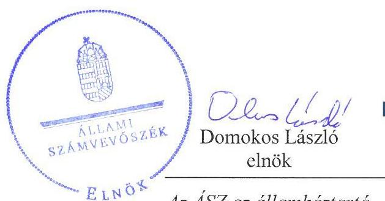
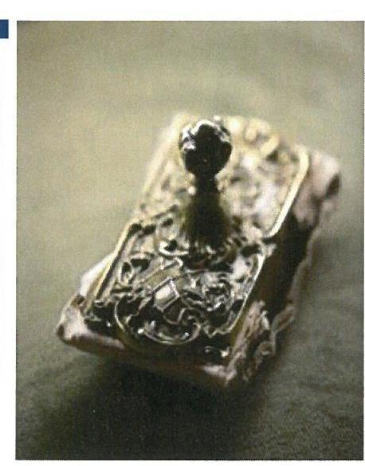
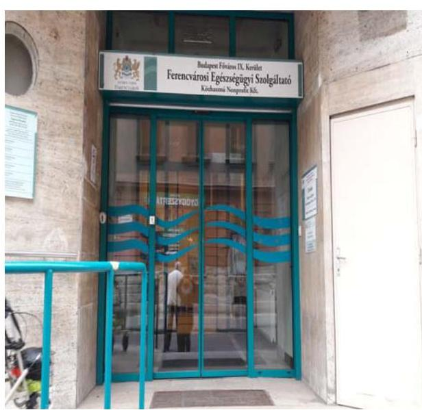
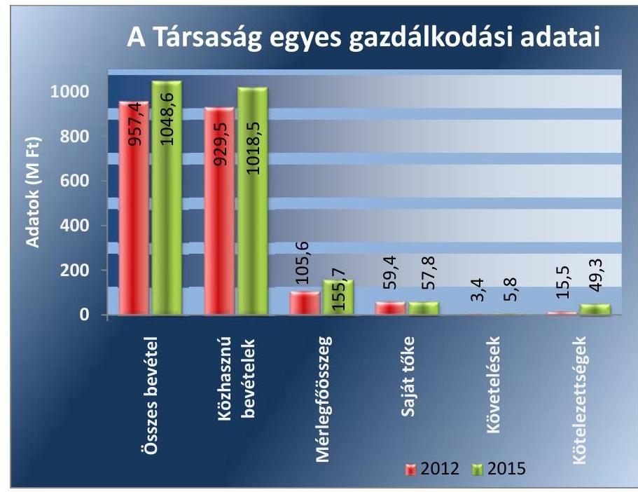
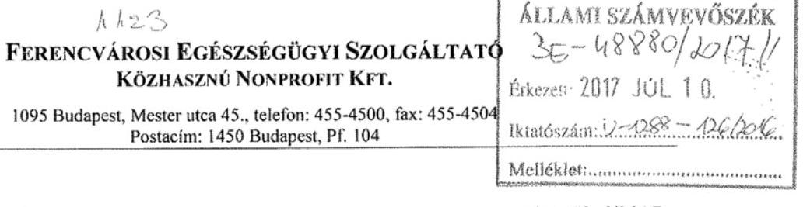
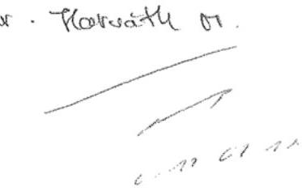
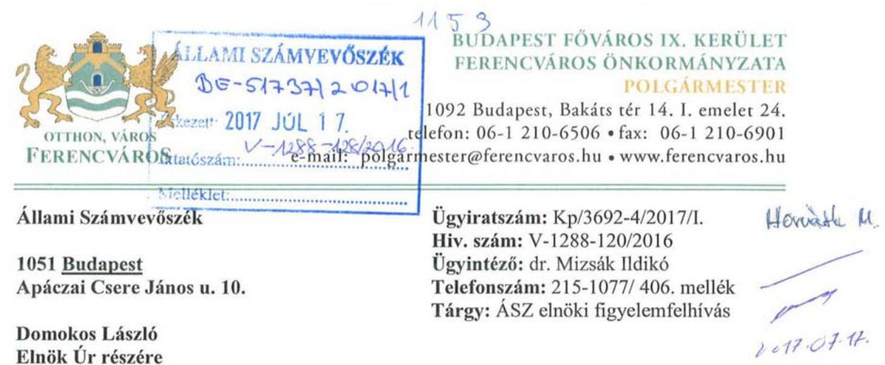
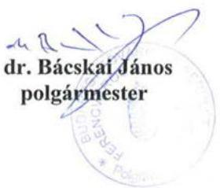

# Jelentés 

## Az önkormányzatok gazdasági társaságai

Az önkormányzatok többségi tulajdonában lévő gazdasági társaságok gazdálkodásának ellenőrzése - Ferencvárosi Egészségügyi Szolgáltató Közhasznú Nonprofit Kft.
2017.

Az ÁSZ az államháztartáson kívül működő feladat-ellátó rendszerek ellenőrzéseivel hozzájárul ahhoz, hogy a közpénzeket az államháztartáson kívül működő szervezetek is átlátható, rendezett módon használják fel a feladatok ellátása érde-

---

# Jelentés 

## Az önkormányzatok gazdasági társaságai

Az önkormányzatok többségi tulajdonában lévő gazdasági társaságok gazdálkodásának ellenőrzése - Ferencvárosi Egészségügyi Szolgáltató Közhasznú Nonprofit Kft.
2017. augusztus hó 15. nap

Az ÁSZ az államháztartáson kívül működő feladat-ellátó rendszerek ellenőrzéseivel hozzájárul ahhoz, hogy a közpénzeket az államháztartáson kívül működő szervezetek is átlátható, rendezett módon használják fel a feladatok ellátása érde-
kében.

---

# AZ ELLENŐRZÉST FELÜGYELTE: 

DR. HORVÁTH MARGIT felügyeleti vezető

## AZ ELLENŐRZÉST VEZETTE ÉS A VÉGREHAJTÁSÁÉRT FELELŐS:

KLINGA LÁSZLÓ ellenőrzésvezető

## A PROGRAM ÖSSZEÁLLÍTÁSÁÉRT FELELŐS:

JANIK JÓZSEF osztályvezető

IKTATÓSZÁM: V-1288-140/2016

TÉMASZÁM: 2322

## ELLENŐRZÉS-AZONOSÍTÓ SZÁM: V075813

Jelentéseink az Országgyűlés számítógépes hálózatán és az Interneten a www.asz.hu címen is olvashatóak.

---

# TARTALOMJEGYZÉK 

■ ÖSSZEGZÉS ..... 5
■ AZ ELLENŐRZÉS CÉLJA ..... 6
■ AZ ELLENŐRZÉS TERÜLETE ..... 7
■ AZ ELLENŐRZÉS HÁTTERE, INDOKOLTSÁGA ..... 9
■ A JELENTÉS LÉNYEGES KÉRDÉSKÖREI ..... 10
■ ELLENŐRZÉS HATÓKÖRE ÉS MÓDSZEREI ..... 11
■ MEGÁLLAPÍTÁSOK ..... 13
■ JAVASLATOK ..... 20
■ MELLÉKLETEK ..... 23
I. sz. melléklet: Értelmező szótár ..... 23
II. sz. melléklet: A Társaság mérlegadatainak alakulása 2012-2015 között ..... 24
III. sz. melléklet: A Társaság eredményének alakulása 2012-2015 között ..... 25
■ FÜGGELÉK: ÉSZREVÉTELEK ..... 27
■ RÖVIDÍTÉSEK JEGYZÉKE ..... 31

---

.

---

# ÖSSZEGZÉS 

Budapest Főváros IX. Kerület Ferencváros Önkormányzata a tulajdonosi jogait a 2012-2015. években összességében szabályszerűen gyakorolta. A Ferencvárosi Egészségügyi Szolgáltató Közhasznú Nonprofit Kft. vagyongazdálkodása összességében szabályszerű volt. A Társaság fizetőképessége biztosított volt. A Társaság belső szabályozása összességében megfelelt az előírásoknak. A Társaság önköltségszámítást a belső előírás ellenére nem végzett. A bevételek és ráfordítások elszámolása szabályszerű volt, azonban a beruházások, felújítások és az értékcsökkenési leírás elszámolása nem volt megfelelő.

## Az ellenőrzés társadalmi indokoltsága

Az Állami Számvevőszék kiemelt célja, hogy a helyi önkormányzatok gazdálkodásában rejlő pénzügyi kockázatok feltárásával, az államháztartáson kívülre nyújtott költségvetési támogatások és ingyenes vagyonjuttatások, valamint az államháztartáson kívül működő feladat-ellátó rendszerek ellenőrzéseivel hozzájáruljon ahhoz, hogy a közpénzeket az államháztartáson kívül működő szervezetek is átlátható, rendezett módon használják fel.

Az Állami Számvevőszék céljaival és a társadalmi igénnyel összhangban, a gazdasági társaságok kiemelt fontosságú szerepe miatt került sor a Ferencvárosi Egészségügyi Szolgáltató Közhasznú Nonprofit Kft ellenőrzésére.

## Főbb megállapítások, következtetések, javaslatok

Az Önkormányzat a tulajdonosi jogok gyakorlásának kereteit az Alapító Okiratban, annak gyakorlásának rendjét a Vagyongazdálkodási rendeletben és az Önkormányzati SZMSZ-ben szabályszerűen meghatározta. A tulajdonosi jogokat a Képviselő-testület szabályszerűen gyakorolta. A Képviselő-testület az üzleti terv készítési kötelezettséget a Feladat-ellátási szerződésben előírta a Társaság részére, a beszámoló elfogadásáról az FB írásbeli jelentésének és a könyvvizsgálói vélemény birtokában döntött. Az FB Ügyrendjét az előírások ellenére a Képviselő-testület nem hagyta jóvá, ezért az FB szabályszerű működésének feltételei nem voltak biztosítottak. Az Önkormányzat belső ellenőrzése a Társaságnál a 2012. évben végzett ellenőrzést.

A Társaság rendelkezett a Számv. tv. előírásainak megfelelő számviteli szabályzatokkal, azonban a számlarend tartalma nem felelt meg a Számv. tv.-ben előírtaknak. A saját vagyon nyilvántartása a jogszabályi és a belső előírásoknak összességében megfelelt. A Társaság fizetőképessége biztosított volt. A rövid lejáratú kötelezettségeinek az ellenőrzött időszakban döntően határidőben eleget tudott tenni. A Társaság a tervezési, beszámolási, adatszolgáltatási kötelezettségének határidőben eleget tett. A Társaság az Info tv.-ben előírt közzétételi kötelezettségét teljes körűen nem teljesítette, továbbá a közérdekű adatok megismerésére irányuló igények teljesítésének rendjét nem szabályozta.

A bevételeket a ráfordításokat összességében szabályszerűen számolták el. A beruházások, felújítások és az értékcsökkenési leírás elszámolása az üzembe helyezési okmány kiállításának elmaradása következtében nem volt megfelelő. A Társaság az Önköltségszámítási szabályzat előírása ellenére önköltségszámítást nem végzett. A Társaság az államadósságra befolyással bíró lízingszerződéseket kötött a 2012. évben 6,5 millió Ft összegben, amelyek nem feleltek meg a jogszabályi előírásoknak.

---

# AZ ELLENŐRZÉS CÉLJA 

AZ ELLENŐRZÉS CÉLJA annak értékelése volt, hogy az önkormányzat vagyongazdálkodási tevékenysége során szabályszerűen gyakorolta-e a tulajdonosi jogait.

Ellenőriztük, hogy a gazdasági társaság szabályozottsága, gazdálkodása és vagyongazdálkodási tevékenysége, bevételeinek és ráfordításainak elszámolása megfelelt-e a jogszabályi és tulajdonosi előírásoknak.

Értékeltük, hogy a gazdasági társaság kötelezettségállománya jelentett-e kockázatot a működésre, valamint a gazdálkodás átláthatósága és elszámoltathatósága érdekében biztosítva volt-e a szolgáltatás díjának megalapozottsága szabályszerű önköltségszámítással.

Az ellenőrzés célja továbbá annak megítélése volt, hogy az önkormányzatok többségi tulajdonában lévő gazdasági társaságok gazdálkodásának a kormányzati szektor hiányára és az államadósságra befolyással bíró elemei a jogszabályi előírásoknak megfeleltek-e.

---

# **AZ ELLENŐRZÉS TERÜLETE**

**Budapest Főváros IX. kerület Ferencváros Önkormányzata és a kizárólagos tulajdonában lévő Ferencvárosi Egészségügyi Szolgáltató Közhasznú Nonprofit Kft.**

**BUDAPEST FŐVÁROS IX. KERÜLET FERENCVÁROS ÖNKORMÁNYZATA** a 100%-os tulajdonában lévő Ferencvárosi Egészségügyi Szolgáltató Közhasznú Nonprofit Kft.-t a 15/2008. (I. 23.) számú határozatával, IX. Kerületi Szakrendelő Kft. néven hozta létre. A gazdasági társaságot tulajdonosi döntéssel 2009. évben kiemelkedően közhasznú szervezetté alakították. A Társaság¹ jegyzett tőkéje 10 millió Ft volt, ami az alapítás óta változatlan.

A Társaság az Önkormányzattal² kötött Feladat-ellátási szerződés alapján, a kerület 2015. január 1-jén 59 121 fős népességére kiterjedően, öt alapszakmában, (belgyógyászat, sebészet, nőgyógyászat, laboratórium és képalkotó diagnosztika), négy telephelyen elhelyezett járóbeteg szakrendeléseivel biztosította a közfeladat ellátását.

Az ellenőrzött időszak átlagában az éves betegforgalom 230 149 fő, a beavatkozások száma 1 016 121 db volt. A Társaság 2012-ben 190 fő, 2015-ben 192 fő alkalmazottat foglalkoztatott.

A Társaság egyes gazdálkodási adatait a 2012. és 2015. évek tekintetében az 1. ábra szemlélteti:

1. ábra

*Forrás: Társaság 2012-2015. évi beszámolói*

---

A mérlegfőösszeg a 2012. év végéről 2015. december 31-re 105,6 millió Ft-ról 155,7 millió Ft-ra, az összes bevétele 2012-ről 2015-re 957,4 millió Ft-ról 1048,6 millió Ft-ra emelkedett, míg a saját tőke összege 59,4 millió Ft-ról 57,8 millió Ft-ra csökkent.

Az ellátás finanszírozását az OEP³ és az Önkormányzat által nyújtott támogatás biztosította. Az Önkormányzat 2012-2015. években összesen 789,8 millió Ft működési célú, ezen felül 2012-ben 4,9 millió Ft, 2013-ban 15,0 millió Ft fejlesztési célú támogatást nyújtott a Társaságnak, a különféle szűrőprogramokat további 29,8 millió Ft-tal támogatta.

A polgármester⁴ személye az ellenőrzött időszakban nem változott, a jegyző⁵ személye 2014. november 1-jével változott. Az ügyvezető⁶ személye az ellenőrzött időszakban nem változott.

---

# AZ ELLENŐRZÉS HÁTTERE, INDOKOLTSÁGA 

AZ ÖNKORMÁNYZATOK TÖBBSÉGI TULAJDONÁBAN ÁLLÓ GAZDASÁGI TÁRSASÁGOK ellenőrzése kiemelten fontos a vagyon megőrzése, megóvása érdekében, valamint a kormányzati szektor elszámolásaiban megjelenő önkormányzati tulajdonú gazdálkodó szervezetek esetében, amelyekkel szemben alapvető követelmény, hogy gazdálkodásuk, működésük szabályszerű, az általuk szolgáltatott adatok minél megbízhatóbbak legyenek. A feladatellátás költségeinek, ráfordításainak alakulása a lakosság széles rétegét érinti.

Ellenőrzéseink feltárhatják, hogy az önkormányzat a feladatellátásához rendelt vagyon működtetését a tulajdonostól elvárható gondossággal végezte-e, a feladatot ellátó gazdasági társaság a létesítő okiratban, szolgáltatási szerződésben foglaltak betartásával biztosította-e a feladat ellátását. Az ellenőrzés eredményeképp meghatározhatóvá válnak a költségvetési hiányt befolyásoló szervezetek kockázatai, lehetővé válik ezen kockázatok csökkentése. Az ellenőrzés rávilágíthat arra, hogy a gazdasági társaság a vagyon használatával biztosította-e a szolgáltatás folytatásának feltételeit, az önkormányzat tulajdonosi felügyelete hozzájárult-e a szabályszerű gazdálkodáshoz és feladatellátáshoz. A megállapítások alapján megfogalmazott számvevőszéki javaslatok hasznosítása elősegítheti a meglévő hibák megszüntetését. A jó gyakorlatok bemutatásával az ÁSZ⁷ hozzájárulhat a követendő megoldások megismertetéséhez, terjesztéséhez.

---

# A JELENTÉS LÉNYEGES KÉRDÉSKÖREI 

1.     - Az önkormányzat tulajdonosi joggyakorlása szabályszerű volt-e?
2.     - A gazdasági társaság vagyongazdálkodása szabályszerű volt-e, fizetőképessége biztosított volt-e a gazdálkodás során?
3.     - A gazdasági társaság bevételeinek és ráfordításainak elszámolása, valamint az önköltségszámítás és árképzés szabályszerű volt-e?
4.     - A kormányzati szektorba sorolt, többségi önkormányzati tulajdonban lévő gazdasági társaságok gazdálkodásának a kormányzati szektor hiányára és az államadósságra befolyással bíró gazdasági eseményei megfeleltek-e a jogszabályi előírásoknak?

---

# ELLENŐRZÉS HATÓKÖRE ÉS MÓDSZEREI 

## Az ellenőrzés típusa

Megfelelőségi ellenőrzés.

## Az ellenőrzött időszak

Az ellenőrzött időszak 2012. január 1-jétől 2015. december 31-ig tartott.

## Az ellenőrzés tárgya

Az önkormányzatok - többségi tulajdonában lévő gazdasági társaságok feletti - tulajdonosi joggyakorlása, valamint a gazdasági társaságok gazdálkodásának szabályozottsága és szabályszerűsége.
Az ellenőrzés kiterjedt minden olyan körülményre és adatra, amely az ÁSZ jogszabályban meghatározott feladatainak teljesítéséhez, valamint a program végrehajtása folyamán felmerült újabb összefüggések feltárásához szükséges volt.

## Az ellenőrzött szervezet

Budapest Főváros IX. kerület Ferencváros Önkormányzata és a Ferencvárosi Egészségügyi Szolgáltató Közhasznú Nonprofit Korlátolt Felelősségű Társaság.

## Az ellenőrzés jogalapja

Az ellenőrzés jogszabályi alapját az ÁSZ tv. 1. § (3) bekezdése és 5. § (3)-(4)-(5) bekezdései képezték.

## Az ellenőrzés módszerei

Az ellenőrzést a nemzetközi standardokat irányadónak tekintve az ellenőrzési program ellenőrzési kérdései, az ellenőrzött időszakban hatályos jogszabályok, az ellenőrzés szakmai szabályok és módszertanok figyelembe vételével végeztük.

Az ellenőrzés ideje alatt az ellenőrzött szervezettel történő kapcsolattartást az ÁSZ Szervezeti és Működési Szabályzatának vonatkozó előírásai alapján biztosítottuk.

---

Az ellenőrzés a kiválasztott, többségi tulajdonosi jogokat gyakorló önkormányzatra, illetve az ellenőrzött gazdasági társaságra terjedt ki.

Az ellenőrzési kérdések megválaszolásához szükséges bizonyítékok megszerzése a következő ellenőrzési eljárások alkalmazásával történt: megfigyelés, kérdésfeltevés (információkérés), összehasonlítás, valamint elemző eljárás. Az ellenőrzési bizonyítékként felhasználható adatforrások közé tartoztak egyrészt az ellenőrzési programban felsorolt adatforrások, másrészt adatforrás lehetett még minden - az ellenőrzés folyamán - feltárt, az ellenőrzés szempontjából információkat tartalmazó dokumentum.

Az ellenőrzést a kérdésekre adott válaszok kiértékelésével, valamint a megjelölt adatforrások, a csatolt tanúsítványok felhasználásával, továbbá az adott időszakban hatályos jogszabályok figyelembe vételével folytattuk le.

A bevételek és ráfordítások elszámolása, valamint a vagyonnyilvántartás terén a szabályszerű működést véletlen mintavétellel ellenőriztük. A mintavétellel ellenőrzött területek esetében minden egyes tétel vonatkozásában a szabályszerűségre vonatkozó kérdéseket tettünk fel, amelyek eredménye összesítésre került. Megfelelőnek értékeltünk egy ellenőrzött területet, amennyiben 95%-os bizonyossággal a teljes sokaságban a hibaarány legfeljebb 10%, nem megfelelőnek, amennyiben 10%-nál magasabb arányt képviselt. Abban az esetben, ha a teljes sokaság tekintetében a 10%-os hibaarányhoz való viszony megítélésének megbízhatósága nem érte el a 95%-ot, annak elérése érdekében értékelésünket további szempontokkal egészítettük ki, és figyelembe vettük a feltárt hibák típusát és súlyát. A ráfordítások elszámolására és a vagyonnyilvántartásra vonatkozó véletlen mintavételt kockázati alapú kiválasztással egészítettük ki, amelynek során évente a három legnagyobb összegű tételt választottuk ki.

---

# 1. Az önkormányzat tulajdonosi joggyakorlása szabályszerű volt-e? 

Összegző megállapítás

Az Önkormányzat tulajdonosi joggyakorlása összességében szabályszerű volt.

### 1.1. számú megállapítás

Az Önkormányzat a tulajdonosi joggyakorlás kereteit szabályszerűen alakította ki.

Az Önkormányzat az Ötv.⁸ 91. § (1), illetve az Mötv.⁹ 116.§ (1) bekezdésének megfelelően rendelkezett egészségügyi célkitűzéseket is tartalmazó Gazdasági programmal¹⁰. Az Önkormányzat az Nvtv.
 ${ }^{11}$ 9.§ (1) bekezdésében előírtaknak megfelelve elkészítette a közép- és hosszú távú vagyongazdálkodási tervet, amely bemutatta a Társaság helyzetét.

## A TULAJDONOSI JOGOK GYAKORLÁSÁNAK KERETEIT az Önkormányzat a Társaság Alapító Okiratában ${ }_{1-5}{ }^{12}$ határozta meg, a Gt. ${ }^{13}$ és a Ptk. ${ }^{14}$ előírásaival összhangban. A részletes szabályokat a Vagyonrendeletben ${ }_{1,2}{ }^{15}$ és az Önkormányzat SZMSZ ${ }^{16}$-ében írta elő, amelyben a Képviselő-testület ${ }^{17}$ az Önkormányzat gazdasági társaságai esetében Bizottságai ${ }^{18}$ számára - Pénzügyi és Ellenőrzési Bizottság, Humán Ügyek Bizottsága - a Képviselő-testületi üléseket megelőzően véleményezési és javaslattételi jogot biztosított. A Képviselő-testület fenntartotta magának az FB${ }^{19}$ tagjainak a Társaság könyvvizsgálójának, az ügyvezető és más vezető állású munkavállalók megválasztásának, visszahívásának és javadalmazásának megállapítási jogát. A Vagyonrendelet a gazdasági társaság alapításával, képviseletével, ügyvezető, FB tagok választásával kapcsolatos előírásai az Alapító Okirat előírásaival összhangban voltak.

RENDELET-ALKOTÁSI KÖTELEZETTSÉGÉT az Önkormányzat a Társaság feladatellátásával kapcsolatosan az ágazati jogszabályoknak megfelelően - egészségügyi alapellátások körzeteinek, háziorvosi körzetek kialakítása - teljesítette.

A FELADATELLÁTÁST SZOLGÁLÓ VAGYONT az Önkormányzat a Társaság részére Feladat-ellátási szerződés ${ }_{1,2}{ }^{20}$ alapján biztosította, amelyben meghatározta a feladatellátáshoz kapcsolódó követelményeket is. A Feladat-ellátási szerződés ${ }_{1,2}$ csak a használatba adott ingatlanok körét határozta meg, amely mellett az Önkormányzat 629,5 millió Ft bruttó értékű eszközöket is (szoftvereket, számító- és irodagépeket, bútorokat és orvosi műszereket) térítésmentesen 2008-ban használatba adott. Az Önkormányzat a Társaság használatába adott ingó vagyontárgyakat szabályszerűen nyilvántartotta.

---

# 1.2. számú megállapítás 

A tulajdonosi jogok gyakorlása összességében szabályszerű volt. Az FB jóváhagyott ügyrenddel nem rendelkezett.

A TULAJDONOSI JOGOKAT az ügyvezető, az FB tagok és a könyvvizsgáló megválasztása és javadalmazása megállapítása során a Képviselő-testület szabályszerűen gyakorolta. Az ügyvezető tekintetében az egyéb munkáltatói jogokat a polgármester gyakorolta. A Bizottságok véleményezési és javaslattételi joggyakorlása a Képviselő-testület előírásainak megfelelően történt.

ÜZLETI TERVÉT a Társaság az ellenőrzött időszak minden évében elkészítette a Feladat-ellátási szerződés ${ }_{1,2}$-ben foglaltak szerint és a Képviselő-testületnek határidőben benyújtotta. Az üzleti terveket a Képviselő-testület minden esetben jóváhagyta.

AZ FB a Gt. és a Ptk. előírásainak megfelelően három tagból állt. Az ellenőrzött években megtárgyalta és véleményezte a Társaság üzleti tervét, éves beszámolóját és közhasznúsági mellékletét. Az FB a 2012-2015. években a Gt. 35. § (3) bekezdésében, illetve a Ptk. 3:120. § (2) bekezdésének megfelelően minden évben írásbeli jelentést készített a Társaság számviteli beszámolójáról.

Az FB a Képviselő-testület által jóváhagyott ügyrenddel - a Gt. 34. § (4) bekezdésében, illetve a Ptk. 3:122. § (3) bekezdésében előírtakkal ellentétben - nem rendelkezett, így az FB szabályszerű működésének feltételei nem voltak biztosítottak.

AZ ÉVES BESZÁMOLÓ elfogadásáról a Képviselő-testület az FB írásbeli jelentésének és a független könyvvizsgálói vélemény birtokában döntött. A mérleg szerinti eredményt a Képviselő-testület az éves beszámoló elfogadásával együtt jóváhagyta. A Társaság az ellenőrzött időszak minden évében veszteséges volt, amelynek összegeit a 2. ábra szemlélteti.

A JAVADALMAZÁSI SZABÁLYZATÁT a Képviselő-testület elfogadta, az a Taktv. ${ }^{21}$ 5. § (3) bekezdésében foglalt tartalmi előírásoknak megfelelt. A Javadalmazási szabályzat hatálya kiterjedt a Társaság FB tagjaira, ügyvezetőjére, helyettesére és más vezető állású munkavállalóira.

A TÁRSASÁG ELLENŐRZÉSÉT az Önkormányzat az Ötv. 92. § (11) bekezdés b) pontjában, illetve az Áht. ${ }^{22}$ 70. § (1) bekezdés d) pontjában kapott felhatalmazás alapján, a belső ellenőrzése útján a 2012. évben látta el. A 2010-2011. évek gazdálkodásának hatékonyságáról és a tulajdonosi elvárásnak való megfelelésről készült rendszerellenőrzési jelentés javaslataira a Társaság intézkedési tervet készített a hiányosságok megszüntetése érdekében.

---

# 2. A gazdasági társaság vagyongazdálkodása szabályszerű volt-e, fizetőképessége biztosított volt-e a gazdálkodás során? 

Összegző megállapítás

2.1. számú megállapítás

A Társaság vagyongazdálkodása összességében megfelelt a jogszabályi előírásoknak, fizetőképessége biztosított volt.

A Társaság működésének szabályozottsága összességében megfelelt a törvényi előírásoknak.

A Társaság az ellenőrzött időszakban rendelkezett a Számv. tv. ${ }^{23}$ 14. § (3) bekezdésében előírt Számviteli Politikával ${ }_{1,2}{ }^{24}$, a Számv. tv. 14. § (5) bekezdés a) és d) pontjaiban foglaltaknak megfelelően Leltározási szabályzattal ${ }_{1,2}{ }^{25}$, Pénzkezelési szabályzattal ${ }_{1-4}{ }^{26}$ és a Számv. tv. 161. § (1) bekezdésében előírt Számlarenddel ${ }_{1,2}{ }^{27}$. A Számv. tv. 14. § (5) bekezdés b) pontjában foglaltak ellenére Értékelési szabályzattal ${ }_{1,2}{ }^{28}$ 2012. augusztus 1-től rendelkezett. A Számv. tv. 14. §. (5) c) pontjának előírása ellenére az önköltségszámítás rendjére vonatkozó szabályzattal 2013. február 28-ig nem rendelkezett. Az Önköltségszámítási szabályzatát ${ }^{29}$ 2013. március 1-jével léptette hatályba, amelynek tartalma megfelelt a Számv. tv.-ben előírtaknak.

A SZÁMVITELI POLITIKA tartalmában megfelelt a Számv. tv. előírásainak.

ÉRTÉKELÉSI SZABÁLYZATTAL a Társaság a Számv. tv. 14. § (5) bekezdés b) pontja előírását megsértve 2012. július 31-ig nem rendelkezett, így az értékelés elveinek szabályait nem alakította ki. A 2012. augusztus 1-jétől hatályos értékelési szabályzat tartalma a Számv. tv. előírásainak megfelelt.

A LELTÁROZÁSI SZABÁLYZAT a Számv. tv. 69. § (1) bekezdésével összhangban előírta a mérlegtételek alátámasztásához az évenkénti leltár összeállítását. A mennyiségben is nyilvántartott eszközök - tárgyi eszközök - esetében két évenkénti mennyiségben történő leltározási kötelezettséget határoztak meg, amely megfelelt a Számv. tv. 69. § (3) bekezdése előírásának.

A PÉNZKEZELÉSI SZABÁLYZAT a Számv. tv. 14. § (8) bekezdésében előírt tartalmi követelményeknek megfelelt.

A SZÁMLAREND kialakítása nem felelt meg a Számv. tv. előírásainak, mert a Számv. tv. 161. § (2) bekezdés a) és b) pontjának előírása ellenére nem tartalmazta valamennyi - a Számlatükörben meghatározott - alkalmazásra kijelölt számla számjelét és megnevezését, a számla tartalmát, ha az a számla megnevezéséből egyértelműen nem következik, továbbá a számla értéke növekedésének, csökkenésének jogcímeit, a számlát érintő gazdasági eseményeket, azok más számlákkal való kapcsolatát.

A Társaság közhasznú tevékenysége mellett vállalkozási tevékenységet is folytatott. A Számv. tv. 161/A. § (1) és (2) bekezdés előírása ellenére - a számlarend hiányosságai következtében - belső szabályait nem alakította ki oly módon, hogy azok a mérleg és eredménykimutatás alátámasztásán

---

túlmenően a kiegészítő melléklet adatainak közvetlen alátámasztására is alkalmasak legyenek, azaz nem biztosította a közpénzek felhasználásának és a köztulajdon használatának nyilvánosságát és ellenőrizhetőségét, a Civil tv. ${ }^{30}$ 46. § (1) szerinti közhasznúsági melléklet készítési kötelezettség teljesítéséhez szükséges adatok előállíthatóságát és a Civil tv. 32. § által előírt, a közhasznúság feltételeinek való megfelelőség igazolhatóságát.

# 2.2. számú megállapítás 

A Társaság vagyongazdálkodása összességében megfelelt a jogszabályi és a belső szabályzatok előírásainak.

A SAJÁT VAGYON nyilvántartása a jogszabályi és belső szabályzatokban foglalt előírásoknak összességében megfelelt, a saját vagyonának értékét megőrizte, gyarapította.

A Társaság a Számv. tv. 69. § (2) bekezdése alapján a mérleg tételeinek alátámasztásához a főkönyvi könyvelés és az analitikus nyilvántartások közötti egyeztetést az üzleti év mérleg fordulónapjára vonatkozóan elvégezte. A Társaság a 2012. évben nem tett eleget a mennyiségben nyilvántartott tárgyi eszközei esetében a Leltározási szabályzatában előírt, kétévenkénti mennyiségi leltározási kötelezettségének. A 2014. évben a leltározási kötelezettségének a leltározási szabályzatában és a Számv. tv. előírásaiban foglaltaknak megfelelően eleget tett. A mennyiségben is nyilvántartott eszközei esetében a leltárba bekerülő adatok valódiságáról mennyiségi leltározással meggyőződött, illetve a csak értékben kimutatott eszközei és kötelezettségei esetében a leltározást egyeztetéssel elvégezte.

A mérleg főösszeg 2012. január 1-jéről 2015. december 31-re 120,2%-kal (85,0 millió Ft-tal) emelkedett, amelyet jellemzően a forgóeszközök és azon belül is a pénzeszközök csaknem tízszeresére (42,7 millió Ft-os) való növekedése eredményezett. Forrásoldalon a mérlegfőösszeg emelkedését elsősorban a rövid lejáratú kötelezettségek több, mint 12-szeresére (45,4 millió Ft-os) és a passzív időbeli elhatárolások több, mint hatszorosára (41,3 millió Ft-os) történő növekedése okozta.

Az ellenőrzött időszakban a Társaság rendelkezett a társasági formájára kötelezően előírt jegyzett tőkének megfelelő összegű saját tőkével, így az Önkormányzatnak a Gt. 51. § (1) bekezdés és a Ptk. 3:133. § (2) bekezdés szerinti intézkedési kötelezettsége nem keletkezett.

A Társaság mérlegadatainak alakulását a II., az eredményének alakulását a III. számú melléklet szemlélteti a 2012-2015. évek között.

BELSŐ ELLENŐRZÉSI KÖTELEZETTSÉGÉNEK a Társaság, mint - 2014. január 1-től - kormányzati szektorba sorolt egyéb szervezet a Bkr. ${ }^{31}$ előírásának megfelelően eleget tett, a 2014-2015. években azt külső erőforrás bevonásával biztosította. A belső ellenőrzési tevékenységet éves ellenőrzési tervek alapján végezték, melyek az ellenőrzött időszakban a vagyongazdálkodással kapcsolatban összesen 13 ellenőrzési feladatot - többek között beruházások, leltározás, pénzkezelés ellenőrzése - határoztak meg. Az ellenőrzések végrehajtásáról, állásáról havi gyakorisággal készültek jelentések, amelyek adott hónap megállapításait rögzítették. A javasolt intézkedések végrehajtását a belső ellenőrzés eseti jelleggel vizsgálta.

---

### 2.3. számú megállapítás

1. táblázat

A TÁRSASÁG KÖTELEZETTSÉGEI 2012.01.01.-2015.12.31. KÖZÖTT (MFT)

| Megnevezés | 2012. | 2015. |
| :-- | :--: | :--: |
| Szállítók | 3,8 | 22,3 |
| Egyéb rövid lej. köt. | 0,1 | 27,0 |
| Rövid lej. köt. | 3,9 | 49,3 |
| Hosszú lej. köt. | 0,0 | 0,0 |
| Összes köt. | 3,9 | 49,3 |

A Társaság fizetőképessége az ellenőrzött időszakban biztosított volt, a kötelezettségállomány növekedése a fizetőképességre nem jelentett veszélyt.

A FIZETŐKÉPESSÉG biztosított volt. A Társaság kötelezettségei a 2012. év elejéről a 2015. év végére több, mint 12-szeresükre, míg ezen belül a szállítói kötelezettségek közel hatszorosukra emelkedtek. Lejárt határidejű szállítói tartozással a Társaság az ellenőrzött időszakban nem rendelkezett.

A Társaság hosszú lejáratú kötelezettséggel - orvostechnikai berendezések beszerzésével kapcsolatos pénzügyi lízing - az ellenőrzött időszakban a 2012. év végén rendelkezett, mely pénzügyi rendezésének határidőben eleget tett.

Egyéb rövid lejáratú kötelezettségek jellemzően a december havi bérszámfejtés alapján levont adók és járulékok tekintetében a NAV ${ }^{32}$-val szemben fennálló kötelezettségek voltak.

A Társaság kötelezettségeinek állományát 2012. január 1-jén és 2015. december 31-én az 1. táblázat tartalmazza.

A Társaság az előírt beszámolási, adatszolgáltatási kötelezettségeinek eleget tett. Közzétételi kötelezettségének teljes körűen nem tett eleget, továbbá nem rendelkezett a közérdekű adatok megismerésére irányuló igények teljesítési rendjét rögzítő szabályzattal.

AZ ÉVES BESZÁMOLÓKAT, üzleti jelentéseket és közhasznúsági mellékleteket a Társaság a Számv. tv., a Civil tv., az Alapító Okirat, az SZMSZ, a Feladat-ellátási szerződés ${ }_{1,2}$ előírásainak megfelelően elkészítette. Az éves beszámolókat a Képviselő-testület elfogadta, amelyhez a Gt. 35. § (3) bekezdése, valamint a Ptk. 3:120. § (2) bekezdése szerinti FB jelentések és a Gt. 40. § (1) bekezdésének, illetve a Ptk. 3:129. § (1) bekezdésének megfelelő könyvvizsgálói jelentések rendelkezésre álltak.

Az ellenőrzött időszakban a Társaság gazdálkodása és tevékenysége nem adott okot az FB és a könyvvizsgáló számára, hogy a Gt. 35. (4), 44. § (2) bekezdései, illetve a Ptk. 3:121. § (3) bekezdése alapján kezdeményezze a legfőbb döntést hozó szerv összehívását.

A Társaság a 2012-2014. években az Info tv. ${ }^{33}$ 33. § (1) bekezdése és
 a 37. § (1) bekezdésében foglalt, az 1. mellékletben meghatározott tartalmú közzétételi kötelezettségének teljes körűen nem tett eleget, mert nem tette közzé az általános közzétételi lista III. Gazdálkodási adatok között az éves beszámolókat. Nem tette közzé a 2012-2015. években az Info tv. 1. melléklet Általános közzétételi lista II. Tevékenységre, működésre vonatkozó adatok közül a Társaság SZMSZ ${ }^{34}$-ét, továbbá az adatvédelmi és adatbiztonsági szabályzatát.

A Társaság Adatvédelmi és adatbiztonsági szabályzattal rendelkezett, a belső adatvédelmi nyilvántartási rendszert kialakította és a belső adatvédelmi felelőst kijelölte.

A Társaság az Info tv. 30. § (6) bekezdése előírása ellenére a közérdekű adatok megismerésére irányuló igények teljesítésének rendjét nem szabályozta.

---

# 3. A gazdasági társaság bevételeinek és ráfordításainak elszámolása, valamint az önköltségszámítás és árképzés szabályszerű volt-e? 

Összegző megállapítás

### 3.1. számú megállapítás

2. táblázat

A TÁRSASÁG BEVÉTELEI ÉS RÁFORDÍTÁSAI (MFT)

| Megnevezés | 2012 | 2015 |
| :-- | --: | --: |
| Összes bevétel | 957,4 | 1048,6 |
| Közhasznú bevétel | 929,5 | 1018,5 |
| ebből OEP bevételek | 582,0 | 799,3 |
| Ráfordítások | 957,5 | 1048,9 |

A bevételek és ráfordítások elszámolása megfelelt, a beruházások, felújítások és értékcsökkenés elszámolása nem felelt meg az előírásoknak. A Társaság az ellenőrzött időszakban önköltségszámítást nem végzett. A térítési díj ellenében igénybe vehető egészségügyi szolgáltatások térítési díját a jogszabályi előírásoknak megfelelően szabályzatban rögzítette.

A bevételek és ráfordítások elszámolása szabályszerű volt. A beruházások, felújítások és értékcsökkenés elszámolása nem felelt meg a jogszabályi előírásoknak.

A Társaság bevételei a 2012. évről 9,5%-kal, míg közhasznú és az OEP-től származó bevételei 9,6%-kal, illetve 37,3%-kal növekedtek. Az összes ráfordítás összege 9,5%-kal emelkedett. A bevételek és ráfordítások alakulását a 2. táblázat tartalmazza.

A BEVÉTELEK elszámolása szabályszerű volt, azokat a Számv. tv. 7277. §-ai előírásának megfelelően számolták el.

AZ ANYAGJELLEGŰ, EGYÉB, PÉNZÜGYI ÉS RENDKÍVÜLI RÁFORDÍTÁSOK elszámolása szabályszerű volt. Az anyagjellegű ráfordítások és egyéb ráfordítások elszámolása a Számv. tv. 78. § és 81. §-ának megfelelően történt.

A SZEMÉLYI JELLEGŰ RÁFORDÍTÁSOK és az azokat terhelő adók és járulékok elszámolása a jogszabályi előírásoknak megfelelően történt.

## A BERUHÁZÁSOK, FELÚJÍTÁSOK ÉS AZ ÉRTÉKCSÖKKENÉSI LEÍRÁS ELSZÁMOLÁSA nem felelt meg a

Számv. tv. 52. § (2) bekezdés előírásának, mert az eszközök üzembe helyezéséről üzembe helyezési okmányt a Társaság nem állított ki, ezért nem volt hitelt érdemlően dokumentált az eszközök üzembe helyezése. Ezért nem volt biztosított az értékcsökkenés elszámolási kötelezettség kezdő napja helyességének a megállapíthatósága.

A Társaság az ellenőrzött időszakban saját vagyona tekintetében összeségében nem hajtott végre az eszközök elhasználódási ütemét meghaladó értékű beruházást és felújítást. Az elszámolt értékcsökkenés összege 5,4%-kal (3,3 millió Ft-tal) haladta meg a beruházások és felújítások értékét, melynek részletes adatait a 3. táblázat tartalmazza.

A KÖVETELÉSÁLLOMÁNY az ellenőrzött időszakban összességében csökkenő tendenciájú volt. A követelésállomány jelentős részét a 2012-2014. években az adó- és járulék túlfizetések, a 2015. évben pedig

---

3.2. számú megállapítás

nagyrészt a vevőállomány tette ki. A vevőállomány növekedését jellemzően az egészségügyi szolgáltatásokat nyújtó vállalkozó orvosok részére kiszámlázott rendelő bérleti díjak, továbbszámlázott közüzemi díjak alkották. A határidőn túli vevőkövetelések esetében felszólító leveleket küldtek ki, illetve ügyvéd bevonásával jogi úton kezdeményezték a tartozások behajtását. A követelésekre vonatkozó adatokat a 4. táblázat tartalmazza.

A Társaság a jogszabályi előírás ellenére az önköltségszámítás rendjét csak 2013. március 1-től szabályozta, önköltségszámítást az ellenőrzött időszakban nem végzett. A térítési díj ellenében igénybe vehető egészségügyi szolgáltatások térítési díját a jogszabályi előírásoknak megfelelően szabályzatban rögzítette.

ÖNKÖLTSÉGSZÁMÍTÁS RENDJÉRE VONATKOZÓ
SZABÁLYZAT készítési kötelezettségének a Társaság 2013. február 28-ig nem tett eleget annak ellenére, hogy a Számv. tv. 14. § (6)-(7) bekezdései alapján az önköltségszámítás rendjére vonatkozó szabályzatkészítési kötelezettség alól nem mentesült. A 2013. március 1-től hatályos Önköltségszámítási szabályzat előírása ellenére - az egyedi beruházások és a bérbeadási tevékenysége során - önköltségszámítást nem végzett.

AZ EGYES EGÉSZSÉGÜGYI SZOLGÁLTATÁSOK
DÍJÁT a Társaság a térítési díj ellenében igénybe vehető egészségügyi szolgáltatások térítési díjáról szóló 284/1997. (VII. 14.) Korm. rendelet előírása alapján - annak 2. számú mellékletében nem szabályozott esetekre vonatkozóan - a térítési díjakról szóló szabályzatában rögzítette.

# 4. A kormányzati szektorba sorolt, többségi önkormányzati tulajdonban lévő gazdasági társaságok gazdálkodásának a kormányzati szektor hiányára és az államadósságra befolyással bíró gazdasági eseményei megfeleltek-e a jogszabályi előírásoknak? 

Összegző megállapítás

## 4.1. számú megállapítás

A Társaság által a 2012. évben kötött lízing-szerződések nem feleltek meg a jogszabályi előírásoknak.

A Társaság államadósságra befolyással bíró lízing-szerződéseket kötött a 2012. évben, amelyek nem feleltek meg a jogszabályi előírásoknak.

A Társaság fogorvosi eszközök használatára kötött 2012-ben öt lízing-szerződést, amelynek következtében a Stabilitási tv. ${ }^{35}$ 3. § (1) bekezdés d) pontja szerinti 6,5 millió Ft adóssága keletkezett. A 353/2011. (XII. 30.) Korm. rendelet ${ }^{36}$ 11. § (1) bekezdése és a Stabilitási tv. 9. § (1) bekezdése előírása ellenére nem rendelkezett a Képviselő-testület egyetértésével és az államháztartásért felelős miniszter hozzájárulásával a lízing-szerződés megkötéséhez. Az ügyletet a jogszabályi előírásoknak megfelelő főkönyvi számlán számolták el, amit érvényes szerződés nem támasztott alá.

---

# JAVASLATOK 

Az ÁSZ tv. 33. § (1) bekezdésében foglaltak értelmében az ellenőrzött szervezet vezetője köteles a jelentésben foglalt megállapításokhoz kapcsolódó intézkedési tervet összeállítani és azt a jelentés kézhezvételétől számított 30 napon belül az ÁSZ részére megküldeni. Amennyiben az ellenőrzött szervezet vezetője nem küldi meg határidőben az intézkedési tervet, vagy továbbra sem elfogadható intézkedési tervet küld, az Állami Számvevőszék elnöke az ÁSZ tv. 33. § (3) bekezdés a) és b) pontjaiban foglaltakat érvényesítheti.

Javaslataink célja a Ferencvárosi Egészségügyi Szolgáltató Közhasznú Nonprofit Kft. gazdálkodása szabályszerűségének és gyakorlatának javítása annak érdekében, hogy a szabályozási környezet és az alkalmazott gyakorlat megfelelően tudja támogatni az átlátható működést.

## A Ferencvárosi Egészségügyi Szolgáltató Közhasznú Nonprofit Kft. ügyvezetőjének

1. Intézkedjen a Társaság számlarendjének a Számv. tv.-nek megfelelő tartalommal történő kiegészítéséről, hogy az tartalmazza valamennyi alkalmazásra kijelölt számla számjelét és megnevezését, a számla tartalmát, ha az a számla megnevezéséből egyértelműen nem következik, továbbá a számla értéke növekedésének, csökkenésének jogcímeit, a számlát érintő gazdasági eseményeket, azok más számlákkal való kapcsolatát.
(2.1. sz. megállapítás 6. bekezdése alapján)
2. Intézkedjen az Info tv. szerinti közzétételi kötelezettség teljes körű teljesítéséről.
(2.4. sz. megállapítás 3. bekezdése alapján)
3. Intézkedjen a közérdekű adatok megismerésére irányuló igények teljesítésének rendjére vonatkozó szabályzat elkészítéséről az Info tv. előírásainak megfelelően.
(2.4. sz. megállapítás 5. bekezdése alapján)
4. Gondoskodjon az eszközök üzembe helyezésének hitelt érdemlő módon történő dokumentálásáról, a Számv. tv.-ben foglaltaknak megfelelően.
(3.1. sz. megállapítás 4. bekezdése alapján)

---

5. Intézkedjen az Önköltségszámítás rendjére vonatkozó szabályzatában meghatározott önköltség számítási feladatok maradéktalan ellátása érdekében.
(3.2. sz. megállapítás 1. bekezdése alapján)
6. Gondoskodjon arról, hogy a jövőben a Társaság államadósságra befolyással bíró szerződéseinek megkötésére a Stabilitási tv. és a vonatkozó kormányrendelet előírásai szerint az államháztartásért felelős miniszter hozzájárulásával és az Önkormányzat Képviselő-testületének egyetértésével kerüljön sor.
(4.1. sz. megállapítás 1. bekezdése alapján)

Javaslataink célja az Önkormányzat szabályszerű működésének elősegítése, továbbá az önkormányzati tulajdonosi joggyakorlás kontrolljainak erősítése.

# Budapest Főváros IX. Kerület Ferencváros Önkormányzata polgármesterének 

1. Terjessze a Képviselő-testület elé jóváhagyásra a Ptk. 2. előírása alapján a Társaság Felügyelő Bizottságának Ügyrendjét.
(1.2. sz. megállapítás 4. bekezdése alapján)

---

.

---

# MELLÉKLETEK 

- I. SZ. MELLÉKLET: ÉRTELMEZŐ SZÓTÁR
gazdasági társaság
gazdálkodó szervezet
nemzeti vagyon
nonprofit gazdasági társaság
vagyonkezelő
$\mathrm{Ptk}_{2} .3: 88$. § (1) bekezdése szerint „a gazdasági társaságok üzletszerű közös gazdasági tevékenység folytatására, a tagok vagyoni hozzájárulásával létrehozott, jogi személyiséggel rendelkező vállalkozások, amelyekben a tagok a nyereségből közösen részesednek, és a veszteséget közösen viselik".
A Ptk. ${ }^{37}$ 685. § c) pontja szerint gazdálkodó szervezet:
„az állami vállalat, az egyéb állami gazdálkodó szerv, a szövetkezet, a lakásszövetkezet, az európai szövetkezet, a gazdasági társaság, az európai részvénytársaság, az egyesülés, az európai gazdasági egyesülés, az európai területi együttműködési csoportosulás, az egyes jogi személyek vállalata, a leányvállalat, a vízgazdálkodási társulat, az erdő birtokossági társulat, a végrehajtói iroda, az egyéni cég, továbbá az egyéni vállalkozó." (2014. 03.15-ig hatályos)
Nvtv. 1. § (2) bekezdése szerint többek között:
„az állam vagy a helyi önkormányzat kizárólagos tulajdonában álló dolgok,
az a) pont hatálya alá nem tartozó, állam vagy a helyi önkormányzat tulajdonában lévő dolog,
az állam vagy a helyi önkormányzat tulajdonában lévő pénzügyi eszközök, továbbá az államot vagy a helyi önkormányzatot megillető társasági részesedések,
az államot vagy a helyi önkormányzatot megillető bármely vagyoni értékkel rendelkező jogosultság, amelyet jogszabály vagyoni értékű jogként nevesít."
Civil tv. 9/F. § (2) bekezdése szerint „az a gazdasági társaság minősül nonprofit gazdasági társaságnak és cégnevében az a gazdasági társaság tüntetheti fel a nonprofit jelleget, amelynek létesítő okirata tartalmazza, hogy a gazdasági társaság tevékenységéből származó nyereség a tagok között nem osztható fel, hanem az a gazdasági társaság vagyonát gyarapítja." (hatályos 2014. március 15-től)
vagyonkezelő:
a) az állam tulajdonában álló nemzeti vagyon tekintetében:
aa) költségvetési szerv,
ab) helyi önkormányzat, önkormányzati társulás,
ac) önkormányzati intézmény,
ad) köztestület,
ae) az állam, az aa)-ac) alpontban meghatározott személyek együtt vagy külön-külön 100%-os tulajdonában álló gazdálkodó szervezet,
af) az ae) alpont szerinti gazdálkodó szervezet 100%-os tulajdonában álló gazdálkodó szervezet,
ag) a törvény által kijelölt egyedileg meghatározott jogi személy.
b) a helyi önkormányzat tulajdonában álló nemzeti vagyon tekintetében:
ba) önkormányzati társulás,
bb) költségvetési szerv vagy önkormányzati intézmény,
bc) köztestület,
bd) az állam, a helyi önkormányzat, a ba)-bb) alpontban meghatározott személyek együtt vagy külön-külön 100%-os tulajdonában álló gazdálkodó szervezet,
be) a bd) alpont szerinti gazdálkodó szervezet 100%-os tulajdonában álló gazdálkodó szervezet.
c) az egyházi jogi személy a tevékenysége ellátásához szükséges nemzeti vagyon tekintetében. (Forrás: Nvtv. 3. § (1) bekezdés 19. pontja)

---

| Megnevezés | 2012.01.01 | 2012.12.31 | 2013.12.31 | 2014.12.31 | 2015.12.31 | Változás (2012.01.01 - 100%) |
|---|---|---|---|---|---|---|
| 1 | 2 | 3 | 4 | 5 | 6 | 7 |
| A. Befektetett eszközök | 37426 | 36806 | 29215 | 38625 | 33906 | -9,4% |
| I. Immateriális javak | 10636 | 5007 | 84 | 282 | 151 | -98,6% |
| II. TÁRGYI ESZKÖZÖK | 26790 | 31799 | 29131 | 38343 | 33755 | 26,0% |
| B. Forgóeszközök | 33168 | 68582 | 49475 | 29453 | 56340 | 69,9% |
| I. KÉSZLETEK | 6812 | 6281 | 3011 | 3112 | 2870 | -57,9% |
| II. KÖVETELÉSEK | 21357 | 3364 | 14593 | 8637 | 5797 | -72,9% |
| IV. PÉNZESZKÖZÖK | 4999 | 58937 | 31871 | 17704 | 47673 | 853,7% |

 C. Aktív időbeli elhatárolások | 110 | 214 | 32674 | 43948 | 65420 | 59 372,7\%  |
|  ESZKÖZÖK (AKTÍVÁK) ÖSSZESEN | 70704 | 105602 | 111364 | 112026 | 155666 | 120,2\%  |
|  D. SAJÁT TÖKE | 59494 | 59397 | 58332 | 58118 | 57808 | $-2,8 \%$  |
|  I. JEGYZETT TÖKE | 10000 | 10000 | 10000 | 10000 | 10000 | -  |
|  IV. EREDMÉNYTARTALÉK | 46211 | 49494 | 49397 | 48332 | 48118 | 4,1\%  |
|  VII. MÉRLEG SZERINTI EREDMÉNY | 3283 | $-97$ | $-1065$ | $-214$ | $-310$ | $-109,4 \%$  |
|  F. Kötelezettségek | 3907 | 15528 | 5814 | 3814 | 49298 | 1 161,8\%  |
|  II. HOSSZÚ LEJÁRATÚ KÖTELEZETTSÉGEK | 0 | 1616 | 0 | 0 | 0 | -  |
|  III. RÖVID LEJÁRATÚ KÖTELEZETTSÉGEK | 3907 | 13912 | 5814 | 3814 | 49298 | 1161,8\%  |
|  G. Passzív időbeli elhatárolások | 7303 | 30677 | 47218 | 50094 | 48560 | 564,9\%  |
|  FORRÁSOK (PASSZÍVÁK) ÖSSZESEN | 70704 | 105602 | 111364 | 122026 | 155666 | 120,2\%  |

Forrás: A Társaság 2012-2015. évek beszámolói

---

| Megnevezés | 2012.01.01. | 2012.12.31. | 2013.12.31. | 2014.12.31. | 2015.12.31. | Változás   (2012.01.01.-a   300\%) |
| :--: | :--: | :--: | :--: | :--: | :--: | :--: |
| 1 | 2 | 3 | 4 | 5 | 6 | 7 |
| I. Értékesítés nettó árbevétele | 676455 | 712800 | 987778 | 997360 | 1038952 | $53,6 \%$ |
| III. Egyéb bevételek | 237737 | 243240 | 2500 | 15765 | 6385 | $-97,3 \%$ |
| IV. Anyagjellegű ráfordítások | 347714 | 355751 | 348572 | 364311 | 367233 | $5,6 \%$ |
| V. Személyi jellegű ráfordítások | 546762 | 570076 | 613246 | 638333 | 663440 | $21,3 \%$ |
| VI. Értékcsökkenési leírás | 17301 | 16300 | 16817 | 13681 | 17597 | $1,7 \%$ |
| VII. Egyéb ráfordítások | 520 | 14976 | 13859 | 491 | 645 | $24,0 \%$ |
| Üzemi (üzleti) tevékenység eredménye | 1895 | $-1063$ | $-2216$ | $-3691$ | $-3578$ | $-288,8 \%$ |
| VIII. Pénzügyi műveletek bevételei | 1206 | 976 | 1342 | 900 | 401 | $-66,7 \%$ |
| IX. Pénzügyi műveletek ráfordításai | 0 | 395 | 336 | 50 | 0 | - |
| Pénzügyi műveletek eredménye | 1206 | 581 | 1006 | 850 | 401 | $-66,7 \%$ |
| X. Rendkívüli bevételek | 197 | 385 | 145 | 2627 | 2867 | $1355,3 \%$ |
| Rendkívüli eredmény | 197 | 385 | 145 | 2627 | 2867 | $1355,3 \%$ |
| Adózás előtti eredmény | 3298 | $-97$ | $-1065$ | $-214$ | $-310$ | $-109,4 \%$ |
| XII. Adófizetési kötelezettség | 15 | 0 | 0 | 0 | 0 | - |
| Adózott eredmény | 3283 | $-97$ | $-1065$ | $-214$ | $-310$ | $-109,4 \%$ |
| Mérleg szerinti eredmény | 3283 | $-97$ | $-1065$ | $-214$ | $-310$ | $-109,4 \%$ |
|  |  |  |  |  |  | Forrás: a Társaság 2012-2015. évi beszámolói |

---

.

---

# FÜGGELÉK: ÉSZREVÉTELEK 

A jelentéstervezetet a Számvevőszék 15 napos észrevételezésre megküldte az ellenőrzött szervezet vezetőjének az ÁSZ tv. 29. § (1) bekezdése előírásának megfelelően.
Budapest Főváros IX. Kerület Ferencváros Önkormányzat polgármestere, valamint a Ferencvárosi Egészségügyi Szolgáltató Közhasznú Nonprofit Kft. ügyvezetője nem tett érdemi észrevételt.

[^0]
[^0]:    * 29. § (1) Az Állami Számvevőszék az ellenőrzési megállapításait megküldi az ellenőrzött szervezet vezetőjének vagy az általa megbízott személynek, és annak, akinek személyes felelősségét állapította meg.
    (2) Az ellenőrzött szervezet vezetője és a felelősként megjelölt személy az ellenőrzés megállapításaira tizenöt napon belül írásban észrevételt tehet.
    (3) Az Állami Számvevőszék az észrevételre a beérkezésétől számított harminc napon belül írásban válaszol. A figyelembe nem vett észrevételeket köteles a jelentésben feltüntetni, és megindokolni, hogy azokat miért nem fogadta el.

---

Állami Számvevőszék
Domokos László
elnök

Budapest
Apáczai Csere János u. 10
1052

Tárgy: FESZ Kft. jelentéstervezet

Ikt.: 79-6/2017.

Tisztelt Elnök Úr!

Hivatkozással 2017. június 19-én kelt, V-1288-119/2016. számú, fenti tárgyban írt levelükre,
tájékoztatom, hogy a Ferencvárosi Egészségügyi Szolgáltató Közhasznú Nonprofit Kft. a
megküldött jelentéstervezetben foglaltakat tudomásul veszi, azokkal kapcsolatban észrevételt
tenni nem kíván.

Budapest, 2017. július 4.

Tisztelettel

Dr. Kovács József
ügyvezető igazgató

Ferencvárosi Egészségügyi Szolgáltató
Közhasznú Nonprofit Kft.
1095 Budapest, Mester u. 45.
Tel.: 455-4500, Fax: 455-4504
Adószám: 14192247-1-43

Honlap: www.feszrendelo.hu, e-mail: titkarsag@feszrendelo.hu
Bankszámlaszám: 12001008-00351227-00100007, adószám: 14192247-1-43

28

---

# Tisztelt Elnök Úr! 

A Ferencvárosi Egészségügyi Szolgáltató Közhasznú Nonprofit Kft. (Társaság) ellenőrzéséről készült számvevőszéki jelentés tervezetét köszönettel megkaptam, amelyre az alábbi tájékoztatást adom.

A jelentés tervezetben az Önkormányzat vonatkozásában tett megállapítások körében jelezni szeretném Elnök Úr részére, hogy a Képviselő-testület 2015. május 21. napján 179/2015. (V.21.) számú határozatával jóváhagyta a Társaság Felügyelő Bizottsági Ügyrendjét.
A vonatkozó előterjesztést, annak 3. számú mellékletét képező Felügyelő Bizottsági Ügyrendet, valamint a képviselő-testület döntését alátámasztó jegyzőkönyvi kivonatot mellékelten megküldöm további szíves intézkedés céljából.

Budapest, 2017. július 10
Tiszteltettel:

---

.

---

# RÖVIDÍTÉSEK JEGYZÉKE 

${ }^{1}$ Társaság
${ }^{2}$ Önkormányzat
${ }^{3}$ OEP
${ }^{4}$ Polgármester
${ }^{5}$ Jegyző
${ }^{6}$ Ügyvezető
${ }^{7}$ ÁSZ
${ }^{8}$ Ötv.
${ }^{9}$ Mötv.
${ }^{10}$ gazdasági program ${ }_{1,2}$
${ }^{11}$ Nvtv.
${ }^{12}$ Alapító Okirat ${ }_{1}$
Alapító Okirat ${ }_{2}$
Alapító Okirat ${ }_{3}$
Alapító Okirat ${ }_{4}$
Alapító Okirat ${ }_{5}$
${ }^{13}$ Gt.
${ }^{14}$ Ptk. ${ }_{2}$
${ }^{15}$ vagyonrendelet ${ }_{1}$
vagyonrendelet ${ }_{2}$
${ }^{16}$ Önkormányzati SZMSZ
${ }^{17}$ Képviselő-testület
${ }^{18}$ Bizottság
${ }^{19} \mathrm{FB}$
${ }^{20}$ Feladat-ellátási szerződés ${ }_{1}$

Feladat-ellátási szerződés ${ }_{2}$
${ }^{21}$ Taktv.
${ }^{22}$ Áht.
${ }^{23}$ Számv. tv.

Ferencvárosi Egészségügyi Szolgáltató Közhasznú NKft.
Budapest Főváros IX. kerület Ferencváros Önkormányzata
Országos Egészségbiztosítási Pénztár
Budapest Főváros IX. kerület Ferencváros Önkormányzata Polgármestere
Budapest Főváros IX. kerület Ferencváros Önkormányzata Jegyzője
Ferencvárosi Egészségügyi Szolgáltató Közhasznú NKft. ügyvezetője
Állami Számvevőszék
a helyi önkormányzatokról szóló 1990. évi LXV. törvény (hatályos: 2014. október 11-ig)
Magyarország helyi önkormányzatairól szóló 2011. évi CLXXXIX. törvény
Budapest Főváros IX. kerület Ferencváros Önkormányzatának gazdasági programja 2011-2014
Budapest Főváros IX. kerület Ferencváros Önkormányzatának Gazdasági Programja 2015-2019
a nemzeti vagyonról szóló 2011. évi CXCVI. törvény (hatályos: 2011. december 31-től)
Alapító Okirat, hatályos 2011. június 1 - 2012. július 3.
Alapító Okirat, hatályos 2012. július 4 - 2013. május 30.
Alapító Okirat, hatályos 2013. május 31 - 2014. november 30.
Alapító Okirat 2014. december 1 - 2015. július 20.
Alapító Okirat 2015. július 21-től
a gazdasági társaságokról szóló 2006. évi IV. törvény
a Polgári Törvénykönyvről szóló 2013. évi V. törvény
6/1997. (IV. 1.) rendelet a Ferencvárosi Önkormányzat vagyonáról és a vagyona feletti tulajdonosi jogok gyakorlásáról (hatályos 2012. június 30-ig)
21/2012. (VI. 12.) rendelet Budapest Főváros IX. kerület Ferencváros Önkormányzata vagyonáról, a vagyontárgyak feletti tulajdonosi jogok gyakorlásáról és a vagyongazdálkodás szabályairól (hatályos 2012.július 1-től)
Budapest Főváros IX. kerület Ferencváros Önkormányzata Képviselő-testületének 28/2011. (X. 11.) rendelete a Szervezeti és Működési Szabályzatról
Budapest Főváros IX. kerület Ferencváros Önkormányzatának Képviselő-testülete
Budapest Főváros IX. kerület Ferencváros Önkormányzat Képviselő-testületének Bizottságai
a Ferencvárosi Egészségügyi Szolgáltató Közhasznú NKft. Felügyelő Bizottsága
Budapest Főváros IX. kerület Ferencváros Önkormányzata és a Ferencvárosi Egészségügyi Szolgáltató Közhasznú NKft. által 2008. január 30-án kötött szerződés egészségügyi közfeladat átadásáról
Budapest Főváros IX. kerület Ferencváros Önkormányzata és a Ferencvárosi Egészségügyi Szolgáltató Közhasznú NKft. által 2013. február 26-án kötött Feladat-ellátási szerződés
a köztulajdonban álló gazdasági társaságok takarékosabb működéséről szóló 2009. évi CXXII. törvény
az államháztartásról szóló 2011. évi CXCV. törvény (hatályos: 2012. január 1-től) a számvitelről szóló 2000. évi C. törvény

---

${ }^{24}$ Számviteli politika $_{1}$

Számviteli politika $_{2}$
${ }^{25}$ Leltározási szabályzat $_{1}$

Leltározási szabályzat $_{2}$
${ }^{26}$ Pénzkezelési szabályzat $_{1}$

Pénzkezelési szabályzat $_{2}$
Pénzkezelési szabályzat ${ }_{3}$
Pénzkezelési szabályzat ${ }_{4}$
${ }^{27}$ Számlarend $_{1}$
Számlarend $_{2}$
${ }^{28}$ Értékelési szabályzat $_{1}$
Értékelési szabályzat $_{2}$
${ }^{29}$ Önköltségszámítási szabályzat
${ }^{30}$ Civil tv.
${ }^{31}$ Bkr.
${ }^{32}$ NAV
${ }^{33}$ Info tv.
${ }^{34}$ a Társaság SZMSZ-e
${ }^{35}$ Stabilitási tv.
${ }^{36}$ 353/2011. (XII. 30.) Korm. rendelet
${ }^{37}$ Ptk. 1
a Ferencvárosi Egészségügyi Szolgáltató Közhasznú NKft. Számviteli politikája (hatályos 2011. december 16-tól 2012. december 31-ig)
a Ferencvárosi Egészségügyi Szolgáltató Közhasznú NKft. Számviteli politikája (hatályos 2013. január 1-től)
a Ferencvárosi Egészségügyi Szolgáltató Közhasznú NKft. Leltározási és leltárkészítési szabályzata (hatályos 2010. május 1-től 2013. január 14-ig)
a Ferencvárosi Egészségügyi Szolgáltató Közhasznú NKft. Leltározási és leltárkészítési szabályzata (hatályos 2013. január 15-től)
a Ferencvárosi Egészségügyi Szolgáltató Közhasznú NKft. Pénzkezelési szabályzata (hatályos 2010. március 1-től 2012. május 31-ig)
a Ferencvárosi Egészségügyi Szolgáltató Közhasznú NKft. Pénzkezelési szabályzata (hatályos 2012. június 1-től 2012. december 31-ig)
a Ferencvárosi Egészségügyi Szolgáltató Közhasznú NKft.Pénzkezelési szabályzata (hatályos 2013. január 1-től 2015. szeptember 2-ig)
a Ferencvárosi Egészségügyi Szolgáltató Közhasznú NKft.Pénzkezelési szabályzata (hatályos 2015. szeptember 3-tól)
a Ferencvárosi Egészségügyi Szolgáltató Közhasznú NKft. Számlarendje (hatályos 2011. december 16-tól 2012. április 30-ig)
a Ferencvárosi Egészségügyi Szolgáltató Közhasznú NKft. Számlarendje (hatályos 2012. május 1-től)
a Ferencvárosi Egészségügyi Szolgáltató Közhasznú NKft. Eszközök és források értékelési szabályzata (hatályos 2012. augusztus 1-től 2013. január 14-ig)
a Ferencvárosi Egészségügyi Szolgáltató Közhasznú NKft. Eszközök és források értékelési szabályzata (hatályos 2013. január 15-től)
a Ferencvárosi Egészségügyi Szolgáltató Közhasznú NKft. Önköltségszámítási szabályzata (hatályos 2013. március 1-től)
az egyesülési jogról, a közhasznú jogállásról, valamint a civil szervezetek működéséről és támogatásáról szóló 2011. évi CLXXV. törvény
a költségvetési szervek belső kontrollrendszeréről és belső ellenőrzéséről szóló 370/2011. (XII. 31.) Korm. rendelet
Nemzeti Adó- és Vámhivatal
az információs önrendelkezési jogról és az információszabadságról szóló 2011. évi CXII. törvény
a Ferencvárosi Egészségügyi Szolgáltató Közhasznú NKft. Szervezeti és Működési Szabályzata
Magyarország gazdasági stabilitásáról szóló 2011. évi CXCIV. törvény
353/2011. (XII. 30.) Korm. rendelet az adósságot keletkeztető ügyletekhez történő hozzájárulás részletes szabályairól
a Polgári Törvénykönyvről szóló 1959. évi IV. törvény

---

ÁLLAMI SZÁMVEVŐSZÉK
1052 Budapest, Apáczai Csere János utca 10.
Levélcím: 1364 Budapest 4. Pf. 54
Telefon: +36 14849100 Telefax: +36 14849200
www.asz.hu

