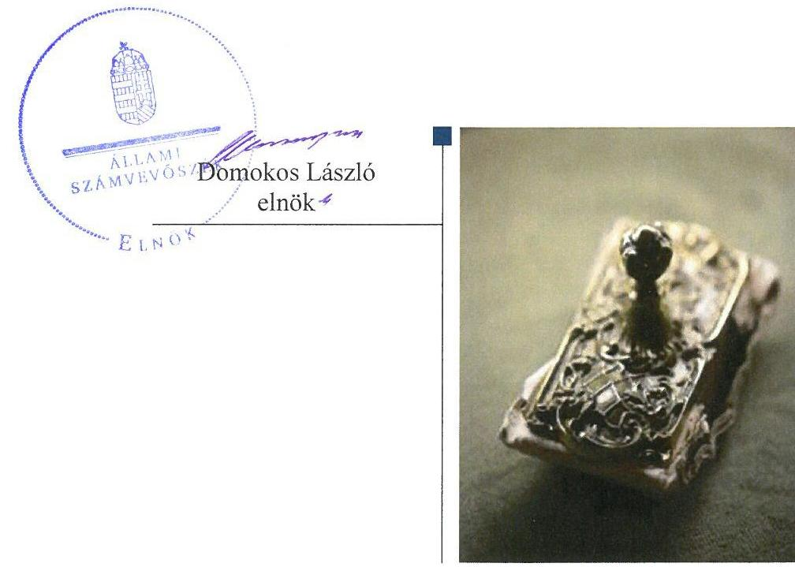
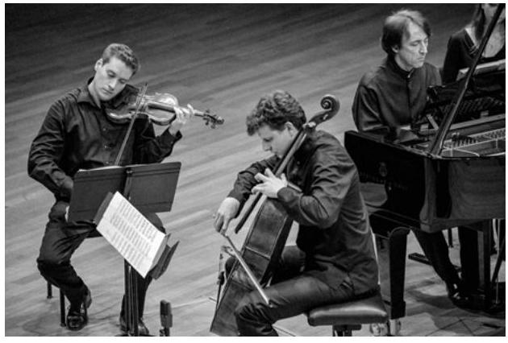
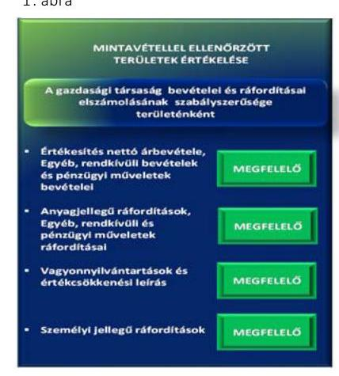
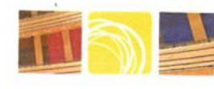
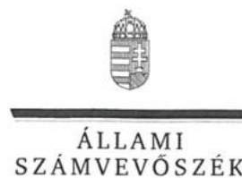
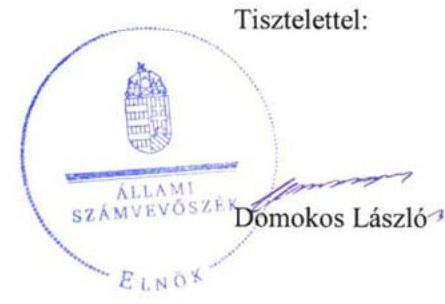
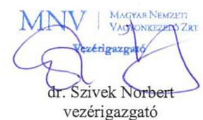
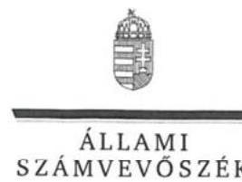
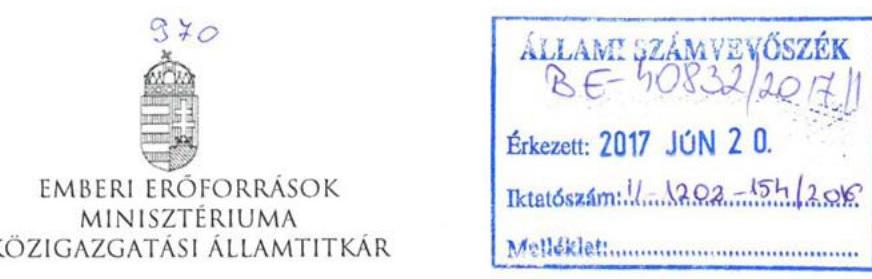

# Jelentés 

## Müpa Budapest Múvészetek Palotája Nonprofit Kft.

Az állami tulajdonban (résztulajdonban) lévő gazdálkodó szervezetek vagyonmegőrzési és gazdálkodási tevékenységének ellenőrzése 2017.

---

# Jelentés 

## Müpa Budapest Múvészetek Palotája Nonprofit Kft.

Az állami tulajdonban (résztulajdonban) lévő gazdálkodó szervezetek vagyonmegőrzési és gazdálkodási tevékenységének ellenőrzése
2017. 07 hó 31. nap

---

# AZ ELLENŐRZÉST FELÜGYELTE:

## MAKKAI MÁRIA felügyeleti vezető

## AZ ELLENŐRZÉST VEZETTE ÉS A VÉGREHAJTÁSÁÉRT FELELŐS:

### SALI SÁNDORNÉ ellenőrzésvezető

## A PROGRAM ÖSSZEÁLLÍTÁSÁÉRT FELELŐS:

### TÓTPÁL SZABOLCS osztályvezető

---

**IKTATÓSZÁM: V-1202-162/2016.**

**TÉMASZÁM: 2236**

**ELLENŐRZÉS-AZONOSÍTÓ SZÁM: V075913**

---

Jelentéseink az Országgyűlés számítógépes hálózatán és az Interneta a www.asz.hu címen is olvashatóak.

---

# TARTALOMJEGYZÉK 

■ ÖSSZEGZÉS ..... 5
■ AZ ELLENŐRZÉS CÉLJA ..... 6
■ AZ ELLENŐRZÉS TERÜLETE ..... 7
■ AZ ELLENŐRZÉS HÁTTERE, INDOKOLTSÁGA ..... 9
■ A JELENTÉS LÉNYEGES KÉRDÉSKÖREI ..... 10
■ ELLENŐRZÉS HATÓKÖRE ÉS MÓDSZEREI ..... 11
■ MEGÁLLAPÍTÁSOK ..... 13
■ JAVASLATOK ..... 18
■ MELLÉKLETEK ..... 19
I. Sz. melléklet: Értelmező szótár ..... 19
■ FÜGGELÉK: ÉSZREVÉTELEK ..... 23
■ RÖVIDÍTÉSEK JEGYZÉKE ..... 37

---

.

---

# ÖSSZEGZÉS 

Az Emberi Erőforrások Minisztériuma és a Magyar Nemzeti Vagyonkezelő Zrt. Müpa Budapest - Müvészetek Palotája Nonprofit Kft. feletti tulajdonosi joggyakorlása szabályszerű volt. A Társaság müködésének szabályozottsága összességében megfelelő volt. A vagyongazdálkodás és a pénzügyi-számviteli feladatok ellátása megfelelt az előírásoknak.

## Az ellenőrzés társadalmi indokoltsága

Az állami tulajdonú gazdálkodó szervezetek a nemzeti vagyon részét képezik. Az állami vagyonnal való gazdálkodást illetően a tulajdonosi joggyakorlás és a vagyongazdálkodás feladata az állami vagyon átlátható, rendeltetésszerű és felelős felhasználásának biztosítása. Az állam meghatározza az ellátandó közszolgáltatással kapcsolatos feladatokat, amelyhez a vagyonnal kapcsolatos döntéseknek igazodniuk kell. A nemzetgazdasági szempontból kiemelt jelentőségű nemzeti vagyonban tartandó állami tulajdonban álló társasági részesedést a nemzeti vagyonról szóló törvény határozza meg.

Az Állami Számvevőszék az általa korábban ellenőrizetlen területek, szervezetek körébe tartozó társaságnál végzett ellenőrzést. A számvevőszéki ellenőrzés hozzájárul a közpénzek szabályos, átlátható, elszámoltatható és eredményes felhasználásához, a rend pedig értéket teremt. Minden közpénzt, közvagyont használó szervezettel szemben társadalmi igény, hogy tevékenységükről elszámoljanak. Ezt figyelembe véve és az Állami Számvevőszék Stratégiájával összhangban került sor a Müpa Budapest - Művészetek Palotája Nonprofit Kft. ellenőrzésére a 2012-2015. évek vonatkozásában.

## Főbb megállapítások, következtetések

Az Emberi Erőforrások Minisztériuma társasági részesedés feletti tulajdonosi joggyakorlása megfelelt a jogszabályi előírásoknak. A Magyar Nemzeti Vagyonkezelő Zrt. a Társaság használatába adott nemzeti vagyon feletti tulajdonosi jogait szabályszerűen gyakorolta.

A Társaság múködését alapvetően szabályozták, ugyanakkor a közhasznúsági mellékletben kimutatott közvetlenül el nem számolható költségek, ráfordítások egyes tevékenységek közötti megosztásának, elszámolásának módját nem határozták meg. A Társaságnál a pénzügyi-számviteli és ellenőrzési feladatok ellátása szabályszerű volt. A bevételek és ráfordítások elszámolása az előírások szerint történt, a végzett szolgáltatások önköltségét az előírások szerinti utókalkulációval támasztották alá. A jogszabályi és belső szabályozásban előírt beszámolási és adatszolgáltatási kötelezettségét összességében szabályszerűen teljesítette. A Társaság a belső ellenőrzést szabályszerűen múködtette.

A Társaság vagyongazdálkodása szabályszerű volt, előírások szerint tartotta nyilván a vagyonát és a vagyon változást eredményező döntések az előírásoknak megfeleltek.

---

# AZ ELLENŐRZÉS CÉLJA 

Az ellenőrzés célja annak értékelése volt, hogy a tulajdonosi jogok gyakorlása szabályszerű volt-e; a gazdálkodó szervezet szabályozottsága, gazdálkodása és vagyongazdálkodási tevékenysége megfelelt-e a jogszabályi és a tulajdonosi előírásoknak, biztosítva volt-e a közfeladatok átláthatósága és elszámoltathatósága érdekében a közszolgáltatás díjának megalapozottsága szabályszerű önköltségszámítással; a vagyonváltozást eredményező döntések esetében a tulajdonosi jogok gyakorlója és a gazdálkodó szervezet szabályszerűen jártak-e el. A kormányzati szektorba sorolt állami tulajdonban lévő gazdálkodó szervezet gazdálkodásának a kormányzati szektor hiányára és az államadósságra befolyással bíró elemei a jogszabályi előírásoknak megfelelte-e.

---

# **AZ ELLENŐRZÉS TERÜLETE**

## **A Müpa Budapest - Művészetek Palotája Nonprofit Korlátolt Felelősségű Társaság**

A Müpa Nkft.^{1} a Magyar Állam kizárólagos tulajdonában álló közhasznú gazdasági társaság. Fő feladata a Művészetek Palotájának szakmai működtetése, kulturális programok szervezése, melyet saját és használatba kapott eszközökkel látta el.

A Társaságot 2001-ben hozta létre a Nemzeti Kulturális Örökség Minisztériuma a Művészetek Palotája szakmai működtetésére, törzstőkéje az ellenőrzött időszakban 25,0 M Ft^{2} volt. A részesedés feletti tulajdonosi jogok átengedéséről az MNV Zrt.^{3} az ellenőrzött időszakot megelőzően megállapodást kötött az Oktatási és Kulturális Minisztériummal, melynek elnevezése 2010-ben NEFMI^{4}-re, majd 2012-ben EMMI^{5}-re változott. Az EMMI – az Nvtv.^{6} előírásainak megfelelően – az MNV Zrt.-vel kötött megbízási szerződés alapján, megbízáson alapuló meghatalmazással gyakorolja a tulajdonosi jogokat.

A Társaság közhasznú tevékenysége kulturális előadó-művészet, továbbá film-, video-, televízió műsor gyártás, hangfelvétel készítése, kiadása, rádióműsor szolgáltatás és múzeumi tevékenység volt. Vállalkozási tevékenysége keretében a Müpa Nkft. többek között könyv-, folyóirat- és időszaki kiadvány kiadást, vendéglátást, tanácsadást, hirdetési és reklámtevékenységet végzett. A Társaságnál a legfőbb szerv hatáskörébe tartozó kérdésekben az egyedüli tag, az Alapító által kijelölt tulajdonosi joggyakorló döntött.

A Társaság ügyvezetését ugyanaz a személy látta el az ellenőrzött időszakban. Az átlagos statisztikai létszám 2015-ben 194 fő, az eszközök mérlegértéke 2015 végén 1 478,7 M Ft volt, a Társaság 2015-ben 1 314,5 M Ft nettó árbevételt realizált. A közhasznú, illetve a vállalkozási tevékenység árbevételét, valamint a közhasznú tevékenységhez kapott költségvetési támogatás évenkénti összegét, illetve a bevételeken belüli arányait az 1. táblázat mutatja be.

1. táblázat

|   | 2012.* | % | 2013. | % | 2014. | % | 2015. | %  |
| --- | --- | --- | --- | --- | --- | --- | --- | --- |
|  Közhasznú tevékenység árbevétele | 1 236,2 | 36,4 | 1 176,8 | 31,6 | 1 139,5 | 24,1 | 1 120,3 | 22,8  |
|  Vállalkozási tevékenység árbevétele | 249,9 | 7,5 | 259,1 | 7,0 | 212,2 | 4,4 | 194,2 | 4,0  |
|  Egyéb bevételek | 1 908,7 | 56,1 | 2 284,4 | 61,4 | 3 390,2 | 71,5 | 3 586,9 | 73,2  |
|  Ebből: közhasznú tevékenységhez kapott költségevetési támogatás | 1 588,5 | 46,8 | 1 873,0 | 50,3 | 2 940,6 | 62,0 | 3 206,4 | 65,4  |
|  Összesen | 3 394,8 | 100,0 | 3 720,3 | 100,0 | 4 741,9 | 100,0 | 4 901,4 | 100,0  |

*Forrás: a Müpa Nkft. 2012-2015. évi éves beszámolói, közhasznúsági mellékletei*

---

A Müpa Nkft. 2012. január 1-től 2014. december 31-ig az Áht. ${ }^{7}$ 2. § (1) bekezdés I) pontja, 2015. január 1-jétől az Áht. 1. § 12. pontja alapján a kormányzati szektorba sorolt egyéb szervezetek körébe tartozott.

---

# AZ ELLENŐRZÉS HÁTTERE, INDOKOLTSÁGA 

## Müpa Budapest - Müvészetek Palotája Nonprofit Korlátolt Felelősségü Társaság

Az ÁSZ ${ }^{8}$ alapvető célkitűzése, hogy az államháztartáson kívülre nyújtott költségvetési támogatások és ingyenes vagyon juttatások ellenőrzésével hozzájáruljon ahhoz, hogy a közpénzeket az államháztartáson kívül müködő szervezetek is átlátható, rendezett módon használják fel a szerződésben átvállalt állami feladatok ellátása érdekében.

Az ellenőrzés feladata a közvagyonnal biztosított közfeladat-ellátással kapcsolatban a közpénzek átláthatósága, nyilvánossága érdekében a jogszabályokban, belső szabályzatokban megfogalmazott előírások érvényesülésének az állami tulajdonban lévő gazdálkodó szervezetek vagyonértékmegőrzési és gazdálkodási tevékenységének értékelése.

Az ellenőrzés várható hasznosulásaként az ellenőrzés megállapításai a jogalkotás számára segítséget nyújthatnak az államháztartáson kívüli köz-feladat-ellátás, közvagyonnal való gazdálkodás értékeléséhez, jogszabályi keretei pontosításához, az átláthatóságot biztosító szabályozáshoz. Az ellenőrzöttek számára visszajelzést ad a gazdálkodási tevékenységgel, az állami vagyon felhasználásával, a közszolgáltatási árképzés megalapozottságával és az éves elszámolással kapcsolatos szabálytalanságokról és kockázatokról. Az ellenőrzés tapasztalatai segítik és erősítik az ÁSZ hozzáadott értéket teremtő elemző tevékenységét és tanácsadó szerepét.

---

# A JELENTÉS LÉNYEGES KÉRDÉSKÖREI 

1.     - A tulajdonosi jogok gyakorlása szabályszerű volt-e?
2.     - A Társaság müködésének szabályozottsága megfelelt-e az elöírásoknak?
3.     - A Társaságnál a pénzügyi-számviteli, adatszolgáltatási és ellenőrzési feladatok ellátása szabályszerű volt-e?
4.     - A Társaság vagyongazdálkodása szabályszerű volt-e?

---

# ELLENŐRZÉS HATÓKÖRE ÉS MÓDSZEREI 

## Az ellenőrzés típusa

Megfelelőségi ellenőrzés.

## Az ellenőrzött időszak

2012. január 1-jétől 2015. december 31-ig.

## Az ellenőrzés tárgya

Az állami tulajdonban lévő gazdasági társaság gazdálkodása, kiemelten vagyongazdálkodási tevékenysége, valamint a tulajdonosi jogok gyakorlása.

## Az ellenőrzött szervezet

A Müpa Budapest - Művészetek Palotája Nonprofit Kft., valamint az Emberi Erőforrások Minisztériuma és a Magyar Nemzeti Vagyonkezelő Zrt., mint tulajdonosi joggyakorlók.

## Az ellenőrzés jogalapja

Az Állami Számvevőszékről szóló 2011. évi LXVI. törvény 5. § (3)-(5) bekezdései.

## Az ellenőrzés módszerei

Az ellenőrzést a nemzetközi standardokat irányadónak tekintve az ellenőrzött időszakban hatályos jogszabályok, az ellenőrzés szakmai szabályok és módszertanok figyelembevételével végeztük.

Az ellenőrzési kérdések megválaszolásához szükséges bizonyítékok megszerzése az ellenőrzött által rendelkezésre bocsátott dokumentumokra, adatokra alapozva kérdésfelvetés, mintavételezés, ellenőrzési eljárások útján történt.

Az ellenőrzési bizonyítékként felhasználható adatforrások közé tartoztak egyrészt a szakmai program részletes szempontjainál felsorolt adatforrások, másrészt minden egyéb - az ellenőrzés folyamán feltárt, az ellenőrzés szempontjából információkat tartalmazó - dokumentumok.

---

Az ellenőrzés lefolytatásához a gazdálkodó szervezet a tanúsítványok elektronikus kitöltésével, valamint az ÁSZ által kért dokumentumok megküldésével szolgáltatott adatokat.

A kormányzati szektorba sorolt gazdálkodó szervezetnél a személyi jellegű ráfordítások elszámolása mellett az egyéb ráfordítások, pénzügyi műveletek ráfordításai, rendkívüli ráfordítások, illetve az egyéb bevételek, pénzügyi műveletek bevételei, rendkívüli bevételek elszámolásának szabályszerűségét szintén mintatételeken keresztül ellenőriztük.

A bevételek és ráfordítások elszámolása, valamint a vagyonnyilvántartás terén a szabályszerű működést véletlen mintavétellel és irányított kiválasztással ellenőriztük. A mintatételek értékelése alapján egyrészt a sokaságban előforduló hibás tételek arányát becsültük, másrészt az irányítottan kiválasztott tételeket értékeltük. A jogszabályoknak és a belső előírásoknak megfelelőnek, azaz szabályszerűnek tekintettük az adott területet, amenynyiben a minta ellenőrzésének eredménye alapján 95\%-os bizonyossággal a teljes sokaságban a hibaarány kisebb volt, mint 10\%, nem megfelelőnek értékeltük, ha a hibaarány a 10\%-ot meghaladta. A ráfordítások elszámolására és a vagyonnyilvántartásra vonatkozó véletlen mintavételt kockázati alapú kiválasztással egészítettük ki, amelynek során évente a három legnagyobb összegű tételt választottuk ki.

---

# 1. A tulajdonosi jogok gyakorlása szabályszerű volt-e? 

## Összegző megállapítás

### 1.1. számú megállapítás

### 1.2. számú megállapítás

## A tulajdonosi jogok gyakorlása szabályszerű volt.

Az EMMI társasági részesedése feletti tulajdonosi joggyakorlása megfelelt a jogszabályi előírásoknak.

A TULAJDONOSI JOGGYAKORLÁS szabályait a Gt. ${ }^{9}$ és a Ptk. ${ }^{10}$ előírásaival összhangban lévő Alapító Okiratban ${ }^{11}$ határozta meg a tulajdonosi joggyakorló ${ }_{1}{ }^{12}$. A tulajdonosi joggyakorló ${ }_{1}$ kizárólagos hatáskörébe tartozott egyebek mellett az éves üzleti terv, a számviteli beszámoló, és a közhasznúsági beszámoló elfogadása, döntés az eredményfelosztásról, a könyvvizsgáló és az $\mathrm{FB}^{13}$ tagok kijelölése, visszahívása, díjazásuk megállapítása, az FB ügyrendjének elfogadása. A tulajdonosi joggyakorlás az FB, illetve a könyvvizsgáló tevékenységéhez kapcsolódóan szabályszerű volt.

AZ ÉVES BESZÁMOLÓKAT a Müpa Nkft. 2012-2015. évi gazdálkodásáról a tulajdonosi joggyakorló ${ }_{1}$ a Gt., illetve a Ptk., valamint az Alapító Okirat előírásainak megfelelően az FB, illetve a könyvvizsgáló írásbeli jelentésének birtokában hozott határozattal fogadta el.

KÖZHASZNÚ FELADATAI ellátásához évente működési támogatást kapott a Müpa Nkft. A tulajdonosi joggyakorló ${ }_{1}$ támogatási szerződés keretében előírta a támogatás összegével történő elszámolást. Kötelezte továbbá a Társaságot üzleti terv készítésére, melyet a Társaság elkészített és a tulajdonosi joggyakorló ${ }_{1}$ határozattal hagyott jóvá.

AZ ANYAGI ÉRDEKELTSÉGI RENDSZER elemeit a tulajdonosi joggyakorló ${ }_{1}$ által alkotott javadalmazási szabályzat ${ }_{1-3}{ }^{14}$-ban rögzítették. A szabályzatok a Taktv. ${ }^{15}$ előírásainak megfelelően rendelkeztek a vezető tisztségviselők, FB tagok, valamint a vezető állású munkavállalók javadalmazása, a jogviszony megszűnése esetére biztosított juttatások módjának, mértékének elveiről, annak rendszeréről.

Az MNV Zrt. a Társaság használatába adott nemzeti vagyon feletti tulajdonosi jogait szabályszerűen gyakorolta.

A tulajdonosi joggyakorló ${ }_{1}{ }^{16}$ és a Müpa Nkft. használati megállapodást ${ }^{17}$ kötöttek egy, a Magyar Állam tulajdonában lévő ingatlan Müpa Nkft. általi, közfeladat ellátás érdekében történő használatára és továbbhasznosítására. Az ingatlanon a Társaság átmeneti előadó-művészeti helyszínt hozott létre, illetve parkolási lehetőséget biztosított a Művészetek Palotája előadásait látogatók részére. A 2014-ben kötött szerződés tartalma megfelelt a Vtv. ${ }^{18}$, illetve az Nvtv. vonatkozó előírásainak.

---

# 2. A Társaság múködésének szabályozottsága megfelelt-e az elöírásoknak? 

Összegző megállapítás

A Társaság múködésének szabályozása összességében megfelelt a jogszabályi előírásoknak.

A Társaság rendelkezett a Számv. tv.-ben előírt számviteli politikával ${ }^{19}$, annak keretében elkészített eszközök és források értékelési szabályzatával ${ }^{20}$, eszközök és források leltárkészítési és leltározási szabályzatával ${ }^{21}$, pénzkezelési szabályzattal ${ }^{22}$, továbbá számlarenddel ${ }^{23}$. Az elkészített szabályzatok a számviteli politika ${ }_{2-4}$ és a pénzkezelési szabályzat ${ }_{1}$ kivételével megfeleltek a Számv. tv.-ben foglaltaknak.

A SZÁMVITELI POLITIKA ${ }_{2-4}$ és a Számv. tv. előírásai közötti összhang nem volt biztosított, mivel a Számv. tv. 3. § (3) bekezdés 3. pontja szerinti jelentős hiba összeghatárának 2013. január 1-jei változása (500,0 M Ft-ról 1,0 M Ft-ra csökkenése) vonatkozásában a szabályozást nem aktualizálták.

A Számviteli politika ${ }_{4}$ 2015. évben az immateriális javak körébe tartozó kép és hang archívum értékcsökkenése elszámolásának szabályozása tekintetében nem felelt meg a Számv. tv. 52. § (1), (2) bekezdésében foglalt előírásnak. Az évenként elszámolható értékcsökkenés meghatározásakor az első évben tervezett 60\% (degresszív leírás) elszámolását terv szerinti értékcsökkenés helyett terven felüli értékcsökkenési leírásként írták elő.

A PÉNZKEZELÉSI SZABÁLYZAT ${ }_{1}$ a Számv. tv. 14. § (8) bekezdésének előírása ellenére nem tartalmazta a házipénztárban tartható napi készpénz záró állomány maximális mértékét. A Pénzkezelési szabályzat 2012. november 1-jei hatályba helyezésével a hiányosságot megszüntették.

A KÖZHASZNÚSÁGI TEVÉKENYSÉGHEZ kapcsolódóan a közhasznúsági melléklet elkészítéséhez a közhasznú tevékenység ráfordításainak a nyilvántartását hiányosan szabályozta a Társaság. A Számv. tv. 14. § (3) bekezdésében foglaltak ellenére a számviteli politika teljes körűen nem határozta meg a közvetlenül el nem számolható költségek, ráfordítások egyes tevékenységek közötti megosztásának módszerét.

A szabályozási hiányosság ellenére az éves beszámolókhoz készített közhasznúsági mellékletekben a Müpa Nkft. rögzítette, hogy a közvetett költségeket árbevétel arányosan osztották fel.

---

# 3. A Társaságnál a pénzügyi-számviteli, adatszolgáltatási és ellenőrzési feladatok ellátása szabályszerű volt-e? 

## Összegző megállapítás

### 3.1. számú megállapítás

1. ábra

2. táblázat

KÖVETELÉSEK ÉV VÉGÉN 2012-2015. (M FT)

| Év | Köve-   telé-   sek   VÉGÖK | Lejárt követelések   0sz-   megis | aránya |
| :--: | :--: | :--: | :--: |
| 2012. | 167,4 | 73,2 | $43,7 \%$ |
| 2013. | 155,5 | 92,8 | $59,7 \%$ |
| 2014. | 182,7 | 94,1 | $51,5 \%$ |
| 2015. | 177,7 | 74,3 | $41,8 \%$ |
| Forrás: A Társaság adatszolgáltatása |  |  |  |

3.2. számú megállapítás

A pénzügyi-számviteli, adatszolgáltatási és ellenőrzési feladatok ellátása összességében szabályszerű volt.

A bevételek és ráfordítások elszámolása során a jogszabályi és belsőszabályozás előírásait betartották.

A BEVÉTELEK ELSZÁMOLÁSA megfelelt a jogszabályi és belső szabályozásban foglalt előírásoknak. Az értékesítés nettó árbevétele, az egyéb, rendkívüli és pénzügyi műveletek bevétele kiszámlázása, főkönyvi számlákra történő elszámolása megfelelt a Számv. tv.-ben, a belső szabályozásban és a használati megállapodásban előírtaknak. A Társaság a kapott támogatások felhasználásáról a támogatási szerződésnek megfelelően beszámolt. A mintavétellel ellenőrzött területek értékelését az 1. ábra mutatja.

A RÁFORDÍTÁSOK ELSZÁMOLÁSA megfelelt a jogszabályi és belső szabályozásban foglalt előírásoknak. Az anyagjellegú ráfordítások, valamint az egyéb, rendkívüli és pénzügyi műveletek ráfordításai esetében az elszámolást megalapozó dokumentumok rendelkezésre álltak. A ráfordítások elszámolása a számviteli bizonylatok alapján, a szerződés szerinti teljesítéssel, a megfelelő főkönyvi számlákra történt. A személyi jellegű ráfordítások elszámolását megalapozó dokumentumok rendelkezésre álltak. A munkabérek kifizetését munkaszerződés alapján a jogszabályi előírásoknak megfelelő levonások alkalmazásával teljesítették. A személyi jellegű egyéb, illetve cafetéria kifizetésekre a belső szabályzatok előírásaival összhangban került sor. Az értékcsökkenés elszámolása megfelelt a Számv. tv. és a számviteli politika1-3 előírásainak.

A követelések beszedése érdekében megtett intézkedésekről a Társaság évente beszámolót készített. A vevőkkel szembeni követelések, illetve lejárt vevőtartozások alakulását a 2. táblázat mutatja be.

## A szolgáltatások díjait a belső szabályozásban előírt önköltségszámítással megalapozták.

AZ ÖNKÖLTSÉGSZÁMÍTÁS feltételeinek kialakítása szabályszerű volt. A szabályozás kiterjedt a produkció jegyárak, a kiadványok, értékesítésre szánt termék árak, valamint a helyiség és eszköz használati díjak meghatározásának elveire. A termékek, szolgáltatások önköltségét az Önköltségszámítási szabályzat1-3 ${ }^{24}$-ban előírt utókalkulációval, a Számviteli politika ${ }_{1-4}$-ben előírtak szerint kialakított költséghelyek, munkaszámok alkalmazásával határozták meg.

Az üzleti terv készítése során előkalkulációt végeztek a kulturális programok önköltségének meghatározására. A produkciók költségeinek tervezett forrása az alapító által nyújtott múködési támogatás és a tervezett jegybevételek együttes összege volt. A helyiségek, valamint az eszközök

---

használatba, bérbe adása, a kiadványok értékesítése során a piaci viszonyok figyelembevételével határozták meg az önköltségszámításon alapuló árakat, díjakat.

# 3.3. számú megállapítás 

A Társaság összességében teljesítette beszámolási, adatszolgáltatási kötelezettségét.

AZ ÉVES BESZÁMOLÓKAT a Társaság a Számv. tv.-ben előírt tartalommal készítette el, azokat a könyvvizsgáló hitelesítő záradékkal látta el. Az éves beszámolók letétbe helyezése az előírt határidőben megtörtént, közzétételi kötelezettségét teljesítette a Társaság. A közhasznúsági mellékletet a Civil tv. előírásainak megfelelően készítették el.

A Társaság az Info tv. ${ }^{25}$-ben és a közérdekú adatok közzétételéről szóló szabályzatában foglaltakat betartotta, a honlapján közzétette a szervezetére, tevékenységére, múködésére és gazdálkodására vonatkozó adatokat.

A Társaság, mint kormányzati szektorba sorolt egyéb szervezet az Áht. 107. § (1) bekezdése alapján fennálló, Ávr. ${ }^{26}$-ben meghatározott tartalmú adatszolgáltatási kötelezettségét az MNV Zrt. felé teljesítette, annak ellenére, hogy 2014. december 31-ig az Ávr. 7. melléklete, 2015. január 1-től az 5. melléklete szerint az adatszolgáltatások címzettje az államháztartásért felelős miniszter volt. Az éves beszámoló adatokkal, valamint a várható éves teljesítési adatokkal kapcsolatos adatszolgáltatás tartalmát 2014. december 31-ig az Ávr. 7. számú mellékletének 28., 29. pontja, 2015. január 1-től az Ávr. 5. számú mellékletének 23., 24. pontja írta elő. Nem szabályszerűen teljesítették továbbá az Áht. 107. § (1) bekezdésben előírtak ellenére a 2014. február 25-én kötött pénzügyi lízing szerződés vonatkozásában az adósságot keletkeztető ügylet értékéről az Ávr. 7. számú melléklet 2. pontjában, 2015. január 1-jéről az Ávr. 5. számú melléklet 3. pontjában előírt tartalmú adatszolgáltatási kötelezettséget.

## 3.4. számú megállapítás

A belső ellenőrzés a vagyongazdálkodást, a tulajdonosi ellenőrzés a támogatásfelhasználást ellenőrizte.

A Társaság a Bkr. ${ }^{27}$ előírásainak megfelelően kialakította és múködtette az operatív tevékenységtől elkülönült belső ellenőrzést. A belső ellenőrzés a vagyongazdálkodás ellenőrzése során hiányosságot nem állapított meg.

A tulajdonosi joggyakorló ellenőrzései a Müpa Nkft. részére juttatott költségvetési támogatások felhasználása és elszámolása szabályszerűségének ellenőrzésére irányultak. A megállapítások eredményeként három esetben támogatás visszafizetési kötelezettsége keletkezett a Társaságnak, amelyet az előírt határidőig teljesített.

## 4. A Társaság vagyongazdálkodása szabályszerű volt-e?

Összegző megállapítás

## A Társaság vagyongazdálkodása szabályszerű volt.

A VAGYON NYILVÁNTARTÁSÁT a Társaság gazdálkodási sajátosságainak, illetve a Számv. tv. és a Számviteli politika ${ }_{1-4}$ előírásainak megfelelően kialakított és alkalmazott főkönyvi és analitikus rendszer biztosította. Az ellenőrzött évek beszámolóinak mérlegét alátámasztó, a

---

Számv. tv. 69. § (1) bekezdése szerinti leltárakat elkészítették. A tárgyi eszközök mennyiségi felvétellel történő leltározását 2012-ben és 2015-ben a Leltározási szabályzat ${ }_{2,3}$-ban előírtaknak megfelelően elvégezték.

A MÜPA NKFT. VAGYONA a 2012. január 1-i 666,2 M Ft-ról a 2015. év végére 1 478,7 M Ft-ra (122,0\%-kal) nőtt. A forrásokon belül a saját tőke részaránya 20,9\%-ról 29,9\%-ra (139,4 M Ft-ról 442,0 M Ft-ra) emelkedett a kötelezettségek részarányának csökkenése mellett. A saját tőke emelkedését alapvetően a mérleg szerinti eredmény elszámolása eredményezte.

A BEFEKTETETT ESZKÖZÖK könyv szerinti értéke a 2012. január 1-jei 225,3 M Ft-ról 2015. december 31-re 126,3 M Ft-ra csökkent értékesítés, az értékcsökkenés elszámolása, illetve selejtezés eredményeként. A tárgyi eszközök karbantartására vonatkozó terveket az éves üzleti tervek tartalmazták. A Társaság gondoskodott a tárgyi eszközök és immateriális javak állapotának folyamatos karbantartásáról.

A BERUHÁZÁSOK megvalósításáról a Társaság ügyvezetése saját hatáskörben döntött, mivel a tervezett bekerülési értékek nem érték el az Alapító Okirat szerinti, tulajdonosi joggyakorlói hozzájárulást igénylő értékhatárt. A tulajdonosi joggyakorló a hitelszerződés megkötéséhez, többéves kulturális programokkal kapcsolatos éven túli, az Alapító Okiratban rögzített értékhatárt meghaladó kötelezettségvállalásokhoz hozzájárult.

---

# JAVASLATOK 

Az ÁSZ tv. 33. § (1) bekezdésében foglaltak értelmében az ellenőrzött szervezet vezetője köteles a jelentésben foglalt megállapításokhoz kapcsolódó intézkedési tervet összeállítani és azt a jelentés kézhezvételétől számított 30 napon belül az ÁSZ részére megküldeni. Amennyiben az ellenőrzött szervezet vezetője nem küldi meg határidőben az intézkedési tervet, vagy továbbra sem elfogadható intézkedési tervet küld, az Állami Számvevőszék elnöke az ÁSZ tv. 33. § (3) bekezdése a) és b) pontjaiban foglaltakat érvényesítheti.

## a Müpa Budapest - Művészetek Palotája Nonprofit Kft. ügyvezetőjének

1. Intézkedjen a számviteli politika módosításáról, hogy az teljes körűen feleljen meg a Számv. tv. előírásainak.
(2. sz. megállapítás 2. és 3. bekezdései alapján)
2. Intézkedjen a közvetlenül el nem számolható költségek, ráfordítások egyes tevékenységek közötti megosztási módszerének meghatározásáról.
(2. sz. megállapítás 5. bekezdése alapján)
3. Intézkedjen az Áht.-ban és az Ávr.-ben előirt, a kormányzati szektorba sorolt egyéb szervezetekre vonatkozó adatszolgáltatási kötelezettségek jogszabályban elöirt címzett felé történő teljesitéséről.
(3.3. sz. megállapítás 3. bekezdése alapján)

---

# MELLÉKLETEK 

- I. SZ. MELLÉKLET: ÉRTELMEZŐ SZÓTÁR
állami vagyon
a) Az állam tulajdonában lévő dolog, valamint a dolog módjára hasznosítható természeti erő,
b) az a) pont hatálya alá nem tartozó mindazon vagyon, amely vonatkozásában törvény az állam kizárólagos tulajdonjogát nevesíti,
c) az állam tulajdonában lévő tagsági jogviszonyt megtestesítő értékpapír, illetve az államot megillető egyéb társasági részesedés,
d) az államot megillető olyan immateriális, vagyoni értékkel rendelkező jogosultság, amelyet jogszabály vagyoni értékű jogként nevesít.
Forrás: Vtv. 1. § (2) bekezdése
2012. november 10-től az állami vagyon fogalma kiegészül a következő ponttal:
e) az állam tulajdonában lévő pénzügyi eszközök

Forrás: Vtv. 1. § (2) bekezdése
állami vagyon használója
Az a természetes vagy jogi személy, jogi személyiséggel nem rendelkező szervezet, aki, vagy amely törvény vagy szerződés alapján, bármely jogcímen (bérlet, haszonbérlet, használat stb.) állami vagyont birtokol, használ, szedi annak hasznait, hasznosít, ide nem értve a haszonélvezőt, a vagyonkezelőt és a tulajdonosi jogok gyakorlóját.
Forrás: Vhr. ${ }^{28}$ 1. § (7) bekezdés a. pontja
állami vagyon hasznosítása
2013. június 27-ig:

Az állami vagyont az MNV Zrt. maga kezeli, vagy szerződés - így különösen bérlet, haszonbérlet, megbízás - alapján központi költségvetési szervnek, természetes vagy jogi személynek, vagy jogi személyiséggel nem rendelkező gazdálkodó szervezetnek hasznosításra átengedi.
Forrás: Vtv. 23. § (1) bekezdése
2013. június 28-ától:

Az állami vagyonnal az MNV Zrt. maga gazdálkodik, vagy szerződés - így különösen bérlet, haszonbérlet, megbízás - alapján központi költségvetési szervnek, természetes vagy jogi személynek, vagy jogi személyiséggel nem rendelkező gazdálkodó szervezetnek hasznosításra átengedi, illetőleg vagyonkezelésbe, haszonélvezetbe adja.
Forrás: Vtv. 23. § (1) bekezdése
állami vagyon hasznosítására kötött szerződések elsődleges célja az állami vagyon hatékony működtetése, állagának védelme, értékének megőrzése, illetve gyarapítása, az állami és közfeladatok ellátásának elősegítése.
Forrás: Vtv. 23. § (2) bekezdése
gazdasági társaság
A Ptk. 3:88. § (1) bekezdése szerint „a gazdasági társaságok üzletszerű közös gazdasági tevékenység folytatására, a tagok vagyoni hozzájárulásával létrehozott, jogi személyiséggel rendelkező vállalkozások, amelyekben a tagok a nyereségből közösen részesednek, és a veszteséget közösen viselik".
MNV Zrt.
Az állami vagyon felett, a Magyar Államot megillető tulajdonosi jogok és kötelezettségek összességét - a hatályos szabályozás szerint - az állami vagyon felügyeletéért felelős miniszter (jelenleg a nemzeti fejlesztési miniszter) gyakorolja. A miniszter feladatát nagy részben az MNV Zrt., mint tulajdonosi joggyakorló szervezet útján látja el.

---

nemzeti vagyon
a) az állam vagy a helyi önkormányzat kizárólagos tulajdonában álló dolgok,
b) az a) pont hatálya alá nem tartozó, állam vagy a helyi önkormányzat tulajdonában lévő dolog,
c) az állam vagy a helyi önkormányzatot tulajdonában lévő pénzügyi eszközök, továbbá az államot vagy a helyi önkormányzatot megillető társasági részesedések,
d) az államot vagy a helyi önkormányzatot megillető bármely vagyoni értékkel rendelkező jogosultság, amelyet jogszabály vagyoni értékű jogként nevesít,
e) Magyarország határa által körbezárt terület feletti légtér,
f) az üvegházhatású gázok kibocsátási egységeinek kereskedelméről szóló törvény szerint kibocsátási egység és légiközlekedési kibocsátási egység, valamint az ENSZ Éghajlatváltozási Keretegyezménye és annak Kiotói Jegyzőkönyve végrehajtási keretrendszeréről szóló törvény szerinti kiotói egység,
g) állami vagy helyi önkormányzati fenntartású közgyűjtemény (muzeális intézmény, levéltár, közgyűjteményként működő kép- és hangarchívum, valamint könyvtár) saját gyűjteményében nyilvántartott kulturális javak körébe tartozó dolog, kivéve, ha az állami vagy önkormányzati tulajdon jogszerű létrejötte kétséget kizáró módon nem bizonyítható és a dologra nézve más a tulajdonjogát bizonyítja vagy a kulturális javakra vonatkozó jogszabályokban meghatározott eljárás keretében valószínűsíti (g. pont módosult 2013. december 7-től),
h) a régészeti lelet,
i) a nemzeti adatvagyon körébe tartozó állami nyilvántartások fokozottabb védelméről szóló törvény szerinti nemzeti adatvagyon.
Forrás: Nvtv. 1. § (2) bekezdése
nemzeti vagyon hasznosítása
A tulajdonosi joggyakorló vagy a nemzeti vagyon használója által a nemzeti vagyon birtoklásának, használatának, hasznok szedése jogának bármely - a tulajdonjog átruházását nem eredményező - jogcímen történő átengedése, ide nem értve a vagyonkezelésbe adást, valamint a haszonélvezeti jog alapítását.
Forrás: Nvtv. 3. § (1) bekezdés 4. pont
rábízott vagyon Egyrészt minden a Vtv. alkalmazásában állami vagyonnak minősülő vagyon, amit az MNV Zrt. kezel és nyilvántart.
Másrészt az a vagyon, amely felett a Magyar Állam nevében az MFB Zrt. gyakorolja a tulajdonosi jogokat.
Forrás: MFB tv. ${ }^{29}$ 3. § (9) bekezdés
A rábízott vagyon a tulajdonosi jogokat gyakorló szervezetek saját vagyonától elkülönítendő.
Forrás: Vtv. 22. § (6) bekezdés
tulajdonosi ellenőrzés
2014. március 14-ig:

Az állami vagyon kezelőjét, haszonélvezőjét, használóját megillető jogok gyakorlását, annak szabályszerűségét, célszerűségét az MNV Zrt. - szükség szerint területi szervei útján - ellenőrzi.
2014. március 15 -től:

Az állami vagyon használóját, vagyonkezelőjét és haszonélvezőjét megillető jogok gyakorlását, annak szabályszerűségét, a kötelezettségek teljesítését, valamint a vagyon rendeltetése szerinti célszerűségét a tulajdonosi joggyakorló rendszeresen ellenőrzi.
Forrás: Vhr. 20. § (1) bekezdés

---

tulajdonosi jogok gyakorlója 1.
2013. június 27-ig:

Az állami vagyon felett a Magyar Államot megillető tulajdonosi jogok és kötelezettségek összességét - ha törvény eltérően nem rendelkezik - az állami vagyon felügyeletéért felelős miniszter (a továbbiakban: miniszter) gyakorolja, aki e feladatát a Magyar Nemzeti Vagyonkezelő Zártkörűen Működő Részvénytársaság (a továbbiakban: MNV Zrt.), a Magyar Fejlesztési Bank, illetve a tulajdonosi joggyakorló szervezet útján látja el. A miniszter miniszteri rendeletben, a törvényben meghatározott állami vagyoni kör tekintetében, meghatározott időtartamra, a joggyakorlás egyes szabályainak meghatározásával - az őt megillető tulajdonosi jogok és kötelezettségek összességének, illetve azok meghatározott részének gyakorlóját az Áht. szerinti központi költségvetési szervek, ezek intézménye, továbbá a 100\%-ban állami tulajdonban álló gazdasági társaságok közül kijelölheti.
Forrás: Vtv. 3. § (1) és (2) bekezdései
2013. június 28-ától:

A rábízott állami vagyon felett az államot megillető tulajdonosi jogok és kötelezettségek összességét tulajdonosi joggyakorlóként:
a) ha törvény vagy miniszteri rendelet eltérően nem rendelkezik, a Magyar Nemzeti Vagyonkezelő Zártkörűen Működő Részvénytársaság (a továbbiakban: MNV Zrt.),
b) törvényben kijelölt személy vagy
c) az állami vagyon felügyeletéért felelős miniszter (a továbbiakban: miniszter) által rendeletben kijelölt személy gyakorolja.
[...] A miniszter e törvény felhatalmazása alapján - a meghatározott célok hatékonyabb elérése érdekében, miniszteri rendeletben, az ott meghatározott állami vagyoni kör tekintetében, meghatározott időtartamra - e törvény keretei között, a joggyakorlás egyes szabályainak meghatározásával - az államot megillető tulajdonosi jogok és kötelezettségek összességének, illetve azok meghatározott részének gyakorlóját az Áht. szerinti központi költségvetési szervek, ezek intézménye, továbbá a 100\%-ban állami tulajdonban álló gazdasági társaságok közül kijelölheti.
Forrás: Vtv. 3. § (1) és (2) bekezdései
2.

Aki a nemzeti vagyon felett az államot vagy a helyi önkormányzatot megillető tulajdonosi jogok és kötelezettségek összességének gyakorlására jogosult
Forrás: Nvtv. 3. § (1) bekezdés 17. pontja

---

.

---

# FÜGGELÉK: ÉSZREVÉTELEK 

A jelentéstervezetet a Számvevőszék 15 napos észrevételezésre megküldte az ellenőrzött szervezetek vezetőinek az ÁSZ tv. 29. §* (1) bekezdése előírásának megfelelően.

Az ÁSZ a jelentéstervezetet észrevételezésre megküldte a Művészetek Palotája Nonprofit Kft. ügyvezetőjének, a Magyar Nemzeti Vagyonkezelő Zrt. vezérigazgatójának, valamint az Emberi Erőforrások miniszterének.

A Művészetek Palotája Nonprofit Kft. ügyvezetőjének, a Magyar Nemzeti Vagyonkezelő Zrt. vezérigazgatójának észrevételeit és az arra adott válaszokat, valamint az Emberi Erőforrások Minisztériuma Közigazgatási államtitkár nemleges észrevételét a függelék alább tartalmazza.

[^0]
[^0]:    * 29. § (1) Az Állami Számvevőszék az ellenőrzési megállapításait megküldi az ellenőrzött szervezet vezetőjének vagy az általa megbízott személynek, és annak, akinek személyes felelősségét állapította meg.
    (2) Az ellenőrzött szervezet vezetője és a felelősként megjelölt személy az ellenőrzés megállapításaira tizenöt napon belül írásban észrevételt tehet.
    (3) Az Állami Számvevőszék az észrevételre a beérkezésétől számított harminc napon belül írásban válaszol. A figyelembe nem vett észrevételeket köteles a jelentésben feltüntetni, és megindokolni, hogy azokat miért nem fogadta el.

---

1042
Cim • Address: 1095 Budapest, Komor Marcell u. 1.
Postafók • P.O. box: 1453 Budapest, Pf. 57.
Telefon • Telephone: +36 1 555 3000

1047

Hivatkozási szám: 8491-100/2017
Tárgy: Észrevétel számvevőszéki
jelentéstervezetre

Domokos László úr
elnök

Állami Számvevőszék
1052 Budapest, Apáczai Csere János utca 10.

Hivatkozási szám: 8491-100/2017
Tárgy: Észrevétel számvevőszéki
jelentéstervezetre

1017 JON 2 9

Hivatkozás 1: 4300/- 456,000
Múltiátal-

Tisztelt Elnök Úr!

Hivatkozva a „Múpa Budapest - Művészetek Palotája Nonprofit Kft. - az állami tulajdonban
(résztulajdonban) lévő gazdálkodó szervezetek vagyonmegőrzési és gazdálkodási
tevékenységének ellenőrzése” címmel készített. Társaságunknak a V-1202-149/2016. iktató
szám alatt megküldött számvevőszéki jelentéstervezetre, az ÁSZ tv 29. § (2) bekezdése
szerint az ellenőrzés megállapításaira az alábbi észrevételeket teszem:

1) 14. oldal, 2. sz. megállapítás, 2. bekezdés

A jelentéstervezet megállapítja, hogy „A számviteli politika és Számv. tv előírásai
közötti összhang nem volt biztosított, mivel a Számv. tv. 3. § (3) bekezdés 3. pontja
szerinti jelentős hiba összeghatárának 2013. január 1-jei változása (500,0 M Ft-ról 1,0
M Ft-ra csökkenése) vonatkozásában a szabályozást nem aktualizálták.”

A 2016. évi számviteli politikánkban a jelentős hiba összeghatárának változása
átvezetésre került.

A 2013. január 1. és 2016. január 1. közötti időszakban nem került olyan hiba
feltárásra, amely a Számv. tv. változása miatt a számviteli politikánk ezen
rendelkezését érintette volna.

2) 14. oldal 2. sz. megállapítás, 3. bekezdés

A jelentéstervezet megállapítja, hogy „A Számviteli politika 2015. évben az immateriális
javak körébe tartozó kép és hang archívum értékcsökkenése elszámolásának
szabályozása tekintetében nem felelt meg a Számv. tv. 52. § (1), (2) bekezdésében
foglalt előírásnak. Az évenként elszámolható értékcsökkenés meghatározásakor az
első évben tervezett 60% (degresszív leírás) elszámolását terv szerinti értékcsökkenés
helyett terven felüli értékcsökkenés leírásként írták elő.”

Kérjük a fenti megállapítás törlését.

A 2015. évi számviteli politikánk 6.3.1. pontja értelmében a nem értékesített
archívum esetében a Számv. törvény 53. § előírásai alapján a tényleges piaci
érték meghatározásakor egyösszegű 60 %-os értékű terven felüli
értékcsökkenési leírást alkalmaztunk, majd ezt követően alkalmaztuk a

---

degresszív leírás módszerét, melyet a Számv. tv. 52. § előírásai alapján terv szerinti értékcsökkenési leírásként számoltunk el.
3) 14. oldal, 2. sz. megállapítás, 5 bekezdés 1. és 2. mondata

A jelentéstervezet megállapítja, hogy „A közhasznúsági tevékenységhez kapcsolódóan a közhasznúsági melléklet elkészítéséhez a közszolgáltatási bevétel és a közhasznú tevékenység ráfordításainak a nyilvántartását nem szabályozta a Társaság, ezzel a Számv. tv. 161/A § (2) bekezdésében elöirt kötelezettségének az ellenőrzött időszakban nem tett eleget. Nem rendelkezett a közvetlenül el nem számolható költségek, ráfordítások egyes tevékenységek közötti megosztásának, elszámolásának módjáról."

# Kérjük a megállapítás pontosítását. 

A közszolgáltatási bevétel és a közhasznú tevékenység ráfordításainak a nyilvántartását a Számviteli politikánk 2.5. pontja szabályozza. A Számv. tv. 161/A. § (2) bekezdésében foglaltaknak Társaságunk eleget tett, mely szerint nyilvántartási rendszerünket olyan módon alakítottuk ki, hogy a közhasznúsági tevékenységünkből eredő többlet információ biztosított legyen, a vonatkozó adatok rendelkezésre álljanak, ezt az ellenőrzés során módjában állt megtekinteni az ellenőröknek. A közvetett költségek árbevétel arányos felosztásáról a közzé tett éves közhasznúsági mellékleteinkben tájékoztattuk az érintetteket.
4) 16. oldal, 3.3. sz. megállapítás, 3. bekezdés

A jelentéstervezet megállapítja, hogy „a Társaság, mint kormányzati szektorba sorolt egyéb szervezet nem teljesítette az államháztartásért felelős miniszter felé fennálló, az Áht. 107. § (1) bekezdésében elöirt, Ávr.-ben meghatározott tartalmú adatszolgáltatási kötelezettségét."

## Kérjük a fenti megállapítás törlését.

Társaságunk az MNV Zrt. felkérése alapján az MNV Zrt. felé teljesítette a fenti adatszolgáltatási kötelezettséget, mely negyedévente az alábbi információkra vonatkozott:

- Mérleg (tárgy negyedévi tény, tárgyévi várható)
- Eredménykimutatás (tárgy negyedévi tény, tárgyévi várható)
- Cash-Flow kimutatás (tárgy negyedévi tény, tárgyévi várható)
- Adósságállomány (tárgy negyedévi tény, tárgyévi várható)

Az adatszolgáltatásra vonatkozó dokumentumokat a vizsgálat alatt az ellenőrök rendelkezésére bocsátottuk.

---

5) 18. oldal, 3. sz. felhívás

A fenti, 4) pontban leírtak alapján kérjük a 3. sz. intézkedési felhívás törlését.

Budapest, 2017. június 26.

Tisztelettel,

Müpa Budapest Nonprofit Kft.

---

ELNÖK

Ikt.szám: V-1202-158/2016.

# Káel Csaba úr 

ügyvezető
Müpa Budapest -
Müvészetek Palotája Nonprofit Kft.

## Budapest

## Tisztelt Vezérigazgató Úr!

A „Müpa Budapest - Müvészetek Palotája Nonprofit Kft. - Az állami tulajdonban (résztulajdonban) lévő gazdálkodó szervezetek vagyonmegőrzési és gazdálkodási tevékenységének ellenőrzése" címmel készített számvevőszéki jelentéstervezetre tett észrevételét köszönettel megkaptam.

Az Állami Számvevőszék észrevételre vonatkozó álláspontjáról a felügyeleti vezető által készített részletes tájékoztatást mellékelten megküldőm.

Tájékoztatom Vezérigazgató urat, hogy a számvevőszéki jelentésben - az Állami Számvevőszékről szóló 2011. évi LXVI. törvény 29. § (3) bekezdése alapján - a figyelembe nem vett észrevételeket szerepeltetjük az elutasítás indokának feltüntetésével.

Budapest, 2017. 27 hó 27 nap

Melléklet: Tájékoztatás az észrevétel kezeléséről

---

# Tájékoztatás   az észrevétel kezeléséről 

A „Müpa Budapest - Müvészetek Palotája Nonprofit Kft. - Az állami tulajdonban (résztulajdonban) lévő gazdálkodó szervezetek vagyonmegőrzési és gazdálkodási tevékenységének ellenőrzése" címü jelentéstervezetre 2017. június 29-én érkezett észrevételt áttekintettük, annak kezelésével kapcsolatban a következő tájékoztatást adom.

## 1. A 2. sz. megállapítás, 2. bekezdésével kapcsolatban tett észrevételre adott válasz

Az észrevétel a számviteli politika ellenőrzéssel érintett időszakot követően történt módosításáról ad tájékoztatást, amely megerősíti az ÁSZ megállapítását. A jelentéstervezetben szereplő megállapítás az ellenőrzött időszakra vonatkozik, annak módosítása nem indokolt.

## 2. A 2. sz. megállapítás, 3. bekezdésével kapcsolatban tett észrevételre adott válasz

Az észrevétel a számviteli politikában foglaltak szerint végzett, értékcsökkenési leírásra vonatkozó gyakorlatot mutatja be. Ezzel ellentétben az ÁSZ megállapítása a nem megfelelő szabályozásra vonatkozik.
A számviteli törvény alapján a terv szerinti értékcsökkenés bekerülési értékhez viszonyított arányát az adott vállalkozási tevékenységre jellemző körülmények figyelembevételével kell megtervezni és a bekerülési értéket azokra az évekre felosztani, amelyekben az eszközöket előreláthatóan használni fogják. A számviteli politika 6.3.1. pontjában megfogalmazottak alapján a kép- és hangarchívumok esetén a bekerülési érték degresszíven $60 \%-25 \%-15 \%$ arányban - tervezett módon - felosztásra került a hasznos élettartamra, amelyből $60 \%$ terven felüli és $25-15 \%$ terv szerinti értékcsökkenés. A számviteli törvény alapján a terv szerinti értékcsökkenés keretében a bekerülési értéket a maradványérték figyelembevételével kell felosztani a hasznos élettartamra, a jogszabály nem engedi meg a terven felüli értékcsökkenés tervszerű figyelembevételét. Mindezek alapján a jelentéstervezet módosítása nem indokolt.

## 3. A 2. sz. megállapítás, 5. bekezdés 1. és 2. mondatával kapcsolatban tett észrevételre adott válasz

Az ÁSZ ellenőrzései során kiemelt figyelmet fordít az átláthatóság és elszámoltathatóság törvényi biztosítékainak érvényesülésére. Az átláthatóság és elszámoltathatóság alapvető eleme a világos és egyértelmű szervezeten belüli szabályozás. A számviteli törvény 14. § (3) bekezdése előírja, hogy a számviteli törvényben rögzített előírások végrehajtásának módszereit, eszközeit a számviteli politikában meg kell határozni. Ilyen módszer többek között az is, amelynek alkalmazásával a gazdálkodó a számviteli törvény 161/A. § (2) bekezdésének

---

megfelelően a közpénzek felhasználásának nyilvánossága és ellenőrizhetősége érdekében a könyvvezetési rendszerét továbbrészletezi. Ebbe a módszerbe beletartozik a közvetett költségek tevékenységekre történő felosztásánál alkalmazott vetítési alapok meghatározása is. A Társaság számviteli nyilvántartásaiban a továbbrészletezés az ellenőrzési tapasztalatok szerint munkaszámok alkalmazásával történt, azonban a közvetett költségek felosztásának módszere nem volt szabályozva. Az ellenőrzés során az ÁSZ rendelkezésére bocsátott dokumentumok ismételt áttekintése alapján az észrevételt elfogadjuk és a megállapítást, valamint a kapcsolódó javaslatot a fentiekben foglaltak figyelembevételével a következők szerint pontosítjuk:

# Megállapítás: 

„A közhasznúsági tevékenységhez kapcsolódóan a közhasznúsági melléklet elkészitéséhez a közhasznú tevékenység ráfordításainak a nyilvántartását hiányosan szabályozta a Társaság. A Számv. tv. 14. § (3) bekezdésében foglaltak ellenére a számviteli politika teljes körüen nem határozta meg a közvetlenül el nem számolható költségek, ráforditások egyes tevékenységek közötti megosztásának módszerét."

Javaslat:
„Intézkedjen a közvetlenül el nem számolható költségek, ráforditások egyes tevékenységek közötti megosztási módszerének meghatározásáról."

## 4. A 3.3. sz. megállapítás, 3. bekezdésével kapcsolatban tett észrevételre adott válasz

Az észrevétel tájékoztatást ad az MNV Zrt. részére - felkérés alapján - a Társaság, mint kormányzati szektorba sorolt egyéb szervezet által teljesített, az ellenőrzés során az ÁSZ rendelkezésére bocsátott adatszolgáltatásokról, amelyeket ismételten áttekintettük és azok alapján a megállapítást a következők szerint pontosítjuk:
Megállapítás:
„A Társaság, mint kormányzati szektorba sorolt egyéb szervezet az Áht. 107. § (1) bekezdése alapján fennálló, Ávr.-ben meghatározott tartalmú adatszolgáltatási kötelezettségét az MNV Zrt. felé teljesítette, annak ellenére, hogy 2014. december 31-ig az Ávr. 7. melléklete, 2015. január 1-től az 5. melléklete szerint az adatszolgáltatások címzettje az államháztartásért felelős miniszter volt."

A megállapítás törlése az ellenőrzött időszakban hatályos jogszabályi környezet alapján nem indokolt, mivel az Áht. 107. § (1) bekezdése alapján a Társaságnak - és nem az MNV Zrt.-nek - kellett az Ávr-ben meghatározott adatszolgáltatást teljesítenie. Az Ávr. 5. melléklete (2014. december 31-ig 7. melléklete) egyértelműen meghatározta, hogy az adatszolgáltatás címzettje az alkalmazott gyakorlattal ellentétben - nem az MNV Zrt., hanem az államháztartásért felelős miniszter. Az észrevételt részben fogadjuk el.

---

# 5. A 3. sz. javaslattal kapcsolatban tett észrevételre adott válasz 

Az előző pontban megfogalmazottak miatt az észrevételt nem fogadjuk el, a javaslat törlése nem indokolt, azonban a 4. pontban leírtak alapján a következők szerint pontosítjuk:
Javaslat:
„Intézkedjen az Áht.-ban és az Ávr.-ben elöirt, a kormányzati szektorba sorolt egyéb szervezetekre vonatkozó adatszolgáltatási kötelezettségek jogszabályban elöirt címzett felé történő teljesitéséröl."

Budapest, 2017. 0 hó $\mathcal{H}$ nap

Makkai Mária
felügyeleti vezető

---

# 1028 

## Alami Számvevőszék

## Domokos László

elnök

1052 Budapest
Apáczai Cs. J. u. 10.

Ikt. sz.: MNV/01/36188/ / 2017.
Hiv. sz.: V-1202-151/2016.

## Tisztelt Elnök Úr!

Tájékoztatom, hogy a 2017. június 9. napján „Az állami tulajdonban (résztulajdonban) lévő gazdálkodó szervezetek vagyonmegőrzési és gazdálkodási tevékenységének ellenőrzése - MÚPA Budapest Nonprofit Kft." tárgyában kézhez vett, V-1202-151/2016. ikt. sz. levél mellékleteként megküldött Jelentéstervezetre az alábbi észrevételeket tesszük:
„Megállapítások" 3.3. számú megállapítás / 16. oldal 3. bekezdés 1. mondata:
A Jelentés-tervezet megállapítja, hogy „A Társaság, mint kormányzati szektorba sorolt egyéb szervezet nem teljesítette az államháztartásért felelős miniszter felé fennálló, az Áht. 107. § (1) bekezdésében előírt, Ávr.-ben meghatározott tartalmú adatszolgáltatási kötelezettségét."

A MÚPA Budapest Nonprofit Kft. az MNV Zrt. felkérésére a Társaságunk. felé teljesítette a fenti adatszolgáltatási kötelezettséget - az MNV Zrt. portfoliójába tartozó érintett társaságok adatainak összesítése és az NGM részére egységes adattartalommal történő továbbítása érdekében - az alábbi felkérésnek megfelelően:
„Az államháztartásról szóló törvény végrehajtásáról szóló 368/2011. (XII.31.) Korm. rendelet alapján a Nemzeti Fejlesztési Minisztérium 2014. évben meghatározta a kormányzati szektorba sorolt egyéb szervezeteket és ezáltal a statisztikai módszertani vizsgálat alá vont társaságok körét.

A Nemzetgazdasági Minisztérium (a továbbiakban: NGM) által kért ESA (European System of Accounts) adatszolgáltatási kötelezettség előírása alapján az érintett társaságoknak negyedévente szükséges adatot szolgáltatniuk müködésükkel kapcsolatosan.

Az adatszolgáltatás az alábbi információk megadására terjed ki:

- Mérlegkimutatás (2014 I. félév tény, 2014. évi várható)
- Eredménykimutatás (2014 I. félév tény, 2014. évi várható)
- Cash Flow kimutatás (2014 I. félév tény, 2014. évi várható)
- Adósságállomány (2014 I. félév tény, 2014. évi várható)"

Az MNV Zrt. az érintett portfoliós társaságok jogszabályban előírt adatait továbbította az államháztartásért felelős miniszter (NGM) részére.

---

Fentiekkel kapcsolatos adatszolgáltatási igény a Társasággal kapcsolatos vizsgálat során az ÁSZ részéről az MNV Zrt. felé nem érkezett, így a szóban forgó, jogszabályban elöirt adatszolgáltatás teljesitését igazoló dokumentumok rendelkezésre bocsátására nem kerülhetett sor.

A fentiek alapján kérjük a megállapítás törlését.
Kérem Elnök Urat, hogy a jelentés véglegesítése során jelen észrevételeinket szíveskedjenek figyelembe venni.

Budapest, 2017. június „20"

Üdvözlettel:

---

ELNÖK

Ikt.szám: V-1202-157/2016.

Dr. Szívek Norbert úr
vezérigazgató

Magyar Nemzeti Vagyonkezelő Zrt.

Budapest

Tisztelt Vezérigazgató Úr!

A „Müpa Budapest – Művészetek Palotája Nonprofit Kft. – Az állami tulajdonban (résztulajdonban) lévő gazdálkodó szervezetek vagyonmegőrzési és gazdálkodási tevékenységének ellenőrzése" címmel készített számvevőszéki jelentéstervezetre tett észrevételét köszönettel megkaptam.

Az Állami Számvevőszék észrevételre vonatkozó álláspontjáról a felügyeleti vezető által készített részletes tájékoztatást mellékelten megküldőm.

Tájékoztatom Vezérigazgató urat, hogy a számvevőszéki jelentésben – az Állami Számvevőszékről szóló 2011. évi LXVI. törvény 29. § (3) bekezdése alapján – a figyelembe nem vett észrevételt szerepeltetjük az elutasítás indokának feltüntetésével.

Budapest, 2017. 07. hó 27. nap

Tisztelettel:

Domokos László

Melléklet: Tájékoztatás az észrevétel kezeléséről

1052 BUDAPEST, APÁCZNI CSÉRE JÁNOS UTCA 10. 1364 Budapest 4. Pf. 54 telefon: 484 9101 fax: 484 9201

---

# Tájékoztatás   az észrevétel kezeléséről 

A „Müpa Budapest - Müvészetek Palotája Nonprofit Kft. - Az állami tulajdonban (résztulajdonban) lévő gazdálkodó szervezetek vagyonmegőrzési és gazdálkodási tevékenységének ellenőrzése" címú jelentéstervezetre 2017. június 27 -én érkezett észrevételt áttekintettük, annak kezelésével kapcsolatban a következő tájékoztatást adom.
A 3.3. sz. megállapítás, 3. bekezdés 1. mondatával kapcsolatban tett észrevételre adott válasz
Az észrevétel tájékoztatást ad az MNV Zrt. részére - felkérés alapján - a Társaság, mint kormányzati szektorba sorolt egyéb szervezet által teljesített adatszolgáltatásról és annak tartalmáról, valamint arról, hogy az MNV Zrt. ezen adatokat továbbította az államháztartásért felelős miniszter részére.
Az ellenőrzés lefolytatásához szükséges adatok bekérése a jogszabályi előírásokhoz, mint kritériumokhoz igazodott, ezért nem került sor az MNV Zrt.-től az észrevételben foglalt jogszabályban nem előírt - „felkérés"-sel kapcsolatban teljesített adatszolgáltatások bekérésére. A Társaság az ellenőrzés során az MNV Zrt. felé teljesített adatszolgáltatásokat rendelkezésre bocsátotta, amelyeket ismételten áttekintettük és azok alapján a megállapítást a következők szerint pontosítjuk:

## Megállapítás:

„A Társaság, mint kormányzati szektorba sorolt egyéb szervezet az Áht. 107. § (1) bekezdése alapján fennálló, Ávr.-ben meghatározott tartalmú adatszolgáltatási kötelezettségét az MNV Zrt. felé teljesítette, annak ellenére, hogy 2014. december 31-ig az Ávr. 7. melléklete, 2015. január 1-től az 5. melléklete szerint az adatszolgáltatások címzettje az államháztartásért felelős miniszter volt."
A megállapítás törlése az ellenőrzött időszakban hatályos jogszabályi környezet alapján nem indokolt, mivel az Áht. 107. § (1) bekezdése alapján a Társaságnak - és nem az MNV Zrt.-nek - kellett az Ávr-ben meghatározott adatszolgáltatást teljesítenie. Az Ávr. 5. melléklete (2014. december 31-ig 7. melléklete) egyértelműen meghatározta, hogy az adatszolgáltatás címzettje az alkalmazott gyakorlattal ellentétben - nem az MNV Zrt., hanem az államháztartásért felelős miniszter.

Budapest, 2017. 07 hó 1. nap

Makkai Mária
felügyeleti vezető

---

Iktatószám: 34830-1/2017/ELL

Hiv. szám: V-1202-150/2016
Úgyintéző: Bánkné Simon Judit
Tel. szám: +36 (1) 7954430
Melléklet: -

# Domokos László részére 

elnök

Állami Számvevőszék

## Budapest

Apáczai Csere János u. 10.
1052

Tárgy: Észrevétel jelentéstervezethez

Tisztelt Elnök Úr!

Tájékoztatom, hogy a „Müpa Budapest - Müvészetek Palotája Nonprofit Kft. - Az állami tulajdonban (résztulajdonban) lévő gazdálkodó szervezetek vagyonmegőrzési és gazdálkodási tevékenységének ellenőrzése" címủ számvevőszéki jelentéstervezethez - a Szervezeti és Müködési Szabályzat 146. § (1) bekezdés (b) pontjában meghatározott jogkörömben eljárva nem teszek észrevételt.

Budapest, 2017. június „, ${ }^{10}$,

## Üdvözlettel:

Dr. Lengyel Györgyi

---

.

---

# RÖVIDÍTÉSEK JEGYZÉKE 

${ }^{1}$ Müpa Nkft./Társaság
${ }^{2} \mathrm{M} \mathrm{Ft}$
${ }^{3}$ MNV Zrt.
${ }^{4}$ NEFMI
${ }^{5}$ EMMI
${ }^{6}$ Nvtv.
${ }^{7}$ Áht.
${ }^{8}$ ÁSZ
${ }^{9}$ Gt.
${ }^{10}$ Ptk.
${ }^{11}$ Alapító Okirat
${ }^{12}$ tulajdonosi joggyakorló:
${ }^{13} \mathrm{FB}$
${ }^{14}$ Javadalmazási szabályzat ${ }_{1}$
Javadalmazási szabályzat ${ }_{2}$
Javadalmazási szabályzat ${ }_{3}$
${ }^{15}$ Taktv.
${ }^{16}$ tulajdonosi joggyakorló:
${ }^{17}$ használati megállapodás
${ }^{18}$ Vtv.
${ }^{19}$ Számviteli politika ${ }_{1}$
Számviteli politika ${ }_{2}$
Számviteli politika ${ }_{3}$
Számviteli politika ${ }_{4}$
${ }^{20}$ Értékelési szabályzat ${ }_{1}$
Értékelési szabályzat ${ }_{2}$
Értékelési szabályzat ${ }_{3}$
${ }^{21}$ Leltározási szabályzat ${ }_{1}$
Leltározási szabályzat ${ }_{2}$
Leltározási szabályzat ${ }_{3}$
${ }^{22}$ Pénzkezelési szabályzat ${ }_{3}$

Müpa Budapest - Művészetek Palotája Nonprofit Korlátolt Felelősségű Társaság millió forint

Magyar Nemzeti Vagyonkezelő Zártkörűen Működő Részvénytársaság
Nemzeti Erőforrás Minisztérium
Emberi Erőforrások Minisztériuma
2011. évi CXCVI. törvény a nemzeti vagyonról (hatályos: 2012. január 1-jétől)
2011. évi CXCV. törvény az államháztartásról

Állami Számvevőszék
2006. évi IV. törvény a gazdasági társaságokról (hatályos: 2014. március 14-ig) 2013. évi V. törvény a Polgári Törvénykönyvről (hatályos: 2014. március 15-től) a MÚPA Nkft. 2012. január 1-2015. december 31. között hatályos alapító okirata és módosításai
Emberi Erőforrások Minisztériuma, a 2012. május 14-i névváltozást megelőzően Nemzeti Erőforrás Minisztérium (társasági részesedések vonatkozásában) a Müpa Nkft. Felügyelőbizottsága
a MÚPA Nkft 2013. szeptember 17-ig hatályos Javadalmazási Szabályzata
a MÚPA Nkft 2013. szeptember 18-tól 2015. október 14-ig hatályos Javadalmazási Szabályzata
a MÚPA Nkft 2015. október 15-től hatályos Javadalmazási Szabályzata
2009. évi CXXII. törvény a köztulajdonban álló gazdasági társaságok takarékosabb müködéséről
Magyar Nemzeti Vagyonkezelő Zrt. (használatba adott vagyon vonatkozásában)
a Magyar Nemzeti Vagyonkezelő Zrt. és a MÚPA Nkft. között 2014. szeptember 23-án létrejött használati megállapodás, melynek tárgya a Budapest IX. kerület, Lechner Ödön fasor 12. sz. alatti 38017/32 helyrajzi számú ingatlan használata 2007. évi CVI. törvény az állami vagyonról
a MÚPA Nkft. 2012. január 1-december 31. között hatályos Számviteli politikája
a MÚPA Nkft. 2013. január 1-december 31. között hatályos Számviteli politikája
a MÚPA Nkft. 2014. január 1-december 31. között hatályos Számviteli politikája
a MÚPA Nkft. 2015. január 1-december 31. között hatályos Számviteli politikája
a MÚPA Nkft. 2009. január 1-2013. december 31. között hatályos Eszközök és források értékelési szabályzata
a MÚPA Nkft. 2014. január 1-2015. június 30. között hatályos Eszközök és források értékelési szabályzata
a MÚPA Nkft. 2015. július 1-től hatályos Eszközök és források értékelési szabályzata
a MÚPA Nkft. 2009. január 1-2012. október 31. között hatályos Leltárkészítési és leltározási szabályzata
a MÚPA Nkft. 2012. november 1-2015. június 30. között hatályos Eszközök és források leltárkészítési és leltározási szabályzata
a MÚPA Nkft. 2015. július 1-től hatályos Eszközök és források leltárkészítési és leltározási szabályzata
a MÚPA Nkft. 2009. január 1. és 2012. október 31. között hatályos Pénzkezelési szabályzata

---

Pénzkezelési szabályzat ${ }_{2}$

Pénzkezelési szabályzat ${ }_{3}$
${ }^{23}$ Számlarend $_{1}$
Számlarend $_{2}$
Számlarend $_{3}$
Számlarend $_{4}$
${ }^{24}$ Önköltségszámítási szabályzat ${ }_{1}$
Önköltségszámítási szabályzat ${ }_{2}$
Önköltségszámítási szabályzat ${ }_{3}$
${ }^{25}$ Info tv.
${ }^{26}$ Ávr.
${ }^{27}$ Bkr.
${ }^{28} \mathrm{Vhr}$.
${ }^{29} \mathrm{MFB} \mathrm{tv}$.
a MÚPA Nkft. 2012. november 1. és 2015. augusztus 24. között hatályos Pénzkezelési szabályzata
a MÚPA Nkft. 2015. augusztus 25-től hatályos Pénzkezelési szabályzata
a MÚPA Nkft 2012. január 1-től hatályos Számlarendje
a MÚPA Nkft 2013. január 1-től hatályos Számlarendje
a MÚPA Nkft 2014. január 1-től hatályos Számlarendje
a MÚPA Nkft 2015. január 1-től hatályos Számlarendje
a MÚPA Nkft. 2009. január 1-től hatályos Árképzési és önköltség számítási szabályzata
a MÚPA Nkft. 2012. január 1-től hatályos Önköltségszámítás rendjére vonatkozó belső szabályzata
MÚPA Nkft. 2015. július 1-től hatályos Árképzési és önköltségszámítási szabályzata 2011. évi CXII. törvény az információs önrendelkezési jogról és az információszabadságról (hatályos: 2011. július 27-től)
368/2011. (XII. 31.) Korm. rendelet az államháztartásról szóló törvény végrehajtásáról
370/2011. (XII. 31.) Korm. rendelet a költségvetési szervek belső kontrollrendszeréről és belső ellenőrzéséről
254/2007. (X. 4.) Korm. rendelet az állami vagyonnal való gazdálkodásról
2001. évi XX. törvény a Magyar Fejlesztési Bank Részvénytársaságról

---

ÁLLAMI SZÁMVEVŐSZÉK
1052 Budapest, Apáczai Csere János utca 10.
Levélcím: 1364 Budapest 4. Pf. 54
Telefon: +36 14849100 Telefax: +36 14849200
www.asz.hu