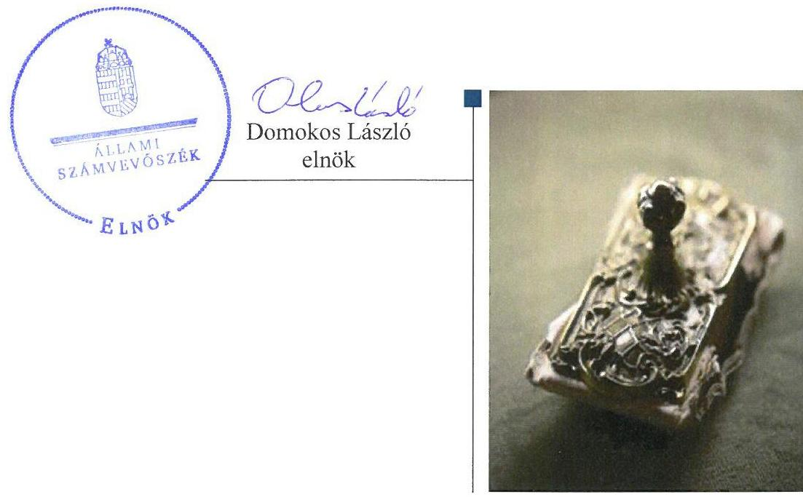
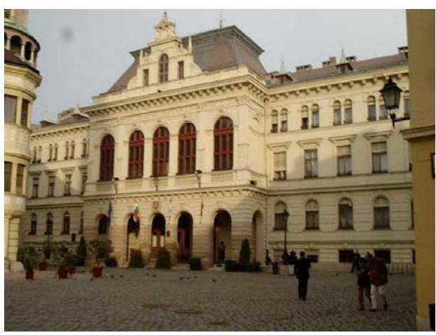
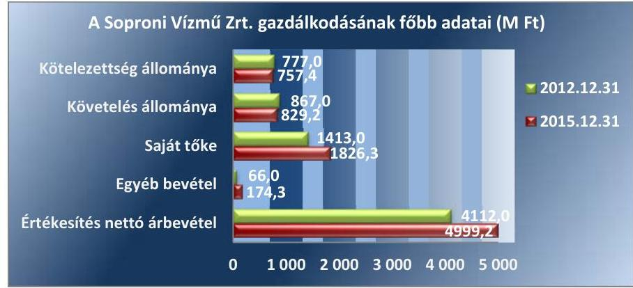
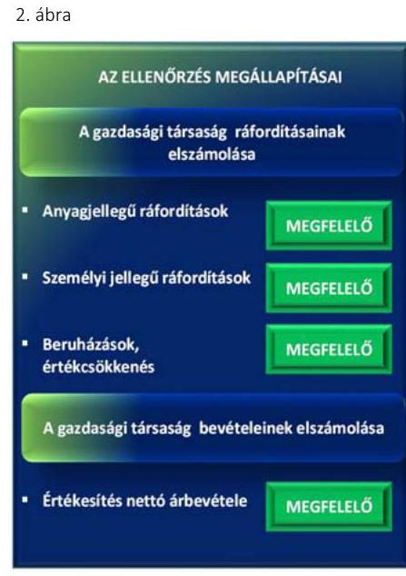
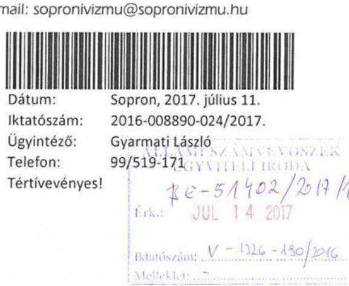

# Jelentés 

## Az önkormányzatok gazdasági társaságai

Az önkormányzatok többségi tulajdonában lévő gazdasági társaságok gazdálkodásának ellenőrzése Soproni Vízmú Zrt.
2017.

---

# J elentés 

## Az önkormányzatok gazdasági társaságai

Az önkormányzatok többségi
tulajdonában lévő gazdasági társaságok gazdálkodásának ellenőrzése Soproni Vízmú Zrt.
2017. angustia hó 11. nap

---

# AZ ELLENŐRZÉST FELÜGYELTE: 

DR. NAGY IMRE felügyeleti vezető

## AZ ELLENŐRZÉST VEZETTE ÉS A VÉGREHAJTÁSÁÉRT FELELŐS:

VALASTYÁNNÉ DR. VÍZHÁNYÓ JÚLIA ellenőrzésvezető

## A PROGRAM ÖSSZEÁLLÍTÁSÁÉRT FELELŐS:

JANIK JÓZSEF osztályvezető

## A TÉMÁHOZ KAPCSOLÓDÓ KORÁBBI SZÁMVEVŐSZÉKI JELENTÉSEK:

- címe: Jelentés az önkormányzatok gazdasági társaságai Az önkormányzatok többségi tulajdonában lévő gazdasági társaságok közfeladat ellátását érintő gazdálkodási tevékenysége szabályszerűségének ellenőrzése - SOPRON HOLDING Vagyonkezelő Zártkörűen Müködő Részvénytársaság.
- sorszáma: $\quad 15140$

IKTATÓSZÁM: V-1326-192/2016.
TÉMASZÁM: 2167
ELLENŐRZÉS-AZONOSÍTÓ SZÁM: V075823

---

# TARTALOMJEGYZÉK 

■ ÖSSZEGZÉS ..... 5
■ AZ ELLENŐRZÉS CÉLJA ..... 6
■ AZ ELLENŐRZÉS TERÜLETE ..... 7
■ AZ ELLENŐRZÉS HÁTTERE, INDOKOLTSÁGA ..... 9
■ A JELENTÉS LÉNYEGES KÉRDÉSKÖREI ..... 10
■ ELLENŐRZÉS HATÓKÖRE ÉS MÓDSZEREI ..... 11
■ MEGÁLLAPÍTÁSOK ..... 13
■ JAVASLATOK ..... 18
■ MELLÉKLETEK ..... 19
I. Sz. melléklet: Értelmező szótár ..... 19
II. Sz. melléklet: A Soproni Vízmú Zrt. mérlegének kiemelt adatai ..... 21
III. Sz. melléklet: A Soproni Vízmú Zrt. kötelezettségeinek alakulása a 2012-2015. években ..... 22
■ FÜGGELÉK: ÉSZREVÉTELEK ..... 23
■ RÖVIDÍTÉSEK JEGYZÉKE ..... 25

---

.

---

# ÖSSZEGZÉS 

Sopron Megyei Jogú Város Önkormányzata a tulajdonosi jogait szabályszerűen alakította ki és gyakorolta. A Soproni Vizmü Zrt. szabályozottsága és vagyongazdálkodása a jogszabályi előírásoknak megfelelt. Bevételeinek és ráfordításainak elszámolása szabályszerűen történt. Beszámolási, adatszolgáltatási és a közérdekü adatokra vonatkozó közzétételi kötelezettségét teljesítette. Az önköltségszámitás és az árképzés a jogszabályi és belső előírásoknak megfelelt.

## Az ellenőrzés társadalmi indokoltsága

Magyarországon az önkormányzatok kötelező és önként vállalt feladataik vonatkozásában is egyre szélesebb körben alkalmazzák a költségvetésen kívüli feladatellátást, ezáltal - a nonprofit szervezetek mellett - az önkormányzati tulajdonú gazdasági társaságok is kiemelt fontosságú szerephez jutottak.

Sopronban az ellenőrzött időszakban a Soproni Vizmú Zrt. végezte főtevékenységként a víziközmű-szolgáltatást, valamint másodlagos tevékenységként fürdők üzemeltetését, csapadékcsatorna üzemeltetést, csatornatisztítást, kamerás csatornavizsgálatot, víz- szennyvízminta vizsgálatokat, mélyépítési tevékenységet, közmúvagyon beruházást. A Társaság ötven önkormányzat tulajdonában állt, feladatellátása ezáltal a lakosság széles rétegét érintette.

Az Állami Számvevőszék az ellenőrzése során arra kereste a választ, hogy 2012-2015. között szabályszerű volt-e a Társaság gazdálkodása és az Önkormányzat ehhez kapcsolódó tulajdonosi joggyakorlása.

## Főbb megállapítások, következtetések, javaslatok

Az Önkormányzat a tulajdonosi jogait a Soproni Vizmú Zrt. felett szabályszerűen gyakorolta. A felügyelő bizottság és a könyvvizsgáló tulajdonosi joggyakorlást támogató tevékenysége a jogszabályoknak megfelelt. Az Önkormányzat Közgyűlése a vagyonváltozást eredményező döntéseket figyelemmel kísérte, azokat határozataiban hagyta jóvá.

A Társaság a múködéséhez szükséges szabályzatait a jogszabályi előírásoknak megfelelően alkotta meg, azonban azok aktualizálása nem minden esetben történt meg az előírt határidőben. A Társaság kinevezte adatvédelmi felelősét, aki az adatvédelem és adatbiztonság szabályait megfelelően alakította ki. Az üzemeltetésre átvett eszközökön végrehajtott beruházások és fejlesztések a jogszabályi és szerződési előírásoknak megfelelően történtek. A Társaság fizetőképessége folyamatosan biztosított volt. A kialakított nyilvántartások biztosították az egyes tevékenységek átláthatóságát és a keresztfinanszírozás kizárását. Éves beszámolóit a jogszabályban előírt határidőben elkészítette, adatszolgáltatási kötelezettségének maradéktalanul eleget tett. A közérdekú adatok közzétételén keresztül a Társaság gazdálkodásának átláthatósága biztosított volt.

A Társaság által ellátott alaptevékenység, valamint alaptevékenységen kívüli tevékenységek bevételeinek és ráfordításainak elszámolása szabályszerű volt. A Társaság a tevékenységeinek önköltség-kalkulációját és árképzését szabályszerűen, a jogszabályi előírásoknak és a belső számviteli szabályzatokban foglaltaknak megfelelően, az előírt határidők betartásával állapította meg.

---

# AZ ELLENŐRZÉS CÉLJA 

Az ellenőrzés célja annak értékelése volt, hogy az önkormányzat vagyongazdálkodási tevékenysége során szabályszerűen gyakorolta-e tulajdonosi jogait; a gazdasági társaság szabályozottsága, gazdálkodása és vagyongazdálkodási tevékenysége, bevételeinek és ráfordításainak elszámolása megfelelt-e a jogszabályi és tulajdonosi előírásoknak; a gazdasági társaság fizetőképessége jelent-e kockázatot a működésre, valamint a gazdálkodás átláthatósága és elszámoltathatósága érdekében biztosítva volte a szolgáltatás dijának megalapozottsága szabályszerű önköltségszámítással.

---

# **A Z ELLENŐRZÉS TERÜLETE**

## **Sopron Megyei Jogú Város Önkormányzata és a többségi tulajdonában lévő Soproni Vízmű Zrt.**

**SOPRON MEGYEI JOGÚ VÁROS ÖNKORMÁNYZATA** a 2012-2013. években 64,7%, a 2014-2015. években 54,7%-os részesedéssel volt többségi tulajdonosa a Soproni Vízmű Zrt.-nek. A Társaságban1 a 2012-2013. években további 39, majd a 2014-2015. években 49 önkormányzat rendelkezett részesedéssel Győr-Moson-Sopron megye nyugati részén, valamint Vas megyében Bük és környéke közigazgatási területén.

A Társaság Alapszabály2 szerinti főtevékenysége víztermelés, -kezelés, -ellátás volt, melyet az Önkormányzattal3 kötött bérleti-üzemeltetési szerződés1-44 alapján látott el. Egyéb feladatként Működtetési szerződés1-55 alapján az Önkormányzat tulajdonában, illetve használatában álló, Sopron közigazgatási területén lévő fürdők6 működtetését, üzemeltetését is ellátta.

**A SOPRONI VÍZMŰ ZRT.** jegyzett tőkéje 2012. december 31-én 510,9 M Ft, 2015. december 31-én 603,9 M Ft volt. A jegyzett tőke 93,0 M Ft-os növekedését a Társaság 100%-os tulajdonában álló Victoria'94 Kft. és a Bük és Térsége Vízmű Kft. 2014. január 1-jei beolvadása okozta. A Társaság vagyona 2012. december 31. és 2015. december 31. között 156,9 M Ft-tal emelkedett, mérlegfőösszege az ellenőrzött időszak végén összesen 2713,3 M Ft-ot tett ki. A Társaság az Önkormányzattól 2013-2015. között összesen 327,0 M Ft vissza nem térítendő támogatásban részesült.

A Társaság 1,0 M Ft, 10% arányú törzstőkével, tulajdonosa volt a Sopron Régió Turisztikai Központ Nonprofit Kft. - nek.

A Társaságnál foglalkoztatott átlagos statisztikai állományi létszám 2012. január 1-jén 282 fő, 2015. december 31-én 289 fő volt.

Az 1. ábra a Társaság egyes gazdálkodási adatait mutatja be a 2012. és 2015. évek összehasonlításában.

1. ábra

---

Az ellenőrzött időszakban a polgármester személye nem, a jegyző személye egy alkalommal változott. A jelenleg hivatalában lévő jegyző 2015. február 23-ától látja el feladatait. A Társaságnál a vezérigazgató személye az ellenőrzött időszakban egy alkalommal változott.

A Társaság a 2012-2015. években az Áht. ${ }^{7}$ alapján nem minősült kormányzati szektorba sorolt egyéb szervezetnek.

Az Önkormányzat a Társaság feladatellátáshoz szükséges közműveket bérleti díj ellenében, üzemeltetésre bocsátotta rendelkezésre, azok nem kerültek a Társaság vagyonkezelésébe.

---

# AZ ELLENŐRZÉS HÁTTERE, INDOKOLTSÁGA 

AZ ÖNKORMÁNYZAT TÖBBSÉGI TULAJDONÁBAN ÁLLÓ GAZDASÁGI TÁRSASÁGOK ellenőrzése kiemelten fontos a vagyon megőrzése, megóvása érdekében, valamint a kormányzati szektor elszámolásaiban megjelenő önkormányzati tulajdonú gazdálkodó szervezetek esetében, amelyekkel szemben alapvető követelmény, hogy gazdálkodásuk, múködésük szabályszerű, az általuk szolgáltatott adatok minél megbízhatóbbak legyenek. A feladatellátás költségeinek, ráfordításainak alakulása a lakosság széles rétegét érinti.

ELLENŐRZÉSEINK FELTÁRHATJÁK, hogy az önkormányzat a feladatellátásához rendelt vagyon múködtetését a tulajdonostól elvárható gondossággal végezte-e, a feladatot ellátó gazdasági társaság a létesítő okiratban, szolgáltatási szerződésben foglaltak betartásával biztosí-totta-e a feladat ellátását. Az ellenőrzés rávilágíthat arra, hogy a gazdasági társaság a vagyon használatával biztosította-e a szolgáltatás folytatásának feltételeit, az önkormányzat tulajdonosi felügyelete hozzájárult-e a szabályszerű gazdálkodáshoz és feladatellátáshoz. A megállapítások alapján megfogalmazott számvevőszéki javaslatok hasznosítása elősegítheti a meglévő hibák megszüntetését. A jó gyakorlatok bemutatásával az ÁSZ ${ }^{8}$ hozzájárulhat a követendő megoldások megismertetéséhez, terjesztéséhez.

---

# A JELENTÉS LÉNYEGES KÉRDÉSKÖREI 

1- Az Önkormányzat tulajdonosi joggyakorlása szabályszerű volt-e?
2. A gazdasági társaság vagyongazdálkodása szabályszerű volt-e, fizetőképessége biztositott volt-e a gazdálkodás során?
3. A gazdasági társaság bevételeinek és ráfordításainak elszámolása, valamint az önköltségszámitás és árképzés szabályszerű volt-e?

---

# ELLENŐRZÉS HATÓKÖRE ÉS MÓDSZEREI 

## Az ellenőrzés típusa

Megfelelőségi ellenőrzés

## Az ellenőrzött időszak

2012. január 1-jétől 2015. december 31-ig

## Az ellenőrzés tárgya

Sopron Megyei Jogú Város Önkormányzatának a Soproni Vízmú Zrt. feletti tulajdonosi joggyakorlása, valamint a Soproni Vízmú Zrt. gazdálkodásának szabályozottsága és szabályszerűsége.

Az ellenőrzés kiterjedt minden olyan körülményre és adatra, amely az ÁSZ jogszabályban meghatározott feladatainak teljesítéséhez, valamint a program végrehajtása folyamán felmerült újabb összefüggések feltárásához szükséges volt.

## Az ellenőrzött szervezet

Sopron Megyei Jogú Város Önkormányzata, valamint a Soproni Vízmú Zrt.

## Az ellenőrzés jogalapja

Az ellenőrzés jogszabályi alapját az az Állami Számvevőszékről szóló 2011. évi LXVI. törvény 1. § (3) bekezdése és 5. § (3)-(4)-(5) bekezdései képezik.

## Az ellenőrzés módszerei

Az ellenőrzést a nemzetközi standardokat irányadónak tekintve az ellenőrzési program ellenőrzési kérdései, az ellenőrzött időszakban hatályos jogszabályok, az ellenőrzés szakmai szabályok és módszertanok figyelembevételével végeztük.

Az ellenőrzés ideje alatt az ellenőrzött szervezettel történő kapcsolattartást az ÁSZ Szervezeti és Múködési Szabályzatának vonatkozó előírásai alapján biztosítottuk.

Az ellenőrzési kérdések megválaszolásához szükséges bizonyítékok megszerzése a következő ellenőrzési eljárások alkalmazásával történt:

---

megfigyelés, kérdésfeltevés (információkérés), mintavételezés, összehasonlítás, valamint elemző eljárás. Az ellenőrzési bizonyítékként felhasználható adatforrások közé tartoztak egyrészt az ellenőrzési programban felsorolt adatforrások, másrészt adatforrás volt még minden - az ellenőrzés folyamán - feltárt, az ellenőrzés szempontjából információkat tartalmazó dokumentum.

Az ellenőrzést a kérdésekre adott válaszok kiértékelésével, valamint a megjelölt adatforrások, a csatolt tanúsítványok felhasználásával, továbbá az adott időszakban hatályos jogszabályok figyelembevételével folytattuk le.

A gazdasági társaság bevételei és ráfordításai, ezeken belül az értékcsökkenés, valamint a vagyonnyilvántartás szabályszerűségének megítéléséhez a bevételeket és a ráfordításokat, a tárgyi eszközök állományváltozásait tartalmazó adott évi főkönyvi kivonat adatbázisát vettük alapul. A minta kiválasztása során véletlen mintavételt alkalmaztunk évenkénti, elemszámmal arányos rétegezéssel a teljes időszakra vonatkozóan. A mintavételt megelőzően az anyagjellegú ráfordítások, valamint a tárgyi eszköz növekedési tételei sokaságból évente sokaságonként kiemeltük a 3-3 legnagyobb összegű tételt annak biztosítására, hogy az ellenőrzés az egyszerű véletlen mintavétel mellett a legnagyobb értékű tételek ellenőrzésére biztosan kiterjedjen.

A lényegességi szempontokat figyelembe véve a mintavétel előtt az anyagjellegú ráfordítások közül kiszűrtük a postaköltséget, bankköltséget, minden sokaságból az elszámolt kerekítési különbözetet, a helyesbítő tételek összegét, a technikai és rendező tételeket, az árfolyam-különbözeteket.

---

# 1. Az Önkormányzat tulajdonosi joggyakorlása szabályszerű volt-e? 

Összegző megállapítás

### 1.1. számú megállapítás

Az Önkormányzat tulajdonosi joggyakorlása szabályszerű volt.

Az Önkormányzat a tulajdonosi joggyakorlásának kereteit szabályszerűen alakította ki.

Az Önkormányzat a tulajdonosi jogok gyakorlásának rendjét a Gt. ${ }^{9}$, illetve a Ptk. ${ }^{10}$ előírásaival összhangban az önkormányzati SZMSZ ${ }^{11}$-ben, a Vagyonrendelet ${ }_{1-2}{ }^{12}$-ben, illetve a Társaság Alapszabályában leírtaknak megfelelően alakította ki.

Az Önkormányzat az Ötv. ${ }^{13}$, illetve az Mötv. ${ }^{14}$ előírásainak megfelelően Gazdasági program ${ }_{1,2}{ }^{15}$-t készített, melyekben a Társaság főtevékenységét érintően korszerűsítési, bővítési feladatokat határoztak meg. Az Önkormányzat 2012. január 1. és 2013. április 24. között közép- és hosszú távú vagyongazdálkodási tervet nem készített, amivel megsértette az Nvtv. ${ }^{16} 9$. § (1) bekezdésében előírtakat. Az Önkormányzat közép- és hosszú távú vagyongazdálkodási tervét késve készítette el, melyet a Közgyűlés határozatával 2013. április 25-én elfogadott.

## A FÖTEVÉKENYSÉG ELLÁTÁSÁHOZ SZOLGÁLÓ

VAGYONT a bérleti-üzemeltetési szerződés ${ }_{1}$-ben felsoroltak szerint bérleti díj fizetése ellenében az Önkormányzat a Társaság kizárólagos rendelkezésére bocsátotta. A Társaság a szerződésben meghatározott díjat megfizette. Az Önkormányzat a jogszabályi előírásoknak megfelelően meghatározta a feladatellátás követelményeit, valamint az azokban bekövetkezett változásokat. A bérleti-üzemeltetési szerződés ${ }_{1-4}$ szerint a Társaságnak az általa üzemeltetett közművagyon állományáról éves beszámolási kötelezettsége állt fent a közmű-tulajdonos önkormányzatok felé, melyet minden évben teljesített.

A Társaság Közgyűlése által elfogadott Javadalmazási szabályzat ${ }_{1-3}{ }^{17}$-a a Taktv. ${ }^{18}$ előírásainak megfelelt.

### 1.2. számú megállapítás

Az Önkormányzat a tulajdonosi jogok gyakorlása során szabályszerűen járt el.

Az Önkormányzat a tulajdonosi jogait a Vagyonrendelet ${ }_{1,2}$-ben és a Társaság Alapszabályában foglaltaknak megfelelően gyakorolta. A Társaság feletti tulajdonosi jogokat a Társaság közgyűlésén az Önkormányzat SZMSZében foglaltaknak megfelelően az Önkormányzat Közgyűlése ${ }^{19}$ nevében, átruházott hatáskörben a polgármester szabályszerűen gyakorolta.

A Társaság $\mathrm{FB}^{20}$-a a Taktv. előírásainak megfelelően hat tagból állt. Az FB ügyrendjét a Társaság közgyűlése a Gt. 34. § (4) bekezdésében előírtak ellenére határidőn túl, 2013. július 18-án fogadta el. Az FB a Társaság 2012.

---

1. táblázat

A SAJÁT TÖKE, JEGYZETT TÖKE ÉS MÉRLEG SZERINTI EREDMÉNY ALAKULÁSA (M FT)

|  Gy | Saját
töke | Jegyzett
töke | Mérleg
szerinti
eredmény  |
| --- | --- | --- | --- |
|  2012. | 1413,0 | 510,9 | 52,7  |
|  2013. | 1450,3 | 510,9 | 37,3  |
|  2014. | 1792,8 | 603,9 | 53,1  |
|  2015. | 1826,3 | 603,9 | 33,5  |

Forrás: A Társaság 2012-2015. évi éves beszámolói évi éves számviteli beszámolójáról készített írásbeli jelentését ügyrend hiányában készítette el.

AZ ÖNKORMÁNYZAT Közgyűlése minden évben megtárgyalta a Társaság éves számviteli beszámolóját, határozatban döntött azok elfogadásáról.

A Társaság az ellenőrzött időszakban nyereségesen működött. A Társaság saját tőkéjének és egyes tőkeelemeinek alakulását az 1. táblázat szemlélteti.

A TÁRSASÁG VAGYONVÁLTOZÁSÁT EREDMÉNYEZŐ DÖNTÉSEIT a 2012-2015 közötti időszakban az Önkormányzat Közgyűlése a Vagyonrendelet ${ }_{1-2}$-ben foglaltaknak megfelelően ellenőrizte. Az Önkormányzat a tulajdonosi joggyakorlást az FB és a Társaság könyvvizsgálójának éves jelentésén keresztül látta el.

# 2. A gazdasági társaság vagyongazdálkodása szabályszerű volt-e, fizetőképessége biztosított volt-e a gazdálkodás során?

## Összegző megállapítás

2.1. számú megállapítás

A Társaság vagyongazdálkodása szabályszerű volt, fizetőképessége biztosított volt a gazdálkodás során. Adatszolgáltatási és beszámolási kötelezettségének eleget tett.

A Társaság rendelkezett a müködéséhez szükséges szabályzatokkal, azok a jogszabályi előírásoknak összességében megfeleltek.

A Társaság a Számv. tv. ${ }^{21}$ 14. § (3)-(5) bekezdésében előírt szabályzatokat megfelelően elkészítette.

A Vksztv. ${ }^{22}$ 49. § (2) bekezdésében, valamint a Vksztv. Vhr. ${ }^{23}$ 91. § (4) bekezdésében előírt követelményeket a Számviteli szétválasztási szabályzat ${ }_{1-2}{ }^{24}$-ban alakította ki. A Társaság kialakított nyilvántartásai biztosították az egyes tevékenységek átláthatóságát, a diszkriminációmentességet, továbbá kizárta a keresztfinanszírozást. A Társaság számviteli nyilvántartási kötelezettségét az SAP ${ }^{25}$ vállalat irányítási rendszer alkalmazásával biztosította.

A Társaság Számlarend ${ }_{1-3}$-je ${ }^{26}$ a Számv. tv. 161. § (2) bekezdés a) és b) pontjában előírtak ellenére nem tartalmazta az üzemeltetésre átvett eszközök nyilvántartási számláinak számjelét és megnevezését, a számlák értéke növekedésének, csökkenésének jogcímeit.

A TÁRSASÁG EGYÉB BELSŐ SZABÁLYZATAI körében rendelkezett a jogszabályban előírt Üzletszabályzat ${ }_{1-5}{ }^{27}$-tal. Rendelkezett továbbá az Igazgatóság ${ }^{28}$ által elfogadott SZMSZ ${ }_{1-5}$-szel ${ }^{29}$, melyben az Alapszabályban előírt feladatokkal összhangban szabályozta a Társaság operatív müködését és szervezeti felépítését. A bérleti-üzemeltetési szerződés ${ }_{1-4}$-ben előírtaknak megfelelő Közművagyon leltározási szabályzat ${ }_{1-2}$ ot készített.

---

# Megállapítások 

A Társaság az Infotv ${ }^{30}$. 24. § (1) bekezdés c) pontjának megfelelően adatvédelmi felelősét kinevezte. Az Adatvédelmi és adatbiztonsági szabályzatot az Infotv. 24. § (3) bekezdésében foglaltaknak megfelelően elkészítette.

## 2.2. számú megállapítás

## A Társaság vagyongazdálkodása a jogszabályi előírásoknak megfelel.

## 2.3. számú megállapítás

2.4. számú megállapítás

A Társaság vagyongazdálkodása a jogszabályi előírásoknak megfelel.

ÜZLETI TERVEIT a Társaság minden évben elkészítette, melyeket a Társaság Alapszabályában foglaltaknak megfelelően az Igazgatóság jóváhagyott. A Társaság a számviteli nyilvántartásait a jogszabályi, valamint a Számlarend előírásaival összhangban vezette. Az eszközök tekintetében a közműves ivóvízellátás, valamint a közműves szennyvízelvezetés és -tisztítás szolgáltatáshoz kapcsolódóan a Vksztv.-ben előírt elkülönítési kötelezettségének eleget tett, az eszközök bekerülési értékét a Számv. tv., valamint a Számviteli politika ${ }_{1-3}$, előírásainak megfelelően állapította meg. A Társaság a jogszabályi előírásoknak megfelelően elkészítette leltárral alátámasztott éves számviteli beszámolóit. A Társaság éves beszámolóinak főbb mérlegadatait a II. melléklet szemlélteti.

A SOPRONI VÍZMÚ ZRT. nyereségesen gazdálkodott. A saját tőkéjének összege meghaladta a jegyzett tőke összegét.

AZ ÜZEMELTETÉSRE átvett eszközök nyilvántartása szabályszerű volt, a gyarapítása érdekében végrehajtott beruházásokat a Társaság a jogszabályban foglaltaknak és a bérleti-üzemeltetési szerződés1-4-nek megfelelően elvégezte. Az Önkormányzatok a bérleti díjat havonta számlázták a Társaságnak, a Társaság a beruházások és az egyéb ráfordítások ellenértékét számlázta az Önkormányzatok részére. A számlák ellenértékét a Közös Pénzügyi Alap egyenlítette ki. A megvalósult beruházásokat az Önkormányzat szabályszerűen aktiválta.

## A Társaság fizetőképessége biztosított volt.

A TÁRSASÁG FIZETŐKÉPESSÉGE biztosított volt. Lejárt kötelezettsége 2015. december 31-én nem volt. A kötelezettségek állományváltozása nem jelentett kockázatot a fizetőképességére. A Társaság kötelezettség-állományának alakulását a III. melléklet mutatja.

A kötelezettségek 2014. évi 78,2 M Ft-os emelkedését a 2014. január 1-jével beolvadt két gazdasági társaság kötelezettségei okozták. A Társaság szerződésen és jogszabályon alapuló rövid lejáratú kötelezettségeinek határidőre történő teljesítése biztosított volt. A Társaság lejárt tartozásai 30 napon belüli szállítói kötelezettségek voltak. A kötelezettségek mérlegkészítés napjáig teljes körűen kiegyenlítésre kerültek.

A Társaság az előírt beszámolási, adatszolgáltatási kötelezettségeit teljesítette.

A BESZÁMOLÁSI, ADATSZOLGÁLTATÁSI ÉS TÁJÉKOZTATÁSI FELADATAIT a Társaság az Alapszabályban, a bérleti-üzemeltetési szerződés ${ }_{1-4}$-ben, valamint az SZMSZ ${ }_{1-5}$-ben szabályozta. A Társaság számára a Közgyűlése felé a bérleti-üzemeltetési szerződés ${ }_{1-4}$ évente egyszeri beszámolási kötelezettséget írt elő a közművagyon

---

fordulónapi állományáról, valamint az állományváltozások bemutatásáról. A beszámolási, adatszolgáltatási kötelezettségének eleget tett.

A TÁRSASÁG ÉVES BESZÁMOLÓIT szabályszerűen készítette el. A Társaság éves beszámolója jóváhagyásakor az FB és a független könyvvizsgálói jelentések, a tulajdonos önkormányzatok, és a Társaság Közgyűlése számára rendelkezésre álltak. A Társaság a Számv. tv.-ben előírt könyvvizsgálati kötelezettségének eleget tett. A Társaság könyvvizsgálója jelentéseit hitelesítő záradékkal bocsátotta ki, a Társaság éves beszámolóját elfogadó közgyűléseken részt vett. Az éves számviteli beszámolókat a Közgyűlés határozatban elfogadta, és azokat a Társaság határidőben letétbe helyezte és közzétette. Az Igazgatóság az Alapszabálynak és a jogszabályi előírásoknak megfelelően háromhavonta jelentést készített az FB részére a Társaság pénzügyi vagyoni helyzetéről. Az FB a jogszabályi előírásoknak megfelelően az éves számviteli beszámolókról írásbeli jelentést készített, és a Közgyűlés részére elfogadásra javasolta.

A TÁRSASÁGNÁL A KÖZÉRDEKŰ ADATOK NYILVÁNOSSÁGRA HOZATALA, illetve az adatok szabályszerű védelme biztosított volt. Az adatvédelmi felelős az Adatvédelmi és biztonsági Szabályzatban előírtaknak megfelelően, szabályszerűen vezette az adatvédelmi nyilvántartást. A Társaság a jogszabályokban előírt közzétételi kötelezettségét a honlapján szabályszerűen teljesítette.

# 3. A gazdasági társaság bevételeinek és ráfordításainak elszámolása, valamint az önköltségszámítás és árképzés szabályszerű volt-e? 

Összegző megállapítás

A Társaság bevételeinek és ráfordításainak elszámolása, valamint az önköltségszámítás és az árképzés szabályszerűen történt.

### 3.1. számú megállapítás

A Társaság által ellátott alaptevékenység, valamint az alaptevékenységen kívüli tevékenységek bevételeinek és ráfordításainak elszámolása szabályszerű volt.

A TÁRSASÁG BEVÉTELEINEK ÉS RÁFORDÍTÁSAINAK ELSZÁMOLÁSA a belső, valamint a jogszabályi előírásoknak megfelelően történt. Az ellenőrzés megállapításait a 2. ábra mutatja.

AZ ANYAGJELLEGŰ RÁFORDÍTÁSOK elszámolása megfelelt a Számv. tv., valamint a Társaság belső számviteli szabályzataiban foglaltaknak. A költségelszámolást megalapozó dokumentumok rendelkezésre álltak.

A SZEMÉLYI JELLEGŰ RÁFORDÍTÁSOKAT a jogszabályi előírásokat betartva, a Számlarend ${ }_{1-3}$-nak megfelelően számolták el.

---

3.2. számú megállapítás

A BEVÉTELEK ELSZÁMOLÁSA a jogszabályoknak megfelelően történt. A Társaság a jogszabályi előírásoknak megfelelő víziközműszolgáltatási díjakat alkalmazta. A bevételek számlázása a Számlarend1-3ban, valamint a Bizonylati rendben foglaltaknak megfelelően történt. A bevételeket elkülönítetten számolták el az alaptevékenységre és az alaptevékenységen kívüli tevékenységekre vonatkozóan.

## A BERUHÁZÁSOK ÉS AZ ÉRTÉKCSÖKKENÉS ELSZÁMOLÁSA megfelelő volt.

2014. január 1-jével jogutódlással beolvadt gazdasági társaságok térítésmentesen átadott eszközeit a Társaság szabályszerűen vette nyilvántartásba.

A TÁRSASÁG A KÖVETELÉSÁLLOMÁNY CSÖKKENTÉSE ÉRDEKÉBEN Igazgatói utasítás ${ }_{1-6}{ }^{31}$-ban szabályozta a követeléskezelés eljárásrendjét.

A Társaságnál a jogszabályoknak és a belső szabályoknak megfelelő volt az önköltségszámítás és az árképzés. A Társaság a jogszabályoknak megfelelően Önköltségszámítási szabályzattal rendelkezett.

## A TÁRSASÁG A TEVÉKENYSÉGEK ÖNKÖLTSÉGÉT

szabályszerűen, az Önköltségszámítási szabályzat ${ }_{1-4}$-ban, valamint a 2013. január 1-jétől a Számviteli szétválasztási szabályzat ${ }_{1-2}$-ban foglaltaknak és a jogszabályi előírásoknak megfelelően állapította meg.

A Vksztv. 65. § (1) bekezdése a víziközmú szolgáltatási díjak megállapítását 2012. január 1-jétől a MEKH javaslatának figyelembevételével a víziközmú-szolgáltatásért felelős miniszter hatáskörébe utalta. A Társaság a jogszabályi előírásoknak megfelelő díjat alkalmazott. A Rezsi tv. ${ }^{32}$ 4. § (1) bekezdése előírásainak megfelelően a Társaság 2013. július 1-jétől 10\%-kal csökkentette a lakossági közműves ivóvízellátás és a lakossági közműves szennyvízelvezetés- és tisztítás díját.

A Társaság a jogszabályoknak megfelelően Önköltségszámítási szabály-zat ${ }_{1-4}$-tal ${ }^{33}$ rendelkezett. A Társaság az alaptevékenységen kívüli tevékenységek esetében tevékenységenként utókalkulációt készített. A Társaság az önköltségszámítást is figyelembe véve, a nyújtott szolgáltatások és a piaci árviszonyok alapján döntött az alkalmazandó egyedi díjtételekről.

---

# JAVASLATOK 

Az ÁSZ tv. ${ }^{34}$ 33. § (1) bekezdésében foglaltak értelmében az ellenőrzött szervezet vezetője köteles a jelentésben foglalt megállapításokhoz kapcsolódó intézkedési tervet összeállítani és azt a jelentés kézhezvételétől számított 30 napon belül az ÁSZ részére megküldeni. Amennyiben az ellenőrzött szervezet vezetője nem küldi meg határidőben az intézkedési tervet, vagy továbbra sem elfogadható intézkedési tervet küld, az Állami Számvevőszék elnöke az ÁSZ tv. 33. § (3) bekezdése a) és b) pontjaiban foglaltakat érvényesítheti.

## A Soproni Vízmú Zrt. Vezérigazgatójának

1. Intézkedjen a számlarend jogszabályi rendelkezéseknek megfelelő kiegészítéséről az üzemeltetésre átvett eszközök tekintetében.
(2.1 sz. megállapítás 3. bekezdése alapján)

---

# MELLÉKLETEK 

- I. SZ. MELLÉKLET: ÉRTELMEZŐ SZÓTÁR
garanciaszerződés
gazdasági társaság
gazdálkodó szervezet
kezesség
közszolgáltatás
meghatározó befolyás
minősített többséget biztosító részesedés
nemzeti vagyon

A garanciaszerződés, illetve a garanciavállaló nyilatkozat a garantőr olyan kötelezettségvállalása, amely alapján a nyilatkozatban meghatározott feltételek esetén köteles a jogosultnak fizetést teljesíteni. (Ptk. 6:431. § (1) bekezdése)
Ptk. 3.88. § (1) bekezdése szerint „a gazdasági társaságok üzletszerű közös gazdasági tevékenység folytatására, a tagok vagyoni hozzájárulásával létrehozott, jogi személyiséggel rendelkező vállalkozások, amelyekben a tagok a nyereségből közösen részesednek, és a veszteséget közösen viselik".
A Ptk. 685. § c) pontja szerint gazdálkodó szervezet: „az állami vállalat, az egyéb állami gazdálkodó szerv, a szövetkezet, a lakásszövetkezet, az európai szövetkezet, a gazdasági társaság, az európai részvénytársaság, az egyesülés, az európai gazdasági egyesülés, az európai területi együttmüködési csoportosulás, az egyes jogi személyek vállalata, a leányvállalat, a vízgazdálkodási társulat, az erdő birtokossági társulat, a végrehajtói iroda, az egyéni cég, továbbá az egyéni vállalkozó." (2014. 03.15-ig hatályos)
A kezességre vonatkozó előírásokat a Ptk. 6:416-430. §-ai tartalmazzák. Kezességi szerződéssel a kezes kötelezettséget vállal a jogosulttal szemben, hogyha a kötelezett nem teljesít, maga fog helyette a jogosultnak teljesíteni. Kezesség egy vagy több, fennálló vagy jövőbeli, feltétlen vagy feltételes, meghatározott vagy meghatározható összegű pénzkövetelés vagy pénzben kifejezhető értékkel rendelkező egyéb kötelezettség biztosítására vállalható.
A Ptk. szerint kezességet csak írásban lehet vállalni. A kezes kötelezettsége ahhoz a kötelezettséghez igazodik, amelyért kezességet vállalt. A kezes kötelezettsége nem válhat terhesebbé, mint amilyen elvállalásakor volt, kiterjed azonban a kötelezett szerződésszegésének jogkövetkezményeire és a kezesség elvállalása után esedékessé váló mellékkövetelésekre is.
Az Ebktv. ${ }^{35}$ 3. § d) pontja a következőképpen határozza meg a közszolgáltatást: „szerződéskötési kötelezettség alapján a lakosság alapvető szükségleteinek ellátására irányuló szolgáltatás, így különösen a villamos energia-, gáz-, hő-, víz-, szennyvíz- és hulladékkezelési, köztisztasági, postai és távközlési szolgáltatás, továbbá a menetrend alapján közlekedő járművekkel végzett közforgalmú személyszállítás".
A Ptk. 8:2. § (2) bekezdése szerint „A befolyással rendelkező akkor rendelkezik egy jogi személyben meghatározó befolyással, ha annak tagja vagy részvényese, és
a) jogosult e jogi személy vezető tisztségviselői vagy felügyelőbizottsága tagjai többségének megválasztására, illetve visszahívására; vagy
b) a jogi személy más tagjai, illetve részvényesei a befolyással rendelkezővel kötött megállapodás alapján a befolyással rendelkezővel azonos tartalommal szavaznak, vagy a befolyással rendelkezőn keresztül gyakorolják szavazati jogukat, feltéve, hogy együtt a szavazatok több mint felével rendelkeznek."
A minősített befolyásszerző az ellenőrzött társaságban a szavazatok legalább hetvenöt százalékával rendelkezik. (Ptk. 3:324. §)
Nvtv. 1. § (2) bekezdése szerint többek között:
„az állam vagy a helyi önkormányzat kizárólagos tulajdonában álló dolgok, az a) pont hatálya alá nem tartozó, állam vagy a helyi önkormányzat tulajdonában lévő dolog,

---

an
nonprofit gazdasági társaság
többségi befolyást biztosító részesedés
vagyonkezelő
az állam vagy a helyi önkormányzat tulajdonában lévő pénzügyi eszközök, továbbá az államot vagy a helyi önkormányzatot megillető társasági részesedések, az államot vagy a helyi önkormányzatot megillető bármely vagyoni értékkel rendelkező jogosultság, amelyet jogszabály vagyoni értékű jogként nevesít."
Civil tv. ${ }^{36}$ 9/F. § (2) bekezdése szerint „az a gazdasági társaság minősül nonprofit gazdasági társaságnak és cégnevében az a gazdasági társaság tüntetheti fel a nonprofit jelleget, amelynek létesítő okirata tartalmazza, hogy a gazdasági társaság tevékenységéből származó nyereség a tagok között nem osztható fel, hanem az a gazdasági társaság vagyonát gyarapítja." (hatályos 2014. március 15-től)
A Ptk. 8:2. § (1) bekezdése szerint „többségi befolyás az olyan kapcsolat, amelynek révén természetes személy vagy jogi személy (befolyással rendelkező) egy jogi személyben a szavazatok több mint felével vagy meghatározó befolyással rendelkezik."
a) az állam tulajdonában álló nemzeti vagyon tekintetében:
aa) költségvetési szerv,
ab) helyi önkormányzat, önkormányzati társulás,
ac) önkormányzati intézmény,
ad) köztestület,
ae) az állam, az aa)-ac) alpontban meghatározott személyek együtt vagy külön-külön 100\%-os tulajdonában álló gazdálkodó szervezet,
af) az ae) alpont szerinti gazdálkodó szervezet 100\%-os tulajdonában álló gazdálkodó szervezet,
ag) a törvény által kijelölt egyedileg meghatározott jogi személy.
b) a helyi önkormányzat tulajdonában álló nemzeti vagyon tekintetében:
ba) önkormányzati társulás,
bb) költségvetési szerv vagy önkormányzati intézmény,
bc) köztestület,
bd) az állam, a helyi önkormányzat, a ba)-bb) alpontban meghatározott személyek együtt vagy külön-külön 100\%-os tulajdonában álló gazdálkodó szervezet,
be) a bd) alpont szerinti gazdálkodó szervezet 100\%-os tulajdonában álló gazdálkodó szervezet.
c) *az egyházi jogi személy a tevékenysége ellátásához szükséges nemzeti vagyon tekintetében. (Forrás: Nvtv. 3. § (1) bekezdés 19. pontja)

---

II. SZ. MELLÉKLET: A SOPRONI VÍZMŰ ZRT. MÉRLEGÉNEK KIEMELT ADATAI

| A SOPRONI VÍZMŰ ZRT. MÉRLEGEINEK KIEMELT ADATAI (M Ft) |  |  |  |  |
| :--: | :--: | :--: | :--: | :--: |
| Megnevezés | 2012.12.31. | 2013.12.31. | 2014.12.31. | 2015.12.31. |
| I. Befektetett eszközök | 1274,0 | 972,7 | 1108,8 | 1086,5 |
| ebből: tárgyi eszközök | 1166,3 | 823,5 | 948,4 | 932,9 |
| II. Forgóeszközök | 1206,3 | 1216,5 | 1539,0 | 1522,6 |
| ebből: követelések | 867,0 | 813,3 | 1108,8 | 829,2 |
| ebből: pénzeszközök | 289,0 | 361,9 | 377,8 | 638,6 |
| III. Aktív időbeli elhatárolások | 76,1 | 65,1 | 130,6 | 104,2 |
| Eszközök összesen | 2556,4 | 2254,3 | 2278,4 | 2713,3 |
| IV. Saját tőke | 1413,0 | 1450,3 | 1792,8 | 1826,3 |
| ebből: jegyzett tőke | 510,9 | 510,9 | 603,9 | 603,9 |
| ebből: mérleg szerinti eredmény | 52,7 | 37,3 | 53,1 | 33,5 |
| V. Céltartalékok | 2,4 | 4,1 | 19,1 | 11,8 |
| VI. Kötelezettségek | 777,0 | 725,3 | 803,5 | 757,4 |
| VII. Passzív időbeli elhatárolások | 364,0 | 74,6 | 163,0 | 117,8 |
| Források összesen | 2556,4 | 2254,3 | 2778,4 | 2713,3 |

---

II. SZ. MELLÉKLET: A SOPRONI VÍZMŰ ZRT. KÖTELEZETTSÉGEINEK ALAKULÁSA A 2012-2015. ÉVEKBEN

| A SOPRONI VÍZMŰ ZRT. KÖTELEZETTSÉGEINEK ALAKULÁSA A 2012-2015. ÉVEKBEN (M Ft) |  |  |  |  |
| :--: | :--: | :--: | :--: | :--: |
| Megnevezés | 2012-12-31. | 2013. 12-31. | 2014-12-31. | 2015-12-31. |
| Összes kötelezettség | 777,0 | 725,3 | 803,5 | 757,4 |
| ebből: vevőktől kapott előleg | 0,5 | 1,3 | 3,6 | 3,1 |
| ebből: szállítók | 426,6 | 458,2 | 414,5 | 454,1 |
| ebből: kapcsolt vállalkozással szembeni kötelezettség | 1,6 | 39,0 | 46,9 | 38,5 |
| ebből: egyéb rövid lejáratú kötelezettségek | 348,3 | 226,8 | 338,4 | 261,7 |
| Határidőn belüli kötelezettség | 416,8 | 457,3 | 376,4 | 454,1 |
| Határidőn túli kötelezettségek | 9,8 | 0,9 | 38,1 | 0,0 |
| ebből: 1-30 napon belüli lejárt szállítói kötelezettség | 9,8 | 0,9 | 38,1 | 0,0 |
| Forrás: 2012-2015. évi beszámolók |  |  |  |  |

---

# FÜGGELÉK: ÉSZREVÉTELEK 

A jelentéstervezetet a Számvevőszék 15 napos észrevételezésre megküldte az ellenőrzött szervezetek vezetőinek az ÁSZ tv. 29. §* (1) bekezdése előírásának megfelelően.
Észrevételezési jogával a Soproni Vizmü Zrt. vezérigazgatója élt.

A függelék tartalmazza az ellenőrzött nemleges észrevételét.

[^0]
[^0]:    * 29. § (1) Az Állami Számvevőszék az ellenőrzési megállapításait megküldi az ellenőrzött szervezet vezetőjének vagy az általa megbízott személynek, és annak, akinek személyes felelősségét állapította meg.
    (2) Az ellenőrzött szervezet vezetője és a felelősként megjelölt személy az ellenőrzés megállapításaira tizenöt napon belül írásban észrevételt tehet.
    (3) Az Állami Számvevőszék az észrevételre a beérkezésétől számított harminc napon belül írásban válaszol. A figyelembe nem vett észrevételeket köteles a jelentésben feltüntetni, és megindokolni, hogy azokat miért nem fogadta el.

---

# SOPRONI VÍZMŰ ZRT.

9400 Sopron, Bartók Béla u. 42. Postacím: 9401 Sopron, Pf.: 41. Tel.: (99) 519 100 www.sopronivizmu.hu E-mail: sopronivizmu@sopronivizmu.hu

**Állami Számvevőszék**

dr. Nagy Imre felügyeleti vezető részére

**Budapest**

Apáczai Csere János utca 10. 1364

Dátum: Sopron, 2017. július 11. Iktatószám: 2016-008890-024/2017. Ügyintéző: Gyarmati László. Telefon: 99/519-171. Tértivevényes!

Tisztelt dr. Nagy Imre felügyeleti vezető úr!

Hivatkozva a V-1326-186/2016 sz. levelükre ezúton tájékoztatom, hogy „Az önkormányzatok gazdasági társaságai – Az önkormányzatok többségi tulajdonában lévő gazdasági társaságok gazdálkodásának ellenőrzése- Soproni Vízmú Zrt.” címmel részünkre megküldött számvevőszéki jelentés-tervezetüket áttanulmányozva, az abban foglaltakkal kapcsolatosan társaságunk nem kíván észrevételt tenni.

Üdvözlettel:

Soproni Vízmú Zrt.

Rádonyi László

vezérigazgató

---

K & H Bank Zrt. 10200294-33418045-00000000
OTP Bank Nyrt. 11737083-20069311-00000000
Adatkezelés nyilvántartási száma: NAH-65812/2013
Cégjegyzékszám: 08-10-001717 Nyilvántartó bíróság: Győri Törvényszék Cégbírósága

---

# RÖVIDÍTÉSEK JEGYZÉKE 

${ }^{1}$ Társaság
${ }^{2}$ Alapszabály
${ }^{3}$ Önkormányzat
${ }^{4}$ Bérleti-üzemeltetési szerződés ${ }_{1}$
Bérleti-üzemeltetési szerződés ${ }_{2}$
Bérleti-üzemeltetési szerződés ${ }_{3}$
Bérleti-üzemeltetési szerződés ${ }_{4}$
Bérleti-üzemeltetési szerződés ${ }_{5}$
${ }^{6}$ fürdők
${ }^{7}$ Áht.
${ }^{8}$ ÁSZ
${ }^{9}$ Gt.
${ }^{10}$ Ptk.
${ }^{11}$ önkormányzati SZMSZ
${ }^{12}$ Vagyonrendelet ${ }_{1}$

Vagyonrendelet ${ }_{2}$

${ }^{13}$ Ötv.
${ }^{14}$ Mötv.
${ }^{15}$ Gazdasági program ${ }_{1}$

Soproni Vízmú Zrt.
A Soproni Vízmú Zrt. többször módosított Alapszabálya egységes szerkezetben (hatályos 2011. november 28 -ától

Sopron Megyei Jogú Város Önkormányzata
Szerződés a víziközmú-tulajdonos önkormányzatok és a Sopron és Környéke Víz- és Csatornamú Zrt. között a víziközmú rendszereik közös múködtetésére, 2008. január 1.
Bérleti-üzemeltetési szerződés egységes szerkezetben a víziközmú-tulajdonos önkormányzatok és a Soproni Vízmú Zrt. között a víziközmú rendszereik közös múködtetéséről, 2013. január 31-től
Bérleti-üzemeltetési szerződés egységes szerkezetben a víziközmú-tulajdonos önkormányzatok és a Soproni Vízmú Zrt. között a víziközmú rendszereik közös múködtetéséről, 2013. november 20-ától
Bérleti-üzemeltetési szerződés a Bük és térsége önkormányzatok és a Soproni Vízmú Zrt. között a víziközmú rendszereik üzemeltetéséről, 2014. január 1-jétől (a Bérleti-üzemeltetési szerződés ${ }_{3}$ kiegészítése)
Múködtetési és vagyonkezelési szerződés az Önkormányzat és a Sopron és Környéke Víz- és Csatornamú Zrt. között a Sopron környéki fürdők múködtetésére (hatályos 2011. március 1jétől
Múködtetési szerződés az Önkormányzat és a Soproni Vízmú Zrt. között a Sopron környéki fürdők múködtetésére (hatályos 2013. április 1-jétől
A múködtetési szerződés ${ }_{2}$ I. számú módosítása (hatályos 2014. január 1-jétől
A múködtetési szerződés ${ }_{2}$ II. számú módosítása (hatályos 2014. december 12-ától
Múködtetési szerződés az Önkormányzat és a Soproni Vízmú Zrt. között a Sopron környéki fürdők múködtetésére (hatályos 2015. január 1-jétől
Csík Ferenc uszoda és Lővér fürdő, Tómalom fürdő, Fertő-tavi vízitelep
Az államháztartásról szóló 2011. évi CXCV. törvény (hatályos 2011. december 31-től)
Állami Számvevőszék
A gazdasági társaságokról szóló 2006. évi IV. törvény (hatályos 2014. március 14-éig)
A Polgári Törvénykönyvről szóló 2013. évi V. törvény (hatályos 2014. március 15-től)
Sopron Megyei Jogú Város Önkormányzatának többször módosított 18/2007. (VI. 1.) rendelete Sopron Megyei Jogú Város Önkormányzata Szervezeti és Múködési Szabályzatáról
Sopron Megyei Jogú Város Önkormányzata Közgyűlésének 6/2008. (II. 29.) számú, többször módosított önkormányzati rendelete a Sopron Megyei Jogú Város Önkormányzata vagyonáról, a vagyon feletti tulajdonosi jogok gyakorlásának, és a vagyonkezelésének szabályozásáról (hatályos 2008. március 8-ától 2013. március 7-éig
Sopron Megyei Jogú Város Önkormányzata Közgyűlésének 3/2013. (III. 4.) számú önkormányzati rendelete a Sopron Megyei Jogú Város Önkormányzata vagyonáról, a vagyon feletti tulajdonosi jogok gyakorlásának, és a vagyon kezelésének szabályozásáról (hatályos 2013. március 8-ától
A helyi önkormányzatokról szóló 1990. évi LXV. törvény (hatályos 2011. december 31-ig) Magyarország helyi önkormányzatairól szóló 2011. évi CLXXXIX. törvény (hatályos 2012. január 1-től)
Sopron Megyei Jogú Város Önkormányzatának 2011-2014. évre vonatkozó gazdasági programja

---

Gazdasági program $_{2}$

## ${ }^{16}$ Nvtv.

${ }^{17}$ Javadalmazási szabályzat ${ }_{1}$

Javadalmazási szabályzat ${ }_{2}$

Javadalmazási szabályzat ${ }_{3}$
${ }^{18}$ Taktv.
${ }^{19}$ Önkormányzat Közgyűlése
${ }^{20}$ FB
${ }^{21}$ Számv. tv.
${ }^{22}$ Vksztv.
${ }^{23}$ Vksztv. Vhr.
${ }^{24}$ Számviteli szétválasztási szabályzat ${ }_{1}$

Számviteli szétválasztási szabályzat ${ }_{2}$
${ }^{25}$ SAP
${ }^{26}$ Számlarend $_{1}$
Számlarend $_{2}$
Számlarend $_{3}$
${ }^{27}$ Üzletszabályzat ${ }_{1}$
Üzletszabályzat ${ }_{2}$
Üzletszabályzat ${ }_{3}$
Üzletszabályzat ${ }_{4}$
Üzletszabályzat ${ }_{5}$
${ }^{28}$ Igazgatóság
${ }^{29}$ SZMSZ $_{1}$
SZMSZ $_{2}$
SZMSZ $_{3}$
SZMSZ $_{4}$
SZMSZ $_{5}$
${ }^{30}$ Infotv.
${ }^{31}$ Igazgatói utasítás $_{1}$

Igazgatói utasítás $_{2}$
Igazgatói utasítás $_{3}$
Igazgatói utasítás $_{4}$

Sopron Megyei Jogú Város Önkormányzatának 2015-2020. évre vonatkozó gazdasági programja
A Nemzeti vagyonról szóló 2011. évi CXCVI. törvény (hatályos 2011. december 31-től)
Szabályzat a Sopron és Környéke Víz-és Csatornamú Zrt. vezető tisztségviselőinek, felügyelő bizottsági tagjainak, vezető állású munkavállalóinak javadalmazására (hatályos 2010. január 29-től
Szabályzat a Soproni Vízmú Zrt. vezető tisztségviselőinek, felügyelő bizottsági tagjainak és vezető állású munkavállalóinak javadalmazására (hatályos 2012. május 11-től
Szabályzat a Soproni Vízmú Zrt. vezető tisztségviselőinek, felügyelő bizottsági tagjainak és vezető állású munkavállalóinak javadalmazására (hatályos 2013. május 9-től
A köztulajdonban álló gazdasági társaságok takarékosabb múködéséről szóló 2009. évi CXXII. törvény (hatályos 2009. december 4-től)
Sopron Megyei Jogú Város Önkormányzatának közgyűlése
A Társaság Felügyelőbizottsága
A számvitelről szóló 2000. évi C. törvény (hatályos 2001. január 1-től)
2011. évi CCIX. törvény a víziközmű-szolgáltatásról (hatályos 2011. december 31-től)

58/2013. (III. 27.) Korm. rendelet a víziközmű-szolgáltatásról szóló 2011. évi CCIX. törvény egyes rendelkezéseinek végrehajtásáról (hatályos 2013. március 1-jétől)
Soproni Vízmú Zrt. számviteli szétválasztási szabályzata (hatályos 2013. január 1-től)
Soproni Vízmú Zrt. számviteli szétválasztási szabályzata (hatályos 2015. január 1-től)
Integrált vállalatirányítási rendszer
Soproni Vízmú Zrt. számlarendje és bizonylati rendje (hatályos 2012. január 1étől)
Soproni Vízmú Zrt. számlarendje és bizonylati rendje (hatályos 2013. január 1-től)
Soproni Vízmú Zrt. számlarendje (hatályos 2014. január 1-től)
Soproni Vízmú Zrt. üzletszabályzata (hatályos 2012. január 1-től)
Soproni Vízmú Zrt. üzletszabályzata (hatályos 2013. október 3-tól)
Soproni Vízmú Zrt. üzletszabályzata (hatályos 2014. január 1-jétől)
Soproni Vízmú Zrt. üzletszabályzata (hatályos 2014. október 31-től)
Soproni Vízmú Zrt. üzletszabályzata (hatályos 2015. március 19-től)
A Soproni Vízmú Zrt. igazgatósága
Sopron és Környéke Víz-és Csatornamú Zrt. szervezeti és múködési szabályzata (hatályos 2010. október 18-ától

Soproni Vízmú Zrt. szervezeti és múködési szabályzata (hatályos 2012. január 23-ától)
Soproni Vízmú Zrt. szervezeti és múködési szabályzata (hatályos 2013. november 27-től)
Soproni Vízmú Zrt. szervezeti és múködési szabályzata (hatályos 2014. február 20-ától)
Soproni Vízmú Zrt. szervezeti és múködési szabályzata (hatályos 2014. augusztus 27-től)
Az információs önrendelkezési jogról és az információszabadságról szóló 2011. évi CXII. törvény (hatályos 2011. július 27-től)
12/2011. számú Vezérigazgatói utasítás a behajtási tevékenység eljárási rendjéről 2011. október 1-től
08/2012. számú Gazdasági-múszaki igazgatói utasítás a hátralék behajtási tevékenység eljárási rendjéről (hatályos 2012. április 1-től)
13/2012. számú Gazdasági-múszaki igazgatói utasítás a hátralék behajtási tevékenység eljárási rendjéről (hatályos 2012. szeptember 1-től)
2/2013. számú Vezérigazgatói utasítás a hátralék behajtási tevékenység eljárási rendjéről (hatályos 2013. február 15-től)

---

| Igazgatói utasítás5 | 7/2014. számú Vezérigazgatói utasítás a hátralék behajtási tevékenység eljárási rendjéről (hatályos 2014. június 1-től) |
| :--: | :--: |
| Igazgatói utasítás6 | 4/2015. számú Vezérigazgatói utasítás a hátralék behajtási tevékenység eljárási rendjéről (hatályos 2015. július 15-től) |
| ${ }^{32}$ Rezsi tv. | A rezsicsökkentések végrehajtásáról szóló 2013. évi LIV. törvény (hatályos 2013. május 10től) |
| ${ }^{33}$ Önköltségszámítási szabályzat ${ }_{1}$ | A Társaság Önköltségszámítási szabályzata (hatályos 2012. január 1-től |
| Önköltségszámítási szabályzat ${ }_{2}$ | A Társaság Önköltségszámítási szabályzata (hatályos 2013. január 1-től |
| Önköltségszámítási szabályzat ${ }_{3}$ | A Társaság Önköltségszámítási szabályzata (hatályos 2014. január 1-től |
| Önköltségszámítási szabályzat ${ }_{4}$ | A Társaság Önköltségszámítási szabályzata (hatályos 2015. január 1-től |
| ${ }^{34}$ ÁSZ tv. | Az Állami Számvevőszékről szóló 2011. évi LXVI. törvény |
| ${ }^{35}$ Ebktv. | Egyenlő bánásmódról és az esélyegyenlőség előmozdításáról szóló 2003. évi CXXV. törvény (hatályos: 2004 január 27-től) |
| ${ }^{36}$ Civil tv. | Az egyesülési jogról, a közhasznú jogállásról, valamint a civil szervezetek múködéséről és támogatásáról szóló 2011. évi CLXXV. törvény (hatályos: 2011. december 22-től) |

---

ÁLLAMI SZÁMVEVŐSZÉK
1052 Budapest, Apáczai Csere János utca 10.
Levélcím: 1364 Budapest 4. Pf. 54
Telefon: +36 14849100 Telefax: +36 14849200
www.asz.hu