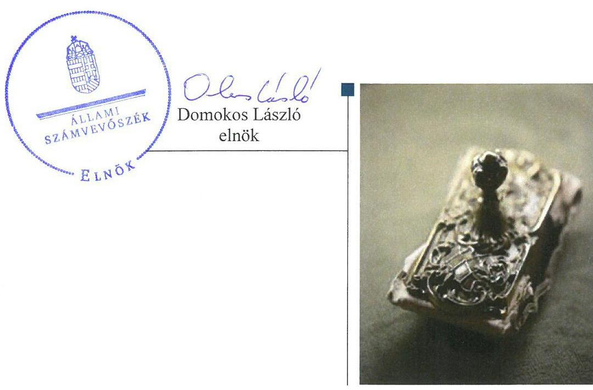
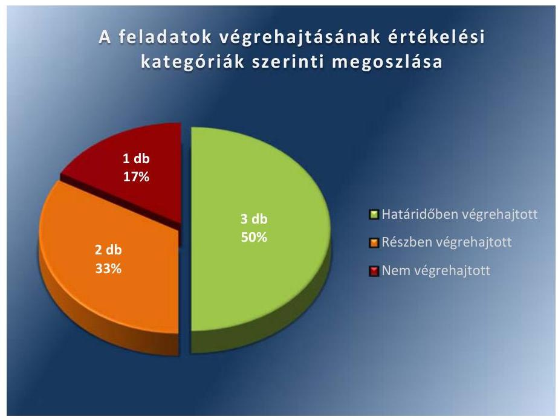

# Jelentés 

## Utóellenőrzések

A Kereszténydemokrata Néppárt 20122013. évi gazdálkodása törvényességének utóellenőrzése 2017.

---

# Jelenetés 

## Utóellenőrzések

A Kereszténydemokrata Néppárt 20122013. évi gazdálkodása törvényességének utóellenőrzése 2017. 98. hó 11. nap

---

# AZ ELLENŐRZÉST FELÜGYELTE: 

DR. BENEDEK MÁRIA felügyeleti vezető

## AZ ELLENŐRZÉST VEZETTE ÉS A VÉGREHAJTÁSÁÉRT FELELŐS:

KAKAS SÁNDOR ellenőrzésvezető

## A PROGRAM ÖSSZEÁLLÍTÁSÁÉRT FELELŐS:

JANIK JÓZSEF LÁSZLÓ osztályvezető

## A TÉMÁHOZ KAPCSOLÓDÓ KORÁBBI SZÁMVEVŐSZÉKI JELENTÉSEK:

- címe: Jelentés a Kereszténydemokrata Néppárt 20122013. évi gazdálkodása törvényességének ellenőrzéséről
- sorszáma: 15055

Jelentéseink az Országgyúlés számítógépes hálózatán és az Interneten a www.asz.hu címen is olvashatóak.

IKTATÓSZÁM: EL-0094-022/2017.
TÉMASZÁM: 21
ELLENŐRZÉS-AZONOSÍTÓ SZÁM: V075587

---

# TARTALOMJEGYZÉK 

■ ÖSSZEGZÉS ..... 5
■ AZ ELLENŐRZÉS CÉLJA ..... 6
■ AZ ELLENŐRZÉS TERÜLETE ..... 7
■ AZ ELLENŐRZÉS HÁTTERE, INDOKOLTSÁGA ..... 8
■ A JELENTÉS LÉNYEGES KÉRDÉSKÖRE ..... 9
■ ELLENŐRZÉS HATÓKÖRE ÉS MÓDSZEREI ..... 10
■ MEGÁLLAPÍTÁSOK ..... 12
■ MELLÉKLETEK ..... 15
I. sz. melléklet: Az ÁSZ 15055 számú jelentéséhez kapcsolódó intézkedési terv végrehajtása ..... 15
■ FÜGGELÉK: ÉSZREVÉTELEK ..... 17
■ RÖVIDÍTÉSEK JEGYZÉKE ..... 19

---

.

---

# ÖSSZEGZÉS 

Az Állami Számvevőszék befejezte a Kereszténydemokrata Néppárt 2012-2013. évi gazdálkodása törvényességének utóellenőrzését. Megállapította, hogy az intézkedési tervben meghatározott feladatok jelentős részét végrehajtotta, aminek következtében a gazdálkodásának szabályszerűsége javult.

## Az ellenőrzés társadalmi indokoltsága

Az Állami Számvevőszék stratégiájában célul tűzte ki a számvevőszéki munka hasznosulásának javítását. Ezzel összhangban ellenőrzi, hogy az ellenőrzött szervezetek megvalósították-e a korábbi ellenőrzései által feltárt hibák, hiányosságok és szabálytalanságok megszüntetése céljából kialakított intézkedési terveikben foglaltakat. A rendszeres utóellenőrzések hozzájárulnak a szükséges intézkedések tényleges végrehajtásához, ezáltal a közpénzügyek rendezettségének javulásához, igazolják, hogy lezárult a következmények nélküli ellenőrzések időszaka.

## Főbb megállapítások, következtetések

A Kereszténydemokrata Néppárt elnöke az intézkedést igénylő megállapításokhoz és javaslatokhoz kapcsolódóan összeállított intézkedési tervet megküldte az Állami Számvevőszék részére. Az intézkedési tervben meghatározott hat feladatból hármat határidőben, kettőt részben, egyet nem hajtott végre.

A belső szabályzatok előírásoknak megfelelő jóváhagyásáról, a munkaszerződések és módosításaik előírás szerinti aláírásáról, valamint a pénztárellenőrzések végrehajtására vonatkozó utasítás kiadásáról gondoskodott, aminek következtében gazdálkodásának szabályszerűsége javult.

Az értékcsökkenés szabályos elszámolását biztosította, meghatározta a forgatási célú értékpapírok mérlegértékének megállapítása esetén választott eljárást és intézkedett a bizonylati elv és bizonylati fegyelemre vonatkozó előírások betartására. Ugyanakkor a pénzkezelési szabályzatot nem módosította, az analitikus és a főkönyvi nyilvántartások egyeztetése és ellenőrzése lehetőségének biztosítására, a bevételek és kiadások határidőben történő rögzítésére nem intézkedett, valamint nem gondoskodott arról, hogy a párt szervezetei rendelkezzenek szervezeti és működési szabályzattal.

---

# AZ ELLENŐRZÉS CÉLJA 

Az ellenőrzés célja annak értékelése volt, hogy a számvevőszéki jelentésben foglalt intézkedést igénylő megállapításokkal és javaslatokkal összhangban készített intézkedési tervben meghatározott feladatokat a Kereszténydemokrata Néppárt végrehajtotta-e.

---

# AZ ELLENŐRZÉS TERÜLETE 

## Kereszténydemokrata Néppárt

A Kereszténydemokrata Néppárt az 1944. évben létrejött Demokrata Néppárt jogutódja, olyan egyesület, amely nyilvántartott tagsággal rendelkezik, és amely a nyilvántartásba vételét végző bíróság előtt kinyilvánította, hogy a Párttörvény ${ }^{1}$ rendelkezéseit magára nézve kötelezőnek ismeri el a Párttörvény 1. §-a alapján.

A Kereszténydemokrata Néppárt célja a magyar nemzet és a magyar haza szolgálata a keresztény-keresztyén erkölcs és értékek alapján a politikai életben, az európai népek közösségében együttműködő, szabad és független Magyarország fejlődésének előmozdítása, hogy az ország szellemiekben és anyagiakban, népességében és erkölcsében egyaránt gyarapodjék.

A Kereszténydemokrata Néppárt a 2012. és 2013. évben a törvényi előírásoknak megfelelően évente 232600 ezer Ft költségvetési támogatásban részesült.

Az Állami Számvevőszék 2015. évben ellenőrizte a Kereszténydemokrata Néppárt 2012-2013. évi gazdálkodása törvényességét. Az erről szóló 15055 számú jelentését² 2015. május 19-én tette közzé. Az ellenőrzés célja annak megállapítása volt, hogy a közzétett éves beszámolók a törvényi előírásoknak megfeleltek-e, a könyvvezetés és gazdálkodás során betartottáke a vonatkozó jogszabályi és belső előírásokat; a párt a müködéséhez szabályszerűen igénybe vehető forrásokat használt-e fel.

Az utóellenőrzés - a 2015. május 19-től 2017. április 5-ig végrehajtott feladatokat figyelembe véve - az Állami Számvevőszék jelentésében az elnök részére megfogalmazott intézkedést igénylő megállapításokra és javaslatokra készített, az Állami Számvevőszék részére megküldött intézkedési tervben foglalt feladatok megvalósításának ellenőrzésére, illetve értékelésére fókuszált.

---

# AZ ELLENŐRZÉS HÁTTERE, INDOKOLTSÁGA 

Az ÁSZ ${ }^{3}$ tv. ${ }^{4}$ 33. § (1) bekezdése értelmében a számvevőszéki jelentések intézkedést igénylő megállapításaihoz kapcsolódóan az ellenőrzött szervezet vezetője intézkedési tervet köteles összeállítani, és az ÁSZ részére megküldeni. Az intézkedési tervben foglaltak megvalósítását - az ÁSZ tv. 33. § (7) bekezdésében foglaltak alapján - az ÁSZ utóellenőrzés keretében ellenőrizheti. Az intézkedések megvalósulásának értékelése során az ÁSZ figyelembe veszi az ellenőrzött szervezetek működési feltételeiben, valamint a jogszabályi előírásokban bekövetkezett változásokat.

Az intézkedési tervekben foglalt feladatok hiányos, illetve késedelmes végrehajtása, valamint megvalósításának elmaradása azt mutatja, hogy az ellenőrzések során feltárt hibák, hiányosságok és szabálytalanságok megszüntetése nem kapott kellő hangsúlyt. Ez a szabályszerű működés és a felelős vezetői magatartás vonatkozásában kockázatot hordoz. E kockázatok feltárásával az ÁSZ utóellenőrzési rendszere fokozza a fegyelmet, és igazolja, hogy a közpénzzel való szabályos gazdálkodás felelőssége elől nem lehet kitérni.

## AZ UTÓELLENŐRZÉS VÁRHATÓ HASZNOSULÁSA

Az utóellenőrzés négy szinten hasznosulhat:

- A társadalom szintjén az utóellenőrzés jelzi, hogy a számvevőszéki ellenőrzés megállapításainak van következménye: a hiányosságok megszüntetésére az ellenőrzött szervezet által meghatározott intézkedések végrehajtását is számon kéri az ÁSZ.
- Az ellenőrzött terület szintjén az utóellenőrzés tájékoztatást nyújt a terület döntéshozóinak a hiányosságok kiküszöbölésének jó gyakorlatairól, ezzel lehetőséget biztosítva arra, hogy az ÁSZ ellenőrzési megállapításai, javaslatai a terület nem ellenőrzött szervezeteinek a működése során is hasznosuljanak.
- Az ellenőrzött szervezet szintjén az utóellenőrzés feltárja, hogy a szervezet az intézkedések végrehajtásával hasznosította-e a korábbi ellenőrzési jelentésben a hiányosságok megszüntetése, illetve a kockázatok kezelése érdekében megfogalmazott javaslatokat.
- Az ÁSZ szintjén az utóellenőrzés visszacsatolást ad az ellenőrzési jelentések hasznosulásáról, az intézkedések elmaradása vagy részleges megvalósulása a további ellenőrzésekhez kockázati jelzésként szolgál.

---

# A JELENTÉS LÉNYEGES KÉRDÉSKÖRE 

A Kereszténydemokrata Néppárt az intézkedési tervben foglaltakat az elöirt határidőben végrehajtotta-e?

---

# ELLENŐRZÉS HATÓKÖRE ÉS MÓDSZEREI 

## Az ellenőrzés típusa

Megfelelőségi ellenőrzés.

## Az ellenőrzött időszak

Az utóellenőrzés alapját képező ÁSZ jelentés közzétételének napjától (2015. május 19.) az ellenőrzésről szóló kiértesítő levél keltének napjáig (2017. április 5.) tartó időszak.

## Az ellenőrzés tárgya

Az ÁSZ tv. 2011. július 1-jei hatálybalépését követően a számvevőszéki jelentésben foglalt intézkedést igénylő megállapításokkal és javaslatokkal összhangban - a Kereszténydemokrata Néppárt által - készített intézkedési tervben foglaltak végrehajtásának ellenőrzése.

Az ellenőrzés kiterjedt minden olyan körülményre és adatra, amely az ÁSZ jogszabályban meghatározott feladatainak teljesítéséhez, valamint a program végrehajtása folyamán felmerült újabb összefüggések feltárásához szükséges volt.

## Az ellenőrzött szervezet

Kereszténydemokrata Néppárt

## Az ellenőrzés jogalapja

Az ÁSZ törvényben meghatározott feladatkörében ellenőrzi a központi költségvetés végrehajtását, az államháztartás gazdálkodását, az államháztartásból származó források felhasználását és a nemzeti vagyon kezelését.

Az ÁSZ tv. 1. § (3) bekezdése szerint az ÁSZ általános hatáskörrel végzi a közpénzekkel és az állami és önkormányzati vagyonnal való felelős gazdálkodás ellenőrzését.

Az ÁSZ tv. 33. § (7) bekezdése alapján a 33. § (1)-(2) bekezdése szerinti intézkedési tervben foglaltak megvalósítását az ÁSZ utóellenőrzés keretében ellenőrizheti.

---

# Az ellenőrzés módszerei 

Az ÁSZ az ellenőrzést a nemzetközi standardokat irányadónak tekintve az ellenőrzési program ellenőrzési kérdései, az ellenőrzött időszakban hatályos jogszabályok, az ellenőrzés szakmai szabályok és módszertanok figyelembevételével, önálló ellenőrzés keretében végezte.

Az ÁSZ az ellenőrzés ideje alatt a Kereszténydemokrata Néppárttal történő kapcsolattartást az ÁSZ SZMSZ5-ének vonatkozó előírásai alapján biztosította.

Az utóellenőrzés megállapításait elsősorban az ÁSZ rendelkezésére álló, valamint az ellenőrzött szervezettől elektronikusan bekért dokumentumok alapozták meg.

Az ellenőrzési bizonyítékként felhasználható adatforrások közé tartoztak egyrészt a szakmai programban felsorolt adatforrások, másrészt minden - az ellenőrzés folyamán feltárt, az ellenőrzés szempontjából információt tartalmazó - dokumentum.

Az intézkedési tervekben előírt feladatokat azok végrehajthatósága, illetve végrehajtása szempontjából az alábbiak szerint értékelte az ÁSZ:
"határidőben végrehajtott" a feladat, ha a teljesítés dokumentáltan, az intézkedési tervben előírt határidőben és tartalommal megtörtént;
"határidőn túl végrehajtott" a feladat, ha annak teljesítése az intézkedési tervben meghatározott módon, de az előírt határidőn túl történt meg;
"részben végrehajtott" a feladat, ha végrehajtása teljes körűen az intézkedési tervben előírt módon nem történt meg;
"nem végrehajtott" feladat, ha a végrehajtás nem történt meg, vagy amennyiben a teljesítést nem dokumentálták;
"okafogyottá vált" a feladat, ha végrehajtására - meghatározott esemény bekövetkezése, továbbá külső körülmény, a működést érintő feltétel változása miatt - már nincs szükség, illetve lehetőség, és egyértelműen megállapítható, hogy az intézkedést szükségessé tevő körülmény a jövőben nem fordulhat elő;
"nem időszerű" az a feladat, amelynek ellenőrzési időszakon belüli végrehajtására azért nem került (kerülhetett) sor, mert az intézkedés alapjául szolgáló esemény nem következett be, de annak jövőbeni előfordulása lehetséges, a végrehajtása nem volt esedékes, vagy a végrehajtás határideje még nem járt le.
Az ellenőrzés lefolytatásához a Kereszténydemokrata Néppárt a tanúsítványok elektronikus kitöltésével, valamint az ÁSZ által kért dokumentumok elektronikus megküldésével szolgáltatott adatokat, amelyek valódiságát és teljes körűségét a párt elnöke által tett teljességi és hitelességi nyilatkozat igazolta. Az így rendelkezésre bocsátott adatok, információk kontrollja az ellenőrzés keretében történt.

---

# MEGÁLLAPÍTÁSOK 

## A Kereszténydemokrata Néppárt az intézkedési tervben foglaltakat az elöírt határidőben végrehajtotta-e?

Összegző megállapítás

A KDNP ${ }^{6}$ az intézkedési tervben meghatározott hat feladatból hármat határidőben, kettőt részben, egyet nem hajtott végre.

Az ÁSZ a jelentésében a KDNP elnöke részére hat javaslatot fogalmazott meg, melynek hasznosítására az ÁSZ részére megküldött intézkedési tervben a hiányosságok, szabálytalanságok megszüntetésére a KDNP hat feladatot határozott meg. A feladatok elvégzésének felelőse a KDNP elnöke volt.

Az intézkedési tervben meghatározott feladatokat, határidőket, felelősöket és a feladatok végrehajtását az I. számú melléklet mutatja be.

A KDNP intézkedési tervében meghatározott feladatok végrehajtásának értékelési kategóriák szerinti megoszlását az 1. ábra szemlélteti.

1. ábra

Fonrás: ÁSZ

## HATÁRIDŐBEN VÉGREHAJTOTT feladatok:

$\qquad$ 1. Az elnök gondoskodott a KDNP belső szabályzatai szabályos jóváhagyásának biztosításáról az Alapszabályban ${ }^{7}$ előírtaknak megfelelően.
$\qquad$ 2. Az elnök gondoskodott arról, hogy a munkaszerződéseket, illetve azok módosításait az Alapszabály rendelkezéseiben foglalt előírások alapján a munkáltatói jogokat gyakorló írja alá.

---

3. Az elnök gondoskodott utasítás kiadásáról arra vonatkozóan, hogy a megyei és helyi szervezeteknél a Pénzkezelési szabályzatban ${ }^{8}$ foglalt előírásoknak megfelelő gyakorisággal történjenek meg a pénztárellenőrzések.

# RÉSZBEN VÉGREHAJTOTT feladatok: 

4. Az elnök gondoskodott arról, hogy az immateriális javak értékcsökkenésének főkönyvi nyilvántartásokban való elszámolása a Számv. tv. ${ }^{9}$ előírásainak megfelelően, számszakilag pontosan történjen, az Eszközök és források értékelési szabályzat ${ }^{10}$ tartalmazza a forgatási célú értékpapírok mérlegértékének megállapítása esetén választott értékelési eljárást, továbbá intézkedett a bizonylati elv és bizonylati fegyelemre vonatkozó előírások betartására. Az elnök a Pénzkezelési szabályzat tartalmára vonatkozóan, a bevételek és kiadások határidőben történő rögzítésére, valamint az analitikus és a főkönyvi nyilvántartások egyeztetése és ellenőrzése lehetőségének biztosítására nem intézkedett.
5. Az elnök határidőben gondoskodott arról, hogy a MPEB ${ }^{11}$-ok az Alapszabályban foglalt rendelkezéseknek megfelelően minden megyében megalakuljanak, azonban az MPEB-ok Alapszabályban előírt ellenőrzési feladatainak elvégzését dokumentumokkal nem igazolták.

## NEM VÉGREHAJTOTT feladat:

6. Az elnök nem intézkedett arról, hogy a KDNP szervezetei rendelkezzenek szervezeti és működési szabályzattal.

---

.

---

# MELLÉKLETEK

I. SZ. MELLÉKLET: AZ ÁSZ 15055 SZÁMÚ JELENTÉSÉHEZ KAPCSOLÓDÓ INTÉZKEDÉSI TERV VÉGREHAJTÁSA

|  Sorszám | Az intézkedési tervben meghatározott feladat
1. | Az intézkedési tervben meghatározott határidő
2. | Az intézkedési tervben meghatározott feladat felelőse
3. Határidőben végrehajtott feladatok | A feladat végrehajtása
4.  |
| --- | --- | --- | --- | --- |
|  1. | A Párt belső szabályzatainak szabályos jóváhagyását az Alapszabályban előírtaknak megfelelően korrigáljuk. | 2015. december 31. | elnök | A KDNP Országos Választmánya ${ }^{12} 2015$. december 5-i V/2015. számú határozatával az Alapszabály 57. § (1) bekezdés 6. pontjából törölte a „gazdálkodási szabályzatok" szövegrészt, így a szabályzatok jóváhagyása kikerült az Országos Választmány feladat és hatásköréből.  |
|  2. | Az Úgyvezető Főtitkár pozíciója jelenleg betöltetlen. Amennyiben a pozíció betöltésre kerül, elkészítjük a munkaköri leírást.
Gondoskodunk arról, hogy a munkaszerződéseket, illetve azok módosításait az Alapszabály rendelkezéseiben foglalt előírások alapján a munkáltatói jogokat gyakorló írja alá.
Az ügyvezetői feladatokat 2015. április 25-től Dr. Hargitai János alelnök látja el. | betöltést követően azonnal
azonnal és folyamatos | elnök | Az ügyvezető főtitkár pozíciója az ellenőrzött időszakban nem került betöltésre, ezért a munkaköri leírás elkészítése nem volt időszerű.
Az elnök gondoskodott arról, hogy a munkaszerződéseket, illetve azok módosításait az Alapszabály rendelkezéseiben foglalt előírások szerint a munkáltatói jogokat gyakorló írja alá. A KDNP elnöke 2015. április 25-én felhatalmazta az alelnököt, hogy helyette és nevében az Alapszabály 64. §-ában foglalt elnöki hatáskörben eljárjon. A munkáltatói jogokat gyakorló elnök által adott felhatalmazás alapján elnöki feladatokat ellátó alelnök 38 esetben írt alá munkaszerződést, illetve munkaszerződés módosítást.  |
|  3. | Utasítást adunk ki, hogy a pénzkezelési szabályzatban foglalt előírásoknak megfelelő gyakorisággal történjenek meg a megyei és helyi szervezeteknél a pénztárellenőrzések. | 2015. július 31. azt követően folyamatos | elnök | A KDNP elnöke 2015. április 25-én felhatalmazta az alelnököt, hogy helyette és nevében az Alapszabály 64. §-ában foglalt elnöki hatáskörben eljárjon. A KDNP ügyvezető alelnöke 2015. június 30-án kelt levélben felhívta a KDNP megyei elnökeinek figyelmét, hogy a Pénzkezelési szabályzat 8. pontja és a Pénzkezelési szabályzat III. kiegészítése szerint nevezzék ki a pénztárellenőröket és végezzék el a megyei és helyi szervezeteknél a pénztárellenőrzést.  |
|  4. | A Párt az immateriális javak értékcsökkenése főkönyvi nyilvántartásokban való elszámolását 2014. január 1-től program segítségével végzi, így összeadási hibák nem fognak előfordulni. |  |  |   |

---

|  Az intézkedési tervben meghatározott feladat | Az intézkedési tervben meghatározott határidő | Az intézkedési tervben meghatározott feladat felelőse | A feladat végrehajtása  |
| --- | --- | --- | --- |
|  1. | 2. | 3. | 4.  |
|  A Számv. tv. 14. § (4) bekezdésében foglalt előírásokat betartva, a forgatási célú értékpapírok mérlegértékének megállapítása esetén választott értékelési eljárást figyelembe véve, elkészítette a szabályzatát.
Intézkedünk a pénzkezelési szabályzat tartalmára vonatkozóan, a bevételek és kiadások határidőben történő rögzítésére, az analitikus és a főkönyvi nyilvántartások egyeztetése és ellenőrzése lehetőségének biztosítására, továbbá a bizonylati elv és bizonylati fegyelemre vonatkozó előírások betartására.
A Párt a Párttörvény rendelkezéseinek megfelelően (IV. fejezet 4. § 2,3-as bekezdés) 2014. január 1-jétől vagyoni hozzájárulást nem fogad el. A nem pénzbeni vagyoni hozzájárulás piaci értékének meghatározása, szabályzatának elkészítése a leírtakra való tekintettel szükségtelenné válik. |  |  | Az Eszközök és források értékelési szabályzatának II. sz. kiegészítése rögzítette a Számv. tv. 14. § (4) bekezdésében és a 46. § (3) bekezdésében foglaltak szerinti, a forgatási célú értékpapírok értékelésének FIFO módszerrel ${ }^{13}$ történő elszámolását.
Az elnök intézkedett a bizonylati elv és bizonylati fegyelemre vonatkozó előírások betartására azáltal, hogy az alapszervezetek és a megyei pénztárak pénztárosai számára 2015. június 22-én segédlet került kiadásra, amely felhívta a figyelmet az utalványozásra jogosult személyek feladatára és a kiküldetési rendelvény szabályszerű kitöltésére.
Az elnök nem intézkedett a Pénzkezelési szabályzat tartalmára vonatkozóan, a bevételek és kiadások Számv. tv. 165. § (3) bekezdés a)-b) pontjában és a Számviteli politika II/B. pontjában előírt határidőben történő rögzítésére, továbbá az analitikus és a főkönyvi nyilvántartások egyeztetése és ellenőrzése lehetőségének biztosítását dokumentumokkal nem igazolta.
A KDNP nyilatkozata szerint a Párttörvény IV. fejezet 4. § (2)-(3) bekezdéseiben meghatározott vagyoni hozzájárulást nem fogad el, ezért a nem pénzbeli vagyoni hozzájárulás piaci értékének meghatározása és szabályzat elkészítése az ellenőrzött időszakban nem volt időszerű.  |
|  5. | Gondoskodunk arról, hogy az Alapszabályban foglalt rendelkezéseknek megfelelően minden megyében megalakuljanak a MPEB-ok és az ellenőrzési feladatukat elvégezzék. | 2015. július 31. azt követően folyamatos | elnök  |
|  6. | Intézkedünk arról, hogy a Párt szervezetei rendelkezzenek szervezeti és működési szabályzattal, valamint a Párt gazdálkodási szabályzata az Országos Választmány által elfogadásra kerüljön. | 2015. december 31. | elnök  |

Az elnök határidőben gondoskodott arról, hogy a MPEB-ok az Alapszabály 81. §-ában foglalt rendelkezésnek megfelelően minden megyében megalakuljanak. A KDNP ügyvezetői feladatokkal megbízott alelnöke 2015. június 24-én levélben felhívta a megyei elnökök figyelmét, hogy a MPEB tagjainak megválasztását 2015. július 31-i határidővel tartsák meg. A MPEB-ok az Alapszabály 81. § (4) bekezdésében meghatározott ellenőrzési feladataik elvégzését az ellenőrzött időszakban dokumentumokkal nem igazolták.

## Nem végrehajtott feladat

1. Intézkedünk arról, hogy a KDNP szervezetei rendelkezzenek szervezeti és működési szabályzattal.

---

# FÜGGELÉK: ÉSZREVÉTELEK 

A jelentéstervezetet a Számvevőszék 15 napos észrevételezésre megküldte az ellenőrzött szervezet vezetőjének az ÁSZ tv. 29. §* (1) bekezdése előírásának megfelelően.
Az ellenőrzött szervezet vezetője az ÁSZ tv. 29. § (2) bekezdésében foglalt észrevételezési jogával nem élt, a jelentéstervezetre észrevételt nem tett.

[^0]
[^0]:    * 29. § (1) Az Állami Számvevőszék az ellenőrzési megállapításait megküldi az ellenőrzött szervezet vezetőjének vagy az általa megbízott személynek, és annak, akinek személyes felelősségét állapította meg.
    (2) Az ellenőrzött szervezet vezetője és a felelősként megjelölt személy az ellenőrzés megállapításaira tizenöt napon belül írásban észrevételt tehet.
    (3) Az Állami Számvevőszék az észrevételre a beérkezésétől számított harminc napon belül írásban válaszol. A figyelembe nem vett észrevételeket köteles a jelentésben feltüntetni, és megindokolni, hogy azokat miért nem fogadta el.

---

.

---

# RÖVIDÍTÉSEK JEGYZÉKE 

${ }^{1}$ Párttörvény
${ }^{2}$ számvevőszéki jelentés
${ }^{3}$ ÁSZ
${ }^{4}$ ÁSZ tv.
${ }^{5}$ ÁSZ SZMSZ
${ }^{6}$ KDNP
${ }^{7}$ Alapszabály
${ }^{8}$ Pénzkezelési szabályzat
${ }^{9}$ Számv. tv.
${ }^{10}$ Eszközök és források értékelési szabályzata
${ }^{11}$ MPEB
${ }^{12}$ Országos Választmány
${ }^{13}$ FIFO módszer
${ }^{14}$ Gazdálkodási szabályzat
1989. évi XXXIII. törvény a pártok működéséről és gazdálkodásáról (hatályos 1989. október 30-tól)
az ÁSZ 15055-ös számú jelentése (Elérhető a www.asz.hu honlapon.)
Állami Számvevőszék
2011. évi LXVI. törvény az Állami Számvevőszékről (hatályos 2011. július 1.-jétől)
Az Állami Számvevőszék elnökének 3/2016. (XII.29.) ÁSZ utasítása az Állami Számvevőszék Szervezeti és Működési Szabályzatáról (hatályos 2017. január 1-jétől)
Kereszténydemokrata Néppárt
Kereszténydemokrata Néppárt Alapszabálya (hatályos 2013. december 14-től)
Kereszténydemokrata Néppárt Pénzkezelési szabályzata (hatályos 2008. március 5-től)
2000. évi C. törvény a számvitelről (hatályos 2001. január 1-jétől)
Kereszténydemokrata Néppárt Eszközök és források értékelési szabályzata (hatályos 2007. november 24-től)
Kereszténydemokrata Néppárt Megyei Pénzügyi Ellenőrző Bizottsága
Kereszténydemokrata Néppárt Országos Választmánya
az elsőként bevételezett eszköz elsőként kiadva; az elsőként megvásárolt (előállított) eszköz kerül először értékesítésre (felhasználásra), következésképpen az időszak végén az eszközök között maradó tételek a legutóbb megvásárolt (előállított) tételek, (First In, First Out) (Forrás: Számv. tv. 3. § (6) bekezdés 7. pont)

Kereszténydemokrata Néppárt Gazdálkodási Szabályzata (hatályos 2010. november 8 -ától)

---

ÁLLAMI SZÁMVEVŐSZÉK
1052 Budapest, Apáczai Csere János utca 10.
Levélcím: 1364 Budapest 4. Pf. 54
Telefon: +36 14849100 Telefax: +36 14849200
www.asz.hu