# Jelentés 

## Állami tulajdonú gazdasági társaságok

Az állami tulajdonban (résztulajdonban) lévő gazdálkodó szervezetek vagyonmegőrzési és gazdálkodási tevékenységének ellenőrzése Ipoly Cipőgyár Termelő és Szolgáltató Kft. 2017.

---

# Jelentés 

## Állami tulajdonú gazdasági társaságok

Az állami tulajdonban (résztulajdonban) lévő gazdálkodó szervezetek vagyonmegőrzési és gazdálkodási tevékenységének ellenőrzése Ipoly Cipőgyár Termelő és Szolgáltató Kft.
2017. 0 hó 23 . nap
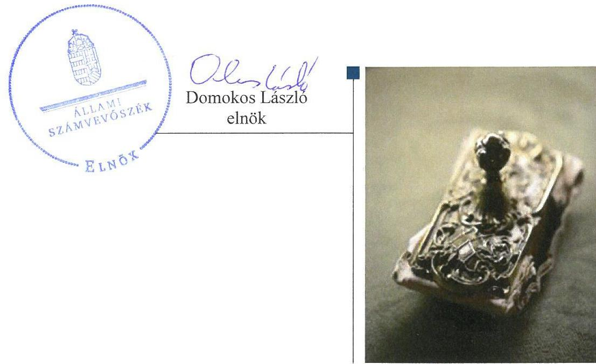

---

# AZ ELLENŐRZÉST FELÜGYELTE: 

BÖRÖCZ IMRE felügyeleti vezető

## AZ ELLENŐRZÉST VEZETTE ÉS A VÉGREHAJTÁSÁÉRT FELELŐS:

JOÓ ERIKA ellenőrzésvezető

## A PROGRAM ÖSSZEÁLLÍTÁSÁÉRT FELELŐS:

JANIK JÓZSEF osztályvezető

IKTATÓSZÁM: V-1194-128/2016

TÉMASZÁM: 2228

## ELLENŐRZÉS-AZONOSÍTÓ SZÁM: V-075912

Jelentéseink az Országgyúlés számítógépes hálózatán és az Interneten a www.asz.hu címen is olvashatóak.

---

# TARTALOMJEGYZÉK 

■ ÖSSZEGZÉS ..... 5
■ AZ ELLENŐRZÉS CÉLJA ..... 6
■ AZ ELLENŐRZÉS TERÜLETE ..... 7
■ AZ ELLENŐRZÉS HÁTTERE, INDOKOLTSÁGA ..... 9
■ A JELENTÉS LÉNYEGES KÉRDÉSKÖREI ..... 10
■ ELLENŐRZÉS HATÓKÖRE ÉS MÓDSZEREI ..... 11
■ MEGÁLLAPÍTÁSOK ..... 13
■ JAVASLATOK ..... 17
■ MELLÉKLETEK ..... 19
I. Sz. melléklet: Értelmező szótár ..... 19
■ FÜGGELÉK: ÉSZREVÉTELEK ..... 25
■ RÖVIDÍTÉSEK JEGYZÉKE ..... 49

---

.

---

# ÖSSZEGZÉS 

Az Ipoly Cipőgyár Termelő és Szolgáltató Korlátolt Felelősségű Társaság feletti tulajdonosi jogokat a tulajdonosi jogok gyakorlói szabályszerűen gyakorolták. A Társaság müködésének szabályozottsága összességében az előírásoknak megfelelő volt. A bevételek és ráfordítások elszámolása, a beszámolási és adatszolgáltatási kötelezettségek teljesítése szabályszerű volt. A vagyongazdálkodás összességében szabályszerű volt.

## Az ellenőrzés társadalmi indokoltsága

Az Állami Számvevőszék a stratégiáját megvalósítva ellenőrzéseivel segíti az átláthatóságot és az elszámoltathatóságot a közpénzekkel, a közvagyonnal való gazdálkodásban. Ellenőrzési témaválasztása során kiemelt figyelmet fordít a korábban ellenőrizetlen területekre.

Ellenőrzési tervének megfelelően a 2012-2015 közötti ellenőrzött időszakra az Állami Számvevőszék folytatja az állami tulajdonban (résztulajdonban) lévő gazdálkodó szervezetek vagyonmegőrzési és gazdálkodási tevékenységének ellenőrzését.

Az állami tulajdonú gazdasági társaságok a nemzeti vagyon részei. A magyarországi büntetés-végrehajtási szervezet gazdasági társaságai kizárólagos állami tulajdonban vannak és korábban az Állami Számvevőszék nem végzett ezeknél a gazdálkodó szervezeteknél vagyonmegőrzési és gazdálkodási tevékenységre vonatkozó ellenőrzést. A bün-tetés-végrehajtás gazdasági társaságai speciális területen, fogvatartottak munkáltatásával végzik termelő és kereskedelmi tevékenységüket, hozzájárulva ezzel a fogvatartottak kötelező foglalkoztatásához, végső soron az elítéltek társadalmi reintegrációjához. A büntetés-végrehajtási szervezet részeként működő gazdasági társaságok ellenőrzésének tapasztalatai közérdeklődésre tarthatnak számot.

## Főbb megállapítások, következtetések, javaslatok

Az Ipoly Cipőgyár Termelő és Szolgáltató Korlátolt Felelősségű Társaság felett a tulajdonosi jogokat 2013. január 30áig vagyonkezelési szerződés, ezt követően megbízási szerződés alapján a Büntetés-végrehajtás Országos Parancsnoksága, 2015. február 26-tól az elismert vállalatcsoport uralkodó tagjaként a Bv. Holding Kft. az előírásoknak megfelelően gyakorolta. A Magyar Nemzeti Vagyonkezelő Zrt. a számára fenntartott, a szerződésekben át nem engedett jogokat az előírásoknak megfelelően gyakorolta.

Az Ipoly Cipőgyár Termelő és Szolgáltató Korlátolt Felelősségű Társaság a jogszabályi előírásoknak megfelelően elkészítette számviteli politikáját, működésének szabályozottsága összességében megfelelt a jogszabályi előírásoknak.

A bevételek és ráfordítások, az értékcsökkenés elszámolása a számviteli törvény előírásainak és a belső szabályzatoknak megfelelő volt.

A beszámolási és adatszolgáltatási kötelezettségeinek a Társaság a jogszabályokban és a tulajdonosi joggyakorlók előírásainak megfelelően szabályszerűen eleget tett.

Az Ipoly Cipőgyár Termelő és Szolgáltató Korlátolt Felelősségű Társaság kizárólag saját vagyonnal rendelkezett, a vagyon nyilvántartása szabályszerű volt. A vagyon változását eredményező döntések az előírásoknak összességében megfeleltek.

Az ÁSZ az Ipoly Cipőgyár Termelő és Szolgáltató Korlátolt Felelősségű Társaság ügyvezetőjének és a Bv. Holding Kft. ügyvezetőjének fogalmazott meg javaslatokat, amelyek alapján kötelesek intézkedési tervet összeállítani és azt a jelentés kézhezvételétől számított 30 napon belül az ÁSZ részére megküldeni.

---

# AZ ELLENŐRZÉS CÉLJA 

Az ellenőrzés célja annak értékelése volt, hogy a tulajdonosi jogok gyakorlása szabályszerű volt-e; a gazdálkodó szervezet szabályozottsága, gazdálkodása és vagyongazdálkodási tevékenysége megfelelt-e a jogszabályi és a tulajdonosi előírásoknak; biztosítva volt-e az elszámoltathatóság; a vagyonváltozást eredményező döntések esetében a tulajdonosi jogok gyakorlója és a gazdálkodó szervezet szabályszerűen jártak-e el.

---

# **Izotó Cípőgyár Termelő és Szolgáltató Korlátolt Felelősségű Társaság**

Az Ispoly Cípőgyár Termelő és Szolgáltató Korlátolt Felelősségű Társaságot 1994. január 1-jén alapította a magyar állam a Társaság^{1} egyszemélyes tulajdonosaként.

A társasági részesedések felett a magyar államot megillető tulajdonosi jogokat a BVOP^{2} 2013. január 30-ig a Vtv.^{3} rendelkezéseinek megfelelően az MNV Zrt^{4}-vel megkötött vagyonkezelési szerződés, 2013. január 30-ától az Nvtv.^{5} 2012. június 30. napján hatályba lépett előírásai alapján megbízási szerződéssel gyakorolta. A szerződések a tulajdonosi joggyakorlást néhány nevesített esetben az MNV Zrt. előzetes jóváhagyásához kötötték.

A 2015. január 1-jén az MNV Zrt. jóváhagyásával alakult Bv. Holding Kft. létrehozásának célja az volt, hogy a büntetés-végrehajtási gazdasági társaságok uralmi szerződés alapján elismert vállaltcsoporti formában, azaz egységes üzletpolitikán alapuló együttműködés keretében végezzék tevékenységüket. A Holding^{6} – mint uralkodó tag – és az általa ellenőrzött gazdasági társaságok 2015. február 26-án Uralmi szerződésben^{7} rögzítették, hogy – meghatározott kivételekkel – a tulajdonosi jogokat és kötelezettségeket a Holding gyakorolja. Az Uralmi szerződés alapján a Holding volt jogosult a Társaság üzleti tervének, éves beszámolójának jóváhagyására, az ügyvezetők vonatkozásában a BVOP számára a kinevezést és a visszahívást érintő javaslattételre, a Társaság működésének ellenőrzésére, valamint a 25 millió Ft nettó értéket meghaladó tárgyi eszköz, továbbá valamennyi ingatlan és gépjármű vásárlásának és értékesítésének jóváhagyására. A tulajdonosi jogok gyakorlója^{8} számára fenntartott tulajdonosi jogokat az alapító okirat^{9}1-12 tartalmazta.

A Társaság jegyzett tőkéje 279 millió Ft volt, amely az ellenőrzött időszakban nem változott. A saját tőke/jegyzett tőke arány a törvényi követelményeknek megfelelő volt, pótbefizetésre, egyéb intézkedésre nem volt szükség. A saját tőke változását az 1. táblázat mutatja be.

A Társaság a Balassagyarmati Fegyház és Börtön területén, a Bv. szervezeti törvényben^{10} foglaltak szerint a büntetés-végrehajtási szervezet részeként működött, mint büntetés-végrehajtási szerv. A büntetések végrehajtásáról rendelkező Bv. Kódex^{11} rögzíti, hogy a büntetés-végrehajtás kiemelt célja a fogvatartottak reintegrációja, melynek egyik fontos eszköze a kötelező foglalkoztatás.

A büntetés-végrehajtási szervezetet a 44/2011. (III. 23.) Korm. rendelet^{12}, valamint a 9/2011. (III.23.) BM rendelet^{13} előírásai alapján a központi államigazgatási szervek és a rendvédelmi szervek felé a fogvatartottak kötelező foglalkoztatása keretében előállított termékek és szolgáltatások körében ellátási kötelezettség terheli. Az ellátási tevékenységet a Központi Ellátó Szerv feladatainak ellátására kijelölt BVOP koordinálta.

1. táblázat

|  SAJÁT TŐKE ÉS JEGYZETT TŐKE (MILLIÓ FT) |  |   |
| --- | --- | --- |
|  év | saját tőkei | jegyzett tőke  |
|  2012. | 870 | 279  |
|  2013. | 889 | 279  |
|  2014. | 925 | 279  |
|  2015. | 946 | 279  |

*Forrás: 2012-2015. éves beszámolók*

---

2. táblázat

|  ÉRTÉKESÍTÉS NETTÓ ÁRBEVÉTELE, |  |   |
| --- | --- | --- |
|  MÉRLEG SZERINTI EREDMÉNY |  |   |
|  (MILLO̊ FT) |  |   |
|  év | árbevétele | eredmény  |
|  2012. | 1427 | 77  |
|  2013. | 1319 | 20  |
|  2014. | 1355 | 35  |
|  2015. | 1406 | 21  |
|   | Forrás: 2012-2015. éves beszámolók |   |

A Társaság a lábbelik gyártása mellett a 2012. évben megkezdte a munkavédelmi kesztyűk, 2013. évtől egyszerűbb bőrdíszműves termékek gyártását is. A Társaság nettó árbevétele a belső ellátási rendszer bevezetésével nem változott jelentős mértékben.

A Társaság a Tao. tv. ${ }^{14}$ rendelkezése értelmében társasági adóalanynak nem minősülő szervezet, mérleg szerinti eredménye a 2012-2015. években pozitív volt. Az értékesítés nettó árbevétele és a mérleg szerinti eredmény alakulását a 2. táblázat mutatja be.

A Bv. szervezeti törvény rendelkezése szerint a gazdálkodó szervezeteknél alkalmazottak hivatásos szolgálati jogviszonyban, közalkalmazotti jogviszonyban, vagy munkaviszonyban állhatnak. A Társaságnál alkalmazottak munkaviszonyban vagy hivatásos szolgálati jogviszonyban álltak. A foglalkoztatott fogvatartottak állományi létszáma a 2012. december 31-i 237 főről 2015. december 31-ére 301 főre változott.

Az ügyvezető személye nem változott, a jelenlegi ügyvezető 2007. január 1-jétől tölti be tisztségét. A könyvvizsgáló személye nem változott.

A Társaság vagyonkezelésbe vett állami vagyonnal, más társaságban meghatározó részesedéssel nem rendelkezett.

---

# AZ ELLENŐRZÉS HÁTTERE, INDOKOLTSÁGA 

AZ ÁLLAMI TULAJDONÚ GAZDÁLKODÓ SZERVEZETEK ellenőrzése kiemelten fontos a nemzeti vagyon megőrzése, megóvása érdekében. Gazdálkodásuk jellemzően a közérdeklődés és a média figyelmének középpontjában áll, amihez hozzájárul a gazdálkodásuk körébe tartozó - közvetlen vagy közvetett állami tulajdonú - vagyon nagysága, illetve az általuk ellátott közszolgáltatások minősége és hatékonysága. A szolgáltatási/közszolgáltatási árképzés megalapozottsága és az éves elszámoltatás feltételeinek kialakítása az ellenőrzés során nagy hangsúlyt kap. A szolgáltatás/közszolgáltatás árában és annak támogatásában meg kell jelennie az önköltségszámítás szempontjainak, amely biztosítja a múködés fenntarthatóságát (eszközpótlást) is. Az ellenőrzés rámutathat az állami tulajdonú gazdálkodó szervezetek gazdálkodási tevékenységével kapcsolatos jó gyakorlatokra és szabálytalanságokra. Felhívhatja a figyelmet a jogszabályi követelmények teljesítéséhez szükséges feltételek hiányosságaira, hozzájárulhat az államháztartáson kívüli, de (közvetlenül vagy közvetve) állami vagyont használó gazdálkodó szervezetek tevékenységének átláthatóságához. Ellenőrzésünk eredményeképpen megállapításainkkal hozzájárulhatunk a nemzeti vagyonnal való gazdálkodás átláthatóságának, elszámoltathatóságának javításához.

---

# A JELENTÉS LÉNYEGES KÉRDÉSKÖREI 

1.     - A tulajdonosi jogok gyakorlása szabályszerű volt-e?
2.     - A társaság müködésének szabályozottsága megfelelt-e az előírásoknak?
3.     - A társaságnál a pénzügyi-számviteli, adatszolgáltatási és ellenőrzési feladatok ellátása szabályszerű volt-e?
4.     - A társaság vagyongazdálkodása szabályszerű volt-e?

---

# ELLENŐRZÉS HATÓKÖRE ÉS MÓDSZEREI 

## Az ellenőrzés típusa

Megfelelőségi ellenőrzés.

## Az ellenőrzött időszak

Az ellenőrzött időszak 2012. január 1-jétől 2015. december 31-ig tart.

## Az ellenőrzés tárgya

Az Ipoly Cipőgyár Termelő és Szolgáltató Korlátolt Felelősségű Társaság feletti tulajdonosi joggyakorlás, valamint a gazdasági társaság gazdálkodása - kiemelten vagyongazdálkodási tevékenysége - szabályozottsága és szabályszerűsége.

Az ellenőrzés kiterjed minden olyan körülményre és adatra, amely az ÁSZ ${ }^{15}$ jogszabályban meghatározott feladatainak teljesítéséhez, valamint a program végrehajtása folyamán felmerült újabb összefüggések feltárásához szükséges.

## Az ellenőrzött szervezet

Ipoly Cipőgyár Termelő és Szolgáltató Korlátolt Felelősségű Társaság Büntetés-végrehajtás Országos Parancsnoksága, Bv Holding Kft., Magyar Nemzeti Vagyonkezelő Zrt.

## Az ellenőrzés jogalapja

Az ellenőrzés jogalapját az ÁSZ tv. ${ }^{16}$ 1. § (3) bekezdése és 5. § (3)-(5) bekezdése képezi.

## Az ellenőrzés módszerei

Az ellenőrzést a nemzetközi standardokat irányadónak tekintve az ellenőrzési program ellenőrzési kérdései, az ellenőrzött időszakban hatályos jogszabályok, az ellenőrzés szakmai szabályok és módszertanok figyelembevételével végeztük.

Az ellenőrzés ideje alatt az ellenőrzött szervezettel történő kapcsolattartást az ÁSZ Szervezeti és Múködési Szabályzatának vonatkozó előírásai alapján biztosítottuk.

---

Az ellenőrzési program szerinti feladatokat a társaságnál, valamint a tulajdonosi jogok gyakorlóinál kellett végrehajtani.

Az ellenőrzési kérdések megválaszolásához szükséges bizonyítékok megszerzése a következő ellenőrzési eljárások alkalmazásával történt: megfigyelés, kérdésfeltevés (információkérés), összehasonlítás, mintavételezés, valamint elemző eljárás. Az ellenőrzési bizonyítékként felhasználható adatforrások közé tartoznak egyrészt az ellenőrzési programban felsorolt adatforrások, másrészt adatforrás lehet még minden - az ellenőrzés folyamán - feltárt, az ellenőrzés szempontjából információkat tartalmazó dokumentum.

Az ellenőrzést a kérdésekre adott válaszok kiértékelésével, valamint a megjelölt adatforrások, a csatolt tanúsítványok felhasználásával, továbbá az adott időszakban hatályos jogszabályok figyelembevételével folytattuk le.

---

# 1. A tulajdonosi jogok gyakorlása szabályszerű volt-e? 

Összegző megállapítás

A részesedések feletti tulajdonosi jogok gyakorlása megfelelt az előírásoknak, szabályszerű volt.

A TULAJDONOSI JOGOK GYAKORLÓI az alapító okirat ${ }_{1-}$ ${ }_{12}$-ben a részesedések feletti tulajdonosi joggyakorlás rendjét a Gt. ${ }^{17}$, illetve a Ptk. ${ }^{18}$ előírásainak megfelelően meghatározták és a Társaság feletti tulajdonosi jogokat és kötelezettségeket az előírásoknak megfelelően gyakorolták. Az operatív tevékenységek folyamatos és eseti nyomon követési rendszerének kialakítása és múködtetése szabályszerű volt. A Társaság rendszeres beszámoltatása az ellenőrzött időszakban megtörtént. A háromtagú felügyelőbizottságot a Gt. és a Ptk. ${ }_{2}$ előírásainak megfelelően alakították meg, múködése megfelelt a jogszabályi előírásoknak. A tulajdonosi joggyakorlás a könyvvizsgáló tevékenységéhez kapcsolódóan szabályszerű volt.

AZ MNV ZRT. a vagyonkezelési és a megbízási szerződésben illetve az alapító okirat ${ }_{1-12}$-ben foglaltaknak megfelelően a felügyelőbizottságba tagot delegált, biztosítva ezzel a tulajdonosi képviseletet. Az MNV Zrt. a Társaságra vonatkozó kontrolling adatszolgáltatás rendjét a vagyonkezelési szerződésben, 2013. január 30-tól a megbízási szerződésben, 2013. december 19-től a Társasági Monitoring Szabályzatban ${ }^{19}$ írta elő. Az MNV Zrt. az üzleti tervben érvényesítendő tervezési irányelveket ${ }_{2-4}{ }^{20}$ meghatározta.

A BVOP a könyvvizsgáló személyét a 2012-2014. években határozatban jelölte ki és engedélyezte a szerződéskötést. Az üzleti terv elkészítési határidejét a BVOP országos parancsnoka tárgyév január 31. napjában határozta meg ${ }^{21}$. A Társaság az üzleti terveket elkészítette, azokat a felügyelőbizottság véleménye alapján a BVOP elfogadta ${ }^{22}$. A BVOP a 2012-2014. évekre vonatkozó éves beszámolók jóváhagyásáról a felügyelőbizottság határozata és a könyvvizsgáló hitelesítő záradéka alapján határozott. A mérleg szerinti eredményről a beszámoló elfogadásával egyidejűleg a 2012-2015. években az alapító okiratban foglaltaknak megfelelően a BVOP döntött, osztalékfizetési kötelezettséget a Társaság részére egyik évben sem írt elő. A BVOP rendszeres - éves, negyedéves, havi - jelentési és adatszolgáltatási kötelezettséget írt elő a Társaság részére.

A HOLDING a 2015. évben kijelölte a könyvvizsgáló személyét és engedélyezte a szerződéskötést. A felügyelőbizottság ügyrendjét és a 2015. évi beszámolót az előírásoknak megfelelően a Holding hagyta jóvá uralkodó tagi határozatban ${ }^{23}$.

---

# 2. A társaság múködésének szabályozottsága megfelelt-e az előírásoknak? 

Összegző megállapítás

A társaság a jogszabályi előírásokban meghatározott belső szabályzatokkal rendelkezett, múködésének szabályozottsága összességében az előírásoknak megfelelő volt.

SZÁMVITELI politikával ${ }_{1.2 .3^{24}}$, leltározási és leltárkészítési szabályzattal ${ }^{25}$, önköltségszámítási szabályzattal ${ }^{26}$, pénzkezelési szabályzattal ${ }^{27}$, valamint számlarenddel ${ }^{28}$ a Számv. tv. előírásainak megfelelően rendelkezett a Társaság. A Társaság szabályzatai - az önköltségszámítási szabályzat kivételével - az előírásoknak megfeleltek.

Az önköltségszámítási szabályzatban a Számv. tv. 51. § (1) bekezdés b) és c) pont előírásai ellenére a közvetlen önköltség nem tartalmazta a termékre közvetlenül elszámolható, bizonyíthatóan a termék előállításával szoros kapcsolatban lévő - az eszközre (termékre) megfelelő mutatók, jellemzők segítségével elszámolható - termelő gépek (direktfröccsöntőgépek) értékcsökkenési leírását.

A Társaság az ellenőrzött időszakban nem szabályozta a beszerzési eljárások rendjét, a kapcsolódó felelősségi köröket, felelős személyeket.

A VEZETŐ TISZTSÉGVISELŐK és a vezető állású munkavállalókra vonatkozó javadalmazási szabályzatot ${ }^{29}$ a BVOP a Tak.tv. ${ }^{30}$ előírásainak megfelelően, a Kormányhatározatban ${ }^{31}$ meghatározott elvek szerint elkészítette.

A BVOP a 13/2008. számú határozatában rendelkezett az felügyelőbizottság javadalmazásának elveiről és az ellenőrzött időszakban évente határozattal állapította meg a felügyelőbizottság tagjainak tiszteletdíját.

## 3. A társaságnál a pénzügyi-számviteli, adatszolgáltatási és ellenőrzési feladatok ellátása szabályszerű volt-e?

## Összegző megállapítás

3.1. számú megállapítás
3. táblázat

VEVŐKÖVETELÉSEK ALAKULÁSA 2012.12.31. ÉS 2015.12.31.

| vevőkövetelés | 2012 | 2015 |
| :-- | --: | --: |
| összesen (M Ft) | 140 | 93 |
| lejárt (M Ft) | 33 | 20 |
| lejárt követelé-   sek aránya | $24 \%$ | $21 \%$ |

Forrás: 2012. évi és 2015. éves beszámoló

A Társaság a pénzügyi-számviteli, adatszolgáltatási és ellenőrzéssel kapcsolatos feladatokat összességében szabályszerűen látta el.

A bevételek és ráfordítások elszámolása megfelelt az előírásoknak, az önköltségszámítás nem volt szabályszerű.

A BEVÉTELEK ÉS RÁFORDÍTÁSOK, a beruházások, felújítások valamint az értékcsökkenés elszámolása megfelelt a jogszabályi és a belső szabályozás előírásainak.

A KÖVETELÉSEK kezeléséről gondoskodott a Társaság, a vevőkövetelések állománya 33\%-kal, a határidőn túli követelések állománya 39\%kal csökkent. A vevőkövetelések 2012. és 2015. év végi állományának alakulását a 3. táblázat mutatja be.

---

AZ ÖNKÖLTSÉGSZÁMÍTÁS során a közvetlen önköltség számítása nem felelt meg a Számv. tv. 51. § (1) bekezdés b) és c) pontjában foglalt előírásoknak.
3.2. számú megállapítás

A tervezési, beszámolási és adatszolgáltatási kötelezettségek teljesítése az előírásoknak összességében megfelelő volt.

A TERVEZÉSSEL, BESZÁMOLÁSSAL és adatszolgáltatással kapcsolatos feladatait a Társaság a jogszabályi, valamint az MNV Zrt. és a BVOP előírásainak megfelelően teljesítette. A Holding felé az éves beszámolási kötelezettség teljesítése az ellenőrzött időszakban még nem volt esedékes, de a közös ügyviteli, számviteli rendszeren keresztül a Társaság folyamatosan szolgáltatott adatokat a Holding részére. A Társaság az üzleti terveket az előírásoknak megfelelően elkészítette.

A Társaság az éves beszámolóit, a Számv. tv. és a számviteli politika ${ }_{1-3}$ előírásainak megfelelően készítette el. Az éves beszámolókat az előírt határidőben letétbe helyezték és közzítették.

A KÖZÉRDEKŰ ADATOK közzétételére vonatkozóan a Társaság rendelkezett a közzététel rendjével ${ }^{32}$, amelyet 2013. évtől közzétételi szabályzat ${ }^{33}$-ként alkotott meg. A Társaság az ellenőrzött időszak alatt az Info. ${ }^{34}$ tv.-ben előírt közzétételi kötelezettségének eleget tett, a közérdekú adatokat honlapján közzétette. A Társaság az Info. tv. 24. § (3) bekezdés előírásai ellenére 2012. október 31-ig nem szabályozta az adatok védelmét, 2012. november 1-jétől rendelkezett adatvédelmi és adatbiztonsági szabályzattal ${ }^{35}$.

# 3.3. számú megállapítás 

Az ellenőrzésekkel kapcsolatos feladatok ellátása megfelelt az előírásoknak.

Az ügyvezető igazgató félévente munkaterveket készített, melyekben előírta a szervezeti egységek ellenőrzési feladatait is, illetve célellenőrzést is tartott.

A Társaság az átfogó szakmai ellenőrzések (a munkáltatás biztonsági feladatainak teljesülésére, adatvédelmi, munkavédelmi tűzvédelmi, stb. tevékenységekkel kapcsolatban) során feltárt hiányosságok megszüntetésére intézkedett.

## 4. A társaság vagyongazdálkodása szabályszerű volt-e?

Összegző megállapítás

## 4.1. számú megállapítás

A Társaság vagyongazdálkodása a jogszabályi előírásoknak és a tulajdonosi joggyakorló által meghatározott előírásoknak, követelményeknek összességében megfelelt.

A Társaság a saját vagyon értékének megőrzését, gyarapítását szolgáló, szabályszerű vagyongazdálkodás feltételeit kialakította,

KIZÁRÓLAG SAJÁT VAGYONNAL rendelkezett a Társaság az ellenőrzött időszakban. A vagyon megőrzését, gyarapítását szolgáló és

---

# 4.2. számú megállapítás 

4.3. számú megállapítás
4. táblázat

VISSZAPÓTLÁS 2012-2015. ÉVEK (MILLIÓ FT)
elszámolt értékcsökkenés 255,7
beruházás, felújítás 426,7
Forrás: 2012-2015. éves beszámolók
szabályszerű vagyongazdálkodás feltételeit kialakította a Társaság. Szabályzataiban rendelkezett a vagyongazdálkodáshoz kapcsolódó feladat- és hatáskörökről, felelősségi viszonyokról.

## A vagyon nyilvántartása az előírásoknak megfelelő volt.

A VAGYON NYILVÁNTARTÁSA a jogszabályi előírásoknak megfelelő, átlátható és naprakész volt.

A Társaság az éves beszámolók mérlegtételeit a jogszabályi előírásoknak és a leltározási és leltárkészítési szabályzatban foglaltaknak megfelelően elkészített leltárral támasztotta alá. A leltározást mennyiségi felvétellel és egyeztetéssel a Számv. tv.-ben és a leltározási és leltárkészítési szabályzatban előírt gyakorisággal, tételesen, ellenőrizhető módon végezték.

A Társaság a vagyon értékének, állagának megőrzéséről az előírásoknak megfelelően gondoskodott. A vagyon változását eredményező döntések az előírásoknak összességében megfeleltek.

A VAGYON SZERKEZETÉBEN nem volt jelentős átrendeződés, a vagyon az ellenőrzött időszakban növekedett. A Társaság az elszámolt értékcsökkenés értékét meghaladva hajtott végre beruházást, felújítást az eszközök pótlására. (4. táblázat)

A Társaság az ellenőrzött időszak alatt a tárgyi eszközök rendszeres időközönkénti karbantartásáról, karbantartási tervek ${ }^{36}$ alapján gondoskodott.

A VAGYON VÁLTOZÁSÁT eredményező döntések megfeleltek a tulajdonosi joggyakorlók előírásainak. Térítés nélküli vagyon átvételére illetve átadására nem került sor.

A Társaság egyes beszerzései során nem a Kbt. ${ }^{37}$ szerinti ajánlatkérőként járt el.

---

# JAVASLATOK 

Az ÁSZ tv. 33. § (1) bekezdésében foglaltak értelmében az ellenőrzött szervezet vezetője köteles a jelentésben foglalt megállapításokhoz kapcsolódó intézkedési tervet összeállítani és azt a jelentés kézhezvételétől számított 30 napon belül az ÁSZ részére megküldeni. Amennyiben az ellenőrzött szervezet vezetője nem küldi meg határidőben az intézkedési tervet, vagy továbbra sem elfogadható intézkedési tervet küld, az Állami Számvevőszék elnöke az ÁSZ tv. 33. § (3) bekezdése a) és b) pontjaiban foglaltakat érvényesítheti.

## Az Ipoly Cipőgyár Termelő és Szolgáltató Kft. ügyvezetőjének

1. Módosítsa az önköltségszámítási szabályzatot a közvetlen önköltségre vonatkozó jogszabályi előírásnak megfelelően.
(2. sz. összegző megállapítás 2. bekezdése alapján)
2. Intézkedjen a jogszabályi előírásnak megfelelő beszerzési eljárásrend megalkotásáról.
(2. sz. összegző megállapítás 3. bekezdése alapján)
3. Intézkedjen, hogy a beszerzési eljárásokat az előírásoknak megfelelően folytassák le.
(4.3. sz. megállapítás 4. bekezdése alapján)

## A Bv. Holding Kft. ügyvezetőjének

1. Intézkedjen, hogy az Ipoly Cipőgyár Termelő és Szolgáltató Kft -t érintő beszerzési eljárásokat az előírásoknak megfelelően lefolytassák.
(4.3. sz. megállapítás 4. bekezdése alapján)

---

.

---

# MELLÉKLETEK 

- I. SZ. MELLÉKLET: ÉRTELMEZŐ SZÓTÁR
állami vagyon
a) Az állam tulajdonában lévő dolog, valamint a dolog módjára hasznosítható természeti erő,
b) az a) pont hatálya alá nem tartozó mindazon vagyon, amely vonatkozásában törvény az állam kizárólagos tulajdonjogát nevesíti,
c) az állam tulajdonában lévő tagsági jogviszonyt megtestesítő értékpapír, illetve az államot megillető egyéb társasági részesedés,
d) az államot megillető olyan immateriális, vagyoni értékkel rendelkező jogosultság, amelyet jogszabály vagyoni értékű jogként nevesít.
Forrás: Vtv. 1. § (2) bekezdése
2012. november 10-től az állami vagyon fogalma kiegészül a következő ponttal:
e) az állam tulajdonában lévő pénzügyi eszközök

Forrás: Vtv. 1. § (2) bekezdése
2013. június 27-ig:

Az állami vagyont az MNV Zrt. maga kezeli, vagy szerződés - így különösen bérlet, haszonbérlet, megbízás - alapján központi költségvetési szervnek, természetes vagy jogi személynek, vagy jogi személyiséggel nem rendelkező gazdálkodó szervezetnek hasznosításra átengedi.
Forrás: Vtv. 23. § (1) bekezdése
2013. június 28-ától:

Az állami vagyonnal az MNV Zrt. maga gazdálkodik, vagy szerződés - így különösen bérlet, haszonbérlet, megbízás - alapján központi költségvetési szervnek, természetes vagy jogi személynek, vagy jogi személyiséggel nem rendelkező gazdálkodó szervezetnek hasznosításra átengedi, illetőleg vagyonkezelésbe, haszonélvezetbe adja.
Forrás: Vtv. 23. § (1) bekezdése
A 2011. július 1-jén hatályba lépett 44/2011. számú Kormányrendelet
(a büntetés-végrehajtási szervezet részéről a központi államigazgatási szervek és a rendvédelmi szervek irányában fennálló egyes ellátási kötelezettségekről, a termékek és szolgáltatások átadás-átvételének és azok ellentételezésének rendjéről)
és a 9/2011. számú BM rendelet (a büntetés-végrehajtási szervezet részéről a büntetés-végrehajtásért felelős miniszter vezetése, irányítása vagy felügyelete alá tartozó szervek irányában fennálló ellátási kötelezettségről, a fogvatartottak kötelező foglalkoztatása keretében előállított termékekről és szolgáltatásokról, azok átadás-átvételéről és az ellentételezés rendjéről)
2012. évben végrehajtott módosításai következtében bővült a központi ellátásba bevont államigazgatási szervek köre. Ezen értékesítési lehetőséget bővítő rendeletek, a belső ellátás szolgálatába vonták a büntetés-végrehajtási gazdasági társaságokat oly módon, hogy a Kormány, illetve a Belügyminisztérium irányítása alá tartozó szerveknek a 100 e Ft feletti és a közbeszerzési értékhatár alatti beszerzéseit, a továbbiakban, kötelezően a fogvatartottak foglalkoztatására létrehozott gazdasági társaságokon keresztül kellett megvalósítaniuk

---

gazdasági társaság
állami vagyon kezelője/vagyonkezelő
gazdálkodó szervezet
meghatározó befolyás

A Ptk. 3:88. § (1) bekezdése szerint „a gazdasági társaságok üzletszerű közös gazdasági tevékenység folytatására, a tagok vagyoni hozzájárulásával létrehozott, jogi személyiséggel rendelkező vállalkozások, amelyekben a tagok a nyereségből közösen részesednek, és a veszteséget közösen viselik".
2013. június 27-ig:

Az állami vagyont az MNV Zrt. maga kezeli, vagy szerződés - így különösen bérlet, haszonbérlet, megbízás - alapján központi költségvetési szervnek, természetes vagy jogi személynek, vagy jogi személyiséggel nem rendelkező gazdálkodó szervezetnek hasznosításra átengedi. Az állami vagyonra vonatkozóan az MNV Zrt. kizárólag az Nvtv-ben meghatározott személyekkel köthet vagyonkezelési szerződést.
Forrás: Vtv. 23. § (1), 27. § (1)
2013. június 28-ától:

Az állami vagyonnal az MNV Zrt. maga gazdálkodik, vagy szerződés - így különösen bérlet, haszonbérlet, megbízás - alapján központi költségvetési szervnek, természetes vagy jogi személynek, vagy jogi személyiséggel nem rendelkező gazdálkodó szervezetnek hasznosításra átengedi, illetőleg vagyonkezelésbe, haszonélvezetbe adja. Az állami vagyonra vonatkozóan az MNV Zrt. kizárólag az Nvtv-ben meghatározott személyekkel köthet vagyonkezelési szerződést.
Forrás: Vtv. 23. § (1), 27. § (1)
2014. március 14-ig:

A Ptk. $1^{38}$ 685. § c) pontja szerint gazdálkodó szervezet: „az állami vállalat, az egyéb állami gazdálkodó szerv, a szövetkezet, a lakásszövetkezet, az európai szövetkezet, a gazdasági társaság, az európai részvénytársaság, az egyesülés, az európai gazdasági egyesülés, az európai területi együttmúködési csoportosulás, az egyes jogi személyek vállalata, a leányvállalat, a vízgazdálkodási társulat, az erdő birtokossági társulat, a végrehajtói iroda, az egyéni cég, továbbá az egyéni vállalkozó."
2014. március 15 -től:

A gazdasági társaság, az európai részvénytársaság, az egyesülés, az európai gazdasági egyesülés, az európai területi együttmúködési csoportosulás, a szövetkezet, a lakásszövetkezet, az európai szövetkezet, a vízgazdálkodási társulat, az erdőbirtokossági társulat, az állami vállalat, az egyéb állami gazdálkodó szerv, az egyes jogi személyek vállalata, a közös vállalat, a végrehajtói iroda, a közjegyzői iroda, az ügyvédi iroda, a szabadalmi ügyvivői iroda, az önkéntes kölcsönös biztosító pénztár, a magánnyugdíjpénztár, az egyéni cég, továbbá az egyéni vállalkozó. Az állam, a helyi önkormányzat, a költségvetési szerv, az egyesület, a köztestület, valamint az alapítvány gazdálkodó tevékenységével összefüggő polgári jogi kapcsolataira is a gazdálkodó szervezetre vonatkozó rendelkezéseket kell alkalmazni.
Forrás: Ppt ${ }^{39} .396 . \S$
2014. március 14 -ig:

A befolyással rendelkező akkor rendelkezik egy jogi személyben meghatározó befolyással, ha annak tagja, illetve részvényese és
a) jogosult e jogi személy vezető tisztségviselői vagy felügyelőbizottsága tagjai többségének megválasztására, illetve visszahívására, vagy
b) a jogi személy más tagjaival, illetve részvényeseivel kötött megállapodás alapján egyedül rendelkezik a szavazatok több mint ötven százalékával.
A meghatározó befolyás akkor is fennáll, ha a befolyással rendelkező számára az előzőek szerinti jogosultságok közvetett módon biztosítottak. A befolyással rendelkezőnek egy jogi személyben a szavazatok több mint ötven százalékával

---

MNV Zrt.
nemzeti vagyon
rábízott vagyon
közvetett módon való rendelkezése vagy egy jogi személyben közvetetten fennálló meghatározó befolyása megállapítása során a jogi személyben szavazati joggal rendelkező más jogi személyt (köztes vállalkozást) megillető szavazatokat meg kell szorozni a befolyással rendelkezőnek a köztes vállalkozásban, illetve vállalkozásokban fennálló szavazatával. Ha a köztes vállalkozásban fennálló szavazatok mértéke az ötven százalékot meghaladja, akkor azt egy egészként kell figyelembe venni.
Forrás: $\mathrm{Ptk}_{1}$. 685/B. § (2)-(3) bekezdések
2014. március 15-től:

A befolyással rendelkező akkor rendelkezik egy jogi személyben meghatározó befolyással, ha annak tagja vagy részvényese, és
a) jogosult e jogi személy vezető tisztségviselői vagy felügyelőbizottsága tagjai többségének megválasztására, illetve visszahívására; vagy
b) a jogi személy más tagjai, illetve részvényesei a befolyással rendelkezővel kötött megállapodás alapján a befolyással rendelkezővel azonos tartalommal szavaznak, vagy a befolyással rendelkezőn keresztül gyakorolják szavazati jogukat, feltéve, hogy együtt a szavazatok több mint felével rendelkeznek.
Forrás: $\mathrm{Ptk}_{2}$. 8:2. § (2) bekezdés
Az állami vagyon felett, a Magyar Államot megillető tulajdonosi jogok és kötelezettségek összességét - a hatályos szabályozás szerint - az állami vagyon felügyeletéért felelős miniszter (jelenleg a nemzeti fejlesztési miniszter) gyakorolja. A miniszter feladatát nagy részben az MNV Zrt., mint tulajdonosi joggyakorló szervezet útján látja el.
az állam vagy a helyi önkormányzat kizárólagos tulajdonában álló dolgok, az a) pont hatálya alá nem tartozó, állam vagy a helyi önkormányzat tulajdonában lévő dolog,
az állam vagy a helyi önkormányzatot tulajdonában lévő pénzügyi eszközök, továbbá az államot vagy a helyi önkormányzatot megillető társasági részesedések,
az államot vagy a helyi önkormányzatot megillető bármely vagyoni értékkel rendelkező jogosultság, amelyet jogszabály vagyoni értékű jogként nevesít, Magyarország határa által körbezárt terület feletti légtér,
az üvegházhatású gázok kibocsátási egységeinek kereskedelméről szóló törvény szerint kibocsátási egység és légiközlekedési kibocsátási egység, valamint az ENSZ Éghajlatváltozási Keretegyezménye és annak Kiotói Jegyzőkönyve végrehajtási keretrendszeréről szóló törvény szerinti kiotói egység, állami vagy helyi önkormányzati fenntartású közgyűjtemény (muzeális intézmény, levéltár, közgyűjteményként működő kép- és hangarchívum, valamint könyvtár) saját gyűjteményében nyilvántartott kulturális javak körébe tartozó dolog, kivéve, ha az állami vagy önkormányzati tulajdon jogszerű létrejötte kétséget kizáró módon nem bizonyítható és a dologra nézve más a tulajdonjogát bizonyítja vagy a kulturális javakra vonatkozó jogszabályokban meghatározott eljárás keretében valószínűsíti (g. pont módosult 2013. december 7től),
a régészeti lelet,
a nemzeti adatvagyon körébe tartozó állami nyilvántartások fokozottabb védelméről szóló törvény szerinti nemzeti adatvagyon.
Forrás: Nvtv. 1. § (2)
Egyrészt minden a Vtv. alkalmazásában állami vagyonnak minősülő vagyon, amit az MNV Zrt. kezel és nyilvántart.

---

tulajdonosi ellenőrzés
tulajdonosi jogok gyakorlója

Másrészt az a vagyon, amely felett a Magyar Állam nevében az MFB Zrt. gyakorolja a tulajdonosi jogokat.
Forrás: MFB tv. 3. § (9)
A rábízott vagyon a tulajdonosi jogokat gyakorló szervezetek saját vagyonától elkülönítendő.
Forrás: Vtv. 22. § (6)
2014. március 14-ig:

Az állami vagyon kezelőjét, haszonélvezőjét, használóját megillető jogok gyakorlását, annak szabályszerűségét, célszerűségét az MNV Zrt. - szükség szerint területi szervei útján - ellenőrzi.
2014. március 15-től:

Az állami vagyon használóját, vagyonkezelőjét és haszonélvezőjét megillető jogok gyakorlását, annak szabályszerűségét, a kötelezettségek teljesítését, valamint a vagyon rendeltetése szerinti célszerűségét a tulajdonosi joggyakorló rendszeresen ellenőrzi.
Forrás: Vhr. 20. § (1)
1.
2013. június 27-ig:

Az állami vagyon felett a Magyar Államot megillető tulajdonosi jogok és kötelezettségek összességét - ha törvény eltérően nem rendelkezik - az állami vagyon felügyeletéért felelős miniszter (a továbbiakban: miniszter) gyakorolja, aki e feladatát a Magyar Nemzeti Vagyonkezelő Zártkörűen Működő Részvénytársaság (a továbbiakban: MNV Zrt.), a Magyar Fejlesztési Bank, illetve a tulajdonosi joggyakorló szervezet útján látja el. A miniszter miniszteri rendeletben, a törvényben meghatározott állami vagyoni kör tekintetében, meghatározott időtartamra, a joggyakorlás egyes szabályainak meghatározásával az őt megillető tulajdonosi jogok és kötelezettségek összességének, illetve azok meghatározott részének gyakorlóját az Áht. szerinti központi költségvetési szervek, ezek intézménye, továbbá a 100\%-ban állami tulajdonban álló gazdasági társaságok közül kijelölheti.
Forrás: Vtv. 3. § (1) és (2)
2013. június 28-ától:

A rábízott állami vagyon felett az államot megillető tulajdonosi jogok és kötelezettségek összességét tulajdonosi joggyakorlóként:
a) ha törvény vagy miniszteri rendelet eltérően nem rendelkezik, a Magyar Nemzeti Vagyonkezelő Zártkörűen Működő Részvénytársaság (a továbbiakban: MNV Zrt.),
b) törvényben kijelölt személy vagy
c) az állami vagyon felügyeletéért felelős miniszter (a továbbiakban: miniszter) által rendeletben kijelölt személy gyakorolja.
[...] A miniszter e törvény felhatalmazása alapján - a meghatározott célok hatékonyabb elérése érdekében, miniszteri rendeletben, az ott meghatározott állami vagyoni kör tekintetében, meghatározott időtartamra - e törvény keretei között, a joggyakorlás egyes szabályainak meghatározásával - az államot megillető tulajdonosi jogok és kötelezettségek összességének, illetve azok meghatározott részének gyakorlóját az Áht. szerinti központi költségvetési szervek, ezek intézménye, továbbá a 100\%-ban állami tulajdonban álló gazdasági társaságok közül kijelölheti.
Forrás: Vtv. 3. § (1) és (2)

---

# 2. 

Aki a nemzeti vagyon felett az államot vagy a helyi önkormányzatot megillető tulajdonosi jogok és kötelezettségek összességének gyakorlására jogosult Forrás: Nvtv. 3. § (1) 17. pontja
2013. június 27-től:

A vagyonkezelő köteles a vagyontárgy értékét megőrizni, állagának megóvásáról, jó karban tartásáról, működtetéséről gondoskodni, továbbá - a központi költségvetési szervek kivételével - díjat fizetni vagy a szerződésben előírt más kötelezettséget teljesíteni.
Forrás: Vtv. 27. § (2)
2013. június 28-ától december 31-ig:

A vagyonkezelő köteles a vagyontárgy állagának megóvásáról, jó karbantartásáról, működtetéséről gondoskodni, továbbá - a központi költségvetési szervek kivételével - díjat fizetni, jogszabályban és szerződésben előírt más kötelezettségét teljesíteni, valamint a vagyontárgyat jogszabályban vagy szerződésben meghatározott célnak megfelelően használni. Amennyiben a vagyonkezelő ezen kötelezettségének nem tesz eleget, a tulajdonosi joggyakorló jogosult a szerződést azonnali hatállyal felmondani.
Forrás: Vtv. 27. § (2)
2014. január 1-jétől:

A vagyonkezelő köteles a vagyontárgy állagának megóvásáról, jó karbantartásáról, működtetéséről gondoskodni, jogszabályban és szerződésben előírt más kötelezettségét teljesíteni, valamint a vagyontárgyat jogszabályban vagy szerződésben meghatározott célnak megfelelően használni.
A vagyonkezelő - a központi költségvetési szervek és a kizárólag közfeladatot ellátó nem központi költségvetési szerv vagyonkezelők kivételével - köteles díjat fizetni, jogszabályban és szerződésben előírt más kötelezettségét teljesíteni, valamint a vagyontárgyat jogszabályban vagy szerződésben meghatározott célnak megfelelően használni. Amennyiben a vagyonkezelő ezen kötelezettségeinek nem tesz eleget, a tulajdonosi joggyakorló jogosult a szerződést azonnali hatállyal felmondani.
Forrás: Vtv. 27. § (2), (2a)

---

.

---

# FÜGGELÉK: ÉSZREVÉTELEK 

A jelentéstervezetet a Számvevőszék 15 napos észrevételezésre megküldte az ellenőrzött szervezetek vezetőinek az ÁSZ tv. 29. §* (1) bekezdése előírásának megfelelően.

A függelék tartalmazza az ellenőrzöttek észrevételeit, illetve az el nem fogadott észrevételek elutasításának indoklását.

- Az MNV Zrt. vezérigazgatójának írásban tett észrevétele
- A BVOP országos parancsnokának észrevétele
- Tájékoztatás a BVOP országos parancsnokának az észrevételek kezeléséről
- A Holding ügyvezetőjének írásban tett észrevétele (Az ahhoz csatolt mellékletek nélkül.)
- Tájékoztatás a Holding ügyvezetőjének az észrevételek kezeléséről
- A Társaság ügyvezetőjének írásban tett észrevétele
- Tájékoztatás a Társaság ügyvezetőjének az észrevételek kezeléséről

[^0]
[^0]:    * 29. § (1) Az Állami Számvevőszék az ellenőrzési megállapításait megküldi az ellenőrzött szervezet vezetőjének vagy az általa megbízott személynek, és annak, akinek személyes felelősségét állapította meg.
    (2) Az ellenőrzött szervezet vezetője és a felelősként megjelölt személy az ellenőrzés megállapításaira tizenöt napon belül írásban észrevételt tehet.
    (3) Az Állami Számvevőszék az észrevételre a beérkezésétől számított harminc napon belül írásban válaszol. A figyelembe nem vett észrevételeket köteles a jelentésben feltüntetni, és megindokolni, hogy azokat miért nem fogadta el.

---

# MNV Magyar Nemzetı Vagyonkezeló Zrt.   Vezérigazgato   Állami Számvevőszék 

## Domokos László   elnök

1052 Budapest
Apáczai Cs. J. u. 10.

Ikt. sz.: MNV/01/15016/ 4 /2017.
Hiv. sz.: V-1194-101/2016.

Tisztelt Elnök Úr!
Tájékoztatom, hogy az MNV Zrt. a 2017. június 12. napján „Az állami tulajdonban (résztulajdonban) lévő gazdálkodó szervezetek vagyonmegőrzési és gazdálkodási tevékenységének ellenőrzése - Ipoly Cipőgyár Termelő és Szolgáltató Kft." tárgyában kézhez vett, V-1194-101/2016. ikt. sz. Jelentéstervezetre nem kíván észrevételt tenni.

Budapest, 2017. június „ 16 "

Üdvözlettel:
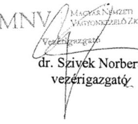

---

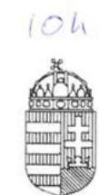

BÜNTETÉS-VÉGREHAJTÁS ORSZÁGOS PARANCSNOKSÁGA DR. TÓTH TAMÁS
ORSZÁGOS PARANCSNOK

Szám: 30500/5734/1/2017.ált

Tárgy: jelentéstervezetre észrevétel
Hivatkozási szám: V-1194-102/2016.
Úgyintéző: dr. Demkó Tibor c. bv. ezredes
Tel: 06-1-301-8453

# Domokos László Úr 

elnök

## Állami Számvevőszék

## Budapest

Budapest 4.
Pf. 54.
1364

## ÁLLAMI SZÁMVEVŐSZÉK

36-44994/200/1
Érkeze: 2017 JON 28.
tHiatószám: V-1194-15046
Moliéklat:

## Tisztelt Elnök Úr!

A Büntetés-végrehajtás Országos Parancsnoksága (a továbbiakban: BVOP) tulajdonosi joggyakorlása alá tartózó Ipoly Cipőgyár Termelő és Szolgáltató Korlátolt Felelősségű Társaság (a továbbiakban: Társaság) számvevőszéki ellenőrzéséről készült, a V-1194102/2016. iktatószámú levelével megküldött jelentéstervezetre az alábbi észrevételeket teszem:

A jelentéstervezet szerint a Társaság a beruházások esetében a közbeszerzési eljárást jogtalanul mellőzte, illetve a számvevőszéki ellenőrzés időszakában nem rendelkezett közbeszerzési szabályzattal.

Álláspontunk szerint az adott beruházások tekintetében a Társaság nem minősült/minősül az ellenőrzőtt időszak alatt hatályban volt közbeszerzésekről szóló 2011. évi CVIII. törvény (a továbbiakban: régi Kbt.), és a 2015. november 1. napjától hatályos közbeszerzésekről szóló 2015. évi CXLIII. törvény (a továbbiakban: hatályos Kbt.) szerinti klasszikus ajánlatkérőnek.

A régi Kbt. 6. § (1) bekezdés c) pontja alapján ajánlatkérőnek minősül az a jogképes szervezet, amelyet közérdekü, de nem ipari vagy kereskedelmi jellegü tevékenység folytatása céljából hoznak létre, vagy amely ilyen tevékenységet lát el, ha az a)-d) pontokban meghatározott egy vagy több szervezet, az Országgyülés vagy a Kormány külön-külön vagy együttesen, közvetlenül vagy közvetetten meghatározó befolyást képes felette gyakorolni vagy müködését többségi részben egy vagy több ilyen szervezet (testület) finanszírozza.

A hatályos Kbt. 5. § (1) bekezdés e) pontja alapján ajánlatkérőnek minősül az a jogképes szervezet, amelyet nem ipari vagy kereskedelmi jellegü, kifejezetten közérdekü tevékenység folytatása céljából hoznak létre, vagy amely bármilyen mértékben ilyen tevékenységet lát

---

el, feltéve, hogy e szervezet felett az a)-e) pontban meghatározott egy vagy több szervezet, az Országgyülés vagy a Kormány közvetlenül vagy közvetetten meghatározó befolyást képes gyakorolni vagy működését többségi részben egy vagy több ilyen szervezet (testület) finanszírozza.

A hatályos Kbt. indokolása kiemeli, hogy az új törvény pontosítja a közjogi szervezetekre vonatkozó meghatározást, és rögzíti, hogy a kifejezetten közérdekü célra létrehozott szervezetek minősülnek csak ajánlatkérőnek.

A 2004/18/EK irányelv 1. cikk (9) bekezdése és a 2004/17/EK irányelv 2. cikk (1)-(2) bekezdése a közbeszerzési szabályok személyi hatályát a következőképpen állapítják meg. A 2004/18/EK irányelv személyi hatálya: "Ajánlatkérő szerv": az állam, a területi vagy a települési önkormányzat, a közjogi intézmény, továbbá az egy vagy több ilyen szerv, illetve közjogi intézmény által létrehozott társulás;
"Közjogi intézmény" minden olyan intézmény,
a) amely kifejezetten olyan közérdekü célra jött létre, amely nem ipari vagy kereskedelmi jellegü;
b) amely jogi személyiséggel rendelkezik; valamint
c) amelyet többségi részben az állam, vagy a területi vagy a települési önkormányzat, vagy egyéb közjogi intézmény finanszíroz; vagy amelynek irányítása ezen intézmények felügyelete alatt áll; vagy amelynek olyan ügyvezető, döntéshozó vagy felügyelő testülete van, amely tagjainak többségét az állam, a területi vagy a települési önkormányzat, vagy egyéb közjogi intézmény nevezi ki.

Az Európai Unió Bíróságának C-360/96. sz. BFI Holding ítéletében meghatározattak alapján az első, a) pont szerinti feltétel két elemét önállóan kell megvizsgálni, és mindkét feltételnek fenn kell állnia a közjogi intézménnyé minősitéshez. Különbséget kell tehát tenni az olyan közérdekủ tevékenységek között, amelyek ipari vagy kereskedelmi jellegűek, és amelyek nem ipari vagy kereskedelmi jellegűek. Ha a tevékenység kizárólag ipari vagy kereskedelmi jellegü, vagy ilyen jellegü és egyben közérdekü, a szervezet az egyéb feltételek fennállása esetén sem minősül ún. közjogi szervezetnek.

A közbeszerzésről és a 2004/18/EK irányelv hatályon kívül helyezéséről szóló Európai Parlament és a Tanács 2014/24/EU irányelv (10) preambulum bekezdése is rögzíti, hogy az olyan szerv, amely szokásos piaci feltételekkel müködik, nyereségorientált, és a tevékenysége végzéséből eredő veszteségeket maga viseli, nem tekintendő „közjogi intézménynek", mivel azok a közérdekủ célok, amelyek teljesítésére létrehozták, vagy amelyek teljesítésével megbízták, gazdasági vagy üzleti jellegűnek minősülhetnek.

Véleményünk az, hogy a közérdeküség fennállta mellett az is megállapítható, hogy a Társaság ipari, kereskedelmi jellegủ tevékenységet végez és versenyfeltételek befolyásolják müködését. Így nem tartozik sem a régi, sem a hatályos Kbt. alanyi hatálya alá. (Európai Bíróság C-18/01. számú, Korhonen and Others ügyben hozott ítélete)

A Társaság alapító okirata 4. pontjában megjelölt főtevékenység - TEÁOR'08 szerint lábbeli gyártás, illetve a 4.1. pont alatti tevékenységek egyértelműen ipari, kereskedelmi, azaz üzletszerű jellegre utalnak. A Társaság alapítójának is az volt a szándéka, hogy a Polgári Törvénykönyvről szóló 2013. évi V. törvény 3:88. § (1) bekezdése szerinti üzletszerű közös gazdasági tevékenység folytatására, a tagok vagyoni hozzájárulásával létrehozott, jogi személyiséggel rendelkező vállalkozás jöjjön létre.

---

A Magyar Nemzeti Vagyonkezelő Zrt. profit orientált társaságként tartja nyilván a Társaságot, valamint az adott évre vonatkozó üzleti terv tervezéséhez kiadott irányelvekben is nyereséget írt elő a Magyar Állam tulajdonában lévő és a BVOP tulajdonosi joggyakorlása alá tartozó gazdasági társaságoknak.

Összefoglalva a fent leírtakat, a jelentéstervezet nem állapítja meg, hogy a régi és hatályos Kbt. mely pontja alapján minősül klasszikus ajánlatkérőnek a Társaság. Álláspontunk szerint a Társaság a régi Kbt. és az új Kbt. alapján az ellenőrzött időszakban nem minősült klasszikus ajánlatkérőnek, ezért nem volt közbeszerzési eljárás indítására kötelezett, illetve ezért nem rendelkezett/rendelkezik a régi Kbt. 22.§ (1) bekezdésében, illetve a hatályos Kbt. 27. § (1) bekezdésében előírt közbeszerzési szabályzattal.

Kérem a Tisztelt Elnök Urat, hogy fenti észrevételünket a jelentéstervezet 2. sz. összegző megállapítás 3. bekezdése és 4.3. sz. megállapítás 4. bekezdése tekintetében figyelembe venni szíveskedjenek.

Budapest, 2017. június , 22. ,

Tisztelettel:
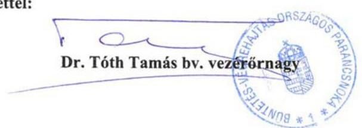

---

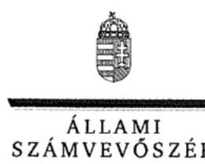

ELNÖK

# Dr. Tóth Tamás úr 

vezérőmagy, országos parancsnok
Büntetés-Végrehajtás Országos Parancsnoksága

## Budapest

## Tisztelt Országos Parancsnok Úr!

Az ,,Állami tulajdonú gazdasági társaságok - Az állami tulajdonban (résztulajdonban) lévő gazdálkodó szervezetek vagyonmegőrzési és gazdálkodási tevékenységének ellenőrzése - Ipoly Cipőgyár Termelő és Szolgáltató Kft. " címmel készített számvevőszéki jelentéstervezetre tett észrevételeit köszönettel megkaptam.
Az Állami Számvevőszék észrevételekre vonatkozó álláspontjáról a felügyeleti vezető által készített részletes tájékoztatást csatoltan megküldöm.

Tájékoztatom Országos Parancsnok urat, hogy a számvevőszéki jelentésben - az Állami Számvevőszékről szóló 2011. évi LXVI. törvény 29. § (3) bekezdése alapján - a figyelembe nem vett észrevételeket szerepeltetjük, annak indoklásával, hogy azokat az Állami Számvevőszék miért nem fogadta el.

Budapest, 2017. 07 hó 27 nap
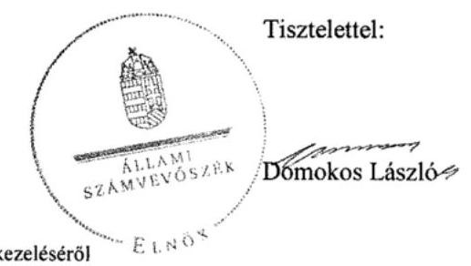

Melléklet: Tájékoztatás az észrevételek kezeléséről

---

# Tájékoztatás   az észrevételek kezeléséről 

Az ,,Állami tulajdonú gazdasági társaságok - Az állami tulajdonban (résztulajdonban) lévő gazdálkodó szervezetek vagyonmegőrzési és gazdálkodási tevékenységének ellenörzése - Ipoly Cipögyár Termelő és Szolgáltató Kft." címü jelentéstervezetre tett (2017. június 22-én kelt, 27-én postára adott és az Állami Számvevőszékhez június 28-án érkezett) észrevételeit áttekintettük, azok kezelésével kapcsolatban a következő tájékoztatást adom.
A Büntetés-Végrehajtás Országos Parancsnoksága (a továbbiakban: BVOP) a 2. számú összegző megállapítás 3. bekezdéséhez, a 4.3. számú megállapításhoz füzött észrevételei szerint az Ipoly Cipögyár Kft. (a továbbiakban: Társaság) nem minősült az ellenőrzött időszak alatt a hatályos közbeszerzési törvények szerinti klasszikus ajánlatkérőnek. A közbeszerzési törvények (a közbeszerzésről szóló 2011. évi CVIII. törvény /a továbbiakban: régi Kbt./ és a 2015. november 1jétől hatályos közbeszerzésről szóló 2015. évi CXLIII. törvény /új Kbt./) rendelkezései mellett a BVOP egyes kapcsolódó európai uniós irányelvek rendelkezéseit és az Európai Unió Bíróságának a tárgyhoz kapcsolódóan meghozott egyes ítéleteit is idézte annak alátámasztása céljából, hogy az Ipoly Cipőgyár Kft.- tekintve, hogy ipari, kereskedelmi jellegủ tevékenységet végez, és álláspontjuk szerint az uniós irányelvek szerint nem tekinthető közjogi intézménynek - nem tartozott az ellenőrzött időszakban a közbeszerzési törvények hatálya alá. Mindezek alapján a BVOP nem ért egyet a 2. számú összegző megállapítás 3. bekezdésével, a 4.3. számú megállapítás 4. bekezdésével sem.
A büntetés-végrehajtási szervezetről szóló 1995. évi CVII. törvény (a továbbiakban: Bvsz.) 2. § (5) bekezdése értelmében a fogvatartottak kötelező foglalkoztatására létrehozott gazdasági társaságok büntetés-végrehajtási szervezetnek minősülnek, amelynek feladata a Bvsz. 1. § (2) bekezdése értelmében a közrend és a közbiztonság erősítése. A Társaság Alapító okiratának 7. pontja szerint ,,a társaság fogvatartottak kötelezö foglalkoztatására létrehozott gazdálkodó szervezet, egyben büntetés-végrehajtási szerv", tehát a régi és új Kbt-ben meghatározott közérdekü, kifejezetten közérdekü szervnek minősül.
A régi Kbt. 6. § (1) bekezdés c) pontjához kapcsolódik a régi Kbt. 6. § (2) bekezdése, mely szerint az ajánlatkérői minőség megállapítható abban az esetben is, ha a szervezet közérdekü feladatán kívül más tevékenységet - akár ipari vagy kereskedelmi tevékenységet - is folytat. A Társaság régi Kbt. szerinti ajánlatkérői minőségét megalapozza továbbá Alapító okiratának 7. pontja is (lásd fentebb.).
Az Európai Unió Bírósága a C-18/01. számú Korhonen és társai ügyben megállapította, hogy nem kizárt egy szervezetet annak ellenére ajánlatkérőnek minősíteni, ha müködése során profitot termel, de annak elsődleges célja a közérdekủ célok szolgálata és nem az üzleti eredményesség elérése. A Társaság Alapító okiratának 7. pontjából (lásd fentebb) megállapítható, hogy a Társaság közjogi intézmény.
Ezt erősíti továbbá az Európai Unió Bírósága C-283/00. számú „SIEPSA" ügye is, amelynek tárgya a szervezet közérdekü jellegének megítélése volt. A Bíróság kimondta, hogy az ügybeli cég közérdekủ intézménynek minősül, mivel az alapító okiratából megállapítható volt, hogy az általa kifejtett tevékenység lényegében az állam büntetőhatalmának gyakorlásához szorosan kapcsolódó tevékenység, és mint ilyen tevékenység lényegében a közérdekhez kapcsolódik.

---

Az új Kbt. 5. § (1) bekezdés e) pontja továbbra is a közérdekủ tevékenység bármilyen mértékben történő ellátása alapján is az ajánlatkérői körbe sorolja a kérdéses szervezeteket. A fent leírtakra figyelemmel a Társaság Alapító okiratának 7. pontjában foglaltak (lásd fentebb) közérdekủ tevékenységnek minősülnek, ezért a Társaság ajánlatkérőnek minősül, aminek vonatkozásában alkalmazni kell az új Kbt. rendelkezéseit.

Az ÁSZ a mintatételek ellenőrzése alapján statisztikai kivetítés eredménye alapján rögzítette a beszerzésekkel kapcsolatos feltárt szabálytalanságokat a jelentéstervezetben, amely a teljes sokaság vonatkozásában értelmezhető. A mintavételes eljárásra vonatkozóan az ellenőrzés módszerei fejezet tartalmaz információt.

A fentiek alapján nem fogadtuk el azon észrevételüket, hogy a Társaság nem tartozik a Kbt. hatálya alá. A beszerzéseknél a jogszabályi előírások betartása minden szervezet számára kötelező. Ugyanakkor nem lehet eltekinteni attól, hogy a fogvatartottak foglalkoztatása kiemelt közérdek. Mindezekre tekintettel a jelentéstervezet vonatkozó részeit pontosítjuk.

Tájékoztatom, hogy a számvevőszéki jelentés függelékeként szerepeltetjük a jelentéstervezethez tett észrevételeit, valamint az azokra adott válaszunkat.

Budapest, 2017. CZ hó $\varepsilon /$ nap
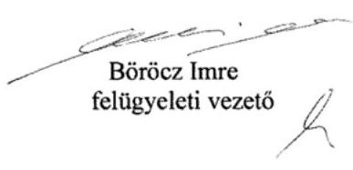

---

# Bv. Holding Kft. 

1064 Budapest, Rózsa utca 75-79. www.bvholdingkft.hu Tel: 361 301-8461 bvholdingkft@bvholdingkft.hu

Hiv.szám: V-1194-103/2016
Tárgy: Észrevétel jelentéstervezetre
Ügyintéző: dr. Fóriżs Gergő
Mobil: +36-30-190-0446
E-mail: forizs.gergo@bv.gov.hu

## Domokos László elnök úr részére

Állami Számvevőszék

## Budapest

Budapest 4.
Pf. 54.
1364

## Tisztelt Elnök Úr!

Hivatkozással fenti iktatószámon „Az állami tulajdonban (résztulajdonban lévő gazdálkodó szervezetek vagyonmegőrzési és gazdálkodási tevékenységének ellenőrzése - Ipoly Cipőgyár Termelő és Szolgáltató Kft." címen megküldött jelentéstervezetre, a Bv. Holding Kft. - mint a Bv. Holding elismert vállalatcsoport uralkodó tagja - képviseletében a törvényes határidőn belül az Állami Számvevőszék felé az alábbi nyilatkozatot teszem.

A jelentéstervezet 2. számú összegző megállapítás 3. bekezdése alapján a vonatkozó jogszabályi előírások ellenére az Ipoly Cipőgyár Kft. az ellenőrzött időszakban nem határozta meg a közbeszerzési eljárások rendjét, a kapcsolódó felelősségi köröket, felelős személyeket. Továbbá a jelentés tervezet 4.3. számú megállapítás 4. bekezdése szerint a beruházások esetében az Ipoly Cipőgyár Kft. a beszerzések idején hatályos Kbt. alanyi hatálya alá tartozó szervezetként közbeszerzési eljárás mellőzésével megvalósított beszerzéseivel megsértette a vonatkozó közbeszerzési törvényekben előírt közbeszerzési eljárás lefolytatásának kötelezettségét

Társaságunk alábbi álláspontja szerint az Ipoly Cipőgyár Kft. nem minősült az ellenőrzött időszak alatt hatályban volt közbeszerzésekről szóló 2011. évi CVIII. törvény (a továbbiakban: régi Kbt.), és a 2015. november 1. napjától hatályos közbeszerzésekről szóló 2015. évi CXLIII. törvény (a továbbiakban: hatályos Kbt.) szerinti klasszikus ajánlatkérőnek.

A régi Kbt. 6. § (1) bekezdés c) pontja alapján ajánlatkérőnek minősül az a jogképes szervezet, amelyet közérdekü, de nem ipari vagy kereskedelmi jellegü tevékenység folytatása céljából hoznak létre, vagy amely ilyen tevékenységet lát el, ha az a)-d) pontokban meghatározott egy vagy több szervezet, az Országgyülés vagy a Kormány külön-külön vagy együttesen, közvetlenül vagy közvetetten meghatározó befolyást képes felette gyakorolni vagy müködését többségi részben egy vagy több ilyen szervezet (testület) finanszírozza.

---

Bv. Holding Kft.
1064 Budapest, Rózsa utca 75-79.
www.bvholdingkft.hu Tel: 36 1 301-8461
bvholdingkft@bvholdingkft.hu

A hatályos Kbt. 5. § (1) bekezdés d) pontja alapján ajánlatkérőnek minősül az a jogképes szervezet, amelyet nem ipari vagy kereskedelmi jellegű, kifejezetten közérdekű tevékenység folytatása céljából hoznak létre, vagy amely bármilyen mértékben ilyen tevékenységet lát el, feltéve, hogy e szervezet felett az a)-e) pontban meghatározott egy vagy több szervezet, az Országgyűlés vagy a Kormány közvetlenül vagy közvetetten meghatározó befolyást képes gyakorolni vagy működését többségi részben egy vagy több ilyen szervezet (testület) finanszírozza.

A hatályos Kbt. indokolása kiemeli, hogy az új törvény pontosítja a közjogi szervezetekre vonatkozó meghatározást, és rögzíti, hogy a kifejezetten közérdekú célra létrehozott szervezetek minősülnek csak ajánlatkérőnek.

A 2004/18/EK irányelv 1. cikk (9) bekezdése és a 2004/17/EK irányelv 2. cikk (1)-(2) bekezdése a közbeszerzési szabályok személyi hatályát a következőképpen állapítják meg. A 2004/18/EK irányelv személyi hatálya: "Ajánlatkérő szerv": az állam, a területi vagy a települési önkormányzat, a közjogi intézmény, továbbá az egy vagy több ilyen szerv, illetve közjogi intézmény által létrehozott társulás; "Közjogi intézmény" minden olyan intézmény,
a) amely kifejezetten olyan közérdekú célra jött létre, amely nem ipari vagy kereskedelmi jellegü;
b) amely jogi személyiséggel rendelkezik; valamint
c) amelyet többségi részben az állam, vagy a területi vagy a települési önkormányzat, vagy egyéb közjogi intézmény finanszíroz; vagy amelynek irányítása ezen intézmények felügyelete alatt áll; vagy amelynek olyan ügyvezető, döntéshozó vagy felügyelő testülete van, amely tagjainak többségét az állam, a területi vagy a települési önkormányzat, vagy egyéb közjogi intézmény nevezi ki.

Az Európai Unió Bíróságának C-360/96. sz. BFI Holding ítéletében meghatározattak alapján az első, a) pont szerinti feltétel két elemét önállóan kell megvizsgálni, és mindkét feltételnek fenn kell állnia a közjogi intézménnyé minősítéshez. Különbséget kell tehát tenni az olyan közérdekű tevékenységek között, amelyek ipari vagy kereskedelmi jellegűek, és amelyek nem ipari vagy kereskedelmi jellegűek. Ha a tevékenység kizárólag ipari vagy kereskedelmi jellegű, vagy ilyen jellegű és egyben közérdekü, a szervezet az egyéb feltételek fennállása esetén sem minősül ún. közjogi szervezetnek.

Álláspontunk szerint a fentiek alapján az egyes feltételek együttes fennállását, az egyes feltételek külön-külön történő vizsgálatával lehet megállapítani, melyre vonatkozóan a jelentéstervezet megállapítást nem tartalmaz.

A tevékenység ipari vagy kereskedelmi jellegére vonatkozó utalás az általános közgazdasági fogalomhasználat szerint olyan gazdasági tevékenységet feltételez, amelynek eredményeként profitszerzési célból piacképes termék elöállítása történik, illetőleg olyan tevékenységet, amely termékek vagy szolgáltatások kereskedelmi forgalomban, versenyfeltételek mellett történő értékesítési célja által jellemezhető.

Előbbiek alapján ezen feltétel fennállása tekintetében az Európai Uniós közbeszerzési irányelveknek megfelelően vizsgálni szükséges különösen az Ipoly Cipőgyár Kft.. létrehozását motiváló

---

Bv. Holding Kft.
1064 Budapest, Rózsa utca 75-79.
www.bvholdingkft.hu Tel: 361 301-8461
bvholdingkft@bvholdingkft.hu
körülményeket, illetve azt a gazdasági környezetet, amelyben a társaság a közérdekü tevékenységet végzi, így különösen
a) a versenyfeltételek meglétét,
b) a tevékenységet végző társaság for-profit, vagy non-profit jellegét,
c) nyereségorientáltságát,
d) üzleti kockázatok önálló viselésének feltételeit.

Álláspontunk szerint megállapítható, hogy a b)-d) feltételek egyértelmúen fennállnak, mivel az Ipoly Cipőgyár Kft. profit jellegü, nyereségorientált és nem nonprofit társaság, üzleti kockázatát önállóan viseli.

A versenyfeltételek megléténél is összességében szükséges társaság versenypiaci jelenlétét vizsgálni, így az egyes versenypiaci előnyök mellett, különösen az Ipoly Cipőgyár Kft. alábbi piaci hátrányait is figyelembe kell venni:

- számos uniós és hazai pályázati forrástól az állami jelleg miatt ki van zárva,
- az elítéltek foglalkoztatásából eredő sajátos és indokolt többletkiadásokat a központi költségvetés 2011. óta a társaságnak nem téríti meg;
- a 44/2011. Korm. rendelet, és a 9/2011. BM rendelet szerinti ellátási kötelezettsége teljesítése körében kötelezően fogvatartottakat kell foglalkoztatnia, és ezen ellátási kötelezettsége keretében a szerződött partnereit a Társaság szabadon nem választhatja meg,
- versenypiaci társaihoz képest az állami tulajdoni jelleg miatt müködése bonyolultabb, nagyobb adminisztrációval jár így az általános müködéshez nagyobb létszámú munkaerő szükséges, melyek foglalkoztatása a jogszabályban foglaltaknak minden esetben megfelel,
- a Társaságnál könyvvizsgáló, és Felügyelő Bizottság létrehozása is kötelező.

Kiemelendő továbbá, hogy a közbeszerzésről és a 2004/18/EK irányelv hatályon kívül helyezéséről szóló Európai Parlament és a Tanács 2014/24/EU irányelv (10) preambulum bekezdése is rögzíti, hogy az olyan szerv, amely szokásos piaci feltételekkel müködik, nyereségorientált, és a tevékenysége végzéséből eredő veszteségeket maga viseli, nem tekintendő „közjogi intézménynek", mivel azok a közérdekü célok, amelyek teljesitésére létrehozták, vagy amelyek teljesítésével megbizták, gazdasági vagy üzleti jellegúnek minősülhetnek.

Véleményünk az, hogy a közérdeküség fennállta mellett az is megállapítható, hogy a Társaság ipari, kereskedelmi jellegü tevékenységet végez és versenyfeltételek befolyásolják müködését. Igy nem tartozik sem a régi, sem a hatályos Kbt. alanyi hatálya alá. (Európai Bíróság C-18/01. számú, Korhonen and Others ügyben hozott itélete)

A Társaság alapító okirata 4. pontjában megjelölt főtevékenység - TEÁOR'08 szerint - 1520'08 Lábbelígyártás, illetve a 4.1. pont alatti tevékenységek egyértelmüen ipari, kereskedelmi, azaz üzletszerű jellegre utalnak. A Társaság alapítójának is az volt a szándéka, hogy a Polgári Törvénykönyvről szóló 2013. évi V. törvény 3:88. § (1) bekezdése szerinti üzletszerű közös gazdasági

---

Bv. Holding Kft.
1064 Budapest, Rózsa utca 75-79.
www.bvholdingkft.hu Tel: 361 301-8461
bvholdingkft@bvholdingkft.hu
tevékenység folytatására, a tagok vagyoni hozzájárulásával létrehozott, jogi személyiséggel rendelkező vállalkozás jöjön létre. Az MNV Zrt. is profit orientált társaságként tartja nyilván a Társaságot, valamint az adott évekre vonatkozó üzleti tervek tervezéséhez kiadott irányelvekben is nyereséget irt elő a Magyar Állam tulajdonában lévő és a Büntetés-végrehajtás Országos Parancsnoksága megbízott tulajdonosi joggyakorlása alá tartozó gazdasági társaságoknak.

Összefoglalva a fent leírtakat, álláspontunk szerint a jelentéstervezet nem állapítja meg, hogy az Ipoly Cipőgyár Kft. a régi és hatályos Kbt. mely pontja alapján minősül ajánlatkérőnek, illetve azt, hogy régi Kbt. 6. § (1) bekezdés c) pontja, illetve a hatályos Kbt. 5. § (1) bekezdés d) pontja szerinti ipari vagy kereskedelmi jellegű tevékenység meglétét az Állami Számvevőszék esetlegesen vizsgálta volna-e.

Társaságunk észrevételeként továbbá előadom, hogy az ellenőrzési jelentés - 4.3. számú megállapítás 4. bekezdésében - nem határozza meg, hogy az Ipoly Cipőgyár Kft. az ellenőrzött időszakban pontosan mely beruházása esetében sértette meg a vonatkozó jogszabályok által előirt közbeszerzési eljárás lefolytatásának kötelezettségét.

Álláspontunk szerint a Társaság a régi Kbt. és az új Kbt. alapján az ellenőrzött időszakban nem minősült klasszikus ajánlatkérőnek, ezért nem rendelkezett/r rendelkezik a régi Kbt. 22.§ (1) bekezdésében, illetve a hatályos Kbt. 27. § (1) bekezdésében előirt közbeszerzési szabályzattal, és az ellenőrzött időszakban, és jelenleg sem kötelezett klasszikus ajánlatkérőként közbeszerzési eljárás lefolytatására.

A fentiek alapján Társaságunk nem ért egyet a jelentéstervezet 2. összegző megállapítás 3. bekezdésében, és 4.3. számú megállapítás 4. bekezdésében leírtakkal, illetve jelentéstervezetben Javaslatok cím alatt a Bv. Holding Kft. ügyvezetőjének javasolt intézkedéssel.

# Tisztelt Állami Számvevőszék! 

Kérjük, hogy Társaságunk fenti észrevételeit az ellenőrzési jelentés véglegesítésekor figyelembe venni szíveskedjen.

Budapest, 2017. június 21.

## Tisztelettel:

Bv. Holding Kft.
1064 Budapest, Rózsa utca 75-79.
Adószám: 25120064-2-51.
Cégjegyzékszám: 01-09-200937
(I.)

Varga Zsolt bv. alezredes
ügyvezető igazgató

Mellékletek: Bv. Holding Kft. hatályos alapító okiratának és ügyvezetői aláírási cimpéldányának másolata

---

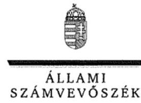

ELNÖK

Ikt.szám: V-1194-121/2016.

# Varga Zsolt úr 

ügyvezető
Bv. Holding Kft.

## Budapest

## Tisztelt Ügyvezető Úr!

Az „Állami tulajdonú gazdasági társaságok - Az állami tulajdonban (résztulajdonban) lévő gazdálkodó szervezetek vagyonmegőrzési és gazdálkodási tevékenységének ellenőrzése - Ipoly Cipőgyár Termelő és Szolgáltató Kft. " címmel készített számvevőszéki jelentéstervezetre tett észrevételeit köszönettel megkaptam.
Az Állami Számvevőszék észrevételekre vonatkozó álláspontjáról a felügyeleti vezető által készített részletes tájékoztatást csatoltan megküldöm.

Tájékoztatom Ügyvezető urat, hogy a számvevőszéki jelentésben - az Állami Számvevőszékről szóló 2011. évi LXVI. törvény 29. § (3) bekezdése alapján - a figyelembe nem vett észrevételeket szerepeltetjük, annak indoklásával, hogy azokat az Állami Számvevőszék miért nem fogadta el.

Budapest, 2017. 07 hó 21 nap
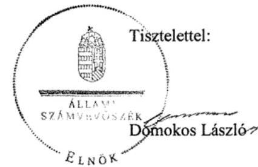

Melléklet: Tájékoztatás az észrevételek kezeléséről

---

# Tájékoztatás   az észrevételek kezeléséről 

Az ,,Állami tulajdonú gazdasági társaságok - Az állami tulajdonban (résztulajdonban) lévő gazdálkodó szervezetek vagyonmegőrzési és gazdálkodási tevékenységének ellenörzése - Ipoly Cipögyár Termelő és Szolgáltató Kft." címü jelentéstervezetre tett (2017. június 21-án kelt, 22-én postára adott és az Állami Számvevőszékhez június 23-án érkezett) észrevételeit áttekintettük, azok kezelésével kapcsolatban a következő tájékoztatást adom.
A Bv. Holding Kft. 2. számú összegző megállapítás 3. bekezdéséhez, a 4.3. számú megállapítás 4. bekezdéséhez illetve a Bv Holding Kft. ügyvezetőjének címzett javaslathoz füzött észrevételei szerint az Ipoly Cipőgyár Kft.(továbbiakban: Társaság) nem minősült az ellenőrzött időszak alatt a hatályos közbeszerzési törvények szerinti klasszikus ajánlatkérőnek. A közbeszerzési törvények (a közbeszerzésről szóló 2011. évi CVIII. törvény /a továbbiakban: régi Kbt./ és a 2015. november 1-jétől hatályos közbeszerzésről szóló 2015. évi CXLIII. törvény /új Kbt./) rendelkezései mellett a Bv. Holding Kft. egyes kapcsolódó európai uniós irányelvek rendelkezéseit és az Európai Unió Bíróságának a tárgyhoz kapcsolódóan meghozott egyes ítéleteit is idézte annak alátámasztása céljából, hogy az Ipoly Cipőgyár Kft.- tekintve, hogy ipari, kereskedelmi jellegü tevékenységet végez, és álláspontjuk szerint az uniós irányelvek szerint nem tekinthető közjogi intézménynek - nem tartozott az ellenőrzött időszakban a közbeszerzési törvények hatálya alá. Mindezek alapján a Bv. Holding Kft. nem ért egyet a 2. számú összegző megállapítás 3. bekezdésével, a 4.3. számú megállapítás 4. bekezdésével illetve a Bv Holding Kft. ügyvezetőjének címzett javaslattal sem.
A Bv. Holding Kft. mindezeken túlmenően észrevételében kifogásolta, hogy a jelentéstervezetben az Állami Számvevőszék nem határozza meg, hogy mely időszakban és mely beruházások esetében sértette meg a hatályos Kbt. elöírásait a Társaság.
A büntetés-végrehajtási szervezetről szóló 1995. évi CVII. törvény (a továbbiakban: Bvsz.) 2. § (5) bekezdése értelmében a fogvatartottak kötelező foglalkoztatására létrehozott gazdasági társaságok büntetés-végrehajtási szervezetnek minősülnek, amelynek feladata a Bvsz. 1. § (2) bekezdése értelmében a közrend és a közbiztonság erősítése. A Társaság Alapító okiratának 7. pontja szerint „a társaság fogvatartottak kötelező foglalkoztatására létrehozott gazdálkodó szervezet, egyben büntetés-végrehajtási szerv", tehát a régi és új Kbt-ben meghatározott közérdekü, kifejezetten közérdekü szervnek minősül.
A régi Kbt. 6. § (1) bekezdés c) pontjához kapcsolódik a régi Kbt. 6. § (2) bekezdése, mely szerint az ajánlatkérői minőség megállapítható abban az esetben is, ha a szervezet közérdekü feladatán kívül más tevékenységet - akár ipari vagy kereskedelmi tevékenységet - is folytat. A Társaság régi Kbt. szerinti ajánlatkérői minőségét megalapozza továbbá Alapító okiratának 7. pontja is (lásd fentebb.).
Az Európai Unió Bírósága a C-18/01. számú Korhonen és társai ügyben megállapította, hogy nem kizárt egy szervezetet annak ellenére ajánlatkérőnek minősíteni, ha müködése során profitot termel, de annak elsődleges célja a közérdekü célok szolgálata és nem az üzleti eredményesség elérése. A Társaság Alapító okiratának 7. pontjából (lásd fentebb) megállapítható, hogy a Társaság közjogi intézmény.

---

Ezt erősíti továbbá az Európai Unió Bírósága C-283/00. számú „SIEPSA" ügye is, amelynek tárgya a szervezet közérdekủ jellegének megítélése volt. A Bíróság kimondta, hogy az ügybeli cég közérdekủ intézménynek minősül, mivel az alapító okiratából megállapítható volt, hogy az általa kifejtett tevékenység lényegében az állam büntetőhatalmának gyakorlásához szorosan kapcsolódó tevékenység, és mint ilyen tevékenység lényegében a közérdekhez kapcsolódik.
Az új Kbt. 5. § (1) bekezdés e) pontja továbbra is a közérdekủ tevékenység bármilyen mértékben történő ellátása alapján is az ajánlatkérői körbe sorolja a kérdéses szervezeteket. A fent leírtakra figyelemmel a Társaság Alapító okiratának 7. pontjában foglaltak (lásd fentebb) közérdekủ tevékenységnek minősülnek, ezért a Társaság ajánlatkérőnek minősül, aminek vonatkozásában alkalmazni kell az új Kbt. rendelkezéseit.
Az ÁSZ a mintatételek ellenőrzése alapján statisztikai kivetítés eredménye alapján rögzítette a beszerzésekkel kapcsolatos feltárt szabálytalanságokat a jelentéstervezetben, amely a teljes sokaság vonatkozásában értelmezhető. A mintavételes eljárásra vonatkozóan az ellenőrzés módszerei fejezet tartalmaz információt.

A fentiek alapján nem fogadtuk el azon észrevételüket, hogy a Társaság nem tartozik a Kbt. hatálya alá. A beszerzéseknél a jogszabályi előírások betartása minden szervezet számára kötelező. Ugyanakkor nem lehet eltekinteni attól, hogy a fogvatartottak foglalkoztatása kiemelt közérdek. Mindezekre tekintettel a jelentéstervezet vonatkozó részeit pontosítjuk.

Tájékoztatom, hogy a számvevőszéki jelentés függelékeként szerepeltetjük a jelentéstervezethez tett észrevételeit, valamint az azokra adott válaszunkat.

Budapest, 2017. 07 hó 21 nap
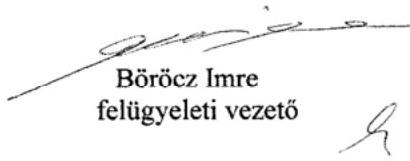

---

# (3) ipoly   CIPOGYAR   Alapítva 1954. évben 

IPOLY CIPÖGYÁR KFT. ÜGYVEZETÖ IGAZGATÓ 2660 Balassagyarmat, Madách u. 2. Tel: (35) 501-279 E-mail: ipoly@ipolycipo.hu

Iktatószám: 75-I/28-4/2017.
Tárgy: észrevétel jelentéstervezetre
Hiv.szám: V-1194-104/2016.

## Állami Számvevőszék

## Domokos László elnök úr részére

## Budapest

Budapest 4.
Pf. 54.
1364

## Tisztelt Elnök Úr!

Hivatkozással fenti iktatószámon „Az állami tulajdonban (résztulajdonban) lévő gazdálkodó szervezetek vagyonmegőrzési és gazdálkodási tevékenységének ellenőrzése - Ipoly Cipőgyár Termelő és Szolgáltató Kft." címen megküldött jelentéstervezetre az Állami Számvevőszék felé alulírott Nemszilaj Sándor, mint az Ipoly Cipőgyár Kft. ügyvezetője a törvényes határidőn belül az alábbi észrevételeket teszem:

## I.

A jelentéstervezet 2. sz. összegző megállapítás 2. bekezdése alapján az Ipoly Cipőgyár Kft. Önköltségszámítási Szabályzatában a közvetlen önköltség nem tartalmazta a direktfröccsöntőgép értékcsökkenési leírását. A 17. oldalon az ügyvezetőnek tett javaslat 1. pontja az Önköltségszámítási Szabályzat közvetlen önköltségre vonatkozó módosítását írja elő.

Az Önköltségszámítási Szabályzat közvetlen önköltségre vonatkozó módosítását társaságunk a 2016.01.01-vel kiadott új Szabályzattal már az ellenőrzés megkezdését megelőzően elvégezte, de a vizsgálat erre a dokumentumra nem terjedt ki, mivel az ellenőrzött időszakot követően keletkezett. Ezáltal ez a javaslati pont már teljesült.

## II.

A jelentéstervezet 2. összegző megállapítás 3. bekezdése alapján a vonatkozó jogszabályi előírások ellenére a Ipoly Cipőgyár Kft. az ellenőrzött időszakban nem határozta meg a közbeszerzési eljárások rendjét, a kapcsolódó felelősségi köröket, felelős személyeket. A 4.3. sz. megállapítás 4. bekezdése szerint a Társaság a beruházások esetében a beszerzések idején hatályos Kbt. alanyi hatálya alá tartozó szervezetként a közbeszerzési eljárás mellőzésével megvalósított beszerzéseivel megsértette a Kbt. 5.§-a alapján fennálló, a Kbt. 19.§-ban előírt

---

# -2-

közbeszerzési eljárás lefolytatásának kötelezettségét. A 17. oldalon az ügyvezetőnek tett javaslatok 2-4. pontja a közbeszerzési eljárásrend megalkotásának és a közbeszerzési eljárások lefolytatásának kötelezettségét rögzíti, valamint intézkedést ír elő a felelősség tisztázása és érvényesítése végett.

Társaságunk alábbi álláspontja szerint az Ipoly Cipőgyár Kft. nem minősült az ellenőrzött időszak alatt hatályban volt közbeszerzésekről szóló 2011. évi CVIII. törvény (a továbbiakban: régi Kbt.), és a 2015. november 1. napjától hatályos közbeszerzésekről szóló 2015. évi CXLIII. törvény (a továbbiakban: hatályos Kbt.) szerinti klasszikus ajánlatkérőnek.

A régi Kbt. 6. § (1) bekezdés c) pontja alapján ajánlatkérőnek minősül az a jogképes szervezet, amelyet **közérdekű, de nem ipari vagy kereskedelmi jellegű tevékenység** folytatása céljából hoznak létre, vagy amely ilyen tevékenységet lát el, ha az a)-d) pontokban meghatározott egy vagy több szervezet, az Országgyűlés vagy a Kormány külön-külön vagy együttesen, közvetlenül vagy közvetetten meghatározó befolyást képes felette gyakorolni vagy működését többségi részben egy vagy több ilyen szervezet (testület) finanszírozza.

A hatályos Kbt. 5. § (1) bekezdés d) pontja alapján ajánlatkérőnek minősül az a jogképes szervezet, amelyet **nem ipari vagy kereskedelmi jellegű, kifejezetten közérdekű tevékenység folytatása céljából hoznak létre**, vagy amely bármilyen mértékben ilyen tevékenységet lát el, feltéve, hogy e szervezet felett az a)-e) pontban meghatározott egy vagy több szervezet, az Országgyűlés vagy a Kormány közvetlenül vagy közvetetten meghatározó befolyást képes gyakorolni vagy működését többségi részben egy vagy több ilyen szervezet (testület) finanszírozza.

A hatályos Kbt. indokolása kiemeli, hogy az új törvény pontosítja a közjogi szervezetekre vonatkozó meghatározást, és rögzíti, hogy **a kifejezetten közérdekű célra létrehozott szervezetek minősülnek csak ajánlatkérőnek.**

A 2004/18/EK irányelv 1. cikk (9) bekezdése és a 2004/17/EK irányelv 2. cikk (1)-(2) bekezdése a közbeszerzési szabályok személyi hatályát a következőképpen állapítják meg. A 2004/18/EK irányelv személyi hatálya: "Ajánlatkérő szerv": az állam, a területi vagy a települési önkormányzat, a közjogi intézmény, továbbá az egy vagy több ilyen szerv, illetve közjogi intézmény által létrehozott társulás; "Közjogi intézmény" minden olyan intézmény,

a) **amely kifejezetten olyan közérdekű célra jött létre, amely nem ipari vagy kereskedelmi jellegű;**

b) amely jogi személyiséggel rendelkezik; valamint

c) amelyet többségi részben az állam, vagy a területi vagy a települési önkormányzat, vagy egyéb közjogi intézmény finanszíroz; vagy amelynek irányítása ezen intézmények felügyelete alatt áll; vagy amelynek olyan ügyvezető, döntéshozó vagy felügyelő testülete van, amely tagjainak többségét az állam, a területi vagy a települési önkormányzat, vagy egyéb közjogi intézmény nevezi ki.

---

Az Európai Unió Bíróságának C-360/96. sz. BFI Holding ítéletében meghatározattak alapján az első, a) pont szerinti feltétel két elemét önállóan kell megvizsgálni, és mindkét feltételnek fenn kell állnia a közjogi intézménnyé minősítéshez. Különbséget kell tehát tenni az olyan közérdekủ tevékenységek között, amelyek ipari vagy kereskedelmi jellegűek, és amelyek nem ipari vagy kereskedelmi jellegűek. Ha a tevékenység kizárólag ipari vagy kereskedelmi jellegü, vagy ilyen jellegü és egyben közérdekü, a szervezet az egyéb feltételek fennállása esetén sem minősül ún. közjogi szervezetnek.

Álláspontunk szerint a fentiek alapján az egyes feltételek együttes fennállását, az egyes feltételek külön-külön történő vizsgálatával lehet megállapítani, melyre vonatkozóan a jelentéstervezet megállapítást nem tartalmaz.

A tevékenység ipari vagy kereskedelmi jellegére vonatkozó utalás az általános közgazdasági fogalomhasználat szerint olyan gazdasági tevékenységet feltételez, amelynek eredményeként profitszerzési célból piacképes termék előállítása történik, illetőleg olyan tevékenységet, amely termékek vagy szolgáltatások kereskedelmi forgalomban, versenyfeltételek mellett történő értékesítési célja által jellemezhető.

Előbbiek alapján ezen feltétel fennállása tekintetében az Európai Uniós közbeszerzési irányelveknek megfelelően vizsgálni szükséges különösen az Ipoly Cipőgyár Kft. létrehozását motiváló körülményeket, illetve azt a gazdasági környezetet, amelyben a társaság a közérdekủ tevékenységet végzi, így különösen
a) a versenyfeltételek meglétét,
b) a tevékenységet végző társaság for-profit, vagy non-profit jellegét,
c) nyereségorientáltságát,
d) üzleti kockázatok önálló viselésének feltételeit.

Álláspontunk szerint megállapítható, hogy a b)-d) feltételek egyértelműen fennállnak, mivel a Ipoly Cipőgyár Kft. profit jellegü, nyereségorientált és nem nonprofit társaság, üzleti kockázatát önállóan viseli.

A versenyfeltételek megléténél is összességében szükséges a társaság versenypiaci jelenlétét vizsgálni, így az egyes versenypiaci előnyök mellett, különösen az alábbi piaci hátrányokat is figyelembe kell venni:

- Ipoly Cipőgyár Kft. számos uniós és hazai pályázati forrástól az állami jelleg miatt ki van zárva,
- az elítéltek foglalkoztatásából eredő sajátos és indokolt többletkiadásokat a központi költségvetés 2011. óta a társaságnak nem téríti meg;
- a 44/2011. Korm. rendelet, és a 9/2011. BM rendelet szerinti ellátási kötelezettsége teljesítése körében kötelezően fogvatartottakat kell foglalkoztatnia, és ezen ellátási

---

kötelezettsége keretében a szerződött partnereit a Társaság szabadon nem választhatja meg,

- versenypiaci társaihoz képest az állami tulajdoni jelleg miatt müködése bonyolultabb, nagyobb adminisztrációval jár, így az általános müködéshez nagyobb létszámú munkaerő szükséges, melyek foglalkoztatása a jogszabályban foglaltaknak minden esetben megfelel,
- a Társaságnál könyvvizsgáló igénybevétele és Felügyelő Bizottság létrehozása is kötelező.

Kiemelendő továbbá, hogy a közbeszerzésről és a 2004/18/EK irányelv hatályon kívül helyezéséről szóló Európai Parlament és a Tanács 2014/24/EU irányelv (10) preambulum bekezdése is rögzíti, hogy az olyan szerv, amely szokásos piaci feltételekkel müködik, nyereségorientált, és a tevékenysége végzéséből eredő veszteségeket maga viseli, nem tekintendő „közjogi intézménynek", mivel azok a közérdekủ célok, amelyek teljesítésére létrehozták, vagy amelyek teljesítésével megbízták, gazdasági vagy üzleti jellegűnek minősülhetnek.

Véleményünk az, hogy a közérdeküség fennállta mellett az is megállapítható, hogy a Társaság ipari, kereskedelmi jellegű tevékenységet végez, és versenyfeltételek befolyásolják működését. Így nem tartozik sem a régi, sem a hatályos Kbt. alanyi hatálya alá. (Európai Bíróság C-18/01. számú, Korhonen and Others ügyben hozott ítélete)

A Társaság alapító okirata 4. pontjában megjelölt főtevékenység - TEÁOR'08 szerint 1520'08 Lábbeligyártás, illetve a 4.1. pont alatti tevékenységek egyértelműen ipari, kereskedelmi, azaz üzletszerű jellegre utalnak. A Társaság alapítójának is az volt a szándéka, hogy a Polgári Törvénykönyvről szóló 2013. évi V. törvény 3:88. § (1) bekezdése szerinti üzletszerű közös gazdasági tevékenység folytatására, a tagok vagyoni hozzájárulásával létrehozott, jogi személyiséggel rendelkező vállalkozás jöjjön létre. Az MNV Zrt. is profitorientált társaságként tartja nyilván a céget, valamint az adott évekre vonatkozó üzleti tervek tervezéséhez kiadott irányelvekben is nyereséget írt elő a Magyar Állam tulajdonában lévő és a Büntetés-végrehajtás Országos Parancsnoksága megbízott tulajdonosi joggyakorlása alá tartozó gazdasági társaságoknak.

Összefoglalva a fent leírtakat, álláspontunk szerint a jelentéstervezet nem állapítja meg, hogy a Ipoly Cipőgyár Kft. a régi és hatályos Kbt. mely pontja alapján minősül ajánlatkérőnek, illetve azt, hogy a régi Kbt. 6. § (1) bekezdés c) pontja, illetve a hatályos Kbt. 5. § (1) bekezdés d) pontja szerinti ipari vagy kereskedelmi jellegű tevékenység meglétét az Állami Számvevőszék esetlegesen vizsgálta volna-e.

Társaságunk észrevételeként továbbá előadom, hogy az ellenőrzési jelentés - 4.3. számú megállapítás 4. bekezdésében - nem határozza meg, hogy az Ipoly Cipőgyár Kft. az ellenőrzött időszakban pontosan mely beruházása esetében sértette meg a vonatkozó jogszabályok által előírt közbeszerzési eljárás lefolytatásának kötelezettségét.

---

Álláspontunk szerint a Társaság a régi Kbt. és az új Kbt. alapján az ellenőrzött időszakban nem minősült klasszikus ajánlatkérőnek, ezért nem rendelkezett/nem rendelkezik a régi Kbt. 22.§ (1) bekezdésében, illetve a hatályos Kbt. 27. § (1) bekezdésében előírt közbeszerzési szabályzattal, továbbá az ellenőrzött időszakban és jelenleg sem kötelezett klasszikus ajánlatkérőként közbeszerzési eljárás lefolytatására.

A fentiek alapján Társaságunk nem ért egyet a jelentéstervezet 2. összegző megállapítás 3. bekezdésében, a 4.3. számú megállapítás 4. bekezdésében foglaltakkal valamint a Javaslatok cím alatt az Ipoly Cipőgyár Kft. ügyvezetőjének javasolt intézkedésekkel.

Tisztelt Állami Számvevőszék!
Kérjük, hogy Társaságunk fenti észrevételeit az ellenőrzési jelentés véglegesítésekor figyelembe venni szíveskedjen.

Balassagyarmat, 2017. 06. 21.

IPOLY CIPŐGYÁR KFT
Tisztelettel:
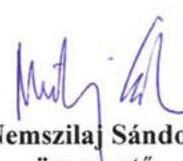

---

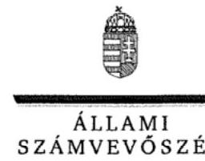

ELNÖK

# Nemszilaj Sándor úr 

ügyvezető
Ipoly Cipőgyár Termelő és Szolgáltató Kft.

## Balassagyarmat

## Tisztelt Ügyvezető Úr!

Az ,,Állami tulajdonú gazdasági társaságok - Az állami tulajdonban (résztulajdonban) lévő gazdálkodó szervezetek vagyonmegőrzési és gazdálkodási tevékenységének ellenőrzése - Ipoly Cipőgyár Termelő és Szolgáltató Kft. " címmel készített számvevőszéki jelentéstervezetre tett észrevételeit köszönettel megkaptam.
Az Állami Számvevőszék észrevételekre vonatkozó álláspontjáról a felügyeleti vezető által készített részletes tájékoztatást csatoltan megküldőm.

Tájékoztatom Ügyvezető urat, hogy a számvevőszéki jelentésben - az Állami Számvevőszékről szóló 2011. évi LXVI. törvény 29. § (3) bekezdése alapján - a figyelembe nem vett észrevételeket szerepeltetjük, annak indoklásával, hogy azokat az Állami Számvevőszék miért nem fogadta el.

Budapest, 2017. 67 hó / nap
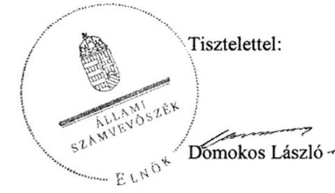

Melléklet: Tájékoztatás az észrevételek kezeléséről

---

# Tájékoztatás   az észrevételek kezeléséről 

Az ,,Állami tulajdonú gazdasági társaságok - Az állami tulajdonban (résztulajdonban) lévő gazdálkodó szervezetek vagyonmegőrzési és gazdálkodási tevékenységének ellenőrzése - Ipoly Cipögyár Termelő és Szolgáltató Kft." címủ jelentéstervezetre tett (2017. június 21-én kelt, 22-én postára adott és az Állami Számvevőszékhez június 23-án érkezett) észrevételeit áttekintettük, azok kezelésével kapcsolatban a következő tájékoztatást adom.

## 1. A 2. számú összegző megállapítás 2. bekezdéséhez füzött észrevételekhez

Az ügyvezető levelében tájékoztatta az Állami Számvevőszéket (ÁSZ) arról, hogy az Önköltségszámítási Szabályzat közvetlen önköltségre vonatkozó módosítását az Ipoly Cipőgyár Kft. (a továbbiakban: Társaság) már az ellenőrzés megkezdését megelőzően elvégezte, a javaslat alapján további intézkedést nem lát szükségesnek.
Tájékoztatom Ügyvezető urat, hogy az ÁSZ az ellenőrzési időszakra vonatkozó megállapításokat tesz. Az azt követő időszakban megtett intézkedéseket, a számvevőszéki jelentés intézkedést igénylő megállapításai alapján összeállított intézkedési tervük végrehajtását az ÁSZ az Állami Számvevőszékről szóló 2011. évi LXVI. törvény 33. § (7) bekezdése szerint utóellenőrzés keretében ellenőrizheti.
Az ellenőrzött időszakra vonatkozó megállapítás nem vitatott, az észrevétel a jelentéstervezet módosítását nem indokolja.
2. A 2. számú összegző megállapítás 3. bekezdéséhez, a 4.3. számú megállapítás 4. bekezdéséhez illetve az Ipoly Cipőgyár Termelő és Szolgáltató Kft. ügyvezetőjének címzett javaslatokhoz füzött észrevételekhez
Álláspontjuk szerint a Társaság nem minősült az ellenőrzött időszak alatt a hatályos közbeszerzési törvények szerinti klasszikus ajánlatkérőnek. A közbeszerzési törvények (a közbeszerzésről szóló 2011. évi CVIII. törvény /a továbbiakban: régi Kbt./ és a 2015. november 1-jétől hatályos közbeszerzésről szóló 2015. évi CXLIII. törvény /új Kbt./) rendelkezései mellett a Társaság egyes kapcsolódó európai uniós irányelvek rendelkezéseit és az Európai Unió Bíróságának a tárgyhoz kapcsolódóan meghozott egyes ítéleteit is idézte annak alátámasztása céljából, hogy az Ipoly Cipőgyár Kft.- tekintve, hogy ipari, kereskedelmi jellegủ tevékenységet végez, és álláspontjuk szerint az uniós irányelvek szerint nem tekinthető közjogi intézménynek - nem tartozott az ellenőrzött időszakban a közbeszerzési törvények hatálya alá. Mindezek alapján a Társaság nem ért egyet a 2. számú összegző megállapítás 3. bekezdésével, a 4.3. számú megállapítás 4. bekezdésével illetve a Társaság ügyvezetőjének címzett 2-4. sz. javaslatokkal sem.
A Társaság mindezeken túlmenően észrevételében kifogásolta, hogy a jelentéstervezetben az Állami Számvevőszék nem határozza meg, hogy mely időszakban és mely beruházások esetében sértette meg a hatályos Kbt. előírásait a Társaság.
A büntetés-végrehajtási szervezetről szóló 1995. évi CVII. törvény (a továbbiakban: Bvsz.) 2. § (5) bekezdése értelmében a fogvatartottak kötelező foglalkoztatására létrehozott gazdasági társaságok büntetés-végrehajtási szervezetnek minősülnek, amelynek feladata a Bvsz. 1. § (2) bekezdése értelmében a közrend és a közbiztonság erősítése. A Társaság Alapító okiratának 7.

---

pontja szerint „a társaság fogvatartottak kötelező foglalkoztatására létrehozott gazdálkodó szervezet, egyben büntetés-végrehajtási szerv", tehát a régi és új Kbt-ben meghatározott közérdekü, kifejezetten közérdekủ szervnek minősül.
A régi Kbt. 6. § (1) bekezdés c) pontjához kapcsolódik a régi Kbt. 6. § (2) bekezdése, mely szerint az ajánlatkérői minőség megállapítható abban az esetben is, ha a szervezet közérdekü feladatán kívül más tevékenységet - akár ipari vagy kereskedelmi tevékenységet - is folytat. A Társaság régi Kbt. szerinti ajánlatkérői minőségét megalapozza továbbá Alapító okiratának 7. pontja is (lásd fentebb.).
Az Európai Unió Bírósága a C-18/01. számú Korhonen és társai ügyben megállapította, hogy nem kizárt egy szervezetet annak ellenére ajánlatkérőnek minősíteni, ha müködése során profitot termel, de annak elsődleges célja a közérdekủ célok szolgálata és nem az üzleti eredményesség elérése. A Társaság Alapító okiratának 7. pontjából (lásd fentebb) megállapítható, hogy a Társaság közjogi intézmény.
Ezt erősíti továbbá az Európai Unió Bírósága C-283/00. számú „SIEPSA" ügye is, amelynek tárgya a szervezet közérdekủ jellegének megítélése volt. A Bíróság kimondta, hogy az ügybeli cég közérdekủ intézménynek minősül, mivel az alapító okiratából megállapítható volt, hogy az általa kifejtett tevékenység lényegében az állam büntetőhatalmának gyakorlásához szorosan kapcsolódó tevékenység, és mint ilyen tevékenység lényegében a közérdekhez kapcsolódik.
Az új Kbt. 5. § (1) bekezdés e) pontja továbbra is a közérdekủ tevékenység bármilyen mértékben történő ellátása alapján is az ajánlatkérői körbe sorolja a kérdéses szervezeteket. A fent leírtakra figyelemmel a Társaság Alapító okiratának 7. pontjában foglaltak (lásd fentebb) közérdekủ tevékenységnek minősülnek, ezért a Társaság ajánlatkérőnek minősül, aminek vonatkozásában alkalmazni kell az új Kbt. rendelkezéseit.

Az ÁSZ a mintatételek ellenőrzése alapján statisztikai kivetítés eredménye alapján rögzítette a beszerzésekkel kapcsolatos feltárt szabálytalanságokat a jelentéstervezetben, amely a teljes sokaság vonatkozásában értelmezhető. A mintavételes eljárásra vonatkozóan az ellenőrzés módszerei fejezet tartalmaz információt.

A fentiek alapján nem fogadtuk el azon észrevételüket, hogy a Társaság nem tartozik a Kbt. hatálya alá. A beszerzéseknél a jogszabályi előírások betartása minden szervezet számára kötelező. Ugyanakkor nem lehet eltekinteni attól, hogy a fogvatartottak foglalkoztatása kiemelt közérdek. Mindezekre tekintettel a jelentéstervezet vonatkozó részeit pontosítjuk.

Tájékoztatom, hogy a számvevőszéki jelentés függelékeként szerepeltetjük a jelentéstervezethez tett észrevételeit, valamint az azokra adott válaszunkat.

Budapest, 2017. 07 hó 21 nap
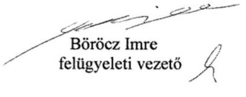

---

.

---

# RÖVIDÍTÉSEK JEGYZÉKE 

${ }^{1}$ Társaság
${ }^{2}$ BVOP
${ }^{3}$ Vtv.
${ }^{4}$ MNV Zrt.
${ }^{5}$ Nvtv.
${ }^{6}$ Holding
${ }^{7}$ uralmi szerződés
${ }^{8}$ tulajdonosi jogok gyakorlója
${ }^{9}$ alapító okirat ${ }_{1-12}$
${ }^{10}$ Bv. szervezeti törvény
${ }^{11}$ Bv. Kódex
${ }^{12}$ 44/2011. (III. 23.) Korm. rendelet
.Ipoly Cipőgyár Termelő és Szolgáltató Korlátolt Felelősségű Társaság Büntetés-végrehajtás Országos Parancsnoksága 2007. évi CVI. törvény az állami vagyonról Magyar Nemzeti Vagyonkezelő Zrt. 2011. évi CXCVI törvény a nemzeti vagyonról Bv. Holding Korlátolt Felelősségű Társaság
a büntetés-végrehajtás gazdasági társaságai - köztük az Ipoly Kft. - és a Bv. Holding Kft. 2015. február 26-án kötött szerződése az elismert vállalatcsoport létrehozásáról
Büntetés-végrehajtás Országos Parancsnoksága, Bv Holding Kft.
Az Ipoly Cipőgyár Termelő és Szolgáltató Korlátolt Felelősségű Társaság alapító okirata (hatályos: 2011. szeptember 01-től)
Az Ipoly Cipőgyár Termelő és Szolgáltató Korlátolt Felelősségű Társaság Alapító Okirata2 (hatályos: 2012. június 29-től)
Az Ipoly Cipőgyár Termelő és Szolgáltató Korlátolt Felelősségű Társaság Alapító Okirata3 (hatályos: 2012. augusztus 1-től)
Az Ipoly Cipőgyár Termelő és Szolgáltató Korlátolt Felelősségű Társaság Alapító Okirata4 (hatályos: 2013. április 14-től)
Az Ipoly Cipőgyár Termelő és Szolgáltató Korlátolt Felelősségű Társaság Alapító Okirata5 (hatályos: 2013. június 14-től)
Az Ipoly Cipőgyár Termelő és Szolgáltató Korlátolt Felelősségű Társaság Alapító Okirata6 (hatályos: 2014. május 23-tól)
Az Ipoly Cipőgyár Termelő és Szolgáltató Korlátolt Felelősségű Társaság Alapító Okirata7 (hatályos: 2014. augusztus 28-tól)
Az Ipoly Cipőgyár Termelő és Szolgáltató Korlátolt Felelősségű Társaság Alapító Okirata8 (hatályos: 2014. december 15-től)
Az Ipoly Cipőgyár Termelő és Szolgáltató Korlátolt Felelősségű Társaság Alapító Okirata9 (hatályos: 2015. január 28-tól)
Az Ipoly Cipőgyár Termelő és Szolgáltató Korlátolt Felelősségű Társaság Alapító Okirata10 (hatályos: 2015. június 1-től)
Az Ipoly Cipőgyár Termelő és Szolgáltató Korlátolt Felelősségű Társaság Alapító Okirata11 (hatályos: 2015. június 8-tól)
Az Ipoly Cipőgyár Termelő és Szolgáltató Korlátolt Felelősségű Társaság Alapító Okirata12 (hatályos: 2015. augusztus 28-tól)
1995. évi CVII. törvény a büntetés-végrehajtási szervezetről
Bv. Kódex1: 1979. évi 11. törvényerejű rendelet a büntetések és az intézkedések végrehajtásáról (hatályos 2014. december 31-ig)
Bv. Kódex2: 2013. évi CCXL. törvény a büntetések, az intézkedések, egyes kényszerintézkedések és a szabálysértési elzárás végrehajtásáról (hatályos 2015. január 1-jétől)
44/2011. (III. 23.) Korm. rendelet a büntetés-végrehajtási szervezet részéről a központi államigazgatási szervek és a rendvédelmi szervek irányában fennálló egyes ellátási kötelezettségekről, a termékek és szolgáltatások átadás-átvételének és azok ellentételezésének rendjéről (hatályos 2011. július 1-jétől)

---

${ }^{13}$ 9/2011. (III.23.) BM rendelet
${ }^{14}$ Tao. tv.
${ }^{15}$ ÁSZ
${ }^{16}$ ÁSZ tv.
${ }^{17} \mathrm{Gt}$.
${ }^{18}$ Ptk. 2
${ }^{19}$ Társasági Monitoring
Szabályzat
${ }^{20}$ Tervezési irányelvek ${ }_{1-4}$
${ }^{21}$ BVOP országos parancsnok intézkedése
${ }^{22}$ üzleti tervek elfogadása
${ }^{23}$ Bv. Holding Kft. határozatai
${ }^{24}$ számviteli politika $_{1.2 .3}$
${ }^{25}$ leltározási és leltárkészítési szabályzat
${ }^{26}$ önköltségszámítási szabályzat
${ }^{27}$ pénzkezelési szabályzat
${ }^{28}$ számlarend

9/2011. (III. 23.) BM rendelet a büntetés-végrehajtási szervezet részéről a büntetés-végrehajtásért felelős miniszter vezetése, irányítása vagy felügyelete alá tartozó szervek irányában fennálló ellátási kötelezettségről, a fogvatartottak kötelező foglalkoztatása keretében előállított termékekről és szolgáltatásokról, azok átadás-átvételéről és az ellentételezés rendjéről (hatályos: 2011. július 1jétől)
a társasági adóról és az osztalékadóról szóló 1996. évi LXXXI. törvény
Állami Számvevőszék
2011. évi LXVI. törvény az Állami Számvevőszékről
2006. évi IV. törvény a gazdasági társaságokról (hatálytalan: 2014.március 15-től)
2013. évi V. törvény a Polgári Törvénykönyvről (hatályos: 2014. március 15-étől)

Az MNV Zrt. Társasági Monitoring Szabályzata (hatályos: 2013. december 19-től)
Az MNV Zrt. 513/2011 (XI.07.) számú határozatában a 2012. évre megfogalmazott tervezési irányelvek
A Tulajdonosi joggyakorló 558/2012 (X.24.) számú határozatában a 2013. évre megfogalmazott tervezési irányelvek
A Tulajdonosi joggyakorló 774/2013 ((X.21.) számú határozatában a 2014. évre megfogalmazott tervezési irányelvek
A Tulajdonosi joggyakorló 4/2015 (I.12.) számú határozatában a 2015. évre megfogalmazott tervezési irányelvek
1-1/52/2011. (XII. 13.) OP intézkedése a büntetés-végrehajtás jelentési és adatszolgáltatási rendszeréről
az üzleti terveket elfogadó határozatok:
2012. év - 1/2012. FB, 4/5/2012. BVOP
2013. év - 1/2013. FB, 11/5/2013. BVOP
2014. év - 1/2014. FB, 11/5/2014. BVOP
2015. év - 1/2015. FB, 16/5/2015. BVOP
könyvvizsgáló kijelölése: 19/2015. (05.269.) uralkodó tagi határozat, felügyelőbizottsági ügyrend jóváhagyása: 35/2015. (09.15.) uralkodó tagi határozat, 2015. évi beszámoló jóváhagyása 40/2016. (04.29.) uralkodó tagi határozat
Az Ipoly Cipőgyár Termelő és Szolgáltató Korlátolt Felelősségű Társaság számviteli politikája ${ }_{1}$ (hatályos: 2009. november 1-jétől)
Az Ipoly Cipőgyár Termelő és Szolgáltató Korlátolt Felelősségű Társaság számviteli politikája ${ }_{2}$ (hatályos: 2013. december 23-ától)
Az Ipoly Cipőgyár Termelő és Szolgáltató Korlátolt Felelősségű Társaság számviteli politikája ${ }_{3}$, mely az Uralkodó tag által került meghatározásra az uralmi szerződés 3.4.1. pontja alapján (hatályos: 2015. január 1-jétől)

Az Ipoly Cipőgyár Termelő és Szolgáltató Korlátolt Felelősségű Társaság eszközök és a források leltárkészítési és leltározási szabályzata (hatályos: 2011. október 1jétől)
Az Ipoly Cipőgyár Termelő és Szolgáltató Korlátolt Felelősségű Társaság önköltségszámítás rendjére vonatkozó belső szabályzata (hatályos: 2007. június 1jétől)
Az Ipoly Cipőgyár Termelő és Szolgáltató Korlátolt Felelősségű Társaság pénzkezelési szabályzata (hatályos: 2007. július 2-től)
Az Ipoly Cipőgyár Termelő és Szolgáltató Korlátolt Felelősségű Társaság számlarendje (hatályos: 2009. november 1-jétől)

---

${ }^{29}$ javadalmazási szabályzat
${ }^{30}$ Tak. tv.
${ }^{31}$ Kormányhatározat
${ }^{32}$ Közzététel rendje
${ }^{33}$ közzétételi szabályzat
${ }^{34}$ Info. tv.
${ }^{35}$ adatvédelmi és adatbiztonsági szabályzat
${ }^{36}$ karbantartási tervek
${ }^{37} \mathrm{Kbt}$.
${ }^{38}$ Ptk. 1
${ }^{39} \mathrm{Ppt}$.

A Büntetés-végrehajtás Országos Parancsnoksága 21/2009 számú határozatával alkotott javadalmazási szabályzata (hatályos: 2009. december 1-jétől, módosítva a 29/2012. számú határozattal 2012. október 4.-én)
2009. évi CXXII. törvény a köztulajdonban álló gazdasági társaságok takarékosabb müködéséről
2173/2003 (VII.29.) számú Kormányhatározat az állam, illetőleg a központi és a társadalombiztosítási költségvetési szervek többségi befolyása alatt álló gazdálkodó szervezetek vezető tisztségviselői, felügyelő bizottsági tagjai és más vezető állású munkavállalói javadalmazásának elveiről
Az Ipoly Cipőgyár Termelő és Szolgáltató Korlátolt Felelősségű Társaság ügyvezető igazgatójának 1/2010. számú intézkedése a társaság közzététel rendjéről (hatályos: 2012. január 31-ig)
Az Ipoly Cipőgyár Termelő és Szolgáltató Korlátolt Felelősségű Társaság szabályzata a közzététel rendjéről (hatályos: 2013. február 1-jétől)
2011. évi CXII. törvény az információs önrendelkezési jogról és az információszabadságról
Az Ipoly Cipőgyár Termelő és Szolgáltató Korlátolt Felelősségű Társaság adatvédelmi és adatbiztonsági szabályzata (hatályos: 2012. november 1-jétől)
Az Üzemfenntartási osztály karbantartási tervei 2012-2015. évekre
a közbeszerzésekről szóló 2011. évi CVIII. törvény (hatálytalan 2015. november 1-jétől) és a közbeszerzésekről szóló 2015. évi CXLIII. törvény (hatályos 2015. november 1 jétől)
a Polgári Törvénykönyvről szóló 1959. évi IV. törvény (hatálytalan 2014. március 15-től)
a polgári perrendtartásról szóló 1952. évi III. törvény

---

ÁLLAMI SZÁMVEVŐSZÉK
1052 Budapest, Apáczai Csere János utca 10.
Levélcím: 1364 Budapest 4. Pf. 54
Telefon: +36 14849100 Telefax: +36 14849200
www.asz.hu