# Jelentés 

## Állami tulajdonú gazdasági társaságok

Az állami tulajdonban (résztulajdonban) lévő gazdálkodó szervezetek vagyonmegőrzési és gazdálkodási tevékenységének ellenőrzése HM Zrínyi Térképészeti és Kommunikációs Szolgáltató Közhasznú Nonprofit Kft.
2017.

---

# Jelentés 

## Állami tulajdonú gazdasági társaságok

Az állami tulajdonban (résztulajdonban) lévő gazdálkodó szervezetek vagyonmegőrzési és gazdálkodási tevékenységének ellenőrzése HM Zrínyi Térképészeti és Kommunikációs Szolgáltató Közhasznú Nonprofit Kft.
2017. augusztus 18. nap
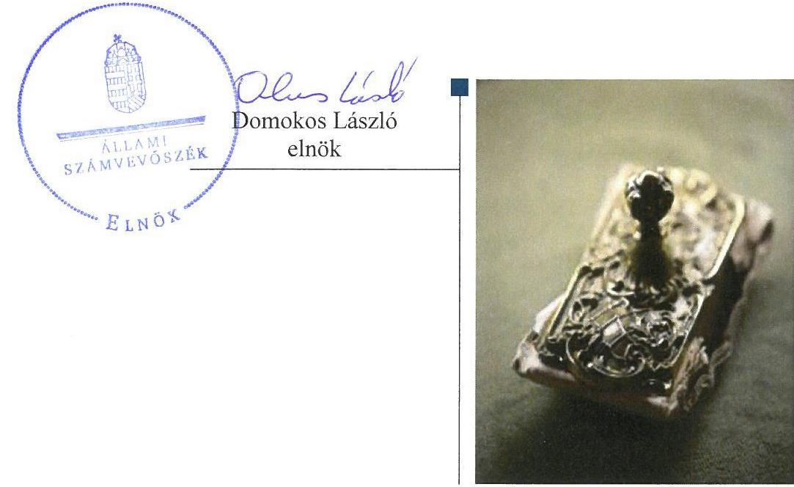

---

# AZ ELLENŐRZÉST FELÜGYELTE:

- BÖRÖCZ IMRE felügyeleti vezető

- AZ ELLENŐRZÉST VEZETTE ÉS A VÉGREHAJTÁSÁÉRT FELELŐS:
  - IMRE ZSUZSANNA ellenőrzésvezető
  - A PROGRAM ÖSSZEÁLLÍTÁSÁÉRT FELELŐS:
    - JANIK JÓZSEF osztályvezető

- IKTATÓSZÁM: V-1191-199/2016.
- TÉMASZÁM: 2225
- ELLENŐRZÉS-AZONOSÍTÓ SZÁM: V075916

Jelentéseink az Országgyűlés számítógépes hálózatán és az Interneten a www.asz.hu címen is olvashatóak.

---

# TARTALOMJEGYZÉK 

■ ÖSSZEGZÉS ..... 5
■ AZ ELLENŐRZÉS CÉLJA ..... 7
■ AZ ELLENŐRZÉS TERÜLETE ..... 8
■ AZ ELLENŐRZÉS HÁTTERE, INDOKOLTSÁGA ..... 10
■ A JELENTÉS LÉNYEGES KÉRDÉSKÖREI ..... 11
■ ELLENŐRZÉS HATÓKÖRE ÉS MÓDSZEREI ..... 12
■ MEGÁLLAPÍTÁSOK ..... 14
■ JAVASLATOK ..... 20
■ MELLÉKLETEK ..... 21
I. Sz. melléklet: Értelmező szótár ..... 21
II. Sz. melléklet: A HM Zrínyi Nonprofit Kft. mérlegének főbb adatai a 2012-2015. évben (M Ft.) ..... 24
■ FÜGGELÉK: ÉSZREVÉTELEK ..... 25
■ RÖVIDÍTÉSEK JEGYZÉKE ..... 49

---

.

---

# ÖSSZEGZÉS 

A HM Zrínyi Térképészeti és Kommunikációs Szolgáltató Közhasznú Nonprofit Kft. tulajdonosi joggyakorlói a tevékenységüket összességében szabályszerűen látták el. A társaság működésének szabályozottsága összességében megfelelő volt. A pénzügyi-számviteli, adatszolgáltatási feladatokat összességében szabályszerűen látta el. A vagyonával szabályszerűen gazdálkodott.

## Az ellenőrzés társadalmi indokoltsága

Az Állami Számvevőszék stratégiájában megfogalmazta, hogy az államháztartáson kívülre nyújtott költségvetési támogatások és ingyenes vagyonjuttatások, valamint az államháztartáson kívül működő közfeladat-ellátó rendszerek ellenőrzéseivel hozzájárul ahhoz, hogy a közpénzeket az államháztartáson kívül működő szervezetek is átlátható, rendezett módon használják fel a közfeladatok szerződésben vállalt ellátása érdekében. Ezt figyelembe véve és az Állami Számvevőszék Stratégiájával összhangban került sor a HM Zrínyi Térképészeti és Kommunikációs Szolgáltató Közhasznú Nonprofit Kft. ellenőrzésére a 2012-2015. évek vonatkozásában. Kiemelten fontos, hogy a kormányzati szektor elszámolásaiban megjelenő állami tulajdonú gazdálkodó szervezetekkel – így a HM Zrínyi Térképészeti és Kommunikációs Szolgáltató Közhasznú Nonprofit Kft.-vel szemben alapvető követelmény, hogy gazdálkodásuk, működésük szabályszerű, az általuk szolgáltatott adatok minél megbízhatóbbak legyenek.

## Főbb megállapítások, következtetések, javaslatok

A Honvédelmi Minisztérium és a Magyar Nemzeti Vagyonkezelő Zrt. a tulajdonosi joggyakorlási tevékenységét összességében szabályszerűen látta el. A Honvédelmi Minisztérium vagyonkezelésében lévő és a HM Zrínyi Térképészeti és Kommunikációs Szolgáltató Közhasznú Nonprofit Kft. részére használatba adott ingatlanok tekintetében kötött vagyonhasznosítási szerződés hiányos volt, az nem felelt meg teljes körűen az állami vagyonról szóló törvény végrehajtására kiadott kormányrendeletben foglaltaknak. A tulajdonosi joggyakorlók a Felügyelőbizottságon keresztül, valamint állandó könyvvizsgáló megbízásával biztosították a tulajdonosi ellenőrzést.

A HM Zrínyi Térképészeti és Kommunikációs Szolgáltató Közhasznú Nonprofit Kft. a vagyongazdálkodással kapcsolatos szabályozás kereteit kialakította, az a jogszabályi előírásoknak – a számlarendje és a pénzkezelési szabályzata kivételével – megfelelt. A kialakított, szabályszerű vagyongazdálkodási feltételeket vagyonának változását eredményező döntései meghozatalánál betartotta. A vagyonát az előírásoknak megfelelően tartotta nyilván. Saját vagyonának értéke az ellenőrzött időszakban csökkent, az eszközök pótlásának értéke az elszámolt értékcsökkenés összegét nem érte el.

A bevételeinek és a ráfordításainak elszámolása megfelelt a jogszabályi előírásoknak. Az értékcsökkenés elszámolása nem volt megfelelő, ugyanis 2012-ben az immateriális javak és a tárgyi eszközök esetében a használatba vételt nem dokumentálták, valamint a 2013-2015. évi beszámolók kiegészítő mellékletében nem mutatták be az elszámolt értékcsökkenési leírás összegét a számvitelről szóló törvényben meghatározottak szerinti bontásban. A szolgáltatások díjának megállapítását az előírásoknak megfelelő önköltségszámítással alapozták meg, továbbá szabályszerűen teljesítették a tervezési, beszámolási, és adatszolgáltatási kötelezettségüket.

A belső ellenőrzést a HM Zrínyi Térképészeti és Kommunikációs Szolgáltató Közhasznú Nonprofit Kft. az ellenőrzött időszakban működtette.

A HM Zrínyi Térképészeti és Kommunikációs Szolgáltató Közhasznú Nonprofit Kft. gazdálkodásának a kormányzati szektor hiányára és az államadósságra befolyással bíró elemei összességében megfeleltek a jogszabályi előírásoknak.

---

Az ÁSZ a HM Zrínyi Térképészeti és Kommunikációs Szolgáltató Közhasznú Nonprofit Kft. ügyvezetőjének és a honvédelemért felelős miniszternek fogalmazott meg javaslatokat, amelyek alapján kötelesek intézkedési tervet összeállítani és azt a jelentés kézhezvételétől számított 30 napon belül az ÁSZ részére megküldeni.

---

# AZ ELLENŐRZÉS CÉLJA 

Az ellenőrzés célja annak értékelése volt, hogy a tulajdonosi jogok gyakorlása szabályszerű volt-e; a gazdálkodó szervezet szabályozottsága, gazdálkodása és vagyongazdálkodási tevékenysége megfelelt-e a jogszabályi és a tulajdonosi előírásoknak; biztosítva volt-e a közfeladatok átláthatósága és elszámoltathatósága érdekében a közszolgáltatás díjának megalapozottsága szabályszerű önköltségszámítással; a vagyonváltozást eredményező döntések esetében a tulajdonosi jogok gyakorlója és a gazdálkodó szervezet szabályszerűen jártak-e el. Az ellenőrzés célja továbbá annak megítélése volt, hogy a kormányzati szektorba sorolt állami tulajdonban (résztulajdonban) lévő gazdálkodó szervezetek gazdálkodásának a kormányzati szektor hiányára és az államadósságra befolyással bíró elemei a jogszabályi előírásoknak megfeleltek-e.

---

# **HM Zrínyi Térképészeti és Kommunikációs Szolgáltató Közhasznú Nonprofit Kft.**

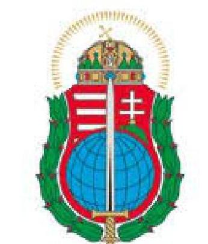

A HM Zrínyi Nonprofit Kft. 100%-ban állami tulajdonban lévő egyszemélyes korlátolt felelősségű társaság, amelynek jogelődjét, a HM Zrínyi Kommunikációs Szolgáltató Közhasznú Társaságot 2000. szeptember 25-én alapította a magyar állam. A közhasznú tevékenysége keretében – mely tevékenységén belül meghatározó volt – a földmérési és térképészeti tevékenységről szóló tv.-ben, valamint a honvédelmi célú térképellátásról szóló HM rendeletben³ meghatározott állami feladathoz kapcsolódó tevékenységeket végzett. Közhasznú tevékenységét támogató céllal üzleti tevékenységet is ellátott. A HM Zrínyi Nonprofit Kft. kormányzati szektorba sorolt egyéb gazdálkodó szervezet. Az ellenőrzött időszakban két alkalommal olvadt be a társaságba⁴ más gazdasági társaság: 2012. december 31-vel a HM Térképészeti Közhasznú Nonprofit Kft., valamint 2015. december 31-vel a HM Besenyei György Kulturális és Üdültetési Nonprofit Kft. A magyar állam nevében a tulajdonosi jogok gyakorlására az MNV Zrt. volt jogosult, amely a tulajdonosi jogokat és kötelezettségeket vagyonkezelési szerződés⁵ alapján 2012. december 31-ig korlátozásokkal és feltételekkel a HM⁶ részére átengedte. A tulajdonosi jogokat és kötelezettségeket 2013. január 1-jétől az ellenőrzött időszak végéig a Nvtv.⁷-nek és a Vtv.⁸-nek megfelelően a Hvt.⁹ és az Együttműködési megállapodás¹⁰ alapján a honvédelemért felelős miniszter gyakorolta azzal, hogy a meghatározott jogok tekintetében a tulajdonosi joggyakorlásra az MNV Zrt. volt jogosult.

A HM Zrínyi Nonprofit Kft. gazdálkodásának főbb adatait az 1. ábra, valamint a II. számú melléklet szemlélteti:

1. ábra

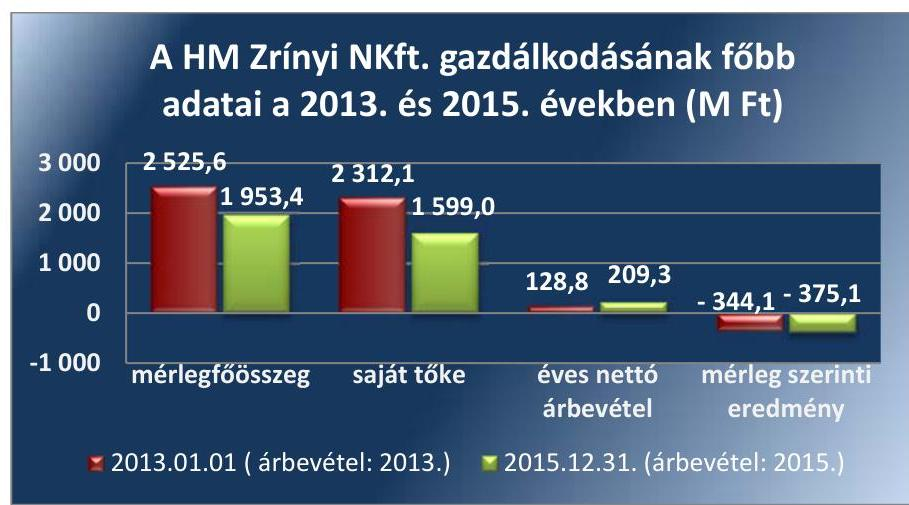

*Forrás: HM Zrínyi Nonprofit Kft. éves beszámolói*

---

A HM Zrínyi Nonprofit Kft.-nél vagyonkezelésbe vett vagyon nem volt az ellenőrzött időszakban, más gazdasági társaságokban tulajdoni részesedéssel nem rendelkezett. A jegyzett tőke összege a 2012. év eleji 116,1 M Ft-ról a 2015. év végére 365,7 M Ft-ra nőtt a HM Térképészeti Közhasznú Nonprofit Kft. beolvadásának eredményeként. 2012 és 2015 között – a 2014. év kivételével – veszteségesen gazdálkodott. A mérlegfőösszeg csökkenése alapvetően a tárgyi eszközök állományának csökkenése miatt következett be.

A foglalkoztatott munkavállalók átlagos statisztikai létszáma a 2013. évi 208 főről a 2015. évre 234 főre nőtt. Az ügyvezető személye nem változott az ellenőrzött időszakban.

---

# AZ ELLENŐRZÉS HÁTTERE, INDOKOLTSÁGA 

Az állami tulajdonú gazdálkodó szervezetek ellenőrzése kiemelten fontos a nemzeti vagyon megőrzése, megóvása érdekében. Gazdálkodásuk jellemzően a közérdeklődés és a média figyelmének középpontjában áll, amihez hozzájárul a gazdálkodásuk körébe tartozó – közvetlen vagy közvetett állami tulajdonú – vagyon nagysága, illetve az általuk ellátott közszolgáltatások minősége és hatékonysága. A szolgáltatási/közszolgáltatási árképzés megalapozottsága és az éves elszámoltatás feltételeinek kialakítása az ellenőrzés során nagy hangsúlyt kap. A szolgáltatás/közszolgáltatás árában és annak támogatásában meg kell jelennie az önköltségszámítás szempontjainak, amely biztosítja a működés fenntarthatóságát (eszközpótlást) is. Az Európai Unióban az 1994. év óta hatályos túlzott hiány eljárás mindig kihívást jelentett a tagállamok számára. Kiemelten fontosak a kormányzati szektor elszámolásaiban megjelenő állami tulajdonú gazdálkodó szervezetek, amelyekkel szemben alapvető követelmény, hogy gazdálkodásuk, működésük szabályszerű, az általuk szolgáltatott adatok minél megbízhatóbbak legyenek. Az ellenőrzés rámutathat az állami tulajdonú gazdálkodó szervezetek gazdálkodási tevékenységével kapcsolatos jó gyakorlatokra és szabálytalanságokra. Felhívhatja a figyelmet a jogszabályi követelmények teljesítéséhez szükséges feltételek hiányosságaira, hozzájárulhat az államháztartáson kívüli, de (közvetlenül vagy közvetve) állami vagyont használó gazdálkodó szervezetek tevékenységének átláthatóságához. Ellenőrzésünk eredményeképpen javaslatainkkal, megállapításainkkal hozzájárulhatunk a nemzeti vagyonnal való gazdálkodás átláthatóságának, elszámoltathatóságának javításához.

---

# A JELENTÉS LÉNYEGES KÉRDÉSKÖREI 

1. A tulajdonosi jogok gyakorlása szabályszerű volt-e?
2. A társaság működésének szabályozottsága megfelelt-e az előírásoknak?
3. A társaságnál a pénzügyi-számviteli, adatszolgáltatási és ellenőrzési feladatok ellátása szabályszerű volt-e?
4. A társaság vagyongazdálkodása szabályszerű volt-e?
5. A kormányzati szektorba sorolt gazdasági társaságok gazdálkodásának a kormányzati szektor hiányára és az államadósságra befolyással bíró elemei megfeleltek-e a jogszabályi előírásoknak?

---

# ELLENŐRZÉS HATÓKÖRE ÉS MÓDSZEREI 

## Az ellenőrzés típusa

Megfelelőségi ellenőrzés.

## Az ellenőrzött időszak

Az ellenőrzött időszak 2012. január 1-jétől 2015. december 31-ig tart.

## Az ellenőrzés tárgya

Állami tulajdonban (résztulajdonban) lévő gazdasági társaság gazdálkodása, kiemelten vagyongazdálkodási tevékenysége, a tulajdonosi jogok gyakorlása, továbbá a kormányzati szektorba sorolt gazdasági társaság gazdálkodásának a kormányzati szektor hiányára és az államadósságra befolyással bíró elemei.

Az ellenőrzés kiterjed minden olyan körülményre és adatra, amely az ÁSZ jogszabályban meghatározott feladatainak teljesítéséhez, valamint a program végrehajtása folyamán felmerült újabb összefüggések feltárásához szükséges.

## Az ellenőrzött szervezet

HM Zrínyi Térképészeti és Kommunikációs Szolgáltató Közhasznú Nonprofit Korlátolt Felelősségű Társaság;
Honvédelmi Minisztérium;
Magyar Nemzeti Vagyonkezelő Zrt.

## Az ellenőrzés jogalapja

Az ellenőrzés jogalapját az ÁSZ tv. ¹¹ 1. § (3) bekezdése és 5. § (3)-(5) bekezdése képezi.

## Az ellenőrzés módszerei

Az ellenőrzést a nemzetközi standardokat irányadónak tekintve az ellenőrzési program ellenőrzési kérdései, az ellenőrzött időszakban hatályos jogszabályok, az ellenőrzés szakmai szabályok és módszertanok figyelembevételével végeztük.

---

Az ellenőrzési kérdések megválaszolásához szükséges bizonyítékok megszerzése a következő ellenőrzési eljárások alkalmazásával történt: megfigyelés, kérdésfeltevés (információkérés), összehasonlítás, valamint mintavételi és elemző eljárások. Az ellenőrzési bizonyítékként felhasználható adatforrások közé tartoznak egyrészt az ellenőrzési programban felsorolt adatforrások, másrészt adatforrás lehet még minden – az ellenőrzés folyamán – feltárt, az ellenőrzés szempontjából információkat tartalmazó dokumentum.

Az ellenőrzést a kérdésekre adott válaszok kiértékelésével, valamint a megjelölt adatforrások, a csatolt tanúsítványok felhasználásával, továbbá az adott időszakban hatályos jogszabályok figyelembevételével folytattuk le.

---

# 1. A tulajdonosi jogok gyakorlása szabályszerű volt-e? 

## Összegző megállapítás

1. táblázat

A HM ZRÍNYI NONPROFIT KFT. FELETTI TULAJDONOSI JOGGYAKORLÁS ALAKULÁSA 2012 ÉS 2015 KÖZÖTT

| Ellenőrzött időszak | Tulajdonosi jogok gyakorlása | Jogalap |
| :--: | :--: | :--: |
| 2012.01.01. -   2015. 12.31. | MNV   Zrt. | Nvtv. |
| 2012.01.01. -   2012.12.31. | HM kor-   látozá-   sokkal | SZT-28425 sz. vagyonkezelési szerződés |
| 2013.01.01. -   2015.12.31. | HM miniszter, korlátozásokkal | Hvt.;SZT-   39158. sz.   Együttműködési megállapodás. |

A tulajdonosi joggyakorlás összességében megfelelt az előírásoknak. A HM által kötött ingatlan használatba adási szerződés nem volt szabályszerű.

AZ MNV ZRT. és a HM között a Vtv. előírásaival összhangban a HM Zrínyi Nonprofit Kft.-ben lévő
 részesedések feletti tulajdonosi jogok és kötelezettségek gyakorlására - a 2. táblázat szerinti korlátozásokkal - 2012. évben hatályos vagyonkezelési szerződés állt fenn, melyet az Nvtv. és a Hvt. előírásaival összhangban 2012. december 31-ével megszüntettek. Az MNV Zrt. és a HM között a tulajdonosi jogok gyakorlása tekintetében az Nvtv. és a Hvt. előírásaival összhangban álló - a 2. táblázat szerinti korlátozásokkal - Együttműködési megállapodás ${ }_{1-2}$ jött létre.

A HM a tulajdonosi jogok gyakorlására vonatkozó szabályokat a 67/2011. (VI. 24.) HM utasításban ${ }^{12}$, a HM Zrínyi Nonprofit Kft. működésére és a vagyongazdálkodásra vonatkozó követelményeket az Alapító Okirat ${ }_{1-12}{ }^{13}$-ban és tulajdonosi határozatokban fektette le.

Az Alapító Okirat ${ }_{1-12}$ a Gt. ${ }^{14}$ és a Ptk. ${ }^{15}$ előírásaival összhangban tartalmazta a vagyonnal történő felelős gazdálkodáshoz szükséges követelményeket, meghatározták az MNV Zrt., a HM kizárólagos hatáskörébe tartozó döntési jogokat, valamint az FB${ }^{16}$ és az ügyvezető feladat- és hatáskörét, továbbá rendelkeztek a könyvvizsgáló személyéről. Az FB, az ügyvezetés és a könyvvizsgáló tevékenységéhez kapcsolódó tulajdonosi joggyakorlás megfelelt a Gt. és a Ptk. ${ }_{2}$ előírásainak.

Az éves üzleti terv jóváhagyása az Alapító Okirat ${ }_{1-12}$ alapján a taggyűlés kizárólagos jogkörébe tartozott, amelynek keretében a tulajdonosi jogkört gyakorló, mint egyedüli tag döntött. Így a 2012-2015. évekre vonatkozó éves üzleti terveket a HM tulajdonosi határozattal fogadta el.

A HM a Gt. és a Ptk. ${ }_{2}$ előírásainak megfelelően a HM Zrínyi Nonprofit Kft. éves beszámolóinak jóváhagyásáról az FB írásbeli jelentése, valamint a Számv. tv. ${ }^{17}$-ben foglaltak figyelembevételével a könyvvizsgálói jelentés birtokában alapítói határozattal döntött.

A magyar állam tulajdonában és a HM vagyonkezelésében lévő ingatlanokat a Vtv. előírásainak és a vagyonkezelési szerződésnek megfelelően a HM ingatlan használatba adási szerződéssel ${ }^{18}{ }_{1-4}$ adta a társaság használatába.

Az Ingatlan használatba adási szerződésben ${ }_{1-4}$ a Vhr. ${ }^{19}$ 14. § (3) bekezdés előírása ellenére nem rögzítették, hogy a társaság az MNV Zrt. - mint az ingatlanok fölötti tulajdonosi joggyakorló - vagyon-nyilvántartási szabályzatát megismerte és magára nézve kötelező érvényűnek ismeri el.

---

Az ingatlan használatba adási szerződésben ${ }_{1-4}$ a 2012-2015. évek vonatkozásában rendelkeztek a használati díjról, melynek megfelelő összeget a HM Zrínyi Nonprofit Kft. köteles volt évente a használatba vett ingatlanok állagvédelmére, felújítására, valamint pótlólagos beruházásokra fordítani. A HM évente meggyőződött a szerződésben foglaltak teljesítéséről.

# 2. A társaság működésének szabályozottsága megfelelt-e az előírásoknak? 

## Összegző megállapítás

A HM Zrínyi Nonprofit Kft. működésének szabályozottsága összességében megfelelt a jogszabályi előírásoknak.

A SZMSZ ${ }_{1-3}$-t az Alapító okirat ${ }_{1-12}$-nak megfelelően készítették el, amelyet a HM jóváhagyott. Az SZMSZ ${ }_{1-3}$-ben meghatározták a működés szabályait, a társaság vezetőinek jogkörét, feladat- és hatásköreit, valamint a képviseleti és aláírási jogkörökkel kapcsolatos szabályokat.

A SZÁMVITELI SZABÁLYZATOK, így a Számviteli politika ${ }_{1-}$ ${ }^{20}$ és annak részét képező Leltározási szabályzat ${ }^{21}$, az Értékelési szabályzat ${ }_{1-3}{ }^{22}$, az Önköltségszámítási szabályzat ${ }_{1-2}{ }^{23}$, Selejtezési szabályzat ${ }^{24}$, valamint a Befektetési Szabályzat ${ }_{2}$ megfeleltek a Számv. tv. előírásainak.

A Számlarend ${ }^{25}$ tartalma nem felelt meg a Számv. tv. 161. § (2) bekezdés b-d) pontjában foglaltaknak, mivel nem tartalmazta a számlák tartalmát - ha az a számlák megnevezéséből nem volt megállapítható -, a számlák értéke növekedésének és csökkenésének jogcímeit, a számlákat érintő gazdasági eseményeket, azok más számlákkal való kapcsolatát, a főkönyvi számlák és az analitikus nyilvántartás kapcsolatát, valamint a számlarendben foglaltakat alátámasztó bizonylati rendet. A Számlarend ${ }_{2}{ }^{26}$ sem felelt meg teljes körűen a Számv. tv. előírásainak, mivel a nullás számlaosztályban kijelölt főkönyvi számlákat is alkalmaztak, de azon főkönyvi számlák számjelét, megnevezését, és azok tartalmát a Számv. tv. 161. § (2) bekezdés a-b) pont előírása ellenére nem rögzítették.

A Pénzkezelési Szabályzatban ${ }_{1-2}$ teljes körűen nem rögzítették a pénzkezelés általános szabályait, mivel nem rendelkeztek a készpénzállomány ellenőrzésekor követendő eljárásról, valamint az ellenőrzés gyakoriságáról, ezzel megsértették a Számv. tv. 14. § (8) bekezdés előírását.

A HM Zrínyi Nonprofit Kft. 2013. december 13-ig szabályszerűen elfogadott befektetési szabályzattal nem rendelkezett, mivel a Befektetési szabályzatról ${ }_{1}{ }^{27}$ az FB véleményét nem kérték ki és azt a HM nem fogadta el, ezzel megsértették a Civil tv. ${ }^{28}$ 45. §-ának előírását. A Befektetési szabályzat ${ }_{2}{ }^{29}$ kiadása a HM jóváhagyásával történt meg.

Rendelkeztek a HM által jóváhagyott, és a Taktv. ${ }^{30}$ előírásának megfelelő Javadalmazási szabályzattal ${ }_{1-2}{ }^{31}$.

---

# 3. A társaságnál a pénzügyi-számviteli, adatszolgáltatási és ellenőrzési feladatok ellátása szabályszerű volt-e? 

Összegző megállapítás

### 3.1. számú megállapítás

A társaságnál a pénzügyi-számviteli, adatszolgáltatási és ellenőrzési feladatok ellátása összességében szabályszerű volt.

## Bevételeinek és ráfordításainak elszámolása összességében megfelelt az előírásoknak.

A közhasznú tevékenységéből, illetve a gazdasági-vállalkozási tevékenységéből származó bevételeit és ráfordításait a Civil tv.-ben meghatározott közhasznúsági melléklet elkészítéséhez a Számv. tv. előírásainak megfelelően elkülönítetten tartotta nyilván az ellenőrzött időszakban.

Az értékesítés nettó árbevételének és a kormányzati hiányt befolyásoló egyéb, rendkívüli és pénzügyi műveletek bevételének elszámolása megfelelt a Számv. tv.-ben, a Számviteli politikában ${ }_{1-2}$ és a Számlarendben ${ }_{1-2}$ foglalt előírásoknak.

A személyi jellegű ráfordítások elszámolása szabályszerű volt. A személyi juttatások kifizetését dokumentumokkal alátámasztották, a cafeteria és egyéb személyi jellegű juttatások esetében munkavállalóktól származó nyilatkozatokkal rendelkeztek, azok az Szja. tv. ${ }^{32}$-ben meghatározott előírásoknak és a Cafeteria szabályzatban ${ }_{1-4}{ }^{33}$ foglaltaknak megfeleltek.

Az anyagjellegű ráfordítások és a kormányzati hiányt befolyásoló egyéb, rendkívüli és pénzügyi műveletek ráfordításainak elszámolása összességében megfelelt a törvényi előírásoknak.

## AZ ÉRTÉKCSÖKKENÉSI LEÍRÁS ELSZÁMOLÁSA

2012-ben nem volt megfelelő, mert az immateriális javak és tárgyi eszközök bekerülése során az üzembe helyezést hitelt érdemlő módon nem dokumentálták. A rendeltetésszerű használatbavétel kezdő időpontja így nem volt pontosan megállapítható, ezzel megsértették a Számv. tv. 52. § (2) bekezdés előírását.

A 2013-2015. években az értékcsökkenési leírás elszámolása megfelelt a Számv. tv előírásainak, ugyanakkor a 2013-2015. évi beszámolók kiegészítő mellékletében nem mutatták be az elszámolt értékcsökkenési leírást a Számv. tv. 92. § (2) bekezdésében meghatározottak szerinti bontásban.

A vevőkövetelés állománya a HM Térképészeti Nonprofit Kft. beolvadása miatt a 2012. évi 3,4 M Ft-ról 2013-re 25,8 M Ft-ra emelkedett, majd azt követően a változás nem volt számottevő. A követelések állományát a 3. táblázat tartalmazza. A HM Zrínyi Nonprofit Kft. követeléskezelés folyamatáról és a behajtások eljárásrendjéről 2013. június 14-től a Követeléskezelési szabályzatban ${ }^{34}$ rendelkezett.

## A HM Zrínyi Nonprofit Kft. a szolgáltatások díját az előírásoknak megfelelő önköltségszámítással megalapozta.

A szolgáltatások árképzését megalapozó Önköltségszámítási szabályzat ${ }_{1-2}$ összhangban volt a Számv. tv. előírásaival. A szolgáltatások díjtételeinek megállapítását az Önköltségszámítási szabályzat ${ }_{1-2}$-ban meghatározottak alapján részben előkalkuláció, részben utókalkuláció módszerével végezte.

## A HM Zrínyi Nonprofit Kft. összességében szabályszerűen teljesítette a tervezési, beszámolási, adatszolgáltatási kötelezettségét.

Üzleti terv készítését a HM a 479-42/2012. sz. Tulajdonosi határozatban ${ }^{35}$ írta elő a HM Zrínyi Nonprofit Kft. számára. A 2012-2015. évi üzleti terveit elkészítette és azokat az FB véleménye alapján a HM elfogadta.

AZ ÉVES BESZÁMOLÓT az ellenőrzött időszakban a Számv. tv. előírásainak megfelelően elkészítették, azt az előírt határidőig az FB írásbeli jelentésének és a könyvvizsgálói jelentés birtokában a HM tulajdonosi határozattal elfogadta. A 2012. évi beszámolót és a közhasznúsági mellékletet határidőn túl, 2013. június 3-án helyezte letétbe, ezzel figyelmen kívül hagyva a Számv. tv. 153. § (1) bekezdésének előírását. A 2013-2015. évek jóváhagyott éves beszámolóit a Számv. tv előírásának megfelelően helyezte letétbe és tette közzé.

A saját tőke és a jegyzett tőke aránya az ellenőrzött időszakban tartósan kedvező volt, a saját tőke többszöröse volt a jegyzett tőkének, amelyet a 4. táblázat, valamint a II. számú melléklet szemléltet.

## A KÖZÉRDEKŰ ADATOK NYILVÁNOSSÁGRA HO-

ZATALA a Taktv., valamint az Info tv. ${ }^{36}$ alapján biztosított volt.

A HM Zrínyi Nonprofit Kft. rendelkezett az ellenőrzött időszakban a közérdekű adatok megismerésére irányuló igények teljesítésének rendjét rögzítő, 2011. évben kiadott Közérdekű adat közzétételével kapcsolatos szabályzattal ${ }^{37}$ az Info tv. 30. § (6) bekezdésében foglalt előírásnak megfelelve.

ADATSZOLGÁLTATÁSI KÖTELEZETTSÉGÉT a HM által előírtaknak megfelelően - többek között az üzleti tervek, az éves beszámolók, a közhasznúsági mellékletek készítésével, a hasznosításra átvett ingatlanok hasznosítási díjelszámolásával - teljesítette.

A HM Zrínyi Nonprofit Kft. működtetett belső ellenőrzést, amely ellenőrizte a vagyongazdálkodást, továbbá intézkedett a tulajdonosi és egyéb ellenőrzések javaslatainak végrehajtásáról.

A belső ellenőrzést a 2012. évben a kontrolling tevékenységért felelős vezető, majd az SZMSZ előírásainak megfelelve a 2013. évtől az operatív tevékenységtől függetlenül az ügyvezető alárendeltségében működtették. A belső ellenőrzés - az éves ellenőrzési terveknek megfelelően - kiterjedt a vagyongazdálkodás ellenőrzésére is.

A HM a HM Belső Ellenőrzési Főosztályán és az FB-n keresztül, valamint állandó könyvvizsgáló megbízásával biztosította a tulajdonosi ellenőrzéseket. Az FB és a könyvvizsgáló nem tett olyan megállapítást vagy jelzést, amely intézkedési kötelezettséget vont volna maga után.

A HM Belső Ellenőrzési Főosztálya egy alkalommal vizsgálta a HM Zrínyi Nonprofit Kft. tevékenységét teljesítményellenőrzés keretében. Az ellenőrzésről készült jelentés több intézkedést igénylő megállapítást tartalmazott mind a HM Zrínyi Nonprofit Kft., mind a HM szervezeti egységei felé.

---

# 4. A társaság vagyongazdálkodása szabályszerű volt-e? 

## Összegző megállapítás

### 4.1. számú megállapítás

### 4.2. számú megállapítás

6. táblázat

A HM Zrínyi Nonprofit Kft. vagyongazdálkodása szabályszerű volt.

Szabályzataiban, üzleti terveiben kialakította a saját vagyon értékének megőrzését, gyarapítását szolgáló vagyongazdálkodás feltételeit.

A HM Zrínyi Nonprofit Kft. a HM által előírt és jóváhagyott éves üzleti terveiben rögzítette a gazdálkodás fő mutatóit, bevétel- és költségterveket, beruházási, fejlesztési terveket.

A vagyongazdálkodáshoz kapcsolódó feladat- és hatáskörök, felelősségi viszonyokra vonatkozó előírások az Alapító okiratban ${ }_{1-12}$ valamint az SZMSZ ${ }_{1-3}$-ben meghatározásra kerültek. A kötelezettségvállalásra jogosultak köre, annak módja, a teljesítésigazolások rendje, az érvényesítés és a pénzügyi rendezés folyamata a Kötelezettségvállalási szabályzatban ${ }^{38}$
 került rögzítésre.

A saját vagyon térítés nélküli átadásához, megterheléséhez, bérbeadásához, haszonbérbeadásához és egyéb hasznosításához kapcsolódó döntési jogköröket az Alapító okiratban ${ }_{1-12}$ meghatározták.

## A HM Zrínyi Nonprofit Kft. a vagyonát az előírásoknak megfelelően tartotta nyilván.

## A VAGYONÁRÓL VEZETETT NYILVÁNTARTÁS átlátható, az előírásoknak megfelelő volt. A HM Zrínyi Nonprofit Kft. az ellenőrzött időszakban vagyonkezelésbe vett nemzeti vagyonnal nem rendelkezett. Az Ingatlan használatba adási szerződés ${ }_{1-3}$ keretében használatba vett ingatlanokat szabályszerűen, a nullás számlaosztályban tartotta nyilván.

Leltárral támasztotta alá az éves beszámoló részét képező mérleg egyes tételeit és a számviteli nyilvántartásokban lévő vagyontárgyak állományát, amely megfelelt a Számv. tv. és a Leltározási szabályzat előírásainak.

## A SAJÁT VAGYON ÉRTÉKÉNEK MEGŐRZÉSE nem

valósult meg az ellenőrzött időszakban. A HM Zrínyi Nonprofit Kft. vagyona 2012. évben 277%-kal nőtt a HM Térképészeti Nonprofit Kft. 2012. év végi beolvadása eredményeként, azt követően 22,7%-kal, 572,2 M Ft-tal csökkent. A 2013-2015. évek eszközállományának változását a 6. táblázat, részletesen a II. számú melléklet mutatja be.

A 2013. január 1. és 2015. december 31-e közötti időszakban a mérlegfőösszeg csökkenésének oka a befektetett eszközök, azon belül is a tárgyi eszközök állományának csökkenése, alapvetően a tárgyi eszközökre a terven felül elszámolt értékcsökkenés miatt. Ugyanakkor a 2012-2015. években összesen 458,5 M Ft-tal fordított kevesebbet beruházásra, mint amennyi a befektetett eszközökre elszámolt értékcsökkenés volt, így az

---

eszközök pótlása lényegesen alatta maradt az elszámolt értékcsökkenésnek.

A HM Zrínyi Nonprofit Kft. az ellenőrzött időszakban minden évben elkészítette a saját vagyonára vonatkozó karbantartási tervét, amelynek megfelelően végrehajtotta a tervezett karbantartásokat.
4.3. számú megállapítás

A vagyon változását eredményező döntések megfeleltek az előírásoknak.

A saját vagyona tekintetében a legjelentősebb változás az ellenőrzött időszakban a HM Térképészeti Nonprofit Kft. beolvadása volt, amelyhez a Vtv.-nek megfelelően a MNV Zrt. és a HM írásban hozzájárult. A HM Zrínyi Nonprofit Kft. saját vagyont érintő döntéseire a HM külön előírást nem határozott meg.

A HM Zrínyi Nonprofit Kft.-nél az ellenőrzött időszakban saját vagyon értékesítésére szabályszerűen, jellemzően kisösszegű vagy nulla nyilvántartási értékű eszközök esetében került sor. A 2015. évben két nagyobb összegű gépjármű értékesítése valósult meg, az ügyvezető jóváhagyta az értékesítést, melyről az FB-n keresztül a HM-et is tájékoztatták.

# 5. A kormányzati szektorba sorolt gazdasági társaságok gazdálkodásának a kormányzati szektor hiányára és az államadósságra befolyással bíró elemei megfeleltek-e a jogszabályi előírásoknak? 

Összegző megállapítás

A HM Zrínyi Nonprofit Kft. gazdálkodásának a kormányzati szektor hiányára és az államadósságra befolyással bíró elemei összességében megfeleltek a jogszabályi előírásoknak.

A HM Zrínyi Nonprofit Kft. az ellenőrzött időszakban Stabilitási tv. ${ }^{39}$ szerinti adósságot keletkeztető ügyletet nem kötött.

A kormányzati hiányt befolyásoló bevételek és (az értékcsökkenés kivételével) ráfordítások elszámolása szabályszerű volt.

A Gt. és a Civil tv. előírásainak megfelelően a HM Zrínyi Nonprofit Kft. gazdálkodása során elért eredményét nem osztotta fel, azt az eredménytartalékba helyezte el a HM döntése alapján.

---

# JAVASLATOK 

Az ÁSZ tv. 33. § (1) bekezdésében foglaltak értelmében az ellenőrzött szervezet vezetője köteles a jelentésben foglalt megállapításokhoz kapcsolódó intézkedési tervet összeállítani és azt a jelentés kézhezvételétől számított 30 napon belül az ÁSZ részére megküldeni. Amennyiben az ellenőrzött szervezet vezetője nem küldi meg határidőben az intézkedési tervet, vagy továbbra sem elfogadható intézkedési tervet küld, az Állami Számvevőszék elnöke az ÁSZ tv. 33. § (3) bekezdése a) és b) pontjaiban foglaltakat érvényesítheti.

## A HM Zrínyi Nonprofit Kft. ügyvezetőjének

1. Módosítsa a Számlarendet annak érdekében, hogy az a jogszabályi előírásoknak megfeleljen.
(2. sz. összegző megállapítás 3. bekezdése alapján)
2. Intézkedjen, hogy az éves beszámolók kiegészítő mellékletében az elszámolt értékcsökkenési leírást a jogszabályi előírás szerinti bontásban mutassa be.
(3.1. sz. megállapítás 6. bekezdése alapján)

## A honvédelemért felelős miniszternek

1. Intézkedjen az ingatlan használatba-adási szerződés módosítására annak érdekében, hogy az a jogszabályi előírásnak megfelelően tartalmazza a Társaságra vonatkozóan az MNV Zrt. vagyon-nyilvántartási szabályzatának megismerését és magára nézve kötelező érvényűként történő elismerését.
(1. sz. összegző megállapítás 6. és 7. bekezdése alapján)

---

# MELLÉKLETEK 

- I. SZ. MELLÉKLET: ÉRTELMEZŐ SZÓTÁR
állami vagyon
gazdasági társaság
állami vagyon kezelője/vagyonkezelő
gazdálkodó szervezet
a) Az állam tulajdonában lévő dolog, valamint a dolog módjára hasznosítható természeti erő,
b) az a) pont hatálya alá nem tartozó mindazon vagyon, amely vonatkozásában törvény az állam kizárólagos tulajdonjogát nevesíti,
c) az állam tulajdonában lévő tagsági jogviszonyt megtestesítő értékpapír, illetve az államot megillető egyéb társasági részesedés,
d) az államot megillető olyan immateriális, vagyoni értékkel rendelkező jogosultság, amelyet jogszabály vagyoni értékű jogként nevesít.
Forrás: Vtv. 1. § (2) bekezdése
2012. november 10-től az állami vagyon fogalma kiegészül a következő ponttal:
e) az állam tulajdonában lévő pénzügyi eszközök
Forrás: Vtv. 1. § (2) bekezdése
A Ptk. 3:88. § (1) bekezdése szerint „a gazdasági társaságok üzletszerű közös gazdasági tevékenység folytatására, a tagok vagyoni hozzájárulásával létrehozott, jogi személyiséggel rendelkező vállalkozások, amelyekben a tagok a nyereségből közösen részesednek, és a veszteséget közösen viselik".
2013. június 27-ig:

Az állami vagyont az MNV Zrt. maga kezeli, vagy szerződés - így különösen bérlet, haszonbérlet, megbízás - alapján központi költségvetési szervnek, természetes vagy jogi személynek, vagy jogi személyiséggel nem rendelkező gazdálkodó szervezetnek hasznosításra átengedi. Az állami vagyonra vonatkozóan az MNV Zrt. kizárólag az Nvtv-ben meghatározott személyekkel köthet vagyonkezelési szerződést.
Forrás: Vtv. 23. § (1), 27. § (1)
2013. június 28-ától:

Az állami vagyonnal az MNV Zrt. maga gazdálkodik, vagy szerződés - így különösen bérlet, haszonbérlet, megbízás - alapján központi költségvetési szervnek, természetes vagy jogi személynek, vagy jogi személyiséggel nem rendelkező gazdálkodó szervezetnek hasznosításra átengedi, illetőleg vagyonkezelésbe, haszonélvezetbe adja. Az állami vagyonra vonatkozóan az MNV Zrt. kizárólag az Nvtv-ben meghatározott személyekkel köthet vagyonkezelési szerződést.
Forrás: Vtv. 23. § (1), 27. § (1)
2014. március 14-ig:

A Ptk. $1^{40}$ 685. § c) pontja szerint gazdálkodó szervezet: „az állami vállalat, az egyéb állami gazdálkodó szerv, a szövetkezet, a lakásszövetkezet, az európai szövetkezet, a gazdasági társaság, az európai részvénytársaság, az egyesülés, az európai gazdasági egyesülés, az európai területi együttműködési csoportosulás, az egyes jogi személyek vállalata, a leányvállalat, a vízgazdálkodási társulat, az erdő birtokossági társulat, a végrehajtói iroda, az egyéni cég, továbbá az egyéni vállalkozó."
2014. március 15-től:

A gazdasági társaság, az európai részvénytársaság, az egyesülés, az európai gazdasági egyesülés, az európai területi együttműködési csoportosulás, a szövetkezet, a lakásszövetkezet, az európai szövetkezet, a vízgazdálkodási társulat, az erdőbirtokossági társulat, az állami vállalat, az egyéb állami gazdálkodó szerv, az egyes jogi személyek

---

kormányzati szektorba sorolt egyéb szervezet
közszolgáltatás

MNV Zrt.
nemzeti vagyon
a) az állam vagy a helyi önkormányzat kizárólagos tulajdonában álló dolgok,
b) az a) pont hatálya alá nem tartozó, állam vagy a helyi önkormányzat tulajdonában lévő dolog,
c) az állam vagy a helyi önkormányzat tulajdonában lévő pénzügyi eszközök, továbbá az államot vagy a helyi önkormányzatot megillető társasági részesedések,
d) az államot vagy a helyi önkormányzatot megillető bármely vagyoni értékkel rendelkező jogosultság, amelyet jogszabály vagyoni értékű jogként nevesít,
e) Magyarország határa által körbezárt terület feletti légtér,
f) az üvegházhatású gázok kibocsátási egységeinek kereskedelméről szóló törvény szerint kibocsátási egység és légiközlekedési kibocsátási egység, valamint az ENSZ Éghajlatváltozási Keretegyezménye és annak Kiotói Jegyzőkönyve végrehajtási keretrendszeréről szóló törvény szerinti kiotói egység,
g) állami vagy helyi önkormányzati fenntartású közgyűjtemény (muzeális intézmény, levéltár, közgyűjteményként működő kép- és hangarchívum, valamint könyvtár) saját gyűjteményében nyilvántartott kulturális javak körébe tartozó dolog, kivéve, ha az állami vagy önkormányzati tulajdon jogszerű létrejötte kétséget kizáró módon nem bizonyítható és a dologra nézve más a tulajdonjogát bizonyítja vagy a kulturális javakra vonatkozó jogszabályokban meghatározott eljárás keretében valószínűsíti (g. pont módosult 2013. december 7-től),
h) a régészeti lelet,
i) a nemzeti adatvagyon körébe tartozó állami nyilvántartások fokozottabb védelméről szóló törvény szerinti nemzeti adatvagyon.
Forrás: Nvtv. 1. § (2)
Civil tv. 9/F. § (2) bekezdése szerint „az a gazdasági társaság minősül nonprofit gazdasági társaságnak és cégnevében az a gazdasági társaság tüntetheti fel a nonprofit jelleget, amelynek létesítő okirata tartalmazza, hogy a gazdasági társaság tevékenységéből származó nyereség a tagok között nem osztható fel, hanem az a gazdasági társaság vagyonát gyarapítja." (hatályos 2014. március 15-től)

---

tulajdonosi ellenőrzés
tulajdonosi jogok gyakor-
lója

### 2014. március 14-ig:

Az állami vagyon kezelőjét, haszonélvezőjét, használóját megillető jogok gyakorlását, annak szabályszerűségét, célszerűségét az MNV Zrt. - szükség szerint területi szervei útján - ellenőrzi.

### 2014. március 15-től:

Az állami vagyon használóját, vagyonkezelőjét és haszonélvezőjét megillető jogok gyakorlását, annak szabályszerűségét, a kötelezettségek teljesítését, valamint a vagyon rendeltetése szerinti célszerűségét a tulajdonosi joggyakorló rendszeresen ellenőrzi.
Forrás: Vhr. 20. § (1)
1.
2013. június 27-ig:

Az állami vagyon felett a Magyar Államot megillető tulajdonosi jogok és kötelezettségek összességét - ha törvény eltérően nem rendelkezik - az állami vagyon felügyeletéért felelős miniszter (a továbbiakban: miniszter) gyakorolja, aki e feladatát a Magyar Nemzeti Vagyonkezelő Zártkörűen Működő Részvénytársaság (a továbbiakban: MNV Zrt.), a Magyar Fejlesztési Bank, illetve a tulajdonosi joggyakorló szervezet útján látja el. A miniszter miniszteri rendeletben, a törvényben meghatározott állami vagyoni kör tekintetében, meghatározott időtartamra, a joggyakorlás egyes szabályainak meghatározásával - az őt megillető tulajdonosi jogok és kötelezettségek összességének, illetve azok meghatározott részének gyakorlóját az Áht. szerinti központi költségvetési szervek, ezek intézménye, továbbá a 100%-ban állami tulajdonban álló gazdasági társaságok közül kijelölheti.
Forrás: Vtv. 3. § (1) és (2)
2013. június 28-ától:

A rábízott állami vagyon felett az államot megillető tulajdonosi jogok és kötelezettségek összességét tulajdonosi joggyakorlóként:
a) ha törvény vagy miniszteri rendelet eltérően nem rendelkezik, a Magyar Nemzeti Vagyonkezelő Zártkörűen Működő Részvénytársaság (a továbbiakban: MNV Zrt.),
b) törvényben kijelölt személy vagy
c) az állami vagyon felügyeletéért felelős miniszter (a továbbiakban: miniszter) által rendeletben kijelölt személy gyakorolja.
[...] A miniszter e törvény felhatalmazása alapján - a meghatározott célok hatékonyabb elérése érdekében, miniszteri rendeletben, az ott meghatározott állami vagyoni kör tekintetében, meghatározott időtartamra - e törvény keretei között, a joggyakorlás egyes szabályainak meghatározásával - az államot megillető tulajdonosi jogok és kötelezettségek összességének, illetve azok meghatározott részének gyakorlóját az Áht. szerinti központi költségvetési szervek, ezek intézménye, továbbá a 100%-ban állami tulajdonban álló gazdasági társaságok közül kijelölheti.
Forrás: Vtv. 3. § (1) és (2)
2.

Aki a nemzeti vagyon felett az államot vagy a helyi önkormányzatot megillető tulajdonosi jogok és kötelezettségek összességének gyakorlására jogosult
Forrás: Nvtv. 3. § (1) 17. pontja

---

II. SZ. MELLÉKLET: A HM ZRÍNYI NONPROFIT KFT. MÉRLEGÉNEK FŐBB ADATAI A 2012-2015. ÉVBEN (M FT.)

| Megnevezés | 2012.12.31. | 2013.12.31. | 2014.12.31. | 2015.12.31. | Változás 2015.12.31/2012.12.31. (M Ft) |
| :--: | :--: | :--: | :--: | :--: | :--: |
| Befektetett eszközök | 1589,8 | 1584,7 | 1620,5 | 1130,0 | $-459,8$ |
| IMMATERIÁLIS JAVAK | 57,4 | 45,6 | 101,0 | 61,9 | 4,5 |
| Vagyoni értékű jogok | 53,8 | 45,2 | 83,4 |

 49,9 | $-3,9$ |
| Szellemi termékek | 3,6 | 0,4 | 17,6 | 12,0 | 8,4 |
| Tárgyi eszközök | 1532,4 | 1139,1 | 1519,4 | 1068,1 | $-464,3$ |
| Ingatlanok és a kapcsolódó vagyoni értékű jogok | 222,8 | 211,0 | 206,2 | 191,6 | $-31,2$ |
| Műszaki gépek, berendezések, járművek | 1237,2 | 1256,7 | 1218,4 | 753,7 | $-483,5$ |
| Egyéb berendezések, felszerelések, járművek | 72,5 | 71,5 | 94,2 | 95,9 | 23,4 |
| Beruházások, felújítások | 0 | 0 | 0,7 | 26,9 | 26,9 |
| Forgóeszközök | 870,6 | 630,4 | 682,0 | 807,9 | $-62,7$ |
| Pénzeszközök | 249,5 | 205,3 | 240,9 | 136,1 | $-113,4$ |
| Aktív időbeli elhatárolások | 65,2 | 63,9 | 12,9 | 15,6 | $-49,6$ |
| Eszközök (aktívák) összesen | 2525,6 | 2279,0 | 2315,4 | 1953,4 | $-572,2$ |
| Saját tőke | 2312,1 | 1968,0 | 1974,1 | 1599,0 | $-713,1$ |
| Jegyzett tőke | 365,7 | 365,7 | 365,7 | 365,7 | 0,0 |
| Tőketartalék | - | - | - | - | - |
| Eredménytartalék | 1987,2 | 1946,4 | 1602,3 | 1608,4 | $-378,8$ |
| Mérleg szerinti eredmény | $-40,8$ | $-344,1$ | 6,2 | $-375,1$ | $-334,3$ |
| Céltartalékok | 7,0 | 5,7 | 10,7 | 13,8 | 6,8 |
| Kötelezettségek | 71,8 | 110,1 | 98,8 | 53,0 | $-18,8$ |
| Passzív időbeli elhatárolások | 134,8 | 195,1 | 231,7 | 287,6 | 152,8 |
| Források (passzívák) összesen | 2525,6 | 2279,0 | 2315,4 | 1953,4 | $-572,2$ |

---

# FÜGGELÉK: ÉSZREVÉTELEK 

A jelentéstervezetet a Számvevőszék 15 napos észrevételezésre megküldte az ellenőrzött szervezetek vezetőinek az ÁSZ tv. 29. § (1) bekezdése előírásának megfelelően.

A függelék tartalmazza az ellenőrzöttek észrevételeit, illetve az el nem fogadott észrevételek elutasításának indoklását.

- A honvédelmi miniszter írásban tett észrevétele
- Tájékoztatás a honvédelmi miniszternek az észrevételek kezeléséről
- Az MNV Zrt. vezérigazgatójának írásban tett észrevétele
- Tájékoztatás az MNV Zrt. vezérigazgatójának az észrevételek kezeléséről
- A HM Zrínyi Nonprofit Kft. ügyvezetőjének írásban tett észrevétele
- Tájékoztatás a HM Zrínyi Nonprofit Kft. ügyvezetőjének az észrevételek kezeléséről

[^0]
[^0]:    * 29. § (1) Az Állami Számvevőszék az ellenőrzési megállapításait megküldi az ellenőrzött szervezet vezetőjének vagy az általa megbízott személynek, és annak, akinek személyes felelősségét állapította meg.
    (2) Az ellenőrzött szervezet vezetője és a felelősként megjelölt személy az ellenőrzés megállapításaira tizenöt napon belül írásban észrevételt tehet.
    (3) Az Állami Számvevőszék az észrevételre a beérkezésétől számított harminc napon belül írásban válaszol. A figyelembe nem vett észrevételeket köteles a jelentésben feltüntetni, és megindokolni, hogy azokat miért nem fogadta el.

---

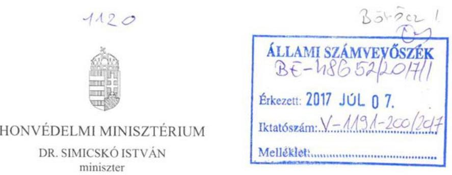

Nyilvántartási szám: 1710/73-21/2017.
Hiv. szám: V-1191-188/2017.

# Domokos László úr 

az Állami Számvevőszék
elnöke

## Budapest

Tárgy: jelentéstervezet véleményezése

## Tisztelt Elnök Úr!

A fenti hivatkozási számon megküldött, „Az állami tulajdonban (résztulajdonban) lévő gazdálkodó szervezetek vagyonmegőrzési és gazdálkodási tevékenységének ellenőrzése HM Zrínyi Térképészeti és Kommunikációs Szolgáltató Közhasznú Nonprofit Kft." kapcsán készített jelentéstervezetet szakközögeimmel áttanulmányoztattam. A HM tárca, illetve a vizsgált Társaság vonatkozásában tett megállapításokkal kapcsolatosan az alábbi észrevételeket teszem:

1. 2. számú Összegző megállapítás: „A HM által kötött ingatlan használatba adási szerződés nem volt szabályszerű."

Észrevétel:
Az összegző megállapítás módosítását kérem tekintettel arra, hogy a szerződés, bár hiányos, azonban nem minősül szabálytalannak. A kérdéses szerződés az állami vagyonra vonatkozó hatályos jogszabályoknak megfelelően, azokkal összhangban jött létre, így egyik rendelkezése sem minősül szabálytalannak. Ezen túl egyetértek a szerződés kiegészítésének szükségességével arra vonatkozóan, hogy a HM Zrínyi Nkft. az MNV Zrt. vagyon-nyilvántartási szabályzatát megismerte és magára nézve kötelező érvényűnek ismeri el.
2. 2. számú Összegző megállapítás 3. bekezdés: „A Számlarend; tartalma nem felelt meg a Számv. tv 161. § (2) b-d) pontjainak".

Észrevétel:
A megállapítást kérem pontosítani, mivel a HM Zrínyi Nkft. vizsgált időszakban hatályban lévő számlarendjei tartalmazták az említett jogszabályi helyeknek megfelelő jellegű leírásokat, melyek a HM Zrínyi Nkft. számára elegendő mértékkel bírnak, így a jogszabályi előírásoknak alapvetően megfelelnek.
Az egységes értelmezés érdekében a Társaság - az e tárgyban tett javaslat alapján - módosítja Számlarendjét, a meglévő tartalmat a szükséges mértékben kibővíti.

---

3. 2. számú Összegző megállapítás 3. bekezdés: ,,A Számlarend; sem felelt meg teljes körűen a Számv. tv előírásainak, mivel a nullás számlaosztályban kijelölt számlák... ...tartalmát a Számv. tv 161. § (2) bekezdés a-b) pont előírásai ellenére nem rögzítették."

# Észrevétel: 

A megállapítást elfogadom, azonban a tervezet véglegesítése során kérem figyelembe venni, hogy a Társaság Számlarendje a nullás számlaosztály leírását tartalmazza.
A megállapítás alapján a HM Zrínyi Nkft. módosítja számlatükrét, és a szükséges mértékben azt kibővíti a nullás számlaosztályban alkalmazott főkönyvi számlák számjelével, megnevezésével, és tartalmával.
4. 2. számú Összegző megállapítás 4. bekezdés: ,, a Pénzkezelési szabályzatban 1.2 teljes körűen nem rögzítették a pénzkezelés általános szabályait, mivel nem rendelkeztek a készpénzállomány ellenőrzésekor követendő eljárásról, valamint az ellenőrzés gyakoriságáról, ezzel megsértették a Számv. tv 14. § (8) bekezdés előírásait."

## Észrevétel:

A 17/2013. számú Pénzkezelési szabályzat 5. oldal 3.2. pontja rendelkezik a pénztár ellenőrzésről, mely utolsó bekezdése tartalmazza az évente legalább egyszer elvégzendő pénzkészlet ellenőrzést, melynek során egy adott jegyzőkönyvnyomtatványt kell kitölteni. Ugyanezen szabályzat 7-8. oldalon a 6. Pénztári nyilvántartások vezetése fejezet 3-5 bekezdése írja le a napi rendszerességgel a pénztárzárás keretében elvégzendő készpénzállomány ellenőrzését és rögzítésének eljárását.
Megállapítható, hogy a Társaság Pénzkezelési szabályzata tartalmazza a hiányolt előírásokat, ezért kérem fenti ellenőrzési megállapítás törlését.
5. 3.1. számú megállapítás 6. bekezdés: ,, a 2013-2015. évi beszámolóban az értékcsökkenések bemutatása nem volt kellően részletezett. A Számv. 92. § (2) értelmében a 2013-2015. évi beszámolók kiegészítő mellékletében az elszámolt értékcsökkenési leírást nem mutatták be a megfelelő bontásban."

## Észrevétel:

A megállapítás felülvizsgálatát kérem, tekintettel arra, hogy a HM Zrínyi NKft. beszámolóinak kiegészítő melléklete tartalmazza a befektetési tükört, melyben szerepel a halmozott értékcsökkenés mérleg sorok szerinti bontásban, továbbá az elszámolt terv szerinti és terven felüli értékcsökkenés összege is feltüntetésre kerül a szöveges részekben.
Ide kapcsolódóan kérem továbbá 5. és 6. bekezdés közötti ellentmondás feloldását, illetve az említett bekezdések pontosítását, mivel előbbi szerint az értékcsökkenési leírás elszámolása nem volt megfelelő (az alkalmazott szövegkiemelés miatt a vizsgált időszak egészére érthető a megállapítás), utóbbi szerint viszont a 2013-15. években az elszámolás megfelelt a Számv. tv. előírásainak.
Előzőeknek megfelelően kérem a Főbb megállapítások, következmények, javaslatok 3. bekezdésének pontosítását is, mivel az ebben szereplő értékelés szerint „az értékcsökkenési elszámolása nem volt megfelelő", és amelynek a részletezés említett pontjai szintén ellentmondanak.

---

6. 3.4. számú megállapítás 1. bekezdés: ,,A belső ellenőrzés 2012-ben az operatív feladatokat ellátó kontrolling vezető alárendeltségében működött, 2013-tól az SZMSZ-nek megfelelően az ügyvezető alárendeltségébe került át. "

# Észrevétel: 

A megállapítás pontosítását kérem, mivel a HM Zrínyi NKft. az alapítása óta rendelkezik belső ellenőri pozícióval, illetve a belső ellenőr a 2012. évben is az ügyvezető közvetlen alárendeltségében végezte tevékenységét.

Fentiek alapján kérem a Főbb megállapítások, következmények, javaslatok 4. bekezdésének pontosítását is, amelyben ,,a társaság 2014-től alakította ki a belső ellenőrzését" szöveg szerepel.

A jelentéstervezetnek a HM tárca, illetve a vizsgált Társaság vonatkozásában tett megállapításait és javaslatait köszönettel vettem, azokkal kapcsolatban egyéb észrevételt nem teszek.

Budapest, 2017. június 22.
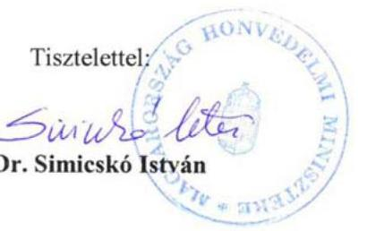

---

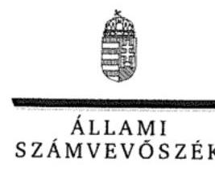

ELNÖK

Ikt.szám: V-1191-195/2016.

# Dr. Simicskó István úr 

honvédelmi miniszter
Honvédelmi Minisztérium

## Budapest

## Tisztelt Miniszter Úr!

Az ,,Állami tulajdonú gazdasági társaságok - Az állami tulajdonban (résztulajdonban) lévő gazdálkodó szervezetek vagyonmegőrzési és gazdálkodási tevékenységének ellenőrzése - HM Zrínyi Térképészeti és Kommunikációs Szolgáltató Közhasznú Nonprofit Kft. "címmel készített számvevőszéki jelentéstervezetre tett észrevételeit köszönettel megkaptam.
Az Állami Számvevőszék észrevételekre vonatkozó álláspontjáról a felügyeleti vezető által készített részletes tájékoztatást csatoltan megküldöm.

Tájékoztatom Miniszter urat, hogy a számvevőszéki jelentésben - az Állami Számvevőszékről szóló 2011. évi LXVI. törvény 29. § (3) bekezdése alapján - a figyelembe nem vett észrevételeket szerepeltetjük, annak indoklásával, hogy azokat az Állami Számvevőszék miért nem fogadta el.

Budapest, 2017. július 25.
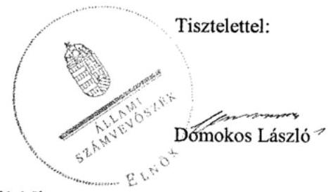

Melléklet: Tájékoztatás az észrevételek kezeléséről

---

# Tájékoztatás   az észrevételek kezeléséről 

Az ,,Állami tulajdonú gazdasági társaságok - Az állami tulajdonban (résztulajdonban) lévő gazdálkodó szervezetek vagyonmegőrzési és gazdálkodási tevékenységének ellenőrzése - HM Zrínyi Térképészeti és Kommunikációs Szolgáltató Közhasznú Nonprofit Kft. "című jelentéstervezetre tett (2017. június 28-án kelt, július 7-én futárnak átadott és az Állami Számvevőszékhez kézbesített) észrevételeit áttekintettük, azok kezelésével kapcsolatban a következő tájékoztatást adom.

## 1. Az 1. számú Összegző megállapításhoz füzött észrevételhez

A Honvédelmi Minisztérium álláspontja szerint a szerződés, bár hiányos volt, nem minősült szabálytalannak, annak kiegészítése szükséges azzal, hogy a társaság az MNV Zrt. - mint az ingatlanok fölötti tulajdonosi joggyakorló - vagyon-nyilvántartási szabályzatát megismerte és magára nézve kötelező érvényűnek ismeri el.
Az állami vagyonnal való gazdálkodásról szóló 254/2007. (X. 4.) Korm.rendelet (Vhr.) 14. § (3) bekezdése szerint ,,a vagyon hasznosítására, haszonélvezeti jog alapítására vagy vagyonkezelésére kötött szerződésben rögzíteni kell, hogy a szerződő partner a tulajdonosi joggyakorló vagyon-nyilvántartási szabályzatát megismerte és magára nézve kötelező érvényűnek ismeri el." Álláspontunk szerint a szerződés a jogszabály fenti rendelkezéseinek nem felel meg, az nem minősül szabályszerűnek.
A fentiekre tekintettel az észrevétel a jelentéstervezet módosítását nem indokolja.

## 2. A 2. számú Összegző megállapítás 3. bekezdéséhez füzött észrevételekhez

A Minisztérium megítélése szerint a vizsgált időszakban hatályos számlarendek tartalmazzák a 2000. évi C. törvény (a továbbiakban: Számv. tv.) idézett jogszabályi helyeinek megfelelő leírásokat, azok a jogszabályi előírásoknak megfelelnek.
A Számv. tv. vonatkozó előírásai (161. § (2) bek. a) - d) pontjai) szerint a számlarend a következőket tartalmazza:
a) minden alkalmazásra kijelölt számla számjelét és megnevezését,
b) a számla tartalmát, ha az a számla megnevezéséből egyértelműen nem következik, továbbá a számla értéke növekedésének, csökkenésének jogcímeit, a számlát érintő gazdasági eseményeket, azok más számlákkal való kapcsolatát,
c) a főkönyvi számla és az analitikus nyilvántartás kapcsolatát,
d) a számlarendben foglaltakat alátámasztó bizonylati rendet.

A beolvadó társaságok számlarendjei a megállapítás szempontjából nem relevánsak. A számvevőszéki jelentéstervezetben Számlarend₁ elnevezéssel szereplő számlarend a HM Zrínyi Kommunikációs Szolgáltató Nonprofit Közhasznú Kft. 2009-ben, 9/2/2009. iktatószámon kiadott, 2012. évben hatályos számlarendje. A dokumentum mindössze egy számlatükröt tartalmaz, amely a fenti jogszabályhely a) pontja szerinti követelményt teljesíti. A számlatükörben lévő egyes számlaelnevezések nem adnak elegendő, egyértelmű információt azok tartalmáról (példák: 252: „Saját előállítású plak. (Vass J féle kiad.)" 46723070: „3szög ügylet végső vevőjének Fiz. AFA"). A Számlarend₁ nem tartalmazza a Számv. tv. 161. § (2) bek. b)-d) pontjaiban előírtakat.

---

A jelentéstervezetben Számlarend₂ elnevezéssel szereplő számlarend a HM Zrínyi Térképészeti és Kommunikációs
 Szolgáltató Nonprofit Közhasznú Kft. ügyvezetője által, a 2013. december 16-án, 8/87 számon jóváhagyott Számviteli politika és a Számlarend szabályzat. A szabályzat a nullás (0) számlaosztály vonatkozásában csak egy általános leírást tartalmaz, 3. sz. melléklete (számlatükör) nem tartalmazza a nullás (0) számlaosztályba tartozó főkönyvi számlák számlajelét, megnevezését. Mindezek miatt a számlarend nem felel meg teljes körűen a 161. § (2) bek. a)-b) pontjainak.

A fentiekre tekintettel a számlarendekre vonatkozó észrevételek a jelentéstervezet módosítását nem indokolják.

# 3. A 2. számú Összegző megállapítás 4. bekezdéséhez füzött észrevételhez 

A Minisztérium megítélése szerint a 2013. évben kiadott Pénzkezelési szabályzat rendelkezik a pénztári ellenőrzésről, annak gyakoriságáról, valamint a napi rendszerességgel végzendő pénztárzárás során végzendő készpénzállomány ellenőrzésről, így annak tartalma megfelel a Számv. tv. vonatkozó előírásainak.
A Számv. tv. 4. § (8) bekezdése szerint ,,a pénzkezelési szabályzatban rendelkezni kell legalább a pénzforgalom (készpénzben, illetve bankszámlán történő) lebonyolításának rendjéről, a pénzkezelés személyi és tárgyi feltételeiről, felelősségi szabályairól, a készpénzben és a bankszámlán tartott pénzeszközök közötti forgalomról, a készpénzállományt érintő pénzmozgások jogcímeiről és eljárási rendjéről, a napi készpénz záró állomány maximális mértékéről, a készpénzállomány ellenőrzésekor követendő eljárásról, az ellenőrzés gyakoriságáról, a pénzszállítás feltételeiről, a pénzkezeléssel kapcsolatos bizonylatok rendjéről és a pénzforgalommal kapcsolatos nyilvántartási szabályokról."
A szabályzat tartalmának ismételt áttekintése a jelentéstervezetben foglalt megállapítást igazolta vissza. A szabályozás a pénztárellenőrzést (benne a bizonylatok és a kimutatott pénzkészlet meglétének ellenőrzését) a pénztári ellenőr feladatkörébe utalta és számára a szabályzat 3.2. pont első mondata a kimutatott pénzkészlet meglétének utóellenőrzését írja elő, a szabályzat 3.2. pont 3. bekezdés utolsó mondata szerint az utóellenőrzést pedig minden hónap 20-áig a megelőző hónapra vonatkozóan kell elvégezni. A készpénzállomány utólagos (visszamenőleges) ellenőrzése nem értelmezhető és a szabályozás 6. pont 4. bekezdés 2. mondata is azt jelenti, hogy a pénztárjelentésen a pénzkészlet helyességét igazoló pénztárosi aláírás meglétét igazolja a pénztárellenőr az aláírásával. A szabályzat 3.2. pont 5. bekezdésének mondata - amely szerint a pénztárban található pénzkészlet ellenőrzését legalább évente 1 alkalommal kell elvégezni - is azt mutatja, hogy a szabályozás szerint is a pénztári ellenőr rendszeresen (minden hónap 20-áig) elvégzett utólagos ellenőrzésébe a készpénzállomány tényleges ellenőrzése nem tartozik bele. A szabályozásban nem rögzített a készpénzállomány ellenőrzésekor követendő eljárás. A készpénzállomány ellenőrzésének gyakorisága meghatározásaként a „legalább évente 1 alkalommal" nem ismerhető el, hiszen az évi egy alkalmat a Számv. tv. 46. § (3) bekezdése leltározási kötelezettség előírásával meghatározta, a helyi szabályozás ezen felüli gyakoriságot pedig ténylegesen nem rögzít.
A fentiekre tekintettel az észrevétel a jelentéstervezet módosítását nem indokolja.

---

# 4. A 3.1. számú megállapítás 6. bekezdéséhez füzött észrevételhez 

A Minisztérium álláspontja szerint a HM Zrínyi Nkft. beszámolóinak kiegészítő melléklete tartalmazza a befektetési tükröt, melyben szerepel a halmozott értékcsökkenés mérlegsorok szerinti bontásban, továbbá a terv szerinti és terven felüli értékcsökkenés összege a szöveges részben.
A Számv. tv. 92. § (1) bekezdése szerint „a kiegészítő mellékletben be kell mutatni az immateriális javak, a tárgyi eszközök nyitó bruttó értékét, annak növekedését, csökkenését, záró bruttó értékét, külön az átsorolásokat, továbbá a halmozott értékcsökkenés nyitó értékét, tárgyévi növekedését, csökkenését, záró értékét, külön az átsorolásokat, a tárgyévi értékcsökkenési leírás összegét legalább a mérlegtételek szerinti bontásban."
A (2) bekezdés előírja, hogy „az (1) bekezdés szerinti részletezésben be kell mutatni az elszámolt értékcsökkenési leírást a következő bontásban: terv szerinti leírás lineárisan, degresszíven, teljesítményarányosan, egyéb módszerrel, továbbá a terven felüli értékcsökkenés, a visszaírt terven felüli értékcsökkenés összege. A jelentősebb összegű terven felüli értékcsökkenés, illetve annak visszaírása elszámolásának indokait ismertetni kell."
Véleményünk szerint a HM Zrínyi Nkft. által a 2012-2014. évi éves beszámolók Kiegészítő melléklete részeként készített befektetési tükrök tartalmazzák az értékcsökkenés Számv. tv. 92. § (1) bekezdés szerinti bemutatását, de hiányzik a 92. § (2) szerinti részletezés. A 2015. évi beszámoló Kiegészítő melléklete részeként készített befektetési tükörben ugyan szerepel szöveges kiegészítés is, de a Számv. tv. 92. § (2) bekezdés előírása ellenére abból sem nyerhető alábontás egyértelmű, pontos adat a terv szerinti értékcsökkenési leírásra, azon belül pedig a lineáris, degressziós és teljesítményarányos értékcsökkenési leírás adatára. Ezen adatok hiánya és a befektetési tükör szöveges részében a terven felüli értékcsökkenés adataihoz kapcsolódó szűk körű indokolás miatt a kiegészítő melléklet részét képező befektetői tükör a tulajdonosok, a befektetők, a hitelezők felé a vagyoni, pénzügyi helyzet, a működés eredménye megbízható és valós bemutatásához nem biztosít elegendő információt, megfelelő átláthatóságot.
A fentiekre tekintettel az észrevétel a jelentéstervezet módosítását nem indokolja.
Észrevételét, mely szerint a 3.1. megállapítás 5. és 6. bekezdése közt ellentmondás áll fent, figyelembe vettük és ennek megfelelően a jelentéstervezet 3.1. megállapítás 5. bekezdését az alábbiak szerint módosítottuk:
„Az értékcsökkenési leírás elszámolása 2012-ben nem volt megfelelő, mert az immateriális javak és tárgyi eszközök bekerülése során az üzembe helyezést hitelt érdemlő módon nem dokumentálták. A rendeltetésszerű használatbavétel kezdő időpontja így nem volt pontosan megállapítható, ezzel megsértették a Számv. tv. 52. § (2) bekezdés előírását."

## 5. A 3.4. számú megállapítás 1. bekezdéséhez füzött észrevételhez

A Minisztérium pontosítani kéri a belső ellenőrzés kialakításának, működésének időszakát a számvevőszéki jelentéstervezetben. Véleménye szerint a belső ellenőrzés már 2012-ben közvetlenül az ügyvezető közvetlen alárendeltségében végezte működését.
A HM Zrínyi Kommunikációs Szolgáltató Közhasznú Nonprofit Kft. 2012-ben hatályos, 580/2010. iktatószámú SZMSZ-e 1.1.5. pontja (19. oldal) alapján azonban megállapítottuk, hogy a belső ellenőrzést a kontrolling tevékenységért felelős személy felügyelte a társaság esetében. A Kft-be beolvadó társaságok SZMSZ-ei a megállapítás szempontjából nem relevánsak.

---

A fentiekre tekintettel az észrevétel a jelentéstervezet módosítását nem indokolja.
A jelentéstervezet részletes része 3.4. számú megállapítás 1. bekezdése alapján egyértelmű, hogy a teljes ellenőrzött időszak vonatkozásában működött belső ellenőrzés a társaságnál, a Főbb megállapítások, következtetések, javaslatok rész, 4. oldal utolsóelőtti bekezdését ennek megfelelően pontosítjuk:
A belső ellenőrzést a HM Zrínyi Térképészeti és Kommunikációs Szolgáltató Közhasznú Nonprofit Kft. az ellenőrzött időszakban működtette.
Tájékoztatom, hogy a számvevőszéki jelentés függelékeként szerepeltetjük a jelentéstervezethez tett észrevételeit, valamint az azokra adott válaszunkat.

Budapest, 2017. 07. 25.
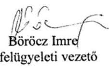

---

# 1056 

## A.   Magyar Nemzeti Vagyonkezelő Zrt.   VEZÉRIGAZGATÓ

Állami Számvevőszék

## Domokos László

elnök

1052 Budapest
Apáczai Cs. J. u. 10.

Ikt. sz.: MNV/01/36935/i/2017.
Hiv. sz.: V-1191-189/2016.

## Tisztelt Elnök Úr!

Tájékoztatom, hogy a 2017. június 15. napján „Az állami tulajdonban (résztulajdonban) lévő gazdálkodó szervezetek vagyonmegőrzési és gazdálkodási tevékenységének ellenőrzése - HM Zrínyi Térképészeti és Kommunikációs Szolgáltató Közhasznú Nonprofit Kft." tárgyában kézhez vett, V-1191-189/2016. ikt. sz. levél mellékleteként megküldött Jelentés-tervezetre az alábbi észrevételeket tesszük:
„Összegzés" Főbb megállapítások, következtetések, javaslatok / 4. oldal 2. bekezdés 1. mondata:
A hivatkozott megállapítás szerint a Honvédelmi Minisztérium és a Magyar Nemzeti Vagyonkezelő Zrt. a tulajdonosi joggyakorlási tevékenységét összességében szabályszerűen látta el, ugyanakkor a vagyonkezelésben lévő és a HM Zrínyi Térképészeti és Kommunikációs Szolgáltató Közhasznú Nonprofit Zrt. részére használatba adott ingatlanok tekintetében kötött vagyonhasznosítási szerződés hiányos volt, az teljes körűen nem felelt meg az állami vagyonról szóló törvény végrehajtására kiadott kormányrendeletben foglaltaknak.

A megállapítás részletei a Jelentés-tervezet a 13. oldal utolsó két bekezdésében és a 26. oldal 18. számú megjegyzésében kerülnek kifejtésre, amelyekből kiderül, hogy az ingatlan használatba adási szerződést a Honvédelmi Minisztérium kötötte, azonban álláspontunk szerint az „Összegzés" fejezet tartalmából arra a következtetésre lehet jutni, hogy az adott vagyonhasznosítási szerződésben az egyik szerződő fél az MNV Zrt. volt.

Fentiekre tekintettel a megállapítás következők szerinti kiegészítését javasoljuk:
„A Honvédelmi Minisztérium és a Magyar Nemzeti Vagyonkezelő Zrt. a tulajdonosi joggyakorlási tevékenységét összességében szabályszerűen látta el, ugyanakkor a vagyonkezelésben lévő és a HM Zrínyi Térképészeti és Kommunikációs Szolgáltató Közhasznú Nonprofit Zrt. részére a Honvédelmi Minisztérium által használatba adott ingatlanok tekintetében kötött vagyonhasznosítási szerződés hiányos volt, az teljes körűen nem felelt meg az állami vagyonról szóló törvény végrehajtására kiadott kormányrendeletben foglaltaknak."

---

# „Összegzés" Főbb megállapítások, következtetések, javaslatok / 4. oldal 3. bekezdés 2. mondata: 

A Jelentés-tervezet szerint a HM Zrínyi Térképészeti és Kommunikációs Szolgáltató Közhasznú Nonprofit Kft. a vagyonát az előírásoknak megfelelően tartotta nyilván, azonban a vagyon értékének megőrzéséről nem gondoskodott teljes mértékben, mivel az eszközök pótlása lényegesen alatta maradt az elszámolt értékcsökkenésnek.

Fenti megállapítás megfogalmazása álláspontunk szerint félreérthető. Visszapótlási kötelezettség a vagyonkezelt vagyon tekintetében merülhetne fel, azonban, ahogy az a 4.2. számú megállapításnál leírtakból kiderül, a hivatkozott megállapítás a Társaság saját vagyonára vonatkozik. A Társaság által használt állami tulajdonú ingatlanok a Honvédelmi Minisztérium vagyonkezelésében állnak, és ingatlan használatba adási szerződéssel kerültek a Társaság birtokába.

A Társaság közzétett éves beszámolóinak adataiból kiderül, hogy a Társaság valóban jelentős vagyonvesztést szenvedett el 2012. év és 2015. év között, saját tőkéje 2,3 milliárd Ft-ról 1,6 milliárd Ft-ra csökkent. A vagyonvesztés azonban a 2013. évi gazdálkodás 344 millió Ft összegű és a 2015. évi gazdálkodás 375 millió Ft összegű veszteségében leli magyarázatát.

Kérjük a megállapítás megfogalmazásának pontosítását.
Kérem Elnök Urat, hogy a jelentés véglegesítése során jelen észrevételeinket szíveskedjenek figyelembe venni.

Budapest, 2017. június 2.
Üdvözlettel:
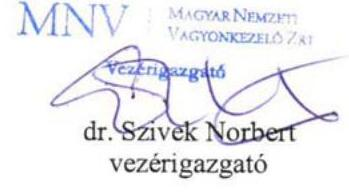

---

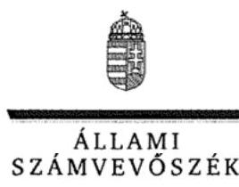

ELKÖK

Ikt.szám: V-1191-197/2016.

# Dr. Szivek Norbert úr 

vezérigazgató
Magyar Nemzeti Vagyonkezelő Zrt.

## Budapest

## Tisztelt Vezérigazgató Úr!

Az ,,Állami tulajdonú gazdasági társaságok - Az állami tulajdonban (résztulajdonban) lévő gazdálkodó szervezetek vagyonmegőrzési és gazdálkodási tevékenységének ellenőrzése - HM Zrínyi Térképészeti és Kommunikációs Szolgáltató Közhasznú Nonprofit Kft. " címmel készített számvevőszéki jelentéstervezetre tett észrevételeit köszönettel megkaptam.
Az Állami Számvevőszék észrevételekre vonatkozó álláspontjáról a felügyeleti vezető által készített részletes tájékoztatást csatoltan megküldöm.

Tájékoztatom Vezérigazgató urat, hogy a számvevőszéki jelentésben a figyelembe vett észrevételét szerepeltetjük.

Budapest, 2017. 07. 25.
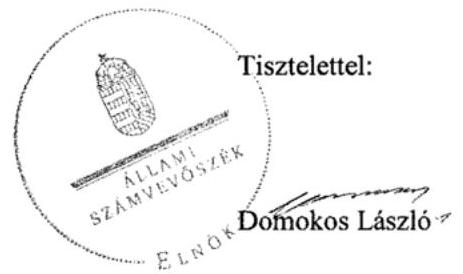

Melléklet: Tájékoztatás az észrevételek kezeléséről

---

# Tájékoztatás   az észrevételek kezeléséről 

Az ,,Állami tulajdonú gazdasági társaságok - Az állami tulajdonban (résztulajdonban) lévő gazdálkodó szervezetek vagyonmegőrzési és gazdálkodási tevékenységének ellenőrzése - HM Zrínyi Térképészeti és Kommunikációs Szolgáltató Közhasznú Nonprofit Kft." címû jelentéstervezetre tett (2017. június 28-án kelt és az Állami Számvevőszékhez június 29-én érkezett) észrevételeit áttekintettük, azok kezelésével kapcsolatban a következő tájékoztatást adom.

## 1. Az Összegzés, Főbb megállapítások, következtetések, javaslatok, 4. oldal 2. bekezdés, 1. mondatához füzött észrevételhez

Az MNV Zrt. véleménye szerint az Összegzés, Főbb megállapítások, következtetések, javaslatok 1. mondata tartalmából arra a következtetésre juthat a jelentéstervezet olvasója, hogy a vagyonhasznosítási szerződés esetében az egyik szerződő fél az MNV Zrt. volt.
A jelentéstervezet Megállapítások fejezet 1. összegző megállapítását alátámasztó hatodik bekezdés egyértelműen rögzíti, hogy a vagyonhasznosítási szerződést a Honvédelmi Minisztérium és a HM Zrínyi Térképészeti és Kommunikációs Szolgáltató Közhasznú Nonprofit Kft. között kötötték. Az észrevétel alapján a közérthetőség, a félreértés lehetőségének elkerülése érdekében az Összegzés fejezetben a főbb megállapítások első bekezdés
 első mondatát a következőképpen pontosítjuk:
A Honvédelmi Minisztérium és a Magyar Nemzeti Vagyonkezelő Zrt. a tulajdonosi joggyakorlási tevékenységét összességében szabályszerűen látta el. A Honvédelmi Minisztérium vagyonkezelésében lévő és a HM Zrínyi Térképészeti és Kommunikációs Szolgáltató Közhasznú Nonprofit Kft. részére használatba adott ingatlanok tekintetében kötött vagyonhasznosítási szerződés hiányos volt, az nem felelt meg teljes körűen az állami vagyonról szóló törvény végrehajtására kiadott kormányrendeletben foglaltaknak.

## 2. Az Összegzés, Főbb megállapítások, következtetések, javaslatok, 4. oldal 3. bekezdés, 2. mondatához füzött észrevételhez

A bekezdés 2. mondatában szereplő megállapítás az MNV Zrt. megítélése szerint félreérthető, mivel visszapótlási kötelezettség csak a kezelt vagyonnál merülhet fel, saját vagyon esetében nem, azonban a jelentéstervezetben hivatkozott megállapítás a társaság saját vagyonának kezelésére vonatkozik. A társaság által használt állami ingatlanok használatba-adási szerződéssel kerültek a társaság birtokába.
A jelentéstervezet Megállapítások fejezet 4.2. megállapítását alátámasztó harmadik bekezdés egyértelműen rögzíti, hogy a saját vagyon értékének megőrzése nem történt meg, de ehhez kapcsolódóan nem utal megsértett jogszabályi előírásra, vagy más szabályozásra.

---

Az észrevétel alapján a főbb és a részletesebb megállapítások összhangja, az előírások be nem tartásaként is értelmezhető megfogalmazás elkerülése érdekében az Összegzés fejezetben a főbb megállapítások második bekezdés utolsó mondatát a következőképpen pontosítjuk:
A vagyonát az előírásoknak megfelelően tartotta nyilván. Saját vagyonának értéke az ellenőrzött időszakban csökkent, az eszközök pótlásának értéke az elszámolt értékcsökkenés összegét nem érte el.

Tájékoztatom, hogy a számvevőszéki jelentés függelékeként szerepeltetjük a jelentéstervezethez tett észrevételeit, valamint az azokra adott válaszunkat.

Budapest, 2017. július 25. nap

Böröcz Imre
felügyeleti vezető

---

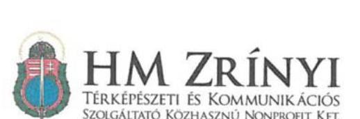

1404

Nytv.szám: 25-54/2017
Hiv. szám: V-1191-187/2016

## Domokos László

Állami Számvevőszék
Elnök

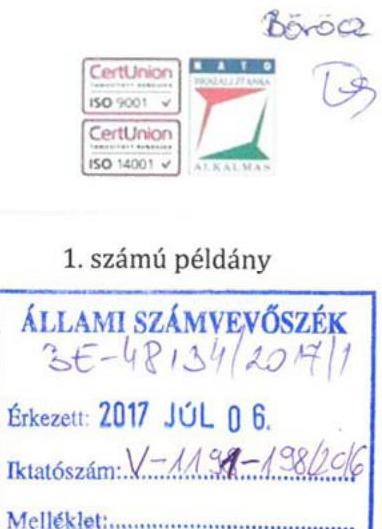

1. számú példány

ÁLLAMI SZÁMVEVŐSZÉK
BE-48134/2017/1
Érkezési időpont: 2017. július 06.
Iktatószám: V-1191-187/2016
Melléklet: $\qquad$
1364 Budapest IV. Pf.: 54.

Tárgy: Jelentés tervezet észrevételezése

# Tisztelt Elnök Úr! 

A HM Zrínyi Térképészeti és Kommunikációs Szolgáltató Közhasznú Nonprofit Kft.-vel a fenti hivatkozási számú, „Az állami tulajdonban (résztulajdonban) lévő gazdálkodó szervezetek vagyonmegőrzési és gazdálkodási tevékenységének ellenőrzése - HM Zrínyi Térképészeti és Kommunikációs Szolgáltató Közhasznú Nonprofit Kft.” címú számvevőszéki jelentéstervezetet 2017. június 15-én megkapta. A jelentéstervezetben foglaltakra az alábbi észrevételeket teszem:

1. A HM által kötött ingatlan használatba adási szerződés nem volt szabályszerű. Összegzö megállapítás 13. oldal

Észrevétel:
Az összegzö megállapítás módosítása szükséges, tekintettel arra, hogy a szerződés hiányos, azonban szabálytalan nem volt. Az ingatlan használatba adási szerződés az állami vagyonra vonatkozó hatályos jogszabályoknak megfelelően jött létre, annak egyik rendelkezése sem minősül szabálytalannak. A szerződés kiegészítése szükséges a Vhr. 14. § (3) értelmében azzal, hogy a HM Zrínyi NKft. az MNV Zrt. - mint az ingatlanok fölötti tulajdonosi joggyakorló - vagyon-nyilvántartási szabályzatát megismerte és magára nézve kötelező érvényűnek ismeri el.

---

# HM ZRÍNYI 

TÉRKÉPÉSZETI ÉS KOMMUNIKÁCIÓS
SZOLGÁLTATÓ KÖZHASZNÚ NONPROFIT KFT:
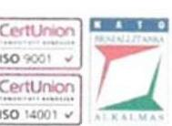
2. 2013-2015. évi beszámolóban az értékcsökkenések bemutatása nem volt kellően részletezett - 3.1. sz. megállapítás 15. oldal 6. bekezdés

A Sztv. 92. § (2) értelmében a 2013-2015. évi beszámolók kiegészítő mellékletében az elszámolt értékcsökkenési leírást nem mutatták be a megfelelő bontásban.

Észrevétel:
A megállapítás módosítása szükséges, tekintettel arra, hogy a HM Zrínyi NKft. kiegészítő melléklete tartalmazza a befektetési tükröt, melyben szerepel a halmozott, és évi értékcsökkenés mérleg sorok szerinti bontásban, továbbá az elszámolt terv szerinti és terven felüli értékcsökkenés összege is bemutatásra kerül a szöveges részekben.
3. A társaság 2014.-től alakította ki a belső ellenőrzését - 3.4. sz. megállapítás 16. oldal 8. bekezdés, 4. oldal 6. bekezdés

A belső ellenőrzés 2012-ben az operatív feladatokat ellátó kontrolling vezető alárendeltségében működött, 2013-tól az SZMSZ-nek megfelelően az ügyvezető alárendeltségébe került át.

Észrevétel:
A megállapítás módosítása szükséges, tekintettel arra, hogy a HM Zrínyi NKft. megalapítása óta folyamatosan volt betöltött belső ellenőri pozíció. A belső ellenőr az általa végzett tevékenységéről évente beszámol a Felügyelő Bizottságnak. 2012-ben a belső ellenőr az ügyvezető közvetlen alárendeltségében végezte a tevékenységét.
4. A Számlarendben a számlák részletezése nem felel meg a számviteli törvénynek - 2. sz. megállapítás 14. oldal 4. bekezdés

A számlarend nem tartalmazza a Sztv 161. § (2) b-d) pontjai alapján az alábbiakat:
"b) a számla tartalmát, ha az a számla megnevezéséből egyértelműen nem következik, továbbá a számla értéke növekedésének, csökkenésének jogcímeit, a számlát érintő gazdasági eseményeket, azok más számlákkal való kapcsolatát,
c) a főkönyvi számla és az analitikus nyilvántartás kapcsolatát,
d) a számlarendben foglaltakat alátámasztó bizonylati rendet."

Észrevétel:
A megállapítás módosítása szükséges, tekintettel arra, hogy a számlarendben szereplő főkönyvi számokhoz tartozó megnevezések elegendő információval rendelkeznek, a

---

# HM ZRÍNYI 

TÉRKÉPÉSZETI ÉS KOMMUNIKÁCIÓS
SZOLGÁLTATÓ KÖZHASZNÚ NONPROFIT KFT
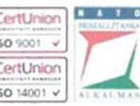
megnevezések egyértelműek. Az eddigi ellenőrzések során ezek egyértelműségét soha nem kifogásolták. Az ellenőrzés során sem merült fel erre utaló probléma. Álláspontunk szerint a Társaság számlarendje megfelel a Számviteli Törvénynek.
5. A Számlarendben a 0. számlaosztály részletezése nem felel meg a számviteli törvénynek 2. sz. megállapítás 14. oldal 4. bekezdés

A számlarendben nem rögzítették a 0. számlaosztályban alkalmazott számlák a Sztv 161. § (2) a-b) pontjai alapján az alábbiakat:
"a) minden alkalmazásra kijelölt számla számjelét és megnevezését,
b) a számla tartalmát, ha az a számla megnevezéséből egyértelműen nem következik, továbbá a számla értéke növekedésének, csökkenésének jogcímeit, a számlát érintő gazdasági eseményeket, azok más számlákkal való kapcsolatát"

## Észrevétel:

A megállapítás módosítása szükséges, tekintettel arra, hogy a számlarend tartalmazza a 0. számlaosztály leírását. A számlatükör azonban nem tartalmazza a használt 0-s számlákat.

A megállapítást figyelembe véve, a HM Zrínyi Nkft. módosítja a számlatükrét és kibővíti a 0-s számlákkal.
6. A Pénzkezelési szabályzat nem felel meg a számviteli törvénynek - 2. sz. megállapítás 14. oldal 5. bekezdés

A Sztv. 14. § (8) alapján teljes körűen nem rögzítették a pénzkezelés általános szabályait, mivel nem rendelkeztek a készpénzállomány ellenőrzésekor követendő eljárásról, valamint az ellenőrzés gyakoriságáról az alábbiak szerint:
"(8) A pénzkezelési szabályzatban rendelkezni kell legalább a pénzforgalom (készpénzben, illetve bankszámlán történő) lebonyolításának rendjéről, a pénzkezelés személyi és tárgyi feltételeiről, felelősségi szabályairól, a készpénzben és a bankszámlán tartott pénzeszközök közötti forgalomról, a készpénzállományt érintő pénzmozgások jogcímeiről és eljárási rendjéről, a napi készpénz záró állomány maximális mértékéről, a készpénzállomány ellenőrzésekor követendő eljárásról, az ellenőrzés gyakoriságáról, a pénzszállítás feltételeiről, a pénzkezeléssel kapcsolatos bizonylatok rendjéről és a pénzforgalommal kapcsolatos nyilvántartási szabályokról."

Észrevétel:

---

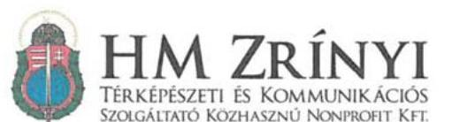

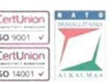

*A megállapítás módosítása szükséges, tekintettel arra, hogy a 17/2013 számú Pénzkezelési szabályzat 5. oldal 3.2. pontja rendelkezik a pénztár ellenőrzésről, mely utolsó bekezdése tartalmazza az évente legalább egyszer elvégzendő pénzkészlet ellenőrzést, melynek során egy adott jegyzőkönyvnyomtatványt kell kitölteni.*

*Ugyanezen szabályzat 7-8. oldalon a 6. Pénztári nyilvántartások vezetése fejezet 3-5. bekezdése írja le a napi rendszerességgel a pénztárzárás keretében elvégzendő készpénzállomány ellenőrzését és rögzítésének eljárását.*

*Véleményünk szerint a Társaság Pénzkezelési szabályzata tartalmazza a törvény által előírásokat.*

Kérem Tisztelt Elnök Urat a fent részletezett észrevételeket szíveskedjenek figyelembe venni a számvevőszéki jelentés elkészítésekor.

Budapest, 2017. június 26.

Tisztelettel:

**Benkóczy Zoltán**
ügyvezető

Készült: 2 példányban
Ügyintéző: Kulcsár Gábor (+36 30 411 1555)
Egy példány: 4 lap
Kapják:
1. sz. pld.: Címzett
2. sz. pld.: Irattár

Székhely: H-1087 Budapest, Kerepesi út 29/B. Telephely: H-1024 Budapest, Szilágyi Erzsébet fasor 7-9.; Postacím: H-1440 Budapest, Pf. 22.
tel.: +36 1 459-5305; fax.: +36 1 314-2432; info@armedia.hu; www.honvedelem.hu; adószám: 20758444-2-51; cégjegyzékszám: 01-09-920090

---

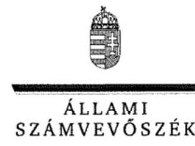

ELNÖK

Ikt.szám: V-1191-196/2016.

# Benkóczy Zoltán úr 

ügyvezető
HM Zrínyi Térképészeti és Kommunikációs Szolgáltató
Közhasznú Nonprofit Kft.

## Budapest

## Tisztelt Ügyvezető Úr!

Az ,,Állami tulajdonú gazdasági társaságok - Az állami tulajdonban (résztulajdonban) lévő gazdálkodó szervezetek vagyonmegőrzési és gazdálkodási tevékenységének ellenőrzése - HM Zrínyi Térképészeti és Kommunikációs Szolgáltató Közhasznú Nonprofit Kft. "címmel készített számvevőszéki jelentéstervezetre tett észrevételeit köszönettel megkaptam.
Az Állami Számvevőszék észrevételekre vonatkozó álláspontjáról a felügyeleti vezető által készített részletes tájékoztatást csatoltan megküldöm.

Tájékoztatom Ügyvezető urat, hogy a számvevőszéki jelentésben - az Állami Számvevőszékről szóló 2011. évi LXVI. törvény 29. § (3) bekezdése alapján - a figyelembe nem vett észrevételeket szerepeltetjük, annak indoklásával, hogy azokat az Állami Számvevőszék miért nem fogadta el.

Budapest, 2017. július 27. nap
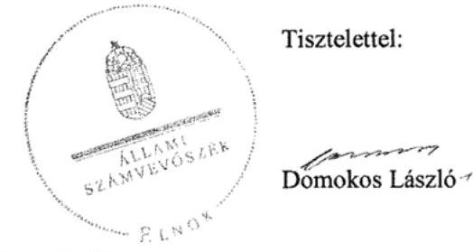

Melléklet: Tájékoztatás az észrevételek kezeléséről

---

# Tájékoztatás   az észrevételek kezeléséről 

Az ,,Állami tulajdonú gazdasági társaságok - Az állami tulajdonban (résztulajdonban) lévő gazdálkodó szervezetek vagyonmegőrzési és gazdálkodási tevékenységének ellenőrzése - HM Zrínyi Térképészeti és Kommunikációs Szolgáltató Közhasznú Nonprofit Kft. "című jelentéstervezetre tett (2017. június 26-án kelt, július 3-án postára adott, és az Állami Számvevőszékhez július 6-án érkezett) észrevételeit áttekintettük, azok kezelésével kapcsolatban a következő tájékoztatást adom.

## 1. Az 1. számú Összegzö megállapításhoz füzött észrevételhez

A HM Zrínyi Térképészeti és Kommunikációs Szolgáltató Közhasznú Nonprofit Kft. (továbbiakban: Társaság) álláspontja szerint a szerződés, bár hiányos volt, nem minősült szabálytalannak, annak kiegészítése szükséges azzal, hogy a társaság az MNV Zrt. - mint az ingatlanok fölötti tulajdonosi joggyakorló - vagyon-nyilvántartási szabályzatát megismerte és magára nézve kötelező érvényűnek ismeri el.
Az állami vagyonnal való gazdálkodásról szóló 254/2007. (X. 4.) Korm.rendelet (Vhr.) 14. § (3) bekezdése szerint „a vagyon hasznosítására, haszonélvezeti jog alapítására vagy vagyonkezelésére kötött szerződésben rögzíteni kell, hogy a szerződő partner a tulajdonosi joggyakorló vagyon-nyilvántartási szabályzatát megismerte és magára nézve kötelező érvényűnek ismeri el." Álláspontunk szerint a szerződés a jogszabály fenti rendelkezéseinek nem felel meg, az nem minősül szabályszerűnek.
A fentiekre tekintettel az észrevétel a jelentéstervezet módosítását nem indokolja.

## 2. Az 3.1. számú megállapítás 6. bekezdéséhez füzött észrevételhez

A Társaság álláspontja szerint beszámolóinak kiegészítő melléklete tartalmazza a befektetési tükröt, melyben szerepel a halmozott értékcsökkenés mérlegsorok szerinti bontásban, továbbá a terv szerinti és terven felüli értékcsökkenés összege a szöveges részben.
A Számv. tv. 92. § (1) bekezdése szerint „a kiegészítő mellékletben be kell mutatni az immateriális javak, a tárgyi eszközök nyitó bruttó értékét, annak növekedését, csökkenését, záró bruttó értékét, külön az átsorolásokat, továbbá a halmozott értékcsökkenés nyitó értékét, tárgyévi növekedését, csökkenését, záró értékét, külön az átsorolásokat, a tárgyévi értékcsökkenési leírás összegét legalább a mérlegtételek szerinti bontásban. "
A (2) bekezdés előírja, hogy ,,az (1) bekezdés szerinti részletezésben be kell mutatni az elszámolt értékcsökkenési leírást a következő bontásban: terv szerinti leírás lineárisan, degresszíven, teljesítményarányosan, egyéb módszerrel, továbbá a terven felüli értékcsökkenés, a visszaírt terven felüli értékcsökkenés összege. A jelentősebb összegű terven felüli értékcsökkenés, illetve annak visszaírása elszámolásának indokait ismertetni kell. "
Véleményünk szerint a Társaság által a 2012-2014. évi éves beszámolók Kiegészítő melléklete részeként készített befektetési tükrök tartalmazzák az értékcsökkenés Számv. tv. 92. § (1) bekezdés szerinti bemutatását, de hiányzik a 92. § (2) szerinti részletezés. A 2015. évi beszámoló Kiegészítő melléklete részeként készített befektetési tükörben ugyan szerepel szöveges kiegészítés is, de a Számv. tv. 92. § (2) bekezdés előírása ellenére abból sem nyerhető alábontás egyértelmű,

---

pontos adat a terv szerinti értékcsökkenési leírásra, azon belül pedig a lineáris, degressziós és teljesítményarányos értékcsökkenési leírás adatára. Ezen adatok hiánya és a befektetési tükör szöveges részében a
 terven felüli értékcsökkenés adataihoz kapcsolódó szűk körű indokolás miatt a kiegészítő melléklet részét képező befektetői tükör a tulajdonosok, a befektetők, a hitelezők felé a vagyoni, pénzügyi helyzet, a működésének eredménye megbízható és valós bemutatásához nem biztosít elegendő információt, megfelelő átláthatóságot.
A fentiekre tekintettel az észrevétel a jelentéstervezet módosítását nem indokolja.
3. A Főbb megállapítások, következtetések, javaslatok rész, 4. oldal utolsóelőtti bekezdéséhez, valamint a 3.4. számú megállapítás 1. bekezdéséhez füzött észrevételhez
A Társaság véleménye szerint a belső ellenőrzés már 2012-ben közvetlenül az ügyvezető közvetlen alárendeltségében végezte működését.
A HM Zrínyi Kommunikációs Szolgáltató Közhasznú Nonprofit Kft. 2012-ben hatályos, 580/2010. iktatószámú SZMSZ-e 1.1.5. pontja (19. oldal) alapján azonban megállapítottuk, hogy a belső ellenőrzést a kontrolling tevékenységért felelős személy felügyelte a társaság esetében. A Kft-be beolvadó társaságok SZMSZ-ei a megállapítás szempontjából nem relevánsak.
A fentiekre tekintettel az észrevétel a jelentéstervezet módosítását nem indokolja.
A jelentéstervezet részletes része 3.4. számú megállapítás 1. bekezdése alapján egyértelmű, hogy a teljes ellenőrzött időszak vonatkozásában működött belső ellenőrzés a társaságnál, a Főbb megállapítások, következtetések, javaslatok rész, 4. oldal utolsóelőtti bekezdését ennek megfelelően pontosítjuk:
A belső ellenőrzést a HM Zrínyi Térképészeti és Kommunikációs Szolgáltató Közhasznú Nonprofit Kft. az ellenőrzött időszakban működtette.

# 4. Az. 2. számú Összegző megállapítás 3. bekezdéséhez füzött észrevételekhez 

a.)A Társaság megítélése szerint a vizsgált időszakban hatályos számlarendek megfelelnek a 2000. évi C. törvény (a továbbiakban: Számv. tv.) 161. § (2) bek. b) pontjának, tartalmazzák a leírásokat, a megnevezések elegendő információval rendelkeznek, egyértelműek.
A Számv. tv. vonatkozó előírásai (161. § (2) bek. a) - d) pontjai) szerint a számlarend a következőket tartalmazza:
a) minden alkalmazásra kijelölt számla számjelét és megnevezését,
b) a számla tartalmát, ha az a számla megnevezéséből egyértelműen nem következik, továbbá a számla értéke növekedésének, csökkenésének jogcímeit, a számlát érintő gazdasági eseményeket, azok más számlákkal való kapcsolatát,
c) a főkönyvi számla és az analitikus nyilvántartás kapcsolatát,
d) a számlarendben foglaltakat alátámasztó bizonylati rendet.

A beolvadó társaságok számlarendjei a megállapítás szempontjából nem relevánsak. A számvevőszéki jelentéstervezetben Számlarend ${ }_{1}$ elnevezéssel szereplő számlarend a HM Zrínyi Kommunikációs Szolgáltató Nonprofit Közhasznú Kft. 2009-ben, 9/2/2009. iktatószámon kiadott, 2012. évben hatályos számlarendje. A dokumentum mindössze egy számlatükröt tartalmaz, amely a fenti jogszabályhely a) pontja szerinti követelményt teljesíti. A számlatükörben lévő egyes számlaelnevezések nem adnak elegendő, egyértelmű információt azok tartalmáról (példák:

---

252: „Saját előállítású plak. (Vass J féle kiad." 46723070: „3szög ügylet végső vevőjének Fiz. ÁFA"). A Számlarend ${ }_{1}$ nem tartalmazza a Számv tv. 161. § (2) bek. b)-d) pontjaiban előírtakat.
b.) A jelentéstervezetben Számlarend ${ }_{2}$ elnevezéssel szereplő számlarend a Társaság ügyvezetője által, a 2013. december 16-án, 8/87 számon jóváhagyott Számviteli politika és a Számlarend szabályzat. A szabályzat a nullás (0) számlaosztály vonatkozásában csak egy általános leírást tartalmaz, 3. sz. melléklete (számlatükör) nem tartalmazza a nullás (0) számlaosztályba tartozó főkönyvi számlák számlajelét, megnevezését. Mindezek miatt a számlarend nem felel meg teljes körűen a 161. § (2) bek. a)-b) pontjainak.
A fentiekre tekintettel a számlarendekre vonatkozó észrevételek a jelentéstervezet módosítását nem indokolják.

# 5. Az. 2. számú Összegző megállapítás 4. bekezdéséhez füzött észrevételhez 

A Társaság megítélése szerint a 2013. évben kiadott 17/2013. sz. Pénzkezelési szabályzat rendelkezik a pénztári ellenőrzésről, annak gyakoriságáról, így annak tartalma megfelel a Számv. tv. vonatkozó előírásainak.
A Számv. tv. 4. § (8) bekezdése szerint ,, a pénzkezelési szabályzatban rendelkezni kell legalább a pénzforgalom (készpénzben, illetve bankszámlán történő) lebonyolításának rendjéről, a pénzkezelés személyi és tárgyi feltételeiről, felelősségi szabályairól, a készpénzben és a bankszámlán tartott pénzeszközök közötti forgalomról, a készpénzállományt érintő pénzmozgások jogcímeiről és eljárási rendjéről, a napi készpénz záró állomány maximális mértékéről, a készpénzállomány ellenőrzésekor követendő eljárásról, az ellenőrzés gyakoriságáról, a pénzszállítás feltételeiről, a pénzkezeléssel kapcsolatos bizonylatok rendjéről és a pénzforgalommal kapcsolatos nyilvántartási szabályokról."

A szabályzat tartalmának ismételt áttekintése a jelentéstervezetben foglalt megállapítást igazolta vissza. A szabályozás a pénztárellenőrzést (benne a bizonylatok és a kimutatott pénzkészlet meglétének ellenőrzését) a pénztári ellenőr feladatkörébe utalta és számára a szabályzat 3.2. pont első mondata a kimutatott pénzkészlet meglétének utóellenőrzését írja elő, a szabályzat 3.2. pont 3. bekezdés utolsó mondata szerint az utóellenőrzést pedig minden hónap 20-áig a megelőző hónapra vonatkozóan kell elvégezni. A készpénzállomány utólagos (visszamenőleges) ellenőrzése nem értelmezhető és a szabályozás 6. pont 4. bekezdés 2. mondata is azt jelenti, hogy a pénztárjelentésen a pénzkészlet helyességét igazoló pénztárosi aláírás meglétét igazolja a pénztárellenőr az aláírásával. A szabályzat 3.2. pont 5. bekezdésének mondata - amely szerint a pénztárban található pénzkészlet ellenőrzését legalább évente 1 alkalommal kell elvégezni - is azt mutatja, hogy a szabályozás szerint is a pénztári ellenőr rendszeresen (minden hónap 20-áig) elvégzett utólagos ellenőrzésébe a készpénzállomány tényleges ellenőrzése nem tartozik bele. A szabályozásban nem rögzített a készpénzállomány ellenőrzésekor követendő eljárás. A készpénzállomány ellenőrzésének gyakorisága meghatározásaként a „legalább évente 1 alkalommal" nem ismerhető el, hiszen az évi egy alkalmat a Számv. tv. 46. § (3) bekezdése leltározási kötelezettség előírásával meghatározta, a helyi szabályozás ezen felüli gyakoriságot pedig ténylegesen nem rögzít.

---

A fentiekre tekintettel az észrevétel a jelentéstervezet módosítását nem indokolja.
Tájékoztatom, hogy a számvevőszéki jelentés függelékeként szerepeltetjük a jelentéstervezethez tett észrevételeit, valamint az azokra adott válaszunkat.

Budapest, 2017. C7 hó 25 nap

Böröcz Imre felügyeleti vezető

---

.

---

# RÖVIDÍTÉSEK JEGYZÉKE 

${ }^{1}$ HM Zrínyi Nonprofit Kft.
${ }^{2}$ a földmérési és térképészeti tevékenységről szóló tv.
${ }^{3}$ honvédelmi célú térképellátásról szóló HM rendelet
${ }^{4}$ társaság
${ }^{5}$ vagyonkezelési szerződés
${ }^{6} \mathrm{HM}$
${ }^{7}$ Nvtv.
${ }^{8}$ Vtv.
${ }^{9}$ Hvt.
${ }^{10}$ Együttműködési megállapodás ${ }_{1-2}$
${ }^{11}$ ÁSZ tv.
${ }^{12}$ 67/2011. (VI. 24.) HM utasítás
${ }^{13}$ Alapító Okirat ${ }_{1-12}$

HM Zrínyi Térképészeti és Kommunikációs Szolgáltató Közhasznú Nonprofit Kft. A földmérési és térképészeti tevékenységről szóló 2012. évi XLVI. törvény
honvédelmi célú térképellátásról szóló 35/2000. (XII. 20.) HM rendelet

HM Zrínyi Térképészeti és Kommunikációs Szolgáltató Közhasznú Nonprofit Kft. Az MNV Zrt. és a Honvédelmi Minisztérium között 2008. május 28-án létrejött SZT-28425 sz. vagyonkezelési szerződés
Honvédelmi Minisztérium
a nemzeti vagyonról szóló 2011. évi CXCVI. törvény
2007. évi CVI. törvény az állami vagyonról
a honvédelemről és a Magyar Honvédségről, valamint a különleges jogrendben bevezethető intézkedésekről szóló 2011. évi CXIII. törvény
A MNV Zrt. és a HM között a HM Zrínyi Nonprofit Kft. feletti tulajdonosi jogok gyakorlás szabályozása tekintetében létrejött SZT-39158. sz. Együttműködési megállapodás (hatályos: 2013. január 1-től 2013. november 28-ig)
A MNV Zrt. és a HM között a HM Zrínyi Nonprofit Kft. feletti tulajdonosi jogok gyakorlás szabályozása tekintetében létrejött SZT-39158-1. sz. Együttműködési megállapodás (hatályos: 2013. november 29-től)
2011. évi LXVI. törvény az Állami Számvevőszékről
a Honvédelmi Minisztérium vagyonkezelésében lévő ingóságok és társasági részesedések kezelésének, tulajdonosi ellenőrzésének, valamint az ingóságok hasznosításának, elidegenítésének, átadás-átvételének szabályairól szóló 67/2011. (VI. 24.) HM utasítás
A Magyar Köztársaság Honvédelmi Miniszterének 28/2/2000 számon kiadott, 2000. szeptember hó 25. napján kelt HM Zrínyi Nonprofit Kft. alapító okirat 39472/2011 számon kiadott (2011. december 30. napján kelt) alapító okirat módosítása
A Magyar Köztársaság Honvédelmi Miniszterének 28/2/2000 számon kiadott, 2000. szeptember hó 25. napján kelt HM Zrínyi Nonprofit Kft. alapító okirat 5717/2012. számon kiadott (2012. április 19. napján kelt) alapító okirat módosítása
A Magyar Köztársaság Honvédelmi Miniszterének 28/2/2000 számon kiadott, 2000. szeptember hó 25. napján kelt HM Zrínyi Nonprofit Kft. alapító 56-23/2012. számon kiadott (2012. május 30. napján kelt) alapító okirat módosítása
A Magyar Köztársaság Honvédelmi Miniszterének 28/2/2000 számon kiadott, 2000. szeptember hó 25. napján kelt HM Zrínyi Nonprofit Kft. alapító okirat 92518/2012. számon kiadott (2012. október 16. napján kelt) alapító okirat módosítása
A Magyar Köztársaság Honvédelmi Miniszterének 28/2/2000 számon kiadott, 2000. szeptember hó 25. napján kelt HM Zrínyi Nonprofit Kft. alapító okirat 3851/2013. számon kiadott (2013. február 12. napján kelt) alapító okirat módosítása
A Magyar Köztársaság Honvédelmi Miniszterének 28/2/2000 számon kiadott, 2000. szeptember hó 25. napján kelt HM Zrínyi Nonprofit Kft. alapító okirat 38516/2013. számon kiadott (2013. május 31. napján kelt) alapító okirat módosítása
A Magyar Köztársaság Honvédelmi Miniszterének 28/2/2000 számon kiadott, 2000. szeptember hó 25. napján kelt HM Zrínyi Nonprofit Kft. alapító okirat 362-

---

17/2014. számon kiadott (2014. december 15. napján kelt) alapító okirat módosítása
A Magyar Köztársaság Honvédelmi Miniszterének 28/2/2000 számon kiadott, 2000. szeptember hó 25. napján kelt HM Zrínyi Nonprofit Kft. alapító okirat 31801/2015. számon kiadott (2015. január 12. napján kelt) alapító okirat módosítása
A Magyar Köztársaság Honvédelmi Miniszterének 28/2/2000 számon kiadott, 2000. szeptember hó 25. napján kelt HM Zrínyi Nonprofit Kft. alapító okirat 31803/2015. számon kiadott (2015. február 28. napján kelt) alapító okirat módosítása
A Magyar Köztársaság Honvédelmi Miniszterének 28/2/2000 számon kiadott, 2000. szeptember hó 25. napján kelt HM Zrínyi Nonprofit Kft. alapító okirat 31808/2015. számon kiadott (2015. május 26. napján kelt) alapító okirat módosítása
A Magyar Köztársaság Honvédelmi Miniszterének 28/2/2000 számon kiadott, 2000. szeptember hó 25. napján kelt HM Zrínyi Nonprofit Kft. alapító 31816/2015. számon kiadott (2015. június 22. napján kelt) alapító okirat módosítása
A Magyar Köztársaság Honvédelmi Miniszterének 28/2/2000 számon kiadott, 2000. szeptember hó 25. napján kelt HM Zrínyi Nonprofit Kft. alapító okirat 31819/2015. számon kiadott (2015. október 13. napján kelt) alapító okirat módosítása
2006. évi IV. törvény - a gazdasági társaságokról (Hatályos 2014. március 14-ig)
a Polgári Törvénykönyvről szóló 2013. évi V. törvény (hatályos 2014. március 15-től)
a HM Zrínyi Nonprofit Kft. Felügyelőbizottsága
2000. évi C. törvény a számvitelről
a 94/33. számú a Honvédelmi Minisztérium és a HM Zrínyi Nonprofit Kft. között létrejött a Magyar Állam tulajdonában és a Honvédelmi Minisztérium vagyonkezelésében lévő ingatlanok használatba adása, valamint használati feltételeinek meghatározásáról szóló szerződés1 (hatályos 2009. április 24. napjától 2012. május 23. napjáig)
94/33. számú a Honvédelmi Minisztérium és a HM Zrínyi Nonprofit Kft. között létrejött a Magyar Állam tulajdonában és a Honvédelmi Minisztérium vagyonkezelésében lévő ingatlanok használatba adása, valamint használati feltételeinek meghatározásáról szóló szerződés1 1.sz módosítása(hatályos 2012. május 24. napjától)
a 94/32. számú a Honvédelmi Minisztérium és a HM Térképészeti Közhasznú Társaság között létrejött a Magyar Állam tulajdonában és a Honvédelmi Minisztérium vagyonkezelésében lévő ingatlanok használatba adása, valamint használati feltételeinek meghatározásáról szóló szerződés3 (hatályos 2009. április 24. napjától 2012. május 23. napjáig)
a 94/32. számú a Honvédelmi Minisztérium és a HM Térképészeti Közhasznú Társaság között létrejött a Magyar Állam tulajdonában és a Honvédelmi Minisztérium vagyonkezelésében lévő ingatlanok használatba adása, valamint használati feltételeinek meghatározásáról szóló szerződés3 1.sz módosítása(hatályos 2012. május 24. napjától)
az állami vagyonnal való gazdálkodásról szóló 254/2007. (X. 4.) Korm. rendelet
HM Zrínyi Nonprofit Kft Számviteli Politikája, hatályos: 2010.01.04-től
HM Zrínyi Nonprofit Kft
 Számviteli Politikája, hatályos: 2013. 12. 16-tól
A HM Zrínyi Nonprofit Kft. Eszközök és Források leltárkészítési és leltározási szabályzata, hatályos: 2009. 06. 17-től 2015. 12. 31-ig
HM Zrínyi Nonprofit Kft. Számviteli Politika keretében szabályozott Értékelési Szabályzat, hatályos: 2010. 01. 04-től
HM Zrínyi Nonprofit Kft. Értékelési Szabályzata, hatályos: 2013. 01. 01-től
HM Zrínyi Nonprofit Kft. Értékelési Szabályzata, hatályos: 2015. 01. 01-től

---

${ }^{23}$ Önköltségszámítási Szabályzat ${ }_{1-2}$
${ }^{24}$ Selejtezési Szabályzat
${ }^{25}$ Számlarend ${ }_{1}$
${ }^{26}$ Számlarend ${ }_{2}$
${ }^{27}$ Befektetési szabályzat ${ }_{1}$
${ }^{28}$ Civil tv.
${ }^{29}$ Befektetési szabályzat ${ }_{2}$
${ }^{30}$ Taktv.
${ }^{31}$ Javadalmazási szabályzat ${ }_{1-2}$
${ }^{32}$ Szja tv.
${ }^{33}$ Cafeteria szabályzat ${ }_{1-4}$
${ }^{34}$ Követeléskezelési szabályzat
${ }^{35}$ 479-42/2012. sz. Tulajdonosi határozat
${ }^{36}$ Info tv.
${ }^{37}$ Közérdekű adat közzétételével kapcsolatos szabályzat
${ }^{38}$ Kötelezettségvállalási szabályzat
${ }^{39}$ Stabilitási tv.
${ }^{40}$ Ptk. 1
${ }^{41}$ Pp.
${ }^{42}$ Ebktv.

HM Zrínyi Nonprofit Kft. Önköltségszámítási Szabályzata, hatályos: 2011. 01. 01-től, jóváhagyva: 2011. 02. 28-án

HM Zrínyi Nonprofit Kft. Önköltségszámítási Szabályzata, hatályos: 2013. 01. 01-től, jóváhagyva: 2013. 12. 16-án
HM Zrínyi Nonprofit Kft. Selejtezési Szabályzata, hatályos: 2009. 06. 17-től 2015. 12. 31-ig

A HM Zrínyi NKft. Számlarendje, hatályos: 2009. 06. 17-től 2012. december 31-ig
A HM Zrínyi NKft. Számviteli Politika ${ }_{2}$ keretében szabályozott Számlarend, hatályos: 2013. 01. 01-től
HM Zrínyi Nonprofit Kft. Befektetési Szabályzata, hatályos: 2012. 08. 08-tól az egyesülési jogról, a közhasznú jogállásról, valamint a civil szervezetek működéséről és támogatásáról szóló 2011. évi CLXXV. törvény
HM Zrínyi Nonprofit Kft. Befektetési Szabályzata, hatályos: 2013. 12. 11-től
a köztulajdonban álló gazdasági társaságok takarékosabb működéséről szóló 2009. évi CXXII. törvény

HM Zrínyi Nonprofit Kft. Javadalmazási Szabályzata, hatályos: 2010. 11. 04-től
HM Zrínyi Nonprofit Kft. Javadalmazási Szabályzata, hatályos: 2013. 09. 09-től
a személyi jövedelemadóról szóló 1995. évi CXVII. törvény
a HM Zrínyi Nonprofit Kft. cafeteria-juttatások igénybevételéhez c. szabályzata (hatályos 2012. január 11-től 2013-ig)
a HM Zrínyi Nonprofit Kft. cafeteria-juttatások igénybevételéhez c. szabályzata (hatályos 2013-tól 2013. december 15-ig)
a HM Zrínyi Nonprofit Kft. cafeteria-juttatások igénybevételéhez c. szabályzata (hatályos 2013. december 16-tól 2015. május 26-ig)
a HM Zrínyi Nonprofit Kft. cafeteria-juttatások igénybevételéhez c. szabályzata (hatályos 2015. május 27-től)
a HM Zrínyi Nonprofit Kft. Követeléskezelési szabályzata (hatályos 2013. június 14-től)
a HM 479-42/2012. sz. a HM Zrínyi Nonprofit Kft. adatszolgáltatási kötelezettségéről szóló Tulajdonosi határozata
Az információs önrendelkezési jogról és az információszabadságról szóló 2011. évi CXII. törvény

HM Zrínyi Kommunikációs Szolgáltató Nonprofit Kft. Közérdekű adat közzétételével kapcsolatos szabályzata, hatályos 2011. évtől
a HM Zrínyi Nonprofit Kft. kötelezettségvállalási szabályzata (hatályos 2013. június 14-től)
2011. évi CXCIV. törvény Magyarország gazdasági stabilitásáról
a Polgári Törvénykönyvről szóló 1959. évi IV. törvény (hatálytalan 2014. március 15-től)
a polgári perrendtartásról szóló 1952. évi III. törvény
egyenlő bánásmódról és az esélyegyenlőség előmozdításáról szóló 2003. évi
CXXV. törvény

---

ÁLLAMI SZÁMVEVŐSZÉK
1052 Budapest, Apáczai Csere János utca 10.
Levélcím: 1364 Budapest 4. Pf. 54
Telefon: +36 14849100 Telefax: +36 14849200
www.asz.hu
