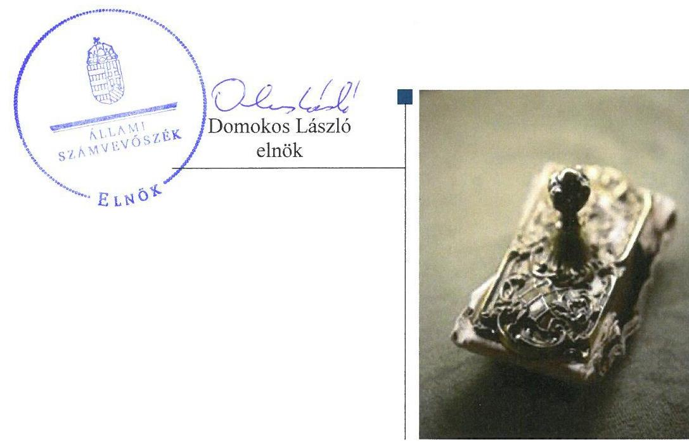
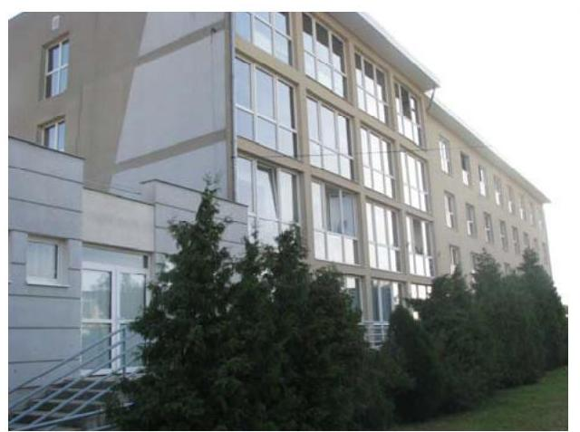
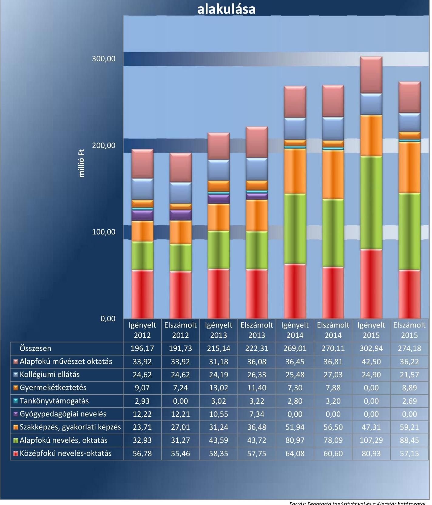

# Jelentés 

## Nem állami humánszolgáltatók ellenőrzése

A humánszolgáltatást nyújtó államháztartáson kívüli köznevelési intézmények, szolgáltatók fenntartói központi költségvetésből kapott támogatásai felhasználásának ellenőrzése "Tehetségekért" Alapítvány
2017.

---

# Jelentés 

## Nem állami humánszolgáltatók ellenőrzése

A humánszolgáltatást nyújtó államháztartáson kívüli köznevelési intézmények, szolgáltatók fenntartói központi költségvetésből kapott támogatásai felhasználásának ellenőrzése "Tehetségekért" Alapítvány
2017. 04. hó 10. nap

---

# AZ ELLENŐRZÉST FELÜGYELTE:

- **SALAMON ILDIKÓ** felügyeleti vezető

- **AZ ELLENŐRZÉST VEZETTE ÉS A VÉGREHAJTÁSÁÉRT FELELŐS:**

- **KEREKES PÉTER** ellenőrzésvezető

- **A PROGRAM ÖSSZEÁLLÍTÁSÁÉRT FELELŐS:**

- **JANIK JÓZSEF LÁSZLÓ** osztályvezető

**IKTATÓSZÁM: V-1157-138/2016**

**TÉMASZÁM: 2191**

**ELLENŐRZÉS-AZONOSÍTÓ SZÁM: V076608**

Jelentéseink az Országgyűlés számítógépes hálózatán és az Interneten a www.asz.hu címen is olvashatóak.

---

# TARTALOMJEGYZÉK 

■ ÖSSZEGZÉS ..... 5
■ AZ ELLENŐRZÉS CÉLJA ..... 6
■ AZ ELLENŐRZÉS TERÜLETE ..... 7
■ AZ ELLENŐRZÉS HÁTTERE, INDOKOLTSÁGA ..... 8
■ A JELENTÉS LÉNYEGES KÉRDÉSKÖREI ..... 9
■ ELLENŐRZÉS HATÓKÖRE ÉS MÓDSZEREI ..... 10
■ MEGÁLLAPÍTÁSOK ..... 12
■ JAVASLATOK ..... 16
■ MELLÉKLETEK ..... 17
I. melléklet: Értelmező szótár ..... 17
II. melléklet: Az ellenőrzött központi költségvetési támogatások alakulása. ..... 18
■ FÜGGELÉK: ÉSZREVÉTELEK ..... 19
■ RÖVIDÍTÉSEK JEGYZÉKE ..... 21

---

.

---

# ÖSSZEGZÉS 

A várpalotai székhelyű „Tehetségekért" Alapítványnál a közfeladat-ellátás kereteinek kialakítása összességében megfelelt a jogszabályi előírásoknak. A központi költségvetésből kapott támogatásokat - a 2012. év kivételével - szabályszerűen átadta az intézményének. A közfeladat ellátása során az átláthatóság érvényesülését nem biztosította, mivel nem gondoskodott a jogszabályokban előírt közérdekű adatok, dokumentumok közzétételéről, a nyilvánosság és a szolgáltatást igénybe vevők tájékoztatásáról.

## Az ellenőrzés társadalmi indokoltsága

Az Állami Számvevőszék stratégiájában hangsúlyos szerepet szán annak, hogy szilárd szakmai alapon álló, értékteremtő ellenőrzéseivel előmozdítsa a közpénzügyek átláthatóságát, rendezettségét és javaslataival a közpénzek és a közvagyon szabályos, gazdaságos, hatékony és eredményes felhasználását segítse. Stratégiájában az Állami Számvevőszék célul tűzte ki, hogy az államháztartáson kívülre nyújtott költségvetési támogatások ellenőrzésével hozzájárul ahhoz, hogy a közpénzeket az államháztartáson kívüli szervezetek is átlátható módon használják fel a közfeladatok szerződésben vállalt ellátása érdekében. Tekintettel az elmúlt években a köznevelés finanszírozását és a köznevelési intézmények fenntartását érintően végbement változásokra, a társadalom fokozott érdeklődéssel figyeli a köznevelési feladatok ellátására fordított források felhasználását. Fontos a közvéleményt biztosítani arról, hogy a közpénz államháztartáson kívüli felhasználása ezen a területen sem marad ellenőrizetlenül. Hozzájárul ezzel ahhoz is, hogy a nyilvánosság és a szolgáltatást igénybe vevők megfelelő tájékoztatást kapjanak az államháztartáson kívüli közfeladatot ellátók működéséről.

## Főbb megállapítások, következtetések

A „Tehetségekért" Alapítványnál a közoktatási, köznevelési közfeladat-ellátás szervezeti kereteinek kialakítása szabályszerű volt. Rendelkezett szabályszerű alapító okirattal. A támogatás igénylés alapját jelentő feltételeknek megfelelt, az igénybevételhez szükséges, jogszabályban előírt intézményi adatok, valamint az elszámoláshoz szükséges nyilvántartások és dokumentumok a rendelkezésére álltak. Belső szabályozottsága nem volt szabályszerű, mivel nem készített számlarendet, és nem aktualizálta a számviteli politikát.

A „Tehetségekért" Alapítvány az intézménye működtetésének kereteit a jogszabályi előírások szerint alakította ki. Az intézménye alapfeladatait alapító okiratban meghatározta, a nyilvántartásokba vétel megtörtént és a szükséges működési engedélyek rendelkezésre álltak. Az intézményi alapdokumentumokat a jogszabályban előírtak szerint jóváhagyta. A központi költségvetésből kapott támogatásokat 2013-ban, 2014-ben és 2015-ben szabályszerűen átadta az intézményének. Azonban 2012-ben a törvényi előírás ellenére nem teljes összegben adta át a támogatásokat.

A „Tehetségekért" Alapítvány az ellenőrzött időszakban értékelte az intézménye pedagógiai programjában meghatározott feladatok végrehajtását, a pedagógiai-szakmai munka eredményességét, azonban a jogszabályban előírtak ellenére az értékeléseket nem hozta nyilvánosságra. Nem gondoskodott a törvényben előírt közérdekű adatok közzétételéről, ezáltal nem biztosította a közfeladat-ellátáshoz kapcsolódóan az adatok nyilvánosság általi megismerését. Az ellenőrzött időszakról készített egyszerűsített éves beszámolói nem voltak szabályszerűek, mivel nem készítette el a jogszabályban előírt kiegészítő mellékleteket.

---

# AZ ELLENŐRZÉS CÉLJA 

AZ ELLENŐRZÉS CÉLJA annak értékelése volt, hogy a Fenntartó ${ }^{1}$ központi költségvetésből kapott támogatásainak felhasználása szabályszerű volt-e, a támogatások igénylése, évközi módosítása és év végi elszámolása megfelelt-e a jogszabályi előírásoknak.

---

# AZ ELLENŐRZÉS TERÜLETE 

## „Tehetségekért" Alapítvány

A „Tehetségekért" Alapítványt 1990. december 15-én alapította hét magánszemély 10 ezer Ft alapítói vagyonnal. A Fenntartó székhelye Várpalotán található.

A Fenntartó fő tevékenysége Intézménye², a Képesség- és Tehetségfejlesztő Magán Általános Iskola, Gimnázium, Alapfokú Művészeti Iskola és Kollégium fenntartása, az oktatási tevékenység ellátásának elősegítése, támogatása volt, amelynek során közfeladatot látott el. A Fenntartó 2014. október 6-ig kiemelkedően közhasznú szervezet, majd 2014. október 7-től közhasznú szervezet volt.

Az Intézményt 1990-ben alapította a Várpalotai Oktatói Munkaközösség. A Fenntartó 1995. május 22-től vette át az Intézmény alapítói és fenntartói jogait.

Az Intézmény feladatai közé tartozott az általános iskolai oktatás, alapfokú művészetoktatás, középfokú nevelés-oktatás, majd 2012. szeptember 1-től a felnőttoktatás. Az Intézmény tevékenységét várpalotai székhelyén, valamint a Veszprém megyében és Budapesten található telephelyein látta el. Az Intézmény önálló jogi személyként működő, önállóan gazdálkodó szervezet.

Az Intézmény engedélyezett tanulói létszáma 2012-ben 1053 fő, 2013-ban 1063 fő, 2014-ben 1063 fő, 2015-ben 1063 fő volt. A vonatkozó statisztikai adatok szerinti tényleges létszám minden évben az engedélyezett alatt alakult, 2012-ben 508 fő, 2013-ban 559 fő, 2014-ben 613 fő, 2015-ben 593 fő volt.

A Fenntartó az ellenőrzött időszak minden évében igényelt központi költségvetési támogatásokat, majd a kapott támogatásokkal a tárgyévet követően elszámolt. A II. melléklet tartalmazza az ellenőrzött központi költségvetési támogatások alakulását. Ezen felül közoktatási megállapodás keretében is részesült központi költségvetési támogatásban. A Fenntartó, az Intézmény és a Minisztérium ${ }^{3}$ között az ellenőrzött időszak elején hatályban volt közoktatási megállapodást a 2012. október 31-én aláírt új közoktatási megállapodás váltotta fel 5 éves időtartamra. A Fenntartó - tevékenységéből adódó jogosultsága alapján - Magyarország éves központi költségvetéséből az egyszerűsített éves beszámolói alapján 2012. évben 285668 ezer Ft, 2013. évben 339455 ezer Ft, 2014. évben 424466 ezer Ft, 2015. évben 430318 ezer Ft támogatást kapott.

A Fenntartónak az ellenőrzött időszakban nem volt alkalmazottja, munkájában 10 fő közérdekű önkéntes tevékenységet végző személy működött közre.

A szakmai irányító szervi feladatokat a Minisztérium látta el az ellenőrzött időszakban, ellenőrzési feladatokat az illetékes Kormányhivatalok ${ }^{4}$ végeztek.

---

# AZ ELLENŐRZÉS HÁTTERE, INDOKOLTSÁGA 

A köznevelési és szociális feladatokat ellátó nem állami intézményfenntartók részére közfeladataik ellátására évente jelentős összegű pénzügyi támogatást biztosítottak a mindenkori költségvetési törvények a bennük megfogalmazott feltételek mellett. A felhasználható állami támogatások Kvtv. ${ }^{5}$ szerinti előirányzata 2012-2015. években együtt 894 Mrd Ft volt. A 2013. évben jelentős változások következtek be a normatív finanszírozás rendszerében, amely érintette a nem állami intézményfenntartókat is. Az Országgyűlés elfogadta a nemzeti köznevelésről szóló 2011. évi CXC. törvényt, amely jelentősen átalakította a korábbi finanszírozási rendszert 2013. szeptemberétől. A köznevelési területen új feladatfinanszírozási forma (átlagbéralapú támogatás) jelent meg, amely a nem állami intézményfenntartókra is vonatkozik. Az ellenőrzés a finanszírozási rendszerben 2012-2015 között bekövetkezett változásokra, azok közfeladat-ellátásra gyakorolt hatására fókuszál a költségvetési támogatásokat felhasználó államháztartáson kívüli szervezetek körében. Az ellenőrzés indokoltságát az is alátámasztja, hogy az ÁSZ ${ }^{6}$ még nem ellenőrizte átfogóan e területet.

Az ÁSZ stratégiájában foglaltak alapján is indokolt az ellenőrzés, amely a társadalom számára jelzi, hogy a közpénz államháztartáson kívüli felhasználása sem maradhat ellenőrizetlenül. Az államháztartáson kívülre nyújtott költségvetési támogatások ellenőrzésével az ÁSZ hozzájárul ahhoz, hogy a közpénzeket a nem állami humán fenntartók átlátható módon használják fel a közfeladatok ellátására kötött szerződésekben vállalt kötelezettségek teljesítése érdekében. Az ellenőrzés javaslataival hozzájárulhat az említett rendszerek szabályszerű támogatás felhasználásához, javíthatja a társadalmi-gazdasági döntések megalapozottságát, amely a „jó kormányzás" feltétele.

---

# A JELENTÉS LÉNYEGES KÉRDÉSKÖREI 

1. A Fenntartónál a közfeladat-ellátás kereteinek kialakítása szabályszerű volt-e?
2. A Fenntartó a központi költségvetésből kapott támogatásokat szabályszerűen használta-e fel?
3. A Fenntartó a közfeladat ellátása során biztosította-e az átláthatóság érvényesülését?
4. A Fenntartó intézkedett-e a külső ellenőrzések megállapításaira?

---

# ELLENŐRZÉS HATÓKÖRE ÉS MÓDSZEREI 

## Az ellenőrzés típusa

Megfelelőségi ellenőrzés.

## Az ellenőrzött időszak

2012. január 1-je és 2015. december 31-e közötti évek. A 2012. év vonatkozásában a költségvetési támogatások 2012. évet megelőző időszakra eső igénylését, a 2015. év tekintetében annak 2016-ban történő elszámolását is ellenőrizte az ÁSZ.

## Az ellenőrzés tárgya

Az ellenőrzés a köznevelési közfeladatokat ellátó nem állami fenntartó, központi költségvetésből kapott támogatásai felhasználására terjedt ki. Az alábbi jogcímek szabályszerűségének értékelését foglalta magában:
$\longrightarrow$ az alap normatív- és átlagbér alapú költségvetési támogatások közül az általános iskolai nevelés-oktatás, középfokú nevelés-oktatás.
$\longrightarrow$ a kiegészítő támogatások közül a tanulóétkeztetési- és a tankönyvtámogatás.
Az ellenőrzés kiterjedt minden olyan körülményre és adatra, amely az ÁSZ jogszabályban meghatározott feladatainak teljesítéséhez, valamint a program végrehajtása folyamán felmerült újabb összefüggések feltárásához szükséges volt.

## Az ellenőrzött szervezet

„Tehetségekért" Alapítvány

## Az ellenőrzés jogalapja

Az ellenőrzés jogszabályi alapját az ÁSZ tv. ${ }^{7}$ 1. § (3) bekezdésében és az 5. § (3) bekezdésében foglalt előírások adták.

## Az ellenőrzés módszerei

Az ellenőrzést az ellenőrzési program kérdései, az adott időszakban hatályos jogszabályok, az ellenőrzés szakmai szabályok és módszertanok, valamint a nemzetközi standardok figyelembevételével végezte az ÁSZ.

---

A közpénzekkel való felelős gazdálkodás segítésére irányuló javaslatok kidolgozásakor a hatályos jogszabályok voltak az irányadóak.

Az ellenőrzés ideje alatt az ÁSZ a Fenntartóval történő kapcsolattartást az ÁSZ SZMSZ ${ }^{8}$-ének vonatkozó előírásai alapján biztosította.

Az ellenőrzési kérdések megválaszolásához szükséges bizonyítékok megszerzése az ellenőrzöttek által rendelkezésre bocsátott dokumentumokra, adatokra alapozva megfigyelés, szemle (szemrevételezés), kérdésfeltevés (információkérés), valamint elemző eljárással történt.

Az ellenőrzési bizonyítékként felhasznált adatforrások közé tartoztak egyrészt a szakmai program részletes szempontjainál felsorolt adatforrások, másrészt minden - az ellenőrzés folyamán feltárt, az ellenőrzés szempontjából információt tartalmazó - dokumentum.

Az ellenőrzés lefolytatásához a Fenntartó a kitöltött tanúsítványok, valamint az ÁSZ által kért dokumentumok elektronikus úton való megküldésével szolgáltatott adatokat, információkat. Az így rendelkezésre bocsátott adatok, információk és a tanúsítványok adatai valódiságának kontrollja az ellenőrzés keretében történt.

A szabályosság megítélésének az alapját képezte, hogy a központi költségvetési támogatások Fenntartó általi igénylése és év végi elszámolása a Kincstár ${ }^{9}$ felé megtörtént.

A központi költségvetésből kapott támogatások szabályszerű felhasználását a Fenntartó vonatkozásában, a támogatások intézmény részére - annak működtetésére - történő továbbutalásának, valamint a támogatások felhasználásáról a jogszabályban előírt nyilvántartás vezetésének az értékelésével végezte az ÁSZ.

---

# 1. A Fenntartónál a közfeladat-ellátás kereteinek kialakítása szabályszerű volt-e? 

## Összegző megállapítás

### 1.1. számú megállapítás

A Fenntartónál a közfeladat-ellátás kereteinek kialakítása összességében szabályszerű volt.

A Fenntartó a közfeladat-ellátás szervezeti kereteit a jogszabályi előírásoknak megfelelően alakította ki.

A Fenntartó a közfeladat-ellátási tevékenységének szervezeti kereteit a Közokt. tv. ${ }^{10}$ és az Nkt. ${ }^{11}$ előírásainak megfelelően kialakította. Rendelkezett alapító okirattal, amely 2014. március 14-ig megfelelt a Ptk. ${ }^{12}$-ben, majd 2014. március 15-től a Ptk. ${ }^{13}$-ben előírtaknak. Az alapító okirat az ellenőrzött időszakban háromszor módosult. A Fenntartó az alapító okirat módosításait szabályszerűen bejelentette a bíróság felé.

A Fenntartó a támogatás igénylés alapját jelentő, Áht. ${ }^{14}$-ben foglalt feltételeknek megfelelt, mivel nyilatkozata szerint átlátható szervezetnek
 minősült, és rendezett munkaügyi kapcsolatokkal rendelkezett. A költségvetési támogatás igénylés alapját, feltételeit jelentő dokumentumok, nyilvántartások a jogszabályban előírtaknak megfeleltek. A Fenntartó bekérte az Intézménytől a támogatások igénybevételéhez szükséges, a Közokt. vhr. ${ }^{15}$, illetve az Nkt. vhr. ${ }^{16}$ által előírt adatokat. A Fenntartó rendelkezett információval az Intézmény OM azonosítójáról ${ }^{17}$, a tanulói létszámról, az alkalmazottakról, valamint az alapfokú művészetoktatásban részesülő tanulók esetében a szülők nyilatkozatáról. A Közokt. vhr., illetve az Nkt. vhr. által előírt tanügyi okmányokról (beírási napló, törzslap, csoportnapló) vezetett nyilvántartás a Fenntartó rendelkezésére állt.

### 1.2. számú megállapítás

A Fenntartó belső szabályozottsága nem felelt meg a jogszabályi előírásoknak.

A Fenntartó teljesítette a Számv. tv. ${ }^{18}$-ben előírt kötelezettségét a számviteli politika ${ }^{19}$ elkészítésére. A számviteli politika keretében elkészítette a leltározási szabályzatot ${ }^{20}$, az értékelési szabályzatot ${ }^{21}$ és a pénzkezelési szabályzatot ${ }^{22}$. Önköltségszámítási szabályzat készítésére vonatkozó kötelezettség alól a Számv. tv. 14. § (6) bekezdése alapján mentesült, mivel egyszerűsített éves beszámolót készített. A Fenntartó a Számv. tv. 14. § (11) bekezdésében foglaltak ellenére a Számv. tv. 3. § (3) bekezdés 3. pontjában meghatározott, a jelentős összegű hiba értékhatára tekintetében 2013. január 1-jén hatályba lépett módosításával kapcsolatban a változásokat az ellenőrzött időszak végéig nem vezette keresztül a számviteli politikáján.

A Fenntartó az ellenőrzött időszakban a Számv. tv. 161. § (1) bekezdésében előírtak ellenére számlarenddel nem rendelkezett.

---

# 2. A Fenntartó a központi költségvetésből kapott támogatásokat szabályszerűen használta-e fel? 

Összegző megállapítás

2.1. számú megállapítás

A Fenntartó a központi költségvetésből kapott támogatásokat 2012-ben nem szabályszerűen, 2013-2015-ben szabályszerűen használta fel.

A Fenntartó biztosította az Intézmény szabályszerű működtetésének kereteit.

A Fenntartó az intézmény alapfeladatait az ellenőrzött időszakban meghatározta a Közokt. tv., illetve az Nkt. előírásaival összhangban az Intézmény alapító okiratában ${ }^{23}$. Az Intézmény az ellenőrzött időszakban szerepelt az illetékes kormányhivatalok nyilvántartásában, a KIR ${ }^{24}$ nyilvántartásban, valamint rendelkezett OM azonosítóval. A Fenntartó a Közokt. tv., illetve az Nkt. előírásainak megfelelően biztosította, hogy az Intézmény a székhelyét és a telephelyeit érintően rendelkezzen működési engedéllyel az alapító okirat szerinti közoktatási illetve köznevelési feladatokra. Új indítandó telephely működési engedély-, illetve meglévő telephely működési engedély módosítási kérelmeit a feladatellátási hely szerint illetékes kormányhivatalhoz benyújtotta. A Fenntartó a működési engedélyezési eljárásban igazolta, hogy a közfeladat ellátásához szükséges személyi és tárgyi feltételeket biztosította.

A Fenntartó az ellenőrzött időszakban jóváhagyta az Intézmény szervezeti és működési szabályzatát, minőségirányítási programját, pedagógiai programját és házirendjét. Ez a 2012. január 1. és 2012. augusztus 31. közötti időszakot érintően megfelelt a Közokt. tv.-ben előírtaknak, és ezzel 2012. szeptember 1-től az egyetértési kötelezettségének is eleget tett az Nkt.-ban előírt esetekben. A Fenntartó a térítési díj és tandíj megállapításának szabályait, a szociális alapon adható kedvezmények feltételeit térítési szabályzatban ${ }^{25}$ határozta meg. A Közokt. tv.-ben és az Nkt.-ban előírtaknak megfelelően meghatározta az Intézmény költségvetését, elfogadásukról határozatban döntött. A Fenntartó a Közokt. tv.-ben előírtaknak megfelelően bízta meg az Intézmény vezetőjét, akinek személye az ellenőrzött időszakban nem változott. Az Intézmény egyszerűsített éves beszámolóit a Fenntartó kuratóriuma határozatban fogadta el.
2.2. számú megállapítás

A Fenntartó a központi költségvetésből kapott támogatások átadásának a kötelezettségét 2012-ben nem tartotta be. 2013-2015-ben az átadási kötelezettségét szabályszerűen betartotta.

A központi költségvetésből kapott támogatások átadásának kötelezettségét 2012-ben nem a törvényi előírások szerint teljesítette a Fenntartó, mivel a 2012. évi Kvtv. 38. § (1) bekezdés h) pontjában előírtak ellenére a kapott támogatás összegénél 6827,3 ezer Ft-tal kevesebbet adott át az Intézménynek.

2013-2015-ben a kapott támogatásokat teljes összegben, határidőben átadta az Intézménynek. Az átadott támogatások esetében a Fenntartó analitikus nyilvántartása tartalmazta, hogy milyen határnappal történtek meg az átadások.

---

# 3. A Fenntartó a közfeladat ellátása során biztosította-e az átláthatóság érvényesülését? 

## Összegző megállapítás

### 3.1. számú megállapítás

### 3.2. számú megállapítás

A Fenntartó a közfeladat ellátása során nem biztosította az átláthatóság érvényesülését.

A Fenntartó nem biztosította, hogy a szolgáltatást igénybe vevők megfelelő információhoz jussanak az Intézmény működéséről.

Az Intézmény Fenntartó általi ellenőrzésének megszervezése az ellenőrzött időszakban a Közokt. tv.-ben és az Nkt.-ban előírtakkal összhangban történt. A Fenntartó az Intézménynél 2012-ben és 2014-ben végzett szakmai-pedagógiai ellenőrzést.

A Fenntartó értékelte az Intézmény pedagógiai programjában meghatározott feladatok végrehajtását, a pedagógiai-szakmai munka eredményességét az ellenőrzött időszakban, azonban az értékeléseit 2012. augusztus 31-ig a Közokt. tv. 104. § (6) bekezdésében, 2012. szeptember 1-től az Nkt. 85. § (3) bekezdésében előírtak ellenére sem a honlapján, sem a helyben szokásos módon nem hozta nyilvánosságra.

## A Fenntartó nem biztosította a közérdekű adatok nyilvánosságát.

A Fenntartó rendelkezett az Info. tv. ${ }^{26}$-ben előírtaknak megfelelő szabályzattal ${ }^{27}$ a közérdekű adatok közzétételi rendjéről, azonban az Info. tv. 7. § (2) bekezdésében előírtak ellenére nem alakította ki azokat az eljárási szabályokat, amelyek az Info. tv., valamint az egyéb adat- és titokvédelmi szabályok érvényre juttatásához szükségesek, ezáltal fennállt a személyes adatok jogellenes felhasználásának kockázata.

Az Info. tv. 37. § (1) bekezdésében előírtak ellenére az ellenőrzött időszakban nem gondoskodott a tevékenységéhez kapcsolódóan az Info. tv. 1. melléklete szerinti általános közzétételi listában meghatározott szervezeti, személyzeti adatai, tevékenységére, működésére vonatkozó adatai, valamint gazdálkodási adatai közzétételéről saját honlapján, vagy az Info. tv. 33. § (3) bekezdésében meghatározott más honlapokon.

## A Fenntartó a beszámoló készítési kötelezettségét nem a jogszabályokban előírtaknak megfelelően teljesítette.

A Fenntartó működéséről, vagyoni, pénzügyi és jövedelmi helyzetéről az üzleti év könyveinek zárását követően kettős könyvvitellel alátámasztott egyszerűsített éves beszámolót készített.

Az ellenőrzött időszakról készített egyszerűsített éves beszámolói nem feleltek meg a Civilszr. ${ }^{28}$ 6. § (6) bekezdésében számára előírtaknak, mert egyik évben sem készítette el a Civil tv. ${ }^{29}$ 29. § (2) bekezdés c) pontjában előírt kiegészítő mellékletet, valamint a 2012-es egyszerűsített éves beszámolójában a mérleget és az eredménykimutatást nem a Civilszr. 4. illetve 5. számú mellékleteiben előírt tagolásban készítette el.

Az egyszerűsített éves beszámolói az Országos Bírósági Hivatal által fenntartott közhiteles Civil Szervezetek Névjegyzékében ${ }^{30}$ hozzáférhetőek, azonban a kiegészítő mellékletek hiánya miatt a nyilvánosság nem kapott

---

megfelelő tájékoztatást a Fenntartó főbb tevékenységeiről és programjairól, valamint a kapott támogatásokról.

# 4. A Fenntartó intézkedett-e a külső ellenőrzések megállapításaira? 

## Összegző megállapítás

A Fenntartó az ellenőrzött időszakban intézkedett a külső ellenőrzések megállapításaira.

Külső ellenőrzést a Fenntartónál és az Intézményénél a Veszprém Megyei Kormányhivatal és a Kincstár végzett az ellenőrzött időszakban.

A Veszprém Megyei Kormányhivatal 2015-ben törvényességi ellenőrzés keretén belül ellenőrizte a Fenntartót. A Fenntartó az ellenőrzés megállapításaira határidőben intézkedett.

A Kincstár a Fenntartó által benyújtott elszámolások felülvizsgálatát követően, annak eredményeként hozott határozataiban 2012. és 2015. évekre többlettámogatást, 2013. és 2014. évekre visszafizetési kötelezettséget állapított meg a Fenntartó számára. A Fenntartó a fizetési kötelezettségeinek határidőben eleget tett.

A Kincstár a 2012. és 2013. évi költségvetési támogatások elszámolását helyszíni szemlék keretében is ellenőrizte az Intézménynél, melynek eredményeképp a határozataiban fizetési kötelezettséget írt elő. A Fenntartó az előírt fizetési kötelezettségeinek határidőben eleget tett.

---

# JAVASLATOK 

Az ÁSZ tv. 33. § (1) bekezdésében foglaltak értelmében az ellenőrzött szervezet vezetője köteles a jelentésben foglalt megállapításokhoz kapcsolódó intézkedési tervet összeállítani és azt a jelentés kézhezvételétől számított 30 napon belül az ÁSZ részére megküldeni. Amennyiben az ellenőrzött szervezet vezetője nem küldi meg határidőben az intézkedési tervet, vagy továbbra sem elfogadható intézkedési tervet küld, az Állami Számvevőszék elnöke az ÁSZ tv. 33. § (3) bekezdés a) és b) pontjaiban foglaltakat érvényesítheti.

## „Tehetségekért" Alapítvány Kuratóriuma elnökének

1. Intézkedjen, hogy a Számv. tv. módosítása miatti változásokat a számviteli politikán - a Számv. tv.-ben előírtaknak megfelelően - vezessék keresztül.
(1.2. számú megállapítás 1. bekezdés 4. mondata alapján)
2. Intézkedjen a jogszabályi előírásnak megfelelően a számlarend elkészítésére.
(1.2. számú megállapítás 2. bekezdés alapján)
3. Intézkedjen - a jogszabályi előírásnak megfelelően - a nevelési-oktatási intézmény pedagógiai programjában meghatározott feladatok végrehajtásával, a pedagógiai-szakmai munka eredményességével összefüggő fenntartói értékelések nyilvánosságra hozatalára.
(3.1. számú megállapítás 2. bekezdése alapján)
4. Intézkedjen a jogszabályi előírásnak megfelelően az Info. tv., valamint az egyéb adat- és titokvédelmi szabályok érvényre juttatásához szükséges eljárási szabályok meghatározására.
(3.2. számú megállapítás 1. bekezdés alapján)
5. Intézkedjen az Info. tv. 1. melléklete szerinti általános közzétételi listában meghatározott adatok jogszabályi előírásoknak megfelelő közzétételére.
(3.2. számú megállapítás 2. bekezdés alapján)
6. Intézkedjen, hogy a Fenntartó egyszerűsített éves beszámolója tartalmazza a jogszabályban előírt kiegészítő mellékletet.
(3.3. számú megállapítás 2. bekezdés alapján)

---

# MELLÉKLETEK 

- I. MELLÉKLET: ÉRTELMEZŐ SZÓTÁR
civil szervezet
humánszolgáltatás
köznevelési közfeladat
köznevelési intézmény
nem állami intézmény fenntartó
feladat ellátási hely

A Civil tv*. 2. § 6. pontja szerint civil szervezet a civil társaság, a Magyarországon nyilvántartásba vett egyesület (a párt, a szakszervezet és a kölcsönös biztosító egyesület kivételével), a közalapítvány és a pártalapítvány kivételével az alapítvány.
Külön törvényben meghatározott szociális, gyermekjóléti, gyermekvédelmi, közoktatási, felsőoktatási, kulturális közfeladatok (2012. évi Kvtv. 38. § (1) bekezdés, 2013. évi Kvtv. 25. §, 1. számú melléklet XX/20/2. alcím, 19. alcím, 2014. évi Kvtv. 34. § (1), (4) bekezdés, 1. számú melléklet XX/20/2. alcím, 19. alcím, 2015. évi Kvtv. 43. § (1), (4) bekezdés, 1. számú melléklet XX/20/2/3. jogcím csoport, 19. alcím).
A köznevelési intézmény alapító okiratában foglalt feladat: óvodai nevelés, nemzetiséghez tartozók óvodai nevelése, általános iskolai nevelés-oktatás, nemzetiséghez tartozók általános iskolai nevelése-oktatása, kollégiumi ellátás, nemzetiségi kollégiumi ellátás, gimnáziumi nevelés-oktatás, szakközépiskolai nevelés-oktatás, szakiskolai nevelés-oktatás, nemzetiség gimnáziumi nevelés-oktatása, nemzetiség szakközépiskolai nevelés-oktatása, nemzetiség szakiskolai nevelés-oktatása, Köznevelési Hidprogramok keretében folyó nevelés-oktatás, felnőttoktatás, alapfokú művészetoktatás, fejlesztő nevelés, fejlesztő nevelés-oktatás, pedagógiai szakszolgálati feladat, a többi gyermekkel, tanulóval együtt nevelhető, oktatható sajátos nevelési igényű gyermekek, tanulók óvodai nevelése és iskolai nevelése-oktatása, azoknak a sajátos nevelési igényű gyermekeknek, tanulóknak az óvodai, iskolai, kollégiumi ellátása, akik a többi gyermekkel, tanulóval nem foglalkoztathatók együtt, a gyermekgyógyüdülőkben, egészségügyi intézményekben, rehabilitációs intézményekben tartós gyógykezelés alatt álló gyermekek tankötelezettségének teljesítéséhez szükséges oktatás, pedagógiai-szakmai szolgáltatás.
A nevelési-oktatási intézmény, pedagógiai szakszolgálati intézmény, pedagógiai-szakmai szolgáltatást nyújtó intézmény.
A köznevelési és szociális, gyermekjóléti és gyermekvédelmi közfeladatokat/humánszolgáltatásokat ellátó intézményt fenntartó egyházi jogi személy, társadalmi szervezet, alapítvány, közalapítvány, civil szervezet, országos nemzetiségi önkormányzat, nonprofit gazdasági társaság, gazdasági társaság és a humánszolgáltatást alaptevékenységként végző, Szja tv. hatálya alá tartozó egyéni vállalkozó. (2012. évi Kvtv. 38. § (1) bekezdés, 2013. évi Kvtv. 35. § (1), (3) bekezdés, 2014. évi Kvtv. 33. §, 34. § (1), (4) bekezdés, 2015. évi Kvtv. 42. §, 43. § (1), (4) bekezdés)
az a cím, ahol a köznevelési intézmény alapító okiratában, szakmai alapdokumentumában foglalt feladat ellátása történik (Nkt. 4.§ 7. pont)

[^0]
[^0]:    * Előzmény törvények, amelyeket az ellenőrzött időszak miatt figyelembe kell venni: egyesülési jogról

 szóló 1989. évi II. tv, a közhasznú szervezetekről szóló 1997. évi CLVI. tv.

---

# Az ellenőrzött központi költségvetési támogatások alakulása

*Ferrás: Fenntartó tanúsítványai és a Kincstár határozatai*

---

# FÜGGELÉK: ÉSZREVÉTELEK 

Az Állami Számvevőszék a jelentéstervezetet 15 napos észrevételezésre megküldte az ellenőrzött szervezet vezetőjének az ÁSZ tv. 29. § ${ }^{\dagger}$ (1) bekezdése előírásának megfelelően.

A „Tehetségekért" Alapítvány Kuratóriuma elnöke az ÁSZ tv. 29. § (2) bekezdésében foglalt észrevételezési jogával nem élt, a törvényi határidőn belül észrevételt nem tett.

[^0]
[^0]:    ${ }^{\dagger}$ 29. § (1) Az Állami Számvevőszék az ellenőrzési megállapításait megküldi az ellenőrzött szervezet vezetőjének vagy az általa megbízott személynek, és annak, akinek személyes felelősségét állapította meg.
    (2) Az ellenőrzött szervezet vezetője és a felelősként megjelölt személy az ellenőrzés megállapításaira tizenöt napon belül írásban észrevételt tehet.
    (3) Az Állami Számvevőszék az észrevételre a beérkezésétől számított harminc napon belül írásban válaszol. A figyelembe nem vett észrevételeket köteles a jelentésben feltüntetni, és megindokolni, hogy azokat miért nem fogadta el.

---

.

---

# RÖVIDÍTÉSEK JEGYZÉKE 

${ }^{1}$ Fenntartó
${ }^{2}$ Intézmény
${ }^{3}$ Minisztérium
${ }^{4}$ Kormányhivatal
${ }^{5}$ Kvtv.
${ }^{6}$ ÁSZ
${ }^{7}$ ÁSZ tv.
${ }^{8}$ ÁSZ SZMSZ
${ }^{9}$ Kincstár
${ }^{10}$ Közokt. tv.
${ }^{11} \mathrm{Nkt}$.
${ }^{12}$ Ptk. 1
${ }^{13}$ Ptk. 2
${ }^{14}$ Áht.
${ }^{15}$ Közokt. vhr.
${ }^{16} \mathrm{Nkt}$. vhr.
${ }^{17}$ OM azonosító
${ }^{18}$ Számv. tv.
${ }^{19}$ számviteli politika
${ }^{20}$ leltározási szabályzat
${ }^{21}$ értékelési szabályzat
${ }^{22}$ pénzkezelési szabályzat
${ }^{23}$ Intézmény alapító okirata
${ }^{24}$ KIR
${ }^{25}$ térítési szabályzat
„Tehetségekért" Alapítvány
Képesség- és Tehetségfejlesztő Magán Általános Iskola, Gimnázium, Alapfokú Művészeti Iskola és Kollégium
2012. május 13-ig Nemzeti Erőforrás Minisztérium, 2012. május 14-től Emberi Erőforrások Minisztériuma
A Fenntartó ellenőrzött időszaki tevékenység ellátási helyei alapján illetékes Veszprém Megyei Kormányhivatal és Budapest Fővárosi Kormányhivatal 2011. évi CLXXXVIII. törvény Magyarország 2012. évi központi költségvetéséről (2012. évi Kvtv.)
2012. évi CCIV. törvény Magyarország 2013. évi központi költségvetéséről (2013. évi Kvtv.)
2013. évi CCXXX. törvény Magyarország 2014. évi központi költségvetéséről (2014. évi Kvtv.)
2014. évi C. törvény Magyarország 2015. évi központi költségvetéséről (2015. évi Kvtv.)
Állami Számvevőszék
2011. évi LXVI. törvény az Állami Számvevőszékről, hatályos 2011. július 1-jétől az Állami Számvevőszék szervezeti és működési szabályzata
Magyar Államkincstár
1993. évi LXXIX. törvény a közoktatásról (hatálytalan 2013. október 5-től)
2011. évi CXC. törvény a nemzeti köznevelésről (hatályos 2012. szeptember 1-től)
1959. évi IV. törvény a Polgári törvénykönyvről (hatálytalan 2014. március 15-től) 2013. évi V. törvény a Polgári törvénykönyvről (hatályos 2014. március 15-től) 2011. évi CXCV. törvény az államháztartásról (hatályos 2012. január 1-jétől) 20/1997. (II. 13.) Korm. rendelet a közoktatásról szóló 1993. évi LXXIX. törvény végrehajtásáról (hatálytalan 2013. október 5-étől)
229/2012. (VIII. 28.) Korm. rendelet a nemzeti köznevelésről szóló törvény végrehajtásáról (hatályos 2012. szeptember 1-jétől)
egységes oktatási azonosító
2000. évi C. törvény a számvitelről
"Tehetségekért" Alapítvány számviteli politika (hatályos 2010. január 1-től) "Tehetségekért" Alapítvány leltározási szabályzat (hatályos 2010. január 1-től) "Tehetségekért" Alapítvány értékelési szabályzat (hatályos 2010. január 1-től) "Tehetségekért" Alapítvány pénzkezelési szabályzat (hatályos 2010. január 1-től) Képesség- és Tehetségfejlesztő Magán Általános Iskola, Gimnázium, Alapfokú Művészeti Iskola és Kollégium Alapító Okirata az előzményeket tartalmazó egységes szerkezetben. Hatályos 2011. július 25-től, 2012. június 29-től, 2012. december 20-tól, 2013. július 18-tól, 2014. május 28-tól, 2014. június 30-tól, majd 2015. szeptember 1-től.
Köznevelés Információs Rendszere
„A Képesség- és Tehetségfejlesztő Magániskola Művészeti Iskola térítési díj, illetve tandíj fizetésével kapcsolatos szabályzata" (Hatályos 2009. augusztus 27-től, módosítva 2013. május 7-én)

---

${ }^{26}$ Info. tv.
${ }^{27}$ közzétételi szabályzat
${ }^{28}$ Civilszr.
${ }^{29}$ Civil tv.
${ }^{30}$ Civil Szervezetek Névjegyzéke
2011. évi CXII. törvény az információs önrendelkezési jogról és az információszabadságról
„Tehetségekért" Alapítvány" szabályzata a kötelezően közzéteendő adatok nyilvánosságra hozatalának rendjéről (hatályos 2012. január 20-tól)
224/2000. (XII. 19.) Korm. rendelet a számviteli törvény szerinti egyes egyéb szervezetek beszámoló készítési és könyvvezetési kötelezettségének sajátosságairól
2011. évi CLXXV. törvény az egyesülési jogról, a közhasznú jogállásról, valamint a civil szervezetek működéséről és támogatásáról (hatályos 2011. december 22-étől)
birosag.hu/allampolgaroknak/civil-szervezetek/civil-szervezetek-nevjegyzeke

---

ÁLLAMI SZÁMVEVŐSZÉK
1052 Budapest, Apáczai Csere János utca 10.
Levélcím: 1364 Budapest 4. Pf. 54
Telefon: +36 14849100 Telefax: +36 14849200
www.asz.hu
