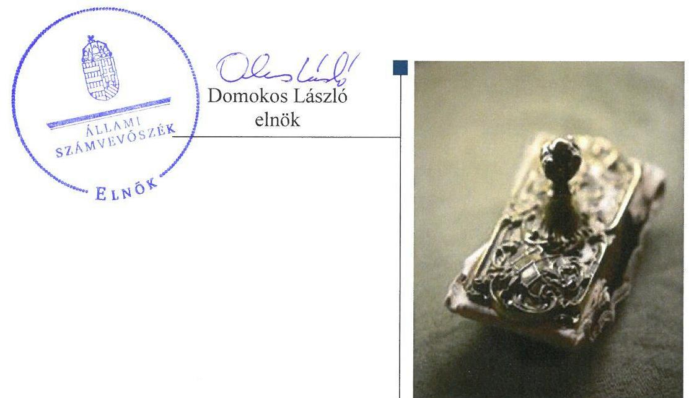
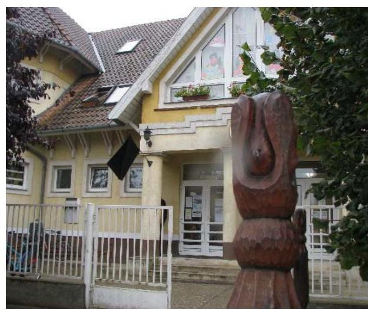
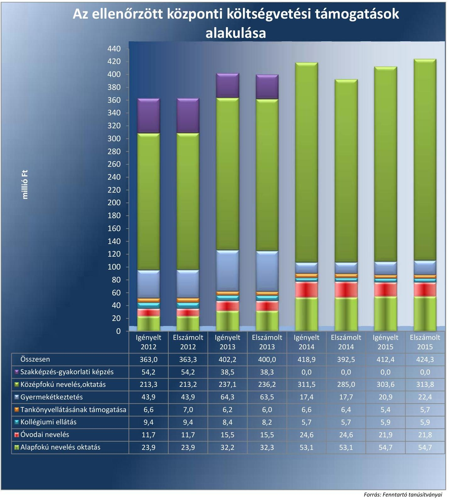

# Jelenetés 

## Nem állami humánszolgáltatók ellenőrzése

A humánszolgáltatást nyújtó államháztartáson kívüli köznevelési intézmények, szolgáltatók fenntartói központi költségvetésből kapott támogatásai felhasználásának ellenőrzése Közös Kincs Oktatási Szolgáltató Közhasznú Nonprofit Kft.

2017

---

# Jelentés 

## Nem állami humánszolgáltatók ellenőrzése

A humánszolgáltatást nyújtó államháztartáson kívüli köznevelési intézmények, szolgáltatók fenntartói központi költségvetésből kapott támogatásai felhasználásának ellenőrzése Közös Kincs Oktatási Szolgáltató Közhasznú Nonprofit Kft.
2017. 08 hó 10 nap

---

# AZ ELLENŐRZÉST FELÜGYELTE: 

SALAMON ILDIKÓ felügyeleti vezető

## AZ ELLENŐRZÉST VEZETTE ÉS A VÉGREHAJTÁSÁÉRT FELELŐS:

KEREKES PÉTER ellenőrzésvezető

## A PROGRAM ÖSSZEÁLLÍTÁSÁÉRT FELELŐS:

JANIK JÓZSEF osztályvezető

IKTATÓSZÁM: V-1229-095/2016
TÉMASZÁM: 2263
ELLENŐRZÉS-AZONOSÍTÓ SZÁM: V076607

---

# TARTALOMJEGYZÉK 

■ ÖSSZEGZÉS ..... 5
■ AZ ELLENŐRZÉS CÉLJA ..... 6
■ AZ ELLENŐRZÉS TERÜLETE ..... 7
■ AZ ELLENŐRZÉS HÁTTERE, INDOKOLTSÁGA ..... 8
■ A JELENTÉS LÉNYEGES KÉRDÉSKÖREI ..... 9
■ ELLENŐRZÉS HATÓKÖRE ÉS MÓDSZEREI ..... 10
■ MEGÁLLAPÍTÁSOK ..... 12
■ JAVASLATOK ..... 16
■ MELLÉKLETEK ..... 17
I. Sz. melléklet: Értelmező szótár ..... 17
II. Sz. melléklet: Az ellenőrzött központi költségvetési támogatások alakulása ..... 18
■ FÜGGELÉK: ÉSZREVÉTELEK ..... 19
■ RÖVIDÍTÉSEK JEGYZÉKE ..... 21

---

.

---

# ÖSSZEGZÉS 

A Szabolcs-Szatmár-Bereg megyei biri székhelyű Közös Kincs Oktatási Szolgáltató Közhasznú Nonprofit Kft.-nél a közfeladat-ellátás kereteinek kialakítása szabályszerű volt. A központi költségvetésből kapott támogatásokat 2012-2013-ban nem szabályszerűen adta át az intézménye részére. 2014-2015-ben az át nem adott támogatások cél szerinti felhasználása nem volt megfelelően dokumentált. A közfeladat-ellátás során az átláthatóság érvényesülését nem biztosította, mivel nem gondoskodott a jogszabályokban előírt közérdekü adatok, dokumentumok közzétételével a nyilvánosság és a szolgáltatást igénybe vevők tájékoztatásáról.

## Az ellenőrzés társadalmi indokoltsága

Az Állami Számvevőszék stratégiájában hangsúlyos szerepet szán annak, hogy szilárd szakmai alapon álló, értékteremtő ellenőrzéseivel előmozdítsa a közpénzügyek átláthatóságát, rendezettségét és javaslataival a közpénzek és a közvagyon szabályos, gazdaságos, hatékony és eredményes felhasználását segítse. Stratégiájában az Állami Számvevőszék célul tűzte ki, hogy az államháztartáson kívülre nyújtott költségvetési támogatások ellenőrzésével hozzájárul ahhoz, hogy a közpénzeket az államháztartáson kívüli szervezetek is átlátható módon használják fel a közfeladatok szerződésben vállalt ellátása érdekében. Tekintettel az elmúlt években a köznevelés finanszírozását és a köznevelési intézmények fenntartását érintően végbement változásokra, a társadalom fokozott érdeklődéssel figyeli a köznevelési feladatok ellátására fordított források felhasználását. Fontos a közvéleményt biztosítani arról, hogy a közpénz államháztartáson kívüli felhasználása ezen a területen sem marad ellenőrizetlenül. Hozzájárul ezzel ahhoz is, hogy a nyilvánosság és a szolgáltatást igénybe vevők megfelelő tájékoztatást kapjanak az államháztartáson kívüli közfeladatot ellátók müködéséről.

## Főbb megállapítások, következtetések

A Közös Kincs Oktatási Szolgáltató Közhasznú Nonprofit Kft.-nél a közfeladat-ellátás szervezeti kereteinek kialakítása szabályszerű volt. Rendelkezett társasági szerződéssel, majd egyszemélyes társasággá alakulása után alapító okirattal, amelyek megfeleltek a jogszabályi előírásoknak. A támogatás igénylés alapját jelentő feltételeknek megfelelt, az igénybevételhez szükséges, jogszabályban előírt adatok, valamint az elszámoláshoz szükséges nyilvántartások és dokumentumok a rendelkezésére álltak. Belső szabályozottsága összességében szabályszerű volt, rendelkezett a gazdálkodásához és az adatkezeléséhez a jogszabályokban előírt szabályzatokkal.

A Közös Kincs Oktatási Szolgáltató Közhasznú Nonprofit Kft. a központi költségvetésből kapott támogatásokat nem szabályszerűen használta fel. 2012-ben és 2013-ban a támogatásoknak nem a teljes összegét adta át a fenntartott intézménye részére, megsértve ezzel a vonatkozó törvényi előírásokat. 2014-ben és 2015-ben a nem átadott támogatások felhasználásáról nem vezetett a jogszabályi előírásoknak megfelelő nyilvántartást. Az intézménye működtetésének kereteit összességében a jogszabályokban előírtak szerint alakította ki, az alapfeladatait alapító okiratban meghatározta, a nyilvántartásba vétel megtörtént, a szükséges müködési engedélyek rendelkezésre álltak, és az intézményi alapdokumentumokat - a minőségirányítási program kivételével - jóváhagyta.

A Közös Kincs Oktatási Szolgáltató Közhasznú Nonprofit Kft. az intézménye pedagógiai programjában meghatározott feladatok végrehajtására, a pedagógiai-szakmai munka eredményességére vonatkozó értékelési feladatainak nem tett eleget, nyilvános értékelés hiányában a szolgáltatást igénybe vevőket nem tájékoztatta az intézménye müködéséről. A törvényben előírt közérdekű adatokat nem teljes körűen tette közzé, ezáltal nem biztosította a közfel-adat-ellátás során a müködésének az átláthatóságát. Az egyszerűsített éves beszámolói megfeleltek a jogszabályi előírásoknak.

---

# AZ ELLENŐRZÉS CÉLJA 

AZ ELLENŐRZÉS CÉLJA annak értékelése volt, hogy a Fenntartó ${ }^{1}$ központi költségvetésből kapott támogatásainak felhasználása szabályszerű volt-e, a támogatások igénylése, évközi módosítása és év végi elszámolása megfelelt-e a jogszabályi előírásoknak.

---

# AZ ELLENŐRZÉS TERÜLETE 

## Közös Kincs Oktatási Szolgáltató Közhasznú Nonprofit Kft.

A Fenntartó jogelődjét két magánszemély alapította 2004. július 22-i dátummal, 3 millió Ft jegyzett tőkével. 2015. június 20. óta egyszemélyes társaságként múködik, a társaság képviseletére a tulajdonos ügyvezető önállóan jogosult. A Fenntartó székhelye a Szabolcs-Szatmár-Bereg megyei Biriben található.

A Fenntartó fő tevékenysége a szakmai középfokú oktatás, emellett iskolai előkészítő oktatást, alapfokú oktatást, általános középfokú oktatást, szabadidős képzést, kulturális képzést, máshova nem sorolt egyéb oktatást, egyéb sporttevékenységet és máshova nem sorolt egyéb szórakoztatást, szabadidős tevékenységet folytatott. Az ellenőrzött időszakban közhasznú társaságként múködött.

A Fenntartó a közfeladat ellátását a Dankó Pista Egységes Óvoda-Bölcsőde, Általános Iskola, Szakképző Iskola, Gimnázium, Kollégium és Alapfokú Művészeti Iskola fenntartásával végezte. Az Intézmény² tevékenységét Biriben, illetve Szabolcs-SzatmárBereg megyében található telephelyein látta el. Az Intézmény önálló jogi személyként múködő, önállóan gazdálkodó szervezet.

Az Intézmény engedélyezett tanulói létszáma 2012-ben 2301 fő, 2013ban 2301 fő, 2014-ben 2501 fő, 2015-ben 2080 fő volt. A vonatkozó statisztikai adatok szerinti tényleges létszám minden évben az engedélyezett alatt alakult, 2012-ben 1364 fő, 2013-ban 1365 fő, 2014-ben 1356 fő, 2015-ben 1275 fő volt.

A Fenntartó az ellenőrzött időszak minden évében igényelt központi költségvetési támogatásokat, majd a kapott támogatásokkal a tárgyévet követően elszámolt. A II. melléklet tartalmazza az ellenőrzött központi költségvetési támogatások alakulását. A Fenntartó - tevékenységéből adódó jogosultsága alapján - Magyarország éves központi költségvetéséből az egyszerűsített éves beszámolói alapján 2012. évben 363347 ezer Ft, 2013. évben 542987 ezer Ft, 2014. évben 523492 ezer Ft, 2015. évben 529245 ezer Ft támogatást kapott. Ezen kívül közoktatási megállapodás keretében és pályázati úton is kapott költségvetési támogatást az ellenőrzött időszakban. A Fenntartó, az Intézmény és a Minisztérium³ között az ellenőrzött időszak elején hatályban volt közoktatási megállapodást a 2012. december 28-án aláírt új közoktatási megállapodás váltotta fel 5 éves időtartamra.

A Fenntartó a 2012. évben négy fő, 2015. évben öt fő teljes állású alkalmazottat foglalkoztatott.

A szakmai irányító szervi feladatokat a Minisztérium látta el az ellenőrzött időszakban, ellenőrzési feladatokat az illetékes Kormányhivatal ${ }^{4}$ végzett.

---

# AZ ELLENŐRZÉS HÁTTERE, INDOKOLTSÁGA 

A köznevelési és szociális feladatokat ellátó nem állami intézményfenntartók részére közfeladataik ellátására évente jelentős összegű pénzügyi támogatást biztosítottak a mindenkori költségvetési törvények a bennük megfogalmazott feltételek mellett. A felhasználható állami támogatások Kvtv. ${ }^{5}$ szerinti előirányzata 2012-2015. években együtt 894 Mrd Ft volt. A 2013. évben jelentős változások következtek be a normatív finanszírozás rendszerében, amely érintette a nem állami intézményfenntartókat is. Az Országgyűlés elfogadta a nemzeti köznevelésről szóló 2011. évi CXC. törvényt, amely jelentősen átalakította a korábbi finanszírozási rendszert 2013 szeptemberétől. A köznevelési területen új feladatfinanszírozási forma (átlagbéralapú támogatás) jelent meg, amely a nem állami intézményfenntartókra is vonatkozik. Az ellenőrzés a finanszírozási rend-szerben 2012-2015. között bekövetkezett változásokra, azok közfeladat ellátásra gyakorolt hatására fókuszál a költségvetési támogatásokat felhasználó államháztartáson kívüli szervezetek körében. Az ellenőrzés indokoltságát az is alátámasztja, hogy az ÁSZ ${ }^{6}$ még nem ellenőrizte átfogóan e területet.

Az ÁSZ stratégiájában foglaltak alapján is indokolt az ellenőrzés, amely a társadalom számára jelzi, hogy a közpénz államháztartáson kívüli felhasználása sem maradhat ellenőrizetlenül. Az államháztartáson kívülre nyújtott költségvetési támogatások ellenőrzésével az ÁSZ hozzájárul ahhoz, hogy a közpénzeket a nem állami humán fenntartók átlátható módon használják fel a közfeladatok ellátására kötött szerződésekben vállalt kötelezettségek teljesítése érdekében. Az ellenőrzés javaslataival hozzájárulhat az említett rendszerek szabályszerű támogatás felhasználásához, javíthatja a társa-dalmi-gazdasági döntések megalapozottságát, amely a „jó kormányzás" feltétele.

---

# A JELENTÉS LÉNYEGES KÉRDÉSKÖREI 

1. A Fenntartónál a közfeladat-ellátás kereteinek kialakítása szabályszerű volt-e?
2. A Fenntartó a központi költségvetésből kapott támogatásokat szabályszerűen használta-e fel?
3. A Fenntartó a közfeladat ellátása során biztosította-e az átláthatóság érvényesülését?
4. A Fenntartó intézkedett-e a külső ellenőrzések megállapításaira?

---

# ELLENŐRZÉS HATÓKÖRE ÉS MÓDSZEREI 

## Az ellenőrzés típusa

Megfelelőségi ellenőrzés.

## Az ellenőrzött időszak

A 2012. január 1-je és 2015. december 31-e közötti évek. A 2012. év vonatkozásában a költségvetési támogatások 2012. évet megelőző időszakra eső igénylését, a 2015. év tekintetében annak 2016-ban történő elszámolását is ellenőrizte az ÁSZ.

## Az ellenőrzés tárgya

Az ellenőrzés a köznevelési közfeladatokat ellátó nem állami fenntartók, központi költségvetésből kapott támogatásai felhasználására terjedt ki. Az alábbi jogcímek szabályszerűségének értékelését foglalta magában:
$\longrightarrow$ az alap normatív- és átlagbér alapú költségvetési támogatások közül az óvodai nevelés, általános iskolai nevelés-oktatás, középfokú ne-velés-oktatás,
$\longrightarrow$ a kiegészítő támogatások közül a tanulóétkeztetési és a tankönyvtámogatás.
Az ellenőrzés kiterjedt minden olyan körülményre és adatra, amely az ÁSZ jogszabályban meghatározott feladatainak teljesítéséhez, valamint a program végrehajtása folyamán felmerült újabb összefüggések feltárásához szükséges volt.

## Az ellenőrzött szervezet

Közös Kincs Oktatási Szolgáltató Közhasznú Nonprofit Kft.

## Az ellenőrzés jogalapja

Az ellenőrzés jogszabályi alapját az ÁSZ tv. ${ }^{7}$ 1. § (3) bekezdése és az 5. § (3) bekezdésében foglalt előírások adták.

---

# Az ellenőrzés módszerei 

Az ellenőrzést az ellenőrzési program kérdései, az adott időszakban hatályos jogszabályok, az ellenőrzés szakmai szabályok és módszertanok, valamint a nemzetközi standardok figyelembevételével végezte az ÁSZ.

A közpénzekkel való felelős gazdálkodás segítésére irányuló javaslatok kidolgozásakor a hatályos jogszabályok voltak az irányadóak.

Az ellenőrzés ideje alatt az ÁSZ a Fenntartóval történő kapcsolattartást az ÁSZ SZMSZ ${ }^{8}$-ének vonatkozó előírásai alapján biztosította.

Az ellenőrzési kérdések megválaszolásához szükséges bizonyítékok megszerzése az ellenőrzöttek által rendelkezésre bocsátott dokumentumokra, adatokra alapozva megfigyelés, szemle (szemrevételezés), kérdésfeltevés (információkérés), valamint elemző eljárással történt.

Az ellenőrzési bizonyítékként felhasznált adatforrások közé tartoztak egyrészt a szakmai program részletes szempontjainál felsorolt adatforrások, másrészt minden - az ellenőrzés folyamán feltárt, az ellenőrzés szempontjából információt tartalmazó - dokumentum.

Az ellenőrzés lefolytatásához a Fenntartó a kitöltött tanúsítványok, valamint az ÁSZ által kért dokumentumok elektronikus úton való megküldésével szolgáltatott adatokat, információkat. Az így rendelkezésre bocsátott adatok, információk és a tanúsítványok adatai valódiságának kontrollja az ellenőrzés keretében történt.

A szabályosság megítélésének az alapját képezte, hogy a központi költségvetési támogatások Fenntartó általi igénylése és év végi elszámolása a Kincstár ${ }^{9}$ felé megtörtént.

A központi költségvetésből kapott támogatások szabályszerű felhasználását a Fenntartó vonatkozásában, a támogatások intézmény részére - annak múködtetésére - történő továbbutalásának, valamint a támogatások felhasználásáról a jogszabályban előírt nyilvántartás vezetésének az értékelésével végezte az ÁSZ.

---

# 1. A Fenntartónál a közfeladat-ellátás kereteinek kialakítása szabályszerű volt-e? 

## Összegző megállapítás

### 1.1. számú megállapítás

### 1.2. számú megállapítás

## A Fenntartónál a közfeladat-ellátás kereteinek kialakítása szabályszerű volt.

A Fenntartónál a közfeladat-ellátás szervezeti kereteinek kialakítása megfelelt a jogszabályi előírásoknak.

A Fenntartó a közoktatási, köznevelési közfeladat-ellátási tevékenységének kereteit a Közokt. tv. ${ }^{10}$ és az Nkt. ${ }^{11}$ előírásainak megfelelően kialakította. Rendelkezett társasági szerződéssel ${ }^{12}$, amely 2014. március 14-ig megfelelt a Gt. ${ }^{13}$-ben, majd 2014. március 15-től a Ptk. ${ }^{14}$-ban előírtaknak. A Fenntartó egyszemélyes társasággá alakulása miatt kiadott, 2015. június 20-tól hatályos alapító okirat ${ }^{15}$ ugyancsak megfelelt a Ptk.-ban előírtaknak. Az ellenőrzött időszakban a társasági szerződés háromszor módosult. A Fenntartó a társasági szerződés módosulásait, valamint az alapító okirat kiadását szabályszerűen bejelentette a cégbíróság felé.

A Fenntartó a támogatás igénylés alapját jelentő, Áht. ${ }^{16}$-ben foglalt feltételeknek megfelelt, mivel nyilatkozata szerint átlátható szervezetnek minősült, és rendezett munkaügyi kapcsolatokkal rendelkezett. A költségvetési támogatás igénylés alapját, feltételeit jelentő dokumentumok, nyilvántartások a jogszabályban előírtaknak megfeleltek. A Fenntartó bekérte az Intézménytől a támogatások igénybevételéhez szükséges, a Közokt. vhr. ${ }^{17}$, illetve az Nkt. vhr. ${ }^{18}$ által előírt adatokat. A Fenntartó rendelkezett információval az Intézmény OM azonosítójáról ${ }^{19}$, a tanulói létszámról és az alkalmazottakról. A Közokt. vhr., illetve az Nkt. vhr. által előírt tanügyi okmányokról (beírási napló, törzslap, csoportnapló) vezetett nyilvántartás a Fenntartó rendelkezésére állt.

## A Fenntartó belső szabályozottsága összességében megfelelt a jogszabályi előírásoknak.

A Fenntartó teljesítette a Számv. tv. ${ }^{20}$-ben előírt kötelezettségét a számviteli politika ${ }^{21}$ és a számlarend elkészítésére. A számviteli politika keretében elkészítette a leltározási szabályzatot ${ }^{22}$, az eszközök és a források értékelési szabályzatát ${ }^{23}$ és a pénzkezelési szabályzatot ${ }^{24}$. Önköltségszámítás rendjére vonatkozó belső szabályzat készítésére vonatkozó kötelezettség alól a Számv. tv. 14. § (6) bekezdése alapján mentesült, mivel egyszerűsített éves beszámolót készített.

A Fenntartó a számviteli politikájában rögzítette, hogy nem tartozik a Gt. hatálya alá, annak ellenére, hogy korlátolt felelősségű társaságként gazdasági társaságnak minősül. A szabályozás ellentétes a Számv. tv. 14. § (4) bekezdésében foglaltakkal, mivel nem a Fenntartóra irányadó szabályok

---

szerint készítette el a számviteli politikáját. A Fenntartó számviteli politikájában a jelentős összeg hiba meghatározása 2013. január 1-jétől eltért a Számv. tv. 3. § (3) bekezdés 3. pontjában előírtaktól, mivel a Számv. tv. ezen időponttól hatályos módosításából eredő változást nem vezette keresztül a Számv. tv. 14. § (11) bekezdésében foglaltak ellenére 90 napon belül, továbbá azt követően az ellenőrzött időszak végéig.

A Fenntartó leltározási szabályzata nem a Számv. tv. 69. § (3) bekezdésében előírtaknak megfelelően szabályozta a mennyiségi felvétellel történő leltározás gyakoriságát, mivel a tárgyi eszközöknél 5 évenkénti leltározást írt elő a törvényben előírt legalább 3 éves gyakorisággal szemben.

# 2. A Fenntartó a központi költségvetésből kapott támogatásokat szabályszerűen használta-e fel? 

## Összegző megállapítás

2.1. számú megállapítás

A Fenntartó a központi költségvetésből kapott támogatásokat nem szabályszerűen használta fel.

A Fenntartó összességében biztosította az Intézmény szabályszerű múködtetésének kereteit.

A Fenntartó az intézménye alapfeladatait meghatározta a Közokt. tv. , illetve az Nkt. előírásaival összhangban az Intézmény alapító okiratában ${ }^{25}$. Az Intézmény az ellenőrzött időszakban szerepelt a Kormányhivatal nyilvántartásában, a KIR ${ }^{26}$ nyilvántartásban, valamint rendelkezett OM azonosítóval. A Fenntartó a Közokt. tv , illetve az Nkt. előírásainak megfelelően biztosította, hogy az Intézmény a székhelyét és a telephelyeit érintően rendelkezzen múködési engedéllyel az alapító okirat szerinti közoktatási illetve köznevelési feladatokra. Új indítandó telephely múködési engedély-, illetve meglévő telephely múködési engedély módosítási kérelmeit a Kormányhivatalhoz benyújtotta. A Fenntartó a múködési engedélyezési eljárások során igazolta, hogy a közfeladat ellátásához szükséges személyi és tárgyi feltételeket biztosította.

A Fenntartó jóváhagyta az Intézmény szervezeti és múködési szabályzatát, pedagógiai programját és házirendjét. Ez a 2012. január 1. és 2012. augusztus 31. közötti időszakot érintően megfelelt a Közokt. tv.-ben előírtaknak, és ezzel 2012. szeptember 1-től az egyetértési kötelezettségének is eleget tett az Nkt.-ban előírt esetekben. Azonban a Közokt. tv. 102. § (2) bekezdés f) pontjában előírtak ellenére nem hagyta jóvá az Intézmény minőségirányítási programját. Az ellenőrzött időszakban a Közokt. tv.-ben és az Nkt.-ban előírtaknak megfelelően meghatározta az Intézmény éves költségvetéseit, a tanulók képzési költségekhez való hozzájárulásának elveit és gyakorlatát tartalmazó eljárásrendeket. Az Intézmény vezetőjének személye az ellenőrzött időszakban nem változott.

---

# 2.2. számú megállapítás 

A Fenntartó 2012-ben és 2013-ban a központi költségvetésből kapott támogatásokat a jogszabályi előírások ellenére nem adta át teljes összegben az Intézmény részére. 2014-ben és 2015-ben az át nem adott támogatások cél szerinti felhasználásáról nem vezetett a jogszabályi előírásoknak megfelelő nyilvántartást.

2012-ben és 2013-ban a központi költségvetési támogatások átadásának kötelezettségét a Fenntartó nem teljesítette, mivel a 2012. évi Kvtv. 38. § (1) bekezdés h) pontjában, a 2013. évi Kvtv. 35. § (1) bekezdés a) pontjában (2013. január 1-től április 3-ig), a 35. § (1) bekezdés a) pontjának aa) alpontjában (2013. április 4-től szeptember 27-ig) és a 35/E. § (7) bekezdésében (2013. október 1-től december 31-ig), előírtak ellenére a támogatások nem teljes összegét adta át az Intézménynek. A jogellenesen át nem adott támogatások összege 2012-ben 4770,5 ezer Ft, 2013-ban 16 410,9 ezer Ft, összesen 21 181,4 ezer Ft volt.

2014-ben és 2015-ben 16 165,6 ezer Ft, illetve 22 735,3 ezer Ft, összesen 38 900,9 ezer Ft-ot nem utalt közvetlenül az Intézménynek, és az át nem utalt támogatások cél szerinti felhasználása nem volt megfelelően dokumentált.

A költségvetési támogatások felhasználásának nyilvántartása, kezelése nem felelt meg a Közokt. vhr. 17. § (8) bekezdése előírásának, mivel 2013. március 8 -ig a normatív támogatások átadását nem alaptevékenységenkénti bontásban, 2013. március 9-től a költségvetési támogatások felhasználását nem alapfeladatonkénti bontásban elkülönítetten tartották nyilván, illetve 2013. október 5-től az Nkt. vhr. 37/G § (1) bekezdés előírásának, mivel a költségvetési támogatások felhasználását nem alapfeladatonkénti bontásban elkülönítetten tartották nyilván, valamint nem volt megállapítható a nyilvántartásból, hogy a támogatásokat milyen célra használták fel.

## 3. A Fenntartó a közfeladat ellátása során biztosította-e az átláthatóság érvényesülését?

## Összegző megállapítás

### 3.1. számú megállapítás

A Fenntartó a közfeladat ellátása során nem biztosította az átláthatóság érvényesülését.

A Fenntartó nem biztosította, hogy a szolgáltatást igénybe vevők megfelelő információhoz jussanak az Intézmény múködéséről.

A Fenntartó az ellenőrzött időszakban 2012. augusztus 31-ig a Közokt. tv. 102. § (2) bekezdés g) pontjában, illetve 2012. szeptember 1-től az Nkt. 83. § (2) bekezdés h) pontjában előírtak ellenére nem értékelte az Intézmény pedagógiai programjában meghatározott feladatok végrehajtását, a peda-gógiai-szakmai munka eredményességét. Értékelés hiányában a nyilvánosságra hozatal sem történhetett meg, így a szolgáltatást igénybe vevők sem juthattak megfelelő információhoz az Intézmény múködéséről, mert a Közokt. tv. 104. § (6) bekezdésében (2012. augusztus 31-ig), illetve az Nkt. 85. § (3) bekezdésében (2012. szeptember 1-től) előírtak ellenére nem kerültek nyilvánosságra az Intézmény munkájával összefüggő értékelések.

---

# 3.2. számú megállapítás 

A Fenntartó nem biztosította a közérdekú adatok nyilvánosságát.
A Fenntartó az Info. tv. ${ }^{27}$-ben előírtaknak megfelelően informatikai biztonsági szabályzatban ${ }^{28}$ határozta meg a kezelt adatok biztonságának, védelmének érvényre juttatásához szükséges eljárási szabályokat, valamint külön informatikai szabályzatban ${ }^{29}$ a közérdekú adatok közzétételére vonatkozó kötelezettség teljesítésének részletes szabályait. A közérdekú adatok közzétételét az Intézménnyel közösen üzemeltetett honlapján ${ }^{30}$ írta elő.

Azonban az Info. tv. 37. § (1) bekezdésében és az informatikai szabályzatának 1-3. bekezdésében előírtak ellenére nem gondoskodott teljes körűen a tevékenységéhez kapcsolódóan az Info. tv. 1. melléklete szerinti általános közzétételi listában meghatározott adatok közzétételéről. A Szervezeti, személyzeti adatok közül a 2., 3., 4. és 11. sorszámú adatokat nem tették közé, az 1. sorszámú adatokat pedig hiányosan tették közzé. A Tevékenységre, múködésre vonatkozó adatok közül az 1., 8., 12. és 13. sorszámú adatokat, a Gazdálkodási adatok közül pedig az 1. és 2. sorszámú adatokat nem tették közzé.

## A Fenntartó a beszámoló készítési kötelezettségét a jogszabályokban előírtaknak megfelelően teljesítette.

A Fenntartó múködéséről, vagyoni, pénzügyi és jövedelmi helyzetéről az üzleti év könyveinek zárását követően kettős könyvvitellel alátámasztott egyszerűsített éves beszámolót készített. Az ellenőrzött időszakról készített egyszerűsített éves beszámolói megfeleltek a Számv. tv.-ben előírtaknak, és tartalmazták a Civil tv. ${ }^{31}$-ben előírt közhasznúsági mellékletet is.

Az egyszerűsített éves beszámolóiról minden évben korlátozás nélküli záradékkal ellátott könyvvizsgálói jelentés készült.

A Fenntartó egyszerűsített éves beszámolói az Igazságügyi Minisztérium által fenntartott Elektronikus Beszámoló Portálon ${ }^{32}$ hozzáférhetőek.

## 4. A Fenntartó intézkedett-e a külső ellenőrzések megállapításaira?

## Összegző megállapítás

A Fenntartó az ellenőrzött időszakban intézkedett a külső ellenőrzések megállapításaival kapcsolatban.

A Fenntartónál és az Intézménynél a Kormányhivatal 2013-ban és 2015ben végzett törvényességi ellenőrzést. Az ellenőrzések során tett megállapításokra a Fenntartó a szükséges intézkedéseket megtette.

A Kincstár a benyújtott elszámolások felülvizsgálatát követően, annak eredményeként hozott határozataiban visszafizetési kötelezettséget állapított meg. A Fenntartó a visszafizetési kötelezettségeinek határidőben eleget tett.

---

# JAVASLATOK 

Az ÁSZ tv. 33. § (1) bekezdésében foglaltak értelmében az ellenőrzött szervezet vezetője köteles a jelentésben foglalt megállapításokhoz kapcsolódó intézkedési tervet összeállítani és azt a jelentés kézhezvételétől számított 30 napon belül az ÁSZ részére megküldeni. Amennyiben az ellenőrzött szervezet vezetője nem küldi meg határidőben az intézkedési tervet, vagy továbbra sem elfogadható intézkedési tervet küld, az Állami Számvevőszék elnöke az ÁSZ tv. 33. § (3) bekezdése a) és b) pontjaiban foglaltakat érvényesítheti.

## a Közös Kincs Oktatási Szolgáltató Közhasznú Nonprofit Korlátolt Felelősségú Társaság ügyvezetőjének

1. Intézkedjen, hogy a számviteli politika megfeleljen a Számv. tv.-ben elöirtaknak.
(1.2. számú megállapítás 2. bekezdés alapján)
2. Intézkedjen, hogy a leltározási szabályzat a jogszabályi elöírásoknak megfelelően tartalmazza a tárgyi eszközök mennyiségi felvétellel történő leltározásának gyakoriságát.
(1.2. számú megállapítás 3. bekezdés alapján)
3. Intézkedjen a támogatások felhasználásának az Nkt. vhr.-ben elöirtaknak megfelelő nyilvántartására.
(2.2. számú megállapítás 3. bekezdés alapján)
4. Kezdeményezze, hogy a Fenntartó a jogszabályi elöírásnak megfelelően értékelje az Intézmény pedagógiai programjában meghatározott feladatok végrehajtását, a pedagógiai-szakmai munka eredményességét.
(3.1. számú megállapítás 1. bekezdés 1. mondata alapján)
5. Intézkedjen a jogszabályban és a belső szabályzatban foglaltaknak megfelelően az Info tv. 1. melléklete szerinti általános közzétételi listában meghatározott adatok teljes körü közzétételére.
(3.2. számú megállapítás 2. bekezdés alapján)

---

# MELLÉKLETEK 

- I. SZ. MELLÉKLET: ÉRTELMEZŐ SZÓTÁR
átlagbéralapú támogatás
civil szervezet
feladatfinanszírozás
humánszolgáltatás
intézményfenntartó
köznevelési közfeladat
köznevelési intézmény
nem állami intézmény fenntartó

Az átlagbér alapú támogatás alapja a pedagógus-munkakörben, valamint nevelő-, oktató munkát közvetlenül segítő munkakörben foglalkoztatottak után kifizetett személyi juttatás és járulék. (2013. évi Kvtv. 33. § (4) bekezdés)
A Civil tv. 2. § 6. pontja szerint civil szervezet a civil társaság, a Magyarországon nyilvántartásba vett egyesület (a párt, a szakszervezet és a kölcsönös biztosító egyesület kivételével), a közalapítvány és a pártalapítvány kivételével az alapítvány.
A közfeladat államháztartáson kívüli szervezet által történő ellátásához közvetlenül kapcsolódó, arányos müködési költségeket finanszírozó költségvetési támogatás.
Külön törvényben meghatározott szociális, gyermekjóléti, gyermekvédelmi, közoktatási, felsőoktatási, kulturális közfeladatok. (2012. évi Kvtv. 38. § (1) bekezdés, 2013. évi Kvtv. 25. §, 1. számú melléklet XX/20/2. alcím, 19. alcím, 2014. évi Kvtv. 33. §, 34. § (1), (4) bekezdés, 1. számú melléklet XX/20/2. alcím, 19. alcím, 2015. évi Kvtv. 42. §, 43. § (1), (4) bekezdés, 1. számú melléklet XX/20/2/3. jogcím csoport, 19. alcím).
Az a természetes vagy jogi személy, aki vagy amely a köznevelési feladat ellátására való jogosultságot megszerezte vagy azzal rendelkezik, és - e törvényben foglalt esetben a müködtetővel közösen - a köznevelési intézmény müködéséhez szükséges feltételekről gondoskodik. (Nkt. 4. § 9. pont)
A köznevelési intézmény alapító okiratában foglalt feladat: óvodai nevelés, nemzetiséghez tartozók óvodai nevelése, általános iskolai nevelés-oktatás, nemzetiséghez tartozók általános iskolai nevelése-oktatása, kollégiumi ellátás, nemzetiségi kollégiumi ellátás, gimnáziumi nevelés-oktatás, szakközépiskolai nevelés-oktatás, szakiskolai nevelés-oktatás, nemzetiség gimnáziumi nevelés-oktatása, nemzetiség szakközépiskolai nevelés-oktatása, nemzetiség szakiskolai nevelés-oktatása, Köznevelési Hídprogramok keretében folyó nevelés-oktatás, felnőttoktatás, alapfokú művészetoktatás, fejlesztő nevelés, fejlesztő nevelés-oktatás, pedagógiai szakszolgálati feladat, a többi gyermekkel, tanulóval együtt nevelhető, oktatható sajátos nevelési igényű gyermekek, tanulók óvodai nevelése és iskolai nevelése-oktatása, azoknak a sajátos nevelési igényű gyermekeknek, tanulóknak az óvodai, iskolai, kollégiumi ellátása, akik a többi gyermekkel, tanulóval nem foglalkoztathatók együtt, a gyermekgyógyüdülőkben, egészségügyi intézményekben, rehabilitációs intézményekben tartós gyógykezelés alatt álló gyermekek tankötelezettségének teljesítéséhez szükséges oktatás, pedagógiai-szakmai szolgáltatás.
A nevelési- oktatási intézmény, pedagógiai szakszolgálati intézmény, pedagógiai-szakmai szolgáltatást nyújtó intézmény.
A köznevelési intézmény a törvényben meghatározott köznevelési feladatok ellátására létesített intézmény. A köznevelési intézmény a fenntartójától elkülönült, önálló költségvetéssel rendelkező jogi személy, amely a nyilvántartásba való bejegyzéssel, a bejegyzés napján jön létre. (Nkt. 21. § (1) bekezdés)
A köznevelési és szociális, gyermekjóléti és gyermekvédelmi közfeladatokat/humánszolgáltatásokat ellátó intézményt fenntartó egyházi jogi személy, társadalmi szervezet, alapítvány, közalapítvány, civil szervezet, országos nemzetiségi önkormányzat, nonprofit gazdasági társaság, gazdasági társaság és a humánszolgáltatást alaptevékenységként végző, Szja tv. hatálya alá tartozó egyéni vállalkozó. (2012. évi Kvtv. 38. § (1) bekezdés, 2013. évi Kvtv. 35. § (1), (3) bekezdés, 2014. évi Kvtv. 33. §, 34. § (1), (4) bekezdés, 2015. évi Kvtv. 42. §, 43. § (1), (4) bekezdés)

---

# II. SZ. MELLÉKLET: AZ ELLENŐRZÖTT KÖZPONTI KÖLTSÉGVETÉSI TÁMOGATÁSOK ALAKULÁSA 

---

# FÜGGELÉK: ÉSZREVÉTELEK 

Az Állami Számvevőszék a jelentéstervezetet 15 napos észrevételezésre megküldte az ellenőrzött szervezet vezetőjének az ÁSZ tv. 29. §* (1) bekezdése előírásának megfelelően.

A Közös Kincs Oktatási Szolgáltató Közhasznú Nonprofit Korlátolt Felelősségű Társaság ügyvezetője az ÁSZ tv. 29. § (2) bekezdésében foglalt észrevételezési jogával nem élt, a törvényi határidőn belül észrevételt nem tett.

[^0]
[^0]:    * 29. § (1) Az Állami Számvevőszék az ellenőrzési megállapításait megküldi az ellenőrzött szervezet vezetőjének vagy az általa megbízott személynek, és annak, akinek személyes felelősségét állapította meg.
    (2) Az ellenőrzött szervezet vezetője és a felelősként megjelölt személy az ellenőrzés megállapításaira tizenöt napon belül írásban észrevételt tehet.
    (3) Az Állami Számvevőszék az észrevételre a beérkezésétől számított harminc napon belül írásban válaszol. A figyelembe nem vett észrevételeket köteles a jelentésben feltüntetni, és megindokolni, hogy azokat miért nem fogadta el.

---

.

---

# RÖVIDÍTÉSEK JEGYZÉKE 

${ }^{1}$ Fenntartó
${ }^{2}$ Intézmény
${ }^{3}$ Minisztérium
${ }^{4}$ Kormányhivatal
${ }^{5}$ Kvtv.
${ }^{6}$ ÁSZ
${ }^{7}$ ÁSZ tv.
${ }^{8}$ ÁSZ SZMSZ
${ }^{9}$ Kincstár
${ }^{10}$ Közokt. tv.
${ }^{11} \mathrm{Nkt}$.
${ }^{12}$ társasági szerződés
${ }^{13} \mathrm{Gt}$.
${ }^{14}$ Ptk.
${ }^{15}$ alapító okirat
${ }^{16}$ Áht.
${ }^{17}$ Közokt. vhr.
${ }^{18} \mathrm{Nkt}$. vhr.
${ }^{19}$ OM azonosító
${ }^{20}$ Számv. tv.
${ }^{21}$ számviteli politika
${ }^{22}$ leltározási szabályzat
${ }^{23}$ értékelési szabályzat

Közös Kincs Oktatási Szolgáltató Közhasznú Nonprofit Kft.
Dankó Pista Egységes Óvoda-Bölcsőde, Általános Iskola, Szakképző Iskola, Gimnázium, Kollégium és Alapfokú Művészeti Iskola
2012. május 13-ig Nemzeti Erőforrás Minisztérium, 2012. május 14-től Emberi Erőforrások Minisztériuma
A Fenntartó ellenőrzött időszaki tevékenység ellátási helyei alapján illetékes Szabolcs-Szatmár-Bereg megyei Kormányhivatal
2011. évi CLXXXVIII. törvény Magyarország 2012. évi központi költségvetéséről (2012. évi Kvtv.)
2012. évi CCIV. törvény Magyarország 2013. évi központi költségvetéséről (2013. évi Kvtv.)
2013. évi CCXXX. törvény Magyarország 2014. évi központi költségvetéséről (2014. évi Kvtv.)
2014. évi C. törvény Magyarország 2015. évi központi költségvetéséről (2015. évi Kvtv.)
Állami Számvevőszék
2011. évi LXVI. törvény az Állami Számvevőszékről, hatályos 2011. július 1-jétől az Állami Számvevőszék szervezeti és működési szabályzata
Magyar Államkincstár
1993. évi LXXIX. törvény a közoktatásról (hatályon kívül helyezve 2013. október 5-től)
2011. évi CXC. törvény a nemzeti köznevelésről (hatályos 2012. szeptember 1től)
Közös Kincs Oktatási Szolgáltató Közhasznú Nonprofit Kft. társasági szerződése az előzményeket tartalmazó egységes szerkezetben. Hatályos 2010. március 21-től, módosítva 2013. január 26-án, 2013. szeptember 23-án és 2013. december 20án.
2006. évi IV. törvény a gazdasági társaságokról (hatálytalan 2014. március 15-től) 2013. évi V. törvény a Polgári törvénykönyvről (hatályos 2014. március 15-től) Közös Kincs Oktatási Szolgáltató Közhasznú Nonprofit Kft alapító okirata. Hatályos 2015. június 20-tól.
2011. évi CXCV. törvény az államháztartásról (hatályos 2012. január 1-jétől) 20/1997. (II. 13.) Korm. rendelet a közoktatásról szóló 1993. évi LXXIX. törvény végrehajtásáról (hatálytalan 2013. október 5-étől)
229/2012. (VIII. 28.) Korm. rendelet a nemzeti köznevelésről szóló törvény végrehajtásáról (hatályos 2012. szeptember 1-jétől)
egységes oktatási azonosító
2000. évi C. törvény a számvitelről

Közös Kincs Oktatási Szolgáltató Közhasznú Nonprofit Kft számviteli politikája (hatályos 2010. április 1-től)
Közös Kincs Oktatási Szolgáltató Közhasznú Nonprofit Kft leltározási szabályzata (hatályos 2010. április 1-től)
Közös Kincs Oktatási Szolgáltató Közhasznú Nonprofit Kft eszközök és források értékelési szabályzata (hatályos 2010. április 1-től)

---

${ }^{24}$ pénzkezelési szabályzat
${ }^{25}$ Intézmény alapító okirata
${ }^{26}$ KIR
${ }^{27}$ Info. tv.
${ }^{28}$ informatikai biztonsági szabályzat
${ }^{29}$ informatikai szabályzat
${ }^{30}$ honlap
${ }^{31}$ Civil tv.
${ }^{32}$ Elektronikus Beszámoló Portál

Közös Kincs Oktatási Szolgáltató Közhasznú Nonprofit Kft pénzkezelési szabályzata (hatályos 2010. április 1-től)
Dankó Pista Egységes Óvoda-Bölcsőde, Általános Iskola, Szakképző Iskola, Gimnázium, Kollégium és Alapfokú Művészeti Iskola alapító okirata az előzményeket tartalmazó egységes szerkezetben. Hatályos 2011. május 10-től, módosítva 2012. július 11-én, 2012. november 27-én, 2013. május 5-én, 2013. szeptember 23-án, 2013. november 20-án, 2014. február 20-án; 2014. augusztus 29-én, 2014. augusztus 21-én és 2015. február 29-én.
Köznevelés Információs Rendszere
2011. évi CXII. törvény az információs önrendelkezési jogról és az információszabadságról
Közös Kincs Oktatási Szolgáltató Közhasznú Nonprofit Kft informatikai biztonsági szabályzata. Hatályos 2010. április 15-től.
Közös Kincs Oktatási Szolgáltató Közhasznú Nonprofit Kft szabályzata informatikai rendszer szabályozására - kötelezően közzéteendő adatok nyilvánosságra hozatalának rendje szabályozása. Hatályos 2010. április 15-től.
A Közös Kincs Oktatási Szolgáltató Közhasznú Nonprofit Kft és a Dankó Pista Egységes Óvoda-Bölcsőde, Általános Iskola, Szakképző Iskola, Gimnázium, Kollégium és Alapfokú Múvészeti Iskola közös honlapja (www.dankop.hu) 2011. évi CLXXV. törvény az egyesülési jogról, a közhasznú jogállásról, valamint a civil szervezetek múködéséről és támogatásáról
http://e-beszamolo.im.gov.hu/oldal/beszamolo_kereses

---

ÁLLAMI SZÁMVEVŐSZÉK
1052 Budapest, Apáczai Csere János utca 10.
Levélcím: 1364 Budapest 4. Pf. 54
Telefon: +36 14849100 Telefax: +36 14849200
www.asz.hu