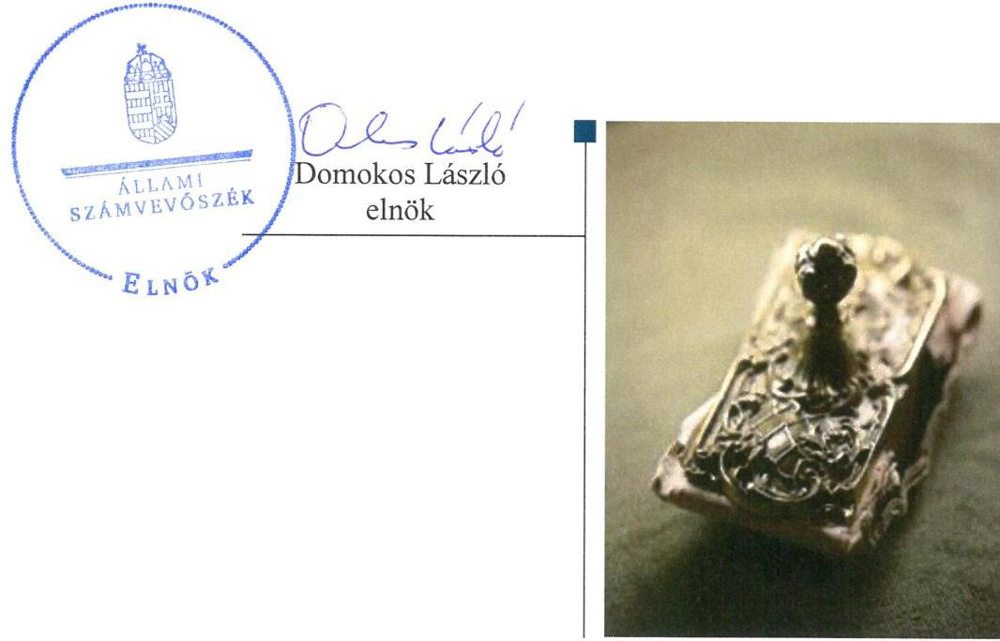
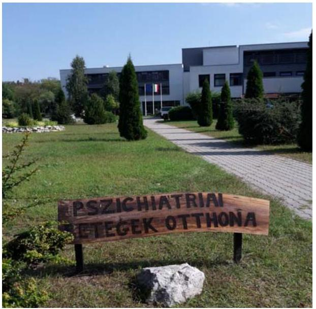
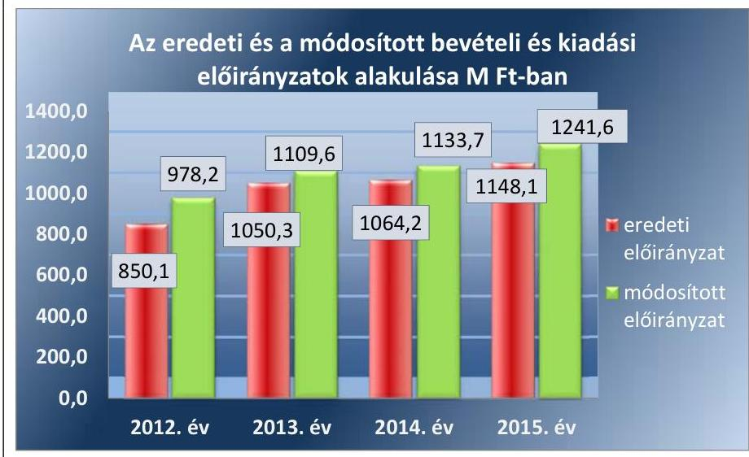
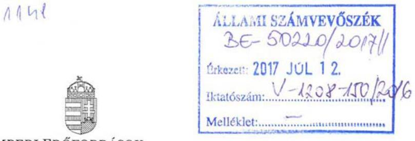
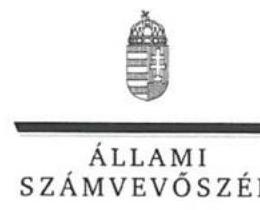
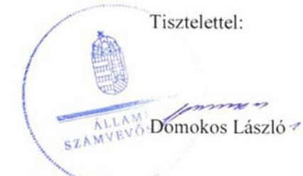
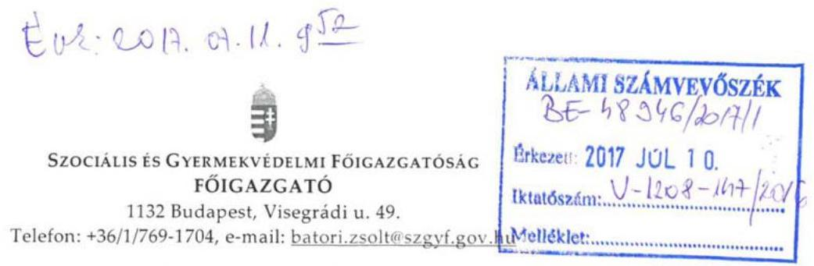
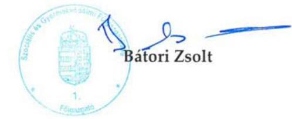
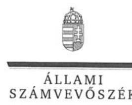

# Jelentés 

## A központi alrendszer egyes intézményei pénzügyi és vagyongazdálkodásának ellenőrzése

Komárom-Esztergom Megyei Integrált Szociális Intézmény
2017.

---

# Jelentés 

## A központi alrendszer egyes intézményei pénzügyi és vagyongazdálkodásának ellenőrzése

Komárom-Esztergom Megyei Integrált Szociális Intézmény
2017. augusztus 18. nap

---

# AZ ELLENŐRZÉST FELÜGYELTE:

- **SALAMON ILDIKÓ** felügyeleti vezető

- **AZ ELLENŐRZÉST VEZETTE ÉS A VÉGREHAJTÁSÁÉRT FELELŐS:**

- **ZAKAR LÁSZLÓ** ellenőrzésvezető

- **A PROGRAM ÖSSZEÁLLÍTÁSÁÉRT FELELŐS:**

- **JANIK JÓZSEF LÁSZLÓ** osztályvezető

**IKTATÓSZÁM: V-1208-154/2016.**

**TÉMASZÁM: 2242**

**ELLENŐRZÉS-AZONOSÍTÓ SZÁM: V076008**

Jelentéseink az Országgyűlés számítógépes hálózatán és az Interneten a www.asz.hu címen is olvashatóak.

---

# TARTALOMJEGYZÉK 

■ ÖSSZEGZÉS ..... 5
■ AZ ELLENŐRZÉS CÉLJA ..... 7
■ AZ ELLENŐRZÉS TERÜLETE ..... 8
■ AZ ELLENŐRZÉS HÁTTERE, INDOKOLTSÁGA ..... 10
■ A JELENTÉS LÉNYEGES KÉRDÉSKÖREI ..... 11
■ ELLENŐRZÉS HATÓKÖRE ÉS MÓDSZEREI ..... 12
■ MEGÁLLAPÍTÁSOK ..... 15
■ JAVASLATOK ..... 27
■ MELLÉKLETEK ..... 31
I. Sz. melléklet: Értelmező szótár ..... 31
II. Sz. melléklet: Az integritás szemlélet érvényesítésével és az integritás kontrollrendszer kiépítettségével kapcsolatos megállapítások ..... 35
■ FÜGGELÉK: ÉSZREVÉTELEK ..... 37
■ RÖVIDÍTÉSEK JEGYZÉKE ..... 57

---

.

---

# ÖSSZEGZÉS 

A Komárom-Esztergom Megyei Integrált Szociális Intézményre vonatkozó irányító szervi feladatellátás megfelelt, a középirányító szervi feladatellátás nem felelt meg a jogszabályi előírásoknak. A belső kontrollrendszer kialakítása és működtetése nem biztosította a szabályszerű, átlátható és elszámoltatható közpénzfelhasználás feltételeit. A Komárom-Esztergom Megyei Integrált Szociális Intézmény pénzügyi és vagyongazdálkodása nem felelt meg a jogszabályi előírásoknak. Az Intézmény vezetője nem építette ki a megfelelő védelmet a korrupciós veszélyekkel szemben.

## Az ellenőrzés társadalmi indokoltsága

Az államháztartás központi alrendszerének közpénz felhasználása, az intézmények által ellátott közfeladatok sokrétűsége, valamint a feladatellátásához rendelt vagyon nagyságrendje indokolja, hogy az Állami Számvevőszék ellenőrzéseket folytasson a pénzügyi és vagyongazdálkodás területén. Az Állami Számvevőszék az ellenőrzései során feltárja a gazdálkodást, a központi alrendszer intézményeinek átalakulását, átszervezését érintő szabályozások esetleges hiányosságait, a szabályozással nem érintett gazdálkodási területeket, rámutathat a vagyongazdálkodási tevékenység - ezen belül a tulajdonosi joggyakorlás és vagyonkezelés - esetleges szabálytalanságaira, értékeli az állami vagyon nyilvántartására és elszámolására vonatkozó eljárásokat. Az ellenőrzésünkkel hozzá kívánunk járulni a központi intézmények pénzügyi helyzetének pontosabb megítéléséhez, a jó gyakorlat kialakításán és terjesztésén keresztül az ellenőrzéseink elősegíthetik a gazdálkodás szabályszerűségének javítását.

## Főbb megállapítások, következtetések, javaslatok

A Komárom-Esztergom Megyei Integrált Szociális Intézményre vonatkozó irányító szervi feladatellátás megfelelt a jogszabályi előírásoknak. A középirányító szervi feladatellátás nem felelt meg a jogszabályi előírásoknak. A középirányító szervek nem érvényesítették a vagyonnal való szabályszerű gazdálkodáshoz szükséges követelményeket, mivel vagyonkezelőként nem kötöttek az Intézménnyel az Intézmény közfeladatai ellátása érdekében szükséges vagyonelemekre vonatkozóan vagyon hasznosítására irányuló írásbeli szerződést.

A Komárom-Esztergom Megyei Integrált Szociális Intézmény belső kontrollrendszerének kialakítása és működtetése egyik évben sem felelt meg a jogszabályi előírásoknak, emiatt nem voltak biztosítottak a szabályszerű, átlátható és elszámoltatható közpénzfelhasználás feltételei. Az Intézmény szervezeti és működési szabályzata az ellenőrzött időszak alatt nem felelt meg a jogszabályi előírásoknak. Az Intézmény 2013. április 1-jétől az ellenőrzött időszak végéig nem rendelkezett számviteli politikával és az annak keretében elkészítendő eszközök és források leltárkészítési és leltározási szabályzattal, eszközök és források értékelési szabályzattal, pénzkezelési szabályzattal és az önköltségszámítás rendjére vonatkozó szabályzattal, mivel a gazdálkodással összefüggő feladatokat ellátó Szociális és Gyermekvédelmi Főigazgatóság azokat nem készítette el. Az Intézményvezető az ellenőrzött időszak alatt nem működtetett kockázatkezelési rendszert.

A Komárom-Esztergom Megyei Integrált Szociális Intézmény pénzügyi és vagyongazdálkodása nem volt szabályszerű. A kiadási előirányzatok felhasználásánál a gazdálkodási jogkörök gyakorlása a 2012. és a 2014. években nem volt megfelelő. Továbbá az Intézmény 2012-2015. évi költségvetési beszámolói jelentős összegű hibákat tartalmaztak, mivel az Intézmény gazdálkodással összefüggő feladatait ellátó Komárom-Esztergom Megyei Intézményfenntartó Központ az Intézmény 2012. évi mérlegében és a Szociális és Gyermekvédelmi Főigazgatóság az Intézmény 2013-2015. évi mérlegeiben a jogszabályban foglaltak ellenére az Intézmény vagyonkezelésébe nem tartozó ingatlanvagyont mutatott ki.

---

A Komárom-Esztergom Megyei Integrált Szociális Intézmény vezetője nem tett erőfeszítéseket az integritás szemlélet érvényesítése érdekében. Az integritás kontrollok kiépítettsége nem volt egyensúlyban a korrupciós kockázatok szintjével.

A Komárom-Esztergom Megyei Integrált Szociális Intézménynél a közpénzfelhasználás eredményességét a gazdálkodás folyamatában mérhető célok nem támasztották alá.

---

# AZ ELLENŐRZÉS CÉLJA 

A MEGFELELŐSÉGI ELLENŐRZÉS célja annak megítélése volt, hogy az ellenőrzött intézményre vonatkozó irányító szervi feladatellátás a jogszabályi előírások betartásával történt-e; az intézménynél a belső kontrollrendszer kialakítása és működtetése szabályszerű volt-e; kialakították-e az erőforrásokkal való szabályszerű, gazdaságos, hatékony és eredményes gazdálkodás követelményeit; szabályszerű volt-e a beszámolási és adatszolgáltatási kötelezettségek teljesítése; az intézmény pénzügyi és vagyongazdálkodása megfelelt-e a jogszabályi előírásoknak és belső szabályzatainak; az intézmény átalakításának vagy átszervezésének lebonyolítása szabályszerűen történt-e.

Az ellenőrzés keretében értékeltük az intézmény korrupciós kockázatainak kezelését szolgáló integritás kontrollok kiépítettségét és az integritás szemlélet érvényesülését.

A KIEGÉSZÍTŐ TELJESÍTMÉNY-ELLENŐRZÉSI MODUL célja annak értékelése volt, hogy a gazdálkodás folyamatában a gazdaságossági, hatékonysági és eredményességi célok kialakítása megtörtént-e, a célok elérése érdekében tettek-e intézkedéseket, a célkitűzéseket és a szándékolt eredményeket elérték-e.

---

# **AZ ELLENŐRZÉS TERÜLETE**

## **Komárom-Esztergom Megyei Integrált Szociális Intézmény**

Az Intézmény1 szociálisan rászorultak (időskorúak, fogyatékkal élők, pszichiátriai betegek) részére nyújt személyes gondoskodást, melynek keretében a szociális alapszolgáltatásokból (nappali ellátás) és szakosított ellátásokból (bentlakásos intézményi szolgáltatások) álló feladatköre 2012. év végétől kiegészült a házi segítségnyújtással és a jelzőrendszeres házi segítségnyújtással. Az Intézmény tevékenységét Komárom-Esztergom Megyében végzi, azonban a jelzőrendszeres házi segítségnyújtást 2013. szeptember 15-étől Budapest XVII. kerületében és Rétság Kistérségben, majd 2013. október 28-ától Mezőkövesd kistérségben is szolgáltat. Az Intézményben a gondozás során fejlesztő-felkészítő és munka-rehabilitációs foglalkoztatást szerveznek az ellátottak számára. Az Intézmény 2012. novemberéig öt, 2012. december 1-jétől hat telephelyen működött, mert a Glatz Gyula Szociális Központ beolvadt az Intézménybe.

Az Intézmény az önkormányzati alrendszerből 2012. január 1-jétől a Konsz. tv.2 alapján a központi alrendszerbe került. Az alapítói és irányító szervi feladatokat a KIM3 látta el és a középirányító szerve a 258/2011. (XII. 7.) Korm. rendelet4 alapján a MIK5 lett. A 2013. évtől az Intézmény irányítószerve az EMMI6 lett. A MIK 2013. március 31-én a 258/2011. (XII. 7.) Korm. rendelet alapján az SZGYF7-be történő beolvadással megszűnt, feladatait egyetemleges jogutódként az SZGYF látta el, így az Intézményre vonatkozó középirányító szervi feladatokat is.

Az Intézmény 2012. január 1.-2012. március 31. közötti időszakban önállóan működő és gazdálkodó költségvetési szerv volt. Az Intézmény a 258/2011. (XII. 7.) Korm. rendelet alapján 2012. április 1-jével önállóan működő költségvetési szervvé alakult és ettől az időponttól a gazdálkodásával összefüggő feladatait a MIK, majd 2013. április 1-jétől az SZGYF látta el.

Az ellenőrzött időszakon belül az Intézményvezető8 személyében változás nem történt. Az Intézményvezető tartós távolléte idején – 2012. január 1-jétől 2014. január 12-éig – a helyettesítését a Komárom-Esztergom Megyei Mentálhigiénés és Rehabilitációs Intézmény vezetője látta el. A Konsz. tv. alapján az Intézmény gazdasági vezetőjének megbízása 2012. március 31-én megszűnt. Ezt követően a gazdasági vezetői feladatokat 2013. március 31-ig a MIK gazdasági vezetője, majd 2013. április 1-jétől az ellenőrzött időszak végéig az SZGYF gazdasági vezetője látta el.

A Konsz. tv. értelmében a megyei önkormányzatok fenntartásában lévő intézmények, azok vagyona és vagyoni értékű jogai 2012. január 1-jén a törvény erejénél fogva állami tulajdonba kerültek. Az önkormányzati alrendszerből átkerült intézményi vagyon tekintetében 2012. január 1-jétől a tulajdonosi jogokat – a Vtv.9 alapján – az állami vagyon felügyeletéért felelős miniszter gyakorolta, aki e feladatát az MNV Zrt.10 útján látta el. A vagyon

---

vagyonkezelői jogokat 2012. január 1-jétől - a 258/2011. (XII. 7.) Korm. rendelet alapján - a MIK gyakorolta. A MIK 2013. március 31-én az SZGYF-be történt beolvadással megszűnt, és az átvett vagyon tekintetében a vagyonkezelői feladatokat a 316/2012. (XI.13) Korm. rendelet ${ }^{11}$ alapján a továbbiakban az SZGYF főigazgatója látta el.

Az Intézményben dolgozók átlagos statisztikai állománya a 2012. évi 271 főről a 2015. évre 274 főre emelkedett. A teljesített bevételek összege a 2012. évi 964,7 M Ft-ról a 2015. évre 28,7\%-kal 1241,2 M Ft-ra nőtt. A teljesített kiadások összege a 2012. évi 959,8 M Ft-ról a 2015. évre 26,3\%-kal 1212,1 M Ft-ra nőtt. Az Intézmény 2012-2015. évek közötti költségvetésének a növekedését a Glatz Gyula Szociális Központ beolvadása és a jelzőrendszeres házi segítségnyújtás feladattal történő bővülés eredményezte.

---

# AZ ELLENŐRZÉS HÁTTERE, INDOKOLTSÁGA 

Az Alaptörvény ${ }^{12}$ rendelkezése szerint a nemzeti vagyon megőrzésének, védelmének és a nemzeti vagyonnal való felelős gazdálkodásnak a követelményeit a sarkalatos törvény, az Nvtv. ${ }^{13}$ rögzíti. A tulajdonosi joggyakorlás és vagyonkezelés általános és speciális szabályait, az állami vagyon nyilvántartására és elszámolására vonatkozó eljárásokat, a vagyonkezelési szerződés feltételrendszerét, valamint az éves beszámoló készítési és könyvvezetési kötelezettségeket kormányrendelet írja elő. A központi alrendszer egyes intézményei közfeladat-ellátásának változásait, a közfeladatok átadásából és átvételéből adódó módosításait, előirányzat gazdálkodására ható tényezőit az Áht. ${ }^{14} 11$. §-a és az Ávr. ${ }^{15} 14$. §-a írja elő. A közfeladatok megszűnéséből, intézmény átszervezéséből, belső szerkezeti korszerűsítéséből, vagy más hasonló okból adódó módosításai miatt szerepeltetendő szerkezeti változásokat, valamint a szerkezeti változásként beépült közfeladatok szintre hozásként történő számításba vételét az Ávr. 15. § (2)-(3) bekezdései határozzák meg. A társadalmi igénnyel összhangban Áht. és a Bkr. ${ }^{16}$ is előírja a költségvetési szerv részére, hogy olyan szabályozásokat, eljárásokat, folyamatokat alakítson ki, amelyek biztosítják a működés, gazdálkodás, az erőforrások felhasználása során a gazdaságosság, hatékonyság és eredményesség érvényesülését. A gazdaságos, hatékony és eredményes gazdálkodáshoz szükség van a teljesítménymérés feltételeinek kialakítására, úgymint az egyértelmű és mérhető célokra, mutatószámokra és az ezekhez rendelt követelményekre.

AZ ELLENŐRZÉS EREDMÉNYEKÉPPEN nemcsak az ellenőrzött intézmények gazdálkodása javulhat, hanem átfogó képet kaphatunk a központi alrendszerbe tartozó költségvetési szervek gazdálkodásának hiányosságairól, de a jó gyakorlatokról is. Ellenőrzéseivel, javaslataival és megállapításaival az ÁSZ ${ }^{17}$ elősegítheti a költségvetési szervek pénzügyi és vagyongazdálkodása szabályozásának javítását és hozzájárulhat a jó kormányzáshoz. Az ellenőrzés az ellenőrzött számára visszajelzést ad a pénzügyi és vagyongazdálkodásában feltárt hiányosságokról, javaslataival hozzájárul azok kiküszöböléséhez, amely csökkentheti a későbbi ellenőrzések gyakoriságát. Az ellenőrzés megállapításait és javaslatait más szervezetek is hasznosíthatják a rendezett gazdálkodási keretek kialakításához.

## A TELJESÍTMÉNY-ELLENŐRZÉSI KIEGÉSZÍTŐ

MODUL alapján elvégzett ellenőrzés a törvényalkotás számára támogatást nyújt a nemzeti kulcsindikátorok rendszerének kialakításához. A döntéshozók, az ellenőrzöttek, az irányító szervek és a társadalom számára az összehasonlítási, összemérési lehetőségek kihasználásával objektív visszajelzést ad a gazdálkodás területén végrehajtott szervezeti, szervezési, takarékossági és bürokráciacsökkentő intézkedések hatásairól, a közfeladatellátásnak keretet adó pénzügyi és vagyongazdálkodásban mérhető teljesítménykövetelmények kialakításáról, azok alkalmazásáról.

---

# A JELENTÉS LÉNYEGES KÉRDÉSKÖREI 

1. Az irányító szerv ellenőrzött Intézményre vonatkozó feladatellátása szabályszerű volt-e?
2. A belső kontrollrendszer kialakítása és működtetése biztosította-e a közpénzekkel és a nemzeti vagyonnal történő szabályszerű, gazdaságos, hatékony és eredményes gazdálkodást, illetve a beszámolási kötelezettségek szabályszerű
 teljesítését?
3. Az Intézmény pénzügyi gazdálkodása szabályszerű volt-e?
4. Az Intézmény vagyongazdálkodása szabályszerű volt-e?
5. Szabályszerűen hajtották-e végre az ellenőrzött időszakban az Intézményt érintő szervezeti, szerkezeti átalakításokat?
6. Érvényesült-e az integritás szemlélet és ennek megfelelően kiépítették-e az integritás kontrollrendszert az Intézménynél?
7. Az Intézmény a gazdálkodás folyamatában kitűzött-e célokat és célértékeket, elérésük érdekében meghatározott-e intézkedéseket, feladatokat, illetve teljesítette-e azokat?

---

# ELLENŐRZÉS HATÓKÖRE ÉS MÓDSZEREI 

## Az ellenőrzés típusa

Az Intézmény pénzügyi és vagyongazdálkodása megfelelőségi ellenőrzés, a gazdálkodás folyamatára vonatkozó kiegészítő ellenőrzés teljesítményellenőrzés.

## Az ellenőrzött időszak

2012. január 1-jétől 2015. december 31-ig terjedő időszak.

## Az ellenőrzés tárgya

Az ellenőrzött szervezetre vonatkozó irányító szervi feladatok ellátása. Az Intézmény belső kontroll rendszerének kialakítása és működtetése. A pénzügyi és vagyongazdálkodás szabályszerűsége. Az Intézmény beszámolási és adatszolgáltatási kötelezettségének teljesítése. Az Intézmény átalakításának vagy átszervezésének szabályszerűsége.

A teljesítményellenőrzési kiegészítő modul esetében az intézményi gazdálkodás folyamatában a gazdaságossági, hatékonysági és eredményességi követelmények kialakítása és működtetése, a célkitűzések teljesítésének értékelése.

Az ellenőrzés kiterjedt minden olyan körülményre és adatra, amely az ÁSZ jogszabályban meghatározott feladatainak teljesítéséhez, valamint a program végrehajtása folyamán felmerült újabb összefüggések feltárásához szükséges volt.

## Az ellenőrzött szervezet

Komárom-Esztergom Megyei Integrált Szociális Intézmény, Közigazgatási és Igazságügyi Minisztérium, az Emberi Erőforrások Minisztériuma, a Komárom-Esztergom Megyei Intézményfenntartó Központ, a Szociális és Gyermekvédelmi Főigazgatóság. A Közigazgatási és Igazságügyi Minisztérium jogutódjaként az Igazságügyi Minisztérium, valamint a Miniszterelnökség adatot szolgáltatott az ellenőrzéshez. Az ellenőrzésre a Komárom-Esztergom Megyei Integrált Szociális Intézménynek, az Emberi Erőforrások Minisztériumának, illetve a Szociális és Gyermekvédelmi Főigazgatóságnak a székhelyén került sor.

---

# Az ellenőrzés jogalapja 

Az ellenőrzés jogszabályi alapját az ÁSZ tv. ${ }^{18} 1 . \S$ (3) bekezdése, az 5. § (2)(6) bekezdései, valamint az Áht. 61. § (2) bekezdésének előírásai képezték.

## Az ellenőrzés módszerei

Az ellenőrzést az ellenőrzési program szempontjai, az ellenőrzött időszakban hatályos jogszabályok, az ellenőrzés szakmai szabályai, a jelen ellenőrzésre irányadó ÁSZ módszertanok figyelembevételével végeztük.

Az ellenőrzés ideje alatt az ellenőrzött szervezettel történő kapcsolattartást az ÁSZ SZMSZ ${ }^{19}$-ének vonatkozó előírásai alapján biztosítottuk.

Az ellenőrzési kérdések megválaszolásához szükséges bizonyítékok megszerzése tételes és mintavételen alapuló dokumentumellenőrzés, összehasonlító elemzés ellenőrzési eljárások alkalmazásával történt. Az ellenőrzési bizonyítékként felhasználható adatforrások közé tartoztak egyrészt az ellenőrzési program részletes szempontjainál felsorolt adatforrások, másrészt minden egyéb - az ellenőrzés folyamán feltárt, az ellenőrzés szempontjából információt tartalmazó - dokumentum.

Az ellenőrzés lefolytatásához az ellenőrzött szervezetek tanúsítványok kitöltésével, valamint az ÁSZ által kért dokumentumok megküldésével szolgáltattak adatokat. A rendelkezésre bocsátott adatok, információk kontrollja az ellenőrzés keretében történt.

Az ÁSZ a belső kontrollrendszer jogszabályi előírások szerinti kialakításának és működtetésének szabályszerűségét az erre irányuló ellenőrzési kérdésekre adott válaszok összesítése alapján, a lényegességi szempontok figyelembe vételével évente pillérenként (kontrollkörnyezet, kockázatkezelési rendszer, kontrolltevékenységek, információs és kommunikációs rendszer, monitoring rendszer) és összesítetten is minősítette. Az ÁSZ a pénzügyi gazdálkodás és a vagyongazdálkodás kialakításának és működtetésének szabályszerűségét az erre irányuló ellenőrzési kérdésekre adott válaszok összesítése alapján, a lényegességi szempontok figyelembevételével évenkénti bontásban minősítette. „Megfelelő"-nek értékelte az ellenőrzött területet, amennyiben a szabályozás, illetve végrehajtás során a jogszabályi követelményeket maradéktalanul, vagy kisebb hiányosságok mellett érvényesítették, „nem megfelelő"-nek értékelte, amennyiben a szabályozás hiányosságai nem biztosították a szabályszerű működés feltételeit, illetve a gazdálkodás folyamatában jelentkező hibák lényegesek, nagyszámúak, vagy rendszerszerűek voltak.

Mintavétellel ellenőriztük az Intézménynél a kiadások előirányzatai felhasználásának, a tárgyi eszközök nyilvántartásba vételének (üzembe helyezés, értékelés, nyilvántartás), a bevételek beszedésének és elszámolásának, a vagyonelemek elidegenítésének és hasznosításának szabályszerűségét. A minta alapján a sokaságban előforduló hibaarányt becsültük. Az értékelés eredményeként kétféle, "Megfelelő" és "Nem megfelelő" minősítést alkalmaztunk. „Megfelelő"-nek értékeltünk egy ellenőrzött területet, amennyiben a hibaarány a teljes sokaságban 95%-os bizonyossággal legfeljebb 10% arányt képviselt. Abban az esetben, ha az adott sokaság tekin-

---

tetében a 10%-os hibaarány küszöbérték átlépése megítélésének megbízhatósága nem érte el a 95%-ot, annak elérése érdekében értékelésünket lényegességi alapon további szempontokkal egészítettük ki, és figyelembe vettük a feltárt hibák értékét.

Az integritás szemlélet érvényesülésének értékelése az Intézmény által kitöltött tanúsítvány alapján történt. Értékeltük továbbá az integritás kontrollrendszer kiépítettségét a tanúsítványban szereplő kontrollok ellenőrzése alapján.

Az alapprogram alapján ellenőriztük, hogy a költségvetési szerv vezetője megtette-e nyilatkozatát arról, hogy gondoskodott a költségvetési szerv tevékenységében a hatékonyság, eredményesség és a gazdaságosság követelményeinek érvényesítéséről. A teljesítmény-ellenőrzési kiegészítő modul végrehajtása során értékeltük, hogy az ellenőrzött szervezet a gazdálkodás folyamatában a gazdaságossági, hatékonysági és eredményességi célokat és célértékeket kialakította-e, a célkitűzéseket elérte-e. A kiegészítő modul a gazdálkodási feladatokra terjedt ki, a szakmai feladatellátást nem értékelte.

A gazdálkodási feladatok értékelése az alábbi területekre terjedt ki:
pénzügyi gazdálkodási (nem szakmai, adminisztratív) feladatok: költségvetés-, beszámoló-készítés, könyvvezetés, adatszolgáltatások, előirányzat-gazdálkodás, kötelezettségvállalások nyilvántartása, kezelése, bevételkezelés, bér- és illetményszámfejtés;
$\longrightarrow$ vagyongazdálkodási (logisztikai) feladatok: közbeszerzések és közbeszerzési értékhatárt el nem érő beszerzések, készletgazdálkodás, nyomtatók, fénymásolók üzemeltetése, épület- és ingatlanüzemeltetés, karbantartás, hibabejelentés, gépjármű és flotta-menedzsment.

Az ellenőrzés során minden olyan körülményt és adatot ellenőriztünk, amely a program végrehajtása kapcsán felmerült újabb összefüggéseknek az ellenőrzés céljaival összhangban lévő feltárásához szükséges volt. A teljesítmény-ellenőrzési kiegészítő programmodulban megfogalmazott ellenőrzési cél megválaszolásához az alapprogram végrehajtása során megfogalmazott megállapításokat is figyelembe vettük.

---

# 1. Az irányító szerv ellenőrzött Intézményre vonatkozó feladatellátása szabályszerű volt-e? 

## Összegző megállapítás

### 1.1. számú megállapítás

### 1.2. számú megállapítás

Az Intézményre vonatkozó irányító szervi feladatellátás megfelelt, a középirányító szervi feladatellátás nem felelt meg a jogszabályi előírásoknak.

Az alapítással kapcsolatos irányító szervi jogosultságok gyakorlása a jogszabályi előírásoknak megfelelően történt.

Az Intézmény az ellenőrzött időszakban alapító okirattal (1-5) rendelkezett. Az irányító szerv (1) által kiadott alapító okirat (1-3), valamint az irányító szerv (2) által kiadott alapító okirat (4-5) tartalma megfelelt a jogszabályi előírásoknak. A kormányzati funkció megadása miatt az Ávr. előírásainak megfelelően került sor az alapító okirat (4) kiegészítésére.

Az alapító okirat (2) kiadásakor - az Áht. 8. § (7) bekezdésében előírtak ellenére - nem állt rendelkezésre az államháztartásért felelős miniszter előzetes egyetértése.

Az Intézménnyel kapcsolatos egyéb irányítási, felügyeleti és ellenőrzési jogosultságok gyakorlását az irányító szervek szabályszerűen, a középirányító szervek nem szabályszerűen végezték.

Az ellenőrzött időszak alatt az irányító szerv (1-2) az Intézmény éves elemi költségvetéseit, az éves létszám-előirányzatait, az éves költségvetési beszámolóit a jogszabályi előírásoknak megfelelően jóváhagyta. Az Intézmény bevételi és kiadási előirányzatokkal való gazdálkodását a 2012-2015. években a középirányító szerv (1-2) a jogszabályi előírásoknak megfelelően rendszeresen figyelemmel kísérte. Az ellenőrzött időszak alatt a közfeladat ellátásának veszélybe kerülését nem állapították meg.

Az Intézmény közfeladatai ellátásához szükséges vagyonelemek vagyonkezelője 2012. január 1-től a középirányító szerv (1), majd 2013. április 1-jétől a középirányító szerv (2) főigazgatója volt. A középirányító szerv (1-2) az Intézmény közfeladatai ellátásához szükséges ingatlanok hasznosítására irányuló - a Vtv. 25. § (4) bekezdésben foglalt - írásbeli szerződést az Intézménnyel nem kötött annak ellenére, hogy a Vtv. 23. § (1) bekezdés és a vagyonkezelési szerződés 4.5.1 c) pontja alapján erre jogosult lett volna. Így a 2012. évben a középirányító szerv (1), majd 2013-2015. években a középirányító szerv (2) főigazgatója - a 258/2011. (XII. 7.) Korm. rendelet 11. § (2) bekezdés d) pontjában, illetve a 316/2012. (XI. 13.) Korm. rendelet 3. § (2) bekezdés g) pontjában előírtak ellenére - nem érvényesítette az erőforrásokkal, így különösen a vagyonnal való szabályszerű gazdálkodáshoz szükséges követelményeket.

A középirányító szerv (1-2) az Intézmény vezetőivel kapcsolatos munkáltatói jogosultságait szabályszerűen gyakorolta.

---

# 2. A belső kontrollrendszer kialakítása és működtetése biztosította-e a közpénzekkel és a nemzeti vagyonnal történő szabályszerű, gazdaságos, hatékony és eredményes gazdálkodást, illetve a beszámolási kötelezettségek szabályszerű teljesítését? 

Összegző megállapítás

A belső kontrollrendszer kialakítása és működtetése nem felelt meg a jogszabályi előírásoknak, így az nem biztosította a közpénzekkel és a nemzeti vagyonnal történő szabályszerű, gazdaságos, hatékony és eredményes gazdálkodás, valamint a beszámolási kötelezettségek szabályszerű teljesítése feltételeit.

## 2.1. számú megállapítás

A kontrollkörnyezet kialakítása nem felelt meg a jogszabályi előírásoknak.

Az Intézmény az ellenőrzött időszak alatt az irányító szervek által jóváhagyott SZMSZ-sel (2-6) rendelkezett. Az SZMSZ (1-4) nem teljes körűen tartalmazta - az Ávr. 13. § (1) bekezdés c) pontjában előírtak ellenére - az ellátandó, és a szakfeladatrend szerint a szakfeladat számmal és megnevezéssel besorolt alaptevékenységek megjelölését. A 2014. november 06-tól hatályos SZMSZ (5) nem teljes körűen tartalmazta - az Ávr. 13. § (1) bekezdés c) pontjában előírtak ellenére - az ellátandó, és a kormányzati funkció szerint besorolt alaptevékenységek megjelölését. Az SZMSZ (2-6) a 2012-2015. években nem tartalmazta az Ávr. 13. § (1) bekezdés b) pontja ellenére a hatályos alapító okirat keltét, számát, az alapítás időpontját, valamint - a Vnytv. 4. § a) pont előírása ellenére - a vagyonnyilatkozat-tételi kötelezettséggel járó munkaköröket. Az Intézménynél a vagyonnyilatkozat-tételi kötelezettséggel járó munkakörök szervezeti és működési szabályzatban történő rögzítésének az elmaradása miatt nem érvényesült a közélet tisztaságának a biztosítása, továbbá hiányzott a korrupció megelőzésére irányuló alapvető szabályozás.

Az Intézmény 2012. január 1. és 2012. március 31. közötti időszakban önállóan működő és gazdálkodó költségvetési szerv volt - a Számv. tv.-ben és az Áhsz.-ben előírtaknak megfelelően - rendelkezett számviteli politikával és annak keretében elkészítendő eszközök és források leltárkészítési és leltározási szabályzattal (1), az eszközök és források értékelési szabályzattal (1), pénzkezelési szabályzattal (1) és az önköltségszámítás rendjére vonatkozó szabályzattal.

Az Intézmény 2012. április 1-jétől 2013. március 31-ig rendelkezett számviteli politikával és az annak keretében elkészített szabályzatokkal, mivel a gazdálkodással összefüggő feladatokat ellátó MIK a számviteli politikájában - az Áhsz. előírása alapján - döntött arról, hogy annak rendelkezéseit és a számviteli politikája keretében elkészített szabályzatainak (leltározási és leltárkészítési szabályzat (3), az eszközök és források értékelési szabályzat (2), az önköltségszámítás rendjére vonatkozó szabályzat (2) és a pénzkezelési szabályzat (3)) hatályát kiterjeszti az Intézményre.

Az Intézmény 2013. április 1-jétől az ellenőrzött időszak végéig nem rendelkezett számviteli politikával, és az annak keretében - a Számv. tv. 14. § (5) bekezdése alapján - elkészítendő szabályzatokkal (eszközök és források leltárkészítési és leltározási szabályzattal, eszközök és források értékelési szabályzattal, pénzkezelési szabályzattal és önköltség-számítás rendjére vonatkozó szabályzattal), mert az Intézmény gazdálkodással összefüggő feladatait ellátó önállóan működő és gazdálkodó SZGYF a számviteli politikájában nem döntött - az Áhsz. 8. § (13) bekezdésében előírtak ellenére - arról, hogy annak rendelkezéseit és a kapcsolódó szabályzatok hatályát kiterjeszti-e az Intézményre, vagy az
 Intézmény önálló számviteli politikát alakítson ki és külön szabályzatokat készítsen. Illetve 2014. január 1-jétől az Áhsz. ${ }_{2}{ }^{40} 50 . \S$ (1) bekezdésében, és az abban hivatkozott 31. § (1) bekezdésében foglaltak ellenére ezen szabályzatokat az SZGYF főigazgatója nem készítette el.

Az Intézményvezető 2014. február 1-jén jogosulatlanul adott ki - az Áhsz. ${ }_{2} 50 . \S$ (1) bekezdésében, és az abban hivatkozott 31. § (1) bekezdésében előírtak ellenére - számviteli politika${ }_{2}$-t, leltározási és leltárkészítési szabályzat${ }_{2}$-ot, valamint pénzkezelési szabályzat${ }_{2}$-ot, mivel azok elkészítéséért az SZGYF főigazgatója volt a felelős.

A 2012. évben az Intézmény gazdálkodási feladatait ellátó MIK gazdasági szervezete rendelkezett ügyrenddel ${ }^{41}$. Az Intézmény gazdálkodási feladatait ellátó SZGYF gazdasági szervezete 2013. április 1-jétől az ellenőrzött időszak végéig - az Ávr. 9. § (5) bekezdésében, az Ávr. 13. § (5) bekezdésében és 2015. február 18-tól az Ávr. 10/A. §-ban előírtakkal ellenére - nem rendelkezett ügyrenddel.
2012. április 1-jétől 2015. szeptember 16-ig az Intézmény és a gazdálkodásával összefüggő feladatokat ellátó MIK, majd SZGYF - az Ávr. 10. § (5) bekezdésében és 2015. január 1-jétől az Ávr. 9. § (5a) bekezdésében foglaltaknak megfelelő - munkamegosztás és felelősségvállalás rendjét rögzítő munkamegosztási megállapodással nem rendelkezett. Az Intézmény és a gazdálkodásával összefüggő feladatokat ellátó SZGYF az irányító szerv${ }_{2}$ által jóváhagyott munkamegosztási megállapodás${ }^{42}$-gyel 2015. szeptember 17-étől rendelkezett.

Az Intézmény 2013. március 31-ig rendelkezett számlarenddel, mivel a gazdálkodással összefüggő feladatait 2012. április 1-jétől ellátó MIK a számlarend${ }_{1}{ }^{43}$-et kiterjesztette az Intézményre. Az Intézmény - a Számv. tv. 161. § (4) bekezdésében, az Áhsz. ${ }_{1} 49 . \S$ (1) bekezdésében és az Áhsz. ${ }_{2} 51 . \S$ (2) bekezdésében előírtak ellenére - 2013. április 1-jétől az ellenőrzött időszak végéig nem rendelkezett hatályos számlarenddel, mivel a gazdálkodási feladatokat ellátó SZGYF nem készítette elő az Intézményre vonatkozó számlarendet.

Az Intézményvezető az ellenőrzött időszakban az Ávr. előírásainak megfelelően szabályozta a belföldi és külföldi kiküldetések ${ }^{44}$ elrendelésével és lebonyolításával, elszámolásával kapcsolatos kérdéseket, a gépjárművek igénybevételének és használatának rendjét${ }_{1,2}{ }^{45}$, továbbá a vezetékes és rádiótelefonok használatának rendjét${ }_{1-3}{ }^{46}$. Az Intézményvezető a 2012-2013. években - az Ávr. 13. § (2) bekezdés e) pontjában előírtak ellenére - nem szabályozta a reprezentációs kiadások felosztását, azok teljesítésének és elszámolásának szabályait. A jogszabálynak megfelelő reprezentációs szabályzat ${ }^{47}$ 2014. február 1-jén lépett hatályba.

Az ellenőrzött időszak alatt az Intézményvezető - az Ávr. előírásainak megfelelően - a beszerzések lebonyolításával kapcsolatos eljárásrend${ }_{1,2}{ }^{48}$-ben szabályozta a közbeszerzési értékhatár alatti beszerzések lebonyolításával kapcsolatos eljárásrendet. Az Intézménynek a 2012-2015. években nem kellett lefolytatnia közbeszerzési eljárást, így nem merült fel a Kbt.${ }_{1}{ }^{49}$ és a Kbt.${ }_{2}{ }^{50}$ szerinti közbeszerzési szabályzat szükségessége.

Az Intézmény ellenőrzési nyomvonalát a FEUVE rendszer${ }_{1}{ }^{51}$ szabályzat tartalmazta. Az Intézményvezető az ellenőrzési nyomvonal aktualizálását a Bkr. 6. § (3) bekezdés ellenére - az Intézmény gazdasági szervezetének megszűnését követően 2012. április 1-jétől 2014. december 31-ig nem végezte el. Az ellenőrzési nyomvonal aktualizálása 2015. január 1-jén történt meg a FEUVE rendszer${ }_{2}$ szabályzat hatályba lépésével.

Az Intézményvezető az ellenőrzött időszakban - a Bkr.-ben előírtaknak megfelelően - szabályozta (a FEUVE rendszer${ }_{1,2}$-ben és 2015. december 1-jétől a szabálytalanságkezelési eljárásrendben ${ }^{52}$ ) a szabálytalanságkezelésének az eljárásrendjét.

Az ellenőrzött időszakban az Intézmény a Kjt.${ }^{53}$ előírásainak megfelelően rendelkezett közalkalmazotti szabályzat${ }_{1,2}{ }^{54}$-vel.

# 2.2. számú megállapítás 

## A kockázatkezelési rendszer kialakítása megfelelt, a működtetése nem felelt meg a jogszabályi előírásoknak.

Az Intézményvezető a kockázatkezelési rendszert a FEUVE rendszer${ }_{1,2}$ szabályzatban alakította ki. A szabályzat tartalmazta a kockázatok fogalmát, a kockázatok azonosításával, elemzésével, csoportosításával, illetve a kockázati kitettség csökkentésével kapcsolatos szabályokat.

Az Intézményvezető az ellenőrzött időszak alatt a Bkr. 7. § (1) bekezdésében előírtak ellenére nem működtetett kockázatkezelési rendszert. Az Intézménynél nem mérték fel és nem állapították meg - a Bkr. 7. § (2) bekezdésében előírtak ellenére - az Intézmény tevékenységében és gazdálkodásában rejlő kockázatokat, valamint nem határozták meg az egyes kockázatokkal kapcsolatban szükséges intézkedéseket és azok teljesítése folyamatos nyomon követésének módját.

## 2.3. számú megállapítás

## A kontrolltevékenységek kialakítása és működtetése nem felelt meg a jogszabályokban foglaltaknak.

Az Intézményvezető 2012. január 1-jétől - az Áht. és az Ávr. előírásaival összhangban - a gazdálkodási szabályzat${ }_{1}{ }^{55}$-ben határozta meg a kötelezettségvállalás, pénzügyi ellenjegyzés, teljesítésigazolás, utalványozás, érvényesítés gyakorlásának módjával, eljárási és dokumentációs részletszabályaival, valamint az ezeket végző személyek kijelölésének rendjével kapcsolatos belső előírásokat. Az Intézményvezető az Intézmény gazdasági szervezetének megszűnését követően, 2012. április 1-jétől - 2015. június 14-ig a gazdálkodási szabályzat${ }_{1}$-et nem módosította, így abban - az Ávr. 55. § (2) bekezdés c) és ca) pontjaiban és az Ávr. 58. § (4) bekezdésben foglaltak ellenére - nem szerepelt, hogy a pénzügyi ellenjegyzésre és az érvényesítésre jogosult személyek írásbeli kijelölésére az Intézmény gazdálkodási feladatait ellátó MIK, majd 2013. április 1-jétől az SZGYF gazdasági vezetője jogosult. Az Intézményvezető által 2015. június 15-től kiadott gazdálkodási szabályzat${ }_{2}$-ben a gazdálkodási jogkörök gyakorlásának belső előírásai az Ávr.-ben foglaltaknak megfeleltek.

# Megállapítások 

A gazdálkodással összefüggő feladatokat ellátó MIK és SZGYF a gazdálkodási szabályzat${ }_{3-6}$-ban - az Ávr.-ben előírtaknak - megfelelően szabályozta az Intézményre vonatkozóan a pénzügyi ellenjegyzés és az érvényesítés gyakorlásának módjával kapcsolatos belső előírásokat, feltételeket, illetve az eljárási és dokumentációs részletszabályokat. A 2012. április 1-jétől az Intézmény gazdálkodással összefüggő feladatait ellátó MIK gazdasági vezetője, illetve a 2013. április 1-jétől az SZGYF gazdasági vezetője az Ávr.-nek megfelelően írásban kijelölt az Intézményre vonatkozóan a pénzügyi ellenjegyzésre és az érvényesítés gyakorlására jogosult személyeket. A pénzügyi ellenjegyzésre feljogosított személyek rendelkeztek az Ávr. 55. § (3) bekezdésében előírt, az érvényesítésre feljogosított személyek az Ávr. 58. § (4) bekezdésében hivatkozott Ávr. 55. § (3) bekezdésében előírt képesítéssel.

A gazdálkodási jogkörök gyakorlására jogosultakról és aláírás mintájukról - az Ávr. előírásának megfelelő - naprakész nyilvántartást vezettek.

Az ellenőrzött időszakon belül a 2012. és a 2014. évi kiadási előirányzatok felhasználása nem volt szabályszerű, mivel a gazdálkodási jogkörök gyakorlása nem felelt meg a jogszabályi előírásoknak. A 2012. és 2014. évekre vonatkozó szabálytalanságokat részletesen a 3.3. számú megállapítás tartalmazza.

## Az információs és kommunikációs folyamatok kialakítása és működtetése nem felelt meg a jogszabályi előírásoknak.

Az ellenőrzött időszakban az Intézményvezető - az Info. tv.${ }^{56}$ 30. § (6) bekezdésében és az Ávr. 13. (2) bekezdés h) pontjában előírtakkal ellentétben - nem rendezte belső szabályzatban a közérdekű adatok megismerésére irányuló igények teljesítésének rendjét.

Az Intézményvezető 2012. január 1-je és 2015. december 14-e között az Info. tv. 35. § (3) bekezdésében, az Ávr. 13. § (2) bekezdés h) pontjában előírtak ellenére - nem szabályozta a kötelezően közzéteendő adatok nyilvánosságra hozatali rendjét. Az Intézményvezető 2015. december 15-ei hatállyal adta ki - az Info. tv.-ben és az Ávr.-ben előírtaknak megfelelő - kötelezően közzéteendő adatok nyilvánosságra hozatali rendjét ${ }^{57}$.

Az Intézmény rendelkezett - az Info. tv.-ben és az lkr.${ }^{58}$-ben előírt - adatvédelmi és adatbiztonsági szabályzat${ }_{1-2}{ }^{59}$-vel, azonban ezeket a szabályzatokat - az Info. tv 33. § (1) bekezdésében, a 37. § (1) bekezdésében és a törvény 1. mellékletének II/1. pontjában előírtak ellenére - az ellenőrzött időszak végéig a honlapján nem tette közzé.

Az Intézményvezető az iratkezelési szabályzat${ }_{1,2}{ }^{60}$-ot - az Ltv.${ }^{61}$ 10. § (1) bekezdés a) pontjában foglaltak ellenére - nem az illetékes közlevéltárral egyetértésben adta ki.
2.5. számú megállapítás

Az Intézményvezető 2013. június 30-ig nem gondoskodott a monitoring rendszer részét képező belső ellenőrzés kialakításáról. Ezt követően a belső ellenőrzés működése a Bkr. előírásainak megfelel.

A monitoring rendszer részeként az operatív tevékenységektől függetlenül végzett belső ellenőrzés kialakításáról az Intézményvezető a 2012. január 1-je és 2013. június 30-a között - az Áht. 70. (1) bekezdésében előírtak ellenére - nem gondoskodott. Ebben az időszakban az Intézmény nem foglalkoztatott belső ellenőrt, és az Intézményvezető - a Bkr. 16. § (2) bekezdésben előírtak ellenére - megállapodást nem kötött a belső ellenőrzési tevékenység külső szolgáltató bevonásával történő megszervezéséről.

A 2013. július 1-jén az Intézményvezető a belső ellenőrzési feladatok ellátására a Bkr.-ben előírtaknak megfelelő megállapodást ${ }^{62}$ kötött az SZGYF-fel. A megállapodásban rögzítették, hogy az SZGYF Belső Ellenőrzési Főosztálya látja el az Intézménynél a belső ellenőrzési feladatokat. A belső ellenőrök rendelkeztek a Bkr.-ben meghatározott általános és szakmai követelmények szerinti képesítéssel. A belső ellenőrzési kézikönyv${ }_{1-2}{ }^{63}$ a Bkr. előírásainak megfelelő tartalmú és rendszeresen felülvizsgált volt.

A belső ellenőrzési jelentésekben megfogalmazott megállapításokra, javaslatokra - a Bkr.-ben előírtaknak megfelelően - az Intézménynél intézkedési terv készült. A belső ellenőrzési vezető ${ }^{64}$ a Bkr. 47. § (1)-(2) bekezdésekben előírt éves bontású nyilvántartást a 2014-2015. években vezetett a belső ellenőrzési jelentésekben tett megállapításokra, javaslatokra, a vonatkozó intézkedési tervekre és azok végrehajtására. Továbbá az Intézményvezető az ellenőrzött időszak alatt vezetett nyilvántartást - a Bkr.-ben előírtaknak megfelelően - a külső ellenőrzések javaslata alapján készült intézkedési tervek végrehajtásáról.

# 2.6. számú megállapítás 

Az Intézményvezető nem alakított ki és nem érvényesített a célok elérését szolgáló, a rendelkezésre álló források gazdaságos, hatékony és eredményes felhasználását biztosító követelményeket.

A 2012-2015. években kiadott belső kontrollrendszer minősítéséről szóló vezetői nyilatkozatok nem voltak helytállóak. Az Intézményvezető a Bkr. 11. § (1) bekezdése szerinti nyilatkozataiban az Intézmény belső kontrollrendszerének minőségét évről évre értékelte, ezekben annak ellenére nyilatkozott a gazdaságosság, eredményesség és hatékonyság követelményeinek érvényesítéséről, hogy - a Bkr. 6. § (2) bekezdését figyelmen kívül hagyva - az Intézmény nem rendelkezett olyan szabályzatokkal és az Intézményben nem működtek olyan folyamatok, amelyek a rendelkezésre álló források szabályszerű, gazdaságos, hatékony és eredményes felhasználását biztosították volna.

## 3. Az Intézmény pénzügyi gazdálkodása szabályszerű volt-e?

## Összegző megállapítás

Az Intézmény pénzügyi gazdálkodása nem felelt meg a jogszabályi előírásoknak.

### 3.1. számú megállapítás

Az elemi költségvetés készítése és az előirányzatok megállapítása során betartották a jogszabályokban és belső szabályzatokban foglaltakat.

Az ellenőrzött időszakban a Bkr.-ben foglaltaknak megfelelően kialakított volt a költségvetési tervezésre vonatkozó ellenőrzési nyomvonal. Az Intézmény éves elemi költségvetései megállapítása megfelelt az Áht.-ban és Ávr.-ben, valamint a belső szabályzatokban foglalt előírásoknak. Az Intézmény éves elemi költségvetései - az Ávr.-ben előírtaknak megfelelően - mellékszámításokkal alátámasztottak voltak. Az Intézmény 2013. éves

elemi költségvetése szintre hozásként tartalmazta a Glatz Gyula Szociális Központ beolvadása miatt szükséges többletigényt, valamint a
 2014. évi elemi költségvetés szerkezeti változásként tartalmazta a területileg kibővült jelzőrendszeres házi segítségnyújtás ellátása érdekében szükséges forrásigényt.

A 2012-2015. évi költségvetés tervezése során az Ávr.-ben meghatározott adatszolgáltatási kötelezettségek határidőben teljesültek.

# 3.2. számú megállapítás 

## A bevételi és kiadási előirányzatok módosítása, átcsoportosítása

megfelelt a jogszabályi előírásoknak.

Az Intézmény előirányzatai módosítására a 2012-2015. években kormányzati, irányító szervi és intézményi hatáskörben került sor. Országgyűlési hatáskörű előirányzat-módosítás nem volt. Az előirányzat-módosításokat hatáskörönkénti bontásban az 1. táblázat mutatja be.

1. táblázat

## ELŐIRÁNYZAT-MÓDOSÍTÁSOK (M FT-BAN)

| Év | Kormányzati | Irányító szervi | Intézményi | Összesen |
| :--: | :--: | :--: | :--: | :--: |
| 2012. | 5,8 | 90,8 | 26,5 | 123,1 |
| 2013. | 16,9 | 34,1 | 8,3 | 59,3 |
| 2014. | 50,4 | -2,3 | 21,4 | 69,5 |
| 2015. | 27,7 | 33,8 | 32,0 | 93,5 |

Forrás: az Intézmény 2012-2015. évi költségvetési beszámolói és az Intézmény nyilvántartása

Az intézményi hatáskörű előirányzat-módosítások, átcsoportosítások a hatásköri előírásokra és a kiemelt előirányzatokra vonatkozó szabályok szerint, az Ávr. előírásait betartva történtek.

Az Intézmény többletbevételeinek előirányzatosítását az irányító szerv az Ávr. 35. § (1) bekezdésének előírásai szerint minden esetben engedélyezte és a felhasználásukhoz kapcsolódóan az előirányzat-módosításokat végrehajtotta.

Az Intézmény 2012-2015. évi bevételi és kiadási előirányzatai alakulását az 1. ábra szemlélteti.

1. ábra

Forrás: az Intézmény 2012-2015. évi költségvetési beszámolói

---

# 3.3. számú megállapítás 

Zárolás 2012. évben érintette az Intézményt. Az Intézmény gazdálkodási feladatait ellátó MIK - az Áhsz. 1 9. számú melléklet számlaosztályok tartalmára vonatkozó előírások 9. f) pontjában előírtak ellenére - az összesen 17,5 M Ft összegű zárolást az Intézmény módosított kiadási előirányzataiból a zárolt kiadási előirányzatok közé nem vezette át.

## A 2012. és 2014. évi kiadási előirányzatok felhasználása és a vagyonelemek hasznosításából származó 2012-2015. évi bevételek elszámolása nem felelt meg a jogszabályi előírásoknak.

Az Intézmény az ellenőrzött időszakban a módosított előirányzatokat betartva teljesítette a kiadásokat és a bevételeket. A kiadások a Számv. tv. szerinti számviteli bizonylatokkal alátámasztottak voltak, valamint a gazdasági eseményeket az Áhsz. 1, 2 szerinti főkönyvi számlákon számolták el.

A kiadási előirányzatok felhasználása során a gazdálkodási jogkörök gyakorlása az Intézménynél a 2012. és 2014. évben nem volt megfelelő, mert:
$\longrightarrow$ a személyi juttatásoknál a 2012. és 2014. években és a dologi kiadásoknál a 2012. évben rendszeresen előfordult - az Ávr. 57. § (1) bekezdése ellenére -, hogy nem történt meg a teljesítésigazolás;
$\longrightarrow$ a dologi kiadásoknál 2012. évben rendszeresen előfordult - az Ávr. 59. § (3) bekezdés g) pontja ellenére -, hogy az utalványozó keltezés nélkül írta alá az utalványrendeletet;
$\longrightarrow$ a felhalmozási kiadásoknál 2014. évben előfordult - az Ávr. 57. § (3) bekezdésében előírtak ellenére -, hogy a teljesítésigazolás nem tartalmazta a teljesítés tényére történő utalás megjelölését.
A gazdálkodási jogkörök gyakorlását az Intézmény gazdálkodási feladatait ellátó MIK a 2012. évben és az SZGYF a 2014. évben nem megfelelően végezte az Intézménynél, mert:
$\longrightarrow$ az Intézmény személyi juttatásainál a 2012. és 2014. években rendszeresen előfordult - az Ávr. 55. § (1) bekezdése ellenére -, hogy nem történt meg a pénzügyi ellenjegyzés;
$\longrightarrow$ az Intézmény dologi kiadásainál a 2012. és 2014. években rendszeresen előfordult, hogy a pénzügyi ellenjegyzés a kötelezettségvállalás dokumentumán - az Ávr. 55. § (1) bekezdésének ellenére - nem tartalmazta a pénzügyi ellenjegyzés dátumát és a pénzügyi ellenjegyzés tényére történő utalás megjelölését;
$\longrightarrow$ az Intézmény dologi kiadásainál a 2012. és 2014. években rendszeresen előfordult - az Ávr. 58. § (3) bekezdésben foglaltak ellenére -, hogy az érvényesítés nem tartalmazta az érvényesítésre utaló megjelölést;
$\longrightarrow$ az Intézmény felhalmozási kiadásai esetében a pénztári kiadási tételeknél 2014. évben előfordult - az Ávr. 58. § (3) bekezdésében foglaltak ellenére -, hogy nem történt meg az érvényesítés, illetve az érvényesítés nem tartalmazta az érvényesítésre utaló megjelölést;
$\longrightarrow$ a hiányosságokkal érintett esetekben az érvényesítő - az Ávr. 58. § (1)-(2) bekezdéseiben előírtak ellenére - nem ellenőrizte és nem jelezte az utalványozónak, hogy a megelőző ügymenetben a jogszabályi előírásokat nem tartották be.

---

- a gazdasági szervezetnél az érvényesítő - az Ávr. 58. § (1)-(2) bekezdéseiben előírtak ellenére - nem ellenőrizte, hogy az Intézménynél a vagyonelemek 2012-2015. évi hasznosításából származó bevételek esetében a megelőző ügymenetben a jogszabályi előírásokat betartották-e. A vagyonelemek hasznosítására vonatkozó szabálytalanságot részletesen a 4.2. számú megállapítás tartalmazza.

### 3.4. számú megállapítás

Az Intézmény éves költségvetési beszámolói jelentős összegű hibát tartalmaztak, mivel a mérlegben az Intézmény vagyonkezelésébe nem tartozó ingatlanvagyon szerepelt.

Az Intézmény gazdálkodással összefüggő feladatait ellátó MIK, majd SZGYF az Intézmény 2012-2015. évi mérlegeiben - az Áhsz. 1 20. § (2) bekezdésében és az Áhsz. 2 10. § (2) bekezdésében előírtak ellenére - az Intézmény vagyonkezelésébe nem tartozó ingatlanvagyont mutatott ki. A szabálytalanul szerepeltetett ingatlanok értéke meghaladta - a Számv. tv. 3. § (3) bekezdés 3. pontjában, az Áhsz. 1 5. § 8. pontjában, valamint az Áhsz. 2 1. § (1) bekezdés 3. pontjában lévő - jelentős összegű hiba mértékét. Az állami ingatlanvagyon intézményi mérlegben történő hibás kimutatásával megsértették a Számv. tv. 15. § (3) bekezdésében előírt valódiság elvét. Az Intézmény mérlegeiben hibásan kimutatott állami ingatlanvagyon értékét az 2. táblázat mutatja be:
2. táblázat

AZ INTÉZMÉNYI MÉRLEGBEN SZABÁLYTALANUL KIMUTATOTT VAGYON ÉRTÉKE

|  | 2012. év | 2013. év | 2014. év | 2015. év |
| :-- | --: | --: | --: | --: |
| Ingatlanok és kapcsolódó vagyon értékű jogok (M Ft) | 2157,0 | 2105,9 | 2057,9 | 1138,7 |
| Mérlegfőösszeg (M Ft) | 2201,4 | 2178,0 | 2148,6 | 1230,0 |
| Ingatlanok/Mérlegfőösszeg (%) | 98,0 | 96,7 | 95,8 | 92,6 |

Forrás: 2012-2015. évi költségvetési beszámolók
3.5. számú megállapítás

Az Intézmény az előirányzat felhasználáshoz kapcsolódó évközi korlátozó intézkedéseket végrehajtotta, a befizetési kötelezettségét teljesítette, az előirányzat maradványok megállapítása szabályszerű volt.

Az Intézmény a folyamatos fizetőképességének biztosítása érdekében rendelkezett az Áht. 78. § (2) bekezdése szerinti likviditási tervvel. Az Intézmény likviditási helyzete stabil, folyamatos fizetőképessége biztosított volt az ellenőrzött időszak alatt és átütemezett adósságállománya nem volt.

Az Intézményt 2012. évben - a 1635/2012. (XII. 18.) Korm. határozat alapján - 17,5 M Ft összegű előirányzat-csökkentés érintette, amelyet az Intézmény gazdálkodással összefüggő feladatait ellátó MIK az Intézmény főkönyvi könyvelésben szabályszerűen végrehajtott.

Az Intézménynél az ellenőrzött időszakban a tárgyévi előirányzat-maradványok megállapítása során betartották az Ávr. előírásait. A kimutatott kötelezettségvállalással terhelt előirányzat-maradványok az Ávr.-nek megfelelően az adott költségvetési év előirányzatai terhére történtek és a pénzügyi teljesítések áthúzódtak a következő évre.

---

Az Intézménynek a 2013. évi maradvány fel nem használt összege miatt volt a központi költségvetés részére 2014. évben befizetési kötelezettsége, amelyet az Ávr. előírásának megfelelően teljesített.

# 4. Az Intézmény vagyongazdálkodása szabályszerű volt-e? 

## Összegző megállapítás

### 4.1. számú megállapítás

### 4.2. számú megállapítás

Az Intézmény vagyongazdálkodása nem volt szabályszerű.

Az Intézmény mérlegében az Ingatlanok és kapcsolódó vagyoni értékű jogok kimutatása nem felelt meg a jogszabályi előírásoknak. Az Intézménynél a leltározást szabályszerűen végezték.

Az állami ingatlanvagyon intézményi mérlegben történő hibás kimutatására vonatkozó szabálytalanságot részletesen a 3.4. számú megállapítás tartalmazza.

Az SZGYF és az Intézmény 2015. október 1-jén felvett jegyzőkönyve alapján az Intézmény nyilvántartásaiból egyes SZGYF által vagyonkezelt és az Intézmény nyilvántartásában szabálytalanul szereplő ingatlanok kivezetésre kerültek. A vagyonnyilvántartás rendezése azonban nem teljes körűen történt meg, mert az Intézmény 2015. évi mérlegében továbbra is szerepeltek az Intézmény vagyonkezelésébe nem tartozó ingatlanok (a 20359/7A és 7B, valamint a 2025 helyrajzi számúak).

Az ellenőrzött időszak alatt az Intézménynél a leltározás gyakorisága és a leltár felvételének módja megfelelt a Számv. tv.-ben és az Áhsz. 1-2-ben foglaltaknak. Az éves költségvetési beszámolók mérlegtételei a 2012-2015. években leltárral alátámasztottak voltak. A 2014. évi rendező mérleg elkészítéséhez az Intézménynél 2013. december 31-ei mérleg fordulónappal a teljes körű leltározást az NGM rendelet $^{65}$ szerint elvégezték.

Az Intézmény gazdálkodással összefüggő feladatait ellátó SZGYF, az Intézmény 2014. évi rendező mérlegét az NGM rendelet szerinti formában és tartalommal készítette el. A függő, átfutó kiadások és bevételekkel kapcsolatos előírt kötelezettségeket az NGM rendelet 2. § (3) bekezdése szerinti módon szabályosan rendezte. Az NGM rendelet 10. § előírásában foglaltaknak megfelelően a 2014. évi nyitást követő rendezési feladatokat elvégezte.

Az Intézmény a közfeladat ellátásához használt ingatlanvagyont nem jogszerűen használta. A vagyonelemek hasznosítása nem volt szabályszerű.

Az Intézmény és az Intézmény közfeladatai ellátásához szükséges ingatlanok vagyonkezelője (középirányító szerv) között az ingatlanok hasznosítására irányuló - a Vtv. 25. § (4) bekezdésben foglalt - írásbeli szerződés megkötésére az ellenőrzött időszak alatt nem került sor. Emiatt az Intézmény a 2012-2015. években a közfeladata ellátásához használt ingatlanvagyon tekintetében - az Nvtv. 3. § (1) bekezdés 11. pontja, a Vtvr. $^{66}$ 1. § (7) bekezdés a) pontja alapján - nem minősült a nemzeti vagyon, illetve az állami vagyon jogszerű használójának.

Az Intézmény a jogcím nélkül használt ingatlanok egyes helyiségeinek a használatát a 2012-2015. években szerződéssel bérbe adta. A bérleti díjakból befolyt bevételeket az Intézmény gazdálkodással összefüggő feladatait

---

ellátó MIK, majd SZGYF az Intézmény bevételeként elszámolta, annak ellenére, hogy az Áht. 45. § (4) bekezdésben foglaltak alapján az Intézményt azok nem illették volna meg.

# 5. Szabályszerűen hajtották-e végre az ellenőrzött időszakban az Intézményt érintő szervezeti, szerkezeti átalakításokat? 

Összegző megállapítás

Az Intézményt érintő átszervezés végrehajtását az irányító szerv szabályosan, az Intézmény gazdálkodással összefüggő feladatait ellátó MIK és SZGYF nem szabályszerűen végezte.
5.1. számú megállapítás

Az Intézmény átszervezésével kapcsolatos irányító szervi döntések szabályszerűek voltak.

Az irányító szerv döntése alapján a Glatz Gyula Szociális Központ 2012. november 30-ával beolvadt az Intézménybe. Az Intézmény átszervezéséhez az EMMI minisztere, mint a szociál- és nyugdíjpolitikáért felelős miniszter a Szoctv.-ben előírt jóváhagyását megadta. Az irányító szerv a Glatz Gyula Szociális Központ megszüntető okiratát az Áht. és az Ávr. előírásainak megfelelő tartalommal elkészítette és az alapító okiratban a beolvadás miatt bekövetkezett változásokat (telephely, alaptevékenység) átvezette.
5.2. számú megállapítás

A gazdálkodással összefüggő feladatokat ellátó MIK és SZGYF az átszervezéshez kapcsolódó feladatát nem szabályszerűen látta el.

A gazdálkodással összefüggő feladatokat ellátó MIK a megszűnt Glatz Gyula Szociális Központ költségvetési beszámolóját az Áhsz. 1 13/A. § (1) bekezdésben előírt megszűnés napját követő 60 napon belül nem készítette el. A gazdálkodással összefüggő feladatokat ellátó SZGYF által elkészített Glatz Gyula Szociális Központ megszűnése miatt készült költségvetési beszámolója - az Áhsz. 1 40. § (1) bekezdése ellenére - nem tartalmazta a költségvetési beszámoló kiegészítő mellékletének részét képező szöveges indokolást.

##
 6. Érvényesült-e az integritás szemlélet és ennek megfelelően kiépítették-e az integritás kontrollrendszert az Intézménynél?

Összegző megállapítás

Az Intézmény nem tett erőfeszítéseket az integritás szemlélet érvényesítése érdekében. Az integritás kontrollok kiépítettsége nem volt egyensúlyban a korrupciós kockázatok szintjével.

Az Intézmény az ellenőrzést megelőzően nem vett részt az ÁSZ Integritás Projektjében ${ }^{67}$, ezért az integritás kontrollrendszerének értékelése az ellenőrzés során, az Intézmény által szolgáltatott adatok alapján történt.

Az Intézmény a jogszabályban kötelezően előírt kontrollokat kiépítette, azonban a korrupciós kockázatokkal szembeni védettséget növelő integritás kontrollok kiépítettsége alacsony volt. Az Intézmény az integritás erősítését nem tűzte ki célul, valamint kockázatelemzési tevékenység nem támogatta az integritás szemlélet érvényesülését.

Az integritás kontrollrendszer kiépítettségével kapcsolatos részletes megállapításokat a II. sz. melléklet tartalmazza.

# 7. Az Intézmény a gazdálkodás folyamatában kitűzött-e célokat és célértékeket, elérésük érdekében meghatározott-e intézkedéseket, feladatokat, illetve teljesítette-e azokat? 

Összegző megállapítás

Az Intézmény a gazdálkodás folyamataiban mérhető célokat, célértékeket nem határozott meg, emiatt azok teljesítése nem volt értékelhető.

Az Intézmény a 2012-2015. években a gazdálkodás folyamataiban gazdaságossági, hatékonysági és eredményességi követelményeket, célértékeket nem alakított ki. Célkitűzések hiányában azok teljesítése nem volt értékelhető.

---

# JAVASLATOK 

Az ÁSZ tv. 33. § (1) bekezdésében foglaltak értelmében az ellenőrzött szervezet vezetője köteles a jelentésben foglalt megállapításokhoz kapcsolódó intézkedési tervet összeállítani és azt a jelentés kézhezvételétől számított 30 napon belül az ÁSZ részére megküldeni. Amennyiben az ellenőrzött szervezet vezetője nem küldi meg határidőben az intézkedési tervet, vagy továbbra sem elfogadható intézkedési tervet küld, az Állami Számvevőszék elnöke az ÁSZ tv. 33. § (3) bekezdése a) és b) pontjaiban foglaltakat érvényesítheti.

## az emberi erőforrások miniszterének

1. Intézkedjen az Intézmény közfeladatainak ellátásához használt, az SZGYF vagyonkezelésében lévő vagyon
a) kezelésével, valamint
b) az Intézmény mérlegében történő kimutatásával
kapcsolatban feltárt szabálytalanságok tekintetében a munkajogi felelősség tisztázására irányuló eljárás megindításáról, és ennek eredményének ismeretében tegye meg a szükséges intézkedéseket.
(1.2. számú megállapítás 2. bekezdés és a
3.4. számú megállapítás 1. bekezdése alapján)

## a Szociális és Gyermekvédelmi Főigazgatóság, mint középirányító szerv főigazgatójának

1. Intézkedjen az Intézmény közfeladatai ellátásához szükséges ingatlanok hasznosítására irányuló szerződés megkötésére.
(1.2. számú megállapítás 2. bekezdés és a
4.2. számú megállapítás 1. bekezdés 1. mondata alapján)

---

# a Szociális és Gyermekvédelmi Főigazgatóság, mint a Komárom-Esztergom Megyei Integrált Szociális Intézmény gazdasági szervezeti feladatait ellátó szerv főigazgatójának 

1. Intézkedjen a jogszabályi előírásoknak megfelelő, az Intézményre vonatkozó számviteli politika és annak keretében elkészítendő szabályzatok elkészítésére.
(2.1. számú megállapítás 4. bekezdés alapján)
2. Intézkedjen a jogszabályi előírásoknak megfelelően az Intézmény gazdálkodási feladatait ellátó gazdasági szervezet ügyrendjének elkészítésére.
(2.1. számú megállapítás 6. bekezdés 2. mondata alapján)
3. Intézkedjen, hogy a jogszabályi előírásokkal összhangban az Intézmény éves költségvetési beszámolójának mérlegében az Intézmény vagyonkezelésébe nem tartozó ingatlanok ne szerepeljenek.
(3.4. számú megállapítás 1. bekezdés alapján)

## a Komárom-Esztergom Megyei Integrált Szociális Intézmény intézményvezetőjének

1. Intézkedjen az Intézmény SZMSZ-ének módosítására annak érdekében, hogy az a jogszabályi előírással összhangban tartalmazza a hatályos alapító okirat keltét, számát, az alapítás időpontját, a vagyonnyilatkozat-tételi kötelezettséggel járó munkaköröket.
(2.1. számú megállapítás 1. bekezdés 4. mondata alapján)
2. Intézkedjen a jogszabályi előírásoknak megfelelően az Intézmény számlarendjének elkészítésére.
(2.1. számú megállapítás 8. bekezdés 2. mondata alapján)
3. Intézkedjen a jogszabályi előírásnak megfelelően az integrált kockázatkezelési rendszer működtetésére.
(2.2. számú megállapítás 2. bekezdés alapján)

---

4. Intézkedjen a jogszabályi előírásnak megfelelően a közérdekű adatok megismerésére irányuló igények teljesítésének rendjét rögzítő szabályzat elkészítésére.
(2.4. számú megállapítás 1. bekezdése alapján)
5. Intézkedjen az Info. tv.-ben előírtaknak megfelelően az adatvédelmi és adatbiztonsági szabályzat közzétételére.
(2.4. számú megállapítás 3. bekezdése alapján)
6. Intézkedjen, hogy az iratkezelési szabályzat kiadására - a jogszabályi előírásnak megfelelően - az illetékes közlevéltárral egyetértésben kerüljön sor.
(2.4. számú megállapítás 4. bekezdése alapján)
7. Intézkedjen a jogszabályban előírtaknak megfelelően olyan szabályzatok kiadására, folyamatok kialakítására és működtetésére, amelyek biztosítják a rendelkezésre álló források szabályszerű, gazdaságos, hatékony és eredményes felhasználását.
(2.6. számú megállapítás 1. bekezdés 2. mondata alapján)

---

.

---

# MELLÉKLETEK 

- I. SZ. MELLÉKLET: ÉRTELMEZŐ SZÓTÁR
állami vagyon
állami vagyonnak minősül:
a) az állam tulajdonában lévő dolog, valamint a dolog módjára hasznosítható természeti erő,
b) az a) pont hatálya alá nem tartozó mindazon vagyon, amely vonatkozásában törvény az állam kizárólagos tulajdonjogát nevesíti,
c) az állam tulajdonában lévő tagsági jogviszonyt megtestesítő értékpapír, illetve az államot megillető egyéb társasági részesedés,
d) az államot megillető olyan immateriális, vagyoni értékkel rendelkező jogosultság, amelyet jogszabály vagyoni értékű jogként nevesít. (Forrás: Vtv. 1. § (2) bekezdése)
állami vagyon értékesítése
állami vagyon használója
állami vagyon használója
állami vagyon hasznosítása
állami vagyon hasznosítására kötött szerződés
állami vagyon kezelője /vagyonkezelő

ÁSZ Integritás Projekt

Állami vagyonnak minősül:
a) az állam tulajdonában lévő dolog, valamint a dolog módjára hasznosítható természeti erő,
b) az a) pont hatálya alá nem tartozó mindazon vagyon, amely vonatkozásában törvény az állam kizárólagos tulajdonjogát nevesíti,
c) az állam tulajdonában lévő tagsági jogviszonyt megtestesítő értékpapír, illetve az államot megillető egyéb társasági részesedés,
d) az államot megillető olyan immateriális, vagyoni értékkel rendelkező jogosultság, amelyet jogszabály vagyoni értékű jogként nevesít. (Forrás: Vtv. 1. § (2) bekezdése)
Állami vagyon tulajdonjogának bármely jogcímen történő, visszterhes átruházása. (Forrás: Vtvr. 1. § (7) bekezdés d) pontja)
Az a természetes vagy jogi személy, jogi személyiséggel nem rendelkező szervezet, aki, vagy amely törvény vagy szerződés alapján, bármely jogcímen (bérlet, haszonbérlet, használat stb.) állami vagyont birtokol, használ, szedi annak használt, hasznosít, ide nem értve a haszonélvezőt, a vagyonkezelőt és a tulajdonosi jogok gyakorlóját". (Forrás: Vtvr. 1. § (7) bekezdés a) pontja)
Az állami vagyont az MNV Zrt. maga kezeli, vagy szerződés - így különösen bérlet, haszonbérlet, megbízás - alapján központi költségvetési szervnek, természetes vagy jogi személynek, vagy jogi személyiséggel nem rendelkező gazdálkodó szervezetnek hasznosításra átengedi.
(Forrás: Vtv. 23. § (1) bekezdése, hatályos 2012. január 1-jétől)
Az állami vagyonnal a tulajdonosi joggyakorló maga gazdálkodik, vagy szerződés - így különösen bérlet, haszonbérlet, megbízás - alapján hasznosításra átengedi, illetőleg vagyonkezelésbe, haszonélvezetbe adja. (Forrás: Vtv. 23. § (1) bekezdése, hatályos 2013. június 28-ától)
Az állami vagyon hasznosítására kötött szerződések elsődleges célja az állami vagyon hatékony működtetése, állagának védelme, értékének megőrzése, illetve gyarapítása, az állami és közfeladatok ellátásának elősegítése. (Forrás: Vtv. 23. § (2) bekezdése)
Az állami vagyon hasznosítására kötött szerződések elsődleges célja az állami vagyon hatékony működtetése, állagának védelme, értékének megőrzése, illetve gyarapítása, az állami és közfeladatok ellátásának elősegítése. (Forrás: Vtv. 23. § (2) bekezdése)
Az állami vagyont az MNV Zrt. maga kezeli, vagy szerződés - így különösen bérlet, haszonbérlet, megbízás - alapján központi költségvetési szervnek, természetes vagy jogi személynek, vagy jogi személyiséggel nem rendelkező gazdálkodó szervezetnek hasznosításra átengedi." Az állami vagyonra vonatkozóan az MNV Zrt. kizárólag az Nvtv.-ben meghatározott személyekkel köthet vagyonkezelési szerződést. (Forrás: Vtv. 27. § (1) bekezdése, hatályos 2012. január 1-jétől)
Az Állami Számvevőszék 2009-ben indította el a „Korrupciós kockázatok feltérképezése - Integritás alapú közigazgatási kultúra terjesztése" című, európai uniós forrásból megvalósított kiemelt projektjét (Integritás Projekt). Az Integritás Projekt célja, hogy felmérje a közszféra intézményei korrupciós kockázatoknak való kitettségét, illetőleg az azok mérséklésére hivatott kontrollok szintjét. Az Állami Számvevőszék a projekt révén az integritás szemlélet minél szélesebb körrel történő megismertetését, gyakorlatba ültetését kívánja elérni. Az integritás követelményeinek megfelelő szervezeti működést előnyben részesítő közigazgatási kultúra elterjesztését és a korrupció elleni fellépést az ÁSZ önmagára nézve is stratégiai jelentőségű célként fogalmazta meg. A projekt a felmérésben résztvevő intézmények számára helyzetükről

---

|  | egyfajta „tükörképet" mutat be, ami alapot teremt a jövőbeni pozitív irányú elmozduláshoz. (Forrás: a http://integritas.asz.hu honlapon közzétett, a 2013. évi Integritás felmérés eredményeiről készült összefoglaló tanulmány) |
| :--: | :--: |
| belső ellenőrzés | Független, tárgyilagos bizonyosságot adó és tanácsadó tevékenység, amelynek célja, hogy az ellenőrzött szervezet működését fejlessze és eredményességét növelje, az ellenőrzött szervezet céljai elérése érdekében rendszerszemléletű megközelítéssel és módszeresen értékeli, illetve fejleszti az ellenőrzött szervezet irányítási és belső kontrollrendszerének hatékonyságát. (Forrás: Bkr. 2. § b) pontja) |
| belső kontrollrendszer | A belső kontrollrendszer a kockázatok kezelése és tárgyilagos bizonyosság megszerzése érdekében kialakított folyamatrendszer, amely azt a célt szolgálja, hogy a működés és gazdálkodás során a tevékenységeket szabályszerűen, gazdaságosan, hatékonyan, eredményesen hajtsák végre, az elszámolási kötelezettségeket teljesítsék, megvédjék az erőforrásokat a veszteségektől, károktól és nem rendeltetésszerű használattól. (Forrás: Áht. 69. § (1) bekezdése) |
| belső kontrollrendszer területei | A kontrollkörnyezet, a kockázatkezelési rendszer, a kontrolltevékenységek, az információs és kommunikációs rendszer, valamint a nyomon követési (monitoring) rendszer. (Forrás: Bkr. 3. §-a) |
| felújítás | Az elhasználódott tárgyi eszköz eredeti állaga (kapacitása, pontossága) helyreállítását szolgáló időszakonként visszatérő olyan tevékenység, melynek során az eszköz élettartama megnövekszik, minősége, használata jelentősen javul, így a pótlólagos ráfordításból a jövőben gazdasági előnyök származnak. (Forrás: Számv. tv. 3. § (4) bekezdés 8. pontja) |
| hasznosítás | A nemzeti vagyon birtoklásának, használatának, hasznok szedése jogának bármely a tulajdonjog átruházását nem eredményező - jogcímen történő átengedése, ide nem értve a vagyonkezelésbe adást, valamint a haszonélvezeti jog alapítását. (Forrás: Nvtv. 3. § (1) bekezdés 4. pontja) |
| információs és kommunikációs rendszer | A költségvetési szerv vezetője által kialakított és működtetett olyan rendszer, mely biztosítja, hogy a megfelelő információk a megfelelő időben eljutnak az illetékes szervezethez, szervezeti egységhez, illetve személyhez. (Forrás: Bkr. 9. § (1) bekezdés) |
| integritás | Az integritás az elvek, értékek, cselekvések, módszerek, intézkedések konzisztenciáját jelenti, vagyis olyan magatartásmódot, amely meghatározott értékeknek megfelel. (Forrás: Nemzetgazdasági Minisztérium: Magyarországi államháztartási belső kontroll standardok Útmutató 1.6.1. pontja, 2012. december) |
| intézményi stratégia | A jogszabályban meghatározott szervek kötelezően előírt szakmai és szervezeti feladatokat megfogalmazó középtávú stratégiai tervdokumentuma. (Forrás: KSI. 37. §) |
| irányító szerv/felügyeleti szerv | A költségvetési szerv tekintetében az e törvényben meghatározott irányítási hatáskört gyakorló szerv. (Forrás: Áht. 1. § 9. pontja) |
| kincstári költségvetés | A központi költségvetésről szóló törvény elfogadását követően a fejezetet irányító szerv az államháztartás központi alrendszerébe tartozó költségvetési szerv és a fejezeti kezelésű előirányzat kiemelt előirányzatait, valamint az elkülönített állami pénzalapok és a társadalombiztosítás pénzügyi alapjai jogszabályi előírás szerinti bevételeit és kiadásait kincstári költségvetés kiadásával állapítja meg. (Forrás: Áht. 28. § (2) bekezdés) |
| kockázat | A kockázat annak a valószínűségét jelenti, hogy egy vagy több esemény vagy intézkedés nem kívánt módon befolyásolja a rendszer működését, céljainak megvalósulását. (Forrás: Javaslatok a korrupciós kockázatok kezelésére - Kockázatkezelési és ellenőrzési módszertan 35. oldal, ÁSZ) |

---

kockázatkezelési rendszer

kontrollkörnyezet
kontrolltevékenységek
kommunikáció
korrupció
középirányító szerv
közfeladat
monitoring
monitoring-rendszer
tulajdonosi joggyakorló
vagyongazdálkodás

Olyan irányítási eszközök és módszerek összessége, melynek elemei a szervezeti célok elérését veszélyeztető tényezők (kockázatok) azonosítása, elemzése, csoportosítása, nyomon követése, valamint szükség esetén a kockázati kitettség mérséklése. (Forrás: Bkr. 2. § m) pontja)
A költségvetési szerv vezetője által kialakított olyan elvek, eljárások, belső szabályzatok összessége, amelyben világos a szervezeti struktúra, egyértelműek a felelősségi, hatásköri viszonyok és feladatok, meghatározottak az etikai elvárások a szervezet minden szintjén, átlátható a humánerőforrás-kezelés. (Forrás: Bkr. 6. § (1)
 bekezdés)
A költségvetési szerv vezetője által a szervezeten belül kialakított (kontroll) tevékenységek, melyek biztosítják a kockázatok kezelését, hozzájárulnak a szervezet céljainak eléréséhez. (Forrás: Bkr. 8. § (1) bekezdés)
Az a tevékenység, melynek során információtovábbítás valósul meg. A kommunikációs folyamat résztvevői között tájékoztatás történik, mely során tényeket, ezek magyarázatát közlik.
A Büntető Törvénykönyvről szóló 2012. évi C. törvény XXVII. Fejezetén belüli tényállások és azokon túlmutató minden olyan társadalmi jelenség, amely során valaki a rábízott hatalommal magán- vagy csoportelőny érdekében visszaél. A korrupció olyan jelenség, amely a társadalmi intézmények diszfunkcionális működéséből ered és - mivel aláássa az intézmények működésébe vetett közbizalmat, rombolja a jogállamiságot, a demokratikus értékeket és alapelveket, csökkenti a versenyképességet valamint az állami bevételeket, továbbá erősíti a bűnözést - súlyos veszélyt jelent a társadalom stabilitására és biztonságára. Az ellene való fellépés hiányában tartós, mélyreható, az emberek életét súlyosan terhelő gazdasági, illetve társadalmi károkat okoz. (Forrás: Nemzeti korrupcióellenes program (2015-2018))
A költségvetési szerv tekintetében törvény vagy kormányrendelet alapján meghatározott, átruházott irányítási hatásköröket gyakorló szerv. (Forrás: Áht. 9. § (4) bekezdés)
Jogszabályban meghatározott állami vagy önkormányzati feladat, amit az arra kötelezett közérdekből, a jogszabályban meghatározott követelményeknek és feltételeknek megfelelve végez, ideértve a lakosság közszolgáltatásokkal való ellátását, továbbá az állam nemzetközi szerződésekben vállalt kötelezettségeiből adódó közérdekű feladatokat, valamint e feladatok ellátásakor szükséges infrastruktúra biztosítását is. (Forrás: Nvtv. 3. § (1) bekezdés 7. pontja)
A monitoring általánosságban a különböző szintű szervezeti célok megvalósításának folyamatát kíséri figyelemmel, melynek során a releváns eseményekről és tevékenységekről (együtt: folyamatokról) rendszeres jelleggel, strukturált, döntéstámogató információkhoz jutnak a szervezet vezetői. (Forrás: NGM Útmutató a költségvetési szervek monitoring rendszeréhez 2011. november)
A költségvetési szerv vezetője köteles olyan monitoring rendszert működtetni, mely lehetővé teszi a szervezet tevékenységének, a célok megvalósításának nyomon követését. A költségvetési szerv monitoring rendszere az operatív tevékenységek keretében megvalósuló folyamatos és eseti nyomon követésből, valamint az operatív tevékenységektől függetlenül működő belső ellenőrzésből áll. (Forrás: Bkr. 10. §)
Aki a nemzeti vagyon felett az államot vagy a helyi önkormányzatot megillető tulajdonosi jogok és kötelezettségek összességének gyakorlására jogosult. (Forrás: Nvtv. 3. § (1) bekezdés 17. pontja)

A nemzeti vagyongazdálkodás feladata a nemzeti vagyon rendeltetésének megfelelő, az állam, az önkormányzat mindenkori teherbíró képességéhez igazodó, elsődlegesen a közfeladatok ellátásához és a mindenkori társadalmi szükségletek kielégítéséhez szükséges, egységes elveken alapuló, átlátható, hatékony és költségtakarékos működtetése, értékének megőrzése, állagának védelme, értéknövelő használata,

---

vezető
vezetői nyilatkozat
hasznosítása, gyarapítása, továbbá az állam vagy a helyi önkormányzat feladatának ellátása szempontjából feleslegessé váló vagyontárgyak elidegenítése. (Forrás: Nvtv. 7. § (2) bekezdése)
az intézmény első számú vezetője
a költségvetési szerv vezetője köteles - az előírt tartalmú - nyilatkozatban értékelni a költségvetési szerv belső kontrollrendszerének minőségét és azt az éves költségvetési beszámolóval együtt megküldeni az irányító szervnek. (Forrás: Ámr. 217. § c) pontja, 226. § (3) bek., 21. számú melléklete; Bkr. 11. § (1) és (4) bek., 1. számú melléklete)

---

# II. SZ. MELLÉKLET: AZ INTEGRITÁS SZEMLÉLET ÉRVÉNYESÍTÉSÉVEL ÉS AZ INTEGRITÁS KONTROLLRENDSZER KIÉPÍTETTSÉGÉVEL KAPCSOLATOS MEGÁLLAPÍTÁSOK 

Az Intézmény által a 2015. évre kitöltött integritás tanúsítvány alapján - öt kockázati területen - a kialakított kontrollokat értékeltük. Az Intézménynél az integritás kontrollrendszer kialakítása összességében alacsony volt.

| AZ INTEGRITÁS KONTROLLOK ÉRTÉKELÉSE |  |  |
| :--: | :--: | :--: |
| Sorszám | Értékelt terület | Értékelés eredménye |
| 1. | Összeférhetetlenség és etika elvárások értékelése | alacsony |
| 2. | Humánerőforrás-gazdálkodás értékelése | alacsony |
| 3. | Szervezet vagyonának megvédésére tett intézkedések értékelése | alacsony |
| 4. | A nemkívánatos dolgozói magatartással szembeni intézkedések és azok érvényesülésének értékelése | alacsony |
| 5. | Az integritás erősítésének, annak tudatosításának, valamint a kockázatelemzések alkalmazásának értékelése | alacsony |
|  | Összesítő értékelés | alacsony   Forrás: ÁSZ értékelés |

Az összeférhetetlenség és etikai elvárások kockázati területen a kontrollok kialakítása alacsony volt. Az Intézmény nem írta elő szabályzatban, hogy a munkatársai kötelezően nyilatkoznak gazdasági érdekeltségeikről, vagy egyéb, az Intézmény tevékenysége szempontjából releváns összeférhetetlenségről. Az Intézmény nem szabályozta a különféle ajándékok, meghívások, utaztatás elfogadásának feltételeit.

A humánerőforrás gazdálkodás kockázati területen a kontrollok kialakítása alacsony volt. Az Intézmény minden alkalmazottja rendelkezett munkaköri leírással, azonban az új munkatársak kiválasztásakor nem minden esetben írtak ki álláspályázatot, nem ellenőrizték az állásra jelentkezők által benyújtott pályázati dokumentumok hitelességét, nem alkalmaztak minden jelölt esetében az objektív megítélést lehetővé tevő, általánosan elfogadott módszert a megfelelő felkészültségű szakemberek kiválasztásához. Az SZMSZ1-6 a 2012-2015. években nem tartalmazta - a Vnytv. 4. § a) pont előírása ellenére - a vagyonnyilatkozat-tételi kötelezettséggel járó munkaköröket.

A vagyon megvédésére tett intézkedések kockázati területen a kontrollok kialakítása alacsony volt. Az Intézmény meghatározta a tulajdonában, kezelésében lévő egyes eszközök használatára vonatkozó szabályokat, rendelkezett iratkezelési szabályzattal, valamint adatkezelési, titokvédelmi és informatikai szabályzattal. Az Intézmény azonban nem szabályozta az integritás szemlélet érvényesülése szempontjából releváns külső személyekkel történő kapcsolattartást, illetve nem alkalmazták a „négy szem elve" elnevezésű kontroll eljárást.

A nem kívánatos dolgozói magatartással szembeni intézkedések és azok érvényesülése kockázati területen a kontrollok kialakítása alacsony volt. Az Intézmény nem rendelkezett az Intézményen belüli közérdekű bejelentők védelmét biztosító belső szabályzattal és nem működtetett egyéni teljesítményértékelési rendszert.

Az integritás erősítése, annak tudatosítása, valamint a kockázatelemzések alkalmazásának értékelése kockázati területen a kontrollok kialakítása alacsony volt. Az Intézmény nem rendelkezett nyilvánosan közzétett stratégiával, nem volt korrupcióellenes képzés az elmúlt 3 évben, valamint nem végzett korrupciós kockázatelemzést sem.

---

.

---

# FÜGGELÉK: ÉSZREVÉTELEK 

A jelentéstervezetet a Számvevőszék 15 napos észrevételezésre megküldte az ellenőrzött szervezetek vezetőinek az ÁSZ tv. 29. § (1) bekezdése előírásának megfelelően.

Az Emberi Erőforrások Minisztériuma, továbbá a Szociális és Gyermekvédelmi Főigazgatóság részéről az ellenőrzött szervezetek vezetői az ellenőrzés megállapításaira írásban észrevételt tettek. A Komárom-Esztergom Megyei Integrált Szociális Intézmény vezetője az ÁSZ tv. 29. § (2) bekezdésében foglalt észrevételezési jogával nem élt, írásban jelezte, hogy észrevételt nem tesz. Az elfogadott észrevétel alapján az Állami Számvevőszék módosította a jelentést.
A függelék tartalmazza az ellenőrzött szervezetek vezetőinek az észrevételeit és az azokra adott válaszokat, a figyelembe nem vett észrevételekről, azok indokairól szóló tájékoztatásokat.

[^0]
[^0]:    * 29. § (1) Az Állami Számvevőszék az ellenőrzési megállapításait megküldi az ellenőrzött szervezet vezetőjének vagy az általa megbízott személynek, és annak, akinek személyes felelősségét állapította meg.
    (2) Az ellenőrzött szervezet vezetője és a felelősként megjelölt személy az ellenőrzés megállapításaira tizenöt napon belül írásban észrevételt tehet.
    (3) Az Állami Számvevőszék az észrevételre a beérkezésétől számított harminc napon belül írásban válaszol. A figyelembe nem vett észrevételeket köteles a jelentésben feltüntetni, és megindokolni, hogy azokat miért nem fogadta el.

---

# EMBERI ERŐFORRÁSOK MINISZTÉRIUMA

## SZOCIÁLIS ÜGYEKÉRT ÉS TÁRSADALMI FELZÁRKÓZÁSÉRT FELELŐS ÁLLAMTITKÁR

Iktatószám: 37513-3/2017/SZOCSTRAT

Hiv.sz: V-1208-104/2016
Ügyintéző: Aradi Zsuzsanna
Tel: 896-3101
Melléklet: -

**Domokos László részére**
elnök

Állami Számvevőszék
Budapest
Apáczai Csere János utca 10.
1052

**Tárgy:** A központi alrendszer egyes intézményei pénzügyi és vagyongazdálkodásának ellenőrzése – „Komárom-Esztergom Megyei Integrált Szociális Intézmény”- című ellenőrzés jelentéstervezetének észrevételezése

## Tisztelt Elnök Úr!

A központi alrendszer egyes intézményei pénzügyi és vagyongazdálkodásának ellenőrzése – „Komárom-Esztergom Megyei Integrált Szociális Intézmény”- című ellenőrzés keretében készült jelentéstervezetét köszönettel megkaptam.

A számvevőszéki jelentéstervezet „Javaslatok” része az emberi erőforrások miniszterének 1. sorszám alatt az alábbiakat javasolja.

*Intézkedjen az Intézmény közfeladatainak ellátásához használt, az SZGYF vagyonkezelésében lévő vagyon*

*a) kezelésével, valamint*

*b) az Intézmény mérlegében történő kimutatásával*

*kapcsolatban feltárt szabálytalanságok tekintetében a munkajogi felelősség tisztázására irányuló eljárás megindításáról, és ennek eredményének ismeretében tegye meg a szükséges intézkedéseket.*

Cím: 1054 Budapest, Báthory utca 10. Tel: +36 1 795 1200
e-mail: ugyfelszolgalat@emmi.gov.hu

---

A javaslattal kapcsolatban az alábbi észrevételt teszem.
Az államháztartásról szóló törvény végrehajtásáról szóló 368/2011. (XII. 31.) Korm. rendelet 11. § (1) bekezdés b) pontja szerint a gazdálkodási feladatok ellátásáért a költségvetési szerv gazdasági vezetője a felelős, (6) bekezdése szerint a gazdasági vezető a feladatait a költségvetési szerv vezetőjének közvetlen vezetése és ellenőrzése mellett látja el.

A fentiek alapján indokoltnak tartom, hogy a számvevőszék által feltárt szabálytalanságok tekintetében a Szociális és Gyermekvédelmi Főigazgatóság főigazgatója rendelje el a munkajogi felelősség megállapítására irányuló vizsgálatot, illetve a belső ellenőrzési jelentés alapján a Gyermekvédelmi Főigazgatóság főigazgatója tegye meg a szükséges intézkedéseket, melynek végrehajtását irányítószervi hatáskörben az Emberi Erőforrások Minisztériuma ellenőrzi.

Tájékoztatom Elnök Urat, hogy az EMMI Szervezeti és Működési Szabályzatáról szóló 33/2014. (IX.16) EMMI utasítás 146. § (1) bekezdés b) pontja alapján az emberi erőforrások minisztere által átruházott hatáskörben gyakorlom a kiadványozási jogot.

Budapest, 2017. július „ 5 „.

# Üdvözlettel: 

## Czibere Károly

---

ELNÖK

Ikt.szám: V-1208-146/2016.

# Balog Zoltán úr 

miniszter
Emberi Erőforrások Minisztériuma

## Budapest

## Tisztelt Miniszter Úr!

..A központi alrendszer egyes intézményei pénzügyi és vagyongazdálkodásának ellenőrzése -Komárom-Esztergom Megyei Integrált Szociális Intézmény" címmel készített számvevőszéki jelentéstervezetben foglalt megállapításokra a szociális ügyekért és társadalmi felzárkózásért felelős államtitkár úr által írásban tett észrevételt köszönettel megkaptam.

Az Állami Számvevőszék észrevételre vonatkozó álláspontjáról a felügyeleti vezető által készített részletes tájékoztatást mellékelten megküldöm.

Tájékoztatom Miniszter urat, hogy a számvevőszéki jelentésben - az Állami Számvevőszékről szóló 2011. évi LXVI. törvény 29. § (3) bekezdése alapján - a figyelembe nem vett észrevételt szerepeltetjük az elutasítás indokának feltüntetésével.

Budapest, 2017. 04 hó 28 nap

Melléklet: Tájékoztatás a figyelembe nem vett észrevételről

---

# Tájékoztatás a figyelembe nem vett észrevételről 

|  | Észrevétel | Az emberi erőforrások miniszterének címzett 1. számú javaslat címzettjéhez, valamint a javaslatot megalapozó 1.2. számú megállapítás 2. bekezdéséhez és a 3.4. számú megállapítás 1. bekezdéséhez kapcsolódóan. |
| :--: | :--: | :--: |
|  | Válasz | Az Állami Számvevőszék az észrevételt nem fogadja el. |
| 1. | Indoklás | Az emberi erőforrások miniszterének címzett 1. számú javaslatot megalapozó 1.2. számú megállapítás 2. bekezdésében és a 3.4. számú megállapítás 1. bekezdésében foglaltak - az észrevételben leírtakkal ellentétben - nem csak a Komárom-Esztergom Megyei Integrált Szociális Intézmény (továbbiakban: Intézmény) gazdálkodásával összefüggő feladatait ellátó szervek gazdasági vezetőinek a felelősségi körébe tartozó feladatokat tartalmazzák.   Az 1.2. számú megállapítás 2. bekezdésében rögzítettek szerint az ellenőrzött időszakban a Komárom-Esztergom Megyei Intézményfenntartó Központ (továbbiakban: KEMIK), majd a Szociális és Gyermekvédelmi Főigazgatóság (továbbiakban: SZGYF) mint középirányító szervek és egyben vagyonkezelők, az Intézmény közfeladatai ellátásához szükséges ingatlanok hasznosítására irányuló - az állami vagyonról szóló 2007. évi CVI. törvény (Vtv.) 25. § (4) bekezdésben foglalt - írásbeli szerződést az Intézménnyel nem kötöttek annak ellenére, hogy a Vtv. 23. § (1) bekezdésében és a vagyonkezelési szerződés 4.5.1. c) pontja alapján erre jogosultak lettek volna.   A vagyonkezelői jogokat 2012. január 1-jétől - a megyei intézményfenntartó központokról, valamint a megyei önkormányzatok konszolidációjával, a
 megyei önkormányzati intézmények és a Fővárosi Önkormányzat egészségügyi intézményeinek átvételével összefüggő egyes kormányrendeletek módosításáról szóló 258/2011. (XII. 7.) Korm. rendelet 2. § (1a) bekezdése alapján - a KEMIK gyakorolta, és a 10. § (1) bekezdés b) pontja, valamint a 11. § (1) bekezdés i) pontja alapján ellátta az átvett vagyon tekintetében a vagyonkezelői feladatokat. A KEMIK 2013. március 31-i, az SZGYF-be történt beolvadását követően az átvett vagyon tekintetében a vagyonkezelői feladatokat a Szociális és Gyermekvédelmi Főigazgatóságról szóló 316/2012. (XI. 13) Korm. rendelet 3. § (2) bekezdés f) pontja alapján az SZGYF főigazgatója látta el. |

---

A 3.4. számú megállapítás 1. bekezdésében foglaltak szerint az Intézmény gazdálkodásával összefüggő feladatokat a 258/2011. (XII. 7.) Korm. rendelet 15. § (2) bekezdése alapján ellátó KEMIK, majd a 258/2011. (XII. 7.) Korm. rendelet 18. § (2) bekezdése alapján egyetemleges jogutódként ellátó SZGYF az Intézmény 2012-2015. évi mérlegeiben - az államháztartás szervezetei beszámolási és könyvvezetési kötelezettségének sajátosságairól szóló 249/2000. (XII. 24.) Korm. rendelet (Áhsz.) 20. § (2) bekezdésében és az államháztartás számviteléről szóló 4/2013. (I. 11.) Korm. rendelet (Áhsz.) 10. § (2) bekezdésében előírtak ellenére - az Intézmény vagyonkezelésébe nem tartozó ingatlanvagyont mutatott ki.

Az államháztartásról szóló törvény végrehajtásáról szóló 368/2011. (XII. 31.) Korm. rendelet 9. § (1) bekezdése szerint a gazdasági szervezet - többek között - az adatszolgáltatási, beszámolási feladatok teljesítéséért, a pénzügyi, számviteli rend betartásáért, 2015. január 1-jétől az adatszolgáltatási, beszámolási és a pénzügyi, számviteli rend betartásáért felelős szervezeti egység. A 368/2011. (XII. 31.) Korm. rendelet 11. §-a meghatározza a költségvetési szervnél a gazdasági szervezet irányítását és ellenőrzését ellátó gazdasági vezető feladatait, felelősségét, továbbá azt is rögzíti, hogy a gazdasági vezető a feladatait a költségvetési szerv vezetőjének közvetlen vezetése és ellenőrzése mellett látja el.

Az ellenőrzött időszakban, a feltárt hiba keletkezését követően az Intézmény gazdálkodásával összefüggő feladatait ellátó szervek gazdasági vezetői feladatait hét különböző személy - ebből négy személy megbízott helyettesítőként - látta el.

Tekintettel arra, hogy az emberi erőforrások miniszterének címzett 1. számú javaslat megalapozásaként hivatkozott megállapításokban feltárt hibák - a fentiekben foglaltak szerint - a gazdasági vezetőn túl, az Intézmény gazdálkodásával összefüggő feladatokat ellátó, illetve a vagyonkezelési feladatokat végző szervek vezetőinek a felelősségébe tartozó feladatokat is érintik, indokolt, hogy a feltárt szabálytalanságok tekintetében a minisztérium - az államháztartásról szóló 2011. évi CXCV. törvény 9. § c)-d) pontjai, valamint az SZGYF Szervezeti és Működési Szabályzatáról szóló 13/2017. (III. 31.) EMMI utasítás 1. melléklet 2. § (2) bekezdése és a 34. § (4) bekezdés d) pontja alapján - mint a munkáltatói jogkör, illetve alapvető munkáltatói jogkör gyakorlója intézkedjen a munkajogi felelősség tisztázására irányuló eljárás megindításáról, és az eljárás eredményének ismeretében a szükséges intézkedések megtételéről.

Fentiekre tekintettel, az észrevételt nem fogadtuk el, az emberi

---

|  | erőforrások miniszterének címzett 1. számú javaslat módosítása   nem indokolt. |
| :-- | :-- |

Budapest, 2017. 0 hó 24 nap

---

Iktatószám: SZGYF-IKT-11865 /2017.
Ügyintéző: Palló Sándor

Domokos László úr
elnök

Állami Számvevőszék

Budapest
Apáczai Csere János u. 10
1051

# Tisztelt Elnök Úr! 

Köszönettel megkaptam a V-1208-134/2016 iktatószámú, a „Komárom-Esztergom Megyei Integrált Szociális Intézmény" vonatkozásában „A központi alrendszer egyes intézményei pénzügyi és vagyongazdálkodásának ellenőrzése" című ellenőrzésről készült számvevőszéki jelentéstervezetet tartalmazó levelet.

A kézhez kapott jelentéstervezettel kapcsolatban a következőkben részletezett észrevételeket szeretném tenni, melyek elfogadása esetén kérem a jelentés tervezet korrekcióját.

A jelentéstervezet 2.1. számú megállapításában, a 16. oldal utolsó bekezdésében szereplő megállapítás:
„Az intézmény 2013. április 1-jétől az ellenőrzött időszak végéig nem rendelkezett számviteli politikával, és az annak keretében - a Számv. tv. 14.§ (5) bekezdése alapján - elkészítendő szabályzatokkal (eszközök és források leltárkészítési és leltározási szabályzattal, pénzkezelési szabályzattal és önköltség-számítási rendjére vonatkozó szabályzattal), mert az Intézmény gazdálkodással összefüggő feladatait ellátó önállóan működő és gazdálkodó SZGYF a számviteli politikájában nem döntött - az Áhsz: 8.§ (13) bekezdésében előírtak ellenére - arról, hogy annak rendelkezéseit és a kapcsolódó szabályzatok hatályát kiterjeszti-e az Intézményre, vagy az

---

Intézmény önálló számviteli politikát alakítson ki és külön szabályzatokat készítsen. Illetve 2014. január 1-jétől az Áhsz: 50. § (1) bekezdésében és az abban hivatkozott 31. § (1) bekezdésében foglaltak ellenére, ezen szabályzatokat az SZGYF főigazgatója nem készítette el.
Az Intézményvezető 2014. február 1-jén jogosulatlanul adott ki - az Áhsz: 50. § (1) bekezdésében és az abban hivatkozott 31. § (1) bekezdésében előírtak ellenére - számviteli politika-t, leltározási és leltárkészítési szabályzat-ot, leltározási és leltárkészítési szabályzat-ot, pénzkezelési szabályzat-ot, mivel azok elkészítéséért az SZGYF főigazgatója volt felelős."

# Észrevétel: 

A fenti megállapítások alapját képező, számvevőszéki jogértelmezés szerint az SZGYF főigazgatója felelős az SZGYF középirányítása alá tartozó Intézmény számviteli politikája, és az annak keretében elkészítendő szabályzatok (leltározási és leltárkészítési szabályzat, értékelési szabályzat, pénzkezelési szabályzat, önköltségszámítási szabályzat) kiadásáért.

A vonatkozó jogi szabályozás értelmében:
az államháztartás számviteléről szóló 4/2013. (I.11.) Kormányrendelet (a továbbiakban: Áhsz.)
50. § (1) A költségvetési és a pénzügyi számvitel alkalmazásával kapcsolatos sajátos szabályokat, előírásokat, módszereket a számviteli politikában kell rögzíteni. A számviteli politika az Szt. 14. § (5) bekezdése szerinti szabályzatokból és a (7) bekezdés szerint szabályozandó más kérdéseket rögzítő dokumentumból áll. A számviteli politika elkészítéséért, módosításáért a 31. § (1) bekezdése szerinti személyek felelősek. A számviteli politika elkészítésére az Szt. 14. § (5)-(5), (8) és (11) bekezdésében foglaltakat a (2)-(7) bekezdésben foglalt kiegészítésekkel kell alkalmazni."
31. § (1) Az éves költségvetési beszámoló elkészítéséért az éves költségvetési beszámolót készítő központi kezelésű előirányzat, fejezeti kezelésű előirányzat, társadalombiztosítás pénzügyi alapja, elkülönített állami pénzalap esetén a kezelő szerv, helyi önkormányzat, nemzetiségi önkormányzat, társulás, térségi fejlesztési tanács esetén a beszámolási feladatokat az Áht. 6/C. §-a alapján ellátó szerv vezetője felelős. Az éves költségvetési beszámolót e személy és a gazdasági vezető a hely és a kelet feltüntetésével írja alá.

A vonatkozó jogi szabályozást áttekintve az ÁSZ jogértelmezésével ellentétes álláspontot képviselünk. Véleményünk szerint az SZGYF jogszerűen járt el, mikor az egyes intézményekkel való együttműködés kereteit úgy alakította ki, hogy annak értelmében a vonatkozó intézményi szabályozást az adott intézmény vezetője köteles kiadni. A gazdálkodás területére vonatkozó szabályzatok - köztük a számviteli politika keretében kiadandó szabályzatokat is - a SZGYF gazdálkodási feladatokat ellátó, illetékes munkatársai segítségével kerültek előkészítésre, és a kiadáskor - az

---

együttműködési megállapodásokban rögzítettek szerint - a Megyei Gazdasági Osztály vezetője által is aláírásra kerültek. Véleményem szerint ez megfelel az Áhsz. 50. § (1) bekezdésében és a 31. § (1) bekezdésében előírtaknak.

Az SZGYF és az ÁSZ közötti jogértelmezésbeli különbséget az okozza, hogy az Áhsz. 31. § (1) bekezdésében hivatkozott „beszámolót készítő szerv vezetőjén" az ÁSZ a beszámoló készítés technikai munkáját elvégző SZGYF-et érti. Álláspontunk szerint azonban a beszámolót készítő az, aki rendelkezik az adott intézmény működésére biztosított állami források felhasználásáról, azaz gyakorolja a kötelezettségvállalás, teljesítés igazolás és utalványozási jogköröket. Mivel ezekkel a jogokkal az adott költségvetési szerv vezetője - nem pedig az SZGYF főigazgatója - rendelkezik, neki kell a beszámolási kötelezettséget is teljesíteni. Ezt támasztja alá az is, hogy bár a fenntartó gazdasági szervezete végzi a beszámoló készítés technikai munkáját, de a beszámoló aláirója továbbra is az érintett intézmény vezetője.

A 2013. december 31. napjáig hatályban lévő az államháztartás szervezetei beszámolási és könyvvezetési kötelezettségének sajátosságairól szóló 249/2000. (XII.24.) Kormányrendelet (Áhsz.) 8. § (13) bekezdése egyértelmű szabályozást adott a fent nevezett problémára, mikor kimondta:
„az önállóan működő és gazdálkodó költségvetési szerv számviteli politikájában dönt arról, hogy annak rendelkezéseit és a kapcsolódó szabályzatok hatályát kiterjeszti-e a hozzárendelt költségvetési szervekre, vagy azok - az előirányzatok feletti rendelkezési jogosultság függvényében - önálló számviteli politikát alakítanak ki, és külön szabályzatokat készítenek.

Sajnálatos módon a területet 2014. január 1-jét követően szabályzó Áhsz.-ből kikerült a fenti szabályozás, ezzel jelentős jogértelmezési bizonytalanságot teremtve. Rendelkezés hiányában az az államháztartásról szóló 2011. évi CXCV. törvény (a továbbiakban: Áht.) 10. § (1) bekezdésének szabályozásából vezethető le az intézményvezető ez irányú feladata:

Áht. 10. § (1) A költségvetési szerv vezetője felelős a közfeladatok jogszabályban, alapító okiratban, belső szabályzatban foglaltaknak megfelelő ellátásáért, valamint a költségvetési szerv számára jogszabályban előírt kötelezettségek teljesítéséért.

Mivel a beszámolási kötelezettség is a költségvetési szerv számára jogszabályban előírt kötelezettségek körébe tartozik, ezért egyértelműen levezethető, hogy az intézmény vezetője felelős a beszámoló készítéséért.
2012. január 1-jét követően az intézmények tekintetében a középirányítói feladatokat 2013. március 31-ig a megyei intézményfenntartó központok (a továbbiakban: MIK) látták el, azt követően pedig az SZGYF. A MIK-ek vonatkozásában a megyei

---

intézményfenntartó központokról, valamint a megyei önkormányzatok konszolidációjával, a megyei önkormányzati intézmények és a Fővárosi Önkormányzat egészségügyi intézményeinek átvételével összefüggő egyes kormányrendeletek módosításáról szóló 258/2011. (XII. 7.) Korm. rendelet 15. § (2) bekezdése kimondja, hogy „az átvett intézmények közül az önállóan működő költségvetési szervek gazdálkodással összefüggő feladatait 2012. január 1-jétől a megyei intézményfenntartó központ látja el." A Szociális és Gyermekvédelmi Főigazgatóságról szóló 316/2012. Korm. rendelet 4. § (3) bekezdés c) pontja pedig úgy rendelkezik, hogy a központi szerv a fenntartott intézmények vonatkozásában fenntartói hatásköre gyakorlása részeként „javaslatot tesz a fenntartott költségvetési szervek éves költségvetésére, meghatározza a gazdálkodásuk részletes rendjét."

A hivatkozott két kormányrendelet a gazdálkodás területére határoz meg kötelezéseket a MIK-ek és az SZGYF vonatkozásában. Ezek a rendelkezések általánosak, nem tartalmaznak részletszabályokat, különösen nem eltérő eljárásrendet a szabályzatok kiadására vonatkozóan.

A jogszabályi hierarchiát szem előtt tartva, az Áht. 10. § (1) bekezdés által meghatározott „a költségvetési szerv számára jogszabályban előírt kötelezettségek teljesítéséért" való felelősséget - ezzel a beszámolási kötelezettséget is - nevesíti, és az intézmény vezetőjének felelősségi körébe helyezi.

Álláspontom szerint mindebből levezethető, hogy a hatályos Áhsz. 50. § (1) bekezdésében és a 31. § (1) bekezdésében előírtak az Intézmény vezetőjét kötelezik.

Az államháztartásról szóló törvény végrehajtásáról szóló 368/2011. (XII. 31.) Korm. rendelet (a továbbiakban: Ávr) 9. § (1) meghatározza a gazdasági szervezet feladatait, e szerint:

# 9. § (1) A gazdasági szervezet 

a) a költségvetés tervezéséért, az előirányzatok módosításának, átcsoportosításának és felhasználásának (a továbbiakban együtt: gazdálkodás) végrehajtásáért, a finanszirozási, adatszolgáltatási, beszámolási és a pénzügyi, számviteli rend betartásáért, és
b) a költségvetési szerv és a hozzá rendelt költségvetési szervek működtetéséért, a használatában lévő vagyon használatával, védelmével összefüggő feladatok teljesítéséért
felelős szervezeti egység.
A fentiek alapján megállapítható, hogy az Ávr. nem tartalmaz sem a gazdasági szervezet, sem annak vezetője - jelen esetben az SZGYF főigazgatója - számára szabályzatok kiadására vonatkozó kötelezést.

---

A költségvetési szervek belső kontrollrendszeréről és belső ellenőrzéséről szóló 370/2011. (XII. 31.) Korm. rendelet (a továbbiakban: Bkr.) vonatkozó szabályozása értelmében:
3.
 § a) pont A költségvetési szerv vezetője felelős a belső kontrollrendszer keretében - a szervezet minden szintjén érvényesülő megfelelő kontrollkörnyezet, kialakításáért, működtetéséért és fejlesztéséért.
6. § (2) A költségvetési szerv vezetője köteles olyan szabályzatokat kiadni, folyamatokat kialakítani és működtetni a szervezeten belül, amelyek biztosítják a rendelkezésre álló források átlátható, szabályszerű, szabályozott, gazdaságos, hatékony és eredményes felhasználását.
8. § (1) A költségvetési szerv vezetője köteles a szervezeten belül kontrolltevékenységeket kialakítani, melyek biztosítják a kockázatok kezelését, hozzájárulnak a szervezet céljainak eléréséhez, és erősítik a szervezet integritását.
(2) A kontrolltevékenység részeként minden tevékenységre vonatkozóan biztosítani kell a szervezeti célok elérését veszélyeztető kockázatok csökkentésére irányuló kontrollok kiépítését, különösen az alábbiak vonatkozásában:
a) a döntések dokumentumainak elkészítése (ideértve a költségvetési tervezés, a kötelezettségvállalások, a szerződések, a kifizetések, a támogatásokkal való elszámolás, a szabálytalanság miatti visszafizettetések dokumentumait is),
b) a döntések célszerűségi, gazdaságossági, hatékonysági és eredményességi szempontú megalapozottsága,
c) a döntések szabályszerűségi szempontból történő jóváhagyása, illetve ellenjegyzése, valamint
d) a gazdasági események elszámolása (a hatályos jogszabályoknak megfelelő könyvvezetés és beszámolás).

A kiemelt szakaszok alapján a Bkr. szabályozása szerint is az intézményvezető felelősségi körébe tartozik a kontrollkörnyezet - ezen belül a szabályzatok kiadása, kialakítása, folyamatos működtetése, fejlesztése.

Összefoglalóan megállapíthatjuk, hogy a hivatkozott jogszabályi rendelkezések között koherencia van, álláspontunk szerint az SZGYF középirányítóként és gazdasági feladatellátóként is a hatályos jogszabályi környezetnek megfelelő jogértelmezés mentén végzi tevékenységét. Mindezek alapján az ÁSZ által kifogásoltakat nem tartjuk megalapozottnak.

A jelentéstervezet 2.1. számú megállapításában, a 17. oldal 5. bekezdésében szereplő megállapítás:

---

„Az Intézmény 2013. március 31-ig rendelkezett számlarenddel, mivel a gazdálkodással összefüggő feladatait 2012. április 1-jétől ellátó MIK a számlarendjét kiterjesztette az Intézményre. Az Intézmény - a Számv. tv. 161. § (4) bekezdésében, az Áhsz: 49. § (1) bekezdésében és az Áhsz: 51.§ (2) bekezdésében előírtak ellenére - 2013. április 1-jétől az ellenőrzött időszak végéig nem rendelkezett hatályos számlarenddel, mivel a gazdálkodási feladatokat ellátó SZGYF nem készítette el az intézményre vonatkozó számlarendet.

# Észrevétel: 

A 249/2000. (XII. 24.) Korm. rendelet „az államháztartás szervezetei beszámolási és könyvvezetési kötelezettségének sajátosságairól (Áhsz)” 49. § (1) bekezdése szerint:

Az államháztartás szervezete a 48. § (2) bekezdés szerinti számlakeret alapján olyan számlarendet köteles készíteni, amely szerinti könyvvezetés a Tv. vonatkozó rendelkezéseiben és e rendeletben előírt elemi költségvetési beszámoló készítését maradéktalanul biztosítja. A 9. számú melléklet szerinti könyvviteli számlák további tagolásával vagy a könyvviteli számlákhoz kapcsolódó analitikus nyilvántartások vezetésével köteles gondoskodni arról, hogy az elemi költségvetési beszámoló adatait a valóságnak megfelelően, áttekinthetően alátámassza.

A 4/2013. (I. 11.) Korm. rendelet „az államháztartás számviteléről" (Áhsz) 51. § (2) bekezdése szerint:
„Az egységes számlakeret alapján számlarendet kell készíteni. „
Véleményünk szerint a fenti jogszabályhelyen (Áhsz) szereplő „államháztartás szervezete" meghatározás alatt az adott Intézmény értendő, nem a gazdálkodási feladatokat ellátó SZGYF. Az Intézménnyel kötött „együttműködési megállapodás" alapján az SZGYF Megyei Gazdasági Osztálya szakmai segítséget nyújt a gazdasági területet érintő szabályozás elkészítésében, de a kiadmányozást az intézmény vezetője végzi el. Ez a gyakorlat megfelel az előző észrevétel kapcsán részletezett szabályozás előírásainak.

Mint a szó szerint idézett jogszabályi hely alapján látható, az Áhsz: szabályozása a számlarend készítésének kötelezettségét határozza meg, de nem rendelkezik arról, hogy kinek kell azt elkészíteni. Álláspontom szerint tehát ez a kötelezettség az Áht. 10. § (1) bekezdése által meghatározott „a költségvetési szerv számára jogszabályban előírt kötelezettségek teljesítéséért" való felelősség körébe tartozik, így az intézmény vezetőjének felelőssége.

A fent részletezettekre tekintettel kérem a jelentéstervezet módosítását.

---

Tájékoztatom, hogy továbbiakban fel kívánjuk használni jelen ellenőrzés megállapításait, valamint az ellenőrzéssel való közös munkánk tapasztalatait. A feltárt hiányosságok jelentős részét már az ellenőrzés során javítottuk, illetve pótoltuk.

Az ellenőrzés során tapasztalt segítő együttműködésüket köszönöm!

Budapest, 2017. július „.,.".

Tisztelettel:

---

ELNÖK

Ikt. szám: V-1208-149/2016.

# Bátori Zsolt úr 

főigazgató
Szociális és Gyermekvédelmi Főigazgatóság

## Budapest

## Tisztelt Főigazgató Úr!

Köszönettel megkaptam a 2017. július 10. napján az Állami Számvevőszékhez érkezett „A központi alrendszer egyes intézményei pénzügyi és vagyongazdálkodásának ellenőrzése -Komárom-Esztergom Megyei Integrált Szociális Intézmény" című számvevőszéki jelentéstervezetben foglalt megállapításokra írásban tett észrevételét.

Tájékoztatom Főigazgató urat, hogy a jelentésben - az Állami Számvevőszékről szóló 2011. évi LXVI. törvény 29. § (3) bekezdése alapján - a figyelembe nem vett észrevételeket szerepeltetjük az elutasítás indokainak feltüntetésével együtt.

Az Állami Számvevőszék észrevételekre vonatkozó álláspontjáról a felügyeleti vezető által készített részletes tájékoztatást mellékelten megküldöm.

Budapest, 2017. 06 hó 06 nap

Melléklet: Tájékoztatás az elfogadott és figyelembe nem vett észrevételekről

---

# Tájékoztatás   az elfogadott és a figyelembe nem vett észrevételekről 

|  |   Észrevétel: | A számviteli politika és annak keretében elkészítendő szabályzatokhoz kapcsolódóan (2.1. számú megállapítás 4-5. bekezdései).   Az észrevétel érinti a Szociális és Gyermekvédelmi Főigazgatóság, mint a Komárom-Esztergom Megyei Integrált Szociális Intézmény gazdasági szervezeti feladatait ellátó szerv főigazgatójának címzett 1. számú javaslatot (2.1. számú megállapítás 4. bekezdése alapján). |
| :--: | :--: | :--: |
|  | Válasz: | Az Állami Számvevőszék az észrevételt nem fogadja el. |
| 1. | Indoklás: | Az észrevételben foglaltakkal ellentétben, a 2.1. számú megállapítás 4-5. bekezdéseiben foglaltak az SZGYF főigazgatója feladatait, felelősségét nem az „SZGYF középirányítása alá tartozó Intézmény számviteli politikája, és az annak keretében elkészítendő szabályzatok (leltározási és leltárkészítési szabályzat, értékelési szabályzat, pénzkezelési szabályzat, önköltségszámítási szabályzat) kiadásáért" állapították meg, hanem azt rögzítették, hogy az Intézmény gazdálkodással összefüggő feladatait ellátó önállóan működő és gazdálkodó SZGYF főigazgatója nem készítette el a felsorolt szabályzatokat.   A 2014. január 1-jétől hatályos Áhsz. 50. § (1) bekezdése szerint a „... számviteli politika elkészítéséért, módosításáért a 31. § (1) bekezdése szerinti személyek felelősek." Az Áhsz. 31. § (1) bekezdése szerint „az éves költségvetési beszámoló elkészítéséért az éves költségvetési beszámolót készítő szerv vezetője felelős." Ezen jogszabályi rendelkezéseknek nem felel meg az észrevételben leírtak szerinti, a gazdálkodás területére vonatkozó szabályzatok közül a számviteli politika és a keretében elkészítendő szabályzatoknak az „SZGYF gazdálkodási feladatokat ellátó, illetékes munkatársai segítségével" történő előkészítése, továbbá „a Megyei Gazdasági Osztály vezetője által is" történő aláírása.   Az észrevételben foglaltakkal ellentétben, a vonatkozó jogszabályi előírások szerint az SZGYF nem csupán a „beszámoló készítés technikai munkáját", hanem a fenntartásba átvett önállóan működő költségvetési szervek valamennyi gazdálkodással összefüggő feladatait - beleértve a beszámoló elkészítését is - végzi. Az egyes szakosított szociális és gyermekvédelmi szakellátási intézmények állami átvételének részletes szabályairól és egyes kormányrendeletek módosításáról szóló 349/2012. (XII. 12.) Korm. rendelet 7. § (1) bekezdése értelmében fenntartásba átvett, önállóan működő |

---

|  |  | költségvetési szervek - így az ellenőrzött Intézmény - gazdálkodással összefüggő feladatait az SZGYF látja el. Ezt az álláspontot erősítik az észrevételben hivatkozott további jogszabályok - a megyei intézményfenntartó központokról, valamint a megyei önkormányzatok konszolidációjával, a megyei önkormányzati intézmények és a Fővárosi Önkormányzat egészségügyi intézményeinek átvételével összefüggő egyes kormányrendeletek módosításáról szóló 258/2011. (XII. 7.) Korm. rendelet 15. § (2) bekezdése, valamint a Szociális és Gyermekvédelmi Főigazgatóságról szóló 316/2012. (XI. 13.) Korm. rendelet 4. § (3) bekezdés c) pontja - is. Ezek - az észrevételben is hivatkozott jogszabályok, valamint az államháztartásról szóló törvény végrehajtásáról szóló 368/2011. (XII. 31.) Korm. rendelet 9. § (1) bekezdésében foglaltak valóban nem tartalmaznak részletszabályokat a szabályzatok kiadására vonatkozóan, továbbá nem nevesítik a szabályzatok kiadására vonatkozó kötelezettséget a gazdasági szervezet számára, és ez nem is indokolt. Másik jogszabály (Álsz.) ugyanis konkrétan meghatározza a számviteli politika elkészítéséért való felelősséget, azt a költségvetési beszámolót készítő szerv vezetőjéhez delegálja.   Az államháztartásról szóló 2011. évi CXCV. törvény (Áht.) 10. § (1) bekezdése a költségvetési szerv vezetőjének a közfeladatok ellátásáért való, valamint a költségvetési szerv számára jogszabályban előírt kötelezettségek teljesítéséért való általános felelősségét tartalmazza, a beszámoló elkészítését nem nevesíti.   A költségvetési szervek belső kontrollrendszeréről és belső ellenőrzéséről szóló 370/2011. (XII. 31.) Korm. rendelet észrevételében hivatkozott rendelkezései a költségvetési szerv vezetőjének a belső kontrollrendszer, a kontrolltevékenységek kialakításáért és működtetéséért való felelősségét tartalmazza, amelynek a körébe - gazdasági szervezettel nem rendelkező költségvetési szervek esetében - nem érthető bele a gazdasági események elszámolása (a hatályos jogszabályoknak megfelelő könyvvezetés és beszámolás), mivel gazdasági szervezet hiányában a gazdasági szervezet által elvégzendő feladatok kontrollját a költségvetési szerv vezetője nem tudja kialakítani.   Fentiekre tekintettel, az észrevétel nem megalapozott, a megállapítás és a SZGYF, mint az Intézmény gazdasági szervezeti feladatait ellátó szerv főigazgatójának címzett 1. számú javaslat módosítása nem indokolt. |
| :--: | :--: | :--: |
| 2. | Észrevétel: | Az Intézmény számlarendjének elkészítéséhez kapcsolódóan (2.1. számú megállapítás 8. bekezdése).   Az észrevétel érinti a Szociális és Gyermekvédelmi Főigazgatóság, mint a Komárom-Esztergom Megyei Integrált Szociális Intézmény gazdasági szervezeti feladatait ellátó szerv főigazgatójának címzett 3. számú javaslatot (2.1. számú megállapítás 8. bekezdése 2. mondata alapján). |

---

|  | Válasz: | Az Állami Számvevőszék az észrevételt elfogadja. |
| :--: | :--: | :--: |
|  | Indoklás: | A jogszabályban foglaltakkal összhangban, a 2.1. számú megállapítás 8. bekezdése tartalmazza, hogy az Intézmény 2013. április 1-jétől az ellenőrzött időszak végéig nem rendelkezett hatályos számlarenddel.   Az Áhsz. 49. § (1) bekezdésében, valamint az Áhsz. 51. § (2) bekezdésében előírtak önmagukban valóban nem szabályozzák, hogy a számlarend elkészítése kinek a feladatkörébe tartozik, és erre vonatkozóan az észrevételben hivatkozott Áht. 10. § (1) bekezdése sem tartalmaz rendelkezést. A számvitelről szóló 2000. évi C. törvény (Számv. tv.) 161. § (4) bekezdése írja elő, hogy a számlarend összeállításáért, annak folyamatos karbantartásáért, a naprakész könyvvezetés helyességéért a gazdálkodó képviseletére jogosult személy a felelős.   Fentiekre tekintettel, a javaslatot a Szociális és Gyermekvédelmi Főigazgatóság, mint a Komárom-Esztergom Megyei Integrált Szociális Intézmény gazdasági szervezeti feladatait ellátó szerv főigazgatója helyett a Komárom-Esztergom Megyei Integrált Szociális Intézmény intézményvezetőjének címezzük, továbbá a 2.1. számú megállapítás 8. bekezdése 2. mondatának utolsó tagmondatát a következők szerint pontosítjuk (módosítás aláhúzással jelölve) „2013. április 1-jétől az ellenőrzött időszak végéig nem rendelkezett hatályos számlarenddel, mivel a gazdálkodási feladatokat ellátó SZGTF nem készítette el az Intézményre vonatkozó számlarendet”. |

Budapest, 2017. 08 hó 05 nap

---

EZM Integrált Szociális Intézmény

Cím: 2509 Esztergom-Kertváros, Dr. Niedermann Gyula út 1.
Tel: 06-33/511-270
Fax: 06-33/511-277
E-mail: mail@kemiszi.hu
a Esztergomi Iskolások Otthona Pármai-Basa utc. a Zöldliget Módszertani Otthona Esztergom a Fogyatékosok Otthona Tokodaltó a Püspökhatárai Betéttag Otthona Esztergom a Szent Rita Fogyatékosok Otthona Esztergom
Ikt.szám: 53-2/26-IGK/2017.
Tárgy: jelentés tervezet
Állami Számvevőszék
1364 Budapest, Pf. 54.
Domokos László - Elnök Úr

Tisztelt Elnök Úr!

A „központi alrendszer egyes intézményei pénzügyi és vagyongazdálkodásának ellenőrzése Komárom - Esztergom Megyei Integrált

 Szociális Intézmény címmel készített számvevőszéki jelentéstervezetét megkaptam.

Az abban foglaltakat áttekintettük, és ezúton jelzem, hogy nem kívánunk a jelentéstervezetre észrevételt tenni, az abban foglaltakat mihamarabb igyekszünk javítani, vagy beépíteni a mindennapi gyakorlatba - természetesen a végleges jelentésben foglaltaknak megfelelően.

Ezúton is köszönöm a segítő szándékot és együttműködést!

Esztergom - Kertváros, 2017. július 4.

Tisztelettel:
S

Szőke - Szabó Mónika
intézményvezető

---

.

---

# RÖVIDÍTÉSEK JEGYZÉKE 

${ }^{1}$ Intézmény
${ }^{2}$ Konsz. tv.
${ }^{3}$ KIM
${ }^{4}$ 258/2011. (XII. 7.) Korm. rendelet
${ }^{5}$ MIK
${ }^{6}$ EMMI
${ }^{7}$ SZGYF
${ }^{8}$ Intézményvezető
${ }^{9}$ Vtv.
${ }^{10}$ MNV Zrt.
${ }^{11}$ 316/2012. (XI. 13.) Korm. rendelet
${ }^{12}$ Alaptörvény
${ }^{13} \mathrm{Nvtv}$.
${ }^{14}$ Áht.
${ }^{15}$ Ávr.
${ }^{16} \mathrm{Bkr}$.
${ }^{17}$ ÁSZ
${ }^{18}$ ÁSZ tv.
${ }^{19}$ ÁSZ SZMSZ
${ }^{20}$ alapító okirat ${ }_{1-5}$

Komárom-Esztergom Megyei Integrált Szociális Intézmény
2011. évi CLIV. törvény a megyei önkormányzatok konszolidációjáról, a megyei önkormányzati intézmények és a Fővárosi Önkormányzat egyes egészségügyi intézményeinek átvételéről (hatályos: 2011. november 26-tól)
Közigazgatási és Igazságügyi Minisztérium
258/2011. (XII. 7.) Korm. rendelet a megyei intézményfenntartó központokról, valamint a megyei önkormányzatok konszolidációjával, a megyei önkormányzati intézmények és a Fővárosi Önkormányzat egészségügyi intézményeinek átvételével összefüggő egyes kormányrendeletek módosításáról (hatályos: 2011. december 8-tól)

Komárom-Esztergom Megyei Intézményfenntartó Központ
Emberi Erőforrások Minisztériuma
Szociális és Gyermekvédelmi Főigazgatóság
Komárom-Esztergom Megyei Integrált Szociális Intézmény vezetője, illetve 2012. január 1. és 2014. január 12. közötti időszakban a helyettesítésével megbízott intézményvezető
az állami vagyonról szóló 2007. évi CVI. törvény (hatályos: 2007. szeptember 25-től)
Magyar Nemzeti Vagyonkezelő Zrt.
a Szociális és Gyermekvédelmi Főigazgatóságról szóló 316/2012. (XI. 13.) Korm. rendelet (hatályos: 2012. november 16-tól)
Magyarország Alaptörvénye (hatályos: 2012. január 1-jétől)
a nemzeti vagyonról szóló 2011. évi CXCVI. törvény (hatályos: 2012. január 1-jétől)
az államháztartásról szóló 2011. évi CXCV. törvény (hatályos: 2012. január 1-jétől)
az államháztartásról szóló törvény végrehajtásáról szóló 368/2011. (XII. 31.) Korm. rendelet (hatályos 2012. január 1-jétől)
a költségvetési szervek belső kontrollrendszeréről és belső ellenőrzéséről szóló 370/2011. (XII. 31.) Korm. rendelet (hatályos 2012. január 1-jétől)
Állami Számvevőszék
az Állami Számvevőszékről szóló 2011. évi LXVI. törvény (hatályos: 2011. július 1-jétől)
Állami Számvevőszék Szervezeti és Működési Szabályzata
alapító okirat ${ }_{1}$ Komárom-Esztergom Megyei Integrált Szociális Intézmény alapító okirata (hatályos: 2012. január 1-jétől)
alapító okirat ${ }_{2}$ Komárom-Esztergom Megyei Integrált Szociális Intézmény alapító okirata (hatályos: 2012. április 1-jétől)
alapító okirat ${ }_{3}$ Komárom-Esztergom Megyei Integrált Szociális Intézmény alapító okirata (hatályos: 2012. december 1-jétől)
alapító okirat ${ }_{4}$ A Komárom-Esztergom Megyei Integrált Szociális Intézmény alapító okirata (hatályos: 2013. január 1-jétől)
alapító okirat ${ }_{5}$ A Komárom-Esztergom Megyei Integrált Szociális Intézmény alapító okirata (hatályos: 2014. július 2-ától)

---

${ }^{21}$ irányító szerv $_{1-2}$
${ }^{22}$ alapító okirat ${ }_{4}$ kiegészítése
${ }^{23}$ középirányító szerv $_{1-2}$
${ }^{24}$ vagyonkezelési szerződés
${ }^{25} \mathrm{SZMSZ}_{1-6}$

## ${ }^{26}$ Vnytv.

${ }^{27}$ Számv. tv.
${ }^{28}$ Áhsz. 1
${ }^{29}$ számviteli politika $_{1-2}$
${ }^{30}$ leltározási és leltárkészítési szabályzat ${ }_{1-2}$
${ }^{31}$ eszközök és források értékelési szabályzata ${ }_{1}$
${ }^{32}$ pénzkezelési szabályzat ${ }_{1-2}$
${ }^{33}$ önköltségszámítás rendjére vonatkozó szabályzat ${ }_{1}$
${ }^{34}$ MIK számviteli politika
irányító szerv ${ }_{1}$ Közigazgatási és Igazságügyi Minisztérium irányító szerv ${ }_{2}$ Emberi Erőforrások Minisztériuma
alapító okirat kiegészítés a 2014. január 1-jétől érvényes kormányzati funkció megadás miatt (hatályos: 2014. január 1-jétől)
középirányító szerv ${ }_{1}$ Komárom-Esztergom Megyei Intézményfenntartó Központ középirányító szerv ${ }_{2}$ Szociális és Gyermekvédelmi Főigazgatóság
Vagyonkezelési szerződés MNV Zrt. és a Komárom-Esztergom Megyei Intézményfenntartó Központ között (szerződés száma: 38594)
SZMSZ ${ }_{1}$ Komárom-Esztergom Megyei Önkormányzat Integrált Szociális Intézmény Szervezeti és Működési Szabályzat (hatályos: 2011. december 8-tól) SZMSZ ${ }_{2}$ Komárom-Esztergom Megyei Integrált Szociális Intézmény Szervezeti és Működési Szabályzat (hatályos: 2012. június 11-től)
SZMSZ ${ }_{3}$ Komárom-Esztergom Megyei Integrált Szociális Intézmény Szervezeti és Működési Szabályzat (hatályos: 2012. szeptember 3-tól)
SZMSZ ${ }_{4}$ Komárom-Esztergom Megyei Integrált Szociális Intézmény Szervezeti és Működési Szabályzat (hatályos: 2013. augusztus 13-tól)
SZMSZ ${ }_{5}$ Komárom-Esztergom Megyei Integrált Szociális Intézmény Szervezeti és Működési Szabályzat (hatályos: 2014. november 6-tól)
SZMSZ ${ }_{6}$ Komárom-Esztergom Megyei Integrált Szociális Intézmény Szervezeti és Működési Szabályzat (hatályos: 2015. december 1-jétől)
2007. évi CLII. törvény az egyes vagyonnyilatkozat-tételi kötelezettségekről szóló (hatályos 2007. december 7-től)
2000. évi C. törvény a számvitelről (hatályos: 2000. január 1-jétől)
249/2000. (XII. 24.) Korm. rendelet az államháztartás szervezetei beszámolási és könyvvezetési kötelezettségének sajátosságairól (hatályos: 2013. december 31-ig)
számviteli politika ${ }_{1}$ Komárom-Esztergom Megyei Integrált Szociális Intézmény Számviteli politika (hatályos: 2012. január 1-jétől)
számviteli politika ${ }_{2}$ Komárom-Esztergom Megyei Integrált Szociális Intézmény Számviteli politika (intézményvezető által 2014. február 1-jén kiadott)
leltározási és leltárkészítési szabályzat ${ }_{1}$ Komárom-Esztergom Megyei Önkormányzat Integrált Szociális Intézmény leltározási és leltárkészítési szabályzat (hatályos: 2010. január 1-jétől)
leltározási és leltárkészítési szabályzat ${ }_{2}$ Komárom-Esztergom Megyei Integrált Szociális Intézmény Az eszközök és források leltárkészítési és leltározási szabályzata (intézményvezető által 2014. február 1-jén kiadott)
Komárom-Esztergom Megyei Önkormányzat Integrált Szociális Intézmény eszközök és források értékelési szabályzata (hatályos: 2010. január 1-jétől)
pénzkezelési szabályzat ${ }_{1}$ Komárom-Esztergom Megyei Önkormányzat Integrált Szociális Intézmény pénzkezelési szabályzat (hatályos: 2010. január 1-jétől)
pénzkezelési szabályzat ${ }_{2}$ Komárom-Esztergom Megyei Integrált Szociális Intézmény Pénzkezelési szabályzat (intézményvezető által 2014. február 1-jén kiadott)

Komárom-Esztergom Megyei Önkormányzat Integrált Szociális Intézmény önköltségszámítás rendjére vonatkozó szabályzat (hatályos: 2010. január 1-jétől)
Komárom-Esztergom Megyei Intézményfenntartó Központ Számviteli politika (hatályos: 2012. január 1-jétől)

---

${ }^{35}$ leltározási és leltárkészítési szabályzat ${ }_{3}$

${ }^{36}$ eszközök és források értékelési szabályzata ${ }_{2}$
${ }^{37}$ önköltségszámítás rendjére vonatkozó szabályzat ${ }_{2}$
${ }^{38}$ pénzkezelési szabályzat ${ }_{3}$
${ }^{39}$ SZGYF számviteli politika
${ }^{40}$ Áhsz ${ }_{2}$
${ }^{41}$ ügyrend
${ }^{42}$ munkamegosztási megállapodás ${ }_{1}$
${ }^{43}$ számlarend ${ }_{1}$
${ }^{44}$ belföldi és külföldi kiküldetések szabályzata ${ }_{1,2}$

${ }^{45}$ gépjárművek igénybevételének és használatának rendje ${ }_{1-2}$
${ }^{46}$ vezetékes és rádiótelefonok használatának rendje ${ }_{1-3}$
${ }^{47}$ reprezentációs szabályzat
${ }^{48}$ beszerzések lebonyolításával kapcsolatos eljárásrend ${ }_{1-2}$
leltározási és leltárkészítési szabályzat ${ }_{3}$ Komárom-Esztergom Megyei Intézményfenntartó Központ Vagyongazdálkodási szabályzat a leltározás és a leltárkészítés rendjéről (hatályos: 2012. február 1-jétől)
Komárom-Esztergom Megyei Intézményfenntartó Központ Eszközök és források értékelési szabályzata (hatályos: 2012. március 1-jétől)

Komárom-Esztergom Megyei Intézményfenntartó Központ Önköltségszámítási szabályzat (hatályos: 2012. január 1-jétől)
Komárom-Esztergom Megyei Intézményfenntartó Központ Pénzkezelési szabályzat (hatályos: 2012. január 1-jétől)
A Szociális és Gyermekvédelmi Főigazgatóság 11/2013. (II. 26.) SZGYF utasítása A Szociális és Gyermekvédelmi Főigazgatóság Számviteli Politikájáról (hatályos: 2013. február 27-től)

4/2013. (I. 11.) Korm. rendelet az államháztartás számviteléről (hatályos: 2014. január 1-jétől)
Komárom-Esztergom Megyei Intézményfenntartó Központ Pénzügyi, gazdasági és üzemeltetési főosztály ügyrendje (hatályos: 2012. február 1-jétől)
munkamegosztási megállapodás ${ }_{1}$ Megállapodás a gazdálkodást érintő feladatmegosztásról (kelt és hatályos: 2015. szeptember 17-én)
Komárom-Esztergom Megyei Intézményfenntartó Központ Számlarend (hatályos: 2012. január 1-jétől)
belföldi és külföldi kiküldetések szabályzata ${ }_{1}$ Komárom-Esztergom Megyei Önkormányzat Integrált Szociális Intézmény Szabályzat a Belföldi és külföldi kiküldetésről (hatályos: 2010. szeptember 1-jétől)
belföldi és külföldi kiküldetések szabályzata ${ }_{2}$ Komárom-Esztergom Megyei Integrált Szociális Intézmény Szabályzat a Belföldi és külföldi kiküldetésről (hatályos: 2015. szeptember 1-jétől)
gépjárművek igénybevételének és használatának rendje ${ }_{1}$ Komárom-Esztergom Megyei Önkormányzat Integrált Szociális Intézmény Gépjármű használati szabályzat (hatályos: 2010. június 1-jétől)
gépjárművek igénybevételének és használatának rendje ${ }_{2}$ Komárom-Esztergom Megyei Integrált Szociális Intézmény Gépjármű használati szabályzat (hatályos 2014. szeptember 1-jétől)
vezetékes és rádiótelefonok használatának rendje ${ }_{1}$ Komárom-Esztergom Megyei Önkormányzat Integrált Szociális Intézmény Az intézmény mobiltelefon készülékek személyi használatának szabályzata (hatályos: 2010. január 1-jétől)
vezetékes és rádiótelefonok használatának rendje ${ }_{2}$ Komárom-Esztergom Megyei Integrált Szociális Intézmény Az intézményi vezetékes telefonkészülékek használatának szabályzata (hatályos: 2012. január 1-jétől) vezetékes és rádiótelefonok használatának rendje ${ }_{3}$ Komárom-Esztergom Megyei Integrált Szociális Intézmény Szabályzat a vezetékes telefon használatáról (hatályos: 2015. május 1-jétől)
Komárom-Esztergom Megyei Integrált Szociális Intézmény Reprezentációs szabályzat (hatályos 2014. február 1-jétől)
beszerzések lebonyolításával kapcsolatos eljárásrend ${ }_{1}$ Komárom-Esztergom Megyei Integrált Szociális Intézmény Beszerzési szabályzat (hatályos: 2012. március 1-jétől)

---

${ }^{49} \mathrm{Kbt}_{.1}$
${ }^{50} \mathrm{Kbt}_{.2}$
${ }^{51}$ FEUVE rendszer $_{1}$

FEUVE rendszer $_{2}$
${ }^{52}$ szabálytalanságkezelési eljárásrend
${ }^{53} \mathrm{Kjt}$.
${ }^{54}$ közalkalmazotti szabályzat ${ }_{1}$
közalkalmazotti szabályzat ${ }_{2}$
${ }^{55}$ gazdálkodási szabályzat ${ }_{1-6}$
${ }^{56}$ Info. tv.
${ }^{57}$ kötelezően közzéteendő adatok nyilvánosságra hozatali rendje
${ }^{58} \mathrm{Ikr}$.
${ }^{59}$ adatvédelmi és adatbiztonsági szabályzat ${ }_{1-2}$
beszerzések lebonyolításával kapcsolatos eljárásrend ${ }_{2}$ Komárom-Esztergom Megyei Intézményfenntartó Integrált Szociális Intézmény Beszerzési folyamatszabályzata (hatályos: 2015. március 2-től)
2011. évi CVIII. törvény a közbeszerzésekről (hatályos: 2011. augusztus 21-től) 2015. évi CXLIII. törvény a közbeszerzésekről (hatályos: 2015. november 1-jétől)
Komárom-Esztergom Megyei Integrált Szociális Intézmény Folyamatba épített előzetes és utólagos vezetői ellenőrzés rendszere (hatályos: 2010. január 1-jétől)
Komárom-Esztergom Megyei Integrált Szociális Intézmény Folyamatba épített előzetes és utólagos vezetői ellenőrzés rendszere (hatályos: 2015. január 1-jétől)
Komárom-Esztergom Megyei Integrált Szociális Intézmény A szabálytalanságok kezelésének rendje (hatályos: 2015. december 1-től)
a közalkalmazottak jogállásáról szóló 1992. évi XXXIII. törvény (hatályos: 1992. július 1-jétől)
Komárom-Esztergom Megyei Integrált Szociális Intézmény Közalkalmazotti Szabályzat (hatályos: 2009. november 11-től)
Komárom-Esztergom Megyei Integrált Szociális Intézmény Közalkalmazotti Szabályzat (hatályos: 2015. szeptember 30-tól)
gazdálkodási szabályzat ${ }_{1}$ Komárom-Esztergom Megyei Integrált Szociális Intézmény Kötelezettségvállalás, ellenjegyzés, érvényesítés utalványozás, rendje (hatályos: 2012. január 1-jétől)
gazdálkodási szabályzat ${ }_{2}$ Komárom-Esztergom Megyei Integrált Szociális Intézmény Kötelezettségvállalás, pénzügyi ellenjegyzés, teljesítés igazolás, érvényesítés utalványozás, rendjének szabályzata (hatályos: 2015. június 15-től)
gazdálkodási szabályzat ${ }_{3}$ Komárom-Esztergom Megyei Intézményfenntartó Központ Gazdálkodási szabályzat a kötelezettségvállalás, utalványozás, ellenjegyzés, szakmai teljesítés igazolás, érvényesítés és az adatszolgáltatás rendjéről (hatályos: 2012. január 1-jétől)
gazdálkodási szabályzat ${ }_{4}$ SZGYF Főigazgatójának 7/2013. (I. 24.) számú utasítása a kötelezettségvállalás, pénzügyi ellenjegyzés, teljesítés igazolás, érvényesítés, utalványozás rendjének szabályzatáról (hatályos: 2013. január 25-től) gazdálkodási szabályzat ${ }_{5}$ SZGYF Főigazgatójának 13/2013. (IV. 4.) számú utasítása az Ideiglenes Gazdálkodási Szabályzatról (hatályos: 2013. április 2-től) gazdálkodási szabályzat ${ }_{6}$ SZGYF Főigazgatójának 23/2013. (IX. 2.) számú utasítása a Gazdálkodási Szabályzatról (hatályos: 2013. szeptember 2-től) az információs önrendelkezési jogról és az információszabadságról szóló 2011. évi CXII. törvény (hatályos: 2011. június 26-tól)

Komárom-Esztergom Megyei Integrált Szociális Intézmény Közérdekű adatok közzétételének szabályzata (hatályos: 2015. december 15-től)
a közfeladatot ellátó szervek iratkezelésének általános követelményeiről szóló 335/2005. (XII. 29.) Korm. rendelet (hatályos: 2006. január 1-jétől) adatvédelmi és adatbiztonsági szabályzat ${ }_{1}$ Komárom-Esztergom Megyei Integrált Szociális Intézmény Adatvédelmi szabályzat (hatályos: 2010. január 1-jétől)
adatvédelmi és adatbiztonsági szabályzat ${ }_{2}$ Komárom-Esztergom Megyei Integrált Szociális Intézmény Informatikai és Biztonsági Szabályzat (hatályos: 2015. május 15-étől)

---

${ }^{60}$ iratkezelési szabályzat ${ }_{1-2}$
${ }^{61}$ Ltv.
${ }^{62}$ megállapodás
${ }^{63}$ belső ellenőrzési kézikönyv ${ }_{1-2}$
${ }^{64}$ belső ellenőrzési vezető
${ }^{65}$ NGM rendelet
${ }^{66}$ Vtvr.
${ }^{67}$ ÁSZ Integritás Projekt
iratkezelési szabályzat ${ }_{1}$ Komárom-Esztergom Megyei Integrált Szociális Intézmény Iratkezelési szabályzat (hatályos: 2010. január 1-jétől) iratkezelési szabályzat ${ }_{2}$ Komárom-Esztergom Megyei Integrált Szociális Intézmény Iratkezelési szabályzat (hatályos: 2014. február 1-jétől) a közokiratokról, a közlevéltárakról és a magánlevéltári anyag védelméről szóló 1995. évi LXVI. törvény (hatályos: 1996. január 1-jétől)
61-4/26-GAB/2013. számú megállapodás: a SZGYF és a Komárom-Esztergom Megyei Integrált Szociális Intézmény között a belső ellenőrzési feladatok ellátásáról (hatályos 2013. július 1-jétől)
belső ellenőrzési kézikönyv ${ }_{1}$ SZGYF Belső ellenőrzési kézikönyv (hatályos: 2013. 07. 08-tól)
belső ellenőrzési kézikönyv ${ }_{2}$ SZGYF Belső ellenőrzési kézikönyv (hatályos: 2014. 12. 13-tól)
2013. július
 1-jétől az Intézmény belső ellenőrzési feladatait ellátó SZGYF Belső Ellenőrzési Főosztályának vezetője
36/2013. (IX. 13.) NGM rendelet az államháztartás számvitelének 2014. évi megváltozásával kapcsolatos feladatokról (hatályos: 2013. szeptember 13-tól) 254/2007. (X. 4.) Korm. rendelet az állami vagyonnal való gazdálkodásról az ÁSZ 2009-ben indított „Korrupciós kockázatok feltérképezése - Integritás alapú közigazgatási kultúra terjesztése" című kiemelt projektje (http://integritas.asz.hu/)

---

ÁLLAMI SZÁMVEVŐSZÉK
1052 Budapest, Apáczai Csere János utca 10.
Levélcím: 1364 Budapest Pf. 54
Telefon: +36 1 4849100 Telefax: +36 1 4849200
www.asz.hu
