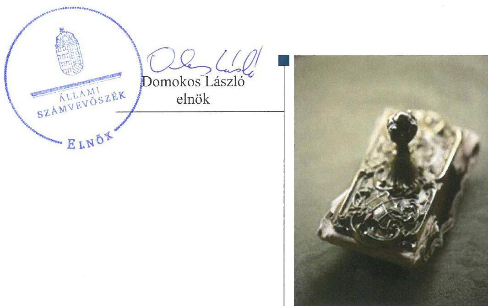
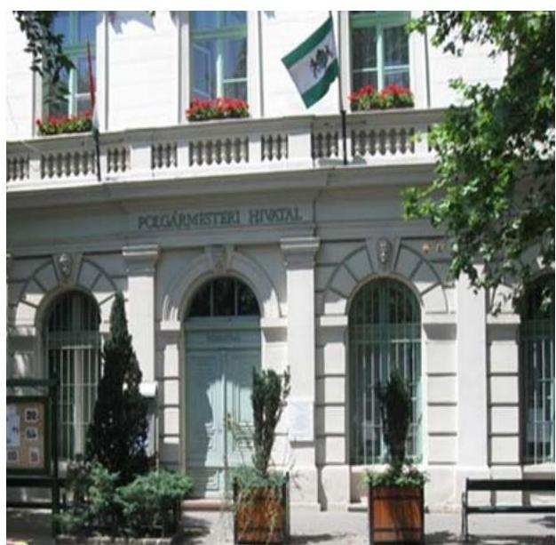

# Jelentés 

## Utóellenőrzések

Budapest Főváros IX. kerület Ferencváros Önkormányzata vagyongazdálkodása szabályszerűségének utóellenőrzése 2017.

---

# Jellentés 

## Utóellenőrzések

Budapest Főváros IX. kerület Ferencváros Önkormányzata vagyongazdálkodása
szabályszerúségének utóellenőrzése
2017. 08. hó 09. nap

---

# AZ ELLENŐRZÉST FELÜGYELTE: 

DR. BENEDEK MÁRIA felügyeleti vezető

## AZ ELLENŐRZÉST VEZETTE ÉS A VÉGREHAJTÁSÁÉRT FELELŐS:

KLINGA LÁSZLÓ ellenőrzésvezető

## A PROGRAM ÖSSZEÁLLÍTÁSÁÉRT FELELŐS:

JANIK JÓZSEF LÁSZLÓ osztályvezető

## A TÉMÁHOZ KAPCSOLÓDÓ KORÁBBI SZÁMVEVŐSZÉKI JELENTÉSEK:

- címe: Jelentés az önkormányzati vagyongazdálkodás szabályszerűségi ellenőrzéséről - Budapest Főváros IX. kerület Ferencváros Önkormányzata
- sorszáma: 14147

IKTATÓSZÁM: V-1304-027/2016.
TÉMASZÁM: 2338
ELLENŐRZÉS-AZONOSÍTÓ SZÁM: V075563

---

# TARTALOMJEGYZÉK 

■ ÖSSZEGZÉS ..... 5
■ AZ ELLENŐRZÉS CÉLJA ..... 6
■ AZ ELLENŐRZÉS TERÜLETE ..... 7
■ AZ ELLENŐRZÉS HÁTTERE, INDOKOLTSÁGA ..... 8
■ A JELENTÉS LÉNYEGES KÉRDÉSKÖRE ..... 9
■ ELLENŐRZÉS HATÓKÖRE ÉS MÓDSZEREI ..... 10
■ MEGÁLLAPÍTÁSOK ..... 12
■ MELLÉKLETEK ..... 15
I. Sz. melléklet: Az ÁSZ 14147 számú jelentéséhez kapcsolódó intézkedési terv végrehajtása.. 15
■ FÜGGELÉK: ÉSZREVÉTELEK ..... 17
■ RÖVIDÍTÉSEK JEGYZÉKE ..... 19

---

.

---

# ÖSSZEGZÉS 

Az Állami Számvevőszék Budapest Főváros IX. kerület Ferencváros Önkormányzata vagyongazdálkodása szabályszerűségének utóellenőrzése során megállapította, hogy az intézkedési tervben meghatározott feladatokat végrehajtotta, ezáltal a vagyongazdálkodásban, a vagyonnyilvántartás átláthatóságában és a közpénzekkel való felelős gazdálkodásban rejlő kockázatok csökkentek.

## Az ellenőrzés társadalmi indokoltsága

Az Állami Számvevőszék stratégiájában célul tűzte ki a számvevőszéki munka hasznosulásának javítását. Ezzel összhangban ellenőrzi, hogy az ellenőrzött szervezetek megvalósították-e a korábbi ellenőrzései által feltárt hibák, hiányosságok és szabálytalanságok megszüntetése céljából elkészített intézkedési terveikben foglaltakat. A rendszeres utóellenőrzések hozzájárulnak a szükséges intézkedések tényleges végrehajtásához, ezáltal a közpénzügyek rendezettségének javulásához, igazolják, hogy lezárult a következmények nélküli ellenőrzések időszaka.

## Főbb megállapítások, következtetések

Budapest Főváros IX. kerület Ferencváros Önkormányzata az intézkedési tervben meghatározott öt feladatot végrehajtotta, ezáltal a vagyongazdálkodás szabályszerűsége javult.

A polgármester az intézkedési tervben meghatározottaknak megfelelően gondoskodott a Budapest Főváros IX. kerület Ferencváros Önkormányzata kizárólagos tulajdonában lévő társasága által beszerzett fogorvosi eszközök lízingszerződéseihez kapcsolódó készfizető kezesi szerződések utólagos jóváhagyásáról, ezáltal javította a vagyongazdálkodás szabályszerűségét. A jegyző a 2013. évi zárszámadási rendeletben gondoskodott a nemzetgazdasági szempontból kiemelt jelentőségű nemzeti vagyon értékének a Vagyongazdálkodási rendelettel összhangban történő bemutatásáról, elősegítve ezzel a felelős vagyongazdálkodást. Biztosította az ingatlanvagyon kataszter és a számviteli nyilvántartás között a forgalomképesség alapján csoportosított bruttó érték egyezőségét, amellyel a vagyonnyilvántartás átláthatósága javult. A Képviselő-testület az etikai szabályzat megalkotásával meghatározta az etikai elvárásokat és a hivatásetikai alapelveket, ezáltal a múködésben rejlő kockázatok csökkentek. A jegyző gondoskodott jegyzői intézkedésben a - jogszabályi előírásoknak megfelelő - külső ellenőrzésekről vezetendő nyilvántartás rendjének kialakításáról.

A jegyző az intézkedési tervben rögzített feladatok végrehajtásáról nem vezette a jogszabályi előírásnak megfelelő nyilvántartást.

---

# AZ ELLENŐRZÉS CÉLJA 

Az ellenőrzés célja annak értékelése volt, hogy a számvevőszéki jelentésben foglalt intézkedést igénylő megállapításokkal és javaslatokkal összhangban készített intézkedési tervben meghatározott feladatokat az ellenőrzött szervezet végrehajtotta-e.

---

# **A2 ELLENŐRZÉS TERÜLETE**

## **Budapest Főváros IX. kerület Ferencváros Önkormányzata**

Budapest Főváros IX. kerület Ferencváros lakossága 2016. január 1-jén a Központi Statisztikai Hivatal Magyarország Közigazgatási Helynévkönyvében közzétett adatok szerint 59 056 fő volt.

A polgármester¹ a 2010. évi önkormányzati választások óta tölti be hivatalát, a jegyző² 2014. november 1-től látja el feladatát.

Budapest Főváros IX. kerület Ferencváros Önkormányzata a 2015. évi költségvetési beszámolója szerint 15 625,9 millió Ft költségvetési bevételt ért el, valamint 14 912,3 millió Ft költségvetési kiadást teljesített. 2015. december 31-én a könyvviteli mérleg szerinti követelések állományának értéke 3 783,2 millió Ft, a kötelezettségek állományának értéke 2 170,5 millió Ft, mérlegfőösszege 226 117,3 millió Ft volt.

Az ÁSZ³ a 2013. évben ellenőrizte Budapest Főváros IX. kerület Ferencváros Önkormányzatánál az önkormányzati vagyongazdálkodás szabályszerűségét a 2009. január 1. és 2012. december 31. közötti időszak vonatkozásában. Az erről szóló 14147 számú jelentését az ÁSZ 2014. október 22-én tette közzé. Az ellenőrzés célja annak értékelése volt, hogy az Önkormányzat szabályszerűen alakította-e ki a vagyongazdálkodási tevékenységet, annak szervezeti kereteit szabályozta-e, biztosította-e a vagyongazdálkodás törvényességét, szabályszerűségét, hasznosította-e a külső és belső ellenőrzések megállapításait, javaslatait. Az ÁSZ jelentésben foglalt javaslatok tekintetében a Képviselő-testület⁴ intézkedési tervet fogadott el.

Az utóellenőrzés – a 2014. október 22-től 2017. április 3-ig végrehajtott feladatokat figyelembe véve – az ÁSZ jelentésben a polgármester és a jegyző részére megfogalmazott intézkedést igénylő megállapításokra és javaslatokra készített, az ÁSZ részére megküldött intézkedési tervben foglalt feladatok megvalósításának ellenőrzésére, illetve értékelésére fókuszált.

---

# AZ ELLENŐRZÉS HÁTTERE, INDOKOLTSÁGA 

Az ÁSZ tv. ${ }^{5}$ 33. § (1) bekezdése értelmében a számvevőszéki jelentések intézkedést igénylő megállapításaihoz kapcsolódóan az ellenőrzött szervezet vezetője intézkedési tervet köteles összeállítani, és az ÁSZ részére megküldeni. Az intézkedési tervben foglaltak megvalósítását - az ÁSZ tv. 33. § (7) bekezdésében foglaltak alapján - az ÁSZ utóellenőrzés keretében ellenőrizheti. Az intézkedések megvalósulásának értékelése során az ÁSZ figyelembe veszi az ellenőrzött szervezetek működési feltételeiben, valamint a jogszabályi előírásokban bekövetkezett változásokat.

Az intézkedési tervben foglalt feladatok hiányos, illetve késedelmes végrehajtása, valamint megvalósításának elmaradása azt mutatja, hogy az ellenőrzések során feltárt hibák, hiányosságok és szabálytalanságok megszüntetése nem kapott kellő hangsúlyt. Ez a szabályszerű működés és a felelős vezetői magatartás vonatkozásában kockázatot hordoz. E kockázatok feltárásával az ÁSZ utóellenőrzési rendszere fokozza a fegyelmet, és igazolja, hogy a közpénzzel való szabályos gazdálkodás felelőssége elől nem lehet kitérni.

Az utóellenőrzés négy szinten hasznosulhat:
$\longrightarrow$ A társadalom szintjén az utóellenőrzés jelzi, hogy a számvevőszéki ellenőrzés megállapításainak van következménye: a hiányosságok megszüntetésére az ellenőrzött szervezet által meghatározott intézkedések végrehajtását is számon kéri az ÁSZ.
$\longrightarrow$ Az ellenőrzött terület szintjén az utóellenőrzés tájékoztatást nyújt a terület döntéshozóinak a hiányosságok kiküszöbölésének jó gyakorlatairól, ezzel lehetőséget biztosítva arra, hogy az ÁSZ ellenőrzési megállapításai, javaslatai a terület nem ellenőrzött szervezeteinek a működése során is hasznosuljanak.
$\longrightarrow$ Az ellenőrzött szervezet szintjén az utóellenőrzés feltárja, hogy a szervezet az intézkedések végrehajtásával hasznosította-e a korábbi ellenőrzési jelentésben a hiányosságok megszüntetése, illetve a kockázatok kezelése érdekében megfogalmazott javaslatokat.
$\longrightarrow$ Az ÁSZ szintjén az utóellenőrzés visszacsatolást ad az ellenőrzési jelentések hasznosulásáról, az intézkedések elmaradása vagy részleges megvalósulása a további ellenőrzésekhez kockázati jelzésként szolgál.

---

# A JELENTÉS LÉNYEGES KÉRDÉSKÖRE 

Az Önkormányzat az intézkedési tervben foglaltakat az elöirt határidőben végrehajtotta-e?

---

# ELLENŐRZÉS HATÓKÖRE ÉS MÓDSZEREI 

## Az ellenőrzés típusa

Megfelelőségi ellenőrzés.

## Az ellenőrzött időszak

Az utóellenőrzés alapját képező ÁSZ jelentés közzétételének napjától (2014. október 22.) az ellenőrzésről szóló kiértesítő levél keltének napjáig (2017. április 3.) tartó időszak.

## Az ellenőrzés tárgya

Az ÁSZ tv. 2011. július 1-jei hatálybalépését követően a számvevőszéki jelentésben foglalt intézkedést igénylő megállapításokkal és javaslatokkal összhangban - Budapest Főváros IX. kerület Ferencváros Önkormányzata által - készített intézkedési tervben foglaltak végrehajtásának ellenőrzése volt.

Az ellenőrzés kiterjedt minden olyan körülményre és adatra, amely az ÁSZ jogszabályban meghatározott feladatainak teljesítéséhez, valamint a program végrehajtása folyamán felmerült újabb összefüggések feltárásához szükséges volt.

## Az ellenőrzött szervezet

Budapest Főváros IX. kerület Ferencváros Önkormányzata

## Az ellenőrzés jogalapja

Az ÁSZ az ÁSZ törvényben meghatározott feladatkörében ellenőrzi a központi költségvetés végrehajtását, az államháztartás gazdálkodását, az államháztartásból származó források felhasználását és a nemzeti vagyon kezelését.

Az ÁSZ tv. 1. § (3) bekezdése szerint az ÁSZ általános hatáskörrel végzi a közpénzekkel és az állami és önkormányzati vagyonnal való felelős gazdálkodás ellenőrzését.

Az ÁSZ tv. 33. § (7) bekezdése alapján a 33. § (1)-(2) bekezdése szerinti intézkedési tervben foglaltak megvalósítását az ÁSZ utóellenőrzés keretében ellenőrizheti.

---

# Az ellenőrzés módszerei 

Az ÁSZ az ellenőrzést a nemzetközi standardokat irányadónak tekintve az ellenőrzési program ellenőrzési kérdései, az ellenőrzött időszakban hatályos jogszabályok, az ellenőrzés szakmai szabályok és módszertanok figyelembevételével, önálló ellenőrzés keretében végezte.

Az ÁSZ az ellenőrzés ideje alatt az Önkormányzattal történő kapcsolattartást az ÁSZ SZMSZ ${ }^{6}$-ének vonatkozó előírásai alapján biztosította.

Az utóellenőrzés megállapításait elsősorban az ÁSZ rendelkezésére álló, valamint az ellenőrzött szervezettől elektronikusan bekért dokumentumok alapozták meg.

Az ellenőrzési bizonyítékként felhasználható adatforrások közé tartoztak egyrészt a szakmai programban felsorolt adatforrások, másrészt minden - az ellenőrzés folyamán feltárt, az ellenőrzés szempontjából információt tartalmazó - dokumentum.

Az intézkedési tervben előírt feladatokat, azok végrehajthatósága, illetve végrehajtása szempontjából az alábbiak szerint kell értékelni:
$\longrightarrow$ „határidőben végrehajtott" a feladat, ha a teljesítés dokumentáltan, az intézkedési tervben előírt határidőben és tartalommal megtörtént;
$\longrightarrow$ „határidőn túl végrehajtott" a feladat, ha annak teljesítése az intézkedési tervben meghatározott módon, de az előírt határidőn túl történt meg;
$\longrightarrow$ „részben végrehajtott" a feladat, ha végrehajtása teljes körűen az intézkedési tervben előírt módon nem történt meg;
$\longrightarrow$ „nem végrehajtott" a feladat, ha a végrehajtás nem történt meg, vagy amennyiben a teljesítést nem dokumentálták;
$\longrightarrow$ „okafogyottá vált" a feladat, ha végrehajtására - meghatározott esemény bekövetkezése, továbbá külső körülmény, a működést érintő feltétel változása miatt - már nincs szükség, illetve lehetőség, és egyértelműen megállapítható, hogy az intézkedést szükségessé tevő körülmény a jövőben nem fordulhat elő;
$\longrightarrow$ „nem időszerű" az a feladat, amelynek ellenőrzési időszakon belüli végrehajtására azért nem került (kerülhetett) sor, mert az intézkedés alapjául szolgáló esemény nem következett be, de annak jövőbeni előfordulása lehetséges, a végrehajtása nem volt esedékes, vagy a végrehajtás határideje még nem járt le.
Az ellenőrzés lefolytatásához az ellenőrzött szervezet a tanúsítványok elektronikus kitöltésével, valamint az ÁSZ által kért dokumentumok elektronikus megküldésével szolgáltatott adatokat, amelyek valódiságát és teljes körűségét az ellenőrzött szervezet vezetője által tett teljességi és hitelességi nyilatkozat igazolta. Az így rendelkezésre bocsátott adatok, információk kontrollja az ellenőrzés keretében történt.

---

# MEGÁLLAPÍTÁSOK 

## Az Önkormányzat az intézkedési tervben foglaltakat az előírt határidőben végrehajtotta-e?

Összegző megállapítás

Az Önkormányzat az intézkedési tervben meghatározott öt feladatot határidőben végrehajtotta. Az intézkedési tervben meghatározott feladatok végrehajtásáról az Önkormányzat a jogszabályban előírt nyilvántartást nem vezette.

Az ÁSZ a számvevőszéki jelentésében ${ }^{7}$ a polgármester részére egy, a jegyző részére négy intézkedést igénylő megállapítást és javaslatot fogalmazott meg. Az ÁSZ részére a polgármester által megküldött intézkedési tervben a hiányosságok, szabálytalanságok megszüntetésére az aljegyző részére egy intézkedési feladat került meghatározásra. Az intézkedési tervben a polgármester négy intézkedést igénylő megállapítás és javaslat esetében arról tájékoztatta az ÁSZ-t, hogy a javaslatokra történő intézkedések megtörténtek.

Az intézkedési tervben meghatározott feladatokat, határidőket, felelősöket és a feladatok végrehajtását az I. számú melléklet mutatja be.

Az ÁSZ javaslatai alapján készített intézkedési tervben rögzített feladatok végrehajtásáról a jegyző nem vezette a Bkr ${ }^{8}$. 14. § (1) bekezdésében előírtaknak megfelelő nyilvántartást.

Az Önkormányzat ${ }^{9}$ intézkedési tervében meghatározott feladatok végrehajtásának értékelési kategóriák szerinti megoszlását az 1. ábra szemlélteti.

1. ábra

A feladatok végrehajtásának
értékelési kategóriák szerinti
megoszlása

- Hátáridőben végrehajtott

---

# HATÁRIDŐBEN VÉGREHAJTOTT feladatok: 

1. Az Önkormányzat kizárólagos tulajdonában lévő FESZ Kft. ${ }^{10}$ által beszerzett fogorvosi eszközök lizingszerződéseihez kapcsolódó, készfizető kezesi szerződések utólagos jóváhagyásáról a Képviselőtestület határozatban döntött.
2. Az Önkormányzat a 2013. évi zárszámadási rendeletében ${ }^{11}$ a nemzetgazdasági szempontból kiemelt jelentőségű nemzeti vagyon értékét a Vagyongazdálkodási rendeletben ${ }^{12}$ foglaltakkal összhangban mutatta be.
3. Az Önkormányzat a Kormányrendeletben ${ }^{13}$ rögzítetteknek megfelelően biztosította az ingatlanvagyon kataszter és a számviteli nyilvántartás között a forgalomképesség alapján csoportosított bruttó érték egyezőségét.
4. A Képviselő-testület határozatban elfogadta az etikai szabályzatot, amelyben meghatározta a Bkr. előírásainak megfelelő etikai elvárásokat és a $\mathrm{Kttv}^{14}$. szerinti hivatásetikai alapelveket és az etikai eljárás szabályait.
5. A jegyző a 2014. június 2-ától hatályba helyezett jegyzői intézkedésben ${ }^{15}$ rendelkezett a Bkr.-ben előírt külső ellenőrzések nyilvántartásának vezetéséről. Az intézkedés mellékletét képező nyilvántartás tartalma megfelelt a Bkr.-ben foglalt előírásoknak.

---

.

---

# MELLÉKLETEK

- I. SZ. MELLÉKLET: AZ ÁSZ 14147 SZÁMÚ JELENTÉSÉHEZ KAPCSOLÓDÓ INTÉZKEDÉSI TERV VÉGREHAJTÁSA

|  Sorszám | Intézkedési tervben meghatározott feladat | Az intézkedési tervben meghatározott határidő | Az intézkedési tervben meghatározott feladat felelőse | A feladat végrehajtása  |
| --- | --- | --- | --- | --- |
|   | 1. | 2. | 3.
Határidőben végrehajtott feladat |   |
|  1. | A FESZ Kft. által beszerzett fogorvosi eszközök lizingszerződéseihez kapcsolódó, öszszesen 6,5 millió Ft összegű készfizető kezesi szerződések utólagos jóváhagyásáról a Képviselő-testület 180/2014.(VI. 05.) sz. határozatával döntött.
A javaslat intézkedése megtörtént. |  | polgármester | A FESZ Kft. által beszerzett fogorvosi eszközök lizingszerződéseihez kapcsolódó, összesen 6,5 millió Ft összegű készfizető kezesi szerződések utólagos jóváhagyásáról a Képviselő-testület a 180/2014.(VI. 05.) sz. határozatában döntött.  |
|  2. | A 2013. évi zárszámadásról szóló 13/2014.(V.20.) rendelet részeként elkészített 17. sz. melléklet szerinti vagyonkimutatásban a nemzetgazdasági szempontból kiemelt jelentőségű nemzeti vagyont a vagyongazdálkodási rendelet 5.§ (1) bekezdés B. pontjában foglaltakkal összhangban mutattuk be.
A javaslat intézkedése megtörtént. |  | jegyző | Az Önkormányzat a 2013. évi zárszámadási rendeletének vagyonkimutatásában a nemzetgazdasági szempontból kiemelt jelentőségű nemzeti vagyon értéke a Vagyongazdálkodási rendelet 5. § (1) bekezdés B. pontjában foglaltakkal összhangban volt. Az Önkormányzat kizárólagos tulajdonában levő öt gazdasági társaságban meglevő összesen 586,1 millió Ft részesedést - a Vagyongazdálkodási rendelet 5. § (1) bekezdés B. pont a) alpontjának megfelelően - a forgalomképtelen törzsvagyon nemzetgazdasági szempontból kiemelt jelentőségű nemzeti vagyon kategóriájába sorolta.  |
|  3. | A 2013. évi KSH 1616 nyilvántartási számú "Jelentés az önkormányzatok tulajdonában levő ingatlanvagyonról" szóló statisztika és a számviteli bruttó érték egyezősége a 147/1992. (XI. 6.) Korm. rendelet 1.§ (3) bekezdésében és a 2. számú mellékletben rögzítetteknek megfelelően megtörtént, az ingatlanvagyon kataszter és a számviteli nyilvántartás szerinti bruttó érték adatok |  | jegyző | Az Önkormányzat a 2013. évi zárszámadás megalkotásakor - a Kormányrendelet 1. § (3) bekezdésében és a 2. számú mellékletben rögzítetteknek megfelelően - biztosította az ingatlanvagyon kataszter és a számviteli nyilvántartás szerinti, forgalomképesség alapján csoportosított bruttó érték (231,4 Mrd Ft) egyezőségét.  |

---

|  4. | A javaslat intézkedése megtörtént. |  |  | Az Önkormányzat a Képviselő-testület 188/2014. (VI. 05.) határozatával elfogadott etikai szabályzat megalkotásával meghatározta a Bkr. 6. § (1) bekezdés c) pont előírásának megfelelő etikai elvárásokat és a Kttv. 231. § (1) bekezdése szerinti hivatásetikai alapelveket.  |
| --- | --- | --- | --- | --- |
|  5. | A 15/2014.(VI. 02.) jegyzői intézkedés rendelkezik Budapest Főváros IX. kerület Ferencváros Önkormányzatát, valamint a Budapest Főváros IX. kerület Ferencvárosi Polgármesteri Hivatalt érintő külső ellenőrzések nyilvántartás vezetésének rendjéről. A Bkr. 14. § (1) bekezdésében foglaltak szerint a külső ellenőrzések nyilvántartásának vezetéséről a jövőben a jegyzői intézkedésben foglaltak alapján gondoskodunk. |  |  | A jegyző 2014. június 2-ától hatályba léptette a 15/2014. (VI. 02.) jegyzői intézkedést, amelyben rendelkezett a Bkr. 14. § (1) bekezdésében foglaltak szerint a külső ellenőrzések nyilvántartásának vezetéséről. Az intézkedés mellékletét képező nyilvántartás tartalma megfelelő a Bkr. 47.§ (2) bekezdésében foglalt tartalmi előírásoknak.  |

*Fonrás: ÁSZ által készített táblázat*

---

# FÜGGELÉK: ÉSZREVÉTELEK 

A jelentéstervezetet a Számvevőszék 15 napos észrevételezésre megküldte az ellenőrzött szervezet vezetőjének az ÁSZ tv. 29. §* (1) bekezdése előírásának megfelelően.

Az ellenőrzött szervezet vezetője az ÁSZ tv. 29. § (2) bekezdésében foglalt észrevételezési jogával nem élt, a jelentéstervezetre észrevételt nem tett.

[^0]
[^0]:    * 29. § (1) Az Állami Számvevőszék az ellenőrzési megállapításait megküldi az ellenőrzött szervezet vezetőjének vagy az általa megbízott személynek, és annak, akinek személyes felelősségét állapította meg.
    (2) Az ellenőrzött szervezet vezetője és a felelősként megjelölt személy az ellenőrzés megállapításaira tizenöt napon belül írásban észrevételt tehet.
    (3) Az Állami Számvevőszék az észrevételre a beérkezésétől számított harminc napon belül írásban válaszol. A figyelembe nem vett észrevételeket köteles a jelentésben feltüntetni, és megindokolni, hogy azokat miért nem fogadta el.

---

.

---

# RÖVIDÍTÉSEK JEGYZÉKE 

${ }^{1}$ polgármester
${ }^{2}$ jegyző
${ }^{3}$ ÁSZ
${ }^{4}$ Képviselő-testület
${ }^{5}$ ÁSZ tv.
${ }^{6}$ SZMSZ
${ }^{7}$ számvevőszéki jelentés
${ }^{8}$ Bkr.
${ }^{9}$ Önkormányzat
${ }^{10}$ FESZ Kft.
${ }^{11}$ 2013. évi zárszámadási rendelet
${ }^{12}$ Vagyongazdálkodási rendelet
${ }^{13}$ Kormányrendelet
${ }^{14}$ Kttv.
${ }^{15}$ jegyzői intézkedés

Budapest Főváros IX. kerület Ferencváros Önkormányzata polgármestere
Budapest Főváros IX. kerület Ferencváros Önkormányzata jegyzője
Állami számvevőszék
Budapest Főváros IX. kerület Ferencváros Önkormányzata Képviselő-testülete
2011. évi LXVI. törvény az Állami Számvevőszékről (hatályos: 2011. július 1-jétől)
az Állami Számvevőszék elnökének 3/2016. (XII. 29.) ÁSZ utasítása az Állami
Számvevőszék Szervezeti és Működési Szabályzatáról (hatályos: 2017. január 1-jétől)
az ÁSZ 14147 számú jelentése - Jelentés az önkormányzati vagyongazdálkodás szabályszerűségi ellenőrzéséről - Budapest Főváros IX. kerület Ferencváros Önkormányzata
370/2011. (XII.31.) Korm. rendelet a költségvetési szervek belső
kontrollrendszeréről és belső ellenőrzéséről (hatályos: 2012. január 1-jétől)
Budapest Főváros IX. kerület Ferencváros Önkormányzata
Ferencvárosi Egészségügyi Szolgáltató Közhasznú Nonprofit Kft.
Budapest Főváros IX. kerület Ferencváros Önkormányzata Képviselő-testületének 13/2014. (V. 20.) önkormányzati rendelete az Önkormányzat 2013. évi zárszámadásáról
21/2012. (VI. 12.) rendelet Budapest Főváros IX. kerület Ferencváros Önkormányzata vagyonáról, a vagyontárgyak feletti tulajdonosi jogok gyakorlásáról és a vagyongazdálkodás szabályairól (hatályos 2012. július 1-től) a 147/1992. (XI. 6.) Korm. rendelet az önkormányzatok tulajdonában lévő ingatlanvagyon nyilvántartási és adatszolgáltatási rendjéről
2011. évi CXCIX. törvény a közszolgálati tisztviselőkről
a 15/2014. (VI. 02.) jegyzői intézkedés Budapest Főváros IX. kerület Ferencváros Önkormányzatát, valamint a Budapest Főváros IX. kerület Ferencvárosi Polgármesteri Hivatalt érintő külső ellenőrzések nyilvántartásának vezetéséről (hatályos: 2014. június 2-tól.)

---

ÁLLAMI SZÁMVEVŐSZÉK
1052 Budapest, Apáczai Csere János utca 10.
Levélcím: 1364 Budapest 4. Pf. 54
Telefon: +36 14849100 Telefax: +36 14849200
www.asz.hu