# Jelentés 

## Utóellenőrzések

Budapest Főváros X. kerület Kőbányai Önkormányzat vagyongazdálkodása szabályszerűségének utóellenőrzése 2017. 08. hó 09. nap
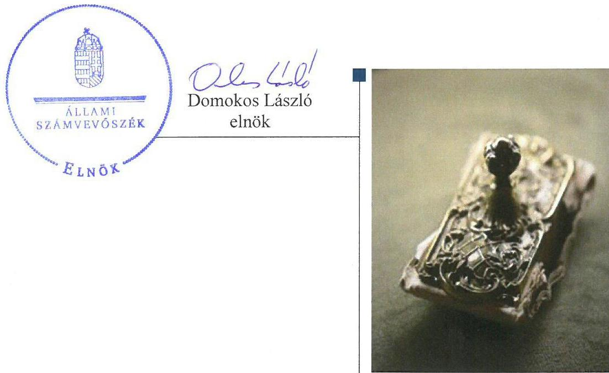

---

# AZ ELLENŐRZÉST FELÜGYELTE: 

DR. BENEDEK MÁRIA felügyeleti vezető

## AZ ELLENŐRZÉST VEZETTE ÉS A VÉGREHAJTÁSÁÉRT FELELŐS:

KLINGA LÁSZLÓ ellenőrzésvezető

## A PROGRAM ÖSSZEÁLLÍTÁSÁÉRT FELELŐS:

JANIK JÓZSEF LÁSZLÓ osztályvezető

## A TÉMÁHOZ KAPCSOLÓDÓ KORÁBBI SZÁMVEVŐSZÉKI JELENTÉSEK:

- címe: Jelentés az önkormányzati vagyongazdálkodás szabályszerűségi ellenőrzéséről - Budapest Főváros X. kerület Kőbánya
- sorszáma: 13084

IKTATÓSZÁM: V-1305-037/2016.
TÉMASZÁM: 2339
ELLENŐRZÉS-AZONOSÍTÓ SZÁM: V075564

---

# TARTALOMJEGYZÉK 

■ ÖSSZEGZÉS ..... 5
■ AZ ELLENŐRZÉS CÉLJA ..... 6
■ AZ ELLENŐRZÉS TERÜLETE ..... 7
■ AZ ELLENŐRZÉS HÁTTERE, INDOKOLTSÁGA ..... 8
■ A JELENTÉS LÉNYEGES KÉRDÉSKÖRE ..... 9
■ ELLENŐRZÉS HATÓKÖRE ÉS MÓDSZEREI ..... 10
■ MEGÁLLAPÍTÁSOK ..... 12
■ MELLÉKLETEK ..... 15
I. Sz. melléklet: Az ÁSZ 13084 számú jelentéséhez kapcsolódó intézkedési terv végrehajtása.. 15
■ FÜGGELÉK: ÉSZREVÉTELEK ..... 17
■ RÖVIDÍTÉSEK JEGYZÉKE ..... 33

---

.

---

# ÖSSZEGZÉS 

Az Állami Számvevőszék Budapest Főváros X. kerület Kőbányai Önkormányzat vagyongazdálkodása szabályszerűségének utóellenőrzése során megállapította, hogy az intézkedési tervében meghatározott feladatok közül egyet határidőben, kettőt részben hajtott végre. A csatornahálózat jogszabályban előírt használatba adása, továbbá az ingatlanvagyon-kataszter adatainak a közhiteles ingatlan-nyilvántartás adataival való egyeztetése nem történt meg, így a vagyongazdálkodás, a vagyonnyilvántartás átláthatósága továbbra sem volt biztosított.

## Az ellenőrzés társadalmi indokoltsága

Az Állami Számvevőszék stratégiájában célul tűzte ki a számvevőszéki munka hasznosulásának javítását. Ezzel összhangban ellenőrzi, hogy az ellenőrzött szervezetek megvalósították-e a korábbi ellenőrzései által feltárt hibák, hiányosságok és szabálytalanságok megszüntetése céljából elkészített intézkedési terveikben foglaltakat. A rendszeres utóellenőrzések hozzájárulnak a szükséges intézkedések tényleges végrehajtásához, ezáltal a közpénzügyek rendezettségének javulásához, igazolják, hogy lezárult a következmények nélküli ellenőrzések időszaka.

## Főbb megállapítások, következtetések

Az Önkormányzat ${ }^{1}$ az intézkedést igénylő megállapításokhoz és javaslatokhoz kapcsolódóan összeállított intézkedési tervben meghatározott három feladatból egyet határidőben, kettőt részben hajtott végre.

A jegyző az intézkedési tervben meghatározott határidőben gondoskodott arról, hogy az éves költségvetések és a költségvetések végrehajtásáról készített beszámolók a jogszabályi előírásoknak megfelelően kerüljenek közzétételre.

A polgármester a Fővárosi Vízművek Zrt.-vel, valamint a Fővárosi Csatornázási Művek Zrt.-vel kötött térítésmentes vagyonátadások szerződéseit megvizsgáltatta. Ennek eredményeképpen a vízvezeték-hálózat a jogszabályi előírásoknak megfelelően Budapest Főváros Önkormányzat tulajdonába átadásra került, ezzel biztosítva a szabályszerű működést. A csatornahálózat használatba adásának, továbbá az ingatlanvagyon-kataszter adatainak az ingatlanügyi hatósággal történő egyeztetésének elmaradása miatti jogszabálysértő gyakorlat továbbra is kockázatot hordoz Budapest Főváros X. kerület Kőbányai Önkormányzat vagyongazdálkodása és a közpénzekkel történő felelős gazdálkodása átláthatóságában. A polgármester kivizsgáltatta a vízi közművek térítésmentes átadásával kapcsolatosan feltárt jogszabálysértést, azonban felelősségre vonást a felelősségre vonható személyek közszolgálati jogviszonyának megszűnése miatt nem kezdeményezett.

---

# AZ ELLENŐRZÉS CÉLJA 

Az ellenőrzés célja annak értékelése volt, hogy a számvevőszéki jelentésben foglalt intézkedést igénylő megállapításokkal és javaslatokkal összhangban készített intézkedési tervben meghatározott feladatokat az ellenőrzött szervezet végrehajtotta-e.

---

# AZ ELLENŐRZÉS TERÜLETE

## Budapest Főváros X. kerület Kőbányai Önkormányzat

Budapest Főváros X. kerület Kőbánya lakossága 2016. január 1-jén a Központi Statisztikai Hivatal Magyarország közigazgatási helynévkönyvében közzétett adatok szerint 78 414 fő volt.

A polgármester³ a 2010. évi önkormányzati választások óta tölti be hivatalát, a jegyző⁴ 2011. március 11-étől látja el feladatát.

Budapest Főváros X. kerület Kőbányai Önkormányzat a 2015. évi költségvetési beszámolója szerint 15 599,8 millió Ft költségvetési bevételt ért el, valamint 12 730,6 millió Ft költségvetési kiadást teljesített. 2015. december 31-én a könyvviteli mérleg szerinti követelések állományának értéke 2 835,3 millió Ft, a kötelezettségek állományának értéke 1 112,5 millió Ft, mérlegfőösszege 102 860,1 millió Ft volt.

Az ÁSZ⁴ a 2013. évben ellenőrizte Budapest Főváros X. kerület Kőbányai Önkormányzatnál az önkormányzati vagyongazdálkodás szabályszerűségét a 2007. január 1. és 2011. december 31. közötti időszak vonatkozásában. Az erről szóló 13084 számú jelentését az ÁSZ 2013. szeptember 12-én tette közzé. Az ellenőrzés célja annak értékelése volt, hogy az önkormányzat szabályszerűen alakította-e ki a vagyongazdálkodási tevékenységet, annak szervezeti kereteit szabályozták-e, biztosította-e a vagyongazdálkodás törvényességét, szabályszerűségét, hasznosították-e a külső és belső ellenőrzések megállapításait, javaslatait. Az ÁSZ jelentésben foglalt javaslatok tekintetében a Képviselő-testület⁵ a 470/2013. (X. 17.) KÖKT határozatában három feladatból álló intézkedési tervet⁶ fogadott el, amit a 218/2014. (IV. 17.) KÖKT határozatával kiegészített.

Az utóellenőrzés – a 2013. szeptember 12-től 2017. április 3-ig végrehajtott feladatokat figyelembe véve – az ÁSZ jelentésben a polgármester és a jegyző részére megfogalmazott intézkedést igénylő megállapításokra és javaslatokra készített, az ÁSZ részére megküldött intézkedési tervben foglalt feladatok megvalósításának ellenőrzésére, illetve értékelésére fókuszált.

---

# AZ ELLENŐRZÉS HÁTTERE, INDOKOLTSÁGA 

Az ÁSZ tv. ${ }^{7}$ 33. § (1) bekezdése értelmében a számvevőszéki jelentések intézkedést igénylő megállapításaihoz kapcsolódóan az ellenőrzött szervezet vezetője intézkedési tervet köteles összeállítani, és az ÁSZ részére megküldeni. Az intézkedési tervben foglaltak megvalósítását - az ÁSZ tv. 33. § (7) bekezdésében foglaltak alapján - az ÁSZ utóellenőrzés keretében ellenőrizheti. Az intézkedések megvalósulásának értékelése során az ÁSZ figyelembe veszi az ellenőrzött szervezetek működési feltételeiben, valamint a jogszabályi előírásokban bekövetkezett változásokat.

Az intézkedési tervben foglalt feladatok hiányos, illetve késedelmes végrehajtása, valamint megvalósításának elmaradása azt mutatja, hogy az ellenőrzések során feltárt hibák, hiányosságok és szabálytalanságok megszüntetése nem kapott kellő hangsúlyt. Ez a szabályszerű működés és a felelős vezetői magatartás vonatkozásában kockázatot hordoz. E kockázatok feltárásával az ÁSZ utóellenőrzési rendszere fokozza a fegyelmet, és igazolja, hogy a közpénzzel való szabályos gazdálkodás felelőssége elől nem lehet kitérni.

Az utóellenőrzés négy szinten hasznosulhat:
A társadalom szintjén az utóellenőrzés jelzi, hogy a számvevőszéki ellenőrzés megállapításainak van következménye: a hiányosságok megszüntetésére az ellenőrzött szervezet által meghatározott intézkedések végrehajtását is számon kéri az ÁSZ.

- Az ellenőrzött terület szintjén az utóellenőrzés tájékoztatást nyújt a terület döntéshozóinak a hiányosságok kiküszöbölésének jó gyakorlatairól, ezzel lehetőséget biztosítva arra, hogy az ÁSZ ellenőrzési megállapításai, javaslatai a terület nem ellenőrzött szervezeteinek a működése során is hasznosuljanak.
- Az ellenőrzött szervezet szintjén az utóellenőrzés feltárja, hogy a szervezet az intézkedések végrehajtásával hasznosította-e a korábbi ellenőrzési jelentésben a hiányosságok megszüntetése, illetve a kockázatok kezelése érdekében megfogalmazott javaslatokat.
- Az ÁSZ szintjén az utóellenőrzés visszacsatolást ad az ellenőrzési jelentések hasznosulásáról, az intézkedések elmaradása vagy részleges megvalósulása a további ellenőrzésekhez kockázati jelzésként szolgál.

---

# A JELENTÉS LÉNYEGES KÉRDÉSKÖRE 

Az Önkormányzat az intézkedési tervben foglaltakat az előírt határidőben végrehajtotta-e?

---

# ELLENŐRZÉS HATÓKÖRE ÉS MÓDSZEREI 

## Az ellenőrzés típusa

Megfelelőségi ellenőrzés.

## Az ellenőrzött időszak

Az utóellenőrzés alapját képező ÁSZ jelentés közzétételének napjától (2013. szeptember 12.) az ellenőrzésről szóló kiértesítő levél keltének napjáig (2017. április 3.) tartó időszak.

## Az ellenőrzés tárgya

Az ÁSZ tv. 2011. július 1-jei hatálybalépését követően a számvevőszéki jelentésben foglalt intézkedést igénylő megállapításokkal és javaslatokkal összhangban - Budapest Főváros X. kerület Kőbányai Önkormányzat által - készített intézkedési tervben foglaltak végrehajtásának ellenőrzése volt.

Az ellenőrzés kiterjedt minden olyan körülményre és adatra, amely az ÁSZ jogszabályban meghatározott feladatainak teljesítéséhez, valamint a program végrehajtása folyamán felmerült újabb összefüggések feltárásához szükséges volt.

## Az ellenőrzött szervezet

Budapest Főváros X. kerület Kőbányai Önkormányzat

## Az ellenőrzés jogalapja

Az ÁSZ az ÁSZ törvényben meghatározott feladatkörében ellenőrzi a központi költségvetés végrehajtását, az államháztartás gazdálkodását, az államháztartásból származó források felhasználását és a nemzeti vagyon kezelését.

Az ÁSZ tv. 1. § (3) bekezdése szerint az ÁSZ általános hatáskörrel végzi a közpénzekkel és az állami és önkormányzati vagyonnal való felelős gazdálkodás ellenőrzését.

Az ÁSZ tv. 33. § (7) bekezdése alapján a 33. § (1)-(2) bekezdése szerinti intézkedési tervben foglaltak megvalósítását az ÁSZ utóellenőrzés keretében ellenőrizheti.

---

# Az ellenőrzés módszerei 

Az ÁSZ az ellenőrzést a nemzetközi standardokat irányadónak tekintve az ellenőrzési program ellenőrzési kérdései, az ellenőrzött időszakban hatályos jogszabályok, az ellenőrzés szakmai szabályok és módszertanok figyelembevételével, önálló ellenőrzés keretében végezte.

Az ÁSZ az ellenőrzés ideje alatt az Önkormányzattal történő kapcsolattartást az ÁSZ SZMSZ ${ }^{8}$-ének vonatkozó előírásai alapján biztosította.

Az utóellenőrzés megállapításait elsősorban az ÁSZ rendelkezésére álló, valamint az ellenőrzött szervezettől elektronikusan bekért dokumentumok alapozták meg.

Az ellenőrzési bizonyítékként felhasználható adatforrások közé tartoztak egyrészt a szakmai programban felsorolt adatforrások, másrészt minden - az ellenőrzés folyamán feltárt, az ellenőrzés szempontjából információt tartalmazó - dokumentum.

Az intézkedési tervben előírt feladatokat, azok végrehajtása, illetve végrehajtása szempontjából az alábbiak szerint kell értékelni:
$\longrightarrow$ „határidőben végrehajtott" a feladat, ha a teljesítés dokumentáltan, az intézkedési tervben előírt határidőben és tartalommal megtörtént;
$\longrightarrow$ „határidőn túl végrehajtott" a feladat, ha annak teljesítése az intézkedési tervben meghatározott módon, de az előírt határidőn túl történt meg;
$\longrightarrow$ „részben végrehajtott" a feladat, ha végrehajtása teljes körűen az intézkedési tervben előírt módon nem történt meg;
$\longrightarrow$ „nem végrehajtott" a feladat, ha a végrehajtás nem történt meg, vagy amennyiben a teljesítést nem dokumentálták;
$\longrightarrow$ „okafogyottá vált" a feladat, ha végrehajtására - meghatározott esemény bekövetkezése, továbbá külső körülmény, a működést érintő feltétel változása miatt - már nincs szükség, illetve lehetőség, és egyértelműen megállapítható, hogy az intézkedést szükségessé tevő körülmény a jövőben nem fordulhat elő;
$\longrightarrow$ „nem időszerű" az a feladat, amelynek ellenőrzési időszakon belüli végrehajtására azért nem került (kerülhetett) sor, mert az intézkedés alapjául szolgáló esemény nem következett be, de annak jövőbeni előfordulása lehetséges, a végrehajtása nem volt esedékes, vagy a végrehajtás határideje még nem járt le.
Az ellenőrzés lefolytatásához az ellenőrzött szervezet a tanúsítványok elektronikus kitöltésével, valamint az ÁSZ által kért dokumentumok elektronikus megküldésével szolgáltatott adatokat, amelyek valódiságát és teljes körűségét az ellenőrzött szervezet vezetője által tett teljességi és hitelességi nyilatkozat igazolta. Az így rendelkezésre bocsátott adatok, információk kontrollja az ellenőrzés keretében történt.

---

# MEGÁLLAPÍTÁSOK 

## Az Önkormányzat az intézkedési tervben foglaltakat az előírt határidőben végrehajtotta-e?

Összegző megállapítás

Az Önkormányzat az intézkedési tervben meghatározott három feladatból egyet határidőben, kettőt részben hajtott végre.

Az ÁSZ számvevőszéki jelentésében ${ }^{9}$ a polgármester részére egy, a jegyző részére három intézkedést igénylő megállapítást és javaslatot fogalmazott meg. A Képviselő-testület által elfogadott és az ÁSZ részére a polgármester által megküldött intézkedési tervben a hiányosságok, szabálytalanságok megszüntetésére a polgármester részére egy, a jegyző részére két intézkedési feladat került meghatározásra.

Az intézkedési tervben meghatározott feladatokat, határidőket, felelősöket és a feladatok végrehajtását az I. számú melléklet mutatja be.

Az Önkormányzat intézkedési tervében meghatározott feladatok végrehajtásának értékelési kategóriák szerinti megoszlását az 1. ábra szemlélteti.

1. ábra
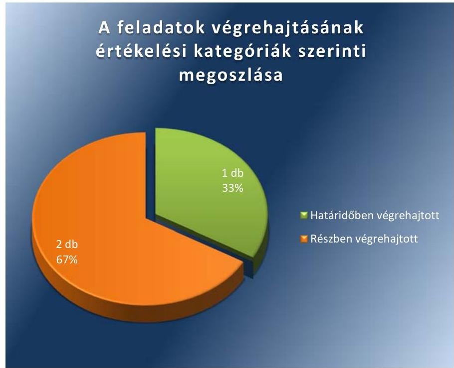

Forrás: ÁSZ

---

# HATÁRIDŐBEN VÉGREHAJTOTT feladat: 

1. A jegyző intézkedett arról, hogy az éves költségvetések és a költségvetés végrehajtásáról szóló beszámolók az Info tv ${ }^{10}$. 1. mellékletében, valamint az IHM rendeletben ${ }^{11}$ foglaltak szerint kerüljenek közzétételre.

## RÉSZBEN VÉGREHAJTOTT feladatok:

2. A polgármester megvizsgáltatta a Fővárosi Vízművek Zrt.-vel, valamint a Fővárosi Csatornázási Művek Zrt.-vel kötött térítésmentes vagyonátadások szerződéseit.

A polgármester megtette azokat a szükséges intézkedéseket, melynek eredményeként a Fővárosi Vízművek Zrt. által nyilvántartott vízvezeték-hálózat
 a Vksztv. ${ }^{12}$ előírásának megfelelően Budapest Főváros Önkormányzat tulajdonába átadásra került. A polgármester nem intézkedett a csatornahálózat Fővárosi Csatornázási Művek Zrt.-nek történő használatba adásáról. A használatba adás nem történt meg, arról a Képviselő-testület a Vízgazd.tv. ${ }^{13}$-ben előírtak ellenére nem döntött.

A vízi közművek térítésmentes átadásával kapcsolatosan feltárt jogszabálysértést a polgármester kivizsgáltatta, a felelősségre vonható személyek közszolgálati jogviszonyának megszűnése miatt nem kezdeményezett felelősségre vonást.
3. A jegyző Budapest Főváros Kormányhivatalával a közhiteles ingatlan-nyilvántartási adatszolgáltatásra vonatkozó megállapodás megkötésével intézkedett arról, hogy az ingatlanvagyon-kataszter adatai a Kormányrendeletben ${ }^{14}$ előírtaknak megfelelően a közhiteles ingatlan-nyilvántartás adataival folyamatosan egyeztetésre kerülhessenek. Ugyanakkor a jegyző az ingatlanvagyon-kataszter adatainak a közhiteles nyilvántartást vezető ingatlanügyi hatóság adataival történő egyeztetés megtörténtét dokumentumokkal nem igazolta.

---

.

---

# MELLÉKLETEK

- I. SZ. MELLÉKLET: AZ ÁSZ 13084 SZÁMÚ JELENTÉSÉHEZ KAPCSOLÓDÓ INTÉZKEDÉSI TERV VÉGREHAJTÁSA

|  1. | Az intézkedési tervben meghatározott feladat | Az intézkedési tervben meghatározott határidő | Az intézkedési tervben meghatározott feladat felelőse | A feladat végrehajtása  |
| --- | --- | --- | --- | --- |
|   | 1. | 2. | 3. | 4.  |
|  Határidőben végrehajtott feladat |  |  |  |   |
|  1. | A jegyző tegye meg a szükséges intézkedéseket, hogy az éves költségvetések és a költségvetés végrehajtásáról szóló beszámolók az elektronikus információszabadságról szóló 2005. évi XC. törvény mellékletében és a közzétételi listákon szereplő adatok közzétételéhez szükséges közzétételi mintákról szóló 18/2005. (XII. 27.) IHM rendeletben előírt közzétételi kötelezettségnek megfelelően kerüljenek közzétételre. | 2014. szeptember 30. | a jegyző | A jegyző az intézkedési tervben előírt 2014. szeptember 30-ai határidőig megtette a szükséges intézkedést arról, hogy az éves költségvetések és a költségvetés végrehajtásáról készített beszámolók az Info tv. 37. § (1) bekezdésében foglalt, az 1. mellékletben meghatározott, továbbá az IHM rendelet 2. számú melléklete szerinti adatok az előírt közzétételi kötelezettségnek megfelelően kerüljenek közzétételre. Az Önkormányzat az ÁSZ részére megküldött 1. számú tanúsítványban igazolta, hogy az Önkormányzat honlapján (www.Kobanya.hu), városháza, rendeletek, normatív határozatok címszó alatt a költségvetéssel kapcsolatos rendeletek megtalálhatók.  |
|  Részben végrehajtott feladat |  |  |  |   |
|  2. | A polgármester vizsgáltassa meg a Fővárosi Vízművek Zrt.-vel és a Fővárosi Csatornázási Művek Zrt.-vel kötött térítésmentes vagyonátadási szerződéseket, és a vizsgálat eredményétől függően tegye meg a szükséges intézkedéseket, hogy a vízgazdálkodásról szóló 1995. évi LVII. törvény 10. § (1) bekezdésében előírtaknak megfelelően kerüljenek használatba adásra a vízi közművek. A polgármester a vizsgálat eredményének függvényében indokolt esetben kezdeményezze a felelősségre vonást. | 2014. szeptember 30. | a polgármester | A polgármester megvizsgáltatta a Fővárosi Vízművek Zrt.-vel, valamint a Fővárosi Csatornázási Művek Zrt.-vel kötött térítésmentes vagyonátadások szerződéseit, és annak eredményéről a Képviselő-testületnek beszámolt. A beszámolót a Képviselő-testület megtárgyalta és a 445/2014. (IX. 18.) számú határozatával jóváhagyta.
A polgármester megtette azokat a szükséges intézkedéseket, amelyek eredményeként a Fővárosi Vízművek Zrt. által az Önkormányzattól 2002-2006. között térítésmentesen átvett vízi közművek (vízvezetékek, tűzcsapok) 2013. január 1-jével Budapest Főváros Önkormányzatnak térítésmentesen átadásra kerültek a Vksztv. 79. § (1) bekezdése alapján. A polgármester dokumentumokkal nem igazolta, hogy intézkedett annak érdekében, hogy a Fővárosi Csatornázási Művek Zrt.-nek a csatornahálózat használatba adása a Képviselő-testület döntése alapján a Vízgazd. tv. 10. § (1) bekezdésében előírtaknak megfelelően megtörtént.  |

---

|  Az intézkedési tervben meghatározott feladat | Az intézkedési tervben meghatározott határidő | Az intézkedési tervben meghatározott feladat felelőse | A feladat végrehajtása  |
| --- | --- | --- | --- |
|  1. | 2. | 3. | 4.  |
|   |  |  | A polgármester kivizsgáltatta a vízi közművek térítésmentes átadásával kapcsolatosan feltárt jogszabálysértést, amelyet a Képviselő-testület a 445/2014. (IX. 18.) számú határozatában tudomásul vett. A vízi közmű beruházással, versenyeztetéssel és közbeszerzéssel kapcsolatos ügyek intézése a 2011. évet megelőzően a Polgármesteri Hivatal Beruházási és Vagyonügyi Irodájának feladatkörébe tartozott. A vizsgálat idején az Iroda akkori vezetői, valamint a csatorna- és vízvezeték-hálózat kiépítésével foglalkozó munkatársak közül a vizsgálat lefolytatásakor már senki nem állt a Polgármesteri Hivatalnál közszolgálati jogviszonyban. Ennek következtében a polgármester a felelősségre vonható személyek közszolgálati jogviszonyának megszűnése miatt nem kezdeményezett felelősségre vonást.  |
|  3. A jegyző tegye meg a szükséges intézkedéseket, hogy az ingatlanvagyon-kataszter adatai az önkormányzatok tulajdonában lévő ingatlanvagyon nyilvántartási és adatszolgáltatási rendjéről szóló 147/1992. (XI. 6.) Korm. rendelet 1. § (2) bekezdésében előírtaknak megfelelően a közhiteles nyilvántartást vezető földhivatal adataival folyamatosan kerüljenek egyeztetésre. | 2014. szeptember 30. | a jegyző | Az Önkormányzat Budapest Főváros Kormányhivatalával 2015. október 30-án „Egyedi megállapodást” kötött az ingatlan-nyilvántartási adatbázisból leválogatás útján történő adatszolgáltatásról és a közhiteles ingatlan-nyilvántartás adataival való folyamatos egyeztetésről. A Képviselő-testület a 445/2014. (IX. 18.) KÖKT határozatában döntött arról, hogy a Budapest Főváros Kormányhivatal Földhivatalával történő ingatlanvagyon-kataszter adatainak egyeztetése kapcsán felmerülő kiadások fedezetére, a szükséges forrásokat a 2015. évtől kezdődően az Önkormányzat költségvetésébe tervezni kell. A jegyző az ingatlanvagyon-kataszter adatainak a Kormányrendelet 1. § (2) bekezdésében előírtaknak megfelelő, a közhiteles nyilvántartást vezető földhivatal adataival történő egyeztetés megtörténtét dokumentumokkal nem igazolta.  |

*Formás: ÁSZ által készített táblázat*

---

# FÜGGELÉK: ÉSZREVÉTELEK 

A jelentéstervezetet a Számvevőszék 15 napos észrevételezésre megküldte az ellenőrzött szervezet vezetőjének az ÁSZ tv. 29. § (1) bekezdése előírásának megfelelően.

A függelék tartalmazza az ellenőrzött észrevételeit, illetve az el nem fogadott észrevételek elutasításának indoklását.

[^0]
[^0]:    * 29. § (1) Az Állami Számvevőszék az ellenőrzési megállapításait megküldi az ellenőrzött szervezet vezetőjének vagy az általa megbízott személynek, és annak, akinek személyes felelősségét állapította meg.
    (2) Az ellenőrzött szervezet vezetője és a felelősként megjelölt személy az ellenőrzés megállapításaira tizenöt napon belül írásban észrevételt tehet.
    (3) Az Állami Számvevőszék az észrevételre a beérkezésétől számított harminc napon belül írásban válaszol. A figyelembe nem vett észrevételeket köteles a jelentésben feltüntetni, és megindokolni, hogy azokat miért nem fogadta el.

---

# KÖBÁNYA 

az élő város

## Domokos László

## Elnök Úr

részére

## Állami Számvevőszék

Budapest
Apáczai Csere János u. 10.
1052

Tisztelt Elnök Úr!
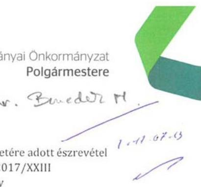

Tárgy: ÁSZ-jelentés tervezetére adott észrevétel
Iktatószám: K/21235/1/2017/XXIII
Úgyintéző: Hegedűs Károly
Telefon: +36 14338226
E-mail: HegedusKaroly@kobanya.hu

## ÁLLAMI SZÁMVEVŐSZÉK 25-50027/2017/

## Érkezé: 2017 JÚL 13

Iktatószám:
Molláktel:

Az Állami Számvevőszék Budapest Főváros X. kerület Kőbányai Önkormányzat vagyongazdálkodása szabályszerűségének utóellenőrzéséről szóló jelentéstervezetében foglaltakra az Állami Számvevőszékről szóló 2011. évi LXVI. törvény 29. § (2) bekezdése alapján az alábbi észrevételt teszem.

1. A jegyző Budapest Főváros Kormányhivatalával a közhiteles ingatlan-nyilvántartási adatszolgáltatásra vonatkozó egyedi megállapodás megkötésével intézkedett az ingatlanvagyonkataszter kormányrendeletben előírtaknak megfelelő, a közhiteles ingatlan-nyilvántartás adataival történő folyamatos egyeztetéséről. A jegyző 2015. október 30-án egyedi megállapodást kötött, mely alapján az adattartalom frissítése megtörtént. Az Önkormányzat 2017. február hónapban újabb egyedi megállapodást kötött az ingatlan-nyilvántartási adatok leválogatására, amely alapján évente egy alkalommal megtörténik az állományfrissítés átadása az Önkormányzat részére.

Az ingatlan-nyilvántartási adatok és az ingatlanvagyonkataszter-adatok egyeztetéséről, az eltérések javításáról 2015. november 16-án és 2016. február 24-én az Önkormányzat és a Kormányhivatal jegyzőkönyvet vett fel. Az 1. és 2. mellékletekben csatolom az egyeztetésről készült jegyzőkönyveket és az egyedi megállapodás egy példányát.
2. Az utóvizsgálat megállapította, hogy a polgármester nem intézkedett a csatornahálózat Fővárosi Csatornázási Művek Zrt.-nek történő használatba adásáról, a Képviselő-testület a vízgazdálkodásról szóló 1995. évi LVII. törvényben előírtak ellenére nem döntött. Ezzel ellentétben a Képviselő-testület a Budapest X., Kistorony park közcsatorna tulajdonjogának átruházásáról szóló 36/2013. (II. 21.) KÖKT határozatában, valamint a Budapest X., Szárnyas utcai csatornahálózat tulajdonjogának Budapest Főváros Önkormányzata részére történő ingyenes átruházásáról szóló 6/2015. (I. 22.) KÖKT határozatában döntött az elkészült csatornahálózatok tulajdonjogának térítésmentes átruházásáról. A Képviselő-testület döntései végrehajtása nem történhetett meg, mivel a Fővárosi Csatornázási Művek Zrt.-vel az adategyeztetések nem vezettek eredményre, így a szerződéseket sem tudtuk ez idáig megkötni.

---

A korábban, az eredeti vizsgált időszakban megépült csatornahálózat átadásával kapcsolatban ugyanezen helyzet áll fenn, a nyilvántartási adatok eltérései miatt azok átadása nem történhetett meg annak ellenére, hogy 2014 óta többször kezdeményeztük az egyeztetést, amely nem vezetett eredményre.

Tájékoztatom Tisztelt Elnök Urat, hogy ismételten kezdeményezem Budapest Főváros Önkormányzatánál az átadáshoz kapcsolódó nyilvántartási adatok egyeztetését, valamint a csatornahálózat átadásáról szóló szerződés előkészítését.

Kérem a jelentéstervezettel kapcsolatos észrevételeim szíves elfogadását.

Budapest, 2017. július 7.

Üdvözlettel,
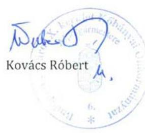

---

# Egyedi megállapodás ingatlan-nyilvántartási adatbázisból leválogatás útján történő adatszolgáltatás frissítéséről 

amely létrejött egyrészről

## Budapest Főváros Kormányhivatala

Székhely: 1056 Budapest, Váci utca 62-64.
Postacím: 1364 Budapest, Pf. 234
Képviseli: dr. György István kormánymegbízott
Számlavezető pénzintézet: Magyar Államkincstár
Bankszámlaszám: 10023002-00299592-00000000
Adószám: 15789233-2-41
Alapító okiratszám: TER-2/778/49/2016.
AHT azonosító: 297802
Statisztikai számjel: 15789233-8411-312-01
mint adatszolgáltató (a továbbiakban Adatszolgáltató)
másrészről

## Budapest Főváros X. kerület Kőbányai Önkormányzat

Székhely: 1102 Budapest, Szent László tér 29.
Képviseli: Kovács Róbert polgármester
Bankszámlaszám: 11784009-15510000
Adószám: 15735739-2-42
PIR-tórzsszám: 735737
Statisztikai számjel: 15735739-8411-321-01
Kapcsolattartó neve: Ventzi József
Telefonszáma: 4338-133
Fax-száma: 4338-109
E-mail: ventzljozsef@kobanya.hu
mint adatfelhasználó (a továbbiakban: Adatfelhasználó)

- együttesen: Felek - között az alulírott napon és helyen az alábbi feltételekkel:

1. Adatszolgáltató és Adatfelhasználó között Budapesten, 2015. október 30-án létrejött egyedi megállapodás 3.3. pontja szerint, Adatfelhasználó rendelkezik Budapest Főváros közigazgatási területén az Adatfelhasználó által megadott elnevezéssel Budapest Főváros X. kerület Kőbányai Önkormányzat tulajdonában lévő ingatlanok tulajdonosi adatokkal kiegészített földkönyvével, valamint azon földrészletek területhagyságával, melyeken olyan társasház vagy szövetkezeti ház található, amelyben az Adatfelhasználó a leválogatás elkészítésekor tulajdonjoggal rendelkezett. Adatfelhasználó megrendeli, Adatszolgáltató elvállalja az alábbi feltételek alapján és meghatározott időpontban az adattartalom frissítését.
1.1. Az adatszolgáltatás az ingatlan-nyilvántartásról szóló 1997. évi CXLI. törvény végrehajtásáról szóló 109/1999. (XII. 29.) FVM rendelet (Inyvhr.) 118/B. §-a, a számítógépes ingatlan-nyilvántartási rendszerből lekérdezés útján szolgáltatható egyes ingatlan-nyilvántartási adatok szolgáltatásáról és igazgatási szolgáltatási díjáról, valamint az ingatlan-nyilvántartási eljárás igazgatási szolgáltatási díjának megállapításáról és a dijak megfizetésének részletes szabályairól szóló 176/2009.(XII. 28.) FVM rendelet (Dijvhr.) 2. §-a és Budapest Főváros Kormányhivatala Kormánymegbízottjának Budapest Főváros Kormányhivatala Önköltségszámítási Szabályzata kiadásáról szóló 8/2016. számú utasítása alapján történik.
1.2. Az Inyvhr. 118/B. (1) bekezdése értelmében az ingatlan-nyilvántartásból adatműveleti, adatfeldolgozási tevékenységet igénylő leválogatás, illetve az elektronikus formában lekérdezett adatok utólagos feldolgozása a technikai lehetőségek függvényében, egyedi megállapodás alapján teljesíthető.

---

2. Teljesítés:
2.1. Az átadás az Adatfelhasználóval előzetesen egyeztetett időpontban, személyes átadás-átvétellel, jegyzőkönyv felvételével történik. A jegyzőkönyv egyben a teljesítés igazolásának minősül.
2.2. Adatszolgáltató az 1. pontban rögzített lekérdezés eredményként kapott listás adatszolgáltatást 1 példányban, CD lemezen köteles elkészíteni, és az Adatfelhasználó részére átadni.
2.3. Adatszolgáltató a 3.3. pont szerinti adattartalom évi 1 alkalommal történő frissítésével, előállításával és digitális adatbázison történő átadásával teljesít. Amennyiben az alább megjelölt időpont munkaszüneti napra esnek,

 Adatszolgáltató az adott napot követő első munkanapon teljesít.
2.4. A frissítési szolgáltatás az alábbi időpontban történik: tárgyév február 15.
2.5. A frissítési szolgáltatás első időpontja: jelen megállapodás mindkét fél általi aláírását követően.
3. Az adatszolgáltatás tartalma, célja:
3.1. Adatszolgáltató az Adatfelhasználónak digitális tulajdonosi adatokkal kiegészített földkönyvet ad át, mely az Inyvhr. 118. § (3) - (4) bekezdése értelmében tartalmazza az ingatlanok címét, helyrajzi számát, és alrészletenkénti bontásban azok területnagyságát, művelési ágát, minőségi osztályát, valamint aranykorona értékét. A tulajdonosi adatokkal kiegészített földkönyv ezen túl tartalmazza még a tulajdonos nevét és ingatlan-nyilvántartásban feltüntetett lakcímét.
3.2. A szolgáltatott adatok felhasználásának célja: Az adatfelhasználó tulajdonában lévő ingatlanok adatainak aktualizálása.
3.3. A leválogatás és a tulajdonosi adatokkal kiegészített földkönyv elkészítése azon ingatlanokról, amelyek Budapest Főváros közigazgatási területen az Adatfelhasználó által megadott elnevezéssel Budapest Főváros X. kerület Kőbányai Önkormányzat tulajdonában állnak és a tulajdoni lapján az utolsó adatszolgáltatás óta változás történt. A frissítés nem tartalmazza azon földrészletek területnagyságát, melyeken olyan társasház vagy szövetkezeti ház található, amelyben az Adatfelhasználó tulajdonjoggal rendelkezik.
4. Az adatszolgáltatás és a leválogatás díja:
4.1. Az egyedi szempont szerinti digitális földkönyv leválogatásáért az Adatszolgáltató a Díjvhr. 2. § (1) bekezdés (1) pontja szerinti adatszolgáltatási díjat számít fel ingatlanonként bruttó 200 forint összegben.
4.2. Az Adatszolgáltató a 4.1. pontban meghatározott díjon felül további 120 forint + ÁFA leválogatási díjat számít fel az Adatfelhasználónak helyrajzi számként, azzal, hogy a leválogatási díj minimum összege 3000 Ft + ÁFA, maximum összege 3000000 Ft + ÁFA.
4.3. Az Adatszolgáltató, a 4.1. és a 4.2. pontban meghatározott díjról az Adatfelhasználó részére a jogszabályoknak alakilag és tartalmilag mindenben megfelelő számlát állít ki. Az Adatfelhasználó a számla ellenértékét a számla kézhezvételétől számított 15 napon belül utalja át az Adatszolgáltató Magyar Államkincstárnál vezetett 10023002-00299592-00000000 számú számlájára.
4.4. Felek kikötik, hogy az adatszolgáltatási díj késedelmes teljesítése esetén a Polgári Törvénykönyvről szóló 2013. évi V. törvény (Ptk.) 6:48. § rendelkezései az irányadóak.
5. Adatszolgáltató garanciát vállal arra, hogy a hatályos ingatlan-nyilvántartásból az Adatfelhasználó által igényelt tartalommal készített adatszolgáltatás adatai a leválogatás napján megegyezik az ingatlannyilvántartás tartalmával.
6. Szerződő felek rögzítik az adatfelhasználásra vonatkozó alábbi szabályokat:
6.1. A szolgáltatott adatok elektronikus formában történő tárolása csak a vonatkozó jogszabályi előírásoknak megfelelően lehetséges. Különös figyelmet kell fordítani arra, hogy a helyi rendszereken eltárolt adatok tartalmához, illetve az abból származó adatokhoz illetéktelen személyek ne férhessenek hozzá.

---

6.2. Amennyiben a szolgáltatott adatokat külső adathordozón tárolják, gondoskodni kell azok jogosulatlan hozzáférés elleni védelméről. Az Adatfelhasználóval létesített bármilyen jogviszony keretében az adatokhoz hozzáféréssel rendelkező személyek kötelesek a vonatkozó jogszabályi előírások betartására.
7. Jelen megállapodás a mindkét fél általi aláírásának napján lép hatályba és határozatlan időre szól, melyet a Felek 30 napos határidővel jogosultak írásban felmondani. Amennyiben az aláírás napja nem egy naptári napra esik, a Felek a hatályba lépés napjának kölcsönösen a későbbi időpontot fogadják el.
8. A vitás kérdés rendezését a Felek közvetlen tárgyalások útján kísérlik meg rendezni, amennyiben ez nem jár sikerrel, úgy jogvita esetére a bíróság hatáskörét és illetékességét az általános szabályok szerint állapítják meg.
9. Jelen megállapodásban nem szabályozott kérdésekben a Ptk. rendelkezései az irányadóak.
10. Az adatfelhasználó kijelenti, hogy az államháztartás végrehajtásáról szóló 368/2011. (XII. 31.) Kormány rendelet 50. § (1a) bekezdése értelmében átlátható szervezetnek minősül és jogosult a jelen megállapodás megkötésére.
11. Felek a megállapodás pontjaiban foglaltakat magukra nézve kötelezően érvényesnek ismerik el, és mint akaratukkal mindenben egyezőt, elolvasás után, jóváhagyólag írják alá.
12. Jelen megállapodás három sorszámozott oldalból áll, 6 példányban készült, melyből 4 példány az Adatszolgáltatót, 2 példány az Adatfelhasználót illeti.

Budapest, 2017. 7. 7.

---

# 2. weteled 

## Jegyzőkönyv

## az ingatlan-nyilvántartási adatok és az Ingatlanvagyon-kataszter adatok egyeztetéséről

Készült: 2016. február 24-én a Kőbányai Polgármesteri Hivatal fszt. 13. számú irodájában

Jelen vannak: Ventzl József - Számviteli és Vagyonnyilvántartási Osztály tárgyieszköz nyilvántartó és ingatlanvagyon kataszter nyilvántartó

Szarvas Zsolt - Számviteli és Vagyonnyilvántartási Osztály analitikus nyilvántartó

A Budapest Főváros X. kerület Kőbányai Önkormányzat ingatlanvagyon-kataszter nyilvántartásában lévő ingatlanok és az ingatlan-nyilvántartásban (Budapest Főváros Kormányhivatalától megvásárolt ingatlan-nyilvántartási adatok) lévő ingatlanok adatainak az egyeztetése megtörtént, az eltérések javításra kerültek.
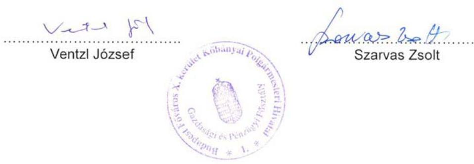

---

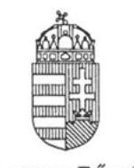

# BUDAPEST FŐVÁROS KORMÁNYHIVATALA 

Ügyiratszám: 20.675/10/2015.
Ügyintéző: dr. Jánosiné dr. Kovács Kinga
Telefon: 354-2950/205

## JEGYZŐKÖNYV

földkönyv átadásáról
mely készült Budapest Főváros Kormányhivatala Földhivatali Főosztályának (1051 Budapest, Sas utca 19.) 22. számú hivatali helyiségében, 2015. november 16-án

A jegyzőkönyv egyben teljesítés-igazolás. Az aláírók tanúsítják és elismerik, hogy a Budapest Főváros X. kerület Kőbányai Önkormányzat részére készült, a Budapesten, 2015. október 30-án kelt ingatlannyilvántartási adatbázisból leválogatás útján történő adatszolgáltatási megállapodás 3.3. pontjában rögzítetteknek megfelelő adatállomány, a mai napon átadásra került Ventzi József vagyonügyi ügyintéző részére 1 példányban, CD lemezen.

Az adatszolgáltatás díja az egyedi megállapodás 4.2. és 4.3. pontjai alapján $2.760 \times 352,4,-\mathrm{Ft}=972.624$ ,-Ft és $294 \times 50,-\mathrm{Ft}=14.700,-\mathrm{Ft}$ mindösszesen 987.324,-Ft azaz Kilencszáznyolcvanhétezerháromszázhuszonnégy forint.

Az adatszolgáltatási díjról a számlát Budapest Főváros Kormányhivatalának Pénzügyi és Gazdálkodási Főosztálya állítja ki a szerződés 4.4. pontja alapján. A pénzügyi teljesítés a majdán kiállított számla alapján lesz esedékes.

Jelen jegyzőkönyv 2 példányban készült, melyből egy-egy példány illeti az átadót és az átvevőt.
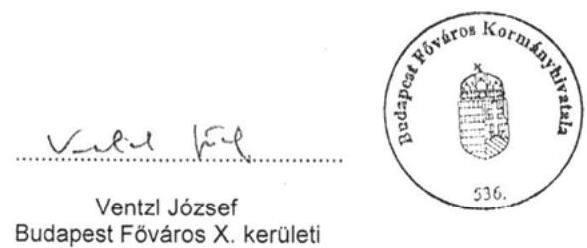

Ventzi József
Budapest Főváros X. kerületi Kőbányai Önkormányzat
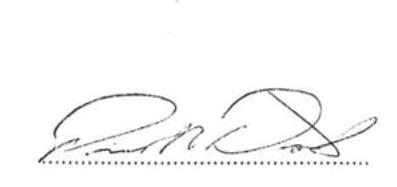

Proczeller Dávid
Budapest Főváros Kormányhivatalának Földhivatala

---

# BUDAPEST FŐVÁROS X. KERÜLET KŐBÁNYAI ÖNKORMÁNYZAT ALJEGYZŐJE 

## KIVONAT   BUDAPEST FŐVÁROS X. KERÜLET KŐBÁNYAI ÖNKORMÁNYZAT KÉPVISELŐ-TESTÜLETE   2015. január 22-ei ülésének jegyzőkönyvéből

6/2015. (I. 22.) KÖKT határozat
a Budapest X., Szárnyas utcai csatornahálózat tulajdonjogának Budapest Főváros Önkormányzata részére történő ingyenes átruházásáról
(15 igen, egyhangú szavazattal)

1. Budapest Főváros X. kerület Kőbányai Önkormányzat Képviselő-testülete a Budapest X., Szárnyas utcában elkészült csatornahálózat tulajdonjogát térítésmentesen átruházza Budapest Főváros Önkormányzata részére.
2. A Képviselő-testület felkéri a polgármestert a szükséges intézkedések megtételére.

Határidő: azonnal
Feladatkörében érintett: a Főépítészi Osztály vezetője

Budapest, 2017. július 7.
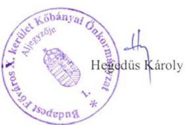

---

# BUDAPEST FŐVÁROS X. KERÜLET KŐBÁNYAI ÖNKORMÁNYZAT ALJEGYZŐJE 

## KIVONAT   BUDAPEST FŐVÁROS X. KERÜLET KŐBÁNYAI ÖNKORMÁNYZAT KÉPVISELŐ-TESTÜLETE   2013. február 21-ei ülésének jegyzőkönyvéből

36/2013. (II. 21.) KÖKT határozat
a Budapest X., Kistorony park közcsatorna tulajdonjogának átruházásáról
(17 igen, egyhangú szavazattal)

1. Budapest Főváros X. kerület Kőbányai Önkormányzat Képviselő-testülete a Budapest X., Kistorony park közcsatorna hálózat tulajdonjogát térítésmentesen átruházza a Fővárosi Önkormányzatra.
2. A Képviselő-testület felkéri a polgármestert a szükséges intézkedések megtételére. Határidő: azonnal
Feladatkörében érintett: a gazdasági és fejlesztési szakterületért felelős alpolgármester, a Főépítészi Csoport vezetője,
a Kőbányai Vagyonkezelő Zrt. vezérigazgatója

Budapest, 2017. július 7.
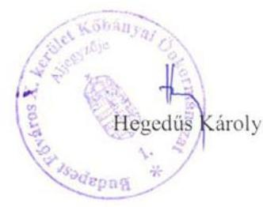

---

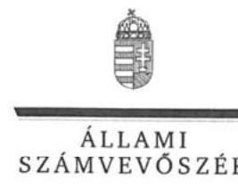

ELNÖK

Ikt.szám: V-1305-036/2016.

# Kovács Róbert úr 

polgármester
Budapest Főváros X. kerület Kőbányai Önkormányzat

## Budapest

## Tisztelt Polgármester Úr!

Köszönettel megkaptam az Állami Számvevőszékhez 2017. július 13. napján érkezett "Utóellenőrzések - Budapest Főváros X. kerület Kőbányai Önkormányzat vagyongazdálkodása szabályszerűségének utóellenőrzése" című számvevőszéki jelentéstervezetben foglalt megállapításokra tett észrevételét.

Tájékoztatom Polgármester urat, hogy az el nem fogadott észrevételeket - az Állami Számvevőszékről szóló 2011. évi LXVI. törvény 29. § (3) bekezdése alapján - a jelentésben szerepeltetjük az elutasítás indokainak feltüntetésével együtt.

Az Állami Számvevőszék észrevételekre vonatkozó álláspontjáról a felügyeleti vezető által készített részletes tájékoztatást csatoltan megküldöm.

Budapest, 2017. július 27.
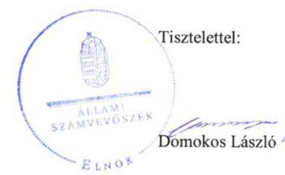

Melléklet: Tájékoztatás az el nem fogadott észrevételekről, azok indokairól

---

# Tájékoztatás 

az el nem fogadott észrevételekről, azok indokairól

| 1. | Észrevétel: | Az észrevétel 1. oldal 1. pontjában, az ÁSZ jelentéstervezet 13. oldal a Megállapítások fejezet harmadik pontjában foglalt megállapításra tett észrevétel: „_3.A jegyző Budapest Főváros Kormányhivatalával a közhiteles ingatlan-nyilvántartási adatszolgáltatásra vonatkozó megállapodás megkötésével intézkedett arról, hogy az ingatlanvagyon-kataszter adatai a Kormányrendeletben előírtaknak megfelelően a közhiteles ingatlan-nyilvántartás adataival folyamatosan egyeztetésre kerülhessenek. Ugyanakkor a jegyző az ingatlanvagyon-kataszter adatainak a közhiteles nyilvántartást vezető ingatlanügyi hatóság adataival történő egyeztetés megtörténtét dokumentumokkal nem igazolta." Észrevétel: „A jegyző Budapest Főváros Kormányhivatalával a közhiteles ingatlan-nyilvántartási adatszolgáltatásra vonatkozó egyedi megállapodás megkötésével intézkedett az ingatlanvagyon-kataszter kormányrendeletben előírtaknak megfelelő, a közhiteles ingatlan-nyilvántartás adataival történő folyamatos egyeztetéséről. A jegyző 2015. október 30-án egyedi megállapodást kötött, mely alapján az adattartalom frissítése megtörtént. Az Önkormányzat 2017. február hónapban újabb egyedi megállapodást kötött az ingatlan-nyilvántartási adatok leválogatására, amely alapján évente egy alkalommal megtörténik az állományfrissítés átadása az Önkormányzat részére. Az ingatlan-nyilvántartási adatok és az ingatlanvagyonkataszter adatok egyeztetéséről, az eltérések javításáról 2015. november 16-án és 2016. február 24-én az |
| :--: | :--: | :--: |

---

|  | Önkormányzat és a Kormányhivatal jegyzőkönyvet vett fel. Az 1. és 2. mellékletekben csatolom az egyeztetésről készült jegyzőkönyveket és az egyedi megállapodás egy példányát." |
| :--: | :--: |
| Válasz: | Az ÁSZ az észrevételt nem fogadja el. |
| Indokolás: | Az észrevétel nem megalapozott. A 2017. április 3. napján keltezett, a polgármester részére megküldött ellenőrzés megkezdéséről szóló kiértesítő levélben foglaltak alapján tájékoztatást kapott arról, hogy az ellenőrzés a mellékelt ellenőrzési program szerint kerül lefolytatásra. A levél mellékletét képező V-1062003/2016. számú ellenőrzési program szerint az ellenőrzés tárgya a számvevőszéki jelentésben foglalt intézkedést igénylő megállapításokkal és javaslatokkal összhangban - az ellenőrzött szervezet által - készített intézkedési tervben foglaltak végrehajtásának ellenőrzése. Az intézkedési tervben a jegyző részére került meghatározásra az a feladat, hogy ,,A jegyző tegye meg a szükséges intézkedéseket, hogy az ingatlanvagyon-kataszter adatai az önkormányzatok tulajdonában lévő ingatlanvagyon nyilvántartási és adatszolgáltatási rendjéről szóló 147/1992. (XI. 6.) Korm. rendelet 1. § (2) bekezdésében előírtaknak megfelelően a közhiteles nyilvántartást vezető földhivatal adataival folyamatosan kerüljenek egyeztetésre.". Az Önkormányzat által az ellenőrzés rendelkezésére bocsátott dokumentum K/31333/2/2015/XVII iktatószámú egyedi megállapodás ingatlan-nyilvántartási adatbázisból leválogatás útján történő adatszolgáltatásról - kizárólag azt alapozza meg, hogy a jegyző intézkedett arról, hogy az ingatlanvagyon-kataszter adatai a Kormányrendeletben előírtaknak megfelelően a közhiteles ingatlan-nyilvántartás adataival folyamatosan egyeztetésre kerülhessenek. Az ellenőrzési időszak tekintetében az ingatlan-nyilvántartási adatok és az ingatlanvagyon-kataszter adatok egyeztetéséről igazoló dokumentumot az Önkormányzat a 2017. április 3. napján megkezdett ellenőrzés folyamán nem adott át az ÁSZ részére. Radványi Gábor alpolgármester az ellenőrzés során a teljességi nyilatkozatban kijelentette, hogy az ellenőrzés kapcsán az ÁSZ részére átadott, a nyilatkozatban részletezett dokumentumok, adatok megbízhatóak és a bekért adatokra, dokumentumokra vonatkozóan teljes körű információt tartalmaznak. A nyilatkozatban felsorolt dokumentumokat az Önkormányzat észrevétele alapján az ÁSZ felülvizsgálta, és megállapította, hogy az nem tartalmazta az Önkormányzat által jelen észrevételhez mellékelt, az ingatlan-nyilvántartási adatok és az ingatlanvagyon-kataszter adatok egyeztetéséről készült jegyzőkönyvet. Fentiek figyelembevételével az ÁSZ fenntartja a

 jelentéstervezetben az adategyeztetésre vonatkozóan tett megállapítását. |
| :--: | :--: | :--: |
| 2. | Észrevétel: | Az észrevétel 1. oldal 2. pontjában, az ÁSZ jelentéstervezet 13. oldal a Megállapítások fejezet második pontjában foglalt megállapításra tett észrevétel: „ „2. A polgármester megvizsgáltatta a Fővárosi Vízművek Zrt.-vel, valamint a Fővárosi Csatornázási Művek Zrt.-vel kötött térítésmentes vagyonátadások szerződéseit. A polgármester megtette azokat a szükséges intézkedéseket, melynek eredményeként a Fővárosi Vízművek Zrt. által nyilvántartott vízvezeték-hálózat a Vksztv. előírásának megfelelően Budapest Főváros Önkormányzat tulajdonába átadásra került. A polgármester nem intézkedett a csatornahálózat Fővárosi Csatornázási Művek Zrt.-nek történő használatba adásáról. A használatba adás nem történt meg, arról a Képviselő-testület a Vízgazd.tv.-ben előírtak ellenére nem döntött." Észrevétel: „Az utóvizsgálat megállapította, hogy a polgármester nem intézkedett a csatornahálózat Fővárosi Csatornázási Művek Zrt.-nek történő használatba adásáról, a Képviselő-testület a vízgazdálkodásról szóló 1995. évi LVII. törvényben előírtak ellenére nem döntött. Ezzel ellentétben a Képviselő-testület a Budapest X., Kistorony park közcsatorna tulajdonjogának átruházásáról szóló 36/2013. (II. 21.) KÖKT határozatában, valamint a Budapest X., Szárnyas utcai csatornahálózat tulajdonjogának Budapest Főváros Önkormányzata részére történő ingyenes átruházásáról szóló 6/2015. (I. 22.) KÖKT' határozatában döntött az elkészült csatornahálózatok tulajdonjogának térítésmentes átruházásáról. A Képviselő-testület döntései végrehajtása nem történhetett meg, mivel a Fővárosi Csatornázási Művek Zrt.-vel az adategyeztetések nem vezettek eredményre, így a szerződéseket sem tudtuk ez idáig megkötni. A korábban, az eredeti vizsgált időszakban megépült csatornahálózat átadásával |

---

|  | kapcsolatban ugyanezen helyzet áll fenn, a nyilvántartási adatok eltérései miatt azok átadása nem történhetett meg annak ellenére, hogy 2014 óta többször kezdeményeztük az egyeztetést, amely nem vezetett eredményre. |
| :--: | :--: |
| Válasz: | Az ÁSZ az észrevételt nem fogadja el. |
| Indokolás: | Az észrevétel nem megalapozott. A 2017. április 3. napján keltezett, a polgármester részére megküldött ellenőrzés megkezdéséről szóló kiértesítő levélben foglaltak alapján tájékoztatást kapott arról, hogy az ellenőrzés a mellékelt ellenőrzési program szerint kerül lefolytatásra. A levél mellékletét képező V-1062003/2016. számú ellenőrzési program szerint az ellenőrzés tárgya a számvevőszéki jelentésben foglalt intézkedést igénylő megállapításokkal és javaslatokkal összhangban - az ellenőrzött szervezet által - készített intézkedési tervben foglaltak végrehajtásának ellenőrzése. Az intézkedési tervben a polgármester részére került meghatározásra az a feladat, hogy „A polgármester vizsgáltassa meg a Fővárosi Vízművek Zrt.-vel és a Fővárosi Csatornázási Művek Zrt.-vel kötött térítésmentes vagyonátadási szerződéseket, és a vizsgálat eredményétől függően tegye meg a szükséges intézkedéseket, hogy a vízgazdálkodásról szóló 1995. évi LVII. törvény 10. § (1) bekezdésében előírtaknak megfelelően kerüljenek használatba adásra a víziközművek. A polgármester a vizsgálat eredményének függvényében indokolt esetben kezdeményezze a felelősségre vonást." Az ellenőrzési időszak tekintetében a 2017. április 3. napján megkezdett ellenőrzés folyamán az Önkormányzat nem adott át az ÁSZ részére azt igazoló dokumentumot, hogy a Fővárosi Csatornázási Művek Zrt.-nek a csatornahálózat használatba adásáról a Képviselő-testület döntést hozott, illetve, hogy az a Vízgazd. tv. 10. § (1) bekezdésében előírtaknak megfelelően megtörtént. Radványi Gábor alpolgármester az ellenőrzés során a teljességi nyilatkozatban kijelentette, hogy az ellenőrzés kapcsán az ÁSZ részére átadott, a nyilatkozatban részletezett dokumentumok, adatok megbízhatóak és a bekért adatokra, dokumentumokra vonatkozóan teljes körű információt tartalmaznak. A nyilatkozatban felsorolt dokumentumokat az Önkormányzat észrevétele alapján az ÁSZ felülvizsgálta, és megállapította, hogy |

---

|  | az nem tartalmazta az Önkormányzat által jelen észre-
vételhez mellékelt, a Képviselő-testület által hozott
döntésekről szóló 36/2013. (II.21.) és 6/2015. (I.22.)
KÖKT határozatokat. Fentiek figyelembevételével az
ÁSZ fenntartja a jelentéstervezetben a csatornahálózat
használatba adásával kapcsolatosan tett megállapítását. |
| :-- | :-- |

Budapest, 2017. július " 25 ".
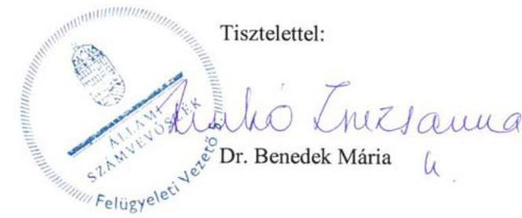

---

# RÖVIDÍTÉSEK JEGYZÉKE 

${ }^{1}$ Önkormányzat ${ }^{2}$ polgármester ${ }^{3}$ jegyző ${ }^{4}$ ÁSZ ${ }^{5}$ Képviselő-testület ${ }^{6}$ intézkedési terv

${ }^{7}$ ÁSZ tv.
${ }^{8}$ SZMSZ
${ }^{9}$ számvevőszéki jelentés
${ }^{10}$ Info tv.
${ }^{11}$ IHM rendelet
${ }^{12}$ Vksztv.
${ }^{13}$ Vízgazd.tv.
${ }^{14}$ Kormányrendelet

Budapest Főváros X. kerület Kőbányai Önkormányzat
Budapest Főváros X. kerület Kőbányai Önkormányzat polgármestere
Budapest Főváros X. kerület Kőbányai Önkormányzat jegyzője
Állami Számvevőszék
Budapest Főváros X. kerület Kőbányai Önkormányzat Képviselő-testülete
Budapest Főváros X. kerület Kőbányai Önkormányzat Képviselő-testülete 470/2013. (X. 17.) számú határozatával elfogadott, a 218/2014. (IV. 17.) KÖKT határozatával módosított az Állami számvevőszék „Jelentés az önkormányzati vagyongazdálkodás szabályszerűségi ellenőrzéséről - Budapest Főváros X. kerület Kőbánya" címmel készített Intézkedési terve
az Állami Számvevőszékről szóló 2011. évi LXVI. törvény (hatályos: 2011. július 1-jétől)
az Állami Számvevőszék elnökének 3/2016. (XII. 29.) ÁSZ utasítása az Állami Számvevőszék Szervezeti és Működési Szabályzatáról (hatályos: 2017. január 1-jétől)
az ÁSZ 13084 számú jelentése - Jelentés az önkormányzati vagyongazdálkodás szabályszerűségi ellenőrzéséről - Budapest Főváros X. kerület Kőbánya Önkormányzat
az információs önrendelkezési jogról és az információszabadságról szóló 2011. évi CXII. törvény
18/2005. (XII.27.) IHM rendelet a közzétételi listákon szereplő adatok közzétételéhez szükséges közzétételi mintákról, hatályos: 2006. január 1-től a víziközmű-szolgáltatásról szóló 2011. évi CCIX. törvény a vízgazdálkodásról szóló 1995. évi LVII. törvény
az önkormányzatok tulajdonában lévő ingatlan-vagyon nyilvántartási és adatszolgáltatási rendjéről szóló 147/1992. (XI. 6.) Korm. rendelet

---

ÁLLAMI SZÁMVEVŐSZÉK
1052 Budapest, Apáczai Csere János utca 10.
Levélcím: 1364 Budapest 4. Pf. 54
Telefon: +36 14849100 Telefax: +36 14849200
www.asz.hu
