# Jelentés 

## Az uniós kutatás-fejlesztési és innovációs támogatások ellenőrzése

Az uniós forrásból finanszírozott kutatásfejlesztési és innovációs támogatások nyomon követési rendszerének ellenőrzése 2017.

---

# Jelentés 

## Az uniós kutatás-fejlesztési és innovációs támogatások ellenőrzése

Az uniós forrásból finanszírozott kutatásfejlesztési és innovációs támogatások nyomon követési rendszerének ellenőrzése 2017. auguvrus hó 30. nap
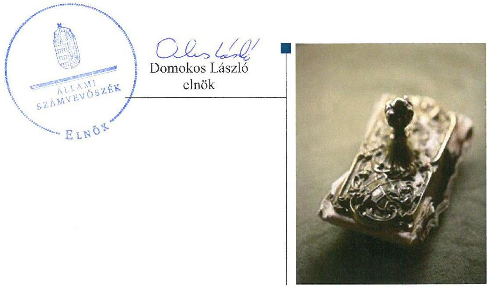

---

# AZ ELLENŐRZÉST FELÜGYELTE:

DR. PULAY GYULA felügyeleti vezető

# AZ ELLENŐRZÉST VEZETTE ÉS A VÉGREHAJTÁSÁÉRT FELELŐS:

VALASTYÁNNÉ DR. VÍZHÁNYÓ JÚLIA ellenőrzésvezető

# A PROGRAM ÖSSZEÁLLÍTÁSÁÉRT FELELŐS:

JANIK JÓZSEF LÁSZLÓ osztályvezető

---

**IKTATÓSZÁM:** V-1267-192/2016.

**TÉMASZÁM:** 2301

**ELLENŐRZÉS-AZONOSÍTÓ SZÁM:** V0780

---

Jelentéseink az Országgyűlés számítógépes hálózatán és az Interneta a www.asz.hu címen is olvashatóak.

---

# TARTALOMJEGYZÉK 

■ ÖSSZEGZÉS ..... 5
■ AZ ELLENŐRZÉS CÉLJA ..... 6
■ AZ ELLENŐRZÉS TERÜLETE ..... 7
■ AZ ELLENŐRZÉS HÁTTERE, INDOKOLTSÁGA ..... 10
■ FÓKUSZKÉRDÉSEK ..... 11
■ ELLENŐRZÉS HATÓKÖRE ÉS MÓDSZEREI ..... 12
■ MEGÁLLAPÍTÁSOK ..... 14
■ JAVASLATOK ..... 24
■ MELLÉKLETEK ..... 25
I. Sz. melléklet: Értelmező szótár ..... 25
II. Sz. melléklet: Az integritás szemlélet érvényesítésével és az integritás kontrollrendszer kiépítettségével kapcsolatos megállapítások ..... 28
■ FÜGGELÉK: ÉSZREVÉTELEK ..... 31
■ RÖVIDÍTÉSEK JEGYZÉKE ..... 47

---

.

---

# ÖSSZEGZÉS 

Az európai uniós forrásból finanszírozott kutatás-fejlesztési és innovációs célú támogatások vonatkozásában a hazai intézményrendszer 2014. évi átalakítása mellett is biztosított volt a folyamatos feladatellátás. Az irányító szervi feladatok és egy esetben a közremüködő szervezeti feladatok átadás-átvétele nem felelt meg a jogszabályi előírásoknak. A támogatások monitoring és értékelési rendszere nem biztosította megfelelően a támogatások szabályszerű és eredményes felhasználását. Az Európai Támogatásokat Auditáló Főigazgatóság a támogatások szabályszerű és eredményes felhasználására vonatkozó ellenőrzéseit szabályszerűen hajtotta végre. Az integritás szemléletet a 2015. évben érvényesítették.

## Az ellenőrzés társadalmi indokoltsága

Az Állami Számvevőszék alapvető feladata a közpénzekkel és a közvagyonnal való gazdálkodás ellenőrzése. Az uniós kutatás-fejlesztés és innovációs források felhasználása nyomonkövetési rendszerének ellenőrzése hozzájárulhat az állami támogatások jobb hasznosulásához, és ezen keresztül a Bruttó Hazai Termék növekedéséhez.

## Főbb megállapítások, következtetések, javaslatok

Az uniós forrásból finanszírozott kutatás-fejlesztés és innováció célú támogatások tekintetében az intézményrendszer átalakítása mellett a folyamatos feladatellátás biztosított volt. A Nemzeti Fejlesztési Ügynökség Gazdaságfejlesztési Operatív Program 1., Közép-Magyarországi Operatív Program 1.1., Társadalmi Megújulás Operatív Program 4.2., valamint Társadalmi Infrastruktúra Program 1.3. prioritásokra vonatkozó irányító hatósági feladatait a jogszabályi előírásoknak megfelelően az Emberi Erőforrások Minisztériuma és a Nemzetgazdasági Minisztérium vették át. Az uniós kutatás-fejlesztés és innováció célú támogatással kapcsolatos feladatok átadás-átvétele a Nemzeti Fejlesztési Ügynökség és a Nemzetgazdasági Minisztérium, valamint az Nemzeti Fejlesztési Ügynökség és az Emberi Erőforrások Minisztériuma között a jogszabályi előírásoknak nem felelt meg. A közreműködő szervezeti feladatokat ellátó Magyar Gazdaságfejlesztési Központ Zrt. és a Pro Regio Közép-Magyarországi Regionális Fejlesztési és Szolgáltató Nonprofit Közhasznú Kft., valamint a Magyar Gazdaságfejlesztési Központ Zrt. és a Nemzetgazdasági Minisztérium közötti 2014. évi átadás-átvétel szabályszerű volt. A közreműködő szervezeti feladatok átadás-átvételét az ESZA Társadalmi Szolgáltató Nkft. és az Emberi Erőforrások Minisztériuma között dokumentumokkal nem támasztották alá.

Az uniós forrásból finanszírozott kutatás-fejlesztés és innováció célú támogatások monitoring és értékelési rendszere a támogatások szabályszerű és eredményes felhasználása vonatkozásában nem megfelelően volt biztosított. Az irányító hatóságok az akciótervek éves operatív értékelését, valamint az akciótervek utólagos értékelését nem minden évben készítették el. A közreműködő szervezetek a kutatás-fejlesztés és innováció célú támogatásokkal kapcsolatos operatív tevékenységek nyomonkövetési rendszerét nem működtették hiánytalanul.

Az Európai Támogatásokat Auditáló Főigazgatóság az ellenőrzéseit a jogszabályi előírásoknak megfelelően hajtotta végre. Az uniós forrásból finanszírozott kutatás-fejlesztés és innováció célú támogatások szabályszerű és eredményes felhasználására, hasznosulására vonatkozó ellenőrzési rendszere megfelelően működött.

Az Emberi Erőforrások Minisztériuma, a Nemzetgazdasági Minisztérium és az Európai Támogatásokat Auditáló Főigazgatóság a 2015. évben az integritás szemléletet érvényesítette.

---

# AZ ELLENŐRZÉS CÉLJA 

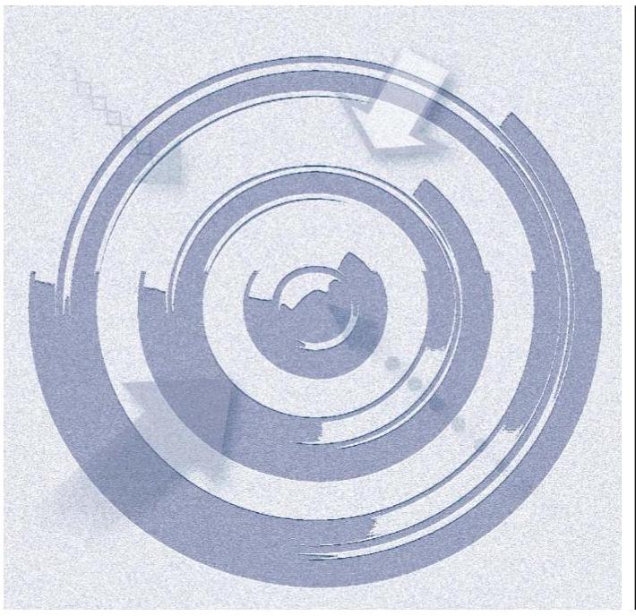

AZ ELLENŐRZÉS CÉLJA annak megállapítása volt, hogy az uniós forrásból finanszírozott K+F+I célú támogatások szabályszerű és eredményes felhasználása, hasznosulása érdekében a lebonyolításban résztvevő irányító hatóságok és közreműködő szervezetek kialakítottak és működtettek-e ellenőrzési, monitoring és értékelő rendszereket; az intézményrendszer átalakítása szabályszerűen valósult-e meg, biztosította-e a támogatások felhasználása, hasznosulása nyomon követésének folyamatosságát.

---

# AZ ELLENŐRZÉS TERÜLETE 

## A GOP 1. prioritás, valamint a KMOP 1.1., a TÁMOP 4.2. és a TIOP 1.3. prioritás vonatkozásában az irányító hatóságok és közremüködő szervezetek ellenőrzési, és monitoring tevékenysége, értékelő rendszerei, az érintett uniós projektek intézményrendszerének átalakítása

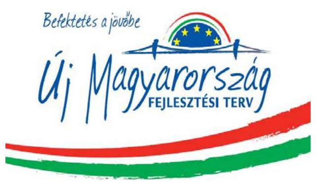

AZ ÚJ MAGYARORSZÁG FEJLESZTÉSI TERVET (ÚMFT ${ }^{1}$ ) Magyarország az Európai Unió 20072013 közötti költségvetési ciklusához igazodva készítette el. A Strukturális Alapok, a Kohéziós Alap, valamint hazai források felhasználására Magyarország az ÚMFT keretében Operatív Programokat $\left(\mathrm{OP}^{2}\right)$ készített. Az ÚMFT keretén belül 15 OP került elfogadásra az Európai Bizottság által. Az ÚMFT legfontosabb célja a foglalkoztatás bővítése és a tartós növekedés feltételeinek megteremtése volt.

## A KUTATÁS-FEJLESZTÉSSEL ÉS AZ IN-

NOVÁCIÓVAL kapcsolatos programok elsősorban a GOP ${ }^{3} 1$. prioritás keretében indultak, de a $\mathrm{K}+\mathrm{F}+\mathrm{I}^{4}$ területét érintő projekteket a TIOP ${ }^{5}$ 1.3. prioritás, a TÁMOP ${ }^{6} 4.2$ prioritás és a $\mathrm{KMOP}^{7} 1.1$. prioritás is tartalmazott.

A GOP 1. prioritás támogatta az olyan ipari kutatási és kísérleti fejlesztési tevékenységet, amely a vállalkozások, egyetemek és kutatóintézetek között valósult meg, valamint támogatást biztosított korszerű kutatási infrastruktúra kialakításához, szabadalmak bejelentéséhez. A prioritás célja volt továbbá innovációs és technológiai parkok létesítése és a meglévő intézmények fejlesztése.

A TIOP 1.3. célja a felsőoktatási tevékenységek színvonalának emeléséhez szükséges infrastrukturális és informatikai fejlesztések támogatása volt.

A TÁMOP 4.2. célja a felsőoktatásban történő kutatás-fejlesztés feltételrendszerének javítása, a kutatáshoz szükséges humánerőforrás és szolgáltatásfejlesztési igény finanszírozása.

A KMOP 1.1. prioritás célja olyan kutatás-fejlesztési projektek támogatása volt, amelyek kutatási eredményekre támaszkodva korszerű, magas értéket képviselő prototípusok, illetve esetenként piacképes termékek, eljárások és szolgáltatások létrejöttét eredményezték.

Az ÚMFT és az OP-k végrehajtásáért 2013. december 31-ig az NFÜ ${ }^{8}$ volt a felelős. Az ÚMFT irányító hatóságai az NFÜ keretében múködtek, amelyek az OP -kal kapcsolatos dokumentumok kidolgozását irányították, részt vettek a költségvetési tervezésében, valamint a közremúködő szervezetek bevonásával irányították a meghirdetett pályázatok és központi programok végrehajtását.

---

Az európai uniós fejlesztési források hazai intézményrendszere 2014ben jelentősen átalakult. Az NFÜ feladatait 2014. január 1-jét követően általános jogutódként a Miniszterelnökség, mint központi koordinációs szerv, az NFÜ egyes irányító hatóságainak feladatait a 475/2013. (XII.17.) Korm. rendelet szerinti minisztériumok látták el. A GOP és a KMOP operatív programok irányító hatósági feladatai az NGM ${ }^{9}$ - hez, míg a TÁMOP-TIOP programok tekintetében az EMMI ${ }^{10}$ - hez kerültek.

Az átalakítások kiterjedtek a K+F+I célú támogatások ${ }^{11}$ lebonyolításában résztvevő közreműködő szervezetekre is. A MAG Zrt., illetve az ESZA NKft. ${ }^{12}$ 2014. április 14-én megszűntek, feladataikat a K+F+I támogatásokat érintően az NGM, a Pro Regio NKft. ${ }^{13}$ és az EMMI vették át. A szervezeti átalakításokat az 1. táblázat szemlélteti.

1. táblázat

K+F+I TÁMOGATÁSOK INTÉZMÉNYI RENDSZERE

|  | Megnevezés | 2013.01.01-   2013.12.31. | 2014.01.01-   2014.04.14. | 2014.04.15-   2016.12.31. |
| :--: | :--: | :--: | :--: | :--: |
| GOP 1. | Irányító hatóság | NFÜ | NGM | NGM |
|  | Közreműködő szervezet | MAG Zrt. |  |  |
| KMOP 1.1. | Irányító hatóság | NFÜ | NGM | NGM |
|  | Közreműködő szervezet | MAG Zrt. |  | Pro Regio   NKft. |
| TÁMOP 4.2. | Irányító hatóság | NFÜ | EMMI | EMMI |
|  | Közreműködő szervezet | ESZA NKft. |  |  |
| TIOP 1.3. | Irányító hatóság | NFÜ | EMMI | EMMI |
|  | Közreműködő szervezet | ESZA NKft. |  |  |

Az irányító hatósági és közreműködő szervezeti feladatok ellátására az EMMI -nél EU fejlesztési és stratégiai helyettes államtitkárság, EU fejlesztések koordinációjáért és stratégiákért felelős államtitkárság, valamint az EU fejlesztések végrehajtásáért felelős helyettes államtitkárságok múködtek.

Az NGM irányító hatósági és közreműködő szervezeti feladatok ellátásáért felelős szervezeti egységei a Gazdaságfejlesztési programok végrehajtásáért felelős helyettes államtitkárság és a Regionális Fejlesztési Programokért felelős helyettes államtitkárság alá tartoztak.

Az EUTAF ${ }^{14}$ az államháztartásért felelős miniszter irányítása alá tartozó központi költségvetési szervként múködött az ellenőrzött időszakban.

Az EMMI, az NGM, és a Pro Regio NKft. adatszolgáltatása alapján a 2013 - 2016. években pénzügyileg lezárt, illetve a 2016. december 31-én folyamatban lévő K+F+I projektek támogatásának szerződés szerinti összértéke 334655 millió forint volt, amelynek megoszlását az 1. ábra szemlélteti.

---

1. ábra
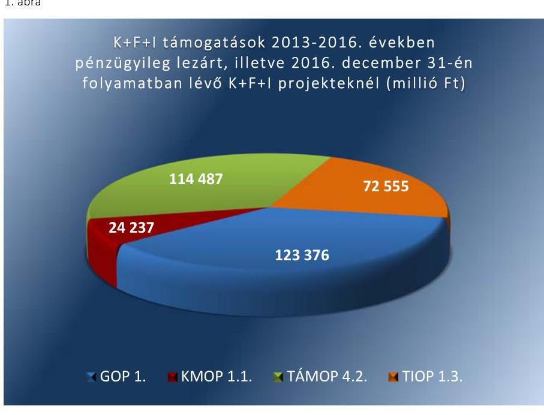

Forrás: EMMI, NGM, Pro Regio NKft. adatszolgáltatása
A megvalósuló programokkal és projektekkel kapcsolatos menedzsment (végrehajtási és kifizetési), monitoring, illetve ellenőrzési, szabálytalanságkezelési és számviteli feladatokat információ-technológiai rendszer, az Egységes Monitoring Információs Rendszer (EMIR ${ }^{15}$ ) támogatta. A projektek életútját a 2. ábra szemlélteti.
2. ábra
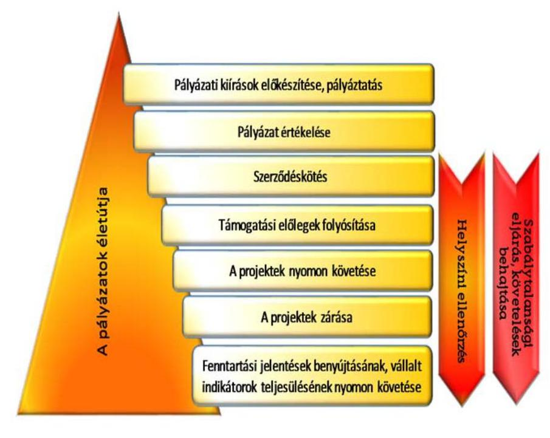

Forrás: ÁSZ szerkesztés

---

# **AZ ELLENŐRZÉS HÁTTERE, INDOKOLTSÁGA**

**Az uniós kutatás-fejlesztési és innovációs támogatások ellenőrzése - Az uniós forrásból finanszírozott kutatás-fejlesztési és innovációs támogatások nyomonkövetési rendszerének ellenőrzése**

Az ellenőrzés aktualitását adja, hogy a 2007-2013-as uniós költségvetési periódushoz kapcsolódó projektek lezárása folyamatban van. A 2014-2020-as időszakra rendelkezésre álló K+F+I célú források összege a korábbi időszakban előirányzott 53 milliárd euráról várhatóan 81 milliárd euróra nő, ezért annak szabályszerű és – stratégiákkal megalapozott – tervdokumentumokban foglalt célkitűzésekkel összhangban történő felhasználása kiemelt jelentőségű az ország jövőbeli gazdasági teljesítményének alakulása szempontjából. Az előző projektidőszak tapasztalatainak, az intézményrendszer átalakításának értékelése hasznosítható információt nyújthat a döntéshozók számára és elősegítheti a nyomonkövetési rendszer fejlesztését.

---

# FÓKUSZKÉRDÉSEK 

1. Az uniós forrásból finanszírozott $K+F+I$ támogatással kapcsolatos feladatok átadása-átvétele és az intézményrendszer átalakítása szabályszerűen valósult-e meg?
2. Biztosított volt-e az uniós forrásból finanszírozott $K+F+I$ támogatások szabályszerű és eredményes felhasználásának, hasznosulásának érdekében a támogatások monitoring és értékelési rendszerének müködése?
3. Megfelelően müködött-e az uniós forrásból finanszírozott $K+F+I$ támogatások szabályszerű és eredményes felhasználására, hasznosulására vonatkozó ellenőrzési rendszer?
4. Érvényesítették-e az integritás szemléletet az ellenőrzött szervezetek?

---

# ELLENŐRZÉS HATÓKÖRE ÉS MÓDSZEREI 

## Az ellenőrzés típusa

Megfelelőségi ellenőrzés.

## Az ellenőrzött időszak

A 2013-2016. évek. Az irányító hatóságok és a közreműködő szervezetek tekintetében a 2014-2016. évek.

## Az ellenőrzés tárgya

Az uniós forrásból finanszírozott K+F+I célú támogatások ellenőrzési, monitoring és értékelő rendszere, a kapcsolódó feladatok átadása, átvétele, az intézményrendszer átalakítása.

Az ellenőrzés kiterjed minden olyan körülményre és adatra, amely az ÁSZ jogszabályban meghatározott feladatainak teljesítéséhez, valamint a program végrehajtása folyamán felmerült újabb összefüggések feltárásához szükséges.

## Az ellenőrzött szervezet

Nemzetgazdasági Minisztérium; Emberi Erőforrások Minisztériuma; Európai Támogatásokat Auditáló Főigazgatóság; Pro Regio Közép-Magyarországi Regionális Fejlesztési és Szolgáltató Nonprofit Közhasznú Korlátolt Felelősségű Társaság.

## Az ellenőrzés jogalapja

Az ellenőrzés jogszabályi alapját az ÁSZ tv. 1. § (3) bekezdése képezi.

## Az ellenőrzés módszerei

Az ellenőrzést az ellenőrzési program szempontjai, az ellenőrzött időszakban hatályos jogszabályok, az ellenőrzés szakmai szabályai, a jelen ellenőrzésre irányadó ÁSZ módszertanok alapján végeztük.

Az ellenőrzési kérdések megválaszolásához szükséges bizonyítékok megszerzése az ellenőrzött szervezetek által rendelkezésre bocsátott dokumentumokra, adatokra alapozva, valamint elemző eljárás útján történt. Az ellenőrzési bizonyítékként felhasználható adatforrások közé tartoztak

---

egyrészt az ellenőrzési program részletes szempontjainál felsorolt adatforrások, másrészt minden egyéb - az ellenőrzés folyamán feltárt, az ellenőrzés szempontjából információt tartalmazó - dokumentum.

Az ellenőrzést végző az ellenőrzési bizonyosságot a következő ellenőrzési eljárások alkalmazásával szerezte meg: tételes dokumentumellenőrzés, kérdésfeltevés (információkérés), mintavételezés, valamint elemző eljárás.

Az ellenőrzés lefolytatásához az ellenőrzött szervezetek, a tanúsítványok kitöltésével, valamint az ÁSZ által kért dokumentumok megküldésével szolgáltattak adatokat.

Mintavétellel ellenőriztük a közreműködő szervezetek EU-s K+F+l támogatásokkal kapcsolatos operatív tevékenységei folyamatos és eseti nyomonkövetési rendszerének szabályszerűségét.

A minta alapján a sokaságban előforduló hibaarányt becsültük. „Megfelelőnek" értékeltünk egy ellenőrzött területet, amennyiben 95\%-os bizonyossággal a teljes sokaságban a hibaarány legfeljebb 10\%, „nem megfelelőnek", amennyiben 10\%-nál magasabb arányt képviselt.

Az integritás szemlélet érvényesülésének értékelése az ellenőrzött szervezetek által az ÁSZ integritás projektje keretében a 2015. évre kitöltött kérdőívek alapján, valamint az ellenőrzött szervezetek integritás kontroll rendszerének ellenőrzésével történt.

---

# MEGÁLLAPÍTÁSOK 

## 1. Az uniós forrásból finanszírozott $\mathrm{K}+\mathrm{F}+\mathrm{I}$ támogatással kapcsolatos feladatok átadása-átvétele és az intézményrendszer átalakítása szabályszerűen valósult-e meg?

Összegző megállapítás

A K+F+I célú támogatások vonatkozásában a folyamatos feladatellátás a hazai intézményrendszer 2014. évi átalakítása mellett is biztosított volt. Az uniós forrásból finanszírozott $\mathrm{K}+\mathrm{F}+\mathrm{I}$ támogatással kapcsolatos irányító szervi feladatok át-adás-átvétele a jogszabályi előírásoknak nem felelt meg. A közremúködő szervezetek közötti feladat átadás-átvétel két esetben szabályszerűen valósult meg, az ESZA Nkft. és az EMMI közötti átadás-átvételét dokumentumokkal nem támasztották alá.
1.1. számú megállapítás

Az uniós forrásból finanszírozott K+F+I projektekkel kapcsolatos feladatok átadás - átvétele az NFÜ és az NGM, valamint az NFÜ és az EMMI között a jogszabályi előírásoknak nem felelt meg. A közremúködő szervezeti feladatok átadás-átvétele a MAG Zrt. és a Pro Regio Nkft., valamint a MAG Zrt. és az NGM között szabályszerűen történt. A közremúködő szervezeti feladatok ESZA Nkft. és az EMMI közötti átadás-átvételét dokumentumokkal nem támasztották alá.

A FELADATOK ÁTADÁS-ÁTVÉTELE a 475/2013. (XII. 17.) Korm. rendelet 2. § (1) bekezdése alapján a TÁMOP 4.2. és a TIOP 1.3. prioritás vonatkozásában az NFÜ és az EMMI között, a GOP 1. prioritás és a KMOP 1.1 prioritás vonatkozásában az NFÜ és az NGM között történt. Az átadás-átvételi eljárásokban az NFÜ vezetője nem tett eleget a 2010. évi XLII. törvény ${ }^{16}$ 6. § (1) bekezdésében, valamint a 2/2010. (VI.8.) KIM rendelet ${ }^{17}$ 2. § (2) bekezdésében előírtaknak, mivel az átadás-átvételi eljárások jegyzőkönyvét az átadó meghatalmazottja írta alá. Az átadott, ismertetett adatok, információk, tények, okiratok, valóságtartalmáért történő teljes körű személyi felelősségvállalások nem feleltek meg a 2010. évi XLII. törvény 6. § (4) bekezdése rendelkezéseinek, mert a jegyzőkönyvek elválaszthatatlan részét képező teljességi nyilatkozatokat mindkét esetben az átadó meghatalmazottja írta alá.

Az NFÜ és az EMMI, illetve az NFÜ és az NGM közötti átadás-átvételi jegyzőkönyvek nem tartalmazták a 2010. évi XLII. törvény 6. § (2) bekezdésében és 1. sz. mellékletében, valamint a 2/2010. (VI. 8.) KIM rendelet 6. § (1) bekezdésében meghatározott tartalmi elemeket. Továbbá nem tartalmaztak információt arra vonatkozóan, hogy az átadott dokumentumokat digitalizált formában, időbélyegzőt tartalmazó hitelesített elektronikus aláírással ellátták-e.

---

# A KÖZREMŰKÖDŐ SZERVEZETI FELADATOK ÁT- 

ADÁS-ÁTVÉTELE a GOP 1. prioritás vonatkozásában a 96/2014. (III.25.) Korm. rendelet 1. § (1) bekezdés ac) pontja alapján a MAG Zrt. és az NGM között, a 2/2010. (VI.8) KIM rendeletben foglaltaknak megfelelően történt.

A közreműködő szervezeti feladatok átadás-átvétele a KMOP 1.1. prioritás vonatkozásában az 1225/2014. (IV. 10.) Korm. határozat 2. a) pontja alapján, a MAG Zrt. és a Pro Regio Kft. között - kisebb formai hiányosságoktól eltekintve - szabályszerűen történt. Az átadás-átvételi dokumentumok nem minden oldalán szerepelt az átadó aláírása és a szervezet bélyegzőjével történő hitelesítés.

A TÁMOP 4.2. és a TIOP 1.3. prioritás vonatkozásában a 96/2014. (III.25.) Korm. rendelet 1. § (1) bekezdés d) pontja alapján az ESZA Nkft. és az EMMI közötti átadás-átvételi eljárás nem felelt meg a 2/2010. (VI.8) KIM rendelet 6. § (1)-(2) pontjában foglaltaknak, mert az átadás-átvételt dokumentumokkal nem támasztották alá.

Az Európai Uniós támogatással megvalósuló K+F+I projektekkel kapcsolatos intézményrendszer átalakítása mellett is biztosított volt a feladatok folyamatos ellátását.

A HELYETTES ÁLLAMTITKÁRI MUNKA- ÉS FELADATKÖRÖKET az NGM a GOP 1. prioritás és a KMOP 1.1 prioritás vonatkozásában, és az EMMI a TÁMOP 4.2. és a TIOP 1.3. prioritás vonatkozásában a 2010. évi XLIII. tv. 62/A. § (1) bekezdése alapján kialakították az európai uniós források felhasználásával kapcsolatos irányító hatósági feladatok ellátására. Az NGM és az EMMI rendelkeztek a jogszabályi előírásoknak megfelelő szervezeti és múködési szabályzattal és ügyrendekkel.

A PRO REGIO NKFT., a KMOP 1.1 prioritás vonatkozásában a 4/2011. (I.28.) Korm. rendelet 3. melléklet 37. pontja alapján 2014. április 15-től közreműködő szervezeti feladatokat látott el. A Pro Regio Nkft. a jogszabályi előírásoknak megfelelően rendelkezett a szervezeti struktúrát, a folyamatokat, és a felelősségi, hatásköri viszonyokat, feladatokat egyértelműen meghatározó szervezeti és működési szabályzattal. A 4/2011. (I.28.) Korm. rendelet 5. § hd) pontjában, valamint az 5/A. § (1) bekezdés m) pontjában foglalt rendelkezések ellenére az NGM és a Pro Regio Nkft. a feladatellátás feltételeire és a feladatellátás finanszírozására a 2014. április 15. és 2015. december 31. közötti időszakban nem kötött szerződést. A szerződés megkötésére a 2016. január 1-től 2016. március 31-ig terjedő elszámolási időszakra vonatkozóan 2016. február 15-én, a 2016. április 1től 2016. december 31-ig tartó elszámolási időszakra vonatkozóan megbízási szerződés megkötésére 2016. augusztus 29. napján került sor.

---

# 2. Biztosított volt-e az uniós forrásból finanszírozott $\mathrm{K}+\mathrm{F}+\mathrm{I}$ támogatások szabályszerű és eredményes felhasználásának, hasznosulásának érdekében a támogatások monitoring és értékelési rendszerének múködése? 

Összegző megállapítás

Az uniós forrásból finanszírozott $\mathrm{K}+\mathrm{F}+\mathrm{I}$ támogatások monitoring és értékelési rendszere múködésének feltételeit biztosították, azonban nem minden esetben tettek eleget a jogszabályi előírásoknak. A közremúködő szervezetek nyomon követési rendszerének kialakítása összességében megfelelt a jogszabályi előírásoknak, azonban múködtetésük nem volt megfelelő.

Az irányító hatóságok - az NGM KMOP 1.1 programokért felelős irányító hatósága kivételével - a jogszabályi előírásoknak megfelelően alakították ki az uniós K+F+I támogatásokkal kapcsolatos operatív tevékenységek nyomon követési rendszerét.

AZ EMMI ÉS AZ NGM a 1083/2006/EK tanácsi rendelet II. fejezet 63. cikkével és a 4/2011. (I. 28.) Korm. rendelet 5/A. § (1) bekezdés s) pontjában előírtakkal összhangban gondoskodtak a Monitoring Bizottságok múködtetéséről és ügyrendjeinek kialakításáról.

AZ EMMI ÉS AZ NGM GOP. 1 PROGRAMOKÉRT FELELŐS IRÁNYÍTÓ HATÓSÁGA a jogszabályi előírásoknak megfelelően gondoskodott az ellenőrzési nyomvonalak, a szabálytalanságkezelési, követeléskezelési eljárásrend kialakításáról, továbbá a közbeszerzési eljárások ellenőrzése belső eljárásrendjének szabályozásáról kialakításáról.

A 4/2011. (I.28.) Korm. rendelet 12. § (1) bekezdésének d) pontjában rögzítettekkel ellentétben kockázatkezelési eljárásrenddel az EMMI irányító hatósága az ellenőrzött időszakban, az NGM GOP. 1 programokért felelős irányító hatósága a 2014. évben nem rendelkezett.

AZ NGM KMOP 1.1 PROGRAMOKÉRT FELELŐS IRÁNYÍTÓ HATÓSÁGA a 2014-2016. években a 4/2011. (I. 28.) Korm. rendelet 12. § (1) bekezdés d) pontja ellenére nem gondoskodott ellenőrzési nyomvonal, szabálytalanságkezelési, kockázatkezelési eljárásrend kialakításáról, valamint a közbeszerzési eljárások ellenőrzése belső eljárásrendjének szabályozásáról.

A határidőre nem teljesült projektekre vonatkozóan a jogszabályi előírásokkal összhangban az NGM GOP. 1 programokért felelős irányító hatósága és az EMMI irányító hatósága a 2014-2016. években, az NGM KMOP.1.1 programokért felelős irányító hatósága a 2014-2015. években projektfelügyeleti rendszert múködtetett.

---

AZ OPERATÍV PROGRAMOK megvalósításáról szóló éves jelentéseket a 2013-2014. évekre vonatkozóan az irányító hatóságok a jogszabályi előírásoknak megfelelően elkészítették. Az éves jelentéseket az Európai Bizottsághoz történő benyújtást megelőzően a Monitoring Bizottság jóváhagyta. A tagállamoknak a 2015. évre vonatkozó éves végrehajtási jelentést 2016 júniusában nem kellett benyújtaniuk.

Az irányító hatóságok a 4/2011. (I. 28.) Korm. rendelet 78. § (1) bekezdésében előírtaknak megfelelően az igazoló hatóság ${ }^{18}$ által meghatározott formátumú és tartalmú hitelesítési jelentéseket minden hónapban elkészítették. A hitelesítési jelentéseket a 4/2011. (I. 28.) Korm. rendelet 78. § (1) bekezdésében előírtakkal ellentétben, több esetben késedelmesen, a tárgyhónapot követő hónap huszadikát követően küldték meg az igazoló hatóság részére.

Az irányító hatóságok a 4/2011. (I. 28.) Korm. rendeletnek megfelelően a 4/2011. (I. 28.) Korm. rendeletben előírt feladatai ellátására kizárólagosan az EMIR rendszert használták.

SZABÁLYTALANSÁGI ELJÁRÁS a TÁMOP 4.2 esetében 127 db projektet, a TIOP 1.3 esetében 42 projektet érintett. A szabálytalansági eljárással érintett projektek vonatkozásában az NGM GOP.1. Programokért felelős irányító hatósága tekintetében 538 esetben, az NGM KMOP 1.1 programokért felelős irányító hatósága vonatkozásában 104 esetben érkezett szabálytalansági gyanúról írásbeli jelzés az ellenőrzött időszakban. A KMOP 1.1. prioritáshoz tartozó projektek fenntartási szakaszában három esetben történt szabálytalansági eljárás. Az EMMI és az NGM GOP. 1 programokért felelős irányító hatósága, valamint a KMOP projektjei tekintetében a Pro Regio Nkft., mint lebonyolító szervezet ${ }^{19}$ a 4/2011. (I. 28.) Korm. rendeletnek megfelelően, figyelemmel az EMK ${ }^{20}$ - ban foglaltakra végezte a követelések kezelésével és az adók módjára történő behajtással kapcsolatos feladatokat.

Az indikátorok teljesítését az irányító hatóságok a 4/2011. (I. 28.) Korm. rendeletnek megfelelően nyomon követték.
2.2. számú megállapítás

Az EMMI és az NGM irányító hatóságai az operatív programok értékeléséről a jogszabályi előírásoknak megfelelően beszámolót készítettek. Az EMMI a 2014. évre vonatkozó akciótervek éves operatív értékelését, továbbá a 2013. és 2015. évre vonatkozó akciótervek utólagos értékelését nem végezte el. Az NGM a 2016. évben nem végezte el a Pro Regio Nkft. tevékenységének szakmai értékelését.

AZ EMMI IRÁNYÍTÓ HATÓSÁGA a 4/2011. (I. 28.) Korm. rendeletnek megfelelően elkészítette az ellenőrzési hatóság éves ellenőrzési jelentések részét képező irányítási és ellenőrzési rendszer változásairól szóló beszámolókat, amelyeket a központi koordinációs szerven keresztül megküldött az ellenőrzési hatóság részére.

Az EMMI irányító hatósága által kialakított és múködtetett értékelési rendszer nem felelt meg a 4/2011. (I. 28.) Korm. rendeletben foglalt előírásoknak. Az EMMI irányító hatósága a 4/2011. (I. 28.) Korm. rendelet 5/A. § (1) bekezdés r) pontjában előírtak ellenére nem múködött közre a 20072013. programozási időszak értékelési tervének elkészítésében. Az EMMI

---

nem tett eleget a 2007-2013. időszakra szóló TÁMOP, valamint a TIOP 4.2.2 Értékelés fejezetében előírtaknak, mert nem végezte el a 2014. évre vonatkozó akciótervek éves operatív értékelését, továbbá a 2013. és 2015. évre vonatkozó akciótervek utólagos értékelését.

AZ NGM IRÁNYÍTÓ HATÓSÁGAI az operatív programok értékelési rendszerét megfelelően alakították ki. A 4/2011. (I. 28.) Korm. rendelet előírásainak megfelelően a 2007-2013. programozási időszak értékelési tervét elkészítették. Nyomon követték az akciótervek, támogatási konstrukciók változásait, a Monitoring Bizottságok részére beszámoltak az OP adott időszaki előrehaladásáról. Az NGM irányító hatóságai nem tettek eleget a GOP 6.2.2. Értékelés fejezetében, illetve a 2007-2013. időszakra vonatkozó KMOP 7.2.2. Értékelés fejezetében meghatározottaknak, ugyanis az operatív programok által előírt akciótervek éves operatív értékelését a 2014. évben, illetve az akciótervek utólagos értékelését a 2015. évben nem készítették el.

Az EMK 1. melléklet 662. pontjának megfelelően a 2014. I. negyedévében az NGM irányító hatóságai elvégezték a MAG Zrt. tevékenységének szakmai értékelését az általa elvégzett feladatok költségeinek megtérítése előtt. Az NGM KMOP.1.1 programokért felelős irányító hatósága a 20142015. években elvégezte, a 2016. évben az EMK 1. melléklet 662. pontjában előírtak ellenére nem végezte el a Pro Regio Nkft. tevékenységének szakmai értékelését.

# 2.3. számú megállapítás 

A közreműködő szervezetek a K+F+I támogatásokkal kapcsolatos operatív tevékenységei nyomon követési rendszerének müködtetése nem volt megfelelő.

A közreműködő szervezet feladatait ellátó szervezeti egységek vezetőinek és alkalmazottainak feladat- és hatáskörét a GOP 1. vonatkozásában a nemzetgazdasági miniszter SZMSZ-ben határozta meg. A projektek szakmai kezeléséhez kapcsolódó szabályzatokat, a bírálati, pályázatértékelési mechanizmust, az ellenőrzési nyomvonalat miniszteri utasításban szabályozták.

AZ NGM GOP 1. prioritás vonatkozásában a közreműködő szervezeti feladatait ellátó egységei K+F+I támogatásokkal kapcsolatos operatív tevékenységei nyomon követési rendszerének működtetése nem volt megfelelő. A tipikus hibák a következők voltak:
$\longrightarrow$ A 4/2011. (I. 28.) Korm. rendelet 17. § (1) bekezdés f) pontjában, a 26. § (5) bekezdésében és az EMK 1. sz. melléklet 78. pontjában előírtak ellenére a támogatói döntést az esetek többségében a döntést követő egy napon belül nem rögzítették az EMIR rendszerben.
$\longrightarrow$ A 4/2011. (I. 28.) Korm. rendelet 17. § (1) bekezdés d) pontjától és az EMK 1. sz. melléklet 209.1. pontjától eltérően több esetben nem gondoskodtak a kedvezményezett által benyújtott időközi beszámolók dokumentum alapú formai és tartalmi szempontból történő ellenőrzésének lefolytatásáról.

AZ EMMI közreműködő szervezeti feladatait ellátó egységek vezetőinek és alkalmazottainak feladat-és hatáskörét a TÁMOP 4.2 - TIOP 1.3 pri-

---

oritás vonatkozásában az emberi erőforrások minisztere SZMSZ-ben határozta meg. A szervezeti egységek vezetőinek és alkalmazottainak feladat és hatáskörét, a helyettesítés rendjét, továbbá a szervezeti egység belső és külső kapcsolattartásának módját a szervezeti egységek ügyrendjei a jogszabályi előírásoknak megfelelően tartalmazták.

A TÁMOP 4.2 - TIOP 1.3 prioritás vonatkozásában a közreműködő szervezet feladatait ellátó szervezeti egységek K+F+I támogatásokkal kapcsolatos operatív tevékenységei nyomon követési rendszerének működtetése nem volt megfelelő. A tipikus hibák a következők voltak:
$\longrightarrow$ A 4/2011. (I. 28.) Korm. rendelet 17. § (1) bekezdés f) pontjában, a 26. § (5) bekezdésében és az EMK 1. sz. melléklet 78. pontjában előírtak ellenére a támogatói döntést több esetben a döntést követő egy napon belül nem rögzítették az EMIR-ben.
$\longrightarrow$ A 26/2012. (X. 24.) NFM utasítás 270. § (3) bekezdése, és az EMK 1. sz. melléklet 260.1. pontjában előírt záró kifizetés igénylés és záró beszámoló határidőben történő beküldését számos esetben nem ellenőrizték.
$\longrightarrow$ A 4/2011. (I. 28.) Korm. rendelet 80. § (4)-(4a) bekezdése és az EMK. 1. sz. melléklet 366-367. pontjaiban előírt határidő betartását nem ellenőrizték, vagy hiánypótlásra felszólító levelet nem küldtek annak ellenére, hogy több esetben a projekt fenntartási jelentések nem készültek el határidőre.
$\longrightarrow$ A közreműködő szervezet vezetője a 4/2011. (I. 28.) Korm. rendelet 13. § (1) bekezdése előírásai ellenére a 2014-2016. években az általa működtetett irányítási és kontrollrendszerek megfelelő és megbízható működéséről szóló 2. melléklet szerinti nyilatkozattételi kötelezettségének nem tett eleget.

A PRO REGIO NKFT. megfelelően alakította ki a K+F+I támogatásokkal kapcsolatos operatív tevékenységek nyomon követési rendszerét. Szervezeti és Működési Szabályzatban szabályozta a közreműködő szervezeti feladatokat ellátó szerv, szervezeti egység által ellátott feladatok munkafolyamatainak leírását, a szervezeti egység vezetőinek és alkalmazottainak feladat- és hatáskörét, valamint kialakította ellenőrzési nyomvonalát.

A KMOP 1.1. prioritás vonatkozásában a K+F+I támogatásokkal kapcsolatos operatív tevékenységei nyomon követési rendszerének működtetése nem volt megfelelő. A tipikus hibák a következők voltak:
$\longrightarrow$ A projekt fenntartási jelentések benyújtásához kapcsolódóan kialakított kontrollok működése nem volt megfelelő. A fenntartási jelentések benyújtására történő felszólítások az 547/2013. (XII.30.) Korm. rendelet 1. melléklet 379. pontjában és a projekt fenntartási jelentésekre vonatkozó ellenőrzési nyomvonal 3.1. pontjában foglaltak ellenére több esetben 5 napon túl történtek, vagy nem történtek meg. A nem határidőben teljesített jelentéstétel esetén a Pro Regio Nkft. a fenntartási jelentésekre vonatkozó ellenőrzési nyomvonalának 3.1. pontjában foglaltak ellenére kötbérfizetési kötelezettséget egyetlen esetben sem írt elő.
$\longrightarrow$ A fenntartási jelentések formai és szakmai ellenőrzése az 547/2013. (XII.30.) Korm. rendelet 1. melléklet 381.1 pontjában és a projekt

---

fenntartási jelentésekre vonatkozó ellenőrzési nyomvonal 5. pontjában foglaltak ellenére számos esetben 15 napon túl történtek meg. Az esetek többségében az egyes jelentések ellenőrzése és jóváhagyása nem történt meg az 547/2013. (XII.30.) Korm. rendelet 1. melléklet 381.1. és 384.2 pontjában, valamint a projekt fenntartási jelentésekre vonatkozó ellenőrzési nyomvonal 5. és 8.1. pontjában foglaltak ellenére. Több esetben a fenntartási jelentések ellenőrzésének és jóváhagyásának elmaradása záró projekt fenntartási jelentést érintett, így a projektek 547/2013. (XII.30.) Korm. rendelet 1. melléklet 391.2 pontja szerinti lezárása nem történt meg.
$\longrightarrow$ A fenntartási jelentésekkel kapcsolatos hiányosságok esetén a hiánypótlásra történő felhívás megküldése a kedvezményezett részére az 547/2013. (XII.30.) Korm. rendelet 1. melléklet 382.1. pontjában és a projekt fenntartási jelentésekre vonatkozó ellenőrzési nyomvonal 6.1. pontjában foglaltak ellenére néhány esetben 15 napon túl történt meg.
$\longrightarrow$ Az 547/2013. (XII.30.) Korm. rendelet 1. melléklet 384.2. és 389.2. pontjaiban, valamint a projekt fenntartási jelentésekre vonatkozó ellenőrzési nyomvonal 6.2., 8.1. és 9.5. pontjaiban foglaltak ellenére a beékezett hiánypótlások ellenőrzése néhány esetben 10 napon túl történt meg. A közremúködő szervezet a fenntartási jelentések elfogadásáról néhány esetben 5 napon túl, a hiánypótlásra tekintettel 10 napon túl, a korrekciókról néhány esetben 10 napon túl döntött.
$\longrightarrow$ A fenntartási jelentés elutasítása esetén a Pro Regio Nkft. fenntartási jelentésekre vonatkozó ellenőrzési nyomvonalának 8.1. pontjában foglaltak ellenére kötbérfizetési kötelezettséget az elutasított fenntartási jelentések egyikénél sem írtak elő.

# 3. Megfelelően múködött-e az uniós forrásból finanszírozott $\mathrm{K}+\mathrm{F}+\mathrm{I}$ támogatások szabályszerű és eredményes felhasználására, hasznosulására vonatkozó ellenőrzési rendszer? 

Összegző megállapítás

Az EUTAF az ellenőrzéseit a jogszabályi előírásoknak megfelelően hajtotta végre. Az uniós forrásból finanszírozott K+F+I támogatások szabályszerű és eredményes felhasználására, hasznosulására vonatkozó ellenőrzési rendszer megfelelően múködött.
3.1. számú megállapítás

Az EUTAF az uniós K+F+I támogatások szabályszerű és eredményes felhasználására vonatkozó ellenőrzéseit a jogszabályi előírásoknak megfelelően hajtotta végre, a tervezett mintavételes és rendszerellenőrzéseket végrehajtották.

NEMZETI ELLENŐRZÉSI STRATÉGIÁVAL az EUTAF operatív programonként a 4/2011. (I. 28.) Korm. rendelet 107. § (1) bekezdése szerint rendelkezett. A 4/2011. (I. 28.) Korm. rendelet 107. § (6) bekezdése szerint a nemzeti ellenőrzési stratégiák éves felülvizsgálatát az EUTAF elvégezte, azonban az ellenőrzött időszakban a felülvizsgálatokat az

---

ellenőrzési kézikönyv 2.2.1.8. pontja ellenére évente határidőn túl - február 15-e után - hajtották végre.

AZ ÉVES ELLENŐRZÉSI TERVEKET az EUTAF a jogszabályi előírásoknak megfelelően elkészítette, a terveket az ellenőrzött időszakban operatív programonként és projektek szerint részletezte. Az ellenőrzési tervek mintavételes ellenőrzéseket és rendszerellenőrzéseket tartalmaztak. Az operatív programonként elkészített feljegyzésekben bemutatott projektek összevonásával készítették el az adott év operatív programokra vonatkozó ellenőrzési tervét.

Az EUTAF az éves ellenőrzési terveket a 2013-2014. években a jogszabályi előírások szerinti határidőben elkészítette, azonban a 2015. és 2016. években a TÁMOP-TIOP prioritások vonatkozásában az éves ellenőrzési tervet a 4/2011. (I. 28.) Korm. rendelet 108. § (3) bekezdésében előírt határidőn túl készítették el.

Az EUTAF a 2013-2016. években a 210/2010. (VI. 30.) Korm. rendelet 13. § (3) bekezdésében előírtak ellenére a jóváhagyott éves ellenőrzési terveket és módosításaikat egyik évében sem küldte meg a jóváhagyást követő 5 napon belül az illetékes szerveknek.

A jogszabályi előírásoknak megfelelően az EUTAF az operatív programok vonatkozásában éves rendszerességgel rendszerellenőrzéseket és mintavételes ellenőrzéseket is végzett.

ELLENŐRZÉSI KÉZIKÖNYVVEL az ellenőrzött időszakban az EUTAF a 210/2010. (VI. 30.) Korm. rendelet ${ }^{21}$ 6. § (1) bekezdése szerint rendelkezett, amelyet ötször módosítottak. Az ellenőrzési kézikönyv az ellenőrzött időszakban mindvégéig az NFÜ-t nevesítette, annak ellenére, hogy 2014. január 1-jétől az NFÜ általános jogutódjává a 475/2013. (XII. 17.) Korm. rendelet alapján a Miniszterelnökség vált.

Az ellenőrzésekről az ellenőrzési jelentéseket a 210/2010. (VI. 30.) Korm. rendelet 10. §-a alapján minden esetben elkészítették, amelyekhez csatolták az ellenőrzöttek jelentéstervezetre tett észrevételeit. Az észrevételekre minden esetben készült válaszlevél. A 25/2012. (VIII. 31.) NGM utasításban ${ }^{22}$ és a 3/2015 (II. 2.) NGM utasításban ${ }^{23}$ előírt, az ellenőrzési jelentés javaslatai alapján készített prioritásokról szóló beszámolók nyilvántartásáról és nyomon követéséről gondoskodtak.

AZ ÉVES JELENTÉSEKET és véleményeket az EUTAF operatív programonként évente elkészítette, amelyek a rendszerellenőrzések és projektellenőrzések eredményeit tartalmazták. A 4/2011. (I. 28.) Korm. rendelet 113. § (5) bekezdése szerint 2013. és 2015. között minden év december 31-éig az EUTAF az adott év június 30-án záruló 12 hónapos időszakra vonatkozóan az éves jelentéseket és véleményeket az Európai Bizottságnak megküldte.

Az 1083/2006/EK rendelet 62. cikk d) i. pontjával összhangban az éves jelentések az adott év július 1. és a következő év június 30. közötti időszakra tervezett ellenőrzések eredményeit foglalták össze. A 210/2010. Korm. rendelet 13. § (2) bekezdésében meghatározottak ellenére az EUTAF az államháztartásért felelős miniszter útján a Kormány részére minden év december 15-e után számolt be a tárgyévet megelőző év július 1-je és a tárgyév június 30-a között elvégzett ellenőrzésekről.

---

Az éves ellenőrzési jelentések összefoglalóit az EUTAF az ellenőrzött időszakban a 4/2011. (I. 28.) Korm. rendelet 113. § (5) bekezdése ellenére honlapján nem tette közzé.

Az EUTAF K+F+I támogatásokkal kapcsolatos ellenőrzési tevékenysége a mintatételek ellenőrzése alapján megfelelő volt.

# 3.2. számú megállapítás 

Az EMMI belső ellenőrzése az uniós K+F+I támogatásokkal kapcsolatos feladatellátás tekintetében végzett belső ellenőrzést, amivel támogatta a belső kontrollok múködését.

AZ EMMI Belső Ellenőrzési Főosztálya az ellenőrzött időszakban három területen végzett uniós $\mathrm{K}+\mathrm{F}+\mathrm{I}$ támogatásokat érintő belső ellenőrzést. Az ellenőrzések témái a követeléskezelés szabályszerűsége, a monitoring tevékenység és a szerződéskötés és módosítás szabályszerűsége voltak. A belső ellenőrzések eredményei alapján mindhárom esetben készült intézkedési terv. Az EMMI Belső ellenőrzési Főosztálya a belső ellenőrzési jelentés javaslataira készült intézkedési tervek megvalósítását, az intézkedési tervben megjelölt felelősök által készített beszámolók útján nyomon követte. Az EMMI Belső ellenőrzési Főosztálya a 4/2011. (I. 28.) Korm. rendelet 106. § (4) bekezdése ellenére a lezárt ellenőrzési jelentéseket nem küldte meg az igazoló hatóságnak.

## 3.3. számú megállapítás

A Pro Regio Nkft. végzett belső ellenőrzéseket az uniós K+F+I támogatásokkal kapcsolatban.

A KMOP 1.1. PRIORITÁS vonatkozásában a közreműködő szervezeti feladatokat 2014. április 15 - 2016. december 31. között a Pro Regio Nkft. látta el. A Pro Regio Nkft. a 2014. évben egy, a 2015. évben kettő belső ellenőrzést végzett az uniós K+F+I támogatásokkal kapcsolatban. Két ellenőrzés esetében a belső ellenőrzési jelentéseket határidőben - az ellenőrzés lezárását követő 15 napon belül - megküldték az igazoló hatóság részére. Az uniós K+F+I támogatások vonatkozásában elvégzett belső ellenőrzések közül egy esetben készült a megtett javaslatra intézkedési terv, amely megvalósításának folyamatos nyomon követéséről a Pro Regio Nkft. a Bkr. ${ }^{24}$ 47. § előírásai szerinti nyilvántartást vezetett. A Pro Regio Nkft. a 2014-2016. években a 4/2011. (I. 28.) Korm. rendelet 111. § (2) bekezdése ellenére évente március 31-ei és szeptember 30-ai zárónappal nem készített beszámolót az intézkedési tervek megvalósításának nyomon követéséről az ellenőrző hatóság részére.

---

# 4. Érvényesítették-e az integritás szemléletet az ellenőrzött szervezetek? 

Összegző megállapítás
Az EMMI, az EUTAF és az NGM a 2015. évben érvényesítette az integritás szemléletet.
4.1. számú megállapítás

Az EUTAF esetében mind a jogszabályi előírásokon, mind pedig a nem jogszabályi előírásokon alapuló kontrollok kiépítettsége magas volt. Az EMMI és az NGM esetében a jogszabályi előírásokon alapuló kontrollok kiépítettsége magas, a nem jogszabályi előírásokon alapuló kontrollok kiépítettsége alacsony volt.

Az integritás kontrolljainak múködését a 2015. évre vonatkozóan az NGM, az EMMI és az EUTAF által kitöltött integritási kérdőív alapján értékeltük. Az integritás kontrollrendszer kiépítettségével kapcsolatos megállapításokat a II. sz. melléklet tartalmazza.

---

# JAVASLATOK 

Az ÁSZ tv. 33. § (1) bekezdésében foglaltak értelmében az ellenőrzött szervezet vezetője köteles a jelentésben foglalt megállapításokhoz kapcsolódó intézkedési tervet összeállítani és azt a jelentés kézhezvételétől számított 30 napon belül az ÁSZ részére megküldeni. Amennyiben az ellenőrzött szervezet vezetője nem küldi meg határidőben az intézkedési tervet, vagy továbbra sem elfogadható intézkedési tervet küld, az Állami Számvevőszék elnöke az ÁSZ tv. 33. § (3) bekezdése a) és b) pontjaiban foglaltakat érvényesítheti.

## a nemzetgazdasági miniszternek:

1. A feltárt hiányosságok ismétlődésének megakadályozása érdekében gondoskodjon olyan kontrollrendszer kialakításáról, amely biztosítja a Nemzetgazdasági Minisztérium szervezeti keretei között müködő irányító hatóság és a közremüködő szervezetek monitoring rendszerének, valamint az irányító hatóságok értékelési rendszerének szabályszerű müködését.
(2.1. sz. megállapítás 4. bekezdése és a 2.2. megállapítás 3-4. bekezdései alapján, valamint a 2.3. sz. megállapítás 2-4. bekezdései alapján)

## az emberi erőforrások miniszterének:

1. A feltárt hiányosságok ismétlődésének megakadályozása érdekében gondoskodjon olyan kontrollrendszer kialakításáról, amely biztosítja az Emberi Erőforrások Minisztériuma szervezeti keretei között müködő közremüködő szervezetek monitoring rendszerének és az irányító hatóságok értékelési rendszerének szabályszerű müködését.
(2.2. sz. megállapítás 2. bekezdése, valamint a 2.3. sz. megállapítás 6-10. bekezdései alapján)
2. Intézkedjen az ESZA Nkft. és az EMMI közötti, a TÁMOP 4.2. és a TIOP 1.3. prioritás közremüködő szervezeti feladatait érintő szabályszerű átadás-átvétel elmaradása, vagy az ezt igazoló dokumentumok megőrzésének hiánya miatti szabálytalanságok tekintetében a munkajogi felelősség tisztázására irányuló eljárás megindításáról, és ennek eredménye ismeretében tegye meg a szükséges intézkedéseket.
(1.1. sz. megállapítás utolsó bekezdése alapján)

---

# MELLÉKLETEK 

## I. SZ. MELLÉKLET: ÉRTELMEZŐ SZÓTÁR

Belső kontrollrendszer

Egységes Monitoring Információs Rendszer (EMIR)

Ellenőrzési hatóság

Ellenőrzési nyomvonal

GOP

Igazoló hatóság

Indikátor

Intézkedési Terv

Irányító hatóság

Kedvezményezett

A kockázatok kezelése és tárgyilagos bizonyosság megszerzése érdekében kialakított folyamatrendszer, ami azt a célt szolgálja, hogy megvalósuljanak a következő célok:

- a múködés és a gazdálkodás során a tevékenységeket szabályszerűen, gazdaságosan, hatékonyan, eredményesen hajtsák végre,
- az elszámolási kötelezettségeket teljesítsék, és
- megvédjék az erőforrásokat a veszteségektől, károktól és a nem rendeltetésszerű használattól.
(Forrás: Áht. 69. § (1) bekezdése)
A strukturális alapokból, a Kohéziós Alapból, a PHARE-ból, az Átmeneti Támogatásból, a Schengen Alapból, az Európai Gazdasági Térség és Norvég Finanszírozási Mechanizmusból, valamint az ezekhez társuló hazai forrásokból megvalósuló programokkal és projektekkel kapcsolatos menedzsment (végrehajtási és kifizetési), monitoring, illetve ellenőrzési, szabálytalanságkezelési és számviteli feladatokat támogató információtechnológiai rendszer. (Forrás: 102/2006. (IV. 28.) Korm. rendelet 2. § (1) bekezdés a) pontja, 255/2006. (XII. 8.) Korm. rendelet 2. § (1) bekezdés e) pontja)
A tagállam által az egyes operatív programok számára kijelölt olyan nemzeti, regionális vagy helyi hatóság vagy szervezet, amely funkcionálisan független az irányító hatóságtól és az igazoló hatóságtól, és amely az irányítási és ellenőrzési rendszer eredményes múködésének vizsgálatáért felel. (Forrás: Az Európai Unió Tanácsának 2006. július 11-i 1083/2006/EK rendeletének 59. cikk 1. bekezdés c) pontja)
Az Európai Unió által meghatározott, a Nemzeti Stratégia Referencia Keret operatív programok támogatásai felhasználásának rendszervizsgálati eszköze, a támogatástervezési, pénzügyi irányítási és kontrollrendszerének leírása szövegesen vagy táblázatba foglalva, vagy folyamatábrával szemléltetve, amely tartalmazza különösen a felelősségi és információs szinteket és kapcsolatokat, továbbá irányítási és kontrollfolyamatokat, lehetővé téve azok nyomon követését és utólagos ellenőrzését. (Forrás: 4/2011. (I. 28.) Korm. rendelet 2. § (1) bekezdés 5. pontja)

A program célja a tudásalapú gazdaság erősítése, a vállalkozások nemzetközi versenyben való helytállása, a társadalmi, gazdasági és területi kohézió erősítése, a gazdasági és társadalmi változások miatt szükséges alkalmazkodóképesség javítása, elsősorban pedig a gazdaság tartós növekedésének elősegítése.
A tagállam által kijelölt nemzeti, regionális vagy helyi hatóság, illetve szervezet, amely a Bizottság részére történő megküldést megelőzően igazolja a költségnyilatkozatot és a kifizetési kérelmeket. (Forrás: Az Európai Unió Tanácsának 2006. július 11-i 1083/2006/EK rendeletének 59. cikk 1. bekezdés b) pontja)
Megvalósulást, teljesülést mérő fizikailag vagy pénzügyileg számszerűsített mutató. (Forrás: 4/2011. (I. 28.) Korm. rendelet 2. § (1) bekezdés 10. pontja)
Az ellenőrzési javaslatok alapján az ellenőrzött szervezet, szervezeti egység által készített intézkedések végrehajtásának ütemezése a végrehajtásáért felelős személyek és a vonatkozó határidők megjelölésével. (Forrás: 370/2011. (XII. 31.) Korm. rendelet 2. § (k) pontja)
A tagállam által az operatív program irányítására kijelölt nemzeti, regionális vagy helyi hatóság, illetve közjogi vagy magánszerv. (Forrás: Az Európai Unió Tanácsának 2006. július 11-i 1083/2006/EK rendeletének 59. cikk 1. bekezdés a) pontja)
A támogatásban részesített támogatást igénylő (Forrás: 4/2011. (I. 28.) Korm. rendelet 2. § (1) bekezdés 11. pontja)

---

| KMOP | A program célja a Közép-magyarországi régió nemzetközi versenyképességének növelése a fenntartható fejlődés elvének érvényesítése mellett. Az átfogó cél elérése érdekében két specifikus cél, a régió versenyképességét meghatározó tényezők fejlesztése, valamint a régió belső kohéziójának és harmonikus térszerkezetének fejlesztése került kijelölésre. |
| :--: | :--: |
| Kockázatkezelési rendszer | Olyan irányítási eszközök és módszerek összessége, melynek elemei a szervezeti célok elérését veszélyeztető tényezők (kockázatok) azonosítása, elemzése, csoportosítása, nyomon követése, valamint szükség esetén a kockázati kitettség mérséklése. (Forrás: 370/2011. (XII. 31.) Korm. rendelet 2. § (m) pontja) |
| Lebonyolításban érintett szervezet | Az irányító hatóság, illetve a közremúködő szervezet együttesen (Forrás: 4/2011. (I. 28.) Korm. rendelet 2. § (1) bekezdés 25. pont) |
| Közremúködő szervezet | Bármely közjogi vagy magánjogi intézmény, amely egy irányító vagy az igazoló hatóság illetékessége alatt jár el, vagy ilyen hatóság nevében hajt végre feladatokat a múveleteket végrehajtó kedvezményezettek tekintetében (Forrás: A Tanács 2006. július 11-ei 1083/2006/EK rendelet 2. cikk (6) bekezdése; Az Európai Parlament és a Tanács 2013. december 17-i 1303/2013. EU rendelete 2. cikk. 18. pontja) |
| Monitoring | A források felhasználásának (pénzügyi monitoring), az eredményeknek és a teljesítményeknek (szakmai monitoring) mindenre kiterjedő - többek között szabályossági, hatékonysági és célszerűségi - vizsgálata rendszeres jelleggel projekt, illetve program szinten. (Forrás: 102/2006. (IV. 28.) Korm. rendelet 2. § (1) bekezdés g) pontja) |
| Monitoring bizottság | Monitoring tevékenységet végző, elsősorban a program megvalósításában részt vevő partnerek képviselőiből álló, önálló jogalanyisaággal nem rendelkező testület. (Forrás: 102/2006. (IV. 28.) Korm. rendelet 2. § (1) bekezdés h) pontja) |
| Monitoring rendszer | A monitoring tevékenység folytatása céljából létrehozott intézmények, szervezetek, testületek és eszközök, eljárásrendek, valamint ezek működtetése érdekében foganatosított intézkedések összessége. (Forrás: 102/2006. (IV. 28.) Korm. rendelet 2. § (1) bekezdés j) pontja) |
| Nonprofit gazdasági társaság | Nem jövedelemszerzésre irányuló, közös gazdasági tevékenység közös folytatására alapított gazdasági társaság (nonprofit) amely bármely társasági formában alapítható és müködtethető. A gazdasági társaság nonprofit jellegét a gazdasági társaság cégnevében fel kell tüntetni. (Forrás: A 2006. évi IV. törvény 4. § (1) bekezdéséből levezetett fogalom) |
| Operatív program | A tagállam által benyújtott és a Bizottság által elfogadott dokumentum, amely összefüggő prioritások alkalmazásával fejlesztési stratégiát határoz meg, amelynek megvalósításához valamely alapból, illetve a „konvergencia" célkitúzés esetében a Kohéziós Alapból és az ERFA-ból támogatást vesznek igénybe. (Forrás: Az Európai Unió Tanácsának 2006. július 11-i 1083/2006/EK rendeletének 2. cikk 1. pont; Az Európai Parlament és a Tanács 2013. december 17-i 1303/2013. EU rendelete 2. cikk. 6. pont) |
| Program | Meghatározott célrendszer érdekében végrehajtandó feladatok és azok végrehajtására kidolgozott keretfeltételek egysége. (Forrás: 102/2006. (IV. 28.) Korm. rendelet 2. § (1) bekezdés s) pontja) |
| Projekt | A 1083/2006/EK tanácsi rendelet 2. cikk 3. pontjában meghatározott múvelet. (Forrás: 4/2011. (I. 28.) Korm. rendelet 2. § (1) bekezdés 22. pontja)   Múvelet a 1083/2006/EK tanácsi rendelet 2. cikk 3. pontja szerint: az érintett operatív program irányító hatósága által vagy hatáskörében a monitoring bizottság által megállapított kritériumoknak megfelelően kiválasztott projekt vagy projektcsoport, amelyet egy vagy több kedvezményezett hajt végre oly módon, hogy megvalósíthatóvá váljanak a kapcsolódó prioritási tengely céljai. |
| Strukturális alapok | Európai Regionális Fejlesztési Alap (ERSZA), Európai Szociális Alap (ESZA), Európai Mezőgazdasági Vidékfejlesztési Alap (EMVA), Európai Tengerügyi és Halászati Alap (ETHA) |
| Támogatási konstrukció | Azonos céllal, támogatható tevékenységekkel, támogatási formával és indikátorokkal jellemezhető egy vagy több pályázat illetve kiemelt projekt. (Forrás: 4/2011. (I. 28.) Korm. rendelet 2. § (1) bekezdés 28. pontja) |

---

Támogatási szerződés

Támogatói okirat

TÁMOP

TIOP

Új Magyarország Fejlesztési Terv /ÚJ Széchenyi terv (ÚMFT/ÚSZT)

A kedvezményezett és a Kormány európai uniós források felhasználásával kapcsolatos irányító hatósági feladatok ellátására kijelölt tagja között létrejött polgári jogi szerződés. (Forrás: 4/2011. (I. 28.) Korm. rendelet 2. § (1) bekezdés 27. pont)
A lebonyolításban érintett szervezet által kiadott dokumentum, amely a pályázat elfogadásával keletkeztet a támogatás nyújtásának és felhasználásának részletes szabályairól szólóan polgári jogi jogviszonyt. (Forrás: 4/2011. (I. 28.) Korm. rendelet 2. § (1) bekezdés 28. pont)
A program célja a munkaerő-piaci részvétel növelése a humánerőforrás minőségének javításával, az oktatás és képzés, a szociális szolgáltatások és az egészség megőrzését és helyreállítását célzó szolgáltatások eszközeire építve.
A program célja a humán közszolgáltatások fizikai infrastrukturális feltételeinek fejlesztése, hozzájárulás a tartós növekedéshez és a foglalkoztatás bővítéséhez. Magába foglalja az okta-tás-képzés, az egészségügyi ellátások, valamint a munkaerő-piaci és szociális szolgáltatások infrastruktúrájának fejlesztését.
Az Új Magyarország Fejlesztési Terv célja a foglalkoztatás bővítése és a tartós növekedés feltételeinek megteremtése. Ennek érdekében 2007-2013 között hat kiemelt területen indított el összehangolt állami és európai uniós fejlesztéseket: a gazdaságban, a közlekedésben, a társadalom megújulása érdekében, a környezet és az energetika területén, a területfejlesztésben és az államreform feladataival összefüggésben. Az Új Magyarország Fejlesztési Terv operatív programjai: Államreform Operatív Program (ÁROP); Elektronikus Közigazgatás Operatív Program (EKOP); Gazdaságfejlesztés Operatív Program (GOP); Környezet és Energia Operatív Program (KEOP); Közlekedés Operatív Program (KÖZOP); Dél-Alföldi Operatív Program (DAOP); Dél-Dunántúli Operatív Program (DDOP); Észak-Alföldi Operatív Program (ÉAOP); Észak-Magyarországi Operatív Program (ÉMOP); Közép-Dunántúli Operatív Program (KDOP); KözépMagyarországi Operatív Program (KMOP); Nyugat-Dunántúli Operatív Program (NYDOP); Társadalmi Infrastruktúra Operatív Program (TIOP); Társadalmi Megújulás Operatív Program (TÁMOP). Az Új Széchenyi Terv keretében uniós forrásból finanszírozott pályázati felhívások a 2011. február 9. utáni meghirdetésűek, az ezen időpont előtti meghirdetésűek tartoznak az ÚMFT-hez. (Forrás: A 1103/2006. (X. 30.) Korm. határozat alapján)

---

# II. SZ. MELLÉKLET: AZ INTEGRITÁS SZEMLÉLET ÉRVÉNYESÍTÉSÉVEL ÉS AZ INTEGRITÁS KONTROLLRENDSZER KIÉPÍTETTSÉGÉVEL KAPCSOLATOS MEGÁLLAPÍTÁSOK 

Az EUTAF jogszabályi előírásokon alapuló kontrollok kiépítettsége a 2015. évben magas volt: szabályozták a gazdálkodással kapcsolatos összeférhetetlenségi követelményeket, a munkáltató tulajdonában, kezelésében lévő egyes eszközök használatát, az iratkezelést, a szervezet információs rendszerét, a külső személyekkel való kapcsolattartást, a szervezeten kívülről érkező panaszok és közérdekű bejelentések kezelésének módját, a közérdekű adatok nyilvánosságra hozatalának és azok megismerésére irányuló igények teljesítésének rendjét. Az EUTAF a Magyar Kormánytisztviselői Kar Hivatásetikai Kódexét fogadta el, az abban meghatározott hivatásetikai alapelvek és az etikai eljárás szabályai valamennyi munkavállalóra érvényesek voltak. A szervezet minden alkalmazottja rendelkezett munkaköri leírással. Az integritás szemlélet erősítése, annak tudatosítása érdekében szabályszerűen kialakították a kockázatkezelési rendszert. A 2015. évben készítettek korrupciós kockázatelemzést, amelynek alapján nem volt szükséges a kockázatok újra értékelése, illetve intézkedések megtétele. Végeztek rendszeres kockázatelemzést a belső ellenőrzési tervek megalapozásához.

A nem jogszabályi előírásokon alapuló kontrollok 2015. évi kiépítettsége magas volt. Szabályozták a különféle ajándékok, meghívások, utaztatás elfogadásának feltételeit. A szervezet munkatársai kötelezően nyilatkoztak a gazdasági érdekeltségeikről, vagy egyéb, a szervezet tevékenysége szempontjából releváns összeférhetetlenségről. Az elmúlt három évben a dolgozók ellen szakmai etikai eljárás kötelezettségszegés miatt nem indult. Az új munkatársak kiválasztásakor minden esetben pályázatot írtak ki, tudásfelmérést végeztek és egyéni elbeszélgetést folytattak le, a benyújtott pályázati dokumentumok hitelességét ellenőrizték. Működtetettek egyéni teljesítményértékelési rendszert, amelynek eredménye befolyásolta az alkalmazottak éves jövedelmének alakulását. A szervezet alkalmazta a „négy szem elvét." Az integritás erősítése, és annak tudatosítása érdekében az EUTAF - nál volt korrupció ellenes képzés az elmúlt három évben. Ugyanakkor a szervezet működésében kockázatot jelentett, hogy nem készítettek adatkezelési szabályzatot, és nem rendelkeztek a szervezeten belüli közérdekű bejelentők védelméről.

Az EMMI a jogszabályi előírásokon alapuló kontrollok kiépítettsége a 2015. évben magas volt. Szabályozták a gazdálkodással kapcsolatos összeférhetetlenségi követelményeket, 2015. augusztus1-tól a gépjármú, valamint a mobil telefon magán használatát, az információs rendszert, a külső személyekkel való kapcsolattartást, a kockázatkezelés rendjét, kialakították a szervezet működésével összefüggő visszaélések-re, szabálytalanságokra, az integritási és korrupciós kockázatokra vonatkozó bejelentések fogadására és kivizsgálására vonatkozó eljárásrendet. Rendelkeztek iratkezelési szabályzattal, az informatikai szabályzat tartalmazta az adatkezelésre és az adatvédelemre vonatkozó előírásokat is. A munkavállalókra a Magyar Kormánytisztviselői Kar Hivatásetikai Kódexe mellett 2015. augusztus 1től a Magatartási Szabályzat hatálya is kiterjedt. Az EMMI minden alkalmazottja rendelkezett munkaköri leírással.

A nem jogszabályi előíráson alapuló kontrollok kiépítettsége a 2015. évben alacsony volt. A szervezet működésében kockázatot jelenthetett, hogy a humán-erőforrás gazdálkodás területén az új munkatársak kiválasztásakor nem írtak ki minden esetben pályázatot, nem végeztek rendszeres korrupciós kockázatelemzést, nem müködtették a kockázatkezelési rendszert, valamint nem rendelkeztek nyilvánosan közzétett stratégiával. Kialakították a különféle ajándékok, meghívások, utaztatás elfogadásának feltételeit, alkalmazták a „négy szem elvét". A szervezet munkatársai kötelezően nyilatkoztak a gazdasági érdekeltségeikről, vagy egyéb, a szervezet tevékenysége szempontjából releváns összeférhetetlenségről. A felvételi eljárások során ellenőrizték az állásra jelentkezők által benyújtott pályázati dokumentumok hitelességét és az új munkatársakkal minden esetben folytattak egyéni elbeszélgetést. Müködtettek egyéni teljesítményértékelési rendszert, amelynek eredménye befolyásolta az alkalmazottak éves jövedelmének alakulását. Az elmúlt három évben a dolgozók ellen nem indult szakmai etikai eljárás kötelezettségszegés miatt és volt korrupció ellenes képzés.

Az NGM jogszabályi előírásokon alapuló kontrollok kiépítettsége a 2015. évben magas volt. Szabályozták a gazdálkodással kapcsolatos összeférhetetlenségi követelményeket, a külső személyekkel való kapcsolattartást, a szervezeten kívülről érkező panaszok és közérdekű bejelentések kezelésének rendjét. Az NGM rendelkezett iratkezelési és informatikai szabályzattal. Utóbbi többek között tartalmazta a nem papíralapú információk, adatok kezelésének szabályait, azonban nem határozták meg a minősített adatok kezelésére vonatkozó titokvédelmi szabályokat. Az NGM a Magyar Kormánytisztviselői Kar Hivatásetikai Kódexét tekintette irányadónak, az abban meghatározott hivatásetikai

---

alapelvek és etikai eljárás szabályai valamennyi foglalkoztatottra érvényesek voltak. Az NGM dolgozóinak volt munkaköri leírása. Az integritás erősítése és annak tudatosítása, valamint a kockázatelemzések alkalmazása feltételeinek megteremtése érdekében szabályszerűen kialakították a kockázatkezelési rendszert.

A nem jogszabályi előíráson alapuló kontrollok kiépítettsége a 2015. évben alacsony volt. A szervezet működésében kockázatot jelentett, hogy az etikai elvárások kontrollok között nem szerepelt a különféle ajándékok, meghívások, utaztatás elfogadása feltételeinek meghatározása. Az új munkatársak kiválasztásakor nem alkalmaztak minden esetben pályáztatást. A nem kívánatos dolgozói magatartással szembeni intézkedések között nem biztosították a szervezeten belüli közérdekú bejelentők védelmét. Az NGM rendelkezett nyilvánosan közzétett stratégiával, amely azonban nem érintette a szervezeti kultúra javításának, az integritás erősítésének és a korrupció elleni fellépésnek a témakörét. Ugyanakkor elősegítette az integritás érvényesülését, hogy a felvételi eljárások során az állásra jelentkezők által benyújtott pályázati dokumentumok hitelességét ellenőrizték. Az új munkatársak kiválasztásakor minden esetben egyéni elbeszélgetést folytattak. Működtettek egyéni teljesítményértékelési rendszert. A teljesítményértékelések befolyásolták az alkalmazottak éves jövedelmének alakulását. A 2015. évben kötelezettségszegés miatt egyetlen munkatárs ellen sem indult szakmai etikai eljárás, valamint a szervezetnél volt korrupció ellenes képzés. Az NGM munkatársai kötelezően nyilatkoztak a gazdasági érdekeltségeikről, vagy egyéb, a szervezet tevékenysége szempontjából releváns összeférhetetlenségről.

---

.

---

# FÜGGELÉK: ÉSZREVÉTELEK 

A jelentéstervezetet a Számvevőszék 15 napos észrevételezésre megküldte az ellenőrzött szervezetek vezetőinek az ÁSZ tv. 29. §* (1) bekezdése előírásának megfelelően.
Az elfogadott észrevételek alapján a Számvevőszék módosította a jelentést.

A függelék tartalmazza az Emberi Erőforrások Minisztériumának közigazgatási államtitkára és a Pro Regio Nkft. ügyvezető igazgatója által megküldött észrevételeket, az azokra adott válaszokat, illetve az el nem fogadott észrevételek elutasításának indoklását.

[^0]
[^0]:    * 29. § (1) Az Állami Számvevőszék az ellenőrzési megállapításait megküldi az ellenőrzött szervezet vezetőjének vagy az általa megbízott személynek, és annak, akinek személyes felelősségét állapította meg.
    (2) Az ellenőrzött szervezet vezetője és a felelősként megjelölt személy az ellenőrzés megállapításaira tizenöt napon belül írásban észrevételt tehet.
    (3) Az Állami Számvevőszék az észrevételre a beérkezésétől számított harminc napon belül írásban válaszol. A figyelembe nem vett észrevételeket köteles a jelentésben feltüntetni, és megindokolni, hogy azokat miért nem fogadta el.

---

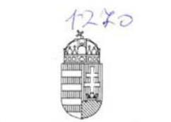

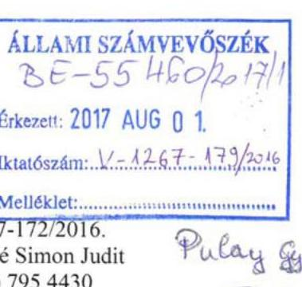

Iktatószám: 40811-1/2017/ELL

Hiv. szám: V-1267-172/2016.
Ügyintéző: Bánkné Simon Judit
Tel. szám: +36 (1) 795 4430
Melléklet: 1 db és 1 db DVD

Domokos László részére
elnök

Állami Számvevőszék

Budapest
Apáczai Csere János u. 10.
1052

Tárgy: Észrevétel jelentéstervezethez

Tisztelt Elnök Úr!

„Az uniós kutatás-fejlesztési és innovációs támogatások ellenőrzése” című számvevőszéki jelentéstervezethez – a Szervezeti és Működési Szabályzat 145. § (1) bekezdés (g) pontjában meghatározott jogkörömben eljárva – az alábbi észrevételeket teszem.

1) Megállapítás (jelentéstervezet 14. oldal):

Az NFÜ és az EMMI, illetve az NFÜ és az NGM közötti átadás-átvételi jegyzőkönyvek nem tartalmazták a 2010. évi XLII. törvény 6. § (2) bekezdésében és 1. sz. mellékletében, valamint a 2/2010. (VI. 8.) KIM rendelet 6. § (1) bekezdésében meghatározott tartalmi elemeket.

Észrevétel:

Kérjük, hogy a megállapítást az NFÜ-EMMI átadás-átvételi jegyzőkönyv tekintetében törölni szíveskedjenek. A Magyar Köztársaság minisztériumainak felsorolásáról szóló 2010. évi XLII. törvény 6. § (2) bekezdésében foglaltak szerint a jegyzőkönyv mintáját és tartalmi követelményeit a törvény 1. számú melléklete tartalmazza. Tehát a törvény jegyzőkönyv mintát ír elő. A jegyzőkönyv tartalmi követelményeiről szóló 1. melléklet leglényegesebb, III. pontja a jegyzőkönyvben foglaltak szerint elektronikus adathordozón került átadásra. Az átadott adatállomány egyedi azonosítójának jegyzőkönyvben történő feltüntetése megfelel az egyes állami szervek és állami tulajdonú, valamint egyéb szervezetek átadás-átvételi eljárásáról szóló 2/2010. (VI. 8.) KIM rendelet 6. § (1) bekezdésében előírt követelménynek. Az informatikai átadás-átvétel tekintetében a Nemzeti Fejlesztési Ügynökség megszüntetésével összefüggő egyes kérdésekről

Cím: 1054 Budapest Akadémia utca 3. Tel: +36 1 795 1200, Fax: +36 1 795 0022
E-mail: info@emmi.gov.hu

---

szóló 475/2013. (XII. 17.) Korm. rendelet 4. § (4)-(5) bekezdése az irányadó, mely jogszabályhelyre a jegyzőkönyvben is történik hivatkozás.

# 2) Megállapítás (jelentéstervezet 14-15. oldal): 

Informatikai jegyzőkönyvek a 2010. évi XLII. törvény 6. § 11-12 bekezdéseiben, valamint a 2/2010. (VI. 8.) KIM rendelet 5. §-ban foglalt előírások ellenére nem készültek. Az informatikai átadás-átvételre vonatkozó utalásokat a jegyzőkönyvek nem tartalmaztak. Nem tartalmaztak információt arra vonatkozóan, hogy az átadott dokumentumokat digitalizált formában, időbélyegzőt tartalmazó hitelesített aláírással látták el.

## Észrevétel:

Az informatikai rendszerek átadásáról készült jegyzőkönyvet és a kapcsolódó dokumentumokat, valamint az ESZA Nonprofit Kft. vezetőjének nyilatkozatait csatoltan megküldjük. Kérjük, hogy a megállapítást törölni szíveskedjenek. Az ellenőrzés során ezzel kapcsolatosan az EMMI részére konkrét adatbekérés nem érkezett.

## 3) Megállapítás (jelentéstervezet 15. oldal):

A Közremüködő Szervezeti feladatok átadás-átvétele a TÁMOP 4.2 és TIOP 1.3 prioritás vonatkozásában a 96/2014. (III. 25.) Korm. rendelet 1. § (1) bekezdés d) pontja alapján az ESZA Nkft. és az EMMI közötti átadás-átvételi eljárás nem felelt meg a 2/2010. (VI. 8.) KIM rendelet 6. § 1-2 pontjában foglaltaknak, mert az átadás-átvételt dokumentumokkal nem támasztották alá.

## Észrevétel:

A hivatkozott jogszabályok alapján elkészített átadás-átvételi jegyzőkönyvet és az alátámasztó dokumentumokat elektronikus formában csatoljuk, egyben kérjük, hogy a megállapítást törölni szíveskedjenek. Az ellenőrzés során ezzel kapcsolatosan az EMMI részére konkrét adatbekérés nem érkezett.

## 4) Megállapítás (jelentéstervezet 16. oldal):

A 4/2011. (I. 28.) Korm. rendelet 12. § (1) bekezdésének d) pontjában rögzítettekkel ellentétben kockázatkezelési eljárásrenddel az EMMI irányító hatósága az ellenőrzött időszakban nem rendelkezett.

## Észrevétel:

Az EMMI közremüködő szervezeti feladatokat ellátó elődszervezete, majd az EU Fejlesztések Végrehajtásért Felelős Helyettes Államtitkárság rendelkezett kockázatkezelési módszertannal, amelyek különböző eljárásrendekbe építve, azok szerves részét képezték. Ezek az eljárásrendek az alábbiak:
Folyamatba épített, Előzetes, Utólagos és Vezetői Ellenőrzés kialakításának és működtetésének eljárásrendje (ESZA Nkft./FEUVE; 2013-2014).
Az eljárásrend célja, hogy a folyamatba épített, előzetes, utólagos és vezetői ellenőrzés rendszerének kialakításával, egységes szabályozásával és működtetésével biztosítsa a pályázatkezelési tevékenység során keletkező kockázatok feltárását, és azok nemkívánatos

---

hatásainak minimalizálását, hozzájárulva ezzel a közreműködő szervezet jogszerú, hatékony és eredményes müködéséhez.
Az ESZA FEUVE eljárásrend hatályon kívül lett helyezve az EMMI-be való beolvadáskor, és az EMMI kockázatkezelési szabályzata került alkalmazásra:
Szabályzat az Emberi Erőforrások Minisztériuma kockázatkezeléséről, a szabálytalanságok kezeléséről és a gazdálkodási tevékenységeinek ellenőrzési nyomvonaláról (2016).
Helyszíni ellenőrzés eljárásrendjei
A mindenkor hatályos helyszíni ellenőrzés eljárásrend tartalmazza azt a kockázatelemzési módszertant, amely alapján kiválasztásra kerülnek a helyszínen ellenőrizendő projektek.
Az eljárásrendeket és az EMMI kockázatkezelési szabályzatát levelünk mellékleteként elektronikus formában csatoltan megküldjük, egyben kérjük, hogy a megállapítást törölni szíveskedjenek.

# 5) Megállapítás (jelentéstervezet 17. oldal): 

Az irányító hatóság a 4/2011. (I. 28.) Korm. rendelet 78. § (1) bekezdésében előírtaknak megfelelően az igazoló hatóság által meghatározott formátumú és tartalmú hitelesítési jelentéseket minden hónapban elkészítette. A hitelesítési jelentéseket a fenti jogszabályban előírtakkal ellentétben, több esetben késedelmesen, a tárgyhónapot követő hónap huszadikát követően küldték meg az igazoló hatóság részére.

## Észrevétel:

A hitelesítési jelentések minden hónap 20. napját megelőzően informálisan megküldésre kerültek az Igazoló Hatóság részére word formátumban annak egyeztetése és jóváhagyása céljából. A jelentések az Igazoló Hatóság észrevételeinek egyeztetése és átvezetése után kerültek aláírásra és újra megküldésre a hatóság részére.

A 2013. december és a 2014. január havi jelentések elkészítésének folyamatát jelentősen lassították a 2013. december hónapban bekövetkezett szervezeti átalakulások, amelyek következtében a fent nevezett jelentések később kerülhettek megküldésre az Igazoló Hatóság részére.

A 2014-2020-as programozási időszakban elkészített EFOP és RSZTOP hitelesítési jelentések rendszeresen minden hónap 20. napjáig megküldésre kerültek az Igazoló Hatóság részére.

## 6) Megállapítás (jelentéstervezet 17. oldal):

Az EMMI irányító hatósága által kialakított és müködtetett értékelési rendszer nem felelt meg a 4/2011. (I. 28.) Korm. rendeletben foglalt előírásoknak. Az EMMI IH a rendelet 5/A (1) bekezdés r) pontjában előírtak ellenére nem működött közre a 2007-2013. programozási időszak értékelési tervének elkészítésében.

## Észrevétel:

A központi koordinációs szervvel egyeztetve, véleményünk szerint az IH közreműködött az értékelési tervek (és egyébként az egyes értékelések) kidolgozásában, véleményezésében is: a 2007-2013 időszakban ugyanis valamennyi irányító hatóság és érintett minisztérium azonos módon vett részt. Ennek jellemző rendje az volt, hogy az értékelések elvégzéséért a központi koordinációban felelős szervezeti egység előzetes konzultációk után elkészítette az értékelési terv

---

tervezetét, ezt megküldte az érintett szervezeteknek, amelyek azt véleményezték, majd az egyeztetések alapján az értékelések elvégzéséért felelős szervezeti egység elkészítette a végleges értékelési tervet, amelyről tájékoztatta a VOP Monitoring Bizottságot, és amelyet végül közzétett a honlapján. Az értékelési tevékenység a 2007-2013 időszakban a Tanács 1083/2006/EK rendeletben előírt európai uniós szabályozásnak teljes mértékben megfelelt, és az értékelésért felelős európai bizottsági és tagállami szakmai szervezetek körében komoly elismerésnek örvendett.

Emellett fontos rámutatni, hogy

- a 1083/2011 EK rendelet 48. § szerint az értékelési terv készítése a 2007-2013 időszakban nem volt kötelező, csak lehetőség: „tagállamok adott esetben - a 13. cikkben meghatározott arányosság elvével összhangban - a „konvergencia" célkitüzés vonatkozásában értékelési tervet is összeállíthatnak, amely bemutatja azokat az indikatív értékelési tevékenységeket, melyeket a tagállam a végrehajtás különböző szakaszaiban el kíván végezni",
- a tagállam részére a rendelet nem határozott meg kötelezően elvégzendő értékelést az előzetes értékeléseken túl,
- és végül az értékelési tervben szereplő értékeléseket sem lehetett minden esetben elvégezni - előfordulhatott például, hogy időközben okafogyottá vált a tervezett értékelés, vagy nem állt rendelkezésre megfelelő szerződéses kapacitás az értékelés elvégzésére, stb.

Megjegyezzük, hogy a megállapításból nem érthető, hogy pontosan melyik értékelési tervre vonatkozik a 2007-2013 időszakban: a 2010-12 időszakra vonatkozó tervre (https://www.palyazat.gov.hu/ertekelesi_terv_2010_2012), vagy a 2011-2013 időszakra vonatkozó értékelési tervre (https://www.palyazat.gov.hu/ertekelesi_terv_2011_2013), esetleg a jelenleg hatályos értékelési tervre (https://www.palyazat.gov.hu/rtkelsi-terv-2014-2020), amely szintén tartalmaz értékelést a TÁMOP-ra és a TIOP-ra vonatkozóan.

A fentieken túl, az irányító hatóságok is készítettek értékeléseket, amelyek nem szerepeltek a központi koordináció által kezelt értékelési tervben.
7) Megállapítás (jelentéstervezet 17-18. oldal):

Az EMMI nem tett eleget a 2007-2013. időszakra szóló TÁMOP valamint TIOP 4.2.2 Értékelési fejezetben előírtaknak, mert nem végezte el a 2014. évre vonatkozó akciótervek éves operatív ellenőrzését, továbbá a 2013. és 2015. évre vonatkozó akciótervek utólagos értékelését.

# Észrevétel: 

A Tanács 1083/2011 EK rendelete nem tette kötelezővé a tagállam számára az utólagos értékelést, a Rendelet szerint ez az Európai Bizottság feladata, és az akcióterv készítése sem volt európai uniós előírás, csak a hazai szabályozásba került bele a tervezhetőség támogatására.
8) Megállapítás (jelentéstervezet 18. oldal):

Az EMMI nem tett eleget a 146/2010. (IV. 29.) Korm. rendelet 7. §-ában meghatározott adatszolgáltatási kötelezettségének, mivel nem küldte meg a KSH részére azon szervezetek listáját, amelyek részére költségvetési forrásból az előző naptári évben kutatás-fejlesztési célra kifizetés történt.

---

# Észrevétel: 

Figyelemmel arra, hogy a vizsgálat megállapításai kifejezetten az uniós forrásból finanszírozott kutatás-fejlesztési és innovációs támogatásokra, vagyis a XIX. fejezetből biztosított támogatásokra vonatkoznak, - amelyek tekintetében az államháztartásról szóló törvény végrehajtásáról szóló 368/2011. (XII. 31.) Korm. rendelet 1. sz. melléklete alapján a fejezetet irányító szerv az EMMItól eltérő szerv - így a hivatkozott adatszolgáltatási kötelezettség és annak elmaradása EMMI vonatkozásában nem értelmezhető, a megállapítás a hivatkozott Korm. rendeletre tekintettel nem fogadható el. Kérjük, hogy a megállapítást törölni szíveskedjenek.
9) Megállapítás (jelentéstervezet 19. oldal):

A TÁMOP 4.2 valamint a TIOP 1.3 prioritás vonatkozásában a közremüködő szervezet feladatait ellátó szervezeti egységek $\mathrm{K}+\mathrm{F}+\mathrm{I}$ támogatásokkal kapcsolatos operatív tevékenységei nyomonkövetési rendszerének müködtetése nem volt megfelelő. A támogatói döntést több esetben a döntést követő egy napon belül nem rögzítették az EMIR-ben, a záró kifizetési igénylés és záró beszámoló határidőben történő beküldését számos esetben nem ellenőrizték, a jogszabályban előírt határidő betartását nem ellenőrizték, vagy a hiánypótlásra felszólító levelet nem küldték annak ellenére, hogy a projekt fenntartási jelentések nem készültek el határidőre.

## Észrevétel:

5 érintett projektből 3 esetben határidőben beérkezett a záró kifizetési igénylés és a záró beszámoló. A fennmaradó 2 projekt esetében mutatkozott 14 , illetve 19 napos késedelem a beszámoló benyújtásában. A későbbiekben kiemelt figyelmet fordítunk az eljárásrendi lépések és határidők történő betartására.

A vizsgálat által megállapított határidőkkel kapcsolatos észrevételek sem a döntés, sem a záró beszámoló, sem a projekt fenntartási jelentések vonatkozásában nem voltak ráhatással a projektek eredményes megvalósítására.
10) Megállapítás (jelentéstervezet 19. oldal):

A KSZ vezetője 2014-2016. években az általa müködtetett irányítási és kontrollrendszerek megfelelő és megbízható működéséről szóló 2. melléklet szerinti nyilatkozattételi kötelezettségének nem tett eleget. (4/2011. (I. 28.) Korm. rendelet 13. § (1) bekezdés)

## Észrevétel:

A 2014. év 01.01-04.15 időszakára vonatkozó, az irányítási és kontrollrendszerek megfelelő és megbízható működéséről szóló vezetői nyilatkozatot levelem mellékleteként csatolom. 2014.04.16-tól a szervezeti átalakulást követően a Közremüködő Szervezet és az Irányító Hatóság egy szervezeti egységhez tartozik, így erre az időszakra vonatkozóan a nyilatkozat nem releváns.

Továbbá felhívjuk a figyelmet, hogy a jelentéstervezetben szereplő, közvetítő szervezet fogalma a közreműködő szervezet fogalmától eltérő jelentéstartalommal bír, erre tekintettel javasoljuk annak módosítását.

---

# 11) Megállapítás (jelentéstervezet 22. oldal): 

Az EMMI Belső ellenőrzési Főosztálya a 4/2011. (I. 28.) Korm. rendelet 106. § (4) bekezdése ellenére a lezárt ellenőrzési jelentéseket nem küldte meg az igazoló hatóságnak.

## Észrevétel:

Indokoltnak tartjuk a megállapítás törlését, mert 2015-ben a 31109-3/2015/ELL iktatószámú levél mellékleteként, 2016-ban az 50-4/2016/ELL iktatószámú levél mellékleteként az ellenőrzési jelentések az Igazoló Hatóság felé megküldésre kerültek. (A hivatkozott leveleket csatoltan megküldöm.)
12) Megállapítás (jelentéstervezet 22. oldal):

A 4/2011. (I. 28.) 111. § (2) bekezdésének előírásai ellenére az EMMI Belső Ellenőrzési Főosztálya az ellenőrzött időszakban az intézkedési tervek megvalósításának nyomonkövetéséről készített beszámolókat nem határidőben küldte meg az ellenőrzési hatóság részére.

## Észrevétel:

A megállapítást pontosítani szükséges, mert ez a tevékenység az ellenőrzött időszakban hatályos SZMSZ szerint nem a Belső Ellenőrzési Főosztály feladatkörébe tartozott.

Az 547/2013 (XII. 30.) Korm. rendelet 627.1 és pontja alapján az európai uniós források felhasználásáért felelős miniszter feladata az ellenőrzéskoordináció, amely feladatot a központi koordinációs szerv ellenőrzések koordinációjáért felelős szervezeti egysége lát el. A Korm. rendelet 637.1-5 pontja alapján az intézkedési tervek időarányos teljesüléséről szóló beszámolót az irányító hatóság köteles megküldeni az ellenőrzések koordinációjáért felelős szervezeti egység részére, az intézkedési terv időarányos teljesüléséről szóló, az irányító hatóságok által megküldött beszámolókat az ellenőrzések koordinációjáért felelős egység archiválja és küldi meg az összesített beszámolót az ellenőrző hatóság részére.

Az EMMI EU Fejlesztések Végrehajtásáért Felelős Helyettes Államtitkára az intézkedési tervek előrehaladásáról készített beszámolókat a kért határidőben rögzítette az ELLI rendszerben és vezetői aláírással két példányban megküldte az ellenőrzési koordinációt ellátó Miniszterelnökség Ellenőrzési Főosztálya részére.

Kérem Elnök Urat, hogy az észrevételeket szíveskedjenek figyelembe venni.
Budapest, 2017. július, 2. 8 ,

## Üdvözlettel:

Dr. Lengyel Györgyi

---

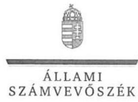

ELKÖK

Ikt. szám: V-1267-182/2016

# Balog Zoltán miniszter úr 

Emberi Erőforrások Minisztériuma

## Budapest

## Tisztelt Miniszter Úr!

„Az uniós kutatás-fejlesztési és innovációs támogatások ellenőrzése - Az uniós forrásból finanszirozott kutatás-fejlesztési és innovációs támogatások nyomon követési rendszerének ellenőrzése" címmel készített számvevőszéki jelentéstervezetre dr. Lengyel Györgyi közigazgatási államtitkár úrhölgy által tett, 40811-1/2017/ELL. iktatószámú levélben küldött észrevételt köszönettel megkaptam.

Az Állami Számvevőszék észrevételre vonatkozó álláspontjáról a felügyeleti vezető által készített tájékoztatást csatoltan megküldöm.

Tájékoztatom Miniszter urat, hogy a számvevőszéki jelentésben - az Állami Számvevőszékről szóló 2011. évi LXVI. törvény 29. § (3) bekezdése alapján - a figyelembe nem vett észrevételt szerepeltetjük az elutasítás indokának feltüntetésével.

Budapest, 2017. augeseties hó 14. nap
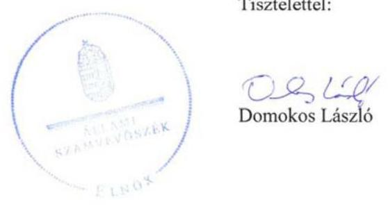

Melléklet: Tájékoztatás az észrevételek kezeléséről

---

# Tájékoztatás 

## az észrevételek kezeléséről

„Az uniós kutatás-fejlesztési és innovációs támogatások ellenörzése - Az uniós forrásból finanszirozott kutatás-fejlesztési és innovációs támogatások nyomon követési rendszerének ellenörzése" című jelentéstervezet megállapításaira dr. Lengyel Györgyi, az Emberi Erőforrások Minisztériuma közigazgatási államtitkára által tett, az 40811-1/2017/ELL. iktatószámú levelében küldött észrevételeket értékeltük, és azok kezelésével kapcsolatban a következő tájékoztatás adom.

## Az 1.1. megállapítást alátámasztó rész 2. bekezdéséhez írt észrevételre adott válasz

Tekintettel arra, hogy az NFÜ és az EMMI között a dokumentumok átadására elektronikus úton került sor, az átadás megbízhatósága szempontjából kiemelt jelentősége van az erre vonatkozó jogszabályi előírások maradéktalan betartásának. A 2/2010.(VI.8.) KIM rendelet 6.§ (1) bekezdésének utolsó mondata előírja, hogy az „elektronikus módon átadott átadás-átvételi dokumentáció esetén az elektronikus aláírással hitelesített és időbélyegzővel ellátott formátumot az átvevő a helyszínen ellenőrzi és ennek eredményét a jegyzőkönyvben rögzíti". A helyszíni ellenőrzés megtörténtét a jegyzőkönyv nem tartalmazta. Ehelyett jegyzőkönyvbe foglalták azt, hogy az „átvevő az átvett állomány md5 checksum-jának előállításával ellenörizheti az adathordozón lévő állomány eredetiségét, sérthetetlenségét". Az utólagos ellenőrzés lehetőségének rögzítése azonban nem azonos értékủ a helyszíni ellenőrzés jogszabályban előírt kötelezettségével. A jegyzőkönyv e garanciális elemének hiánya miatt az sem állapítható meg tárgyilagos bizonyossággal, hogy az átadás-átvétel a hivatkozott törvény 1. számú mellékletében foglalt minden tartalmi követelménynek megfelelt. Ennek alapján a jelentéstervezet módosítása nem indokolt.

## Az 1.1. megállapítást alátámasztó rész 3. bekezdéséhez írt észrevételre adott válasz

Tekintettel arra, hogy az észrevételében hivatkozott kormányrendeleti szabályozás alapján informatikai átadás-átvételre a NFÜ és az EMMI között nem került sor, az informatikai jegyzőkönyvek hiányára vonatkozó kifogást az irányító hatóságok esetében a jelentéstervezetből törlőm. Ez nem eredményezi az 1.1 megállapítás módosítását.

## Az 1.1. megállapítást alátámasztó rész utolsó bekezdéséhez írt észrevételre adott válasz

Az észrevételben írottakkal szemben a 2017. február 9-én, a helyszíni szemrevételezésen készült jegyzőkönyvnek „az Emberi Erőforrások Minisztériuma által vállalat ötnapos határidővel szolgáltatott dokumentumok" című részének 10. pontja tételesen tartalmazta az ESZA Nkft. és az EMMI közötti átadás-átvétel jegyzőkönyv és egyéb dokumentumai megküldésére vonatkozó adatigényt. A kért dokumentumokat azonban az EMMI nem küldte meg. 2017. február 16-án dr. Garai Péter, az EMMI uniós fejlesztések végrehajtásáért felelős helyettes államtitkára nyilatkozatot adott a megküldött dokumentumok teljes körűségéről. Ennek alapján a jelentéstervezet helyesen tartalmazza, hogy az átadás-átvétel nem volt dokumentumokkal alátámasztva. A teljességi és hitelességi nyilatkozatot követően megküldött dokumentumokat ellenőrzési bizonyítékként nem fogadhatjuk el. A jelentéstervezet módosítása nem indokolt.

## A 2.1. megállapítást alátámasztó rész 3. bekezdéséhez írt észrevételre adott válasz

Az észrevételben foglaltak is alátámasztják, hogy a feladat-átvételtől kezdve az EMMI új kockázatkezelési szabályzatának hatálybalépéséig (2016. június 27 -ig) az EMMI irányító

---

hatósága nem rendelkezett kockázatkezelési eljárásrenddel. A teljességi és hitelességi nyilatkozatot követően megküldött szabályozást ellenőrzési bizonyítékként nem tudjuk elfogadni. A jelentéstervezet módosítása nem indokolt.

# A 2.1. megállapítást alátámasztó rész 7. bekezdéséhez írt észrevételre adott válasz 

Az észrevételében leírtak is alátámasztják, hogy a hitelesítési jelentések több esetben késedelmesen kerültek megküldésre az igazoló hatóságnak. A jelentéstervezet módosítása nem indokolt.

## A 2.2. megállapítást alátámasztó rész 2. bekezdéséhez írt észrevételre adott válasz

Az erre a megállapításra vonatkozó észrevétel első bekezdésében leírt, az irányító hatóságnak az értékelési terv előkészítésében és az operatív programot érintő értékelési tevékenységében való közremüködését az EMMI dokumentumokkal nem támasztotta alá, annak ellenére, hogy az ÁSZ adatbekérő levele 3. számú melléklete 1. a) pontjának 15 . francia bekezdése az erre vonatkozó adatigényt tételesen tartalmazta. Dokumentum hiányában a tevékenységet nem tudjuk megtörténtként elfogadni, tekintettel arra, hogy a megküldött dokumentumokról az EMMI illetékes vezetője teljességi és hitelességi nyilatkozatot adott.
A vonatkozó észrevétel második bekezdése első és második francia bekezdésében írtakat nem tudom érvként elfogadni, mivel ha az értékelést a magyar kormányrendelet előírta, akkor azt attól függetlenül el kell végezni, hogy azt az uniós rendelet kötelezővé teszi-e vagy sem. Ez az indokolás vonatkozik a 7. számú észrevételben írtak elutasítására is.
Az észrevétel második bekezdés harmadik francia bekezdésében foglaltak nem cáfolják a jelentéstervezet megállapítását.
Az észrevétel harmadik bekezdésében foglaltakra válaszolva arról tájékoztatom, hogy az értékelési terv pontos megnevezését nem tartom szükségesnek a következőre tekintettel. Az értékelési terv előkészítésében és az operatív programot érintő értékelési tevékenységben való közremüködés kötelezettségét a 4/2011. (I.28.) Korm. rendelet 5/A. § (1) bekezdés r) pontja a teljes programozási időszakra előírja. A jelentés ezzel összhangban a hiányosságot a 20072013. programozási időszak egészére vonatkozóan állapítja meg.

A jelentéstervezet módosítása nem indokolt.

## A 2.2. megállapítást alátámasztó rész 3. bekezdéséhez írt észrevételre adott válasz

Az észrevételt elfogadom. A kifogásolt szövegrészt töröljük a jelentéstervezetből. Ez nem érinti a 2.2. megállapítást, mivel az a törölt részre való utalást nem tartalmaz.
A 2.3. megállapítást alátámasztó rész EMMI közremüködő szervezetére vonatkozó bekezdés második francia bekezdésére tett észrevételre adott válasz
Az észrevétel is alátámasztja a jelentéstervezet megállapítását, miszerint késedelmek több esetben is előfordultak. A jelentéstervezet módosítása nem indokolt.

## A 2.3. megállapítást alátámasztó rész EMMI közremüködő szervezetére vonatkozó bekezdés negyedik francia bekezdésére tett észrevételre adott válasz

A teljességi és hitelességi nyilatkozatot követően beküldött dokumentumot nincs módunk ellenőrzési bizonyítékként elfogadni. A közremüködő szervezet vezetőjének a nyilatkozattételi felelőssége a 2014. 04. 16-ai átalakulást követően is fennállt, csak attól kezdve nyilatkozatát a közremüködő szervezet és az irányító hatóság közös vezetőjeként kellett megtennie. Arra vonatkozóan sem küldött az EMMI a teljességi és hitelességi nyilatkozat kiadásáig dokumentumot, hogy a közremüködő szervezet és az irányító hatóság közös vezetője eleget tett a nyilatkozattételi kötelezettségnek. A jelentéstervezet módosítása nem indokolt.

---

A 3.2. megállapítást alátámasztó rész 1. bekezdéséhez írt észrevételre adott válasz
A teljességi és hitelességi nyilatkozat megadását követően megküldött leveleket nem áll módunkban ellenőrzési bizonyítékként elfogadni.
A 3.2. megállapítást alátámasztó rész 1. bekezdéséhez írt észrevételre adott válasz
Az észrevételt elfogadom, és ez alapján a vitatott mondatot törlöm. Ez nem érinti a 3.2. megállapítást.
Az emberi erőforrások minisztere részére megfogalmazott 2. javaslat szövegének pontatlanságát jelző észrevételre adott válasz
A figyelmeztetést köszönjük, a közvetítő szervezet megfogalmazást közreműködő szervezetre pontosítjuk.

Budapest, 2017. augusztus 10.

---

# Domokos László 

elnök úr részére

## Állami Számvevőszék

Tisztelt Elnök Úr!
Hivatkozással a V-1267-178/2016. iktatószámú levelükre, az „uniós kutatási-fejlesztési és innovációs támogatások ellenőrzése - az uniós forrásokból finanszírozott kutatási-fejlesztési és innovációs támogatások nyomon követési rendszerének ellenőrzése" címủ jelentéstervezettel kapcsolatban az alábbi észrevételeket tesszük.

A 4/2011. (I.28.) Korm. rendelet 3. számú mellékletének módosítása alapján a KMOP Közremüködő Szervezeti feladatait 2017. április 1-tól a Magyar Államkincstár látja el. Ezért a tervezetnek a KMOP Közremüködő Szervezeti (KSZ) tevékenységgel összefüggő egyes megállapításaira vonatkozóan a Pro Regio Nkft. csak korlátozottan tud észrevételt tenni, mivel a KSZ iratanyag, illetve a tématerülettel foglalkozó HR kapacitás intézményrendszeren belüli HR-átcsoportosítással - a Magyar Államkincstár részére átadásra került. Ezért kérjük a tárgykörben a KMOP KSZ feladatott ellátó, illetékes Magyar Államkincstár észrevételeinek is a szíves figyelembevételét.

A Pro Regio Nkft. a rendelkezésére álló információk alapján a tervezettel kapcsolatban az alábbi észrevételeket teszi.
ad.1. A tervezet 5. oldal összegzés részében a KMOP-ra vonatkozóan eltúlzottnak tartjuk azon megállapítást, miszerint ,,...a támogatások monitoring és értékelési rendszere nem biztositotta megfelelően a támogatások szabályszerü és eredményes felhasználását".

Álláspontunk szerint a KMOP esetében az európai uniós források felhasználása szabályszerű és eredményes volt. A támogatások felhasználásának (támogatási célnak megfelelő) szabályszerűségét a Közremüködő Szervezet folyamatosan, a teljes támogatási folyamat alatt, több kontrollrendszert beépitve - mind adminisztratív úton, mind helyszíni ellenőrzésekkel - vizsgálta, szabálytalansági gyanú esetekben eljárást indított, illetve kezdeményezett.

Pro Régió Nonprofit Közhasznú Kft.
1146 Budapest, Hermína út 17.
T.: (1) 4718954 Fax: (1) 4718975
E-mail: proregio@proregio.hu
Honlap: www.proregio.hu

---

A monitoring és értékelési rendszerben feltárt kisebb hiányosságok (pl. PFJ feldolgozásiidőtúllépések) olyan reparálható, alacsony kockázatú, pénzügyi érdeksérelmet nem jelentő hiányosságok, amelyek elsősorban a támogatások hatásainak mérésére, annak naprakészségére gyakorolhatnak hatást. Ugyanakkor véleményünk szerint a támogatások a KMOP esetében eredményesen kerültek felhasználásra, amit alátámaszt a KMOP indikátormutatóinak jelentős túlteljesítése is.

Ezért kérjük a hivatkozott megállapítás elhagyását, vagy alábbiak szerinti módosítását: ,,... a monitoring és értékelési rendszerben hiányosságok tapasztalhatóak."
ad.2. A tervezet 15. oldal 1.2. sz. megállapításának, a KMOP KSZ feladatok finanszírozásával kapcsolatban előadjuk, a ME-JHSZ/J/1790/2014. iktatószámú SLA szerződés hatálya a 2014.04.15. - 2015.12.31. közötti időszakra is kiterjedt, a KSZ feladatok ellátásának finanszírozása folyamatosan biztosított volt. Ezért javasoljuk a vonatkozó megállapítás módosítását.
ad.3. A tervezet 18. oldalának a KSZ tevékenység szakmai értékelésével kapcsolatban megjegyezzük, a Pro Regio Nkft. a KSZ tevékenység finanszírozásának elszámolásához a szakmai tevékenység bemutatását is csatolta a 2016. évben.
ad.4. A 20. oldalon a PFJ benyújtási késedelme, illetve elutasításának esetében kiszabható kötbérrel kapcsolatban megjegyezzük, az EMK 380.1., illetve 384.5. pontjai a kötbérfizetést opcionális lehetőségként, nem pedig kötelező jelleggel írják elő (,...kötbérfizetési kötelezettséget lehet előírni."). Ezért kérjük a vonatkozó megállapítások alábbiak szerinti módosítását.
Ez első bekezdés utolsó mondata:
„A nem határidöben teljesitett jelentéstétel esetén a Pro Regio Nkft. kötbérfizetési kötelezettséget nem irt elö."
Utolsó bekezdés:
„A fenntartási jelentés elutasitása esetén a Pro Regio Nkft. kötbérfizetési kötelezettséget nem irt elö."
ad.5. A 23. oldal 3.3. számú megállapításával kapcsolatban megjegyezzük, a Pro Regio Nkft. az intézkedési tervek végrehajtását nyomon követte, azok végrehajtásáról gondoskodott.

A tervezet véleményezésének lehetőségét ezúton is köszönjük! Kérjük a tervezet véglegesítése során észrevételeink szíves figyelembe vételét.
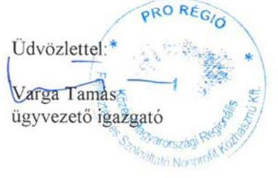

---

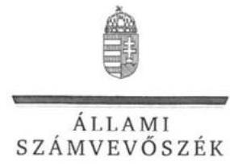

# Varga Tamás úr 

ügyvezető igazgató
Pro Regio Közép-Magyarországi Regionális
Fejlesztési és Szolgáltató Nkft.

## Budapest

## Tisztelt Ügyvezető Igazgató Úr!

„Az uniós kutatás-fejlesztési és innovációs támogatások ellenőrzése - Az uniós forrásból finanszírozott kutatás-fejlesztési és innovációs támogatások nyomon követési rendszerének ellenőrzése" címmel készített számvevőszéki jelentéstervezetre levelében küldött észrevételt köszönettel megkaptam.

Az Állami Számvevőszék észrevételre vonatkozó álláspontjáról a felügyeleti vezető által készített tájékoztatást csatoltan megküldöm.

Tájékoztatom Igazgató urat, hogy a számvevőszéki jelentésben - az Állami Számvevőszékről szóló 2011. évi LXVI. törvény 29. § (3) bekezdése alapján - a figyelembe nem vett észrevételt szerepeltetjük az elutasítás indokának feltüntetésével.

Budapest, 2017. augurths hó 14. nap
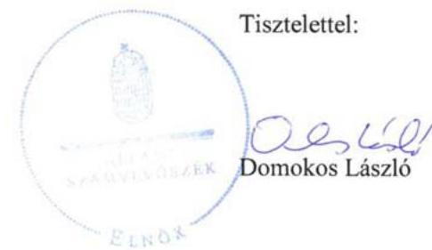

Melléklet: Tájékoztatás az észrevételek kezeléséről

---

# 1. számú melléklet 

a V-1267-183/2016. számú levélhez

## Tájékoztatás

## az észrevételek kezeléséről

„Az uniós kutatás-fejlesztési és innovációs támogatások ellenörzése - Az uniós forrásból finanszírozott kutatás-fejlesztési és innovációs támogatások nyomon követési rendszerének ellenörzése " című jelentéstervezet megállapításaira Varga Tamás, a Pro Regió Nkft. ügyvezető igazgatója által tett észrevételeket értékeltük, és azok kezelésével kapcsolatban a következő tájékoztatás adom.

1. A jelentéstervezet összegzésére tett észrevételre adott válasz

Az ellenőrzés során végrehajtott mintavételes eljárás olyan mértékben állapított meg hiányosságokat, amelyek indokolják a jelentéstervezetben szereplő megfogalmazást. A jelentéstervezet módosítása nem indokolt.
2. Az 1.2. megállapítást alátámasztó rész 2. bekezdéséhez írt észrevételre adott válasz
Az ellenőrzés feltárta, hogy az NGM és a Pro Regió Nkft. a hivatkozott, az NFÜ és a MAG Zrt. között kötött megállapodást tekintette irányadónak, azonban a szerződés hatálya nem terjedt ki a 2014.04.15 és a 2015.12.31. közötti időszakra, mivel a Pro Regió Nkft. nem volt a MAG Zrt. jogutódja. A jelentéstervezet módosítása nem indokolt.
3. A 2.2. megállapítást alátámasztó rész utolsó bekezdéséhez írt észrevételre adott válasz
A jelentéstervezet nem a szakmai tevékenység bemutatásának elmaradását, hanem az értékelésének az elmaradását hiányolja. A jelentéstervezet módosítása nem indokolt.
4. A 2.3. megállapítást alátámasztó rész Pro Regió Nkft. tevékenységét tárgyaló bekezdése utolsó francia bekezdéséhez írt észrevételre adott válasz
A fenntartási jelentésekre vonatkozó ellenőrzési nyomvonalban a Pro Regió Nkft. maga írta elő a kötbérfizetési kötelezettség alkalmazását. Ennek azonban nem tett eleget. A jelentéstervezet módosítása nem indokolt.
5. A 3.3. megállapítást alátámasztó részéhez írt észrevételre adott válasz

A Pro Regio Nkft ezt bizonyító dokumentumot nem bocsátott az ellenőrzés részére e tevékenységek ellátásáról. Így azok hiányát kellett megállapítanunk. A jelentéstervezet módosítása nem indokolt.

Budapest, 2017. augusztus 4.

---

.

---

# RÖVIDÍTÉSEK JEGYZÉKE 

${ }^{1}$ ÚMFT
${ }^{2}$ OP
${ }^{3}$ GOP
${ }^{4} \mathrm{~K}+\mathrm{F}+\mathrm{I}$
${ }^{5}$ TIOP
${ }^{6}$ TÁMOP
${ }^{7}$ KMOP
${ }^{8}$ NFÜ
${ }^{9}$ NGM
${ }^{10}$ EMMI
${ }^{11} \mathrm{~K}+\mathrm{F}+\mathrm{I}$ célú támogatások
${ }^{12}$ ESZA Nkft.
${ }^{13}$ Pro Regio Nkft.
${ }^{14}$ EUTAF
${ }^{15}$ EMIR
${ }^{16}$ 2010. évi XLII. törvény
${ }^{17}$ 2/2010. (VI.8.) KIM rendelet
${ }^{18}$ igazoló hatóság
${ }^{19}$ lebonyolító szervezet
${ }^{20}$ EMK
${ }^{21}$ 210/2010. (VI. 30.) Korm. rendelet
${ }^{22}$ 25/2012. (VIII. 31.) NGM utasítás
${ }^{23}$ 3/2015 (II. 2.) NGM utasítás
${ }^{24}$ Bkr.

Új Magyarország Fejlesztési Terv
Operatív Program
Gazdaságfejlesztési Operatív Program
Kutatás-fejlesztés és innováció
Társadalmi Infrastruktúra Program
Társadalmi Megújulás Operatív Program
Közép-Magyarországi Operatív Program
Nemzeti Fejlesztési Ügynökség
Nemzetgazdasági Minisztérium
Emberi Erőforrások Minisztériuma
a tudományos kutatásokat, a vállalati fejlesztéseket és az innovatív ötletek megvalósítását ösztönző uniós fejlesztési források
ESZA Társadalmi Szolgáltató Nkft.
Pro Regio Közép-Magyarországi Regionális Fejlesztési és Szolgáltató Nonprofit Közhasznú Kft.
Európai Támogatásokat Auditáló Főigazgatóság
Egységes Monitoring Információs Rendszer
2010. évi XLII. törvény a Magyar Köztársaság minisztériumainak felsorolásáról 2/2010. (VI. 8.) KIM rendelet az egyes állami szervek és állami tulajdonú, valamint egyéb szervezetek átadás-átvételi eljárásáról
Magyar Államkincstár
Az EMK 503.3. pontjában definiált, a XV. fejezet vonatkozásában az Irányító hatóság és a közremüködő szervezet együttesen
547/2013. (XII. 30.) Korm. rendelet az egységes múködési kézikönyvről
210/2010. (VI. 30.) Korm. rendelet az Európai Támogatásokat Auditáló Főigazgatóságról
25/2012. (VIII. 31.) NGM utasítás az Európai Támogatásokat Auditáló Főigazgatóság Szervezeti és Múködési Szabályzatáról (Hatálytalan: 2015.II.21-jétől) 3/2015 (II. 2.) NGM utasítás az Európai Támogatásokat Auditáló Főigazgatóság Szervezeti és Múködési Szabályzatáról
370/2011. (XII. 31.) Korm. rendelet a költségvetési szervek belső kontrollrendszeréről és belső ellenőrzéséről

---

# ÁLLAMI SZÁMVEVŐSZÉK 

1052 Budapest, Apáczai Csere János utca 10.
Levélcím: 1364 Budapest 4. Pf. 54
Telefon: +36 14849100 Telefax: +36 14849200
www.asz.hu