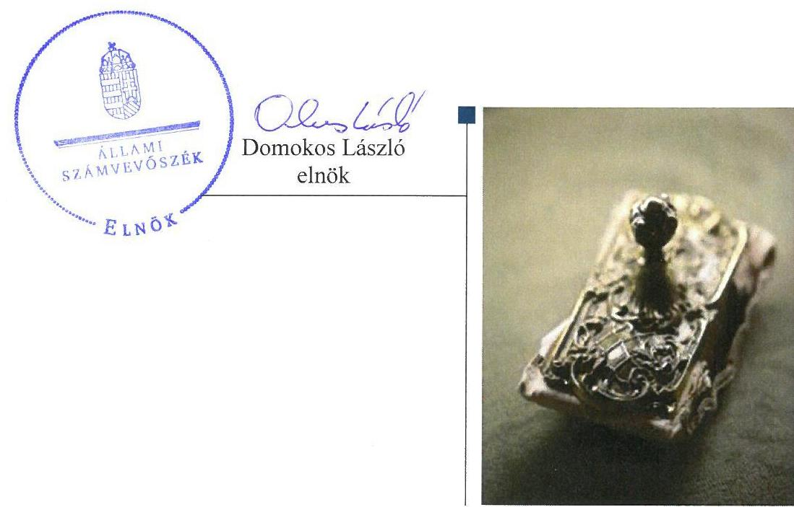
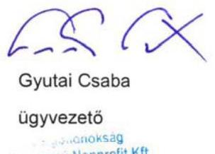
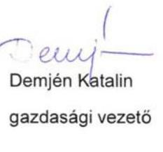
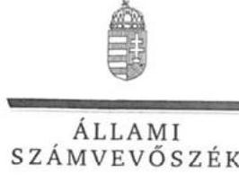
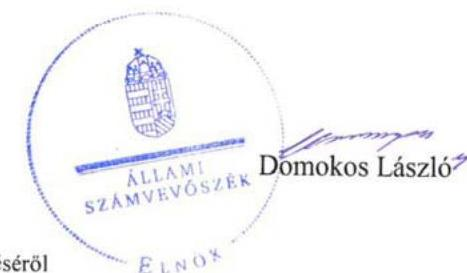
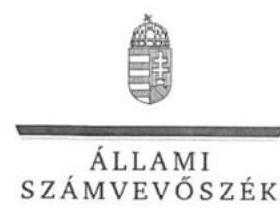
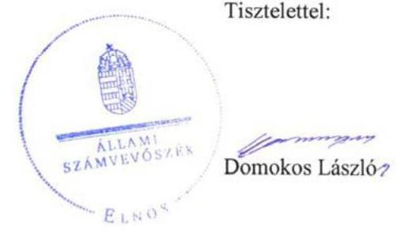

# Jelentés 

## Várgondnokság Közhasznú Nonprofit Kft.

Az állami tulajdonban (résztulajdonban) lévő gazdálkodó szervezetek vagyonmegőrzési és gazdálkodási tevékenységének ellenőrzése 2017.

---

# Jelentés 

## Várgondnokság Közhasznú Nonprofit Kft.

Az állami tulajdonban (résztulajdonban) lévő gazdálkodó szervezetek vagyonmegőrzési és gazdálkodási tevékenységének ellenőrzése
2017. 04. hó 1. nap

---

# AZ ELLENŐRZÉST FELÜGYELTE:

## MAKKAI MÁRIA felügyeleti vezető

## AZ ELLENŐRZÉST VEZETTE ÉS A VÉGREHAJTÁSÁÉRT FELELŐS:

### KORSÓSNÉ VIGH ANDREA ellenőrzésvezető

## A PROGRAM ÖSSZEÁLLÍTÁSÁÉRT FELELŐS:

### JANIK JÓZSEF LÁSZLÓ osztályvezető

---

**IKTATÓSZÁM: V-1211-144/2016.**

**TÉMASZÁM: 2245**

**ELLENŐRZÉS-AZONOSÍTÓ SZÁM: V075902**

---

Jelentéseink az Országgyűlés számítógépes hálózatán és az Interneten a www.asz.hu címen is olvashatóak.

---

# TARTALOMJEGYZÉK 

■ ÖSSZEGZÉS ..... 5
■ AZ ELLENŐRZÉS CÉLJA ..... 6
■ AZ ELLENŐRZÉS TERÜLETE ..... 7
■ AZ ELLENŐRZÉS HÁTTERE, INDOKOLTSÁGA ..... 8
■ A JELENTÉS LÉNYEGES KÉRDÉSKÖREI ..... 9
■ ELLENŐRZÉS HATÓKÖRE ÉS MÓDSZEREI ..... 10
■ MEGÁLLAPÍTÁSOK ..... 12
■ JAVASLATOK ..... 18
■ MELLÉKLETEK ..... 21
I. Sz. melléklet: Értelmező szótár ..... 21
■ FÜGGELÉK: ÉSZREVÉTELEK ..... 25
■ RÖVIDÍTÉSEK JEGYZÉKE ..... 37

---

.

---

# ÖSSZEGZÉS 

A Magyar Nemzeti Vagyonkezelő Zrt. és a Miniszterelnökség a Várgondnokság Közhasznú Nonprofit Kft. tekintetében szabályszerűen gyakorolta a tulajdonosi jogokat. A Várgondnokság Közhasznú Nonprofit Kft. gazdálkodása megfelelően szabályozott volt. A vagyon nyilvántartása nem felelt meg az előírásoknak. A vagyon értékének, állagának megóvásáról gondoskodtak, a vagyon változását eredményező döntéshozatal szabályos volt.

## Az ellenőrzés társadalmi indokoltsága

Magyarországon az intézmény-centrikus közfeladat-ellátás, közvagyon-gazdálkodás jellemző a költségvetésen kívüli feladatellátás térnyerése mellett. Ennek szereplői az állami tulajdonú gazdálkodó szervezetek is.

Az állami vagyonnal való gazdálkodás alapvető célja az állami vagyon átlátható, rendeltetésszerű és felelős felhasználásának biztosítása. Az állami tulajdonban álló gazdálkodó szervezetek államot megillető társasági részesedése a nemzeti vagyon részét képezi és legfőbb rendeltetése szerint a közfeladatok ellátását szolgálja.

Az Állami Számvevőszék stratégiájában megfogalmazta, hogy az államháztartáson kívülre nyújtott költségvetési támogatások és ingyenes vagyonjuttatások, valamint az államháztartáson kívül működő közfeladat-ellátó rendszerek ellenőrzéseivel hozzájárul ahhoz, hogy a közpénzeket az államháztartáson kívül működő szervezetek is átlátható, rendezett módon használják fel a közfeladatok szerződésben vállalt ellátása érdekében.

A Várgondnokság Közhasznú Nonprofit Kft. a világörökség részét képező ingatlan együttest kezel, amelynek helyreállítása, fejlesztése, a vagyonnal való szabályszerű gazdálkodás a vagyonkezelési szerződés célja. A műemléki helyreállításhoz és fejlesztéshez jelentős központi és Európai Uniós támogatásokban részesült.

## Főbb megállapítások

A Magyar Nemzeti Vagyonkezelő Zrt. és a Miniszterelnökség a társasági részesedés felett szabályszerűen gyakorolták a tulajdonosi jogokat. A Várgondnokság Közhasznú Nonprofit Kft. kezelésében lévő nemzeti vagyon feletti tulajdonosi joggyakorlás rendjét a Magyar Nemzeti Vagyonkezelő Zrt. kialakította és megfelelően gyakorolta.

A Várgondnokság Közhasznú Nonprofit Kft. belső szabályozottsága összességében megfelelt az előírásoknak, a gazdálkodás rendjét alapvetően meghatározó szabályzatokkal rendelkezett. Hiányosság volt a 2015. évben, hogy a könyvvezetésre és bizonylatolásra vonatkozó részletes belső szabályok kialakítása a közhasznúsági melléklet adatainak közvetlen alátámasztását nem biztosította, továbbá az önköltségszámítás rendjét belső szabályzatban nem határozta meg és a végzett szolgáltatások önköltségét utókalkuláció módszerével nem állapította meg. A bevételek és ráfordítások elszámolása az anyagjellegű ráfordítások elszámolása kivételével megfelelő volt.

A Várgondnokság Közhasznú Nonprofit Kft. vagyonnyilvántartása nem volt szabályszerű. A vagyonkezelési szerződés módosítása a vagyonkezelt eszközökön végrehajtott értéknövelő beruházásokkal, felújításokkal nem történt meg. A saját és vagyonkezelésbe vett tárgyi eszközök analitikus és főkönyvi nyilvántartása közötti egyezőség a 2012-2014. években, továbbá a 2012-2015. évi beszámolók mérlegeinek leltárral történő alátámasztása nem volt biztosított.

A vagyon változását eredményező döntések megfeleltek az előírásoknak, a vagyon értékének, állagának megőrzéséről gondoskodtak.

---

# AZ ELLENŐRZÉS CÉLJA 

Az ellenőrzés célja annak értékelése volt, hogy a tulajdonosi jogok gyakorlása szabályszerű volt-e; a gazdálkodó szervezet szabályozottsága, gazdálkodása és vagyongazdálkodási tevékenysége megfelelt-e a jogszabályi és a tulajdonosi előírásoknak; biztosítva volt-e a közfeladatok átláthatósága és elszámoltathatósága érdekében a közszolgáltatás díjának megalapozottsága szabályszerű önköltségszámítással; a vagyonváltozást eredményező döntések esetében a tulajdonosi jogok gyakorlója és a gazdálkodó szervezet szabályszerűen jártak-e el.

---

# **Várgondnokság Közhasznú Nonprofit Kft.**

A Társaság^{1} jogelődjét^{2} 1997. december 15-én a Magyar Állam nevében a Környezetvédelmi és Területfejlesztési Minisztérium és a Budapest I. kerület Budavári Önkormányzat alapította. Közhasznú tevékenysége keretében ellátott közfeladata– a társasági szerződés^{3} szerint – a kiemelt kulturális örökség védelme, a Magyar Állam tulajdonából el nem idegeníthető ingatlanok kezelése és a Budai Várban található intézmények egységes kiszolgálása volt. Szakmai feladatainak felügyeletét az Emberi Erőforrások Minisztériuma látta el. A 2014. évben az EMMI^{4}-vel kötött közszolgáltatási szerződés^{5} alapján tevékenysége kiegészült a Budavári Szent György tér és a Várbazár műemléki együttes helyreállítási feladataival, a felújított Várkert Bazár hasznosításával.

Az ellenőrzött időszakban a 26,2 M Ft összegű jegyzett tőke 91,22%-a állami, 8,78%-a önkormányzati tulajdonban volt.

A társasági részesedés feletti tulajdonosi jogokat a Magyar Állam nevében 2012. január 1-je és 2014. szeptember 11. között az MNV Zrt.^{6}, ezt követően az MNV Zrt-vel kötött megbízási szerződés alapján a Miniszterelnökség gyakorolta. A Társaság kezelt és saját vagyonnal gazdálkodott. A vagyonkezelésbe kapott eszközök felett a tulajdonosi joggyakorló az MNV Zrt. volt.

A Társaság főbb vagyoni adatait az 1. táblázat mutatja be.

1. táblázat

|  A TÁRSASÁG FŐBB VAGYONI ADATAI (M FT) |  |  |  |  |   |
| --- | --- | --- | --- | --- | --- |
|  Megnevezés | 2012.
jan. 2. | 2012.
dec. 21. | 2013.
dec. 28. | 2014.
dec. 21. | 2015.
dec. 28.  |
|  Mérlegfőösszeg | 5213,3 | 6082,7 | 9601,1 | 12643,5 | 15290,1  |
|  Vagyonkezelt eszköz | 5033,1 | 5554,6 | 8246,3 | 12065,4 | 13979,1  |
|  Követelések | 12,5 | 101,6 | 69,6 | 144,9 | 200,8  |
|  Mérleg szerinti eredmény | 0,7 | 1,1 | 0,2 | 0,6 | 0,3  |
|  Saját tőke | 48,3 | 49,4 | 49,6 | 50,2 | 50,5  |
|  Kötelezettségek | 5048,6 | 5689,2 | 5939,3 | 5455,6 | 5503,2  |
|  Passzív időbeli elhatárolás | 101,3 | 308,6 | 3605,2 | 7137,7 | 9262,9  |

*Forrás: A Társaság 2012-2015. évi éves beszámolói, tanúsítványi adatszolgáltatás*

Az ellenőrzött időszakban közel háromszorosára növekedett a Társaság vagyona, amelyet hazai és EU^{7}-s forrásból megvalósított beruházások okoztak. E beruházásokra kapott támogatási források a passzív időbeli elhatárolások között szerepeltek a mérlegben. Az értékesítés nettó árbevétele a 2012. évi 219,3 M Ft-ról folyamatosan emelkedett, a 2015. évben 596,8 M Ft-ot ért el. Az alkalmazottak átlagos statisztikai létszáma a 2012. évi 43 főről 2015-re 75 főre gyarapodott.

A Társaság ügyvezetőjének a személye kétszer változott, a jelenlegi ügyvezető 2014. október 13-tól látja el feladatát.

---

# AZ ELLENŐRZÉS HÁTTERE, INDOKOLTSÁGA 

## AZ ÁSZ ${ }^{5}$ KÖZÉPTÁVRA SZÓLÓ STRATÉGIÁJÁBAN

megfogalmazta, hogy az államháztartáson kívülre nyújtott költségvetési támogatások, valamint az államháztartáson kívül működő közfeladat-ellátó rendszerek ellenőrzéseivel hozzájárul ahhoz, hogy a közpénzeket az államháztartáson kívül működő szervezetek is átlátható, rendezett módon használják fel a közfeladatok szerződésben vállalt ellátása, továbbá az állami vagyon szerződésben vállalt átlátható, hatékony, költségtakarékos működtetése, értékének megőrzése, állagának védelme, értéknövelő használata, hasznosítása és gyarapítása érdekében.

Az ellenőrzés feladata az állami vagyonnal biztosított közfeladat-ellátással kapcsolatban a közpénzek átláthatósága, nyilvánossága érdekében a jogszabályokban, belső szabályzatokban megfogalmazott előírások érvényesülésének az állami tulajdonban lévő gazdálkodó szervezetek vagyonérték-megőrzési és gazdálkodási tevékenységének értékelése.

AZ ELLENŐRZÉS EREDMÉNYEKÉPP a törvényalkotás számára tapasztalatok állnak rendelkezésre az állami vagyonnal való köz-feladat-ellátás, a vagyonnal való gazdálkodás értékeléséhez, az átláthatóságot biztosító szabályozáshoz. Az ellenőrzés tapasztalatai segítik és erősítik az ÁSZ hozzáadott értéket teremtő tevékenységét és tanácsadó szerepét.

---

# A JELENTÉS LÉNYEGES KÉRDÉSKÖREI 

1. A tulajdonosi jogok gyakorlása szabályszerű volt-e?
2. A társaság működésének szabályozottsága megfelelt-e az előírásoknak?
3. A társaságnál a pénzügyi-számviteli, adatszolgáltatási és ellenőrzési feladatok ellátása szabályszerű volt-e?
4. A társaság vagyongazdálkodása szabályszerű volt-e?

---

# ELLENŐRZÉS HATÓKÖRE ÉS MÓDSZEREI 

## Az ellenőrzés típusa

Megfelelőségi ellenőrzés.

## Az ellenőrzött időszak

A 2012. január 1-jétől 2015. december 31-ig tartó időszak.

## Az ellenőrzés tárgya

Az állami tulajdonban (résztulajdonban) lévő gazdasági társaság gazdálkodása, kiemelten vagyongazdálkodási tevékenysége, a tulajdonosi jogok gyakorlása.

## Az ellenőrzött szervezet

Várgondnokság Közhasznú Nonprofit Kft., MNV Zrt., Miniszterelnökség

## Az ellenőrzés jogalapja

Az ellenőrzés jogszabályi alapját az ÁSZ tv. ${ }^{9}$ 5. § (3)-(5) bekezdései, valamint a Vtv. ${ }^{10}$ 3. § (4) bekezdése képezték.

## Az ellenőrzés módszerei

Az ellenőrzést a nemzetközi standardokat irányadónak tekintve az ellenőrzési program ellenőrzési kérdései, az ellenőrzött időszakban hatályos jogszabályok, az ellenőrzés szakmai szabályok és módszertanok figyelembe vételével végeztük el.

Az ellenőrzött szervezetek az ellenőrzés lefolytatásához tanúsítványok kitöltésével, valamint az ÁSZ által kért dokumentumok megküldésével szolgáltattak adatokat.

A bevételek és ráfordítások elszámolását, és a vagyonnyilvántartás terén a szabályszerű működést véletlenszerű mintavétellel ellenőriztük. A mintavétellel ellenőrzött területek esetében minden egyes tétel vonatkozásában szabályszerűségre vonatkozó kérdéseket tettünk fel, amelyek eredménye összesítésre került. A jogszabályoknak és a belső előírásoknak megfelelőnek tekintettük az adott területet, amennyiben a minta ellenőrzésének eredménye alapján 95%-os bizonyossággal a teljes sokaságban a

---

hibaarány kisebb volt, mint 10%, nem megfelelőnek értékeltük, ha a hibaarány a 10%-ot meghaladta. A ráfordítások elszámolására és a vagyonnyilvántartásra vonatkozó véletlen mintavételt kockázati alapú kiválasztással egészítettük ki, amelynek során évente a három legnagyobb összegű tételt választottuk ki.

---

# 1. A tulajdonosi jogok gyakorlása szabályszerű volt-e? 

## Összegző megállapítás

### 1.1. számú megállapítás

Az MNV Zrt. és a Miniszterelnökség szabályszerűen gyakorolta a tulajdonosi jogokat.

A társasági részesedés feletti tulajdonosi joggyakorlás a jogszabályi előírásoknak megfelelt.

A TULAJDONOSI JOGGYAKORLÁSRA vonatkozó előírásokat 2014. szeptember 12-ig az MNV Zrt. SZMSZ ${ }^{11}$-ében és belső szabályzataiban, ezt követően az MNV Zrt. és a Miniszterelnökség között megkötött megbízási szerződésben ${ }^{12}$, ez alapján a Miniszterelnökség SZMSZ ${ }^{13}$-ában, továbbá a társasági szerződésben rögzítették. A társasági szerződésben meghatározták a tulajdonosi joggyakorló számára fenntartott tulajdonosi jogokat, rendelkeztek az FB^{14} létrehozásáról, hatásköréről, abban a tulajdonosi joggyakorló képviseletéről, a könyvvizsgáló megbízásáról, előírták az éves üzleti tervkészítési és beszámolási kötelezettséget. A Társaság gazdálkodásának folyamatos nyomon követését a MNV Zrt. monitoring szabályzatában ${ }^{15}$, 2014. szeptember 12-től az MNV Zrt. és a Miniszterelnökség közötti megbízási szerződésben előírt éven belüli kontrolling adatszolgáltatási kötelezettség biztosította.

## A TÁRSASÁGI RÉSZESEDÉS FELETTI TULAJDONOSI JOGGYAKORLÁS az FB és a könyvvizsgáló tevékenységéhez kapcsolódóan, továbbá a taggyűlésen való képviseletre jogosultak mandátumának kiadása tekintetében szabályszerű volt. A taggyűlés az éves üzleti tervek jóváhagyásáról az FB, az éves beszámolók elfogadásáról az FB és a könyvvizsgáló írásbeli jelentése birtokában döntött a Gt. ${ }^{16}$, a Ptk. ${ }^{17}$ és a társasági szerződés előírásaival összhangban.

## A vagyonkezelt eszközök feletti tulajdonosi joggyakorlás szabályszerű volt.

VAGYONKEZELÉSI SZERZŐDÉS ${ }^{18}$ alapján látott el a Társaság az átadott vagyon tekintetében vagyonkezelői feladatokat. A vagyonkezelési szerződésben meghatározták a tulajdonosi joggyakorló jogait és a Társaság kötelezettségeit a vagyonkezelt ingatlanok hasznosítása feltételei vonatkozásában. Előírták
 az állami vagyon hatékony működtetésének, állaga védelmének, értéke megőrzésének, gyarapításának követelményeit és feltételeit, a vagyonkezelésre vonatkozó nyilvántartási, adatszolgáltatási, elszámolási, visszapótlási kötelezettséget. Rögzítették a Társaság részéről az MNV Zrt. vagyon-nyilvántartási szabályzatának megismerését, elfogadását. A vagyonkezelési szerződés módosítására az ellenőrzött időszak végéig a vagyonkezelt ingatlanok körében bekövetkezett változások miatt került sor, a vagyonkezelési szerződés az ellenőrzött időszakban nem módosult.

---

VAGYON-NYILVÁNTARTÁSI SZABÁLYZATTAL az MNV Zrt. a Vhr. ${ }^{19}$ előírásainak megfelelő tartalommal rendelkezett.

# A VAGYONKEZELT VAGYON VÁLTOZÁSÁT EREDMÉNYEZŐ DÖNTÉSEK előkészítéséhez, a Vhr. 9. § (6) bekezdés szerinti előzetes engedély (tulajdonosi hozzájárulás) kéréséhez kapcsolódó követelményeket az MNV Zrt. Elszámolási szabályzatában meghatározta. A Társaság vagyonkezelt vagyona változását eredményező döntések előtt az MNV Zrt. a részére előzetesen megküldött előterjesztések, a kapcsolódó FB vélemények, javaslatok alapján írásbeli engedélyét, hozzájárulását megadta. 

## 2. A társaság működésének szabályozottsága megfelelt-e az előírásoknak?

Összegző megállapítás

## A Társaság működésének a szabályozottsága összességében

megfelelt az előírásoknak.

AZ SZMSZ ${ }^{20}$ a Társaság nevében, székhelyében, munkaszervezetében, a tulajdonosi joggyakorló személyében, a társasági szerződésben bekövetkezett változások miatti módosítása nem történt meg, mert az aktualizált szabályzatot az ügyvezető - az SZMSZ 3.4 j) pontjában meghatározott kötelezettsége ellenére - nem készítette el és nem terjesztette a taggyűlés elé jóváhagyásra.

A Társaság a Számv. tv. ${ }^{21}$ előírása szerint a számviteli politika ${ }^{22}$ keretében a jogszabályi előírásoknak megfelelő tartalommal elkészítette a leltározási és a selejtezési, az értékelési, valamint a pénzkezelési szabályzatokat.

SZÁMVITELI POLITIKA keretében a Számv. tv. 14. § (4) bekezdés előírása ellenére nem rögzítették, hogy a Számv. tv. 53. § (1)-(2) bekezdések szerinti terven felüli értékcsökkenés elszámolása tekintetében a Társaság mit tekint jelentősnek.

A SZÁMLAREND ${ }^{23}$ nem felelt meg a Számv. tv. előírásainak, mert a Számv. tv. 161. § (2) bekezdés a) pontjában előírtak ellenére nem tartalmazta minden alkalmazásra kijelölt számla számjelét és megnevezését. Nem tartalmazta továbbá a számlarendben foglaltakat alátámasztó, a Számv. tv. 161. § (2) bekezdés d) pontjában előírt bizonylati rendet, azzal a Társaság egyéb formában sem rendelkezett.

A könyvvezetésre és bizonylatolásra vonatkozó részletes belső szabályok kialakítása a 2015. évben a kiegészítő melléklet adatainak közvetlen alátámasztását nem biztosította a Számv. tv. 161/A. § (1) bekezdés előírása ellenére. A könyvvezetési rendszer nem volt oly mértékben továbbrészletezett, hogy abból a vonatkozó jogszabályban - a Civil tv. ${ }^{24} 46$. § (1) bekezdésében, továbbá a 350/2011. (XII. 30.) Korm. rendelet ${ }^{25}$ 1. § (4) bekezdésében és 12. § (1) és (3) bekezdéseiben szabályozott közhasznúsági melléklet elkészítéséhez - meghatározott adatok rendelkezésre álljanak a Számv. tv. 161/A. § (2) bekezdés előírása ellenére.

---

A Társaság a 2012-2015. években a kiegészítő melléklet részeként közhasznúsági mellékletet és közhasznú eredménykimutatást készített, vállalkozási bevételt és ráfordítást a 2015. évben (a 2012-2014. években nem) mutatott ki. A számlarend a közhasznú és vállalkozási tevékenység bevételei és ráfordításai elhatárolásának általános elvét rögzítette, annak végrehajtásához szükséges részletszabályokat (pl. főkönyvi számla alábontása, munkaszámok, vagy egyéb elkülönítési mód alkalmazása) azonban a belső szabályzatokban nem határozták meg.

ÖNKÖLTSÉGSZÁMÍTÁS rendjére vonatkozó belső szabályzatot a Társaság 2015-től a Számv. tv. 14. § (5) bekezdés c) pont előírása és a Számv. tv. 14. § (6) bekezdés szerinti mentesség megszűnése ellenére nem készített.

A JAVADALMAZÁSI SZABÁLYZATOT ${ }^{26}$ a taggyűlés a Taktv. ${ }^{27}$-ben előírtak szerint a vezető tisztségviselőinek, FB tagjainak, valamint az Mt. ${ }^{28}$ hatálya alá tartozó munkavállalóinak javadalmazási és juttatási rendszeréről megalkotta.

# 3. A társaságnál a pénzügyi-számviteli, adatszolgáltatási és ellenőrzési feladatok ellátása szabályszerű volt-e? 

Összegző megállapítás

A bevételek, a személyi jellegű ráfordítások és az értékcsökkenés elszámolása megfelelt, az anyagjellegű ráfordítások elszámolása nem felelt meg az előírásoknak.

A 3.1. számú megállapítás

A BEVÉTELEK elszámolása megfelelő volt. A vagyonkezelésbe vett vagyonhoz kapcsolódó területhasználati díjak kiszámlázására az ingatlanhasznosítási szabályzat előírásai alapján került sor. A bevételeket a megfelelő főkönyvi számlára számolták el.

AZ ANYAGJELLEGŰ RÁFORDÍTÁSOK elszámolása nem volt megfelelő, mert az elszámolást több esetben nem támasztotta alá a Számv. tv. 165. § (2) bekezdés előírása szerinti, szabályszerűen kiállított bizonylat.

A SZEMÉLYI JELLEGŰ RÁFORDÍTÁSOK elszámolása megfelelő volt. A kifizetéseket szabályszerű dokumentumok támasztották alá. A béren kívüli juttatásokat a javadalmazási szabályzatban előírt összegben számfejtették és a munkavállalókat terhelő járulékok, adók levonása megtörtént.

AZ ÉRTÉKCSÖKKENÉS elszámolása megfelelt a Számv. tv. és az értékelési szabályzat előírásainak. A Társaság az éves beszámolók kiegészítő mellékletében az elszámolt tervszerinti és terven felüli értékcsökkenést és annak indokait részletesen bemutatta.

---

# Megállapítások 

A követelések kimutatása megfelelt a Számv. tv. előírásainak. A hátralékos állomány csökkentésére a Társaság intézkedett, a behajthatatlan követelések esetén jogszerűen értékvesztést számolt el.

## 3.2. számú megállapítás

## 3.3. számú megállapítás

## 3.4. számú megállapítás

A Társaság a 2015-től fennálló kötelezettsége ellenére önköltségszámítást nem alkalmazott.

A Társaság a 2015. évben a Számv. tv. 14. § (7) bekezdés előírását figyelmen kívül hagyva a végzett szolgáltatások Számv. tv. 51. § (2) bekezdés szerinti önköltségét nem állapította meg az utókalkuláció módszerével.

A vagyonkezelt ingatlanok rövid és hosszú távú bérbeadásának elveit, a bérleti díjak mértékét az ingatlanhasznosítási szabályzatban ${ }^{29}$ és mellékleteiben határozta meg.

A Társaság a tervezési, beszámolási, adatszolgáltatási kötelezettségét szabályszerűen teljesítette.

A tulajdonosi joggyakorló a Társaság részére tervezési, beszámolási, adatszolgáltatási és egyéb tájékoztatási kötelezettséget írt elő. A társasági szerződés, a Társaság SZMSZ-e, számviteli politikája tartalmazta a kötelezettségeket, felelősöket, határidőket.

AZ ÉVES ÜZLETI TERV készítési kötelezettségének, továbbá az MNV Zrt. és a Miniszterelnökség által előírt évközi adatszolgáltatási és egyéb tájékoztatási kötelezettségeknek a Társaság eleget tett.

AZ ÉVES BESZÁMOLÓKAT a Társaság a Számv. tv.-ben, a közhasznúsági mellékletet a 350/2011. (XII. 30.) Korm. rendelet szerinti formában elkészítette, a taggyűlés jóváhagyását követően határidőben letétbe helyezte, közzétette.

A KÖZÉRDEKŰ ADATOK nyilvánosságra hozatalát a Társaság 2015. augusztus 31-ig nem szabályozta, nem készítette el a közérdekű adatok megismerésére irányuló igények teljesítésének rendjét rögzítő szabályzatot az Info. tv. ${ }^{30}$ 30. § (6) bekezdésében foglaltak ellenére. A közérdekű adatok közzétételi kötelezettségének a Társaság a Civil tv., az Info. tv. és a Taktv. előírásai szerinti adatok saját honlapján történő nyilvánosságra hozatalával eleget tett.

A Társaság belső ellenőrzést nem alakított ki, a külső ellenőrzések javaslatait többségében hasznosította.

Belső ellenőrzést a Társaság nem alakított ki.
Az Emberi Erőforrások Minisztériuma által végzett ellenőrzések javaslataira a Társaság az SZMSZ és a határozatlan időre kötött szerződések felülvizsgálatát megkezdte, az SZMSZ-t azonban az ellenőrzött időszak végéig nem aktualizálták. Az Európai Támogatásokat Auditáló Főigazgatóság 2014. évi ellenőrzéseinek javaslatai alapján az intézkedéseket megtették, a 2015. évi ellenőrzésről készített jelentés egyeztetése az ellenőrzött időszak végéig nem zárult le.

---

# 4. A társaság vagyongazdálkodása szabályszerű volt-e? 

## Összegző megállapítás

### 4.1. számú megállapítás

### 4.2. számú megállapítás

## A Társaság vagyongazdálkodása összességében nem volt szabályszerű.

A Társaság a vagyon értékének megőrzését, gyarapítását szolgáló, szabályszerű vagyongazdálkodás feltételeit összességében kialakította.

A vagyonnal való gazdálkodáshoz kapcsolódó követelményeket, feladat- és hatásköröket és felelősségi köröket rögzített a társasági szerződés, a Társaság SZMSZ-e és belső szabályzatai.

A Társaság az MNV Zrt. által kiadott tervezési irányelvek ${ }^{31}$ I. 4 pontja előírása ellenére a 2012-2014. években fejlesztési tervet nem készített. A 2012-2014. években a központi és EU-s pályázatok tartalmazták a megvalósítani kívánt fejlesztéseket. A 2015. évi üzleti tervben - a 2015. évi tervezési irányelvnek megfelelően - a tervezett beruházási feladat, illetve annak becsült forrásszükségletének bemutatása megtörtént.

A Társaság vagyonnyilvántartása nem volt szabályszerű, a mérlegben kimutatott vagyon leltárral nem volt alátámasztott.

A VAGYONKEZELÉSI SZERZŐDÉS1-nek a vagyonnövekedés számviteli szabályok szerinti elszámolás érdekében szükséges módosítása nem történt meg a vagyonkezelésben lévő állami vagyonon - a tulajdonosi joggyakorló előzetes hozzájárulásával - elszámolási kötelezettséggel kapott külső forrásból végrehajtott értéknövelő beruházások, felújítások miatt, a Vhr. 18. § (1) bekezdés c) pontjának előírása ellenére.

A 2012-2015. évi számviteli nyilvántartásokban szereplő vagyonkezelt eszközök és a kapcsolódó kötelezettségek értékét alátámasztó számviteli bizonylattal (módosított vagyonkezelési szerződéssel) a Számv. tv. 165. § (2) bekezdés előírása ellenére a Társaság nem rendelkezett. Ennek hiányában a számviteli nyilvántartások szabálytalanul tartalmaztak vagyonkezelt eszközként és kapcsolódó kötelezettségként - a vagyonkezelésben lévő állami vagyonon végrehajtott értéknövelő beruházások, felújítások kapcsán - vagyonkezelésbe nem adott vagyonnövekedést.

A vagyonkezelésében lévő állami vagyonon a Társaság hazai forrásból összesen 1764,7 M Ft, EU-s forrásból összesen 7569,1 M Ft értéknövelő beruházást, felújítást valósított meg.

A LELTÁROZÁSRA vonatkozó, a Számv. tv. 69. § (1) bekezdésében és a leltározási szabályzatban előírtakat a Társaság az ellenőrzött időszakban nem tartotta be. A beszámolók elkészítéséhez, a mérleg tételeinek alátámasztásához - a 2014. évi beszámoló „Anyagok" mérlegsorán kívül - nem állított össze olyan leltárt, amely tételesen és ellenőrizhető módon a mérlegek fordulónapján meglévő eszközeit és forrásait mennyiségben és értékben tartalmazta volna. Ezzel a beszámoló nem felelt meg a Számv. tv. 15. § (3) bekezdésében meghatározott valódiság elvének.

A Társaság a 2012-2014. években a saját és a vagyonkezelésébe vett eszközök analitikus nyilvántartásának a főkönyvi könyveléssel való szoros kapcsolatát nem biztosította a Számv. tv. 161. § (3) bekezdésében foglalt

---

előírások ellenére. A saját és a vagyonkezelésbe vett tárgyi eszközökről és immateriális javakról vezetett analitikus nyilvántartásban kimutatott bruttó érték a 2012-2013. években 1310,4 M Ft-tal, a bruttó és nettó érték 2014-ben 1899,5 M Ft-tal eltért a főkönyvi nyilvántartásban rögzített adatoktól, az analitikus nyilvántartás hibája miatt.

A 2015. évben a saját és vagyonkezelésbe vett eszközök analitikus és főkönyvi nyilvántartása közötti egyezőség biztosított volt.

A könyvvizsgáló az éves beszámolókat az ellenőrzött időszak minden évében hitelesítő záradékkal látta el a mérleg leltárral történő alátámasztásának hiánya ellenére.

# 4.3. számú megállapítás 

## A Társaság gondoskodott a vagyon értékének, állagának megőrzéséről.

A Társaság a tárgyi eszközök rendszeres időközönkénti karbantartásáról, a vagyon értékének, állagának megőrzéséről, gyarapításáról az Nvtv. és a vagyonkezelési szerződés ${ }_{1,2}$ előírásának megfelelően gondoskodott.

A Társaság a Vtv. szerint 2012-2013-ban a vagyonkezelésbe vett vagyonelemek köre után fennálló visszapótlási kötelezettségét teljesítette. A vagyonkezelésbe vett eszközei után elszámolt értékcsökkenést meghaladó mértékű beruházásokat hajtott végre.

### 4.4. számú megállapítás

## A Társaságnál a vagyon változását eredményező döntések megfeleltek az előírásoknak.

A tulajdonosi joggyakorló a vagyongazdálkodási döntések előterjesztésével kapcsolatban az éves üzleti tervek vonatkozásában határozott meg előírásokat, amelynek eleget tettek.

A Társaság a Vhr.-ben előírtaknak megfelelően a vagyonkezelt eszközein tervezett beruházások elvégzése előtt a tulajdonosi joggyakorló írásbeli engedélyét megkérte. A vagyonkezelt eszközökön végzett beruházások tulajdonosi joggyakorlóval történő engedélyeztetése tartalmilag és formailag az MNV Zrt. Elszámolási szabályzatában ${ }^{32}$ foglaltaknak megfelelően történt. A Társaság a beruházásokról a tulajdonosi joggyakorló felé, az általa előírt rendszeres monitoring adatszolgáltatás útján, illetve az éves beszámolók keretében beszámolt.

A vagyonkezelésében lévő vagyontárgyakat a Társaság a Vtv. és a vagyonkezelési szerződés felhatalmazása alapján, bérleti szerződések formában továbbhasznosította. A bérleti szerződésekben a bérlők
 nyilatkoztak, hogy az Nvtv. szerint átlátható szervezetnek minősülnek.

---

# JAVASLATOK 

Az ÁSZ tv. 33. § (1) bekezdésében foglaltak értelmében az ellenőrzött szervezet vezetője köteles a jelentésben foglalt megállapításokhoz kapcsolódó intézkedési tervet összeállítani és azt a jelentés kézhezvételétől számított 30 napon belül az ÁSZ részére megküldeni. Amennyiben az ellenőrzött szervezet vezetője nem küldi meg határidőben az intézkedési tervet, vagy továbbra sem elfogadható intézkedési tervet küld, az Állami Számvevőszék elnöke az ÁSZ tv. 33. § (3) bekezdése a) és b) pontjaiban foglaltakat érvényesítheti.

## a Magyar Nemzeti Vagyonkezelő Zrt. vezérigazgatójának

1. Intézkedjen a vagyonkezelési szerződésnek a módosításáról, hogy az a Vhr.-ben előírtaknak megfelelően tartalmazza a vagyonkezelésbe adott állami vagyonon végrehajtott értéknövelő beruházások, felújítások értékét.
(4.2. sz. megállapítás 1. bekezdése alapján)

## a Várgondnokság Közhasznú Nonprofit Kft. ügyvezetőjének

1. Intézkedjen az SZMSZ módosításáról annak érdekében, hogy a Társaság nevében, székhelyében, munkaszervezetében, a tulajdonosi joggyakorló személyében, a társasági szerződésben bekövetkezett változások átvezetése megtörténjen.
(2. sz. megállapítás 1. bekezdése alapján)
2. Intézkedjen a számviteli politika és a számlarend kiegészítéséről, hogy azok teljes körűen megfeleljenek a Számv. tv.-ben előírtaknak.
(2. sz. megállapítás 3-4. bekezdései alapján)
3. Intézkedjen a könyvvezetésre és bizonylatolásra vonatkozó részletes belső szabályok teljes körű kialakításáról, hogy azok a Számv. tv. előírásai szerint biztosítsák a kiegészítő melléklet adatainak közvetlen alátámasztását, valamint a Civil tv. előírásainak megfelelő közhasznúsági melléklet elkészítését.
(2. sz. megállapítás 5. bekezdése alapján)

---

4. Intézkedjen a Számv. tv.-ben előírtaknak megfelelően az önköltség számítási szabályzat elkészítéséről és a társaság által végzett szolgáltatások önköltségének utókalkuláció módszerével történő megállapításáról.
(2. sz. megállapítás 7. bekezdése és a 3.2. sz. megállapítás 1. bekezdése alapján)
5. Kezdeményezze a vagyonkezelési szerződésnek a módosítását, hogy az a Vhr.-ben előírtaknak megfelelően tartalmazza a vagyonkezelésbe vett állami vagyonon végrehajtott értéknövelő beruházások, felújítások értékét.
(4.2. sz. megállapítás 1. bekezdése alapján)
6. Intézkedjen a Számv. tv.-ben előírtaknak megfelelően a leltározási feladatok elvégzéséről és a beszámolók leltárral történő alátámasztásáról.
(4.2. sz. megállapítás 4. bekezdése alapján)
7. Tegyen intézkedéseket a számviteli bizonylat nélkül kimutatott eszközökkel, a leltárkészítés elmaradásával, a saját és a vagyonkezelésbe vett eszközök analitikus és főkönyvi nyilvántartás egyezőségével kapcsolatban feltárt szabálytalanságok tekintetében a felelősség tisztázása érdekében, és szükség szerint intézkedjen a felelősség érvényesítéséről.
(4.2. sz. megállapítás 2. és 4-5. bekezdései alapján)

---

.

---

# MELLÉKLETEK 

- I. SZ. MELLÉKLET: ÉRTELMEZŐ SZÓTÁR

Állami vagyon

Állami vagyon kezelője /vagyonkezelő

Gazdálkodó szervezet

2012. november 9-ig:
a) Az állam tulajdonában lévő dolog, valamint a dolog módjára hasznosítható természeti erő,
b) Az a) pont hatálya alá nem tartozó mindazon vagyon, amely vonatkozásában törvény az állam kizárólagos tulajdonjogát nevesíti,
c) az állam tulajdonában lévő tagsági jogviszonyt megtestesítő értékpapír, illetve az államot megillető egyéb társasági részesedés,
d) az államot megillető olyan immateriális, vagyoni értékkel rendelkező jogosultság, amelyet jogszabály vagyoni értékű jogként nevesít.
Forrás: Vtv. 1. § (2) bekezdése
2012. november 10-től az állami vagyon fogalma kiegészül a következő ponttal:
a) az állam tulajdonában lévő pénzügyi eszközök

Forrás: Vtv. 1. § (2) bekezdése
2012. január 1-jétől:

Az állami vagyont az MNV Zrt. maga kezeli, vagy szerződés - így különösen bérlet, haszonbérlet, megbízás - alapján központi költségvetési szervnek, természetes vagy jogi személynek, vagy jogi személyiséggel nem rendelkező gazdálkodó szervezetnek hasznosításra átengedi. Az állami vagyonra vonatkozóan az MNV Zrt. kizárólag az Nvtv.-ben meghatározott személyekkel köthet vagyonkezelési szerződést.
Forrás: Vtv. 23. § (1), 27. § (1)
2013. június 28-ától:

Az állami vagyonnal az MNV Zrt. maga gazdálkodik, vagy szerződés - így különösen bérlet, haszonbérlet, megbízás - alapján központi költségvetési szervnek, természetes vagy jogi személynek, vagy jogi személyiséggel nem rendelkező gazdálkodó szervezetnek hasznosításra átengedi, illetőleg vagyonkezelésbe, haszonélvezetbe adja. Az állami vagyonra vonatkozóan az MNV Zrt. kizárólag az Nvtv.-ben meghatározott személyekkel köthet vagyonkezelési szerződést.
Forrás: Vtv. 23. § (1), 27. § (1)
2013. június 30-ig gazdálkodó szervezet:

Az állami vállalat, az egyéb állami gazdálkodó szerv, a szövetkezet, a lakás-szövetkezet, az európai szövetkezet, a gazdasági társaság, az európai részvénytársaság, az egyesülés, az európai gazdasági egyesülés, az európai területi együttműködési csoportosulás, az egyes jogi személyek vállalata, a leányvállalat, a vízgazdálkodási társulat, az erdőbirtokossági társulat, a végrehajtói iroda, az egyéni cég, továbbá az egyéni vállalkozó.
Forrás: Ptk. ${ }^{33}$ 685. § c) pontja
2013. július 1-jétől gazdálkodó szervezet:

Az állami vállalat, az egyéb állami gazdálkodó szerv, a szövetkezet, a lakás-szövetkezet, az európai szövetkezet, a gazdasági társaság, az európai részvénytársaság, az egyesülés, az európai gazdasági egyesülés, az európai területi együttműködési csoportosulás, az egyes jogi személyek vállalata, a leányvállalat, a vízgazdálkodási társulat, az erdőbirtokossági társulat, a végrehajtói iroda, az egyéni cég, továbbá az egyéni vállalkozó. Az állam, a helyi önkormányzat, a költségvetési szerv, az egyesület, a köztestület, valamint az alapítvány gazdálkodó tevékenységével összefüggő

---

polgári jogi kapcsolataira is a gazdálkodó szervezetre vonatkozó rendelkezéseket kell alkalmazni, kivéve, ha a törvény e jogi személyekre eltérő rendelkezést tartalmaz; a 292/A-292/B. §, 301/A-301/B. §, 405. § (1) bekezdés, valamint a 407/A. § (1) bekezdés tekintetében nem minősül gazdálkodó szervezetnek az, aki a közbeszerzésekről szóló törvény értelmében ajánlatkérő (szerződő hatóság).
Forrás: Ptk.; 685. § c) pontja
2014. március 15-től gazdálkodó szervezet:

A gazdasági társaság, az európai részvénytársaság, az egyesülés, az európai gazdasági egyesülés, az európai területi együttműködési csoportosulás, a szövetkezet, a lakásszövetkezet, az európai szövetkezet, a vízgazdálkodási társulat, az erdőbirtokossági társulat, az állami vállalat, az egyéb állami gazdálkodó szerv, az egyes jogi személyek vállalata, a közös vállalat, a végrehajtói iroda, a közjegyzői iroda, az ügyvédi iroda, a szabadalmi ügyvivői iroda, az önkéntes kölcsönös biztosító pénztár, a magánnyugdíjpénztár, az egyéni cég, továbbá az egyéni vállalkozó. Az állam, a helyi önkormányzat, a költségvetési szerv, az egyesület, a köztestület, valamint az alapítvány gazdálkodó tevékenységével összefüggő polgári jogi kapcsolataira is a gazdálkodó szervezetre vonatkozó rendelkezéseket kell alkalmazni.
Forrás: Ppt. ${ }^{34} 396 . \S$
gazdasági társaság
nonprofit gazdasági társaság

Tulajdonosi ellenőrzés

Tulajdonosi jogok gyakorlója
A Ptk. 3:88. § (1) bekezdése szerint „a gazdasági társaságok üzletszerű közös gazdasági tevékenység folytatására, a tagok vagyoni hozzájárulásával létrehozott, jogi személyiséggel rendelkező vállalkozások, amelyekben a tagok a nyereségből közösen részesednek, és a veszteséget közösen viselik".
Civil tv. 9/F. § (2) bekezdése szerint „az a gazdasági társaság minősül nonprofit gazdasági társaságnak és cégnevében az a gazdasági társaság tüntetheti fel a nonprofit jelleget, amelynek létesítő okirata tartalmazza, hogy a gazdasági társaság tevékenységéből származó nyereség a tagok között nem osztható fel, hanem az a gazdasági társaság vagyonát gyarapítja." (hatályos 2014. március 15-től)
2014. március 14-ig:

Az állami vagyon kezelőjét, haszonélvezőjét, használóját megillető jogok gyakorlását, annak szabályszerűségét, célszerűségét az MNV Zrt. - szükség szerint területi szervei útján - ellenőrzi.
2014. március 15-től:

Az állami vagyon használóját, vagyonkezelőjét és haszonélvezőjét megillető jogok gyakorlását, annak szabályszerűségét, a kötelezettségek teljesítését, valamint a vagyon rendeltetése szerinti célszerűségét a tulajdonosi joggyakorló rendszeresen ellenőrzi.
Forrás: Vhr. 20. §.(1)
1.
2013. június 27-ig:

Az állami vagyon felett a Magyar Államot megillető tulajdonosi jogok és kötelezettségek összességét - ha törvény eltérően nem rendelkezik - az állami vagyon felügyeletéért felelős miniszter (a továbbiakban: miniszter) gyakorolja, aki e feladatát a Magyar Nemzeti Vagyonkezelő Zártkörűen Működő Részvénytársaság (a továbbiakban: MNV Zrt.), a Magyar Fejlesztési Bank, illetve a tulajdonosi joggyakorló szervezet útján látja el. A miniszter miniszteri rendeletben, a törvényben meghatározott állami vagyoni kör tekintetében, meghatározott időtartamra, a joggyakorlás egyes szabályainak meghatározásával - az őt megillető tulajdonosi jogok és kötelezettségek összességének, illetve azok meghatározott részének gyakorlóját az Áht. szerinti központi költségvetési szervek, ezek intézménye, továbbá a 100%-ban állami tulajdonban álló gazdasági társaságok közül kijelölheti.

---

Forrás: Vtv. 3. § (1) és (2)
2013. június 28-ától:

A rábízott állami vagyon felett az államot megillető tulajdonosi jogok és kötelezettségek összességét tulajdonosi joggyakorlóként:
ha törvény vagy miniszteri rendelet eltérően nem rendelkezik, a Magyar Nemzeti Vagyonkezelő Zártkörűen Működő Részvénytársaság (a továbbiakban: MNV Zrt.), törvényben kijelölt személy vagy
az állami vagyon felügyeletéért felelős miniszter (a továbbiakban: miniszter) által rendeletben kijelölt személy gyakorolja.
[...] A miniszter e törvény felhatalmazása alapján - a meghatározott célok hatékonyabb elérése érdekében, miniszteri rendeletben, az ott meghatározott állami vagyoni kör tekintetében, meghatározott időtartamra - e törvény keretei között, a joggyakorlás egyes szabályainak meghatározásával - az államot megillető tulajdonosi jogok és kötelezettségek összességének, illetve azok meghatározott részének gyakorlóját az Áht. szerinti központi költségvetési szervek, ezek intézménye, továbbá a 100%-ban állami tulajdonban álló gazdasági társaságok közül kijelölheti.
Forrás: Vtv. 3. § (1) és (2)
2.
Aki a nemzeti vagyon felett az államot vagy a helyi önkormányzatot megillető tulajdonosi jogok és kötelezettségek összességének gyakorlására jogosult.
Forrás: Nvtv. 3. § (1) 17. pontja

---

.

---

# FÜGGELÉK: ÉSZREVÉTELEK 

A jelentéstervezetet a Számvevőszék 15 napos észrevételezésre megküldte az ellenőrzött szervezetek vezetőinek az ÁSZ tv. 29. § (1) bekezdése előírásának megfelelően.

Az ÁSZ a jelentéstervezetet észrevételezésre megküldte a Várgondnokság Közhasznú Nonprofit Kft. ügyvezetőjének, a Magyar Nemzeti Vagyonkezelő Zrt. vezérigazgatójának, valamint a Miniszterelnökség miniszterének.

A Várgondnokság Közhasznú Nonprofit Kft. ügyvezetőjének és a Magyar Nemzeti Vagyonkezelő Zrt. vezérigazgatójának észrevételeit és az arra adott válaszokat a függelék alább tartalmazza. A Miniszterelnökség minisztere az ÁSZ tv. 29. § (2) bekezdésében foglalt észrevételezési jogával nem élt, a törvényes határidőn belül észrevételt nem tett.

[^0]
[^0]:    * 29. § (1) Az Állami Számvevőszék az ellenőrzési megállapításait megküldi az ellenőrzött szervezet vezetőjének vagy az általa megbízott személynek, és annak, akinek személyes felelősségét állapította meg.
    (2) Az ellenőrzött szervezet vezetője és a felelősként megjelölt személy az ellenőrzés megállapításaira tizenöt napon belül írásban észrevételt tehet.
    (3) Az Állami Számvevőszék az észrevételre a beérkezésétől számított harminc napon belül írásban válaszol. A figyelembe nem vett észrevételeket köteles a jelentésben feltüntetni, és megindokolni, hogy azokat miért nem fogadta el.

---

# ÁLLAMI SZÁMVEVŐSZÉK 

## BUDAPEST

Apáczai Csere János utca 10.

Tárgy: ÉSZREVÉTEL a V-1211-133/2016 iktató számú 2017.06.22-én érkezett jelentéstervezetre

Köszönettel megkaptuk a számvevőszéki jelentéstervezetet, melyre a következő észrevételeket tesszük.
1./ Az ÖSSZEGZÉS részben a következő megállapítást teszik: „A vagyon nyilvántartása nem felelt meg az előírásoknak." Majd a „Főbb megállapítások" részben megállapítják, hogy a vagyonnyilvántartás nem volt szabályszerű a következő ok miatt: „A vagyonkezelési szerződés módosítása a vagyonkezelt eszközökön végrehajtott értéknövelő beruházásokkal, felújításokkal nem történt meg."

Észrevételünk:
A Jelentés tervezetből nem derül ki, hogy a megállapításokat milyen levezetésből adódnak!

A Társaság éves mérlegbeszámolóját valamennyi vizsgált évben könyvszakértő auditálta. A vizsgált években az audit jelentés tiszta volt.

A Társaság a vagyonkezelési szerződés módosítását a következő okok miatt nem kezdeményezte:

- 4.2 pont szerinti támogatásból megvalósult beruházások (EU-s és hazai forrás) elszámolási határideje és egyben a fenntartási időszak kezdete 2015.07 illetve a hazai támogatás elszámolása 2016. 09 volt. Tehát ennek megfelelően a vizsgált időszakban a vagyonkezelési szerződés módosítása - a beruházás, felújítás végső értéke nélkül -
 még nem történhetett meg. A hazai támogatás elszámolás elfogadásának dátuma: 2017. 05. 11.
- A Társaság valamennyi tárgyévet követően eleget tett vagyonkataszteri jelentési kötelezettségének, mely jelentés tartalmazta az összes változást, így a támogatásból megvalósult felújítást és beruházást is. A vagyonkataszteri jelentés értékben minden évben megegyezett a mérlegbeszámolóban kimutatott vagyonértékkel.

---

2./ A Főbb megállapítások részben megállapítja a tervezet, hogy „A saját és vagyonkezelésbe vett tárgyi eszközök analitikus és főkönyvi nyilvántartása közötti egyezőség a 2012-2014. években, továbbá a 2012-2015. évi beszámolók mérlegeinek leltárral történő alátámasztása nem volt biztosított."

Észrevételünk:

- A mennyiségi felvétellel történő leltározási kötelezettség (háromévenkénti) szerint legkésőbb a 2014-ben induló üzleti évi beszámoló összeállításához kellett volna elvégezni a mennyiségi felvételt a tárgyi eszközök esetében, függetlenül attól, hogy a legutóbbi mennyiségi felvétel mikor történt, illetve történt-e egyáltalán. Ez a mennyiségi leltár a Társaságnál nem történt meg. A Társaságnál valamennyi vizsgált időszakban a tárgyi eszközök leltározása egyeztetéssel (nyilvántartással való egyeztetés) történt.
- A vizsgált időszakból a 2012-2014. években külső könyvelő irodával volt a Társaságnak szerződése a tulajdonosi joggyakorló határozatának megfelelően. A könyvelő iroda által használt tárgyi eszköz szoftver nem tartalmazta azokat az eszközöket, melyek már nulla nettó értéken vannak, és nem tartalmazta azokat az eszközöket, melyre nem számolható el értékcsökkenési leírás. Ezt a tényt a Társaság a vizsgálatkor jelezte. Természetesen valamennyi évben a mérlegbeszámoló szerinti nettó érték egyezett az analitikával, mely egy könyvelési szoftverből nyert és egy Excelben (könyvelőirodának átadott analitika) kimutatott analitika eredményeként jön létre.
3./ A Társaság működésének szabályozottsága megállapítja a számviteli politika és a számlarend hiányosságait.

# ÉSZREVÉTELÜNK 

Az éves beszámoló kiegészítő melléklete tartalmazza, hogy mi a jelentős és nem jelentős tétel a beszámolóban.

Valamennyi év könyvelése könyvelési szoftveren készült, melyből minden időpontban az alkalmazott számlatükör lekérdezhető. Ez tartalmazza a főkönyvi törzsadat számát, megnevezését. A Társaság valamennyi költségét, ráfordítását, árbevételét és bevételét úgynevezett Részlegszámra (költségviselő szám) is könyveli. Ez a könyvelési módszer biztosítja azt, hogy a Társaság közhasznúsági jelentést az éves beszámolóban elkészítse. Valamennyi vizsgált évben a közhasznúsági mellékletet a Társaság auditáltatta és közzé tette.

---

4./ A jelentés tervezet megállapítja, hogy az anyagjellegű ráfordítások elszámolása nem volt megfelelő, mert az elszámolást több esetben nem támasztotta alá a Számv. tv. 165. § (2) bekezdés előírása szerinti, szabályszerűen kiállított bizonylat.

# ÉSZREVÉTELÜNK 

Ez az általános megfogalmazás azt mondja, hogy a vizsgált időszak valamennyi évében a költségek több mint 50%-a szabályszerűen kiállított bizonylat nélkül történt.

A Társaság működését támogatással finanszírozza, a támogatásokat megfelelően alátámasztott üzleti terv előzi meg, melyet az FB és a tulajdonos képviseletében szakemberek hagynak jóvá. A támogatásokkal el kell számolni, mely valamennyi vizsgált évben sikeresen megtörtént. Ezekben az anyagjellegű ráfordítások jelentős bizonylatai (bejövő számlák) szerepelnek!

Az anyagjellegű ráfordítások többségének a bizonylata bejövő számla. A mintavételes vizsgálatban volt évközi időbeli (passzív) elhatárolás visszaírása könyvelési tételének a kiválasztása. Ennek bizonylata (mivel automatikus visszakönyvelés történik a könyvelési szoftverbe) az előző hónapban könyvelt könyvelési bizonylat. A Társaság az összemérés elvét szem előtt tartva, élt azzal a lehetőséggel, hogy év közben passzív időbeli elhatárolás könyvelésével tette összehasonlíthatóvá az adott zárás időszakát a tervvel illetve bázis azonos időszakával. Ennek a visszakönyvelése a következő időszak elején történik, amit a vizsgálat mintavétele is tartalmaz. A jelentés tervezet ebből vont le a Társaság számára súlyos következtetést, melyet kérünk oly módon enyhíteni, hogy a mintavétel típusát is feltüntetik, mely esetben történt, hogy nincs szabályszerűen kiállított bizonylat.

Az éves beszámoló aktív- és passzív időbeli elhatárolása megfelelően bizonylattal alátámasztott és auditált!

Kérjük, szíveskedjen észrevételeinket megfontolni, azt a jelentésükben érvényesíteni!

Budapest, 2017.07.05.

Gyutai Csaba
ügyvezető
csaba@yutai-homprofit.kiit
16088074-2-41

---

ELNÖK

Ikt.szám: V-1211-140/2016.

# Gyutai Csaba úr 

ügyvezető
Várgondnokság Közhasznú
Nonprofit Kft.

## Budapest

## Tisztelt Ügyvezető Úr!

A ,,Az állami tulajdonban (résztulajdonban) lévő gazdálkodó szervezetek vagyonmegőrzési és gazdálkodási tevékenységének ellenőrzése - Várgondnokság Közhasznú Nonprofit Kft." címmel készített számvevőszéki jelentéstervezetre tett észrevételét köszönettel megkaptam.

Az Állami Számvevőszék észrevételre vonatkozó álláspontjáról a felügyeleti vezető által készített részletes tájékoztatást mellékelten megküldöm.

Tájékoztatom Ügyvezető urat, hogy a számvevőszéki jelentésben - az Állami Számvevőszékről szóló 2011. évi LXVI. törvény 29. § (3) bekezdése alapján - a figyelembe nem vett észrevételt szerepeltetjük az el nem fogadás indokának feltüntetésével.

Budapest, 2017. 04. hó 4. nap

Tisztelettel:

Melléklet: Tájékoztatás az észrevétel kezeléséről

---

# Tájékoztatás   az észrevétel kezeléséről 

A „Az állami tulajdonban (résztulajdonban) lévő gazdálkodó szervezetek vagyonmegőrzési és gazdálkodási tevékenységének ellenőrzése - Várgondnokság Közhasznú Nonprofit Kft." című jelentéstervezetre 2017. július 6-án érkezett észrevételt áttekintettük, annak kezelésével kapcsolatban a következő tájékoztatást adom.

## 1. Az ÖSSZEGZÉS résszel kapcsolatban tett észrevételre adott válasz

Az észrevétel tájékoztatást tartalmaz a beszámolók auditálásának körülményeiről és a vagyonkezelési szerződés módosítás kezdeményezése elmaradásának okairól. Tartalmazza továbbá, hogy a jelentéstervezet nem mutatja be a megállapítások levezetését.
A jelentéstervezet logikai felépítéséből adódóan az ÖSSZEGZÉS részben található megállapítások levezetését a részletes megállapítások tartalmazzák. Jelen esetben a vagyonnyilvántartás nem megfelelőségét a jelentéstervezet 4.2. számú megállapításában és annak részletezésében foglaltak alapján az okozta, hogy a vagyonnövekedés számviteli szabályok szerinti elszámolása, azaz nyilvántartásba vétele érdekében szükséges bizonylat nem állt rendelkezésre, mivel a vagyonkezelési szerződés módosítása nem történt meg.
A vagyonnyilvántartás szabályszerűségére tett ÁSZ megállapítást nem befolyásolja a beszámolók auditálása.
Tájékoztatom továbbá, hogy az ÁSZ az ellenőrzött időszakban hatályos jogszabályoknak való megfelelést értékeli. A vagyonnyilvántartást érintő megállapítás a vagyonkezelésben lévő állami vagyonon már megvalósult, aktivált beruházásokra vonatkozik, amellyel nincsenek közvetlen összefüggésben az EU-s és a hazai forrás elszámolásának körülményei. A vagyonkataszteri jelentés vonatkozásában az ÁSZ jelentéstervezete negatív megállapítást nem tartalmaz.
A fentiek alapján az ÁSZ vagyonnyilvántartásra vonatkozó megállapításai helytállóak, azok módosítása nem indokolt.

## 2. A Főbb megállapítások résszel kapcsolatban tett észrevételre adott válasz

Az észrevétel tájékoztatást tartalmaz a tárgyi eszközök mennyiségi felvétellel történő leltározásának elmaradásáról és a tárgyi eszközök egyeztetéssel történő leltározásáról. Az ÁSZ megállapítása nem a tárgyi eszközök leltározására, hanem a mérleg leltárral történő alátámasztásának hiányára vonatkozik, amelyre vonatkozó részletes megállapításokat a 4.2. számú megállapítás 4. bekezdése tartalmaz. Az ellenőrzés során rendelkezésre bocsátott dokumentumok alapján az ÁSZ megállapítása helytálló.
Az észrevétel tájékoztatást ad az analitikus és a főkönyvi nyilvántartás bruttó értékben való eltérésének körülményeiről, amely megerősíti az ÁSZ megállapítását. Az észrevételben foglalt nettó értékbeli egyezőség az analitikus nyilvántartás és a beszámoló adatai között az ellenőrzés

---

során rendelkezésre bocsátott dokumentumok alapján nem megalapozott. A nettó érték vonatkozásában az ÁSZ jelentés 4.2. számú megállapítás 5. bekezdése számszerűen megállapítja a főkönyvi és az analitikus nyilvántartások közötti eltérést, amely az ellenőrzés során rendelkezésre bocsátott dokumentumokon alapul. Az ÁSZ megállapítása helytálló, annak módosítása nem indokolt.

# 3. A Társaság működésének szabályozottsága résszel kapcsolatban tett észrevételre adott válasz 

Az észrevétel nem jelöli meg, hogy az ÁSZ mely megállapítását kívánja cáfolni. A jogszabályi környezet alapján - amely az ÁSZ jelentéstervezetének 2. számú megállapítás 3. bekezdésében levezetésre került - azt, hogy a Társaság mit tekint jelentősnek nem a beszámoló kiegészítő mellékletben szükséges rögzíteni, hanem a számviteli politikában. A könyvelési szoftver adattartalma nem kezelhető belső szabályozásként, a számlarenddel kapcsolatos ÁSZ megállapítások az ellenőrzés során rendelkezésre bocsátott dokumentumok alapján helytállóak. Az észrevételt nem fogadjuk el, az ÁSZ megállapításának módosítása nem indokolt.

## 4. Az anyagjellegű ráfordítások elszámolásával kapcsolatban tett észrevételre adott válasz

Az észrevételben foglaltakkal ellentétben az ÁSZ megállapítása nem azt rögzíti, hogy „a vizsgált időszak valamennyi évében a költségek több mint 50%-a szabályszerűen kiállított bizonylat nélkül történt". A jelentéstervezet „Az ellenőrzés módszerei" fejezetben rögzíti, hogy az ÁSZ a ráfordítások elszámolását nem megfelelőnek értékeli, ha a minta ellenőrzésének eredménye alapján 95%-os bizonyossággal a teljes sokaságban a hibaarány 10%-ot meghaladja.
Az ÁSZ a mintatételek ellenőrzése alapján statisztikai kivetítés eredménye alapján rögzítette a megállapítását, amely a teljes sokaság vonatkozásában értelmezhető. A mintavétel típusát az ellenőrzés módszerei fejezet rögzíti. A támogatások elszámolásának körülményei és az időbeli elhatárolások feloldásának elszámolási gyakorlata nincs közvetlen logikai összefüggésben az ÁSZ megállapításával. Mindezek alapján az észrevételt nem fogadjuk el, az ÁSZ megállapításának módosítása nem indokolt.

Budapest, 2017. 04. hó 24. nap

Makkai Mária
felügyeleti vezető

---

# Tüggelék: Észrevételek 

## Domokos László   elnök

1052 Budapest
Apáczai Cs. J. u. 10.

Ikt. sz.: MNV/01/38787/ A /2017.
Hiv. sz.: V-1211-134/2016.

Tisztelt Elnök Úr!
A 2017. június 22. napján „Az állami tulajdonban (résztulajdonban) lévő gazdálkodó szervezetek vagyonmegőrzési és gazdálkodási tevékenységének ellenőrzése - Várgondnokság Közhasznú Nonprofit Kft." tárgyában kézhez vett, V-1211-134/2016. ikt. sz. Jelentés-tervezetre az alábbi észrevételeket tesszük:
„Megállapítások" 4.2. sz. megállapítás / 16. oldal 1. bekezdése és „Javaslatok" / 18. oldal 1. számú javaslata:

A hatályos jogszabályi környezet rendelkezései alapján - különös tekintettel a nemzeti vagyonról szóló 2011. évi CXCVI. törvény (a továbbiakban: Nvtv.) vonatkozó rendelkezéseire - megállapítható, hogy a Várgondnokság NKft. nemzeti (állami) vagyon kezelője lehet az Nvtv. hatálybalépését követően is.

Az MNV Zrt. jogelődje által a Várgondnokság Nkft. jogelődjével kötött, jelenleg is hatályos vagyonkezelési szerződés az Nvtv. 3. § (1) bekezdés a) pontjában, valamint a 3. § (1) bekezdés 19. pont ae) alpontjában foglaltak értelmében a szerződő felek között újraszabályozható.

Fontosnak tartjuk kiemelni, hogy a vonatkozó jogszabályi előírások alapján a vagyonkezelt vagyonon végrehajtott értéknövelő beruházások a törvény erejénél fogva a vagyonkezelési jogviszony részévé válnak. Az MNV Zrt. eltérően értelmezi azt az álláspontot, amely szerint ehhez a vagyonkezelési szerződés kifejezett módosítására lenne szükség.

Ezzel összhangban a nem központi költségvetési szerv vagyonkezelők kezelésében lévő vagyonelemeken végzett értéknövelő beruházások elszámolása az állami tulajdonon, egyéb vagyonkezelők által vagyonkezelt eszközön megvalósítandó beruházások, felújítások előzetes engedélyezésének és elszámolásának eljárásrendjéről szóló 35/2014. vezérigazgatói utasításban (egységes szerkezetben a 41/2014. számú vezérigazgatói utasítással) foglaltak szerinti elszámolási megállapodás keretében történik, az nem igényli magának a vagyonkezelési jogviszonynak a módosítását.

---

A felek közötti vagyonkezelési jogviszony szabályozásának ugyanis része valamennyi, a vagyonkezelési jogviszonyt érintő megállapodás. Az MNV Zrt. a Várgondnokság NKft.-t felkérte az elszámoláshoz szükséges dokumentáció benyújtására. Az elszámolási megállapodás megkötésének előkészítése a rendelkezésünkre álló információk szerint a Várgondnokság NKft. részéről folyamatban van.

A Jelentés-tervezetben megfogalmazott, intézkedést igénylő javaslat megvalósításának előfeltétele tehát, hogy a Várgondnokság Nkft. az általa megvalósított értéknövelő beruházásokra vonatkozó elszámolást szabályszerűen benyújtsa.

Szükségesnek tartjuk tehát rögzíteni a hivatkozott javaslat tekintetében, hogy az értéknövelő beruházásokkal kapcsolatos elszámolás - és ezzel az értéknövekmény kérdésének - rendezése technikailag a vagyonkezelési szerződéshez kapcsolódó ún. elszámolási megállapodás megkötése útján valósul meg az MNV Zrt. gyakorlata szerint.

Kérem Elnök Urat, hogy a jelentés véglegesítése során jelen észrevételeinket szíveskedjenek figyelembe venni.

Budapest, 2017. július „ "

---

ELNÖK

Ikt.szám: V-1211-141/2016.

Dr. Szívek Norbert úr
vezérigazgató

Magyar Nemzeti Vagyonkezelő Zrt.

Budapest

# Tisztelt Vezérigazgató Úr! 

A „Az állami tulajdonban (résztulajdonban) lévő gazdálkodó szervezetek vagyonmegőrzési és gazdálkodási tevékenységének ellenőrzése - Várgondnokság Közhasznú Nonprofit Kft." címmel készített számvevőszéki jelentéstervezetre tett észrevételét köszönettel megkaptam.

Az Állami

 Számvevőszék észrevételre vonatkozó álláspontjáról a felügyeleti vezető által készített részletes tájékoztatást mellékelten megküldöm.

Tájékoztatom Vezérigazgató urat, hogy a számvevőszéki jelentésben - az Állami Számvevőszékről szóló 2011. évi LXVI. törvény 29. § (3) bekezdése alapján - a figyelembe nem vett észrevételt szerepeltetjük az el nem fogadás indokának feltüntetésével.

Budapest, 2017. 01. hó 24. nap

Melléklet: Tájékoztatás az észrevétel kezeléséről

---

# Tájékoztatás   az észrevétel kezeléséről 

A ,,Az állami tulajdonban (résztulajdonban) lévő gazdálkodó szervezetek vagyonmegőrzési és gazdálkodási tevékenységének ellenőrzése - Várgondnokság Közhasznú Nonprofit Kft." címû jelentéstervezetre 2017. július 7-én érkezett észrevételt áttekintettük, annak kezelésével kapcsolatban a következő tájékoztatást adom.
A 4.2. sz. megállapítás 1. bekezdésével és az 1. számú javaslattal kapcsolatban tett észrevételre adott válasz
Az észrevétellel érintett megállapítás a Társaság vagyonkezelésében lévő állami vagyonon végrehajtott értéknővelő beruházások, felújítások vagyonnővekedésként történő számviteli elszámolásához szükséges vagyonkezelési szerződés módosítás elmaradására vonatkozott.
Az észrevétel a jogszabályi környezet bemutatásán és annak értelmezésén túlmenően az MNV Zrt. által alkalmazott elszámolási gyakorlatot mutatja be. Valamint tájékoztatást tartalmaz arra vonatkozóan, hogy a Várgondnokság Nkft. elszámolása, azon belül az elszámolási megállapodás előkészítése jelenleg folyamatban van. Ezzel megerősíti, hogy a vagyonkezelésében lévő állami vagyonon végrehajtott értéknővelő beruházások, felújítások általi vagyonnővekedés szerződésben való rendezése nem történt meg.
Az ÁSZ megállapítása az ellenőrzött időszakban hatályos és kapcsolódó javaslata a jelenlegi jogszabályi környezet (254/2007. (X.4.) Korm. rendelet az állami vagyonnal való gazdálkodásról) alapján került megfogalmazásra, amely szerint a vagyonkezelési szerződést a vagyonnővekedés számviteli szabályok szerinti elszámolása érdekében módosítani kell. Az MNV Zrt. által az egyéb vagyonkezelők esetében általánosan alkalmazott elszámolási gyakorlatát illetően a jelentéstervezet nem tartalmaz megállapítást. Az észrevétel alapján a jelentéstervezet megállapításának és javaslatának módosítása nem indokolt.

Budapest, 2017. 04. hó 24. nap

Makkai Mária
felügyeleti vezető

---

.

---

# RÖVIDÍTÉSEK JEGYZÉKE 

${ }^{1}$ Társaság
${ }^{2}$ jogelőd
${ }^{3}$ társasági szerződés
${ }^{4}$ EMMI
${ }^{5}$ közszolgáltatási szerződés
${ }^{6}$ MNV Zrt.
${ }^{7}$ EU
${ }^{8}$ ÁSZ
${ }^{9}$ ÁSZ tv.
${ }^{10}$ Vtv.
${ }^{11}$ MNV Zrt. SZMSZ-e
${ }^{12}$ megbízási szerződés
${ }^{13}$ Miniszterelnökség SZMSZ-e
${ }^{14}$ FB
${ }^{15}$ monitoring szabályzat
${ }^{16}$ Gt.
${ }^{17}$ Ptk${ }_{2}$
${ }^{18}$ vagyonkezelési szerződés
${ }^{19}$ Vhr.
${ }^{20}$ SZMSZ
${ }^{21}$ Számv. tv.

Várgondnokság Nonprofit Kft. 2009. szeptember 24-től, Várgondnokság Közhasznú Nonprofit Kft. 2014. február 28-tól
Budavári Vagyonkezelő és Innovációs Közhasznú Társaság
a Várgondnokság Nonprofit Kft. ellenőrzött időszakban hatályos, többször módosított, módosításokkal egységes szerkezetbe foglalt társasági szerződései
Emberi Erőforrások Minisztériuma
az Emberi Erőforrások Minisztériuma és a Várgondnokság NKft. között létrejött között 101-1-2014/számú Közszolgáltatási szerződés (hatályos 2014. május 28-tól)
Magyar Nemzeti Vagyonkezelő Zrt.
Európai Unió
Állami Számvevőszék
2011. évi LXVI. törvény az állami Számvevőszékről
2007. évi törvény az állami vagyonról

Magyar Nemzeti Vagyonkezelő Zrt. Szervezeti és Működési Szabályzata, a 301/2011.(V.30.) IG Határozattal kiadott, többször módosított (hatályos 2012. január 1-jétől)
az MNV Zrt. 432/2014. (VII. 17) IG számú határozata alapján SZT-101.598 számon, 2014. szeptember 12-én, az MNV Zrt. és a Miniszterelnökség között az állami tulajdonú társasági részesedéshez kapcsolódó tulajdonosi jogok gyakorlására kötött, 2015. december 8-án SZT-106019 számon módosított és egységes szerkezetben foglalt megbízási szerződés alapján.
1/2014. (I. 22.) ME utasítás a Miniszterelnökség Szervezeti és Működési Szabályzatáról
felügyelőbizottság
a 2012. január 1-jén hatályos, az MNV Zrt. portfóliójába tartozó többségi állami tulajdonú társaságok negyedéves tulajdonosi értekezleteiről (Társasági Monitoring Szabályzat) tárgyú 53/2011. számú vezérigazgatói utasítás, a 2013. január 1-jétől hatályos 43/2012. számú vezérigazgatói utasítás, illetve a 2013. december 19-től hatályos 51/2013. vezérigazgatói utasítás
2006. évi IV. törvény a gazdasági társaságokról (hatálytalan 2014. március 15-től. 2013. évi V. törvény a Polgári Törvénykönyvről (hatályos 2014. március 15-től) vagyonkezelői szerződés; az 1999. november 23-án, 380045-1999-0100 iktatószámon kötött a KVI - Budai Várgondnokság Kht. (a jogelődök) által kötött, SZT-54791 számon nyilvántartott vagyonkezelői szerződés és annak 2001. április 20-án, 2003. január 26-án, majd 2003. február 28-án kelt 380045-2003/0200, és 380045-2003/0201 iktatószámú, illetve SZT-102816 számú 2014. november 18-án kelt módosításai
vagyonkezelői szerződés; az SZT-104283 nyilvántartási számon, Citadella vagyonkezelésére kötött, 2015. június 1-én kelt, a miniszter által 2015. július 28-án jóváhagyott szerződés
254/2007. (X. 4.) Korm. rendelet az állami vagyonról való gazdálkodásról a társaság jogelődjére, a Budavári Várgondnokság Kht.-ra 2003. február 19-én elfogadott Szervezeti és Működési Szabályzat
2000. évi törvény a számvitelről

---

${ }^{22}$ számviteli politika
${ }^{23}$ számlarend
${ }^{24}$ Civil tv.
${ }^{25}$ 350/2011. (XII. 30.) Korm. rendelet
${ }^{26}$ javadalmazási szabályzat
${ }^{27}$ Taktv
${ }^{28}$ Mt.
${ }^{29}$ ingatlanhasznosítási szabályzat
${ }^{30}$ Info tv.
${ }^{31}$ tervezési irányelvek
${ }^{32}$ MNV Zrt. Elszámolási szabályzata
${ }^{33}$ Ptk${ }_{1}$
${ }^{34}$ Ppt.
számviteli politika: Várgondnokság Nonprofit Kft. számviteli politikája (hatályos 2011. június 1-jétől 2012. április 25-ig)
számviteli politika: Várgondnokság Nonprofit Kft. számviteli politikája (hatályos 2012. április 26-tól 2012. szeptember 20-ig)
számviteli politika: Várgondnokság Nonprofit Kft. számviteli politikája a vagyonkezelési szerződés ${ }_{2} 8$. számú melléklete, hatályos 2012. szeptember 21-től
számlarend: Várgondnokság Nonprofit Kft. számlarendje (hatályos 2012. január 1-jétől 2014. december 31-ig)
számlarend: Várgondnokság Nonprofit Kft. számlarendje (hatályos 2015. január 1-jétől)
2011. évi CLXXV. törvény az egyesülési jogról, a közhasznú jogállásról, valamint a civil szervezetek működéséről és támogatásáról
350/2011. (XII. 30.) Korm. rendelet a civil szervezetek gazdálkodása, az adománygyűjtés és a közhasznúság egyes kérdéseiről
a Várgondnokság Nonprofit Kft. javadalmazási szabályzata (hatályos 2012. november 7-től)
2009. évi CXXII. törvény a köztulajdonban álló gazdasági társaságok takarékosabb működéséről;
Mt. 1: 1992. évi XXII. törvény a Munka törvénykönyvéről (hatálytalan 2013. január 1-jétől)
Mt. 2: 2012. évi I. törvény a munka törvénykönyvéről (hatályos 2012. július 1-jétől)
ingatlanhasznosítási szabályzat: Várgondnokság Közhasznú Társaság Ingatlanhasznosítási szabályzata (hatályos 2005. április hótól)
ingatlanhasznosítási szabályzat: Várgondnokság Nonprofit Kft. Ingatlanhasznosítási szabályzata (hatályos 2014. április 1-jétől)
A 2011. évi CXII. törvény az információs önrendelkezési jogról és az információ szabadságról
az MNV Zrt. által a tervezéshez évenként kiadott irányelvek
az MNV Zrt. Elszámolási Szabályzata, „Az állami tulajdonon, egyéb vagyonkezelő által vagyonkezelt eszközön megvalósítandó beruházások, felújítások előzetes engedélyezésének és elszámolásának menetéről szóló tájékoztató" 1. számú melléklete tartalmazta a Vhr. 9. § (6) bekezdése szerinti előzetes engedély (tulajdonosi hozzájárulás) kérése dokumentumát
1959. évi IV. törvény a Polgári Törvénykönyvről (hatálytalan 2014. március 15-től)
1952. évi III. törvény a polgári perrendtartásról

---

ÁLLAMI SZÁMVEVŐSZÉK
1052 Budapest, Apáczai Csere János utca 10.
Levélcím: 1364 Budapest 4. Pf. 54
Telefon: +36 14849100 Telefax: +36 14849200
www.asz.hu
