# Jelentés 

## Állami tulajdonú gazdasági társaságok

Az állami tulajdonban (résztulajdonban) lévő gazdálkodó szervezetek vagyonmegőrzési és gazdálkodási tevékenységének ellenőrzése DUNA PAPÍR Termelő, Kereskedelmi és Szolgáltató Kft.
2017.

---

# Jelentés 

## Állami tulajdonú gazdasági társaságok

Az állami tulajdonban (résztulajdonban) lévő gazdálkodó szervezetek vagyonmegőrzési és gazdálkodási tevékenységének ellenőrzése DUNA PAPÍR Termelő, Kereskedelmi és Szolgáltató Kft.
2017. 08. hó 23. nap
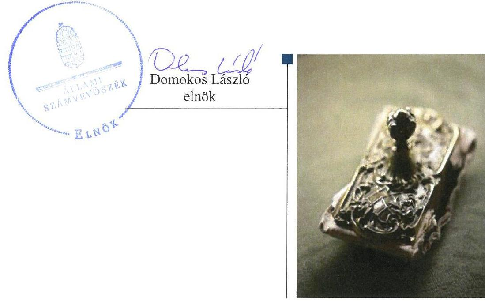

---

# AZ ELLENŐRZÉST FELÜGYELTE: 

BÖRÖCZ IMRE felügyeleti vezető

## AZ ELLENŐRZÉST VEZETTE ÉS A VÉGREHAJTÁSÁÉRT FELELŐS:

JOÓ ERIKA ellenőrzésvezető

## A PROGRAM ÖSSZEÁLLÍTÁSÁÉRT FELELŐS:

JANIK JÓZSEF osztályvezető

IKTATÓSZÁM: V-1198-124/2016

TÉMASZÁM: 2232

## ELLENŐRZÉS-AZONOSÍTÓ SZÁM: V-075908

Jelentéseink az Országgyűlés számítógépes hálózatán és az Interneten a www.asz.hu címen is olvashatóak.

---

# TARTALOMJEGYZÉK 

■ ÖSSZEGZÉS ..... 5
■ AZ ELLENŐRZÉS CÉLJA ..... 6
■ AZ ELLENŐRZÉS TERÜLETE ..... 7
■ AZ ELLENŐRZÉS HÁTTERE, INDOKOLTSÁGA ..... 9
■ A JELENTÉS LÉNYEGES KÉRDÉSKÖREI ..... 10
■ ELLENŐRZÉS HATÓKÖRE ÉS MÓDSZEREI ..... 11
■ MEGÁLLAPÍTÁSOK ..... 13
■ JAVASLATOK ..... 17
■ MELLÉKLETEK ..... 19
I. Sz. melléklet: Értelmező szótár ..... 19
II. Sz. melléklet: A nettó árbevétel megoszlása az ellátási kötelezettség valamint a szabadpiaci értékesítés alapján a 2012-2015. években ..... 24
■ FÜGGELÉK: ÉSZREVÉTELEK ..... 25
■ RÖVIDÍTÉSEK JEGYZÉKE ..... 49

---

.

---

# ÖSSZEGZÉS 

A Duna Papír Termelő, Kereskedelmi és Szolgáltató Kft. feletti tulajdonosi jogokat a tulajdonosi jogok gyakorlói szabályszerűen gyakorolták. A Társaság működésének szabályozottsága az előírásoknak összességében megfelel. A beszámolási és adatszolgáltatási kötelezettség teljesítése szabályszerű volt, a Társaság közzétételi kötelezettségeinek eleget tett, így az elszámoltathatóság és átláthatóság biztosított volt. A vagyongazdálkodás összességében szabályszerű volt.

## Az ellenőrzés társadalmi indokoltsága

Az Állami Számvevőszék a stratégiáját megvalósítva ellenőrzéseivel segíti az átláthatóságot és az elszámoltathatóságot a közpénzekkel, a közvagyonnal való gazdálkodásban. Ellenőrzési témaválasztása során kiemelt figyelmet fordít a korábban ellenőrizetlen területekre.

Ellenőrzési tervének megfelelően a 2012-2015 közötti ellenőrzött időszakra az Állami Számvevőszék folytatja az állami tulajdonban (résztulajdonban) lévő gazdálkodó szervezetek vagyonmegőrzési és gazdálkodási tevékenységének ellenőrzését.

Az állami tulajdonú gazdasági társaságok a nemzeti vagyon részei. A magyarországi büntetés-végrehajtási szervezet gazdasági társaságai kizárólagos állami tulajdonban vannak és korábban az Állami Számvevőszék nem végzett ezeknél a gazdálkodó szervezeteknél vagyonmegőrzési és gazdálkodási tevékenységre vonatkozó ellenőrzést. A büntetést-végrehajtás gazdasági társaságai speciális területen, fogvatartottak munkáltatásával végzik termelő és kereskedelmi tevékenységüket, hozzájárulva ezzel a fogvatartottak kötelező foglalkoztatásához, végső soron az elítéltek társadalmi reintegrációjához. A büntetés-végrehajtási szervezet részeként működő gazdasági társaságok ellenőrzésének tapasztalatai közérdeklődésre tarthatnak számot.

## Főbb megállapítások, következtetések, javaslatok

A Duna Papír Termelő, Kereskedelmi és Szolgáltató Kft. felett a tulajdonosi jogokat 2013. január 30-áig vagyonkezelési szerződés, ezt követően megbízási szerződés alapján a Büntetés-végrehajtás Országos Parancsnoksága, 2015. február 26-tól az elismert vállalatcsoport uralkodó tagjaként a Bv. Holding Kft. az előírásoknak megfelelően gyakorolta. A Magyar Nemzeti Vagyonkezelő Zrt. a számára fenntartott, a szerződésekben át nem engedett jogokat az előírásoknak megfelelően gyakorolta.

A Társaság elkészítette számviteli politikáját, valamint az annak részeként kötelezően elkészítendő egyéb szabályzatokat. A Társaság a számviteli törvény előírásai ellenére a bizonylati rendet 2014. december 31-éig nem készítette el.

A bevételek és ráfordítások számviteli elszámolása szabályszerű volt. A beszámolási és adatszolgáltatási kötelezettségeinek a Duna Papír Termelő, Kereskedelmi és Szolgáltató Kft. szabályszerűen eleget tett.

A közzétételi kötelezettségre vonatkozó szabályzattal rendelkezett a Társaság, a közzétételi kötelezettségeit szabályszerűen teljesítette.

A Duna Papír Termelő, Kereskedelmi és Szolgáltató Kft. kizárólag saját vagyonnal rendelkezett, a vagyongazdálkodást szabályozta, a vagyon nyilvántartása szabályszerű volt. A vagyon változását eredményező döntések az előírásoknak összességében megfeleltek.

Az ÁSZ a Duna Papír Termelő, Kereskedelmi és Szolgáltató Kft. ügyvezetőjének és a Bv. Holding Kft. ügyvezetőjének fogalmazott meg javaslatokat, amelyek alapján kötelesek intézkedési tervet összeállítani és azt a jelentés kézhezvételétől számított 30 napon belül az ÁSZ részére megküldeni.

---

# AZ ELLENŐRZÉS CÉLJA 

Az ellenőrzés célja annak értékelése volt, hogy a tulajdonosi jogok gyakorlása szabályszerű volt-e; a gazdálkodó szervezet szabályozottsága, gazdálkodása és vagyongazdálkodási tevékenysége megfelelt-e a jogszabályi és a tulajdonosi előírásoknak; biztosítva volt-e az elszámoltathatóság; a vagyonváltozást eredményező döntések esetében a tulajdonosi jogok gyakorlója és a gazdálkodó szervezet szabályszerűen jártak-e el.

---

# **Duna Papír Termelő, Kereskedelmi és Szolgáltató Kft.**

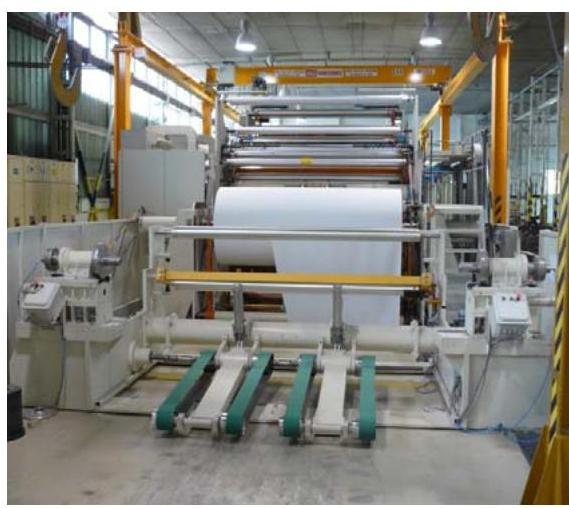

A tököli Duna Papír Termelő, Kereskedelmi és Szolgáltató Kft. az 1974-ben létrehozott Dunai Vegyesipari Vállalat jogutódjaként alakult 1994. január 1-jén. A 100%-os állami tulajdonban lévő Társaság1 feladata a fiatalkorú fogvatartottak foglalkoztatása volt.

A társasági részesedések felett a magyar államot megillető tulajdonosi jogokat a BVOP2 2013. január 30-ig a Vtv.3 rendelkezéseinek megfelelően az MNV Zrt4-vel megkötött vagyonkezelési szerződés, 2013. január 30-ától az Nvtv.5 2012. június 30. napján hatályba lépett előírásai alapján megbízási szerződéssel gyakorolta. A szerződések a tulajdonosi joggyakorlást néhány nevesített esetben az MNV Zrt. előzetes jóváhagyásához kötötték.

A 2015. január 1-jén az MNV Zrt. jóváhagyásával alakult Bv. Holding Kft. létrehozásának célja az volt, hogy a büntetés-végrehajtás gazdasági társaságai elismert vállalatcsoporti formában, egységes üzletpolitikán alapuló együttműködés keretében végezzék tevékenységüket. A Holding6 – mint uralkodó tag – és az általa ellenőrzött gazdasági társaságok 2015. február 26-án uralmi szerződésben rögzítették, hogy – meghatározott kivételekkel – a tulajdonosi jogokat és kötelezettségeket a Holding gyakorolja. Az uralmi szerződés alapján a Holding – képviseletében a Holding ügyvezetője – volt jogosult a Társaság üzleti tervének, éves beszámolójának jóváhagyására, az ügyvezetők vonatkozásában a kinevezést és a visszahívást érintő javaslattételre a BVOP felé, a Társaság működésének ellenőrzésére, valamint a 25 millió Ft nettó értéket meghaladó tárgyi eszköz, továbbá valamennyi ingatlan és gépjármű vásárlásának és értékesítésének jóváhagyására. A BVOP számára fenntartott tulajdonosi jogokat az alapító okiratban1-97 meghatározták.

A jegyzett tőke 88,5 millió Ft volt, amely az ellenőrzött időszakban nem változott. A saját tőke összege a 2012. január 1-jei 862,2 millió Ft-ról 2015. december 31-én 809,4 millió Ft-ra, 6,1%-kal csökkent.

A Társaság a Fiatalkorúak Büntetés-végrehajtási Intézete területén, a Bv. szervezeti törvényben8 foglaltak szerint a büntetés-végrehajtási szervezet részeként működött, büntetés-végrehajtási szervként. A büntetések végrehajtásáról rendelkező Bv. Kódex9 rögzíti, hogy a büntetés-végrehajtás kiemelt célja a fogvatartottak reintegrációja, melynek egyik fontos eszköze a kötelező foglalkoztatás.

A Társaság fő tevékenysége a háztartáshigiéniai papírtermékek gyártása és forgalmazása. A fő tevékenység mellett 2015. január 1-jétől bolti vegyes kiskereskedelmi és egyéb vendéglátás tevékenységet is folytatott a fogvatartotti bolt és az állományi büfé üzemeltetésével.

A büntetés-végrehajtási szervezetet a 44/2011. (III. 23.) Korm. rendelet10, valamint a 9/2011. (III.23.) BM rendelet11 előírásai alapján a központi

---

1. táblázat

|  ÉRTÉKESÍTÉS NETTÓ ÁRBEVÉTELE, |  |   |
| --- | --- | --- |
|  MÉRLEG SZERINTI EREDMÉNY |  |   |
|  (MILLIÓ FT) |  |   |
|  év | árbevétele | eredmény  |
|  2012. | 500 | 33  |
|  2013. | 716 | 7  |
|  2014. | 812 | -105  |
|  2015. | 1063 | 13  |
|   | Forrás: 2012-2015. éves beszámolók |   |

államigazgatási szervek és a rendvédelmi szervek felé a fogvatartottak kötelező foglalkoztatása keretében előállított termékek és szolgáltatások körében ellátási kötelezettség terhelte. Az ellátási tevékenység koordinálását a Központi Ellátó Szerv feladatainak ellátására kijelölt BVOP végezte.

A Társaság a Tao. tv ${ }^{12}$. rendelkezése értelmében társasági adóalanynak nem minősülő szervezet, mérleg szerinti eredménye a 2014. évtől eltekintve pozitív volt. A 2014. évi veszteség oka egy 2001-től húzódó kártérítési perben 2014-ben jogerőssé vált ítélet, amely 50 millió Ft és járulékai összeg megfizetésére kötelezte a Társaságot.

Az értékesítés nettó árbevétele és a mérleg szerinti eredmény alakulását az 1. táblázat, a központi ellátás és a piaci értékesítés árbevételének megoszlását a II. számú melléklet mutatja be.

Az ellenőrzött szervezetnél alkalmazottak hivatásos szolgálati jogviszonyban vagy munkaviszonyban álltak.

Az ellenőrzött időszakban az ügyvezető és a gazdasági vezető személye nem változott, feladatukat hivatásos szolgálati jogviszonyban látták el. A jelenlegi ügyvezető 2008. június 26-tól tölti be tisztségét. A könyvvizsgáló személye nem változott.

A Társaság vagyonkezelésbe vett, hasznosításra átvett állami vagyonnal, valamint más társaságban többségi illetve jelentős részesedéssel nem rendelkezett.

---

# AZ ELLENŐRZÉS HÁTTERE, INDOKOLTSÁGA 

AZ ÁLLAMI TULAJDONÚ GAZDÁLKODÓ SZERVEZETEK ellenőrzése kiemelten fontos a nemzeti vagyon megőrzése, megóvása érdekében. Gazdálkodásuk jellemzően a közérdeklődés és a média figyelmének középpontjában áll, amihez hozzájárul a gazdálkodásuk körébe tartozó - közvetlen vagy közvetett állami tulajdonú - vagyon nagysága, illetve az általuk ellátott közszolgáltatások minősége és hatékonysága. A szolgáltatási/közszolgáltatási árképzés megalapozottsága és az éves elszámoltatás feltételeinek kialakítása az ellenőrzés során nagy hangsúlyt kap. A szolgáltatás/közszolgáltatás árában és annak támogatásában meg kell jelennie az önköltségszámítás szempontjainak, amely biztosítja a működés fenntarthatóságát (eszközpótlást) is. Az ellenőrzés rámutathat az állami tulajdonú gazdálkodó szervezetek gazdálkodási tevékenységével kapcsolatos jó gyakorlatokra és szabálytalanságokra. Felhívhatja a figyelmet a jogszabályi követelmények teljesítéséhez szükséges feltételek hiányosságaira, hozzájárulhat az államháztartáson kívüli, de (közvetlenül vagy közvetve) állami vagyont használó gazdálkodó szervezetek tevékenységének átláthatóságához. Ellenőrzésünk eredményeképpen megállapításainkkal hozzájárulhatunk a nemzeti vagyonnal való gazdálkodás átláthatóságának, elszámoltathatóságának javításához.

---

# A JELENTÉS LÉNYEGES KÉRDÉSKÖREI 

1.     - A tulajdonosi jogok gyakorlása szabályszerű volt-e?
2.     - A társaság működésének szabályozottsága megfelelt-e az előírásoknak?
3.     - A társaságnál a pénzügyi-számviteli és adatszolgáltatási feladatok ellátása szabályszerű volt-e?
4.     - A társaság vagyongazdálkodása szabályszerű volt-e?

---

# ELLENŐRZÉS HATÓKÖRE ÉS MÓDSZEREI 

## Az ellenőrzés típusa

Megfelelőségi ellenőrzés.

## Az ellenőrzött időszak

Az ellenőrzött időszak 2012. január 1-jétől 2015. december 31-ig tart.

## Az ellenőrzés tárgya

Állami tulajdonban (résztulajdonban) lévő gazdasági társaság gazdálkodása, kiemelten vagyongazdálkodási tevékenysége, valamint a tulajdonosi jogok gyakorlása.

Az ellenőrzés kiterjed minden olyan körülményre és adatra, amely az ÁSZ ${ }^{13}$ jogszabályban meghatározott feladatainak teljesítéséhez, valamint a program végrehajtása folyamán felmerült újabb összefüggések feltárásához szükséges.

## Az ellenőrzött szervezet

Duna Papír Termelő, Kereskedelmi és Szolgáltató Kft., Bv. Holding Kft., Büntetés-végrehajtás Országos Parancsnoksága, Magyar Nemzeti Vagyonkezelő Zrt.

## Az ellenőrzés jogalapja

Az ellenőrzés jogalapját az ÁSZ tv. ${ }^{14}$. 1. § (3) bekezdése és 5. § (3)-(5) bekezdése képezi.

## Az ellenőrzés módszerei

Az ellenőrzést a nemzetközi standardokat irányadónak tekintve az ellenőrzési program ellenőrzési kérdései, az ellenőrzött időszakban hatályos jogszabályok, az ellenőrzés szakmai szabályok és módszertanok figyelembevételével végeztük.

Az ellenőrzés ideje alatt az ellenőrzött szervezettel történő kapcsolattartást az ÁSZ Szervezeti és Működési Szabályzatának vonatkozó előírásai alapján biztosítottuk.

---

Az ellenőrzési program szerinti feladatokat a gazdálkodó szervezetnél (társaságnál), valamint a tulajdonosi jogok gyakorlójánál kellett végrehajtani.

Az ellenőrzési kérdések megválaszolásához szükséges bizonyítékok megszerzése a következő ellenőrzési eljárások alkalmazásával történt: megfigyelés, kérdésfeltevés (információkérés), összehasonlítás, mintavétel, valamint elemző eljárás. Az ellenőrzési bizonyítékként felhasználható adatforrások közé tartoznak egyrészt az ellenőrzési programban felsorolt adatforrások, másrészt adatforrás lehet még minden - az ellenőrzés folyamán - feltárt, az ellenőrzés szempontjából információkat tartalmazó dokumentum.

Az ellenőrzést a kérdésekre adott válaszok kiértékelésével, valamint a megjelölt adatforrások, a csatolt tanúsítványok felhasználásával, továbbá
 az adott időszakban hatályos jogszabályok figyelembevételével folytattuk le.

---

# 1. A tulajdonosi jogok gyakorlása szabályszerű volt-e? 

Összegző megállapítás

A részesedések feletti tulajdonosi jogokat a tulajdonosi jogok gyakorlói szabályszerűen gyakorolták.

A TULAJDONOSI JOGOK GYAKORLÓI az alapító okirat 1-ben a részesedések feletti tulajdonosi joggyakorlás rendjét a Gt. 15, illetve a Ptk2 16 előírásainak megfelelően meghatározták és a Társaság feletti tulajdonosi jogokat és kötelezettségeket az előírásoknak megfelelően gyakorolták. Az operatív tevékenységek folyamatos és eseti nyomon követési rendszerének kialakítása és működtetése szabályszerű volt. A Társaság rendszeres beszámoltatása az ellenőrzött időszakban megtörtént. A háromtagú felügyelőbizottságot a Gt. és a Ptk2. előírásainak megfelelően alakították meg, működése megfelelt a jogszabályi előírásoknak. A tulajdonosi joggyakorlás a könyvvizsgáló tevékenységéhez kapcsolódóan szabályszerű volt.

AZ MNV ZRT. a vagyonkezelési és a megbízási szerződésben illetve az alapító okirat 1-8-ban foglaltaknak megfelelően a felügyelőbizottságba tagot delegált, biztosítva ezzel a tulajdonosi képviseletet. Az MNV Zrt. a Társaságra vonatkozó kontrolling adatszolgáltatás rendjét a vagyonkezelési szerződésben, 2013. január 30-tól a megbízási szerződésben, 2013. december 19-től a Társasági Monitoring Szabályzatban 17 írta elő. Az MNV Zrt. az üzleti tervben érvényesítendő tervezési irányelveket 1-4 18 meghatározta.

A BVOP a könyvvizsgáló személyét a 2012-2014. években határozatban jelölte ki és engedélyezte a szerződéskötést. Az üzleti terv elkészítési határidejét a BVOP országos parancsnoka tárgyév január 31. napjában határozta meg 19. A Társaság az üzleti terveket elkészítette, azokat a felügyelőbizottság véleménye alapján a BVOP elfogadta. A BVOP a 2012-2014. évekre vonatkozó éves beszámolók jóváhagyásáról a felügyelőbizottság határozata és a könyvvizsgáló hitelesítő záradéka alapján határozott. A mérleg szerinti eredményről a beszámoló elfogadásával egyidejűleg a 2012-2015. években az alapító okiratban foglaltaknak megfelelően a BVOP döntött, osztalékfizetési kötelezettséget a Társaság részére egyik évben sem írt elő. A BVOP rendszeres - éves, negyedéves, havi - jelentési és adatszolgáltatási kötelezettséget írt elő, amelyet a Társaság az előírásoknak megfelelően teljesített.

A HOLDING a 2015. évben kijelölte a könyvvizsgáló személyét és engedélyezte a szerződéskötést. A felügyelőbizottság ügyrendjét és a 2015. évi beszámolót az előírásoknak megfelelően a Holding hagyta jóvá uralkodó tagi határozatban.

---

# 2. A társaság működésének szabályozottsága megfelelt-e az előírásoknak? 

Összegző megállapítás

A Társaság rendelkezett a jogszabályi előírásoknak megfelelő belső szabályzatokkal, működésének szabályozottsága összességében az előírásoknak megfelelt.

A SZÁMVITELI POLITIKÁT a Társaság a Számv. tv. 20-ben foglaltaknak megfelelően 2011-ben elkészítette 21. A számviteli politika keretében a Társaság rendelkezett az eszközök és források leltározási- és leltárkészítési szabályzatával 22, az eszközök és források értékelési szabályzatával 23, önköltségszámítási szabályzattal 24, pénzkezelési szabályzattal 25. A szabályzatok a jogszabályi előírásoknak megfelelő tartalommal készültek el.

A Társaság rendelkezett számlarenddel 26, de a számlarend 2014. december 31-ig nem tartalmazta a Számv. tv. 161. § (2) bekezdés d.) pontjában előírt bizonylati rendet. A 2015. évben már rendelkezett a Társaság a jogszabályi előírásoknak megfelelő tartalommal elkészített bizonylati renddel.

A JAVADALMAZÁSI SZABÁLYZATOT a BVOP Tak.tv. 27 előírásainak megfelelően, a Kormányhatározatban 28 meghatározott elvek szerint kiadta. A javadalmazási szabályzat 29 rendelkezett a vezető tisztségviselők és vezető állású munkavállalók javadalmazási szabályairól. A Társaság rendelkezett a 2012-2015. években az FB tagok javadalmazásának elveit 30 tartalmazó szabályzattal.

A Társaság az ellenőrzött időszakban nem szabályozta a beszerzési eljárások rendjét, a kapcsolódó felelősségi köröket, felelős személyeket.

## 3. A társaságnál a pénzügyi-számviteli és adatszolgáltatási feladatok ellátása szabályszerű volt-e?

## Összegző megállapítás

3.1. számú megállapítás

A Társaságnál a pénzügyi-számviteli és adatszolgáltatási feladatok ellátása szabályszerű volt.

A bevételek és ráfordítások elszámolása és az önköltségszámítás az előírásoknak megfelelő volt.

A BEVÉTELEK ÉS RÁFORDÍTÁSOK, a beruházások, felújítások, valamint az értékcsökkenés elszámolása megfelelt a jogszabályi és a belső szabályozás előírásainak.

A Társaság az alapító okiratban meghatározottaknak megfelelően rendelkezett a szerződéskötésekre vonatkozó BVOP engedélyekkel. Az alapanyagok beszerzésére 2011. december 27-én a BVOP hozzájárulásával megkötött, 2013. december 31-éig hatályos szállítási keretszerződés időbeli hatálya meghosszabbítását célzó szerződésmódosítás esetében azonban a Társaság nem szerezte be a tulajdonosi joggyakorló BVOP jóváhagyását. A 2015. január 1-jétől hatályos keretszerződés megkötését a BVOP engedélyezte.

AZ ÁRKÉPZÉST MEGALAPOZÓ önköltségszámítási szabályzatban foglaltak figyelembevételét a Társaság árképzési szabályzatban 31 írta elő. Az árképzés az önköltségszámítási szabályzat előírásainak megfelelően történt.

A KÖVETELÉSEK kezeléséről a Társaság gondoskodott, a határidőn túli követeléseket megfelelően nyilvántartotta. A követelésállomány csökkentése érdekében a Társaság intézkedett, fizetési felszólítások megküldésével figyelmeztette a lejárt határidejű tartozással rendelkező partnereit pénzügyi kötelezettségükre. A Társaság 2015 júniusában a fekvőbeteg-szakellátást nyújtó közfinanszírozott egészségügyi szolgáltatók adósságának állam általi rendezéséről szóló 1226/2015. (IV. 20.) Korm. határozatban foglalt egészségügyi szolgáltatók konszolidációjára vonatkozó rendelkezései alapján adósságrendezési megállapodásokat kötött a lejárt követelések rendezése tárgyában. A megtett intézkedések mellett is növekedett a vevőkövetelések állományán belül a határidőn túli követelések aránya és összege az ellenőrzött időszak végére. (2. táblázat)

### 3.2. számú megállapítás

A beszámolási és adatszolgáltatási kötelezettségek teljesítése az előírásoknak megfelelő volt.

## A TERVEZÉSI, BESZÁMOLÁSI, ADATSZOLGÁLTATÁSI kötelezettségét a Társaság a jogszabályi és a tulajdonosi joggyakor

lók előírásainak megfelelően teljesítette. A Társaság az MNV Zrt. által előírt egységes kontrolling adatszolgáltatási, és a BVOP által előírt jelentési és beszámolási kötelezettségének az ellenőrzött időszak alatt szabályosan eleget tett.

ÉVES BESZÁMOLÓIT a Társaság a Számv. tv. előírásainak megfelelően készítette el. Az éves beszámolókat az előírt határidőben letétbe helyezték és közzétették.

A KÖZÉRDEKŰ ADATOK közzétételére vonatkozó szabályzattal a Társaság az Info tv.-ben foglaltaknak megfelelően rendelkezett, közzétételi kötelezettségét teljesítette.

A Társaság az Info tv. 24. § (3) bekezdésében előírtakkal ellentétben 2013. december 31-ig nem rendelkezett adatvédelmi szabályzattal. A 2014. január 1-jétől hatályos adatvédelmi szabályzatban 32 az adatok védelmére vonatkozó előírásokat a jogszabályi rendelkezéseknek megfelelően meghatározta.

A TULAJDONOSI ELLENŐRZÉSEK alapján szükséges intézkedéseket a Társaság szabályszerűen megtette.

---

# 4. A társaság vagyongazdálkodása szabályszerű volt-e? 

## Összegző megállapítás

### 4.1. számú megállapítás

### 4.2. számú megállapítás

A Társaság vagyongazdálkodása összességében szabályszerű volt, a vagyon értékének, állagának megőrzéséről gondoskodott, a vagyon változását eredményező döntések összességében megfeleltek az előírásoknak.

A Társaság kialakította a vagyon értékének megőrzését, gyarapítását szolgáló, szabályszerű vagyongazdálkodás feltételeit.

KIZÁRÓLAG SAJÁT VAGYONNAL rendelkezett a Társaság az ellenőrzött időszakban. Szabályzataiban kitért a vagyonnal való gazdálkodás, ennek keretében a kapcsolódó feladat- és hatáskörök, felelősségi viszonyok szabályozására.

A vagyon leltározásának, a leltáregyeztetési kötelezettségnek a módjáról és formájáról a számviteli politikában és a leltározási szabályzatban a jogszabályi előírásoknak megfelelően rendelkeztek.

A vagyon nyilvántartása az előírásoknak megfelelő volt.
A VAGYON NYILVÁNTARTÁSA a jogszabályi előírásoknak megfelelő, átlátható, naprakész volt.

ÉVENTE ELKÉSZÍTETT LELTÁRRAL támasztották alá a jogszabályban, belső leltározási szabályzatban foglaltaknak megfelelően az éves beszámolók mérlegtételeit.

A leltárakat a jogszabályi előírásoknak megfelelően tételesen, ellenőrizhető módon készítették el.

A vagyon értékének megőrzéséről gondoskodott a Társaság, a vagyon változását eredményező döntések az előírásoknak összességében megfeleltek.

A VAGYON ÉRTÉKÉNEK és állagának megőrzéséről, a tárgyi eszközök rendszeres állapotfelméréséről és karbantartásáról a Társaság gondoskodott. A vagyon értékében és szerkezetében jelentős változás nem volt.

A Társaság egyes beszerzései során nem a Kbt. 33 szerinti ajánlatkérőként járt el.

A VAGYON VÁLTOZÁSÁT eredményező döntések, valamint azok előterjesztései megfeleltek a BVOP és a Holding határozataiban és az alapító okiratban meghatározott előírásoknak. Térítés nélküli vagyon átvételére és átadására az ellenőrzött időszakban nem került sor.

---

# JAVASLATOK 

Az ÁSZ tv. 33. § (1) bekezdésében foglaltak értelmében az ellenőrzött szervezet vezetője köteles a jelentésben foglalt megállapításokhoz kapcsolódó intézkedési tervet összeállítani és azt a jelentés kézhezvételétől számított 30 napon belül az ÁSZ részére megküldeni. Amennyiben az ellenőrzött szervezet vezetője nem küldi meg határidőben az intézkedési tervet, vagy továbbra sem elfogadható intézkedési tervet küld, az Állami Számvevőszék elnöke az ÁSZ tv. 33. § (3) bekezdés a)-b) pontjaiban foglaltakat érvényesítheti.

## A Duna Papír Termelő, Kereskedelmi és Szolgáltató Kft. ügyvezetőjének

1. Intézkedjen a jogszabályi előírásnak megfelelő beszerzési eljárásrend megalkotásáról.
(2. sz. összegző megállapítás 4. bekezdése alapján)
2. Intézkedjen, hogy a beszerzési eljárásokat az előírásoknak megfelelően folytassák le.
(4.3. sz. megállapítás 2. bekezdése alapján)

## A Bv. Holding Kft. ügyvezetőjének

1. Intézkedjen, hogy a Duna Papír Termelő, Kereskedelmi és Szolgáltató Kft-t érintő beszerzési eljárásokat az előírásoknak megfelelően lefolytassák.
(4.3. sz. megállapítás 2. bekezdése alapján)

---

.

---

# MELLÉKLETEK 

- I. SZ. MELLÉKLET: ÉRTELMEZŐ SZÓTÁR
állami vagyon
a) Az állam tulajdonában lévő dolog, valamint a dolog módjára hasznosítható természeti erő,
b) az a) pont hatálya alá nem tartozó mindazon vagyon, amely vonatkozásában törvény az állam kizárólagos tulajdonjogát nevesíti,
c) az állam tulajdonában lévő tagsági jogviszonyt megtestesítő értékpapír, illetve az államot megillető egyéb társasági részesedés,
d) az államot megillető olyan immateriális, vagyoni értékkel rendelkező jogosultság, amelyet jogszabály vagyoni értékű jogként nevesít.
Forrás: Vtv. 1. § (2) bekezdése
2012. november 10-től az állami vagyon fogalma kiegészül a következő ponttal:
e) az állam tulajdonában lévő pénzügyi eszközök

Forrás: Vtv. 1. § (2) bekezdése
2013. június 27-ig:

Az állami vagyont az MNV Zrt. maga kezeli, vagy szerződés - így különösen bérlet, haszonbérlet, megbízás - alapján központi költségvetési szervnek, természetes vagy jogi személynek, vagy jogi személyiséggel nem rendelkező gazdálkodó szervezetnek hasznosításra átengedi. Az állami vagyonra vonatkozóan az MNV Zrt. kizárólag az Nvtv-ben meghatározott személyekkel köthet vagyonkezelési szerződést.
Forrás: Vtv. 23. § (1), 27. § (1)
2013. június 28-ától:

Az állami vagyonnal az MNV Zrt. maga gazdálkodik, vagy szerződés - így különösen bérlet, haszonbérlet, megbízás - alapján központi költségvetési szervnek, természetes vagy jogi személynek, vagy jogi személyiséggel nem rendelkező gazdálkodó szervezetnek hasznosításra átengedi, illetőleg vagyonkezelésbe, haszonélvezetbe adja. Az állami vagyonra vonatkozóan az MNV Zrt. kizárólag az Nvtv-ben meghatározott személyekkel köthet vagyonkezelési szerződést.
Forrás: Vtv. 23. § (1), 27. § (1)
Állami vagyon tulajdonjogának bármely jogcímen történő, visszterhes átruházása.
Forrás: Vhr. 1. § (7) d) pont)
A büntetés-végrehajtási szervezetről szóló 1995. évi CVII. törvény 2. § (5) bekezdése szerint „az Országos Parancsnokság, a büntetés-végrehajtási intézetek és intézmények, továbbá a fogvatartottak kötelező foglalkoztatására létrehozott gazdasági társaságok és költségvetési szervek (a továbbiakban együtt: bv. szervek) jogi személyek."
Ptk: 3:49. § [Az elismert vállalatcsoport fogalma] (1) Elismert vállalatcsoport az összevont, konszolidált éves beszámoló készítésére kötelezett, legalább egy uralkodó tag és legalább három, az uralkodó tag által ellenőrzött tag által kötött uralmi szerződésben meghatározott, egységes üzletpolitikán alapuló együttműködés.(2) A vállalatcsoportban tagként részvénytársaság, korlátolt felelősségű társaság, egyesülés és szövetkezet vehet részt.(3) Ha a vállalatcsoportban uralkodó tagként több jogi személy közösen vesz részt, az egymással kötött szerződésük határozza meg, hogy melyikük gyakorolja az

 uralmi szerződésben megállapított, az uralkodó tagot megillető jogokat.
a Ptk. 3:88. § (1) bekezdése szerint „a gazdasági társaságok üzletszerű közös gazdasági tevékenység folytatására, a tagok vagyoni hozzájárulásával létrehozott, jogi személyiséggel rendelkező vállalkozások, amelyekben a tagok a nyereségből közösen részesednek, és a veszteséget közösen viselik".

---

gazdálkodó szervezet

## meghatározó befolyás

MNV Zrt.
2014. március 14-ig:

A Ptk. ${ }^{34}$ 685. § c) pontja szerint gazdálkodó szervezet: „az állami vállalat, az egyéb állami gazdálkodó szerv, a szövetkezet, a lakásszövetkezet, az európai szövetkezet, a gazdasági társaság, az európai részvénytársaság, az egyesülés, az európai gazdasági egyesülés, az európai területi együttműködési csoportosulás, az egyes jogi személyek vállalata, a leányvállalat, a vízgazdálkodási társulat, az erdő birtokossági társulat, a végrehajtói iroda, az egyéni cég, továbbá az egyéni vállalkozó."
2014. március 15-től:

A gazdasági társaság, az európai részvénytársaság, az egyesülés, az európai gazdasági egyesülés, az európai területi együttműködési csoportosulás, a szövetkezet, a lakásszövetkezet, az európai szövetkezet, a vízgazdálkodási társulat, az erdőbirtokossági társulat, az állami vállalat, az egyéb állami gazdálkodó szerv, az egyes jogi személyek vállalata, a közös vállalat, a végrehajtói iroda, a közjegyzői iroda, az ügyvédi iroda, a szabadalmi ügyvivői iroda, az önkéntes kölcsönös biztosító pénztár, a magánnyugdíjpénztár, az egyéni cég, továbbá az egyéni vállalkozó. Az állam, a helyi önkormányzat, a költségvetési szerv, az egyesület, a köztestület, valamint az alapítvány gazdálkodó tevékenységével összefüggő polgári jogi kapcsolataira is a gazdálkodó szervezetre vonatkozó rendelkezéseket kell alkalmazni.
Forrás: $\mathrm{Ptk}^{35} .396 . \S$
2014. március 14-ig:

A befolyással rendelkező akkor rendelkezik egy jogi személyben meghatározó befolyással, ha annak tagja, illetve részvényese és
a) jogosult e jogi személy vezető tisztségviselői vagy felügyelőbizottsága tagjai többségének megválasztására, illetve visszahívására, vagy
b) a jogi személy más tagjaival, illetve részvényeseivel kötött megállapodás alapján egyedül rendelkezik a szavazatok több mint ötven százalékával.
A meghatározó befolyás akkor is fennáll, ha a befolyással rendelkező számára az előzőek szerinti jogosultságok közvetett módon biztosítottak. A befolyással rendelkezőnek egy jogi személyben a szavazatok több mint ötven százalékával közvetett módon való rendelkezése vagy egy jogi személyben közvetetten fennálló meghatározó befolyása megállapítása során a jogi személyben szavazati joggal rendelkező más jogi személyt (köztes vállalkozást) megillető szavazatokat meg kell szorozni a befolyással rendelkezőnek a köztes vállalkozásban, illetve vállalkozásokban fennálló szavazatával. Ha a köztes vállalkozásban fennálló szavazatok mértéke az ötven százalékot meghaladja, akkor azt egy egészként kell figyelembe venni.
Forrás: Ptk. 685/B. § (2)-(3) bekezdések
2014. március 15-től:

A befolyással rendelkező akkor rendelkezik egy jogi személyben meghatározó befolyással, ha annak tagja vagy részvényese, és
a) jogosult e jogi személy vezető tisztségviselői vagy felügyelőbizottsága tagjai többségének megválasztására, illetve visszahívására; vagy
b) a jogi személy más tagjai, illetve részvényesei a befolyással rendelkezővel kötött megállapodás alapján a befolyással rendelkezővel azonos tartalommal szavaznak, vagy a befolyással rendelkezőn keresztül gyakorolják szavazati jogukat, feltéve, hogy együtt a szavazatok több mint felével rendelkeznek.
Forrás: Ptk. 8:2. § (2) bekezdés
Az állami vagyon felett, a Magyar Államot megillető tulajdonosi jogok és kötelezettségek összességét - a hatályos szabályozás szerint - az állami vagyon felügyeletéért

---

nemzeti vagyon
rábízott vagyon
tulajdonosi ellenőrzés
tulajdonosi jogok gyakorlója
felelős miniszter (jelenleg a nemzeti fejlesztési miniszter) gyakorolja. A miniszter feladatát nagy részben az MNV Zrt., mint tulajdonosi joggyakorló szervezet útján látja el.
az állam vagy a helyi önkormányzat kizárólagos tulajdonában álló dolgok,
az a) pont hatálya alá nem tartozó, állam vagy a helyi önkormányzat tulajdonában lévő dolog,
az állam vagy a helyi önkormányzat tulajdonában lévő pénzügyi eszközök, továbbá az államot vagy a helyi önkormányzatot megillető társasági részesedések,
az államot vagy a helyi önkormányzatot megillető bármely vagyoni értékkel rendelkező jogosultság, amelyet jogszabály vagyoni értékű jogként nevesít,
Magyarország határa által körbezárt terület feletti légtér,
az üvegházhatású gázok kibocsátási egységeinek kereskedelméről szóló törvény szerint kibocsátási egység és légiközlekedési kibocsátási egység, valamint az ENSZ Éghajlatváltozási Keretegyezménye és annak Kiotói Jegyzőkönyve végrehajtási keretrendszeréről szóló törvény szerinti kiotói egység,
állami vagy helyi önkormányzati fenntartású közgyűjtemény (muzeális intézmény, levéltár, közgyűjteményként működő kép- és hangarchívum, valamint könyvtár) saját gyűjteményében nyilvántartott kulturális javak körébe tartozó dolog, kivéve, ha az állami vagy önkormányzati tulajdon jogszerű létrejötte kétséget kizáró módon nem bizonyítható és a dologra nézve más a tulajdonjogát bizonyítja vagy a kulturális javakra vonatkozó jogszabályokban meghatározott eljárás keretében valószínűsíti (g. pont módosult 2013. december 7-től),
a régészeti lelet,
a nemzeti adatvagyon körébe tartozó állami nyilvántartások fokozottabb védelméről szóló törvény szerinti nemzeti adatvagyon.
Forrás: Nvtv. 1. § (2)
Egyrészt minden a Vtv. alkalmazásában állami vagyonnak minősülő vagyon, amit az MNV Zrt. kezel és nyilvántart.
Másrészt az a vagyon, amely felett a Magyar Állam nevében az MFB Zrt. gyakorolja a tulajdonosi jogokat.
Forrás: MFB tv. 3. § (9)
A rábízott vagyon a tulajdonosi jogokat gyakorló szervezetek saját vagyonától elkülönítendő.
Forrás: Vtv. 22. § (6)
2014. március 14-ig:

Az állami vagyon kezelőjét, haszonélvezőjét, használóját megillető jogok gyakorlását, annak szabályszerűségét, célszerűségét az MNV Zrt. - szükség szerint területi szervei útján - ellenőrzi.
2014. március 15-től:

Az állami vagyon használóját, vagyonkezelőjét és haszonélvezőjét megillető jogok gyakorlását, annak szabályszerűségét, a kötelezettségek teljesítését, valamint a vagyon rendeltetése szerinti célszerűségét a tulajdonosi joggyakorló rendszeresen ellenőrzi.
Forrás: Vhr. 20. § (1)
1.
2013. június 27-ig:

Az állami vagyon felett a Magyar Államot megillető tulajdonosi jogok és kötelezettségek összességét - ha törvény eltérően nem rendelkezik - az állami vagyon felügyeletéért felelős miniszter (a továbbiakban: miniszter) gyakorolja, aki e feladatát a Magyar Nemzeti Vagyonkezelő Zártkörűen Működő Részvénytársaság (a továbbiakban: MNV Zrt.), a Magyar Fejlesztési Bank, illetve a tulajdonosi joggyakorló szervezet útján

---

látja el. A miniszter miniszteri rendeletben, a törvényben meghatározott állami vagyoni kör tekintetében, meghatározott időtartamra, a joggyakorlás egyes szabályainak meghatározásával - az őt megillető tulajdonosi jogok és kötelezettségek összességének, illetve azok meghatározott részének gyakorlóját az Áht. szerinti központi költségvetési szervek, ezek intézménye, továbbá a 100%-ban állami tulajdonban álló gazdasági társaságok közül kijelölheti.
Forrás: Vtv. 3. § (1) és (2)
2013. június 28-ától:

A rábízott állami vagyon felett az államot megillető tulajdonosi jogok és kötelezettségek összességét tulajdonosi joggyakorlóként:
a) ha törvény vagy miniszteri rendelet eltérően nem rendelkezik, a Magyar Nemzeti Vagyonkezelő Zártkörűen Működő Részvénytársaság (a továbbiakban: MNV Zrt.),
b) törvényben kijelölt személy vagy
c) az állami vagyon felügyeletéért felelős miniszter (a továbbiakban: miniszter) által rendeletben kijelölt személy gyakorolja.
[...] A miniszter e törvény felhatalmazása alapján - a meghatározott célok hatékonyabb elérése érdekében, miniszteri rendeletben, az ott meghatározott állami vagyoni kör tekintetében, meghatározott időtartamra - e törvény keretei között, a joggyakorlás egyes szabályainak meghatározásával - az államot megillető tulajdonosi jogok és kötelezettségek összességének, illetve azok meghatározott részének gyakorlóját az Áht. szerinti központi költségvetési szervek, ezek intézménye, továbbá a 100%-ban állami tulajdonban álló gazdasági társaságok közül kijelölheti.
Forrás: Vtv. 3. § (1) és (2)
2.
Aki a nemzeti vagyon felett az államot vagy a helyi önkormányzatot megillető tulajdonosi jogok és kötelezettségek összességének gyakorlására jogosult
Forrás: Nvtv. 3. § (1) 17. pontja
2013. június 27-től:

A vagyonkezelő köteles a vagyontárgy értékét megőrizni, állagának megóvásáról, jó karban tartásáról, működtetéséről gondoskodni, továbbá - a központi költségvetési szervek kivételével - díjat fizetni vagy a szerződésben előírt más kötelezettséget teljesíteni.
Forrás: Vtv. 27. § (2)
2013. június 28-ától december 31-ig:

A vagyonkezelő köteles a vagyontárgy állagának megóvásáról, jó karbantartásáról, működtetéséről gondoskodni, továbbá - a központi költségvetési szervek kivételével - díjat fizetni, jogszabályban és szerződésben előírt más kötelezettségét teljesíteni, valamint a vagyontárgyat jogszabályban vagy szerződésben meghatározott célnak megfelelően használni. Amennyiben a vagyonkezelő ezen kötelezettségének nem tesz eleget, a tulajdonosi joggyakorló jogosult a szerződést azonnali hatállyal felmondani.
Forrás: Vtv. 27. § (2)
2014. január 1-jétől:

A vagyonkezelő köteles a vagyontárgy állagának megóvásáról, jó karbantartásáról, működtetéséről gondoskodni, jogszabályban és szerződésben előírt más kötelezettségét teljesíteni, valamint a vagyontárgyat jogszabályban vagy szerződésben meghatározott célnak megfelelően használni.

A vagyonkezelő - a központi költségvetési szervek és a kizárólag közfeladatot ellátó nem központi költségvetési szerv vagyonkezelők kivételével - köteles díjat fizetni, jog-

---

szabályban és szerződésben előírt más kötelezettségét teljesíteni, valamint a vagyontárgyat jogszabályban vagy szerződésben meghatározott célnak megfelelően használni. Amennyiben a vagyonkezelő ezen kötelezettségeinek nem tesz eleget, a tulajdonosi joggyakorló jogosult a szerződést azonnali hatállyal felmondani.
Forrás: Vtv. 27. § (2), (2a)

---

II. SZ. MELLÉKLET: A NETTÓ ÁRBEVÉTEL MEGOSZLÁSA AZ ELLÁTÁSI KÖTELEZETTSÉG VALAMINT A SZABADPIACI ÉRTÉKESÍTÉS ALAPJÁN A 2012-2015. ÉVEKBEN
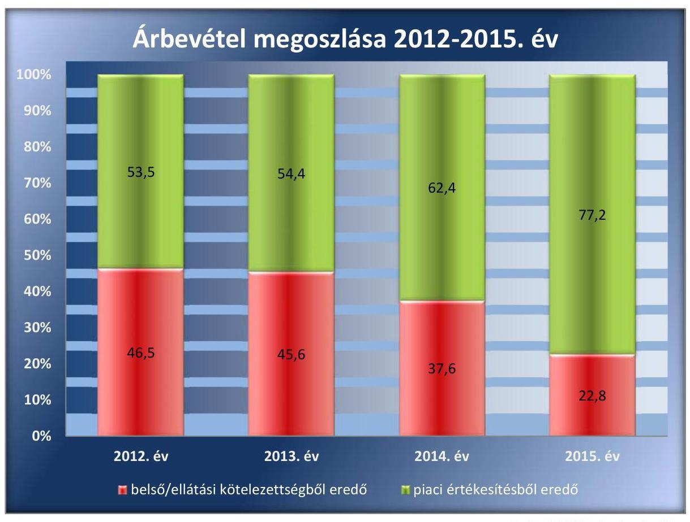

Forrás: 2012-2015. éves beszámolók

---

# FÜGGELÉK: ÉSZREVÉTELEK 

A jelentéstervezetet a Számvevőszék 15 napos észrevételezésre megküldte az ellenőrzött szervezetek vezetőinek az ÁSZ tv. 29. § (1) bekezdése előírásának megfelelően.

A függelék tartalmazza az ellenőrzöttek észrevételeit, illetve az el nem fogadott észrevételek elutasításának indoklását.

- Az MNV Zrt. vezérigazgatójának írásban tett észrevétele
- A BVOP országos parancsnokának észrevétele
- Tájékoztatás a BVOP országos parancsnokának az észrevételek kezeléséről
- A Holding ügyvezetőjének írásban tett észrevétele (Az ahhoz csatolt mellékletek nélkül.)
- Tájékoztatás a Holding ügyvezetőjének az észrevételek kezeléséről
- A Társaság ügyvezetőjének írásban tett észrevétele
- Tájékoztatás a Társaság ügyvezetőjének az észrevételek kezeléséről

[^0]
[^0]:    * 29. § (1) Az Állami Számvevőszék az ellenőrzési megállapításait megküldi az ellenőrzött szervezet vezetőjének vagy az általa megbízott személynek, és annak, akinek személyes felelősségét állapította meg.
    (2) Az ellenőrzött szervezet vezetője és a felelősként megjelölt személy az ellenőrzés megállapításaira tizenöt napon belül írásban észrevételt tehet.
    (3) Az Állami Számvevőszék az észrevételre a beérkezésétől számított harminc napon belül írásban válaszol. A figyelembe nem vett észrevételeket köteles a jelentésben feltüntetni, és megindokolni, hogy azokat miért nem fogadta el.

---

# 4116 

## 333-002

## 

Állami Számvevőszék

## Domokos László

elnök

1052 Budapest
Apáczai Cs. J. u. 10.

Ikt. sz.: MNV/01/15016/3/2017.
Hiv. sz.: V-1198-102/2016.

Tisztelt Elnök Úr!
Tájékoztatom, hogy az MNV Zrt. a 2017. június 23. napján „Az állami tulajdonban (résztulajdonban) lévő gazdálkodó szervezetek vagyonmegőrzési és gazdálkodási tevékenységének ellenőrzése - Duna Papír Termelő, Kereskedelmi és Szolgáltató Kft." tárgyában kézhez vett, V-1198-102/2016. ikt. sz. Jelentés-tervezetre nem kíván észrevételt tenni.

Budapest, 2017. július „,”

Üdvözlettel:
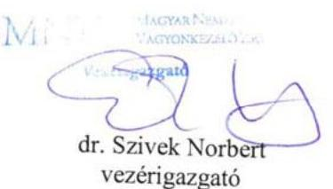

---

# BÜNTETÉS-VÉGREHAJTÁS ORSZÁGOS PARANCSNOKSÁGA DR. TÓTH TAMÁS ORSZÁGOS PARANCSNOK 

Szám: 30500/6090/1/2017.

Tárgy: jelentéstervezetre észrevétel
Hivatkozási szám: V-1198-103/2016.
Úgyintéző: dr. Demkó Tibor c. bv. ezredes
Tel: 06-1-301-8453

## Domokos László Úr   elnök

Állami Számvevőszék

## Budapest

Budapest, 4.
Pf. 54.
1364

## Tisztelt Elnök Úr!

A Büntetés-végrehajtás Országos Parancsnoksága (a továbbiakban: BVOP) tulajdonosi joggyakorlása alá tartózó Duna Papír Termelő, Kereskedelmi és Szolgáltató Korlátolt Felelősségű Társaság (a továbbiakban: Társaság) számvevőszéki ellenőrzéséről készült, a VV-V-1198-103/2016. iktatószámú levelével megküldött jelentéstervezetre az alábbi észrevételeket teszem:

A jelentéstervezet szerint a jogszabályi előírások ellenére a társaság közbeszerzési szabályzattal az ellenőrzött időszakban nem rendelkezett. A beruházások esetében, a Társaság a beszerzés idején hatályos Kbt. alanyi hatálya alá tartozó szervezetként a közbeszerzési eljárás mellőzésével megvalósított beszerzéseivel megsértette a Kbt. 5. § alapján fennálló, a Kbt. 19. §-ában előírt közbeszerzési eljárás lefolytatásának kötelezettségét.

Álláspontunk szerint az adott beruházások tekintetében a Társaság
 nem minősült/minősül az ellenőrzött időszak alatt hatályban volt közbeszerzésekről szóló 2011. évi CVIII. törvény (a továbbiakban: régi Kbt.), és a 2015. november 1. napjától hatályos közbeszerzésekről szóló 2015. évi CXLIII. törvény (a továbbiakban: hatályos Kbt.) szerinti klasszikus ajánlatkérőnek.

A régi Kbt. 6. § (1) bekezdés c) pontja alapján ajánlatkérőnek minősül az a jogképes szervezet, amelyet közérdekű, de nem ipari vagy kereskedelmi jellegű tevékenység folytatása céljából hoznak létre, vagy amely ilyen tevékenységet lát el, ha az a)-d) pontokban meghatározott egy vagy több szervezet, az Országgyűlés vagy a Kormány külön-külön vagy együttesen, közvetlenül vagy közvetetten meghatározó befolyást képes felette gyakorolni vagy működését többségi részben egy vagy több ilyen szervezet (testület) finanszírozza.

A hatályos Kbt. 5. § (1) bekezdés e) pontja alapján ajánlatkérőnek minősül az a jogképes szervezet, amelyet nem ipari vagy kereskedelmi jellegű, kifejezetten közérdekű tevékenység

---

folytatása céljából hoznak létre, vagy amely bármilyen mértékben ilyen tevékenységet lát el, feltéve, hogy e szervezet felett az a)-e) pontban meghatározott egy vagy több szervezet, az Országgyűlés vagy a Kormány közvetlenül vagy közvetetten meghatározó befolyást képes gyakorolni vagy működését többségi részben egy vagy több ilyen szervezet (testület) finanszírozza.

A hatályos Kbt. indokolása kiemeli, hogy az új törvény pontosítja a közjogi szervezetekre vonatkozó meghatározást, és rögzíti, hogy a kifejezetten közérdekű célra létrehozott szervezetek minősülnek csak ajánlatkérőnek.

A 2004/18/EK irányelv 1. cikk (9) bekezdése és a 2004/17/EK irányelv 2. cikk (1)-(2) bekezdése a közbeszerzési szabályok személyi hatályát a következőképpen állapítják meg. A 2004/18/EK irányelv személyi hatálya: "Ajánlatkérő szerv": az állam, a területi vagy a települési önkormányzat, a közjogi intézmény, továbbá az egy vagy több ilyen szerv, illetve közjogi intézmény által létrehozott társulás;
"Közjogi intézmény" minden olyan intézmény,
a) amely kifejezetten olyan közérdekű célra jött létre, amely nem ipari vagy kereskedelmi jellegű;
b) amely jogi személyiséggel rendelkezik; valamint
c) amelyet többségi részben az állam, vagy a területi vagy a települési önkormányzat, vagy egyéb közjogi intézmény finanszíroz; vagy amelynek irányítása ezen intézmények felügyelete alatt áll; vagy amelynek olyan ügyvezető, döntéshozó vagy felügyelő testülete van, amely tagjainak többségét az állam, a területi vagy a települési önkormányzat, vagy egyéb közjogi intézmény nevezi ki.

Az Európai Unió Bíróságának C-360/96. sz. BFI Holding ítéletében meghatározattak alapján az első, a) pont szerinti feltétel két elemét önállóan kell megvizsgálni, és mindkét feltételnek fenn kell állnia a közjogi intézménnyé minősítéshez. Különbséget kell tehát tenni az olyan közérdekű tevékenységek között, amelyek ipari vagy kereskedelmi jellegűek, és amelyek nem ipari vagy kereskedelmi jellegűek. Ha a tevékenység kizárólag ipari vagy kereskedelmi jellegű, vagy ilyen jellegű és egyben közérdekű, a szervezet az egyéb feltételek fennállása esetén sem minősül ún. közjogi szervezetnek.

A közbeszerzésről és a 2004/18/EK irányelv hatályon kívül helyezéséről szóló Európai Parlament és a Tanács 2014/24/EU irányelv (10) preambulum bekezdése is rögzíti, hogy az olyan szerv, amely szokásos piaci feltételekkel működik, nyereségorientált, és a tevékenysége végzéséből eredő veszteségeket maga viseli, nem tekintendő „közjogi intézménynek", mivel azok a közérdekű célok, amelyek teljesítésére létrehozták, vagy amelyek teljesítésével megbízták, gazdasági vagy üzleti jellegűnek minősülhetnek.

Véleményünk az, hogy a közérdekűség fennállta mellett az is megállapítható, hogy a Társaság ipari, kereskedelmi jellegű tevékenységet végez és versenyfeltételek befolyásolják működését. Így nem tartozik sem a régi, sem a hatályos Kbt. alanyi hatálya alá. (Európai Bíróság C-18/01. számú, Korhonen and Others ügyben hozott ítélete)

A Társaság alapító okirata 4. pontjában megjelölt főtevékenység - TEÁOR 1812'08 szerint nyomás, illetve a 4.1. pont alatti tevékenységek egyértelműen ipari, kereskedelmi, azaz üzletszerű jellegre utalnak. A Társaság alapítójának is az volt a szándéka, hogy a Polgári Törvénykönyvről szóló 2013. évi V. törvény 3:88. § (1) bekezdése szerinti üzletszerű közös

---

gazdasági tevékenység folytatására, a tagok vagyoni hozzájárulásával létrehozott, jogi személyiséggel rendelkező vállalkozás jöjjön létre.

A Magyar Nemzeti Vagyonkezelő Zrt. for-profit társaságként tartja nyilván a Társaságot, valamint az adott évre vonatkozó üzleti terv tervezéséhez kiadott irányelvekben is nyereséget írt elő a Magyar Állam tulajdonában lévő és a BVOP tulajdonosi joggyakorlása alá tartozó gazdasági társaságoknak.

A jelentéstervezet 7. oldalának utolsó előtti bejegyzése tényszerűen rögzíti, hogy a Társaság fő tevékenysége a háztartáshigiéniai papírtermékek gyártása és forgalmazása, ami szintén ipari és kereskedelmi jelleg elsődlegességére utal.

Összefoglalva a fent leírtakat, a jelentéstervezet nem állapítja meg, hogy a régi és hatályos Kbt. mely pontja alapján minősül klasszikus ajánlatkérőnek a Társaság. Álláspontunk szerint a Társaság a régi Kbt. és az új Kbt. alapján az ellenőrzött időszakban nem minősült klasszikus ajánlatkérőnek, ezért nem volt közbeszerzési eljárás indítására kötelezett, illetve ezért nem rendelkezett/rendelkezik a régi Kbt. 22.§ (1) bekezdésében, illetve a hatályos Kbt. 27. § (1) bekezdésében előírt közbeszerzési szabályzattal.

Kérem a Tisztelt Elnök Urat, hogy fenti észrevételünket a jelentéstervezet 2. sz. és 4.3. sz. megállapítása és a javaslatok tekintetében figyelembe venni szíveskedjenek.

Budapest, 2017. július „C" „

Tisztelettel:
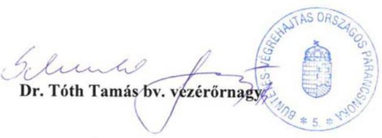

---

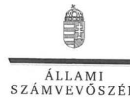

ELNÖK

Ikt.szám: V-1198-116/2016.

# Dr. Tóth Tamás úr 

vezérőrnagy, országos parancsnok
Büntetés-Végrehajtás Országos Parancsnoksága

## Budapest

## Tisztelt Országos Parancsnok Úr!

Az ,,Állami tulajdonú gazdasági társaságok - Az állami tulajdonban (résztulajdonban) lévő gazdálkodó szervezetek vagyonmegőrzési és gazdálkodási tevékenységének ellenőrzése - Duna Papír Termelő, Kereskedelmi és Szolgáltató Kft." címmel készített számvevőszéki jelentéstervezetre tett észrevételeit köszönettel megkaptam.
Az Állami Számvevőszék észrevételekre vonatkozó álláspontjáról a felügyeleti vezető által készített részletes tájékoztatást csatoltan megküldöm.

Tájékoztatom Országos Parancsnok urat, hogy a számvevőszéki jelentésben - az Állami Számvevőszékről szóló 2011. évi LXVI. törvény 29. § (3) bekezdése alapján - a figyelembe nem vett észrevételeket szerepeltetjük, annak indoklásával, hogy azokat az Állami Számvevőszék miért nem fogadta el.

Budapest, 2017. 02. hó 2.3. nap
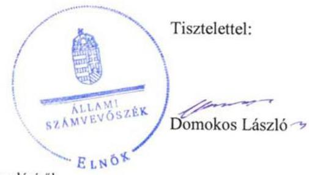

Melléklet: Tájékoztatás az észrevételek kezeléséről

---

# Tájékoztatás   az észrevételek kezeléséről 

Az „Állami tulajdonú gazdasági társaságok - Az állami tulajdonban (résztulajdonban) lévő gazdálkodó szervezetek vagyonmegőrzési és gazdálkodási tevékenységének ellenőrzése - Duna Papír Termelő, Kereskedelmi és Szolgáltató Kft." című jelentéstervezetre tett (2017. július 5-én kelt, július 7-én postára adott és az Állami Számvevőszékhez július 11-én érkezett) észrevételeit áttekintettük, azok kezelésével kapcsolatban a következő tájékoztatást adom.
A Büntetés-Végrehajtás Országos Parancsnoksága (a továbbiakban: BVOP) észrevételei szerint a Duna Papír Termelő, Kereskedelmi és Szolgáltató Kft. (továbbiakban: Társaság) nem minősült az ellenőrzött időszak alatt a hatályos közbeszerzési törvények szerinti klasszikus ajánlatkérőnek, A BVOP a közbeszerzési törvények (a közbeszerzésről szóló 2011. évi CVIII. törvény /a továbbiakban: régi Kbt./ és a 2015. november 1-jétől hatályos közbeszerzésről szóló 2015. évi CXLIII. törvény /új Kbt./) rendelkezései mellett egyes kapcsolódó európai uniós irányelvek rendelkezéseit és az Európai Unió Bíróságának a tárgyhoz kapcsolódóan meghozott egyes ítéleteit is idézte annak alátámasztása céljából, hogy Társaság nem tartozott az ellenőrzött időszakban a közbeszerzési törvények hatálya alá.
A büntetés-végrehajtási szervezetről szóló 1995. évi CVII. törvény (a továbbiakban: Bvsz.) 2. § (5) bekezdése értelmében a fogvatartottak kötelező foglalkoztatására létrehozott gazdasági társaságok büntetés-végrehajtási szervezetnek minősülnek, amelynek feladata a Bvsz. 1. § (2) bekezdése értelmében a közrend és a közbiztonság erősítése. A Társaság Alapító okiratának 7. pontja szerint „a társaság fogvatartottak kötelező foglalkoztatására létrehozott gazdálkodó szervezet, egyben büntetés-végrehajtási szerv", tehát a régi és új Kbt-ben meghatározott közérdekű, kifejezetten közérdekű szervnek minősül.
A régi Kbt. 6. § (1) bekezdés c) pontjához kapcsolódik a régi Kbt. 6. § (2) bekezdése, mely szerint az ajánlatkérői minőség megállapítható abban az esetben is, ha a szervezet közérdekű feladatán kívül más tevékenységet - akár ipari vagy kereskedelmi tevékenységet - is folytat. A Társaság régi Kbt. szerinti ajánlatkérői minőségét megalapozza továbbá Alapító okiratának 7. pontja is (lásd fentebb.).
Az Európai Unió Bírósága a C-18/01. számú Korhonen és társai ügyben megállapította, hogy nem kizárt egy szervezetet annak ellenére ajánlatkérőnek minősíteni, ha működése során profitot termel, de annak elsődleges célja a közérdekű célok szolgálata és nem az üzleti eredményesség elérése. A Társaság Alapító okiratának 7. pontjából (lásd fentebb) megállapítható, hogy a Társaság közjogi intézmény.
Ezt erősíti továbbá az Európai Unió Bírósága C-283/00. számú „SIEPSA" ügye is, amelynek tárgya a szervezet közérdekű jellegének megítélése volt. A Bíróság kimondta, hogy az ügybeli cég közérdekű intézménynek minősül, mivel az alapító okiratából megállapítható volt, hogy az általa kifejtett tevékenység lényegében az állam büntetőhatalmának gyakorlásához szorosan kapcsolódó tevékenység, és mint ilyen tevékenység lényegében a közérdekhez kapcsolódik.
Az új Kbt. 5. § (1) bekezdés e) pontja továbbra is a közérdekű tevékenység bármilyen mértékben történő ellátása alapján is az ajánlatkérői körbe sorolja a kérdéses szervezeteket. A fent leírtakra

---

figyelemmel a Társaság Alapító okiratának 7. pontjában foglaltak (lásd fentebb) közérdekű tevékenységnek minősülnek, ezért a Társaság ajánlatkérőnek minősül, aminek vonatkozásában alkalmazni kell az új Kbt. rendelkezéseit.

Felhívom figyelmét, hogy az Állami Számvevőszék a mintatételek ellenőrzése útján, a statisztikai kivetítés eredménye alapján rögzítette a beszerzésekkel kapcsolatos feltárt szabálytalanságokat a jelentéstervezetben, amely a teljes sokaság vonatkozásában értelmezhető. A mintavételes eljárásra vonatkozóan az ellenőrzés módszerei fejezet tartalmaz információt.

A fentiek alapján nem fogadtuk el azon észrevételüket, hogy a Társaság nem tartozik a Kbt. hatálya alá. A beszerzéseknél a jogszabályi előírások betartása minden szervezet számára kötelező. Ugyanakkor nem lehet eltekinteni attól, hogy a fogvatartottak foglalkoztatása kiemelt közérdek. Mindezekre tekintettel a jelentéstervezet vonatkozó részeit pontosítjuk.

Tájékoztatom, hogy a számvevőszéki jelentés függelékeként szerepeltetjük a jelentéstervezethez tett észrevételeit, valamint az azokra adott válaszunkat.

Budapest, 2017. 08. hó 03. nap

Böröcz Imre felügyeleti vezető

---

# Bv. Holding Kft. 

1064 Budapest, Rózsa utca 75-79. www.bvholdingkft.hu Tel: 361 301-8461 bvholdingkft@bvholdingkft.hu

Hiv.szám: V-1198-104/2016.
Tárgy: Észrevétel jelentéstervezetre
Ügyintéző: dr. Fórizs Gergő
Mobil: +36-30-190-0446
E-mail: forizs.gergo@bv.gov.hu

## Domokos László elnök úr részére

## Állami Számvevőszék

## Budapest

Budapest 4.
Pf. 54.
1364

## Tisztelt Elnök Úr!

Hivatkozással fenti iktatószámon „Az állami tulajdonban (résztulajdonban) lévő gazdálkodó szervezetek vagyonmegőrzési és gazdálkodási tevékenységének ellenőrzése -DUNA PAPÍR Termelő, Kereskedelmi és Szolgáltató Kft." címen megküldött jelentéstervezetre, a Bv. Holding Kft. - mint a Bv. Holding elismert vállalatcsoport uralkodó tagja - képviseletében a törvényes határidőn belül az Állami Számvevőszék felé az alábbi nyilatkozatot teszem.

A jelentéstervezet 2. számú összegző megállapítás 4. bekezdése alapján a vonatkozó jogszabályi előírások ellenére a DUNA PAPÍR Kft. az ellenőrzött időszakban nem határozta meg a közbeszerzési eljárások rendjét, a kapcsolódó felelősségi köröket, felelős személyeket. Továbbá a jelentés tervezet 4.3. számú megállapítás 2. bekezdése szerint a beruházások esetében a DUNA PAPÍR Kft. a beszerzések idején hatályos Kbt. alanyi hatálya alá tartozó szervezetként közbeszerzési eljárás mellőzésével megvalósított beszerzéseivel megsértette a vonatkozó közbeszerzési törvényekben előírt közbeszerzési eljárás lefolytatásának kötelezettségét

Társaságunk alábbi álláspontja szerint a DUNA PAPÍR Kft. nem minősült az ellenőrzött időszak alatt hatályban volt közbeszerzésekről szóló 2011. évi CVIII. törvény (a továbbiakban: régi Kbt.), és a 2015. november 1. napjától hatályos közbeszerzésekről szóló 2015. évi CXLIII. törvény (a továbbiakban: hatályos Kbt.)
 szerinti klasszikus ajánlatkérőnek.

A régi Kbt. 6. § (1) bekezdés c) pontja alapján ajánlatkérőnek minősül az a jogképes szervezet, amelyet közérdekű, de nem ipari vagy kereskedelmi jellegű tevékenység folytatása céljából hoznak létre, vagy amely ilyen tevékenységet lát el, ha az a)-d) pontokban meghatározott egy vagy több szervezet, az Országgyűlés vagy a Kormány külön-külön vagy együttesen, közvetlenül vagy közvetetten meghatározó befolyást képes felette gyakorolni vagy működését többségi részben egy vagy több ilyen szervezet (testület) finanszírozza.

---

**Bv. Holding Kft.**
1064 Budapest, Rózsa utca 75-79.
www.bvholdingkft.hu Tel: 36 1 301-8461
bvholdingkft@bvholdingkft.hu

A hatályos Kbt. 5. § (1) bekezdés e) pontja alapján ajánlatkérőnek minősül az a jogképes szervezet, amelyet nem ipari vagy kereskedelmi jellegű, kifejezetten közérdekű tevékenység folytatása céljából hoznak létre, vagy amely bármilyen mértékben ilyen tevékenységet lát el, feltéve, hogy e szervezet felett az a)-e) pontban meghatározott egy vagy több szervezet, az Országgyűlés vagy a Kormány közvetlenül vagy közvetetten meghatározó befolyást képes gyakorolni vagy működését többségi részben egy vagy több ilyen szervezet (testület) finanszírozza.

A hatályos Kbt. indokolása kiemeli, hogy az új törvény pontosítja a közjogi szervezetekre vonatkozó meghatározást, és rögzíti, hogy a kifejezetten közérdekű célra létrehozott szervezetek minősülnek csak ajánlatkérőnek.

A 2004/18/EK irányelv 1. cikk (9) bekezdése és a 2004/17/EK irányelv 2. cikk (1)-(2) bekezdése a közbeszerzési szabályok személyi hatályát a következőképpen állapítják meg. A 2004/18/EK irányelv személyi hatálya: "Ajánlatkérő szerv": az állam, a területi vagy a települési önkormányzat, a közjogi intézmény, továbbá az egy vagy több ilyen szerv, illetve közjogi intézmény által létrehozott társulás; "Közjogi intézmény" minden olyan intézmény,

a) amely kifejezetten olyan közérdekű célra jött létre, amely nem ipari vagy kereskedelmi jellegű;

b) amely jogi személyiséggel rendelkezik; valamint

c) amelyet többségi részben az állam, vagy a területi vagy a települési önkormányzat, vagy egyéb közjogi intézmény finanszíroz; vagy amelynek irányítása ezen intézmények felügyelete alatt áll; vagy amelynek olyan ügyvezető, döntéshozó vagy felügyelő testülete van, amely tagjainak többségét az állam, a területi vagy a települési önkormányzat, vagy egyéb közjogi intézmény nevezi ki.

Az Európai Unió Bíróságának C-360/96. sz. BFI Holding ítéletében meghatározattak alapján az első, a) pont szerinti feltétel két elemét önállóan kell megvizsgálni, és mindkét feltételnek fenn kell állnia a közjogi intézménnyé minősítéshez. Különbséget kell tehát tenni az olyan közérdekű tevékenységek között, amelyek ipari vagy kereskedelmi jellegűek, és amelyek nem ipari vagy kereskedelmi jellegűek. Ha a tevékenység kizárólag ipari vagy kereskedelmi jellegű, vagy ilyen jellegű és egyben közérdekű, a szervezet az egyéb feltételek fennállása esetén sem minősül ún. közjogi szervezetnek.

Álláspontunk szerint a fentiek alapján az egyes feltételek együttes fennállását, az egyes feltételek külön-külön történő vizsgálatával lehet megállapítani, melyre vonatkozóan a jelentéstervezet megállapítást nem tartalmaz.

A tevékenység ipari vagy kereskedelmi jellegére vonatkozó utalás az általános közgazdasági fogalomhasználat szerint olyan gazdasági tevékenységet feltételez, amelynek eredményeként profitszerzési célból piacképes termék előállítása történik, illetőleg olyan tevékenységet, amely termékek vagy szolgáltatások kereskedelmi forgalomban, versenyfeltételek mellett történő értékesítési célja által jellemezhető.

Előbbiek alapján ezen feltétel fennállása tekintetében az Európai Uniós közbeszerzési irányelveknek megfelelően vizsgálni szükséges különösen a DUNA PAPÍR Kft. létrehozását motiváló körülményeket,

---

Illetve azt a gazdasági környezetet, amelyben a társaság a közérdekű tevékenységet végzi, így különösen
a) a versenyfeltételek meglétét,
b) a tevékenységet végző társaság for-profit, vagy non-profit jellegét,
c) nyereségorientáltságát,
d) üzleti kockázatok önálló viselésének feltételeit.

Álláspontunk szerint megállapítható, hogy a b)-d) feltételek egyértelműen fennállnak, mivel a DUNA PAPÍR Kft. profit jellegű, nyereségorientált és nem nonprofit társaság, üzleti kockázatát önállóan viseli.

A versenyfeltételek megléténél is összességében szükséges a társaság versenypiaci jelenlétét vizsgálni, így az egyes versenypiaci előnyök mellett, különösen a DUNA PAPÍR Kft. alábbi piaci hátrányait is figyelembe kell venni:

- számos uniós és hazai pályázati forrástól az állami jelleg miatt ki van zárva,
- az elítéltek foglalkoztatásából eredő sajátos és indokolt többletkiadásokat a központi költségvetés 2011. óta a társaságnak nem téríti meg;
- a 44/2011. Korm. rendelet, és a 9/2011. BM rendelet szerinti ellátási kötelezettsége teljesítése körében kötelezően fogvatartottakat kell foglalkoztatnia, és ezen ellátási kötelezettsége keretében a szerződött partnereit a Társaság szabadon nem választhatja meg,
- versenypiaci társaihoz képest az állami tulajdoni jelleg miatt működése bonyolultabb, nagyobb adminisztrációval jár így az általános működéshez nagyobb létszámú munkaerő szükséges, melyek foglalkoztatása a jogszabályban foglaltaknak minden esetben megfelel,
- a Társaságnál könyvvizsgáló, és Felügyelő Bizottság létrehozása is kötelező.

Kiemelendő továbbá, hogy a közbeszerzésről és a 2004/18/EK irányelv hatályon kívül helyezéséről szóló Európai Parlament és a Tanács 2014/24/EU irányelv (10) preambulum bekezdése is rögzíti, hogy az olyan szerv, amely szokásos piaci feltételekkel működik, nyereségorientált, és a tevékenysége végzéséből eredő veszteségeket maga viseli, nem tekintendő „közjogi intézménynek", mivel azok a közérdekű célok, amelyek teljesítésére létrehozták, vagy amelyek teljesítésével megbízták, gazdasági vagy üzleti jellegűnek minősülhetnek.

Véleményünk az, hogy a közérdekűség fennállta mellett az is megállapítható, hogy a Társaság ipari, kereskedelmi jellegű tevékenységet végez és versenyfeltételek befolyásolják működését. Így nem tartozik sem a régi, sem a hatályos Kbt. alanyi hatálya alá. (Európai Bíróság C-18/01. számú, Korhonen and Others ügyben hozott ítélete)

A Társaság alapító okirata 4. pontjában megjelölt főtevékenység - TEÁOR'08 szerint - 1722'08 Háztartási, egészségügyi papírtermék gyártása, illetve a 4.1. pont alatti tevékenységek egyértelműen ipari, kereskedelmi, azaz üzletszerű jellegre utalnak. A Társaság alapítójának is az volt a szándéka, hogy a Polgári Törvénykönyvről szóló 2013. évi V. törvény 3:88. § (1) bekezdése szerinti üzletszerű

---

# Bv. Holding Kft. 

1064 Budapest, Rózsa utca 75-79. www.bvholdingkft.hu Tel: 361301-8461 bvholdingkft@bvholdingkft.hu
közös gazdasági tevékenység folytatására, a tagok vagyoni hozzájárulásával létrehozott, jogi személyiséggel rendelkező vállalkozás jöjjön létre. Az MNV Zrt. is profit orientált társaságként tartja nyilván a Társaságot, valamint az adott évekre vonatkozó üzleti tervek tervezéséhez kiadott irányelvekben is nyereséget írt elő a Magyar Állam tulajdonában lévő és a Büntetés-végrehajtás Országos Parancsnoksága megbízott tulajdonosi joggyakorlása alá tartozó gazdasági társaságoknak.

Összefoglalva a fent leírtakat, álláspontunk szerint a jelentéstervezet nem állapítja meg, hogy a DUNA PAPÍR Kft. a régi és hatályos Kbt. mely pontja alapján minősül ajánlatkérőnek, illetve azt, hogy régi Kbt. 6. § (1) bekezdés c) pontja, illetve a hatályos Kbt. 5. § (1) bekezdés e) pontja szerinti ipari vagy kereskedelmi jellegű tevékenység meglétét az Állami Számvevőszék esetlegesen vizsgálta volna-e.

Társaságunk észrevételeként továbbá előadom, hogy az ellenőrzési jelentés - 4.3. számú megállapítás 2. bekezdésében - nem határozza meg, hogy a DUNA PAPÍR Kft. az ellenőrzött időszakban pontosan mely beruházása esetében sértette meg a vonatkozó jogszabályok által előírt közbeszerzési eljárás lefolytatásának kötelezettségét.

Álláspontunk szerint a Társaság a régi Kbt. és az új Kbt. alapján az ellenőrzött időszakban nem minősült klasszikus ajánlatkérőnek, ezért nem rendelkezett/rendelkezik a régi Kbt. 22.§ (1) bekezdésében, illetve a hatályos Kbt. 27. § (1) bekezdésében előírt közbeszerzési szabályzattal, és az ellenőrzött időszakban, és jelenleg sem kötelezett klasszikus ajánlatkérőként közbeszerzési eljárás lefolytatására.

A fentiek alapján Társaságunk nem ért egyet a jelentéstervezet 2. összegző megállapítás 4. bekezdésében, és 4.3. számú megállapítás 2. bekezdésében leírtakkal, illetve jelentéstervezetben Javaslatok cím alatt a Bv. Holding Kft. ügyvezetőjének javasolt intézkedéssel.

## Tisztelt Állami Számvevőszék!

Kérjük, hogy Társaságunk fenti észrevételeit az ellenőrzési jelentés véglegesítésekor figyelembe venni szíveskedjen.

Budapest, 2017. június 28.

## Tisztelettel:

## Varga Zsolt bv. alezredes ügyvezető igazgató

Bv. Holding Kft.
1064 Budapest, Rózsa utca 75-79.
Adószám: 25120064-2-51
Mellékletek: Bv. Holding Kft. hatályos alapító okiratának és ügyvezetői ajánlási cinspektárnyának másolata, Fővárosi Törvényszék Cg. 01-09-200937/37. számú végzése

---

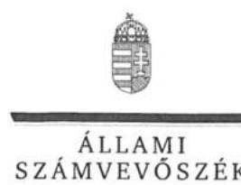

ELNÖK

Ikt.szám: V-1198-119/2016.

# Varga Zsolt úr 

ügyvezető
Bv. Holding Kft.

## Budapest

## Tisztelt Ügyvezető Úr!

Az ,,Állami tulajdonú gazdasági társaságok - Az állami tulajdonban (résztulajdonban) lévő gazdálkodó szervezetek vagyonmegőrzési és gazdálkodási tevékenységének ellenőrzése - Duna Papír Termelő, Kereskedelmi és Szolgáltató Kft." címmel készített számvevőszéki jelentéstervezetre tett észrevételeit köszönettel megkaptam.
Az Állami Számvevőszék észrevételekre vonatkozó álláspontjáról a felügyeleti vezető által készített részletes tájékoztatást csatoltan megküldöm.

Tájékoztatom Ügyvezető urat, hogy a számvevőszéki jelentésben - az Állami Számvevőszékről szóló 2011. évi LXVI. törvény 29. § (3) bekezdése alapján - a figyelembe nem vett észrevételeket szerepeltetjük, annak indoklásával, hogy azokat az Állami Számvevőszék miért nem fogadta el.

Budapest, 2017. 07. 12.
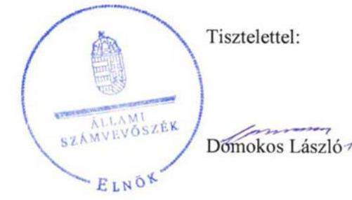

Melléklet: Tájékoztatás az észrevételek kezeléséről

---

# Tájékoztatás   az észrevételek kezeléséről 

Az ,,Állami tulajdonú gazdasági társaságok - Az állami tulajdonban (résztulajdonban) lévő gazdálkodó szervezetek vagyonmegőrzési és gazdálkodási tevékenységének ellenőrzése - Duna Papír Termelő, Kereskedelmi és Szolgáltató Kft." című jelentéstervezetre tett (2017. június 28-án kelt, 29-én postára adott és az Állami Számvevőszékhez június 30-án érkezett) észrevételeit áttekintettük, azok kezelésével kapcsolatban a következő tájékoztatást adom.
A Bv. Holding Kft. 2. számú összegző megállapítás 4. bekezdéséhez valamint a 4.3. megállapítás 2. bekezdéséhez füzött észrevételei szerint a Duna Papír Termelő, Kereskedelmi és Szolgáltató Kft. (továbbiakban: Társaság) nem minősült az ellenőrzött időszak alatt a hatályos közbeszerzési törvények szerinti klasszikus ajánlatkérőnek. A közbeszerzési törvények (a közbeszerzésről szóló 2011. évi CVIII. törvény /a továbbiakban: régi Kbt./ és a 2015. november 1-jétől hatályos közbeszerzésről szóló 2015. évi CXLIII. törvény /új Kbt./) rendelkezései mellett a Bv. Holding Kft. egyes kapcsolódó európai uniós irányelvek rendelkezéseit és az Európai Unió Bíróságának a tárgyhoz kapcsolódóan meghozott egyes ítéleteit is idézte annak alátámasztása céljából, hogy a Társaság nem tartozott az ellenőrzött időszakban a közbeszerzési törvények hatálya alá.
A büntetés-végrehajtási szervezetről szóló 1995. évi CVII. törvény (a továbbiakban: Bvsz.) 2. § (5) bekezdése értelmében a fogvatartottak kötelező foglalkoztatására létrehozott gazdasági társaságok büntetés-végrehajtási szervezetnek minősülnek, amelynek feladata a Bvsz. 1. § (2) bekezdése értelmében a közrend és a közbiztonság erősítése. A Társaság Alapító okiratának 7. pontja szerint „a társaság fogvatartottak kötelező foglalkoztatására létrehozott gazdálkodó szervezet, egyben büntetés-végrehajtási szerv", tehát a régi és új Kbt-ben meghatározott közérdekű, kifejezetten közérdekű szervnek minősül.
A régi Kbt. 6. § (1) bekezdés c) pontjához kapcsolódik a régi Kbt. 6. § (2) bekezdése, mely szerint az ajánlatkérői minőség megállapítható abban az esetben is, ha a szervezet közérdekű feladatán kívül más tevékenységet - akár ipari vagy kereskedelmi tevékenységet - is folytat. A Társaság régi Kbt. szerinti ajánlatkérői minőségét megalapozza továbbá Alapító okiratának 7. pontja is (lásd fentebb.).
Az Európai Unió Bírósága a C-18/01. számú Korhonen és társai ügyben megállapította, hogy nem kizárt egy szervezetet annak ellenére ajánlatkérőnek minősíteni, ha működése során profitot termel, de annak elsődleges célja a közérdekű célok szolgálata és nem az üzleti eredményesség elérése. A Társaság Alapító okiratának 7. pontjából (lásd fentebb) megállapítható, hogy a Társaság közjogi intézmény.
Ezt erősíti továbbá az Európai Unió Bírósága C-283/00. számú „SIEPSA" ügye is, amelynek tárgya a szervezet közérdekű jellegének megítélése volt. A Bíróság kimondta, hogy az ügybeli cég közérdekű intézménynek minősül, mivel az alapító
 okiratából megállapítható volt, hogy az általa kifejtett tevékenység lényegében az állam büntetőhatalmának gyakorlásához szorosan kapcsolódó tevékenység, és mint ilyen tevékenység lényegében a közérdekhez kapcsolódik.
Az új Kbt. 5. § (1) bekezdés e) pontja továbbra is a közérdekű tevékenység bármilyen mértékben történő ellátása alapján is az ajánlatkérői körbe sorolja a kérdéses szervezeteket. A fent leírtakra

---

figyelemmel a Társaság Alapító okiratának 7. pontjában foglaltak (lásd fentebb) közérdekű tevékenységnek minősülnek, ezért a Társaság ajánlatkérőnek minősül, aminek vonatkozásában alkalmazni kell az új Kbt. rendelkezéseit.

Felhívom figyelmét, hogy az Állami Számvevőszék a mintatételek ellenőrzése útján, a statisztikai kivetítés eredménye alapján rögzítette a beszerzésekkel kapcsolatos feltárt szabálytalanságokat a jelentéstervezetben, amely a teljes sokaság vonatkozásában értelmezhető. A mintavételes eljárásra vonatkozóan az ellenőrzés módszerei fejezet tartalmaz információt.

A fentiek alapján nem fogadtuk el azon észrevételüket, hogy a Társaság nem tartozik a Kbt. hatálya alá. A beszerzéseknél a jogszabályi előírások betartása minden szervezet számára kötelező. Ugyanakkor nem lehet eltekinteni attól, hogy a fogvatartottak foglalkoztatása kiemelt közérdek. Mindezekre tekintettel a jelentéstervezet vonatkozó részeit pontosítjuk.

Tájékoztatom, hogy a számvevőszéki jelentés függelékeként szerepeltetjük a jelentéstervezethez tett észrevételeit, valamint az azokra adott válaszunkat.

Budapest, 2017. 04. hó 28. nap

Böröcz Imre felügyeleti vezető

---

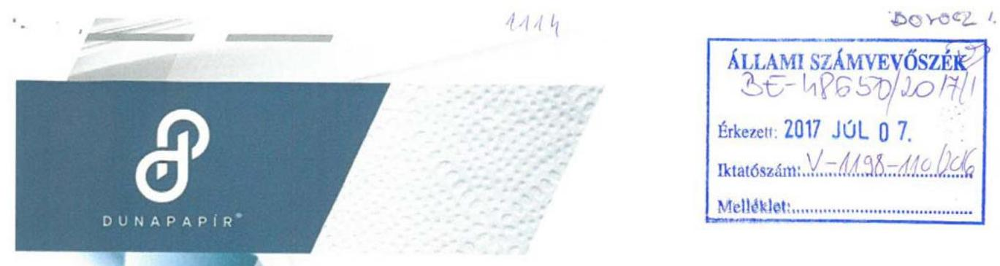

Ikt.sz.: 73/444/2017/K.

Hiv.szám: V-1198-104/2016.
Tárgy: Észrevétel jelentéstervezetre
Ügyintéző: Tomsicsné Horváth Emőke
Tel.: 06-24-531-845
E-mail: dunapapir@invitel.hu

# Domokos László elnök úr részére 

## Állami Számvevőszék

## Budapest

Budapest 4.
Pf. 54.
1364

## Tisztelt Elnök Úr!

Hivatkozással fenti iktatószámon „Az állami tulajdonban (résztulajdonban lévő gazdálkodó szervezetek vagyonmegőrzési és gazdálkodási tevékenységének ellenőrzése -DUNA PAPÍR Termelő, Kereskedelmi és Szolgáltató Kft." címen megküldött jelentéstervezetre, a DUNA PAPÍR Termelő, Kereskedelmi és Szolgáltató Kft. képviseletében a törvényes határidőn belül az Állami Számvevőszék felé az alábbi nyilatkozatot teszem.

A jelentéstervezet 2. számú összegző megállapítás 4. bekezdése alapján a vonatkozó jogszabályi előírások ellenére a DUNA PAPÍR Kft. az ellenőrzött időszakban nem határozta meg a közbeszerzési eljárások rendjét, a kapcsolódó felelősségi köröket, felelős személyeket. Továbbá a jelentés tervezet 4.3. számú megállapítás 2. bekezdése szerint a beruházások esetében a DUNA PAPÍR Kft. a beszerzések idején hatályos Kbt. alanyi hatálya alá tartozó szervezetként közbeszerzési eljárás mellőzésével megvalósított beszerzéseivel megsértette a vonatkozó közbeszerzési törvényekben előírt közbeszerzési eljárás lefolytatásának kötelezettségét.

Társaságunk alábbi álláspontja szerint a DUNA PAPÍR Kft. nem minősült az ellenőrzött időszak alatt hatályban volt közbeszerzésekről szóló 2011. évi CVIII. törvény (a továbbiakban: régi Kbt.), és a 2015. november 1. napjától hatályos közbeszerzésekről szóló 2015. évi CXLIII. törvény (a továbbiakban: hatályos Kbt.) szerinti klasszikus ajánlatkérőnek.

---

A régi Kbt. 6. § (1) bekezdés c) pontja alapján ajánlatkérőnek minősül az a jogképes szervezet, amelyet közérdekű, de nem ipari vagy kereskedelmi jellegű tevékenység folytatása céljából hoznak létre, vagy amely ilyen tevékenységet lát el, ha az a)-d) pontokban meghatározott egy vagy több szervezet, az Országgyűlés vagy a Kormány külön-külön vagy együttesen, közvetlenül vagy közvetetten meghatározó befolyást képes felette gyakorolni vagy működését többségi részben egy vagy több ilyen szervezet (testület) finanszírozza.
A hatályos Kbt. 5. § (1) bekezdés e) pontja alapján ajánlatkérőnek minősül az a jogképes szervezet, amelyet nem ipari vagy kereskedelmi jellegű, kifejezetten közérdekű tevékenység folytatása céljából hoznak létre, vagy amely bármilyen mértékben ilyen tevékenységet lát el, feltéve, hogy e szervezet felett az a)-e) pontban meghatározott egy vagy több szervezet, az Országgyűlés vagy a Kormány közvetlenül vagy közvetetten meghatározó befolyást képes gyakorolni vagy működését többségi részben egy vagy több ilyen szervezet (testület) finanszírozza.

A hatályos Kbt. indokolása kiemeli, hogy az új törvény pontosítja a közjogi szervezetekre vonatkozó meghatározást, és rögzíti, hogy a kifejezetten közérdekű célra létrehozott szervezetek minősülnek csak ajánlatkérőnek.

A 2004/18/EK irányelv 1. cikk (9) bekezdése és a 2004/17/EK irányelv 2. cikk (1)-(2) bekezdése a közbeszerzési szabályok személyi hatályát a következőképpen állapítják meg. A 2004/18/EK irányelv személyi hatálya: "Ajánlatkérő szerv": az állam, a területi vagy a települési önkormányzat, a közjogi intézmény, továbbá az egy vagy több ilyen szerv, illetve közjogi intézmény által létrehozott társulás; "Közjogi intézmény" minden olyan intézmény,
a) amely kifejezetten olyan közérdekű célra jött létre, amely nem ipari vagy kereskedelmi jellegű;
b) amely jogi személyiséggel rendelkezik; valamint
c) amelyet többségi részben az állam, vagy a területi vagy a települési önkormányzat, vagy egyéb közjogi intézmény finanszíroz; vagy amelynek irányítása ezen intézmények felügyelete alatt áll; vagy amelynek olyan ügyvezető, döntéshozó vagy felügyelő testülete van, amely tagjainak többségét az állam, a területi vagy a települési önkormányzat, vagy egyéb közjogi intézmény nevezi ki.

Az Európai Unió Bíróságának C-360/96. sz. BFI Holding ítéletében meghatározattak alapján az első, a) pont szerinti feltétel két elemét önállóan kell megvizsgálni, és mindkét feltételnek fenn kell állnia a közjogi intézménnyé minősítéshez. Különbséget kell tehát tenni az olyan közérdekű tevékenységek között, amelyek ipari vagy kereskedelmi jellegűek, és amelyek nem ipari vagy kereskedelmi jellegűek. Ha a

---

tevékenység kizárólag ipari vagy kereskedelmi jellegű, vagy ilyen jellegű és egyben közérdekű, a szervezet az egyéb feltételek fennállása esetén sem minősül ún. közjogi szervezetnek.

Álláspontunk szerint a fentiek alapján az egyes feltételek együttes fennállását, az egyes feltételek külön-külön történő vizsgálatával lehet megállapítani, melyre vonatkozóan a jelentéstervezet megállapítást nem tartalmaz.

A tevékenység ipari vagy kereskedelmi jellegére vonatkozó utalás az általános közgazdasági fogalomhasználat szerint olyan gazdasági tevékenységet feltételez, amelynek eredményeként profitszerzési célból piacképes termék előállítása történik, illetőleg olyan tevékenységet, amely termékek vagy szolgáltatások kereskedelmi forgalomban, versenyfeltételek mellett történő értékesítési célja által jellemezhető.

Előbbiek alapján ezen feltétel fennállása tekintetében az Európai Uniós közbeszerzési irányelveknek megfelelően vizsgálni szükséges különösen a DUNA PAPÍR Kft. létrehozását motiváló körülményeket, illetve azt a gazdasági környezetet, amelyben a társaság a közérdekű tevékenységet végzi, így különösen
a) a versenyfeltételek meglétét,
b) a tevékenységet végző társaság for-profit, vagy non-profit jellegét,
c) nyereségorientáltságát,
d) üzleti kockázatok önálló viselésének feltételeit.

Álláspontunk szerint megállapítható, hogy a b)-d) feltételek egyértelműen fennállnak, mivel a DUNA PAPÍR Kft. profit jellegű, nyereségorientált és nem nonprofit társaság, üzleti kockázatát önállóan viseli.

A versenyfeltételek megléténél is összességében szükséges társaság versenypiaci jelenlétét vizsgálni, így az egyes versenypiaci előnyök mellett, különösen a DUNA PAPÍR Kft. alábbi piaci hátrányait is figyelembe kell venni:

- számos uniós és hazai pályázati forrástól az állami jelleg miatt ki van zárva,
- az elítéltek foglalkoztatásából eredő sajátos és indokolt többletkiadásokat a központi költségvetés 2011. óta a társaságnak nem téríti meg;
- a 44/2011. Korm. rendelet, és a 9/2011. BM rendelet szerinti ellátási kötelezettsége teljesítése körében kötelezően fogvatartottakat kell foglalkoztatnia, és ezen ellátási kötelezettsége keretében a szerződött partnereit a Társaság szabadon nem választhatja meg,

---

- versenypiaci társaihoz képest az állami tulajdoni jelleg miatt működése bonyolultabb, nagyobb adminisztrációval jár így az általános működéshez nagyobb létszámú munkaerő szükséges, melyek foglalkoztatása a jogszabályban foglaltaknak minden esetben megfelel,
- a Társaságnál könyvvizsgáló, és Felügyelő Bizottság létrehozása is kötelező.

Kiemelendő továbbá, hogy a közbeszerzésről és a 2004/18/EK irányelv hatályon kívül helyezéséről szóló Európai Parlament és a Tanács 2014/24/EU irányelv (10) preambulum bekezdése is rögzíti, hogy az olyan szerv, amely szokásos piaci feltételekkel működik, nyereségorientált, és a tevékenysége végzéséből eredő veszteségeket maga viseli, nem tekintendő „közjogi intézménynek", mivel azok a közérdekű célok, amelyek teljesítésére létrehozták, vagy amelyek teljesítésével megbízták, gazdasági vagy üzleti jellegűnek minősülhetnek.

Véleményünk az, hogy a közérdekűség fennállta mellett az is megállapítható, hogy a Társaság ipari, kereskedelmi jellegű tevékenységet végez és versenyfeltételek befolyásolják működését. Így nem tartozik sem a régi, sem a hatályos Kbt. alanyi hatálya alá. (Európai Bíróság C-18/01. számú, Korhonen and Others ügyben hozott ítélete)

A Társaság alapító okirata 4. pontjában megjelölt főtevékenység - TEÁOR'08 szerint - 1722'08 Háztartási, egészségügyi papírtermék gyártása, illetve a 4.1. pont alatti tevékenységek egyértelműen ipari, kereskedelmi, azaz üzletszerű jellegre utalnak. A Társaság alapítójának is az volt a szándéka, hogy a Polgári Törvénykönyvről szóló 2013. évi V. törvény 3:88. § (1) bekezdése szerinti üzletszerű közös gazdasági tevékenység folytatására, a tagok vagyoni hozzájárulásával létrehozott, jogi személyiséggel rendelkező vállalkozás jöjjön létre. Az MNV Zrt. is profit orientált társaságként tartja nyilván a Társaságot, valamint az adott évekre vonatkozó üzleti tervek tervezéséhez kiadott irányelvekben is nyereséget írt elő a Magyar Állam tulajdonában lévő és a Büntetés-végrehajtás Országos Parancsnoksága megbízott tulajdonosi joggyakorlása alá tartozó gazdasági társaságoknak.

Összefoglalva a fent leírtakat, álláspontunk szerint a jelentéstervezet nem állapítja meg, hogy a DUNA PAPÍR Kft. a régi és hatályos Kbt. mely pontja alapján minősül ajánlatkérőnek, illetve azt, hogy régi Kbt. 6. § (1) bekezdés c) pontja, illetve a hatályos Kbt. 5. § (1) bekezdés e) pontja szerinti ipari vagy kereskedelmi jellegű tevékenység meglétét az Állami Számvevőszék esetlegesen vizsgálta volna-e.

---

Társaságunk észrevételeként továbbá előadom, hogy az ellenőrzési jelentés - 4.3. számú megállapítás 2. bekezdésében - nem határozza meg, hogy a DUNA PAPÍR Kft. az ellenőrzött időszakban pontosan mely beruházása esetében sértette meg a vonatkozó jogszabályok által előírt közbeszerzési eljárás lefolytatásának kötelezettségét.

Álláspontunk szerint Társaságunk, a régi Kbt. és az új Kbt. alapján az ellenőrzött időszakban nem minősült klasszikus ajánlatkérőnek, ezért nem rendelkezett/rendelkezik a régi Kbt. 22.§ (1) bekezdésében, illetve a hatályos Kbt. 27. § (1) bekezdésében előírt közbeszerzési szabályzattal, és az ellenőrzött időszakban, és jelenleg sem kötelezett klasszikus ajánlatkérőként közbeszerzési eljárás lefolytatására.

A fentiek alapján Társaságunk nem ért egyet a jelentéstervezet 2. összegző megállapítás 4. bekezdésében, és 4.3. számú megállapítás 2. bekezdésében leírtakkal, illetve jelentéstervezetben Javaslatok cím alatt a DUNA PAPÍR Termelő, Kereskedelmi és Szolgáltató Kft. ügyvezetőjének javasolt intézkedéssel.

# Tisztelt Állami Számvevőszék! 

Kérjük, hogy Társaságunk fenti észrevételeit az ellenőrzési jelentés véglegesítésekor figyelembe venni szíveskedjen.

Tököl, 2017. június 30.
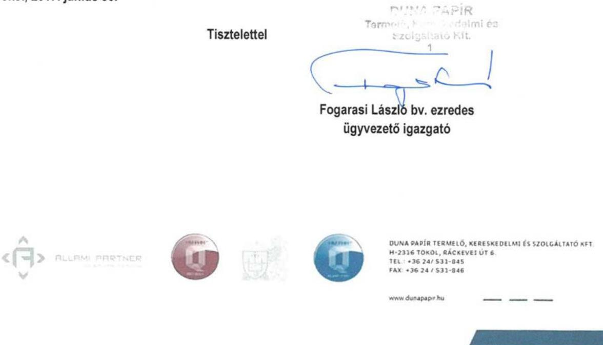

---

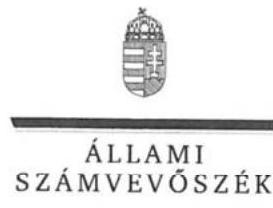

ELNÖK

Ikt.szám: V-1198-117/2016.

# Fogarasi László úr 

ügyvezető
DUNA PAPÍR Termelő, Kereskedelmi és Szolgáltató Kft.

## Tököl

## Tisztelt Ügyvezető Úr!

Az ,,Állami tulajdonú gazdasági társaságok - Az állami tulajdonban (résztulajdonban) lévő gazdálkodó szervezetek vagyonmegőrzési és gazdálkodási tevékenységének ellenőrzése - Duna Papír Termelő, Kereskedelmi és Szolgáltató Kft." címmel készített számvevőszéki jelentéstervezetre tett észrevételeit köszönettel megkaptam.
Az Állami Számvevőszék észrevételekre vonatkozó álláspontjáról a felügyeleti vezető által készített részletes tájékoztatást csatoltan megküldöm.

Tájékoztatom Ügyvezető urat, hogy a számvevőszéki jelentésben - az Állami Számvevőszékről szóló 2011. évi LXVI. törvény 29. § (3) bekezdése alapján - a figyelembe nem vett észrevételeket szerepeltetjük, annak indoklásával, hogy azokat az Állami Számvevőszék miért nem fogadta el.

Budapest, 2017. 03. hó 03. nap
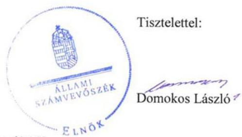

Melléklet: Tájékoztatás az észrevételek kezeléséről

---

# Tájékoztatás   az észrevételek kezeléséről 

Az ,,Állami tulajdonú gazdasági társaságok - Az állami tulajdonban (résztulajdonban) lévő gazdálkodó szervezetek vagyonmegőrzési és gazdálkodási tevékenységének ellenőrzése - Duna Papír Termelő, Kereskedelmi és Szolgáltató Kft." című jelentéstervezetre tett (2017. július 6-án kelt, 7-én postára adott és az Állami Számvevőszékhez július 11-én érkezett) észrevételeit áttekintettük, azok kezelésével kapcsolatban a következő tájékoztatást adom.

A Duna Papír Termelő,
 Kereskedelmi és Szolgáltató Kft. (továbbiakban: Társaság) 2. Összegző megállapítás 4. bekezdéséhez és a 4.3. sz. megállapítás 2. bekezdéséhez füzött észrevételei szerint nem minősültek az ellenőrzött időszak alatt a hatályos közbeszerzési törvények szerinti klasszikus ajánlatkérőnek. A közbeszerzési törvények (a közbeszerzésről szóló 2011. évi CVIII. törvény /a továbbiakban: régi Kbt./ és a 2015. november 1-jétől hatályos közbeszerzésről szóló 2015. évi CXLIII. törvény /új Kbt./) rendelkezései mellett a Társaság egyes kapcsolódó európai uniós irányelvek rendelkezéseit és az Európai Unió Bíróságának a tárgyhoz kapcsolódóan meghozott egyes ítéleteit is idézte annak alátámasztása céljából, hogy a Társaság – tekintve, hogy ipari, kereskedelmi jellegű tevékenységet végez, és álláspontjuk szerint az uniós irányelvek szerint nem tekinthető közjogi intézménynek – nem tartozott az ellenőrzött időszakban a közbeszerzési törvények hatálya alá.
A büntetés-végrehajtási szervezetről szóló 1995. évi CVII. törvény (a továbbiakban: Bvsz.) 2. § (5) bekezdése értelmében a fogvatartottak kötelező foglalkoztatására létrehozott gazdasági társaságok büntetés-végrehajtási szervezetnek minősülnek, amelynek feladata a Bvsz. 1. § (2) bekezdése értelmében a közrend és a közbiztonság erősítése. A Társaság Alapító okiratának 7. pontja szerint „a társaság fogvatartottak kötelező foglalkoztatására létrehozott gazdálkodó szervezet, egyben büntetés-végrehajtási szerv”, tehát a régi és új Kbt-ben meghatározott közérdekű, kifejezetten közérdekű szervnek minősül.
A régi Kbt. 6. § (1) bekezdés c) pontjához kapcsolódik a régi Kbt. 6. § (2) bekezdése, mely szerint az ajánlatkérői minőség megállapítható abban az esetben is, ha a szervezet közérdekű feladatán kívül más tevékenységet – akár ipari vagy kereskedelmi tevékenységet – is folytat. A Társaság régi Kbt. szerinti ajánlatkérői minőségét megalapozza továbbá Alapító okiratának 7. pontja is (lásd fentebb.).
Az Európai Unió Bírósága a C-18/01. számú Korhonen és társai ügyben megállapította, hogy nem kizárt egy szervezetet annak ellenére ajánlatkérőnek minősíteni, ha működése során profitot termel, de annak elsődleges célja a közérdekű célok szolgálata és nem az üzleti eredményesség elérése. A Társaság Alapító okiratának 7. pontjából (lásd fentebb) megállapítható, hogy a Társaság közjogi intézmény.
Ezt erősíti továbbá az Európai Unió Bírósága C-283/00. számú „SIEPSA” ügye is, amelynek tárgya a szervezet közérdekű jellegének megítélése volt. A Bíróság kimondta, hogy az ügybeli cég közérdekű intézménynek minősül, mivel az alapító okiratából megállapítható volt, hogy az általa kifejtett tevékenység lényegében az állam büntetőhatalmának gyakorlásához szorosan kapcsolódó tevékenység, és mint ilyen tevékenység lényegében a közérdekhez kapcsolódik.

---

Az új Kbt. 5. § (1) bekezdés e) pontja továbbra is a közérdekű tevékenység bármilyen mértékben történő ellátása alapján is az ajánlatkérői körbe sorolja a kérdéses szervezeteket. A fent leírtakra figyelemmel a Társaság Alapító okiratának 7. pontjában foglaltak közérdekű tevékenységnek minősülnek, ezért a Társaság ajánlatkérőnek minősül, aminek vonatkozásában alkalmazni kell az új Kbt. rendelkezéseit.

Felhívom figyelmét, hogy az Állami Számvevőszék a mintatételek ellenőrzése útján, a statisztikai kivetítés eredménye alapján rögzítette a beszerzésekkel kapcsolatos feltárt szabálytalanságokat a jelentéstervezetben, amely a teljes sokaság vonatkozásában értelmezhető. A mintavételes eljárásra vonatkozóan az ellenőrzés módszerei fejezet tartalmaz információt.

A fentiek alapján nem fogadtuk el azon észrevételüket, hogy a Társaság nem tartozik a Kbt. hatálya alá. A beszerzéseknél a jogszabályi előírások betartása minden szervezet számára kötelező. Ugyanakkor nem lehet eltekinteni attól, hogy a fogvatartottak foglalkoztatása kiemelt közérdek. Mindezekre tekintettel a jelentéstervezet vonatkozó részeit pontosítjuk.

Tájékoztatom, hogy a számvevőszéki jelentés függelékeként szerepeltetjük a jelentéstervezethez tett észrevételeit, valamint az azokra adott válaszunkat.

Budapest, 2017. 08 hó 03 nap

Böröcz Imre
felügyeleti vezető

---

.

---

# RÖVIDÍTÉSEK JEGYZÉKE 

${ }^{1}$ Társaság
${ }^{2}$ BVOP
${ }^{3}$ Vtv.
${ }^{4}$ MNV Zrt.
${ }^{5}$ Nvtv.
${ }^{6}$ Holding
${ }^{7}$ alapító okirat ${ }_{1-9}$
${ }^{8}$ Bv. szervezeti törvény
${ }^{9}$ Bv. Kódex
${ }^{10}$ 44/2011. (III. 23.) Korm. rendelet
${ }^{11}$ 9/2011. (III.23.) BM rendelet
${ }^{12}$ Tao. tv.
${ }^{13}$ ÁSZ
${ }^{14}$ ÁSZ tv.
${ }^{15} \mathrm{Gt}$.
${ }^{16} \mathrm{Ptk}_{2}$
${ }^{17}$ Társasági Monitoring Szabályzat
${ }^{18}$ Tervezési irányelvek ${ }_{1-4}$

Duna Papír Termelő, Kereskedelmi és Szolgáltató Korlátolt Felelősségű Társaság Büntetés-végrehajtás Országos Parancsnoksága
2007. évi CVI. törvény az állami vagyonról

Magyar Nemzeti Vagyonkezelő Zrt.
2011. évi CXCVI törvény a nemzeti vagyonról

Bv. Holding Korlátolt Felelősségű Társaság
Duna Papír Kft. alapító okirat ${ }_{1}$ : hatályos 1994. január 1-től
alapító okirat2: hatályos 2011.08.01-től,
alapító okirat ${ }_{3}$ 2012.02.22.,
alapító okirat ${ }_{4}$ 2013.02.22,
alapító okirat ${ }_{5}$ 2013.04.14.,
alapító okirat ${ }_{6}$ 2013.11.25.,
alapító okirat ${ }_{7}$ 2014.12.22.,
alapító okirat ${ }_{8}$ 2015.06.01.,
alapító okirat ${ }_{9}$ 2015.08.31
1995. évi CVII. törvény a büntetés-végrehajtási szervezetről

Bv. Kódex ${ }_{1}$ : 1979. évi 11. törvényerejű rendelet a büntetések és az intézkedések végrehajtásáról (hatályos 2014. december 31-ig)
Bv. Kódex ${ }_{2}$ : 2013. évi CCXL. törvény a büntetések, az intézkedések, egyes kényszerintézkedések és a szabálysértési elzárás végrehajtásáról (hatályos 2015. január 1-jétől)
44/2011. (III. 23.) Korm. rendelet a büntetés-végrehajtási szervezet részéről a központi államigazgatási szervek és a rendvédelmi szervek irányában fennálló egyes ellátási kötelezettségekről, a termékek és szolgáltatások átadás-átvételének és azok ellentételezésének rendjéről (hatályos 2011. július 1-jétől)
9/2011. (III. 23.) BM rendelet a büntetés-végrehajtási szervezet részéről a büntetés-végrehajtásért felelős miniszter vezetése, irányítása vagy felügyelete alá tartozó szervek irányában fennálló ellátási kötelezettségről, a fogvatartottak kötelező foglalkoztatása keretében előállított termékekről és szolgáltatásokról, azok átadás-átvételéről és az ellentételezés rendjéről (hatályos: 2011. július 1-jétől)
a társasági adóról és az osztalékadóról szóló 1996. évi LXXXI. törvény
Állami Számvevőszék
2011. évi LXVI. törvény az Állami Számvevőszékről
2006. évi IV. törvény a gazdasági társaságokról (hatálytalan: 2014.március 15-től)
2013. évi V. törvény a Polgári Törvénykönyvről (hatályos: 2014. március 15-étől)

Az MNV Zrt. Társasági Monitoring Szabályzata (hatályos: 2013. december 19-től)

Az MNV Zrt. 513/2011 (XI.07.) számú határozatában a 2012. évre megfogalmazott tervezési irányelvek
A Tulajdonosi joggyakorló 558/2012 (X.24.) számú határozatában a 2013. évre megfogalmazott tervezési irányelvek
A Tulajdonosi joggyakorló 774/2013 ((X.21.) számú határozatában a 2014. évre megfogalmazott tervezési irányelvek

---

${ }^{19}$ BVOP országos parancsnok intézkedése
${ }^{20}$ Számv. tv.
${ }^{21}$ számviteli politika $_{1-2}$
${ }^{21}$ számlarend $_{1-2}$
${ }^{22}$ leltározási Szabályzat ${ }_{1-2}$
${ }^{23}$ értékelési szabályzat
${ }^{24}$ önköltségszámítási szabályzat
${ }^{25}$ Pénzkezelési Szabályzat ${ }_{1-3}$
${ }^{26}$ Számlarend $_{1-2}$
${ }^{27}$ Tak.tv.
${ }^{28}$ Kormányhatározat
${ }^{29}$ javadalmazási szabályzat
${ }^{30}$ FB tagok javadalmazásának elvei
${ }^{31}$ árképzési szabályzat ${ }_{1-2}$
${ }^{32}$ adatvédelmi szabályzat
${ }^{33} \mathrm{Kbt}$.
${ }^{34} \mathrm{Ptk}_{1}$
${ }^{35} \mathrm{Ppt}$.

A Tulajdonosi joggyakorló 4/2015 (I.12.) számú határozatában a 2015. évre megfogalmazott tervezési irányelvek
1-1/52/2011. (XII. 13.) OP intézkedése a büntetés-végrehajtás jelentési és adatszolgáltatási rendszeréről
2000. évi C törvény a számvitelről

Duna Papír Kft. számviteli politikája ${ }_{1}$ hatályos 2011. 01. 01.
Duna Papír Kft. számviteli politikája ${ }_{2}$ hatályos 2015. 01. 01.
Duna Papír Kft. számlarendje ${ }_{1}$ hatályos 2011. 01. 01.
Duna Papír Kft. számlarendje ${ }_{2}$ hatályos 2015. 01. 01.
Duna Papír Kft. leltározási szabályzata, hatályos 2010. január 1.
Duna Papír Kft. leltározási szabályzata, hatályos 2013. december 2.
Duna Papír Kft. értékelési szabályzata, hatályos 2010. 01. 01.
Duna Papír Kft. önköltség-számítási szabályzata, hatályos 2012. január 1.
Duna Papír Kft. pénzkezelési szabályzata, hatályos 2010. január 1.
Duna Papír Kft. pénzkezelési szabályzata, hatályos 2012. szeptember 23.
Duna Papír Kft. pénzkezelési szabályzata, hatályos 2015. április 1.
Duna Papír Kft. számlarendje, hatályos 2011. január 1.
Duna Papír Kft. számlarendje, hatályos 2015. január 1
2009. évi CXXII. törvény a köztulajdonban álló gazdasági társaságok takarékosabb működéséről
2173/2003 (VII.29.) számú Kormányhatározat az állam, illetőleg a központi és a társadalombiztosítási költségvetési szervek többségi befolyása alatt álló gazdálkodó szervezetek vezető tisztségviselői, felügyelő bizottsági tagjai és más vezető állású munkavállalói javadalmazásának elveiről
Duna Papír Kft. javadalmazási szabályzata (hatályos 2009.12.01-től)
a büntetés-végrehajtási gazdasági társaságok felügyelőbizottsági tagjai javadalmazásának elveiről, rendszeréről szóló 13/2008. számú BVOP határozat, (módosítás: 1/2010. és 23/2012. számú BVOP határozat)
Duna Papír Kft. Árképzési szabályzata; hatályos: 2011. április 1-jétől, árképzési szabályzat; hatályos: 2013. április 1-jétől.
Duna Papír Kft. - személyes adatokra vonatkozó - adatvédelmi és adatbiztonsági szabályzata
a közbeszerzésekről szóló 2011. évi CVIII. törvény (hatálytalan 2015. november 1-jétől) és a közbeszerzésekről szóló 2015. évi CXLIII. törvény (hatályos 2015. november 1-jétől)
a Polgári Törvénykönyvről szóló 1959. évi IV. törvény (hatálytalan 2014. március 15-től)
a polgári perrendtartásról szóló 1952. évi III. törvény

---

ÁLLAMI SZÁMVEVŐSZÉK
1052 Budapest, Apáczai Csere János utca 10.
Levélcím: 1364 Budapest 4. Pf. 54
Telefon: +36 14849100 Telefax: +36 14849200
www.asz.hu
