# Jelentés 

## Állami tulajdonú gazdasági társaságok

Az állami tulajdonban (résztulajdonban) lévő gazdálkodó szervezetek vagyonmegőrzési és gazdálkodási tevékenységének ellenőrzése -DUNA-MIX Ipari Kereskedelmi Szolgáltató Kft. 2017.

---

# Jelentés 

## Állami tulajdonú gazdasági társaságok

Az állami tulajdonban (résztulajdonban) lévő gazdálkodó szervezetek vagyonmegőrzési és gazdálkodási tevékenységének ellenőrzése -DUNA-MIX Ipari Kereskedelmi Szolgáltató Kft.
2017. augusztus 4. nap 23.
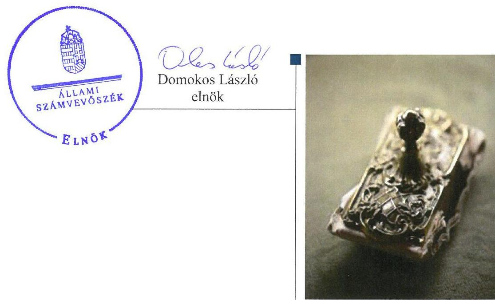

---

# AZ ELLENŐRZÉST FELÜGYELTE: 

BÖRÖCZ IMRE felügyeleti vezető

## AZ ELLENŐRZÉST VEZETTE ÉS A VÉGREHAJTÁSÁÉRT FELELŐS:

IMRE ZSUZSANNA ellenőrzésvezető

## A PROGRAM ÖSSZEÁLLÍTÁSÁÉRT FELELŐS:

JANIK JÓZSEF osztályvezető

IKTATÓSZÁM: V-1234-256/2016

TÉMASZÁM: 2268

## ELLENŐRZÉS-AZONOSÍTÓ SZÁM: V-075919

Jelentéseink az Országgyűlés számítógépes hálózatán és az Interneten a www.asz.hu címen is olvashatóak.

---

# TARTALOMJEGYZÉK 

■ ÖSSZEGZÉS ..... 5
■ AZ ELLENŐRZÉS CÉLJA ..... 6
■ AZ ELLENŐRZÉS TERÜLETE ..... 7
■ AZ ELLENŐRZÉS HÁTTERE, INDOKOLTSÁGA ..... 8
■ A JELENTÉS LÉNYEGES KÉRDÉSKÖREI ..... 9
■ ELLENŐRZÉS HATÓKÖRE ÉS MÓDSZEREI ..... 10
■ MEGÁLLAPÍTÁSOK ..... 12
■ JAVASLATOK ..... 17
■ MELLÉKLETEK ..... 19
I. sz. melléklet: Értelmező szótár ..... 19
II. sz. melléklet: A DUNA-MIX Kft. vagyonának megoszlása a 2012-2015. években (M Ft.) ..... 22
III. sz. melléklet: A BVOP részére átengedett tulajdonosi jogokhoz kapcsolódó korlátozások ..... 23
IV. sz. melléklet: A Bv. Holding részére átengedett tulajdonosi jogok ..... 24
■ FÜGGELÉK: ÉSZREVÉTELEK ..... 25
■ RÖVIDÍTÉSEK JEGYZÉKE ..... 55

---

.

---

# ÖSSZEGZÉS 

A DUNA-MIX Ipari Kereskedelmi Szolgáltató Kft. tulajdonosi joggyakorlói a tevékenységüket szabályszerűen látták el. A társaság működésének szabályozottsága összességében megfelelő volt. A pénzügyi-számviteli, adatszolgáltatási feladatokat szabályszerűen látta el. A vagyonával összességében szabályszerűen gazdálkodott.

## Az ellenőrzés társadalmi indokoltsága

Az Állami Számvevőszék kiemelt célja, hogy az államháztartáson kívülre nyújtott költségvetési támogatások és ingyenes vagyonjuttatások, valamint az államháztartáson kívül működő feladatellátó rendszerek ellenőrzéseivel hozzájáruljon ahhoz, hogy a közpénzeket az államháztartáson kívül működő szervezetek is átlátható, rendezett módon használják fel a szerződésben átvállalt állami feladatok ellátása érdekében. Továbbá az állami vagyon szerződésben vállalt átlátható, hatékony, költségtakarékos működtetése, értékének megőrzése, állagának védelme, értéknövelő használata, hasznosítása és gyarapítása érdekében.

Az államháztartásról szóló törvény alapján, az államháztartáson kívüli szervezetek az állami feladatok ellátásában - jogszabályban meghatározott feltételekkel - közreműködhetnek. A DUNA-MIX Ipari Kereskedelmi Szolgáltató Kft. a fogvatartottak kötelező foglalkoztatására létrehozott gazdálkodó szervezet. Tevékenysége körében értékteremtő munkát, társadalmilag hasznos tevékenységet lát el azzal, hogy a fogvatartottak foglalkoztatásával, az általuk végzett termelő munka szervezésével hozzájárul a büntetés-végrehajtási szervezetek önellátóvá és részben önfenntartóvá tételéhez.

## Főbb megállapítások, következtetések, javaslatok

A Magyar Nemzeti Vagyonkezelő Zrt.-nek és a Büntetés-végrehajtás Országos Parancsnokságának, valamint a Bv. Holding Kft.-nek a DUNA-MIX Ipari Kereskedelmi Szolgáltató Kft. társasági részesedése feletti tulajdonosi joggyakorlása szabályszerű volt. A tulajdonosi joggyakorlók a felügyelőbizottságon keresztül, valamint állandó könyvvizsgáló megbízásával biztosították a tulajdonosi ellenőrzést.

A DUNA-MIX Ipari Kereskedelmi Szolgáltató Kft. a vagyongazdálkodással kapcsolatos szabályozást összességében kialakította, az a jogszabályi előírásoknak megfelelt, ugyanakkor a hatályban lévő Számlarend nem felelt meg a számvitelről szóló törvény előírásainak.

A bevételeinek és ráfordításainak elszámolása megfelelt a jogszabályi előírásoknak, a szolgáltatási díjak megállapítását az előírásoknak megfelelő önköltségszámítással alapozták meg. Szabályszerűen teljesítette a tervezési, beszámolási, adatszolgáltatási kötelezettségét.

A DUNA-MIX Ipari Kereskedelmi Szolgáltató Kft. kialakította a saját vagyon értékének megőrzését, gyarapítását szolgáló, szabályszerű vagyongazdálkodás feltételeit, vagyonát jelentős mértékben gyarapította. A saját vagyonát az előírásoknak megfelelően tartotta nyilván, azonban a befektetett pénzügyi eszközök, a követelések, a kötelezettségek, az aktív és passzív időbeli elhatárolások, saját tőke, céltartalékok mérlegsorokat alátámasztó leltárral nem rendelkeztek.

Az ÁSZ a DUNA-MIX Ipari Kereskedelmi Szolgáltató Kft. ügyvezetőjének és a Bv. Holding Kft. ügyvezetőjének fogalmazott meg javaslatokat, amelyek alapján kötelesek intézkedési tervet összeállítani és azt a jelentés kézhezvételétől számított 30 napon belül az ÁSZ részére megküldeni.

---

# AZ ELLENŐRZÉS CÉLJA 

Az ellenőrzés célja annak értékelése volt, hogy a tulajdonosi jogok gyakorlása szabályszerű volt-e; a gazdálkodó szervezet szabályozottsága, gazdálkodása és vagyongazdálkodási tevékenysége megfelelt-e a jogszabályi és a tulajdonosi előírásoknak; a vagyonváltozást eredményező döntések esetében a tulajdonosi jogok gyakorlója és a gazdálkodó szervezet szabályszerűen jártak-e el.

---

# **AZ ELLENŐRZÉS TERÜLETE**

## **DUNA-MIX Kft.**

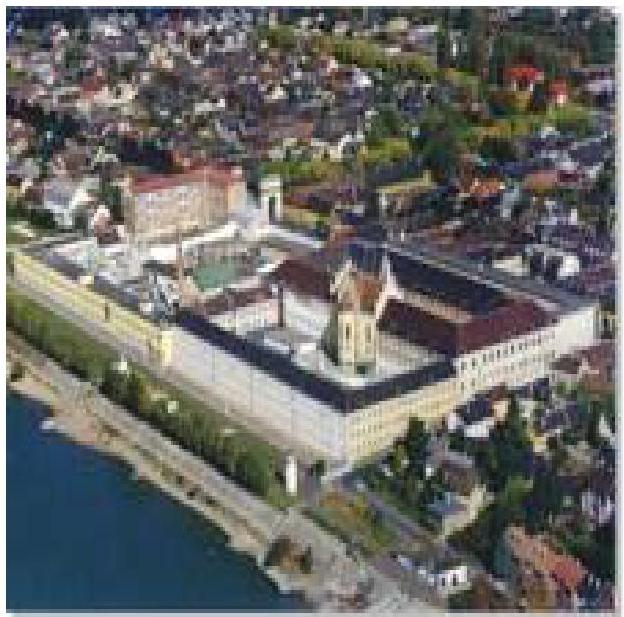

A DUNA-MIX Ipari Kereskedelmi Szolgáltató Korlátolt Felelősségű Társaságot – egyszemélyes társaságként – 1993-ban alapította a Magyar Köztársaság Igazságügyi Minisztériuma, mint a magyar állam képviselője. A DUNA-MIX Kft.1 tevékenysége a büntetés-végrehajtás keretein belül fogvatartottak foglalkoztatása köré szerveződött, alapvetően nyomda-kötészeti területen. A tulajdonosi jogokat és kötelezettségeket jogszabály alapján az MNV Zrt.2 gyakorolta, mely jogokat és kötelezettségeket az MNV Zrt.-vel kötött SZT/279783. számú szerződésben, és annak 27978/1. számú módosításában foglalt feltételekkel és korlátozásokkal a BVOP4 2013. január 29-ig vagyonkezelőként, majd azt követően megbízási szerződés alapján meghatalmazottként látta el.

2015. január 01–jével a BVOP egyszemélyes társaságként megalapította a Bv. Holding Kft.5-t, majd a 12/14/2015. sz. Határozatával döntött vállalatcsoport létrehozásáról, melybe az ellenőrzött gazdasági társaságok mellett uralkodó tagként6 a Bv. Holding Kft.-t bevonta. A vállalatcsoport létrehozásának célja volt többek között az összehangolt pénzügyi, számviteli, kontrolling, informatikai rendszer kialakítása; összehangolt beszerzési, humánerőforrás kezelési és marketing tevékenység működtetése.

A DUNA-MIX Kft. törzstőkéje 56,3 M Ft volt, mely az ellenőrzött időszak alatt nem változott. A gazdálkodásának főbb adatait az 1. ábra szemlélteti, a részletes adatokat a II. és III. Melléklet mutatja be.

1. ábra

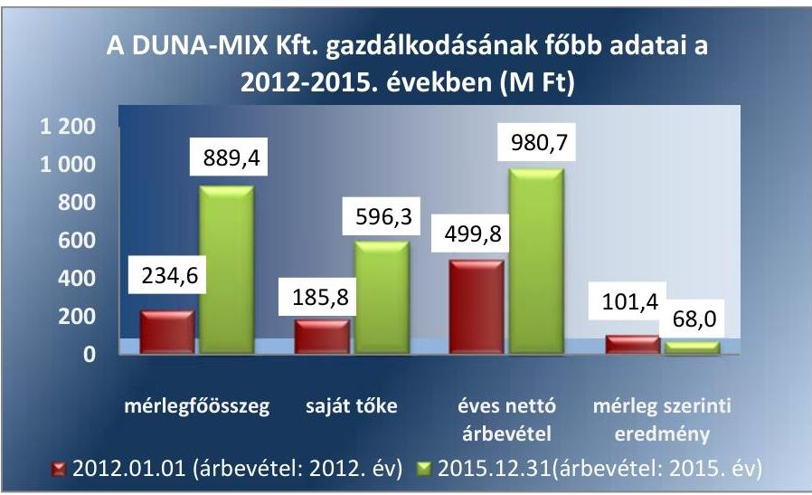

A saját tőke összege folyamatosan növekedett az ellenőrzött időszakban, a realizált, összesen 410,6 M Ft összegű mérlegszerinti eredménynek köszönhetően. A saját vagyonával gazdálkodott, vagyonkezelésbe vett állami vagyonnal nem rendelkezett.

---

# AZ ELLENŐRZÉS HÁTTERE, INDOKOLTSÁGA 

Az állami tulajdonú gazdálkodó szervezetek ellenőrzése kiemelten fontos a nemzeti vagyon megőrzése, megóvása érdekében. Gazdálkodásuk jellemzően a közérdeklődés és a média figyelmének középpontjában áll, amihez hozzájárul a gazdálkodásuk körébe tartozó - közvetlen vagy közvetett állami tulajdonú - vagyon nagysága, illetve az általuk ellátott közszolgáltatások minősége és hatékonysága. A szolgáltatási/közszolgáltatási árképzés megalapozottsága és az éves elszámoltatás feltételeinek kialakítása az ellenőrzés során nagy hangsúlyt kap. A szolgáltatás/közszolgáltatás árában és annak támogatásában meg kell jelennie az önköltségszámítás szempontjainak, amely biztosítja a működés fenntarthatóságát (eszközpótlást) is. Az ellenőrzés rámutathat az állami tulajdonú gazdálkodó szervezetek gazdálkodási tevékenységével kapcsolatos jó gyakorlatokra és szabálytalanságokra. Felhívhatja a figyelmet a jogszabályi követelmények teljesítéséhez szükséges feltételek hiányosságaira, hozzájárulhat az államháztartáson kívüli, de (közvetlenül vagy közvetve) állami vagyont használó gazdálkodó szervezetek tevékenységének átláthatóságához. Ellenőrzésünk eredményeképpen javaslatainkkal, megállapításainkkal hozzájárulhatunk a nemzeti vagyonnal való gazdálkodás átláthatóságának, elszámoltathatóságának javításához.

---

# A JELENTÉS LÉNYEGES KÉRDÉSKÖREI 

1. A tulajdonosi jogok gyakorlása szabályszerű volt-e?
2. A társaság működésének szabályozottsága megfelelt-e az előírásoknak?
3. A társaságnál a pénzügyi-számviteli, adatszolgáltatási és ellenőrzési feladatok ellátása szabályszerű volt-e?
4. A társaság vagyongazdálkodása szabályszerű volt-e?

---

# ELLENŐRZÉS HATÓKÖRE ÉS MÓDSZEREI 

## Az ellenőrzés típusa

Megfelelőségi ellenőrzés.

## Az ellenőrzött időszak

Az ellenőrzött időszak 2012. január 1-jétől 2015. december 31-ig tart.

## Az ellenőrzés tárgya

Állami tulajdonban lévő gazdasági társaság gazdálkodása, kiemelten vagyongazdálkodási tevékenysége, a tulajdonosi jogok gyakorlása.

Az ellenőrzés kiterjed minden olyan körülményre és adatra, amely az ÁSZ ${ }^{7}$ jogszabályban meghatározott feladatainak teljesítéséhez, valamint a program végrehajtása folyamán felmerült újabb összefüggések feltárásához szükséges.

## Az ellenőrzött szervezet

DUNA-MIX Ipari Kereskedelmi Szolgáltató Kft.
Magyar Nemzeti Vagyonkezelő Zrt.
Büntetés-végrehajtás Országos Parancsnoksága
Bv. Holding Kft.

## Az ellenőrzés jogalapja

Az ellenőrzés jogalapját az ÁSZ tv. ${ }^{8} 1 . \S$ (3) bekezdése és 5. § (3)-(5) bekezdései képezik.

## Az ellenőrzés módszerei

Az ellenőrzést a nemzetközi standardokat irányadónak tekintve az ellenőrzési program ellenőrzési kérdései, az ellenőrzött időszakban hatályos jogszabályok, az ellenőrzés szakmai szabályok és módszertanok figyelembevételével végeztük.

Az ellenőrzésre a nemzetgazdasági szempontból kiemelt jelentőségű nemzeti vagyon körébe tartozó gazdálkodó szervezeteknél és a többségi állami tulajdonban álló gazdálkodó szervezeteknél került sor. A program

---

szerinti feladatokat a kiválasztott gazdálkodó szervezetnél, valamint a tulajdonosi jogok gyakorlójánál hajtottuk végre.

Az ellenőrzési kérdések megválaszolásához szükséges bizonyítékok megszerzése a következő ellenőrzési eljárások alkalmazásával történt: megfigyelés, kérdésfeltevés (információkérés), összehasonlítás, valamint mintavételi és elemző eljárások. Az ellenőrzési bizonyítékként felhasználható adatforrások közé tartoznak egyrészt az ellenőrzési programban felsorolt adatforrások, másrészt adatforrás lehet még minden - az ellenőrzés folyamán - feltárt, az ellenőrzés szempontjából információkat tartalmazó dokumentum.

Az ellenőrzést a kérdésekre adott válaszok kiértékelésével, valamint a megjelölt adatforrások, a csatolt tanúsítványok felhasználásával, továbbá az adott időszakban hatályos jogszabályok figyelembevételével folytattuk le.

---

# 1. A tulajdonosi jogok gyakorlása szabályszerű volt-e? 

## Összegző megállapítás

1. táblázat

A DUNA-MIX KFT. FELETTI TULAJDONOSI JOGGYAKORLÁS ÉS KORLÁTOZOTT ÁTENGEDÉSE 2012 ÉS 2015 KÖZÖTT

| Ellenőrzött időszak | Tulajdonosi joggyakorló | Jogalap |
| :--: | :--: | :--: |
| $\begin{aligned} & 2012.01.01. \\ & 2015.12.31. \end{aligned}$ | MNV Zrt. | Vtv. |
| $\begin{aligned} & 2012.01.01. \\ & 2013.01.29. \end{aligned}$ | BVOP | SZT-27978   sz. vagyonkezelési szerződés |
| $\begin{aligned} & 2013.01.30. \\ & 2015.12.31. \end{aligned}$ | BVOP | SZT-39.159   sz. és SZT-   41.645. sz.   megbízási   szerződések |
| $\begin{aligned} & 2015.02.25. \\ & 2015.12.31. \end{aligned}$ | Bv. Holding Kft. | SZT 105264.   sz. megbízási szerződés, BVOP   12/14/2015.   sz. határozata. |

Forrás: BVOP adatszolgáltatója

Az MNV Zrt., a BVOP, valamint a Bv. Holding Kft. részesedések feletti tulajdonosi joggyakorlása szabályszerű volt.

AZ MNV ZRT. volt jogosult a magyar állam nevében a tulajdonosi jogok gyakorlására a Vtv. alapján, amely a DUNA-MIX Kft. társasági részesedése feletti tulajdonosi jogokat és kötelezettségeket az 1. táblázat szerint a BVOP és a Bv. Holding Kft. részére - korlátozásokkal és feltételekkel - átengedte.

Az MNV Zrt. az Nvtv. ${ }^{9}$ 18. § (7) bekezdésében foglaltakat figyelmen kívül hagyva - 2012. december 31-i - határidőn túl, 2013. január 30-án kötött Megbízási szerződést ${ }^{10}$-t a BVOP-val a társasági részesedések feletti tulajdonosi jogok és kötelezettségek - vagyonkezelési szerződés helyett megbízási szerződésen alapuló - gyakorlására.

Az MNV Zrt. az SZMSZ ${ }_{1}{ }^{11}$-ében rendelkezett az állami tulajdonban álló társasági részesedések hasznosításával, értékesítésével, kezelésével kapcsolatos gazdálkodási feladatokról.

A BVOP részére az MNV Zrt. - a III. mellékletben szerepeltetett korlátozásokkal - átengedte a társaság legfőbb szerve döntéshozatalában való részvétellel összefüggő jogokat és kötelezettségeket. A BVOP a tulajdonosi joggyakorlással kapcsolatos feladatokat a Bkr. ${ }^{12}$-ben a belső kontrollrendszer kialakítására vonatkozó előírásoknak megfelelően, vagyonkezelési szerződéssel, a megbízási szerződéssel összhangban, az SZMSZ ${ }_{2-3}{ }^{13}$-ekben szabályozta.

A BVOP az Alapító Okiratokban ${ }^{14}$, a vagyonkezelési szerződésben és a megbízási szerződésekben rögzítettekkel összhangban rendelkezett a vagyongazdálkodásra vonatkozó követelményekről, valamint a Gt. ${ }^{15}$ és a Ptk. ${ }^{16}$ előírásainak megfelelően meghatározták a felügyelőbizottság ${ }^{17}$ és az ügyvezető jogait, feladatait, valamint rendelkeztek a könyvvizsgáló személyéről.

A BVOP a DUNA-MIX Kft. üzleti terveit az Alapító Okiratokban foglaltaknak megfelelően jóváhagyta, azokat a 2012-2015. évekre vonatkozóan évente határozatokban fogadta el.

A BVOP az éves beszámolók jóváhagyásáról a Gt. és a Ptk. ${ }_{2}$ előírásainak megfelelően a könyvvizsgáló írásbeli véleménye, valamint a felügyelőbizottság írásbeli jelentésének birtokában határozattal döntött. Az
 Alapító Okiratnak ${ }_{1-9}$ megfelelően a BVOP döntött a társaság eredményének felosztásával kapcsolatban, a mérleg szerinti eredményét eredménytartalékba helyezte.

A BV. HOLDING KFT. - a részére átengedett, a IV. mellékletben bemutatott - tulajdonosi jogokat és kötelezettségeket szabályszerűen

---

látta el a 2015. évben. A vállalatcsoport tagjaival az MNV Zrt. és a BVOP döntésével összhangban kötött uralmi szerződést ${ }^{18}$; a Ptk. 2. előírásainak megfelelően rendelkezett a könyvvizsgáló személyéről, kialakította a vállalatcsoport Számviteli politikáját.

# 2. A társaság működésének szabályozottsága megfelelt-e az előírásoknak? 

## Összegző megállapítás

A DUNA-MIX Kft. működésének szabályozottsága összességében megfelelt az előírásoknak.

A DUNA-MIX Kft. működésének belső szabályait, a felelősségi-, feladat- és hatásköröket az SZMSZ 4.5 ${ }^{19}$-ben határozta meg. A Számviteli politika ${ }_{1-3}{ }^{20}$ és annak részét képező Leltározási szabályzat ${ }^{21}$, az Értékelési szabályzat ${ }^{22}$, az Önköltségszámítási szabályzat ${ }^{23}$, a Pénzkezelési szabályzat ${ }_{1-9}{ }^{24}$ megfeleltek a Számv. tv. ${ }^{25}$ előírásainak.

A Számlarend ${ }^{26}$ - amelyet 2001. január 01. hatállyal adtak ki és az ellenőrzött időszak alatt nem aktualizáltak - nem tartalmazta teljes körűen minden alkalmazásra kijelölt számla tartalmát, ha az a számla megnevezéséből egyértelműen nem következett; a számla értéke növekedésének, csökkenésének jogcímeit, a számlát érintő gazdasági eseményeket, azok más számlákkal való kapcsolatát, ezzel figyelmen kívül hagyták a Számv. tv. 161. § (2) bekezdés b) pontjának előírását. A Számlarend nem tartalmazta továbbá a számlarendben foglaltakat alátámasztó bizonylati rendet - azt más belső szabályzatban sem rögzítették -, ezzel megsértették a Számv. tv. 161. § (2) bekezdés d) pontjának előírását.

A tulajdonosi joggyakorló BVOP a 2173/2003 (VII.29) számú Korm. határozat ${ }^{27}$, valamint a Taktv. ${ }^{28}$ előírásainak megfelelően megalkotta a gazdasági társaságaira vonatkozó egységes Javadalmazási Szabályzatot, amelynek hatálya kiterjedt a DUNA-MIX Kft.-re is.

A Társaság az ellenőrzött időszakban nem szabályozta a beszerzési eljárások rendjét, a kapcsolódó felelősségi köröket, felelős személyeket.

## 3. A társaságnál a pénzügyi-számviteli, adatszolgáltatási és ellenőrzési feladatok ellátása szabályszerű volt-e?

Összegző megállapítás

Az ellenőrzött időszakban a DUNA-MIX Kft.-nél a pénzügyi-számviteli feladatok ellátása, valamint az adatszolgáltatási kötelezettségek teljesítése szabályszerű volt. A belső ellenőrzés kialakításáról és működtetéséről nem gondoskodtak.

### 3.1. számú megállapítás

A bevételek és a ráfordítások elszámolása megfelelt a Számv. tv. előírásainak és a belső szabályozásnak.

Az értékesítés nettó árbevételének elszámolása a Számv. tv., a Számviteli politika ${ }_{1-3}$ és a Számlarend ${ }_{1}$ előírásainak megfelelt. Az áruk és a szolgáltatások ellenértékének kiszámlázása a belső szabályozások szerint történt, a megfelelő főkönyvi számlákra számolták el azokat.

---

Az anyagjellegű ráfordítások elszámolása megfelelt a Számv. tv.-ben, a Számviteli politikában ${ }_{1-3}$ és a Számlarendben ${ }_{1}$ foglalt előírásoknak. A költségelszámolást alátámasztó dokumentumok rendelkezésre álltak, azok megfeleltek a Számv. tv. által előírt általános alaki és tartalmi követelményeknek, a költségeket a megfelelő költségnem-számlákra számolták el.

A személyi jellegű ráfordítások elszámolása szabályszerű volt, megfelelt a Számv. tv.-ben előírtaknak. Az elszámolt személyi juttatások összegét dokumentumokkal alátámasztották és a belső szabályozásnak megfelelően határozták meg. Az egyéb személyi jellegű juttatások esetében az Szja. tv. ${ }^{29}$-ben meghatározott előírásokat betartották, azok a Cafeteria szabályzatban ${ }^{30}$ foglaltaknak megfeleltek.

Az értékcsökkenés elszámolása megfelelt a Számv. tv., a Számviteli Politika ${ }_{1-3}$ előírásainak, az elszámolt értékcsökkenési leírás az éves beszámoló kiegészítő mellékletében bemutatásra került.

# A VEVŐKKEL SZEMBENI KÖVETELÉSEK ÁLLOMÁNYA az árbevétel növekedésével arányosan emelkedett. A követelésállomány megfelelő szinten tartása érdekében a társaság a Kintlévőség kezelési szabályzatában ${ }^{31}$ meghatározottak szerint járt el. Az ellenőrzött időszakban behajthatatlan követeléssel nem rendelkezett, a határidőn túli követelésállománya az árbevétel növekedésével emelkedett, melyet a 2. táblázat szemléltet.
2. táblázat

## A DUNA-MIX KFT. ÉRTÉKESÍTÉSI ÁRBEVÉTELÉNEK ALAKULÁSA A 2012-2015. ÉVEKBEN (M FT)

| Megnevezés | 2012. | 2013. | 2014. | 2015. |
| :-- | --: | --: | --: | --: |
| tervezett árbevétel | 233,0 | 410,5 | 877,0 | 814,0 |
| tényleges árbevétel | 499,8 | 855,2 | 784,2 | 980,3 |
| követelésállomány | 87,2 | 196,0 | 130,6 | 170,2 |
| határidőn túli | 6,6 | 28,5 | 22,0 | 25,7 |

Forrás: Duna-Mix Kft. éves beszámolói
3.2. számú megállapítás

A DUNA-MIX Kft. az előírásoknak megfelelő önköltségszámítással támasztotta alá a szolgáltatások díjainak megállapítását.

A DUNA-MIX Kft. által nyújtott szolgáltatások árképzését megalapozó Önköltség számítási szabályzata részletes előírásokat tartalmazott az elő- és utókalkuláció elvégzéséhez, kiterjedt valamennyi felosztható költségre, elkülönítette a közvetlen és közvetett költségeket, tartalmazta a kalkulációs módszerek leírását, a felosztható költségek vetítési alapjait.

A szolgáltatás díjtételeinek megállapítása az Önköltség számítási szabályzat szerint meghatározott önköltségen alapult.
3.3. számú megállapítás

A DUNA-MIX Kft. a tervezési, beszámolási és adatszolgáltatási kötelezettségeit szabályszerűen teljesítette.

A TERVEZÉSI, BESZÁMOLÁSI, ADATSZOLGÁLTATÁSI és egyéb tájékoztatási feladatokat, azok tartalmi és formai elemeit a DUNA-MIX Kft. részére a BVOP meghatározta.

---

3. táblázat

A DUNA-MIX KFT. SAJÁT TÖKÉJÉNEK ALAKULÁSA A 2012. ÉS 2015. ÉVEKBEN (M FT)

| Tőkeskénék | 2012. | 2015. |
| :-- | --: | --: |
| Saját tőke | 287,2 | 596,3 |
| Jegyzett tőke | 56,3 | 56,3 |
| Saját tőke / jegyzett tőke |  |  |
|  | 5,1 | 10,6 |

Forrás: A DUNA-MIX Kft. 2012-2015. évi beszámolói

Az üzleti terveit a 2012-2015. évekre elkészítette és az Alapító okiratban foglaltaknak megfelelően azokat jóváhagyásra a BVOP részére előterjesztette. Az üzleti tervek az előírásokkal összhangban tartalmazták a tervezett bevételeket és költségeket, a rendelkezésre álló kapacitásokat, beruházási terveket, valamint részletes pénzforgalmi tervet.

Az ellenőrzött időszakban a társaság az MNV Zrt., illetve a BVOP felé az adatszolgáltatási, beszámolási kötelezettségének megfelelő tartalommal és formában, a határidőket betartva eleget tett.

A társaság az éves beszámolóit az előírt határidőig beterjesztette a BVOP részére elfogadásra, a felügyelőbizottság írásbeli jelentésének és a könyvvizsgáló írásbeli véleményének birtokában a BVOP határozattal elfogadta azokat. A Számv. tv. előírásának megfelelően a jóváhagyott éves beszámolókat, a független könyvvizsgálói jelentésekkel együtt határidőben letétbe helyezték és közzétették.

A gazdálkodása nyereséges volt, a saját tőke összege többszörösen meghaladta a jegyzett tőke összegét, amelyet a 3. táblázat és a II. számú melléklet szemléltet.

A tulajdonosi joggyakorlók a felügyelőbizottságon keresztül, valamint állandó könyvvizsgáló megbízásával biztosították a tulajdonosi ellenőrzést.

A felügyelőbizottság és a könyvvizsgáló nem tett olyan megállapítást vagy jelzést, amely a DUNA-MIX Kft. számára intézkedési kötelezettséget vont volna maga után.

Az felügyelőbizottság, valamint a könyvvizsgáló az ellenőrzött időszakban nem állapított meg olyan tényt, amely alapján kezdeményezni kellett volna a DUNA-MIX Kft. legfőbb szerve rendkívüli ülésének összehívását.

# 4. A társaság vagyongazdálkodása szabályszerű volt-e? 

## Összegző megállapítás

### 4.1. számú megállapítás

## A DUNA-MIX Kft. vagyongazdálkodása összességében szabályszerű volt.

A saját vagyon értékének megőrzését, gyarapítását szolgáló szabályszerű vagyongazdálkodás feltételeit kialakította.

A VAGYONGAZDÁLKODÁSHOZ kapcsolódó feladat- és hatáskörök, felelősségi viszonyok, valamint az MNV Zrt., a BVOP és a Bv. Holding Kft. kizárólagos döntési hatáskörei a Gt., majd a Ptk. ${ }_{2}$ szabályaival összhangban az Alapító okiratban 1-9 valamint az SZMSZ 1-2-ben meghatározásra kerültek. A vagyongazdálkodással kapcsolatos további szabályokat a Számviteli Politika és annak részeként elkészített szabályzatok tartalmazták. A beruházási fejlesztési terveket az éves üzleti tervek részeként elkészítették a 2012 - 2015. években, amelyet a 2012. évben a BVOP vagyonkezelőként, a 2013 - 2015. években a BVOP, mint a tulajdonos nevében joggyakorlásra meghatalmazott határozattal hagyott jóvá, összhangban a vagyonkezelési és a megbízási szerződésekben foglaltakkal.

---

### 4.2. számú megállapítás

### 4.3. számú megállapítás

## A DUNA-MIX Kft. a vagyonát az előírásoknak megfelelően tartotta

nyilván, értékének és állagának megőrzéséről gondoskodott. A mérlegének egyes tételeit nem támasztotta alá leltárral.

A DUNA-MIX Kft. a saját vagyonra vonatkozó állományba vételi, nyilvántartási kötelezettségének a jogszabályi előírásoknak megfelelően eleget tett. Az ellenőrzött időszakban vagyonkezelésbe vett állami vagyonnal nem rendelkezett. A befektetett pénzügyi eszközök értékelése során a Számv. tv. előírásait betartották.

Saját eszközei és forrásai leltárral való alátámasztása az ellenőrzés egyetlen évében sem volt teljes körűen biztosított, mivel a befektetett pénzügyi eszközök, a követelések, a kötelezettségek, az aktív és passzív időbeli elhatárolások, saját tőke, céltartalékok mérlegsorokat alátámasztó leltárral nem rendelkeztek. Ezzel megsértették a Számv. tv. 15. § (3) bekezdése szerinti „valódiság elvét”, és nem teljesültek a Számv. tv. 69. § (1) bekezdésében foglaltak, valamint a Leltározási Szabályzat vonatkozó előírásai. A megbízott könyvvizsgáló a számviteli szabálytalanságokat független könyvvizsgálói jelentésében nem jelezte.

## A VAGYON ÉRTÉKÉNEK, ÁLLAGÁNAK MEGŐRZÉSÉRŐL az előírásoknak megfelelően gondoskodott, a DUNA-MIX Kft. vagyona az ellenőrzött időszakban jelentős mértékben, 654,8 M Ft-tal, közel négyszeresére növekedett. A vagyonváltozást részletesen a II. sz. melléklet szemlélteti. Az ellenőrzött időszakban a saját vagyon értékének gyarapítása a mérleg szerinti vagyonérték-változásai alapján megvalósult. Tárgyi eszközállománya a végrehajtott beruházások és felújítások eredményeként 165,9 %-kal, 94,6 M Ft-tal növekedett.

A tárgyi eszközök folyamatos karbantartásáról, állagmegóvásáról gondoskodtak, az ellenőrzött időszakban 75,1 M Ft-ot fordítottak karbantartásra, állagmegóvásra.

## A DUNA-MIX Kft. vagyonváltozást eredményező döntéseinek elő-

készítése és döntései összességében megfelelőek voltak.

A BVOP az alapító okiratban 1-9 szabályozta a vagyon változását eredményező döntések rendjét, melyet a DUNA-MIX Kft. a saját vagyon gyarapítása, hasznosítása során betartott.
$\longrightarrow$ Az üzleti tervekben minden évben a BVOP felé előterjesztésre, s általa jóváhagyásra kerültek a beruházások és felújítások.
$\longrightarrow$ Az eszközök selejtezésére a Selejtezési szabályzatának megfelelően került sor.
A Társaság egyes beszerzései során nem a Kbt. ${ }^{32}$ szerinti ajánlatkérőként járt el.

---

# JAVASLATOK 

Az ÁSZ tv. 33. § (1) bekezdésében foglaltak értelmében az ellenőrzött szervezet vezetője köteles a jelentésben foglalt megállapításokhoz kapcsolódó intézkedési tervet összeállítani és azt a jelentés kézhezvételétől számított 30 napon belül az ÁSZ részére megküldeni. Amennyiben az ellenőrzött szervezet vezetője nem küldi meg határidőben az intézkedési tervet, vagy továbbra sem elfogadható intézkedési tervet küld, az Állami Számvevőszék elnöke az ÁSZ tv. 33. § (3) bekezdés a) és b) pontjaiban foglaltakat érvényesítheti.

## A DUNA-MIX Ipari Kereskedelmi Szolgáltató Kft. ügyvezetőjének

1. Módosítsa a Számlarendet annak érdekében, hogy az a jogszabályi előírásoknak megfeleljen.
(2. sz. összegző megállapítás 2. bekezdése alapján)
2. Intézkedjen, hogy saját eszközei és forrásai leltárral való alátámasztása megfeleljen a jogszabályi előírásoknak.
(4.2. sz. megállapítás 2. bekezdése alapján)
3. Intézkedjen a jogszabályi előírásnak megfelelő beszerzési eljárásrend megalkotásáról.
(2. sz. megállapítás 4. bekezdése alapján)
4. Intézkedjen, hogy a beszerzési eljárásokat az előírásoknak megfelelően folytassák le.
(4.3. sz. megállapítás 2. bekezdése alapján)

## A Bv. Holding Kft. ügyvezetőjének

1. Intézkedjen, hogy a DUNA-MIX Ipari Kereskedelmi Szolgáltató Kft-t érintő beszerzési eljárásokat az előírásoknak megfelelően lefolytassák.
(4.3. sz. megállapítás 2. bekezdése alapján)

---

.

---

# MELLÉKLETEK 

- I. SZ. MELLÉKLET: ÉRTELMEZŐ SZÓTÁR
állami vagyon
gazdasági társaság
vagyonkezelő
gazdálkodó szervezet
a) Az állam tulajdonában lévő dolog, valamint a dolog módjára hasznosítható természeti erő,
b) az a) pont hatálya alá nem tartozó mindazon vagyon, amely vonatkozásában törvény az állam kizárólagos tulajdonjogát nevesíti,
c) az állam tulajdonában lévő tagsági jogviszonyt megtestesítő
 értékpapír, illetve az államot megillető egyéb társasági részesedés,
d) az államot megillető olyan immateriális, vagyoni értékkel rendelkező jogosultság, amelyet jogszabály vagyoni értékű jogként nevesít.
Forrás: Vtv. 1. § (2) bekezdése
2012. november 10-től az állami vagyon fogalma kiegészül a következő ponttal:
e) az állam tulajdonában lévő pénzügyi eszközök
Forrás: Vtv. 1. § (2) bekezdése
A Ptk. 3:88. § (1) bekezdése szerint „a gazdasági társaságok üzletszerű közös gazdasági tevékenység folytatására, a tagok vagyoni hozzájárulásával létrehozott, jogi személyiséggel rendelkező vállalkozások, amelyekben a tagok a nyereségből közösen részesednek, és a veszteséget közösen viselik”.
2013. június 27-ig:

Az állami vagyont az MNV Zrt. maga kezeli, vagy szerződés – így különösen bérlet, haszonbérlet, megbízás – alapján központi költségvetési szervnek, természetes vagy jogi személynek, vagy jogi személyiséggel nem rendelkező gazdálkodó szervezetnek hasznosításra átengedi. Az állami vagyonra vonatkozóan az MNV Zrt. kizárólag az Nvtv-ben meghatározott személyekkel köthet vagyonkezelési szerződést.
Forrás: Vtv. 23. § (1), 27. § (1)
2013. június 28-ától:

Az állami vagyonnal az MNV Zrt. maga gazdálkodik, vagy szerződés – így különösen bérlet, haszonbérlet, megbízás – alapján központi költségvetési szervnek, természetes vagy jogi személynek, vagy jogi személyiséggel nem rendelkező gazdálkodó szervezetnek hasznosításra átengedi, illetőleg vagyonkezelésbe, haszonélvezetbe adja. Az állami vagyonra vonatkozóan az MNV Zrt. kizárólag az Nvtv-ben meghatározott személyekkel köthet vagyonkezelési szerződést.
Forrás: Vtv. 23. § (1), 27. § (1)
2014. március 14-ig:

A Ptk. ${ }^{33}$ 685. § c) pontja szerint gazdálkodó szervezet: „az állami vállalat, az egyéb állami gazdálkodó szerv, a szövetkezet, a lakásszövetkezet, az európai szövetkezet, a gazdasági társaság, az európai részvénytársaság, az egyesülés, az európai gazdasági egyesülés, az európai területi együttműködési csoportosulás, az egyes jogi személyek vállalata, a leányvállalat, a vízgazdálkodási társulat, az erdő birtokossági társulat, a végrehajtói iroda, az egyéni cég, továbbá az egyéni vállalkozó.”
2014. március 15-től:

A gazdasági társaság, az európai részvénytársaság, az egyesülés, az európai gazdasági egyesülés, az európai területi együttműködési csoportosulás, a szövetkezet, a lakásszövetkezet, az európai szövetkezet, a vízgazdálkodási társulat, az erdőbirtokossági társulat, az állami vállalat, az egyéb állami gazdálkodó szerv, az egyes jogi személyek

---

# Mellékletek 

vállalata, a közös vállalat, a végrehajtói iroda, a közjegyzői iroda, az ügyvédi iroda, a szabadalmi ügyvivői iroda, az önkéntes kölcsönös biztosító pénztár, a magánnyugdíjpénztár, az egyéni cég, továbbá az egyéni vállalkozó. Az állam, a helyi önkormányzat, a költségvetési szerv, az egyesület, a köztestület, valamint az alapítvány gazdálkodó tevékenységével összefüggő polgári jogi kapcsolataira is a gazdálkodó szervezetre vonatkozó rendelkezéseket kell alkalmazni.
Forrás: $\mathrm{Pp}^{34} .396 . \S$
közszolgáltatás Az Ebktv. ${ }^{35}$ 3. § d) pontja a következőképpen határozza meg a közszolgáltatást: „szerződéskötési kötelezettség alapján a lakosság alapvető szükségleteinek ellátására irányuló szolgáltatás, így különösen a villamos energia-, gáz-, hő-, víz-, szennyvíz- és hulladékkezelési, köztisztasági, postai és távközlési szolgáltatás, továbbá a menetrend alapján közlekedő járművekkel végzett közforgalmú személyszállítás”.
MNV Zrt.
nemzeti vagyon
tulajdonosi ellenőrzés

Az állami vagyon felett, a Magyar Államot megillető tulajdonosi jogok és kötelezettségek összességét – a hatályos szabályozás szerint – az állami vagyon felügyeletéért felelős miniszter (jelenleg a nemzeti fejlesztési miniszter) gyakorolja. A miniszter feladatát nagy részben az MNV Zrt., mint tulajdonosi joggyakorló szervezet útján látja el.
a) az állam vagy a helyi önkormányzat kizárólagos tulajdonában álló dolgok,
b) az a) pont hatálya alá nem tartozó, állam vagy a helyi önkormányzat tulajdonában lévő dolog,
c) az állam vagy a helyi önkormányzat tulajdonában lévő pénzügyi eszközök, továbbá az államot vagy a helyi önkormányzatot megillető társasági részesedések,
d) az államot vagy a helyi önkormányzatot megillető bármely vagyoni értékkel rendelkező jogosultság, amelyet jogszabály vagyoni értékű jogként nevesít,
e) Magyarország határa által körbezárt terület feletti légtér,
f) az üvegházhatású gázok kibocsátási egységeinek kereskedelméről szóló törvény szerint kibocsátási egység és légiközlekedési kibocsátási egység, valamint az ENSZ Éghajlatváltozási Keretegyezménye és annak Kiotói Jegyzőkönyve végrehajtási keretrendszeréről szóló törvény szerinti kiotói egység,
g) állami vagy helyi önkormányzati fenntartású közgyűjtemény (muzeális intézmény, levéltár, közgyűjteményként működő kép- és hangarchívum, valamint könyvtár) saját gyűjteményében nyilvántartott kulturális javak körébe tartozó dolog, kivéve, ha az állami vagy önkormányzati tulajdon jogszerű létrejötte kétséget kizáró módon nem bizonyítható és a dologra nézve más a tulajdonjogát bizonyítja vagy a kulturális javakra vonatkozó jogszabályokban meghatározott eljárás keretében valószínűsíti (g. pont módosult 2013. december 7-től),
h) a régészeti lelet,
i) a nemzeti adatvagyon körébe tartozó állami nyilvántartások fokozottabb védelméről szóló törvény szerinti nemzeti adatvagyon.
Forrás: Nvtv. 1. § (2)
2014. március 14-ig:

Az állami vagyon kezelőjét, haszonélvezőjét, használóját megillető jogok gyakorlását, annak szabályszerűségét, célszerűségét az MNV Zrt. – szükség szerint területi szervei útján – ellenőrzi.
2014. március 15-től:

Az állami vagyon használóját, vagyonkezelőjét és haszonélvezőjét megillető jogok gyakorlását, annak szabályszerűségét, a kötelezettségek teljesítését, valamint a vagyon rendeltetése szerinti célszerűségét a tulajdonosi joggyakorló rendszeresen ellenőrzi.

---

tulajdonosi jogok gyakorlója 1.
2013. június 27-ig:

Az állami vagyon felett a Magyar Államot megillető tulajdonosi jogok és kötelezettségek összességét – ha törvény eltérően nem rendelkezik – az állami vagyon felügyeletéért felelős miniszter (a továbbiakban: miniszter) gyakorolja, aki e feladatát a Magyar Nemzeti Vagyonkezelő Zártkörűen Működő Részvénytársaság (a továbbiakban: MNV Zrt.), a Magyar Fejlesztési Bank, illetve a tulajdonosi joggyakorló szervezet útján látja el. A miniszter miniszteri rendeletben, a törvényben meghatározott állami vagyoni kör tekintetében, meghatározott időtartamra, a joggyakorlás egyes szabályainak meghatározásával – az őt megillető tulajdonosi jogok és kötelezettségek összességének, illetve azok meghatározott részének gyakorlóját az Áht. szerinti központi költségvetési szervek, ezek intézménye, továbbá a 100%-ban állami tulajdonban álló gazdasági társaságok közül kijelölheti.
Forrás: Vtv. 3. § (1) és (2)
2013. június 28-ától:

A rábízott állami vagyon felett az államot megillető tulajdonosi jogok és kötelezettségek összességét tulajdonosi joggyakorlóként:
a) ha törvény vagy miniszteri rendelet eltérően nem rendelkezik, a Magyar Nemzeti Vagyonkezelő Zártkörűen Működő Részvénytársaság (a továbbiakban: MNV Zrt.),
b) törvényben kijelölt személy vagy
c) az állami vagyon felügyeletéért felelős miniszter (a továbbiakban: miniszter) által rendeletben kijelölt személy gyakorolja.
[...] A miniszter e törvény felhatalmazása alapján – a meghatározott célok hatékonyabb elérése érdekében, miniszteri rendeletben, az ott meghatározott állami vagyoni kör tekintetében, meghatározott időtartamra – e törvény keretei között, a joggyakorlás egyes szabályainak meghatározásával – az államot megillető tulajdonosi jogok és kötelezettségek összességének, illetve azok meghatározott részének gyakorlóját az Áht. szerinti központi költségvetési szervek, ezek intézménye, továbbá a 100%-ban állami tulajdonban álló gazdasági társaságok közül kijelölheti.
Forrás: Vtv. 3. § (1) és (2)
2.

Aki a nemzeti vagyon felett az államot vagy a helyi önkormányzatot megillető tulajdonosi jogok és kötelezettségek összességének gyakorlására jogosult
Forrás: Nvtv. 3. § (1) 17. pontja

---

II. SZ. MELLÉKLET: A DUNA-MIX KFT. VAGYONÁNAK MEGOSZLÁSA A 2012-2015. ÉVEKBEN (M FT.)

|  Megnevezés | 2012.01.01. | 2012.12.31. | 2013.12.31. | 2014.12.31. | 2015.12.31. | Változás
2015.12.31./2012.01.01
(M Ft)  |
| --- | --- | --- | --- | --- | --- | --- |
|  Befektetett eszközök | 144,5 | 168,0 | 228,1 | 238,2 | 238,7 | 94,2  |
|  Immateriális javak | 1,0 | 1,1 | 1,1 | 1,2 | 0,6 | $-0,4$  |
|  Tárgyi eszközök | 143,5 | 166,8 | 227,0 | 237,0 | 238,1 | 94,6  |
|  Ingatlanok és a kapcsolódó vagyoni értékű jogok | 102,9 | 104,7 | 102,4 | 118,4 | 142,7 | 39,8  |
|  Műszaki berendezések, gépek, járművek | 28,3 | 51,1 | 95,4 | 78,9 | 65,3 | 37,0  |
|  Egyéb berendezések, felszerelések, járművek | 12,3 | 11,0 | 19,2 | 26,1 | 22,7 | 10,4  |
|  Beruházások, felújítások | 0,0 | 0,0 | 10,0 | 13,6 | 7,4 | 7,4  |
|  Befektetett pénzügyi eszközök | 0,0 | 0,0 | 0,0 | 0,0 | 0,0 | 0,0  |
|  Forgóeszközök | 89,9 | 271,4 | 345,3 | 528,3 | 649,5 | 559,6  |
|  Készletek | 20,3 | 50,7 | 80,2 | 113,6 | 169,5 | 149,2  |
|  Követelések | 42,7 | 94,2 | 198,0 | 132,8 | 173,6 | 130,9  |
|  Értékpapírok | 11,0 | 0,0 | 40,0 | 180,0 | 156,9 | 145,9  |
|  Pénzeszközök | 15,9 | 126,5 | 27,1 | 101,9 | 149,5 | 133,6  |
|  Aktív időbeli elhatárolások | 0,2 | 0,1 | 1,9 | 0,9 | 1,2 | 1,0  |
|  Eszközök (aktívák) összesen | 234,6 | 439,5 | 575,3 | 767,4 | 889,4 | 654,8  |
|  Saját tőke | 185,8 | 287,2 | 477,2 | 528,3 | 596,3 | 410,5  |
|  Jegyzett tőke | 56,3 | 56,3 | 56,3 | 56,3 | 56,3 | 0,0  |
|  Tőketartalék | 68,0 | 68,0 | 68,0 | 68,0 | 68,0 | 0,0  |
|  Eredménytartalék | 39,8 | 61,5 | 162,9 | 352,9 | 404,0 | 364,2  |
|  Mérleg szerinti eredmény | 21,7 | 101,4 | 190,0 | 51,1 | 68,0 | 46,3  |
|  Céltartalékok | 1,3 | 0,2 | 0,1 | 0,0 | 0,0 | $-1,3$  |
|  Kötelezettségek | 23,8 | 130,1 | 66,5 | 213,0 | 262,0 | 238,2  |
|  Passzív időbeli elhatárolások | 23,7 | 22,0 | 31,5 | 26,1 | 31,1 | 7,4  |
|  Források (passzívák) összesen | 234,6 | 439,5 | 575,3 | 767,4 | 889,4 | 654,8  |

---

| DUNA-MIX Kft. legfőbb szerve döntéshozatalában való részvétellel összefüggő jogok és kötelezettségek azzal, hogy a BVOP köteles az MNV Zrt. előzetes hozzájárulását kérni a részesedéshez kapcsolódó szavazati jogok alábbi kérdésekben történő gyakorlását megelőzően: |  |
| :--: | :--: |
| a társaság végelszámolással történő jogutód nélküli megszüntetése | 2012.01.01-2015.12.31. |
| a társaság átalakulása | 2012.01.01-2015.12.31. |
| a törzstőke felemelése, leszállítása | 2012.01.01-2015.12.31. |
| az elismert vállalatcsoport létrehozásának előkészítéséről és az uralmi szerződés tervezetének tartalmáról való döntés, az uralmi szerződés tervezetének jóváhagyása | 2012.01.01-2015.12.31. |
| a társaság tulajdonát képező termőföldek elidegenítéséhez | 2012.01.01-2015.12.31. |
| a társaság tulajdonát képező termőföldek művelési ágának megváltoztatásához, más célú hasznosításához, megterheléséhez | 2012.01.01-2015.12.31. |
| stratégiai döntések meghozatalához | 2012.01.01-2015.12.31. |
| az alapító okirat olyan tartalmú módosítása, amely a részesedéshez kapcsolódó jogokat hátrányosan érintheti | 2013.01.30-2015.12.31. |
| törzstőke emelése esetén a tagok elsőbbségi jogának kizárása | 2013.01.30-2015.12.31. |
| törzstőke felemelésekor, illetve az elsőbbségi jogok gyakorlása esetén a törzsbetétek arányától való eltérés megállapítása | 2013.01.30-2015.12.31. |
| törzstőke leszállításakor a törzsbetétek arányától való eltérés megállapítása | 2013.01.30-2015.12.31. |

 |
| elővásárlási jog gyakorlása a társaság által | 2013.01.30-2015.12.31. |
| az üzletrész kívülálló személyre történő átruházásánál a beleegyezés megadása | 2013.01.30-2015.12.31. |
| üzletrész felosztásához való hozzájárulás és az üzletrész bevonásának elrendelése | 2013.01.30-2015.12.31. |
| gazdálkodó szervezet alapítása vagy megszüntetése, valamint gazdálkodó szervezetben részesedés megszerzése vagy átruházása | 2013.01.30-2015.12.31. |

---

# IV. SZ. MELLÉKLET: A BV. HOLDING RÉSZÉRE ÁTENGEDETT TULAJDONOSI JOGOK 

## BVOP 12/14/2015. számú határozata, és a 2015. 09.15. naptól hatályos Megbízási szerződés alapján:

a jogszabályok alapján a tulajdonosi jogok gyakorlóját megillető jogok és kötelezettségek a BVOP 12/14/2015. számú határozatának 2. a) pontjában foglaltak kivételével
az ellenőrzött társaság üzleti tervének, éves beszámolójának jóváhagyása, az éves beszámoló közzétételéhez szükséges határozat kiadása
az ellenőrzött társaságok közötti végleges pénzeszközátadás
a 25,0 M Ft nettó értéket meghaladó tárgyi eszköz, továbbá valamennyi ingatlan és gépjármű vásárlásának, értékesítésének jóváhagyása
az ellenőrzött társaság jogszerű, gazdaságos és eredményes működésének ellenőrzése.
az ellenőrzött társaság vagyona terhére adott kötelezettségvállalás jóváhagyása
az ellenőrzött társaság éves keresettömegének meghatározása
az Uralkodó tag iránymutatása alapján elkészített Számviteli politika, Szervezeti és Működési Szabályzat, a felügyelő bizottság ügyrendjének a jóváhagyása

---

# FÜGGELÉK: ÉSZREVÉTELEK 

A jelentéstervezetet a Számvevőszék 15 napos észrevételezésre megküldte az ellenőrzött szervezetek vezetőinek az ÁSZ tv. 29. § (1) bekezdése előírásának megfelelően.

A függelék tartalmazza az ellenőrzöttek észrevételeit, illetve az el nem fogadott észrevételek elutasításának indoklását.

- Az MNV Zrt. vezérigazgatójának írásban tett észrevétele
- Tájékoztatás az MNV Zrt. vezérigazgatójának az észrevételek kezeléséről
- A BVOP országos parancsnokának észrevétele
- Tájékoztatás a BVOP országos parancsnokának az észrevételek kezeléséről
- A Bv. Holding Kft. ügyvezetőjének írásban tett észrevétele (Az ahhoz csatolt mellékletek nélkül.)
- Tájékoztatás a Bv. Holding Kft. ügyvezetőjének az észrevételek kezeléséről
- A DUNA-MIX Kft. ügyvezetőjének írásban tett észrevétele
- Tájékoztatás a DUNA-MIX Kft. ügyvezetőjének az észrevételek kezeléséről

[^0]
[^0]:    * 29. § (1) Az Állami Számvevőszék az ellenőrzési megállapításait megküldi az ellenőrzött szervezet vezetőjének vagy az általa megbízott személynek, és annak, akinek személyes felelősségét állapította meg.
    (2) Az ellenőrzött szervezet vezetője és a felelősként megjelölt személy az ellenőrzés megállapításaira tizenöt napon belül írásban észrevételt tehet.
    (3) Az Állami Számvevőszék az észrevételre a beérkezésétől számított harminc napon belül írásban válaszol. A figyelembe nem vett észrevételeket köteles a jelentésben feltüntetni, és megindokolni, hogy azokat miért nem fogadta el.

---

# Állami Számvevőszék 

## Domokos László   elnök

1052 Budapest
Apáczai Cs. J. u. 10.

Ikt. sz.: MNV/01/15016/ ㅇ 2017.
Hiv. sz.: V-1234-229/2016.

Tisztelt Elnök Úr!

A 2017. június 23. napján „Az állami tulajdonban (résztulajdonban) lévő gazdálkodó szervezetek vagyonmegőrzési és gazdálkodási tevékenységének ellenőrzése - Duna-Mix Ipari kereskedelmi Szolgáltató Kft." tárgyában kézhez vett, V-1234-229/2016. ikt. sz. Jelentés-tervezetre az alábbi észrevételeket tesszük:
„Megállapítások 1. A tulajdonosi jogok gyakorlása szabályszerű volt-e? Összegző megállapítás" / 12. oldal 2. bekezdése

Az MNV Zrt. Igazgatósága 465/2012. (IX.10.) IG számú határozatával 2012. szeptember 10-én jóváhagyta, hogy az MNV Zrt. tulajdonosi joggyakorlása alá tartozó társasági részesedések hasznosítására - a nemzeti vagyonról szóló 2011. évi CXCVI. törvény 8. § (7) bekezdésének hatályba lépése miatt kialakítandó új szerződéskötési gyakorlat a hivatkozott határozat 1. számú mellékletében bemutatott megbízási szerződés mintán alapuljon.

Az MNV Zrt. Igazgatósága továbbá egyetértett azzal, hogy az akkor hatályos vagyonkezelési szerződések megszüntetésére a határozat 2. számú mellékletében bemutatott megállapodás minta alapján kerüljön sor.

A megállapodás-mintáknak megfelelő szerződés módosítások kezdeményezésére és az új megállapodások aláírására az MNV Zrt. Igazgatósága által meghatározott határidő 2012. december 31. napja volt.

Ennek megfelelően a hivatkozott MNV Zrt. Igazgatósági határozattal elfogadott minta-dokumentumok és a végrehajtásra vonatkozó ütemterv 2012 szeptemberében megküldésre kerültek a vagyonkezelők - így a Büntetés-Végrehajtás Országos Parancsnoksága (a továbbiakban: BVOP) - részére. Az MNV Zrt.-nek 186 társasági részesedésre 43 vagyonkezelő szervezettel kellett néhány hónap alatt a szerződéseket megkötnie.

---

A BVOP az MNV Zrt. Igazgatósága által megküldött minta megbízási szerződést 2012. október 30. napján kelt levelében több ponton megkifogásolta, melyre az MNV Zrt. 2012. november 28. napján kelt levelében a minta megbízási szerződés alkalmazását javasolta indokokkal alátámasztva.

A szerződéskötési folyamat a BVOP-val folytatott egyeztetések miatt elhúzódott, az MNV Zrt. és a BVOP között a Vagyonkezelési megállapodás megszüntetéséről szóló Megállapodást végül 2013. január 30. napján írták alá a felek, és a vagyonkezelési jog megszüntetésével egyidejűleg - a Vagyonkezelő részére a tagsági joggyakorlás folyamatos biztosítása érdekében - az MNV Zrt. és a BVOP megkötötték a megváltozott jogi környezetnek megfelelő SZT-39159 számú megbízási szerződést az MNV Zrt. Igazgatósága 465/2012. (IX.10.) IG számú határozata által jóváhagyott minta dokumentumok alkalmazásával.

Kérem Elnök Urat, hogy a jelentés véglegesítése során jelen észrevételeinket szíveskedjenek figyelembe venni.

Budapest, 2017. július 6.

Üdvözlettel:
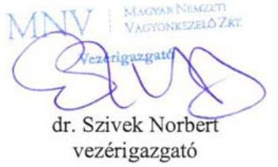

---

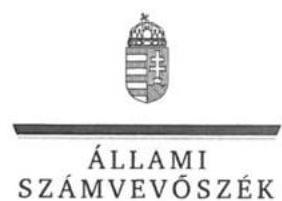

ELNÖK

# Dr. Szivek Norbert úr 

vezérigazgató
Magyar Nemzeti Vagyonkezelő Zrt.

## Budapest

## Tisztelt Vezérigazgató Úr!

Az ,,Állami tulajdonú gazdasági társaságok - Az állami tulajdonban (résztulajdonban) lévő gazdálkodó szervezetek vagyonmegőrzési és gazdálkodási tevékenységének ellenőrzése - DUNAMIX Ipari Kereskedelmi és Szolgáltató Kft. " címmel készített számvevőszéki jelentéstervezetre tett észrevételeit köszönettel megkaptam.
Az Állami Számvevőszék észrevételekre vonatkozó álláspontjáról a felügyeleti vezető által készített részletes tájékoztatást csatoltan megküldöm.

Tájékoztatom Vezérigazgató urat, hogy a számvevőszéki jelentésben - az Állami Számvevőszékről szóló 2011. évi LXVI. törvény 29. § (3) bekezdése alapján - a figyelembe nem vett észrevételeket szerepeltetjük, annak indoklásával, hogy azokat az Állami Számvevőszék miért nem fogadta el.

Budapest, 2017. 08. hó 01. nap
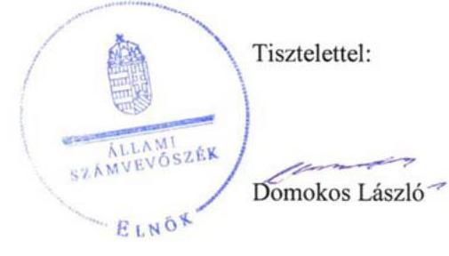

Melléklet: Tájékoztatás az észrevételek kezeléséről

---

# Tájékoztatás   az észrevételek kezeléséről 

Az ,,Állami tulajdonú gazdasági társaságok - Az állami tulajdonban (résztulajdonban) lévő gazdálkodó szervezetek vagyonmegőrzési és gazdálkodási tevékenységének ellenőrzése - DUNAMIX Ipari Kereskedelmi és Szolgáltató Kft." címü jelentéstervezetre tett (2017. július 6-án kelt, és az Állami Számvevőszékhez július 7-én érkezett) észrevételeit áttekintettük, azok kezelésével kapcsolatban a következő tájékoztatást adom.

A jelentéstervezet 1. Összegző megállapítása 2. bekezdéséhez kapcsolódóan a vezérigazgató jelezte, hogy a társasági részesedések hasznosítására és a vagyonkezelési szerződések megszüntetésére vonatkozóan új megállapodás-mintákat fogadott el az Magyar Nemzeti Vagyonkezelő Zrt. (a továbbiakban: MNV Zrt.) igazgatósága 2012 szeptemberében. A megállapodások megkötésére vonatkozóan ütemtervet küldtek a Büntetés-Végrehajtás Országos Parancsnoksága (a továbbiakban: BVOP) részére is. A szerződéskötési folyamat azonban a BVOP-val folytatott egyeztetések miatt elhúzódott, a vagyonkezelési megállapodás megszüntetésére mindezek folytán csak 2013. január végén kerülhetett sor. Ugyanezen napon kötötték meg a megbízási szerződést az MNV Zrt. és a BVOP között.

Tájékoztatom, hogy a Nemzeti vagyonról szóló 2011. évi CXCVI. törvény (a továbbiakban: Nvtv.) 18. § (7) bekezdése szerint a 2012. július 1. napját megelőzően állami vagy önkormányzati tulajdonban lévő társasági részesedések tekintetében a tulajdonosi joggyakorlás tárgyában létrejött szerződéseket 2012. december 31-ig az Nvtv. 8. § (7) bekezdésében foglaltaknak megfelelően módosítani kellett. A hivatkozott jogszabályi előírás figyelmen kívül hagyására vonatkozó megállapításunkat a jelentéstervezetben nem módosítjuk, mert a szerződés megkötése határidejének módosítására a jogszabály lehetőséget nem adott, a késedelem tényét pedig maga az észrevétel is megerősítette.

Tájékoztatom, hogy a számvevőszéki jelentés függelékeként szerepeltetjük a jelentéstervezethez tett észrevételeit, valamint az azokra adott válaszunkat.

Budapest, 2017. 08. 05.
Böröcz Imre
felügyeleti vezető

---

# BÜNTETÉS-VÉGREHAJTÁS ORSZÁGOS PARANCSNOKSÁGA DR. TÓTH TAMÁS   ORSZÁGOS PARANCSNOK 

Szám: 30500/6092/1/2017.

Tárgy: jelentéstervezetre észrevétel
Hivatkozási szám: V-1234-228/2016.
Úgyintéző: dr. Demkó Tibor c. bv. ezredes
Tel: 06-1-301-8453

## Domokos László Úr   elnök

Állami Számvevőszék

## Budapest

Budapest, 4.
Pf. 54.
1364

## ÁLLAMI SZÁMVEVÓSZÉK

BE-49707/2014/1
Elekzet: 2017 JOL 11
Iktatószám: V-1234-243/266
Mediálden: $\qquad$

## Tisztelt Elnök Úr!

A Büntetés-végrehajtás Országos Parancsnoksága (a továbbiakban: BVOP) tulajdonosi joggyakorlása alá tartózó Duna-Mix Ipari Kereskedelmi és Szolgáltató Korlátolt Felelősségű Társaság (a továbbiakban: Társaság) számvevőszéki ellenőrzéséről készült, a V-1234-228/2016. iktatószámú levelével megküldött jelentéstervezetre az alábbi észrevételeket teszem:

A jelentéstervezet szerint a beruházási célú és egyéb beszerzések esetében, a Társaság a beszerzés idején hatályos Kbt. alanyi hatálya alá tartozó szervezetként a közbeszerzési eljárás mellőzésével megvalósított beszerzéseivel megsértette a Kbt. 5. § alapján fennálló, a Kbt. 19. §-ában előírt közbeszerzési eljárás lefolytatásának kötelezettségét.

Álláspontunk szerint az adott beruházások tekintetében a Társaság nem minősült/minősül az ellenőrzött időszak alatt hatályban volt közbeszerzésekről szóló 2011. évi CVIII. törvény (a továbbiakban: régi Kbt.), és a 2015. november 1. napjától hatályos közbeszerzésekről szóló 2015. évi CXLIII. törvény (a továbbiakban: hatályos Kbt.) szerinti klasszikus ajánlatkérőnek.

A régi Kbt. 6. § (1) bekezdés c) pontja alapján ajánlatkérőnek minősül az a jogképes szervezet, amelyet közérdekű, de nem ipari vagy kereskedelmi jellegű tevékenység folytatása céljából hoznak létre, vagy amely ilyen tevékenységet lát el, ha az a)-d) pontokban meghatározott egy vagy több szervezet, az Országgyűlés vagy a Kormány külön-külön vagy együttesen, közvetlenül vagy közvetetten meghatározó befolyást képes felette gyakorolni vagy működését többségi részben egy vagy több ilyen szervezet (testület) finanszírozza.

A hatályos Kbt. 5. § (1) bekezdés e) pontja alapján ajánlatkérőnek minősül az a jogképes szervezet, amelyet nem ipari vagy kereskedelmi jellegű, kifejezetten közérdekű tevékenység

---

folytatása céljából hoznak létre, vagy amely bármilyen mértékben ilyen tevékenységet lát el, feltéve, hogy e szervezet felett az a)-e) pontban meghatározott egy vagy több szervezet, az Országgyűlés vagy a Kormány közvetlenül vagy közvetetten meghatározó befolyást képes gyakorolni vagy működését többségi részben egy vagy több ilyen szervezet (testület) finanszírozza.

A hatályos Kbt. indokolása kiemeli, hogy az új törvény pontosítja a közjogi szervezetekre vonatkozó meghatározást, és rögzíti, hogy a kifejezetten közérdekű célra létrehozott szervezetek minősülnek csak ajánlatkérőnek.

A 2004/18/EK irányelv 1. cikk (9) bekezdése és a 2004/17/EK irányelv 2. cikk (1)-(2) bekezdése a közbeszerzési szabályok személyi hatályát a következőképpen állapítják meg. A 2004/18/EK irányelv személyi hatálya: "Ajánlatkérő szerv": az állam, a területi vagy a települési önkormányzat, a közjogi intézmény, továbbá az egy vagy több ilyen szerv, illetve közjogi intézmény által létrehozott társulás;
"Közjogi intézmény" minden olyan intézmény,
a) amely kifejezetten olyan közérdekű célra jött létre, amely nem ipari vagy kereskedelmi jellegű;
b) amely jogi személyiséggel rendelkezik; valamint
c) amelyet többségi részben az állam, vagy a területi vagy a települési önkormányzat, vagy egyéb közjogi intézmény finanszíroz; vagy amelynek irányítása ezen intézmények felügyelete alatt áll; vagy amelynek olyan ügyvezető, döntéshozó vagy felügyelő testülete van, amely tagjainak többségét az állam, a területi vagy a települési önkormányzat, vagy egyéb közjogi intézmény nevezi ki.

Az Európai Unió Bíróságának C-360/96. sz. BFI Holding ítéletében meghatározattak alapján az első, a) pont szerinti feltétel két elemét önállóan kell megvizsgálni, és mindkét feltételnek fenn kell állnia a közjogi intézménnyé minősítéshez. Különbséget kell tehát tenni az olyan közérdekű tevékenységek között, amelyek ipari vagy kereskedelmi jellegűek, és amelyek nem ipari vagy kereskedelmi jellegűek. Ha a tevékenység kizárólag ipari vagy kereskedelmi jellegű, vagy ilyen jellegű és egyben közérdekű, a szervezet az egyéb feltételek fennállása esetén sem minősül ún. közjogi szervezetnek.

A közbeszerzésről és a 2004/18/EK irányelv hatályon kívül helyezéséről szóló Európai Parlament és a Tanács 2014/24/EU irányelv (10) preambulum
 bekezdése is rögzíti, hogy az olyan szerv, amely szokásos piaci feltételekkel működik, nyereségorientált, és a tevékenysége végzéséből eredő veszteségeket maga viseli, nem tekintendő „közjogi intézménynek”, mivel azok a közérdekű célok, amelyek teljesítésére létrehozták, vagy amelyek teljesítésével megbízták, gazdasági vagy üzleti jellegűnek minősülhetnek.

Véleményünk az, hogy a közérdekűség fennállta mellett az is megállapítható, hogy a Társaság ipari, kereskedelmi jellegű tevékenységet végez és versenyfeltételek befolyásolják működését. Így nem tartozik sem a régi, sem a hatályos Kbt. alanyi hatálya alá. (Európai Bíróság C-18/01. számú, Korhonen and Others ügyben hozott ítélete)

A Társaság alapító okirata 4. pontjában megjelölt főtevékenység - TEÁOR 1812'08 szerint nyomás, illetve a 4.1. pont alatti tevékenységek egyértelműen ipari, kereskedelmi, azaz üzletszerű jellegre utalnak. A Társaság alapítójának is az volt a szándéka, hogy a Polgári Törvénykönyvről szóló 2013. évi V. törvény 3:88. § (1) bekezdése szerinti üzletszerű közös

---

gazdasági tevékenység folytatására, a tagok vagyoni hozzájárulásával létrehozott, jogi személyiséggel rendelkező vállalkozás jöjjön létre.

A Magyar Nemzeti Vagyonkezelő Zrt. for-profit társaságként tartja nyilván a Társaságot, valamint az adott évre vonatkozó üzleti terv tervezéséhez kiadott irányelvekben is nyereséget írt elő a Magyar Állam tulajdonában lévő és a BVOP tulajdonosi joggyakorlása alá tartozó gazdasági társaságoknak.

Összefoglalva a fent leírtakat, a jelentéstervezet nem állapítja meg, hogy a régi és hatályos Kbt. mely pontja alapján minősül klasszikus ajánlatkérőnek a Társaság. Álláspontunk szerint a Társaság a régi Kbt. és az új Kbt. alapján az ellenőrzött időszakban nem minősült klasszikus ajánlatkérőnek, ezért nem volt közbeszerzési eljárás indítására kötelezett, illetve ezért nem rendelkezett/rendelkezik a régi Kbt. 22.§ (1) bekezdésében, illetve a hatályos Kbt. 27. § (1) bekezdésében előírt közbeszerzési szabályzattal.

Kérem a Tisztelt Elnök Urat, hogy fenti észrevételünket a jelentéstervezet 4.3. sz. megállapítása és a javaslatok tekintetében figyelembe venni szíveskedjenek.

Budapest, 2017. július 0.,

Tisztelettel:
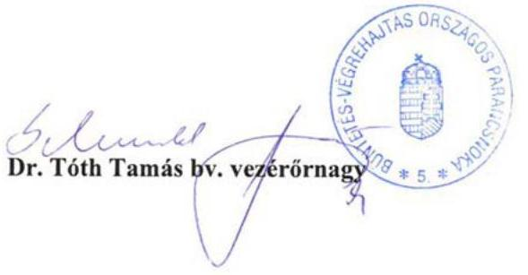

---

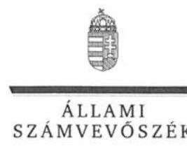

ELNÖK

# Dr. Tóth Tamás úr 

vezérőrnagy, országos parancsnok
Büntetés-Végrehajtás Országos Parancsnoksága

## Budapest

## Tisztelt Országos Parancsnok Úr!

Az ,,Állami tulajdonú gazdasági társaságok - Az állami tulajdonban (résztulajdonban) lévő gazdálkodó szervezetek vagyonmegőrzési és gazdálkodási tevékenységének ellenőrzése - DUNAMIX Ipari Kereskedelmi és Szolgáltató Kft. " címmel készített számvevőszéki jelentéstervezetre tett észrevételeit köszönettel megkaptam.
Az Állami Számvevőszék észrevételekre vonatkozó álláspontjáról a felügyeleti vezető által készített részletes tájékoztatást csatoltan megküldöm.

Tájékoztatom Országos Parancsnok urat, hogy a számvevőszéki jelentésben - az Állami Számvevőszékről szóló 2011. évi LXVI. törvény 29. § (3) bekezdése alapján - a figyelembe nem vett észrevételeket szerepeltetjük, annak indoklásával, hogy azokat az Állami Számvevőszék miért nem fogadta el.

Budapest, 2017. 28. hó 0. nap
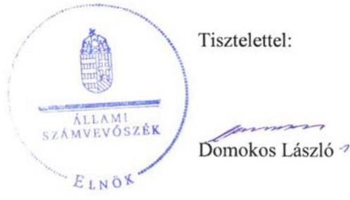

Melléklet: Tájékoztatás az észrevételek kezeléséről

---

# Tájékoztatás   az észrevételek kezeléséről 

Az „Állami tulajdonú gazdasági társaságok - Az állami tulajdonban (résztulajdonban) lévő gazdálkodó szervezetek vagyonmegőrzési és gazdálkodási tevékenységének ellenőrzése - DUNAMIX Ipari Kereskedelmi és Szolgáltató Kft." című jelentéstervezetre tett (2017. július 5-én kelt, július 7-én postára adott és az Állami Számvevőszékhez július 11-én érkezett) észrevételeit áttekintettük, azok kezelésével kapcsolatban a következő tájékoztatást adom.
A Büntetés-Végrehajtás Országos Parancsnoksága (a továbbiakban: BVOP) a jelentéstervezet 4.3. sz. megállapításához füzött észrevételei szerint a DUNA-MIX Ipari Kereskedelmi és Szolgáltató Kft. (továbbiakban: Társaság) nem minősült az ellenőrzött időszak alatt a hatályos közbeszerzési törvények szerinti klasszikus ajánlatkérőnek, A BVOP a közbeszerzési törvények (a közbeszerzésről szóló 2011. évi CVIII. törvény /a továbbiakban: régi Kbt./ és a 2015. november 1-jétől hatályos közbeszerzésről szóló 2015. évi CXLIII. törvény /új Kbt./) rendelkezései mellett egyes kapcsolódó európai uniós irányelvek rendelkezéseit és az Európai Unió Bíróságának a tárgyhoz kapcsolódóan meghozott egyes ítéleteit is idézte annak alátámasztása céljából, hogy a DUNA-MIX Ipari Kereskedelmi és Szolgáltató Kft. nem tartozott az ellenőrzött időszakban a közbeszerzési törvények hatálya alá.
A büntetés-végrehajtási szervezetről szóló 1995. évi CVII. törvény (a továbbiakban: Bvsz.) 2. § (5) bekezdése értelmében a fogvatartottak kötelező foglalkoztatására létrehozott gazdasági társaságok büntetés-végrehajtási szervezetnek minősülnek, amelynek feladata a Bvsz. 1. § (2) bekezdése értelmében a közrend és a közbiztonság erősítése. A Társaság Alapító okiratának 7. pontja szerint „a társaság fogvatartottak kötelező foglalkoztatására létrehozott gazdálkodó szervezet, egyben büntetés-végrehajtási szerv”, tehát a régi és új Kbt-ben meghatározott közérdekű, kifejezetten közérdekű szervnek minősül.
A régi Kbt. 6. § (1) bekezdés c) pontjához kapcsolódik a régi Kbt. 6. § (2) bekezdése, mely szerint az ajánlatkérői minőség megállapítható abban az esetben is, ha a szervezet közérdekű feladatán kívül más tevékenységet - akár ipari vagy kereskedelmi tevékenységet - is folytat. A Társaság régi Kbt. szerinti ajánlatkérői minőségét megalapozza továbbá Alapító okiratának 7. pontja is (lásd fentebb.).
Az Európai Unió Bírósága a C-18/01. számú Korhonen és társai ügyben megállapította, hogy nem kizárt egy szervezetet annak ellenére ajánlatkérőnek minősíteni, ha működése során profitot termel, de annak elsődleges célja a közérdekű célok szolgálata és nem az üzleti eredményesség elérése. A Társaság Alapító okiratának 7. pontjából (lásd fentebb) megállapítható, hogy a Társaság közjogi intézmény.
Ezt erősíti továbbá az Európai Unió Bírósága C-283/00. számú „SIEPSA” ügye is, amelynek tárgya a szervezet közérdekű jellegének megítélése volt. A Bíróság kimondta, hogy az ügybeli cég közérdekű intézménynek minősül, mivel az alapító okiratából megállapítható volt, hogy az általa kifejtett tevékenység lényegében az állam büntetőhatalmának gyakorlásához szorosan kapcsolódó tevékenység, és mint ilyen tevékenység lényegében a közérdekhez kapcsolódik.

---

Az új Kbt. 5. § (1) bekezdés e) pontja továbbra is a közérdekű tevékenység bármilyen mértékben történő ellátása alapján is az ajánlatkérői körbe sorolja a kérdéses szervezeteket. A fent leírtakra figyelemmel a Társaság Alapító okiratának 7. pontjában foglaltak (lásd fentebb) közérdekű tevékenységnek minősülnek, ezért a Társaság ajánlatkérőnek minősül, aminek vonatkozásában alkalmazni kell az új Kbt. rendelkezéseit.

Felhívom figyelmét, hogy az Állami Számvevőszék a mintatételek ellenőrzése útján, a statisztikai kivetítés eredménye alapján rögzítette a beszerzésekkel kapcsolatos feltárt szabálytalanságokat a jelentéstervezetben, amely a teljes sokaság vonatkozásában értelmezhető. A mintavételes eljárásra vonatkozóan az ellenőrzés módszerei fejezet tartalmaz információt.

A fentiek alapján nem fogadtuk el azon észrevételüket, hogy a Társaság nem tartozik a Kbt. hatálya alá. A beszerzéseknél a jogszabályi előírások betartása minden szervezet számára kötelező. Ugyanakkor nem lehet eltekinteni attól, hogy a fogvatartottak foglalkoztatása kiemelt közérdek. Mindezekre tekintettel a jelentéstervezet vonatkozó részeit pontosítjuk.

Tájékoztatom, hogy a számvevőszéki jelentés függelékeként szerepeltetjük a jelentéstervezethez tett észrevételeit, valamint az azokra adott válaszunkat.

Budapest, 2017. 08. hó 0. nap

Böröcz Imre felügyeleti vezető

---

# Bv. Holding Kft. 

1064 Budapest, Rózsa utca 75-79. www.bvholdingkft.hu Tel: 361 301-8461 bvholdingkft@bvholdingkft.hu

Hiv.szám: V-1234-230/2016.
Tárgy: Észrevétel jelentéstervezetre
Úgyintéző: dr. Bartha Andrea
Mobil: +36-30-190-1334
E-mail: bartha.andrea@bv.gov.hu

## Domokos László elnök úr részére

Állami Számvevőszék

## Budapest

Budapest 4.
Pf. 54.
1364

## Tisztelt Elnök Úr!

Hivatkozással fenti iktatószámon ,,Az állami tulajdonban (résztulajdonban) lévő gazdálkodó szervezetek vagyonmegőrzési és gazdálkodási tevékenységének ellenőrzése - DUNA MIX Ipari Kereskedelmi és Szolgáltató Kft." címen megküldött jelentéstervezetre, a Bv. Holding Kft. - mint a Bv. Holding elismert vállalatcsoport uralkodó tagja - képviseletében a törvényes határidőn belül az Állami Számvevőszék felé az alábbi nyilatkozatot teszem.

A jelentéstervezet 4. számú összegző megállapítás 4.3 alpont második bekezdése szerint a beruházási célú és egyéb beszerzések esetében a DUNA-MIX Kft. a beszerzések idején hatályos Kbt. alanyi hatálya alá tartozó szervezetként közbeszerzési eljárás mellőzésével megvalósított beszerzéseivel megsértette a Kbt. 5.§-a alapján fennálló, a Kbt. 19.§-ában előírt közbeszerzési eljárás lefolytatásának kötelezettségét.

Társaságunk alábbi álláspontja szerint a DUNA-MIX Kft. nem minősült az ellenőrzött időszak alatt hatályban volt közbeszerzésekről szóló 2011. évi CVIII. törvény (a továbbiakban: régi Kbt.), és a 2015. november 1. napjától hatályos közbeszerzésekről szóló 2015. évi CXLIII. törvény (a továbbiakban: hatályos Kbt.) szerinti klasszikus ajánlatkérőnek.

A régi Kbt. 6. § (1) bekezdés c) pontja alapján ajánlatkérőnek minősül az a jogképes szervezet, amelyet közérdekű, de nem ipari vagy kereskedelmi jellegű tevékenység folytatása céljából hoznak létre, vagy amely ilyen tevékenységet lát el, ha az a)-d) pontokban meghatározott egy vagy több szervezet, az Országgyűlés vagy a Kormány külön-külön vagy együttesen, közvetlenül vagy közvetetten meghatározó befolyást képes felette gyakorolni vagy működését többségi részben egy vagy több ilyen szervezet (testület) finanszírozza.

---

# Bv. Holding Kft. 

1064 Budapest, Rózsa utca 75-79. www.bvholdingkft.hu Tel: 361 301-8461 bvholdingkft@bvholdingkft.hu

A hatályos Kbt. 5. § (1) bekezdés e) pontja alapján ajánlatkérőnek minősül az a jogképes szervezet, amelyet nem ipari vagy kereskedelmi jellegű, kifejezetten közérdekű tevékenység folytatása céljából hoznak létre, vagy amely bármilyen mértékben ilyen tevékenységet lát el, feltéve, hogy e szervezet felett az a)-e) pontban meghatározott egy vagy több szervezet, az Országgyűlés vagy a Kormány közvetlenül vagy közvetetten meghatározó befolyást képes gyakorolni vagy működését többségi részben egy vagy több ilyen szervezet (testület) finanszírozza.

A hatályos Kbt. indokolása kiemeli, hogy az új törvény pontosítja a közjogi szervezetekre vonatkozó meghatározást, és rögzíti, hogy a kifejezetten közérdekű célra létrehozott szervezetek minősülnek csak ajánlatkérőnek.

A 2004/18/EK irányelv 1. cikk (9) bekezdése és a 2004/17/EK irányelv 2. cikk (1)-(2) bekezdése a közbeszerzési szabályok személyi hatályát a következőképpen állapítják meg. A 2004/18/EK irányelv személyi hatálya: "Ajánlatkérő szerv": az állam, a területi vagy a települési önkormányzat, a közjogi intézmény, továbbá az egy vagy több ilyen szerv, illetve közjogi intézmény által létrehozott társulás; "Közjogi intézmény" minden olyan intézmény,
a) amely kifejezetten olyan közérdekű célra jött létre, amely nem ipari vagy kereskedelmi jellegű;
b) amely jogi személyiséggel rendelkezik; valamint
c) amelyet többségi részben az állam, vagy a területi vagy a települési önkormányzat, vagy egyéb közjogi intézmény finanszíroz; vagy amelynek irányítása ezen intézmények felügyelete alatt áll; vagy amelynek olyan ügyvezető, döntéshozó vagy felügyelő testülete van, amely tagjainak többségét az állam, a területi vagy a települési önkormányzat, vagy egyéb közjogi intézmény nevezi ki.

Az Európai Unió Bíróságának C-360/96. sz. BFI Holding ítéletében meghatározattak alapján az első, a) pont szerinti feltétel két elemét önállóan kell megvizsgálni, és mindkét feltételnek fenn kell állnia a közjogi intézménnyé minősítéshez. Különbséget kell tehát tenni az olyan közérdekű tevékenységek között, amelyek ipari vagy kereskedelmi jellegűek, és amelyek nem ipari vagy kereskedelmi jellegűek. Ha a tevékenység kizárólag ipari vagy kereskedelmi jellegű, vagy ilyen jellegű és egyben közérdekű, a szervezet az egyéb feltételek fennállása esetén sem minősül ún. közjogi szervezetnek.

Álláspontunk szerint a fentiek alapján az egyes feltételek együttes fennállását, az egyes feltételek külön-külön történő vizsgálatával lehet megállapítani, melyre vonatkozóan a jelentéstervezet megállapítást nem tartalmaz.

A tevékenység ipari vagy kereskedelmi jellegére vonatkozó utalás az általános közgazdasági fogalomhasználat szerint olyan gazdasági tevékenységet feltételez, amelynek eredményeként profitszerzési célból piacképes termék előállítása történik, illetőleg olyan tevékenységet, amely termékek vagy szolgáltatások kereskedelmi forgalomban, versenyfeltételek mellett történő értékesítési célja által jellemezhető.

---

Bv. Holding Kft.
1064 Budapest, Rózsa utca 75-79.
www.bvholdingkft.hu Tel: 361 301-8461
bvholdingkft@bvholdingkft.hu

Előbbiek alapján, ezen feltétel fennállása tekintetében az Európai Uniós közbeszerzési irányelveknek megfelelően

 vizsgálni szükséges különösen a DUNA-MIX Kft. létrehozását motiváló körülményeket, illetve azt a gazdasági környezetet, amelyben a társaság a közérdekű tevékenységet végzi, így különösen:
a) a versenyfeltételek meglétét,
b) a tevékenységet végző társaság for-profit, vagy non-profit jellegét,
c) nyereségorientáltságát,
d) üzleti kockázatok önálló viselésének feltételeit.

Álláspontunk szerint megállapítható, hogy a b)-d) feltételek egyértelműen fennállnak, mivel a DUNAMIX Kft. profit jellegű, nyereségorientált és nem nonprofit társaság, üzleti kockázatát önállóan viseli.

A versenyfeltételek megléténél is összességében szükséges a társaság versenypiaci jelenlétét vizsgálni, így az egyes versenypiaci előnyök mellett, különösen a DUNA-MIX Kft. alábbi piaci hátrányait is figyelembe kell venni:

- számos uniós és hazai pályázati forrástól az állami jelleg miatt ki van zárva,
- az elítéltek foglalkoztatásából eredő sajátos és indokolt többletkiadásokat a központi költségvetés 2011. óta a társaságnak nem téríti meg;
- a 44/2011. Korm. rendelet, és a 9/2011. BM rendelet szerinti ellátási kötelezettsége teljesítése körében kötelezően fogvatartottakat kell foglalkoztatnia, és ezen ellátási kötelezettsége keretében a szerződött partnereit a Társaság szabadon nem választhatja meg,
- versenypiaci társaihoz képest az állami tulajdoni jelleg miatt működése bonyolultabb, nagyobb adminisztrációval jár, így az általános működéshez nagyobb létszámú munkaerő szükséges, melyek foglalkoztatása a jogszabályban foglaltaknak minden esetben megfelel,
- a Társaságnál könyvvizsgáló, és Felügyelő Bizottság létrehozása is kötelező.

Kiemelendő továbbá, hogy a közbeszerzésről és a 2004/18/EK irányelv hatályon kívül helyezéséről szóló Európai Parlament és a Tanács 2014/24/EU irányelv (10) preambulum bekezdése is rögzíti, hogy az olyan szerv, amely szokásos piaci feltételekkel működik, nyereségorientált, és a tevékenysége végzéséből eredő veszteségeket maga viseli, nem tekintendő „közjogi intézménynek", mivel azok a közérdekű célok, amelyek teljesítésére létrehozták, vagy amelyek teljesítésével megbízták, gazdasági vagy üzleti jellegűnek minősülhetnek.

Véleményünk az, hogy a közérdekűség fennállta mellett az is megállapítható, hogy a Társaság ipari, kereskedelmi jellegű tevékenységet végez és versenyfeltételek befolyásolják működését. Így nem tartozik sem a régi, sem a hatályos Kbt. alanyi hatálya alá. (Európai Bíróság C-18/01. számú, Korhonen and Others ügyben hozott ítélete)

A Társaság Alapító okiratának 4. pontjában megjelölt főtevékenység - TEÁOR'08 szerint - 1812'08 Nyomás, illetve a 4.1. pont alatti tevékenységek egyértelműen ipari, kereskedelmi, azaz üzletszerű jellegre utalnak. A Társaság alapítójának is az volt a szándéka, hogy a Polgári Törvénykönyvről szóló 2013. évi V. törvény 3:88. § (1) bekezdése szerinti üzletszerű közös gazdasági tevékenység

---

Bv. Holding Kft.
1064 Budapest, Rózsa utca 75-79. www.bvholdingkft.hu Tel: 361301 -8461
bvholdingkft@bvholdingkft.hu
folytatására, a tagok vagyoni hozzájárulásával létrehozott, jogi személyiséggel rendelkező vállalkozás jöjjön létre. Az MNV Zrt. is profit orientált társaságként tartja nyilván a Társaságot, valamint az adott évekre vonatkozó üzleti tervek tervezéséhez kiadott irányelvekben is nyereséget írt elő a Magyar Állam tulajdonában lévő és a Büntetés-végrehajtás Országos Parancsnoksága megbízott tulajdonosi joggyakorlása alá tartozó gazdasági társaságoknak.

Összefoglalva a fent leírtakat, álláspontunk szerint a jelentéstervezet nem állapítja meg egyértelműen, hogy a DUNA-MIX Kft. a régi és hatályos Kbt. mely pontja alapján minősül ajánlatkérőnek, illetve azt, hogy régi Kbt. 6. § (1) bekezdés c) pontja, illetve a hatályos Kbt. 5. § (1) bekezdés e) pontja szerinti ipari vagy kereskedelmi jellegű tevékenység meglétét az Állami Számvevőszék esetlegesen vizsgálta volna.

Társaságunk észrevételeként továbbá előadom, hogy az ellenőrzési jelentés - 4.3. számú megállapítás 3. bekezdésében - nem határozza meg, hogy a DUNA-MIX Kft. az ellenőrzött időszakban pontosan mely beszerzéseivel sértette meg a vonatkozó jogszabályok által előírt közbeszerzési eljárás lefolytatásának kötelezettségét.

Álláspontunk szerint a Társaság a régi Kbt. és az új Kbt. alapján az ellenőrzött időszakban nem minősült klasszikus ajánlatkérőnek, és az ellenőrzött időszakban, illetve jelenleg sem kötelezett klasszikus ajánlatkérőként közbeszerzési eljárás lefolytatására.

A fentiek alapján Társaságunk nem ért egyet a jelentéstervezet 4.3. számú megállapítás harmadik bekezdésében leírtakkal, illetve a jelentéstervezetben Javaslatok cím alatt a Bv. Holding Kft. ügyvezetőjének javasolt intézkedéssel.

Társaságunk a jelentés tervezet 2. számú összegző megállapítás második bekezdésében (Számlarend módosítása), a 3. számú összegző megállapításában (belső ellenőrzés kialakításának és működtetésének hiánya), valamint a 4.2. számú megállapításában (saját eszközei és forrásai leltárral való alátámasztása) foglaltakra észrevételt tenni nem kíván.

# Tisztelt Állami Számvevőszék! 

Kérjük, hogy Társaságunk fenti észrevételeit az ellenőrzési jelentés véglegesítésekor figyelembe venni szíveskedjen.

Budapest, 2017. június 28.

Tisztelettel:
Bv. Holding Kft.
1064 Budapest, Rózsa utca 7 Varga Zsolt bv. alezredes
Adószám: 25120064-2-51. ügyvezető igazgató
Cégjegyzékszám: 01-09-200937
(I.)

Mellékletek: Bv. Holding Kft. hatályos alapító okiratának és ügyvezetői aláírási címpéldányának másolata, Fővárosi Törvényszék Cg. 01-09-200937/37. számú végzése

---

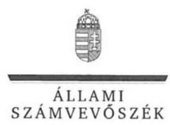

ELNÖK

# Varga Zsolt úr 

ügyvezető
Bv. Holding Kft.

## Budapest

## Tisztelt Ügyvezető Úr!

Az ,,Állami tulajdonú gazdasági társaságok - Az állami tulajdonban (résztulajdonban) lévő gazdálkodó szervezetek vagyonmegőrzési és gazdálkodási tevékenységének ellenőrzése - DUNAMIX Ipari Kereskedelmi és Szolgáltató Kft. " címmel készített számvevőszéki jelentéstervezetre tett észrevételeit köszönettel megkaptam.
Az Állami Számvevőszék észrevételekre vonatkozó álláspontjáról a felügyeleti vezető által készített részletes tájékoztatást csatoltan megküldöm.

Tájékoztatom Ügyvezető urat, hogy a számvevőszéki jelentésben - az Állami Számvevőszékről szóló 2011. évi LXVI. törvény 29. § (3) bekezdése alapján - a figyelembe nem vett észrevételeket szerepeltetjük, annak indoklásával, hogy azokat az Állami Számvevőszék miért nem fogadta el.

Budapest, 2017. hó 17 nap
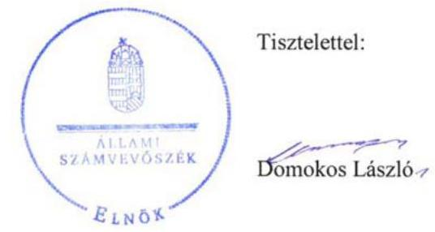

Melléklet: Tájékoztatás az észrevételek kezeléséről

---

# Tájékoztatás   az észrevételek kezeléséről 

Az „Állami tulajdonú gazdasági társaságok - Az állami tulajdonban (résztulajdonban) lévő gazdálkodó szervezetek vagyonmegőrzési és gazdálkodási tevékenységének ellenőrzése - DUNAMIX Ipari Kereskedelmi és Szolgáltató Kft." címü jelentéstervezetre tett (2017. június 28 -án kelt, 29-én postára adott és az Állami Számvevőszékhez június 30 -án érkezett) észrevételeit áttekintettük, azok kezelésével kapcsolatban a következő tájékoztatást adom.
A Bv. Holding Kft. 4.3. megállapítás 2. bekezdéséhez füzött észrevételei szerint a DUNA-MIX Ipari Kereskedelmi és Szolgáltató Kft. (továbbiakban: Társaság) nem minősült az ellenőrzött időszak alatt a hatályos közbeszerzési törvények szerinti klasszikus ajánlatkérőnek. A közbeszerzési törvények (a közbeszerzésről szóló 2011. évi CVIII. törvény /a továbbiakban: régi Kbt./ és a 2015. november 1-jétől hatályos közbeszerzésről szóló 2015. évi CXLIII. törvény /új Kbt./) rendelkezései mellett a Bv. Holding Kft. egyes kapcsolódó európai uniós irányelvek rendelkezéseit és az Európai Unió Bíróságának a tárgyhoz kapcsolódóan meghozott egyes ítéleteit is idézte annak alátámasztása céljából, hogy a Társaság nem tartozott az ellenőrzött időszakban a közbeszerzési törvények hatálya alá.
A büntetés-végrehajtási szervezetről szóló 1995. évi CVII. törvény (a továbbiakban: Bvsz.) 2. § (5) bekezdése értelmében a fogvatartottak kötelező foglalkoztatására létrehozott gazdasági társaságok büntetés-végrehajtási szervezetnek minősülnek, amelynek feladata a Bvsz. 1. § (2) bekezdése értelmében a közrend és a közbiztonság erősítése. A Társaság Alapító okiratának 7. pontja szerint „a társaság fogvatartottak kötelező foglalkoztatására létrehozott gazdálkodó szervezet, egyben büntetés-végrehajtási szerv", tehát a régi és új Kbt-ben meghatározott közérdekű, kifejezetten közérdekű szervnek minősül.
A régi Kbt. 6. § (1) bekezdés c) pontjához kapcsolódik a régi Kbt. 6. § (2) bekezdése, mely szerint az ajánlatkérői minőség megállapítható abban az esetben is, ha a szervezet közérdekű feladatán kívül más tevékenységet - akár ipari vagy kereskedelmi tevékenységet - is folytat. A Társaság régi Kbt. szerinti ajánlatkérői minőségét megalapozza továbbá Alapító okiratának 7. pontja is (lásd fentebb.).
Az Európai Unió Bírósága a C-18/01. számú Korhonen és társai ügyben megállapította, hogy nem kizárt egy szervezetet annak ellenére ajánlatkérőnek minősíteni, ha működése során profitot termel, de annak elsődleges célja a közérdekű célok szolgálata és nem az üzleti eredményesség elérése. A Társaság Alapító okiratának 7. pontjából (lásd fentebb) megállapítható, hogy a Társaság közjogi intézmény.
Ezt erősíti továbbá az Európai Unió Bírósága C-283/00. számú „SIEPSA" ügye is, amelynek tárgya a szervezet közérdekű jellegének megítélése volt. A Bíróság kimondta, hogy az ügybeli cég közérdekű intézménynek minősül, mivel az alapító okiratából megállapítható volt, hogy az általa kifejtett tevékenység lényegében az állam büntetőhatalmának gyakorlásához szorosan kapcsolódó tevékenység, és mint ilyen tevékenység lényegében a közérdekhez kapcsolódik.
Az új Kbt. 5. § (1) bekezdés e) pontja továbbra is a közérdekű tevékenység bármilyen mértékben történő ellátása alapján is az ajánlatkérői körbe sorolja a kérdéses szervezeteket. A fent leírtakra

---

figyelemmel a Társaság Alapító okiratának 7. pontjában foglaltak (lásd fentebb) közérdekű tevékenységnek minősülnek, ezért a Társaság ajánlatkérőnek minősül, aminek vonatkozásában alkalmazni kell az új Kbt. rendelkezéseit.

Felhívom figyelmét, hogy az Állami Számvevőszék a mintatételek ellenőrzése útján, a statisztikai kivetítés eredménye alapján rögzítette a beszerzésekkel kapcsolatos feltárt szabálytalanságokat a jelentéstervezetben, amely a teljes sokaság vonatkozásában értelmezhető. A mintavételes eljárásra vonatkozóan az ellenőrzés módszerei fejezet tartalmaz információt.

A fentiek alapján nem fogadtuk el azon észrevételüket, hogy a Társaság nem tartozik a Kbt. hatálya alá. A beszerzéseknél a jogszabályi előírások betartása minden szervezet számára kötelező. Ugyanakkor nem lehet eltekinteni attól, hogy a fogvatartottak foglalkoztatása kiemelt közérdek. Mindezekre tekintettel a jelentéstervezet vonatkozó részeit pontosítjuk.

Tájékoztatom, hogy a számvevőszéki jelentés függelékeként szerepeltetjük a jelentéstervezethez tett észrevételeit, valamint az azokra adott válaszunkat.

Budapest, 2017. 07 hó 28 nap

Böröcz Imre felügyeleti vezető

---

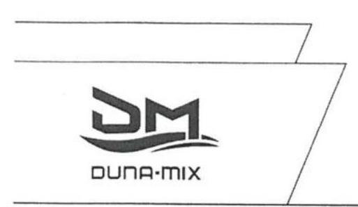

Ügyint.: Dósa György Istvánné pa. számviteli osztályvezető

Tárgy: észrevétel jelentéstervezetre
Ikt.sz.: 74-57/2017.

# Címzett: Domokos László elnök úr 

részére

## Állami Számvevőszék

Budapest
Budapest 4. Pf. 54.
1364

ÁLLAMI SZÁMVEVŐSZÉK
$36-48229 / 20471$
Érkeze: 2017 JÚL 06.
Iktatószám $U-1234-230$
Melléklet: $\qquad$

## Tisztelt Elnök Úr!

Hivatkozva a V-1234-227/2016. iktatószámmal, ,,Az állami tulajdonban (résztulajdonban) lévő gazdálkodó szervezetek vagyonmegőrzési és gazdálkodási tevékenységének ellenőrzése DUNA MIX Ipari Kereskedelmi és Szolgáltató Kft." címmel megküldött jelentéstervezetre, a Duna-Mix Kft. képviseletében a törvényes határidőn belül az Állami Számvevőszék felé az alábbi nyilatkozatot teszem.

## A jelentéstervezet Megállapítások 2. pont második bekezdése szerint

A Számlarend ${ }^{26}$ - amelyet 2001. január 01. hatállyal adtak ki és az ellenőrzött időszak alatt nem aktualizáltak - nem tartalmazta teljes körűen minden alkalmazásra kijelölt számla tartalmát, ha az a számla megnevezéséből egyértelműen nem következett; a számla értékének növekedésének, csökkenésének jogcímeit, a számlát érintő gazdasági eseményeket, azok más számlákkal való kapcsolatát, ezzel figyelmen kívül hagyták a Számv. tv. 161. § (2) bekezdés b) pontjának előírását. A Számlarend nem tartalmazta továbbá a számlarendben foglaltakat alátámasztó bizonylati rendet - azt más belső szabályzatban sem rögzítették -, ezzel megsértették a Számv. tv. 161. § (2) bekezdés d) pontjának előírását.

Társaságunk a megállapítás szövegezéséből nem tudja megállapítani, hogy az mely időszak(ok)ra és mely számlákra vonatkoztatva van megfogalmazva. A Társaságnál jelenleg érvényben lévő Számlarend a Bv. Holding Kft. által kiadott egységes vállalatcsoporti számlarend, mely a 74/2016. (11.30.) számú uralkodói határozaton alapul. Ez tételesen, teljes körűen tartalmazza az alkalmazásra kijelölt valamennyi számla tartalmát, amivel az esetlegesen fennálló hiányosságot megszüntettük.

---

Az ellenőrzött időszakra vonatkozóan visszamenőlegesen a Számlarend módosítására jogszabályi lehetőséget nem látunk.

Társaságunk a 12/2014. sz. ügyvezető igazgatói utasításban rendelkezik a Duna-Mix Kft. bizonylati rendjéről, így az rögzül a Számlarenden kívüli szabályozásban. A vállalatcsoporti számlarend rendelkezése szerint a „bizonylati rend önálló szabályzatként kerül elkészítésre, önállóan a bv. társaságoknál".

Álláspontunk szerint a JAVASLATOK cím 1. pontban javasolt Számlarend
 módosítása ezzel Társaságunknál már korábban megvalósult. A Számlarend és a Bizonylati rend kapcsán a szabályozás harmonizálása várhatóan a Duna-Mix Kft. intézkedési tervében kerül megfogalmazásra.

A jelentéstervezet 3. pontjának megállapításaihoz Társaságunk észrevételt tenni nem kíván, a megállapításokat elfogadja.

# A jelentéstervezet 4. számú összegző megállapítás második megállapítása szerint a Társaság a 

mérlegének egyes tételeit nem támasztotta alá leltárral.

- a második bekezdésben kifejtve

Saját eszközei és forrásai leltárral való alátámasztása az ellenőrzés egyetlen évében sem volt teljes körűen biztosított, mivel a befektetett pénzügyi eszközök, a követelések, a kötelezettségek, az aktív és passzív időbeli elhatárolások, saját tőke, céltartalékok mérlegsorokat alátámasztó leltárral nem rendelkeztek. Ezzel megsértették a Számv. tv. 15. § (3) bekezdése szerinti „valódiság elvét”, és nem teljesültek a Számv. tv. 69. § (1) bekezdésében foglaltak, valamint a Leltározási Szabályzat vonatkozó előírásai. A megbízott könyvvizsgáló a számviteli szabálytalanságokat független könyvvizsgálói jelentésében nem jelezte.

A mérleg tételeinek bizonylatokkal való alátámasztása Társaságunk értelmezése szerint az alábbi módon teljesült, így a Számv. tv. hivatkozott pontjainak, illetve a Leltározási Szabályzat vonatkozó előírásainak megsértése nem valósult meg:

A Társaság elkészítette a Számv.tv. 14. §-a szerinti Leltározási Szabályzatát, amely – és ezt a jelentéstervezet is megerősíti – megfelelően szabályozza valamennyi eszköz és forrás számbavételére és értékelésére vonatkozó előírást.

---

A Számv. tv. nem definiálja a leltár fogalmát, a szakirodalom szerint „leltárnak kell tekinteni a leltározás alapján helyesbített és ellenőrzött – a főkönyvi könyveléssel egyező – analitikus nyilvántartásokból készült kivonatokat is.”$^1$

A jelentéstervezet ott jelzi a leltárkészítés hiányát, ahol a leltározás nem valósítható meg mennyiségi felvétellel. Ezen esetekben – a Leltározási Szabályzat előírásait betartva – egyeztetésre került sor. Az egyeztetés a főkönyvi számláknak az analitikus nyilvántartásokkal és/vagy a könyvelés helyességét igazoló dokumentumokkal való összevetését jelenti. Ilyen dokumentumok lehetnek például a – hiányolt eszközök, források vonatkozásában – az analitikus kartonok, a banki kivonatok, folyószámla kivonatok, egyeztető (egyenlegközlő) levelek, adóanalitikák, adóbevallások, olyan leltárral egyenértékű kimutatások, amelyek azonosítható módon tartalmazzák a mérlegben szereplő tételek felsorolását.

A Társaság az egyes években az alábbi dokumentumokat készítette el, vette figyelembe a mérleg alátámasztásaként:

1) Eszközök és Források összesítő, mely tartalmazza a mérlegben az eszköz és forrás oldalon szerepeltetett főkönyvi számlákat.
2) Külön az Egyéb követelések és Egyéb kötelezettségek mérlegsorokban kimutatott főkönyvi számlákról lista.
3) Befektetett pénzügyi eszközök: dolgozóknak nyújtott lakásépítési kölcsön dolgozónkénti analitikus kartonok és összesítő kimutatás
4) Követelések:
a) vevők: a pénzügyi rendszerből kinyert analitikus nyilvántartás: nyitott listák és határidős nyitott listák, partnerektől kért egyenlegközlők, mérlegkészítésig pénzügyileg teljesült tételek kimutatásai
b) egyéb rövid lejáratú követelések: analitikus nyilvántartások összesítői, kifizetőhelyi bevallások, kimutatás a dolgozóknak adott előlegekről, az ún. „folyamatos” áfa miatt nyilvántartott követelésről.
5) Aktív és passzív időbeli elhatárolások: főkönyvi karton kiíratás, tételes kimutatás az elhatárolt tételekről – az azokat alátámasztó bizonylatokkal (számlák, kivonatok, kamatszámítások)
6) Saját tőke: saját tőke változás tábla (mely a kiegészítő mellékletbe beépítésre került)
7) Céltartalékok: adott főkönyvi számlához tartozó táblázat, mely tartalmazza a

$$
\text { nyitó }+ \text { képzés }- \text { feloldás }=\text { záró céltartalék állományát (jogcímek szerint) }
$$

8) Kötelezettségek:
a) Szállítók: a pénzügyi rendszerből kinyert analitikus nyilvántartás: nyitott listák és határidős nyitott listák, partnerektől kért egyenlegközlők, mérlegkészítésig pénzügyileg teljesült tételek kimutatásai
b) Egyéb rövid lejáratú kötelezettségek: analitikus nyilvántartások összesítői, NAV adófolyószámla-kivonat, adóbevallások, bérösszesítők, ÁFA-analitikák
[^0]
[^0]:    $^1$ Dr. Sztanó Imre: Számvitel alapjai (2013)

---

A Társaság a Libra3s integrált ügyviteli rendszert használja, melyben a különböző modulok egységes, zárt rendszert alkotva biztosítják az analitikus nyilvántartások és a főkönyvi könyvelés egyezőségét.

A fentiek alapján Társaságunk nem ért egyet a jelentéstervezet 4.2. számú megállapítás második bekezdésében leírtakkal, illetve jelentéstervezetben JAVASLATOK cím 2. pont alatt a Duna-Mix Kft. ügyvezetőjének javasolt intézkedéssel. A Duna-Mix Kft. a jelentéshez kapcsolódó intézkedési tervében szerepeltetni fogja a fent felsorolt, mérlegtételek leltárral azonos tartalmú dokumentumokkal alátámasztásának szabályozását a leltárkészítés során.

# A jelentéstervezet 4.3 alpontja összegző megállapítása 

A DUNA-MIX Kft. vagyonváltozást eredményező döntéseinek előkészítése és döntései nem voltak megfelelőek, mivel több esetben mellőzte a közbeszerzési eljárás lefolytatását.
valamint második bekezdése szerint
A beruházási célú és egyéb beszerzések esetében a Társaság a beszerzések idején hatályos Kbt.$^{32}$ alanyi hatálya alá tartozó szervezetként közbeszerzési eljárás mellőzésével megvalósított beszerzéseivel megsértette a Kbt. 5. §-a alapján fennálló, a Kbt. 19. §-ában előírt közbeszerzési eljárás lefolytatásának kötelezettségét.

Társaságunk alábbi álláspontja szerint a DUNA-MIX Kft. nem minősült az ellenőrzött időszak alatt hatályban volt közbeszerzésekről szóló 2011. évi CVIII. törvény (a továbbiakban: régi Kbt.), és a 2015. november 1. napjától hatályos közbeszerzésekről szóló 2015. évi CXLIII. törvény (a továbbiakban: hatályos Kbt.) szerinti klasszikus ajánlatkérőnek.

A régi Kbt. 6. § (1) bekezdés c) pontja alapján ajánlatkérőnek minősül az a jogképes szervezet, amelyet közérdekű, de nem ipari vagy kereskedelmi jellegű tevékenység folytatása céljából hoznak létre, vagy amely ilyen tevékenységet lát el, ha az a)-d) pontokban meghatározott egy vagy több szervezet, az Országgyűlés vagy a Kormány külön-külön vagy együttesen, közvetlenül vagy közvetetten meghatározó befolyást képes felette gyakorolni vagy működését többségi részben egy vagy több ilyen szervezet (testület) finanszírozza.

A hatályos Kbt. 5. § (1) bekezdés e) pontja alapján ajánlatkérőnek minősül az a jogképes szervezet, amelyet nem ipari vagy kereskedelmi jellegű, kifejezetten közérdekű tevékenység folytatása céljából hoznak létre, vagy amely bármilyen mértékben ilyen tevékenységet lát el, feltéve, hogy e szervezet felett az a)-e) pontban meghatározott egy vagy több szervezet, az Országgyűlés vagy a Kormány közvetlenül vagy közvetetten meghatározó befolyást képes gyakorolni, vagy működését többségi részben egy vagy több ilyen szervezet (testület) finanszírozza.

A hatályos Kbt. indokolása kiemeli, hogy az új törvény pontosítja a közjogi szervezetekre vonatkozó meghatározást, és rögzíti, hogy a kifejezetten közérdekű célra létrehozott szervezetek minősülnek csak ajánlatkérőnek.

---

A 2004/18/EK irányelv 1. cikk (9) bekezdése és a 2004/17/EK irányelv 2. cikk (1)-(2) bekezdése a közbeszerzési szabályok személyi hatályát a következőképpen állapítják meg. A 2004/18/EK irányelv személyi hatálya: „Ajánlatkérő szerv”: az állam, a területi vagy a települési önkormányzat, a közjogi intézmény, továbbá az egy vagy több ilyen szerv, illetve közjogi intézmény által létrehozott társulás;
„Közjogi intézmény” minden olyan intézmény,
a) amely kifejezetten olyan közérdekű célra jött létre, amely nem ipari vagy kereskedelmi jellegű;
b) amely jogi személyiséggel rendelkezik; valamint
c) amelyet többségi részben az állam, vagy a területi vagy a települési önkormányzat, vagy egyéb közjogi intézmény finanszíroz; vagy amelynek irányítása ezen intézmények felügyelete alatt áll; vagy amelynek olyan ügyvezető, döntéshozó vagy felügyelő testülete van, amely tagjainak többségét az állam, a területi vagy a települési önkormányzat, vagy egyéb közjogi intézmény nevezi ki.

Az Európai Unió Bíróságának C-360/96. sz. BFI Holding ítéletében meghatározattak alapján az első, a) pont szerinti feltétel két elemét önállóan kell megvizsgálni, és mindkét feltételnek fenn kell állnia a közjogi intézménnyé minősítéshez. Különbséget kell tehát tenni az olyan közérdekű tevékenységek között, amelyek ipari vagy kereskedelmi jellegűek, és amelyek nem ipari vagy kereskedelmi jellegűek. Ha a tevékenység kizárólag ipari vagy kereskedelmi jellegű, vagy ilyen jellegű és egyben közérdekű, a szervezet az egyéb feltételek fennállása esetén sem minősül ún. közjogi szervezetnek.

Álláspontunk szerint a fentiek alapján az egyes feltételek együttes fennállását, az egyes feltételek külön-külön történő vizsgálatával lehet megállapítani, melyre vonatkozóan a jelentéstervezet megállapítást nem tartalmaz.

A tevékenység ipari vagy kereskedelmi jellegére vonatkozó utalás az általános közgazdasági fogalomhasználat szerint olyan gazdasági tevékenységet feltételez, amelynek eredményeként profitszerzési célból piacképes termék előállítása történik, illetőleg olyan tevékenységet, amely termékek vagy szolgáltatások kereskedelmi forgalomban, versenyfeltételek mellett történő értékesítési célja által jellemezhető.

Előbbiek alapján, ezen feltétel fennállása tekintetében az Európai Uniós közbeszerzési irányelveknek megfelelően vizsgálni szükséges különösen a DUNA-MIX Kft. létrehozását motiváló körülményeket, illetve azt a gazdasági környezetet, amelyben a társaság a közérdekű tevékenységet végzi, így különösen:
a) a versenyfeltételek meglétét,
b) a tevékenységet végző társaság for-profit, vagy non-profit jellegét,
c) nyereségorientáltságát,
d) üzleti kockázatok önálló viselésének feltételeit.

Álláspontunk szerint megállapítható, hogy a b)-d) feltételek egyértelműen fennállnak, mivel a DUNA-MIX Kft. profit jellegű, nyereségorientált és nem nonprofit társaság, üzleti kockázatát önállóan viseli.

---

A versenyfeltételek megléténél is összességében szükséges társaság versenypiaci jelenlétét vizsgálni, így az egyes versenypiaci előnyök mellett, különösen a DUNA-MIX Kft. alábbi piaci hátrányait is figyelembe kell venni:

- számos uniós és hazai pályázati forrástól az állami jelleg miatt ki van zárva,
- az elítéltek foglalkoztatásából eredő sajátos és indokolt többletkiadásokat a központi költségvetés 2011. óta a társaságnak nem téríti meg;
- a 44/2011. Korm. rendelet, és a 9/2011. BM rendelet szerinti ellátási kötelezettsége teljesítése körében kötelezően fogvatartottakat kell foglalkoztatnia, és ezen ellátási kötelezettsége keretében a szerződött partnereit a Társaság szabadon nem választhatja meg,
- versenypiaci társaihoz képest az állami tulajdoni jelleg miatt működése bonyolultabb, nagyobb adminisztrációval jár így az általános működéshez nagyobb létszámú munkaerő szükséges, melyek foglalkoztatása a jogszabályban foglaltaknak minden esetben megfelel,
- a Társaságnál könyvvizsgáló, és Felügyelő Bizottság létrehozása is kötelező.

Kiemelendő továbbá, hogy a közbeszerzésről és a 2004/18/EK irányelv hatályon kívül helyezéséről szóló Európai Parlament és a Tanács 2014/24/EU irányelv (10) preambulum bekezdése is rögzíti, hogy az olyan szerv, amely szokásos piaci feltételekkel működik, nyereségorientált, és a tevékenysége végzéséből eredő veszteségeket maga viseli, nem tekintendő „közjogi intézménynek”, mivel azok a közérdekű célok, amelyek teljesítésére létrehozták, vagy amelyek teljesítésével megbízták, gazdasági vagy üzleti jellegűeknek minősülhetnek.

Véleményünk az, hogy a közérdekűség fennállta mellett az is megállapítható, hogy a Társaság ipari, kereskedelmi jellegű tevékenységet végez és versenyfeltételek befolyásolják működését. Így nem tartozik sem a régi, sem a hatályos Kbt. alanyi hatálya alá. (Európai Bíróság C-18/01. számú, Korhonen and Others ügyben hozott ítélete)

A Társaság Alapító okirata 4. pontjában megjelölt főtevékenység – TEÁOR’08 szerint 1812’08 Nyomás, illetve a 4.1. pont alatti tevékenységek egyértelműen ipari, kereskedelmi, azaz üzletszerű jellegre utalnak. A Társaság alapítójának is az volt a szándéka, hogy a Polgári Törvénykönyvről szóló 2013. évi V. törvény 3:88. § (1) bekezdése szerinti üzletszerű közös gazdasági tevékenység folytatására, a tagok vagyoni hozzájárulásával létrehozott, jogi személyiséggel rendelkező vállalkozás jöjjön létre. Az MNV Zrt. is profit-orientált társaságként tartja nyilván a Társaságot, valamint az adott évekre vonatkozó üzleti tervek tervezéséhez kiadott irányelvekben is nyereséget írt elő a Magyar Állam tulajdonában lévő és a Büntetés-végrehajtás Országos Parancsnoksága megbízott tulajdonosi joggyakorlása alá tartozó gazdasági társaságoknak.

---

# 21 

Összefoglalva a fent leírtakat, álláspontunk szerint a jelentéstervezet nem állapítja meg egyértelműen, hogy a DUNA-MIX Kft. a régi és hatályos Kbt. mely pontja alapján minősül ajánlatkérőnek, illetve azt, hogy régi Kbt. 6. § (1) bekezdés c) pontja, illetve a hatályos Kbt. 5. § (1) bekezdés e) pontja szerinti ipari vagy kereskedelmi jellegű tevékenység meglétét
 az Állami Számvevőszék esetlegesen vizsgálta volna-e.

Társaságunk észrevételeként továbbá előadom, hogy az ellenőrzési jelentés - 4.3. számú megállapítás 3. bekezdésében - nem határozza meg, hogy a DUNA-MIX Kft. az ellenőrzött időszakban pontosan mely beszerzéseivel sértette meg a vonatkozó jogszabályok által előírt közbeszerzési eljárás lefolytatásának kötelezettségét.

Álláspontunk szerint a Társaság a régi Kbt. és az új Kbt. alapján az ellenőrzött időszakban nem minősült klasszikus ajánlatkérőnek, és az ellenőrzött időszakban, illetve jelenleg sem kötelezett klasszikus ajánlatkérőként közbeszerzési eljárás lefolytatására.

Előzőek alapján Társaságunk nem ért egyet a jelentéstervezet 4.3. számú megállapítás harmadik bekezdésében leírtakkal, illetve a jelentéstervezetben JAVASLATOK cím 3. és 4. pont alatt a Duna-Mix Kft. ügyvezetőjének javasolt intézkedéssel.

## Tisztelt Állami Számvevőszék!

Kérjük, hogy Társaságunk észrevételeit az ellenőrzési jelentés véglegesítésekor figyelembe venni szíveskedjen!

Szeretném továbbá köszönetemet kifejezni az ellenőrzés során a munkatársak, vezetők részéről tanúsított együttműködésért.

Vác, 2017. július 06.
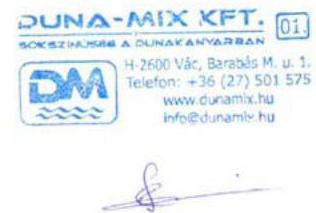

Szakolczai Lóránt bv. ezredes
ügyvezető igazgató

---

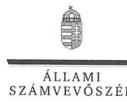

ELNÖK

Ikt.szám: V-1234-246/2016.

# Szakolczai Lóránt úr 

ügyvezető
DUNA-MIX Ipari Kereskedelmi és Szolgáltató Kft.

Vác

## Tisztelt Ügyvezető Úr!

Az ,,Állami tulajdonú gazdasági társaságok - Az állami tulajdonban (résztulajdonban) lévő gazdálkodó szervezetek vagyonmegőrzési és gazdálkodási tevékenységének ellenőrzése - DUNAMIX Ipari Kereskedelmi és Szolgáltató Kft. " címmel készített számvevőszéki jelentéstervezetre tett észrevételeit köszönettel megkaptam.
Az Állami Számvevőszék észrevételekre vonatkozó álláspontjáról a felügyeleti vezető által készített részletes tájékoztatást csatoltan megküldöm.

Tájékoztatom Ügyvezető urat, hogy a számvevőszéki jelentésben - az Állami Számvevőszékről szóló 2011. évi LXVI. törvény 29. § (3) bekezdése alapján - a figyelembe nem vett észrevételeket szerepeltetjük, annak indoklásával, hogy azokat az Állami Számvevőszék miért nem fogadta el.

Budapest, 2017. 28. hó 23. nap
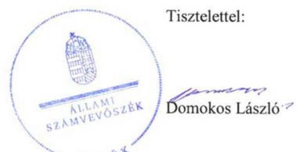

Melléklet: Tájékoztatás az észrevételek kezeléséről ${ }^{-}$ELNÖ ${ }^{k}$

---

# Tájékoztatás   az észrevételek kezeléséről 

Az ,,Állami tulajdonú gazdasági társaságok - Az állami tulajdonban (résztulajdonban) lévő gazdálkodó szervezetek vagyonmegőrzési és gazdálkodási tevékenységének ellenőrzése - DUNAMIX Ipari Kereskedelmi és Szolgáltató Kft. " című jelentéstervezetre tett (2017. július 6-án kelt, az Állami Számvevőszékhez aznap érkezett) észrevételeit áttekintettük, azok kezelésével kapcsolatban a következő tájékoztatást adom.

## 1. A 2. számú összegző megállapítás 2. bekezdéséhez füzött észrevételhez

Az Ügyvezető levelében jelezte, hogy a szövegkörnyezetből nem tudja megállapítani, mely időszakok és számlák vonatkozásában állapítja meg a jelentéstervezet, hogy a Számlarend nem felelt meg a számvitelről szóló 2000. évi C. törvény (a továbbiakban: Számv. tv.) idézett előírásainak. Jelezte, hogy a hatályos, 2016-ban kiadott, a Kft. által használt érvényben levő Számlarendet a Bv. Holding Kft. uralkodói határozatával adta ki. A DUNA-MIX Ipari Kereskedelmi és Szolgáltató Kft. (a továbbiakban: Társaság) a 12/2014. sz. ügyvezetői utasításban rendelkezik a Társaság bizonylati rendjéről, azok önállóan (a Számlarenden kívül) készülnek a büntetés-végrehajtás társaságainál.

Tájékoztatom, hogy az ellenőrzésre átadott dokumentumok szerint az ellenőrzött időszak (2012-2015. évek) vonatkozásában a 2001-ben kiadott Számlarend volt hatályban. A Társaságnál jelenleg érvényben levő Számlarendet az ellenőrzés során nem értékeltük. A Társaság 2012-2015. években hatályos számlarendje tekintetében fenntartjuk álláspontunkat, miszerint a Társaság a Számv. tv. 161. § (2) bekezdés b) pontját figyelmen kívül hagyta a 26., 27., 32., 62., 75., és 77. és a 458., a 660., 863. sz. számlacsoportokon belül megnyitott és használt számlák tekintetében.

Az ellenőrzés során megállapítást nyert, hogy a Társaság 2012-2015. években hatályos számlarendje nem tartalmazta a bizonylati rendet. Felhívom figyelmét, hogy az Állami Számvevőszék csak a rendelkezésre bocsátott és teljességi nyilatkozattal igazolt dokumentumok alapján tesz megállapításokat. Az észrevételben hivatkozott 12/2014. számú vezérigazgatói utasítást nem bocsátották rendelkezésünkre, annak tartalma általunk nem ismert. A 2015. január 1-jétől hatályos, a Bv. Holding Kft. által kiadott, a vállalatcsoport valamennyi tagjára érvényes Számviteli Politika 9. pontja rendelkezik arról, hogy mely szabályzatokat - többek között a Bizonylati rendet kell a vállalatcsoport tagjainak önállóan elkészíteni.

A megállapítás álláspontunk szerint megalapozott. Az észrevételek a jelentéstervezet módosítását nem indokolják.

## 2. A 4. számú összegző megállapítás 2. bekezdéséhez füzött észrevételhez

A Társaság véleménye szerint a Számv. tv. és a Társaság Leltározási és Leltárkészítési Szabályzatának előírásai nem sérültek, mivel leltárnak kell tekinteni a leltározás alapján helyesbített és ellenőrzött - a főkönyvi könyveléssel egyező - analitikus nyilvántartásokból készült kivonatokat is. Ahol mennyiségi felvétellel nem volt megvalósítható a leltározás, ott egyeztetésre került sor.

---

A leltárral szemben támasztott tartalmi és formai követelményeket a 13/2010. sz. ügyvezetői utasítással kiadott Leltározási és Leltárkészítési Szabályzat 1.4. pontja tételesen tartalmazza. Álláspontunk szerint a Társaság észrevételében jelzett leltárral egyenértékű kimutatások nem tekinthetők leltáraknak, mivel a nyilvántartás és az egyeztetéses leltározás egyes hivatkozott dokumentumai nem felelnek meg Leltározási és Leltárkészítési Szabályzat 1.4 pontjában is előírt követelményeknek valamint a Számv. tv. vonatkozó előírásainak (69. § (1) bekezdése).

A megállapítás álláspontunk szerint megalapozott. Az észrevétel a jelentéstervezet módosítását nem indokolja.

# 3. A 4.3. számú összegző megállapításhoz és annak 2. bekezdéséhez füzött észrevételekhez 

A Társaság álláspontja szerint nem minősültek az ellenőrzött időszak alatt a hatályos közbeszerzési törvények szerinti klasszikus ajánlatkérőnek. A közbeszerzési törvények (a közbeszerzésről szóló 2011. évi CVIII. törvény /a továbbiakban: régi Kbt./ és a 2015. november 1-jétől hatályos közbeszerzésről szóló 2015. évi CXLIII. törvény /új Kbt./) rendelkezései mellett a Társaság egyes kapcsolódó európai uniós irányelvek rendelkezéseit és az Európai Unió Bíróságának a tárgyhoz kapcsolódóan meghozott egyes ítéleteit is idézte annak alátámasztása céljából, hogy a DUNA-MIX Ipari Kereskedelmi és Szolgáltató Kft.- tekintve, hogy ipari, kereskedelmi jellegű tevékenységet végez, és álláspontjuk szerint az uniós irányelvek szerint nem tekinthető közjogi intézménynek - nem tartozott az ellenőrzött időszakban a közbeszerzési törvények hatálya alá.
A büntetés-végrehajtási szervezetről szóló 1995. évi CVII. törvény (a továbbiakban: Bvsz.) 2. § (5) bekezdése értelmében a fogvatartottak kötelező foglalkoztatására létrehozott gazdasági társaságok büntetés-végrehajtási szervezetnek minősülnek, amelynek feladata a Bvsz. 1. § (2) bekezdése értelmében a közrend és a közbiztonság erősítése. A Társaság Alapító okiratának 7. pontja szerint „a társaság fogvatartottak kötelező foglalkoztatására létrehozott gazdálkodó szervezet, egyben büntetés-végrehajtási szerv", tehát a régi és új Kbt-ben meghatározott közérdekű, kifejezetten közérdekű szervnek minősül.
A régi Kbt. 6. § (1) bekezdés c) pontjához kapcsolódik a régi Kbt. 6. § (2) bekezdése, mely szerint az ajánlatkérői minőség megállapítható abban az esetben is, ha a szervezet közérdekű feladatán kívül más tevékenységet - akár ipari vagy kereskedelmi tevékenységet - is folytat. A Társaság régi Kbt. szerinti ajánlatkérői minőségét megalapozza továbbá Alapító okiratának 7. pontja is (lásd fentebb.).
Az Európai Unió Bírósága a C-18/01. számú Korhonen és társai ügyben megállapította, hogy nem kizárt egy szervezetet annak ellenére ajánlatkérőnek minősíteni, ha működése során profitot termel, de annak elsődleges célja a közérdekű célok szolgálata és nem az üzleti eredményesség elérése. A Társaság Alapító okiratának 7. pontjából (lásd fentebb) megállapítható, hogy a Társaság közjogi intézmény.
Ezt erősíti továbbá az Európai Unió Bírósága C-283/00. számú „SIEPSA" ügye is, amelynek tárgya a szervezet közérdekű jellegének megítélése volt. A Bíróság kimondta, hogy az ügybeli cég közérdekű intézménynek minősül, mivel az alapító okiratából megállapítható volt, hogy az általa kifejtett tevékenység lényegében az állam büntetőhatalmának gyakorlásához szorosan kapcsolódó tevékenység, és mint ilyen tevékenység lényegében a közérdekhez kapcsolódik.

---

Az új Kbt. 5. § (1) bekezdés e) pontja továbbra is a közérdekű tevékenység bármilyen mértékben történő ellátása alapján is az ajánlatkérői körbe sorolja a kérdéses szervezeteket. A fent leírtakra figyelemmel a Társaság Alapító okiratának 7. pontjában foglaltak közérdekű tevékenységnek minősülnek, ezért a Társaság ajánlatkérőnek minősül, aminek vonatkozásában alkalmazni kell az új Kbt. rendelkezéseit.

Felhívom figyelmét, hogy az Állami Számvevőszék a mintatételek ellenőrzése útján, a statisztikai kivetítés eredménye alapján rögzítette a beszerzésekkel kapcsolatos feltárt szabálytalanságokat a jelentéstervezetben, amely a teljes sokaság vonatkozásában értelmezhető. A mintavételes eljárásra vonatkozóan az ellenőrzés módszerei fejezet tartalmaz információt.

A fentiek alapján nem fogadtuk el azon észrevételüket, hogy a Társaság nem tartozik a Kbt. hatálya alá. A beszerzéseknél a jogszabályi előírások betartása minden szervezet számára kötelező. Ugyanakkor nem lehet eltekinteni attól, hogy a fogvatartottak foglalkoztatása kiemelt közérdek. Mindezekre tekintettel a jelentéstervezet vonatkozó részeit pontosítjuk.

Tájékoztatom, hogy a számvevőszéki jelentés függelékeként szerepeltetjük a jelentéstervezethez tett észrevételeit, valamint az azokra adott válaszunkat.

Budapest, 2017. 08. hó 05. nap

Böröcz Imre felügyeleti vezető

---

.

---

# RÖVIDÍTÉSEK JEGYZÉKE 

${ }^{1}$ DUNA-MIX Kft.
${ }^{2}$ MNV Zrt.
${ }^{3}$ SZT/27978. sz. szerződés
${ }^{4}$ BVOP
${ }^{5}$ Bv. Holding Kft.
${ }^{6}$ uralkodó tag
${ }^{7}$ ÁSZ
${ }^{8}$ ÁSZ tv.
${ }^{9}$ Nvtv.
${ }^{10}$ megbízási szerződés ${ }_{11-4)}$
${ }^{11} \mathrm{SZMSZ}_{1}$
${ }^{12}$ Bkr.
${ }^{13} \mathrm{SZMSZ}_{2}$
${ }^{13} \mathrm{SZMSZ}_{3}$
${ }^{14}$ Alapító Okiratok(1-9)

DUNA-MIX Ipari Kereskedelmi Szolgáltató Korlátolt Felelősségű Társaság
Magyar Nemzeti Vagyonkezelő Zártkörű Részvénytársaság
Az MNV Zrt. és a BVOP között létrejött Vagyonkezelői szerződés
Büntetés-végrehajtás Országos Parancsnoksága. A Tulajdonos nevében 2012.01.01-től 2013.04.14-ig vagyonkezelőként; 2013.04.14-től meghatalmazottként eljáró tulajdonosi joggyakorló
A BVOP által alapított gazdasági társaság, melynek feladata a BV által működtetett gazdasági vállalkozások gazdasági holdingban történő működtetése.
Büntetés-végrehajtási szervezetként működő gazdasági társaságok (ellenőrzött társaságok) és a Bv. Holding Kft. között 2015, február 26-án létrejött „Uralmi Szerződés" alapján a Bv. Holding Kft., amely a létrejött „Uralmi Szerződés"-ben meghatározott tulajdonosi jogokat gyakorolta az ellenőrzött társaságok felett.
Állami Számvevőszék
2011. évi LXVI. törvény az Állami Számvevőszékről
2011. évi CXCVI. törvény a Nemzeti vagyonról

Az MNV Zrt és a BVOP között 2013. január 30-án létrejött szerződés a társasági részesedéshez kapcsolódó tulajdonosi jogok gyakorlása tárgyában. Módosítva 2013. október 21; 2015. március 4; 2015. szeptember 3.

MNV Zrt. SZMSZ1: 301/2011. (V.30.) Igazgatósági Határozat (hatályos: 2011. május 30-tól)

MNV Zrt. SZMSZ2: 180/2012. (IV.23) Igazgatósági Határozat (hatályos: 2012. április 23-tól)
MNV Zrt. SZMSZ3: 508/2012. (X.08.) Igazgatósági Határozat (hatályos: 2012. október 08-tól)
MNV Zrt. SZMSZ4: 123/2013. (III.07.) Igazgatósági Határozat (hatályos: 2013. március 16-tól)
MNV Zrt. SZMSZ5: 246/2013. (IV.22.) Igazgatósági Határozat (hatályos: 2013. április 25-tól)
MNV Zrt. SZMSZ6: 287/2013. (V.06.) Igazgatósági Határozat (hatályos: 2013. július 01-től)

MNV Zrt. SZMSZ7: 617/2015. (XI.17.) Igazgatósági Határozat
370/2011. (XII.31.) Kormányrendelet a költségvetési szervek belső kontrollrendszeréről és belső ellenőrzéséről
BVOP Szervezeti és Működési Szabályzata
Bv. Holding Kft. Szervezeti és Működési Szabályzata
A Duna-Mix Kft. alapító okiratai:
1-2012.01.20-tól
2- 2012.03.20-tól
3- 2012.06.29-től
4- 2013.04.14-től
5- 2014.03.25-től
6- 2014.05.23-tól
7- 2014.12.15-től
8- 2015.06.01-től

---

${ }^{15}$ Gt.
${ }^{16}$ Ptk. 2
${ }^{17}$ felügyelőbizottság
${ }^{18}$ uralmi szerződés
${ }^{19} \mathrm{SZMSZ}_{4-5}$
${ }^{20}$ Számviteli Politika ${ }_{1}$
Számviteli Politika ${ }_{2}$
Számviteli Politika ${ }_{3}$
${ }^{21}$ Leltározási Szabályzat
${ }^{22}$ Értékelési Szabályzat
${ }^{23}$ Önköltségszámítási Szabályzat ${ }_{1-2}$
${ }^{24}$ Pénzkezelési Szabályzat ${ }_{3-9}$
${ }^{25}$ Számv. tv.
${ }^{26}$ Számlarend
${ }^{27}$ 2173/2003.(VII.29.) Korm.hat.
${ }^{28}$ Taktv.
${ }^{29}$ Szja tv.
${ }^{30}$ Cafeteria szabályzat
${ }^{31}$ Kintlévőség kezelési Szabályzat
${ }^{32} \mathrm{Kbt}$.
${ }^{33}$ Ptk. 1
${ }^{34} \mathrm{Pp}$.
${ }^{35}$ Ebktv.

9- 2015.06.08-tól
2006. évi IV. törvény a gazdasági társaságokról (hatálytalan: 2014. március 15-től) 2013. évi V. törvény a Polgári Törvénykönyvről (hatályos: 2014. március 15-től) a DUNA-MIX Kft. felügyelőbizottsága
Büntetés-végrehajtási szervezetként működő gazdasági társaságok és a Bv. Holding Kft. között 2015,
 február 26-án létrejött szerződés
a DUNA-MIX Kft. Szervezeti és Működési Szabályzata hatályos: 1998. 11. 01-től, módosítás: a 3/2009. sz. ügyvezetői igazgatói utasítással, 2009.02.02-án
Duna-Mix Kft. 2010.07.05-től hatályos számviteli politikája
Duna-Mix Kft. 2014.01.06-i számviteli politika módosítása
Duna-Mix Kft. 2015.01.01-től hatályos számviteli politikája (Bv. Holding Kft. által egységesen kiadott)
Duna-Mix Kft. 2010.07.05-től hatályos leltározási szabályzata
Duna-Mix Kft. 2008.01.01-től hatályos értékelési szabályzata
Duna-Mix Kft. 2010.04.14-től hatályos önköltségszámítási szabályzata
Duna-Mix Kft. 2010.01.17-től hatályos pénzkezelési szabályzata
Duna-Mix Kft. 2012.02.17-i pénzkezelési szabályzat módosítása
Duna-Mix Kft. 2012.07.11-i pénzkezelési szabályzat módosítása
Duna-Mix Kft. 2012.09.28-i pénzkezelési szabályzat módosítása
Duna-Mix Kft. 2013.07.01-i pénzkezelési szabályzat módosítása
Duna-Mix Kft. 2013.08.12-i pénzkezelési szabályzat módosítása
Duna-Mix Kft. 2014.05.01-i pénzkezelési szabályzat módosítása
Duna-Mix Kft. 2015.07.06-i pénzkezelési szabályzat módosítása
Duna-Mix Kft. 2015.10.06-i pénzkezelési szabályzat módosítása
2000. évi C. törvény a számvitelről

A DUNA-MIX Kft. Számlarendje, hatályos: 2001. január 1-től
Az állam, illetve a központi és a társadalombiztosítási költségvetési szervezetek többségi befolyása alatt álló gazdálkodó szervezetek vezető tisztségviselői, felügyelőbizottság tagjai és más vezető beosztású munkavállalók javadalmazásának elveiről.
2009. évi CXXII. törvény a köztulajdonban álló gazdálkodó társaságok takarékosabb működéséről
1995. évi CXVII. törvény a személyi jövedelemadóról

3/2012.sz. ügyvezető igazgatói utasítás a választható béren kívüli juttatásokról (cafetéria) valamint egyéb kifizetésekről; (hatályos 2012. 02.14-től, módosítva: 4/2013. sz. utasítás 2013.01.01-én, 7/2013. sz. utasítás, 04.30-án, 5/2015. sz. utasítás 2015.03.30-án)
A Duna-Mix Kft. Ügyvezető Igazgatójának 12/2011. sz. Utasítása. (hat: 2011.12.15. Módosítva: 15/2015. sz. Utasítással (hat: 2015.02.13-tól)
a közbeszerzésekről szóló 2011. évi CVIII. törvény (hatálytalan 2015. november 1-jétől) és a közbeszerzésekről szóló 2015. évi CXLIII. törvény (hatályos 2015. november 1-jétől)
1959. évi IV. törvény a Polgári Törvénykönyvről (hatálytalan 2014. március 15-től) 1952. évi III. törvény a polgári perrendtartásról
2003. évi CXXV. törvény az egyenlő bánásmódról és az esélyegyenlőség előmozdításáról

---

ÁLLAMI SZÁMVEVŐSZÉK
1052 Budapest, Apáczai Csere János utca 10.
Levélcím: 1364 Budapest 4. Pf. 54
Telefon: +36 14849100 Telefax: +36 14849200
www.asz.hu
