# Jelentés 

## Utóellenőrzések

Az állami felsőoktatási intézmények gazdálkodásának, működésének ellenőrzéséről készült jelentések utóellenőrzése - Budapesti Műszaki és Gazdaságtudományi Egyetem 2017.

---

# Jelentés 

## Utóellenőrzések

Az állami felsőoktatási intézmények gazdálkodásának, működésének ellenőrzéséről készült jelentések utóellenőrzése - Budapesti Műszaki és Gazdaságtudományi Egyetem 2017. 08. hó 24. nap
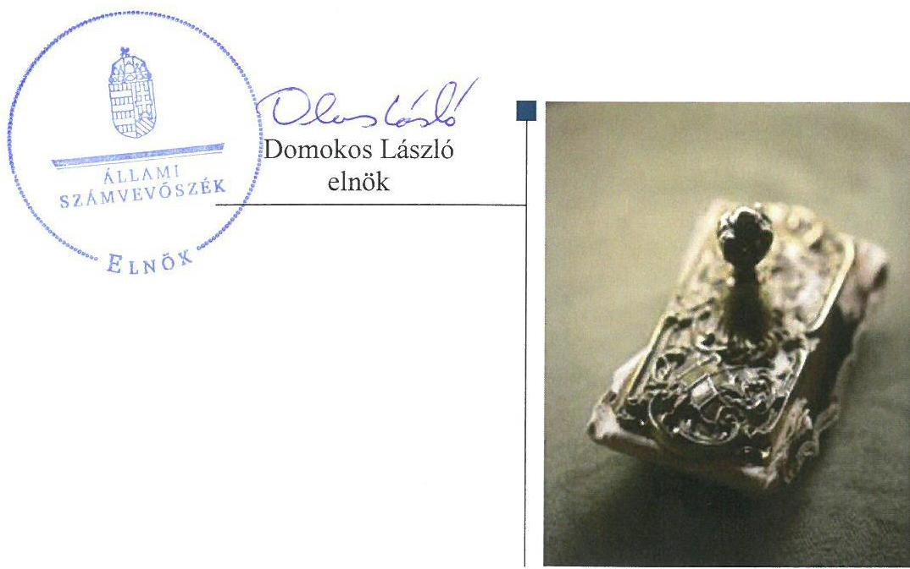

---

|  AZ ELLENŐRZÉST FELÜGYELTE: | |
| --- | --- |
|  PETŐ KRISZTINA felügyeleti vezető | |
|  AZ ELLENŐRZÉST VEZETTE ÉS A VÉGREHAJTÁSÁÉRT FELELŐS: | |
|  MOLNÁR ZSUZSANNA ellenőrzésvezető | |
|  A PROGRAM ÖSSZEÁLLÍTÁSÁÉRT FELELŐS: | |
|  JANIK JÓZSEF LÁSZLÓ osztályvezető | |
|  A TÉMÁHOZ KAPCSOLÓDÓ KORÁBBI SZÁMVEVŐSZÉKI JELENTÉS: | |
|  - címe: | |
|  Jelentés a Budapesti Műszaki és Gazdaságtudományi Egyetem ellenőrzéséről – Az állami felsőoktatási intézmények gazdálkodásának, működésének ellenőrzése | |
|  - sorszáma: 14218 | |
|  IKTATÓSZÁM: V-1181-074/2016. | |
|  TÉMASZÁM: 2215 | |
|  ELLENŐRZÉS-AZONOSÍTÓ SZÁM: V075527 | |

---

# TARTALOMJEGYZÉK 

■ ÖSSZEGZÉS ..... 5
■ AZ ELLENŐRZÉS CÉLJA ..... 6
■ AZ ELLENŐRZÉS TERÜLETE ..... 7
■ AZ ELLENŐRZÉS HÁTTERE, INDOKOLTSÁGA ..... 9
■ A JELENTÉS LÉNYEGES KÉRDÉSKÖRE ..... 10
■ ELLENŐRZÉS HATÓKÖRE ÉS MÓDSZEREI ..... 11
■ MEGÁLLAPÍTÁSOK ..... 13
■ MELLÉKLETEK ..... 17
I. Sz. melléklet: Az ÁSZ 14218. számú jelentéséhez kapcsolódó intézkedési terv végrehajtása a Budapesti Műszaki és Gazdaságtudományi Egyetemen ..... 17
II. Sz. melléklet: Az ÁSZ 14218. számú jelentéséhez kapcsolódó intézkedési terv végrehajtása az Emberi Erőforrások Minisztériumánál. ..... 24
■ FÜGGELÉK: ÉSZREVÉTELEK ..... 25
■ RÖVIDÍTÉSEK JEGYZÉKE ..... 37

---

.

---

# ÖSSZEGZÉS 

Az utóellenőrzés megállapította, hogy a korábbi számvevőszéki jelentés javaslatai alapján az Egyetem rektora által meghatározott intézkedési tervben szereplő tizennégy feladat jelentős részének végrehajtása javította az Egyetem müködésének szabályozottságát. Az intézményi térítési díjak önköltségszámitással történő alátámasztása területén az ÁSZ által korábban azonosított hiányosság továbbra is fennáll. Az Emberi Erőforrások Minisztériuma - mint fenntartói jogkör gyakorlója - intézkedési tervében foglalt feladatait határidőben végrehajtotta.

## Az ellenőrzés társadalmi indokoltsága

Az Állami Számvevőszék stratégiájában célul tűzte ki a számvevőszéki munka hasznosulásának javítását. Ezzel összhangban ellenőrzi, hogy az ellenőrzött szervezetek megvalósították-e a korábbi ellenőrzései által feltárt hibák, hiányosságok és szabálytalanságok megszüntetése céljából kialakított intézkedési terveikben foglaltakat. A rendszeres utóellenőrzések hozzájárulnak a szükséges intézkedések tényleges végrehajtáshoz, ezáltal a közpénzügyek rendezettségének javulásához.

## Főbb megállapítások, következtetések

Az intézkedési tervben meghatározott tizennégy feladatból a Budapesti Műszaki és Gazdaságtudományi Egyetem ötöt határidőben, hármat határidőn túl, kettőt részben, kettőt nem hajtott végre. Két feladat végrehajtása nem volt időszerű. Így az Állami Számvevőszék által korábban azonosított hiányosságok többségében kijavításra kerültek ezzel javítva az Egyetem működésének szabályozottságát.

A költségvetési szerv vezetője az intézkedési tervek jóváhagyásáról a belső ellenőrzési vezető véleménye nélkül döntött, mert a Belső Ellenőrzési Csoport nem véleményezett minden intézkedési tervet a költségvetési szerv vezetőjének elfogadásról, illetve elutasításról szóló döntése előtt. Ebből adódóan a belső kontrollrendszer jogszabályoknak megfelelő működtetése terén feltárt hiányosságok egy része továbbra is fennáll.

Nem került átdolgozásra az Önköltségszámítási Szabályzat, amely kockázatot hordoz az Egyetem által meghatározott térítési díjak és költségtérítések szabályszerű meghatározásában. A szabálytalan előleg elszámoláshoz kapcsolódóan a munkajogi felelősség kivizsgálása elmaradt.

Az Emberi Erőforrások Minisztériuma az intézkedési tervében vállalt két feladatát határidőben végrehajtotta.

---

# AZ ELLENŐRZÉS CÉLJA 

Az ellenőrzés célja annak értékelése volt, hogy a számvevőszéki jelentésben ${ }^{1}$ foglalt intézkedést igénylő megállapításokkal összhangban készített intézkedési tervben meghatározott feladatokat az ellenőrzött szervezetek végrehajtották-e.

---

# **A2 ELLENŐRZÉS TERÜLETE**

## **Budapesti Műszaki és Gazdaságtudományi Egyetem**

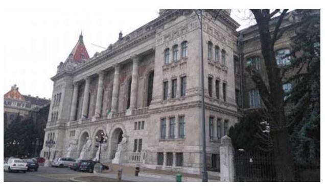

A Budapesti Műszaki és Gazdaságtudományi Egyetem története a 18. századra nyúlik vissza. Az Egyetem2 első, közvetlen elődintézményét – az Institutum Geometrico-Hydrotechnicum néven ismertté vált mérnökképző intézetet – 1782-ben alapították a budai tudományegyetem bölcsészeti karán. A Budapesti Műszaki Egyetem több átalakulást követően 1949-ben egy törvényerejű rendelettel jött létre, ahol Építőmérnöki, Építészmérnöki, Gépészmérnöki és Vegyészmérnöki Kar szerveződött. Az Építőipari és Közlekedési Műszaki Egyetemet 1967-ben olvasztották be a Budapesti Műszaki Egyetembe, amely húsz éven keresztül változatlan formában működött. Az informatika szak jelentős térnyerésének eredményeképpen a Villamosmérnöki Kar 1992 szeptemberétől Villamosmérnöki és Informatikai Kar néven folytatta tevékenységét. A másik változást 1987-ben a Természet- és Társadalomtudományi Kar létrehozása jelentette. A fakultás 1998-ban Természettudományi, illetve Gazdaság- és Társadalomtudományi Kar néven kettévált. A kari struktúrában bekövetkezett változás az intézmény elnevezésében is megmutatkozott, 2000. január 1-jétől vette fel a Budapesti Műszaki és Gazdaságtudományi Egyetem nevet.

Az Egyetemen nyolc kar és tizenhárom doktori iskola működik. Műszaki, informatikai, természettudományi, gazdaságtudományi és társadalomtudományi képzési alap- és mesterszakokon folyik a hallgatók képzése. Az Egyetem hallgatói létszáma 2015. október 15-én 23673 volt.

Az ellenőrzött időszakban változások történtek az Egyetem vezetésében. A jelenleg hivatalban lévő rektor3 2015. július 1-jétől, a kancellár4 2014. november 15-től tölti be tisztségét. A korábbi rektor kinevezése 2008. augusztus 1-jétől 2015. június 30-ig volt érvényes.

Az Egyetem 2015. évi költségvetési beszámolója szerint 15782,3 millió Ft költségvetési bevételt, 27988,7 millió Ft finanszírozási bevételt ért el, valamint 28498,1 millió Ft költségvetési kiadást teljesített. A 2015. év december 31-i mérleg szerint az Egyetem eszközei 43883,4 millió Ft-ot tettek ki.

Az Egyetem gazdálkodásának, működésének ellenőrzését az ÁSZ5 a 2009. január 1. – 2012. december 31. közötti időszakra végezte el, az erről szóló 14218. számú jelentést 2014. október 16-án tette közzé. Az ellenőrzés célja annak megállapítása volt, hogy szabályos volt-e az Egyetem pénzügyi és vagyongazdálkodása, biztosított volt-e a vagyonnal való felelős gazdálkodás követelményének érvényesülése, jogszabályi előírásoknak megfelelően működött-e a belső kontrollrendszer, az irányító szerv tevékenysége a jogszabályi előírásoknak megfelelt-e.

A fenntartói jogkörök gyakorlója az Emberi Erőforrások Minisztériuma volt.

---

Az utóellenőrzés a 2017. február 8-ig végrehajtott intézkedéseket figyelembe véve a Budapesti Műszaki és Gazdaságtudományi Egyetem ellenőrzéséről készült számvevőszéki jelentés intézkedést igénylő megállapításai és javaslatai hasznosítására elfogadott intézkedési tervben foglalt feladatok végrehajtására irányult.

---

# AZ ELLENŐRZÉS HÁTTERE, INDOKOLTSÁGA 

Az ÁSZ tv. ${ }^{6}$ 33. § (1) bekezdése értelmében a számvevőszéki jelentések intézkedést igénylő megállapításaihoz kapcsolódóan az ellenőrzött szervezet vezetője intézkedési tervet köteles összeállítani, és az ÁSZ részére megküldeni. Az intézkedési tervben foglaltak megvalósítását - az ÁSZ tv. 33. § (7) bekezdésében foglaltak alapján - az ÁSZ utóellenőrzés keretében ellenőrizheti. Az intézkedések megvalósulásának értékelése során az ÁSZ figyelembe vette az ellenőrzött szervezetek működési feltételeiben, valamint a jogszabályi előírásokban bekövetkezett változásokat.

Az intézkedési tervben foglalt feladatok hiányos, illetve késedelmes végrehajtása, valamint megvalósításának elmaradása azt mutatja, hogy az ellenőrzés során feltárt hibák, hiányosságok és szabálytalanságok megszüntetése nem kapott kellő hangsúlyt. Ez a szabályszerű működés és a felelős vezetői magatartás vonatkozásában kockázatot hordoz. E kockázatok feltárásával az ÁSZ utóellenőrzési rendszere fokozza a fegyelmet, és igazolja, hogy a közpénzzel való szabályos gazdálkodás felelőssége elől nem lehet kitérni.

Az utóellenőrzés négy szinten hasznosulhat:

- A társadalom szintjén az utóellenőrzés jelzi, hogy a számvevőszéki ellenőrzés megállapításainak van következménye: a hiányosságok megszüntetésére az ellenőrzött szervezet által meghatározott intézkedések végrehajtását is számon kéri az ÁSZ.
- Az ellenőrzött terület szintjén az utóellenőrzés tájékoztatást nyújt a terület döntéshozóinak a hiányosságok kiküszöbölésének jó gyakorlatairól, ezzel lehetőséget biztosítva arra, hogy az ÁSZ ellenőrzési megállapításai, javaslatai a terület nem ellenőrzött szervezeteinek a működése során is hasznosuljanak.
- Az ellenőrzött szervezet szintjén az utóellenőrzés feltárja, hogy a szervezet az intézkedések végrehajtásával hasznosította-e a korábbi ellenőrzési jelentésben a hiányosságok megszüntetése, illetve a kockázatok kezelése érdekében megfogalmazott javaslatokat.
- Az ÁSZ szintjén az utóellenőrzés visszacsatolást ad az ellenőrzési jelentések hasznosulásáról, az intézkedések elmaradása vagy részleges megvalósulása a további ellenőrzésekhez kockázati jelzésként szolgál.

---

# A JELENTÉS LÉNYEGES KÉRDÉSKÖRE 

Az ellenőrzött szervezetek az intézkedési tervben foglaltakat az előirt határidőben végrehajtották-e?

---

# ELLENŐRZÉS HATÓKÖRE ÉS MÓDSZEREI 

## Az ellenőrzés típusa

Megfelelőségi ellenőrzés.

## Az ellenőrzött időszak

Az utóellenőrzés alapját képező számvevőszéki jelentés közzétételének napjától (2014. október 16.) az ellenőrzésről szóló kiértesítő levél keltének napjáig (2017. február 8.) tartó időszak.

## Az ellenőrzés tárgya

Az ÁSZ tv. 2011. július 1-jei hatálybalépését követően a számvevőszéki jelentésben foglalt intézkedést igénylő megállapításokkal és javaslatokkal összhangban - az Egyetem és az EMMI ${ }^{7}$ által - készített intézkedési tervekben foglaltak végrehajtásának ellenőrzése.

Az ellenőrzés kiterjedt minden olyan körülményre és adatra, amely az ÁSZ jogszabályban meghatározott feladatainak teljesítéséhez, valamint a program végrehajtása folyamán felmerült újabb összefüggések feltárásához szükséges.

## Az ellenőrzött szervezet

A Budapesti Műszaki és Gazdaságtudonányi Egyetem és az Emberi Erőforrások Minisztériuma.

## Az ellenőrzés jogalapja

Az ÁSZ az Országgyűlés pénzügyi és gazdasági ellenőrző szerve. Az ÁSZ törvényben meghatározott feladatkörében ellenőrzi a központi költségvetés végrehajtását, az államháztartás gazdálkodását, az államháztartásból származó források felhasználását és a nemzeti vagyon kezelését.

Az ÁSZ tv. 1. § (3) bekezdése szerint az ÁSZ általános hatáskörrel végzi a közpénzekkel és az állami és önkormányzati vagyonnal való felelős gazdálkodás ellenőrzését.

Az ÁSZ tv. 33. § (7) bekezdés alapján a 33. § (1)-(2) bekezdése szerinti intézkedési tervben foglaltak megvalósítását az ÁSZ utóellenőrzés keretében ellenőrizheti.

---

# Az ellenőrzés módszerei 

Az ÁSZ az ellenőrzést a nemzetközi standardokat irányadónak tekintve az ellenőrzési program ellenőrzési kérdései, az ellenőrzött időszakban hatályos jogszabályok, az ellenőrzés szakmai szabályok és módszertanok figyelembevételével, önálló ellenőrzés keretében végezte.

Az ÁSZ az ellenőrzés ideje alatt az Egyetemmel és az EMMI-vel történő kapcsolattartást az ÁSZ SZMSZ ${ }^{8}$-ének vonatkozó előírásai alapján biztosította.

Az utóellenőrzés megállapításait elsősorban az ÁSZ rendelkezésére álló, valamint az ellenőrzött szervezetektől elektronikusan bekért dokumentumok alapozták meg.

Az ellenőrzési bizonyítékként felhasználható adatforrások közé tartoztak egyrészt a szakmai programban felsorolt adatforrások, másrészt minden - az ellenőrzés folyamán feltárt, az ellenőrzés szempontjából információt tartalmazó - dokumentum.

Az intézkedési tervben előírt feladatokat azok végrehajthatósága, illetve végrehajtása szempontjából az alábbiak szerint értékelte az ÁSZ:
$\longrightarrow$ „határidőben végrehajtott" a feladat, ha a teljesítés dokumentáltan, az intézkedési tervben előírt határidőben és tartalommal megtörtént;
$\longrightarrow$ „határidőn túl végrehajtott" a feladat, ha annak teljesítése az intézkedési tervben meghatározott módon, de az előírt határidőn túl történt meg;
$\longrightarrow$ „részben végrehajtott" a feladat, ha végrehajtása teljes körűen az intézkedési tervben előírt módon nem történt meg;
$\longrightarrow$ „nem végrehajtott" ha a végrehajtás nem történt meg, vagy amenynyiben a teljesítést nem dokumentálták;
$\longrightarrow$ „okafogyottá vált" a feladat, ha végrehajtására - meghatározott esemény bekövetkezése, továbbá külső körülmény, a múködést érintő feltétel változása miatt - már nincs szükség, illetve lehetőség, és egyértelmúen megállapítható, hogy az intézkedést szükségessé tevő körülmény a jövőben nem fordulhat elő;
$\longrightarrow$ „nem időszerű" az a feladat, amelynek ellenőrzési időszakon belüli végrehajtására azért nem került (kerülhetett) sor, mert az intézkedés alapjául szolgáló esemény nem következett be, de annak jövőbeni előfordulása lehetséges, a végrehajtása nem volt esedékes, vagy a végrehajtás határideje még nem járt le.
Az ellenőrzés lefolytatásához az ellenőrzött szervezetek a tanúsítványok elektronikus kitöltésével, valamint az ÁSZ által kért dokumentumok elektronikus megküldésével szolgáltatott adatokat, amelyek valódiságát és teljes körűségét az ellenőrzött szervezet vezetője által tett teljességi és hitelességi nyilatkozat igazolta. Az így rendelkezésre bocsátott adatok, információk kontrollja az ellenőrzés keretében történt meg.

---

# MEGÁLLAPÍTÁSOK 

## Az ellenőrzött szervezetek az intézkedési tervben foglaltakat az előírt határidőben végrehajtották-e?

Összegző megállapítás

Az Egyetem az intézkedési tervben meghatározott feladatok közül öt feladatot határidőben, három feladatot határidőn túl, két feladatot részben, két feladatot nem hajtott végre, két feladat végrehajtása nem volt időszerű. Az EMMI intézkedési tervében meghatározott feladatokat határidőben végrehajtotta. A feladatok végrehajtásáról a jogszabályban előírt nyilvántartást mindkét ellenőrzött szervezet vezette.

A számvevőszéki jelentés az Egyetem pénzügyi és vagyongazdálkodása és a belső kontrollrendszer szabályszerű múködésének biztosítása érdekében kilenc intézkedést igénylő javaslatot fogalmazott meg a rektor számára. A miniszter részére két javaslatot tartalmazott a jelentés.

A rektor az ÁSZ elnöke által tudomásul vett intézkedési tervben a hiányosságok, szabálytalanságok megszüntetésére tizennégy feladatot határozott meg, az EMMI kettőt vállalt a végrehajtásért felelősök megjelölésével.

Az ÁSZ javaslatai alapján készített intézkedési tervben rögzített feladatok végrehajtásáról az Egyetem és az EMMI a Bkr. ${ }^{9}$ által előírt nyilvántartást vezette.

Az Egyetem intézkedési tervében meghatározott feladatokat, határidőket, a feladatok végrehajtásáért felelős személyeket és a feladatok végrehajtását az I. számú melléklet, az EMMI intézkedési tervében meghatározott feladat végrehajtását a II. számú melléklet mutatja be.

Az Egyetem intézkedési tervében meghatározott feladatok végrehajtásának értékelési kategóriák szerinti megoszlását az 1. ábra szemlélteti.
1. ábra

Az Egyetem feladatai végrehajtásának értékelési kategóriák szerinti megoszlása
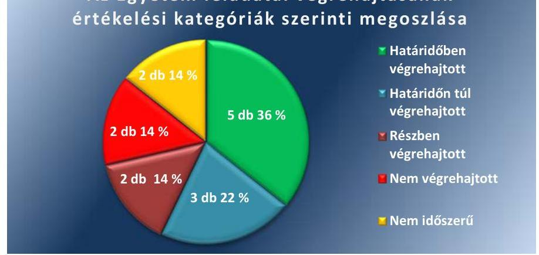

---

# HATÁRIDŐBEN VÉGREHAJTOTT FELADATOK: 

1. (2) A Gazdálkodási jogkörök gyakorlására felhatalmazó dokumentumok teljes körű meglétének felülvizsgálatát karonként és átfogó szervezeti egységenként határidőre elvégezték. Aktualizálták a kötelezettségvállalás, a pénzügyi ellenjegyzés, az érvényesítés, a teljesítésigazolás és az utalványozás rendjéről szóló szabályzatot ${ }^{10}$, illetve a közbeszerzési ${ }^{11}$ szabályzatot. 2014-ben rektori utasítással új - a Kbt. ${ }^{12}$ hatálya alá nem tartozó beszerzésekkel kapcsolatos kötelezettségvállalásra vonatkozó szabályokat tartalmazó - beszerzési szabályzatot ${ }^{13}$ léptetettek érvénybe. A gazdálkodási jogkörök gyakorlására jogosultak - a szabályszerű joggyakorlás tárgyában - oktatásban részesültek.
2. (5) Az Egyetem a kereskedelmi banknál vezetett NEPTUN gyűjtőszámlát 2014. november 14.-ével megszüntette és intézkedett a Kincstárnál ${ }^{14}$ NEPTUN gyűjtőszámla nyitásáról. A kereskedelmi banknál vezetett gyűjtőszámlán lévő összeg átutalása megtörtént a Kincstárnál vezetett gyűjtőszámlára. A hallgatói befizetéseket érintő változásról az Egyetem az integrált nyilvántartási rendszerén keresztül értesítette a hallgatókat, a kincstári gyűjtőszámla használatára történő átállás határidőben megtörtént.
3. (6) A közbeszerzési szabálytalanságra és a Kjt. ${ }^{15}$ szabályainak nem megfelelő jutalom kifizetésre vonatkozó munkajogi felelősség kivizsgálása határidőben megtörtént. A vizsgálat eredményét és az annak ismeretében született javaslatot - az intézkedési tervben vállaltaknak megfelelően - mindkét esetben írásba foglalták, s a rektornak megküldték.
4. (7) A rektor a kancellárral történő egyeztetés alapján - az intézkedési tervben vállaltaknak megfelelően - a Belső Ellenőrzési Csoporttól ${ }^{16}$ soron kívüli ellenőrzést kért a térítési díjak és költségtérítések megállapításának szabályszerűsége tárgyában.
5. (8.a) A számvevőszéki jelentésben a mérlegtételekkel kapcsolatban feltárt hiányosságok, besorolási és értékelési szabálytalanságok megszüntetése, a mérlegben kimutatott eszközök szabályszerű leltározása és a vagyonkimutatás hatályos jogszabályi előírásokkal összhangban történő elkészítése határidőben megvalósult. Az Egyetem a saját tőkét és tartalékokat növelő-csökkentő hibákat, valamint a követelések megállapítását, besorolását, és a kötelezettségek kimutatását érintő hibákat az intézkedési tervben vállalt határidőre tételesen kivizsgálta, a szükséges átsorolásokat és átértékeléseket a hatályos államháztartási számviteli rendnek megfelelően elvégezte.
(8.b) A leltározást az intézkedési tervben foglaltaknak megfelelően elvégezték. Az egyetemi belső kontrollrendszer átalakítása során a mérlegben kimutatott eszközök szabályszerű leltározása érdekében - 2014ben és 2015-ben - új leltározási szabályzatokat léptettek hatályba.

## HATÁRIDŐN TÚL VÉGREHAJTOTT FELADATOK:

6. (1.b) A rektor a hatályos jogszabályi előírásoknak való megfelelés érdekében elrendelte a belső szabályzatok tartalmának teljes körű felülvizsgálatát, meg nem felelés esetén a szabályzatok aktualizálását, hiánya estén elkészítését és kiadását. A kockázatkezelés

---

rendjének szabályozása és az alapján a kockázatok azonosítása, felmérése és kezelése, a gazdasági szervezet belső és külső kapcsolattartásának rendje, valamint az Egyetem kari és átfogó szervezeti egységeinek belső kontroll szabályozásai az intézkedési tervben megjelölt 2015. május 31-i határidőt követően léptek hatályba.
7. (1.c) A rektor és a kancellár elrendelte a kockázatkezelési szabály$z^{17}$ felülvizsgálatát annak érdekében, hogy a szabályzat az általános megfogalmazásokon túl tartalmazzon konkrét rendelkezéseket a kockázatok feltárása, azonosítása, felmérése, értékelése, a kockázatok kezelési rendje és a kockázatokra adható válaszintézkedések tárgykörében. A jogszabályi előírásnak megfelelő, felülvizsgált, megújított kockázatkezelési szabályzat az intézkedési tervben vállalt határidőn túl, 2016. március 15-én lépett hatályba.
8. (1.d) Az Egyetem 2016. március 15-én hatályba léptetett kockázatkezelési szabályzata megfelelt az intézkedési tervben vállalt tartalmi elvárásoknak, mert a módosított szabályzat alapján minden érintett szervezeti egység vezető köteles az ellenőrzési jelentés kézhezvételét követő 8 napon belül a hiányosságok kiküszöbölése érdekében intézkedési tervet készíteni, azt a Belső Ellenőrzési Csoportnak megküldeni, továbbá a szervezeti egység vezetők kötelesek az ellenőrzési megállapításokra adekvát intézkedéseket megfogalmazni úgy, hogy azok végrehajtásának felelősei és határidői is megjelölésre kerüljenek. A belső ellenőrzési megállapításokra a szervezeti egység vezetők által készített intézkedési tervek az esetek több mint felében az intézkedési tervben vállalt 8 napos határidőn túl készültek el. Ezzel az Egyetem nem tett eleget a Bkr. 45. § (3) bekezdésében foglaltaknak.

# RÉSZBEN VÉGREHAJTOTT FELADATOK: 

9. (1.e) A Belső Ellenőrzési Csoport hét intézkedési tervből öt esetében nem véleményezte írásban - a költségvetési szerv vezetőjének elfogadásról, illetve elutasításról szóló döntése előtt - az intézkedési terveket. Ezzel megsértették a Bkr. 45. §. (4) bekezdését. Két esetben - a kockázatkezelési szabályzat előírásainak megfelelően - megtörtént 5 munkanapon belül az intézkedési tervek írásos véleményezése és a költségvetési szerv vezetőjének történő megküldése. A rektor az intézkedési tervek jóváhagyásáról, illetve elutasításáról minden esetben döntött.
10. (9) Az el nem számolt előlegek elszámolása, szabályszerű pénzügyi számviteli rendezése határidőben - az intézkedési terv készítésének időpontjában - már megtörtént, további intézkedés megtételére e tárgyban nem volt szükség. A munkajogi felelősség kivizsgálása részben valósult meg, mert a 20 millió Ft-os előleg állomány $31 \%$-át kitevő, a 2006-2011. évek között keletkezett úti előleg szabályszerű elszámolása, pénzügyi számviteli rendezése elmaradásához kapcsolódó munkajogi felelősséget nem vizsgálták ki.

---

# NEM VÉGREHAJTOTT FELADAT: 

$\qquad$ 11. (1.a) Az átfogó szervezeti egység vezetők nem rendelték el saját szervezetükre vonatkozóan a jogszabályokban előírt szabályzatok teljes körű meglétének ellenőrzését.
$\qquad$ 12. (3) Az Egyetem az ellenőrzési időszakban nem végezte el Önköltségszámítás szabályzatának ${ }^{18}$ - az intézkedési tervben vállalt - átdolgozását, kiegészítését a szükség szerinti kalkulációs űrlap mellékletekkel.

## NEM IDŐSZERŰ FELADAT:

$\qquad$ 13. (1.f) A Belső Ellenőrzési Csoport az ellenőrzött időszakban olyan személyi mulasztást, amely munkaügyi kivizsgálást tett volna szükségessé nem állapított meg, ezért az intézkedés végrehajtása nem volt időszerű.
$\qquad$ 14. (4) Az Egyetem módosította Számviteli Politikáját ${ }^{19}$ melyben rögzítette, hogy vállalkozási tevékenységet nem végez, ebből adódóan az önköltség számítási szabályzat - a vállalkozási tevékenység önköltségszámítása jogszabályoknak megfelelő kialakítása érdekében történő - átdolgozása nem volt időszerű.

## EMMI ÁLTAL HATÁRIDŐBEN VÉGREHAJTOTT FELADATOK:

$\qquad$ 1. (1) Az EMMI Belső Ellenőrzési Főosztálya az intézkedési tervben meghatározott feladatait határidőben végrehajtotta. Az Egyetem belső kontrollrendszer kialakításával és működtetésével, a pénzügyi és vagyongazdálkodással, vagyonkimutatással összefüggésben feltárt szabálytalanságokhoz kapcsolódó munkajogi felelősséggel kapcsolatos körülményeket kivizsgálta, további fenntartói intézkedést nem tartott szükségesnek.
$\qquad$ 2. (2) Az EMMI Belső Ellenőrzési Főosztálya az Egyetemen a kincstári körön kívüli számlavezetés miatt megállapított szabálytalan pénzkezeléshez kapcsolódó munkajogi felelősséggel kapcsolatos körülményeket kivizsgálta, további fenntartói intézkedést nem tartott szükségesnek.

---

# MELLÉKLETEK

- I. SZ. MELLÉKLET: AZ ÁSZ 14218. SZÁMÚ JELENTÉSÉHEZ KAPCSOLÓDÓ INTÉZKEDÉSI TERV VÉGREHAJTÁSA A BUDAPESTI MŰSZAKI ÉS GAZDASÁGTUDOMÁNYI EGYETEMEN

|  1. | 2. | 3. | 4.  |
| --- | --- | --- | --- |
|  1. | (2) A gazdálkodási jogkörök szabályszerű gyakorlásának érvényesítése érdekében 2013-ban és 2014-ben új közbeszerzési és kötelezettségvállalási szabályzatot dolgoztattam ki. Elrendeltem továbbá, hogy ellenőrizzék a jogkörök gyakorlására felhatalmazó dokumentumok teljes körű meglétét, továbbá elrendeltem, hogy e jogkörök gyakorlására jogosultak - a szabályszerű joggyakorlás tárgyában - tájékoztatót, oktatást kapjanak. | 2014. december 15. | gazdasági és múszaki főigazgató  |
|  2. | (5) A hallgatói befizetések jogszabályi előírásoknak megfelelő kezelése érdekében elrendelem, hogy a kereskedelmi banknál vezetett Neptun gyűjtő számla kerüljön megszüntetésre, a Magyar Államkincstárnál vezetett Neptun gyűjtő számla kerüljön megnyitásra, a BME teljes integrált nyilvántartási rendszere álljon át a kincstári gyűjtő számla használatára. | 2014. november 30. | gazdasági és múszaki főigazgató  |

|  Az intézkedési
tervben
meghatározott
határidő | Az intézkedési
tervben meghatározott feladatok felelőse  |
| --- | --- |
|  2. | 3.  |
|  2014. december 15. |   |
|  |   |
|  |   |
|  |   |
|  |   |
|  |   |
|  |   |
|  |   |
|  2014. december 30. | gazdasági és múszaki főigazgató  |

|  A feladat végrehajtása |   |
| --- | --- |
|  4. |   |
|  4. |   |
|  4. |   |
|  A gazdálkodási jogkörök gyakorlására felhatalmazó dokumentumok teljes körű meglétének felülvizsgálatát karonként és átfogó szervezeti egységenként határidőre elvégezték. A gazdálkodási jogkörök szabályszerű gyakorlásának érvényesítése érdekében 2013. október 28-tól léptették hatályba a 18/2013. (X. 28.) számú rektori utasítással kiadott módosított közbeszerzési szabályzatot. A kötelezettségvállalás, a pénzügyi ellenjegyzés, az érvényesítés, a teljesítésigazolás és az utalványozás rendjét a 2013. márciustól érvényes 3/2013. (02. 28.) számú rektori utasítással módosították. A 24/2014. (11. 07.) számú rektori utasítás 2014. november 10-én léptette hatályba a - Kbt. hatálya alá nem tartozó kötelezettségvállalásra vonatkozó szabályokat tartalmazó - beszerzési szabályzatot. A gazdálkodási jogkörök gyakorlására jogosult szervezeti egységek vezetői, munkatársai, gazdasági, humánpolitikai ügyintézői 2014. december 10-én kaptak oktatást a gazdálkodási jogkörök szabályszerű gyakorlásának tárgyában. A képzés megrendezéséről, témájáról és az érintett személyi körről a 23/2014. (12. 03.) számú Főigazgatói körlevélben kaptak értesítést az átfogó szervezeti egységek vezetői. Az Egyetem a kereskedelmi banknál vezetett NEPTUN gyűjtőszámláját 2014. november 14-ével megszüntette, ezzel egyidejűleg intézkedett a Magyar Államkincstárnál NEPTUN gyűjtőszámla nyitásáról. A gyűjtőszámlán lévő öszszeg átutalásának megtörténtét a Kincstár ${ }^{20}$ számlakivonatával igazolta. A hallgatói befizetéseket érintő változásról az integrált nyilvántartási rendszerén keresztül értesítette a hallgatókat, 2014. november 18-tól a hallgatói

---

|  3. | (6) Elrendelem, hogy a számvevőszéki ellenőrzésben feltárt 1 db közbeszerzési szabálytalanságban (Jelentés 40. oldal), valamint az 5,6 M Ft-ot érintő, a Kjt. vonatkozó előírásának nem megfelelő jutalom kifizetésben (Jelentés 39. oldal) érintett kötelezettségvállalók tekintetében az átfogó szervezeti egység vezetője folytasson vizsgálatot a munkajogi felelősség tárgyában. A vizsgálat eredményét foglalják írásba, hozzám juttassák azt el, valamint a vizsgálat eredményének ismeretében tegyenek javaslatot számomra a szükséges további intézkedések megtétele érdekében. | 2014. november 30. | érintett átfogó szervezeti egység(ek) vezetői | A feladat végrehajtása  |
| --- | --- | --- | --- | --- |
|  4. | (7) Figyelemmel a Bkr. 31. § (6) bekezdésében foglaltakra, valamint a kancellári rendszer időközben történt kialakítására, az ebből adódó jogosultsági és felelősségi rendszer megváltozására, továbbá a szervezeti változásokhoz kapcsolódó belső szabályzatmódosítási ütemezésre, a Kancellárral történő előzetes egyeztetés alapján a belső ellenőrzési szervezettől soron kívüli ellenőrzést kérek a térítési díjak és költségtérítések megállapításának szabályszerűsége tárgyában. | 2015. május 31. | Belső Ellenőrzési Csoport vezetője | A rektor és a kancellár az 51402/2015. számú, 2015. áprilisban kelt megbízó levélben rendelte el a Belső Ellenőrzési Csoport számára a soron kívüli ellenőrzést. Az ellenőrzés tárgya és célja annak ellenőrzése volt, hogy a térítési díjak, költségtérítések megállapítása az államháztartási és felsőoktatási jogszabályoknak, valamint az Egyetem vonatkozó belső szabályozó eszközeinek megfelelően, szabályszerűen történt-e. A Belső Ellenőrzési Csoport 2015. május 4. és 2015. május 29. napja között végezte el a soron kívüli ellenőrzést.  |
|  5. | (8) Az ellenőrzés által a mérlegtételekkel kapcsolatban feltárt hiányosságok, besorolási és értékelési szabálytalanságok megszüntetése, a mérlegben kimutatott eszközök szabályszerű leltározása és a vagyonkimutatás hatályos jogszabályi előírásokkal összhangban történő elkészítése érdekében az alábbiakat rendelem el: | folyamatosan, legkésőbb 2015. január 31. befejezéssel | gazdasági és műszaki főigazgató | A számvevőszéki jelentésben a mérlegtételekkel kapcsolatban feltárt hiányosságok, besorolási és értékelési szabálytalanságok megszüntetése, a mérlegben kimutatott eszközök szabályszerű leltározása és a vagyonkimutatás hatályos jogszabályi előírásokkal összhangban történő elkészítése határidőben megvalósult. a) Az Egyetem a részesedések, követelések, kötelezettségek, aktívák, paszszívák kimutatásával, gyűjtőszámla vezetésével, illetve kapcsolatos besoro-  |

---

|  5. | Intézkedési
tervben meghatározott feladat | Az intézkedési
tervben
meghatározott
határidő | Az intézkedési
tervben meghatározott feladatok felelőse  |
| --- | --- | --- | --- |
|  1. |  | 2. | 3.  |

|  Az intézkedési
tervben meghatározott feladatok | Az intézkedési
tervben meghatározott feladatok felelőse | A feladat végrehajtása  |
| --- | --- | --- |
|  4. |  |   |

1. (1.b) Jogszabályokban előírt szabályzatok tartalmának teljes körű felülvizsgálatát rendelem el abból a szempontból, hogy mindenben megfelelnek-e a hatályos jogszabályi előírásoknak. Szabályzat hiánya, vagy tartalmi meg nem felelés esetén a szabályzatok elkészítését és kiadását, meglévő szabályzataink frissítését, megújítását rendeljük el.

lási, értékelési, illetve bemutatási hibákat az intézkedési tervben vállalt határidőre tételesen kivizsgálta, a szükséges átsorolásokat és átértékeléseket a hatályos államháztartási számviteli rendnek megfelelően elvégezte. Az átsorolások és átértékelések elvégzését analitikával, a beszámoló 2013–2014. évek aktuális űrlapjának dokumentálásával, a rendezőmérleg és könyvviteli mérleg kivonatokkal, valamint főigazgatói záradékkal ellátott hozzáfűzött magyarázatokkal igazolta.

b) Az egyetemi belső kontrollrendszer átalakítása során a mérlegben kimutatott eszközök szabályszerű leltározása érdekében – 2014-ben a 27/2014. (11. 13.) számú rektori utasítással, 2015-ben a 14/2015. (10. 05.) kancellári utasítással – új leltározási szabályzatokat léptettek hatályba.

|  Határidőn túl végrehajtott feladatok |  |   |
| --- | --- | --- |
|  folyamatosan, | a) A felelősség | A rektor a hatályos jogszabályi előírásoknak való megfelelés érdekében elrendelte a belső szabályzatok tartalmának teljes körű felülvizsgálatát, meg nem felelés esetén a szabályzatok aktualizálását, hiánya estén elkészítését és kiadását.  |
|  véghatáridő 2015. | a) A 2010. évben esedékes fizikai leltárfelvétel elmaradása tárgyában tudomásom van arról, hogy azért történt meg 2010. év helyett 2011-ben a leltározás elvégzése, mert 2010. január 1-től új integrált nyilvántartási rendszert vezettünk be, amelynek éles üzembe állítása a vártnál nagyobb, elhúzódóbb problémákat okozott. Tekintettel arra, hogy az új integrált rendszer bevezetésének nehézségein túljutottunk, a leltározás csúszása csak egyedi eset volt, valamint tekintettel arra, hogy a belső kontrollrendszer megfelelő átalakítása biztosíték arra, hogy a továbbiakban a mérlegben kimutatott eszközök leltározása a jogszabályban előírt határidőben elvégzésre kerüljön, további intézkedések megtételéről szükségtelen rendelkeznem. | b) A 2010. évben esedékes fizikai leltárfelvétel elmaradása tárgyában tudomásom van arról, hogy azért történt meg 2010. év helyett 2011-ben a leltározás elvégzése, mert 2010. január 1-től új integrált nyilvántartási rendszert vezettünk be, amelynek éles üzembe állítása a vártnál nagyobb, elhúzódóbb problémákat okozott. Tekintettel arra, hogy az új integrált rendszer bevezetésének nehézségein túljutottunk, a leltározás csúszása csak egyedi eset volt, valamint tekintettel arra, hogy a belső kontrollrendszer megfelelő átalakítása biztosíték arra, hogy a továbbiakban a mérlegben kimutatott eszközök leltározása a jogszabályban előírt határidőben elvégzésre kerüljön, további intézkedések megtételéről szükségtelen rendelkeznem. | b) Az egyetemi belső kontrollrendszer átalakítása során a mérlegben kimutatott eszközök szabályszerű leltározása érdekében – 2014-ben a 27/2014. (11. 13.) számú rektori utasítással, 2015-ben a 14/2015. (10. 05.) kancellári utasítással – új leltározási szabályzatokat léptettek hatályba. |   |
|  |   |   |
|  |   |   |
|  |   |   |
|  |   |   |
|  |   |   |
|  |   |   |
|  |   |   |
|  |   |   |
|  |   |   |
|  |   |   |
|  |   |   |
|  |   |   |
|  |   |   |
|  |   |   |
|  |   |   |
|  |   |   |
|  |   |   |
|  |   |   |
|  |   |   |
|  |   |   |
|  |   |   |
|  |   |   |
|  |   |   |
|  |   |   |
|  |   |   |
|  |   |   |
|  |   |   |
|  |   |   |
|  |   |   |
|  |   |   |
|  |   |   |

---

|  6
7
8 | Intézkedési
tervben
meghatározott
feladat | Az intézkedési
tervben
meghatározott
határidő
2. | Az intézkedési
tervben megha-
tározott felada-
tok felelőse
3. | A feladat végrehajtása  |
| --- | --- | --- | --- | --- |
|   |  |  |  | 4.  |
|   |  |  |  | A kockázatkezelés rendjének szabályozására és az alapján a kockázatok azonosítására, felmérésére és kezelésére kiadott rektori-kancellári közös utasítás, határidőn túl – 2016. március 7-én – került elfogadásra. A gazdasági szervezet belső és külső kapcsolattartásának rendjét meghatározó, a Kancellária egyes szervezeti egységeinek ügyrendjei^{22} határidőn túl léptek hatályba.  |
|  7. | (1.c) Az Egyetemi Kockázatkezelési Szabályzat felülvizsgálatát és megújítását rendeltük el abból a célból, hogy a szabályzat az általános megfogalmazásokon túl tartalmazzon konkrét rendelkezéseket is a kockázatok feltárása, azonosítása, felmérése, értékelése, a kockázatok kezelési rendje és a kockázatokra adekvát válaszintézkedések tárgykörében. | 2015. május 31. | Kancellária | Az Egyetem kockázatkezelési szabályzatának felülvizsgálata, megújítása az intézkedési tervben vállalt határidőn túl – 2016. március 15-től – történt meg. A felülvizsgálat eredményeként kiadott Kockázatkezelés rendjéről szóló 4/2016. (III. 7.) számú Rektori és Kancellári közös Utasítás – az intézkedési tervben foglaltaknak megfelelően – konkrét rendelkezéseket tartalmaz a kockázatok feltárása, azonosítása, felmérése, értékelése, a kockázatok kezelési rendje és a kockázatokra adható válaszintézkedések tárgykörében.  |
|  8. | (1.d) Elrendeltük továbbá, hogy a Kockázatkezelési Szabályzatban ki kell térni arra, hogy az egyetemi Belső Ellenőrzési Csoport által végzett vizsgálatok megállapításainak hasznosítása céljából minden ellenőrzött szervezeti egység köteles 8 napon belül a hiányosságok kiküszöbölése érdekében Intézkedési Tervet készíteni és azt a Belső Ellenőrzési Csoportnak megküldeni. Ezen Intézkedési Tervekben a szervezeti egység vezetők kötelesek az ellenőrzési megállapításokra adekvát intézkedéseket megfogalmazni úgy, hogy azok végrehajtásának felelősei és határidői is megjelölésre kerüljenek. | ellenőrzési jelentés kézhezvételét követő 8 napon belül | minden érintett szervezeti egység vezető | Az Egyetem módosította kockázatkezelési szabályzatát, az intézkedési tervben vállalt tartalommal kiegészített szabályzat 2016. március 15-én lépett hatályba. A módosított szabályozat alapján minden érintett szervezeti egység vezető köteles az ellenőrzési jelentés kézhezvételét követő 8 napon belül a hiányosságok kiküszöbölése érdekében intézkedési tervet készíteni és azt a Belső Ellenőrzési Csoportnak megküldeni. A szabályzat 16. § (3) bekezdése értelmében a szervezeti egység vezetők kötelesek az ellenőrzési megállapításokra adekvát intézkedéseket megfogalmazni úgy, hogy azok végrehajtásának felelősei és határidői is megjelölésre kerüljenek. A belső ellenőrzési megállapításokra a szervezeti egység vezetők által készített intézkedési tervek az esetek több mint felében az intézkedési tervben vállalt 8 napos határidőn túl készültek el. Ezzel az Egyetem nem tett eleget a Bkr. 45. § (3) bekezdésében foglaltaknak.  |
|   |  |  |  | 8.  |
|   |  |  |  | Részben végrehajtott feladat  |
|  9. | (1. e) Az ellenőrzési megállapítások hasznosulása érdekében elrendeltük, hogy a d) pont szerint elkészített Intézkedési Tervet^{23} a Belső Ellenőrzési Csoport 5 munkanapon belül írásban véleményezze. Az intézkedési terv kézhezvételét követő 5 munkanapon belül |  | Belső Ellenőrzési Csoport vezetője | A hét intézkedési tervből a Belső Ellenőrzési Csoport kettőt véleményezett – a költségvetési szerv vezetőjének elfogadásról, illetve elutasításról szóló döntése előtt 5 munkanappal – ötöt nem véleményezett. Ezzel nem tettek eleget a Bkr. 45. § (4) bekezdésében foglaltaknak, illetve az intézkedési terv-  |

---

|  9. | Intézkedési tervben meghatározott feladat | Az intézkedési tervben meghatározott határidő | Az intézkedési tervben meghatározott feladatok felelőse  |
| --- | --- | --- | --- |
|   | 1. | 2. | 3.  |
|   | írásba foglalt véleményezést és a véleményezett Intézkedési Tervet a belső ellenőrzési vezető megküldi a költségvetési szerv vezetőjének, aki az Intézkedési Terv jóváhagyásáról vagy elutasításáról dönt. |  |   |
|  10. | (9) a) Az ellenőrzési időszakban el nem számolt előlegek elszámolása, szabályszerű pénzügyi számviteli rendezése már megtörtént, e tárgyban további intézkedés nem szükséges. | A késve történt elszámolás okainak kivizsgálási határideje: 2015. április 30. | A késve történt elszámolás okainak kivizsgálásáért felelős: az általános kancellárhelyettes  |
|   | b) A késve megtörtént elszámoláshoz kapcsolódóan a munkajogi felelősség kivizsgálását, valamint a vizsgálat eredményének ismeretében a szükséges intézkedések megtételét rendelem el. | Személyes közalkalmazotti felelősség esetén a munkajogi felelősség vizsgálatának és a munkajogi következmények érvényesítésének határideje: 2015. május 31. | Személyes közalkalmazotti felelősség esetén a munkajogi felelősség vizsgálatát végzi és a munkajogi következmények érvényesítéséről gondoskodik: a mulasztásban érintett közalkalmazott felett munkáltatói jogot gyakorló vezető  |
|   |  | Nem végrehajtott feladat |   |
|  11. | (1.a) Jogszabályokban előírt szabályzatok teljes körű meglétének ellenőrzését rendeltük el. | 2015. február 28. | minden átfogó szervezeti egység vezetői a saját szervezetére  |
|  12. | (3) A térítési díjak és a költségtérítések önköltségszámítással történő megalapozása érdekében elrendeltük, hogy a hatályos jogszabályoknak megfelelően | 2015. május 31. | Minden átfogó szervezeti egység vezetője a saját képzé-  |

|  21. | A feladat végrehajtása  |
| --- | --- |
|  4. | ben vállaltakat nem teljesítették teljes körűen. A két véleményezett intézkedési tervet a Belső Ellenőrzési Csoport vezetője megküldte a költségvetési szerv vezetőjének. Az intézkedési tervek jóváhagyásáról, illetve elutasításáról a rektor minden esetben döntött.  |
|   | Határidőben végrehajtott feladatrész:  |
|   | A 2012. év végén aktív átfutó pénzügyi elszámolásként mérlegben kimutatott, el nem számolt előlegek elszámolása, szabályszerű pénzügyi számviteli rendezése az intézkedési tervben vállaltaknak megfelelően megtörtént. A késve megtörtént elszámoláshoz kapcsolódóan a munkajogi felelősség kivizsgálása a 2012. év végén aktív átfutó elszámolásként a mérlegben kimutatott 20 millió Ft el nem számolt előlegből a 9,6 millió Ft devizaszámláról kifizetett előleg és a 4,2 millió Ft szállítói előleg halmozódásának okait kivizsgálták, a vizsgálat eredményének ismeretében munkajogi felelősséget nem vetettek fel.  |
|   | Nem végrehajtott feladatrész:  |
|   | A külföldi napidíj, utazási költség, szállásdíj, vízumköltség, részvételi díj, egyéb dologi költség fedezetére szolgáló 6,2 millió Ft úti előleg szabályszerű elszámolása, pénzügyi számviteli rendezése elmaradásához kapcsolódó munkajogi felelősséget nem vizsgálták ki.  |
|   | 21.  |
|   | Az átfogó szervezeti egység vezetők nem rendelték el saját szervezetükre vonatkozóan a jogszabályokban előírt szabályzatok teljes körű meglétének ellenőrzését.  |
|   | Az Egyetem az ellenőrzési időszakban nem végezte el Önköltségszámítási Szabályzatának - az intézkedési tervben vállalt - átdolgozását, kiegészítését a szükség szerinti kalkulációs űrlap mellékletekkel.  |

---

|  1. | Intézkedési
tervben meghatározott feladat | Az intézkedési
tervben
meghatározott
határidő | Az intézkedési
tervben meghatározott feladatok felelőse | A feladat végrehajtása  |
| --- | --- | --- | --- | --- |
|  2. | 1. | 2. | 3. | 4.  |
|   | átdolgozásra, szükség szerint kalkulációs űrlap mellékletekkel kiegészítésre kerüljön az Önköltségszámítási Szabályzat. Elrendeltük, hogy a szabályzat megújításakor kerüljenek a normaszövegbe a gyakorlati alkalmazást elősegítő és biztosító rendelkezések is. Az átdolgozásba minden átfogó szervezeti egység köteles bekapcsolódni azzal, hogy a saját képzéseiről és szolgáltatásairól tételes listát és leírást bocsát rendelkezésre, továbbá ezek tárgyában javaslatot tesz a figyelembe veendő költségelemekre, adatot szolgáltat az egyes költségelemek számszerűsítése, valamint a felmerülő költségek képzések, szolgáltatások közötti megosztás céljából. A szabályzat átdolgozási munkálatait a Kancellária koordinálja. |  |  |   |
|  5. |  |  | Nem időszerű feladat |   |
|  13. | (1.f) Elrendeltük továbbá, hogy a Belső Ellenőrzési Csoport által feltárt esetleges személyi mulasztásnak a munkaügyi kivizsgálására is minden szükséges esetben kerüljön sor. Amennyiben az átfogó szervezeti egység vezetője munkajogi felelősségének kivizsgálására is javaslatot tesz a Belső Ellenőrzési Csoport, akkor az átfogó szervezeti egység vezetője esetében a munkaügyi kivizsgálásról - munkáltatói hatáskörtől függően - a rektor és/vagy a kancellár gondoskodik. Amennyiben az átfogó szervezeti egység vezetője a személyes felelősségben az ellenőrzést végzők megállapításai szerint nem érintett, úgy az Ellenőrzési Jelentést a munkaügyi kivizsgálás céljából az átfogó szervezeti egység vezetője részére kell megküldeni, a munkaügyi kivizsgálást Ő köteles elvégezni. | Ellenőrzési jelentés kézhezvételét követő 30 munkanapon belül | Belső Ellenőrzési Csoport és minden érintett átfogó szervezeti egység vezető | A Belső Ellenőrzési Csoport az ellenőrzött időszakban olyan személyi mulasztást, amely munkaügyi kivizsgálást tett volna szükségessé nem állapított meg, ezért az intézkedés végrehajtása nem volt időszerű.  |

---

|  1. | 2. | 3. | 4.  |
| --- | --- | --- | --- |
|  (4) Az értékcsökkenés és az általános kiadások alap- és vállalkozási tevékenység közötti szabályszerű megosztása, továbbá a vállalkozási tevékenység ön- költségszámítása jogszabályoknak megfelelő kialakí- tása érdekében elrendelem, hogy a Számviteli Poli- tika és az Önköltségszámítási Szabályzat a hatályos jogszabályoknak megfelelően kerüljön átdolgozásra. |  |  |   |

|  Az intézkedési
tervben
meghatározott
határidő | Az intézkedési
tervben meghatározott feladatok felelőse | A feladat végrehajtása  |
| --- | --- | --- |
|  2. | 3. | 4.  |
|  2015. március 31. | gazdasági és műszaki főigazgató | Az Egyetem módosította Számviteli Politikáját amelyben rögzítette, hogy vállalkozási tevékenységet nem végez. A 13/2015. (10. 05.) számú kancellári utasítással kiadott számviteli politika 2015. október 5-én lépett hatályba. Az önköltségszámítási szabályzat – a vállalkozási tevékenység önköltségszámítása jogszabályoknak megfelelő kialakítása érdekében történő – átdolgozása nem volt időszerű.  |

---

#### *Mellékletek*

#### ▪ II. SZ. MELLÉKLET: AZ ÁSZ 14218. SZÁMÚ JELENTÉSÉHEZ KAPCSOLÓDÓ INTÉZKEDÉSI TERV VÉGREHAJTÁSA AZ EMBERI ERŐFORRÁSOK MINISZTÉRIUMÁNÁL

|  SZÁMÚ | Intézkedési
tervben
meghatározott
feladat | Az intézkedési
tervben
meghatározott
határidő | Az intézkedési
tervben meghatározott feladatok felelőse | A feladat végrehajtása  |
| --- | --- | --- | --- | --- |
|   | 1. | 2. | 3. | 4.  |
|   |  | Határidőben végrehajtott feladat |  |   |
|  1. | (1) A belső kontrollrendszer kialakításával és működtetésével, a pénzügyi és vagyongazdálkodással, vagyonkimutatással összefüggésben feltárt szabálytalanságokhoz kapcsolódó munkajogi felelősség kivizsgálása, a szükséges intézkedések kezdeményezése. | 2015. december 31. | Belső Ellenőrzési Főosztály | A Belső Ellenőrzési Főosztály a feladat végrehajtásának eredményét a 2015. június 19-én kelt, 24763-13/2015/ELL. iktatószámú a „Budapesti Műszaki és Gazdaságtudományi Egyetem gazdálkodásának, működésének ellenőrzéséről szóló 14218. számú ÁSZ jelentésben az emberi erőforrások miniszterének címzett javaslatok alapján lefolytatott soron kívüli ellenőrzésről” című ellenőrzési jelentésben rögzítette. Az ellenőrzés eredményéről a jelentés megküldésével tájékoztatta a felsőoktatásért felelős államtitkárt, az Egyetem rektorát és kancellárját. Az ellenőrzés véleménye szerint az ÁSZ által feltárt szabálytalanságok – különös figyelemmel az átruházott feladat- és hatáskörökre - az Nftv. 74 73. § (3) bekezdés e) pontjában foglalt fenntartói intézkedés, a rektor felmentésének kezdeményezése nem indokolt.  |
|  2. | (2) A kincstári körön kívüli számlavezetés miatt megállapított szabálytalan pénzkezeléshez kapcsolódó munkajogi felelősség kivizsgálása, a szükséges intézkedések kezdeményezése”. | 2015. december 31. | Belső Ellenőrzési Főosztály | A Belső Ellenőrzési Főosztály a feladat végrehajtásának eredményét a 2015. június 19-én kelt, 24763-13/2015/ELL. iktatószámú a „Budapesti Műszaki és Gazdaságtudományi Egyetem gazdálkodásának, működésének ellenőrzéséről szóló 14218. számú ÁSZ jelentésben az emberi erőforrások miniszterének címzett javaslatok alapján lefolytatott soron kívüli ellenőrzésről” című ellenőrzési jelentésben rögzítette. Az ellenőrzés eredményéről a jelentés megküldésével tájékoztatta a felsőoktatásért felelős államtitkárt, az Egyetem rektorát és kancellárját. Az ellenőrzés véleménye szerint az ÁSZ által feltárt szabálytalanságok – különös figyelemmel az átruházott feladat- és hatáskörökre - az Nftv. 73. § (3) bekezdés e) pontjában foglalt fenntartói intézkedés, a rektor felmentésének kezdeményezése nem indokolt.  |

---

# FÜGGELÉK: ÉSZREVÉTELEK 

A jelentéstervezetet a Számvevőszék 15 napos észrevételezésre megküldte az ellenőrzött szervezetek vezetőinek az ÁSZ tv. 29. §* (1) bekezdése előírásának megfelelően.

A Budapesti Müszaki és Gazdaságtudományi Egyetem kancellárja és rektora az ellenőrzés megállapításaira írásban észrevételt tett. Az Emberi Erőforrások Minisztériuma részéről nem kívántak észrevételt tenni.
A függelék tartalmazza az ellenőrzöttek észrevételeit, illetve az el nem fogadott észrevételek elutasításának indoklását.

[^0]
[^0]:    * 29. § (1) Az Állami Számvevőszék az ellenőrzési megállapításait megküldi az ellenőrzött szervezet vezetőjének vagy az általa megbízott személynek, és annak, akinek személyes felelősségét állapította meg.
    (2) Az ellenőrzött szervezet vezetője és a felelősként megjelölt személy az ellenőrzés megállapításaira tizenöt napon belül írásban észrevételt tehet.
    (3) Az Állami Számvevőszék az észrevételre a beérkezésétől számított harminc napon belül írásban válaszol. A figyelembe nem vett észrevételeket köteles a jelentésben feltüntetni, és megindokolni, hogy azokat miért nem fogadta el.

---

# Budapesti Múszaki és Gazdaságtudományi Egyetem 

KanCFLLAR

Intézményi azonosító: FI 23344
BME iktatószáma51253/I/2017.

Állami Számvevőszék

## Domokos László

elnök

Tárgy: Észrevétel küldése

## Tisztelt Elnök Úr!

Hivatkozással az Állami Számvevőszék (ÁSZ) V-1181-061/2016. iktatószámú, ,,Utóellenörzések - Az állami felsőoktatási intézmények gazdálkodásának, müködésének ellenörzéséről készült jelentések utóellenörzése - Budapesti Müszaki és Gazdaságtudományi Egyetem" címủ ellenőrzésről készült számvevőszéki jelentéstervezethez, az alábbi észrevételeket tesszük.

## Megállapítás 1.

Jelentéstervezet/Összegzés/Föbb megállapítások, következtetések (harmadik bekezdés utolsó mondat)
"...A szabálytalan előleg elszámoláshoz kapcsolódóan a munkajogi felelösség kivizsgálása elmaradt."

Jelentéstervezet/Megállapítások/Részben végrehajtott feladatok (második bekezdés)
"...Az el nem számolt előlegek elszámolása, szabályszerű pénzügyi számviteli rendezése határidőben - az intézkedési terv készitésének időpontjában - már megtörtént, további intézkedés megtételére e tárgyban nem volt szükség. A munkajogi felelösség kivizsgálása részben valósult meg, mert a 20 millió Ft-os előleg állomány $31 \%$-át kitevő, 2006-2011. évek között keletkezett úti előleg szabályszerű elszámolása, pénzügyi számviteli rendezése elmaradásához kapcsolódó munkajogi felelősséget nem vizsgálták ki."

## Észrevétel 1.

Tekintettel a jelentéstervezet Megállapítások/Részben végrehajtott feladatok második bekezdésére, valamint a részben megvalósult feladat relevanciájának hiányára [az utóellenőrzés alapját képező ellenőrzött időszak (2014. október 16.), valamint a pénzügyi számviteli rendezés megléte], az alábbi észrevételeket tesszük:

---

# Jelentéstervezet/Összegzés/Föbb megállapítások, következtetések (harmadik bekezdés utolsó mondat) 

"...A szabálytalan elöleg elszámoláshoz kapcsolódóan a munkajogi felelösség kivizsgálása elmaradt." A mondat törlésre javasolt.

## Megállapitások/Részben végrehajtott feladatok (második bekezdés)

Az el nem számolt előlegek elszámolása, szabályszerű pénzügyi számviteli rendezése határidőben - az intézkedési terv készitésének időpontjában - már megtörtént, további intézkedés megtételére e tárgyban nem volt szükség. A munkajogi felelősség kivizsgálása - tekintettel az ellenőrzéssel érintett időszakra és annak relevanciájára - részben valósult meg.

## Megállapitás 2.

Jelentéstervezet/Megállapitások/Nem végrehajtott feladat (első bekezdés)
"...Az átfogó szervezeti egység vezetők nem rendelték el saját szervezetükre vonatkozóan a jogszabályokban elöirt szabályzatok teljes körü meglétének ellenörzését."

## Észrevétel 2.

Jelentéstervezet /Összegzés/Föbb megállapítások, következtetések (második bekezdés utolsó mondat)
Tekintettel a szervezetszabályozó eszközökre, mint a belső kontrollrendszer részét képező kontrollkörnyezetre - hivatkozva a jelentéstervezet "...a belsö kontrollrendszer jogszabályoknak megfelelö müködtetése terén feltárt hiányosságok egy része továbbra is fennáll" szakaszára, továbbá arra, hogy intézményi szinten folyamatosan történt és történik a szervezetszabályozó eszközök felülvizsgálata, az alábbi észrevételt tesszük:

## Megállapitások/Nem végrehajtott feladatok (második bekezdés)

"Az átfogó szervezeti egység vezetők nem rendelték el saját szervezetükre vonatkozóan a jogszabályokban elöirt szabályzatok teljes körü meglétének ellenörzését." A mondat törlésre javasolt, helyette javasolt:
A szervezetszabályozó eszközök felülvizsgálata részben valósult meg.

Budapest, 2017. július 19.
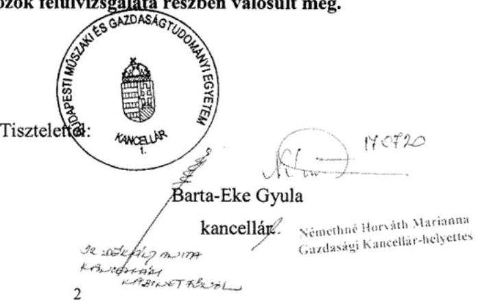

---

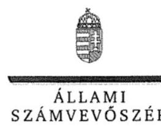

ELKÖK

# Barta-Eke Gyula 

kancellár
Budapesti Müszaki és Gazdaságtudományi Egyetem

## Budapest

## Tisztelt Kancellár Úr!

Az „Utóellenörzések - az állami felsőoktatási intézmények gazdálkodásának, müködésének ellenörzéséről készült jelentések utóellenörzése - Budapesti Müszaki és Gazdaságtudományi Egyetem" címmel készített számvevőszéki jelentéstervezetre tett észrevételét köszönettel megkaptam.
Az Állami Számvevőszék észrevételre vonatkozó álláspontjáról a felügyeleti vezető által készített részletes tájékoztatást csatoltan megküldöm.
Tájékoztatom Kancellár urat, hogy a számvevőszéki jelentésben - az Állami Számvevőszékről szóló 2011. évi LXVI. törvény 29. § (3) bekezdése alapján - a figyelembe nem vett észrevételeket szerepeltetjük az elutasítás indokának feltüntetésével.

Budapest, 2017. OJ hó 29 nap
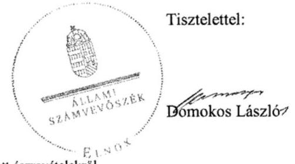

Melléklet: Tájékoztatás az el nem fogadott észrevételekröl

---

# Tájékoztatás az el nem fogadott észrevételekröl 

Az „Utóellenörzések - az állami felsőoktatási intézmények gazdálkodásának, müködésének ellenörzéséről készült jelentések utóellenörzése - Budapesti Müszaki és Gazdaságtudományi Egyetem" címủ jelentéstervezetre az 51257/2/2017. iktatószámú levélben tett észrevételeit áttekintettem.

Észrevételeinek kezeléséről az alábbi tájékoztatást adom.
A jelentéstervezet 5. oldalán szereplő „A szabálytalan elöleg elszámoláshoz kapcsolódóan a munkajogi felelösség kivizsgálása elmaradt.", valamint a jelentéstervezet 15. oldalán szereplő „Az el nem számolt elölegek elszámolása, szabályszerü pénzügyi számviteli rendezése határidöben - az intézkedési terv készitésének idöpontjában - már megtörtént, további intézkedés megtételére e tárgyban nem volt szükség. A munkajogi felelösség kivizsgálása részben valósult meg, mert a 20 millió Ft-os elöleg állomány $31 \%$-át kitevő, a 2006-2011. évek között keletkezett úti elöleg szabályszerü elszámolása, pénzügyi számviteli rendezése elmaradásához kapcsolódó munkajogi felelösséget nem vizsgálták ki." megállapításra tett 1. számú észrevétele kapcsán
„A szabálytalan elöleg elszámoláshoz kapcsolódóan a munkajogi felelösség kivizsgálása elmaradt. " megállapítás törlésére, valamint a „Az el nem számolt elölegek elszámolása, szabályszerü pénzügyi számviteli rendezése határidőben - az intézkedési terv készitésének időpontjában - már megtörtént, további intézkedés megtételére e tárgyban nem volt szükség. " megállapítás módosítására tett javaslatát tartalmazó észrevételét nem fogadjuk el. Észrevételében Kancellár úr a megállapítások relevanciájának hiányát vetette fel. Az Állami Számvevőszék (továbbiakban: ÁSZ) a Budapesti Müszaki és Gazdaságtudományi Egyetem (továbbiakban: Egyetem) utóellenőrzését a nemzetközi ellenőrzési standardokkal összhangban álló módszertan és az ellenőrzési szabályok figyelembevételével, az ÁSZ müködésére vonatkozó alkotmányos és egyéb - különös tekintettel az Állami Számvevőszékről szóló 2011. évi LXVI. törvényben (továbbiakban: ÁSZ tv.) foglalt - jogszabályi követelményeknek megfelelően végezte el. Az utóellenőrzés során az ÁSZ az Egyetem által megküldött intézkedési tervben (továbbiakban: Intézkedési Terv) vállalt feladatok végrehajtását ellenőrizte, az utóellenőrzés megállapításait, következetéseit az Egyetem által az ellenőrzés rendelkezésére bocsátott dokumentumok alapozták meg, amelyek a megállapítások alátámasztására elegendő és megfelelő ellenőrzési bizonyítékkal szolgáltak.

Az Intézkedési Terv 9. b) pontjában az Egyetem rektora vállalta: „A késve megtörtént elszámoláshoz kapcsolódóan a munkajogi felelösség kivizsgálását, valamint a vizsgálat eredményének ismeretében a szükséges intézkedések megtételét rendelem el. "

---

A feladat végrehajtásának ellenőrzése során megállapításra került, hogy a 2012. év végén aktív átfutó elszámolásként a mérlegben kimutatott 20 millió Ft el nem számolt előlegből a devizaszámláról kifizetett előleg és a szállítói előleg halmozódásának okait kivizsgálták, a vizsgálat eredményének ismeretében munkajogi felelősséget nem vetettek fel. Ugyanakkor az előleg állomány $31 \%$-át kitevő, a 2006-2011. évek között keletkezett úti előleg szabályszerű elszámolása, pénzügyi számviteli rendezése elmaradásához kapcsolódó munkajogi felelősség kivizsgálása nem történt meg. A Kancellár úr által vitatott ,,A szabálytalan elöleg elszámoláshoz kapcsolódóan a munkajogi felelösség kivizsgálása elmaradt. " megállapításunk a jelentéstervezetben tett részmegállapításokon alapul, így azt változatlanul fenntartjuk. Észrevétele ezért a megállapítást és az abból levont következtetést nem módosítja.

# A jelentéstervezet 16. oldalán szereplő „Az átfogó szervezeti egység vezetők nem rendelték el saját szervezetükre vonatkozóan a jogszabályokban elöirt szabályzatok teljes körü meglétének ellenörzését." megállapításra tett 2. számú észrevétele kapcsán 

Kancellár úr észrevételében a jelentéstervezet 16. oldalán szereplő ,,Az átfogó szervezeti egység vezetők nem rendelték el saját szervezetükre vonatkozóan a jogszabályokban elöirt szabályzatok teljes körü meglétének ellenörzését. " megállapítás módosítását javasolta a következők szerint: ,, A szervezetszabályzó eszközök felülvizsgálata részben valósult meg. "A megállapítás módosítására vonatkozó javaslatát tartalmazó észrevételét az alábbiakra tekintettel nem fogadjuk el:

Az Intézkedési Terv 1. a) pontjában az Egyetem rektora vállalta: ,,Jogszabályokban elöirt szabályzatok teljes körü meglétének ellenörzését rendelem el. ", felelőseként minden átfogó szervezeti egység vezetőjét a saját szervezetére kiterjedően jelölte meg. Azáltal, hogy az átfogó szervezeti egység vezetők nem rendelték el saját szervezetükre vonatkozóan a jogszabályokban elöírt szabályzatok teljes körű meglétének ellenőrzését, az Intézkedési Tervben vállalt feladat végrehajtása nem teljesült. Észrevétele a jelentéstervezet megállapítását nem módosítja.

Budapest, 2017.
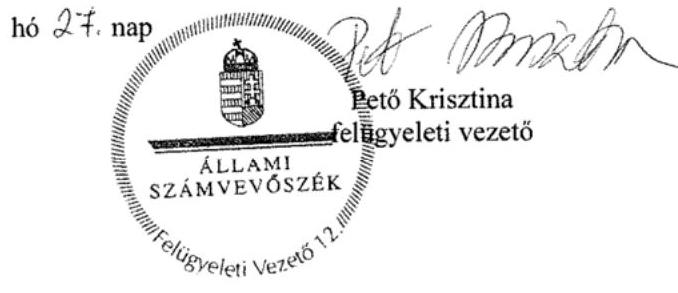

---

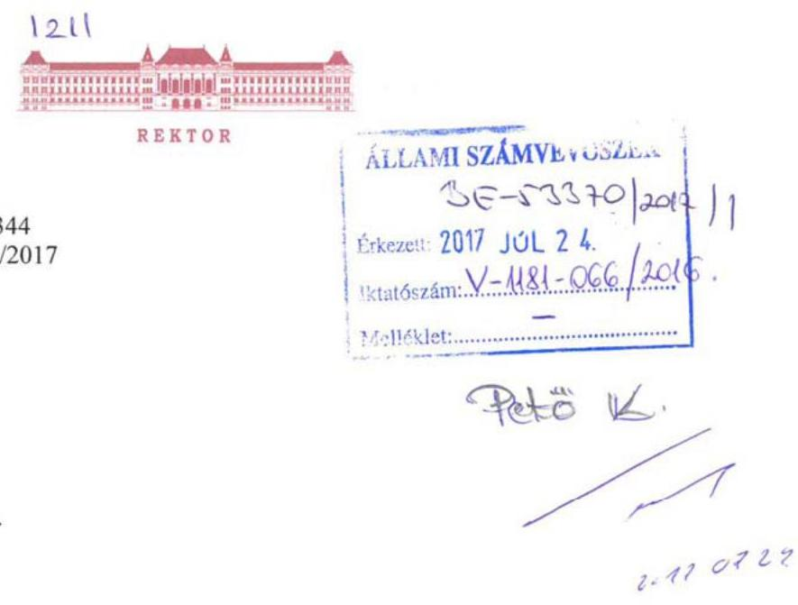

Tárgy: Jelentéstervezet észrevételezése

# Tisztelt Elnök Úr! 

Egyetemünk gazdálkodásának és müködésének 2014-es Állami Számvevőszéki ellenőrzéshez kapcsolódó intézményi Intézkedési Terv végrehajtásának 2017. évi utóellenőrzéséről készült Jelentéstervezetre az alábbi észrevételeket tesszük:

A Jelentéstervezet 5. oldalán összegzően, a 14. oldalon részletesebben kifejtve az áll, hogy Egyetemünk az Intézkedési Tervben szereplő 14 db feladatból kettőt részben hajtott végre, kettőt pedig nem hajtott végre.

1. A részben végrehajtott két feladat egyikeként sorolja fel a Jelentéstervezet a külföldi utazási előlegek határidőben történő elszámolása tárgyában megállapított késedelem okán a munkaügyi felelősség kivizsgálásának részbeni elmaradását.
E tárgyban észrevételezzük, hogy amint Önök a Jelentéstervezetben is helyesen leírták, 2006-2011 közötti időszakból származtak az elszámolási késedelmek. Az ÁSZ-jelentés csak 2014. öszén állt rendelkezésünkre, az intézményi Intézkedési Terv pedig többszöri pontositási kérelem után csak 2015-ben véglegesedett.

A fentiekre tekintettel esetenként 8-9 év, de legkevesebb 3 év már eltelt, amire az Intézkedési Terv szerinti felelősség vizsgálatára sor kerülhetett volna, így a külföldi utazáson résztvevő és elszámolási késedelembe esett munkavállalók és közalkalmazottak jogviszonyára és munkaügyi felelősségére vonatkozó akkor hatályos jogszabályi rendelkezések alapján jogszerủen a munkaügyi felelősség vagy

---

a jogviszony megszủnése miatt, vagy önmagában az időmúlás és elévülés okán már nem volt érdemben vizsgálható.
2. A végre nem hajtott két feladat egyikeként sorolja fel a Jelentéstervezet azt, hogy az átfogó szervezeti egységek vezetői nem rendelték el a saját szervezetükre vonatkozóan a jogszabályokban elöírt szabályzatok teljes körű meglétének ellenőrzését.

E tárgyban észrevételezzük, hogy Egyetemünkön a Rektor által kiadott intézkedések mindig összegyetemi hatályosságúak, kivéve, ha maga az intézkedés személyi vagy tárgyi hatályra szűkítéseket tartalmaz.

Mivel a tárgyban releváns Intézkedési Terv nem tartalmazott ilyen hatályosságra vonatkozó szükítést, az Intézkedési Terv összegyetemi hatályosságú volt, tehát semmi szükség nem volt arra, hogy az átfogó szervezeti egységek vezetői a saját szervezetükre vonatkozóan megismételjék a rendelkezést.

A fentiek alapján kérjük, szíveskedjenek a Jelentéstervezetet a fentiek figyelembe vételével úgy módosítani, hogy 1 db feladat részben lett végrehajtva, 1 db feladat pedig nem lett végrehajtva.

Budapest, 2017. július 19.

Tisztelettel:
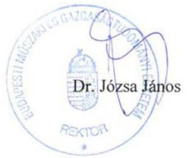

---

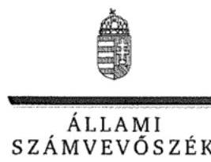

ELNÖK

# Dr. Józsa János 

rektor
Budapesti Műszaki és Gazdaságtudományi Egyetem

## Budapest

## Tisztelt Rektor Úr!

Az „Utóellenörzések - az állami felsőoktatási intézmények gazdálkodásának, müködésének ellenörzéséről készült jelentések utóellenörzése - Budapesti Müszaki és Gazdaságtudományi Egyetem" címmel készített számvevőszéki jelentéstervezetre tett észrevételét köszönettel megkaptam.
Az Állami Számvevőszék észrevételre vonatkozó álláspontjáról a felügyeleti vezető által készített részletes tájékoztatást csatoltan megküldöm.
Tájékoztatom Rektor urat, hogy a számvevőszéki jelentésben - az Állami Számvevőszékről szóló 2011. évi LXVI. törvény 29. § (3) bekezdése alapján - a figyelembe nem vett észrevételeket szerepeltetjük az elutasítás indokának feltüntetésével.

Budapest, 2017. 27 hó 27 nap
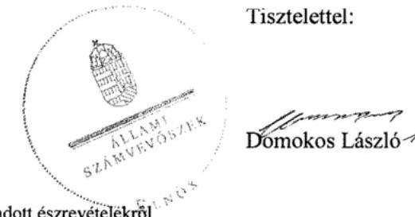

Melléklet: Tájékoztatás az el nem fogadott észrevételekröl

---

# Tájékoztatás az el nem fogadott észrevételekről 

Az „Utóellenörzések - az állami felsőoktatási intézmények gazdálkodásának, müködésének ellenörzéséről készül jelentések utóellenörzése - Budapesti Müszaki és Gazdaságtudományi Egyetem" címủ jelentéstervezetre a 133/3/2017. iktatószámú levélben tett észrevételeit áttekintettem.

Észrevételeinek kezeléséről az alábbi tájékoztatást adom.
A jelentéstervezet 15. oldalán szereplő „Az el nem számolt elölegek elszámolása, szabályszerü pénzügyi számviteli rendezése határidőben - az intézkedési terv készitésének idöpontjában már megtörtént, további intézkedés megtételére e tárgyban nem volt szükség. A munkajogi felelösség kivizsgálása részben valósult meg, mert a 20 millió Ft-os elöleg állomány $31 \%$-át kitevő, a 2006-2011. évek között keletkezett úti elöleg szabályszerü elszámolása, pénzügyi számviteli rendezése elmaradásához kapcsolódó munkajogi felelösséget nem vizsgálták ki." megállapításra tett 1. számú észrevétele kapcsán

Észrevételében Rektor úr arra hivatkozott, hogy ,... esetenként 8-9 év, de legkevesebb 3 év már eltelt, amire az Intézkedési Terv szerinti felelösség vizsgálatára sor kerülhetett volna, igy a külföldi utazáson résztvevő és elszámolási késedelembe esett munkavállalók és közalkalmazottak jogviszonyára és munkaügyi felelősségére vonatkozó akkor hatályos jogszabályi rendelkezések alapján jogszerüen a munkaügyi felelösség vagy a jogviszony megszünése miatt, vagy önmagában az idömülés és elévülés okán már nem volt érdemben vizsgálható." Észrevételét az alábbiakra tekintettel nem fogadjuk el:

Az utóellenőrzés a Budapesti Műszaki és Gazdaságtudományi Egyetem (továbbiakban: Egyetem) által megküldött intézkedési tervben (továbbiakban: Intézkedési Terv) vállalt feladatok végrehajtását ellenőrizte, az utóellenőrzés megállapításait, következetéseit az Egyetem által az ellenőrzés rendelkezésére bocsátott dokumentumok alapozták meg, amelyek a megállapítások alátámasztására elegendő és megfelelő ellenőrzési bizonyítékkal szolgáltak. Az Intézkedési Terv 9. b) pontjában az Egyetem rektora vállalta: „A késve megtörtént elszámoláshoz kapcsolódóan a munkajogi felelösség kivizsgálását, valamint a vizsgálat eredményének ismeretében a szükséges intézkedések megtételét rendelem el."

A feladat végrehajtásának ellenőrzése során megállapításra került, hogy az Intézkedési Tervben vállalt feladat csak részben került végrehajtásra, mivel az előleg állomány $31 \%$-át kitevő, a 20062011. évek között keletkezett úti előleg szabályszerű elszámolása, pénzügyi számviteli rendezése elmaradásához kapcsolódó munkajogi felelősség kivizsgálása nem történt meg, amelyet Rektor úr észrevétele is megerősített. Észrevétele ezért a megállapítást nem módosítja.

---

A jelentéstervezet 16. oldalán szereplő „Az átfogó szervezeti egység vezetők nem rendelték el saját szervezetükre vonatkozóan a jogszabályokban elöirt szabályzatok teljes körü meglétének ellenörzését." megállapításra tett 2. számú észrevétele kapcsán

A jelentéstervezet 16. oldal 11. pontjában szereplő megállapításra tett észrevételét nem fogadjuk el. Az Intézkedési Terv 1. a) pontjában az Egyetem rektora vállalta: „Jogszabályokban elöirt szabályzatok teljes körü meglétének ellenörzését rendelem el. ", felelőseként minden átfogó szervezeti egység vezetőjét a saját szervezetére kiterjedően jelölte meg. Azáltal, hogy az átfogó szervezeti egység vezetők nem rendelték el saját szervezetükre vonatkozóan a jogszabályokban elöírt szabályzatok teljes körü meglétének ellenőrzését, az Intézkedési Tervben vállalt feladat végrehajtása nem teljesült. Észrevétele a jelentéstervezet megállapítását nem módosítja.

Budapest, 2017.
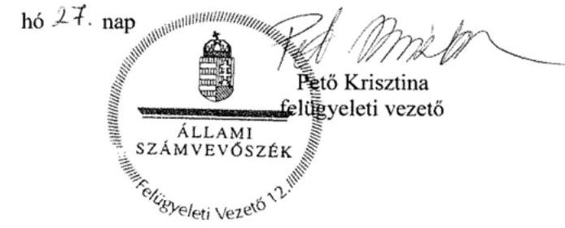

---

.

---

# RÖVIDÍTÉSEK JEGYZÉKE 

${ }^{1}$ számvevőszéki jelentés
${ }^{2}$ Egyetem
${ }^{3}$ rektor
${ }^{4}$ kancellár
${ }^{5}$ ÁSZ
${ }^{6}$ ÁSZ tv.
${ }^{7}$ EMMI
${ }^{8}$ ÁSZ SZMSZ
${ }^{9}$ Bkr.
${ }^{10}$ a kötelezettségvállalás, a pénzügyi ellenjegyzés, az érvényesítés, a teljesítésigazolás és az utalványozás rendjéről szóló szabályzat
${ }^{11}$ közbeszerzési szabályzat
${ }^{12} \mathrm{Kbt}$.
${ }^{13}$ beszerzési szabályzat
${ }^{14}$ Kincstár
${ }^{15}$ Kjt.
${ }^{16}$ Belső Ellenőrzési Csoport
${ }^{17}$ kockázatkezelési szabályzat
${ }^{18}$ önköltségszámítási szabályzat
${ }^{19}$ számviteli politika
${ }^{20}$ Kincstár
${ }^{21} \mathrm{Kbt}$.
${ }^{22}$ Kancellária egyes szervezeti egységeinek ügyrendjei
${ }^{23}$ d) pont szerint elkészített intézkedési terv

ÁSZ 14218. számú, Jelentés a Budapesti Műszaki és Gazdaságtudományi Egyetem ellenőrzéséről - Az állami felsőoktatási intézmények gazdálkodásának, működésének ellenőrzése (közzététel időpontja: 2014. október 16.)
Budapesti Műszaki és Gazdaságtudományi Egyetem
Budapesti Műszaki és Gazdaságtudományi Egyetem rektora
Budapesti Műszaki és Gazdaságtudományi Egyetem kancellárja
Állami Számvevőszék
2011. évi LXVI. törvény az Állami Számvevőszékről (hatályos: 2011. július 1-jétől)

Emberi Erőforrások Minisztériuma
Az Állami Számvevőszék elnökének 3/2016. (XII. 29.) ÁSZ utasítása az Állami Számvevőszék Szervezeti és Működési Szabályzatáról (hatályos: 2017. január 1-jétől)
370/2011. (XII. 31.) Kormányrendelet a költségvetési szervek belső kontrollrendszeréről és belső ellenőrzéséről (hatályos: 2012. január 1-jétől)
3/2013. (II. 28.) számú Rektori utasítás a kötelezettségvállalás, a pénzügyi ellenjegyzés, az érvényesítés, a teljesítésigazolás és az utalványozás rendjéről (hatályos: 2013. március 1-jétől)

18/2013. (X. 28.) számú Rektori utasítás A Budapesti Műszaki és Gazdaságtudományi Egyetem Közbeszerzési Szabályzata (hatályos: 2013. október 28-tól)
2011. évi CVIII. törvény a közbeszerzésekről (hatályos: 2011. március 21-től 2015. október 31-ig)

24/2014. (XI. 7.) számú Rektori utasítás Budapesti Műszaki és Gazdaságtudományi Egyetem Beszerzési Szabályzata (hatályos: 2014. november 10-től) Magyar Államkincstár
1992. évi XXXIII. törvény a közalkalmazottak jogállásáról (hatályos: 1992. július 1től)
Budapesti Műszaki és Gazdaságtudományi Egyetem Belső Ellenőrzési Csoportja
4/2016. (III. 7.) számú Rektori és Kancellári közös Utasítás a kockázatkezelés rendjéről (hatályos: 2016. március 15-től)
a Budapesti Müszaki és Gazdaságtudományi Egyetem Önköltségszámítási Szabályzata
Budapesti Müszaki és Gazdaságtudományi Egyetem Számviteli Politika és az Eszközök és Források Értékelésének Rendje (hatályos: 2015. október 5-től) Magyar Államkincstár
a közbeszerzésekről szóló 2011. évi CVIII. törvény (hatályos: 2011. augusztus 21től 2015. október 31-ig)
a Budapesti Müszaki és Gazdaságtudományi Egyetem Kancellária Monitoring és Kontrolling Osztály ügyrendje (hatályos: 2016. szeptember 1-jétől) és a Budapesti Müszaki és Gazdaságtudományi Egyetem Kancellária Pénzügyi és Számviteli Igazgatósága Ügyrendje (hatályos: 2016. december 13-tól)
A Budapesti Müszaki és Gazdaságtudományi Egyetem intézkedési tervének 3. d) pontjában foglalt, az egyetemi Belső Ellenőrzési Csoport által végzett vizsgálatok megállapításainak hasznosítása céljából minden ellenőrzött szervezeti egység által készített intézkedési terv

---

${ }^{24}$ Nftv.
2011. évi CCIV. törvény a nemzeti felsőoktatásról (hatályos: 2012. január 1-től)

---

# ÁLLAMI SZÁMVEVŐSZÉK 

1052 Budapest, Apáczai Csere János utca 10.
Levélcím: 1364 Budapest 4. Pf. 54
Telefon: +36 14849100 Telefax: +36 14849200
www.asz.hu