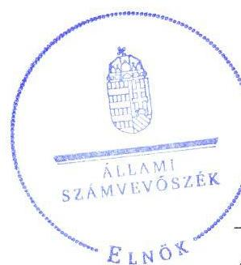
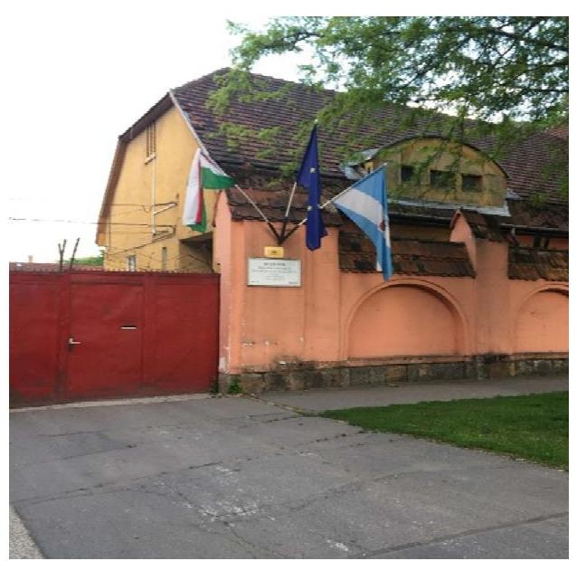
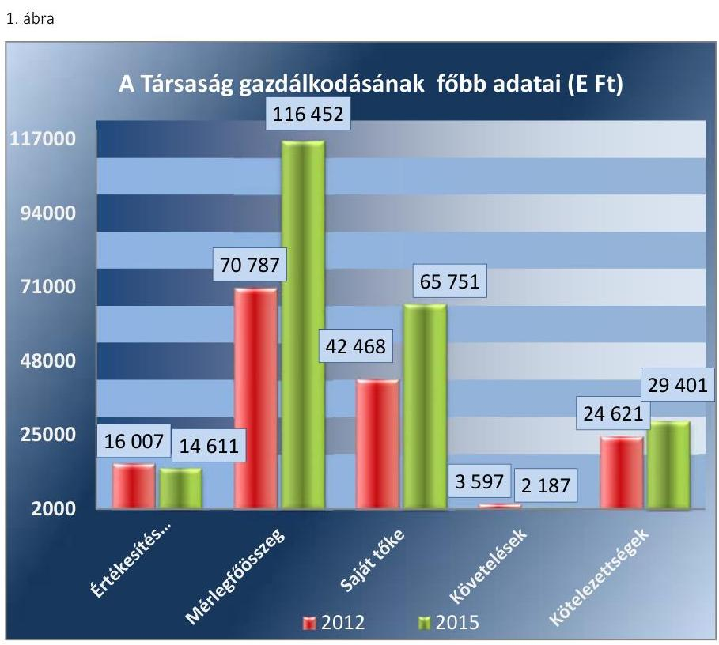
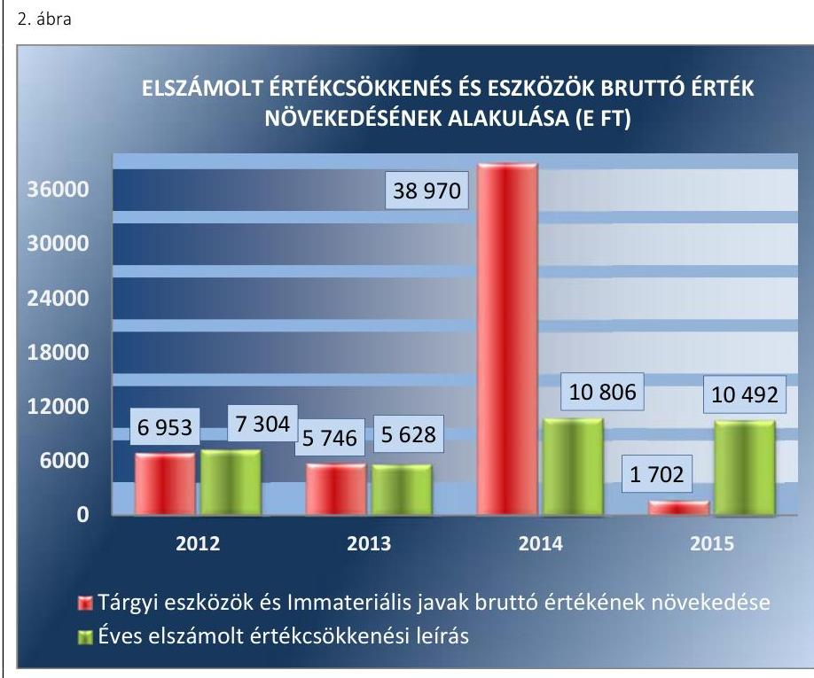
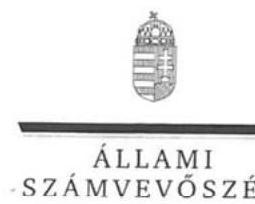
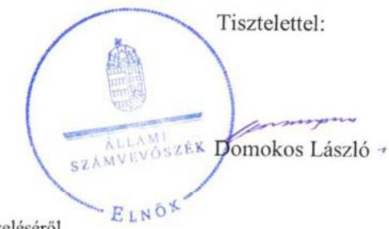
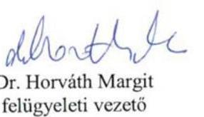

# Jelentés 

## Az önkormányzatok gazdasági társaságai

Az önkormányzatok többségi tulajdonában lévő gazdasági társaságok gazdálkodásának ellenőrzése - KÖZPARK Kispesti Köztisztasági és Közfoglalkoztatási Nonprofit Korlátolt Felelősségű Társaság
2017.

Az ÁSZ az államháztartáson kívül működő feladat-ellátó rendszerek ellenőrzéseivel hozzájárul ahhoz, hogy a közpénzeket az államháztartáson kívül működő szervezetek is átlátható, rendezett módon használják fel a feladatok ellátása érdekében.

---

# Jelentés 

## Az önkormányzatok gazdasági társaságai

Az önkormányzatok többségi tulajdonában lévő gazdasági társaságok gazdálkodásának ellenőrzése - KÖZPARK Kispesti Köztisztasági és Közfoglalkoztatási Nonprofit Korlátolt Felelősségű Társaság
2017. O\& hó 17 nap

17151
www.asz.hu

---

# AZ ELLENŐRZÉST FELÜGYELTE:

DR. HORVÁTH MARGIT felügyeleti vezető

# AZ ELLENŐRZÉST VEZETTE ÉS A VÉGREHAJTÁSÁÉRT FELELŐS:

DR. PELLEI TAMÁS ellenőrzésvezető

# A PROGRAM ÖSSZEÁLLÍTÁSÁÉRT FELELŐS:

JANIK JÓZSEF osztályvezető

---

**IKTATÓSZÁM:** V-1295-220/2016.

**TÉMASZÁM:** 2329

**ELLENŐRZÉS-AZONOSÍTÓ SZÁM:** V075820

---

Jelentéseink az Országgyűlés számítógépes hálózatán és az Interneten a www.asz.hu címen is olvashatóak.

---

# TARTALOMJEGYZÉK 

■ ÖSSZEGZÉS ..... 5
■ AZ ELLENŐRZÉS CÉLJA ..... 6
■ AZ ELLENŐRZÉS TERÜLETE ..... 7
■ AZ ELLENŐRZÉS HÁTTERE, INDOKOLTSÁGA ..... 9
■ A JELENTÉS LÉNYEGES KÉRDÉSKÖREI ..... 10
■ ELLENŐRZÉS HATÓKÖRE ÉS MÓDSZEREI ..... 11
■ MEGÁLLAPÍTÁSOK ..... 13
■ JAVASLATOK ..... 22
■ MELLÉKLETEK ..... 25
I. Sz. melléklet: Értelmező szótár ..... 25
II. Sz. melléklet: A Társaság mérlegadatainak változása a 2012-2015. években ..... 26
III. Sz. melléklet: A Társaság eredménykimutatásának adatai a 2012-2015. években ..... 27
■ FÜGGELÉK: ÉSZREVÉTELEK ..... 29
■ RÖVIDÍTÉSEK JEGYZÉKE ..... 39

---

.

---

# ÖSSZEGZÉS 

Budapest Főváros XIX. kerület Kispest Önkormányzata tulajdonosi jogait szabályszerűen gyakorolta. A Közpark Kispesti Köztisztasági és Közfoglalkoztatási Nonprofit Korlátolt Felelősségű Társaságnál a vagyongazdálkodás szabályszerűsége, annak elszámoltathatósága, valamint a közzététel hiányosságai miatt az átláthatóság nem volt biztosított. A Társaság fizetőképessége stabil volt.

## Az ellenőrzés társadalmi indokoltsága

Az Állami Számvevőszék kiemelt célja, hogy a helyi önkormányzatok gazdálkodásában rejlő pénzügyi kockázatok feltárásával, az államháztartáson kívülre nyújtott költségvetési támogatások és ingyenes vagyonjuttatások, valamint az államháztartáson kívül működő feladat-ellátó rendszerek ellenőrzéseivel hozzájáruljon ahhoz, hogy a közpénzeket az államháztartáson kívül működő szervezetek is átlátható, rendezett módon használják fel.

Az Állami Számvevőszék céljaival és a társadalmi igénnyel összhangban, a gazdasági társaságok kiemelt fontosságú szerepe miatt került sor a Közpark Kispesti Köztisztasági és Közfoglalkoztatási Nonprofit Korlátolt Felelősségű Társaság ellenőrzésére.

## Főbb megállapítások, következtetések, javaslatok

Budapest Főváros XIX. kerület Kispest Önkormányzata a tulajdonosi jogok gyakorlásának rendjét a szabályszerűen kialakította. A tulajdonosi jogokat a Képviselő-testület szabályszerűen gyakorolta annak ellenére, hogy a javadalmazási szabályzatot nem alkotta meg. A Képviselő-testület az üzleti terv készítési kötelezettséget előírta a Társaság részére, a beszámoló elfogadásáról az FB írásbeli jelentésének birtokában döntött. Az Önkormányzat belső ellenőrzése a Társaságnál nem végzett ellenőrzést, ezért nem járult hozzá a Társaság feladatellátásának szabályszerű teljesítéséhez, nem támogatta a szabályszerű működés kontrollját.

A Társaság a 2012-2014. években nem rendelkezett számviteli szabályzatokkal, a 2015. évben elkészített szabályzatok tartalma maradéktalanul nem felelt meg az előírásoknak. A Társaság a jogszabályi előírásokat megsértve számlarendet nem készített. A Társaság vagyongazdálkodása az ellenőrzött időszakban nem volt szabályszerű, mivel az egyszerűsített éves beszámolók mérlegadatait leltárral nem támasztotta alá. A Társaság fizetőképessége biztosított volt a gazdálkodás során. A Társaság az előírt beszámolási, adatszolgáltatási kötelezettségeit nem teljesítette teljes körűen. Az egyszerűsített éves beszámolóit elkészítette, azonban a beszámolók szerkezete nem felelt meg maradéktalanul a jogszabály előírásainak. A beszámolóval és a leltárral kapcsolatos szabálytalanságokat a könyvvizsgáló nem kifogásolta. A központi költségvetésről szóló törvény elkészítéséhez nem szolgáltatott adatokat a kormányzati szektorba sorolását követő időszakban. A közzétételi kötelezettségének a tevékenységre, működésre vonatkozó adatok tekintetében nem teljes körűen, a gazdálkodási adatok tekintetében nem tett eleget. A bevételek és a ráfordítások, valamint a személyi jellegű ráfordítások elszámolása összességében szabályszerű volt, az értékcsökkenés elszámolása nem volt megfelelő. A Társaság önköltségszámítás rendjére vonatkozó szabályzat készítésére nem volt kötelezett, azonban a Számviteli politika előírása ellenére 2015. április 1-jét követően azt nem készítette el. A Társaságnak az államadósságra befolyással bíró gazdasági eseményei nem voltak, adósságot keletkeztető ügyletet nem kötött.

---

# AZ ELLENŐRZÉS CÉLJA 

AZ ELLENŐRZÉS CÉLJA annak értékelése, hogy az önkormányzat vagyongazdálkodási tevékenysége során szabályszerűen gyakorolta-e tulajdonosi jogait; a gazdasági társaság szabályozottsága, gazdálkodása és vagyongazdálkodási tevékenysége, bevételeinek és ráfordításainak elszámolása megfelelt-e a jogszabályi és tulajdonosi előírásoknak; a gazdasági társaság kötelezettségállománya jelent-e kockázatot a működésre, valamint a gazdálkodás átláthatósága és elszámoltathatósága érdekében biztosítva volt-e a szolgáltatás díjának megalapozottsága szabályszerű önköltségszámítással. Az ellenőrzés célja továbbá annak megítélése, hogy az önkormányzatok többségi tulajdonában lévő gazdasági társaságok gazdálkodásának a kormányzati szektor hiányára és az államadósságra befolyással bíró elemei a jogszabályi előírásoknak megfelelnek-e.

---

# AZ ELLENŐRZÉS TERÜLETE 

## Közpark Kispesti Köztisztasági és Közfoglalkoztatási Nonprofit Korlátolt Felelősségű Társaság és Budapest Főváros XIX. kerület Kispest Önkormányzata

A KÖZPARK KISPESTI KÖZTISZTASÁGI ÉS KÖZFOGLALKOZTATÁSI NONPROFIT KORLÁTOLT FELELŐSSÉGŰ TÁRSASÁGOT Budapest Főváros XIX. kerület Kispest Önkormányzata ${ }^{1}$ 2008. június 3-án pénzbeli hozzájárulással teljesített 3000 E Ft törzstőkével alapította. A Társaság ${ }^{2}$ jegyzett tőkéje 2012-2015. években 3000 E Ft volt, 2013. június 28-ától kormányzati szektorba sorolt egyéb szervezetnek minősül.

A Társaság felett a tulajdonosi jogokat a Képviselő-testület ${ }^{3}$ gyakorolta, az ellenőrzött időszakban átalakulás nem érintette, tevékenységét egyszemélyes nonprofit társaságként látta el.

Az ellenőrzött időszakban a Társaság fő közhasznú közszolgáltató tevékenységei: köztisztasági tevékenység (parki hulladékgyűjtők ürítése, takarítás kéziszerszámokkal, seprőgéppel, síkosság mentesítés, hótakarítás, játszóterek tisztán tartása); kertészeti tevékenység (gyep, pázsitfelületek fenntartása, cserje felületek fenntartása); szakipari tevékenység (játszóterek karbantartása, köztéri berendezések, bútorok, parki öntözőhálózat karbantartása). A közhasznú tevékenység céljainak elősegítése érdekében vállalkozási tevékenységet is folytatott, melynek keretén belül társasházaknak, magánszemélyeknek, valamint az Önkormányzat intézményeinek kertészeti, köztisztasági és szakipari munkákat végezett.

Az Önkormányzat a Társaság feladatellátásához a 2012-2013. években évente 242500 E Ft, a 2014. évben 302000 E Ft és a 2015. évben 244000 E Ft működési célú támogatást adott a Támogatási szerződés ${ }_{1} 4^{4}$ ben meghatározott közszolgáltatások biztosításával kapcsolatos és a foglalkoztatás elősegítéséről szóló törvény5-ben rögzített feladatok ellátása érdekében.

A Társaság a munkaügyi hivataltól ${ }^{6}$ közfoglalkoztatásra vonatkozó hatósági szerződés alapján 2012. évben 32300 E Ft, 2013. évben 42874 E Ft, 2014. évben 86423 E Ft és 2015. évben 105696 E Ft támogatást kapott.

A vállalkozási tevékenység értékesítés nettó árbevétele 2012. évben 16007 E Ft és 2015. évben 13761 E Ft volt.

A Társaság gazdálkodását jellemző főbb adatokat az 1. ábra tartalmazza.

---

Forrás: A Társaság 2012. és 2015. évi egyszerűsített éves beszámolói, főkönyvi kivonatai
A mérlegfőösszeg 2012. december 31. és 2015. december 31. között 164,5%-kal emelkedett, az eszközök tekintetében a tárgyi eszközök és pénzeszközök emelkedése, a források körében a kötelezettségek és a passzív időbeli elhatárolások emelkedése miatt.

A mérlegadatok változását a II. számú melléklet és az eredménykimutatás adatait a III. számú melléklet tartalmazza.

A könyvvezetést, az egyszerűsített éves beszámolók és a közhasznúsági mellékletek összeállítását külső könyvelő cég végezte.

A Társaság ügyvezetőjének személye 2015. január 1-ével változott, és 2015. június 1-jétől új könyvvizsgáló megválasztására került sor. A Társaság a Számv. tv. ${ }^{7}$ alapján könyvvizsgálatra nem volt kötelezett, az Alapító Okirat ${ }_{1-4}$-ben ${ }^{8}$ meghatározták a könyvvizsgáló személyét. A Társaság főállású dolgozóinak létszáma 2012. évben 36 fő volt, és ezen felül közfoglalkoztatási munkaviszony keretében 200 főt foglalkoztatott. A 2015. évi átlagos statisztikai létszám 122 fő volt.

Az ellenőrzött időszakban a polgármester személye nem változott, a 2010. évi önkormányzati választások óta tölti be tisztségét, a jegyző 2013. május 1-jétől látja el feladatait.

---

# AZ ELLENŐRZÉS HÁTTERE, INDOKOLTSÁGA 

Az önkormányzatok többségi tulajdonában álló gazdasági társaságok ellenőrzése kiemelten fontos a vagyon megőrzése, megóvása érdekében, valamint a kormányzati szektor elszámolásaiban megjelenő önkormányzati tulajdonú gazdálkodó szervezetek esetében, amelyekkel szemben alapvető követelmény, hogy gazdálkodásuk, működésük szabályszerű, az általuk szolgáltatott adatok minél megbízhatóbbak legyenek. A feladatellátás költségeinek, ráfordításainak alakulása a lakosság széles rétegét érinti.

Ellenőrzéseink feltárhatják, hogy az Önkormányzat a feladatellátásához rendelt vagyon működtetését a tulajdonostól elvárható gondossággal végezte-e, a feladatot ellátó gazdasági társaság a létesítő okiratban, szolgáltatási szerződésben foglaltak betartásával biztosította-e a feladat ellátását. Az ellenőrzés eredményeképp meghatározhatóvá válnak a költségvetési hiányt befolyásoló szervezetek kockázatai, lehetővé válik ezen kockázatok csökkentése. Az ellenőrzés rávilágíthat arra, hogy a gazdasági társaság a vagyon használatával biztosította-e a szolgáltatás folytatásának feltételeit, az önkormányzat tulajdonosi felügyelete hozzájárult-e a szabályszerű gazdálkodáshoz és feladatellátáshoz. A megállapítások alapján megfogalmazott számvevőszéki javaslatok hasznosítása elősegítheti a meglévő hibák megszüntetését. A jó gyakorlatok bemutatásával az ÁSZ ${ }^{9}$ hozzájárulhat a követendő megoldások megismertetéséhez, terjesztéséhez.

---

# A JELENTÉS LÉNYEGES KÉRDÉSKÖREI 

1.     - Az Önkormányzat tulajdonosi joggyakorlása szabályszerű volt-e?
2.     - A gazdasági társaság vagyongazdálkodása szabályszerű volt-e, fizetőképessége biztosított volt-e a gazdálkodás során?
3.     - A gazdasági társaság bevételeinek és ráfordításainak elszámolása, valamint az önköltségszámítás és árképzés szabályszerű volt-e?
4.     - A kormányzati szektorba sorolt, többségi önkormányzati tulajdonban lévő gazdasági társaságok gazdálkodásának a kormányzati szektor hiányára és az államadósságra befolyással bíró gazdasági eseményei megfeleltek-e a jogszabályi előírásoknak?

---

# ELLENŐRZÉS HATÓKÖRE ÉS MÓDSZEREI 

## Az ellenőrzés típusa

Megfelelőségi ellenőrzés.

## Az ellenőrzött időszak

Az ellenőrzött időszak 2012. január 1-jétől 2015. december 31-ig tart.

## Az ellenőrzés tárgya

Az önkormányzatok - többségi tulajdonában lévő gazdasági társaságok feletti - tulajdonosi joggyakorlása, valamint a gazdasági társaságok gazdálkodásának szabályozottsága és szabályszerűsége, továbbá az önkormányzati alszektorba sorolt gazdasági társaság gazdálkodásának a kormányzati szektor hiányára és az államadósságra befolyással bíró elemei.

Az ellenőrzés kiterjed minden olyan körülményre és adatra, amely az ÁSZ jogszabályban meghatározott feladatainak teljesítéséhez, valamint a program végrehajtása folyamán felmerült újabb összefüggések feltárásához szükséges.

## Az ellenőrzött szervezet

Közpark Kispesti Köztisztasági és Közfoglalkoztatási Nonprofit Korlátolt Felelősségű Társaság és Budapest Főváros XIX. kerület Kispest Önkormányzata

## Az ellenőrzés jogalapja

Az ellenőrzés jogszabályi alapját az ÁSZ tv. ${ }^{10} 1. §$ (3) bekezdése és 5. § (3)-(4)-(5) bekezdései képezik.

## Az ellenőrzés módszerei

Az ellenőrzést a nemzetközi standardokat irányadónak tekintve az ellenőrzési program ellenőrzési kérdései, az ellenőrzött időszakban hatályos jogszabályok, az ellenőrzés szakmai szabályok és módszertanok figyelembe vételével végeztük.

---

Az ellenőrzés ideje alatt az ellenőrzött szervezettel történő kapcsolattartást az ÁSZ Szervezeti és Működési Szabályzatának vonatkozó előírásai alapján biztosítottuk.

Az ellenőrzés a kiválasztott, többségi tulajdonosi jogokat gyakorló önkormányzatra, illetve az ellenőrzött gazdasági társaságra terjedt ki.

Az ellenőrzési kérdések megválaszolásához szükséges bizonyítékok megszerzése a következő ellenőrzési eljárások alkalmazásával történt: megfigyelés, kérdésfeltevés (információkérés), összehasonlítás, valamint elemző eljárás. Az ellenőrzési bizonyítékként felhasználható adatforrások közé tartoztak egyrészt az ellenőrzési programban felsorolt adatforrások, másrészt adatforrás lehetett még minden - az ellenőrzés folyamán - feltárt, az ellenőrzés szempontjából információkat tartalmazó dokumentum.

Az ellenőrzést a kérdésekre adott válaszok kiértékelésével, valamint a megjelölt adatforrások, a csatolt tanúsítványok felhasználásával, továbbá az adott időszakban hatályos jogszabályok figyelembe vételével folytattuk le.

A bevételek és ráfordítások elszámolása, valamint a vagyonnyilvántartás terén

 a szabályszerű működést véletlen mintavétellel ellenőriztük. A mintavétellel ellenőrzött területek esetében minden egyes tétel vonatkozásában a szabályszerűségre vonatkozó kérdéseket tettünk fel, amelyek eredménye összesítésre került. Megfelelőnek értékeltünk egy ellenőrzött területet, amennyiben 95%-os bizonyossággal a teljes sokaságban a hibaarány legfeljebb 10%, nem megfelelőnek, amennyiben 10%-nál magasabb arányt képviselt. Abban az esetben, ha a teljes sokaság tekintetében a 10%-os hibaarányhoz való viszony megítélésének megbízhatósága nem érte el a 95%-ot, annak elérése érdekében értékelésünket további szempontokkal egészítettük ki, és figyelembe vettük a feltárt hibák típusát és súlyát. A ráfordítások elszámolására és a vagyonnyilvántartásra vonatkozó véletlen mintavételt kockázati alapú kiválasztással egészítettük ki, amelynek során évente a három legnagyobb összegű tételt választottuk ki.

---

# 1. Az Önkormányzat tulajdonosi joggyakorlása szabályszerű volt-e? 

Összegző megállapítás

Az Önkormányzat a tulajdonosi joggyakorlás kereteit szabályszerűen alakította ki. A tulajdonosi jogok gyakorlása szabályszerű volt annak ellenére, hogy a Képviselő-testület a javadalmazási szabályzatot nem alkotta meg. A gazdálkodás ellenőrzésének hiánya miatt a tulajdonosi joggyakorló nem járult hozzá a feladatellátás szabályszerű teljesítéséhez.
1.1. számú megállapítás

Az Önkormányzat tulajdonosi joggyakorlásának kereteit szabályszerűen alakította ki.

A GAZDASÁGI PROGRAM ${ }_{1-2}{ }^{11}$-ban az Önkormányzat az Ötv. ${ }^{12}$ 91. § (1) és (6) bekezdéseiben és az Mötv. ${ }^{13}$ 116. § (1)-(4) bekezdéseiben foglaltakkal összhangban rögzítette a hosszú távú fejlesztési elképzeléseit, amelyekben a Társaság által ellátott feladatokra vonatkozó elképzeléseket is meghatározott. Az Önkormányzat az Nvtv. ${ }^{14}$ 9. § (1) bekezdésében foglaltak alapján 2013. november 15-én jóváhagyta a vagyongazdálkodási tervét ${ }^{15}$.

## A TULAJDONOSI JOGOK GYAKORLÁSÁNAK

RENDJÉT az Önkormányzat a Gt. ${ }^{16}$ és a Ptk. ${ }_{2}{ }^{17}$ előírásaival összhangban az SZMSZ ${ }^{18}$-ben, a Vagyonrendelet ${ }_{1-3}{ }^{19}$-ben, a Társaság Alapító Okirat ${ }_{1-}$-ában és a Társasággal megkötött Támogatási szerződés ${ }_{1-6}$-ben határozta meg. A Társaság feletti tulajdonosi jogokat a Képviselő-testület gyakorolta, a tulajdonosi jogosítványok átruházására nem került sor.

## A FELADATELLÁTÁSHOZ KAPCSOLÓDÓ KÖVE-

TELMÉNYEKET az Önkormányzat a Társaság Alapító Okirat ${ }_{1-4}$-ban és a Társasággal kötött Támogatási szerződés ${ }_{1-6}$-ben rögzítette.

Az Önkormányzat az Alapító Okirat ${ }_{1-4}$-ban meghatározta a Társaság képviseletét ellátó ügyvezető személyét, az ügyvezető kötelezettségeit, feladatait, az összeférhetetlenségi szabályokat, valamint a tulajdonosi joggyakorló beszámoló és a közhasznúsági melléklet elfogadására vonatkozó feladatait. A Gt. és a Ptk. ${ }_{2}$ rendelkezésének megfelelően rögzítette az FB${ }^{20}$ tagok számát, személyét és jogait valamint az Alapító Okirat ${ }_{2-4}$ tartalmazta az üzleti terv készítésének kötelezettségét.

Az Önkormányzat a Támogatási szerződés ${ }_{1-6}$-ben rögzítette a szerződés időtartamát, az ellátási területet, a teljesítendő szolgáltatási kötelezettséget, a szerződés felmondásának módját, az ellenőrzésről és a működésről, valamint a támogatási összeg felhasználásáról szóló éves beszámolási kötelezettséget.

---

### 1.2. számú megállapítás

1. táblázat

| MÉRLEG SZERINTI EREDMÉNY |  |  |  |
| :--: | :--: | :--: | :--: |
| ALAKULÁSA (E FT) |  |  |  |
| 2012. | 2013. | 2014. | 2015. |
| -1605 | 2227 | 20456 | 600 |

A tulajdonosi jogok gyakorlása szabályszerű volt annak ellenére, hogy a Képviselő-testület a javadalmazási szabályzatot nem alkotta meg. A gazdálkodás ellenőrzésének hiánya miatt a tulajdonosi joggyakorló nem járult hozzá a feladatellátás szabályszerű teljesítéséhez.

AZ ÜZLETI TERVEKET a Társaság az ellenőrzött időszakban elkészítette, amelyeket a Képviselő-testület - az FB előzetes véleményével együtt - határozataival elfogadott. Az üzleti tervek összhangban voltak a Gazdasági Program ${ }_{1-2}$-ban megfogalmazottakkal.

AZ FB a Gt. és a Ptk. 2 előírásának megfelelően három tagból állt és az ügyrendjében foglaltak szerint működött. Az ellenőrzött években megtárgyalta és véleményezte a Társaság üzleti tervét, éves beszámolóját és közhasznúsági mellékletét. Az FB a Gt. 35. § (3) bekezdésében, illetve a Ptk. 2 3:120 § (2) bekezdésének megfelelően minden évben írásbeli jelentést készített a Társaság számviteli beszámolójáról.

## AZ ÉVES BESZÁMOLTATÁS KERETÉBEN:

$\longrightarrow$ a Támogatási szerződés ${ }_{1-6}$-ben előírtaknak megfelelően évente készített a Társaság beszámolót a tevékenységéről, amely tartalmazta az Önkormányzattól kapott támogatás elszámolását is,
$\longrightarrow$ az egyszerűsített éves beszámoló elfogadásáról a Képviselő-testület az FB írásbeli jelentésének és a független könyvvizsgáló véleményének ismeretében döntött. A Civil tv. ${ }^{21}$ 42. § (1) bekezdésében előírtakkal összhangban és az Alapító Okirat ${ }_{1-4}$-ban meghatározottak szerint, az ellenőrzött időszakban a Társaság gazdálkodása során elért eredmény felosztására nem került sor. A Társaság mérleg szerinti eredményének alakulását az 1. táblázat tartalmazza.

A JAVADALMAZÁSI SZABÁLYZATOT a Képviselő-testület a Taktv. ${ }^{22}$ 5. § (3) bekezdésében előírtak ellenére nem alkotta meg, a Társaság javadalmazási szabályzattal nem rendelkezett.

AZ ÖNKORMÁNYZAT nem élt az Áht. ${ }^{23}$ 70. § (1) bekezdés d) pontjában foglalt lehetőséggel, nem végzett ellenőrzést a Társaságnál, nem vizsgálta a vagyongazdálkodását, a Támogatási szerződés ${ }_{1-6}$ teljesítését, valamint a vagyonváltozást eredményező döntéseket, és külső szakértői ellenőrzések végrehajtására sem került sor. Az ellenőrzések hiánya miatt az Önkormányzat nem járult hozzá a Társaság feladatellátásának szabályszerű teljesítéséhez.

---

# 2. A gazdasági társaság vagyongazdálkodása szabályszerű volt-e, fizetőképessége biztosított volt-e a gazdálkodás során? 

Összegző megállapítás

2.1. számú megállapítás

A Társaság vagyongazdálkodása nem volt szabályszerű, fizetőképessége a gazdálkodás során biztosított volt. A beszámolási és adatszolgáltatási kötelezettségeit hiányosan teljesítette.

A Társaság 2015. március 31-éig nem rendelkezett a Számv. tv. szerinti szabályzatokkal. A 2015. április 1-jét követően hatályba léptetett szabályzatok tartalma maradéktalanul nem felelt meg a jogszabályi előírásoknak. Számlarendet a Társaság nem készített.

A Társaság 2015. március 31-éig a Számv. tv. 14. § (3) bekezdésének előírása ellenére nem rendelkezett számviteli politikával és a Számv. tv. 14. § (5) bekezdés a) b) és c) pontjaiban előírt számviteli szabályzatokkal.

A SZÁMVITELI POLITIKA ${ }^{24}$ nem felelt meg a Számv. tv. 14. § (4) bekezdésében foglaltaknak, mert nem tartalmazta a Társaságra jellemző összes szabályt, előírást, módszert. Nem határozta meg azt, hogy a törvényben biztosított választási, minősítési lehetőségek közül melyeket, milyen feltételek fennállása esetén alkalmaz.

AZ ÉRTÉKELÉSI SZABÁLYZAT ${ }^{25}$ meghatározta a bekerülési értékre, az értékcsökkenésre, értékvesztésre vonatkozó általános szabályokat, ugyanakkor sem az Értékelési szabályzat, sem a Számviteli Politika nem tartalmazta az eszközök értékelése esetében, hogy a Számv. tv. 53. § (1) bekezdés a) pontjában meghatározott terven felüli értékcsökkenés elszámolásánál - a Számv. tv. 14. § (4) bekezdésével összhangban - mit tekint a könyv szerinti és a piaci érték között jelentős különbözetnek.

A LELTÁROZÁSI SZABÁLYZAT ${ }^{26}$ a leltározási tevékenység ellátására vonatkozó általános szabályokat, és az egyeztetéssel leltározandó eszközöket, valamint a leltározási utasítás és ütemterv formáját tartalmazta. Azonban nem rögzítették - a Számv. tv. 14. § (4) bekezdés előírása ellenére - a Számviteli politikában, hogy a Számv. tv. 69. § (3) bekezdése szerint folyamatos mennyiségi nyilvántartást vezetnek-e, továbbá nem került meghatározásra a Leltározási szabályzatban a Számv. tv. 69. § (3)-(4) bekezdésében rögzített mennyiségi és egyeztetéses leltározás gyakorisága sem.

A PÉNZKEZELÉSI SZABÁLYZAT ${ }^{27}$ a Számv. tv. 14. § (8) bekezdésben meghatározott előírásnak megfelelt.

SZÁMLARENDET a Társaság a Számv. tv. 161. § (1) bekezdésének előírása ellenére nem készített. A Társaság a 2012-2015. évekre vonatkozóan rendelkezett számlatükörrel, amely tartalmazta a Számv. tv. 161. § (2) bekezdés a) pontjában meghatározott minden alkalmazásra kijelölt számla számjelét és megnevezését.

---

### 2.2. számú megállapítás

A Társaság vagyongazdálkodása az ellenőrzött időszakban nem volt szabályszerű, mivel az egyszerűsített éves beszámolók mérlegadatait leltárral nem támasztotta alá.

A SAJÁT VAGYON NYILVÁNTARTÁSÁNAK VEZETÉSÉRŐL analitikus nyilvántartás és a főkönyvi könyvelés szintjén gondoskodtak, az egyes eszközcsoportok elkülönítése és besorolása mind az analitikus nyilvántartásokban, mind a főkönyvi kivonatban a Számv. tv. 23. § előírásának megfelelően történt.

A MÉRLEGTÉTELEK ALÁTÁMASZTÁSÁHOZ a Társaság a 2012-2015. években nem állított össze olyan leltárt, amely tételesen és ellenőrizhető módon tartalmazta a mérleg fordulónapján meglévő eszközközöket és forrásokat mennyiségben és értékben megsértve ezzel a Számv. tv. 69. § (1) bekezdésében meghatározott előírásokat. A 2012-2014. években a leltározási jegyzőkönyvekben és leltárakban csupán a tárgyi eszközöket és készleteket rögzítették és csak mennyiségben, valamint a 2013-2014. években a pénzeszközöket mennyiségben és értékben.

A 2015. évben a kiadott leltározási ütemterv és leltározási utasítás alapján mennyiségi leltárfelvételt végeztek, amely azonban nem terjedt ki minden tárgyi eszközre és készletre. A mennyiségi leltárfelvétel alapján - leltározási körzetenként - összesített leltárakat állítottak össze - az idegen helyen tárolt készletek kivételével - a készletekről mennyiségben és értékben, a tárgyi eszközökről - a járművek kivételével - csak mennyiségben, valamint a pénzeszközöket mennyiségben és értékben. Ennek következtében a Számv. tv. 69. § (3)-(4) bekezdésben meghatározottak ellenére az ellenőrzött időszakban a mérleget - valamennyi készletre és tárgyi eszközre kiterjedt - mennyiségi leltározással megalapozott leltárral nem támasztották alá. A 2015. évben - a Számv. tv. 69. § (3) bekezdésében meghatározottak szerinti - egyeztetéssel leltározandó mérlegtételek leltározása elmaradt.

A Számv. tv. 69. § (2) bekezdés előírása ellenére a mérlegtételek alátámasztásának keretében a főkönyvi könyvelés és az analitikus nyilvántartások adatai közötti egyeztetést - a vevőkövetelések és a szállítói tartozások kivételével - a Társaság nem végezte el.

A Társaság saját tőkéjének összege 2012-2015. években meghaladta a jegyzett tőke összegét, és rendelkezett - a Gt. 51. § (1) bekezdés és a Ptk. 3:133. § (2) bekezdés által meghatározott társasági formára kötelezően előírt jegyzett tőkének - megfelelő összegű saját tőkével.

A Társaság az ellenőrzött időszakban folyamatosan működtetett belső ellenőrzést. Az ellenőrzött időszakban a belső ellenőrzés javaslatokat fogalmazott meg a Társaság részére.
2.3. számú megállapítás

A Társaság fizetőképessége a gazdálkodás során biztosított volt, de lejárt szállítói kötelezettség állományának növekedése miatt romlott.

A TÁRSASÁG FIZETŐKÉPESSÉGE BIZTOSÍTOTT VOLT, ugyanakkor a fizetőképesség az ellenőrzött időszakban romlott, mivel a lejárt határidejű szállítói kötelezettségek állománya a 2012. év

---

2. táblázat

| KÖTELEZETTSÉGEK (E FT) |  |  |
| :-- | --: | --: |
| Megnevezés | 2012 | 2015 |
| Szállítói kötelezettségek | 13872 | 15277 |
| Lejárt határidejű | 626 | 3438 |
| szállítói kötelezettségek |  |  |
| Egyéb rövid lejáratú | 10749 | 14124 |
| kötelezettségek | 24621 | 29401 |
| Forrás: A Társaság 2012. és 2015. évi főkönyvi kivonatai és   adatszolgáltatása |  |  |

2.4. számú megállapítás
végéről 2015. december 31-ére - 2812 E Ft-tal - 549,2%-kal, a kötelezettségek állománya 19,4%-kal emelkedett. A kötelezettségek alakulását a 2. táblázat mutatja be.

A Társaság évközben jellemzően határidőben kiegyenlítette a szállítói tartozásait, év végi lejárt szállítói kötelezettségei nagyrészt a lejáratot követő 30 napon belüliek voltak. A szerződésen és jogszabályon alapuló rövid lejáratú kötelezettségek határidőben történő teljesítése biztosított volt.

Egyéb rövid lejáratú kötelezettségei munkavállalókkal szembeni, valamint adó- és járulék fizetési kötelezettségek voltak. A Társaságnak hosszú lejáratú kötelezettsége nem volt.

## A
 Társaság az előírt beszámolási, adatszolgáltatási kötelezettségeit nem teljesítette teljes körűen.

EGYSZERŰSÍTETT ÉVES BESZÁMOLÓKAT és a közhasznúsági mellékleteket a Társaság minden évben elkészítette, letétbe helyezte és közzétette, de nem minden esetben tartotta be a jogszabályi előírásokat:

- a Számv. tv. 96. § (2)-(3) bekezdéseiben foglaltak ellenére a Társaság nem megfelelő szerkezetben, tagolásban tett eleget a számviteli beszámolási kötelezettségnek 2012-2014. évekre vonatkozóan a mérleg és az eredménykimutatás tekintetében,
- a Számv. tv. 91. § a) pontban előírtak ellenére a 2012-2014. évi kiegészítő mellékletekben a Társaság a tárgyévben foglalkoztatott munkavállalók átlagos statisztikai létszámát nem adta meg,
- a 2012-2014. években a közhasznúsági mellékleteket nem a 350/2011. (XII. 30.) Korm. rendelet ${ }^{28}$ 12. § (1) bekezdésében előírt, az 1. számú mellékletében meghatározott formátumban készítette el,
- a 2014. évi beszámoló letétbe helyezését a Számv. tv. 153. § (1) bekezdését megsértve az előírt határidőt követően teljesítette.
A könyvvizsgáló a 2012-2014. évi egyszerűsített éves beszámolókra hitelesítő záradékot adott, a 2015. évi egyszerűsített éves beszámolót korlátozó záradékkal látta el, mivel a nyitó egyenlegekben hibás tételek szerepeltek. A könyvvizsgáló a leltár összeállításának és a számviteli szabályozások hiányosságait nem kifogásolta, az éves beszámoló a szabályoknak nem megfelelő összeállítására nem tett észrevételt.

Az ellenőrzött években a Társaság egyszerűsített éves beszámolóit és közhasznúsági mellékleteit a Képviselő-testület elfogadta, amelyhez Gt. 35. § (3) bekezdése, és a Ptk. 3:120. § (2) bekezdése szerinti FB jelentések és a Gt. 40. § (1) bekezdésének és a Ptk. 2 3:129. § (1) bekezdésének megfelelő könyvvizsgálói jelentések rendelkezésre álltak.

A 2012-2015. években a Képviselő-testület összehívását a Társaság tevékenysége, gazdálkodása miatt nem kezdeményezte az FB vagy a könyvvizsgáló. Nem tettek olyan megállapítást, amely okot adott arra, hogy a Gt. 35. § (4) bekezdése és 44. § (2) bekezdése valamint a Ptk. 2 3:121. § (3) bekezdése alapján kezdeményezzék a legfőbb döntést hozó szerv összehívását.

A Támogatási szerződés ${ }_{1-6}$-ben foglalt beszámolási kötelezettségének a Társaság az ellenőrzött időszakban eleget tett.

---

A Társaság a központi költségvetésről szóló törvény elkészítéséhez az Áht. 13. § (3) bekezdésében előírtak ellenére 2013. december 21-ét követően nem szolgáltatott adatokat.

# A KÖZÉRDEKŰ ADATOK NYILVÁNOSSÁGRA HOZATALA nem volt biztosított. A Társaság rendelkezett az Info tv. ${ }^{30} 35$. § (3) bekezdésében és 30. § (6) bekezdésben előírt közzétételi szabályzattal${ }^{29}$.

A Társaság a Taktv. ${ }^{32}$ 2.§ (1)-(3) bekezdéseiben előírt adatokat - a vezető tisztségviselő neve, munkaköre, az FB tagok neve és megbízási díja kivételével - nem tette közzé.

A Társaság az ellenőrzött időszakban az Info tv. 37. § (1) bekezdésében foglalt, az 1. mellékletben meghatározott tartalmú közérdekű adatok közzétételével kapcsolatos kötelezettségének a szervezeti adatok tekintetében eleget tett, a tevékenységre, működésre vonatkozó adatok tekintetében nem teljes körűen, mert a Társaságra vonatkozó alapvető jogszabályok, közjogi szervezetszabályozó eszközök, valamint a szervezeti és működési szabályzat hatályos és teljes szövegét nem tette közzé. A gazdálkodási adatok tekintetében közzétételi kötelezettségnek nem tett eleget.

Az Info tv. 24. § (3) bekezdésében előírt külön adatvédelmi és adatbiztonsági szabályzatot nem készített, azonban az információbiztonsági szabályzat ${ }^{33}$ tartalma megfelel az adatvédelmi és adatbiztonsági szabályzatra vonatkozó előírásoknak.

## 3. A gazdasági társaság bevételeinek és ráfordításainak elszámolása, valamint az önköltségszámítás és árképzés szabályszerű volt-e?

Összegző megállapítás

A bevételek és a ráfordítások, valamint a személyi jellegű ráfordítások elszámolása összességében szabályszerű volt, az értékcsökkenés elszámolása nem volt megfelelő. A Társaság önköltségszámítás rendjére vonatkozó szabályzatot az előírás ellenére nem készített, az általa alkalmazott árak meghatározása nem volt átlátható.
3.1. számú megállapítás

A bevételek és a ráfordítások elszámolása összességében szabályszerű volt, az értékcsökkenés elszámolása nem volt megfelelő.

A BEVÉTELEK ELSZÁMOLÁSA összességében szabályszerű volt, annak ellenére, hogy egy árbevétel elszámolásához a Számv. tv. 165. § (1) bekezdésében előírtak ellenére nem készítettek számviteli bizonylatot.

A Társaságnál a bevételek jelentős részét a Számv. tv. 77. §-ának előírása alapján az egyéb bevételek között elkülönítetten kimutatott, az Önkormányzattól, valamint a munkaügyi hivataltól kapott támogatás és juttatás tette ki.

---

# AZ ANYAGJELLEGŰ RÁFORDÍTÁSOK EGYÉB, RENDKÍVÜLI ÉS PÉNZÜGYI MŰVELETEK RÁFORDÍTÁSAINAK elszámolása összességében szabályszerű volt annak ellenére, hogy a hiányzott a tulajdonosi joggyakorló Alapító Okirat${ }^{4}$ szerinti jóváhagyása egy 2015. évben megkötött szerződés esetében. Továbbá a költségek számviteli elszámolása nem teljes körűen felelt meg a Számv. tv. 51. § (3) bekezdésében előírtaknak, mert azokat nem minden esetben igénybevett szolgáltatás főkönyvi számra könyvelték.

A SZEMÉLYI JELLEGŰ RÁFORDÍTÁSOK elszámolása összességében szabályszerű volt annak ellenére, hogy egy FB tag tiszteletdíjának bérköltség elszámolásához a Számv. tv. 165. § (1) bekezdésében rögzített előírások ellenére nem készítettek bizonylatot. A Társaságnál az Erzsébet utalványra vonatkozó elszámolást ügyvezetői utasításban szabályozták, amely nem tartalmazott a béren kívüli juttatásokhoz kapcsolódó nyilatkozatra vonatkozó előírást és megismerési záradékot. A Társaságnál a béren kívüli juttatások kifizetése során az Szja tv. ${ }^{30} 71 . \S$ (3) bekezdésének előírása ellenére nem állt rendelkezésre az adófizetési kötelezettség megállapításához szükséges munkavállalói nyilatkozat.

A munkavállalókat terhelő levonások és járulékok elszámolása megfelelt az Szja tv. és a Tbj. ${ }^{31}$ előírásainak.

AZ ÉRTÉKCSÖKKENÉS ELSZÁMOLÁSÁNAK szabályszerűsége nem volt megfelelő. A Társaság a Számv. tv. 52. § (2) bekezdésében foglaltak ellenére az eszközök üzembe helyezést hitelt érdemlően nem minden esetben dokumentálta, emiatt nem volt megállapítható hogy a bekerülési érték meghatározása megfelelt-e a Számv. tv. 47-48. § és az 51. § előírásainak.

Az eszközbeszerzéseknél egy átírási költség elszámolása során a Társaság nem készített számviteli bizonylatot, amellyel megsértette a Számv. tv. 165. § (1) bekezdésében foglalt - bizonylat kiállításra vonatkozó - rendelkezést.

A Társaság az értékcsökkenés elszámolására a Számv. tv. 52. § (1) bekezdés előírásait alkalmazta, és a leírás módszerét a kiegészítő mellékletben rögzítette.

## A SAJÁT VAGYONT ÉRINTŐ ESZKÖZÖK BRUTTÓ ÉRTÉKÉNEK NÖVEKEDÉSE - a tárgyi eszközök és immateriális javak tekintetében - összességében 19141 E Ft-tal meghaladta az elszámolt értékcsökkenés összegét az ellenőrzött időszakban.

Az elszámolt értékcsökkenés és a tárgyi eszközök, immateriális javak bruttó érték növekedésének alakulását a 2. ábra tartalmazza.

---

*Forrás: A Társaság 2012-2015. évi főkönyvi kivonatai és adatszolgáltatása*

A 2014. évi nagy összegű bruttó érték növekedést a gépek, berendezések eszközcsoportnál végrehajtott beruházások eredményezték.

**A KÖVETELÉSEK** összege 2012. december 31-ről 2015. december 31-ére 39,2%-kal – 2 187 E Ft-ra – csökkent, ezen belül a vevőkövetelések csökkenése több mint 94%-os volt. Az egyéb követelések között a munkavállalókkal szembeni követeléseket tartották nyilván.

A Társaságnak behajthatatlan követelése nem volt. A Társaság jogszabályi, illetve tulajdonosi előírás hiányában a hátralékos állomány csökkentésére irányuló intézkedéseket szabályzatban nem rögzítette. A lejárt határidejű vevőkövetelés behajtása érdekében ügyvédi felszólító levelek kerültek kiküldésre.

### 3.2. számú megállapítás

**A Társaságnak önköltségszámítás rendjére vonatkozó szabályzatot nem készített.**

#### ÖNKÖLTSÉGSZÁMÍTÁS RENDJÉRE VONATKOZÓ SZABÁLYZAT készítésére a Társaság a Számv. tv. 14. § (6)-(7) bekezdéseiben foglaltak alapján nem volt kötelezett, azonban a Számviteli Politikában meghatározottak ellenére 2015. április 1-jét követően azt nem készítette el.

Az alkalmazott árak meghatározásának módját, összegét, kalkulációját alátámasztó dokumentumokat nem készítettek, így a Bkr. 326. § (2) bekezdésében foglaltak ellenére az ügyvezető nem alakított ki és működtetett olyan folyamatokat, amelyek biztosították a rendelkezésre álló források átlátható, gazdaságos, hatékony és eredményes felhasználását.

---

# 4. A kormányzati szektorba sorolt, többségi önkormányzati tulajdonban lévő gazdasági társaságok gazdálkodásának a kormányzati szektor hiányára és az államadósságra befolyással bíró gazdasági eseményei megfeleltek-e a jogszabályi előírásoknak? 

| Összegző megállapítás | A Társaságnak az államadósságra befolyással bíró gazdasági   eseményei nem voltak, adósságot keletkeztető ügyletet nem   kötött. |
| :-- | :-- |
|  | A 2013-2015. években a Társaság a Stabilitási tv. ${ }^{33}$ szerinti államadósságot   keletkeztető ügyletet nem kötött, ebből származó kötelezettsége nem ke-   letkezett. |

---

# JAVASLATOK 

Az ÁSZ tv. 33. § (1) bekezdésében foglaltak értelmében az ellenőrzött szervezet vezetője köteles a jelentésben foglalt megállapításokhoz kapcsolódó intézkedési tervet összeállítani és azt a jelentés kézhezvételétől számított 30 napon belül az ÁSZ részére megküldeni. Amennyiben az ellenőrzött szervezet vezetője nem küldi meg határidőben az intézkedési tervet, vagy továbbra sem elfogadható intézkedési tervet küld, az Állami Számvevőszék elnöke az ÁSZ tv. 33. § (3) bekezdés a) és b) pontjaiban foglaltakat érvényesítheti.

Javaslataink célja a KÖZPARK Kispesti Köztisztasági és Közfoglalkoztatási Nonprofit Kft. gazdálkodása szabályszerűségének helyreállítása annak érdekében, hogy a szabályozási környezet és az alkalmazott gyakorlat megfelelően tudja támogatni az átlátható működést.

## A KÖZPARK Kispesti Köztisztasági és Közfoglalkoztatási Nonprofit Kft. ügyvezetőjének

1. Intézkedjen a számviteli politika módosításáról a Társaságra jellemző választási, minősítési feltételek teljes körűvé tételével a Számv. tv. előírásainak megfelelően.
(2.1. sz. megállapítás 2. bekezdése alapján)
2. Intézkedjen a számviteli szabályzatok módosításáról a terven felüli értékcsökkenés elszámolása tekintetében a könyv szerinti és a piaci érték közötti jelentős különbözet meghatározásával a Számv. tv. előírásainak megfelelően.
(2.1. sz. megállapítás 3. bekezdése alapján)
3. Intézkedjen a leltározási szabályzat módosításáról a mennyiségi, illetve az egyeztetéssel történő leltározás körének meghatározása tekintetében a Számv. tv. előírásainak megfelelően.
(2.1. sz. megállapítás 4. bekezdése alapján)
4. Intézkedjen a számlarend Számv. tv. előírásainak megfelelő elkészítéséről.
(2.1. sz. megállapítás 6. bekezdése alapján)

---

5. Intézkedjen, hogy az éves beszámoló mérlegét alátámasztó leltár a Számv. tv.-ben előírtaknak megfelelően, tételesen, ellenőrizhető módon, teljes körűen tartalmazza az eszközöket és forrásokat mennyiségben és értékben egyaránt.
(2.2. sz. megállapítás 2-3. bekezdései alapján)
6. Intézkedjen az éves beszámoló mérlegének alátámasztása érdekében a főkönyvi könyvelés és az analitikus nyilvántartások adatai közötti teljes körű egyeztetéséről a Számv. tv. előírásainak megfelelően.
(2.2. sz. megállapítás 4. bekezdése alapján)
7. Intézkedjen a központi költségvetésről szóló törvény elkészítéséhez az Áht. előírásai szerinti adatszolgáltatási kötelezettség teljesítéséről.
(2.4. sz. megállapítás 6. bekezdése alapján)
8. Intézkedjen a Taktv. és az Info tv. szerinti közzétételi kötelezettség teljes körű teljesítéséről.
(2.4. sz. megállapítás 8-9. bekezdései alapján)
9. Intézkedjen a bevételek elszámolásának a Számv. tv. előírásainak megfelelő számviteli bizonylattal történő alátámasztásáról.
(3.1. sz. megállapítás 1. bekezdése alapján)
10. Intézkedjen az anyagjellegű ráfordítások elszámolása során a megfelelő főkönyvi számlák alkalmazásával a Számv. tv. előírásainak betartása érdekében.
(3.1. sz. megállapítás 3. bekezdése alapján)
11. Intézkedjen a személyi jellegű ráfordítások elszámolásának a Számv. tv. előírásainak megfelelő számviteli bizonylattal történő alátámasztásáról, továbbá a munkavállalók béren kívüli juttatásaira vonatkozó nyilatkozatok elkészítéséről az Szja tv. előírásai szerint.
(3.1. sz. megállapítás 4. bekezdése alapján)
12. Intézkedjen az eszközök bekerülési értékének, üzembe helyezésének számviteli bizonylattal történő alátámasztásáról és dokumentálásáról a Számv. tv. előírásainak megfelelően.
(3.1. sz. megállapítás 6-7. bekezdései alapján)
13. Intézkedjen a számviteli politikában meghatározott önköltségszámítás rendjére vonatkozó szabályzat elkészítéséről. Annak keretében az ellátott közszolgáltatói és egyéb feladataira az önköltség megfelelő kalkulációkkal megalapozott meghatározásáról.
(3.2. sz. megállapítás 1. bekezdése alapján)

---

Javaslataink célja az Önkormányzat szabályszerű működésének elősegítése, továbbá az önkormányzati tulajdonosi joggyakorlás kontrolljainak erősítése.

# Budapest Főváros XIX. kerület
 Kispest Önkormányzat Polgármesterének 

1. Intézkedjen a Társaság vezető tisztségviselői, illetve a felügyelőbizottsági tagok, valamint az Mt. 208. §-ának hatálya alá eső munkavállalók javadalmazása, valamint a jogviszony megszünése esetére biztosított juttatások módjának, mértékének elveire, annak rendszerére vonatkozó javadalmazási szabályzat-tervezet elkészítése és Képviselő-testület elé terjesztése érdekében.
(1.2 sz. megállapítás 4. bekezdése alapján)
2. Intézkedjen
a) a számlarend elkészítésének elmulasztása,
b) a további számviteli szabályozási hiányosságok,
c) a leltár hiányosságai,
d) a beszámoló összeállítása,
e) az értékcsökkenés elszámolási hiányosságai, valamint
f) a közzétételi kötelezettség teljesítésének hiányosságai
miatti felelősség tisztázása érdekében, és szükség szerint intézkedjen a felelősség érvényesítéséről.
(2.1. sz. megállapítás 1-4. és 6. bekezdései alapján
2.2. sz. megállapítás 2-3. bekezdései alapján
2.4. sz. megállapítás 1. és 8-9. bekezdései alapján
3.1. sz. megállapítás 6-7. bekezdései alapján)

## Főváros XIX. kerület Kispest Önkormányzat Jegyzőjének

1. Fordítson kiemelt figyelmet arra, hogy az Áht.-ban kapott felhatalmazás alapján a belső ellenőrzés az ellenőrzéseivel támogassa a közfeladat-ellátás szabályszerű teljesítését.
(1.2. sz. megállapítás 5. bekezdése alapján)

---

# MELLÉKLETEK 

- I. SZ. MELLÉKLET: ÉRTELMEZŐ SZÓTÁR
belső ellenőrzés
gazdasági társaság
gazdálkodó szervezet
kormányzati szektorba sorolt egyéb szervezet
nonprofit gazdasági társaság
tulajdonosi joggyakorló
vagyongazdálkodás

Független, tárgyilagos bizonyosságot adó és tanácsadó tevékenység, amelynek célja, hogy az ellenőrzött szervezet működését fejlessze és eredményességét növelje, az ellenőrzött szervezet céljai elérése érdekében rendszerszemléletű megközelítéssel és módszeresen értékeli, illetve fejleszti az ellenőrzött szervezet irányítási és belső kontrollrendszerének hatékonyságát. (Forrás: Bkr. 2. § b) pontja) Ptk. ${ }_{2}$ 3.88. § (1) bekezdése szerint „a gazdasági társaságok üzletszerű közös gazdasági tevékenység folytatására, a tagok vagyoni hozzájárulásával létrehozott, jogi személyiséggel rendelkező vállalkozások, amelyekben a tagok a nyereségből közösen részesednek, és a veszteséget közösen viselik".
A Ptk. ${ }^{34} 685$. § c) pontja szerint gazdálkodó szervezet: „az állami vállalat, az egyéb állami gazdálkodó szerv, a szövetkezet, a lakásszövetkezet, az európai szövetkezet, a gazdasági társaság, az európai részvénytársaság, az egyesülés, az európai gazdasági egyesülés, az európai területi együttműködési csoportosulás, az egyes jogi személyek vállalata, a leányvállalat, a vízgazdálkodási társulat, az erdő birtokossági társulat, a végrehajtói iroda, az egyéni cég, továbbá az egyéni vállalkozó." (2014.03.15-ig hatályos)
Az Áht. 1. § 12. pontja értelmében az a szervezet, amely az Áht. alapján nem része az államháztartásnak, azonban az Európai Közösséget létrehozó szerződéshez csatolt, a túlzott hiány esetén követendő eljárásról szóló jegyzőkönyv alkalmazásáról szóló 2009. május 25-i 479/2009/EK rendelet szerint a kormányzati szektorba tartozik és a szervezet megnevezését az államháztartásért felelős miniszter a Hivatalos Értesítőben és a Kormány honlapján közzétette.
A gazdasági társaság nem jövedelemszerzésre irányuló közös gazdasági tevékenység folytatására is alapítható (nonprofit gazdasági társaság). Nonprofit gazdasági társaság bármely társasági formában alapítható és működtethető. A gazdasági társaság nonprofit jellegét a gazdasági társaság cégnevében a társasági forma megjelölésénél fel kell tüntetni. (Gt. 4. § (1), (3) bekezdés 2014. március 15 -ig hatályos)
Aki a nemzeti vagyon felett az államot vagy a helyi önkormányzatot megillető tulajdonosi jogok és kötelezettségek összességének gyakorlására jogosult. (Forrás: Nvtv. 3. § (1) bekezdés 17. pontja)
A nemzeti vagyongazdálkodás feladata a nemzeti vagyon rendeltetésének megfelelő, az állam, az önkormányzat mindenkori teherbíró képességéhez igazodó, elsődlegesen a közfeladatok ellátásához és a mindenkori társadalmi szükségletek kielégítéséhez szükséges, egységes elveken alapuló, átlátható, hatékony és költségtakarékos működtetése, értékének megőrzése, állagának védelme, értéknövelő használata, hasznosítása, gyarapítása, továbbá az állam vagy a helyi önkormányzat feladatának ellátása szempontjából feleslegessé váló vagyontárgyak elidegenítése. (Forrás: Nvtv. 7. § (2) bekezdése)

---

| Megnevezés | 2012.01.01. | 2012.12.31. | 2013.12.31. | 2014.12.31. | 2015.12.31. | Adatok E Ft |
| :--: | :--: | :--: | :--: | :--: | :--: | :--: |
|  |  |  |  |  |  | Változás   2015.12.31./   2012.01.01.   (\%) |
| A. Befektetett eszközök | 19980 | 19451 | 19409 | 47459 | 38082 | 190,6 |
| II. TÁRGYI ESZKÖZÖK | 19528 | 19177 | 19295 | 47459 | 38082 | 195,0 |
| B. Forgóeszközök | 23720 | 30087 | 36873 | 29691 | 31687 | 133,6 |
| I. KÉSZLETEK | 6076 | 6071 | 4531 | 3221 | 5499 | 90,5 |
| II. KÖVETELÉSEK | 2040 | 3597 | 3180 | 1208 | 2187 | 107,2 |
| IV. PÉNZESZKÖZÖK | 15604 | 20419 | 29262 | 25262 | 24001 | 153,8 |
| C. Aktív időbeli elhatárolások | 22301 | 21249 | 28391 | 21707 | 46683 | 209,3 |
| ESZKÖZÖK (AKTÍVÁK) ÖSSZESEN | 66001 | 70787 | 85173 | 98857 | 116452 | 176,4 |
| D. SAJÁT TÖKE | 44073 | 42468 | 44695 | 65151 | 65751 | 149,2 |
| I. JEGYZETT TÖKE | 3000 | 3000 | 3000 | 3000 | 3000 | 100.0 |
| IV. EREDMÉNYTARTALÉK | 16164 | 37473 | 35868 | 38095 | 58551 | 362,2 |
| F. Kötelezettségek | 17661 | 24621 | 38356 | 19253 | 29401 | 383,8 |
| III. RÖVID LEJÁRATÚ KÖTELEZETTSÉGEK | 17661 | 24621 | 38356 | 19253 | 29401 | 383,8 |
| G. Passzív időbeli elhatárolások | 4267 | 3698 | 2122 | 14453 | 21300 | 499,2 |
| FORRÁSOK (PASSZÍVÁK) ÖSSZESEN | 66001 | 70787 | 85173 | 98857 | 116452 | 176,4 |

---

|  |  |  |  | Adatok E.H. |
| :--: | :--: | :--: | :--: | :--: |
| Megnevezés | 2012.12.31. | 2013.12.31. | 2014.12.31. | 2015.12.31. |
| I. Értékesítés nettó árbevétele | 16007 | 14076 | 27625 | 14611 |
| III. Egyéb bevételek | 277273 | 286334 | 389233 | 351416 |
| IV. Anyagjellegű ráfordítások | 134081 | 150785 | 177207 | 137950 |
| V. Személyi jellegű ráfordítások | 149329 | 137888 | 203625 | 183433 |
| VI. Értékcsökkenési leírás | 7304 | 5628 | 10806 | 10492 |
| VII. Egyéb ráfordítások | 3728 | 3894 | 4147 | 34133 |
| VIII. Pénzügyi műveletek bevételei | 0 | 0 | 0 | 1 |
| Pénzügyi műveletek eredménye | 0 | 0 | 0 | 1 |
| XII. Adófizetési kötelezettség | 443 | 464 | 590 | 0 |

---

.

---

# FÜGGELÉK: ÉSZREVÉTELEK 

A jelentéstervezetet a Számvevőszék 15 napos észrevételezésre megküldte az ellenőrzött szervezetek vezetőinek az ÁSZ tv. 29. § (1) bekezdése előírásának megfelelően.

Budapest Főváros XIX. Kerület Kispest Önkormányzata polgármestere az észrevételezési lehetőségével nem élt. A KÖZPARK Kispesti és Közfoglalkoztatási Nonprofit Kft. ügyvezetőjétől érkezett észrevételeket és azok kezeléséről szóló válaszlevelet a jelentés függeléke tartalmazza.

[^0]
[^0]:    * 29. § (1) Az Állami Számvevőszék az ellenőrzési megállapításait megküldi az ellenőrzött szervezet vezetőjének vagy az általa megbízott személynek, és annak, akinek személyes felelősségét állapította meg.
    (2) Az ellenőrzött szervezet vezetője és a felelősként megjelölt személy az ellenőrzés megállapításaira tizenöt napon belül írásban észrevételt tehet.
    (3) Az Állami Számvevőszék az észrevételre a beérkezésétől számított harminc napon belül írásban válaszol. A figyelembe nem vett észrevételeket köteles a jelentésben feltüntetni, és megindokolni, hogy azokat miért nem fogadta el.

---

Adószám: 20604149-2-43
e-mail: kozpark@kispest.hu
tel.: 06 1 282-9622 fax: 06 1 347-0316
Székhely: 1192 Budapest, Bercsényi u. 18.

Iktatószám: K/2017/64

Iktatószám: V-1295-204/2016
Témaszám: 2329
Ellenőrzés-azonosító szám: V075820

Tisztelt Domokos László Elnök Úr!

Állami Számvevőszék

Szeretném megköszönni az Állami Számvevőszék Közpark Kft-hez kiküldött munkatársainak a munkáját, segítőkészségét, amit az ellenőrzés során nyújtottak.

Társaságunk igyekezett teljes mértékben együttműködni az ellenőrzést végző szakemberekkel. Az adatok szolgáltatását nehezítette, hogy nem rendelkezünk számviteli szakemberrel, külső könyvelő céget alkalmazunk. Pályakezdő számviteli képzettséggel nem rendelkező Irodavezetőnknek pozitív hozzáállása ellenére - a kérdések teljes körű megválaszolására - a szűk határidők és kapacitáshiányunk miatt nem volt mindig lehetősége. Köszönöm, hogy munkámat az ellenőrzés során megfelelően minősítették.

Amikor a Társaság vezetését 2015-ben átvettem igyekeztem azokat a hiányzó feltételeket azonnal pótolni, amik a törvényes, gazdaságos működéshez elengedhetetlenek voltak.

Ellenőrzésükkel, amely eddig még a Társaság működésében nem volt, nagyban hozzásegítettek minket ennek a munkának a folytatásába.

Kérem az alábbi észrevételeim figyelembevételét a Közpark Nonprofit Kft-nél végzett ellenőrzéssel kapcsolatban készített jelentéstervezettel.

I. 2.1. számú megállapítás 2.-4. bekezdés és a kapcsolódó 1-3. számú javaslat:

A 2015. január 01.-től megbízott ügyvezetőként első intézkedéseim között megrendeltem külső cégtől a hiányzó számviteli politika és a kapcsolódó szabályzatokat, valamint egyéb nem számviteli szabályzatok pótlólagos elkészítését.

Az elkészített számviteli politikát és a kapcsolódó szabályzatokat a Társaság könyvvizsgálója a beszámoló auditálása keretében áttekintette és véleménye szerint szükséges volt további pontosítást eszközölni, kiegészíteni, aktualizálni. A könyvvizsgálat álláspontját a 2015. évi közhasznú egyszerűsített éves beszámolóról korlátozott záradékot tartalmazó könyvvizsgálói jelentés továbbá VEZETŐI LEVÉL kibocsátásával ismertette, mivel úgy ítélte meg, hogy csak önmagában a szabályzatokkal kapcsolatos hiányosság nem okoz lényeges és átfogó bizonytalanságot a 2015. évi közhasznú egyszerűsített éves beszámolóban.

A Vezetői levelet a 1. számú mellékletként csatolom.

1

---

A Vezetői levél kibocsátását követően 2016-ban aktualizálásra kerültek a szabályzatok, amelyekben a kifogásolt részek módosításra kerültek, így az 1.-3. pontban leírt javaslatok megvalósítása gyakorlatilag már megtörtént.

# II. 2.1. számú megállapítás 6. bekezdés és a kapcsolódó 4. számú javaslat: 

A Társaság rendelkezett a jelzett 2015-ös időszakban számlarenddel.
2. számú mellékletként csatolom az ÁSZ. V-1295-076/2016 számú Helyszíni jegyzőkönyvét, amelynek 4. sorszámú pontja rögzítette: a feltöltött számlarend és számviteli politika 2015. 04. 01.-től hatályos, számlatükör nem került feltöltésre.

A helyszínen jkv.-ben foglaltak szerint tehát a számlatükrök esetében kérték a hiányzó dokumentum pótlólagos feltöltését, amely kérésnek a Társaság eleget is tett.
A Társaság saját számviteli szakemberrel nem rendelkezik, külső könyvelő céget alkalmaz, az Irodavezető abban a hitben cselekedett, hogy a számlatükör feltöltésével valamennyi kötelezettségünknek eleget tettünk, nem tudva a különbséget tenni a számlatükör és a számlarend között.
3. számú mellékletként csatolom a Társaság Számlarendjét, amely a külső könyvelő cégnél volt elérhető.
Számlarend pótlólagos elkészítésére ezért álláspontunk szerint nincs szükség.

## III. 2.2. számú megállapítás 2.3. bekezdés és a kapcsolódó 5. számú javaslat:

A Társaság 2015. december 31-én összeállított olyan leltárt, amely tételesen és ellenőrizhető módon tartalmazta valamennyi - a mérleg fordulónapján meglévő - eszközeit és forrásait. A leltár teljes dokumentációját a Társaság elkészítette és további egyeztetés céljából a külső könyvelő cég felé eljuttatta.
Megállapításukra reagálva csatoljuk a külső könyvelő cég ZÁRÁS dossziéjában található teljes leltár dokumentációt.
Csatolt dokumentumok:

- Befektetett eszközök leltára: 4. számú melléklet
- Készletek leltára: 5. számú melléklet
- Követelések leltára: 6. számú melléklet
- Pénzeszközök: 7. számú melléklet
- Aktív Időbeli elhatárolások: 8. számú melléklet
- Saját tőke: 9. számú melléklet
- Kötelezettségek: 10. számú melléklet
- Passzív időbeli elhatárolások: 11. számú melléklet

Az ÁSZ jelentéstervezet vonatkozó megállapítása alapján tehát feltételezhető, hogy a leltározással kapcsolatos meglévő komplett, teljes körű dokumentáció nem került
 az ÁSZ ellenőrzésének bemutatásra, egyes esetekben csak a mennyiségi felvételt rögzítő dokumentumok, míg más esetekben a kiértékelt teljes dokumentáció került átadásra és voltak olyan esetek, amikor meg semmi sem került átadásra. (pl. tárolási nyilatkozat, stb.)
A helyzet tisztázását elősegítette volna, ha a független belső ellenőrt vagy a könyvvizsgálót vagy akár a számviteli szolgáltatót felkérték volna az Önök ellenőrzésében a szakmai adatok egyeztetése tárgyában.

---

# IV. 2.2. számú megállapítás 4. bekezdés és a kapcsolódó 6. számú javaslat:

Figyelemmel a könyvvizsgálói jelentés Korlátozott vélemény (záradék) alapja szakaszában részletezett megállapításokra és azok indoklására, már az ott leírtak megcáfolják azt az állítást, hogy a mérlegtételek alátámasztásának keretében ne lettek volna elvégezve az analitikus nyilvántartások és a főkönyvi könyvelés adatai közötti egyeztetések. Hiszen a 2015. évi közhasznú egyszerűsített éves beszámolóról éppen azért került korlátozott záradékot tartalmazó független könyvvizsgálói jelentés kibocsátásra, mert a 2015. december 31.-ei fordulónappal készített beszámoló, főkönyvi kivonat olyan egyenlegeket tartalmazott, amelyek csak részben egyeztek a december 31.-ei analitikával. Csak a főkönyvi könyvelés és az analitikus nyilvántartások, leltárak egyeztetése, összevetése alapján lehetett megállapítani, hogy egyes főkönyvi számok záró egyenlegei részben hibás összegeket tartalmaznak:

|  Főkönyvi szám | Megnevezés | Záró egyenleg | Az analitikával nem egyező összeg  |
| --- | --- | --- | --- |
|  3913 | Bevételek aktív időbeli elhatárolása | 45849000 Ft. | 21249000 Ft.  |
|  4832 | Bevételek passzív időbeli elhatárolása | 17520754 Ft. | 6546271 Ft.  |
|  4649 | NAV adófolyószámla helytelen összeg | 1146106 Ft. | 1146106 Ft.  |

A Társaság álláspontja szerint a 2015. 12. 31.-ei záró egyenlegek vonatkozásában a főkönyvi könyvelés és az analitikus nyilvántartások Szt. 69. § (2) bekezdés szerinti egyeztetése megtörtént és a Szt. 69. § (1) bekezdése szerinti leltárak alátámasztják a beszámoló mérlegtételeit (figyelemmel a korlátozott záradék alapja részben foglaltakra is).

## V. 2.3. számú megállapítás :

A Társaság a kötelezettségeket határidőre teljesítette, 2015. évfordulóján azonban szabadságolások miatt határidőn kívül került kiegyenlítésre három jelentősebb tétel és ez okozta a ki nem fizetett kötelezettségállomány %-ban kifejezett jelentős növekedését. A Társaság rendelkezett a szolgáltatás ellenértékével.

## VI. 2.4. számú megállapítás 1. bekezdés és kapcsolódó 7. számú javaslat

1. számú mellékletként csatolom a Társaság eredménykimutatását.

A Számviteli törvény 71. § (4). bekezdése szerint: Az eredménykimutatás 2. és 3. számú mellékletben megadott tételeinek további tagolása megengedett, amennyiben az egyes tételek további részletezése az eredmény valós értéke kialakulásának megismeréséhez, alátámasztásához ez szükséges. Új tételek is felvehetők, ha azok jogszabály szerinti tartalmát az előírt séma szerinti tételek egyikének e törvény szerinti elnevezése, tartalma sem fedi le. Véleményünk szerint a Társaság eredménykimutatásában található megnevezések a L-G oszlopig 100%-ban megfelelnek a hivatkozott mellékletben található megnevezésekkel. A Társaság alapítójának megfogalmazott igénye szerint szükséges látni, ha a Társaság a közszolgáltatási szerződésben foglaltakon túl vállalkozási tevékenységet is végez, azt milyen eredményességgel teszi. Az eredménykimutatás így kiegészítésre került újabb oszlopokkal, amelyek segítségével az alaptevékenység és a vállalkozási tevékenység elkülönítése megvalósulhat, azaz nem kerül a

---

két eredmény összevonásra, segítve ezzel a helyes értékelés elvégzését. (Az összesen Előző év és Tárgyév oszlopok 100%-ban egyeznek a Számviteli törvény vonatkozó mellékletével)

Álláspontunk szerint (és a vonatkozó szakmai állásfoglalások szerint) gyakorlatunk megfelel a Számviteli törvényben foglalt előírásoknak, mivel az eredménykimutatás továbbtagolása az eredmény valós értéke kialakulásának bemutatását szolgálja, ezáltal a tulajdonos felé pontosabb kimutatást, rálátást biztosít.

# VII. 2.4. számú megállapítás 6. bekezdés és a kapcsolódó 8. számú javaslat 

A 2013. december 21-t követő adatszolgáltatási kötelezettségnek valóban nem tettünk eleget, mivel a társaság nem rendelkezett erről információval.
Megköszönve figyelemfelhívásukat, gondoskodunk az Áht. szerinti adatszolgáltatásról.

## VII. 3.1. számú megállapítás

A Társaság a bevételek és ráfordítások elszámolása tekintetében a vizsgált időszakban összességében szabályszerű volt egy-egy eset kivételével. Amikor a tulajdonost értesíteni kellett egy szerződés megkötéséről a rendkívüli helyzetre való tekintettel (viharkár) azonnali hatállyal értesítette a Felügyelő Bizottságot.
Kérdésként merült fel, hogy a felsorolt megállapítások kijavítására teendő intézkedések a vizsgált időszakra visszamenőlegesen hogyan lennének megvalósíthatók, amennyiben azt igényli?

## VIII. 3.2. számú megállapítás 1. számú bekezdés és a kapcsolódó 14. számú javaslat

Hivatkozva az I. pontban leírtakra a Társaság számviteli politikája és a kapcsolódó szabályzatok a könyvvizsgálói vezetői levél kibocsátását követően 2016-ban aktualizálásra, kiegészítésre kerültek. Mivel a Társaság önköltségszámításra nem kötelezett a szabályzatból az erre vonatkozó részek törlésre kerültek.
A 2015-ös évet az önköltségszámítás hiánya nem befolyásolta, mert a Társaság költségvetését az előző évek gyakorlatának megfelelően készítette el és ezt az önkormányzat 2015. 04. 01-e előtt fogadta el.

Budapest, 2017. július 06.

Bán Zoltán
Ügyvezető Igazgató

Mellékletek:

1. számú melléklet: Vezetői levél
2. számú melléklet: ÁSZ jegyzőkönyv 1. oldala
3. számú melléklet: Számlarend
4. számú melléklet: Befektetett eszközök leltára

---

# Bán Zoltán úr 

ügyvezető
KÖZPARK Kispesti Köztisztasági és Közfoglalkoztatási
Nonprofit Korlátolt Felelősségű Társaság

## Budapest

## Tisztelt Ügyvezető Úr!

Köszönettel vettem a KÖZPARK Kispesti Köztisztasági és Közfoglalkoztatási Nonprofit Korlátolt Felelősségű Társaság ellenőrzéséről készített számvevőszéki jelentéstervezetre megküldött észrevételeit.
Az Állami Számvevőszék észrevételekre vonatkozó álláspontjáról a felügyeleti vezető által készített részletes tájékoztatásból kap választ, amelyet levelemhez mellékeltem.
Tájékoztatom Ügyvezető urat, hogy az Állami Számvevőszék a figyelembe nem vett észrevételeket az Állami Számvevőszékről szóló 2011. évi LXVI. törvény 29. § (3) bekezdésében előírtak szerint köteles a jelentésében feltüntetni és megindokolni, hogy azokat miért nem fogadta el.

Budapest, 2017. 07. 37. nap

Melléklet: Tájékoztatás az észrevételek kezeléséről

---

# Tájékoztatás az észrevételek kezeléséről 

Megköszönöm Ügyvezető úrnak ,,Az önkormányzatok többségi tulajdonában lévő gazdasági társaságok gazdálkodásának ellenőrzése - KÖZPARK Kispesti Köztisztasági és Közfoglalkoztatási Nonprofit Korlátolt Felelősségű Társaság " címmel készített jelentés-tervezetre tett észrevételeit. Az észrevételek kezeléséről az alábbi tájékoztatást adom.

## I. A jelentéstervezet 2.1. számú megállapítás, 2.-4. bekezdéséhez és a kapcsolódó 1-3. számú javaslathoz tett észrevétel:

A jelentéstervezet számviteli szabályzatok módosítását, kiegészítését rögzítő megállapításaival kapcsolatban a megtett intézkedésekről adott tájékoztatását, tudomásul veszem. Az észrevétel alapján a jelentéstervezet megállapításai és javaslatai továbbra is helytállóak, az ellenőrzés a 2016-ban aktualizált szabályzatok ellenőrzésére nem terjedt ki, így a jelentéstervezetet nem módosítom.

## II. 2.1. számú megállapítás 6. bekezdéséhez és a kapcsolódó 4. számú javaslathoz tett észrevétel:

Az észrevétel szerint a Társaság a „2015-ös időszakban" rendelkezett számlarenddel, azt az ÁSZ V-1295-076/2016 számú helyszíni ellenőrzési jegyzőkönyve szerint az ÁSZ web-es felületére feltöltötték. Az észrevétel mellékleteként az ügyvezető becsatolta a helyszíni szemrevételezési jegyzőkönyv első oldalát és rögzítette, hogy a Társaság által alkalmazott külső könyvelő cég irodavezetője a számlatükör feltöltésével abban a hitben cselekedett, hogy a Társaság minden kötelezettségének eleget tett, nem tudva különbséget tenni a számlatükör és a számlarend között. Az észrevétel további része szerint a Társaság Számlarendje a külső könyvelő cégnél volt elérhető. A számlarend pótlólagos elkészítésére az észrevétel szerint nincs szükség.

Az ÁSZ V-1295-076/2016 számú helyszíni ellenőrzési jegyzőkönyve (1. oldal 4. pont, Dokumentum megnevezése oszlop) szerint az ÁSZ web-es felületre feltöltött volt a 2015. április 1-től hatályos számlarend és számviteli politika, a számlatükör nem került feltöltésre. E jegyzőkönyvben (1. oldal 4. pont, Hiányzó dokumentum/Megjegyzés oszlop) rögzítésre került az is, hogy a webesre feltöltött dokumentumokon kívül más dokumentumokkal nem rendelkeznek. A feltöltött számviteli politika kiegészítésre kerül. A dokumentumok felülvizsgálatát követően megállapítható volt, hogy a web-es felületre feltöltött, kiegészített számviteli politika 18. pontja - a számlarend készítési kötelezettségét határozta meg, tartalmi követelményeit, analitikus nyilvántartásokkal való kapcsolatát írta elő és összeállításával, karbantartásával kapcsolatos felelősséget határozott meg - nem azonos a számlarenddel. Az ellenőrzés során a Társaság által postai úton megküldött teljességi és hitelességi nyilatkozat (2017. február 10-én kelt, aláíró Bán Zoltán ügyvezető) szerint a Társaság az ellenőrzéshez az ellenőrzést végzők részéről az ellenőrzött tárgykörben kért és átadott dokumentumokon kívül más adatokkal, iratokkal nem rendelkezett. A teljességi és hitelességi nyilatkozat melléklete a megküldött dokumentumok, adatok között a számlarendet nem sorolta fel.

---

Mindezekre tekintettel a jelentéstervezetben tett megállapítás és javaslat továbbra is helytálló, így a jelentéstervezetet nem módosítom.

# III. 2.2 számú megállapítás 2. és 3. bekezdéséhez és a kapcsolódó 5. számú javaslathoz tett észrevétel: 

A Társaság a leltárfelvétellel és leltárral kapcsolatos észrevételéhez mellékleteket csatolt, amelyek azonban nem igazolják az észrevételében foglaltakat, mely szerint a Társaság „2015. december 31-én összeállított olyan leltárt, amely tételesen és ellenőrizhető módon tartalmazta valamennyi - a mérleg fordulónapján meglévő - eszközeit és forrásait". Megállapításunkra reagálva csatolták a külső könyvelő cég ZÁRÁS dossziéjában található teljes leltár dokumentációt. A Társaság észrevételében jelezte továbbá, hogy „a jelentéstervezet vonatkozó megállapítása alapján feltételezhető, hogy a leltározással kapcsolatos komplett, teljes körű dokumentáció nem került az ÁSZ ellenőrzésének bemutatásra, egyes esetekben csak a mennyiségi felvételt rögzítő dokumentumok, míg más esetekben a kiértékelt teljes dokumentáció került átadásra és voltak olyan esetek, amikor meg semmi sem került átadásra".

A Társaság az észrevételhez csatolt 4. sz. mellékletet (Befektetett eszközök leltára elnevezéssel) a jelenlegi formájában az ellenőrzés számára az ellenőrzési időszakban nem küldte meg, a helyszíni szemrevételezéskor nem mutatta be. A dokumentum pdf. formátumban megküldésre került, Eszközök listája főkönyvi számonként elnevezéssel, de az észrevételhez küldötthöz képest kevesebb információt - darabszámokat nem - tartalmaz. Az észrevételhez csatolt 5. sz. mellékletben (Készletek leltára elnevezéssel) nem történt meg a köztisztasági készlet egyedi tételeinek felsorolása, mennyiségének meghatározása, a leltár a köztisztasági készletnek csak az összesített értékét tartalmazza. Az idegen helyen tárolt eszközök mennyisége nem leltározási dokumentumban, hanem tárolási jegyzőkönyvben, csak összevont értéke szerepel a készletek leltárában. Az észrevételhez csatolt 6. sz. mellékletben (Követelések leltára elnevezéssel) az adott előleg, kaució, Erzsébet utalvánnyal kapcsolatos elszámolás sorok összevont értékadatokat tartalmaznak, nem történt meg annak rögzítése, hogy ezek milyen személyek, szervezetek felé fennálló követelések. Mindezekre tekintettel a jelentéstervezetben tett megállapítás és javaslat továbbra is helytálló, így a jelentéstervezetet nem módosítom.

## IV. 2.2. számú megállapítás 4. bekezdéséhez és a kapcsolódó 6. számú javaslathoz tett észrevétel:

Az észrevétel szerint a Társaság 2015. december 31-ei fordulónappal készített beszámolója, főkönyvi kivonata olyan egyenlegeket tartalmazott, amelyek csak részben egyeztek december 31-ei analitikával. Az észrevétel szerint csak a főkönyvi könyvelés és az analitikus nyilvántartások, leltárak egyeztetése, összevetése alapján lehet megállapítani, hogy egyes főkönyvi számok záró egyenlegei részben hibás összegeket tartalmaznak. A Társaság álláspontja szerint a 2015. december 31-ei záró egyenlegek vonatkozásában a főkönyvi könyvelés és az analitikus nyilvántartások Számv. tv. 69. § (2) bekezdés szerinti egyeztetése megtörtént és a Számv. tv. 69. § (1) bekezdése szerinti leltárak alátámasztják a beszámoló mérlegtételeit, figyelemmel a 2015. évi könyvvizsgáló által a beszámolóhoz adott Korlátozott vélemény (záradék) alapja részben foglaltakra is.

---

A Társaságnak a 2015. évi beszámoló mérlegtételeinek alátámasztása érdekében a főkönyvi

 könyvelés és az analitikus nyilvántartások adatai közötti egyeztetés végrehajtása igazolásával kapcsolatos észrevétele nem megalapozott, mert abban a könyvvizsgálói korlátozó véleményére hivatkozva a 2015. december 31-i fordulónappal készített beszámoló december 31-i fordulónappal végrehajtandó főkönyvi könyvelés és analitikus nyilvántartások közötti egyeztetés számszerű eltéréseire hívja fel a figyelmet. A könyvvizsgálói korlátozó vélemény kiadására azonban nem a 2015. december 31-én fennálló eltérések, hanem a 2015. január 1-jén, a nyitó egyenlegekben lévő eltérések miatt került sor. A 2015. évi beszámolóhoz adott könyvvizsgálói vélemény Korlátozott vélemény (záradék) alapja rész, a nyitó egyenlegben lévő eltérésekkel összefüggésben a rendelkezésre álló könyvvizsgálati bizonyítékok között a főkönyvi számlák egyenlegeit mutatja be, az analitikus nyilvántartásokról, leltárakról, azok egyeztetéséről és az egyeztetés eredményéről nem szól. Mindezekre tekintettel a jelentéstervezetben tett megállapítás és javaslat továbbra is helytálló, így a jelentéstervezetet nem módosítom.

# V. 2.3 számú megállapításhoz tett észrevétel: 

A Társaság kötelezettségeinek teljesítésével kapcsolatban tett tájékoztatását tudomásul veszem. Az észrevétel alapján a jelentéstervezet megállapításai továbbra is helytállóak, így a jelentéstervezetet nem módosítom.

## VI. 2.4. számú megállapítás 1. bekezdéséhez és a kapcsolódó 7. számú javaslathoz tett észrevétel:

A 2015. évi eredménykimutatással összefüggő észrevétel szerint a Társaság alapítójának megfogalmazott igénye szerint szükséges látni, ha a Társaság a közszolgáltatási szerződésekben foglaltakon túl vállalkozási tevékenységet is végez, azt milyen eredményességgel teszi. Erre tekintettel az eredménykimutatás vonatkozásában alkalmazott gyakorlatuk megfelel a Számv. tv.-ben foglalt előírásoknak, mivel az eredménykimutatás továbbtagolása az eredmény valós értéke kialakulásának bemutatását szolgálja, ezáltal a tulajdonos felé pontosabb kimutatást, rálátást biztosít. A Társaság eredménykimutatásában található megnevezések, annak I-G. oszlopai megfelelnek a hivatkozott a Számv. tv. mellékletében található megnevezésekkel.

Az észrevétel alapján a dokumentációt áttekintettük, azok között szerepel a megfelelő eredménykimutatás is, így a jelentéstervezetben tett megállapítást módosítom a 2015. évi eredménykimutatás tekintetében. Egyúttal a vonatkozó javaslatot töröltem: „Intézkedjen az egyszerűsített éves beszámoló eredmény-kimutatásának megfelelő szerkezetű, tagolású összeállításáról a Számv. tv. előírásainak megfelelően."
VII. 2.4. számú megállapítás 6. bekezdéshez és a kapcsolódó 8. számú javaslathoz tett észrevétel:

A Társaság adatszolgáltatási kötelezettségének teljesítésével kapcsolatban tett tájékoztatását tudomásul veszem. Az észrevétel alapján a jelentéstervezet megállapításai és javaslatai továbbra is helytállóak, így a jelentéstervezetet nem módosítom.

---

# VII. 3.1. számú megállapításhoz tett észrevétel: 

A Társaság bevételei és ráfordításai elszámolásával kapcsolatos kérdésére tájékoztatom, hogy a jelentéstervezet megállapításai visszamenőleges intézkedéseket nem igényelnek.
VIII. 3.2. számú megállapítás 1. számú bekezdéséhez és a kapcsolódó 14. számú javaslathoz tett észrevétel:

A Társaság önköltségszámítási szabályzat készítési kötelezettségével kapcsolatban tett tájékoztatását tudomásul veszem. Az észrevétel alapján a jelentéstervezet megállapításai és javaslatai továbbra is helytállóak, az ellenőrzés a 2016-ban aktualizált szabályzatok ellenőrzésére nem terjedt ki, így a jelentéstervezetet nem módosítom.

Budapest, 2017. 07 hó 34 nap

---

# RÖVIDÍTÉSEK JEGYZÉKE 

${ }^{1}$ Önkormányzat
${ }^{2}$ Társaság
${ }^{3}$ Képviselő-testület
${ }^{4}$ Támogatási szerződés ${ }_{1-6}$

Budapest Főváros XIX. kerület Kispest Önkormányzata
Közpark Kispesti Köztisztasági és Közfoglalkoztatási Nonprofit Korlátolt Felelősségű Társaság
Budapest Főváros XIX. kerület Kispest Önkormányzatának képviselő-testülete
Budapest Főváros XIX. kerület Kispest Önkormányzata és a Közpark Kispesti Köztisztasági és Közfoglalkoztatási Nonprofit Korlátolt Felelősségű Társaság között 2012. május 9-én létrejött Támogatási Szerződés ${ }_{1}$
Budapest Főváros XIX. kerület Kispest Önkormányzata és a Közpark Kispesti Köztisztasági és Közfoglalkoztatási Nonprofit Korlátolt Felelősségű Társaság között 2013. május 30-án létrejött Támogatási Szerződés ${ }_{2}$
Budapest Főváros XIX. kerület Kispest Önkormányzata és a Közpark Kispesti Köztisztasági és Közfoglalkoztatási Nonprofit Korlátolt Felelősségű Társaság között 2014. június 25-én létrejött Támogatási Szerződés ${ }_{3}$
Budapest Főváros XIX. kerület Kispest Önkormányzata és a Közpark Kispesti Köztisztasági és Közfoglalkoztatási Nonprofit Korlátolt Felelősségű Társaság között 2015. március 31-én létrejött Támogatási Szerződés ${ }_{4}$
Budapest Főváros XIX. kerület Kispest Önkormányzata és a Közpark Kispesti Köztisztasági és Közfoglalkoztatási Nonprofit Korlátolt Felelősségű Társaság között 2015. július 2-án létrejött Támogatási Szerződés ${ }_{5}$
Budapest Főváros XIX. kerület Kispest Önkormányzata és a Közpark Kispesti Köztisztasági és Közfoglalkoztatási Nonprofit Korlátolt Felelősségű Társaság között 2015. augusztus 13-án létrejött Támogatási Szerződés ${ }_{6}$
A foglalkoztatás elősegítéséről és a munkanélküliek ellátásáról szóló 1991. évi IV. törvény
Budapest Főváros Kormányhivatal XVIII. Kerületi Hivatala
A számvitelről szóló 2000. évi C. törvény (hatályos: 2001. január 1-jétől)
Közpark Kispesti Köztisztasági és Közfoglalkoztatási Nonprofit Korlátolt
Felelősségű Társaság Alapító Okirata (hatályos: 2011. október 26-tól 2014. június 18-ig)
Közpark Kispesti Köztisztasági és Közfoglalkoztatási Nonprofit Korlátolt
Felelősségű Társaság Alapító Okirata (hatályos: 2014. június 19-től 2015. január 21-ig)
Közpark Kispesti Köztisztasági és Közfoglalkoztatási Nonprofit Korlátolt
Felelősségű Társaság Alapító Okirata (hatályos: 2015. január 22-től 2015. június 4-ig)
Közpark Kispesti Köztisztasági és Közfoglalkoztatási Nonprofit Korlátolt
Felelősségű Társaság Alapító Okirata (hatályos: 2015. június 5-étől)
Állami Számvevőszék
Az Állami Számvevőszékről szóló 2011. évi LXVI. törvény (hatályos: 2011. július 1.-jétől)
Gazdasági Program ${ }_{1}$ : Budapest Főváros XIX. kerület Kispest Önkormányzata Gazdasági Program a 2011-2014. évekre
Gazdasági Program ${ }_{2}$ : Budapest Főváros XIX. kerület Kispest Önkormányzata Gazdasági Program a 2015-2019. évekre
A helyi önkormányzatokról szóló 1990. évi LXV. törvény (hatálytalan: 2014. október 12-étől)

---

${ }^{13}$ Mötv.
${ }^{14}$ Nvtv.
${ }^{15}$ vagyongazdálkodási terv
${ }^{16} \mathrm{Gt}$.
${ }^{17}$ Ptk. 2
${ }^{18}$ SZMSZ
${ }^{19}$ Vagyonrendelet ${ }_{1-3}$
${ }^{20} \mathrm{FB}$
${ }^{21}$ Civil tv.
${ }^{22}$ Taktv.
${ }^{23}$ Áht.
${ }^{24}$ Számviteli Politika
${ }^{25}$ Értékelési szabályzat
${ }^{26}$ Leltározási szabályzat
${ }^{27}$ Pénzkezelési szabályzat
${ }^{28}$ 350/2011. (XII. 30.) Korm. rendelet
${ }^{30}$ Info tv.
${ }^{29}$ közzétételi szabályzat
2011. évi CLXXXIX. törvény Magyarország helyi önkormányzatairól (hatályos: 2012. január 1-jétől)

A nemzeti vagyonról szóló 2011. évi CXCVI. törvény (hatályos: 2011. december 31-étől)
Budapest Főváros XIX. kerület Kispest Önkormányzatának rövid- és hosszú távú vagyongazdálkodási terve
A gazdasági társaságokról szóló 2006. évi IV. törvény (hatálytalan: 2014. március 15-étől)
A Polgári Törvénykönyvről szóló 2013. évi V. törvény (hatályos: 2014. március 15-étől)
Budapest Főváros XIX. kerület Kispest Önkormányzat képviselő-testületének 31/2014. (XI.20.) önkormányzati rendelete a képviselő testület és szervei szervezeti és működési szabályzatáról
Budapest Főváros XIX. kerület Kispest Önkormányzata képviselő-testületének 20/2013. (VI.26.) számú önkormányzati rendelete az önkormányzat vagyonával való rendelkezés szabályairól
Budapest Főváros XIX. kerület Kispest Önkormányzata képviselő-testületének 4/2014. (II.27.) számú önkormányzati rendelete az önkormányzat vagyonával való rendelkezésről szóló 20/2013. (VI.26.) számú önkormányzati rendelet módosításáról ${ }_{2}$
Budapest Főváros XIX. kerület Kispest Önkormányzata képviselő-testületének 10/2015. (IV.1.) számú önkormányzati rendelete az önkormányzat vagyonával való rendelkezésről szóló 20/2013. (VI.26.) számú önkormányzati rendelet módosításáról ${ }_{3}$
KÖZPARK Kispesti Köztisztasági és Közfoglalkoztatási Nonprofit Korlátolt Felelősségű Társaság felügyelőbizottsága
Az egyesülési jogról, a közhasznú jogállásról, valamint a civil szervezetek működéséről és támogatásáról szóló 2011. évi CLXXV. törvény (hatályos: 2011. december 22-től)
A köztulajdonban álló gazdasági társaságok takarékosabb működéséről szóló 2009. évi CXXII. törvény

Az államháztartásról szóló 2011. évi CXCV. törvény (hatályos: 2011. december 31-étől)
KÖZPARK Kispesti Köztisztasági és Közfoglalkoztatási Nonprofit Korlátolt Felelősségű Társaság Számviteli Politika 2015 (hatályos: 2015. április 1-jétől)
KÖZPARK Kispesti Köztisztasági és Közfoglalkoztatási Nonprofit Korlátolt Felelősségű Társaság Értékelési Szabályzat 2015 (hatályos: 2015. április 1-jétől)
KÖZPARK Kispesti Köztisztasági és Közfoglalkoztatási Nonprofit Korlátolt Felelősségű Társaság Leltározási Szabályzat 2015 (hatályos: 2015. április 1-jétől)
KÖZPARK Kispesti Köztisztasági és Közfoglalkoztatási Nonprofit Korlátolt Felelősségű Társaság Pénzkezelési Szabályzat 2015 (hatályos: 2015. április 1-jétől)
350/2011. (XII. 30.) Korm. rendelet a civil szervezetek gazdálkodása, az adománygyűjtés és közhasznúság egyes kérdéseiről
Az információs önrendelkezési jogról és az információszabadságról szóló 2011. évi CXII. törvény (hatályos: 2012. január 1-jétől)
KÖZPARK Kispesti Köztisztasági és Közfoglalkoztatási Nonprofit Korlátolt Felelősségű Társaság közérdekű adatok, a közérdekből nyilvános adatok közzétételének, valamint a közérdekű adatok megismerésére irányuló igények teljesítésének rendjének szabályozása (hatályos: 2015. szeptember 1-jétől)

---

${ }^{32}$ Taktv.
${ }^{33}$ információbiztonsági szabályzat
${ }^{30}$ Szja tv.
${ }^{31} \mathrm{Tbj}$.
${ }^{32} \mathrm{Bkr}$.
${ }^{33}$ Stabilitási tv.
${ }^{34} \mathrm{Ptk}_{:1}$

A köztulajdonban álló gazdasági társaságok takarékosabb működéséről szóló 2009. évi CXXII. törvény

KÖZPARK Kispesti Köztisztasági és Közfoglalkoztatási Nonprofit Korlátolt Felelősségű Társaság Információbiztonsági Szabályzat 2015 (hatályos: 2015. április 1-jétől)
A személyi jövedelemadóról szóló 1995. évi CXVII. törvény (hatályos: 1996. január 1-jétől)
A társadalombiztosítás ellátásaira és a magánnyugdíjra jogosultakról, valamint e szolgáltatások fedezetéről szóló 1997. évi LXXX. törvény (hatályos: 1998. január 1-jétől)
A költségvetési szervek belső kontrollrendszeréről és belső ellenőrzéséről szóló 370/2011. (XII.31.) Korm. rendelet (hatályos: 2012. január 1-jétől)
Magyarország gazdasági stabilitásáról szóló 2011. évi CXCIV. törvény (hatályos: 2011. december 31-étől)

A Polgári törvénykönyvről szóló 1959. évi IV. törvény (hatályos: 2014. március 14-ig)

---

ÁLLAMI SZÁMVEVŐSZÉK
1052 Budapest, Apáczai Csere János utca 10.
Levélcím: 1364 Budapest 4. Pf. 54
Telefon: +36 14849100 Telefax: +36 14849200
www.asz.hu
