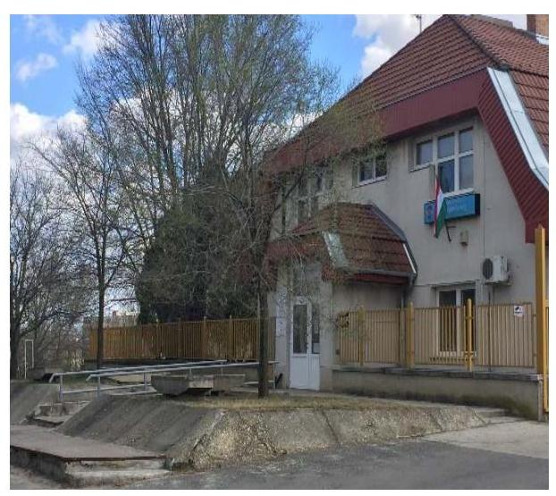
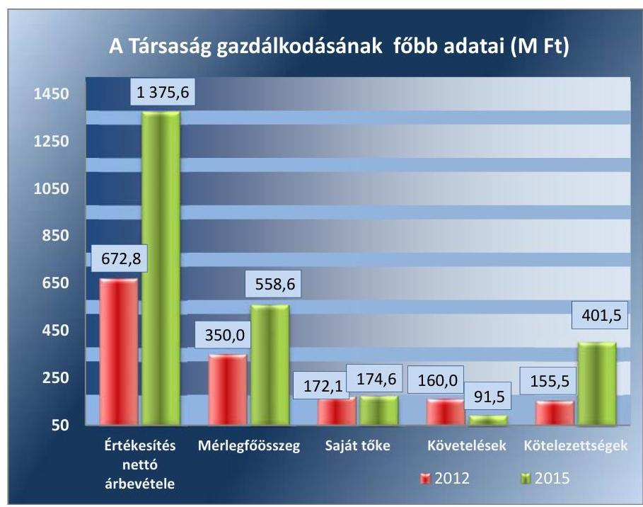
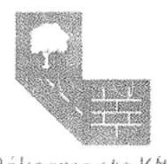
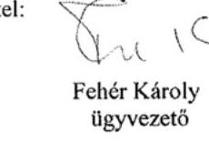
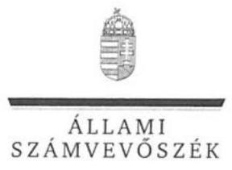
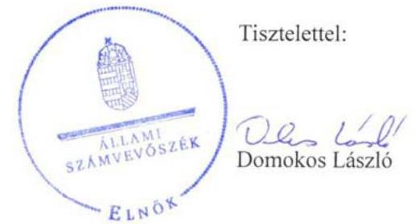
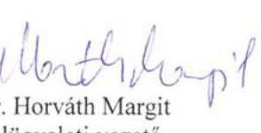

# Jelentés 

## Az önkormányzatok gazdasági társaságai

Az önkormányzatok többségi tulajdonában lévő gazdasági társaságok gazdálkodásának ellenőrzése - Rákosmente Városfejlesztő, Városüzemeltető, Kivitelező, Karbantartó és Szolgáltató Kft.
2017.

Az ÁSZ az államháztartáson kívül működő feladat-ellátó rendszerek ellenőrzéseivel hozzájárul ahhoz, hogy a közpénzeket az államháztartáson kívül működő szervezetek is átlátható, rendezett módon használják fel a feladatok ellátása érdekében.

---

# Jelentés 

## Az önkormányzatok gazdasági társaságai

Az önkormányzatok többségi tulajdonában lévő gazdasági társaságok gazdálkodásának ellenőrzése - Rákosmente Városfejlesztő, Városüzemeltető, Kivitelező, Karbantartó és Szolgáltató Kft.
2017. 08. 17.

17152
www.asz.hu

## 

---

# AZ ELLENŐRZÉST FELÜGYELTE: 

DR. HORVÁTH MARGIT felügyeleti vezető

## AZ ELLENŐRZÉST VEZETTE ÉS A VÉGREHAJTÁSÁÉRT FELELŐS:

DR. PELLEI TAMÁS ellenőrzésvezető

## A PROGRAM ÖSSZEÁLLÍTÁSÁÉRT FELELŐS:

JANIK JÓZSEF osztályvezető

IKTATÓSZÁM: V-1293-186/2016.
TÉMASZÁM: 2327

## ELLENŐRZÉS-AZONOSÍTÓ SZÁM: V075818

Jelentéseink az Országgyűlés számítógépes hálózatán és az Interneten a www.asz.hu címen is olvashatóak.

---

# TARTALOMJEGYZÉK 

■ ÖSSZEGZÉS ..... 5
■ AZ ELLENŐRZÉS CÉLJA ..... 6
■ AZ ELLENŐRZÉS TERÜLETE ..... 7
■ AZ ELLENŐRZÉS HÁTTERE, INDOKOLTSÁGA ..... 9
■ A JELENTÉS LÉNYEGES KÉRDÉSKÖREI ..... 10
■ ELLENŐRZÉS HATÓKÖRE ÉS MÓDSZEREI ..... 11
■ MEGÁLLAPÍTÁSOK ..... 13
■ JAVASLATOK ..... 21
■ MELLÉKLETEK ..... 25
I. Sz. melléklet: Értelmező szótár ..... 25
II. Sz. melléklet: A Társaság mérlegadatainak alakulása 2012-2015 között (M Ft) ..... 26
III. Sz. melléklet: A Társaság eredménykimutatásának adatai 2012-2015 között (M Ft) ..... 27
■ FÜGGELÉK: ÉSZREVÉTELEK ..... 29
■ RÖVIDÍTÉSEK JEGYZÉKE ..... 35

---

.

---

# ÖSSZEGZÉS 

Budapest Főváros XVII. kerület Rákosmente Önkormányzata a kizárólagos tulajdonában álló Rákosmente Városfejlesztő, Városüzemeltető, Kivitelező, Karbantartó és Szolgáltató Kft. feladatellátását szabályszerűen szervezte meg, tulajdonosi jogait összességében szabályszerűen gyakorolta. A Társaság vagyongazdálkodása összességében szabályszerű volt, mivel a szabályozási és közzétételi kötelezettségeit hiányosan teljesítette. Fizetőképessége biztosított volt, de kis mértékben romlott. A Társaság az árképzés során az Önkormányzat előírásainak megfelelően járt el, azonban a vállalkozási tevékenysége esetében az előírások ellenére önköltségszámítást nem végzett.

## Az ellenőrzés társadalmi indokoltsága

Magyarországon az önkormányzatok kötelező és önként vállalt feladataik ellátása során egyre szélesebb körben alkalmazzák a költségvetési szerveken kívüli feladatellátást, ezáltal az önkormányzati tulajdonú gazdasági társaságok is kiemelt fontosságú szerephez jutnak a lakossági szolgáltatások biztosításában. Az önkormányzatok többségi tulajdonában álló gazdasági társaságok ellenőrzése kiemelt jelentőségű, mivel működésük hatással van a tulajdonos önkormányzat gazdálkodására, gazdálkodásának egyes elemei befolyásolják az önkormányzati alszektor hiányát és az államadósságot.

Az Állami Számvevőszék céljaival és a társadalmi igénnyel összhangban, a gazdasági társaságok kiemelt fontosságú szerepe miatt került sor a Rákosmente Városfejlesztő, Városüzemeltető, Kivitelező, Karbantartó és Szolgáltató Kft. ellenőrzésére.

## Főbb megállapítások, következtetések, javaslatok

Budapest Főváros XVII. kerület Rákosmente Önkormányzata a tulajdonosi joggyakorlásának kereteit a jogszabályoknak megfelelően kialakította, a feladatellátás feltételeit biztosította, tulajdonosi jogait összességében szabályszerűen gyakorolta annak ellenére, hogy a Társaság 2015. évi eredményének felhasználásáról nem az előírásoknak megfelelően döntött. Rendeletalkotási kötelezettségét teljesítette, a Társaság beszámolóit, üzleti terveit jóváhagyta.

A Társaság a jogszabályban előírt számviteli szabályzatokkal rendelkezett, azonban a Számviteli politika, a számlarend, a leltározási szabályzat és a pénzkezelési szabályzat nem felelt meg teljes körűen a jogszabályi előírásoknak. A vagyongazdálkodás a jogszabályi rendelkezéseknek összességében megfelelt. A Társaság fizetőképessége biztosított volt, de kis mértékben romlott a lejárt szállítói kötelezettségek növekedése miatt.

A Társaság az előírt beszámolási kötelezettségeit teljesítette, az éves beszámolóit határidőre elkészítette, közzétette és a tulajdonosi joggyakorló által előírt beszámolási kötelezettségét teljesítette. Az éves beszámolók tartalma azonban nem felelt meg teljes körűen a jogszabály előírásainak, mert éves beszámolói kiegészítő mellékleteit hiányosan állította össze. A közérdekű adatok nyilvánosságra hozatala, az adatok védelme nem volt teljes körűen biztosított, mivel közzétételi kötelezettségét hiányosan teljesítette.

A Társaság bevételeinek és ráfordításainak, valamint az értékcsökkenés elszámolása összességében szabályszerű volt. A Társaság rendelkezett önköltségszámítási szabályzattal, azonban annak tartalma nem felelt meg a jogszabályi előírásoknak. A vállalkozási tevékenységének önköltségét nem határozta meg. A Társaság által nyújtott közszolgáltatásokkal kapcsolatos árképzés összhangban volt az előírásokkal.

---

# AZ ELLENŐRZÉS CÉLJA 

Az ellenőrzés célja annak értékelése, hogy az önkormányzat vagyongazdálkodási tevékenysége során szabályszerűen gyakorolta-e tulajdonosi jogait; a gazdasági társaság szabályozottsága, gazdálkodása és vagyongazdálkodási tevékenysége, bevételeinek és ráfordításainak elszámolása megfelelt-e a jogszabályi és tulajdonosi előírásoknak; a gazdasági társaság kötelezettségállománya jelent-e kockázatot a működésre, valamint a gazdálkodás átláthatósága és elszámoltathatósága érdekében biztosítva volt-e a szolgáltatás díjának megalapozottsága szabályszerű önköltségszámítással. Az ellenőrzés célja továbbá annak megítélése, hogy az önkormányzatok többségi tulajdonában lévő gazdasági társaságok gazdálkodásának a kormányzati szektor hiányára és az államadósságra befolyással bíró elemei a jogszabályi előírásoknak megfelelnek-e.

---

# **AZ ELLENŐRZÉS TERÜLETE**

## **Budapest Főváros XVII. kerület Rákosmente Önkormányzata és a kizárólagos tulajdonában lévő Rákosmente Városfejlesztő, Városüzemeltető, Kivitelező, Karbantartó és Szolgáltató Kft.**

### **Rákosmente Városfejlesztő, Városüzemeltető, Kivitelező, Karbantartó és Szolgáltató Kft.** – Budapest Főváros XVII. kerület Rákosmente Önkormányzata által 2007-ben alapított, 100%-os tulajdonában lévő – gazdasági társaság jelenlegi működési formáját 2011-ben nyerte el a Pro Rákosmente Kft. jogutódlással történt beolvadása után.

A Társaság^{1} fő feladatai az önkormányzati tulajdonú lakó és nem lakó épületek építése, üzemeltetése, társasházkezelés, magas- és mélyépítési feladatok ellátása, zöldfelületek karbantartása, sportlétesítmények üzemeltetése, és karbantartása, illetve közoktatási intézmények működtetése. A Társaság törzsszervezete mellett önálló városfejlesztési divízió, 2012. január 15-től sport divízió, majd 2013. január 1-jétől a közoktatási intézményekhez kapcsolódó közszolgáltatási intézményműködtetési részleg működött. A Társaság az Önkormányzattal – a kötelezően elvégzendő és önként vállalt önkormányzati feladatok, közszolgáltatások ellátására – kötött Megállapodás^{1-3} és annak mellékleteit képező – közoktatási intézmények működtetésére, valamint sportszervezési és üzemeltetési feladatok ellátására vonatkozó – Közszolgáltatási szerződés^{1-6} alapján a 2012-2015. években a sport divízió és az intézmény működtetési részleg támogatására összesen 1 178,6 M Ft működési célú támogatást kapott.

A Társaság az Önkormányzattal megkötött egyedi megbízási szerződések alapján projekt-menedzseri feladatokat is ellátott. A Társaság létszám adatait az 1. táblázat tartalmazza.

|  A TÁRSASÁG LÉTSZÁM ADATAI (FŐ) |  |  |  |   |
| --- | --- | --- | --- | --- |
|  Megnevezés | 2012. | 2013. | 2014. | 2015.  |
|  Foglalkoztatottak statisztikai állományi létszáma | 88,0 | 232,0 | 238,0 | 237,0  |
|  Forrás: Társaság 2012-2015. évi éves beszámolói |  |  |  |   |

A foglalkoztatottak statisztikai állományi létszáma az új divíziók létrehozása miatt jelentősen megnövekedett. A 2011. évi statisztikai állományi létszám 66 főről 2012. évben 33,3%-kal 88 főre nőtt a sport és a városfejlesztési divízió létrehozása miatt. A 2013. évben további 63,6%-kal, 232 főre emelkedett elsősorban a köznevelési intézmények technikai feladatait ellátók létszámának átvétele miatt.

---

A Társaság gazdálkodásának főbb adatai az 1. ábrán kerültek megadásra.

1. ábra

Forrás: Társaság 2012-2015. évi éves beszámolói
A Társaságnál az értékesítés nettó árbevétele a magasépítési és a városfejlesztési tevékenység árbevételének növekedése miatt a 2012-2014. években emelkedett, a 2015. évben stagnált és 1375,6 M Ft volt.

A mérlegfőösszeg 2012. december 31. és 2015. december 31. között 159,6%-kal változott - 208,6 M Ft-tal nőtt - amelyet az eszközöknél a pénzeszközök, tárgyi eszközök, és a forrásoknál a rövid lejáratú kötelezettségek és az eredménytartalék növekedése eredményezett.

A mérlegadatok változását a II. számú melléklet, az eredmény kimutatás adatait a III. számú melléklet tartalmazza.

A polgármester ${ }^{4}$ 2006. október 1-től, a jegyző ${ }^{5}$ 2007. augusztus 1-től látta el feladatát.

A Társaság irányítási feladatait az ügyvezető, ellenőrzését a háromtagú felügyelő bizottság, illetve a könyvvizsgáló látta el. A Társaság ügyvezetőjének személye - 2013. évben - egy alkalommal, a gazdasági igazgató és a könyvvizsgáló személye pedig nem változott az ellenőrzött időszakban.

A Társaságnak nem volt részesedése más gazdasági társaságban, valamint nem volt vagyonkezelésbe vett vagyona. A Társaság nem minősült kormányzati szektorba sorolt szervezetnek.

---

# AZ ELLENŐRZÉS HÁTTERE, INDOKOLTSÁGA 

Az önkormányzatok többségi tulajdonában álló gazdasági társaságok ellenőrzése kiemelten fontos a vagyon megőrzése, megóvása érdekében, valamint a kormányzati szektor elszámolásaiban megjelenő önkormányzati tulajdonú gazdálkodó szervezetek esetében, amelyekkel szemben alapvető követelmény, hogy gazdálkodásuk, működésük szabályszerű, az általuk szolgáltatott adatok minél megbízhatóbbak legyenek. A feladatellátás költségeinek, ráfordításainak alakulása a lakosság széles rétegét érinti.

Ellenőrzéseink feltárhatják, hogy az önkormányzat a feladatellátásához rendelt vagyon működtetését a tulajdonostól elvárható gondossággal végezte-e, a feladatot ellátó gazdasági társaság a létesítő okiratban, szolgáltatási szerződésben foglaltak betartásával biztosította-e a feladat ellátását. Az ellenőrzés eredményeképp meghatározhatóvá válnak a költségvetési hiányt befolyásoló szervezetek kockázatai, lehetővé válik ezen kockázatok csökkentése. Az ellenőrzés rávilágíthat arra, hogy a gazdasági társaság a vagyon használatával biztosította-e a szolgáltatás folytatásának feltételeit, az önkormányzat tulajdonosi felügyelete hozzájárult-e a szabályszerű gazdálkodáshoz és feladatellátáshoz. A megállapítások alapján megfogalmazott számvevőszéki javaslatok hasznosítása elősegítheti a meglévő hibák megszüntetését. A jó gyakorlatok bemutatásával az ÁSZ ${ }^{6}$ hozzájárulhat a követendő megoldások megismertetéséhez, terjesztéséhez.

---

# A JELENTÉS LÉNYEGES KÉRDÉSKÖREI 

1.- Az önkormányzat tulajdonosi joggyakorlása szabályszerű volt-e?
2.- A gazdasági társaság vagyongazdálkodása szabályszerű volt-e, fizetőképessége biztosított volt-e a gazdálkodás során?
3.- A gazdasági társaság bevételeinek és ráfordításainak elszámolása, valamint az önköltségszámítás és árképzés szabályszerű volt-e?

---

# ELLENŐRZÉS HATÓKÖRE ÉS MÓDSZEREI 

## Az ellenőrzés típusa

Megfelelőségi ellenőrzés.

## Az ellenőrzött időszak

Az ellenőrzött időszak 2012. január 1-jétől 2015. december 31-ig tart.

## Az ellenőrzés tárgya

Az önkormányzatok - többségi tulajdonában lévő gazdasági társaságok feletti - tulajdonosi joggyakorlása, valamint a gazdasági társaságok gazdálkodásának szabályozottsága és szabályszerűsége, továbbá az önkormányzati alszektorba sorolt gazdasági társaság gazdálkodásának a kormányzati szektor hiányára és az államadósságra befolyással bíró elemei.

Az ellenőrzés kiterjed minden olyan körülményre és adatra, amely az ÁSZ jogszabályban meghatározott feladatainak teljesítéséhez, valamint a program végrehajtása folyamán felmerült újabb összefüggések feltárásához szükséges.

## Az ellenőrzött szervezet

- Budapest Főváros XVII. kerület Rákosmente Önkormányzata
- Rákosmente Városfejlesztő, Városüzemeltető, Kivitelező, Karbantartó és Szolgáltató Kft.

## Az ellenőrzés jogalapja

Az ellenőrzés jogszabályi alapját az ÁSZ tv. ${ }^{7}$ 1. § (3) bekezdése és 5. § (3)(5) bekezdései képezik.

## Az ellenőrzés módszerei

Az ellenőrzést a nemzetközi standardokat irányadónak tekintve az ellenőrzési program ellenőrzési kérdései, az ellenőrzött időszakban hatályos jogszabályok, az ellenőrzés szakmai szabályok és módszertanok figyelembe vételével végeztük.

---

Az ellenőrzés ideje alatt az ellenőrzött szervezettel történő kapcsolattartást az ÁSZ Szervezeti és Működési Szabályzatának ${ }^{6}$ vonatkozó előírásai alapján biztosítottuk.

Az ellenőrzés a kiválasztott, többségi tulajdonosi jogokat gyakorló önkormányzatra, illetve az ellenőrzött gazdasági társaságra terjedt ki.

Az ellenőrzési kérdések megválaszolásához szükséges bizonyítékok megszerzése a következő ellenőrzési eljárások alkalmazásával történt: megfigyelés, kérdésfeltevés (információkérés), összehasonlítás, valamint elemző eljárás. Az ellenőrzési bizonyítékként felhasználható adatforrások közé tartoztak egyrészt az ellenőrzési programban felsorolt adatforrások, másrészt adatforrás lehetett még minden - az ellenőrzés folyamán - feltárt, az ellenőrzés szempontjából információkat tartalmazó dokumentum.

Az ellenőrzést a kérdésekre adott válaszok kiértékelésével, valamint a megjelölt adatforrások, a csatolt tanúsítványok felhasználásával, továbbá az adott időszakban hatályos jogszabályok figyelembe vételével folytattuk le.

A bevételek és ráfordítások elszámolása, valamint a vagyonnyilvántartás terén a szabályszerű működést véletlen mintavétellel ellenőriztük. A mintavétellel
 ellenőrzött területek esetében minden egyes tétel vonatkozásában a szabályszerűségre vonatkozó kérdéseket tettünk fel, amelyek eredménye összesítésre került. Megfelelőnek értékeltünk egy ellenőrzött területet, amennyiben 95%-os bizonyossággal a teljes sokaságban a hibaarány legfeljebb 10%, nem megfelelőnek, amennyiben 10%-nál magasabb arányt képviselt. Abban az esetben, ha a teljes sokaság tekintetében a 10%-os hibaarányhoz való viszony megítélésének megbízhatósága nem érte el a 95%-ot, annak elérése érdekében értékelésünket további szempontokkal egészítettük ki, és figyelembe vettük a feltárt hibák típusát és súlyát. A ráfordítások elszámolására és a vagyonnyilvántartásra vonatkozó véletlen mintavételt kockázati alapú kiválasztással egészítettük ki, amelynek során évente a három legnagyobb összegű tételt választottuk ki.

---

# 1. Az önkormányzat tulajdonosi joggyakorlása szabályszerű volt-e? 

Összegző megállapítás

### 1.1. számú megállapítás

A tulajdonosi joggyakorlás összességében szabályszerű volt.

Az Önkormányzat tulajdonosi joggyakorlás kereteit szabályszerűen alakította ki.

A GAZDASÁGI PROGRAM ${ }_{1-2}{ }^{9}$-ban az Önkormányzat az Ötv. ${ }^{10}$ 91. § (1) és (6) bekezdéseiben, valamint az Mötv. ${ }^{11}$ 116. § (1)-(4) bekezdéseiben foglaltakkal összhangban rögzítette a Társaság által ellátott - elsősorban az infrastruktúra fejlesztéséhez kapcsolódó - feladatokra vonatkozó elképzeléseket. A Képviselő-testület ${ }^{12}$ az Nvtv. ${ }^{13}$ 9. § (1) bekezdésében foglaltak alapján 2013. augusztus 29-én jóváhagyta az Önkormányzat vagyongazdálkodási tervét ${ }^{14}$.

## AZ ÖNKORMÁNYZAT RENDELETALKOTÁSI KÖTE-

LEZETTSÉGÉT a Társaság feladatellátásával kapcsolatban az Ltv $^{15}$. 3. §, 36. § és 54. §-ainak előírásai szerint teljesítette a tulajdonában álló lakások, helyiségek bérbeadására, valamint a lakások és helyiségek elidegenítésére vonatkozóan a lakásrendelete ${ }^{16}$ és lakbérrendelete ${ }^{17}$ megalkotásával. A környezetvédelmi törvény ${ }^{18}$ előírásai alapján az Önkormányzat megalkotta zöldrendeletét ${ }^{19}$.

## A TULAJDONOSI JOGOK GYAKORLÁSÁNAK

RENDJÉT az előírásoknak megfelelően alakították ki. Az Önkormányzat a tulajdonosi joggyakorlás kereteit az Alapító okiratban ${ }_{1-7}{ }^{20}$, az SZMSZ ${ }_{1,2}{ }^{21}$-ekben és a Vagyonrendeletében ${ }_{1-2}{ }^{22}$ rögzítette. Az alapvető tulajdonosi jogokat a Képviselő-testület gyakorolta, a tulajdonosi jogok átadására nem került sor.

Az Alapító okirat ${ }_{1-7}$ megfelelt a Gt. ${ }^{23}$ és Ptk. ${ }_{2}{ }^{24}$ előírásainak. Az Önkormányzat az Alapító okiratban ${ }_{1-7}$ meghatározta a Társaság képviseletét ellátó ügyvezető személyét, kötelezettségét, a cégjegyzés módját, valamint a tulajdonosi joggyakorló beszámoló elfogadására vonatkozó feladatait, rögzítette az FB${ }^{25}$ tagok számát és személyét, az ügyvezető és az FB tagok vagyonnyilatkozat-tételi kötelezettségét.

## A FELADATELLÁTÁSHOZ KAPCSOLÓDÓ KÖVE-

TELMÉNYEKET az Önkormányzat a Társasággal határozott időre kötött Megállapodás ${ }_{1-3}$-ban és annak mellékleteiben meghatározta. Rögzítették a megállapodás időtartamát, az ellátási területet, teljesítendő feladatokat, a megállapodás módosításának, megszűnésének módját. Az Önkormányzat a feladatellátás tárgyát képező vagyon körét meghatározta és azt üzemeltetésre a Társaság rendelkezésére bocsátotta a Megállapodás ${ }_{1-3}$

---

# 1.2. számú megállapítás 

és a Közszolgáltatási szerződés ${ }_{1-6}$ alapján. A városfejlesztési feladatok vonatkozásában ellenőrzési és beszámolási kötelezettséget az Alapszerződésben ${ }_{1-2}{ }^{26}$ írta elő az Önkormányzat a Társaság számára.

## A tulajdonosi jogok gyakorlása szabályszerű volt a 2015. évi osztalék arányának jóváhagyása kivételével.

AZ ÜZLETI TERV készítésének kötelezettségét a Közszolgáltatási szerződésben ${ }_{1-6}$ írta elő az Önkormányzat. A Társaság az ellenőrzött időszakban az üzleti terveket elkészítette, amelyeket a Képviselő-testület - az FB előzetes véleményével együtt - megismert és határozataival elfogadott. Az üzleti tervek összhangban álltak a Gazdasági Program ${ }_{1,2}$-ben foglaltakkal.

AZ FB az ellenőrzött években megtárgyalta és véleményezte a Társaság üzleti tervét, és a Gt. 35. § (3) bekezdésében, illetve a Ptk. 3:120 § (2) bekezdésének megfelelően minden évben írásbeli jelentést készített a Társaság számviteli beszámolójáról. Az FB a feladatait és kötelezettségeit ügyrendjében rögzítette, működése az ügyrendben foglaltaknak megfelelt.

ELLENŐRZÉSI TEVÉKENYSÉGÉT az Önkormányzat tulajdonosi joggyakorlása során - a Megállapodásban ${ }_{1-3}$ illetve a Közszolgáltatási szerződésben ${ }_{1-6}$ rögzített feladatok tekintetében - az FB és a könyvvizsgáló megválasztásával és folyamatos működtetése kapcsán biztosította, és az éves számviteli beszámoló részeként végezte. Továbbá az SZMSZ ${ }_{1-2}$ előírása szerint a Társaság ügyvezetője és az FB negyedévente beszámolt a Társaság gazdálkodásáról. Az Áht. ${ }^{27}$ 70. § (1) bekezdés d) pontjában biztosított ellenőrzési lehetőséggel nem élt az Önkormányzat.

A KÉPVISELŐ-TESTÜLET DÖNTÖTT a Társaság éves eredményének felhasználásáról és az osztalék mértékéről. A mérleg szerinti eredmény a 2012-2014. években az eredménytartalékba került. A Társaság jóváhagyott osztalék kifizetésének alakulását a 2. táblázat tartalmazza.
2. táblázat

A TÁRSASÁG JÓVÁHAGYOTT OSZTALÉKÁNAK ALAKULÁSA (M FT)

| Megnevezés | 2012 | 2013 | 2014 | 2015 |
| :-- | --: | :--: | :--: | :--: |
| Adózott eredmény | 54,5 | 39,0 | 67,3 | 49,0 |
| Jóváhagyott osztalék | 0 | 21,0 | 57,3 | 49,0 |
| Mérleg szerinti eredmény | 54,5 | 18,0 | 10,0 | 0 |

A 2015. évi 49,0 M Ft adózott eredmény teljes egészében osztalékként került elfogadásra, ugyanakkor az osztalék aránya nem volt összhangban az Alapszerződés ${ }_{1-2}$ finanszírozási fejezetében meghatározottakkal. A Társaság rendelkezett a társasági formájára kötelezően előírt jegyzett tőkének megfelelő saját tőkével.

JAVADALMAZÁSI SZABÁLYZATTAL ${ }^{28}$ a Társaság rendelkezett a Taktv. ${ }^{29}$ 5. § (3) bekezdés alapján, amelyet a Képviselő-testület jóváhagyott.

---

# 2. A gazdasági társaság vagyongazdálkodása szabályszerű volt-e, fizetőképessége biztosított volt-e a gazdálkodás során? 

Összegző megállapítás

A Társaság vagyongazdálkodása összességében szabályszerű volt. Fizetőképessége a gazdálkodás során biztosított volt, de kis mértékben romlott. A beszámolási és adatszolgáltatási kötelezettségeit teljesítette, a közérdekű adatok nyilvánosságra hozatala, az adatok védelme nem volt teljes körűen biztosított.
2.1. számú megállapítás

A Társaság rendelkezett számviteli szabályzatokkal, azonban a szabályzatok tartalma maradéktalanul nem felelt meg az előírásoknak.

SZÁMVITELI POLITIKÁVAL ${ }_{1-2}{ }^{30}$ a Társaság rendelkezett, azonban a Számv. tv. 14. § (4) bekezdésében előírtak ellenére a szabályozottság kialakítása nem felelt meg a Számv. tv. 161/A. § előírásainak, mivel abban nem rendelkezett - Közszolgáltatási szerződés ${ }_{1-2}$ III. fejezetének 7. pontjának előírása alapján - a közszolgáltatások tárgyát képező tevékenységek és egyéb tevékenységek bevételeinek és költségeinek teljes körű számviteli elkülönítéséről. A számviteli politikát a 2015. július 4-től hatályos - a Számv. tv. 86. § rendkívüli tételek megszűnésével összefüggő - jogszabályváltozást követően a Számv. tv. 14. § (11) bekezdésében megadottak ellenére nem aktualizálták.

A SZÁMLARENDET ${ }_{1-3}{ }^{31}$ a Számv. tv. 161. § (1) bekezdésében foglaltakkal összhangban elkészítették, azonban a számlarend ${ }_{1-2}$ a Számv. tv. 161. § (2) bekezdés a) pont előírásának nem felelt meg, mivel nem tartalmazta minden alkalmazásra kijelölt számla számlajelét és megnevezését. A számlarend ${ }_{3}$ már tartalmazta a Számv. tv. 161. § (2) (3) bekezdéseinek megfelelően - a 0. számlaosztály számláinak kivételével - a számlarendre előírt valamennyi tartalmi elemet. A számlarend ${ }_{3}$ folyamatos aktualizálásáról a Számv. tv. 161. § (5) bekezdésének előírása ellenére nem gondoskodtak, mert azon nem vezették át a Számv. tv. 25. § (7) bekezdésének 2013. január 1-ei és a 27. § (1) bekezdésének 2014. március 15-től hatályos változásait a befektetett eszközök tartalmára vonatkozóan.

AZ ÉRTÉKELÉSI SZABÁLYZAT ${ }_{1-2}{ }^{31}$ a Számv. tv. előírásainak megfelelően tartalmazta az eszközök és források értékelésének módszereit.

## LELTÁROZÁSI SZABÁLYZATBAN ${ }_{1-2}{ }^{32}$

Számv. tv. 46. § (3) bekezdésének előírásával összhangban meghatározták a mennyiségi felvételt igénylő eszközöket és az egyeztetési kötelezettséget igénylő eszközöket. A Társaság évenkénti mennyiségi és egyeztetéses leltározást rögzített a 2012-2014. évekre, a 2015. évtől hatályos szabályozás szerint a tárgyi eszközöknél két évenkénti mennyiségi leltározást határoztak meg. Az üzemeltetésre átvett vagyon leltározása, a tulajdonossal történő leltáregyeztetés az idegen tulajdonú eszközök leltározási feladatainál

---

került meghatározásra. A szabályzatot a Számv. tv. 14. § (11) bekezdés előírása ellenére nem aktualizálták, mert a Számv. tv. 2012. január 1-jétől hatályos 69. §-ával kapcsolatos változásokat a szabályzaton nem vezették át.

PÉNZKEZELÉSI SZABÁLYZATTAL ${ }_{1-4}{ }^{33}$ a Társaság rendelkezett, de a szabályzat 2012-2014. években nem felelt meg a Számv. tv. 14. § (8) bekezdése előírásainak, mert nem határozta meg teljes körűen a készpénzállományt érintő pénzmozgások jogcímeit és eljárási rendjét.

# 2.2. számú megállapítás 

A Társaság vagyongazdálkodása összességében megfelelt a jogszabályi rendelkezéseknek.

SAJÁT VAGYONNAL kapcsolatosan az analitikus nyilvántartásokat és főkönyvi kivonatokat folyamatosan és naprakészen vezették, azok alkalmasak voltak a Számv. tv. 69. § (2) bekezdésben meghatározott mérlegfordulónapra vonatkozó egyeztetések elvégzésére.

A Társaság az üzemeltetésre átvett eszközöket - sportlétesítményeket és köznevelési intézményeket - a 0. számlaosztályban tartotta nyilván. A vagyonváltozás kimutatása az üzemeltetésre átvett vagyon esetében is megtörtént, de a nyilvántartás nem volt összhangban a Számlarend ${ }_{1-2}$-mal, mivel az nem tartalmazta a 0. számlaosztály vonatkozásában a Számv. tv. 161.§ (2) bekezdés a) pontja által előírt minden számla számlajelét, és megnevezését.

A LELTÁROZÁSRA a saját és üzemeltetésre átvett vagyon vonatkozásában egyaránt a leltározási szabályzat ${ }_{1-2}$ alapján került sor, és a mennyiségi leltárfelvételt és az egyeztetéses leltározást az évente kiadott leltározási utasítás és ütemterv szerint végezték. Az éves beszámolók mérlegadatait - mennyiségi leltárfelvétel és egyeztetéses leltározás alapján összeállított - Számv. tv. 69. § (1) bekezdésének előírásai szerinti leltárakkal alátámasztották. A leltározások kiértékeléséről a Leltározási Szabályzat ${ }_{1-2}$ előírása ellenére jegyzőkönyvet nem készítettek.

A BELSŐ ELLENŐRZÉSI TEVÉKENYSÉG szervezeti hátterét az ügyvezető a 2015. évben alakította ki. Belső ellenőrzési szabályzattal ${ }^{34}$ 2015. december 1-jétől rendelkezett a Társaság.

## 2.3. számú megállapítás

A Társaság fizetőképessége kis mértékben romlott, de biztosított volt a gazdálkodása során.

## A TÁRSASÁG FIZETŐKÉPESSÉGE KISMÉRTÉK-

BEN ROMLOTT a lejárt kötelezettségek változása alapján, de ez nem befolyásolta kedvezőtlenül a gazdálkodásának pénzügyi stabilitását. A 3. táblázat tartalmazza a Társaság kötelezettségeinek alakulását.

---

# A TÁRSASÁG RÖVID LEJÁRATÚ KÖTELEZETTSÉGEINEK ALAKULÁSA (M FT) 

| Rövidlejáratú kötelezettségek | 2012. | 2013. | 2014. | 2015. |
| :--: | :--: | :--: | :--: | :--: |
| Szállítói kötelezettségek | 104,3 | 197,8 | 128,3 | 264,1 |
| ebből határidőn belüli | 100,8 | 132,0 | 119,0 | 248,9 |
| ebből határidőn túli 1-30 nap | 3,5 | 65,8 | 9,3 | 14,9 |
| ebből határidőn túli 31-90 nap | 0 | 0,04 | 0 | 0,24 |
| Egyéb rövid lejáratú kötelezettségek | 42,8 | 108,6 | 173,0 | 137,4 |
| Kötelezettségek | 147,1 | 306,4 | 301,3 | 401,5 |

A lejárt határidejű szállítói kötelezettségek állománya a 2012. év végi 3,5 M Ft-ról 2015. év végére 15,1 M Ft-ra változott és aránya az összes szállítói kötelezettségen belül az ellenőrzött időszakban 3,3%-ról 5,7%-ra változott. A Társaság szerződésen és jogszabályon alapuló rövid lejáratú kötelezettségeit jellemzően fizetési határidőn belül vagy a fizetési határidőt követő 30 napon belül teljesítette.
2.4. számú megállapítás

A Társaság az előírt beszámolási, adatszolgáltatási kötelezettségét teljesítette, azonban az éves beszámolói kiegészítő mellékleteit hiányosan állította össze. A közérdekű adatok nyilvánosságra hozatala, az adatok védelme nem volt teljes körűen biztosított.

AZ ÉVES
 BESZÁMOLÓKAT a Társaság minden évben elkészítette, letétbe helyezte és közzétette. A Társaság az éves beszámolók kiegészítő mellékleteiben a Számv. tv. 89. § (4) bekezdés a), és d) pontjainak előírása ellenére nem mutatta be a vezető tisztségviselők, a felügyelő bizottság tagjainak járandóságát csoportonként összevontan és az éves beszámolót aláíró képviseletére jogosult személy lakóhelyét. A kiegészítő mellékletben a Számv. tv. 91. § a) pontjában foglaltak ellenére nem adták meg a tárgyévben foglalkoztatott munkavállalók bérköltségét, személyi jellegű egyéb kifizetéseit állománycsoportonként megbontva, valamint a Számv. tv. 155. § (2) bekezdése alapján fennálló kötelező könyvvizsgálat miatt a Számv. tv. 88. § (8) bekezdés b) pont szerint a könyvvizsgáló díjazását.

A könyvvizsgáló minden évben hitelesítő záradékkal készítette el a független könyvvizsgálói jelentését. A Képviselő-testület az ellenőrzött időszakban a könyvvizsgáló írásbeli véleményének, valamint a Gt. 35. § (3) bekezdése, illetve a Ptk. 3:120. § (2) bekezdése alapján az FB írásbeli jelentésének birtokában fogadta el a Társaság éves beszámolóit.

A 2012-2015. években a Képviselő-testület összehívását a Társaság tevékenysége, gazdálkodása miatt nem kellett kezdeményeznie az FB-nak vagy a könyvvizsgálónak.

A TÁRSASÁG BESZÁMOLT a Megállapodásban ${ }_{1-3}$, illetve a Közszolgáltatási szerződésben ${ }_{1-6}$ rögzített feladatok divíziónkénti ellátásáról az éves beszámoló részeként, valamint az ügyvezető és az FB eleget tett az SZMSZ ${ }_{1-2}$-ben meghatározott negyedéves - a Társaság gazdálkodásáról szóló - beszámolási kötelezettségének az ellenőrzött időszakban.

---

# A KÖZÉRDEKŰ ADATOK MEGISMERÉSÉRE IRÁNYULÓ IGÉNYEK TELJESÍTÉSÉNEK RENDJÉT, 

illetve a közzétételi kötelezettség teljesítésének részletes szabályait rögzítő szabályzattal a Társaság nem rendelkezett az Info tv. ${ }^{35} 35$. § (3) bekezdésében és 30. § (6) bekezdésben előírtak ellenére. Az Info tv. 24. § (3) bekezdésében előírt külön adatvédelmi és adatbiztonsági szabályzatot nem készítettek az ellenőrzött időszakban. Az információbiztonsági szabályzatot a társasági $S ZMSZ_{1-5}{ }^{36}$ IV.4. pontjában előírtakat megsértve 2014. április 1-jén léptette hatályba, amely csupán az elektronikus adatok védelmével kapcsolatos eljárásrendet tartalmazta.

A Társaság az Taktv. 2. § (1) bekezdés dc) pontjában meghatározott közzétételi kötelezettségét nem teljesítette, mert nem tette közzé a felügyelőbizottsági tag jogviszonyának megszűnése esetén járó pénzbeli juttatásokat, valamint a 2. § (2) bekezdés szerinti a másokkal együttesen cégjegyzésre vagy a bankszámla feletti rendelkezésre jogosult munkavállalók adatait. Az Info. tv. 37. § (1) bekezdésében foglalt, az 1. mellékletben meghatározott tartalmú közzétételi kötelezettségének nem teljes körűen tett eleget, mert nem tette közzé az általános közzétételi lista III. Gazdálkodási adatok, 1. pontban előírtak közül a Számv. tv. szerinti beszámolókat és 2. pontban előírtak közül - az ügyvezető kivételével - a Társaság vezetőinek munkabérét, juttatását, költségtérítését, az egyéb alkalmazottaknak nyújtott juttatások fajtáját és mértékét összesítve. Továbbá nem tette közzé az Info tv. 1. melléklet Általános közzétételi lista II. Tevékenységre, működésre vonatkozó adatok, 1. pontban előírtak közül a Társaságra vonatkozó alapvető jogszabályok, közjogi szervezetszabályozó eszközök, valamint a társasági $S ZMSZ_{1-5}$ hatályos és teljes szövegét.

## 3. A gazdasági társaság bevételeinek és ráfordításainak elszámolása, valamint az önköltségszámítás és árképzés szabályszerű volt-e?

Összegző megállapítás

Társaság bevételeinek és ráfordításainak, valamint az értékcsökkenés elszámolása összességében szabályszerű volt. A Társaság rendelkezett önköltségszámítási szabályzattal. A közszolgáltatásokkal kapcsolatos árképzés során az előírásoknak megfelelően járt el, azonban a vállalkozási tevékenysége tekintetében nem végzett önköltségszámítást.

### 3.1. számú megállapítás

A Társaság bevételeinek és ráfordításainak, valamint az értékcsökkenés elszámolása összességében szabályszerű volt.

Az árbevételeket tevékenységenként megbontott árbevételi főkönyvi számokra könyvelték, illetve ezzel egy időben munkaszámok alapján is elkülönítették, annak ellenére, hogy a számviteli politika ${ }_{1,2}$ és a számlarend ${ }_{1-3}$ nem írta elő. A költségek és ráfordítások elkülönített elszámolását belső számviteli szabályzatban szintén nem írták elő, de munkaszámok alkalmazásával a könyvelési folyamat során megvalósították.

---

AZ ÉRTÉKESÍTÉS NETTÓ ÁRBEVÉTELÉNEK és az egyéb, rendkívüli és pénzügyi műveletek bevételének elszámolása összességében szabályszerű volt, azonban a Számv. tv. 167. § (1) bekezdés h) pontjának előírása ellenére nem minden esetben tüntette fel a bizonylaton az érintett könyvviteli számlákra történő hivatkozást.

A RÁFORDÍTÁSOK elszámolása összességében szabályszerű volt, azonban a következő hiányosságok fordultak elő:

- az elszámolt ráfordítást a Számv. tv. 165. § (1) bekezdés előírása ellenére nem minden esetben támasztották alá számviteli bizonylattal a tárgyi eszközök selejtezésénél,
- egy gazdasági esemény dokumentáltsága nem felelt meg a Közszolgáltatási szerződés ${ }_{1-6}$ „feladat ellátási módja" rész 4. pont c) bekezdésében meghatározott eljárásrendnek, mert az elvégzett „nem szokásos karbantartás" feladat költségvetését az Önkormányzat nem hagyta jóvá.

A SZEMÉLYI JELLEGŰ RÁFORDÍTÁSOK elszámolása összességében szabályszerű volt, azonban a jelenléti ívek esetében, a társasági SZMSZ ${ }_{1-6}$ V. fejezet 1. pontjában meghatározottak ellenére a vezető nem minden alkalommal tett eleget ellenőrzési feladatainak.

AZ ÉRTÉKCSÖKKENÉSI LEÍRÁS elszámolása összességében szabályszerű volt, azonban a következő hiányosságok fordultak elő:

- nem minden esetben kerültek feltüntetésre a számviteli bizonylatokon az érintett könyvviteli számlákra történő hivatkozások a Számv. tv. 167. § (1) bekezdés h) pontjának előírása ellenére,
- egy szellemi termékként aktivált informatikai programnál a Társaság által alkalmazott leírási kulcs nem felelt meg a Számviteli politika 5.2. pontjában az immateriális javak esetében előírt 33%-os amortizációs kulcsnak.
A Társaság az értékcsökkenést havonta számolta el, lineáris értékcsökkenési leírás módszerével. Az állománybavételt megalapozó üzembe helyezés szabályszerű volt. A tárgyi eszközök besorolása a Számv. tv. 26. §, a bekerülési érték megállapítása a Számv. tv. 47. § és 48. § előírásainak megfelel.

Az ellenőrzött időszakban a saját vagyon visszapótlásának aránya az összevont adatok alapján 190,9% volt. Az elszámolt értékcsökkenés összege 2012-2015. években összesen 76,9 M Ft volt és ténylegesen 146,8 M Ft-tal növekedett az eszközök bruttó értéke a Társaságnál, amelyet a 4. táblázat tartalmaz.
4. táblázat

TÁRGYI ESZKÖZÖK ÉS IMMATERIÁLIS JAVAK BRUTTÓ ÉRTÉKÉNEK NÖVEKEDÉSE ÉS AZ ELSZÁMOLT ÉRTÉKCSÖKKENÉS ÖSSZEGE (M FT)

| Megnevezés | 2012 | 2013 | 2014 | 2015 | Összesen |
| :-- | :--: | :--: | :--: | :--: | :--: |
| Értékcsökkenési leírás összege | 17,9 | 15,9 | 19,4 | 23,7 | 76,9 |
| Eszközök bruttó értékének nö-   vekedése | 36,7 | 21,4 | 29,1 | 59,6 | 146,8 |

Forrás: Társaság adatszolgáltatása

---

A KÖVETELÉSÁLLOMÁNY csökkentésére az Önkormányzat nem határozott meg előírást és a Társaság sem készített a követelések behajtására szabályzatot. A Társaság megbízott ügyvéd igénybevételével intézkedett a lejárt vevőkövetelések behajtása érdekében, fizetési felszólítások küldésével vagy fizetési meghagyások kezdeményezésével. A vezetett analitikus kimutatásokból megállapítható volt a hátralékos és behajtás alatt lévő vevőkövetelések állománya. A követelések alakulását az 5. táblázat tartalmazza.
5. táblázat

| KÖVETELÉSEK ALAKULÁSA (M FT) |  |  |  |  |
| :--: | :--: | :--: | :--: | :--: |
| Megnevezés | 2012. | 2013. | 2014. | 2015. |
| Vevőkövetelések | 97,4 | 44,1 | 97,3 | 71,3 |
| Határidőn belüli | 83,2 | 36,9 | 96,0 | 62,2 |
| Határidőn túli | 14,2 | 7,2 | 1,3 | 9,1 |
| Egyéb követelések | 3,0 | 8,5 | 14,1 | 20,2 |
| Követelések összesen | 100,4 | 52,6 | 111,4 | 91,5 |

A Társaság követelése összességében 8,9%-kal, vevőkövetelése 26,8%-kal és a lejárt vevőkövetelés állománya pedig 26,8%-kal csökkent a 2012-2015. években. Az egyéb követelések 3,0 M Ft-ról 20,2 M Ft-ra növekedtek, amelyeknek összegében meghatározóak voltak az ÁFA ${ }^{37}$, a társasági és helyi adó túlfizetéssel, az adott előlegekkel kapcsolatos, valamint a munkavállalókkal szembeni követelések.
3.2. számú megállapítás

A Társaság a 2013. évtől rendelkezett önköltségszámítási szabályzattal, azonban annak tartalma nem felelt meg a Számv. tv. előírásainak. Nem határozta meg az egyes vállalkozási feladatainak az önköltségét. A közszolgáltatási tevékenységek árképzése összhangban állt az Önkormányzat előírásaival.

ÖNKÖLTSÉGSZÁMÍTÁSI SZABÁLYZAT ${ }^{38}$ készítésére a Társaság a Számv. tv. 14. § (7) bekezdésének előírása szerint kötelezett volt, azonban a Számv. tv. 14. § (5) bekezdés c) pontjában foglalt előírás ellenére a 2012. évben nem rendelkezett szabályzattal. A Társaság a 2013. január 1-jén hatályba léptetett önköltségszámítási szabályzatban nem a Számv. tv. 51. § (1)-(4) bekezdéseiben meghatározottak szerint különítette el a közvetlen és közvetett költségeket. Továbbá nem határozta meg teljes körűen az önköltségszámítás során alkalmazandó elő- és utókalkuláció tartalmát.

A Társaság az ellenőrzött időszakban az önköltségszámítási szabályzat és a Számv. tv. 14. § (7) bekezdés előírása ellenére nem határozta meg a végzett vállalkozási tevékenységei önköltségét utókalkulációval.

A TÁRSASÁG ÁRKÉPZÉSI SZABÁLYAIT az Önkormányzat a Megállapodásban ${ }_{1-3}$ és a Közszolgáltatási szerződés ${ }_{1-6}$-ben meghatározta, rögzítette a közszolgáltatások díjmegállapítására vonatkozó szabályokat. A közszolgáltatások árképzése összhangban volt az Önkormányzat által meghatározottakkal, az árképzés során a Társaság az Önkormányzat előírásainak megfelelően járt el.

---

# JAVASLATOK 

Az ÁSZ tv. 33. § (1) bekezdésében foglaltak értelmében az ellenőrzött szervezet vezetője köteles a jelentésben foglalt megállapításokhoz kapcsolódó intézkedési tervet összeállítani és azt a jelentés kézhezvételétől számított 30 napon belül az ÁSZ részére megküldeni. Amennyiben az ellenőrzött szervezet vezetője nem küldi meg határidőben az intézkedési tervet, vagy továbbra sem elfogadható intézkedési tervet küld, az Állami Számvevőszék elnöke az ÁSZ tv. 33. § (3) bekezdés a) és b) pontjaiban foglaltakat érvényesítheti.

Javaslataink célja a Rákosmente Városfejlesztő, Városüzemeltető, Kivitelező, Karbantartó és Szolgáltató Kft. gazdálkodása szabályszerűségének helyreállítása annak érdekében, hogy a szabályozási környezet és az alkalmazott gyakorlat megfelelően tudja támogatni az átlátható működést.

## Rákosmente Városfejlesztő, Városüzemeltető, Kivitelező, Karbantartó és Szolgáltató Kft. ügyvezetőjének

1. Intézkedjen a Társaság számviteli politikájának kiegészítéséről és aktualizálásáról a közszolgáltatási és az egyéb tevékenységek bevételeinek és költségeinek teljes körű számviteli elkülönítésére, továbbá a rendkívüli tételek megszüntetésére vonatkozóan, a Számv. tv. előírásainak megfelelően.
(2.1. sz. megállapítás 1. bekezdése és 2.2. sz. megállapítás 2. bekezdése alapján)
2. Intézkedjen a számlarend Számv. tv. előírásának megfelelő módosításáról az alkalmazásra kijelölt számlák teljes körű megjelölésével, továbbá a befektetett eszközök tartalma változásának meghatározásával.
(2.1. sz. megállapítás 2. bekezdése alapján)
3. Intézkedjen a leltározási szabályzat Számv. tv. előírásának megfelelő aktualizálásáról.
(2.1. sz. megállapítás 4. bekezdése alapján)
4. Intézkedjen a leltározás kiértékelésének jegyzőkönyvvel történő végrehajtásáról a leltározási szabályzatnak megfelelően.
(2.2. sz. megállapítás 3. bekezdése alapján)

---

5. Intézkedjen az éves beszámoló kiegészítő mellékletének a Számv. tv. szerinti tartalommal való elkészítéséről.
(2.4. sz. megállapítás 1. bekezdése alapján)
6. Intézkedjen az Info tv. előírásai alapján az alábbi szabályzatok elkészítéséről:
a) a közérdekű adatok megismerésére irányuló igények teljesítésének rendjére vonatkozó szabályzat,
b) a közzétételi kötelezettség részletes rendjét rögzítő szabályzat,
c) és az adatvédelmi és adatbiztonsági szabályzat tekintetében.
(2.4. sz. megállapítás 5. bekezdése alapján)
7. Intézkedjen a Taktv. és az Info tv. szerinti közzétételi kötelezettség teljes körű teljesítéséről.
(2.4. sz. megállapítás 6. bekezdése alapján)
8. Intézkedjen a ráfordítások elszámolásának a Számv. tv. előírásainak megfelelő számviteli bizonylatokkal történő alátámasztásáról és hiteles dokumentálásáról.
(3.1. sz.

 megállapítás 3. bekezdés 1. francia bekezdése alapján)
9. Intézkedjen az értékcsökkenési leírás Számv. tv. előírásainak megfelelő elszámolásáról a számviteli bizonylatok teljes körű kitöltésével, valamint a számviteli politikában meghatározott leírási kulcsok alkalmazásával.
(3.1. sz. megállapítás 4. bekezdése alapján)
10. Intézkedjen a Számv. tv. előírásainak megfelelően az önköltségszámítási szabályzat kiegészítéséről, valamint a vállalkozási tevékenység tekintetében az önköltség meghatározásáról.
(3.2. sz. megállapítás 1. és 2. bekezdései alapján)

---

Javaslataink célja az Önkormányzat szabályszerű működésének elősegítése, továbbá az önkormányzati tulajdonosi joggyakorlás kontrolljainak erősítése.

# Budapest Főváros XVII. kerület Rákosmente Önkormányzata polgármesterének 

1. Intézkedjen, hogy az Áht.-ban kapott felhatalmazás alapján az Önkormányzat belső ellenőrzése végezzen ellenőrzést a társaság szabályszerű gazdálkodásának támogatása érdekében.
(1.2. sz. megállapítás 3. bekezdése alapján)

---

.

---

# MELLÉKLETEK 

- I. SZ. MELLÉKLET: ÉRTELMEZŐ SZÓTÁR
gazdasági társaság
gazdálkodó szervezet
tulajdonosi joggyakorló
vagyongazdálkodás

Ptk. 3:88. § (1) bekezdése szerint „a gazdasági társaságok üzletszerű közös gazdasági tevékenység folytatására, a tagok vagyoni hozzájárulásával létrehozott, jogi személyiséggel rendelkező vállalkozások, amelyekben a tagok a nyereségből közösen részesednek, és a veszteséget közösen viselik".
A Ptk. ${ }^{39}685$. § c) pontja szerint gazdálkodó szervezet: „az állami vállalat, az egyéb állami gazdálkodó szerv, a szövetkezet, a lakásszövetkezet, az európai szövetkezet, a gazdasági társaság, az európai részvénytársaság, az egyesülés, az európai gazdasági egyesülés, az európai területi együttműködési csoportosulás, az egyes jogi személyek vállalata, a leányvállalat, a vízgazdálkodási társulat, az erdő birtokossági társulat, a végrehajtói iroda, az egyéni cég, továbbá az egyéni vállalkozó." (2014.03.15-ig hatályos)
Aki a nemzeti vagyon felett az államot vagy a helyi önkormányzatot megillető tulajdonosi jogok és kötelezettségek összességének gyakorlására jogosult.
(Forrás: Nvtv. 3. § (1) bekezdés 17. pontja)
A nemzeti vagyongazdálkodás feladata a nemzeti vagyon rendeltetésének megfelelő, az állam, az önkormányzat mindenkori teherbíró képességéhez igazodó, elsődlegesen a közfeladatok ellátásához és a mindenkori társadalmi szükségletek kielégítéséhez szükséges, egységes elveken alapuló, átlátható, hatékony és költségtakarékos működtetése, értékének megőrzése, állagának védelme, értéknövelő használata, hasznosítása, gyarapítása, továbbá az állam vagy a helyi önkormányzat feladatának ellátása szempontjából feleslegessé váló vagyontárgyak elidegenítése. (Forrás: Nvtv. 7. § (2) bekezdése)

---

II. SZ. MELLÉKLET: A TÁRSASÁG MÉRLEGADATAINAK ALAKULÁSA 2012-2015 KÖZÖTT (M FT)

|  Megnevezés | 2012.01.01. | 2012.12.31. | 2013.12.31. | 2014.12.31. | 2015.12.31. | Változás 2015.12.31./ 2012.01.01. (%) |
| --- | --- | --- | --- | --- | --- | --- |
|  1. | 2. | 3. | 4. | 5. | 6. | 7.  |
|  A. Befektetett eszközök | 40,3 | 58,8 | 64,2 | 73,3 | 110,3 | 273,7  |
|  II. TÁRGYI ESZKÖZÖK | 38,2 | 56,6 | 62,4 | 71,5 | 106,8 | 279,6  |
|  B. Forgóeszközök | 309,7 | 326,9 | 430,3 | 423,5 | 462,1 | 149,2  |
|  I. KÉSZLETEK | 1,7 | 1,0 | 2,2 | 5,3 | 17,5 | 1029,4  |
|  II. KÖVETELÉSEK | 160,0 | 100,4 | 52,6 | 111,4 | 91,5 | 57,2  |
|  IV. PÉNZESZKÖZÖK | 148,0 | 226,5 | 375,5 | 306,8 | 353,1 | 238,6  |
|  C. Aktív időbeli elhatárolások | 0 | 0 | 0 | 0,2 | 13,2 |   |
|  ESZKÖZÖK (AKTÍVÁK) ÖSSZESEN | 350,0 | 385,7 | 494,5 | 497,0 | 585,6 | 167,3  |
|  D. SAJÁT TÖKE | 172,1 | 226,6 | 164,6 | 174,6 | 174,6 | 101.4  |
|  I. JEGYZETT TÖKE | 92,0 | 92,0 | 58,0 | 58,0 | 58,0 | 63,0  |
|  IV. EREDMÉNYTARTALÉK | 22,4 | 23,1 | 36,1 | 43,1 | 69,1 | 308,4  |
|  F. Kötelezettségek | 155,5 | 147,1 | 306,4 | 301,3 | 401,5 | 258,2  |
|  III. RÖVID LEJÁRATÚ KÖTELEZETTSÉGEK | 155,5 | 147,1 | 306,4 | 301,3 | 401,5 | 258,2  |
|  G. Passzív időbeli elhatárolások | 17,4 | 12,0 | 0,5 | 0,1 | 0 | 0  |
|  FORRÁSOK (PASSZÍVÁK) ÖSSZESEN | 350,0 | 385,7 | 494,5 | 497,0 | 585,6 | 167,3  |

---

III. SZ. MELLÉKLET: A TÁRSASÁG EREDMÉNYKIMUTATÁSÁNAK ADATAI 2012-2015 KÖZÖTT (M FT)

|  Megnevezés | 2012.12.31. | 2013.12.31. | 2014.12.31. | 2015.12.31. | Változás 2015.12.31./ 2015.01. (N)  |
| --- | --- | --- | --- | --- | --- |
|  1. | 3. | 4. | 5. | 6. | 7.  |
|  I. Értékesítés nettó árbevétele | 672,8 | 852,6 | 1398,7 | 1375,6 | 204,5  |
|  III. Egyéb bevételek | 18,7 | 6,9 | 366,2 | 425,5 | 2275,4  |
|  IV. Anyagjellegű ráfordítások | 391,8 | 558,2 | 1059,1 | 1075,2 | 274,4  |
|  V. Személyi jellegű ráfordítások | 258,7 | 545,7 | 585,6 | 596,8 | 230,7  |
|  VI. Értékcsökkenési leírás | 17,9 | 15,9 | 19,4 | 23,7 | 132,4  |
|  VII. Egyéb ráfordítások | 18,2 | 49,7 | 29,9 | 39,3 | 215,9  |
|  Üzemi (üzleti) tevékenység eredménye | 4,9 | $-309,9$ | 70,9 | 66,1 | 1348,9  |
|  VIII. Pénzügyi műveletek bevételei | 1,0 | 1,5 | 0 | 0,2 | 20  |
|  Pénzügyi műveletek eredménye | 1,0 | 1,5 | 0 | 0,2 | 20  |
|  Szokásos vállalkozási eredmény | 5,9 | $-308,5$ | 70,9 | 66,2 | 1122,0  |
|  Rendkívüli eredmény | 52,8 | 351,8 | $-2,8$ | 16,5 | 31,3  |
|  Adózás előtti eredmény | 58,7 | 43,3 | 68,1 | 49,7 | 84,7  |
|  XII. Adófizetési kötelezettség | 4,2 | 4,3 | 0,8 | 0,7 | 16,7  |
|  Adózott eredmény | 54,5 | 39,0 | 67,3 | 49,0 | 89,9  |
|  Mérleg szerinti eredmény | 54,5 | 18,0 | 10,0 | 0 | 0  |

---

.

---

# FÜGGELÉK: ÉSZREVÉTELEK 

A jelentéstervezetet a Számvevőszék 15 napos észrevételezésre megküldte az ellenőrzött szervezetek vezetőinek az ÁSZ tv. 29. § (1) bekezdése előírásának megfelelően.

Budapest Főváros XVII. Kerület Rákosmente Önkormányzata polgármestere az észrevételezési lehetőségével nem élt. A Rákosmente Városfejlesztő, Városüzemeltető, Kivitelező, Karbantartó és Szolgáltató Kft. ügyvezetőjétől érkezett észrevételeket és azok kezeléséről szóló válaszlevelet a jelentés függeléke tartalmazza

[^0]
[^0]:    * 29. § (1) Az Állami Számvevőszék az ellenőrzési megállapításait megküldi az ellenőrzött szervezet vezetőjének vagy az általa megbízott személynek, és annak, akinek személyes felelősségét állapította meg.
    (2) Az ellenőrzött szervezet vezetője és a felelősként megjelölt személy az ellenőrzés megállapításaira tizenöt napon belül írásban észrevételt tehet.
    (3) Az Állami Számvevőszék az észrevételre a beérkezésétől számított harminc napon belül írásban válaszol. A figyelembe nem vett észrevételeket köteles a jelentésben feltüntetni, és megindokolni, hogy azokat miért nem fogadta el.

---

# Állami Számvevőszék 

1052 Budapest, Apáczai Csere János utca 10.

Tisztelt Domokos László Elnök Úr!
A 2017. június 16-án keltezett, V-1293-188/2016 iktatószámú, június 20-án kézhez kapott jelentéstervezetükkel kapcsolatban, az alábbi észrevételezéssel élünk:

1. észrevétel:
2. javaslathoz - az ellenőrzött időszak 2015.12. 31-ig terjedt, és a rendkívüli tételek megszünésével kapcsolatos Számviteli tv. előírásainak változása csak egy egész évre, vagyis 2016.01.01. napjától alkalmazható és ennek megfelelően alkalmaztuk is. Egyúttal a számviteli politikánkban át is vezettük 2016-ban, lehetőség szerint kérjük, hogy az erre utaló javaslat utolsó mondatrészét törölni szíveskedjenek.
3. észrevétel:
4. javaslathoz - a Számviteli tv. 69.§ 3. bekezdése legalább három évente történő mennyiségi leltárfelvételt ír elő, aminek a Kft. megfelel, hiszen évente, azaz gyakrabban végez. Ennek következtében az erre vonatkozó javaslatot, lehetőség szerint, törölni szíveskedjenek.
5. észrevétel:
6. javaslathoz - a számlarend kiegészítését, aktualizálását a 2. javaslat már tartalmazza, így ezt a javaslatot, lehetőség szerint, törölni szíveskedjenek.
7. észrevétel:
8. javaslathoz - a 3.1. sz. megállapítás 3. bekezdés 1. francia bekezdésére hivatkozva, észrevételezzük, hogy a tárgyi eszközök selejtezésével kapcsolatban minden szükséges dokumentummal rendelkezünk. Kérjük ezen megállapítást és javaslatot lehetőség szerint, törölni szíveskedjenek.
9. észrevétel:
3.1. sz. megállapítás 3. bekezdés 2. francia bekezdéséhez - a vizsgált időszakban a mintavétellel meghatározott tételek között nem szerepel olyan "nem szokásos karbantartás" amit az Önkormányzatnak jóvá kellett volna hagynia, mivel a hivatkozott Közszolgáltatási szerződés kivételkéssel is rendelkezik ugyan ezen pontban. "...E rendelkezés nem vonatkozik azon esetre, ha a hiba kijavítása életveszély vagy egészségkárosodás vagy jelentős vagyoni sérelem okozását vagy keletkezését előzheti meg." A vizsgált tételek ezen rendelkezésnek megfeleltek, emiatt kérjük ezen megállapítást lehetőség szerint, törölni szíveskedjenek.
10. észrevétel:
11. javaslathoz - 3.1. sz. megállapítás 4. bekezdésére hivatkozva, észrevételezzük, hogy nincs tudomásunk arról, hogy valamely számviteli bizonylatról hiányzott volna a könyvviteli számlákra történő hivatkozás. Kérjük a hiányzó hivatkozás beazonosítása érdekében a segítségüket, illetve ha mégis minden hivatkozás feltüntetésre került volna a vizsgált időszakban, akkor kérjük ezen megállapítást és javaslatot lehetőség szerint, törölni szíveskedjenek.

---

7. észrevétel:
11. javaslathoz - az ellátott feladatok tekintetében társaságunk rendelkezik önköltség meghatározással. Ezért lehetőség szerint kérjük, hogy az erre utaló javaslat utolsó mondatrészét törölni szíveskedjenek.

Budapest, 2017. 06. 28.
Tisztelettel:

---

ELNÖK

Ikt.szám: V-1293-196/2016

# Fehér Károly úr 

ügyvezető
Rákosmente Városfejlesztő, Városüzemeltető, Kivitelező, Karbantartó és Szolgáltató Kft.

## Budapest

## Tisztelt Ügyvezető Úr!

Köszönettel vettem a Rákosmente Városfejlesztő, Városüzemeltető, Kivitelező, Karbantartó és Szolgáltató Kft. ellenőrzéséről készített számvevőszéki jelentéstervezetre megküldött észrevételeit.
Az Állami Számvevőszék észrevételekre vonatkozó álláspontjáról a felügyeleti vezető által készített részletes tájékoztatásból kap választ, amelyet levelemhez mellékeltem.
Tájékoztatom Ügyvezető urat, hogy az Állami Számvevőszék a figyelembe nem vett észrevételeket az Állami Számvevőszékről szóló 2011. évi LXVI. törvény 29. § (3) bekezdésében előírtak szerint köteles a jelentésében feltüntetni és megindokolni, hogy azokat miért nem fogadta el.

Budapest, 2017. 08. hó 0. nap

Melléklet: Tájékoztatás az észrevételek kezeléséről

---

# Tájékoztatás az észrevételek kezeléséről 

Megköszönöm Ügyvezető úrnak „Az önkormányzatok többségi tulajdonában lévő gazdasági társaságok gazdálkodásának ellenőrzése - Rákosmente Városfejlesztő, Városüzemeltető, Kivitelező, Karbantartó és Szolgáltató Kft." címmel készített jelentés-tervezetre tett észrevételeit. Az észrevételek kezeléséről az alábbi tájékoztatást adom.

A jelentéstervezet 1. számú, számviteli politikával összefüggő javaslatával kapcsolatban az észrevétel rögzíti, hogy a rendkívüli tételek megszűnésével kapcsolatos számviteli előírások 2016. január 1-jétől alkalmazhatóak, ennek megfelelően 2016-ban a számviteli politikán át is vezették a módosításokat.

A Számv. tv. 14. § (11) bekezdése szerint törvénymódosítás esetén a változásokat annak hatálybalépését követő 90 napon belül kell a számviteli politikán keresztülvezetni. Az észrevételben jelzett, a rendkívüli tételekkel kapcsolatos, a Számv. tv. 86. §-ában előírt szabályozás 2015. július 4-én hatályát vesztette,
 az ezt követő 90 napon belül azonban a számviteli politika módosítását a Társaság nem hajtotta végre. Köszönettel vettük az Ügyvezető úr azon jelzését, hogy a számviteli politikán az észrevételben jelzett változásokat 2016-ban átvezették és 2016. évtől alkalmazzák, de tekintettel arra, hogy az átvezetés nem a Számv. tv. által rögzített határidőben történt meg, továbbá a jogszabályi változást követően módosított szabályzatot a helyszíni ellenőrzés időszakában az ellenőrzés számára nem adták át, a javaslatot továbbra is fenntartom, e tekintetben a jelentéstervezetet nem módosítom.

A jelentéstervezet 3. számú - leltározási szabályzattal kapcsolatos - javaslatára tett észrevétel a következőket rögzíti: „A Számviteli tv. 69. § 3. bekezdése legalább három évente történő mennyiségi leltárfelvételt ír elő, aminek a Kft. megfelel, hiszen évente, azaz gyakrabban végez. Ennek következtében az erre vonatkozó javaslatot, lehetőség szerint, törölni szíveskedjenek."

A jelentéstervezet 3. számú javaslata nem kizárólag a Számv. tv. 69. § (3) bekezdésére, hanem a 69. § 2012. január 1-jétől hatályos módosításának átvezetésére vonatkozik a javaslatot megalapozó 2.1. számú megállapítás 4. bekezdése alapján, amely szerint a leltározási szabályzatot a Számv. tv. 14. § (11) bekezdés előírása ellenére nem aktualizálták, mert a Számv. tv. 2012. január 1-jétől hatályos 69. §-ával kapcsolatos változásokat a szabályzaton nem vezették át. A 2015. január 1-jétől hatályos leltározási szabályzat I. A leltározásra vonatkozó általános szabályok, számviteli előírások között a Számv. tv. 2012. január 1-je előtt hatályos 69. §-át rögzíti. Elfogadható, ha a hatályos leltározási szabályzatban a leltározás végrehajtásának gyakorisága tekintetében szigorúbb szabályozás rögzített, azonban tekintettel arra, hogy a Számv. tv. 2012. január 1-jétől hatályos 69. § bekezdése nem csak a leltározás gyakoriságával összefüggésben módosult, az észrevételét nem fogadom el, a javaslatot továbbra is fenntartom, e tekintetben a jelentéstervezetet nem módosítom.

A jelentéstervezet 4. számú javaslatára vonatkozó észrevételét - miszerint a számlarend kiegészítését a 2. javaslat már tartalmazza - figyelembe veszem, a 2. és a 4. sz. javaslatot összevonom, ennek megfelelően a 2. számú javaslat alatt a megállapításokra történő hivatkozást a 2.2. számú megállapítás 2. bekezdésére való hivatkozással kibővítettem.

---

A jelentéstervezet 3.1. számú megállapítás 3. bekezdés 1. francia bekezdéséhez kapcsolódó észrevétel rögzíti, hogy álláspontjuk szerint a tárgyi eszközök selejtezésével kapcsolatban minden szükséges dokumentummal rendelkeznek.

Az anyagi jellegű ráfordítások, egyéb, rendkívüli és pénzügyi műveletek ráfordításai mintatételeinek az ellenőrzés rendelkezésére bocsátott dokumentációja nem volt teljes körű, mivel a legnagyobb összegű mintatételek közül kettő esetben (5. és 6. sorszámú tételek) a selejtezéskor a tárgyi eszközök bruttó értékének kivezetését a Számv. tv. 165. § (1) bekezdése ellenére nem támasztották alá a Számv. tv. 166. § (1) bekezdésében előírt számviteli bizonylatokkal. Erre tekintettel a megállapítást fenntartom, a jelentéstervezetet nem módosítom.

A jelentéstervezet 3.1. számú megállapítás 3. bekezdés 2. francia bekezdéséhez kapcsolódó észrevétel szerint a mintavétellel meghatározott tételek között nem szerepel olyan „nem szokásos karbantartás", amit az Önkormányzatnak jóvá kellett volna hagynia, mivel a hivatkozott Közszolgáltatási szerződés kivételezéssel is rendelkezik ugyan ezen pontban.

Az anyagi jellegű ráfordítások, egyéb, rendkívüli és pénzügyi műveletek ráfordításai elszámolásának szabályszerűsége minősítéséhez a Társaság a legnagyobb összegű mintatételek közül egy esetben (7. sorszámú tétel - idegen ingatlanon végzett beruházás, sport divízió, bruttó 5424 ezer Ft) olyan beruházást hajtott végre, amely nem szokásos karbantartásnak minősült. A hatályos Közszolgáltatási szerződés A Közszolgáltatási feladatellátás módja, 4. c) részében meghatározott eljárásrendben foglaltak betartását, azaz a nem szokásos karbantartási feladat költségvetésének Önkormányzat általi jóváhagyását, vagy e dokumentum hiányának okát a Társaság a helyszíni ellenőrzéskor nem dokumentálta. Mindezek alapján a megállapítás helytálló, a jelentéstervezetet nem módosítom.

A jelentéstervezet 3.1. számú megállapítás 4. bekezdésére hivatkozva Ügyvezető úr észrevételében jelezte, hogy nincs tudomásuk arról, hogy valamely számviteli bizonylatról hiányzott volna a könyvviteli számlákra történő hivatkozás.

Tájékoztatom, hogy nincs kontírozás (a könyvviteli számlákra történő hivatkozás) az ellenőrzés számára átadott ATTAB1QM.pdf és az ATTJSR30.pdf fájl elnevezésű mintatételek dokumentumain. Erre tekintettel a megállapítás továbbra is helytálló, így a jelentéstervezetet nem módosítom.

A jelentéstervezet 11. számú javaslatára tett észrevétele alapján a javaslat szövegét a következőre módosítom: „Intézkedjen a Számv. tv. előírásainak megfelelően az önköltségszámítási szabályzat kiegészítéséről, valamint a vállalkozási tevékenység tekintetében az önköltség meghatározásáról." A módosítás indoka, hogy a Társaság árképzési szabályait az Önkormányzat a Megállapodásban és a Közszolgáltatási szerződésben meghatározta, így a Társaságnál az egyéb vállalkozási tevékenységek esetében szükséges az önköltségszámítási szabályzat alapján az önköltség meghatározása.

Budapest, 2017. 08 hó $0^{1}$ nap

---

# RÖVIDÍTÉSEK JEGYZÉKE 

${ }^{1}$ Társaság
${ }^{2}$ Megállapodás ${ }_{1-3}$
${ }^{3}$ Közszolgáltatási szerződés ${ }_{1-6}$

Rákosmente Városfejlesztő, Városüzemeltető, Kivitelező, Karbantartó és Szolgáltató Kft.
Megállapodás ${ }_{1}$ : Budapest Főváros XVII. kerület Rákosmente Önkormányzata és a Rákosmente Városfejlesztő, Városüzemeltető, Kivitelező, Karbantartó és Szolgáltató Korlátolt Felelősségű Társaság között létrejött Megállapodás a kötelezően elvégzendő és önként vállalt önkormányzati közfeladatok, illetve közszolgáltatások ellátására (hatályos: 2011. december 19-étől - 2013. február 3-ig)

Megállapodás ${ }_{2}$ : Budapest Főváros XVII. kerület Rákosmente Önkormányzata és a Rákosmente Városfejlesztő, Városüzemeltető, Kivitelező, Karbantartó és Szolgáltató Korlátolt Felelősségű Társaság között létrejött Megállapodás a kötelezően elvégzendő és önként vállalt önkormányzati közfeladatok, illetve közszolgáltatások ellátására (hatályos: 2013. február 4-étől - 2015. június 28-ig)

Megállapodás ${ }_{3}$ : Budapest Főváros XVII. kerület Rákosmente Önkormányzata és a Rákosmente Városfejlesztő, Városüzemeltető, Kivitelező, Karbantartó és Szolgáltató Korlátolt Felelősségű Társaság között létrejött Megállapodás a kötelezően elvégzendő és önként vállalt önkormányzati közfeladatok, illetve közszolgáltatások ellátására (hatályos: 2015. június 29-étől)

Közszolgáltatási Szerződés ${ }_{1}$ a Megállapodás ${ }_{1}$ 8. számú melléklete Budapest Főváros XVII. kerület Rákosmente Önkormányzata és a Rákosmente Városfejlesztő, Városüzemeltető, Kivitelező, Karbantartó és Szolgáltató Korlátolt Felelősségű Társaság között létrejött Közszolgáltatási Szerződés Budapest Főváros XVII. kerület Önkormányzata feladatkörébe tartozó sportszervezési és az ehhez kapcsolódó ingatlan-karbantartási, üzemeltetési feladatok ellátása tárgyában (hatályos: 2012. január 15-étől 2012. május 1-ig)

Közszolgáltatási Szerződés ${ }_{2}$ a Megállapodás ${ }_{2}$ és Megállapodás ${ }_{2}$ 8. számú melléklete Budapest Főváros XVII. kerület Rákosmente Önkormányzata és a Rákosmente Városfejlesztő, Városüzemeltető, Kivitelező, Karbantartó és Szolgáltató Korlátolt Felelősségű Társaság között létrejött Közszolgáltatási Szerződés Budapest Főváros XVII. kerület Önkormányzata feladatkörébe tartozó sportszervezési és az ehhez kapcsolódó ingatlan-karbantartási, üzemeltetési feladatok ellátása tárgyában (hatályos: 2012. május 2-ától 2013. július 11-ig)

Közszolgáltatási Szerződés ${ }_{3}$ a Megállapodás ${ }_{2}$ 9. számú melléklete Budapest Főváros XVII. kerület Rákosmente Önkormányzata és a Rákosmente Városfejlesztő, Városüzemeltető, Kivitelező, Karbantartó és Szolgáltató Korlátolt Felelősségű Társaság között létrejött Közszolgáltatási Szerződés Budapest Főváros XVII. kerület Rákosmente Önkormányzata feladatkörébe tartozó közoktatási intézményekhez kapcsolódó működtetési feladatok ellátása tárgyában (hatályos: 2013. január 1-jétől 2015. június 28-ig)

Közszolgáltatási Szerződés ${ }_{4}$ a Megállapodás ${ }_{2}$ 8. számú melléklete Budapest Főváros XVII. kerület Rákosmente Önkormányzata és a Rákosmente Városfejlesztő, Városüzemeltető, Kivitelező, Karbantartó és Szolgáltató Korlátolt Felelősségű Társaság között létrejött Közszolgáltatási Szerződés Budapest Főváros XVII. kerület Önkormányzata feladatkörébe tartozó

---

sportszervezési és az ehhez kapcsolódó ingatlan-karbantartási, üzemeltetési feladatok ellátása tárgyában (hatályos: 2013. július 12-étől 2015. június 28-ig)

Közszolgáltatási Szerződés a a Megállapodás 6. számú melléklete Budapest Főváros XVII. kerület Rákosmente Önkormányzata és a Rákosmente Városfejlesztő, Városüzemeltető, Kivitelező, Karbantartó és Szolgáltató Korlátolt Felelősségű Társaság között Közszolgáltatási Szerződés Budapest Főváros XVII. kerület Önkormányzata feladatkörébe tartozó sportszervezési és az ehhez kapcsolódó ingatlan-karbantartási, üzemeltetési feladatok ellátása tárgyában (hatályos: 2015. június 29-étől)
Közszolgáltatási Szerződés a a Megállapodás 7. számú melléklete Budapest Főváros XVII. kerület Rákosmente Önkormányzata és a Rákosmente Városfejlesztő, Városüzemeltető, Kivitelező, Karbantartó és Szolgáltató Korlátolt Felelősségű Társaság között létrejött Közszolgáltatási Szerződés Budapest Főváros XVII. kerület Rákosmente Önkormányzata feladatkörébe tartozó közoktatási intézményekhez kapcsolódó működtetési feladatok ellátása tárgyában (hatályos: 2015. június 29-étől)
Budapest Főváros XVII. kerület Rákosmente Önkormányzatának polgármestere
Budapest Főváros XVII. kerület Rákosmenti Polgármesteri Hivatal jegyzője Állami Számvevőszék
Az Állami Számvevőszékről szóló 2011. évi LXVI. törvény (hatályos: 2011. július 1-jétől.)
Az Állami Számvevőszék Szervezeti és működési Szabályzatáról szóló 3/2016. (XII.) ÁSZ utasítás (hatályos 2017. január 1-jétől)
Gazdasági Program 1: Budapest Főváros XVII. kerület Rákosmente Önkormányzata Gazdasági Program a 2011-2014. évekre
Gazdasági Program 2: Budapest Főváros XVII. kerület Rákosmente Önkormányzata Gazdasági Program a 2015-2019. évekre
A helyi önkormányzatokról szóló 1990. évi LXV. törvény (hatálytalan: 2014. október 12-étől)

Magyarország helyi önkormányzatairól szóló 2011. évi CLXXXIX. törvény (hatályos: 2012. január 1-jétől)
Budapest Főváros XVII. kerület Rákosmente Önkormányzata Képviselőtestülete
A nemzeti vagyonról szóló 2011. évi CXCVI. törvény (hatályos: 2011. december 31-étől)
Budapest Főváros XVII. kerület Rákosmente Önkormányzata közép- és hosszú távú vagyongazdálkodási terve
A lakások és helyiségek bérletére, valamint az elidegenítésükre vonatkozó egyes szabályokról szóló 1993. évi LXXVIII. törvény (hatályos: 1994. január 1-jétől)
Budapest Főváros XVII. kerület Rákosmente Önkormányzatának 4/2008. (I.23.) többször módosított rendelete a lakások és nem lakás céljára szolgáló helyiségek bérbeadására és elidegenítésére vonatkozó helyi szabályokról
Budapest Főváros XVII. kerület Rákosmente Önkormányzatának 45/2006.(XII.22.) rendelete az Önkormányzat tulajdonában álló lakások lakbéréről
A környezet védelmének általános szabályairól szóló 1995. évi LIII. törvény (hatályos: 1995. december 19-étől)

---

${ }^{19}$ zöldrendelet
${ }^{20}$ Alapító okirat ${ }_{1-7}$
${ }^{21} \mathrm{SZMSZ}_{1-2}$
${ }^{22}$ Vagyonrendelet ${ }_{1-2}$
${ }^{23} \mathrm{Gt}$.
${ }^{24} \mathrm{Ptk}_{-2}$
${ }^{25} \mathrm{FB}$
${ }^{26}$ Alapszerződés ${ }_{1-2}$

Budapest Főváros XVII. kerület Rákosmente Önkormányzata Képviselőtestületének 8/2012. (VII. 27.) önkormányzati rendelete a zöldterületek és zöldfelületek használatáról, fejlesztéséről, fenntartásáról és megóvásáról továbbá Rákosmente fáinak védelméről és pótlásáról
Alapító okirat ${ }_{1}$ : a Társaság egységes szerkezetű alapító okirata (hatályos: 2012. január 4-étől - 2012. április 25-ig)

Alapító okirat ${ }_{2}$: a Társaság egységes szerkezetű alapító okirata (hatályos: 2012. április 26-ától - 2013. január 31-ig); Alapító okirat ${ }_{3}$: a Társaság egységes szerkezetű alapító okirata (hatályos: 2013. január 24-étől - 2013. május 28-ig)
Alapító okirat ${ }_{4}$: a Társaság egységes szerkezetű alapító okirata (hatályos: 2013. május 29-étől - 2013. szeptember 18-ig); Alapító okirat ${ }_{5}$: a Társaság egységes szerkezetű alapító okirata (hatályos: 2013. szeptember 19-étől 2014. október 21-ig)

Alapító okirat ${ }_{6}$: a Társaság egységes szerkezetű alapító okirata (hatályos: 2014. október 22-étől - 2015. szeptember 23-ig)

Alapító okirat ${ }_{7}$: a Társaság egységes szerkezetű alapító okirata (hatályos: 2015. szeptember 24-étől)

SZMSZ ${ }_{1}$ : Budapest Főváros XVII. kerület Rákosmente Önkormányzatának többször módosított 21/2003. (V.7.) önkormányzati rendelete a Képviselőtestület Szervezeti és Működési Szabályzatáról (hatályos: 2013. április 1-jéig)
SZMSZ ${ }_{2}$ : Budapest Főváros XVII. kerület Rákosmente Önkormányzata Képviselő-testületének 16/2013. (III.22.) többször módosított önkormányzati rendelete a Képviselő-testület Szervezeti és Működési Szabályzatáról (hatályos: 2013. április 2-ától)
Vagyonrendelet ${ }_{1}$ : Budapest Főváros XVII. kerület Rákosmente Önkormányzatának 52/2004. (X.27.) rendelete az önkormányzat vagyonáról való rendelkezési jog gyakorlásának szabályairól (hatályos: 2013. szeptember 30-ig)

Vagyonrendelet ${ }_{2}$ : Budapest Főváros XVII. kerület Rákosmente Önkormányzata Képviselő-testületének 33/2013. (VIII. 29.) önkormányzati rendelete Budapest Főváros XVII. kerület Rákosmente Önkormányzata vagyonáról, a vagyonelemek feletti tulajdonosi jogok gyakorlásáról (hatályos: 2013. október 1-jétől)
A gazdasági társaságokról szóló 2006. évi IV. törvény (hatályos: 2014. március 14-ig)
A Polgári Törvénykönyvről
 szóló 2013. évi V. törvény (hatályos: 2014. március 15-től)
Rákosmente Városfejlesztő, Városüzemeltető, Kivitelező, Karbantartó és Szolgáltató Kft. felügyelőbizottsága
Alapszerződés ${ }_{1}$ : a Megállapodás ${ }_{1-2}$ 7. számú melléklete Budapest Főváros XVII. kerület Rákosmente Önkormányzata és a Rákosmente Városfejlesztő, Városüzemeltető, Kivitelező, Karbantartó és Szolgáltató Korlátolt Felelősségű Társaság között a Városfejlesztési feladatok ellátására vonatkozó Alapszerződés (hatályos: 2011. december 19-étől - 2015. június 28-ig);
Alapszerződés ${ }_{2}$ : Megállapodás ${ }_{3}$ 5. számú melléklete Budapest Főváros XVII. kerület Rákosmente Önkormányzata és a Rákosmente Városfejlesztő, Városüzemeltető, Kivitelező, Karbantartó és Szolgáltató Korlátolt Felelősségű Társaság között a Városfejlesztési feladatok ellátására vonatkozó Alapszerződés (hatályos: 2015. június 29-étől)

---

${ }^{27}$ Áht.
${ }^{28}$ javadalmazási szabályzat
${ }^{29}$ Taktv.
${ }^{30}$ számviteli politika $_{1-2}$
${ }^{31}$ számlarend $_{1,2,3}$
${ }^{31}$ értékelési Szabályzat $_{1-2}$
${ }^{32}$ leltározási szabályzat $_{1-2}$
${ }^{33}$ pénzkezelési szabályzat $_{1-4}$

Az államháztartásról szóló 2011. évi CXCV. törvény (hatályos: 2011. december 31-étől)
Rákosmente Városfejlesztő, Városüzemeltető, Kivitelező, Karbantartó és Szolgáltató Korlátolt Felelősségű Társaság 2010. február 1-jétől hatályos Szabályzata a vezető tisztségviselők, felügyelőbizottsági tagok, valamint a Munka Törvénykönyvéről szóló 1992. évi XXII. törvény 188. § (1) bekezdése vagy 188/A. § (1) bekezdése hatálya alá eső munkavállalók javadalmazására valamint a jogviszony megszűnése esetére biztosított juttatások módjának, mértékének elveiről, annak rendszeréről
A köztulajdonban álló gazdasági társaságok takarékosabb működéséről szóló 2009. évi CXXII. törvény
számviteli politika ${ }_{1}$ : Rákosmente Városfejlesztő, Városüzemeltető, Kivitelező, Karbantartó és Szolgáltató Korlátolt Felelősségű Társaság hatályos Számviteli Politika (hatályos: 2011. január 1-jétől 2013. szeptember 30-ig)
számviteli politika ${ }_{2}$ : Rákosmente Városfejlesztő, Városüzemeltető, Kivitelező, Karbantartó és Szolgáltató Korlátolt Felelősségű Társaság Számviteli Politika (hatályos: 2013. október 1-től 2015. december 31-ig)
számlarend ${ }_{1}$ : Rákosmente Városfejlesztő, Városüzemeltető, Kivitelező, Karbantartó és Szolgáltató Korlátolt Felelősségű Társaság Számlarend (hatályos: 2012. január 1-jétől és 2013. január 1-jéig)
számlarend ${ }_{2}$ : Rákosmente Városfejlesztő, Városüzemeltető, Kivitelező, Karbantartó és Szolgáltató Korlátolt Felelősségű Társaság Számlarend (hatályos: 2013. január 1-jétől 2014. január 1-jéig)
számlarend ${ }_{3}$ : Rákosmente Városfejlesztő, Városüzemeltető, Kivitelező, Karbantartó és Szolgáltató Korlátolt Felelősségű Társaság Számlarend (hatályos: 2014. január 1-jétől 2015. december 31-éig)
értékelési Szabályzat ${ }_{1}$ : Rákosmente Városfejlesztő, Városüzemeltető, Kivitelező, Karbantartó és Szolgáltató Korlátolt Felelősségű Társaság Eszközök és Források Értékelési Szabályzata (hatályos: 2011. január 3-ától)
értékelési Szabályzat ${ }_{2}$ : Rákosmente Városfejlesztő, Városüzemeltető, Kivitelező, Karbantartó és Szolgáltató Korlátolt Felelősségű Társaság Eszközök és Források Értékelési Szabályzata (hatályos: 2013. október 1-jétől)
leltározási szabályzat ${ }_{1}$ : Ügyvezető Igazgatói Utasítás a Rákosmente Korlátolt Felelősségű Társaság Leltározási Szabályairól (hatályos: 2008. január 1-jétől 2015. január 1-jéig)
leltározási szabályzat ${ }_{2}$ : Rákosmente Városfejlesztő, Városüzemeltető, Kivitelező, Karbantartó és Szolgáltató Korlátolt Felelősségű Társaság Leltározási Szabályzat (hatályos: 2015. január 1-jétől)
pénzkezelési szabályzat ${ }_{1}$ : Rákosmente Városfejlesztő, Városüzemeltető, Kivitelező, Karbantartó és Szolgáltató Korlátolt Felelősségű Társaság Pénzkezelési Szabályzat (hatályos: 2011. július 1-jétől)
pénzkezelési szabályzat ${ }_{2}$ : Rákosmente Városfejlesztő, Városüzemeltető, Kivitelező, Karbantartó és Szolgáltató Korlátolt Felelősségű Társaság pénzkezelési szabályzat (hatályos: 2013. január 1-jétől)
pénzkezelési szabályzat ${ }_{3,4}$ : Rákosmente Városfejlesztő, Városüzemeltető, Kivitelező, Karbantartó és Szolgáltató Korlátolt Felelősségű Társaság Pénzkezelési Szabályzat, illetve annak módosítása (hatályos: 2014. május 1-jétől és 2015. január 1-jétől)

---

${ }^{34}$ Belső ellenőrzési szabályzat
${ }^{35}$ Info tv.
${ }^{36}$ társasági SZMSZ $_{1-6}$
${ }^{37}$ ÁFA
${ }^{38}$ önköltségszámítási szabályzat
${ }^{39}$ Ptk $_{1}$

Rákosmente Városfejlesztő, Városüzemeltető, Kivitelező, Karbantartó és Szolgáltató Korlátolt Felelősségű Társaság Belső Ellenőrzési Szabályzat (hatályos: 2015. december 1-jétől)
Az információs önrendelkezési jogról és az információszabadságról szóló 2011. évi CXII. törvény (hatályos: 2012. január 1-jétől)
társasági SZMSZ ${ }_{1}$ : Rákosmente Városfejlesztő, Városüzemeltető, Kivitelező, Karbantartó és Szolgáltató Korlátolt Felelősségű Társaság Szervezeti és Működési Szabályzat (hatályos: 2012. január 2-ától 2012. január 15-éig);
társasági SZMSZ ${ }_{2}$ : Rákosmente Városfejlesztő, Városüzemeltető, Kivitelező, Karbantartó és Szolgáltató Korlátolt Felelősségű Társaság Szervezeti és Működési Szabályzata (hatályos: 2012. január 15-étől 2012. július 1-jéig);
társasági SZMSZ ${ }_{3}$ : Rákosmente Városfejlesztő, Városüzemeltető, Kivitelező, Karbantartó és Szolgáltató Korlátolt Felelősségű Társaság Szervezeti és Működési Szabályzat (hatályos: 2012. július 1-jétől 2013. január 1-jéig);
társasági SZMSZ ${ }_{4}$ : Rákosmente Városfejlesztő, Városüzemeltető, Kivitelező, Karbantartó és Szolgáltató Korlátolt Felelősségű Társaság Szervezeti és Működési Szabályzat (hatályos: 2013. január 1-jétől 2013. október 1-jéig);
társasági SZMSZ ${ }_{5}$ : Rákosmente Városfejlesztő, Városüzemeltető, Kivitelező, Karbantartó és Szolgáltató Korlátolt Felelősségű Társaság Szervezeti és Működési Szabályzat (hatályos: 2013. október 1-jétől 2015. október 1-jéig);
társasági SZMSZ ${ }_{6}$ : Rákosmente Városfejlesztő, Városüzemeltető, Kivitelező, Karbantartó és Szolgáltató Korlátolt Felelősségű Társaság Szervezeti és Működési Szabályzat (hatályos: 2015. október 1-jétől)
általános forgalmi adó
Rákosmente Városfejlesztő, Városüzemeltető, Kivitelező, Karbantartó és Szolgáltató Korlátolt Felelősségű Társaság Önköltség-számítási Szabályzat (hatályos: 2013. január 1-jétől)
A Polgári törvénykönyvről szóló 1959. évi IV. törvény (hatályos: 2014. március 14-ig)

---

ÁLLAMI SZÁMVEVŐSZÉK
1052 Budapest, Apáczai Csere János utca 10.
Levélcím: 1364 Budapest 4. Pf. 54
Telefon: +36 14849100 Telefax: +36 14849200
www.asz.hu
