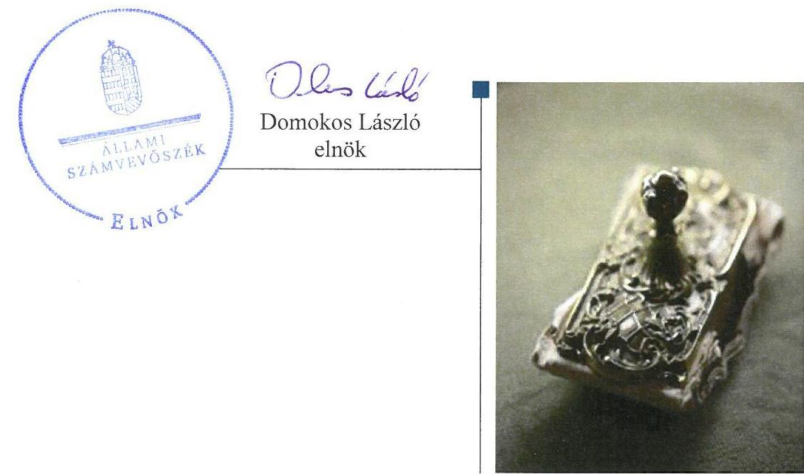
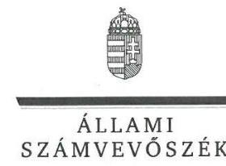
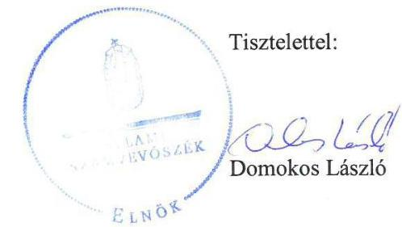
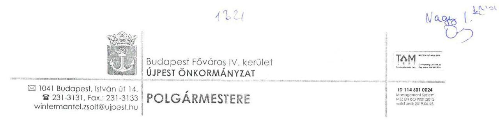
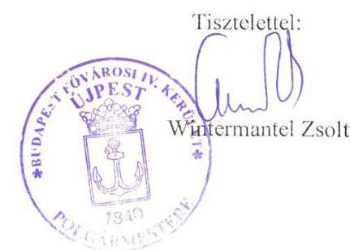

# Jelentés 

## Az önkormányzatok gazdasági társaságai

Az önkormányzatok többségi tulajdonában lévő gazdasági társaságok gazdálkodásának ellenőrzése - Újpesti Városgondnokság Szolgáltató Kft.
2017.

---

# J elentés 

## Az önkormányzatok gazdasági társaságai

Az önkormányzatok többségi tulajdonában lévő gazdasági társaságok gazdálkodásának ellenőrzése - Újpesti Városgondnokság Szolgáltató Kft.
2017. steptelvut hó 18. nap

---

# AZ ELLENŐRZÉST FELÜGYELTE:

DR. NAGY IMRE felügyeleti vezető

# AZ ELLENŐRZÉST VEZETTE ÉS A VÉGREHAJTÁSÁÉRT FELELŐS:

DR. NAGY JUDIT ellenőrzésvezető

# A PROGRAM ÖSSZEÁLLÍTÁSÁÉRT FELELŐS:

JANIK JÓZSEF LÁSZLÓ osztályvezető

---

**IKTATÓSZÁM:** V-1286-174/2016

**TÉMASZÁM:** 2320

**ELLENŐRZÉS-AZONOSÍTÓ SZÁM:** V-075811

---

Jelentéseink az Országgyűlés számítógépes hálózatán és az Interneta a www.asz.hu címen is olvashatóak.

---

# TARTALOMJEGYZÉK 

■ ÖSSZEGZÉS ..... 5
■ AZ ELLENŐRZÉS CÉLJA ..... 6
■ AZ ELLENŐRZÉS TERÜLETE ..... 7
■ AZ ELLENŐRZÉS HÁTTERE, INDOKOLTSÁGA ..... 9
■ A JELENTÉS LÉNYEGES KÉRDÉSKÖREI ..... 10
■ ELLENŐRZÉS HATÓKÖRE ÉS MÓDSZEREI ..... 11
■ MEGÁLLAPÍTÁSOK ..... 13
■ JAVASLATOK ..... 18
■ MELLÉKLETEK ..... 19
I. Sz. melléklet: Értelmező szótár ..... 19
■ FÜGGELÉK: ÉSZREVÉTELEK ..... 21
■ RÖVIDÍTÉSEK JEGYZÉKE ..... 31

---

.

---

# ÖSSZEGZÉS 

Budapest Főváros IV. Kerület Újpest Önkormányzata a tulajdonosi joggyakorlás kereteit a jogszabályi előírásoknak összességében megfelelően alakította ki, valamint a tulajdonosi jogokat szabályszerűen gyakorolta. Az Újpesti Városgondnokság Szolgáltató Kft. vagyongazdálkodása a számviteli szabályozás és az elkülönített nyilvántartás szabályainak hiányosságai mellett összességében szabályszerű volt. A bevételeit és ráfordításait megfelelően számolta el. Beszámolási kötelezettségeinek összességében eleget tett.

## Az ellenőrzés társadalmi indokoltsága

Magyarországon az intézmény-centrikus közfeladat-ellátás jellemző, de egyre jelentősebb a költségvetésen kívüli feladatellátás térnyerése. Helyi szinten ennek legfontosabb szereplői az önkormányzati tulajdonban lévő gazdasági társaságok, amelyeknek ellenőrzése kiemelten fontos a közfeladat ellátása, és a közvagyon megőrzése, megóvása érdekében. Ezért alapvető követelmény, hogy gazdálkodásuk, múködésük szabályszerű és átlátható legyen.

Újpesten 2012-2015 között az Újpesti Városgondnokság Szolgáltató Kft. városüzemeltetési feladatokat látott el. Az Állami Számvevőszék az ellenőrzése során arra kereste a választ, hogy szabályszerű volt-e a városüzemeltetéssel összefüggő közfeladatokat is ellátó Társaság gazdálkodása és az Önkormányzat ehhez kapcsolódó tulajdonosi joggyakorlása.

A jelentésben foglalt megállapítások és a megfogalmazott számvevőszéki javaslatok hozzájárulnak a felelős tulajdonosi joggyakorláshoz és a szabályos gazdálkodáshoz.

## Főbb megállapítások, következtetések, javaslatok

Budapest Főváros IV. Kerület Újpest Önkormányzata az Újpesti Városgondnokság Szolgáltató Kft. feletti tulajdonosi joggyakorlás kereteit összességében szabályszerűen alakította ki.

A Társaság. a gazdálkodással kapcsolatos, a múködéséhez szükséges szabályzatait elkészítette, azonban azokat nem aktualizálta, módosította. A számlarendjét és az önköltségszámítási szabályzatát nem módosította annak érdekében, hogy a Közszolgáltatási szerződésben előírt elkülönített nyilvántartás vezetési kötelezettségének eleget tegyen. A vagyon nyilvántartása és hasznosítása a jogszabályi és belső előírásoknak megfelelően történt. A bevételek, a ráfordítások és az értékcsökkenés elszámolása szabályszerű volt. A Társaság kötelezettségállománya, eladósodottságának mértéke és szerkezete nem jelentett kockázatot a Társaság múködésére.

Beszámolási kötelezettségeit összességében teljesítette, de a 2015. évi számviteli beszámoló kiegészítő mellékletében nem mutatta be a közszolgáltatási és egyéb tevékenységet elkülönítetten. Közérdekú adatai tekintetében a közzétételi kötelezettségének összességében eleget tett.

---

# AZ ELLENŐRZÉS CÉLJA 

Az ellenőrzés célja annak értékelése, hogy az önkormányzat vagyongazdálkodási tevékenysége során szabályszerűen gyakorolta-e tulajdonosi jogait. A gazdasági társaság szabályozottsága, gazdálkodása és vagyongazdálkodási tevékenysége, bevételeinek és ráfordításainak elszámolása megfelelt-e a jogszabályi és tulajdonosi előírásoknak. A gazdasági társaság kötelezettségállománya jelent-e kockázatot a múködésre.

---

# **AZ ELLENŐRZÉS TERÜLETE**

## **Újpesti Városgondnokság Szolgáltató Kft. és a tulajdonosi jogokat gyakorló Budapest Főváros IV. Kerület Újpest Önkormányzata**

Budapest Főváros IV. Kerület Újpest Önkormányzata a 100%os tulajdonában lévő Főtér Kft.1-t 2008-ban alapította, amelynek elnevezését 2011. évben a tevékenységét jobban kifejező Újpesti Városgondnokság Szolgáltató Kft-re módosította. A Főtér Kft.-t eredetileg az újpesti Főtér EU2-os támogatású fejlesztésének lebonyolítására és a fenntartási időszak alatti működés biztosítására hozták létre.

A Társaság3 főtevékenysége 2015. március 26-ig Újpest közigazgatási területén az épületépítési projektek szervezése, ezt követően a zöldterületek kezelése. További feladatai a nem veszélyes hulladékok gyűjtése, hulladék újrahasznosítás, építőipari kivitelezés és hozzá kapcsoló mérnöki és egyéb tevékenységek voltak.

Az Önkormányzat4-tal kötött Vállalkozási szerződés53–637,8 illetve a 2015. október 1-jétől hatályos Közszolgáltatási szerződés9 értelmében – a zöldterületek kezelésén felül – a Társaság jellemzően az Önkormányzat és az érdekeltségi körébe tartózó társaságok és intézmények részére eseti és rendszeres jellegű karbantartó, illetve egyéb műszaki szolgáltató tevékenységet végzett. A Közszolgáltatási szerződésben nem szereplő egyéb műszaki, logisztikai feladatok ellátását a Társaság továbbra is a Vállalkozási szerződés1,2,4 alapján biztosította.

A Közszolgáltatási szerződés keretein kívüli, egyéb szolgáltatások díjait a Képviselő-testület a Vállalkozási szerződés1-4 jóváhagyásakor elfogadta.

Az ügyvezető 2010. december 10. óta tölti be tisztségét. A Felügyelő bizottság10 három fővel működött. A Társaságnál az átlagos statisztikai állományi létszám a 2012-2015. évek között 60-69 fő között változott.

A Társaság gazdálkodásának egyes adatait az 1. táblázat tartalmazza.

1. táblázat

|  A TÁRSASÁG GAZDÁLKODÁSI MUTATÓINAK ALAKULÁSA (MILLIÓ FT) |  |  |  |   |
| --- | --- | --- | --- | --- |
|   | 2012. év | 2013. év | 2014. év | 2015. év  |
|  Értékesítés nettó árbevétele | 658,9 | 924,6 | 1 349,8 | 1 189,4  |
|  Mérlegfőösszeg | 159,5 | 178,9 | 471,9 | 506,4  |
|  Követelések | 67,6 | 75,8 | 81,5 | 76,6  |
|  Saját tőke összege | 97,3 | 109,8 | 335,4 | 366,2  |
|  Jegyzett tőke | 30,5 | 30,5 | 30,5 | 30,5  |
|  Mérleg szerinti eredmény | 0,3 | 0,4 | 0,2 | 1,9  |
|  Forrás: A társaság éves beszámolói |  |  |  |   |

A Társaságnál a saját tőke/jegyzett tőke mutató jogszabályban előírt szintje biztosított volt, és nem csökkent a jegyzett tőke a társasági formára

---

kötelezően előírt szint alá. A saját tőke változásának oka az Önkormányzat pótbefizetéseiből eredő lekötött tartalék növekedése.

A Társaság múködésére, tevékenységére, feladatellátására vonatkozóan az Önkormányzatnak rendeletalkotási kötelezettsége az Ötv. és az Mötv. előírásai szerint nem volt. A feladatellátáshoz kapcsolódóan az Önkormányzat vagyonát sem használatba, sem vagyonkezelésbe nem adta a Társaságnak.

A Társaság a lakosságnak közvetlenül szolgáltatást nem végzett, követelései túlnyomórészt kapcsolt vállalkozásokkal, egyéb önkormányzati tulajdonú társaságokkal szemben álltak fenn.

Az Önkormányzatnál a polgármester 2010, a jegyző 2012. óta látja el feladatait.

---

# AZ ELLENŐRZÉS HÁTTERE, INDOKOLTSÁGA 

## AZ ÖNKORMÁNYZATI TULAJDONÚ GAZDASÁGI

TÁRSASÁGOK teljes körű ellenőrzésének lehetőségét az Állami Számvevőszékről szóló 1989. évi XXXVIII. törvény 2011. január 1-jétől hatályos módosítása teremtette meg és az Állami Számvevőszékről szóló 2011. évi LXVI törvény is tartalmazza. A gazdasági társaságok gazdálkodási tevékenysége szabályszerűségének ellenőrzését 2011. évtől végezzük. Az önkormányzatok többségi tulajdonában álló gazdasági társaságok ellenőrzése kiemelten fontos a vagyon megőrzése, megóvása érdekében.

A feladatellátás költségeinek, ráfordításainak alakulása a lakosság széles rétegét érinti. Az ellenőrzés várható hasznosulásaként ellenőrzéseink feltárhatják, hogy az önkormányzat a feladatellátásához rendelt vagyon működtetését a tulajdonostól elvárható gondossággal végezte-e, a feladatot ellátó gazdasági társaság a létesítő okiratban, szolgáltatási szerződésben foglaltak betartásával biztosította-e a feladat ellátását. Az ellenőrzés rávilágíthat arra, hogy a gazdasági társaság a vagyon használatával biztosí-totta-e a szolgáltatás folytatásának feltételeit, az önkormányzat tulajdonosi felügyelete hozzájárult-e a szabályszerű gazdálkodáshoz és feladatellátáshoz.

A megállapítások alapján megfogalmazott számvevőszéki javaslatok hasznosítása elősegítheti a meglévő hibák megszüntetését. A jó gyakorlatok bemutatásával az Állami Számvevőszék hozzájárul a követendő megoldások megismertetéséhez, terjesztéséhez.

---

# A JELENTÉS LÉNYEGES KÉRDÉSKÖREI 

1.- Az önkormányzat tulajdonosi joggyakorlása szabályszerű volt-e?
2.- A gazdasági társaság vagyongazdálkodása szabályszerű volt-e, fizetőképessége biztositott volt-e a gazdálkodása során?
3.- A gazdasági társaság bevételeinek és ráfordításainak elszámolása szabályszerű volt-e?

---

# ELLENŐRZÉS HATÓKÖRE ÉS MÓDSZEREI 

## Az ellenőrzés típusa

Megfelelőségi ellenőrzés.

## Az ellenőrzött időszak

2012. január 1-jétől 2015. december 31-ig.

## Az ellenőrzés tárgya

Az önkormányzatok - többségi tulajdonában lévő gazdasági társaságok feletti - tulajdonosi joggyakorlása, valamint a gazdasági társaságok gazdálkodásának szabályozottsága és szabályszerűsége.

Az ellenőrzés kiterjed minden olyan körülményre és adatra, amely az ÁSZ ${ }^{11}$ jogszabályban meghatározott feladatainak teljesítéséhez, valamint a program végrehajtása folyamán felmerült újabb összefüggések feltárásához szükséges.

## Az ellenőrzött szervezet

Újpesti Városgondnokság Szolgáltató Kft. és a tulajdonosi jogokat kizárólagosan gyakorló Budapest Főváros IV. Kerület Újpest Önkormányzata

## Az ellenőrzés jogalapja

Az ellenőrzés jogszabályi alapját az ÁSZ tv. ${ }^{12} 1 . \S$ (3) bekezdése és 5. § (3)-(4)-(5) bekezdései képezik.

## Az ellenőrzés módszerei

Az ellenőrzést a nemzetközi standardokat irányadónak tekintve az ellenőrzési program ellenőrzési kérdései, az ellenőrzött időszakban hatályos jogszabályok, az ellenőrzés szakmai szabályok és módszertanok figyelembe vételével végeztük.

Az ellenőrzés ideje alatt az ellenőrzött szervezettel történő kapcsolattartást az ÁSZ Szervezeti és Müködési Szabályzatának vonatkozó előírásai alapján biztosítottuk.

---

Az ellenőrzés a kiválasztott, többségi tulajdonosi jogokat gyakorló önkormányzatra, illetve az ellenőrzésre kijelölt gazdasági társaság felett tulajdonosi jogokat gyakorló szervezetre és az ellenőrzött gazdasági társaságra terjedt ki.

Az ellenőrzési kérdések megválaszolásához szükséges bizonyítékok megszerzése a következő ellenőrzési eljárások alkalmazásával történt: megfigyelés, kérdésfeltevés (információkérés), összehasonlítás, valamint elemző eljárás. Az ellenőrzési bizonyítékként felhasználható adatforrások közé tartoztak egyrészt az ellenőrzési programban felsorolt adatforrások, másrészt adatforrás lehet még minden - az ellenőrzés folyamán - feltárt, az ellenőrzés szempontjából információkat tartalmazó dokumentum.

Az ellenőrzést a kérdésekre adott válaszok kiértékelésével, valamint a megjelölt adatforrások, a csatolt tanúsítványok felhasználásával, továbbá az adott időszakban hatályos jogszabályok figyelembe vételével folytattuk le.

A bevételek és ráfordítások elszámolása, valamint a vagyonnyilvántartás terén a szabályszerű múködést véletlen mintavétellel ellenőriztük. A mintavétellel ellenőrzött területek esetében minden egyes tétel vonatkozásában a szabályszerűségre vonatkozó kérdéseket tettünk fel, amelyek eredménye összesítésre került. Megfelelőnek értékeltünk egy ellenőrzött területet, amennyiben 95\%-os bizonyossággal a teljes sokaságban az átlagos hibaarány legfeljebb 10\%, nem megfelelőnek, amennyiben 10\%-nál magasabb arányt képviselt. Abban az esetben, ha a teljes sokaság tekintetében a 10\%-os hibaarányhoz való viszony megítélésnek megbízhatósága nem érte el a 95\%-ot, annak elérése érdekében értékelésünket további szempontokkal egészítettük ki, és figyelembe vettük a feltárt hibák típusát és súlyát. A ráfordítások elszámolására és a vagyonnyilvántartásra vonatkozó véletlen mintavételt kockázati alapú kiválasztással egészítettük ki, amelynek során évente a három legnagyobb összegű tételt választottuk ki. A bevételek és ráfordítások elszámolása, valamint a vagyonnyilvántartás terén a szabályszerű működést véletlen mintavétellel ellenőriztük. A mintavétellel ellenőrzött területek esetében minden egyes tétel vonatkozásában a szabályszerűségre vonatkozó kérdéseket tettünk fel, amelyek eredménye összesítésre került. Megfelelőnek értékeltünk egy ellenőrzött területet, amennyiben 95\%-os bizonyossággal a teljes sokaságban az átlagos hibaarány legfeljebb 10\%, nem megfelelőnek, amennyiben 10\%-nál magasabb arányt képviselt. Abban az esetben, ha a teljes sokaság tekintetében a 10\%-os hibaarányhoz való viszony megítélésnek megbízhatósága nem érte el a 95\%-ot, annak elérése érdekében értékelésünket további szempontokkal egészítettük ki, és figyelembe vettük a feltárt hibák típusát és súlyát. A ráfordítások elszámolására és a vagyonnyilvántartásra vonatkozó véletlen mintavételt kockázati alapú kiválasztással egészítettük ki, amelynek során évente a három legnagyobb összegű tételt választottuk ki.

---

# 1. Az önkormányzat tulajdonosi joggyakorlása szabályszerű volt-e? 

## Összegző megállapítás

### 1.1. számú megállapítás

Az Önkormányzat tulajdonosi joggyakorlása összességében szabályszerű volt.

Az Önkormányzat a tulajdonosi joggyakorlás kereteit összességében szabályszerűen alakította ki.

Az Ötv. ${ }^{13}$ 91. § (6) bekezdése szerint az Önkormányzat elkészítette gazdasági programját 2011-2014. évekre vonatkozóan „Hajrá Újpest Városfejlesztési Program 2011-2014"14 címmel. A 2015-2019. évekre vonatkozóan „Hajrá Újpest Gazdasági Program 2015-2019"15 gazdasági programot a Képviselő-testület 93/2015. (IV.30.) határozatával fogadta el, az Mótv 116. § (5) bekezdésében rögzítettek szerint.

A 2012. január 1-jétől hatályos Nvtv. ${ }^{16}$ 9. § (1) bekezdés előírása szerinti közép és hosszú távú vagyongazdálkodási terv készítési kötelezettségét az Önkormányzat határidőn túl, 2013. április 25-től a Vagyongazdálkodási koncepció ${ }^{17}$ elkészítésével teljesítette. A Vagyongazdálkodási koncepció tartalmazta az önkormányzati tulajdonban lévő társaságok számára előírt üzleti terv készítési kötelezettséget.

A tulajdonosi joggyakorlás szabályait a Vagyongazdálkodási rendelet ${ }^{18}$. ${ }^{19}$-ben, illetve az $\mathrm{SzMSz}_{1}{ }^{20}{ }_{2}{ }^{21}$-ben határozták meg.

A Társaság Javadalmazási szabályzatát ${ }^{22}$ a Képviselő-testület megalkotta, majd annak letétbe helyezésével eleget tettek a Taktv. ${ }^{23}$ 5. § (3) bekezdés előírásának. A Társaság rendelkezett a Kbt ${ }_{1 .}{ }^{24}$ 22. § (1) bekezdésében, valamint $\mathrm{Kbt}_{2} .{ }^{25}$ 27. § (1) bekezdésében meghatározott Közbeszerzési szabályzat ${ }^{26}$-tal.

### 1.2. számú megállapítás

A tulajdonosi jogok gyakorlása a belső szabályzatok előírásainak megfelelt.

Tulajdonosi joggyakorlás rendje megfelelt az Önkormányzat SzMSz ${ }_{1,2}$-ben, valamint a Vagyongazdálkodási rendelet ${ }_{1,2}$-ben előírtaknak.

Az Önkormányzat negyedéves beszámolókon keresztül értékelte a Társaság tevékenységét, amely tartalmazta a beszámolót az adott évre vonatkozó fejlesztési terv negyedéves teljesítéséről, a Vállalkozási szerződés ${ }_{1-4}$ ben és a Közszolgáltatási szerződésben meghatározott, nem számszerűsíthető követelmények betartásáról. A könyvvizsgáló megbízása alapján féléves időközi írásbeli jelentést is készített a könyvvezetés féléves állapotáról minden évben. Ezek a beszámolók évenkénti összefoglalásai képezték a monitoring és a Társaság tevékenysége szakmai értékelésének alapját.

---

A Felügyelő bizottság a Gt. 34. § (4) bekezdése, illetve a Ptk: 3:122. § (3) bekezdésben előírtaknak megfelelően Ügyrendjét ${ }^{27}$ megállapította és azt a Képviselő-testület jóváhagyta.

A Polgármesteri Hivatal ${ }^{28}$ belső ellenőre a Társaságnál a 2015. január havi pénzgazdálkodást, valamint 2015. március 13-án a pénztárat ellenőrizte. A feltárt hiányosságok megszüntetése érdekében intézkedési terv készült, melynek végrehajtására vonatkozóan utóellenőrzésre nem került sor.

# 2. A gazdasági társaság vagyongazdálkodása szabályszerű volt-e, fizetőképessége biztosított volt-e a gazdálkodása során? 

## Összegző megállapítás

2.1. számú megállapítás

A Társaság vagyongazdálkodása összességében megfelelt a jogszabályi előírásoknak, fizetőképessége biztosított volt.

A Társaság a jogszabály által előírt szabályzatokkal rendelkezett, azonban aktualizálásukról nem gondoskodott.

A Társaság a Számv. tv. 14. § (3)-(5) bekezdése előírásának megfelelően elkészítette Számviteli politikáját ${ }^{29}$ és annak keretében számviteli szabályzatait: az eszközök és a források leltárkészítési és leltározási szabályzat ${ }^{30}$-át, az eszközök és a források értékelési szabályzat ${ }^{31}$-át, a pénzkezelési szabály-zat ${ }^{32}$-ot. A Társaság a Számv. tv. 161. § (1)-(2) bekezdése szerinti számlarend ${ }^{33}$-jét is elkészítette. A Társaság 2014. január 1-jei hatállyal elkészítette Önköltségszámítási szabályzatát ${ }^{34}$, a Számv.tv. ${ }^{35}$ 14. §(7) bekezdésének megfelelően.

A Számviteli politikát a Számv. tv. 14. § (11) bekezdésében rögzítettek ellenére nem módosították, így az 2013. január 1-jétől a Számv. tv. 3. § (3) bekezdés 3. pontjával nem egyezően tartalmazta a jelentős összegű hiba nagyságára vonatkozó meghatározást illetve, nem törölték a Számv. tv. 154. § (5)-(6) bekezdésének hatályon kívül helyezése kapcsán a megbízható és valós képet lényegesen befolyásoló hiba fogalmát és az ezzel kapcsolatos ismételt közzétételi kötelezettséget. A Társaság a Számviteli politikájában ellentmondásosan határozta meg a készítendő beszámoló formáját, ezzel nem tett eleget a Számv. tv. 14.§ (4) bekezdésben foglalt követelménynek.

A Társaság a közszolgáltatási tevékenységének megkezdésekor a Számlarendjében a Számv. tv. 161/A § (2) bekezdés előírása ellenére a nyilvántartási rendszerét nem részletezte tovább, nem alakított ki külön főkönyvi számlákat a közszolgáltatási tevékenység bevételeinek és ráfordításainak elkülönítése érdekében. A Számv. tv. 161/A § (1) bekezdés ellenére nem módosította az Önköltségszámítási szabályzatot ${ }^{36}$ annak érdekében, hogy az tartalmazza a közszolgáltatásra vonatkozó költség illetve, egyéb költségek megosztásának módszerét, ezzel nem tett eleget az Önkormányzattal 2015. október 1-jén kötött Közszolgáltatási szerződés 7.1. illetve, 9.3. pontjában előírt elkülönített nyilvántartás vezetési kötelezettségének.

A Társaság rendelkezett az Info tv. ${ }^{37}$ 24. § (3) bekezdése szerinti Adatvédelmi és adatbiztonsági Szabályzat ${ }^{38}$-tal.

---

# 2.2. számú megállapítás 

A Társaság a vagyonnal kapcsolatos nyilvántartási kötelezettségét teljesítette.

A Társaság vagyonnyilvántartása átlátható, naprakész, a Számv. tv. vagyonnyilvántartásra vonatkozó előírásainak és a belső szabályzatoknak megfelelő volt.

A Társaság vagyonának beszámoló szerinti értékét minden évben leltárral támasztotta alá, az Eszközök és források leltárkészítési és leltározási szabályzatának megfelelően. A közfeladat ellátás során a saját vagyon értékének megőrzése, gyarapítása, hasznosítása az előírásoknak megfelelően történt.

## A Társaság gazdálkodása során a fizetőképessége biztosított volt, az év végi kötelezettségállomány nem jelentett kockázatot feladatai ellátására, illetve a múködésre.

A Társaság követeléseinek és kötelezettségeinek jelentős része kapcsolt, önkormányzati tulajdonban lévő más vállalkozásokkal szemben állt fenn. Ezért az eladósodás mértéke és szerkezete nem jelentett kockázatot a közfeladat ellátására, illetve a múködésére. A szállítók analitikus nyilvántartása, valamint az év végi korosított szállítói állomány alapján megállapítható, hogy a Társaság 2015. év kivételével minden évben rendelkezett 30 napon túli kifizetetlen szállítói tartozás állománnyal.

A Társaság év végi kötelezettségállománya folyamatosan növekedett, a 2014. év végén az előző évhez képest kétszeresére, melynek oka a folyamatban lévő telephely beruházás volt.

A Társaság hosszú lejáratú hitellel, valamint kölcsön állománnyal nem rendelkezett.

A kötelezettség állomány alakulását a 2. táblázat mutatja be.
2. táblázat

A TÁRSASÁG KÖTELEZETTSÉGEINEK ALAKULÁSA (MILLIÓ FT)

|  | 2012. év | 2013. év | 2014. év | 2015. év |
| :--: | :--: | :--: | :--: | :--: |
| Kötelezettségek | 60,4 | 67,2 | 134,8 | 101,9 |
| -ebből: rövid lejáratú kötelezettség | 60,4 | 67,2 | 134,8 | 101,9 |
| -ebből: lejárt esedékességú kötelezettség | 23,2 | 39,7 | 52,3 | 35,0 |
| -ebből: 1-30 napon belül lejárt esedékességú kötelezettség | 12,7 | 23,9 | 50,7 | 35,0 |
| -ebből: 31-60 napon belül lejárt esedékességú kötelezettség | 4,9 | 13,7 | 0,2 | 0 |
| lejárt kötelezettség \%-os aránya | $38 \%$ | $59 \%$ | $39 \%$ | $34 \%$ |

A Társaság a hátralékos követelés kezelésére vonatkozó eljárásrendet a 2011/6. sz. ügyvezetői utasításban szabályozta. A hátralékos állomány a könyvviteli rendszerben lekövethető volt, analitikus nyilvántartások alapján megállapítható volt a hátralékos dijbevételek állománya. Behajtás alatt lévő hátralékos állománnyal nem rendelkeztek, fizetési átütemezésre nem került sor. A Társaság a követeléseire a 2015. évben a Számv. tv. 15. § (8) bekezdése, valamint a számviteli alapelvek közül az óvatosság elve és a Számv. tv. 55. § (1)-(2) bekezdései és az eszközök és

---

források értékelési szabályzatban rögzítettek figyelembevételével értékvesztést számolt el.
2.4. számú megállapítás

A Társaság a jogszabályban előírt beszámolási kötelezettségeit határidőben teljesítette. A 2015. évi beszámolója nem felelt meg a jogszabályi és a Közszolgáltatási szerződés előírásainak. A közérdekú adatokkal kapcsolatos közzétételi kötelezettségének összességében eleget tett.

Az Önkormányzat által elvárt adatszolgáltatási, tájékoztatási feladatokat a Közszolgáltatási szerződés és a Vállalkozási szerződés1-4 tartalmazták. A Közszolgáltatási szerződésben foglaltak szerint az éves közszolgáltatási jelentésben a Társaság a kompenzáció elszámolásáról, valamint a szerződés teljesítésének és a közszolgáltatási tevékenység ellátásának tapasztalatairól - számszerú adatokkal alátámasztott - összesítő tájékoztatást nyújtott. A Vállalkozási szerződés $1-45.4$ és 6.4 pontjainak megfelelően a Társaság a szerződés éves teljesítéséről a tárgyévet követő február hó 28. napjáig éves összesítő beszámolót adott.

A 2015. évről készült éves beszámoló kiegészítő mellékletében a Társaság nem mutatta be, nem választotta szét a közszolgáltatási és az egyéb tevékenységeinek bevételeit és kiadásait, ezzel nem tett eleget az Önkormányzattal 2015. október 1-jén kötött Közszolgáltatási szerződés 9.3. pontjában előírt elkülönített nyilvántartás vezetési kötelezettségének.

Nem mutatták be a Számv. tv. 55. § (1)-(2) bekezdései és az Értékelési Szabályzatban rögzítettek ellenére a 2015. évben a követelésekre elszámolt értékvesztést az éves beszámoló kiegészítő mellékletében.

Az éves beszámolókról készített jelentését a törvényi kötelezettség alapján eljáró könyvvizsgáló hitelesítő záradékkal látta el. Az éves beszámoló közzététele és a letétbe helyezése határidőben, a Számv. tv. 153. § (1) és a 154. § (1) bekezdés előírásainak megfelelően megtörtént. Az Alapító okirat ${ }_{1-6}{ }^{39}$-ban foglaltaknak megfelelően a Társaság éves beszámolóihoz a jelentését a Felügyelő bizottság elkészítette.

A Társaság Közérdekú adatszolgáltatási szabályzata ${ }^{40}$ tartalmazta a közérdekú adatok megismerésére irányuló igények teljesítésének rendjét ezzel eleget téve az Info tv. 30. § (6) bekezdésében előírt kötelezettségének.

A Társaság a közérdekú adatait saját honlapon hozta nyilvánosságra. A Taktv. 2.§ (1) bekezdésének ca) pontjában előírtak ellenére a Társaság vezető állású munkavállalóinak nyújtott pénzbeli juttatások összegét, ezen belül a teljesítménybért megalapozó teljesítménykövetelményeket a honlap nem tartalmazta.

# 3. A gazdasági társaság bevételeinek és ráfordításainak elszámolása szabályszerű volt-e? 

Összegző megállapítás

A Társaság bevételeinek és ráfordításainak elszámolása szabályszerű volt.

A bevételek elszámolása megfelelt a Számv. tv. és a belső szabályozás előírásainak. A Társaság ráfordításainak elszámolása megfelelő volt.

---

A személyi jellegű ráfordítások elszámolása szabályszerűen megtörtént.
A Társaság vagyonnyilvántartása, az értékcsökkenés elszámolása szabályszerű volt. Az Önkormányzat az eredmény eszközpótlásra, felújításra történő felhasználásáról nem döntött, a mérleg szerinti eredmény az eredménytartalékba került átvezetésre.

---

# JAVASLATOK 

Az ÁSZ tv. 33. § (1) bekezdésében foglaltak értelmében az ellenőrzött szervezet vezetője köteles a jelentésben foglalt megállapításokhoz kapcsolódó intézkedési tervet összeállítani és azt a jelentés kézhezvételétől számított 30 napon belül az ÁSZ részére megküldeni. Amennyiben az ellenőrzött szervezet vezetője nem küldi meg határidőben az intézkedési tervet, vagy továbbra sem elfogadható intézkedési tervet küld, az Állami Számvevőszék elnöke az ÁSZ tv. 33. § (3) bekezdése a) és b) pontjaiban foglaltakat érvényesítheti.

## Az Újpesti Városgondnokság Szolgáltató Kft. ügyvezetőjének

1. Intézkedjen a számviteli politika jogszabályi rendelkezések szerinti aktualizálásáról.
(2.1 sz. megállapítás 2. bekezdése alapján)
2. Intézkedjen, hogy a Közszolgáltatási szerződésben előírt
a) közszolgáltatási és egyéb tevékenységre vonatkozó elkülönített nyilvántartási kötelezettségének teljesítése érdekében a számlarend és az önköltségszámítási szabályzat módosításra kerüljön,
(2.1 sz. megállapítás 3. bekezdése alapján)
b) közszolgáltatási és egyéb tevékenység a kiegészítő mellékletben elkülönítetten bemutatásra kerüljön.
(2.4 sz. megállapítás 2. bekezdése alapján)
3. Intézkedjen annak érdekében, hogy a társaság a Taktv-ben foglalt közzétételi kötelezettségének eleget tegyen.
(2.4 sz. megállapítás 6. bekezdése alapján)

---

# MELLÉKLETEK 

- I. SZ. MELLÉKLET: ÉRTELMEZŐ SZÓTÁR
gazdasági társaság
gazdálkodó szervezet
közszolgáltatás
meghatározó befolyás
minősített többséget biztosító részesedés
többségi befolyást biztosító részesedés

Ptk. 3.88. § (1) bekezdése szerint „a gazdasági társaságok üzletszerű közös gazdasági tevékenység folytatására, a tagok vagyoni hozzájárulásával létrehozott, jogi személyiséggel rendelkező vállalkozások, amelyekben a tagok a nyereségből közösen részesednek, és a veszteséget közösen viselik".
A Ptk. 685. § c) pontja szerint gazdálkodó szervezet: „az állami vállalat, az egyéb állami gazdálkodó szerv, a szövetkezet, a lakásszövetkezet, az európai szövetkezet, a gazdasági társaság, az európai részvénytársaság, az egyesülés, az európai gazdasági egyesülés, az európai területi együttmúködési csoportosulás, az egyes jogi személyek vállalata, a leányvállalat, a vízgazdálkodási társulat, az erdő birtokossági társulat, a végrehajtói iroda, az egyéni cég, továbbá az egyéni vállalkozó." (2014. 03.15-ig hatályos)
Az Ebktv. ${ }^{41}$ 3. § d) pontja a következőképpen határozza meg a közszolgáltatást: „szerződéskötési kötelezettség alapján a lakosság alapvető szükségleteinek ellátására irányuló szolgáltatás, így különösen a villamos energia-, gáz-, hő-, víz-, szenny-víz- és hulladékkezelési, köztisztasági, postai és távközlési szolgáltatás, továbbá a menetrend alapján közlekedő járművekkel végzett közforgalmú személyszállítás".
A Ptk. 2 8:2. § (2) bekezdése szerint „A befolyással rendelkező akkor rendelkezik egy jogi személyben meghatározó befolyással, ha annak tagja vagy részvényese, és
a) jogosult e jogi személy vezető tisztségviselői vagy Felügyelőbizottsága tagjai többségének megválasztására, illetve visszahívására; vagy
b) a jogi személy más tagjai, illetve részvényesei a befolyással rendelkezővel kötött megállapodás alapján a befolyással rendelkezővel azonos tartalommal szavaznak, vagy a befolyással rendelkezőn keresztül gyakorolják szavazati jogukat, feltéve, hogy együtt a szavazatok több mint felével rendelkeznek."
A minősített befolyásszerző az ellenőrzött társaságban a szavazatok legalább hetvenöt százalékával rendelkezik. (Ptk.2. 3:324. §)
A Ptk. 2 8:2. § (1) bekezdése szerint „többségi befolyás az olyan kapcsolat, amelynek révén természetes személy vagy jogi személy (befolyással rendelkező) egy jogi személyben a szavazatok több mint felével vagy meghatározó befolyással rendelkezik."

---

.

---

# FÜGGELÉK: ÉSZREVÉTELEK 

A jelentéstervezetet a Számvevőszék 15 napos észrevételezésre megküldte az ellenőrzött szervezetek vezetőinek az ÁSZ tv. 29. §* (1) bekezdése előírásának megfelelően.

Az Újpesti Városgondnokság Szolgáltató Kft. ügyvezetője az ellenőrzés megállapításaira írásban észrevételt tett. Budapest Főváros IV. kerület Újpest Önkormányzatának polgármestere az ÁSZ tv. 29. § (2) bekezdésében foglalt észrevételezési jogával nem élt, írásban jelezte, hogy észrevételt nem tesz. Az észrevétel alapján az Állami Számvevőszék módosította a jelentést.
A függelék tartalmazza az ellenőrzött szervezetek vezetőinek az észrevételeit és az azokra adott választ, a figyelembe nem vett észrevételekről, azok indokairól szóló tájékoztatást.

[^0]
[^0]:    * 29. § (1) Az Állami Számvevőszék az ellenőrzési megállapításait megküldi az ellenőrzött szervezet vezetőjének vagy az általa megbízott személynek, és annak, akinek személyes felelősségét állapította meg.
    (2) Az ellenőrzött szervezet vezetője és a felelősként megjelölt személy az ellenőrzés megállapításaira tizenöt napon belül írásban észrevételt tehet.
    (3) Az Állami Számvevőszék az észrevételre a beérkezésétől számított harminc napon belül írásban válaszol. A figyelembe nem vett észrevételeket köteles a jelentésben feltüntetni, és megindokolni, hogy azokat miért nem fogadta el.

---

# 1313   11461201712 

## ÚjPesti VárosgondnoksÁg Kft. 1044 Budapest, Oradna utca 2/A. Tel.: 232-1156 Fax.: 232-1157 Email: info@varosgondnoksag.ujpest.hu AdOsz.: 14512346-4-41

## ÁLLAMI SZÁMVEVŐSZÉK

Domokos László
Elnök részére

Budapest 4.
Pf. 54
1364

## Tisztelt Domokos László Úr!

Köszönettel megkaptuk V-1286-151/2016. ikt. számú számvevőszéki jelentéstervezetüket. Az ÁSZ tv. 29.§(2) bekezdésében foglaltak szerint az alábbiakban közöljük a jelentéstervezetre vonatkozó észrevételünket.

## 2. Intézkedjen, hogy a közszolgáltatási tervben elöirt

a. közszolgáltatási és egyéb tevékenységre vonatkozó elkülönitett nyilvántartási kötelezettségének teljesitése érdekében a számlarend és az önköltségszámítási szabályzat módositásra kerüljön

A 2.1.számú megállapítás 3.bekezdésében szereplő azon megállapítás módosítását kérjük, amelyben "a Társaság...nyilvántartási rendszerét nem részletezte tovább, nem alakitott ki külön fókönyvi számlákat a közszolgálati tevékenység bevételeinek és ráforditásainak elkülönitése érdekében"

A Szám. tv. tv 161./A. § (2) bekezdése előírja, hogy „A közpénzek felhasználásának és a köztulajdon használatának nyilvánossága és ellenörizhetősége érdekében a gazdálkodó nyilvántartási (könyvvezetési) rendszerét köteles oly módon továbbrészletezni, hogy abból a vonatkozó külön jogszabályban meghatározott adatok rendelkezésre álljanak."
A nyilvánosság és ellenőrizhetőség érdekében a nyilvántartási rendszert kell oly módon tovább részletezni, hogy megfeleljen a követelményeknek, hogy a külön jogszabályban meghatározott adatok rendelkezésre álljanak. Az ÚVG Kft. nyilvántartási rendszere hasonlóan a korábbi évekhez, 2015.évben is analitikus kódok alapján lett meghatározva. A nyilvántartási rendszernek nem kötelező eleme a könyvvezetési rendszerben való továbbrészletezés, ez opcióként van megadva, más módon is előállítható az adatállomány. A analitikus kód szerinti bontás 2015. év vonatkozásában átadásra került ÁSZ ellenőrzésre.
Az ÚVG Kft. könyvelése 2016-tól a „Forrás" nevű szoftverrel történik, ahol nem a főkönyvi számok kerülnek alábontásra, hanem ügyletkód kerül alkalmazásra a gazdasági események szétválasztására. A Társaság ezzel eleget tesz az elkülönített nyilvántartási kötelezettségének.

Kérjük a fentiekben leírtak alapján jelentésük módosítását, miszerint ,, a Társaság... nyilvántartási rendszerének további részletezését analitikus nyilvántartások elkülönitésével oldotta meg, nem fókönyvi számlák további részletezésével"

---

#  

b. (közszolgáltatási és egyéb tevékenység a kiegészitő mellékletben elkülönítetten kerüljön bemutatásra)

A 2.4.számú megállapítás 2. bekezdése szerint "...éves beszámoló kiegészitő mellékletében a Társaság nem mutatta be, nem választotta szét a közszolgáltatási és egyéb tevékenységeinek bevételeit és kiadásait, ezzel..."
A Szvt. 88 § (1) szerint a kiegészítő mellékletbe azon számszerủ adatokat és szöveges magyarázatokat kell felvenni, melyeket a törvény előír és a vállalkozó vagyoni, pénzügyi helyzetének, müködése eredményének megbízható és valós bemutatásához a tulajdonosok, a befektetők, a hitelezők számára - a mérlegben, az eredménykimutatásban szereplőkön túlmenően szükségesek. A kiegészítő mellékletben be kell mutatni a sajátos tevékenységgel kapcsolatos - más jogszabályban előírt - információkat is.
Az ÚVG Kft. és jogelődje 2008.évben alapított Társaság, nem közhasznú jogállású társaságként és nem csak a közszolgáltatási tevékenység végzésére lett létrehozva. Közszolgáltatási tevékenység keretében az ÚVG Kft. olyan tevékenységet nem végez és végzett, amely sajátos tevékenysége lenne. A közhasznú jogállású társaságokra vonatkozó 64/2010. számviteli kérdés egyértelműen rögzíti, hogy a közhasznú tevékenységet végző cég esetében a vállalkozóra van bízva, hogy milyen szerkezetben és milyen tartalommal részletezi sajátos tevékenységét. Egyéb vállalkozás esetében ez nincs előírva, ezért az Társaság feladata nem sajátos tevékenység, így azt nem szükséges a kiegészítő mellékletben külön bemutatni. Ezen tevékenységéről az önkormányzat felé külön beszámoló készül a tárgyév lezárását követő 30 napon belül.

Kérjük a fentiekben leírtak alapján jelentésük módosítását, miszerint "...éves beszámoló kiegészitő mellékletében a Társaság csak az egyéb tevékenységre vonatkozó bevételei és kiadásai kerültek bemutatásra, a közszolgáltatási tevékenység bevételei és kiadásai külön beszámló formájában kerültek a tulajdonos felé beterjesztésre".

A 2.4.számú megállapítás 3.bekezdésében feltételezésünk szerint ÁSZ ellenőrzésre átadott anyag 6.6.2. VG Egyéb ráfordítások sorában szereplő értékvesztés szerepel, melyre (Leírt vevő követelés) nem került sor, így annak bemutatására sem, mely összeg (21 858,-Ft -T86-K31) behajthatatlannak lett minősítve. A beszámoló valódiságát a kiegészítő mellékletben véletlen szerủen nem bemutatott $21898,-$ Ft értékủ értékvesztés nem befolyásolja.

Kérjük ezen bekezdés törlését.
3. számú megállapításra az alábbi észrevételt teszük
3. Intézkedjen annak érdekében, hogy a társaság a Takıv-ben foglalt közzétételi kötelezettségének eleget tegyen
2.4. számú megállapítás 6. bekezdésében nem helytálló a megállapítás, mivel Társaságunk közérdekủ adatait, köztük a Társaság vezető tisztségviselőinek és vezető állású munkavállalóinak

---

# Újpesti Városgondnokság Kft. 1044 Budapest, Óradna utca 2/A. Tel.: 232-1156 Fax.: 232-1157 Email: info@varosgondnokság.uJpest.hu Adósz.: 14512346-4-41 

nyújtott pénzbeli juttatásait a honlap tartalmazta, melyek az ellenőrzés alatt is megtekinthetők voltak, a 2017.03.07.-i dátumozású - "Teljességi nyilatkozat a bekért adatokra vonatkozóan (2.sz.melléklet az 1/2017.(I.23) elnöki körlevéhez)" - dokumentumok között is csatolásra, ÁSZ részére megküldésre kerültek.

Kérem ezen megállapítás törlését.

Kérjük jelentésükben megfogalmazottakat a fentiek figyelembevételével módosítani szíveskedjenek.

Budapest, 2017.08.03.

Vasa Zoltán
ügyvezető igazgató

---

ELNÖK

Ikt.szám: V-1286-158/2016.

# Vasa Zoltán úr 

ügyvezető
Újpesti Városgondnokság Szolgáltató Kft.

## Budapest

## Tisztelt Ügyvezető Úr!

„Az önkormányzatok gazdasági társaságai - Az önkormányzatok többségi tulajdonában lévő gazdasági társaságok gazdálkodásának ellenőrzése - Újpesti Városgondnokság Szolgáltató Kft." címmel készített számvevőszéki jelentéstervezetre tett észrevételeit köszönettel megkaptam.
Az Állami Számvevőszék észrevételekre vonatkozó álláspontjáról a felügyeleti vezető által készített részletes tájékoztatást csatoltan megküldőm.
Tájékoztatom az Ügyvezető urat, hogy a számvevőszéki jelentésben - az Állami Számvevőszékről szóló 2011. évi LXVI. törvény 29. § (3) bekezdése alapján - a figyelembe nem vett észrevételeket szerepeltetjük az elutasítás indokának feltüntetésével.

Budapest, 2017. ๑8 hó 22 nap

Melléklet: Tájékoztatás az észrevételek kezeléséről

---

# Tájékoztatás   az észrevételek kezeléséről 

„Az önkormányzatok gazdasági társaságai - Az önkormányzatok többségi tulajdonában lévő gazdasági társaságok gazdálkodásának ellenörzése - Újpesti Városgondnokság Szolgáltató Kft. " című jelentéstervezetre 2017. augusztus 3-án tett (az Állami Számvevőszékhez 2017. augusztus 08-án érkezett) észrevételeit áttekintettük, annak kezelésével kapcsolatban a következő tájékoztatást adom.

A jelentéstervezet 2.1. számú megállapítás 3. bekezdés első mondatára („A Társaság ... nyilvántartási rendszerét nem részletezte tovább, nem alakított ki külön fökönyvi számlákat a közszolgáltatási tevékenység bevételeinek és ráfordításainak elkülönítése érdekében.") és az ügyvezetőnek címzett 2. javaslatra („Intézkedjen, hogy a Közszolgáltatási szerződésben előirt közszolgáltatási és egyéb tevékenységre vonatkozó elkülönített nyilvántartási kötelezettségének teljesítése érdekében a számlarend és az önköltségszámítási szabályzat módosításra kerüljön") vonatkozó észrevétel

Az észrevétel szerint a nyilvántartási rendszernek nem kötelező eleme a könyvvezetési rendszerben való továbbrészletezés, a Társaság 2015. évben analitikus kódokat, 2016. évtől ügyletkódokat alkalmazott a gazdasági események szétválasztására.

Az észrevétel nem megalapozott, azt nem fogadom el. A számviteli törvény 161/A. § (1) bekezdése alapján a gazdálkodónak a könyvvezetésre, a bizonylatolásra vonatkozó részletes belső szabályait úgy kell kialakítania, hogy az a mérleg és az eredménykimutatás alátámasztásán túlmenően a kiegészítő melléklet adatainak közvetlen alátámasztására is alkalmas legyen. A Közszolgáltatási szerződés 9.3. pontja (11. oldal) értelmében ,,A Közszolgáltató köteles számviteli nyilvántartásaiban és az éves beszámoló részét képező kiegészitő mellékletben a Közszolgáltatási Tevékenységet és Egyéb Tevékenységet elkülönitetten nyilvántartani és bemutatni. ", illetve a 2. melléklete szerint (Kompenzáció számítási módszere, 26. oldal) „...A költségeknek a Közszolgáltatási Kötelezettség teljesitése érdekében kell felmerülniük, azaz ...a költségek elszámolásának a számviteli törvény, a Közszolgáltató számviteli politikája szabályainak kell megfelelnie ... ". A szabályozás egyértelmű: a belső szabályokat úgy kell kialakítani, hogy azok gyakorlati alkalmazása során a Közszolgáltatási szerződésben előírt elkülönítési kötelezettség megvalósuljon. Az észrevételben hivatkozott analitikus kódrendszer nem volt alkalmas az elkülönített nyilvántartás megvalósítására, mivel a kódok nem kerültek aszerint megbontásra, hogy az adott költséghelyen felmerült költség a közszolgáltatás érdekében vagy azon kívül merült-e fel. A jelentéstervezet intézkedést igénylő megállapítása és a javaslat módosítása, illetve törlése nem indokolt. Az ellenőrzött időszakot követően megtett intézkedést az intézkedési terv összeállítása során indokolt figyelembe venni.

---

A jelentéstervezet 2.4. számú megállapítás 2. bekezdés első mondatára („Az ...éves beszámoló kiegészítő mellékletében a Társaság nem mutatta be, nem választotta szét a közszolgáltatási és az egyéb tevékenységeinek bevételeit és kiadásait, ezzel...") és az ügyvezetőnek címzett 2. javaslatra („Intézkedjen, hogy a Közszolgáltatási szerződésben előírt közszolgáltatási és egyéb tevékenység a kiegészítő mellékletben elkülönítetten bemutatásra kerüljön.") vonatkozó észrevétel

Az észrevétel szerint a kiegészítő mellékletben be kell mutatni a sajátos tevékenységgel kapcsolatos információkat. A Társaság feladata nem sajátos tevékenység, így azt nem kell bemutatni a kiegészítő mellékletben. A közszolgáltatási tevékenység bevételei és kiadásai külön beszámoló formájában kerültek a tulajdonos felé beterjesztésre.

Az észrevétel nem megalapozott, azt nem fogadom el. A Közszolgáltatási szerződés 9.3. pontja (11. oldal) egyértelműen fogalmaz: ,,A Közszolgáltató köteles számviteli nyilvántartásaiban és az éves beszámoló részét képező kiegészitő mellékletben a Közszolgáltatási Tevékenységet és Egyéb Tevékenységet elkülönitetten nyilvántartani és bemutatni. "A 2015. évi beszámoló kiegészítő mellékletében a Közszolgáltatási Tevékenység és Egyéb Tevékenység elkülönített bemutatására nem került sor, ezért a jelentéstervezet intézkedést igénylő megállapítása és a javaslat módosítása, illetve törlése nem indokolt.

A jelentéstervezet 2.4. számú megállapítás 3. bekezdésére (,....Nem mutatták be a Számv. tv. 55. § (1)-(2) bekezdései és az Értékelési Szabályzatban rögzítettek ellenére a 2015. évben a követelésekre elszámolt értékvesztést az éves beszámoló kiegészítő mellékletében.") vonatkozó észrevétel

Az észrevétel szerint az ellenőrzés részére átadott anyagban szereplő értékvesztésre „...nem került sor", így annak bemutatására sem. A beszámoló valódiságát a kiegészítő mellékletben „véletlenszerűen" be nem mutatott értékvesztés nem befolyásolta.

Az észrevétel nem megalapozott, azt nem fogadom el. A számviteli törvény 55. § (4) bekezdése értelmében a követelések eredeti, a 65. § (1)-(3) bekezdése szerinti nyilvántartásba vételi (devizakövetelés esetén a $60 . \S$ szerinti árfolyamon számított) értékét, az üzleti évben elszámolt, illetve visszaírt, a halmozottan elszámolt értékvesztés összegét - legalább a mérlegtételek szerinti megbontásban - a kiegészítő mellékletben be kell mutatni. Az ellenőrzés részére átadott 2015. évi fökönyvi kivonat 8672 főkönyvi számláján (Követelések elszámolt értékvesztése) 21.858.Ft lekönyvelt összeg szerepel. A 2015.évi beszámoló kiegészítő mellékletében be nem mutatott 21.858.- Ft értékủ értékvesztés a beszámoló valódiságát nem befolyásolta, erre vonatkozóan a jelentéstervezet sem tartalmazott megállapítást. A jelentéstervezet intézkedést igénylő megállapítása törlése nem indokolt.

A jelentéstervezet 2.4. számú megállapítás 6. bekezdés 2. mondatára (,....A Taktv.§ (1) bekezdésének ca) pontjában előirtak ellenére a Társaság vezető tisztségviselőinek és a vezető állású munkavállalóinak nyújtott pénzbeli juttatások összegét a honlap nem tartalmazta..") vonatkozó észrevétel

---

Az észrevétel szerint a Társaság vezető tisztségviselőinek és vezető állású munkavállalóinak nyújtott pénzbeli juttatásait a honlap tartalmazta, melyről a dokumentum az ellenőrzés részére átadásra került.

Az ellenőrzés részére átadott dokumentumok ismételt áttekintése alapján az észrevételt részben fogadjuk el, a jelentéstervezet fent hivatkozott intézkedést igénylő megállapítása az alábbiak szerint pontosításra kerül: A Taktv. 2.§ (1) bekezdésének ca) pontjában elöírtak ellenére a Társaság vezető állású munkavállalóinak nyújtott pénzbeli juttatások összegét, ezen belül a teljesítménybért megalapozó teljesítménykövetelményeket a honlap nem tartalmazta.

Budapest, 2017. ๑๑ hó 23 nap

Dr. Nagy Imre felügyeleti vezető

---

# Állami Számvevőszék 

## Domokos László

elnök részére

## Budapest 4.

Pf.: 54
1364

## Tisztelt Elnök Úr!

Az Állami Számvevőszék 2017. július 18. napjún, az önkormányzatok többségi tulajdonában lévő gazdasági társaságok gazdálkodásának vizsgálata tárgyában kelt jelentéstervezetét megkaptam.

Munkájukat megköszönve tájékoztatom Elnök Urat, hogy a jelentéstervezettel kapcsolatban az Önkormányzatot illetően észrevételt nem kivánunk tenni.

Budapest, 2017. augusztus 1.

---

.

---

# RÖVIDÍTÉSEK JEGYZÉKE 

${ }^{1}$ Főtér Kft.
${ }^{2}$ EU
${ }^{3}$ társaság
${ }^{4}$ önkormányzat
${ }^{5}$ vállalkozási szerződés:

## ${ }^{6}$ vállalkozási szerződés:

${ }^{7}$ vállalkozási szerződés:

## ${ }^{8}$ vállalkozási szerződés:

${ }^{9}$ közszolgáltatási szerződés
${ }^{10}$ felügyelő bizottság
${ }^{11}$ ÁSZ
${ }^{12}$ ÁSZtv.
${ }^{13}$ Ötv.
${ }^{14}$ gazdasági program:

## ${ }^{15}$ gazdasági program:

${ }^{16} \mathrm{Nvtv}$.
${ }^{17}$ vagyongazdálkodási koncepció
${ }^{18}$ vagyongazdálkodási rendelet:

[^0]Újpesti Főtér Városfejlesztési és Beruházó Kft.
Európai Unió
Újpesti Városgondnokság Szolgáltató Kft.
Budapest Főváros IV. kerület Újpest Önkormányzata
Vállalkozási keretszerződés az Önkormányzat intézményeiben eseti- és rendszeres karbantartási és egyéb műszaki jellegű feladatok ellátásáról (hatályos 2012. január 1-jétől 2019. február 28-ig). Az 1. sz. szerződésmódosítás keretében kiegészítették építési és karbantartási anyagok beszerzésével. 2013. június 6-tól
Vállalkozási keretszerződés az Önkormányzat intézményeiben és közterületei illetékességi területén felmerülő eseti- és rendszeres karbantartások és egyéb műszaki jellegű feladatok, javítások elvégzéséhez szükséges anyagok, segédanyagok beszerzésével és központi raktározásával kapcsolatos feladatok ellátása (hatályos 2013. november 1-jétől)
Vállalkozási szerződés az Önkormányzat illetékességi területén városgondnoksági, városüzemeltetési, zöldterület fenntárási, parkgondozással kapcsolatos feladatok ellátásáról, valamint a Szent István üzemeltetése (hatályos 2011. március 1-jétől - 2014. február 28-áig)

Vállalkozási szerződés az Önkormányzat illetékességi területén városgondnoksági, városüzemeltetési, zöldterület fenntárási, parkgondozással kapcsolatos feladatok ellátásáról, valamint a Szent István üzemeltetése (hatályos 2014. március 1-jétől)

Az Önkormányzat kötelező és önként vállalt feladatainak ellátása keretében illetékességi területén a városgondnoksági, városüzemeltetési, zöldterület fenntartási, parkgondozási feladatok ellátása, Szent István tér üzemeltetése, továbbá különféle egyéb városüzemeltetéssel kapcsolatos munkák elvégzése (hatályos 2015. október 1-jétől)
Újpesti Városgondnokság Szolgáltató Kft. Felügyelő Bizottsága
Állami Számvevőszék
2011. évi LXVI. törvény az Állami Számvevőszékről
1990. évi LXV. törvény a helyi önkormányzatokról
„Hajrá Újpest Városfejlesztési Program 2011-2014.", amelyet a Képviselő-testület 112/2011. (V.05.) határozatával fogadott el
„Hajrá Újpest Gazdasági Program 2015-2019.", amelyet a Képviselő-testület 93/2015. (IV.30.) határozatával fogadott el
2011. évi CXCVI. törvény a nemzeti vagyonról

Budapest Főváros IV. Kerület Újpest Önkormányzat Vagyongazdálkodási koncepció (hatályos: 2013. április 25-étől)
Budapest Főváros IV. Kerület Újpest Önkormányzata 22/2006. (XI. 15.) számú rendelete az Önkormányzat tulajdonában lévő vagyonnal való gazdálkodás és rendelkezés szabályairól
Budapest Főváros IV. Kerület Újpest Önkormányzata 48/2012. (XI. 30.) számú rendelete Budapest Főváros IV. Kerület Újpest Önkormányzata vagyonáról és a vagyonelemek feletti tulajdonosi jogok gyakorlásról szóló (hatályos 2013. január 1-jétől)

[^0]:    ${ }^{1}$ Főtér Kft.
    ${ }^{2}$ EU
    ${ }^{3}$ társaság
    ${ }^{4}$ önkormányzat
    ${ }^{5}$ vállalkozási szerződés:

---

${ }^{20} \mathrm{SzMSz}_{1}$
${ }^{21} \mathrm{SzMSz}_{2}$
${ }^{22}$ javadalmazási szabályzat
${ }^{23}$ Taktv.
${ }^{24} \mathrm{Kbt}_{1}$.
${ }^{25} \mathrm{Kbt}_{2}$.
${ }^{26}$ közbeszerzési szabályzat
${ }^{27}$ ügyrend
${ }^{28}$ Polgármesteri hivatal
${ }^{29}$ számviteli politika
${ }^{30}$ eszközök és források leltárkészítési és leltározási szabályzata
${ }^{31}$ eszközök és a források értékelési szabályzata
${ }^{32}$ pénzkezelési szabályzat
${ }^{33}$ számlarend
${ }^{34}$ önköltségszámítási szabályzat
${ }^{35}$ Számv.tv.
${ }^{36}$ önköltség számítási szabályzat
${ }^{37}$ Info tv.
${ }^{38}$ adatvédelmi és adatbiztonsági Szabályzat
${ }^{39}$ alapító okirat ${ }_{1,2,3,4,5,6}$
${ }^{40}$ közérdekú adatszolgáltatási szabályzat
${ }^{41}$ Ebktv.

Budapest Főváros IV. Kerület Újpest Önkormányzata 3/2000. (IV. 10.) számú rendelete a Budapest Főváros IV. Kerület Újpest Önkormányzata Képviselőtestületének Szervezeti és Müködési Szabályzatáról
Budapest Főváros IV. Kerület Újpest Önkormányzata 60/2012. (XII. 21.) számú rendelete a Budapest Főváros IV. Kerület Újpest Önkormányzata Képviselőtestületének Szervezeti és Müködési Szabályzatáról (hatályos 2013. január 1-jétől)
Újpesti Városgondnokság Szolgáltató Kft. 2011. szeptember 22-étől hatályos javadalmazási szabályzata.
2009. évi CXXII. törvény. a köztulajdonban álló gazdasági társaságok takarékosabb müködéséről
2011. évi CVIII. törvény a közbeszerzésekről
2015. évi CXLIII. törvény a közbeszerzésekről

Újpesti Városgondnokság Szolgáltató Kft. 2012. január 1-jétől hatályos közbeszerzési szabályzata.
Újpesti Városgondnokság Szolgáltató Kft. Felügyelő Bizottságának Ügyrendje (hatályos: 2011. március 2-ától)
Budapest Főváros IV. Kerület Újpest Önkormányzat Polgármesteri hivatala Újpesti Városgondnokság Szolgáltató Kft. 2011. december 15-étől hatályos számviteli politikája.
Újpesti Városgondnokság Szolgáltató Kft. 2011. február 28-tól hatályos eszközök és források leltárkészítési és leltározási szabályzata
Újpesti Városgondnokság Szolgáltató Kft. 2011. március 1-jétől hatályos számviteli politika eszközök és források értékelési szabályzata
Újpesti Városgondnokság Szolgáltató Kft. 2011. február 28-tól hatályos számviteli politika pénzkezelési szabályzat
Újpesti Városgondnokság Szolgáltató Kft. 2012. január 1-jétől hatályos számlarendje
Újpesti Városgondnokság Szolgáltató Kft. 2014. január 1-jétől hatályos Önköltségszámítási szabályzata.
2000. évi C. törvény a számvitelről

Újpesti Városgondnokság Szolgáltató Kft. 2014. január 1-jétől hatályos önköltség számítási szabályzata.
2011. évi CXII. törvény az információs önrendelkezési jogról és az információszabadságról
Újpesti Városgondnokság Szolgáltató Kft. 2011. április 1-jétől hatályos Adatvédelmi és Adatkezelési Szabályzata
Újpesti Városgondnokság Szolgáltató Kft. Alapító okirata (hatályos: 2011. február 28-ától) jóváhagyta a Képviselő testület 45/2011. (II. 25.) számú határozatával. Alapító okirat (hatályos: 2011. december 15-től) jóváhagyta a Képviselő testület 469/2011. (XII. 15.) számú határozatával. Alapító okirat (hatályos: 2012. május 31-étől) jóváhagyta a Képviselő testület 118/2012. (V. 24.) számú határozatával. Alapító okirat (hatályos: 2013. június 1-étől) jóváhagyta a Képviselő testület 59/2013. (IV. 25.) számú határozatával. Alapító okirat (hatályos: 2014. január 31-étől) jóváhagyta a Képviselő testület 15/2014. (I. 30.) számú határozatával. Alapító okirat (hatályos 2015. március 26-ától) jóváhagyta a Képviselő testület 61/2015. (III. 26.) számú határozatával.
Újpesti Városgondnokság Szolgáltató Kft. 2011. március 1-jétől hatályos Közérdekú adatszolgáltatási szabályzata.
2003. évi CXXV. törvény az egyenlő bánásmódról és az esélyegyenlőség előmozdításáról

---

# ÁLLAMI SZÁMVEVŐSZÉK 

1052 Budapest, Apáczai Csere János utca 10.
Levélcím: 1364 Budapest 4. Pf. 54
Telefon: +36 14849100 Telefax: +36 14849200
www.asz.hu