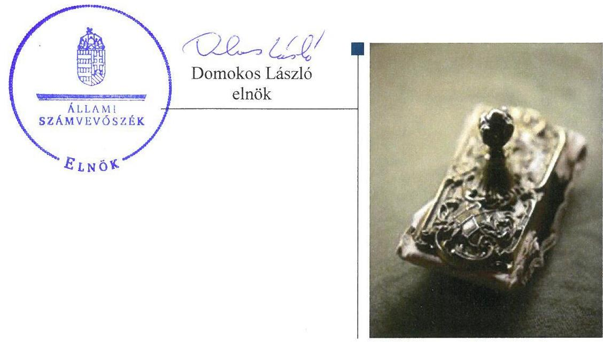
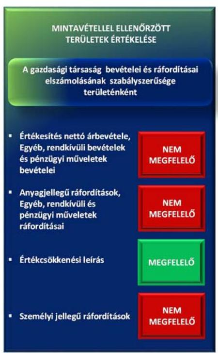
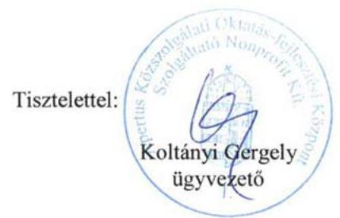
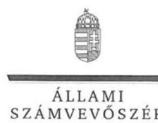
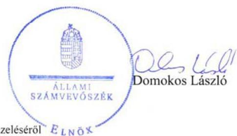

# Jelentés 

## Apertus Közszolgálati Oktatás-fejlesztési Központ Szolgáltató Nonprofit Kft.

Az állami tulajdonban (résztulajdonban) lévő gazdálkodó szervezetek vagyonmegőrzési és gazdálkodási tevékenységének ellenőrzése 2017. 01. 21.

---

# AZ ELLENŐRZÉST FELÜGYELTE:

## MAKKAI MÁRIA felügyeleti vezető

## AZ ELLENŐRZÉST VEZETTE ÉS A VÉGREHAJTÁSÁÉRT FELELŐS:

### SALI SÁNDORNÉ ellenőrzésvezető

## A PROGRAM ÖSSZEÁLLÍTÁSÁÉRT FELELŐS:

### TÓTPÁL SZABOLCS osztályvezető

---

**IKTATÓSZÁM: V-1235-176/2016.**

**TÉMASZÁM: 2269**

**ELLENŐRZÉS-AZONOSÍTÓ SZÁM: V075920**

---

Jelentéseink az Országgyűlés számítógépes hálózatát és az Interneten a www.asz.hu címen is olvashatóak.

---

# TARTALOMJEGYZÉK 

■ ÖSSZEGZÉS ..... 5
■ AZ ELLENŐRZÉS CÉLJA ..... 6
■ AZ ELLENŐRZÉS TERÜLETE ..... 7
■ AZ ELLENŐRZÉS HÁTTERE, INDOKOLTSÁGA ..... 8
■ A JELENTÉS LÉNYEGES KÉRDÉSKÖREI ..... 9
■ ELLENŐRZÉS HATÓKÖRE ÉS MÓDSZEREI ..... 10
■ MEGÁLLAPÍTÁSOK ..... 12
■ JAVASLATOK ..... 17
■ MELLÉKLETEK ..... 19
I. Sz. melléklet: Értelmező szótár ..... 19
■ FÜGGELÉK: ÉSZREVÉTELEK ..... 21
■ RÖVIDÍTÉSEK JEGYZÉKE ..... 27

---

.

---

# ÖSSZEGZÉS 

A Közigazgatási és Igazságügyi Hivatalnak az Apertus Közszolgálati Oktatás-fejlesztési Központ Szolgáltató Nonprofit Kft. feletti tulajdonosi joggyakorlása a 2012-2013. években nem volt szabályos. Ezt követően a 2014-2015. években a Nemzeti Közszolgálati Egyetem tulajdonosi joggyakorlása szabályszerű volt. Az Apertus NKft. vagyongazdálkodása a 2012-2014. években nem volt szabályszerű, a vagyon védelme nem volt biztosított. A Társaság működésének szabályozottsága javult, összességében megfelelő volt. Az ellenőrzött időszakban a pénzügyi-számviteli feladatok ellátása nem felelt meg az előírásoknak.

## Az ellenőrzés társadalmi indokoltsága

Az állami tulajdonú gazdálkodó szervezetek a nemzeti vagyon részét képezik. Az állami vagyonnal való gazdálkodást illetően a tulajdonosi joggyakorlás és a vagyongazdálkodás feladata az állami vagyon átlátható, rendeltetésszerű és felelős felhasználásának biztosítása. Az állam meghatározza az ellátandó feladatokat, amelyhez a vagyonnal kapcsolatos döntéseknek igazodniuk kell. A nemzetgazdasági szempontból kiemelt jelentőségű nemzeti vagyonban tartandó állami tulajdonban álló társasági részesedést a nemzeti vagyonról szóló törvény határozza meg.

Az Állami Számvevőszék az általa korábban ellenőrizetlen területek, szervezetek körébe tartozó társaságnál végzett ellenőrzést. A számvevőszéki ellenőrzés hozzájárul a közpénzek szabályos, átlátható, elszámoltatható és eredményes felhasználásához, a rend pedig értéket teremt. Minden közpénzt, közvagyont használó szervezettel szemben társadalmi igény, hogy tevékenységükről elszámoljanak. Ezt figyelembe véve és az Állami Számvevőszék Stratégiájával összhangban került sor az Apertus Közszolgálati Oktatás-fejlesztési Központ Szolgáltató Nonprofit Kft. ellenőrzésére a 2012-2015. évek vonatkozásában.

## Főbb megállapítások, következtetések

A Közigazgatási és Igazságügyi Hivatalnak az Apertus Közszolgálati Oktatás-fejlesztési Központ Szolgáltató Nonprofit Kft. feletti tulajdonosi joggyakorlása a 2012-2013. években nem volt szabályszerű. A javadalmazási rendszerről szóló szabályzatot nem alkotta meg, a vagyonnal való gazdálkodás szabálytalanságai megszüntetésére irányuló FB határozat végrehajtását nem kérte számon. A 2014. évtől a Nemzeti Közszolgálati Egyetem tulajdonosi joggyakorlása szabályszerű volt. Megalkotta a javadalmazási szabályzatot, a beszámolót elfogadta, intézkedett a szabályszerű működés kereteinek kialakításáról.

A Társaság számviteli politikával és az annak keretében elkészítendő szabályzatokkal, valamint számlarenddel a 2012-2013. években nem rendelkezett. A hiányzó szabályzatokat 2014. évben szabályszerűen elkészítették.

A pénzügyi-számviteli feladatok ellátása az értékcsökkenés elszámolásának kivételével az ellenőrzött időszakban nem volt megfelelő. Az ellenőrzés hiányosságként tárta fel, hogy nem álltak rendelkezésre a gazdasági események elszámolását alátámasztó dokumentumok és az írásbeli kötelezettségvállalások.

Az Apertus NKft. vagyongazdálkodása a 2012-2014. években nem volt megfelelő. A Társaság a vagyonának Számv. tv. szerinti nyilvántartását nem biztosította, leltárkészítési kötelezettségének 2012-2013. években nem tett eleget, ezáltal a beszámoló leltárral való alátámasztottsága nem volt biztosított. A 2014. évben a leltárhiány okait nem tárták fel, felelősségre vonásra nem került sor. A 2015. évben a szabályos vagyongazdálkodás feltételeit kialakították, a számviteli beszámolót leltárral alátámasztották.

---

# AZ ELLENŐRZÉS CÉLJA 

Az ellenőrzés célja annak értékelése volt, hogy a tulajdonosi jogok gyakorlása szabályszerű volt-e; a gazdálkodó szervezet szabályozottsága, gazdálkodása és vagyongazdálkodási tevékenysége megfelelt-e a jogszabályi és a tulajdonosi előírásoknak, biztosítva volt-e a feladatellátás átláthatósága és elszámoltathatósága; a vagyonváltozást eredményező döntések esetében a tulajdonosi jogok gyakorlója és a gazdálkodó szervezet szabályszerűen jártak-e el.

---

# **AZ ELLENŐRZÉS TERÜLETE**

## **Az Apertus Közszolgálati Oktatás-fejlesztési Központ Szolgáltató Nonprofit Kft.**

Az Apertus NKft.^{1} kizárólagos tulajdonosa – az Apertus Közalapítvány megszűnését követően – 2012. január 19-től a Magyar Állam. A tulajdonosi jogokat 2014. február 17-ig a Közigazgatási és Igazságügyi Hivatal, ezt követően az MNV Zrt.^{2} meghatalmazottjaként a Nemzeti Közszolgálati Egyetem gyakorolta.

A Társaság a 2012-2013. években közhasznú tevékenységként kutatást végzett a hatásvizsgálati lapok kitöltésének és adminisztrációjának hatékonyabbá és biztonságosabbá tétele érdekében. A Nemzeti Közszolgálati Egyetem a Társaságot bevonta az alapításkori célként megjelölt közfeladat ellátásába. A 2014-ben megkötött szolgáltatási szerződés alapján a Társaság közhasznúsági tevékenységei közé tartozott a közszolgálati tisztviselők továbbképzési rendszerével kapcsolatos közfeladatok ellátása. Ennek keretében a Társaság informatikai rendszereket, adatbázisokat, e-learning tananyagokat működtetett és fejlesztett, továbbá oktatásszervezési feladatokat látott el. A szolgáltatási szerződés megkötésével teljesült az alapító okirat szerinti feladatellátás.

A Társaság tevékenységét saját tulajdonában lévő eszközökkel végezte. Az ügyvezető személye az ellenőrzött időszakban egymást követően kétszer változott, a jelenlegi ügyvezető 2015. június 22-től tölti be tisztségét. Az átlagos statisztikai létszám 2015-ben 50 fő volt.

A főbb gazdálkodási adatokat az 1. táblázat mutatja be.

1. táblázat

|  A TÁRSASÁG FŐBB GAZDÁLKODÁSI ADATAINAK ALAKULÁSA (M FT) |  |  |  |   |
| --- | --- | --- | --- | --- |
|  Megnevezés | 2012. | 2013. | 2014. | 2015.  |
|  Mérlegfőösszeg | 16,7 | 25,0 | 112,0 | 140,2  |
|  Befektetett eszközök | 0,8 | 0,8 | 16,8 | 16,0  |
|  Immateriális javak | 0,3 | 0,3 | 7,7 | 6,1  |
|  Tárgyi eszközök | 0,5 | 0,5 | 9,1 | 9,9  |
|  Forgóeszközök | 15,9 | 24,2 | 93,0 | 123,0  |
|  Követelések | 1,8 | 2,6 | 52,8 | 42,9  |
|  Saját tőke | 15,4 | 19,3 | 65,8 | 74,9  |
|  Jegyzett tőke | 0,5 | 25,5 | 25,5 | 25,5  |
|  Mérleg szerinti eredmény | -14,2 | 3,9 | 46,5 | 9,1  |
|  Kötelezettségek | 0,8 | 5,7 | 39,9 | 65,1  |
|  Értékesítés nettó árbevétele | 0,2 | 20,7 | 282,4 | 425,1  |
|  ebből: közhasznú tevékenység árbevétele | 0,2 | 14,7 | 262,7 | 417,6  |
|  Költségek költségnemek szerinti együttes összege | 16,2 | 16,7 | 239,4 | 434,3  |

*Forrás: A Társaság 2012-2015. évi beszámolója*

---

# AZ ELLENŐRZÉS HÁTTERE, INDOKOLTSÁGA 

Apertus Közszolgálati Oktatás-fejlesztési Központ Szolgáltató Nonprofit Kft.

Az ÁSZ ${ }^{2}$ alapvető célkitűzése, hogy az államháztartáson kívülre nyújtott költségvetési támogatások és ingyenes vagyonjuttatások ellenőrzésével hozzájáruljon ahhoz, hogy a közpénzeket az államháztartáson kívül működő szervezetek is átlátható, rendezett módon használják fel a szerződésben átvállalt állami feladatok ellátása érdekében.

Az ellenőrzés feladata a közvagyonnal biztosított feladatellátással kapcsolatban a közpénzek átláthatósága, nyilvánossága érdekében a jogszabályokban, belső szabályzatokban megfogalmazott előírások érvényesülésének az állami tulajdonban lévő gazdálkodó szervezetek vagyonérték megőrzési és gazdálkodási tevékenységének értékelése.

Az ellenőrzés várható hasznosulásaként az ellenőrzés megállapításai a jogalkotás számára segítséget nyújthatnak a közvagyonnal való gazdálkodás értékeléséhez, jogszabályi keretei pontosításához, az átláthatóságot biztosító szabályozáshoz. Az ellenőrzöttek számára visszajelzést ad a vagyongazdálkodási tevékenységgel, beszámolással kapcsolatos szabálytalanságokról és kockázatokról. Az ellenőrzés tapasztalatai segítik és erősítik az ÁSZ hozzáadott értéket teremtő elemző tevékenységét és tanácsadó szerepét.

---

# A JELENTÉS LÉNYEGES KÉRDÉSKÖREI 

1. A tulajdonosi jogok gyakorlása szabályszerű volt-e?
2. A Társaság működésének szabályozottsága megfelelt-e az előírásoknak?
3. A Társaságnál a pénzügyi-számviteli, adatszolgáltatási és ellenőrzési feladatok ellátása szabályszerű volt-e?
4. A Társaság vagyongazdálkodása szabályszerű volt-e?

---

# ELLENŐRZÉS HATÓKÖRE ÉS MÓDSZEREI 

## Az ellenőrzés típusa

Megfelelőségi ellenőrzés.

## Az ellenőrzött időszak

2012. január 19-től 2015. december 31-ig.

## Az ellenőrzés tárgya

Az állami tulajdonban lévő gazdasági társaság gazdálkodása, kiemelten vagyongazdálkodási tevékenysége, valamint a tulajdonosi jogok gyakorlása.

## Az ellenőrzött szervezet

Az Apertus-Közszolgálati Oktatás-fejlesztési Központ Szolgáltató Nonprofit Kft., valamint a Közigazgatási és Igazságügyi Hivatal (2012. augusztus 15. előtt Wekerle Sándor Alapkezelő) és a Nemzeti Közszolgálati Egyetem, mint a Társaság feletti tulajdonosi joggyakorlók.

## Az ellenőrzés jogalapja

Az Állami Számvevőszékről szóló 2011. évi LXVI. törvény 5. § (3)-(5) bekezdései.

## Az ellenőrzés módszerei

Az ellenőrzést az ellenőrzött időszakban hatályos jogszabályok, az ellenőrzés szakmai szabályok és módszertanok figyelembevételével végeztük.

Az ellenőrzési kérdések megválaszolásához szükséges bizonyítékok megszerzése az ellenőrzött által rendelkezésre bocsátott dokumentumokra, adatokra alapozva kérdésfelvetés, mintavételezés, ellenőrzési eljárások útján történt.

Az ellenőrzési bizonyítékként felhasználható adatforrások közé tartoztak egyrészt a szakmai program részletes szempontjainál felsorolt adatforrások, másrészt minden egyéb - az ellenőrzés folyamán feltárt, az ellenőrzés szempontjából információkat tartalmazó - dokumentum.

---

Az ellenőrzés lefolytatásához a gazdálkodó szervezet a tanúsítványok elektronikus kitöltésével, valamint az ÁSZ által kért dokumentumok megküldésével szolgáltatott adatokat.

A bevételek és ráfordítások elszámolása, valamint a vagyonnyilvántartás terén a szabályszerű működést véletlen mintavétellel és irányított kiválasztással ellenőriztük. A mintatételek értékelése alapján egyrészt a sokaságban előforduló hibás tételek arányát becsültük, másrészt az irányítottan kiválasztott tételeket értékeltük. A jogszabályoknak és a belső előírásoknak megfelelőnek, azaz szabályszerűnek tekintettük az adott területet, amennyiben a minta ellenőrzésének eredménye alapján 95%-os bizonyossággal a teljes sokaságban a hibaarány kisebb volt, mint 10%, nem megfelelőnek értékeltük, ha a hibaarány a 10%-ot meghaladta. A ráfordítások elszámolására és a vagyonnyilvántartásra vonatkozó véletlen mintavételt kockázati alapú kiválasztással egészítettük ki, amelynek során évente a három legnagyobb összegű tételt választottuk ki.

---

# 1. A tulajdonosi jogok gyakorlása szabályszerű volt-e? 

Összegző megállapítás

A tulajdonosi joggyakorló ${ }_{1}$ tevékenysége nem felelt meg a jogszabályi előírásnak. A tulajdonosi joggyakorló ${ }_{2}$ szabályszerűen gyakorolta tulajdonosi jogait.

A TULAJDONOSI JOGGYAKORLÁS kereteit a Gt. ${ }^{4}$ és a Ptk. ${ }^{5}$ előírásaival összhangban lévő Alapító Okiratban ${ }^{6}$ határozta meg a tulajdonosi joggyakorló ${ }_{1}{ }^{7}$. Az Alapító Okirat tartalmazta az ügyvezető, az $\mathrm{FB}^{9}$ tagok és a könyvvizsgáló kijelölését. A tulajdonosi joggyakorló ${ }_{2}$ a tulajdonosi jogokat az MNV Zrt. meghatalmazottjaként, megbízási szerződés ${ }^{10}$ alapján gyakorolta.

Az FB tagjainak számát az Alapító Okirat három főben határozta meg, összhangban a Taktv. ${ }^{11}$ előírásaival. Az Alapító Okirat a 2013. január 21-i módosítást követően tartalmazta az FB működési rendjét, ennek keretében előírták a Társaság működése és gazdálkodása ellenőrzésének kötelezettségét. Az FB a Társaság számviteli beszámolóiról jelentést készített, azokat az FB határozatok szerint a tulajdonosi joggyakorló ${ }_{1,2}$-nek elfogadásra javasolta.

A TULAJDONOSI JOGGYAKORLÓ ${ }_{1}$ az anyagi érdekeltségi rendszer elemeit rögzítő szabályzatot a Taktv. 5. § (3) bekezdésben előírtak ellenére nem alkotta meg. Az FB felkérte a Társaság ügyvezetőjét a 2012. évi beszámolóról szóló határozatában a könyvvizsgálói vélemény korlátozására okot adó hiányosságok megszüntetésére.
 A tulajdonosi joggyakorló ${ }_{1}$ a Társaság ügyvezetőjét nem számoltatta be a 2012. évi beszámoló könyvvizsgálói véleményhez kapcsolódó FB határozat végrehajtásáról.

A TULAJDONOSI JOGGYAKORLÓ ${ }_{2}$ az anyagi érdekeltségi rendszer elemeit a 2014. július 1-jétől hatályos javadalmazási szabályzatban szabályszerűen rögzítette. A szabályzat a Taktv. előírásainak megfelelően rendelkezett a vezető tisztségviselők, FB tagok, valamint a vezető állású munkavállalók javadalmazása, a jogviszony megszűnése esetére biztosított juttatások módjának, mértékének elveiről, annak rendszeréről.

Az Alapító Okirat 2015. május 29-i módosításáig a tulajdonosi joggyakorló ${ }_{1,2}$ nem írt elő tervkészítési kötelezettséget, ettől függetlenül az ellenőrzött években üzleti tervet készített a Társaság. A tulajdonosi joggyakorló ${ }_{1}$ a 2012. és 2013. évi üzleti terveket érintően döntést nem hozott. A tulajdonosi joggyakorló ${ }_{2}$ a 2014., 2015. évi üzleti terveket megtárgyalta és jóváhagyta.

---

A tulajdonosi joggyakorló ${ }_{1,2}$ a Társaság 2012-2015. évi számviteli beszámolóit - az FB előzetes írásbeli véleményezését követően - a Gt.-ben, illetve Ptk.-ban előírtaknak megfelelően, a könyvvizsgálói jelentések birtokában elfogadta.

# 2. A Társaság működésének szabályozottsága megfelelt-e az előírásoknak? 

Összegző megállapítás

A Társaság működésének szabályozottsága 2012-2013. években nem felelt meg az előírásoknak. A 2014-től hatályos szabályzatok biztosították a szabályos működés kereteit.

A Társaság a Számv. tv. ${ }^{12}$ 14. § (3) bekezdésében előírt számviteli politikával, a 14. § (5) bekezdés a) pontja szerinti eszközök és források leltárkészítési és leltározási szabályzatával, b) pontjában előírt eszközök és források értékelési szabályzatával 2014. március 31-ig nem rendelkezett. Nem készítették el továbbá 2014. május 31-ig a Számv. tv. 14. § (5) bekezdés d) pontjában előírtak ellenére a pénzkezelési szabályzatot. A könyvvezetést és számviteli beszámoló készítést biztosító, Számv. tv. 161. § (1) bekezdésben előírt számlarenddel 2014. május 7-ig nem rendelkeztek.

A 2014. április 1-jén hatályba lépett számviteli politika ${ }^{13}$ tartalmazta az eszközök és források értékelésének szabályait. A számviteli politika részét képezte az eszközök és források leltárkészítési és leltározási szabályzata is. A szabályozás megfelelt a Számv. tv. vonatkozó előírásainak. A 2014. június 1-jétől hatályos Pénzkezelési Szabályzat ${ }^{14}$ a Számv. tv. előírásaival összhangban rögzítette a pénzkezelés szabályait.

A 2014. május 8-tól hatályos számlarend ${ }^{15}$ megfelelt a Számv. tv. előírásainak, mert meghatározta a számlák adattartalmát, a főkönyvi számla és az analitikus nyilvántartások kapcsolatát, valamint a számlarendben foglaltakat alátámasztó bizonylati rendet.

## 3. A Társaságnál a pénzügyi-számviteli, adatszolgáltatási és ellenőrzési feladatok ellátása szabályszerű volt-e?

Összegző megállapítás

A pénzügyi-számviteli feladatok ellátása - az értékcsökkenés elszámolásának kivételével - nem volt szabályszerű, adatszolgáltatási és beszámolási kötelezettségét összességében teljesítette a Társaság.

A bevételek elszámolása nem volt megfelelő. Hiányosságként tárta fel az ellenőrzés, hogy az informatikai szolgáltatások árbevételének, valamint kamatbevételeknek az elszámolását a Számv. tv. 166. § (1) bekezdésében előírt számviteli bizonylatokkal nem támasztották alá. A mintavétellel ellenőrzött területek értékelését az 1. ábra mutatja.

---

1. ábra

A végzett informatikai szolgáltatások kiszámlázására a tulajdonosi joggyakorlóval és az Emberi Erőforrások Minisztériumával kötött szolgáltatási szerződésben meghatározottak szerint került sor. A Társaság éves árbevétele alapvetően a közhasznú tevékenység folytatásából realizálódott.

A ráfordítások elszámolása az értékcsökkenés kivételével nem volt megfelelő, mivel az igénybe vett szolgáltatások, fizetett késedelmi és önellenőrzési pótlékok, valamint a késedelmi kamatok elszámolását a Számv. tv. 166. § (1) bekezdésében előírt számviteli bizonylatokkal több esetben nem támasztották alá. Az ellenőrzés hiányosságként tárta fel továbbá, hogy a kiadások elszámolásánál anyagjellegű ráfordításként mutattak ki immateriális jószágot, illetve tárgyi eszköz beszerzést, ezzel megsértették a Számv. tv. 78. § (1) bekezdés előírásait. A jogi, beszerzési és közbeszerzési szabályzat ${ }^{16}$ II.1. pontjában foglalt előírásai ellenére hiányos volt az írásbeli kötelezettségvállalás (megrendelés, szerződés) dokumentációja.

Az értékcsökkenés elszámolása a Számv. tv.-ben előírtaknak megfelelően a maradványértékkel csökkentett bruttó érték alapulvételével történt. A számviteli beszámolók kiegészítő mellékleteiben a Számv. tv.-ben előírt részletezettséggel mutatták be az elszámolt értékcsökkenési leírást.

A személyi jellegű ráfordítások elszámolását, kifizetését dokumentumokkal a Számv. tv. 165. § (1) bekezdésében előírtak ellenére 2012-2013. évek vonatkozásában nem támasztották alá.

Az ellenőrzés hiányosságként tárta fel továbbá, hogy a 2014. évben a Társaság a megbízási szerződéssel foglalkoztatott monitoring szakértőknek kifizetett személyi jellegű ráfordítás számfejtését, a munkavállalót terhelő járulékok, adók levonását alátámasztó bizonylatot nem készítette el és a gazdasági esemény számviteli elszámolását nem támasztotta alá a Számv. tv. 165. § (1), valamint a 166. § (1) bekezdései ellenére. Az elvégzett feladat és a ledolgozott munkaidő igazolása a Számv. tv. 167. § (1) bekezdés c) pontjában előírtak ellenére 2014-ben és 2015-ben nem történt meg, továbbá a céljuttatás kifizetésére a célfeladat végrehajtásának igazolása nélkül került sor.

A bevételek és ráfordítások közhasznú és vállalkozási tevékenységenkénti elkülönített nyilvántartása megvalósult.

Az egyszerűsített éves beszámolókat a Társaság elkészítette, az ügyvezető a tulajdonosi joggyakorló ${ }_{1,2}$ elé terjesztette, és az előírt határidőben letétbe helyezte. A tulajdonosi joggyakorló ${ }_{1}$ a 2012. évi beszámolót 2013. augusztus 23-i határozatával fogadta el. A 2012. évi beszámoló letétbe helyezése során a Társaság nem tartotta be a Számv. tv. 153. § (1) bekezdésében előírtakat, mivel a beszámoló letétbe helyezését megelőzően annak tulajdonosi joggyakorló ${ }_{1}$ általi elfogadása nem történt meg. A 2013-2015. évi beszámolók letétbe helyezése a Számv. tv. előírásainak megfelelően történt. A Társaság a Számv. tv. szerinti közzétételi kötelezettségének eleget tett.

A könyvvizsgáló a 2012. és 2013. évi beszámolót korlátozott záradékkal látta el, véleményét többek között az immateriális javak és tárgyi eszközök fellelhetőségének, illetve a nyilvántartott értékük megfelelőségének, valamint a Társaság által nyilvántartott 1,5 M Ft kaució valódisága ellenőrzésének meghiúsulásával indokolta. A 2014. és 2015. évi beszámolókról készített könyvvizsgálói jelentések hitelesítő záradékot tartalmaztak.

A Társaság 2015. január 15-én hatályba lépett szervezeti és működési szabályzatában előírtaknak megfelelően teljesítette a tulajdonosi joggyakorló számára a negyedéves mérleg és eredmény adatokra vonatkozó adatszolgáltatási kötelezettséget.

A tulajdonosi joggyakorló ${ }_{2}$ 2015-ben ellenőrizte a Társaság működésének szabályszerűségét. A feltárt hiányosságok megszüntetésére a Társaság intézkedési tervet készített, a vállalt intézkedések végrehajtásáról beszámolt.

A Társaság az Info tv. ${ }^{17}$-ben foglaltakat betartotta, a honlapján közzétette szervezetére, személyzetére, tevékenységére, működésére és gazdálkodására vonatkozó adatait.

# 4. A Társaság vagyongazdálkodása szabályszerű volt-e? 

Összegző megállapítás

A Társaság vagyongazdálkodása 2012-2014. években nem volt szabályszerű, a 2015. évben megfelelt a jogszabályi előírásoknak.

A szabályszerű vagyongazdálkodás feltételeit 2012-2013. években nem alakították ki. A 2014-ben hatályba lépett számviteli politika és annak keretében elkészített szabályzatok a jogszabályi előírásokkal összhangban tartalmazták a vagyon leltárazásának, megőrzésének és védelmének, valamint értékelésének szabályait. A 2015. január 15-én hatályba lépett szervezeti és működési szabályzatban meghatározták a vagyongazdálkodással kapcsolatos feladat- és hatásköröket, felelősségi viszonyokat.

A vagyonnyilvántartás nem volt megfelelő, az analitikus és főkönyvi nyilvántartási rendszer a 2012-2013. években nem biztosította a Társaság vagyonának Számv. tv. szerinti nyilvántartását. A 2012. és a 2013. évi éves beszámoló mérlegtételeit leltárral nem támasztották alá, a főkönyvi könyvelés és az analitikus nyilvántartás adatai közötti egyeztetést a Számv. tv. 69. § (1), (2) bekezdéseiben előírtak ellenére nem végezték el. A feltárt hiányosságok miatt a mérlegvalódiság nem volt biztosított, sérült a Számv. tv. 15. § (3) bekezdésben foglalt valódiság elve.

A 2014. évi leltárazás során 36,5 M Ft bruttó értékű, nulla könyv szerinti értékű tárgyi eszközt és immateriális javakat nem lelt fel, hiányként számolt el és könyveiből kivezetett. A számviteli politika C.1.02.07. pontjában rögzített, leltárfelelősségre vonatkozó előírásokat megszegve a leltárhiány okait nem tárták fel, a leltárhiány miatti felelősségre vonásra nem került sor.

A térítés nélküli eszköz átadás, valamint a selejtezés dokumentáltsága, számviteli elszámolása megfelelő volt. A térítés nélküli átadásról a szabályozásnak megfelelően az ügyvezető döntött.

---

A befektetett eszközök állományát 2014-ben 23,5 M Ft, 2015-ben 6,2 M Ft értékű eszköz beszerzés növelte, a 2014. és 2015. évi beszámolóban kimutatott vagyonelemeket a Számv. tv.-ben előírt leltárral alátámasztotta a Társaság, az eszközök mennyiségi felvétellel történő leltárazását elvégezték.

A vagyonszerkezetben jelentős változásokat eredményezett 2014-től, a tulajdonosi joggyakorló ${ }_{2}$-vel kötött szolgáltatási szerződés szerinti feladatellátás.

A befektetett eszközök mérlegértékét 2012-ben és 2013-ban az immateriális javak és tárgyi eszközök nettó értékei alkották. A tevékenységi kör 2014. évi bővülése miatti eszközbeszerzések eredményeként a befektetett eszközök könyvszerinti értéke az ellenőrzött időszak végére 16,0 M Ft-ra nőtt.

A 2012. évi 25,0 M Ft összegű tőkeemelés és a 2013-2015. évek nyereséges gazdálkodásának hatására a saját tőke 2012. január 1-jei értéke (4,5 M Ft) 70,4 M Ft-tal nőtt az ellenőrzött időszakban. Hosszú lejáratú tartozása nem volt a Társaságnak, a mérlegben kimutatott kötelezettséget jellemzően - a szállítókkal és a költségvetéssel szembeni rövid lejáratú tartozások alkották.

---

# JAVASLATOK 

Az ÁSZ tv. 33. § (1) bekezdésében foglaltak értelmében az ellenőrzött szervezet vezetője köteles a jelentésben foglalt megállapításokhoz kapcsolódó intézkedési tervet összeállítani és azt a jelentés kézhezvételétől számított 30 napon belül az ÁSZ részére megküldeni. Amennyiben az ellenőrzött szervezet vezetője nem küldi meg határidőben az intézkedési tervet, vagy továbbra sem elfogadható intézkedési tervet küld, az Állami Számvevőszék elnöke az ÁSZ tv. 33. § (3) bekezdése a) és b) pontjaiban foglaltakat érvényesítheti.

## az Apertus Közszolgálati Oktatás-fejlesztési Központ Szolgáltató Nonprofit Kft. ügyvezetőjének

1. Intézkedjen az immateriális javak és tárgyi eszközök Számv. tv. előírásainak megfelelő jogcímen történő kimutatásáról, a bevételek és ráfordítások elszámolásának teljes körű, bizonylattal történő alátámasztásáról.
(3. sz. megállapítás 1. és 3. bekezdései alapján)
2. Intézkedjen az ellenőrzés során feltárt hiányosságok és szabálytalanságok tekintetében a felelősség tisztázása érdekében, és szükség szerint intézkedjen a felelősség érvényesítéséről.
(3. sz. megállapítás 1., 3. és 5. bekezdései, 4. sz. megállapítás 3. bekezdése alapján)

---

.

---

# MELLÉKLETEK 

- I. SZ. MELLÉKLET: ÉRTELMEZŐ SZÓTÁR
állami vagyon
a) Az állam tulajdonában lévő dolog, valamint a dolog módjára hasznosítható természeti erő,
b) az a) pont hatálya alá nem tartozó mindazon vagyon, amely vonatkozásában törvény az állam kizárólagos tulajdonjogát nevesíti,
c) az állam tulajdonában lévő tagsági jogviszonyt megtestesítő értékpapír, illetve az államot megillető egyéb társasági részesedés,
d) az államot megillető olyan immateriális, vagyoni értékkel rendelkező jogosultság, amelyet jogszabály vagyoni értékű jogként nevesít.
Forrás: Vtv. ${ }^{18}$ 1. § (2) bekezdése
2012. november 10-től az állami vagyon fogalma kiegészül a következő ponttal:
e) az állam tulajdonában lévő pénzügyi eszközök

Forrás: Vtv. 1. § (2) bekezdése
gazdasági társaság
A Ptk. 3:88. § (1) bekezdése szerint „a gazdasági társaságok üzletszerű közös gazdasági tevékenység folytatására, a tagok vagyoni hozzájárulásával létrehozott, jogi személyiséggel rendelkező vállalkozások, amelyekben a tagok a nyereségből közösen részesednek, és a veszteséget közösen viselik".
MNV Zrt.
Az állami vagyon felett, a Magyar Államot megillető tulajdonosi jogok és kötelezettségek összességét - a hatályos szabályozás szerint - az állami vagyon felügyeletéért felelős miniszter (jelenleg a nemzeti fejlesztési miniszter) gyakorolja. A miniszter feladatát nagy részben az MNV Zrt., mint tulajdonosi joggyakorló szervezet útján látja el.
tulajdonosi jogok gyakorlója ${ }_{1}$
2013. június 27-ig:

Az állami vagyon felett
 a Magyar Államot megillető tulajdonosi jogok és kötelezettségek összességét - ha törvény eltérően nem rendelkezik - az állami vagyon felügyeletéért felelős miniszter (a továbbiakban: miniszter) gyakorolja, aki e feladatát a Magyar Nemzeti Vagyonkezelő Zártkörűen Működő Részvénytársaság (a továbbiakban: MNV Zrt.), a Magyar Fejlesztési Bank, illetve a tulajdonosi joggyakorló szervezet útján látja el. A miniszter miniszteri rendeletben, a törvényben meghatározott állami vagyoni kör tekintetében, meghatározott időtartamra, a joggyakorlás egyes szabályainak meghatározásával - az őt megillető tulajdonosi jogok és kötelezettségek összességének, illetve azok meghatározott részének gyakorlóját - az Áht. szerinti központi költségvetési szervek, ezek intézménye, továbbá a 100%-ban állami tulajdonban álló gazdasági társaságok közül kijelölheti.
Forrás: Vtv. 3. § (1) és (2) bekezdése
2013. június 28-ától:

A rábízott állami vagyon felett az államot megillető tulajdonosi jogok és kötelezettségek összességét tulajdonosi joggyakorlóként:
a) ha törvény vagy miniszteri rendelet eltérően nem rendelkezik, a Magyar Nemzeti Vagyonkezelő Zártkörűen Működő Részvénytársaság (a továbbiakban: MNV Zrt.),
b) törvényben kijelölt személy vagy
c) az állami vagyon felügyeletéért felelős miniszter (a továbbiakban: miniszter) által rendeletben kijelölt személy gyakorolja.

---

[...] A miniszter e törvény felhatalmazása alapján - a meghatározott célok hatékonyabb elérése érdekében, miniszteri rendeletben, az ott meghatározott állami vagyoni kör tekintetében, meghatározott időtartamra - e törvény keretei között, a joggyakorlás egyes szabályainak meghatározásával - az államot megillető tulajdonosi jogok és kötelezettségek összességének, illetve azok meghatározott részének gyakorlóját az Áht. szerinti központi költségvetési szervek, ezek intézménye, továbbá a 100%-ban állami tulajdonban álló gazdasági társaságok közül kijelölheti.
Forrás: Vtv. 3. § (1) és (2) bekezdése
2.

Aki a nemzeti vagyon felett az államot vagy a helyi önkormányzatot megillető tulajdonosi jogok és kötelezettségek összességének gyakorlására jogosult
Forrás: Nvtv. ${ }^{19}$ 3. § (1) bekezdés 17. pontja

---

# FÜGGELÉK: ÉSZREVÉTELEK 

A jelentéstervezetet a Számvevőszék 15 napos észrevételezésre megküldte az ellenőrzött szervezetek vezetőinek az ÁSZ tv. 29. § (1) bekezdése előírásának megfelelően.

Az ÁSZ a jelentéstervezetet észrevételezésre megküldte az Apertus Nonprofit Kft. ügyvezetőjének, valamint a Nemzeti Közszolgálati Egyetem rektorának.

Az Apertus Nonprofit Kft. ügyvezetőjének észrevételét és az arra adott választ a függelék alább tartalmazza. A Nemzeti Közszolgálati Egyetem rektora az ÁSZ tv. 29. § (2) bekezdésében foglalt észrevételezési jogával nem élt, a törvényes határidőn belül észrevételt nem tett.

[^0]
[^0]:    * 29. § (1) Az Állami Számvevőszék az ellenőrzési megállapításait megküldi az ellenőrzött szervezet vezetőjének vagy az általa megbízott személynek, és annak, akinek személyes felelősségét állapította meg.
    (2) Az ellenőrzött szervezet vezetője és a felelősként megjelölt személy az ellenőrzés megállapításaira tizenöt napon belül írásban észrevételt tehet.
    (3) Az Állami Számvevőszék az észrevételre a beérkezésétől számított harminc napon belül írásban válaszol. A figyelembe nem vett észrevételeket köteles a jelentésben feltüntetni, és megindokolni, hogy azokat miért nem fogadta el.

---

# APERTUS KFT. 

Iktatószám: APERTUS/7/6/2017.
Állami Számvevőszék
1052 Budapest, Apáczai Csere János utca 10.
Dr. Elek János főtitkár részére

## Tárgy: Észrevételek a V-1235-166/2016. iktatószámú számvevőszéki jelentéstervezetre vonatkozóan

Iktatószám: V-1235-166/2016.
Felügyeleti vezető: Makkai Mária

## Tisztelt Főtitkár Úr!

Az állami tulajdonban (résztulajdonban) lévő gazdálkodó szervezetek vagyonmegőrzési és gazdálkodási tevékenységének ellenőrzése elnevezésű ellenőrzési program keretében lefolytatott, az Apertus Közszolgálati Oktatás-fejlesztési Központ Szolgáltató Nonprofit Korlátolt Felelősségű Társaság (a továbbiakban: Társaság) vagyongazdálkodását 2012-2015. évekre vonatkozóan vizsgáló, V-1235-166/2016. iktatószámú számvevőszéki jelentéstervezetre az Állami Számvevőszékről szóló 2011. évi LXVI. törvény 29. §-ának (2) bekezdés alapján az alábbi

## észrevételeket

tesszük:

1. A jelentéstervezet 3. számú megállapításának első bekezdésében az Állami Számvevőszék a bevételek elszámolásával kapcsolatban megállapította, hogy a Társaság által végzett informatikai szolgáltatások árbevétele, valamint a kamatbevételek elszámolása nem volt alátámasztott a számvitelről szóló 2000. évi C. törvény (a továbbiakban: Számv. tv.) 166. § (1) bekezdésében meghatározott számviteli bizonylatokkal.
A Társaság tekintetében tulajdonosi jogokat gyakorló Nemzeti Közszolgálati Egyetem (a továbbiakban: tulajdonosi joggyakorló) által 2015. évben lefolytatott belső ellenőrzés megállapításai alapján a Társaság 2015. december hó 18. napjával intézkedési tervet nyújtott be a tulajdonosi joggyakorlónak, amelyben meghatározta, hogy önköltségszámítási szabályzatot fogad el, tekintettel a közvetlen önköltség kimutathatóságára. A Társaságnál 2016. április hó 1. napjával lépett hatályba az Önköltségszámítási Szabályzat ${ }^{1}$, amely alapján a Társaság az alapító okiratában részletezett alap- és vállalkozási tevékenység keretében előállított eszközök, elvégzett tevékenységek vagy nyújtott szolgáltatások tényleges közvetlen és közvetett költségét határozza meg, eleget téve ezzel a Számv. tv. 47. §-ában, 51. §-ában és a 166. § (1) bekezdésében foglaltaknak.
2. A jelentéstervezet 3. számú megállapításának negyedik bekezdésében az Állami Számvevőszék megállapította, hogy a 2014. és a 2015. évben a Számv. tv. 167. § (1)
[^0]
[^0]:    ${ }^{1}$ Tekintettel az eltérő számítási és nyilvántartási módszertanra, az önköltségszámítás bevezetésére év közben nincs lehetőség, így ügyvezetői utasításra az önköltségszámítást 2016. január hó 1. napja és 2016. március hó 31. napja között is elvégezte a Társaság.

---

# APERTUS KFT. 

[^0]bekezdésének c) pontjában meghatározottak ellenére nem történt meg a célfeladatok tekintetében a célfeladat végrehajtásának igazolása.
Az Állami Számvevőszék 2016. december hó 29. napján kelt adatbekérése alapján a Társaság a személyi jellegű ráfordítások ellenőrzésére szolgáló mintatételeket, amennyiben az adott személy tekintetében célfeladat is felmerült a vizsgált hónapban, az alábbiak szerint teljesítette.
A Társaság az Állami Számvevőszék rendelkezésére bocsátotta a célfeladat megállapodást, mint költségelszámolást megalapozó dokumentumot, illetve bérszámfejtési dokumentumként a vizsgált személy adott hónapra vonatkozó bérjegyzékét.
Minden egyes célfeladat esetében a Társaság vizsgálta a hatályos munkajogi jogszabályoknak és a közpénzekkel való felelős gazdálkodás elvének maradéktalan érvényesülését. Csak a fenti vizsgálatot követően kerültek megkötésre a Társaságnál a 2014. és 2015. évben célfeladat megállapodások. Célfeladat kifizetését csak abban az esetben kezdeményezte a Társaság, amennyiben az maradéktalanul végrehajtásra került. A Társaság a célfeladat teljesítését követően teljesítésigazolást állított ki a megállapodásokban rögzítettek szerint. A teljesítésigazoláson szerepel a Társaság ügyvezetője, mint a gazdasági műveletet elrendelő személy és utalványozó, a teljesített feladat leírása, a feladat teljesítésének igazolása, valamint a teljesítés ideje, illetve a céljuttatás mértéke. Ezen dokumentumok minden egyes célfeladat tekintetében a Társaság rendelkezésére állnak mind elektronikusan, mind papíralapon.

Kérjük, hogy jelen levelünkben foglalt észrevételeket a végleges számvevőszéki jelentés elkészítésekor figyelembe venni szíveskedjenek!

Budapest, 2017. július hó 20.

[^0]:    A) Jósz. 2016. évt. 2015. évben a célfeladat megállapodások.

---

Koltányi Gergely úr
ügyvezető

Apertus Közszolgálati Oktatás-fejlesztési Központ Szolgáltató Nonprofit Kft.

# Budapest 

## Tisztelt Ügyvezető Úr!

Az ,,Apertus Közszolgálati Oktatás-fejlesztési Központ Szolgáltató Nonprofit Kft. - Az állami tulajdonban (résztulajdonban) lévő gazdálkodó szervezetek vagyonmegőrzési és gazdálkodási tevékenységének ellenőrzése" címmel készített számvevőszéki jelentéstervezetre tett észrevételét köszönettel megkaptam.

Az Állami Számvevőszék észrevételre vonatkozó álláspontjáról a felügyeleti vezető által készített részletes tájékoztatást mellékelten megküldöm.

Tájékoztatom Ügyvezető urat, hogy a számvevőszéki jelentésben - az Állami Számvevőszékről szóló 2011. évi LXVI. törvény 29. § (3) bekezdése alapján - a figyelembe nem vett észrevételt szerepeltetjük az el nem fogadás indokának feltüntetésével.

Budapest, 2017. 08. hó 03. nap

Tisztelettel:

Melléklet: Tájékoztatás az észrevételek kezeléséről ${ }^{E}$ LNOX

---

# Tájékoztatás   az észrevételek kezeléséről 

Az „Apertus Közszolgálati Oktatás-fejlesztési Központ Szolgáltató Nonprofit Kft. - Az állami tulajdonban (résztulajdonban) lévő gazdálkodó szervezetek vagyonmegőrzési és gazdálkodási tevékenységének ellenőrzése" címû jelentéstervezetre 2017. július 24-én érkezett észrevételét áttekintettük, annak kezelésével kapcsolatban a következő tájékoztatást adom.

## A jelentéstervezet 3. számú megállapítás első bekezdésére tett észrevételre adott válasz:

Köszönjük a bevételek elszámolása kapcsán adott tájékoztatásukat, a kiegészítő információkat, amelyek a jelentéstervezet megállapításához nem kapcsolódnak, mert az önköltség-számítási szabályzat elkészítése és az abban foglaltak gyakorlati alkalmazása nem jelenti, illetve nem helyettesíti a bevételek (árbevétel, kamatbevétel) számviteli bizonylattal való alátámasztását. Ezért az ÁSZ megállapítása helytálló a jelentéstervezet módosítása nem indokolt.

## A jelentéstervezet 3. számú megállapítás negyedik bekezdésére tett észrevételre adott válasz:

A személyi jellegű ráfordítások elszámolásával és a kifizetések dokumentumokkal történő alátámasztásával kapcsolatos, a 3. számú megállapítás hatodik (észrevételükben a negyedik bekezdésben jelzett) bekezdésében a 2014-2015. évekre tett észrevételük értékeléséhez a rendelkezésre bocsátott dokumentumokat ismételten áttekintettük. A dokumentumok között megtalálhatók a célfeladatra vonatkozó megállapodások és bérjegyzékek. A céljuttatások kifizetéséhez a célfeladat végrehajtásának teljesítés igazolását azonban nem bocsátották az ellenőrzés rendelkezésére. Ezt észrevételük is alátámasztja, miszerint „Ezen dokumentumok minden egyes célfeladat tekintetében a Társaság rendelkezésére állnak mind elektronikusan, mind papíralapon." Mindezekre tekintettel az ÁSZ megállapítása helytálló, a jelentéstervezet módosítása nem indokolt.

Budapest, 2017. 08. hó 03. nap

Makkai Mária
felügyeleti vezető

---

.

---

# RÖVIDÍTÉSEK JEGYZÉKE 

${ }^{1}$ Apertus NKft./Társaság
${ }^{2}$ MNV Zrt.
${ }^{3}$ ÁSZ
${ }^{4}$ Gt.
${ }^{5}$ Ptk.
${ }^{6}$ Alapító Okirat
${ }^{7}$ tulajdonosi joggyakorló ${ }_{1}$
${ }^{8}$ tulajdonosi joggyakorló ${ }_{2}$
${ }^{9}$ FB
${ }^{10}$ megbízási szerződés
${ }^{11}$ Taktv.
${ }^{12}$ Számv. tv.
${ }^{13}$ számviteli politika
${ }^{14}$ pénzkezelési szabályzat
${ }^{15}$ számlarend
${ }^{16}$ jogi, beszerzési és közbeszerzési szabályzat
${ }^{17}$ Info tv.
${ }^{18}$ Vtv.
${ }^{19}$ Nvtv.

Apertus Közszolgálati Oktatás-fejlesztési Központ Szolgáltató Nonprofit Kft. Magyar Nemzeti Vagyonkezelő Zártkörűen Működő Részvénytársaság Állami Számvevőszék
a gazdasági társaságokról szóló 2006. évi IV. törvény (hatálytalan: 2014. március 15-től)
a Polgári Törvénykönyvről szóló 2013. évi V. törvény
az Apertus NKft. többször módosított Alapító Okirata
Wekerle Sándor Alapkezelő, névváltozást követően (2012. augusztus 16-tól) Közigazgatási és Igazságügyi Hivatal, 2014. február 17-ig gyakorolta a tulajdonosi jogokat
Nemzeti Közszolgálati Egyetem, 2014. február 18-tól gyakorolta a tulajdonosi jogokat
az Apertus NKft. felügyelő bizottsága
a Nemzeti és Közszolgálati Egyetem és az MNV Zrt. által 2013. október 30-án, a társasági részesedéshez kapcsolódó tulajdonosi jogok gyakorlására kötött megbízási szerződés
a köztulajdonban álló gazdasági társaságok takarékosabb működéséről szóló 2009. évi CXXII. törvény
a számvitelről szóló 2000. évi C. törvény
az Apertus NKft. 2014. április 1-jétől hatályos, 2015. február 18-án módosított számviteli politikája
az Apertus NKft. 2014. június 1-jétől hatályos, 2014. szeptember 1-jén módosított pénzkezelési szabályzata
az Apertus NKft. 2014. május 8-tól hatályos számlarendje
Az Apertus NKft. 2014. november 5-től hatályos jogi, beszerzési és közbeszerzési szabályzata
az információs önrendelkezési jogról és az információszabadságról szóló 2011. évi CXII. törvény
az állami vagyonról szóló 2007. évi CVI. törvény
a nemzeti vagyonról szóló 2011. évi CXCVI. törvény (hatályos: 2012. január 1-jétől)

---

ÁLLAMI SZÁMVEVŐSZÉK
1052 Budapest, Apáczai Csere János utca 10.
Levélcím: 1364 Budapest 4. Pf. 54
Telefon: +36 14849100 Telefax: +36 14849200
www.asz.hu
