# Jelentés 

## Annamajori Mezőgazdasági és Kereskedelmi Kft.

Az állami tulajdonban (résztulajdonban) lévő gazdálkodó szervezetek vagyonmegőrzési és gazdálkodási tevékenységének ellenőrzése 2017.

---

# Jelentés 

## Annamajori Mezőgazdasági és Kereskedelmi Kft.

Az állami tulajdonban (résztulajdonban) lévő gazdálkodó szervezetek vagyonmegőrzési és gazdálkodási tevékenységének ellenőrzése
2017. augusztus 21. nap
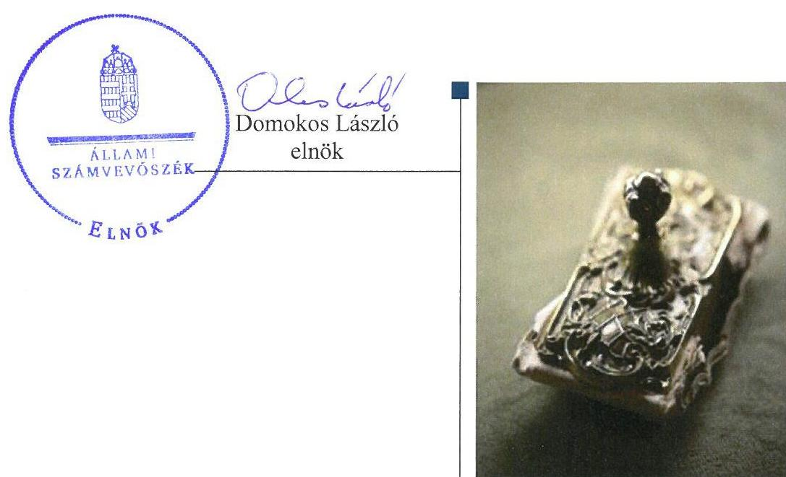

---

# AZ ELLENŐRZÉST FELÜGYELTE:

## MAKKAI MÁRIA felügyeleti vezető

## AZ ELLENŐRZÉST VEZETTE ÉS A VÉGREHAJTÁSÁÉRT FELELŐS:

### KORSÓSNÉ VIGH ANDREA ellenőrzésvezető

## A PROGRAM ÖSSZEÁLLÍTÁSÁÉRT FELELŐS:

### JANIK JÓZSEF LÁSZLÓ osztályvezető

---

**IKTATÓSZÁM:** V-1233-115/2016.

**TÉMASZÁM:** 2267

**ELLENŐRZÉS-AZONOSÍTÓ SZÁM:** V075918

---

Jelentéseink az Országgyűlés számítógépes hálózatán és az Interneten a www.asz.hu címen is olvashatóak.

---

# TARTALOMJEGYZÉK 

■ ÖSSZEGZÉS ..... 5
■ AZ ELLENŐRZÉS CÉLJA ..... 6
■ AZ ELLENŐRZÉS TERÜLETE ..... 7
■ AZ ELLENŐRZÉS HÁTTERE, INDOKOLTSÁGA ..... 9
■ A JELENTÉS LÉNYEGES KÉRDÉSKÖREI ..... 10
■ ELLENŐRZÉS HATÓKÖRE ÉS MÓDSZEREI ..... 11
■ MEGÁLLAPÍTÁSOK ..... 13
■ JAVASLATOK ..... 18
■ MELLÉKLETEK ..... 19
I. Sz. melléklet: Értelmező szótár ..... 19
■ FÜGGELÉK: ÉSZREVÉTELEK ..... 23
■ RÖVIDÍTÉSEK JEGYZÉKE ..... 47

---

.

---

# ÖSSZEGZÉS 

A Magyar Nemzeti Vagyonkezelő Zrt., a Büntetés-végrehajtás Országos Parancsnoksága és a Bv. Holding Kft. a tulajdonosi jogokat szabályszerűen gyakorolta. A működés szabályozottsága, a pénzügyi-számviteli, adatszolgáltatási feladatellátás összességében szabályszerű volt. A vagyongazdálkodás szabályszerű volt.

## Az ellenőrzés társadalmi indokoltsága

Magyarországon az intézmény-centrikus közfeladat-ellátás, közvagyon-gazdálkodás jellemző a költségvetésen kívüli feladatellátás térnyerése mellett. Ennek szereplői az állami tulajdonú gazdálkodó szervezetek is.

Az állami tulajdonban álló gazdálkodó szervezetek államot megillető társasági részesedése a nemzeti vagyon részét képezi és legfőbb rendeltetése szerint a közfeladatok ellátását szolgálja.

A magyarországi büntetés-végrehajtási szervezet gazdasági társaságai kizárólagos állami tulajdonban vannak, ugyanakkor korábban az Állami Számvevőszék nem végzett ezeknél a gazdálkodó szervezeteknél vagyonmegőrzési és gazdálkodási tevékenységre vonatkozó ellenőrzést. A büntetés-végrehajtás gazdasági társaságai speciális területen, fogvatartottak munkáltatásával végzik tevékenységüket, hozzájárulva ezzel a fogvatartottak kötelező foglalkoztatásához, végső soron az elítéltek társadalmi reintegrációjához. A büntetés-végrehajtási szervezet részeként működő gazdasági társaság 2012-2015. évekre kiterjedő ellenőrzésének tapasztalatai közérdeklődésre tarthatnak számot.

## Főbb megállapítások

Az Annamajori Mezőgazdasági és Kereskedelmi Kft. társasági részesedése felett a tulajdonosi jogokat megosztva a Magyar Nemzeti Vagyonkezelő Zrt. és a Büntetés-végrehajtás Országos Parancsnoksága, továbbá 2015-től az elismert vállalatcsoport uralkodó tagjaként a Bv. Holding Kft. az előírásoknak megfelelően gyakorolta.

Az Annamajori Mezőgazdasági és Kereskedelmi Kft. működésének szabályozottsága összességében megfelelt az előírásoknak, a szabályozási kötelezettségeknek - a beszerzési szabályzat elkészítése kivételével - megfelelően eleget tettek. A bevételek és ráfordítások elszámolása szabályszerű volt, beszerzéseit azonban belső szabályozás nélkül folytatta le. A beszámolási és adatszolgáltatási kötelezettségeinek a Társaság szabályszerűen eleget tett. Az éves beszámolókat elkészítették, a tulajdonosi joggyakorló által jóváhagyott beszámolók letétbe helyezését és közzétételét határidőben teljesítették. A közérdekű adatok közzétételi kötelezettségét hiányosan teljesítették.

A Társaság belső szabályzataiban, nyilvántartásaiban és üzleti terveiben kialakította a vagyona megőrzését, gyarapítását szolgáló, szabályszerű vagyongazdálkodás feltételeit. A vagyon nyilvántartása szabályszerű volt, a vagyon változását, hasznosítását, megterhelését eredményező döntések során a hatásköri előírások érvényesültek.

---

# AZ ELLENŐRZÉS CÉLJA 

Az ellenőrzés célja annak értékelése volt, hogy a tulajdonosi jogok gyakorlása szabályszerű volt-e; a gazdálkodó szervezet szabályozottsága, gazdálkodása és vagyongazdálkodási tevékenysége megfelelt-e a jogszabályi és a tulajdonosi előírásoknak; biztosítva volt-e a közfeladatok átláthatósága és elszámoltathatósága érdekében a közszolgáltatás díjának megalapozottsága szabályszerű önköltségszámítással; a vagyonváltozást eredményező döntések esetében a tulajdonosi jogok gyakorlója és a gazdálkodó szervezet szabályszerűen jártak-e el.

---

# **AZ ELLENŐRZÉS TERÜLETE**

## **Annamajori Mezőgazdasági és Kereskedelmi Kft.**

**A TÁRSASÁG** egy egyszemélyes, 100%-os állami tulajdonú gazdasági társaság, amelyet a Magyar Állam az Annamajori Célgazdaság jogutódjaként 1993. december 31-én fogvatartottak foglalkoztatása feladatra alapított. Az alapításkori törzstőke 277,07 M Ft volt, amely az ellenőrzött időszak alatt nem változott.

A Társaság a fogvatartottak kötelező foglalkoztatására létrehozott gazdálkodó szervezet, egyben büntetés-végrehajtási szerv, e minőségében felügyeleti szerve a BVOP2 volt. Tevékenységi köre szántóföldi növénytermesztés, kertészeti tevékenység, állattenyésztés (szarvasmarha, sertés, méh, juh), bolti kiskereskedelmi és sütőipari tevékenység volt. Rendszeres gazdasági tevékenységet a 2012-2013. években a székhelyen kívül nem folytatott, telephelye a 2014. évben Szegeden létesült, ahol sütőüzemet működtettek.

A Társaság főbb vagyoni adatait az 1. táblázat mutatja be.

1. táblázat

|  A TÁRSASÁG FŐBB VAGYONI ADATAI (M FT) |  |  |  |  |   |
| --- | --- | --- | --- | --- | --- |
|  Megnevezés | 2012. | 2012. | 2013. | 2014. | 2015.  |
|   | jan.1. | dec.31. | dec.31. | dec.31. | dec.31.  |
|  Mérlegfőösszeg | 1206,8 | 1488,1 | 1602,7 | 1701,8 | 1689,5  |
|  Saját tőke | 748,0 | 760,5 | 782,1 | 880,5 | 882,6  |
|  Kötelezettségek | 380,1 | 566,2 | 612,9 | 575,5 | 596,4  |
|  Követelések | 153,7 | 178,3 | 113,1 | 128,7 | 120,2  |

*Forrás: Társaság. 2012-2015. évi beszámolói*

Saját vagyonnal látta el a Társaság a feladatait. Az ellenőrzött időszakban nyereségesen gazdálkodott, mérleg szerinti eredménye a 2012-2013-2014-2015. években 12,4 M Ft, 21,6 M Ft, 92,7 M Ft, 2,1 M Ft volt. Tevékenységében hivatásos szolgálati jogviszonyban levők, polgári munkavállalók és fogvatartottak működtek közre. A foglalkoztatottakra vonatkozó adatokat a 2. táblázat mutatja be.

2. táblázat

|  A MUNKAVÁLLALÓK ÉS FOGLALKOZTATOTT FOGVATARTOTTAK LÉTSZÁMA A 2012-2015. ÉVEKBEN (FŐ) |  |  |  |  |   |
| --- | --- | --- | --- | --- | --- |
|   | 2012. | 2013. | 2014. | 2015. |   |
|  Átlagos statisztikai állományi létszám | 54 | 65 | 74 | 80 |   |
|  Foglalkoztatott fogvatartottak létszáma | 171 | 206 | 248 | 266 |   |

*Forrás: a Társaság 2012-2015 évi éves beszámolói*

A Társaság ügyvezetőjének személye egy alkalommal – 2015. évben – változott.

---

AZ MNV ZRT ${ }^{3}$ 2012-2015-ben a vagyonkezelési, illetve megbízási szerződésekben ${ }^{4}$ át nem engedett tulajdonosi jogokat gyakorolta. Egyes nevesített esetekben a szavazati jogok gyakorlását megelőzően a tulajdonosi joggyakorló az MNV Zrt. előzetes hozzájárulását volt köteles kérni (a Társaság végelszámolással történő jogutód nélküli megszüntetése, a törzstőke felemelése, leszállítása, elismert vállalatcsoport létrehozásának előkészítése, az uralmi szerződés tervezetének tartalma, jóváhagyása).

A BVOP az MNV Zrt.-vel kötött szerződések alapján - az MNV Zrt. által gyakorolt jogok kivételével - gyakorolta 2012-2014-ben a tulajdonosi jogokat. 2015-ben a BVOP létrehozta a Bv. Holding Kft.-t, amely vezetésével valamennyi büntetés-végrehajtási gazdasági társaság - alárendelt tagként, uralmi szerződés aláírásával - holdinggá alakult.

A BV. HOLDING KFT. 2015-től a BVOP által átengedett tulajdonosi jogokat és kötelezettségeket gyakorolta (az MNV Zrt. és a BVOP határozata, valamint a Társaság és a Bv. Holding Kft. között létrejött uralmi szerződés alapján).

---

# AZ ELLENŐRZÉS HÁTTERE, INDOKOLTSÁGA 

## AZ ÁSZ ${ }^{5}$ KÖZÉPTÁVRA SZÓLÓ STRATÉGIÁJÁBAN

megfogalmazta, hogy az államháztartáson kívülre nyújtott költségvetési támogatások, valamint az államháztartáson kívül működő közfeladat-ellátó rendszerek ellenőrzéseivel hozzájárul ahhoz, hogy a közpénzeket az államháztartáson kívül működő szervezetek is átlátható, rendezett módon használják fel a közfeladatok szerződésben vállalt ellátása érdekében.

Az ellenőrzés feladata a közfeladat-ellátással kapcsolatban a közpénzek átláthatósága, nyilvánossága érdekében a jogszabályokban, belső szabályzatokban megfogalmazott előírások érvényesülésének az állami tulajdonban (résztulajdonban) lévő gazdálkodó szervezetek vagyonérték-megőrzési és gazdálkodási tevékenységének értékelése.

AZ ELLENŐRZÉS EREDMÉNYEKÉPP a törvényalkotás számára tapasztalatok állnak rendelkezésre a közfeladat-ellátás, közvagyonnal gazdálkodás értékeléséhez, az átláthatóságot biztosító szabályozáshoz. Az ellenőrzés tapasztalatai segítik és erősítik az ÁSZ hozzáadott értéket teremtő tevékenységét és tanácsadó szerepét.

---

# A JELENTÉS LÉNYEGES KÉRDÉSKÖREI 

1.     - A tulajdonosi jogok gyakorlása szabályszerű volt-e?
2.     - A társaság működésének szabályozottsága megfelelt-e az előírásoknak?
3.     - A társaságnál a pénzügyi-számviteli, adatszolgáltatási és ellenőrzési feladatok ellátása szabályszerű volt-e?
4.     - A társaság vagyongazdálkodása szabályszerű volt-e?

---

# ELLENŐRZÉS HATÓKÖRE ÉS MÓDSZEREI 

## Az ellenőrzés típusa

Megfelelőségi ellenőrzés

## Az ellenőrzött időszak

A 2012. január 1-jétől 2015. december 31-ig tartó időszak.

## Az ellenőrzés tárgya

Az állami tulajdonban (résztulajdonban) lévő gazdasági társaság gazdálkodása, kiemelten vagyongazdálkodási tevékenysége, a tulajdonosi jogok gyakorlása.

## Az ellenőrzött szervezet

Annamajori Mezőgazdasági és Kereskedelmi Kft., Magyar Nemzeti Vagyonkezelő Zrt., Büntetés-végrehajtás Országos Parancsnoksága, Bv. Holding Kft.

## Az ellenőrzés jogalapja

Az ellenőrzés jogszabályi alapját az ÁSZ tv. ${ }^{6}$ 5. § (3)-(5) bekezdései, valamint a Vtv. ${ }^{7}$ 3. § (4) bekezdése képezték.

## Az ellenőrzés módszerei

Az ellenőrzést az ellenőrzési program ellenőrzési kérdései, az ellenőrzött időszakban hatályos jogszabályok, az ellenőrzés szakmai szabályok és módszertanok figyelembe vételével végeztük el.

Az ellenőrzött szervezetek az ellenőrzés lefolytatásához tanúsítványok kitöltésével, valamint az ÁSZ által kért dokumentumok megküldésével szolgáltattak adatokat.

A bevételek és ráfordítások elszámolását, és a vagyonnyilvántartás terén a szabályszerű működést véletlenszerű mintavétellel ellenőriztük. A mintavétellel ellenőrzött területek esetében minden egyes tétel vonatkozásában szabályszerűségre vonatkozó kérdéseket tettünk fel, amelyek eredménye összesítésre került. A jogszabályoknak és a belső előírásoknak

---

megfelelőnek tekintettük az adott területet, amennyiben a minta ellenőrzésének eredménye alapján 95%-os bizonyossággal a teljes sokaságban a hibaarány kisebb volt, mint 10%, nem megfelelőnek értékeltük, ha a hibaarány a 10%-ot meghaladta. A ráfordítások elszámolására és a vagyonnyilvántartásra vonatkozó véletlen mintavételt kockázati alapú kiválasztással egészítettük ki, amelynek során évente a három legnagyobb összegű tételt választottuk ki.

---

# 1. A tulajdonosi jogok gyakorlása szabályszerű volt-e? 

Összegző megállapítás

A társasági részesedés feletti tulajdonosi joggyakorlás megfelelt az előírásoknak.

A TULAJDONOSI JOGOK GYAKORLÓI az alapító okiratban¹⁸ a társasági részesedés feletti tulajdonosi joggyakorlás rendjét a Gt.⁹, illetve a Ptk.¹⁰ előírásainak megfelelően meghatározták és a társasági részesedés feletti tulajdonosi jogokat és kötelezettségeket szabályszerűen gyakorolták. Az operatív tevékenységek folyamatos és eseti nyomon követési rendszerének kialakítása és működtetése, valamint a Társaság rendszeres beszámoltatása az ellenőrzött időszakban megfelelő volt. Az FB¹¹-t a Gt. és a Ptk. előírásai szerint hozták létre, működése megfelelt a jogszabályi előírásoknak.

AZ MNV ZRT. az alapító okiratban foglaltaknak megfelelően az FB-be tagot delegált, biztosítva ezzel a tulajdonosi képviseletet. A kontrolling adatszolgáltatás rendjét valamint az üzleti tervben érvényesítendő tervezési irányelveket¹² meghatározta.

A BVOP a könyvvizsgáló személyét a 2012-2014. években szabályszerűen határozatban jelölte ki és engedélyezte a szerződéskötést. A Társaság által elkészített üzleti terveket a BVOP minden évben elfogadta.¹³ A BVOP a 2012-2014. évekre vonatkozó éves beszámolók jóváhagyásáról az FB és a könyvvizsgáló jelentése alapján határozott.¹⁴

A BV. HOLDING KFT. 2015-ben szabályszerűen kijelölte a könyvvizsgáló személyét és engedélyezte a szerződéskötést. Az elismert vállalatcsoport egységes üzleti koncepcióját és a 2015. évi beszámolót - az FB és a könyvvizsgáló jelentése alapján - az előírásoknak megfelelően a Bv Holding Kft. hagyta jóvá uralkodó tagi határozatban.¹⁵

##
 2. A társaság működésének szabályozottsága megfelelt-e az előírásoknak?

Összegző megállapítás

A Társaság működésének szabályozottsága összességében megfelelt az előírásoknak.

SZMSZ${ }^{16}$-szel az ellenőrzött időszakban a Társaság az alapító okirat ${ }_{1-9}$ 8.12. pont, illetve az alapító okirat ${ }_{10}$ 8.24. pont előírásának megfelelően rendelkezett, azonban azt nem aktualizálták az alapító okirat változásaival összhangban a vezető tisztségviselők, az FB tagjaira vonatkozó szabályok és a társaság telephelye tekintetében.

---

A SZÁMV. TV. ${ }^{17}$ által előírt belső szabályzatokat a jogszabályi előírásokkal összhangban elkészítették: rendelkeztek Számviteli Politikával ${ }^{18}$, Számlarenddel ${ }^{19}$, Pénzkezelési Szabályzattal ${ }^{20}$, Leltározási Szabályzattal ${ }^{21}$, Selejtezési Szabályzattal ${ }^{22}$, Értékelési Szabályzattal ${ }^{23}$, Önköltség számítási Szabályzattal ${ }^{24}$.

Az Adatvédelmi Szabályzatot ${ }^{25}$ az Info tv. ${ }^{26}$ 24. § (3) bekezdése előírása alapján a Társaság 2012. október 30-án készítette el a BVOP intézkedését követően. A szabályzat tartalmilag megfelelt a jogszabályi előírásnak.

Javadalmazási Szabályzatot ${ }^{27}$ készített a BVOP a Taktv. ${ }^{28}$ 5. § (3) bekezdés előírásának megfelelően. A Javadalmazási szabályzat személyi hatálya a hivatásos szolgálati jogviszonyban, illetve az állam által foglalkoztatott köztisztviselő jogállásban lévő vezetőkre terjedt ki. A szabályzatot a jogszabályi változásokkal összhangban aktualizálták. A Társaság rendelkezett továbbá a 2012-2015. években az FB tagok javadalmazásának elveit ${ }^{29}$ tartalmazó szabályzattal.

Beszerzési szabályzattal a Társaság nem rendelkezett. A beszerzések szabályozási környezete hiányos volt, nem biztosította a beszerzések átláthatóságát.

# 3. A társaságnál a pénzügyi-számviteli, adatszolgáltatási és ellenőrzési feladatok ellátása szabályszerű volt-e? 

Összegző megállapítás

## 3.1. számú megállapítás

A Társaság a pénzügyi-számviteli, az adatszolgáltatási és ellenőrzési feladatait összességében szabályszerűen látta el.

A bevételek és ráfordítások elszámolása megfelelt az előírásoknak.
A bevételek számviteli elszámolása és bizonylati alátámasztása megfelelő volt.

Az anyagjellegű ráfordítások elszámolása megfelelt a Számv. tv. előírásainak és a számviteli politikában, számlarendben foglaltaknak. A kifizetéseket szabályszerű bizonylatok támasztották alá, a kifizetéseket az előírt főkönyvi számlákra könyvelték. Az értékcsökkenési leírás elszámolása a jogszabályi előírásoknak megfelelő volt.

A személyi jellegű ráfordítások elszámolása szabályszerű volt. A kifizetéseket dokumentumok - munkaszerződés, egyéni munkaidő elszámolási lap - alátámasztották.

A Társaság egyes beszerzései során nem a Kbt. szerinti ajánlatkérőként járt el.

---

# 3.2. számú megállapítás 

A saját előállítású eszközök és a saját termelésű készletek önköltségét szabályszerűen megállapították.

Önköltségszámításra az ellenőrzött időszakban kötelezett volt a Társaság, az önköltség számítás rendjét a Számv. tv. előírásának megfelelően belső szabályzatban kialakította.

A saját előállítású eszközök és a saját termelésű készletek önköltségének megállapítása az önköltség számítási szabályzat alapján történt.
3.3. számú megállapítás

A Társaság a tervezési, beszámolási, adatszolgáltatási kötelezettségének eleget tett, közzétételi kötelezettségét hiányosan teljesítette.

Üzleti terv készítési kötelezettségének a BVOP által körlevelekben, 2015-ben a Bv. Holding Kft. által uralkodó tagi határozatban meghatározottak szerint a Társaság eleget tett. Az üzleti tervek a tulajdonosi joggyakorló céljaival összhangban voltak.

Éves beszámoló készítési kötelezettségének a Társaság eleget tett, a letétbe helyezésről és a közzétételről határidőben gondoskodott. A tulajdonosi joggyakorlók által előírt beszámolási, adatszolgáltatási kötelezettségeket teljesítették.

A közérdekű adatok közzétételére vonatkozó szabályzattal ${ }_{1-2}{ }^{30}$ az Info tv. előírásának megfelelően rendelkeztek.

Az Info. tv. 37. § (1) bekezdése és 1. számú mellékletének I. 3. pontjában foglaltak ellenére az ügyvezető nem gondoskodott az egyes szervezeti egységek vezetői nevének, beosztásának, elérhetőségének (telefon- és telefax-száma, elektronikus levélcíme), az 1. számú melléklet II. 1. pontjában foglaltak ellenére az SZMSZ, valamint az adatvédelmi és adatbiztonsági szabályzat közzétételéről. Az ügyvezető nem gondoskodott továbbá a Tak.tv. 2. § (3) bekezdésében előírtak ellenére a Társaság pénzeszközei felhasználásával, vagyonával történő gazdálkodással összefüggő - az egyszerű közbeszerzési eljárás értékhatárát elérő vagy azt meghaladó értékű - szerződések adatainak közzétételéről.
3.4. számú megállapítás

A Társaság intézkedett a tulajdonosi ellenőrzések javaslatainak végrehajtására.

A BVOP Gazdasági Társaságok Főosztálya által a 2013-2014. években az árképzés és a közérdekű adatok közzétételének téma ellenőrzése során tett - utókalkuláció vizsgálata, munkaköri leírás pontosítás - javaslatokat végrehajtották.

A Társaságnál külső ellenőrzést végző egyéb szervek - az illetékes kormányhivatal, a katasztrófavédelem, a Nemzeti Élelmiszerlánc-biztonsági Hivatal, továbbá a Mezőgazdasági és Vidékfejlesztési Hivatal - intézkedést igénylő megállapítást nem fogalmaztak meg.

---

# 4. A társaság vagyongazdálkodása szabályszerű volt-e? 

## Összegző megállapítás

### 4.1. számú megállapítás

### 4.2. számú megállapítás

### 4.3. számú megállapítás

A vagyongazdálkodás szabályszerű volt.
A Társaság a saját vagyon értékének megőrzését, gyarapítását szolgáló, szabályszerű vagyongazdálkodás feltételeit kialakította.

A vagyongazdálkodás feltételeit, a cégvezetés felelősségét a tulajdonosi joggyakorló a Vtv. 30. § (1) bekezdésének megfelelően az alapító okirat ${ }_{1-10}$-ben határozta meg. A Társaság éves üzleti tervei - az MNV Zrt. által meghatározott tervezési irányelveknek megfelelően - tartalmazták a beruházási fejlesztési terveket és a középtávú fejlesztési terveket.

A feladat- és hatáskörökről a Társaság saját tulajdonában lévő eszközök értékelése, leltározása, selejtezése vonatkozásában a Számv. tv.-ben előírt szabályzatok valamint a Társaság alapító okirata ${ }_{1-10}$ rendelkeztek.

A vagyon nyilvántartása az előírásoknak megfelelő volt.
A Társaság vagyonáról - a Számv. tv.-ben előírtaknak megfelelően mennyiségben és értékben - vezetett nyilvántartás átlátható és naprakész volt, a vagyonváltozást folyamatosan kimutatták. A mérleg leltári alátámasztása megfelelő volt.

A Társaság gondoskodott a saját vagyon értékének, állagának megőrzéséről.

A vagyon értékének, állagának megőrzése megvalósult. 2012. január 1. és 2015. december 31. között az immateriális javak és tárgyi eszközök nettó értéke 728,6 M Ft-ról 1159,0 M Ft-ra emelkedett, az elszámolt értékcsökkenés 466,3 M Ft, a beruházás, felújítás összesen 1168,3 M Ft volt.

A tárgyi eszközök rendszeres karbantartásáról a Társaság gondoskodott, a karbantartás éves összege a tárgyi eszközök értékének növekedését követve emelkedett a 2012. évi 48,6 millió Ft-ról a 2015. év végére 81,5 millió Ft-ra.

A vagyon változását, hasznosítását, megterhelését eredményező döntések megfeleltek az alapító okirat hatásköri előírásainak.

A vagyonváltozást eredményező döntések előterjesztése megfelelt a beruházásokkal, felújításokkal kapcsolatos tulajdonosi előírásoknak. A saját vagyonát érintő tervezett beruházásokat, felújításokat a Társaság az üzleti tervben bemutatta, azokat a BVOP jóváhagyta.

A vagyon hasznosítását érintően az értékesítések és a lakás és nem lakáscélú helységek bérbeadása szabályszerűek voltak, a döntésre jogosultságra vonatkozó hatásköri előírásokat betartották.

---

Saját vagyon megterhelésére a 2012. évben a pékség projekt megvalósításához kapcsolódó hitel igénybevétel fedezeteként szabályszerűen került sor. A hitelkeret szerződés és a kapcsolódó keretbiztosítéki-jelzálogszerződések megkötését, módosítását a Társaság az alapító okiratban foglalt hatásköri előírásoknak megfelelően a BVOP-nak engedélyezésre felterjesztette, amely az engedélyeket ${ }^{31}$ megadta.

---

# JAVASLATOK 

Az ÁSZ tv. 33. § (1) bekezdésében foglaltak értelmében az ellenőrzött szervezet vezetője köteles a jelentésben foglalt megállapításokhoz kapcsolódó intézkedési tervet összeállítani és azt a jelentés kézhezvételétől számított 30 napon belül az ÁSZ részére megküldeni. Amennyiben az ellenőrzött szervezet vezetője nem küldi meg határidőben az intézkedési tervet, vagy továbbra sem elfogadható intézkedési tervet küld, az Állami Számvevőszék elnöke az ÁSZ tv. 33. § (3) bekezdése a) és b) pontjaiban foglaltakat érvényesítheti.

## az Annamajori Mezőgazdasági és Kereskedelmi Kft. ügyvezetőjének

1. Intézkedjen a jogszabályi előírásoknak megfelelő beszerzési eljárásrend megalkotásáról.
(2. sz. megállapítás 5. bekezdése alapján)
2. Intézkedjen a közérdekű adatok teljes körű közzétételéről az Info. tv.-ben előírtaknak megfelelően.
(3.3.sz. megállapítás 4. bekezdés első mondata alapján)
3. Intézkedjen a Tak. tv.-ben előírt adatok közzétételéről.
(3.3. sz. megállapítás 4. bekezdés 2. mondata alapján)

---

# MELLÉKLETEK 

- I. SZ. MELLÉKLET: ÉRTELMEZŐ SZÓTÁR

Állami vagyon

Gazdálkodó szervezet

## 2012. november 9-ig:

a) Az állam tulajdonában lévő dolog, valamint a dolog módjára hasznosítható természeti erő,
b) Az a) pont hatálya alá nem tartozó mindazon vagyon, amely vonatkozásában törvény az állam kizárólagos tulajdonjogát nevesíti,
c) az állam tulajdonában lévő tagsági jogviszonyt megtestesítő értékpapír, illetve az államot megillető egyéb társasági részesedés,
d) az államot megillető olyan immateriális, vagyoni értékkel rendelkező jogosultság, amelyet jogszabály vagyoni értékű jogként nevesít.
Forrás: Vtv. 1. § (2) bekezdése
2012. november 10-től az állami vagyon fogalma kiegészül a következő ponttal:
a) az állam tulajdonában lévő pénzügyi eszközök

Forrás: Vtv. 1. § (2) bekezdése
2013. június 30-ig gazdálkodó szervezet:

Az állami vállalat, az egyéb állami gazdálkodó szerv, a szövetkezet, a lakás-szövetkezet, az európai szövetkezet, a gazdasági társaság, az európai részvénytársaság, az egyesülés, az európai gazdasági egyesülés, az európai területi együttműködési csoportosulás, az egyes jogi személyek vállalata, a leányvállalat, a vízgazdálkodási társulat, az erdőbirtokossági társulat, a végrehajtói iroda, az egyéni cég, továbbá az egyéni vállalkozó.
Forrás: Ptk. ${ }^{32}$ 685. § c) pontja
2013. július 1-jétől gazdálkodó szervezet:

Az állami vállalat, az egyéb állami gazdálkodó szerv, a szövetkezet, a lakás-szövetkezet, az európai szövetkezet, a gazdasági társaság, az európai részvénytársaság, az egyesülés, az európai gazdasági egyesülés, az európai területi együttműködési csoportosulás, az egyes jogi személyek vállalata, a leányvállalat, a vízgazdálkodási társulat, az erdőbirtokossági társulat, a végrehajtói iroda, az egyéni cég, továbbá az egyéni vállalkozó. Az állam, a helyi önkormányzat, a költségvetési szerv, az egyesület, a köztestület, valamint az alapítvány gazdálkodó tevékenységével összefüggő polgári jogi kapcsolataira is a gazdálkodó szervezetre vonatkozó rendelkezéseket kell alkalmazni, kivéve, ha a törvény e jogi személyekre eltérő rendelkezést tartalmaz; a 292/A-292/B. §, 301/A-301/B. §, 405. § (1) bekezdés, valamint a 407/A. § (1) bekezdés tekintetében nem minősül gazdálkodó szervezetnek az, aki a közbeszerzésekről szóló törvény értelmében ajánlatkérő (szerződő hatóság).
Forrás: Ptk. ${ }_{1}$ 685. § c) pontja
2014. március 15-től gazdálkodó szervezet:

A gazdasági társaság, az európai részvénytársaság, az egyesülés, az európai gazdasági egyesülés, az európai területi együttműködési csoportosulás, a szövetkezet, a lakásszövetkezet, az európai szövetkezet, a vízgazdálkodási társulat, az erdőbirtokossági társulat, az állami vállalat, az egyéb állami gazdálkodó szerv, az egyes jogi személyek vállalata, a közös vállalat, a végrehajtói iroda, a közjegyzői iroda, az ügyvédi iroda, a szabadalmi ügyvivői iroda, az önkéntes kölcsönös biztosító pénztár, a magánnyugdíjpénztár, az egyéni cég, továbbá az egyéni vállalkozó. Az ál-

---

## gazdasági társaság

Tulajdonosi jogok gyakorlója
lam, a helyi önkormányzat, a költségvetési szerv, az egyesület, a köztestület, valamint az alapítvány gazdálkodó tevékenységével összefüggő polgári jogi kapcsolataira is a gazdálkodó szervezetre vonatkozó rendelkezéseket kell alkalmazni.
Forrás: Ppt. ${ }^{33}$ 396. §
A Ptk. 3:88. § (1) bekezdése szerint „a gazdasági társaságok üzletszerű közös gazdasági tevékenység folytatására, a tagok vagyoni hozzájárulásával létrehozott, jogi személyiséggel rendelkező vállalkozások, amelyekben a tagok a nyereségből közösen részesednek, és a veszteséget közösen viselik".
2013. június 27-ig:

Az állami vagyon felett a Magyar Államot megillető tulajdonosi jogok és kötelezettségek összességét - ha törvény eltérően nem rendelkezik - az állami vagyon felügyeletéért felelős miniszter (a továbbiakban: miniszter) gyakorolja, aki e feladatát a Magyar Nemzeti Vagyonkezelő Zártkörűen Működő Részvénytársaság (a továbbiakban: MNV Zrt.), a Magyar Fejlesztési Bank, illetve a tulajdonosi joggyakorló szervezet útján látja el. A miniszter miniszteri rendeletben, a törvényben meghatározott állami vagyoni kör tekintetében, meghatározott időtartamra, a joggyakorlás egyes szabályainak meghatározásával - az őt megillető tulajdonosi jogok és kötelezettségek összességének, illetve azok meghatározott részének gyakorlóját az Áht. szerinti központi költségvetési szervek, ezek
 intézménye, továbbá a 100%-ban állami tulajdonban álló gazdasági társaságok közül kijelölheti.
Forrás: Vtv. 3. § (1) és (2)
2013. június 28-ától:

A rábízott állami vagyon felett az államot megillető tulajdonosi jogok és kötelezettségek összességét tulajdonosi joggyakorlóként:
ha törvény vagy miniszteri rendelet eltérően nem rendelkezik, a Magyar Nemzeti Vagyonkezelő Zártkörűen Működő Részvénytársaság (a továbbiakban: MNV Zrt.), törvényben kijelölt személy vagy
az állami vagyon felügyeletéért felelős miniszter (a továbbiakban: miniszter) által rendeletben kijelölt személy gyakorolja.
[...] A miniszter e törvény felhatalmazása alapján - a meghatározott célok hatékonyabb elérése érdekében, miniszteri rendeletben, az ott meghatározott állami vagyoni kör tekintetében, meghatározott időtartamra - e törvény keretei között, a joggyakorlás egyes szabályainak meghatározásával - az államot megillető tulajdonosi jogok és kötelezettségek összességének, illetve azok meghatározott részének gyakorlóját az Áht. szerinti központi költségvetési szervek, ezek intézménye, továbbá a 100%-ban állami tulajdonban álló gazdasági társaságok közül kijelölheti.
Forrás: Vtv. 3. § (1) és (2)
2.

Aki a nemzeti vagyon felett az államot vagy a helyi önkormányzatot megillető tulajdonosi jogok és kötelezettségek összességének gyakorlására jogosult.
Forrás: Nvtv. 3. § (1) 17. pontja
Az elismert vállalatcsoport fogalma:
(1) Elismert vállalatcsoport az összevont, konszolidált éves beszámoló készítésére kötelezett, legalább egy uralkodó tag és legalább három, az uralkodó tag által ellenőrzött tag által kötött uralmi szerződésben meghatározott, egységes üzletpolitikán alapuló együttműködés.
(2) A vállalatcsoportban tagként részvénytársaság, korlátolt felelősségű társaság, egyesülés és szövetkezet vehet részt.

---

(3) Ha a vállalatcsoportban uralkodó tagként több jogi személy közösen vesz részt, az egymással kötött szerződésük határozza meg, hogy melyikük gyakorolja az uralmi szerződésben megállapított, az uralkodó tagot megillető jogokat.

Az uralmi szerződés:
(1) Az uralmi szerződés határozza meg a vállalatcsoport egészének egységes üzletpolitikáját.
(2) Az uralmi szerződésnek tartalmaznia kell
a) az uralkodó tag és az ellenőrzött tagok cégnevét, székhelyét;
b) a vállalatcsoporton belüli együttműködés módját és lényegesebb tartalmi elemeit;
c) azt, hogy a vállalatcsoport határozott vagy határozatlan időre jön-e létre.
(3) Az uralmi szerződésben a vállalatcsoporthoz tartozó ellenőrzött tagok önállóságának korlátozására az egységes üzleti cél megvalósításához szükséges módon és mértékben kerülhet sor. Az uralmi szerződésben gondoskodni kell az ellenőrzött tagok tagjai és hitelezői jogainak védelméről is.
(4) Az uralmi szerződésre a szerződések általános szabályait megfelelően alkalmazni kell.
Forrás: Ptk. 2 3:49-50. §

---

.

---

# FÜGGELÉK: ÉSZREVÉTELEK 

A jelentéstervezetet a Számvevőszék 15 napos észrevételezésre megküldte az ellenőrzött szervezetek vezetőinek az ÁSZ tv. 29. § (1) bekezdése előírásának megfelelően.

Az ÁSZ a jelentéstervezetet észrevételezésre megküldte az Annamajori Mezőgazdasági és Kereskedelmi Kft. ügyvezetőjének, a Magyar Nemzeti Vagyonkezelő Zrt. vezérigazgatójának, a Büntetés-végrehajtás Országos Parancsnokának és a Bv. Holding Kft. ügyvezetőjének.

Az Annamajori Mezőgazdasági és Kereskedelmi Kft. ügyvezetőjének, a Magyar Nemzeti Vagyonkezelő Zrt. vezérigazgatójának, a Büntetés-végrehajtás Országos Parancsnokának és a Bv. Holding Kft. ügyvezetőjének észrevételét és az arra adott választ a függelék alább tartalmazza.

[^0]
[^0]:    * 29. § (1) Az Állami Számvevőszék az ellenőrzési megállapításait megküldi az ellenőrzött szervezet vezetőjének vagy az általa megbízott személynek, és annak, akinek személyes felelősségét állapította meg.
    (2) Az ellenőrzött szervezet vezetője és a felelősként megjelölt személy az ellenőrzés megállapításaira tizenöt napon belül írásban észrevételt tehet.
    (3) Az Állami Számvevőszék az észrevételre a beérkezésétől számított harminc napon belül írásban válaszol. A figyelembe nem vett észrevételeket köteles a jelentésben feltüntetni, és megindokolni, hogy azokat miért nem fogadta el.

---

# 1218 

## Annamajori Mezőgazdasági és Kereskedelmi Kft.

2471 Baracska, Annamajor 1. 22/454-099, 22/454-172
Bankszámlaszám: Budapest Bank NyRt. 10102952-04384500-01003000
Adóigazgatósági szám: 11108944-2-51
Székesfehérvári Törvényszék Cégbírósága: Cégjegyzék szám: 07-09-003060
Honlap: www.annamajor.hu E-mail: annamajor@t-online.hu

Állami Számvevőszék
Domokos László elnök úr részére

## Budapest

Budapest 4.
Pf. 54.
1364

Ikt.sz.:69-57-35/1/2017.
Tárgy: Számvevőségi jelentéstervezet
Hivatkozási szám: V-1233-094/2016.
Ügyintéző: Zolta Csaba bv. ezredes
Telefon: 30/220-1215
E-mail: annamajor@t-online.hu
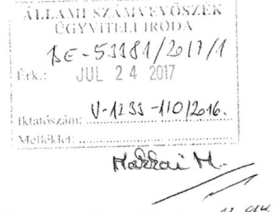

Hivatkozással fenti iktatószámon ,,Az állami tulajdonban (résztulajdonban) lévő gazdálkodó szervezetek vagyonmegőrzési és gazdálkodási tevékenységének ellenőrzése -Annamajori Mezőgazdasági és Kereskedelmi Kft." címen megküldött jelentéstervezetre, az Annamajori Kft. képviseletében a törvényes határidőn belül az Állami Számvevőszék felé az alábbi nyilatkozatot teszem.

A jelentéstervezet 2. számú összegző megállapítás ötödik bekezdése szerint a Társaság szabálytalanul - a közbeszerzésekről szóló 2011. évi CVIII. törvény (a továbbiakban: régi Kbt.) 22.§ (1) bekezdése és a közbeszerzésekről szóló 2015. évi CXLIII. törvény (a továbbiakban: hatályos Kbt.) 27.§ (1) bekezdése ellenére - nem rendelkezett közbeszerzési szabályzattal.

A jelentéstervezet 3. számú összegző megállapítás 3.1. számú megállapítás negyedik bekezdésében leírtak szerint a Társaság több beszerzési eljárása során - közbeszerzési eljárás lefolytatása nélkül - közbeszerzési értékhatárt meghaladó összegben vállalt kötelezettséget. A jelentéstervezet szintén megállapítja, hogy az Annamajori Kft. a beszerzések idején hatályos Kbt. alanyi hatálya alá tartozó szervezetként közbeszerzési eljárás mellőzésével megvalósított beszerzéseivel megsértette a Kbt. 5.§-a alapján fennálló, a Kbt. 19.§-ában előírt közbeszerzési eljárás lefolytatásának kötelezettségét.

---

Társaságunk alábbi álláspontja szerint az Annamajori Kft. nem minősült az ellenőrzött időszak alatt hatályban volt régi Kbt., illetve a 2015. november 1. napjától hatályos Kbt. szerinti klasszikus ajánlatkérőnek, s mivel nem minősült annak, ezért nem rendelkezett közbeszerzési szabályzattal sem.

A régi Kbt. 6. § (1) bekezdés c) pontja alapján ajánlatkérőnek minősül az a jogképes szervezet, amelyet közérdekű, de nem ipari vagy kereskedelmi jellegű tevékenység folytatása céljából hoznak létre, vagy amely ilyen tevékenységet lát el, ha az a)-d) pontokban meghatározott egy vagy több szervezet, az Országgyűlés vagy a Kormány külön-külön vagy együttesen, közvetlenül vagy közvetetten meghatározó befolyást képes felette gyakorolni vagy működését többségi részben egy vagy több ilyen szervezet (testület) finanszírozza.

A hatályos Kbt. 5. § (1) bekezdés e) pontja alapján ajánlatkérőnek minősül az a jogképes szervezet, amelyet nem ipari vagy kereskedelmi jellegű, kifejezetten közérdekű tevékenység folytatása céljából hoznak létre, vagy amely bármilyen mértékben ilyen tevékenységet lát el, feltéve, hogy e szervezet felett az a)-e) pontban meghatározott egy vagy több szervezet, az Országgyűlés vagy a Kormány közvetlenül vagy közvetetten meghatározó befolyást képes gyakorolni vagy működését többségi részben egy vagy több ilyen szervezet (testület) finanszírozza.

A hatályos Kbt. indokolása kiemeli, hogy az új törvény pontosítja a közjogi szervezetekre vonatkozó meghatározást, és rögzíti, hogy a kifejezetten közérdekű célra létrehozott szervezetek minősülnek csak ajánlatkérőnek.

A 2004/18/EK irányelv 1. cikk (9) bekezdése és a 2004/17/EK irányelv 2. cikk (1)-(2) bekezdése a közbeszerzési szabályok személyi hatályát a következőképpen állapítják meg. A 2004/18/EK irányelv személyi hatálya: "Ajánlatkérő szerv": az állam, a területi vagy a települési önkormányzat, a közjogi intézmény, továbbá az egy vagy több ilyen szerv, illetve közjogi intézmény által létrehozott társulás;
"Közjogi intézmény" minden olyan intézmény,
a) amely kifejezetten olyan közérdekű célra jött létre, amely nem ipari vagy kereskedelmi jellegű;
b) amely jogi személyiséggel rendelkezik; valamint
c) amelyet többségi részben az állam, vagy a területi vagy a települési önkormányzat, vagy egyéb közjogi intézmény finanszíroz; vagy amelynek irányítása ezen intézmények felügyelete alatt áll; vagy amelynek olyan ügyvezető, döntéshozó vagy felügyelő testülete van, amely tagjainak többségét az állam, a területi vagy a települési önkormányzat, vagy egyéb közjogi intézmény nevezi ki.

---

Az Európai Unió Bíróságának C-360/96. sz. BFI Holding ítéletében meghatározattak alapján az első, a) pont szerinti feltétel két elemét önállóan kell megvizsgálni, és mindkét feltételnek fenn kell állnia a közjogi intézménnyé minősítéshez. Különbséget kell tehát tenni az olyan közérdekű tevékenységek között, amelyek ipari vagy kereskedelmi jellegűek, és amelyek nem ipari vagy kereskedelmi jellegűek. Ha a tevékenység kizárólag ipari vagy kereskedelmi jellegű, vagy ilyen jellegű és egyben közérdekű, a szervezet az egyéb feltételek fennállása esetén sem minősül ún. közjogi szervezetnek.

Álláspontunk szerint a fentiek alapján az egyes feltételek együttes fennállását, az egyes feltételek külön-külön történő vizsgálatával lehet megállapítani, melyre vonatkozóan a jelentéstervezet megállapítást nem tartalmaz.

A tevékenység ipari vagy kereskedelmi jellegére vonatkozó utalás az általános közgazdasági fogalomhasználat szerint olyan gazdasági tevékenységet feltételez, amelynek eredményeként profitszerzési célból piacképes termék előállítása történik, illetőleg olyan tevékenységet, amely termékek vagy szolgáltatások kereskedelmi forgalomban, versenyfeltételek mellett történő értékesítési célja által jellemezhető.

Előbbiek alapján, ezen feltétel fennállása tekintetében az Európai Uniós közbeszerzési irányelveknek megfelelően vizsgálni szükséges különösen az Annamajori Kft. létrehozását motiváló körülményeket, illetve azt a gazdasági környezetet, amelyben a társaság a közérdekű tevékenységet végzi, így különösen:
a) a versenyfeltételek meglétét,
b) a tevékenységet végző társaság for-profit, vagy non-profit jellegét,
c) nyereségorientáltságát,
d) üzleti kockázatok önálló viselésének feltételeit.

Álláspontunk szerint megállapítható, hogy a b)-d) feltételek egyértelműen fennállnak, mivel az Annamajori Kft. profit jellegű, nyereségorientált és nem nonprofit társaság, üzleti kockázatát önállóan viseli.

A versenyfeltételek megléténél is összességében szükséges társaság versenypiaci jelenlétét vizsgálni, így az egyes versenypiaci előnyök mellett, különösen az Annamajori Kft. alábbi piaci hátrányait is figyelembe kell venni:

- számos uniós és hazai pályázati forrástól az állami jelleg miatt ki van zárva,
- az elítéltek foglalkoztatásából eredő sajátos és indokolt többletkiadásokat a központi költségvetés 2011. óta a társaságnak nem téríti meg;
- a 44/2011. Korm. rendelet, és a 9/2011. BM rendelet szerinti ellátási kötelezettsége teljesítése körében kötelezően fogvatartottakat kell foglalkoztatnia, és ezen ellátási
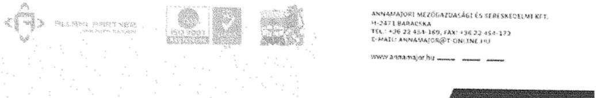

---

- kötelezettsége keretében a szerződött partnereit a Társaság szabadon nem választhatja meg,
- versenypiaci társaihoz képest az állami tulajdoni jelleg miatt működése bonyolultabb, nagyobb adminisztrációval jár így az általános működéshez nagyobb létszámú munkaerő szükséges, melyek foglalkoztatása a jogszabályban foglaltaknak minden esetben megfelel,
- a Társaságnál könyvvizsgáló, és Felügyelő Bizottság létrehozása is kötelező.

Kiemelendő továbbá, hogy a közbeszerzésről és a 2004/18/EK irányelv hatályon kívül helyezéséről szóló Európai Parlament és a Tanács 2014/24/EU irányelv (10) preambulum bekezdése is rögzíti, hogy az olyan szerv, amely szokásos piaci feltételekkel működik, nyereségorientált, és a tevékenysége végzéséből eredő veszteségeket maga viseli, nem tekintendő „közjogi intézménynek", mivel azok a közérdekű célok, amelyek teljesítésére létrehozták, vagy amelyek teljesítésével megbízták, gazdasági vagy üzleti jellegűnek minősülhetnek.

Véleményünk az, hogy a közérdekűség fennállta mellett az is megállapítható, hogy a Társaság ipari, kereskedelmi jellegű tevékenységet végez és versenyfeltételek befolyásolják működését. Így nem tartozik sem a régi, sem a hatályos Kbt. alanyi hatálya alá. (Európai Bíróság C-18/01. számú, Korhonen and Others ügyben hozott ítélete)

A Társaság Alapító okirata 4. pontjában megjelölt főtevékenység - TEÁOR'08 szerint 0111'08 Gabonaféle (kivéve rizs), hüvelyes növény, olajos mag termesztése, valamint a 4.1. pont alatti tevékenységek egyértelműen üzletszerű jellegre utalnak.

A Társaság alapítójának is az volt a szándéka, hogy a Polgári Törvénykönyvről szóló 2013. évi V. törvény 3:88. § (1) bekezdése szerinti üzletszerű közös gazdasági tevékenység folytatására, a tagok vagyoni hozzájárulásával létrehozott, jogi személyiséggel rendelkező vállalkozás jöjjön létre. Az MNV Zrt. is profit orientált társaságként tartja nyilván a Társaságot, valamint az adott évekre vonatkozó üzleti tervek tervezéséhez kiadott irányelvekben is nyereséget írt elő a Magyar Állam tulajdonában lévő és a Büntetés-végrehajtás Országos Parancsnoksága megbízott tulajdonosi joggyakorlása alá tartozó gazdasági társaságoknak.

Összefoglalva a fent leírtakat, álláspontunk szerint a jelentéstervezet nem állapítja meg egyértelműen, hogy
 az Annamajori Kft. a régi és hatályos Kbt. mely pontja alapján minősül ajánlatkérőnek, illetve azt, hogy régi Kbt. 6. § (1) bekezdés c) pontja, illetve a hatályos Kbt. 5. § (1) bekezdés e) pontja szerinti ipari vagy kereskedelmi jellegű tevékenység meglétét az Állami Számvevőszék esetlegesen vizsgálta volna-e.

---

Álláspontunk továbbra is az, hogy a Társaság a régi Kbt. és az új Kbt. alapján az ellenőrzött időszakban nem minősült klasszikus ajánlatkérőnek, és az ellenőrzött időszakban, illetve jelenleg sem kötelezett klasszikus ajánlatkérőként közbeszerzési eljárás lefolytatására.

A fentiek alapján Társaságunk nem ért egyet a jelentéstervezet 2. számú összegző megállapítás ötödik bekezdésében és a 3. számú összegző megállapítás 3.1. számú megállapítás negyedik bekezdésében leírtakkal, illetve a jelentéstervezetben Javaslatok cím alatt az Annamajori Kft. ügyvezetőjének előírt 1. és 2. javaslatokkal.

Tájékoztatom továbbá, hogy társaságunk a jelentéstervezet Javaslatok 3. és 4. pontjában javasolt intézkedések alapján eleget tett az Info. tv. közérdekű adatok teljes körű közzétételével, valamint a Tak. tv.-ben előírt adatok közzétételére vonatkozó kötelezettségeinek.

# Tisztelt Állami Számvevőszék! 

Kérjük, hogy Társaságunk fenti észrevételeit az ellenőrzési jelentés véglegesítésekor figyelembe venni szíveskedjen.

Baracska, 2017. július 17.

## ANNAMAJORI KFT.   8471 Baracska, Pl: 2.

Tisztelettel:
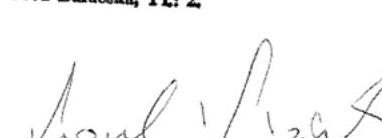

Laczkó Lóránt bv. ezredes
ügyvezető igazgató

---

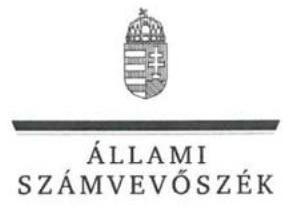

ELNÖK

Ikt.szám: V-1233-111/2016.

# Laczkó Lóránt úr 

Bv. ezredes
ügyvezető

Annamajori Mezőgazdasági és Kereskedelmi Kft.

## Baracska

## Tisztelt Ügyvezető Úr!

„Az állami tulajdonban (résztulajdonban) lévő gazdálkodó szervezetek vagyonmegőrzési és gazdálkodási tevékenységének ellenőrzése - Annamajori Mezőgazdasági és Kereskedelmi Kft." címmel készített számvevőszéki jelentéstervezetre tett észrevételét köszönettel megkaptam.

Az Állami Számvevőszék észrevételre vonatkozó álláspontjáról a felügyeleti vezető által készített részletes tájékoztatást csatoltan megküldöm.

Tájékoztatom Ügyvezető urat, hogy a számvevőszéki jelentésben - az Állami Számvevőszékről szóló 2011. évi LXVI. törvény 29. § (3) bekezdése alapján - a figyelembe nem vett észrevételeket szerepeltetjük, annak indoklásával, hogy azokat az Állami Számvevőszék miért nem fogadta el.

Budapest, 2017. 08. hó 15. nap
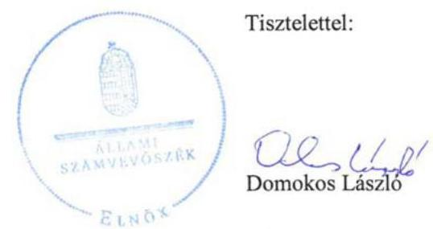

Melléklet: Tájékoztatás az észrevétel kezeléséről

---

# Tájékoztatás   az észrevétel kezeléséről 

„Az állami tulajdonban (résztulajdonban) lévő gazdálkodó szervezetek vagyonmegőrzési és gazdálkodási tevékenységének ellenőrzése - Annamajori Mezőgazdasági és Kereskedelmi Kft." című jelentéstervezetre 2017. július 24-én érkezett észrevételét áttekintettük, annak kezelésével kapcsolatban a következő tájékoztatást adom.
A közbeszerzési szabályzat elkészítésének elmulasztásával és a közbeszerzés területén feltárt hiányosságokkal kapcsolatban a jelentéstervezet 2. számú megállapítás 5. bekezdése és 3.1. számú megállapítás 4. bekezdése megállapításaira, valamint az Annamajori Mezőgazdasági és Kereskedelmi Kft. ügyvezetőjének tett 1. és 2. számú javaslatokra tett észrevételre adott válasz:
A közbeszerzésekről szóló 2011. évi CVIII. törvény (régi Kbt.) 6. § (1) bekezdés c) pontja alapján ajánlatkérőnek minősül az a jogképes szervezet, amelyet közérdekű, de nem ipari vagy kereskedelmi tevékenység céljából hoznak létre, vagy amely ilyen tevékenységet lát el, ha az a)-d) pontokban meghatározott egy vagy több szervezet, az Országgyűlés vagy a Kormány külön-külön vagy együttesen, közvetlenül vagy közvetetten meghatározó befolyást képes felette gyakorolni vagy működését többségi részben egy vagy több ilyen szervezet finanszírozza. A 2015. november 1-jétől hatályos közbeszerzésekről szóló 2015. évi CXLIII. törvény (új Kbt.) 5. § (1) bekezdés e) pontja pontosítást tartalmaz a régi Kbt.-hez képest, azonban alapvetően nem változtatja meg a rendelkezést.
A Társaság 100%-os állami tulajdonú gazdasági társaság. Alapító okiratának 7. pontja szerint: a társaság fogvatartottak kötelező foglalkoztatására létrehozott szervezet, egyben büntetés-végrehajtási szerv. Ez alapján a társaságot közérdekű tevékenység folytatására hozták létre, azaz a régi és új Kbt. szerint is ajánlatkérőnek minősül. Mindezt megerősíti, hogy az Állami Számvevőszéknek az illetékes hatóság felé történő, a közbeszerzés területén feltárt hiányosságokra irányuló jogorvoslati kezdeményezéséről a hatóság megállapította, hogy az megalapozott volt.
A beszerzéseknél a jogszabályi előírások betartása az érintettek számára kötelező. Ugyanakkor nem lehet eltekinteni attól, hogy a fogvatartottak foglalkoztatása kiemelt közérdek. Mindezekre tekintettel a jelentéstervezet vonatkozó részét pontosítjuk.
A közérdekű adatok teljes körű közzétételére vonatkozó tájékoztatásukat köszönjük. Mivel a közzétételre az ellenőrzött időszakot követően került sor, a jelentéstervezet megállapításainak módosítása nem indokolt.

Budapest, 2017. 06. hó 15. nap

Makkai Mária
felügyeleti vezető

---

# 1208 

## MNV   Magyar Nemzet   Vagyonkezelő Zrt.

## Vezérigazgató

## Állami Számvevőszék

## Domokos László

elnök

1052 Budapest
Apáczai Cs. J. u. 10.

Ikt. sz.: $\quad \mathrm{MNV} / 01 / 15016 / \lambda 2 / 2017 . \quad 1-110111$ Hiv. sz.: V-1233-095/2016.

Tisztelt Elnök Úr!
Tájékoztatom, hogy a 2017. július 7. napján „Az állami tulajdonban (résztulajdonban) lévő gazdálkodó szervezetek vagyonmegőrzési és gazdálkodási tevékenységének ellenőrzése - Annamajori Mezőgazdasági és Kereskedelmi Kft. " tárgyában kézhez vett, V-1233-095/2016. ikt. sz. Jelentés-tervezetre az alábbi észrevételeket tesszük:
„Összegzés Főbb megállapítások" / 5. oldal ötödik bekezdése és „Az ellenőrzés területe" / 7. oldal utolsó mondata, 8. oldal első bekezdése:

Az Annamajori Mezőgazdasági és Kereskedelmi Kft. tulajdonosi jogait a vizsgált időszakban vagyonkezelési, majd 2013. január 30. napjától megbízási szerződés alapján a Büntetés-végrehajtás Országos Parancsnoksága gyakorolta, 2015. szeptember 15. napjától pedig a 2015. február 26. napján uralmi szerződéssel létrehozott 12 tagból álló elismert vállalatcsoport (melynek része az Annamajori Mezőgazdasági és Kereskedelmi Kft. is) uralkodó tagjának a Bv. Holding Kft.-nek az SZT-105264 szerződésben meghatározott hatáskör alapján történő bevonásával.

Mindezek alapján az 5., valamint a 8. oldalon lévő, hivatkozott bekezdéseket az alábbiak szerint javasoljuk módosítani, továbbá kérjük törölni a 7. oldal utolsó mondatát.
„Az Annamajori Mezőgazdasági és Kereskedelmi Kft. felett a tulajdonosi jogokat 2013. január 30. napjáig vagyonkezelési szerződés, ezt követően megbízási szerződés alapján a Büntetés-végrehajtás Országos Parancsnoksága, majd 2015. február 26. napjától az elismert vállalatcsoport uralkodó tagjaként a Bv. Holding Kft. az előírásoknak megfelelően gyakorolta. A Magyar Nemzeti Vagyonkezelő Zrt. a számára fenntartott, a szerződésekben át nem engedett jogokat az előírásoknak megfelelően gyakorolta."
„Az MNV Zrt. és a BVOP között fennálló Megbízási szerződés alapján 2012. évtől 2015. évig, a BVOP-nak a Megbízási szerződésben részletezett alapítói - legfőbb szervi - hatáskörbe tartozó döntések meghozatalához, a döntéshozatalt megelőzően meg kellett kérnie az MNV Zrt. előzetes hozzájárulását. A Megbízási szerződésben nem részletezett döntések tekintetében a BVOP saját hatáskörben hozta meg Alapítói - legfőbb szervi - döntését."

Kérem Elnök Urat, hogy a jelentés véglegesítése során jelen észrevételeinket szíveskedjenek figyelembe venni.
Budapest, 2017. július ...

Üdvözlettel:
dr. Szívek Norbert
vezérigazgató

---

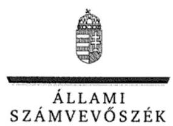

ELNÖK

Ikt.szám: V-1233-108/2016.

# Dr. Szívek Norbert úr 

vezérigazgató

Magyar Nemzeti Vagyonkezelő Zrt.

## Budapest

## Tisztelt Vezérigazgató Úr!

„Az állami tulajdonban (résztulajdonban) lévő gazdálkodó szervezetek vagyonmegőrzési és gazdálkodási tevékenységének ellenőrzése - Annamajori Mezőgazdasági és Kereskedelmi Kft." címmel készített számvevőszéki jelentéstervezetre tett észrevételét köszönettel megkaptam.

Az Állami Számvevőszék észrevételre vonatkozó álláspontjáról a felügyeleti vezető által készített részletes tájékoztatást csatoltan megküldöm.

Tájékoztatom Vezérigazgató urat, hogy a számvevőszéki jelentésben - az Állami Számvevőszékről szóló 2011. évi LXVI. törvény 29. § (3) bekezdése alapján - a figyelembe nem vett észrevételeket szerepeltetjük, annak indoklásával, hogy azokat az Állami Számvevőszék miért nem fogadta el.

Budapest, 2017. ... hó ... nap
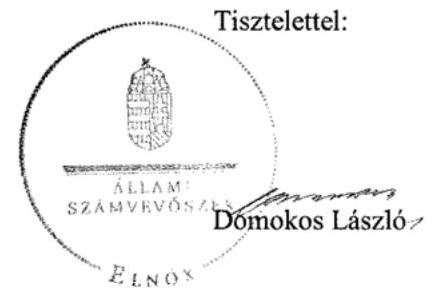

Melléklet: Tájékoztatás az észrevétel kezeléséről

---

# Tájékoztatás   az észrevétel kezeléséről 

„Az állami tulajdonban (résztulajdonban) lévő gazdálkodó szervezetek vagyonmegőrzési és gazdálkodási tevékenységének ellenőrzése - Annamajori Mezőgazdasági és Kereskedelmi Kft." című jelentéstervezetre 2017. július 20-án érkezett észrevételét áttekintettük, annak kezelésével kapcsolatban a következő tájékoztatást adom.

Összegzés Főbb megállapítások 5. oldal 5. bekezdését, valamint Az ellenőrzés területe 7. oldal utolsó mondatát és 8. oldal első bekezdését érintő, az MNV Zrt. tulajdonosi joggyakorlásával összefüggő észrevételre adott válasz

A dokumentumok ismételt áttekintését követően a jelentéstervezet 7. oldal utolsó mondatát töröljük, a 8. oldal első és második bekezdését az alábbiak szerint pontosítjuk:
„Az MNV Zrt. 2012-2015-ben a vagyonkezelési, illetve megbízási szerződésekben át nem engedett tulajdonosi jogokat gyakorolta. Egyes nevesített esetekben a szavazati jogok gyakorlását megelőzően a tulajdonosi joggyakorló az MNV Zrt. előzetes hozzájárulását volt köteles kérni (a Társaság végelszámolással történő jogutód nélküli megszüntetése, a törzstőke felemelése, leszállítása, elismert vállalatcsoport létrehozásának előkészítése, az uralmi szerződés tervezetének tartalma, jóváhagyása).

A BVOP az MNV Zrt.-vel kötött szerződések alapján - az MNV Zrt. által gyakorolt jogok kivételével - gyakorolta 2012-2014-ben a tulajdonosi jogokat. 2015-ben a BVOP létrehozta a Bv. Holding Kft.-t, amely vezetésével valamennyi büntetés-végrehajtási gazdasági társaság alárendelt tagként, uralmi szerződés aláírásával - holdinggá alakult."

A jelentéstervezet 5. oldala 5. bekezdésének módosítása a dokumentumokkal összhangban tartalmazza a tulajdonosi joggyakorlókat, annak módosítása nem indokolt.

Budapest, 2017. ... hó ... nap
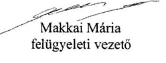

---

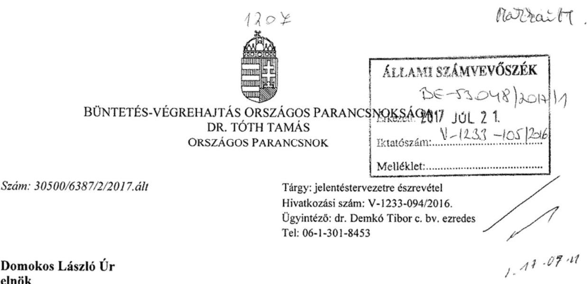

# Domokos László Úr   elnök 

## Állami Számvevőszék

Budapest
Budapest 4.
Pf. 54.
1364

## Tisztelt Elnök Úr!

A Büntetés-végrehajtás Országos Parancsnoksága (a továbbiakban: BVOP) tulajdonosi joggyakorlása alá tartózó Annamajori Mezőgazdasági és Kereskedelmi Korlátolt Felelősségű Társaság (a továbbiakban: Társaság) számvevőszéki ellenőrzéséről készült, a V-1233-094/2016. Iktatószámú levelével megküldött jelentéstervezetre az alábbi észrevételeket teszem:

A jelentéstervezet szerint a Társaság a közbeszerzési előírásokat nem tartotta be, mert közbeszerzési eljárás lefolytatása nélkül közbeszerzési értékhatárt meghaladó összegben vállaltak kötelezettséget, valamint nem rendelkezett közbeszerzési szabályzattal. A közbeszerzési eljárás mellőzésével megvalósított beszerzéseivel megsértette a Kbt. 15. § alapján fennálló közbeszerzési eljárás lefolytatásának kötelezettségét, tekintettel a Kbt. 19. §-ban foglaltakra. Továbbá a beszerzések szabályozási környezete hiányos volt. Az egyszerű közbeszerzési eljárás értékhatárát elérő vagy azt meghaladó értékű szerződések adatait nem tette közzé.

## Észrevételek:

1) A jelentéstervezet 2. számú Összegző megállapításának első bekezdése pontosításra szorul, mivel a Társaságnak csak egy telephelye van, 2014. augusztus 25-től.
2) Álláspontunk szerint beszerzések megvalósítása tekintetében a Társaság nem minősült/minősül az ellenőrzött időszak alatt hatályban volt közbeszerzésekről szóló 2011. évi CVIII. törvény (a továbbiakban: régi Kbt.), és a 2015. november 1. napjától hatályos közbeszerzésekről szóló 2015. évi CXLIII. törvény (a továbbiakban: hatályos Kbt.) szerinti klasszikus ajánlatkérőnek.

---

A régi Kbt. 6. § (1) bekezdés c) pontja alapján ajánlatkérőnek minősül az a jogképes szervezet, amelyet közérdekű, de nem ipari vagy kereskedelmi jellegű tevékenység folytatása céljából hoznak létre, vagy amely ilyen tevékenységet lát el, ha az a)-d) pontokban meghatározott egy vagy több szervezet, az Országgyűlés vagy a Kormány külön-külön vagy együttesen, közvetlenül vagy közvetetten meghatározó befolyást képes felette gyakorolni vagy működését többségi részben egy vagy több ilyen szervezet (testület) finanszírozza.

A hatályos Kbt. 5. § (1) bekezdés e) pontja alapján ajánlatkérőnek minősül az a jogképes szervezet, amelyet nem ipari vagy kereskedelmi jellegű, kifejezetten közérdekű tevékenység folytatása céljából hoznak létre, vagy amely bármilyen mértékben ilyen tevékenységet lát el, feltéve, hogy e szervezet felett az a)-e) pontban meghatározott egy vagy több szervezet, az Országgyűlés vagy a Kormány közvetlenül vagy közvetetten meghatározó befolyást képes gyakorolni vagy működését többségi részben egy vagy több ilyen szervezet (testület) finanszírozza.

A hatályos Kbt. indokolása kiemeli, hogy az új törvény pontosítja a közjogi szervezetekre vonatkozó meghatározást, és rögzíti, hogy a kifejezetten közérdekű célra létrehozott szervezetek minősülnek csak ajánlatkérőnek.

A 2004/18/EK irányelv 1. cikk (9) bekezdése és a 2004/17/EK irányelv 2. cikk (1)-(2) bekezdése a közbeszerzési szabályok személyi hatályát a következőképpen
 állapítják meg. A 2004/18/EK irányelv személyi hatálya: "Ajánlatkérő szerv": az állam, a területi vagy a települési önkormányzat, a közjogi intézmény, továbbá az egy vagy több ilyen szerv, illetve közjogi intézmény által létrehozott társulás;
"Közjogi intézmény" minden olyan intézmény,
a) amely kifejezetten olyan közérdekű célra jött létre, amely nem ipari vagy kereskedelmi jellegű;
b) amely jogi személyiséggel rendelkezik; valamint
c) amelyet többségi részben az állam, vagy a területi vagy a települési önkormányzat, vagy egyéb közjogi intézmény finanszíroz; vagy amelynek irányítása ezen intézmények felügyelete alatt áll; vagy amelynek olyan ügyvezető, döntéshozó vagy felügyelő testülete van, amely tagjainak többségét az állam, a területi vagy a települési önkormányzat, vagy egyéb közjogi intézmény nevezi ki.

Az Európai Unió Bíróságának C-360/96. sz. BFI Holding ítéletében meghatározattak alapján az első, a) pont szerinti feltétel két elemét önállóan kell megvizsgálni, és mindkét feltételnek fenn kell állnia a közjogi intézménnyé minősítéshez. Különbséget kell tehát tenni az olyan közérdekű tevékenységek között, amelyek ipari vagy kereskedelmi jellegűek, és amelyek nem ipari vagy kereskedelmi jellegűek. Ha a tevékenység kizárólag ipari vagy kereskedelmi jellegű, vagy ilyen jellegű és egyben közérdekű, a szervezet az egyéb feltételek fennállása esetén sem minősül ún. közjogi szervezetnek.

A közbeszerzésről és a 2004/18/EK irányelv hatályon kívül helyezéséről szóló Európai Parlament és a Tanács 2014/24/EU irányelv (10) preambulum bekezdése is rögzíti, hogy az olyan szerv, amely szokásos piaci feltételekkel működik, nyereségorientált, és a tevékenysége végzéséből eredő veszteségeket maga viseli, nem tekintendő „közjogi intézménynek", mivel azok a közérdekű célok, amelyek teljesítésére létrehozták, vagy amelyek teljesítésével megbízták, gazdasági vagy üzleti jellegűnek minősülhetnek.

---

Véleményünk szerint a közérdekűség fennállta mellett az is megállapítható, hogy a Társaság ipari, kereskedelmi jellegű tevékenységet végez és versenyfeltételek befolyásolják működését. Így nem tartozik sem a régi, sem a hatályos Kbt. alanyi hatálya alá. (Európai Bíróság C-18/01. számú, Korhonen and Others ügyben hozott ítélete)

A Társaság alapító okirata 4. pontjában megjelölt főtevékenység - TEÁOR 0111'08 szerint gabonaféle (kivéve: rizs), hüvelyes növény, olajos mag termesztése, illetve a 4.1. pont alatti tevékenységek egyértelműen mezőgazdasági, ipari és kereskedelmi, azaz üzletszerű jellegre utalnak. A Társaság alapítójának is az volt a szándéka, hogy a Polgári Törvénykönyvről szóló 2013. évi V. törvény 3:88. § (1) bekezdése szerinti üzletszerű közös gazdasági tevékenység folytatására, a tagok vagyoni hozzájárulásával létrehozott, jogi személyiséggel rendelkező vállalkozás jöjjön létre.

A Magyar Nemzeti Vagyonkezelő Zrt. for-profit társaságként tartja nyilván a Társaságot, valamint az adott évre vonatkozó üzleti terv tervezéséhez kiadott irányelvekben is nyereséget írt elő a Magyar Állam tulajdonában lévő és a BVOP tulajdonosi joggyakorlása alá tartozó gazdasági társaságoknak.

Összefoglalva a fent leírtakat, a jelentéstervezet nem állapítja meg, hogy a régi és hatályos Kbt. mely pontja alapján minősül klasszikus ajánlatkérőnek a Társaság. Álláspontunk szerint a Társaság a régi Kbt. és az új Kbt. alapján az ellenőrzött időszakban nem minősült klasszikus ajánlatkérőnek, ezért nem volt közbeszerzési eljárás indítására kötelezett, illetve ezért nem rendelkezett/r rendelkezik a régi Kbt. 22.§ (1) bekezdésében, illetve a hatályos Kbt. 27. § (1) bekezdésében előírt közbeszerzési szabályzattal.
3) A köztulajdonban álló gazdasági társaságok takarékosabb működéséről szóló 2009. évi CXXII. törvény 2. § (3) bekezdése szerint „a köztulajdonban álló gazdasági társaság (...) gondoskodik (...) az egyszerű közbeszerzési eljárás értékhatárát elérő vagy azt meghaladó értékű - (...) közzétehetővé tételéről. A régi Áht. 15/B. § (1) bekezdése tartalmazta, hogy a nettó ötmillió forintot elérő vagy azt meghaladó értékű szerződések megnevezését (típusát), tárgyát, a szerződést kötő felek nevét, a szerződés értékét, határozott időre kötött szerződés esetében annak időtartamát, valamint az említett adatok változásait közzé kell tenni a szerződés létrejöttét követő hatvan napon belül.

Az államháztartásról szóló 2011. évi CXCV. törvény ilyen közzétételi kötelezettséget nem ír elő. A közbeszerzésekről szóló 2011. évi CVIII. törvény csak uniós és nemzeti értékhatárú beszerzéseket ismer. Véleményünk szerint közzétételi kötelezettség csak a nemzeti értékhatárt elérő vagy azt meghaladó szerződésekre terjed ki. A jogi disszonancia feloldása érdekében kezdeményezzük, hogy a javaslatok közzé kerüljön be a 2009. évi CXXII. törvény 2. § (3) bekezdésének módosítása.

Kérem a Tisztelt Elnök Urat, hogy fenti észrevételeinket a jelentéstervezet megállapításai és a javaslatok tekintetében figyelembe venni szíveskedjenek.

Budapest, 2017. július „ $\ddot{1}$ "
Tisztelettel:
Dr. Tóth Tamás bv. vezérőrnagy

---

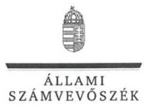

ELNÖK

Ikt.szám: V-1233-106/2016.

# Dr. Tóth Tamás úr 

Bv. vezérőrnagy
országos parancsnok

Büntetés-végrehajtás Országos Parancsnoksága

## Budapest

## Tisztelt Országos Parancsnok Úr!

„Az állami tulajdonban (résztulajdonban) lévő gazdálkodó szervezetek vagyonmegőrzési és gazdálkodási tevékenységének ellenőrzése - Annamajori Mezőgazdasági és Kereskedelmi Kft." címmel készített számvevőszéki jelentéstervezetre tett észrevételét köszönettel megkaptam.

Az Állami Számvevőszék észrevételre vonatkozó álláspontjáról a felügyeleti vezető által készített részletes tájékoztatást csatoltan megküldöm.

Tájékoztatom Országos Parancsnok urat, hogy a számvevőszéki jelentésben - az Állami Számvevőszékről szóló 2011. évi LXVI. törvény 29. § (3) bekezdése alapján - a figyelembe nem vett észrevételeket szerepeltetjük, annak indoklásával, hogy azokat az Állami Számvevőszék miért nem fogadta el.

Budapest, 2017. 08. hó 15. nap
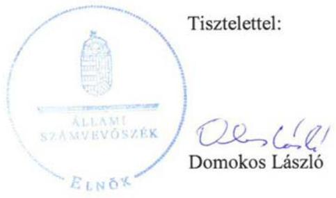

Melléklet: Tájékoztatás az észrevétel kezeléséről

---

# Tájékoztatás   az észrevétel kezeléséről 

„Az állami tulajdonban (résztulajdonban) lévő gazdálkodó szervezetek vagyonmegőrzési és gazdálkodási tevékenységének ellenőrzése - Annamajori Mezőgazdasági és Kereskedelmi Kft." című jelentéstervezetre 2017. július 21-én érkezett észrevételét áttekintettük, annak kezelésével kapcsolatban a következő tájékoztatást adom.

1. A jelentéstervezet 2. számú megállapítás első bekezdésre tett, a Társaság telephelyeire vonatkozó észrevételre adott válasz
A dokumentumok ismételt áttekintése alapján a jelentéstervezet 2. számú megállapítás 1. bekezdésében a „telephelyei" szót „telephelye" szóra módosítottuk.
2. A közbeszerzési szabályzat elkészítésének elmulasztásával és a közbeszerzés területén feltárt hiányosságokkal kapcsolatban a jelentéstervezet 2. számú megállapítás 5. bekezdése és 3.1. számú megállapítás 4. bekezdése megállapításaira, valamint az Annamajori Mezőgazdasági és Kereskedelmi Kft. ügyvezetőjének megfogalmazott 1. és 2. számú javaslatokra tett észrevételre adott válasz:
A közbeszerzésekről szóló 2011. évi CVIII. törvény (régi Kbt.) 6. § (1) bekezdés c) pontja, alapján ajánlatkérőnek minősül az a jogképes szervezet, amelyet közérdekű, de nem ipari vagy kereskedelmi tevékenység céljából hoznak létre, vagy amely ilyen tevékenységet lát el, ha az a)-d) pontokban meghatározott egy vagy több szervezet, az Országgyűlés vagy a Kormány külön-külön vagy együttesen, közvetlenül vagy közvetetten meghatározó befolyást képes felette gyakorolni vagy működését többségi részben egy vagy több ilyen szervezet finanszírozza. A 2015. november 1-jétől hatályos közbeszerzésekről szóló 2015. évi CXLIII. törvény (új Kbt.) 5. § (1) bekezdés e) pontja pontosítást tartalmaz a régi Kbt.-hez képest, azonban alapvetően nem változtatja meg a rendelkezést.
A Társaság 100%-os állami tulajdonú gazdasági társaság. Alapító okiratának 7. pontja szerint: a társaság fogvatartottak kötelező foglalkoztatására létrehozott szervezet, egyben büntetésvégrehajtási szerv. Tehát a társaságot közérdekű tevékenység folytatására hozták létre, azaz a régi és új Kbt. szerint is ajánlatkérőnek minősül. Ezt megerősíti, hogy az Állami Számvevőszéknek az illetékes hatóság felé történő, a közbeszerzés területén feltárt hiányosságokra irányuló jogorvoslati kezdeményezéséről a hatóság megállapította, hogy az megalapozott volt.
A beszerzéseknél a jogszabályi előírások betartása az érintettek számára kötelező. Ugyanakkor nem lehet eltekinteni attól, hogy a fogvatartottak foglalkoztatása kiemelt közérdek. Mindezekre tekintettel a jelentéstervezet vonatkozó részét pontosítjuk.

---

3. Jelentéstervezet 3.3 számú megállapítás 4. bekezdésére és az Annamajori Mezőgazdasági és Kereskedelmi Kft. ügyvezetőjének címzett 4. javaslatra vonatkozó, a köztulajdonban álló gazdasági társaságok takarékosabb működéséről szóló 2009. évi CXXII. törvény 2. § (3) bekezdése szerinti adatok közzétételéhez kapcsolódó észrevételre adott válasz

Az észrevétel nem cáfolja a jelentéstervezetnek a közzététel hiányára vonatkozó megállapítását. A köztulajdonban álló gazdasági társaságok takarékosabb működéséről szóló 2009. évi CXXII. törvény 2. § (3) bekezdése szerint a Társaságnak, mint köztulajdonban álló gazdasági társaságnak, gondoskodnia kell a pénzeszközei felhasználásával, a gazdasági társaság vagyonával történő gazdálkodással összefüggő, az egyszerű közbeszerzési eljárás értékhatárát elérő vagy azt meghaladó értékű szerződések - a jogszabályban meghatározott adatainak közzétehetővé tételéről. A közbeszerzési értékhatárokat a Magyarország adott évi központi költségvetéséről szóló törvény tartalmazza. A fentiek alapján a jelentéstervezet megállapításának módosítása nem indokolt.

Budapest, 2017. 06. hó 15. nap

Makkai Mária
felügyeleti vezető

---

Bv. Holding Kft.
1064 Budapest, Rózsa utca 75-79.
www.bvholdingkft.hu Tel: 36 1 301-8461
bvholdingkft@bvholdingkft.hu

Hiv.szám: V-1233-097/2016.
Tárgy: Észrevétel jelentéstervezetre
Ügyintéző: dr. Bartha Andrea
Mobil: +36-30-190-1334
E-mail: bartha.andrea@bv.gov.hu

# Domokos László elnök úr részére 

## Állami Számvevőszék

Budapest
Budapest 4.
Pf. 54.
1364

## Tisztelt Elnök Úr!

Hivatkozással fenti iktatószámon ,,Az állami tulajdonban (résztulajdonban) lévő gazdálkodó szervezetek vagyonmegőrzési és gazdálkodási tevékenységének ellenőrzése - Annamajori Mezőgazdasági és Kereskedelmi Kft." címen megküldött jelentéstervezetre, a Bv. Holding Kft. - mint a Bv. Holding elismert vállalatcsoport uralkodó tagja - képviseletében a törvényes határidőn belül az Állami Számvevőszék felé az alábbi nyilatkozatot teszem.

A jelentéstervezet 2. számú összegző megállapítás ötödik bekezdése szerint a Társaság szabálytalanul - a közbeszerzésekről szóló 2011. évi CVIII. törvény (a továbbiakban: régi Kbt.) 22.§ (1) bekezdése és a közbeszerzésekről szóló 2015. évi CXLIII. törvény (a továbbiakban: hatályos Kbt.) 27.§ (1) bekezdése ellenére - nem rendelkezett közbeszerzési szabályzattal.

A jelentéstervezet 3. számú összegző megállapítás 3.1. számú megállapítás negyedik bekezdésében leírtak szerint a Társaság több beszerzési eljárása során - közbeszerzési eljárás lefolytatása nélkül közbeszerzési értékhatárt meghaladó összegben vállalt kötelezettséget. A jelentéstervezet szintén megállapítja, hogy az Annamajori Kft. a beszerzések idején hatályos Kbt. alanyi hatálya alá tartozó szervezetként közbeszerzési eljárás mellőzésével megvalósított beszerzéseivel megsértette a Kbt. 5.§a alapján fennálló, a Kbt. 19.§-ában előírt közbeszerzési eljárás lefolytatásának kötelezettségét.

Társaságunk alábbi álláspontja szerint az Annamajori Kft. nem minősült az ellenőrzött időszak alatt hatályban volt régi Kbt., illetve a 2015. november 1. napjától hatályos Kbt. szerinti klasszikus ajánlatkérőnek, s mivel nem minősült annak, ezért nem rendelkezett közbeszerzési szabályzattal sem.

A régi Kbt. 6. § (1) bekezdés c) pontja alapján ajánlatkérőnek minősül az a jogképes szervezet, amelyet közérdekű, de nem ipari vagy kereskedelmi jellegű tevékenység folytatása céljából hoznak létre, vagy amely ilyen tevékenységet lát el, ha az a)-d) pontokban meghatározott egy vagy több szervezet, az Országgyűlés vagy a Kormány külön-külön vagy együttesen, közvetlenül vagy közvetetten

---

**Bv. Holding Kft.**
1064 Budapest, Rózsa utca 75-79,
www.bvholdingkft.hu Tel: 36 1 301-8461
bvholdingkft@bvholdingkft.hu

meghatározó befolyást képes felette gyakorolni vagy működését többségi részben egy vagy több ilyen szervezet (testület) finanszírozza.

A hatályos Kbt. 5. § (1) bekezdés e) pontja alapján ajánlatkérőnek minősül az a jogképes szervezet, amelyet **nem ipari vagy kereskedelmi jellegű, kifejezetten közérdekű tevékenység folytatása céljából hoznak létre,** vagy amely bármilyen mértékben ilyen tevékenységet lát el, feltéve, hogy e szervezet felett az a)-e) pontban meghatározott egy vagy több szervezet, az Országgyűlés vagy a Kormány közvetlenül vagy közvetetten meghatározó befolyást képes gyakorolni vagy működését többségi részben egy vagy több ilyen szervezet (testület) finanszírozza.

A hatályos Kbt. indokolása kiemeli, hogy az új törvény pontosítja a közjogi szervezetekre vonatkozó meghatározást, és rögzíti, hogy **a kifejezetten közérdekű célra létrehozott szervezetek minősülnek**
 csak ajánlatkérőnek.**

A 2004/18/EK irányelv 1. cikk (9) bekezdése és a 2004/17/EK irányelv 2. cikk (1)-(2) bekezdése a közbeszerzési szabályok személyi hatályát a következőképpen állapítják meg. A 2004/18/EK irányelv személyi hatálya: "Ajánlatkérő szerv": az állam, a területi vagy a települési önkormányzat, a közjogi intézmény, továbbá az egy vagy több ilyen szerv, illetve közjogi intézmény által létrehozott társulás; "Közjogi intézmény" minden olyan intézmény,

a) **amely kifejezetten olyan közérdekű célra jött létre, amely nem ipari vagy kereskedelmi jellegű;**

b) **amely jogi személyiséggel rendelkezik; valamint**

c) **amelyet többségi részben az állam, vagy a területi vagy a települési önkormányzat, vagy egyéb közjogi intézmény finanszíroz; vagy amelynek irányítása ezen intézmények felügyelete alatt áll; vagy amelynek olyan ügyvezető, döntéshozó vagy felügyelő testülete van, amely tagjainak többségét az állam, a területi vagy a települési önkormányzat, vagy egyéb közjogi intézmény nevezi ki.**

Az Európai Unió Bíróságának C-360/96. sz. BFI Holding ítéletében meghatározattak alapján az első, **a) pont szerinti feltétel két elemét önállóan kell megvizsgálni, és mindkét feltételnek fenn kell állnia a közjogi intézménnyé minősítéshez.** Különbséget kell tehát tenni az olyan közérdekű tevékenységek között, amelyek ipari vagy kereskedelmi jellegűek, és amelyek nem ipari vagy kereskedelmi jellegűek. **Ha a tevékenység kizárólag ipari vagy kereskedelmi jellegű, vagy ilyen jellegű és egyben közérdekű, a szervezet az egyéb feltételek fennállása esetén sem minősül ún. közjogi szervezetnek.**

Álláspontunk szerint a fentiek alapján az **egyes feltételek együttes fennállását, az egyes feltételek külön-külön történő vizsgálatával lehet megállapítani, melyre vonatkozóan a jelentéstervezet megállapítást nem tartalmaz.**

A tevékenység ipari vagy kereskedelmi jellegére vonatkozó utalás az általános közgazdasági fogalomhasználat szerint olyan gazdasági tevékenységet feltételez, amelynek eredményeként **profitszerzési célból piacképes termék előállítása történik,** illetőleg olyan tevékenységet, amely termékek vagy szolgáltatások kereskedelmi forgalomban, versenyfeltételek mellett történő értékesítési célja által jellemezhető.

---

Előbbiek alapján, ezen feltétel fennállása tekintetében az Európai Uniós közbeszerzési irányelveknek megfelelően vizsgálni szükséges különösen az Annamajori Kft. létrehozását motiváló körülményeket, illetve azt a gazdasági környezetet, amelyben a társaság a közérdekű tevékenységet végzi, így különösen:

- a) a versenyfeltételek meglétét,
- b) a tevékenységet végző társaság for-profit, vagy non-profit jellegét,
- c) nyereségorientáltságát,
- d) üzleti kockázatok önálló viselésének feltételeit.

Álláspontunk szerint megállapítható, hogy a b)-d) feltételek egyértelműen fennállnak, mivel az Annamajori Kft. profit jellegű, nyereségorientált és nem nonprofit társaság, üzleti kockázatát önállóan viseli.

A versenyfeltételek megléténél is összességében szükséges a társaság versenypiaci jelenlétét vizsgálni, így az egyes versenypiaci előnyök mellett, különösen az Annamajori Kft. alábbi piaci hátrányait is figyelembe kell venni:

- számos uniós és hazai pályázati forrástól az állami jelleg miatt ki van zárva,
- az elítéltek foglalkoztatásából eredő sajátos és indokolt többletkiadásokat a központi költségvetés 2011. óta a társaságnak nem téríti meg;
- a 44/2011. Korm. rendelet, és a 9/2011. BM rendelet szerinti ellátási kötelezettsége teljesítése körében kötelezően fogvatartottakat kell foglalkoztatnia, és ezen ellátási kötelezettsége keretében a szerződött partnereit a Társaság szabadon nem választhatja meg,
- versenypiaci társaihoz képest az állami tulajdoni jelleg miatt működése bonyolultabb, nagyobb adminisztrációval jár így az általános működéshez nagyobb létszámú munkaerő szükséges, melyek foglalkoztatása a jogszabályban foglaltaknak minden esetben megfelel,
- a Társaságnál könyvvizsgáló, és Felügyelő Bizottság létrehozása is kötelező.

Kiemelendő továbbá, hogy a közbeszerzésről és a 2004/18/EK irányelv hatályon kívül helyezéséről szóló Európai Parlament és a Tanács 2014/24/EU irányelv (10) preambulum bekezdése is rögzíti, hogy az olyan szerv, amely szokásos piaci feltételekkel működik, nyereségorientált, és a tevékenysége végzéséből eredő veszteségeket maga viseli, nem tekintendő "közjogi intézménynek", mivel azok a közérdekű célok, amelyek teljesítésére létrehozták, vagy amelyek teljesítésével megbízták, gazdasági vagy üzleti jellegűnek minősülhetnek.

Véleményünk az, hogy a közérdekűség fennállta mellett az is megállapítható, hogy a Társaság ipari, kereskedelmi jellegű tevékenységet végez és versenyfeltételek befolyásolják működését. Így nem tartozik sem a régi, sem a hatályos Kbt. alanyi hatálya alá. (Európai Bíróság C-18/01. számú, Korhonen and Others ügyben hozott ítélete)

A Társaság Alapító okirata 4. pontjában megjelölt főtevékenység – TEÁOR'08 szerint – 0111'08 Gabonaféle (kivéve rizs), hüvelyes növény, olajos mag termesztése, valamint a 4.1. pont alatti tevékenységek egyértelműen üzletszerű jellegre utalnak.

---

Bv. Holding Kft.
1064 Budapest, Rózsa utca 75-79. www.bvholdingkft.hu Tel: 361301 -8461 bvholdingkft@bvholdingkft.hu

A Társaság alapítójának is az volt a szándéka, hogy a Polgári Törvénykönyvről szóló 2013. évi V. törvény 3:88. § (1) bekezdése szerinti üzletszerű közös gazdasági tevékenység folytatására, a tagok vagyoni hozzájárulásával létrehozott, jogi személyiséggel rendelkező vállalkozás jöjjön létre. Az MNV Zrt. is profit orientált társaságként tartja nyilván a Társaságot, valamint az adott évekre vonatkozó üzleti tervek tervezéséhez kiadott irányelvekben is nyereséget írt elő a Magyar Állam tulajdonában lévő és a Büntetés-végrehajtás Országos Parancsnoksága megbízott tulajdonosi joggyakorlása alá tartozó gazdasági társaságoknak.

Összefoglalva a fent leírtakat, álláspontunk szerint a jelentéstervezet nem állapítja meg egyértelműen, hogy az Annamajori Kft. a régi és hatályos Kbt. mely pontja alapján minősül ajánlatkérőnek, illetve azt, hogy régi Kbt. 6. § (1) bekezdés c) pontja, illetve a hatályos Kbt. 5. § (1) bekezdés e) pontja szerinti ipari vagy kereskedelmi jellegű tevékenység meglétét az Állami Számvevőszék esetlegesen vizsgálta volna.

Álláspontunk továbbra is az, hogy a Társaság a régi Kbt. és az új Kbt. alapján az ellenőrzött időszakban nem minősült klasszikus ajánlatkérőnek, és az ellenőrzött időszakban, illetve jelenleg sem kötelezett klasszikus ajánlatkérőként közbeszerzési eljárás lefolytatására.

A fentiek alapján Társaságunk nem ért egyet a jelentéstervezet 2. számú összegző megállapítás ötödik bekezdésében és a 3. számú összegző megállapítás 3.1. számú megállapítás negyedik bekezdésében leírtakkal, illetve a jelentéstervezetben Javaslatok cím alatt az Annamajori Kft. ügyvezetőjének előírt 1. és 2. javaslatokkal.

Társaságunk a jelentéstervezet Javaslatok 3. és 4. pontjában javasolt intézkedésekre észrevételt tenni nem kíván.

# Tisztelt Állami Számvevőszék! 

Kérjük, hogy Társaságunk fenti észrevételeit az ellenőrzési jelentés véglegesítésekor figyelembe venni szíveskedjen.

Budapest, 2017. július 10.

Tisztelettel:
Varga Zsolt bv. alezredes
ügyvezető igazgató
1064 Budapest, Rózsa utca 75-79.
Adószám: 25120064-2-51.
Cégjegyzékszám: 01-09-200937

---

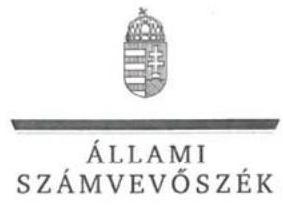

ELKÖK

Ikt.szám: V-1233-101/2016.

# Varga Zsolt úr 

Bv. alezredes
ügyvezető

Bv. Holding Kft.

## Budapest

## Tisztelt Ügyvezető Úr!

„Az állami tulajdonban (résztulajdonban) lévő gazdálkodó szervezetek vagyonmegőrzési és gazdálkodási tevékenységének ellenőrzése - Annamajori Mezőgazdasági és Kereskedelmi Kft." címmel készített számvevőszéki jelentéstervezetre tett észrevételét köszönettel megkaptam.

Az Állami Számvevőszék észrevételre vonatkozó álláspontjáról a felügyeleti vezető által készített részletes tájékoztatást csatoltan megküldöm.

Tájékoztatom Ügyvezető urat, hogy a számvevőszéki jelentésben - az Állami Számvevőszékről szóló 2011. évi LXVI. törvény 29. § (3) bekezdése alapján - a figyelembe nem vett észrevételeket szerepeltetjük, annak indoklásával, hogy azokat az Állami Számvevőszék miért nem fogadta el.

Budapest, 2017. ๙. hó 15 nap
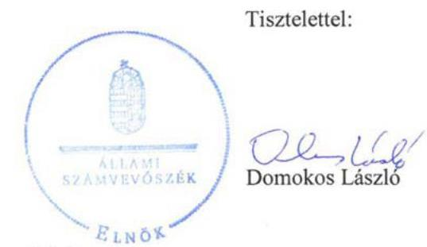

Melléklet: Tájékoztatás az észrevétel kezeléséről

---

# Tájékoztatás   az észrevétel kezeléséről 

„Az állami tulajdonban (résztulajdonban) lévő gazdálkodó szervezetek vagyonmegőrzési és gazdálkodási tevékenységének ellenőrzése - Annamajori Mezőgazdasági és Kereskedelmi Kft." című jelentéstervezetre 2017. július 14-én érkezett észrevételét áttekintettük, annak kezelésével kapcsolatban a következő tájékoztatást adom.

A közbeszerzési szabályzat elkészítésének elmulasztásával és a közbeszerzés területén feltárt hiányosságokkal kapcsolatban a jelentéstervezet 2. számú megállapítás 5. bekezdése és 3.1. számú megállapítás 4. bekezdése megállapításaira, valamint az Annamajori Mezőgazdasági és Kereskedelmi Kft. ügyvezetőjének tett 1. és 2. számú javaslatokra tett észrevételre adott válasz:
A közbeszerzésekről szóló 2011. évi CVIII. törvény (régi Kbt.) 6. § (1) bekezdés c) pontja, alapján ajánlatkérőnek minősül az a jogképes szervezet, amelyet közérdekű, de nem ipari vagy kereskedelmi tevékenység céljából hoznak létre, vagy amely ilyen tevékenységet lát el, ha az a)-d) pontokban meghatározott egy vagy több szervezet, az Országgyűlés vagy a Kormány külön-külön vagy együttesen, közvetlenül vagy közvetetten meghatározó befolyást képes felette gyakorolni vagy működését többségi részben egy vagy több ilyen szervezet finanszírozza. A 2015. november 1-jétől hatályos közbeszerzésekről szóló 2015. évi CXLIII. törvény (új Kbt.) 5. § (1) bekezdés e) pontja pontosítást tartalmaz a régi Kbt.-hez képest, azonban alapvetően nem változtatja meg a rendelkezést.
A Társaság 100%-os állami tulajdonú gazdasági társaság. Alapító okiratának 7. pontja szerint: a társaság fogvatartottak kötelező foglalkoztatására létrehozott szervezet, egyben büntetésvégrehajtási szerv. Ez alapján a társaságot közérdekű tevékenység folytatására hozták létre, azaz a régi és új Kbt. szerint is ajánlatkérőnek minősül. Ezt megerősíti, hogy az Állami Számvevőszéknek az illetékes hatóság felé történő, a közbeszerzés területén feltárt hiányosságokra irányuló jogorvoslati kezdeményezéséről a hatóság megállapította, hogy az megalapozott volt.
A beszerzéseknél a jogszabályi előírások betartása az érintettek számára kötelező. Ugyanakkor nem lehet eltekinteni attól, hogy a fogvatartottak foglalkoztatása kiemelt közérdek. Minderre tekintettel a jelentéstervezet vonatkozó részét pontosítjuk.

Budapest, 2017. 06. hó 15. nap

Makkai Mária
felügyeleti vezető

---

.

---

# RÖVIDÍTÉSEK JEGYZÉKE 

${ }^{1}$ Társaság
${ }^{2}$ BVOP
${ }^{3}$ MNV Zrt.
${ }^{4}$ MNV Zrt.-vel kötött szerződések
${ }^{5}$ ÁSZ
${ }^{6}$ ÁSZ tv.
${ }^{7}$ Vtv.
${ }^{8}$ alapító okirat ${ }_{1-10}$
${ }^{9}$ Gt.
${ }^{10}$ Ptk${ }_{2}$
${ }^{11}$ FB
${ }^{12}$ Tervezési irányelvek ${ }_{1-4}$
${ }^{13}$ üzleti tervek elfogadása
${ }^{14}$ Határozatok a beszámoló elfogadásáról

Annamajori Mezőgazdasági és Kereskedelmi Korlátolt Felelősségű Társaság
Büntetés-végrehajtás Országos Parancsnoksága
Magyar Nemzeti Vagyonkezelő Zrt.
szerződés: a Magyar Államot megillető társasági részesedés feletti tulajdonosi jogok gyakorlására az MNV Zrt. és a BVOP által a Vtv. rendelkezései alapján megkötött vagyonkezelési szerződés (2013. január 30-ig)
szerződés: a Magyar Államot megillető társasági részesedés feletti tulajdonosi jogok gyakorlására az MNV Zrt. és a BVOP által az Nvtv. rendelkezései alapján megkötött megbízási szerződés (2013. január 30-tól)
Állami Számvevőszék
2011. évi LXVI. törvény az Állami Számvevőszékről
2007. évi CVI. törvény az állami vagyonról

Annamajori Mezőgazdasági és Kereskedelmi Kft. 2011.09.01-jei Alapító Okirata
Annamajori Mezőgazdasági és Kereskedelmi Kft. 2012.10.10-i Alapító Okirata
Annamajori Mezőgazdasági és Kereskedelmi Kft. 2012.06.29-i Alapító Okirata
Annamajori Mezőgazdasági és Kereskedelmi Kft. 2013.04.14-i Alapító Okirata
Annamajori Mezőgazdasági és Kereskedelmi Kft. 2013.07.26-i Alapító Okirata
Annamajori Mezőgazdasági és Kereskedelmi Kft. 2013.11.14-i Alapító Okirata
Annamajori Mezőgazdasági és Kereskedelmi Kft. 2014.05.23-i Alapító Okirata
Annamajori Mezőgazdasági és Kereskedelmi Kft. 2014.08.28-i Alapító Okirata
Annamajori Mezőgazdasági és Kereskedelmi Kft. 2014.12.15-i Alapító Okirata
Annamajori Mezőgazdasági és Kereskedelmi Kft. 2015.06.01-jei Alapító Okirata
2006. évi IV. törvény a gazdasági társaságokról (hatálytalan: 2014. március 15-től)
2013. évi V. törvény a Polgári Törvénykönyvről
felügyelőbizottság
Az MNV Zrt. 513/2011 (XI.07.) számú határozatában a 2012. évre megfogalmazott tervezési irányelvek
A Tulajdonosi joggyakorló 558/2012 (X.24.) számú határozatában a 2013. évre megfogalmazott tervezési irányelvek
A Tulajdonosi joggyakorló 774/2013 (X.21.) számú határozatában a 2014. évre megfogalmazott tervezési irányelvek
A Tulajdonosi joggyakorló 4/2015 (I.12.) számú határozatában a 2015. évre megfogalmazott tervezési irányelvek
az üzleti terveket elfogadó határozatok:
2012. év - BVOP 4/11/2012. számú határozat
2013. év - BVOP 11/11/2013. számú határozat
2014. év - BVOP 11/11/2014. számú határozat
2015. év - BVOP 16/11/2015. számú határozat
2012. évi beszámoló - BVOP 21/11/2013. számú határozat
2013. évi beszámoló - BVOP 19/11/2014. számú határozat
2014. évi beszámoló - BVOP 28/11/2015. számú határozat

---

${ }^{15}$ Bv. Holding Kft. határozatai
${ }^{16}$ SZMSZ
${ }^{17}$ Számv. tv.
${ }^{18}$ Számviteli Politika
${ }^{19}$ Számlarend
${ }^{20}$ Pénzkezelési Szabályzat
${ }^{21}$ Leltározási Szabályzat
${ }^{22}$ Selejtezési Szabályzat
${ }^{23}$ Értékelési Szabályzat
${ }^{24}$

 Önköltség Számítás rendjéről Szabályzat
${ }^{25}$ Adatvédelmi Szabályzat
${ }^{26}$ Info tv.
${ }^{27}$ Javadalmazási szabályzat
${ }^{28}$ Taktv.
${ }^{29}$ FB tagok javadalmazásának elvei
${ }^{30}$ közzétételi szabályzat ${ }_{1-2}$
${ }^{31}$ hitelfelvétel jóváhagyása
${ }^{32} \mathrm{Ptk}_{1}$
${ }^{33} \mathrm{Ppt}$.
könyvvizsgáló kijelölése: 15/2015. (05.29.) uralkodó tagi határozat, a Bv. Holding egységes üzleti koncepciójáról 7/2015 (05.12.), 2015. évi beszámoló jóváhagyása 9/2016. (05.17.) uralkodó tagi határozat
Annamajori Mezőgazdasági és Kereskedelmi Kft. Szervezeti és Működési Szabályzata (hatályos 2011. január 11-től)
2000. évi C. törvény a számvitelről

Számviteli politika ${ }_{1}$ : Annamajori Mezőgazdasági és Kereskedelmi Kft. 2005. január 1. - 2014. december 31. között hatályos Számviteli Politikája
Számviteli politika 2 : Annamajori Mezőgazdasági és Kereskedelmi Kft. 2015. január 1-jétől hatályos Számviteli Politikája
Annamajori Mezőgazdasági és Kereskedelmi Kft. Számlarendje (hatályos 2009. január 1-től)
Annamajori Mezőgazdasági és Kereskedelmi Kft. Pénzkezelési Szabályzat (hatályos 2007. szeptember 1-től)
Annamajori Mezőgazdasági és Kereskedelmi Kft. Leltározási Szabályzat (hatályos 2004. január 1-jétől)

Annamajori Mezőgazdasági és Kereskedelmi Kft. Selejtezési Szabályzat (hatályos 1997. április 1-jétől)

Annamajori Mezőgazdasági és Kereskedelmi Kft. Eszközök és Források Értékelési Szabályzata (hatályos: 2009. január 1-jétől)
Annamajori Mezőgazdasági és Kereskedelmi Kft. Önköltség számítási Szabályzat (hatályos 1997. április 1-jétől)
Annamajori Mezőgazdasági és Kereskedelmi Kft. Adatvédelmi, Adatbiztonsági és Közérdekű adat megismerésére vonatkozó Szabályzat (hatályos: 2012. október 30-tól)
2011. évi CXII. törvény az információs önrendelkezési jogról és az információszabadságról
BVOP által kiadott 2009. december 1-jétől hatályos egységes javadalmazási szabályzata
2009. évi CXXII. törvény a köztulajdonban álló gazdasági társaságok takarékosabb működéséről
a büntetés-végrehajtási gazdasági társaságok felügyelőbizottsági tagjai javadalmazásának elveiről, rendszeréről szóló 13/2008. számú BVOP határozat, (módosítás: 1/2010. és 23/2012. számú BVOP határozat)
a BVOP országos parancsnoka 1/2009. számú határozatával kiadott közzétételi szabályzat (hatályos: 2009. március 1-jétől 2013. február 28-ig, a szabályzat hatálya a Társaságra kiterjedt)
a BVOP országos parancsnoka 1/2013. számú határozatával kiadott közzétételi szabályzat (hatályos: 2013. március 1-jétől, a szabályzat hatálya a Társaságra kiterjedt)
BVOP 8/11/2012. számú Határozat, BVOP 11/11/2012. számú Határozat 1959. évi IV. törvény a Polgári Törvénykönyvről (hatálytalan 2014. március 15-től)
1952. évi III. törvény a polgári perrendtartásról

---

ÁLLAMI SZÁMVEVŐSZÉK
1052 Budapest, Apáczai Csere János utca 10.
Levélcím: 1364 Budapest 4. Pf. 54
Telefon: +36 14849100 Telefax: +36 14849200
www.asz.hu
