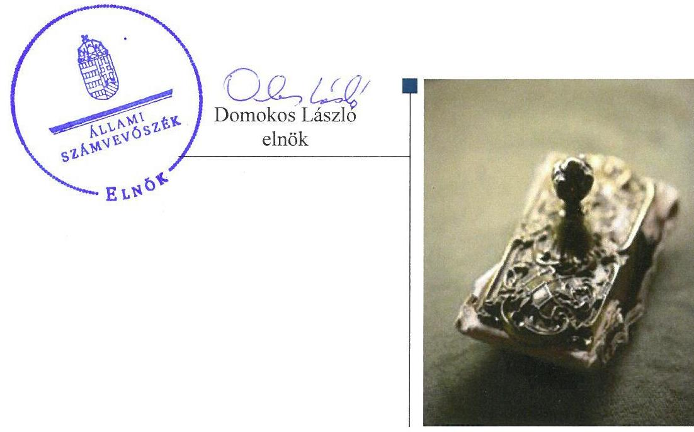
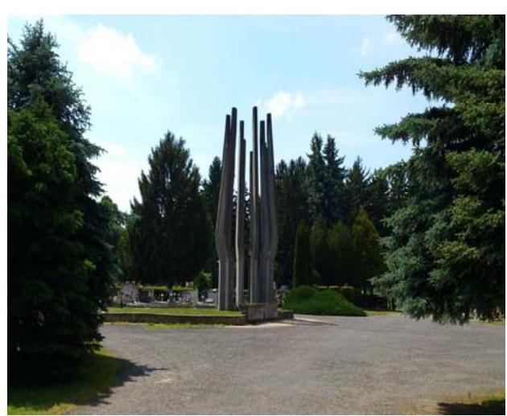
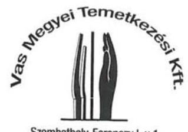
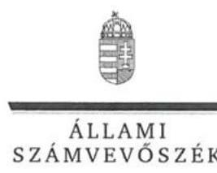
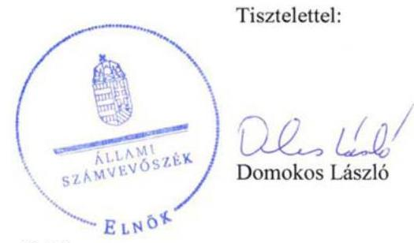

# Jelentés 

## Vas Megyei Temetkezési Kft.

Az állami tulajdonban (résztulajdonban) lévő gazdálkodó szervezetek vagyonmegőrzési és gazdálkodási tevékenységének ellenőrzése 2017.

---

# Jelentés 

## Vas Megyei Temetkezési Kft.

Az állami tulajdonban (résztulajdonban) lévő gazdálkodó szervezetek vagyonmegőrzési és gazdálkodási tevékenységének ellenőrzése
2017. cengurard hó 24. nap

---

# AZ ELLENŐRZÉST FELÜGYELTE:

## MAKKAI MÁRIA felügyeleti vezető

## AZ ELLENŐRZÉST VEZETTE ÉS A VÉGREHAJTÁSÁÉRT FELELŐS:

### KORSÓSNÉ VIGH ANDREA ellenőrzésvezető

## A PROGRAM ÖSSZEÁLLÍTÁSÁÉRT FELELŐS:

### JANIK JÓZSEF LÁSZLÓ osztályvezető

---

**IKTATÓSZÁM:** V-1196-147/2016.

**TÉMASZÁM:** 2230

**ELLENŐRZÉS-AZONOSÍTÓ SZÁM:** V075910

---

Jelentéseink az Országgyűlés számítógépes hálózatán és az Interneta a www.asz.hu címen is olvashatóak.

---

# TARTALOMJEGYZÉK 

■ ÖSSZEGZÉS ..... 5
■ AZ ELLENŐRZÉS CÉLJA ..... 6
■ AZ ELLENŐRZÉS TERÜLETE ..... 7
■ AZ ELLENŐRZÉS HÁTTERE, INDOKOLTSÁGA ..... 8
■ A JELENTÉS LÉNYEGES KÉRDÉSKÖREI ..... 9
■ ELLENŐRZÉS HATÓKÖRE ÉS MÓDSZEREI ..... 10
■ MEGÁLLAPÍTÁSOK ..... 12
■ JAVASLATOK ..... 16
■ MELLÉKLETEK ..... 17
I. Sz. melléklet: Értelmező szótár ..... 17
■ FÜGGELÉK: ÉSZREVÉTELEK ..... 19
■ RÖVIDÍTÉSEK JEGYZÉKE ..... 25

---

.

---

# ÖSSZEGZÉS 

A Vas Megyei Intézményfenntartó Központ és a Magyar Nemzeti Vagyonkezelő Zrt. szabályszerűen gyakorolta a tulajdonosi jogokat. A Vas Megyei Temetkezési Kft. szabályozottsága és a pénzügyi-számviteli feladatellátás összességében szabályszerű, a vagyongazdálkodás szabályszerű volt.

## Az ellenőrzés társadalmi indokoltsága

Magyarországon az intézmény-centrikus közfeladat-ellátás, közvagyon gazdálkodás jellemző a költségvetésen kívüli feladatellátás térnyerése mellett. Ennek szereplői az állami tulajdonú gazdálkodó szervezetek is.

Az állami tulajdonban álló gazdálkodó szervezetek államot megillető társasági részesedése a nemzeti vagyon részét képezi és legfőbb rendeltetése szerint a közfeladatok ellátását szolgálja.

Az Állami Számvevőszék stratégiájában megfogalmazta, hogy az államháztartáson kívülre nyújtott költségvetési támogatások és ingyenes vagyonjuttatások, valamint az államháztartáson kívül működő közfeladat-ellátó rendszerek ellenőrzéseivel hozzájárul ahhoz, hogy a közpénzeket az államháztartáson kívül működő szervezetek is átlátható, rendezett módon használják fel a közfeladatok szerződésben vállalt ellátása érdekében.

A Vas Megyei Temetkezési Kft.-t korábban nem ellenőrizte az Állami Számvevőszék.

## Főbb megállapítások

A Vas Megyei Intézményfejlesztési Központ és a Magyar Nemzeti Vagyonkezelő Zrt. meghatározta a Vas Megyei Temetkezési Kft. társasági részesedés feletti tulajdonosi joggyakorlásra vonatkozó előírásokat, feladatokat, hatásköröket, jogosultságokat és az előírásoknak megfelelően gyakorolta a tulajdonosi jogokat.

A Vas Megyei Temetkezési Kft. múködésének szabályozottsága összességében megfelelt az előírásoknak. A számviteli törvényben előírt gazdálkodási szabályzatokat elkészítették, azokban kialakították a vagyon megőrzését, gyarapítását szolgáló, szabályszerű vagyongazdálkodás feltételeit. Hiányosság volt, hogy a közérdekú adatok közzétételének rendjét belső szabályzatban nem rögzítették, továbbá az SZMSZ-t és a javadalmazási szabályzatot nem aktualizálták.

A bevételek és a ráfordítások elszámolása összességében - az értékcsökkenés elszámolása kivételével - megfelelt az előírásoknak. Az éves beszámolókat az előírások szerinti formában, tartalommal elkészítették, a tulajdonosi jóváhagyást követően határidőben közzétették és letétbe helyezték.

A vagyonnyilvántartás átlátható és naprakész, a mérleg leltárral megfelelően alátámasztott volt. A 2012-2015. években összességében az értékcsökkenést meghaladó összegű beruházás, felújítás a vagyon értékének megőrzését, a tervszerű karbantartás a vagyon állagmegóvását biztosította. A vagyon változását eredményező döntések megfeleltek az előírásoknak.

---

# AZ ELLENŐRZÉS CÉLJA 

Az ellenőrzés célja annak értékelése volt, hogy a tulajdonosi jogok gyakorlása szabályszerű volt-e; a gazdálkodó szervezet szabályozottsága, gazdálkodása és vagyongazdálkodási tevékenysége megfelelt-e a jogszabályi és a tulajdonosi előírásoknak; biztosítva volt-e a közfeladatok átláthatósága és elszámoltathatósága érdekében a közszolgáltatás díjának megalapozottsága szabályszerű önköltségszámítással; a vagyonváltozást eredményező döntések esetében a tulajdonosi jogok gyakorlója és a gazdálkodó szervezet szabályszerűen jártak-e el.

---

# AZ ELLENŐRZÉS TERÜLETE 

## Vas Megyei Temetkezési Kft.

A Társaság ${ }^{1}$ jogelődjét 1953. szeptember 8-án Vas Megye Tanácsa alapította köztemetők fenntartása, üzemeltetése és temetkezési szolgáltatás végzése céljából. A Társaság a megyei önkormányzatok konszolidációjáról, a megyei önkormányzati intézmények és a Fővárosi Önkormányzat egyes egészségügyi intézményeinek átvételéről szóló 2011. évi CLIV. törvény alapján került 2012. január 1-jétől állami tulajdonba és az ellenőrzött időszakban végig a Magyar Állam kizárólagos tulajdonában volt. A tulajdonosi jogokat és kötelezettségeket 2012. január 1. és 2013. március 27. között a VMIK², 2013. március 28. és 2015. december 31. között az MNV Zrt. ${ }^{3}$ gyakorolta.

A Társaság önkormányzatokkal kötött szerződés alapján kegyeleti közszolgáltatást, valamint vállalkozási tevékenységként temetési szolgáltatást végzett. Főbb vagyoni adatait az 1. táblázat mutatja be.

1. táblázat

| A TÁRSASÁG FŐBB VAGYONI ADATAI (M FT) |  |  |  |  |  |
| :--: | :--: | :--: | :--: | :--: | :--: |
| Megnevezés | 2012.   Jan. 3. | 2012.   dec. 31. | 2013.   dec. 31. | 2014.   dec. 31. | 2015.   dec. 31. |
| Mérlegfőösszeg | 1310,3 | 160,4 | 166,6 | 124,7 | 121,0 |
| Saját tőke | 66,0 | 81,9 | 89,0 | 77,0 | 86,4 |
| Kötelezettségek | 1241,2 | 77,4 | 77,4 | 47,6 | 34,2 |
| Követelések | 27,5 | 16,3 | 10,5 | 11,5 | 10,8 |

A Társaság 2012. évi összesen 1149,9 M Ft összegű vagyoncsökkenésében meghatározó szerepet játszott a 2012. január 1-jei tulajdonosváltás, amely miatt a vagyonkezelésében lévő önkormányzati eszközök 1139,1 M Ft összegben visszaadásra kerültek az alapító Vas Megyei Önkormányzat részére. Ezt követően feladatait saját vagyonával látta el. A Társaság az ellenőrzött időszakban nyereségesen gazdálkodott, mérleg szerinti eredménye a 2012-2013-2014-2015. években $16,0 \mathrm{MFt}, 7,0 \mathrm{MFt}$, 4,1 M Ft, 9,4 M Ft volt.

Az alkalmazottak statisztikai átlaglétszáma az egyes években változóan 53-55 fő volt. Az ügyvezető személyében az ellenőrzött időszakban nem történt változás.

---

# AZ ELLENŐRZÉS HÁTTERE, INDOKOLTSÁGA 

## AZ ÁSZ' KÖZÉPTÁVRA SZÓLÓ STRATÉGIÁJÁBAN

megfogalmazta, hogy az államháztartáson kívülre nyújtott költségvetési támogatások és ingyenes vagyonjuttatások, valamint az államháztartáson kívül működő közfeladat-ellátó rendszerek ellenőrzéseivel hozzájárul ahhoz, hogy a közpénzeket az államháztartáson kívül működő szervezetek is átlátható, rendezett módon használják fel a közfeladatok szerződésben vállalt ellátása érdekében.

Az ellenőrzés feladata a közfeladat ellátással kapcsolatban a közpénzek átláthatósága, nyilvánossága érdekében a jogszabályokban, belső szabályzatokban megfogalmazott előírások érvényesülésének az állami tulajdonban (résztulajdonban) lévő gazdálkodó szervezetek vagyonérték megőrzési és gazdálkodási tevékenységének értékelése.

AZ ELLENŐRZÉS EREDMÉNYEKÉPP a törvényalkotás számára tapasztalatok állnak rendelkezésre a közfeladat-ellátás és gazdálkodás értékeléséhez, az átláthatóságot biztosító szabályozáshoz. Az ellenőrzés tapasztalatai segítik és erősítik az ÁSZ hozzáadott értéket teremtő tevékenységét és tanácsadó szerepét.

---

# A JELENTÉS LÉNYEGES KÉRDÉSKÖREI 

1. A tulajdonosi jogok gyakorlása szabályszerű volt-e?
2. A társaság müködésének szabályozottsága megfelelt-e az előírásoknak?
3. A társaságnál a pénzügyi-számviteli, adatszolgáltatási és ellenőrzési feladatok ellátása szabályszerű volt-e?
4. A társaság vagyongazdálkodása szabályszerű volt-e?

---

# ELLENŐRZÉS HATÓKÖRE ÉS MÓDSZEREI 

## Az ellenőrzés típusa

Megfelelőségi ellenőrzés

## Az ellenőrzött időszak

A 2012. január 1-jétől 2015. december 31-ig tartó időszak.

## Az ellenőrzés tárgya

Az állami tulajdonban (résztulajdonban) lévő gazdasági társaság gazdálkodása, kiemelten vagyongazdálkodási tevékenysége, a tulajdonosi jogok gyakorlása.

## Az ellenőrzött szervezet

Vas Megyei Temetkezési Kft., Szociális és Gyermekvédelmi Főigazgatóság (a Vas Megyei Intézményfenntartó Központ jogutódjaként³), Magyar Nemzeti Vagyonkezelő Zrt.

## Az ellenőrzés jogalapja

Az ellenőrzés jogszabályi alapján az ÁSZ tv. ${ }^{6}$ 5. § (3)-(5) bekezdései, valamint a Vtv. ${ }^{7}$ 3. § (4) bekezdése képezték.

## Az ellenőrzés módszerei

Az ellenőrzést az ellenőrzési program ellenőrzési kérdései, az ellenőrzött időszakban hatályos jogszabályok, az ellenőrzés szakmai szabályok és módszertanok figyelembe vételével végeztük el.

Az ellenőrzött szervezetek az ellenőrzés lefolytatásához tanúsítványok kitöltésével, valamint az ÁSZ által kért dokumentumok megküldésével szolgáltattak adatokat.

A bevételek és ráfordítások elszámolását, és a vagyonnyilvántartás terén a szabályszerű múködést véletlenszerű mintavétellel ellenőriztük. A mintavétellel ellenőrzött területek esetében minden egyes tétel vonatkozásában szabályszerűségre vonatkozó kérdéseket tettünk fel, amelyek eredménye összesítésre került. A jogszabályoknak és a belső előírásoknak

---

megfelelőnek tekintettük az adott területet, amennyiben a minta ellenőrzésének eredménye alapján 95\%-os bizonyossággal a teljes sokaságban a hibaarány kisebb volt, mint 10\%, nem megfelelőnek értékeltük, ha a hibaarány a 10\%-ot meghaladta. A ráfordítások elszámolására és a vagyonnyilvántartásra vonatkozó véletlen mintavételt kockázati alapú kiválasztással egészítettük ki, amelynek során évente a három legnagyobb összegű tételt választottuk ki.

---

# 1. A tulajdonosi jogok gyakorlása szabályszerű volt-e? 

## Összegző megállapítás

A társasági részesedés feletti tulajdonosi joggyakorlás a jogszabályi előírásoknak megfelelő volt.

A TÁRSASÁGI RÉSZESEDÉS felett a tulajdonosi jogokat a tulajdonosi joggyakorló ${ }_{1,2}{ }^{8}$ szabályszerűen gyakorolta. A tulajdonosi joggyakorlásra vonatkozó előírásokat a Társaság alapító okiratában ${ }^{9}$, továbbá az MNV Zrt. SZMSZ ${ }^{10}$-ében szabályozták. Az alapító okiratok tartalmazták a tulajdonosok kizárólagos hatáskörébe tartozó döntések körét, módját.

AZ FB ${ }^{11}$ ÉS A KÖNYVVIZSGÁLÓ TEVÉKENYSÉGÉ-
HEZ kapcsolódó tulajdonosi joggyakorlás szabályszerű volt. Az alapító okirat, illetve a tulajdonosi döntések a Gt. ${ }^{12}$ és a Ptk. ${ }^{13}$ előírásaival összhangban tartalmazták az FB tagok és a könyvvizsgáló személyére, megbízatásának időtartamára vonatkozó adatokat, feladat- és hatásköröket. Az FB három tagból állt, ami megfelelt a jogszabályi előírásoknak.

A TÁRSASÁG BESZÁMOLTATÁSA az alapító okiratban foglaltaknak és a jogszabályi előírásoknak megfelelően valósult meg. A tulajdonosi joggyakorló ${ }_{1,2}$ a beszámolók elfogadásáról az FB és a könyvvizsgáló írásbeli véleményének ismeretében, továbbá a Társaság 2012-2015. évi nyereségének az eredménytartalékba történő helyezéséről szabályszerűen alapítói határozatban döntött.

## 2. A társaság múködésének szabályozottsága megfelelt-e az előírásoknak?

## Összegző megállapítás

A Társaság múködésének szabályozottsága összességében megfelelt az előírásoknak.

AZ SZMSZ ${ }^{14}$ a Társaság nevében, munkaszervezetében, tevékenységében, a tulajdonosi joggyakorló személyében és az alapító okiratban 2012-től bekövetkezett változások miatti módosítása - az ügyvezető általi elkészítés és előterjesztés hiányában - nem történt meg az alapító okirat 10.3 pontjában foglaltak ellenére.

Az Info tv. 35. § (3) bekezdésében foglaltak ellenére az Info tv. 37. §ában meghatározott közzétételi listákon szereplő adatok közzétételének és az adatközlőnek való megküldésének részletes belső szabályzatát nem készítették el.

---

RENDELKEZTEK Számviteli politikával ${ }^{15}$, Számlarenddel ${ }^{16}$, Bizonylati renddel ${ }^{17}$, Leltározási szabályzattal ${ }^{18}$, Értékelési szabályzattal ${ }^{19}$, Pénzkezelési szabályzattal ${ }_{1,2}{ }^{20}$, valamint Selejtezési szabályzattal ${ }^{21}$. A Bizonylati rend, a Leltározási szabályzat, az Értékelési szabályzat, a Selejtezési szabályzat és a Pénzkezelési szabályzat megfelelt a követelményeknek.

A SZÁMVITELI POLITIKA keretében a Számv. tv. ${ }^{22}$ 14. § (4) bekezdés előírása ellenére nem rögzítették a 100 ezer forint, vagy azt meghaladó egyedi bekerülési értékű eszközök esetében a Számv. tv. 52. § (1)(3) bekezdései szerinti értékcsökkenés elszámolása - figyelemmel a Számv. tv. 88. § (4) bekezdés előírására - módszerét, a maradványérték és a várható élettartam meghatározásának módját.

A SZÁMLAREND nem tartalmazta minden alkalmazásra kijelölt számla számjelét és megnevezését a Számv. tv. 161. § (2) bekezdés a) pont előírása ellenére.

A JAVADALMAZÁSI SZABÁLYZAT ${ }^{23}$ összhangban volt a Tak. tv. ${ }^{24}$ 5. § (3) bekezdés előírásaival, azonban a korábbi önkormányzati tulajdonos által jóváhagyott szabályzat aktualizálására a tulajdonos személyében bekövetkezett változás ellenére 2015. december 31-éig nem került sor.

# 3. A társaságnál a pénzügyi-számviteli, adatszolgáltatási és ellenőrzési feladatok ellátása szabályszerű volt-e? 

Összegző megállapítás

## 3.1. számú megállapítás

A Társaságnál a pénzügyi-számviteli, adatszolgáltatási feladatok ellátása összességében szabályszerű volt.

A bevételek, az anyagjellegú és a személyi jellegú ráfordítások elszámolása megfelelő volt. Az értékcsökkenési leírás elszámolása nem volt szabályszerű.

A BEVÉTELEK kiszámlázása és főkönyvi elszámolása a Számv. tv., és a Számviteli politika betartásával történt, az alkalmazott ár megfelelt az előírásoknak. A Társaság által nyújtott közszolgáltatások esetén a szerződő önkormányzatok által kiadott rendeletben rögzített közszolgáltatási díjat alkalmazták.

AZ ANYAGJELLEGÚ RÁFORDÍTÁSOK elszámolásánál a kifizetéseket a Számv. tv. szerinti bizonylatok támasztották alá és a kimutatás a megfelelő főkönyvi számlákon történt.

A SZEMÉLYI JELLEGÚ RÁFORDÍTÁSOK elszámolása megfelelő volt. A bérkifizetést munkaszerződés és munkaidő elszámolás támasztotta alá. A béren kívüli juttatások kifizetésére a belső szabályzat alapján, illetve a munkavállalói nyilatkozatokkal összhangban került sor.

AZ ÉRTÉKCSÖKKENÉSI LEÍRÁS elszámolása - a 100 ezer Ft alatti egyedi bekerülési értékű tárgyi eszközök kivételével -

---

nem volt szabályszerű. A 100 ezer Ft vagy azt meghaladó egyedi beszerzési értékű eszközöknél a Tao tv. 2. mellékletében meghatározott, vagy több esetben a Tao tv. 1. számú melléklet 5/a. pontjában biztosított választási lehetőséggel élve attól alacsonyabb leírási kulcsokat alkalmaztak, amelyek szabályait azonban a Számv. tv. 14. § (4) bekezdés előírása ellenére a számviteli politikában nem határozták meg. A 100 ezer Ft egyedi beszerzési, előállítási érték alatti tárgyi eszközök beszerzési vagy előállítási költségét a Számv. tv. és a Számviteli politika előírásával összhangban használatbavételkor értékcsökkenésként egy összegben elszámolták.

# 3.2. számú megállapítás 

A tervezési, beszámolás és adatszolgáltatási kötelezettségüket teljesítették, a közérdekú adatok közzétételéről nem gondoskodtak.

ÚZLETI TERV készítési kötelezettséget a tulajdonosi joggyakorlók nem írtak elő a Társaság számára. A Társaság ügyvezetése évente elkészítette az üzleti tervet, amelyet az FB megtárgyalt.

AZ ÉVES BESZÁMOLÓKAT a Társaság a Számv. tv. előírásainak megfelelően elkészítette. A könyvvizsgáló az éves beszámolókat hitelesítő záradékkal látta el. A Társaság a beszámolók letétbe helyezését és közzétételét az előírt határidőben teljesítette. A Gt., illetve a Ptk. 2 előírásai szerinti tőkekövetelményeknek a Társaság megfelelt.

NEM GONDOSKODTAK a közérdekú adatok közzétételéről. Az Info. tv. 37. § (1) bekezdés előírása ellenére nem tették közzé az Info. tv. 1. számú melléklete szerinti közzétételi listában meghatározott szervezeti, személyzeti, tevékenységre, múködésre vonatkozó és gazdálkodási adatokat. A Taktv. 2. § (1)-(2) bekezdések előírása ellenére nem tették közzé továbbá a vezető tisztségviselő, az FB tagok, vezető állású munkavállalók, valamint a cégjegyzésre vagy a bankszámla feletti rendelkezésre jogosult munkavállalók adatait.

A tulajdonosi joggyakorló1,2 az FB útján ellenőrizte a Társaságot, külső ellenőrzést a NAV és a Vas Megyei Kormányhivatal végzett, intézkedést igénylő megállapítás nem volt.

## 4. A társaság vagyongazdálkodása szabályszerű volt-e?

## Összegző megállapítás

### 4.1. számú megállapítás

A Társaság vagyongazdálkodása szabályszerű volt.
A vagyon értékének megőrzését, gyarapítását szolgáló, szabályszerű vagyongazdálkodás feltételeit kialakították.

A VAGYONGAZDÁLKODÁS kereteinek kialakítása a jogszabályi előírásokkal összhangban valósult meg. A vagyongazdálkodással kapcsolatos feladat- és hatásköröket, felelősségi viszonyokat az alapító okirat és a belső szabályzatok tartalmazták. A saját vagyon megőrzését, védelmét biztosító előírásokat a Leltározási, Értékelési, Pénzkezelési és Selejtezési szabályzatokban rögzítették.

---

# 4.2. számú megállapítás 

A vagyon nyilvántartása a jogszabályi előírásoknak megfelelő volt.
A TÁRSASÁG VAGYONÁRÓL - a Számv. tv.-ben előírtaknak megfelelően mennyiségben és értékben - vezetett nyilvántartás átlátható és naprakész volt, a vagyonváltozást folyamatosan kimutatták.

A MÉRLEG LELTÁRI ALÁTÁMASZTÁSA a Számv. tv. előírásának megfelelő volt.

### 4.3. számú megállapítás

Gondoskodtak a vagyon értékének, állagának megőrzéséről.
A Társaság saját vagyonába tartozó immateriális javak és tárgyi eszközök nettó értéke 2012. január 1-jéről 2015. december 31-ére 42,4 M Ft-ról 89,9 M Ft-ra nőtt. A 2012-2015 között az elszámolt értékcsökkenés 40,4 M Ft, az elvégzett beruházás, felújítás értéke 92,4 M Ft volt. Az állagmegóvást az ingatlanok és az ingóságok rendszeres karbantartásával biztosították, melyre az ellenőrzött időszakban összesen 64,8 M Ft-ot fordítottak.

### 4.4. számú megállapítás

A vagyon változását eredményező döntések megfeleltek az előírásoknak.

A VAGYON VÁLTOZÁSÁT eredményező döntéseknél betartották az előírásokat, a döntések a vagyon értékének megőrzését, gyarapítását szolgálták. Az alapító okirat alapján a beruházásokról, felújításokról szóló döntések az ügyvezető hatáskörébe tartoztak. 2014-ben az MNV Zrt. által intézkedésként elrendelt, a normál üzletmenethez nem tartozó szerződésekkel kapcsolatos engedélyeztetési kötelezettségnek eleget tettek.

---

# JAVASLATOK 

Az ÁSZ tv. 33. § (1) bekezdésében foglaltak értelmében az ellenőrzött szervezet vezetője köteles a jelentésben foglalt megállapításokhoz kapcsolódó intézkedési tervet összeállítani és azt a jelentés kézhezvételétől számított 30 napon belül az ÁSZ részére megküldeni. Amennyiben az ellenőrzött szervezet vezetője nem küldi meg határidőben az intézkedési tervet, vagy továbbra sem elfogadható intézkedési tervet küld, az Állami Számvevőszék elnöke az ÁSZ tv. 33. § (3) bekezdése a) és b) pontjaiban foglaltakat érvényesítheti.

## a Vas Megyei Temetkezési Kft. ügyvezetőjének

1. Intézkedjen az SZMSZ módosításáról annak érdekében, hogy a Társaság nevében, munkaszervezetében, tevékenységében, a tulajdonosi joggyakorló személyében és az alapítói okiratban bekövetkezett változások átvezetése megtörténjen.
(2. sz. megállapítás 1. bekezdése alapján)
2. Intézkedjen a jogszabályban meghatározott közzétételi listákon szereplő adatok közzététele és az adatközlőnek történő megküldése részletes szabályainak belső szabályzatban történő elkészitéséről.
(2. sz. megállapítás 2. bekezdése alapján)
3. Intézkedjen a számviteli politika és a számlarend módosításáról, hogy azok teljes körüen feleljenek meg a Számv. tv. előírásainak.
(2. sz. megállapítás 4. és 5. bekezdései alapján)
4. Intézkedjen a javadalmazási szabályzat módosításáról, hogy a tulajdonos személyében bekövetkezett változás átvezetése megtörténjen.
(2. sz. megállapítás 6. bekezdése alapján)
5. Intézkedjen a közérdekü adatok teljes körü közzétételéről az Info. tv.ben és a Tak. tv.-ben elöirtaknak megfelelően.
(3.2. sz. megállapítás 3. bekezdése alapján)

---

# MELLÉKLETEK 

- I. SZ. MELLÉKLET: ÉRTELMEZŐ SZÓTÁR

Állami vagyon

Gazdálkodó szervezet

## 2012. november 9-ig:

a) Az állam tulajdonában lévő dolog, valamint a dolog módjára hasznosítható természeti erő,
b) Az a) pont hatálya alá nem tartozó mindazon vagyon, amely vonatkozásában törvény az állam kizárólagos tulajdonjogát nevesíti,
c) az állam tulajdonában lévő tagsági jogviszonyt megtestesítő értékpapír, illetve az államot megillető egyéb társasági részesedés,
d) az államot megillető olyan immateriális, vagyoni értékkel rendelkező jogosultság, amelyet jogszabály vagyoni értékű jogként nevesít.
Forrás: Vtv. 1. § (2) bekezdése
2012. november 10-től az állami vagyon fogalma kiegészül a következő ponttal:
a) az állam tulajdonában lévő pénzügyi eszközök

Forrás: Vtv. 1. § (2) bekezdése
2013. június 30-ig gazdálkodó szervezet:

Az állami vállalat, az egyéb állami gazdálkodó szerv, a szövetkezet, a lakás-szövetkezet, az európai szövetkezet, a gazdasági társaság, az európai rész-vénytársaság, az egyesülés, az európai gazdasági egyesülés, az európai területi együttműködési csoportosulás, az egyes jogi személyek vállalata, a leányvállalat, a vízgazdálkodási társulat, az erdőbirtokossági társulat, a végrehajtói iroda, az egyéni cég, továbbá az egyéni vállalkozó.
Forrás: Ptk. ${ }^{25}$ 685. § c) pontja
2013. július 1-jétől gazdálkodó szervezet:

Az állami vállalat, az egyéb állami gazdálkodó szerv, a szövetkezet, a lakás-szövetkezet, az európai szövetkezet, a gazdasági társaság, az európai rész-vénytársaság, az egyesülés, az európai gazdasági egyesülés, az európai területi együttműködési csoportosulás, az egyes jogi személyek vállalata, a leányvállalat, a vízgazdálkodási társulat, az erdőbirtokossági társulat, a végrehajtói iroda, az egyéni cég, továbbá az egyéni vállalkozó. Az állam, a helyi önkormányzat, a költségvetési szerv, az egyesület, a köztestület, valamint az alapítvány gazdálkodó tevékenységével összefüggő polgári jogi kapcsolataira is a gazdálkodó szervezetre vonatkozó rendelkezéseket kell alkalmazni, kivéve, ha a törvény e jogi személyekre eltérő rendelkezést tartalmaz; a 292/A-292/B. §, 301/A-301/B. §, 405. § (1) bekezdés, valamint a 407/A. § (1) bekezdés tekintetében nem minősül gazdálkodó szervezetnek az, aki a közbeszerzésekről szóló törvény értelmében ajánlatkérő (szerződő hatóság).
Forrás: Ptk. ${ }_{1}$ 685. § c) pontja
2014. március 15-től gazdálkodó szervezet:

A gazdasági társaság, az európai részvénytársaság, az egyesülés, az európai gazdasági egyesülés, az európai területi együttműködési csoportosulás, a szövetkezet, a lakásszövetkezet, az európai szövetkezet, a vízgazdálkodási társulat, az erdőbirtokossági társulat, az állami vállalat, az egyéb állami gaz-dálkodó szerv, az egyes jogi személyek vállalata, a közös vállalat, a végrehajtói iroda, a közjegyzői iroda, az ügyvédi iroda, a szabadalmi ügyvivői iroda, az önkéntes kölcsönös biztosító pénztár, a magánnyugdíjpénztár, az egyéni cég, továbbá az egyéni vállalkozó. Az ál-

---

gazdasági társaság

Tulajdonosi jogok gyakor-
lója
lam, a helyi önkormányzat, a költségvetési szerv, az egyesület, a köztestület, valamint az alapítvány gazdálkodó tevékenységével összefüggő polgári jogi kapcsolataira is a gazdálkodó szervezetre vonatkozó rendelkezéseket kell alkalmazni.
Forrás: Ppt. ${ }^{26} 396 . \S$
A Ptk2. 3:88. § (1) bekezdése szerint „a gazdasági társaságok üzletszerű közös gazdasági tevékenység folytatására, a tagok vagyoni hozzájárulásával létrehozott, jogi személyiséggel rendelkező vállalkozások, amelyekben a tagok a nyereségből közösen részesednek, és a veszteséget közösen viselik".
2013. június 27-ig:

Az állami vagyon felett a Magyar Államot megillető tulajdonosi jogok és kötelezettségek összességét - ha törvény eltérően nem rendelkezik - az állami vagyon felügyeletéért felelős miniszter (a továbbiakban: miniszter) gyakorolja, aki e feladatát a Magyar Nemzeti Vagyonkezelő Zártkörűen Müködő Részvénytársaság (a továbbiakban: MNV Zrt.), a Magyar Fejlesztési Bank, illetve a tulajdonosi joggyakorló szervezet útján látja el. A miniszter miniszteri rendeletben, a törvényben meghatározott állami vagyoni kör tekintetében, meghatározott időtartamra, a joggyakorlás egyes szabályainak meghatározásával - az őt megillető tulajdonosi jogok és kötelezettségek öszszességének, illetve azok meghatározott részének gyakorlóját az Áht. szerinti központi költségvetési szervek, ezek intézménye, továbbá a 100\%-ban állami tulajdonban álló gazdasági társaságok közül kijelölheti.
Forrás: Vtv. 3. § (1) és (2)
2013. június 28-ától:

A rábízott állami vagyon felett az államot megillető tulajdonosi jogok és kötelezettségek összességét tulajdonosi joggyakorlóként:
ha törvény vagy miniszteri rendelet eltérően nem rendelkezik, a Magyar Nemzeti Vagyonkezelő Zártkörűen Müködő Részvénytársaság (a továbbiakban: MNV Zrt.), törvényben kijelölt személy vagy
az állami vagyon felügyeletéért felelős miniszter (a továbbiakban: miniszter) által rendeletben kijelölt személy gyakorolja.
[...] A miniszter e törvény felhatalmazása alapján - a meghatározott célok hatékonyabb elérése érdekében, miniszteri rendeletben, az ott meghatározott állami vagyoni kör tekintetében, meghatározott időtartamra - e törvény keretei között, a joggyakorlás egyes szabályainak meghatározásával - az államot megillető tulajdonosi jogok és kötelezettségek összességének, illetve azok meghatározott részének gyakorlóját az Áht. szerinti központi költségvetési szervek, ezek intézménye, továbbá a 100\%-ban állami tulajdonban álló gazdasági társaságok közül kijelölheti.
Forrás: Vtv. 3. § (1) és (2)
2.

Aki a nemzeti vagyon felett az államot vagy a helyi önkormányzatot megillető tulajdonosi jogok és kötelezettségek összességének gyakorlására jogosult.
Forrás: Nvtv. 3. § (1) 17. pontja

---

# FÜGGELÉK: ÉSZREVÉTELEK 

A jelentéstervezetet a Számvevőszék 15 napos észrevételezésre megküldte az ellenőrzött szervezetek vezetőinek az ÁSZ tv. 29. §* (1) bekezdése előírásának megfelelően.
Az elfogadott észrevétel alapján a Számvevőszék módosította a jelentést.

Az ÁSZ a jelentéstervezetet észrevételezésre megküldte a Vas Megyei Temetkezési Kft. ügyvezetőjének, a Szociális és Gyermekvédelmi Főigazgatóság főigazgatójának, valamint a Magyar Nemzeti Vagyonkezelő Zrt. vezérigazgatójának.

Az Vas Megyei Temetkezési Kft. ügyvezetőjének észrevételét és az arra adott választ, valamint a MNV Zrt. vezérigazgatójának nemleges észrevételét a függelék alább tartalmazza.

[^0]
[^0]:    * 29. § (1) Az Állami Számvevőszék az ellenőrzési megállapításait megküldi az ellenőrzött szervezet vezetőjének vagy az általa megbízott személynek, és annak, akinek személyes felelősségét állapította meg.
    (2) Az ellenőrzött szervezet vezetője és a felelősként megjelölt személy az ellenőrzés megállapításaira tizenöt napon belül írásban észrevételt tehet.
    (3) Az Állami Számvevőszék az észrevételre a beérkezésétől számított harminc napon belül írásban válaszol. A figyelembe nem vett észrevételeket köteles a jelentésben feltüntetni, és megindokolni, hogy azokat miért nem fogadta el.

---

# VAS MEGYEI TEMETKEZÉSI KFT. 

9700 Szombathely, Ferenczy I. u. 1.
Telefon: (94) 314-082 Fax: (94) 312-594
E-mail: vmtv@t-online.hu
16 - $51336 / 201 / 1$
Fax: 211127017

## ÁLLAMI SZÁMVEVŐSZÉK

Budapest 4.
Pf. 54.

Hiv.sz.: V-1196-137/2016.
Tárgy: jegyzőkönyv tervezetre észrevétel

Tisztelt Cím!

Alulírott Kiskós Ferenc ügyvezető „Az állami tulajdonban lévő gazdálkodó szervezetek vagyonmegőrzési és gazdálkodási tevékenységének ellenőrzése - Vas Megyei Temetkezési Kft." című számvevőszéki jelentéstervezettel kapcsolatban az alábbi - nem a gazdálkodással kapcsolatos - észrevételt teszem:

A 7. oldal első mondata nem teljesen helytálló, mivel a jogelőd a Vas Megyei Temetkezési Vállalat volt, melyet 1953. szeptember 8-án alapított Vas Megye Tanácsa, köztemetők fenntartása, üzemeltetése és temetkezési szolgáltatás végzése céljából. A Vas Megyei Önkormányzat Vagyonkezelő Kft. alakult 2007. december 1jén a Vas Megyei Önkormányzat vagyonának kezelése és hasznosítása céljából. Ebbe olvadt be 2010. április 1-jén a temetkezés.

Egyebekben a jegyzőkönyv tervezetre észrevételt nem kívánunk tenni, a kért intézkedéseket haladéktalanul meg fogjuk tenni.

Dátum: Szombathely, 2017. július 25.

Tisztelettel: vas megyei temetkezési Kft. 9700 Szombathely, Ferenczy I. u. 1.

## 2222 Ferenc

Kiskós Ferenc ügyvezető
Vas Megyei Temetkezési Kft.

---

ELNÖK

Ikt.szám: V-1196-145/2016.

# Kiskós Ferenc úr 

ügyvezető

Vas Megyei Temetkezési Kft.

## Szombathely

## Tisztelt Ügyvezető Úr!

„Az állami tulajdonban (résztulajdonban) lévő gazdálkodó szervezetek vagyonmegőrzési és gazdálkodási tevékenységének ellenőrzése - Vas Megyei Temetkezési Kft. " címmel készített számvevőszéki jelentéstervezetre tett észrevételét köszönettel megkaptam.

Az Állami Számvevőszék észrevételre vonatkozó álláspontjáról a felügyeleti vezető által készített részletes tájékoztatást csatoltan megküldőm.

Tájékoztatom Ügyvezető urat, hogy a számvevőszéki jelentésben - az Állami Számvevőszékről szóló 2011. évi LXVI. törvény 29. § (3) bekezdése alapján - a figyelembe nem vett észrevételeket szerepeltetjük, annak indoklásával, hogy azokat az Állami Számvevőszék miért nem fogadta el.

Budapest, 2017. 08. hó 02 -nap

Melléklet: Tájékoztatás az észrevétel kezeléséről

---

# Tájékoztatás   az észrevétel kezeléséről 

„Az állami tulajdonban (résztulajdonban) lévő gazdálkodó szervezetek vagyonmegőrzési és gazdálkodási tevékenységének ellenőrzése - Vas Megyei Temetkezési Kft." címủ jelentéstervezetre 2017. július 27-én érkezett észrevételét áttekintettük, annak kezelésével kapcsolatban a következő tájékoztatást adom.

A 7. oldal első mondatára, a jogelőd alapítására vonatkozó észrevételre adott válasz
Az észrevétel alapján a jelentéstervezetet az alábbiak szerint pontosítjuk:
„A Társaság jogelődjét 1953. szeptember 8-án Vas Megye Tanácsa alapította köztemetők fenntartása, üzemeltetése és temetkezési szolgáltatás végzése céljából."

Budapest, 2017. 07. hó 02. nap

Makkai Mária
felügyeleti vezető

---

# 4168 

## AlLAMI SZAMVEVÓszEK   $3 E-51852 / 301911$   Erkeze: 2017 JOL 17.   Iktelószám:V-43C-143/2010   Melléklet: 111011

## Állami Számvevőszék

## Domokos László

## elnök

1052 Budapest
Apáczai Cs. J. u. 10.

Ikt. sz.: MNV/01/17797/ ( 2017.
Hiv. sz.: V-1196-138/2016.

Tisztelt Elnök Úr!
Tájékoztatom, hogy az MNV Zrt. a 2017. július 7. napján „Az állami tulajdonban (résztulajdonban) lévő gazdálkodó szervezetek vagyonmegőrzési és gazdálkodási tevékenységének ellenőrzése - Vas Megyei Temetkezési Kft." tárgyában kézhez vett, V-1196-138/2016. ikt. sz. Jelentés-tervezetre nem kíván észrevételt tenni.

Budapest, 2017. július „" 4 "

---

.

---

# RÖVIDÍTÉSEK JEGYZÉKE 

${ }^{1}$ Társaság

- jogelődjei:
${ }^{2}$ VMIK
${ }^{3}$ MNV Zrt.
${ }^{4}$ ÁSZ
${ }^{5}$ jogutód szervezet
${ }^{6}$ ÁSZ. tv.
${ }^{7}$ Vtv.
${ }^{8}$ tulajdonosi joggyakorló
${ }^{9}$ alapító okirat
${ }^{10}$ MNV Zrt SZMSZ
${ }^{11} \mathrm{FB}$
${ }^{12} \mathrm{Gt}$.
${ }^{13} \mathrm{Ptk}_{2}$.
${ }^{14}$ SZMSZ
${ }^{15}$ Számviteli politika
${ }^{16}$ Számlarend
${ }^{17}$ Bizonylati rend
${ }^{18}$ Leltározási szabályzat
${ }^{19}$ Értékelési szabályzat
${ }^{20}$ Pénzkezelési szabályzat ${ }_{1}$
Pénzkezelési szabályzat ${ }_{2}$
${ }^{21}$ Selejtezési szabályzat
${ }^{22}$ Számv. tv.
${ }^{23}$ Javadalmazási szabályzat

Vas Megyei Temetkezési Kft. (2012. július 17-étől)
Vas Megyei Önkormányzat Vagyonkezelő Kft. (2010. április 12. - 2012. július 16.)
Vas Megyei Temetkezési Kft. (2009. december 17. - 2010. április 11.)
Vas Megyei Temetkezési Vállalat (2007. december 1. - 2009. december 16.)
Vas Megyei Intézmény Fenntartó Központ
Magyar Nemzeti Vagyonkezelő Zártkörűen Működő Részvénytársaság
Állami Számvevőszék
Szociális és Gyermekvédelmi Főigazgatóság 2013. március 31-től a
258/2011.(XII.7.) Korm. rendelet alapján
2011. évi LXVI. törvény az Állami Számvevőszékről
2007. évi CVI. törvény az állami vagyonról
tulajdonosi joggyakorló:2012. január 1. és 2013. március 27. között a Vas
Megyei Intézményfenntartó Központ
tulajdonosi joggyakorló: 2013. március 28-tól 2015. december 31-ig a Magyar
Nemzeti Vagyonkezelő Zártkörűen Müködő Részvénytársaság
Vas Megyei Temetkezési Kft alapító okirata, többször módosított, a
módosításokkal egységes szerkezetben
123/2013.(III.07) IG határozattal jóváhagyott MNV Zrt Szervezeti és Müködési
Szabályzata hatályos 2013. március 7-től.
felügyelőbizottság
2006. évi IV. törvény a gazdasági társaságokról (hatálytalan: 2014. március 15től)
2013. évi V. törvény a Polgári Törvénykönyvről (hatályos: 2014. március 15-től)
a társaság jogelődjére, a Vas Megyei Önkormányzat Vagyonkezelő Korlátolt
Felelősségű Társaságra a Vas Megyei Közgyűlés által 2007. november 30-án
elfogadott Szervezeti és Müködési Szabályzat
Vas Megyei Önkormányzat Vagyonkezelő Kft. 2010. április 30-án kelt Számviteli
politika (egy alkalommal, a 2011. évben módosítva)
Vas Megyei Önkormányzat Vagyonkezelő Kft. 2010. április 2-án kelt Számlarend
Vas Megyei Önkormányzat Vagyonkezelő Kft. 2010. április 2-án kelt Bizonylati
rend
Vas Megyei Önkormányzat Vagyonkezelő Kft. 2008. január 31-én kelt Leltározási
szabályzat
Vas Megyei Önkormányzat Vagyonkezelő Kft. 2008. január 31-én kelt Értékelési
szabályzat
Vas Megyei Önkormányzat Vagyonkezelő Kft. 2012. január 1-jén kelt
Pénzkezelési szabályzat
Vas Megyei Temetkezési Kft. 2014. április 1-jén kelt Pénzkezelési szabályzat
Vas Megyei Önkormányzat Vagyonkezelő Kft. 2010. április 2-án kelt Selejtezési
szabályzat
2000. évi C. törvény a számvitelről

A Vas Megyei Önkormányzat Közgyűlésének 89/2010. (IV. 30.) számú határozata a Vas Megyei Önkormányzat Vagyonkezelő Kft. Javadalmazási szabályzatáról

---

${ }^{24}$ Tak. tv.
${ }^{25} \mathrm{Ptk}_{1}$
${ }^{26} \mathrm{Ppt}$.
2009. évi CXXII. törvény a köztulajdonban álló gazdasági társaságok takarékosabb múködéséről
1959. évi IV. törvény a Polgári Törvénykönyvről (hatálytalan 2014. március 15 -től)
1952. évi III. törvény a polgári perrendtartásról

---

ÁLLAMI SZÁMVEVŐSZÉK
1052 Budapest, Apáczai Csere János utca 10.
Levélcím: 1364 Budapest 4. Pf. 54
Telefon: +36 14849100 Telefax: +36 14849200
www.asz.hu