# Jelentés 

## Magyar Turisztikai Ügynökség Zrt.

Az állami tulajdonban (résztulajdonban) lévő gazdálkodó szervezetek vagyonmegőrzési és gazdálkodási tevékenységének ellenőrzése 2017.

---

# Jelentés 

## Magyar Turisztikai Ügynökség Zrt.

Az állami tulajdonban (résztulajdonban) lévő gazdálkodó szervezetek vagyonmegőrzési és gazdálkodási tevékenységének ellenőrzése
2017. Oŕ hó 14 nap
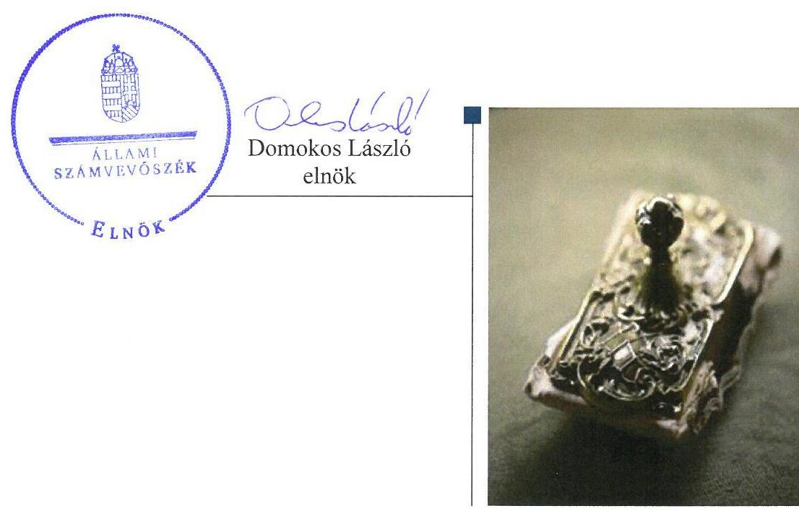

---

# AZ ELLENŐRZÉST FELÜGYELTE:

## MAKKAI MÁRIA felügyeleti vezető

## AZ ELLENŐRZÉST VEZETTE ÉS A VÉGREHAJTÁSÁÉRT FELELŐS:

### SALI SÁNDORNÉ ellenőrzésvezető

## A PROGRAM ÖSSZEÁLLÍTÁSÁÉRT FELELŐS:

### TÓTPÁL SZABOLCS osztályvezető

---

**IKTATÓSZÁM: V-1192-150/2016.**

**TÉMASZÁM: 2226**

**ELLENŐRZÉS-AZONOSÍTÓ SZÁM: V075915**

---

Jelentéseink az Országgyűlés számítógépes hálózatán és az Interneta a www.asz.hu címen is olvashatóak.

---

# TARTALOMJEGYZÉK 

■ ÖSSZEGZÉS ..... 5
■ AZ ELLENŐRZÉS CÉLJA ..... 6
■ AZ ELLENŐRZÉS TERÜLETE ..... 7
■ AZ ELLENŐRZÉS HÁTTERE, INDOKOLTSÁGA ..... 8
■ A JELENTÉS LÉNYEGES KÉRDÉSKÖREI ..... 9
■ ELLENŐRZÉS HATÓKÖRE ÉS MÓDSZEREI ..... 10
■ MEGÁLLAPÍTÁSOK ..... 12
■ JAVASLATOK ..... 16
■ MELLÉKLETEK ..... 17
I. Sz. melléklet: Értelmező szótár ..... 17
■ FÜGGELÉK: ÉSZREVÉTELEK ..... 19
■ RÖVIDÍTÉSEK JEGYZÉKE ..... 31

---

.

---

# ÖSSZEGZÉS 

A Magyar Fejlesztési Bank Zrt., a Nemzeti Vagyonkezelő Zrt., valamint a Nemzetgazdasági Minisztérium tulajdonosi joggyakorlása a Magyar Turisztikai Ügynökség Zrt. társasági részesedése felett összességében szabályszerű volt. A Társaság vagyongazdálkodása, a pénzügyi-számviteli és az ellenőrzési feladatok ellátása szabályszerű volt. A közzétételi kötelezettségének eleget tett. A Társaság müködésének szabályozottsága nem volt megfelelő. Az adatszolgáltatási kötelezettségét nem teljesítette.

## Az ellenőrzés társadalmi indokoltsága

Az állami tulajdonú gazdálkodó szervezetek a nemzeti vagyon részét képezik. Az állami vagyonnal való gazdálkodást illetően a tulajdonosi joggyakorlás és a vagyongazdálkodás feladata az állami vagyon átlátható, rendeltetésszerű és felelős felhasználásának biztosítása. Az állam meghatározza az ellátandó szolgáltatással kapcsolatos feladatokat, amelyhez a vagyonnal kapcsolatos döntéseknek igazodniuk kell. A nemzetgazdasági szempontból kiemelt jelentőségű nemzeti vagyonban tartandó állami tulajdonban álló társasági részesedést a nemzeti vagyonról szóló törvény határozza meg.

Az Állami Számvevőszék az általa korábban ellenőrizetlen területek, szervezetek körébe tartozó társaságnál végzett ellenőrzést. A számvevőszéki ellenőrzés hozzájárul a közpénzek szabályos, átlátható, elszámoltatható és eredményes felhasználásához, a rend pedig értéket teremt. Minden közpénzt, közvagyont használó szervezettel szemben társadalmi igény, hogy tevékenységükről elszámoljanak. Ezt figyelembe véve és az Állami Számvevőszék Stratégiájával összhangban került sor a Magyar Turisztikai Ügynökség Zrt. ellenőrzésére a 2012-2015. évek vonatkozásában.

## Főbb megállapítások, következtetések

A tulajdonosi jogok gyakorlása összességében megfelelő volt, 2014. évben közel fél évig az FB tagjainak létszáma nem felelt meg a jogszabályi előírásnak.

A Társaság múködésének szabályozottsága a számviteli politika hiányossága, valamint az önköltségszámítási szabályzat hiánya miatt nem felelt meg az előírásoknak. A szolgáltatások önköltségét a szabályozási hiányossággal öszszefüggésben utókalkulációval nem támasztotta alá.

A pénzügyi-számviteli és az ellenőrzési feladatok ellátása keretében a bevételek és ráfordítások elszámolása szabályszerűen történt. Éves beszámolóit a törvényi előírásoknak megfelelően elkészítette és közzétette. A kormányzati szektorba sorolt egyéb szervezetként adatszolgáltatási kötelezettségének nem tett eleget.

A Társaság vagyongazdálkodása és a vagyon nyilvántartása szabályszerű volt, a vagyon értékét megőrizte. A vagyongazdálkodással összefüggő feladat- és hatásköröket, felelősségi viszonyokat a Magyar Turisztikai Ügynökség Zrt.nél a jogszabályi előírások figyelembevételével kialakították.

---

# AZ ELLENŐRZÉS CÉLJA 

Az ellenőrzés célja annak értékelése volt, hogy a tulajdonosi jogok gyakorlása szabályszerű volt-e; a gazdálkodó szervezet szabályozottsága, gazdálkodása és vagyongazdálkodási tevékenysége megfelelt-e a jogszabályi és a tulajdonosi előírásoknak, biztosítva volt-e a feladatok átláthatósága és elszámoltathatósága érdekében a szolgáltatás dijának megalapozottsága szabályszerű önköltségszámítással; a vagyonváltozást eredményező döntések esetében a tulajdonosi jogok gyakorlója és a gazdálkodó szervezet szabályszerűen jártak-e el. A kormányzati szektorba sorolt állami tulajdonban lévő gazdálkodó szervezet gaz-
dálkodásának a kormányzati szektor hiányára és az államadósságra befolyással bíró elemei a jogszabályi előírásoknak megfeleltek-e.

---

# **AZ ELLENŐRZÉS TERÜLETE**

## **A Magyar Turisztikai Ügynökség Zártkörűen Működő Részvénytársaság**

A Magyar Turisztikai Ügynökség Zártkörűen Működő Részvénytársaság kormányzati szektorba sorolt, kizárólagos állami tulajdonú gazdasági társaság. Elnevezése Magyar Turizmus Zrt. volt, majd 2016 májusától Magyar Turisztikai Ügynökség Zrt. néven működik.

Az MT Zrt.^{1} részesedése felett 2014. július 15-ig az MFB Zrt.^{2}, 2014. július 16. és 2014 szeptember 11. között az MNV Zrt.^{3} és ezt követően az NGM^{4} gyakorolta a kizárólagos tulajdonosi jogokat.

A Társaság, mint nemzeti turisztikai marketing szervezet feladata a Kormány turizmuspolitikájának megvalósítása, a nemzetközi és a hazai turizmushoz kapcsolódó marketing tevékenység szervezése, hatékonyságának mérése, adatgyűjtés és elemzések készítése.

Az MT Zrt. turisztikai ágazatot támogató tevékenységét 12 külföldi és 8 hazai fióktelep, képviselet működtetésével látja el, szervezi, fejleszti és koordinálja az országos Tourinform irodahálózat működését. A Társaság 2012 júliusától a VM^{5}-től átvett feladatként ellátja a közösségi agrár- és bormarketing feladatokat is.

A működéséhez szükséges forrásokat a költségvetés Turisztikai Célelóirányzatából, az Agrármarketing Célelóirányzatból, valamint egy-egy esetben a VM OMÉK^{6} sertéságazatot, bormarketinget támogató előirányzatából kapta. A célelóirányzatok felhasználására a marketing feladatokat részletező támogatási szerződéseket kötöttek.

Az MT Zrt.-t az ellenőrzött időszakban egymást követően három vezérigazgató irányította. A főállású munkavállalóinak száma 2015-ben átlagosan 173 fő volt, feladatait saját eszközeivel látta el. A Társaság saját tőkéje meghaladta a jegyzett tőkét, melynek összege az ellenőrzött időszakban nem változott, 61,3 M Ft^{7} volt. Az MT Zrt. gazdálkodását jellemző adatokat az 1. táblázat mutatja be.

^{1} táblázat

|  A MAGYAR TURIZMUS ZRT. GAZDÁLKODÁSÁT JELLEMZŐ FŐBB ADATOK (M FT) |  |  |  |   |
| --- | --- | --- | --- | --- |
|  Megnevezés | 2012. év | 2013. év | 2014. év | 2015. év  |
|  Értékesítés nettó árbevétele | 353,1 | 547,7 | 343,3 | 487,2  |
|  Egyéb bevételek | 6 736,8 | 8 971,5 | 5 981,2 | 6 410,1  |
|  ebből a feladatok ellátására kapott költségvetési támogatás | 6 634,3 | 8 905,9 | 5 909,4 | 6 080,5  |
|  Turisztikai Célelóirányzat | 6 087,5 | 6 580,3 | 4 484,2 | 4 066,4  |
|  Agrármarketing Célelóirányzat | 546,8 | 2 316,2 | 1 051,2 | 599,4  |
|  Egyéb költségvetési támogatás | 0,0 | 9,4 | 374,0 | 1 414,7  |
|  Anyag jellegű ráfordítások | 4 706,2 | 6 547,3 | 4 038,8 | 4 363,6  |
|  Személyi jellegű ráfordítások | 2 031,6 | 2 207,7 | 1 989,7 | 2 165,3  |
|  Mérleg szerinti eredmény | 1,5 | 1,9 | 1,3 | 6,3  |
|  Mérlegfőösszeg | 2 876,8 | 2 458,7 | 1 878,1 | 3 177,4  |

*Forrás: a Társaság 2012-2015. évi beszámolója*

---

# AZ ELLENŐRZÉS HÁTTERE, INDOKOLTSÁGA 

## Magyar Turisztikai Ügynökség Zártkörüen Müködő Részvénytársaság

Az ÁSZ ${ }^{8}$ alapvető célkitűzése, hogy az államháztartáson kívülre nyújtott költségvetési támogatások és ingyenes vagyon juttatások ellenőrzésével hozzájáruljon ahhoz, hogy a közpénzeket az államháztartáson kívül müködő szervezetek is átlátható, rendezett módon használják fel a szerződésben átvállalt állami feladatok ellátása érdekében.

Az ellenőrzés feladata a közvagyonnal biztosított feladatellátással kapcsolatban a közpénzek átláthatósága, nyilvánossága érdekében a jogszabályokban, belső szabályzatokban megfogalmazott előírások érvényesülésének az állami tulajdonban lévő gazdálkodó szervezetek vagyonérték megőrzési és gazdálkodási tevékenységének értékelése.

Az ellenőrzés várható hasznosulásaként az ellenőrzés megállapításai a jogalkotás számára segítséget nyújthatnak a közvagyonnal való gazdálkodás értékeléséhez, jogszabályi keretei pontosításához, az átláthatóságot biztosító szabályozáshoz. Az ellenőrzöttek számára visszajelzést ad a gazdálkodási tevékenységgel, az állami vagyon felhasználásával, a szolgáltatás árképzésének megalapozottságával és az éves elszámolással kapcsolatos szabálytalanságokról és kockázatokról. Az ellenőrzés tapasztalatai segítik és erősítik az ÁSZ hozzáadott értéket teremtő elemző tevékenységét és tanácsadó szerepét.

---

# A JELENTÉS LÉNYEGES KÉRDÉSKÖREI 

1. A tulajdonosi jogok gyakorlása szabályszerű volt-e?
2. A Társaság müködésének szabályozottsága megfelelt-e az előírásoknak?
3. A Társaságnál a pénzügyi-számviteli, adatszolgáltatási és ellenőrzési feladatok ellátása szabályszerű volt-e?
4. A Társaság vagyongazdálkodása szabályszerű volt-e?

---

# ELLENŐRZÉS HATÓKÖRE ÉS MÓDSZEREI 

## Az ellenőrzés típusa

Megfelelőségi ellenőrzés.

## Az ellenőrzött időszak

2012. január 1-jétől 2015. december 31-ig.

## Az ellenőrzés tárgya

Az állami tulajdonban lévő gazdasági társaság gazdálkodása, kiemelten vagyongazdálkodási tevékenysége, valamint a tulajdonosi jogok gyakorlása.

## Az ellenőrzött szervezet

A Magyar Turisztikai Ügynökség Zrt., valamint a Magyar Fejlesztési Bank Zrt., a Magyar Nemzeti Vagyonkezelő Zrt. és a Nemzetgazdasági Minisztérium mint a Társaság tulajdonosi joggyakorlói.

## Az ellenőrzés jogalapja

Az Állami Számvevőszékről szóló 2011. évi LXVI. törvény 5. § (3)-(5) bekezdései.

## Az ellenőrzés módszerei

Az ellenőrzést az ellenőrzött időszakban hatályos jogszabályok, az ellenőrzés szakmai szabályok és módszertanok figyelembevételével végeztük.

Az ellenőrzési kérdések megválaszolásához szükséges bizonyítékok megszerzése az ellenőrzött által rendelkezésre bocsátott dokumentumokra, adatokra alapozva kérdésfelvetés, mintavételezés, ellenőrzési eljárások útján történt.

Az ellenőrzési bizonyítékként felhasználható adatforrások közé tartoztak egyrészt a szakmai program részletes szempontjainál felsorolt adatforrások, másrészt minden egyéb - az ellenőrzés folyamán feltárt, az ellenőrzés szempontjából információkat tartalmazó - dokumentumok.

Az ellenőrzés lefolytatásához a gazdálkodó szervezet a tanúsítványok elektronikus kitöltésével, valamint az ÁSZ által kért dokumentumok megküldésével szolgáltatott adatokat.

---

A kormányzati szektorba sorolt gazdálkodó szervezetnél a személyi jellegű ráfordítások elszámolása mellett az egyéb ráfordítások, pénzügyi műveletek ráfordításai, rendkívüli ráfordítások, illetve az egyéb bevételek, pénzügyi műveletek bevételei, rendkívüli bevételek elszámolásának szabályszerűségét szintén mintatételeken keresztül ellenőriztük.

A bevételek és ráfordítások elszámolása, valamint a vagyonnyilvántartás terén a szabályszerű működést véletlen mintavétellel és irányított kiválasztással ellenőriztük. A mintatételek értékelése alapján egyrészt a sokaságban előforduló hibás tételek arányát becsültük, másrészt az irányítottan kiválasztott tételeket értékeltük. A jogszabályoknak és a belső előírásoknak megfelelőnek, azaz szabályszerűnek tekintettük az adott területet, amenynyiben a minta ellenőrzésének eredménye alapján 95\%-os bizonyossággal a teljes sokaságban a hibaarány kisebb volt, mint 10\%, nem megfelelőnek értékeltük, ha a hibaarány a 10\%-ot meghaladta. A ráfordítások elszámolására és a vagyonnyilvántartásra vonatkozó véletlen mintavételt kockázati alapú kiválasztással egészítettük ki, amelynek során évente a három legnagyobb összegű tételt választottuk ki.

---

# 1. A tulajdonosi jogok gyakorlása szabályszerű volt-e? 

Összegző megállapítás

A tulajdonosi jogok gyakorlása összességében szabályszerű volt.

A TULAJDONOSI JOGGYAKORLÁS szabályait a Gt. ${ }^{9}$ és a Ptk. ${ }^{10}$ előírásaival összhangban lévő Alapító Okirat ${ }^{11}$ tartalmazta. Meghatározta a vagyonnal való felelős gazdálkodás rendjét, a tulajdonosi joggyakorlók ${ }^{12}$ képviseletét a Társaság irányításában, felügyeletét ellátó testületekben. Előírta továbbá az $\mathrm{FB}^{13}$, a vezérigazgató, a könyvvizsgáló, 2015-től pedig az igazgatóság feladat- és hatáskörét. Az Alapító Okirat tartalmazta az éves üzleti terv készítésének kötelezettségét, meghatározta a rendszeres negyedéves monitoring adatszolgáltatás rendjét, rögzítette a számviteli beszámoló jóváhagyásának és az adózott eredmény felhasználásának tulajdonosi joggyakorló általi kizárólagos hatáskörét.

AZ FB tagjainak száma 2014. július 1. és december 18. között két fő volt, mely nem felelt meg a Ptk. 3:121. § (1) bekezdés és a Taktv. ${ }^{14}$ 3. § (3) bekezdés előírásainak. A tulajdonosi joggyakorló ${ }_{1-3}$ ebben az időszakban az FB szabályos múködését nem biztosította.

AZ ÉVES BESZÁMOLÓKAT az MT Zrt. 2012-2015. évi gazdálkodásáról a tulajdonosi joggyakorló ${ }_{1,3}$ a Gt., Ptk., valamint az Alapító Okirat előírásainak megfelelően az FB, illetve a könyvvizsgáló írásbeli jelentésének birtokában, határozattal fogadta el. A Társaság marketing-, múködési, pénzügyi és beruházási tervet tartalmazó éves üzleti tervet készített, melyet a tulajdonosi joggyakorló ${ }_{1,3}$ az FB véleményezését követően jóváhagyott.

AZ ANYAGI ÉRDEKELTSÉGI RENDSZER elemeit a tulajdonosi joggyakoló ${ }_{1,3}$ által alkotott, Takt. előírásainak megfelelő javadalmazási szabályzat ${ }_{1-3}{ }^{15}$-ban rögzítették.

## 2. A Társaság múködésének szabályozottsága megfelelt-e az előírásoknak?

## Összegző megállapítás

A Társaság múködésének szabályozottsága nem felelt meg az előírásoknak.

Az MT Zrt. rendelkezett a Számv. tv ${ }^{16}$-ben előírt számviteli politikával ${ }^{17}$ és annak keretében elkészítették az eszközök, források leltárkészítési és leltározási szabályzatát ${ }^{18}$; az eszközök és a források értékelési szabályzatát ${ }^{19}$, valamint a számlarendet ${ }^{20}$.

---

A számviteli politika_{1-2} a Számv. tv. 14. § (4) bekezdésében előírtak ellenére nem tartalmazta, hogy a Társaság mit tekint a számviteli elszámolás, az értékelés szempontjából lényegesnek, jelentősnek.

Az MT Zrt. 2012. január 1. és 2013. április 22. között a Számv. tv. 14. § (5) bekezdés d) pontjában előírt pénzkezelési szabályzattal nem rendelkezett. A 2013. április 23-tól ellenőrzött időszak végéig hatályban lévő pénzkezelési szabályzat ${ }_{1-3}{ }^{21}$ megfelelt a Számv. tv-ben előírt tartalmi követelményeknek.

A Társaság az ellenőrzött időszakban nem rendelkezett a Számv. tv. 14. § (5) bekezdés c) pontjában előírt önköltségszámítási szabályzattal. A szabályzatot annak ellenére nem készítették el, hogy a szabályzat készítés kötelezettsége alóli mentesség 2012. január 1-jén nem állt fenn. A 2011. évi beszámolóban kimutatott költségnemek szerinti költségek együttes összege 6070,5 M Ft volt, ezzel túllépte a Számv. tv. 14. § (7) bekezdése szerinti - szabályzat készítés kötelezettsége alól mentesítő - küszöbértéket (500,0 M Ft). A végzett szolgáltatások önköltségét - a fennálló kötelezettség ellenére - önköltségszámítás rendjére vonatkozó belső szabályzat szerinti utókalkulációval nem állapították meg.

# 3. A Társaságnál a pénzügyi-számviteli, adatszolgáltatási és ellenőrzési feladatok ellátása szabályszerű volt-e? 

## Összegző megállapítás

1. ábra
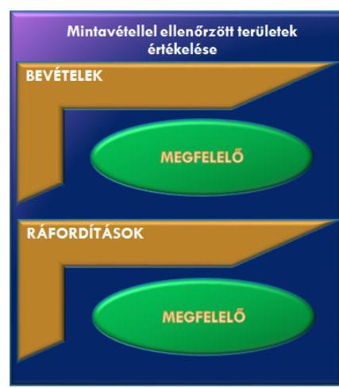

A pénzügyi-számviteli és az ellenőrzési feladatok ellátása szabályszerű volt, adatszolgáltatási kötelezettségét nem teljesítette a Társaság. Közzétételi kötelezettségének eleget tett.

A BEVÉTELEK elszámolása megfelelő volt, az értékesítés nettó árbevételének, az egyéb, rendkívüli és pénzügyi műveletek bevételeinek az elszámolása szabályszerűen történt. Az árbevétel számlázásakor, a költségvetési támogatások elszámolásakor az MT Zrt. a Számv. tv. és a belső szabályzatok előírásai szerint járt el. A mintavétellel ellenőrzött területek értékelését az 1. ábra mutatja.

A RÁFORDÍTÁSOK elszámolása megfelelő volt. A költségelszámolást alátámasztó dokumentumok rendelkezésre álltak, az előírt esetekben a tulajdonosi jóváhagyás megtörtént.

Az MT Zrt. a hátralékos követelésállományát kezelte, a megtett intézkedések hatására a határidőn túli követelések állománya a 2012. év végi 52,8 M Ft-ról az ellenőrzött időszak végére 19,9 M Ft-ra csökkent.

Az MT Zrt. ráfordításainak forrását alapvetően a költségvetésből juttatott támogatások biztosították. A kiállítások szervezésének, egyéb önálló tevékenységek díjának megállapítására előkalkuláció alapján került sor.

AZ ÉVES BESZÁMOLÓIT a Társaság a Számv. tv.-ben előírt tartalommal elkészítette, azokat a könyvvizsgáló hitelesítő záradékkal látta el. A tulajdonosi joggyakorló ${ }_{1,3}$ által elfogadott beszámolókat letétbe helyezte, közzétételi kötelezettségét teljesítette a Társaság.

---

2. táblázat

|  |   |
| --- | --- |
|  PÉNZÜGYI LÍZINGHEZ KAPCSOLÓDÓ |   |
|  ÁDÓSSÁGÁLLOMÁNY ALAKULÁSA (M FT) |   |
|  Évek | Pénzügyilízzing  |
|   | hátra levő  |
|   | tőkereszenek  |
|   | év végi állománya  |
|  2012.12.31. | 18,9  |
|  2013.12.31. | 14,6  |
|  2014.12.31. | 10,9  |
|  2015.12.31. | 6,8  |
|  Forrás: a Társaság 2012-2015. évi beszámolója |   |

A piackutatások, kampányok során keletkezett adatok kezelésére vonatkozó adatvédelmi szabályzattal az Info. tv. ${ }^{22} 24 . \S$ (3) bekezdésében előírtak ellenére 2015. június 30 -ig nem rendelkeztek. A 2015. július 1-jén hatályba léptetett adatvédelmi és adatbiztonsági szabályzat ${ }^{23}$ megfelelt a jogszabályi előírásoknak.

A Társaság, mint kormányzati szektorba sorolt egyéb szervezet nem tett eleget adatszolgáltatási kötelezettségének. Az Áht. ${ }^{24}$ 107. § (1) bekezdés előírásai ellenére - a pénzügyi lízing értékéről - az Ávr. ${ }^{25} 7$. számú melléklet 2. pontjában, 2015. január 1-jétől az Ávr. 5. számú melléklet 3. pontjában előírt adatszolgáltatási kötelezettségét az államháztartási miniszter felé nem teljesítette. A pénzügyi lízinghez kapcsolódó adósságállomány alakulását a 2. táblázat mutatja be. Nem teljesítette továbbá az Áht. 107. § (1) bekezdés előírásai ellenére a számviteli beszámoló adataival kapcsolatos államháztartási miniszter felé fennálló - adatszolgáltatási kötelezettségét, melynek tartalmát 2012-2014. években az Ávr. 7. számú melléklet 28. pontja, 2015. január 1-jétől az Ávr. 5. számú melléklet 24. pontja írt elő.

A BELSŐ ELLENŐRZÉST a Társaság a Bkr. ${ }^{26}$ előírásainak megfelelően kialakította és működtette, melynek feladatai kiterjedtek a vagyongazdálkodás ellenőrzésére is. A Társaság az ellenőrzési megállapítások alapján készült intézkedési tervek végrehajtását utóellenőrzés keretében nyomon követte.

# 4. A Társaság vagyongazdálkodása szabályszerű volt-e? 

## Összegző megállapítás

## A Társaság vagyongazdálkodása szabályszerű volt.

A vagyongazdálkodással kapcsolatos feladat- és hatásköröket, felelősségi viszonyokat az SZMSZ ${ }^{27}$-ben, és a számviteli szabályzatokban rögzítették. Az ellenőrzött időszakban végrehajtott selejtezések során, valamint az ingatlan hasznosításra vonatkozó bérleti szerződés megkötésekor szabályszerűen járt el a Társaság.

A VAGYON NYILVÁNTARTÁSÁT, a vagyonelemekben bekövetkezett változások követését a Számv. tv.-ben előírtaknak megfelelően folyamatosan vezetett analitikus és főkönyvi nyilvántartási rendszer biztosította. Az éves beszámolók mérlegét alátámasztó Számv. tv. 69. § (1) bekezdése szerinti leltárakat elkészítették.

VAGYONÁNAK ÉRTÉKÉT MEGŐRIZTE a Társaság, a mérlegfőösszeg az ellenőrzött időszakban 26,5\%-kal, 2 511,9 M Ft-ról 3 177,4 M Ft-ra emelkedett. A saját tőke értéke a 2012. január 1-jei 113,0 M Ft-ról 2015 végére 124,0 M Ft-ra, (9,7\%-kal) nőtt. A pénzeszközök az eszközök értékének 2012. január 1-jén 53,1\%-át, 2015. december 31-én 62,6\%-át alkották, az éves támogatások egy részének tárgy évet követő felhasználása miatt. A passzív időbeli elhatárolások forrásokon belüli aránya 2012. január 1-jén 75,6\%, 2015. december 31-én 80,0\% volt a múködésre, célfeladatokra kapott támogatásokkal összefüggésben.

A vagyon megóvása, értékének megőrzése érdekében gondoskodtak a tárgyi eszközök rendszeres időközönkénti karbantartásáról. A beruházások

---

értéke (576,1 M Ft) meghaladta az ellenőrzött időszakban elszámolt értékcsökkenés összegét (515,2 M Ft).

---

# JAVASLATOK 

Az ÁSZ tv. 33. § (1) bekezdésében foglaltak értelmében az ellenőrzött szervezet vezetője köteles a jelentésben foglalt megállapításokhoz kapcsolódó intézkedési tervet összeállítani és azt a jelentés kézhezvételétől számított 30 napon belül az ÁSZ részére megküldeni. Amennyiben az ellenőrzött szervezet vezetője nem küldi meg határidőben az intézkedési tervet, vagy továbbra sem elfogadható intézkedési tervet küld, az Állami Számvevőszék elnöke az ÁSZ tv. 33. § (3) bekezdése a) és b) pontjaiban foglaltakat érvényesítheti.

## a Magyar Turisztikai Ügynökség Zrt. vezérigazgatójának

1. Intézkedjen számviteli politika módosításáról annak érdekében, hogy az a Számv. tv.-ben elöírtaknak megfelelően tartalmazza azokat a gazdálkodóra jellemző szabályokat, előírásokat, módszereket, amelyekkel a Társaság meghatározza, hogy mit tekint a számviteli elszámolás, az értékelés szempontjából lényegesnek, jelentősnek.
(2. sz. megállapítás 2. bekezdése alapján)
2. Intézkedjen az önköltség számítás rendjére vonatkozó belső szabályzat elkészitéséről.
(2. sz. megállapítás 4. bekezdés 1. mondata alapján)
3. Intézkedjen, hogy a Társaság, mint kormányzati szektorba sorolt egyéb szervezet az adatszolgáltatási kötelezettségeit maradéktalanul teljesítse.
(3. sz. megállapítás 7. bekezdése alapján)

---

# MELLÉKLETEK 

- I. SZ. MELLÉKLET: ÉRTELMEZŐ SZÓTÁR
állami vagyon
a) Az állam tulajdonában lévő dolog, valamint a dolog módjára hasznosítható természeti erő,
b) az a) pont hatálya alá nem tartozó mindazon vagyon, amely vonatkozásában törvény az állam kizárólagos tulajdonjogát nevesíti,
c) az állam tulajdonában lévő tagsági jogviszonyt megtestesítő értékpapír, illetve az államot megillető egyéb társasági részesedés,
d) az államot megillető olyan immateriális, vagyoni értékkel rendelkező jogosultság, amelyet jogszabály vagyoni értékű jogként nevesít.
Forrás: Vtv. ${ }^{28}$ 1. § (2) bekezdése
2012. november 10-től az állami vagyon fogalma kiegészül a következő ponttal:
e) az állam tulajdonában lévő pénzügyi eszközök

Forrás: Vtv. 1. § (2) bekezdése
gazdasági társaság
A Ptk. 3:88. § (1) bekezdése szerint „a gazdasági társaságok üzletszerű közös gazdasági tevékenység folytatására, a tagok vagyoni hozzájárulásával létrehozott, jogi személyiséggel rendelkező vállalkozások, amelyekben a tagok a nyereségből közösen részesednek, és a veszteséget közösen viselik".
MNV Zrt.
Az állami vagyon felett, a Magyar Államot megillető tulajdonosi jogok és kötelezettségek összességét - a hatályos szabályozás szerint - az állami vagyon felügyeletéért felelős miniszter (jelenleg a nemzeti fejlesztési miniszter) gyakorolja. A miniszter feladatát nagy részben az MNV Zrt., mint tulajdonosi joggyakorló szervezet útján látja el.
tulajdonosi jogok gyakorlója 1.
2013. június 27-ig:

Az állami vagyon felett a Magyar Államot megillető tulajdonosi jogok és kötelezettségek összességét - ha törvény eltérően nem rendelkezik - az állami vagyon felügyeletéért felelős miniszter (a továbbiakban: miniszter) gyakorolja, aki e feladatát a Magyar Nemzeti Vagyonkezelő Zártkörűen Működő Részvénytársaság (a továbbiakban: MNV Zrt.), a Magyar Fejlesztési Bank, illetve a tulajdonosi joggyakorló szervezet útján látja el. A miniszter miniszteri rendeletben, a törvényben meghatározott állami vagyoni kör tekintetében, meghatározott időtartamra, a joggyakorlás egyes szabályainak meghatározásával - az őt megillető tulajdonosi jogok és kötelezettségek összességének, illetve azok meghatározott részének gyakorlóját az Áht. szerinti központi költségvetési szervek, ezek intézménye, továbbá a 100\%-ban állami tulajdonban álló gazdasági társaságok közül kijelölheti.
Forrás: Vtv. 3. § (1) és (2) bekezdései
2013. június 28-ától:

A rábízott állami vagyon felett az államot megillető tulajdonosi jogok és kötelezettségek összességét tulajdonosi joggyakorlóként:
a) ha törvény vagy miniszteri rendelet eltérően nem rendelkezik, a Magyar Nemzeti Vagyonkezelő Zártkörűen Működő Részvénytársaság (a továbbiakban: MNV Zrt.),
b) törvényben kijelölt személy vagy
c) az állami vagyon felügyeletéért felelős miniszter (a továbbiakban: miniszter) által rendeletben kijelölt személy gyakorolja.

---

[...] A miniszter e törvény felhatalmazása alapján - a meghatározott célok hatékonyabb elérése érdekében, miniszteri rendeletben, az ott meghatározott állami vagyoni kör tekintetében, meghatározott időtartamra - e törvény keretei között, a joggyakorlás egyes szabályainak meghatározásával - az államot megillető tulajdonosi jogok és kötelezettségek összességének, illetve azok meghatározott részének gyakorlóját az Áht. szerinti központi költségvetési szervek, ezek intézménye, továbbá a 100\%-ban állami tulajdonban álló gazdasági társaságok közül kijelölheti.
Forrás: Vtv. 3. § (1) és (2) bekezdései
2.

Aki a nemzeti vagyon felett az államot vagy a helyi önkormányzatot megillető tulajdonosi jogok és kötelezettségek összességének gyakorlására jogosult
Forrás: Nvtv. ${ }^{29}$ 3. § (1) bekezdés 17. pontja

---

# FÜGGELÉK: ÉSZREVÉTELEK 

A jelentéstervezetet a Számvevőszék 15 napos észrevételezésre megküldte az ellenőrzött szervezetek vezetőinek az ÁSZ tv. 29. §* (1) bekezdése előírásának megfelelően.

Az ÁSZ a jelentéstervezetet észrevételezésre megküldte a Magyar Turisztikai Ügynökség Zrt. vezérigazgatójának, az MFB Magyar Fejlesztési Bank Zrt. elnök-vezérigazgatójának, a Magyar Nemzeti Vagyonkezelő Zrt. vezérigazgatójának és a Nemzetgazdasági Minisztérium miniszterének.

A Magyar Turisztikai Ügynökség Zrt. vezérigazgatójának, az MFB Magyar Fejlesztési Bank Zrt. elnök-vezérigazgatójának, a Magyar Nemzeti Vagyonkezelő Zrt. vezérigazgatójának észrevételét és az arra adott választ a függelék alább tartalmazza. A Nemzetgazdasági Minisztérium minisztere az ÁSZ tv. 29. § (2) bekezdésében foglalt észrevételezési jogával nem élt, a törvényes határidőn belül észrevételt nem tett.

[^0]
[^0]:    * 29. § (1) Az Állami Számvevőszék az ellenőrzési megállapításait megküldi az ellenőrzött szervezet vezetőjének vagy az általa megbízott személynek, és annak, akinek személyes felelősségét állapította meg.
    (2) Az ellenőrzött szervezet vezetője és a felelősként megjelölt személy az ellenőrzés megállapításaira tizenöt napon belül írásban észrevételt tehet.
    (3) Az Állami Számvevőszék az észrevételre a beérkezésétől számított harminc napon belül írásban válaszol. A figyelembe nem vett észrevételeket köteles a jelentésben feltüntetni, és megindokolni, hogy azokat miért nem fogadta el.

---

# Domokos László 

elnök
részére

## Állami Számvevőszék

Budapest
Apáczai Csere János u. 10.
1052
Tárgy: Észrevétel számvevőszéki jelentéstervezetre

## Tisztelt Elnök Úr!

A V-1192-132/2016. iktatószámú számvevőszéki jelentéstervezetet köszönettel megkaptam. A jelentéstervezetben szereplő javaslatok kapcsán az alábbi észrevételeket kívánom tenni.

## 1. sz. javaslat:

Intézkedjen a számviteli politika módosításáról annak érdekében, hogy a Számv. tv.-ben elöirtaknak megfelelően tartalmazza azokat a gazdálkodókra jellemző szabályokat, elöírásokat, módszereket, amelyekkel a Társaság meghatározza, hogy mit tekint a számviteli elszámolás, az értékelés szempontjából lényegesnek, jelentősnek.

## Észrevétel:

Az ellenőrzött időszakban a Társaságnál hatályos Számviteli Politikára vonatkozó 19. sz. szabályzat 4. oldal 5. bekezdése, illetve a 18. oldal 9.2. pontja tartalmazza a lényegességre vonatkozó információkat, ezért kérem a vonatkozó megállapítás és a hozzá kapcsolódó javaslat törlését a végleges jelentésből.
Fentiek alátámasztására a Számviteli Politikára vonatkozó szabályzat releváns részeit jelen észrevételhez mellékelten megküldöm.

## 2. sz. javaslat:

Intézkedjen az önköltség számítás rendjére vonatkozó belső szabályzat elkészitéséről.

## Észrevétel:

A Társaság az ellenőrzött időszakban rendelkezett Számviteli-Önköltségszámítási szabályzattal, ezért kérem a vonatkozó megállapítás és a hozzá kapcsolódó javaslat törlését a végleges jelentésből.
Fentiek alátámasztására az ellenőrzött időszakban hatályos Számviteli-Önköltségszámítási szabályzatot jelen észrevételhez mellékelten megküldöm.

## 3. sz. javaslat:

Intézkedjen, hogy a Társaság, mint kormányzati szektorba sorolt egyéb szervezet az adatszolgáltatási kötelezettségeit maradéktalanul teljesítse.

## Észrevétel:

A jelentéstervezetben foglaltak szerint intézkedtem a Társaság adatszolgáltatási kötelezettségének maradéktalan teljesítése iránt.

Budapest, 2017. július 27.
Tisztelettel:
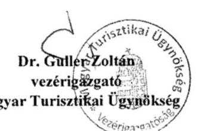

---

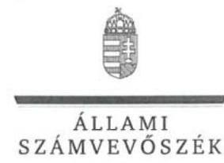

# Dr. Guller Zoltán úr 

vezérigazgató
Magyar Turisztikai Ügynökség Zrt.

## Budapest

## Tisztelt Vezérigazgató Úr!

A „Magyar Turisztikai Ügynökség Zrt. - Az állami tulajdonban (résztulajdonban) lévő gazdálkodó szervezetek vagyonmegőrzési és gazdálkodási tevékenységének ellenőrzése" címmel készített számvevőszéki jelentéstervezetre tett észrevételét köszönettel megkaptam.

Az Állami Számvevőszék észrevételre vonatkozó álláspontjáról a felügyeleti vezető által készített részletes tájékoztatást mellékelten megküldőm.

Tájékoztatom Vezérigazgató urat, hogy a számvevőszéki jelentésben - az Állami Számvevőszékről szóló 2011. évi LXVI. törvény 29. § (3) bekezdése alapján - a figyelembe nem vett észrevételt szerepeltetjük az el nem fogadás indokának feltüntetésével.

Budapest, 2017. 08. hó 11. nap

Tisztelettel:
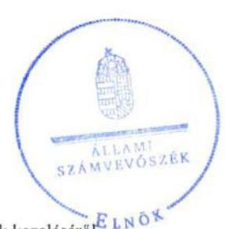

Domokos László

Melléklet: Tájékoztatás az észrevételek kezeléséről ${ }^{\text {E }}$ LNOX

---

# Tájékoztatás   az észrevételek kezeléséről 

A „Magyar Turisztikai Ügynökség Zrt. - Az állami tulajdonban (résztulajdonban) lévő gazdálkodó szervezetek vagyonmegőrzési és gazdálkodási tevékenységének ellenőrzése" címủ jelentéstervezetre 2017. július 28 -án érkezett észrevételét áttekintettük, annak kezelésével kapcsolatban a következő tájékoztatást adom.

## A jelentéstervezet 1. számú javaslatához kapcsolódó észrevételre adott válasz:

A számviteli politika módosítására vonatkozó észrevételüket értékeltük, amely alapján a számviteli politika valóban tartalmazza a Számv. tv. 16. § (4) bekezdésében előírtak szerint, hogy ,,a társaság lényeges információ elmaradásából vagy téves bemutatásából mit tekint lényegesnek." (a beszámoló szempontjából lényeges hiba és hibahatás mértéke.) Ugyanakkor nem tartalmazza a számviteli politika a Számv. tv. 14. § (4) bekezdésében előírtak ellenére, hogy a Társaság mit tekint a számviteli elszámolás, az értékelés szempontjából lényegesnek, jelentősnek. Mindezekre tekintettel az ÁSZ megállapítása helytálló, a jelentéstervezet módosítása nem indokolt.

## A jelentéstervezet 2. számú javaslatához kapcsolódó észrevételre adott válasz:

Az önköltségszámítási szabályzathoz kapcsolódó észrevételüket és a becsatolt szabályzatot (amely az ellenőrzés dokumentumai között is megtalálható) ismételten értékeltük, amely alapján a szabályzat érvényességi kellék, aláírás hiányában nem fogadható el. Ezért az ÁSZ megállapítása helytálló, a jelentéstervezet módosítása nem indokolt.

## A jelentéstervezet 3. számú javaslatához kapcsolódó észrevételre adott válasz:

Az adatszolgáltatási kötelezettség maradéktalan teljesítésével kapcsolatos tájékoztatást köszönjük. Az észrevétel a jelentéstervezet megállapítását nem vitatja és az ellenőrzés lefolytatását követően már végrehajtott intézkedésről tájékoztat. Ezért a megállapítás és a hozzá kapcsolódó javaslat helytálló, a jelentéstervezet módosítása nem indokolt.

Budapest, 2017. 05. hó $A A$ nap

Makkai Mária
felügyeleti vezető

---

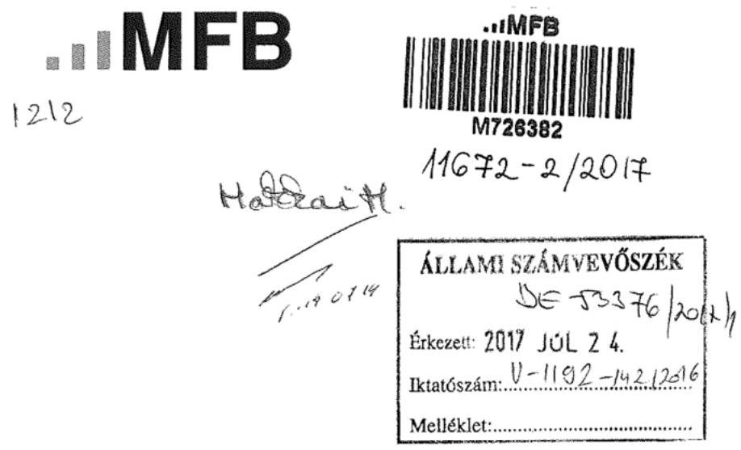
2017. július 7-én köszönettel kézhez vettük az Állami Számvevőszék „Az állami tulajdonban (résztulajdonban) lévő gazdálkodó szervezetek vagyonmegőrzési és gazdálkodási tevékenységének ellenőrzése - Magyar Turisztikai Ügynökség Zrt. " című V-1192-131/2016. iktatási számú jelentéstervezetet, amelyre vonatkozóan az alábbi észrevételeket tesszük.

1. A jelentéstervezet 13. oldalának 2. bekezdésében foglaltakkal nem értünk egyet.

A Társaság a 2013. április 23. előtt is rendelkezett pénzkezelési szabályzattal. Jelen levelünk mellékleteként csatoljuk a 2011. március 31-től érvényes Pénz- és értékkezelési Szabályzatot, ami alapján megállapítható, hogy az MFB Zrt. tulajdonosi joggyakorlásával érintett időszakban a jelezett hiányosság nem állt fenn.
2. A jelentéstervezet 13. oldalának 3. bekezdésében foglaltakkal nem értünk egyet.

2011-ben történt meg a Társaság szabályzatainak teljes körű felülvizsgálata, aminek keretében meghatározásra került a szabályozási struktúra és a módosítások főbb iránya. Ezt követően intézkedési tervben megjelölt felelősökkel és határidőkkel lezajlott az új működési elvárásoknak megfelelő aktualizálási munka, aminek keretében a Társaság a 2007. óta hatályban lévő önköltség-számítási szabályzat felülvizsgálatát 2012. májusában készre jelentette. Az aláírt szabályzat nem áll az MFB Zrt. rendelkezésére, azonban a Társaság dokumentumai között az aláírt szabályzatnak rendelkezésre kell állnia.

A fentiek alapján kérjük a hivatkozott bekezdések szíves módosítását.
Budapest, 2017. július 17.
Tisztelettel:
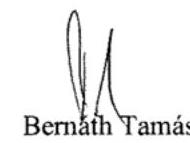
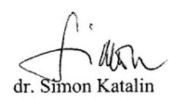

# Mellékletek: 

1. számú melléklet: Magyar Turizmus Zrt. - Pénz- és értékkezelési Szabályzat

---

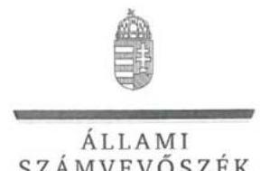

ELNÖK

Ikt.szám: V-1192-143/2016.

Bernáth Tamás úr
elnök-vezérigazgató
MFB Magyar Fejlesztési Bank Zrt.

Budapest

Tisztelt Elnök-vezérigazgató Úr!

A „Magyar Turisztikai Ügynökség Zrt. – Az állami tulajdonban (résztulajdonban) lévő gazdálkodó szervezetek vagyonmegőrzési és gazdálkodási tevékenységének ellenőrzése” címmel készített számvevőszéki jelentéstervezetre tett észrevételét köszönettel megkaptam.

Az Állami Számvevőszék észrevételre vonatkozó álláspontjáról a felügyeleti vezető által készített részletes tájékoztatást mellékelten megküldöm.

Tájékoztatom Elnök-vezérigazgató urat, hogy a számvevőszéki jelentésben – az Állami Számvevőszékről szóló 2011. évi LXVI. törvény 29. § (3) bekezdése alapján – a figyelembe nem vett észrevételt szerepeltetjük az el nem fogadás indokának feltüntetésével.

Budapest, 2017. 08. hó 08. nap

Tisztelettel:

Melléklet: Tájékoztatás az észrevételek kezeléséről ELNÖK

1052 BUDAPEST, APÁGZIN CSERE JÁNOS UTCA 10. 1364 Budapest 4. Pf. 54 telefon. 484 9101 fax: 484 9201

---

# Tájékoztatás   az észrevételek kezeléséről 

A „Magyar Turisztikai Úgynökség Zrt. - Az állami tulajdonban (résztulajdonban) lévő gazdálkodó szervezetek vagyonmegőrzési és gazdálkodási tevékenységének ellenőrzése" címü jelentéstervezetre 2017. július 24 -én érkezett észrevételét áttekintettük, annak kezelésével kapcsolatban a következő tájékoztatást adom.

## A jelentéstervezet 13. oldalának 2. bekezdésére tett észrevételre adott válasz:

A pénzkezelési szabályzattal kapcsolatos észrevétel értékeléséhez ismételten áttekintettük az ellenőrzés során rendelkezésére bocsátott dokumentumokat, valamint a Társaság vezérigazgatója által tett és aláirt teljességi és hitelességi nyilatkozatot. Ezek alapján megállapítható, hogy az észrevételhez csatolt Pénz- és értékkezelési Szabályzatot a Társaság nem bocsátotta az ellenőrzés rendelkezésére. Ezt megerősíti a Társaság által adott teljességi és hitelességi nyilatkozat, amelyben arról nyilatkozott, hogy valamennyi rendelkezésére álló dokumentumot az ellenőrzésnek átadott, a nyilatkozat az érintett szabályozást nem tartalmazta.
Tájékoztatom, hogy az ellenőrzés megállapításai az ÁSZ törvény 28. § (2) bekezdése alapján az ellenőrzött szervezetek által az ellenőrzés lefolytatásához a törvényi határidőben rendelkezésre bocsátott dokumentumokon alapulhatnak. Az észrevétel kezelésére értelemszerüen már az adatszolgáltatási szakasz lezárását követően kerül sor, tehát az észrevételhez csatolt, de az adatszolgáltatási szakaszban át nem adott dokumentum ezért nem vehető figyelembe. Mindezekre tekintettel az ÁSZ megállapítása helytálló, a jelentéstervezet módosítása nem indokolt.

## A jelentéstervezet 13. oldalának 3. bekezdésére tett észrevételre adott válasz:

Köszönjük az önköltségszámítási szabályzattal kapcsolatos tájékoztatást, kiegészítő információt, amely tartalmazza, hogy az MFB Zrt. nem rendelkezik a Társaság vonatkozásában aláirt szabályzattal. Tájékoztatom, hogy a Társaság aláírás nélküli szabályzatot bocsátott az ellenőrzés rendelkezésére, amely hatályos, érvényben lévő dokumentumnak nem fogadható el. Ezért a megállapítás helytálló, a jelentéstervezet módosítása nem indokolt.

Budapest, 2017. 08. hó 08. nap

Makkai Mária
felügyeleti vezető

---

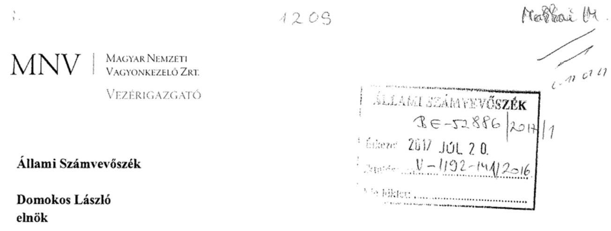

Tisztelt Elnök Úr!

Tájékoztatom, hogy a 2017. július 7. napján „Az állami tulajdonban (résztulajdonban) lévő gazdálkodó szervezetek vagyonmegőrzési és gazdálkodási tevékenységének ellenőrzése - Magyar Turisztikai Ügynökség Zrt." tárgyában kézhez vett, V-1192-134/2016. ikt. sz. Jelentés-tervezetre az alábbi észrevételeket tesszük, amelyekkel kérjük a Jelentés-tervezet hivatkozott részeit kiegészíteni.
„Összegzés Föbb megállapítások, következtetések" / 5. oldal negyedik bekezdése és „Megállapítások 1. A tulajdonosi jogok gyakorlása szabályszerü volt-e? Összegzö megállapítás" / 12. oldal második bekezdése:

A Jelentés-tervezet megállapítja, hogy a Turisztikai Ügynökség Zrt. (a továbbiakban: Társaság) FB tagjainak a létszáma nem felelt meg a jogszabályban elöírtaknak a 2014. július 1. napja és 2014. december 18. napja közötti időszakban és a tulajdonosi joggyakorló ebben az időszakban az FB szabályos müködését nem biztosította.

Az MNV Zrt. 2014. július 16. napja és 2014. szeptember 11. napja közötti időszakban gyakorolta a tulajdonosi jogokat a Társaság felett, 2014. július 15. napjáig az MFB Zrt., 2014. szeptember 12. napjától pedig a Nemzetgazdasági Minisztérium (a továbbiakban: NGM) töltötte be ezt a szerepet.

A jelzett időszakban a Társaság felügyelőbizottságában - a minimális 3 tag helyett - 2 tag müködött, tekintettel arra, hogy egy tag megbízása 2014. július 1. napjával lejárt. Tekintettel arra, hogy az MNV Zrt. 2014. július 16. napján vette át a Társaság feletti tulajdonosi jogok gyakorlását, ezért álláspontunk szerint az akkori tulajdonosi joggyakorlóként a mandátum lejártát megelőzően az MFB Zrt. feladata volt gondoskodni a harmadik FB tag megválasztásáról.

Figyelemmel arra, hogy az MNV Zrt.-hez a Társaság kifejezetten átmeneti jelleggel került, ezért az új tulajdonosi joggyakorlónak volt célszerű intézkednie az üres FB tagságra megfelelő személy megválasztásáról.

---

Az MNV Zrt. átmeneti és szükségszerủ tulajdonosi joggyakorlói pozícióját támasztja alá az is, hogy az MNV Zrt. a Nemzeti Fejlesztési Minisztérium (a továbbiakban: NFM) vagyongazdálkodási főosztályvezetőjétől 2014. július 24. napján e-mailben azt a tájékoztatást kapta, hogy 2014. július 16. napján megtörtént a Társasághoz kapcsolódó, a központi költségvetésről szóló törvényben meghatározott, a turizmus támogatására szolgáló turisztikai célelőirányzat átadás-átvétele.

Az illetékes szaktárca (NGM) tulajdonosi joggyakorlásának biztosításának módjára vonatkozóan az NFM vagyonpolitikai álláspontja alapján elsődlegesen preferált megoldás a megbízási szerződésen alapuló tulajdonosi joggyakorlás biztosítása.

A fenti tájékoztatás alapján az NFM kérte az MNV Zrt. vezérigazgatójának intézkedését arra vonatkozóan, hogy az MNV Zrt. a Társaság feletti tulajdonosi jogok és kötelezettségek átadásának megkezdése érdekében vegye fel a kapcsolatot az NGM-mel és kezdje meg a megbízási szerződés egyeztetését az érintettek között, hogy annak aláírására mihamarabb sor kerülhessen. A megbízási szerződés megkötéséről a 377/2014. (VII. 30.) VIG határozattal döntött az MNV Zrt., de a megbízási szerződés nem került aláírásra, mivel a 38/2014. (IX. 4.) számú NFM rendelet (a továbbiakban: Rendelet) a Társaság felett az államot megillető tulajdonosi jogok és kötelezettségek gyakorlójának a Nemzetgazdasági Minisztériumot jelölte ki, 2014. szeptember 12. napi hatállyal.

A fentiek alapján egyértelműen megállapítható, hogy az MNV Zrt. mindent megtett annak érdekében, hogy a Társaság a lehető legkorábbi időpontban - az NFM által megjelölt formában - az NGM, mint végleges tulajdonosi joggyakorló kezelésébe kerüljön, amely szervezet később meghozta döntését a harmadik FB tag megválasztásáról.

Az MNV Zrt. átmeneti tulajdonosi joggyakorlása alatt nem merült fel olyan döntési helyezet, ami a felügyelőbizottság döntéshozatalát, véleményezését igényelte volna, így álláspontunk szerint a Társaság működőképességét az FB hiányos státusza nem veszélyeztette.

Kérem Elnök Urat, hogy a jelentés véglegesítése során jelen észrevételeinket szíveskedjenek figyelembe venni.

Budapest, 2017. július „19"
Üdvözlettel:
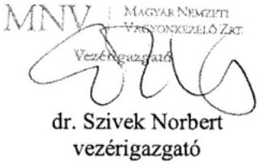

---

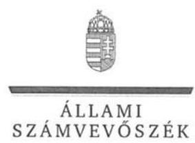

ELNÖK

Ikt.szám: V-1192-139/2016.

Dr. Szívek Norbert úr
vezérigazgató
Magyar Nemzeti Vagyonkezelő Zrt.

Budapest

# Tisztelt Vezérigazgató Úr! 

A „Magyar Turisztikai Ügynökség Zrt. - Az állami tulajdonban (résztulajdonban) lévő gazdálkodó szervezetek vagyonmegőrzési és gazdálkodási tevékenységének ellenőrzése" címmel készített számvevőszéki jelentéstervezetre tett észrevételét köszönettel megkaptam.

Az Állami Számvevőszék észrevételre vonatkozó álláspontjáról a felügyeleti vezető által készített részletes tájékoztatást mellékelten megküldőm.

Tájékoztatom Vezérigazgató urat, hogy a számvevőszéki jelentésben - az Állami Számvevőszékről szóló 2011. évi LXVI. törvény 29. § (3) bekezdése alapján - a figyelembe nem vett észrevételt szerepeltetjük az el nem fogadás indokának feltüntetésével.

Budapest, 2017. 07 hó 25 nap
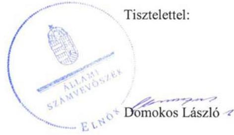

Melléklet: Tájékoztatás az észrevétel kezeléséről

---

# Tájékoztatás   az észrevétel kezeléséről 

A „Magyar Turisztikai Úgynökség Zrt. - Az állami tulajdonban (résztulajdonban) lévő gazdálkodó szervezetek vagyonmegőrzési és gazdálkodási tevékenységének ellenőrzése" címủ jelentéstervezetre 2017. július 20-án érkezett észrevételt áttekintettük, annak kezelésével kapcsolatban a következő tájékoztatást adom.

1. Az „Összegzés Főbb megállapítások, következtetések" / 5. oldal negyedik bekezdése és a „Megállapítások 1. A tulajdonosi jogok gyakorlása szabályszerű volt-e? Összegző megállapítás" / 12. oldal második bekezdésével kapcsolatban tett észrevételre adott válasz:

A Felügyelő Bizottság tagjainak létszámával kapcsolatos megállapításhoz tett tájékoztatást, magyarázatot köszönjük. A jelentéstervezet 5. oldal negyedik, valamint a 12. oldal második bekezdésében az FB müködésére tett megállapítás valamennyi tulajdonosi joggyakorlóra (MFB Zrt., MNV Zrt. és NGM) vonatkozik. Az észrevételben leírtak az ÁSZ megállapítását megerősítik, ezért a jelentéstervezet módosítása nem indokolt.

Budapest, 2017. 64 hó 25 . nap

Makkai Mária
felügyeleti vezető

---

.

---

# RÖVIDÍTÉSEK JEGYZÉKE 

${ }^{1}$ MT Zrt./Társaság
${ }^{2}$ MFB Zrt.
${ }^{3}$ MNV Zrt.
${ }^{4}$ NGM
${ }^{5}$ VM
${ }^{6}$ OMÉK
${ }^{7} \mathrm{M} \mathrm{Ft}$
${ }^{8}$ ÁSZ
${ }^{9}$ Gt.
${ }^{10}$ Ptk.
${ }^{11}$ Alapító Okiratok
${ }^{12}$ tulajdonosi joggyakorlók
${ }^{13} \mathrm{FB}$
${ }^{14}$ Taktv.
${ }^{15}$ Javadalmazási Szabályzat ${ }_{1-3}$

Magyar Turisztikai Ügynökség Zártkörűen Működő Részvénytársaság (2016. májustól, előtte az ellenőrzött időszak egészében Magyar Turizmus Zrt. volt az elnevezése)

Magyar Fejlesztési Bank Zrt.
Magyar Nemzeti Vagyonkezelő Zrt.
Nemzetgazdasági Minisztérium
Vidékfejlesztési Minisztérium
Országos Mezőgazdasági és Élelmiszeripari Kiállítás
millió forint
Állami Számvevőszék
2006. évi IV. törvény a gazdasági társaságokról
2013. évi V. törvény a Polgári Törvénykönyvről
Magyar Turisztikai Ügynökség Alapító Okirata
Alapító Okirat ${ }_{1}$ (hatályos 2011.11.21 és 2012.05.29 között);
Alapító Okirat ${ }_{2}$ (hatályos 2012.05.30 és 2012.07.25 között);
Alapító Okirat ${ }_{3}$ (hatályos 2012.07.26 és 2012.10.02 között);
Alapító Okirat ${ }_{4}$ (hatályos 2012.10.03 és 2013.05.13 között);
Alapító Okirat ${ }_{5}$ (hatályos 2013.05.14 és 2013.06.30 között);
Alapító Okirat ${ }_{6}$ (hatályos 2013.07.01 és 2013.12.20 között);
Alapító Okirat ${ }_{7}$ (hatályos 2013.12.21 és 2014.05.28 között);
(a 2014. március 15-től hatályos Ptk. 3:94. § szerint a részvénytársaság létesítő okirata Alapszabály),

Alapszabály ${ }_{8}$ (hatályos 2014.05.29 és 2014.12.19 között);
Alapszabály ${ }_{9}$ (hatályos 2014.12.20 és 2015.03.18 között);
Alapszabály ${ }_{10}$ (hatályos 2015.03.19-től)
tulajdonosi joggyakorló ${ }_{1}$ - MFB Zrt. 2012.01.01 és 2014.07.15 között;
tulajdonosi joggyakorló ${ }_{2}$ - MNV Zrt. 2014.07.16 és 2014.09.11 között;
tulajdonosi joggyakorló ${ }_{3}$ - NGM 2014.09.12 és 2015.12.31 között
MT Zrt. Felügyelő Bizottsága
2009. évi CXXII. törvény a köztulajdonban álló gazdasági társaságok takarékosabb müködéséről

MT Zrt. javadalmazási szabályzata ${ }_{1-3}$
MT Zrt. javadalmazási szabályzata ${ }_{1}$ (hatályos 2011. 06. 17 és 2013. 03. 10 között);

---

${ }^{16}$ Számv. tv.
${ }^{17}$ számviteli politika $_{1-2}$
${ }^{18}$ leltározási szabályzat
${ }^{19}$ értékelési szabályzat
${ }^{20}$ számlarend
${ }^{21}$ pénzkezelési szabályzat ${ }_{1-3}$
${ }^{22}$ Info.tv.
${ }^{23}$ adatvédelmi és adatbiztonsági szabályzat
${ }^{24}$ Áht.
${ }^{25}$ Ávr.
${ }^{26} \mathrm{Bkr}$.
${ }^{27}$ SZMSZ
${ }^{28} \mathrm{Vtv}$.
${ }^{29} \mathrm{Nvtv}$.

MT Zrt. javadalmazási szabályzata ${ }_{2}$ (hatályos 2013. 03. 11 és 2015. 10. 11 között);
MT Zrt. javadalmazási szabályzat ${ }_{3}$ (hatályos 2015. 10. 12-től)
2000. évi C. törvény a számvitelről

MT Zrt. számviteli politikája
számviteli politika ${ }_{1}$ (hatályos: 2011. 03. 31 és 2013. 1126 között);
számviteli politika ${ }_{2}$ (hatályos: 2013. 11. 27-től)
MT Zrt. leltározási szabályzata (hatályos: 2011. 03. 31-től)
MT Zrt. számvitel-értékelési szabályzata (hatályos: 2011. 03. 31-től)
MT Zrt. számlarendje (hatályos: 2011. 03. 31.-től)
MT Zrt. számvitel-pénz-értékkezelési és befektetési szabályzata
MT Zrt. pénzkezelési szabályzat ${ }_{1}$ (hatályos: 2014. 04. 23-tól)
MT. Zrt. pénzkezelési szabályzat ${ }_{2}$ (hatályos: 2014. 05. 11-től
MT Zrt. pénzkezelési szabályzat ${ }_{3}$ (hatályos: 2015. 12. 13-tól)
2011. évi CXII. törvény az információs önrendelkezési jogról és az információszabadságról

MT Zrt. szabályzata a személyes adatok védelméről (hatályos: 2015. 07. 01-jétől)
2011. évi CXCV. törvény az államháztartásról

368/2011. (XII. 31) Korm. rendelet az államháztartásról szóló törvény végrehajtásáról

370/2011. (XII. 31.) Korm. rendelet a költségvetési szervek belső kontrollrendszeréről és belső ellenőrzéséről
az MT Zrt. többször módosított szervezeti és működési szabályzata
2007. évi CVI. törvény az állami vagyonról
2011. évi CXCVI. törvény a nemzeti vagyonról (hatályos: 2012. január 1-jétől)

---

ÁLLAMI SZÁMVEVŐSZÉK
1052 Budapest, Apáczai Csere János utca 10.
Levélcím: 1364 Budapest 4. Pf. 54
Telefon: +36 14849100 Telefax: +36 14849200
www.asz.hu