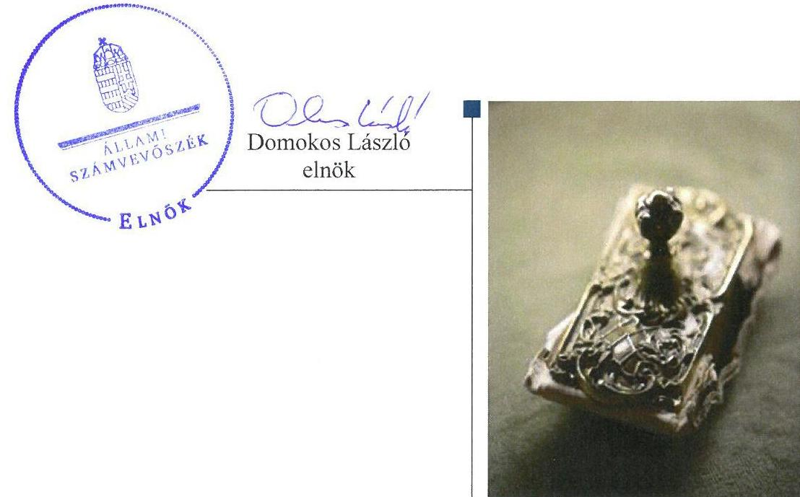
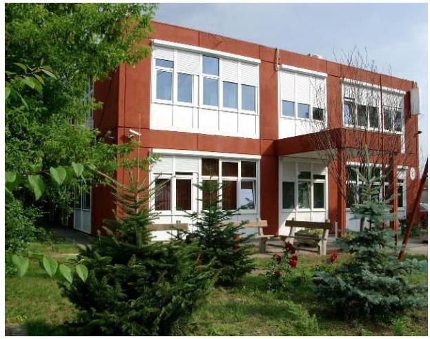
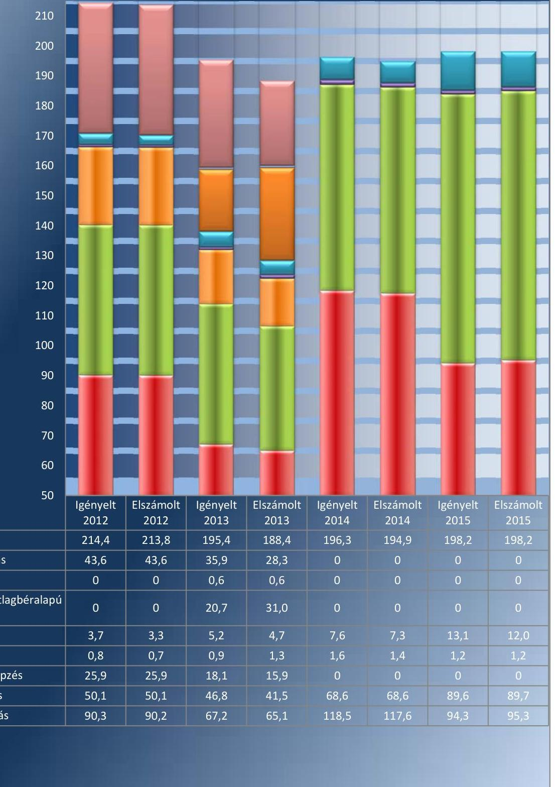
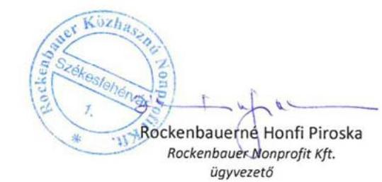
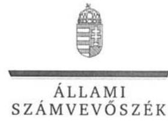
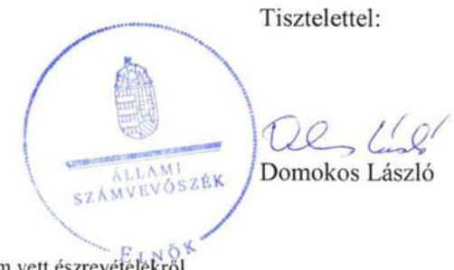
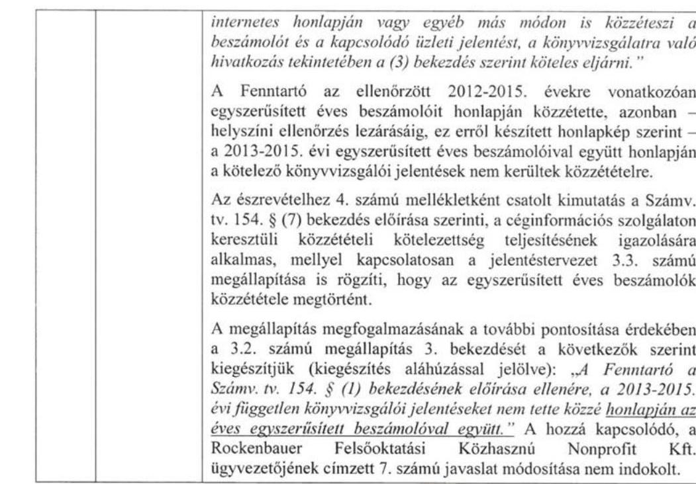
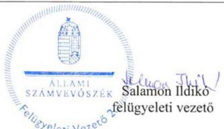

# Jelentés 

## Nem állami humánszolgáltatók ellenőrzése

A humánszolgáltatást nyújtó államháztartáson kívüli köznevelési intézmények, szolgáltatók fenntartói központi költségvetésből kapott támogatásai felhasználásának ellenőrzése Rockenbauer Felsőoktatási Közhasznú Nonprofit Kft.

2017

---

# Jelentés

## Nem állami humánszolgáltatók ellenőrzése

A humánszolgáltatást nyújtó államháztartáson kívüli köznevelési intézmények, szolgáltatók fenntartói központi költségvetésből kapott támogatásai felhasználásának ellenőrzése Rockenbauer Felsőoktatási Közhasznú Nonprofit Kft.
2017. 18. hó 22. nap

---

# AZ ELLENŐRZÉST FELÜGYELTE:

- **SALAMON ILDIKÓ** felügyeleti vezető

- **AZ ELLENŐRZÉST VEZETTE ÉS A VÉGREHAJTÁSÁÉRT FELELŐS:**

- **CSORDÁS PÉTERNÉ** ellenőrzésvezető

- **A PROGRAM ÖSSZEÁLLÍTÁSÁÉRT FELELŐS:**

- **JANIK JÓZSEF LÁSZLÓ** osztályvezető

**IKTATÓSZÁM: V-1240-089/2016.**

**TÉMASZÁM: 2274**

**ELLENŐRZÉS-AZONOSÍTÓ SZÁM: V076604**

Jelentéseink az Országgyűlés számítógépes hálózatán és az Interneten a www.asz.hu címen is olvashatóak.

---

# TARTALOMJEGYZÉK 

■ ÖSSZEGZÉS ..... 5
■ AZ ELLENŐRZÉS CÉLJA ..... 6
■ AZ ELLENŐRZÉS TERÜLETE ..... 7
■ AZ ELLENŐRZÉS HÁTTERE, INDOKOLTSÁGA ..... 8
■ A JELENTÉS LÉNYEGES KÉRDÉSKÖREI ..... 9
■ ELLENŐRZÉS HATÓKÖRE ÉS MÓDSZEREI ..... 10
■ MEGÁLLAPÍTÁSOK ..... 12
■ JAVASLATOK ..... 17
■ MELLÉKLETEK ..... 19
I. Sz. melléklet: Értelmező szótár ..... 19
II. Sz. melléklet: Az ellenőrzött központi költségvetési támogatások alakulása ..... 20
■ FÜGGELÉK: ÉSZREVÉTELEK ..... 21
■ RÖVIDÍTÉSEK JEGYZÉKE ..... 29

---

.

---

# ÖSSZEGZÉS 

A székesfehérvári székhelyű Rockenbauer Felsőoktatási Közhasznú Nonprofit Kft-nél a közfeladat-ellátás szervezeti kereteinek kialakítása összességében szabályszerű volt. A központi költségvetésből kapott támogatásokat szabályszerűen adta át a fenntartott intézményeknek. A közfeladat-ellátás során az átláthatóság érvényesülését nem biztosította, mivel nem gondoskodott a jogszabályokban előírt közérdekű adatok, dokumentumok közzétételéről.

## Az ellenőrzés társadalmi indokoltsága

Az Állami Számvevőszék stratégiájában hangsúlyos szerepet szán annak, hogy szilárd szakmai alapon álló, értékteremtő ellenőrzéseivel előmozdítsa a közpénzügyek átláthatóságát, rendezettségét és javaslataival a közpénzek és a közvagyon szabályos, gazdaságos, hatékony és eredményes felhasználását segítse. Stratégiájában az Állami Számvevőszék célul tűzte ki, hogy az államháztartáson kívülre nyújtott költségvetési támogatások ellenőrzésével hozzájárul ahhoz, hogy a közpénzeket az államháztartáson kívüli szervezetek is átlátható módon használják fel a közfeladatok szerződésben vállalt ellátása érdekében. Tekintettel az elmúlt években a köznevelés finanszírozását és a köznevelési intézmények fenntartását érintően végbement változásokra, a társadalom fokozott érdeklődéssel figyeli a köznevelési feladatok ellátására fordított források felhasználását. Fontos ezért az Állami Számvevőszéknek a közvéleményt biztosítani arról, hogy a közpénz államháztartáson kívüli felhasználása ezen a területen sem marad ellenőrizetlenül. Hozzájárul ezzel ahhoz is, hogy a nyilvánosság és az igénybe vevők megfelelő tájékoztatást kapjanak az államháztartáson kívüli közfeladatot ellátók működéséről.

## Főbb megállapítások, következtetések

A Rockenbauer Felsőoktatási Közhasznú Nonprofit Kft., mint intézményfenntartó a közfeladat-ellátás kereteit összességében a jogszabályi előírásoknak megfelelően alakította ki. A társasági szerződés és annak módosításai megfeleltek a jogszabályi előírásoknak, azokat a bíróság felé bejelentette. Rendelkezett a központi költségvetési támogatások igénybevételéhez előírt feltételekkel. A belső szabályozottság összességében megfelelt a jogszabályoknak, a számviteli politikát és a kapcsolódó szabályzatokat elkészítette, iratmegőrzési kötelezettségének azonban nem teljes körűen tett eleget, és nem rendelkezett érvényes iratkezelési szabályzattal.

A Rockenbauer Felsőoktatási Közhasznú Nonprofit Kft. az általa fenntartott intézmények működtetésének a kereteit összességében a jogszabályi előírásoknak megfelelően biztosította, az alapfeladatokat alapító okiratban meghatározta, a nyilvántartásokba vétel megtörtént és a szükséges működési engedélyek is rendelkezésre álltak. Az intézményi alapdokumentumokat a jogszabályokban előírtak szerint jóváhagyta, illetve azokhoz egyetértését adta. Az intézmények nyilvántartott adataiban bekövetkezett változásokról azonban a Kincstárat több esetben nem tájékoztatta. A központi költségvetésből kapott támogatásokat szabályszerűen átadta az intézményeknek, a támogatások felhasználásáról vezetett nyilvántartás megfelelt az előírásoknak.

A Rockenbauer Felsőoktatási Közhasznú Nonprofit Kft. a jogszabályi előírások ellenére nem biztosította az átláthatóság érvényesülését. Az intézmények pedagógiai programjaiban meghatározott feladatok végrehajtására, a pedagógiai-szakmai munka eredményességére vonatkozó értékelési feladatainak eleget tett, a fenntartói értékeléseket döntő részben nyilvánosságra hozta. A közérdekű adatok közzétételére vonatkozó kötelezettség teljesítésének részletes szabályait belső szabályzatban nem állapította meg és nem gondoskodott a közérdekű adatok jogszabály szerinti közzétételéről. A beszámoló készítési kötelezettségének a jogszabályi előírásoknak megfelelően eleget tett.

---

# AZ ELLENŐRZÉS CÉLJA 

AZ ELLENŐRZÉS CÉLJA annak értékelése volt, hogy a Fenntartó ${ }^{1}$ központi költségvetésből kapott támogatásainak felhasználása szabályszerű volt-e, a támogatások igénylése, évközi módosítása és év végi elszámolása megfelelt-e a jogszabályi előírásoknak.

---

# **AZ ELLENŐRZÉS TERÜLETE**

## **Rockenbauer Felsőoktatási Közhasznú Nonprofit Kft.**

A Rockenbauer Felsőoktatási Közhasznú Nonprofit Kft. 2009. február 11-én a Rockenbauer Felsőoktatási Közhasznú Társaság általános jogutódjaként, 6,0 M Ft jegyzett tőkével alakult. Alapítója három magánszemély volt. A székesfehérvári székhelyű Fenntartó tulajdonosi szerkezetében az ellenőrzött időszakban nem történt változás. A Fenntartó képviseletére az ügyvezető önállóan és korlátlanul jogosult, működésének és gazdálkodásának ellenőrzésére háromtagú felügyelőbizottságot hoztak létre.

A Fenntartó közfeladatként végzett fő tevékenysége az ellenőrzött időszakban a szakmai középfokú oktatás volt, amelynek ellátását 2009. július 15-étől két intézmény – a Comenius Iskola2 és a Dél-Balatoni Szakközépiskola3 – fenntartásával biztosította. 2015. évben a székhelyén kívül három-három telephelyen működött mind a két intézmény. Az Intézmények4 az alapító okiratuk alapján közoktatási feladatokat ellátó, önálló jogi személyiséggel rendelkező szervezetként működtek. Az Intézmények alapfeladatai között az ellenőrzött években az általános iskolai, gimnáziumi (két tanítási nyelvű) és szakközépiskolai nevelés-oktatás, felnőttoktatás, a 2011/2012 és 2012/2013 nevelési években kollégiumi ellátás, a 2015/2016-os nevelési évtől óvodai nevelés szerepelt. Az Intézmények engedélyezett tanulói létszáma 2012-ben 1590 fő, 2013-ban 1790 fő, 2014-ben 1790 fő, 2015-ben 1755 fő volt. A vonatkozó statisztikai adatok szerinti tényleges létszám minden évben az engedélyezett alatt alakult, 2012-ben 625 fő, 2013-ban 657 fő, 2014-ben 574 fő, 2015-ben 445 fő volt.

A Fenntartó 2012-2015 között minden évben központi költségvetési támogatás iránti igénylést nyújtott be a Kincstárhoz5, majd a kapott támogatásokkal a tárgyévet követően elszámolt. A II. melléklet tartalmazza az ellenőrzött központi költségvetési támogatások alakulását.

A Fenntartó - mint közfeladat-ellátásában részt vevő intézményfenntartó - Magyarország éves költségvetéséből támogatásra volt jogosult, amelynek összege az egyszerűsített éves beszámoló alapján a 2012. évben 212,9 M Ft, 2013. évben 189,1 M Ft, 2014. évben 194,6 M Ft, 2015. évben pedig 196,8 M Ft volt. A költségvetési támogatások 2012-ben az összes bevétel 52,9%-át, 2015-ben 54,2%-át tették ki. A költségvetési támogatásokon kívül a Fenntartó meghatározó jelentőségű bevételei az ellenőrzéssel érintett időszakban egyéb adományokból és a magánszemélyektől származó támogatásokból keletkeztek.

A szakmai irányító szervi feladatokat a Minisztérium6 látta el az ellenőrzött időszakban, az ellenőrzési feladatokat az illetékes Kormányhivatal7 végezte.

---

# AZ ELLENŐRZÉS HÁTTERE, INDOKOLTSÁGA 

A köznevelési és szociális feladatokat ellátó nem állami intézményfenntartók részére közfeladataik ellátására évente jelentős összegű pénzügyi támogatást biztosítottak a mindenkori költségvetési törvények a bennük megfogalmazott feltételek mellett. A felhasználható állami támogatások Kvtv. ${ }^{8}$ szerinti előirányzata 2012-2015. években együtt 894,0 Mrd Ft volt. A 2013. évben jelentős változások következtek be a normatív finanszírozás rendszerében, amely érintette a nem állami intézményfenntartókat is. Az Országgyűlés elfogadta a nemzeti köznevelésről szóló 2011. évi CXC. törvényt, amely jelentősen átalakította a korábbi finanszírozási rendszert 2013 szeptemberétől. A köznevelési területen új feladatfinanszírozási forma (átlagbéralapú támogatás) jelent meg, amely a nem állami intézményfenntartókra is vonatkozik. Az ellenőrzés a finanszírozási rendszerben 2011-2015 között bekövetkezett változásokra, azok közfeladat-ellátásra gyakorolt hatására fókuszál a költségvetési támogatásokat felhasználó államháztartáson kívüli szervezetek körében. Az ellenőrzés indokoltságát az is alátámasztja, hogy az ÁSZ ${ }^{9}$ még nem ellenőrizte átfogóan e területet.

Az ÁSZ stratégiájában foglaltak alapján is indokolt az ellenőrzés, amely a társadalom számára jelzi, hogy a közpénz államháztartáson kívüli felhasználása sem maradhat ellenőrizetlenül. Az államháztartáson kívülre nyújtott költségvetési támogatások ellenőrzésével az ÁSZ hozzájárul ahhoz, hogy a közpénzeket a nem állami humán fenntartók átlátható módon használják fel a közfeladatok ellátására kötött szerződésekben vállalt kötelezettségek teljesítése érdekében. Az ellenőrzés javaslataival hozzájárulhat az említett rendszerek szabályszerű támogatás felhasználásához, javíthatja a társadalmi-gazdasági döntések megalapozottságát, amely a „jó kormányzás" feltétele.

---

# A JELENTÉS LÉNYEGES KÉRDÉSKÖREI 

1. A Fenntartónál a közfeladat-ellátás kereteinek kialakítása szabályszerű volt-e?
2. A Fenntartó a központi költségvetésből kapott támogatásokat szabályszerűen használta-e fel?
3. A Fenntartó közfeladat-ellátása során biztosította-e az átláthatóság érvényesülését?
4. A Fenntartó intézkedett-e a külső ellenőrzések megállapításaira?

---

# ELLENŐRZÉS HATÓKÖRE ÉS MÓDSZEREI 

## Az ellenőrzés típusa

Megfelelőségi ellenőrzés.

## Az ellenőrzött időszak

A 2012. január 1-je és 2015. december 31-e közötti évek. A 2012. év vonatkozásában a költségvetési támogatások 2012. évet megelőző időszakra eső igénylését, a 2015. év tekintetében annak 2016-ban történő elszámolását is ellenőrizte az ÁSZ.

## Az ellenőrzés tárgya

Az ellenőrzés a köznevelési közfeladatokat ellátó nem állami fenntartó, központi költségvetésből kapott támogatásai felhasználására terjedt ki. Az alábbi jogcímek szabályszerűségének értékelését foglalta magában:
$\longrightarrow$ az alap normatív- és átlagbér alapú költségvetési támogatások közül általános iskolai nevelés-oktatás, középfokú nevelés-oktatás, alapfokú művészetoktatás, kollégiumi ellátás,
$\longrightarrow$ a kiegészítő támogatások közül a tanulóétkeztetési-, és a tankönyvtámogatás.
Az ellenőrzés kiterjedt minden olyan körülményre és adatra, amely az ÁSZ jogszabályban meghatározott feladatainak teljesítéséhez, valamint a program végrehajtása folyamán felmerült újabb összefüggések feltárásához szükséges volt.

## Az ellenőrzött szervezet

Rockenbauer Felsőoktatási Közhasznú Nonprofit Kft.

## Az ellenőrzés jogalapja

Az ellenőrzés jogszabályi alapját az ÁSZ tv. ${ }^{10}$ 1. § (3) bekezdése és az 5. § (3) bekezdéseiben foglalt előírások adták.

---

# Az ellenőrzés módszerei 

Az ellenőrzést az ellenőrzési program kérdései, az adott időszakban hatályos jogszabályok, az ellenőrzés szakmai szabályok és módszertanok, valamint a nemzetközi standardok figyelembevételével végezte az ÁSZ.

A közpénzekkel való felelős gazdálkodás segítésére irányuló javaslatok kidolgozásakor a hatályos jogszabályok voltak az irányadóak.

Az ellenőrzés ideje alatt az ÁSZ a Fenntartóval történő kapcsolattartást az ÁSZ SZMSZ ${ }^{11}$-ének vonatkozó előírásai alapján biztosította.

Az ellenőrzési kérdések megválaszolásához szükséges bizonyítékok megszerzése az ellenőrzöttek által rendelkezésre bocsátott dokumentumokra, adatokra alapozva megfigyeléssel, szemlével (szemrevételezéssel), kérdésfeltevéssel (információkéréssel), valamint elemző eljárással történt.

Az ellenőrzési bizonyítékként felhasznált adatforrások közé tartoztak egyrészt a szakmai program részletes szempontjainál felsorolt adatforrások, másrészt minden - az ellenőrzés folyamán feltárt, az ellenőrzés szempontjából információt tartalmazó - dokumentum.

Az ellenőrzés lefolytatásához a Fenntartó a kitöltött tanúsítványok, valamint az ÁSZ által kért dokumentumok elektronikus úton való megküldésével szolgáltatott adatokat, információkat. Az így rendelkezésre bocsátott adatok, információk és a tanúsítványok adatai valódiságának kontrollja az ellenőrzés keretében történt.

A szabályosság megítélésének az alapját képezte, hogy a központi költségvetési támogatások Fenntartó általi igénylése és év végi elszámolása a Kincstár felé megtörtént.

A központi költségvetési támogatások szabályszerű felhasználását a Fenntartó vonatkozásában, a támogatások intézmények részére - azok működtetésére - történő továbbutalásának, valamint a támogatások felhasználásáról a jogszabályban előírt nyilvántartás vezetésének értékelésével végezte az ÁSZ.

---

# 1. A Fenntartónál a közfeladat-ellátás kereteinek kialakítása szabályszerű volt-e? 

## Összegző megállapítás

### 1.1. számú megállapítás

### 1.2. számú megállapítás

## A Fenntartó a közfeladat-ellátás kereteit összességében szabályszerűen alakította ki.

A Fenntartónál a közfeladat-ellátás szervezeti kereteinek kialakítása összességében megfelelt a jogszabályi előírásoknak.

A Fenntartó az ellenőrzött időszakban rendelkezett hatályos SZMSZ-szel ${ }^{12}$, közhasznú tevékenységét az ellenőrzött időszakban nonprofit korlátolt felelősségű társaság formában végezte, a társasági szerződés ${ }^{13}$, illetve annak módosításai megfeleltek
 a Gt. ${ }^{14}$, a Ptk. ${ }^{15}$ és Ptk. ${ }^{16}$ előírásainak. A társasági szerződéseket a Fenntartó jogi képviselője útján változásbejegyzési kérelemmel, határidőben megküldte az illetékes cégbíróságnak, amely azokat bejegyezte.

A Fenntartó a támogatásigényléshez benyújtott dokumentációja szerint - a támogatás igénylés alapját jelentő - Áht.-ban ${ }^{17}$ foglalt feltételeknek megfelelt, mivel átlátható szervezetnek minősült, továbbá rendezett munkaügyi kapcsolatokkal rendelkezett. A költségvetési támogatás igénylését megalapozó - Közokt. vhr.-ben ${ }^{18}$ és az Nkt. vhr.-ben ${ }^{19}$ előírtaknak megfelelő - dokumentumok és összesítő nyilvántartások a Fenntartónál rendelkezésre álltak. A Fenntartó rendelkezett információval az Intézmények OM azonosítóiról ${ }^{20}$, a gyermek, illetve tanuló létszámról, az alkalmazottakról.

A Fenntartó 2014. és 2015. évekre vonatkozóan a támogatásigénylési kérelmek, továbbá a 2015. júniusi támogatásigénylés módosítás benyújtását igazoló dokumentumokat nem őrizte meg, ami nem felelt meg az Ltt. 9. § 1) bekezdés e) pontjában rögzített - iratok szakszerű és biztonságos megőrzésére, használatra bocsátására vonatkozó - előírásoknak.

## A Fenntartó belső szabályozottsága összességében megfelelt a jogszabályi előírásoknak.

A Fenntartó a Számv. tv.-ben ${ }^{21}$ meghatározottak szerint elkészítette számviteli politikáját. A Fenntartó rendelkezett a számviteli politika keretében elkészítendő belső szabályzatokkal, a Számv. tv. előírásainak megfelelően elkészítették a leltározási ${ }^{22}$, az értékelési ${ }^{23}$ szabályzatot és a pénzkezelési ${ }^{24}$ szabályzatot, továbbá rendelkezett a Számv. tv. előírásainak megfelelő számlarenddel ${ }^{25}$. Önköltségszámítás rendjére vonatkozó belső szabályzat készítésére vonatkozó kötelezettség alól a Számv. tv. 14. § (6) bekezdése alapján mentesült, mivel egyszerűsített éves beszámolót készített.

A Fenntartó nem rendelkezett érvényes iratkezelési szabályzattal ${ }^{26}$, mert a szabályzatot az Ltt. ${ }^{27}$ 10. § 1) bekezdés a) pontjában foglaltak ellenére nem az illetékes közlevéltár egyetértésével adta ki.

---

# 2. A Fenntartó a központi költségvetésből kapott támogatásokat szabályszerűen használta-e fel? 

Összegző megállapítás

2.1. számú megállapítás

A Fenntartó a központi költségvetésből kapott támogatásokat az Intézmények működtetésére, szabályszerűen használta fel.

A Fenntartó összességében a jogszabályi előírásoknak megfelelően biztosította az Intézmények működtetésének a kereteit.

A Fenntartó meghatározta az Intézmények alapfeladatait a Közokt. tv. ${ }^{28}$, illetve az Nkt. ${ }^{29}$ előírásaival összhangban az Intézmények alapító okirataiban. Az Intézmények az ellenőrzött időszakban szerepeltek az illetékes kormányhivatalok nyilvántartásában, a KIR ${ }^{30}$ nyilvántartásban, valamint rendelkeztek OM azonosítóval. A Fenntartónál rendelkezésre álltak a Közokt. tv.-ben, a Közokt. vhr.-ben, az Nkt.-ben, valamint az Nkt. vhr.-ben előírt hatályos intézményi működési engedélyek. A Fenntartó az engedélyezési eljárások során igazolta, hogy az Intézményei közfeladat-ellátásához szükséges személyi és tárgyi feltételeket biztosította.

A Fenntartó a 2012. január 1. és 2012. augusztus 31. közötti időszakot érintően a Közokt. tv.-ben előírtaknak megfelelően jóváhagyta az intézményi SZMSZ-eket, minőségirányítási programokat, pedagógiai programokat és házirendeket. Az Nkt.-ben előírtaknak megfelelően a 2012. szeptember 1. és 2015. december 31. közötti időszak vonatkozásában az Intézmények pedagógiai programjához, házirendjéhez, szervezeti és működési szabályzatához egyetértését adta. Az ellenőrzött időszakra a Fenntartó Intézményei számára a Közokt. tv. és az Nkt. előírásainak megfelelően a kérhető térítési díj megállapításának szabályait, a szociális alapon adható kedvezmények feltételeit meghatározta. Az intézmények vezetőjét az ellenőrzött időszakban a Közokt. tv. és az Nkt. előírásainak megfelelően a Fenntartó kinevezte, megbízta.

A Fenntartó a Közokt. vhr. 14. § (5) bekezdésében, valamint az Nkt. vhr. 37/H. § (1) bekezdésében rögzített, 8 napon belüli változás-bejelentési kötelezettségének nem tett eleget, mivel az Intézmények nyilvántartott adataiban - új telephely létesítését, telephely törlését, férőhelyek számának változását érintően - a 2012-2015. években bekövetkezett változásokról a Kincstárat nem tájékoztatta, 2015. évben az óvoda engedélyezése kapcsán jelentkező feladatváltozás bejelentési kötelezettségét elmulasztotta.

Az ellenőrzött időszakban a Fenntartó jóváhagyta az intézményi költségvetéseket, rendelkezett az Intézmények egyszerűsített éves beszámolóival.

## 2.2. számú megállapítás

A Fenntartó szabályszerűen átadta az Intézmények részére a központi költségvetési támogatásokat.

A központi költségvetési támogatások átadásának kötelezettségét a Fenntartó a hatályos Kvtv.-ek figyelembevételével betartotta, a költségvetési támogatás teljes összegét a jogszabályban előírt 15 napon belül átadta az Intézmények részére.

---

A költségvetési támogatások felhasználását a Fenntartó az analitikus nyilvántartásában vezette, amely 2012. január 1. és 2013. október 4. között a Közokt. vhr. vonatkozó rendelkezésének megfelelő volt, a normatív hozzájárulás és támogatás átadásával kapcsolatos adatok alaptevékenységenkénti bontásban való elkülönített és naprakész nyilvántartása biztosított volt. Az Nkt. vhr.-ben foglaltaknak megfelelően 2013. október 5. és 2015. december 31. között a Fenntartó a támogatások felhasználását alapfeladatonkénti bontásban elkülönítetten és naprakészen tartotta nyilván, amely tartalmazta, hogy a támogatások milyen határnappal kerültek átadásra és milyen célra kerültek felhasználásra.

# 3. A Fenntartó közfeladat-ellátása során biztosította-e az átláthatóság érvényesülését? 

## Összegző megállapítás

### 3.1. számú megállapítás

### 3.2. számú megállapítás

## A Fenntartó a közfeladat-ellátás során nem biztosította az átláthatóság érvényesülését.

A Fenntartó összességében biztosította, hogy a szolgáltatást igénybe vevők megfelelő információkhoz jussanak az Intézmények működéséről.

A Fenntartó rendszeresen ellenőrizte az Intézmények gazdálkodását, működésének törvényességét, hatékonyságát, a szakmai munka eredményességét. A Fenntartó a Közokt. tv., valamint az Nkt. előírásainak megfelelően az ellenőrzéssel érintett években értékelte a fenntartott Intézmények pedagógiai programjában meghatározott feladatok végrehajtását, a pedagógiai-szakmai munka eredményességét.

A Fenntartó az értékeléseket döntő részben nyilvánosságra hozta, azonban a Közokt. tv. 104. § (6) bekezdésének, illetve az Nkt. 85. § (3) bekezdésének - a fenntartói értékelés nyilvánosságra hozatalára vonatkozó - előírásait megsértve a Comenius Iskola 2014/2015. tanévére, valamint a Dél-Balatoni Szakközépiskola 2012/2013. és 2014/2015. tanévére vonatkozó értékeléseit honlapján nem hozta nyilvánosságra.

A Fenntartó az ellenőrzött időszakban nem biztosította a közérdekű adatok nyilvánosságát.

A Fenntartó az Info. tv. ${ }^{31}$ előírásainak megfelelően kialakította az Info. tv., valamint az egyéb adat- és titokvédelmi szabályok érvényre juttatásához szükséges eljárási szabályokat, azonban az Info. tv. 35. § (3) bekezdésében foglaltak ellenére a közérdekű adatok közzétételére vonatkozó kötelezettség teljesítésének részletes szabályait belső szabályzatban nem állapította meg.

A Fenntartó az Info. tv. 37.§ (1) bekezdés szerinti az elektronikus közzétételi kötelezettségének nem teljes körűen tett eleget, az Info. tv. 1. mellékletében felsorolt, általános közzétételi listán meghatározott adatokat nem, vagy nem teljes körűen tette közzé a honlapján ${ }^{32}$. Az általános közzétételi listán meghatározott adatok közül az alábbiak nem kerültek közzétételre:
I. Szervezeti, személyzeti adatok táblázatában: a szervezeti felépítés szervezeti egységek megjelölésével, az egyes szervezeti egységek

---

#### Abstract

feladatai, - II. Tevékenységre, működésre vonatkozó adatok táblázatában: a feladatot, hatáskört és alaptevékenységet meghatározó jogszabályok, közjogi szervezetszabályozó eszközök, az SZMSZ, vagy ügyrend, az adatvédelmi és adatbiztonsági szabályzat szövege; a közérdekű adatok megismerésére irányuló igények intézésének rendje; tevékenységére vonatkozó statisztikai adatgyűjtés eredményei, időbeli változásuk; a közérdekű adatokkal kapcsolatos kötelező statisztikai adatszolgáltatás Fenntartóra vonatkozó adatai, - III. Gazdálkodási adatok táblázatában: a foglalkoztatottak létszámára és személyi juttatásaira vonatkozó összesített adatok, illetve összesítve a vezetők és vezető tisztségviselők illetménye, munkabére, és rendszeres juttatásai, valamint költségtérítése, az egyéb alkalmazottaknak nyújtott juttatások fajtája és mértéke, továbbá, az alábbi adatok hiányosan kerültek közzétételre: - II. Tevékenységre, működésre vonatkozó adatok táblázatában: az alaptevékenységgel kapcsolatos vizsgálatok, ellenőrzések nyilvános megállapításai. A Fenntartó a Számv. tv. 154. § (1) bekezdésének előírása ellenére, a 2013-2015. évi független könyvvizsgálói jelentéseket nem tette közzé honlapján az éves egyszerűsített beszámolóval együtt.

3.3. számú megállapítás

A Fenntartó a beszámoló készítési kötelezettségének a jogszabályoknak megfelelően eleget tett.

A Fenntartó könyvvezetési módja a Számv. tv. előírásainak megfelelően kettős könyvvitel volt, amit a társasági szerződésben, valamint a számviteli politikában ${ }^{33}$ rögzítettek. A Fenntartó évente kettős könyvvitellel alátámasztott, a Számv. tv. szerinti egyszerűsített éves beszámolót készített, valamint a Civil tv. előírása szerint elkészítette a beszámoló közhasznúsági mellékletét.

A könyvvizsgálatra kötelezett Fenntartó egyszerűsített éves beszámolói az ellenőrzött időszak minden évében könyvvizsgáló vizsgálta felül, és hitelesítő záradékkal látta el.

A Fenntartó egyszerűsített éves beszámolói az Igazságügyi Minisztérium Céginformációs és az Elektronikus Cégeljárásban Közreműködő Szolgálat honlapján ${ }^{34}$ hozzáférhetőek.

# 4. A Fenntartó intézkedett-e a külső ellenőrzések megállapításaira? 

Összegző megállapítás

A Fenntartó intézkedett a külső ellenőrzések által tett, intézkedést igénylő megállapításokra.

A Kincstár a Fenntartó által benyújtott elszámolásokat az ellenőrzési időszak minden évében felülvizsgálta és annak eredményeként visszafizetési kötelezettséget állapított meg a 2012-2015. években, amelyeket a Fenntartó teljesített.

---

A Kincstár a 2013. évi normatíva elszámolási adatlapban rögzített mutatószámok megalapozottságának ellenőrzése eredményeként finanszírozási különbözetet állapított meg a Fenntartó terhére, a Fenntartó visszafizetési kötelezettségének határidőben eleget tett.

A Kormányhivatal a 2012-2014 években a fenntartói tevékenységgel összefüggésben törvényességi és hatósági ellenőrzéseket végzett. Felügyeleti bírságot egy esetben, 2014-ben szabtak ki, a feltárt hiányosság megszüntetése érdekében a Fenntartó intézkedett, bírságfizetési kötelezettségét teljesítette.

---

# JAVASLATOK 

Az ÁSZ tv. 33. § (1) bekezdésében foglaltak értelmében az ellenőrzött szervezet vezetője köteles a jelentésben foglalt megállapításokhoz kapcsolódó intézkedési tervet összeállítani és azt a jelentés kézhezvételétől számított 30 napon belül az ÁSZ részére megküldeni. Amennyiben az ellenőrzött szervezet vezetője nem küldi meg határidőben az intézkedési tervet, vagy továbbra sem elfogadható intézkedési tervet küld, az Állami Számvevőszék elnöke az ÁSZ tv. 33. § (3) bekezdés a) és b) pontjaiban foglaltakat érvényesítheti.

## Rockenbauer Felsőoktatási Közhasznú Nonprofit Korlátolt Felelősségű Társaság ügyvezetőjének

1. Intézkedjen - a jogszabályi előírásoknak megfelelően - a támogatásigénylési kérelmek, továbbá a támogatásigénylés módosítás benyújtását igazoló dokumentumok irattári anyagainak szakszerű és biztonságos megőrzésére.
(1.1. számú megállapítás 3. bekezdése alapján)
2. Intézkedjen a jogszabályi előírásnak megfelelő iratkezelési szabályzat kiadására.
(1.2. számú megállapítás 2. bekezdése alapján)
3. Intézkedjen az Nkt. vhr-ben előírtaknak megfelelően a köznevelési intézmények Kincstár által nyilvántartott adataiban, valamint a feladataiban bekövetkezett változás esetén a változás-bejelentés teljesítésére.
(2.1 számú megállapítás 3. bekezdése alapján)
4. Intézkedjen - a jogszabályi előírásnak megfelelően - a nevelési-oktatási intézmények pedagógiai programjában meghatározott feladatok végrehajtásával, a pedagógiai-szakmai munka eredményességével összefüggő fenntartói értékelések teljes körű nyilvánosságra hozatalára.
(3.1. számú megállapítás 2. bekezdése alapján)
5. Intézkedjen a jogszabályi előírásoknak megfelelően a közérdekű adatok közzétételére vonatkozó kötelezettség teljesítése részletes szabályainak belső szabályzatban történő megállapítására.
(3.2. számú megállapítás 1. bekezdése alapján)

---

6. Intézkedjen a jogszabályi előírásnak megfelelően az Info. tv. 1. melléklet szerinti általános közzétételi listában meghatározott adatok teljes körű közzétételére.
(3.2. számú megállapítás 2. bekezdése alapján)
7. Intézkedjen a jogszabályi előírásnak megfelelően a független könyvvizsgálói jelentés közzétételére.
(3.2 számú megállapítás 3. bekezdése alapján)

---

# MELLÉKLETEK 

- I. SZ. MELLÉKLET: ÉRTELMEZŐ SZÓTÁR
átlagbéralapú támogatás
feladatfinanszírozás
humánszolgáltatás
intézményfenntartó
köznevelési alapfeladat
köznevelési intézmény
közoktatási információs rendszer / köznevelés információs rendszer (KIR) nem állami fenntartású köznevelési intézmények

Az átlagbér alapú támogatás alapja a pedagógus-munkakörben, valamint nevelő-, oktató munkát közvetlenül segítő munkakörben foglalkoztatottak után kifizetett személyi juttatás és járulék. (2013. évi CCXXX. törvény Magyarország 2014. évi központi költségvetéséről 33. § (4) bekezdés)
A közfeladat államháztartáson kívüli szervezet által történő ellátásához közvetlenül kapcsolódó, arányos működési költségeket finanszírozó költségvetési támogatás. (az egyesülési jogról, a közhasznú jogállásról, valamint a civil szervezetek működéséről és támogatásáról szóló 2011. évi CLXXV. törvény 2. § (8) bekezdés)
Szociális, gyermekjóléti,

 gyermekvédelmi, közoktatási, felsőoktatási, kulturális közfeladatok. (2011. évi Kvtv. és a 2012. évi Kvtv.)
Az a természetes vagy jogi személy, aki vagy amely a köznevelési feladat ellátására való jogosultságot megszerezte vagy azzal rendelkezik, és - e törvényben foglalt esetben a működtetővel közösen - a köznevelési intézmény működéséhez szükséges feltételekről gondoskodik. (Nkt. 4. § 9. pont)
A köznevelési intézmény alapító okiratában foglalt feladat: óvodai nevelés, nemzetiséghez tartozók óvodai nevelése, általános iskolai nevelés-oktatás, nemzetiséghez tartozók általános iskolai nevelése-oktatása, kollégiumi ellátás, nemzetiségi kollégiumi ellátás, gimnáziumi nevelés-oktatás, szakközépiskolai nevelés-oktatás, szakiskolai nevelés-oktatás, nemzetiségi gimnáziumi nevelés-oktatása, nemzetiségi szakközépiskolai nevelés-oktatása, nemzetiségi szakiskolai nevelés-oktatása, Köznevelési Hídprogramok keretében folyó nevelés-oktatás, felnőttoktatás, alapfokú művészetoktatás, fejlesztő nevelés, fejlesztő nevelés-oktatás, pedagógiai szakszolgálati feladat, a többi gyermekkel, tanulóval együtt nevelhető, oktatható sajátos nevelési igényű gyermekek, tanulók óvodai nevelése és iskolai nevelése-oktatása, azoknak a sajátos nevelési igényű gyermekeknek, tanulóknak az óvodai, iskolai, kollégiumi ellátása, akik a többi gyermekkel, tanulóval nem foglalkoztathatók együtt, a gyermekgyógyüdülőkben, egészségügyi intézményekben, rehabilitációs intézményekben tartós gyógykezelés alatt álló gyermekek tankötelezettségének teljesítéséhez szükséges oktatás, pedagógiai-szakmai szolgáltatás.(Nkt. 4. § 1. pont)
A köznevelési intézmény a törvényben meghatározott köznevelési feladatok ellátására létesített intézmény. A köznevelési intézmény a fenntartójától elkülönült, önálló költségvetéssel rendelkező jogi személy, amely a nyilvántartásba való bejegyzéssel, a bejegyzés napján jön létre. (Nkt. 21. § (1) bekezdés)
A KIR a közoktatás feladataiban közreműködők által szolgáltatott adatokra épülő, országos, elektronikus nyilvántartási és adatszolgáltatási rendszer. (20/1997. (II. 13.) Korm. rendelet 11. § (1) bekezdése)
nem az állam és nem az önkormányzat által fenntartott egyházi és magán köznevelési intézmények

---

# II. SZ. MELLÉKLET: AZ ELLENŐRZÖTT KÖZPONTI KÖLTSÉGVETÉSI TÁMOGATÁSOK ALAKULÁSA 

## Az ellenőrzött központi költségvetési támogatások alakulása

Ferrás: Fenntartó tanúsítványai

---

# FÜGGELÉK: ÉSZREVÉTELEK 

Az Állami Számvevőszék a jelentéstervezetet 15 napos észrevételezésre megküldte az ellenőrzött szervezet vezetőjének az ÁSZ tv. 29. § (1) bekezdése előírásának megfelelően.

A Rockenbauer Felsőoktatási Közhasznú Nonprofit Kft. részéről az ellenőrzött szervezet vezetője az ellenőrzés megállapításaira írásban észrevételt tett.
A függelék tartalmazza az ellenőrzött szervezet vezetőjének az észrevételeit és az azokra adott válaszokat, a figyelembe nem vett észrevételekről, azok indokairól szóló tájékoztatásokat.

[^0]
[^0]:    * 29. § (1) Az Állami Számvevőszék az ellenőrzési megállapításait megküldi az ellenőrzött szervezet vezetőjének vagy az általa megbízott személynek, és annak, akinek személyes felelősségét állapította meg.
    (2) Az ellenőrzött szervezet vezetője és a felelősként megjelölt személy az ellenőrzés megállapításaira tizenöt napon belül írásban észrevételt tehet.
    (3) Az Állami Számvevőszék az észrevételre a beérkezésétől számított harminc napon belül írásban válaszol. A figyelembe nem vett észrevételeket köteles a jelentésben feltüntetni, és megindokolni, hogy azokat miért nem fogadta el.

---

# 1135 

## Rockenbauer

Közhasznú Nonprofit Kft.

## Állami Számvevőszék

## Domokos László

## Elnök Úr

részére

Tisztelt Domokos László Elnök Úr!

A „Nem állami humánszolgáltató ellenőrzése" körében a Rockenbauer Felsőoktatási Közhasznú Nonprofit Kft-nél folytatott Állami Számvevőszék ellenőrzése kapcsán készített V-1240-069/2016 számú számvevőszéki jelentéstervezetet megkaptuk. Az ellenőrzés megállapításaira, javaslataira az alábbi észrevételeket tesszük:

### 1.1 számú megállapítás:

„A fenntartó 2014. és 2015. évekre vonatkozóan a támogatási igénylési kérelmek-, továbbá a 2015. június havi támogatósigénylés módosítás benyújtását igazoló dokumentumokat nem őrizte meg..."

A fenntartó 2014. évre vonatkozóan a támogatás igénylési kérelem benyújtását igazoló dokumentumot megőrizte.

Mellékeljük

- 2014. évi januári igénylőlapot, melyet kézbesítve aláírással és pecséttel ellátva érkeztette az Államkincstár az átvétel napjával. (1. sz. melléklet)
- 2014. október 1-i igénylőlap kísérőlevelét és a küldemény postai feladóvevényét. (2. sz. melléklet)

### 2.1 számú megállapítás:

„a fenntartó 2012-2015. években bekövetkezett változásokról a Kincstárat nem tájékoztatta, 2015. évben a óvoda engedélyezése kapcsán jelentkezett feladatváltozás bejelentési kötelezettségét elmulasztotta..."

A fenntartó az ellenőrzött időszakban bekövetkezett változásokról a Kincstárt tájékoztatta, az óvoda engedélyezése kapcsán jelentkező feladatváltozás bejelentési kötelezettségének eleget tett.

Mellékelten megküldjük a Magyar Államkincstár által kiállított igazolást a benyújtott és iktatott változást bejelentő dokumentumokról. (3. sz. melléklet)

---

# 3.2 számú megállapítás 3. bekezdése 

„A fenntartó a Számv. tv 154 § (1) bekezdésének előírása ellenére a 2013-2015.évi független könyvvizsgálói jelentéseket nem tette közzé..."
154. § (1) ${ }^{721}$ Minden kettős könyvvitelt vezető vállalkozó (ideértve a külföldi székhelyű vállalkozás magyarországi fióktelepét is) köteles az éves beszámolót, illetve az egyszerűsített éves beszámolót, kötelező könyvvizsgálat esetén a könyvvizsgálói záradékot vagy a záradék megadásának elutasítását is tartalmazó független könyvvizsgálói jelentéssel együtt közzétenni.

A fenntartó a számviteli törvényben foglaltaknak megfelelően a vizsgált években is, az éves beszámolók mellett csatolmányként a független könyvvizsgálói jelentést is közzétette az Igazságügyi Minisztérium Céginformációs oldalán.

Mellékeljük az Igazságügyi Minisztérium Céginformációs és az Elektronikus Cégeljárásban Közreműködő Szolgálat Elektronikus Beszámoló Portáljáról nyomtatott összesítő dokumentumot a Rockenbauer Felsőoktatási Közhasznú Nonprofit Kft évenkénti közzétételeiről. (4. sz. melléklet)

Székesfehérvár, 2017. július 13.

Tisztelettel:

Mellékletek:

1. sz.: Érkeztetett igénylő adatlap
2. sz.: Postai feladóvevény és kísérőlevél másolata
3. sz.: Magyar Államkincstár igazolása
4. sz.: Igazságügy Minisztérium Elektronikus Beszámoló Portál

---

ELNÖK

Ikt.szám: V-1240-082/2016.

# Rockenbauerné Honfi Piroska asszony 

ügyvezető
Rockenbauer Felsőoktatási Közhasznú Nonprofit Kft.

## Székesfehérvár

## Tisztelt Ügyvezető Asszony!

Köszönettel megkaptam a 2017. július 20. napján az Állami Számvevőszékhez érkezett „Nem állami humánszolgáltatók ellenőrzése - A humánszolgáltatást nyújtó államháztartáson kivüli köznevelési intézmények, szolgáltatók fenntartói központi költségvetésből kapott támogatásai felhasználásának ellenőrzése - Rockenbauer Felsőoktatási Közhasznú Nonprofit Kft." című számvevőszéki jelentéstervezetben foglalt megállapításokra írásban tett észrevételeket.

Tájékoztatom Ügyvezető asszonyt, hogy a jelentésben - az Állami Számvevőszékről szóló 2011. évi LXVI. törvény 29. § (3) bekezdése alapján - a figyelembe nem vett észrevételeket szerepeltetjük az el nem fogadás indokainak feltüntetésével együtt.

Az Állami Számvevőszék észrevételekre vonatkozó álláspontjáról a felügyeleti vezető által készített részletes tájékoztatást mellékelten megküldöm.

Budapest, 2017. 08 hó 09 nap

Melléklet: Tájékoztatás a figyelembe nem vett észrevételekről

---

# Tájékoztatás a figyelembe nem vett észrevételekról

|   | Észrevétel: | A 1.1. számú megállapításhoz kapcsolódóan tett észrevétel szerint: „A fenntartó 2014. évre vonatkozóan a támogatás igénylési kérelem benyújtását igazoló dokumentumokat megőrizte."  |
| --- | --- | --- |
|   |  | Az észrevétel érinti a Rockenbauer Felsőoktatási Közhasznú Nonprofit Kft. (Fenntartó) ügyvezetőjének címzett 1. számú javaslatot (1.1. számú megállapítás 3. bekezdés alapján).  |
|   | Válasz: | Az Állami Számvevőszék az észrevételt nem fogadja el.  |
|  1. | Indoklás: | Az ellenőrzési megállapítás arra irányult, hogy „A Fenntartó 2014. és 2015. évekre vonatkozóan a támogatásigénylési kérelmek-, továbbá a 2015. június havi támogatásigénylés módosítás benyújtását igazoló dokumentumokat nem őrizte meg".  |
|   |  | Az észrevételéhez 1. számú mellékletként csatolt (az ellenőrzés lefolytatása során már átadott), 2014. január havi támogatásigénylés módosítás átvételi dokumentuma, valamint a 2. számú mellékletként újonnan csatolt, 2014. október 28-i Kincstárnak küldött kísérő levél annak tárgya, az igénylés időszaka hiányában - nem alapozza meg az észrevételt, így az ellenőrzési megállapítás módosítását sem.  |
|   |  | Az ellenőrzés megállapításai az ÁSZ tv. 28. § (2) bekezdése alapján az ellenőrzött szervezetek által az ellenőrzés lefolytatásához a törvényi határidőben rendelkezésre bocsátott dokumentumokon alapulnak. Az ellenőrzés részére átadott dokumentumok ismételt felülvizsgálatát követően megállapítottuk, hogy a 2013 októberében benyújtandó, 2014. évre vonatkozó támogatásigénylési kérelem benyújtását igazoló dokumentumot nem bocsátottak az ellenőrzés rendelkezésére.  |
|   |  | A fentiek következtében, az észrevétel nem megalapozott, a megállapítás és a hozzá kapcsolódó javaslat módosítása nem indokolt.  |
|  2. | Észrevétel: | A 2.1 számú megállapításhoz kapcsolódóan tett észrevétel szerint „a fenntartó az ellenőrzött időszakban bekövetkezett változásokról a Kincstárt tájékoztatta, az óvoda engedélyezése kapcsán jelentkező feladatváltozás bejelentés kötelezettségének eleget tett."  |
|   |  | Az észrevétel érinti Rockenbauer Felsőoktatási Közhasznú Nonprofit Kft. ügyvezetőjének címzett 3. számú javaslatot (2.1. számú megállapítás 3. bekezdés alapján).  |

---

|  | Válasz: | Az Állami Számvevőszék az észrevételt nem fogadja el. |
| :--: | :--: | :--: |
|  | Indoklás: | Ellenőrzési megállapítás pontosan megjelölte, hogy a Fenntartó mely változás-bejelentési kötelezettségének nem tett eleget a jogszabályokban előírt, 8 napon belül: „A Fenntartó a Közokt. vhr. 14. § (5) bekezdésében, valamint az Nkt. vhr. 37/H. § (1) bekezdésében rögzített, 8 napon belüli változás-bejelentési kötelezettségének nem tett eleget, mivel az Intézmények nyilvántartott adataiban - új telephely létesítését, telephely törlését, férőhelyek számának változását érintően - a 2012-2015. években bekövetkezett változásokról a Kincstárat nem tájékoztatta, 2015. évben az óvoda engedélyezése kapcsán jelentkező feladatváltozás bejelentési kötelezettségét elmulasztotta."   Az ellenőrzés megállapításai az ÁSZ tv. 28. § (2) bekezdése alapján az ellenőrzött szervezetek által az ellenőrzés lefolytatásához a törvényi határidőben rendelkezésre bocsátott dokumentumokon alapulnak. Az ellenőrzés lefolytatásához nem adtak át olyan dokumentumot, amely hitelt érdemlően igazolja, hogy a 2012-2015. évi változások, ezen belül új telephely létesítése, telephely törlése, férőhelyek számának változása, óvodai feladatváltozás miatti bejelentési kötelezettségének a jogszabályokban előírtak szerinti 8 napon belül eleget tett.   A fentiek következtében, az észrevétel nem megalapozott, a megállapítás és a hozzá kapcsolódó javaslat módosítása nem indokolt. |
| 3. | Észrevétel: | A 3.1 számú megállapításhoz kapcsolódóan tett észrevétel szerint „a fenntartó a számviteli törvényben foglaltaknak megfelelően a vizsgált években is, az éves beszámolók mellett csatolmányként a független könyvvizsgálói jelentést is közzétette az Igazságügyi Minisztérium Céginformációs oldalán. "   Az észrevétel érinti Rockenbauer Felsőoktatási Közhasznú Nonprofit Kft. ügyvezetőjének címzett 7. számú javaslatot (3.2. számú megállapítás 3. bekezdés alapján). |
|  | Válasz: | Az Állami Számvevőszék az észrevételt nem fogadja el. |
|  | Indoklás: | Ellenőrzési megállapítás arra irányult, hogy a Fenntartó a 2013-2015. évi kötelező könyvvizsgálói jelentéseket honlapján nem tette közzé, az ott közzétett éves egyszerűsített beszámolókkal együtt.   A Számv tv. 154. § (1) bekezdése szerint „Minden kettős könyvvitelt vezető vállalkozó (ideértve a külföldi székhelyű vállalkozás magyarországi fióktelepét is) köteles az éves beszámolót, illetve az egyszerűsített éves beszámolót, kötelező könyvvizsgálat esetén a könyvvizsgálói záradékot vagy a záradék megadásának elutasítását is tartalmazó független könyvvizsgálói jelentéssel együtt közzétenni. "   A Számv. tv. 154. § (9) bekezdése szerint „Amennyiben a vállalkozó e törvény vagy más jogszabály, illetve saját döntés alapján az |

---

Budapest, 2017. 08 hó 09 nap

---

.

---

# RÖVIDÍTÉSEK JEGYZÉKE 

${ }^{1}$ Fenntartó
${ }^{2}$ Comenius Iskola
${ }^{3}$ Dél-Balatoni Szakközépiskola
${ }^{4}$ Intézmények
${ }^{5}$ Kincstár
${ }^{6}$ Minisztérium
${ }^{7}$ Kormányhivatal
${ }^{8}$ Kvtv.

## ${ }^{9}$ ÁSZ

${ }^{10}$ ÁSZ tv.
${ }^{11}$ ÁSZ SZMSZ
${ }^{12}$ SZMSZ
${ }^{13}$ társasági szerződés
${ }^{14}$ Gt.
${ }^{15} \mathrm{Ptk}_{.1}$
${ }^{16} \mathrm{Ptk}_{.2}$
${ }^{17}$ Áht.
${ }^{18}$ Közokt. vhr.
${ }^{19} \mathrm{Nkt}$. vhr.
${ }^{20}$ OM azonosító
${ }^{21}$ Számv. tv.
${ }^{22}$ leltározási szabályzat
${ }^{23}$ érékelési szabályzat

Rockenbauer Felsőoktatási Közhasznú Nonprofit Korlátolt Felelősségű Társaság Comenius Angol-Magyar Két
 Tanítási Nyelvű Gimnázium, Általános Iskola, Óvoda és Szakközépiskola
Dél-Balatoni Idegenforgalmi és Közgazdasági Szakközépiskola
Comenius Angol-Magyar Két Tanítási Nyelvű Gimnázium, Általános Iskola, Óvoda és Szakközépiskola; Dél-Balatoni Idegenforgalmi és Közgazdasági Szakközépiskola Magyar Államkincstár
2012. május 13-ig Nemzeti Erőforrás Minisztérium, 2012. május 14-től Emberi Erőforrások Minisztériuma
Fejér Megyei Kormányhivatal
Magyarország központi költségvetéséről szóló törvények
Kvtv1. - 2011. évi CLXXXVIII. törvény Magyarország 2012. évi központi költségvetéséről
Kvtv2. - 2012. évi CCIV. törvény Magyarország 2013. évi központi költségvetéséről
Kvtv3. - 2013. évi CCXXX. törvény Magyarország 2014. évi központi költségvetéséről
Kvtv4. - 2014. évi C. törvény Magyarország 2015. évi központi költségvetéséről
Állami Számvevőszék
2011. évi LXVI. törvény az Állami Számvevőszékről (hatályos 2011. július 1-től)
az Állami Számvevőszék szervezeti és működési szabályzata
a Rockenbauer Felsőoktatási Közhasznú Nonprofit Korlátolt Felelősségű Társaság szervezeti és működési szabályzata (Kiadva 2003. május 1-én, a 2009. február 11-ei átalakulást követően először módosítva 2012. szeptember 1-én)
Rockenbauer Felsőoktatási Közhasznú Nonprofit Korlátolt Felelősségű Társaság ellenőrzés időszakában hatályos társasági szerződései Társasági szerződés ${ }_{1}$ hatályos 2009. 02. 11-től 2012. 09. 11-ig Társasági szerződés2 hatályos 2012. 09. 12-től 2014. 05. 21-ig Társasági szerződés3 hatályos 2014. 05. 22-től
2006. évi IV. törvény a gazdasági társaságokról (Hatálytalan 2014. március 15-től) 1959. évi IV. törvény a Polgári Törvénykönyvről (hatályos: 1960. május 1-től 2014. március 14-ig)
2013. évi V. törvény a Polgári Törvénykönyvről (hatályos 2014. március 15-től) 2011. évi CXCV. törvény az államháztartásról (hatályos 2012. január 1-jétől)

20/1997. (II. 13.) Korm. rendelet a közoktatásról szóló 1993. évi LXXIX. törvény végrehajtásáról (hatálytalan 2013. október 5-től)
229/2012. (VIII. 28.) Korm. rendelet a nemzeti köznevelésről szóló törvény végrehajtásáról (hatályos 2012. szeptember 1-től)
egységes oktatási azonosító
2000. évi C. törvény a számvitelről (hatályos: 2001. január 1-től)
a Rockenbauer Felsőoktatási Közhasznú Nonprofit Korlátolt Felelősségű Társaság leltárkészítési és leltározási szabályzata (kiadva 2009. május 21-én)
a Rockenbauer Felsőoktatási Közhasznú Nonprofit Korlátolt Felelősségű Társaság értékelési szabályzata (kiadva 2009. május 21-én)

---

${ }^{24}$ pénzkezelési szabályzat
${ }^{25}$ számlarend
${ }^{26}$ iratkezelési szabályzat
${ }^{27}$ Ltt.
${ }^{28}$ Közokt. tv
${ }^{29} \mathrm{Nkt}$.
${ }^{30}$ KIR
${ }^{31}$ Info.tv.
${ }^{32}$ honlap
${ }^{33}$ számviteli politika
${ }^{34}$ Igazságügyi Minisztérium honlapja
a Rockenbauer Felsőoktatási Közhasznú Nonprofit Korlátolt Felelősségű Társaság pénzkezelési szabályzata (kiadva 2009. május 21-én)
a Rockenbauer Felsőoktatási Közhasznú Nonprofit Korlátolt Felelősségű Társaság számlarendje (kiadva 2009. május 21-én)
a Rockenbauer Közhasznú Társaság által kiadott Ügyviteli és Iratkezelési szabályzat (kiadva: 2006. december 29-én)
a közokiratokról, a közlevéltárakról és a magánlevéltári anyag védelméről szóló 1995. évi LXVI. törvény (hatályos 1996. január 1-től)
a közoktatásról szóló 1993. évi LXXIX. törvény (hatálytalan 2013. október 5-től) 2011. évi CXC. törvény a nemzeti köznevelésről (hatályos 2012. szeptember 1-től) Köznevelés információs rendszere
2011. évi CXII. törvény az információs önrendelkezési jogról és az információszabadságról (hatályos: 2011. július 27-től)
A Fenntartó honlapja: http://www.rockenbauer.hu/
a Rockenbauer Felsőoktatási Közhasznú Nonprofit Korlátolt Felelősségű Társaság számviteli politikája (kiadva 2009. május 21-én)
http://e-
beszamolo.im.gov.hu/oldal/kereses_merleglista?f=0\%2bqtNrmn23lElu56vgDGM Q\%3d\%3d\&so=1

---

ÁLLAMI SZÁMVEVŐSZÉK
1052 Budapest, Apáczai Csere János utca 10.
Levélcím: 1364 Budapest 4. Pf. 54
Telefon: +36 14849100 Telefax: +36 14849200
www.asz.hu
