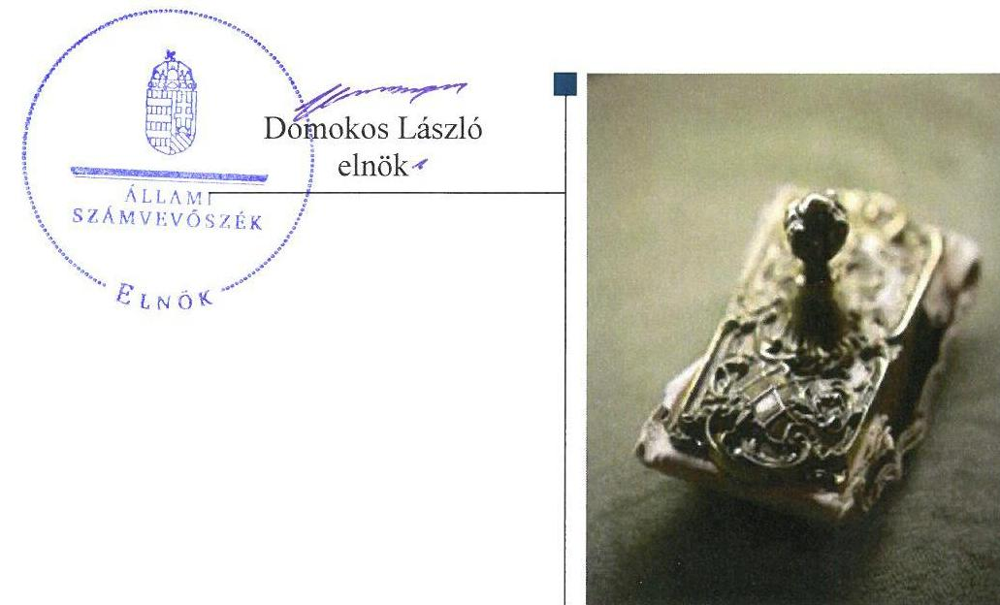
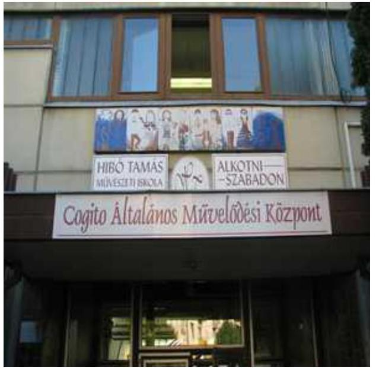
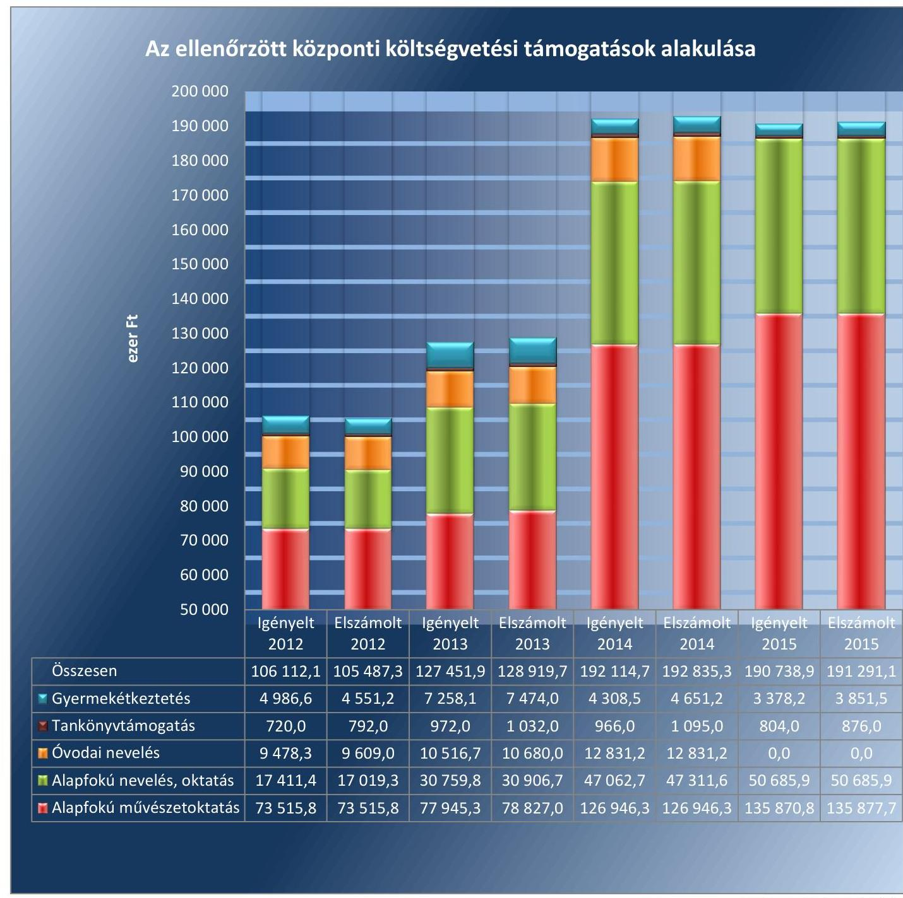
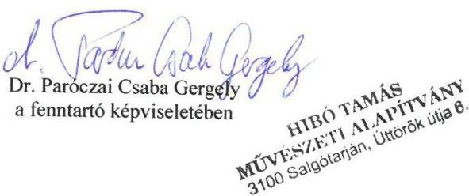
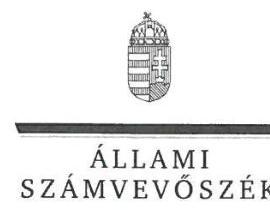
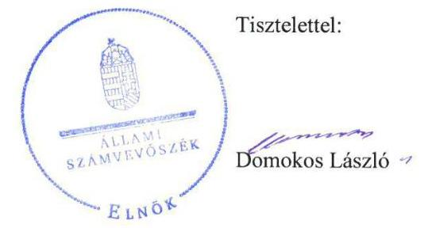

# Jelenetés 

## Nem állami humánszolgáltatók ellenőrzése

A humánszolgáltatást nyújtó államháztartáson kívüli köznevelési intézmények, szolgáltatók fenntartói központi költségvetésből kapott támogatásai felhasználásának ellenőrzése Hibó Tamás Művészeti Alapítvány
2017.

---

# Jelenetés 

## Nem állami humánszolgáltatók ellenőrzése

A humánszolgáltatást nyújtó államháztartáson kívüli köznevelési intézmények, szolgáltatók fenntartói központi költségvetésből kapott támogatásai felhasználásának ellenőrzése Hibó Tamás Művészeti Alapítvány
2017. 03. 04.

---

# AZ ELLENŐRZÉST FELÜGYELTE: 

SALAMON ILDIKÓ felügyeleti vezető

## AZ ELLENŐRZÉST VEZETTE ÉS A VÉGREHAJTÁSÁÉRT FELELŐS:

KEREKES PÉTER ellenőrzésvezető

## A PROGRAM ÖSSZEÁLLÍTÁSÁÉRT FELELŐS:

JANIK JÓZSEF LÁSZLÓ osztályvezető

## A TÉMÁHOZ KAPCSOLÓDÓ KORÁBBI SZÁMVEVŐSZÉKI JELENTÉS:

- címe: Jelentés a közoktatási intézményeket fenntartó non-profit szervezetek normatív hozzájárulásának és támogatásának ellenőrzéséről
- sorszáma: 0835

IKTATÓSZÁM: V-1228-181/2016.
TÉMASZÁM: 2262
ELLENŐRZÉS-AZONOSÍTÓ SZÁM: V076606

---

# TARTALOMJEGYZÉK 

■ ÖSSZEGZÉS ..... 5
■ AZ ELLENŐRZÉS CÉLJA ..... 6
■ AZ ELLENŐRZÉS TERÜLETE ..... 7
■ AZ ELLENŐRZÉS HÁTTERE, INDOKOLTSÁGA ..... 9
■ A JELENTÉS LÉNYEGES KÉRDÉSKÖREI ..... 10
■ ELLENŐRZÉS HATÓKÖRE ÉS MÓDSZEREI ..... 11
■ MEGÁLLAPÍTÁSOK ..... 13
■ JAVASLATOK ..... 17
■ MELLÉKLETEK ..... 19
I. melléklet: Értelmező szótár ..... 19
II. melléklet: Az ellenőrzött központi költségvetési támogatások alakulása ..... 21
■ FÜGGELÉK: ÉSZREVÉTELEK ..... 23
■ RÖVIDÍTÉSEK JEGYZÉKE ..... 39

---

.

---

# ÖSSZEGZÉS 

A salgótarjáni székhelyű Hibó Tamás Művészeti Alapítványnál a közfeladat-ellátás kereteinek kialakítása szabályszerű volt. A központi költségvetésből kapott támogatásokat szabályszerűen átadta az intézményének. A közfeladat-ellátás során az átláthatóság érvényesülését nem biztosította, mivel nem gondoskodott a jogszabályokban előírt közérdekű adatok, dokumentumok közzétételéről, így a nyilvánosság és a szolgáltatást igénybe vevők nem jutottak megfelelő információhoz.

## Az ellenőrzés társadalmi indokoltsága

Az Állami Számvevőszék stratégiájában hangsúlyos szerepet szán annak, hogy szilárd szakmai alapon álló, értékteremtő ellenőrzéseivel előmozdítsa a közpénzügyek átláthatóságát, rendezettségét és javaslataival a közpénzek és a közvagyon szabályos, gazdaságos, hatékony és eredményes felhasználását segítse. Stratégiájában az Állami Számvevőszék célul tűzte ki, hogy az államháztartáson kívülre nyújtott költségvetési támogatások ellenőrzésével hozzájárul ahhoz, hogy a közpénzeket az államháztartáson kívüli szervezetek is átlátható módon használják fel a közfeladatok szerződésben vállalt ellátása érdekében. Tekintettel az elmúlt években a köznevelés finanszírozását és a köznevelési intézmények fenntartását érintően végbement változásokra, a társadalom fokozott érdeklődéssel figyeli a köznevelési feladatok ellátására fordított források felhasználását. Fontos ezért az Állami Számvevőszéknek a közvéleményt biztosítani arról, hogy a közpénz államháztartáson kívüli felhasználása ezen a területen sem marad ellenőrizetlenül. Hozzájárul ezzel ahhoz is, hogy a nyilvánosság és a szolgáltatást igénybe vevők megfelelő tájékoztatást kapjanak az államháztartáson kívüli közfeladatot ellátók működéséről.

## Főbb megállapítások, következtetések

A Hibó Tamás Művészeti Alapítvány, mint intézményfenntartó a közfeladat-ellátás szervezeti kereteit a jogszabályi előírásoknak megfelelően, a szabályozási kereteket összességében szabályszerűen alakította ki. Alapító okirata megfelelt a jogszabályi előírásoknak, módosításait bejelentette a bíróság felé. Rendelkezett a központi költségvetési támogatások igénybevételéhez előírt feltételekkel. A jogszabályban előírt számviteli politikát és a kapcsolódó szabályzatokat elkészítette, azonban nem készített iratkezelési szabályzatot és 2015. április 30-ig nem rendelkezett számlarenddel.

A Hibó Tamás Művészeti Alapítvány az intézménye működtetésének a kereteit a jogszabályi előírásoknak megfelelően biztosította. Alapfeladatait alapító okiratban meghatározta, a nyilvántartásokba vétel megtörtént és a szükséges működési engedélyek rendelkezésre álltak. Az intézményi alapdokumentumokat a jogszabályban előírtak szerint jóváhagyta, illetve azokhoz egyetértését adta. A központi költségvetésből kapott támogatásokat szabályszerűen, minden ellenőrzött évben átadta az intézményének.

A Hibó Tamás Művészeti Alapítvány a jogszabályi előírások ellenére nem határozta meg belső szabályzatban a közérdekű adatok közzétételének szabályait, és az adatok biztonságának, védelmének érvényre juttatásához szükséges eljárási szabályokat. Nem tette közzé a jogszabályban előírt közérdekű adatokat, így nem biztosította a közfeladat-ellátásához kapcsolódóan az adatok nyilvánosság általi megismerését. Nem értékelte az intézménye pedagógiai programjában meghatározott feladatok végrehajtását. A jogszabályban előírt, nyilvános értékelés hiányában a szolgáltatást igénybe vevők nem jutottak megfelelő információhoz a köznevelési intézmény működéséről. A beszámoló készítési kötelezettségét a 2012-2014 közötti évekre vonatkozóan nem a jogszabályi előírásoknak megfelelően teljesítette.

---

# AZ ELLENŐRZÉS CÉLJA 

AZ ELLENŐRZÉS CÉLJA annak értékelése volt, hogy a Fenntartó ${ }^{1}$ központi költségvetésből kapott támogatásainak felhasználása szabályszerű volt-e, a támogatások igénylése, évközi módosítása és év végi elszámolása megfelelt-e a jogszabályi előírásoknak.

---

# **Hibó Tamás Művészeti Alapítvány, mint intézményfenntartó**

A salgótarjáni székhelyű Hibó Tamás Művészeti Alapítványt magánszemélyek alapították 2005. május 31-i dátummal. Az ellenőrzött időszakban a Fenntartó alapító okiratának2 módosítására három esetben került sor a kuratóriumi tagok, illetve a képviseletre jogosult személy változása miatt.

A Fenntartó fő tevékenysége oktatási és közoktatási intézmények létesítése és fenntartása, az oktatási tevékenység ellátásának elősegítése, támogatása; kulturális tevékenység folytatása, amelynek során közfeladatot lát el. A Fenntartó az ellenőrzött időszakban közhasznú jogállással nem rendelkezett.

A Fenntartó a közfeladat-ellátását az ellenőrzött időszakban egy – Cogito Általános Művelődési Központ elnevezésű – többcélú közoktatási, közművelődési és közgyűjteményi intézmény létesítésével és fenntartásával végezte. Az Intézmény3 által ellátott alapfeladatok az ellenőrzött években a következők voltak: alapfokú oktatás; alapfokú művészetoktatás; a 2013/2014-es nevelési évig óvodai nevelés; illetve közművelődés, nyilvános könyvtár működtetés. Az Intézmény tevékenységét salgótarjáni székhelyén, illetve intézményegységein keresztül Somoskőújfalun (alapfokú oktatás, óvodai nevelés, közművelődés, nyilvános könyvtár működtetés) és az ország öt megyéjében található telephelyein (alapfokú művészetoktatás) látta el. Az Intézmény az ellenőrzött években önálló jogi személyként működő, önállóan gazdálkodó szervezet volt.

Az Intézmény engedélyezett tanulói létszáma 2012-ben 3681 fő, 2013-ban 4292 fő, 2014-ben 4324 fő, 2015-ben 4703 fő volt. A vonatkozó statisztikai adatok szerinti tényleges létszám minden évben az engedélyezett alatt alakult, 2012-ben 1814 fő, 2013-ban 1717 fő, 2014-ben 1918 fő, 2015-ben 1953 fő volt.

A Fenntartó 2012-2015 között minden évben központi költségvetési támogatás iránti igénylést nyújtott be a Kincstárhoz4, majd a kapott támogatásokkal a tárgyévet követően elszámolt. A II. melléklet tartalmazza az ellenőrzött központi költségvetési támogatások alakulását. Emellett közoktatási megállapodás alapján is kapott költségvetési támogatást az ellenőrzött időszakban. A Fenntartó, az Intézmény és a Minisztérium5 között az ellenőrzött időszak elején hatályban volt közoktatási megállapodást a 2012. október 11-én aláírt új közoktatási megállapodás váltotta fel 5 éves időtartamra.

A Fenntartó összesen – tevékenységéből adódó jogosultsága alapján, egyszerűsített éves beszámolói szerint – Magyarország éves központi költségvetéséből 2012. évben 154 584 ezer Ft, 2013. évben 203 561 ezer Ft, 2014. évben 276 523 ezer Ft, 2015. évben 273 656 ezer Ft támogatást kapott. A Fenntartó összes bevételének minden ellenőrzött évben mintegy 90 %-át tette ki a központi költségvetésből származó támogatás.

---

A Fenntartó a 2012. évben egy fő részmunkaidős, 2015. évben egy fő teljes állású alkalmazottat foglalkoztatott.

A szakmai irányító szervi feladatokat a Minisztérium látta el az ellenőrzött időszakban, ellenőrzési feladatokat az illetékes Kormányhivatalok6 végeztek.

---

# AZ ELLENŐRZÉS HÁTTERE, INDOKOLTSÁGA 

A köznevelési és szociális feladatokat ellátó nem állami intézményfenntartók részére közfeladataik ellátására évente jelentős összegű pénzügyi támogatást biztosítottak a mindenkori költségvetési törvények a bennük megfogalmazott feltételek mellett. A felhasználható állami támogatások Ktv.7 szerinti előirányzata a 2012-2015. években együtt 894 Mrd Ft volt. A 2013. évben jelentős változások következtek be a normatív finanszírozás rendszerében, amely érintette a nem állami intézményfenntartókat is. Az Országgyűlés elfogadta a nemzeti köznevelésről szóló 2011. évi CXC. törvényt, amely jelentősen átalakította a korábbi finanszírozási rendszert 2013 szeptemberétől. Új feladatfinanszírozási forma (átlagbéralapú támogatás) jelent meg, amely a nem állami intézményfenntartókra is vonatkozik. Az ellenőrzés a finanszírozási rendszerben 2012-2015 között bekövetkezett változásokra, azok közfeladat-ellátásra gyakorolt hatására fókuszál a költségvetési támogatásokat felhasználó államháztartáson kívüli szervezetek körében. Az ellenőrzés indokoltságát az is alátámasztja, hogy az ÁSZ8 még nem ellenőrizte átfogóan e területet.

Az ÁSZ stratégiájában foglaltak alapján is indokolt az ellenőrzés, amely a társadalom számára jelzi, hogy a közpénz államháztartáson kívüli felhasználása sem maradhat ellenőrizetlenül. Az államháztartáson kívülre nyújtott költségvetési támogatások ellenőrzésével az ÁSZ hozzájárul ahhoz, hogy a közpénzeket a nem állami humán fenntartók átlátható módon használják fel a közfeladatok ellátására kötött szerződésekben vállalt kötelezettségek teljesítése érdekében. Az ellenőrzés javaslataival hozzájárulhat az említett rendszerek szabályszerű támogatás felhasználásához, javíthatja a társadalmi-gazdasági döntések megalapozottságát, amely a „jó kormányzás" feltétele.

---

# A JELENTÉS LÉNYEGES KÉRDÉSKÖREI 

1.     - A Fenntartónál a közfeladat-ellátás kereteinek kialakítása szabályszerű volt-e?
2.     - A Fenntartó a központi költségvetésből kapott támogatásokat szabályszerűen használta-e fel?
3.     - A Fenntartó közfeladat-ellátása során biztosította-e az átláthatóság érvényesülését?
4.     - A Fenntartó intézkedett-e a külső ellenőrzések megállapításaira?

---

# ELLENŐRZÉS HATÓKÖRE ÉS MÓDSZEREI 

## Az ellenőrzés típusa

Megfelelőségi ellenőrzés.

## Az ellenőrzött időszak

A 2012. január 1-je és 2015. december 31-e közötti évek. A 2012. év vonatkozásában a költségvetési támogatások 2012. évet megelőző időszakra eső igénylését, a 2015. év tekintetében annak 2016-ban történő elszámolását is ellenőrizte az ÁSZ.

## Az ellenőrzés tárgya

Az ellenőrzés a köznevelési közfeladatokat ellátó nem állami fenntartó központi költségvetésből kapott támogatásai felhasználására terjedt ki. Az alábbi jogcímek szabályszerűségének értékelését foglalja magában:
$\longrightarrow$ az alap normatív- és átlagbér alapú költségvetési támogatások közül az óvodai nevelés, általános iskolai nevelés-oktatás, alapfokú művészetoktatás,
$\longrightarrow$ a kiegészítő támogatások közül a tanulóétkeztetési és a tankönyvtámogatás.
Az ellenőrzés kiterjedt minden olyan körülményre és adatra, amely az ÁSZ jogszabályban meghatározott feladatainak teljesítéséhez, valamint a program végrehajtása folyamán felmerült újabb összefüggések feltárásához szükséges volt.

## Az ellenőrzött szervezet

Hibó Tamás Művészeti Alapítvány

## Az ellenőrzés jogalapja

Az ellenőrzés jogszabályi alapját az ÁSZ tv.9 1. § (3) bekezdésében és az 5. § (3) bekezdésében foglalt előírások adták.

---

# Az ellenőrzés módszerei 

Az ellenőrzést az ellenőrzési program kérdései, az adott időszakban hatályos jogszabályok, az ellenőrzés szakmai szabályok és módszertanok, valamint a nemzetközi standardok figyelembevételével végezte az ÁSZ.

A közpénzekkel való felelős gazdálkodás segítésére irányuló javaslatok kidolgozásakor a hatályos jogszabályok voltak az irányadóak.

Az ellenőrzés ideje alatt az ÁSZ a Fenntartóval történő kapcsolattartást az ÁSZ SZMSZ10-ének vonatkozó előírásai alapján biztosította.

Az ellenőrzési kérdések megválaszolásához szükséges bizonyítékok megszerzése az ellenőrzöttek által rendelkezésre bocsátott dokumentumokra, adatokra alapozva megfigyeléssel, szemlével (szemrevételezéssel), kérdésfeltevéssel (információkéréssel), valamint elemző eljárással történt.

Az ellenőrzési bizonyítékként felhasznált adatforrások közé tartoztak egyrészt a szakmai program részletes szempontjainál felsorolt adatforrások, másrészt minden - az ellenőrzés folyamán feltárt, az ellenőrzés szempontjából információt tartalmazó - dokumentum.

Az ellenőrzés lefolytatásához a Fenntartó a kitöltött tanúsítványok, valamint az ÁSZ által kért dokumentumok elektronikus úton való megküldésével szolgáltatott adatokat, információkat. Az így rendelkezésre bocsátott adatok, információk és a tanúsítványok adatai valódiságának kontrollja az ellenőrzés keretében történt.

A szabályosság megítélésének az alapját képezte, hogy a központi költségvetési támogatások Fenntartó általi igénylése és év végi elszámolása a Kincstár felé megtörtént.

A központi költségvetésből kapott támogatások szabályszerű felhasználását a Fenntartó vonatkozásában, a támogatások Intézmény részére - annak működtetésére - történő továbbutalásának, valamint a támogatások felhasználásáról a jogszabályban előírt nyilvántartás vezetésének az értékelésével végezte az ÁSZ.

---

# 1. A
 Fenntartónál a közfeladat-ellátás kereteinek kialakítása szabályszerű volt-e? 

## Összegző megállapítás

### 1.1. számú megállapítás

### 1.2. számú megállapítás

## A Fenntartó a közfeladat-ellátás kereteit szabályszerűen alakította ki.

A Fenntartónál a közfeladat-ellátás szervezeti kereteinek a kialakítása megfelelt a jogszabályi előírásoknak.

A Fenntartó a közoktatási, köznevelési közfeladat-ellátási tevékenységének szervezeti kereteit a Civil tv ${ }^{11}$., a Közokt. tv ${ }^{12}$. és az Nkt. ${ }^{13}$ előírásainak megfelelően kialakította. A Fenntartó alapító okirata ellenőrzött időszakban háromszor módosult, amelyeket bejelentett a bíróság felé. Az alapító okirat 2014. március 14-ig megfelelt a $\mathrm{Ptk}_{1}{ }^{14}$-ben, majd 2014. március 15-től a $\mathrm{Ptk}_{2}{ }^{15}$-ben előírtaknak.

A Fenntartó a támogatás igénylés alapját jelentő, Áht. ${ }^{16}$-ben foglalt feltételeknek megfelelt, mivel nyilatkozata szerint átlátható szervezetnek minősült, továbbá rendezett munkaügyi kapcsolatokkal rendelkezett. A költségvetési támogatás igénylés alapját, feltételeit jelentő dokumentumok, nyilvántartások a jogszabályokban előírtak szerint biztosítottak voltak. A támogatások igénybevételéhez szükséges, a Közokt. vhr. ${ }^{17}$, illetve az Nkt. vhr. ${ }^{18}$ által előírt intézményi adatok a Fenntartónál rendelkezésre álltak. A Fenntartó rendelkezett információval az Intézmény OM azonosítójáról ${ }^{19}$, a gyermek, illetve tanuló létszámról, az alkalmazottakról, valamint az alapfokú művészetoktatásban részesülő tanulók esetében a szülők nyilatkozatáról. A Közokt. vhr., illetve az Nkt. vhr. által előírt tanügyi okmányokról (beírási napló, törzslap, csoportnapló) vezetett nyilvántartás a Fenntartó rendelkezésére állt.

A Fenntartó belső szabályozottsága összességében megfelelt a jogszabályi előírásoknak.

A Fenntartó a Számv. tv. ${ }^{20}$-nek megfelelve elkészítette a számviteli politikáját ${ }^{21}$ és a számviteli politikához kapcsolódó belső szabályzatokat: a leltárkészítési és leltározási szabályzatot ${ }^{22}$, az értékelési szabályzatot ${ }^{23}$ és a pénzkezelési szabályzatot ${ }^{24}$. Önköltségszámítási szabályzat készítésére a Számv. tv. 14. § (6) bekezdése alapján nem volt kötelezett, mivel egyszerűsített éves beszámolót készített. A Fenntartó a számviteli politikában nem rögzítette azokat a szabályokat, előírásokat, módszereket, amelyekkel meghatározza, hogy mit tekint a számviteli elszámolás, illetve az értékelés szempontjából lényegesnek és jelentősnek, amivel megsértette a Számv. tv. 14. § (4) bekezdés előírásait.

A Fenntartó 2015. április 30-ig a Számv. tv. 161. § (1) bekezdésében előírtak ellenére számlarenddel nem rendelkezett. A 2015. május 1-jétől hatályos számlarend ${ }^{25}$ megfelelt a Számv. tv.-ben előírtaknak.

---

A Fenntartó az ellenőrzött időszakban az Ltv. ${ }^{26} 9. § (4) bekezdését megsértve nem készített iratkezelési szabályzatot és irattári tervet.

# 2. A Fenntartó a központi költségvetésből kapott támogatásokat szabályszerűen használta-e fel? 

## Összegző megállapítás

2.1. számú megállapítás

A Fenntartó a központi költségvetésből kapott támogatásokat az Intézmény működtetésére, szabályszerűen használta fel.

A Fenntartó a jogszabályi előírásoknak megfelelően biztosította az Intézmény működtetésének a kereteit.

A Fenntartó az Intézmény alapfeladatait az ellenőrzött időszakban meghatározta a Közokt. tv, illetve az Nkt. előírásaival összhangban az Intézmény alapító okiratában ${ }^{27}$. Az Intézmény az ellenőrzött időszakban szerepelt az illetékes kormányhivatalok nyilvántartásában, a KIR ${ }^{28}$ nyilvántartásban, valamint rendelkezett OM azonosítóval. A Fenntartó a Közokt. tv. és az Nkt. előírásainak megfelelően biztosította, hogy az Intézmény a székhelyét és az ország öt megyéjében található telephelyeit érintően rendelkezzen működési engedéllyel az alapító okirat szerinti közoktatási, illetve köznevelési feladatokra. Új indítandó telephely működési engedély-, illetve meglévő telephely működési engedély módosítási kérelmeit a feladatellátási hely szerint illetékes kormányhivatalhoz benyújtotta. A Fenntartó a működési engedélyezési eljárásban igazolta, hogy biztosította a közfeladat ellátásához szükséges személyi és tárgyi feltételeket.

A Közokt. vhr. 14. § (5) bekezdésében, illetve 2013. október 5-től az Nkt. vhr. 37/H. § (1) bekezdésében előírtak ellenére a Kincstár által nyilvántartott adatokban - az Intézmény alapító okiratának és működési engedélyének az ellenőrzött időszakban történt módosításai miatt - bekövetkezett változásokat a Kincstárnak nem jelentette be.

A Fenntartónak az Intézmény működtetését megalapozó feladatellátása szabályszerű volt. A 2012. január 1. és 2012. augusztus 31. közötti időszakot érintően a Közokt. tv.-ben előírtaknak megfelelően jóváhagyta az Intézmény szervezeti és működési szabályzatát, minőségirányítási programját, pedagógiai programját és házirendjét. Az Nkt.-ban előírtaknak megfelelően az Intézmény 2015. évi pedagógiai programjához egyetértését adta. Az ellenőrzött időszakban a Közokt. tv.-ben és az Nkt.-ban előírtaknak megfelelően meghatározta az Intézmény éves költségvetéseit, a tanulók képzési költségekhez való hozzájárulásának elveit és gyakorlatát tartalmazó eljárásrendeket. Az Intézmény vezetőjét (főigazgatóját) a Fenntartó bízta meg az alapításkor, személye az ellenőrzött időszakban egyszer, 2013-ban változott. Az új főigazgató megbízása szabályszerű volt, és az alapító okirat szerint legalább 5 évre szólt.

A Fenntartó Kuratóriuma az ellenőrzött időszak minden évében határozatokban fogadta el az Intézmény egyszerűsített éves beszámolóját.

---

# 2.2. számú megállapítás 

A Fenntartó a központi költségvetési támogatásokat szabályszerűen átadta az Intézmény részére.

A központi költségvetési támogatások átadásának kötelezettségét a Fenntartó a hatályos Kvtv.-ek figyelembevételével betartotta, az ellenőrzött időszakban a Kincstártól kapott költségvetési támogatásokat teljes összegben átadta az Intézmény részére. A Fenntartó analitikus nyilvántartása tartalmazta, hogy milyen határnappal kerültek átadásra az Intézménynek a költségvetési támogatások.

## 3. A Fenntartó közfeladat-ellátása során biztosította-e az átláthatóság érvényesülését?

## Összegző megállapítás

### 3.1. számú megállapítás

### 3.2. számú megállapítás

A Fenntartó közfeladat-ellátása során nem biztosította az átláthatóság érvényesülését.

A Fenntartó nem biztosította, hogy a szolgáltatást igénybe vevők megfelelő információhoz jussanak az Intézmény működéséről.

A Fenntartó az Nkt. által biztosított lehetőséggel élve 2014 márciusában ellenőrzést végzett az Intézménynél, amelynek során a működés törvényességét vizsgálta. Az ellenőrzés megállapításait tartalmazó jegyzőkönyvben az intézményi SZMSZ és házirend aktualizálására és Belső ellenőrzési terv készítésére vonatkozó megállapítások szerepeltek.

A Fenntartó az ellenőrzött időszakban - a Közokt. tv. 102. § (2) bekezdés g) pontjában, illetve az Nkt. 83. § (2) bekezdés h) pontjában előírtak ellenére - nem értékelte az Intézmény pedagógiai programjában meghatározott feladatok végrehajtását, a pedagógiai-szakmai munka eredményességét. Értékelés hiányában a Közokt. tv. 104. § (6) bekezdésében, illetve az Nkt. 85. § (3) bekezdésében előírt nyilvánosságra hozatal sem történhetett meg.

A Fenntartó az ellenőrzött időszakban nem biztosította a közérdekű adatok nyilvánosságát.

A Fenntartó az Info. tv. ${ }^{29}$ 35. § (3) bekezdésében előírtak ellenére a közérdekű adatok közzétételére vonatkozó kötelezettség teljesítésének részletes szabályait belső szabályzatban nem állapította meg. A Fenntartó az Info. tv. 7. § (2) bekezdésében foglalt előírás ellenére, nem alakította ki az adatok biztonságának, védelmének érvényre juttatásához szükséges eljárási szabályokat, ezáltal fennállt a személyes adatok jogellenes felhasználásának kockázata.

A Fenntartó az Info. tv. 37. § (1) bekezdésében előírtak ellenére az ellenőrzött időszakban nem gondoskodott a tevékenységéhez kapcsolódóan az Info. tv. 1. melléklete szerinti általános közzétételi listában meghatározott szervezeti, személyzeti adatai, tevékenységére, működésére vonatkozó adatai, valamint gazdálkodási adatai közzétételéről saját honlapján, vagy az Info. tv. 33. § (3) bekezdésében meghatározott más honlapokon.

---

# 3.3. számú megállapítás 

A Fenntartó a 2012-2014. évekről nem szabályszerűen, a 2015. évről szabályszerűen teljesítette a beszámoló készítési kötelezettségét.

A Fenntartó a 2012., a 2013. és a 2014. évről nem készítette el a számára a Civilszr. ${ }^{30}$ 6. § (6) bekezdésében előírt egyszerűsített éves beszámolót, mert a mérleget és az eredménykimutatást nem a Civilszr. 4., illetve 5. számú mellékletében előírt tagolásban készítette el, valamint nem készítette el a Civil tv. 29. § (3) bekezdésében előírt közhasznúsági mellékletet.

A 2015. évről készített egyszerűsített éves beszámoló formája megfelelt a jogszabályi előírásoknak. A Fenntartó egyszerűsített éves beszámolói az Országos Bírósági Hivatal által fenntartott Civil Szervezetek Névjegyzékében ${ }^{31}$ hozzáférhetőek. Azonban a nem a jogszabályi előírásoknak megfelelően elkészített beszámolók nem voltak alkalmasak a nyilvánosság megfelelő tájékoztatására.

## 4. A Fenntartó intézkedett-e a külső ellenőrzések megállapításaira?

## Összegző megállapítás

A Fenntartó intézkedett a külső ellenőrzések által tett, intézkedést igénylő megállapításokra.

A Nógrád Megyei Főügyészség a 2013. évben a Fenntartó működését érintően törvényességi ellenőrzést végzett a 2010-2013. évekre vonatkozóan, intézkedést igénylő megállapítást nem tett.

A Fenntartónál és Intézményénél a megyei kormányhivatalok törvényességi - egyben hatósági - ellenőrzést a 2013., a 2014. és a 2015. években végeztek az Nkt. vonatkozó előírásainak megfelelően. Két esetben - a Heves Megyei Kormányhivatalnak, valamint a Nógrád Megyei Kormányhivatalnak a Fenntartó 2014. évi törvényességi ellenőrzései során - tettek intézkedést igénylő megállapításokat, amelyekre a Fenntartó az intézkedéseket megtette.

A Fenntartó által benyújtott elszámolások felülvizsgálatát követően a Kincstár határozatában 2013-2015. évekre vonatkozóan többlettámogatást, 2012-re vonatkozóan visszafizetési kötelezettséget állapított meg, amely kötelezettségének a Fenntartó határidőben eleget tett.

---

# JAVASLATOK 

Az ÁSZ tv. 33. § (1) bekezdésében foglaltak értelmében az ellenőrzött szervezet vezetője köteles a jelentésben foglalt megállapításokhoz kapcsolódó intézkedési tervet összeállítani és azt a jelentés kézhezvételétől számított 30 napon belül az ÁSZ részére megküldeni. Amennyiben az ellenőrzött szervezet vezetője nem küldi meg határidőben az intézkedési tervet, vagy továbbra sem elfogadható intézkedési tervet küld, az Állami Számvevőszék elnöke az ÁSZ tv. 33. § (3) bekezdés a) és b) pontjaiban foglaltakat érvényesítheti.

## Hibó Tamás Művészeti Alapítvány Kuratóriuma elnökének

1. Intézkedjen, hogy a számviteli politikában - a Számv. tv.-ben foglaltaknak megfelelően - rögzítésre kerüljenek azok a szabályok, előírások, módszerek, amelyekkel meghatározzák, mit tekintenek a számviteli elszámolás, illetve az értékelés szempontjából lényegesnek és jelentősnek.
(1.2. számú megállapítás 1. bekezdés 3. mondata alapján)
2. Intézkedjen a jogszabályi előírásnak megfelelően iratkezelési szabályzat és irattári terv készítésére.
(1.2. számú megállapítás 3. bekezdése alapján)
3. Intézkedjen az Nkt. vhr-ben előírtaknak megfelelően a Kincstár által nyilvántartott adatokban bekövetkezett változás esetén a változás-bejelentés teljesítésére.
(2.1. számú megállapítás 2. bekezdés alapján)
4. Kezdeményezze, hogy a jogszabályi előírásnak megfelelően a Fenntartó értékelje az Intézmény pedagógiai programjában meghatározott feladatok végrehajtását, a pedagógiai-szakmai munka eredményességét.
(3.1. számú megállapítás 2. bekezdés 1. mondata alapján)
5. Intézkedjen a jogszabályi előírásoknak megfelelően
a) a közzétételi kötelezettség teljesítése részletes szabályainak belső szabályzatban történő megállapítására;
b) az adatok biztonságának, védelmének érvényre juttatásához szükséges eljárási szabályok meghatározására.
(3.2. számú megállapítás 1. bekezdése alapján)

---

6. Intézkedjen a jogszabályi előírásoknak megfelelően az Info. tv. 1. melléklete szerinti általános közzétételi listában meghatározott szervezeti, személyzeti adatai, tevékenységére, működésére vonatkozó adatai, valamint gazdálkodási adatai közzétételére.
(3.2. számú megállapítás 2. bekezdése alapján)

---

# MELLÉKLETEK 

## I. MELLÉKLET: ÉRTELMEZŐ SZÓTÁR

átlagbéralapú támogatás
civil szervezet
feladatellátási hely
feladatfinanszírozás
humánszolgáltatás
intézményfenntartó
köznevelési alapfeladat
köznevelési intézmény
közoktatási információs rendszer / köznevelés információs rendszere (KIR)

Az átlagbér alapú támogatás alapja a pedagógus-munkakörben, valamint nevelő-, oktató munkát közvetlenül segítő munkakörben foglalkoztatottak után kifizetett személyi juttatás és járulék. (2013. évi Kvtv. 33. § (4) bekezdés)
A Civil tv. 2. § 6. pontja szerint civil szervezet a civil társaság, a Magyarországon nyilvántartásba vett egyesület (a párt, a szakszervezet és a kölcsönös biztosító egyesület kivételével), a közalapítvány és a pártalapítvány kivételével az alapítvány.
Az a cím, ahol a köznevelési intézmény alapító okiratában, szakmai alapdokumentumában foglalt feladat ellátása történik. (Nkt. 4. § (7) pont)
A közfeladat államháztartáson kívüli szervezet által történő ellátásához közvetlenül kapcsolódó, arányos működési költségeket finanszírozó költségvetési támogatás.
Külön törvényben meghatározott szociális, gyermekjóléti, gyermekvédelmi, közoktatási, felsőoktatási, kulturális közfeladatok.
 (2012. évi Kvtv. 38. § (1) bekezdés, 2013. évi Kvtv. 25. §, 1. számú melléklet XX/20/2. alcím, 19. alcím, 2014. évi Kvtv. 33. §, 34. § (1), (4) bekezdés, 1. számú melléklet XX/20/2. alcím, 19. alcím, 2015. évi Kvtv. 42. §, 43. § (1), (4) bekezdés, 1. számú melléklet XX/20/2/3. jogcím csoport, 19. alcím).

Az a természetes vagy jogi személy, aki vagy amely a köznevelési feladat ellátására való jogosultságot megszerezte vagy azzal rendelkezik, és – e törvényben foglalt esetben a működtetővel közösen – a köznevelési intézmény működéséhez szükséges feltételekről gondoskodik. (Nkt. 4. § 9. pont)
A köznevelési intézmény alapító okiratában foglalt feladat: óvodai nevelés, nemzetiséghez tartozók óvodai nevelése, általános iskolai nevelés-oktatás, nemzetiséghez tartozók általános iskolai nevelése-oktatása, kollégiumi ellátás, nemzetiségi kollégiumi ellátás, gimnáziumi nevelés-oktatás, szakközépiskolai nevelés-oktatás, szakiskolai nevelés-oktatás, nemzetiségi gimnáziumi nevelés-oktatása, nemzetiségi szakközépiskolai nevelés-oktatása, nemzetiségi szakiskolai nevelés-oktatása, köznevelési Hídprogramok keretében folyó nevelés-oktatás, felnőttoktatás, alapfokú művészetoktatás, fejlesztő nevelés, fejlesztő nevelés-oktatás, pedagógiai szakszolgálati feladat, a többi gyermekkel, tanulóval együtt nevelhető, oktatható sajátos nevelési igényű gyermekek, tanulók óvodai nevelése és iskolai nevelése-oktatása, azoknak a sajátos nevelési igényű gyermekeknek, tanulóknak az óvodai, iskolai, kollégiumi ellátása, akik a többi gyermekkel, tanulóval nem foglalkoztathatók együtt, a gyermekgyógyüdülőkben, egészségügyi intézményekben, rehabilitációs intézményekben tartós gyógykezelés alatt álló gyermekek tankötelezettségének teljesítéséhez szükséges oktatás, pedagógiai-szakmai szolgáltatás.
A nevelési-oktatási intézmény, pedagógiai szakszolgálati intézmény, pedagógiai-szakmai szolgáltatást nyújtó intézmény.
A köznevelési intézmény a törvényben meghatározott köznevelési feladatok ellátására létesített intézmény. A köznevelési intézmény a fenntartójától elkülönült, önálló költségvetéssel rendelkező jogi személy, amely a nyilvántartásba való bejegyzéssel, a bejegyzés napján jön létre. (Nkt. 21. § (1) bekezdés)
A KIR a közoktatás feladataiban közreműködők által szolgáltatott adatokra épülő, országos, elektronikus nyilvántartási és adatszolgáltatási rendszer (20/1997. (II. 13.) Korm. rendelet 11. § (1) bekezdése). A köznevelés információs rendszere hatósági és szakmai tevékenységeket kiszolgáló, az Oktatási Hivatal által működtetett elektronikus alkalmazások, adatállományok, dokumentációk adatbázisa, valamint országos statisztikai és jogosultság alapú adatszolgáltatási rendszer (229/2012. (VIII. 28.) Korm. rendelet 1. § (1) bekezdése).

---

nem állami intézmény fenntartó

A köznevelési és szociális, gyermekjóléti és gyermekvédelmi közfeladatokat/humánszolgáltatásokat ellátó intézményt fenntartó egyházi jogi személy, társadalmi szervezet, alapítvány, közalapítvány, civil szervezet, országos nemzetiségi önkormányzat, nonprofit gazdasági társaság, gazdasági társaság és a humánszolgáltatást alaptevékenységként végző, Szja tv. hatálya alá tartozó egyéni vállalkozó. (2012. évi Kvtv. 38. § (1) bekezdés, 2013. évi Kvtv. 35. § (1), (3) bekezdés, 2014. évi Kvtv. 33. §, 34. § (1), (4) bekezdés, 2015. évi Kvtv. 42. §, 43. § (1), (4) bekezdés)

---

# II. MELLÉKLET: AZ ELLENŐRZÖTT KÖZPONTI KÖLTSÉGVETÉSI TÁMOGATÁSOK ALAKULÁSA 

---

.

---

# FÜGGELÉK: ÉSZREVÉTELEK 

A jelentéstervezetet a Számvevőszék 15 napos észrevételezésre megküldte az ellenőrzött szervezet vezetőjének az ÁSZ tv. 29. § (1) bekezdése előírásának megfelelően.

Az ellenőrzés megállapításaira a Hibó Tamás Művészeti Alapítvány képviseletében a Kuratórium titkára észrevételt tett. Az észrevétel alapján az Állami Számvevőszék nem módosította a jelentést.
A függelék tartalmazza a Hibó Tamás Művészeti Alapítvány képviseletében a Kuratórium titkára által az ellenőrzés megállapításaira tett észrevételeket, az észrevételekre adott válaszokat, a figyelembe nem vett észrevételekről, azok indokairól szóló tájékoztatásokat.

[^0]
[^0]:    * 29. § (1) Az Állami Számvevőszék az ellenőrzési megállapításait megküldi az ellenőrzött szervezet vezetőjének vagy az általa megbízott személynek, és annak, akinek személyes felelősségét állapította meg.
    (2) Az ellenőrzött szervezet vezetője és a felelősként megjelölt személy az ellenőrzés megállapításaira tizenöt napon belül írásban észrevételt tehet.
    (3) Az Állami Számvevőszék az észrevételre a beérkezésétől számított harminc napon belül írásban válaszol. A figyelembe nem vett észrevételeket köteles a jelentésben feltüntetni, és megindokolni, hogy azokat miért nem fogadta el.

---

# Hibó Tamás Művészeti Alapítvány Salgótarján 

Domokos László elnök részére
Állami Számvevőszék
Budapest
Apáczai Csere János u. 10.
1052

ÁLLAMI SZÁMVEVŐSZÉK
26-5723/1004/1
Érkezési időpont: 2017. július 19.
Iktatószám: V-1228-166/2016
Melléklet: $\qquad$
Tik6. 20112014 .
Tárgy: írásbeli észrevétel jelentéstervezet megállapításaira, ikt. sz. V-1228-166/2016.

## Tisztelt Elnök Úr!

2017. június 30-án vettem kézhez az Ön által vezetett szervezet V076606 ellenőrzési azonosítószámú Számvevőszéki jelentéstervezetét, melynek megállapításaira az alábbiakban reagálok.

## A vizsgálat lefolytatásáról

Alapítványunkat 2016. augusztus elején értesítette az Állami Számvevőszék a tervezett ellenőrzésről, majd augusztus és szeptember hónapban folyamatosan töltöttük fel a kért dokumentumokat az erre a célra létrehozott felületre. A Számvevőszék munkatársai szeptember-november hónapban több alkalommal az alapítvány székhelyén folytatták az ellenőrzést. Ezeket az eljárási cselekményeket minden alkalommal az irányadó jogszabályi keretekhez igazodóan végezték kollégái, és munkatársaimmal együtt éreztük azt a szándékot, hogy meg kívánják érteni az alapítvány feladatellátásának sajátosságait, és éreztük a jóindulatukat is, természetesen a szükséges objektivitás megtartásával.

Az ellenőrzés egy elemét éreztük ettől eltérőnek, mégpedig a novemberben lefolytatott helyszíni szemlét. A közigazgatási és hatósági eljárásról szóló 2004. évi CXL. tv. ugyan lehetővé teszi a szemle lefolytatását az érintett előzetes értesítése és képviselőjének jelenléte nélkül, de esetünkben meggyőződésem, hogy ez – különösen az ellenőrzés azt megelőző szakaszában tanúsított segítőkész és őszinte együttműködésünk után – nem volt indokolt. Ennek a véleményemnek a szemle lefolytatása után hangot is adtam Kerekes Péter ellenőrzés vezető úrral történt telefonbeszélgetésünk alkalmával. Ez a fajta eljárás – azon kívül, hogy félreértésekre vezethet az információhiány miatt – a külső szemlélőkben alkalmas lehet arra, hogy a fenntartó illetve intézménye jó hírét negatívan befolyásolja. Esetünkben a Cogito ÁMK feladatellátási helyeit biztosító állami intézmények vezetői közül többen zavartan telefonáltak az állami intézményfenntartónak, hogy miféle ellenőrzés zajlik náluk. Másrészt egy ilyen ellenőrzés az arról tudomást szerzőkben mindig felveti azt a gyanút, hogy azért van szükség a rajtaütésszerű ellenőrzésre, mert a vizsgált intézménynél felmerült a törvénysértés gyanúja. Ez a gyanú pedig egy intézmény jó hírének nagyon árt, képes a vele kapcsolatban hosszú évek alatt odaadó munkával kialakított közbizalmat megszüntetni. Egy olyan intézmény, mint a Cogito ÁMK pedig leginkább ebből él, ezért maradhat fenn. A jövőre nézve kérem Önöket, ilyen eljárást tényleg csak büncselekmény gyanúja esetén folytassanak le.

---

# Hibó Tamás Művészeti Alapítvány Salgótarján 

## A megállapításokról

Az ellenőrzés 1; 2; 4. számú megállapításaival a fenntartó egyetért, a 3. számú megállapítás 3.1. és 3.2. alpontjaiban kifejtettekkel kapcsolatban pedig az alábbiakat kívánom előadni.
I.

A 3. kérdéskör meghatározása így hangzott: A Fenntartó a közfeladat-ellátása során biztosította-e az átláthatóság érvényesülését.

Összegző válasza az ellenőrzésről szóló jelentésnek az volt, hogy nem, majd a negatív értékítéletet három alpont köré csoportosítja.
3.1. A Fenntartó nem biztosította, hogy a szolgáltatást igénybe vevők megfelelő információhoz juthassanak az intézmény működéséről. Ezt a következtetést arra alapozta, hogy a fenntartó nem teljesítette a 2012. szeptember 1-jével hatályon kívül helyezett Közoktatási tv. 102.§ (2) g) pontjában illetve a 2012. szeptember 1-vel hatályba lépő Nkt. 83.§ (2) h) pontjában előírt értékelési feladatát, annak ellenére, hogy ezt számára a jogszabály előírja.

Meggyőződésünk szerint a jelentés 3.1 megállapítása nem tartható a következők miatt.

1) A jogszabály előírása hiányos, így az annak való megfelelés nem egyértelmű

## Nkt. 83. §

(2) A fenntartó
h) értékeli a nevelési-oktatási intézmény pedagógiai programjában meghatározott feladatok végrehajtását, a pedagógiai-szakmai munka eredményességét,

Tekintve, hogy e jogszabályhely nem tartalmazza, hogy ezt
a) mennyi időközönként kell megtenni,
b) mi ennek az eljárásnak a menete,
c) mi ennek a módja (szóban, írásban),
azaz jogi értelemben már a diszpozíció is hiányos, ez így csak egy lehetőség a fenntartó részéről. A törvény szövegét úgy értelmezzük, hogy a fenntartó értékeli az intézmény működését, s nem más. A törvényalkotó gyakorlatilag ezzel a fordulattal csak feljogosítja a fenntartót, de nem kötelezi az értékelésre. Érvelésünket alátámasztja, hogy a törvényhelyből hiányzik a norma harmadik eleme, azaz a szankció is, azaz mi történik abban az esetben, ha a norma címzettje nem az előírtaknak megfelelően cselekszik. Esetünkben a szankció most egy Állami Számvevőszéki jelentésben foglalt elmarasztalás és feladat előírása lenne, ami nyilvánvalóan nem jogi norma. Ehhez kapcsolódik a Javaslatok 4. pontja, miszerint az ellenőrzött szervezet vezetője kezdeményezze, hogy a Fenntartó a jogszabályi előírásnak megfelelően értékelje az Intézmény pedagógiai programjában meghatározott feladatok végrehajtását, a pedagógiai-szakmai munka eredményességét.

Természetesen mindez jogos elvárás, annak ellenére, hogy a normaszöveg hiányossága miatt nem tudjuk, hogy a jogalkotó ezt az értékelést miként várja el. Mivel erről a helyszíni ellenőrzés során nem

---

# Hibó Tamás Művészeti Alapítvány Salgótarján 

volt mód nyilatkoznom, így most közlöm hivatalosan az ellenőrzés számára, hogy a Hibó Tamás Művészeti Alapítvány és a Cogito Általános Művelődési Központ mint intézmény viszonyában az az eljárás (szokás) alakult ki, hogy a fenntartó az intézmény pedagógiai programjában meghatározott feladatok végrehajtását, a pedagógiai-szakmai munka eredményességét szóban értékeli az intézményvezető illetve az intézmény alkalmazottai és a szolgáltatást igénybevevők előtt. Az intézményvezetővel a fenntartó képviselői rendszerint a tanév végén és a következő tanév elején leülnek és megbeszélik az adott tanév tapasztalatait. Ezt megelőzően általában minden év március-május hónapok során áttekintik az intézményfejlesztés kérdéseit, szükség esetén módosítják az intézmény alapító okiratát és vele együtt a pedagógiai-művelődési programját. Nagyobb nyilvánosság előtt a fenntartó alkalmazotti értekezleteken történő felszólalás keretében, illetve nyilvános eseményeken, ünnepségeken, szülői értekezleteken értékel. A vizsgált időszakban erre legutóbb 2015. május 23-án került sor az intézmény megalapításának 15. évfordulójának tiszteletére szervezett ünnepségen, amikor dr. Paróczai Csaba kuratóriumi titkár a fenntartó képviseletében az iskolahasználók, azaz a szolgáltatást igénybe vevők előtt elmondott beszédében értékelte az intézmény tevékenységét, közte a pedagógiai programjában meghatározott feladatok végrehajtását, a pedagógiai-szakmai munka eredményességét. A beszédet és az egész ünnepséget többször sugározta a Salgótarjáni Városi Televízió, így Nógrád megyében (és internet segítségével az egész világon) azok is megismerhették, akik nem voltak jelen. Véleményünk szerint ezzel a fenntartó eleget tett az Nkt. 85. § (3) bekezdésében előírt kötelezettségének. Mivel a fenntartónak saját honlapja nincs – és tudomásunk szerint ennek létrehozására, üzemeltetésére nem is kötelezett –, ezért azt azon nem hozhatta nyilvánosságra, de a médianyilvánosság álláspontunk szerint megfelel „a helyben szokásos módon” elvárásnak.

Mindezeken túl, amennyiben előbbi válaszunkat nem fogadják el, és ragaszkodnak ahhoz, hogy ez a megállapítás a jelentésben benne maradjon, kérjük, jogszabályhely megjelölésével segítsenek abban, hogy a fenntartó hogyan tegyen eleget az Nkt. 83. § (2) h) pontjában előírt kötelezettségének.
2) Az Nkt. 83. § (2) h) pontjában rögzített fenntartói értékelés azonosítása a szolgáltatást igénybe vevők számára biztosított megfelelő információhoz juttatással

A jelentés mindezt – álláspontunk szerint tévesen – összeköti azzal, hogy a szolgáltatást igénybe vevők a fenntartói értékelés elmaradása miatt nem jutottak megfelelő információhoz az intézmény működéséről. Ez több ok miatt nem igaz:
a) Az intézmény működését az Alapítványi és Magániskolák Egyesülete valamint a 3/2002. (II. 15.) OM rendelet a közoktatás minőségbiztosításáról és minőségfejlesztéséről
 10.§ (4) bekezdése szerint létrehozott Szakmai Minősítő Testület értékelte, ráadásul mind a két szervezet kiválóra (1. és 2. sz. melléklet).

A nevezett rendelet általi minősítés a vizsgálati időszak kezdetén még érvényben volt (mert 5 évre szólt), így tehát az intézmény a rendelet 14/B. § (3) bekezdése szerint birtokolta a „Kiválóra minősített alapfokú művészetoktatási intézmény" címet. Ezt akkor kaphatta meg egy intézmény, ha a szakmai követelményeknek az általa oktatott valamennyi művészeti ágban kiválóan megfelel.

Az Alapítványi és Magániskolák Egyesülete által adományozott Minősített iskola címmel a vizsgált időszakban szintén rendelkezett az intézmény.

---

# Hibó Tamás Művészeti Alapítvány Salgótarján 

Mindkét minősítő szervezet honlapján nyilvánosságra hozta ezeket az értékeléseket, tehát az érdeklődők akadálytalanul hozzáférhettek ehhez.

Ezek az elismerések gravírozott fémtáblá megjelenési formában megtalálhatók az intézmény bejáratánál (ezt a helyszíni ellenőrzést végző számvevőszéki munkatársak bizonyíthatják), fénymásolt okirat formában az intézmény hirdetőtábláján, azaz a helyben szokásos módon közzétételre kerültek, így ezeket a minősítéseket a szolgáltatást igénybe vevők ismerhették.
b) Az intézmény tevékenységéről, az intézményben elérhető szolgáltatásokról azok igénybevételének feltételeiről, a mindennapi oktatás igénybevételén túl a szolgáltatást igénybevevők tájékozódhatnak az intézmény honlapjáról, és a tanulók helyi, térségi és országos versenyeken történő szerepléséből, az azokról beszámoló sajtómegjelenésekből, valamint - és ezt már maga a Számvevőszék helyszíni szemléje állapította meg - a feladatellátási helyeken az intézmény hirdetőtáblájáról, amelyen sok esetben a tanulói munkák is helyet kapnak.
c) A jelentéstervezet e megállapítása továbbá azért is életszerűtlen - és elnézést ezért a kifejezésért, de talán a 17 év folyamatos működés mindennapos tapasztalata talán alapot ad rá -, mert az alapfokú művészetoktatásban tankötelezettséget teljesíteni nem lehet, így azt a tanulók teljesen szabadon veszik igénybe. Amennyiben a szolgáltatással nincsenek megelégedve, tanulmányaikat akár a tanév közben is, szankció nélkül abbahagyhatják. Az intézmény ezekkel a feltételekkel működik 2000. óta, és tanulólétszáma nem csökken a demográfiai trendekhez igazodóan, hanem nő, ahogyan ezt a jelentés egy másik pontja meg is állapítja. Az intézmény növekvő tanulólétszáma és aközött, hogy a szolgáltatást igénybe vevők nem kapnak megfelelő információt erről, önmagában ellentmondás húzódik, hiszen, ha nem lenne az intézmény működése a nyilvánosság számára akadálytalanul elérhető, ha nem értékelnék a potenciális igénybevevők a szolgáltatást megfelelőnek, akkor az intézmény tanulólétszáma folyamatosan csökkenne.

Mindebből az következik, hogy a tanulók és a szülők nem a fenntartó általi értékelésből tájékozódnak az intézmény működéséről, hanem magából az intézmény mindennapi működéséből. Ráadásul az sem életszerű, hogy egy (magán)fenntartó intézményét egy esetleges ellenőrzés során nyilvánosan elmarasztalja, mivel célja nem lehet az intézmény negatív színben való feltüntetése, és a szolgáltatást igénybe vevők vagy azt igénybe venni szándékozók eltérítése az intézménytől.

Mindebből következik, hogy a jogszabályhelyben előírtaknak az a fajta számonkérése az ÁSZ részéről, amely a 3.1. pontban megjelenik, álláspontunk szerint nem tartható.

Kiegészítés. A jelentéstervezet kézhezvétele után rákerestem az interneten a fenntartói értékelésre. Mutatja a számonkér jogszabályhely problémás voltát, hogy országosan kevesebb, mint tíz találat volt erre, valamennyi nem állami intézményre vonatkozott, és valamennyi pozitív volt. Ebből következően kimondható, hogy a törvényi előírás ebben a formában nem éri el a célját, hiszen az teljes egészében hiányzik az állami intézményfenntartónál (legalábbis a nyilvánosságban ennek nincs nyoma), amely tekintve az állami feladatellátás arányát, a vizsgálat elvei szerint kiemelt kockázat lenne.

---

# Hibó Tamás Művészeti Alapítvány Salgótarján 

II.
3.2. pont A Fenntartó az ellenőrzött időszakban nem biztosította a közérdekű adatok nyilvánosságát.

Ezt a sommás kijelentését a jelentéstervezet az Info tv. 35. § (3) bekezdésére, a 7. § (2) bekezdésére és a 33. § (3) bekezdésre alapozza.

1) Nézzük meg tehát először is, hogy milyen közérdekű adatai vannak a fenntartónak.

Közérdekű adat a Hibó Tamás Művészeti Alapítvány neve, székhelyének címe, alapításának ideje, a szervezet célja, vezető tisztségviselőjének neve, elérhetősége, a szervezet gazdálkodásának adatai, a szervezet fenntartásában működő intézmény neve, címe, tevékenysége, a vezető neve, elérhetősége. A jelentéstervezet megállapítása szerint mindezek a közérdekű adatok, az Info. tv. citált helyeiben foglaltak nem teljesítése miatt korlátlanul nem elérhetőek.
A. A megállapítást cáfolandó először is csatoljuk a www.birosag.hu internetes honlapon elérhető közhiteles nyilvántartásból kinyomtatott adatlapot. (3. sz. melléklet). Ennek elérési útvonala: www.birosag.hu Főoldal → Civil szervezetek → Civil szervezetek névjegyzéke. Az ezen az oldalon található keresőbe az alapítvány nevét beütve annak valamennyi nyilvántartott adata elérhető, kinyomtatható.

Szintén ezen az oldalon megtalálhatók a közzétett beszámolók 2011. évre visszamenőlegesen.

A nyomonkövetés is biztosított, hiszen a közhiteles nyilvántartás nemcsak az aktuális állapotról tájékoztat, hanem az alapítvány létrehozása óta eltelt időszak változásairól. A nyilvántartásból látszik, hogy 11 korábbi adatállapoton keresztül nyomon kísérhetők az alapítvány életében bekövetkezett változások.
B. A másik korlátozás nélkül hozzáférhető adatbázis, közhiteles nyilvántartás a Közoktatás Információ Rendszere (KIR). Itt két módon juthat hozzá az érdeklődő a fenntartó és az intézmény közérdekű adataihoz.
a) Az egyik a www.kir.hu honlap. Ezt megnyitva a Köznevelési intézmények adatai, jelentései menüpont alatt az Intézményi adatok megtekintése hotpontra rámenve akár egyszerű, akár részletes keresés során a fenntartó 4. sz. mellékletben feltüntetett adatlapja elérhető.
b) A fenntartó és intézménye valamennyi közérdekű adata elérhető a www.dari.oktatas.hu honlapon. Itt a Közérdekű adatok ezen belül a Letölthető közérdekű adatok menüpontban érhető el mind az intézmény, mind a fenntartó adatlapja (4. sz. melléklet).

A 2. sorszámú mappában található táblázat tartalmazza valamennyi köznevelési intézmény alapadatát, fenntartói adatát, illetve általános feladatellátási jellemzőit.

A 15. mappa a Cogito ÁMK által folytatott alapfokú művészetoktatás telephelyszintű adatait is tartalmazza, szintén a fenntartó megjelölésével és elérhetőségével.

---

# Hibó Tamás Művészeti Alapítvány Salgótarján 

Összegzés. Azzal tehát, hogy a fenntartó az Országos Bírósági Hivatal és a KIR felé a jogszabályokban előírt adatközlési kötelezettségének eleget tett, álláspontunk szerint korlátozás nélkül, közhiteles forrásból tette elérhetővé közérdekű adatait.
2) Rátérve az adatbiztonság kérdésére a fenntartónál folyó adatkezelés szabályait az alapító okirat 8.1 pontja tartalmazza, ekként:

Az alapítvány és a kuratórium működésével kapcsolatban keletkezett iratokat mindazon személy jogosult megtekinteni, aki jogi érdekét igazolja, és akit erre jogszabály felhatalmaz. Az iratbetekintést a kuratórium elnökétől, vagy akadályoztatása esetén a titkárától kell kérelmezni, akik az érdekeltség és a jogi felhatalmazás vizsgálatát követően értesítik a kérelmezőt az iratbetekintés helyéről és idejéről, a betekintés módjáról, mértékéről.

A kuratórium ülései nyilvánosak, azonban a kuratórium határozata alapján az elnök, akadályoztatása esetén a titkár zárt ülést rendelhet el különösen a személyiségi jogok, személyi adatok védelme érdekében.

Mindebből következően álláspontunk szerint nem fedi a valóságot az a megállapítása a tervezetnek, miszerint a fenntartó nem alakította volna ki az adatok biztonságának, védelmének érvényre juttatásához szükséges eljárási szabályokat, ezáltal fennáll a személyes adatok jogellenes felhasználásának kockázata. Az alapítvány iratait a kuratórium titkára őrzi az alapítvány székhelyén, külön lezárt irodában. Az alapítványnak honlapja nincs, így arra adatokat sem tölt fel. Az iratokba az alapítvány kuratóriumi tagjain és alapítóin kívül az tekinthet bele, akire az adott irat valamiféle megállapítást tartalmaz, illetve jogi érdekét igazolta. Adatot az alapítványtól csak a kuratóriumi elnöktől vagy a kuratóriumi titkártól személyesen kérhet az, aki jogi érdekét igazolta - így például az ellenőrző hatóságok -, egyébként csak jogellenesen, betöréses lopás vagy csalás büntetőjogi tényállásán keresztül juthat illetéktelenekhez a fenntartó alapítvány által kezelt adat.

Az intézményben tanulók és dolgozók adatait az intézmény kezeli, adatot a KIR rendszerbe ő továbbít. A fenntartó alkalmazottjának - amennyiben ilyen létezik, a jelentéstervezetből kitűnik, hogy ilyen nincs is mindig - adatait a kuratórium elnöke mint munkáltató, és a kuratórium titkára mint az iratok őrzéséért felelős személy ismerheti, de ők ezeket az adatokat az alapító okirat és a Munka törvénykönyve rendelkezései szerint kezelik. Mivel az alapítványnak a három tagú kuratóriumon kívül ügyintéző testülete, egyéb szerve nincs, gyakorlatilag személyes adatokat a kuratórium tagjainak adatain kívül nem kezel, így az Info. tv-ben előírt adatkezelési szabályzat elkészítése nem jár az adatbiztonság növelésével, hiszen nem keletkezik személyes adat, és nem lenne a hatáskörnek az alapító okiratban megjelölt személyen túl címzettje. Gyakorlatilag a kuratóriumi titkár készítené el önmaga számára, aminek betartását a kuratórium elnöke felügyelné, de e kuratóriumi elnök ugyanakkor nem munkáltatója a kuratórium titkárának, hiszen mind a ketten társadalmi munkában, egymás mellé rendelve végzik feladatukat, nincs közöttük függő viszony, mint a munkaviszony vagy egyéb munkavégzésre irányuló jogviszony tekintetében. Mind e miatt egy ilyen eljárási rend megalkotása és fenntartása nem életszerű.

Összegezve. Áttanulmányozva az Info. tv. 1. sz. mellékleteként található Közzétételi listát, megállapítható, hogy az azokban kért közérdekű szervezeti, gazdálkodási adatok a www.birosag.hu

---

# Hibó Tamás Művészeti Alapítvány Salgótarján 

honlapon hozzáférhetőek, a köznevelési közfeladat-ellátásra vonatkozó adatok pedig a www.kir.hu illetve a www.dari.oktatas.hu honlapról szabadon, korlátozás nélkül megismerhetőek. A Közzétételi lista többi eleme az alapítvány esetében nem releváns.

A fentebbiek alapján álláspontunk szerint az Info. tv. rendelkezéseinek mechanikus, kiterjesztő vonatkoztatása a fenntartóra aránytalan terhet, olyan adminisztrációs kötelezettséget jelentene csupán, amely tartalom hiányában a szervezetben értelmezhetetlen, s a kuratóriumon belüli viszonyok miatt pusztán formalitás. Ennek ellenére, amennyiben mégis ragaszkodik az Állami Számvevőszék e dokumentum elkészítéséhez, természetesen az alapítvány jogkövető módon el fogja készíteni azt.
III.

Az ellenőrző jegyzőkönyvhöz tett megállapítások összesítése
Először is, őszintén köszönjük, hogy vizsgálatukkal feltárták az alapítvány mint köznevelési intézményfenntartó tevékenységének mechanizmusát. Mint elmondtuk, a megállapítások többségével egyetértünk, célunk nekünk is az, hogy feladatainkat minél hatékonyabban, ugyanakkor a jogszabályi előírások minél pontosabb követésével lássuk el. Az a két megállapítás, amelynek a fentebbiek szerint ellentmondtunk, úgy érezzük olyan leegyszerűsítő és sommás értékítéletet tartalmaz, mely az adott formában félrevezető, s amelyet ezért nem tartunk jogosnak. Reményeink szerint magyarázatunk után a Számvevőszék a jelentéstervezetet ezen a pontokon (mind a megállapítások, mind a javaslatok területén) módosítani tudja.

Salgótarján, 2017. július 7.

Munkájukat köszönve, tisztelettel:

---

# Dr. Racs Ernő Nándor úr 

kuratóriumi elnök
Hibó Tamás Művészeti Alapítvány

## Salgótarján

## Tisztelt Elnök Úr!

Köszönettel megkaptam a 2017. július 13. napján az Állami Számvevőszékhez érkezett „Nem állami humánszolgáltatók ellenőrzése - A humánszolgáltatást nyújtó államháztartáson kívüli köznevelési intézmények, szolgáltatók fenntartói központi költségvetésből kapott támogatásai felhasználásának ellenőrzése - Hibó Tamás Művészeti Alapítvány" címû számvevőszéki jelentéstervezetben foglalt megállapításokra írásban tett észrevételeket.

Tájékoztatom Elnök urat, hogy a jelentésben - az Állami Számvevőszékről szóló 2011. évi LXVI. törvény 29. § (3) bekezdése alapján - a figyelembe nem vett észrevételeket szerepeltetjük az elutasítás indokainak feltüntetésével együtt.

Az Állami Számvevőszék észrevételekre vonatkozó álláspontjáról a felügyeleti vezető által készített részletes tájékoztatást mellékelten megküldöm.

Budapest, 2017. 07. hó 31. nap

Melléklet: Tájékoztatás a figyelembe nem vett észrevételekről

---

# Tájékoztatás   a figyelembe nem vett észrevételekről 

|  | Észrevétel: | A 3.1. számú megállapításhoz, valamint az azt alátámasztó 2. bekezdéshez

 kapcsolódóan, amely szerint a Hibó Tamás Művészeti Alapítvány (Fenntartó) nem biztosította, hogy a szolgáltatást igénybe vevők megfelelő információhoz jussanak az Intézmény (Cogito Általános Művelődési Központ) működéséről. Az észrevétel szerint a megállapítás nem tartható, mivel a jogszabály előírása hiányos, továbbá az észrevétel a szóban történt fenntartói értékelést részletezi.   Az észrevétel érinti a Hibó Tamás Művészeti Alapítvány Kuratóriumának elnökének címzett 4. számú javaslatot (3.1. számú megállapítás 2. bekezdés 1. mondata alapján). |
| :--: | :--: | :--: |
|  | Válasz: | Az Állami Számvevőszék az észrevételt nem fogadja el. |
| 1. | Indoklás: | Az ellenőrzési megállapítás a jogszabályban foglaltaknak megfelelően tartalmazza, hogy a Fenntartó az ellenőrzött időszakban - a közoktatásról szóló 1993. évi LXXIX. törvény (Közokt. tv.) 102. § (2) bekezdés g) pontjában és a nemzeti köznevelésről szóló 2011. évi CXC. törvény (Nkt.) 83. § (2) bekezdés h) pontjában előírtak ellenére - nem értékelte az Intézmény pedagógiai programjában meghatározott feladatok végrehajtását, a pedagógiai-szakmai munka eredményességét.   Észrevételében a 3.1. számú megállapítás 2. bekezdés 1. mondatában szereplő megállapítást - vagyis azt, hogy nem történt írásbeli értékelés - nem vitatja, annak körülményeiről ad tájékoztatást, továbbá a jogszabályi előírás hiányosságait részletezi. Az észrevétel magyarázatot tartalmaz arra vonatkozóan, hogy írásban miért nem értékelték az Intézmény pedagógiai programjában meghatározott feladatok végrehajtását, továbbá tájékoztatást tartalmaz arra vonatkozóan, hogy a 2015. évben szóban történt értékelés. A szóbeli értékelés nem felel meg a jogszabályi előírásoknak, tekintettel arra, hogy az Nkt. 85. § (3) bekezdése szerint „A fenntartó a honlapján, annak hiányában a helyben szokásos módon nyilvánosságra hozza a nevelési-oktatási intézmény munkájával összefüggő értékelését". A szóban elmondott, és a televízió által közvetített értékelő beszéd - az észrevételében foglaltak szerint - az ellenőrzött négy év alatt egy alkalommal fordult elő, így nem tett eleget az Nkt. 85. § (3) bekezdésében előírt helyben szokásos módon történő nyilvánosságra hozatalnak. Az ellenőrzés rendelkezésére bocsátott dokumentumok sem tartalmaztak arra vonatkozó bizonyítékot, hogy a televízió által történő közvetítés a Fenntartó általi nyilvánosságra hozatal helyben szokásos módja, bármely közzéteendő információ vonatkozásában. |

---

Az észrevételben foglaltakkal ellentétben, az Nkt. a fenntartó kötelezettségeként határozza meg az értékelést: „48. A fenntartó kötelezettségei és jogai" fejezet, ezen belül a 83. § (2) bekezdés h) pontja szerint: „A fenntartó értékeli a nevelési-oktatási intézmény pedagógiai programjában meghatározott feladatok végrehajtását, a pedagógiai-szakmai munka eredményességét".
Ezt támasztja alá a kapcsolódó törvényi indoklás is, amely szerint „A törvény biztosítja, hogy a szolgáltatást igénybe vevők megfelelő információhoz jussanak a köznevelési intézmény működéséről. A fenntartó feladata, hogy az általa működtetett óvodák, iskolák és kollégiumok működését rendszeresen értékelje és az ezzel összefüggésben szerzett információkat nyilvánosságra hozza." Az észrevételben foglaltakkal ellentétben, a részletes szabályozás, valamint külön szankció előírásának a hiánya nem bizonyítja a fenntartó ez irányú kötelezettségének a hiányát.
Álláspontunk szerint írásbeli értékelés hiányában az értékelés nyilvánosságra hozatala sem történhetett meg. Az Állami Számvevőszék adatbekérésében szerepelt az intézmény pedagógiai programjában meghatározott feladatok végrehajtásával, a pedagógiai-szakmai munka eredményességével kapcsolatos értékelés. Az Állami Számvevőszék Főtitkára által 2016. augusztus 8-án kiadmányozott, V-1228-002/2016. iktatószámú levelében adatszolgáltatási kötelezettség teljesítésére szólította fel a Kuratórium elnökét az Állami Számvevőszékről szóló 2011. évi LXVI. törvény 28. § (1)-(2) bekezdéseiben foglaltak alapján. Az adatbekérő levél 3. számú melléklet 4. oldal 4. bekezdése tartalmazta a fenntartói értékelésekkel kapcsolatos dokumentumok megküldését. Az adatszolgáltatás hiányosságai miatt 2017. szeptember 12-én tartott helyszíni szemrevételezés jegyzőkönyvének 3. számú melléklete - amelyet a Kuratórium titkára aláírásával hitelesített - szintén az intézménynél végzett értékelések dokumentumainak a hiányát rögzítette.
A helyszíni ellenőrzés során - mint ahogy ezt az észrevétel is tartalmazza - nem bocsátottak az Állami Számvevőszék rendelkezésére az Intézmény értékeléséhez kapcsolódó dokumentumot, nyilatkozatot egyik ellenőrzött évre vonatkozóan sem.
A helyszíni ellenőrzés lefolytatása során a Kuratórium elnöke és titkára - különböző témákban - több nyilatkozatot is tett, azonban a fenntartói értékelésekkel kapcsolatos ezek között nem szerepelt. Továbbá a Kuratórium elnöke 2016. november 18-i keltezéssel teljességi és hitelességi nyilatkozatot küldött meg az Állami Számvevőszék részére. A nyilatkozat tartalmazta, hogy az Állami Számvevőszék részére átadott „dokumentumok, adatok megbízhatóak, és a bekért adatokra, dokumentumokra vonatkozóan a teljes körű információt tartalmaznak."

---

|  |  | Előzőek következtében, az észrevétel nem megalapozott, a megállapítás és a hozzá kapcsolódó javaslat módosítása nem indokolt. |
| :--: | :--: | :--: |
| 2. | Észrevétel: | A 3.1. számú megállapítás 2. bekezdéséből levont következtetéshez kapcsolódóan, amely szerint a Fenntartó nem biztosította, hogy a szolgáltatást igénybe vevők megfelelő információhoz jussanak az Intézmény működéséről. Az észrevétel szerint az ellenőrzési megállapítás tévesen köti össze a fenntartói értékelés nyilvánosságra hozatalát a szolgáltatást igénybe vevők tájékoztatásával. |
|  | Válasz: | Az Állami Számvevőszék az észrevételt nem fogadja el. |
|  | Indoklás: | Nkt. 83. § (2) bekezdés h) pontja szerint: „A fenntartó értékeli a nevelési-oktatási intézmény pedagógiai programjában meghatározott feladatok végrehajtását, a pedagógiai-szakmai munka eredményességét". Ezzel kapcsolatban az Nkt. 85. § (3) bekezdése előírja, hogy „A fenntartó a honlapján, annak hiányában a helyben szokásos módon nyilvánosságra hozza a nevelési-oktatási intézmény munkájával összefüggő értékelését." A 3.1. számú megállapítás 2. bekezdés 2. mondata a jogszabályban foglaltakkal összhangban tartalmazza, hogy értékelés hiányában, a nyilvánosságra hozatal sem történhetett meg.   A jogalkotó az Nkt. hivatkozott rendelkezéseivel biztosítja, hogy a szolgáltatást igénybe vevők megfelelő információhoz jussanak a köznevelési intézmény működéséről. Ezt támasztja alá az Nkt. 83-85. §-ának indoklása, amely szerint „A törvény biztosítja, hogy a szolgáltatást igénybe vevők megfelelő információhoz jussanak a köznevelési intézmény működéséről. A fenntartó feladata, hogy az általa működtetett óvodák, iskolák és kollégiumok működését rendszeresen értékelje és az ezzel összefüggésben szerzett információkat nyilvánosságra hozza."   Észrevételében foglaltak szerint a tanulók és a szülők nem a Fenntartó általi értékelésből tájékozódnak az intézmény működéséről, hanem magából az intézmény mindennapi működéséből. Az intézmény mindennapi működéséből történő tájékozódás azonban nem tudja elérhetővé tenni mindazokat a tényeket, információkat, amelyeket a jogszabály a nevelési-oktatási intézmény pedagógiai programjában meghatározott feladatok végrehajtása, a pedagógiai-szakmai munka eredményességének fenntartó általi értékelése nyilvánossá tételével kíván biztosítani.   Mindezek következtében megalapozott a 3.1. pontnak - az azt alátámasztó bekezdésekből levont - következtetése, amely szerint a Fenntartó nem biztosította, hogy a szolgáltatást igénybe vevők megfelelő információhoz jussanak az Intézmény működéséről.   Köszönettel vettük tájékoztatását a Szakmai Minősítő Testület értékeléséről, az Alapítványi és Magániskolák Egyesülete által adományozott címről, amelyek azonban az ellenőrzés megállapításait |

---

|  |  | nem módosítják. A Közokt. tv. 102. § (2) bekezdés g) pontja és 104. § (6) bekezdése, valamint az Nkt. 83. § (2) bekezdés h) pontja és 85. § (3) bekezdése a Fenntartó számára írták elő az értékelési, valamint az azzal kapcsolatos nyilvánosságra hozatali feladatokat, amelyeknek az ellenőrzött időszakban nem tett eleget.   A fentiekre tekintettel az észrevétel nem megalapozott, így a megállapítás módosítása nem indokolt. |
| :--: | :--: | :--: |
|  | Észrevétel: | A 3.2. számú megállapításhoz, valamint az azt alátámasztó 2. bekezdéshez kapcsolódóan, amely szerint a Fenntartó az ellenőrzött időszakban nem biztosította a közérdekű adatok nyilvánosságát. Az észrevétel arról ad tájékoztatást, hogy a Fenntartó közérdekű adatai mely nyilvános honlapokon érhetők el, amellyel az észrevétel szerint eleget tettek a közzétételi kötelezettségüknek.   Az észrevétel érinti a Hibó Tamás Művészeti Alapítvány Kuratóriumának elnökének címzett 6. számú javaslatot (3.2. számú megállapítás 2. bekezdése alapján). |
|  | Válasz: | Az Állami Számvevőszék az észrevételt nem fogadja el. |
| 3. | Indoklás: | Az információs önrendelkezési jogról és az információszabadságról szóló 2011. évi CXII. törvény (Info. tv.) 37. § (1) bekezdésében előírtak szerint a közzétételre kötelezett szerveknek - amelyek körébe az Info. tv. 33. § (3) bekezdésében foglaltak alapján a Fenntartó mint közfeladatot ellátó szerv is beletartozik - a tevékenységükhöz kapcsolódóan az 1. melléklet szerinti általános közzétételi listában meghatározott adatokat az 1. mellékletben foglaltak szerint kell közzétenniük.   Az ellenőrzési megállapítás a jogszabályi előírásokkal összhangban arra vonatkozott, hogy a Fenntartó az Info. tv. 37. § (1) bekezdésében előírtak ellenére az ellenőrzött időszakban nem gondoskodott a tevékenységéhez kapcsolódóan az Info. tv. 1. melléklete szerinti általános közzétételi listában meghatározott szervezeti, személyzeti adatai, tevékenységére, működésére vonatkozó adatai, valamint gazdálkodási adatai közzétételéről saját honlapján, vagy az Info. tv. 33. § (3) bekezdésében meghatározott más honlapokon.   A Fenntartó - amint az észrevétel is tartalmazza - saját honlappal nem rendelkezett, továbbá az Info. tv. 33. § (3) bekezdésében meghatározott más honlapokon történő közzétételi kötelezettség teljesítését igazoló dokumentumot nem bocsátott az ellenőrzés rendelkezésére.   Az észrevétel részletezi, hogy a Fenntartó közérdekű adatai mely internetes honlapokon érhetők el, amelyek azonban nem felelnek meg az Info. tv 33. § (3) bekezdésében előírtaknak. A hivatkozott jogszabály rögzíti, hogy a közzétételi kötelezettséget mely internetes honlapon kell a Fenntartónak teljesítenie, amely kötelezettségének az ellenőrzött időszakban nem tett eleget. Info. tv. 33. § (3) bekezdése szerint „A (2) bekezdésben nem szereplő közfeladatot ellátó szervek a |

---

|  |  | 37. § szerinti elektronikus közzétételi kötelezettségüknek választásuk szerint saját vagy társulásaik által közösen működtetett, illetve a felügyeletüket, szakmai irányításukat vagy működésükkel kapcsolatos koordinációt ellátó szervek által fenntartott, valamint az erre a célra létrehozott központi honlapon való közzététellel is eleget tehetnek."   Azzal, hogy a Fenntartó egyes közérdekű adatai - egyéb jogszabályi előírások alapján történő közzététel eredményeként - más honlapokon is megtalálhatók, nem tett eleget az Info. tv.-ben előírt közzétételi kötelezettségének, mivel a közzététel nem az Info. tv. 33.§ (3) bekezdésében előírt honlapokon történt meg, és tartalma sem azonos az Info tv. 1. melléklete szerinti közzétételi listában előírtakkal.   A fentiekre tekintettel az észrevétel nem megalapozott, a megállapítás és a hozzá kapcsolódó javaslat módosítása nem indokolt. |
| :--: | :--: | :--: |
| 4. | Észrevétel: | A 3.2. számú megállapítás 1. bekezdés 2. mondatához kapcsolódóan, amely szerint a Fenntartó az Info. tv. 7. § (2) bekezdésében foglalt előírás ellenére nem alakította ki az adatok biztonságának, védelmének érvényre juttatásához szükséges eljárási szabályokat, ezáltal fennállt a személyes adatok jogellenes felhasználásának kockázata. Az észrevétel szerint a Fenntartónál folyó adatkezelés szabályait az Alapító okirat 8.1. pontja tartalmazza.   Az észrevétel érinti a Hibó Tamás Művészeti Alapítvány Kuratóriumának elnökének címzett 5. b) számú
 javaslatot (3.2. számú megállapítás 1. bekezdés 2. mondata alapján). |
|  | Válasz: | Az Állami Számvevőszék az észrevételt nem fogadja el. |
|  | Indoklás: | Az észrevételben hivatkozott Alapító okirat 8.1. pontja „az alapítvány és a kuratórium működésével kapcsolatban keletkezett iratok" tekintetében az adatbetekintésre, valamint a nyilvános kuratóriumi ülésekre vonatkozóan tartalmaz előírásokat. Az adatbetekintés szabályozása önmagában nem felel meg az Info. 7. § (2) bekezdésében előírt adatbiztonságra vonatkozó követelményeknek, mivel azok szélesebb körű szabályozást írnak elő. Utóbbi előírja, hogy „az adatkezelő, illetve tevékenységi körében az adatfeldolgozó köteles gondoskodni az adatok biztonságáról, köteles továbbá megtenni azokat a technikai és szervezési intézkedéseket és kialakítani azokat az eljárási szabályokat, amelyek e törvény, valamint az egyéb adat- és titokvédelmi szabályok érvényre juttatásához szükségesek." A törvény 7. §-ához tartozó indoklás szerint „Az adatbiztonság követelménye a személyes adatokhoz való jogosulatlan hozzáférést és felhasználást gátló intézményes biztosítékok egyike."   A Fenntartó az észrevételben foglaltakkal ellentétben tevékenységéből eredő jogosultsága, illetve kötelezettsége alapján, az Nkt. és a nemzeti köznevelésről szóló törvény végrehajtásáról szóló 229/2012. (VIII. 28.) Korm. rendelet szerint - személyes adatokat, |

---

|  | iratokat kezelhet, illetve kezel is a gyakorlatban, többek között az állami támogatások igénylése és elszámolása során. Az adatkezeléshez kapcsolódóan az Info tv. 7. § (2) bekezdése az eljárási szabályok kialakítását írta elő, amelynek a Fenntartó nem tett eleget, mivel a hivatkozott Alapító okirat 8.1. pontjában mindössze „az alapítvány és a kuratórium működésével kapcsolatban keletkezett iratok", valamint a nyilvános kuratóriumi ülésekkel kapcsolatos szabályokat tartalmazza, a további adatok kezelésének - így az állami támogatások igénylése és elszámolása kapcsán keletkezett iratokban - szabályait nem.   Az előzőekben foglaltak alapján, az észrevétel nem megalapozott, így a megállapítás és a hozzá kapcsolódó javaslat módosítása nem indokolt. |
| :--: | :--: |

Köszönettel vettük az ellenőrzés lefolytatásával, köztük a helyszíni szemlékkel (verifikáció) kapcsolatos észrevételeit. Az Állami Számvevőszék az ellenőrzést az ellenőrzési program szempontjai, kérdései, az ellenőrzött időszakban hatályos jogszabályok, a nemzetközi standardokat irányadónak tekintve, az ellenőrzés szakmai szabályok és módszertanok figyelembevételével végezte. Az ellenőrzés módszereit a V0766 ellenőrzés-azonosító számú ellenőrzési program tartalmazza, amelyet az ellenőrzés megkezdésekor Önök részére is rendelkezésre bocsátottunk.

Budapest, 2017. 07. 34. nap

---

.

---

# RÖVIDÍTÉSEK JEGYZÉKE 

${ }^{1}$ Fenntartó
${ }^{2}$ alapító okirat
${ }^{3}$ Intézmény
${ }^{4}$ Kincstár
${ }^{5}$ Minisztérium
${ }^{6}$ Kormányhivatal
${ }^{7}$ Kvtv.
${ }^{8}$ ÁSZ
${ }^{9}$ ÁSZ tv.
${ }^{10}$ ÁSZ SZMSZ
${ }^{11}$ Civil tv.
${ }^{12}$ Közokt. tv.
${ }^{13} \mathrm{Nkt}$.
${ }^{14} \mathrm{Ptk}_{1}$
${ }^{15} \mathrm{Ptk}_{2}$
${ }^{16}$ Áht.
${ }^{17}$ Közokt. vhr.
${ }^{18} \mathrm{Nkt}$. vhr.
${ }^{19}$ OM azonosító
${ }^{20}$ Számv. tv.
${ }^{21}$ számviteli politika
${ }^{22}$ leltárkészítési és leltározási szabályzat
${ }^{23}$ értékelési szabályzat

Hibó Tamás Művészeti Alapítvány
Hibó Tamás Művészeti Alapítvány 2011. május 2-án kelt alapító okirata valamint annak a 2012. február 10-i, 2012. december 21-i és 2013. június 12-i módosításokkal egységes szerkezetbe foglalt szövege
Cogito Általános Művelődési Központ
Magyar Államkincstár
2012. május 13-ig Nemzeti Erőforrás Minisztérium, 2012. május 14-től Emberi Erőforrások Minisztériuma
A Fenntartó ellenőrzött időszaki tevékenység ellátási helyei alapján illetékes megyei Kormányhivatalok (Nógrád, Heves, Bács-Kiskun, Borsod-Abaúj-Zemplén, Pest)
2011. évi CLXXXVIII. törvény Magyarország 2012. évi központi költségvetéséről (2012. évi Kvtv.)
2012. évi CCIV. törvény Magyarország 2013. évi központi költségvetéséről (2013. évi Kvtv.)
2013. évi CCXXX. törvény Magyarország 2014. évi központi költségvetéséről (2014. évi Kvtv.)
2014. évi C. törvény Magyarország 2015. évi központi költségvetéséről (2015. évi Kvtv.)
Állami Számvevőszék
2011. évi LXVI. törvény az Állami Számvevőszékről, hatályos 2011. július 1-jétől az Állami Számvevőszék szervezeti és működési szabályzata
2011. évi CLXXV. törvény az egyesülési jogról, a közhasznú jogállásról, valamint a civil szervezetek működéséről és támogatásáról (hatályos 2011. december 22-től)
1993. évi LXXIX. törvény a közoktatásról (hatálytalan 2013. október 5-től)
2011. évi CXC. törvény a nemzeti köznevelésről (hatályos 2012. szeptember 1-től)
1959. évi IV. törvény a Polgári törvénykönyvről (hatálytalan 2014. március 15-től)
2013. évi V. törvény a Polgári törvénykönyvről (hatályos 2014. március 15-től)
2011. évi CXCV. törvény az államháztartásról (hatályos 2012. január 1-jétől) 20/1997. (II. 13.) Korm. rendelet a közoktatásról szóló 1993. évi LXXIX. törvény végrehajtásáról (hatálytalan 2013. október 5-étől)
229/2012. (VIII. 28.) Korm. rendelet a nemzeti köznevelésről szóló törvény végrehajtásáról (hatályos 2012. szeptember 1-jétől)
egységes oktatási azonosító
2000. évi C. törvény a számvitelről

Hibó Tamás Művészeti Alapítvány számviteli politikája (hatályos 2005. október 25-től, majd módosításokkal 2011. november 1-től)
Hibó Tamás Művészeti Alapítvány leltárkészítési és leltározási szabályzata (hatályos 2005. október 25-től, majd módosításokkal 2012. január 2-től)
Hibó Tamás Művészeti Alapítvány eszközök és források értékelési szabályzata (hatályos 2005. október 25-től, majd módosításokkal 2012. január 2-től)

---

${ }^{24}$ pénzkezelési szabályzat
${ }^{25}$ számlarend
${ }^{26}$ Ltv.
${ }^{27}$ Intézmény alapító okirata
${ }^{28} \mathrm{KIR}$
${ }^{29}$ Info. tv.
${ }^{30}$ Civilszr.
${ }^{31}$ Civil Szervezetek Névjegyzéke

Hibó Tamás Művészeti Alapítvány pénzkezelési szabályzata (hatályos 2005. október 25-től, az ellenőrzött időszakban módosítva 2012. január 2-án, 2012. augusztus 23-án és 2012. december 27-én)
Hibó Tamás Művészeti Alapítvány számlarendje (hatályos 2015. május 1-től) 1995. évi LXVI. törvény a köziratokról, a közlevéltárakról és a magánlevéltári anyag védelméről
Cogito Általános Művelődési Központ Alapító Okirata az előzményeket tartalmazó egységes szerkezetben. Hatályos 2011. március 30-tól, 2012. március 29-től, 2012. november 12-től, 2013. május 30-tól, 2014. május 21-től majd 2015. május 21-től.
a köznevelés információs rendszere
2011. évi CXII. törvény az információs önrendelkezési jogról és az információszabadságról
224/2000. (XII. 19.) Korm. rendelet a számviteli törvény szerinti egyes egyéb szervezetek beszámoló készítési és könyvvezetési kötelezettségének sajátosságairól
http://birosag.hu/allampolgaroknak/civil-szervezetek/civil-szervezetek-nevjegyzeke-kereses

---

# ÁLLAMI SZÁMVEVŐSZÉK 

1052 Budapest, Apáczai Csere János utca 10.
Levélcím: 1364 Budapest 4. Pf. 54
Telefon: +36 14849100 Telefax: +36 14849200
www.asz.hu
