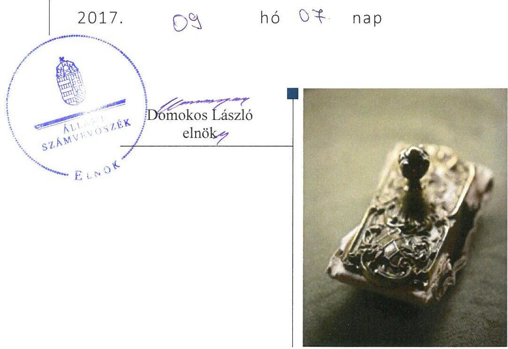
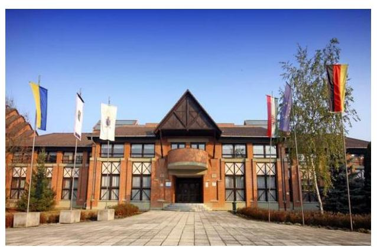
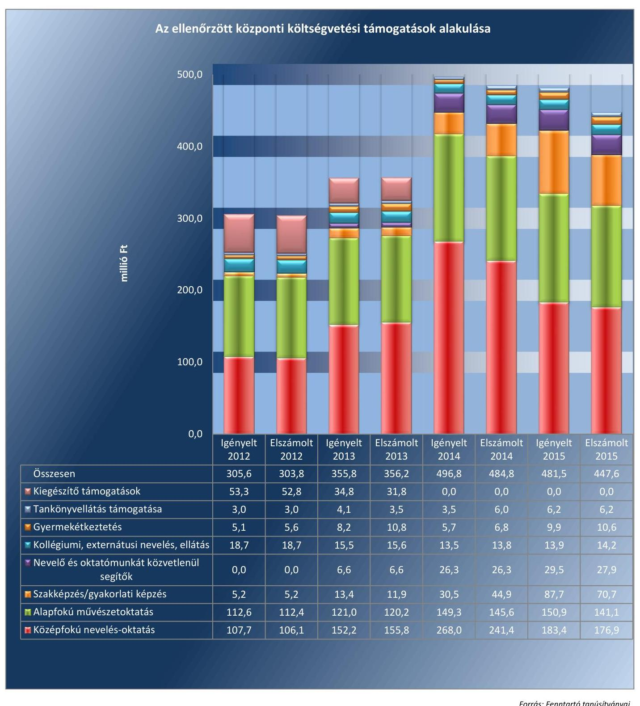
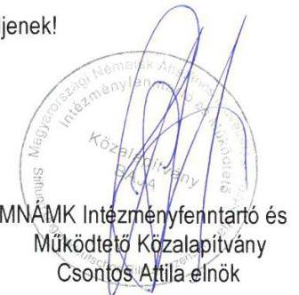
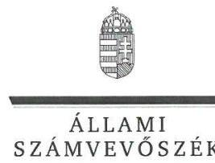
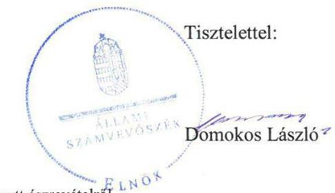
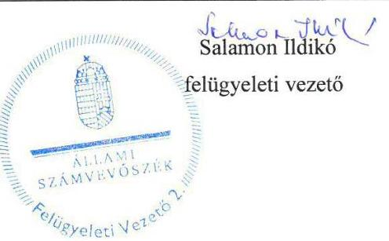

# Jelentés 

## Nem állami humánszolgáltatók ellenőrzése

A humánszolgáltatást nyújtó államháztartáson kívüli köznevelési intézmények, szolgáltatók fenntartói központi költségvetésből kapott támogatásai felhasználásának ellenőrzése Magyarországi Németek Általános Művelődési Központja Intézményfenntartó és Működtető Közalapítvány
2017.

---

# Jelentés 

## Nem állami humánszolgáltatók ellenőrzése

A humánszolgáltatást nyújtó államháztartáson kívüli köznevelési intézmények, szolgáltatók fenntartói központi költségvetésből kapott támogatásai felhasználásának ellenőrzése Magyarországi Németek Általános Művelődési Központja Intézményfenntartó és Működtető Közalapítvány

---

# AZ ELLENŐRZÉST FELÜGYELTE:

- **SALAMON ILDIKÓ** felügyeleti vezető

- **AZ ELLENŐRZÉST VEZETTE ÉS A VÉGREHAJTÁSÁÉRT FELELŐS:**

- **CSORDÁS PÉTERNÉ** ellenőrzésvezető

- **A PROGRAM ÖSSZEÁLLÍTÁSÁÉRT FELELŐS:**

- **JANIK JÓZSEF LÁSZLÓ** osztályvezető

**IKTATÓSZÁM: V-1158-094/2016.**

**TÉMASZÁM: 2192**

**ELLENŐRZÉS-AZONOSÍTÓ SZÁM: V076610**

Jelentéseink az Országgyűlés számítógépes hálózatán és az Interneten a www.asz.hu címen is olvashatóak.

---

# TARTALOMJEGYZÉK 

■ ÖSSZEGZÉS ..... 5
■ AZ ELLENŐRZÉS CÉLJA ..... 6
■ AZ ELLENŐRZÉS TERÜLETE ..... 7
■ AZ ELLENŐRZÉS HÁTTERE, INDOKOLTSÁGA ..... 9
■ A JELENTÉS LÉNYEGES KÉRDÉSKÖREI ..... 10
■ ELLENŐRZÉS HATÓKÖRE ÉS MÓDSZEREI ..... 11
■ MEGÁLLAPÍTÁSOK ..... 13
■ JAVASLATOK ..... 17
■ MELLÉKLETEK ..... 19
I. melléklet: Értelmező szótár ..... 19
II. melléklet: Az ellenőrzött központi költségvetési támogatások alakulása ..... 20
■ FÜGGELÉK: ÉSZREVÉTELEK ..... 21
■ RÖVIDÍTÉSEK JEGYZÉKE ..... 27

---

.

---

# ÖSSZEGZÉS 

A bajai székhelyű Magyarországi Németek Általános Művelődési Központja Intézményfenntartó és Működtető Közalapítványnál a közfeladat-ellátás kereteinek kialakítása szabályszerű volt. A központi költségvetésből kapott támogatásokat szabályszerűen adta át a fenntartott intézményeknek. A közfeladat-ellátás során az átláthatóság érvényesülését nem biztosította, mivel nem gondoskodott a jogszabályokban előírt közérdekű adatok, dokumentumok közzétételéről, így a nyilvánosság és a szolgáltatást igénybe vevők nem jutottak megfelelő információhoz.

## Az ellenőrzés társadalmi indokoltsága

Az Állami Számvevőszék stratégiájában hangsúlyos szerepet szán annak, hogy szilárd szakmai alapon álló, értékteremtő ellenőrzéseivel előmozdítsa a közpénzügyek átláthatóságát, rendezettségét és javaslataival a közpénzek és a közvagyon szabályos, gazdaságos, hatékony és eredményes felhasználását segítse. Stratégiájában az Állami Számvevőszék célul tűzte ki, hogy az államháztartáson kívülre nyújtott költségvetési támogatások ellenőrzésével hozzájárul ahhoz, hogy a közpénzeket az államháztartáson kívüli szervezetek is átlátható módon használják fel a közfeladatok szerződésben vállalt ellátása érdekében. Tekintettel az elmúlt években a köznevelés finanszírozását és a köznevelési intézmények fenntartását érintően végbement változásokra, a társadalom fokozott érdeklődéssel figyeli a köznevelési feladatok ellátására fordított források felhasználását. Fontos ezért az Állami Számvevőszéknek a közvéleményt biztosítani arról, hogy a közpénz államháztartáson kívüli felhasználása ezen a területen sem marad ellenőrizetlenül. Hozzájárul ezzel ahhoz is, hogy a nyilvánosság és az igénybevevők megfelelő tájékoztatást kapjanak az államháztartáson kívüli közfeladatot ellátók működéséről.

## Főbb megállapítások, következtetések

A Magyarországi Németek Általános Művelődési Központja Intézményfenntartó és Működtető Közalapítvány, mint intézményfenntartó a közfeladat-ellátás kereteit a jogszabályi előírásoknak megfelelően alakította ki. Alapító okirata megfelelt a jogszabályi előírásoknak, módosításait bejelentette a bíróság felé. Rendelkezett a központi költségvetési támogatások igénybevételéhez előírt feltételekkel. A jogszabályban előírt számviteli politikát és a kapcsolódó szabályzatokat elkészítette, azonban az illetmények és járulékok megfizetéséről szóló fenntartói nyilatkozat vonatkozásában iratmegőrzési kötelezettségét elmulasztotta. A belső szabályozottság megfelelt a jogszabályi előírásoknak.

A Magyarországi Németek Általános Művelődési Központja Intézményfenntartó és Működtető Közalapítvány az intézmények működtetésének a kereteit a jogszabályi előírásoknak megfelelően biztosította, az alapfeladatokat alapító okiratban meghatározta, a nyilvántartásokba vétel megtörtént és a szükséges működési engedélyek is rendelkezésre álltak. Az intézményi alapdokumentumokat a jogszabályokban előírtak szerint jóváhagyta, illetve azokhoz egyetértését adta. A központi költségvetésből kapott támogatásokat szabályszerűen átadta az intézményeknek, a támogatások felhasználásáról vezetett nyilvántartás megfelelt a jogszabályi előírásoknak.

A Magyarországi Németek Általános Művelődési Központja Intézményfenntartó és Működtető Közalapítvány a jogszabályi előírások ellenére nem biztosította az átláthatóság érvényesülését. Az intézmények pedagógiai programjaiban meghatározott feladatok végrehajtására, a pedagógiai-szakmai munka eredményességére vonatkozó értékelési feladatainak eleget tett, azonban a fenntartói értékeléseket - a 2014/2015. tanév kivételével - nem hozta nyilvánosságra. A közérdekű adatok közzétételére vonatkozó kötelezettség teljesítésének részletes szabályait belső szabályzatban nem állapította meg és nem gondoskodott a közérdekű adatok jogszabály szerinti közzétételéről. A beszámoló készítési kötelezettségének a jogszabályi előírásoknak megfelelően eleget tett.

---

# AZ ELLENŐRZÉS CÉLJA 

AZ ELLENŐRZÉS CÉLJA annak értékelése volt, hogy a Fenntartó ${ }^{1}$ központi költségvetésből kapott támogatásainak felhasználása szabályszerű volt-e, a támogatások igénylése, évközi módosítása és év végi elszámolása megfelelt-e a jogszabályi előírásoknak.

---

# AZ ELLENŐRZÉS TERÜLETE 

## A Magyarországi Németek Általános Művelődési Központja Intézményfenntartó és Működtető Közalapítvány, mint Fenntartó

A bajai székhelyű Fenntartó 1998. május 11-én alakult 87750 e Ft jegyzett tőkével, amelynek összege az ellenőrzött időszakban nem változott. Alapító tagjai Baja Város Önkormányzata, a Bács-Kiskun Megyei Önkormányzat, a Magyarországi Németek Országos Önkormányzata és a Bajai Német Kisebbségi Önkormányzat voltak.

A Fenntartó fő tevékenysége a Magyarországon élő német kisebbség oktatásával, kulturális életével kapcsolatos önkormányzati kötelezettségként meghatározott fenntartói feladatok ellátása volt. Közhasznú tevékenysége során közfeladatot látott el: nevelést és oktatást, képességfejlesztést, ismeretterjesztést és kulturális tevékenységet, valamint a magyarországi nemzeti kisebbségekkel kapcsolatos feladatokat. A Fenntartó 2012. évben egy fő részmunkaidős alkalmazottal rendelkezett, míg 2015. évben a statisztikai állományi létszám két fő volt.

A Fenntartó irányításával az 1998/1999-es tanévtől működő intézmény az MNÁMK ${ }^{2}$ ellátta a német nemzetiségi óvodai nevelés, általános iskolai, gimnáziumi és szakközépiskolai oktatás, érettségin alapuló szakképzés, kollégiumi ellátás, illetve közművelődési és iskolai könyvtár működtetése feladatait a bajai székhelyen. Az MNÁMK által ellátott feladatok fokozatosan bővültek. A 2009. szeptember 1-jétől Kecskeméten, 2010. szeptember 1-jétől Győrben, illetve 2012. szeptember 1-jétől Miskolcon induló tagintézmények a magyar közoktatási intézményektől eltérő szerkezetű, Baden-Württembergi tanterv szerint működő német nyelvű külföldi iskolának minősültek és általános iskolai, továbbá Kecskeméten és Győrben gimnáziumi oktatást végeztek. A győri tagintézmény ezen kívül rendelkezett nemzetiségi német-magyar tagozattal, melynek keretében a magyar tanterv szerinti kétnyelvű általános iskolai és gimnáziumi oktatást folytattak. 2012. március 9-én a győri tagintézmény, illetve annak tagozata kivált az MNÁMK-ból és önálló intézményként, AUDI Iskola ${ }^{3}$ néven folytatta tevékenységét. A 2014/2015-ös tanévtől kezdődően az AUDI Iskola fenntartói jogát a Fenntartó átadta a szétválással létrejött AUDI Közalapítvány ${ }^{4}$ számára.

A köznevelési feladatot ellátó Intézmények ${ }^{5}$ a Közokt. tv. ${ }^{6}$ és az Nkt. ${ }^{7}$ előírásai szerint jogi személynek minősültek, önálló költségvetéssel rendelkeztek, azzal önállóan gazdálkodtak. Az Intézmények engedélyezett tanulói létszáma 2012-ben 2495 fő, 2013-ban 2495 fő, 2014-ben 2595 fő, 2015-ben 1455 fő volt. A vonatkozó statisztikai adatok szerinti tényleges létszám minden évben az engedélyezett alatt alakult, 2012-ben 1251 fő, 2013-ban 1388 fő, 2014-ben 1004 fő, 2015-ben 1006 fő volt.

---

A Fenntartó 2012-2015 között minden évben központi költségvetési támogatás iránti igénylést nyújtott be a Kincstárhoz ${ }^{8}$, majd a kapott támogatásokkal a tárgyévet követően elszámolt. A II. melléklet tartalmazza az ellenőrzött központi költségvetési támogatások alakulását.

A Fenntartó, mint közfeladat-ellátásában részt vevő intézményfenntartó, Magyarország éves költségvetéséből támogatásra volt jogosult, amelynek összege az egyszerűsített éves beszámoló alapján 2012. évben 381,9 M Ft, 2013. évben 549,5 M Ft, 2014. évben 820,3 M Ft, 2015. évben pedig 729,1 M Ft volt. A 2014. évről 2015. évre a Fenntartó által igényelt, és számára folyósított költségvetési támogatás összege 91,2 M Ft-tal csökkent, melynek oka, az AUDI Iskola fenntartói jogának átadása az AUDI Közalapítvány számára. Az ellenőrzés időszakában a Fenntartó összes bevételének 34,0-57,4%-át tette ki az állami támogatás.

A Fenntartó összes bevétele a 2012. évi 1120,3 M Ft-ról 2015-re a bekövetkezett 13,3%-os emelkedéssel, 1269,2 M Ft-ra nőtt. A Fenntartó a központi költségvetésből kapott támogatáson kívül az ellenőrzött időszakban települési önkormányzatoktól és a Klebelsberg Intézményfenntartó Központtól kapott működési támogatást, ezen kívül bevételének egy részét egyéb támogatások képezték.

A szakmai irányító szervi feladatokat a Minisztérium ${ }^{9}$ látta el az ellenőrzött időszakban, ellenőrzési feladatokat az illetékes Kormányhivatalok ${ }^{10}$ végeztek.

---

# AZ ELLENŐRZÉS HÁTTERE, INDOKOLTSÁGA 

A köznevelési és szociális feladatokat ellátó nem állami intézményfenntartók részére közfeladataik ellátására évente jelentős összegű pénzügyi támogatást biztosítottak a mindenkori költségvetési törvények a bennük megfogalmazott feltételek mellett. A felhasználható állami támogatások Kvtv. ${ }^{11}$ szerinti előirányzata 2012-2015. években együtt 894,0 Mrd Ft volt. A 2013. évben jelentős változások következtek be a normatív finanszírozás rendszerében, amely érintette a nem állami intézményfenntartókat is. Az Országgyűlés elfogadta a nemzeti köznevelésről szóló 2011. évi CXC. törvényt, amely jelentősen átalakította a korábbi finanszírozási rendszert 2013 szeptemberétől. A köznevelési területen új feladatfinanszírozási forma (átlagbéralapú támogatás) jelent meg, amely a nem állami Intézményfenntartókra is vonatkozik. Az ellenőrzés a finanszírozási rendszerben 2011-2015 között bekövetkezett változásokra, azok közfeladat-ellátásra gyakorolt hatására fókuszál a költségvetési támogatásokat felhasználó államháztartáson kívüli szervezetek körében. Az ellenőrzés indokoltságát az is alátámasztja, hogy az ÁSZ ${ }^{12}$ még nem ellenőrizte átfogóan e területet.

Az ÁSZ stratégiájában foglaltak alapján is indokolt az ellenőrzés, amely a társadalom számára jelzi, hogy a közpénz államháztartáson kívüli felhasználása sem maradhat ellenőrizetlenül. Az államháztartáson kívülre nyújtott költségvetési támogatások ellenőrzésével az ÁSZ hozzájárul ahhoz, hogy a közpénzeket a nem állami humán fenntartók átlátható módon használják fel a közfeladatok ellátására kötött szerződésekben vállalt kötelezettségek teljesítése érdekében. Az ellenőrzés javaslataival hozzájárulhat az említett rendszerek szabályszerű támogatás felhasználásához, javíthatja a társadalmi-gazdasági döntések megalapozottságát, amely a „jó kormányzás" feltétele.

---

# A JELENTÉS LÉNYEGES KÉRDÉSKÖREI 

1.     - A Fenntartónál a közfeladat-ellátás kereteinek kialakítása szabályszerű volt-e?
2.     - A Fenntartó a központi költségvetésből kapott támogatásokat szabályszerűen használta-e fel?
3.     - A Fenntartó közfeladat-ellátása során biztosította-e az átláthatóság érvényesülését?
4.     - A Fenntartó intézkedett-e a külső ellenőrzések megállapításaira?

---

# ELLENŐRZÉS HATÓKÖRE ÉS MÓDSZEREI 

## Az ellenőrzés típusa

Megfelelőségi ellenőrzés.

## Az ellenőrzött időszak

A 2012. január 1-je és 2015. december 31-e közötti évek. A 2012. év vonatkozásában a költségvetési támogatások 2012. évet megelőző időszakra eső igénylését, a 2015. év tekintetében annak 2016-ban történő elszámolását is ellenőrizte az ÁSZ.

## Az ellenőrzés tárgya

Az ellenőrzés a köznevelési közfeladatokat ellátó nem állami fenntartó, központi költségvetésből kapott támogatásai felhasználására terjedt ki. Az alábbi jogcímek szabályszerűségének értékelését foglalta magában:

- az alap normatív- és átlagbér alapú költségvetési támogatások közül az óvodai nevelés, általános iskolai nevelés-oktatás, középfokú nevelés-oktatás, alapfokú művészetoktatás, kollégiumi ellátás, közművelődési és iskolai könyvtár működtetése,
- a kiegészítő támogatások közül a tanulóétkeztetési-, és a tankönyvtámogatás.
Az ellenőrzés kiterjedt minden olyan körülményre és adatra, amely az ÁSZ jogszabályban meghatározott feladatainak teljesítéséhez, valamint a program végrehajtása folyamán felmerült újabb összefüggések feltárásához szükséges volt.

## Az ellenőrzött szervezet

Magyarországi Németek Általános Művelődési Központja Intézményfenntartó és Működtető Közalapítvány

## Az ellenőrzés jogalapja

Az ellenőrzés jogszabályi alapját az ÁSZ tv. ${ }^{13}$ 1. § (3) bekezdése és az 5. § (3) bekezdésében foglalt előírások adták.

---

# Az ellenőrzés módszerei 

Az ellenőrzést az ellenőrzési program kérdései, az adott időszakban hatályos jogszabályok, az ellenőrzés szakmai szabályok és módszertanok, valamint a nemzetközi standardok
 figyelembevételével végezte az ÁSZ.

A közpénzekkel való felelős gazdálkodás segítésére irányuló javaslatok kidolgozásakor a hatályos jogszabályok voltak az irányadóak.

Az ellenőrzés ideje alatt az ÁSZ a Fenntartóval történő kapcsolattartást az ÁSZ SZMSZ ${ }^{14}$-ének vonatkozó előírásai alapján biztosította.

Az ellenőrzési kérdések megválaszolásához szükséges bizonyítékok megszerzése az ellenőrzöttek által rendelkezésre bocsátott dokumentumokra, adatokra alapozva megfigyeléssel, szemlével (szemrevételezéssel), kérdésfeltevéssel (információkéréssel), valamint elemző eljárással történt.

Az ellenőrzési bizonyítékként felhasznált adatforrások közé tartoztak egyrészt a szakmai program részletes szempontjainál felsorolt adatforrások, másrészt minden - az ellenőrzés folyamán feltárt, az ellenőrzés szempontjából információt tartalmazó - dokumentum.

Az ellenőrzés lefolytatásához a Fenntartó a kitöltött tanúsítványok, valamint az ÁSZ által kért dokumentumok elektronikus úton való megküldésével szolgáltatott adatokat, információkat. Az így rendelkezésre bocsátott adatok, információk és a tanúsítványok adatai valódiságának kontrollja az ellenőrzés keretében történt.

A szabályosság megítélésének az alapját képezte, hogy a központi költségvetési támogatások Fenntartó általi igénylése és év végi elszámolása a Kincstár felé megtörtént.

A központi költségvetési támogatások szabályszerű felhasználását a Fenntartó vonatkozásában, a támogatások Intézmények részére - annak működtetésére - történő továbbutalásának, valamint a támogatások felhasználásáról a jogszabályban előírt nyilvántartás vezetésének értékelésével végezte az ÁSZ.

---

# 1. A Fenntartónál a közfeladat-ellátás kereteinek kialakítása szabályszerű volt-e? 

## Összegző megállapítás

### 1.1. számú megállapítás

### 1.2. számú megállapítás

A Fenntartó a közfeladat-ellátás kereteit szabályszerűen alakította ki.

A Fenntartónál a közfeladat-ellátás szervezeti kereteinek kialakítása összességében megfelelt a jogszabályi előírásoknak.

A Fenntartó a közoktatási, köznevelési közfeladat-ellátási tevékenységének szervezeti kereteit a Civil tv ${ }^{15}$., a Közokt. tv. és az Nkt. előírásainak megfelelően kialakította. A Fenntartó rendelkezett a Ptk. ${ }^{16}$ és a Ptk. ${ }^{17}$ előírásainak megfelelő hatályos alapító okirattal. ${ }^{18}$ A Fenntartó alapító okiratának módosítását minden esetben annak jóváhagyását követően, a Cnytv. ${ }^{19}$ által előírt határidőn belül jelentette be a bíróságnak. A Fenntartó alaptevékenysége mellett vállalkozási tevékenységet is folytatott a mindenkor hatályos alapító okiratában foglalt felhatalmazás alapján. A Fenntartó rendelkezett a Kuratórium által határozattal elfogadott SZMSZ-szel ${ }^{20}$.

A Fenntartó a támogatásigényléshez benyújtott dokumentációja szerint - a támogatás igénylés alapját jelentő - Áht.-ban ${ }^{21}$ foglalt feltételeknek megfelelt, mivel átlátható szervezetnek minősült, továbbá rendezett munkaügyi kapcsolatokkal rendelkezett. A költségvetési támogatás igénylését megalapozó - Közokt. vhr.-ben ${ }^{22}$ és az Nkt. vhr.-ben ${ }^{23}$ előírtaknak megfelelő - dokumentumok és összesítő nyilvántartások a Fenntartónál rendelkezésre álltak. A Fenntartó rendelkezett információval az Intézmények OM azonosítójáról ${ }^{24}$, a gyermek, illetve tanuló létszámról, az alkalmazottakról.

A Fenntartó az iratmegőrzési kötelezettségének nem tett eleget, mivel a 2015. évre vonatkozó, pedagógusokkal és a nevelő-oktató munkát segítő munkakörben foglalkoztatott dolgozókkal kapcsolatban tett fenntartói nyilatkozatot - az illetmények és járulékok megfizetéséről - nem őrizte meg, megsértve ezzel az Ltt. ${ }^{25}$ 9. § (1) bekezdés e) pontjának előírását, valamint a 2014. január 1-jétől hatályos Iratkezelési szabályzat ${ }^{26}$ II. fejezet 4. pontját.

## A Fenntartó belső szabályozottsága megfelelt a jogszabályi előírásoknak.

A Fenntartó számviteli politikával rendelkezett, annak kialakítása megfelelt a Számv. tv. ${ }^{27}$ és a Civilszr. ${ }^{28}$ előírásainak, továbbá a számviteli politika ${ }^{29}$ keretében elkészítette a leltározási szabályzatot ${ }^{30}$, az értékelési szabályzatot ${ }^{31}$, valamint a pénzkezelési szabályzatot ${ }^{32}$. Önköltségszámítás rendjére vonatkozó belső szabályzat készítésére vonatkozó kötelezettség alól a Számv. tv. 14. § (6) bekezdése alapján mentesült, mivel egyszerűsített éves beszámolót készített. A Fenntartó rendelkezett a Számv. tv. előírásainak megfelelő számlarenddel ${ }^{33}$.

---

# 2. A Fenntartó a központi költségvetésből kapott támogatásokat szabályszerűen használta-e fel? 

## Összegző megállapítás

2.1. számú megállapítás
2.2. számú megállapítás

A Fenntartó a központi költségvetésből kapott támogatásokat az Intézmények működtetésére, szabályszerűen használta fel.

A Fenntartó összességében a jogszabályi előírásoknak megfelelően biztosította az Intézmények működtetésének a kereteit.

A Fenntartó meghatározta az Intézmények alapfeladatait a Közokt. tv., illetve az Nkt. előírásaival összhangban az Intézmények alapító okirataiban. ${ }^{34}$ Az Intézmények az ellenőrzött időszakban szerepeltek az illetékes kormányhivatalok nyilvántartásában, a KIR ${ }^{35}$ nyilvántartásban, valamint rendelkeztek OM azonosítóval. A Fenntartónál rendelkezésre álltak a Közokt. tv.-ben, a Közokt. vhr.-ben, az Nkt.-ben, valamint az Nkt. vhr.-ben előírt hatályos intézményi működési engedélyek. A Fenntartó az engedélyezési eljárások során igazolta, hogy az Intézmények közfeladat-ellátásához szükséges személyi és tárgyi feltételeket biztosította.

A Fenntartó Intézmények működtetését megalapozó feladatellátása összességében szabályszerű volt. A Fenntartó a 2012. január 1. és 2012. augusztus 31. közötti időszakot érintően a Közokt. tv.-ben előírtaknak megfelelően jóváhagyta az intézményi SZMSZ-eket ${ }^{36}$, minőségirányítási programokat, pedagógiai programokat és házirendeket. Az Nkt.-ben előírtaknak megfelelően a 2012. szeptember 1. és 2015. december 31. közötti időszak vonatkozásában az Intézmények pedagógiai programjához, házirendjéhez, szervezeti és működési szabályzatához egyetértését adta.

A Fenntartó nem határozta meg a kérhető költségtérítés és tandíj megállapításának szabályait a Közokt. tv. 102.§ (2) bekezdés b) pontjában előírtak ellenére, valamint a kérhető térítési díj és tandíj megállapításának szabályait az Nkt. 83. § (2) bekezdés c) pontjában foglaltak ellenére.

A Fenntartó kuratóriuma az ellenőrzött időszakban határozatokban fogadta el az Intézmények költségvetését és beszámolóját.

A Fenntartó a jogszabályi előírásoknak megfelelően átadta az Intézmények részére a központi költségvetési támogatásokat.

A központi költségvetési támogatások átadásának kötelezettségét a Fenntartó a hatályos Kvtv.-ek figyelembevételével betartotta, a költségvetési támogatás teljes összegét a jogszabályban előírt 15 napon belül átadta az Intézmények részére.

A költségvetési támogatások felhasználását a Fenntartó az analitikus nyilvántartásában vezette, amely 2012. január 1. és 2013. október 4. között a Közokt. vhr. vonatkozó rendelkezésének megfelelő volt, a normatív hozzájárulás és támogatás átadásával kapcsolatos adatok alaptevékenységenkénti bontásban való elkülönített és naprakész nyilvántartása biztosított volt. Az Nkt. vhr.-ben foglaltaknak megfelelően 2013. október 5. és 2015. december 31. között a Fenntartó a támogatások felhasználását alapfeladatonkénti bontásban elkülönítetten és naprakészen tartotta nyilván, amely tartalmazta, hogy a támogatások milyen határnappal kerültek átadásra és milyen célra kerültek felhasználásra.

---

# 3. A Fenntartó közfeladat-ellátása során biztosította-e az átláthatóság érvényesülését? 

## Összegző megállapítás

### 3.1. számú megállapítás

A Fenntartó közfeladat-ellátása során nem biztosította az átláthatóság érvényesülését.

A Fenntartó nem biztosította, hogy a szolgáltatást igénybe vevők megfelelő információkhoz jussanak az Intézmények működéséről.

Az ellenőrzött időszakon belül 2012. augusztus 31-ig a Közokt. tv. szerint négyévente egyszer elvégzendő - az Intézmények gazdálkodására, működése törvényességére, az Intézmények hatékonyságának, a szakmai munka eredményességének értékelésére, gyermek- és ifjúságvédelmi tevékenységére, valamint a tanuló- és gyermekbaleset megelőzése érdekében tett intézkedésekre vonatkozó - ellenőrzés nem történt. A Fenntartó az MNÁMK szakmai munkájának eredményességét a 2012-2015. években nemzetiségi szakértővel ellenőriztette.

A Fenntartó a 2013-2015. években az Nkt. által biztosított lehetőséggel nem élt, azaz nem végzett ellenőrzést az általa fenntartott Intézmények gazdálkodásával, a működésük hatékonyságával, illetve a költségvetési támogatások felhasználásával kapcsolatosan.

A Fenntartó az ellenőrzéssel érintett években az Intézmények pedagógiai programjában meghatározott feladatok végrehajtását, a pedagógiaiszakmai munka eredményességét a Közokt. tv. és az Nkt. előírásainak megfelelően értékelte, azonban a fenntartói értékeléseket - a 2014/2015. tanévre vonatkozó értékelés MNÁMK honlapján ${ }^{37}$ történő nyilvánosságra hozatalán kívül - nem hozta nyilvánosságra a saját honlapján, annak hiányában a helyben szokásos módon, megsértve ezzel a Közokt. tv. 104. § (6) bekezdésének, illetve az Nkt. 85. § (3) bekezdésének előírásait.

## 3.2. számú megállapítás

A Fenntartó nem biztosította a közérdekű adatok nyilvánosságát.
A Fenntartó az Info. tv. ${ }^{38}$ 7. § (2) bekezdésében foglalt előírást megsértve nem alakította ki az Info. tv., valamint az egyéb adat- és titokvédelmi szabályok érvényre juttatásához szükséges eljárási szabályokat, ezáltal fennállt a személyes adatok jogellenes felhasználásának kockázata, továbbá az Info. tv. 35. § (3) bekezdésében előírtak ellenére a közérdekű adatok közzétételére vonatkozó kötelezettség teljesítésének részletes szabályait belső szabályzatban nem állapította meg.

A Fenntartó az Info.tv. 37.§ (1) bekezdés szerinti elektronikus közzétételi kötelezettségének nem tett eleget, mivel az Info. tv. 1. melléklete szerinti általános közzétételi listában meghatározott szervezeti, személyzeti adatai, tevékenységére, működésére vonatkozó adatai, valamint gazdálkodási adatait nem az Info. tv. 33. § (3) bekezdésében meghatározott honlapon tette közzé, hanem az intézménye, az MNÁMK honlapján.

---

# 3.3. számú megállapítás 

A Fenntartó a beszámoló készítési kötelezettségének a jogszabályoknak megfelelően eleget tett.

A Fenntartó a Civilszr. előírásai szerint kettős könyvvitelt vezetett és egyszerűsített éves beszámolót készített, valamint a Civil tv. előírása szerint elkészítette a beszámoló közhasznúsági mellékletét.

A Fenntartó a Civilszr.-ben előírt, kötelező könyvvizsgálati kötelezettségnek eleget tett, a könyvvizsgáló az ellenőrzött évekre a Fenntartó beszámolóit hitelesítő záradékkal látta el.

A Fenntartó egyszerűsített éves beszámolói az Országos Bírósági Hivatal által fenntartott közhiteles Civil Szervezetek Névjegyzékében ${ }^{39}$ hozzáférhetőek.

## 4. A Fenntartó intézkedett-e a külső ellenőrzések megállapításaira?

## Összegző megállapítás

A Fenntartó intézkedett a külső ellenőrzések által tett, intézkedést igénylő megállapításokra.

A Kincstár a Fenntartó által benyújtott elszámolásokat az ellenőrzési időszak minden évében felülvizsgálta és annak eredményeként határozatban állapított meg többlettámogatást, valamint a 2015. évre vonatkozóan visszafizetési kötelezettséget, amelyet a Fenntartó teljesített.

A Kincstár hatósági ellenőrzés keretében vizsgálta az elszámolás megalapozottságát jelentő nyilvántartások meglétét, vezetését, a tanügyi-igazgatási dokumentumokat, amelyek során a Fenntartó terhére 2012., 2013., 2014. évekre vonatkozóan finanszírozási különbözetet állapított meg. A Fenntartó visszafizetési kötelezettségeinek határidőn belül eleget tett.

Az ellenőrzött időszakban az Oktatási Hivatal Tanügyi-igazgatási és Területi Koordinációs Főosztálya egy alkalommal végzett pedagógiai-szakmai ellenőrzést, a feltárt hiányosság megszüntetése érdekében a Fenntartó intézkedett.

---

# JAVASLATOK 

Az ÁSZ tv. 33. § (1) bekezdésében foglaltak értelmében az ellenőrzött szervezet vezetője köteles a jelentésben foglalt megállapításokhoz kapcsolódó intézkedési tervet összeállítani és azt a jelentés kézhezvételétől számított 30 napon belül az ÁSZ részére megküldeni. Amennyiben az ellenőrzött szervezet vezetője nem küldi meg határidőben az intézkedési tervet, vagy továbbra sem elfogadható intézkedési tervet küld, az Állami Számvevőszék elnöke az ÁSZ tv. 33. § (3) bekezdés a) és b) pontjaiban foglaltakat érvényesítheti.

## a Magyarországi Németek Általános Művelődési Központja Intézményfenntartó és Működtető Közalapítvány Kuratóriuma elnökének

1. Intézkedjen a jogszabályban és a belső szabályzatban foglaltaknak megfelelően az iratmegőrzési kötelezettség teljesítésére.
(1.1. számú megállapítás 3. bekezdése alapján)
2. Kezdeményezze, hogy a Fenntartó a jogszabályi előírásoknak megfelelően határozza meg a térítési díj és tandíj megállapításának szabályait.
(2.1. számú megállapítás 3. bekezdése alapján)
3. Intézkedjen, hogy a Fenntartó a honlapján, annak hiányában a helyben szokásos módon - a jogszabályi előírásnak megfelelően - hozza nyilvánosságra a nevelési-oktatási intézmény pedagógiai programjában meghatározott feladatok végrehajtásával, a pedagógiai-szakmai munka eredményességével összefüggő értékelését.
(3.1. számú megállapítás 3. bekezdése alapján)
4. Intézkedjen a jogszabályi előírásoknak megfelelően
a) az adatok biztonságának, védelmének érvényre juttatásához szükséges eljárási szabályok meghatározására;
b) a közérdekű adatok közzétételére vonatkozó kötelezettség teljesítése részletes szabályainak belső szabályzatban történő megállapítására;
c) az Info tv. 1. melléklete szerinti általános közzétételi listában meghatározott adatok közzétételére.
(3.2. számú megállapítás 1. és 2. bekezdései alapján)

---

.

---

# MELLÉKLETEK 

- I. MELLÉKLET: ÉRTELMEZŐ SZÓTÁR
átlagbéralapú támogatás
feladatfinanszírozás
humánszolgáltatás
Intézményfenntartó
köznevelési
 alapfeladat
köznevelési intézmény
közoktatási információs rendszer / köznevelés információs rendszer (KIR) nem állami fenntartású köznevelési intézmények

Az átlagbér alapú támogatás alapja a pedagógus-munkakörben, valamint nevelő-, oktató munkát közvetlenül segítő munkakörben foglalkoztatottak után kifizetett személyi juttatás és járulék. (2013. évi CCXXX. törvény Magyarország 2014. évi központi költségvetéséről 33. § (4) bekezdés)
A közfeladat államháztartáson kívüli szervezet által történő ellátásához közvetlenül kapcsolódó, arányos működési költségeket finanszírozó költségvetési támogatás. (az egyesülési jogról, a közhasznú jogállásról, valamint a civil szervezetek működéséről és támogatásáról szóló 2011. évi CLXXV. törvény 2. § (8) bekezdés)
Szociális, gyermekjóléti, gyermekvédelmi, közoktatási, felsőoktatási, kulturális közfeladatok. (2011. évi Kvtv. és a 2012. évi Kvtv.)
Az a természetes vagy jogi személy, aki vagy amely a köznevelési feladat ellátására való jogosultságot megszerezte vagy azzal rendelkezik, és - e törvényben foglalt esetben a működtetővel közösen - a köznevelési intézmény működéséhez szükséges feltételekről gondoskodik. (Nkt. 4. § 9. pont)
A köznevelési intézmény alapító okiratában foglalt feladat: óvodai nevelés, nemzetiséghez tartozók óvodai nevelése, általános iskolai nevelés-oktatás, nemzetiséghez tartozók általános iskolai nevelése-oktatása, kollégiumi ellátás, nemzetiségi kollégiumi ellátás, gimnáziumi nevelés-oktatás, szakközépiskolai nevelés-oktatás, szakiskolai nevelés-oktatás, nemzetiségi gimnáziumi nevelés-oktatása, nemzetiségi szakközépiskolai nevelés-oktatása, nemzetiségi szakiskolai nevelés-oktatása, Köznevelési Hídprogramok keretében folyó nevelés-oktatás, felnőttoktatás, alapfokú művészetoktatás, fejlesztő nevelés, fejlesztő nevelés-oktatás, pedagógiai szakszolgálati feladat, a többi gyermekkel, tanulóval együtt nevelhető, oktatható sajátos nevelési igényű gyermekek, tanulók óvodai nevelése és iskolai nevelése-oktatása, azoknak a sajátos nevelési igényű gyermekeknek, tanulóknak az óvodai, iskolai, kollégiumi ellátása, akik a többi gyermekkel, tanulóval nem foglalkoztathatók együtt, a gyermekgyógyüdülőkben, egészségügyi intézményekben, rehabilitációs intézményekben tartós gyógykezelés alatt álló gyermekek tankötelezettségének teljesítéséhez szükséges oktatás, pedagógiai-szakmai szolgáltatás.(Nkt. 4. § 1. pont)
A köznevelési intézmény a törvényben meghatározott köznevelési feladatok ellátására létesített intézmény. A köznevelési intézmény a Fenntartójától elkülönült, önálló költségvetéssel rendelkező jogi személy, amely a nyilvántartásba való bejegyzéssel, a bejegyzés napján jön létre. (Nkt. 21. § (1) bekezdés)
A KIR a közoktatás feladataiban közreműködők által szolgáltatott adatokra épülő, országos, elektronikus nyilvántartási és adatszolgáltatási rendszer. (20/1997. (II. 13.) Korm. rendelet 11. § (1) bekezdése)
nem az állam és nem az önkormányzat által fenntartott egyházi és magán köznevelési intézmények

---

# II. MELLÉKLET: AZ ELLENŐRZÖTT KÖZPONTI KÖLTSÉGVETÉSI TÁMOGATÁSOK ALAKULÁSA 

---

# FÜGGELÉK: ÉSZREVÉTELEK 

Az Állami Számvevőszék a jelentéstervezetet 15 napos észrevételezésre megküldte az ellenőrzött szervezet vezetőjének az ÁSZ tv. 29. § (1) bekezdése előírásának megfelelően.

A Magyarországi Németek Általános Művelődési Központja Intézményfenntartó és Működtető Közalapítvány Kuratóriuma elnöke az ellenőrzés megállapításaira írásban észrevételt tett. Az észrevétel alapján az Állami Számvevőszék nem módosította a jelentést.
A függelék tartalmazza az ellenőrzött szervezet vezetőjének az észrevételét és az arra adott választ, a figyelembe nem vett észrevételről, annak indokáról szóló tájékoztatást.

[^0]
[^0]:    * 29. § (1) Az Állami Számvevőszék az ellenőrzési megállapításait megküldi az ellenőrzött szervezet vezetőjének vagy az általa megbízott személynek, és annak, akinek személyes felelősségét állapította meg.
    (2) Az ellenőrzött szervezet vezetője és a felelősként megjelölt személy az ellenőrzés megállapításaira tizenöt napon belül írásban észrevételt tehet.
    (3) Az Állami Számvevőszék az észrevételre a beérkezésétől számított harminc napon belül írásban válaszol. A figyelembe nem vett észrevételeket köteles a jelentésben feltüntetni, és megindokolni, hogy azokat miért nem fogadta el.

---

Elnök: Csontos Attila

# Állami Számvevőszék Elnöke Domokos László Úr részére 

## Budapest

Ikt.szám: V-1158-078/2016.

## Tisztelt Elnök Úr!

2017. június 29. napján általunk kézhez vett fenti iktató számú számvevőszéki ellenőrzés megállapításaira az ÁSZ tv. 29. § (2) bekezdése alapján, a jogszabályban előírt határidőben az alábbi

## észrevételt

tesszük:
Kérjük, hogy a jelentés tervezet 13. oldalának 1.1 pontjában rögzített megállapítás utolsó bekezdését szíveskedjék annak nem tényszerű volta miatt elhagyni, illetőleg annak mellőzéséről rendelkezni a következők miatt:
A 2015. évre vonatkozó, pedagógusokkal és a nevelő- oktató munkát segítő munkakörben foglalkoztatott dolgozókkal kapcsolatban tett fenntartói nyilatkozatot - az illetmények és járulékok megfizetéséről - megőriztük, és az iktatott iratok között tároltuk. Ezt az iratot egyébként a számvevők a helyszíni ellenőrzés alkalmával meg is tekintették, még ha korábban nem is kérték annak szkennelt változatú beterjesztését.

Mellékelten csatoljuk a jelen észrevétel mellé az irat másolatát, valamint az iktató könyv vonatkozó oldalát annak igazolásául, hogy az említett irat iktatott dokumentumként a rendelkezésünkre áll.

Mivel a mellőzni kért bekezdés a fentiek alapján iratellenes és nem okszerű megállapítást tartalmaz, ezért kérjük annak a végleges jelentésből történő elhagyását, hiszen nem sértettük meg sem az Ltt. 9. § (1) bekezdés e) pontját, sem az iratkezelési szabályzat II. fejezet 4. pontját.

Egyebekben a jelentés tervezet megállapításait el tudjuk fogadni, így más vonatkozásban korrekciót a jelen észrevételünk alapján nem kérünk.

Kérjük, hogy a végleges jelentést részünkre megküldeni szíveskedjenek!
Baja, 2017. július 3.
Tisztelettel:

---

ELNÖK

Ikt.szám: V-1158-088/2016.

# Csontos Attila úr 

kuratórium elnöke
Magyarországi Németek Általános Művelődési Központja
Intézményfenntartó és Működtető Közalapítvány

## Baja

## Tisztelt Elnök Úr!

Köszönettel megkaptam a 2017. július 11. napján az Állami Számvevőszékhez érkezett a „Nem állami humánszolgáltatók ellenőrzése - A humánszolgáltatást nyújtó államháztartáson kívüli köznevelési intézmények, szolgáltatók fenntartói központi költségvetésből kapott támogatásai felhasználásának ellenőrzése - Magyarországi Németek Általános Művelődési Központja Intézményfenntartó és Működtető Közalapítvány" címû számvevőszéki jelentéstervezetben foglalt megállapításra írásban tett észrevételét.

Tájékoztatom Elnök urat, hogy a jelentésben - az Állami Számvevőszékről szóló 2011. évi LXVI. törvény 29. § (3) bekezdése alapján - a figyelembe nem vett észrevételt szerepeltetjük az elutasítás indokának feltüntetésével együtt.

Az Állami Számvevőszék észrevételre vonatkozó álláspontjáról a felügyeleti vezető által készített részletes tájékoztatást mellékelten megküldöm.

Budapest, 2017. 29 hó 2/nap

Melléklet: Tájékoztatás a figyelembe nem vett észrevételről

---

# Tájékoztatás a figyelembe nem vett észrevételről 

|  | Észrevétel: | A 2015. évi költségvetési támogatások elszámolása során, a pedagógusokkal és a nevelő-oktató munkát segítő munkakörben foglalkoztatott dolgozókkal kapcsolatban az illetmények és járulékok megfizetéséről tett fenntartói nyilatkozat megőrzésére vonatkozó kötelezettség teljesítéséről (az 1.1. számú megállapítás 3. bekezdéséhez kapcsolódóan). Az észrevétel érinti a Kuratórium elnökének címzett 1. számú javaslatot (az 1.1. számú megállapítás 3. bekezdése alapján). |
| :--: | :--: | :--: |
|  | Válasz: | Az Állami Számvevőszék az észrevételt nem fogadja el. |
| 1. | Indoklás: | A dokumentumok ismételt áttekintése alapján, az észrevétel nem megalapozott.   Az észrevételben foglaltakkal ellentétben, a pedagógusokkal és a nevelő-oktató munkát segítő munkakörben foglalkoztatott dolgozókkal kapcsolatban tett fenntartói nyilatkozat az Állami Számvevőszék adatbekérésében szerepelt. Az Állami Számvevőszék Főtitkára által 2016. szeptember 13-án kiadmányozott, V-1158-031/2016. iktatószámú levelében új adatszolgáltatási kötelezettség teljesítésére szólította fel a Közalapítvány Kuratóriuma elnökét az Állami Számvevőszékről szóló 2011. évi LXVI. törvény 28. § (1)-(2) bekezdéseiben foglaltak alapján. Az adatbekérő levél 1. számú melléklet 29. sora tartalmazta a „pedagógusokkal, a nevelő-oktató munkát segítő munkakörben foglalkoztatottakkal kapcsolatban tett nyilatkozat az illetmények és járulékok megfizetéséről" címû dokumentumok megküldését.   A Közalapítvány részéről az Állami Számvevőszék Elektronikus Adatszolgáltató Rendszerébe 2016. szeptember 22-én feltöltött „nyilatk költségvet tam.pdf" elnevezésű fájl a 2013. és a 2014. évekre vonatkozó fenntartói nyilatkozatokat tartalmazza, a 2015. évre vonatkozóan nyilatkozatot azonban nem.   A Közalapítvány Kuratóriuma elnöke 2016. szeptember 26-án teljességi és hitelességi nyilatkozatot küldött meg az Állami Számvevőszék részére. A nyilatkozat tartalmazta, hogy az ellenőrzött tárgykörben kért és átadott dokumentumon kívül más adatokkal, iratokkal nem rendelkeznek. |
| :--: | :--: |

Az észrevételéhez csatolt iktató könyv vonatkozó oldalának másolati példánya a pedagógusokkal és a nevelő-oktató munkát segítő munkakörben foglalkoztatott dolgozókkal kapcsolatban tett fenntartói nyilatkozat megőrzését nem bizonyítja, mindössze a „nyilatkozatok" Magyar Államkincstár részére történő megküldését tartalmazza.   Az előzőekben foglaltakra tekintettel, az Állami Számvevőszéknek nem áll módjában elfogadnia az észrevételéhez csatolt, adatszolgáltatási határidőn túl az Állami Számvevőszékhez érkezett 2015. évre vonatkozó, a pedagógusokkal és a nevelő-oktató munkát segítő munkakörben foglalkoztatott dolgozókkal kapcsolatban tett fenntartói nyilatkozatot.   Ebből következően az 1.1. számú megállapítás 3. bekezdésében tett megállapítás, valamint az 1. számú javaslat módosítása nem indokolt. |

Budapest, 2017. 07 hó 25 nap

---

.

---

# RÖVIDÍTÉSEK JEGYZÉKE 

${ }^{1}$ Fenntartó
${ }^{2}$ MNÁMK
${ }^{3}$ AUDI Iskola
${ }^{4}$ AUDI Közalapítvány
${ }^{5}$ Intézmények
${ }^{6}$ Közokt. tv.
${ }^{7}$ Nkt.
${ }^{8}$ Kincstár
${ }^{9}$ Minisztérium
${ }^{10}$ Kormányhivatal
${ }^{11}$ Kvtv.
${ }^{12}$ ÁSZ
${ }^{13}$ ÁSZ tv.
${ }^{14}$ ÁSZ SZMSZ
${ }^{15}$ Civil tv.
${ }^{16}$ Ptk. 1
${ }^{17}$ Ptk. 2
${ }^{18}$ alapító okirat

Magyarországi Németek Általános Művelődési Központja Intézményfenntartó és Működtető Közalapítvány
Magyarországi Németek Általános Művelődési Központja
AUDI HUNGARIA Óvoda, Általános Iskola és Gimnázium
AUDI Hungária Iskola Intézményfenntartó és Működtető Közalapítvány
Magyarországi Németek Általános Művelődési Központja és AUDI HUNGARIA Óvoda, Általános Iskola és Gimnázium
1993. évi LXXIX. törvény a közoktatásról (hatálytalan 2013. október 05-től)
2011. évi CXC. törvény a nemzeti köznevelésről (hatályos 2012. szeptember 01-től)
Magyar Államkincstár
2012. május 13-ig Nemzeti Erőforrás Minisztérium, 2012. május 14-től Emberi Erőforrások Minisztériuma
A Fenntartó ellenőrzött időszaki tevékenység ellátási helyei alapján illetékes megyei Kormányhivatalok (az NMÁMK esetében a Bács-Kiskun Megyei Kormányhivatal, az Audi Iskola esetében a Győr-Moson-Sopron Megyei Kormányhivatal)
Magyarország központi költségvetéséről szóló törvények
Kvtv1. - 2011. évi CLXXXVIII. törvény Magyarország 2012. évi központi költségvetéséről
Kvtv2. - 2012. évi CCIV. törvény Magyarország 2013. évi központi költségvetéséről
Kvtv3. - 2013. évi CCXXX. törvény Magyarország 2014. évi központi költségvetéséről
Kvtv4. - 2014. évi C. törvény Magyarország 2015. évi központi költségvetéséről Állami Számvevőszék
2011. évi LXVI. törvény az Állami Számvevőszékről (hatályos 2011. július 01-től)
az Állami Számvevőszék szervezeti és működési szabályzata
2011. évi CLXXV. törvény az egyesülési jogról, a közhasznú jogállásról, valamint a civil szervezetek működéséről és támogatásáról (hatályos 2011. december 22-től) 1959. évi IV. törvény a Polgári Törvénykönyvről
2013. évi V. törvény a Polgári Törvénykönyvről (hatályos 2014. március 15-től) Magyarországi Németek Általános Művelődési Központja Intézményfenntartó és Működtető Közalapítvány alapító okiratai
Közalapítvány alapító okirata1 (hatályos: 2011.09.01 - 2012.03.20)
Közalapítvány alapító okirata2 (hatályos: 2012.03.21 - 2012.06.28)
Közalapítvány alapító okirata3 (hatályos: 2012.06.29 - 2013.01.09)
Közalapítvány alapító okirata4 (hatályos: 2013.01.10 - 2013.07.17)
Közalapítvány alapító okirata5 (hatályos: 2013.07.18 - 2013.12.09)
Közalapítvány alapító okirata6 (hatályos: 2013.12.10 - 2014.04.22)
Közalapítvány alapító okirata7 (hatályos: 2014.04.23 - 2014.10.01)
Közalapítvány alapító okirata8 (hatályos: 2014.10.02 - 2015.03.05)
Közalapítvány alapító okirata9 (hatályos: 2015.03.06 - 2015.10.04)
Közalapítvány alapító okirata10 (hatályos: 2015.10.05-től)

---

${ }^{19}$ Cnytv.
${ }^{20}$ SZMSZ
${ }^{21}$ Áht.
${ }^{22}$ Közokt. vhr.
${ }^{23}$ Nkt. vhr.
${ }^{24}$ OM azonosító
${ }^{25}$ Ltt.
${ }^{26}$ Iratkezelési szabályzat
${ }^{27}$ Számv. tv.
${ }^{28}$ Civilszr.
${ }^{29}$ számviteli politika
${ }^{30}$ leltározási szabályzat
${ }^{31}$ értékelési szabályzat
${ }^{32}$ pénzkezelési szabályzat
${ }^{33}$ számlarend
${ }^{34}$ intézményi alapító okiratok
2011. évi CLXXXI. törvény a civil szervezetek bírósági nyilvántartásáról és az ezzel összefüggő eljárási szabályokról
Magyarországi Németek Általános Művelődési Központja Intézményfenntartó és Működtető Közalapítvány Szervezeti és Működési Szabályzatai
SZMSZ1 - Közalapítvány Kuratóriumának Szervezeti és Működési Szabályzata (hatályos: 2011.11.01 - 2012.03.08)
SZMSZ2 - Közalapítvány Kuratóriumának Szervezeti és Működési Szabályzata (hatályos: 2012.03.09 - 2013.03.21)
SZMSZ3 - Közalapítvány Kuratóriumának Szervezeti és Működési Szabályzata (hatályos: 2013.03.22 -

 2014.11.06)
SZMSZ4 - Közalapítvány Kuratóriumának Szervezeti és Működési Szabályzata (hatályos: 2014.11.07-től)
2011. évi CXCV. törvény az államháztartásról (hatályos 2012. január 1-jétől)

20/1997. (II. 13.) Korm. rendelet a közoktatásról szóló 1993. évi LXXIX. törvény végrehajtásáról (hatálytalan 2013. október 5-től)
229/2012. (VIII. 28.) Korm. rendelet a nemzeti köznevelésről szóló törvény végrehajtásáról (hatályos 2012. szeptember 1-jétől)
egységes oktatási azonosító
1995. évi LXVI. törvény a közokiratokról, a közlevéltárakról és a magánlevéltári anyag védelméről szóló (hatályos 1996. január 1-jétől)
Magyarországi Némettek Általános Művelődési Központja Intézményfenntartó és Működtető Közalapítvány iratkezelési szabályzata, hatályos 2014. január 1-jétől
2000. évi C. törvény a számvitelről

224/2000. (XII. 19.) Korm. rendelet a számviteli törvény szerinti egyes egyéb szervezetek beszámoló-készítési és könyvvezetési kötelezettségének sajátosságairól
Magyarországi Némettek Általános Művelődési Központja Intézményfenntartó és Működtető Közalapítvány számviteli politikái
Közalapítvány számviteli politikája1 (hatályos: 2011.04.01 - 2012.03.08)
Közalapítvány számviteli politikája2 (hatályos: 2012.03.09 - 2013.12.31)
Közalapítvány számviteli politikája3 (hatályos: 2014.01.01-től)
Közalapítvány eszközök és források leltárkészítési és leltározási szabályzata (hatályos: 2011.01.01-től)
Közalapítvány eszközök és források értékelési szabályzata (hatályos: 2010.01.29-től)
Magyarországi Némettek Általános Művelődési Központja Intézményfenntartó és Működtető Közalapítvány pénzkezelési szabályzatai
Közalapítvány pénzkezelési szabályzata1 (hatályos: 2010.10.19 - 2013.12.31)
Közalapítvány pénzkezelési szabályzata2 (hatályos: 2014.01.01-től)
Magyarországi Némettek Általános Művelődési Központja Intézményfenntartó és Működtető Közalapítvány számlarendjei
Közalapítvány számlarendje1 (hatályos: 2012.01.01 - 2012.12.31)
Közalapítvány számlarendje2 (hatályos: 2013.01.01 - 2013.12.31)
Közalapítvány számlarendje3 (hatályos: 2014.01.01 - 2014.12.31)
Közalapítvány számlarendje4 (hatályos: 2015.01.01-től)
MNÁMK, AUDI Iskola alapító okiratai
alapító okirat1 - az MNÁMK alapító okirata, hatályos 2011. augusztus 1-jétől alapító okirat2 - az MNÁMK alapító okirata, hatályos 2012. augusztus 1-jétől alapító okirat3 - az MNÁMK alapító okirata, hatályos 2013. szeptember 1-jétől

---

${ }^{35}$ KIR
${ }^{36}$ Intézményi SZMSZ-ek
${ }^{37}$ MNÁMK honlapja
${ }^{38}$ Info.tv.
${ }^{39}$ Civil Szervezetek Névjegyzéke
alapító okirat4 - az MNÁMK alapító okirata, hatályos 2014. szeptember 1-jétől alapító okirat5 - az MNÁMK alapító okirata, hatályos 2015. szeptember 1-jétől alapító okirat6 - az AUDI Iskola alapító okirata, hatályos 2012. augusztus 1-jétől alapító okirat7 - az AUDI Iskola alapító okirata, hatályos 2013. augusztus 31-től alapító okirat8 - az AUDI Iskola alapító okirata, az új fenntartóra vonatkozó pontok kivételével hatályos 2014. március 7-től, új fenntartóra vonatkozó pontok hatályosak 2014. július 14-től
Köznevelés információs rendszere
MNÁMK, AUDI Iskola SZMSZ-ei
az MNÁMK Szervezeti és Működési Szabályzata - hatályos 2011. április 1-jétől az MNÁMK Szervezeti és Működési Szabályzata - hatályos 2012. március 9-től az MNÁMK Szervezeti és Működési Szabályzata - hatályos 2013. március 22-től az MNÁMK Szervezeti és Működési Szabályzata - hatályos 2014. november 7-től az AUDI Iskola Szervezeti és Működési Szabályzata - hatályos 2013. március 1-jétől www.mnamk.hu/fenntartó
2011. évi CXII. törvény az információs önrendelkezési jogról és az információszabadságról (hatályos: 2011. július 27-től)
http://birosag.hu/allampolgaroknak/civil-szervezetek/civil-szervezetek-nevjegyzeke-kereses

---

# ÁLLAMI SZÁMVEVŐSZÉK 

1052 Budapest, Apáczai Csere János utca 10.
Levélcím: 1364 Budapest 4. Pf. 54
Telefon: +36 14849100 Telefax: +36 14849200
www.asz.hu
