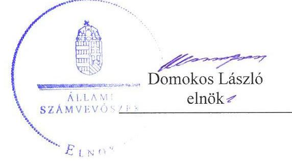
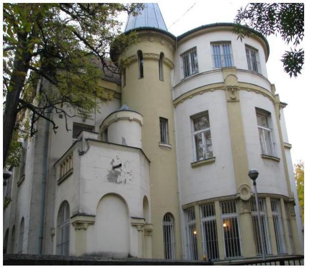
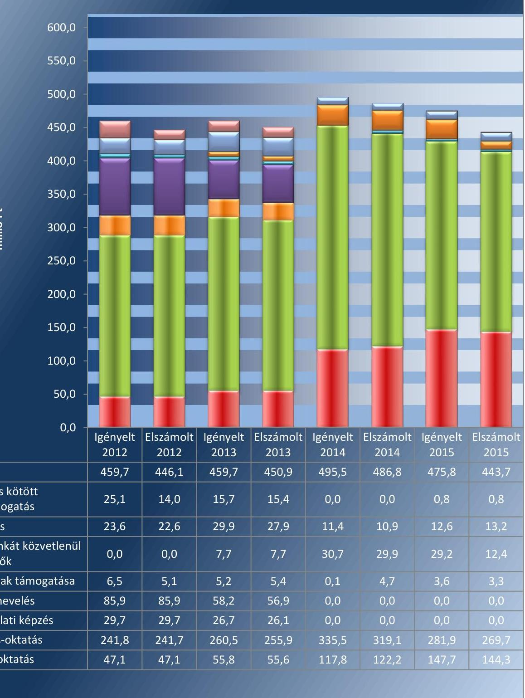
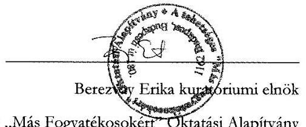
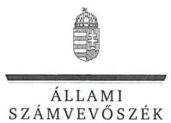
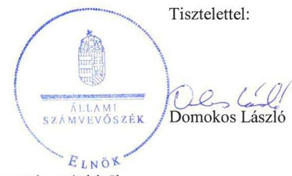
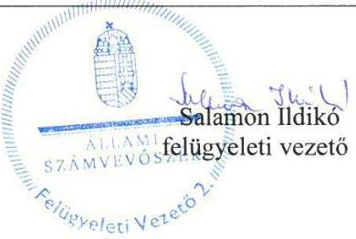

# Jelenetés 

## Nem állami humánszolgáltatók ellenőrzése

A humánszolgáltatást nyújtó államháztartáson kívüli köznevelési intézmények, szolgáltatók fenntartói központi költségvetésből kapott támogatásai felhasználásának ellenőrzése Tehetséges „Más Fogyatékosokért" Oktatási Alapítvány
2017.

---

# Jelentés 

## Nem állami humánszolgáltatók ellenőrzése

A humánszolgáltatást nyújtó államháztartáson kívüli köznevelési intézmények, szolgáltatók fenntartói központi költségvetésből kapott támogatásai felhasználásának ellenőrzése Tehetséges „Más Fogyatékosokért" Oktatási Alapítvány
2017. 03 hó 04 nap

---

# AZ ELLENŐRZÉST FELÜGYELTE:

- **SALAMON ILDIKÓ** felügyeleti vezető

- **AZ ELLENŐRZÉST VEZETTE ÉS A VÉGREHAJTÁSÁÉRT FELELŐS:**

- **KEREKES PÉTER** ellenőrzésvezető

- **A PROGRAM ÖSSZEÁLLÍTÁSÁÉRT FELELŐS:**

- **JANIK JÓZSEF** osztályvezető

**IKTATÓSZÁM:** V-1159-092/2016.

**TÉMASZÁM:** 2193

**ELLENŐRZÉS-AZONOSÍTÓ SZÁM:** V076609

Jelentéseink az Országgyűlés számítógépes hálózatán és az Interneta a www.asz.hu címen is olvashatóak.

---

# TARTALOMJEGYZÉK 

■ ÖSSZEGZÉS ..... 5
■ AZ ELLENŐRZÉS CÉLJA ..... 6
■ AZ ELLENŐRZÉS TERÜLETE ..... 7
■ AZ ELLENŐRZÉS HÁTTERE, INDOKOLTSÁGA ..... 9
■ A JELENTÉS LÉNYEGES KÉRDÉSKÖREI ..... 10
■ ELLENŐRZÉS HATÓKÖRE ÉS MÓDSZEREI ..... 11
■ MEGÁLLAPÍTÁSOK ..... 13
■ JAVASLATOK ..... 18
■ MELLÉKLETEK ..... 21
I. melléklet: Értelmező szótár ..... 21
II. melléklet: Az ellenőrzött központi költségvetési támogatások alakulása ..... 22
■ FÜGGELÉK: ÉSZREVÉTELEK ..... 23
■ RÖVIDÍTÉSEK JEGYZÉKE ..... 39

---

.

---

# ÖSSZEGZÉS 

A budapesti székhelyú Tehetséges „Más Fogyatékosokért" Oktatási Alapítványnál a közfel-adat-ellátás kereteinek kialakítása nem felelt meg a jogszabályi előirásoknak. A központi költségvetési támogatásokat összességében szabályszerűen átadta az intézményének. A köz-feladat-ellátás során az átláthatóság érvényesülését nem biztositotta, mivel nem gondoskodott a jogszabályokban elöirt közérdekü adatok, dokumentumok közzétételével a nyilvánosság és a szolgáltatást igénybe vevők tájékoztatásáról.

## Az ellenőrzés társadalmi indokoltsága

Az Állami Számvevőszék stratégiájában hangsúlyos szerepet szán annak, hogy szilárd szakmai alapon álló, értékteremtő ellenőrzéseivel előmozdítsa a közpénzügyek átláthatóságát, rendezettségét és javaslataival a közpénzek és a közvagyon szabályos, gazdaságos, hatékony és eredményes felhasználását segítse. Stratégiájában az Állami Számvevőszék célul tűzte ki, hogy az államháztartáson kívülre nyújtott költségvetési támogatások ellenőrzésével hozzájárul ahhoz, hogy a közpénzeket az államháztartáson kívüli szervezetek is átlátható módon használják fel a közfeladatok szerződésben vállalt ellátása érdekében. Tekintettel az elmúlt években a köznevelés finanszírozását és a köznevelési intézmények fenntartását érintően végbement változásokra, a társadalom fokozott érdeklődéssel figyeli a köznevelési feladatok ellátására fordított források felhasználását. Fontos ezért a közvéleményt biztosítani arról, hogy a közpénz államháztartáson kívüli felhasználása ezen a területen sem marad ellenőrizetlenül. Hozzájárul ezzel ahhoz is, hogy a nyilvánosság és a szolgáltatást igénybe vevők megfelelő tájékoztatást kapjanak az államháztartáson kívüli közfeladatot ellátók múködéséről.

## Főbb megállapítások, következtetések

A Tehetséges „Más Fogyatékosokért" Oktatási Alapítványnál a közoktatási, köznevelési közfeladat-ellátás szervezeti kereteinek kialakítása összességében szabályszerű volt. Rendelkezett alapító okirattal. A támogatás igénylés alapját jelentő feltételeknek megfelelt, az igénybevételhez szükséges, jogszabályban előírt adatok, valamint az elszámoláshoz szükséges nyilvántartások és dokumentumok a rendelkezésére álltak. Belső szabályozottsága nem volt szabályszerű, mivel a számviteli politikája, a leltározási szabályzata, a pénzkezelési szabályzata, a számlarendje és az iratkezelési szabályzata nem felelt meg a jogszabályi előírásoknak.

A Tehetséges „Más Fogyatékosokért" Oktatási Alapítvány a központi költségvetésből kapott támogatásokat teljes összegben átadta az intézménye részére, azonban 2012-ben és 2013-ban több alkalommal a törvényben előírt 15 napos határidőn túl. Intézménye múködtetésének kereteit a jogszabályokban előírtak szerint biztosította, az alapfeladatait alapító okiratban meghatározta, a nyilvántartásokba vétel megtörtént, és a szükséges múködési engedélyek is rendelkezésre álltak. Az intézményi alapdokumentumokat a jogszabályokban előírtak szerint jóváhagyta.

A Tehetséges „Más Fogyatékosokért" Oktatási Alapítvány az intézménye pedagógiai programjában meghatározott feladatok végrehajtását, a pedagógiai-szakmai munka eredményességére vonatkozó értékelési feladatait ellátta, azonban az értékeléseit és a törvényben előírt közérdekú adatokat nem tette közzé, így nem gondoskodott a nyilvánosság és a szolgáltatást igénybe vevők tájékoztatásáról. Nem határozta meg az adatok biztonságának, védelmének érvényre juttatásához szükséges eljárási szabályokat, továbbá nem szabályozta a kötelezően közzéteendő adatok nyilvánosságra hozatalának rendjét. Az egyszerűsített éves beszámolói nem feleltek meg a jogszabályi előírásoknak, mert az eredménykimutatásban nem egymástól elkülönítve mutatta ki az alaptevékenységgel, valamint a gazdaságivállalkozási tevékenységgel összefüggő tételeket, a továbbutalási céllal kapott támogatásokat nem egyéb bevételként, hanem rendkívüli bevételként mutatta ki, és az eredménykimutatásban szereplő összegeket a főkönyvi nyilvántartás adatai nem támasztották alá.

---

# AZ ELLENŐRZÉS CÉLJA 

AZ ELLENŐRZÉS CÉLJA annak értékelése volt, hogy a Fenntartó ${ }^{1}$ központi költségvetésből kapott támogatásainak felhasználása szabályszerű volt-e, a támogatások igénylése, évközi módosítása és év végi elszámolása megfelelt-e a jogszabályi előírásoknak.

---

# **AZ ELLENŐRZÉS TERÜLETE**

## **Tehetséges „Más Fogyatékosokért” Oktatási Alapítvány**

A budapesti székhelyű Fenntartót egy magánszemély alapította 1998. november 12-i dátummal, 100 ezer Ft induló vagyonnal. Az ellenőrzött időszakban a Fenntartó alapító okiratának² módosítására egy esetben került sor, mert a Fenntartó alapítója 2014. május 23-án alapító jogait és kötelezettségeit egy másik magánszemélyre ruházta át.

Az alapítvány célja rászoruló gyermekek tandíj-támogatása, tehetséges és fogyatékos, speciális nevelési igényű gyermekek nevelése, elméleti kutatómunka támogatása, pedagógusok továbbképzésének támogatása. A Fenntartó 2015. április 8-ig kiemelkedően közhasznú szervezet, 2015. április 9-től közhasznú szervezet volt.

A Fenntartó a közfeladat ellátását a Gyermekház Általános Iskola, Gimnázium, Szakképző és Speciális Szakiskola fenntartásával végezte a Budapesten és Fejér megyében található telephelyein. 2012-ben egy budapesti telephely, 2014-ben a Fejér megyei telephely megszüntetésre került. Az Intézmény³ alapfeladatai az alapfokú, illetve általános iskolai nevelés-oktatás, általános és szakmai középfokú, illetve gimnáziumi, szakközépiskolai, és szakiskolai nevelés-oktatás, 2012-2013. években az alapfokú művészetoktatás voltak. Az Intézmény közoktatási tevékenységének speciális területe, hogy valamennyi feladatellátási helyén felvállalja a többi tanulóval együtt nevelhető, oktatható, magatartási, beilleszkedési és/vagy tanulási nehézséggel küzdő, sajátos nevelési igényű, hátrányos helyzetű tanulók együtt nevelő-oktató, inkluzív, integrált oktatását, egyénre szabott fejlesztését. Az Intézmény önálló jogi személyként működő, önállóan gazdálkodó szervezet volt.

Az Intézmény engedélyezett tanulói létszáma 2012-ben 2615 fő, 2013-ban 2495 fő, 2014-ben 2133 fő, 2015-ben 2133 fő volt. A vonatkozó statisztikai adatok szerinti tényleges létszám minden évben az engedélyezett alatt alakult, 2012-ben 1531 fő, 2013-ban 1243 fő, 2014-ben 963 fő, 2015-ben 764 fő volt.

A Fenntartó az ellenőrzött időszak minden évében igényelt központi költségvetési támogatásokat, majd a kapott támogatásokkal a tárgyévet követően elszámolt. A II. melléklet tartalmazza az ellenőrzött központi költségvetési támogatások alakulását. Ezen felül közoktatási megállapodás keretében is részesült központi költségvetési támogatásban. A Fenntartó, az Intézmény és a Minisztérium⁴ között az ellenőrzött időszak elején hatályban volt közoktatási megállapodást a 2012. október 17-én aláírt új közoktatási megállapodás váltotta fel 5 éves időtartamra. A Fenntartónak 2012. június 30-ig közszolgáltatási megállapodása volt Budapest Főváros Önkormányzatával a sajátos nevelési igényű gyermekekkel kapcsolatos oktatásinevelési feladatellátásra. A Fenntartó – tevékenységéből adódó jogosultsága alapján – az egyszerűsített éves beszámolói alapján Magyarország éves központi költségvetéséből 2012. évben 567 099 ezer Ft, 2013. évben

---

585814 ezer Ft, 2014. évben 621694 ezer Ft, 2015. évben 601840 ezer Ft támogatást kapott.

A Fenntartónak az ellenőrzött időszakban nem volt alkalmazottja, munkájában közérdekű önkéntes tevékenységet végző személyek működtek közre, akik száma 2012-ben 5 fő, 2015-ben 3 fő volt.

A Fenntartó a Civil tv. ${ }^{5}$ szerinti gazdasági-vállalkozási tevékenységet végzett 2015. november 27-ig ingatlan bérbeadás formájában.

A szakmai irányító szervi feladatokat a Minisztérium látta el az ellenőrzött időszakban, ellenőrzési feladatokat az illetékes Kormányhivatalok ${ }^{6}$ végeztek.

---

# AZ ELLENŐRZÉS HÁTTERE, INDOKOLTSÁGA 

A köznevelési és szociális feladatokat ellátó nem állami intézményfenntartók részére közfeladataik ellátására évente jelentős összegű pénzügyi támogatást biztosítottak a mindenkori költségvetési törvények a bennük megfogalmazott feltételek mellett. A felhasználható állami támogatások Kvtv. ${ }^{7}$ szerinti előirányzata 2012-2015. években együtt 894 Mrd Ft volt. A 2013. évben jelentős változások következtek be a normatív finanszírozás rendszerében, amely érintette a nem állami intézményfenntartókat is. Az Országgyűlés elfogadta a nemzeti köznevelésről szóló 2011. évi CXC. törvényt, amely jelentősen átalakította a korábbi finanszírozási rendszert 2013 szeptemberétől. A köznevelési területen új feladatfinanszírozási forma (átlagbéralapú támogatás) jelent meg, amely a nem állami intézményfenntartókra is vonatkozik. Az ellenőrzés a finanszírozási rendszerben 2012-2015 között bekövetkezett változásokra, azok közfeladat ellátásra gyakorolt hatására fókuszál a költségvetési támogatásokat felhasználó államháztartáson kívüli szervezetek körében. Az ellenőrzés indokoltságát az is alátámasztja, hogy az ÁSZ ${ }^{8}$ még nem ellenőrizte átfogóan e területet.

Az ÁSZ stratégiájában foglaltak alapján is indokolt az ellenőrzés, amely a társadalom számára jelzi, hogy a közpénz államháztartáson kívüli felhasználása sem maradhat ellenőrizetlenül. Az államháztartáson kívülre nyújtott költségvetési támogatások ellenőrzésével az ÁSZ hozzájárul ahhoz, hogy a közpénzeket a nem állami humán fenntartók átlátható módon használják fel a közfeladatok ellátására kötött szerződésekben vállalt kötelezettségek teljesítése érdekében. Az ellenőrzés javaslataival hozzájárulhat az említett rendszerek szabályszerű támogatás felhasználásához, javíthatja a társa-dalmi-gazdasági döntések megalapozottságát, amely a „jó kormányzás" feltétele.

---

# A JELENTÉS LÉNYEGES KÉRDÉSKÖREI 

1.     - A Fenntartónál a közfeladat-ellátás kereteinek kialakítása szabályszerű volt-e?
2.     - A Fenntartó a központi költségvetésből kapott támogatásokat szabályszerűen használta-e fel?
3.     - A Fenntartó a közfeladat ellátása során biztosította-e az átláthatóság érvényesülését?
4.     - A Fenntartó intézkedett-e a külső ellenőrzések megállapításaira?

---

# ELLENŐRZÉS HATÓKÖRE ÉS MÓDSZEREI 

## Az ellenőrzés típusa

Megfelelőségi ellenőrzés.

## Az ellenőrzött időszak

A 2012. január 1-je és 2015. december 31-e közötti évek. A 2012. év vonatkozásában a költségvetési támogatások 2012. évet megelőző időszakra eső igénylését, a 2015. év tekintetében annak 2016-ban történő elszámolását is ellenőrizte az ÁSZ.

## Az ellenőrzés tárgya

Az ellenőrzés a köznevelési közfeladatokat ellátó nem állami fenntartó, központi költségvetésből kapott támogatásai felhasználására terjedt ki. Az alábbi jogcímek szabályszerűségének értékelését foglalta magában:
$\longrightarrow$ az alap normatív- és átlagbér alapú költségvetési támogatások közül az általános iskolai nevelés-oktatás, középfokú nevelés-oktatás.
$\longrightarrow$ a kiegészítő támogatások közül a tanulóétkeztetési- és a tankönyvtámogatás.
Az ellenőrzés kiterjedt minden olyan körülményre és adatra, amely az ÁSZ jogszabályban meghatározott feladatainak teljesítéséhez, valamint a program végrehajtása folyamán felmerült újabb összefüggések feltárásához szükséges volt.

## Az ellenőrzött szervezet

Tehetséges „Más Fogyatékosokért" Oktatási Alapítvány

## Az ellenőrzés jogalapja

Az ellenőrzés jogszabályi alapját az ÁSZ tv. ${ }^{\circ} 1 . \S$ (3) bekezdése és az 5. § (3) bekezdéseiben foglalt előírások adták.

## Az ellenőrzés módszerei

Az ellenőrzést az ellenőrzési program kérdései, az adott időszakban hatályos jogszabályok, az ellenőrzés szakmai szabályok és módszertanok, valamint a nemzetközi standardok figyelembevételével végezte az ÁSZ.

---

A közpénzekkel való felelős gazdálkodás segítésére irányuló javaslatok kidolgozásakor a hatályos jogszabályok voltak az irányadóak.

Az ellenőrzés ideje alatt az ÁSZ a Fenntartóval történő kapcsolattartást az ÁSZ SZMSZ ${ }^{10}$-ének vonatkozó előírásai alapján biztosította.

Az ellenőrzési kérdések megválaszolásához szükséges bizonyítékok megszerzése az ellenőrzöttek által rendelkezésre bocsátott dokumentumokra, adatokra alapozva megfigyelés, szemle (szemrevételezés), kérdésfeltevés (információkérés), valamint elemző eljárással történt.

Az ellenőrzési bizonyítékként felhasznált adatforrások közé tartoztak egyrészt a szakmai program részletes szempontjainál felsorolt adatforrások, másrészt minden - az ellenőrzés folyamán feltárt, az ellenőrzés szempontjából információt tartalmazó - dokumentum.

Az ellenőrzés lefolytatásához a Fenntartó a kitöltött tanúsítványok, valamint az ÁSZ által kért dokumentumok elektronikus úton való megküldésével szolgáltatott adatokat, információkat. Az így rendelkezésre bocsátott adatok, információk és a tanúsítványok adatai valódiságának kontrollja az ellenőrzés keretében történt.

A szabályosság megítélésének az alapját képezte, hogy a központi költségvetési támogatások Fenntartó általi igénylése és év végi elszámolása a Kincstár ${ }^{11}$ felé megtörtént.

A központi költségvetésből kapott támogatások szabályszerű felhasználását a Fenntartó vonatkozásában, a támogatások intézmény részére - annak múködtetésére - történő továbbutalásának, valamint a támogatások felhasználásáról a jogszabályban előírt nyilvántartás vezetésének az értékelésével végezte az ÁSZ.

---

# 1. A Fenntartónál a közfeladat-ellátás kereteinek kialakítása szabályszerű volt-e? 

Összegző megállapítás

### 1.1. számú megállapítás

A Fenntartónál a közfeladat-ellátás kereteinek kialakítása nem volt szabályszerű.

A Fenntartónál a közfeladat-ellátás szervezeti kereteinek kialakítása összességében megfelelt a jogszabályi előírásoknak.

A Fenntartó a közoktatási, köznevelési közfeladat-ellátási tevékenységének szervezeti kereteit a Közokt. tv ${ }^{12}$. és az Nkt. ${ }^{13}$ előírásainak megfelelően kialakította.

A Fenntartó az ellenőrzött időszakban rendelkezett alapító okirattal, amely 2014. május 22 -ig megfelelt a Ptk. ${ }^{14}$-ben előírtaknak. Azonban 2014. május 23 -tól 2015. november 27 -ig nem felelt meg a Ptk. ${ }^{15} 3: 391$. § (2) bekezdés d) pontjában előírtaknak, mivel gazdasági-vállalkozási tevékenységet végzett, azonban annak folytatásáról és kereteiről nem rendelkezett. 2015. november 28 -tól nem végzett a Civil tv. szerinti gazdaságivállalkozási tevékenységet, ezért ettől az időponttól fogva az alapító okirata már megfelelt a Ptk. ${ }_{2}$-ben előírtaknak. A 2014. május 22 -ig hatályos alapító okirat a Civil tv. 40. § (1) bekezdésében előírtak ellenére nem hozott létre a vezető szervtől elkülönült felügyelő szervet annak ellenére, hogy az éves bevétele meghaladta a jogszabályban meghatározott 50 millió Ft-os értékhatárt, valamint a Civil tv. 37. § (2) bekezdés a) pontjában előírtak ellenére nem tartalmazta a Fenntartó döntéshozó szervének határozatképességére vonatkozó rendelkezéseket. A Fenntartó alapító okirata, vagy ennek felhatalmazása alapján belső szabályzat 2014. május 23 -tól nem rendelkezett a szolgáltatás igénybevétele módjának nyilvánosságáról, megsértve ezzel a Civil tv. 37. § (3) bekezdés d) pontjában előírtakat. Az ellenőrzött időszakban az alapító okirat egyszer módosult. A Fenntartó az alapító okirat módosulását szabályszerűen bejelentette a bíróság felé.

Az ellenőrzött időszakot megelőzően a Fenntartó alapító okiratában az alapítói vagyont 100 ezer Ft-ról 1 millió Ft-ra emelte az alapító, azonban a Fenntartó 2015. évi egyszerűsített éves beszámolójának kiegészítő melléklete szerint a 900 E Ft rendelkezésre bocsátása a Ptk. ${ }_{1} 74 / A$ § (1) bekezdésében és a Ptk. ${ }_{2} 3: 382$. § (1) bekezdésében előírtak ellenére az ellenőrzött időszak végéig nem valósult meg.

A Fenntartó a támogatás igénylés alapját jelentő, Áht. ${ }^{16}$-ben foglalt feltételeknek megfelelt, mivel nyilatkozata szerint átlátható szervezetnek minősült, és rendezett munkaügyi kapcsolatokkal rendelkezett. A költségvetési támogatás igénylés alapját, feltételeit jelentő dokumentumok, nyilvántartások a jogszabályban előírtaknak megfeleltek. A Fenntartó bekérte az Intézménytől a támogatások igénybevételéhez szükséges, a Közokt. vhr. ${ }^{17}$, illetve az Nkt. vhr. ${ }^{18}$ által előírt adatokat. A Fenntartó rendelkezett infor-

---

mációval az Intézmény OM azonosítójáról ${ }^{19}$, a tanulói létszámról és az alkalmazottakról. A Közokt. vhr., illetve az Nkt. vhr. által előírt tanügyi okmányokról (beírási napló, törzslap, csoportnapló) vezetett nyilvántartás a Fenntartó rendelkezésére állt.

# 1.2. számú megállapítás 

## A Fenntartó belső szabályozottsága nem felelt meg a jogszabályi előírásoknak.

A Fenntartó teljesítette a Számv. tv. ${ }^{20}$-ben előírt kötelezettségét a számviteli politika ${ }^{21}$ elkészítésére. A számviteli politika tartalmazta az értékelési szabályzatot is, valamint a számviteli politika keretében elkészítette a leltározási szabályzatot ${ }^{22}$ és a pénzkezelési szabályzatot ${ }^{23}$. Önköltségszámítás rendjére vonatkozó belső szabályzat készítésére vonatkozó kötelezettség alól a Számv. tv. 14. § (6) bekezdése alapján mentesült, mivel egyszerűsített éves beszámolót készített.

A Fenntartó a Számv. tv. 14. § (4) bekezdésben előírtak ellenére a számviteli politikájában nem rögzítette azokat a rá jellemző szabályokat, előírásokat, módszereket, amelyekkel meghatározza, hogy mit tekint a számviteli elszámolás, az értékelés szempontjából lényegesnek, jelentősnek.

A Fenntartó a 2012. január 1. és 2012. december 31. között, a 2014. január 1. és 2014, december 31. között, valamint a 2015. január 1-től hatályos számviteli politikájában a jelentős összegű hiba definícióját a Számv. tv. 3. § (3) bekezdés 3. pontjában előírtaktól eltérően határozta meg.

A Fenntartó leltározási szabályzata a Számv. tv. 69. § (3) bekezdésében előírtakkal ellentétben nem szabályozta a mennyiségi felvétellel történő leltározás gyakoriságát.

A Fenntartó pénzkezelési szabályzatában a Számv. tv. 14. § (8) bekezdésében előírtak ellenére nem rendelkezett a pénzforgalom bankszámlán történő lebonyolításának rendjéről, a pénzkezelés személyi feltételeiről, valamint a készpénzállományt érintő pénzmozgások jogcímeiről és eljárási rendjéről.

A Fenntartó elkészítette a számlarendjét ${ }^{24}$, amely azonban a Számv. tv. 161. § (2) bekezdés a) pontjában előírtak ellenére nem tartalmazta minden alkalmazásra kijelölt számla számjelét és megnevezését, valamint ugyanezen bekezdés d) pontjában előírtak ellenére a számlarendben foglaltakat alátámasztó bizonylati rendet.

A Fenntartó által kiadott, az Intézménnyel közös iratkezelési szabályzat ${ }^{25}$ nem felelt meg az Ltv. ${ }^{26}$ 9. § (4) bekezdésében számára előírtaknak, mivel mindössze a címében vonatkozott a Fenntartóra is, tartalmában kizárólag az Intézmény iratkezelését határozta meg.

---

# 2. A Fenntartó a központi költségvetésből kapott támogatásokat szabályszerűen használta-e fel? 

Összegző megállapítás

2.1. számú megállapítás

A Fenntartó a központi költségvetésből kapott támogatásokat összességében szabályszerűen adta át az Intézménynek.

## A Fenntartó biztosította az Intézmény szabályszerű múködtetésének kereteit.

A Fenntartó az intézménye alapfeladatait az ellenőrzött időszakban meghatározta a Közokt. tv., illetve az Nkt. előírásaival összhangban az Intézmény alapító okiratában ${ }^{27}$. Az Intézmény szerepelt az illetékes kormányhivatalok nyilvántartásában, a KIR ${ }^{28}$ nyilvántartásban, valamint rendelkezett OM azonosítóval. A Fenntartó a Közokt. tv. és az Nkt. előírásainak megfelelően biztosította, hogy az Intézmény rendelkezzen múködési engedéllyel az alapító okirat szerinti közoktatási, illetve köznevelési feladatokra. Telephelyei múködési engedély módosítási kérelmeit a feladatellátási hely szerint illetékes kormányhivatalhoz benyújtotta. A Fenntartó a múködési engedélyezési eljárások során igazolta, hogy a közfeladat ellátásához szükséges személyi és tárgyi feltételeket biztosította.

A Fenntartó az ellenőrzött időszakban jóváhagyta az Intézmény szervezeti és múködési szabályzatát, minőségirányítási programját, pedagógiai programját és házirendjét. Ez a 2012. január 1. és 2012. augusztus 31. közötti időszakot érintően megfelelt a Közokt. tv.-ben előírtaknak, és ezzel 2012. szeptember 1-től az egyetértési kötelezettségének is eleget tett az Nkt.-ban előírt esetekben. A Közokt. tv.-ben és az Nkt.-ban előírtaknak megfelelően meghatározta az Intézmény költségvetését.

A Fenntartó a Közokt. tv.-ben előírtaknak megfelelően bízta meg az Intézmény vezetőjét, akinek személye az ellenőrzött időszakban két alkalommal, 2012-ben és 2013-ban változott. Az új vezetők megbízása szabályszerű volt, és 4 hónapos illetve 5 éves időtartamra szólt.

## A Fenntartó a központi költségvetésből kapott támogatások átadásának kötelezettségét összességében betartotta.

A Fenntartó az ellenőrzött időszakban a kapott támogatás teljes összegét átadta az Intézménynek, azonban a 2012. évi Kvtv. 38. § (1) bekezdés h) pontjában, a 2013. évi Kvtv. 35. § (1) bekezdés a) pontjának aa) alpontjában (2013. április 4-től szeptember 27-ig) és a 35/E. § (7) bekezdésében (2013. október 1-től december 31-ig) előírtak ellenére 2012. márciusban, augusztusban, szeptemberben, októberben, valamint 2013. szeptemberben, októberben, novemberben és decemberben nem a törvényben előírt 15 napos határidőn belül. A Fenntartó analitikus nyilvántartása tartalmazta, hogy az Intézmény részére mikor adott át támogatásokat.

---

# 3. A Fenntartó a közfeladat ellátása során biztosította-e az átláthatóság érvényesülését? 

## Összegző megállapítás

### 3.1. számú megállapítás

A Fenntartó a közfeladat ellátása során nem biztosította az átláthatóság érvényesülését.

A Fenntartó nem biztosította, hogy a szolgáltatást igénybe vevők megfelelő információhoz jussanak az Intézmény múködéséről.

Az Intézmény Fenntartó általi ellenőrzésének megszervezése a Közokt. tv.ben és az Nkt.-ban előírtakkal összhangban történt. A Fenntartó a Közokt. tv.-ben, valamint az Nkt.-ban előírtaknak megfelelően ellenőrizte az Intézmény gazdálkodását, a feladatellátását, a szakmai munkájának eredményességét, valamint a múködésének törvényességét.

A Fenntartó a Közokt. tv.-ben, illetve az Nkt.-ban előírtaknak megfelelően értékelte az Intézmény pedagógiai programjában meghatározott feladatok végrehajtását, a pedagógiai-szakmai munka eredményességét az ellenőrzött időszakban, azonban az értékeléseit 2012. augusztus 31-ig a Közokt. tv. 104. § (6) bekezdésében, 2012. szeptember 1-től az Nkt. 85. § (3) bekezdésében előírtak ellenére sem a honlapján, sem a helyben szokásos módon nem hozta nyilvánosságra.

## A Fenntartó nem biztosította a közérdekú adatok nyilvánosságát.

A Fenntartó az Info. tv. ${ }^{29}$ 7. § (2) bekezdésében előírtak ellenére nem alakította ki azokat az eljárási szabályokat, amelyek az Info. tv., valamint az egyéb adat- és titokvédelmi szabályok érvényre juttatásához szükségesek, ezáltal fennállt a személyes adatok jogellenes felhasználásának kockázata. Az Info. tv. 35. § (3) bekezdésében előírtak ellenére a közérdekú adatokra vonatkozó közzétételi kötelezettség teljesítésének részletes szabályait belső szabályzatban nem állapította meg.

A Fenntartó az Info. tv. 37. § (1) bekezdésében előírtak ellenére az ellenőrzött időszakban nem gondoskodott a tevékenységéhez kapcsolódóan az Info. tv. 1. melléklete szerinti általános közzétételi listában meghatározott szervezeti, személyzeti adatai, tevékenységére, múködésére vonatkozó adatai, valamint gazdálkodási adatai közzétételéről saját honlapján, vagy az Info. tv. 33. § (3) bekezdésében meghatározott más honlapokon.

## 3.3. számú megállapítás

A Fenntartó a beszámoló készítési kötelezettségét nem a jogszabályi előírásoknak megfelelően teljesítette.

A Fenntartó múködéséről, vagyoni, pénzügyi és jövedelmi helyzetéről az üzleti év könyveinek zárását követően kettős könyvvitellel alátámasztott, a Civilszr. ${ }^{30}$ szerinti egyszerűsített éves beszámolót és közhasznúsági mellékletet, valamint a Civil tv.-ben előírt kiegészítő mellékletet készített. Az ellenőrzött időszakról készített egyszerűsített éves beszámolói nem feleltek meg a Civilszr. 15. § (5) bekezdésében előírtaknak, mert az eredménykimutatásban nem egymástól elkülönítve mutatta ki az alaptevékenységgel, valamint a gazdasági-vállalkozási tevékenységgel összefüggő tételeket, továbbá a Civilszr. 16. § (6) bekezdésben előírtak ellenére a továbbutalási céllal kapott támogatást nem egyéb bevételként, hanem

---

rendkívüli bevételként mutatta ki. A Fenntartó egyszerűsített éves beszámolói a Számv. tv. 4. § (2) bekezdésében előírtaknak sem feleltek meg, mert nem adtak megbízható és valós összképet a Fenntartó tevékenysége eredményéről amiatt, hogy az eredménykimutatásban szereplő összegeket a főkönyvi nyilvántartás adatai nem támasztották alá. Ezzel a Fenntartó megsértette a Számv. tv. 15. § (4) bekezdésében előírt világosság elvét is.

A könyvvizsgáló a Fenntartó 2012-2015. évekre vonatkozó egyszerűsített éves beszámolóit hitelesítő záradékkal látta el, könyvvizsgálói jelentéseiben könyvvezetési, illetve egyéb szabálytalanságot nem jelzett az előző bekezdésben megállapított hiányosságok ellenére.

Az egyszerűsített éves beszámolói az Országos Bírósági Hivatal által fenntartott közhiteles Civil Szervezetek Névjegyzékében ${ }^{31}$ hozzáférhetőek, azonban az eredménykimutatás hiányosságai miatt a közzétett beszámolók nem alkalmasak a nyilvánosság megfelelő tájékoztatására a Fenntartó gazdálkodását illetően.

# 4. A Fenntartó intézkedett-e a külső ellenőrzések megállapításaira? 

## Összegző megállapítás

A Fenntartó intézkedett a külső ellenőrzések megállapításaira.

A Fenntartónál és az Intézménynél az ellenőrzött időszakban a Minisztérium, a Kincstár és az illetékes kormányhivatalok végeztek külső ellenőrzést.

A Fejér Megyei Kormányhivatal 2013-ban végzett törvényességi ellenőrzést. Az ellenőrzés megállapításaira a Fenntartó határidőben intézkedett. A Budapest Fővárosi Kormányhivatal 2014-ben végzett törvényességi ellenőrzést, amely kapcsán nem volt intézkedési kötelezettsége a Fenntartónak.

Hatósági ellenőrzést a Budapest Fővárosi Kormányhivatal és a Minisztérium végzett 2012-ben illetve 2015-ben. Az ellenőrzések megállapításaira a Fenntartó határidőben intézkedett.

A Kincstár a benyújtott elszámolások felülvizsgálatát követően, annak eredményeként határozataiban visszafizetési kötelezettséget állapított meg a Fenntartó számára. A Fenntartó a fizetési kötelezettségeinek határidőre eleget tett.

---

# JAVASLATOK 

Az ÁSZ tv. 33. § (1) bekezdésében foglaltak értelmében az ellenőrzött szervezet vezetője köteles a jelentésben foglalt megállapításokhoz kapcsolódó intézkedési tervet összeállítani és azt a jelentés kézhezvételétől számított 30 napon belül az ÁSZ részére megküldeni. Amennyiben az ellenőrzött szervezet vezetője nem küldi meg határidőben az intézkedési tervet, vagy továbbra sem elfogadható intézkedési tervet küld, az Állami Számvevőszék elnöke az ÁSZ tv. 33. § (3) bekezdése a) és b) pontjaiban foglaltakat érvényesítheti.

## Tehetséges „Más Fogyatékosokért" Oktatási Alapítvány Kuratóriuma elnökének

1. Kezdeményezze, hogy a jogszabályi előírásnak megfelelően az alapító okirat vagy ennek felhatalmazása alapján belső szabályzat rendelkezzen a szolgáltatás igénybevétele módjának nyilvánosságáról.
(1.1. számú megállapítás 2. bekezdés 5. mondata alapján)
2. Kezdeményezze, hogy az alapító a jogszabályban elöírtaknak megfelelően az alapítványi cél megvalósításához szükséges, az alapító okiratban vállalt vagyoni juttatást teljesítse.
(1.1. számú megállapítás 3. bekezdés alapján)
3. Intézkedjen, hogy a számviteli politikában - a Számv. tv.-ben foglaltaknak megfelelően - rögzítésre kerüljenek azok a szabályok, előírások, módszerek, amelyekkel meghatározzák, mit tekintenek a számviteli elszámolás, illetve az értékelés szempontjából lényegesnek és jelentősnek.
(1.2. számú megállapítás 2. bekezdés alapján)
4. Intézkedjen, hogy a számviteli politika a Számv. tv.-ben elöírtaktól eltérő rendelkezést ne tartalmazzon a jelentős összegű hiba meghatározására.
(1.2. számú megállapítás 3. bekezdés alapján)
5. Intézkedjen, hogy a leltározási szabályzat - a jogszabályi előírásnak megfelelően - szabályozza a mennyiségi felvétellel történő leltározás gyakoriságát.
(1.2. számú megállapítás 4. bekezdés alapján)

---

6. Intézkedjen, hogy a pénzkezelési szabályzat a Számv. tv.-ben foglaltaknak megfelelően rendelkezzen a pénzforgalom bankszámlán történő lebonyolításának rendjéről, a pénzkezelés személyi feltételeiről, valamint a készpénzállományt érintő pénzmozgások jogcímeiről és eljárási rendjéről.
(1.2. számú megállapítás 5. bekezdés alapján)
7. Intézkedjen, hogy a számlarend a Számv. tv.-ben elöirtaknak megfelelően tartalmazza
a) minden alkalmazásra kijelölt számla számjelét és megnevezését, valamint
b) a számlarendben foglaltakat alátámasztó bizonylati rendet.
(1.2. számú megállapítás 6. bekezdés alapján)
8. Intézkedjen a jogszabályi előirásnak megfelelő, a Fenntartó iratkezelését meghatározó iratkezelési szabályzat készitésére.
(1.2. számú megállapítás 7. bekezdés alapján)
9. Intézkedjen, hogy a Fenntartó a honlapján, annak hiányában a helyben szokásos módon - a jogszabályi előirásnak megfelelően - hozza nyilvánosságra a nevelési-oktatási Intézmény pedagógiai programjában meghatározott feladatok végrehajtásával, a pedagógiai-szakmai munka eredményességével összefüggő értékelését.
(3.1. számú megállapítás 2. bekezdés alapján)
10. Intézkedjen a jogszabályi előirásnak megfelelően
a) az Info tv., valamint az egyéb adat- és titokvédelmi szabályok érvényre juttatásához szükséges eljárási szabályok meghatározására;
b) a közérdekü adatok közzétételére vonatkozó kötelezettség teljesitése részletes szabályainak belső szabályzatban történő megállapítására.
(3.2. számú megállapítás 1. bekezdés alapján)
11. Intézkedjen a jogszabályi előirásnak megfelelően az Info tv. 1. melléklete szerinti általános közzétételi listában meghatározott adatok közzétételére.
(3.2. számú megállapítás 2. bekezdés alapján)

---

12. Intézkedjen, hogy a jogszabályban elöirtaknak megfelelően az egyszerüsített éves beszámoló eredménykimutatásában
a) az alaptevékenységgel, valamint a gazdasági-vállalkozási tevékenységgel összefüggő tételeket egymástól elkülönítve, továbbá
b) a továbbutalási céllal kapott támogatásokat egyéb bevételként mutassák ki.
(3.3. számú megállapítás 1. bekezdés 2. mondata alapján)
13. Intézkedjen a jogszabályban elöirtaknak megfelelően, hogy az egyszerüsített éves beszámoló megbizható és valós összképet adjon a Fenntartó tevékenysége eredményéről.
(3.3. számú megállapítás 1. bekezdés 3. mondata alapján)

---

# MELLÉKLETEK 

## I. MELLÉKLET: ÉRTELMEZŐ SZÓTÁR

átlagbéralapú támogatás
civil szervezet
feladatellátási hely
feladatfinanszírozás
humánszolgáltatás
intézményfenntartó
köznevelési közfeladat
köznevelési intézmény
nem állami intézmény fenntartó

Az átlagbér alapú támogatás alapja a pedagógus-munkakörben, valamint nevelő-, oktató munkát közvetlenül segítő munkakörben foglalkoztatottak után kifizetett személyi juttatás és járulék. (2013. évi Kvtv. 33. § (4) bekezdés)
A Civil tv. 2. § 6. pontja szerint civil szervezet a civil társaság, a Magyarországon nyilvántartásba vett egyesület (a párt, a szakszervezet és a kölcsönös biztosító egyesület kivételével), a közalapítvány és a pártalapítvány kivételével az alapítvány.
Az a cím, ahol a köznevelési intézmény alapító okiratában, szakmai alapdokumentumában foglalt feladat ellátása történik. (Nkt. 4. § (7) pont)
A közfeladat államháztartáson kívüli szervezet által történő ellátásához közvetlenül kapcsolódó, arányos müködési költségeket finanszírozó költségvetési támogatás.
Külön törvényben meghatározott szociális, gyermekjóléti, gyermekvédelmi, közoktatási, felsőoktatási, kulturális közfeladatok. (2012. évi Kvtv. 38. § (1) bekezdés, 2013. évi Kvtv. 25. §, 1. számú melléklet XX/20/2. alcím, 19. alcím, 2014. évi Kvtv. 33. §, 34. § (1), (4) bekezdés, 1. számú melléklet XX/20/2. alcím, 19. alcím, 2015. évi Kvtv. 42. §, 43. § (1), (4) bekezdés, 1. számú melléklet XX/20/2/3. jogcím csoport, 19. alcím).
Az a természetes vagy jogi személy, aki vagy amely a köznevelési feladat ellátására való jogosultságot megszerezte vagy azzal rendelkezik, és - e törvényben foglalt esetben a müködtetővel közösen - a köznevelési intézmény müködéséhez szükséges feltételekről gondoskodik. (Nkt. 4. § 9. pont)
A köznevelési intézmény alapító okiratában foglalt feladat: óvodai nevelés, nemzetiséghez tartozók óvodai nevelése, általános iskolai nevelés-oktatás, nemzetiséghez tartozók általános iskolai nevelése-oktatása, kollégiumi ellátás, nemzetiségi kollégiumi ellátás, gimnáziumi nevelés-oktatás, szakközépiskolai nevelés-oktatás, szakiskolai nevelés-oktatás, nemzetiség gimnáziumi nevelés-oktatása, nemzetiség szakközépiskolai nevelés-oktatása, nemzetiség szakiskolai nevelés-oktatása, köznevelési Hídprogramok keretében folyó nevelés-oktatás, felnőttoktatás, alapfokú művészetoktatás, fejlesztő nevelés, fejlesztő nevelés-oktatás, pedagógiai szakszolgálati feladat, a többi gyermekkel, tanulóval együtt nevelhető, oktatható sajátos nevelési igényű gyermekek, tanulók óvodai nevelése és iskolai nevelése-oktatása, azoknak a sajátos nevelési igényű gyermekeknek, tanulóknak az óvodai, iskolai, kollégiumi ellátása, akik a többi gyermekkel, tanulóval nem foglalkoztathatók együtt, a gyermekgyógyüdülőkben, egészségügyi intézményekben, rehabilitációs intézményekben tartós gyógykezelés alatt álló gyermekek tankötelezettségének teljesítéséhez szükséges oktatás, pedagógiai-szakmai szolgáltatás.
A nevelési- oktatási intézmény, pedagógiai szakszolgálati intézmény, pedagógiai-szakmai szolgáltatást nyújtó intézmény.
A köznevelési intézmény a törvényben meghatározott köznevelési feladatok ellátására létesített intézmény. A köznevelési intézmény a fenntartójától elkülönült, önálló költségvetéssel rendelkező jogi személy, amely a nyilvántartásba való bejegyzéssel, a bejegyzés napján jön létre. (Nkt. 21. § (1) bekezdés)
A köznevelési és szociális, gyermekjóléti és gyermekvédelmi közfeladatokat/humánszolgáltatásokat ellátó intézményt fenntartó egyházi jogi személy, társadalmi szervezet, alapítvány, közalapítvány, civil szervezet, országos nemzetiségi önkormányzat, nonprofit gazdasági társaság, gazdasági társaság és a humánszolgáltatást alaptevékenységként végző, Szja tv. hatálya alá tartozó egyéni vállalkozó. (2012. évi Kvtv. 38. § (1) bekezdés, 2013. évi Kvtv. 35. § (1), (3) bekezdés, 2014. évi Kvtv. 33. §, 34. § (1), (4) bekezdés, 2015. évi Kvtv. 42. §, 43. § (1), (4) bekezdés)

---

# Az ellenőrzött központi költségvetési támogatások alakulása 

---

# FÜGGELÉK: ÉSZREVÉTELEK 

A jelentéstervezetet a Számvevőszék 15 napos észrevételezésre megküldte az ellenőrzött szervezet vezetőjének az ÁSZ tv. 29. §* (1) bekezdése előírásának megfelelően.

A Tehetséges „Más Fogyatékosokért" Oktatási Alapítvány Kuratóriuma elnöke az ellenőrzés megállapításaira írásban észrevételt tett. Az észrevételek alapján az Állami Számvevőszék nem módosította a jelentést.
A függelék tartalmazza az ellenőrzött szervezet vezetőjének az észrevételeit és az azokra adott válaszokat, a figyelembe nem vett észrevételekről, azok indokairól szóló tájékoztatást.

[^0]
[^0]:    * 29. § (1) Az Állami Számvevőszék az ellenőrzési megállapításait megküldi az ellenőrzött szervezet vezetőjének vagy az általa megbízott személynek, és annak, akinek személyes felelősségét állapította meg.
    (2) Az ellenőrzött szervezet vezetője és a felelősként megjelölt személy az ellenőrzés megállapításaira tizenöt napon belül írásban észrevételt tehet.
    (3) Az Állami Számvevőszék az észrevételre a beérkezésétől számított harminc napon belül írásban válaszol. A figyelembe nem vett észrevételeket köteles a jelentésben feltüntetni, és megindokolni, hogy azokat miért nem fogadta el.

---

# Állami Számvevőszék 

részére

Budapest
Apáczai Csere János utca 10.
1052

Ikt.sz.: T-45/2017

Tárgy: észrevétcclk számvevôszéki jelentéstervezetre - „Nem állami szolgáltaték ellenörzése" - A bumanoszelgáltatást nyújtó állambázżartáson kivüü kö̃zvevelési intézmények, szolggáltatók fenntartói kószponti külltségretésböl kapott támogatási felbasználásának ellenörzése - Tehetséges „Más Fogyatékosokért" Oktatási Alapítvány

Iktatószám: V-1159-077/2016

## Tisztelt Állami Számvevőszék! Tisztelt Domokos László Elnök Úr!

Alulírott Berezvay Erika, mint a Tehetséges „Más Fogyatékosokért" Oktatási Alapítvány (székhely: 1162 Budapest, Budapesti út 180., a továbbiakban: „Fenntartó") kuratóriumának elnöke a Tisztelt Számvevőszék által megküldött, 2017. június 29. napján átvett, jelentéstervezetére az alábbi észrevételeket tesszük az ÁSZ tv. 29.§ (2) bekezdésének rendelkezéseinek megfelelően, a törvényes határidőn belül.

Az „Összegzés" fejezet (5. oldal) utolsó bekezdésének harmadik mondata vonatkozásában jelezzük, hogy álláspontunk szerint a közhasznú egyszerűsített éves beszámolók a jogszabályi előirásoknak megfelelően készültek. Az eredmény-kimutatásban valóban nem szerepelnek elkülönítve a terembérletből származó bevételek, illetve kiadások, de az ebből származó bevételek éves szinten 2012-2013-ban kb. 0,4\%-ot, 2014-2015-ben kb. 0,2\%-ot képviseltek. Így ezen tételek mértéke elhanyagolható, a megbízható és valós összképet nem torzítják. Az adózás előtti eredményen annak ténye, hogy elkülönítetten mutattuk-e ki ezen bevételeket, nem változtat.

Rögzíteni kívánjuk emellett, hogy a Fenntartó a fenntartott iskola részére bérelt ingatlanokból egyes helyiségeket valóban esetenként hasznosította. Kiemelni kívánjuk, hogy a Civiltörvény szerint gazdasági-vállalkozási tevékenység: a jövedelem- és vagyonszerzésre irányuló vagy azt eredményező, üzletszerűen végzett gazdasági tevékenység, Mivel említett bérbeadások értékelhető jövedelmet, vagy vagyonszerzést nem eredményeztek, és nem minősülnek üzletszerű tevékenységnek, így vállalkozási tevékenység bevételeként nem értékelhetőek. Továbbá az ingatlan hasznosításának bevétele a Civiltörvény szerint 2015. 11. 28 -tól már tételesen sem gazdasági vállalkozói tevékenység bevétele - így a Tisztelt Számvevőszék megállapítása ezért 2015-re még akkor sem lenne megalapozott, ha helytálló a megállapításuk -, elismerve a civil szervezetek ezzel kapcsolatos igényét, illetve gyakorlatát.

---

# A TEHETSÉGES „MÁS FOGYATÉKOSOKÉRT" OKTATÁSI ALAPíTVÁNY 1182 Budapest Budapesti út 185. 

## Gyermekház Iskola

1502 Budapest Bajja s. 25. 086-101500
Tel.: 06 (1) 321-5675 Fax.: 06 (1) 413-1520
www.gyermekhaz.hu
A Fenntartónak társasági adófizetési kötelezettsége nem keletkezett. Az eredménykimutatás adózott eredmény, tárgyévi eredmény sorai mindenképpen ugyanezen értékeket mutatnák. A továbbutalási céllal kapott támogatások főkönyvi száma egyéb bevételt takar, az eredmény-kimutatásokban valóban rendkívüli bevételek között szerepel. Ettől azonban a főkönyvi nyilvántartás adatai alátámasztják az eredmény-kimutatásban szereplő főösszegeket, így a jogszabály megalkotásával kifejezett jogalkotói cél megvalósul.

A „Megállapítások" c. fejezet 1.2. számú megállapítása vonatkozásában jelezni kívánjuk, hogy a számviteli politikával, szabályzatokkal és számlarenddel kapcsolatban megállapított hiányosságok, nem kellő részletezettséggel történő rendelkezéseket, megfogalmazásokat takarnak. Kérjük azoknak pontosabb megjelölését. Mi magunk az esetleges hiányokat intézkedési terv útján javítjuk majd ki.

A „Megállapítások" c. fejezet 3.1. számú megállapítással, mely szerint a Fenntartó nem biztosította, hogy a szolgáltatást igénybe vevők megfelelő információhoz jussanak az intézmény működéséről, nem értünk egyet. A Fenntartó az értékeléseit 2012. augusztus 31-ig a Közokt. tv. 104.§ (6) bekezdésében, 2012. szeptember 1-től a Nkt. 85.§ (3) bekezdésében foglaltaknak megfelelően, helyben szokásos módon, az intézmény székhelyén és telephelyein a nevelőtestületi szobákban, illetve a titkárságokon tette elérhetővé az arra jogosultak számára. Eiről a 2016. október 18-án benyújtott teljességi és hitelességi nyilatkozat 2. számú mellékletének 50. pontjában nyilatkozott.

A „Megállapítások" c. fejezet 3.2. számú megállapítással, mely szerint a Fenntartó nem biztosította a közérdekủ adatok nyilvánosságát, részben nem értünk egyet. A Fenntartó az Info. tv. 37. § (1) bekezdésében előírtaknak megfelelően az Info. tv. 1. melléklete szerinti általános közzétételi listában meghatározott szervezeti, személyzeti adatait, tevékenységére, müködésére vonatkozó adatait valamint gazdálkodási adatait az általa fenntartott intézmény honlapján, a http://www.gyermekhaz.hu oldalon tette nyilvánosan elérhetővé. A közzétételi elérhetőségek linkjeit tartalmazó dokumentumot 2016. október 15-én az Állami Számvevőszék oldalára is feltöltötte.

A „Megállapítások" c. fejezet 3.3. számú megállapítása vonatkozásában kijelentjük, hogy a beszámoló készítési kötelezettséget a Fenntartó a jogszabályi előírásoknak megfelelően teljesítette. Újfent jelezni kívánjuk, hogy az egyszerúsített éves beszámolók megfelelnek a Számv. tv. 4. § (2) bekezdésének, megbízható és valós összképet adnak az Fenntartó vagyonáról, annak összetételéről (eszközeiről, forrásairól), pénzügyi helyzetéről és tevékenysége eredményéről. Az eredmény-kimutatás adózott eredmény, tárgyévi eredmény sorai ugyanezen értékeket mutatnák. Ezen tényt minden évben független könyvvizsgálói jelentés is igazolta.

Jelezni kívánjuk továbbá hivatkozott pont vonatkozásában, hogy a Fenntartó nem sértette meg a Számv. tv.15.§ (4) bekezdésében előírt világosság elvét sem, mert a beszámoló áttekinthető, érthető, a jogszabálynak megfelelően rendezett formában (formanyomtatványon, PK142) készült. A főkönyvi nyilvántartás adatai az eredmény-kimutatásban szereplő összegeket, főösszegeket (összes bevétel, összes ráfordítás) alátámasztják.

Nem értünk egyet azzal, hogy a közzétett beszámolók nem alkalmasak a nyilvánosság megfelelő tájékoztatására, mivel az eredmény-kimutatás fő sorai (összes bevétel, összes ráfordítás, adózás előtti eredmény, adózott eredmény, tárgyévi eredmény) ugyanezen értékeket mutatják, tehát a közzétett beszámolók alkalmasak a nyilvánosság megfelelő tájékoztatására az Fenntartó

---

# A TEHETSÉGES „MÁS FOGYATÉKOSOKÉRT" OKTATÁSI ALAPÍTVÁNY 1152 Budapest Budapesti út 100. 

## Gyermekház Iskola

1052 Budapest Bajzá u. 25. 05f. 101558
Tel.: 05 (1) 321-5675 Fax.: 05 (1) 413-1320
www.gyermekhaz.hu
vagyonáról, annak összetételéről (eszközeiről, forrásairól), pénzügyi helyzetéről és tevékenysége eredményéről.

Az ÁSZ fenti hiányosságokat is tartalmazó átirata alapján - melyben fegyelmi eljárás lefolytatását kérte a könyvvizsgálóval szemben - a Könyvvizsgálói Kamara Fegyelmi Bizottsága a könyvvizsgáló elleni, a Kamara elnöke által elrendelt fegyelmi eljárást megszüntette (Határozatszám: FBH-22/2017) az alábbi indokolással:
„A fegyelmi bizottság a kamarai tagnak az ÁSZ bejelentés egyes pontjaival kapcsolatos - munkapapírokban rögzitett, illetve írásbeli észrevételében részletezett - szakmai álláspontját elfogadta. Az ÁSZ által bibásnak minösitett bemutatás tételek a mérlegre egyébként sincsenek hatással, azok a Szotv. szerinti jelentös összegei bibu - illetve 2012. december 31-ig a megbízható és valós képet lényegesen befolyásoló bibu - kategória fogalmába sem tartoznak, illetve a lényegességi küszöbértéket sem érek el. A fegyelmi bizottság álláspontja szerint elözöekre tekintettel nem meriult fel olyan körülmény, melynek alapján megállapítható lenne, bogy a kamarai tagnak minösitett könyvvizsgálói véleményt tartalmazó könyvvizsgálói jelentést kellett volna kibocsátania.
$[\ldots]$
A Szetv. 156. § (5) bekezdésének g) pontja szerint a független könyvvizsgálói jelentésnek tartalmaznia kell a bivatkozást bármely olyan kérdésre, amelyre a könyvvizsgáló hangsúlyosan fel kivánja bívni a figyelmet anélkül, bogy az a könyvvizsgáló véleményét minösítette volna (figyelemfelbivó megjegyzés).

A fegyelmi bizottság álláspontja szerint az elözö szabályozás és az eset körülményei alapján az sem bizonyosodott be, bogy a kamarai tagnak a feltárt biányosság miatt a könyvvizsgálói jelentésben figyelemfelbivó megjegyzést kellett volna tennie, vagy „egyéb kérdések" bekezdést kellett volna alkalmaznia."

Fentiek fényében leszögezhető tehát, hogy a Tisztelt Számvevőszék által kiemelt eltérés elenyészőnek minősül egy független hatóság, valamint a gyakorlat alapján is. Így a beszámoló mutatja a Fenntartó pénzügyi helyzetének megbízható és valós összképét.

Fentiek fényében a Tisztelt Számvevőszék jelentéstervezetének 4. pontjában foglalt javaslatokra az alábbi észrevételeket tesszük.

Az 1. pont vonatkozásában előadni kívánjuk, hogy a Civiltörvény 37.§ (3) d) pontjában foglaltaknak Fenntartó eleget tett ugyanis legutolsó alapító okiratának IV. pontja tartalmazza a nyilvánosság biztosításának módját. Ezen túlmenően Fenntartó a www.gyermekhaz.hu honlapon részletesen közzétette, hogy az általa fenntartott iskola miként, milyen feltételekkel nyújt szolgáltatást.

A 2. pont, s ezzel összefüggésben az 1.1. számú megállapítás vonatkozó bekezdése alapján kijelentjük, hogy az alapító a vagyoni juttatást teljesítette 2016. évben, ennek tényét a 2016. évről készült beszámoló rögzíti.

A javaslatok 3-7. pontja vonatkozásában jelezzük, hogy azokban foglalt megjegyzésekben a készülő intézkedési tervben foglaltak szerint eleget fogunk tenni azzal, hogy továbbra is fenntartjuk fentebb kifejtett megjegyzéseinket a Fenntartó gazdasági helyzetével, beszámolójával kapcsolatban.

---

# A TEHETSÉGES „MÁS FOGYATÉKOSOKÉRT" OKTATÁSI ALAPíTVÁNY 1162 Budapest Budapesti út 186. 

## Gyermekház Iskola

1162 Budapest Bajcs a. 26. 088-101568
Tel.: 06 (1) 321-5675 Fax.: 06 (1) 413-1520
www.gyermekhaz.hu

## 8. Iratkezelés

A 9., 10. és 11. pont vonatkozásában hivatkozással fentiekre előadjuk, hogy Fenntartó az értékeléseit helyben szokásos módon, az intézmény székhelyén és telephelyein a nevelőtestületi szobákban, illetve a titkárságokon tette elérhetővé az arra jogosultak számára. Emellett a Fenntartó az Info. tv. 37. § (1) bekezdésében előírtaknak megfelelően az Info. tv. 1. melléklete szerinti általános közzétételi listában meghatározott adatokat a http://www.gyermekhaz.hu oldalon tette nyilvánosan elérhetővé.

A javaslatok 12. a) pontja vonatkozásában jelezni kívánjuk, hogy az ingatlan bérbeadása a Civiltörvény szerint 2015. 11. 28 -tól már tételesen sem gazdasági-vállalkozói tevékenység bevétele, így az intézkedés okafogyottá vált.

A javaslatok 12. b) pontja kapcsán jelezzük, hogy Európai Uniós irányelveknek való megfelelés érdekében 2016-tól megszủnt a rendkívüli eredmény kategória, tehát a továbbutalási céllal kapott támogatás mindenképpen egyéb bevételként került és kerül kimutatásra.

A 13. pont vonatkozásában előadjuk, hogy fentiekben kifejtettek szerint a Fenntartó tevékenységének eredményéről a beszámoló megbízható és valós képet mutat.

## Egyéb rendelkezések

Összességében elmondható, ahogy a Tisztelt Számvevőszék is megállapította több ízben (1.1. pont (13. oldal), Összegzés 1. és 3. bekezdése (5. oldal)), hogy a Fenntartó jogszerú múködése összességében biztosított. Kiemelni kívánjuk, hogy a 10. oldalon szereplő lényeges kérdéskörök mindegyike vonatkozásában rögzítette az ellenőrzés eredménye, hogy a Fenntartó jogkövető magatartást tanúsított, múködése lényegében jogszerú. A Tisztelt Számvevőszék által tett észrevételek legtöbbjére már érdemben reagáltunk, megszüntetve az esetleges hiányosságokat, javítva az esetleges hibákat.

Fennmaradó észrevételeikre, javaslataikra a készülő intézkedési tervben reagálunk jelen észrevételekben foglaltak figyelembe vétele mellett!

Kérjük a fentiek szíves tudomásulvételét!

Budapest, 2017. július 12.

---

ELNÖK

Ikt.szám: V-1159-087/2016.

# Berezvay Erika úrhölgy 

kuratóriumi elnök
Tehetséges „Más Fogyatékosokért" Oktatási Alapítvány

## Budapest

## Tisztelt Elnök Úrhölgy!

Köszönettel megkaptam a 2017. július 14. napján az Állami Számvevőszékhez érkezett „Nem állami humánszolgáltatók ellenőrzése - A humánszolgáltatást nyújtó államháztartáson kívüli köznevelési intézmények, szolgáltatók fenntartói központi költségvetésböl kapott támogatásai felhasználásának ellenőrzése - Tehetséges „Más Fogyatékosokért" Oktatási Alapítvány" című számvevőszéki jelentéstervezetben foglalt megállapításokra és javaslatokra írásban tett észrevételeket.

Tájékoztatom Elnök úrhölgyet, hogy a jelentésben - az Állami Számvevőszékről szóló 2011. évi LXVI. törvény 29. § (3) bekezdése alapján - a figyelembe nem vett észrevételeket szerepeltetjük az elutasítás indokainak feltüntetésével együtt.

Az Állami Számvevőszék észrevételekre vonatkozó álláspontjáról a felügyeleti vezető által készített részletes tájékoztatást mellékelten megküldőm.

Budapest, 2017. ๑ํ hó ๑ํ nap

Melléklet: Tájékoztatás a figyelembe nem vett észrevételekről

---

# Tájékoztatás   a figyelembe nem vett észrevételekről 

|  |   Észrevétel: | A Tehetséges „Más Fogyatékosokért" Oktatási Alapítvány (Fenntartó) egyszerüsített éves beszámolói nem a jogszabályi előírásoknak megfelelően történt elkészítésével, valamint a beszámolási kötelezettség nem a jogszabályi előírásoknak megfelelő teljesítésével kapcsolatban tett megállapításokhoz (észrevétel 1. oldal 2-3. bekezdései, 2. oldal 1. és 5-7. bekezdései, 3. oldal 1-5. bekezdései, 4. oldal 4. bekezdése).   Az észrevétel kapcsolódik az „Összegzés" fejezet (5. oldal) utolsó bekezdés harmadik mondatához, a 3.3. számú megállapításhoz és az azt alátámasztó 1. és 3. bekezdéséhez, valamint érinti a Tehetséges „Más Fogyatékosokért" Oktatási Alapítvány Kuratóriuma elnökének címzett 13. számú javaslatot (3.3. számú megállapítás 1. bekezdés 3. mondata alapján). |
| :--: | :--: | :--: |
|  | Válasz: | Az Állami Számvevőszék az észrevételt nem fogadja el. |
| 1. | Indoklás: | Az ellenőrzési megállapítás a jogszabályi előírásokkal összhangban tartalmazza, hogy a Fenntartó ellenőrzött időszakról készített egyszerúsített éves beszámolói nem feleltek meg a számviteli törvény szerinti egyes egyéb szervezetek beszámolókészítési és könyvvezetési kötelezettségének sajátosságairól szóló 224/2000. (XII. 19.) Korm. rendelet (Civilszr.) 15. § (5) bekezdésében előírtaknak, mert az eredmény-kimutatásban nem egymástól elkülönítve mutatta ki az alaptevékenységgel, valamint a gazdaságivállalkozási tevékenységgel összefüggő tételeket, továbbá a Civilszr. 16. § (6) bekezdésben előírtak ellenére a továbbutalási céllal kapott támogatást nem egyéb bevételként, hanem rendkívüli bevételként mutatta ki.   Észrevételében nem vitatja, hanem megerősíti, hogy az ellenőrzött időszakra vonatkozóan elkészített eredmény-kimutatásokban nem szerepeltek elkülönítve a terembérletből származó tételek, továbbá tájékoztatást ad arról, hogy a Fenntartó a fenntartott iskola részére bérelt ingatlanokból egyes helyiségeket hasznosította. Az elkülönítés hiányának okaként a tételek „elhanyagolható" mértékét jelölte meg.   Az egyesülési jogról, a közhasznú jogállásról, valamint a civil szervezetek müködéséről és támogatásáról szóló 2011. évi CLXXV. törvény (továbbiakban: Civil tv.) 2015. november 27-ig hatályos 2. § 11. pontjában foglaltak szerint a Fenntartó ingatlan bérbeadás formájában gazdasági-vállalkozási tevékenységet valósított meg. |

---

azonban az ellenőrzött időszakban készült eredménykimutatásokban vállalkozási tevékenységből származó árbevételt nem mutatott ki.

Ezzel nem tett eleget a Civilszr. 15. § (5) bekezdésében foglaltaknak, mely szerint az alaptevékenységgel, valamint a vállalkozási tevékenységgel összefüggő tételeket elkülönítve kell kimutatni, értékhatárra tekintet nélkül.

A Civil tv. 2015. november 28 -tól hatályos $2 . \S 11$. pontja valóban kivette a gazdasági-vállalkozási tevékenység köréből az ingatlan használatának átengedését, a beszámolókészítési kötelezettség azonban az üzleti év teljes időszakára vonatkozott, így a 2015. évi eredmény-kimutatásban a 2015. november 27 -ig terjedő időszakra vonatkozó elszámolások alapján, elkülönítetten kellett volna kimutatni az alaptevékenységgel, valamint a gazdasági-vállalkozási tevékenységgel összefüggő tételeket.
Az Állami Számvevőszék nem ellenőrizte az egyes tételek adózás előtti eredményre gyakorolt hatását, valamint a társasági adófizetési kötelezettséget, és azokra vonatkozóan megállapítást nem tett.
Észrevételében nem vitatja, hanem megerősíti azt az ellenőrzési megállapítást, amely szerint - a Civilszr. 16. § (6) bekezdésben előirtak ellenére - a Fenntartó az eredmény-kimutatásaiban a továbbutalási céllal kapott támogatást nem egyéb bevételként, hanem rendkívüli bevételként mutatta ki. Észrevételében foglaltakkal ellentétben, a fökönyvi nyilvántartás adatainak nem csak az eredmény-kimutatásban szereplő föösszegeket (összes bevétel, összes ráfordítás), hanem valamennyi ott kimutatott tételt alá kell támasztania.
A számvitelről szóló 2000 . évi C. törvény (Számv. tv.) 164. § (2) bekezdése szerint „A kettős könyvvitelt vezető gazdálkodó a könyvviteli számlákból az általa választott idöszakonként, de legalább a beszámoló elkészitését, valamint a más jogszabályban elöirt, a számviteli adatokon alapuló adatszolgáltatás teljesitését megelőzően, annak alátámasztására fökönyvi kivonatos köteles késziteni."
A Számv. tv. 20. § (1) bekezdésében foglaltak szerint az „éves beszámolót a törvényben meghatározott szerkezetben és legalább az elöirt részletezésben, bizonylatokkal alátámasztott, szabályszerűn vezetett kettős könyvvitel adatai alapján, világos és áttekinthető formában magyar nyelven kell elkésziteni."
Az ellenőrzés megállapította, hogy a Fenntartó 2012-2015. évi záró fökönyvi kivonatai nem támasztották alá az eredmény-kimutatások tételeit. A dokumentumok szerint a fökönyvi kivonatban árbevételként, továbbá több esetben rendkívüli bevételként kimutatott tételek az eredmény-kimutatásban az egyéb bevételek között szerepeltek, illetve a fökönyvi könyvelésben egyéb bevételként könyvelt tételek - jellemzően a továbbutalási céllal

---

kapott központi költségvetési támogatások - az eredménykimutatásban rendkívüli bevételként kerültek kimutatásra.
Az észrevétel szerint a beszámoló készitési kötelezettségét a Fenntartó a jogszabályi előírásoknak megfelelően teljesítette, egyszerúsített éves beszámolói megfeleltek a Számv. tv. 4. § (2) bekezdésének, továbbá a Számv. tv. 15. § (4) bekezdésében előirt világosság elvének.
A Fenntartó az ellenőrzött időszakban a Számv. tv. 3. § (1) bekezdés 4. pontja alapján egyéb szervezetnek minősült, így a beszámoló készítési és könyvvezetési kötelezettsége teljesítése során a Számv. tv. előírásai mellett a Civilszr. rendelkezéseit is figyelembe kellett vennie.
Az ellenőrzés megállapította, hogy Fenntartó a Civilszr. 8. § (4) bekezdésének megfelelően kettős könyvvitelt vezetett, valamint a Civilszr. 7. § (2) bekezdése alapján egyszerúsített éves beszámoló készítésére volt kötelezett. A Civilszr. 6. § (6) bekezdésében előírtak alapján a Civilszr. 4. melléklete szerinti mérleget, az 5. melléklet szerinti eredménykimutatást készített.
A Fenntartó egyszerúsített éves beszámolói azonban - az előzőekben részletezett hibák miatt - nem feleltek meg a Civilszr. 15. § (5) bekezdésében és a 16. § (6) bekezdésében foglaltaknak, és ebből következően a Számv. tv. 4. § (2) bekezdésében előírtaknak, mert nem adtak megbízható és valós összképet a Fenntartó tevékenysége eredményéről amiatt, hogy az eredmény-kimutatásban szereplő összegeket a főkönyvi nyilvántartás adatai nem támasztották alá. Ezzel a Fenntartó megsértette a Számv. tv. 15. § (4) bekezdésében előírt világosság elvét is.

A Számv. tv 14-16. §-aihoz tartozó indoklás szerint „A világosság elve azt jelenti, hogy a könyvvezetés is, a beszámoló is érthető, áttekinthető, a törvényben elöirt formában, részletezéssel készült."
A Számv. tv 161/A. § (2) bekezdése szerint „A közpénzek felhasználásának és a köztulajdon használatának nyilvánossága és ellenörizhetősége érdekében a gazdálkodó nyilvántartási (könyvvezetési) rendszerét köteles oly módon továbbrészletezni, hogy abból a vonatkozó külön jogszabályban meghatározott adatok rendelkezésre álljanak."
A hibás tartalmú eredménykimutatás miatt a közzétett beszámolók nem alkalmasak a nyilvánosság megfelelő tájékoztatására. Észrevételében foglaltakkal ellentétben, az eredménykimutatásnak nemcsak a „fő sorai (összes bevétel, összes ráforditás, adózás elötti eredmény, adózott eredmény, tárgyévi eredmény)", hanem valamennyi abban szereplő adat vonatkozásában megbízható és valós képet kell mutatnia.
Az ellenőrzés nem terjedt ki a Fenntartó vagyonának, pénzügyi helyzetének az ellenőrzésére.

---

|  |  | Az Állami Számvevőszék az ellenőrzést - amint azt az Önök részére is megküldött, V0766 ellenőrzés-azonosító számú ellenőrzési program tartalmazza - az ellenőrzési program szempontjai, kérdései, az ellenőrzött időszakban hatályos jogszabályok, a nemzetközi standardokat irányadónak tekintve, az ellenőrzés szakmai szabályok és módszertanok figyelembevételével végezte. Ellenőrzési megállapításait az Önök által rendelkezésre bocsátott ellenőrzési bizonyítékokra alapozta, amelyeket nem módosít más szervezetek így a Könyvvizsgálói Kamara - által lefolytatott eljárás eredménye.   A fentiekre tekintettel az észrevétel nem megalapozott, a megállapítás és a kapcsolódó javaslat módosítása nem indokolt. |
| :--: | :--: | :--: |
|  | Észrevétel: | A Fenntartó belső szabályozottsága (számviteli politika, szabályzatok és a számlarend) jogszabályi előírásoknak való nem megfelelőségére vonatkozó ellenőrzési megállapítások nem kellő részletezettségére vonatkozóan (észrevétel 2. oldal 2. bekezdés, 3. oldal 9 . bekezdés).   Az észrevétel kapcsolódik az 1.2. számú megállapításhoz és az azt alátámasztó 1-7. bekezdésekhez, valamint érinti a Tehetséges „Más Fogyatékosokért" Oktatási Alapítvány Kuratóriuma elnökének címzett 3-8. számú javaslatokat (1.2. számú megállapítás 2-7. bekezdése alapján). |
|  | Válasz: | Az Állami Számvevőszék az észrevételt nem fogadja el. |
| 2. | Indoklás: | Az 1.2. számú megállapítás, valamint az azt alátámasztó 2-7. bekezdésekben szerepeltett megállapítások - a vonatkozó jogszabályi előírásokkal összhangban - kellő részletezettséggel tartalmazzák a Fenntartó belső szabályozottságának a hiányosságaival kapcsolatos rendelkezéseket, mivel azokban teljes körűen szerepel az ellenőrzés által feltárt hibák leírása, valamint a hiányosságokat alátámasztó jogszabályi helyek pontos megjelölése.   Köszönettel vettük a hiányosságok intézkedési terv útján történő kijavítására vonatkozó tájékoztatását. Tájékoztatjuk, hogy a Tehetséges „Más Fogyatékosokért" Oktatási Alapítvány Kuratóriuma elnökének címzett 3-7. számú javaslatok a Fenntartó gazdasági helyzetét, beszámolóját nem érintik.   A fentiekre tekintettel az észrevétel nem megalapozott, így a megállapítás, valamint a kapcsolódó javaslatok módosítása nem indokolt. |
| 3. | Észrevétel: | Az észrevétel szerint nem értenek egyet azzal a megállapítással, miszerint a Fenntartó az ellenőrzött időszakban nem biztosította, hogy a szolgáltatást igénybevevők megfelelő információhoz jussanak az intézmény müködéséről (észrevétel 2. oldal 3. bekezdés, 4. oldal 1. bekezdés 1. mondata).   Az észrevétel kapcsolódik a 3.1. számú megállapításhoz és az azt alátámasztó 2. bekezdéshez, valamint érinti a Tehetséges „Más |

---

|  |  | Fogyatékosokért" Oktatási Alapítvány Kuratóriuma elnökének címzett 9. számú javaslatot (3.1. számú megállapítás 2. bekezdés alapján). |
| :--: | :--: | :--: |
|  | Válasz: | Az Állami Számvevőszék az észrevételt nem fogadja el. |
|  | Indoklás: | Az ellenőrzési megállapítás a jogszabályi előírásokkal összhangban arra vonatkozott, hogy a Fenntartó az ellenőrzött időszakban Intézménye pedagógiai programjában meghatározott feladatok végrehajtásáról, a pedagógiai-szakmai munka eredményességéről szóló értékeléseit - 2012. augusztus 31-ig a közoktatásról szóló 1993. évi LXXIX. törvény (Közokt. tv.) 104. § (6) bekezdésében, 2012. szeptember 1-től a nemzeti köznevelésről szóló 2011. évi CXC. törvény (Nkt.) 85. § (3) bekezdésében előírtak ellenére - sem a honlapján, sem a helyben szokásos módon nem hozta nyilvánosságra.   Az Nkt. 83-85. §-ának indoklása szerint „A törvény biztositja, hogy a szolgáltatást igénybe vevök megfelelö információhoz jussanak a köznevelési intézmény müködéséről. A fenntartó feladata, hogy az általa müködtetett óvodák, iskolák és kollégiumok müködését rendszeresen értékelje és az ezzel összefüggésben szerzett információkat nyilvánosságra hozza."   Az észrevétel szerint a Fenntartó az értékeléseit a jogszabályi előírásoknak megfelelően, helyben szokásos módon, az intézmény székhelyén és telephelyein a nevelőtestületi szobákban, illetve a titkárságon tette elérhetővé az arra jogosultak számára.   Az észrevételében hivatkozott, az Állami Számvevőszék részére 2016. október 18 -án megküldött teljességi és hitelességi nyilatkozat 2. számú melléklet 50 . pontja szerint a „Fenntartó intézménynél végzett értékelésének dokumentumai a helyben szokásos módon hozta nyilvánosságra". A nyilatkozatot alátámasztó dokumentumot azonban nem bocsátott az ellenőrzés rendelkezésére. Az Állami Számvevőszék Elektronikus Adatszolgáltató Rendszerébe 2016. október 15 -én feltöltött „48_2015 Pedagógiai program fenntartói értékelése.pdf, elnevezésű fájl, a Pedagógiai program és az intézményi honlap fenntartói értékelésére vonatkozóan tartalmaz információt, ami nem tartalmaz bizonyítékot az értékelés nyilvánosságra hozatalával kapcsolatban.   A fentiekre tekintettel megalapozott a 3.1. számú megállapításnak és az azt alátámasztó 2. bekezdéséből levont - következtetése, amely szerint a Fenntartó nem biztosította, hogy a szolgáltatást igénybe vevök megfelelő információhoz jussanak az Intézmény müködéséről. A megállapítás, valamint a kapcsolódó javaslat módosítása nem indokolt. |
| 4. | Észrevétel: | Az észrevétel szerint nem értenek egyet azzal a megállapítással, amely szerint a Fenntartó az ellenőrzött időszakban nem biztosította a közérdekủ adatok nyilvánosságát (észrevétel 2. oldal 4. bekezdés, |

---

|  |  | 4. oldal 1. bekezdés 2. mondata).   Az észrevétel kapcsolódik a 3.2. számú megállapításhoz és az azt alátámasztó 2. bekezdéshez, valamint érinti a Tehetséges „Más Fogyatékosokért" Oktatási Alapítvány Kuratóriuma elnökének címzett 11. számú javaslatot (3.2. számú megállapítás 2. bekezdés alapján). |
| :--: | :--: | :--: |
|  | Válasz: | Az Állami Számvevőszék az észrevételt nem fogadja el. |
|  | Indoklás: | Az információs önrendelkezési jogról és az információszabadságról szóló 2011. évi CXII. törvény (Info. tv.) 37. § (1) bekezdésében előirtak szerint a közzétételre kötelezett szerveknek - amelyek körébe az Info. tv. 33. § (3) bekezdésében foglaltak alapján a Fenntartó mint közfeladatot ellátó szerv is beletartozik - a tevékenységükhöz kapcsolódóan az 1. melléklet szerinti általános közzétételi listában meghatározott adatokat az 1. mellékletben foglaltak szerint kell közzétenniük.   Az ellenőrzési megállapítás a jogszabályi előírásokkal összhangban arra vonatkozott, hogy a Fenntartó az Info. tv. 37. § (1) bekezdésében előírtak ellenére az ellenőrzött időszakban nem gondoskodott a tevékenységéhez kapcsolódóan az Info. tv. 1. melléklete szerinti általános közzétételi listában meghatározott szervezeti, személyzeti adatai, tevékenységére, müködésére vonatkozó adatai, valamint gazdálkodási adatai közzétételéről saját honlapján, vagy az Info. tv. 33. § (3) bekezdésében meghatározott más honlapokon.   Az észrevétel részletezi, hogy a Fenntartó közérdekủ adatai az általa fenntartott intézmény internetes honlapján érhetők el, amelyek azonban nem felelnek meg az Info. tv 33. § (3) bekezdésében előírtaknak. A hivatkozott jogszabály rögzíti, hogy a közzétételi kötelezettséget milyen módon (milyen internetes honlapon) kell a Fenntartónak teljesítenie, amely kötelezettségének az ellenőrzött időszakban nem tett eleget. Info. tv. 33. § (3) bekezdése szerint „A (2) bekezdésben nem szereplő közfeladatot ellátó szervek a 37. § szerinti elektronikus közzétételi kötelezettségüknek választásuk szerint saját vagy társulásaik által közösen müködtetett, illetve a felügyeletüket, szakmai irányitásukat vagy müködésükkel kapcsolatos koordinációt ellátó szervek által fenntartott, valamint az erre a célra létrehozott központi honlapon való közzététellel is eleget tehetnek. " Az előírásnak a fenntartott intézmény honlapján történő közzététel nem felel meg.   A fentiekre tekintettel az észrevétel nem megalapozott, a megállapítás és a kapcsolódó javaslat módosítása nem indokolt. |
| 5. | Észrevétel: | Az észrevétel szerint a Fenntartó eleget tett a Civil tv. 37. § (3) bekezdés d) pontjában foglaltaknak, ugyanis legutolsó alapító okiratának IV. pontja tartalmazza a nyilvánosság biztosításának a módját (észrevétel 3. oldal 7. bekezdés). |

---

|  |  | Az észrevétel kapcsolódik a Tehetséges „Más Fogyatékosokért" Oktatási Alapítvány Kuratóriuma elnökének címzett 1. számú javaslathoz (1.1. számú megállapítás 2. bekezdés 5. mondata alapján). |
| :--: | :--: | :--: |
|  | Válasz: | Az Állami Számvevőszék az észrevételt nem fogadja el. |
|  | Indoklás: | A Civil tv. 37. § (3) bekezdés d) pontjában foglaltak szerint: „A közhasznú szervezet létesítő okiratának vagy - ennek felhatalmazása alapján - belső szabályzatának rendelkeznie kell a közhasznú szervezet müködésének, szolgáltatása igénybevétele módjának, beszámolói közlésének nyilvánosságáról.   Az észrevételében hivatkozott, 2014. május 23 -tól hatályos alapító okirat IV. pontja „Az alapítvány könyvvezetésének, beszámolási rendjének szabályai"-t, és az ezzel kapcsolatos nyilvánosságra hozatal rendjét szabályozza, a szolgáltatása igénybevétele módjának nyilvánosságáról nem tartalmaz rendelkezést. Az ellenőrzési megállapítás - az észrevételben foglaltakkal ellentétben - nem „a nyilvánosság biztositásának módjára" általában, hanem a Civil tv. 37. § (3) bekezdés d) pontjában foglaltak közül a szolgáltatás igénybevétele módjának a nyilvánosságára vonatkozott.   A fentiekre tekintettel a megállapítás, valamint kapcsolódóan a Tehetséges „Más Fogyatékosokért" Oktatási Alapítvány Kuratóriuma elnökének címzett 1. számú javaslat módosítása nem indokolt. |
| 6. | Észrevétel: | Az észrevétel szerint az alapító a 2016. évben teljesítette a vagyoni juttatást (észrevétel 3. oldal 8. bekezdés).   Az észrevétel kapcsolódik a Tehetséges „Más Fogyatékosokért" Oktatási Alapítvány Kuratóriuma elnökének címzett 2. számú javaslathoz (1.1. számú megállapítás 3. bekezdése alapján). |
|  | Válasz: | Az Állami Számvevőszék az észrevételt nem fogadja el. |
|  | Indoklás: | Az észrevételben foglaltak az ellenőrzött időszakra vonatkozó megállapítást nem módosítják, mivel az ellenőrzött időszakon túl megtett intézkedésről adnak tájékoztatást.   A fentiekre tekintettel a megállapítás, valamint kapcsolódóan a Tehetséges „Más Fogyatékosokért" Oktatási Alapítvány Kuratóriuma elnökének címzett 2. számú javaslat módosítása nem indokolt. |
| 7. | Észrevétel: | Az észrevétel szerint a Tehetséges „Más Fogyatékosokért" Oktatási Alapítvány Kuratóriuma elnökének címzett 12. a) számú javaslat okafogyottá vált, mivel a Civil tv. szerint 2015. november 28 -tól az ingatlan bérbeadása nem gazdasági-vállalkozói tevékenység (észrevétel 4. oldal 2. bekezdés).   Az észrevétel kapcsolódik a Tehetséges „Más Fogyatékosokért" Oktatási Alapítvány Kuratóriuma elnökének címzett 12. a) számú |

---

|  |  | javaslatot megalapozó 3.3. számú megállapítás 1. bekezdés 2. mondatához. |
| :--: | :--: | :--: |
|  | Válasz: | Az Állami Számvevőszék az észrevételt nem fogadja el. |
|  | Indoklás: | A Civil tv. 2015. november 28 -tól hatályos $2 . \S 11$. pontja valóban kivette a gazdasági-vállalkozási tevékenység köréből az ingatlan használatának átengedését, a Fenntartónak gazdasági-vállalkozói bevétele azonban nem kizárólag ingatlan bérbeadásból származhat. A javaslat nem az ingatlan bérbeadásából származó tételekre vonatkozott, hanem - a Fenntartó ellenőrzött időszakban történt hibás elszámolásai alapján - arra vonatkozott, hogy a jövőben az éves beszámoló eredménykimutatásában a jogszabályi előírásnak megfelelően az alaptevékenységgel és a gazdasági-vállalkozási tevékenységgel összefüggő tételeket egymástól elkülönítve kell kimutatni.   A 2017. január 1-jétől hatályos, a számviteli törvény szerinti egyes egyéb szervezetek beszámoló készítési és könyvvezetési kötelezettségének sajátosságairól szóló 479/2016. (XII. 28.) Korm. rendelet 12. § (4) bekezdése - a korábbiakhoz hasonlóan tartalmazza, hogy az eredmény-kimutatásban egymástól elkülönítve kell kimutatni az alaptevékenységgel, valamint a vállalkozási tevékenységgel összefüggő tételeket.   A fentiekre tekintettel a Tehetséges „Más Fogyatékosokért" Oktatási Alapítvány Kuratóriuma elnökének címzett 12. a) számú javaslat módosítása, törlése nem indokolt. |
|  | Észrevétel: | Az észrevétel a Tehetséges „Más Fogyatékosokért" Oktatási Alapítvány Kuratóriuma elnökének címzett 12. b) számú javaslat vonatkozásában jelzi, hogy a rendkívüli eredmény kategória 2016tól megszünt.   Az észrevétel kapcsolódik a Tehetséges „Más Fogyatékosokért" Oktatási Alapítvány Kuratóriuma elnökének címzett 12. b) számú javaslatot megalapozó 3.3. számú megállapítás 1. bekezdés 2. mondatához. |
|  | Válasz: | Az Állami Számvevőszék az észrevételt nem fogadja el. |
| 8. | Indoklás: | Az észrevételben foglalt, a rendkívüli eredmény kategória 2016. évtől történő megszünésére vonatkozó tájékoztatását köszönjük, az azonban a javaslatot nem befolyásolja, mivel az észrevétel az ellenőrzött időszakot követő időszakra vonatkozik.   A javaslat - a 2012. január 1-jétől a 2015. december 31-ig terjedő ellenőrzött időszak megállapításaira alapozottan - arra vonatkozott, hogy a jogszabályban elöírtaknak megfelelően, a továbbutalási céllal kapott támogatásokat egyéb bevételként mutassák ki.   Az ellenőrzött időszakban hatályos Civilszr. 16. § (6) bekezdésben foglaltak alapján „Az egyéb szervezetnél a továbbutalási céllal kapott támogatást kettős könyvvitel vezetése esetén egyéb |

---

|  | bevételként, egyszeres könyvvitel vezetése esetén pénzügyileg rendezett bevételként kell kimutatni." |
| :--: | :--: |
|  | A számviteli törvény szerinti egyes egyéb szervezetek beszámoló készítési és könyvvezetési kötelezettségének sajátosságairól szóló 479/2016. (XII. 28.) Korm. rendelet 13. § (4) bekezdése - a korábbiakhoz hasonlóan - tartalmazza, hogy az egyéb szervezetnél a továbbutalási céllal kapott támogatást kettős könyvvitel vezetése esetén egyéb bevételként, egyszeres könyvvitel vezetése esetén pénzügyileg rendezett bevételként kell kimutatni, a javaslatban foglaltaknak megfelelően. |
|  | A fentiekre tekintettel az észrevétel nem megalapozott, így a Tehetséges „Más Fogyatékosokért" Oktatási Alapítvány Kuratóriuma elnökének címzett 12. b) számú javaslat módosítása nem indokolt. |

Budapest, 2017. O\& hó 03 nap

---

.

---

# RÖVIDÍTÉSEK JEGYZÉKE 

${ }^{1}$ Fenntartó
${ }^{2}$ alapító okirat
${ }^{3}$ Intézmény
${ }^{4}$ Minisztérium
${ }^{5}$ Civil tv.
${ }^{6}$ Kormányhivatal
${ }^{7}$ Kvtv.
${ }^{8}$ ÁSZ
${ }^{9}$ ÁSZ tv.
${ }^{10}$ ÁSZ SZMSZ
${ }^{11}$ Kincstár
${ }^{12}$ Közokt. tv.
${ }^{13} \mathrm{Nkt}$.
${ }^{14}$ Ptk. 1
${ }^{15}$ Ptk. 2
${ }^{16}$ Áht.
${ }^{17}$ Közokt. vhr.
${ }^{18} \mathrm{Nkt}$. vhr.
${ }^{19}$ OM azonosító
${ }^{20}$ Számv. tv.
${ }^{21}$ számviteli politika
${ }^{22}$ leltározási szabályzat

Tehetséges „Más Fogyatékosokért" Oktatási Alapítvány
Tehetséges „Más Fogyatékosokért" Oktatási Alapítvány alapító okirata az előzményeket tartalmazó egységes szerkezetben. Hatályos 2011.12.27-től, módosítva 2014.05.23-án.
Gyermekház Általános Iskola, Gimnázium, Szakképző és Speciális Szakiskola 2012. május 13-ig Nemzeti Erőforrás Minisztérium, 2012. május 14-től Emberi Erőforrások Minisztériuma
2011. évi CLXXV. törvény az egyesülési jogról, a közhasznú jogállásról, valamint a civil szervezetek múködéséről és támogatásáról (hatályos 2011. december 22étől)
A Fenntartó ellenőrzött időszaki tevékenység ellátási helyei alapján illetékes Budapest Fővárosi Kormányhivatal és Fejér Megyei Kormányhivatal
2011. évi CLXXXVIII. törvény Magyarország 2012. évi központi költségvetéséről (2012. évi Kvtv.)
2012. évi CCIV. törvény Magyarország 2013. évi központi költségvetéséről (2013. évi Kvtv.)
2013. évi CCXXX. törvény Magyarország 2014. évi központi költségvetéséről (2014. évi Kvtv.)
2014. évi C. törvény Magyarország 2015. évi központi költségvetéséről (2015. évi Kvtv.)
Állami Számvevőszék
2011. évi LXVI. törvény az Állami Számvevőszékről, hatályos 2011. július 1-jétől az Állami Számvevőszék szervezeti és múködési szabályzata
Magyar Államkincstár
1993. évi LXXIX. törvény a közoktatásról (hatályon kívül helyezve 2013. október 5-től)
2011. évi CXC. törvény a nemzeti köznevelésről (hatályos 2012. szeptember 1től)
1959. évi IV. törvény a Polgári törvénykönyvről (hatálytalan 2014. március 15-től) 2013. évi V. törvény a Polgári törvénykönyvről (hatályos 2014. március 15-től) 2011. évi CXCV. törvény az államháztartásról (hatályos 2012. január 1-jétől) 20/1997. (II. 13.) Korm. rendelet a közoktatásról szóló 1993. évi LXXIX. törvény végrehajtásáról (hatálytalan 2013. október 5-étől)
229/2012. (VIII. 28.) Korm. rendelet a nemzeti köznevelésről szóló törvény végrehajtásáról (hatályos 2012. szeptember 1-jétől)
egységes oktatási azonosító
2000. évi C. törvény a számvitelről

Tehetséges „Más Fogyatékosokért" Oktatási Alapítvány számviteli politikája (hatályos 2012. január 1-től, 2013. január 1-től, 2014. január 1-től, majd 2015. január 1-től)
Tehetséges „Más Fogyatékosokért" Oktatási Alapítvány leltározási szabályzata (hatályos 2012. január 1-től, 2013. január 1-től, 2014. január 1-től, majd 2015. január 1-től)

---

${ }^{23}$ pénzkezelési szabályzat
${ }^{24}$ számlarend
${ }^{25}$ iratkezelési szabályzat
${ }^{26}$ Ltv.
${ }^{27}$ Intézmény alapító okirata
${ }^{28}$ KIR
${ }^{29}$ Info. tv.
${ }^{30}$ Civilszr.
${ }^{31}$ Civil Szervezetek Névjegyzéke

Tehetséges „Más Fogyatékosokért" Oktatási Alapítvány pénzkezelési szabályzata (hatályos 2012. január 1-től, 2013. január 1-től, 2014. január 1-től, majd 2015. január 1-től)
Tehetséges „Más Fogyatékosokért" Oktatási Alapítvány számlarendje (hatályos 2010. december 12-től, 2013. december 12-től, majd 2015. január 1-től)

Tehetséges „Más Fogyatékosokért" Oktatási Alapítvány és Gyermekház Iskola szabályzata az egységes iratkezelés és iktatás rendjéről (hatályos 2011. szeptember 1-től)
1995. évi LXVI. törvény a köziratokról, a közlevéltárakról és a magánlevéltári anyag védelméről
Gyermekház Általános Iskola, Gimnázium, Szakképző és Speciális Szakiskola alapító okirata az előzményeket tartalmazó egységes szerkezetben. Hatályos 2011. augusztus 23-tól, módosítva 2012. május 31-én, 2012. december 31-én, 2013. március 21-én, 2013. július 24-én, 2014. szeptember 1-én és 2015. szeptember 1-én.
Köznevelés Információs Rendszere
Az információs önrendelkezési jogról és az információszabadságról szóló 2011. évi CXII. törvény
224/2000. (XII. 19.) Korm. rendelet a számviteli törvény szerinti egyes egyéb szervezetek beszámoló készítési és könyvvezetési kötelezettségnek sajátosságairól
birosag.hu/allampolgaroknak/civil-szervezetek/civil-szervezetek-nevjegyzeke

---

# ÁLLAMI SZÁMVEVŐSZÉK 

1052 Budapest, Apáczai Csere János utca 10.
Levélcím: 1364 Budapest 4. Pf. 54
Telefon: +36 14849100 Telefax: +36 14849200
www.asz.hu