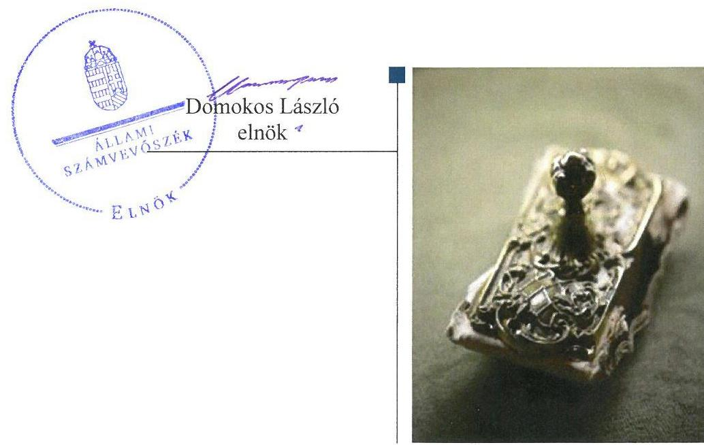
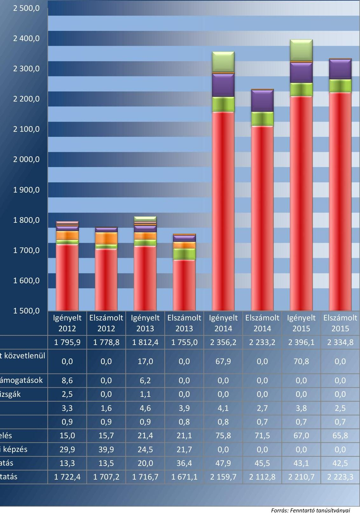
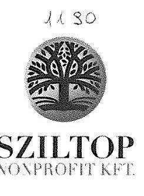
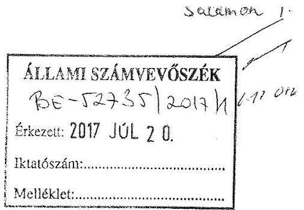
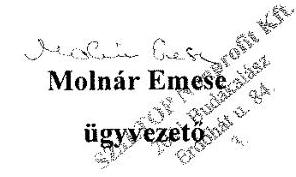
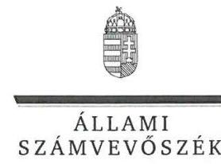
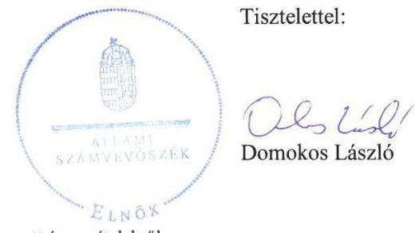
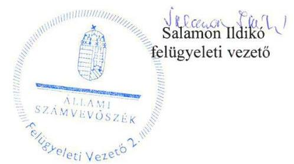

# Jelenetés 

## Nem állami humánszolgáltatók ellenőrzése

A humánszolgáltatást nyújtó államháztartáson kívüli köznevelési intézmények, szolgáltatók fenntartói központi költségvetésből kapott támogatásai felhasználásának ellenőrzése Sziltop Oktatási Nonprofit Közhasznú Kft. 2017.

---

# Jelentés 

## Nem állami humánszolgáltatók ellenőrzése

A humánszolgáltatást nyújtó államháztartáson kívüli köznevelési intézmények, szolgáltatók fenntartói központi költségvetésből kapott támogatásai felhasználásának ellenőrzése Sziltop Oktatási Nonprofit Közhasznú Kft.
2017. 09 hó 07. nap

---

# AZ ELLENŐRZÉST FELÜGYELTE:

- **SALAMON ILDIKÓ** felügyeleti vezető

- **AZ ELLENŐRZÉST VEZETTE ÉS A VÉGREHAJTÁSÁÉRT FELELŐS:**

- **KEREKES PÉTER** ellenőrzésvezető

- **A PROGRAM ÖSSZEÁLLÍTÁSÁÉRT FELELŐS:**

- **JANIK JÓZSEF LÁSZLÓ** osztályvezető

**IKTATÓSZÁM: V-1156-202/2016.**

**TÉMASZÁM: 2190**

**ELLENŐRZÉS-AZONOSÍTÓ SZÁM: V076601**

Jelentéseink az Országgyűlés számítógépes hálózatán és az Interneta a www.asz.hu címen is olvashatóak.

---

# TARTALOMJEGYZÉK 

■ ÖSSZEGZÉS ..... 5
■ AZ ELLENŐRZÉS CÉLJA ..... 6
■ AZ ELLENŐRZÉS TERÜLETE ..... 7
■ AZ ELLENŐRZÉS HÁTTERE, INDOKOLTSÁGA ..... 8
■ A JELENTÉS LÉNYEGES KÉRDÉSKÖREI ..... 9
■ ELLENŐRZÉS HATÓKÖRE ÉS MÓDSZEREI ..... 10
■ MEGÁLLAPÍTÁSOK ..... 12
■ JAVASLATOK ..... 17
■ MELLÉKLETEK ..... 19
I. Sz. melléklet: Értelmező szótár ..... 19
II. Sz. melléklet: Az ellenőrzött központi költségvetési támogatások alakulása ..... 20
■ FÜGGELÉK: ÉSZREVÉTELEK ..... 21
■ RÖVIDÍTÉSEK JEGYZÉKE ..... 35

---

.

---

# ÖSSZEGZÉS 

A budakalászi székhelyű Sziltop Oktatási Nonprofit Közhasznú Korlátolt Felelősségű Társaságnál a közfeladat-ellátás kereteinek kialakítása összességében szabályszerű volt. A központi költségvetésből kapott támogatásokat nem szabályszerűen adta át az intézményeknek. A közfeladat-ellátás során az átláthatóság érvényesülését összességében biztosította.

## Az ellenőrzés társadalmi indokoltsága

Az Állami Számvevőszék stratégiájában hangsúlyos szerepet szán annak, hogy szilárd szakmai alapon álló, értékteremtő ellenőrzéseivel előmozdítsa a közpénzügyek átláthatóságát, rendezettségét és javaslataival a közpénzek és a közvagyon szabályos, gazdaságos, hatékony és eredményes felhasználását segítse. Stratégiájában az Állami Számvevőszék célul tűzte ki, hogy az államháztartáson kívülre nyújtott költségvetési támogatások ellenőrzésével hozzájárul ahhoz, hogy a közpénzeket az államháztartáson kívüli szervezetek is átlátható módon használják fel a közfeladatok szerződésben vállalt ellátása érdekében. Tekintettel az elmúlt években a köznevelés finanszírozását és a köznevelési intézmények fenntartását érintően végbement változásokra, a társadalom fokozott érdeklődéssel figyeli a köznevelési feladatok ellátására fordított források felhasználását. Fontos a közvéleményt biztosítani arról, hogy a közpénz államháztartáson kívüli felhasználása ezen a területen sem marad ellenőrizetlenül. Hozzájárul ezzel ahhoz is, hogy a nyilvánosság és a szolgáltatást igénybe vevők megfelelő tájékoztatást kapjanak az államháztartáson kívüli közfeladatot ellátók múködéséről.

## Főbb megállapítások, következtetések

A Sziltop Oktatási Nonprofit Közhasznú Korlátolt Felelősségű Társaságnál a közfeladat-ellátás szervezeti kereteinek kialakítása szabályszerű volt. Társasági szerződése megfelelt a jogszabályi előírásoknak. A támogatás igénylés alapját jelentő feltételeknek megfelelt, az igénybevételhez szükséges, jogszabályban előírt intézményi adatok, valamint az elszámoláshoz szükséges nyilvántartások és dokumentumok a rendelkezésére álltak. Belső szabályozottsága nem volt szabályszerű, mivel nem rendelkezett számlarenddel, és iratkezelési szabályzata nem felelt meg a törvényi előírásoknak.

A Sziltop Oktatási Nonprofit Közhasznú Korlátolt Felelősségű Társaság 2012-ben és 2013-ban a központi költségvetésből kapott támogatásoknak nem a teljes összegét adta át az általa fenntartott intézmények részére, megsértve ezzel a vonatkozó törvényi előírásokat. A támogatások felhasználását az ellenőrzött időszakban a jogszabályi előírások ellenére nem alapfeladatonkénti bontásban elkülönítetten tartotta nyilván, valamint nem volt megállapítható a nyilvántartásból, hogy a támogatásokat milyen célra használták fel. Két intézmény költségvetését a jogszabályi előírások ellenére nem határozta meg.

A Sziltop Oktatási Nonprofit Közhasznú Korlátolt Felelősségű Társaság ellátta az ellenőrzési feladatait. Az intézmények pedagógiai programjában meghatározott feladatok végrehajtására, a szakmai-pedagógiai munka eredményességére vonatkozó értékelési feladatainak összességében eleget tett, és a jogszabályokban előírt közérdekú adatokat közzétette. Nem készített azonban a közérdekú adatok közzétételére vonatkozó szabályozást. Az ellenőrzött időszakról készített egyszerűsített éves beszámolói nem feleltek meg a jogszabályi előírásoknak, mert eredménykimutatásaiban a bevételek között nem a kapott támogatás teljes összegét mutatta ki, hanem csak annak az intézményeknek át nem adott részét.

---

# AZ ELLENŐRZÉS CÉLJA 

AZ ELLENŐRZÉS CÉLJA annak értékelése volt, hogy a Fenntartó ${ }^{1}$ központi költségvetésből kapott támogatásainak felhasználása szabályszerű volt-e, a támogatások igénylése, évközi módosítása és év végi elszámolása megfelelt-e a jogszabályi előírásoknak.

---

# AZ ELLENŐRZÉS TERÜLETE 

## Sziltop Oktatási Nonprofit Közhasznú Kft.

## SZILTOP NONPROFIT KFT.

A Fenntartó jogelődjét 1996. június 10-én alapította két magánszemély. Az ellenőrzött időszakban a társasági szerződésnek hat módosítása volt. A Fenntartó székhelye Budakalászon található.

A Fenntartó a társasági szerződésében ${ }^{2}$ nevesített közfeladatként alap- és középfokú nevelési-oktatási, szakképzési és gyógypedagógiai feladatokat látott el intézményei ${ }^{3}$ működtetésével. 2012. január 1-jén egy alapfokú intézményt és nyolc középfokú intézményt tartott fenn. A középfokú intézményekben felnőttoktatási feladatokat végzett esti, illetve levelező munkarend szerint. Az ellenőrzött időszakban közhasznú szervezetként múködött.

A fenntartott intézmények száma 2015. december 31-ére, egy középfokú intézmény 2013. szeptember 1-jei hatállyal történt jogutód nélküli megszűnése folytán, nyolcra csökkent.

A köznevelési feladatot ellátó intézmények az alapító okiratuk alapján jogi személyek, részben önállóan gazdálkodnak, azaz a bérgazdálkodás tekintetében önállóak, azonban a pénzügyi, munkaügyi és üzemeltetéssel összefüggő gazdálkodási feladataikat a Fenntartó látja el. Az intézmények szakmai tekintetben önállóak, a szervezetükkel, múködésükkel kapcsolatos ügyekben dönthetnek, kivéve, ha azt jogszabály nem utalta más hatáskörbe.

Az intézmények engedélyezett összes tanulói létszáma 2012-ben 49927 fő, 2013-ban 49897 fő, 2014-ben 45820 fő, 2015-ben 43948 fő volt. A vonatkozó statisztikai adatok szerinti tényleges létszám minden évben az engedélyezett alatt alakult, 2012-ben 16675 fő, 2013-ban 15370 fő, 2014-ben 12594 fő, 2015-ben 11672 fő volt.

A Fenntartó az ellenőrzött időszak minden évében igényelt központi költségvetési támogatásokat, majd a kapott támogatásokkal a tárgyévet követően elszámolt. A II. melléklet tartalmazza az ellenőrzött központi költségvetési támogatások alakulását. A Fenntartó - tevékenységéből adódó jogosultsága alapján - Magyarország éves központi költségvetéséből a kitöltött tanúsítványai alapján 2012. évben 1778827 ezer Ft, 2013. évben 1755009 ezer Ft, 2014. évben 2233202 ezer Ft, 2015. évben 2334768 ezer Ft támogatást kapott.

A szakmai irányító szervi feladatokat a Minisztérium ${ }^{4}$ látta el az ellenőrzött időszakban, törvényességi ellenőrzési feladatokat az illetékes kormányhivatalok végeztek.

A Fenntartó közoktatási feladatok ellátására 2005. évben Ercsi Város Önkormányzatával közoktatási megállapodást kötött. A megállapodás 2015. július 31-ig volt hatályban, de 2013. január 1-jétől feladatellátási megállapodásként volt érvényben.

---

# AZ ELLENŐRZÉS HÁTTERE, INDOKOLTSÁGA 

A köznevelési és szociális feladatokat ellátó nem állami intézményfenntartók részére közfeladataik ellátására évente jelentős összegű pénzügyi támogatást biztosítottak a mindenkori költségvetési törvények a bennük megfogalmazott feltételek mellett. A felhasználható állami támogatások Kvtv. ${ }^{5}$ szerinti előirányzata 2012-2015. években együtt 894 Mrd Ft volt. A 2013. évben jelentős változások következtek be a normatív finanszírozás rendszerében, amely érintette a nem állami intézményfenntartókat is. Az Országgyűlés elfogadta a nemzeti köznevelésről szóló 2011. évi CXC. törvényt, amely jelentősen átalakította a korábbi finanszírozási rendszert 2013 szeptemberétől. A köznevelési területen új feladatfinanszírozási forma (átlagbéralapú támogatás) jelent meg, amely a nem állami intézményfenntartókra is vonatkozik. Az ellenőrzés a finanszírozási rendszerben 2011-2015. között bekövetkezett változásokra, azok közfeladat-ellátásra gyakorolt hatására fókuszál a költségvetési támogatásokat felhasználó államháztartáson kívüli szervezetek körében. Az ellenőrzés indokoltságát az is alátámasztja, hogy az ÁSZ ${ }^{6}$ még nem ellenőrizte átfogóan e területet.

Az ÁSZ stratégiájában foglaltak alapján is indokolt az ellenőrzés, amely a társadalom számára jelzi, hogy a közpénz államháztartáson kívüli felhasználása sem maradhat ellenőrizetlenül. Az államháztartáson kívülre nyújtott költségvetési támogatások ellenőrzésével az ÁSZ hozzájárul ahhoz, hogy a közpénzeket a nem állami humán fenntartók átlátható módon használják fel a közfeladatok ellátására kötött szerződésekben vállalt kötelezettségek teljesítése érdekében. Az ellenőrzés javaslataival hozzájárulhat az említett rendszerek szabályszerű támogatás felhasználásához, javíthatja a társa-dalmi-gazdasági döntések megalapozottságát, amely a „jó kormányzás" feltétele.

---

# A JELENTÉS LÉNYEGES KÉRDÉSKÖREI 

1. A Fenntartónál a közfeladat-ellátás kereteinek kialakítása szabályszerű volt-e?
2. A Fenntartó a központi költségvetésből kapott támogatásokat szabályszerűen használta-e fel?
3. A Fenntartó a közfeladat ellátása során biztosította-e az átláthatóság érvényesülését?
4. A Fenntartó intézkedett-e a külső ellenőrzések megállapításaira?

---

# ELLENŐRZÉS HATÓKÖRE ÉS MÓDSZEREI 

## Az ellenőrzés típusa

Megfelelőségi ellenőrzés.

## Az ellenőrzött időszak

2012. január 1-je és 2015. december 31-e közötti évek. A 2012. év vonatkozásában a költségvetési támogatások 2012. évet megelőző időszakra eső igénylését, a 2015. év tekintetében annak 2016-ban történő elszámolását is ellenőrizte az ÁSZ.

## Az ellenőrzés tárgya

Az ellenőrzés a köznevelési közfeladatokat ellátó nem állami fenntartó, központi költségvetésből kapott támogatásai felhasználására terjedt ki. Az alábbi jogcímek szabályszerűségének értékelését foglalta magában:
$\longrightarrow$ Az alap normatív- és átlagbér alapú költségvetési támogatások közül az általános iskolai nevelés-oktatás, középfokú nevelés-oktatás.
$\longrightarrow$ A kiegészítő támogatások közül a tanulóétkeztetési- és a tankönyvtámogatás.
Az ellenőrzés kiterjedt minden olyan körülményre és adatra, amely az ÁSZ jogszabályban meghatározott feladatainak teljesítéséhez, valamint a program végrehajtása folyamán felmerült újabb összefüggések feltárásához szükséges volt.

## Az ellenőrzött szervezet

Sziltop Oktatási Nonprofit Közhasznú Kft.

## Az ellenőrzés jogalapja

Az ellenőrzés jogszabályi alapját az ÁSZ tv. ${ }^{7}$ 1. § (3) bekezdésében és az 5. § (3) bekezdésében foglalt előírások adták.

## Az ellenőrzés módszerei

Az ellenőrzést az ellenőrzési program kérdései, az adott időszakban hatályos jogszabályok, az ellenőrzés szakmai szabályok és módszertanok, valamint a nemzetközi standardok figyelembevételével végezte az ÁSZ.

---

A közpénzekkel való felelős gazdálkodás segítésére irányuló javaslatok kidolgozásakor a hatályos jogszabályok voltak az irányadóak.

Az ellenőrzés ideje alatt az ÁSZ a Fenntartóval történő kapcsolattartást az ÁSZ SZMSZ ${ }^{8}$-ének vonatkozó előírásai alapján biztosította.

Az ellenőrzési kérdések megválaszolásához szükséges bizonyítékok megszerzése az ellenőrzöttek által rendelkezésre bocsátott dokumentumokra, adatokra alapozva megfigyelés, szemle (szemrevételezés), kérdésfeltevés (információkérés), valamint elemző eljárással történt.

Az ellenőrzési bizonyítékként felhasznált adatforrások közé tartoztak egyrészt a szakmai program részletes szempontjainál felsorolt adatforrások, másrészt minden - az ellenőrzés folyamán feltárt, az ellenőrzés szempontjából információt tartalmazó - dokumentum.

Az ellenőrzés lefolytatásához a Fenntartó a kitöltött tanúsítványok, valamint az ÁSZ által kért dokumentumok elektronikus úton való megküldésével szolgáltatott adatokat, információkat. Az így rendelkezésre bocsátott adatok, információk és a tanúsítványok adatai valódiságának kontrollja az ellenőrzés keretében történt.

A szabályosság megítélésének az alapját képezte, hogy a központi költségvetési támogatások Fenntartó általi igénylése és év végi elszámolása a Kincstár ${ }^{9}$ felé megtörtént.

A központi költségvetésből kapott támogatások szabályszerű felhasználását a Fenntartó vonatkozásában, a támogatások intézmények részére azok működtetésére - történő továbbutalásának, valamint a támogatások felhasználásáról a jogszabályban előírt nyilvántartás vezetésének az értékelésével végezte az ÁSZ.

---

# 1. A Fenntartónál a közfeladat-ellátás kereteinek kialakítása szabályszerű volt-e? 

## Összegző megállapítás

1.1. számú megállapítás
1.2. számú megállapítás

A Fenntartónál a közfeladat-ellátás kereteinek kialakítása öszszességében szabályszerű volt.

A Fenntartónál a közfeladat-ellátás szervezeti kereteinek kialakítása megfelelt a jogszabályi előírásoknak.

A Fenntartó a közoktatási, köznevelési közfeladat-ellátási tevékenységének kereteit a Közokt. tv. ${ }^{10}$ és az Nkt. ${ }^{11}$ előírásainak megfelelően kialakította. Társasági szerződése 2014. március 14-ig megfelelt a Gt. tv. ${ }^{12}$-ben, majd 2014. március 15-től a Ptk. ${ }^{13}$-ban előírtaknak. A társasági szerződés az ellenőrzött időszakban hatszor módosult. A Fenntartó a társasági szerződés módosításait szabályszerűen bejelentette a cégbíróság felé.

A Fenntartó a támogatás igénylés alapját jelentő, Áht. ${ }^{14}$-ben foglalt feltételeknek megfelelt, mivel nyilatkozata szerint átlátható szervezetnek minősült, és rendezett munkaügyi kapcsolatokkal rendelkezett. A költségvetési támogatás igénylés alapját, feltételeit jelentő dokumentumok, nyilvántartások a jogszabályban előírtaknak megfeleltek. A Fenntartó bekérte az intézményektől a támogatások igénybevételéhez szükséges, a Közokt. vhr. ${ }^{15}$, illetve az Nkt. vhr. ${ }^{16}$ által előírt adatokat. Rendelkezett információval az intézmények OM azonosítóiról ${ }^{17}$, a tanulói létszámokról és az alkalmazottakról. A Közokt. vhr., illetve az Nkt. vhr. által előírt tanügyi okmányokról (beírási napló, törzslap, csoportnapló) vezetett nyilvántartások a Fenntartó rendelkezésére álltak.

A Fenntartó belső szabályozottsága nem felelt meg a jogszabályi előírásoknak.

A Fenntartó a Számv. tv. ${ }^{18}$-ben előírtaknak megfelelően elkészítette a számviteli politikáját ${ }^{19}$, amelynek keretében elkészítette a pénzkezelési szabályzatot ${ }^{20}$, a leltárkészítési és leltározási szabályzatot ${ }^{21}$, az eszközök és források értékelési szabályzatát ${ }^{22}$ és az önköltségszámítási szabályzatot ${ }^{23}$. Azonban a Fenntartó az ellenőrzött időszakban a Számv. tv. 161. § (1) bekezdésében foglaltak ellenére számlarenddel nem rendelkezett.

A Fenntartó iratkezelési szabályzata ${ }^{24}$ nem felelt meg az Ltv. ${ }^{25}$ 9. § (4) bekezdésben előírtaknak, mert nem tartalmazott irattári tervet.

---

# 2. A Fenntartó a központi költségvetésből kapott támogatásokat szabályszerűen használta-e fel? 

Összegző megállapítás

2.1. számú megállapítás

A Fenntartó a központi költségvetésből kapott támogatásokat nem szabályszerűen használta fel.

A Fenntartó összességében biztosította az intézmények szabályszerű múködtetésének kereteit.

A Fenntartó az intézményei alapfeladatait meghatározta a Közokt. tv., illetve az Nkt. előírásaival összhangban az intézmények alapító okirataiban. Az intézmények szerepeltek az illetékes kormányhivatalok nyilvántartásában, a KIR ${ }^{26}$ nyilvántartásban, valamint rendelkeztek OM azonosítóval. A Fenntartó a Közokt. tv. és az Nkt. előírásainak megfelelően biztosította, hogy az intézmények a székhelyüket és az ország 19 megyéjében és Budapesten található telephelyeiket érintően rendelkezzenek múködési engedéllyel az alapító okirataik szerinti közoktatási, illetve köznevelési feladatokra. Új indítandó telephely múködési engedély-, illetve meglévő telephely múködési engedély módosítási kérelmeit a feladatellátási hely szerint illetékes kormányhivatalhoz benyújtotta. A Fenntartó a múködési engedélyezési eljárások során igazolta, hogy a közfeladat ellátásához szükséges személyi és tárgyi feltételeket biztosította.

A Fenntartó a 2012. január 1. és 2012. augusztus 31. közötti időszakot érintően a Közokt. tv.-ben előírtaknak megfelelően jóváhagyta az intézmények szervezeti és múködési szabályzatait, pedagógiai programjait, minőségirányítási programjait és házirendjeit. Az Nkt.-ban előírtaknak megfelelően a 2012. szeptember 1. és 2015. december 31. közötti időszak vonatkozásában a Fenntartó egyetértését adta azokban az esetekben, amikor az intézmények szervezeti és múködési szabályzatai, pedagógiai programjai vagy házirendjei többletkötelezettséget hárítottak rá.

A Közokt. tv.-nek, illetve az Nkt.-nek megfelelően meghatározta a kérhető költségtérítés és tandíj megállapításának szabályait, a szociális alapon adható kedvezmények feltételeit, és megbízta az intézmények vezetőit.

A Közokt. tv. 102. § (2) bekezdés b) pontjában, illetve az Nkt. 83. § (2) bekezdés c) pontjában foglaltakat megsértve a Fenntartó a Cinkotai Szakközépiskola 2012. január 1. - 2013. augusztus 31. közötti időszakra vonatkozó, valamint a Kossuth Lajos Általános Iskola 2012-2015. közötti időszakra vonatkozó költségvetését nem határozta meg. A többi intézményének költségvetését az ellenőrzött időszak minden évében meghatározta. Az intézmények egyszerűsített éves beszámolói a Fenntartónál rendelkezésre álltak.

A Fenntartó a központi költségvetésből kapott támogatások intézmények részére történő átadási kötelezettségét 2012-ben és 2013ban nem tartotta be. A támogatások felhasználásáról egyik ellenőrzött évben sem vezetett a jogszabályi előírásoknak megfelelő nyilvántartást.

2012-ben és 2013-ban a központi költségvetési támogatások átadásának kötelezettségét a Fenntartó nem teljesítette, mivel a 2012. évi Kvtv. 38. §

---

(1) bekezdés h) pontjában, a 2013. évi Kvtv. 35. § (1) bekezdés a) pontjában (2013. január 1-től április 3-ig), a 35. § (1) bekezdés a) pontjának aa) alpontjában (2013. április 4-től szeptember 27-ig) és a 35/E. § (7) bekezdésében (2013. október 1-től december 31-ig), előírtak ellenére a támogatások nem teljes összegét adta át az intézményeinek. A jogellenesen át nem adott támogatások összege 2012-ben 557738 ezer Ft, 2013-ban 578557 ezer Ft, összesen 1136295 ezer Ft volt.

2014-ben és 2015-ben 864340 ezer Ft, illetve 911488 ezer Ft, összesen 1775828 ezer Ft-ot nem utalt közvetlenül az intézményeknek, és az át nem utalt támogatások cél szerinti felhasználása nem volt az Nkt. vhr. 37/G. § (1) bekezdésben előírtaknak megfelelően dokumentált. A költségvetési támogatások felhasználásának nyilvántartása, kezelése nem felelt meg a Közokt. vhr. 17. § (8) bekezdése előírásának, mivel 2013. március 8ig a normatív támogatások átadását nem alaptevékenységenkénti bontásban, 2013. március 9-től a költségvetési támogatások felhasználását nem alapfeladatonkénti bontásban elkülönítetten tartották nyilván. 2013. október 5-től az Nkt. vhr. 37/G. § (1) bekezdés előírásának, mivel a költségvetési támogatások felhasználását nem alapfeladatonkénti bontásban elkülönítetten tartották nyilván, valamint nem volt megállapítható a nyilvántartásból, hogy a támogatásokat milyen célra használták fel.

# 3. A Fenntartó a közfeladat ellátása során biztosította-e az átláthatóság érvényesülését? 

## Összegző megállapítás

### 3.1. számú megállapítás

A Fenntartó a közfeladat ellátása során összességében biztosította az átláthatóság érvényesülését.

A Fenntartó összességében biztosította, hogy a szolgáltatást igénybe vevők megfelelő információhoz jussanak az intézmények múködéséről.

Az intézmények Fenntartó általi ellenőrzésének megszervezése az ellenőrzött időszakban a Közokt. tv.-ben és az Nkt.-ban előírtakkal összhangban történt. A Fenntartó az ellenőrzött időszakban ellátta ellenőrzési feladatait az intézményeinél.

A Fenntartó a Közokt. tv. 102. § (2) bekezdés g) pontjában, illetve az Nkt. 83. § (2) bekezdés h) pontjában előírtak szerint értékelte az intézmények pedagógiai programjában meghatározott feladatok végrehajtását, a pedagógiai-szakmai munka eredményességét, azonban a Pannon Középiskola és Szakiskola 2011/2012-es tanévének értékelését nem végezte el.

A Fenntartó az intézmények pedagógiai-szakmai munkája eredményességének értékelését a Közokt. tv.-ben, illetve az Nkt.-ban előírtak szerint két kivétellel - közzétette a honlapján. Az Nkt. 85. § (3) bekezdésében előírtak ellenére a Kossuth Lajos Általános Iskola és a Cinkotai Szakközépiskola 2012/2013. tanévvel kapcsolatos fenntartói értékeléseit a honlapján nem tette közzé.

---

# 3.2. számú megállapítás 

A Fenntartó összességében biztosította a közérdekú adatok nyilvánosságát.

A Fenntartó az Info. tv. ${ }^{27}$-ben meghatározott közérdekú adatokat - beleértve az egyszerúsített éves beszámolóit is - saját honlapján ${ }^{28}$ közzétette, azonban az Info. tv. 35. § (3) bekezdésében előírtak ellenére a közérdekú adatok közzétételére vonatkozó kötelezettség teljesítésének részletes szabályait belső szabályzatban nem állapította meg.

A Fenntartó a kezelt adatok biztonságának, védelmének érvényre juttatásához szükséges eljárási szabályokat az iratkezelési szabályzatában rögzítette.

### 3.3. számú megállapítás

A Fenntartó a beszámoló készítési kötelezettségét nem a jogszabályokban előírtaknak megfelelően teljesítette.

A Fenntartó múködéséről, vagyoni, pénzügyi és jövedelmi helyzetéről az üzleti év könyveinek zárását követően kettős könyvvitellel alátámasztott egyszerűsített éves beszámolót készített. Az ellenőrzött időszakban készített egyszerűsített éves beszámolói formailag megfeleltek a Számv. tv.-ben előírtaknak, és tartalmazták a Civiltv. ${ }^{29}$ által előírt közhasznúsági mellékletet is.

Azonban az eredménykimutatásaiban a bevételek között nem a kapott támogatások teljes összege jelent meg, hanem csak a támogatásoknak az intézményeknek át nem adott része, mivel a támogatások intézményeknek történő átadását, az ellenőrzött időszakban összesen 5189683 ezer Ft összegben, a Számv. tv. 15. § (9) bekezdésében előírt bruttó elszámolás elvét megsértve, bevételcsökkentő tételként és nem ráfordításként könyvelte. Ebből következően az egyszerűsített éves beszámolói nem feleltek meg a Számv. tv. 15. § (3) bekezdésében előírt valódiság elvének, mivel az eredménykimutatásainak a tételei a valóságban nem voltak bizonyíthatóak.

A Fenntartó társasági szerződésében kijelölt könyvvizsgáló a beszámolókról az előző bekezdésben megállapított hiányosságok ellenére minden évben korlátozás nélküli záradékkal ellátott könyvvizsgálói jelentést adott ki.

A Fenntartó egyszerűsített éves beszámolói az Igazságügyi Minisztérium által fenntartott Elektronikus Beszámoló Portálon ${ }^{30}$ hozzáférhetőek, azonban a közzétett beszámolók az eredménykimutatás hibás adatai tekintetében nem alkalmasak a nyilvánosság megfelelő tájékoztatására.

## 4. A Fenntartó intézkedett-e a külső ellenőrzések megállapításaira?

## Összegző megállapítás

## A Fenntartó a már lezárult külső ellenőrzések megállapításaira egy kivétellel intézkedett.

A NAV ${ }^{31}$ a Fenntartónál a 2010-2012 időszakot érintően az ÁFA ${ }^{32}$ és a társasági adó bevallásokat ellenőrizte, melynek során nem tett intézkedést igénylő megállapítást.

---

A Kincstár a Fenntartó által benyújtott elszámolások felülvizsgálatát követően, annak eredményeként hozott határozataiban visszafizetési kötelezettséget írt elő, amelynek a Fenntartó minden évben eleget tett.

A Kincstár a Kölcsey Ferenc Gimnáziumnál a 2012. január 1. és 2012. december 31. közötti időszakra igénybevett normatív állami hozzájárulások, normatív, kötött felhasználású támogatások elszámolásának szabályszerűségét helyszíni ellenőrzés keretében vizsgálta. Az ellenőrzés az ellenőrzött időszak végéig jogerős döntés hiányában nem zárult le.

Az ellenőrzött időszakban összesen 16 területileg illetékes kormányhivatal végzett törvényességi és hatósági ellenőrzéseket a Fenntartónál és az intézményeinél. Az alábbi egy kivétellel a Fenntartó minden esetben intézkedett az ellenőrzések megállapításaira.

A Pest Megyei Kormányhivatal 2014-ben hatósági ellenőrzés keretében ellenőrizte a Budakalász Gimnáziumnál az érettségi vizsgák megszervezésére, lebonyolítására vonatkozó rendelkezések betartását. A megállapításokra a Fenntartó 2014. október 6-án intézkedési tervet adott ki. Az intézkedési tervben meghatározott 2015. május 30-i határidőre a Fenntartó a korábbi tanulmányok beszámításáról szóló igazgatói határozatoknak, az osztályozó vizsgákról és a különbözeti vizsgákról készítendő jegyzőkönyveknek, az érettségi vizsgára történt jelentkezéseknek, valamint az érettségi vizsgák írásbeli vizsgarésze lebonyolításának ellenőrzéséről nem gondoskodott, és a feladatot az ellenőrzött időszak végéig sem hajtotta végre.

---

# JAVASLATOK 

Az ÁSZ tv. 33. § (1) bekezdésében foglaltak értelmében az ellenőrzött szervezet vezetője köteles a jelentésben foglalt megállapításokhoz kapcsolódó intézkedési tervet összeállítani és azt a jelentés kézhezvételétől számított 30 napon belül az ÁSZ részére megküldeni. Amennyiben az ellenőrzött szervezet vezetője nem küldi meg határidőben az intézkedési tervet, vagy továbbra sem elfogadható intézkedési tervet küld, az Állami Számvevőszék elnöke az ÁSZ tv. 33. § (3) bekezdése a) és b) pontjaiban foglaltakat érvényesítheti.

## Sziltop Oktatási Nonprofit Közhasznú Korlátolt Felelősségű Társaság ügyvezetőjének

1. Intézkedjen a jogszabályi előirásoknak megfelelően a számlarend elkészitésére.
(1.2. számú megállapítás 1. bekezdés 2. mondata alapján)
2. Intézkedjen, hogy az iratkezelési szabályzat - a jogszabályi előirásoknak megfelelően - tartalmazza az irattári tervet.)
(1.2. számú megállapítás 2. bekezdése alapján)
3. Kezdeményezze, hogy a jogszabályi előirásoknak megfelelően a Fenntartó valamennyi intézmény költségvetését meghatározza.
(2.1. számú megállapítás 4. bekezdés 1. mondata alapján)
4. Intézkedjen a támogatások felhasználásának az Nkt. vhr.-ben elöirtaknak megfelelő nyilvántartására.
(2.2. számú megállapítás 2. bekezdése alapján)
5. Intézkedjen a jogszabályi előirásnak megfelelően a közérdekü adatok közzétételére vonatkozó kötelezettség teljesitése részletes szabályainak belső szabályzatban történő megállapítására.
(3.2. számú megállapítás 1. bekezdése alapján)
6. Intézkedjen, hogy a támogatások intézményeknek történő átadása a Számv. tv. előírásainak megfelelően kerüljön elszámolásra.
(3.3. számú megállapítás 2. bekezdése alapján)
7. Intézkedjen a 2014. október 6-án kiadott intézkedési tervében meghatározott feladatok végrehajtására.
(4. számú megállapítás 5. bekezdés 2-3.mondata alapján)

---

.

---

# MELLÉKLETEK 

- I. SZ. MELLÉKLET: ÉRTELMEZŐ SZÓTÁR
humánszolgáltatás
köznevelési alapfeladat
köznevelési intézmény
nem állami intézményfenntartó

Külön törvényben meghatározott szociális, gyermekjóléti, gyermekvédelmi, közoktatási, felsőoktatási, kulturális közfeladatok (2012. évi Kvtv. 38. § (1) bekezdés, 2013. évi Kvtv. 25. §, 1. számú melléklet XX/20/2. alcím, 19. alcím, 2014. évi Kvtv. 34. § (1), (4) bekezdés, 1. számú melléklet XX/20/2. alcím, 19. alcím, 2015. évi Kvtv. 43. § (1), (4) bekezdés, 1. számú melléklet XX/20/2/3. jogcím csoport, 19. alcím).
A köznevelési intézmény alapító okiratában foglalt feladat: óvodai nevelés, nemzetiséghez tartozók óvodai nevelése, általános iskolai nevelés-oktatás, nemzetiséghez tartozók általános iskolai nevelése-oktatása, kollégiumi ellátás, nemzetiségi kollégiumi ellátás, gimnáziumi nevelés-oktatás, szakközépiskolai nevelés-oktatás, szakiskolai nevelés-oktatás, nemzetiség gimnáziumi nevelés-oktatása, nemzetiség szakközépiskolai nevelés-oktatása, nemzetiség szakiskolai nevelés-oktatása, Köznevelési Hídprogramok keretében folyó nevelés-oktatás, felnőttoktatás, alapfokú művészetoktatás, fejlesztő nevelés, fejlesztő nevelés-oktatás, pedagógiai szakszolgálati feladat, a többi gyermekkel, tanulóval együtt nevelhető, oktatható sajátos nevelési igényű gyermekek, tanulók óvodai nevelése és iskolai nevelése-oktatása, azoknak a sajátos nevelési igényű gyermekeknek, tanulóknak az óvodai, iskolai, kollégiumi ellátása, akik a többi gyermekkel, tanulóval nem foglalkoztathatók együtt, a gyermekgyógyüdülőkben, egészségügyi intézményekben, rehabilitációs intézményekben tartós gyógykezelés alatt álló gyermekek tankötelezettségének teljesítéséhez szükséges oktatás, pedagógiai-szakmai szolgáltatás.
A nevelési- oktatási intézmény, pedagógiai szakszolgálati intézmény, pedagógiai-szakmai szolgáltatást nyújtó intézmény.
A köznevelési és szociális, gyermekjóléti és gyermekvédelmi közfeladatokat/humánszolgáltatásokat ellátó intézményt fenntartó egyházi jogi személy, társadalmi szervezet, alapítvány, közalapítvány, civil szervezet, országos nemzetiségi önkormányzat, nonprofit gazdasági társaság, gazdasági társaság és a humánszolgáltatást alaptevékenységként végző, Szja tv. hatálya alá tartozó egyéni vállalkozó. (2012. évi Kvtv. 38. § (1) bekezdés, 2013. évi Kvtv. 35. § (1), (3) bekezdés, 2014. évi Kvtv. 33. §, 34. § (1), (4) bekezdés, 2015. évi Kvtv. 42. §, 43. § (1), (4) bekezdés)

---

# Az ellenőrzött központi költségvetési támogatások alakulása 

---

# FÜGGELÉK: ÉSZREVÉTELEK 

A jelentéstervezetet a Számvevőszék 15 napos észrevételezésre megküldte az ellenőrzött szervezet vezetőjének az ÁSZ tv. 29. §* (1) bekezdése előírásának megfelelően.

Az ellenőrzés megállapításaira a Sziltop Oktatási Nonprofit Közhasznú Kft. ügyvezetője észrevételt tett. Az észrevétel alapján az Állami Számvevőszék nem módosította a jelentést.
A függelék tartalmazza a Sziltop Oktatási Nonprofit Közhasznú Kft. ügyvezetője által az ellenőrzés megállapításaira tett észrevételeket, az észrevételekre adott válaszokat, a figyelembe nem vett észrevételekről, azok indokairól szóló tájékoztatásokat.

[^0]
[^0]:    * 29. § (1) Az Állami Számvevőszék az ellenőrzési megállapításait megküldi az ellenőrzött szervezet vezetőjének vagy az általa megbízott személynek, és annak, akinek személyes felelősségét állapította meg.
    (2) Az ellenőrzött szervezet vezetője és a felelősként megjelölt személy az ellenőrzés megállapításaira tizenöt napon belül írásban észrevételt tehet.
    (3) Az Állami Számvevőszék az észrevételre a beérkezésétől számított harminc napon belül írásban válaszol. A figyelembe nem vett észrevételeket köteles a jelentésben feltüntetni, és megindokolni, hogy azokat miért nem fogadta el.

---

# Domokos László 

## Elnök úr részére

Állami Számvevőszék
1364 Budapest 4. Pf.: 54

Hivatkozási szám: V-1156-188/2016.

## Mélyen Tisztelt Elnök Úr!

Alulírott Molnár Emese, mint a Sziltop Oktatási Nonprofit Közhasznú Korlátolt Felelősségủ Társaság (székhely: 2011. Budakalász, Erdőhát utca 84.) ügyvezetője a Társaság nevében és képviseletében eljárva tájékoztatom, hogy a „Nem állami humánszolgáltatások ellenőrzése - A humánszolgáltatást nyújtó államháztartáson kívüli köznevelési intézmények, szolgáltatók fenntartói központi költségvetésből kapott támogatásai felhasználásának ellenőrzése - Sziltop Oktatási Nonprofit Közhasznú Kft." címen készített számvevőszéki jelentéstervezetet 2017. július 03. napján kézhez vettük.
A jelentéstervezet kapcsán az alábbi észrevételeket teszem, élve az Elnök Úr által felkínált lehetőséggel.

### 3.3. számú megállapításhoz

Szilágyi Attila társaságunkkal 2010.06.09.-től áll szerződéses kapcsolatban, mint független könyvvizsgáló. Előtte a Dr Printz és Társa Kft. végezte a cég könyvvizsgálatát. A kontirozási elvet a Dr Printz és Társa Kft. könyvvizsgálójával dolgozta ki az akkori gazdasági vezető.

Az iskolák saját adószámmal, önálló könyveléssel rendelkeznek, a fenntartó részükre bizonyos adminisztrációs és szervezési feladatokat lát el. A könyvelési technika kidolgozásakor ezért törekedtünk arra, hogy kerüljön megkülönböztetésre a támogatás címzettjének (intézmény) és a fenntartónak a támogatásokra irányuló elszámolása. Tekintettel arra, hogy a módszer kidolgozásakor ismert volt, hogy a támogatás megérkezését az egyéb bevételek között kell számba venni, ezért az intézmények könyvelésében ez így is jelent meg. Ezzel szemben, mivel a fenntartó a könyvelésében jelezni kívánta, hogy a normatív támogatás nem a fenntartóé, ez csak rajta keresztül kerül az intézményhez, ezért nála csak a befolyt és tovább utalt támogatás különbözetét mutatták be az eredménykimutatásban.
A közoktatásról szóló 1997. évi LXXIX. törvény végrehajtásáról szóló 20/1997. (II.13.) Kormány rendelet írja elő a normatív támogatás igénylésének szabályait:

[^0]
[^0]:    2011 Budakalász, Erdőhát u. 84., Pf.: 217. Telefon: +36 (26) 343-333 Fax: +36 (26) 343-333 / 114-es mellék sziltop@sziltop.hu www.sziltop.hu

---

„13. § (1) A nem állami, nem helyi önkormányzati intézményfenntartó (a továbbiakban: fenntartó) a közoktatásról szóló törvény 118. §-ának (3) bekezdése alapján a mindenkori költségvetési törvényben meghatározott normativ állami hozzájárulások, továbbá normativ, kötött felhasználású támogatások (a továbbiakban: normativ hozzájárulás és támogatás) iránti igényét a székhelye szerint illetékes Magyar Államkincstár Területi Igazgatóságánál (a továbbiakban: Igazgatóság) jelentheti be.
(2) Normativ hozzájárulás és támogatás az után a gyermek, tanuló után vehető igénybe,

- akit beirattak az óvodába, iskolába, kollégiumba, és
- akiről kiállították a törzslapot, továbbá
- akinek jelenlétéről, távolmaradásáról külön jogszabályban meghatározott
nyilvántartást vezetnek, a költségvetési törvényben meghatározott feltételek figyelembevételével."

A fenntartó támogatással kapcsolatos kötelezettségét többek között a költségvetési törvény is szabályozza:
2014. évi C. törvény -a Magyar Köztársaság 2015. évi költségvetéséről
8. melléklet V. Kiegészítő szabályok 2.:
„A fenntartó az I. és III. pontban meghatározott támogatásokat - azok folyósitását követő 15 napon belül - az általa fenntartott nevelési-oktatási, pedagógiai szakszolgálati intézménynek átadja úgy, hogy az általa fenntartott valamennyi nevelési-oktatási-, pedagógiai szakszolgálati intézmény kiegyensúlyozott müködését biztositsa."

A fenti szabályokat a később hatályba lépő 2011. CXC. törvény a nemzeti köznevelésről 88. § (3) bekezdése egésziti ki: A központi költségvetés a nem állami szerv által fenntartott intézmény köznevelési feladatainak ellátásához költségvetési hozzájárulást biztosit, amelynek feltétele, hogy az intézmény a müködési engedélyben foglaltaknak megfelelően végzi tevékenységét." egyértelműen megerősíti azzal, hogy nevesíti a köznevelési feladatot ellátó intézménynek jár a támogatás.

A közhasznúsági jelentéseket a beszámoló részeként a szabályozás szerint hozzáférhetővé kell tenni az érdeklődők számára. Az egyesülési jogról, a közhasznú jogállásról, valamint a civil szervezetek működéséről és támogatásáról szóló 2011. évi CLXXV. törvényben rögzített beszámolási szabályok szerint pedig a nonprofit szervezetek a működésükről, a vagyoni, pénzügyi és jövedelmi helyzetükről az adott üzleti év utolsó napjával a kötelesek beszámolót késziteni a 224/2000. (XII.19.) Korm. rendelet alapján. A már közhasznú, illetve a jövőben a közhasznú fokozat megszerzését célzó civil szervezet a beszámolójával egyidejűleg közhasznúsági mellékletet is köteles késziteni a 350/2011. (XII.30.) Korm. rendelet alapján. A beszámolókat korábban papír alapon, majd elektronikusan az ügyfélkapun keresztül közzé is kell tenni. A közhasznúsági jelentésben felsorolásra kerültek az intézmények, valamint az adott évben nekik juttatott támogatások forint összegben.

---

Megvizsgálva a Beszámolóra gyakorolt hatásokat, és ha a nonprofit szervezet elszámolja az Egyéb bevétel - Egyéb ráforditás számlákon a normatív támogatásokat, akkor az alábbi kontírozásokat kellett volna alkalmaznia:

Az állami normatíva átutalásakor:
T 384. Pénzeszközök - K 967. Egyéb bevételek
Az iskolának tovább utalt normatíva:
T 8634. Egyéb ráfordítás - K 384. Pénzeszközök
A Beszámolóban ezek az adatok az Eredménykimutatás: Egyéb bevétel és Egyéb ráforditás soraiban jelennek meg.

Szeretném nyomatékosítani, hogy az alkalmazott módszernek eredményre vagy adókötelezettségre nincs hatása, csak az eredménykimutatás egyéb bevételek és egyéb ráfordítások sorára. A beszámoló részeként elkészített közhasznúsági jelentésben a hiányolt adatok minden évben részletesen bemutatásra kerülnek. Ezért nem állítható, hogy a beszámoló nem tartalmazza az eredménykimutatást.

A Társaságnál többször tartott az Adóhivatal átfogó ellenőrzést, és soha nem jelezték, hogy a cég rossz elszámolási gyakorlatot alkalmaz. Álláspontom szerint amennyiben a bruttó elszámolás elvét követve az egyéb ráfordítás soron kerülne bemutatásra a támogatás összege, felületes szemlélő számára úgy tűnhetne, mintha a Társaság támogatná az iskolákat. Ugyanakkor véleményem szerint a fent ismertetett törvényi alapokon túl a magyar számvitelben - korlátozottan - létezik a nettó elszámolás elve is, ami ráadásul a nemzetközi számviteli standardokban lényegesen nagyobb hangsúlyt kap. Álláspontom szerint a jelentés tervezetben megismert merev álláspont nem egyezik a nemzetközi standardokhoz (IFRS) történő közeledési szándékkal.

A számviteli elvek egész egységes szerkezete megvalósul, és a Társaság nem alkalmazott olyan eljárást, amely sértené, sértette volna a vonatkozó jogszabályok egységes rendszerének érvényesülését.

Ezzel együtt 2016. évre vonatkozó beszámoló benyújtásakor a társaság már a korrekciót elvégezte, az eredménykimutatás középső oszlopában a vizsgált időszakra vonatkozóan a vizsgálat álláspontját érvényesítette.

# 2.2. számú megállapításhoz 

A fenntartó jogelődje által alapított, a fenntartó által működtetett köznevelési intézmények alapító okiratuk szerint önálló jogi személyiséggel rendelkező, részben önállóan gazdálkodó, bérgazdálkodásuk tekintetében önálló intézmények. Az Ercsi Kossuth Lajos Általános Iskola kivételével az intézmények, a székhelyükön kívül több feladatellátási hellyel, többségében tagintézménnyel rendelkeznek. A tagintézmények gazdálkodási szempontból nem élveznek önállóságot.

---

Az átlagbér alapú támogatás, a személyi juttatások és az azokhoz kapcsolódó munkaadókat terhelő járulék és a szociális hozzájárulási adó kifizetéséhez, a dologi kiadások, az ellátottak pénzbeli juttatásai és egyéb müködési célú kiadások, valamint felújítási kiadások finanszírozására használható fel a felújítási hitel felvétele és törlesztése kivételével.

A fenntartó az átlagbéralapú támogatásokat - azok folyósítását követő 15 napon belül - az általa fenntartott nevelési-oktatási, pedagógiai szakszolgálati intézménynek átadja úgy, hogy az általa fenntartott valamennyi nevelési-oktatási-, pedagógiai szakszolgálati intézmény kiegyensúlyozott müködését biztosítsa.

Az intézményhálózat müködtetése a jogszabály rendelkezéseinek megfelel: a felhasználás során a fenntartó a támogatást az intézmények feladatainak ellátásra használta fel, közvetlen módon az alapító dokumentumok rendelkezéseit figyelembe véve a személyi jellegủ kifizetések esetében, közvetett módon a dologi és az egyéb müködési célú kiadások vonatkozásában.

A fenntartó és az általa alapított és fenntartott köznevelési intézmények között 2013. december 11. napján Együttmüködési megállapodás jött létre, mely írásos formába öntötte a korábbi szóbeli megállapodáson alapuló gyakorlatot. A megállapodásban a felek rögzítik, hogy a fenntartó részére nyújtott átlagbéralapú támogatás igénylésének, számításának és felhasználásának szabályairól tudomásul bínak. Ezen összegnek a személyi juttatások és azok járulékai felett fennmaradó részét a köznevelési intézmények dologi kiadásaira, egyéb müködési célú kiadásaira, valamint felújítási kiadások finanszírozására használhatja fel a fenntartó. A fenntartó valamennyi intézménye vonatkozásában az Alapító okiratokban az intézmény gazdálkodása alpont alatt az alábbiak szerint rendelkezik
„Az intézmény részben önállóan gazdálkodó, bérgazdálkodása tekintetében önálló. A gazdálkodással kapcsolatos feladatokat a Sziltop Nonprofit Kft. Gazdasági Igazgatóságán (2011 Budakalász, Erdöhát utca 86.) keresztül látja el külön megállapodásban foglaltak szerint."

A megállapodás alapján a költséghatékony müködés szempontjait szem előtt tartva a fenntartó központosított módon saját alkalmazottai vagy külső vállalkozók igénybe vétele útján gondoskodik a feltett kérdésben érintett feladatok ellátásáról. Az idézett jogszabályi rendelkezés alapján ezen feladatkörök a köznevelési intézmények számára elengedhetetlenül szükségesek, melyeket tehát a fenntartó mintegy az állami, egyházi és önkormányzati intézmények, óvodák és bölcsődék esetében is létező központi gazdasági ellátó szervezetként lát el. A köznevelési intézmények vonatkozásában a változó tanulói létszám miatt az ellátandó feladatok mennyisége tanévenként változó, így a munkavállalók biztonsága érdekében a stabil és kiszámítható munkahely-teremtő szándék figyelembe vételével a kiegyensúlyozott feladatelosztás fenntartói szinten valósítható csak meg.

Az engedélyezési és nyilvántartásba vételi eljárásban érintett Kormányhivatalok a vizsgált időszakban valamint korábban és ezt követően sem emeltek kifogást a gazdálkodási forma ellen, valamennyi intézményünk megkapta a tevékenység folytatásához szükséges nyilvántartásba vételi és müködési engedélyét illetve ezek időközben történt módosításait. A vizsgálat során csatoltuk a Társaság által alapított és fenntartott intézmények Alapító Okiratait, valamint az adott időszakra vonatkozó müködési engedélyeket.

A Magyar Államkincstár Budapesti és Pest Megyei Igazgatóság Államháztartási Irodája a vizsgált időszakban a benyújtott igénylésekkel és elszámolásokkal kapcsolatosan kifogást nem emelt, az átlagbér alapú támogatást megállapított és folyósította a fenntartó részére,

---

elszámolásait elfogadta. A Magyar Államkincstár részére az igényléseket megalapozó dokumentumok benyújtásával egyidejűleg Társaságunk az Igazgatóság rendelkezésére bocsátott a köznevelési intézmények Alapító okiratait és valamennyi hatályos müködési engedélyét is.
Az intézményekkel megkötött, már hivatkozott. Együttmüködési megállapodás részletesen meghatározza a fenntartó által elvégzendő feladatokat, melyek az alábbiak:

- központosított illetményszámfejtés
- munkavállalók és vállalkozók részére folyósitandó összegek pénzügyi teljesítése
- statisztikai adatszolgáltatás
- köznevelési intézményekkel kapcsolatos egyéb típusú vállalkozói szerződések elkészítése és nyilvántartása
- a köznevelési feladat teljesitéséhez szükséges terembérleti és egyéb bérleti szerződések megkötése, valamint az ezekhez kapcsolódó nyilvántartások vezetése
- tanügy- igazgatási dokumentumok ellenőrzése
- az oktatás ellátásához közvetlenül és közvetve szükséges eszközök, berendezések beszerzése, az intézményekbe történő kiszállítása
- a köznevelési intézmények tevékenységének népszerüsítése, a tanulói létszám biztosításához szükséges reklám kampány lebonyolítása
- a számítástechnikai eszközállomány beszerzése, karbantartása

A vizsgált időszakban a hatályos jogszabályok alapján (költségvetési törvények) az átlagbér alapú támogatás folyósitása a fenntartó részére történt. A fenntartó valamennyi köznevelési intézmény számára az önálló bérgazdálkodásból fakadó kötelezettségek fedezetét a felmerülés időpontjában az intézmény számára banki átutalással teljesítette. A fenntartó saját számviteli nyilvántartásában elkülönített fökönyvi számlákon mutatja ki az intézmények számára ilyen módon átengedett pénzösszegeket. Ezek a pénzösszegek fedezik az esedékes nettó munkabéreket és megbízási díjakat, ezek járulékait, valamint az egyéni vállalkozóként óraadói tevékenységet folytató pedagógusok járandóságát. Az intézmények tanéví müködéséhez szükséges költségvetési tervezetet a fenntartó a tanévek megkezdését megelőzően elkészítette és jóváhagyta. Ezen dokumentumok alapján történt a tanév folyamán az intézmények finanszírozása. A dologi kiadásokkal, eszközfejlesztésiekkel kapcsolatos igényeket a fenntartó a tanév során két alkalommal felméri (a tárgyév októbere és márciusa), és ezek alapján megszervezi a központosított beszerzéseket, melyek jelentős költségmegtakarítást jelentenek az egyedi beszerzésekkel szemben, gondoskodik az intézmények és a feladatellátási helyekre történő kiszállitásról, átvételről, esetleges üzembe helyezésről. Az intézmények gazdálkodásáról a fenntartó elszámolást készít, melyet a Köznevelési Információs Rendszerben közzé is tesz.

A fenntartó számviteli elszámolásában munkaszámos elkülönítést használ, az intézmények székhelyei és telephelyei költségeinek elkülönítése céljából. A munkaszámokra könyvelt költségek egyértelműen hozzárendelhetőek az adott feladatellátási helyhez. A fel nem osztható költségek a „000" munkaszámon kerülnek rögzítésre. A fenntartó ezeket a költségeket a

---

különböző adatszolgáltatásokhoz (pl.: KIR gazdasági modul feltöltése, KSH) kapcsolódóan tanulói létszám arányosan osztja fel a feladatellátási helyek között. A fenntartó könyvelésében tehát felosztott és fel nem osztott, de létszám alapján megbontható költségek jelentkeznek. Az intézmények önálló könyvelése az önálló bérgazdálkodáshoz kapcsolódó tételeket tartalmazza szintén feladatellátási helyekre bontva. Társaságunk vállalkozási tevékenységet nem folytat, költségei az iskolahálózat müködtetéséből fakadnak kizárólagosan.

Az elszámolás a hatályos jogszabályok alapján történik. Mind a fenntartó, mind az intézmények kettős könyvvitelt vezetnek, ennek keretein belül munkaszámos bontásban tartják nyilván a feladatellátási helyekhez kapcsolható költségeket, a fel nem osztható költségek, ráfordítások a szükséges adatszolgáltatásokhoz a tanulói létszám arányában kerülnek felosztásra.

A köznevelési intézmények részére beszerzett termékek, illetve az igénybevett szolgáltatások nem kerültek továbbszámlázásra, mivel ezeket a fenntartó az együttmüködési megállapodás alapján teljesítette. Jogszabály alapján meghatározott feladatkörén belül, saját nevében tett eleget a köznevelési intézmények működtetésével kapcsolatos feladatainak. Valamennyi eszközbeszerzés, igénybevett szolgáltatás elválaszthatatlanul kapcsolódik az intézmények tevékenységéhez.

Megjegyezni kívánom, hogy az állam is szívesen alkalmazza az általa fenntartott intézményekben ezen eszközrendszert. A 2016. évben még át nem alakult Klebelsberg Intézményfenntartó Központok az intézmények részére széleskörű szolgáltatásokat nyújtottak, beszerzéseket teljesítettek, természetes módon azonban e tevékenység leszámlázásra nem került. A Szociális és Gyermekvédelmi Főigazgatóság az emberi erőforrások minisztere 13/2017. (III. 31.) EMMI utasítással közzétett szervezeti és müködési szabályzata tartalmazza, hogy a fővárosi intézmények részét képezi a Fővárosi Gyermekvédelmi Intézmények Üzemeltetési Szervezete. Ezen szervezet az interneten fellelhető dokumentumok szerint különféle feladatokat (bérszámfejtés, munkaügyi ügyintézés, munkaerő kölcsönzés) lát el a fővárosi gyermekvédelmi intézmények részére, ugyanakkor tevékenységéről - álláspontunk szerint - számlát nem bocsát ki. Az önkormányzatok fenntartásában lévő, jórészt alapellátást nyújtó szociális intézmények esetében a bérszámfejtési feladatokat a Magyar Államkincstár területi szervei látják el, de tevékenységükről számlát nem bocsátanak ki és az intézmény számlafizetést nem teljesít. E néhány kiragadott példával is azt igyekszünk illusztrálni, hogy egy egységes intézményfenntartói feladatra kapott a fenntartó az engedélyeztetési eljárás során felhatalmazást az alapító okiratban foglaltak szerint. Jogosult tehát sajátos modell szerint bizonyos tevékenységeket központosítottan ellátni az általa fenntartott köznevelési intézmények vonatkozásában. Így tudja költséghatékonyan az intézmények működését biztosítani. A helyi önkormányzatok a mai napig látnak el intézmény fenntartási feladatokat az óvodák esetében és az önkormányzatok által ellátott fenntartói feladatokat nem számlázzák ki és utalják át.

Végezetül, az előadottakon felül a társaságunk főszámlájához valamennyi általunk fenntartott intézmény vezetője a vizsgálat során igazoltak szerint korlátlan hozzáféréssel rendelkezik, így semmiképpen nem állítható, hogy az átlagbér alapú támogatás nem került a fenntartott iskoláink részére maradéktalanul átadásra!

---

Tisztelt Elnök Úr! Engedje meg, hogy munkatársaim és magam nevében megköszönjem a részletes és alapos, fenntartói tevékenységünk valamennyi szegmensére kiterjedő vizsgálatot. Biztos vagyok benne, hogy a vizsgálat megállapításait megszivlelve még precízebben, hatékonyabban tudjuk megvalósítani fő célunkat, az általunk fenntartott iskolákban tanulók minél magasabb színvonalú oktatását.

Budakalász, 2017. július 17.

---

ELNÖK

Ikt.szám: V-1156-198/2016.

# Molnár Emese asszony 

ügyvezető
Sziltop Oktatási Nonprofit Közhasznú Kft.

## Budakalász

## Tisztelt Ügyvezető Asszony!

Köszönettel megkaptam a 2017. július 20. napján az Állami Számvevőszékhez érkezett „Nem állami humánszolgáltatók ellenőrzése - A humánszolgáltatást nyújtó államháztartáson kivüli köznevelési intézmények, szolgáltatók fenntartói központi költségvetésböl kapott támogatásai felhasználásának ellenőrzése - Sziltop Oktatási Nonprofit Közhasznú Kft" címủ számvevőszéki jelentéstervezetben foglalt megállapításokra írásban tett észrevételeket.

Tájékoztatom Ügyvezető asszonyt, hogy a jelentésben - az Állami Számvevőszékről szóló 2011. évi LXVI. törvény 29. § (3) bekezdése alapján - a figyelembe nem vett észrevételeket szerepeltetjük az el nem fogadás indokainak feltüntetésével együtt.

Az Állami Számvevőszék észrevételekre vonatkozó álláspontjáról a felügyeleti vezető által készített részletes tájékoztatást mellékelten megküldöm.

Budapest, 2017. 08. hó 1 C nap

Melléklet: Tájékoztatás figyelembe nem vett észrevételekről

---

# Tájékoztatás   figyelembe nem vett észrevételekról 

|  |  |
| :-- | :-- |
|  | Észrevétel: |

1. számú melléklet
a V-1156-198/2016. ikt. számú levélhez

## Tájékoztatás

## figyelembe nem vett észrevételekról

|  | A 3.3. számú megállapításhoz kapcsolódóan, amely szerint a Sziltop Oktatási Nonprofit Közhasznú Kft. (Fenntartó) a beszámoló készítési kötelezettségét nem a jogszabályokban előírtaknak megfelelően teljesítette.   Az észrevétel 1. oldal 3. bekezdésétől a 3. oldal 7. bekezdéséig.   Az észrevétel érinti a Sziltop Oktatási Nonprofit Közhasznú Kft. ügyvezetőjének címzett 6. számú javaslatot (3.3. számú megállapítás 2. bekezdése alapján). |
| :--: | :--: |
| Válasz: | Az Állami Számvevőszék az észrevételt nem fogadja el. |
| 1. | Az ellenőrzési megállapítás a jogszabályi előírásoknak megfelelően tartalmazza, hogy: „az eredménykimutatásaiban a bevételek között nem a kapott támogatások teljes összege jelent meg, hanem csak a támogatásoknak az intézményeknek át nem adott része, mivel a támogatások intézményeknek történő átadását, az ellenőrzött időszakban összesen 5189683 ezer Ft összegben, a Számv. tv. 15. § (9) bekezdésében elöirt bruttó elszámolás elvét megsértve, bevételcsökkentő tételként és nem ráfordításként könyvelte. Ebből következöen az egyszerüsített éves beszámolói nem feleltek meg a Számv. tv. 15. § (3) bekezdésében elöirt valódiság elvének, mivel az eredménykimutatásainak a tételei a valóságban nem voltak bizonyithatóak."   A központi költségvetésből a támogatások folyósítása a nem állami szerv által fenntartott intézmény közeletetési, köznevelési feladatainak ellátásához történik, amelynek egyik alapdokumentuma az intézmény működési engedélye. Az állami támogatásokat azonban nem közvetlenül az intézmények, hanem azok fenntartói igényelhetik a vonatkozó jogszabályi előírásokban meghatározott eljárásrend alapján - amely eljárásrendet a Fenntartó is követ -, és a Magyar Államkincstár az állami támogatásokat a fenntartók részére folyósítja. |
|  | A közoktatásról szóló 1993. évi LXXIX. törvény végrehajtásáról szóló 20/1997. (II. 13.) Korm. rendelet 2013. október 4-ig hatályos 13. § (1) bekezdés előírásai szerint „, A köznevelési intézményt fenntartó országos nemzetiségi önkormányzat, valamint az egyházi köznevelési intézmény fenntartója, a magán köznevelési intézmény fenntartója, továbbá iskolai, kollégiumi, pedagógiai szakszolgálati és pedagógiai-szakmai szolgáltatási feladatot ellátó köznevelési intézményt fenntartó települési, területi nemzetiségi önkormányzat (a továbbiakban együtt: fenntartó) a központi költségvetésről szóló törvényben meghatározott költségvetési támogatások és a nemzetiségi önkormányzat általános müködésének és ágazati feladatainak |

---

támogatásai (a továbbiakban együtt a két támogatás: költségvetési támogatás) iránti igényét a Magyar Államkincstár - fenntartó székhelye szerint - illetékes megyei igazgatóságnál (a továbbiakban: Igazgatóság) jelenti be." A 15. § (1) bekezdés szerint „A költségvetési támogatást az Igazgatóság havi ütemezésben, a tárgyhó 5-ig folyósitja a fenntartónak."
A nemzeti köznevelésről szóló törvény végrehajtásáról szóló 229/2012. (VIII. 28.) Korm. rendelet 37/C. § (1) bekezdése 2013. október 5 -től hatályos rendelkezései szerint „A fenntartó a támogatásokra vonatkozó kérelmét a tárgyévet megelöző év október 31-éig a kincstár fenntartó székhelye szerint területileg illetékes megyei igazgatóságához (e Fejezet alkalmazásában a továbbiakban: Igazgatóság) nyújthatja be." A 37/F. § (3) bekezdése szerint „A támogatásokat megállapító határozat a támogatásokkal összefüggésben tartalmazza ... c) a fenntartónak megállapitott támogatások teljes, valamint az egyes jogcímekre meghatározott összegét, d) a folyósitás ütemét,".
A Fenntartónak folyósított támogatásokat a számvitelről szóló 2000. évi C. törvény (Számv. tv.) 15. § (9) bekezdésében foglaltak szerint, a bruttó elszámolás elvét figyelembe véve a számviteli nyilvántartásokban ki kell mutatni, a bevételek a költségekkel, ráfordításokkal (vagyis az intézményeknek átadott pénzeszközökkel) nem csökkenthetők „A bevételek és a költségek (ráfordítások), illetve a követelések és a kötelezettségek egymással szemben - az e törvényben szabályozott esetek kivételével - nem számolhatók el (a bruttó elszámolás elve)." A Számv. tv. az intézményeknek átadott pénzeszközöket - függetlenül a forrásuktól - nem határozta meg kivételként a bruttó elszámolás elve alól.
Az intézményeknek átadott támogatások számviteli nyilvántartásokban történő bruttó elszámolását nem helyettesíti a közhasznúsági jelentésben történt bemutatás.
Köszönettel vettük a költségvetési támogatások elszámolásának a helyes - kontírozás mélységig történő - bemutatását. Az észrevételben foglaltakkal ellentétben az ellenőrzési megállapításban nem szerepel az alkalmazott módszernek az eredményre vagy az adófizetési kötelezettségre gyakorolt hatása, továbbá az sem, hogy a beszámoló nem tartalmazza az eredménykimutatást. A Fenntartó számviteli elszámolásainak helyességét nem támasztja alá annak ténye, hogy „tartott az Adóhivatal átfogó ellenörzést, és soha nem jelezték", továbbá a bruttó elszámolás alkalmazása esetén a „felületes szemlélő" által vélelmezett információ.
Az ellenőrzési megállapítást, amely szerint „az eredménykimutatásaiban a bevételek között nem a kapott támogatások teljes összege jelent meg, hanem csak a támogatásoknak az intézményeknek át nem adott része", az észrevétel megerősítette, ahhoz további információkat adott.
Az észrevételben jelzett, a nemzetközi standardokhoz (IFRS) közelítő

---

|  |  | számviteli elszámolások - mint a magyar számvitelben „korlátozottan" jelen lévő elszámolások - jelen ellenőrzés során nem relevánsak, mivel az IFRS szerinti elszámolások a Fenntartóra nem kötelezőek és számviteli politikája sem tartalmazta, hogy azokat önkéntesen alkalmazza.   Köszönettel vettük tájékoztatását, hogy az ÁSZ ellenőrzés megállapítását hasznositva „a 2016. évre vonatkozó beszámoló benyúitásakor a társaság már a korrekciót elvégezte, az eredménykimutatás középső oszlopában a vizsgált időszakra vonatkozóan a vizsgálat álláspontját érvényesitette."   A fentiekre tekintettel az észrevétel nem megalapozott, a megállapítás, valamint a kapcsolódó javaslat módosítása nem indokolt. |
| :--: | :--: | :--: |
|  | Észrevétel: | A 2.2. számú megállapításhoz kapcsolódóan, amely szerint a Sziltop Oktatási Nonprofit Közhasznú Kft. (Fenntartó) a központi költségvetésből kapott támogatások intézmények részére történő átadási kötelezettségét 2012-ben és 2013-ban nem tartotta be. A támogatások felhasználásáról egyik ellenőrzött évben sem vezetett a jogszabályi előirásoknak megfelelő nyilvántartást.   Az észrevétel 3. oldal 8. bekezdésétől a 6. oldal utolsó bekezdéséig.   Az észrevétel érinti a Sziltop Oktatási Nonprofit Közhasznú Kft. ügyvezetőjének címzett 4. számú javaslatot (2.2. számú megállapítás 2. bekezdés alapján). |
|  | Válasz: | Az Állami Számvevőszék az észrevételt nem fogadja el. |
| 2. | Indoklás: | Köszönettel vettük a költségvetési támogatások fenntartott intézmények részére történő átadása gyakorlatának bemutatását, észrevételében foglaltak azonban az ellenőrzési megállapításokat nem cáfolták, hanem megerősítették.   Az észrevételben részletezett átlagbér alapú támogatás 2013. október 1-jétől került bevezetésre, ezt megelőzően a nem állami humán szolgáltatókat az ellátott közoktatási, köznevelési tevékenységek alapján normatív és egyéb állami támogatások, hozzájárulások illették meg. A Magyarország 2013. évi központi költségvetéséről szóló 2012. évi CCIV. törvény (2013. évi Kvtv.) módosításáról szóló 2013. évi CXLIV. törvény 9. § a) pontja 2013. szeptember 28 -án hatályon kívül helyezte a 2013. évi Kvtv. 35. § (1)-(2) bekezdéseit és a 2013. évi Kvtv. hatályba lépett új 35/A. § (1) bekezdésében és a 10. számú melléklete I. pontjában a köznevelési tevékenységek támogatására vonatkozóan, a továbbiakban a normatív támogatás helyett átlagbér alapú támogatást vezetett be. Az új előírásokat a 2013. év október - december hónapjai tekintetében kellett alkalmazni. Az ezen időszakra vonatkozó, a 2013. évi Kvtv. 35/E. § (7) bekezdése szerint „A fenntartó a 35/A. § (1) bekezdése szerinti támogatás teljes összegét annak folyósitását követő 15 napon belül az általa fenntartott nevelési-oktatási intézménynek átadja úgy, hogy az az általa fenntartott valamennyi nevelési-oktatási intézmény |

---

|  | kiegyensúlyozott müködését egyformán biztositsa."   Észrevételében a 2012-2013. évi központi költségvetési támogatás teljes összegének intézmények részére történő átadási kötelezettség be nem tartására vonatkozóan tett megállapítást nem kifogásolta, hanem az átlagbér alapú támogatás intézmények részére történő átadásának az intézményekkel 2013. december 11 -én megkötött Együttmüködési megállapodás szerinti gyakorlatát ismertette.   A 2014. évre vonatkozóan Magyarország 2014. évi központi költségvetéséről szóló 2013. évi CCXXX. törvény (2014. évi Kvtv.) 33. § (1) bekezdése, a 2015. évre vonatkozóan Magyarország 2015. évi központi költségvetéséről szóló 2014. évi C. törvény (2015. évi Kvtv.) 42. § (1) bekezdés a) pontja és a 8. melléklet I. pontja alapján illette meg átlagbér alapú támogatás a köznevelési feladatokat ellátó nem állami humán szolgáltatókat.   Az átlagbér alapú támogatás átadására vonatkozó, a 2014. évi Kvtv. 33. § (25) bekezdése szerint „A fenntartó az (1) bekezdés szerinti támogatást - annak folyósitását követő 15 napon belül - az általa fenntartott nevelési-oktatási, pedagógiai szakszolgálati intézménynek átadja úgy, hogy az az általa fenntartott valamennyi nevelésioktatási, pedagógiai szakszolgálati intézmény kiegyensúlyozott müködését biztositsa", illetve a 2015. évi Kvtv. 8. melléklet V. Kiegészítő szabályok 2. alpont szerint „A fenntartó az I. és III. pontban meghatározott támogatásokat - azok folyósitását követő 15 napon belül - az általa fenntartott nevelési-oktatási, pedagógiai szakszolgálati intézménynek átadja úgy, hogy az az általa fenntartott valamennyi nevelési-oktatási, pedagógiai szakszolgálati intézmény kiegyensúlyozott müködését biztositsa."   Fentieknek megfelelően, az ellenőrzési megállapítás - az észrevételben foglaltakkal ellentétben - nem azt tartalmazta, hogy az átlagbér alapú támogatást maradéktalanul át kell adni az intézménynek, hanem azt állapította meg, hogy: „2014-ben és 2015ben 864340 ezer Fi, illetve 911488 ezer Fi, összesen 1775828 ezer Fi-ot nem utalt közvetlenül az intézményeknek, és az át nem utalt támogatások cél szerinti felhasználása nem volt az Nkt. vhr. 37/G. § (1) bekezdésben elöirtaknak megfelelően dokumentált."   A nemzeti köznevelésről szóló törvény végrehajtásáról szóló 229/2012. (VIII. 28.) Korm. rendelet (Nkt. vhr.) 37/G. § (1) bekezdése 2013. október 5 -től előirta, hogy „A fenntartó a támogatások felhasználását, az ingyenesség, tandíj, térítési dij megállapításával, beszedésével kapcsolatos rendelkezéseket, okiratokat alapfeladatonkénti bontásban elkülönitetten és naprakészen tartja nyilván. Az adatok valódiságát az egyes fenntartónál, köznevelési intézménynél megfelelő nyilvántartással, szakmai és pénzügyi dokumentációval kell alátámasztani. A fenntartó a nyilvántartás kialakításáról akként gondoskodik, hogy abból megállapitható legyen, hogy a támogatások milyen határnappal kerültek átadásra és milyen célra kerültek felhasználásra." |  |
| :--: | :--: |

---

|  | Ennek megfelelő nyilvántartást nem bocsátottak az ellenőrzés rendelkezésére, és az észrevételben foglaltak szerint ismertetett fökönyvi nyilvántartási rendszer - amely szerint a bérgazdálkodásból adódó kötelezettségek fedezetét közvetlenül átutalták az intézményeknek, a dologi és egyéb (pl. eszközfejlesztési) kiadásokat a Fenntartó fizette ki és az alkalmazott munkaszámos elkülönítésben a kiadások egy részét hozzárendelte az adott feladatellátási helyhez (felosztható), más részét a fel nem osztható munkaszámon rögzítette - az ellenőrzési megállapítást megerősíti.   Az észrevételben a támogatások felhasználásának elkülönített nyilvántartására tett megállapításunkat nem kifogásolta. Az észrevételben is rögzítette, hogy „, A fenntartó könyvelésében tehát felosztott és fel nem osztott, de létszám alapján megbontható költségek jelentkeznek." Véleményünk szerint ez a gyakorlat nem biztosítja az Nkt. vhr. 37/G. § (1) bekezdésében előírt azon feltétel teljesülését, hogy a támogatások felhasználását alapfeladatonkénti bontásban elkülönítetten és naprakészen tartsák nyilván, továbbá a nyilvántartásból megállapítható legyen támogatások cél szerinti felhasználása.   Az észrevételben több megközelítésben szereplő, az egyházi, önkormányzati és állami - a vállalkozási formától eltérő jogszabályi környezetben működő - feladatellátási formákkal történő összehasonlítás nem képezte az ellenőrzés területét, erre vonatkozóan megállapítás nincsen. Az ellenőrzés a 2.2. ellenőrzési pont vonatkozásában arra adott választ, hogy a Fenntartó a központi költségvetési támogatásokat szabályszerűen használta-e fel, ezen belül a jogszabályban rögzítettek szerint átadta-e az intézményeknek és vezette-e a jogszabályok által előírt nyilvántartást. Az intézmények működtetése a 2.1. számú ellenőrzési megállapításban szerepel, amely szerint a „Fenntartó összességében biztositotta az intézmények szabályszerü müködtetésének a kereteit".   Előzőek következtében, az észrevétel nem megalapozott, a megállapítás és a hozzá kapcsolódó javaslat módosítása nem indokolt. |
| :--: | :--: |

Budapest, 2017. 06. hó 16. nap

---

# RÖVIDÍTÉSEK JEGYZÉKE 

${ }^{1}$ Fenntartó
${ }^{2}$ társasági szerződés
${ }^{3}$ intézmények
${ }^{4}$ Minisztérium
${ }^{5}$ Kvtv.
${ }^{6}$ ÁSZ
${ }^{7}$ ÁSZ tv.
${ }^{8}$ ÁSZ SZMSZ
${ }^{9}$ Kincstár
${ }^{10}$ Közokt. tv.
${ }^{11} \mathrm{Nkt}$.
${ }^{12}$ Gt. tv.
${ }^{13}$ Ptk.
${ }^{14}$ Áht.
${ }^{15}$ Közokt. vhr.
${ }^{16} \mathrm{Nkt}$. vhr.

Sziltop Oktatási Nonprofit Közhasznú Korlátolt Felelősségű Társaság
Sziltop Oktatási Nonprofit Közhasznú Korlátolt Felelősségű Társaság 2009. január 1-től hatályos társasági szerződése az előzményeket tartalmazó egységes szerkezetben, valamint annak a 2012. október 1-i, 2012. december 12-i, 2014. március 14-i, 2015. január 1-i és 2015. október 1-i módosításokkal egységes szerkezetbe foglalt szövege
Kossuth Lajos Általános Iskola (Ercsi)
Balassi Bálint Gimnázium (Kál),
Báthori István Gimnázium (Nyírlugos) 2014. szeptember 1-jétől; Báthori István Középiskola 2014. augusztus 31-ig; Báthori István Középiskola és Szakiskola 2013. augusztus 31-ig
Budakalász Gimnázium (Budakalász)
Cinkotai Szakközépiskola (Budapest), 2013. szeptember 1-jei hatállyal megszűnt Kölcsey Ferenc Gimnázium (Nagyhalász); Kölcsey Ferenc Gimnázium és Szakközépiskola 2013. augusztus 31-ig
Kun László Gimnázium (Szabadszállás) 2014. szeptember 1-jétől; Kun László Középiskola 2014. augusztus 31-ig; Kun László Középiskola és Szakiskola 2013. augusztus 31-ig
Pannon Gimnázium (Pécs) 2014. szeptember 1-jétől; Pannon Középiskola 2014. augusztus 31-ig; Pannon Középiskola és Szakiskola 2013. augusztus 31-ig
Rába Gimnázium (Győr)
2012. május 13-ig Nemzeti Erőforrás Minisztérium, 2012. május 14-től Emberi Erőforrások Minisztériuma
a mindenkor hatályos költségvetési törvény:
2011. évi CLXXXVIII. törvény Magyarország 2012. évi központi költségvetéséről 2012. évi CCIV. törvény Magyarország 2013. évi központi költségvetéséről 2013. évi CCXXX. törvény Magyarország 2014. évi központi költségvetéséről 2014. évi C. törvény Magyarország 2015. évi központi költségvetéséről Állami Számvevőszék
2011. évi LXVI. törvény az Állami Számvevőszékről, hatályos 2011. július 1-jétől az Állami Számvevőszék szervezeti és müködési szabályzata
Magyar Államkincstár
1993. évi LXXIX. törvény a közoktatásról (hatályon kívül helyezve 2013. október 5-től)
2011. évi CXC. törvény a nemzeti köznevelésről (hatályos 2012. szeptember 1-jétől)
2006. évi IV. törvény a gazdasági társaságokról (hatálytalan 2014. március 15-étől)
2013. évi V. törvény a Polgári törvénykönyvről (hatályos 2014. március 15-től) 2011. évi CXCV. törvény az államháztartásról (hatályos 2012. január 1-jétől) 20/1997. (II. 13.) Korm. rendelet a közoktatásról szóló 1993. évi LXXIX. törvény végrehajtásáról (hatálytalan 2013. október 5-étől)
229/2012. (VIII. 28.) Korm. rendelet a nemzeti köznevelésről szóló törvény végrehajtásáról (hatályos 2012. szeptember 1-jétől)

---

${ }^{17}$ OM azonosító
${ }^{18}$ Számv. tv.
${ }^{19}$ számviteli politika
${ }^{20}$ pénzkezelési szabályzat
${ }^{21}$ leltárkészítési és leltározási szabályzat
${ }^{22}$ eszközök és források értékelési szabályzata
${ }^{23}$ önköltségszámítási szabályzat
${ }^{24}$ iratkezelési szabályzat
${ }^{25}$ Ltv.
${ }^{26}$ KIR
${ }^{27}$ Info. tv.
${ }^{28}$ honlap
${ }^{29}$ Civiltv.
${ }^{30}$ Elektronikus Beszámoló Portál
${ }^{31}$ NAV
${ }^{32}$ ÁFA
egységes oktatási azonosító
2000. évi C. törvény a számvitelről

Sziltop Oktatási Nonprofit Közhasznú Kft. számviteli politikája (hatályos 2011. január 31-től, majd 2012. január 31-től)
Sziltop Oktatási Nonprofit Közhasznú Kft. pénzkezelési szabályzata (hatályos 2011. január 31-től, majd 2012. január 31-től)

Sziltop Oktatási Nonprofit Közhasznú Kft. leltárkészítési és leltározási szabályzata (hatályos 2009. január 1-től)
Sziltop Oktatási Nonprofit Közhasznú Kft. eszközök és források értékelési szabályzata (hatályos 2010. január 31-től)
Sziltop Oktatási Nonprofit Közhasznú Kft. önköltségszámítási szabályzata (hatályos 2009. április 30-tól)
Sziltop Oktatási Nonprofit Közhasznú Kft. iratkezelési szabályzata (hatályos 2010. december 20-tól)
1995. évi LXVI. törvény a köziratokról, a közlevéltárakról és a magánlevéltári anyag védelméről
Köznevelés Információs Rendszere
2011. évi CXII. törvény az információs és önrendelkezési jogról és az információ szabadságról
Sziltop Oktatási Nonprofit Közhasznú Kft. honlapja (http://sziltop.hu/)
2011. évi CLXXV. törvény az egyesülési jogról, a közhasznú jogállásról, valamint a civil szervezetek múködéséről és támogatásáról
http://e-beszamolo.im.gov.hu/oldal/beszamolo_kereses
Nemzeti Adó- és Vámhivatal
általános forgalmi adó

---

# ÁLLAMI SZÁMVEVŐSZÉK 

1052 Budapest, Apáczai Csere János utca 10.
Levélcím: 1364 Budapest 4. Pf. 54
Telefon: +36 14849100 Telefax: +36 14849200
www.asz.hu