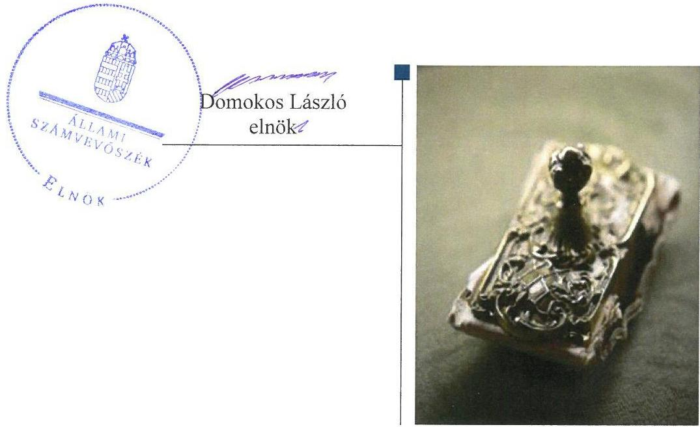
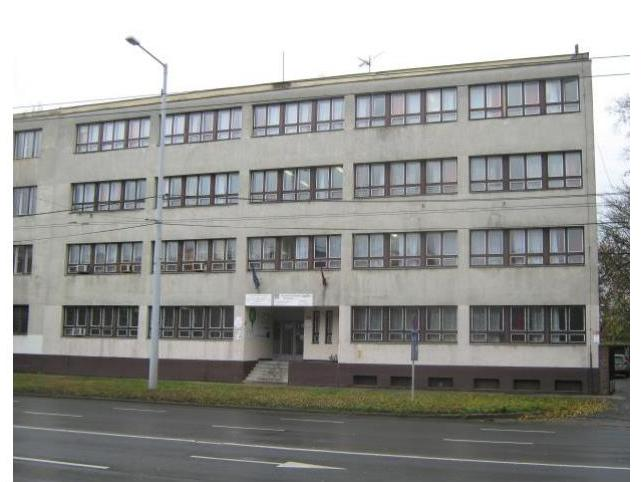
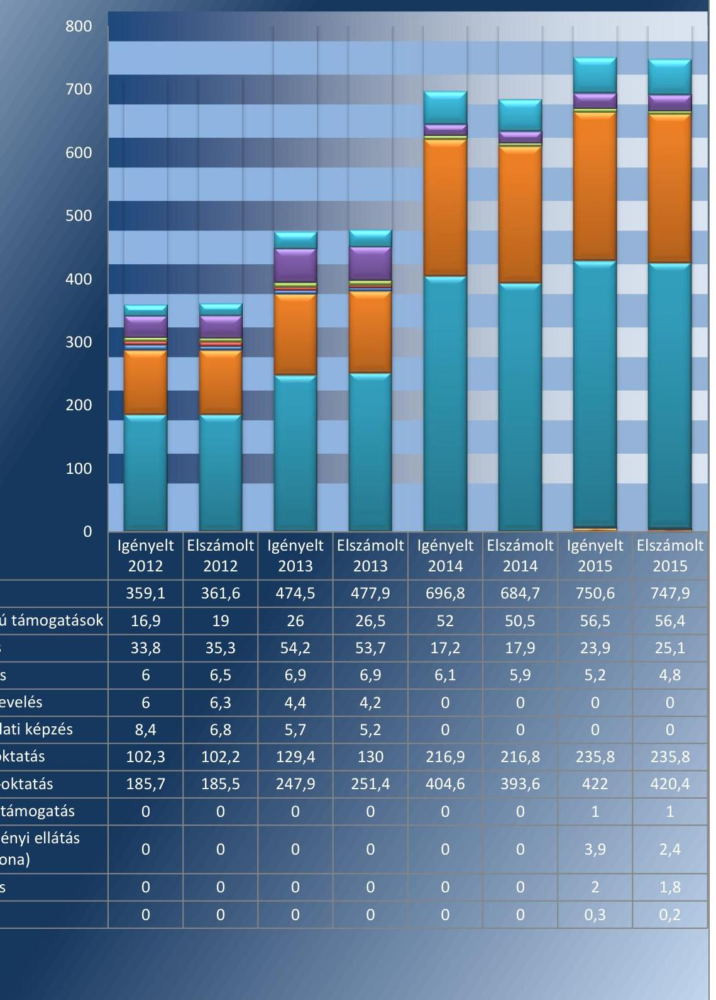
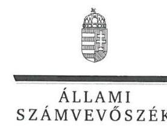
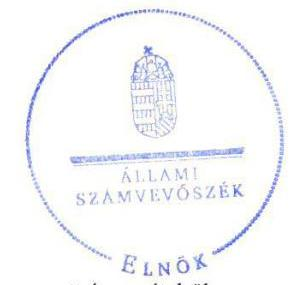

# Jelentés 

## Nem állami humánszolgáltatók ellenőrzése

A humánszolgáltatást nyújtó államháztartáson kívüli köznevelési és szociális intézmények, szolgáltatók fenntartói központi költségvetésből kapott támogatásai felhasználásának ellenőrzése - „Magyarországi Magiszter" Alapítvány 2017.

---

# Jelentés 

## Nem állami humánszolgáltatók ellenőrzése

A humánszolgáltatást nyújtó államháztartáson kívüli köznevelési és szociális intézmények, szolgáltatók fenntartói központi költségvetésből kapott támogatásai felhasználásának ellenőrzése - „Magyarországi Magiszter" Alapítvány
2017. 03. hó 4. nap

---

# AZ ELLENŐRZÉST FELÜGYELTE:

- **SALAMON ILDIKÓ** felügyeleti vezető

- **AZ ELLENŐRZÉST VEZETTE ÉS A VÉGREHAJTÁSÁÉRT FELELŐS:**

- **CSORDÁS PÉTERNÉ** ellenőrzésvezető

- **A PROGRAM ÖSSZEÁLLÍTÁSÁÉRT FELELŐS:**

- **JANIK JÓZSEF LÁSZLÓ** osztályvezető

**IKTATÓSZÁM:** V-1061-140/2016.

**TÉMASZÁM:** 2095

**ELLENŐRZÉS-AZONOSÍTÓ SZÁM:** V076602

Jelentéseink az Országgyűlés számítógépes hálózatán és az Interneten a www.asz.hu címen is olvashatóak.

---

# TARTALOMJEGYZÉK 

■ ÖSSZEGZÉS ..... 5
■ AZ ELLENŐRZÉS CÉLJA ..... 7
■ AZ ELLENŐRZÉS TERÜLETE ..... 8
■ AZ ELLENŐRZÉS HÁTTERE, INDOKOLTSÁGA ..... 10
■ A JELENTÉS LÉNYEGES KÉRDÉSKÖREI ..... 11
■ ELLENŐRZÉS HATÓKÖRE ÉS MÓDSZEREI ..... 12
■ MEGÁLLAPÍTÁSOK ..... 14
■ JAVASLATOK ..... 21
■ MELLÉKLETEK ..... 23
I. sz. melléklet: Értelmező szótár ..... 23
II. sz. melléklet: Az ellenőrzött központi költségvetési támogatások alakulása ..... 24
■ FÜGGELÉK: ÉSZREVÉTELEK ..... 25
■ RÖVIDÍTÉSEK JEGYZÉKE ..... 31

---

.

---

# ÖSSZEGZÉS 

A debreceni székhelyű „Magyarországi Magiszter" Alapítványnál a közfeladat-ellátás kereteinek kialakítása összességében szabályszerű volt. A központi költségvetésből kapott köznevelési célú támogatásokat 2012-2013. években és a szociális célú támogatásokat a 2015. évben összességében szabályszerűen átadta az intézményeinek, azonban a 2014-2015. években a köznevelési célú támogatásokat nem szabályszerűen használta fel. A közfeladatellátás során az átláthatóság érvényesülését nem biztosította, mivel nem gondoskodott a jogszabályokban előírt közérdekű adatok, dokumentumok közzétételéről. Összességében biztosította azt, hogy a szolgáltatást igénybe vevők megfelelő információkhoz jussanak a köznevelési intézmény működéséről.

## Az ellenőrzés társadalmi indokoltsága

Az Állami Számvevőszék stratégiájában hangsúlyos szerepet szán annak, hogy szilárd szakmai alapon álló, értékteremtő ellenőrzéseivel előmozdítsa a közpénzügyek átláthatóságát, rendezettségét és javaslataival a közpénzek és a közvagyon szabályos, gazdaságos, hatékony és eredményes felhasználását segítse. Stratégiájában az Állami Számvevőszék célul tűzte ki, hogy az államháztartáson kívülre nyújtott költségvetési támogatások ellenőrzésével hozzájárul ahhoz, hogy a közpénzeket az államháztartáson kívüli szervezetek is átlátható módon használják fel a közfeladatok szerződésben vállalt ellátása érdekében. Tekintettel az elmúlt években a köznevelés finanszírozását és a köznevelési intézmények fenntartását érintően végbement változásokra, a társadalom fokozott érdeklődéssel figyeli a köznevelési feladatok ellátására fordított források felhasználását. Fontos ezért az Állami Számvevőszéknek a közvéleményt biztosítani arról, hogy a közpénz államháztartáson kívüli felhasználása ezen a területen sem marad ellenőrizetlenül. Hozzájárul ezzel ahhoz is, hogy a nyilvánosság és a szolgáltatást igénybevevők megfelelő tájékoztatást kapjanak az államháztartáson kívüli közfeladatot ellátók működéséről.

## Főbb megállapítások, következtetések

A „Magyarországi Magiszter" Alapítvány, mint intézményfenntartó a közfeladat-ellátás kereteit összességében a jogszabályi előírásoknak megfelelően alakította ki. Az alapító okirata megfelelt a jogszabályi előírásoknak, módosításait szabályszerűen bejelentette a bíróság felé. A központi költségvetési támogatások igénybevételéhez előírt feltételeket biztosította, azonban az iratmegőrzési kötelezettségének nem tett eleget, mert a támogatás elszámolásához kapcsolódó egyes kimutatásokat nem őrzött meg. A belső szabályozottsága is összességében megfelelt a jogszabályoknak, rendelkezett a jogszabályban előírt számviteli szabályzatokkal, azonban a számviteli politikában a jogszabályi előírásokkal ellentétes szabályozások szerepeltek, továbbá a költségvetési támogatások intézményeknek való átadását nem a jogszabályi előírásoknak megfelelően szabályozta.

A „Magyarországi Magiszter" Alapítvány az intézmények működtetésének a kereteit a jogszabályi előírásoknak megfelelően biztosította. Az alapfeladatokat alapító okiratban meghatározta, a nyilvántartásokba vétel megtörtént és a szükséges működési engedélyek is rendelkezésre álltak. Az intézményi alapdokumentumokat a jogszabályokban előírtak szerint jóváhagyta, illetve azokhoz egyetértését adta. A központi költségvetésből kapott köznevelési célú támogatásokat 2012-2013. években, a szociális célú támogatásokat a 2015. évben összességében szabályszerűen átadta az intézményei részére. A 2014-2015. években köznevelési célú támogatások felhasználása nem felelt meg a jogszabályi előírásoknak, mert az intézményének át nem adott támogatások tekintetében a jogszabályi előírások ellenére nem biztosította, hogy a nyilvántartásból megállapítható legyen a támogatások felhasználásának célja.

A „Magyarországi Magiszter" Alapítvány a jogszabályi előírások ellenére közfeladat-ellátása során nem biztosította az átláthatóság érvényesülését, mivel a közérdekű adatok közzétételére vonatkozó kötelezettség teljesítésének

---

részletes szabályait belső szabályzatban nem állapította meg és nem gondoskodott a közérdekű adatok jogszabály szerinti teljes körű közzétételéről. A beszámolókészítési kötelezettségének a jogszabályi előírásoknak megfelelően eleget tett.

---

# AZ ELLENŐRZÉS CÉLJA 

AZ ELLENŐRZÉS CÉLJA annak értékelése volt, hogy a Fenntartó ${ }^{1}$ központi költségvetésből kapott támogatásainak felhasználása szabályszerű volt-e, a támogatások igénylése, évközi módosítása és év végi elszámolása megfelelt-e a jogszabályi előírásoknak.

---

# AZ ELLENŐRZÉS TERÜLETE 

## A „Magyarországi Magiszter" Alapítvány, mint Fenntartó

A debreceni székhelyű Fenntartó 2000-ben alakult 0,05 M Ft induló vagyonnal, alapítói magánszemélyek voltak. A Magyar Államvasutak debreceni Oktatási Főnöksége tanműhelyéért Alapítvány „Magyarországi Magiszter" Alapítványhoz történt csatlakozását követően az alapító okirat ${ }^{2}$ szerinti induló vagyona 2007. február 16-tól 0,2 M Ft-ra emelkedett. A Fenntartó megalakulásától közhasznú jogállású szervezet volt.

Az ellenőrzött időszakban a Fenntartó két Intézményt ${ }^{3}$ tartott fenn, fő tevékenysége óvoda, általános iskola, középiskola fenntartása volt, emellett 2015. május 18-tól bentlakásos idősek otthonát működtetett és házi segítségnyújtást, szociális étkeztetési feladatokat látott el.

A Fenntartó a köznevelési közfeladat-ellátását a Magiszter alapítványi óvoda, iskola ${ }^{4}$, illetve tagintézményeinek fenntartásával végezte az ország 5 településén. A Magiszter alapítványi óvoda, iskola a Közokt. tv. ${ }^{5}$ és az Nkt. ${ }^{6}$ előírásai szerint jogi személy volt, önálló költségvetéssel rendelkezett, azzal önállóan gazdálkodott. A Magiszter alapítványi óvoda, iskola által ellátott alapfeladatok az ellenőrzött időszakban: óvodai nevelés, általános iskolai nevelés-oktatás, gimnáziumi nevelés-oktatás, felnőttoktatás, szakközép- és szakiskolai nevelés-oktatás, a többi gyermekkel, tanulóval együtt nevelhető, oktatható sajátos nevelési igényű gyermekek, tanulók óvodai nevelése és iskolai nevelése-oktatása. A Magiszter alapítványi óvoda, iskola engedélyezett tanulói létszáma 2012-ben 4870 fő, 2013-ban 4861 fő, 2014-ben 4301 fő, 2015-ben 3676 fő volt. A vonatkozó statisztikai adatok szerinti tényleges létszám minden évben az engedélyezett alatt alakult, 2012-ben 1721 fő, 2013-ban 1761 fő, 2014-ben 1823 fő, 2015-ben 1829 fő volt.

A Fenntartó tevékenysége 2015. május 18-tól szociális közfeladat-ellátással bővült, melyet szociális intézménye, a Mátyusi Idősek Otthona fenntartásával biztosított. Az Idősek Otthona ${ }^{7}$ önálló költségvetéssel rendelkezett, önálló gazdasági szervezete azonban nem volt. A bentlakásos ellátási férőhelyeinek száma 16 fő volt, ellátott feladatai: időskorúak tartós bentlakásos ellátása, szociális étkeztetés és házi segítségnyújtás voltak. Az Idősek Otthona 27 fő engedélyezett létszámmal rendelkezett. 2015. évben az időskorúak bentlakásos ellátását igénybe vevők átlagos száma 3,6 fő, a házi segítségnyújtásban részesítettek átlagos létszáma 12,6 fő volt, a szociális étkeztetést pedig átlagosan 4,3 fő vette igénybe.

A Fenntartó 2012-2015 között minden évben központi költségvetési támogatás iránti igénylést nyújtott be a Kincstárhoz ${ }^{8}$, majd a kapott támogatásokkal a tárgyévet követően elszámolt. A II. melléklet tartalmazza az ellenőrzött központi költségvetési támogatások alakulását. A Fenntartó Magyarország éves költségvetéséből támogatásra volt jogosult, amelynek összege az egyszerűsített éves beszámoló alapján 2012-ben 390,3 M Ft, 2013-ban 541,6 M Ft, 2014-ben 739,7 M Ft, 2015-ben 778,8 M Ft volt. Összes bevételének évente 79,4-95,1%-át tette ki az állami támogatás.

---

A szakmai irányító szervi feladatokat a Minisztérium ${ }^{9}$ látta el az ellenőrzött időszakban, ellenőrzési feladatokat az illetékes Kormányhivatalok ${ }^{10}$ végeztek.

---

# AZ ELLENŐRZÉS HÁTTERE, INDOKOLTSÁGA 

A köznevelési és szociális feladatokat ellátó nem állami intézményfenntartók részére közfeladataik ellátására évente jelentős összegű pénzügyi támogatást biztosítottak a mindenkori költségvetési törvények a bennük megfogalmazott feltételek mellett. A felhasználható állami támogatások Kvtv. ${ }^{11}$ szerinti előirányzata 2012-2015. években együtt 894,0 Mrd Ft volt. A 2013. évben jelentős változások következtek be a normatív finanszírozás rendszerében, amely érintette a nem állami intézményfenntartókat is. Az Országgyűlés elfogadta a nemzeti köznevelésről szóló 2011. évi CXC. törvényt, amely jelentősen átalakította a korábbi finanszírozási rendszert 2013 szeptemberétől. Módosították a szociális igazgatásról és szociális ellátásokról szóló 1993. évi III. törvényt is, amely - többek között - 2012. január 1-jei hatállyal megfogalmazta a finanszírozási rendszerbe történő befogadással összefüggő szabályokat. Mindkét területen új feladatfinanszírozási forma (átlagbéralapú támogatás) jelent meg, amely a nem állami intézményfenntartókra is vonatkozik. Az ellenőrzés a finanszírozási rendszerben 2011-2015 között bekövetkezett változásokra, azok közfeladat-ellátásra gyakorolt hatására fókuszál a költségvetési támogatásokat felhasználó államháztartáson kívüli szervezetek körében. Az ellenőrzés indokoltságát az is alátámasztja, hogy az ÁSZ ${ }^{12}$ még nem ellenőrizte átfogóan e területet.

Az ÁSZ stratégiájában foglaltak alapján is indokolt az ellenőrzés, amely a társadalom számára jelzi, hogy a közpénz államháztartáson kívüli felhasználása sem maradhat ellenőrizetlenül. Az államháztartáson kívülre nyújtott költségvetési támogatások ellenőrzésével az ÁSZ hozzájárul ahhoz, hogy a közpénzeket a nem állami humán fenntartók átlátható módon használják fel a közfeladatok ellátására kötött szerződésekben vállalt kötelezettségek teljesítése érdekében. Az ellenőrzés javaslataival hozzájárulhat az említett rendszerek szabályszerű támogatás felhasználásához, javíthatja a társadalmi-gazdasági döntések megalapozottságát, amely a „jó kormányzás" feltétele.

---

# A JELENTÉS LÉNYEGES KÉRDÉSKÖREI 

1. A Fenntartónál a közfeladat-ellátás kereteinek kialakítása szabályszerű volt-e?
2. A Fenntartó a központi költségvetésből kapott támogatásokat szabályszerűen használta-e fel?
3. A Fenntartó közfeladat-ellátása során biztosította-e az átláthatóság érvényesülését?
4. A Fenntartó intézkedett-e a külső ellenőrzések megállapításaira?

---

# ELLENŐRZÉS HATÓKÖRE ÉS MÓDSZEREI 

## Az ellenőrzés típusa

Megfelelőségi ellenőrzés.

## Az ellenőrzött időszak

A 2012. január 1-je és 2015. december 31-e közötti évek. A 2012. év vonatkozásában a költségvetési támogatások 2012. évet megelőző időszakra eső igénylését, a 2015. év tekintetében annak 2016-ban történő elszámolását is ellenőrizte az ÁSZ.

## Az ellenőrzés tárgya

Az ellenőrzés a köznevelési és szociális közfeladatokat ellátó államháztartáson kívüli intézményfenntartó, központi költségvetésből kapott támogatásai felhasználására terjedt ki. Az alábbi jogcímek szabályszerűségének értékelését foglalta magában:
$\longrightarrow$ az alap normatív- és átlagbér alapú költségvetési támogatások közül a köznevelés területen az óvodai nevelés, általános iskolai oktatás/alapfokú nevelés, középfokú oktatás/nevelés, a szociális alapszolgáltatások közül a házi segítségnyújtás, a szociális gondozás és szakosított ellátások közül az idősek intézményi ápolása, gondozása.
$\longrightarrow$ a kiegészítő támogatások közül köznevelés területen a tanulóétkeztetési - és a tankönyvtámogatás.
Az ellenőrzés kiterjedt minden olyan körülményre és adatra, amely az ÁSZ jogszabályban meghatározott feladatainak teljesítéséhez, valamint a program végrehajtása folyamán felmerült újabb összefüggések feltárásához szükséges volt.

## Az ellenőrzött szervezet

„Magyarországi Magiszter" Alapítvány

## Az ellenőrzés jogalapja

Az ellenőrzés jogszabályi alapját az ÁSZ tv. ${ }^{13}$ 1. § (3) bekezdése és az 5. § (3) bekezdéseiben foglalt előírások adták.

---

# Az ellenőrzés módszerei 

Az ellenőrzést az ellenőrzési program kérdései, az adott időszakban hatályos jogszabályok, az ellenőrzés szakmai szabályok és módszertanok, valamint a nemzetközi standardok figyelembevételével végezte az ÁSZ.

A közpénzekkel való felelős gazdálkodás segítésére irányuló javaslatok kidolgozásakor a hatályos jogszabályok voltak az irányadóak.

Az ellenőrzés ideje alatt az ÁSZ a Fenntartóval történő kapcsolattartást az ÁSZ SZMSZ ${ }^{14}$-ének vonatkozó előírásai alapján biztosította.

Az ellenőrzési kérdések megválaszolásához szükséges bizonyítékok megszerzése az
 ellenőrzöttek által rendelkezésre bocsátott dokumentumokra, adatokra alapozva megfigyeléssel, szemlével (szemrevételezéssel), kérdésfeltevéssel (információkéréssel), valamint elemző eljárással történt.

Az ellenőrzési bizonyítékként felhasznált adatforrások közé tartoztak egyrészt a szakmai program részletes szempontjainál felsorolt adatforrások, másrészt minden - az ellenőrzés folyamán feltárt, az ellenőrzés szempontjából információt tartalmazó - dokumentum.

Az ellenőrzés lefolytatásához a Fenntartó a kitöltött tanúsítványok, valamint az ÁSZ által kért dokumentumok elektronikus úton való megküldésével szolgáltatott adatokat, információkat. Az így rendelkezésre bocsátott adatok, információk és a tanúsítványok adatai valódiságának kontrollja az ellenőrzés keretében történt.

A szabályosság megítélésének az alapját képezte, hogy a központi költségvetési támogatások Fenntartó általi igénylése és év végi elszámolása a Kincstár felé megtörtént.

A központi költségvetési támogatások szabályszerű felhasználását a Fenntartó vonatkozásában, a támogatások Intézmény részére - annak működtetésére - történő továbbutalásának, valamint a támogatások felhasználásáról a jogszabályban előírt nyilvántartás vezetésének értékelésével végezte az ÁSZ.

---

# 1. A Fenntartónál a közfeladat-ellátás kereteinek kialakítása szabályszerű volt-e? 

Összegző megállapítás

A Fenntartó a közfeladat-ellátás kereteit összességében szabályszerűen alakította ki.

### 1.1. számú megállapítás

A Fenntartónál köznevelési és szociális közfeladat-ellátás szervezeti kereteinek kialakítása összességében megfelelt a jogszabályi előírásoknak.

A Fenntartó a közfeladat-ellátási tevékenységének szervezeti kereteit a Civil tv. ${ }^{15}$., a Közokt. tv., az Nkt. és a Szoc. tv. ${ }^{16}$ előírásainak megfelelően kialakította. A Fenntartó rendelkezett a Ptk. ${ }^{17}$, valamint a Ptk. ${ }^{18}$ előírásainak megfelelő alapító okirattal. A Fenntartó alapító okiratának módosítását minden esetben, annak jóváhagyását követően bejelentette a bíróságnak. A Fenntartó az ellenőrzött időszakban hatályos, kuratórium által jóváhagyott SZMSZ-ekkel ${ }^{19}$ rendelkezett. Az SZMSZ ${ }_{2}$ 12. pontjában szereplő - a kuratórium kizárólagos döntési hatáskörébe tartozó, a költségvetési tervben nem szereplő egyéb kiadásokra vonatkozó - összeghatár eltért az alapító okirat ${ }_{2,3}$ VI. fejezet 3. pontjában meghatározott összegtől.

A Fenntartó a köznevelési és szociális támogatásigényléshez benyújtott dokumentációja szerint - a támogatás igénylés alapját jelentő - Áht.-ban ${ }^{20}$ foglalt feltételeknek megfelelt, mivel átlátható szervezetnek minősült, továbbá rendezett munkaügyi kapcsolatokkal rendelkezett.

A köznevelési feladatok vonatkozásában a költségvetési támogatás igénylését megalapozó - Közokt. vhr.-ben ${ }^{21}$ és az Nkt. vhr.-ben ${ }^{22}$ előírtaknak megfelelő - dokumentumok és összesítő nyilvántartások a Fenntartónál rendelkezésre álltak, továbbá rendelkezett információval az Intézmény OM azonosítójáról ${ }^{23}$, a gyermek, illetve tanuló létszámról, az alkalmazottakról. A Fenntartó iratmegőrzési kötelezettségének nem tett eleget, mivel a 2013. és a 2014. évi köznevelési támogatás éves elszámolásához kapcsolódó dokumentumok közül nem őrizte meg az intézménnyel jogviszonyban álló, az elszámolásban szereplő gyermekek, tanulók oktatási azonosító számát tartalmazó kimutatást, megsértve ezzel az Ltt. ${ }^{24}$ 9. § (1) bekezdés e) pontjának iratmegőrzésre vonatkozó előírásait.

A szociális szolgáltatás nyújtása vonatkozásában a támogatásigénylés feltételeit jelentő dokumentumok a Szoc. tv., az Atr. ${ }^{25}$ és az 1/2000. (I. 7.) SzCsM rendelet ${ }^{26}$ előírásainak megfelelően biztosítottak voltak.

---

# 1.2. számú megállapítás 

A Fenntartó belső szabályozottsága összességében megfelelt a jogszabályi előírásoknak.

A Fenntartó rendelkezett a kuratórium által elfogadott számviteli politikával ${ }^{27}$, továbbá a számviteli politika keretében a Számv. tv.-ben ${ }^{28}$ foglalt előírásoknak megfelelően, elkészítette a leltározási ${ }^{29}$, értékelési ${ }^{30}$, valamint a pénzkezelési szabályzatot. ${ }^{31}$ Önköltségszámítás rendjére vonatkozó belső szabályzat készítésére vonatkozó kötelezettség alól a Számv. tv. 14. § (6) bekezdése alapján mentesült, mivel egyszerűsített éves beszámolót készített.

A számviteli politika ${ }_{1,2}$ megfelelte a Számv. tv. és a Civilszr. ${ }^{32}$ előírásainak, azonban a számviteli politika ${ }_{3}$-ban a Számv. tv. szerinti egyszerűsített éves beszámoló készítési kötelezettséget írták elő, az egyéb szervezetekre vonatkozó, a Civilszr. 6. § (6) bekezdésének egyszerűsített éves beszámoló mérleg, eredménykimutatás, kiegészítő melléklet - elkészítésére vonatkozó előírásai helyett. A Fenntartó rendelkezett a Számv. tv. előírásainak megfelelő számlarenddel. ${ }^{33}$

A központi költségvetési támogatások Intézményeknek való átadásáról a Fenntartó belső szabályzásban ${ }^{34}$ rendelkezett, amelyben rögzítette, hogy az át nem adott támogatás a Fenntartó nevére szóló, de az Intézmények működéséhez nélkülözhetetlen tevékenységekre kerülhet elszámolásra, ez azonban ellentétes volt a köznevelési területen a 2012. évben a Kvtv1. 38. § (1) bekezdés h) pontjában, a 2013. évben a 2013. szeptember 27-ig járó támogatások esetében a Kvtv2. 35. § (1) bekezdés a) pontjában, a 2013. október 1. és 2013. december 31. között járó támogatások esetében a Kvtv2. 35/E. § (7) bekezdésében, valamint a szociális területen 2015. május 18-tól a Kvtv4. 43. § (3) bekezdésében foglaltakkal, mivel azok a költségvetési támogatás teljes összegének intézmények részére történő átadását írták elő.

## 2. A Fenntartó a központi költségvetésből kapott támogatásokat szabályszerűen használta-e fel?

Összegző megállapítás

### 2.1. számú megállapítás

A Fenntartó a központi költségvetésből kapott köznevelési célú támogatásokat 2012-2013. években, a szociális célú támogatásokat a 2015. évben összességében szabályszerűen átadta az Intézmények működtetésére. A 2014-2015. években köznevelési célú támogatások felhasználása nem felelt meg a jogszabályi előírásoknak.

A Fenntartó a jogszabályi előírásoknak megfelelően biztosította a Magiszter alapítványi óvoda, iskola működtetésének a kereteit.

A Fenntartó meghatározta a Magiszter alapítványi óvoda, iskola alapfeladatait az alapító okiratban ${ }^{35}$ a Közokt. tv, illetve az Nkt. előírásaival összhangban. A Magiszter alapítványi óvoda, iskola rendelkezett OM azonosítóval, telephelyeivel, tagintézményeivel együtt szerepeltek az illetékes kormányhivatal nyilvántartásában, az Oktatási Hivatal által vezetett KIR ${ }^{36}$ nyilvántartásban. A Fenntartónál rendelkezésre állt a Közokt. tv.-ben, a

---

Közokt. vhr.-ben, az Nkt.-ben, valamint az Nkt. vhr.-ben előírt hatályos intézményi működési engedély. A Fenntartó az engedélyezési eljárások során igazolta, hogy a Magiszter alapítványi óvoda, iskola közfeladat-ellátásához szükséges személyi és tárgyi feltételeket biztosította.

A Fenntartó a Magiszter alapítványi óvoda, iskola működtetését megalapozó feladatellátása szabályszerű volt. A Fenntartó a 2012. január 1. és 2012. augusztus 31. közötti időszakot érintően a Közokt. tv.-ben előírtaknak megfelelően jóváhagyta a Magiszter alapítványi óvoda, iskola SZMSZét ${ }^{37}$, a minőségirányítási programokat, pedagógiai programokat és házirendeket. Az Nkt.-ben előírtaknak megfelelően pedig egyetértését adta 2012. szeptember 1. és 2015. december 31. közötti időszak vonatkozásában a pedagógiai programokhoz, házirendekhez, szervezeti és működési szabályzatokhoz. Az ellenőrzött időszakra a Fenntartó a Magiszter alapítványi óvoda, iskola számára a költségvetését, valamint a Közokt. tv. és az Nkt. előírásainak megfelelően a kérhető térítési díj megállapításának szabályait meghatározta, továbbá a Magiszter alapítványi óvoda, iskola vezetőjét a Közokt. tv. és az Nkt. előírásainak megfelelően kinevezte, megbízta.

# 2.2. számú megállapítás 

## A Fenntartó a jogszabályi előírásoknak megfelelően biztosította az Idősek Otthona működtetésének a kereteit.

A Fenntartó meghatározta az alapfeladatokat az Idősek Otthona alapító okiratában ${ }^{38}$, Magyarország közigazgatási területe illetékességgel az időskorúak bentlakásos ellátását, Mátyus község közigazgatási területére a házi segítségnyújtás, szociális étkeztetés közfeladatot.

A Fenntartó Idősek Otthona működtetését megalapozó feladatellátása szabályszerű volt. A Szoc. tv. előírásának megfelelően gondoskodott az Idősek Otthona SZMSZ-ének ${ }^{39}$, szakmai programjának, házirendjének jóváhagyásáról. Az Idősek Otthona SZMSZ-e az 1/2000. (I. 7.) SzCsM rendelet tartalmi előírásának megfelelt. A Fenntartó az engedélyezési eljárások során igazolta, hogy az Idősek Otthona alapfeladatának ellátásához szükséges állandó alkalmazotti létszámot az 1/2000. (I. 7.) SzCsM rendelet előírásának megfelelően biztosította, valamint azt, hogy az ellátottak orvosi ellátását a területi háziorvossal kötött vállalkozási szerződéssel biztosította. A Fenntartó rendelkezett az Idősek Otthona közfeladat-ellátásához 2015. május 18-ától hatályos működési engedélyével, valamint 2015. május 21-től az illetékes kormányhivatal által kiadott, 369/2013. (X. 24.) Korm. rendeletben ${ }^{40}$ előírt tanúsítvánnyal, mely a támogatásra való igényjogosultságot megalapozó alapfeladatot tartalmazta. A Fenntartó a szociális közfeladatellátásának alapját a Mátyus Község Önkormányzatával 2014. szeptember 3-án kötött ellátási szerződés ${ }^{41}$ teremtette meg, mely szerződés tartalmi elemeit tekintve megfelelt a Szoc. tv. előírásainak. A Fenntartó az Idősek Otthona vezetőjét Szoc.tv. előírásainak megfelelően kinevezte, megbízta.

A Fenntartó az Idősek Otthona 2015. évi egyszerűsített beszámolóját és közhasznúsági mellékletét a Fenntartó kuratóriuma elfogadta.

---

### 2.3. számú megállapítás

A Fenntartó a köznevelési célú központi költségvetési támogatásokat 2012-2013. években összességében a jogszabályi előírásoknak megfelelően átadta a Magiszter alapítványi óvoda, iskola részére. A 2014-2015. években a Magiszter alapítványi óvoda, iskola részére át nem adott támogatások cél szerinti felhasználása nem volt dokumentált.

A Fenntartó a köznevelési célú központi költségvetési támogatások teljes összegét átadta a 2012-2013. években a Magiszter alapítványi óvoda, iskola részére, azonban a jogszabályokban előírt 15 napos határidőt több esetben nem tartotta be, a két év során összesen 38,1 M Ft összegű támogatást határidő túllépéssel adott át. A Fenntartó nem tett eleget a 2012. évben a Kvtv1. 38. § (1) bekezdés h) pontjában foglaltaknak, 2013. évben - a 2013. szeptember 27-ig járó támogatások esetében - a Kvtv2. 35. § (1) bekezdés a) pontjában foglaltaknak, - 2013. október 1. és 2013. december 31. közt járó támogatások esetében - a Kvtv2. 35/E. § (7) bekezdésében foglaltaknak, mert nem adta át a normatív hozzájárulás és támogatás teljes összegét a folyósítást követő 15 napon belül a Magiszter alapítványi óvoda, iskola részére három-három alkalommal.

A 2012-2013. években, határidőben át nem adott költségvetési támogatásokat az 1. táblázat tartalmazza.

1. táblázat

HATÁRIDŐBEN ÁT NEM ADOTT KÖZNEVELÉSI KÖLTSÉGVETÉSI TÁMOGATÁSOK (2012-2013)

|  Kincstár által folyósítás időpontja | Kincstár által folyósított támogatás összege | Magiszter alapítványi óvoda, iskolának 15 napos határidőben átadott támogatás összege | Magiszter alapítványi óvoda, iskolának 15 napos határidőn túl átadott támogatás összege  |
| --- | --- | --- | --- |
|   | (M Ft) | (M Ft) | (M Ft)  |
|  2012. január 10. | 28,7 | 22,7 | 6,0  |
|  2012. február 09. | 28,2 | 16,9 | 11,3  |
|  2012. augusztus 09. | 34,8 | 25,0 | 9,8  |
|  2013. augusztus 05. | 39,0 | 35,0 | 4,0  |
|  2013. szeptember 05. | 32,8 | 28,5 | 4,3  |
|  2013. december 13. | 57,7 | 55,0 | 2,7  |
|  2012-2013. évek összesen | 221,2 | 183,1 | 38,1  |

Fonrás: Fenntartó 2012-2013. évi főkönyvi kivonatai és beszámolói

A Fenntartó a központi költségvetési támogatásokból 2014-ben 4,2 M Ft-ot, 2015-ben 29,0 M Ft-ot nem adott át a Magiszter alapítványi óvoda, iskola részére és az át nem adott támogatások vonatkozásában az Nkt. vhr. 37/G. § (1) bekezdésében meghatározottak ellenére nem biztosította, hogy a nyilvántartásból megállapítható legyen, hogy a támogatásokat milyen célra használták fel.

A köznevelési költségvetési támogatások felhasználásának nyilvántartása, kezelése nem felelt meg a Közokt. vhr. 17. § (8) bekezdése előírásának, mivel

---

2013. március 8-ig a normatív támogatások átadását nem alaptevékenységenkénti bontásban, 2013. március 9-től a költségvetési támogatások felhasználását nem alapfeladatonkénti bontásban elkülönítetten tartották nyilván, illetve 2013. október 5-től az Nkt.
 vhr. 37/G. § (1) bekezdés előírásának, mivel a költségvetési támogatások felhasználását nem alapfeladatonkénti bontásban elkülönítetten tartották nyilván, valamint nem volt megállapítható a nyilvántartásból, hogy a támogatásokat milyen célra használták fel.

# 2.4. számú megállapítás 

A Fenntartó összességében a jogszabályi előírásoknak megfelelően átadta a szociális célú támogatásokat az Idősek Otthona részére.

A FENNTARTÓ a szociális célú központi költségvetési támogatások teljes összegét átadta az Idősek Otthonának, azonban a Ktv. 4. 43. § (3) bekezdésében rögzítetteket nem tartotta be, mert 2015. július, augusztus, október, november hónapokban a támogatás egy részét 15 napon túl adta át. A Fenntartó az Idősek Otthona fenntartásához kapcsolódó költségvetési támogatás 2015. évi 7,2 M Ft-os teljes összegéből a Ktv. 4. előírásának megfelelően, határidőn belül 3,8 M Ft-ot adott át, a fennmaradó 3,4 M Ft-ot az előírt 15 napos határidőn túl, 15-20 napos késéssel adta át.

A Fenntartó az Atr. 2. 16. § (1) bekezdés és a Számv.tv. 161/A. (2) bekezdés előírásainak ellenére a szociális támogatás felhasználását számviteli rendjében feladatonkénti bontásban, elkülönítetten nem vezette.

## 3. A Fenntartó közfeladat-ellátása során biztosította-e az átláthatóság érvényesülését?

Összegző megállapítás

## 3.1. számú megállapítás

A Fenntartó a közfeladat-ellátása során nem biztosította az átláthatóság érvényesülését.

A Fenntartó összességében biztosította, hogy a szolgáltatást igénybe vevők megfelelő információkhoz jussanak a Magiszter alapítványi óvoda, iskola működéséről.

A Fenntartó az ellenőrzött időszak minden évében ellenőrizte, értékelte a Magiszter alapítványi óvodát, iskolát, amely kiterjedt a tanügyi dokumentumok meglétére, munkatervekre, valamint a pedagógiai-szakmai munka eredményességére. A Magiszter alapítványi óvoda, iskola pedagógiai programjában meghatározott feladatok végrehajtásának, a pedagógiai-szakmai munka eredményességének 2011/2012-es, a 2012/2013-as és a 2013/2014-es tanévekre vonatkozó értékeléseit a Fenntartó honlapján nyilvánosságra hozta, megfelelve ezzel a Közokt. tv. és az Nkt. rendelkezésének, azonban a 2014/2015. tanévről szóló értékelését nem hozta nyilvánosságra, mely ellentétes volt az Nkt. 85. § (3) bekezdésében foglaltakkal.

A Fenntartó 2015. évben a Szoc. tv. alapján ellenőrizte az Idősek Otthona működését, gazdálkodását, tevékenységét, e körben nyilvánosságra hozatali kötelezettsége nem volt.

---

# 3.2. számú megállapítás 

A Fenntartó nem biztosította a közérdekű adatok nyilvánosságát.
A Fenntartó az Info. tv. ${ }^{42}$ előírásainak megfelelően kialakította az Info. tv., valamint az egyéb adat- és titokvédelmi szabályok érvényre juttatásához szükséges eljárási szabályokat, azonban az Info. tv. 35. § (3) bekezdésében foglalt előírás ellenére a közérdekű adatok közzétételére vonatkozó kötelezettség teljesítésének részletes szabályait belső szabályzatban nem állapította meg.

A Fenntartó az Info. tv. 37. § (1) bekezdés szerinti elektronikus közzétételi kötelezettségének nem teljes körűen tett eleget, mivel az Info. tv. 1. mellékletében felsorolt, általános közzétételi listán meghatározott adatok közül az alábbiak nem kerültek közzétételre a honlapján ${ }^{43}$ :
—_ II. Tevékenységre, működésre vonatkozó adatok táblázatban a Fenntartó feladatát, hatáskörét és alaptevékenységét meghatározó jogszabályok, szervezetszabályozó eszközök, valamint az SZMSZ, vagy ügyrend, az adatvédelmi és adatbiztonsági szabályzat; a közérdekű adatok megismerésére irányuló igények intézésének rendje; tevékenységére vonatkozó statisztikai adatgyűjtés eredményei, időbeli változás; a közérdekű adatokkal kapcsolatos kötelező statisztikai adatszolgáltatás Fenntartóra vonatkozó adatai,
továbbá, az alábbi adatok hiányosan kerültek közzétételre:
II. Tevékenységre, működésre vonatkozó adatok táblázatban a Fenntartónál végzett alaptevékenységgel kapcsolatos vizsgálatok, ellenőrzések nyilvános megállapításai,
III. Gazdálkodási adatok táblázatában az 1. sorszámú adatok közül hiányzott a 2012. évi beszámoló és közhasznúsági melléklet.
A Fenntartó a Számv. tv. 154. § (1) bekezdésének előírása ellenére a 2012. évi könyvvizsgálói jelentést nem tette közzé.

### 3.3. számú megállapítás

A Fenntartó a beszámolókészítési kötelezettségének a jogszabályoknak megfelelően eleget tett.

A Fenntartó közhasznú alapítványi besorolása miatt kettős könyvvitelt vezetett a Civil tv. előírásának megfelelően, továbbá beszámolókészítési kötelezettségének is eleget tett, évente a Civilszr.-nek megfelelő egyszerűsített éves beszámolót készített, valamint a Civil tv. előírása szerint elkészítette a beszámoló közhasznúsági mellékletét. Beszámolókészítési kötelezettségének teljesítése - a Számviteli politika 3-ban történt hibás szabályozás ellenére - megfelelt a jogszabályi előírásoknak. A Fenntartó egyszerűsített éves beszámolójának könyvvizsgálóval történő, a Civilszr. szerinti felülvizsgálati kötelezettségének eleget tett.

A Fenntartó egyszerűsített éves beszámolói az Országos Bírósági Hivatal által fenntartott közhiteles Civil Szervezetek Névjegyzékében ${ }^{44}$ hozzáférhetőek.

---

# 4. A Fenntartó intézkedett-e a külső ellenőrzések megállapításaira? 

Összegző megállapítás

A Fenntartó intézkedett a külső ellenőrzések által tett, intézkedést igénylő megállapításokra.

## A KINCSTÁR A FENNTARTÓ ÁLTAL BENYÚJTOTT

KÖZNEVELÉSI támogatások elszámolásainak felülvizsgálatát követően a 2012., 2013. évre többlettámogatást, míg a 2014., 2015. évre visszafizetési kötelezettséget állapított meg, a kötelezettségeit a Fenntartó teljesítette.

A Kincstár helyszíni ellenőrzések során felülvizsgálta a köznevelési támogatások igénylésének és elszámolásának jogszerűségét, ennek eredményeképpen 2012., 2013., 2014. években visszafizetési kötelezettséget állapított meg, amelyet a Fenntartó teljesített.

Az illetékes Kormányhivatalok az ellenőrzött időszakban hat törvényességi és egy hatósági ellenőrzést folytattak le. A hét ellenőrzésből hat ellenőrzés során merült fel intézkedési kötelezettség, amelynek a Fenntartó az előírt határidőn belül eleget tett.

A Kincstár az Atr. 2. felhatalmazása alapján a Fenntartó által 2015. évben igénybevett szociális támogatás elszámolása szabályszerűségének, a közölt adatok valódiságának, a jogszabályi feltételek meglétének hatósági ellenőrzése tárgyában folytatott le helyszíni ellenőrzést 2016. évben az Idősek Otthonánál. A helyszíni ellenőrzés során megállapított, illetve a támogatás elszámolásban elfogadott feladatmutatók, mutatószámok eltéréseiből adódóan a Kincstár 0,2 M Ft finanszírozási különbözet, és a kapcsolódó 0,004 M Ft ügyleti kamat megfizetéséről határozatban intézkedett, melynek teljesítési kötelezettsége ellenőrzött időszakon kívülre esett.

---

# JAVASLATOK 

Az ÁSZ tv. 33. § (1) bekezdésében foglaltak értelmében az ellenőrzött szervezet vezetője köteles a jelentésben foglalt megállapításokhoz kapcsolódó intézkedési tervet összeállítani és azt a jelentés kézhezvételétől számított 30 napon belül az ÁSZ részére megküldeni. Amennyiben az ellenőrzött szervezet vezetője nem küldi meg határidőben az intézkedési tervet, vagy továbbra sem elfogadható intézkedési tervet küld, az Állami Számvevőszék elnöke az ÁSZ tv. 33. § (3) bekezdése a) és b) pontjaiban foglaltakat érvényesítheti.

## „Magyarországi Magiszter" Alapítvány Kuratóriuma elnökének

1. Intézkedjen, hogy az SZMSZ a kuratórium kizárólagos döntési hatáskörébe tartozó, a költségvetési tervben nem szereplő egyéb kiadások összeghatárát az alapító okirattal összhangban tartalmazza.
(1.1. számú megállapítás 1. bekezdés 5. mondata alapján)
2. Intézkedjen, hogy a számviteli politikában az egyszerűsített éves beszámoló készítési kötelezettség meghatározása megfeleljen a Fenntartóra vonatkozó jogszabályi előírásoknak.
(1.2. számú megállapítás 2. bekezdése alapján)
3. Intézkedjen, hogy belső szabályozó ne tartalmazzon jogszabállyal ellentétes szabályozást.
(1.2. számú megállapítás 3. bekezdése alapján)
4. Intézkedjen a támogatások felhasználásának az Nkt. vhr.-ben előírtaknak megfelelő nyilvántartására.
(2.3. számú megállapítás 3-4. bekezdése alapján)
5. Intézkedjen, hogy a költségvetési támogatás a hatályos költségvetési törvényben előírtak szerint határidőben átadásra kerüljön az Idősek Otthona részére.
(2.4. számú megállapítás 1. bekezdése alapján)
6. Intézkedjen, hogy számviteli rendjében a szociális támogatás felhasználásának kezelése megfeleljen a jogszabályi előírásokban foglaltaknak.
(2.4. számú megállapítás 2. bekezdése alapján)

---

7. Intézkedjen - a jogszabályi előírásnak megfelelően - a Magiszter alapítványi óvoda, iskola pedagógiai programjában meghatározott feladatok végrehajtásával, a pedagógiai-szakmai munka eredményességével összefüggő fenntartói értékelések teljes körű nyilvánosságra hozatalára.
(3.1. számú megállapítás 1. bekezdés 2. mondata alapján)
8. Intézkedjen a jogszabályi előírásoknak megfelelően
a) a közérdekű adatok közzétételére vonatkozó kötelezettség teljesítése részletes szabályainak belső szabályzatban történő megállapítására;
b) a közzétételi kötelezettség teljes körű teljesítésére.
(3.2. számú megállapítás 1-3. bekezdése alapján)

---

# MELLÉKLETEK 

- I. SZ. MELLÉKLET: ÉRTELMEZŐ SZÓTÁR
átlagbéralapú támogatás
feladatfinanszírozás
humánszolgáltatás
intézményfenntartó
köznevelési közfeladat
köznevelési intézmény
közoktatási információs rendszer / köznevelés információs rendszer (KIR) nem állami fenntartású köznevelési intézmények

Az átlagbér alapú támogatás alapja a pedagógus-munkakörben, valamint nevelő-, oktató munkát közvetlenül segítő munkakörben foglalkoztatottak után kifizetett személyi juttatás és járulék. (2013. évi CCXXX. törvény Magyarország 2014. évi központi költségvetéséről 33. § (4) bekezdés)
A közfeladat államháztartáson kívüli szervezet által történő ellátásához közvetlenül kapcsolódó, arányos működési költségeket finanszírozó költségvetési támogatás. (az egyesülési jogról, a közhasznú jogállásról, valamint a civil szervezetek működéséről és támogatásáról szóló 2011. évi CLXXV. törvény 2. § (8) bekezdés)
Szociális, gyermekjóléti, gyermekvédelmi, közoktatási, felsőoktatási, kulturális közfeladatok. (2011. évi Kvtv. és a 2012. évi Kvtv.)
Az a természetes vagy jogi személy, aki vagy amely a köznevelési feladat ellátására való jogosultságot megszerezte vagy azzal rendelkezik, és - e törvényben foglalt esetben a működtetővel közösen - a köznevelési intézmény működéséhez szükséges feltételekről gondoskodik. (Nkt. 4. § 9. pont)
A köznevelési intézmény alapító okiratában foglalt feladat: óvodai nevelés, nemzetiséghez tartozók óvodai nevelése, általános iskolai nevelés-oktatás, nemzetiséghez tartozók általános iskolai nevelése-oktatása, kollégiumi ellátás, nemzetiségi kollégiumi ellátás, gimnáziumi nevelés-oktatás, szakközépiskolai nevelés-oktatás, szakiskolai nevelés-oktatás, nemzetiségi gimnáziumi nevelés-oktatása, nemzetiségi szakközépiskolai nevelés-oktatása, nemzetiségi szakiskolai nevelés-oktatása, Köznevelési Hídprogramok keretében folyó nevelés-oktatás, felnőttoktatás, alapfokú művészetoktatás, fejlesztő nevelés, fejlesztő nevelés-oktatás, pedagógiai szakszolgálati feladat, a többi gyermekkel, tanulóval együtt nevelhető, oktatható sajátos nevelési igényű gyermekek, tanulók óvodai nevelése és iskolai nevelése-oktatása, azoknak a sajátos nevelési igényű gyermekeknek, tanulóknak az óvodai, iskolai, kollégiumi ellátása, akik a többi gyermekkel, tanulóval nem foglalkoztathatók együtt, a gyermekgyógyüdülőkben, egészségügyi intézményekben, rehabilitációs intézményekben tartós gyógykezelés alatt álló gyermekek tankötelezettségének teljesítéséhez szükséges oktatás, pedagógiai-szakmai szolgáltatás.(Nkt. 4. § 1. pont)
A köznevelési intézmény a törvényben meghatározott köznevelési feladatok ellátására létesített intézmény. A köznevelési intézmény a fenntartójától elkülönült, önálló költségvetéssel rendelkező jogi személy, amely a nyilvántartásba való bejegyzéssel, a bejegyzés napján jön létre. (Nkt. 21. § (1) bekezdés)
A KIR a közoktatás feladataiban közreműködők által szolgáltatott adatokra épülő, országos, elektronikus nyilvántartási és adatszolgáltatási rendszer. (20/1997. (II. 13.) Korm. rendelet 11. § (1) bekezdése)
nem az állam és nem az önkormányzat által fenntartott egyházi és magán köznevelési intézmények

---

# II. SZ. MELLÉKLET: AZ ELLENŐRZÖTT KÖZPONTI KÖLTSÉGVETÉSI TÁMOGATÁSOK ALAKULÁSA 

## Az ellenőrzött központi költségvetési támogatások alakulása

Fonrás: Fenntartó tanúsítványai

---

# FÜGGELÉK: ÉSZREVÉTELEK 

A jelentéstervezetet a Számvevőszék 15 napos észrevételezésre megküldte az ellenőrzött szervezet vezetőjének az ÁSZ tv. 29. § (1) bekezdése előírásának megfelelően.

A „Magyarországi Magiszter" Alapítvány Kuratóriuma elnöke az ellenőrzés megállapításaira írásban észrevételt tett. Az észrevétel alapján az Állami Számvevőszék nem módosította a jelentést.

A függelék tartalmazza az ellenőrzött szervezet vezetőjének az észrevételét és az arra adott választ, a figyelembe nem vett észrevételről, annak indokairól szóló tájékoztatást.

[^0]
[^0]:    * 29. § (1) Az Állami Számvevőszék az ellenőrzési megállapításait megküldi az ellenőrzött szervezet vezetőjének vagy az általa megbízott személynek, és annak, akinek személyes felelősségét állapította meg.
    (2) Az ellenőrzött szervezet vezetője és a felelősként megjelölt személy az ellenőrzés megállapításaira tizenöt napon belül írásban észrevételt tehet.
    (3) Az Állami Számvevőszék az észrevételre a beérkezésétől számított harminc napon belül írásban válaszol. A figyelembe nem vett észrevételeket köteles a jelentésben feltüntetni, és megindokolni, hogy azokat miért nem fogadta el.

---

# Magyarországi Magiszter Alapítvány

1234

Cím: 4030 Debrecen, Szabó Kálmán u. 60.
Tel.: 70/417-1739, 52/314-623
E-mail cím: info@magiszteralapitvány.hu
www.magiszteralapitvány.hu
1234
1234
1234
Tisztelt Elnök Úr!

2017. július 11. napján kézhez vettük a Magyarországi Magiszter Alapítványnál az Állami Számvevőszék által
folytatott ellenőrzésről készített számvevőszéki jelentéstervezetet.

A számvevőszéki tervezetben foglaltakat áttanulmányoztuk.
A jelentésbe foglalt megállapítások hiányosságainak kiküszöbölésére a Magyarországi Magiszter Alapítvány
kuratóriumi elnökének javaslatokat tett
 az Állami Számvevőszék.

A rendelkezésünkre álló 15 napos észrevételi határidőn belül a javaslat 5. pontjára az alábbi észrevételt tesszük:

A jelentéstervezet 2.4. számú megállapításának 1. bekezdése alapján kifogásolja az ellenőrzés, hogy a Mátyusi
Idősek Otthona részére a költségvetési támogatás határidőben nem került átadásra.
E körben előadjuk, hogy a költségvetési támogatás összegét megelőlegezve adtuk át a Mátyusi Idősek Otthona
részére, mivel a dolgozók bérkifizetése megelőzte a költségvetési támogatás folyósítását. A megelőlegezett
finanszírozásnak az volt az indoka, hogy munkavállalóink kérték, hogy a járandóságaikat a hónap első napjaiban
fizessük ki részükre. A költségvetési támogatás megérkezését követően a megelőlegezett összeget még egyszer
nem utaltuk át az intézménynek. Ezen előfinanszírozási gyakorlat helytelen értelmezése miatt került elmarasztaló
megállapítás a jelentéstervezetbe, amivel nem értünk egyet.
A jövőben nem tudjuk a munkavállalói kérést figyelembe venni, a járandóságot a költségvetési támogatásnak a
Magyarországi Magiszter Alapítvány, mint fenntartó számlájára történő megérkezését követően fogjuk csak
kifizetni, tekintettel az átadásra előírt 15 napos határidő betartására is.
Ebből adódóan azonban előfordulhat, hogy a költségvetési támogatás esetleges késedelme esetén a tájékoztatóban
vállalt és az Mt. rendelkezéseivel összhangban álló minden hónap 10-i bérfizetési napot nem fogjuk tudni
teljesíteni.
Kérem arra vonatkozó szíves intézkedését, hogy a fent leírtak alapján a végleges jelentésbe ne kerüljön bele negatív
megállapításként a Mátyusi Idősek otthona számára átadott költségvetési támogatás gyakorlata.

Tisztelt Elnök Úr!

A jelentés kézhezvételétől számított 30 napon belül intézkedési tervet állítunk össze a jelentéstervezet többi
pontjaira írt javaslatai alapján, melyet megküldünk az Állami Számvevőszék részére is.

Debrecen, 2017. július 24.

Nagy Levente
Elnök

Magyarországi Magiszter Alapítvány
4030 Debrecen, Szabó Kálmán u. 60.
Adószám: 18358649-1-c9

---

ELNÖK

Ikt.szám: V-1061-132/2016.

# Nagy Levente úr 

kuratóriumi elnök
„Magyarországi Magiszter" Alapítvány

## Debrecen

## Tisztelt Elnök Úr!

Köszönettel megkaptam a 2017. július 26. napján az Állami Számvevőszékhez érkezett „Nem állami humánszolgáltatók ellenőrzése - A humánszolgáltatást nyújtó államháztartáson kívüli köznevelési intézmények, szolgáltatók fenntartói központi költségvetésből kapott támogatásai felhasználásának ellenőrzése - „Magyarországi Magiszter" Alapítvány " címû számvevőszéki jelentéstervezetben foglalt megállapításokra írásban tett észrevételét.

Tájékoztatom Elnök urat, hogy a jelentésben - az Állami Számvevőszékről szóló 2011. évi LXVI. törvény 29. § (3) bekezdése alapján - a figyelembe nem vett észrevételt szerepeltetjük az el nem fogadás indokának feltüntetésével együtt.

Az Állami Számvevőszék észrevételekre vonatkozó álláspontjáról a felügyeleti vezető által készített részletes tájékoztatást mellékelten megküldöm.

Budapest, 2017. 08. hó 11. nap

Tisztelettel:

Domokos László

Melléklet: Tájékoztatás a figyelembe nem vett észrevételről

---

1. számú melléklet
a V-1061-132/2016. ikt. számú levélhez

# Tájékoztatás   a figyelembe nem vett észrevételről 

| 1. | Észrevétel: | A 2.4. számú megállapításhoz kapcsolódóan tett észrevétel szerint: „a költségvetési támogatás összegét megelőlegezve adtuk át a Mátyusi Idősek Otthona részére ... A költségvetési támogatás megérkezését követően a megelőlegezett összeget még egyszer nem utaltuk át az intézménynek. Ezen előfinanszírozási gyakorlat helytelen értelmezése miatt került elmarasztaló megállapítás a jelentéstervezetbe, amivel nem értünk egyet."   Az észrevétel érinti a „Magyarországi Magiszter" Alapítvány (továbbiakban: Fenntartó) Kuratóriuma elnökének címzett 5. számú javaslatot (2.4. számú megállapítás 1. bekezdése alapján). |
| :--: | :--: | :--: |
|  | Válasz: | Az Állami Számvevőszék az észrevételt nem fogadja el. |
| 1. | Indoklás: | Magyarország 2015. évi központi költségvetéséről szóló 2014. évi C. törvény (továbbiakban: 2015. évi Kvtv.) 43. § (3) bekezdésében foglalt előírás szerint a nem állami szociális fenntartó a szociális közfeladat ellátása céljából megállapított támogatás teljes összegét a folyósítást követő 15 napon belül köteles annak az intézménynek átadni, amelyre tekintettel a támogatás megállapítására sor került. A 2.4. számú megállapítás 1. bekezdése nem a Fenntartó előfinanszírozási gyakorlatára, hanem a költségvetési támogatás 2015. évi Kvtv. 43. § (3) bekezdésével ellentétes késedelmes átadására vonatkozott. Az észrevétel nem cáfolta a 2.4. megállapításában rögzített, határidőn túli kifizetésre vonatkozó tényés számadatokat.   A 2015. évi Kvtv. 43. § (3) bekezdésének megfelelően a támogatás teljes összegét a folyósítást követő 15 napon belül át kellett adni a fenntartott intézménynek. Az ellenőrzés részére átadott dokumentumok ismételt felülvizsgálatát követően megállapítottuk, hogy Fenntartó a folyósított támogatás teljes összegét - amint azt az ellenőrzési megállapítás is tartalmazza - nem minden esetben adta át az előírt 15 napon belül.   Észrevételében a költségvetési támogatások jövőbeni átadásával, a költségvetési támogatások esetleges késedelmével, továbbá a munkavállalók részére a bérek fizetésével kapcsolatos tájékoztatását köszönjük. A költségvetési támogatások Intézmény részére történő átadásával és a munkavállalók részére a bérek kifizetésével kapcsolatban a jövőben is a mindenkor hatályos jogszabályok együttes alkalmazásával szükséges eljárni. |

---

|  | A fentiek következtében, az észrevétel nem megalapozott, a   megállapítás és a hozzá kapcsolódó javaslat módosítása nem   indokolt. |
| :-- | :-- |

Budapest, 2017. 08. hó 11. nap

---

.

---

# RÖVIDÍTÉSEK JEGYZÉKE 

${ }^{1}$ Fenntartó
${ }^{2}$ alapító okirat
${ }^{3}$ Intézmények
${ }^{4}$ Magiszter alapítványi óvoda, iskola
${ }^{5}$ Közokt. tv.
${ }^{6}$ Nkt.
${ }^{7}$ Idősek Otthona
${ }^{8}$ Kincstár
${ }^{9}$ Minisztérium
${ }^{10}$ illetékes kormányhivatal
${ }^{11}$ Kvtv.
${ }^{12}$ ÁSZ
${ }^{13}$ ÁSZ tv.
${ }^{14}$ ÁSZ SZMSZ
${ }^{15}$ Civil tv.
${ }^{16}$ Szoc. tv.
${ }^{17}$ Ptk. 1
${ }^{18}$ Ptk. 2
${ }^{19}$ SZMSZ
„Magyarországi Magiszter" Alapítvány
„Magyarországi Magiszter" Alapítvány ellenőrzött időszakban hatályos alapító okiratai
alapító okirat1-2010. június 21-ei bírósági végzéssel jóváhagyott alapítói okirat alapító okirat2-2014. augusztus 27-ei bírósági végzéssel jóváhagyott alapítói okirat
alapító okirat3-2015. július 13-ai bírósági végzéssel jóváhagyott alapítói okirat
Magiszter Alapítványi Óvoda, Általános Iskola, Középiskola és Szakiskola és a Mátyusi Idősek Otthona
Magiszter Alapítványi Óvoda, Általános Iskola, Középiskola és Szakiskola 1993. évi LXXIX. törvény a közoktatásról (hatálytalan 2013. október 5-től) 2011. évi CXC. törvény a nemzeti köznevelésről (hatályos 2012. szeptember 1-jétől)
Mátyusi Idősek Otthona
Magyar Államkincstár
2012. május 13-ig Nemzeti Erőforrás Minisztérium, 2012. május 14-től Emberi Erőforrások Minisztériuma
Debrecen székhely: Hajdú-Bihar Megyei Kormányhivatal (Feladatellátás tekintetében jogelődje: Hajdú-Bihar Megyei Önkormányzat Főjegyzője) Szolnoki telephely: Jász-Nagykun-Szolnok Megyei Kormányhivatal Bajai telephely: Bács-Kiskun Megyei Kormányhivatal
Budapesti telephely: Budapest Főváros Kormányhivatala (Feladatellátás tekintetében jogelődje: Budapest Főváros Önkormányzata Főpolgármesteri Hivatal)
Magyarország központi költségvetéséről szóló törvények
Kvtv1. - 2011. évi CLXXXVIII. törvény Magyarország 2012. évi központi költségvetéséről
Kvtv2. - 2012. évi CCIV. törvény Magyarország 2013. évi központi költségvetéséről
Kvtv3. - 2013. évi CCXXX. törvény Magyarország 2014. évi központi költségvetéséről
Kvtv4. - 2014. évi C. törvény Magyarország 2015. évi központi költségvetéséről Állami Számvevőszék
2011. évi LXVI. törvény az Állami Számvevőszékről (hatályos 2011. július 1-től) az Állami Számvevőszék szervezeti és működési szabályzata
2011. évi CLXXV. törvény az egyesülési jogról, a közhasznú jogállásról, valamint a civil szervezetek működéséről és támogatásáról (hatályos 2011. december 22-től)
1993. évi III. törvény a szociális igazgatásról és szociális ellátásokról (hatályos 1993. február 26-tól)
1959. évi IV. törvény a Polgári törvénykönyvről (hatálytalan 2014. március 15-től) 2013. évi V. törvény a Polgári törvénykönyvről (hatályos 2014. március 15-től) „Magyarországi Magiszter" Alapítvány Szervezeti és Működési Szabályzatai SZMSZ1 - „Magyarországi Magiszter" Alapítvány 2010. március 25-től 2014. augusztus 11-ig hatályos Szervezeti és Működési Szabályzata

---

20 Áht.
${ }^{21}$ Közokt. vhr.
${ }^{22}$ Nkt. vhr.
${ }^{23}$ OM azonosító
${ }^{24}$ Ltt.
${ }^{25}$ Atr. 2
${ }^{26} 1 / 2000$. (I. 7.) SzCsM rendelet
${ }^{27}$ számviteli politika
${ }^{28}$ Számv. tv.
${ }^{29}$ leltározási szabályzat
${ }^{30}$ értékelési szabályzat
${ }^{31}$ pénzkezelési szabályzat
${ }^{32}$ Civilszr.
${ }^{33}$ számlarend
${ }^{34}$ belső szabályzás
${ }^{35}$ Magiszter alapítványi óvoda, iskola alapító okirata
${ }^{36}$ KIR
${ }^{37}$ Magiszter alapítványi óvoda, iskola SZMSZ

SZMSZ2 - „Magyarországi Magiszter" Alapítvány 2014. augusztus 12-től hatályos Szervezeti és Működési Szabályzata
2011. évi CXCV. törvény az államháztartásról (hatályos 2012. január 1-jétől)

20/1997. (II.13.) Korm. rendelet a közoktatásról szóló 1993. évi LXXIX. törvény végrehajtásáról (hatálytalan 2013. október 5-étől)
229/2012. (VIII.28.) Korm. rendelet a nemzeti köznevelésről szóló törvény végrehajtásáról (hatályos 2012. szeptember 1-től)
egységes oktatási azonosító
a közokiratokról, a közlevéltárakról és a magánlevéltári anyag védelméről szóló 1995. évi LXVI. törvény (hatályos 1996. január 1-től)
489/2013. (XII. 18.) Korm. rendelet az egyházi és nem állami fenntartású szociális, gyermekjóléti és gyermekvédelmi szolgáltatók, intézmények és hálózatok állami támogatásáról (hatályos 2014. január 1-től)
a személyes gondoskodást nyújtó szociális intézmények szakmai feladatairól és működésük feltételeiről
„Magyarországi Magiszter" Alapítvány számviteli politikái
számviteli politika ${ }_{1}$ - 2011. január 1-jétől 2013. október 14-éig hatályos Számviteli politika
számviteli politika 2 - 2013. október 15-jétől 2015. január 30-áig hatályos Számviteli politika
számviteli politika 3 - 2015. január 31-től hatályos Számviteli politika
2000. évi C. törvény a számvitelről
„Magyarországi Magiszter" Alapítvány Leltározási Szabályzata
Leltározási szabályzat, hatályos 2011. január 1-től
„Magyarországi Magiszter" Alapítvány Értékelési Szabályzata Értékelési szabályzat, hatályos 2011. január 1-től
„Magyarországi Magiszter" Alapítvány Pénzkezelési Szabályzata Pénzkezelési szabályzat, hatályos 2011. január 1-től 2015. január 30-ig Pénzkezelési szabályzat, hatályos 2015. január 31-től 2015. március 30-ig Pénzkezelési szabályzat, hatályos 2015. március 31-től
224/2000. (XII. 19.) Korm. rendelet a számviteli törvény szerinti egyes egyéb szervezetek beszámoló készítési és könyvelési kötelezettségének sajátosságairól
„Magyarországi Magiszter" Alapítvány számlarendje (hatályos: 2011.01.01-től)
Normatív felhasználás szabályozása (hatályos 2010. szeptember 1-jétől)
Magiszter alapítványi óvoda, iskola ellenőrzött időszakban hatályos alapító okiratai
alapító okirat ${ }_{1}$ - hatályba lépés: 2012. január 31.
alapító okirat2- hatályba lépés: 2012. szeptember 1.
alapító okirat3- hatályba lépés: 2013. december 10.
alapító okirat4- hatályba lépés: 2014. szeptember 1.
alapító okirat5- hatályba lépés: 2015. szeptember 1.
Köznevelés Információs Rendszere
Magiszter Alapítványi Óvoda, Általános Iskola, Középiskola és Szakiskola Szervezeti és Működési Szabályzata
Intézményi SZMSZ ${ }_{1}$ hatályos 2011. december 30-tól 2013. március 27-ig Intézményi SZMSZ2 hatályos 2013. március 28-tól Intézményi SZMSZ ${ }_{3}$ hatályos 2014. február 7-től
Mátyusi Idősek Otthona ellenőrzött időszakban hatályos alapító okirata hatályba lépés: 2014. június 3.

---

${ }^{39}$ Idősek Otthona SZMSZ
${ }^{40} 369 / 2013$. (X. 24.) Korm. rendelet
${ }^{41}$ ellátási szerződés
${ }^{42}$ Info.tv.
${ }^{43}$ honlap
${ }^{44}$ Civil Szervezetek Névjegyzéke

Mátyusi Idősek Otthona 2015. február 6-ától hatályos Szervezeti és Működési Szabályzata
a szociális, gyermekjóléti és gyermekvédelmi szolgáltatók, intézmények és hálózatok hatósági nyilvántartásáról és ellenőrzéséről (hatályos 2013. december 1-től)
Mátyus Község Önkormányzata és a „Magyarországi Magiszter" Alapítvány között az Szoc. tv.-ben meghatározottak alapján a szociális ellátások működtetésére 2014. szeptember 3-án kötött ellátási szerződés
2011. évi CXII. törvény az információs önrendelkezési jogról és az információszabadságról
A Fenntartó honlapja: http://www.magiszteralapitvany.hu/
http://birosag.hu/allampolgaroknak/civil-szervezetek/civil-szervezetek-nevjegyzeke-kereses

---

ÁLLAMI SZÁMVEVŐSZÉK
1052 Budapest, Apáczai Csere János utca 10.
Levélcím: 1364 Budapest 4. Pf. 54
Telefon: +36 14849100 Telefax: +36 14849200
www.asz.hu
