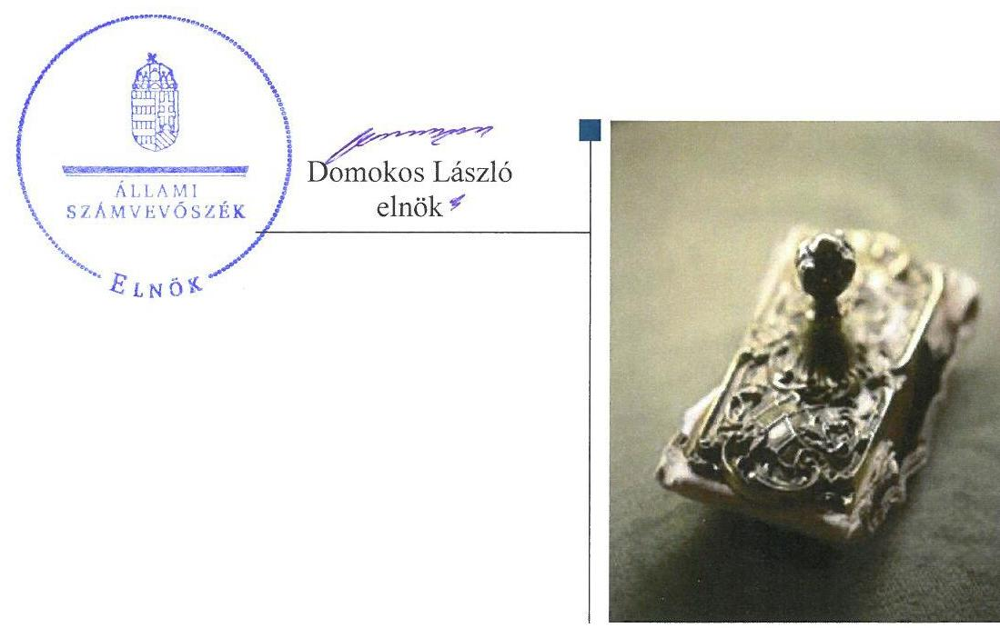
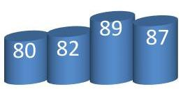
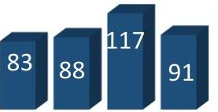
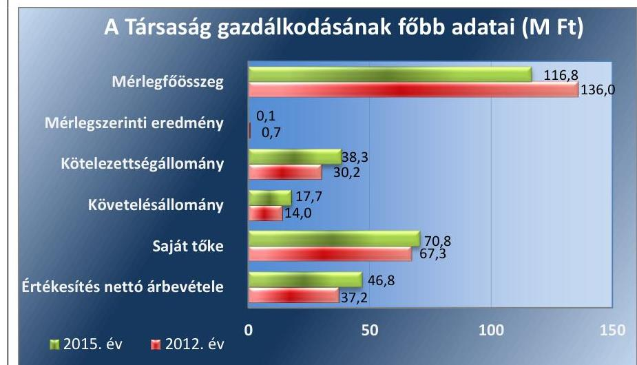
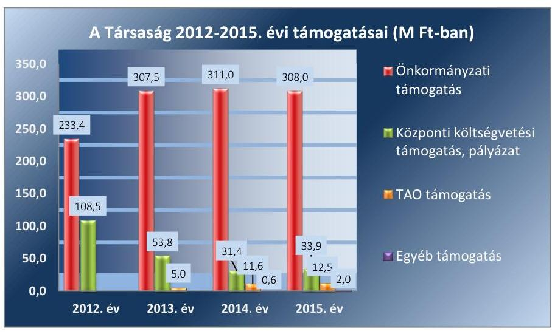
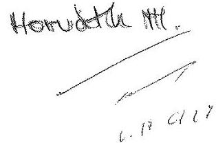
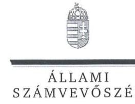
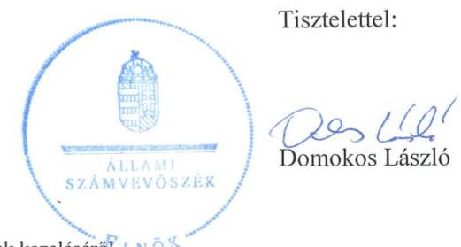

# Jelentés 

## Az önkormányzatok gazdasági társaságai

Az önkormányzatok többségi
tulajdonában lévő gazdasági társaságok gazdálkodásának ellenőrzése - Miskolci Szimfonikus Zenekar Nonprofit Kft.
2017. 09. 05.

---

# AZ ELLENŐRZÉST FELÜGYELTE:

DR. HORVÁTH MARGIT felügyeleti vezető

## AZ ELLENŐRZÉST VEZETTE ÉS A VÉGREHAJTÁSÁÉRT FELELŐS:

HOFMEISTER LÁSZLÓ ellenőrzésvezető

A PROGRAM ÖSSZEÁLLÍTÁSÁÉRT FELELŐS:

JANIK JÓZSEF LÁSZLÓ osztályvezető

IKTATÓSZÁM: V-1279-165/2016

TÉMASZÁM: 2313

ELLENŐRZÉS-AZONOSÍTÓ SZÁM: V-075804

Jelentéseink az Országgyűlés számítógépes hálózatán és az Interneten a www.asz.hu címen is olvashatóak.

---

# TARTALOMJEGYZÉK 

■ ÖSSZEGZÉS ..... 5
■ AZ ELLENŐRZÉS CÉLJA ..... 6
■ AZ ELLENŐRZÉS TERÜLETE ..... 7
■ AZ ELLENŐRZÉS HÁTTERE, INDOKOLTSÁGA ..... 9
■ A JELENTÉS LÉNYEGES KÉRDÉSKÖREI ..... 10
■ ELLENŐRZÉS HATÓKÖRE ÉS MÓDSZEREI ..... 11
■ MEGÁLLAPÍTÁSOK ..... 13
■ JAVASLATOK ..... 19
■ MELLÉKLETEK ..... 21
I. Sz. melléklet: Értelmező szótár ..... 21
II. Sz. melléklet: 2012-2015 évi beszámoló adatok ..... 22
■ FÜGGELÉK: ÉSZREVÉTELEK ..... 23
■ RÖVIDÍTÉSEK JEGYZÉKE ..... 31

---

.

---

# ÖSSZEGZÉS 

Miskolc Megyei Jogú Város Önkormányzata tulajdonosi joggyakorlása összességében szabályszerű volt. A Társaság vagyongazdálkodása a 2012-2013. években nem volt szabályszerű, a beszámolók hiteles és megbízható alátámasztásáról nem gondoskodtak. A Társaság a 2012-2013. években az elszámoltathatóság és az átláthatóság feltételeinek nem felelt meg. A 2014. évtől a Társaság vagyongazdálkodása összességében megfelelt az előírásoknak, a számviteli szabályozás hiányosságait fokozatosan pótolták, a beszámolókat megfelelően alátámasztották.

## Az ellenőrzés társadalmi indokoltsága

Magyarországon az önkormányzatok kötelező és önként vállalt feladataik ellátása során egyre szélesebb körben alkalmazzák a költségvetési szerveken kívüli feladatellátást, ezáltal az önkormányzati tulajdonú gazdasági társaságok is kiemelt fontosságú szerephez jutnak a lakossági szolgáltatások biztosításában. Az önkormányzatok többségi tulajdonában álló gazdasági társaságok ellenőrzése kiemelt jelentőségű, mivel működésük hatással van a tulajdonos önkormányzat gazdálkodására, gazdálkodásának egyes elemei befolyásolják az önkormányzati alszektor hiányát és az államadósságot.

Az Állami Számvevőszék által az előadó-művészeti tevékenységet folytató Társaságnál végzett ellenőrzést további társadalmi elvárás indokolja sajátos feladatellátásából adódóan, mivel az előadásokon keresztül a város lakosságának széles köre kerülhet kapcsolatba az előadó-művészeti tevékenységet folytató Társasággal, az általa nyújtott szolgáltatásokkal.

## Főbb megállapítások, következtetések

Az Önkormányzat a jogszabályi előírásoknak megfelelően gondoskodott a helyi közművelődési tevékenység támogatása keretében a Társasággal kapcsolatos tulajdonosi feladatainak megszervezéséről a javadalmazási, juttatási rendszerrel kapcsolatos szabályzat elkészítése és a felügyelőbizottság ügyrendjének jóváhagyása kivételével. A tulajdonosi jogok gyakorlása szabályszerű volt. Az Önkormányzat az üzleti terv készítési kötelezettséget előírta a Társaság részére, a beszámoló elfogadásáról a felügyelőbizottság írásbeli jelentésének birtokában döntött.

A Társaság számviteli szabályozottsága az ellenőrzött időszak elején nem volt megfelelő, azonban a 2015. évre jelentősen javult. Az elkészített szabályzatok tartalma - a számlarend kivételével - megfelelt a Számv. tv. előírásainak. A közzétételre vonatkozó adatszolgáltatása összességében megfelelő volt, azonban a közérdekű adatok megismerésére irányuló igények teljesítési rendjét 2014. december 15-ig nem szabályozta. Az ügyvezető belső ellenőrzést a 2014-2015. években nem alakított ki.

A Társaság vagyongazdálkodása a 2012-2013. években a belső szabályzatok hiánya, a leltározás hiányosságai miatt, nem volt szabályszerű, ugyanakkor a 2014-2015. években összességében szabályszerű volt. Az éves beszámolási kötelezettséget teljesítették, azokat a 2012. év kivételével határidőben letétbe helyezték, azonban a 2012-2013. években az éves beszámolók mérlegtételeinek leltárral való alátámasztottsága nem volt biztosított. A könyvvizsgáló nem jelezte a leltározás szabálytalanságait és a számviteli szabályozás hiányát. A társaság fizetőképessége stabil volt, kötelezettségállománya nem jelentett veszélyt a működésére.

A Társaság bevételeinek és ráfordításainak elszámolása az értékcsökkenés elszámolása kivételével nem volt szabályszerű. Az alkalmazott árak kialakításánál a piaci viszonyokat vették figyelembe, mely gyakorlat 2015. június 1-jétől nem felelt meg az Önköltségszámítási szabálynak.

---

# AZ ELLENŐRZÉS CÉLJA 

Az ellenőrzés célja annak értékelése, hogy az önkormányzat vagyongazdálkodási tevékenysége során szabályszerűen gyakorolta-e tulajdonosi jogait; a gazdasági társaság szabályozottsága, gazdálkodása és vagyongazdálkodási tevékenysége, bevételeinek és ráfordításainak elszámolása megfelelt-e a jogszabályi és tulajdonosi előírásoknak; a gazdasági társaság fizetőképessége biztosított volt-e a gazdálkodás során, valamint a gazdálkodás átláthatósága és elszámoltathatósága érdekében biztosítva volt-e a szolgáltatás dijának megalapozottsága szabályszerű önköltségszámítással. Az ellenőrzés célja továbbá annak megítélése, hogy az önkormányzat többségi tulajdonában lévő gazdasági társaság gazdálkodásának a kormányzati szektor hiányára és az államadósságra befolyással bíró elemei a jogszabályi előírásoknak megfeleltek-e.

---

# AZ ELLENŐRZÉS TERÜLETE

## Miskolc Megyei Jogú Város Önkormányzata és a kizárólagos tulajdonában lévő Miskolci Szimfonikus Zenekar Nonprofit Kft.

1. ábra

Zenekar létszáma (fő)

Fizetőnézők száma (ezer fő)

Hangversenyek száma (db)

2012. 2013. 2014. 2015. *Forrás: 2012-2015. művészeti évad beszámolók*

## A MISKOLCI SZIMFONIKUS ZENEKAR NONPROFIT KFT.

1 2011. november 17-én alapította az Önkormányzat¹ 500,0 e Ft jegyzett tőkével. A Társaság² az 1963. november 1-je óta fenntartott Miskolci Szimfonikus Zenekar által folytatott kulturális és előadó-művészeti feladatokat vette át, annak utódszervezeteként jött létre. A Társaság kizárólagos tulajdonosa az Önkormányzat, aki 2012. március 22-én az alapításkori jegyzett tőkét 49,9 M Ft nem pénzbeli hozzájárulással emelte meg.

A Társaság a 2012. évben az előadó-művészeti szervezetek minősítési eljárásában a legmagasabb, "nemzeti minősítésű zeneművészeti szervezet" kategóriát kapta, tekintettel az előadó-művészeti életben betöltött kiemelkedő szerepére. A Társaság közhasznú jogállású, közfeladatot ellátó szerv. A Társaság közszolgáltatási szerződés alapján részt vesz az Önkormányzat közművelődési, kulturális közfeladatainak ellátásában. Közhasznú feladatai közé tartozik többek között a kulturális tevékenység, a kulturális örökség megóvása, hátrányos helyzetű csoportok társadalmi esélyegyenlőségének elősegítése. A Társaság a 2012. évben az Önkormányzat tulajdonában lévő két bérelt ingatlanban folytatta tevékenységét. 2013. január 1-jétől a Közgyűlés³ döntése alapján az egyik ingatlan közcélú adományként térítésmentesen került a Társaság használatába, a másik bérelt ingatlant 2012. december 31-ével a Társaság az Önkormányzatnak visszaadta a bérleti szerződés felmondásával. A Társaságnak vagyonkezelt eszköze nem volt. A Társaság szakmai tevékenységét jellemző adatokat az 1. ábra, főbb gazdálkodási adatait a 2. ábra mutatja be.

2. ábra

*Forrás: A Társaság 2012. és 2015. évi egyszerűsített éves beszámolói*

---

A Társaság vagyoni helyzetét jellemző mérlegadatokat a II. számú melléklet mutatja be.

Az ellenőrzött időszakban a Társaság vagyona 14,1%-kal csökkent. A befektetett eszközök állománya 27,5%-kal, a forgóeszközök állománya 12,8%-kal csökkent. A forgóeszközökön belül a követelések állománya 26,4%-kal nőtt. A pénzeszközök 22,7%-kal csökkentek. A Társaság a 2012-2013. években és a 2015. évben minimális (összesen 1,1 M Ft) nyereséget ért el, a 2014. évet 1,9 M Ft veszteséggel zárta.

A Társaság más gazdasági társaságban részesedéssel nem rendelkezett, 2013. december 16-tól kormányzati szektorba sorolt egyéb szervezetnek minősült. Az ügyvezető személye az ellenőrzött időszakban kétszer változott, 2013. július 1-jén és 2014. szeptember 11-én.

Az Önkormányzat polgármesterének ${ }^{4}$ és jegyzőjének ${ }^{5}$ személye a 2012-2015. években nem változott.

---

# AZ ELLENŐRZÉS HÁTTERE, INDOKOLTSÁGA 

Az önkormányzatok többségi tulajdonában álló gazdasági társaságok ellenőrzése kiemelten fontos a vagyon megőrzése, megóvása érdekében, valamint a kormányzati szektor elszámolásaiban megjelenő önkormányzati tulajdonú gazdálkodó szervezetek esetében, amelyekkel szemben alapvető követelmény, hogy gazdálkodásuk, működésük szabályszerű, az általuk szolgáltatott adatok minél megbízhatóbbak legyenek. A feladatellátás költségeinek, ráfordításainak alakulása a lakosság széles rétegét érinti.

Ellenőrzéseink feltárhatják, hogy az önkormányzat a feladatellátásához rendelt vagyon működtetését a tulajdonostól elvárható gondossággal végezte-e, a feladatot ellátó gazdasági társaság a létesítő okiratban, közszolgáltatói szerződésben, fenntartói megállapodásban foglaltak betartásával biztosította-e a feladat ellátását. Az ellenőrzés eredményeképp meghatározhatóvá válnak a költségvetési hiányt befolyásoló szervezet kockázatai, lehetővé válik ezen kockázatok csökkentése. Az ellenőrzés rávilágíthat arra, hogy a gazdasági társaság a vagyon használatával biztosította-e a szolgáltatás folytatásának feltételeit, az önkormányzat tulajdonosi felügyelete hozzájárult-e a szabályszerű gazdálkodáshoz és feladatellátáshoz. A megállapítások alapján megfogalmazott számvevőszéki javaslatok hasznosítása elősegítheti a meglévő hibák megszüntetését. A jó gyakorlatok bemutatásával az ÁSZ ${ }^{6}$ hozzájárulhat a követendő megoldások megismertetéséhez, terjesztéséhez.

---

# A JELENTÉS LÉNYEGES KÉRDÉSKÖREI 

1. Az Önkormányzat tulajdonosi joggyakorlása szabályszerű volt-e?
2. A Társaság vagyongazdálkodása szabályszerű volt-e, fizetőképessége biztosított volt-e a gazdálkodás során?
3. A Társaság bevételeinek és ráfordításainak elszámolása, valamint az önköltségszámítás és árképzés szabályszerű volt-e?
4. A kormányzati szektorba sorolt, többségi önkormányzati tulajdonban lévő Társaság gazdálkodásának a kormányzati szektor hiányára és az államadósságra befolyással bíró gazdasági eseményei megfeleltek-e a jogszabályi előírásoknak?

---

# ELLENŐRZÉS HATÓKÖRE ÉS MÓDSZEREI 

## Az ellenőrzés típusa

Megfelelőségi ellenőrzés.

## Az ellenőrzött időszak

2012. január 1-jétől 2015. december 31-ig.

## Az ellenőrzés tárgya

Az Önkormányzat tulajdonosi joggyakorlása, valamint a Társaság gazdálkodásának szabályozottsága és szabályszerűsége, továbbá az önkormányzati alszektorba sorolt Társaság gazdálkodásának a kormányzati szektor hiányára és az államadósságra befolyással bíró elemei.

Az ellenőrzés kiterjed minden olyan körülményre és adatra, amely az ÁSZ jogszabályban meghatározott feladatainak teljesítéséhez, valamint a program végrehajtása folyamán felmerült újabb összefüggések feltárásához szükséges.

## Az ellenőrzött szervezet

Miskolc Megyei Jogú Város Önkormányzata és a Miskolci Szimfonikus Zenekar Nonprofit Kft.

## Az ellenőrzés jogalapja

Az ellenőrzés jogszabályi alapját az Állami Számvevőszékről szóló 2011. évi LXVI. törvény 1. § (3) bekezdése és 5. § (3)-(4)-(5) bekezdései képezik.

## Az ellenőrzés módszerei

Az ellenőrzést a nemzetközi standardokat irányadónak tekintve az ellenőrzési program ellenőrzési kérdései, az ellenőrzött időszakban hatályos jogszabályok, az ellenőrzés szakmai szabályok és módszertanok figyelembe vételével végeztük.

Az ellenőrzés ideje alatt az ellenőrzött szervezettel történő kapcsolattartást az ÁSZ Szervezeti és Működési Szabályzatának vonatkozó előírásai alapján biztosítottuk.

---

Az ellenőrzés a kiválasztott, többségi tulajdonosi jogokat gyakorló Önkormányzatra és az ellenőrzött gazdasági társaságra terjedt ki.

Az ellenőrzési kérdések megválaszolásához szükséges bizonyítékok megszerzése a következő ellenőrzési eljárások alkalmazásával történt: megfigyelés, kérdésfeltevés (információkérés), összehasonlítás, mintavételezés, tételes ellenőrzés, valamint elemző eljárás. Az ellenőrzési bizonyítékként felhasznált adatforrások közé tartoztak egyrészt az ellenőrzési programban felsorolt adatforrások, másrészt minden - az ellenőrzés folyamán - feltárt, az ellenőrzés szempontjából információkat tartalmazó dokumentum.

Az ellenőrzést a megjelölt adatforrások és az ellenőrzöttek által kitöltött tanúsítványok felhasználásával, a mintatételek kiértékelésével, továbbá az adott időszakban hatályos jogszabályok figyelembevételével folytattuk le.

A bevételek, a ráfordítások elszámolásának és a vagyon nyilvántartásának szabályszerűségét véletlenszerű mintavétellel, a beszerzett eszközökre vonatkozóan az értékcsökkenés szabályszerűségét tételes ellenőrzéssel, a legnagyobb ráfordítások elszámolására és a legnagyobb összegű beszerzett eszközök vagyon nyilvántartására vonatkozó eljárások szabályszerűségét kockázatalapú, irányított mintavétel alapján ellenőriztük.

Az értékelés során az egyes szabályszerűségi kérdésekre adott válaszok kerültek statisztikai módszer segítségével összesítésre és minősítésre. A jogszabályoknak és egyéb előírásoknak megfelelőnek tekintettük az adott területet, amennyiben az ellenőrzés eredménye alapján 95%-os bizonyossággal a teljes sokaságban, illetve az ellenőrzött tételekre vonatkozóan a hibaarány kisebb volt, mint 10% és nem megfelelőnek értékeltük, ha a hibaarány a 10%-ot elérte.

---

# 1. Az Önkormányzat tulajdonosi joggyakorlása szabályszerű volt-e? 

Összegző megállapítás

Az Önkormányzat tulajdonosi jogok gyakorlásának kereteit összességében szabályosan alakította ki.

### 1.1. számú megállapítás

Az Önkormányzat tulajdonosi joggyakorlásának kereteit a javadalmazási, juttatási rendszerrel kapcsolatos szabályzat megalkotása és az FB ügyrendjének jóváhagyása kivételével szabályszerűen alakította ki.

A TULAJDONOSI JOGOK gyakorlásának rendjét az Önkormányzat az Alapító okirat ${ }_{1-8}{ }^{7}$-ban, a Vagyonrendelet ${ }_{1-2}{ }^{8}$-ben, és az önkormányzati SZMSZ ${ }_{1-2}{ }^{9}$-ben, valamint a Társasággal kötött Közszolgáltatási szerződésben ${ }^{10}$ és
 Fenntartói megállapodásban ${ }^{11}$ szabályozta. Az alapvető tulajdonosi jogokat a Közgyűlés gyakorolta.

A Közszolgáltatási szerződést az Önkormányzat és a Társaság öt év határozott időre kötötte meg a 2012. évben. 2013. január 1-jétől a Társaság és az Önkormányzat az önkormányzati támogatás, a művészeti, szakmai és gazdálkodási feladatok ellátásának keretei, követelményei meghatározása céljából Fenntartói megállapodást kötött, figyelemmel az Emtv. ${ }^{12}$ módosítására. A Közszolgáltatási szerződés és a Fenntartói megállapodás megfelel az Emtv. rendelkezéseinek.

Az $\mathrm{FB}^{13}$ az ügyrendjét megállapította, amelyet a Közgyűlés a Gt. ${ }^{14} 34 . \S$ (4) bekezdésének és a Ptk. ${ }^{15} 3:122 . \S$ (3) bekezdésének rendelkezése ellenére nem hagyott jóvá.

A BESZÁMOLÁS ÉVES KÖTELEZETTSÉGÉT az Önkormányzat az Alapító okirat ${ }_{1-8}$-ban és a Közszolgáltatási szerződésben határozta meg. Az Önkormányzat a Társaság gazdálkodásának figyelemmel kísérésére a 2013. évtől elektronikus monitoring rendszert működtetett, ennek keretében havi és negyedéves monitoring-adatszolgáltatást írt elő az Önkormányzat, mely lehetőséget biztosított számára a Társaság üzleti tervében foglaltak teljesülésének nyomon követésére.

RENDELETALKOTÁSI kötelezettségének az Önkormányzat eleget tett, az 1997. évi CXL. tv. ${ }^{16}$ előírásainak megfelelően megalkotta a Közművelődési rendelet ${ }^{17}{ }_{1-2}$-et, melynek hatálya kiterjedt a Társaságra.

A FELADATELLÁTÁST SZOLGÁLÓ VAGYONT a Gt. előírásainak megfelelően bocsátotta az Önkormányzat a Társaság rendelkezésére 49,9 M Ft értékű hangszer és egyéb szakmai eszköz apportként történő átadásával. A tulajdonos a tőkeemeléssel egyidejűleg 2012. március 22-én immateriális javakból és tárgyi eszközökből álló 16,1 M Ft értékű

---

törzstőkén felüli vagyoni hozzájárulást is nyújtott a Társaság számára. Az Önkormányzat a szükséges infrastruktúrát a 2012. évben ingatlanok bérbeadásával, a 2013. évtől térítésmentes használatba adással biztosította. A 2012. évben a megállapodásnak megfelelően megtörtént a bérleti díj elszámolása.

A Közgyűlés nem alkotott szabályzatot a Társaság vezető tisztségviselője, FB tagjai és munkavállalói javadalmazása, valamint a jogviszony megszűnése esetére biztosított juttatások módjának, mértékének elveiről, annak rendszeréről a Taktv. ${ }^{18} 5 . \S$ (3) bekezdésében foglaltak ellenére.

# 1.2. számú megállapítás A tulajdonosi jogok gyakorlása szabályszerű volt. 

A tulajdonosi jogok gyakorlása a Vagyonrendelet ${ }_{1-2}$-ben és az Alapító okirat ${ }_{1-8}$-ban rögzítettek szerint történt.

AZ FB a Taktv. 4. § (2) bekezdésében foglaltaknak megfelelően három tagból állt a 2012-2015. években. Az FB feladatait és kötelezettségeit a Gt. és a Ptk. rendelkezéseivel összhangban az Önkormányzat az Alapító okirat ${ }_{1-8}$-ban határozta meg.

ÜZLETI TERV készítésének kötelezettségét az Önkormányzat a Közszolgáltatási szerződésben és a Fenntartói megállapodásban rögzítette. Az FB valamennyi évben megtárgyalta a Társaság üzleti terveit, melyeket az Önkormányzat elfogadott.

ÉVES BESZÁMOLÓRÓL és a közhasznúsági jelentésről az Önkormányzat a könyvvizsgáló írásos véleménye, valamint az FB írásbeli jelentése birtokában döntött, azokat elfogadta és egyidejűleg a Civil tv. ${ }^{19}$, valamint az Alapító okirat ${ }_{1-8}$ előírásainak megfelelően döntött az éves eredmény eredménytartalékba helyezéséről.

## 2. A Társaság vagyongazdálkodása szabályszerű volt-e, fizetőképessége biztosított volt-e a gazdálkodás során?

Összegző megállapítás
2.1. számú megállapítás

A Társaság vagyongazdálkodása a 2012-2013. években nem volt megfelelő, a 2014. évtől összességében szabályszerű volt.

A Társaság számviteli szabályozottsága 2015. június 1-jétől teljes körű, a szabályzatok összességében megfeleltek a jogszabályi előírásoknak. A megelőző időszakban a társaság számviteli szabályozása nem volt megfelelő.

A Számviteli politikát ${ }^{20}$, illetve az annak keretében elkészítendő szabályzatokat a Társaság a Számv. tv. 14. § (11) bekezdésében foglaltak ellenére a megalakulás időpontját követő 90 napon túl készítette el. 2012. június 14-ig a Társaság nem rendelkezett számviteli politikával, pénzkezelési szabályzattal, 2015. április 5-ig eszközök és források értékelési szabályzattal, valamint 2015. május 30-ig eszközök és a források leltárkészítési és leltározási szabályzattal. A számviteli szabályzatok hatályba lépését az 1. táblázat mutatja be.

---

1. táblázat

## A TÁRSASÁG SZÁMVITELI SZABÁLYZATAINAK ELKÉSZÍTÉSE

Szabályzat megnevezése | Hatályba lépés ideje
---|---|
Számviteli politika | 2012.06.15.
Pénzkezelési szabályzat | 2012.06.15.
Számlarend | 2014.10.01.
Eszközök és források értékelési szabályzata | 2015.04.06.
Önköltségszámítási szabályzat | 2015.06.01.
Leltárkészítési és Leltározási szabályzat | 2015.06.01.
Fornás: ÁSZ
2.2. számú megállapítás

A Társaság ügyvezetője által kiadott számviteli szabályzatok tartalma a Számlarend ${ }^{21}$ kivételével megfelelt a Számv. tv. előírásának.

A Társaság a Számv. tv. 161. § (1) bekezdésében előírtak ellenére 2014. szeptember 30-ig nem készített Számlarendet. A 2014. október 1-jén hatályba lépett Számlarend nem felelt meg a Számv. tv. 161. § (2) bekezdés a) pontjában foglaltaknak, mert nem tartalmazta minden alkalmazásra kijelölt számla számjelét és megnevezését.

A Társaság az Ltv. ${ }^{22} 10. \S$ (1) bekezdés a) pontjában rögzítettek ellenére egyedi iratkezelési szabályzatot nem adott ki.

BELSŐ ELLENŐRZÉST az ügyvezető a Bkr. 54/A. §-a, valamint a Bkr. ${ }^{23} 10. \S$-ában foglaltak ellenére nem alakított ki a 2014-2015. években.

## A vagyongazdálkodás a leltározás hiányosságai miatt a 2012-2013. években nem volt szabályszerű, ugyanakkor a 2014-2015. években megfelelő volt.

A Társaság saját vagyonát a befektetett eszközök körében tárgyi eszközök - hangszerek, felszerelések, műszaki eszközök - és immateriális javak szoftverek - képezték. A saját vagyon nyilvántartása a Társaságnál megfelelő volt.

A 2012. évben az egyszerűsített éves beszámoló mérlegtételeinek - a Számv. tv. 107. § előírása ellenére - leltárral való alátámasztottsága nem volt biztosított, ugyanakkor a főkönyvi nyilvántartás adatai és a mérleg tételei közötti egyezőség fennállt. A 2013. évre vonatkozóan a tárgyi eszközök leltára nem tartalmazta a Számv. tv. 69. § (1) bekezdés rendelkezése ellenére a leltározott eszközök mennyiségét és értékét ellenőrizhető módon. A 2014. évben a leltározást a Számv. tv. 69. § (1)-(3) bekezdés előírása alapján végezték, a 2015. évi leltározás a Számv. tv. előírásán kívül megfelelt a 2015. június 1-jével hatályba lépett Leltározási és leltárkészítési szabályzatnak is.

A Társaság egyszerűsített éves beszámolója a 2012. évben a leltározás hiánya, a 2013. évben a leltár hiányossága miatt nem felelt meg a Számv. tv. 15. § (3) bekezdésében előírt valódiság elvének, mellyel az ügyvezető és a gazdasági vezető szabálytalanságot követett el, akikkel szemben az ÁSZ nem kezdeményez eljárást, mert már nem állnak munkaviszonyban a Társasággal.

A könyvvizsgáló az ellenőrzött időszakban a Társaság beszámolóit véleményezte és hitelesítő záradékkal látta el, az éves beszámolók auditálását követően figyelemfelhívó megjegyzést a vezetés részére nem adott át, a számviteli szabályozás hiányosságait és a leltározás szabálytalanságát nem kifogásolta.

# 2.3. számú megállapítás 

A Társaság fizetőképessége a gazdálkodás során biztosított volt.
A KÖTELEZETTSÉGÁLLOMÁNY és annak változása nem jelentett veszélyt a Társaság fizetőképességére és működésére. A Társaság likviditási és adósságmutatójának alakulását az 2. táblázat szemlélteti. A Társaság forgóeszköz állománya a 2013. év kivételével meghaladta a kötelezettségek állományát, mely a Társaság megfelelő fizetőképességét mutatta. A 2013. évi kedvezőtlen likviditási mutatót a forgóeszközökön belüli

---

2. táblázat

## A TÁRSASÁG LIKVIDITÁSÁNAK ÉS ADÓSSÁGMUTATÓJÁNAK ALAKULÁSA

|   | likviditási   mutató | adósság-   tömörség   mértéke  |
|---|---|---|
| referencia | $>1$ | $<1$  |
| 2012. év | 2,4 | 0,45  |
| 2013. év | 0,45 | 0,42  |
| 2014. év | 1,5 | 0,63  |
| 2015. év | 1,65 | 0,54  |
| Forrás: a Társaság 2012-2015. évi egyszerűsített |  |   |
|  |   |   |

2.4. számú megállapítás a pénzeszközök 91,3\%-os csökkenése okozta. Hosszú lejáratú kötelezettsége nem volt, rövid lejáratú kötelezettségeinek állománya a 2012. évről a 2015. évre 26,8\%-kal, 38,3 M Ft-ra nőtt. A szerződésen és jogszabályon alapuló rövid lejáratú kötelezettségek határidőben történő teljesítése nem volt teljes mértékben biztosított az ellenőrzött időszak alatt, azonban a lejárt határidejű szállítói állomány a 2012. évi 41,6\%-kal szemben a 2015. évben mindösszesen 3,2\%-ot tett ki.

AZ ELADÓSODÁS MÉRTÉKE a 2012. évhez képest kis mértékben romlott, amely abból adódott, hogy a Társaság kötelezettségállományának 26,8\%-os növekedési mértéke meghaladta a saját tőke 5,2\%-os növekedését, azonban a saját tőke 67,3 M Ft és 70,8 M Ft közötti értéke, a kötelezettségek állományát az ellenőrzött időszak minden évében jelentősen meghaladta.

A Társaság az előírt tervezési, beszámolási kötelezettségét teljesítette, a 2012. év kivételével a beszámolókat határidőben letétbe helyezte. Közérdekű adatszolgáltatásának eleget tett, azonban a kapcsolódó szabályozási kötelezettségét hiányosan teljesítette.

AZ ÜZLETI TERVEK a Társaság az Önkormányzat előírásával összhangban a 2012-2015. években elkészítette.

BESZÁMOLÁSI KÖTELEZETTSÉGÉT a Társaság az éves beszámolók és a közhasznúsági jelentések tekintetében a Számv. tv.-ben, a Civil tv.-ben, az Alapító okirat ${ }_{1-8}$-ban és a Számviteli politika ${ }_{1-2}$-ban előírtaknak megfelelően teljesítette a 2012. évi beszámoló késedelmes letétbe helyezése kivételével. A beszámoló határidőn túli letétbe helyezésével a Társaság megsértette a Számv. tv. 153. § (1) bekezdésének előírását.

A KÖZÉRDEKŰ ADATOK megismerésére irányuló igények teljesítésének rendjét az Info. tv. 30. § (6) bekezdésének előírása ellenére 2014. december 14-éig a Társaság nem szabályozta, azt követően az Adatvédelmi és adatkezelési szabályzatban rögzítették a vonatkozó eljárást.

A Társaság kormányzati szektorba sorolt egyéb szervezetként a központi költségvetésről szóló törvény elkészítéséhez szükséges adatszolgáltatási kötelezettségének az államháztartásért felelős miniszter részére az Áht. ${ }^{24}$-ban előírtaknak megfelelően eleget tett.

---

# 3. A Társaság bevételeinek és ráfordításainak elszámolása, valamint az önköltségszámítás és árképzés szabályszerű volt-e? 

Összegző megállapítás

### 3.1. számú megállapítás

A Társaság bevételeinek és ráfordításainak elszámolása összességében nem volt megfelelő. Az árképzés az Önköltségszabályzat hatályba lépését követően nem volt szabályszerű.

A Társaság bevételeinek és ráfordításainak elszámolása az értékcsökkenés elszámolása kivételével nem volt szabályszerű.

A BEVÉTELEK ELSZÁMOLÁSA nem volt megfelelő. A könyvvezetésre, bizonylatolásra vonatkozó részletes belső szabályokat - a mérleg és eredménykimutatás számviteli követelményeit tartalmazó Számlarendet - a Társaság nem alakította ki 2014. október 1-jéig a Számv. tv. 161/A. § (1) pontja rendelkezésének ellenére. Az Önköltségszámítási szabályzat 2015. június 1-jei hatályba lépését követően az egyes jegy és bérletárak kialakítását nem az abban foglaltak szerint végezte.

A 3. ábra szemlélteti a Társaság által kapott támogatás megoszlását főbb támogatási jogcímenként.
3. ábra

Forrás: a Társaság 2012-2015. évi egyszerűsített éves beszámolói és főkönyvi kivonatai
A négy év alatt az önkormányzati támogatás 32,0\%-kal nőtt, míg az egyéb költségvetési forrásból kapott támogatás 68,8\%-kal csökkent. A $\mathrm{TAO}^{25}$ támogatásból kapott bevétel az ellenőrzött időszakban folyamatosan emelkedett, a 2015. évben 12,5 M Ft-ot tett ki.

A RÁFORDÍTÁSOK elszámolása az értékcsökkenés kivételével nem volt megfelelő. A Társaság belső szabályozás hiányában számolta el 2014. október 1-jéig a ráfordításokat, mivel a könyvvezetésre, bizonylatolásra vonatkozó részletes belső szabályokat nem alakította ki a Számv. tv. 161/A. § (1) pontja rendelkezésének ellenére.

---

3. táblázat

TÁRGYI ESZKÖZÖK HASZNÁLHATÓSÁGI FOKA (%)

|   | Számítástechnikai   eszközök | Gépek,   berendezések   (hangszerek) | Egyéb   gépek,   berendezések  |
|---|---|---|---|
| 2012. év | 85,1 | 91,7 | 66,8  |
| 2013. év | 76,3 | 83,8 | 55,8  |
| 2014. év | 67,6 | 76,4 |

 45,1  |
|  2015. év | 59,4 | 69,1 | 34,6  |

Forrás: a Társaság 2012-2015. évi egyszerűsített éves beszámolói 3.2. számú megállapítás

AZ ÉRTÉKCSÖKKENÉSI LEÍRÁS megállapítása és elszámolása a 2012-2015. évek között állományba vett eszközök esetében megfelelt a Számv. tv. és a Számviteli politika ${ }_{1-2}$ előírásainak. Az elszámolt értékcsökkenési leírást az éves beszámolók kiegészítő mellékletében részletesen bemutatták.

A SAJÁT VAGYON PÓTLÁSÁRA, felújítására vonatkozó kötelezettséget jogszabály, illetve a tulajdonos Önkormányzat a Társaság számára nem írt elő. A 2012-2015. években végzett beruházások, értéknövelő felújítások összege elmaradt az adott években értékcsökkenésként képzett források összegétől, melynek következtében a Társaság vagyona 14,1%-kal csökkent. A Társaság tárgyi eszközei használhatósági fokának alakulását a 3. táblázat mutatja be. A tárgyi eszközök mérlegértéke 27,4%-kal csökkent, az eszközök használhatósági foka is folyamatosan csökkent.

A KÖVETELÉSÁLLOMÁNY kezelésére vonatkozóan belső szabályokat a Társaság a Számviteli politika ${ }_{1-2}$-ban rögzített. A követelésállomány a 2012. évről a 2015. évre 26,4%-kal, 17,7 M Ft-ra nőtt, mely a költségvetéssel szembeni visszaigényelhető áfa ${ }^{26}$ és TB${ }^{27}$ követelésekből, továbbá vevőkövetelésből állt. A 2012. év végén fennálló 2,7 M Ft és a 2013. év végi 3,7 M Ft vevőkövetelés-állomány csaknem teljes egészében lejárt határidejű követelés volt. A 2013. évben fizetési meghagyás kibocsátásával és végrehajtási eljárás kezdeményezésével, a 2014-2015. években fizetési meghagyás kibocsátásával és kompenzációs megállapodás megkötése útján a Társaság ügyvezetője intézkedett a lejárt követelések csökkentésére.

Az árképzést a versenytársak árainak figyelembevételével végezték, mely gyakorlat az Önköltségszabályzat hatályba lépését követően nem volt szabályszerű.

A Társaság az előadásaira szóló jegyek árát esetenként alakította ki a művészeti szolgáltatási tevékenység sajátos piaci körülményeit figyelembe véve. Önköltségszámítási szabályzat készítésére az ellenőrzött időszakban a Társaság a Számv. tv. 14. § (6) bekezdése alapján nem volt kötelezett, ennek ellenére elkészítette az általa nyújtott szolgáltatások áraira vonatkozóan. A 2015. június 1-jével hatályba lépett Önköltségszámítási szabályzat előírása ellenére az árképzést nem a szolgáltatás várható költsége alapján alakították ki, hanem a keresleti és kínálati tényezők alapján.

# 4. A kormányzati szektorba sorolt, többségi önkormányzati tulajdonban lévő Társaság gazdálkodásának a kormányzati szektor hiányára és az államadósságra befolyással bíró gazdasági eseményei megfeleltek-e a jogszabályi előírásoknak?

Összegző megállapítás

A Társaságnak a 2013-2015. években az államadósságra befolyással bíró gazdasági eseményei nem voltak.

A Társaság a 2013-2015. években a Stabilitási tv. ${ }^{28}$ szerinti államadósságot keletkeztető ügyletet nem kötött, ebből származó kötelezettsége nem keletkezett.

---

# JAVASLATOK 

Az ÁSZ tv. 33. § (1) bekezdésében foglaltak értelmében az ellenőrzött szervezet vezetője köteles a jelentésben foglalt megállapításokhoz kapcsolódó intézkedési tervet összeállítani és azt a jelentés kézhezvételétől számított 30 napon belül az ÁSZ részére megküldeni. Amennyiben az ellenőrzött szervezet vezetője nem küldi meg határidőben az intézkedési tervet, vagy továbbra sem elfogadható intézkedési tervet küld, az Állami Számvevőszék elnöke az ÁSZ tv. 33. § (3) bekezdése a) és b) pontjaiban foglaltakat érvényesítheti.

Javaslataink célja az Miskolci Szimfonikus Zenekar Nonprofit Kft. gazdálkodása szabályszerűségének és gyakorlatának javítása annak érdekében, hogy a szabályozási környezet és az alkalmazott gyakorlat megfelelően tudja támogatni az átlátható működést.

## A Miskolci Szimfonikus Zenekar Nonprofit Kft. ügyvezetőjének

1. Intézkedjen a Társaság számlarendjének a Számv. tv.-nek megfelelő tartalommal történő kiegészítéséről.
(2.1. sz. megállapítás 3. bekezdése alapján)
2. Intézkedjen egyedi iratkezelési szabályzat elkészítéséről az Ltv.-ben előírtak szerint.
(2.1. sz. megállapítás 4. bekezdése alapján)
3. Intézkedjen a Társaságnál a belső ellenőrzés Bkr.-nek megfelelő kialakításáról.
(2.1. sz. megállapítás 5. bekezdése alapján)
4. Gondoskodjon arról, hogy az árképzés során Társaság az Önköltségszámítási szabályzatában foglaltaknak megfelelően járjon el.
(3.2. sz. megállapítás 1. bekezdése alapján)

---

Javaslataink célja az Önkormányzat szabályszerű működésének elősegítése, továbbá az önkormányzati tulajdonosi joggyakorlás kontrolljainak erősítése.

# Miskolc Megyei Jogú Város Önkormányzata Polgármesterének 

1. Kezdeményezze, hogy a Társaság felügyelőbizottságának ügyrendjét a közgyűlés, mint a Társaság legfőbb szerve a Ptk. előírásainak megfelelően jóváhagyja.
(1.1. sz. megállapítás 3. bekezdése alapján)
2. Kezdeményezze, hogy a közgyűlés, mint a Társaság legfőbb szerve a Taktv.-ben előírtaknak megfelelően megalkossa a Társaság vezető tisztségviselője, FB tagjai és munkavállalói javadalmazása, valamint a jogviszony megszünése esetére biztosított juttatások módjának, mértékének elveiről, annak rendszeréről szóló szabályzatot.
(1.1. sz. megállapítás 7. bekezdése alapján)

---

# MELLÉKLETEK 

- I. SZ. MELLÉKLET: ÉRTELMEZŐ SZÓTÁR
belső ellenőrzés
eladósodottság mértéke
használhatósági fok
kormányzati szektorba sorolt egyéb szervezet
likviditási mutató
tulajdonosi joggyakorló
vagyongazdálkodás

Független, tárgyilagos bizonyosságot adó és tanácsadó tevékenység, amelynek célja, hogy az ellenőrzött szervezet működését fejlessze és eredményességét növelje, az ellenőrzött szervezet céljai elérése érdekében rendszerszemléletű megközelítéssel és módszeresen értékeli, illetve fejleszti az ellenőrzött szervezet irányítási és belső kontrollrendszerének hatékonyságát. (Forrás: Bkr. 2. § b) pontja) Azt mutatja, hogy a saját források a kötelezettségek hány százalékát fedezik. Kedvező, ha a mutató tartósan (jelentősen) 1 alatti értéket ér el: Kötelezettségek/ saját tőke.
A mutató a tárgyi eszközök használhatósági szintjét mutatja. Kiszámítása: (Tárgyi eszközök nettó értéke x 100)/ Tárgyi eszközök bruttó értéke.
Az Áht. 1. § 12. pontja értelmében az a szervezet, amely az Áht. alapján nem része az államháztartásnak, azonban az Európai Közösséget létrehozó szerződéshez csatolt, a túlzott hiány esetén követendő eljárásról szóló jegyzőkönyv alkalmazásáról szóló 2009. május 25-i 479/2009/EK rendelet szerint a kormányzati szektorba tartozik és a szervezet megnevezését az államháztartásért felelős miniszter a Hivatalos Értesítőben és a Kormány honlapján közzétette.
A mutató azt fejezi ki, hogy a likvid eszközöknek tekintett forgóeszközök értéke hányszorosa az éven belül esedékes kötelezettségeknek: forgóeszközök / rövid lejáratú kötelezettségek.
Aki a nemzeti vagyon felett az államot vagy a helyi önkormányzatot megillető tulajdonosi jogok és kötelezettségek összességének gyakorlására jogosult. (Forrás: Nvtv. 3. § (1) bekezdés 17. pontja)
A nemzeti vagyongazdálkodás feladata a nemzeti vagyon rendeltetésének megfelelő, az állam, az önkormányzat mindenkori teherbíró képességéhez igazodó, elsődlegesen a közfeladatok ellátásához és a mindenkori társadalmi szükségletek kielégítéséhez szükséges, egységes elveken alapuló, átlátható, hatékony és költségtakarékos működtetése, értékének megőrzése, állagának védelme, értéknövelő használata, hasznosítása, gyarapítása, továbbá az állam vagy a helyi önkormányzat feladatának ellátása szempontjából feleslegessé váló vagyontárgyak elidegenítése. (Forrás: Nvtv. 7. § (2) bekezdése)

---

II. SZ. MELLÉKLET: 2012-2015 ÉVI BESZÁMOLÓ ADATOK

|  A TÁRSASÁG 2012-2015. ÉVI BESZÁMOLÓINAK FŐBB ADATAI (M FT-BAN) |  |  |  |  |  |  |  |   |
| --- | --- | --- | --- | --- | --- | --- | --- | --- |
|  Megnevezés | 2012. év | 2011. év | $\begin{gathered} 2013 . / \ 2012 . \text { év } \ (\%) \end{gathered}$ | 2014. év | $\begin{gathered} 2014 . / \ 2013 . \text { év } \ (\%) \end{gathered}$ | 2015. év | $\begin{gathered} 2015 . / \ 2014 . \text { év } \ (\%) \end{gathered}$ | $\begin{gathered} 2015 . / \ 2012 . \text { év } \ (\%) \end{gathered}$  |
|  Mérleg főösszeg | 136,0 | 107,6 | 79,1% | 123,2 | 114,5% | 116,8 | 94,8% | 85,9%  |
|  Befektetett eszközök | 63,3 | 57,8 | 91,3% | 51,8 | 89,6% | 45,9 | 88,6% | 72,5%  |
|  ebből tárgyi eszközök | 63,1 | 57,7 | 91,4% | 51,8 | 89,8% | 45,8 | 88,4% | 72,6%  |
|  Forgóeszközök | 72,5 | 12,9 | 17,8% | 67,1 | 520,2% | 63,2 | 94,2% | 87,2%  |
|  ebből követelések | 14,0 | 7,8 | 55,7% | 14,8 | 189,7% | 17,7 | 119,6% | 126,4%  |
|  vevőkövetelés | 2,7 | 3,7 | 137,0% | 10,8 | 291,9% | 13,3 | 123,1% | 492,6%  |
|  ebből pénzeszközök | 58,5 | 5,1 | 8,7% | 51,9 | 1017,6% | 45,2 | 87,1% | 77,3%  |
|  Aktív időbeli elhatárolás | 0,2 | 36,9 | 18450,0% | 4,3 | 11,7% | 7,7 | 179,1% | 3850,0%  |
|  Saját tőke összege | 67,3 | 67,6 | 100,4% | 70,6 | 104,4% | 70,8 | 100,3% | 105,2%  |
|  Jegyzett tőke | 50,4 | 50,4 | 100,0% | 50,4 | 100,0% | 50,4 | 100,0% | 100,0%  |
|  Töketartalék | 16,1 | 16,1 | 100,0% | 16,1 | 100,0% | 16,1 | 100,0% | 100,0%  |
|  Eredménytartalék | 0,7 | 0,2 | - | 6,0 | - | 4,1 | - | -  |
|  Mérleg szerinti eredmény | 0,7 | 0,3 | - | -1,9 | - | 0,1 | - | -  |
|  Kötelezettségek | 30,2 | 28,6 | 94,7% | 44,7 | 156,3% | 38,3 | 85,7% | 126,8%  |
|  ebből szállítói állomány | 1,9 | 3,6 | 189,5% | 8,8 | 244,4% | 12,7 | 144,3% | 668,4%  |
|  Passzív időbeli elhatárolás | 38,5 | 11,4 | 29,6% | 7,9 | 69,3% | 7,7 | 97,5% | 20,0%  |
|  Összes bevétel | 380,7 | 395,8 | 104,0% | 385,0 | 97,3% | 404,3 | 105,0% | 106,2%  |
|  értékesítés nettó árbevétele | 37,2 | 28,9 | 77,7% | 28,4 | 98,3% | 46,8 | 164,8% | 125,8%  |
|  pénzügyi műveletek bevétele | 0,6 | 0,4 | 66,7% | 1,0 | 250,0% | 0,7 | 70,0% | 116,7%  |
|  egyéb bevétel | 342,9 | 366,5 | 106,9% | 355,6 | 97,0% | 356,8 | 100,3% | 104,1%  |
|  ebből támogatások | 341,9 | 366,3 | 107,1% | 354,6 | 96,8% | 356,4 | 100,5% | 104,2%  |
|  ebből egyéb bevételek | 1,0 | 0,2 | 20,0% | 1,0 | 500,0% | 0,4 | 40,0% | 40,0%  |
|  Összes ráfordítás | 379,9 | 395,5 | 104,1% | 387,0 | 97,9% | 404,2 | 104,4% | 106,4%  |
|  anyagi jellegű ráfordítások | 108,4 | 75,9 | 70,0% | 71,3 | 93,9% | 98,9 | 138,7% | 91,2%  |
|  személyi jellegű kiadás | 258,9 | 311,9 | 120,5% | 303,9 | 97,4% | 298,0 | 98,1% | 115,1%  |
|  egyéb, pénzügyi és rendkívüli ráfordítás | 12,6 | 7,7 | 61,1% | 11,8 | 153,2% | 7,3 | 61,9% | 57,9%  |

Forrás: 2012-2015. évi egyszerűsített éves beszámolók, közhasznúsági jelentések, főkönyvi kivonatok

---

# FÜGGELÉK: ÉSZREVÉTELEK 

A jelentéstervezetet a Számvevőszék 15 napos észrevételezésre megküldte az ellenőrzött szervezetek vezetőinek

 az ÁSZ tv. 29. § (1) bekezdése előírásának megfelelően.

Miskolc Megyei Jogú Város Önkormányzat polgármestere az észrevételezési lehetőségével nem élt. A Miskolci Szimfonikus Zenekar Nonprofit Kft. ügyvezetőjétől érkezett észrevételeket és azok kezeléséről szóló válaszlevelet a jelentés függeléke tartalmazza.

[^0]
[^0]:    * 29. § (1) Az Állami Számvevőszék az ellenőrzési megállapításait megküldi az ellenőrzött szervezet vezetőjének vagy az általa megbízott személynek, és annak, akinek személyes felelősségét állapította meg.
    (2) Az ellenőrzött szervezet vezetője és a felelősként megjelölt személy az ellenőrzés megállapításaira tizenöt napon belül írásban észrevételt tehet.
    (3) Az Állami Számvevőszék az észrevételre a beérkezésétől számított harminc napon belül írásban válaszol. A figyelembe nem vett észrevételeket köteles a jelentésben feltüntetni, és megindokolni, hogy azokat miért nem fogadta el.

---

# Állami Számvevőszék 

Domokos László
Elnök Úr
részére
Budapest
Apáczai Csere János utca 10
1052

Ikt. sz.: 635/2017 MSO

Tárgy: Észrevétel V-1075804
ellenőrzés azonosítószámú
jelentéstervezettel kapcsolatban

## Tisztelt Elnök Úr!

Az Állami Számvevőszékről szóló 2011. évi LXVI. tv. 29.§ (2) bekezdése alapján a részemre megküldött jelentéstervezettel kapcsolatban az alábbi észrevételeket teszem.

## A jelentéstervezet 17. oldalának 3. sz. ábráját szeretném pontosítani.

A zenekar működéséhez a központi költségvetésből a fenntartó önkormányzaton keresztül kap működési támogatást. 2012. évben a diagramban ezen összegek külön szerepelnek, azonban a többi évre vonatkozóan nincs megbontva a támogatás. A működési támogatás központi költségvetési részével külön elszámolás készült minden évben a Minisztérium felé.
A szöveges összegzésükben is az szerepel, hogy az önkormányzati támogatás növekedett, miközben az állami támogatás csökkent.
Valójában működési támogatásunk állami része növekedett közel 30 százalékkal, az önkormányzati ugyanolyan mértékben csökkent a vizsgált időszakban.
A diagramban 2013-2015 között központi költségvetési támogatásként szereplő összegek minisztériumi céltámogatás, illetve pályázat támogatások voltak.

---

|  | 2012 | 2013 | 2014 | 2015 |
| :-- | :-- | :-- | :-- | :-- |
| Önkormányzati   támogatás | 344639 | 184000 | 115400 | 120200 |
| Állami (minisztériumi)   támogatás (működési-   költségvetési) | 130188 | 147334 | 191600 | 186800 |
| Kiegészítő állami tám |  | 55000 |  |  |
| Összesen | 474827 | 386334 | 307000 | 307000 |
|  |  |  |  |  |

# A 2.2 számú megállapításra az alábbi észrevételt teszem:

Miskolc Megyei Jogú Város Önkormányzatának 2011. november 17-i közgyűlési határozata eredményeképpen 2012. 03. 06-i bejegyzéssel, a cégbíróság március 22-i közzétételével jött létre (korábban, már 1963. november 1. óta, a Miskolc Megyei Jogú Város Önkormányzatának egyik intézményeként működött).

Az alapítás után (a jelentős értéket képviselő) tárgyi eszközök apportálása révén tőkeemelés történt. A jegyzett tőke-részt és teljes tőketartalékot képező apportlisták természet- és értékbeni valódisága az átadáskor ellenőrzésre került.

Sajátossága a zenekari tevékenységnek, hogy az apportált tárgyi eszközök jelentős értéket képviselő része (hangszerek) személyenként vezetett leltár alapján, személyi használatra kiadásra is került.
A személyi használatra átadás dátumaiból látható, hogy arra 2012. szeptember-november hónapokban került sor - kis túlzással mondható, hogy a márciusi alapítástól kezdve folyamatos volt az eszközökkel való foglalkozás, hiszen a zenekar létszáma igen jelentős, több, mint 100 fő.

Így a leltározás 2012. év végén egybefolyt a hangszerek személyi leltárba való kihelyezésével, és ennek a ténynek a zenészek általi írásbeli elismertetésével.

Az alakulás speciális jellege miatt (jelentős értékű apport) hónapokon keresztül folyt az átvett eszközök tételes leltározása, természetbeni és értékbeni számbavétele, kihelyezése. Lehetőség volt meggyőződni az eszközök létezéséről, jogszerű hovatartozásáról, és az apportlistában szereplő értékekről.
2013. évre, ellenőrzésük során az értékbeni leltárt nem kapták meg. Ennek az volt az oka, hogy, mint írták, többszöri ügyvezetői és gazdasági vezető váltás is történt a vizsgált

---

időszakban. A társaság székhelyén a vizsgálat során nem lelték fel az értékbeni leltárt, a társaság könyvvizsgálója azonban rendelkezik vele.

# 3.2. megállapításra az alábbi észrevételt teszem:

A jelentéstervezetben leírják, hogy a Számviteli törvény 14.§ (6) bekezdése alapján társaságunk nem volt kötelezett önköltségszámítási szabályzat elkészítésére.

Társaságunknál az önköltség számítása a megfelelő vezetői döntések meghozatalát szolgálja utókalkulációval készítésével. Ily módon a már lebonyolított rendezvények bevételeinek és költségeinek összevetésével, elemzésével pontosabb kalkuláció készíthető a jövőre vonatkozóan.

Nyilván vannak olyan rendezvények, amelyek - jellegüknél fogva - nem tudnak nyereségesek lenni, hiszen jórészt pályázati pénzekből, támogatásokból "él" minden ilyen tevékenységet végző művészeti társaság. A kalkulációval a működéshez szükséges támogatás mértékét pontosabban meg lehet határozni, és a terv-tény adatok folyamatos összevetésével (negyedéves adatszolgáltatások) év közben is gondoskodni tudunk a szükséges kiigazításokról.

Miskolc, 2017. július 25.

Tisztelettel:

Miskolci Szimfonikus Zenekar Nonprofit Kft.

---

ELNÖK

Ikt.szám: V-1279-157/2016

# Szászné Pónusz Krisztina úrhölgy

ügyvezető
Miskolci Szimfonikus Zenekar Nonprofit Kft.

## Miskolc

## Tisztelt Ügyvezető Úrhölgy!

Köszönettel vettem a Miskolci Szimfonikus Zenekar Nonprofit Kft. ellenőrzéséről készített számvevőszéki jelentéstervezetre megküldött észrevételeit.
Az Állami Számvevőszék észrevételekre vonatkozó álláspontjáról a felügyeleti vezető által készített részletes tájékoztatásból kap választ, amelyet levelemhez mellékeltem.
Tájékoztatom Ügyvezető úrhölgyet, hogy az Állami Számvevőszék a figyelembe nem vett észrevételeket az Állami Számvevőszékről szóló 2011. évi LXVI. törvény 29. § (3) bekezdésében előírtak szerint köteles a jelentésében feltüntetni és megindokolni, hogy azokat miért nem fogadta el.

Budapest, 2017. 08. hó 23. nap

Melléklet: Tájékoztatás az észrevételek kezeléséről LNÖS

---

# Tájékoztatás az észrevételek kezeléséről

Megköszönöm Ügyvezető úrhölgynek „Az önkormányzatok gazdasági társaságai - Az önkormányzatok többségi tulajdonában lévő gazdasági társaságok gazdálkodásának ellenőrzése Miskolci Szimfonikus Zenekar Nonprofit Kft." címmel készített jelentéstervezetre tett észrevételeit. Az észrevételek kezeléséről az alábbi tájékoztatást adom.

## I. A jelentéstervezet 17. oldalának 3. sz. ábrájának pontosításához és ehhez kapcsolódóan a 3.1 számú megállapítás 3. bekezdéséhez tett észrevétel:

Az észrevétel szerint a központi költségvetésből nyújtott működési támogatás és az önkormányzati támogatás az ábrában a 2012. évben külön-külön szerepelnek, míg a többi ellenőrzött évben összevontan. A központi költségvetésből nyújtott működési támogatás és az önkormányzati támogatás önkormányzati támogatásként történt szerepeltetése következtében az önkormányzati támogatás növekedését állapította meg a jelentéstervezet, az észrevétel szerint valójában azonban a működési támogatás állami része növekedett. Az észrevétel a továbbiakban egy táblázatba szerkesztetten mutatja be az önkormányzati támogatás és az állami (minisztériumi) támogatás (működési-költségvetési), és a kiegészítő támogatás összegeit. Az észrevétel javaslatot nem érintett.

Az észrevétel alapján a jelentéstervezet 17. oldal 3. számú ábrájában szereplő adatokat az ellenőrzés számára az ellenőrzési időszakban rendelkezésre bocsátott dokumentumokat ismételten felülvizsgáltuk. A Társaság által az ellenőrzés számára átadott dokumentumok - közhasznúsági mellékletek, főkönyvi kivonatok - a 17. oldal 3. számú ábrájában szereplő adatokat támasztják alá. Mindezekre tekintettel a jelentéstervezetben tett megállapítás továbbra is helytálló, így a jelentéstervezetet nem módosítom.

## II. 2.2. számú megállapításra tett észrevétel:

Az észrevétel szerint a Társaság az alakulás (2012.) évében a leltárazás egybefolyt a hangszerek személyi leltárba való kihelyezésével. A 2013. évi leltárral kapcsolatban pedig rögzíti, hogy azt a Társaság nem bocsátotta az ellenőrzés rendelkezésére, az ellenőrzés időszakában a Társaság székhelyén nem lelték fel, a Társaság könyvvizsgálója azonban rendelkezik vele.

Az észrevétel tartalmában tájékoztatást nyújt a 2012. és a 2013. évi leltárak hiányának okáról, a jelentéstervezet ez irányú megállapításait nem vitatja. Mindezekre tekintettel a jelentéstervezetben tett megállapítás továbbra is helytálló, így a jelentéstervezetet nem módosítom.

## III. 3.2 számú megállapításra tett észrevétel:

Az észrevétel szerint a Társaság az önköltségszámítást a lebonyolított rendezvények bevételeinek és költségeinek összevetésére, elemzésére, a működéshez szükséges támogatás mértékének pontosabb meghatározásához, a terv-tény adatok folyamatos összevetéséhez kívánja felhasználni.

---

A Társaság önköltségszámítással kapcsolatosan tett tájékoztatását tudomásul veszem. A jelentéstervezet észrevétellel érintett megállapításához egy javaslat is kapcsolódik. Az észrevétel alapján a jelentéstervezet megállapításai és javaslata továbbra is helytálló, így a jelentéstervezetet nem módosítom.

Budapest, 2017. 08. hó 25. nap

Dr. Horváth Margit felügyeleti vezető

---

.

---

# RÖVIDÍTÉSEK JEGYZÉKE

${ }^{1}$ Önkormányzat
${ }^{2}$ Társaság
${ }^{3}$ Közgyűlés
${ }^{4}$ polgármester
${ }^{5}$ jegyző
${ }^{6}$ ÁSZ
${ }^{7}$ Alapító okirat ${ }_{1-8}$
${ }^{8}$ Vagyonrendelet ${ }_{1-2}$
${ }^{9}$ önkormányzati SZMSZ ${ }_{1-2}$
${ }^{10}$ Közszolgáltatási szerződés
${ }^{11}$ Fenntartói megállapodás
${ }^{12}$ Emtv.
${ }^{13}$ FB
${ }^{14}$ Gt.
${ }^{15}$ Ptk.
${ }^{16}$ 2009. évi CXL. törvény

Miskolc Megyei Jogú Város Önkormányzata
Miskolci Szimfonikus Zenekar Nonprofit Kft.
Miskolc Megyei Jogú Város Önkormányzata Közgyűlése
Miskolc Megyei Jogú Város Önkormányzatának polgármestere
Miskolc Megyei Jogú Város jegyzője
Állami Számvevőszék
Miskolci Szimfonikus Zenekar Nonprofit Kft. Alapító okirata ${ }_{3}$ (hatályos 2011. november 17-től 2012. február 13-ig); Miskolci Szimfonikus Zenekar Nonprofit Kft. Alapító okirata (hatályos 2012. február 14-től 2012. március 21-ig); Miskolci Szimfonikus Zenekar Nonprofit Kft. Alapító okirata (hatályos 2012. március 22-től 2012. október 24-ig); Miskolci Szimfonikus Zenekar Nonprofit Kft. Alapító okirata (hatályos 2012. október 25-től 2012. december 12-ig); Miskolci Szimfonikus Zenekar Nonprofit Kft. Alapító okirata (hatályos 2012. december 13-tól 2013. március 6-ig); Miskolci Szimfonikus Zenekar Nonprofit Kft. Alapító okirata (hatályos 2013. március 7-től 2013. június 30-ig); Miskolci Szimfonikus Zenekar Nonprofit Kft. Alapító okirata (hatályos 2013. július 1-jétől 2014. szeptember 10-ig); Miskolci Szimfonikus Zenekar Nonprofit Kft. Alapító okirata (hatályos 2014. szeptember 11-től)

Vagyonrendelet: Miskolc Megyei Jogú Város önkormányzatának 1/2005. (II.10.) sz. rendelete az az Önkormányzat vagyonának meghatározásáról, a vagyon feletti rendelkezési és tulajdonosi jogok gyakorlásának szabályairól, a vagyongazdálkodás rendjéről, valamint a vagyonkimutatási rendszer kialakításáról; Vagyonrendelet: Miskolc Megyei Jogú Város önkormányzatának 40/2012.(XII.15.) önkormányzati rendelete az Önkormányzat vagyonáról és a vagyongazdálkodásáról
önkormányzati SZMSZ: Miskolc Megyei Jogú Város Önkormányzata Közgyűlésének 7/2011.(III.6.) önkormányzati rendelete az önkormányzat Szervezeti és Működési Szabályzatáról (hatálytalan 2014. december 19-től)
önkormányzati SZMSZ: Miskolc Megyei Jogú Város Önkormányzata Közgyűlésének 37/2014.(XII.19.) számú rendeletével elfogadott Szervezeti és Működési Szabályzata (hatályos 2014. december 19-től)
Miskolc Megyei Jogú Város Önkormányzata és a Miskolci Szimfonikus Zenekar Nonprofit Kft között létrejött Közszolgáltatási Szerződés (hatályos 2012. február 23-tól)

Miskolci Szimfonikus Zenekar Nonprofit Kft. és Miskolc Megyei Jogú Város Önkormányzatának fenntartói megállapodása (hatályos 2013. január 1-jétől)
2008. évi XCIX. törvény az előadó-művészeti szervezetek támogatásáról és sajátos foglalkoztatási szabályairól (hatályos 2009. március 1-jétől)

Miskolci Szimfonikus Zenekar Nonprofit Kft. felügyelőbizottsága
2006. évi IV. törvény a gazdasági társaságokról (hatálytalan 2014. március 15-től) 2013. évi V. törvény a Polgári Törvénykönyvről (hatályos 2014. március 15-től)
1997. évi CXL. törvény a muzeális intézményekről, a nyilvános könyvtári ellátásról és a közművelődésről

---

${ }^{17}$ Közművelődési rendelet ${ }_{1-2}$
${ }^{18}$ Taktv.
${ }^{19}$ Civil tv.
${ }^{20}$ Számviteli politika $_{3-2}$
${ }^{21}$ Számlarend
${ }^{22}$ Ltv.
${ }^{23}$ Bkr.
${ }^{24}$ Áht.
${ }^{25}$ TAO
${ }^{26}$ áfa
${ }^{27}$ TB
${ }^{28}$ Stabilitási tv.

Közművelődési rendelet: 37/2004.(XI.10.) önkormányzati rendelet a város közművelődési feladatainak és ellátásának feltételeiről (hatályos: 2012. június 28-ig)
Közművelődési rendelet: 20/2012. számú (VI.27.) önkormányzati rendelet a város közművelődési feladatainak és ellátásának feltételeiről (hatályos: 2012. június 28-tól)
2009. évi CXXII. törvény a köztulajdonban álló gazdasági társaságok takarékosabb működéséről (hatályos 2009. december 4-től)
2011. évi CLXXV. törvény az egyesülési jogról, a közhasznú jogállásról, valamint a civil szervezetek működéséről és támogatásáról

Számviteli politika: 1: Miskolci Szimfonikus Zenekar Nonprofit
 Kft. Számviteli politikája (hatályos 2012. június 15-től)
Számviteli politika: Miskolci Szimfonikus Zenekar Nonprofit Kft. Számviteli politikája (hatályos 2015. április 6-tól)
Miskolci Szimfonikus Zenekar Nonprofit Kft. Számlarendje (hatályos 2014. október 1-jétől)
1995. évi LXVI. törvény a köziratokról, a közlevéltárakról és a magánlevéltári anyag védelméről
370/2011. (XII. 31.) Korm. rendelet a költségvetési szervek belső kontrollrendszeréről és belső ellenőrzéséről
2011. évi CXCV. törvény az államháztartásról
társasági adó
általános forgalmi adó
társadalombiztosítás
2011. évi CXCIV. törvény Magyarország gazdasági stabilitásáról

---

# ÁLLAMI SZÁMVEVŐSZÉK 

1052 Budapest, Apáczai Csere János utca 10.
Levélcím: 1364 Budapest, Pf. 54
Telefon: +36 1 4849100 Telefax: +36 1 4849200
www.asz.hu
