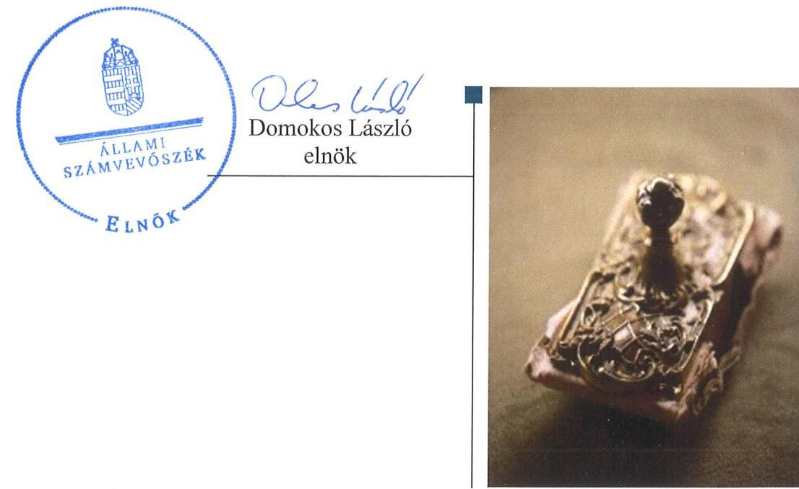
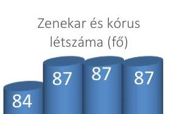
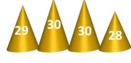
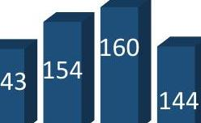
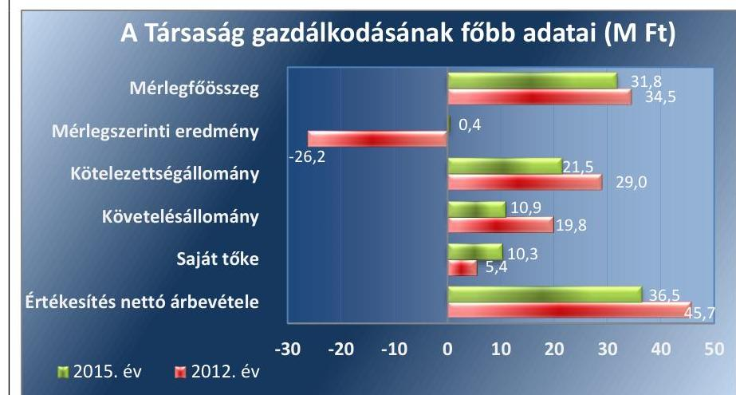
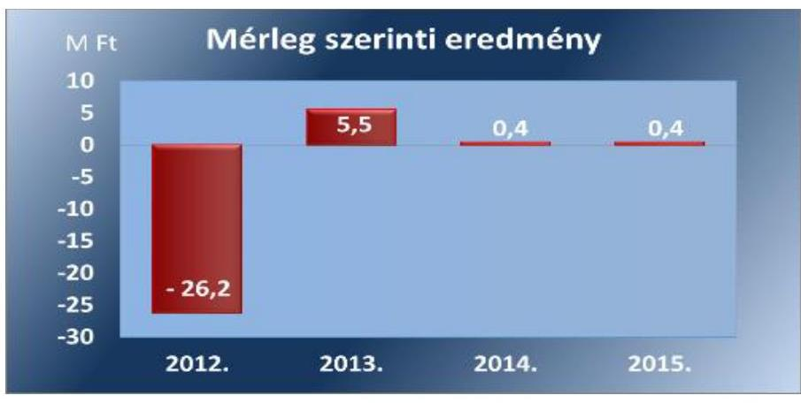
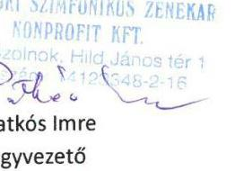
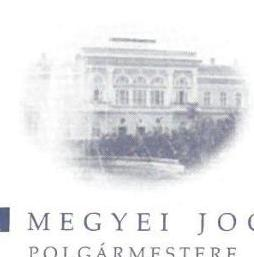
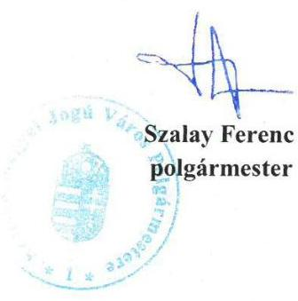

# Jelentés 

## Az önkormányzatok gazdasági társaságai

Az önkormányzatok többségi tulajdonában lévő gazdasági társaságok gazdálkodásának ellenőrzése - Szolnoki Szimfonikus Zenekar Nonprofit Kft.
2017. 08. 05.

---

# AZ ELLENŐRZÉST FELÜGYELTE:

DR. HORVÁTH MARGIT felügyeleti vezető

## AZ ELLENŐRZÉST VEZETTE ÉS A VÉGREHAJTÁSÁÉRT FELELŐS:

HOFMEISTER LÁSZLÓ ellenőrzésvezető

A PROGRAM ÖSSZEÁLLÍTÁSÁÉRT FELELŐS:

JANIK JÓZSEF LÁSZLÓ osztályvezető

IKTATÓSZÁM: V-1280-170/2016

TÉMASZÁM: 2314

ELLENŐRZÉS-AZONOSÍTÓ SZÁM: V-075805

Jelentéseink az Országgyűlés számítógépes hálózatán és az Interneten a www.asz.hu címen is olvashatóak.

---

# TARTALOMJEGYZÉK 

■ ÖSSZEGZÉS ..... 5
■ AZ ELLENŐRZÉS CÉLJA ..... 6
■ AZ ELLENŐRZÉS TERÜLETE ..... 7
■ AZ ELLENŐRZÉS HÁTTERE, INDOKOLTSÁGA ..... 9
■ A JELENTÉS LÉNYEGES KÉRDÉSKÖREI ..... 10
■ ELLENŐRZÉS HATÓKÖRE ÉS MÓDSZEREI ..... 11
■ MEGÁLLAPÍTÁSOK ..... 13
■ JAVASLATOK ..... 20
■ MELLÉKLETEK ..... 23
I. Sz. Melléklet: Értelmező szótár ..... 23
II. Sz. Melléklet: 2012-2015. évi beszámoló adatok ..... 24
■ FÜGGELÉK: ÉSZREVÉTELEK ..... 25
■ RÖVIDÍTÉSEK JEGYZÉKE ..... 29

---

.

---

# ÖSSZEGZÉS 

Szolnok Megyei Jogú Város Önkormányzata a tulajdonában álló Szolnoki Szimfonikus Zenekar Nonprofit Kft. feladatellátásával kapcsolatos tulajdonosi joggyakorlásának kereteit szabályszerűen kialakította, tulajdonosi jogait szabályszerűen gyakorolta. A Társaság vagyongazdálkodása a jogszabályi előírásoknak összességében megfelelt, árképzése szabályszerű volt.

## Az ellenőrzés társadalmi indokoltsága

Magyarországon az önkormányzatok kötelező és önként vállalt feladataik ellátása során egyre szélesebb körben alkalmazzák a költségvetési szerveken kívüli feladatellátást, ezáltal az önkormányzati tulajdonú gazdasági társaságok is kiemelt fontosságú szerephez jutnak a lakossági szolgáltatások biztosításában. Az önkormányzatok többségi tulajdonában álló gazdasági társaságok ellenőrzése kiemelt jelentőségű, mivel működésük hatással van a tulajdonos önkormányzat gazdálkodására, gazdálkodásának egyes elemei befolyásolják az önkormányzati alszektor hiányát és az államadósságot.

Az Állami Számvevőszék által az előadó-művészeti tevékenységet folytató Társaságnál végzett ellenőrzést további társadalmi elvárás is indokolja sajátos feladatellátásából adódóan, mivel az előadásokon keresztül a város lakosságának széles köre kerülhet kapcsolatba az előadó-művészeti tevékenységet folytató Társasággal, az általa nyújtott szolgáltatásokkal.

## Főbb megállapítások, következtetések

Az Önkormányzat a jogszabályi előírásoknak eleget téve, a helyi közművelődési tevékenység támogatása keretében kialakította a Társaság feladatellátásával kapcsolatos tulajdonosi joggyakorlás kereteit. Megalkotta az előírt rendeleteket és a javadalmazási szabályzatot, továbbá közszolgáltatási szerződést, feladatellátási megállapodást kötött a Társasággal. A tulajdonosi joggyakorlás szabályszerű volt, az Önkormányzat létrehozta a felügyelőbizottságot, jóváhagyta annak ügyrendjét. Az éves beszámolóit a felügyelőbizottság jelentésének birtokában fogadta el. Az Önkormányzat élt a jogszabályban rögzített lehetőséggel és ellenőrizte a tulajdonában álló Társaságot.

A Társaság a működéshez szükséges számviteli és egyéb szabályzatokkal rendelkezett, azonban az SZMSZ, az Értékelési szabályzat és a Pénzkezelési szabályzat a jogszabályi előírásoknak nem felelt meg maradéktalanul. A vagyongazdálkodása összességében szabályszerű volt, a leltározás a szállítói állomány vonatkozásában nem volt megfelelő, melyet a könyvvizsgáló nem kifogásolt.

A Társaság az előírt tervezési és beszámolási kötelezettségeit teljesítette. Belső ellenőrzést a Társaság ügyvezetői a jogszabály rendelkezése ellenére a 2014-2015. években nem alakítottak ki, így az nem biztosított az operatív tevékenységek felett független kontrollt. A jogszabályokban előírt közzétételi kötelezettséggel kapcsolatos eljárásról nem rendelkezett, közzétételi kötelezettségének hiányosan tett eleget a Társaság.

A bevételek és a ráfordítások elszámolása az értékcsökkenés kivételével megfelelő volt. Fizetőképessége a 2012. évhez képest a 2015. évben javult. Árképzése során az önkormányzati előírásokat figyelembe véve járt el.

---

# AZ ELLENŐRZÉS CÉLJA 

Az ellenőrzés célja annak értékelése, hogy az önkormányzat vagyongazdálkodási tevékenysége során szabályszerűen gyakorolta-e tulajdonosi jogait; a gazdasági társaság szabályozottsága, gazdálkodása és vagyongazdálkodási tevékenysége, bevételeinek és ráfordításainak elszámolása megfelelt-e a jogszabályi és tulajdonosi előírásoknak; a gazdasági társaság fizetőképessége biztosított volt-e a gazdálkodás során, valamint a gazdálkodás átláthatósága és elszámoltathatósága érdekében biztosítva volt-e a szolgáltatás dijának megalapozottsága szabályszerű önköltségszámítással. Az ellenőrzés célja továbbá annak megítélése, hogy az önkormányzat többségi tulajdonában lévő gazdasági társaság gazdálkodásának a kormányzati szektor hiányára és az államadósságra befolyással bíró elemei a jogszabályi előírásoknak megfeleltek-e.

---

# AZ ELLENŐRZÉS TERÜLETE

## Szolnok Megyei Jogú Város Önkormányzata és a tulajdonában lévő Szolnoki Szimfonikus Zenekar Nonprofit Kft.

1. ábra

Fizetőnézők száma (ezer fő)

Hangversenyek száma (db)

2012. 2013. 2014. 2015. *Forrás: 2012-2015. művészeti évadbeszámolók*

## SZOLNOK MEGYEI JOGÚ VÁROS ÖNKORMÁNYZATA

A város lakosságának közművelődéshez való jogát közművelődési intézményei működtetésével és a tulajdonában álló gazdasági társaságok – közöttük a Szolnoki Szimfonikus Zenekar Nonprofit Kft. – működésének támogatásával biztosította. A Szolnoki Szimfonikus Zenekar Kft.-t 2007. november 26-án öt magánszemély alapította, majd a 2009. évtől az alapítók száma hatra változott. 2009. január 10-től nonprofit szervezetként működött. Az Önkormányzat¹ 2009. február 10-én 1/7 tulajdoni hányadot, majd a 2011. évben további 5/7 tulajdoni hányaddal, minősített többséget biztosító részesedést szerzett. Az Önkormányzat 2012. április 26-tól a Társaság² kizárólagos tulajdonosa. A tulajdonosi jogokat 2012. április 25-ig a Társaság taggyűlése³, ezt követően a Közgyűlés⁴ gyakorolta.

A Társaság kiemelt minősítésű zeneművészeti szervezet, közhasznú tevékenységének elsődleges célja a Szolnoki Szimfonikus Zenekar és a Bartók Béla Kamarakórus működtetése, hangversenyek tartása bel- és külföldön és egyéb kulturális közhasznú tevékenység végzése. A Társaság közhasznú jogállású, közfeladatot ellátó szerv. A Társaság vállalkozási tevékenységet nem végzett, bevételt kizárólag közhasznú tevékenységével kapcsolatosan realizált. Az Önkormányzat a Társaság számára feladatának ellátásához vagyonkezelésbe vagyont nem adott át, a Társaság tevékenységét az Önkormányzat tulajdonában lévő bérelt ingatlanokban folytatta. A Társaság szakmai tevékenységét jellemző adatokat az 1. ábra, főbb gazdálkodási adatait a 2. ábra mutatja be.

2. ábra

*Forrás: A Társaság 2012. és 2015. évi egyszerűsített éves beszámolói*

---

A vagyoni helyzetre jellemző főbb mérlegadatokat a II. számú melléklet mutatja be. Az ellenőrzött időszakban a Társaság vagyona 7,8%-kal csökkent, melyből a tárgyi eszközök állománycsökkenése meghaladta a 30%-ot, mely az elszámolt értékcsökkenés szintjét el nem érő eszközvisszapótlással magyarázható. A forgóeszközök értéke 16,4%-kal csökkent, melyen belül a követelések állománya csökkent 44,9%-kal, míg a pénzkészlet 104,3%-kal nőtt. Ennek oka a kapott támogatások összegének növekedése volt.

Az értékesítés nettó árbevétele a 2012. évi 45,7 M Ft-ról a 2015. évre 20,1%-kal 36,5 M Ft-ra csökkent. A Társaság mérleg szerinti eredményét a 3. ábra mutatja be. A 2013-2015. éveket pozitív eredménnyel zárta, ugyanakkor a 2012. évben 26,2 M Ft volt a vesztesége. A Társaság jegyzett tőkéje 4,9 M Ft volt.
3. ábra

Forrás: 2012-2015. évi egyszerűsített éves beszámolók
A Társaság az ellenőrzött időszakban két ügyvezetővel látta el feladatát, az ügyvezetők külön-külön is jogosultak voltak a Társaságot képviselni, személyük nem változott.

A Társaság nem alakult át, más gazdasági társaságban részesedéssel nem rendelkezett. A Társaság 2013. június 28-tól kormányzati szektorba sorolt egyéb szervezetnek minősült.

A polgármester ${ }^{5}$ és a jegyző ${ }^{6}$ személyében az ellenőrzött időszakban nem történt változás.

---

# AZ ELLENŐRZÉS HÁTTERE, INDOKOLTSÁGA 

Az önkormányzatok többségi tulajdonában álló gazdasági társaságok ellenőrzése kiemelten fontos a vagyon megőrzése, megóvása érdekében, valamint a kormányzati szektor elszámolásaiban megjelenő önkormányzati tulajdonú gazdálkodó szervezetek esetében, amelyekkel szemben alapvető követelmény, hogy gazdálkodásuk, működésük szabályszerű, az általuk szolgáltatott adatok minél megbízhatóbbak legyenek. A feladatellátás költségeinek, ráfordításainak alakulása a lakosság széles rétegét érinti.

Ellenőrzéseink feltárhatják, hogy az önkormányzat a feladatellátásához rendelt vagyon működtetését a tulajdonostól elvárható gondossággal végezte-e, a feladatot ellátó gazdasági társaság a létesítő okiratban, közszolgáltatói szerződésben, fenntartói megállapodásban foglaltak betartásával biztosította-e a feladat ellátását. Az ellenőrzés eredményeképp meghatározhatóvá válnak a költségvetési hiányt befolyásoló szervezet kockázatai, lehetővé válik ezen kockázatok csökkentése. Az ellenőrzés rávilágíthat arra, hogy a gazdasági társaság a vagyon használatával biztosította-e a szolgáltatás folytatásának feltételeit, az önkormányzat tulajdonosi felügyelete hozzájárult-e a szabályszerű gazdálkodáshoz és feladatellátáshoz. A megállapítások alapján megfogalmazott számvevőszéki javaslatok hasznosítása elősegítheti a meglévő hibák megszüntetését. A jó gyakorlatok bemutatásával az ÁSZ ${ }^{7}$ hozzájárulhat a követendő megoldások megismertetéséhez, terjesztéséhez.

---

# A JELENTÉS LÉNYEGES KÉRDÉSKÖREI 

1. Az Önkormányzat tulajdonosi joggyakorlása szabályszerű volt-e?
2. A Társaság vagyongazdálkodása szabályszerű volt-e, fizetőképessége biztosított volt-e a gazdálkodás során?
3. A Társaság bevételeinek és ráfordításainak elszámolása, valamint az önköltségszámítás és árképzés szabályszerű volt-e?
4. A kormányzati szektorba sorolt, többségi önkormányzati tulajdonban lévő Társaság gazdálkodásának a kormányzati szektor hiányára és az államadósságra befolyással bíró gazdasági eseményei megfeleltek-e a jogszabályi előírásoknak?

---

# ELLENŐRZÉS HATÓKÖRE ÉS MÓDSZEREI 

## Az ellenőrzés típusa

Megfelelőségi ellenőrzés

## Az ellenőrzött időszak

2012. január 1-jétől 2015. december 31-ig.

## Az ellenőrzés tárgya

Az Önkormányzat tulajdonosi joggyakorlása, valamint a Társaság gazdálkodásának szabályozottsága és szabályszerűsége, továbbá az önkormányzati alszektorba sorolt Társaság gazdálkodásának a kormányzati szektor hiányára és az államadósságra befolyással bíró elemei.

Az ellenőrzés kiterjed minden olyan körülményre és adatra, amely az ÁSZ jogszabályban meghatározott feladatainak teljesítéséhez, valamint a program végrehajtása folyamán felmerült újabb összefüggések feltárásához szükséges.

## Az ellenőrzött szervezet

Szolnok Megyei Jogú Város Önkormányzata és a Szolnoki Szimfonikus Zenekar Nonprofit Kft.

## Az ellenőrzés jogalapja

Az ellenőrzés jogszabályi alapját az Állami Számvevőszékről szóló 2011. évi LXVI. törvény 1. § (3) bekezdése és 5. § (3)-(4)-(5) bekezdései képezik.

## Az ellenőrzés módszerei

Az ellenőrzést a nemzetközi standardokat irányadónak tekintve az ellenőrzési program ellenőrzési kérdései, az ellenőrzött időszakban hatályos jogszabályok, az ellenőrzés szakmai szabályok és módszertanok figyelembe vételével végeztük.

Az ellenőrzés ideje alatt az ellenőrzött szervezettel történő kapcsolattartást az ÁSZ Szervezeti és Működési Szabályzatának vonatkozó előírásai alapján biztosítottuk.

---

Az ellenőrzés a kiválasztott, többségi tulajdonosi jogokat gyakorló Önkormányzatra és az ellenőrzött gazdasági társaságra terjedt ki.

Az ellenőrzési kérdések megválaszolásához szükséges bizonyítékok megszerzése a következő ellenőrzési eljárások alkalmazásával történt: megfigyelés, kérdésfeltevés (információkérés), összehasonlítás, mintavételezés, valamint elemző eljárás. Az ellenőrzési bizonyítékként felhasznált adatforrások közé tartoztak egyrészt az ellenőrzési programban felsorolt adatforrások, másrészt minden - az ellenőrzés folyamán - feltárt, az ellenőrzés szempontjából információkat tartalmazó dokumentum.

Az ellenőrzést a megjelölt adatforrások és az ellenőrzöttek által kitöltött tanúsítványok felhasználásával, a mintatételek kiértékelésével, továbbá az adott időszakban hatályos jogszabályok figyelembevételével folytattuk le.

A bevételek, a ráfordítások elszámolásának és a vagyon nyilvántartásának szabályszerűségét véletlenszerű mintavétellel, a legnagyobb ráfordítások elszámolására és a legnagyobb összegű beszerzett eszközök vagyon nyilvántartására vonatkozó eljárások szabályszerűségét kockázatalapú, irányított mintavétel alapján ellenőriztük.

A mintavétellel ellenőrzött területek értékelése során az egyes mintatételekre vonatkozó szabályszerűségi kérdésekre adott válaszok kerültek statisztikai módszer segítségével összesítésre és minősítésre. A jogszabályoknak és egyéb előírásoknak megfelelőnek tekintettük az adott területet, amennyiben az ellenőrzés eredménye alapján 95%-os bizonyossággal a teljes sokaságban a hibaarány kisebb volt, mint 10% és nem megfelelőnek értékeltük, ha a hibaarány a 10%-ot elérte.

---

# 1. Az Önkormányzat tulajdonosi joggyakorlása szabályszerű volt-e? 

Összegző megállapítás

### 1.1. számú megállapítás

Az Önkormányzat tulajdonosi joggyakorlása szabályszerű volt.

Az Önkormányzat a tulajdonosi joggyakorlásának kereteit szabályszerűen kialakította.

Az Önkormányzat a Társaság közfeladat ellátására vonatkozó középtávú terveit a Kulturális koncepció ${ }^{8}$-ban rögzítette. A kulturális feladatellátás követelményeit az Önkormányzat a Közművelődési rendelet ${ }^{9}$-ben, illetve a Társasággal az Emtv. ${ }^{10}$ alapján megkötött Közszolgáltatási szerződés ${ }_{1-2}{ }^{11}$-ben, valamint a Fenntartói megállapodás ${ }_{1-2}{ }^{12}$-ben határozta meg.

A TÁRSASÁG FELETTI TULAJDONOSI JOGOK gyakorlásának rendjét az Önkormányzat a Vagyongazdálkodási rendelet ${
 }^{13}$ben, a Társasági szerződés ${ }_{1-2}{ }^{14}$-ben, valamint az Alapító okirat ${ }_{1-3}{ }^{15}$-ban szabályozta. A létesítő okiratok megfeleltek a Gt. ${ }^{16}$-ben és a Ptk. ${ }^{17}$-ban előírt tartalmi követelményeknek. A Társasági szerződés ${ }_{1-2}$ és az Alapító okirat ${ }_{1-3}$ a tulajdonosi jogokat gyakorló - 2012. április 25-ig - a Társaság taggyűlése, ezt követően a Közgyűlés kizárólagos hatáskörébe tartozó feladatokat rögzítette.

A taggyűlés 2012. január 1. és a 2012. április 25. közötti időszakra nem alkotott szabályzatot a Társaság vezető tisztségviselője, $\mathrm{FB}^{18}$ tagjai és munkavállalói javadalmazása, valamint a jogviszony megszűnése esetére biztosított juttatások módjának, mértékének elveiről, annak rendszeréről a Taktv. ${ }^{19}$ 5. § (3) bekezdésében foglaltak ellenére. A kizárólagos tulajdonosi jogokat gyakorló Közgyűlés 2012. április 26-án megalkotta a Taktv. előírásával összhangban álló Javadalmazási szabályzat ${ }^{20}$-ot.

A Társaság feladatellátásához szükséges infrastruktúrát az Önkormányzat ingatlanok bérbeadásával, bérleti díj fizetése ellenében biztosította.

Rendeletalkotási kötelezettségének az Önkormányzat az 1997. évi CXL. törvény²1 előírása alapján a Közművelődési rendelet megalkotásával eleget tett, melyben a Társaság számára kiemelt hangsúlyú feladatként nevesítette a hangversenyrendezést és a kulturális turizmust.

### 1.2. számú megállapítás

A tulajdonosi jogok gyakorlása szabályszerű volt.
A Vagyongazdálkodási rendelet értelmében a Társaság legfőbb szervének kizárólagos hatáskörébe tartozó döntési jogkör gyakorlója 2012. április 26-tól a Közgyűlés volt. A Társaság feletti tulajdonosi jogok gyakorlása az előírásoknak megfelelően történt.

A Felügyelőbizottságot a Társaságnál a Gt.-ben és a Taktv. ${ }^{22}$-ben előírtak szerint létrehozták. Az FB rendelkezett a tulajdonosi joggyakorló által jóváhagyott ügyrenddel. Az FB a Társaság üzleti terveit megtárgyalta, a Számv. tv. ${ }^{23}$ szerinti beszámolóira vonatkozó döntéseiről írásbeli jelentést készített.

Az üzleti terveket a Társaság a 2012-2015. években elkészítette, azok összhangban álltak az Önkormányzat költségvetési rendeleteivel. Az üzleti terveket a Közgyűlés minden évben határozatában jóváhagyta. A 2012. évi üzleti terv jóváhagyására vonatkozó döntést a taggyűlés nem hozta meg, arról 2012. április 26-án a kizárólagos tulajdonosi jogot gyakorló Közgyűlés döntött. Az Önkormányzat a Társaság likviditási helyzetét figyelemmel kísérte, az adatszolgáltatásai feldolgozását havonta elvégezte.

# A Társaság beszámoltatásának rendjét a 

Társasági szerződés ${ }_{1-2}$-ben, illetve az Alapító okirat ${ }_{1-3}$-ban meghatározták. Az Önkormányzat a Közszolgáltatási szerződés ${ }_{1-2}$-ben, a Fenntartói megállapodás ${ }_{1-2}$-ban, a tárgyévre vonatkozó Támogatási szerződés ${ }_{1-4}{ }^{24}$-ben foglaltak betartásáról a Társaságot éves és évközi beszámolók keretében beszámoltatta. A Társaság számviteli beszámolóit a Közgyűlés megtárgyalta a könyvvizsgáló írásos véleménye és az FB jelentése birtokában és elfogadásáról határozatot hozott. Előírta a Fenntartói megállapodás ${ }_{1-2}$-ban a művészeti évadbeszámolók Önkormányzat felé történő benyújtásának kötelezettségét.

A Társaságnál ellenőrzést az Önkormányzat belső ellenőrzése a 2012-2015. évek között végzett. Az ellenőrzések kiterjedtek az üzleti terv, valamint a beszámoló összeállítása, a 2011. évi támogatás elszámolása szabályszerűségének ellenőrzésére. Az ellenőrzési megállapítások hasznosultak.

---

# 2. A Társaság vagyongazdálkodása szabályszerű volt-e, fizetőképessége biztosított volt-e a gazdálkodás során? 

Összegző megállapítás

A Társaság vagyongazdálkodása összességében szabályszerű volt. A jogszabályban előírt szabályzatokkal rendelkezett, azonban az SZMSZ, az Értékelési szabályzat és a Pénzkezelési szabályzat nem felelt meg maradéktalanul a jogszabályi előírásoknak. A Társaság a tervezési, beszámolási kötelezettségének eleget tett, közzétételi kötelezettséggel kapcsolatos szabályról nem rendelkezett, közzétételi kötelezettségét hiányosan teljesítette.
2.1. számú megállapítás

A Társaság a működéshez szükséges szabályzatokkal rendelkezett, azonban az SZMSZ, az Értékelési szabályzat és a Pénzkezelési szabályzat nem felelt meg maradéktalanul a jogszabályi előírásoknak.

A Társaság működését, szervezetét az SZMSZ ${ }_{1-2}{ }^{25}$-ben szabályozta. A 2009. április 30-tól hatályos SZMSZ ${ }_{1}$-ben az ügyvezetők számában bekövetkezett változást 2015. május 27-ig nem vezették keresztül, így abban nem határozták meg a kettős ügyvezetésből adódó felelősségi, hatásköri viszonyokat és feladatokat, mely nem felelt meg 2014. január 1-jétől a Bkr. ${ }^{26}$ 6. § (1) bekezdés b) pontjában előírtaknak az SZMSZ ${ }_{2}$ 2015. május 28-i hatályba lépéséig.

A Társaság rendelkezett Számviteli politika ${ }_{1-4}{ }^{27}$-val, valamint az annak részeként kiadott Értékelési szabályzat ${ }_{1-4}{ }^{28}$-tal, Pénzkezelési szabályzat ${ }_{1-4}{ }^{29}$-tal, Leltárkészítési és leltározási szabályzat ${ }_{1-4}$-tal ${ }^{30}$ és Számlarend ${ }_{1-4}{ }^{31}$-del, melyek tartalma megfelelt a Számv. tv. előírásának az Értékelési szabályzat ${ }_{1-4}$ és a Pénzkezelési szabályzat ${ }_{1-4}$ kivételével.

Az Értékelési szabályzat ${ }_{1-4}$-ban a befektetett eszközök értékcsökkenésének elszámolási rendje nem felelt meg a Számv. tv. 52. § (2) bekezdésében foglaltaknak, mivel lehetőséget biztosított az értékcsökkenés elszámolása megkezdéséhez öt éves késleltetésre az üzembe helyezéstől számítva.

A Pénzkezelési szabályzat ${ }_{1-4}$ nem felelt meg a Számv. tv. 14. § (8) bekezdés előírásának, mert nem rendelkezett a pénzkezelés felelősségi szabályairól, a készpénzben és a bankszámlán tartott pénzeszközök közötti forgalomról, a készpénzállományt érintő pénzmozgások jogcímeiről és eljárási rendjéről, a készpénzállomány ellenőrzésének gyakoriságáról, a pénzszállítás feltételeiről, a pénzkezeléssel kapcsolatos bizonylatok rendjéről, valamint a pénzforgalommal kapcsolatos nyilvántartási szabályokról.

Önköltségszámítási szabályzat készítésére a Társaság a Számv. tv. 14. (6) bekezdése alapján nem volt kötelezett, ennek ellenére készített önköltségszámítási szabályzatot, mely megfelelt a Számv. tv-ben előírtaknak.

A Társaság elkészítette az Iratkezelési szabályzat ${ }^{32}$-át az Ltv. ${ }^{33}$ előírásával összhangban.

Kormányzati szektorba sorolt egyéb szervezetként a Társaság 2014. január 1-jétől nem felelt meg a Bkr. 10. §-ában foglalt előírásnak, tekintettel a Bkr. 54/A. §-ára, mivel az ügyvezetők az operatív tevékenységektől függetlenül működő belső ellenőrzést nem alakították ki.

# 2.2. számú megállapítás 

## A Társaság a vagyonával összességében szabályszerűen gazdálkodott.

A saját vagyon nyilvántartása megfelelő volt, a Társaság befektetett eszközeit jelentő immateriális javak és tárgyi eszközök bekerülési értékét a Számv. tv.-ben foglaltak szerint határozta meg.

Az eszközök és források leltározását a Társaság egy mérlegsor (szállítók) kivételével a Számv. tv.-ben, illetve a Leltárkészítési és leltározási szabályzat ${ }_{1-4}$-ban előírtaknak megfelelően elvégezte. Az éves beszámolót a Számv. tv. 69. § (1) bekezdésének és a Leltárkészítési és leltározási szabályzat ${ }_{1-4}$-ban előírtaknak megfelelően leltárral alátámasztották, azonban a leltározás a szállítói kötelezettség tekintetében nem felelt meg a Számv. tv. 69. § (2) bekezdésében előírt követelménynek, mivel a főkönyvi könyvelés és az analitikus nyilvántartás adatai közötti egyeztetést nem végezték el a 2012-2015. években.

A 2014. évi beszámoló mérlegében az előző években elkövetett, önellenőrzéssel feltárt jelentős összegű hibák miatti módosításokat 1,4 M Ft értékben bemutatták, az eredménykimutatás azonban a Számv. tv. 19. § (3) bekezdés előírásának ellenére összevontan is és nem csak külön oszlopban, ezáltal duplikációt eredményezve tartalmazta az előző évek módosításait és a tárgyévi adatokat. A könyvvizsgáló a Társaság éves számviteli beszámolóinak szállítói mérlegsorát alátámasztó, a Számv. tv. előírásainak nem megfelelő leltárral kapcsolatos hiányosságot, valamint a 2014. évi beszámoló hibáját nem kifogásolta, mellyel nem tett eleget a Számv. tv. 156. § (1) bekezdésében foglaltaknak.

A Társaság saját tőkéje a 2012. év végi 5,4 M Ft-ról a 2013. év végére a nyereségnek köszönhetően 10,9 M Ft-ra növekedett, ami a 2014. évben az önellenőrzéssel feltárt hiba miatt alacsonyabb szintre ( $9,9 \mathrm{M} \mathrm{Ft}$ ) csökkent, majd a 2015. évben a nyereségnek köszönhetően 4,0\%-kal 10,3 M Ft-ra nőtt. A Társaság jegyzett tőkéje az ellenőrzött időszakban nem változott, annak 4,9 M Ft-os értékét a saját tőke a 2012-2015. években meghaladta.

## 2.3. számú megállapítás

1. táblázat

A Társaság likviditásának és adósságmutatójának alakulása

|  | likviditási   mutató | eladósodottság   mértéke |
| :--: | :--: | :--: |
| referencia | $>1$ | $<1$ |
| 2012. év | 0,9 | 5,4 |
| 2013. év | 0,8 | 1,3 |
| 2014. év | 0,7 | 1,8 |
| 2015. év | 1,0 | 2,1 |

A Társaság fizetőképessége a 2015. évre javult, a tulajdonos Önkormányzat támogatásával biztosított volt.

A Társaság kötelezettségállománya rövid lejáratú kötelezettségekből állt, a 2012. évi 29,0 M Ft-ról a 2015. év végére 21,5 M Ft-ra csökkent, amely a 2012. évi állomány 74,1\%-át tette ki. A rövid lejáratú kötelezettségeket elsősorban a szállítókkal szembeni kötelezettségek, valamint a munkabér, az adó- és járulékterhek jelentették. A csökkenő összegű kötelezettségállományon belül ugyanakkor a 2012. évi 5,8 M Ft-ról 7,4 M Ft-ra nőtt a 2015. évre a lejárt határidejű szállítói kötelezettségek állománya, melyből 1,0 M Ft éven túli volt.

A Társaság likviditási és adósságmutatójának az alakulását az 1. táblázat mutatja. A likviditási mutató értéke az ellenőrzött időszakban kedvezőtlen volt, ugyanakkor a Társaság likviditási helyzete a 2015. évre a 2012. évhez képest kis mértékben javult az önkormányzati támogatásnak köszönhetően. A Társaság idegen és saját tőkéjének arányát mutató eladósodottság mértéke kedvező változást mutatott annak köszönhetően, hogy az idegen forrást jelentő kötelezettségállomány a 2015. évre 25,9\%-kal csökkent, ugyanakkor a saját tőke értéke 90,7\%-kal nőtt.
2.4. számú megállapítás

A Társaság az előírt tervezési, beszámolási kötelezettségének eleget tett, közzétételi kötelezettséggel kapcsolatos szabályról nem rendelkezett, közzétételi kötelezettségét hiányosan teljesítette.

Az üzleti terveket a Társaság az Önkormányzat előírásával összhangban a 2012-2015. években elkészítette.

Beszámolási kötelezettségének a Társaság az éves beszámolók és a közhasznúsági jelentések tekintetében a Számv. tv.-ben, a Civil tv. ${ }^{34}$-ben előírtaknak megfelelően eleget tett.

A Társaság kormányzati szektorba sorolt egyéb szervezetként a központi költségvetésről szóló törvény elkészítéséhez nem szolgáltatott adatot az államháztartásért felelős miniszternek, mellyel megsértette az Áht. ${ }^{35}$ 13. § (3) bekezdésében előírtakat. Az Emtv. által előírt művészeti évadbeszámoló készítési és szakmai adatszolgáltatási kötelezettségeit teljesítette.

A közzétételi kötelezettség teljesítésének részletes szabályait belső szabályzatban nem állapította meg a Társaság az Info. tv. ${ }^{36}$ 35. § (3) bekezdésében foglalt előírás ellenére. Nem teljesítették teljeskörűen az Info. tv. 37. § (1) bekezdésében előírt közzétételi kötelezettséget, mert az Info. tv. 1. melléklet általános közzétételi lista II. rész 1. és 12. pontjaiban, valamint a III. rész 2. pontjában szereplő adatai közül a szervezeti és működési szabályzat hatályos és teljes szövegét, az alaptevékenységgel kapcsolatos vizsgálatok, ellenőrzések nyilvános megállapításait, továbbá a foglalkoztatottak létszámára és személyi juttatásaira vonatkozó összesített adatokat és az egyéb alkalmazottaknak nyújtott juttatások fajtáját és mértékét összesítve nem tették közzé.

# 3. A Társaság bevételeinek és ráfordításainak elszámolása, valamint az önköltségszámítás és árképzés szabályszerű volt-e? 

Összegző megállapítás

A Társaság bevételeinek és ráfordításainak elszámolása az értékcsökkenés kivételével megfelelő volt. A Társaság árképzése szabályszerű volt.
3.1. számú megállapítás

A Társaság bevételeinek és a ráfordításainak elszámolása az értékcsökkenés kivételével megfelelő volt.

A bevételek elszámolása a Számv. tv. előírásainak és a belső szabályzatoknak megfelelően történt. A Társaság a 2012-2015. évek között kapott támogatásainak alakulását a 4. ábra szemlélteti.

---

2. táblázat

Tárgyi eszközök használhatósági foka (%)

|  | Hangszerek | Egyéb berendezések, felszerelések, gépek |
| :--: | :--: | :--: |
| 2012. év | $63,4 \%$ | $60,8 \%$ |
| 2013. év | $52,9 \%$ | $45,3 \%$ |
| 2014. év |

 $44,0 \%$ | $29,2 \%$ |
| 2015. év | $31,2 \%$ | $22,5 \%$ |

A Társaság által egyéb bevételként elszámolt támogatás összege a 2015. évre 51,0%-kal nőtt, melyen belül az Önkormányzat által nyújtott támogatás 63,1%-kal emelkedett. A Társaság számára nyújtott TAO${ }^{37}$ támogatás összege 78,3%-kal nőtt, azonban az összes támogatási összegen belüli részaránya nem haladta meg a 3%-ot, a 2015. évben 8,2 M Ft volt.

A RÁFORDÍTÁSOK ELSZÁMOLÁSA összességében a Számv. tv. előírásainak és a belső szabályzatoknak megfelelően történt az értékcsökkenés elszámolása kivételével. Elszámolásukat a megfelelő számviteli bizonylatokkal alátámasztották, az ingatlan bérleti díjakra vonatkozó elszámolás szabályszerű volt. A személyi jellegű ráfordítások a 2014. évtől jelentősen megnőttek az Emtv.-ben előírt munkaviszonyban történő foglalkoztatási követelmény végrehajtásával. A személyi jellegű ráfordítások elszámolása szabályszerű volt, a munkavállalókat terhelő levonások és járulékok elszámolása megfelelt az Szja. tv.${ }^{38}$ és a Tbj.${ }^{39}$ előírásainak. Az egyszerűsített közteherviselési hozzájárulás szerint kifizetett juttatásoknál az Ekho tv.${ }^{40}$-ben előírt nyilatkozatok rendelkezésre álltak.

AZ ÉRTÉKCSÖKKENÉS elszámolása nem volt megfelelő, mivel több esetben nem számoltak el az üzembe helyezett immateriális javak után értékcsökkenést, amellyel megsértették a Számv. tv. 52. § (1)-(2) és (7) bekezdéseiben foglalt előírásokat, valamint a Számviteli politika 17. pontjában, a Számviteli politika VI. pontjában és a Számviteli politika II.15. pontjában előírt, a terv szerinti értékcsökkenésre vonatkozó szabályokat. Néhány esetben nem a Számviteli politika-ban előírtaknak megfelelően számolták el a 100,0 e Ft alatti beszerzési értékű eszközök értékcsökkenését, mert nem a használatba vétellel egy időben történő egyösszegű leírást alkalmazták, hanem két évre elosztva. A szabálytalan értékcsökkenés elszámolása nem érte el a jelentős összegű hibahatárt.

AZ ESZKÖZÖK HASZNÁLHATÓSÁGI FOKA mind a hangszerek, az egyéb berendezések, felszerelések, gépek vonatkozásában csökkent, az elhasználódás mértéke az egyéb berendezések, felszerelések, gépek esetében nagyobb mértékű volt, mint a hangszereknél, melyet a 2. táblázat szemléltet. A két tárgyi eszközcsoport pótlása az elszámolt értékcsökkenés 70,2%-ának mértékében valósult meg.

---

A KÖVETELÉSÁLLOMÁNY a 2015. évre 44,9%-kal, 10,9 M Ftra csökkent, melyből a vevőkövetelés, a 2015. évben 6,3 M Ft volt. A határidőn túli vevőkövetelések néhány, a Számviteli politika szerint nem jelentős összegű tételt jelentettek, az év végi állomány a 2012. évben 0,2 M Ft, a 2015. évben 0,7 M Ft volt. Éven túli lejárt vevőkövetelésük a 2015. év végén nem volt.
3.2. számú megállapítás

# A Társaság árképzése szabályszerű volt. 

A TÁRSASÁG ÁRKÉPZÉSÉRE vonatkozóan az Önkormányzat a bevételszerző tevékenységének ösztönzése érdekében a Működési szabályzat${ }^{41}$-ban és a Közszolgáltatási szerződés-ben írt elő szabályokat, melyeket a Társaság a szolgáltatások díjának meghatározásakor figyelembe vett. Önköltségszámítási szabályzat készítésére a Társaság nem volt kötelezett a Számv. tv. 14. (6) bekezdése alapján.

## 4. A kormányzati szektorba sorolt, többségi önkormányzati tulajdonban lévő Társaság gazdálkodásának a kormányzati szektor hiányára és az államadósságra befolyással bíró gazdasági eseményei megfeleltek-e a jogszabályi előírásoknak?

Összegző megállapítás A Társaságnak a 2013-2015. években az államadósságra befolyással bíró gazdasági eseményei nem voltak.

A Társaság a 2013-2015. években a Stabilitási tv.${ }^{42}$ szerinti államadósságot keletkeztető ügyletet nem kötött, ebből származó kötelezettsége nem keletkezett.

---

# JAVASLATOK 

Az ÁSZ tv. 33. § (1) bekezdésében foglaltak értelmében az ellenőrzött szervezet vezetője köteles a jelentésben foglalt megállapításokhoz kapcsolódó intézkedési tervet összeállítani és azt a jelentés kézhezvételétől számított 30 napon belül az ÁSZ részére megküldeni. Amennyiben az ellenőrzött szervezet vezetője nem küldi meg határidőben az intézkedési tervet, vagy továbbra sem elfogadható intézkedési tervet küld, az Állami Számvevőszék elnöke az ÁSZ tv. 33. § (3) bekezdése a) és b) pontjaiban foglaltakat érvényesítheti.

Javaslataink célja a Szolnoki Szimfonikus Zenekar Nonprofit Kft. gazdálkodása szabályszerűségének és gyakorlatának javítása annak érdekében, hogy a szabályozási környezet és az alkalmazott gyakorlat megfelelően tudja támogatni az átlátható működést.

## A Szolnoki Szimfonikus Zenekar Nonprofit Kft. ügyvezetőinek

1. Intézkedjenek a Társaság értékelési szabályzatának a Számv. tv.-nek megfelelő módosításáról az elszámolandó értékcsökkenés rendjére vonatkozóan.
(2.1. sz. megállapítás 3. bekezdése alapján)
2. Intézkedjenek a Társaság pénzkezelési szabályzatának a Számv. tv. előírásának megfelelő tartalommal történő kiegészítéséről.
(2.1. sz. megállapítás 4. bekezdése alapján)
3. Intézkedjenek a Társaságnál a belső ellenőrzés Bkr.-nek megfelelő kialakításáról.
(2.1. sz. megállapítás 7. bekezdése alapján)
4. Intézkedjenek az éves beszámoló alátámasztásához a szállítói állomány főkönyvi könyvelése és analitikus nyilvántartása egyeztetésének végrehajtásáról a Számv. tv.-ben előírtaknak megfelelően.
(2.2. sz. megállapítás 2. bekezdése alapján)
5. Intézkedjenek a központi költségvetésről szóló törvény elkészítéséhez az Áht.-ban előírt adatszolgáltatás teljesítéséről az államháztartásért felelős miniszternek.
(2.4. sz. megállapítás 3. bekezdés 1. mondata alapján)

---

6. Intézkedjenek az Info. tv. rendelkezésének megfelelően a közzétételi listákon szereplő adatok közzétételi kötelezettsége teljesítésének részletes szabályai belső szabályzatban történő megállapításáról.
(2.4. sz. megállapítás 4. bekezdés 1. mondata alapján)
7. Intézkedjenek az Info. tv. 1. melléklete szerinti általános közzétételi lista II. rész 1. és 12. pontjaiban, valamint a III. rész 2. pontjában meghatározott adatok közzétételéről.
(2.4. sz. megállapítás 4. bekezdés 2. mondata alapján)
8. Gondoskodjanak arról, hogy a Társaság az értékcsökkenést a Számv. tv-ben előírtaknak megfelelően számolja el, figyelemmel a hatályos számviteli politikára.
(3.1. sz. megállapítás 4. bekezdése alapján)

---

Javaslataink célja az Önkormányzat szabályszerű működésének elősegítése, továbbá az önkormányzati tulajdonosi joggyakorlás kontrolljainak erősítése.

# Szolnok Megyei Jogú Város Önkormányzata polgármesterének 

1. Intézkedjen
a) a szervezeti és működési szabályzat, továbbá az ellenőrzött időszakban hatályos értékelési szabályzat és pénzkezelési szabályzat hiányosságai,
b) az éves számviteli beszámolók szállítói mérlegsorát alátámasztó leltározással kapcsolatos hiányosság
miatti felelősség tisztázása érdekében, és szükség szerint intézkedjen a felelősség érvényesítéséről.
(2.1. megállapítás 1., 3. és 4. bekezdései,
2.2. megállapítás 2. bekezdése alapján)

---

# MELLÉKLETEK 

- I. SZ. MELLÉKLET: ÉRTELMEZŐ SZÓTÁR
belső ellenőrzés
eladósodottság mértéke
gazdasági társaság
használhatósági fok
kormányzati szektorba sorolt egyéb szervezet
likviditási mutató
tulajdonosi joggyakorló
vagyongazdálkodás

Független, tárgyilagos bizonyosságot adó és tanácsadó tevékenység, amelynek célja, hogy az ellenőrzött szervezet működését fejlessze és eredményességét növelje, az ellenőrzött szervezet céljai elérése érdekében rendszerszemléletű megközelítéssel és módszeresen értékeli, illetve fejleszti az ellenőrzött szervezet irányítási és belső kontrollrendszerének hatékonyságát. (Forrás: Bkr. 2. § b) pontja) Azt mutatja, hogy a saját források a kötelezettségek hány százalékát fedezik. Kedvező, ha a mutató tartósan (jelentősen) 1 alatti értéket ér el: Kötelezettségek/ saját tőke.
Ptk.: 3.88. § (1) bekezdése szerint „a gazdasági társaságok üzletszerű közös gazdasági tevékenység folytatására, a tagok vagyoni hozzájárulásával létrehozott, jogi személyiséggel rendelkező vállalkozások, amelyekben a tagok a nyereségből közösen részesednek, és a veszteséget közösen viselik".
A mutató a tárgyi eszközök használhatósági szintjét mutatja. Kiszámítása: (Tárgyi eszközök nettó értéke x 100)/ Tárgyi eszközök bruttó értéke.
Az Áht. 1. § 12. pontja értelmében az a szervezet, amely az Áht. alapján nem része az államháztartásnak, azonban az Európai Közösséget létrehozó szerződéshez csatolt, a túlzott hiány esetén követendő eljárásról szóló jegyzőkönyv alkalmazásáról szóló 2009. május 25-i 479/2009/EK rendelet szerint a kormányzati szektorba tartozik és a szervezet megnevezését az államháztartásért felelős miniszter a Hivatalos Értesítőben és a Kormány honlapján közzétette.
A mutató azt fejezi ki, hogy a likvid eszközöknek tekintett forgóeszközök értéke hányszorosa az éven belül esedékes kötelezettségeknek: forgóeszközök / rövid lejáratú kötelezettségek.
Aki a nemzeti vagyon felett az államot vagy a helyi önkormányzatot megillető tulajdonosi jogok és kötelezettségek összességének gyakorlására jogosult. (Forrás: Nvtv. 3. § (1) bekezdés 17. pontja)
A nemzeti vagyongazdálkodás feladata a nemzeti vagyon rendeltetésének megfelelő, az állam, az önkormányzat mindenkori teherbíró képességéhez igazodó, elsődlegesen a közfeladatok ellátásához és a mindenkori társadalmi szükségletek kielégítéséhez szükséges, egységes elveken alapuló, átlátható, hatékony és költségtakarékos működtetése, értékének megőrzése, állagának védelme, értéknövelő használata, hasznosítása, gyarapítása, továbbá az állam vagy a helyi önkormányzat feladatának ellátása szempontjából feleslegessé váló vagyontárgyak elidegenítése. (Forrás: Nvtv. 7. § (2) bekezdése)

---

II. SZ. MELLÉKLET: 2012-2015. ÉVI BESZÁMOLÓ ADATOK

# A TÁRSASÁG 2012-2015. ÉVI BESZÁMOLÓINAK FŐBB ADATAI (M FT-BAN) 

| Megnevezés | 2012. év | 2013. év | $\begin{gathered} 2013 .1 / \\ 2013 .2 \text { év } \\ (\%) \end{gathered}$ | 2014. év | $\begin{gathered} 2014 .1 / \\ 2013 .2 \text { év } \\ (\%) \end{gathered}$ | 2015. év | $\begin{gathered} 2015 .1 / \\ 2014 .2 \text { év } \\ (\%) \end{gathered}$ | $\begin{gathered} 2015 .1 / \\ 2012 .2 \text { év } \\ (\%) \end{gathered}$ |
| :--: | :--: | :--: | :--: | :--: | :--: | :--: | :--: | :--: |
| Mérleg főösszeg | 34,5 | 43,5 | 126,1\% | 27,7 | 63,7\% | 31,8 | 114,8\% | 92,2\% |
| Befektetett eszközök | 9,5 | 11,0 | 115,8\% | 9,6 | 87,3\% | 7,4 | 77,1\% | 77,9\% |
| ebből tárgyi eszközök | 9,1 | 9,9 | 108,8\% | 8,5 | 85,9\% | 6,2 | 72,9\% | 68,1\% |
| Forgóeszközök | 25,0 | 19,4 | 77,6\% | 13,1 | 67,5\% | 20,9 | 159,5\% | 83,6\% |
| ebből követelések | 19,8 | 11,6 | 58,6\% | 10,5 | 90,5\% | 10,9 | 103,8\% | 55,1\% |
| vevőkövetelések | 6,8 | 3,9 | 57,4\% | 1,5 | 38,5\% | 6,3 | 420,0\% | 92,6\% |
| ebből pénzeszközök | 4,6 | 7,2 | 156,5\% | 2,1 | 29,2\% | 9,4 | 447,6\% | 204,3\% |
| Aktív időbeli elhatárolás | 0,0 | 13,1 | - | 5,0 | 38,2\% | 3,5 | 70,0\% | - |
| Saját tőke összege | 5,4 | 10,9 | 201,9\% | 9,9 | 90,8\% | 10,3 | 104,0\% | 190,7\% |
| Jegyzett tőke | 4,9 | 4,9 | 100,0\% | 4,9 | 100,0\% | 4,9 | 100,0\% | 100,0\% |
| Töketartalék | 2,6 | 2,6 | 100,0\% | 2,6 | 100,0\% | 2,6 | 100,0\% | 100,0\% |
| Eredménytartalék | 24,1 | $-2,1$ | - | 2,0 | - | 2,4 | 115,0\% | 9,5\% |
| Mérleg szerinti eredmény | $-26,2$ | 5,5 | - | 0,4 | 7,3\% | 0,4 | 100,0\% | - |
| Kötelezettségek | 29,0 | 25,5 | 87,9\% | 17,7 | 69,4\% | 21,5 | 121,5\% | 74,1\% |
| ebből szállítói tartozások | 21,9 | 15,8 | 72,1\% | 11,4 | 72,2\% | 8,7 | 76,3\% | 39,7\% |
| Passzív időbeli elhatárolás | 0,0 | 7,1 | - | 0,1 | 1,4\% | 0,0 | - | - |
| Összes bevétel | 225,1 | 263,2 | 116,9\% | 285,5 | 108,5\% | 306,6 | 107,4\% | 136,2\% |
| Értékesítés nettó árbevétele | 45,7 | 24,3 | 53,2\% | 32,3 | 132,9\% | 36,5 |

 | 113,0\% | 79,9\% |
| Pénzügyi és rendkívüli bevételek | 0,5 | 0,0 | 0,0\% | 0,0 | - | 0,1 | - | 20,0\% |
| Egyéb bevételek | 178,9 | 238,9 | 133,5\% | 253,2 | 106,0\% | 270,0 | 106,6\% | 150,9\% |
| ebből támogatások | 178,8 | 238,5 | 133,4\% | 253,2 | 106,1\% | 270,0 | 106,6\% | 151,0\% |
| ebből egyéb bevételek | 0,1 | 0,3 | 400\% | 0,0 | - | 0,0 | - | - |
| Összes ráfordítás | 251,3 | 257,7 | 102,5\% | 285,1 | 110,6\% | 306,2 | 107,4\% | 121,8\% |
| Anyagi jellegű ráfordítások | 196,2 | 190,7 | 97,2\% | 136,8 | 71,7\% | 150,5 | 110,0\% | 76,7\% |
| Személyi jellegű kiadás | 51,0 | 62,6 | 122,7\% | 144,2 | 230,4\% | 152,7 | 105,9\% | 299,4\% |
| Pénzügyi, rendkívüli ráfordítás | 4,1 | 4,4 | 107,3\% | 4,1 | 93,2\% | 3,0 | 73,2\% | 73,2\% |

Forrás: 2012-2015. évi egyszerűsített éves beszámolók, közhasznúsági jelentések, főkönyvi kivonatok

---

# FÜGGELÉK: ÉSZREVÉTELEK 

A jelentéstervezetet a Számvevőszék 15 napos észrevételezésre megküldte az ellenőrzött szervezetek vezetőinek az ÁSZ tv. 29. § (1) bekezdése előírásának megfelelően.

Szolnok Megyei Jogú Város Önkormányzat polgármestere, valamint a Szolnoki Szimfonikus Zenekar Nonprofit Kft. ügyvezetője észrevételezési lehetőségével nem élt.

[^0]
[^0]:    * 29. § (1) Az Állami Számvevőszék az ellenőrzési megállapításait megküldi az ellenőrzött szervezet vezetőjének vagy az általa megbízott személynek, és annak, akinek személyes felelősségét állapította meg.
    (2) Az ellenőrzött szervezet vezetője és a felelősként megjelölt személy az ellenőrzés megállapításaira tizenöt napon belül írásban észrevételt tehet.
    (3) Az Állami Számvevőszék az észrevételre a beérkezésétől számított harminc napon belül írásban válaszol. A figyelembe nem vett észrevételeket köteles a jelentésben feltüntetni, és megindokolni, hogy azokat miért nem fogadta el.

---

# Állami Számvevőszék 

## Domokos László

elnök

## Budapest

Apáczai Csere János utca 10.
1052

## Tisztelt Elnök Úr!

A Szolnoki Szimfonikus Zenekar Nonprofit Kft. ügyvezetése nevében elfogadjuk a jelentéstervezetben foglaltakat, észrevételt nem kívánunk tenni.
Megtesszük a szükséges intézkedéseket, hogy a feltárt hiányosságokat a javaslatoknak megfelelően mielőbb kijavítsuk, pótoljuk.

Ezúton megköszönjük az ellenőrök segítőkész munkáját.

Szolnok, 2017. július 28.

Tisztelettel:

---

# Domokos László úr 

elnök

Ikt. szám: XIV. 8829-5/2017.
Hiv.sz.: V-1280-148/2016.

## Állami Számvevőszék

Budapest 4.
Pf.: 54 .

## Tisztelt Elnök Úr!

„Az önkormányzatok többségi tulajdonában lévő gazdasági társaságok gazdálkodásának ellenőrzése - Szolnoki Szimfonikus Zenekar Nonprofit Kft." címmel készített számvevőszéki jelentéstervezetet megkaptuk és áttanulmányoztuk. Köszönjük az ellenőrök lelkiismeretes munkáját.
A jelentéstervezet megállapításait elfogadjuk, és megtesszük a szükséges intézkedéseket a javaslatok megvalósulása érdekében.

Szolnok, 2017. július 27.

---

.

---

# RÖVIDÍTÉSEK JEGYZÉKE 

${ }^{1}$ Önkormányzat
${ }^{2}$ Társaság
${ }^{3}$ taggyűlés
${ }^{4}$ Közgyűlés
${ }^{5}$ polgármester
${ }^{6}$ jegyző
${ }^{7}$ ÁSZ
${ }^{8}$ Kulturális koncepció
${ }^{9}$ Közművelődési rendelet
${ }^{10}$ Emtv.
${ }^{11}$ Közszolgáltatási szerződés ${ }_{1-2}$
${ }^{12}$ Fenntartói megállapodás ${ }_{1-2}$
${ }^{13}$ Vagyongazdálkodási rendelet
${ }^{14}$ Társasági szerződés ${ }_{1-2}$
${ }^{15}$ Alapító okirat ${ }_{1-3}$

Szolnok Megyei Jogú Város Önkormányzata
Szolnoki Szimfonikus Zenekar Nonprofit Kft.
Szolnoki Szimfonikus Zenekar Nonprofit Kft. taggyűlése
Szolnok Megyei Jogú Város Közgyűlése
Szolnok Megyei Jogú Város Önkormányzata polgármestere
Szolnok Megyei Jogú Város jegyzője
Állami Számvevőszék
268/2004. (XI. 25.) számú közgyűlési határozat Szolnok Megyei Jogú Város Kulturális Koncepciójáról (hatályos 2004. november 25-től)
többször módosított 16/2000. (IV. 27.) önkormányzati rendelet Szolnok város közművelődéséről (hatályos 2000. április 27-től)
2008. évi XCIX. törvény az előadó-művészeti szervezetek támogatásáról és sajátos foglalkoztatási szabályairól
Közszolgáltatási szerződés: a Közgyűlés 11/2009. (I. 30.) számú határozatával jóváhagyott, az Önkormányzat és a Társaság között 2009. március 1-jén létrejött Közszolgálati szerződés a Bartók Béla Kamarakórus vonatkozásában (hatályos 2009. március 1-jétől 2012. december 31-ig, a felek eltérő rendelkezése hiányában 3 évvel meghosszabbodik); Közszolgáltatási szerződés;: a Közgyűlés 11/2009. (I. 30.) számú határozatával jóváhagyott, az Önkormányzat és a Társaság között 2009. március 1-jén létrejött Közszolgálati szerződés a Szolnoki Szimfonikus Zenekar vonatkozásában (hatályos 2009. március 1-jétől 2012. december 31-ig, a felek eltérő rendelkezése hiányában 3 évvel meghosszabbodik)
Fenntartói megállapodás;: a Közgyűlés 239/2012. (X. 25.) számú határozatával jóváhagyott, az Önkormányzat és a Társaság között 2012. október 26-án létrejött Fenntartói megállapodás a Szolnoki Szimfonikus Zenekar vonatkozásában (hatályos 2013. január 1-jétől 2015. december 31-ig, a felek eltérő rendelkezése hiányában 3 évvel meghosszabbodik); Fenntartói megállapodás;: a Közgyűlés 239/2012. (X. 25.) számú határozatával jóváhagyott, az Önkormányzat és a Társaság között 2012. október 26-án létrejött Fenntartói megállapodás a Bartók Béla Kamarakórus vonatkozásában (hatályos 2013. január 1-jétől 2015. december 31-ig, a felek eltérő rendelkezése hiányában 3 évvel meghosszabbodik)
többször módosított 25/2003 (VII. 9.) önkormányzati rendelet Szolnok Megyei Jogú Város vagyonáról és a vagyonnal való gazdálkodás egyes szabályairól (hatályos 2003. augusztus 1-től)
Társasági szerződés: a 175/2011. (VI. 30.) számú közgyűlési határozat 2. számú mellékletét képező Szolnoki Szimfonikus Zenekar Nonprofit Kft. társasági szerződése (hatályos 2011. október 3-tól 2012. március 6-ig); Társasági szerződés: a taggyűlés 1/2012. (II. 7.) számú határozata alapján módosított, a Szolnoki Szimfonikus Zenekar Nonprofit Kft. társasági szerződése (hatályos 2012. március 7-től 2012. április 25-ig)
Alapító okirat: a 84/2012. (IV. 26.) számú közgyűlési határozat 2. számú mellékletét képező Szolnoki Szimfonikus Zenekar Nonprofit Kft. Alapító okirata (hatályos 2012. április 26-tól 2014. május 28-ig)
Alapító okirat: a Közgyűlés 121/2014. (V. 29.) számú határozatával elfogadott Szolnoki Szimfonikus Zenekar Nonprofit Kft. Alapító okirata (hatályos 2014. május 29-től 2015. május 27-ig)

---

${ }^{16}$ Gt.
${ }^{17}$ Ptk.
${ }^{18}$ FB
${ }^{19}$ Taktv.
${ }^{20}$ Javadalmazási szabályzat
${ }^{21}$ 1997. évi CXL. törvény
${ }^{22}$ Taktv.
${ }^{23}$ Számv. tv.
${ }^{24}$ Támogatási szerződés ${ }_{1-4}$
${ }^{25}$ SZMSZ ${ }_{1-2}$
${ }^{26}$ Bkr.
${ }^{27}$ Számviteli politika ${ }_{1-4}$
${ }^{28}$ Értékelési szabályzat ${ }_{1-4}$
${ }^{29}$ Pénzkezelési szabályzat ${ }_{1-4}$
${ }^{30}$ Leltárkészítési és leltározási szabályzat ${ }_{1-4}$
${ }^{31}$ Számlarend ${ }_{1-4}$

Alapító okirat${ }^{3}$: a Közgyűlés 119/2015. (V. 28.) számú határozatával elfogadott Szolnoki Szimfonikus Zenekar Nonprofit Kft. Alapító okirata (hatályos 2015. május 28-tól)
2006. évi IV. törvény a gazdasági társaságokról (hatályos 2014. március 15-ig)
2013. évi V. törvény a Polgári Törvénykönyvről (hatályos 2014. március 15-től)

Szolnoki Szimfonikus Zenekar Nonprofit Kft. felügyelőbizottsága
2009. évi CXXII. törvény a köztulajdonban álló gazdasági társaságok takarékosabb működéséről (hatályos 2009. december 4-től)
84/2012. (IV. 26.) számú közgyűlési határozattal elfogadott Szolnoki Szimfonikus Zenekar Nonprofit Korlátolt Felelősségű Társaság Javadalmazási szabályzata (hatályos 2012. április 26-tól)
1997. évi CXL. törvény a muzeális intézményekről, a nyilvános könyvtári ellátásról és a közművelődésről
2009. évi CXXII. törvény a köztulajdonban álló gazdasági társaságok takarékosabb működéséről
2000. évi C. törvény a számvitelről

Támogatási szerződés ${ }_{1}$: a Szolnoki Szimfonikus Zenekar Nonprofit Kft. és az Önkormányzat között 2012. évre létrejött támogatási szerződés
Támogatási szerződés${ }_{2}$: a Szolnoki Szimfonikus Zenekar Nonprofit Kft. és az Önkormányzat között 2013. évre létrejött támogatási szerződés
Támogatási szerződés${ }_{3}$: a Szolnoki Szimfonikus Zenekar Nonprofit Kft. és az Önkormányzat között 2014. évre létrejött támogatási szerződés
Támogatási szerződés${ }_{4}$: a Szolnoki Szimfonikus Zenekar Nonprofit Kft. és az Önkormányzat között 2015. évre létrejött támogatási szerződés
SZMSZ${ }_{1}$: Szolnoki Szimfonikus Zenekar Nonprofit Kft. Szervezeti és Működési szabályzata (hatályos 2009. április 30-tól 2015. május 27-ig); SZMSZ${ }_{2}$: Szolnoki Szimfonikus Zenekar Nonprofit Kft. Szervezeti és Működési szabályzata (hatályos 2015. május 28-tól)
370/2011. (XII. 31.) Korm. rendelet a költségvetési szervek belső kontrollrendszeréről és belső ellenőrzéséről
Számviteli politika ${ }_{1}$: Szolnoki Szimfonikus Zenekar Nonprofit Kft. Számviteli politika (hatályos 2012. január 1-jétől 2012. december 31-ig)
Számviteli politika${ }_{2}$: Szolnoki Szimfonikus Zenekar Nonprofit Kft. Számviteli politika (hatályos 2013. január 1-jétől 2013. december 31-ig)
Számviteli politika${ }_{3}$: Szolnoki Szimfonikus Zenekar Nonprofit Kft. Számviteli politika (hatályos 2014. január 1-jétől 2014. december 31-ig)
Számviteli politika${ }_{4}$: Szolnoki Szimfonikus Zenekar Nonprofit Kft. Számviteli politika (hatályos 2015. január 1-jétől 2015. december 31-ig)
a Számviteli politika${ }_{1-4}$ részeként kiadott tárgyévi Szolnoki Szimfonikus Zenekar Nonprofit Kft. Értékelési szabályzata${ }_{1-4}$ (hatályos a tárgyévi Számviteli politikával megegyezően)
a Számviteli politika${ }_{1-4}$ részeként kiadott tárgyévi Szolnoki Szimfonikus Zenekar Nonprofit Kft. Pénzkezelési szabályzata${ }_{1-4}$ (hatályos a tárgyévi Számviteli politikával megegyezően)
a Számviteli politika${ }_{1-4}$ részeként kiadott Szolnoki Szimfonikus Zenekar Nonprofit Kft. tárgyévi Leltárkészítési és leltározási szabályzata${ }_{1-4}$ (hatályos a tárgyévi Számviteli politikával megegyezően)
a Számviteli politika${ }_{1-4}$ részeként kiadott tárgyévi Szolnoki Szimfonikus Zenekar Nonprofit Kft. Számlarendje (hatályos a tárgyévi Számviteli politikával megegyezően)

---

${ }^{32}$ Iratkezelési szabályzat
${ }^{33}$ Ltv.
${ }^{34}$ Civil tv.
${ }^{35}$ Áht.
${ }^{36}$ Info. tv.
${ }^{37}$ TAO
${ }^{38}$ Szja tv.
${ }^{39}$ Tbj.
${ }^{40}$ Ekho tv.
${ }^{41}$ Működési szabályzat
${ }^{42}$ Stabilitási tv.

Szolnoki Szimfonikus Zenekar Nonprofit Kft. Iratkezelési szabályzata (hatályos 2011. január 1-jétől)
1995. évi LXVI. törvény a közokiratokról, a közlevéltárakról és a magánlevéltári anyag védelméről
2011. évi CLXXV. törvény az egyesülési jogról, a közhasznú jogállásról, valamint a civil szervezetek működéséről és támogatásáról
2011. évi CXCV. törvény az államháztartásról (hatályos 2011. december 31-től)
2011. évi CXII. törvény az információs önrendelkezési jogról (hatályos 2011. július 27-től)
társasági adó
1995. évi CXVII. törvény a személyi jövedelemadóról
1997. évi LXXX. törvény a társadalombiztosítás ellátásaira és a magánnyugdíjra jogosultakról, valamint e szolgáltatások fedezetéről
2005. évi CXX. törvény az egyszerűsített közteherviselési hozzájárulásról Szabályzat a Szolnoki Szimfonikus Zenekar Nonprofit Kft. működéséhez (hatályos 2012. május 2-től)
2011. évi CXCIV. törvény Magyarország gazdasági stabilitásáról

---

# ÁLLAMI SZÁMVEVŐSZÉK 

1052 Budapest, Apáczai Csere János utca 10.
Levélcím: 1364 Budapest 4. Pf. 54
Telefon: +36 1 4849100 Telefax: +36 1 4849200
www.asz.hu

