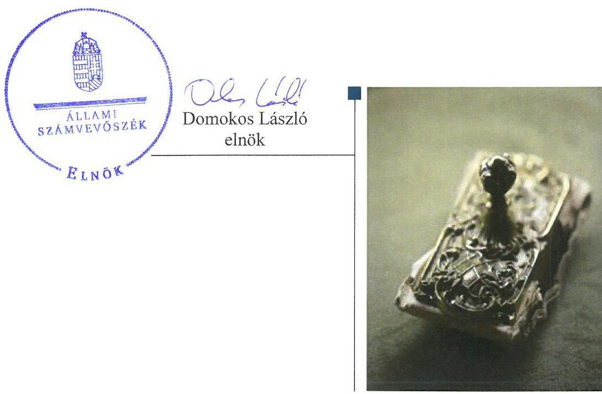
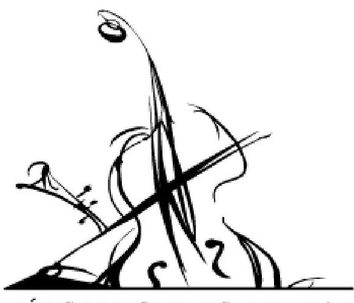
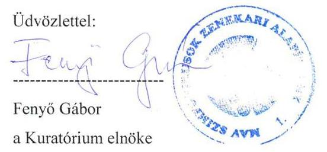
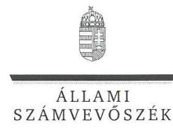
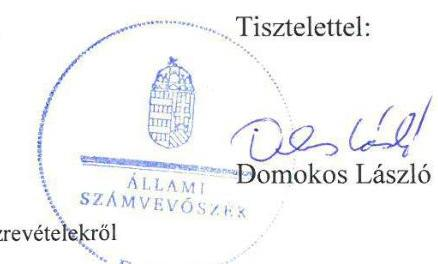

# Jelentés 

## Alapítványok ellenőrzése

Alapítványok/közalapítványok gazdálkodásának ellenőrzése MÁV Szimfonikusok Zenekari Alapítványa 2017.

---

# Jelentés 

## Alapítványok ellenőrzése

Alapítványok/közalapítványok gazdálkodásának ellenőrzése MÁV Szimfonikusok Zenekari Alapítványa 2017. 10. hó 03. nap

---

# AZ ELLENŐRZÉST FELÜGYELTE:

- **HOLMAN MAGDOLNA JULIANNA** felügyeleti vezető
- **AZ ELLENŐRZÉST VEZETTE ÉS A VÉGREHAJTÁSÁÉRT FELELŐS:**
  - **KEREKES PÉTER** ellenőrzésvezető
  - **A PROGRAM ÖSSZEÁLLÍTÁSÁÉRT FELELŐS:**
    - **JANIK JÓZSEF** osztályvezető

**IKTATÓSZÁM:** V-1273-096/2016

**TÉMASZÁM:** 2307

**ELLENŐRZÉS-AZONOSÍTÓ SZÁM:** V077502

Jelentéseink az Országgyűlés számítógépes hálózatán és az Interneta a www.asz.hu címen is olvashatóak.

---

# TARTALOMJEGYZÉK 

■ ÖSSZEGZÉS ..... 5
■ AZ ELLENŐRZÉS CÉLJA ..... 6
■ AZ ELLENŐRZÉS TERÜLETE ..... 7
■ AZ ELLENŐRZÉS HÁTTERE, INDOKOLTSÁGA ..... 9
■ A JELENTÉS LÉNYEGES KÉRDÉSKÖREI ..... 10
■ ELLENŐRZÉS HATÓKÖRE ÉS MÓDSZEREI ..... 11
■ MEGÁLLAPÍTÁSOK ..... 13
■ JAVASLATOK ..... 17
■ MELLÉKLETEK ..... 19
I. Sz. melléklet: Értelmező szótár ..... 19
■ FÜGGELÉK: ÉSZREVÉTELEK ..... 21
■ RÖVIDÍTÉSEK JEGYZÉKE ..... 31

---

.

---

# ÖSSZEGZÉS 

A budapesti székhelyű MÁV Szimfonikusok Zenekari Alapítványa gazdálkodásában nem biztosította az államháztartásból származó források elszámoltathatóságát és átláthatóságát.

## Az ellenőrzés társadalmi indokoltsága

Az Állami Számvevőszék az államháztartásból származó források felhasználásának keretében ellenőrzi az alapítványok, közalapítványok gazdálkodását. A jogszabályi felhatalmazás szerint azokat az alapítványokat, közalapítványokat ellenőrizheti, amelyek az államháztartásból nyújtott támogatásban vagy az államháztartásból meghatározott célra ingyenesen juttatott vagyonban részesültek. Ezekben az esetekben az érintett szervezetek gazdálkodási tevékenységének egésze ellenőrizhető.

Az ellenőrzések eredményeként tovább csökken a közpénzfelhasználás ellenőrizetlen területeinek száma. Az ÁSZ Stratégiájában rögzített célkitűzése, hogy az államháztartáson kívülre nyújtott költségvetési támogatások és az ingyenes vagyonjuttatás ellenőrzésével hozzájáruljon ahhoz, hogy a közpénzeket a civil szervezetek is átlátható módon használják fel.

## Főbb megállapítások, következtetések

A MÁV Szimfonikusok Zenekari Alapítványa gazdálkodásának belső szabályozottsága nem felelt meg a törvényi előírásoknak, mivel nem rendelkezett számviteli politikával, az annak keretében előírt szabályzatokkal, valamint számlarenddel. Éves költségvetési terveit nem a jogszabályi előírásokban előírt tagolásban és módon készítette el. Könyvvezetése nem felelt meg a jogszabályi előírásoknak, mivel a beruházások és ráfordítások elszámolása nem volt szabályszerű, valamint nem elkülönítetten számolta el az alaptevékenységhez és a vállalkozási tevékenységhez kapcsolódó költségeket. Az egyszerűsített éves beszámolóit leltárral nem támasztotta alá.

---

# AZ ELLENŐRZÉS CÉLJA 

Az ellenőrzés célja annak megállapítása, hogy az Alapítvány ${ }^{1}$ gazdálkodása során betartotta-e a vonatkozó jogszabályi előírásokat, szabályszerűen használta-e fel a kapott költségvetési támogatásokat, az államháztartásból meghatározott célra ingyenesen juttatott vagyon használata, hasznosítása szabályszerű volt-e, továbbá, hogy az alapítvány működését szolgáló ellenőrzési, monitoring és nyilvántartási rendszerek szabályszerűen múködtek-e.

---

# **AZ ELLENŐRZÉS TERÜLETE**

## **MÁV Szimfonikusok Zenekari Alapítványa**

**MÁV SZIMFONIKUS ZENEKAR MAV SYMPHONY ORCHESTRA**

Az Alapítványt a MÁV Magyar Államvasutak Zrt. alapította 1993-ban 3,0 millió Ft induló vagyonnal. Az alapító okirat^{2} módosítására egyszer került sor az ellenőrzött időszakban.

Az Alapítvány közhasznú kulturális tevékenységet folytat, hozzájárul az egyetemes magyar zenekultúra és kulturális örökség ápolásához, fejlesztéséhez, szakmai fejlődési lehetőséget nyújt a fiatal zenészeknek, általános zenei műveltséget fejlesztő ismeretterjesztő tevékenységet végez, nyitott hangversenyek rendezésével zenei kulturális igényeket elégít ki. Az ellenőrzött időszakban közhasznú szervezetként működött.

Mérleg szerinti vagyona a 2013. január 1-jei 188,6 millió Ft-ról 2015. december 31-re 204,9 millió Ft-ra nőtt. A saját tőkéje 2013-ban 148,2 millió Ft volt, amely 2015-re 125,0 millió Ft-ra csökkent. Összes bevétele a 2013. évi 427,1 millió Ft-ról 2015-re 491,1 millió Ft-ra nőtt. Adózott eredménye 2013-ban - 13 692 ezer Ft, 2015-ben 8 ezer Ft volt.

Az Alapítványnak az ellenőrzött időszakban juttatott támogatásokat az 1. táblázat mutatja be.

1. táblázat

|  KAPOTT TÁMOGATÁSOK (MILLIÓ FT) |  |  |  |   |
| --- | --- | --- | --- | --- |
|  **Támogató** | **2013.** | **2014.** | **2015.** | **Összesen**  |
|  Költségvetési törvény alapján | 74,0 | 114,4 | 124,9 | 313,3  |
|  Egyéb költségvetési forrásból | 38,7 | 17,3 | 5,7 | 61,7  |
|  Önkormányzatoktól | 10,0 | 9,0 | 9,0 | 28,0  |
|  MÁV-tól | 205,0 | 208,7 | 218,7 | 632,4  |
|  Egyéb forrásból | 21,1 | 20,8 | 41,5 | 83,4  |
|  **Összesen** | **348,8** | **370,2** | **399,8** | **1118,8**  |

*Forrás: MÁV Szimfonikusok Zenekari Alapítványa egyszerűsített éves beszámolói*

Az Alapítvány az ellenőrzött időszakban az államháztartásból meghatározott célra ingyenesen juttatott vagyont, illetve vagyoni hozzájárulást nem kapott. Harmadik fél részére a 2013-2015. években nem juttatott cél szerinti támogatást.

Az Alapítvány Budapest Főváros IV. kerülete, IX. kerülete és XV. kerülete Önkormányzataival közszolgáltatási szerződést kötött.

Alapító okirata alapján gazdasági vállalkozási tevékenység végzésére jogosult volt. A gazdasági-vállalkozási tevékenység keretében helyiségek és eszközök bérbeadásából, kölcsönzéséből, valamint CD értékesítésből származott bevétele. Befektetési tevékenységet nem végzett. Az ellenőrzött időszakban mentesült az egyszerűsített éves beszámolói könyvvizsgálóval történő felülvizsgálatának kötelezettsége alól. Az önköltségszámítás rendjére vonatkozó belső szabályzat készítésére vonatkozó kötelezettség alól a

---

Számv. tv. ${ }^{3}$ 14. § (6) bekezdése alapján mentesült, mivel egyszerűsített éves beszámolót készített.

Az Alapítvány a Kbt. ${ }^{4}$ 6. § (1) bekezdés c) pontja szerinti kritériumok alapján az ellenőrzött időszakban a Kbt. alanyi hatálya alá tartozott.

Az Alapítvány által foglalkoztatottak létszáma 2015-ben 108 fő volt, amelyből a művészi munkakörben foglalkoztatottak száma 98 fő volt.

---

# AZ ELLENŐRZÉS HÁTTERE, INDOKOLTSÁGA 

Társadalmi elvárás a közpénzek értékelvű, rendeltetésszerű felhasználása, a közpénzekből nyújtott támogatások átláthatóságának megteremtése, amelyhez az Állami Számvevőszék az államháztartásból nyújtott támogatások ellenőrzésével kíván hozzájárulni. Az ÁSZ ${ }^{5}$ Stratégiájában rögzített célkitűzése, hogy az államháztartáson kívülre nyújtott költségvetési támogatások és az ingyenes vagyonjuttatás ellenőrzésével hozzájáruljon ahhoz, hogy a közpénzeket a civil szervezetek is átlátható módon használják fel. Továbbá az alapítványok/közalapítványok gazdálkodása szabályszerűségének bemutatásával hozzájárul ahhoz, hogy a társadalom objektív képet alkothasson az alapítványok, a közalapítványok működéséről. Az ellenőrzés eredményeinek célzott felhasználói a nyilvánosság, a jogalkotó, továbbá az alapítványok/közalapítványok alapítói és szervei. Az ellenőrzés eredményeképp a törvényalkotás számára tapasztalatok állnak rendelkezésre az alapítványok/közalapítványok gazdálkodása szabályozásához. Az ellenőrzött szervezetek szintjén gazdálkodásuk vonatkozásában a hiányosságok, szabálytalanságok feltárása, az ennek kapcsán megfogalmazott megállapítások elősegíthetik az alapítványok/közalapítványok szabályszerű gazdálkodását, míg a társadalom számára információt szolgáltat arról, hogy az alapítványok/közalapítványok a közpénzeket szabályszerűen használták-e fel. Az alapítványok/közalapítványok gazdálkodása szabályszerűségének bemutatásával az ellenőrzés értékteremtő módon járul hozzá az ÁSZ stratégiai céljainak megvalósításához, a nyilvánosság megfelelő tájékoztatásához.

---

# A JELENTÉS LÉNYEGES KÉRDÉSKÖREI 

1.- Az Alapítvány gazdálkodása szabályszerű volt-e?
2.- Az Alapítvány szabályszerűen tartotta-e nyilván és számolta-e el a kapott támogatásokat?
3.- Az Alapítvány müködéséhez kapcsolódó ellenőrzések betöltött-ék-e a szerepüket?

---

# ELLENŐRZÉS HATÓKÖRE ÉS MÓDSZEREI 

## Az ellenőrzés típusa

Szabályszerúségi ellenőrzés.

## Az ellenőrzött időszak

A 2013. január 1-je és 2015. december 31-e közötti évek. Amennyiben az ellenőrzött időszakon belül történt támogatás felhasználás, azonban annak elszámolására 2015. évet követően került sor, az elszámolást - tekintettel arra, hogy az az ellenőrzött időszakra vonatkozik - is ellenőrizte az ÁSZ.

## Az ellenőrzés tárgya

Az ellenőrzés tárgya az Alapítvány vonatkozó jogszabályi előírások szerinti gazdálkodási tevékenysége volt. Ezen belül az Alapítvány gazdálkodásához kapcsolódó szervezeti és szabályozási keretek a jogszabályi előírásoknak megfelelő kialakítása, a kapott költségvetési/egyéb támogatások szabályszerű felhasználására irányuló tevékenysége. Az ellenőrzés kiterjedt továbbá az Alapítvány múködését, gazdálkodását szolgáló nyilvántartási, ellenőrzési, monitoring tevékenységére.

Az ellenőrzés kiterjedt minden olyan körülményre és adatra, amely az ÁSZ jogszabályban meghatározott feladatainak teljesítéséhez, valamint a program végrehajtása folyamán felmerült újabb összefüggések feltárásához volt szükséges.

## Az ellenőrzött szervezet

MÁV Szimfonikusok Zenekari Alapítványa

## Az ellenőrzés jogalapja

Az ÁSZ tv. ${ }^{6}$ 1. § (3) bekezdése, 5. § (3) bekezdése, továbbá az Ectv. ${ }^{7}$ 47. §-a.

## Az ellenőrzés módszerei

Az ellenőrzést az ellenőrzési program szempontjai, az adott időszakban hatályos jogszabályok, az ellenőrzés szakmai szabályok és módszertanok, valamint a nemzetközi standardok figyelembevételével végezte az ÁSZ.

---

A közpénzekkel való felelős gazdálkodás segítésére irányuló javaslatok kidolgozásakor a hatályos jogszabályok voltak az irányadóak.

Az ellenőrzés ideje alatt az ÁSZ az ellenőrzött szervezettel történő kapcsolattartást az ÁSZ SZMSZ ${ }^{\text {® }}$-ének vonatkozó előírásai alapján biztosította.

Az ellenőrzési kérdések megválaszolásához szükséges bizonyítékok meg-szerzése az ellenőrzött által rendelkezésre bocsátott dokumentumokra, adatokra alapozva megfigyelés, szemle (szemrevételezés), kérdésfeltevés (információkérés), valamint elemző eljárás útján történt.

Az ellenőrzési bizonyítékként felhasznált adatforrások közé tartoztak egyrészt a szakmai program részletes szempontjainál felsorolt adatforrások, másrészt minden - az ellenőrzés folyamán feltárt, az ellenőrzés szempontjából információt tartalmazó - dokumentum.

Az ellenőrzés lefolytatásához az Alapítvány a kitöltött tanúsítványok, valamint az ÁSZ által kért dokumentumok elektronikus úton való megküldésével szolgáltatott adatokat, információkat. Az így rendelkezésre bocsátott adatok, információk és a tanúsítványok adatai valódiságának kontrollja az ellenőrzés keretében történt.

---

# 1. Az Alapítvány gazdálkodása szabályszerű volt-e? 

## Összegző megállapítás

### 1.1. számú megállapítás

Az Alapítvány gazdálkodása nem volt szabályszerű, mivel nem rendelkezett a gazdálkodására belső szabályozással, valamint a költségvetési tervei, a könyvvezetése és az egyszerűsített éves beszámolói nem feleltek meg a jogszabályi előírásoknak.

Az Alapítvány a gazdálkodásának szervezeti kereteit összességében a jogszabályokban előírtaknak megfelelően alakította ki.

Az Alapítvány rendelkezett szabályszerű alapító okirattal, amely tartalmazta 2014. december 4-ig a Ptk. ${ }^{9}$-ben, majd 2014. december 5-től a Ptk. ${ }^{10}$-ben előírt formai elemeket.

Az alapító okirat a Ptk. ${ }_{1}$-ben és Ptk. ${ }_{2}$-ben előírtaknak megfelelően kijelölte a 2014. december 4-ig hattagú, 2014. december 5-től héttagú Kuratórium ${ }^{11}$ tagjait, valamint a háromtagú $\mathrm{FB}^{12}$ tagjait. Ugyancsak kijelölte az ügyvezető igazgatót, aki a Kuratórium által meghatározott hatáskörben irányítja a zenekar múködését, és a zenekar múködésével kapcsolatban az Alapítvány önálló képviseletére jogosult.

Az Alapítvány rendelkezett szabályszerűen kiadmányozott SZMSZ ${ }^{13}$ szel, amely tartalmazta az Alapítvány szerveinek döntési jogköreit és múködési szabályait. 2014. december 5-ig azonban nem volt összhangban az alapító okirattal, mert a Kuratórium létszámát az alapító okirat 10. pontjában előírtak ellenére 7 főben határozta meg.

Az Alapítvány nem rendelkezett a gazdálkodására és az adatkezelésére a törvényekben előírt belső szabályozással.

Az Alapítvány nem rendelkezett a Számv. tv. 14. § (3) bekezdésében előírt számviteli politikával, a Számv. tv. 161. § (1) bekezdésében előírt számlarenddel, a Számv. tv. 14. § (5) bekezdés a) pontjában előírt leltárkészítési és leltározási szabályzattal, a b) pontjában előírt értékelési szabályzattal és a d) pontjában előírt pénzkezelési szabályzattal.

Az Alapítvány az Info. tv. ${ }^{14}$ 7. § (2) bekezdésében előírtak ellenére nem alakította ki azokat az eljárási szabályokat, amelyek a természetes személy adataira vonatkozó szabályok érvényre juttatásához szükségesek,kockáztatva ezzel a személyes adatok jogellenes felhasználásának lehetőségét. Az Info. tv. 35. § (3) bekezdésében előírtak ellenére az Info. tv. 35. § (1) bekezdés szerinti közzétételi listákon szereplő adatok közzétételére vonatkozó kötelezettség teljesítésének részletes szabályait belső szabályzatban nem határozta meg.

---

### 1.3. számú megállapítás

Az Alapítvány költségvetési tervei nem feleltek meg a jogszabályi előírásoknak.

Az Alapítvány a 2013-2015. években rendelkezett a Kuratórium által jóváhagyott költségvetési tervekkel. A költségvetési terveket azonban az Ecvhr. ${ }^{15}$ 3. § (1) bekezdésében előírtak ellenére nem a 224/2000. (XII. 19.) Korm. rendelet ${ }^{16}$ alapján készített egyszerűsített éves beszámoló tartalmi elemeinek megfelelően készítették el, mivel a 224/2000. (XII. 19.) Korm. rendelet 6. § (6) és a 8. § (9) bekezdése ellenére nem különítették el az alaptevékenységgel, illetve a vállalkozási tevékenységgel kapcsolatos tervezett bevételeket, illetve ráfordításokat.

Az éves költségvetési tervekben az Ecvhr. 3. § (2) bekezdésében előírtak ellenére a kiadásokat és a bevételeket nem egyensúlyban tervezték meg. 2013-ban 11,0 millió Ft-tal, 2014-ben 26,8 millió Ft-tal és 2015-ban 18,8 millió Ft-tal haladták meg a tervezett kiadások a tervezett bevételeket.

### 1.4. számú megállapítás

Az Alapítvány könyvvezetése, a beruházások és ráfordítások elszámolása nem volt szabályszerű.

Az Alapítvány a könyvvezetése során nem biztosította a 224/2000. (XII. 19.) Korm. rendelet 8. § (9) bekezdésében előírt elkülönített nyilvántartást az alaptevékenységgel és a vállalkozási tevékenységekkel kapcsolatban felmerült kiadásokról.

Az Alapítvány beruházásaira fordított összegek felhasználása, kifizetése és elszámolása nem volt szabályszerű az alábbi hiányosságok miatt:
$\longrightarrow$ a beruházásokról a Kuratórium - az alapító okirat 7. és 10.4. pontjaiban, valamint az SZMSZ V.1.3. a) pontjában előírtak ellenére - nem döntött.
$\longrightarrow$ a tárgyi eszközök üzembe helyezését a Számv. tv. 52. § (2) bekezdésében előírtak ellenére hitelt érdemlő módon nem dokumentálták, valamint az értékcsökkenést nem a rendeltetésszerű használatbavételtől, az üzembe helyezéstől kezdődően számolták el, hanem a szállítók számláin feltüntetett teljesítési naptól.
$\longrightarrow$ a könyvviteli elszámolást közvetlenül alátámasztó bizonylatok a Számv. tv. 167. § (1) bekezdés c) pontjában előírtak ellenére nem tartalmazták sem annak a személynek, sem annak a szervezetnek a megjelölését, amely a gazdasági múveletet elrendelte, valamint az utalványozó és a rendelkezés végrehajtását igazoló személy aláírását.
$\longrightarrow$ az Alapítvány által befogadott idegen nyelvű számlákon belső szabályzat hiányában nem tüntették fel magyarul a Számv. tv. 166. § (4) bekezdésében előírt , a bizonylatok hitelességéhez, a megbízható, a valóságnak megfelelő adatrögzítéshez, könyveléshez szükséges adatokat a könyvviteli nyilvántartásokban történő rögzítést megelőzően.
A ráfordítások elszámolása nem volt szabályszerű, mivel a belső gazdálkodási szabályzatok hiánya miatt nem volt meghatározva az Alapítványnál, hogy ki jogosult a gazdasági múveletek elrendelésére, a rendelkezések végrehajtásának igazolására és az utalványozásra. Ebből következőleg a ráfordítások elszámolása során a számviteli bizonylatok nem feleltek meg a

---

Számv. tv. 167. § (1) bekezdés c) pontjában előírt tartalmi követelményeknek.

2014-ben és 2015-ben a Számv. tv. 165. § (2) bekezdésben előírtak ellenére bizonylat nélkül, szabálytalanul mutattak ki passzív időbeli elhatárolásként bérleti és üzemeltetési díjat 12 millió Ft illetve 17 millió Ft értékben.

A pénzeszközeiket, az alapító okirat 7. pontjában és a 10.4. pontjában előírtak ellenére, a Kuratórium előzetes döntése nélkül kötötték le bankbetétben 2013-ban115,0 millió Ft, 2014-ben 258,0 millió Ft, 2015-ben 50,0 millió Ft értékben.

# 1.5. számú megállapítás 

Az Alapítvány egyszerűsített éves beszámolói nem feleltek meg a jogszabályi előírásoknak.

Az Alapítvány múködéséről, vagyoni, pénzügyi és jövedelmi helyzetéről az üzleti év könyveinek zárását követően kettős könyvvitellel alátámasztott egyszerűsített éves beszámolót, valamint közhasznúsági jelentést készített, amely formáját tekintve megfelelt a 224/2000. (XII. 19.) Korm. rendeletben számára előírtaknak. Ugyanakkor az egyszerűsített éves beszámolói nem feleltek meg a Számv. tv. 15. § (3) bekezdésben előírt valódiság elvének, mivel a könyvviteli mérleg tételeit a Számv. tv. 69. § (1) bekezdésében előírtak ellenére leltárral nem támasztotta alá, valamint a 2014-2015. évek beszámolóiban a passzív időbeli elhatárolások között olyan bizonylatok alapján rögzített adatokat, amelyek nem feleltek meg a Számv. tv. 165. § (2) bekezdésében előírtaknak.

Az ellenőrzött időszakra vonatkozó egyszerűsített éves beszámolóit és a közhasznúsági mellékleteket az Ectv.-ben előírtaknak megfelelően határidőre letétbe helyezte és közzétette a jogszabályi előírások szerinti formában.

Az Alapítvány az Info. tv.-ben előírtak szerint az Info. tv. 1. mellékletében meghatározott közérdekú adatokat honlapján nyilvánosságra hozta.

## 2. Az Alapítvány szabályszerűen tartotta-e nyilván és számolta-e el a kapott támogatásokat?

Összegző megállapítás

Az Alapítvány nem tett eleget a költségvetési támogatások felhasználásának nyilvántartására vonatkozó jogszabályi kötelezettségének. A kapott támogatásokkal a támogatást nyújtók felé határidőben elszámolt.

Az Alapítvány a 224/2000. (XII. 19.) Korm. rendelet 17. § (8) bekezdésében foglaltak ellenére nem rendelkezett olyan nyilvántartási rendszerrel, hogy abból a közpénzek felhasználásával, átláthatóbbá tételével kapcsolatos információk rendelkezésre álljanak. 2015. november 28-tól az Ectv. 20. § (4) bekezdésében előírtak ellenére az alapcél szerinti tevékenysége költségei, ráfordításai ellentételezésére kapott támogatásokról nem vezetett olyan elkülönített számviteli nyilvántartást, amelynek alapján támogatásonként megállapítható és ellenőrizhető a kapott támogatás felhasználása.

---

Az Alapítvány a költségvetési támogatásokkal és az alapítótól kapott támogatásokkal határidőben elszámolt a támogatók felé, a pénzügyi elszámolásokkal kapcsolatos intézkedéseket határidőre megtette.

# 3. Az Alapítvány múködéséhez kapcsolódó ellenőrzések betöltött- 

ték-e a szerepüket?

## Összegző megállapítás

Az Alapítvány Felügyelőbizottsága nem töltötte be a szerepét. Az Alapítvány a külső ellenőrzés megállapításaira intézkedett.
3.1. számú megállapítás

Az FB-nek a gazdálkodáshoz kapcsolódó ellenőrzési feladatellátása sem a jogszabályokban, sem az alapító okiratban előírtaknak nem felelt meg.

Az FB jogait és kötelezettségeit az Ectv.-ben és a Ptk. 2 -ben előírtak szerint határozta meg az Alapítvány alapító okirata és SZMSZ-e. Az FB az Ectv. 40. § (2) bekezdésében és az alapító okirat 11. pontjában előírtak ellenére ügyrenddel az ellenőrzött években nem rendelkezett.

Az FB az alapító okirat 11.3. pontjában előírtak ellenére a 2013-2014. években nem múködött. 2015-ben megvizsgálta az Alapítvány 2014. évi egyszerűsített éves beszámolóját, és annak ellenére elfogadásra javasolta, hogy a beszámoló nem felelt meg a jogszabályi előírásoknak.
3.2. számú megállapítás

Az Alapítvány a külső ellenőrzés megállapításaira intézkedett.
Az Alapítványnál 2014. augusztusban Budapest Főváros Kormányhivatala végzett ellenőrzést. Az Alapítvány intézkedési tervet készített az ellenőrzés során feltárt hiányosságokkal kapcsolatban.

---

# JAVASLATOK 

Az ÁSZ tv. 33. § (1) bekezdésében foglaltak értelmében az ellenőrzött szervezet vezetője köteles a jelentésben foglalt megállapításokhoz kapcsolódó intézkedési tervet összeállítani és azt a jelentés kézhezvételétől számított 30 napon belül az ÁSZ részére megküldeni. Amennyiben az ellenőrzött szervezet vezetője nem küldi meg határidőben az intézkedési tervet, vagy továbbra sem elfogadható intézkedési tervet küld, az Állami Számvevőszék elnöke az ÁSZ tv. 33. § (3) bekezdése a) és b) pontjaiban foglaltakat érvényesítheti.

## A MÁV Szimfonikusok Zenekari Alapítványa Kuratóriuma elnökének

1. Intézkedjen, hogy az Alapítvány rendelkezzen a Számv. tv. által elöirt számviteli politikával, számlarenddel, illetve a számviteli politika keretében elkészítendő - leltárkészittési és leltározási; értékelési; valamint pénzkezelési - szabályzatokkal.
(1.2. sz. megállapítás 1. bekezdése alapján)
2. Intézkedjen az Info tv.-ben elöirtak érvényre juttatásához szükséges eljárási szabályok belső szabályzatban való meghatározására.
(1.2. sz. megállapítás 2. bekezdése alapján)
3. Intézkedjen a könyvvezetése és költségvetési terv készítése során a jogszabályban meghatározott, elkülönített kimutatásról az alap- és vállalkozási tevékenységgel kapcsolatos bevételek, ráfordítások, kiadások tekintetében.
(1.3. sz. megállapítás 1. bekezdése és az 1.4. sz. megállapítás 1. bekezdése alapján)
4. Intézkedjen a beruházásokra fordított összegek felhasználása, kifizetése és elszámolása során a Számv. tv., az alapító okirat és az SZMSZben foglalt elöírások betartására.
(1.4. sz. megállapítás 2. bekezdése alapján)
5. Intézkedjen, hogy az egyszerüsített éves beszámoló mérlegét a Számv. tv. által elöirt leltár támassza alá.
(1.5. sz. megállapítás 1. bekezdése alapján)
6. Intézkedjen a jogszabályoknak megfelelő, olyan nyilvántartási rendszer kialakításáról, amely biztositja a közpénzek felhasználásával kapcsolatos információk rendelkezésre állását.
(2. sz. megállapítás 1. bekezdése alapján)

---

.

---

# MELLÉKLETEK 

## I. SZ. MELLÉKLET: ÉRTELMEZŐ SZÓTÁR

alapító
alapítvány
adomány
államháztartás
államháztartás
áldamháztartás
származó for-
rás
beruházás
civil szervezet

Felügyelőbizottság
felújítás

Az alapítványt, mint jogi személyt az alapító okiratban meghatározott tartós cél folyamatos megvalósítására létrehozó, az alapítvány részére az alapító okiratban meghatározott, az alapítványi cél megvalósításához szükséges pénzbeli és nem pénzbeli vagyoni hozzájárulást teljesítő személy(ek)/jogi személy(ek).
Az alapítvány az alapító által az alapító okiratban meghatározott tartós cél folyamatos megvalósítására létrehozott jogi személy. Az alapítvány a bírósági nyilvántartásba vételével jön létre. Az alapító az alapító okiratban meghatározza az alapítványnak juttatott vagyont és az alapítvány szervezetét. Alapítvány nem alapítható gazdasági-vállalkozási tevékenység folytatására. Az alapítvány az alapítványi cél megvalósításával közvetlenül összefüggő gazdasági tevékenység végzésére jogosult. Alapítvány nem lehet korlátlan felelősségű tagja más jogalanynak, nem létesíthet alapítványt és nem csatlakozhat alapítványhoz.
Az a pénzbeli vagy természetbeni juttatás, amelyet az adományozó az adományozott civil szervezet alapcéljának, illetve közhasznú céljának elérésére ellenszolgáltatás nélkül juttat. A közhasznú szervezet részére törvényben meghatározott közhasznú tevékenysége támogatására, továbbá a közérdekű kötelezettségvállalás céljára az adóévben visszafizetési kötelezettség nélkül adott támogatás, juttatás, térítés nélkül átadott eszköz könyv szerinti értéke, térítés nélkül nyújtott szolgáltatás bekerülési értéke, feltéve hogy az nem jelent az e törvényben meghatározottakon túl vagyoni előnyt az adományozónak, az adományozó tagjának vagy részvényesének, vezető tisztségviselőjének, felügyelőbizottsága vagy igazgatósága tagjának, könyvvizsgálójának, illetve ezen személyek vagy a természetes személy tag vagy részvényes közeli hozzátartozójának azzal, hogy nem minősül vagyoni előnynek az adományozó nevére, tevékenységére történő utalás.
Az államháztartás a közfeladatok ellátásának egységes szervezeti, tervezési, gazdálkodási, ellenőrzési, finanszírozási, adatszolgáltatási és beszámolási szabályok szerint működő rendszere, amely központi és önkormányzati alrendszerből áll.
Az államháztartás központi alrendszerébe tartozik az állam, a központi költségvetési szerv, a törvény által az államháztartás központi alrendszerébe sorolt köztestület, és ezen köztestület által irányított köztestületi költségvetési szerv.
Az államháztartás önkormányzati alrendszerébe tartozik a helyi önkormányzat, a helyi nemzetiségi önkormányzat és az országos nemzetiségi önkormányzat által létrehozott társulás, valamint a területfejlesztési önkormányzati társulás, a térségi fejlesztési tanács, és a megnevezett szervezetek által irányított költségvetési szerv.
Az államháztartás központi és önkormányzati alrendszeréből származó forrás

A tárgyi eszköz beszerzése, létesítése, saját vállalkozásban történő előállítása, a beszerzett tárgyi eszköz üzembe helyezése. A beruházás a meglévő tárgyi eszköz bővítését, rendeltetésének megváltoztatását, átalakítását, élettartamának, teljesítőképességének közvetlen növelését eredményező tevékenység.
A civil társaság; a Magyarországon nyilvántartásba vett egyesület - a párt, a szakszervezet és a kölcsönös biztosító egyesület kivételével és - a közalapítvány és a pártalapítvány kivételével - az alapítvány.
Az alapítók a létesítő okiratban három tagból álló felügyelőbizottságot hozhatnak létre, azzal a feladattal, hogy az ügyvezetést a jogi személy érdekeinek megóvása céljából ellenőrizze.
Az elhasználódott tárgyi eszköz eredeti állaga (kapacitása, pontossága) helyreállítását szolgáló időszakonként visszatérő olyan tevékenység, melynek során az eszköz élettartama

---

gazdálkodó tevékenység
gazdasági-vállalkozási tevékenység
költségvetési támogatás
közhasznú tevékenység
vagyoni hozzájárulás
megnövekszik, minősége, használata jelentősen javul, így a pótlólagos ráfordításból a jövőben gazdasági előnyök származnak.
azon tevékenységek összessége, amelyek a civil szervezet vagyoni, pénzügyi, jövedelmi helyzetére kiható gazdasági eseményt eredményeznek.
A jövedelem- és vagyonszerzésre irányuló vagy azt eredményező, üzletszerűen végzett gazdasági tevékenység, kivéve az adomány (ajándék) elfogadását, a létesítő okiratban meghatározott cél szerinti tevékenységet (ideértve a közhasznú tevékenységet is), - 2015. november 28-tól - a pénzeszközök betétbe, értékpapírba, társasági részesedésbe történő elhelyezését és az ingatlan megszerzését, használatának átengedését és átruházását.
Az államháztartás alrendszerei terhére nyújtott pénzbeli vagy nem pénzbeli juttatás, amelyet a támogató nem elsősorban ellenszolgáltatás ellenében, de konkrét program megvalósítása vagy meghatározott időszakban a támogatott szervezet működtetése érdekében nyújt. Költségvetési támogatás különösen: a pályázat útján, valamint egyedi döntéssel kapott költségvetési támogatás; az Európai Unió strukturális alapjaiból, illetve a Kohéziós Alapból származó, a költségvetésből juttatott támogatás; az Európai Unió költségvetéséből vagy más államtól, nemzetközi szervezettől származó támogatás és a személyi jövedelemadó meghatározott részének az adózó rendelkezése szerint felajánlott összege.
Minden olyan tevékenység, amely a létesítő okiratban megjelölt közfeladat teljesítését közvetlenül vagy közvetve szolgálja, ezzel hozzájárulva a társadalom és az egyén közös szükségleteinek kielégítéséhez.
Az alapítvány alapítója által az alapításkor az alapítvány részére teljesítendő olyan hozzájárulás, amelynek értékét nem lehet visszakövetelni. Az alapító által az alapítvány rendelkezésére bocsátott vagyon pénzből és nem pénzbeli vagyoni hozzájárulásból állhat. Az alapítónak legalább az alapítvány múködésének megkezdéséhez szükséges vagyont a nyilván-tartásba-vételi kérelem benyújtásáig át kell ruháznia az alapítványra. Az alapítónak a teljes juttatott vagyont legkésőbb az alapítvány nyilvántartásba vételétől számított egy éven belül kell átruháznia az alapítványra.

---

# FÜGGELÉK: ÉSZREVÉTELEK 

A jelentéstervezetet a Számvevőszék 15 napos észrevételezésre megküldte az ellenőrzött szervezet vezetőjének az ÁSZ tv. 29. §* (1) bekezdése előírásának megfelelően.
A függelék tartalmazza az ellenőrzött észrevételeit, illetve az el nem fogadott észrevételek elutasításának indoklását.

- A MÁV Szimfonikusok Zenekari Alapítványa kuratóriumi elnökének a V-1273-092/2016. iktatószámon nyilvántartásba vett levele észrevételekkel
- Tájékoztatás az el nem fogadott észrevételekről (V-1273-093/2016.)

## * 29. § (1) Az Állami Számvevőszék az ellenőrzési megállapításait megküldi az ellenőrzött szervezet vezetőjének vagy az általa megbízott személynek, és annak, akinek személyes felelősségét állapította meg.

(2) Az ellenőrzött szervezet vezetője és a felelősként megjelölt személy az ellenőrzés megállapításaira tizenöt napon belül írásban észrevételt tehet.
(3) Az Állami Számvevőszék az észrevételre a beérkezésétől számított harminc napon belül írásban válaszol. A figyelembe nem vett észrevételeket köteles a jelentésben feltüntetni, és megindokolni, hogy azokat miért nem fogadta el.

---

# 1232 

## MAY SYMPHONY ORCHESTRA FOUNDATION   Székhely: 1087 Budapest, Kerepesi út 1-5. Levelezési cím: 1088 Budapest, Múzeum u. 11. Telefon: (+36 1) 338-2664; Fax./Tel.: (+36 1) 338-4085; E-mail: office@mavzenekar.hu

## Állami Számvevőszék

Domokos László
elnök úr
részére

Hivatkozási szám: V-1273-077/2016
Tárgy: észrevétel jelentéstervezetre

Tisztelt Elnök Úr!

A 2017. július 18-i levélben megküldött jelentéstervezetre az alábbi észrevételeket tesszük:

## 1. Észrevétel az 1. számú Összegzö megállapításra

Álláspontunk szerint a megállapítás úgy helytálló, hogy az „Alapítvány gazdálkodása kisebb hiányosságokkal szabályszerü". Ennek indoklását a további észrevételek tartalmazzák.

### 1.2. Észrevétel az 1.2. számú megállapításra

A vállalkozás rendelkezik a Számviteli törvényben (továbbiakban Sztv) előírt szabályzatokkal, (melyeket az ellenőrzés rendelkezésére is bocsájtott), formai hibaként megállapítható a Kuratórium jóváhagyásának hiánya.

### 1.3. Észrevétel az 1.3. számú megállapításra

A 224/2000 (XII.19) Kormány rendelet 8.§ (9) bekezdése a könyvvezetésre és nem a tervezésre írja elő az alap- és vállalkozási tevékenység elkülönítését.

E pont második bekezdésével kapcsolatos észrevételünk, hogy a terveket a valóságnak megfelelően, a realitást figyelembe véve terveztük. A veszteség tervezésével tudjuk felhívni az

---

Alapító és más támogatók figyelmét a forráshiányra. Emellett bizonyos kiadások nem rugalmasak (pl. személyi ráfordítás, értékcsökkenés), melyek akkor is felmerülnek, ha a bevételek növelését nem tudja az alapítvány a kívánt mértékben biztosítani.

# 1.4. Észrevétel az 1.4. számú megállapításra 

- Nem értelmezhető az ismételt hivatkozás az 1.3 számú megállításban már szereplő 224/2000 (XII.19) Kormány rendelet 8.§ (9) bekezdésre
- A beruházások esetében kis szervezet lévén (befektetett eszközök a 2015. évi beszámolóban mindössze 20 M Ft ), - a beszerzések engedélyezésén túlmenően - nem tartottuk szükségesnek az további bonyolult adminisztráció folytatását, hisz annak olyan személyi és tárgyi feltételei lennének, melyek az amúgy is deficites gazdálkodást tovább növelték volna.
- Ehhez kapcsolódik, hogy igenis életszerű (és a Sztv sem tiltja azt), hogy a beszerzett eszközöket a tényállásszerű teljesítéssel egyidejűleg (a szállítói számlán szereplő teljesítési napon) használatba vegyük, hiszen szükös anyagi lehetőségeink miatt új eszköz beszerzése a müködés folyamatos biztosítása érdekében szükséges.
- Az idegen nyelvű számlákkal kapcsolatosan

Az általános forgalmi adóról szóló 2007. évi CXXVII. törvény 178. § szerint:
(2) Számla magyar nyelven vagy élő idegen nyelven egyaránt kiállítható. E rendelkezés alkalmazásától az (1) bekezdésben említett esetben sem lehet eltérni.
(3) Idegen nyelven kiállított számla esetében az adóigazgatási eljárás keretében lefolytatott ellenőrzés során a számla kibocsátójától megkövetelhető, hogy saját költségére gondoskodjon a hiteles magyar nyelvű fordításról, feltéve, hogy a tényállás tisztázása másként nem lehetséges.
Az adózás rendjéről 2003. évi XCII. törvény 95. § szerint:
(2) Amennyiben az ellenőrzés lefolytatásához szükséges számla (egyszerűsített számla), illetőleg bizonylat, továbbá a számlában (egyszerűsített számlában) vagy bizonylaton szereplő gazdasági eseményt alátámasztó szerződés vagy más dokumentum idegen nyelven - ide nem értve az angol, német és francia nyelvű iratokat - áll rendelkezésre, és az adójogi tényállás tisztázása másként nem lehetséges, az adózó köteles felhívásra annak a számla (egyszerűsített számla), illetve bizonylat hiteles magyar nyelvű fordítását, a számlában vagy bizonylaton szereplő gazdasági eseményt alátámasztó szerződés vagy más dokumentum szakfordítását az adóhatóság részére átadni."

---

Tehát az adózással kapcsolatos anyagi jogi és eljárási szabályok megengedik az idegen nyelvű bizonylatokat, a fökönyvi kartonokon pedig az Sztv előírásainak megfelelően minden esetben szerepelt a számlázott tétel magyarul.

- Alapítványunknál a gazdasági műveletek elrendelése úgy történik, hogy még az ajánlatkérés fázisában, - a megrendelést megelőzően - az ügyvezető engedélyezi a beszerzést. Az átutalás elrendelésének feltétele a gazdasági vezető aláírása, illetve az online bankfelületen 2 aláíró szükséges a pénz elindításához, melyek közül az egyik biztosan vagy az ügyvezető, vagy a gazdasági vezető.
- A vizsgált időszakban a passzív időbeli elhatárolások között kimutatott bérleti díj és üzemeltetési költség rögzítésére az Sztv azon alapelvére való tekintettel került sor, miszerint a könyveknek/beszámolónak megbízható és valós képet kell mutatnia a gazdálkodó pénzügyi-vagyoni helyzetéről. Ezen elvnek - és természetes az Alapító és egyéb gazdasági szereplők valósághủ tájékoztatása - érdekében határoztuk meg és rögzítettük a könyvekben a fenti 2 tételt piaci értéken.

# 1.5. Észrevétel az 1.5. számú megállapításra 

- befektetett eszközök főkönyvvel, beszámolóval egyező analitikus nyilvántartása az Ellenőrzés rendelkezésére lett bocsájtva, éppúgy, mint a vevő-szállító analitika.
- az Alapítvány készletekkel nem rendelkezik
- a pénzeszközök alátámasztását bankszámla kivonat illetve az év végi pénztárjelentés biztosítja.
- fentieken kívüli eszköz-forrás elemek esetén a fökönyvi kartonok támasztják alá a beszámolóban feltüntetett tételeket.
Mindezek tükrében a beszámoló minden sora megfelelően bizonylattal alátámasztott, azzal az ÁSZ által kifogásolt hiányossággal, hogy ezen bizonylatokon nem került feltüntetésre, hogy „Leltár".

## 2. Észrevétel a 2. számú Összegzö megállapításra

A kapott támogatások felhasználásáról az Alapítvány rendelkezik a 224/2000 (XII.19) Kormány rendelet 17.§ (8) szerinti olyan (analitikus) nyilvántartással, melyből a költségvetési támogatás felhasználása pontosan látható, és ellenőrizhető.
Ezen nyilvántartások alapján került elfogadásra minden évben a IX. kerület Ferencvárosi Önkormányzat által a kapott költségvetési támogatásról szóló elszámolás.

---

A MÁV csoporttól kapott támogatással az Alapítvány minden tárgyévet követően elszámolt az Alapító okiratban előírtak szerint.
Megjegyzés: az Sztv szerint az analitikus nyilvántartás is számviteli nyilvántartásnak minösül!

# 3. Észrevétel a 3. számú Összegzö megállapításra: 

A Felügyelő Bizottság (továbbiakban FB) az Alapító Okirat 11. pontjában előírtak szerint végezte a tevékenységét azzal, hogy az FB tagjai a 2013. évben lemondtak a tagságukról, részben más irányú elfoglaltságuk, részben - figyelemmel az Alapító Okirat 11.3. pontjában foglalt kizáró feltételre - munkaviszony megszünése miatt. Az Alapító ennek megfelelően új tagokat jelölt, melyet 2014-ben bejelentett a Fővárosi Bíróság felé. Többszöri hiánypótlás után a Fővárosi Ítélőtábla 2015. február 5-én jóváhagyta a változást (mellékelten csatoljuk).
Ezt követően alakulhatott meg az új FB, aki az előzetes egyeztetések és adatbekérések után 2015.05.06-án tartotta meg az első ülését, amely alkalommal az Ügyrendje is elfogadásra került. Az Ügyrend a vizsgálat során nem kerül bekérésre (mellékelten csatoljuk).
A 2014. évi beszámolónak az FB általi elfogadásával kapcsolatban megjegyezzük, hogy a beszámoló formailag megfelelt a jogszabályi előírásoknak, ahogyan a Jelentés 1.5. pontja is tartalmazza. Az FB nem könyvvizsgálói tevékenységet lát el, nem feladata a számviteli analitikák vizsgálata, alapvető megbízatása a társaság ügyvezetésének ellenőrzésére, a jogszerű működés kontrolljára terjed ki. Az Alapító Okiratban 11.3. pontjában meghatározott jogosítványai:
„jogosult az Alapitvány müködését és gazdálkodását ellenőrizni, jelentést, tájékoztatást, illetve felvilágositást kérni az Alapitvány Kuratóriumától, illetve munkavállalóitól. Az Alapitvány könyveibe és irataiba betekinthet, azokat megvizsgálhatja. A Kuratórium ülésein tanácskozási joggal részt vehet, jogszabálysértés, vagy súlyos mulasztás esetén köteles a Kuratóriumot tájékoztatni és annak összehívását kezdeményezni. "
Mandátumával minden alkalommal élt is 2015 -től az FB. Üléseit évente 3 alkalommal hívta össze az Ügyrendben meghatározottak szerint.

## Összefoglalva:

Alapítványunknál ez volt az első ÁSZ vizsgálat.
A fenti észrevételek alapján méltánytalanul elmarasztalónak tartjuk a Jelentéstervezetet, kérjük annak korrekcióját indoklásaink alapján. Meglátásunk szerint néhány formai, vagy adminisztrációs hiányosságtól eltekintve Alapítványunk törvényszerüen müködik, és számviteli nyilvántartásait is a törvényi előírások szerint vezeti.
Köszönjük szépen az ellenőrzés során nyújtott szakmai segítséget, mely rávilágított alapítványunk néhány formai vagy adminisztratív hiányosságára.

---

Ezek jövőben való előfordulásának elkerülésére már megtettük a lépéseket.
Szervezetünk gazdasági csapatának célja, hogy európai színvonalú zenekarunkat, s ezen keresztül a magyar kulturális örökséget munkájával minél jobban támogassa.

Fenti szakmai kérdésekben kapcsolattartónk:
Kling Magdolna gazdasági vezető
tel:06 13382664

Budapest, 2017. augusztus 02.

---

ELNÖK

Ikt.szám: V-1273-093/2016.

Fenyő Gábor úr Kuratórium elnöke MÁV Szimfonikusok Zenekari Alapítványa

# Budapest 

## Tisztelt Elnök Úr!

Az „Alapitványok/közalapítványok gazdálkodásának ellenörzése - MÁV Szimfonikusok Zenekari Alapítványa" címủ számvevőszéki jelentéstervezetre tett észrevételeit köszönettel megkaptam.

Az Állami Számvevőszék észrevételekre vonatkozó álláspontjáról a felügyeleti vezető által készített részletes tájékoztatást csatoltan megküldöm.

Tájékoztatom Elnök urat, hogy a jelentésben - az Állami Számvevőszékről szóló 2011. évi LXVI. törvény 29. § (3) bekezdése alapján - a figyelembe nem vett észrevételeket szerepeltetjük az elutasítás indokának feltüntetésével együtt.

Budapest, 2017. 06. hó 3. nap

Melléklet: Tájékoztatás az el nem fogadott észrevételekröl

---

# Tájékoztatás az el nem fogadott észrevételekről 

Az ,,Alapítványok/közalapítványok gazdálkodásának ellenörzése - MÁV Szimfonikusok Zenekari Alapítványa" címủ számvevőszéki jelentéstervezetre tett észrevételeit áttekintettük, annak kezeléséről az alábbi tájékoztatást adom.

1. Az 1.2 számú észrevételét nem fogadtuk el. Az észrevétele a jelentéstervezetben foglalt megállapítást nem módosítja, mert az észrevételében foglaltak is alátámasztják, hogy a Számv. tv. által előírt szabályzatokat a Kuratórium nem hagyta jóvá. Az Alapítvány SZMSZ-e szerint a Kuratórium döntési jogköre a szabályzatok elfogadása (SZMSZ V. fejezet V.1.3. pont b) alpontja szerint: dönt a jelen szabályzat, illetve a müködéshez szükséges egyéb szabályzatok (pl. pénzkezelési) elfogadásáról és módositásáról ${ }^{10}$. ). Kuratórium elfogadó döntésének hiánya nem formai hiba, hanem érvényességi kellék, e nélkül az Alapítvány nem rendelkezik a Számv. tv. által előírt szabályzatokkal.
2. Az 1.3. számú észrevételét nem fogadtuk el. A civil szervezetek gazdálkodása, az adománygyűjtés és a közhasznúság egyes kérdéseiről szóló 350/2011. (XII.30.) Korm. rendelet 3. § (1) bekezdése szerint a civil szervezet éves költségvetési tervét a 224/2000. (XII.19.) Korm. rendelet alapján készített beszámoló tartalmi elemeinek megfelelően készíti el. Az egyszerúsített éves beszámoló előírt tagolását a 224/2000. Korm. rendelet 6. § (6) bekezdése alapján a kormányrendelet 4. és 5. számú melléklete tartalmazza. Az 5. számú melléklet szerint az alaptevékenység és a vállalkozási tevékenység bevételeit és ráfordításait elkülönítetten kell bemutatni. Ezt erősíti a 224/2000.Korm. rendelet 8. § (9) bekezdése, amely alapján az elkülönítést a könyvvezetés során is alkalmazni kell. Az észrevétele alapján a jelentéstervezet 1.3. számú megállapítás 1. bekezdésében a 224/2000. (XII.19.) Korm. rendelet jogszabályhely hivatkozását kiegészítjük a 6. § (6) bekezdésével.
3. Az 1.4. számú észrevételét nem fogadtuk el.
a. Az Alapítvány a könyvelésében nem elkülönítetten tartotta nyilván az alaptevékenységgel és a vállalkozási tevékenységekkel kapcsolatos kiadásait, amelyet a 224/2000. Korm. rendelet előírt. Észrevételében ezt nem cáfolta, megállapításunkat továbbra is fenntartjuk.
b. Az ellenőrzés nem tett megállapítást a használatbavétel időpontjának meghatározására. A Számv. tv. 52. § (2) bekezdése azonban előírja, hogy az üzembe helyezést, amely tartalmazza annak időpontját is hitelt érdemlő módon dokumentálni kell. Az ellenőrzés részére nem bocsátottak rendelkezésre olyan előírást, dokumentumot, amely azt támasztotta volna alá, hogy a számla teljesítésének időpontja szerint történt meg az üzembe helyezés. Ezért észrevételében foglaltakat nem fogadtuk el.

---

c. Az idegen nyelvű számlákkal kapcsolatban az idegen nyelvű számlák befogadására, a hiteles magyar fordítás hiányára ellenőrzés nem tett megállapítást, azt nem kifogásolta. Az Alapítvány azonban nem határozta meg a Számv. tv. 166. § (4) bekezdése szerinti belső szabályzatban rögzítendő, az idegen nyelven kibocsátott, illetve befogadott idegen nyelvű bizonylaton azon adatok és megjelölések körét, amelyek a bizonylat hitelességéhez, a megbízható, valóságnak megfelelő adatrögzítéshez, könyveléshez szükségesek. Ennek hiányában a könyvviteli elszámolást alátámasztó bizonylatokon nem kerültek ezek megjelölésre. Mindezek alapján megállapításunkat továbbra is fenntartjuk.
d. Nem fogadtuk el a gazdasági műveletek elrendelésére vonatkozó észrevételét. Észrevétele az Alapítvány beszerzési gyakorlatát írja le. A könyvviteli elszámolást közvetlenül alátámasztó bizonylat általános alaki és tartalmi előírásait rögzítő Számv. tv. 167. § (1) bekezdés c) pontjában foglaltakra, így az utalványozó és a rendelkezés végrehajtását igazoló személy aláírására nem terjed ki. Ezek alapján észrevétele a megállapításhoz kiegészítő információként szolgál, a megállapítást nem módosítja.
e. A Számv. tv. 165. § (2) bekezdésében előírtak szerint a számviteli (könyvviteli) nyilvántartásokba csak szabályszerűen kiállított bizonylat alapján szabad adatokat bejegyezni. A bizonylat hiányára vonatkozó megállapításunkat észrevételében nem kifogásolta, ezért megállapításunkat továbbra is fenntartjuk. Az észrevételében foglaltakat nem fogadjuk el.
4. Nem fogadtuk el az 1.5 számú megállapításra tett észrevételét. A Számv. tv. 69. § (1) bekezdése előírja, hogy a beszámoló elkészítéséhez, a mérleg tételeinek alátámasztásához olyan leltárt kell összeállítani, amely tételesen tartalmazza a mérleg fordulónapján meglévő eszközöket és forrásokat mennyiségben és értékben. A Számv. tv. 69. § (3)-(4) bekezdése azt is rögzíti, hogy a leltárba bekerülő adatok valódiságáról leltározással kell meggyőződni. Az Alapítvány az ellenőrzés részére nem bocsátott rendelkezésre mérlegtételek alátámasztását bizonyító leltárt, valamint olyan dokumentumot, amely az elvégzett leltározást igazolta volna. Az ellenőrzés rendelkezésére bocsátott táblázatok (szellemi termék, hangszerek-tartozékok, pályázati támogatás) nem felelnek meg a bizonylattal szembeni követelményeknek.
5. A fentiekben foglalt indokok alapján nem fogadtuk el az 1. számú összegző megállapításra tett észrevételét.
6. Nem fogadtuk el a 2. számú összegző megállapításra tett észrevételét. Észrevétele az öszszegző megállapítást alátámasztó (15. oldal utolsó bekezdésében szerepelő) megállapításokat nem kifogásolja. Az Alapítvány az államháztartásból nyújtott támogatások felhasználására vonatkozóan olyan összesítő táblázatot bocsátott az ellenőrzés rendelkezésére, amely a felhasználást bér és járulék, valamint egyéb költség megbontásban egy összegben tartalmazza, a fökönyvi nyilvántartással való kapcsolatát nem tartalmazza. Az Alapítvány nem rendelkezett számlarenddel, így nem került szabályozásra a főkönyvi számla és az analitikus nyilvántartás kapcsolata sem. A Számv. tv. 161/A. § (2) bekezdése előírja, hogy a közpénzek felhasználásának és a köztulajdon használatának nyilvánossága és

---

ellenőrizhetősége érdekében a gazdálkodó (könyvvezetései) rendszerét köteles olyan módon továbbrészletezni, hogy abból a vonatkozó külön jogszabályokban meghatározott adatok rendelkezésre álljanak. A jelentéstervezet 16. oldal 1. bekezdése és a 2. számú összegző megállapítás is tartalmazza, hogy az Alapítvány a támogatók felé határidőben elszámolt.
7. Nem fogadtuk el a jelentéstervezet 3. számú megállapítására tett észrevételét. Az egyesülési jogról, a közhasznú jogállásról, valamint a civil szervezetek müködéséről és támogatásáról szóló 2011. évi CLXXV. törvény (Civil tv.) 41. § (1) bekezdése szerint a felügyelő szerv ellenőrzi a közhasznú szervezet müködését és gazdálkodását. A Civil tv. rögzíti az ezzel kapcsolatos jogait is. Az Alapítványnál a Felügyelő Bizottság 2013-2014. években nem működött. Az Alapítvány könyvviteli mérlege 2014-ben és 2015-ben leltárral nem volt alátámasztva.

A fentiekben foglaltak alapján a jelentéstervezet szabályosságra vonatkozó megállapításait továbbra is fenntartjuk. Összegző észrevételét nem fogadjuk el. A Számv. tv., a Civil tv., valamint a gazdálkodásra vonatkozó kormányrendeletek betartása az államháztartásból nyújtott támogatások felhasználása átláthatóságának és elszámoltathatóságának alapvető kritériumai.

Budapest, 2017. 08 hó 3 tnap

Holman Magdolna felügyeleti vezető

---

# RÖVIDÍTÉSEK JEGYZÉKE 

${ }^{1}$ Alapítvány
${ }^{2}$ alapító okirat
${ }^{3}$ Számv. tv.
${ }^{4}$ Kbt.
${ }^{5}$ ÁSZ
${ }^{6}$ ÁSZ tv.
${ }^{7}$ Ectv.
${ }^{8}$ ÁSZ SZMSZ
${ }^{9}$ Ptk. 1
${ }^{10}$ Ptk. 2
${ }^{11}$ Kuratórium
${ }^{12}$ FB
${ }^{13}$ SZMSZ
${ }^{14}$ Info. tv.
${ }^{15}$ Ecvhr.
${ }^{16} 224 / 2000$. (XII. 19.) Korm. rendelet

MÁV Szimfonikusok Zenekari Alapítványa
MÁV Szimfonikusok Zenekari Alapítványa 2010. április 1-én kelt alapító okirata az előzményeket tartalmazó egységes szerkezetben, valamint annak a 2014. december 5-i módosítással egységes szerkezetbe foglalt szövege
2000. évi C. törvény a számvitelről
a közbeszerzésekről szóló 2011. évi CVIII. törvény (hatálytalan 2015. november 1-jétől)
Állami Számvevőszék
2011. évi LXVI. törvény az Állami Számvevőszékről, hatályos 2011. július 1-jétől 2011. évi CLXXV. törvény az egyesülési jogról, a közhasznú jogállásról, valamint a civil szervezetek müködéséről és támogatásáról
az Állami Számvevőszék szervezeti és működési szabályzata
1959. évi IV. törvény a Polgári törvénykönyvről (hatálytalan 2014. március 15-től) 2013. évi V. törvény a Polgári törvénykönyvről (hatályos 2014. március 15-től) MÁV Szimfonikusok Zenekari Alapítványa kuratóriuma
MÁV Szimfonikusok Zenekari Alapítványa felügyelőbizottsága
MÁV Szimfonikusok Zenekari Alapítványa szervezeti és működési szabályzata (hatályos 2009. május 15-től)
2011. évi CXII. törvény az információs önrendelkezési jogról és az információszabadságról
a civil szervezetek gazdálkodása, az adománygyűjtés, és a közhasznúság egyes kérdéseiről szóló 350/2011. (XII. 30.) Korm. rendelet
a számviteli törvény szerinti egyes egyéb szervezetek beszámoló készítési és könyvvezetési kötelezettségének sajátosságairól szóló 224/2000. (XII. 19.) Korm. rendelet

---

# ÁLLAMI SZÁMVEVŐSZÉK 

1052 Budapest, Apáczai Csere János utca 10.
Levélcím: 1364 Budapest 4. Pf. 54
Telefon: +36 14849100 Telefax: +36 14849200
www.asz.hu