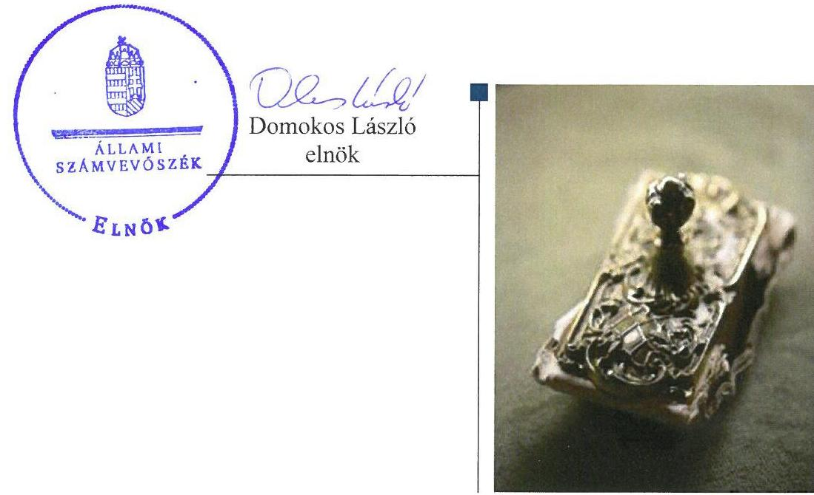
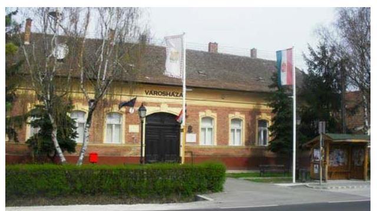
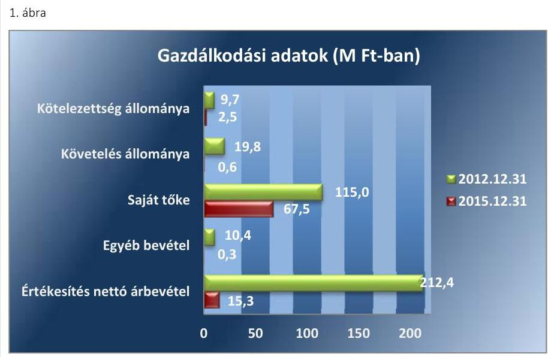
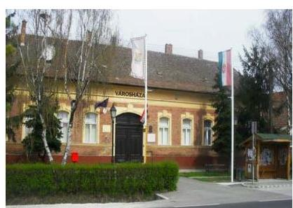
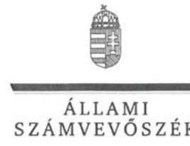
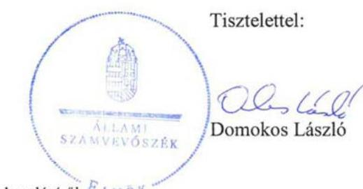
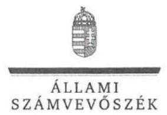
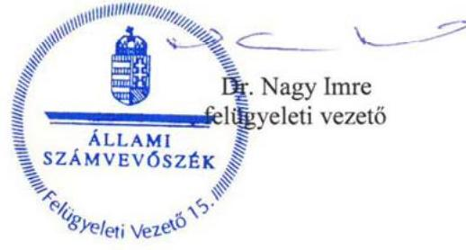

# Jelentés 

## Az önkormányzatok gazdasági társaságai

Az önkormányzatok többségi tulajdonában lévő gazdasági társaságok gazdálkodásának ellenőrzése - Isaszegi Városgazda Nonprofit Kft. 2017.

---

# Jelentés 

## Az önkormányzatok gazdasági társaságai

Az önkormányzatok többségi tulajdonában lévő gazdasági társaságok gazdálkodásának ellenőrzése - Isaszegi Városgazda Nonprofit Kft.
2017. cugusutut hó 29. nap

---

# AZ ELLENŐRZÉST FELÜGYELTE:

DR. NAGY IMRE felügyeleti vezető

# AZ ELLENŐRZÉST VEZETTE ÉS A VÉGREHAJTÁSÁÉRT FELELŐS:

VALASTYÁNNÉ DR. VÍZHÁNYÓ JÚLIA ellenőrzésvezető

# A PROGRAM ÖSSZEÁLLÍTÁSÁÉRT FELELŐS:

JANIK JÓZSEF osztályvezető

---

**IKTATÓSZÁM:** V-1332-193/2016.

**TÉMASZÁM:** 2366

**ELLENŐRZÉS-AZONOSÍTÓ SZÁM:** V075829

---

Jelentéseink az Országgyűlés számítógépes hálózatán és az Interneta a www.asz.hu címen is olvashatóak.

---

# TARTALOMJEGYZÉK 

■ ÖSSZEGZÉS ..... 5
■ AZ ELLENŐRZÉS CÉLJA ..... 6
■ AZ ELLENŐRZÉS TERÜLETE ..... 7
■ AZ ELLENŐRZÉS HÁTTERE, INDOKOLTSÁGA ..... 9
■ A JELENTÉS LÉNYEGES KÉRDÉSKÖREI ..... 10
■ ELLENŐRZÉS HATÓKÖRE ÉS MÓDSZEREI ..... 11
■ MEGÁLLAPÍTÁSOK ..... 13
■ JAVASLATOK ..... 18
■ MELLÉKLETEK ..... 21
I. Sz. melléklet: Értelmező szótár ..... 21
II. Sz. melléklet: A Társaság főbb mérlegadatai (adatok M Ft-ban) ..... 23
■ FÜGGELÉK: ÉSZREVÉTELEK ..... 25
■ RÖVIDÍTÉSEK JEGYZÉKE ..... 29

---

.

---

# ÖSSZEGZÉS 

Isaszeg Város Önkormányzata a tulajdonosi jogait összességében szabályszerűen alakította ki és gyakorolta. Az Isaszegi Városgazda Nonprofit Kft. számviteli szabályozottsága és vagyongazdálkodása összességében szabályszerű volt. Bevételeinek elszámolása az előírásoknak megfelelt, ráfordításait azonban összességében nem megfelelően számolta el. A Társaság a jogszabályban előírt közzétételi kötelezettségének nem tett eleget. Ár képzése szabályszerű volt.

## Az ellenőrzés társadalmi indokoltsága

Magyarországon az önkormányzatok kötelező és önként vállalt feladataik vonatkozásában is egyre szélesebb körben alkalmazzák a költségvetésen kívüli feladatellátást, ezáltal - a nonprofit szervezetek mellett - az önkormányzati tulajdonú gazdasági társaságok is kiemelt fontosságú szerephez jutottak.

Isaszegen az Isaszegi Városgazda Nonprofit Kft. főtevékenységként víziközmű-szolgáltatást 2014. december 31-ig végzett csökkenő volumenben. A teljes ellenőrzött időszakban másodlagos tevékenységként folyadék szállítására szolgáló közmú építését, számviteli szolgáltatás nyújtását, ingatlan bérbeadást, valamint a víz-, a gáz-, a fűtés- légkondicionáló szerelést, a lakossági vízbekötési feladatokat látott el.

Az Állami Számvevőszék az ellenőrzése során arra kereste a választ, hogy 2012-2015. között szabályszerű volt-e a Társaság gazdálkodása és az Önkormányzat ehhez kapcsolódó tulajdonosi joggyakorlása.

## Főbb megállapítások, következtetések, javaslatok

Isaszeg Város Önkormányzata a tulajdonosi joggyakorlás kereteit összességében szabályszerűen alakította ki. A Társaság múködésére, tevékenységére vonatkozó rendeletalkotási kötelezettségének eleget tett. A felügyelőbizottság a felügyeleti tevékenység kereteit biztosító, jogszabályban foglalt ügyrenddel nem rendelkezett.

Az Isaszegi Városgazda Nonprofit Kft. a jogszabályokban előírt számviteli szabályzatokat elkészítette, de számlarenddel nem rendelkezett. A tulajdonában lévő vagyonnal felelős módon, a jogszabályi és belső rendelkezéseknek megfelelően gazdálkodott. Kötelezettségállománya nem veszélyeztette feladatellátását, múködését, fizetőképessége folyamatosan biztosított volt. Az Önkormányzat által előírt beszámolási és adatszolgáltatási kötelezettségét teljesítette. Az egyszerűsített éves beszámolók kiegészítő mellékleteinek tartalma nem felelt meg teljes körűen a jogszabályi előírásoknak. A közérdekú adatok megismerésére irányuló igények teljesítésének rendjét rögzítő szabályzatot nem dolgozta ki, az adatvédelemre és az adatbiztonságra vonatkozó szabályzattal nem rendelkezett. A Társaság a jogszabályban előírt közzétételi kötelezettségének nem tett eleget.

A Társaság bevételeinek elszámolása megfelelő volt, azonban az anyagjellegú ráfordítások, a beruházások, valamint az értékcsökkenés elszámolása során nem szabályszerűen járt el. A követelésállomány csökkentése érdekében a Társaság a belső előírásoknak megfelelően intézkedett. Ár képzése a jogszabályi előírásoknak megfelelt.

---

# AZ ELLENŐRZÉS CÉLJA 

Az ellenőrzés célja annak értékelése volt, hogy az önkormányzat vagyongazdálkodási tevékenysége során szabályszerűen gyakorolta-e tulajdonosi jogait; a gazdasági társaság szabályozottsága, gazdálkodása és vagyongazdálkodási tevékenysége, bevételeinek és ráfordításainak elszámolása megfelelt-e a jogszabályi és tulajdonosi előírásoknak; a gazdasági társaság fizetőképessége jelentette kockázatot a működésre, valamint a gazdálkodás átláthatósága és elszámoltathatósága érdekében biztosítva volt-e a szolgáltatás dijának megalapozottsága szabályszerű önköltségszámítással.

---

# AZ ELLENŐRZÉS TERÜLETE 

## Isaszeg Város Önkormányzata és a kizárólagos tulajdonában lévő Isaszegi Városgazda Nonprofit Kft.

## AZ ISASZEGI VÁROSGAZDA NONPROFIT

KFT. az Önkormányzat 100\%-os tulajdonában álló egyszemélyes nonprofit gazdasági társaság.

Az Önkormányzat 2012. január 1-től a Vksztv. ${ }^{1}$ 36. § (1) bekezdés c) pontjának hatályba lépéséig, az Mötv. ${ }^{2}$ által a kötelezően ellátandó feladatai körébe sorolt víziközmú-szolgáltatást a Társaság ${ }^{3}$-gal kötött Közhasznú szerződés ${ }^{4}$ keretében biztosította. Az Önkormányzat 2012. július 1-től víziközmű bérletiüzemeltetési szerződést ${ }^{5}$ kötött a DAKÖV Kft. ${ }^{6}$-vel a közmúves ivóvízellátás és a közmúves szennyvízelvezetés és -tisztítás feladatok ellátására. A Társaság 2012. július 16-tól 2014. december 31-ig a DAKÖV Kft.-vel kötött Alvállalkozói szerződés ${ }^{7}$ alapján végezte a víziközmúvek üzemeltetését a Vksztv. 45. §-ban foglaltaknak megfelelően. Vagyonkezelésbe az Önkormányzat nem adott át vagyont a Társaságnak.

Főtevékenysége 2014. december 31-ig Isaszeg Város területén a víziközmú-szolgáltatás ellátása volt. 2014. év december 31-ig közhasznú szervezetként múködött. A 2012-2015. években a Társaság tevékenységéhez tartozott továbbá folyadék szállítására szolgáló közmú építése, számviteli szolgáltatás nyújtása, saját tulajdonú ingatlan bérbeadása, valamint a víz-, a gáz-, a fűtés- légkondicionáló szerelés, a lakossági vízbekötés. Ezeket a feladatokat saját tulajdonú eszközeivel végezte.

A Társaság jegyzett tőkéje 8,5 M Ft volt, amely 3,2 M Ft készpénzből, és 5,3 M Ft apportból állt. Az ellenőrzött időszakban a jegyzett tőke nem változott. A foglalkoztatott átlagos statisztikai állományi létszám az ellenőrzött időszak elején 15 fő, az ellenőrzött időszak végén nulla fő volt. Az ügyvezető és a főkönyvelő a 2015. évben megbízási szerződéssel látta el feladatát.

Az ellenőrzött időszakban a polgármester személye nem változott. A jelenleg hivatalában lévő jegyző 2014. január 1-től látja el a jegyzői feladatokat.

Az Isaszegi Városgazda Nonprofit Kft. gazdálkodásának főbb adatait a 2012-2015. évek vonatkozásában az 1. ábra szemlélteti.

---

*Forrás: a Társaság 2012-2015. évi egyszerűsített beszámolói*

Az értékesítés nettó árbevétele az ellenőrzött időszak végére 92,8%-kal csökkent a Társaság tevékenységében bekövetkezett változás, a víziközmű-szolgáltatási tevékenység megszűnése miatt. A saját tőke csökkenésének oka a 2013. és 2014. években az Önkormányzat részére a jogszabály által előírt térítésmentes eszközátadás volt.

A Társaság működésének főbb mérlegadatait a II. számú melléklet mutatja be.

---

# AZ ELLENŐRZÉS HÁTTERE, INDOKOLTSÁGA 

AZ ÖNKORMÁNYZAT TÖBBSÉGI TULAJDONÁBAN ÁLLÓ GAZDASÁGI TÁRSASÁGOK ellenőrzése kiemelten fontos a vagyon megőrzése, megóvása érdekében, valamint a kormányzati szektor elszámolásaiban megjelenő önkormányzati tulajdonú gazdálkodó szervezetek esetében, amelyekkel szemben alapvető követelmény, hogy gazdálkodásuk, múködésük szabályszerű, az általuk szolgáltatott adatok minél megbízhatóbbak legyenek. A feladatellátás költségeinek, ráfordításainak alakulása a lakosság széles rétegét érinti.

ELLENŐRZÉSEINK FELTÁRHATJÁK, hogy az önkormányzat a feladatellátásához rendelt vagyon múködtetését a tulajdonostól elvárható gondossággal végezte-e, a feladatot ellátó gazdasági társaság a létesítő okiratban, szolgáltatási szerződésben foglaltak betartásával biztositotta-e a feladat ellátását. Az ellenőrzés rávilágíthat arra, hogy a gazdasági társaság a vagyon használatával biztosította-e a szolgáltatás folytatásának feltételeit, az önkormányzat tulajdonosi felügyelete hozzájárult-e a szabályszerű gazdálkodáshoz és feladatellátáshoz. A megállapítások alapján megfogalmazott számvevőszéki javaslatok hasznosítása elősegítheti a meglévő hibák megszüntetését. A jó gyakorlatok bemutatásával az ÁSZ hozzájárulhat a követendő megoldások megismertetéséhez, terjesztéséhez.

---

# A JELENTÉS LÉNYEGES KÉRDÉSKÖREI 

1- Az Önkormányzat tulajdonosi joggyakorlása szabályszerű volt-e?
2. - A gazdasági társaság vagyongazdálkodása szabályszerű volt-e, fizetőképessége biztositott volt-e a gazdálkodás során?
3. - A gazdasági társaság bevételeinek és ráfordításainak elszámolása, valamint az önköltségszámitás és árképzés szabályszerű volt-e?

---

# ELLENŐRZÉS HATÓKÖRE ÉS MÓDSZEREI 

## Az ellenőrzés típusa

Megfelelőségi ellenőrzés

## Az ellenőrzött időszak

2012. január 1-től 2015. december 31-ig

## Az ellenőrzés tárgya

Isaszeg Város Önkormányzata kizárólagos tulajdonában lévő Isaszegi Városgazda Nonprofit Kft. feletti tulajdonosi joggyakorlása, valamint az Isaszegi Városgazda Nonprofit Kft. gazdálkodásának szabályozottsága és szabályszerűsége.

Az ellenőrzés kiterjedt minden olyan körülményre és adatra, amely az ÁSZ jogszabályban meghatározott feladatainak teljesítéséhez, valamint a program végrehajtása folyamán felmerült újabb összefüggések feltárásához szükséges.

## Az ellenőrzött szervezet

Isaszeg Város Önkormányzata, valamint az Isaszegi Városgazda Nonprofit Kft.

## Az ellenőrzés jogalapja

Az ellenőrzés jogszabályi alapját az Állami Számvevőszékről szóló 2011. évi LXVI. törvény 1. § (3) bekezdése és 5. § (3)-(4)-(5) bekezdései képezték.

## Az ellenőrzés módszerei

Az ellenőrzést a nemzetközi standardokat irányadónak tekintve az ellenőrzési program ellenőrzési kérdései, az ellenőrzött időszakban hatályos jogszabályok, az ellenőrzés szakmai szabályok és módszertanok figyelembevételével végezte az ÁSZ.

Az ellenőrzés ideje alatt az ellenőrzött szervezettel történő kapcsolattartást az ÁSZ Szervezeti és Múködési Szabályzatának vonatkozó előírásai alapján biztosította az ÁSZ.

---

Az ellenőrzés a kizárólagos tulajdonosi jogokat gyakorló Isaszeg Város Önkormányzatára, az Isaszegi Városgazda Kft.-re terjedt ki.

Az ellenőrzési kérdések megválaszolásához szükséges bizonyítékok megszerzése a következő ellenőrzési eljárások alkalmazásával történt: megfigyelés, kérdésfeltevés (információkérés), mintavételezés, összehasonlítás, valamint elemző eljárás. Az ellenőrzési bizonyítékként felhasználható adatforrások közé tartoztak egyrészt az ellenőrzési programban felsorolt adatforrások, másrészt adatforrás volt még minden - az ellenőrzés folyamán - feltárt, az ellenőrzés szempontjából információkat tartalmazó dokumentum.

Az ellenőrzést a kérdésekre adott válaszok kiértékelésével, valamint a megjelölt adatforrások, a csatolt tanúsítványok felhasználásával, továbbá az adott időszakban hatályos jogszabályok figyelembevételével folytattuk le.

A gazdasági társaság bevételei és ráfordításai, ezeken belül az értékcsökkenés, valamint a vagyonnyilvántartás szabályszerűségének megítéléséhez a bevételeket és a ráfordításokat, a tárgyi eszközök állományváltozásait tartalmazó adott évi főkönyvi kivonat adatbázisát vettük alapul. A minta kiválasztása során véletlen mintavételt alkalmaztunk évenkénti, elemszámmal arányos rétegezéssel a teljes időszakra vonatkozóan. A mintavételt megelőzően az anyagjellegú ráfordítások, valamint a tárgyi-eszköz növekedési tételei sokaságból évente sokaságonként kiemeltük a 3-3 legnagyobb összegű tételt annak biztosítására, hogy az ellenőrzés az egyszerű véletlen mintavétel mellett a legnagyobb értékű tételek ellenőrzésére biztosan kiterjedjen.

---

# 1. Az Önkormányzat tulajdonosi joggyakorlása szabályszerű volt-e? 

Összegző megállapítás

### 1.1. számú megállapítás

Isaszeg Város Önkormányzatának tulajdonosi joggyakorlása szabályszerű volt.

Isaszeg Város Önkormányzata a tulajdonosi joggyakorlás kereteit szabályszerűen alakította ki. A Társaság müködésére, tevékenységére vonatkozó rendeletalkotási kötelezettségének eleget tett.

A TULAJDONOSI JOGOK gyakorlásának rendjét az Önkormányzat ${ }^{8}$ a Társaság Alapító Okiratában ${ }_{1-4}{ }^{9}$ és a Társaság SZMSZ ${ }^{10}$ - ében foglaltak alapján, a Gt. ${ }^{11}$ és a Ptk. ${ }^{12}$ előírásaival összhangban alakította ki. A legfőbb szerv hatáskörét az Önkormányzat Képviselő-testülete gyakorolta.

GAZDASÁGI PROGRAM ${ }_{1-2}{ }^{13}$-ját az Önkormányzat az Ötv. ${ }^{14}$, illetve az Mötv. előírásainak megfelelően elkészítette, melyekben a Társaság tevékenységére vonatkozóan a víziközmű-hálózat fejlesztésével kapcsolatosan fejlesztési, beruházási feladatokat határoztak meg. A Gazdasági program ${ }_{1}$ felülvizsgálatot követő módosítását a jogszabályi előírásoknak megfelelően hagyták jóvá. Az Önkormányzat 2012. január 1. és 2013. március 18. között közép- és hosszú távú vagyongazdálkodási tervet nem készített, amivel megsértette az Nvtv. ${ }^{15}$ 9. § (1) bekezdésében előírtakat. Az Önkormányzat közép- és hosszú távú vagyongazdálkodási tervét késve, 2013. március 19-én fogadta el.

RENDELETALKOTÁSI KÖTELEZETTSÉGÉNEK az Önkormányzat a többször módosított Vagyonrendelet ${ }^{16}$ megalkotásával eleget tett. Adatszolgáltatási, tájékoztatási kötelezettséget az Önkormányzat a Társaság részére az Alapító Okirat ${ }_{1-4}$-ben, a Társaság SZMSZ-ében, valamint a Közhasznú szerződésben írt elő.

A JAVADALMAZÁSI ÉS KÖZZÉTÉTELI SZABÁLYZATOT ${ }^{17}$ a Társaság legfőbb szerve megalkotta és határozatban jóváhagyta. A szabályzat a jogszabályi előírásoknak megfelelt.
1.2. számú megállapítás

A tulajdonosi jogok gyakorlása összességében szabályszerű volt. A tulajdonosi joggyakorló a feladatellátással kapcsolatos döntések esetében érvényesítette a tulajdonosi jogokat.

A Társaság feletti tulajdonosi jogokat az Alapító okirat ${ }_{1-4}$ és az SZMSZ alapján a legfőbb szerv szabályszerűen gyakorolta.

AZ FB ${ }^{18}$ a jogszabályi előírásokat figyelembe véve az ellenőrzött időszakban három tagból állt. Az FB minden évben a Társaság Alapító okirata ${ }_{1-4}$ és

---

SZMSZ-e alapján írásbeli jelentést készített a Társaság egyszerűsített éves beszámolójáról.

Az FB ügyrenddel a Gt. 34. § (4) bekezdése és a Ptk. 3:122. § (3) bekezdése ellenére nem rendelkezett.

Az Önkormányzat a 2012-2015. években beszámoltatta a Társaságot a gazdálkodásról és a szakmai tevékenységéről. A legfőbb szerv az Alapító okiratban1-4 foglalt hatáskörénél fogva minden évben határozattal, a könyvvizsgálói és az FB jelentéseinek birtokában fogadta el a Társaság egyszerűsített éves beszámolóját és a 2012-2014. években a jogszabály által előírt közhasznúsági mellékleteket. Az Önkormányzat a könyvvizsgálót a Gt. 44. § (1) bekezdése és a Ptk. 3:131. § (2) bekezdésében foglaltak ellenére az egyszerűsített éves beszámolót tárgyaló ülésére a 2012-2014. években nem hívta meg.

A Társaságnál az Önkormányzat a jogszabályi előírásoknak megfelelően belső ellenőrzést végzett. A 2014. évben a belső ellenőrzés a Társaság gazdálkodásának szabályozottságát ellenőrizte.

# 2. A gazdasági társaság vagyongazdálkodása szabályszerű volt-e, fizetőképessége biztosított volt-e a gazdálkodás során? 

## Összegző megállapítás

2.1. számú megállapítás
2.2. számú megállapítás

A Társaság vagyongazdálkodása összességében szabályszerű volt, fizetőképessége biztosított volt.

A jogszabályok által előírt szabályzatokkal - a Számlarend kivételével - a Társaság rendelkezett.

A TÁRSASÁG SZMSZ-ét a Társaság legfőbb szerve jóváhagyta.
A Társaság rendelkezett a jogszabályban előírt Számviteli politikával ${ }_{1,2}{ }^{19}$, valamint Leltározási ${ }^{20}$, Értékelési ${ }_{1-2}{ }^{21}$, és Pénzkezelési szabályzattal ${ }_{1-2}{ }^{22}$. A Számviteli politika ${ }_{1}$-ben előírt Selejtezési szabályzatot ${ }^{23}$ elkészítették. A Számv. tv. ${ }^{24} 161 . \S$ (1) bekezdésében előírt Számlarenddel nem rendelkezett. A Számv. tv. 161. § (2) bekezdés d) pontjában előírtak ellenére a bizonylati rendet a Számviteli politika ${ }_{1,2}$-ben jelenítette meg. A Számv. tv. 161. § (2) bekezdés a) pontjában előírt, minden alkalmazásra kijelölt számla számjelét, és megnevezését a könyvelése tartalmazta. Az egyes tevékenységekhez kapcsolódó költségeket és ráfordításokat munkaszámos könyveléssel különítette el. A munkaszámok listáját a Számviteli politikához készített kiegészítés tartalmazta.

A Társaság a tulajdonában lévő vagyonnal felelős módon, a jogszabályi és belső rendelkezéseknek megfelelően gazdálkodott. A Társaság a víziközmúvek térítésmentes átadása során a jogszabályi előírásoknak nem teljeskörűen tett eleget.

AZ ANALITIKUS ÉS FŐKÖNYVI NYILVÁNTARTÁSI rendszer biztosította a Társaság vagyonának a Számv. tv. és a belső szabályozás szerinti nyilvántartását, a változások folyamatos nyomon követését. A vagyonnyilvántartás átlátható és naprakész volt, a jogszabályi előírásoknak megfelelt. Az egyszerűsített éves beszámolók mérlegtételeinek értékét

---

### 2.3. számú megállapítás

1. táblázat

A TÁRSASÁG KÖTELEZETTSÉGÁLLOMÁNYÁNAK ALAKULÁSA (M FT)

|  Évek | Rövid lejáratú kötelezettségek  |
| --- | --- |
|  2012. | 9,7  |
|  2013. | 5,2  |
|  2014. | 3,0  |
|  2015. | 2,5  |

Forrás: a Társaság 2012-2015. évi éves beszámolói
2.4. számú megállapítás
december 31-ei fordulónappal elkészített, szabályos leltárral és analitikus nyilvántartásokkal támasztották alá. A főkönyvi könyvelés és az analitikus nyilvántartások közötti egyeztetést a mérleg fordulónapjára vonatkozóan elvégezték. A jogszabályokban előírt számviteli szétválasztási kötelezettségének eleget tett. A Társaság egyszerűsített éves beszámolóinak főbb mérlegadatait a II. számú melléklet szemlélteti.

AZ ESZKÖZÖK értéke 2012. december 31-éről 2015. december 31ére 62,6\%-kal, 119,8 M Ft-tal csökkent. Ennek oka a Társaság tulajdonában lévő víziközművek 2013. január 1-jei térítésmentes átadása volt, mely során a jogszabályban foglaltak alapján a víziközművek az ellátásért felelős Önkormányzat tulajdonába kerültek. A vagyonátadás a jogszabályi előírásoknak megfelelt. Egy aszfaltút és két kút esetében a vagyonátadás a Vksztv. 79. § (1) bekezdésében előírt határidő után történt meg.

A FORRÁSOK alakulását alapvetően a saját tőke csökkenése befolyásolta. A térítésmentes vagyonátadás hatására, a rendkívüli ráfordítás elszámolása miatt a 2013. évre 46,6 M Ft, a 2014. évre 2,6 M Ft mérleg szerinti vesztesége keletkezett.

A követelések összege a 2012. évről 2015. évre jelentősen 97\%-kal, 19,2 M Ft-tal csökkent. Ennek fő oka a Társaság tevékenységének változása, és hogy a 2013. évtől nem számlázott víz- és csatornadíjakat.

A 2012. és a 2014. évi üzleti tervben tartalmazott fejlesztési, beruházási tervekre vonatkozóan a Társaság rendelkezett tulajdonosi hozzájárulással. A 2013. és a 2015. évi üzleti tervek fejlesztési, beruházási terveket nem tartalmaztak.

A Társaság kötelezettségállománya nem veszélyeztette a Társaság feladatellátását, múködését, fizetőképessége biztosított volt.

A TÁRSASÁG KÖTELEZETTSÉGÁLLOMÁNYA 2012. december 31. és 2015. december 31. között 74,2\%-kal, 7,2 M Ft-tal csökkent. A kötelezettségeket a rövid lejáratú kötelezettségek tették ki, melynek állománya jelentős részben a januárban esedékes adófizetésekhez kapcsolódott. Hosszú lejáratú kötelezettséggel, illetve lejárt kötelezettségállománnyal a Társaság nem rendelkezett, fizetőképessége biztosított volt.

A Társaság rövid lejáratú kötelezettségeinek alakulását az 1. táblázat mutatja be.

A Társaság az előírt tervezési, beszámolási, adatszolgáltatási kötelezettségét teljesítette. Közérdekú adatok megismerésére irányuló igények teljesítésének rendjét rögzítő, valamint adatvédelmi és adatbiztonsági szabályzatot az ellenőrzött időszakban nem készített.

ÜZLETI TERVEIT a Társaság az SZMSZ-ben előírtak alapján a 2012-2015. évekre évente elkészítette, melyet a legfőbb szerv megtárgyalt és határozattal jóváhagyott. Az ügyvezető írásos beszámolót készített az üzleti tervek végrehajtásáról. Az ivóvíz-, és szennyvízhálózat továbbfejlesztését tekintve az éves üzleti tervek összhangban voltak az Önkormányzat Gazdasági Program ${ }_{1,2}$-jával.

---

A Társaság a jogszabályi és a belső szabályzataikban foglaltaknak megfelelően az adatszolgáltatási és beszámolási kötelezettségét az egyszerűsített éves beszámolók, valamint 2014. december 31-ig a közhasznúsági mellékletek készítésével teljesítette. Az egyszerűsített éves beszámolókat és közhasznúsági mellékleteket a Társaság legfőbb szerve az FB jelentései és a független könyvvizsgáló hitelesítő záradékkal ellátott jelentései birtokában hagyta jóvá. Az éves számviteli beszámolókat a Társaság határidőben letétbe helyezte és közzétette.

A Társaság az Info tv. ${ }^{25}$ 37.§-ban előírt közzétételi kötelezettségének nem tett eleget, mivel az Info tv. 37. § (1) bekezdésében meghatározott 1. melléklet szerinti adatokat a közzétételre kijelölt önkormányzati honlapon nem tette közzé.

A Társaság az ellenőrzött időszakban nem készítette el a közérdekű adatok megismerésére irányuló igények teljesítésének rendjét rögzítő szabályzatát, ezzel megsértette az Info tv. 30. § (6) bekezdésében foglaltakat. A Társaság az Info tv. 24. § (3) bekezdésének előírása ellenére nem rendelkezett adatvédelmi és adatbiztonsági szabályzattal, az Info tv. 24. § (1) bekezdésének előírása ellenére adatvédelmi felelőst nem jelölt ki.

# 3. A gazdasági társaság bevételeinek és ráfordításainak elszámolása, valamint az önköltségszámítás és árképzés szabályszerű volt-e? 

Összegző megállapítás

### 3.1. számú megállapítás

2. ábra

| A TÁRSASÁG | A Társaság bevételeinek elszámolása megfelelő volt. A ráfordítások elszámolása a személyi jellegú ráfordítások kivételével nem felelt meg az előírásoknak. |
| :--: | :--: |
| A TÁRSASÁG | a jogszabályi előírások alapján az alapcél szerinti közhasznú tevékenységének, illetve a gazdasági-vállalkozási tevékenységének bevételeit, költségeit, ráfordításait elkülönítette. A költségek és ráfordítások esetében a munkaszámos gyűjtés módszerével választotta szét a közhasznú feladatokhoz kapcsolódó költségeket és ráfordításokat. Az ellenőrzés megállapításait a 2. ábra mutatja. |
| A Z ÉRTÉKESÍTÉS NETTÓ ÁRBEVÉTELÉNEK | az Értékesítés nettó árbevételé |
| A számolása megfelelően történt. Az elszámolás alapjául szolgáló számviteli bizonylatok a jogszabályi előírásoknak megfeleltek. |  |
| A SZEMÉLYI JELLEGÚ RÁFORDÍTÁSOK | A SZEMÉLYI JELLEGÚ RÁFORDÍTÁSOK elszámolása megfelelő volt. Az elszámolás alapjául szolgáló dokumentumok megfeleltek a bizonylatokkal szemben támasztott jogszabályi előírásoknak. |
| AZ ANYAGJELLEGÚ RÁFORDÍTÁSOK | az ANYAGJELLEGÚ RÁFORDÍTÁSOK elszámolása nem volt megfelelő. A bizonylatokon a könyvelés módját, az érintett könyvviteli számlákra történő hivatkozást, a könyvviteli nyilvántartásokban történő |

---

rögzítés időpontját a Számv. tv. 167. § (1) bekezdés h) és i) pontjában előírtak ellenére nem tüntették fel. A továbbszámlázott szolgáltatásokat az eladott (közvetített) szolgáltatások helyett az igénybe vett szolgáltatások közé számolták el, megsértve ezzel a Számv. tv. 3. § (4) bekezdés 1. pontjában és a 3. § (7) bekezdés 1. pontjában foglaltakat. Az Önkormányzatnak megállapodás alapján átadott két eszközt a Társaság, melyek bruttó értékét a rendkívüli ráfordítások helyett, az egyéb ráfordítások közé könyvelték el a Számv. tv. 86. § (7) bekezdés a) pontjában előírtak ellenére.

A BERUHÁZÁSOK elszámolása nem volt megfelelő. A vízvezetékberuházás során a bekerülési értéket nem közvetlen önköltségen határozták meg, mivel a bekerülési érték részeként elszámolták a nem közvetlenül a beruházáshoz kapcsolódó jogorvoslati díjat, továbbá a munkagépek önköltsége nyereséget is tartalmazott, ezzel megsértették a Számv. tv. 51. § (1) bekezdésében foglaltakat.

AZ ÉRTÉKCSÖKKENÉS elszámolása nem volt megfelelő, mert a Számv. tv. 52. § (1)-(2) bekezdésében előírtak ellenére a tárgyi eszközök leírási idejét eszközcsoportonként állapították meg, illetve nem tartották be a Számviteli politika maradványértékre vonatkozó előírásait. A Társaság megsértette a Számv. tv. 88. § (4) bekezdésében előírtakat, mert a kiegészítő mellékletekben nem ismertette a maradványérték meghatározásnak módját, illetve az értékcsökkenés elszámolásának gyakoriságát.

A KÖVETELÉSÁLLOMÁNY csökkentése érdekében a Társaság a belső előírásoknak megfelelően intézkedett.

# 3.2. számú megállapítás A Társaság árképzése a jogszabályi előírásoknak megfelelt. 

A Vksztv. 65. § (1) bekezdése a víziközmű szolgáltatási díjak megállapítását 2012. január 1-jétől a MEKH javaslatának figyelembevételével a víziközműszolgáltatásért felelős miniszter hatáskörébe utalta. A Társaság a jogszabályi előírásoknak megfelelő díjat alkalmazott. A Társaság egyéb szolgáltatásainak díjai egyedi ármegállapodásokon, vagy díjkalkuláción alapultak.

---

# JAVASLATOK 

Az ÁSZ tv. 33. § (1) bekezdésében foglaltak értelmében az ellenőrzött szervezet vezetője köteles a jelentésben foglalt megállapításokhoz kapcsolódó intézkedési tervet összeállítani és azt a jelentés kézhezvételétől számított 30 napon belül az ÁSZ részére megküldeni. Amennyiben az ellenőrzött szervezet vezetője nem küldi meg határidőben az intézkedési tervet, vagy továbbra sem elfogadható intézkedési tervet küld, az Állami Számvevőszék elnöke az ÁSZ tv. 33. § (3) bekezdése a) és b) pontjaiban foglaltakat érvényesítheti.

## Az Isaszegi Városgazda Nonprofit Kft. Ügyvezetőjének

1. Intézkedjen a jogszabályi rendelkezéseknek megfelelő számlarend elkészitéséről.
(2.1 sz. megállapítás 2. bekezdés
3-4. mondata alapján)
2. Intézkedjen annak érdekében, hogy a Társaság a jogszabályban foglalt közzétételi kötelezettségének eleget tegyen.
(2.4. sz. megállapítás 3. bekezdése alapján)
3. Intézkedjen a jogszabályban elöirt közérdekü adatok megismerésére irányuló igények teljesitésének rendjét rögzítő szabályzat és az adatvédelmi és adatbiztonsági szabályzat elkészitéséről.
(2.4 sz. megállapítás 4. bekezdése alapján)
4. Intézkedjen a számviteli elszámolások szabályszerű végrehajtására, ezen belül:
a) az anyagjellegü ráforditások elszámolása tekintetében a jogszabályi elöírások betartására;
(3.1 sz. megállapítás 4. bekezdése alapján)
b) a beruházások elszámolása tekintetében a jogszabályi elöírás betartására,
(3.1 sz. megállapítás 5. bekezdése alapján)
c) az értékcsökkenés elszámolása tekintetében a belső szabályozás és a jogszabályi elöírások betartására.
(3.1. sz. megállapítás 6. bekezdés
5. mondata alapján)

---

5. Intézkedjen arról, hogy az egyszerüsített éves beszámoló kiegészitő melléklete a jogszabály előírásainak megfelelően mutassa be az előirt tartalmi elemeket.
(3.1. sz. megállapítás 6. bekezdés
6. mondata alapján)

# Isaszeg Város Önkormányzat Polgármesterének 

1. Kezdeményezze, hogy az FB az ügyrendjét elkészítse és azt a Társaság legfőbb szerve hagyja jóvá a jogszabálynak megfelelően.
(1.2 sz. megállapítás 3. bekezdés alapján)

---

.

---

# MELLÉKLETEK 

- I. SZ. MELLÉKLET: ÉRTELMEZŐ SZÓTÁR
garanciaszerződés
gazdasági társaság
gazdálkodó szervezet
kezesség
közszolgáltatás
meghatározó befolyás
nonprofit gazdasági társaság

A garanciaszerződés, illetve a garanciavállaló nyilatkozat a garantőr olyan kötelezettségvállalása, amely alapján a nyilatkozatban meghatározott feltételek esetén köteles a jogosultnak fizetést teljesíteni. (Ptk. 6:431. § (1) bekezdése)
Ptk 3.88. § (1) bekezdése szerint „a gazdasági társaságok üzletszerű közös gazdasági tevékenység folytatására, a tagok vagyoni hozzájárulásával létrehozott, jogi személyiséggel rendelkező vállalkozások, amelyekben a tagok a nyereségből közösen részesednek, és a veszteséget közösen viselik".
A Ptk. 685. § c) pontja szerint gazdálkodó szervezet: „az állami vállalat, az egyéb állami gazdálkodó szerv, a szövetkezet, a lakásszövetkezet, az európai szövetkezet, a gazdasági társaság, az európai részvénytársaság, az egyesülés, az európai gazdasági egyesülés, az európai területi együttműködési csoportosulás, az egyes jogi személyek vállalata, a leányvállalat, a vízgazdálkodási társulat, az erdő birtokossági társulat, a végrehajtói iroda, az egyéni cég, továbbá az egyéni vállalkozó." (2014. 03.15-ig hatályos)
A kezességre vonatkozó előírásokat a Ptk. 6:416-430. §-ai tartalmazzák. Kezességi szerződéssel a kezes kötelezettséget vállal a jogosulttal szemben, hogyha a kötelezett nem teljesít, maga fog helyette a jogosultnak teljesíteni. Kezesség egy vagy több, fennálló vagy jövőbeli, feltétlen vagy feltételes, meghatározott vagy meghatározható összegű pénzkövetelés vagy pénzben kifejezhető értékkel rendelkező egyéb kötelezettség biztosítására vállalható.
A Ptk. szerint kezességet csak írásban lehet vállalni. A kezes kötelezettsége ahhoz a kötelezettséghez igazodik, amelyért kezességet vállalt. A kezes kötelezettsége nem válhat terhesebbé, mint amilyen elvállalásakor volt, kiterjed azonban a kötelezett szerződésszegésének jogkövetkezményeire és a kezesség elvállalása után esedékessé váló mellékkövetelésekre is.
Az Ebktv. ${ }^{26}$ 3. § d) pontja a következőképpen határozza meg a közszolgáltatást: „szerződéskötési kötelezettség alapján a lakosság alapvető szükségleteinek ellátására irányuló szolgáltatás, így különösen a villamos energia-, gáz-, hő-, víz-, szennyvíz- és hulladékkezelési, köztisztasági, postai és távközlési szolgáltatás, továbbá a menetrend alapján közlekedő járművekkel végzett közforgalmú személyszállítás".
A Ptk. 8:2. § (2) bekezdése szerint „A befolyással rendelkező akkor rendelkezik egy jogi személyben meghatározó befolyással, ha annak tagja vagy részvényese, és
a) jogosult e jogi személy vezető tisztségviselői vagy felügyelőbizottsága tagjai többségének megválasztására, illetve visszahívására; vagy
b) a jogi személy más tagjai, illetve részvényesei a befolyással rendelkezővel kötött megállapodás alapján a befolyással rendelkezővel azonos tartalommal szavaznak, vagy a befolyással rendelkezőn keresztül gyakorolják szavazati jogukat, feltéve, hogy együtt a szavazatok több mint felével rendelkeznek."
Civil tv. ${ }^{27}$ 9/F. § (2) bekezdése szerint „az a gazdasági társaság minősül nonprofit gazdasági társaságnak és cégnevében az a gazdasági társaság tüntetheti fel a nonprofit jelleget, amelynek létesítő okirata tartalmazza, hogy a gazdasági társaság tevékenységéből származó nyereség a tagok között nem osztható fel, hanem az a gazdasági társaság vagyonát gyarapítja." (hatályos 2014. március 15-től)

---

többségi befolyást biztosító részesedés

A Ptk. 8:2. § (1) bekezdése szerint „többségi befolyás az olyan kapcsolat, amelynek révén természetes személy vagy jogi személy (befolyással rendelkező) egy jogi személyben a szavazatok több mint felével vagy meghatározó befolyással rendelkezik."

---

II. SZ. MELLÉKLET: A TÁRSASÁG FŐBB MÉRLEGADATAI (ADATOK M FT-BAN)

|  Megnevezés | 2012.12.31. | 2013.12.31. | 2014.12.31. | 2015.12.31.  |
| --- | --- | --- | --- | --- |
|  Befektetett eszközök | 133,3 | 54,1 | 10,4 | 9,1  |
|  - ebből: Tárgyi eszközök | 133,3 | 54,1 | 10,4 | 9,1  |
|  Forgóeszközök | 56,5 | 55,3 | 47,8 | 62,5  |
|  - ebből: Követelések | 19,8 | 13,7 | 1,8 | 0,6  |
|  Aktív időbeli elhatárolások | 1,6 | 12,0 | 13,8 | 0,0  |
|  ESZKÖZÖK ÖSSZESEN | 191,4 | 121,4 | 72,0 | 71,6  |
|  Saját tőke | 115,0 | 68,4 | 65,8 | 67,5  |
|  - ebből Jegyzett tőke | 8,5 | 8,5 | 8,5 | 8,5  |
|  - ebből: Mérleg szerinti eredmény | 6,3 | $-46,6$ | $-2,6$ | 1,7  |
|  Céltartalékok | 14,2 | 1,5 | 1,5 | 1,5  |
|  Kötelezettségek | 9,7 | 5,2 | 3,0 | 2,5  |
|  Passzív időbeli elhatárolások | 52,5 | 46,3 | 1,7 | 0,1  |
|  FORRÁSOK ÖSSZESEN | 191,4 | 121,4 | 72,0 | 71,6  |

Fonráz: a Társaság 2012-2015. évi éves beszámolói

---

.

---

# FÜGGELÉK: ÉSZREVÉTELEK 

A jelentéstervezetet a Számvevőszék 15 napos észrevételezésre megküldte az ellenőrzött szervezetek vezetőinek az ÁSZ tv. 29. §* (1) bekezdése előírásának megfelelően.
Észrevételezési jogával az Isaszegi Városgazda Nonprofit Kft. ügyvezetője élt.

A függelék tartalmazza az ellenőrzött észrevételét mellékletek nélkül, illetve az el nem fogadott észrevétel elutasításának indoklását.

[^0]
[^0]:    * 29. § (1) Az Állami Számvevőszék az ellenőrzési megállapításait megküldi az ellenőrzött szervezet vezetőjének vagy az általa megbízott személynek, és annak, akinek személyes felelősségét állapította meg.
    (2) Az ellenőrzött szervezet vezetője és a felelősként megjelölt személy az ellenőrzés megállapításaira tizenöt napon belül írásban észrevételt tehet.
    (3) Az Állami Számvevőszék az észrevételre a beérkezésétől számított harminc napon belül írásban válaszol. A figyelembe nem vett észrevételeket köteles a jelentésben feltüntetni, és megindokolni, hogy azokat miért nem fogadta el.

---

# 1.134 

## 1.134

2117. Isaszeg, Rákóczi u. 18.

Adószám: 22136046-2-13
Tel.: 0628 494-517
E-mail: isaszegikft@invitel.hu
Szám: /J/ /2017.

Kelt: Isaszeg, 2017. július 14.
Ügyintézőnk: Ritecz György
Hiv.szám: V-1332-180/2016.
Ügyintézőjük: Valastyánné dr.
Vizhányó Júlia
Melléklet: 148/2015.(V.20.) Kt.
határozat,
„ISASZEG" Önkormányzati
Tájékoztató 2015. július
Tárgy: Észrevétel Számvevőszéki-
jelentéstervezetre

## Állami Számvevőszék   Domokos László elnök   1052 Budapest, Apáczai Csere János utca 10.

## Tisztelt Elnök Úr !

Önkormányzati tulajdonú cégünket a Számvevőszék ellenőrizte.
Hiv.számú levelük mellékleteként megküldték részünkre a Számvevőszéki jelentéstervezet-et, közölve, hogy tizenöt napon belül észrevételt tehetünk.
Észrevétel:
A jelentéssel összességében egyetértünk. Az abban közölt adatok, megállapítások - egy kivétellel - helytállóak. A jelentés ÖSSZEGZÉS-e tartalmazza:
„A társaság a jogszabályban elöirt közzétételi kötelezettségének nem tett eleget."
Ezt a megállapítást vitatjuk. Cégünknek nincs önálló honlapja, azt írják, hogy az adatokat az önkormányzati honlapon kellett volna közzétennünk.
A közzétételnek ilyen módon eleget tettünk, ezt az alábbiakkal igazoljuk:

- csatoljuk az Önkormányzat Képviselő-testületének 148/2015.(V.20.) Kt. határozatát, mely azt írta elő számunkra, hogy jelentésünket az „ISASZEG" Önkormányzati Tájékoztatóban tegyük közzé.
- csatoljuk fenti tájékoztató 2015. júliusá számát, melynek 4. oldalán jelent meg a tájékoztatónk.

A tájékoztatót Isaszeg önkormányzat honlapjáról töltöttük le, tehát ez még ma is ott található.
A dokumentum elérhetősége:
www.isaszeg.hu; Önkormányzati Tájékoztató; Korábbi számaink; 2015. július
Az intézkedési tervet -az előirt feladatok elvégzésére- elkészítjük és határidőre teljesítjük.

Ezúttal megköszönjük a Számvevőszék ellenőrzést végző munkatársainak korrekt hozzáállását és tárgyilagos megállapításait.

Isaszegi Városgazda Nonprofit
Tisztelettel:
Korlátolt Felelősségü Társaság
2117. Isaszeg, Rákóczi u. 18.

Ritecz Gyöngöszám: 22136046-2-13
ügyvezető

Tétivevényes !

---

ELNÖK

Ikt.szám: V-1332-186/2016.

# Ritecz György László úr 

ügyvezető
Isaszegi Városgazda Nonprofit Kft.

## Isaszeg

## Tisztelt Ügyvezető Úr!

„Az önkormányzatok gazdasági társaságai - Az önkormányzatok többségi tulajdonában lévő gazdasági társaságok gazdálkodásának ellenőrzése - Isaszegi Városgazda Nonprofit Kft. " címmel készített számvevőszéki jelentéstervezetre tett észrevételeit köszönettel megkaptam.
Az Állami Számvevőszék észrevételekre vonatkozó álláspontjáról a felügyeleti vezető által készített részletes tájékoztatást csatoltan megküldőm.
Tájékoztatom az Ügyvezető urat, hogy a számvevőszéki jelentésben - az Állami Számvevőszékről szóló 2011. évi LXVI. törvény 29. § (3) bekezdése alapján - a figyelembe nem vett észrevételeket szerepeltetjük az elutasítás indokának feltüntetésével.

Budapest, 2017. 08 hó 11 nap

Melléklet: Tájékoztatás az észrevételek kezeléséről 8 Lnús

---

FELÜGYELETI VEZETŐ

Melléklet
Ikt.szám: V-1332-186/2016.

# Tájékoztatás   az észrevételek kezeléséről 

„Az önkormányzatok gazdasági társaságai - Az önkormányzatok többségi tulajdonában lévő gazdasági társaságok gazdálkodásának ellenőrzése - Isaszegi Városgazda Nonprofit Kft." című jelentéstervezetre 2017. július 14-én tett (az Állami Számvevőszékhez 2017. július 20-án érkezett) észrevételét áttekintettük, annak kezelésével kapcsolatban a következő tájékoztatást adom.
A jelentéstervezet „ÖSSZEGZÉS" fejezet negyedik mondatára („A Társaság a jogszabályban előírt közzétételi kötelezettségének nem tett eleget.") vonatkozó észrevétel
Az észrevételben leírtak szerint a közzététel az Önkormányzat Képviselő-testületének 148/2015 számú Kt. határozata alapján Isaszeg önkormányzat honlapján az „ISASZEG" Önkormányzati Tájékoztató 7. (júliusi) számában megtörtént. A jelentéstervezetben az „ÖSSZEGZÉS" fejezet negyedik mondata, valamint a 2.4. számú megállapítás 3. bekezdésében tett megállapítás azonban nem az Önök által észrevételként megküldött Önkormányzat Képviselő-testületének 148/2015 számú Kt. határozata alapján közzétett közhasznúsági jelentés hiányára vonatkozik, hanem arra, hogy az Info tv. 37. § (1) bekezdésében meghatározott 1. melléklet szerinti, a Társaság szervezeti, személyzeti adatainak, valamint a Társaság tevékenységére, működésére, a gazdálkodására vonatkozó adatainak a közzététele a honlapon nem történt meg. Továbbá Az Önkormányzat Képviselő-testületének 148/2015 számú Kt. határozata nem került átadásra az ellenőrzés számára.
Fentiek miatt az Állami Számvevőszék a megküldött dokumentumot nem értékeli. Erre tekintettel az „ÖSSZEGZÉS" fejezet negyedik mondatának módosítása, illetve törlése nem indokolt.

Budapest, 2017. 04 hó ${ }^{11}$ nap

---

# RÖVIDÍTÉSEK JEGYZÉKE 

${ }^{1}$ Vksztv.
${ }^{2}$ Mótv.
${ }^{3}$ Társaság
${ }^{4}$ Közhasznú szerződés
${ }^{5}$ Bérleti-üzemeltetési szerződés
${ }^{6}$ DAKÖV Kft.
${ }^{7}$ Alvállalkozói szerződés
${ }^{8}$ Önkormányzat
${ }^{9}$ Alapító Okirat ${ }_{1}$
Alapító Okirat ${ }_{2}$
Alapító Okirat ${ }_{3}$
Alapító Okirat ${ }_{4}$
${ }^{10}$ SZMSZ
${ }^{11}$ Gt.
${ }^{12}$ Ptk.
${ }^{13}$ Gazdasági program ${ }_{1-2}$
${ }^{14}$ Ötv.
${ }^{15}$ Nvtv.
${ }^{16}$ Vagyonrendelet
${ }^{17}$ Javadalmazási és közzétételi szabályzat
${ }^{18} \mathrm{FB}$
${ }^{19}$ Számviteli politika ${ }_{1}$
Számviteli politika ${ }_{2}$
${ }^{20}$ Leltározási szabályzat
${ }^{21}$ Értékelési szabályzat ${ }_{3}$
Értékelési szabályzat ${ }_{2}$
${ }^{22}$ Pénzkezelési szabályzat
${ }^{23}$ Selejtezési szabályzat
${ }^{24}$ Számv.tv.

A vízközmű szolgáltatásról szóló 2011. évi CCIX. törvény (hatályos 2011. december 31-től)
Magyarország helyi önkormányzatairól szóló 2011. évi CLXXXIX. törvény (hatályos 2012. január 1-től)

Isaszegi Vízmú Nonprofit Közhasznú Kft., 2015. július 21-től Isaszegi Városgazda Nonprofit Kft.
Isaszeg Város Önkormányzata és az Isaszegi Vízmú Nonprofit Közhasznú Kft. között létrejött 2010. január 8-tól (hatályos Közhasznú szerződés közmüves ivóvízellátás, szennyvízelvezetés és -tisztítás folyamatos ellátására
Isaszeg Város Önkormányzata és a DAKÖV Dabas és Környéke Vízügyi Kft. között létrejött 2012. július 1-től (hatályos Víziközmű Bérleti-üzemeltetési szerződés DAKÖV Dabas és Környéke Vízügyi Kft.
DAKÖV Dabas és Környéke Vízügyi Kft. és a Társaság között 2012. július 16-tól 2014. december 31-ig létrejött alvállalkozói szerződés
Isaszeg Város Önkormányzata
A Társaság Alapító Okirata (hatályos 2009. május 21-től 2013. január 21-ig)
A Társaság Alapító Okirata (hatályos 2013. január 22-től 2014. május 19-ig)
A Társaság Alapító Okirata (hatályos 2014. május 20-tól 2015. július 20-ig)
A Társaság Alapító Okirata (hatályos 2015. július 21-től)
A Társaság Szervezeti és Müködési Szabályzata, (hatályos 2011. május 17-től) 2006. évi IV. törvény a Gazdasági társaságokról (hatályos 2014. március 14-éig) 2013. évi V. törvény a Polgári Törvénykönyvről (hatályos 2014. március 15-től) Az Önkormányzat 2011-2014 évre szóló programja
Az Önkormányzat 2015-2019 évre szóló programja
1990. évi LXV. törvény a helyi önkormányzatokról (hatályos 2011. december 31ig)
A Nemzeti vagyonról szóló 2011. évi CXCVI. törvény (hatályos 2011. december 31-től)
Az Önkormányzat tulajdonáról és a vagyontárgyak feletti tulajdonosi jogok gyakorlásáról szóló többször módosított 27/2004. (X.21.) Önkormányzati rendelete
A Társaság Javadalmazási és közzétételi szabályzata (hatályos 2010. március 18tól)
Az Isaszegi Vízmú Nonprofit Közhasznú Kft., 2015. július 21-től IsaszegiVárosgazda Nonprofit Kft. felügyelőbizottsága
A Társaság számviteli politikája, (2015. augusztus 4-ig)
A Társaság számviteli politikája, (hatályos 2015. augusztus 5-től)
A Társaság leltározási szabályzata, (hatályos 2009. június 15-től)
A Társaság értékelési szabályzata (2015. augusztus 14-ig)
A Társaság értékelési szabályzata (hatályos 2015. augusztus 15-től)
A Társaság pénzkezelési szabályzata (hatályos 2009. június 15-től)
A Társaság selejtezési szabályzata (hatályos 2009. június 15-től)
A számvitelről szóló 2000. évi C. törvény

---

${ }^{25}$ Info tv.
${ }^{26}$ Ebktv.
${ }^{27}$ Civil tv.

Az információs önrendelkezési jogról és az információszabadságról szóló 2011. évi CXII. törvény
Az egyenlő bánásmódról és az esélyegyenlőség előmozdításáról szóló 2003. évi CXXV. törvény (hatályos 2004. január 27-től)
Az egyesülési jogról, a közhasznú jogállásról, valamint a civil szervezetek müködéséről és támogatásáról szóló 2011. évi CLXXV. törvény (hatályos 2011. december 22-étől)

---

ÁLLAMI SZÁMVEVŐSZÉK
1052 Budapest, Apáczai Csere János utca 10.
Levélcím: 1364 Budapest 4. Pf. 54
Telefon: +36 14849100 Telefax: +36 14849200
www.asz.hu