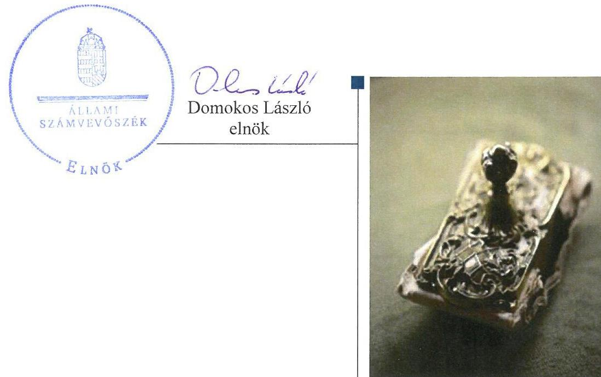
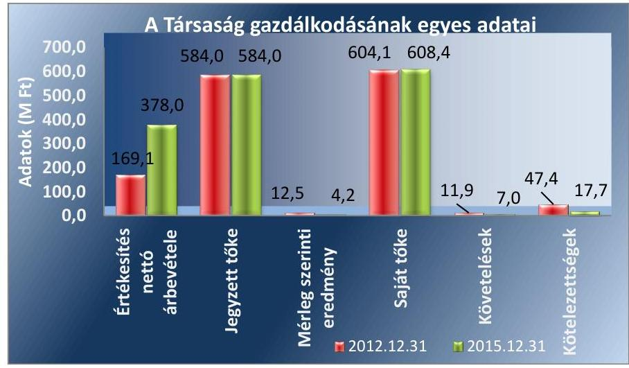
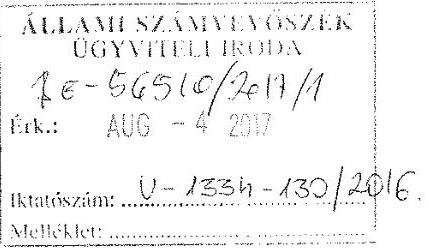
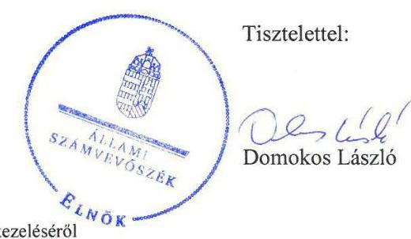
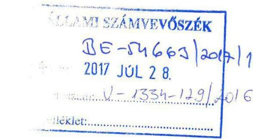

# Jelentés 

## Az önkormányzatok gazdasági társaságai

Az önkormányzatok többségi tulajdonában lévő gazdasági társaságok gazdálkodásának ellenőrzése - II. Kerületi Városfejlesztő és Beruházás-szervező Zrt.
2017.

---

# Jelentés 

## Az önkormányzatok gazdasági társaságai

Az önkormányzatok többségi tulajdonában lévő gazdasági társaságok gazdálkodásának ellenőrzése - II. Kerületi Városfejlesztő és Beruházás-szervező Zrt.
2017. 00 hó 10 nap

---

# AZ ELLENŐRZÉST FELÜGYELTE:

DR. NAGY IMRE felügyeleti vezető

# AZ ELLENŐRZÉST VEZETTE ÉS A VÉGREHAJTÁSÁÉRT FELELŐS:

SALAMIN VIKTOR ellenőrzésvezető

# A PROGRAM ÖSSZEÁLLÍTÁSÁÉRT FELELŐS:

JANIK JÓZSEF osztályvezető

IKTATÓSZÁM: V-1334-135/2016.

TÉMASZÁM: 2368

ELLENŐRZÉS-AZONOSÍTÓ SZÁM: V075831

Jelentéseink az Országgyűlés számítógépes hálózatán és az Interneta a www.asz.hu címen is olvashatóak.

---

# TARTALOMJEGYZÉK 

■ ÖSSZEGZÉS ..... 5
■ AZ ELLENŐRZÉS CÉLJA ..... 6
■ AZ ELLENŐRZÉS TERÜLETE ..... 7
■ AZ ELLENŐRZÉS HÁTTERE, INDOKOLTSÁGA ..... 9
■ A JELENTÉS LÉNYEGES KÉRDÉSKÖREI ..... 10
■ ELLENŐRZÉS HATÓKÖRE ÉS MÓDSZEREI ..... 11
■ MEGÁLLAPÍTÁSOK ..... 13
■ JAVASLATOK ..... 18
■ MELLÉKLETEK ..... 19
I. sz. melléklet: Értelmező szótár ..... 19
II. sz. melléklet: A Társaság főbb mérleg adatai ..... 20
■ FÜGGELÉK: ÉSZREVÉTELEK ..... 21
■ RÖVIDÍTÉSEK JEGYZÉKE ..... 27

---

.

---

# ÖSSZEGZÉS 

Budapest Főváros II. Kerületi Önkormányzat a tulajdonosi jogait összességében szabályszerűen alakította ki és gyakorolta. A II. Kerületi Városfejlesztő és Beruházás-szervező Zrt. a vagyonával szabályszerűen gazdálkodott, a bevételek és ráfordítások elszámolása megfelelő volt. A Társaság a számviteli beszámolási kötelezettségét szabályszerűen teljesítette, jelentéstételi és közzétételi kötelezettségének összességében nem tett eleget. A Társaság árképzése megfelelt a belső szabályoknak.

## Az ellenőrzés társadalmi indokoltsága

Magyarországon az intézmény-centrikus közfeladat-ellátás jellemző, de egyre jelentősebb a költségvetésen kívüli feladatellátás térnyerése. Helyi szinten ennek legfontosabb szereplői az önkormányzati tulajdonú gazdasági társaságok, amelyeknek ellenőrzése kiemelten fontos a közfeladat ellátása és a közvagyon megőrzése, megóvása érdekében. Ezért alapvető követelmény, hogy gazdálkodásuk, működésük szabályszerű és átlátható legyen.

Budapest II. Kerületben az ellenőrzött időszakban a II. Kerületi Városfejlesztő és Beruházás-szervező Zrt. végezte az intézményi közétkeztetés nyilvántartásával és adminisztrációjával kapcsolatos feladatokat, lakossági kedvezményrendszert működtetett, ügyfélszolgálati feladatokat bonyolított, valamint közfeladatként ellátta az önkormányzati tulajdonú lakások és nem lakás célú helyiségek üzemeltetési feladatait. A Társaság feladatellátása ezáltal a lakosság széles rétegét érintette. Az Állami Számvevőszék az ellenőrzése során arra kereste a választ, hogy 2012-2015. között szabályszerű volt-e a Társaság gazdálkodása és az Önkormányzat ehhez kapcsolódó tulajdonosi joggyakorlása.

Meggyőződésünk, hogy az ellenőrzés rendet, a rend értéket teremt. Ezért bízunk abban, hogy a jelentésben foglalt megállapítások és az ezek alapján megfogalmazott számvevőszéki javaslatok hasznosítása elősegítheti a feltárt hiányosságok orvoslását.

## Főbb megállapítások, következtetések, javaslatok

Az Önkormányzat a Társaság feletti tulajdonosi joggyakorlásának kereteit a jogszabályoknak megfelelően kialakította, a feladatellátás feltételeit biztosította, tulajdonosi jogait összességében szabályszerűen gyakorolta. Rendeletalkotási kötelezettségét teljesítette, a Társaság beszámolóit jóváhagyta. Az FB a felügyeleti tevékenység kereteit biztosító, jogszabályban foglalt ügyrenddel rendelkezett, azonban az abban foglalt beszámolási kötelezettségének a 20122015. években nem tett eleget.

A Társaság az előírt szabályzatokat elkészítette, azok a jogszabályi előírásoknak megfeleltek. A Társaság a vagyonával szabályszerűen gazdálkodott, az éves beszámolók adatait leltárral alátámasztotta, fizetőképessége biztosított volt.

Az éves beszámolókat a Társaság a jogszabályban és a belső szabályozásban előírt határidőben és tartalommal elkészítette, letétbe helyezte és közzétette. A vezérigazgató a jogszabályi és a belső előírások ellenére az FB felé történő háromhavonkénti jelentéskészítési kötelezettségének nem tett eleget. A Társaság a jogszabályban rögzített elektronikus közzétételi kötelezettségét hiányosan teljesítette, a jogszabályban előírt egyes adatokat nem hozott nyilvánosságra.

A Társaság bevételeinek, ráfordításainak, a beruházások és az értékcsökkenés elszámolása megfelelő volt. A megbízási díjak meghatározása a belső szabályozás előírásainak megfelelt.

---

# AZ ELLENŐRZÉS CÉLJA 

AZ ELLENŐRZÉS CÉLJA annak értékelése volt, hogy az önkormányzat vagyongazdálkodási tevékenysége során szabályszerűen gyakorolta-e a tulajdonosi jogait; a gazdasági társaság szabályozottsága, gazdálkodása és vagyongazdálkodási tevékenysége, bevételeinek és ráfordításainak elszámolása megfelelt-e a jogszabályi és tulajdonosi előírásoknak; a gazdasági társaság fizetőképessége biztosított volt-e a gazdálkodás során, valamint a gazdálkodás átláthatósága és elszámoltathatósága érdekében biztosítva volt-e a szolgáltatás dijának megalapozottsága szabályszerű önköltségszámítással.

---

# **A Z ELLENŐRZÉS TERŰLETE**

**Budapest Főváros II. Kerületi Önkormányzat és a kizárólagos tulajdonában lévő II. Kerületi Városfejlesztő és Beruházás-szervező Zrt.**

**BUDAPEST FŐVÁROS II. KERÜLETI ÖNKORMÁNYZAT** a II. Kerületi Városfejlesztő és Beruházás-szervező Zártkörűen Működő Részvénytársaságot 2009 júniusában 5,0 M Ft alaptőkével alapította. Az ellenőrzött időszak alatt az Önkormányzat¹ a Társaság² egyedüli részvényese, kizárólagos tulajdonosa volt. Az Önkormányzat tulajdonában a Társaságon kívül a 2015. év végén további öt gazdasági társaság volt. Az Önkormányzat a Társasággal – annak feladat-ellátására – Alapszerződést³, Fenntartási szerződést⁴ és Megbízási szerződés⁵⁻⁶⁷-t kötött. Az Önkormányzat vagyonkezelésre nem adott át eszközöket a Társaságnak.

**A TÁRSASÁG TEVÉKENYSÉGE** az intézményi közétkeztetés nyilvántartásával és adminisztrációjával kapcsolatos feladatok ellátása, lakossági kedvezményrendszer (II. Kerület Kártya program) működtetése, ügyfélszolgálati feladatok lebonyolítása, rendszergazdai feladatok ellátása, saját ingatlanok hasznosítása és üzemeltetése volt. A Társaság 2012 júliusától közfeladatként ellátta az önkormányzati tulajdonú lakások és nem lakás célú helyiségek műszaki, üzemeltetési, gazdasági és adminisztrációs feladatait is. A Társaság a 2015. év végén 1148 db ingatlant kezelt.

A Társaság jegyzett tőkéje 2012. január 1-jén 15,0 M Ft, 2015. december 31-én 584,0 M Ft volt. Az Önkormányzat a 2012. évben tőkeemelést hajtott végre 546,0 M Ft értékű ingatlanapporttal, valamint 23,0 M Ft értékű pénzbeli juttatással.

A Társaság gazdálkodásának egyes adatait az 1. ábra szemlélteti:

1. ábra

*Forrás: A Társaság 2012. és 2015. évi éves beszámolói*

---

A Társaság állományi létszáma a 2012. év eleji 9 főről - a feladatok bővülésével párhuzamosan - a 2015. év végére 21 főre emelkedett.

A Társaság nem rendelkezett részesedéssel más gazdasági társaságban és kormányzati szektorba nem volt besorolva a 2012-2015. években. A vezérigazgató 2009. június 25 -étől töltötte be tisztségét. A polgármester és a jegyző személyében a 2012-2015. években változás nem történt.

---

# AZ ELLENŐRZÉS HÁTTERE, INDOKOLTSÁGA 

AZ ÖNKORMÁNYZATOK TÖBBSÉGI TULAJDONÁBAN ÁLLÓ GAZDASÁGI TÁRSASÁGOK ellenőrzése kiemelten fontos a vagyon megőrzése, megóvása érdekében, amelyekkel szemben alapvető követelmény, hogy gazdálkodásuk, múködésük szabályszerű, az általuk szolgáltatott adatok minél megbízhatóbbak legyenek. A feladatellátás költségeinek, ráfordításainak alakulása a lakosság széles rétegét érinti. Ellenőrzéseink feltárhatják, hogy az önkormányzat a feladatellátásához rendelt vagyon múködtetését a tulajdonostól elvárható gondossággal végezte-e, a feladatot ellátó gazdasági társaság a létesítő okiratban, szolgáltatási szerződésben foglaltak betartásával biztosította-e a feladat ellátását. Az ellenőrzés rávilágíthat arra, hogy a gazdasági társaság a vagyon használatával biztosította-e a szolgáltatás folytatásának feltételeit, az önkormányzat tulajdonosi felügyelete hozzájárult-e a szabályszerű gazdálkodáshoz és feladatellátáshoz. A megállapítások alapján megfogalmazott számvevőszéki javaslatok hasznosítása elősegítheti a meglévő hibák megszüntetését. A jó gyakorlatok bemutatásával az ÁSZ ${ }^{6}$ hozzájárulhat a követendő megoldások megismertetéséhez, terjesztéséhez.

---

# A JELENTÉS LÉNYEGES KÉRDÉSKÖREI 

1.- Az önkormányzat tulajdonosi joggyakorlása szabályszerű volt-e?
2.- A gazdasági társaság vagyongazdálkodása szabályszerű volt-e, fizetőképessége biztositott volt-e a gazdálkodás során?
3.- A gazdasági társaság bevételeinek és ráfordításainak elszámolása, valamint az önköltségszámitás és árképzés szabályszerű volt-e?

---

# ELLENŐRZÉS HATÓKÖRE ÉS MÓDSZEREI 

## Az ellenőrzés típusa

Megfelelőségi ellenőrzés.

## Az ellenőrzött időszak

Az ellenőrzött időszak 2012. január 1-jétől 2015. december 31-éig tartott.

## Az ellenőrzés tárgya

Az önkormányzatok - többségi tulajdonában lévő gazdasági társaságok feletti - tulajdonosi joggyakorlása, valamint a gazdasági társaságok gazdálkodásának szabályozottsága és szabályszerűsége.

Az ellenőrzés kiterjedt minden olyan körülményre és adatra, amely az ÁSZ jogszabályban meghatározott feladatainak teljesítéséhez, valamint a program végrehajtása folyamán felmerült újabb összefüggések feltárásához szükséges volt.

## Az ellenőrzött szervezet

Budapest Főváros II. Kerületi Önkormányzat és a kizárólagos tulajdonában lévő II. Kerületi Városfejlesztő és Beruházás-szervező Zrt.

## Az ellenőrzés jogalapja

Az ellenőrzés jogszabályi alapját az ÁSZ tv. ${ }^{7}$ 1. § (3) bekezdése és 5. § (3)-(4)-(5) bekezdései képezték.

## Az ellenőrzés módszerei

Az ellenőrzést a nemzetközi standardokat irányadónak tekintve az ellenőrzési program ellenőrzési kérdései, az ellenőrzött időszakban hatályos jogszabályok, az ellenőrzés szakmai szabályok és módszertanok figyelembe vételével végeztük.

Az ellenőrzés ideje alatt az ellenőrzött szervezettel történő kapcsolattartást az ÁSZ Szervezeti és Müködési Szabályzatának vonatkozó előírásai alapján biztosítottuk.

---

Az ellenőrzés a kiválasztott, kizárólagos tulajdonosi jogokat gyakorló önkormányzatra, illetve az ellenőrzésre kijelölt gazdasági társaság felett tulajdonosi jogokat gyakorló szervezetre és az ellenőrzött gazdasági társaságra terjedt ki.

Az ellenőrzési kérdések megválaszolásához szükséges bizonyítékok megszerzése a következő ellenőrzési eljárások alkalmazásával történt: megfigyelés, kérdésfeltevés (információkérés), összehasonlítás, valamint elemző eljárás. Az ellenőrzési bizonyítékként felhasználható adatforrások közé tartoztak egyrészt az ellenőrzési programban felsorolt adatforrások, másrészt adatforrás lehetett még minden - az ellenőrzés folyamán - feltárt, az ellenőrzés szempontjából információkat tartalmazó dokumentum. Az ellenőrzést a kérdésekre adott válaszok kiértékelésével, valamint a megjelölt adatforrások, a csatolt tanúsítványok felhasználásával, továbbá az adott időszakban hatályos jogszabályok figyelembe vételével folytattuk le.

A gazdasági társaság bevételei és ráfordításai, ezeken belül az értékcsökkenés, valamint a vagyonnyilvántartás szabályszerűségének megítéléséhez a bevételeket és a ráfordításokat, a tárgyi eszközök állományváltozásait tartalmazó adott évi főkönyvi kivonat adatbázisát vettük alapul. A minta kiválasztása során véletlen mintavételt alkalmaztunk évenkénti, elemszámmal arányos rétegezéssel a teljes időszakra vonatkozóan. A mintavételt megelőzően az anyagjellegú ráfordítások, valamint a tárgyi-eszköz növekedési tételei sokaságból évente sokaságonként kiemeltük a 3-3 legnagyobb összegű tételt annak biztosítására, hogy az ellenőrzés az egyszerű véletlen mintavétel ellenére a legnagyobb értékű tételek ellenőrzésére biztosan kiterjedjen. A lényegességi szempontokat figyelembe véve a mintavétel előtt az anyagjellegű ráfordítások közül kiszűrtük a postaköltséget, bankköltséget, minden sokaságból az elszámolt kerekítési különbözetet, a helyesbítő tételek összegét, a technikai és rendező tételeket, az árfolyamkülönbözeteket.

---

# 1. Az önkormányzat tulajdonosi joggyakorlása szabályszerű volt-e? 

Összegző megállapítás

Az Önkormányzat tulajdonosi jogait összességében szabályszerűen gyakorolta.

### 1.1. számú megállapítás

Az Önkormányzat tulajdonosi joggyakorlásának kereteit összességében szabályszerűen alakította ki.

GAZDASÁGI PROGRAM ${ }_{1.2}{ }^{8}$-mal az Önkormányzat az Ötv ${ }^{9}$. 91. § (1) bekezdése, valamint az Mötv. ${ }^{10}$ 116. § (1) bekezdésében foglaltaknak megfelelően rendelkezett, mely tartalmazta a Társaságra vonatkozó fejlesztési elképzeléseket.

Az Önkormányzat a Vagyonrendelet ${ }^{11}$ 5. § (1) bekezdésében, illetve az Nvtv. ${ }^{12}$ 9. § (1) bekezdésében foglaltak ellenére közép- és hosszú távú vagyongazdálkodási tervet nem készített.

A TULAJ DONOSI JOGOK gyakorlásának rendjét az Önkormányzat a Vagyonrendeletben, az Alapító okirat ${ }_{3-3}{ }^{13}$-ban, valamint az Alapszabály ${ }_{3-4}{ }^{14}$-ban alakította ki. Az Alapító okirat ${ }_{3-3}$-ban és az Alapszabály ${ }_{3-4^{-}}$ ban - a Gt. ${ }^{15}$ és a Ptk. ${ }^{16}$ előírásaival összhangban - kijelölték a Társaság vezérigazgatóját ${ }^{17}$, rendelkeztek az $\mathrm{FB}^{18}$ létrehozásáról és tagjainak kinevezéséről, valamint a könyvvizsgáló személyéről, megbízatásának időtartamáról.

IGAZGATÓSÁG KINEVEZÉSÉRE a Társaságnál nem került sor, annak jogait a Gt. 247. §-ával, a Ptk. 3:283. §-ával, illetve a Taktv. ${ }^{19}$ 3. § (2) bekezdésével összhangban a vezérigazgató gyakorolta. A vezérigazgató feladatait az Alapító okirat ${ }_{3-3}$ és az Alapszabály ${ }_{3-4}$ határozta meg.

AZ FB-t a Taktv. 4. § (1) bekezdésének megfelelően létrehozták. Az FB a Gt. 34. § (4) bekezdésében és a Ptk. ${ }_{2}$ 3:122. § (3) bekezdésében előírtak szerint rendelkezett Ügyrenddel ${ }^{20}$, melyet a Képviselő-testület a Gt. 34.§ (4) bekezdésének megfelelően jóváhagyott.

RENDELETALKOTÁSI KÖTELEZETTSÉGE az Önkormányzatnak a Társaság tevékenységével kapcsolatban a Lakástörvény ${ }^{21}$ alapján az Mótv. 13. § (1) bekezdés 9. pontjában megnevezett lakás- és helyiséggazdálkodás, mint közfeladat ellátásával kapcsolatban volt, melynek eleget tett.

A JAVADALMAZÁSI SZABÁLYZATOT ${ }^{22}$ a Képviselő-testület határozatával jóváhagyta, az a Taktv. 5. § (3) bekezdésében foglalt előírásoknak megfelelt.

---

# 1.2. számú megállapítás 

A tulajdonosi jogok gyakorlása összességében szabályszerű volt.
A TULAJ DONOSI JOGOKAT a Társaság esetében a Vagyonrendelet 6. § (2) bekezdésében előírtaknak megfelelően a Képviselő-testület ${ }^{23}$ gyakorolta.

AZ FB a Gt. 34. § (1) bekezdésével, a Ptk. 3:121 § (1) bekezdésével, illetve a Taktv. 4. § (2) bekezdésével összhangban három főből állt.

Az FB az Ügyrend 2.3. pontjában előírt - a végzett munkájáról szóló beszámolási kötelezettségének a 2012-2015. években nem tett eleget.

A TÁRSASÁG SZÁMV. TV. ${ }^{24}$ SZERINTI BESZÁMOLÓIT a Képviselő-testület az Alapító okirat ${ }_{1-3}$ és az Alapszabály ${ }_{1-4}$, a Gt., valamint a Ptk. előírásának megfelelően határozattal elfogadta. A beszámolók elfogadásáról szóló előterjesztések tartalmazták a könyvvizsgálói jelentéseket. A beszámolók elfogadása során a Képviselő-testület rendelkezésére álltak az FB-i határozatok.

AZ ELLENŐRZÉS LEHETŐSÉGÉVEL az Önkormányzat az Áht. ${ }^{25}$ 70. § (1) bekezdés d) pontjában foglaltak alapján 2013-ban egy -2011-ben lefolytatott ellenőrzéshez kapcsolódó - utóellenőrzés keretében élt. Az utóellenőrzés megállapította, hogy az intézkedési tervben foglaltakat végrehajtották. Az Önkormányzat 2012. és 2014-2015. évi belső ellenőrzési terve a Társaságra vonatkozó ellenőrzést nem tartalmazott.

## 2. A gazdasági társaság vagyongazdálkodása szabályszerű volt-e, fizetőképessége biztosított volt-e a gazdálkodás során?

Összegző megállapítás

A Társaság szabályzatait a jogszabályi előírásoknak megfelelően elkészítette, vagyongazdálkodása szabályszerű, fizetőképessége biztosított volt. A Társaság a beszámoló készítési kötelezettségének eleget tett, közzétételi kötelezettségét azonban hiányosan teljesítette.
2.1. számú megállapítás

A Társaság rendelkezett a jogszabályban előírt szabályzatokkal, azok tartalma megfelelt az előírásoknak.

A SZÁMVITELI POLITIKÁT ${ }_{1-4}{ }^{26}$ a Társaság a Számv. tv. 14. § (3)-(4) bekezdéseinek megfelelően kialakította és írásba foglalta, melyet a 2012-2015. években a Számv. tv. 14. § (11) bekezdésének eleget téve aktualizált.

A Társaság a Számv. tv. 14. § (5) bekezdés a), b) és d) pontjaiban foglaltaknak eleget téve elkészítette az eszközök és a források leltárkészítési és leltározási szabályzatát, az eszközök és a források értékelési szabályzatát, valamint a pénzkezelési szabályzatot. Rendelkezett továbbá a Számv. tv. 161. § (1) bekezdésében előírt számlarenddel, a Számv. tv. 161. § (2) bekezdés d) pontja szerinti bizonylati renddel, illetve selejtezési szabályzattal. A szabályzatok a jogszabályi előírásoknak megfeleltek.

---

### 2.2. számú megállapítás

2. táblázat

A SZÁLLÍTÓI KÖTELEZETTSÉGEK ÉV VÉGI ÁLLOMÁNYÁNAK FIZETÉSI HATÁRIDŐ SZERINTI ALAKULÁSA (M FT)

|  Készlet: |  |  |  |   |
| --- | --- | --- | --- | --- |
|  Hozl meglé | 2012. | 2013. | 2014. | 2015.  |
|  száma |  |  |  |   |
|  Határidőn | 7,0 | 0,6 | $-0,1$ | 2,7  |
|  belül | 1,4 | 0,6 | 2,3 | 0,6  |
|  1-30 nap | 0,0 | 0,0 | 0,0 | 0,0  |
|  31 nap vagy | 8,4 | 1,2 | 2,2 | 3,3  |
|  afelett |  |  |  |   |
|  Összesen | 8,4 | 1,2 | 2,2 | 3,3  |

2.4. számú megállapítás

2. táblázat

A SZÁLLÍTÓI KÖTELEZETTSÉGEK ÉV VÉGI ÁLLOMÁNYÁNAK FIZETÉSI HATÁRIDŐ SZERINTI ALAKULÁSA (M FT)

|  Készlet: |  |  |  |   |
| --- | --- | --- | --- | --- |
|  Hozl meglé | 2012. | 2013. | 2014. | 2015.  |
|  száma |  |  |  |   |
|  Határidőn | 7,0 | 0,6 | $-0,1$ | 2,7  |
|  belül | 1,4 | 0,6 | 2,3 | 0,6  |
|  1-30 nap | 0,0 | 0,0 | 0,0 | 0,0  |
|  31 nap vagy | 8,4 | 1,2 | 2,2 | 3,3  |
|  afelett |  |  |  |   |
|  Összesen | 8,4 | 1,2 | 2,2 | 3,3  |

2. táblázat

A SZÁLLÍTÓI KÖTELEZETTSÉGEK ÉV VÉGI ÁLLOMÁNYÁNAK FIZETÉSI HATÁRIDŐ SZERINTI ALAKULÁSA (M FT)

|  Készlet: |  |  |  |   |
| --- | --- | --- | --- | --- |
|  Hozl meglé | 2012. | 2013. | 2014. | 2015.  |
|  száma |  |  |  |   |
|  Határidőn | 7,0 | 0,6 | $-0,1$ | 2,7  |
|  belül | 1,4 | 0,6 | 2,3 | 0,6  |
|  1-30 nap | 0,0 | 0,0 | 0,0 | 0,0  |
|  31 nap vagy | 8,4 | 1,2 | 2,2 | 3,3  |
|  afelett |  |  |  |   |
|  Összesen | 8,4 | 1,2 | 2,2 | 3,3  |

2. táblázat

A SZÁLLÍTÓI KÖTELEZETTSÉGEK ÉV VÉGI ÁLLOMÁNYÁNAK FIZETÉSI HATÁRIDŐ SZERINTI ALAKULÁSA (M FT)

|  Készlet: |  |  |  |   |
| --- | --- | --- | --- | --- |
|  Hozl meglé | 2012. | 2013. | 2014. | 2015.  |
|  száma |  |  |  |   |
|  Határidőn | 7,0 | 0,6 | $-0,1$ | 2,7  |
|  belül | 1,4 | 0,6 | 2,3 | 0,6  |
|  1-30 nap | 0,0 | 0,0 | 0,0 | 0,0  |
|  31 nap vagy | 8,4 | 1,2 | 2,2 | 3,3  |
|  afelett |  |  |  |   |
|  Összesen | 8,4 | 1,2 | 2,2 | 3,3  |

2. táblázat

A SZÁLLÍTÓI KÖTELEZETTSÉGEK ÉV VÉGI ÁLLOMÁNYÁNAK FIZETÉSI HATÁRIDŐ SZERINTI ALAKULÁSA (M FT)

|  Készlet: |  |  |  |   |
| --- | --- | --- | --- | --- |
|  Hozl meglé | 2012. | 2013. | 2014. | 2015.  |
|  száma |  |  |  |   |
|  Határidőn | 7,0 | 0,6 | $-0,1$ | 2,7  |
|  belül | 1,4 | 0,6 | 2,3 | 0,6  |
|  1-30 nap | 0,0 | 0,0 | 0,0 | 0,0  |
|  31 nap vagy | 8,4 | 1,2 | 2,2 | 3,3  |
|  afelett |  |  |  |   |
|  Összesen | 8,4 | 1,2 | 2,2 | 3,3  |

2. táblázat

A SZÁLLÍTÓI KÖTELEZETTSÉGEK ÉV VÉGI ÁLLOMÁNYÁNAK FIZETÉSI HATÁRIDŐ SZERINTI ALAKULÁSA (M FT)

|  Készlet: |  |  |  |   |
| --- | --- | --- | --- | --- |
|  Hozl meglé | 2012. | 2013. | 2014. | 2015.  |
|  száma |  |  |  |   |
|  Határidőn | 7,0 | 0,6 | $-0,1$ | 2,7  |
|  belül | 1,4 | 0,6 | 2,3 | 0,6  |
|  1-30 nap | 0,0 | 0,0 | 0,0 | 0,0  |
|  31 nap vagy | 8,4 | 1,2 | 2,2 | 3,3  |
|  afelett |  |  |  |   |
|  Összesen | 8,4 | 1,2 | 2,2 | 3,3  |

2. táblázat

A SZÁLLÍTÓI KÖTELEZETTSÉGEK ÉV VÉGI ÁLLOMÁNYÁNAK FIZETÉSI HATÁRIDŐ SZERINTI ALAKULÁSA (M FT)

|  Készlet: |  |  |  |   |
| --- | --- | --- | --- | --- |
|  Hozl meglé | 2012. | 2013. | 2014. | 2015.  |
|  száma |  |  |  |   |
|  Határidőn | 7,0 | 0,6 | $-0,1$ | 2,7  |
|  belül | 1,4 | 0,6 | 2,3 | 0,6  |
|  1-30 nap | 0,0 | 0,0 | 0,0 | 0,0  |
|  31 nap vagy | 8,4 | 1,2 | 2,2 | 3,3  |
|  afelett |  |  |  |   |
|  Összesen | 8,4 | 1,2 | 2,2 | 3,3  |

2. táblázat

A SZÁLLÍTÓI KÖTELEZETTSÉGEK ÉV VÉGI ÁLLOMÁNYÁNAK FIZETÉSI HATÁRIDŐ SZERINTI ALAKULÁSA (M FT)

|  Készlet: |  |  |  |   |
| --- | --- | --- | --- | --- |
|  Hozl meglé | 2012. | 2013. | 2014. | 2015.  |
|  száma |  |  |  |   |
|  Határidőn | 7,0 | 0,6 | $-0,1$ | 2,7  |
|  belül | 1,4 | 0,6 | 2,3 | 0,6  |
|  1-30 nap | 0,0 | 0,0 | 0,0 | 0,0  |
|  31 nap vagy | 8,4 | 1,2 | 2,2 | 3,3  |
|  afelett |  |  |  |   |
|  Összesen | 8,4 | 1,2 | 2,2 | 3,3  |

2. táblázat

A SZÁLLÍTÓI KÖTELEZETTSÉGEK ÉV VÉGI ÁLLOMÁNYÁNAK FIZETÉSI HATÁRIDŐ SZERINTI ALAKULÁSA (M FT)

|  Készlet: |  |  |  |   |
| --- | --- | --- | --- | --- |
|  Hozl meglé | 2012. | 2013. | 2014. | 2015.  |
|  száma |  |  |  |   |
|  Határidőn | 7,0 | 0,6 | $-0,1$ | 2,7  |
|  belül | 1,4 | 0,6 | 2,3 | 0,6  |
|  1-30 nap | 0,0 | 0,0 | 0,0 | 0,0  |
|  31 nap vagy | 8,4 | 1,2 | 2,2 | 3,3  |
|  afelett |  |  |  |   |
|  Összesen | 8,4 | 1,2 | 2,2 | 3,3  |

2. táblázat

A SZÁLLÍTÓI KÖTELEZETTSÉGEK ÉV VÉGI ÁLLOMÁNYÁNAK FIZETÉSI HATÁRIDŐ SZERINTI ALAKULÁSA (M FT)

|  Készlet: |  |  |  |   |
| --- | --- | --- | --- | --- |
|  Hozl meglé | 2012. | 2013. | 2014. | 2015.  |
|  száma |  |  |  |   |
|  Határidőn | 7,0 | 0,6 | $-0,1$ | 2,7  |
|  belül | 1,4 | 0,6 | 2,3 | 0,6  |
|  1-30 nap | 0,0 | 0,0 | 0,0 | 0,0  |
|  31 nap vagy | 8,4 | 1,2 | 2,2 | 3,3  |
|  afelett |  |  |  |   |
|  Összesen | 8,4 | 1,2 | 2,2 | 3,3  |

2. táblázat

A SZÁLLÍTÓI KÖTELEZETTSÉGEK ÉV VÉGI ÁLLOMÁNYÁNAK FIZETÉSI HATÁRIDŐ SZERINTI ALAKULÁSA (M FT)

|  Készlet: |  |  |  |   |
| --- | --- | --- | --- | --- |
|  Hozl meglé | 2012. | 2013. | 2014. | 2015.  |
|  száma |  |  |  |   |
|  Határidőn | 7,0 | 0,6 | $-0,1$ | 2,7  |
|  belül | 1,4 | 0,6 | 2,3 | 0,6  |
|  1-30 nap | 0,0 | 0,0 | 0,0 | 0,0  |
|  31 nap vagy | 8,4 | 1,2 | 2,2 | 3,3  |
|  afelett |  |  |  |   |
|  Összesen | 8,4 | 1,2 | 2,2 | 3,3  |

2. táblázat

A SZÁLLÍTÓI KÖTELEZETTSÉGEK ÉV VÉGI ÁLLOMÁNYÁNAK FIZETÉSI HATÁRIDŐ SZERINTI ALAKULÁSA (M FT)

|  Készlet: |  |  |  |   |
| --- | --- | --- | --- | --- |
|  Hozl meglé | 2012. | 2013. | 2014. | 2015.  |
|  száma |  |  |  |   |
|  Határidőn | 7,0 | 0,6 | $-0,1$ | 2,7  |
|  belül | 1,4 | 0,6 | 2,3 | 0,6  |
|  1-30 nap | 0,0 | 0,0 | 0,0 | 0,0  |
|  31 nap vagy | 8,4 | 1,2 | 2,2 | 3,3  |
|  afelett |  |  |  |   |
|  Összesen | 8,4 | 1,2 | 2,2 | 3,3  |

2. táblázat

A SZÁLLÍTÓI KÖTELEZETTSÉGEK ÉV VÉGI ÁLLOMÁNYÁNAK FIZETÉSI HATÁRIDŐ SZERINTI ALAKULÁSA (M FT)

|  Készlet: |  |  |  |   |
| --- | --- | --- | --- | --- |
|  Hozl meglé | 2012. | 2013. | 2014. | 2015.  |
|  száma |  |  |  |   |
|  Határidőn | 7,0 | 0,6 | $-0,1$ | 2,7  |
|  belül | 1,4 | 0,6 | 2,3 | 0,6  |
|  1-30 nap | 0,0 | 0,0 | 0,0 | 0,0  |
|  31 nap vagy | 8,4 | 1,2 | 2,2 | 3,3  |
|  afelett |  |  |  |   |
|  Összesen | 8,4 | 1,2 | 2,2 | 3,3  |

2. táblázat

A SZÁLLÍTÓI KÖTELEZETTSÉGEK ÉV VÉGI ÁLLOMÁNYÁNAK FIZETÉSI HATÁRIDŐ SZERINTI ALAKULÁSA (M FT)

|  Készlet: |  |  |  |   |
| --- | --- | --- | --- | --- |
|  Hozl meglé | 2012. | 2013. | 2014. | 2015.  |
|  száma |  |  |  |   |
|  Határidőn | 7,0 | 0,6 | $-0,1$ | 2,7  |
|  belül | 1,4 | 0,6 | 2,3 | 0,6  |
|  1-30 nap | 0,0 | 0,0 | 0,0 | 0,0  |
|  31 nap vagy | 8,4 | 1,2 | 2,2 | 3,3  |
|  afelett |  |  |  |   |
|  Összesen | 8,4 | 1,2 | 2,2 | 3,3  |

2. táblázat

A SZÁLLÍTÓI KÖTELEZETTSÉGEK ÉV VÉGI ÁLLOMÁNYÁNAK FIZETÉSI HATÁRIDŐ SZERINTI ALAKULÁSA (M FT)

|  Készlet: |  |  |  |   |
| --- | --- | --- | --- | --- |
|  Hozl meglé | 2012. | 2013. | 2014. | 2015.  |
|  száma |  |  |  |   |
|  Határidőn | 7,0 | 0,6 | $-0,1$ | 2,7  |
|  belül | 1,4 | 0,6 | 2,3 | 0,6  |
|  1-30 nap | 0,0 | 0,0 | 0,0 | 0,0  |
|  31 nap vagy | 8,4 | 1,2 | 2,2 | 3,3  |
|  afelett |  |  |  |   |
|  Összesen | 8,4 | 1,2 | 2,2 | 3,3  |

2. táblázat

A SZÁLLÍTÓI KÖTELEZETTSÉGEK ÉV VÉGI ÁLLOMÁNYÁNAK FIZETÉSI HATÁRIDŐ SZERINTI ALAKULÁSA (M FT)

|  Készlet: |  |  |  |   |
| --- | --- | --- | --- | --- |
|  Hozl meglé | 2012. | 2013. | 2014. | 2015.  |
|  száma |  |  |  |   |
|  Határidőn | 7,0 | 0,6 | $-0,1$ | 2,7  |
|  belül | 1,4 | 0,6 | 2,3 | 0,6  |
|  1-30 nap | 0,0 | 0,0 | 0,0 | 0,0  |
|  31 nap vagy | 8,4 | 1,2 | 2,2 | 3,3  |
|  afelett |  |  |  |   |
|  Összesen | 8,4 | 1,2 | 2,2 | 3,3  |
|  1-30 nap | 0,0 | 0,0 | 0,0 | 0,0  |
|  31 nap vagy | 8,4 | 1,2 | 2,2 | 3,3  |
|  afelett |  |  |  |   |
|  Összesen | 8,4 | 1,2 | 2,2 | 3,3  |
|  1-30 nap | 0,0 | 0,0 | 0,0 | 0,0  |
|  31 nap vagy | 8,4 | 1,2 | 2,2 | 3,3  |
|  afelett |  |  |  |   |
|  Összesen | 8,4 | 1,2 | 2,2 | 3,3  |
|  1-30 nap | 0,0 | 0,0 | 0,0 | 0,0  |
|  31 nap vagy | 8,4 | 1,2 | 2,2 | 3,3  |
|  afelett |  |  |  |   |
|  Összesen | 8,4 | 1,2 | 2,2 | 3,3  |
|  1-30 nap | 0,0 | 0,0 | 0,0 | 0,0  |
|  31 nap vagy | 8,4 | 1,2 | 2,2 | 3,3  |
|  afelett |  |  |  |   |
|  Összesen | 8,4 | 1,2 | 2,2 | 3,3  |
|  1-30 nap | 0,0 | 0,0 | 0,0 | 0,0  |
|  31 nap vagy | 8,4 | 1,2 | 2,2 | 3,3  |
|  afelett |  |  |  |   |
|  Összesen | 8,4 | 1,2 | 2,2 | 3,3  |
|  1-30 nap | 0,0 | 0,0 | 0,0 | 0,0  |
|  31 nap vagy | 8,4 | 1,2 | 2,2 | 3,3  |
|  afelett |  |  |  |   |
|  Összesen | 8,4 | 1,2 | 2,2 | 3,3  |
|  1-30 nap | 0,0 | 0,0 | 0,0 | 0,0  |
|  31 nap vagy | 8,4 | 1,2 | 2,2 | 3,3  |
|  afelett |  |  |  |   |
|  Összesen | 8,4 | 1,2 | 2,2 | 3,3  |
|  1-30 nap | 0,0 | 0,0 | 0,0 | 0,0  |
|  31 nap vagy | 8,4 | 1,2 | 2,2 | 3,3  |
|  afelett |  |  |  |   |
|  Összesen | 8,4 | 1,2 | 2,2 | 3,3  |
|  1-30 nap | 0,0 | 0,0 | 0,0 | 0,0  |
|  31 nap vagy | 8,4 | 1,2 | 2,2 | 3,3  |
|  afelett |  |  |  |   |
|  Összesen | 8,4 | 1,2 | 2,2 | 3,3  |
|  1-30 nap | 0,0 | 0,0 | 0,0 | 0,0  |
|  31 nap vagy | 8,4 | 1,2 | 2,2 | 3,3  |
|  afelett |  |  |  |   |
|  Összesen | 8,4 | 1,2 | 2,2 | 3,3  |
|  1-30 nap | 0,0 | 0,0 | 0,0 | 0,0  |
|  31 nap vagy | 8,4 | 1,2 | 2,2 | 3,3  |
|  afelett |  |  |  |   |
|  Összesen | 8,4 | 1,2 | 2,2 | 3,3  |
|  1-30 nap | 0,0 | 0,0 | 0,0 | 0,0  |
|  31 nap vagy | 8,4 | 1,2 | 2,2 | 3,3  |
|  afelett |  |  |  |   |
|  Összesen | 8,4 | 1,2 | 2,2 | 3,3  |
|  1-30 nap | 0,0 | 0,0 | 0,0 | 0,0  |
|  31 nap vagy | 8,4 | 1,2 | 2,2 | 3,3  |
|  afelett |  |  |  |   |
|  Összesen | 8,4 | 1,2 | 2,2 | 3,3  |
|  1-30 nap | 0,0 | 0,0 | 0,0 | 0,0  |
|  31 nap vagy | 8,4 | 1,2 | 2,2 | 3,3  |
|  afelett |  |  |  |   |
|  Összesen | 8,4 | 1,2 | 2,2 | 3,3  |
|  1-30 nap | 0,0 | 0,0 | 0,0 | 0,0  |
|  31 nap vagy | 8,4 | 1,2 | 2,2 | 3,3  |
|  afelett |  |  |  |   |
|  Összesen | 8,4 | 1,2 | 2,2 | 3,3  |
|  1-30 nap | 0,0 | 0,0 | 0,0 | 0,0  |
|  31 nap vagy | 8,4 | 1,2 | 2,2 | 3,3  |
|  afelett |  |  |  |   |
|  Összesen | 8,4 | 1,2 | 2,2 | 3,3  |
|  1-30 nap | 0,0 | 0,0 | 0,0 | 0,0  |
|  31 nap vagy | 8,4 | 1,2 | 2,2 | 3,3  |
|  afelett |  |  |  |   |
|  Összesen | 8,4 | 1,2 | 2,2 | 3,3  |
|  1-30 nap | 0,0 | 0,0 | 0,0 | 0,0  |
|  31 nap vagy | 8,4 | 1,2 | 2,2 | 3,3  |
|  afelett |  |  |  |   |
|  Összesen | 8,4 | 1,2 | 2,2 | 3,3  |
|  1-30 nap | 0,0 | 0,0 | 0,0 | 0,0  |
|  31 nap vagy | 8,4 | 1,2 | 2,2 | 3,3  |
|  afelett |  |  |  |   |
|  Összesen | 8,4 | 1,2 | 2,2 | 3,3  |
|  1-30 nap | 0,0 | 0,0 | 0,0 | 0,0  |
|  31 nap vagy | 8,4 | 1,2 | 2,2 | 3,3  |
|  afelett |  |  |  |   |
|  Összesen | 8,4 | 1,2 | 2,2 | 3,3  |
|  1-30 nap | 0,0 | 0,0 | 0,0 | 0,0  |
|  31 nap vagy | 8,4 | 1,2 | 2,2 | 3,3  |
|  afelett |  |  |  |   |
|  Összesen | 8,4 | 1,2 | 2,2 | 3,3  |
|  1-30 nap | 0,0 | 0,0 | 0,0 | 0,0  |
|  31 nap vagy | 8,4 | 1,2 | 2,2 | 3,3  |
|  afelett |  |  |  |   |
|  Összesen | 8,4 | 1,2 | 2,2 | 3,3  |
|  1-30 nap | 0,0 | 0,0 | 0,0 | 0,0  |
|  31 nap vagy | 8,4 | 1,2 | 2,2 | 3,3  |
|  afelett |  |  |  |   |
|  Összesen | 8,4 | 1,2 | 2,2 | 3,3  |
|  1-30 nap | 0,0 | 0,0 | 0,0 | 0,0  |
|  31 nap vagy | 8,4 | 1,2 | 2,2 | 3,3  |
|  afelett |  |  |  |   |
|  Összesen | 8,4 | 1,2 | 2,2 | 3,3  |
|  1-30 nap | 0,0 | 0,0 | 0,0 | 0,0  |
|  31 nap vagy | 8,4 | 1,2 | 2,2 | 3,3  |
|  afelett |  |  |  |   |
|  Összesen | 8,4 | 1,2 | 2,2 | 3,3  |
|  1-30 nap | 0,0 | 0,0 | 0,0 | 0,0  |
|  31 nap vagy | 8,4 | 1,2 | 2,2 | 3,3  |
|  afelett |  |  |  |   |
|  Összesen | 8,4 | 1,2 | 2,2 | 3,3  |
|  1-30 nap | 0,0 | 0,0 | 0,0 | 0,0  |
|  31 nap vagy | 8,4 | 1,2 | 2,2 | 3,3  |
|  afelett |  |  |  |   |
|  Összesen | 8,4 | 1,2 | 2,2 | 3,3  |
|  1-30 nap | 0,0 | 0,0 | 0,0 | 0,0  |
|  31 nap vagy | 8,4 | 1,2 | 2,2 | 3,3  |
|  afelett |  |  |  |   |
|  Összesen | 8,4 | 1,2 | 2,2 | 3,3  |
|  1-30 nap | 0,0 | 0,0 | 0,0 | 0,0  |
|  31 nap vagy | 8,4 | 1,2 | 2,2 | 3,3  |
|  afelett |  |  |  |   |
|  Összesen | 8,4 | 1,2 | 2,2 | 3,3  |
|  1-30 nap | 0,0 | 0,0 | 0,0 | 0,0  |
|  31 nap vagy | 8,4 | 1,2 | 2,2 | 3,3  |
|  afelett |  |  |  |   |
|  Összesen | 8,4 | 1,2 | 2,2 | 3,3  |
|  1-30 nap | 0,0 | 0,0 | 0,0 | 0,0  |
|  31 nap vagy | 8,4 | 1,2 | 2,2 | 3,3  |
|  afelett |  |  |  |   |
|  Összesen | 8,4 | 1,2 | 2,2 | 3,3  |
|  1-30 nap | 0,0 | 0,0 | 0,0 | 0,0  |
|  31 nap vagy | 8,4 | 1,2 | 2,2 | 3,3  |
|  31 nap vagy | 8,4 | 1,2 | 2,2 | 3,3  |
|  31 nap vagy | 8,4 | 1,2 | 2,2 | 3,3  |
|  31 nap vagy | 8,4 | 1,2 | 2,2 | 3,3  |
|  31 nap vagy | 8,4 | 1,2 | 2,2 | 3,3  |
|  31 nap vagy | 8,4 | 1,2 | 2,2 | 3,3  |
|  31 nap vagy | 8,4 | 1,2 | 2,2 | 3,3  |
|  31 nap vagy | 8,4 | 1,2 | 2,2 | 3,3  |
|  31 nap vagy | 8,4 | 1,2 | 2,2 | 3,3  |
|  31 nap vagy | 8,4 | 1,2 | 2,2 | 3,3  |
|  31 nap vagy | 8,4 | 1,2 | 2,2 | 3,3  |
|  31 nap vagy | 8,4 | 1,2 | 2,2 | 3,3  |
|  31 nap vagy | 8,4 | 1,2 | 2,2 | 3,3  |
|  31 nap vagy | 8,4 | 1,2 | 2,2 | 3,3  |
|  31 nap vagy | 8,4 | 1,2 | 2,2 | 3,3  |
|  31 nap vagy | 8,4 | 1,2 | 2,2 | 3,3  |
|  31 nap vagy | 8,4 | 1,2 | 2,2 | 3,3  |
|  31 nap vagy | 8,4 | 1,2 | 2,2 | 3,3  |
|  31 nap vagy | 8,4 | 1,2 | 2,2 | 3,3  |
|  31 nap vagy | 8,4 | 1,2 | 2,2 | 3,3  |
|  31 nap vagy | 8,4 | 1,2 | 2,2 | 3,3  |
|  31 nap vagy | 8,4 | 1,2 | 2,2 | 3,3  |
|  31 nap vagy | 8,4 | 1,2 | 2,2 | 3,3  |
|  31 nap vagy | 8,4 | 1,2 | 2,2 | 3,3  |
|  31 nap vagy | 8,4 | 1,2 | 2,2 | 3,3  |
|  31 nap vagy | 8,4 | 1,2 | 2,2 | 3,3  |
|  31 nap vagy | 8,4 | 1,2 | 2,2 | 3,3  |
|  31 nap vagy | 8,4 | 1,2 | 2,2 | 3,3  |
|  31 nap vagy | 8,4 | 1,2 | 2,2 | 3,3  |
|  31 nap vagy | 8,4 | 1,2 | 2,2 | 3,3  |
|  31 nap vagy | 8,4 | 1,2 | 2,2 | 3,3  |
|  31 nap vagy | 

---

között a Ptk. 3:284. § (1) bekezdésében foglaltak, valamint az Alapító okirat ${ }_{1-3}$ és az Alapszabály ${ }_{1-4}$ 9.1. g) pontja előírásának ellenére az FB felé történő háromhavonkénti jelentéskészítési kötelezettségének nem tett eleget.

Az üzleti terv készítését a Társaság SZMSZ ${ }_{1-3}{ }^{29}$-e előírta, ennek ellenére a Társaság a 2012-2014 években üzleti tervet nem készített. A 2015. évre az üzleti tervet elkészítették, azt a Képviselő-testület az Alapszabály4 rendelkezéseinek megfelelően határozattal elfogadta.

A Társaság az Infotv. ${ }^{30}$ 33. § (3) bekezdésében meghatározott elektronikus közzétételi kötelezettségének az Önkormányzat honlapján tett eleget.

A közzététel - az Infotv. 37. § (1) bekezdésében előírtak ellenére - öszszességében nem felelt meg az Infotv. 1. melléklet I-III. táblázataiban foglaltaknak. A közzététel nem tartalmazta a szervezeten belül illetékes ügyfélkapcsolati vezető nevét, elérhetőségét, az ügyfélfogadás rendjét (I. táblázat 4. sora); a Társaság feladatát, hatáskörét és alaptevékenységét meghatározó alapvető jogszabályok, a szervezeti és múködési szabályzat, ügyrend hatályos és teljes szövegét (II. táblázat 1. sora), a foglalkoztatottak létszámára, személyi juttatásaira vonatkozó összesített adatokat, összesítve a vezetők és vezető tisztségviselők illetményét, munkabérét, rendszeres juttatásait, valamint az egyéb alkalmazottaknak nyújtott juttatások fajtáját és mértékét összesítve (III. táblázat 2. sora).

# 3. A gazdasági társaság bevételeinek és ráfordításainak elszámolása, valamint az önköltségszámítás és árképzés szabályszerű volt-e? 

Összegző megállapítás

## 3.1. számú megállapítás

A Társaságnál a bevételek, a ráfordítások, a beruházások és az értékcsökkenés elszámolása megfelelő volt, a megbízási díjak meghatározása, az árképzés megfelelt a belső szabályozásban foglaltaknak.

A bevételek és ráfordítások, a beruházások, felújítások, valamint az értékcsökkenés elszámolása megfelelő volt.

A Társaság a Számlarend ${ }_{1-3}$-ben foglaltaknak megfelelően a bevételeit, költségeit-ráfordításait tevékenységenként elkülönítette.

AZ ÉRTÉKESÍTÉS NETTÓ ÁRBEVÉTELÉNEK és a pénzügyi műveletek bevételének elszámolása megfelelő volt.

AZ ANYAGJELLEGŰ RÁFORDÍTÁSOK és az egyéb ráfordítások elszámolása megfelelő volt.

A SZEMÉLYI JELLEGŰ RÁFORDÍTÁSOK ELSZÁMOLÁSA a Számv. tv. 79. §-ában, valamint a Cafetéria szabályzat ${ }_{1-4}{ }^{31}$ ban előírtaknak megfelelt.

---

3. táblázat

|  |   |   |
| --- | --- | --- |
|  ELSZÁMOLT ÉRTÉKCSÖKKENÉS ÉS |  |   |
|  ESZKÖZPÓTLÁSRA FORDÍTOTT ÖSSZEG |  |   |
|  (M FT) |  |   |
|  Év | Elszámolt |   |
|   | értékcsökke- | Eszközpótlás  |
|   | nés összege | összege  |
|  2012. | 8,2 | 8,7*  |
|  2013. | 7,7 | 2,5  |
|  2014. | 7,2 | 8,1  |
|  2015. | 8,7 | 6,5  |
|  Összesen | 31,8 | 25,8  |
|  Forrás: A Társaság 2012-2015. évi éves beszámolói |  |   |
|  *a 2012. évi apport értéke nélkül |  |   |

A BERUHÁZÁSOK, FELÚJÍTÁSOK elszámolása megfelelő volt. Az üzembe helyezést a Számv. tv. 52. § (2) bekezdése szerint hitelt érdemlően dokumentálták.

## A TÁRGYI ESZKÖZÖK ÉRTÉKCSÖKKENÉSÉNEK

ELSZÁMOLÁSA a Számv. tv. 52. §-ában, valamint az Értékelési szabályzat ${ }_{1-3}{ }^{32}$-ban rögzítetteknek megfelelt.

A Társaság vagyonát érintő eszközpótlás értéke a 2012-2015. években összességében nem érte el az értékcsökkenés értékét. Az elszámolt értékcsökkenés és eszközpótlás összegét a 3. táblázat, az egyes eszközcsoportok használhatósági fokának alakulását az 4. táblázat mutatja be. 4. táblázat

EGYES ESZKÖZCSOPORTOK HASZNÁLHATÓSÁGI FOKÁNAK ALAKULÁSA A 2012-2015. ÉVEKBEN (\%)

|  Megnevezés | 2012. | 2013. | 2014. | 2015.  |
| --- | --- | --- | --- | --- |
|  Ingatlanok és vagyoni értékű jogok | 99,4 | 98,6 | 97,8 | 97,0  |
|  Műszaki berendezések, gépek, járművek | 75,1 | 62,7 | 78,1 | 65,0  |
|  Egyéb berendezések, felszerelések, járművek | 30,6 | 21,7 | 16,5 | 27,9  |
|  Forrás: A Társaság 2012-2015. évi éves beszámoló adataiból képzett mutatók |  |  |  |   |

A TÁRSASÁG GAZDÁLKODÁSA a 2014. év kivételével nyereséges volt. A Képviselő-testület a 2012-2013. és a 2015. évi beszámoló elfogadásakor a mérleg szerinti nyereség eredménytartalékba helyezéséről rendelkezett a Gt., illetve a Ptk. ${ }_{2}$ előírása szerint. 3.2. számú megállapítás

Az alkalmazott megbízási díjak meghatározása, az árképzés megfelelit a belső utasításban foglaltaknak.

AZ ÁRKÉPZÉS SZABÁLYAIRÓL jogszabály nem rendelkezett, a Társaság által ellátott közfeladat nem tartozott a hatósági áras szolgáltatások körébe. A Megbízási szerződés ${ }_{1-6}$-ben alkalmazott díjak kalkulációs rendjét Vezérigazgatói utasításban ${ }^{33}$ határozták meg, az árképzést annak megfelelően végezték.

---

# JAVASLATOK 

Az ÁSZ tv. 33. § (1) bekezdésében foglaltak értelmében az ellenőrzött szervezet vezetője köteles a jelentésben foglalt megállapításokhoz kapcsolódó intézkedési tervet összeállítani és azt a jelentés kézhezvételétől számított 30 napon belül az ÁSZ részére megküldeni. Amennyiben az ellenőrzött szervezet vezetője nem küldi meg határidőben az intézkedési tervet, vagy továbbra sem elfogadható intézkedési tervet küld, az Állami Számvevőszék elnöke az ÁSZ tv. 33. § (3) bekezdése a) és b) pontjaiban foglaltakat érvényesítheti.

## A II. Kerületi Városfejlesztő és Beruházás-szervező Zrt. Vezérigazgatójának

1. Tegyen eleget a jogszabályban és a Társaság Alapszabályában foglalt jelentéstételi kötelezettségének.
(2.4 sz. megállapítás 2. bekezdése alapján)
2. Intézkedjen annak érdekében, hogy a Társaság a jogszabályban elöirt közzétételi kötelezettségének maradéktalanul eleget tegyen.
(2.4 sz. megállapítás 5. bekezdése alapján)

## Budapest Főváros II. Kerületi Önkormányzat Polgármesterének

1. Intézkedjen az Önkormányzat közép- és hosszú távú vagyongazdálkodási tervének elkészitéséről a jogszabályok elöirásainak megfelelően.
(1.1 sz. megállapítás 2. bekezdése alapján)
2. Intézkedjen, hogy az FB az ügyrendben elöirt beszámolási kötelezettségének eleget tegyen.
(1.2 sz. megállapítás 3. bekezdése alapján)

---

# MELLÉKLETEK 

- I. SZ. MELLÉKLET: ÉRTELMEZŐ SZÓTÁR
gazdasági társaság
közép és hosszú távú vagyongazdálkodási terv
közfeladat
közszolgáltatás
tulajdonosi joggyakorló

Ptk. 3 3.88. § (1) bekezdése szerint „a gazdasági társaságok üzletszerű közös gazdasági tevékenység folytatására, a tagok vagyoni hozzájárulásával létrehozott, jogi személyiséggel rendelkező vállalkozások, amelyekben a tagok a nyereségből közösen részesednek, és a veszteséget közösen viselik".
Az Nvtv. 7.§ (2) bekezdése szerint „a nemzeti vagyongazdálkodás feladata a nemzeti vagyon rendeltetésének megfelelő, az állam, az önkormányzat mindenkori teherbíró képességéhez igazodó, elsődlegesen a közfeladatok ellátásához és a mindenkori társadalmi szükségletek kielégítéséhez szükséges, egységes elveken alapuló, átlátható, hatékony és költségtakarékos müködtetése, értékének megőrzése, állagának védelme, értéknövelő használata, hasznosítása, gyarapítása, továbbá az állam vagy a helyi önkormányzat feladatának ellátása szempontjából feleslegessé váló vagyontárgyak elidegenítése." Az Nvtv. 9.§ (1) bekezdése szerint az önkormányzat ennek biztosítása céljából közép- és hosszú távú vagyongazdálkodási tervet köteles készíteni. (hatályos 2012. január 1-jétől)
Jogszabályban meghatározott állami vagy önkormányzati feladat, amit az arra kötelezett közérdekből, jogszabályban meghatározott követelményeknek és feltételeknek megfelelve végez, ideértve a lakosság közszolgáltatásokkal való ellátását, továbbá az állam nemzetközi szerződésekben vállalt kötelezettségeiből adódó közérdekű feladatokat, valamint e feladatok ellátásához szükséges infrastruktúra biztosítását is (Nvtv. 3. § (1) bekezdés 7. pont).
A közszolgáltatás: „közcélú, illetőleg közérdekű szolgáltatást jelent, amely egy nagyobb közösség (állam, település) minden tagjára nézve megközelítőleg azonos feltételek mellett vehető igénybe, ezért valamilyen mértékig közösségi megszervezést, illetve szabályozást, ellenőrzést igényel." Az Ebktv. ${ }^{34}$ 3. § d) pontja a következőképpen határozza meg a közszolgáltatást: „szerződéskötési kötelezettség alapján a lakosság alapvető szükségleteinek ellátására irányuló szolgáltatás, így különösen a villamos energia-, gáz-, hő-, víz-, szennyvíz- és hulladékkezelési, köztisztasági, postai és távközlési szolgáltatás, továbbá a menetrend alapján közlekedő járművekkel végzett közforgalmú személyszállítás".
Aki a nemzeti vagyon felett az államot vagy a helyi önkormányzatot megillető tulajdonosi jogok és kötelezettségek összességének gyakorlására jogosult. (Nvtv. 3. § (1) bekezdés 17. pont).

---

II. SZ. MELLÉKLET: A TÁRSASÁG FŐBB MÉRLEG ADATAI

| A II. KERÜLETI VÁROSFEJLESZTŐ ÉS BERUHÁZÁS-SZERVEZŐ ZRT. FŐBB MÉRLEG ADATAI (MILLIÓ FORINT) |  |  |  |  |  |
| :--: | :--: | :--: | :--: | :--: | :--: |
| Megnevezés | 2012.01.01. | 2012.12.31. | 2013.12.31. | 2014.12.31. | 2015.12.31. |
| Befektetett eszközök | 6,0 | 572,9 | 568,6 | 568,5 | 566,2 |
| - ebből: Tárgyi eszközök | 5,1 | 572,3 | 567,5 | 563,1 | 561,8 |
| Forgóeszközök | 25,7 | 69,8 | 40,7 | 41,6 | 48,3 |
| - ebből: Követelések | 16,6 | 11,9 | 4,4 | 6,3 | 7,0 |
| Aktív időbeli elhatárolások | 5,1 | 10,7 | 13,0 | 13,7 | 14,9 |
| ESZKÖZÖK ÖSSZESEN | 36,8 | 653,4 | 622,3 | 623,8 | 629,4 |
| Saját tőke | 22,6 | 604,1 | 605,1 | 604,2 | 608,4 |
| - ebből:Jegyzett tőke | 15,0 | 584,0 | 584,0 | 584,0 | 584,0 |
| - ebből: Mérleg szerinti eredmény | 1,8 | 12,5 | 1,0 | $-0,9$ | 4,2 |
| Céltartalékok | 0,0 | 0,0 | 0,0 | 0,0 | 0,0 |
| Kötelezettségek | 13,1 | 47,5 | 14,9 | 17,4 | 17,7 |
| Passzív időbeli elhatárolások | 1,1 | 1,8 | 2,3 | 2,2 | 3,3 |
| FORRÁSOK ÖSSZESEN | 36,8 | 653,4 | 622,3 | 623,8 | 629,4 |

Forrás: A Társaság 2012-2015. évi éves beszámolói

---

# FÜGGELÉK: ÉSZREVÉTELEK 

A jelentéstervezetet a Számvevőszék 15 napos észrevételezésre megküldte az ellenőrzött szervezetek vezetőinek az ÁSZ tv. 29. §* (1) bekezdése előírásának megfelelően.

Észrevételezési jogával a II. kerületi Városfejlesztő és Beruházás-szervező Zrt. vezérigazgatója élt.
A függelék tartalmazza az ellenőrzött észrevételét, illetve az el nem fogadott észrevétel elutasításának indoklását.

[^0]
[^0]:    * 29. § (1) Az Állami Számvevőszék az ellenőrzési megállapításait megküldi az ellenőrzött szervezet vezetőjének vagy az általa megbízott személynek, és annak, akinek személyes felelősségét állapította meg.
    (2) Az ellenőrzött szervezet vezetője és a felelősként megjelölt személy az ellenőrzés megállapításaira tizenöt napon belül írásban észrevételt tehet.
    (3) Az Állami Számvevőszék az észrevételre a beérkezésétől számított harminc napon belül írásban válaszol. A figyelembe nem vett észrevételeket köteles a jelentésben feltüntetni, és megindokolni, hogy azokat miért nem fogadta el.

---

# 4235 

Állami Számvevőszék
Domokos László elnök úr részére
1052 Budapest
Apáczai Csere János u. 10.

Tárgy: V-1334-122/2016 számú jelentéstervezet észrevételezése

Budapest, 2017. július 31.
Ikt.: III/220-5/2017

## Tisztelt Elnök Úr!

Megköszönve szíves tájékoztatásukat és a részünkre megküldött számvevőszéki jelentéstervezetet, az abban foglalt megállapítások közül az alábbival kapcsolatban kívánok észrevételt tenni:

A jelentéstervezet 2.4 számú megállapításának harmadik bekezdése úgy fogalmaz, hogy „Az üzleti terv készítését a társaság SZMSZ-e előírta, ennek ellenére a Társaság a 2012 - 2014 években üzleti tervet nem készített."

A hivatkozott SZMSZ hatásköri szabályokat állapít meg, így a "1.3. A társaság képviseleti rendszere" fejezetének „1.3.1. Az Alapító jogosult dönteni" pontja rendelkezik a kizárólagos alapítói hatáskörbe tartozó társasági döntésekről, amely alapján - egyebek között - az Alapító kizárólagos hatáskörébe tartozik:

## f) döntés a társaság éves üzleti tervének és stratégiai tervének elfogadásáról

Az SZMSZ idézett pontjának funkciójával (hatásköri szabályok rendezése) valamint az Alapító szándékaival összhangban értelmezésünk szerint jelen hatásköri szabály alapján, ha és amennyiben a Társaság üzleti tervet készít, ez esetben az Alapító jogosult elfogadni azt.

Az SZMSZ hivatkozott pontjának a) - r)-ig terjedő hatásköri szabályai túlnyomórészt olyan társasági eseményekkel kapcsolatos döntési hatásköröket tartalmaznak, melyek a társaság életében opcionális lehetőségek, mint pl. az alaptőke felemelésével és leszállításával kapcsolatos döntések, vagy a részvénysorozatokra vonatkozó jogok megváltoztatásáról való döntések hatásköre, melyek önmagukban, hatásköri szabályokként nem keletkeztetnek egyben társasági események megvalósítására vonatkozó kötelezettséget is.
A hivatkozott hatásköri szabályok közül egyesek rendelkeznek olyan társasági döntések hatásköréről melyeknél a döntést jogszabály írja elő a társaság számára, ám ezeket a rájuk vonatkozó külön jogszabály teszi kötelezővé, így a beszámoló készítést a Számviteli tv., az Alapszabály készítést a Ptk., stb.

Tekintettel arra, hogy Társaságunk részére sem jogszabály, sem egyéb, akár tulajdonosi rendelkezés nem írt elő üzleti terv készítési kötelezettséget a vizsgált időszakban, kérjük a jelentés tervezetben megállapításukat a fentiek alapján módosítani szíveskedjenek.

Tisztelettel:
dr. Tas Krisztián
vezérigazgató

Cg. 01-10-046405 = székhely: 1024 Budapest, Keleti Károly u. 15/a
iroda, levelezési cím: 1025 Budapest, Felső Zöldmáli út 128-130.
tel.: +36 15999060 = fax: +36 15999061 = e-mail: info@vf2.hu = www.vf2.hu

---

ELNÖK

Ikt.szám: V-1334-133/2016.

# Dr. Tas Krisztián úr 

vezérigazgató
II. Kerületi Városfejlesztő és Beruházás-szervező Zrt.

## Budapest

## Tisztelt Vezérigazgató Úr!

„Az önkormányzatok gazdasági társaságai - Az önkormányzatok többségi tulajdonában lévő gazdasági társaságok gazdálkodásának ellenörzése - II. Kerületi Városfejlesztő és Beruházásszervező Zrt." címmel készített számvevőszéki jelentéstervezetre tett észrevételét köszönettel megkaptam.
Az Állami Számvevőszék észrevételre vonatkozó álláspontjáról a felügyeleti vezető által készített részletes tájékoztatást csatoltan megküldöm.
Tájékoztatom a Vezérigazgató urat, hogy a számvevőszéki jelentésben - az Állami Számvevőszékről szóló 2011. évi LXVI. törvény 29. § (3) bekezdése alapján - a figyelembe nem vett észrevételt szerepeltetjük annak megindokolásával, hogy azt miért nem fogadtuk el.

Budapest, 2017. 08 . hó ㅇo nap

Melléklet: Tájékoztatás az észrevétel kezeléséről

---

FELÜGYELETI VEZETŐ

Melléklet
Ikt.szám: V-1334-133/2016.

# Tájékoztatás   az észrevétel kezeléséről 

„Az önkormányzatok gazdasági társaságai - Az önkormányzatok többségi tulajdonában lévő gazdasági társaságok gazdálkodásának ellenőrzése - II. Kerületi Városfejlesztő és Beruházásszervezö Zrt." című jelentéstervezetre 2017. július 31-én tett (az Állami Számvevőszékhez 2017. augusztus 04-én érkezett) észrevételét áttekintettük, annak kezelésével kapcsolatban a következő tájékoztatást adom.
A jelentéstervezet 2.4 számú megállapítás harmadik bekezdés első mondatára („Az üzleti terv készítését a Társaság SZMSZ1.3-e előirta, ennek ellenére a Társaság a 2012-2014 években üzleti tervet nem készített.") vonatkozó észrevétel
Az észrevételben leírtak szerint, „A hivatkozott SZMSZ hatásköri szabályokat állapít meg, így a „1.3. A társaság képviseleti rendszere" fejezetének „1.3.1. Az Alapító jogosult dönteni" pontja rendelkezik a kizárólagos alapítói hatáskörbe tartozó társasági döntésekről, amely alapján egyebek között - az Alapító kizárólagos hatáskörébe tartozik:
f) döntés a társaság éves üzleti tervének és stratégiai tervének elfogadásáról"
„...értelmezésünk szerint jelen hatásköri szabály alapján, ha és amennyiben a Társaság üzleti tervet készít, az esetben az Alapító jogosult elfogadni azt."
A jelentéstervezetben a 2.4 számú megállapítás harmadik bekezdés első mondatában tett megállapítás azonban nem az Önök által észrevételként hivatkozott SZMSZ 1.3.1. f) pontjában előírtak be nem tartását, hanem az SZMSZ ${ }_{1} 4$. pontjában,
(a „Gazdasági vezető legfontosabb feladatai:

- a Társaság üzleti tervének és éves beszámolójának, valamint rendszeres üzleti jelentéseinek előkészítése")
továbbá, az SZMSZ ${ }_{2}$ és az SZMSZ ${ }_{3}$ II. Szervezeti rész 4. pontjában:
(a „Gazdasági vezető feladata a Társaság központi pénzügyi-gazdasági tevékenységével kapcsolatban:
- a Társaság üzleti tervének elkészítése a vezérigazgató részére")
foglalt üzleti terv készítési kötelezettség elmulasztását állapítja meg.
Fentiek miatt az Állami Számvevőszék a megküldött észrevételt nem fogadja el. Erre tekintettel a 2.4 számú megállapítás harmadik bekezdés első mondatában tett megállapítás módosítása, illetve törlése nem indokolt.

Budapest, 2017. 06 hó 10 nap

Dr. Nagy Imre felügyeleti vezető

---

Budapest Főváros II. Kerületi Önkormányzat
Polgármester

1256
1024 Budapest, Mechwart liget 1. Budapest 23., Pf.21.1277

Telefon: 346-5400
Fax: 346-5431

# Domokos László 

## Elnök Úr részére

Állami Számvevőszék
Budapest 4.
Pf. 54.
1364

Tárgy: Válaszlevél V-1334-123/2016. számon megküldött jelentéstervezetre 1.112122. Szám: I-160-3/2017.
Ü.i.: dr. Murai Renáta

Tisztelt Elnök Úr!

Köszönettel megkaptuk „Az önkormányzatok gazdasági társaságai - Az önkormányzatok többségi tulajdonában lévő gazdasági társaságok gazdálkodásának ellenőrzése - II. Kerületi Városfejlesztő és Beruházás-szervező Zrt." címmel készült számvevőszéki jelentéstervezetüket.

A hivatkozott dokumentum tartalmát megismerve ezúton szeretném jelezni, hogy a megküldött számvevőszéki jelentéstervezettel kapcsolatban észrevételt Budapest Főváros II. Kerületi Önkormányzat részéről nem kívánok tenni.

Budapest, 2017. július 24.

Kollégái munkáját is megköszönve, tisztelettel:

---

.

---

# RÖVIDÍTÉSEK JEGYZÉKE 

${ }^{1}$ Önkormányzat ${ }^{2}$ Társaság ${ }^{3}$ Alapszerződés ${ }^{4}$ Fenntartási szerződés ${ }^{5}$ Megbízási szerződés ${ }_{1}$ Megbízási szerződés ${ }_{2}$ Megbízási szerződés ${ }_{3}$ Megbízási szerződés4 Megbízási szerződés5 Megbízási szerződés6 ${ }^{6}$ ÁSZ ${ }^{7}$ ÁSZ tv. ${ }^{8}$ Gazdasági program ${ }_{1}$ Gazdasági program ${ }_{2}$ ${ }^{9}$ Ötv. ${ }^{10}$ Mötv. ${ }^{11}$ Vagyonrendelet ${ }^{12}$ Nvtv. ${ }^{13}$ Alapító okirat ${ }_{1}$ Alapító okirat ${ }_{2}$

Budapest Főváros II. Kerületi Önkormányzat
II. Kerületi Városfejlesztő és Beruházás-szervező Zártkörűen Működő Részvénytársaság
Alapszerződés városfejlesztési feladatok ellátására (hatályos: 2009. július 20-ától)
Fenntartási szerződés a Közép-Magyarországi Operatív Program keretében végrehajtott akcióterületi rehabilitációs projekt fenntartására, üzemeltetésére (hatályos: 2011. december 7-étől öt évig)
Megbízási szerződés és módosításai az önálló működésű oktatási, nevelési, szociális és gyermekjóléti-gyermekvédelmi intézmények karbantartásával és hibaelhárításával kapcsolatos feladatok ellátásáról (hatályos: 2011. január 1. és december 31. között)
Megbízási szerződés és módosítása az önálló működésű oktatási, nevelési, szociális és gyermekjóléti-gyermekvédelmi intézmények közétkeztetési feladatainak lebonyolításáról és központi adminisztrációjával kapcsolatos egyes feladatok ellátásáról (hatályos: 2011. január 1-jétől)
Megbízási szerződés és módosításai az ügyfélszolgálati és II. Kerületi Kártya programhoz kapcsolódó rendszergazdai feladatok ellátásáról (hatályos: 2011. március 29-étől)
Megbízási szerződés az önálló működésű oktatási, nevelési, szociális és gyermekjólétigyermekvédelmi intézményekben végzendő beruházási-, felújítási munkákhoz kapcsolódó bonyolítói feladatok ellátásáról (hatályos: 2011. január 1-jétől).
Megbízási szerződés és módosítása a közterületeken ingyenes WIFI vezeték nélküli lakossági internet szolgáltatás létesítésének lebonyolításáról és a szolgáltatás fenntartásáról (hatályos: 2011. december 20-ától).
Megbízási szerződés az Önkormányzat tulajdonában álló lakások és helyiségek egyes tulajdonosi- és bérbeadói feladatainak, továbbá az önkormányzati vagyongazdálkodás körébe eső egyes feladatoknak ellátásáról (hatályos: 2012. június 1-jétől)
Állami Számvevőszék
az Állami Számvevőszékről szóló 2011. évi LXVI. törvény
a Képviselő-testület 16/2011. (IV. 29.) rendelete az Önkormányzat gazdasági programjáról (hatályos: 2011. május 2-ától a Gazdasági program2 hatályba lépéséig)
Budapest Főváros II. Kerületi Önkormányzat Gazdasági Programja - 2014-2019.
a helyi önkormányzatokról szóló 1990. évi LXV. törvény (hatálytalan: 2014. október 12-étől)
Magyarország helyi önkormányzatairól szóló 2011. évi CLXXXIX. törvény
Budapest Főváros II. Kerületi Önkormányzat Képviselő-testületének 34/2004. (X. 13.) számú önkormányzati rendelete az Önkormányzat vagyonáról és a vagyontárgyak feletti tulajdonosi jog gyakorlásáról, továbbá az önkormányzat tulajdonában lévő lakások és helyiségek elidegenítésének szabályairól, bérbeadásának feltételeiről. (Módosítva: 2004.12.01., 2005.06.28., 2006.11.27., 2007.09.21.,2007.12.22., 2008.02.04., 2009.10.27., 2009.12.21., 2011.04.29., 2012.02.13., 2012.03.30., 2012.04.13., 2012.09.27., 2013.02.28., 2013.06.26., 2013.10.30., 2014.02.21., 2014.04.30., 2014.09.24., 2015.03.27., 2015.07.17., 2015.10.31, 2015.12.23. napján) a nemzeti vagyonról szóló 2011. évi CXCVI. törvény
a II. Kerületi Városfejlesztő és Beruházás-szervező Zrt. alapító okirata (2010.11.25.)
a II. Kerületi Városfejlesztő és Beruházás-szervező Zrt. alapító okirata (2012.02.23.) és módosításai:2012.02.29., 2012.04.16.

---

| Alapító okirat3 | a II. Kerületi Városfejlesztő és Beruházás-szervező Zrt. alapító okirata (2012.06.26.) |
| :--: | :--: |
| ${ }^{14}$ Alapszabály ${ }_{1}$ | a II. Kerületi Városfejlesztő és Beruházás-szervező Zrt. alapszabálya (2014.05.01.) |
| Alapszabály ${ }_{2}$ | a II. Kerületi Városfejlesztő és Beruházás-szervező Zrt. alapszabálya (2014.09.23.) |
| Alapszabály ${ }_{3}$ | a II. Kerületi Városfejlesztő és Beruházás-szervező Zrt. alapszabálya (2014.12.01.) |
| Alapszabály ${ }_{4}$ | a II. Kerületi Városfejlesztő és Beruházás-szervező Zrt. alapszabálya (2015.10.29.) |
| ${ }^{15} \mathrm{Gt}$. | a gazdasági társaságokról szóló 2006. évi IV. törvény (hatálytalan: 2014. március 15étől) |
| ${ }^{16}$ Ptk. | a Polgári Törvénykönyvről szóló 2013. évi V. törvény (hatályos: 2014. március 15-étől) |
| ${ }^{17}$ vezérigazgató | a II. Kerületi Városfejlesztő és Beruházás-szervező Zrt. vezérigazgatója |
| ${ }^{18} \mathrm{FB}$ | a II. Kerületi Városfejlesztő és Beruházás-szervező Zrt. felügyelőbizottsága |
| ${ }^{19}$ Taktv. | a köztulajdonban álló gazdasági társaságok takarékosabb müködéséről szóló 2009.   évi CXXII. törvény |
| ${ }^{20}$ Ügyrend | a II. Kerületi Városfejlesztő és Beruházás-szervező Zrt. felügyelőbizottságának |
| ${ }^{21}$ Lakástörvény | ügyrendje (hatályos: 2010. április 29-étől) |
| ${ }^{22}$ Javadalmazási szabályzat | a lakások és helyiségek bérletére, valamint az elidegenítésükre vonatkozó egyes szabályokról szóló 1993. évi LXXVIII. törvény (hatályos: 1994. január 1-jétől) |
|  | Javadalmazási szabályzat a köztulajdonban álló gazdasági társaság vezető tisztségviselői, felügyelőbizottsági tagjai, valamint a Munka Törvénykönyvéről szóló 1992. évi XXII. törvény 188. § (1) bekezdése vagy 188/A. § (1) bekezdése hatálya alá eső munkavállalói javadalmazása, valamint a jogviszony megszűnése esetére biztosított juttatások módjának, mértékének elveiről, annak rendszeréről (hatályos: 2010. szeptember 23-ától) |
| ${ }^{23}$ Képviselő-testület | Budapest Főváros II. Kerületi Önkormányzat Képviselő-testülete |
| ${ }^{24}$ Számv. tv. | a számvitelről szóló 2000. évi C. törvény |
| ${ }^{25}$ Áht. | az államháztartásról szóló 2011. évi CXCV. törvény (hatályos: 2011. december 31étől) |
| ${ }^{26}$ Számviteli politika ${ }_{1}$ | a II. Kerületi Városfejlesztő és Beruházás szervező Zrt. számviteli politikája (hatályos: 2012. január 1-jétől 2012. december 31-éig) |
| Számviteli politika ${ }_{2}$ | a II. Kerületi Városfejlesztő és Beruházás szervező Zrt. számviteli politikája (hatályos: 2013. január 1-jétől 2013. december 31-éig) |
| Számviteli politika ${ }_{3}$ | a II. Kerületi Városfejlesztő és Beruházás szervező Zrt. számviteli politikája (hatályos: 2014. január 1-jétől 2014. december 31-éig) |
| Számviteli politika ${ }_{4}$ | a II. Kerületi Városfejlesztő és Beruházás szervező Zrt. számviteli politikája (hatályos: 2015. január 1-jétől) |
| ${ }^{27}$ Számlarend ${ }_{1}$ | II. Kerületi Városfejlesztő és Beruházás szervező Zrt. számlarendje (hatályos 2011.01.01-től 2012. december 31-ig) |
| Számlarend ${ }_{2}$ | II. Kerületi Városfejlesztő és Beruházás szervező Zrt. számlarendje (hatályos 2013.01.01-től 2014. december 31-ig) |
| Számlarend ${ }_{3}$ | II. Kerületi Városfejlesztő és Beruházás szervező Zrt. számlarendje (hatályos 2015.01.01-től) |
| ${ }^{28}$ Leltározási szabályzat | II. Kerületi Városfejlesztő és Beruházás szervező Zrt. leltározási szabályzata (hatályos 2012.01.01-től) |
| ${ }^{29}$ Társaság SZMSZ1-e | a II. Kerületi Városfejlesztő és Beruházás-szervező Zrt. Szervezeti és Müködési Szabályzata (hatályos: 2009. június 25-étől 2012. július 31-éig) |
| Társaság SZMSZ2-e | a II. Kerületi Városfejlesztő és Beruházás-szervező Zrt. Szervezeti és Müködési Szabályzata (hatályos: 2012. augusztus 1-jétől 2014. május 30-áig) |
| Társaság SZMSZ3-e | a II. Kerületi Városfejlesztő és Beruházás-szervező Zrt. Szervezeti és Müködési Szabályzata (hatályos: 2014. június 1-jétől) |
| ${ }^{30}$ Infotv. | az információs önrendelkezési jogról és az információszabadságról szóló 2011. évi CXII. törvény (hatályos: 2011. július 27-étől) |

---

${ }^{31}$ Cafetéria szabályzat ${ }_{1}$

Cafetéria szabályzat ${ }_{2}$

Cafetéria szabályzat ${ }_{3}$

Cafetéria szabályzat ${ }_{4}$
${ }^{32}$ Értékelési szabályzat ${ }_{1}$

Értékelési szabályzat ${ }_{2}$
Értékelési szabályzat ${ }_{3}$
${ }^{33}$ Vezérigazgatói utasítás
${ }^{34}$ Ebktv.
a II. Kerületi Városfejlesztő és Beruházás szervező Zrt. „A választható béren kívüli juttatási rendszer (Cafeteria 2012.) múködtetése" szabályzata (hatályos: 2012. január 1-jétől 2012. december 31-éig)
a II. Kerületi Városfejlesztő és Beruházás szervező Zrt. „A választható béren kívüli juttatási rendszer (Cafeteria 2013.) múködtetése" szabályzata (hatályos: 2013. január 1-jétől 2013. december 31-éig)
a II. Kerületi Városfejlesztő és Beruházás szervező Zrt. „A választható béren kívüli juttatási rendszer (Cafeteria 2014.) múködtetése" szabályzata (hatályos: 2014. január 1-jétől 2014. december 31-éig)
a II. Kerületi Városfejlesztő és Beruházás szervező Zrt. „A választható béren kívüli juttatási rendszer (Cafeteria 2015.) múködtetése" szabályzata (hatályos: 2015. január 1-jétől)
a II. Kerületi Városfejlesztő és Beruházás szervező Zrt. értékelési szabályzata (hatályos 2011.01.01-től 2012.12.31-ig)
a II. Kerületi Városfejlesztő és Beruházás szervező Zrt. értékelési szabályzata (hatályos 2013.01.01-től 2014.12.31-ig)
a II. Kerületi Városfejlesztő és Beruházás szervező Zrt. értékelési szabályzata (hatályos 2015.01.01-től)
1/2010. (XII. 1.) számú Vezérigazgatói utasítás a megbízási díjak kalkulációs rendjéről (hatályos: 2010. december 1-jétől)
az egyenlő bánásmódról és az esélyegyenlőség előmozdításáról szóló 2003. évi CXXV. törvény (hatályos: 2004. január 27-étől)

---

# ÁLLAMI SZÁMVEVŐSZÉK 

1052 Budapest, Apáczai Csere János utca 10.
Levélcím: 1364 Budapest 4. Pf. 54
Telefon: +36 14849100 Telefax: +36 14849200
www.asz.hu