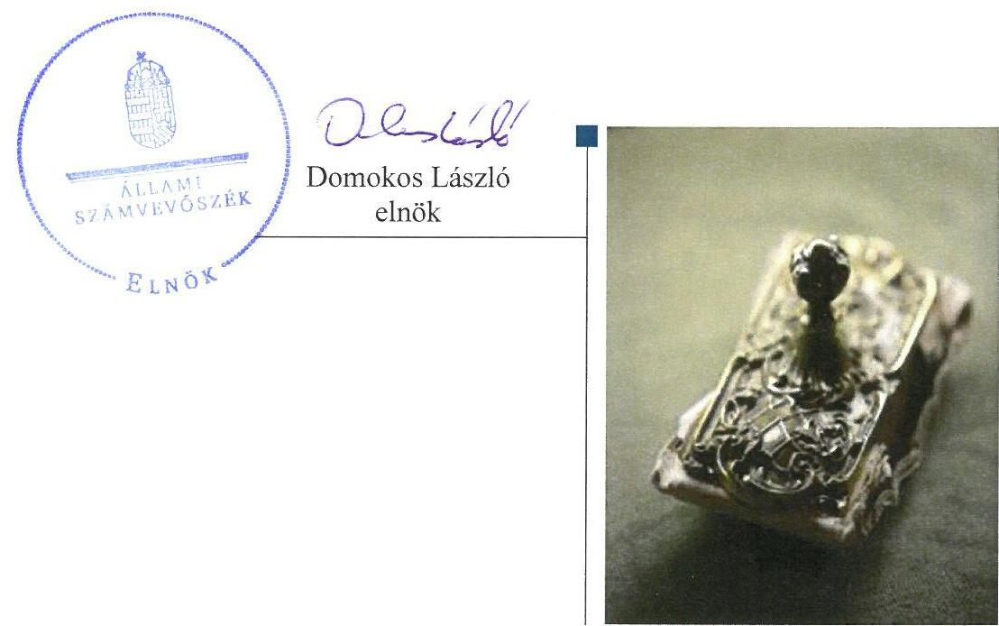
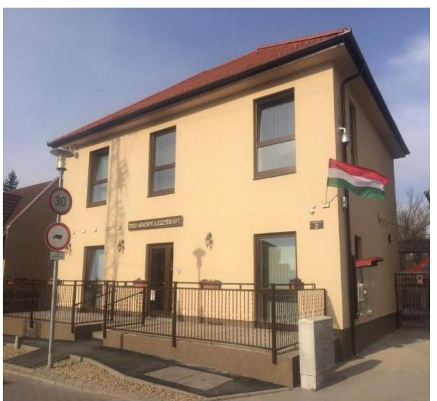
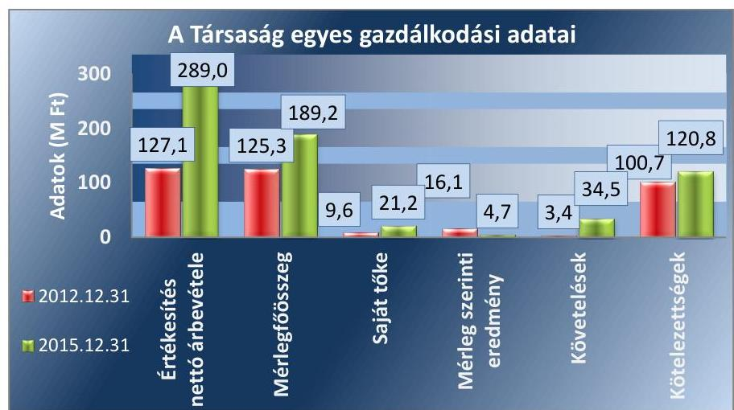
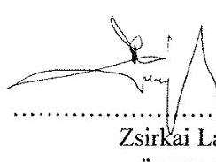
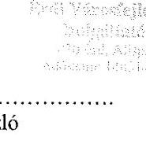
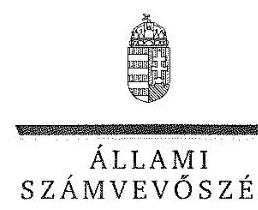
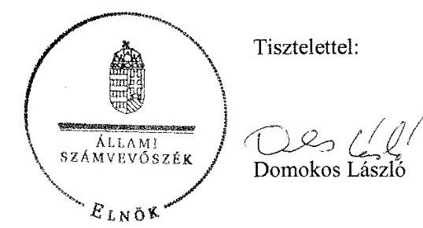

# Jelentés 

## Az önkormányzatok gazdasági társaságai

Az önkormányzatok többségi tulajdonában lévő gazdasági társaságok gazdálkodásának ellenőrzése - Érdi Városfejlesztési és Szolgáltató Kft.
2017.

---

# Jelentés 

## Az önkormányzatok gazdasági társaságai

Az önkormányzatok többségi tulajdonában lévő gazdasági társaságok gazdálkodásának ellenőrzése - Érdi Városfejlesztési és Szolgáltató Kft.
2017. 00. hó 10. nap

---

# AZ ELLENŐRZÉST FELÜGYELTE:

DR. NAGY IMRE felügyeleti vezető

# AZ ELLENŐRZÉST VEZETTE ÉS A VÉGREHAJTÁSÁÉRT FELELŐS:

SALAMIN VIKTOR ellenőrzésvezető

# A PROGRAM ÖSSZEÁLLÍTÁSÁÉRT FELELŐS:

JANIK JÓZSEF osztályvezető

---

**IKTATÓSZÁM:** V-1283-148/2016.

**TÉMASZÁM:** 2317

**ELLENŐRZÉS-AZONOSÍTÓ SZÁM:** V075808

---

Jelentéseink az Országgyűlés számítógépes hálózatán és az Interneten a www.asz.hu címen is olvashatóak.

---

# TARTALOMJEGYZÉK 

■ ÖSSZEGZÉS ..... 5
■ AZ ELLENŐRZÉS CÉLJA ..... 7
■ AZ ELLENŐRZÉS TERÜLETE ..... 8
■ AZ ELLENŐRZÉS HÁTTERE, INDOKOLTSÁGA ..... 10
■ A JELENTÉS LÉNYEGES KÉRDÉSKÖREI ..... 11
■ ELLENŐRZÉS HATÓKÖRE ÉS MÓDSZEREI ..... 12
■ MEGÁLLAPÍTÁSOK ..... 14
■ JAVASLATOK ..... 21
■ MELLÉKLETEK ..... 23
I. sz. melléklet: Értelmező szótár ..... 23
II. sz. melléklet: A Társaság főbb mérleg adatai ..... 24
■ FÜGGELÉK: ÉSZREVÉTELEK ..... 25
■ RÖVIDÍTÉSEK JEGYZÉKE ..... 33

---

.

---

# ÖSSZEGZÉS 

Érd Megyei Jogú Város Önkormányzata a tulajdonosi jogait összességében szabályszerűen alakította ki és gyakorolta. Az Érdi Városfejlesztési és Szolgáltató Kft. a saját vagyonával megfelelően gazdálkodott, bevételeinek, ráfordításainak, értékcsökkenésének elszámolása megfelelő volt. A kezelt vagyon számviteli nyilvántartása és elszámolása nem volt szabályszerű, ezáltal a Társaság nem biztosította a kezelt vagyon értékének megőrzését és átláthatóságát. A számviteli beszámolási kötelezettségének a Társaság eleget tett, azonban a 2012., 2014. és 2015. évi beszámolók tartalma nem felelt meg az előírásoknak. Közzétételi kötelezettségét a Társaság összességében nem megfelelően teljesítette.

## Az ellenőrzés társadalmi indokoltsága

Magyarországon az intézmény-centrikus közfeladat-ellátás jellemző, de egyre jelentősebb a költségvetésen kívüli feladatellátás térnyerése. Helyi szinten ennek legfontosabb szereplői az önkormányzati tulajdonú gazdasági társaságok, amelyeknek ellenőrzése kiemelten fontos a közfeladat ellátása és a közvagyon megőrzése, megóvása érdekében. Ezért alapvető követelmény, hogy gazdálkodásuk, működésük szabályszerű és átlátható legyen.

Érden az ellenőrzött időszakban az Érdi Városfejlesztési és Szolgáltató Kft. végezte a településfejlesztéssel, településrendezéssel, helyi tömegközlekedéssel, szabadidős- és sportszolgáltatással kapcsolatos közfeladatokat, működtette az érdi rádiót. A Társaság feladatellátása ezáltal a lakosság széles rétegét érintette. Az Állami Számvevőszék az ellenőrzése során arra kereste a választ, hogy 2012-2015. között szabályszerű volt-e a Társaság gazdálkodása és az Önkormányzat ehhez kapcsolódó tulajdonosi joggyakorlása.

Meggyőződésünk, hogy az ellenőrzés rendet, a rend értéket teremt. Ezért bízunk abban, hogy a jelentésben foglalt megállapítások és az ezek alapján megfogalmazott számvevőszéki javaslatok hasznosítása elősegítheti a feltárt hiányosságok orvoslását.

## Főbb megállapítások, következtetések, javaslatok

Az Önkormányzat a Társaság feletti tulajdonosi joggyakorlásának kereteit a jogszabályoknak megfelelően alakította ki. A tulajdonosi jogait összességében szabályszerűen gyakorolta, de a kezelésbe adott vagyonra vonatkozó ellenőrzési kötelezettségnek nem tett eleget. Rendeletalkotási kötelezettségét teljesítette, a Társaság beszámolóit jóváhagyta. A felügyelőbizottság a felügyeleti tevékenység kereteit biztosító, jogszabályban foglalt ügyrenddel nem rendelkezett.

A Társaság az előírt számviteli szabályzatokat elkészítette, azok összességében megfeleltek a jogszabályi előírásoknak. A számviteli politika aktualizálása, a számlarend karbantartása azonban nem minden jogszabályváltozás esetében történt meg, és a szabályzatok összhangja nem volt biztosított. A Társaság saját vagyonával megfelelően gazdálkodott, az egyszerűsített éves beszámolók adatait leltárral alátámasztotta. A Társaság bevételeinek, ráfordításainak, beruházásainak, felújításainak és saját vagyonára vonatkozóan az értékcsökkenésnek az elszámolása megfelelő volt.

A vagyonkezelt eszközökkel való gazdálkodása nem volt szabályszerű, a vagyonelemek elkülönített nyilvántartási és leltározási kötelezettségnek összességében nem tett eleget. A kezelt eszközök értékcsökkenésének elszámolása nem volt megfelelő, a visszapótlási kötelezettség elmaradásával megsértette a jogszabályi előírásokat. A fizetőképesség 2012-2015. között biztosított volt.

Az éves beszámolókat a Társaság a jogszabályban előírt határidőben elkészítette, azokat közzétette és letétbe helyezte. A 2012., 2014. és 2015. évi egyszerűsített éves beszámolók tartalma - a kezelt vagyonhoz, illetve a közszolgáltatási tevékenységhez kapcsolódó hiányosságok miatt - nem felelt meg az előírásoknak. A vagyonkezelt vagyonra

---

vonatkozó beszámolási feladatának nem tett eleget. Az elektronikus közzétételi kötelezettségének a Társaság összességében nem tett eleget, adatvédelmi és adatbiztonsági szabályzattal a jogszabály előírása ellenére nem rendelkezett.

---

# AZ ELLENŐRZÉS CÉLJA 

AZ ELLENŐRZÉS CÉLJA annak értékelése volt, hogy az önkormányzat vagyongazdálkodási tevékenysége során szabályszerűen gyakorolta-e a tulajdonosi jogait; a gazdasági társaság szabályozottsága, gazdálkodása és vagyongazdálkodási tevékenysége, bevételeinek és ráfordításainak elszámolása megfelelt-e a jogszabályi és tulajdonosi előírásoknak; a gazdasági társaság fizetőképessége biztosított volt-e a gazdálkodás során.

---

# **AZ ELLENŐRZÉS TERÜLETE**

## **Érd Megyei Jogú Város Önkormányzata és a kizárólagos tulajdonában lévő Érdi Városfejlesztési és Szolgáltató Kft.**

### **ÉRD MEGYEI JOGÚ VÁROS ÖNKORMÁNYZATA**

Az Érdi Városfejlesztési és Szolgáltató Kft.-t 2009. január 15-én alapította. A Társaság főtevékenysége a 2015. január 1-jén 63 993 fő lakosságszámú Érd Város közigazgatási területén vagyonkezelés volt, e mellett a 2012-2015. években ellátott településfejlesztéssel, településrendezéssel, helyi tömegközlekedéssel kapcsolatos közfeladatokat. Az Érdi Létesítmény Üzemeltető Kft. 2012. október 31-ei beolvadásával a Társaság tevékenysége sport- és egyéb létesítmények üzemeltetésével, vagyonvédelmi feladatokkal bővült. A Társaság 2014. január 1-jétől Közszolgáltatási szerződés keretében szabadidős- és sportszolgáltatásokat is végzett, továbbá 2014. május 28-ától működtette az érdi rádiót. A Társaság által ellátott feladatok – az érdi rádió működtetésének kivételével – az Önkormányzat kötelezően ellátandó feladatai voltak. Az Önkormányzat a Társaságot működése során sporttelep és uszoda üzemeltetési, vagyonkezelési és egyéb (vagyonvédelmi, őrzési, rendészeti, stb.) feladatok végrehajtásával bízta meg, illetve vagyonkezelésre adott át eszközöket.

A Társaság az Önkormányzat 100%-os tulajdonában állt a 2012-2015. években, jegyzett tőkéje 2012. január 1-jén 0,5 M Ft, 2015. december 31-én 3,0 M Ft volt. A Társaság olyan jellegű szolgáltatást nem végzett, amelyre vonatkozóan az árképzés szabályait részére jogszabály előírta volna. A Közszolgáltatási szerződésben foglaltak alapján a rendezvények jegyárainak és a kiskereskedelmi tevékenység során forgalmazott áruk árának megállapítása a Társaság hatáskörébe tartozott.

A Társaság gazdálkodásának egyes adatait a 2012. és a 2015. évek vonatkozásában az 1. ábra szemlélteti:

1. ábra

*Forrás: A Társaság 2012-2015. évi egyszerűsített éves beszámolói*

---

Az Önkormányzat 2015. december 31-én a Társaságon kívül az Érdi Városi Televízió és Kulturális Szolgáltató Kft.-ben, az Érdi Sport Szolgáltató és Kereskedelmi Kft.-ben, az Érd és Térsége Hulladékkezelési Nonprofit Kft.-ben és az Érd és Térsége Csatorna Szolgáltató Koncessziós Társaságban rendelkezett többségi tulajdoni hányaddal.

Az ellenőrzött időszakban a polgármester és a Társaság ügyvezetőjének személyében változás nem történt. A jegyző személye egy alkalommal változott, a helyszíni ellenőrzés időszakában munkakört betöltő jegyző 2013. április 1-jétől látta el feladatait.

---

# AZ ELLENŐRZÉS HÁTTERE, INDOKOLTSÁGA 

AZ ÖNKORMÁNYZATOK TÖBBSÉGI TULAJDONÁBAN ÁLLÓ GAZDASÁGI TÁRSASÁGOK ellenőrzése kiemelten fontos a vagyon megőrzése, megóvása érdekében, amelyekkel szemben alapvető követelmény, hogy gazdálkodásuk, működésük szabályszerű, az általuk szolgáltatott adatok minél megbízhatóbbak legyenek. A feladatellátás költségeinek, ráfordításainak alakulása a lakosság széles rétegét érinti. Ellenőrzéseink feltárhatják, hogy az önkormányzat a feladatellátásához rendelt vagyon működtetését a tulajdonostól elvárható gondossággal végezte-e, a feladatot ellátó gazdasági társaság a létesítő okiratban, szolgáltatási szerződésben foglaltak betartásával biztosította-e a feladat ellátását. Az ellenőrzés rávilágíthat arra, hogy a gazdasági társaság a vagyon használatával biztosította-e a szolgáltatás folytatásának feltételeit, az önkormányzat tulajdonosi felügyelete hozzájárult-e a szabályszerű gazdálkodáshoz és feladatellátáshoz. A megállapítások alapján megfogalmazott számvevőszéki javaslatok hasznosítása elősegítheti a meglévő hibák megszüntetését. A jó gyakorlatok bemutatásával az ÁSZ ${ }^{1}$ hozzájárulhat a követendő megoldások megismertetéséhez, terjesztéséhez.

---

# A JELENTÉS LÉNYEGES KÉRDÉSKÖREI 

1. Az önkormányzat tulajdonosi joggyakorlása szabályszerű volt-e?
2. A gazdasági társaság vagyongazdálkodása szabályszerű volt-e, fizetőképessége biztosított volt-e a gazdálkodás során?
3. A gazdasági társaság bevételeinek és ráfordításainak elszámolása szabályszerű volt-e?

---

# ELLENŐRZÉS HATÓKÖRE ÉS MÓDSZEREI 

## Az ellenőrzés típusa

Megfelelőségi ellenőrzés.

## Az ellenőrzött időszak

Az ellenőrzött időszak 2012. január 1-jétől 2015. december 31-éig tartott.

## Az ellenőrzés tárgya

Az önkormányzatok - többségi tulajdonában lévő gazdasági társaságok feletti - tulajdonosi joggyakorlása, valamint a gazdasági társaságok gazdálkodásának szabályozottsága és szabályszerűsége.

Az ellenőrzés kiterjedt minden olyan körülményre és adatra, amely az ÁSZ jogszabályban meghatározott feladatainak teljesítéséhez, valamint a program végrehajtása folyamán felmerült újabb összefüggések feltárásához szükséges volt.

## Az ellenőrzött szervezet

Érd Megyei Jogú Város Önkormányzata és a kizárólagos tulajdonában lévő Érdi Városfejlesztési és Szolgáltató Kft.

## Az ellenőrzés jogalapja

Az ellenőrzés jogszabályi alapját az ÁSZ tv. ${ }^{2}$ 1. § (3) bekezdése és 5. § (3)(4)-(5) bekezdései képezték.

## Az ellenőrzés módszerei

Az ellenőrzést a nemzetközi standardokat irányadónak tekintve az ellenőrzési program ellenőrzési kérdései, az ellenőrzött időszakban hatályos jogszabályok, az ellenőrzés szakmai szabályok és módszertanok figyelembe vételével végeztük.

Az ellenőrzés ideje alatt az ellenőrzött szervezettel történő kapcsolattartást az ÁSZ Szervezeti és Működési Szabályzatának vonatkozó előírásai alapján biztosítottuk.

---

Az ellenőrzés a kiválasztott, kizárólagos tulajdonosi jogokat gyakorló önkormányzatra, illetve az ellenőrzésre kijelölt gazdasági társaság felett tulajdonosi jogokat gyakorló szervezetre és az ellenőrzött gazdasági társaságra terjedt ki.

Az ellenőrzési kérdések megválaszolásához szükséges bizonyítékok megszerzése a következő ellenőrzési eljárások alkalmazásával történt: megfigyelés, kérdésfeltevés (információkérés), összehasonlítás, valamint elemző eljárás. Az ellenőrzési bizonyítékként felhasználható adatforrások közé tartoztak egyrészt az ellenőrzési programban felsorolt adatforrások, másrészt adatforrás lehetett még minden - az ellenőrzés folyamán - feltárt, az ellenőrzés szempontjából információkat tartalmazó dokumentum. Az ellenőrzést a kérdésekre adott válaszok kiértékelésével, valamint a megjelölt adatforrások, a csatolt tanúsítványok felhasználásával, továbbá az adott időszakban hatályos jogszabályok figyelembe vételével folytattuk le.

A gazdasági társaság bevételei és ráfordításai, ezeken belül az értékcsökkenés, valamint a vagyonnyilvántartás szabályszerűségének megítéléséhez a bevételeket és a ráfordításokat, a tárgyi eszközök állományváltozásait tartalmazó adott évi főkönyvi kivonat adatbázisát vettük alapul. A minta kiválasztása során véletlen mintavételt alkalmaztunk évenkénti, elemszámmal arányos rétegezéssel a teljes időszakra vonatkozóan. A mintavételt megelőzően az anyagjellegű ráfordítások, valamint a tárgyi-eszköz növekedési tételei sokaságból évente sokaságonként kiemeltük a 3-3 legnagyobb összegű tételt annak biztosítására, hogy az ellenőrzés az egyszerű véletlen mintavétel ellenére a legnagyobb értékű tételek ellenőrzésére biztosan kiterjedjen. A lényegességi szempontokat figyelembe véve a mintavétel előtt az anyagjellegű ráfordítások közül kiszűrtük a postaköltséget, bankköltséget, minden sokaságból az elszámolt kerekítési különbözetet, a helyesbítő tételek összegét, a technikai és rendező tételeket, az árfolyamkülönbözeteket.

---

# 1. Az önkormányzat tulajdonosi joggyakorlása szabályszerű volt-e? 

Összegző megállapítás

### 1.1. számú megállapítás

Az Önkormányzat tulajdonosi joggyakorlása összességében megfelelte a jogszabályi előírásoknak.

Az Önkormányzat a tulajdonosi joggyakorlásának kereteit szabályszerűen alakította ki.

Az Önkormányzat ${ }^{3}$ az Ötv ${ }^{4}$. 91. § (6) bekezdése, illetve az Mötv. ${ }^{5}$ 116. § (1) bekezdése szerint rendelkezett a 2011-2014. évekre szóló gazdasági programmal, mely a 2007-2010. közötti időszakra vonatkozó gazdasági program felülvizsgálatának eredményeként jött létre. A gazdasági programban szerepeltek a Társaság ${ }^{8}$ által ellátott feladatok biztosítására, színvonalának javítására vonatkozó fejlesztési célkitűzések. A Társaság által végzett feladatokkal kapcsolatos elképzeléseket az integrált fejlesztési stratégia és a településfejlesztési koncepció is tartalmazta.

A Közgyűlés ${ }^{13}$ gazdasági programot, fejlesztési tervet a 2014. évi önkormányzati választásokat követően,

 az alakuló ülést követő hat hónapon belül az MÖtv 116. § (5) bekezdésében rögzítettek ellenére nem hagyott jóvá.

A Közgyűlés 2015. szeptember 24-ei ülésén a Batthyány 2015-2020 elnevezésű városfejlesztési program megvalósításáról döntött határozataiban, melyek a gazdaság-, intézmény- és közszolgáltatás fejlesztés, valamint a nemzeti vagyon hasznosításával kapcsolatos részterületekre terjedtek ki.

Közép- és hosszú távú vagyongazdálkodási terv ${ }^{14}$ készítési kötelezettségének az Önkormányzat az Nvtv. ${ }^{15}$ 9. § (1) bekezdésében foglalt előírás ellenére késedelmesen tett eleget, azt a Közgyűlés 2012. január 1-je helyett 2013. május 30-ától helyezte hatályba.

## A TULAJDONOSI JOGOK GYAKORLÁSÁNAK

RENDJÉT az Önkormányzat a vagyonrendelet ${ }_{1,2}$-ben, az SZMSZ ${ }_{1}{ }^{16}{ }_{2}{ }^{17}{ }_{3}{ }^{18}$-ben és az Alapító okirat ${ }^{19}$-ban határozta meg. A vagyonrendelet ${ }_{1}{ }^{20}{ }_{22}{ }^{21}$ előírása szerint a tulajdonost megillető jogokat a Közgyűlés gyakorolta. Az $\mathrm{FB}^{22}$ létrehozásáról, tagjainak kijelöléséről, a könyvvizsgáló személyéről, megbízatásának időtartamáról az Alapító okiratban - a Gt. ${ }^{23} 19$. § (4) bekezdésében, valamint a Ptk. ${ }_{2}{ }^{24} 3:26. § (1) és 3:130. § (1) bekezdéseiben és a Taktv. ${ }^{25}$ 4. § (1) bekezdésében előírtaknak megfelelően - rendelkeztek. A vagyonrendelet ${ }_{2}$ 19. § (5) bekezdése előírta, hogy a vagyonkezelő ellenőrzésével kapcsolatos tulajdonosi jogokat átruházott hatáskörben a VVVB ${ }^{26}$ gyakorolja, amely az ellenőrzés eredményéről évente, illetve szükség szerint beszámolási kötelezettséggel tartozik a Közgyűlés felé. A hatáskör átruházás a Gt.-ben, illetve a Ptk. ${ }_{2}$-ben foglaltak alapján szabályszerű volt.

---

Az Önkormányzat a Sport. tv. ${ }^{27}$ 55. § (6) bekezdése szerinti rendeletalkotási kötelezettségének a sportról és a helyi sporttevékenység támogatásáról szóló rendelet ${ }^{28}$ megalkotásával eleget tett.

KÖZSZOLGÁLTATÁSI SZERZŐDÉST ${ }^{29}$ kötött az Önkormányzat a Társasággal a Sport. tv. alapján egyes sportfeladatai ellátására 2014. január 1-jei hatállyal. A Közszolgáltatási szerződésben foglaltak szerint az Önkormányzatnak támogatást kellett nyújtania a Társaság részére, amely azt kizárólag a közszolgáltatás költségeinek finanszírozására használhatta fel, arról az éves számviteli beszámoló keretében ún. Működési jelentésben el kellett számolnia.

NÉGY VAGYONKEZELÉSI SZERZŐDÉS ${ }_{1}{ }^{30}, { }_{2}{ }^{31}, { }_{3}{ }^{32}, { }_{4}{ }^{33}$ kötött az Önkormányzat és a Társaság (egy szerződés esetében annak jogelődje, az Érdi Létesítmény Üzemeltető Kft.) 2009-2015. között négy ingatlanra vonatkozóan, melyek közül a Vagyonkezelési szerződés ${ }_{2}$-ben szereplő ingatlanra vonatkozó vagyonkezelői jog 2013. április 22-én megszűnt. A Vagyonkezelési szerződés ${ }_{1,2,3,4}$ a vagyonrendelet ${ }_{2}$-ben foglaltakkal összhangban előírta a VVVB számára - amelyre a feladatot a Közgyűlés átruházta - az évente legalább egy alkalommal történő ellenőrzési kötelezettséget.

JAVADALMAZÁSI SZABÁLYZATOT a Társaság legfőbb szerve a Taktv. 5. § (3) bekezdésében foglaltak ellenére 2012. január 1. és 2013. március 27. között nem alkotott. A javadalmazási szabályzat ${ }_{3}{ }^{34}, { }_{4}{ }^{35}$ a Taktv. előírásainak megfelelt, azt a Közgyűlés határozatában jóváhagyta.

# 1.2. számú megállapítás 

A tulajdonosi jogok gyakorlása összességében szabályszerű volt.
A TULAJDONOSI JOGOKAT a Közgyűlés a vagyonrendelet ${ }_{1,2}$-ben, az SZMSZ ${ }_{1,2,3}$-ben és az Alapító okiratban előírtaknak megfelelően összességében szabályszerűen gyakorolta.

AZ FB a Gt. 34. § (1) bekezdésében, valamint a Ptk. ${ }_{2}$ 3:121. § (1) bekezdésében előírtakat figyelembe véve három főből állt. A Közgyűlés az egyszerűsített éves számviteli beszámolók elfogadásáról a Gt. 35. § (3) bekezdésében és a Ptk. ${ }_{2}$ 3:120. § (2) bekezdésében foglaltaknak megfelelően az FB írásbeli jelentésének birtokában határozott.

Az FB - a Gt. 34. § (4) bekezdésében és a Ptk. ${ }_{2}$ 3:122. § (3) bekezdésében előírtakkal ellentétben - ügyrenddel nem rendelkezett.

A Társaság könyvvizsgálói jelentést is tartalmazó egyszerűsített éves beszámolóit a Közgyűlés megtárgyalta, azokat - a Gt. 141. § (2) bekezdés a) pontjában és a Ptk. ${ }_{2}$ 3:109. § (2) bekezdésében előírtaknak megfelelően - határozattal elfogadta.

AZ ÜZLETI TERVEK készítésének kötelezettségét a 2012-2013. években nem írták elő a Társaság számára, a 2014. évtől kezdődően a Közszolgáltatási szerződés IV. 2.3. pontja tartalmazott üzleti tervkészítési kötelezettséget. Üzleti terveket a Társaság a 2012-2015. években készített. A Működési jelentést - melynek készítési kötelezettségét a Közszolgáltatási

---

szerződésben írták elő - a 2014-2015. évre vonatkozóan a Társaság elkészítette. Az üzleti terveket és a Működési jelentést a Közgyűlés határozattal jóváhagyta.

A TÁRSASÁGNÁL BELSŐ ELLENŐRZÉST az Önkormányzat - kockázatelemzéssel alátámasztott ellenőrzési terv alapján - a 2012. évben végzett. Az ellenőrzési jelentésben a pénzkezelési szabályzat módosítására vonatkozó megállapítást tettek és intézkedési tervkészítési kötelezettséget írtak elő, melyet a Társaság teljesített, azt a jegyző ${ }^{36}$ elfogadta.

A VVVB - az Nvtv. 10. § (2) bekezdésében, a vagyonrendelet ${ }_{2}$ 19. § (5) bekezdésében és a Vagyonkezelési szerződés ${ }_{1,2,3,4}$ 23. pontjában előírtak ellenére - a kezelésbe adott vagyonnal való gazdálkodásra vonatkozó ellenőrzési feladatának nem tett eleget.

A Közgyűlés a 2012-2015. években keletkezett eredmény eredménytartalékba történő helyezéséről, illetve - a 2014-2015. években - annak egy része eszközpótlásra való felhasználásáról - a Ptk. ${ }_{2}$ 3:109. § (2) bekezdésében előírtaknak megfelelően - rendelkezett. Az eszközbeszerzést a Társaság végrehajtotta.

# 2. A gazdasági társaság vagyongazdálkodása szabályszerű volt-e, fizetőképessége biztosított volt-e a gazdálkodás során? 

Összegző megállapítás

A Társaság az előírt számviteli szabályzatokkal rendelkezett. A vagyongazdálkodás a kezelt vagyon tekintetében nem volt szabályszerű. A Társaság a számviteli beszámolási kötelezettségének eleget tett, a 2012., 2014. és 2015. évi egyszerűsített éves beszámolók tartalma azonban hiányos volt, ezért nem felelt meg az előírásoknak. Elektronikus közzétételi kötelezettségének a Társaság összességében nem tett eleget.
2.1. számú megállapítás

A Társaság az előírt számviteli szabályzatokkal rendelkezett, a Számviteli politika és Számlarend aktualizálása azonban nem minden jogszabályváltozás esetében történt meg.

A Társaság rendelkezett a Számv. tv. ${ }^{37}$ 14. § (3) bekezdésében előírt számviteli politikával, a Számv. tv. 14. § (5) bekezdés a), b) és d) pontjaiban előírt szabályzatokkal, illetve a Számv. tv. 161. § (1) bekezdésében előírt számlarenddel.

A SZÁMVITELI POLITIKA ${ }^{38}{ }^{39}$ a Számv. tv. 14. § (4) bekezdése előírásainak megfelelően tartalmazta a Társaságra jellemző előírásokat, módszereket. A számlarend ${ }^{40}$ a Számv. tv. 161. § (2) bekezdésében előírt tartalmi követelményeknek megfelelt. A számlarendben foglaltakat alátámasztó bizonylati rendet a szabályozás tartalmazta.

A számviteli politiká-ban - a Számv. tv. 14. § (11) bekezdésében foglaltak ellenére - nem vezették át a törvénymódosításokat, amelyek a 2013. január 1-jétől hatályos, a jelentős összegű hiba és a 2013. január 1-jétől hatálytalan, a megbízható és valós képet lényegesen befolyásoló hiba fogalmi meghatározását (Számv. tv. 3. § (3) bekezdés 3. és 5. pontok) érintették.

A számlarend folyamatos karbantartásáról a Számv. tv. 161. § (4) bekezdésében foglaltak ellenére nem gondoskodtak, abban a Számv. tv. 3. § (3) bekezdés 3. pontjának 2013. január 1-jétől hatályos előírása ellenére a jelentős összegű hiba értékhatárát 500,0 M Ft-ban állapították meg, valamint továbbra is tartalmazta a 2013. január 1-jétől hatálytalan, a megbízható és valós képet lényegesen befolyásoló hiba fogalmi meghatározását (Számv. tv. 3. § (3) bekezdés 5. pont).

A számlarend és a számviteli politika ${ }_{2}$ előírásai a mérlegkészítés napja tekintetében (számlarend 6. oldalán, számviteli politika 2. oldalán), valamint a jelentős összegű hiba meghatározásában (számlarend 12. oldalán, számviteli politika ${ }_{2}$ 3. oldalán) nem voltak összhangban.

Az eszközök és források leltárkészítési és leltározási szabályzata ${ }_{1}{ }^{41},{ }_{2}{ }^{42}$ a Számv. tv. előírásainak megfelelt. Az eszközök és források leltárkészítési és leltározási szabályzata ${ }_{1,2}$ a tárgyi eszközök esetében évenkénti mennyiségi felvétellel történő leltározást írt elő. Az eszközök és források értékelési szabályzata ${ }_{1}{ }^{43},{ }_{2}{ }^{44}$ a Számv. tv. 54-57. §-ai szerint tartalmazta az eszközök értékvesztésének, értékelésének szabályait. A pénzkezelési szabályzat ${ }_{1}{ }^{45},{ }_{2}{ }^{46}$ a Számv. tv. 14. § (8) bekezdésében előírt tartalmi követelményeknek megfelelt. A selejtezési szabályzat ${ }^{47}$ előírásai megfeleltek a Számv. tv. 53. § (2) bekezdésében foglaltaknak.

# 2.2. számú megállapítás 

A vagyongazdálkodás a saját vagyon tekintetében megfelelő volt, a kezelt vagyon esetében azonban nem volt szabályszerű.

A Társaság feladatait az Önkormányzattól vagyonkezelésbe, valamint üzemeltetésre átvett vagyonnal, illetve saját eszközeivel látta el.

A SAJÁT VAGYON esetében a vagyonnyilvántartás átlátható volt, megfelelt a belső szabályozás előírásainak. Az egyszerűsített éves beszámolók adatait a Társaság leltárral alátámasztotta az eszközök és források leltárkészítési és leltározási szabályzata ${ }_{1,2}$-ban foglaltak szerint.

A KEZELÉSBE VETT VAGYON esetében a Társaság a Vagyonkezelési szerződés ${ }_{1}$-ben szereplő ingatlant a 2012-2015. években, a Vagyonkezelési szerződés ${ }_{3}$-ben szereplő ingatlant a 2014-2015. években a könyveiben szerepeltette, az előírt elkülönített nyilvántartási kötelezettségének eleget tett, azokat mennyiségi felvétellel leltározta.

A Társaság a Vagyonkezelési szerződés ${ }_{2}$-ben megjelölt ingatlant 2012-ben és 2013-ban, a Vagyonkezelési szerződés ${ }_{4}$-ben megjelölt ingatlant 2015-ben a Számv. tv. 159. §-ban foglalt előírás ellenére könyveiben nem szerepeltette, azok esetében az eszközök és források leltárkészítési és leltározási szabályzata ${ }_{2}$ 6-7. oldalán előírtak ellenére mennyiségi felvételű leltározást nem végzett. A vagyonkezelt eszközökre vonatkozó elkülönített nyilvántartási kötelezettségnek a Vagyonkezelési szerződés ${ }_{2}$ esetén annak 14. pontjában foglaltak, a Vagyonkezelési szerződés ${ }_{4}$ esetén annak 12. pontjában, illetve a Számv. tv. 161/A. § (2) bekezdésében foglaltak ellenére nem tett eleget.

---

A Társaság a Vagyonkezelési szerződés ${ }_{1}$-ben szereplő ingatlanra a 2012. november 1. és 2015. december 31. közötti időszakban, a Vagyonkezelési szerződés ${ }_{3}$-ben szereplő ingatlanra a 2014-2015. vagyonkezelési években értékcsökkenést nem számolt el. Az értékcsökkenés elszámolásának elmaradásával a Társaság 2012. november 1. és 2015. december 31. között megsértette a Számv. tv. 52. § (7) bekezdésében foglaltakat.

Visszapótlási kötelezettségének a Társaság a Vagyonkezelési szerződés ${ }_{1,3}$-ban, valamint az MÖtv. 109. § (6) bekezdésében foglaltak ellenére nem tett eleget, mivel a vagyon felújításáról, pótlólagos beruházásáról legalább a vagyoni eszközök elszámolt értékcsökkenésének megfelelő mértékben nem gondoskodott, e célokra az értékcsökkenésnek megfelelő mértékben tartalékot nem képzett.

### 2.3. számú megállapítás

1. táblázat

|  A KÖTELEZETTSÉGEK ÁLLOMÁNYÁNAK ÉV |  |  |  |   |
| --- | --- | --- | --- | --- |
|  VÉGI ALAKULÁSA (M FT) |  |  |  |   |
|  |   |   |   |   |
|  Megnevezés | 2012. | 2013. | 2014. | 2015.  |
|  |   |   |   |   |
|  Hosszú lejáratú | 85,2 | 85,2 | 98,4 | 98,4  |
|  Rövid lejáratú | 15,5 | 172,5 | 19,7 | 22,4  |
|  ebből | 7,8 | 5,1 | 10,9 | 14,8  |
|  egyéb | 

 |  |  |   |
|  ebből | 7,7 | 32,2 | 8,8 | 7,6  |
|  szállítók |  |  |  |   |
|  ebből | 4,4 | 18,8 | 1,1 | 0,8  |
|  lejárt |  |  |  |   |

Forrás: A Társaság 2012-2015. évi egyszerűsített éves beszámolói és adatszolgáltatásai 2.4. számú megállapítás

A Társaság fizetőképessége biztosított volt.
A Társaság fizetőképessége biztosított volt a 2012-2015. években.

## A HOSSZÚ LEJÁRATÚ KÖTELEZETTSÉGEKNEK

nem voltak esedékes törlesztő részletei, mivel vagyonkezelt eszközökhöz kapcsolódtak. A Vagyonkezelési szerződés ${ }_{1,3}$-ben foglaltak szerint az átadott ingatlanok bruttó értéke $85,2 \mathrm{M} \mathrm{Ft}$, illetve $13,2 \mathrm{M} \mathrm{Ft}$ volt.

A RÖVID LEJÁRATÚ KÖTELEZETTSÉGEK határidőben történő teljesítése összességében biztosított volt. A szállítói tartozások összege a 2012. évről 2015-re 0,1 M Ft-tal (1,3\%-kal), ezen belül a lejárt határidejű szállítói kötelezettségek állománya 3,6 M Ft-tal (81,8\%-kal) csökkent. Az egyéb rövid lejáratú kötelezettségek állománya 2015-re közel duplájára nőtt a 2012. évhez képest, mely a foglalkoztatottak létszámának növekedéséből eredő év végi bér- és járulék előírásból fakadt, lejárt tartozást nem tartalmazott.

A Társaság a számviteli beszámolási kötelezettségének eleget tett, a 2012., 2014. és 2015. évi egyszerűsített éves beszámolók tartalma azonban hiányos volt, ezért nem felelt meg az előírásoknak. A Társaság az előírt elektronikus közzétételi kötelezettségét összességében nem teljesítette, adatvédelmi és adatbiztonsági szabályzattal a jogszabály előírása ellenére nem rendelkezett.

AZ ÉVES SZÁMVITELI BESZÁMOLÓKAT a Társaság a Számv. tv. 96. § (1) bekezdésében előírt tartalommal elkészítette, azokat a Számv. tv. 153. § (1) bekezdésében, valamint 154. § (1) bekezdésében foglaltak szerint letétbe helyezte, illetve közzétette. Elfogadásukról a Közgyűlés a könyvvizsgáló és az FB írásbeli jelentésének birtokában határozott.

A Társaság a Vagyonkezelési szerződés ${ }_{2}$-ben szereplő ingatlant a 2012. évben, a Vagyonkezelési szerződés ${ }_{4}$-ben szereplő ingatlant a 2015. évben az egyszerűsített éves beszámoló mérlegében eszközként, illetve hosszú lejáratú kötelezettségként nem mutatta ki, ezzel megsértette a Számv. tv. 23. § (2) bekezdésében, valamint a 42. § (5) bekezdésében foglaltakat. Mindezekkel sérült a Számv. tv. 15. § (2) és (3) bekezdésében foglalt teljesség és valódiság elve, továbbá a Számv. tv. 18. §-ában előírt követelmény

---

- a Társaság vagyoni helyzetére vonatkozó megbízható és valós kép tekintetében - nem teljesült. A könyvvizsgáló a 2012-2015. évi egyszerűsített éves beszámolókat hitelesítő záradékkal látta el.

A KÖZSZOLGÁLTATÁSI SZERZŐDÉS VIII/3. pontjában foglaltak szerint a Társaság köteles volt az egyszerűsített éves beszámoló részét képező kiegészítő mellékletben a közszolgáltatási tevékenységet egyéb tevékenységeitől elkülönítetten bemutatni, mely kötelezettségének a 2014-2015. éveket érintően nem tett eleget.

A Társaság a tárgyévet követő február 15. napjáig beszámolót az értékcsökkenés felhasználásáról, a vagyontárgyak állapotának változásáról a Vagyonkezelési szerződés; 15. pontjában foglaltak ellenére a 2012-2015. éveket, a Vagyonkezelési szerződés; 15. pontjában előírtak ellenére a 2012. évet érintően a Közgyűlés elé nem terjesztett be. A Társaság az Nvtv. 11. § (11) bekezdés a) pontjában, továbbá a Vagyonkezelési szerződés; 10. pontjában (a 2014-2015. évekre vonatkozóan) és a Vagyonkezelési szerződés; 12. pontjában (a 2015. év tekintetében) foglalt beszámolási kötelezettségének nem tett eleget.

A Társaság az Info tv. ${ }^{48}$ 33. § (3) bekezdésében előírt elektronikus közzétételi kötelezettségeinek az Önkormányzat honlapján ${ }^{49}$ összességében nem tett eleget. A közzététel - az Info tv. 37. § (1) bekezdésében foglaltak ellenére - nem tartalmazta az Info tv. 1. melléklet I. táblázatában meghatározott Szervezeti, személyi adatokat (1. sor alapján a postai cím, elektronikus levélcím, 3. sor alapján a közfeladatot ellátó szerv vezetőinek és az egyes szervezeti egységek vezetőinek elektronikus levélcíme, 11. sor alapján a közfeladatot ellátó szerv felett törvényességi ellenőrzést gyakorló szerv adatai), továbbá nem tartalmazta a III. táblázat szerinti Gazdálkodási adatokat.

Az Info tv. 24. § (3) bekezdésében előírt adatvédelmi és adatbiztonsági szabályzatkészítési kötelezettségének a Társaság nem tett eleget.

# 3. A gazdasági társaság bevételeinek és ráfordításainak elszámolása szabályszerű volt-e? 

Összegző megállapítás

A bevételek, ráfordítások, beruházások, felújítások, valamint a saját vagyon tekintetében az értékcsökkenés elszámolása megfelelő volt.

### 3.1. számú megállapítás

A bevételek, ráfordítások, valamint a beruházások, felújítások kiadásainak és a Társaság saját vagyona tekintetében az értékcsökkenés elszámolása megfelelő volt.

AZ ÉRTÉKESÍTÉS NETTÓ ÁRBEVÉTELÉNEK, továbbá az egyéb, valamint a pénzügyi műveletek bevételeinek elszámolása megfelelő a jogszabályi előírásoknak és a belső szabályozásban foglaltaknak.

AZ ANYAGJELLEGŰ RÁFORDÍTÁSOK, továbbá az egyéb ráfordítások elszámolása megfelelt a jogszabályi előírásoknak és a belső szabályozásnak.

---

A SZEMÉLYI JELLEGŰ RÁFORDÍTÁSOK elszámolása megfelelt a Számv. tv.-ben és a belső szabályozásban foglaltaknak.

A BERUHÁZÁSOK, FELÚJÍTÁSOK kiadásainak elszámolása megfelelő volt. A bekerülési értéket a Társaság szabályszerűen határozta meg, amely megfelelt a Számv. tv. 26. §-ában, a számlarendben, valamint az eszközök és források értékelési szabályzata ${ }_{1,2}$-ban foglaltaknak.

AZ ÉRTÉKCSÖKKENÉS elszámolása a Társaság saját vagyona tekintetében megfelelő volt. Az elszámolás a Számv. tv. 52. §-ában, illetve az eszközök és források értékelési szabályzata ${ }_{1,2}$-ban foglaltak szerint történt.

A KÖVETELÉSÁLLOMÁNY kezelése érdekében a Társaság elkészítette a hátralékos követelések kezelésének szabályzatát ${ }^{50}$, meghatározta a tartozások behajtása során követendő eljárásrendet. A követelések állománya 2012-ben 3,4 M Ft, 2015-ben 34,5 M Ft volt. A Társaság 365 napon túli követeléssel csak a 2013. évben rendelkezett. A követelésállomány csökkentése érdekében a belső szabályozás szerinti intézkedéseket a Társaság megtette. Az összes követelésállományból a beszámoló készítés időpontjáig a 2012. évet érintően 0,6 M Ft-ot (17,6\%), a 2013. évet érintően 0,9 M Ft-ot (2,7\%) nem rendeztek a vevők. A 2014-2015. évi követelésállomány összegét a beszámoló készítés napjáig kiegyenlítették.

---

# JAVASLATOK 

Az ÁSZ tv. 33. § (1) bekezdésében foglaltak értelmében az ellenőrzött szervezet vezetője köteles a jelentésben foglalt megállapításokhoz kapcsolódó intézkedési tervet összeállítani és azt a jelentés kézhezvételétől számított 30 napon belül az ÁSZ részére megküldeni. Amennyiben az ellenőrzött szervezet vezetője nem küldi meg határidőben az intézkedési tervet, vagy továbbra sem elfogadható intézkedési tervet küld, az Állami Számvevőszék elnöke az ÁSZ tv. 33. § (3) bekezdése a) és b) pontjaiban foglaltakat érvényesítheti.

## Az Érdi Városfejlesztési és Szolgáltató Kft. Ügyvezetőjének

1. Intézkedjen a jogszabályi rendelkezéseknek megfelelően a számviteli politika aktualizálásáról, a számlarend karbantartásáról, és előírásuk összhangjának megteremtéséről.
(2.1 sz. megállapítás 3-4. és 5. bekezdése alapján)
2. Intézkedjen annak érdekében, hogy a Vagyonkezelési szerződés ${ }_{4}$-ben szereplő ingatlan
a) kerüljön rögzítésre és elkülönítésre a Társaság könyvviteli nyilvántartásában a jogszabályi előírásoknak megfelelően,
(2.2 sz. megállapítás 4. bekezdése alapján)
b) leltározása valósuljon meg a belső szabályozásnak megfelelően,
(2.2 sz. megállapítás 4. bekezdés 1. mondata alapján)
c) kerüljön kimutatásra a mérlegben a jogszabályi előírások szerint.
(2.4. sz. megállapítás 2. bekezdés 1-2. mondata alapján)
3. Intézkedjen a jogszabályoknak megfelelően a vagyonkezelt eszközök értékcsökkenésének elszámolásáról.
(2.2 sz. megállapítás 5. bekezdése alapján)
4. Intézkedjen a jogszabálynak megfelelően a vagyonkezelt eszközök esetében a vagyon felújításáról, pótlólagos beruházásáról legalább a vagyoni eszközök elszámolt értékcsökkenésének megfelelő mértékben, és e célokra az értékcsökkenésnek megfelelő mértékben tartalékot képezzen.
(2.2 sz. megállapítás 6. bekezdése alapján)

---

5. Gondoskodjon a közszolgáltatási tevékenység és egyéb tevékenység éves beszámolók részét képező kiegészítő mellékletben történő elkülönített bemutatásáról a Közszolgáltatási szerződés előírásainak megfelelően.
(2.4 sz. megállapítás 3. bekezdése alapján)
6. Intézkedjen, hogy a Társaság a jogszabályban és a vagyonkezelési szerződésekben foglalt beszámolási kötelezettségének eleget tegyen.
(2.4 sz. megállapítás 4. bekezdése alapján)
7. Intézkedjen annak érdekében, hogy a Társaság a jogszabályban foglalt közzétételi kötelezettségének maradéktalanul eleget tegyen.
(2.4 sz. megállapítás 5. bekezdése alapján)
8. Intézkedjen a jogszabályban előírt adatvédelmi és adatbiztonsági szabályzat elkészítéséről.
(2.4 sz. megállapítás 6. bekezdése alapján)

# Érd Megyei Jogú Város Önkormányzata Polgármesterének 

1. Kezdeményezze a felügyelőbizottságnál az ügyrend elkészítését, és annak a Társaság legfőbb szerve általi jóváhagyását a jogszabálynak megfelelően.
(1.2 sz. megállapítás 3. bekezdése alapján)
2. Intézkedjen annak érdekében, hogy a Városfejlesztési, Városüzemeltetési és Vagyongazdálkodási Bizottság a jogszabályban, a vagyonrendeletben és a vagyonkezelési szerződésekben előírt, a kezelésbe adott vagyonnal való gazdálkodásra vonatkozó ellenőrzési feladatának eleget tegyen.
(1.2 sz. megállapítás 7. bekezdése alapján)
3. Intézkedjen a Társaságnál a vagyonkezeléssel kapcsolatban feltárt szabálytalanságok tekintetében a felelősség tisztázása érdekében, és szükség szerint intézkedjen a felelősség érvényesítéséről.
(2.2 sz. megállapítás 4-6. bekezdései, 2.4 sz. megállapítás 2. és 4. bekezdései alapján)

---

# MELLÉKLETEK 

- I. SZ. MELLÉKLET: ÉRTELMEZŐ SZÓTÁR
gazdasági társaság
közfeladat
közszolgáltatás
tulajdonosi joggyakorló

Ptk. 3 3.88. § (1) bekezdése szerint „a gazdasági társaságok üzletszerű közös gazdasági tevékenység folytatására, a tagok vagyoni hozzájárulásával létrehozott, jogi személyiséggel rendelkező vállalkozások, amelyekben a tagok a nyereségből közösen részesednek, és a veszteséget közösen viselik".
Jogszabályban meghatározott állami vagy önkormányzati feladat, amit az arra kötelezett közérdekből, jogszabályban meghatározott követelményeknek és feltételeknek megfelelve végez, ideértve a lakosság közszolgáltatásokkal való ellátását, továbbá az állam nemzetközi szerződésekben vállalt kötelezettségeiből adódó közérdekű feladatokat, valamint e feladatok ellátásához szükséges infrastruktúra biztosítását is (Nvtv. 3. § (1) bekezdés 7. pont).
A közszolgáltatás: „közcélú, illetőleg közérdekű szolgáltatást jelent, amely egy nagyobb közösség (állam, település) minden tagjára nézve megközelítőleg azonos feltételek mellett vehető igénybe, ezért valamilyen mértékig közösségi megszervezést, illetve szabályozást, ellenőrzést igényel." Az Ebktv. ${ }^{51}$ 3. § d) pontja a következőképpen határozza meg a közszolgáltatást: „szerződéskötési kötelezettség alapján a lakosság alapvető szükségleteinek ellátására irányuló szolgáltatás, így különösen a villamos energia-, gáz-, hő-, víz-, szennyvíz- és hulladékkezelési, köztisztasági, postai és távközlési szolgáltatás, továbbá a menetrend alapján közlekedő járművekkel végzett közforgalmú személyszállítás".
Aki a nemzeti vagyon felett az államot vagy a helyi önkormányzatot megillető tulajdonosi jogok és kötelezettségek összességének gyakorlására jogosult. (Nvtv. 3. § (1) bekezdés 17. pont).

---

# II. SZ. MELLÉKLET: A TÁRSASÁG FŐBB MÉRLEG ADATAI

|  AZ ÉRDI VÁROSFEJLESZTÉSI ÉS SZOLGÁLTATÓ KFT. FŐBB MÉRLEG ADATAI (MILLIÓ FORINT) |  |  |  |  |   |
| --- | --- | --- | --- | --- | --- |
|  Megnevezés | 2012-01-01 | 2012-12-31 | 2013-12-31 | 2014-12-31 | 2015-12-31  |
|  Befektetett eszközök | 93,2 | 86,6 | 83,8 | 96,7 | 89,9  |
|  -ebből: Tárgyi eszközök | 93,2 | 86,6 | 83,8 | 96,7 | 89,9  |
|  Forgóeszközök | 14,8 | 27,3 | 206,5 | 91,4 | 99,3  |
|  -ebből: Követelések | 5,6 | 3,4 | 33,4 | 36,2 | 34,5  |
|  Aktív időbeli elhatárolások | 0,0 | 11,4 | 10,6 | 0,4 | 0,0  |
|  ESZKÖZÖK ÖSSZESEN | 108,0 | 125,3 | 300,9 | 188,5 | 189,2  |
|  Saját tőke | $-3,3$ | 9,6 | 10,5 | 16,5 | 21,2  |
|  -ebből: Jegyzett tőke | 0,5 | 1,5 | 1,5 | 3,0 | 3,0  |
| 

 -ebből: Mérleg szerinti eredmény | 0,0 | 16,1 | 1,0 | 6,0 | 4,7  |
|  Céltartalékok | 0,0 | 0,0 | 0,0 | 0,0 | 0,0  |
|  Kötelezettségek | 9,7 | 100,7 | 257,7 | 118,2 | 120,8  |
|  Passzív időbeli elhatárolások | 101,6 | 15,0 | 32,7 | 53,8 | 47,2  |
|  FORRÁSOK ÖSSZESEN | 108,0 | 125,3 | 300,9 | 188,5 | 189,2  |

Forrás: A Társaság 2012-2015. évi egyszerűsített éves beszámolói

---

# FÜGGELÉK: ÉSZREVÉTELEK 

A jelentéstervezetet a Számvevőszék 15 napos észrevételezésre megküldte az ellenőrzött szervezetek vezetőinek az ÁSZ tv. 29. § (1) bekezdése előírásának megfelelően.

Észrevételezési jogával az Érdi Városfejlesztési és Szolgáltató Kft. ügyvezetője élt.
A függelék tartalmazza az ellenőrzött észrevételét mellékletek nélkül, illetve az el nem fogadott észrevétel elutasításának indoklását.

[^0]
[^0]:    * 29. § (1) Az Állami Számvevőszék az ellenőrzési megállapításait megküldi az ellenőrzött szervezet vezetőjének vagy az általa megbízott személynek, és annak, akinek személyes felelősségét állapította meg.
    (2) Az ellenőrzött szervezet vezetője és a felelősként megjelölt személy az ellenőrzés megállapításaira tizenöt napon belül írásban észrevételt tehet.
    (3) Az Állami Számvevőszék az észrevételre a beérkezésétől számított harminc napon belül írásban válaszol. A figyelembe nem vett észrevételeket köteles a jelentésben feltüntetni, és megindokolni, hogy azokat miért nem fogadta el.

---

# ÁLLAMI SZÁMVEVŐSZÉK 

Budapest 4.
PÉ: 54.
1354

## Domokos László

elnök úr részére

## Tisztelt Elnök Úr!

Ikt.szám: V-1283-136/2016

Ikt.számunk: 625/2017.08.03.
ÁLLAMI SZÁMVEVŐSZÉK
$36-56513 / 2017$
Érkezési idő: 2017 AUG 04
Iktatószám: V-1283-142/2016
Melléklet:
Kézhez kaptuk „Az önkormányzatok gazdasági társaságai - Az önkormányzatok többségi tulajdonában lévő gazdasági társaságok gazdálkodásának ellenőrzése - Érdi Városfejlesztési és Szolgáltató Kft. 2017." címmel készült Számvevőszéki jelentéstervezetüket, mellyel kapcsolatban az alábbi észrevételeket tesszük:

### 2.2 Vagyongazdálkodás a kezelt vagyon esetében

## - Megállapítás: Szerződés 4 2015-ben nem szerepeltette könyveiben

- Észrevételünk: Érd, Velencei út kivett beépítetlen terület vagyonkezelési szerződése érték adatot nem tartalmazott, a 194/2015 (IX.24) Közgyűlési határozat 2015. december 31. határidőt tűzött ki a terület vagyonértékelését illetően. Mérleg fordulónapjáig tudomásunkra jutott, hogy a vagyonkezelési szerződés módosításra kerül, az önkormányzat új, terület felosztási és ezzel összefüggő érték meghatározási szándéka miatt. Az értékbecslés a folyamat elhúzódása miatt, a mérlegkészítés időpontjáig, 2016. március 31-ig nem állt rendelkezésünkre, így könyveinkben nem tudtuk értékkel szerepeltetni.
- ezen ingatlannal összefüggésben vagyonkezelői jogunkat nem gyakoroltuk ezért költség és bevétel elszámolás nem történt Társaságunknál.
- 2016. november 22-én a Vagyonkezelési szerződés módosításra került, a földterület újra elosztása szerint, amely szerződés módosítás az új terület nagyságát és értékét már tartalmazta. Ekkor ez a változás be is került a könyveinkbe. (1. sz. melléklet)
- 2017. 02. 15-i 31/2017 (II.15) számú határozatban az Érdi Városfejlesztési Kft. vagyonkezelési szerződését az Érd MJV Önkormányzata megszüntette, mert az Érdi Sport Szolgáltató és Kereskedelmi Kft-nek apportként átadta ezeket a földterületeket. (2. sz. melléklet)
- Megállapítás: Szv tv 52§ (7) bekezdés megsértése a Szerződés 1-re 2012. november 1 és 2015 december 31 között értékcsökkenést nem számolt el
- Észrevételünk: Érd, Budai út 16. tekintetében az átalakulást végző könyvvizsgáló észrevételt tett, aminek alapján háromoszlopos mérleg került közzétételre 2012-ben. Ennek kapcsán érzékelte a tulajdonos Önkormányzat, hogy folyamatos pótbefizetési kényszere származna az ingatlanokkal kapcsolatos értékcsökkenés elszámolásával, ezért egy belső döntésben, 2012. 11. 01-vel a nettó értékkel megegyező összegben cégünk

---

maradványértéket képzett. A számviteli törvény 52.§ (2) bekezdése szerint, a maradványértékkel csökkentett bruttó értékhez képest kell értékcsökkenést elszámolni, illetve ezen törvény 52. § (6) nem szabad terv szerinti értékcsökkenést elszámolni az olyan eszköznél, amely értékéből a használat során sem veszít, vagy amelynek értéke különleges helyzetéből, egyedi mivoltából adódóan - évről évre nő. Az ingatlanokat ilyen eszközöknek tekintjük. A 2012. évi Egyszerűsített éves beszámoló kiegészítő melléklete is tartalmazza az értékcsökkenés elszámolási módjának változását. Ennek következtében visszapótlási tartalék képzési kötelezettsége sem keletkezhetett a Társaságnak.

# - Megállapítás: Szerződés 3-ra 2014-2015 évben értékcsökkenést nem számolt el 

- Észrevételünk: Az Érd Diósdi út 14/a ingatlan vonatkozásában is ugyanazon elvek szerint járunk el mint Szerződés 1 tekintetében

## - Megállapítás: Mötv. 109 § (6) megsértése Visszapótlási kötelezettség tekintetében

- Észrevételünk: Értékcsökkenés elszámolása nem történt, ezért visszapótlási kötelezettségünk sem keletkezett.

## 2.3 Éves számviteli beszámolók tekintetében

- Megállapítás: Közszolgáltatási szerződés VIII/3 pontja sérült 2014-2015 évben a Kiegészítő mellékletben elkülönítetten bemutatni a közszolgáltatási tevékenységet
- Észrevétel: Bár a kiegészítő mellékletben nem történt rá utalás, de az éves Működési Jelentésünk tartalmazza tételesen a közszolgáltatási tevékenység eredményének levezetését, mely az Érd MJV Önkormányzat honlapján nyilvánosságra lett hozva.
- Megállapítás: Az Info tv 24 § (3) adatvédelmi és adatbiztonsági szabályzatkészítési kötelezettségének a Társaság nem tett eleget
- Észrevétel: Info tv. 24. § (3) bekezdése értelmezésünk szerint ránk nem vonatkozik.

## Egyéb megjegyzés:

Az értékcsökkenés és maradványérték meghatározása céljából, már folyamatban vannak a tárgyalások a tulajdonos Önkormányzat, és Társaságunk között, hogy az Önök által feltárt problémákat jogszerűen rendezni tudjuk.

Köszönjük javaslataikat, melyekkel elősegítették működésünk, további még szabályszerűbb megvalósítását.

Érd, 2017. 08. 03.
Tisztelettel:

---

ELNÖK

# Zsírkai László úr 

ügyvezető
Érdi Városfejlesztési és Szolgáltató Kft.

## Érd

## Tisztelt Ügyvezető Úr!

„Az önkormányzatok gazdasági társaságai - Az önkormányzatok többségi tulajdonában lévő gazdasági társaságok gazdálkodásának ellenőrzése - Érdi Városfejlesztési és Szolgáltató Kft." címmel készített számvevőszéki jelentéstervezetre tett észrevételeit köszönettel megkaptam.
Az Állami Számvevőszék észrevételekre vonatkozó álláspontjáról a felügyeleti vezető által készített részletes tájékoztatást csatoltan megküldöm.
Tájékoztatom Ügyvezető urat, hogy a számvevőszéki jelentésben - az Állami Számvevőszékről szóló 2011. évi LXVI. törvény 29. § (3) bekezdése alapján - a figyelembe nem vett észrevételeket szerepeltetjük annak megindoklásával, hogy azokat miért nem fogadtuk el.

Budapest, 2017. 08 hó 25. nap

Melléklet: Tájékoztatás az észrevételek kezeléséről

---

# Tájékoztatás   az észrevételek kezeléséről 

„Az önkormányzatok gazdasági társaságai - Az önkormányzatok többségi tulajdonában lévő gazdasági társaságok gazdálkodásának ellenőrzése - Érdi Városfejlesztési és Szolgáltató Kft." címû számvevőszéki jelentéstervezetre 2017. augusztus 3-án tett (az Állami Számvevőszékhez 2017. augusztus 4-én érkezett) észrevételeit áttekintettük, annak kezelésével kapcsolatban a következő tájékoztatást adom.
A jelentéstervezet 2.1. számú megállapítás 4. bekezdésében (17. oldal) szereplő megállapításra (,...a Vagyonkezelési szerződésben megjelölt ingatlant 2015-ben a Számv. tv. 159. §-ban foglalt előírás ellenére könyveiben nem szerepeltette...") vonatkozó észrevétel
Az észrevételben jelezte, hogy a hivatkozott ingatlanra az értékbecslés a mérlegkészítés időpontjáig nem állt rendelkezésre, így azt nem tudták 2015-ben könyveikben értékkel szerepeltetni. Jelezte továbbá, hogy 2016-ban a Vagyonkezelési szerződés módosításra, majd 2017-ben megszüntetésre került.
Észrevétele a jelentéstervezetben foglalt, a 2015. évre vonatkozó megállapítást nem vitatja, azt alátámasztja, így az intézkedést igénylő megállapítás módosítása, illetve törlése nem indokolt. Az észrevételben leírt későbbi intézkedések az ellenőrzött időszakot követően történtek, ezért az a jelentéstervezet megállapítását nem érinti. Az ellenőrzött időszakot követően történt változásokat az intézkedési terv összeállítása során indokolt figyelembe venni. Tájékoztatásul jelzem, hogy az észrevételben hivatkozott mellékletek az Állami Számvevőszékhez nem kerültek megküldésre.
A jelentéstervezet 2.2. számú megállapítás 5. bekezdésében (17-18. oldal) szereplő megállapításra (,...A Társaság a Vagyonkezelési szerződésben szereplő ingatlanra a 2012. november 1. és 2015. december 31. közötti időszakban... értékcsökkenést nem számolt el..") vonatkozó észrevétel
Az észrevételben jelezte, hogy ,,...érzékelte az Önkormányzat, hogy folyamatos pótbefizetési kényszere származna az ingatlanokkal kapcsolatos értékcsökkenés elszámolásával...", ezért olyan döntés született, miszerint a Társaság 2012. november 1-jével a Vagyonkezelési szerződés 1-ben szereplő ingatlanra annak nettó értékével megegyező összegű maradványértéket határoz meg. Észrevételében jelezte továbbá, hogy a fent hivatkozott ingatlant - a számviteli törvény (a továbbiakban: Sztv.) 52. § (6) bekezdésére hivatkozva - olyan eszköznek tekintik, amelyre nem szabad terv szerinti értékcsökkenést elszámolni, mivel értékéből a használat során sem veszít, vagy értéke - különleges helyzetéből, egyedi mivoltából adódóan - évről évre nő.

Az Sztv. 3. § (4) bekezdés 6. pontja értelmében a maradványérték a rendeltetésszerű használatbavétel, az üzembe helyezés időpontjában - a rendelkezésre álló információk alapján, a hasznos élettartam függvényében - az eszköz meghatározott, a hasznos élettartam végén várhatóan realizálható értéke. A tárgyi eszköz maradványértékét aktiváláskor kell meghatározni, annak a használati idő alatti módosítása csak akkor lehetséges, ha a Szt. 53. § (4)-(5) bekezdés szerinti feltételek valamelyike bekövetkezik. A Szt. 53. § (4) bekezdése értelmében a terven felüli értékcsökkenés elszámolása, illetve visszaírása az évenként elszámolandó terv szerinti értékcsökkenés, a várható hasznos élettartam és a maradványérték újbóli megállapítását eredményezheti. A Szt. 53. § (5) bekezdése szerint ha az évenként elszámolásra kerülő értékcsökkenés megállapításakor (megtervezésekor) figyelembe vett körülményekben (az adott eszköz használatának időtartamában, az adott eszköz értékében és a várható maradványértékben) lényeges változás következett be, akkor a terv szerint elszámolásra kerülő értékcsökkenés megváltoztatható. Az észrevételben jelzettek szerint nem következtek be sem a Sztv. 53. § (4) bekezdésében, sem a Sztv. 53. § (5) bekezdésben leírt feltételek, így a maradványérték összegének megváltoztatása szabálytalan volt, az értékcsökkenés elszámolásának elmaradásával a Társaság megsértette a Számv. tv. 52. § (7) bekezdésében foglaltakat.

Az ingatlanok automatikusan nem tartoznak a számviteli törvény 52. §-ának (6) bekezdés hatálya alá tartozó eszközök közé, mivel az egyes ingatlan értéke általában nem különleges helyzetéből, egyedi mivoltából adódóan nő évről évre, hanem jellemzően az infláció és a kereslet-kínálat viszonyának hatására, és ezen hatásra sem nő a műszaki élettartam végéig. Észrevétele a jelentéstervezetben foglalt megállapítást nem vitatja, így az intézkedést igénylő megállapítás módosítása, illetve törlése nem indokolt.

A jelentéstervezet 2.2. számú megállapítás 5. bekezdésében (17-18. oldal) szereplő megállapításra („...A Társaság a ... a Vagyonkezelési szerződésben szereplő ingatlanra a 2014-2015. vagyonkezelési években értékcsökkenést nem számolt el..") vonatkozó észrevétel

Az észrevétel a kapcsolódik az előző észrevételhez, a Vagyonkezelési szerződés 3-ban szereplő ingatlan esetében a Társaság ugyanazon elvek szerint járt el, mint a Vagyonkezelési szerződés 1 esetében.

A Vagyonkezelési szerződés 3-ban szereplő ingatlan esetében a maradványérték az aktiváláskor került a bekerülési értékkel egyező összegben meghatározásra. A maradványértéket az üzembe helyezés időpontjában rendelkezésre álló információk alapján (mekkora a piaci értéke egy hasonló paraméterekkel rendelkező, még nem felújított, hasznos élettartama végén járó ingatlannak) kell meghatározni, és nem azt kell megbecsülni, hogy mennyi lesz az eszköz várható piaci értéke a hasznos élettartam végén. A maradványérték nagyságát alapvetően és jellemzően az adott eszköz számviteli törvény szerinti várható hasznos élettartama és az adott eszköz várható fizikai elhasználódása (a fizikai, a környezeti, az igénybevételi hatások, a műszaki körülmények), erkölcsi avulása által meghatározott műszaki élettartamának viszonya határozza meg. A használatba vett ingatlanok - egyebek mellett a fizikai elhasználódás miatt - fokozatosan veszítenek értékükből, így a bekerülési érték, valamint a maradványérték különbözetét kell a hasznos élettartam alatt - a számviteli törvény 52. §-a (2) bekezdésének megfelelően - terv szerinti értékcsökkenésként elszámolni. Az értékcsökkenés
 elszámolásának elmaradásával a Társaság megsértette a Számv. tv. 52. § (7) bekezdésében foglaltakat. Észrevétele a jelentéstervezetben foglalt megállapítást nem vitatja, így az intézkedést igénylő megállapítás módosítása, illetve törlése nem indokolt.

---

A jelentéstervezet 2.2. számú megállapítás 6. bekezdésében (18. oldal) szereplő megállapításra (,...Visszapótlási kötelezettségének a Társaság a Vagyonkezelési szerződés¹³, valamint az Mötv. 109. § (6) bekezdésében foglaltak ellenére nem tett eleget, mivel a vagyon felújításáról, pótlólagos beruházásáról legalább a vagyoni eszközök elszámolt értékcsökkenésének megfelelő mértékben nem gondoskodott, e célokra az értékesökkenésnek megfelelő mértékben tartalékot nem képzett...") vonatkozó észrevétel

Az észrevétel szerint mivel - a fentebb írtak miatt - értékcsökkenés elszámolása nem történt, ezért visszapótlási kötelezettség sem keletkezett.

Az észrevétel nem megalapozott, azt nem fogadom el. A nemzeti vagyonról szóló 2011. évi CXCVI. törvény 7. § (2) bekezdése értelmében a nemzeti vagyongazdálkodás feladata - többek között- a nemzeti vagyon értékének megőrzése, állagának védelme. A maradványértéknek a bekerülési értékkel megegyező összegben történő meghatározásával, majd az értékcsökkenés elszámolásának elmaradásával és a visszapótlási kötelezettség elmulasztásával a Társaság nem gondoskodott a vagyon értékének megőrzéséről. Észrevétele a jelentéstervezetben foglalt megállapítást nem vitatja, így az intézkedést igénylő megállapítás módosítása, illetve törlése nem indokolt.

A jelentéstervezet 2.4. számú megállapítás 3. bekezdésében (19. oldal) szereplő megállapításra (,...A Közszolgáltatási szerződés VIII/3. pontjában foglaltak szerint a Társaság köteles volt az egyszerűsített éves be-számoló részét képező kiegészítő mellékletben a közszolgáltatási tevékenységet egyéb tevékenységeitől elkülönítetten bemutatni, mely kötelezettségének a 2014-2015. éveket érintően nem tett eleget....") vonatkozó észrevétel

Az észrevétel elismeri, hogy a kiegészítő mellékletben nem történt rá utalás, de az éves Működési jelentés tartalmazza a közszolgáltatási tevékenység eredményének levezetését.

Észrevétele a jelentéstervezetben foglalt, a 2014-2015. évre vonatkozó megállapítást nem vitatja, azt alátámasztja, A Közszolgáltatási szerződés VIII/3. pontja egyértelműen fogalmaz: „A Közszolgáltató köteles számviteli nyilvántartásaiban és az éves beszámoló részét képező kiegészítő mellékletben a közszolgáltatási tevékenységet és egyéb tevékenységet elkülönítetten nyilvántartani és bemutatni. "A 2014-2015. évi beszámoló kiegészítő mellékletében a közszolgáltatási tevékenység és egyéb tevékenység elkülönített bemutatására nem került sor, ezért a jelentéstervezet intézkedést igénylő megállapítása és a javaslat módosítása, illetve törlése nem indokolt.

A jelentéstervezet 2.4. számú megállapítás 6. bekezdésében (19. oldal) szereplő megállapításra (,...Az Info tv. 24. § (3) bekezdésében előírt adatvédelmi és adatbiztonsági szabályzatkészítési kötelezettségének a Társaság nem tett eleget...") vonatkozó észrevétel

Az észrevétel értelmében a Társaságra nem vonatkozik az információs önrendelkezési jogról és az információszabadságról szóló 2011. évi CXII. törvény (Info tv.) 24.§(3) bekezdése.

---

Az észrevétel nem megalapozott, azt nem fogadom el. Az Info tv. 2. § (1) bekezdése szerint az Info tv. hatálya a Magyarország területén folytatott minden olyan adatkezelésre és adatfeldolgozásra kiterjed, amely természetes személy adataira, valamint közérdekű adatra vagy közérdekből nyilvános adatra vonatkozik. A Társaság tevékenysége során természetes személyek adatait is kezeli (például a magánszemélyek részére történő közműre történő belső csatornahálózat rákötése, uszodai szolgáltatások, terembérleti díjak kiszámlázása során), azaz olyan tevékenységet folytat, amelyre az Info tv. hatálya kiterjed. A törvény végrehajtására az Info tv. 24. § (3) bekezdése szerint adatvédelmi és adatbiztonsági szabályzatot kell készíteniük az egyéb önkormányzati adatkezelőknek, így a Társaságnak is. A jelentéstervezet módosítása nem indokolt.

Budapest, 2017. 08 hó 25 nap

Dr. Nagy Imre felügyeleti vezető

---

# RÖVIDÍTÉSEK JEGYZÉKE 

${ }^{1}$ ÁSZ
${ }^{2}$ ÁSZ tv.
${ }^{3}$ Önkormányzat
${ }^{4}$ Ötv.
${ }^{5}$ Mötv.
${ }^{6}$ gazdasági program ${ }_{2}$
${ }^{7}$ gazdasági program ${ }_{1}$
${ }^{8}$ Társaság
${ }^{9}$ integrált fejlesztési stratégia ${ }_{1}$
${ }^{10}$ integrált fejlesztési stratégia ${ }_{2}$
${ }^{11}$ településfejlesztési koncepció ${ }_{1}$
${ }^{12}$ településfejlesztési koncepció ${ }_{2}$
${ }^{13}$ Közgyűlés
${ }^{14}$ közép- és hosszú távú vagyongazdálkodási terv
${ }^{15}$ Nvtv.
${ }^{16} \mathrm{SZMSZ}_{1}$
${ }^{17} \mathrm{SZMSZ}_{2}$
${ }^{18} \mathrm{SZMSZ}_{3}$
${ }^{19}$ Alapító okirat
${ }^{20}$ vagyonrendelet ${ }_{1}$
${ }^{21}$ vagyonrendelet ${ }_{2}$
${ }^{22} \mathrm{FB}$

Állami Számvevőszék
az Állami Számvevőszékről szóló 2011. évi LXVI. törvény
Érd Megyei Jogú Város Önkormányzata
a helyi önkormányzatokról szóló 1990. évi LXV. törvény (hatálytalan: 2014. október 12-étől)

Magyarország helyi önkormányzatairól szóló 2011. évi CLXXXIX. törvény (hatályos: - egyes bekezdések kivételével - 2012. január 1-jétől)
Batthyány Program - Érd Megyei Jogú Város 2011-2014. évekre szóló Gazdasági Programja
Batthyány Program - Érd Megyei Jogú Város 2007-2010. évekre szóló Gazdasági Programja
Érdi Városfejlesztési és Szolgáltató Kft.
Érd Megyei Jogú Város 2007-2013. évekre szóló Integrált Városfejlesztési Stratégiája
Érd Megyei Jogú Város 2014-2020. évekre szóló Integrált Városfejlesztési Stratégiája
Érd Megyei Jogú Város 2008-2014. évekre szóló Integrált Településfejlesztési Koncepciója
Érd Megyei Jogú Város 2014-2030. évekre szóló Integrált Településfejlesztési Koncepciója
Érd Megyei Jogú Város Önkormányzatának Közgyűlése
Érd Megyei Jogú Város Önkormányzatának a Közgyűlés a 131/2013. (V. 30.) számú határozatával elfogadott közép- és hosszú távú vagyongazdálkodási terve
a nemzeti vagyonról szóló 2011. évi CXCVI. törvény (hatályos: 2011. december 31-étől)
Érd Megyei Jogú Város Önkormányzatának Közgyűlése és szervei Szervezeti és Működési Szabályzatáról szóló 38/2011. (VI. 29.) számú rendelet (hatályos: 2011. július 1-jétől)
Érd Megyei Jogú Város Önkormányzatának Közgyűlése és szervei Szervezeti és Működési Szabályzatáról szóló 57/2012. (XII. 19.) számú rendelet (hatályos: 2013. január 1-jétől)
Érd Megyei Jogú Város Önkormányzatának Közgyűlése és szervei Szervezeti és Működési Szabályzatáról szóló 31/2014. (XI. 26.) számú rendelet (hatályos: 2014. június 1-jétől)
az Érdi Városfejlesztési és Szolgáltató Kft. 2009. január 15-étől hatályos Alapító okirata és módosításai
a Közgyűlés 36/2008. (VI. 27.) számú rendelete és módosításai Érd Megyei Jogú Város Önkormányzata vagyonáról és a vagyontárgyak feletti tulajdonosi jogok gyakorlásáról (hatályos: 2008. június 28-ától)
a Közgyűlés 13/2012. (III. 27.) számú rendelete és módosításai Érd Megyei Jogú Város Önkormányzata vagyonáról és a vagyontárgyak feletti tulajdonosi jogok gyakorlásáról (hatályos: 2012. március 28-ától)
Felügyelő Bizottság

---

${ }^{23}$ Gt.
${ }^{24}$ Ptk. 2
${ }^{25}$ Taktv.
${ }^{26}$ VVVB
${ }^{27}$ Sport tv.
${ }^{28}$ a sportról és a helyi sporttevékenység támogatásáról szóló rendelet
${ }^{29}$ Közszolgáltatási szerződés
${ }^{30}$ Vagyonkezelési szerződés ${ }_{1}$
${ }^{31}$ Vagyonkezelési szerződés ${ }_{2}$
${ }^{32}$ Vagyonkezelési szerződés ${ }_{3}$
${ }^{33}$ Vagyonkezelési szerződés ${ }_{4}$
${ }^{34}$ javadalmazási szabályzat ${ }_{1}$
a gazdasági társaságokról szóló 2006. évi IV. törvény (hatálytalan: 2014. március 15-étől)
a Polgári Törvénykönyvről szóló 2013. évi V. törvény (hatályos: 2014. március 15-étől)
a köztulajdonban álló gazdasági társaságok takarékosabb működéséről szóló 2009. évi CXXII. törvény (hatályos: 2009. december 4-étől)
Városfejlesztési, Városüzemeltetési és Vagyongazdálkodási Bizottság (2014. december 21-éig elnevezése Városfejlesztési, Üzemeltetési és Vagyongazdálkodási Bizottság volt. A névváltozást Érd Megyei Jogú Város Önkormányzat Közgyűlése az önkormányzati bizottságok megnevezésének változásával érintett egyes önkormányzati rendeletek módosításáról szóló 43/2014. (XII.22.) önkormányzati rendelete tartalmazta.)
a sportról szóló 2004. évi I. törvény
a Közgyűlés 12/2007. (III. 26.) számú önkormányzati rendelete és módosításai a sportról és a helyi sporttevékenység támogatásáról (hatályos: 2007. március 26-ától)
a 9-8293/2013. számú, Érd Megyei Jogú Város Önkormányzata és az Érdi Városfejlesztési és Szolgáltató Kft. között 2013 decemberében létrejött, 10 évre szóló Közszolgáltatási szerződés (hatályos: 2014. január 1-jétől) Érd Megyei Jogú Város Önkormányzata és az Érdi Városfejlesztési és Szolgáltató között 2009. augusztus 18-án létrejött vagyonkezelési szerződés a 22558 hrsz. alatt nyilvántartott (Érd, Budai út 16.) - kivett gyógyszertár megjelölésű - ingatlanra vonatkozóan közösségi tér biztosítása, ingatlan felújítási és hasznosítási tevékenység ellátása - az Érd Városi Televízió és Kulturális Szolgáltató Kft. elhelyezése - céljából, ingyenesen, 25 év időtartamra (hatályos: 2009. augusztus 18-ától) Érd Megyei Jogú Város Önkormányzata és az Érdi Városfejlesztési és Szolgáltató között 2010. augusztus 9-én létrejött vagyonkezelési szerződés a 15737/2 hrsz. alatt nyilvántartott (Érd, Kossuth út 42/a.) lakóház, udvar megjelölésű ingatlanra vonatkozóan „helyi tömegközlekedés", „,sport támogatása", „egészséges életmód közösségi feltételeinek elősegítése" közfeladat ellátás feltételeinek biztosítása céljából. A szerződést az Érdi Létesítmény Üzemeltető Kft. kötötte az Önkormányzattal, ingyenesen, 25 év időtartamra, mely vagyonkezelői jog 2012. november 1-jétől szállt át a Társaságra a beolvadást követően. A vagyonkezelői jogot a Közgyűlés határozatával visszavonta. A szerződés közös megegyezéssel 2013. április 22-én megszűnt (hatálytalan: 2013. április 22-étől)
Érd Megyei Jogú Város Önkormányzata és az Érdi Városfejlesztési és Szolgáltató között 2014. május 28-án létrejött vagyonkezelési szerződés a 21472/A hrsz. alatt nyilvántartott (Érd, Diósdi út 14/a.) felépítményre vonatkozóan közfeladat ellátása - Érdi Rádió működtetése - céljából, ingyenesen, határozatlan időtartamra (hatályos: 2014. május 28-ától) Érd Megyei Jogú Város Önkormányzata és az Érdi Városfejlesztési és Szolgáltató között 2015. szeptember 28-án létrejött vagyonkezelési szerződés a 18778/1 hrsz. alatt nyilvántartott (Érd, Velencei út) kivett beépítetlen terület minősítésű ingatlanra vonatkozóan közfeladat ellátása - településfejlesztés, településrendezés - céljából, ingyenesen, 30 év időtartamra (hatályos: 2015. szeptember 28-ától)
az Érdi Városfejlesztési és Szolgáltató Kft. javadalmazási szabályzata (hatályos: 2013. március 28-ától)

---

${ }^{35}$ javadalmazási szabályzat ${ }_{2}$
${ }^{36}$ jegyző
${ }^{37}$ Számv. tv.
${ }^{38}$ számviteli politika ${ }_{1}$
${ }^{39}$ számviteli politika ${ }_{2}$
${ }^{40}$ számlarend
${ }^{41}$ eszközök és források leltárkészítési és leltározási szabályzata ${ }_{1}$
${ }^{42}$ eszközök és források leltárkészítési és leltározási szabályzata ${ }_{2}$
${ }^{43}$ eszközök és források értékelési szabályzata ${ }_{1}$
${ }^{44}$ eszközök és források értékelési szabályzata ${ }_{2}$
${ }^{45}$ pénzkezelési szabályzat ${ }_{1}$
${ }^{46}$ pénzkezelési szabályzat ${ }_{2}$
${ }^{47}$ selejtezési szabályzat
${ }^{48}$ Info tv.
${ }^{49}$ Önkormányzat honlapja
${ }^{50}$ hátralékos követelések kezelésének szabályzata
${ }^{51}$ Ebktv.
az Érdi Városfejlesztési és Szolgáltató Kft. javadalmazási szabályzata (hatályos: 2014. december 18-ától)
Érd Megyei Jogú Város jegyzője
a számvitelről szóló 2000. évi C. törvény
az Érdi Városfejlesztési és Szolgáltató Kft. számviteli politikája (hatályos: a 2009. évi alapítástól 2012. október 31-éig)
az Érdi Városfejlesztési és Szolgáltató Kft. számviteli politikája (hatályos: 2012. november 1-jétől)
az Érdi Városfejlesztési és Szolgáltató Kft. számlarendje és módosításai (hatályos: a 2009. évi alapítástól)
az Érdi Városfejlesztési és Szolgáltató Kft. eszközök és források leltárkészítési és leltározási szabályzata (hatályos: a 2009. évi alapítástól 2012. október 31-éig)
az Érdi Városfejlesztési és Szolgáltató Kft. eszközök és források leltárkészítési és leltározási szabályzata (hatályos: 2012. november 1-től) az Érdi Városfejlesztési és Szolgáltató Kft. eszközök és források értékelési szabályzata (hatályos: a 2009. évi alapítástól 2012. október 31-éig) az Érdi Városfejlesztési és Szolgáltató Kft. eszközök és források értékelési szabályzata (hatályos: 2012. november 1-jétől)
az Érdi Városfejlesztési és Szolgáltató Kft. pénzkezelési szabályzata (hatályos: a 2009. évi alapítástól 2012. október 31-éig)
az Érdi Városfejlesztési és Szolgáltató Kft. pénzkezelési szabályzata (hatályos: 2012. november 1-jétől)
az Érdi Városfejlesztési és Szolgáltató Kft. selejtezési szabályzata
az információs önrendelkezési jogról és az információszabadságról szóló 2011. évi CXII. törvény (hatályos: 2012. január 1-jétől)
www.erd.hu/nyitolap/e_demokracia/kozzetetel/varosfejltkft
az Érdi Városfejlesztési és Szolgáltató Kft. hátralékos követelések kezelésének szabályzata (hatályos: 2012. január 1-jétől)
az egyenlő bánásmódról és az esélyegyenlőség előmozdításáról szóló 2003. évi CXXV. törvény (hatályos: 2004. január 27-étől)

---

ÁLLAMI SZÁMVEVŐSZÉK
1052 Budapest, Apáczai Csere János utca 10.
Levélcím: 1364 Budapest 4. Pf. 54
Telefon: +36 14849100 Telefax: +36 14849200
www.asz.hu

