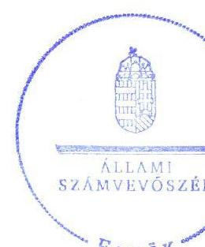
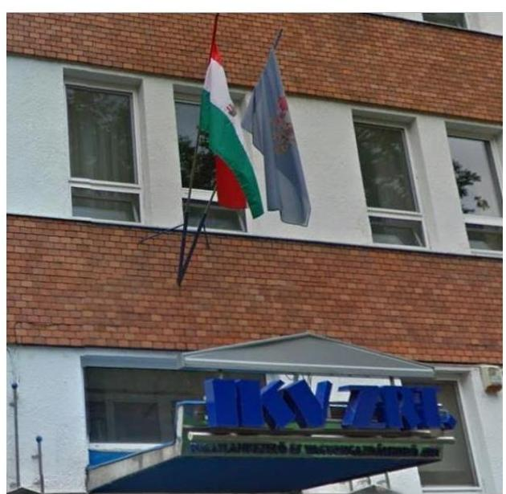
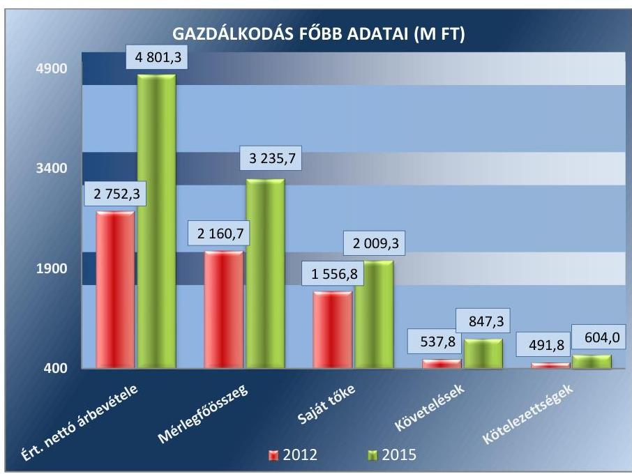
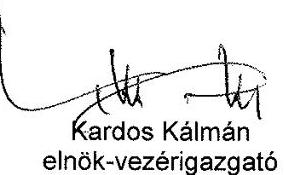
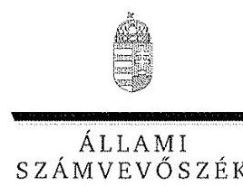
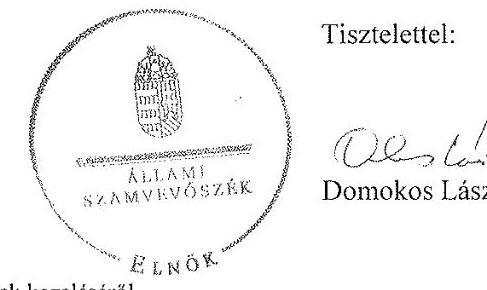
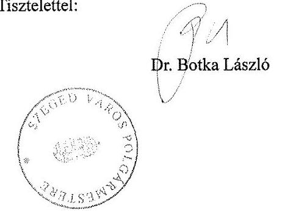
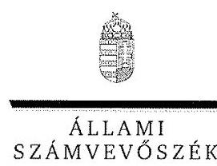
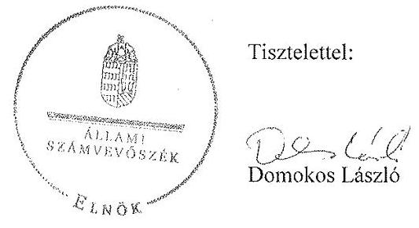

# Jelentés 

## Az önkormányzatok gazdasági társaságai

Az önkormányzatok többségi tulajdonában lévő gazdasági társaságok gazdálkodásának ellenőrzése - IKV Ingatlankezelő és Vagyongazdálkodó Zártkörűen Működő Részvénytársaság (Szeged)
2017.

Az ÁSZ az államháztartáson kívül működő feladat-ellátó rendszerek ellenőrzéseivel hozzájárul ahhoz, hogy a közpénzeket az államháztartáson kívül működő szervezetek is átlátható, rendezett módon használják fel a feladatok ellátása érdekében.

---

# Jelentés 

## Az önkormányzatok gazdasági társaságai

Az önkormányzatok többségi tulajdonában lévő gazdasági társaságok gazdálkodásának ellenőrzése - IKV Ingatlankezelő és Vagyongazdálkodó Zártkörűen Működő Részvénytársaság (Szeged)
2017. 09 hó 12 nap

17176
www.asz.hu

---

# AZ ELLENŐRZÉST FELÜGYELTE:

DR. HORVÁTH MARGIT felügyeleti vezető

## AZ ELLENŐRZÉST VEZETTE ÉS A VÉGREHAJTÁSÁÉRT FELELŐS:

DR. PELLEI TAMÁS ellenőrzésvezető

## A PROGRAM ÖSSZEÁLLÍTÁSÁÉRT FELELŐS:

JANIK JÓZSEF osztályvezető

IKTATÓSZÁM: V-1329-122/2016.

TÉMASZÁM: 2363

ELLENŐRZÉS-AZONOSÍTÓ SZÁM: V075826

Jelentéseink az Országgyűlés számítógépes hálózatán és az Interneten a www.asz.hu címen is olvashatóak.

---

# TARTALOMJEGYZÉK 

■ ÖSSZEGZÉS ..... 5
■ AZ ELLENŐRZÉS CÉLJA ..... 6
■ AZ ELLENŐRZÉS TERÜLETE ..... 7
■ AZ ELLENŐRZÉS HÁTTERE, INDOKOLTSÁGA ..... 10
■ A JELENTÉS LÉNYEGES KÉRDÉSKÖREI ..... 11
■ ELLENŐRZÉS HATÓKÖRE ÉS MÓDSZEREI ..... 12
■ MEGÁLLAPÍTÁSOK ..... 14
■ JAVASLATOK ..... 24
■ MELLÉKLETEK ..... 27
I. Sz. melléklet: Értelmező szótár. ..... 27
II. Sz. melléklet: A Társaság mérlegadatainak változása (adatok M Ft) ..... 28
III. Sz. melléklet: A Társaság eredménykimutatásának adatai (adatok M Ft) ..... 29
■ FÜGGELÉK: ÉSZREVÉTELEK ..... 31
■ RÖVIDÍTÉSEK JEGYZÉKE ..... 47

---

.

---

# ÖSSZEGZÉS 

Szeged Megyei Jogú Város Önkormányzata a tulajdonosi joggyakorlás kereteit szabályszerűen alakította ki, a tulajdonosi jogait összességében szabályszerűen gyakorolta. Az IKV Ingatlankezelő és Vagyongazdálkodási Zártkörűen Működő Részvénytársaságnál a vagyongazdálkodás szabályszerűsége nem volt megfelelő, nem biztosította az elszámoltathatóságot és a működés átláthatóságát. A Társaság fizetőképessége biztosított volt, de az ellenőrzött időszakban romlott. A végzett szolgáltatásokkal kapcsolatos dijakat önköltségszámítással nem támasztották alá, így a Társaság árképzése összességében nem volt szabályszerű.

## Az ellenőrzés társadalmi indokoltsága

Az Állami Számvevőszék kiemelt célja, hogy a helyi önkormányzatok gazdálkodásában rejlő pénzügyi kockázatok feltárásával, az államháztartáson kívülre nyújtott költségvetési támogatások és ingyenes vagyonjuttatások, valamint az államháztartáson kívül működő feladat-ellátó rendszerek ellenőrzéseivel hozzájáruljon ahhoz, hogy a közpénzeket az államháztartáson kívül működő szervezetek is átlátható, rendezett módon használják fel.

Az Állami Számvevőszék céljaival és a társadalmi igénnyel összhangban, a gazdasági társaságok kiemelt fontosságú szerepe, továbbá az átadott önkormányzati vagyon nagysága miatt került sor az IKV Ingatlankezelő és Vagyongazdálkodási Zártkörűen Működő Részvénytársaság ellenőrzésére.

## Főbb megállapítások, következtetések

Szeged Megyei Jogú Város Önkormányzata a tulajdonosi joggyakorlásának kereteit a jogszabályoknak megfelelően kialakította, tulajdonosi jogait összességében szabályszerűen gyakorolta. A Társaság 2012-2015. évi eredményének felhasználásáról nem döntött. Rendeletalkotási kötelezettségét teljesítette, a Társaság beszámolóit, üzleti terveit jóváhagyta.

A Társaság a számlarend kivételével elkészítette a jogszabályban előírt szabályzatokat, bár azok tartalma maradéktalanul nem felelt meg az előírásoknak. A 2015. évben a távhőszolgáltatás bevételeinek és kiadásainak szétválasztására vonatkozóan a számviteli szabályzatokat nem aktualizálták, továbbá üzletszabályzatot sem készítettek. A Társaság vagyongazdálkodása nem volt szabályszerű, mivel a jogszabályban foglalt előírások ellenére a 2012-2014. évekre vonatkozó éves beszámolók mérlegtételeit alátámasztó leltárakat nem készítették el. A Társaság fizetőképessége biztosított volt a gazdálkodás során.

A Társaság az éves beszámolóit elkészítette, azonban a beszámolók tartalma nem felelt meg maradéktalanul a jogszabály előírásainak. A közérdekű adatok nyilvánosságra hozatala nem volt megfelelő, mert a jogszabályi előírások ellenére a közzétételi kötelezettségének nem teljes körűen tett eleget.

A bevételeinek és a ráfordításainak, valamint az értékcsökkenés elszámolása összességében szabályszerű volt. Az önköltségszámítási szabályzat nem volt megfelelő, a végzett szolgáltatások önköltségének meghatározására nem volt alkalmas. A távhőszolgáltatás díjának meghatározása esetében a hatósági díjakat a jogszabályi előírásoknak megfelelően alkalmazták, a feladatok ellátásával kapcsolatos díjakat önköltségszámítással nem támasztották alá.

---

# AZ ELLENŐRZÉS CÉLJA 

Az ellenőrzés célja annak értékelése volt, hogy az önkormányzat vagyongazdálkodási tevékenysége során szabályszerűen gyakorolta-e tulajdonosi jogait; a gazdasági társaság szabályozottsága, gazdálkodása és vagyongazdálkodási tevékenysége, bevételeinek és ráfordításainak elszámolása megfelelt-e a jogszabályi és tulajdonosi előírásoknak; a gazdasági társaság kötelezettségállománya jelent-e kockázatot a működésre, valamint a gazdálkodás átláthatósága és elszámoltathatósága érdekében biztosítva volt-e a szolgáltatás díjának megalapozottsága szabályszerű önköltségszámítással.

---

# **AZ ELLENŐRZÉS TERÜLETE**

## **Szeged Megyei Jogú Város Önkormányzata és a tulajdonában álló IKV Ingatlankezelő és Vagyongazdálkodó Zrt.**

**AZ IKV** Ingatlankezelő és Vagyongazdálkodó Zártkörűen Működő Részvénytársaság Szeged Megyei Jogú Város Önkormányzata 100%-os tulajdonában áll, amelyet 2000. évben alapított a tulajdonában lévő ingatlanok hasznosítására.

A Társaságba 2015. év február hónapjában beolvadt a – 100%-ban önkormányzati tulajdonban lévő intézménytakarítási feladatokat ellátó – SZINT Kft.1 A Társaság2 jegyzett tőkéje 2012. január 1-jén 200 M Ft volt, amely 2015. június 30-án – a SZINT Kft. beolvadásával – 210 M Ft-ra emelkedett. A Társaságot a MEKH3 2015. év április hónapjában kijelölte a távhőszolgáltatási feladat ellátására, mivel az 51%-ban önkormányzati tulajdonában lévő SZEHŐ Kft.4 a vállalt közszolgáltatást nem teljesítette. A Társaság a távhőszolgáltatási feladatot 2015. április 16. és 2016. július 1. között látta el.

A Társaságnak az Önkormányzattal5 2002. évben megkötött Ingatlanhasznosítási Szerződés6 alapján a feladata volt az Önkormányzat tulajdonát képező lakások és helyiségek bérbeadása, értékesítése, karbantartása, valamint társasház kezelési feladatok ellátása. Ennek keretében 50 000 M Ft bruttó értékű önkormányzati tulajdonú ingatlant hasznosított. A Társaság az Alapító Okiratában7 rögzítettek alapján nem önkormányzati tulajdonú társasház kezelést, ingatlanok karbantartását, takarítását és egyéb feladatokat is ellátott. A Társaság feladatstruktúráját és az egyes feladatok főbb jellemzőit az 1. táblázat mutatja be.

1. táblázat

|  Megnevezés | 2012. | 2013. | 2014. | 2015.  |
| --- | --- | --- | --- | --- |
|  Lakásgazdálkodási tevékenység (önkormányzati tulajdonú lakások) | 4 298 db | 4 265 db | 4 225 db | 4 158 db  |
|  Helyiséggazdálkodási tevékenység (önkormányzati tulajdonú helyiségek) | 1 929 db | 1 912 db | 1 902 db | 1 896 db  |
|  Ingatlanértékesítési tevékenység (önkormányzati tulajdonú ingatlanok) | 28 db | 44 db | 31 db | 63 db  |
|  Társasház kezelés (önkormányzati és magántulajdonban lévő társasházak) | 328 db | 327 db | 327 db | 335 db  |
|   | épület | épület | épület | épület  |
|   | Forrás: A Társaság 2012–2015. évi éves beszámolói |  |  |   |

A távhőszolgáltatáson belül a fűtésszolgáltatás 390 231 GJ, és a használati melegvízszolgáltatás 492 999 m3 volt. 

---

A Társaság gazdálkodásának főbb adatait az 1. ábra tartalmazza.
1. ábra

Forrás: A Társaság 2012-2015. évi éves beszámolói
Az értékesítés nettó árbevétele a 2015. évben a távhőszolgáltatási és intézménytakarítási feladatok átvétele miatt 74,4%-kal nőtt a 2012. évhez képest. A 2015. évi 4801,3 M Ft-os értékesítés nettó árbevétel 43,7%-a (2 096,9 M Ft) távhőszolgáltatási-, 21,4%-a (1 028,7 M Ft) lakásgazdálkodási-, 20,8%-a (997,8 M Ft) helyiséggazdálkodási-, 2,3%-a (108,3 M Ft) társasház kezelési, 2,0%-a (98,3 M Ft) intézménytakarítási és 1,2%-a (59,4 M Ft) ingatlanértékesítési tevékenységből állt.

A 2012. december 31-ei mérlegfőösszeg 149,8%-kal - 1075,1 M Ft-tal - emelkedett és 2015. december 31-én 3 235,7 M Ft volt.

A követelések összege 2012-2014. évek között 12,9%-kal csökkent, a 2015. évben emelkedett és 2015. december 31-én 847,3 M Ft volt. A kötelezettségek állománya 2012-2014. év között csökkent, a 2015. évben emelkedett és 2015. december 31-én 604,0 M Ft volt.

A Társaság mérleg szerinti eredményének alakulását a 2. táblázat tartalmazza.
2. táblázat

| MÉRLEG SZERINTI EREDMÉNY ALAKULÁSA (M FT) |  |  |  |  |
| :-- | :--: | :--: | :--: | :--: |
| Megnevezés | 2012. | 2013. | 2014. | 2015. |
| Mérleg szerinti eredmény | 74,8 | 28,5 | 94,9 | 143,3 |

A mérleg szerinti eredmény a 2012. évről a 2013. évre 61,9%-kal csökkent, majd 2013-2015. közötti években folyamatosan növekedett, és 2015. évben 143,3 M Ft volt.

A Társaság mérlegadatainak változását a II. számú melléklet és az eredménykimutatás adatait a III. számú melléklet tartalmazza.

---

3. táblázat

|  FOGLALKOZTATOTTAK ÁTLAGOS |  |  |   |
| --- | --- | --- | --- |
|  STATISZTIKAI LÉTSZÁMA (FŐ) |  |  |   |
|  2012. | 2013. | 2014. | 2015.  |
|  279 | 268 | 265 | 522  |

Forrás: A Társaság 2012-2015. évi éves beszámolói

A foglalkoztattak száma a 2012. évről a 2014. évre - 279 főről 265 főre - csökkent. A 2015. évben az átvett takarítási és a távhőszolgáltatási feladatok miatt 522 főre emelkedett. A Társaság foglalkoztatottainak létszám adatait a 3. táblázat tartalmazza.

Az ellenőrzött időszakban a polgármester ${ }^{a}$ és a jegyző ${ }^{b}$ személye nem változott.

A Társaságnál az ügyvezetés feladatainak ellátására Igazgatóság működött és a napi működés irányítását elnök-vezérigazgató látta el. A Társaság elnök-vezérigazgatójának személye a 2012-2015. években három alkalommal változott, a gazdasági vezető személye nem változott.

A Társaság könyvvizsgálatra volt kötelezett, és a könyvvizsgáló személye a 2015. évi beszámoló könyvvizsgálatára vonatkozóan változott.

A Társaság más gazdasági társaságban tulajdonosi részesedéssel és vagyonkezelésbe vett vagyonelemekkel nem rendelkezett, valamint nem minősült kormányzati szektorba sorolt egyéb szervezetnek.

---

# AZ ELLENŐRZÉS HÁTTERE, INDOKOLTSÁGA 

Az önkormányzatok többségi tulajdonában álló gazdasági társaságok ellenőrzése kiemelten fontos a vagyon megőrzése, megóvása érdekében, valamint a kormányzati szektor elszámolásaiban megjelenő önkormányzati tulajdonú gazdálkodó szervezetek esetében, amelyekkel szemben alapvető követelmény, hogy gazdálkodásuk, működésük szabályszerű, az általuk szolgáltatott adatok minél megbízhatóbbak legyenek. A feladatellátás költségeinek, ráfordításainak alakulása a lakosság széles rétegét érinti.

Ellenőrzéseink feltárhatják, hogy az önkormányzat a feladatellátásához rendelt vagyon működtetését a tulajdonostól elvárható gondossággal végezte-e, a feladatot ellátó gazdasági társaság a létesítő okiratban, szolgáltatási szerződésben foglaltak betartásával biztosította-e a feladat ellátását. Az ellenőrzés eredményeképp meghatározhatóvá válnak a költségvetési hiányt befolyásoló szervezetek kockázatai, lehetővé válik ezen kockázatok csökkentése. Az ellenőrzés rávilágíthat arra, hogy a gazdasági társaság a vagyon használatával biztosította-e a szolgáltatás folytatásának feltételeit, az önkormányzat tulajdonosi felügyelete hozzájárult-e a szabályszerű gazdálkodáshoz és feladatellátáshoz. A megállapítások alapján megfogalmazott számvevőszéki javaslatok hasznosítása elősegítheti a meglévő hibák megszüntetését. A jó gyakorlatok bemutatásával az ÁSZ ${ }^{10}$ hozzájárulhat a követendő megoldások megismertetéséhez, terjesztéséhez.

---

# A JELENTÉS LÉNYEGES KÉRDÉSKÖREI 

1. Az önkormányzat tulajdonosi joggyakorlása szabályszerű volt-e?
2. A gazdasági társaság vagyongazdálkodása szabályszerű volt-e, fizetőképessége biztosított volt-e a gazdálkodás során?
3. A gazdasági társaság bevételeinek és ráfordításainak elszámolása, valamint az önköltségszámítás és árképzés szabályszerű volt-e?

---

# ELLENŐRZÉS HATÓKÖRE ÉS MÓDSZEREI 

## Az ellenőrzés típusa

Megfelelőségi ellenőrzés.

## Az ellenőrzött időszak

Az ellenőrzött időszak 2012. január 1-jétől 2015. december 31-ig tart.

## Az ellenőrzés tárgya

Az önkormányzat - többségi tulajdonában lévő gazdasági társaság feletti tulajdonosi joggyakorlása, valamint a gazdasági társaság gazdálkodásának szabályozottsága és szabályszerűsége.

Az ellenőrzés kiterjed minden olyan körülményre és

 adatra, amely az ÁSZ jogszabályban meghatározott feladatainak teljesítéséhez, valamint a program végrehajtása folyamán felmerült újabb összefüggések feltárásához szükséges.

## Az ellenőrzött szervezet

- Szeged Megyei Jogú Város Önkormányzata
- IKV Ingatlankezelő és Vagyongazdálkodó Zártkörűen Működő Részvénytársaság

## Az ellenőrzés jogalapja

Az ellenőrzés jogszabályi alapját az ÁSZ tv. ${ }^{11} 1$. § (3) bekezdése és 5. § (3)(4)-(5) bekezdései képezik.

## Az ellenőrzés módszerei

Az ellenőrzést a nemzetközi standardokat irányadónak tekintve az ellenőrzési program ellenőrzési kérdései, az ellenőrzött időszakban hatályos jogszabályok, az ellenőrzés szakmai szabályok és módszertanok figyelembe vételével végeztük.

Az ellenőrzés ideje alatt az ellenőrzött szervezettel történő kapcsolattartást az ÁSZ Szervezeti és Működési Szabályzatának vonatkozó előírásai alapján biztosítottuk.

---

Az ellenőrzés a kiválasztott, többségi tulajdonosi jogokat gyakorló önkormányzatra, illetve az ellenőrzésre kijelölt gazdasági társaságra terjedt ki.

Az ellenőrzési kérdések megválaszolásához szükséges bizonyítékok megszerzése a következő ellenőrzési eljárások alkalmazásával történt: megfigyelés, kérdésfeltevés (információkérés), összehasonlítás, valamint elemző eljárás. Az ellenőrzési bizonyítékként felhasználható adatforrások közé tartoznak egyrészt az ellenőrzési programban felsorolt adatforrások, másrészt adatforrás lehet még minden - az ellenőrzés folyamán - feltárt, az ellenőrzés szempontjából információkat tartalmazó dokumentum.

Az ellenőrzést a kérdésekre adott válaszok kiértékelésével, valamint a megjelölt adatforrások, a csatolt tanúsítványok felhasználásával, továbbá az adott időszakban hatályos jogszabályok figyelembe vételével folytattuk le.

A bevételek és ráfordítások elszámolásait, valamint a vagyonnyilvántartás terén a szabályszerű működést véletlen mintavétellel ellenőriztük. A mintavétellel ellenőrzött területek esetében minden egyes tétel vonatkozásában a szabályszerűségre vonatkozó kérdéseket tettünk fel, amelyek eredménye összesítésre került. Megfelelőnek értékeltünk egy ellenőrzött területet, amennyiben 95%-os bizonyossággal a teljes sokaságban a hibaarány legfeljebb 10%, nem megfelelőnek, amennyiben 10%-nál magasabb arányt képviselt. Abban az esetben, ha a teljes sokaság tekintetében a 10%-os hibaarányhoz való viszony megítélésének megbízhatósága nem érte el a 95%-ot, annak elérése érdekében értékelésünket további szempontokkal egészítettük ki, és figyelembe vettük a feltárt hibák típusát és súlyát. A ráfordítások elszámolására és a vagyonnyilvántartásra vonatkozó véletlen mintavételt kockázati alapú kiválasztással egészítettük ki, amelynek során évente a három legnagyobb összegű tételt választottuk ki.

---

# 1. Az önkormányzat tulajdonosi joggyakorlása szabályszerű volt-e? 

Összegző megállapítás

Az Önkormányzat a tulajdonosi joggyakorlásának kereteit szabályszerűen alakította ki, tulajdonosi jogait összességében szabályszerűen gyakorolta.

### 1.1. számú megállapítás

A tulajdonosi joggyakorlás kereteit az Önkormányzat szabályszerűen alakította ki.

GAZDASÁGI PROGRAMMAL az Önkormányzat az Ötv. ${ }^{12}$ és az Mötv. ${ }^{13}$ előírásának megfelelően rendelkezett a 2011-2014. évekre, illetve a 2015-2019. évekre vonatkozóan. A 2015-2019. évekre vonatkozó gazdasági program tartalmazta a SZINT Kft. Társaságba való beolvadásának tervét. Az Nvtv. ${ }^{14}$ 9. § (1) bekezdés előírása alapján elkészítették az Önkormányzat közép- és hosszú távú vagyongazdálkodási tervét, amelyben meghatároztak az ingatlanokhoz kapcsolódó értékesítési és bérbeadási elveket, rögzítettek rendelkezéseket és célkitűzéseket az önkormányzati ingatlangazdálkodásra, ingatlanhasznosításra vonatkozóan.

A RENDELETALKOTÁSI KÖTELEZETTSÉGÉNEK az Önkormányzat eleget tett, az Ltv. ${ }^{15}$ és a Tszt. ${ }^{16}$ előírásainak megfelelően megalkotta a Lakásrendeletet ${ }^{17}$, a Helyiségrendeletet ${ }^{18}$, az Elidegenítési rendeletet ${ }^{19}$, valamint a Távhőrendeletet ${ }^{20}$.

## A TULAJDONOSI JOGOKAT ÉS GYAKORLÁSÁNAK

SZABÁLYAIT az Önkormányzat az Alapító Okiratban1-13, a Vagyonrendeletben ${ }^{21}$, az önkormányzati SZMSZ-ben ${ }_{1-3}{ }^{22}$, az Ingatlanhasznosítási Szerződésben, valamint a társasági SZMSZ-ben ${ }_{1-4}{ }^{23}$ határozta meg. A tulajdonosi jogokat a Vagyonrendelet alapján a Közgyűlés ${ }^{24}$ gyakorolta. Az Önkormányzat képviselete az Igazgatóságban és a felügyelőbizottságban a társasági SZMSZ ${ }_{1-4}$ és a Vagyonrendelet előírása alapján biztosított volt.

## A FELADATELLÁTÁSHOZ KAPCSOLÓDÓ KÖVE-

TELMÉNYEKET az Önkormányzat a Gt. ${ }^{25}$ és a Ptk. ${ }^{26}$ rendelkezéseinek megfelelően, számon kérhető módon az Alapító Okiratban ${ }_{1-13}$, valamint - az ingatlanhasznosítási tevékenységgel kapcsolatban - az Ingatlanhasznosítási Szerződésben rögzítette. Az intézménytakarítási tevékenységhez és a távhőszolgáltatási tevékenységhez szerződéseket az ellenőrzött időszakban - jogszabályi előírás hiányában - nem kötöttek. Az ingatlanhasznosítási feladatellátás tárgyát képező vagyon körét az Önkormányzat az Ingatlanhasznosítási Szerződés keretében meghatározta és - az ellenőrzött időszakot megelőzően - a Társaság rendelkezésére bocsátotta. A Társaság a távhőszolgáltatás közfeladatát alapvetően saját eszközeivel látta el.

---

AZ ÜZLETI TERV készítését az Önkormányzat az Alapító Okiratban ${ }_{1-13}$ és a társasági SZMSZ-ben ${ }_{1-4}$ a vezérigazgató részére előírta. Az üzleti terveket a Társaság az ellenőrzött időszakban elkészítette, amelyeket a Közgyűlés - a felügyelőbizottság véleményének megismerését követően - jóváhagyott. A 2015. évi üzleti tervet az átvett intézménytakarítási és távhőszolgáltatási feladatok vonatkozásában nem módosították.

A FELÜGYELŐBIZOTTSÁG a Gt. és a Ptk. 2 előírásának megfelelően működött és az ellenőrzött időszakban rendelkezett az alapító által jóváhagyott ügyrenddel. Megtárgyalta a Társaság üzleti tervét, éves beszámolóját és a Gt. 35. § (3) bekezdésének, illetve a Ptk. 2 3:120 § (2) bekezdésének megfelelően minden évben írásbeli jelentést készített a Társaság éves beszámolójáról, valamint üzleti tervéről.

ELLENŐRZÉSI TEVÉKENYSÉGÉT az Önkormányzat - tulajdonosi joggyakorlása során - a felügyelőbizottság és a könyvvizsgáló megválasztásával és folyamatos működtetésével, az éves számviteli beszámolás részeként, valamint a belső ellenőrzés és külső szakértői ellenőrzés keretében végezte. Továbbá a Társaság részére az ingatlanhasznosítási tevékenységhez kapcsolódó ingatlanokra vonatkozó ellenőrzési kötelezettségeket az Önkormányzat az Ingatlanhasznosítási Szerződésben írta elő.

Az Önkormányzat belső ellenőrzése az Áht. ${ }^{27}$ 70. § (1) bekezdés d) pontjában foglalt lehetőséggel élve a Társaságnál az ellenőrzött időszakban három ellenőrzést végzett. Az ellenőrzések a pénzkezelést érintő szabályzatok megfelelőségére, betartására, a munkaerő gazdálkodás megfelelőségére, a személyi jellegű ráfordításokkal való gazdálkodására, a számviteli, bizonylati rend érvényesülésére, valamint a Társaság által kötött szerződésekre vonatkoztak. Az ellenőrzések által megfogalmazott javaslatokkal kapcsolatban egy esetben készült intézkedési terv, egy esetben pedig a javaslatokra tett intézkedéseket beszámolóban rögzítették, illetve egy esetben nem került sor intézkedési kötelezettség meghatározására.

AZ ÉVES BESZÁMOLÁSRA vonatkozó kötelezettséget az Önkormányzat az Alapító Okiratban ${ }_{1-13}$, valamint a társasági SZMSZ-ben ${ }_{1-4}$ az Igazgatóság, a felügyelőbizottság és a vezérigazgató részére meghatározta, és az információs beszámolórendszer ${ }^{28}$ keretében állapította meg a beszámolás formáját.

Az éves beszámolókat a Közgyűlés - a könyvvizsgálói vélemények és a felügyelőbizottsági jelentések ismeretében - megtárgyalta, azokat jóváhagyta. A Közgyűlés a társasági SZMSZ2-4 III./1. e.) pontjában foglaltak ellenére az éves eredmények felhasználásáról nem döntött. Az ellenőrzött időszakban osztalékfizetés nem történt, a mérleg szerinti eredmény az eredménytartalékba került elszámolásra.

Az Önkormányzat az Ingatlanhasznosítási Szerződésben - információs beszámolórendszer keretében történő teljesítéssel - adatszolgáltatási kötelezettséget határozott meg a Társaságnak a hasznosított önkormányzati ingatlanokkal kapcsolatban.

JAVADALMAZÁSI SZABÁLYZATTAL ${ }^{29}$ a Társaság a Taktv. ${ }^{30}$ 5. § (3) bekezdés előírásainak megfelelően rendelkezett.

---

KÉSZFIZETŐ KEZESSÉGET vállalt a Közgyűlés a Társaság távhőszolgáltatás átvétele és működésének finanszírozása miatti 1300 M Ft-os hitel felvételéhez. A Társaság a hitelfelvételre vonatkozó Bankszámlahitel-szerződést, valamint az Önkormányzat a Készfizető kezesi megállapodást 2015. december 30-án kötötte meg a pénzintézettel. A bankszámlahitel-keret igénybevételének lehetősége az ellenőrzési időszakot követően nyílt meg a Társaság számára. Az Áht. 96. § (1) bekezdésében meghatározott kezességvállalás a Stabilitási tv. ${ }^{31}$ 10/E. § előírásainak megfelelt, a kezesség érvényesítésére az ellenőrzött időszakban nem került sor.

# 2. A gazdasági társaság vagyongazdálkodása szabályszerű volt-e, fizetőképessége biztosított volt-e a gazdálkodás során? 

Összegző megállapítás

A Társaság vagyongazdálkodása nem volt szabályszerű, fizetőképessége a gazdálkodás során biztosított volt. A beszámolási kötelezettségét hiányosan teljesítette.
2.1. számú megállapítás

A Társaság - a számlarend kivételével - rendelkezett az előírt számviteli szabályzatokkal, azonban azok tartalma maradéktalanul nem felelt meg az előírásoknak. A Társaság üzletszabályzatot nem készített.

SZÁMVITELI POLITIKÁVAL ${ }^{32}$ az ellenőrzött időszakban a Számv. tv. ${ }^{33}$ 14. § (3) bekezdése alapján rendelkeztek, azonban a Számv. tv. 14. § (11) bekezdésben foglalt kötelezettségnek a Társaság nem tett eleget, mert az ellenőrzött időszakban a számviteli jogszabályi változásokat 90 napon belül nem vezette át a Számviteli politikán, így a Számv. tv. 2013. január 1-jétől hatályos 3. § (3) bekezdés 5. pontjában szereplő megbízható és valós képet lényegesen befolyásoló hiba fogalmának hatályon kívül helyezésével kapcsolatos változásokat.

ÉRTÉKELÉSI SZABÁLYZATTAL ${ }^{34}$ a Társaság a Számv. tv. 14. § (5) bekezdés b) pontja szerint rendelkezett, amelyben a Számv. tv. 46. § előírásainak megfelelően határozta meg a mérlegtételek értékelésének szabályait.

A LELTÁROZÁSI SZABÁLYZATBAN ${ }^{35}$ a Számv. tv. 69. § (3) bekezdése alapján csak értékben kimutatott eszközöknél és a kötelezettségeknél meghatározták, hogy évente egyeztetéssel kell elvégezni a leltározást. A szabályzatot a Számv. tv. 14. § (11) bekezdés előírása ellenére nem aktualizálták, mert a Számv. tv. 2012. január 1-jétől hatályos 69. § (3) bekezdésében meghatározott legalább 3 évenkénti mennyiségi felvétellel történő leltározási kötelezettség előírása az ingatlanok esetében nem valósult meg, a jogszabályi változást megelőző 5 évenkénti mennyiségi felvétellel történő leltározás maradt a Társaságnál hatályban.

A PÉNZKEZELÉSI SZABÁLYZATOT ${ }_{1-2}{ }^{36}$ elkészítették. A Társaság a Számv. tv. 14. § (11) bekezdésében előírtak ellenére 90 napon belül nem vezette át a Pénzkezelési szabályzaton ${ }_{1-2}$ - a Számv. tv. 14. § (9) bekezdésének 2012. december 1-jétől hatályon kívül

---

helyezése miatt - a napi záró készpénzállomány maximális mértékének megszűnését érintő változást. A pénzkezelési szabályzat ${ }_{2}$ a 2013. július 1-jei módosítást követően megfelelt az előírásoknak.

SZÁMLARENDET az ellenőrzött időszakban szabálytalanul a Számv. tv. 161. § (1) bekezdés előírása ellenére nem készítettek. A Társaság a 2012-2015. éveket érintően számlatükörrel rendelkezett, amely tartalmazta a Számv. tv. 161. § (2) bekezdés a) pontban előírt minden alkalmazásra kijelölt számla számlajelét és megnevezését.

ÜZLETSZABÁLYZATOT a Társaság a távhőszolgáltatási feladatot érintően nem dolgozott ki a szolgáltatás megkezdését követően, így a jegyző a Tszt. 7. § (1) bekezdés a) és c) pontjaiban foglalt előírásoknak nem tudott eleget tenni az ellenőrzött időszakban.

A Társaság számviteli szabályzatai nem tartalmaztak ellátott távhőszolgáltatási feladat bevételeinek és kiadásainak szétválasztására vonatkozó szabályokat, ezáltal a Társaság a Tszt. 18/A. § (2) bekezdésében előírtak ellenére nem dolgozott ki olyan számviteli szétválasztási szabályokat, mely biztosítja az egyes tevékenységek átláthatóságát.

# 2.2. számú megállapítás 

A vagyongazdálkodás a leltározás hiányosságai miatt nem felelt meg a belső szabályozásoknak és a jogszabályi előírásoknak.

A SAJÁT VAGYON NYILVÁNTARTÁSÁT az analitikus nyilvántartásokban és főkönyvi kivonatokon folyamatosan és naprakészen vezették, de a Számviteli politika előírásaitól eltérően a nettó értékkel nem rendelkező - még használatban lévő - immateriális javakat és tárgyi eszközöket nem különítették el az analitikus nyilvántartásokban. A saját vagyonban bekövetkezett változásokat a Számv. tv. 165. § (1) bekezdés előírása alapján rögzítették.

A Társaság az Ingatlanhasznosítási Szerződésben foglaltaknak megfelelően vezette a hasznosításra átadott önkormányzati ingatlanokat tartalmazó kataszteri nyilvántartást, amely alkalmas volt az előírt önkormányzati vagyont érintő adatszolgáltatásra.

A MÉRLEGTÉTELEK ALÁTÁMASZTÁSÁHOZ a Társaság a 2012-2014. években az éves beszámolók mérlegkimutatását az analitikus nyilvántartások és a főkönyvi könyvelés adataiból állították össze, de a csak értékben nyilvántartott eszközöknél és kötelezettségeknél a Számv. tv.
 69. § (3) bekezdése és a Leltározási szabályzat előírásai ellenére nem végeztek egyeztetéssel leltározást. A 2015. évben a Számv. tv. 69. § (3) bekezdésnek megfelelően egyeztetéssel történt leltározással meggyőződtek a leltárba bekerülő adatok valódiságáról.

A mérlegtételeket alátámasztó leltárakat a Társaság szabálytalanul a Számv. tv. 69. § (1) bekezdésének előírása ellenére a 2012-2014. években - pénzeszközök kivételével - nem készített. A 2015. évi beszámoló mérlegadatait a Számv. tv. 69. § (1) bekezdésének előírásai szerinti leltárakkal alátámasztották, és a Leltározási szabályzatban előírt - a beszámolóban lévő eszközök és források értékét alátámasztó - teljes körű leltárakat összeállították a mérlegfordulónapra vonatkozóan.

---

A Társaság a Leltározási szabályzat előírásainak megfelelően a 2014. évi és 2015. évi záró leltározási jegyzőkönyvek, leltárjelentések alapján elvégezte a gépek, berendezések, járművek évenkénti mennyiségi leltárfelvételét. A 2015. évben elvégezték az ingatlanok mennyiségi leltárfelvételét. A 2012-2013. években a mennyiségben is nyilvántartott eszközök leltárfelvétele nem volt szabályszerű, mert a Leltározási szabályzatban előírtak ellenére a Társaságnál nem készítettek záró leltárjelentéseket.

A Gt. 207. § (1) bekezdése, és a Ptk. 2:3:212. § (2) bekezdése által előírt tőkemegfelelés az ellenőrzött időszakban a Társaságnál biztosított volt, és a saját tőke összege meghaladta a jegyzett tőke összegét.

BELSŐ ELLENŐRZÉST a vezérigazgató - a társasági SZMSZ előírásai alapján - kialakította és működtette. A vagyongazdálkodást érintően elvégzett - rendszerellenőrzés típusú - belső ellenőrzések a Társasházkezelési Osztály, az Ingatlan-gazdálkodási-, a Helyiség-gazdálkodási-, a Lakásgazdálkodási-, és a Műszaki csoport valamint a Karbantartó üzem működését érintették az ellenőrzött időszakban. Az elvégzett hét ellenőrzésnél öt esetben készült intézkedési terv, az intézkedések végrehajtása ütemezés szerint megtörtént vagy végrehajtásuk folyamatban volt.
2.3. számú megállapítás

A fizetőképesség biztosított volt, azonban a 2015. évben a lejárt szállítói kötelezettségek - a távhőszolgáltatási és intézménytakarítási feladatok átvétele miatt - jelentősen nőttek.

# A FIZETŐKÉPESSÉG BIZTOSÍTOTT VOLT, DE 

ROMLOTT, mivel a lejárt fizetési határidejű szállítói kötelezettség összege az ellenőrzött időszakban - 339,4%-kal - 37,1 M Ft-tal emelkedett. A fizetőképesség romlása nem veszélyeztette a Társaság pénzügyi stabilitását. A Társaság rövid lejáratú kötelezettségei a 2013-2014. években fokozatosan - összesen 18,9%-kal - csökkentek, és összegük 2014. december 31-én 402,8 M Ft volt. A 2015. évben a kötelezettségek jelentősen a 2012. december 31-ei állapothoz képest 22,8%-kal és a 2014. december 31-ei állapothoz képest 49,9%-kal, 604,0 M Ft-ra nőttek. A kötelezettségek növekedését nagymértékben befolyásolta a 2015. évi tevékenységi kör bővülése. A Társaság kötelezettségeinek alakulását a 4. táblázat tartalmazza.
4. táblázat

RÖVID LEJÁRATÚ KÖTELEZETTSÉGEK ALAKULÁSA (M FT)

| Megnevezés | 2012.12.31. | 2013.12.31. | 2014.12.31. | 2015.12.31. |
| :--: | :--: | :--: | :--: | :--: |
| Szállítói kötelezettségek | 53,9 | 56,3 | 20,7 | 144,1 |
| ebből határidőn belüli | 38,4 | 8,7 | 6,5 | 91,5 |
| ebből határidőn túli | 15,5 | 47,6 | 14,2 | 52,6 |
| Egyéb rövid lejáratú   kötelezettségek | 362,9 | 387,2 | 382,1 | 459,9 |
| Kötelezettségek | 491,8 | 443,5 | 402,8 | 604,0 |

A Társaság szállítói kötelezettségei illetve a lejárt szállítói kötelezettségei 2014. december 31-ére - 33,2 M Ft-tal, 61,6%-kal illetve 1,3 M Ft-tal, 8,4%-kal - csökkentek a 2012. december 31-ei összeghez viszonyítva. Ezt követően a 2015. évben a szállítói kötelezettségek 123,4 M Ft-tal, 696,1%-kal - illetve a lejárt fizetési határidejű szállítói kötelezettségek 

---

38,4 M Ft-tal - 370,4%-kal - növekedtek a 2014. december 31-ei állományhoz képest.

Az egyéb rövid lejáratú kötelezettségek összege a 2012. év végéről a 2015. év végére - 97,0 M Ft-tal - 26,7%-kal növekedett. A Társaság egyéb rövid lejáratú kötelezettségei között vevőktől kapott előlegek, költségvetéssel és munkavállalókkal szembeni - fizetési határidőn belüli - kötelezettségek szerepeltek. Hosszú lejáratú kötelezettsége a Társaságnak nem volt.

# 2.4. számú megállapítás 

A Társaság a beszámolási, adatszolgáltatási kötelezettségeit hiányosan teljesítette. A közérdekű adatok nyilvánosságra hozatala nem volt megfelelő.

ÉVES BESZÁMOLÁSI KÖTELEZETTSÉGÉT a Társaság az Alapító Okirat$_{1-13}$, valamint a társasági SZMSZ-ben$_{1-4}$ előírtak alapján az éves beszámoló keretében teljesítette.

A Társaság az Ingatlanhasznosítási Szerződés 9.6. pontjában - a következő évben mobilizálható önkormányzati ingatlanok körét érintően - előírt éves javaslatot nem készítette el, de az információs beszámolórendszer keretében a hasznosításra került ingatlanokra vonatkozó adatszolgáltatását teljesítette.

AZ ÉVES BESZÁMOLÓKAT a Társaság minden évben elkészítette, letétbe helyezte és közzétette. A Számviteli politika könyvvezetés módja, választott beszámolási forma fejezetében (1. oldal 3. bekezdés) előírtak ellenére a Társaság az ellenőrzött időszak éves beszámolóiban a mérleg egyes tételeihez meghatározott értékelési feladatokat nem a szabályzatban meghatározott mérlegkészítési időpontra végezte el.

Az ellenőrzött időszak éves beszámolói kiegészítő mellékleteiben szabálytalanul nem mutatták be - a Számv. tv. 155. § (2) bekezdése alapján fennálló kötelező könyvvizsgálatot érintően - a Számv. tv. 88. § (8) bekezdés b) pont előírása ellenére a könyvvizsgáló díjazását. Továbbá a Számv. tv. 92. § (2) bekezdésének előírásai ellenére nem mutatták be a terven felüli értékcsökkenés összegét, valamint a jelentősebb összegű terven felüli értékcsökkenés elszámolásának indokait.

A 2015. évi éves beszámoló kiegészítő melléklete szabálytalanul a Tszt. 18/A. § (3) bekezdés b) pontjában előírtak ellenére nem tartalmazta a távhőszolgáltatási tevékenység önálló mérlegét és eredménykimutatását.

A KÖNYVVIZSGÁLÓI JELENTÉS tartalma nem volt megfelelő, mivel a 2015. évben a Tszt. 18/B. (1) bekezdésben foglaltak ellenére nem tartalmazta - a távhőszolgáltatási tevékenységet érintően - hogy a számviteli szétválasztási szabályok, valamint az egyes tevékenységek közötti tranzakciók árazása biztosította a keresztfinanszírozás-mentességet.

A könyvvizsgáló a 2012-2015. évi éves beszámolókat a Számv. tv. 156. § (1) bekezdés előírása ellenére szabálytalanul hitelesítő záradékkal látta el, a számviteli szabályozások és a leltárak összeállításának hiányosságaira, valamint az éves beszámolók kiegészítő mellékleteinek összeállítására nem tett észrevételt.

---

ADATVÉDELMI ÉS ADATBIZTONSÁGI előírásokat az informatikai biztonsági szabályzat$^{37}$ tartalmazta, amely megfelelt az Info tv.$^{38}$ 7. § és 24. § (3) bekezdés előírásainak. A Társaság a szabályzatban megjelölte az adatvédelemért felelős személyt és meghatározta a feladatait.

KÖZÉRDEKŰ ADATOK megismerésére irányuló igények teljesítésének rendjét rögzítő szabályzatot az Info. tv. 30. § (6) bekezdésének előírása ellenére nem készítettek és az Info. tv. 35. § (3) bekezdésének előírása ellenére az Info tv. 35. § (1) bekezdés és (2) bekezdés szerinti - a közzétételi listák adataival kapcsolatos - kötelezettség teljesítésének részletes szabályait belső szabályzatban nem állapították meg.

A közérdekű adatok nyilvánosságra hozatalával kapcsolatos kötelezettségének a Társaság a Taktv. előírásai alapján eleget tett.

A Társaság az Info. tv. 37. § (1) bekezdésében előírt közzétételi kötelezettségének nem teljes körűen tett eleget, mert az Info. tv. 1. melléklet szerinti általános közzétételi lista II. Tevékenységre, működésre vonatkozó adatok 1. pontja alapján az adatvédelmi és adatbiztonsági szabályzat hatályos és teljes szövegét, a 6. pont alapján a fenntartott adatbázisok, nyilvántartások leíró adatait, az alaptevékenység keretében gyűjtött és feldolgozott adatok fajtáit, a hozzáférés módját, a másolatkészítés költségeit, a 13. pont alapján a közérdekű adatok megismerésére irányuló igények intézésének rendjét.

A távhőszolgáltatási feladatokhoz kapcsolódóan a 2015. évben nem tette közzé a Tszt. 57/C. § (4) bekezdés a) pont előírása ellenére az üzletszabályzatot, továbbá a Tszt. 57/C. § (1) bekezdés b) pontjában meghatározottak ellenére a helyi önkormányzat területén közszolgáltatás ellátására kötött megállapodásokat, továbbá a Tszt. 57/C. § (4) bekezdés b)-c) és f) pontokban meghatározott információkat és elérhetőségeket.

# 3. A gazdasági társaság bevételeinek és ráfordításainak elszámolása, valamint az önköltségszámítás és árképzés szabályszerű volt-e? 

Összegző megállapítás

A bevételek és a ráfordítások, valamint az értékcsökkenés elszámolása összességében szabályszerű volt. A Társaság önköltségszámítást nem végzett, az árképzés összességében nem az előírásoknak megfelelően történt.

### 3.1. számú megállapítás

A bevételek és ráfordítások, valamint az értékcsökkenés elszámolása összességében szabályszerű volt.

A bevételeket tevékenységenként kialakított bevételi főkönyvi számlaszámokra könyvelték, valamint ezzel egy időben tevékenységi kör kódok alapján is elkülönítették. A költségek és a ráfordítások elkülönített elszámolását is a könyvelési folyamat során tevékenységi kör kódok alkalmazásával valósították meg.

---

A BEVÉTELEK ELSZÁMOLÁSA összességében szabályszerű volt, de előfordult, hogy a Társaság által kiállított bizonylat (számla) a Számv. tv. 165. § (2) bekezdésében előírtak ellenére nem volt szabályszerű, mert az alkalmazott árat nem a valóságnak megfelelően tartalmazta.

AZ ÉRTÉKCSÖKKENÉS ELSZÁMOLÁSA összességében szabályszerűen történt.

A RÁFORDÍTÁSOKAT összességében szabályszerűen számolták el. A megfelelő főkönyvi számlákra könyveltek és az elszámolást a Számv. tv.-ben foglaltaknak megfelelő számviteli bizonylattal alátámasztották.

A SZEMÉLYI JELLEGŰ RÁFORDÍTÁSOK elszámolása összességében szabályszerű volt.

A SAJÁT VAGYON PÓTLÁSA nem az elszámolt értékcsökkenés értékének megfelelően valósult meg. Az elszámolt értékcsökkenés és a tárgyi eszközök, valamint az immateriális javak bruttó értékének alakulását az 5. táblázat tartalmazza.
5. táblázat

TÁRGYI ESZKÖZÖK, IMMATERIÁLIS JAVAK BRUTTÓ ÉRTÉKE ÉS AZ ELSZÁMOLT ÉRTÉKCSÖKKENÉS ALAKULÁSA (M FT)

| Megnevezés | 2012. | 2013. | 2014. | 2015. |
| :-- | :--: | :--: | :--: | :--: |
| Elszámolt értékcsökkenési leírás | 96,2 | 89,2 | 99,4 | 128,5 |
| Tárgyi eszközök és Immateriális javak   bruttó értékének növekedése | 65,1 | 61,9 | 64,2 | 162,1 |

A Társaságnál a 2012-2015. közötti években összesen 353,3 M Ft értékben nőtt a tárgyi eszközök és az immateriális javak bruttó értéke, ezzel szemben 413,3 M Ft összegű értékcsökkenést számoltak el. A 2015. évben az elszámolt értékcsökkenés összegének növekedését az átvett távhőszolgáltatási tevékenységhez kapcsolódó eszközök értékcsökkenésének elszámolása és az eszközök bruttó érték növekedését a számviteli és nyilvántartási programok beszerzései eredményezték.

A KÖVETELÉSÁLLOMÁNY az ellenőrzött időszakban 309,5 M Ft-tal, 57,5%-kal növekedett. A követelések alakulását a 6. táblázat tartalmazza.
6. táblázat

KÖVETELÉSEK ALAKULÁSA (M FT)

| Megnevezés | 2012.12.31. | 2013.12.31. | 2014.12.31. | 2015.12.31. |
| :-- | :--: | :--: | :--: | :--: |
| Vevőkövetelések | 445,8 | 404,6 | 389,5 | 537,7 |
| Egyéb követelések | 92,0 | 90,7 | 78,7 | 309,6 |
| Követelések | 537,8 | 495,3 | 468,2 | 847,3 |

A követelések állománya a 2013. évben 42,5 M Ft-tal csökkent a 2012. év végi összeghez viszonyítva, és a 2014. december 31-éről 2015. december 31-ére 81,0%-kal - 379,1 M Ft-tal - növekedett.

---

A 2015. évben a vevőkövetelések összegének - 148,2 M Ft-os - emelkedését az átvett távhőszolgáltatási és intézménytakarítási tevékenység követelésállománya eredményezte.

Az egyéb követelések 2015. évben - 393,3%-kal - növekedtek, elsősorban a távhőszolgáltatással kapcsolatos vevői túlfizetések következtében. A SZEHŐ Kft.-nek a távhőszolgáltatási tevékenység átvételét megelőző időszakban - a távhőszolgáltatási díj elszámolásakor - a fogyasztók felé fizetési kötelezettsége állt fenn vevőtúlfizetések miatt. A Társaság a Közgyűlés határozata alapján a SZEHŐ Kft. helyett pénzügyileg rendezte a fogyasztói vevőtúlfizetéseket és az átutalással teljesített összeget, mint egyéb követelés tartotta nyilván a SZEHŐ Kft.-vel szemben.

A követelések behajtásának módját a behajtási
 szabályzatban ${ }^{39}$ rögzítették. A fizetési határidő lejártát követően részletfizetési megállapodásokat kötöttek, fizetési felszólításokat küldtek vagy fizetési meghagyásos eljárást kezdeményeztek. A 2012-2014. években ügyvédi iroda bevonásával, és a 2015. évtől a Társaság jogi csoportja által történt a hátralékkezelés.

A lejárt fizetési határidejű vevőkövetelések összege a 2012. december 31-ei 429,8 M Ft-ról 2015. év végére 482,6 M Ft-ra - 12,8\%-kal - emelkedett - a behajtási intézkedések ellenére - az átvett távhőszolgáltatási, illetve az intézménytakarítási tevékenységek követelésállománya miatt.

Társaság a 2015. évben ellátott távhőszolgáltatási feladat tekintetében - a 2015. évre vonatkozóan - nem vizsgálta a nyereségkorlát mértékét, így nem tett eleget a Tszt. 18/C. § (1) bekezdésében, valamint az 50/2011. (IX.30.) NFM rendelet ${ }^{40}$ 5. § (1) bekezdés, valamint a (2) bekezdés c) pontjában foglaltaknak.

# 3.2. számú megállapítás 

A Társaság önköltségszámítást nem végzett, az árképzés összességében nem felelt meg az előírásoknak.

AZ ÖNKÖLTSÉGSZÁMÍTÁSI SZABÁLYZATOT ${ }^{41}$ a Társaság a Számv. tv. 14. § (5) bekezdés c) pontja alapján az ellenőrzött időszakot megelőzően a Számviteli politika részeként készítette el.

A Társaság önköltségszámítási szabályzata nem volt megfelelő. A végzett szolgáltatások - Számv. tv. 51. § (2) bekezdés szerinti - önköltségének a Számv. tv. 14. § (7) bekezdésében foglaltaknak megfelelő utókalkuláció keretében történő meghatározására nem volt alkalmas. A Számviteli politika keretében elkészített önköltségszámítási szabályzat a Számv. tv. 14. § (3) bekezdésében előírtakkal összhangban nem tartalmazta az önköltség utókalkuláció keretében történő meghatározásának módszerét, eszközeit, különös tekintettel a felosztandó költségek vetítési alapjaira, az önköltségszámítás elkészítésének határidejére, a költségelszámolás és az önköltség kalkuláció egyeztetésének módjára, valamint az önköltségszámítás során alkalmazandó utókalkuláció tartalmára és időszakára.

## AZ ÖNKORMÁNYZAT A DÍJMEGÁLLAPÍTÁS SZABÁLYAIT a Lakásrendeletben, a Helyiségrendeletben, az Ingatlanhasználati szerződésben, valamint a Távhőrendeletben meghatározta. Továbbá a Vagyongazdálkodási terv az ingatlanok bérbeadásával, a díjak mértékével kapcsolatos koncepcionális elveket, valamint vállalkozási tevékenységre vonatkozó alapelveket is rögzített.

---

A Társaság az ellenőrzött időszakban az önköltségszámítási szabályzat és a Számv. tv. 14. § (7) bekezdés előírása ellenére nem határozta meg a végzett szolgáltatások önköltségét utókalkulációval, beleértve a távhőszolgáltatási és intézménytakarítási feladatokat is.

Az önköltségszámítás elmaradásának következtében a Társaság az Ltv. 34. § (4)-(5) bekezdéseiben előírtaknak nem tett eleget. A Társaság a költségelven bérbe adott lakások lakbérének mértékét - önköltségszámítás hiányában - nem úgy állapította meg, hogy a bérbeadónak az épülettel, az épület központi berendezéseivel és a lakással, a lakberendezéssel kapcsolatos ráfordításai megtérüljenek. Továbbá önköltségszámítás hiányában nem volt megállapítható, hogy a piaci alapon bérbe adott lakások lakbérének díját úgy alakította-e ki, hogy az ebből származó bevételek nyereséget is tartalmazzanak.

A Társaságnál az intézménytakarítási tevékenységek esetében egyedi díjakat állapítottak meg, amelyre vonatkozó önkormányzati előírás nem volt, az árképzés piaci alapon történt. A vállalkozási tevékenységek díjait a piaci viszonyok figyelembevételével állapították meg.

A Társaság karbantartási tevékenységéhez kapcsolódóan külön munkadíjat határoztak meg az Önkormányzat 100\%-os tulajdonában lévő ingatlanon végzett és a vállalkozásban végzett munkák esetében, továbbá egységes kiszállási díjat alkalmaztak, amelyek - mint végzett szolgáltatások - a Számv. tv. 14. § (7) bekezdésének előírása ellenére nem alapultak önköltségszámításon.

A távhőszolgáltatás díjtételeit a Társaság az 50/2011. (IX. 30.) NFM rendeletben, valamint a 2013. évi LIV. törvényben ${ }^{42}$ meghatározott hatósági ár figyelembevételével állapította meg a 2015. évben.

---

# JAVASLATOK 

Az ÁSZ tv. 33. § (1) bekezdésében foglaltak értelmében az ellenőrzött szervezet vezetője köteles a jelentésben foglalt megállapításokhoz kapcsolódó intézkedési tervet összeállítani és azt a jelentés kézhezvételétől számított 30 napon belül az ÁSZ részére megküldeni. Amennyiben az ellenőrzött szervezet vezetője nem küldi meg határidőben az intézkedési tervet, vagy továbbra sem elfogadható intézkedési tervet küld, az Állami Számvevőszék elnöke az ÁSZ tv. 33. § (3) bekezdése a) és b) pontjaiban foglaltakat érvényesítheti.
Javaslataink célja az IKV Ingatlankezelő és Vagyongazdálkodási Zrt. gazdálkodása szabályszerűségének helyreállítása annak érdekében, hogy a szabályozási környezet és az alkalmazott gyakorlat megfelelően tudja támogatni az átlátható működést.

## IKV Ingatlankezelő és Vagyongazdálkodási Zártkörűen Működő Részvénytársaság vezérigazgatójának

1. Intézkedjen a Társaság számviteli politikájának Számv. tv.-nek megfelelő tartalommal történő aktualizálásáról.
(2.1. sz. megállapítás 1. bekezdése alapján)
2. Intézkedjen a leltározási szabályzat Számv. tv. előírásának megfelelő aktualizálásáról az ingatlanok mennyiségi felvétellel történő leltározásának gyakorisága tekintetében.
(2.1. sz. megállapítás 3. bekezdés alapján)
3. Intézkedjen a számlarend Számv. tv. előírásának megfelelő elkészítéséről.
(2.1. sz. megállapítás 5. bekezdés 1. mondata alapján)
4. Intézkedjen az Ingatlanhasznosítási Szerződésben meghatározott, a mobilizálható ingatlanok körét érintő javaslatkészítési kötelezettség teljesítéséről.
(2.4. sz. megállapítás 2. bekezdése alapján)
5. Intézkedjen az éves beszámolók elkészítése során a mérleg egyes tételei értékelésének a Számviteli politikában meghatározott határidőben történő végrehajtásáról.
(2.4. sz. megállapítás 3. bekezdése alapján)

---

6. Intézkedjen arról, hogy az éves beszámoló kiegészítő melléklete tartalmazza a Számv. tv. előírásainak megfelelően a könyvvizsgáló díjazását, továbbá a terven felüli értékcsökkenés összegének, elszámolása indoklásának bemutatását.
(2.4. sz. megállapítás 4. bekezdése alapján)
7. Intézkedjen a közérdekű adatok megismerésére irányuló igények teljesítésének, továbbá a közzétételi listák adataival kapcsolatos kötelezettség teljesítésének részletes előírásait tartalmazó szabályzatok elkészítéséről az Info tv. előírásainak megfelelően.
(2.4. sz. megállapítás 9. bekezdése alapján)
8. Intézkedjen az Info tv. szerinti közzétételi kötelezettség teljes körű teljesítéséről.
(2.4. sz. megállapítás 11. bekezdése alapján)
9. Intézkedjen a Számv. tv-nek megfelelően az önköltségszámítási szabályzat kiegészítéséről, valamint a végzett szolgáltatások tekintetében az önköltség meghatározásáról.
(3.2. sz. megállapítás 2. és 4. bekezdései alapján)

---

# Javaslataink célja az Önkormányzat szabályszerű működésének elősegítése, továbbá az önkormányzati tulajdonosi joggyakorlás kontrolljainak erősítése. 

## Szeged Megyei jogú Város Önkormányzata polgármesterének

1. Intézkedjen a Társaság éves nyereségének felhasználásáról a Társaság hatályos szervezeti és működési szabályzatának megfelelően.
(1.2. sz. megállapítás 6. bekezdés 2. mondata alapján)
2. Intézkedjen
a) a számviteli politika, valamint a leltározási szabályzat aktualizálása, továbbá a számlarend összeállításának elmulasztása,
b) az éves beszámoló kiegészítő melléklete tartalmi hiányosságai,
c) a közérdekű adatok megismerésével, a közzétételi listák adataival kapcsolatos kötelezettség teljesítésére vonatkozó szabályozás elmulasztása, az Info tv. által meghatározott általános közzétételi listában meghatározott adatok nem teljes körű közzététele,
miatti felelősség tisztázása érdekében, és szükség szerint intézkedjen a felelősség érvényesítéséről
(2.1. sz. megállapítás 1. bekezdés, 3. bekezdés 2. mondata és 5. bekezdés 1. mondata 2.4. sz. megállapítás 4., 9. és 11. bekezdései alapján)

---

# MELLÉKLETEK 

- I. SZ. MELLÉKLET: ÉRTELMEZŐ SZÓTÁR
gazdasági társaság
gazdálkodó szervezet
kezesség
közszolgáltatás
nemzeti vagyon

Ptk. 2. 3:88. § (1) bekezdése szerint „a gazdasági társaságok üzletszerű közös gazdasági tevékenység folytatására, a tagok vagyoni hozzájárulásával létrehozott, jogi személyiséggel rendelkező vállalkozások, amelyekben a tagok a nyereségből közösen részesednek, és a veszteséget közösen viselik".
A Ptk. ${ }^{43}$ 685. § c) pontja szerint gazdálkodó szervezet: „az állami vállalat, az egyéb állami gazdálkodó szerv, a szövetkezet, a lakásszövetkezet, az európai szövetkezet, a gazdasági társaság, az európai részvénytársaság, az egyesülés, az európai gazdasági egyesülés, az európai területi együttműködési csoportosulás, az egyes jogi személyek vállalata, a leányvállalat, a vízgazdálkodási társulat, az erdő birtokossági társulat, a végrehajtói iroda, az egyéni cég, továbbá az egyéni vállalkozó." (2014. március 15-ig hatályos)
A kezességre vonatkozó előírásokat a Ptk. 2 6:416-430. §-ai tartalmazzák. Kezességi szerződéssel a kezes kötelezettséget vállal a jogosulttal szemben, hogyha a kötelezett nem teljesít, maga fog helyette a jogosultnak teljesíteni. Kezesség egy vagy több, fennálló vagy jövőbeli, feltétlen vagy feltételes, meghatározott vagy meghatározható összegű pénzkövetelés vagy pénzben kifejezhető értékkel rendelkező egyéb kötelezettség biztosítására vállalható.
A Ptk. 2 szerint kezességet csak írásban lehet vállalni. A kezes kötelezettsége ahhoz a kötelezettséghez igazodik, amelyért kezességet vállalt. A kezes kötelezettsége nem válhat terhesebbé, mint amilyen elvállalásakor volt, kiterjed azonban a kötelezett szerződésszegésének jogkövetkezményeire és a kezesség elvállalása után esedékessé váló mellékkövetelésekre is.
Az Ebktv. ${ }^{44}$ 3. § d) pontja a következőképpen határozza meg a közszolgáltatást: „szerződéskötési kötelezettség alapján a lakosság alapvető szükségleteinek ellátására irányuló szolgáltatás, így különösen a villamos energia-, gáz-, hő-, víz-, szenny-víz- és hulladékkezelési, köztisztasági, postai és távközlési szolgáltatás, továbbá a menetrend alapján közlekedő járművekkel végzett közforgalmú személyszállítás".
Az Nvtv. 1. § (2) bekezdése szerint többek között:
„az állam vagy a helyi önkormányzat kizárólagos tulajdonában álló dolgok, az a) pont hatálya alá nem tartozó, állam vagy a helyi önkormányzat tulajdonában lévő dolog,
az állam vagy a helyi önkormányzat tulajdonában lévő pénzügyi eszközök, továbbá az államot vagy a helyi önkormányzatot megillető társasági részesedések, az államot vagy a helyi önkormányzatot megillető bármely vagyoni értékkel rendelkező jogosultság, amelyet jogszabály vagyoni értékű jogként nevesít."

---

II. SZ. MELLÉKLET: A TÁRSASÁG MÉRLEGADATAINAK VÁLTOZÁSA (ADATOK M FT)

|  Megnevezés | 2012.12.31. | 2013.12.31. | 2014.12.31. | 2015.12.31.  |
| --- | --- | --- | --- | --- |
|  A. Befektetett eszközök | 1438,6 | 1419,9 | 1389,7 | 1447,2  |
|  II. TÁRGYI ESZKÖZÖK | 1421,9 | 1405,6 | 1370,8 | 1360,5  |
|  B. Forgóeszközök | 719,5 | 752,2 | 800,2 | 1591,2  |
|  I. KÉSZLETEK | 116,5 | 140,6 | 119,6 | 95,5  |
|  II. KÖVETELÉSEK | 537,8 | 495,3 | 468,2 | 847,3  |
|  IV. PÉNZESZKÖZÖK | 65,2 | 116,3 | 212,4 | 648,4  |
|  C. Aktív időbeli elhatárolások | 2,6 | 1,6 | 22,7 | 197,3  |
|  ESZKÖZÖK (AKTÍVÁK) ÖSSZESEN | 2160,7 | 2173,7 | 2212,6 | 3235,7  |
|  D. SAJÁT TÖKE | 1556,8 | 1585,3 | 1680,2 | 2009,3  |
|  I. JEGYZETT TÖKE | 200,0 | 200,0 | 200,0 | 210,0  |
|  F. Kötelezettségek | 491,8 | 443,5 | 402,8 | 604,0  |
|  III. RÖVID LEJÁRATÚ KÖTELEZETTSÉGEK | 491,8 | 443,5 | 402,8 | 604,0  |
|  G. Passzív időbeli elhatárolások | 112,0 | 144,9 | 129,6 | 571,3  |
|  FORRÁSOK (PASSZÍVÁK) ÖSSZESEN | 2160,7 | 2173,7 | 2212,6 | 3235,7  |

---

III. SZ. MELLÉKLET: A TÁRSASÁG EREDMÉNYKIMUTATÁSÁNAK ADATAI (ADATOK M FT)

| Megnevezés | 2012.12.31. | 2013.12.31. | 2014.12.31. | 2015.12.31. |
| :--: | :--: | :--: | :--: | :--: |
| I. Értékesítés nettó árbevétele | 2752,3 | 2643,4 | 2608,0 | 4801,2 |
| III. Egyéb bevételek | 16,8 | 15,8 | 64,2 | 699,2 |
| IV. Anyagjellegű ráfordítások | 1541,3 | 1477,4 | 1384,9 | 3343,6 |
| V. Személyi jellegű ráfordítások | 795,4 | 782,8 | 795,6 | 1498,4 |
| VI. Értékcsökkenési leírás | 96,2 | 89,2 | 99,4 | 128,5 |
| VII. Egyéb ráfordítások | 268,9 | 281,6 | 284,1 | 366,5 |
| Üzemi (üzleti) tevékenység eredménye | 69,1 | 30,7 | 109,2 | 163,2 |
| Pénzügyi műveletek eredménye | 18,7 | 6,3 | 3,5 | 2,5 |
| Rendkívüli

 eredmény | 0,3 | 0,3 | 0,5 | 0,4 |
| Adózás előtti eredmény | 88,1 | 37,3 | 113,2 | 166,1 |
| Adózott eredmény | 74,8 | 28,5 | 94,9 | 143,3 |
| Mérleg szerinti eredmény | 74,8 | 28,5 | 94,9 | 143,3 |

---

.

---

# FÜGGELÉK: ÉSZREVÉTELEK 

A jelentéstervezetet a Számvevőszék 15 napos észrevételezésre megküldte az ellenőrzött szervezet vezetőjének az ÁSZ tv. 29. § (1) bekezdése előírásának megfelelően.

Szeged Megyei Jogú Város Önkormányzat polgármesterétől, valamint az IKV Ingatlankezelő és Vagyongazdálkodási Zártkörűen Működő Részvénytársaság vezérigazgatójától érkezett észrevételeket és azok kezeléséről szóló válaszlevelet a jelentés függeléke tartalmazza.

[^0]
[^0]:    * 29. § (1) Az Állami Számvevőszék az ellenőrzési megállapításait megküldi az ellenőrzött szervezet vezetőjének vagy az általa megbízott személynek, és annak, akinek személyes felelősségét állapította meg.
    (2) Az ellenőrzött szervezet vezetője és a felelősként megjelölt személy az ellenőrzés megállapításaira tizenöt napon belül írásban észrevételt tehet.
    (3) Az Állami Számvevőszék az észrevételre a beérkezésétől számított harminc napon belül írásban válaszol. A figyelembe nem vett észrevételeket köteles a jelentésben feltüntetni, és megindokolni, hogy azokat miért nem fogadta el.

---

# 1830 

Hornith M.

## IKV ZRT.

## A SZEGEDIEKÉRT VAGYUNK

IKV INGATLANKEZELŐ ÉS VAGYONGAZDÁLKODÓ ZRT.

H 6722 Szeged, Dáni u. 14-16. $\cdot$ Tel.: +36 (62) 563100 - Fax: +36 (62) 563101 - E-mail: ikv@ikv.hu - Web: www.ikv.hu

## Állami Számvevőszék

Ikt.sz.:4100-10064-1/AK/2017.
Úi.: Csarnó Zsuzsanna
Hiv.szám:V-1329-106/2016.
Melléklet:

## Domokos László   elnök részére

Budapest
Apáczai Csere János u. 10.
1052

Tárgy: Észrevétel számvevőszéki jelentéstervezetre

## Tisztelt Elnök Úr!

A V-1329-106/2016. iktatószámú számvevőszéki jelentéstervezethez az alábbi észrevételeket tesszük:

- A jelentéstervezet 7. oldalán helytelenül 2015. február hónap szerepel a 100%-ban önkormányzati tulajdonban lévő intézménytakarítási feladatokat ellátó SZINT Kft. beolvadásával kapcsolatosan. A helyes időpont 2015. június 30.
- A jelentéstervezet 7. oldalán a társaság a távhőszolgáltatási feladatot 2015. április 16. - 2016. július 1. között látta el, mely időszak a jelentéstervezetben helytelenül szerepel. A helyes időszak: 2015. április 16. - 2016. június 30. között.
- A jelentéstervezet 8. oldalán a helyiséggazdálkodási tevékenység nettó árbevétele 2015. évben helytelenül 997,8 MFt, a helyes adat 1.314,6 MFt.
- A 2.1. számú megállapításra reagálva (17. oldal), társaságunk Kijelölt Engedélyesként végezte a távhőszolgáltatást, ekkor üzletszabályzat készítésére nem volt kötelezett. A távhőtermelési és működési engedélyek 2015. szeptember 28-i kiadását követően üzletszabályzatot kellett készíteni, mely elkészítésének határidejét sem a működési engedély sem egyéb jogszabályok nem írják elő. A tervezet elkészült, de a Hódmezővásárhely Megyei Jogú Város Polgármesteri Hivatal Jegyzőjének jóváhagyatására nem került sor, mivel közben a Tulajdonos 14/2016. (II.12.) Kgy. sz. határozata alapján döntést hozott az önálló távhő cég létrehozására. Az üzletszabályzat tervezete a társaság honlapján elérhető.
- 2.2. számú megállapítás alapján (18. oldal) 2012-2013. évben - előző vezetői ciklus alatt - a nyilvántartott eszközök leltárfelvétele nem volt szabályszerű. 2014-2015. évben - jelenlegi vezetés alatt - a Leltározási szabályzat előírásainak megfelelően a záró leltározási jegyzőkönyvek, leltárjelentések alapján történt a leltározás dokumentálása és a mérlegtételek alátámasztása.
- 2.4. számú megállapítás alapján (19. oldal) a 2015. évi éves beszámoló kiegészítő melléklete nem tartalmazza a Távhőszolgáltatásról szóló 2005. évi XVIII. törvény (Tszt.) 18/A. § (3) bekezdés b) pontjában előírtak szerinti mérleget és eredménykimutatást, de az éves beszámoló tevékenységenkénti bontásban, így a Távhő Üzletág tevékenységre vonatkozóan is tartalmaz eredménykimutatást.

INGATLAN-GAZDÁLKODÁS H 6722
Szeged, Dáni u. 14-16.
Tel.: +36 (62) 563135
Fax: +36 (62) 563101
E-mail: ingatlangazd@ikv.hu

PÖÖFÍÉSVEZETŐSÉG H 6728
Szeged, Fonógyári út 24.
Tel.: +36 (62) 563203
Fax: +36 (62) 426094
Díuzpécserezelgálat:
+36202828888
E-mail:
kerbantartouzem@ikv.hu

IKV-TÁRSASHÁZ ÜZLETÁG H 6720
Szeged, Deák Ferenc u. 22.
Tel.: +36 (62) 563201
Fax: +36 (62) 563241
E-mail:
torsashazkepviselet@ikv.hu

IKV-SZINT ÜZLETÁG H 6728
Szeged, Fonógyári út 24.
Tel: +36 (62) 548320
Fax: +36 (62) 548190
E-mail: szint@ikv.hu

---

A 2015. évi éves beszámoló közzététele 2016. április 29-én megtörtént, tekintettel arra, hogy 2016. május 1-től gazdasági igazgató váltás történt a társaságnál. A munkakör átadás-átvétel feltétele volt a 2015. év teljes lezárása és a 87/2016. (IV.15.) Kgy. sz. határozat alapján elfogadott beszámoló közzététele. 2015. évre vonatkozóan a Tszt. szerinti eredménykimutatást és mérleget társaságunk a közzétételt követően készítette el, melyet a Magyar Energetikai és Közműszabályozási Hivatal hivatalos honlapjára 2016. május 23-án feltöltötte.

# Társaságunknál a vizsgált időszakban az alábbi személyi változások történtek: 

- A Tulajdonos a 396/2014. (IX.21.) Kgy. sz. határozat alapján 2014. november 24-i hatállyal Nagy Ferenc elnök-vezérigazgatót az igazgatósági tagi tisztségéből és a társaság elnök-vezérigazgatói tisztségéből visszahívja. 2014. november 25. napjától Kardos Kálmánt nevezi ki a társaság elnök-vezérigazgatójának.
- A Tulajdonos a 396/2014. (IX.21.) Kgy. sz. határozat alapján a társaság igazgatóságából 2014. november 24. napjával visszahívja Dr. Budai Gézát, Balla Ivánt, 2014. október 13-ai hatállyal tudomásul veszi Herczeg Sándor igazgatósági tagságról történő lemondását. 2014. november 25. napjától Kardos Kálmánt, Dr. Pintér Ferenc Jánost és Virág András Józsefet választja meg az igazgatóság tagjainak.
- A Tulajdonos a 396/2014. (IX.21.) Kgy. sz. határozat alapján az IKV Zrt. felügyelőbizottságából Pál Mihályt és Póda Jenőt 2014. november 21. napjával visszahívja. 2014. november 22. napjától Könya Gábor Györgyöt és Szentistványi Istvánt választja meg.
- A Tulajdonos a 122/2015. (III.27.) Kgy. sz. határozat alapján a Közgyűlés 2015. március 31. napjával visszahívja Engi Pétert a könyvvizsgálói tisztségéből, és 2015. április 1-től a társaság könyvvizsgálójának a CONTROLLING Könyvvizsgáló Kft-t, képviseletében Szeles Bélánét bízza meg.

A számvevőszéki jelentéstervezet IKV Zrt. elnök-vezérigazgatójára vonatkozó javaslatalhoz az alábbi észrevételeket tesszük:

1. Társaságunk számviteli politikájának a Számvitelről szóló 2000. évi C. törvénynek (Számv. tv.) megfelelő tartalommal történő aktualizálására a vizsgált időszakot követően az intézkedés megtörtént. A szabályzat 2017. december 1. napjától lesz hatályba helyezve, további intézkedés megtételére nincs szükség.
2. A Számv.tv. 2012. január 1-től hatályos 69. § (3) bekezdésében meghatározott legalább 3 évenkénti mennyiségi felvétellel történő leltározási kötelezettségét ingatlanok esetében a vizsgált időszakot megelőzően 2010. évben, illetve a vizsgált időszakban 2015. évben teljesítette. A jogszabályi változásokat követően ezen kötelezettségét a vizsgált időszakban 2013. évben nem teljesítette. A leltározási szabályzat aktualizálására a vizsgált időszakot követően az intézkedés megtörtént. A szabályzat 2017. december 1. napjától lesz hatályba helyezve, további intézkedés megtételére nincs szükség.
3. Társaságunk számlarendjének elkészítésére a vizsgált időszakot követően az intézkedés megtörtént. A számlarend 2017. december 1. napjától lesz hatályba helyezve, további intézkedés megtételére nincs szükség.

---

4. Társaságunk a mobilizálható ingatlanok köréről az Önkormányzat éves költségvetésének készítése során információadás keretében ad javaslatot. Az ingatlanok körét a társaság üzleti terve is tartalmazza.
5. Társaságunk számviteli politikájának Számv. tv. előírásainak megfelelő tartalommal történő aktualizálására a vizsgált időszakot követően az intézkedés megtörtént. A szabályzatban a mérleg egyes tételeinek értékelésére vonatkozóan a határidők rögzítésre kerülnek. A szabályzat 2017. december 1. napjától lesz hatályba helyezve, további intézkedés megtételére nincs szükség.
6. 2016. évtől az éves beszámoló kiegészítő melléklete tartalmazza a Számv. tv. előírásainak megfelelően a könyvvizsgáló díjazását. A kiegészítő mellékletben rögzítésre került, hogy 2016. évben nem volt terven felüli értékcsökkenés.
Fentiekre tekintettel a számvevőszéki jelentéstervezetben javasolt intézkedés megtörtént.
7. 2017. február 2. napjától hatályba léptettük a Belső adatvédelmi nyilvántartásról szóló szabályzatunkat. Honlapunkon elérhető a szabályzat mellett egy tájékoztató a közérdekű adatok megismerésére irányuló igények teljesítésének rendjéről, illetve Kérelem a közérdekű adat megismerésére megnevezésű online nyomtatvány.
Fentiekre tekintettel a számvevőszéki jelentéstervezetben javasolt intézkedés megtörtént.
8. Az Info. törvénynek való megfelelés és a közérdekű adatok megismerhetőségének biztosítása érdekében Szeged városát 2015-ben megkereste a Transparency International (TI) és a Budapest Intézet. A társaság gondoskodott a honlap aktualizálásáról, melynek keretében nyilvánossá és elérhetővé tette a szervezet és a menedzsment adatait, létszám- és személyi jellegű adatokat, éves beszámolókat, közbeszerzési terveket, közbeszerzési eljárásokat, szerződéseket (közbeszerzési-, beszerzési-, támogatási szerződéseket, 5 MFt értékhatárt meghaladó többajánlatos beszerzési szerződéseket, 5 MFt értékhatárt meghaladó ingatlan-hasznosítási szerződéseket), a tevékenységre vonatkozó szabályzatokat (Alapszabály, Ingatlanhasznosítási szerződés, SZMSZ, Adatvédelmi és Adatbiztonsági Szabályzat, Etikai kódex stb.). A 2016. évi mérés adatait a 2015-ös méréssel összehasonlítva a tanulmány megállapította, hogy a társaság mérésének eredménye jelentősen javult mind a TTI, mind pedig az ALI indexekben. A felmérést követően a javasolt módosításokat megtettük, melynek eredményeként az IKV Zrt. a felmérés alapján a maximális 100 pontszámot érte el. Fentiekre tekintettel a számvevőszéki jelentéstervezetben javasolt intézkedés megtörtént.
9. 2017. június 1-től hatályba léptettük az Önköltségszámítási és árképzési szabályzatunkat. A szabályzat alapján azon szolgáltatási díjainkra, melyeket nem rendelet szabályoz, az önköltségszámítást elkészítettük.
Fentiekre tekintettel a számvevőszéki jelentéstervezetben javasolt intézkedés megtörtént.

Szeged, 2017. augusztus 4.

Tisztelettel:

---

ELNÖK

# Kardos Kálmán úr 

vezérigazgató
IKV Ingatlankezelő és Vagyongazdálkodó Zártkörűen Működő Részvénytársaság

## Szeged

## Tisztelt Vezérigazgató Úr!

Köszönettel vettem az IKV Ingatlankezelő és Vagyongazdálkodó Zártkörűen Működő Részvénytársaság ellenőrzéséről készített számvevőszéki jelentéstervezetre megküldött észrevételeit.
Az Állami Számvevőszék észrevételekre vonatkozó álláspontjáról a felügyeleti vezető által készített részletes tájékoztatásból kap választ, amelyet levelemhez mellékeltem.
Tájékoztatom Vezérigazgató urat, hogy az Állami Számvevőszék a figyelembe nem vett észrevételeket az Állami Számvevőszékről szóló 2011. évi LXVI. törvény 29. § (3) bekezdésében előírtak szerint köteles a jelentésében feltüntetni és megindokolni, hogy azokat miért nem fogadta el.

Budapest, 2017. 08 hó 25 nap

Melléklet: Tájékoztatás az észrevételek kezeléséről

---

# Tájékoztatás az észrevételek kezeléséről 

Megköszönöm Vezérigazgató úrnak „Az önkormányzatok gazdasági társaságai - Az önkormányzatok többségi tulajdonában lévő gazdasági társaságok gazdálkodásának ellenőrzése IKV Ingatlankezelő és Vagyongazdálkodó Zártkörűen Működő Részvénytársaság" címmel készített jelentéstervezetre tett észrevételeit. Az észrevételek kezeléséről az alábbi tájékoztatást adom.
I. Észrevétel első oldal, első bekezdés 1-3. francia bekezdései - A jelentéstervezet 7. oldalán, a SZINT Kft. beolvadásának időpontjával és a távhőszolgáltatási feladatok ellátásának időszakával, valamint a 8. oldalán a helyiséggazdálkodási tevékenység nettó árbevétele 2015. évi összegével kapcsolatban tett észrevétel :

Az észrevétel szerint a SZINT Kft. beolvadásának helyes időpontja 2015. június 30., a távhőszolgáltatási tevékenység befejezésének időpontja pedig 2016. június 30. A helyiséggazdálkodási tevékenység nettó árbevétele a 2015. évben 1314,6 M Ft volt.

Az észrevétellel kapcsolatban a jelentéstervezetet módosítom az alábbiak szerint:

- Jelentéstervezet 7. oldal, Az ellenőrzés területe rész, második bekezdés első mondat: A Társaságba 2015. év június 30-án beolvadt a - 100%-ban önkormányzati tulajdonban lévő intézménytakarítási feladatokat ellátó - SZINT Kft. A Társaság jegyzett tőkéje 2012. január 1-jén 200 M Ft volt, amely 2015. június 30-án - a SZINT Kft. beolvadásával - 210 M Ft-ra emelkedett.
- Jelentéstervezet 7. oldal, Az ellenőrzés területe rész, második bekezdés utolsó mondat: A Társaság a távhőszolgáltatási feladatot 2015. április 16. és 2016. június 30. között látta el.
- Jelentéstervezet 8. oldal, Az ellenőrzés területe rész, hetedik bekezdés második mondat: A 2015. évi 4801,32 M Ft-os értékesítés nettó árbevétel 43,7%-a (2096,97 M Ft) távhőszolgáltatási-, 21,4%-a (1028,7 MFt) lakásgazdálkodási-, 20,8-27,4%-a (997,8 1314,6 M Ft) helyiséggazdálkodási-, 2,3%-a (108,3 M Ft) társasház kezelési, 2,0%-a (98,3 M Ft) intézménytakarítási,

 2,0%-a (94,9 M Ft) egyéb vállalkozási tevékenység és 1,2%-a (59,4 M Ft) ingatlanértékesítési tevékenység bevételéből állt.

## II. Észrevétel első oldal, első bekezdés 4. francia bekezdése - Jelentéstervezet 2.1. számú megállapításához kapcsolódó észrevétel:

Az észrevétel szerint a Társaság kijelölt engedélyesként végezte a távhőszolgáltatást, ekkor üzletszabályzat készítésére nem volt kötelezett, a távhőtermelési és működési engedélyek 2015. szeptember 28-ai kiadását követően üzletszabályzat készítési kötelezettsége volt, határidő

---

megjelölése nélkül. A tervezet elkészült, amelynek dátumát az észrevétel nem jelölte meg, viszont arról tájékoztatott, hogy jegyzői jóváhagyásra azért nem került sor, mert a Tulajdonos 2016. február 12-én döntött egy önálló távhő cég létrehozásáról.

Észrevételét tudomásul veszem, azonban az észrevételében leírtak szerint is az ellenőrzött időszakban fennállt a Társaság üzletszabályzat készítési kötelezettsége, így a megállapítás továbbra is helytálló, a jelentéstervezet megállapítását nem módosítom. A megállapításhoz javaslat nem kapcsolódik - intézkedési kötelezettség sincs - tekintettel arra, hogy a távhőszolgáltatási tevékenység az ellenőrzött időszakot követően már nem a Társaság feladata.

# III. Észrevétel első oldal, első bekezdés 5. francia bekezdése - Jelentéstervezet 2.2. számú megállapításához kapcsolódó észrevétel: 

Az észrevétel szerint a 2012-2013. években a nyilvántartott eszközök leltárfelvétele nem volt szabályszerű, a 2014-2015. években a leltározás megfelelő volt.

Észrevételét tudomásul veszem, azonban a leírtak alapján a jelentéstervezet leltározással, leltárral kapcsolatos megállapításait nem módosítom. Az ellenőrzés rendelkezésére bocsátott dokumentumok alapján hiányosságot állapítottunk meg a 2012-2014. évekre vonatkozóan a csak értékben nyilvántartott eszközök és kötelezettségek leltározásának elmaradásával, továbbá a 2012-2014. évi leltárak hiányával kapcsolatban. A 2015. évre vonatkozóan azonban a leltározással és a leltárral kapcsolatban hiányosságot nem állapítottunk meg, így a megállapításokhoz intézkedést igénylő javaslat sem kapcsolódik.

## IV. Észrevétel első oldal, első bekezdés 6. francia bekezdése - Jelentéstervezet 2.4. számú megállapításához kapcsolódó észrevétel:

A Vezérigazgató úr tájékoztatása szerint a 2016. évben gazdasági igazgató váltás történt. Az átadás-átvétel feltétele volt a 2015. év lezárása, amelynek során sor került a 2015. évi beszámoló közzétételére. A 2015. évre vonatkozóan a távhőszolgáltatásról szóló 2005. évi XVIII. törvény szerinti eredménykimutatást és mérleget a Társaság a közzétételt követően készítette el.

Vezérigazgató úr tájékoztatását tudomásul veszem. Tekintettel arra, hogy az ellenőrzés számára átadott 2015. évi beszámoló a Társaság távhőszolgáltatási tevékenységének távhőszolgáltatásról szóló 2005. évi XVIII. törvény szerinti önálló eredménykimutatását és mérlegét nem tartalmazza, ezért a jelentéstervezet megállapítása továbbra is helytálló, a jelentéstervezetet nem módosítom.

## V. Észrevétel második oldal - a Társaságnál a vizsgált időszakban végrehajtott személyi változások:

A Vezérigazgató úr által bemutatott személyi változásokról szóló tájékoztatást tudomásul veszem. A tájékoztatás a jelentéstervezet megállapításait nem érinti, így a jelentéstervezetet nem módosítom.

---

VI. Észrevétel második oldal - A számvevőszéki jelentéstervezet javaslataihoz kapcsolódó észrevételek:

Az észrevétel második oldalától kezdődően 1-9. pontban felsoroltak a jelentéstervezet intézkedést igénylő javaslatainak végrehajtásával kapcsolatos intézkedések, amelyek a jelentéstervezet megállapításait és javaslatait nem befolyásolják, így a jelentéstervezetet nem módosítom. A már végrehajtott és tervezett intézkedések megismétlését javaslom az intézkedési terv készítése során, határidők és felelősök megjelölésével.

Budapest, 2017. 08. hó 2. nap

Dr. Horváth Margit
felügyeleti vezető

---

Szeged Megyei Jogú Város Polgármestere 6745 Szeged, Pf. 473.

Ikt. sz.: 2831-5%/2017.

Tárgy: Észrevétel számvevőszéki jelentéstervezetre (az IKV Zrt. ellenőrzésével kapcsolatosan)
Hiv.szám: V-1329-104/2016.

# Állami Számvevőszék   Domokos László részére 

Budapest 4.
Pf. 54.
1364

## Tisztelt Címzett!

A 2017. július 20. napján érkezett, az IKV Ingatlankezelő és Vagyongazdálkodó Zrt. ellenőrzéséről készült számvevőszéki jelentéstervezethez az alábbi észrevételt tesszük:

## I. Jelentéstervezet 15. oldal 1.2. sz. megállapítás (az éves beszámolóra vonatkozóan), valamint 27. oldal 1. pont (javaslat SZMJV Polgármesterének)

A Társaság SZMSZ-e III.1. pontjának e) alpontja értelmében az Alapító dönt az éves beszámoló elfogadásáról, ideértve az adózott eredmény felhasználását is.

Szeged Megyei Jogú Város Közgyűlése a beszámoló elfogadásával (a beszámoló az előterjesztés mellékletét képezi és részletesen tartalmazza mind szövegszerűen, mind táblázati formában /mérleg, eredménykimutatás/ a társaság üzleti számait) dönthet az adózott eredmény felhasználásáról. Tekintettel arra, hogy a vizsgált években az Alapító az adózott eredményből nem kívánt osztalékot fizetni, ezért nem született döntés az eredmény felhasználásáról, így az számvitelileg az eredménytartalékba került, melyet a beszámolók tartalmaztak, amelyeket a Közgyűlés elfogadott, tehát döntést hozott.

Az adózott eredmény felhasználásáról szóló döntésnek, illetve annak határozatba foglalásának akkor van értelme, amennyiben az Alapító osztalékot kíván kivenni a cégből, azaz az eredményt fel kívánja használni. Amennyiben az adózott eredmény a cég könyveiben marad, arról külön közgyűlési döntést hozni felesleges, hiszen a nyitó mérleg adataiból és a beszámoló kiegészítő mellékletéből egyértelműen kitűnik, hogy az adózott eredmény az eredménytartalékba kerül (ami nem minősül felhasználásnak). A Számviteli törvény maga is kimondja, hogy az eredménytartalékba kerül az előző évi adózott eredmény (nyereség). Amennyiben osztalékfizetésről döntött volna a Közgyűlés a vizsgált időszakban (2012-2015. év) akkor arról külön határozat született volna és annak összege a kötelezettségek soron jelent volna meg a társaság mérlegében.

---

Amennyiben a Tisztelt Állami Számvevőszék azt a javaslatot teszi, hogy minden esetben határozatban döntsön az Alapító az adózott eredmény sorsáról, akkor is, amikor az nem kerül osztalékként felhasználásra, hanem a társaságnál marad, akkor természetesen a jövőben átgondolásra kerül a közgyűlési határozat szövegezése.

# II. Jelentéstervezet 27. oldal 2. pont (javaslat SZMJV Polgármesterének) 

Tájékoztatom, hogy a vizsgált időszakban három vezérigazgató váltotta egymást, akik sajnálatos módon nem mutattak együttműködési hajlandóságot a város vezetésével, felelősségre vonásuk - távozásukra tekintettel - már nem releváns.

A jelenlegi vezérigazgató a társaság vezetésének átvétele óta folyamatosan ellenőrzi és felülvizsgálja a szabályzatok aktualizálásának indokoltságát és megteszi a szükséges intézkedéseket.
Az Info törvénynek való megfelelés és a közérdekű adatok megismerhetőségének biztosítása érdekében Szeged városát 2015-ben megkereste a Transparency International (TI) és a Budapest Intézet, akik megvizsgálták a szegedi társaságok átláthatóságát és javaslatokat tettek annak javítása érdekében. A Budapest Intézet és a TI Magyarország 2016. februárjában mutatta be a Szeged Város Önkormányzatának kizárólagos illetve többségi tulajdonában álló önkormányzati vállalatok közzétételi és átláthatósági gyakorlatáról szóló tanulmányát.
A tanulmány 17 önkormányzati vállalat közzétételi gyakorlatát vizsgálta két szempontból. Az egyik szempont az volt, hogy az önkormányzati vállalatok honlapján szereplő információk és adatok mennyire felelnek meg az állami vállalatokra nézve kötelező törvényi előírásoknak (Törvénytisztelet Index, „TTI"). A másik szempont az volt, hogy az adott önkormányzati vállalat számára a törvényi előírásokon túlmenően, az üzleti stratégiája szempontjából mennyire meghatározó az integritás, a tisztességes ügymenet és ezek külső kommunikációja (Ajánlott Közzétételi Index, „ALI").
Szeged városa 2016. szeptemberében megkereste a TI Magyarországot, valamint a Budapest Intézetet, hogy szeretné elvégeztetni a 2016. februárjában publikált felmérés utóvizsgálatát az önkormányzati vállalatok körében, ugyanis a TTI index jelentős, 50%-os javítása bekerült a 100%-ban önkormányzati tulajdonban lévő gazdálkodó szervezetek egyes ügyvezető igazgatóinak, vezérigazgatóinak prémiumfeladatai közé. Összehasonlítva a 2016. évi mérés adatait a 2015-ös méréssel a tanulmány megállapította, hogy a cégek eredménye összességében jelentősen javult mind a TTI, mind pedig az ALI indexekben. A vállalatok mindegyike javított TTI indexén. Az IKV Zrt. a felmérés alapján a maximális (100) pontszámot érte el (2015-ben 82 pontja volt).

Fentiekre tekintettel a számvevőszéki jelentéstervezetben foglalt, és polgármesternek javasolt intézkedés végrehajtása, a felelősség megállapítása szükségtelen.

## III. A számvevőszéki jelentéstervezet társaságra vonatkozó javaslataihoz az alábbi észrevételt teszem:

Az Állami Számvevőszék által a 2. pontban megállapított anomáliák feloldása érdekében az új - városvezetéssel együttműködést mutató - vezérigazgató megtette a szükséges lépéseket és folyamatosan azért munkálkodik, hogy a korábbi (vizsgált) időszakban felmerült szabálytalanságokat kiküszöbölje.

---

Tájékoztatni kívánom továbbá arról is, hogy a korábbi könyvvizsgálati munkát végző Nobilis'2000 Kft-vel, illetve a könyvvizsgálatot végző Engi Péter munkájával a városvezetés és a társaság vezetése elégedetlen volt, ezért 2015. március 31. napjával a cég átalakulása során a Közgyűlés másik könyvvizsgálót választott.

Kérem, hogy a végleges jelentésben a fenti észrevételeket figyelembe venni szíveskedjenek.

Szeged, 2017. augusztus 1.
Tisztelettel:

---

ELNÖK

Ikt.szám: V-1329-112/2016

# Dr. Botka László úr 

polgármester

Szeged Megyei Jogú Város Önkormányzata

## Szeged

## Tisztelt Polgármester Úr!

Köszönettel vettem az IKV Ingatlankezelő és Vagyongazdálkodó Zártkörűen Működő Részvénytársaság ellenőrzéséről készített számvevőszéki jelentéstervezetre megküldött észrevételeit.
Az Állami Számvevőszék észrevételekre vonatkozó álláspontjáról a felügyeleti vezető által készített részletes tájékoztatásból kap választ, amelyet levelemhez mellékeltem.
Tájékoztatom Polgármester urat, hogy az Állami Számvevőszék a figyelembe nem vett észrevételeket az Állami Számvevőszékről szóló 2011. évi LXVI. törvény 29. § (3) bekezdésében előírtak szerint köteles a jelentésében feltüntetni és megindokolni, hogy azokat miért nem fogadta el.

Budapest, 2017. 06. hó 25. nap

Melléklet: Tájékoztatás az észrevételek kezeléséről

---

# Tájékoztatás az észrevételek kezeléséről 

Megköszönöm Polgármester úrnak ,,Az önkormányzatok gazdasági társaságai - Az önkormányzatok többségi tulajdonában lévő gazdasági társaságok gazdálkodásának ellenőrzése - IKV Ingatlankezelő és Vagyongazdálkodó Zártkörűen Működő Részvénytársaság" címmel készített jelentéstervezetre tett észrevételeit. Az észrevételek kezeléséről az alábbi tájékoztatást adom.

## I. A jelentéstervezet 15. oldal 1.2. sz. megállapítás (az éves beszámolóra vonatkozóan), valamint 27. oldal 1. pont (javaslat SZMJV Polgármesterének) alapján tett észrevétel:

Az észrevétel szerint: „A Társaság SZMSZ-e III. 1. pontjának e) alpontja értelmében az Alapító dönt az éves beszámoló elfogadásáról, ideértve az adózott eredmény felhasználását is.

Szeged Megyei Jogú Város Közgyűlése a beszámoló elfogadásával (a beszámoló az előterjesztés mellékletét képezi és részletesen tartalmazza mind szövegszerűen, mind táblázati formában/mérleg, eredmény-kimutatás/ a társaság üzleti számait) dönthet az adózott eredmény felhasználásáról. Tekintettel arra, hogy a vizsgált években az Alapító az adózott eredményből nem kívánt osztalékot fizetni, ezért nem született döntés az eredmény felhasználásáról, így az számvitelileg az eredménytartalékba került, melyet a beszámolók tartalmaztak, amelyeket a Közgyűlés elfogadott, tehát döntést hozott.

Az adózott eredmény felhasználásáról szóló döntésnek, illetve annak határozatba foglalásának akkor van értelme, amennyiben az Alapító osztalékot kíván kivenni a cégből, azaz az eredményt fel kívánja használni. Amennyiben az adózott eredmény a cég könyveiben marad, arról külön közgyűlési döntést hozni felesleges, hiszen a nyitó mérleg adataiból és a beszámoló kiegészítő mellékletéből egyértelműen kitűnik, hogy az adózott eredmény az eredménytartalékba kerül (ami nem minősül felhasználásnak). A Számviteli törvény maga is kimondja, hogy az eredménytartalékba kerül az előző évi adózott eredmény (nyereség). Amennyiben osztalékfizetésről döntött volna a Közgyűlés a vizsgált időszakban (2012-2015. év) akkor arról külön határozat született volna és annak összege a kötelezettségek soron jelent volna meg a társaság mérlegében."

Az észrevételben és a jelentéstervezetben is hivatkozott, az ellenőrzött időszakban hatályos SZMSZ 2.4. III. 1. pontjának e) alpontja szerint az észrevételben hivatkozott lehetőséggel szemben (,dönthet az adózott eredmény felhasználásáról") az Alapítónak feladata a döntés meghozatala az éves beszámoló elfogadásáról és az adózott eredmény felhasználásáról is. E szabályozás nem teszi lehetővé annak mérlegelését, hogy az adózott eredmény felhasználásáról szóló döntésnek van-e, és akkor van értelme, ha az Alapító osztalékot kíván kivenni a cégből, azaz az eredményt fel kívánja használni.

Természetesen elfogadható az, hogy
 az Alapító az éves beszámoló elfogadásakor ismerte a Társaság eredményét, azonban az ellenőrzés rendelkezésre álló dokumentumok alapján nem bizonyosodott be, hogy az éves eredmények felhasználásáról dokumentált módon döntést is hozott. A helyszíni ellenőrzés során rendelkezésre bocsátott alapítói döntések között nem volt olyan, amely tartalmazta

---

volna az Alapító határozatát arra nézve, hogy nem kíván osztalékot fizetni, ezért az eredmény felhasználásáról sem dönt. Jelen esetben a fent hivatkozott szervezeti és működési szabályzat döntési feladatot határozott meg az Alapító számára. Mindezekre tekintettel a jelentéstervezetben tett megállapítás és javaslat továbbra is helytálló, így a jelentéstervezetet nem módosítom.

# II. Jelentéstervezet 27. oldal 2. pontra (javaslat SZMJV Polgármesterének) tett észrevétel: 

Az észrevétel szerint „a vizsgált időszakban három vezérigazgató váltotta egymást, akik sajnálatos módon nem mutattak együttműködési hajlandóságot a város vezetésével, felelősségre vonásuk távozásukra tekintettel - már nem releváns.
„A jelenlegi vezérigazgató a társaság vezetésének átvétele óta folyamatosan ellenőrzi és felülvizsgálja a szabályzatok aktualizálásának indokoltságát és megteszi a szükséges intézkedéseket."
„Az Info törvénynek való megfelelés és a közérdekű adatok megismerhetőségének biztosítása érdekében ...megvizsgálták a szegedi társaságok átláthatóságát és javaslatokat tettek annak kijavítása érdekében. A Budapest Intézet és a TI Magyarország 2016. februárjában mutatta be a Szeged Város Önkormányzatának kizárólagos illetve többségi tulajdonában álló önkormányzati vállalatok közzétételi és átláthatósági gyakorlatáról szóló tanulmányát. ...Szeged városa 2016. szeptemberében megkereste a TI Magyarországot, valamint a Budapest Intézetet, hogy szeretné elvégeztetni a 2016. februárjában publikált felmérés utóvizsgálatát.... Összehasonlítva a 2016. évi mérés adatait a 2015-ös méréssel a tanulmány megállapította, hogy a cégek eredménye összességében jelentősen javult .... Az IKV Zrt. a felmérés alapján a maximális (100) pontszámot érte el (2015-ben 82 pontja volt)."

A vezérigazgatók létszámában történt változásokról szóló tájékoztatását, a korábbi vezetők együttműködésének minősítését a város vezetőivel tudomásul veszem. A korábbi vezetők cseréje azonban nem indokolja azt, hogy a tulajdonosi joggyakorló ne megvizsgálja meg az ellenőrzött időszakra vonatkozóan feltárt hiányosságok miatti felelősséget.

Örömmel vettem, hogy az észrevétel további része szerint a jelenlegi vezérigazgató törekszik a Társaság szabályozott működésének javítására, továbbá az ellenőrzött időszakot követően sor került az Önkormányzat részéről olyan intézkedések megtételére, amelyek az Info törvény előírásainak való megfelelést és a közérdekű adatok megismerhetőségének biztosítását célozzák. Az ÁSZ belső irányítási eszközei szerint a jelentéstervezetben az ellenőrzött időszakra vonatkozóan feltárt hiányosságokat megállapításokban rögzítettük, intézkedést igénylő javaslatot viszont csak abban az esetben fogalmaztunk meg, ha a hiányosság az ellenőrzött időszak végén is fennállt. Az ellenőrzött időszak végén is fennálló hiányosságokkal kapcsolatos a Polgármesternek címzett 2. számú, az észrevétellel érintett, a felelősség felvetésével kapcsolatos javaslat. Erre tekintettel a jelentéstervezetben a Polgármesternek címzett 2. számú javaslatot továbbra is helytállónak értékelem, a jelentéstervezetet nem módosítom.
III. A számvevőszéki jelentéstervezet társaságra vonatkozó javaslataihoz kapcsolódó észrevétel:

---

Az észrevétel szerint a jelentéstervezet 2. pontjában megállapított „anomáliák" feloldása érdekében az új vezérigazgató a szükséges intézkedéseket megtette, illetve folyamatosan munkálkodik a szabálytalanságok kiküszöbölése érdekében. Az észrevétel további részében a Polgármester úr arról tájékoztatott, hogy a 2015. évben a Közgyűlés másik könyvvizsgálót választott.

Polgármester úr tájékoztatását tudomásul veszem. A tájékoztatás alapján a jelentéstervezet megállapításai és javaslatai továbbra is helytállóak, így a jelentéstervezetet nem módosítom.

Budapest, 2017. 08. hó 25. nap

Dr. Horváth Margit felügyeleti vezető

---

.

---

# RÖVIDÍTÉSEK JEGYZÉKE 

${ }^{1}$ SZINT Kft.
${ }^{2}$ Társaság
${ }^{3}$ MEKH
${ }^{4}$ SZEHŐ Kft.
${ }^{5}$ Önkormányzat
${ }^{6}$ Ingatlanhasznosítási Szerződés
${ }^{7}$ Alapító Okirat ${ }_{1-13}$

Szegedi Intézménytakarító Kft.
IKV Ingatlankezelő és Vagyongazdálkodó Zártkörűen Működő Részvénytársaság
Magyar Energetikai és Közmű-szabályozási Hivatal
Szegedi Hőszolgáltató Kft.
Szeged Megyei Jogú Város Önkormányzata
Szeged Megyei Jogú Város Önkormányzata és az IKV Ingatlankezelő és Vagyongazdálkodó Zrt. között 2002-ben létrejött, 2012. március 8-án és 2015. május 20-án módosított Ingatlanhasznosítási Szerződés
Alapító Okirat1: IKV Ingatlankezelő és Vagyongazdálkodó Zártkörűen
Működő Részvénytársaság alapító okirata (hatályos: 2012. január 2-ától 2012. március 13-ig)

Alapító Okirat2: IKV Ingatlankezelő és Vagyongazdálkodó Zártkörűen
Működő Részvénytársaság alapító okirata (hatályos: 2012. március 13-ától 2012. június 22-ig)

Alapító Okirat3: IKV Ingatlankezelő és Vagyongazdálkodó Zártkörűen
Működő Részvénytársaság alapító okirata (hatályos: 2012. június 22-étől 2013. május 10-ig)

Alapító Okirat4: IKV Ingatlankezelő és Vagyongazdálkodó Zártkörűen
Működő Részvénytársaság alapító okirata (hatályos: 2013. május 10-étől 2013. május 31-éig)

Alapító Okirat5: IKV Ingatlankezelő és Vagyongazdálkodó Zártkörűen
Működő Részvénytársaság alapító okirata (hatályos: 2013. május 31-étől 2014. február 21-ig)

Alapító Okirat6: IKV Ingatlankezelő és Vagyongazdálkodó Zártkörűen
Működő Részvénytársaság alapító okirata (hatályos: 2014. február 21-étől 2014. június 27-éig)

Alapító Okirat7: IKV Ingatlankezelő és Vagyongazdálkodó Zártkörűen
Működő Részvénytársaság alapító okirata (hatályos: 2014. június 27-étől 2014. november 25-ig)

Alapító Okirat8: IKV Ingatlankezelő és Vagyongazdálkodó Zártkörűen
Működő Részvénytársaság alapító okirata (hatályos: 2014. november 25-étől 2014. december 19-ig)

Alapító Okirat9: IKV Ingatlankezelő és Vagyongazdálkodó Zártkörűen
Működő Részvénytársaság alapító okirata (hatályos: 2014. december 19-étől 2015. március 27-ig)

Alapító Okirat10: IKV Ingatlankezelő és Vagyongazdálkodó Zártkörűen
Működő Részvénytársaság alapító okirata (hatályos: 2015. március 27-étől 2015. április 10-ig)

Alapító Okirat11: IKV Ingatlankezelő és Vagyongazdálkodó Zártkörűen
Működő Részvénytársaság alapító okirata (hatályos 2015. április 10-étől 2015. május 8-ig)

Alapító Okirat12: IKV Ingatlankezelő és Vagyongazdálkodó Zártkörűen
Működő Részvénytársaság alapító okirata (hatályos: 2015. május 8-ától 2015. szeptember 25-éig)

---

| ${ }^{8}$ polgármester | Szeged Megyei Jogú Város polgármestere |
| :--: | :--: |
| ${ }^{9}$ jegyző | Szeged Megyei Jogú Város Önkormányzata Polgármesteri Hivatal Címzetes főjegyzője |
| ${ }^{10}$ ÁSZ | Állami Számvevőszék |
| ${ }^{11}$ ÁSZ tv. | Az Állami Számvevőszékről szóló 2011. évi LXVI. törvény (hatályos: 2011. július 1-jétől) |
| ${ }^{12}$ Ötv. | A helyi önkormányzatokról szóló 1990. évi LXV. törvény (hatálytalan: 2014. október 12-étől) |
| ${ }^{13}$ Mótv. | Magyarország helyi önkormányzatairól szóló 2011. évi CLXXXIX. törvény (hatályos: 2012. január 1-jétől) |
| ${ }^{14}$ Nvtv. | A nemzeti vagyonról szóló 2011. évi CXCVI. törvény (hatályos: 2011. december 31-étől) |
| ${ }^{15}$ Ltv. | A lakások és helyiségek bérletére, valamint az elidegenítésükre vonatkozó egyes szabályokról szóló 1993. évi LXXVIII. törvény (hatályos: 1994. január 1-jétől) |
| ${ }^{16}$ Tszt. | A távhőszolgáltatásról szóló 2005. évi XVIII. törvény (hatályos: 2005. július 1-jétől) |
| ${ }^{17}$ Lakásrendelet | Szeged Megyei Jogú Város Közgyűlésének 45/2006. (XII.13.) Kgy. rendelete az önkormányzat tulajdonában álló önkormányzati lakások bérletéről, a lakbérek mértékéről és a lakbértámogatásról (hatályos: 2007. február 1-jétől, módosította: 4/2011.(III.01.) önk. rend., 1/2012.(II.29.) önk. rend., 16/2012.(V.08.) önk. rend., 36/2012.(X.03.) önk. rend., 11/2013.(III.01.) önk. rend., 18/2013. (VII.04.) önk. rend., 27/2014.(XII.22.) önk. rend., 9/2015. (IV.02.) önk. rend., 41/2015.(XII.21.) önk. rend.) |
| ${ }^{18}$ Helyiségrendelet | Szeged Megyei Jogú Város Közgyűlésének 15/2000.(III.31.) Kgy. rendelete az önkormányzat tulajdonában lévő nem lakás céljára szolgáló helyiségek bérbeadásáról (hatályos: 2000. március 31-étől, módosította: 38/2011. (XII.01.), 13/2012. (III.05.), 29/2012. (VI.28.) , 20/2014. (XI.24.), 8/2015. (IV.02.) önk. rend.) |
| ${ }^{19}$ Elidegenítési rendelet | Szeged Megyei Jogú Város Közgyűlésének 17/1994. (IV. 26.) Kgy. sz. rendelete az önkormányzat tulajdonában lévő lakások és helyiségek elidegenítéséről (hatályos: 1994. április 26-ától, módosította: 12/2011.(IV.20.) önk. rend., 1/2012.(II.29.) önk. rend., 2/2012.(II.29.) önk. rend., 25/2012.(VI.28.) önk. rend., 14/2014.(VII.03.) önk. rend., 20/2014.(XI.24.) önk. rend., 25/2015.(VI.29.) önk. rend.) |
| ${ }^{20}$ Távhőrendelet | Szeged Megyei Jogú Város Közgyűlésének 16/2003. (IV. 30.) Kgy. rendelete a távhőszolgáltatásról, valamint a távhőszolgáltatás legmagasabb hatósági dijának megállapításáról és a díjalkalmazás feltételeiről (hatályos: 2003. július 1-jétől, módosította a 21/2015.(V.15.) önk. rend.) |
| ${ }^{21}$ Vagyonrendelet | Szeged Megyei Jogú Város Önkormányzata 25/2003. (VI.27.) Kgy. rendelete vagyona feletti rendelkezési jog gyakorlásának szabályairól (hatályos: 2003. július 1-jétől, módosította: a 27/2011. (X.4.) , 7/2012. (III.5.), 40/2012.(XII.03.), 21/2014. (XI.24.), 33/2015.(XI.25.) önkormányzati rendelet) |

---

${ }^{22}$ önkormányzati SZMSZ1-3
${ }^{23}$ társasági SZMSZ ${ }_{1-4}$
${ }^{24}$ Közgyűlés
${ }^{25}$ Gt.
${ }^{26}$ Ptk. 2
${ }^{27}$ Áht.
${ }^{28}$ információs beszámolórendszer
${ }^{29}$ javadalmazási szabályzat
${ }^{30}$ Taktv.
${ }^{31}$ Stabilitási tv.
${ }^{32}$ Számviteli politika
${ }^{33}$ Számv. tv.
önkormányzati SZMSZ1: Szeged Megyei Jogú Város Közgyűlésének 30/2010. (XI.2.) önkormányzati rendelete az Önkormányzat Szervezeti és Működési Szabályzatáról (hatályos: 2010. november 2-étől 2013. február 28-ig, módosította: 50/2010. (XII.14.) önk. rend., 16/2011. (IV.20.) önk. rend., 22/2011. (VI.01.) önk. rend., 8/2012. (II.29.) önk. rend., 50/2012. (XII.06.) önk. rend.)
önkormányzati SZMSZ2: Szeged Megyei Jogú Város Közgyűlésének 1/2013. (II.27.) önkormányzati rendelete az Önkormányzat Szervezeti és Működési Szabályzatáról (hatályos: 2013. február 28-ától 2014. november 25-éig, módosította: 33/2013. (XII.23.) önk. rend., 8/2014. (V.10.) önk. rend., 12/2014. (VI.30.) önk. rend., 17/2014. (X.27.) önk. rend.)
önkormányzati SZMSZ3: Szeged Megyei Jogú Város Közgyűlésének 20/2014. (XI.24.) önkormányzati rendelete az Önkormányzat Szervezeti és Működési Szabályzatáról (hatályos: 2014. november 25-étől, módosította: 26/2014.(XII.22.) önk. rend., 27/2014.(XII.22.) önk. rend., 29/2014.(XII.22.) önk. rend., 32/2014. (XII.22.) önk. rend., 6/2015. (II.20.) önk. rend., 12/2015. (IV.02.) önk. rend., 20/2015.(V.15.) önk. rend., 3/2015.(XI.25.) önk. rend.)
társasági SZMSZ1: IKV Ingatlankezelő és Vagyongazdálkodó Zártkörűen Működő Részvénytársaság Szervezeti és Működési Szabályzat (hatályos: 2011. január 20-ától 2012. március 19-ig)
társasági SZMSZ2: IKV Zrt. Ingatlankezelő és Vagyongazdálkodó Zrt. Szervezeti és működési szabályzat (hatályos: 2012. március 19-étől 2012. június 20-áig)
társasági SZMSZ3: IKV Ingatlankezelő és Vagyongazdálkodó Zártkörűen Működő Részvénytársaság Szervezeti és Működési Szabályzat (hatályos: 2012. június 20-ától 2015. április 7-éig)
társasági SZMSZ4: IKV Ingatlankezelő és Vagyongazdálkodó Zártkörűen Működő Részvénytársaság Szervezeti és Működési Szabályzat (hatályos: 2015. április 7-étől)
Szeged Megyei Jogú Város Közgyűlése
A gazdasági társaságokról szóló 2006. évi IV. törvény (hatálytalan: 2014. március 15-étől)
A Polgári Törvénykönyvről szóló 2013. évi V. törvény (hatályos: 2014. március 15-étől)
Az államháztartásról 2011. évi CXCV. törvény (hatályos: 2011. december 31-étől)
Szeged Megyei Jogú Önkormányzat 1053/2003. (XII.19.) számú Kgy. határozattal elfogadott, a 100%-os önkormányzati tulajdonú gazdasági társaságok részére kialakított pénzügyi és számviteli információs beszámolórendszere
IKV Ingatlankezelő és Vagyongazdálkodó Zártkörűen Működő Részvénytársaság Javadalmazási Szabályzat (hatályos: 2015. április 16-ától)
A köztulajdonban álló gazdasági társaságok takarékosabb működéséről szóló 2009. évi CXXII. törvény
Magyarország gazdasági stabilitásáról szóló 2011. évi CXCIV. törvény (hatályos: 2011. december 31-étől)
IKV Ingatlankezelő és Vagyongazdálkodó Zártkörűen Működő
Részvénytársaság Számviteli Politika és Önköltségszámítási Szabályzata (hatályos: 2008. február 15-étől)
A számvitelről szóló 2000. évi C. törvény (hatályos: 2001. január 1-jétől)

---

${ }^{34}$ Értékelési Szabályzat
${ }^{35}$ Leltározási szabályzat
${ }^{36}$ Pénzkezelési szabályzat1-2
${ }^{37}$ informatikai biztonsági szabályzat
${ }^{38}$ Info tv.
${ }^{39}$ behajtási szabályzat
${ }^{40}$ 50/2011. (IX. 30.) NFM rendelet
${ }^{41}$ önköltségszámítási szabályzat
${ }^{42}$ 2013. évi LIV. törvény
${ }^{43}$ Ptk. 1
${ }^{44}$ Ebktv.

IKV Ingatlankezelő és Vagyongazdálkodó Zártkörűen Működő Részvénytársaság Eszközök és Források Értékelési Szabályzata (hatályos: 2008. február 15-étől)

IKV Ingatlankezelő és Vagyongazdálkodó Zártkörűen Működő Részvénytársaság Leltárkészítési és Leltározási szabályzata (hatályos: 2008. február 15-étől)
Pénzkezelési szabályzat1: IKV Ingatlankezelő és Vagyongazdálkodó Zártkörűen Működő Részvénytársaság Pénz- és Értékkezelési Szabályzata, illetve annak 2/2011. sz. módosítása (hatályos: 2011. március 23-ától és 2011. június 23-ától 2013. január 1-jéig)

Pénzkezelési szabályzat2: IKV Ingatlankezelő és Vagyongazdálkodó Zártkörűen Működő Részvénytársaság Pénz- és Értékkezelési Szabályzata, illetve annak 1/2013. sz., 2/2013. sz., 3/2013. sz. módosításai (hatályos: 2013. január 1-jétől, 2013. március 1-jétől, 2013.
 július 1-jétől és 2013. szeptember 1-jétől)
IKV Ingatlankezelő és Vagyongazdálkodó Zártkörűen Működő Részvénytársaság Informatikai Biztonsági Szabályzata (hatályos: 2011. január 20-ától)
Az információs önrendelkezési jogról és az információszabadságról szóló 2011. évi CXII. törvény (hatályos: 2012. január 1-jétől)

IKV Ingatlankezelő és Vagyongazdálkodó Zártkörűen Működő Részvénytársaság Behajtási és Tartozáskezelési Szabályzata (hatályos: 2011. május 20-ától)

A távhőszolgáltatónak értékesített távhő árának, valamint a lakossági felhasználónak és a külön kezelt intézménynek nyújtott távhőszolgáltatás dijának megállapításáról szóló 50/2011. (IX.30.) NFM rendelet (hatályos: 2011. október 1-jétől)

IKV Ingatlankezelő és Vagyongazdálkodó Zártkörűen Működő Részvénytársaság Számviteli Politika és Önköltségszámítási Szabályzata (hatályos: 2008. február 15-étől)
A rezsicsökkentések végrehajtásáról szóló 2013. évi LIV. törvény (hatályos: 2013. május 10-étől)

A Polgári törvénykönyvről szóló 1959. évi IV. törvény (hatályos: 2014. március 14-éig)
Az egyenlő bánásmódról és az esélyegyenlőség előmozdításáról szóló 2003. évi CXXV. törvény

---

# ÁLLAMI SZÁMVEVŐSZÉK 

1052 Budapest, Apáczai Csere János utca 10.
Levélcím: 1364 Budapest 4. Pf. 54
Telefon: +36 14849100 Telefax: +36 14849200
www.asz.hu
