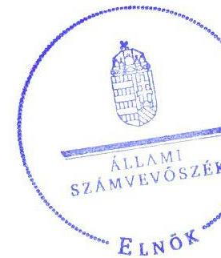
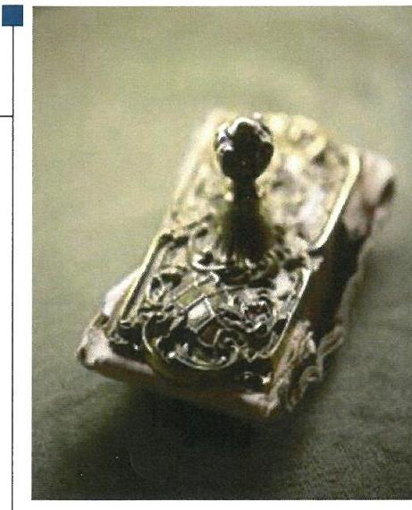
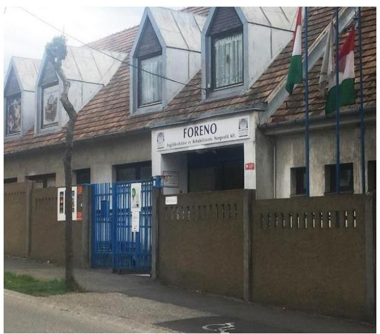
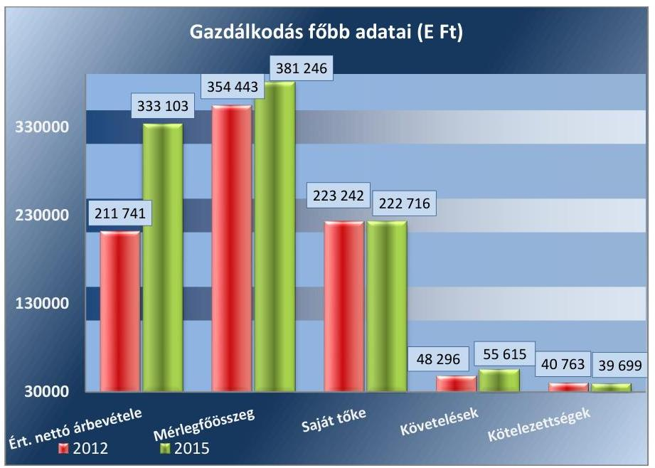
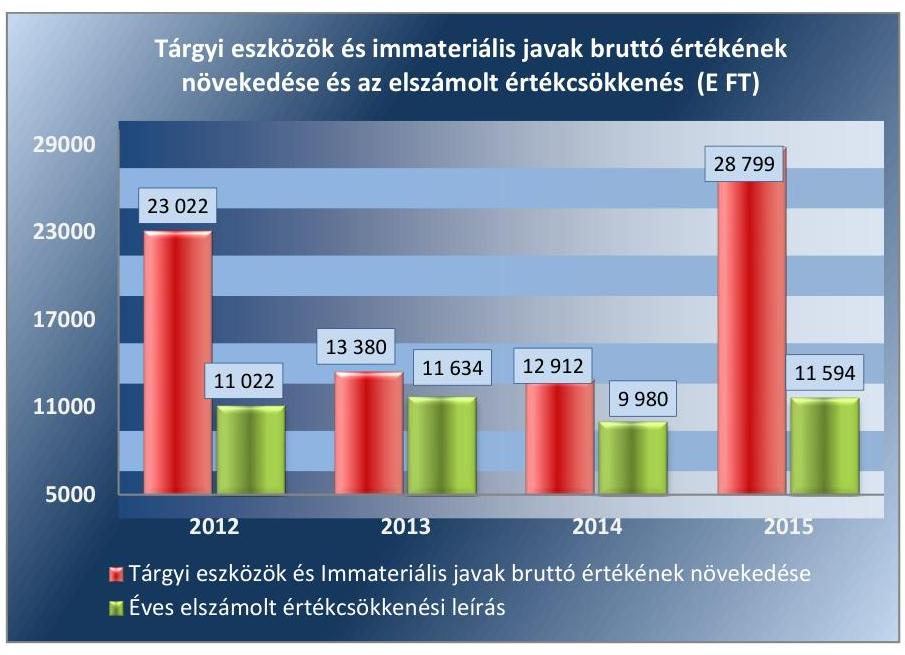

# Jelentés 

## Az önkormányzatok gazdasági társaságai

Az önkormányzatok többségi tulajdonában lévő gazdasági társaságok gazdálkodásának ellenőrzése - „FORENO" Foglalkoztatási és Rehabilitációs Nonprofit Korlátolt Felelősségű Társaság (Sopron)
2017.

Az ÁSZ az államháztartáson kívül müködő fel-adat-ellátó rendszerek ellenőrzéseivel hozzájárul ahhoz, hogy a közpénzeket az államháztartáson kívül müködő szervezetek is átlátható, rendezett módon használják fel a feladatok ellátása érde-
kében.

---

# Jelentés 

## Az önkormányzatok gazdasági társaságai

Az önkormányzatok többségi tulajdonában lévő gazdasági társaságok gazdálkodásának ellenőrzése - „FORENO" Foglalkoztatási és Rehabilitációs Nonprofit Korlátolt Felelősségű Társaság (Sopron)
2017. 09 hó 12 nap

17177
www.asz.hu

Domokos László
elnök?
Az ÁSZ az államháztartá-
son kivül müködő fel-
adat-ellátó rendszerek el-
lenörzéseivel hozzájárul
ahhoz, hogy a közpénze-
ket az államháztartáson
kivül müködő szervezetek
is átlátható, rendezett
módon használják fel a
feladatok ellátása érde-
kében.

---

# AZ ELLENŐRZÉST FELÜGYELTE:

DR. HORVÁTH MARGIT felügyeleti vezető

## AZ ELLENŐRZÉST VEZETTE ÉS A VÉGREHAJTÁSÁÉRT FELELŐS:

DR. PELLEI TAMÁS ellenőrzésvezető

## A PROGRAM ÖSSZEÁLLÍTÁSÁÉRT FELELŐS:

JANIK JÓZSEF osztályvezető

IKTATÓSZÁM: V-1327-161/2016.

TÉMASZÁM: 2361

ELLENŐRZÉS-AZONOSÍTÓ SZÁM: V075824

Jelentéseink az Országgyűlés számítógépes hálózatán és az Interneta a www.asz.hu címen is olvashatóak.

---

# TARTALOMJEGYZÉK 

■ ÖSSZEGZÉS ..... 5
■ AZ ELLENŐRZÉS CÉLJA ..... 6
■ AZ ELLENŐRZÉS TERÜLETE ..... 7
■ AZ ELLENŐRZÉS HÁTTERE, INDOKOLTSÁGA ..... 9
■ A JELENTÉS LÉNYEGES KÉRDÉSKÖREI ..... 10
■ ELLENŐRZÉS HATÓKÖRE ÉS MÓDSZEREI ..... 11
■ MEGÁLLAPÍTÁSOK ..... 13
■ JAVASLATOK ..... 21
■ MELLÉKLETEK ..... 23
I. Sz. melléklet: Értelmező szótár. ..... 23
II. Sz. melléklet: A Társaság mérlegadatainak változása (adatok E Ft) ..... 24
III. Sz. melléklet: A Társaság eredménykimutatásának adatai (adatok E Ft) ..... 25
■ FÜGGELÉK: ÉSZREVÉTELEK ..... 27
■ RÖVIDÍTÉSEK JEGYZÉKE ..... 29

---

.

---

# ÖSSZEGZÉS 

Sopron Megyei Jogú Város Önkormányzata a tulajdonosi joggyakorlásának kereteit szabályszerűen alakította ki, a tulajdonosi jogait szabályszerűen gyakorolta. A „FORENO" Foglalkoztatási és Rehabilitációs Nonprofit Korlátolt Felelősségű Társaság vagyongazdálkodása az előírásoknak megfelelt. A Társaság fizetőképessége biztositott volt. Beszámolási, adatszolgáltatási feladatainak határidőben eleget tett, a közérdekü adatokra vonatkozó közzétételi kötelezettségét teljesitette.

## Az ellenőrzés társadalmi indokoltsága

Az Állami Számvevőszék kiemelt célja, hogy a helyi önkormányzatok gazdálkodásában rejlő pénzügyi kockázatok feltárásával, az államháztartáson kívülre nyújtott költségvetési támogatások és ingyenes vagyonjuttatások, valamint az államháztartáson kívül múködő feladat-ellátó rendszerek ellenőrzéseivel hozzájáruljon ahhoz, hogy a közpénzeket az államháztartáson kívül múködő szervezetek is átlátható, rendezett módon használják fel.

Az Állami Számvevőszék céljaival összhangban, a gazdasági társaságok kiemelt fontosságú szerepe miatt került sor a „FORENO" Foglalkoztatási és Rehabilitációs Nonprofit Korlátolt Felelősségű Társaság ellenőrzésére.

## Főbb megállapítások, következtetések

Sopron Megyei Jogú Város Önkormányzata a tulajdonosi joggyakorlásának kereteit a jogszabályoknak megfelelően kialakította, a feladatellátás feltételeit biztosította, tulajdonosi jogait szabályszerűen gyakorolta, a Társaság beszámolóit, üzleti terveit jóváhagyta.

A Társaság a jogszabályban előírt számviteli szabályzatokkal rendelkezett, aktualizálásukról, karbantartásukról gondoskodtak. A vagyongazdálkodás a jogszabályi rendelkezéseknek megfelelt, a Társaság fizetőképessége biztosított volt. A Társaság belső ellenőrzésének megszervezéséről a Szervezeti és Múködési Szabályzatában előírtak ellenére nem gondoskodtak.

A Társaság az előírt beszámolási kötelezettségeit teljesítette, az éves beszámolóit határidőre, a jogszabályi előírások alapján elkészítette, közzétette és a tulajdonosi joggyakorló által előírt beszámolási kötelezettségét teljesítette. A közzétételi kötelezettségnek eleget tettek, azonban a közérdekű adatok közzétételével kapcsolatos szabályzatot nem készítették el.

A Társaság bevételeinek és ráfordításainak, valamint az értékcsökkenés elszámolása összességében szabályszerű volt. A Társaság önköltségszámítási szabályzat készítésére nem volt kötelezett, az általa nyújtott szolgáltatások árának meghatározása egyedileg, a piaci viszonyok figyelembe vételével történt.

---

# AZ ELLENŐRZÉS CÉLJA 

Az ellenőrzés célja annak értékelése volt, hogy az önkormányzat vagyongazdálkodási tevékenysége során szabályszerűen gyakorolta-e tulajdonosi jogait; a gazdasági társaság szabályozottsága, gazdálkodása és vagyongazdálkodási tevékenysége, bevételeinek és ráfordításainak elszámolása megfelelt-e a jogszabályi és tulajdonosi előírásoknak; a gazdasági társaság kötelezettségállománya jelent-e kockázatot a múködésre, valamint a gazdálkodás átláthatósága és elszámoltathatósága érdekében biztosítva volt-e a szolgáltatás dijának megalapozottsága szabályszerű önköltségszámítással.

---

# **A Z ELLENŐRZÉS TERÜLETE**

**Sopron Megyei Jogú Város Önkormányzata és a tulajdonában álló "FORENO" Foglalkoztatási és Rehabilitációs Nonprofit Kft.**

### **A "FORENO" FOGLALKOZTATÁSI ÉS REHABILITÁCIÓS NONPROFIT KORLÁTOLT FELELŐSSÉGŰ TÁRSASÁG** jogelődjét Sopron Megyei Jogú Város Önkormányzata 1991. április 16-án hozta létre a megváltozott munkaképességű emberek foglalkoztatása céljából. A jogelőd intézmény 2006. szeptember 1-jén Soproni Szociális Foglalkoztató és Rehabilitációs Kht. néven közhasznú társasággá alakult át, ezt követően 2009. január 1-jétől a jelenlegi elnevezéssel látja el feladatait.

A Társaság^{1} 100 %-ban az Önkormányzat^{2} tulajdonában áll, jegyzett tőkéje az ellenőrzött időszak alatt nem változott, öszszege 194 380 E Ft volt, amelynek összege az alapítás óta nem változott és 3 000 E Ft pénzbeli és 191 380 E Ft nem pénzbeli betétből állt.

A Társaság fő közhasznú – alapcél szerinti – tevékenysége a rehabilitációs foglalkoztatás. A foglalkoztatás keretében a Társaság valamennyi tevékenységét közhasznú céljainak elérése érdekében folytatta. Közhasznú jelleggel: varrodai, szereldei (autóbiztonsági alkatrészek rész- és előszerelése), nyomdai és kötészeti tevékenységet végzett, továbbá hullámkarton lemezekből gyűjtő és csomagoló dobozok, papír raklapok gyártásával, elektrotechnikai hulladékok bontásával és értékesítésével kapcsolatos feladatokat is ellátott.

A Társaság szervezetileg – hullám karton, szerelde, elektronikai hulladék feldolgozó, nyomda-kötészet, és varroda – szakmai divíziókból és gazdasági divízióból állt. A Társaság létszáma 2013. évre 107 főre csökkent, majd 2015. évre 17,8%-kal – 126 főre – emelkedett a 2014. évhez viszonyítva. A Társaság létszám adatait az 1. táblázat tartalmazza.

1. táblázat

|  A TÁRSASÁG LÉTSZÁM ADATAI |  |  |  |   |
| --- | --- | --- | --- | --- |
|  Megnevezés | 2013. | 2013. | 2014. | 2015.  |
|  Foglalkoztatottak átlagos statisztikai állományi létszáma (fő) | 131 | 107 | 107 | 126  |

*Forrás: A Társaság 2012-2015. évi éves/egyszerűsített éves beszámolói*

Az Önkormányzat és a Társaság között Közhasznú Szerződés^{1-2} volt hatályban, amely alapján a közhasznú feladatok ellátásához az Önkormányzat az ellenőrzött időszakban összesen 90 000 E Ft támogatást adott a Társaságnak, amelynek összege 2012-2013. években évente 20 000 E Ft, a 2014-2015. években évente 25 000 E Ft volt.

A Társaság a 327/2012. (IX.16.) Korm. rendelet^{4} alapján a megváltozott munkaképességű munkavállalók foglalkoztatásához a 2012-2015. években

---

2. táblázat

|  MÉRLEG SZERINTI EREDMÉNY |  |  |   |
| --- | --- | --- | --- |
|  ALAKULÁSA (E FT) |  |  |   |
|  2012 | 2013 | 2014 | 2015  |
|  97 | -2447 | 1538 | 383  |

Forrás: A Társaság 2012-2015. évi éves/egyszerúsített éves beszámolói

összesen 412 853,3 E Ft költségvetési támogatásban részesült, amelyet az NRSZH ${ }^{5}$ folyósított. A támogatás összege a 2012. évben 101938 E Ft, a 2013. évben 96 218,3 E Ft, a 2014. évben 110081 E Ft és a 2015. évben 104616 E Ft volt.

A Társaság gazdálkodását jellemző főbb adatokat az 1. ábra tartalmazza.

1. ábra

Forrás: A Társaság 2012. és 2015. évi éves/egyszerúsített éves beszámolói A Társaság - közhasznú jelleggel végzett tevékenységei - értékesítés nettó árbevétele a 2012. évről - 157,3\%-kal - 333103 E Ft-ra emelkedett a 2015. évre.

A mérlegfőösszeg 7,6\%-kal - 26803 E Ft-tal - nőtt 2012. december 31. és 2015. december 31. között, az eszközök tekintetében a tárgyi eszközök és a pénzeszközök, a források körében a passzív időbeli elhatárolások emelkedése miatt. A követelések összege 55615 E Ft, kötelezettségek öszszege 39699 E Ft volt 2015. december 31-én.

A mérlegadatok változását a II. számú melléklet és az eredménykimutatás adatait a III. számú melléklet tartalmazza.

A Társaság gazdálkodása a 2013. évben veszteséges volt, mivel az NRSZH támogatásának beruházási keretösszegével szemben - 4000 E Ft összegben- nem tudta érvényesíteni a megkezdett beruházások teljes költségét. A mérleg szerinti eredmény alakulását a 2. táblázat tartalmazza.

A Társaság a jogszabályok alapján könyvvizsgálatra kötelezett volt, a könyvvizsgáló személye az ellenőrzött időszakot érintően nem változott.

Az ellenőrzött időszakban a polgármester ${ }^{6}$ személye nem változott, a jelenleg hivatalban lévő jegyző ${ }^{7}$ 2015. február 23-ától látja el feladatait.

A Társaságot az ügyvezető önállóan jogosult képviselni és személye az ellenőrzött időszak alatt nem változott. A Társaságot a 2012-2015. években átalakulás nem érintette, vagyonkezelésbe vett vagyona nem volt, és nem minősült kormányzati szektorba sorolt egyéb szervezetnek. A feladat ellátást szolgáló ingatlanok a Társaság tulajdonában voltak.

---

# AZ ELLENŐRZÉS HÁTTERE, INDOKOLTSÁGA 

Az önkormányzatok többségi tulajdonában álló gazdasági társaságok ellenőrzése kiemelten fontos a vagyon megőrzése, megóvása érdekében, valamint a kormányzati szektor elszámolásaiban megjelenő önkormányzati tulajdonú gazdálkodó szervezetek esetében, amelyekkel szemben alapvető követelmény, hogy gazdálkodásuk, múködésük szabályszerű, az általuk szolgáltatott adatok minél megbízhatóbbak legyenek. A feladatellátás költségeinek, ráfordításainak alakulása a lakosság széles rétegét érinti.

Ellenőrzéseink feltárhatják, hogy az Önkormányzat a feladatellátásához rendelt vagyon múködtetését a tulajdonostól elvárható gondossággal vé-gezte-e, a feladatot ellátó gazdasági társaság a létesítő okiratban, szolgáltatási szerződésben foglaltak betartásával biztosította-e a feladat ellátását. Az ellenőrzés eredményeképp meghatározhatóvá válnak a költségvetési hiányt befolyásoló szervezetek kockázatai, lehetővé válik ezen kockázatok csökkentése. Az ellenőrzés rávilágíthat arra, hogy a gazdasági társaság a vagyon használatával biztosította-e a szolgáltatás folytatásának feltételeit, az önkormányzat tulajdonosi felügyelete hozzájárult-e a szabályszerű gazdálkodáshoz és feladatellátáshoz. A megállapítások alapján megfogalmazott számvevőszéki javaslatok hasznosítása elősegítheti a meglévő hibák megszüntetését. A jó gyakorlatok bemutatásával az ÁSZ ${ }^{8}$ hozzájárulhat a követendő megoldások megismertetéséhez, terjesztéséhez.

---

# A JELENTÉS LÉNYEGES KÉRDÉSKÖREI 

1.- Az önkormányzat tulajdonosi joggyakorlása szabályszerű volt-e?
2.- A gazdasági társaság vagyongazdálkodása szabályszerű volt-e, fizetőképessége biztositott volt-e a gazdálkodás során?
3.- A gazdasági társaság bevételeinek és ráfordításainak elszámolása, valamint az önköltségszámitás és árképzés szabályszerű volt-e?

---

# ELLENŐRZÉS HATÓKÖRE ÉS MÓDSZEREI 

## Az ellenőrzés típusa

Megfelelőségi ellenőrzés.

## Az ellenőrzött időszak

Az ellenőrzött időszak 2012. január 1-jétől 2015. december 31-ig tart.

## Az ellenőrzés tárgya

Az önkormányzat - többségi tulajdonában lévő gazdasági társaság feletti - tulajdonosi joggyakorlása, valamint a gazdasági társaság gazdálkodásának szabályozottsága és szabályszerűsége.

Az ellenőrzés kiterjed minden olyan körülményre és adatra, amely az ÁSZ jogszabályban meghatározott feladatainak teljesítéséhez, valamint a program végrehajtása folyamán felmerült újabb összefüggések feltárásához szükséges.

## Az ellenőrzött szervezet

$\longrightarrow$ Sopron Megyei Jogú Város Önkormányzata
$\longrightarrow$ „FORENO" Foglalkoztatási és Rehabilitációs Nonprofit Korlátolt Felelősségű Társaság

## Az ellenőrzés jogalapja

Az ellenőrzés jogszabályi alapját az ÁSZ tv. ${ }^{9}$ 1. § (3) bekezdése és 5. § (3)-(4)-(5) bekezdései képezik.

## Az ellenőrzés módszerei

Az ellenőrzést a nemzetközi standardokat irányadónak tekintve az ellenőrzési program ellenőrzési kérdései, az ellenőrzött időszakban hatályos jogszabályok, az ellenőrzés szakmai szabályok és módszertanok figyelembe vételével végeztük.

Az ellenőrzés ideje alatt az ellenőrzött szervezettel történő kapcsolattartást az ÁSZ Szervezeti és Müködési Szabályzatának vonatkozó előírásai alapján biztosítottuk.

---

Az ellenőrzés a kiválasztott, többségi tulajdonosi jogokat gyakorló önkormányzatra, illetve az ellenőrzésre kijelölt gazdasági társaságra terjedt ki.

Az ellenőrzési kérdések megválaszolásához szükséges bizonyítékok megszerzése a következő ellenőrzési eljárások alkalmazásával történt: megfigyelés, kérdésfeltevés (információkérés), összehasonlítás, valamint elemző eljárás. Az ellenőrzési bizonyítékként felhasználható adatforrások közé tartoznak egyrészt az ellenőrzési programban felsorolt adatforrások, másrészt adatforrás lehet még minden - az ellenőrzés folyamán - feltárt, az ellenőrzés szempontjából információkat tartalmazó dokumentum.

Az ellenőrzést a kérdésekre adott válaszok kiértékelésével, valamint a megjelölt adatforrások, a csatolt tanúsítványok felhasználásával, továbbá az adott időszakban hatályos jogszabályok figyelembe vételével folytattuk le.

A bevételek és ráfordítások elszámolásait, valamint a vagyonnyilvántartás terén a szabályszerű múködést véletlen mintavétellel ellenőriztük. A mintavétellel ellenőrzött területek esetében minden egyes tétel vonatkozásában a szabályszerűségre vonatkozó kérdéseket tettünk fel, amelyek eredménye összesítésre került. Megfelelőnek értékeltünk egy ellenőrzött területet, amennyiben 95\%-os bizonyossággal a teljes sokaságban a hibaarány legfeljebb 10\%, nem megfelelőnek, amennyiben 10\%-nál magasabb arányt képviselt. Abban az esetben, ha a teljes sokaság tekintetében a 10\%os hibaarányhoz való viszony megítélésnek megbízhatósága nem érte el a 95\%-ot, annak elérése érdekében értékelésünket további szempontokkal egészítettük ki, és figyelembe vettük a feltárt hibák típusát és súlyát. A ráfordítások elszámolására és a vagyonnyilvántartásra vonatkozó véletlen mintavételt kockázati alapú kiválasztással egészítettük ki, amelynek során évente a három legnagyobb összegű tételt választottuk ki.

---

# 1. Az önkormányzat tulajdonosi joggyakorlása szabályszerű volt-e? 

Összegző megállapítás

Az Önkormányzat a tulajdonosi joggyakorlásának kereteit szabályszerűen alakította ki, és a tulajdonosi jogok gyakorlása szabályszerű volt.
1.1. számú megállapítás

A tulajdonosi joggyakorlás kereteit az Önkormányzat szabályszerűen alakította ki.

GAZDASÁGI PROGRAMMAL az Önkormányzat az Ötv. ${ }^{10}$ 91. § (1) bekezdésében és az Mötv. ${ }^{11}$ 116. § (1) bekezdésében foglaltaknak megfelelően rendelkezett a 2011-2014. évekre, valamint a 20152020. évekre vonatkozóan. Közép- és hosszú távú vagyongazdálkodási tervet az Nvtv. ${ }^{12}$ 9. § (1) bekezdésében meghatározott előírásnak megfelelően elkészítették.

## TULAJDONOSI JOGOK GYAKORLÁSÁNAK KERETEIT az Önkormányzat a Társaság Alapító Okirat1-5-ában ${ }^{13}$, a Vagyonrendelet ${ }_{1-2}$-ben ${ }^{14}$, valamint az önkormányzati SZMSZ ${ }_{1-3}$-ben ${ }^{15}$ szabályszerűen kialakította. A Vagyonrendelet ${ }_{1-2}$-ben rögzítették a tulajdonosi jogokat gyakorló Közgyűlés ${ }^{16}$ hatáskörét.

## A FELADATELLÁTÁSHOZ KAPCSOLÓDÓ KÖVETELMÉNYEKET az Önkormányzat az Alapító Okirat ${ }_{1-5}$-ban és a Közhasznú Szerződés ${ }_{1-2}$-ben rögzítette.

Az Önkormányzat az Alapító Okirat ${ }_{1-5}$-ban meghatározta a Társaság felügyelőbizottságában való képviseletét, az üzleti terv készítési kötelezettséget, előírta a képviseletre kijelölt személyek feladatait és beszámolási kötelezettségét. Rendelkeztek a veszteséges gazdálkodás vagy a Társaság vagyonának jelentős mértékű csökkenése esetén a könyvvizsgáló jelzési kötelezettségéről. Az Alapító Okirat ${ }_{1-5}$ a Gt. ${ }^{17}$ 11-12. § és 167. §, valamint a Ptk. ${ }^{18}$-3:4. § és a 3:94. § előírásainak megfelelt.

Az Alapító Okirat ${ }_{1-5}$ által meghatározott közhasznú tevékenység szabályszerű ellátása érdekében, a Közhasznú Szerződés ${ }_{1-2}$-ben meghatározták a szerződés időtartamát, a teljesítendő szolgáltatási kötelezettségeket, az ellátási területet, a szerződés felmondásának szabályait, az éves támogatás összegét és elszámolásának kötelezettségét. A feladatellátást szolgáló vagyon körét az ellenőrzött időszakot megelőzően átadták a Társaságnak, a feladatellátást biztosító ingatlanok, eszközök a Társaság tulajdonában voltak.

Rendeletalkotási kötelezettsége az Önkormányzatnak a Társaság feladatellátásával kapcsolatban nem volt.

---

AZ ÜZLETI TERVEKET a Társaság az ellenőrzött időszakban elkészítette, amelyeket a Közgyűlés a Közhasznú szerződés1-2 előírásával összhangban - a felügyelőbizottság előzetes véleményével együtt - jóváhagyott.

A FELÜGYELŐBIZOTTSÁG a Gt. és a Ptk. előírásainak megfelelően három főből állt és az ügyrendjében foglaltak szerint működött. Az ellenőrzött években megtárgyalta és véleményezte a Társaság üzleti tervét, éves számviteli beszámolóját és közhasznúsági mellékletét. A felügyelőbizottság a Gt. 35. § (3) bekezdésében, illetve a Ptk. 3 :120 § (2) bekezdésének megfelelően minden évben írásbeli jelentést készített a Társaság éves számviteli beszámolójáról.

AZ ÉVES SZÁMVITELI BESZÁMOLÓT és közhasznúsági mellékletet a Közgyűlés jóváhagyta, az ellenőrzött időszakban a Társaság gazdálkodása során elért eredmény felosztására - összhangban az Alapító Okirat1-5-ban és a Civil tv. ${ }^{19} 42 . \S$ (1) bekezdésében foglaltakkal - nem került sor. A mérleg szerinti eredményt a Társaság az ellenőrzött időszakban eredménytartalékba helyezte, illetve a 2013. évben a veszteségét annak terhére számolta el. A Közhasznú Szerződés1-2 előírása alapján az éves támogatás elszámolása az éves számviteli beszámoló és a közhasznúsági melléklet keretében történt.

Az éves számviteli beszámoló és közhasznúsági melléklet, valamint az üzleti terv jóváhagyásáról a Közgyűlés a felügyelőbizottság írásbeli jelentésének ismeretében döntött. A Közgyűlés a beszámolókról készült függetlenített könyvvizsgálói jelentést megismerte, és elfogadta.

AZ ÖNKORMÁNYZAT BELSŐ ELLENŐRZÉSE a 20122015. években az Áht. ${ }^{20} 70 . \S$ (1) bekezdés d) pontjában foglaltak szerinti ellenőrzést nem végzett a Társaságnál. Az Önkormányzat az éves számviteli beszámolók Közgyűlés általi jóváhagyásakor és az üzleti tervek megtárgyalásakor ellenőrizte a Társaság múködését, feladatellátását.

A JAVADALMAZÁSI SZABÁLYZATOT1-221 a Taktv. ${ }^{22}$ 5. § (3) bekezdés előírásainak megfelelően a Közgyűlés megalkotta.

---

# 2. A gazdasági társaság vagyongazdálkodása szabályszerű volt-e, fizetőképessége biztosított volt-e a gazdálkodás során? 

Összegző megállapítás

A Társaság vagyongazdálkodása szabályszerű, fizetőképessége biztosított volt. A tervezési, beszámolási és adatszolgáltatási kötelezettségeit teljesítette, de a közérdekú adatok közzétételi kötelezettségének teljesítésére vonatkozóan nem készített szabályzatot, továbbá az adatvédelmi előírásokat tartalmazó szabályzatot nem a hatályban lévő jogszabály alapján készítette el. Az előírások ellenére a belső ellenőrzés megszervezéséről nem gondoskodtak.
2.1. számú megállapítás

Az előírt belső szabályzatokkal a Társaság rendelkezett, azok tartalma a jogszabályi előírásoknak megfelelt.

A SZÁMVITELI POLITIKÁT ${ }^{23}$ a Számv. tv. ${ }^{24}$ 14. § (3)-(4) bekezdéseiben foglalt előírásoknak megfelelően alakították ki, és a 2012. évben a Számv. tv. 14. § (11) bekezdésével összhangban aktualizálásra került.

A SZÁMLARENDET ${ }^{25}$ a Számviteli politika mellékleteként, a Számv. tv. 161. § (1) bekezdésében foglaltakkal összhangban készítették el, karbantartásáról gondoskodtak.

## A LELTÁROZÁSI SZABÁLYZATOT26 a

Számv. tv. 14. § (5) bekezdés a) pontjában előírtaknak megfelelően a Társaság elkészítette, és tartalma megfelelt a Számv. tv. 69. §-ában foglalt előírásoknak. A leltározási szabályzat a tárgyi eszközöknél három évente, a készleteknél évente elvégzendő mennyiségi felvétellel, a csak értékben kimutatott eszközöknél és kötelezettségek esetében éves egyeztetéssel történő leltározást írt elő.

AZ ESZKÖZÖK ÉS FORRÁSOK ÉRTÉKELÉSI SZABÁLYZATÁVAL ${ }^{27}$ a Számv. tv. 14. § (5) b) bekezdése előírásainak megfelelően rendelkeztek. A szabályzatban a Számv. tv. 46. § előírásaival összhangban meghatározták a mérlegtételek értékelésének előírásait.

A PÉNZKEZELÉSI SZABÁLYZAT28 megfelelt a Számv. tv. 14. § (8) bekezdésben meghatározott előírásoknak. A Számv. tv. 14. § (9) bekezdésének változása miatt a 2012. évben aktualizálásra került a napi záró készpénzállomány vonatkozásában.
2.2. számú megállapítás

A vagyongazdálkodás a jogszabályi rendelkezéseknek és a belső előírásoknak megfelelt, a Társaság a vagyonával szabályszerűen gazdálkodott. Az előírások ellenére a belső ellenőrzés megszervezéséről nem gondoskodtak.

A SAJÁT VAGYON NYILVÁNTARTÁSÁNAK VEZETÉSÉRŐL analitikus nyilvántartás és a főkönyvi könyvelés szintjén gondoskodtak, az egyes eszközcsoportok elkülönítése és besorolása mind az

---

analitikus nyilvántartásokban, mind a főkönyvi kivonatban a Számv. tv. 23. § előírásának megfelelően történt.

# A MÉRLEGTÉTELEK LELTÁRRAL TÖRTÉNŐ ALÁ- 

TÁMASZTÁSAKOR a Társaság a 2012-2015. években a Számv. tv. 69. § (1) bekezdés előírásait betartotta és az összeállított leltárak - tételesen és ellenőrizhető módon - tartalmazták a mérleg fordulónapján meglévő eszközeit és forrásait mennyiségben és értékben. A leltározást a Számv. tv. 69. § (3) bekezdés és a leltározási szabályzat előírásai szerint - tárgyi eszközöknél három évente, illetve a készleteknél évente mennyiségi felvétellel, a csak értékben nyilvántartott eszközöknél és kötelezettségeknél évente egyeztetéssel hajtották végre. Meggyőződtek a - mérleget alátámasztó - december 31-ei leltárakba bekerülő adatok valódiságáról.

A Gt. 51. § (1) bekezdés és a Ptk. 2 3:133. § (2) bekezdés előírásai szerinti tőkemegfelelés biztosított volt, a saját tőke egyik évben sem csökkent a jegyzett tőke szintje alá.

A TÁRSASÁG BELSŐ ELLENŐRZÉSÉNEK megszervezéséről, rendszerének kialakításáról a társasági SZMSZ ${ }^{29}$ 13. pontjának előírása ellenére nem gondoskodtak.

### 2.3. számú megállapítás

A Társaság fizetőképessége biztosított volt.
A TÁRSASÁG FIZETŐKÉPESSÉGE az ellenőrzött időszakban biztosított volt. A lejárt kötelezettségek összege 2012-2015. években 2483 E Ft-tal csökkent és 2015. december 31-én 3558 E Ft volt. A Társaságnak folyamatosan volt lejárt határidejű szállítói kötelezettsége, amelyet a fizetési határidőt követő 30 napon belül kifizetett. A rövid lejáratú kötelezettségek alakulását a 3. táblázat tartalmazza.
3. táblázat

RÖVID LEJÁRATÚ KÖTELEZETTSÉGEK ÁLLOMÁNYA (E FT)

| Megnevezés | 2012. | 2013. | 2014. | 2015. |
| :-- | :--: | :--: | :--: | :--: |
| Szállítói kötelezettségek | 23389 | 10088 | 15190 | 14194 |
| ebből határidőn belüli | 17348 | 9776 | 14340 | 10636 |
| ebből határidőn túli | 6041 | 312 | 850,0 | 3558 |
| Egyéb kötelezettségek | 17374 | 19993 | 24424 | 25505 |
| Kötelezettségek | 40763 | 30081 | 39614 | 39699 |

A Társaságnál 2012. december 31. és 2015. december 31. között a kötelezettségek összege 2,6\%-kal - ezen belül a szállítói kötelezettségek állománya 39,3\%-kal - csökkent és 2015. év végén a kötelezettségek összege 39699 E Ft és a szállítói kötelezettségek állománya 14194 E Ft volt.

Az egyéb kötelezettségek - munkabér kifizetések, valamint személyi jellegű kifizetésekhez kapcsolódó és egyéb adófizetések - között nem volt lejárt határidejű. Hosszú lejáratú kötelezettsége a Társaságnak nem volt.

---

### 2.4. számú megállapítás

A Társaság az előírt tervezési, beszámolási, adatszolgáltatási kötelezettségét teljesítette. A közérdekú adatok közzétételi kötelezettségének teljesítésére vonatkozóan nem készítettek szabályzatot, az adatvédelmi előírásokat tartalmazó szabályzatot nem a hatályban lévő jogszabálynak megfelelően készítette el.

AZ ÉVES BESZÁMOLÓKAT a Társaság a Számv. tv., a Civil tv., valamint a Számviteli politika előírásainak megfelelő tartalommal és formában, határidőben elkészítette, azokat a Számv. tv. 153. § (1) bekezdésében előírtak alapján letétbe helyezte és a Számv. tv. 154. § (1) bekezdésével összhangban közzétette.

Az éves beszámolókhoz - a Civil tv.29. § (3) bekezdése előírásának megfelelően - csatolták a közhasznúsági mellékletet. A közhasznúsági mellékletek megfeleltek a 350/2011. (XII.30.) Korm. rendelet ${ }^{30}$-ben meghatározott előírásoknak.

Az ügyvezető az Alapító Okirat ${ }_{1-5}$-ban, valamint a Közhasznú Szerződés ${ }_{1}$ 2-ben a gazdálkodásról és a feladatellátásról meghatározott beszámolási kötelezettségét - az éves számviteli beszámolóval egyidejűleg az üzleti jelentés keretében - teljesítette.

Az Alapító Okirat ${ }_{1-5}$-ban meghatározott üzleti terv készítési kötelezettségének a Társaság az ellenőrzött időszakban eleget tett.

## A KÖZÉRDEKŰ ADATOK NYILVÁNOSSÁGRA HO-

ZATALÁNAK az Info tv. ${ }^{31}$ alapján eleget tettek. Az Info. tv. 35. § (3) bekezdésének előírása ellenére az Info tv. 35. § (1) bekezdés és (2) bekezdés szerinti kötelezettség teljesítésének részletes szabályait belső szabályzatban nem állapították meg.

Az Info tv. 24. § (3) bekezdésében előírt külön adatvédelmi és adatbiztonsági szabályzatot nem készítettek. Az adatvédelem és adatbiztonság elveit és azok betartását a 2012. március 1-jétől hatályba léptetett informatikai biztonsági szabályzat ${ }^{32}$ tartalmazta. Ugyanakkor a szabályzat elkészítésének alapjául szolgáló jogszabályként tévesen került megjelölésre az Avtv. ${ }^{33}$, mert a szabályzat hatályba lépésnek idején az Info tv. rendelkezései voltak érvényben. Az informatikai biztonsági szabályzat tartalma megfelelt az Info tv. 7. §-ában rögzített előírásoknak.

---

# 3. A gazdasági társaság bevételeinek és ráfordításainak elszámolása, valamint az önköltségszámítás és árképzés szabályszerű volt-e? 

Összegző megállapítás

A bevételek és ráfordítások, valamint az értékcsökkenési leírás elszámolása összességében szabályszerű volt. A Társaság árképzése a piaci viszonyok figyelembe vételével történt.

## 3.1. számú megállapítás

A bevételek és ráfordítások, valamint az értékcsökkenési leírás elszámolása összességében szabályszerű volt.

A BEVÉTELEK ELSZÁMOLÁSA szabályszerű volt, a Társaság a jogszabályi és a belső szabályozás előírásait figyelembe vette. A Társaság az önkormányzati támogatást és az NRSZH-tól kapott költségvetési támogatást a Számv. tv. 77. § előírása szerint egyéb bevételek között elkülönítetten mutatta ki.

AZ ANYAGJELLEGŰ ÉS AZ EGYÉB RÁFORDÍTÁSOK elszámolása szabályszerű volt. A Társaság a Számv. tv., a Számviteli politika és a számlarend előírásainak megfelelt.

A SZEMÉLYI JELLEGŰ RÁFORDÍTÁSOK elszámolása az ellenőrzött időszakban összességében szabályszerű volt, de az étkezési utalvány elszámolásakor a Társaságnál - az Szja tv. ${ }^{34} 71 . \S$ (4) bekezdés előírásának teljesítése érdekében - nem álltak rendelkezésre az adókötelezettség megállapításához szükséges munkavállalói nyilatkozatok.

A bérköltségek és személyi jellegű egyéb kifizetések elszámolását az előírt és szabályszerű számviteli bizonylatokkal alátámasztották. A személyi jellegű ráfordításokat a Számv. tv. 79. § előírásainak megfelelően számolták el és a számlarendben előírtaknak megfelelően könyvelték.

AZ ÉRTÉKCSÖKKENÉS ELSZÁMOLÁSA összességében szabályszerű volt annak ellenére, hogy a bekerülési érték meghatározását a Számv. tv. 47. § (9) bekezdés előírása ellenére nem a számlázott összegnek megfelelően vették figyelembe, mivel a tárgyi eszközök állományba vétele ezer forintra kerekítve történt. Az értékcsökkenés elszámolásánál kettő esetben 2,0\%-os és nem - a Számviteli politikában meghatározott -3,0\%-os értékcsökkenési leírási kulcsot alkalmazták. Az értékcsökkenés elszámolásánál feltárt hibái összességében nem érték el a Számviteli politikában meghatározott jelentős összegű hiba értékhatárát.

A Számv. tv. 52. § (2) bekezdés előírásainak megfelelően az üzembe helyezését hitelt érdemlő módon dokumentálták. Az értékcsökkenés elszámolásának gyakoriságát a Társaság az éves beszámolók kiegészítő mellékletében adta meg.

A SAJÁT VAGYONT KÉPEZŐ ESZKÖZÖK BRUTTÓ ÉRTÉKÉNEK NÖVEKEDÉSE a 2012-2015. években összesen 33883 E Ft-tal meghaladta az elszámolt értékcsökkenés összegét.

---

Az elszámolt értékcsökkenés és a tárgyi eszközök, valamint az immateriális javak bruttó értékének alakulását a 2. ábra tartalmazza.
2. ábra

Forrás: A Társaság adatszolgáltatása
A 2012-2015. években a tárgyi eszközök és az immateriális javak bruttó értékének növekedése 78113 E Ft , az elszámolt értékcsökkenés összege 44230 E Ft volt. A Társaság a vagyon pótlásáról megfelelően gondoskodott.

A KÖVETELÉSÁLLOMÁNY összege 2012. év vége és 2015. év vége között 15,2\%-kal növekedett és 2015. december 31-én 55615 E Ft volt. A Társaság kintlévőség-kezelési szabályzat ${ }^{35}$-tal rendelkezett, amely tartalmazta a hátralékos vevőkövetelés állomány csökkentésére irányuló intézkedéseket. Az analitikus nyilvántartásokból a hátralékos díjbevételek összegei megállapíthatóak voltak. A fizetési határidő lejáratát követően fizetési felszólítások vagy ügyvédi fizetési felszólítások kiküldését kezdeményezték, illetve végrehajtási eljárást indítottak. A követelések alakulását a 4. táblázat tartalmazza.
4. táblázat

KÖVETELÉSEK ALAKULÁSA (E FT)

| Megnevezés | 2012. | 2013. | 2014. | 2015. |
| :-- | :--: | :--: | :--: | :--: |
| Követelések | 48296 | 41160 | 43918 | 55615 |
| Vevőkövetelések | 27252 | 31884 | 38702 | 54802 |
| ebből: határidőn belüli | 17252 | 15301 | 21001 | 30751 |
| ebből: határidőn túli | 10000 | 16583 | 17701 | 24051 |
| Egyéb követelések | 21044 | 9276 | 5216 | 8131 |

A vevőkövetelések 2012. december 31-ai állománya 2015. december 31-ére - 201,1\%-kal - 54802 E Ft-ra növekedett. A vevőköveteléseken belül a határidőn túli követelések összege az ellenőrzött időszak-ban - 14051 E Ft-tal - emelkedett és 2015. december 31-én 24051 E Ft volt, amelynek $94,8 \%$-a 30 napos fizetési határidőn belüli vevőkövetelés állományból állt.

---

# 3.2. számú megállapítás 

Önköltségszámítási szabályzat készítésére a Társaság nem volt kötelezett. Az árképzés a piaci viszonyok figyelembe vételével történt.

ÖNKÖLTSÉGSZÁMÍTÁSI SZABÁLYZAT készítésére a Társaság nem volt kötelezett, és a Számv. tv. 14. § (5) bekezdés c) pontjában megadott önköltségszámítási szabályzattal a 2012-2015. években nem rendelkezett.

A nyomda- és hullámkarton termékekre vonatkozóan a Társaság éves szinten - saját hatáskörben - árlistákat állított össze, amelyek a piaci verseny függvényében változhattak. A csomagoló és autóipari termékek ármegállapítása egyedileg, a munkadíj és az adott termék előállítására fordított munkaidő figyelembe vételével történt. A folyamatos megrendelést biztosító vagy nagyobb üzleti partnerekkel keretszerződést kötöttek, és ezekben az esetekben a kialkudott ár volt a meghatározó.

Árképzéssel kapcsolatos tulajdonosi elvárás, ágazati előírás a 2012-2015. években nem volt a Társaság felé. A szolgáltatások árának meghatározása alapvetően piaci alapon - a piaci viszonyok figyelembe vételével - és egyedileg történt.

---

# JAVASLATOK 

Az ÁSZ tv. 33. § (1) bekezdésében foglaltak értelmében az ellenőrzött szervezet vezetője köteles a jelentésben foglalt megállapításokhoz kapcsolódó intézkedési tervet összeállítani és azt a jelentés kézhezvételétől számított 30 napon belül az ÁSZ részére megküldeni. Amennyiben az ellenőrzött szervezet vezetője nem küldi meg határidőben az intézkedési tervet, vagy továbbra sem elfogadható intézkedési tervet küld, az Állami Számvevőszék elnöke az ÁSZ tv. 33. § (3) bekezdése a) és b) pontjaiban foglaltakat érvényesítheti.

## „FORENO" Foglalkoztatási és Rehabilitációs Nonprofit Korlátolt Felelősségű Társaság ügyvezetőjének

1. Intézkedjen a társasági SZMSZ előirása szerint a Társaság belső ellenőrzésének megszervezéséről, müködtetéséről.
(2.2. sz. megállapítás 4. bekezdése alapján)
2. Intézkedjen az Info tv. előirása alapján a közzétételi listák szerinti adatok közzétételével kapcsolatos kötelezettség teljesitésének részletes szabályait tartalmazó belső szabályzat elkészitéséről.
(2.4. sz. megállapítás 5. bekezdés 2. mondata alapján)
3. Intézkedjen az adatvédelmi és adatbiztonsági szabályzat aktualizálásáról az Avtv-t felváltó Info tv. előírásaira történő hivatkozással.
(2.4. sz. megállapítás 6. bekezdése alapján)
4. Intézkedjen, hogy a Társaság, mint kifizető rendelkezzen a munkavállalók - béren kívüli juttatásra vonatkozó - nyilatkozatával az Szja tv. előírásainak teljesítése érdekében.
(3.1. sz. megállapítás 3. bekezdése alapján)
5. Intézkedjen az eszközök bekerülési értékének Számv. tv. előirása szerinti meghatározásáról.
(3.1. sz. megállapítás 5. bekezdés 1. mondata alapján)
6. Intézkedjen az értékcsökkenési leírás számviteli politikában meghatározott leírási kulcsok alkalmazásával történő elszámolásáról.
(3.1. sz. megállapítás 5. bekezdés 2. mondata alapján)

---

.

---

# MELLÉKLETEK 

- I. SZ. MELLÉKLET: ÉRTELMEZŐ SZÓTÁR
gazdasági társaság
gazdálkodó szervezet
nemzeti vagyon
nonprofit gazdasági társaság

Ptk. 3 3.88. § (1) bekezdése szerint „a gazdasági társaságok üzletszerű közös gazdasági tevékenység folytatására, a tagok vagyoni hozzájárulásával létrehozott, jogi személyiséggel rendelkező vállalkozások, amelyekben a tagok a nyereségből közösen részesednek, és a veszteséget közösen viselik".
A Ptk. $3^{36} 685 . \S$ c) pontja szerint gazdálkodó szervezet: „az állami vállalat, az egyéb állami gazdálkodó szerv, a szövetkezet, a lakásszövetkezet, az európai szövetkezet, a gazdasági társaság, az európai részvénytársaság, az egyesülés, az európai gazdasági egyesülés, az európai területi együttmúködési csoportosulás, az egyes jogi személyek vállalata, a leányvállalat, a vízgazdálkodási társulat, az erdő birtokossági társulat, a végrehajtói iroda, az egyéni cég, továbbá az egyéni vállalkozó." (2014. 03.15-ig hatályos)
Nvtv. 1. § (2) bekezdése szerint többek között:
„az állam vagy a helyi önkormányzat kizárólagos tulajdonában álló dolgok, az a) pont hatálya alá nem tartozó, állam vagy a helyi önkormányzat tulajdonában lévő dolog,
az állam vagy a helyi önkormányzat tulajdonában lévő pénzügyi eszközök, továbbá az államot vagy a helyi önkormányzatot megillető társasági részesedések, az államot vagy a helyi önkormányzatot megillető bármely vagyoni értékkel rendelkező jogosultság, amelyet jogszabály vagyoni értékű jogként nevesít."
A Civil tv. 9/F. § (2) bekezdése szerint „az a gazdasági társaság minősül nonprofit gazdasági társaságnak és cégnevében az a gazdasági társaság tüntetheti fel a nonprofit jelleget, amelynek létesítő okirata tartalmazza, hogy a gazdasági társaság tevékenységéből származó nyereség a tagok között nem osztható fel, hanem az a gazdasági társaság vagyonát gyarapítja." (hatályos 2014. március 15-től)

---

II. SZ. MELLÉKLET: A TÁRSASÁG MÉRLEGADATAINAK VÁLTOZÁSA (ADATOK E FT)

|  Megnevezés | 2012.12 .31 | 2013.12 .31 | 2014.12 .31 | 2015.12 .31  |
| --- | --- | --- | --- | --- |
|  A. Befektetett eszközök | 292372 | 284117 | 284945 | 300580  |
|  II. TÁRGYI ESZKÖZÖK | 292372 | 284117 | 284518 | 300223  |
|  B. Forgóeszközök | 59618 | 57875 | 87802 | 79433  |
|  I. KÉSZLETEK | 8462 | 8627 | 3744 | 5800  |
|  II. KÖVETELÉSEK | 48296 | 41160 | 43918 | 55615  |
|  IV. PÉNZESZKÖZÖK | 2860 | 8088 | 40140 | 18018  |
|  C. Aktív időbeli elhatárolások | 2453 | 971 | 1871 | 1233  |
|  ESZKÖZÖK (AKTÍVÁK) ÖSSZESEN | 354443 | 342963 | 374618 | 381246  |
|  D. SAJÁT TÖKE | 223242 | 220795 | 222333 | 222716  |
|  I. JEGYZETT TÖKE | 194380 | 194380 | 194380 | 194380  |
|  F. Kötelezettségek | 40763 | 30081 | 39614 | 39699  |
|  III. RÖVID LEJÁRATÚ KÖTELEZETTSÉGEK | 40763 | 30081 | 39614 | 39699  |
|  G. Passzív időbeli elhatárolások | 90438 | 92087 | 112671 | 118831  |
|  FORRÁSOK (PASSZÍVÁK) ÖSSZESEN | 354443 | 342963 | 374618 | 381246  |

---

| Megnevezés | 2012.12.31. | 2013.12.31. | 2014.12.31. | 2015.12.31. |
| :--: | :--: | :--: | :--: | :--: |
| I. Értékesítés nettó árbevétele | 211741 | 233068 | 274870 | 333103 |
| III. Egyéb bevételek | 133656 | 123914 | 152498 | 184146 |
| IV. Anyagjellegú ráfordítások | 155419 | 171406 | 206288 | 283994 |
| V. Személyi jellegú ráfordítások | 175154 | 172347 | 202242 | 213403 |
| VI. Értékcsökkenési leírás | 11022 | 11634 | 9980 | 11594 |
| VII. Egyéb ráfordítások | 2923 | 3880 | 7125 | 7175 |
| Üzemi (üzleti) tevékenység eredménye | 879 | $-2370$ | 1635 | 1076 |
| Pénzügyi múveletek eredménye | $-759$ | $-89$ | 81 | $-663$ |
| Rendkívüli eredmény | 0 | 0 | 0 | 0 |
| Adózás előtti eredmény | 120 | $-2459$ | 1716 | 413 |
| Adózott eredmény | 97 | $-2447$ | 1538 | 383 |
| Mérleg szerinti eredmény | 97 | $-2447$ | 1538 | 383 |

---

.

---

# FÜGGELÉK: ÉSZREVÉTELEK 

A jelentéstervezetet a Számvevőszék 15 napos észrevételezésre megküldte az ellenőrzött szervezet vezetőjének az ÁSZ tv. 29. §* (1) bekezdése előírásának megfelelően.
Sopron Megyei Jogú Város Önkormányzat polgármestere, valamint a „FORENO" Foglalkoztatási és Rehabilitációs Nonprofit Korlátolt Felelősségü Társaság ügyvezetője az észrevételezési lehetőségével nem élt.

[^0]
[^0]:    * 29. § (1) Az Állami Számvevőszék az ellenőrzési megállapításait megküldi az ellenőrzött szervezet vezetőjének vagy az általa megbízott személynek, és annak, akinek személyes felelősségét állapította meg.
    (2) Az ellenőrzött szervezet vezetője és a felelősként megjelölt személy az ellenőrzés megállapításaira tizenöt napon belül írásban észrevételt tehet.
    (3) Az Állami Számvevőszék az észrevételre a beérkezésétől számított harminc napon belül írásban válaszol. A figyelembe nem vett észrevételeket köteles a jelentésben feltüntetni, és megindokolni, hogy azokat miért nem fogadta el.

---

.

---

# RÖVIDÍTÉSEK JEGYZÉKE 

${ }^{1}$ Társaság
${ }^{2}$ Önkormányzat
${ }^{3}$ Közhasznú Szerződés ${ }_{1-2}$
${ }^{4}$ 327/2012. (IX.16.) Korm. rendelet
${ }^{5}$ NRSZH
${ }^{6}$ polgármester
${ }^{7}$ jegyző
${ }^{8}$ ÁSZ
${ }^{9}$ ÁSZ tv.
${ }^{10}$ Ötv.
${ }^{11}$ Mötv.
${ }^{12}$ Nvtv.
${ }^{13}$ Alapító Okirat ${ }_{1-5}$

[^0]
[^0]:    ${ }^{14}$ Vagyonrendelet ${ }_{1-2}$

    „FORENO" Foglalkoztatási és Rehabilitációs Nonprofit Korlátolt Felelősségű Társaság
    Sopron Megyei Jogú Város Önkormányzata
    Közhasznú Szerződés: Sopron Megyei Jogú Város Önkormányzata és „FORENO" Foglalkoztatási és Rehabilitációs Nonprofit Korlátolt Felelősségű Társaság között létrejött, a 421/2011. (XII.22.) Kgy. határozat mellékletét képező közhasznú szerződés (hatályos: 2012. január 1-jétől 2013. december 31-éig)
    Közhasznú Szerződés: Sopron Megyei Jogú Város Önkormányzata és a „FORENO" Foglalkoztatási és Rehabilitációs Nonprofit Korlátolt Felelősségű Társaság között létrejött, a 327/2013. (XI.28.) Kgy. határozat mellékletét képező közhasznú szerződés (hatályos: 2014. január 1-jétől 2015. december 31-éig)
    A megváltozott munkaképességű munkavállalókat foglalkoztató munkavállalók akkreditációjáról, valamint a megváltozott munkaképességű munkavállalók foglalkoztatásához nyújtható költségvetési támogatásról szóló 327/2012. (IX.16.) Korm. rendelet (hatályos: 2012. november 16-tól)
    Nemzeti Rehabilitációs és Szociális Hivatal
    Sopron Megyei Jogú Város polgármestere
    Sopron Megyei Jogú Város jegyzője
    Állami Számvevőszék
    Az Állami Számvevőszékről szóló 2011. évi LXVI. törvény (hatályos: 2011. július 1-jétől)
    A helyi önkormányzatokról szóló 1990. évi LXV. törvény (hatálytalan: 2014. október 12-étől)
    Magyarország helyi önkormányzatairól szóló 2011. évi CLXXXIX. törvény (hatályos: 2012. január 1-jétől)
    A nemzeti vagyonról szóló 2011. évi CXCVI. törvény (hatályos: 2011. december 31-étől)
    Alapító Okirat1: „FORENO" Foglalkoztatási és Rehabilitációs Nonprofit Korlátolt Felelősségű Társaság Alapító Okirata a 2011. május 26-aimódosításokkal egységes szerkezetben
    Alapító Okirat2: „FORENO" Foglalkoztatási és Rehabilitációs Nonprofit Korlátolt Felelősségű Társaság Alapító Okirata a 2012. május 31-ai módosításokkal egységes szerkezetben
    Alapító Okirat3: „FORENO" Foglalkoztatási és Rehabilitációs Nonprofit Korlátolt Felelősségű Társaság Alapító Okirata a 2014. május 29-ei módosításokkal egységes szerkezetben
    Alapító Okirat4: „FORENO" Foglalkoztatási és Rehabilitációs Nonprofit Korlátolt Felelősségű Társaság Alapító Okirata a 2014. október 31-ei módosításokkal egységes szerkezetben
    Alapító Okirat5: „FORENO" Foglalkoztatási és Rehabilitációs Nonprofit Korlátolt Felelősségű Társaság Alapító Okirata a 2015. április 30-ai módosításokkal egységes szerkezetben
    Vagyonrendelet: Sopron Megyei Jogú Város Önkormányzatának 6/2008. (II.29.) rendelete Sopron Megyei Jogú Város Önkormányzata vagyonáról, a vagyon feletti tulajdonosi jogok gyakorlásának és a vagyon kezelésének szabályozásáról (hatályos: 2008. március 1-jétől 2013. március 8 -áig)

---

${ }^{15}$ önkormányzati SZMSZ ${ }_{1-3}$

Vagyonrendelet: Sopron Megyei Jogú Város Önkormányzat Közgyűlésének 3/2013 (III.4.) önkormányzati rendelete Sopron Megyei Jogú Város Önkormányzata vagyonáról, a vagyon feletti tulajdonosi jogok gyakorlásának és a vagyon kezelésének szabályozásáról (hatályos: 2013. március 8-ától)
önkormányzati SZMSZ: Sopron Megyei Jogú Város Önkormányzatának 18/2007 (VI.01.) önkormányzati rendelete Sopron Megyei Jogú Város Önkormányzatának Szervezeti és Müködési Szabályzatáról (hatályos: 2007. június 1-jétől 2014. október 31-éig)
önkormányzati SZMSZ: Sopron Megyei Jogú Város Önkormányzat Közgyűlésének 23/2014. (X.31.) önkormányzati rendelete Sopron Megyei Jogú Város Önkormányzatának Szervezeti és Müködési Szabályzatáról (hatályos: 2014. október 31-étől 2015. február 26-áig)
önkormányzati SZMSZ: Sopron Megyei Jogú Város Önkormányzat Közgyűlésének 1/2015. (II.26.) önkormányzati rendelete Sopron Megyei Jogú Város Önkormányzatának Szervezeti és Müködési Szabályzatáról (hatályos: 2015. február 26-ától)
Sopron Megyei Jogú Város Önkormányzatának Közgyűlése
A gazdasági társaságokról szóló 2006. évi IV. törvény (hatálytalan: 2014. március 15 -től)
A Polgári Törvénykönyvről szóló 2013. évi V. törvény (hatályos 2014. március 15-étől)
Az egyesülési jogról, a közhasznú jogállásról, valamint a civil szervezetek müködéséről és támogatásáról szóló 2011. évi CLXXV. törvény (hatályos: 2011. december 22-től)
Az államháztartásról szóló 2011. évi CXCV. törvény (hatályos: 2011. december 31-étől)
Javadalmazási szabályzat: a 2/2010. (I.25.) Kgy. határozattal elfogadott „FORENO" Foglalkoztatási és Rehabilitációs Nonprofit Korlátolt Felelősségű Társaság Javadalmazási szabályzata
Javadalmazási szabályzat:: a 287/2015. (XII.17) Kgy. határozattal elfogadott „FORENO" Foglalkoztatási és Rehabilitációs Nonprofit Korlátolt Felelősségű Társaság Javadalmazási szabályzata
A köztulajdonban álló gazdasági társaságok takarékosabb müködéséről szóló 2009. évi CXXII. tv. (hatályos: 2009. december 4-étől)

FORENO Foglalkoztatási és Rehabilitációs Nonprofit Korlátolt Felelősségű Társaság Számviteli politika (hatályos: 2009. január 26-ától)
A számvitelről szóló 2000. évi C. törvény (hatályos: 2001. január 1-jétől)
FORENO Foglalkoztatási és Rehabilitációs Nonprofit Korlátolt Felelősségű Társaság Számlarend és Számlatükör (hatályos: 2009. január 26-ától)
FORENO Foglalkoztatási és Rehabilitációs Nonprofit Korlátolt Felelősségű Társaság Leltározási Szabályzata (hatályos: 2009. január 26-ától)
FORENO Foglalkoztatási és Rehabilitációs Nonprofit Korlátolt Felelősségű Társaság Eszközök és Források Értékelési Szabályzata (hatályos: 2009. január 26-ától)
FORENO Foglalkoztatási és Rehabilitációs Nonprofit Korlátolt Felelősségű Társaság Pénzkezelési Szabályzata (hatályos: 2009. január 26-ától)
333/2008. (XI.27.) Kgy. határozattal elfogadott „FORENO" Foglalkoztatási és Rehabilitációs Nonprofit Korlátolt Felelősségű Társaság Szervezeti és Müködési Szabályzata (hatályos: 2009. január 1-jétől)

---

${ }^{30}$ 350/2011. (XII.30.) Korm. rendelet
${ }^{31}$ Info tv.
${ }^{32}$ informatikai biztonsági szabályzat
${ }^{33}$ Avtv.
${ }^{34}$ Szja. tv.
${ }^{35}$ kintlévőség-kezelési szabályzat
${ }^{36}$ Ptk. 1

A civil szervezetek gazdálkodása, az adománygyűjtés és a közhasznúság egyes kérdéseiről szóló 350/2011. (XII.30.) Korm. rendelet (hatályos: 2012. január 1jétől)
Az információs önrendelkezési jogról és az információszabadságról szóló 2011. évi CXII. törvény (hatályos: 2012. január 1-jétől)
„FORENO" Foglalkoztatási és Rehabilitációs Nonprofit Kft. Informatikai Biztonsági Szabályzat (hatályos: 2012. március 1-jétől)
A személyes adatok védelméről és a közérdekú adatok nyilvánosságáról szóló 1992. évi LXIII. törvény (hatálytalan: 2012. január 1-jétől)

A személyi jövedelemadóról szóló 1995. évi CXVII. törvény (hatályos: 1996. január 1-jétől)
FORENO Foglalkoztatási és Rehabilitációs Nonprofit Korlátolt Felelősségű Társaság Kintlévőség-kezelési szabályzat (hatályos: 2012. január 1-jétől)
A Polgári törvénykönyvről szóló 1959. évi IV. törvény (hatályos: 2014. március 14-éig)

---

# ÁLLAMI SZÁMVEVŐSZÉK 

1052 Budapest, Apáczai Csere János utca 10.
Levélcím: 1364 Budapest 4. Pf. 54
Telefon: +36 14849100 Telefax: +36 14849200
www.asz.hu