# Jelentés

## Köztestületek ellenőrzése

Magyar Állatorvosi Kamara 2017.

---

# Jelentés

## Köztestületek ellenőrzése

Magyar Állatorvosi Kamara
2017. 09 hó 06 nap
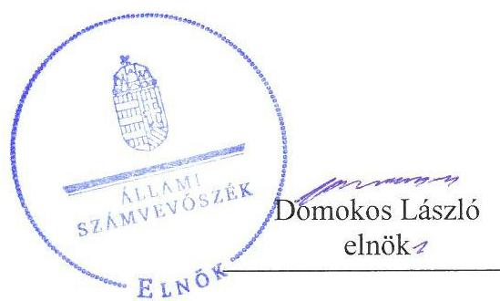
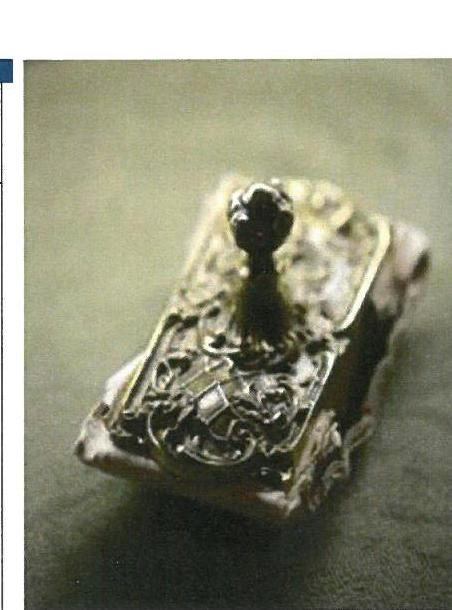

---

# AZ ELLENŐRZÉST FELÜGYELTE:

- PETŐ KRISZTINA felügyeleti vezető
- AZ ELLENŐRZÉST VEZETTE ÉS A VÉGREHAJTÁSÁÉRT FELELŐS:
  - NEMESVÁRI HORTHY ESZTER ellenőrzésvezető
  - A PROGRAM ÖSSZEÁLLÍTÁSÁÉRT FELELŐS:
    - JANIK JÓZSEF LÁSZLÓ osztályvezető

**IKTATÓSZÁM:** V-1259-512/2016.

**TÉMASZÁM:** 2293

**ELLENŐRZÉS-AZONOSÍTÓ SZÁM:** V077002

Jelentéseink az Országgyűlés számítógépes hálózatán és az Interneten a www.asz.hu címen is olvashatóak.

---

# TARTALOMJEGYZÉK

■ ÖSSZEGZÉS ..... 5
■ AZ ELLENŐRZÉS CÉLJA ..... 6
■ AZ ELLENŐRZÉS TERÜLETE ..... 7
■ AZ ELLENŐRZÉS HÁTTERE, INDOKOLTSÁGA ..... 9
■ A JELENTÉS LÉNYEGES KÉRDÉSKÖREI ..... 10
■ ELLENŐRZÉS HATÓKÖRE ÉS MÓDSZEREI ..... 11
■ MEGÁLLAPÍTÁSOK ..... 13
■ JAVASLATOK ..... 19
■ MELLÉKLETEK ..... 29
I. sz. melléklet: Értelmező szótár ..... 29
II. sz. melléklet: Magyar Állatorvosi Kamara szervezeti felépítése ..... 30
III. sz. melléklet: Magyar Állatorvosi Kamara területi szervezeteinél a gazdálkodás szabályozottságával és szabályszerűségével összefüggésben tett megállapítások ..... 31
IV. sz. melléklet: Magyar Állatorvosi Kamara területi szervezeteinél a központi költségvetési támogatások elszámolásával összefüggésben tett megállapítások ..... 40
■ FÜGGELÉK: ÉSZREVÉTELEK ..... 43
■ RÖVIDÍTÉSEK JEGYZÉKE ..... 105

---

.

---

# ÖSSZEGZÉS

A Magyar Állatorvosi Kamara 2013-2015. évi gazdálkodása nem volt szabályszerű. A költségvetési támogatást meghatározott célra használták fel, azonban a támogatások pénzügyi elszámolása nem volt szabályszerű. A gazdálkodás körébe tartozó közérdekű adatokkal kapcsolatos közzétételi kötelezettséget a Kamara nem teljesítette, ezáltal az átláthatóság nem volt biztosított.

## Az ellenőrzés társadalmi indokoltsága

A Magyar Állatorvosi Kamara az állatorvosok érdekképviseleti szerve, amely szakmai érdekképviseleti feladatai körében tagságához kapcsolódóan ellátja a szolgáltató tevékenységet végző állatorvosok, állategészségügyi intézmények és szolgáltatók, állatorvosi asszisztensek regisztrálását, nyilvántartását. Közigazgatási feladatai körében részt vesz járványvédelemmel összefüggő szervezési feladatokban, kiadja az állategészségügyi szolgáltató engedélyeket, részt vesz az állategészségügyi szolgáltatások minőségellenőrzésében, az általános szakmai és etikai szabályok megalkotásában, meghatározza az állategészségügyi intézmények létesítésének feltételeit, továbbá az állategészségügyi szolgáltatók személyi és tárgyi feltételeit. A Magyar Állatorvosi Kamara gazdálkodását az Állami Számvevőszék eddig még nem ellenőrizte.

## Főbb megállapítások, következtetések

A Magyar Állatorvosi Kamara gazdálkodása nem volt szabályszerű. Az országos és területi szervezetek a gazdálkodás alapvető feltételeit biztosító számviteli politikával és számlarenddel nem rendelkeztek, vagy rendelkeztek, de azok nem feleltek meg a számviteli törvény előírásainak.

A Baranya Megyei Szervezet beszámolókészítési kötelezettségét elmulasztotta. A Jász-Nagykun-Szolnok Megyei Szervezetnél a számviteli nyilvántartások megőrzéséről nem gondoskodtak, ennek hiányában a vagyoni helyzet ellenőrzése meghiúsult. További hiányosság volt, hogy a beszámolási kötelezettségét teljesítő egyes területi szervezetek egyszerűsített éves beszámolóinak tagolása nem felelt meg a jogszabályban meghatározottaknak.

A mérlegtételek év végi értékelése és leltárral történő alátámasztása nem volt megfelelő, mert 7 szervezetnél nem leltároztak, így a mérlegtételeket leltár nem támasztotta alá. 14 szervezetnél az analitikus és főkönyvi nyilvántartások egyeztetését nem végezték el, továbbá 11 szervezetnél nem történt meg a követelések minősítése sem. A kiadások elszámolása során nem tartották be a jogszabály és a gazdálkodási szabályzat előírásait, azaz a kötelezettségvállalás nem írásban történt és nem utalványoztak a kifizetések előtt, amely nem biztosította a kifizetések szabályosságát.

A költségvetési támogatást a Magyar Állatorvosi Kamara a támogatási szerződésekben rögzített közfeladatok ellátására fordította. A támogatások pénzügyi elszámolásánál a bizonylatok záradékolása nem történt meg, így nem biztosították, hogy egy bizonylatot csak egy támogatási szerződés elszámolásához lehessen felhasználni.

A törvényben előírt, a gazdálkodással kapcsolatos közérdekű adatokat a Kamara nem tette közzé, amellyel nem biztosították a gazdálkodás átláthatóságát.

---

# AZ ELLENŐRZÉS CÉLJA

Az ellenőrzés célja annak megállapítása volt, hogy a Magyar Állatorvosi Kamara gazdálkodása során betartotta-e a vonatkozó jogszabályi előírásokat, szabályszerűen használta-e fel a közfeladatai ellátására kapott állami támogatásokat, illetve az államháztartásból meghatározott célra ingyenesen juttatott vagyont, valamint a Magyar Állatorvosi Kamara szabályszerű működését biztosító ellenőrzési, monitoring és nyilvántartási rendszerek megfelelően működtek-e.

---

# **AZ ELLENŐRZÉS TERÜLETE**

## **A Magyar Állatorvosi Kamara**

**A MÁOK**¹ az állatorvosok önkormányzattal rendelkező, közfeladatokat és általános szakmai érdek-képviseleti feladatokat ellátó köztestülete. A MÁOK mint köztestület 2014. március 14-ig a Ptk.₁² 65. § (1) bekezdése, majd Áhtm.³ 8/A. § (1) bekezdése alapján jogi személy. Jogállását, feladatait és működését az ellenőrzött időszakban a 2012. évi CXXVII. törvény⁴ szabályozta. A taglétszám 2013-2015. évi év végi adatait az 1. táblázat mutatja be.

**SZERVEZETI FELÉPÍTÉSE** kétszintű, feladatait a 2012. évi CXXVII. törvény 1. § (2) bekezdése alapján Országos Szervezete⁵, valamint területi szervezetei útján látja el, amelyek 2012. évi CXXVII. törvény 1. § (3) bekezdése alapján jogi személyek. A MÁOK területi szervezetei közül 15 megyénként szerveződött, a fővárosban külön területi szervezet működik, illetve 4 nyugat-dunántúli megye (Vas, Veszprém, Zala és Somogy megyék) alkotja a MÁOK Pannon Területi Szervezetet. A MÁOK szervezeti felépítését a II. sz. mellékletben elhelyezett ábra mutatja be.

**MŰKÖDÉSÉNEK KÖLTSÉGEIT** a tagjai által befizetett tagdíjakból, egyéb díjbevételekből, támogatásokból, gazdasági-vállalkozási tevékenységből származó bevételekből, az államtól átvett feladatok ellátásához központi költségvetési támogatásból, valamint egyes feladatai ellátásához nyújtott állami támogatásból fedezi. A MÁOK bevételeinek legnagyobb hányadát a tagdíjbevételek tették ki, amelyek a 2013. évi 138,1 M Ft-ról a 2015. évi 140,7 M Ft-ra változtak. Vállalkozási tevékenységet egyedül a MÁOK Fővárosi Szervezete végzett, bevétele ingatlan bérbeadásából keletkezett.

**GAZDASÁGI TÁRSASÁGBAN RÉSZESEDÉSSEL** a MÁOK a MÁOK Kft. ⁶-ben rendelkezett, amelynek 100%-os tulajdonosa volt. A MÁOK Kft. – a 2012. évi CXXVII. törvény 32. § (5) bekezdésében foglaltak szerinti felhatalmazása alapján – bevételeinek jelentős része az ellenőrzött időszakban az egységes európai kisállat útlevél gyártatásának és forgalmazásának megszervezéséből és bonyolításából származott. Adózott eredményéből osztalékot fizetett a MÁOK-nak, 2013-ban 44,0 M Ft-ot, 2014-ben 53,0 M Ft-ot, 2015-ben 53,5 M Ft-ot, amely a MÁOK Országos Szervezet bevételeit gyarapította.

**KÖLTSÉGVETÉSI TÁMOGATÁSBAN** a MÁOK – a támogatási szerződés 1,2,3 -ban foglalt feltételekkel – feladatai ellátásához a 2013-2015. közötti időszakban összesen 30,0 M Ft értékben részesült, 2013-ban 10,2 M Ft-ban, 2014-ben 12,2 M Ft-ban, míg 2015-ben 7,6 M Ft-ban, amelyet a MÁOK Országos Szervezete és a területi szervezetei használtak fel. A MÁOK az államháztartásból ingyenes vagyonjuttatásban nem részesült.

---

A TÖRVÉNYESSÉGI FELÜGYELETET a MÁOK fölött- a 2012. évi CXXVII. tv. 31. § (1) bekezdésében foglaltak szerint - az élelmiszerlánc-biztonságért felelős miniszterként a vidékfejlesztési miniszter (2014. június 5-ig) földművelésügyi miniszter (2014. június 6-tól) gyakorolta, amelynek keretében a miniszter az alapszabálynak megfelelő jogszerű működést, továbbá más kamarai szabályzatok, illetve a kamarai szervek és tisztségviselők határozatainak jogszerűségét ellenőrzi.

---

# AZ ELLENŐRZÉS HÁTTERE, INDOKOLTSÁGA

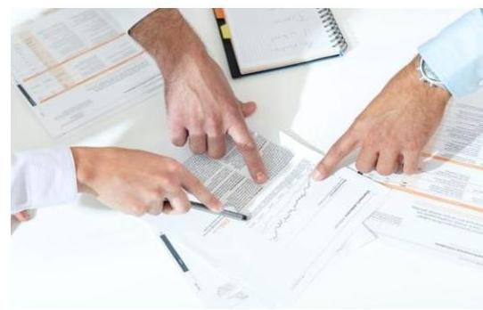

A köztestületek közfeladatot látnak el, amelyre fokozott közérdeklődés irányul. Társadalmi elvárás a közpénzek értékelvű, rendeltetésszerű felhasználása, a közpénzekből nyújtott támogatások átláthatóságának megteremtése, amelyhez az Állami Számvevőszék az államháztartásból nyújtott támogatások ellenőrzésével kíván hozzájárulni.

Az ellenőrzés eredményeképp a törvényalkotás számára tapasztalatok állnak rendelkezésre a köztestületek szabályozásához. Az ellenőrzöttek számára visszajelzést adhat az ellenőrzés a közfeladataik ellátására kapott állami támogatások felhasználásának szabályosságáról, esetleges hiányosságairól, míg a társadalom számára információt szolgáltat a köztestület gazdálkodásáról és a közpénzek felhasználásáról.

---

# A JELENTÉS LÉNYEGES KÉRDÉSKÖREI

1.  - A MÁOK gazdálkodása szabályozott és szabályszerű volt-e?
2.  - Szabályszerű volt-e a központi költségvetési támogatások felhasználása és elszámolása?
3.  - Biztosította-e a nyilvánosságot a MÁOK? Teljesítette-e a gazdálkodásra vonatkozó közérdekű adatokkal kapcsolatos közzétételi kötelezettségét?
4. Szabályszerűen működött-e a MÁOK feletti törvényességi felügyelet gyakorlása?

---

# ELLENŐRZÉS HATÓKÖRE ÉS MÓDSZEREI

## Az ellenőrzés típusa

Megfelelőségi ellenőrzés.

## Az ellenőrzött időszak

2013-2015. évek.

## Az ellenőrzés tárgya

Az ellenőrzés tárgya a MÁOK létrehozása szabályszerűségére, a belső szabályozás kialakítására, a nyilvántartásba vétel szabályszerűségére, a pénzügyi gazdálkodási feladatok ellátására, a közfeladat ellátására kapott állami támogatás szabályszerű felhasználására irányuló tevékenység. Az ellenőrzés kiterjedt továbbá a MÁOK ellenőrzési, monitoring tevékenységére, a vállalkozási, tulajdonosi felügyeleti tevékenységre, a nyilvántartásba történő bejelentkezési, az adatszolgáltatási és közzétételi kötelezettségének teljesítésére, a MÁOK létrehozó törvényben előírt törvényességi felügyeletét ellátó élelmiszerlánc-biztonságért felelős miniszter feladatellátására.

## Az ellenőrzött szervezet

Magyar Állatorvosi Kamara, valamint a miniszteri törvényességi felügyeletet ellátó Vidékfejlesztési Minisztérium (2014. június 5-ig), illetve Földművelésügyi Minisztérium (2014. június 6-tól).

## Az ellenőrzés jogalapja

Az ÁSZ tv. ${ }^{8}$ 1. § (3) bekezdésben és az 5. § (3) bekezdésében foglaltak.

## Az ellenőrzés módszerei

Az ellenőrzést az ellenőrzési program szempontjai, az ellenőrzött időszakban hatályos jogszabályok, az ellenőrzés szakmai szabályai, a jelen ellenőrzésre irányadó ÁSZ ${ }^{9}$ módszertan alapján végeztük. A gazdálkodás hibáinak kijavítására irányuló javaslatok kidolgozásakor a hatályos jogszabályok az irányadóak.

Az ellenőrzési kérdések megválaszolásához szükséges bizonyítékok megszerzése az ellenőrzéshez rendelkezésre bocsátott dokumentumokra,

---

adatokra alapozva megfigyelés, szemle (szemrevételezés), kérdésfeltevés (információkérés), mintavételezés, valamint elemző eljárás útján történt. Az ellenőrzési bizonyítékként felhasználható adatforrások közé tartoztak egyrészt az ellenőrzési program részletes szempontjainál felsorolt adatforrások, másrészt minden egyéb - az ellenőrzés folyamán feltárt, az ellenőrzés szempontjából információt tartalmazó - dokumentumok.

Mintavétellel az alábbi területek szabályszerűségét ellenőriztük:

1. mérlegtételek (immateriális javak, tárgyi eszközök, befektetett pénzügyi eszközök, követelések és pénzeszközök mérlegtételei) év végi értékelésének és leltárral történő alátámasztását;
2. igénybevett szolgáltatások és egyéb szolgáltatások, illetve a személyi jellegű ráfordítások elszámolását.

Az egyes területek esetében évenkénti rétegezéssel, egyszerű mintavételi eljárással választottuk ki az ellenőrzött tételeket. Az értékelést az egyes területekre a teljes ellenőrzött időszakra összevontan végeztük el.

Teljes körűen ellenőriztük a beruházások, felújítások ráfordításainak és értékcsökkenésének elszámolását. Beruházás, felújítás hiányában az elszámolás szabályszerűségét nem ellenőriztük a MÁOK Baranya, Békés, Borsod-Abaúj-Zemplén, Fejér, Győr-Moson-Sopron, Heves és Nógrád Megyei Szervezetnél.

A MÁOK Jász-Nagykun-Szolnok Megyei Területi Szervezeténél mintavételezésre - a főkönyvi adatbázisok hiányában - nem került sor. A MÁOK Baranya Megyei Szervezeténél - a beszámolási kötelezettség nem teljesítése miatt - a mérlegtételek év végi értékelésének és leltárral történő alátámasztásának ellenőrzésére nem került sor.

A minta alapján a sokaságban előforduló hibaarányt becsültük. „Szabályszerűnek" értékeltünk egy ellenőrzött területet, amennyiben 95\%-os bizonyossággal a teljes sokaságban a hibaarány legfeljebb 10\%, „nem szabályszerűnek", amennyiben 10\%-nál magasabb arányt képviselt. Abban az esetben, ha a teljes sokaság tekintetében a 10\%-os hibaarányhoz való viszony megítélésének megbízhatósága nem érte el a 95\%-ot, „szabályszerűnek" minősítettük a területet, ha a minta alapján a teljes sokaság vonatkozásában nagyobb valószínűsége a 10\% alatti hibaaránynak előfordulásának, „nem szabályszerűnek", ha nagyobb a valószínűsége a 10\% feletti hibaaránynak előfordulásának.

Az MÁOK részére az államháztartás alrendszeréből nyújtott költségvetési támogatások felhasználásának és elszámolásának szabályszerűségét a már lejárt elszámolási határidejű szerződésekhez kapcsolódóan elkészített elszámolások kifizetési bizonylatai alapján ítéltük meg.

---

# 1. A MÁOK gazdálkodása szabályozott és szabályszerű volt-e?

Összegző megállapítás

### 1.1. számú megállapítás

A MÁOK gazdálkodása nem volt szabályozott és szabályszerű.
A számviteli politika és az annak keretében elkészített szabályzatok, valamint a számlarend egyes előírásai nem álltak összhangban a Számv. tv. ${ }^{10}$-ben foglaltakkal.

AZ ALAPSZABÁLY $1-4^{11}$-et az országos küldöttközgyűlés ${ }^{12}$ hagyta jóvá, amelynek hatálya kiterjedt a MÁOK Országos Szervezetére és területi szervezeteire egyaránt, tartalmazta a működésükre és szervezeti felépítésükre vonatkozó szabályokat. Az Alapszabály ${ }_{1-4}$ a 2012. évi CXXVII. törvény előírásaival összhangban rögzítette a költségvetés és a beszámoló elfogadásával kapcsolatos alapvető hatásköri szabályokat.

A GAZDÁLKODÁSI SZABÁLYZAT ${ }_{1,2}{ }^{13}$ Általános részben a MÁOK Országos Szervezetére és területei szervezeteire kiterjedő hatállyal az I/6. pont szerint a költségvetés végrehajtásának felelőseként az országos elnököt ${ }^{14}$, illetve a területi elnököt ${ }^{15}$ jelölték meg, a főtitkár ${ }^{16}$ / titkár ${ }^{17}$ feladataként meghatározták, hogy meg kell győződnie arról, hogy a vállalt kötelezettség a költségvetésbe betervezésre került-e és a fedezet rendelkezésre áll-e. A kifizetések utalványozására az I/7. pont szerint az országos, illetve a területi elnök volt jogosult, aki e jogkörét az alelnökre ${ }^{18}$ ruházhatta át, az utalvány ellenjegyzőjeként a főtitkár/titkár volt nevesítve. Az I/8. pontban előírták, hogy a kötelezettségvállalás, az utalványozás és ellenjegyzés csak írásban történhet.

A MÁOK Országos Szervezete kiadta a Számviteli politika ${ }_{1,2}{ }^{19}$-t, a Leltározási szabályzatot ${ }^{20}$, az Értékelési Szabályzatot ${ }^{21}$ és a Pénzkezelési Szabályzatot ${ }^{22}$, valamint elkészítette a Számlarendet ${ }^{23}$. A MÁOK Országos Szervezetének egyes számviteli szabályzatai azonban a Számv. tv. előírásaival nem álltak összhangban. A Számviteli politika ${ }_{1}$-en a Számv. tv. 14. § (11) bekezdésével ellentétben a törvénymódosításból eredő változásokat 2013. évben nem vezették keresztül. A Számviteli politika ${ }_{1}$ 2013. január 1jétől nem felelt meg a Számv. tv. előírásainak, mert a Számv. tv. 2012. december 31-ig hatályos 3. § (3) bekezdés 3. és 4. pontjában foglaltak szerint tartalmazta a jelentős és nem jelentős összegű hiba mértékét, valamint a. 3. § (3) bekezdés 5. pontjában foglalt „megbízható és valós képet lényegesen befolyásoló hiba" meghatározást, amely meghatározás 2013. január 1jétől a Számv. tv.-ben hatálytalan. A Számlarend - a Számv. tv. 161. § (2) bekezdés c) és d) pontjai előírásaival ellentétben - nem tartalmazta a főkönyvi számla és az analitikus nyilvántartás kapcsolatát, valamint a számlarendben foglaltakat alátámasztó bizonylati rendet.

A MÁOK területi szervezetei közül 13 rendelkezett számviteli politikával és az annak keretében elkészítendő szabályzatokkal, valamint 14 területi

---

szervezet a Számv. tv. 161. § (1) bekezdése szerint számlarenddel. A számviteli politika, az annak keretében elkészített szabályzatok, valamint a számlarend egyes előírásai azonban nem feleltek meg a Számv. tv.-ben foglaltaknak. A MÁOK 4 területi szervezete az ellenőrzött időszak egészében, vagy egy részében nem rendelkezett a Számv. tv. 14. § (3) és (5) bekezdésében rögzített számviteli politikával, annak keretében elkészítendő szabályzatokkal, 3 területi szervezet a Számv. tv. 161. § (1) bekezdésében foglalt számlarenddel. A területi szervezeteknél a gazdálkodás szabályozottságával összefüggésben tett megállapításokat a III. sz. melléklet 1-5. pontjai tartalmazzák.

A MÁOK Országos Szervezetét a Fővárosi Bíróság 1996-ban nyilvántartásba vette.

# 1.2. számú megállapítás 

A számviteli beszámolási kötelezettségek teljesítése, valamint a mérlegtételek év végi értékelése és leltárral történő alátámasztása nem volt szabályszerű.

BESZÁMOLÁSI KÖTELEZETTSÉGÉNEK a MÁOK Országos Szervezete és 16 területi szervezete eleget tett. A költségvetés végrehajtásáról szóló beszámolókat a 2012. évi CXXVII. törvényben és az Alapszabály ${ }_{1-4}$-ben meghatározottak szerint kizárólagos hatáskörében az országos küldöttközgyűlés, illetve az illetékes területi közgyűlések ${ }^{24}$ elfogadták.

A MÁOK Országos Szervezete egyszerűsített éves beszámolóinak eredménykimutatásai a 224/2000. (XII. 19.) Korm. rendelet ${ }^{25}$ 6. § (6) bekezdésében hivatkozott 5. számú melléklet szerinti tagolásnak nem feleltek meg, mert a vezető tisztségviselők juttatásait nem mutatták ki, a tagdíjakat pedig nem az egyéb bevételek között, hanem külön soron mutatták ki. Az eredménykimutatásban a MÁOK Kft.-től kapott osztalékot - a Számv. tv. 83. § (2) bekezdésében előírtakkal ellentétben - nem a pénzügyi műveletek bevételeként, hanem egyéb támogatásként szerepeltették.

A beszámolási kötelezettséget teljesítő 16 területi szervezetből 9-nek az egyszerűsített éves beszámolói nem feleltek meg a 224/2000. (XII. 19.) Korm. rendelet 6. § (6) bekezdésében hivatkozott 4., illetve 5. sz. mellékletében előírt tagolásnak, 1 területi szervezet pedig a 224/2000. (XII. 19.) Korm. rendelet 6. § (1) bekezdése ellenére beszámoló készítési kötelezettségét nem teljesítette. A területi szervezeteknél a beszámoló készítési kötelezettség teljesítésével összefüggésben tett megállapításokat a III. sz. melléklet 6-8. pontjai tartalmazzák.

A MÁOK Jász-Nagykun-Szolnok Megyei Szervezete 2013-2015. évre vonatkozóan - a Számv. tv. 169. § (1)-(2) bekezdéseiben foglalt 8 éves bizonylat megőrzési idő ellenére - nem rendelkezett főkönyvi kivonatokkal, mérlegtételeket alátámasztó tételes kimutatásokkal, mérlegsorokat alátámasztó tételes kimutatásokkal, főkönyvi számlák tételes forgalmával, a leltározás dokumentumával, a mérlegtételek év végi értékelésének dokumentumaival, valamint főkönyvi adatbázissal. Ezzel a MÁOK Jász-NagykunSzolnok Megyei Szervezete a 2013-2015. évekre a vagyoni helyzet áttekintését meghiúsította.

KÖNYVVIZSGÁLATRA a 224/2000. (XII.19.) Korm. rendelet 19 § (1) bekezdésében foglaltak alapján nem volt kötelezett a MÁOK Országos Szervezete, illetve területi szervezetei. A MÁOK Országos Szerve-

---

#### Abstract

zete 2013-2015. évi, a MÁOK Pest Megyei Szervezete 2014. évi beszámolóját könyvvizsgálóval felülvizsgáltatta. A könyvvizsgáló hitelesítő záradékkal látta el a beszámolókat. A MÁOK Baranya Megyei Szervezete a 2015. évi könyvelésének, azt alátámasztó részletező kimutatásoknak az összhangját könyvvizsgálóval felülvizsgáltatta, a könyvvizsgáló jelentésében a könyvelést teljes körűnek, szabályszerűnek értékelte.

A MÉRLEGTÉTELEK év végi értékelése és leltárral történő alátámasztása nem volt szabályszerű. A MÁOK Országos Szervezete a Számv. tv. 46. § (3) bekezdése ellenére eszközeit (2015. évben a pénzeszközöket, illetve 2013-2015-ben követeléseit) leltározással nem ellenőrizte, a forgóeszközök közül a pénzeszközöket és a követeléseket egyedenként nem értékelték. A Számv. tv. 55. § (1) bekezdése ellenére a vevő és adós minősítésére és az üzleti év mérlegfordulónapján fennálló és a mérlegkészítés időpontjáig pénzügyileg nem rendezett követelésnél értékvesztés elszámolására nem került sor. A területi szervezeteknél a mérlegtételek év végi értékelése és leltárral történő alátámasztása szabályszerűségének ellenőrzése kapcsán tett megállapításokat a III. sz. melléklet 9-11. pontjai tartalmazzák.

## 1.3. számú megállapítás

A beruházások és felújítások, valamint az igénybevett és egyéb szolgáltatások, illetve a személyi jellegű ráfordítások elszámolása nem volt szabályszerű.

A BERUHÁZÁSOK, FELÚJÍTÁSOK ráfordításainak és értékcsökkenésének elszámolása során nem tartották be a belső előírásokat. A MÁOK Országos Szervezeténél a tárgyi eszköz beszerzéseket az üzembe helyezésig a Számlarend 22. oldalán, a 161. befejezetlen beruházások főkönyvi számlával kapcsolatban meghatározottak ellenére nem a beruházások között vették nyilvántartásba.

A beruházások, felújítások ráfordításainak elszámolása 5 területi szervezetnél nem felelt meg a Számv. tv., a Tao tv. ${ }^{26}$, illetve a Gazdálkodási szabályzat ${ }_{1,2}$ előírásainak. A beruházások, felújítási ráfordítások elszámolásával kapcsolatban a területi szervezeteknél tett megállapításokat III. sz. melléklet 12-15. pontjai tartalmazzák.

## AZ IGÉNYBEVETT SZOLGÁLTATÁSOK ÉS EGYÉB SZOLGÁLTATÁSOK, SZEMÉLYI JELLEGŰ RÁFOR-

DÍTÁSOK elszámolása során a Számv. tv., az Alapszabály ${ }_{1-4}$, illetve a Gazdálkodási szabályzat ${ }_{1,2}$-nek az előírásait nem tartották be. A MÁOK Országos Szervezeténél a Gazdálkodási szabályzat ${ }_{1,2}$ I./6. és 8. pontja ellenére a költségvetés végrehajtásáért felelős országos elnök részéről nem történt meg írásban a kötelezettségvállalás és a Számv. tv. 167. § (1) bekezdés c) pontjában foglaltak ellenére a könyvviteli elszámolást közvetlenül alátámasztó bizonylatokon nem szerepelt az utalványozó és a rendelkezés végrehajtását igazoló személyek együttes aláírása. A 2015. évben egy esetben a személyi jellegű kifizetés jogszerűségét dokumentummal nem támasztották alá. A területi szervezeteknél az igénybevett és egyéb szolgáltatások, személyi jellegű ráfordítások elszámolása szabályszerűségének ellenőrzése során tett megállapításokat a III. sz. melléklet 16-17. pontjai tartalmazzák.

---

# 1.4. számú megállapítás 

A tagdíjak beszedése összességében nem volt szabályszerű.
A TAGDÍJ mértékének és fizetésének alapvető szabályait a 2012. évi CXXVII. törvény előírásaival összhangban az Alapszabály1-4-ben meghatározták. A tagdíj mértéke, annak a MÁOK Országos Szervezete és a területi szervezetek közötti megosztási aránya az ellenőrzött időszakban változatlan volt. Az éves tagdíj mértéke a 2012. évi CXXVII. törvény előírásaival összhangban nem haladta meg a mindenkori kötelező legkisebb munkabér havi összegének kilencven százalékát.

A tagdíjak beszedése az Alapszabály1-4 előírásaival összhangban a területi szervezetek feladatát képezte. A területi szervezetek közül azonban nyolc a fizetési késedelmek esetén nem szabályszerűen járt el. Az Alapszabály ${ }_{1-3}$ 21. § (11) és az Alapszabály ${ }_{4}$ 21. § (12) bekezdése ellenére 150 napot meghaladóan késedelmes tagdíjtartozás esetén az etikai bizottság nem hozott határozatot az etikai vétségről. A területi szervezeteknél a tagdíjak beszedésével kapcsolatban tett megállapításokat a III. sz. melléklet 18. pontja tartalmazza.

### 1.5. számú megállapítás

A gazdasági társaságának felügyelete során a MÁOK összességében betartotta a jogszabályi előírásokat.

A MÁOK Kft.-ben az Alapszabály1-4 előírásai szerint a tulajdonosi jogokat az országos elnökség gyakorolta, a gazdasági társaság éves beszámolóját minden évben a könyvvizsgáló véleményével együtt, a társaság ügyvezetőjének és könyvvizsgálójának jelenlétében megtárgyalta, döntött a beszámoló elfogadásáról, az osztalék kifizetéséről.

A MÁOK Fővárosi Szervezete végzett vállalkozási tevékenységet 2015. évben, amely ingatlan bérbeadásából származó bevételét egyszerűsített éves beszámolójának eredménykimutatásában - ellentétben a 224/2000. (XII. 19.) Korm. rendelet 6. § (6) bekezdésében hivatkozott 5. sz. mellékletében foglaltakkal - nem a vállalkozási, hanem az alaptevékenység bevételei között mutatta ki.

## 2. Szabályszerű volt-e a központi költségvetési támogatások felhasználása és elszámolása?

Összegző megállapítás

### 2.1. számú megállapítás

A központi költségvetési támogatások számviteli kimutatása és pénzügyi elszámolása nem volt szabályszerű. A központi költségvetési támogatást a támogatási szerződés1-3-ban meghatározott célra használta fel a MÁOK.

A központi költségvetési támogatás Országos Szervezet és területi szervezetek közötti felosztásáról az Alapszabály1-4-ben foglalt előírások ellenére nem döntött az országos küldöttközgyűlés, a támogatások számviteli kimutatása nem felelt meg a Számv. tv. előírásainak.

A MÁOK részére 2013-ban a VM², 2014-2015. években az FM² nyújtott a támogatási szerződés ${ }_{1,2,3}$-ban meghatározott feltételekkel központi költségvetési támogatást. A vissza nem térítendő támogatást a MÁOK a 2012.

---

évi CXXVII. törvény 4. §-ában foglalt egyes közfeladatai ellátásának költségeire kapta.

Az országos küldöttközgyűlés - az Alapszabály 1 9. § (9) bekezdése, illetve az Alapszabály 2 - 11. § (11) bekezdés d) pontjában foglaltak ellenére - nem döntött a központi költségvetési támogatás területi szervezet és országos szervezet közötti megosztása arányáról és az elszámolásra vonatkozó szabályokat nem határozta meg. A MÁOK - figyelemmel a Számv. tv. és a 224/2000. (XII.19.) Korm. rendelet és a támogatási szerződés1-3 előírásaira - biztosította a támogatási összeg elkülönített kezelését és nyilvántartását.

A központi költségvetési támogatás számviteli kimutatása nem volt szabályszerű a területi szervezeteknél, nem felelt meg a Számv. tv. előírásainak. A területi szervezeteknél a központi költségvetési támogatások számviteli elszámolásával kapcsolatban tett megállapításokat a IV. sz. melléklet 1-3. pontja tartalmazza.
2.2. számú megállapítás

A támogatásokat a támogatási szerződés1,2,3-ban rögzített célokra használták fel.

A MÁOK - az ellenőrzött kifizetési bizonylatok alapján - a 2012. évi CXXVII. törvényben és a támogatási szerződés ${ }_{1,2,3}$-ban nevesített feladatok ellátására fordította a központi költségvetési támogatást.

A területi szervezetek az Alapszabály ${ }_{1-4}$ előírásának megfelelően a főtitkár részére
 a pénzügyi elszámolást megküldték, amelyeket a MÁOK Országos Szervezete továbbított a támogatást nyújtó VM, illetve FM felé.

14 területi szervezetnél a támogatások elszámolására benyújtott bizonylatokat - a támogatási szerződés ${ }_{1}$ 2. és a támogatási szerződés ${ }_{2,3}$ 4. pontjában foglaltak ellenére - nem záradékolták, a kifizetési bizonylatok nem feleltek meg maradéktalanul a Számv. tv.-ben foglalt alaki és tartalmi követelményeknek. A területi szervezeteknél a támogatások pénzügyi elszámolásával kapcsolatban tett megállapításokat a IV. sz. melléklet 4-5. pontja tartalmazza.

# 3. Biztosította-e a nyilvánosságot a MÁOK? Teljesítette-e a gazdálkodásra vonatkozó közérdekű adatokkal kapcsolatos közzétételi kötelezettségét?

Összegző megállapítás

A MÁOK nem biztosította a nyilvánosságot, az Info tv. ${ }^{29}$ előírásaival ellentétben nem tette közzé a gazdálkodás körébe tartozó adatait.

A MÁOK Országos Szervezete rendelkezett saját honlappal, amelyen azonban - az Info tv. 37. § (1) bekezdésében hivatkozott 1. melléklet III. Gazdálkodási fejezet 1. pontjában foglaltak ellenére - 2013. évi költségvetését nem, a beszámolóját pedig 2013-ban és 2014-ben évben hiányosan (2013-ban csak az eredménykimutatást, 2014. évben a mérleget) tette közzé. Az Info tv. 37. § (1) bekezdésében hivatkozott 1. melléklet III. Gazdálkodási fejezet 2. pontjában foglaltak ellenére a létszámára és személyi juttatásaira

---

vonatkozó összesített adatokat, illetve összesítve a vezetők és vezető tisztségviselők illetményét, munkabérét, és rendszeres juttatásait, valamint költségtérítését, az egyéb alkalmazottaknak nyújtott juttatások fajtáját és mértékét összesítve nem tette közzé.

# 4. Szabályszerűen működött-e a MÁOK feletti törvényességi felügyelet gyakorlása?

## Összegző megállapítás

A törvényességi felügyeletet a miniszter szabályszerűen gyakorolta.

A MINISZTER - a 2012. évi CXXVII. törvény 31. § (1) bekezdésében foglalt törvényességi felügyeleti jogkörében eljárva - három egyedi ügyben kérelemre folytatott le eljárást, annak eredményéről az eljárás kezdeményezőjét, valamint a MÁOK illetékes szervezetét tájékoztatta. Az eljárások eredményeként a miniszter a 2012. évi CXXVII. törvény 31. § (2) bekezdése szerinti jogsértést nem állapított meg.

---

# JAVASLATOK

Az ÁSZ tv. 33. § (1) bekezdésében foglaltak értelmében az ellenőrzött szervezet vezetője köteles a jelentésben foglalt megállapításokhoz kapcsolódó intézkedési tervet összeállítani és azt a jelentés kézhezvételétől számított 30 napon belül az ÁSZ részére megküldeni. Amennyiben az ellenőrzött szervezet vezetője nem küldi meg határidőben az intézkedési tervet, vagy továbbra sem elfogadható intézkedési tervet küld, az Állami Számvevőszék elnöke az ÁSZ tv. 33. § (3) bekezdése a) és b) pontjaiban foglaltakat érvényesítheti.

## A földművelésügyi miniszternek

1.  Törvényességi felügyeleti jogkörében eljárva intézkedjen az érintett területi szervezetek jogszabálysértő gyakorlatának megszüntetésére.
    (1.4. sz. megállapítás 2. bekezdése és a III. sz. melléklet 18. sora alapján)

## A Magyar Állatorvosi Kamara országos elnökének

1.  A Magyar Állatorvosi Kamara szabályszerű gazdálkodása érdekében intézkedjen
    a) a számlarend módosítására a jogszabályi előírások betartása érdekében;
    (1.1. sz. megállapítás 3. bekezdésének 5. mondata alapján)
    b) az eredménykimutatás jogszabályi előírásnak megfelelő elkészítéséről;
    (1.2. sz. megállapítás 2. bekezdése alapján)
    c) a jogszabályi előírásnak megfelelően a pénzeszközök és követelések leltározással történő ellenőrzése, valamint egyedenkénti értékelése érdekében;
    (1.2. sz. megállapítás 6. bekezdésének 2. mondata alapján)
    d) a jogszabályi előírásoknak megfelelően a vevő, az adós minősítése, valamint az értékvesztés elszámolása érdekében;
    (1.2. sz. megállapítás 6. bekezdésének 3. mondata alapján)

---

e) a tárgyi eszköz beszerzések belső szabályban előírtaknak megfelelő nyilvántartásba vételére;
(1.3. sz. megállapítás 1. bekezdésének 2. mondata alapján)
f) a könyvviteli elszámolást közvetlenül alátámasztó bizonylat általános alaki és tartalmi kellékeit meghatározó jogszabályi előírások betartásáról.
(1.3. sz. megállapítás 3. bekezdésének 2. mondata alapján)
2. Tartsa be a kötelezettségvállalásra vonatkozó belső előírásokat.
    (1.3. sz. megállapítás 3. bekezdésének 2. mondata alapján)
3. Kezdeményezze a költségvetési támogatás területi szervezet és országos szervezet közötti megosztása arányának, valamint az állami támogatások elszámolására vonatkozó szabályok belső előírásoknak megfelelő meghatározását.
    (2.1. sz. megállapítás 2. bekezdésének 1. mondata alapján)
4. Intézkedjen a Magyar Állatorvosi Kamara gazdálkodása körébe tartozó közérdekű adatok jogszabályi előírásoknak megfelelő közzétételére.
    (3. összegző megállapítás 1. bekezdése alapján)

# A Magyar Állatorvosi Kamara Baranya és Hajdú-Bihar Megyei Szervezete elnökének

1. Intézkedjen a számviteli politika és annak keretében elkészítendő eszközök és a források értékelési, az eszközök és a források leltárkészítési és leltározási, valamint a pénzkezelési szabályzatainak elkészítésére.
    (1.1. sz. megállapítás 4. bekezdésének 3-4. mondatai és a
    III. sz. melléklet 1. sora alapján)

---

# A Magyar Állatorvosi Kamara Pannon Területi Szervezete elnökének

1. Intézkedjen a számviteli politika és annak keretében elkészítendő eszközök és a források értékelési, az eszközök és a források leltárkészítési és leltározási szabályzatainak elkészítésére.
    (1.1. sz. megállapítás 4. bekezdésének 3-4. mondatai és a III. sz. melléklet 1. sora alapján)

## A Magyar Állatorvosi Kamara Baranya, Békés, Hajdú-Bihar Megyei és Pannon Területi Szervezete elnökének

1. Intézkedjen a számlarend elkészítésére.
    (1.1. sz. megállapítás 4. bekezdésének 3-4. mondatai és a III. sz. melléklet 2. sora alapján)

## A Magyar Állatorvosi Kamara Fejér, Heves, Komárom-Esztergom, Pest, Szabolcs-Szatmár-Bereg Megyei és Fővárosi Szervezete elnökének

1. Intézkedjen a számviteli politika módosítására a jogszabályi előírások betartása érdekében.
    (1.1. sz. megállapítás 4. bekezdésének 2. és 4. mondatai, valamint a III. sz. melléklet 3. sora alapján)

---

# A Magyar Állatorvosi Kamara Békés, Borsod-Abaúj-Zemplén, Nógrád Megyei és Pannon Területi Szervezete elnökének

1. Intézkedjen a pénzkezelési szabályzat módosítására a jogszabályi előírás betartása érdekében.
    (1.1. sz. megállapítás 4. bekezdésének 2. és 4. mondatai, valamint a III. sz. melléklet 4. sora alapján)

## A Magyar Állatorvosi Kamara Bács-Kiskun, Borsod-Abaúj-Zemplén, Csongrád, Győr-Moson-Sopron, Jász-Nagykun-Szolnok, Komárom-Esztergom, Nógrád és Tolna Megyei Szervezete elnökének

1. Intézkedjen, hogy a számlarend tartalma megfeleljen a jogszabályi előírásoknak.
    (1.1. sz. megállapítás 4. bekezdésének 2. és 4. mondatai, valamint a III. sz. melléklet 5. sora alapján)

## A Magyar Állatorvosi Kamara Baranya Megyei Szervezete elnökének

1. Intézkedjen a beszámolókészítési kötelezettségének teljesítésére a jogszabályi előírásnak megfelelően.
    (1.2. sz. megállapítás 3. bekezdése és a III. sz. melléklet 6. sora alapján)

---

# A Magyar Állatorvosi Kamara Heves, Jász-Nagykun-Szolnok Megyei és Pannon Területi Szervezete elnökének

1. Intézkedjen a mérleg jogszabályi előírásnak megfelelő elkészítéséről.
    (1.2. sz. megállapítás 3. bekezdése és a III. sz. melléklet 7. sora alapján)

## A Magyar Állatorvosi Kamara Bács-Kiskun, Békés, Borsod-Abaúj-Zemplén, Fejér, Győr-Moson-Sopron, Heves, Jász-Nagykun-Szolnok, Tolna Megyei és Pannon Területi Szervezete elnökének

1. Intézkedjen az eredménykimutatás jogszabályi előírásnak megfelelő elkészítésére.
    (1.2. sz. megállapítás 3. bekezdése és a III. sz. melléklet 8. sora alapján)

## A Magyar Állatorvosi Kamara Jász-Nagykun-Szolnok Megyei Szervezete elnökének

1. Intézkedjen a jogszabályi előírás szerinti megőrzési kötelezettség teljesítéséről.
    (1.2. sz. megállapítás 4. bekezdése alapján)

---

# A Magyar Állatorvosi Kamara Bács-Kiskun, Békés, Borsod-Abaúj-Zemplén, Csongrád, Fejér, Hajdú-Bihar, Jász-Nagykun-Szolnok, Komárom-Esztergom, Nógrád, Pest, Szabolcs-Szatmár-Bereg, Tolna Megyei, Pannon Területi és Fővárosi Szervezete elnökének

1. Intézkedjen a jogszabályi előírásnak megfelelően az eszközök leltározással történő ellenőrzése érdekében.
    (1.2. sz. megállapítás 6. bekezdésének 4. mondata és a III. sz. melléklet 9. sora alapján)

## A Magyar Állatorvosi Kamara Borsod-Abaúj-Zemplén, Győr-Moson-Sopron, Hajdú-Bihar, Heves, Nógrád, Pest, Szabolcs-Szatmár-Bereg, Tolna Megyei, Pannon Területi és Fővárosi Szervezete elnökének

1. Intézkedjen a vevőkövetelések egyedenkénti értékelésére, a vevő és az adós minősítésére, valamint az értékvesztés elszámolására a jogszabályi előírásoknak megfelelően.
    (1.2. sz. megállapítás 6. bekezdésének 4. mondata és a III. sz. melléklet 10. sora alapján)

## A Magyar Állatorvosi Kamara Fővárosi Szervezete elnökének

1. Intézkedjen a tárgyi eszköz beszerzések belső szabályban előírtaknak megfelelő nyilvántartásba vételére.
    (1.3. sz. megállapítás 2. bekezdése és a III. sz. melléklet 12. sora alapján)

---

# A Magyar Állatorvosi Kamara Hajdú-Bihar Megyei Szervezete elnökének

1. Intézkedjen, hogy az alkalmazott leírási kulcs megfeleljen a jogszabályi előírásoknak.
    (1.3. sz. megállapítás 2. bekezdése és a III. sz. melléklet 13. sora alapján)

## A Magyar Állatorvosi Kamara Pest, Tolna Megyei és Fővárosi Szervezete elnökének

1. Intézkedjen, hogy az eszközök üzembe helyezését a jogszabályi előírásnak megfelelően, hitelt érdemlő módon dokumentálják.
    (1.3. sz. megállapítás 2. bekezdése és a III. sz. melléklet 14. sora alapján)

## A Magyar Állatorvosi Kamara Baranya, Bács-Kiskun, Békés, Borsod-Abaúj-Zemplén, Csongrád, Hajdú-Bihar, Heves, Komárom-Esztergom, Nógrád, Pest, Szabolcs-Szatmár-Bereg, Tolna Megyei, Pannon Területi és Fővárosi Szervezete elnökének

1. Intézkedjen a belső szabályoknak megfelelő kötelezettségvállalásra.
    (1.3. sz. megállapítás 2. bekezdése, 1.3. sz. megállapítás 3. bekezdésének utolsó mondata és a III. sz. melléklet 15-16. sorai alapján)

---

# A Magyar Állatorvosi Kamara Baranya, Bács-Kiskun, Békés, Borsod-Abaúj-Zemplén, Fejér, Győr-Moson-Sopron, Hajdú-Bihar, Heves, Komárom-Esztergom, Nógrád, Pest, Tolna Megyei, Pannon Területi és Fővárosi Szervezete elnökének

1. Intézkedjen a jogszabályi és belső szabályozási előírásoknak megfelelő utalványozásra.
    (1.3. sz. megállapítás 3. bekezdésének utolsó mondata és a III. sz. melléklet 17. sora alapján)

## A Magyar Állatorvosi Kamara Baranya, Csongrád, Fejér, Hajdú-Bihar, Heves, Komárom-Esztergom, Szabolcs-Szatmár-Bereg Megyei és Fővárosi Szervezete elnökének

1. Kezdeményezze az Alapszabálynak megfelelően az etikai bizottság eljárását a 150 napot meghaladóan késedelmes tagdíjfizetés esetében a késedelembe esett taggal szemben.
    (1.4. sz. megállapítás 2. bekezdésének 2-4. mondatai és a III. sz. melléklet 18. sora alapján)

## A Magyar Állatorvosi Kamara Fővárosi Szervezete elnökének

1. Intézkedjen, hogy az ingatlan bérbeadásából származó bevételeket a jogszabályi előírásnak megfelelő helyen mutassák ki.
    (1.5. sz. megállapítás 2. bekezdése alapján)

---

# A Magyar Állatorvosi Kamara Győr-Moson-Sopron és Pest Megyei Szervezete elnökének

1. Intézkedjen a költségvetési támogatás jogszabályi előírásnak megfelelő kimutatására.
    (2.1. sz. megállapítás 3. bekezdése és a IV. sz. melléklet 1. sora alapján)

## A Magyar Állatorvosi Kamara Fejér, Hajdú-Bihar, Heves, Pest Megyei és Fővárosi Szervezete elnökének

1. Intézkedjen a költségvetési támogatás jogszabályi előírásnak megfelelő kimutatására a mérlegben.
    (2.1. sz. megállapítás 3. bekezdése és a IV. sz. melléklet 2. sora alapján)

## A Magyar Állatorvosi Kamara Szabolcs-Szatmár-Bereg Megyei Szervezete elnökének

1. Intézkedjen a költségvetési támogatás jogszabályi előírásoknak megfelelő kimutatására és nyilvántartásba vételére.
    (2.1. sz. megállapítás 3. bekezdése és a IV. sz. melléklet 3. sora alapján)

---

# A Magyar Állatorvosi Kamara Baranya, Bács-Kiskun, Békés, Fejér, Győr-Moson-Sopron, Heves, Jász-Nagykun-Szolnok, Komárom-Esztergom, Nógrád, Pest, Szabolcs-Szatmár-Bereg, Tolna Megyei, Pannon Területi és Fővárosi Szervezete elnökének

1. Intézkedjen, hogy a költségvetési támogatás elszámolására benyújtott számviteli bizonylatok alaki és tartalmi kellékei megfeleljenek a jogszabályi előírásnak.
    (2.2. sz. megállapítás 3. bekezdése és a IV. sz. melléklet 4. sora alapján)

## A Magyar Állatorvosi Kamara Csongrád, Győr-Moson-Sopron, Heves, Jász-Nagykun-Szolnok Megyei és Pannon Területi Szervezete elnökének

1. Intézkedjen, hogy a költségvetési támogatás elszámolására benyújtott bizonylatok záradékolása történjen meg a támogatási szerződésben foglaltak szerint.
    (2.2. sz. megállapítás 3. bekezdése és a IV. sz. melléklet 5. sora alapján)

---

# MELLÉKLETEK

-   I. SZ. MELLÉKLET: ÉRTELMEZŐ SZÓTÁR
    közfeladat
    köztestület
    ügyintéző szerv
    ügyviteli szervezet

Jogszabályban meghatározott állami vagy önkormányzati feladat, amit az arra kötelezett közérdekből, jogszabályban meghatározott követelményeknek és feltételeknek megfelelve végez, ideértve a lakosság közszolgáltatásokkal való ellátását, továbbá az állam nemzetközi szerződésekben vállalt kötelezettségeiből adódó közérdekű feladatokat, valamint e feladatok ellátásához szükséges infrastruktúra biztosítását is. (Nvtv. ${ }^{30}$ 3. § (1) bekezdés 7. pontja)
A köztestület önkormányzattal és nyilvántartott tagsággal rendelkező szervezet, amelynek létrehozását törvény rendeli el. A köztestület a tagságához, illetőleg a tagsága által végzett tevékenységhez kapcsolódó közfeladatot lát el. A köztestület jogi személy. A szakmai kamarák köztestületként folytatják tevékenységüket (Ptk.: 65. § (1) és
 (2) bekezdés és az Áht. 8/A. § (1) bekezdése alapján).
Az országos küldöttközgyűlés, valamint az országos ügyintéző szervek (elnökség, etikai bizottság, felügyelőbizottság, etikai kollégium. A köztestület Alapszabályában meghatározott más állandó bizottságok)
Az ügyintéző szervezet a köztestület operatív munkaszervezete, amely a jogszabályok, az Alapszabály, az önkormányzati szabályzatok és a testületi szervek által hozott döntések keretei között fejti ki tevékenységét.
Az ügyviteli szervezet látja el az igazgatási, ügyviteli, valamint gazdálkodási teendőket, továbbá biztosítja mindazokat a feltételeket, amelyek a szervezet ügyintéző szerveinek, illetve tisztségviselőinek a feladatellátását lehetővé teszik.

---

Mellékletek

II. SZ. MELLÉKLET: MAGYAR ÁLLATORVOSI KAMARA SZERVEZETI FELÉPÍTÉSE

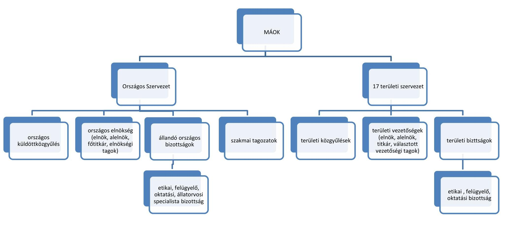

*Főítélési kiszellíve*

*Főítélési kiszellíve*

*Főítélési kiszellíve*

---

### *Mellékletek*

### **III. SZ. MELLÉKLET: MAGYAR ÁLLATORVOSI KAMARA TERÜLETI SZERVEZETEINÉL A GAZDÁLKODÁS SZABÁLYOZOTTSÁGÁVAL ÉS SZABÁLYSZERŰSÉGÉVEL ÖSSZEFÜGGÉSBEN TETT MEGÁLLAPÍTÁSOK**

|  A MAGYAR ÁLLATORVOSI KAMARA JOGSZABÁLYI ELŐÍRÁSOKAT FIGYELMEN KÍVÜL HAGYÓ TERÜLETI SZERVEZETEI | Szabálytalanság megnevezése |  |  |  |  |  |  |  |  |  |  |  |  |  |  |  |  |  |  |  |  |  |  |  |  |  |  |  |  |  |  |  |  |  |  |  |  |  |  |  |  |  |  |  |  |  |  |  |  |  |  |  |  |  |  |  |  |  |  |  |  |  |  |  |  |  |  |  |  |  |  |  |  |  |  |  |  |  |  |  |  |  |  |  |  |  |  |  |  |  |  |  |  |  |  |  |  |  |  |  |
---

|  Sorszám | Szabálytálanság megnevezése | Magyar Állatorvosi Kamara |  |  |  |  |  |  |  |  |  |  |  |  |  |  |   |
| --- | --- | --- | --- | --- | --- | --- | --- | --- | --- | --- | --- | --- | --- | --- | --- | --- | --- |
|   |  | Baranya | Bács-Kiskun | Békés | Borsod-Abaúj-Zemplén | Csongrád | Fejér | Fővárosi | Győr-Moson-Sopron | Hajdú-Bihar | Heves | Jász-Nagy-kun-Szolnok | Komárom-Esztergom | Nógrád | Pannon | Pest | Szabolcs-Szatmár Bereg  |
|   |  |  |  |  |  |  |  |  | Megyei/ Térületi Szervezete |  |  |  |  |  |  |  |   |
|  3. | A számviteli politika 2013. január 1-jétől a Számv. tv. 2012. december 31-ig hatályos 3. § (3) bekezdés 3. pontja szerint tartalmazta a „jelentős összegű hiba" mértékét és „a megbízható valós képet lényegesen befolyásoló hiba" meghatározást. Ezzel nem tettek eleget a Számv. tv. 14. § (11) bekezdésében előírtaknak, mert a változást törvénymódosítás esetén 90 napon belül nem vezették keresztül a számviteli politikán. |  |  |  |  |  | $x^{3}$ | $x$ |  |  | $x^{4}$ |  | $x$ |  |  | $x$ | $x$ |   |

[^0] [^0]: ${ }^{3}$ „A MÁOK Fejér Megyei Szervezet számviteli politikája a Számv. tv. 2012. december 31-ig hatályos 3. § (3) bekezdés 5. pontja szerint tartalmazta a „megbízható valós képet lényegesen befolyásoló hiba" meghatározást. ${ }^{4}$ „A MÁOK Heves Megyei Szervezet számviteli politikája a Számv. tv. 2012. december 31-ig hatályos 3. § (3) bekezdés 5. pontja szerint tartalmazta a „megbízható valós képet lényegesen befolyásoló hiba" meghatározást.

---

|  Szabálytalanság megnevezése |  |  |  |  |  |  |  | Magyar Állatorvosi Kamara |  |  |  |  |  |  |  |  |  |   |
| --- | --- | --- | --- | --- | --- | --- | --- | --- | --- | --- | --- | --- | --- | --- | --- | --- | --- | --- |
|   |  |  | Bács-
Kiskun | Békés | Borsod-
Abaúj-
Zemplén | Csongrád | Fejér | Fővárosi | Győr-
Moson-
Sopron | Hajdú-
Bihar | Heves | Jász-
Nagy-
kun-
Szolnok | Komá-
rom-
Esztergom | Nógrád | Pannon | Pest | Sza-
bolcs-
Szat-
már
Bereg | Tolna  |
|  4. A Pénzkezelési szabályzat a Számv. tv. 14. § (8) bekezdésében foglaltak ellenére nem rendelkezett a készpénzállomány ellenőrzésekor követendő eljárásról, az ellenőrzés gyakoriságáról, a napi készpénz záró állomány maximális mértékéről. |  |  |  | X | $X^{S}$ |  |  |  |  |  |  |  |  |  |  |  |  |   |

[^0] [^0]: ${ }^{5}$ A MÁOK Borsod-Abaúj-Zemplén Megyei Szervezete pénzkezelési szabályzata a napi készpénz záró állomány maximális mértékéről rendelkezett. ${ }^{6}$ A MÁOK Pannon Területi Szervezete pénzkezelési szabályzata a napi készpénz záró állomány maximális mértékéről rendelkezett.

---

|  Sorszám | Szabálytálanság megnevezése | Magyar Állatorvosi |  |  |  |  |  |  |  |  |  |  |  |  |  |  |   |
| --- | --- | --- | --- | --- | --- | --- | --- | --- | --- | --- | --- | --- | --- | --- | --- | --- | --- |
|   |  | Baranya | Bács-Kiskun | Békés | Borsod-Abaúj-Zemplén | Csongrád | Fejér | Fővárosi | Győr-Moson-Sopron | Hajdú-Bihar | Heves | Jász-Nagy-kun-Szolnok | Komárom-Esztergom | Nógrád | Pannon | Pest | Szabolcs-Szatmár Bereg  |
|  5. | A számlarend a Számv. tv. 161. § (2) bekezdés a), c)-d) pontjai előírásai ellenére nem tartalmazta minden alkalmazásra kijelölt számla számjelét és megnevezését, a főkönyvi számla és analitikus nyilvántartás kapcsolatát és a számlarendben foglaltakat alátámasztó bizonylati rendet. |  | X |  | X | X |  |  | X² |  |  | X² | X² | X |  |  |   |

² A MÁOK Győr-Moson-Sopron Megyei Szervezet számlarendje nem tartalmazta minden alkalmazásra kijelölt számla számjelét és megnevezését.

³ A MÁOK Jász-Nagykun-Szolnok Megyei Szervezet számlarendje nem tartalmazta minden alkalmazásra kijelölt számla számjelét és megnevezését, valamint a 161. § (2) bekezdés d) pontja szerinti bizonylati rendet.

⁴ A MÁOK Komárom-Esztergom Megyei Szervezet számlarendje a főkönyvi számla és az analitikus nyilvántartás kapcsolatát tartalmazta, a 161. § (2) bekezdés d) pontja szerinti bizonylati rendet nem.

⁵ A MÁOK Tolna Megyei Szervezet számlarendje nem tartalmazta minden alkalmazásra kijelölt számla számjelét és megnevezését.

---

|  Sorszám | Szabálytálanság megnevezése | Magyar Állatorvosi Kamara |  |  |  |  |  |  |  |  |  |  |  |  |  |  |   |
| --- | --- | --- | --- | --- | --- | --- | --- | --- | --- | --- | --- | --- | --- | --- | --- | --- | --- |
|   |  | Baranya | Bács-Kiskun | Békés | Borsod-Abaúj-Zemplén | Csongrád | Fejér | Fővárosi | Győr-Moson-Sopron | Hajdú-Bihar | Heves | Jász-Nagy-kun-Szolnok | Komárom-Esztergom | Nógrád | Pannon | Pest | Szabolcs-Szatmár Bereg  |
|   |  | Megyei Területi Szervezete |  |  |  |  |  |  |  |  |  |  |  |  |  |  |   |
|   |  | 1.2.sz. megállapítás |  |  |  |  |  |  |  |  |  |  |  |  |  |  |   |
|  6. | A 224/2000. (XII. 19.) Korm. rendelet 6. § (1) bekezdése szerinti beszámoló készítési kötelezettségét nem teljesítette. | X |  |  |  |  |  |  |  |  |  |  |  |  |  |  |   |
|  7. | A mérleg nem felelt meg a 224/2000. (XII. 19.) Korm. rendelet 6. § (6) bekezdésben hivatkozott 4. sz. melléklet szerinti tagolásnak. |  |  |  |  |  |  |  |  |  |  |  |  |  |  |  |   |

1. A MÁOK Jász-Nagykun Szolnok Megyei Szervezete 2014-2015. évi egyszerűsített éves beszámolója mérlegének és eredménykimutatásának tagolása nem felelt meg a 224/2000. (XII. 19.) Korm. rendelet 6. § (6) bekezdésben hivatkozott 4. és 5. sz. melléklet szerinti tagolásnak.

---

|  Sorszám | Szabálytalanság megnevezése | Magyar Állatorvosi Kamara |  |  |  |  |  |  |  |  |  |  |  |  |  |  |   |
| --- | --- | --- | --- | --- | --- | --- | --- | --- | --- | --- | --- | --- | --- | --- | --- | --- | --- |
|   |  | Baranya | Bács-Kiskun | Békés | Borsod-Abaúj-Zemplén | Csongrád | Fejér | Fővárosi | Győr-Moson-Sopron | Hajdú-Bihar | Heves | Jász-Nagy-kun-Szolnok | Komárom-Esztergom | Nógrád | Pannon | Pest | Szabolcs-Szatmár Bereg  |
| 8. | Az eredménykimutatás nem felelt meg a 224/2000. (XII. 19.) Korm. rendelet 6. § (6) bekezdésében hivatkozott 5. sz. melléklet szerinti tagolásnak. |  | X | X | X |  | X |  | X |  | ${X}^{12}$ | X |  |  | X |  |  | X  |
|  |   |   |   |   |   |   |   |   |   |   |   |   |   |   |   |   |   |
|  |   |   |   |   |   |   |   |   |   |   |   |   |   |   |   |   |   |
|  |   |   |   |   |   |   |   |   |   |   |   |   |   |   |   |   |   |
|  |   |   |   |   |   |   |   |   |   |   |   |   |   |   |   |   |   |
|  |   |   |   |   |   |   |   |   |   |   |   |   |   |   |   |   |   |
|  |   |   |   |   |   |   |   |   |   |   |   |   |   |   |   |   |   |
|  |   |   |   |   |   |   |   |   |   |   |   |   |   |   |   |   |   |
|  |   |   |   |   |   |   |   |   |   |   |   |   |   |   |   |   |   |
|  |   |   |   |   |   |   |   |   |   |   |   |   |   |   |   |   |   |
|  |   |   |   |   |   |   |   |   |   |   |   |   |   |   |   |   |   |
|  |   |   |   |   |   |   |   |   |   |   |   |   |   |   |   |   |   |
|  |   |   |   |   |   |   |   |   |   |   |   |   |   |   |   |   |   |
|  |   |   |   |   |   |   |   |   |   |   |   |   |   |   |   |   |   |
|  |   |   |   |   |   |   |   |   |   |   |   |   |   |   |   |   |   |
|  |   |   |   |   |   |   |   |   |   |   |   |   |   |   |   |   |   |
|  |   |   |   |   |   |   |   |   |   |   |   |   |   |   |   |   |   |
|  |   |   |   |   |   |   |   |   |   |   |   |   |   |   |   |   |   |
|  |   |   |   |   |   |   |   |   |   |   |   |   |   |   |   |   |   |
|  |   |   |   |   |   |   |   |   |   |   |   |   |   |   |   |   |   |
|  |   |   |   |   |   |   |   |   |   |   |   |   |   |   |   |   |   |
|  |   |   |   |   |   |   |   |   |   |   |   |   |   |   |   |   |   |
|  |   |   |   |   |   |   |   |   |   |   |   |   |   |   |   |   |   |
|  |   |   |   |   |   |   |   |   |   |   |   |   |   |   |   |   |   |
|  |   |   |   |   |   |   |   |   |   |   |   |   |   |   |   |   |   |
|  |   |   |   |   |   |   |   |   |   |   |   |   |   |   |   |   |   |
|  |   |   |   |   |   |   |   |   |   |   |   |   |   |   |   |   |   |
|  |   |   |   |   |   |   |   |   |   |   |   |   |   |   |   |   |   |
|  |   |   |   |   |   |   |   |   |   |   |   |   |   |   |   |   |   |
|  |  |   |   |   |   |   |   |   |   |   |   |   |   |   |   |   |   |
|  |   |   |   |   |   |   |   |   |   |   |   |   |   |   |   |   |   |
|  |

---

| Szabálytalanság megnevezése |  |  |  |  |  |  |  | Magyar Alatorvosi Kamara |  |  |  |  |  |  |  |  |  |  |  |   |
| --- | --- | --- | --- | --- | --- | --- | --- | --- | --- | --- | --- | --- | --- | --- | --- | --- | --- | --- | --- | --- |
|   |  |  |  |  |  |  |  |  |  |  |  |  |  |  |  |  |  |  |  |   |
|   |  |  |  | Bács-Kis- | Békés | Borsod-Abaúj-Zemplén | Csongrád | Fejér | Fővárosi | Győr-Moson-Sopron | Hajdú-Bihar | Heves | Jász-Nagy-kun-Szolnok | Komárom-Esztergom | Nógrád | Pannon | Pest | Szabolcs-Szatmár Bereg | Tolna |   |
|   |  |  |  |  |  |  |  |  |  | Megyei/ Térületi Szervezete |  |  |  |  |  |  |  |  |  |   |
|  10. | A vevőköveteléseket a Számv. tv. 46. § (3) bekezdése ellenére egyedenként nem értékelték, valamint a Számv. tv. 55. § (1) bekezdése ellenére a vevő és adós minősítésére és értékvesztés elszámolására nem került sor. |  |  |  |  | X |  |  | X | X | X | X |  |  | X | X | X | X | X |   |
|  11. | 2013. évben beszerzett számítástechnikai eszközöket a Számv. tv. 3. § (4) bekezdés 7. pontjában, 16. § (3) bekezdésében, 26. § (1), (4) és (7) bekezdésében, 80. § (2) bekezdésében, 159. §-ában foglaltak ellenére az anyagköltségek között számolták el, a tárgyi eszközöket a mérlegben nem mutatták ki. |  |  |  |  |  |  |  |  |  |  |  |  |  |  |  |  |  |  |   |

---

| Szabálytalanság megnevezése |  |  |  |  |  |  | Magyar Altatóorvosi Kamara |  |  |  |  |  |  |  |  |  |  |   |
| --- | --- | --- | --- | --- | --- | --- | --- | --- | --- | --- | --- | --- | --- | --- | --- | --- | --- | --- |
|   |  |  |  |  |  |  |  |  | Győr- |  |  |  |  |  |  |  |  |   |
|   |  |  |  |  |  |  |  |  | Moson- | Hajdú- |  |  |  |  |  |  |  |   |
|   |  |  |  |  |  |  |  |  | Sopron | Bihar |  |  |  |  |  |  |  |   |
|   |  |  |  |  |  |  |  |  |  |  |  |  |  |  |  |  |  |   |
|   |  |  |  |  |  |  |  |  |  |  |  |  |  |  |  |  |  |   |
|   |  |  |  |  |  |  |  |  | Megyei/területi Szervezete |  |  |  |  |  |  |  |  |   |
|   |  |  |  |  |  |  |  |  |  |  |  |  |  |  |  |  |  |   |
|   |  |  |  |  |  |  |  |  |  |  |  |  |  |  |  |  |  |   |
|   |  |  |  |  |  |  |  |  |  |  |  |  |  |  |  |  |  |   |
|   |  |  |  |  |  |  |  |  |  |  |  |  |  |  |  |  |  |   |
|   |  |  |  |  |  |  |  |  |  |  |  |  |  |  |  |  |  |   |
|   |  |  |  |  |  |  |  |  |  |  |  |  |  |  |  |  |  |   |
|  12. | A területi szervezet számviteli politikájának 9. oldalán a beruházásokkal kapcsolatos előírások ellenére a beszerzett eszközt az üzembe helyezésig nem a beruházások között tartották nyilván. |  |  |  |  |  |  |  |  |  |  |  |  |  |  |  |  |  |   |
|  13. | Az alkalmazott leírási kulcsa nem felelt meg a Tao tv. 1. számú melléklete szerinti 14,5%-os leírási kulcsnak. |  |  |  |  |  |  |  |  |  |  |  |  |  |  |  |  |  |   |
|  14. | A Számv. tv. 52. § (2) bekezdése ellenére hitelt érdemlő módon nem dokumentálták az eszköz üzembe helyezését. |  |  |  |  |  |  |  |  |  |  |  |  |  |  |  |  |  |   |
|  15. | A Gazdálkodási Szabályzat1,2 I/8. pontja ellenére a kötelezettségvállalás nem történt meg írásban. |  |  |  |  |  |  |  |  |  |  |  |  |  |  |  |  |  |   |
|   |  |  |  |  |  |  |  |  |  |  |  |  |  |  |  |  |  |  |   |

---

| Szabálytalanság | Szabálytalanság megnevezése | Magyar Alatorvosi Kamara | Szabálytalanság  |
| --- | --- | --- | --- |
|   |  | Baranya | Bács-Kiskun  |
|  |   |   |   |
|  |   |   |   |
|  |   |   |   |
|  |   |   |   |
|  |   |   |   |
|  |   |   |   |
|  |   |   |   |
|  |   |   |   |
|  |   |   |   |
|  |   |   |   |
|  |   |   |   |
|  |   |   |   |
|  |   |   |   |
|  |   |   |   |
|  |   |   |   |
|  |   |   |   |
|  |   |   |   |
|  |   |   |   |
|  |   |   |   |
|  |   |   |   |
|  |   |   |   |
|  |   | ### *Mellékletek*

### **IV. SZ. MELLÉKLET: MAGYAR ÁLLATORVOSI KAMARA TERÜLETI SZERVEZETEINÉL A KÖZPONTI KÖLTSÉGVETÉSI TÁMOGATÁSOK ELSZÁMOLÁSÁVAL ÖSSZEFÜGGÉSBEN TETT MEGÁLLAPÍTÁSOK**

| Szabálytalanság megnevezése | | | | | | | | | | | | | | | | | | | | | | | | | | | | | | | | | | | | | | | | | | | | | | | | | | | | | | | | | | | | | | | | | | | | | | | | | | | | | | | | | | | | | | | | | | | | | | | | | | | | |

---

| Szabálytalanság megnevezése | | | | | | | Magyar Állatorvosi Kamara | | | | | | | | | | | | |
| --- | --- | --- | --- | --- | --- | --- | --- | --- | --- | --- | --- | --- | --- | --- | --- | --- | --- | --- |
| | | | Bács -Kis- | Békés | Borsod-Abaúj-Zempl- | Csong-rád | Fejér | Fővárosi | Győr-Moson-Sopron | Hajdú-Bihar | Heves | Jász-Nagy-kun-Szolnok | Komá-rom-Eszter-gom | Nóg-rád | Pannon | Pest | Szabolcs-Szat-már Bereg | Tolna |
| | | | | | | | | | | | | | | | | | | |
| | | | Megyei térületi Szervezete | | | | | | | | | | | | | | | |
| 3. 2013-2014. évi költségvetési támogatás összegét egyéb bevételként - a Számv. tv. 77. § (1) és (3) bekezdés b) pontja ellenére - nem mutatta ki, a 2015. évre járó költségvetési támogatás összegét nem vette nyilvántartásba. | | | | | | | | | | | | | | | | | | |
| | | | | | | | | | | | | | | | | | | X |
| | | | | | | | | | | | | | | | | | |
| | | | | | | | | | | | | | | | | | | 2.2. sz. megállapítás |
| 4. A támogatás elszámolására benyújtott számviteli bizonylatok a Számv. tv. 167. § (1) bekezdés c) pontjában foglaltak ellenére alakilag és tartalmilag nem voltak megfelelőek, nem tartalmazták az utalványozó aláírását. | X | X | X | | | X | X | X | | X | X | X | X | X | X | X | X | X |

---

| Szabálytalanság megnevezése | | | | | | | | Magyar Állatorvosi Kamara | | | | | | | | | |
| --- | --- | --- | --- | --- | --- | --- | --- | --- | --- | --- | --- | --- | --- | --- | --- | --- | --- |
| | | | Bács -Kis-kun | Békés | Borsod-Abaúj-Zemplén | Csong-rád | Fejér | Fővárosi | Győr-Moson-Sopron | Hajdú-Bihar | Heves | Jász-Nagy-kun-Szolnok | Komá-rom-Esztergom | Nóg-rád | Pannon | Pest | Szabolcs-Szatmár Bereg |
| Sorszám | | | | | | | | | Megyei térületi Szervezete | | | | | | | | |
| 5. A támogatás terhére elszámolandó számlák és bizonylatok záradékolása nem történt meg a támogatási szerződés; 2. és a támogatási szerződés; 3. a pontjában foglaltak ellenére. | | | | | | X | | | X | | X${ }^{14}$ | X${ }^{15}$ | | | X | | |

${ }^{14}$ A MÁOK Heves Megyei Szervezete 2013-2014. évi támogatás elszámoláshoz benyújtott számlákat nem látta el záradékkal. ${ }^{15}$ A MÁOK Jász-Nagykun-Szolnok Megyei Szervezet a 2014. évi támogatás elszámolásához benyújtott számlákat nem látta el záradékkal.

---

# FÜGGELÉK: ÉSZREVÉTELEK

A jelentéstervezetet a Számvevőszék 15 napos észrevételezésre megküldte az ellenőrzött szervezetek vezetőinek az ÁSZ tv. 29. §* (1) bekezdése előírásának megfelelően.
A Magyar Állatorvosi Kamara Országos Szervezetének elnöke, továbbá a területi szervezetei részéről a BácsKiskun, Fejér, Hajdú-Bihar, Heves, Jász-NagykunSzolnok Megyei Szervezetének elnökei, valamint Fővárosi Szervezetének elnöke és a Pannon Területi Szervezetének elnöke az ellenőrzés megállapításaira írásban észrevételt tett. A Földművelésügyi Minisztérium részéről a földművelésügyi miniszter tett írásban észrevételt az ellenőrzés megállapításaira.
A Magyar Állatorvosi Kamara további területi szervezeteinek elnökei az ÁSZ tv. 29. § (2) bekezdésében foglalt észrevételezési jogukkal nem éltek, a törvényes határidőn belül írásban észrevételt nem tettek.
A függelék tartalmazza az ellenőrzöttek észrevételeit, illetve az el nem fogadott észrevételek elutasításának indoklását.

[^0]
[^0]: * 29. § (1) Az Állami Számvevőszék az ellenőrzési megállapításait megküldi az ellenőrzött szervezet vezetőjének vagy az általa megbízott személynek, és annak, akinek személyes felelősségét állapította meg.
    (2) Az ellenőrzött szervezet vezetője és a felelősként megjelölt személy az ellenőrzés megállapításaira tizenöt napon belül írásban észrevételt tehet.
    (3) Az Állami Számvevőszék az észrevételre a beérkezésétől számított harminc napon belül írásban válaszol. A figyelembe nem vett észrevételeket köteles a jelentésben feltüntetni, és megindokolni, hogy azokat miért nem fogadta el.

---

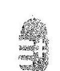

# MAGYAR ÁLLATORVOSI KAMARA

HUNGARIAN VETERINARY CHAMBER
H-1078 Budapest, István utca 11. fst. 1.
Tel:(36-1) 413-24-90, Fax:(36-1) 413-24-93, e-mail: maok@t-online.hu
clnik/president: Dr. Gönczi Gábor
alclnok/vice president: Dr. Menyhárt Péter főtitkár/secretary general: Dr. Horváth László

## Állami Számvevőszék

Domokos László elnök úr
Budapest
Apáczai Csere János u. 10. 1052
tárgy: észrevételek az Állami Számvevőszék (ÁSZ) jelentés-tervezetére (Vy1259-412/2016.)

Tisztelt Elnök Úr!
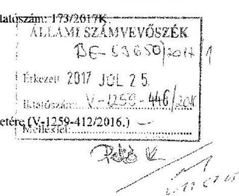

Kézhez vettük az Állami Számvevőszékről szóló 2011. évi LXVI. tv. 29.§ (1) bekezdése alapján az észrevételezés céljából megküldött, a Magyar Állatorvosi Kamara Országos szervezetéről és 17 megyei szervezetéről szóló, egységbevont, a Magyar Állatorvosi Kamara ellenőrzéséről szóló jelentéstervezetüket.
A kézhez vett jelentés-tervezetükre az alábbi észrevételeket tesszük:

## Az Ász jelentés-tervezet megállapítása:

A Magyar Állatorvosi Kamara gazdálkodása nem volt szabályszerű. Az országos és területi szervezetek a gazdálkodás alapvető feltételeit biztosító számviteli politikával és számlarenddel nem rendelkeztek, vagy rendelkeztek, de azok nem feleltek meg a számviteli törvény előírásainak. A Baranya Megyei Szervezet beszámoló készítési kötelezettségét elmulasztotta. A Jász-NagykunSzolnok Megyei Szervezetnél a számviteli nyilvántartások megőrzéséről nem gondoskodtak, ennek hiányában a vagyoni helyzet ellenőrzése meghiúsult. További hiányosság volt, hogy a beszámolási kötelezettségét teljesítő egyes területi szervezetek egyszerűsített éves beszámolóinak tagolása nem felelt meg a jogszabályban meghatározottaknak.
A mérlegtételek év végi értékelése és leltárral történő alátámasztása nem volt megfelelő, mert 7 szervezetnél nem leltározták, így a mérlegtételeket leltár nem támasztotta alá. 14 szervezetnél az analitikus és főkönyvi nyilvántartások egyeztetését nem végezték el, továbbá 11 szervezetnél nem történt meg a követelések minősítése sem. A kiadások elszámolása során nem tartották be a jogszabály és a gazdálkodási szabályzat előírásait, azaz a kötelezettségvállalás nem írásban történt és nem utalványoztak a kifizetések előtt, amely nem biztosította a kifizetések szabályosságát.
A költségvetési támogatást a Magyar Állatorvosi Kamara a támogatási szerződésekben rögzített közfeladatok ellátására fordította. A támogatások pénzügyi elszámolásánál a bizonylatok záradékolása nem történt meg, így nem biztosították, hogy egy bizonylatot csak egy támogatási szerződés elszámolásához lehessen felhasználni.
A törvényben előírt, a gazdálkodással kapcsolatos közérdekű adatokat a Kamara nem tette közzé, amellyel nem biztosították a gazdálkodás átláthatóságát.

## Észrevételünk:

A Magyar Állatorvosi Kamara szervezeti felépítéséből adódóan, minden egyes területi szervezet önálló jogi személy, önálló adószámmal, vezetőséggel és beszámoló készítési kötelezettséggel rendelkezik, a rájuk irányadó adó és számviteli törvények szerint. Az általánosított kategorikus összefoglaló jelentés kijelentéseivel nem tudunk egyetérteni, mivel több helyen ellentmondást véltünk felfedezni, amit az alábbiakban részletesen kifejtünk.

---

Az ÁSz-nek a Magyar Állatorvosi Kamara Országos Szervezetére vonatkozó számvitellel kapcsolatos megállapításairól.

# ÁSz megállapítás: 

Összegzés:
A Magyar Állatorvosi Kamara 2013-2015. évi gazdálkodása nem volt szabályszerű. A költségvetési támogatásokat meghatározott célra használták fel, azonban a támogatások pénzügyi elszámolása nem volt szabályszerű. A gazdálkodás körébe tartozó közérdekű adatokkal kapcsolatos közzétételi kötelezettségét a Kamara nem teljesítette, ezáltal az átláthatóság nem biztosított.

## Észrevételünk:

Álláspontunk szerint a jelentéstervezet összegzésének azon megkérdőjelezhetetlen fordulata, mely szerint Kamara gazdálkodása nem volt szabályszerű, nincs összhangban a jelentéstervezet alábbi részmegállapításaival:
, ,, 4 Beszámolási kötelezettségnek a MÁOK Országos Szervezete és 16 területi szervezete eleget tett. ,,A költségvetés végrehajtásáról szóló beszámolókat a 2012. évi CXXVII. törvényben és az alapszabályban meghatározottak szerint kizárólagos hatáskörében az országos küldöttközgyűlés, illetve az illetékes területi közgyűlések elfogadták. (1.2 sz. megállapítás első bekezdése),, ,, A gazdasági társaságának felügyelete során a MÁOK összességében betartotta a jogszabályi előírásokat „(1.3 megállapítás)
, „A támogatásokat a támogatási szerződésben rögzített célokra használták fel „(2.2 megállapítás)

A MÁOK Országos Szervezetének nincs letétbe helyezési kötelezettsége, mivel nem végez vállalkozási tevékenységet, és nincs olyan jellegű tevékenysége, amit az Ectv. 30.§ (1) bekezdése előír. Ennek alátámasztására a Nav 13. sz. információs füzetének 4. oldalán egyértelmű utalást is találhatunk: „Az előzőek egyikébe sem tartozó szervezetnek, amelynek sem nyilvánosságra hozatali, sem közzétételi, sem beszámoló letétbe helyezési kötelezettsége nincs, a beszámolóját legkésőbb az adott üzleti év mérlegforduló-napját követő ötödik hónap utolsó napjáig el kell készítenie, és a jóváhagyásra jogosult testülettel el kell fogadtatnia."

## 1.1 sz. ÁSz Megállapítás második bekezdése:

A MÁOK Országos Szervezete kiadta a Számviteli politikát, a leltározási szabályzatot, az Értékelési Szabályzatot és a Pénzkezelési Szabályzatot, valamint elkészítette a Számlarendet. A MÁOK Országos Szervezetének egyes számviteli szabályzatai azonban a Számviteli tv. előírásaival nem álltak összhangban. A Számviteli politikában a Számviteli tv. 14. § (11) bekezdésével ellentétben a törvénymódosításból eredő változásokat 2013. évben nem vezették keresztül. A Számviteli politika 2013. január 1-jétől nem felelt meg a Számviteli tv. előírásainak, mert a Számviteli tv. 2012. december 31-ig hatályos 3. § (3) bekezdés 3. és 4. pontjában foglaltak szerint tartalmazza a jelentős és nem jelentős összegű hiba mértékét, valamint a. 3. § (3) bekezdés 5. pontjában foglalt „meghízható és valós képet lényegesen befolyásoló hiba" meghatározást, amely meghatározás 2013. január 1-jétől a Számviteli tv.-ben hatálytalan. A Számlarend - a Számviteli tv. 161. § (2) bekezdés c) és d) pontjai előírásaival ellentétben - nem tartalmazta a főkönyvi számla és az analitikus nyilvántartás kapcsolatát, valamint a számlarendben foglaltakat alátámasztó bizonylati rendet.

---

# Észrevételünk: 

A MÁOK Országos Szervezete elkészítette a számviteli politikát a 2012 évi szabályoknak megfelelően.
2013. évben - ellentétben a megállapítással és összhangban a Számviteli tv. módosításával - a Komplex jogtár hasonlítási programjával a 2012-tól 2013. évre vonatkozóan csak és kizárólag az értékhatár változott a jelentős hiba összegének szövegrésze változatlanul hagyásával.
„3. § (1) E törvény alkalmazásában:
2012.XII.31-2012.11 hasonlítás
3. jelentős összegű hiba: ha a hiba feltárásának évében, a különbözö ellentétezések során, egy adott üzleti évet érintően (évenként külön-külön) feltárt hibák és hibahatások - eredményi, saját tőkét növelő-csökkentő - értékének együttes (előjeltől független) összege meghaladja a számviteli politikában meghatározott értékhatárt. Minden esetben jelentős összegű a hiba, ha a hiba feltárásának évében az ellentétezések során - ugyanazon évet érintően - megállapított hibák, hibahatások eredményi, saját tőkét növelő-csökkentő tésének együttes (előjeltől független) összege meghaladja az ellentétezett üzleti év mérlegfőösszegének 2 százalékát, illetve ha a mérlegfőösszeg 2 százaléka meghaladja nem haladja meg az 360.1 millió forintot, akkor az 800.1 millió forintot.
(A piros a törlés a kék bekezdés az új szövegrész. ) ,.
A MÁOK Országos Szervezete 2014. évtől adta ki az új Számviteli politikáját, már az új szabályokat figyelembe véve.
Az Ász által kifogásolt Számviteli tv. idézett 3.§.(2) bekezdése helyett, a (3) bekezdés rendelkezik oly módon, hogy a számlarendben:
„(3) Az analitikus nyilvántartásoknak szoros kapcsolatban kell lenniük a főkönyvi könyveléssel, és a kettő között az értékadatok számszerű egyeztetésének lehetőségét biztosítani kell."
Az analitikus és a főkönyvi nyilvántartás kapcsolatát a CC conto Integrált ügyviteli rendszer biztosítja, az analitikus nyilvántartás után gyűjtőt képez a főkönyvben, ezért eltérés nem lehetséges. Tekintettel arra, hogy ezt a tényt a kiegészítő mellékletben minden évben közöltük, ezért nem tartottak szükségesnek a számlarendben az analitikus kapcsolatot ismételten szabályozni.

## 1.2 sz. ÁSz megállapítás:

A számviteli beszámolási kötelezettségek teljesítése, valamint a mérleglétélek év végi értékelése és leltárral történő alátámasztása nem volt szabályszerű. Beszámolási kötelezettségének a MÁOK Országos Szervezete és 16 területi szervezete eleget tett. A költségvetés végrehajtásáról szóló beszámolókat a 2012. évi CXXVII. törvényben és az Alapszabályban meghatározottak szerint kizárólagos hatáskörében az országos küldöttközgyűlés, illetve az illetékes területi közgyűlések elfogadták.
A MÁOK Országos Szervezete egyszerűsített éves beszámolóinak eredménykimutatásai a 224/2000. (XII. 19.) Korm. rendelet 6. § (6) bekezdésében hivatkozott 5. számú melléklet szerinti tagolásnak nem feleltek meg, mert a vezető tisztségviselők juttatásait nem mutatták ki, a tagdíjakat pedig nem az egyéb bevételek között, hanem külön soron mutatták ki. Az eredménykimutatásban a MÁOK Kft.-től kapott osztalékot - a Számv. tv. 83. § (2) bekezdésében előírtakkal ellentétben - nem a pénzügyi műveletek bevételeként, hanem egyéb támogatásként szerepeltették.

## Észrevételünk:

A hivatkozott 224/2000.(XII.19.) Korm. rendelet 6.§ (6) bekezdésében hivatkozott 5. számú melléklet a közhasznú szervezetekről rendelkezik. A Magyar Állatorvosi Kamara Országos Szervezete és területi szervezetei köztestületek és nem közhasznú szervezetek, ezért ránk a 7.§. vonatkozik. A beszámoló tagolása pedig a 4-5 melléklet alapján és adattartalommal készült.
Az egyszerűsített beszámoló sémánk az adó-tb jogtár civil szervezetekre vonatkozó, ajánlott Excel tábla alapján készült a köztestületekre vonatkoztatva. A könyvekben a MÁOK Kft-től kapott osztalék a 97. számlaosztályban szerepelt a tv $83 \S$ (2) bekezdése alapján.

---

Sajnálatos módon az eredmény kimutatásban az egyéb bevételek között került beírásra, 1 sortévesztés miatt.

# 1.2 sz. ÁSz Megállapítás: 

A MÁOK Országos Szervezete a Számv, tv. 46. § (3) bekezdése ellenére eszközeit (2015. évben a pénzeszközöket, illetve 2013-2015-ben követeléseit) leltározással nem ellenőrizte, a forgóeszközök közül a pénzeszközöket és a követeléseket egyedenként nem értékelték. A Számviteli tv. 55. § (1) bekezdése ellenére a vevő és adós minősítésére és az üzleti év mérlegfordulónapján fennálló és a mérlegkészítés időpontjáig pénzügyileg nem rendezett követelésnél értékvesztés elszámolására nem került sor. A területi szervezeteknél a mérlegtételek év végi értékelése és leltárral történő alátámasztása szabályszerűségének ellenőrzése kapcsán tett megállapításokat a III. sz. melléklet 9-11. pontjai tartalmazzák.

## Észrevételünk:

A MÁOK Országos Szervezete eleget tett mind a leltározási kötelezettségeinek, mind az értékeléseknek. A tárgyi eszközökről a számviteli alapelveknek megfelelő egyedi nyilvántartást vezettünk mennyiségben is és értékben is, továbbá ezen a nyilvántartások rögzítik a terv szerinti értékcsökkenési leírást. A leltár készítésekor a tárgyi eszközök az analitikus nyilvántartásokból is a Sztv. értelmében felvehetők, akár leltárba a mérlegforduló-napi értéken (nettó érték). Ennek ellenére mind az 10-14 db fajsúlyosan érték nélküli, nullára leírt tárgyi eszközünknél mennyiségben is meggyőződtünk a meglétükről. A leltárívet fel is töltöttük az Ász rendszerébe.
A forgóeszközök közül készletet és értékpapírt nem tartunk nyilván. Két házipénztárt vezettünk, mindkét pénztár rendelkezett záró pénztárjelentéssel és aláírt címletjegyzékkel. Továbbá egy Excel táblába elküldésre is került az 1-4 számlaosztály tételes leltára, amit a gazdasági vezető írt alá, és a könyvvizsgáló jóváhagyta. Minden banki kivonat tételesen került felvételre, és külön főkönyvi számon volt nyilvántartva és egyeztetve.
Az adósok (vevők) a köztestületünknél maguk a kamarai tagok, a tagdíjuk elmaradása nem minősül vevő elmaradásnak, ezért a tagdíjukat illetően nem lehet értékvesztést elszámolni. Tagdíjelmaradás esetében a vonatkozó törvény és a kamarai saját szabályzatok szerint járunk el, melynek eredménye akár a tag tagsági viszonyának megszűnése is lehet. Rendkívüli esetben sor kerülhet a mérleg előtt tagdíjtartozás leírására. A beszámolóban a jogos tagdijkövetelések mutatkoznak adósként.

### 1.3 sz. ÁSz megállapítás:

Az igénybevett szolgáltatások és egyéb szolgáltatások, személyi jellegű ráfordítások elszámolása során a Számv. tv., az Alapszabály, illetve a Gazdálkodási szabályzatnak az előírásait nem tartották be. A MÁOK Országos Szervezeténél a Gazdálkodási szabályzat I/6. és 8. pontja ellenére a költségvetés végrehajtásáért felelős országos elnök részéről nem történt meg írásban a kötelezettségvállalás és a Számv. tv. 167. § (1) bekezdés c) pontjában foglaltak ellenére a könyvviteli elszámolást közvetlenül alátámasztó bizonylatokon nem szerepelt az utalványozó és a rendelkezés végrehajtását igazoló személyek együttes aláírása. A 2015. évben egy esetben a személyi jellegű kifizetés jogszerűségét dokumentummal nem támasztották alá.

## Észrevételünk:

A MÁOK Országos Szervezeténél, minden egyes, a könyvelésbe kerülő alapbizonylatot, átutalásos számlát, készpénzlizetési számlát, kiküldetési rendelvényt a MÁOK Elnöke szignálja és utalványozza. A kézi utalványozást az Elnök saját hatáskörében gyakorolja és kézjegyével látja el a bizonylatokat. Ennek jogát magánál tartva, azt másra vagy másokra át nem ruházva egy személyben jegyzi a kifizetéseket. A banki átutalások kettős aláírással kerülnek kifizetésre, így biztosítva a pénzügyi fegyelmet. Készpénzes kifizetéseken pedig minden esetben szerepelt az átvevő aláírása.

---

Véleményünk szerint ez megfelel a hivatkozott Számviteli tv, 167.§ (1) bekezdésében foglaltaknak, nevezetesen:
„c) a gazdasági műveletet elrendelő személy vagy szervezet megjelölése, az utalványozó és a rendelkezés végrehajtását igazoló személy, valamint a szervezettől függően az ellenőr aláírása; a készletmozgások bizonylatain és a pénzkezelési bizonylatokon az átvevő, az ellennyugtákon a befizető aláírása;"
Törvényalkotói vélemény (kommentár):
„A számvitelről szóló 2000. évi C. törvény 167. §-a (1) bekezdésének e) pontja szerinti rendelkezésnek az a célja, hogy a vagyontárgyak mozgása (jellemzően a pénzkiadások, a készletfelhasználások) során érvényesüljön a tulajdon védelme és az elszámolások valódisága
A törvényi szintű szabályozás nem alkalmas arra, hogy minden egyes vállalkozás belső szervezeti rendjének sajátosságaira konkrét utasítást adjon, így a bizonylat alaki és tartalmi követelményeire vonatkozó előírásoknak is az adott vállalkozás körülményeit figyelembe véve kell megfelelni. Ebből következik, hogy a bizonylaton azon személy(ek) aláírása fog szerepelni, aki(k) a megjelölt feladatokat elvégz(ik).
Az eszközmozgást elrendelő (az utalványozó) és a pénztáros vagy raktáros (a rendelkezést végrehajtó) célszerű, ha nem azonos személy, de ez nem számviteli, hanem vállalkozási érdek, mivel ilyen esetben a vagyonmozgással kapcsolatos felelősség is egyértelműen rögzíthető.
Az, hogy az adott vállalkozás szervezeti rendje a belső ellenőrzést milyen formában valósítja meg (alkalmaz-e önálló munkakörben ellenőrt), szintén vállalkozási érdekeltségen alapul. Ha alkalmaz, és feladata a számviteli bizonylatok ellenőrzése is, akkor a munkájával együtt jár a bizonylat aláírása. Kizárólag a vállalkozás hatáskörébe tartozik tehát az, hogy meghatározza a vagyonmozgásra utasítást adók, illetve az azt végrehajtók felelősségi viszonyait, az ellenőrzés módját."

Budapest, 2017. július 19.

Tisztelettel:
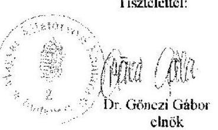

---

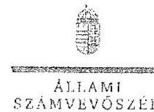

# Dr. Gönczi Gábor úr 

elnök
Magyar Állatorvosi Kamara Országos Szervezete

## Budapest

## Tisztelt Elnök Úr!

A "Köztestületek ellenőrzése - Magyar Állatorvosi Kamara" címmel készített számvevőszéki jelentéstervezetre tett észrevétcleit köszönettel megkaptam.
Az Állami Számvevőszék észrevétclekre vonatkozó álláspontjáról a felügyeleti vezető által készített részletes tájékoztatást csatoltan megküldöm.
Tájékoztatom Elnök urat, hogy a számvevőszéki jelentésben - az Állami Számvevőszékről szóló 2011. évi LXVI. törvény 29. § (3) bekezdése alapján - a figyelembe nem vett észrevételeket feltüntetjük, annak indoklásával, hogy azokat az Állami Számvevőszék miért nem fogadta el.
Budapest, 2017. 03. hó 15 nap
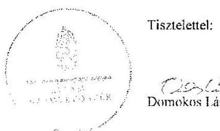

Tisztelettel:

Domokos László

Melléklet: Tájékoztatás az el nem fogadott észrevétclekről

---

# Tájékoztatás az el nem fogadott észrevételekről 

A „Köztestületek ellenőrzése - Magyar Allatorvosi Kamara" című jelentéstervezetre a 2017. július 19-én kelt, 173/2017K. ikt. számú levélben tett észrevételeit áttekintettem, annak kezeléséről az alábbi tájékoztatást adom.

## 1. Az észrevételeket tartalmazó levél első oldalán tett észrevétele kapcsán

Az észrevételeket tartalmazó levél első oldalán szerepeltetett észrevétel arra vonatkozott, hogy a Magyar Állatorvosi Kamara (továbbiakban: Kamara) szervezeti felépítéséből adódóan minden egyes területi szervezet önálló jogi személy, önálló adószámmal, vezetőséggel és beszámoló készítési kötelezettséggel rendelkezik, a rájuk irányadó és számviteli törvények szerint. Elnök úr az általánosított kategorikus összefoglaló jelentés kijelentéseivel nem tud egyet érteni.
A Magyar Állatorvosi Kamaráról, valamint az állatorvosi szolgáltatói tevékenység végzéséről szóló 2012. évi CXXVII. törvény (továbbiakban: MÁOK tv.) 1. § (1) bekezdése szerint „a Magyar Állatorvosi Kamara (továbbiakban: Kamara) az állatorvosok önkormányzattal rendelkező, közfeladatokat és általános szakmai érdek-képviseleti feladatokat ellátó köztestülete".
Az Állami Számvevőszékről szóló 2011. évi LXVI. törvény (továbbiakban: ÁSZ tv.) 5. § (3) bekezdése szerint az Állami Számvevőszék (továbbiakban: ÁSZ) az államháztartásból származó források felhasználásának keretében ellenőrzi az államháztartásból nyújtott támogatás felhasználását a köztestületeknél. A hivatkozott rendelkezés szerint amennyiben a kedvezményezett szervezet az államháztartásból támogatásban részesül, gazdálkodási tevékenységének egésze ellenőrizhető.
Figyelemmel arra, hogy a MÁOK tv. 1. § (1) bekezdése szerint a köztestület maga a Kamara, amely feladatait - a MÁOK tv. 1. § (2) bekezdése alapján - területi szervezetei és országos szervezete útján látja el, a Kamara gazdálkodásának egészét az országos szervezet gazdálkodása és területi szervezetek gazdálkodása együttesen képezi. Erre tekintettel az észrevételt nem fogadjuk el, a jelentéstervezet módosítása nem indokolt.

## 2. A jelentéstervezet összegzéséhez fűzött észrevétele kapcsán

Az észrevétel szerint az a megállapítás, hogy a Kamara gazdálkodása nem volt szabályszerű, nincs összhangban a jelentéstervezet egyes részmegállapításaival, és Elnök úr beidézte a beszámolási kötelezettség teljesítésével, a költségvetés végrehajtásáról szóló beszámolók elfogadásával, a gazdasági társasága felügyeletével és a támogatások felhasználásával kapcsolatos pozitív megállapításokat.
A jelentéstervezet összegző megállapításait az ÁSZ a jelentéstervezet „Megállapítások" című fejezetében szereplő valamennyi, pozitív és negatív megállapítás együttes értékelésével fogalmazza meg. Az észrevételben hivatkozott négy pozitív megállapításon túl a jelentéstervezet

---

„Megállapítások" című fejezetében mind a Kamara Országos Szervezetére, mind a területi szervezetekre vonatkozóan rögzítésre kerültek

- a számviteli szabályzatok hiányosságai,
- a beszámolók hiányosságai,
- a leltározással és a leltárral kapcsolatos szabálytalanságok,
- a beruházások és a felújítások, valamint az igénybevett és egyéb szolgáltatások, illetve a személyi jellegű ráfordítások elszámolásával kapcsolatos szabálytalanságok,
- a tagdíjak beszedésével kapcsolatos hiányosságok,
amelyek súlyára és számosságára tekintettel került megfogalmazásra az összegzés. Erre tekintettel az észrevételt nem fogadjuk el, a jelentéstervezet módosítása nem indokolt.
Az észrevétel további részében Elnök úr jelezte, hogy a Kamara Országos Szervezetének nincs letétbe helyezési kötelezettsége, mivel nem végez vállalkozási tevékenységet, és nincs olyan jellegű tevékenysége, amit az az egyesülési jogról, a közhasznú jogállásról, valamint a civil szervezetek működéséről és támogatásáról szóló 2011. évi CLXXV. törvény 30. § (1) bekezdése előír.
A jelentéstervezet nem tartalmaz megállapítást letétbe helyezésre vonatkozóan, hanem a közzétételi kötelezettség teljesítésével kapcsolatban állapít meg hiányosságot. Figyelemmel arra, hogy az ÁSZ tv. 28. § (2) bekezdése szerint az észrevételezési jog az ellenőrzési megállapításokra terjed ki, a jelentéstervezet pedig nem tartalmaz megállapítást letétbe helyezésre vonatkozóan, az észrevételt nem fogadjuk el, a jelentéstervezet módosítása nem indokolt.

# 3. A jelentéstervezet 1.1. sz. megállapítás harmadik bekezdéséhez fűzött észrevétel kapcsán 

Az észrevétel megerősítette, hogy a számviteli politikát a 2012. évi szabályoknak megfelelően készítették el, és hogy 2013-ban megváltozott a jelentős összegű hiba értékhatára, valamint kitért arra, hogy az analitikus és a főkönyvi nyilvántartás kapcsolatát a gyakorlatban (CC conto Integrált ügyviteli rendszer, kiegészítő melléklet) biztosították, ezért nem tartották indokoltnak ismételten szabályozni a számlarendben.
Az észrevétel nem vitatta a számviteli politika módosításának elmaradását, és azt sem, hogy a számlarend - a számvitelről szóló 2000. évi C. törvény 161. § (2) bekezdés c) pontja ellenére nem tartalmazta a főkönyvi számla és az analitikus nyilvántartás kapcsolatát. Erre tekintettel az észrevételt nem fogadjuk el, a jelentéstervezet módosítása nem indokolt.

---

# 4. A jelentéstervezet 1.2. sz. megállapításához fűzött észrevétele kapcsán (az észrevételt tartalmazó levél 3. old.) 

Az észrevétel arra vonatkozott, hogy a számviteli törvény szerinti egyes egyéb szervezetek beszámolókészítési és könyvvezetési kötelezettségének sajátosságairól szóló 224/2000. (XII. 19.) Korm. rendelet (továbbiakban: 224/2000. Korm. rendelet) 6. § (6) bekezdésében hivatkozott 5. számú melléklet a közhasznú szervezetekről rendelkezik. Észrevétele szerint a Kamara Országos Szervezete és területi szervezetei azonban köztestületek és nem közhasznú szervezetek ezért a 224/2000. Korm. rendelet 7. §-a vonatkozik a Kamarára, a beszámoló tagolása pedig a 4-5. melléklet alapján és adattartalommal készült. A MÁOK Kft.-től kapott osztalék a könyvekben a számvitelről szóló 2000. évi C. törvény (továbbiakban: Számv. tv.) 83. § (2) bekezdése alapján a 97. számlaosztályban szerepelt, az eredménykimutatásban sortevesztés miatt került az egyéb bevételek közé.
A Számv. tv. szerinti 224/2000. Korm. rendelet 6. § (6) bekezdése szerint „az egyéb szervezet egyszerűsített éves beszámolója a 4. számú melléklet szerinti mérlegből és az 5. számú melléklet szerinti eredménykimutatásból áll". A hivatkozott rendelkezés nem tartalmaz közhasznú szervezetre vonatkozó utalást, az 5. számú melléklet sem rendelkezik közhasznú szervezetről. A Kamara mint köztestület a Számv. tv. 3. § (1) bekezdés 4. pont b) alpontja alapján egyéb szervezetnek minősül, és a 224/2000. (XII. 19.) Korm. rendelet hatálya is (a 2. § (1) bekezdés d) pont alapján) a köztestületekre mint egyéb szervezetre terjed ki. A beszámolót továbbá nem elegendő a 4-5. melléklet alapján vagy adattartalommal elkészíteni, hanem az konkrétan a 4-5. mellékletek szerinti mérlegből és eredménykimutatásból áll. Az észrevétel nem vitatta, hogy a beszámolóban a vezető tisztségviselők juttatásait nem, a tagdíjakat pedig nem a megfelelő helyen mutatták ki. A MÁOK Kft.-től kapott osztalék tekintetében az észrevétel nem vitatta, hogy az eredménykimutatásban nem a megfelelő helyen szerepelt. A fentiekre tekintettel az észrevételt nem fogadjuk el, a jelentéstervezet módosítása nem indokolt.

## 5. A jelentéstervezet 1.2. sz. megállapításához fűzött észrevétele kapcsán (az észrevételt tartalmazó levél 4. oldal)

Az észrevétel első két bekezdése szerint a Kamara Országos Szervezete eleget tett a leltározási és értékelési kötelezettségeinek. A tárgyi eszközökről egyedi nyilvántartást vezettek mennyiségben is és értékben is, és ezen nyilvántartások rögzítik a terv szerinti értékcsökkenési leírást. A leltár készítésekor a tárgyi eszközök az analitikus nyilvántartásokból is felvehetők, akár mérleg-formáló-napi (nettó) értéken. Ennek ellenére a nullára leírt tárgyi eszközöknél mennyiségben is meggyőződtek a meglétükről. A forgóeszközök közül készletet és értékpapírt nem tartanak nyilván. Két házipénztárt vezettek, amelyek rendelkeztek záró pénztárjelentéssel, aláírt címletjegyzékkel, és Excel táblában megküldésre került az 1-4. számlaosztály - gazdasági vezető által aláírt, könyvvizsgáló által jóváhagyott - tételes leltára. Minden banki kivonat tételesen került felvételre, és külön főkönyvi számon volt nyilvántartva és egyeztetve.

---

A Számv. tv. 46. § (3) bekezdése szerint leltározással (mennyiségi felvétellel, egyeztetéssel) mind az eszközöket, mind a kötelezettségeket ellenőrizni és egyedenként értékelni kell. Az észrevételben hivatkozott leltárivek csak a tárgyi eszközöket tartalmazzák, a pénzeszközöket, a követeléseket és a kötelezettségeket nem. A leltárt leltározás alapján kell összeállítani. A Számv. tv. 69. § (1) bekezdése szerint a beszámoló elkészítéséhez, a mérleg tételeinek alátámasztásához olyan leltárt kell összeállítani, amely tételesen, ellenőrizhető módon tartalmazza az eszközöket, forrásokat (mennyiségben és értékben). Az észrevételben hivatkozott leltárivek mennyiséget tartalmaznak, de értéket nem. A záró és pénztárjelentés, valamint az aláírt címjegyzék nem leltár, ahogyan a hivatkozott Excel tábla is csak legfeljebb analitikus nyilvántartásként vehető figyelembe, nem pedig leltárfelvételi ívekkel és leltározási jegyzőkönyvvel alátámasztott leltárnak. A tételesen felvett banki kivonatok külön főkönyvi számon történő nyilvántartása alapja lehet a leltározásnak, de annak elvégzését nem pótolja. A leltározás és a leltár fenti hiányosságaira tekintettel a mérleg szabályszerű leltárral akkor sem volt alátámasztott, ha készletet és értékpapírt nem tartottak nyilván. A fentiekre tekintettel a jelentéstervezet módosítása az észrevétel alapján nem indokolt.
Az észrevétel harmadik bekezdése szerint az adósok (vevők) a köztestületnél maguk a kamarai tagok, tagdíjuk elmaradása nem minősül vevő elmaradásnak, ezért nem lehet értékvesztést elszámolni. Tagdíjelmaradás esetén a vonatkozó törvény és a kamarai saját szabályzatok szerint járnak el, amelynek eredménye a tagsági viszony megszűnése is lehet. Rendkívüli estben sor kerülhet a mérleg előtt tagdíjtartozás leírására. A beszámolóban a jogos tagdijkövetelések mutatkoznak adósként.
Az Állami Számvevőszék álláspontja szerint a tagdíj meg nem fizetése esetén a tag nem vevővé, hanem a Kamara adósává válik. A Számv. tv. 55. § (1) bekezdése szerint - az adós minősítése alapján - a mérlegforduló napon fennálló és a mérlegkészítés időpontjáig pénzügyileg nem rendezett követelésnél értékvesztést kell elszámolni. Ugyanezt a kötelezettséget créátil meg a Kamara saját belső szabályzata is (értékelési szabályzat 6. pontja, 12. oldal hetedik bekezdés). A tagdíjak - területi szervezetek hatáskörét képező - beszedésével kapcsolatos hiányosságokat, szabálytalanságokat a jelentéstervezet 1.4. sz. megállapítása alatti második bekezdés és a III. sz. melléklet 18. sora tartalmazza, azokkal szembeni ellenérveket az észrevétel nem tartalmazott. A fentiekre tekintettel az észrevételt nem fogadjuk el, a jelentéstervezet módosítása nem indokolt.

# 6. A jelentéstervezet 1.3. sz. megállapítás harmadik bekezdéséhez fűzött észrevétele kapcsán 

Az észrevétel arra vonatkozott, hogy a Kamara Országos Szervezeténél minden egyes (könyvelésbe kerülő) alapbizonylatot, átutalásos számlát, készpénzfizetési számlát, kiküldetési rendelvényt az elnök szignál és utalványoz, a kézi utalványozást az elnök saját hatáskörben gyakorolja és kézjegyével látja el a bizonylatokat. E jogát másra nem ruházta át. A banki átutalások kettős aláírással kerülnek kifizetésre, a készpénzes kifizetéseken minden esetben szerepelt az átvevő aláírása, amely véleményük szerint megfelel a Számv. tv. 167. § (1) bekezdésében foglaltaknak.
Az észrevétel azt rögzíti, hogy hogyan történik a Kamara Országos Szervezeténél az utalványozás. Az észrevétel szerint az elnök csak kézjegyével látja el a bizonylatokat, azonban az aláírói

---

minőség feltüntetése nélkül nem állapítható meg, hogy azt az elnök utalványozóként írta-e alá. Ugyanakkor a kifizetések szabályszerűségének megállapításához, a könyvviteli elszámolást közvetlenül alátámasztó bizonylatként rendelkezésre bocsátott és ismételten felülvizsgált dokumentumok szerint több esetben egyáltalán nem történt meg kifizetés előtt az utalványozás.
A jelentéstervezet a banki átutalások kettős aláírású kifizetésével és a készpénzes kifizetések esetében az átvevő aláírásával kapcsolatban nem tartalmazott megállapítást. A fentiekre tekintettel az észrevételt nem fogadjuk el, a jelentéstervezet módosítása nem indokolt.

Budapest, 2017. 05 hó 13. nap
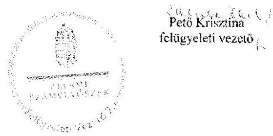

---

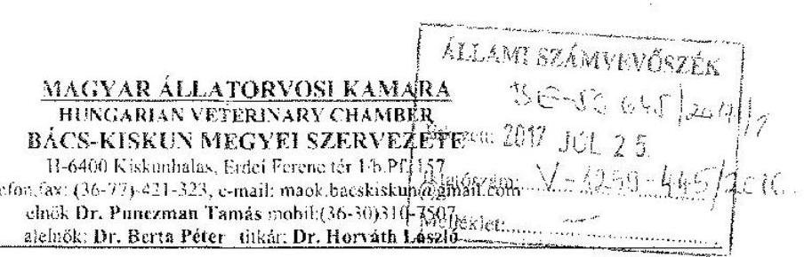

Iksz: 81-1/2017.
Tárgy: Ellenőrzés megállapítására tett észrevétel.

Állami Számvevőszék
Budapest, Apáczai Csere János u. 10.
Domokos László úr
elnök

# Tisztelt Elnök Úr! 

A V-1259-415/2016. iktatószámú levélre válaszolva megköszönöm Elnök Úrnak és az ellenőrzésben részt vett munkatársainak, köztestületünk ellenőrzése során végzett alapos munkáját. Nagy segítséget jelentenek számunkra mindazon megállapítások, melyek további munkánk törvényes és szakszerű végzésében segítenek.
Ellentmondást vélek felfedezni a jelentéstervezetben, miután minden megyei szervezet önálló jogi személy, a nem nyilvános, jelentéstervezet miért tartalmazza valamennyi önálló jogi személy egységes ellenőrzési észrevételeit.
Az én jogi megítélésem szerint a jelentéstervezetet minden megyei szervezet számára külön kellett volna megadni. Amennyiben a szervezetek előzetesen hozzájárultak volna a nem nyilvános jelentéstervezet megküldéséhez, egymás hibáinak előzetes feltárásához, úgy nem sérült volna az általam kifogásolt jogi etikai elv.

A Bács-Kiskun megyei Állatorvosi Kamara vizsgálata során feltárt szabálytalanságok minden esetben a Számviteli törvény különböző számú paragrafusait sértették.
A MÁOK Bács-Kiskun megyei Szervezete könyvelő irodával könyveltet. A könyvelő iroda számára elküldtem az ellenőrzés megállapításait. Azokra a megadott határidőre választ nem kaptam a nyári szabadságolások miatt, így azokról szakmai észrevételt tenni nem tudok.

Kiskunhalas, 2017. július 18.
Tisztelettel:
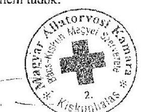

Dr. Punczman Tamás
MÁOK Bács-Kiskun Megyei Szervezet
elnöke

---

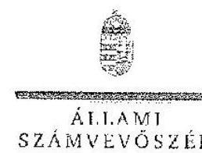

ELMOK

# Dr. Punczman Tamás úr 

elnök
Magyar Állatorvosi Kamara
Bács-Kiskun Megyei Szervezete

## Kiskunhalas

## Tisztelt Elnök Úr!

A „Köztestületek ellenőrzése - Magyar Állatorvosi Kamara" címmel készített számvevőszéki jelentéstervezetre tett észrevételét köszönettel megkaptam.
Az Állami Számvevőszék észrevételre vonatkozó álláspontjáról a felügyeleti vezető által készített részletes tájékoztatást csatoltan megküldöm.
Tájékoztatom Elnök urat, hogy a számvevőszéki jelentésben - az Állami Számvevőszékről szóló 2011. évi LXVI. törvény 29. § (3) bekezdése alapján - a figyelembe nem vett észrevételeket szerepeltetjük az elutasítás indokának feltüntetésével.

Budapest, 2017. 08 hó 24. nap
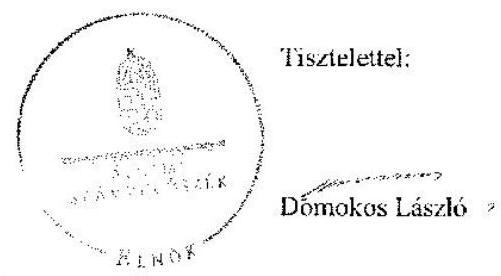

Melléklet: Tájékoztatás az el nem fogadott észrevételekről

---

# Tájékoztatás az el nem fogadott észrevételekről 

A "Köztestületek ellenőrzése - Magyar Állatorvosi Kamara" című jelentéstervezetre az 81-1/2017. iktatószámú levélben tett észrevételeit áttekintettem.

Észrevételeinek kezeléséről az alábbi tájékoztatást adom.

## 1. Észrevétel 2. és 3. bekezdéséhez kapcsolódóan

Észrevételében azt kifogásolta, hogy a jelentéstervezet miért tartalmazza valamennyi önálló jogi személyre vonatkozóan az ellenőrzés megállapításait, mert véleménye szerint minden megyei szervezet számára azt külön kellett volna megküldeni, hogy egymás hibáinak előzetes feltárásáról ne értesüljenek. Észrevétele a következő indokok alapján nem fogadható el. Az ellenőrzés jogalapját az Állami Számvevőszékről szóló 2011. évi LXVI. törvény 5. § (3) bekezdése biztosította, amely szerint az Állami Számvevőszék (továbbiakban: ÁSZ) az államháztartásból származó források felhasználásának keretében ellenőrzi az államháztartásból nyújtott támogatás felhasználását a köztestületeknél. Amennyiben a kezdeményezett szervezet az államháztartásból támogatásban részesül gazdálkodási tevékenységének egésze ellenőrizhető. Az ÁSZ a Magyar Állatorvosi Kamara (továbbiakban: Kamara) gazdálkodását ellenőrizte a 2013-2015. évekre vonatkozóan. Az észrevételezésre megküldött jelentéstervezet 11. oldala tartalmazza az ellenőrzött szervezetek megnevezését, ahol a köztestület, a Magyar Állatorvosi Kamara került feltüntetésre. A Magyar Állatorvosi Kamaráról, valamint az állatorvosi szolgáltatói tevékenység végzéséről szóló 2012. évi CXXVII. törvény 1. § (2) bekezdése alapján a Kamara feladatait területi szervezetei és az országos szervezete útján látja el. Ennek megfelelően tartalmazta az észrevételezésre megküldött jelentéstervezet a Magyar Állatorvosi Kamarára, mint köztestületre vonatkozó ellenőrzési megállapításokat. Észrevétele az előzőekben leírtak alapján a jelentéstervezetet nem módosítja.

## 2. Észrevétel 4. és 5. bekezdéséhez kapcsolódóan

Tájékoztatása alapján a feltárt szabálytalanságokkal kapcsolatosan nem kíván észrevételt tenni, amelyet tudomásul vettünk.

Budapest, 2017.
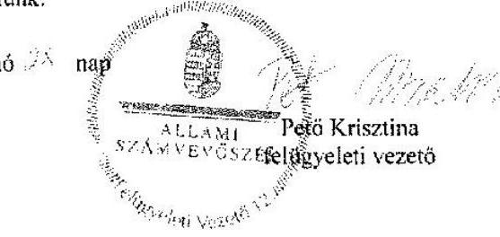

---

# MAGYAR ÁLLATORVOSI KAMARA HUNGARIAN VETERINARY CHAMBER FEJÉR MEGYEI SZERVEZETE 8000 Székesfehérvár, Homoksor 7   Tel.: (36-22)516401, Fax: (36-22)516416, e-mail: info2@mavetfejer.hu elnök/president: Dr. Lorászkó Gábor   alelnök/vice president: Dr. Somogyi Rita titkár/secretary: Dr. Múré Attila 

## Állami Számvevőszék

Budapest
Apáczai Csere János u. 16
1052
Tárgy: Észrevétel Számvevőszéki jelentéstervezettel kapcsolatosan

## Tisztelt Számvevőszék!

V-1259-419/2016-os iktatószámú levelükkel megkaptuk a Köztestületek Ellenőrzése Magyar Állatorvosi Kamara 2017 elnevezésű vizsgálatuk jelentéstervezetét. A jelentéstervezet 7 pontban említi a Fejér megyei szervezetet. Jelen levélben ezekkel a megállapításokkal kapcsolatosan az alábbi észrevételeket tesszük:

- Számviteli politika módosítására vonatkozó jogszabályi előírás be nem tartása; azon okból marasztaltak el minket, mert feltüntettük a jelentős és nem jelentős hiba mértékét, illetve a megbízható és valós összképet befolyásoló hibát, amit 2013-tól már nem szabályoz a számviteli törvény. Ez valóban így van, viszont a számviteli politika célja a törvényi megfelelés biztosítása mellett, hogy a szervezet felállítsa a saját számviteli rendszerének a szabályozását, amely lehet szigorúbb a központi szabályozásnál, illetve tartalmazhat plusz előírásokat. Ezen oknál vezérelve döntöttünk ezeknek a fogalmaknak saját magunk számára való megtartása mellett, mivel ezzel továbbra is tudunk korlátozó mutatószámokat biztosítani a könyvvezetés során. Kérjük, hogy ez alapján ezt a megállapítást legyenek szívesek felülvizsgálni.
(1.1.sz. megállapítás, III.sz. melléklet 3.sora)
- Eredmény kimutatás nem megfelelő formátuma: az általunk használt eredmény kimutatás tartalmaz minden bevétel, költség és eredménykategóriát, amely szerepel a számviteli törvényben. Ez a formátum lehetővé teszi, hogy a szervezet működésének gazdaságosságáról valós képet lehessen kapni. Az alaptevékenység és a vállalkozási tevékenység (ez utóbbi jelenleg nincs a Kamaránknál) elkülönített oszlopokban való szerepeltetése is indokolt, mivel ha valamely vállalkozási tevékenységbe kezdene szervezetünk, akkor annak bevétel és költség vonzatait el kell tudjuk választani az alaptevékenység eredményétől. A beszámolót nem vagyunk kötelesek letétbe helyezni vagy elektronikusan közzétenni (tagok és ellenőrző szervek részére kell biztosítani a nyilvánosságot), emiatt is tartjuk ezt a formátumot elfogadhatónak. Természetesen jövőben a jelentéstervezet által kért eredmény kimutatást fogjuk használni, viszont kérjük a vizsgált időszakra vonatkozó elmarasztalás visszavonását.
(1.2.sz. megállapítás, III.sz. melléklet 8. sora)
- Eszközöket leltározással nem egyeztettük: a vizsgált időszakban 4db tárgyi eszközzel rendelkeztünk, amelyek napi használatban voltak, ez az eszköz szám nem indokolta az évenkénti tételes leltárt. A 3 éves periódusban egyszer végeztük ezt el (vizsgálat során ez becsatolásra került). A főkönyvi és analitikus nyilvántartás egyeztetése minden évi könyvviteli zárlatnál megtörtént. Ezen elmarasztalással ezek alapján nem értünk egyet.
(1.2.sz.megállapítás, III.sz. melléklet 9. sora)
- Elnök/Alelnök nem végezte el az utalványozást: minden számlán szerepelt az utalványozás, utalványozó bélyegző révén, amely (Utalványozta: Dr.Lorászkó Gábor felirattal) a kamarai

---

Elnök személyes kezelésében van. A bélyegző használata egyszerűbbé és korszerűbbé teszi az utalványozást.
(1.3.sz. megállapítás, III.sz. melléklet 17.sora)

- 150 napos késésről nem hozott etikai vétséget megállapító határozatot az etikai bizottság: ezt a megállapítást elfogadjuk és a jövőben kiemelt figyelmet fordítunk ennek a szabálynak a betartására, etikai bizottság ügyrendjében is fogjuk szerepeltetni ezt a feladatot.
(1.4.sz.megállapítás, III.sz melléklet 18.sora)
- 2015.évi támogatást, amelyet 2016-ban utaltak ki nekünk nem aktív időbeli elhatárolásként, hanem vevőkövetelésként mutattuk ki 2015.12.31-én: az országos Kamara kérésére számlát állítottunk ki 2015. decemberi teljesítéssel, állami feladatok ellátása jogcímmel. A támogatást 2015.évre elszámoltuk bevételként, mivel számla került róla kiállításra így a 9-es számla osztályal szemben nem aktív időbeli elhatárolásként, hanem vevőkövetelésként könyveltük. Abban az esetben kellett volna aktív időbeli elhatárolásként nyilvántartanunk, ha nem kerül sor számla kiállításra.
(2.1.sz megállapítás, IV.sz. melléklet 2.sora)
- Támogatások elszámolására benyújtott bizonylatok nem felelnek meg az alaki és tartalmi követelményeknek: utalványozva és záradékolva vannak a számlák (korábban leírt utalványozó bélyegző révén végeztük az utalványozást) (2.2.sz. megállapítás, IV.sz. melléklet 4.sora)

Kérjük fenti észrevételeink figyelembe vételét a végleges jelentésben. Köszönjük az együttműködésüket!

Székesfehérvár, 2017. 07. 13.
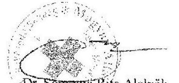

---

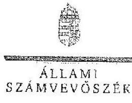

Ikt.szám: V-1250-434/2016.

Dr. Lorászkó Gábor úr
elnök
Magyar Állatorvosi Kamara
Fejér Megyei Szervezete

# Székesfehérvár 

## Tisztelt Elnök Úr!

A „Köztestületek ellenőrzése - Magyar Állatorvosi Kamara" címmel készített számvevőszéki jelentéstervezetre tett észrevételét köszönettel megkaptam.
Az Állami Számvevőszék észrevételre vonatkozó álláspontjáról a felügyeleti vezető által készített részletes tájékoztatást csatoltan megküldöm.
Tájékoztatom Elnök urat, hogy a számvevőszéki jelentésben - az Állami Számvevőszékről szóló 2011. évi LXVI. törvény 29. § (3) bekezdése alapján - a figyelembe nem vett észrevételeket szerepeltetjük az elutasítás indokának feltüntetésével.
Budapest, 2017. 08 hó 02 . nap
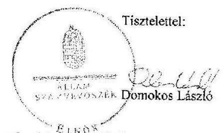

Melléklet: Tájékoztatás az elfogadott és el nem fogadott észrevételekről

---

# Tájékoztatás az elfogadott és el nem fogadott észrevételekről 

A ,,Köztestületek ellenőrzése - Magyar Állatorvosi Kamara" című jelentéstervezetre 2017. július 13-án kelt levélben tett észrevételeit áttekintettem, annak kezeléséről az alábbi tájékoztatást adom.

1. Az 1. programponthoz kapcsolódóan a jelentéstervezet 13. oldal 1.1. sz. megállapítás 4. bekezdésének 2. és 4. mondataira, valamint a III. sz. melléklet 3. sorára tett észrevétele kapcsán

A számviteli politikára vonatkozó megállapításra tett észrevételét részben fogadjuk el. Észrevételében arra hivatkozott, hogy ,,Számviteli politika módosítására vonatkozó jogszabályi előírás be nem tartása: azon okból marasztaltak el minket, mert feltüntettük a jelentős és nem jelentős hiba mértékét, illetve a megbízható és valós összképet befolyásoló hibát, amit 2013-tól már nem szabályoz a számviteli törvény." A dokumentumok ismételt áttekintését követően elfogadjuk a jelentős összegű hibára vonatkozóan tett észrevételét és ezt a számvevőszéki jelentés készítésénél a megállapítás módosításával figyelembe vesszük. Ugyanakkor a dokumentumok ismételt felülvizsgálata alapján a megbízható és valós összképet befolyásoló hibával kapcsolatos megállapításunkat változatlanul fenntartjuk az alábbiakra tekintettel:

A Magyar Állatorvosi Kamara Fejér Megyei Szervezetének - ellenőrzött időszakban hatályos számviteli politikája tartalmazta a számvitelről szóló 2000 . évi C. törvény (továbbiakban: Számv. tv.) 3. § (3) bekezdés 3-5. pontjaira való hivatkozást: „Az Számv. tv. 3. § (3) bekezdés 3-5. pontja tartalmazza a jelentős összegű, a nem jelentős összegű és a megbízható, valós képet lényegesen befolyásoló hiba fogalmát." A Számv. tv. 3. § (3) bekezdés 5. pontját 2013. január 1jétől hatályon kívül helyezték, ennek ellenére a számviteli politika módosítása a törvénymódosítást követően nem történt meg. Ezzel nem tettek eleget a Számv. tv. 14. § (11) bekezdésében előírtaknak, mert a változást a törvénymódosítást követő 90 napon belül nem vezették keresztül a számviteli politikán. Észrevétele e tekintetben a megállapítást nem módosítja.
2. Az 1. programponthoz kapcsolódóan a jelentéstervezet 14. oldal 1.2. sz. megállapítás 3. bekezdésére és a III. sz. melléklet 8. sorára tett észrevétele kapcsán

A jelentéstervezet III. számú melléklet 8. sorára tett észrevétele nem vitatja, hogy az eredménykimutatás nem felelt meg a számviteli törvény szerinti egyes egyéb szervezetek beszámolókészítési és könyvvezetési kötelezettségeinek sajátosságairól szóló 224/2000. (XII. 19.) Korm. rendelet 6. § (6) bekezdésében hivatkozott 5. sz. melléklet szerinti tagolásnak, ezért észrevétele a megállapítást nem módosítja. Köszönettel vettem tájékoztatását, hogy a jövőben a jogszabályi előírásnak megfelelő eredménykimutatást fognak készíteni.

---

3. Az 1. programponthoz kapcsolódóan a jelentéstervezet 15. oldal 1.2. sz. megállapítás 6. bekezdésének 4. mondatára és a III. sz. melléklet 9. sorára tett észrevétele kapcsán

A jelentéstervezet III. számú melléklet 9. sorára tett észrevételét nem fogadjuk el. Észrevételében kiemeli, hogy ,, a vizsgált időszakban 4 db tárgyi eszközzel rendelkeztünk, amelyek napi használatban voltak, ez az eszköz szám nem
 indokolta az évenkénti tételes leltárt. A 3 éves periódusban egyszer végeztük ezt el". A hivatkozott megállapítás azonban nem a tárgyi eszközökre, hanem a mérleg eszközeire vonatkozott. Az ellenőrzés rendelkezésére bocsátott dokumentumok alapján, a Számv. tv. 69. § (4) bekezdésében előírtak, valamint a leltározási szabályzat 4. pontjában foglaltak ellenére egyik évben sem történt meg az eszközökön belül a követelések, pénzeszközök, értékpapírok, továbbá a saját tőke és a kötelezettségek egyeztetéssel történő leltározása. Észrevétele ezért a megállapítást nem módosítja.
4. Az 1. programponthoz kapcsolódóan a jelentéstervezet 15. oldal 1.3. sz. megállapítás 3. bekezdésének utolsó mondatára és a III. sz. melléklet 17. sorára tett észrevétele kapcsán

A jelentéstervezet III. sz. melléklet 17. sorára tett észrevételét a dokumentumok ismételt áttekintését követően nem fogadjuk el. Az utalványozás az ellenőrzött bizonylatokon bélyegző lenyomattal történt. Az utalványozás ezen módja nem felelt meg a Számv. tv. 167. § (1) bekezdés c) pontjában foglaltaknak, mivel az ellenőrzés rendelkezésére bocsátott dokumentumokon az utalványozó aláírása nem szerepelt. Észrevétele ezért a megállapítást nem módosítja.
5. Az 1. programponthoz kapcsolódóan a jelentéstervezet 16. oldal 1.4. sz. megállapítás 2. bekezdésének 2-4. mondataira és a III. sz. melléklet 18. sorára tett észrevétele kapcsán

Észrevétele a megállapítás helytállóságát nem vitatta, hanem elismerte, hogy a Magyar Állatorvosi Kamara Alapszabályában foglaltak ellenére az etikai bizottság a tagdíjhátralék miatt - 150 nap késedelem esetén - nem hozott határozatot az etikai vétségről. Köszönettel vettem tájékoztatását, hogy a jövőben kiemelt figyelmet fordítanak az Alapszabályban foglaltak betartására.
6. Az 2. programponthoz kapcsolódóan a jelentéstervezet 17. oldal 2.1. sz. megállapítás 3. bekezdésére és a IV. sz. melléklet 2. sorára tett észrevétele kapcsán

A jelentéstervezet IV. sz. melléklet 2. sorára tett észrevételében elismeri, hogy a 2015. évi támogatást - amelyet 2016-ban utaltak ki - vevőkövetelésként mutatták ki. A Számv. tv. 29. § (2) bekezdése szerint követelések áruszállításból és szolgáltatásból (vevők) között kell kimutatni a vállalkozó által teljesített- a vevő által elismert - termékértékesítésből, szolgáltatásnyújtásból származó követelést, ugyanakkor a támogatást a Számv. tv. 77. § (2) bekezdés d) pontja szerint egyéb bevételként kell szerepeltetni. A Számv. tv. 32. § (1) bekezdésében foglaltak alapján azonban aktív időbeli elhatárolásként kell a mérlegben kimutatni azt az egyéb bevételt, amely a mérleg fordulónapja után esedékes (az Állami Számvevőszék rendelkezésére bocsátott vevőnyilvántartás szerint a fizetési határidő 2016. február 5.), de a mérleggel lezárt időszakra számolandó el

---

(vevőnyilvántartás szerint a teljesítés 2015. december 30.). Észrevétele ezért a megállapítást nem módosítja.
7. Az 2. programponthoz kapcsolódóan a jelentéstervezet 17. oldal 2.2. sz. megállapítás 3. bekezdésére és a IV. sz. melléklet 4. sorára tett észrevétele kapcsán

A jelentéstervezet IV. sz. melléklet 4. sorára tett észrevételét nem fogadjuk el. A megállapításokat az Állami Számvevőszék rendelkezésére bocsátott dokumentumok alapján ellenőriztük, és ezen dokumentumokra alapozva állapítottuk meg, hogy a támogatás elszámolására benyújtott számviteli bizonylatok a Számv. tv. 167. § (1) bekezdés c) pontjában foglaltak ellenére nem tartalmazták az utalványozó aláírását. Észrevétele ezért a megállapítást nem módosítja.

Budapest, 2017.
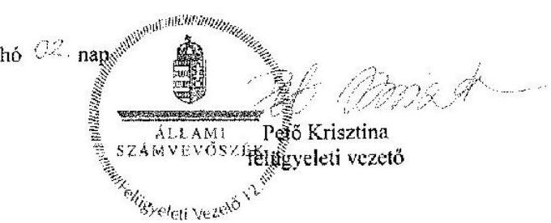

---

# 1246 

## MAGYAR ÁLLATORVOSI KAMARA HUNGARIAN VETERINARY CHAMBER HAJDÚ-BIHAR MEGYEI SZERVEZETE

H=4030 Debrecen, Diószegi u. 30. Tel.: (36-52) 550-775, e-mail: maold@m@outlook.com elnök/president: Dr. Oláh Miklós
alelnök/vice president: Dr. Nagy Etele
titkár/secretary: Dr. Csikos Csaba
iktsz: 6-6/1. 2017.
hiv.szám: V-1269-421/2016.

## Domokos László

elnök
Állami Számvevőszék
1052 Budapest
Apáczai Csere János u. 10.
tárgy: „Köztestületek ellenőrzése - Magyar Állatorvosi Kamara"
című ellenőrzésről készült számvevőszéki jelentéstervezetre észrevétel

Tisztelt Elnök Úr!

A fenti hivatkozási számmal megküldött számvevőszéki jelentéstervezetre, a MÁOK Hajdú-Bihar Megyei Szervezet vonatkozásában, az alábbi észrevételt teszem:

## III. sz. melléklet 1. pontja

Számviteli politika, leltárkészítési és leltározási, értékelési, és pénzkezelési szabályzattal rendelkezünk, melyek az Állami Számvevőszék Elektronikus Adatszolgáltatási Rendszerének a dok1/5 pontjában feltöltésre kerültek.

## III. sz. melléklet 2. pontja

Számlarenddel rendelkezünk, mely az Állami Számvevőszék Elektronikus Adatszolgáltatási Rendszerének dok2/3 pontjában feltöltésre kerül:

## III. sz. melléklet 5. pontja

Az ellenőrzött időszakban az eszközök leltározással, mennyiségi felvétellel, egyeztetésre kerültek. Az arról készült leltárfelvételi ívet másolatban csatoltan megküldök. Állami Számvevőszék Eletronikus Adatszolgáltatási Rendszerének dok9/1 pontjában feltöltésre kerültek a leltározásról készült jegyzőkönyvek.

## III. sz. melléklet 10. pontja

A vevő követelés egyedenkénti értékelését, adósminősítést nem végeztünk. Értékvesztést nem számolunk el, mert minden vevőkövetelés késedelmesen, de hiánytalanul teljesítésre kerül.

---

# III. sz. melléklet 13. pontja 

A tárgyi eszközöknél alkalmazott $14.5 \%$-os leírási kulcs nyilvántartásunk szerint a Tao. Tv. szerint történik. Az ellenőrzés nevezze meg azt a tételt, amelyik szerinte nem felel meg a törvényi előírásoknak.
III. sz. melléklet 15-16. pontja

A gazdálkodási szabályzat nem ad útmutatót a kötelezettségvállalás gyakorlati alkalmazásához. Szervezetünk rendszeres kifizetései szerződés alapján történik, mely szerződések a vizsgált időszak előtt köttetek. A szerződés aláírásával a kötelezettségvállalás is megtörténik. A kisebb összegű (10.000,- Ft alatti) készpénzes kifizetések nem igényelnek írásos kötelezettségvállalást.
III. sz. melléklet 17. pontja

Minden kifizetés utalványozással ellátott.
III. sz. melléklet 18. pontja

Az etikai bizottság nem alkalmazott szankciót a 150 nap késedelmet meghaladó tagdíjhátralékos tagokkal szemben, mert minden érintett fizetési hajlandósága fennállt.
IV. sz. melléklet 2. pontja

A 2015. évre járó támogatást a szervezetünket könyvelő gazdálkodó szervezet valóban nem határolta el, hanem a vevőkövetelések között mutatta ki. Ez nem jelentős hiba, mivel a mérleg főösszegét nem módosítja.

Debrecen, 2017.07.20.
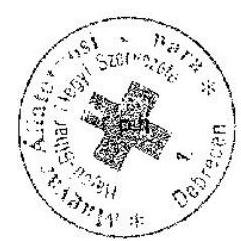

Dr. Oláh Miklós
MÁOK Hajdú-Bihar Megyei Területi Szervezetének
elnöke

---

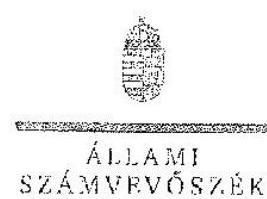

ELKök

Ikt.szám: V-1259-461/2016.

Dr. Oláh Miklós úr
elnök
Magyar Állatorvosi Kamara
Hajdú-Bihar Megyei Szervezete

# Debrecen 

## Tisztelt Elnök Úr!

A ,"Köztestületek ellenőrzése - Magyar Állatorvosi Kamara" címmel készített számvevőszéki jelentőstervezetre tett észrevételeit köszönettel megkaptam.
Az Állami Számvevőszék észrevételekre vonatkozó álláspontjáról a felügyeleti vezető által készített részletes tájékoztatást csatoltan megküldöm.

Tájékoztatom Elnök urat, hogy a számvevőszéki jelentésben - az Állami Számvevőszékről szóló 2011. évi LXVI. törvény 29. § (3) bekezdése alapján - a figyelembe nem vett észrevételeket feltüntetjük, annak indoklásával, hogy azokat az Állami Számvevőszék miért nem fogadta el.

Budapest, 2017. 06 hó 17 nap
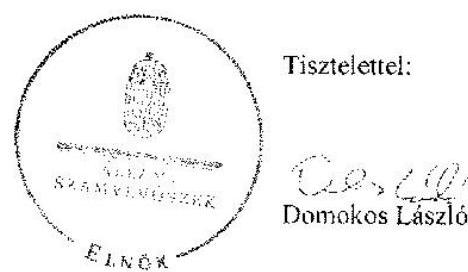

Melléklet: Tájékoztatás az el nem fogadott észrevételekről

---

# Tájékoztatás az el nem fogadott észrevételekről 

A „Köztestületek ellenőrzése - Magyar Állatorvosi Kamara" című jelentéstervezetre a 2017. július 20-án kelt, 6-6/1. / 2017. ikt. számú levélben tett észrevételeit áttekintettem, azok kezeléséről az alábbi tájékoztatást adom.

## 1. A III. sz. melléklet 1. pontjához fűzött észrevétel kapcsán

Az észrevétel szerint a Magyar Állatorvosi Kamara (továbbiakban: Kamara) Hajdú-Bihar Megyei Szervezete rendelkezett számviteli politikával, leltárkészítési és leltározási, értékelési, valamint pénzkezelési szabályzattal, amelyet az Állami Számvevőszék rendelkezésére bocsátott.
Az Állami Számvevőszék rendelkezésére bocsátott számviteli politika, pénzkezelési szabályzat, értékelési szabályzat, valamint a leltárkészítési és leltározási szabályzat első oldalán rögzítésre került, hogy azok a Hajdú-Bihar Megyei Szervezet elnökének jóváhagyásával lépnek hatályba, azonban a szabályzatok utolsó oldala az elnök neve és beosztása felett nem tartalmazta a jóváhagyást jelentő aláírását, annak ellenére, hogy a szabályzatok szerint azok , folyamatos karbantartása és módosítása" az elnök hatáskörét képezi, valamint a számvitelről szóló 2000 . évi C. törvény (továbbiakban: Számv. tv.) 14. § (12) bekezdése szerint a számviteli politika elkészítéséért, módosításáért a gazdálkodó képviseletére jogosult személy a felelős. Az elnöki aláírás hiányában az Állami Számvevőszék nem tekintette azokat érvényes dokumentumoknak. Erre tekintettel az észrevételt nem fogadjuk el, a jelentéstervezet módosítása nem indokolt.

## 2. A III. sz. melléklet 2. pontjához fűzött észrevétel kapcsán

Az észrevétel szerint a Kamara Hajdú-Bihar Megyei Szervezete rendelkezett számlarenddel, amelyet az Állami Számvevőszék rendelkezésére bocsátott.
Az Állami Számvevőszék rendelkezésére bocsátott számlarend utolsó oldala az elnök neve és beosztása felett nem tartalmazta az elnöki aláírását, annak ellenére, hogy a Számv. tv. 161. § (4) bekezdése szerint a számlarend összeállításáért, annak folyamatos karbantartásáért a gazdálkodó képviseletére jogosult személy a felelős. Az elnöki aláírás hiányában az Állami Számvevőszék nem tekintette azt érvényes dokumentumnak. Erre tekintettel az észrevételt nem fogadjuk el, a jelentéstervezet módosítása nem indokolt.

## 3. A III. sz. melléklet 9. pontjához fűzött észrevétel kapcsán

Az észrevétel arra vonatkozott, hogy az ellenőrzött időszakban a leltározás megtörtént, az erről készült leltárfelvételi ívet másolatban csatoltan megküldik, a leltározásról készült jegyzőkönyveket pedig az Állami Számvevőszék rendelkezésére bocsátották.

---

A 2017. február 15-én kelt teljességi és hitelességi nyilatkozat szerint az Állami Számvevőszék rendelkezésére bocsátott dokumentumok, adatok megbízhatóak, és a bekért adatokra, dokumentumokra vonatkozóan teljes körű információt adnak, valamint dr. Oláh Miklós elnök a nyilatkozatban felelősséget vállalt a rendelkezésre bocsátott dokumentumok, adatok hiánytalanságáért. Továbbá az észrevételeket tartalmazó levél csatolmányt (leltári felvételi ívet) nem tartalmazott. Az észrevétel alapján a rendelkezésre bocsátott dokumentumokat - beleértve az észrevételben hivatkozott leltározási jegyzőkönyveket - ismételten áttekintettük. A leltározási jegyzőkönyvek - a mennyiség feltüntetése hiányában - nem támasztják alá a tárgyi eszközök mennyiségi felvétellel történő leltározásának tényleges megtörténtét. Továbbá a leltárnak -. a Számv. tv. 69. § (1) bekezdése szerint - mennyiségben és értékben minden eszközt és forrást tételesen, ellenőrizhető módon kell tartalmaznia. A leltározási jegyzőkönyvek nem tartalmazzák az eszközök közül a befektetett pénzügyi eszközöket és a bankszámlán lévő pénzeszközöket, a források közül a saját tőkét. A tárgyi eszközök mennyiségi felvétellel történő, valamint az eszközökön belül a befektetett pénzügyi eszközök, bankszámlán lévő pénzeszközök, továbbá a saját tőke (mint forrás) egyeztetéssel történő leltározásának elvégzését kétséget kizáróan bizonyító dokumentum hiányában a mérleg szabályszerű leltárral nem volt alátámasztott, amelyre tekintettel az észrevételt nem fogadjuk el, a jelentéstervezet módosítása nem indokolt.

# 4. A III. sz. melléklet 10. pontjához fűzött észrevétel kapcsán 

Az észrevétel arra vonatkozott, hogy a vevő követelés egyedenkénti értékelését, adósminősítést nem végeztek, értékvesztést nem számoltak el, mert minden vevőkövetelés késedelmesen, de hiánytalanul teljesítésre került.
Az észrevétel a késedelembe esést, és azt, hogy a minősítést nem végezték el, nem vitatta. A Számv. tv. 55. § (1) bekezdése szerint az értékvesztést minősítés alapján kell elszámolni. Minősítés hiányában megalapozottan nem állapítható meg, hogy kell-e értékvesztést elszámolni. Továbbá az értékvesztést előre, a követelés várhatóan megtérülő összegére (tervadat) szükséges meghatározni, nem pedig utólag, a már ténylegesen ismert összegre (tényadat). A fentiekre tekintettel az észrevételt nem fogadjuk el, a jelentéstervezet módosítása nem indokolt.

## 5. A III. sz. melléklet 13. pontjához fűzött észrevétel kapcsán

Az észrevétel arra vonatkozott, hogy a tárgyi eszközöknél alkalmazott 14,5\%-os leírási kulcs a társasági adóról és az osztalékadóról szóló 1996. évi LXXXI. törvény (továbbiakban: Tao tv.) szerint történik. Az ellenőrzés nevezze meg azt a tételt, amely nem felel meg.
A Számv. tv. 52. § (1) bekezdése szerint a tárgyi eszközöknek a hasznos élettartam végén várható maradványértékkel csökkentett bekerülési értékét azokra az évekre kell felosztani, amelyekben ezeket az eszközöket előreláthatóan használni fogják (értékcsökkenés elszámolása). A Tao tv. 2. számú melléklet IV. fejezetének c) pontja szerinti 14,5\%-os értékcsökkenés megközelítőleg hét éves hasznos élettartamot jelent. Amennyiben tárgyi eszköz esetében rövidebb időben (pl. három vagy
 ennél kevesebb évben) határozzák meg a hasznos élettartamot (és ez idő alatt le is írják azt), az a $14,5 \%$-nál magasabb (három év esetén $33,33 \%$-os, két év esetén $50 \%$-os, stb.) értékcsökkenési leírást jelent, a Tao tv. szerinti $14,5 \%$-kal szemben. Figyelemmel arra, hogy a

---

jogszabályi előírásoknak nemcsak egyes vagy o mintatételek, hanem valamennyi tárgyi eszköz esetében érvényesülnie kell, a jelentéstervezet nem nevesíti konkrétan az egyes tételeket, hanem az Ellenőrzés köre és módszerei című részben foglaltak szerint értékeli azokat. Erre tekintettel az észrevételt nem fogadjuk el, a jelentéstervezet módosítása nem indokolt.

# 6. A III. sz. melléklet 15-16. pontjaihoz fűzött észrevétel kapcsán 

Az észrevétel azt tartalmazza, hogy a gazdálkodási szabályzat nem ad útmutatót a kötelezettségvállalás gyakorlati alkalmazásához. A rendszeres kifizetések az ellenőrzött időszakot megelőzően kötött szerződések alapján történnek, amelyek aláírásával a kötelezettségvállalás is megtörténik. A 10.000 ,-Ft alatti, kisebb összegű készpénzes kifizetések nem igényelnek írásos kötelezettségvállalást.
A Kamara alapszabályának mellékletét képező gazdálkodási szabályzat 1/8. pontja szerint a kötelezettségvállalás csak írásban történhet. A gazdálkodási szabályzat ez alól a kisösszegű kifizetésekre vonatkozóan kivételt nem tartalmaz, amelyre tekintettel valamennyi kötelezettségvállalásnak írásban szükséges megtörténnie. Erre tekintettel az észrevételt nem fogadjuk el, a jelentéstervezet módosítása nem indokolt.

## 7. A III. sz. melléklet 17. pontjához fűzött észrevétel kapcsán

Az észrevétel szerint minden kifizetés utalványozással ellátott.
A Kamara alapszabályának mellékletét képező gazdálkodási szabályzat 1/8. pontja szerint az utalványozás csak írásban történhet. A 2017. február 15-én kelt teljességi és hitelességi nyilatkozat szerint az Állami Számvevőszék rendelkezésére bocsátott dokumentumok, adatok megbízhatóak, és a bekért adatokra, dokumentumokra vonatkozóan teljes körű információt adnak, valamint dr. Oláh Miklós elnök a nyilatkozatban felelősséget vállalt a rendelkezésre bocsátott dokumentumok, adatok hiánytalanságáért. Figyelemmel arra, hogy az utalványozás elvégzését kétséget kizáróan bizonyító dokumentum nem került az Állami Számvevőszék részére megküldésre, az észrevételt nem fogadjuk el, a jelentéstervezet módosítása nem indokolt.

## 8. A III. sz. melléklet 18. pontjához fűzött észrevétel kapcsán

Az észrevétel szerint az etikai bizottság nem alkalmazott szankciót a 150 nap késedelmet meghaladó tagdíjhátralékos tagokkal szemben, mert minden érintett fizetési hajlandósága fennállt.
A Kamara alapszabályának 21. § (11)-(12) bekezdései előírják, hogy 45 napot meghaladó fizetési késedelem esetében fizetési felszólítást kell küldeni a késedelembe eső kamarai tagnak, azonban ha a fizetési felszólítások nem vezetnek eredményre, és ezáltal 150 napot meghaladó késedelembe esik a kamarai tag, az már - az alapszabály erejénél fogva, és nem az etikai bizottság döntése alapján - etikai vétségnek minősül. Ebben az esetben az etikai bizottságnak (tárgyalás tartása nélkül) határozatot kell hoznia, a fizetési hajlandóságra tekintet nélkül. Figyelembe véve azonban, hogy a számvevőszéki megállapítás nem szankció alkalmazásának elmaradására, hanem határozat meghozatalának elmulasztására vonatkozott, az észrevétel a megállapítást nem vitatja, amelyre tekintettel azt nem fogadjuk el, a jelentéstervezet módosítása nem indokolt.

---

# 9. A IV. sz. melléklet 2. pontjához fűzött észrevétel kapcsán 

Az észrevétel szerint a 2015. évre járó támogatás valóban nem került elhatárolásra, hanem a vevőkövetelések között mutatták ki, de ez nem jelentős hiba, mert a mérleg főösszegét nem módosítja.
Az észrevétel a megállapítást nem vitatta, amelyre tekintettel azt nem fogadjuk el, a jelentéstervezet módosítása nem indokolt.

Budapest, 2017.
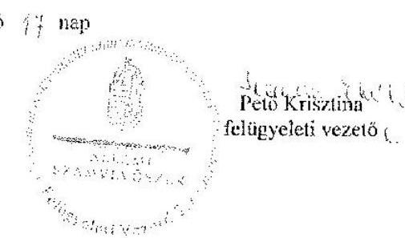

---

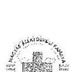

# MAGYAR ÁLLATORVOSI KAMARA HUNGARIAN VETERINARY CHAMBER HEVES MEGYEI SZERVEZETE 

H-3300, Eger, Szövetkezet u. 4. sz. e-mail: fejesres.ezerf@t-online.hu; farkas.eva@musl1.hu
elnök/president: Dr. Fejér Barnáné Dr. Varga Éva
alelnök/vice president: Dr. Kecskésné Dr.
titkár/secretary: Dr. Farkas László
Takács Ildikó

Ikt.szám: 9/2017

Domokos László Úr
elnök
Állami Számvevőszék
Budapest

Tárgy: Észrevételek a 2017.07.04-én kelt V-1259-422/2016 ikt. számú ÁSZ jelentéstervezethez

Tisztelt Elnök Úr!

Az ÁSZ ellenőrzési jegyzőkönyv tervezetében megfogalmazott megállapítások a Magyar Állatorvosi Kamara (továbbiakban MÁOK) Heves Megyei Szervezete tekintetében több ponton valótlan, hamis állításokat, illetve pontatlanságokat tartalmaznak.

1.  A MÁOK Heves Megyei Szervezete a támogatások elszámolásához minden évben benyújtott minden alapbizonylatot záradékkal látott el. Az alapbizonylatok záradékkal ellátott másolata a MÁOK Országos Szervezeténél is megtalálható, a 2013. és 2014. évi alapbizonylatokon piros és kék tollal szerepel a MÁOK Országos Szervezete által előzetesen megküldött záradék szövege. Az ÁSZ állítását cáfolni tudja a MÁOK Országos Szervezete is, aki a nem szabályszerűen, záradék nélküli bizonylatokat be sem fogadta volna a támogatás igényléséhez. Minden évben a MÁOK Elnöke előzetesen minden szervezet figyelmét felhívta, hogy csak szabályosan kiállított, záradékkal ellátott bizonylat küldhető be. Az alapbizonylatok a helyszíni ellenőrzéskor is a vizsgálatot végző ellenőrök rendelkezésére álltak, ezért a jegyzőkönyvi megállapítás nem fedi a valóságot. A jelentés tervezet elolvasásakor ismételten meggyőződtem róla, hogy a támogatás terhére elszámolt eredeti bizonylatokon szerepel a záradék szövege.
2.  A vizsgálati jegyzőkönyv azt rögzíti, hogy a MÁOK Heves Megyei Szervezeténél nem történt utalványozás. Ez a megállapítás nem, illetve csak részben felel meg a valóságnak.
A MÁOK Heves Megyei Szervezetének elnöke mindig nagyon figyelt arra, hogy a közgyűlés által elfogadott éves költségvetési tervhez képest a tényleges kiadások ne haladják sem költség nemenként, sem összességében a tervezett kiadásokat. Ez minden évben így is történt.

A MÁOK Heves Megyei Szervezetének elnöke (mint utalványozásra jogosult) a bér jellegű kiadásokat az alapbizonylatokon utalványozta, a kamara éves kiadásainak $90 \%$ a bankon keresztül került kifizetésre, ahol a kifizetés engedélyezése kizárólag az elnök aláírásával történt. A kamarai

---

továbbképzésekhez kapcsolódó kifizetésekhez tartozó szerződéseket a MÁOK Heves Megyei Szervezetének elnöke írta alá, tehát a szerződés aláírásával illetve a teljesítést követően a kifizetés engedélyezésével (csekkmegbízás elnök általi kiállításával, aláírásával) az utalványozás megvalósult. Jogszabály tudtommal nem ír elő olyan szabályt, hogy az utalványozás az alapbizonylaton nem történhet, annak minden esetben külön bizonylaton kell történni.

Néhány pénztár bizonylaton valóban csak 2 helyen (pénztáros, kiállító) és nem 3 helyen szerepel az elnök aláírása, azonban ezeknek a bizonylatoknak a többsége (posta költség, fénymásoló papír) 5 e Ft alatti tétel. A bizonylat hitelességét, úgy vélem nem befolyásolja, hogy az adott bizonylaton az érintett személynek az aláírása 2 szer vagy 3-szor szerepel, különösen a kisösszegű kifizetéseknél.
Az ügyelet szervezés díjának, a megbízási díj kifizetéséhez szerződés és taggyűlési határozat tartozik, amely a vizsgálat részére bemutatásra került, kifizetésük általában bankból, néha pénztárból történt. Az éves pénztári forgalom nem több két oldalnál, és összege a bér és ügyeleti díj nélkül nem éri el évente a $100-150$ e Ft-ot.
3.  A MÁOK Heves Megyei Szervezetének elnöke és vezetősége nagy figyelmet fordít arra, hogy a tagokkal szembeni követelései minél előbb kifizetésre kerüljenek. A helyszíni ellenőrzés alkalmával is jeleztük a vizsgálatot folytató ellenőrök felé, hogy a tagokkal évente többször, általában e-mail-ben egyeztetünk a kinnlévőségek összegéről. (erről az ellenőrzés helyszínén több elektronikus levelet is bemutattunk). Minden vezetőségi ülésen, így az éves közgyűlés előtti is személyenként beszéljük át a kinnlévőségek állását, a MÁOK Heves Megyei Szervezetének vezetősége minden taggal egyeztet. Az ÁSZ azon megállapítása, miszerint a vevők egyedi minősítése nem történt meg nem valós megállapítás. A kamarai tagokat a vezetőség személyesen ismeri. A számviteli törvény nem a követelés, hanem az adós minősítését írja elő. A MÁOK Heves Megyei Szervezete nem számolt el értékvesztést, mert úgy ítélte meg a vezetőség, hogy minden kamarai tag a tartozását ki fogja fizetni, ahogy ez minden esetben meg is történt. A késedelmesen fizetőknek késedelmi kamat felszámítására került sor.
Amennyiben értékvesztés elszámolása indokolt lett volna, azt a szöveges értékelésben is bemutatta volna.
4.  A MÁOK Heves Megyei Szervezete a beszámoló készítési kötelezettségének a jogszabályokban leírt adattartalommal tett eleget. A MÁOK Heves Megyei Szervezetének vezetősége az éves taggyűlés előtt minden tagnak egyszerűsített éves beszámolót és szöveges értékelőt küld, amelyből a MÁOK Heves Megyei Szervezetének jogcím szerinti bevétele és kiadása az előző év adataival és a tény számokkal összevetve is látható.
A MÁOK Heves Megyei Szervezete által készített beszámoló adattartalma egyezik a 224/2000. kormányrendeletben leírtakkal, a beszámoló a Civil Portál honlapon bárki által megtekinthető. A beszámoló a bírósági hivatalhoz az előírt nyomtatványon, elektronikus úton is beküldésre került. Az ÁSZ beszámolóra vonatkozó megállapításai nem helytállóak.
5.  A MÁOK Heves Megyei Szervezete a szabályzatait évente felülvizsgálja, mivel az évente változó jogszabályok miatt ez elengedhetetlen. Így több szabályzat 2013 év elején is felülvizsgálatra került.
A szabályzat ismételt áttekintése után megállapítható, hogy a számvitel politikában szabályozott jelentős összegű hiba meghatározása a számviteli törvény 3. pontjával megegyezik. Az ÁSZ megállapításával e miatt nem ért egyet.

Általában a több tízoldalas szabályzatokban több mondatot, meghatározást javítani kell. Én úgy vélem, ha a szabályzatban esetleg egy-két mondat nem kerül kijavításra, vagy törlésre, abból még nem következik az, hogy azt nem dolgozták át, legfeljebb aki azt készítette, vagy átdolgozta nem volt elég figyelmes (Nincs olyan szabályzat, amitől jobbat ne lehetne írni).

A számviteli törvény előírja, hogy amit a gazdálkodó szervezet a saját szabályzatában nem szabályoz, abban az esetben a számviteli törvény és kormányrendelet előírásai szerint kell eljárni. A gazdálkodó

---

szabályzata a törvényi előírásokkal ellentétes nem lehet. A MÁOK Heves Megyei Szervezeténél jelentős összegű hiba feltárására a vizsgált időszakban nem került sor.

Az ÁSZ szabályzatra vonatkozó megállapítása a MÁOK Heves Megyei Szervezetének kimutatott vagyonát, mérleg főösszegét, eredményét nem változtatja meg, a rendszer átláthatóságát nem érinti.
6.  A MÁOK Heves Megyei Szervezetének járó állami támogatásokról a MÁOK Országos Szervezete felé számla került kiállításra, ezért került az összeg az egyéb követelések körön kimutatásra a mérlegben, az időbeli elhatárolások helyett.
Az elszámolási mérlegkor összességiben nem változtatja meg a mérleg főösszeget, illetve a kimutatott vagyon összegét. A kamaránál a hiba és hibahatás együttes összege nem éri el az 1000 e Ft-ot, a hiba nem jelentős. Amennyiben a MÁOK Heves Megyei Szervezete támogatásra jogosult lesz, és annak összegét a mérleg fordulónapig nem, de a mérlegkészítés időpontjáig megkapja, időbeli elhatárolásként fogjuk a mérlegben kimutatni.

Kérem, hogy észrevételeimet a végleges jegyzőkönyv elkészítésénél figyelembe venni szíveskedjenek.

Eger, 2017. július 14.

Tisztelettel :

Dr. Fejér Barnáné Dr. Varga Éva
elnök

---

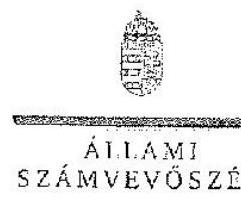

L 1 11 0 K

Ikt.szám: V-1259-440/2016.

Dr. Fejér Barnáné Dr. Varga Éva asszony
elnök
Magyar Állatorvosi Kamara
Heves Megyei Szervezete

Eger

# Tisztelt Elnök Asszony! 

A „Köztestületek ellenőrzése Magyar Állatorvosi Kamara" címmel készített számvevőszéki jelentéstervezetre tett észrevételét köszönettel megkaptam.
Az Állami Számvevőszék észrevételre vonatkozó álláspontjáról a felügyeleti vezető által készített részletes tájékoztatást csatoltan megküldöm.
Tájékoztatom Elnök asszonyt, hogy a számvevőszéki jelentésben - az Állami Számvevőszékről szóló 2011. évi LXVI. törvény 29. § (3) bekezdése alapján - a figyelembe nem vett észrevételeket szerepeltetjük az elutasítás indokának feltüntetésével.

Budapest, 2017. 08 hó 02 nap
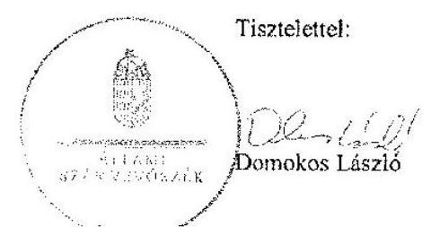

Melléklet: Tájékoztatás az elfogadott és el nem fogadott észrevételekről

---

# Tájékoztatás az elfogadott és el nem fogadott észrevételekről 

A „Köztestületek ellenőrzése - Magyar Állatorvosi Kamara" című jelentéstervezetre 2017. július 14-én kelt 9/2017. iktatószámú levélben tett észrevételeit áttekintettem.
 annak kezeléséről az alábbi tájékoztatást adom.

1. A 2. programponthoz kapcsolódóan a jelentéstervezet 17. oldal 2.2. sz. megállapítás 3. bekezdésére, valamint a IV. sz. melléklet 5. sorára tett észrevétele kapcsán

A költségvetési támogatás elszámolására benyújtott bizonylatok záradékolásával kapcsolatosan tett észrevételét nem fogadjuk el. Észrevételében arra hivatkozik, hogy „a 2013. és 2014. évi alapbizonylatokon piros és kék tollal szerepel a MÁOK Országos Szervezete által előzetesen megküldött záradék szövege", továbbá a „A jelentés tervezet elolvasásakor ismételten meggyőződtem róla, hogy a támogatás terhére elszámolt eredeti bizonylatokon szerepel a záradék szövege." A dokumentumok ismételt felülvizsgálatát követően változatlanul fenntartjuk, hogy az Állami Számvevőszék (továbbiakban: ÁSZ) részére átadott - a 2013-2014. évi támogatások elszámolását alátámasztó - bizonylatok záradékolása nem történt meg. Észrevétele ezért a megállapítást nem módosítja.
2. Az 1. programponthoz kapcsolódóan a jelentéstervezet 15. oldal 1.3. sz. megállapítás 3. bekezdés utolsó mondatára és a III. sz. melléklet 17. sorára tett észrevétele kapcsán

A jelentéstervezet 15. oldal 1.3. számú megállapítás 3. bekezdés utolsó mondatának és a III. sz. melléklet 17. sorának megállapítására tett észrevételét nem fogadjuk el. Az igénybe vett és egyéb szolgáltatások, valamint a személyi jellegű ráfordítások tekintetében a dokumentálás és elszámolás szabályszerűségét mintavétellel kiválasztott mintatételek alapján értékeltük, amelynek sokaságra történő kivetítését a számvevőszéki jelentéstervezet „Az ellenőrzés módszerei" című fejezet részletesen tartalmazza. Az ÁSZ rendelkezésére bocsátott dokumentumok alapján ellenőriztük az utalványozás szabályszerűségét és ezen dokumentumokra alapozva állapítottuk meg, hogy a 2013-2015. években nem végezték el a könyvviteli elszámolást közvetlenül alátámasztó bizonylatokon az utalványozást, így nem tartották be a Számvitelről szóló 2000. évi C. törvény (továbbiakban: Számv. tv.) 167. § (1) bekezdés c) pontjának előírásait.

Észrevételében arra hivatkozott, hogy .. A MÁOK Heves Megyei Szervezetének elnöke (mint utalványozásra jogosult) a bér jellegű kiadásokat, az alapbizonylatokon utalványozta, a kamara éves kiadásainak $90 \%$-a a bankon keresztül került kifizetésre, ahol a kifizetés engedélyezése kizárólag az elnök aláírásával történt. A kamarai továbbképzéshez kapcsolódó kifizetésekhez tartozó szerződéseket a MÁOK Heves Megyei Szervezetének elnöke írta alá, tehát a szerződés aláírásával illetve a teljesítést követően a kifizetés engedélyezésével (bank megbízás elnök általı kitöltésével,

---

aláírásával) az utalványozás megvalósult." Észrevételét nem fogadjuk el a következőkre tekintettel. A Számv. tv. 167. § (1) bekezdés c) pontja előírja, hogy a könyvviteli elszámolást közvetlenül alátámasztó bizonylat általános alaki és tartalmi kelléke a gazdasági műveletet elrendelő személy vagy szervezet megjelölése, az utalványozó és a rendelkezés végrehajtását igazoló személy, valamint a szervezettől függően az ellenőr aláírása. Az észrevételben hivatkozott szerződés aláírása, valamint a banki megbízások (amelyek az ellenőrzés részére átadásra nem kerültek) nem minősülnek a könyvviteli elszámolást közvetlenül alátámasztó bizonylatnak, ezért észrevétele a megállapítást nem módosítja.
3. Az 1. programponthoz kapcsolódóan a jelentéstervezet 15. oldal 1.2. sz. megállapítás 6. bekezdés 4. mondatára és a III. sz. melléklet 10. sorára tett észrevétele kapcsán

A jelentéstervezet 15. oldal 1.2. számú megállapítás 6. bekezdés 4. mondatára és a III. sz. melléklet 10. sorára tett észrevételét nem fogadjuk el. Az ellenőrzés részére átadott dokumentumok, továbbá a 2017. február 21-én és 2017. március 29-én kelt helyszíni adatbetekintésről szóló jegyzőkönyvek, valamint az Elnök asszony által aláírt teljességi és hitelességi nyilatkozat tartalmának felülvizsgálata alapján a vevőkövetelések egyedenkénti értékelését, valamint a vevő és adós minősítését alátámasztó dokumentumok - az adatszolgáltatásra irányuló közreműködési kötelezettség teljesítése során - nem kerültek benyújtásra.

Észrevételében arról tájékoztatott, hogy ,,A MÁOK Heves Megyei Szervezete nem számolt el értékvesztést, mert úgy ítélte meg a vezetőség, hogy minden kamarai tag a tartozását ki fogja fizetni, ahogy ez minden esetben meg is történt. ... Amennyiben értékvesztés elszámolása indokolt lett volna, azt a szöveges értékelésben is bemutatta volna. "Észrevételét nem fogadjuk el a következőkre tekintettel. A Számv. tv. 55. § (1) bekezdése előírja, hogy a vevő és az adós minősítése alapján az üzleti év mérlegfordulóján fennálló és a mérlegkészítés időpontjáig nem rendezett követelésnél értékvesztést kell elszámolni. A jogszabály a nem rendezett követelések esetében nem lehetőségként, hanem kötelezően határozza meg az értékvesztés elszámolását. Észrevétele ezért a megállapítást nem módosítja.

# 4. Az 1. programponthoz kapcsolódóan a jelentéstervezet 14. oldal 1.2. sz. megállapítás 3. bekezdésére és a III. sz. melléklet 7. sorára tett észrevétele kapcsán 

A beszámoló adattartalmára vonatkozó észrevételét nem fogadjuk el. Az ellenőrzés részére átadott dokumentumok ismételt felülvizsgálatát követően változatlanul fenntartjuk, hogy az egyszerűsített éves beszámoló adattartalma nem felelt meg a számviteli törvény szerinti egyes egyéb szervezetek beszámolókészítési és könyvvezetési kötelezettségeinek sajátosságairól szóló 224/2000. (XII. 19.) Korm. rendelet 6. § (6) bekezdésében hivatkozott 4. sz. melléklet szerinti tagolásnak, ezért észrevétele a megállapítást nem módosítja.

---

5. Az 1. programponthoz kapcsolódóan a jelentéstervezet 13. oldal 1.1. sz. megállapítás 4. bekezdés 2-4. mondatára és a III. sz. melléklet 3. sorára tett észrevétele kapcsán

A számviteli politikára vonatkozó megállapításra tett észrevételében arra hivatkozott, hogy ,,A szabályzat ismételt áttekintése után megállapítható, hogy a számviteli politikában szabályozott jelentős összegű hiba meghatározása a számviteli törvény 3. pontjával megegyezik." A dokumentumok ismételt áttekintését követően elfogadjuk a jelentés összegű hibára vonatkozóan tett észrevételét és ezt a számvevőszéki jelentés készítésénél a megállapítás módosításával figyelembe vesszük. A megbízható és valós összképet befolyásoló hibával kapcsolatos megállapításunkat észrevételében nem cáfolta, e vonatkozásban a dokumentumok ismételt felülvizsgálata alapján a jelentéstervezetben szereplő megállapítást változatlanul fenntartjuk, az alábbiakra tekintettel:

A Magyar Állatorvosi Kamara Heves Megyei Szervezetének - ellenőrzött időszakban hatályos - számviteli politikája tartalmazta, hogy ,,A szervezet számviteli politikáját a számvitelről szóló 2000. évi C. törvény, valamint a számviteli törvény szerinti egyes egyéb szervezetek beszámolókészítési és könyvvezetési kötelezettségeinek sajátosságairól szóló 224/2000. (XII. 19.) Kormányrendelet alapján készítettük el. "A Számv. tv. 3. § (3) bekezdés 5. pontját 2013. január 1-jétől hatályon kívül helyezték, ennek ellenére a számviteli politika erre vonatkozó részeit nem módosították. Ezzel nem tettek eleget a Számv. tv. 14. § (11) bekezdésében előírtaknak, mert a változást a törvénymódosítást követő 90 napon belül nem vezették keresztül a számviteli politikán. Észrevétele e tekintetben a megállapítást nem módosítja.
6. A 2. programponthoz kapcsolódóan a jelentéstervezet 17. oldal 2.1. sz. megállapítás 3. bekezdésére és a IV. sz. melléklet 2. sorára tett észrevétele kapcsán

A jelentéstervezet 2.1. számú megállapítás 3. bekezdésére és a IV. sz. melléklet 2. sorára tett észrevétele megerősíti a megállapításban foglaltakat, hogy ,, a MÁOK Heves Megyei Szervezetének járó állami támogatásokról a MÁOK Országos Szervezete felé számla került kiállításra, ezért került az összeg az egyéb követelések között kimutatásra a mérlegben, az időbeli elhatárolások helyett.", amely nem felel meg a Számv. tv. 32. § (1) bekezdésében foglaltaknak. Köszönettel vettem tájékoztatását arra vonatkozóan, hogy a jövőben a támogatást a jogszabályi előírásoknak megfelelően fogják elszámolni. Észrevétele ezért a megállapítást nem módosítja.

Budapest, 2017.
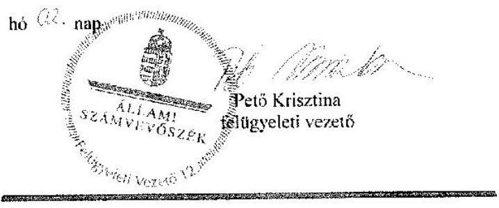

---

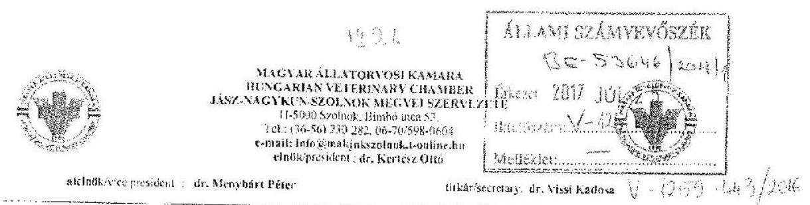

Ikt.sz.: 89/2017.
Hiv.sz.: V-1259-423/2016.

# ÁLLAMI SZÁMVEVŐSZÉK ELNÖKE   Domokos László Úr részére 

Tárgy: Észrevételek az Állami Számvevőszék V-1259-423/2016. ikt. számú tervezetére.

## BUDAPEST

Apáczai Csere János utca 10 .
1052

Tisztelt Elnök Úr!

A MÁOK Jász-Nagykun-Szolnok Megyei Szervezete megkapta az Állami Számvevőszék „köztestületek ellenőrzése - Magyar Állatorvosi Kamara" című ellenőrzésről készült jelentéstervezetet.
Megköszönve az Ász jelentéstervezetében foglalt megyei szervezetünket érintő megállapításait, melyekre a végleges jelentés elkészülte után végrehajtjuk az intézkedési terv alapján a szükséges korrekciókat.

## Észrevételeinket az alábbiakban tesszük meg:

1.1. sz. Megállapítás 4. bekezdés 2. és 4. mondata III. sz. melléklet 5. sora:

A területi szervezet számlarenddel rendelkezett, a számlarend adattartalma megfelelt a számviteli tv. előírásainak, abban kitért a főkönyvi számláknak az analitikus nyilvántartással való kapcsolatára.
A területi szervezet által használt bizonylatok (ki-, bevételi pénztárbizonylatok, számlatömbök) egyéb, a szervezet által készített szabályzatokban szerepelnek.
1.2. sz. Megállapítás 6. bekezdés 4. mondata III. melléklet 9. sora:

A megyei szervezet tulajdonában nincsenek értékkel bíró tárgyi eszközök ( 0 -ra leírtak), továbbá készpénzkészlete minimális nagyságrendű, ezért ezen eszközállományok tételes leltárfelvételét nem tartottuk szükségesnek.

---

1.2. sz. 3. bekezdés és a III. sz. melléklet 7.. 8. sora. továbbá a 4. bekezdés:

A 224/2000/XII.19. sz. Korm. rendelet 6.§. (6) bekezdés 5. számú melléklete a közhasznú szervezetekről rendelkezik. Mivel a területi szervezetünk köztestület, nem közhasznú szervezet, ezért a 7.§. a beszámoló tagolása által előírt 4-5 melléklet nem is készülhetett el. A területi szervezetünk 2013-2014-2015. évekre az egyéb szervezetekre vonatkozó „egyszerűsített éves beszámolót" elkészítette.

A beszámolókat alátámasztó analitikus nyilvántartásokat tartalmazó merevlemez un. „rotavirus" fertőzése miatt megsérült, az anyagok ismételt feldolgozása folyamatban van. A megsérült merevlemez vizsgálatáról kiállított szakvéleményt az ÁSZ vizsgálatkor az ellenőröknek átadtuk
2.2. sz. megállapítás 3. bekezdés IV-es melléklet és 5-ös sora:

A támogatás elszámolására benyújtott számviteli bizonylatokat a szükséges alaki és tartalmi kellékekkel elláttuk és a MÁOK által kért záradékokkal elláttuk.

S z o l n o k, 2017. július 20.
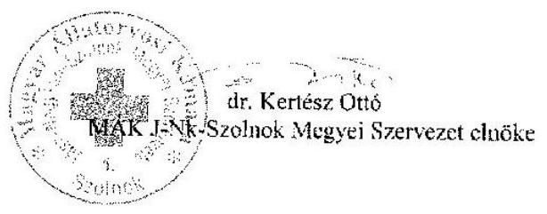

---

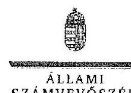

ELNÖK

# Dr. Kertész Ottó úr 

elnök
Magyar Állatorvosi Kamara
Jász-Nagykun-Szolnok Megyei Szervezete

## Szolnok

## Tisztelt Elnök Úr!

A „Köztestületek ellenőrzése - Magyar Állatorvosi Kamara" címmel készített számvevőszéki jelentéstervezetre tett észrevételét köszönettel megkaptam.
Az Állami Számvevőszék észrevételre vonatkozó álláspontjáról a felügyeleti vezető által készített részletes tájékoztatást csatoltan megküldöm.
Tájékoztatom Elnök urat, hogy a számvevőszéki jelentésben - az Állami Számvevőszékről szóló 2011. évi LXVI. törvény 29. § (3) bekezdése alapján - a figyelembe nem vett észrevételeket szerepeltetjük az elutasítás indokának feltüntetésével.

Budapest, 2017. O 8 hó 04 nap
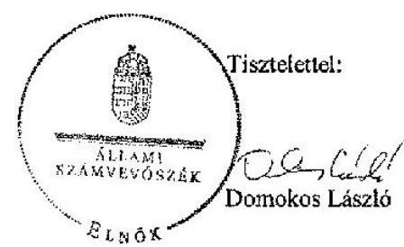

Melléklet: Tájékoztatás az elfogadott és el nem fogadott észrevételekről

---

# Tájékoztatás az elfogadott és el nem fogadott észrevételekről 

A „Köztestületek ellenőrzése - Magyar Állatorvosi Kamara" című jelentéstervezetre 2017. július 20-án kelt 89/2017. iktatószámú levélben tett észrevételeit áttekintettem, annak kezeléséről az alábbi tájékoztatást adom.

1. Az 1. programponthoz kapcsolódóan a jelentéstervezet 13. oldal 1.1. sz. megállapítás 4. bekezdés 2. és 4. mondatára, valamint a III. sz. melléklet 5. sorára tett észrevétele kapcsán

A számlarend tartalmára vonatkozó észrevételét részben fogadjuk el. Észrevételében tájékoztatott, hogy a , ... számlarend adattartalma megfelelt a számviteli tv. előírásainak, abban kitért a főkönyvi számláknak az analitikus nyilvántartással való kapcsolatára. A területi szervezet által használt bizonylatok (ki-, bevételi pénztárbizonylatok, számlatömbök) egyéb, a szervezet által készített szabályzatokban szerepelnek." A dokumentumok ismételt áttekintését követően elfogadjuk a főkönyvi számla és az analitikus nyilvántartás kapcsolatára vonatkozóan tett észrevételét és ezt a számvevőszéki jelentés készítésénél a megállapítás módosításával figyelembe vesszük. Ugyanakkor a dokumentumok ismételt felülvizsgálata alapján a továbbra is fenntartjuk, hogy a Számvitelről szóló 2000. évi C. törvény 161. § (2) bekezdés d) pontjában foglaltak ellenére a számlarend nem tartalmazta a számlarendben foglaltakat alátámasztó bizonylati rendet. Az észrevételében hivatkozott „a területi szervezet által használt bizonylatok" nem szerepeltek az Állami Számvevőszék rendelkezésére bocsátott - leltározási és selejtezési; pénzkezelési; számviteli politika eszközök és források értékelési - szabályzatokban sem. Észrevétele e tekintetben ezért a megállapítást nem módosítja.
2. Az 1. programponthoz kapcsolódóan a jelentéstervezet 15. oldal 1.2. sz. megállapítás 6. bekezdés 4. mondatára és a III. sz. melléklet 9. sorára tett észrevétele kapcsán

A jelentéstervezet III. számú melléklet 9. sorára tett észrevételét nem fogadjuk el. Észrevételében kiemeli, hogy ,,A megyei szervezet tulajdonában nincsenek értékkel bíró tárgyi eszközök (0-ra leírtak), továbbá készpénzkészlete minimális nagyságrendű, ezért ezen eszközállományok tételes leltárfelvételét nem tartottuk szükségesnek." A hivatkozott megállapítás azonban nem csak a tárgyi eszközökre és pénzeszközökre, hanem a mérleg eszközeire vonatkozott.

A 2017. március 7-én kelt, Elnök úr által aláírt helyszíni adatbetekintésről szóló jegyzőkönyv 3. számú melléklete rögzíti, hogy a könyvelési dokumentumok (többek között a mérlegsorokat alátámasztó tételes kimutatások, mérlegtételek év végi értékelésének dokumentumai, a mérlegtételek főkönyvvel és analitikával történő egyeztetését igazoló dokumentumok), valamint a lel-

---

tározással kapcsolatos dokumentumok - az adatszolgáltatásra irányuló közreműködési kötelezettség teljesítése során - nem kerültek átadásra. Észrevétele ezért a megállapítást nem módosítja.
3. Az 1. programponthoz kapcsolódóan a jelentéstervezet 15. oldal 1.2. sz. megállapítás 3. bekezdésre és a III. sz. melléklet 7. és 8. sorára tett észrevétele kapcsán

A beszámoló adattartalmára vonatkozó észrevételét nem fogadjuk el. A számviteli törvény szerinti egyes egyéb szervezetek beszámolókészítési és könyvvezetési kötelezettségeinek sajátosságairól szóló 224/2000. (XII. 19.) Korm. rendelet 6. § (6) bekezdésében foglaltak alapján az egyéb szervezet egyszerűsített éves beszámolója a 4. számú melléklet szerinti mérlegből és az 5. számú melléklet szerinti eredménykimutatásból áll. A dokumentumok ismételt felülvizsgálatát követően változatlanul fenntartjuk, hogy a 2014. és 2015. évi beszámoló mérlegének és eredménykimutatásának adattartalma nem felelt meg a számviteli törvény szerinti egyes egyéb szervezetek beszámolókészítési és könyvvezetési kötelezettségeinek sajátosságairól szóló 224/2000. (XII. 19.) Korm. rendelet 6. § (6) bekezdésében hivatkozott 4. sz. melléklet és 5. sz. melléklet szerinti tagolásnak, ezért észrevétele a megállapítást nem módosítja.

Az észrevétel 2. bekezdése arra vonatkozott, hogy ,, A beszámolókat alátámasztó analitikus nyilvántartásokat tartalmazó merevlemez un ,,rotavirus" fertőzése miatt megsérült, az anyagok ismételt feldolgozása folyamatban van. A megsérült merevlemez vizsgálatáról kiállított szakvéleményt az ÁSZ vizsgálatkor az ellenőröknek átadtuk. " A Számvitelről szóló 2000. évi C. törvény 169. § (1) és (2) bekezdése előírja, hogy:
,,A gazdálkodó az üzleti évről készített beszámolót, az üzleti jelentést, valamint az azokat alátámasztó leltárt, értékelést, főkönyvi kivonatot, továbbá a naplófőkönyvet, vagy más, a törvény követelményeinek megfelelő nyilvántartást olvasható formában legalább 8 évig köteles megőrizni."
,,A könyvviteli elszámolást közvetlenül és közvetetten alátámasztó számviteli bizonylatot (ideértve a főkönyvi számlákat, az analitikus, illetve részletező nyilvántartásokat is), legalább 8 évig kell olvasható formában, a könyvelési feljegyzések hivatkozása alapján visszakereshető módon megőrizni."

A számítógép merevlemezének sérülése nem mentesíti a Magyar Állatorvosi Kamara Jász-Nagy-kun-Szolnok Megyei Szervezetét a Számvitelről szóló 2000. évi C. törvény 169. § (1) és (2) bekezdésében foglaltak betartása alól, ezért az észrevételezésre megküldött jelentéstervezet 1.2. sz. megállapítás 4. bekezdésében szereplő megállapítás helytálló, a jelentéstervezet módosítása nem indokolt.

# 4. A 2. programponthoz kapcsolódóan a jelentéstervezet 17. oldal 2.2. sz. megállapítás 3. bekezdésére és a IV. sz. melléklet 5. sorára tett észrevétele kapcsán 

A jelentéstervezet 2.2. sz. megállapítás 3. bekezdésére és a IV. sz. melléklet 5. sorára tett észrevételét részben fogadjuk el. Az Állami Számvevőszék rendelkezésére bocsátott dokumentumok

---

ismételt felülvizsgálatát követően elfogadjuk, hogy a 2013. és 2015. évi támogatás elszámolására benyújtott bizonylatokat záradékolták, ugyanakkor változatlanul fenntartjuk, hogy a 2014. évi támogatások elszámolását alátámasztó bizonylatok záradékolása a támogatási szerződés 4. pontjában foglaltak ellenére nem történt meg. Észrevételét a számvevőszéki jelentés készítésénél a megállapítás pontosításával figyelembe vesszük.

Budapest, 2017. 03 hó 04 nap

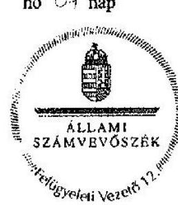

Pető Krisztina
felügyeleti vezető

---

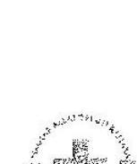

# MAGYAR ÁLLATORVOSI KAMARA HUNGARIAN VETERINARY CHAMBER FŐVÁROSI SZERVEZETE 

H-1078 Budapest VII., István utca 11. fszl. 5. Tel: (36-1)555-2414, Fax: (36-1) 555-2414. e-mail: iroda.fovarosikamara@gmail.com, web: www.bpallatorvos.hu elnök/president: Dr. Pintér Zsolt
alelnök/vice president: Dr. Kaposi Tamás titkár/secretary: Dr. Horváth László
Ikt.az: K/2017/56
Domokos László
elnök
Állami Számvevőszék
Budapest
Tisztelt Elnök Úr!
V-1259-413/2016 ikt. számú 2017.07.04-én kelt észrevételezés céljából megküldött levelét 2017.07.06-án átvettük. Arra az alábbi észrevételeket teszem a MÁOK Fővárosi Szervezete nevében:

A fővárosi szervezetet érintő összegző megállapítások:
„A Magyar Állatorvosi Kamara 2013-2015. évi gazdálkodása nem volt szabályszerű." Ezzel a megállapítással nem értünk egyet, mert véleményünk szerint összességében szabályosan gazdálkodtunk, a felvetett részletkérdésekre a részletes észrevételeknél kitérünk.
„A költségvetési támogatást meghatározott célra használták fel ..."
Ezzel a megállapítással egyetértünk, azzal a megjegyzéssel, hogy a „támogatást meghatározott" szavak közé egy határozott névelőt kérünk beszúrni „támogatást a meghatározott" formában.
„azonban a támogatások pénzügyi elszámolása nem volt szabályszerű."
Ezzel az általános megállapítással nem értünk egyet, mert véleményünk szerint összességében szabályosan számoltuk el, a felvetett részletkérdésekre a részletes észrevételeknél kitérünk.

## Részletes észrevételek:

1.1 -hez:

A számviteli politika módosítása a megváltozott jogszabályi előírások betartása érdekében, folyamatban van. (1.1 számú megállapítás, III. számú melléklet 3. sora). Megjegyezzük, hogy a változások átvezetésének hiánya nem befolyásolta szervezetünk gazdálkodását, annak könyvelését és ellenőrizhetőségét.
1.2 -höz:

A mérlegtételek év végi értékelése és leltárral történő alátámasztása megtörtént, ezzel az észrevétellel nem értünk egyet. A leltáríveket (minden évre vonatkozóan) a vizsgálatkor benyújtottuk (1.2 számú megállapítás, III. számú melléklet 9. sora)

---

III. melléklet 10. sora: részben tudunk egyetérteni.

A vevők (kvázi vevők, tagjaink tagdíjai) 100\%-os értékvesztése 2015 évben elszámolásra került, a korábbi évekre vonatkozóan. A még pontosabb és még átláthatóbb nyilvántartás biztosítása érdekében, a programok fejlesztéséről intézkedtünk ( 1.2 számú megállapítás, III. számú melléklet 10. sora). Megjegyezzük, hogy a kvázi vevői státusz a tagság megszűnésével szűnik meg, melynek eseteit a vonatkozó kamarai törvény részletesen szabályozza. Ennek megfelelően járunk el a tagokkal, illetve tagdíj-kötelezettségeinek „értékvesztése" elszámolásánál.

# 1.3.-hoz 

A tárgyi eszközök beszerzése a belső szabályzatnak és a számviteli törvény előírásainak is megfelelően kerül nyilvántartásba vételre. Üzembe helyezésig a 16-os számlaosztályban, a beruházások között vannak nyilvántartva. Ezt a főkönyvi kartonokkal is alátámasztottuk. Ezzel az észrevétellel nem értünk egyet. (1.3 számú megállapítás, III. számú melléklet 12. sora)
Az eszközök üzembe helyezését alátámasztó dokumentálással kapcsolatos észrevételt elfogadjuk (1.3. számú megállapítás, III. számú melléklet 14. sora). Megjegyezzük azonban, hogy eszközbeszerzés raktározásra, tartalékolásra vagy továbbértékesítésre nem történt, székhelyberuházásunkon kívül valamennyi eszközbeszerzést (2013-2015 között összesen 5 db ) követően használatba vettük azokat. Szervezetünkben pedig olyan elenyésző számban történik, a jövőre nézve a Számviteli törvényben foglaltak szerint a kisértékű tárgyi eszközöket azonnal leírjuk, továbbá csak olyan eszközöket szerzünk be, amelyeket azonnal használatba is veszünk.
Az utalványozással kapcsolatos észrevételt elfogadjuk. Az utalványozás szabályozását felülvizsgáljuk és gondoskodunk a szabályossá tételéről. (1.3 számú megállapítás, III. számú melléklet 17. sora). Megjegyezzük, hogy valamennyi a rendszeres utalványozás körén kívüli tétel egyeztetésre került, a szervezet vezetője és a felügyelő bizottság a főkönyvet is rendszeresen ellenőrizte. Indokolatlan kifizetés nem történt és nem történik.

## 1.4.-hez

„A tagdíjak megállapítása, beszedése összességében nem volt szabályszerű."
Ezt a megállapítást határozottan visszautasítjuk. A vizsgált időszakban a tagdíj mértéke és megosztása nem változott, ennek megfelelően a tagdíjak megállapítása nem lehetett szabályszerűtlen. A tagdíjak beszedése a Kamara Alapszabálya szerint negyedéves tagdíjszámfák alapján történik.
A fizetési késedelmekre vonatkozó Alapszabályi rendelkezést korábban hoztuk, amikor nagyszámú tagdíjelmaradás volt. Azóta a tagdíj-befizetési fegyelem jelentősen javult, és csak néhány tagnál merül fel a 150 napot meghaladó késedelem. Ilyen esetben, mivel nem piaci gazdasági partnerekről, hanem köztestületünk tagjairól, kollégáinkról van szó, közvetlen kommunikációval jelezzük a késedelmet, nehéz élethelyzetbe került kollégáink esetében felajánljuk a halasztott fizetés kérvényezését, a tagság szüneteltetését, vagy alaptagdíjassá válás kérvényezését esetleg a tagság megszüntetését is. A tagdíjfizetés egy éven túli elmaradásának következményét törvényünk részletesen nevesíti. (megszűnik a tagság). Fentiekre figyelemmel szervezetünk országos küldöttközgyűlési tagjaként kezdeményezni fogom az Alapszabály vonatkozó rendelkezésének módosítását.
Megjegyezni kívánjuk, hogy az 1.4. számú megállapításban lévő „az etikai bizottság nem hozott határozatot az etikai vétségről." megállapítással nem tudunk azonosulni, mert szervezetünk elnökének, vezetőségének, tagjainak sincs jogosultsága az etikai bizottság eljárásába, az eljárás megindításába és a határozathozatalba beleszólni. Mindössze arra van jogosultságunk, hogy etikai vétség gyanúja esetén bejelentést tegyünk, eljárást kezdeményezzünk.

---

# 1.5.-höz 

Az ingatlan bérbeadásból származó bevétel megfelelő helyen történő kimutatásáról intézkedünk, az észrevételt elfogadjuk. (1.5 számú megállapítás). Megjegyezni kívánjuk, hogy a 91-es soron tartottuk nyilván a szabályzatban lévő 92. sor helyett ezt a bevételt, mely nem befolyásolta a gazdálkodás ellenőrizhetőségét.
2.1.-hez

Véleményünk szerint a költségvetési támogatás kimutatása a mérlegben, a jogszabályi előírásoknak megfelelően történt és történik. Korábban több esetben előfordult, hogy az utófinanszírozott támogatásból nem a teljes összeget kaptuk meg, ezért a bevétel bizonytalan. Véleményünk szerint időbeli elhatárolás abban az esetben szükséges, ha az elszámolást biztosító bizonylat teljesítési dátuma (így az elszámolása) nem azonos az elszámolást érintő időszakkal. A pénzügyi teljesítés időpontja irreleváns. Ezt az észrevételt nem fogadjuk el. (2.1 számú megállapítás, IV. számú melléklet 2. sora)

## 2.2.-höz

A költségvetési támogatás elszámolására benyújtott bizonylatok alaki és tartalmi kellékeinek szabálytalansága, azaz az utalványozó aláírása hiányának megszüntetésére Intézkedéseket teszünk. (2.2 számú megállapítás, IV. számú melléklet 4. sora).

## Általános összefoglaló véleményünk:

Köztestületünk jelentős állami feladatokat kapott, mellyel az állami intézményi rendszert és közigazgatást tehermentesíteni tudjuk. A vonatkozó szakmai vagy részben szakmai tartalmú szakkérdéseket tisztségviselő szakemberek, illetve jogviszonyban álló vagy szerződéses partnerek bevonásával igyekeztünk és igyekszünk megoldani legjobb tudásunk és anyagi lehetőségünk szerint.
Azonban hiányoljuk a jelentésből a feladatainkra kapott állami támogatás pontos részletesen területi szervezetekre lebontott számszerű nevesítését. A jelentés összevontan feltünteti, hogy a MÁOK 2013-2015 között összesen 30 millió támogatásban (évek szerint 2013-ban 10,2 millió, 2014-ben 12,1 millió, 2015-ben 7,6 millió támogatásban) részesült, azonban sajnos nem került kiemelésre a területi szervezetekre eső mérték, ami egy szervezet esetében a vizsgált 3 évben átlagosan 30 millió/18/12 Ft volt havonta, azaz havi 46000 Ft (2015-ben pedig 7,6 millió/18/12 azaz havi 35100 Ft ) volt az állami támogatás.
Ennek tükrében érthető, különösen a kistagságszámú és kevés tagdíjbevétellel rendelkező területi szervezetek esetén, hogy nem tudtak és nem tudnak olyan és annyi szakembert finanszírozni, hogy a gazdálkodás során minden apró részletszabályozásra, illetve azok folyamatos változásainak azonnali követésére is figyelemmel legyenek.

Végezetül nyugtázom Elnök úr köszönetét az általunk nyújtott segítségért. A tapasztalataink alapján meg kell jegyeznem, hogy ellenőrzésük eredményes lefolytatásához nyújtott segítség jelentősen megterhelte szervezetünk dolgozóit és közvetlen anyagi terheket valamint a normál ügymenetünkben jelentős csúszásokat is okozott, melyet mi, mint a legnagyobb területi szervezet egyéb tagdíjforrásainkból kigazdálkodtunk, illetve munkaerő átszervezéssel megoldottunk, de meg vagyunk győződve arról, hogy kisebb társ-tagszervezeteinket sokszor megoldhatatlan feladat elé állította.

Budapest, 2017. 07. 19.
Tisztelettel:
Dr. Pintér Zsolt
elnök

---

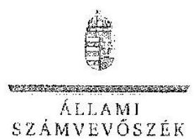

Ikt.szám: V-1259-449/2016.

Dr. Pintér Zsolt úr
elnök
Magyar Állatorvosi Kamara Fővárosi Szervezete

# Budapest 

## Tisztelt Elnök Úr!

A „Köztestületek ellenőrzése - Magyar Állatorvosi Kamara" címmel készített számvevőszéki jelentéstervezetre tett észrevételét köszönettel megkaptam.
Az Állami Számvevőszék észrevételre vonatkozó álláspontjáról a felügyeleti vezető által készített részletes tájékoztatást csatoltan megküldöm.
Tájékoztatom Elnök urat, hogy a számvevőszéki jelentésben - az Állami Számvevőszékről szóló 2011. évi LXVI. törvény 29. § (3) bekezdése alapján - a figyelembe nem vett észrevételeket szerepeltetjük az elutasítás indokának feltüntetésével.

Budapest, 2017. 3. hó 13 nap
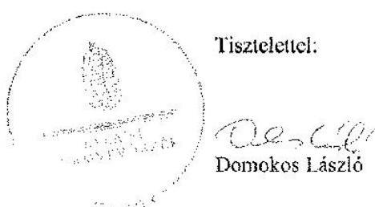

Melléklet. Tájékoztatás az elfogadott és az el nem fogadott észrevételekről

---

# Tájékoztatás az elfogadott és az el nem fogadott észrevételekről 

A „Köztestületek ellenőrzése - Magyar Állatorvosi Kamara" című jelentéstervezetre a 2017. július 19-én kelt, K/2017/56. ikt. számú levélben tett észrevételeit áttekintettem, azok kezeléséről az alábbi tájékoztatást adom.

A Magyar Állatorvosi Kamara Fővárosi Szervezetét érintő összegző megállapításai kapcsán
Az összegző megállapítás első bekezdése szerint nem értenek egyet azzal a megállapítással, hogy a Magyar Állatorvosi Kamara 2013-2015. évi gazdálkodása nem volt szabályszerű, mert véleményük szerint összességében szabályosan gazdálkodtak. Az észrevétel szerint a felvetett részletkérdésekre a részletes észrevételeknél térnek ki.
A hivatkozott megállapítás a Magyar Állatorvosi Kamara (továbbiakban: Kamara) egészére vonatkozik. A Kamara egészének gazdálkodását - a Magyar Állatorvosi Kamaráról, valamint az állatorvosi szolgáltatói tevékenység végzéséről szóló 2012. évi CXXVII. törvény (továbbiakban: MÁOK tv.) 1. § (2) bekezdését is figyelembe véve - az országos szervezet és a területi szervezetek gazdálkodása együttesen alkotja, a részletes észrevételeknél azonban a Fővárosi Szervezetre vonatkozó észrevételek kerültek ismertetésre, amelyek önmagukban nem alkalmasak arra, hogy a Kamara egésze gazdálkodásának szabályszerűségéről szóló megállapításokat befolyásolják. Erre tekintettel az észrevételt nem fogadjuk el, a jelentéstervezet módosítása nem indokolt.
Az összegző megállapítás második bekezdése szerint egyetértenek azon megállapítással, hogy a költségvetési támogatást meghatározott célra használták fel, azzal a megállapítással, hogy egészüljön ki a megállapítás egy határozott névelővel. Az észrevétel a megállapítást nem vitatta, ezért a jelentéstervezet módosítása nem indokolt.
Az összegző megállapítás harmadik bekezdése szerint nem értenek egyet azzal a megállapítással, hogy a támogatások pénzügyi elszámolása nem volt szabályszerű, ugyanis véleményük szerint összességében szabályosan számoltak el, a felvetett részletkérdésekre a részletes észrevételeknél kitérnek.
A részletes észrevételeknél a költségvetési támogatások mérlegben való kimutatására és a költségvetési támogatás elszámolására benyújtott bizonylatok alaki és tartalmi kellékeinek szabálytalanságára tértek ki. Az előbbi észrevétel elutasításra került, az utóbbi pedig az érintett megállapítást nem vitatja. Erre tekintettel az észrevételt nem fogadjuk el, a jelentéstervezet módosítása nem indokolt.

---

A jelentéstervezet 1.1. sz. megállapításához (a III. sz. melléklet 3. sorához) adott részletes észrevétele kapcsán
Az észrevétel arra vonatkozott, hogy a számviteli politika módosítása folyamatban van, azonban a változások átvezetésének hiánya nem befolyásolta a gazdálkodást.
Az észrevétel nem vitatta, hogy a számviteli politikán a törvénymódosítást 90 napon belül nem vezették át, ezért a jelentéstervezet módosítása nem indokolt.

A jelentéstervezet 1.2. sz. megállapításához (a III. sz. melléklet 9. sorához) adott részletes észrevétele kapcsán
Az észrevétel arra vonatkozott, hogy a mérlegtételek év végi értékelése és leltárral való alátámasztása megtörtént.
Az észrevételt a következő okokból nem fogadjuk el. A számvitelről szóló 2000. évi C. törvény (továbbiakban: Számv. tv.) 46. § (3) bekezdése szerint leltározással (mennyiségi felvétellel, egyeztetéssel) mind az eszközöket, mind a kötelezettségeket ellenőrizni és egyedenként értékelni kell. Az észrevételben hivatkozott leltárívek csak a tárgyi eszközöket tartalmazzák, a pénzeszközöket, a követeléseket és a kötelezettségeket nem. A leltárt leltározás alapján kell összeállítani. A Számv. tv. 69. § (1) bekezdése szerint a beszámoló elkészítéséhez, a mérleg tételeinek alátámasztásához olyan leltárt kell összeállítani, amely tételesen, ellenőrizhető módon tartalmazza az eszközöket, forrásokat (mennyiségben és értékben). Az észrevételben hivatkozott leltárívek mennyiséget tartalmaznak, de értéket nem. A leltározás és a leltár fenti hiányosságaira tekintettel a mérleg szabályszerűen leltárral nem volt alátámasztott, ezért a jelentéstervezet módosítása az észrevétel alapján nem indokolt.

A jelentéstervezet 1.2. sz. megállapításához (a III. sz. melléklet 10. sorához) adott részletes észrevétele kapcsán
Az észrevétel arra vonatkozott, hogy 2015-ben a vevők (kvázi vevők, tagdíjak) 100\%-os értékvesztése a korábbi évekre vonatkozóan elszámolásra került; a pontosabb, átláthatóbb nyilvántartás biztosítása érdekében, a programok fejlesztéséről pedig intézkedtek.
Az értékvesztésnek 2015-ben a korábbi évekre vonatkozó elszámolása nem felel meg a Számv. tv. 55. § (1) bekezdésének arra tekintettel, hogy az értékvesztést az üzleti év mérlegfordulónapján fennálló és a mérlegkészítés időpontjáig pénzügyileg nem rendezett követelésnél kell elszámolni, a mérlegkészítés időpontjában fennálló információk alapján. Erre tekintettel az észrevételt nem fogadjuk el, a jelentéstervezet módosítása nem indokolt.

A jelentéstervezet 1.3. sz. megállapításához (a III. sz. melléklet 12. sorához) adott részletes észrevétele kapcsán
Az észrevétel szerint a tárgyi eszközök beszerzése a belső szabályzatnak és a számviteli törvény előírásainak is megfelelően kerül nyilvántartásba vételre, és az üzembe helyezésig a 16-os számlaosztályban, a beruházások között vannak nyilvántartva. Ezt főkönyvi kartonokkal is alátámasztották, ezért az észrevétellel nem értenek egyet.

---

A rendelkezésre bocsátott dokumentumokat ismét felülvizsgáltuk, és megállapítást nyert, hogy egy 2013. július 19-én beszerzett eszköz (laptop + szoftver) annak ellenére került feltüntetésre a tárgyi eszközök között ( 143 karton), hogy a tárgyi eszköz nyilvántartó lapon az üzembe helyezés időpontjaként 2014. január 1. napja került feltüntetésre. Ezzel sérült a Számv. tv. 26. § (7) bekezdése, ugyanis a még üzembe nem helyezett eszközöket a beruházások között kell nyilvántartani. Erre tekintettel az észrevételt nem fogadjuk el, a jelentéstervezet módosítása nem indokolt.

A jelentéstervezet 1.3. sz. megállapításához (a III. sz. melléklet 14. sorához) adott részletes észrevétele kapcsán

Az észrevétel a megállapítást nem vitatta, ezért a jelentéstervezet módosítása nem indokolt.
A jelentéstervezet 1.3. sz. megállapításához (a III. sz. melléklet 17. sorához) adott részletes észrevétele kapcsán

Az észrevétel a megállapítást nem vitatta, ezért a jelentéstervezet módosítása nem indokolt.
A jelentéstervezet 1.4. sz. megállapításához adott részletes észrevétele kapcsán
Az észrevétel első bekezdése arra vonatkozott, hogy a vizsgált időszakban a tagdíj mértéke és megosztása nem változott, így a megállapítás nem lehetett szabályszerűtlen. A tagdíjak beszedése a Kamara Alapszabálya szerint negyedéves tagdíjszámlák alapján történik.
Az észrevétel alapján a rendelkezésre bocsátott dokumentumokat ismételten felülvizsgáltuk, és a jelentéstervezet 1.4. sz. megállapítását módosítottuk.
Az észrevétel második bekezdése arra irányult, hogy a fizetési késedelemre vonatkozó korábbi alapszabályi rendelkezés óta jelentősen javult a fizetési fegyelem, csak néhány tagnál merül fel a 150 napot meghaladó késedelem, amely esetben közvetlen kommunikációval jelzik a késedelmet, illetve felajánlják a halasztott fizetés kérvényezését, a tagság szüneteltetését, megszüntetését, vagy alaptagdjassá válás kérvényezését, tekintettel arra, hogy nem piacgazdasági partnerekről, hanem tagjaikról, kollégáikról van szó. Az egy éven túli elmaradás következményét a MÁOK tv. nevesíti. Mindezekre tekintettel Elnök úr az alapszabály vonatkozó rendelkezéseinek módosítását kívánja kezdeményezni.
Az alapszabály 21. § (11) bekezdése szerint a területi szervezetnek már a negyvenöt napot meghaladó késedelem esetén fizetési felszólítást kell küldenie a késedelembe esett kamarai tag részére. Ennek a kötelezettségnek a teljesítését nem pótolja sem a „közvetlen kommunikáció", sem a fizetési könnyítések felajánlása. A fizetési felszólítást pedig nem azért szükséges megküldeni a tagoknak, mert piacgazdasági partnerek, hanem azért, mert az alapszabály azt előírja. Erre tekintettel az észrevételt nem fogadjuk el, a jelentéstervezet módosítása nem indokolt.
Az észrevétel harmadik bekezdése szerint nem tudnak azonosulni azon megállapítással, hogy az etikai bizottság nem hozott határozatot az etikai vétségről, mert szervezetük elnökének, vezetőségének, tagjainak sincs jogosultsága az etikai bizottság eljárásába, az eljárás megindításába és a határozathozatalba beleszólni. Mindössze arra van jogosultságuk, hogy etikai vétség gyanúja esetén kezdeményezzék az eljárást.

---

Az alapszabály 21. § (12) bekezdése rögzíti, hogy ,, a százötven napot meghaladóan késedelmes tagdíjfizetés etikai vétségnek minősül és ebben az esetben a területileg illetékes etikai bizottság hivatalból eljárást indít késedelembe esett taggal szemben". Ugyanezen bekezdés szerint „az etikai bizottság a határozatot tárgyalás megtartása nélkül hozza". A hivatkozott rendelkezés alapján az etikai bizottság 150 napot meghaladó késedelem esetén - mérlegelés nélkül - hivatalból köteles megindítani az eljárást. Figyelemmel arra, hogy az Elnök úr észrevételében jelzettek szerint is vannak 150 napot meghaladóan nem fizető tagok, az etikai bizottság pedig határozatot nem hozott, az észrevételt nem fogadjuk el, és a jelentéstervezet módosítása nem indokolt.

A jelentéstervezet 1.5. sz. megállapításához adott részletes észrevétele kapcsán
Az észrevétel a megállapítást nem vitatta, ezért a jelentéstervezet módosítása nem indokolt.
A jelentéstervezet 2.1. sz. megállapításához (IV. sz. melléklet 2. sorához) adott részletes észrevétele kapcsán
Az észrevétel arra vonatkozott, hogy a mérlegben a költségvetési támogatások kimutatása a jogszabályi előírásoknak megfelelően történik/történt. Korábban előfordult, hogy az utófinanszírozott támogatásból nem a teljes összeget kapták meg, ezért a bevétel bizonytalan. Véleményük szerint abban az esetben szükséges időbeli elhatárolás, ha az elszámolást biztosító bizonylat teljesítési dátuma (elszámolása) nem azonos az elszámolást érintő időszakkal. A pénzügyi teljesítés időpontja irreleváns.
Figyelemmel arra, hogy nem maga a bevétel, hanem legfeljebb annak összege a bizonytalan, és a Számv. tv. 32. § (1) bekezdése szerint aktív időbeli elhatárolásként kell kimutatni azokat a bevételeket, amelyek csak a mérleg fordulónapja után esedékesek, de a mérleggel lezárt időszakra számolandók el, ezért az észrevételt nem fogadjuk el, és a jelentéstervezet módosítása nem indokolt.

A jelentéstervezet 2.2. sz. megállapításához (IV. sz. melléklet 4. sorához) adott részletes észrevétele kapcsán
Az észrevétel a megállapítást nem vitatta, ezért a jelentéstervezet módosítása nem indokolt.
A számvevőszéki jelentéstervezetben foglalt megállapítást érintő általános összefoglaló véleménye kapcsán
Az általános összefoglaló véleményük második bekezdése szerint hiányolják a jelentésből a feladataikra kapott állami támogatás pontos, részletesen területi szervezetekre lebontott számszerű nevesítését.

---

Az ellenőrzés - az Állami Számvevőszékről szóló 2011. évi LXVI. törvény (továbbiakban: ÁSZ tv.) 5. § (3) bekezdése alapján - a Magyar Állatorvosi Kamara gazdálkodásának egészére kiterjedt, ezért a tájékoztató információk tekintetében a gazdálkodás egészére vonatkozó adatok a relevánsak, és nem az egyes területi szervezetek adatai. Erre tekintettel az észrevételt nem fogadjuk el, a jelentéstervezet módosítása nem indokolt.

Budapest, 2017. 6. hó 15 nap
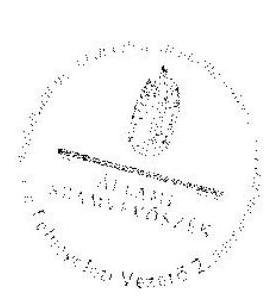

Pető Krisztina
felügyeleti vezető

---

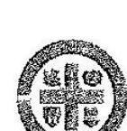

# MAGYAR ÁLLATORVOSI KAMARA 

HUNGARIAN VETERINARY CHAMBER PANNON TERÜLETI SZERVEZETE

H-8380 Hévíz, Római u. 3
Tel.: Deli Dóra: $36-30-970-2672$
e-mail: pannonmuok@gmail.com
webcim: www.pannonmtok.hu
elnök/president: Dr. Szinesi András
alelnök/vice president: Dr. Varjó Gábor titkár/secretary: Dr. Koósz Attila
iktatási sz. 256/01/2017

## Állami Számvevőszék

Domokos László elnök Úr
Budapest 1052
Apáczai Csere János u. 10.

Tárgy: észrevételeink az ÁSZ jelentés tervezetéhez.
V-1259-426/2016

Tisztelt Elnök Úr

Mint arról a Magyar Állatorvosi Kamara Országos Szervezetének Elnöke Dr. Gönczi Gábor tájékoztatott 173/2017K iktatási számmal megküldte Önöknek észrevételét a jelentéstervezettel kapcsolatban. Jelen dokumentumot ismerem, átolvastam tartalmával egyet értek. A Magyar Állatorvosi Kamarát ért bírálatokat nem értem és azokat feltétel nélkül elfogadni nem tudom. A jelentéstervezet a Magyar Állatorvosi Kamara Pannon Területi Szervezetét is számtalan pontban megemlíti, elmarasztalja, holott a nálunk maradt adat begyűjtést rögzítő dokumentumok szerint a hiányolt dokumentumokat az Ön munkatársai tőlünk maradéktalanul elvitték. Természetesen ha azok tartalma esetleg nem felel meg a jelen törvényi előírásnak mihamarabb igyekezzünk javítani őket, de azt állítani hogy nincs nem korrekt eljárás. A jelentéstervezettel kapcsolatban észrevételeimet jelen levelemben a törvényes határidőn belül teszem meg.

Tételesen a következő pontokat kifogásoljuk a jelentéstervezetben:

---

# III. számú táblázatban felsoroltak: 

1. pont A Pannon Kamara az ellenőrzés időpontjában rendelkezett az 1. pontban felsorolt szabályzatokkal ezeket az ellenőrök digitalizált formában el is vitték ennek tényét rögzítették a 2017. február 28. napján irodánkban készített jegyzőkönyvben, melynek 2. számú mellékletében fel is tüntették a 37. sorban leltározási szabályzat, 39. sor pénzkezelési szabályzat 47. sor számviteli politika 43. sor selejtezési szabályzat
2.pont fent leírt jegyzőkönyv 2. számú mellékletének 45. sora szerint számlarendet is digitalizáltak az ellenőrzés során.
2. pont fent említett jegyzőkönyv 39. sora szerint átadtuk a pénzkezelési szabályzatunkat is, melyben egyébként meghatározásra került a pénztárban tartható készpénz összege, ami maximum 1.000.000 Ft lehet a szabályzatunk szerint.
3. pont , 8. pont Egyetértek az Országos szervezet által ezen ponthoz tett észrevétellel miszerint mi mint Kamara nem közhasznú szervezetek vagyunk, így a jelentésben kiemelt Kormányrendeletnek nem a 6. § hanem a 7. § vonatkozik ránk értelmezésem szerint.
9.pont az ellenőrzési jegyzőkönyv 2. számú melléklete szerint átadtuk az 51,52,53 sor szerint a 2013,2014,2015 évi tárgyi eszköz leltárt, illetve ezen táblázat 81,82,83, sora szerint a 2013,2014,2015 évi tárgyi eszköz állomány változásáról is átadtuk a dokumentumokat, melyek nehezen készülhettek volna el anélkül, hogy ne leltároztunk volna. Leltárunk jelenleg is napra kész.
10. pont mivel kamaránk bevételeinek jelentős részét a Kollégáink által befizetett tagdíjak teszik ki, tartozás szinte csak ezek meg nem fizetéséből adódhat. A tagdíj viszont nem vevő elmaradás, ezeket saját szabályzataink alapján kezeljük, az ilyen ügyekben hozott döntéseket határozati formában közöljük a tagdíját meg nem fizető kollégával.
17. pont valóban ez elmúlt ciklus során az utalványozás nem a Kamara gazdálkodási szabályzatnak megfelelően történt, a választást követő első vezetőségi ülésen azt a hibát azonnal kiküszöböltük erről a vezetőséget tájékoztattam, az ülésen készült jegyzőkönyvben rögzítettük.

---

# IV. számú táblázatban felsoroltak 

4. pont . 5. pont Mivel az állami támogatás összegét titkárnőnk bérének egy részeként számoltuk el ( az összege akkora hogy fél havi minimálbért sem tesz ki ) nem értem milyen bizonylatoknak kellene meglennic, hiszen a fizetések utalása számfejtése a jogszabályoknak megfelelően zajlik, ebben hibát nem tárt fel az ellenőrzés.

## Tisztelt Elnök Úr!

A Magyar Állatorvosi Kamara Pannon Területi szervezetének valamennyi tisztségviselője kamarai munkáját szabadideje terhére végzi. Ez egy olyan közfeladat melyet az állatorvos társadalom és a magyar társadalom érdekében egy maroknyi lelkes idejét, energiáját nem sajnáló kolléga végez. Tisztelettel kérem Önt és munkatársait, hogy munkánkat segítse és ne hátráltassa, nyitottak vagyunk minden építő kritikára jó szándékú tanításra hisz valamennyien elsősorban a gyógyításhoz és nem a gazdasághoz, szabályzatokhoz, paragrafusokhoz értünk. Kamarai munkánkat amatőr lelkesedéssel végezzük. Kérem Önt hogy a jövőben biztosítson számunkra akár olyan konzultációs lehetőséget, ahol feltehetjük kérdéseinket, így a következő reméljük sokára bekövetkező ellenőrzés egyszerűbben gördülékenyebben fog lezajlani.

Hévíz 2017. július 24.
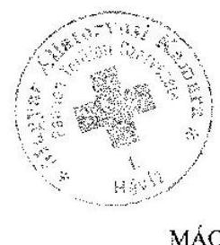

Tisztelettel

Dr. Szinesi András
MÁOK Pannon Területi Szervezet elnök

---

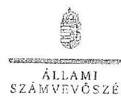

FLEEK

# Dr. Szinesi András úr   elnök   Magyar Állatorvosi Kamara   Pannon Területi Szervezete 

## Hévíz

## Tisztelt Elnök Úr!

A „Köztestületek ellenőrzése - Magyar Állatorvosi Kamara" címmel készített számvevőszéki jelentéstervezetre tett észrevételét köszönettel megkaptam.
Az Állami Számvevőszék észrevételre vonatkozó álláspontjáról a felügyeleti vezető által készített részletes tájékoztatást csatoltan megküldöm.
Tájékoztatom Elnök urat, hogy a számvevőszéki jelentésben - az Állami Számvevőszékről szóló 2011. évi LXVI. törvény 29. § (3) bekezdése alapján - a figyelembe nem vett észrevételeket szerepeltetjük az elutasítás indokának feltüntetésével.

Budapest, 2017. 05 hó 16 nap
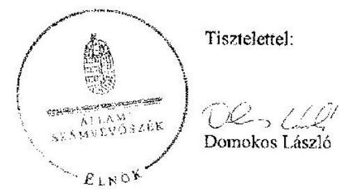

Melléklet: Tájékoztatás az elfogadott és el nem fogadott észrevételekről

---

# Tájékoztatás az elfogadott és el nem fogadott észrevételekről 

A „Köztestületek ellenőrzése - Magyar Allatorvosi Kamara" című jelentéstervezetre 2017. július 24 -én kelt 256/01/2017. iktatószámú levélben tett észrevételeit áttekintettem, annak kezeléséről az alábbi tájékoztatást adom.

1. Az 1. programponthoz kapcsolódóan a jelentéstervezet 13. oldal 1.1. sz. megállapítás 4. bekezdés 3-4. mondataira, valamint a III. sz. melléklet 1. sorára tett észrevétele kapcsán

A jelentéstervezet a selejtezési szabályzat hiányára vonatkozó megállapítást nem tartalmazott, és a pénzkezelési szabályzattal kapcsolatos megállapítás sem hiányosságra utalt, ugyanis a jelentéstervezet III. sz. melléklet 1. sorához tartozó lábjegyzet tartalmazta, hogy: „A MAOK Pannon Területi Szervezet Pénzkezelési Szabályzattal rendelkezett." Az észrevételében hivatkozott, 2017. február 28 -án kelt helyszíni adatbetekintésről szóló jegyzőkönyv szerint az ellenőrzés rendelkezésére bocsátottak „Leltárkészítési és leltározási szabályzat", valamint „Számviteli Politika" című dokumentumokat, azonban azokat a kiadmányozásra jogosult nem írta alá és nem látta el bélyegző lenyomattal, ezért a Magyar Állatorvosi Kamara (továbbiakban: Kamara) Pannon Területi Szervezete az ellenőrzött időszakban nem rendelkezett a számvitelről szóló 2000. évi C. törvény (a továbbiakban: Számv. tv.) 14. § (3) bekezdése szerinti, érvényes számviteli politikával, és a Számv. tv. 14. § (5) bekezdés a) pontja szerinti, érvényes leltárkészítési és leltározási szabályzattal. Észrevételét ezek alapján nem fogadjuk el, a megállapítások helytállóak, annak módosításai nem indokoltak.
2. Az 1. programponthoz kapcsolódóan a jelentéstervezet 13. oldal 1.1. sz. megállapítás 4. bekezdés 3-4. mondataira, valamint a III. sz. melléklet 2. sorára tett észrevétele kapcsán

A jelentéstervezet 1.1. sz. megállapítás 4. bekezdés 3-4. mondataira, valamint a III. sz. melléklet 2. sorára tett észrevételét nem fogadjuk el. Az észrevételében hivatkozott 2017. február 28 -án kelt helyszíni adatbetekintésről szóló jegyzőkönyv szerint az ellenőrzés rendelkezésére bocsátott „Számlarend" című dokumentumot a kiadmányozásra jogosult nem írta alá és nem látta el bélyegző lenyomattal, ezért nem tekinthető érvényesnek. Mindezek alapján a Kamara Pannon Területi Szervezete az ellenőrzött időszakban érvényes számlarenddel nem rendelkezett. Észrevétele ezért a megállapítást nem módosítja.

---

3. Az 1. programponthoz kapcsolódóan a jelentéstervezet 13. oldal 1.1. sz. megállapítás 4. bekezdés 3-4. mondataira, valamint a III. sz. melléklet 4. sorára tett észrevétele kapcsán

A jelentéstervezet 1.1. sz. megállapítás 4. bekezdés 3-4. mondataira, valamint a III. sz. melléklet 4. sorára észrevételében arra hivatkozott, hogy a ..fent említett jegyzőkönyv 39. sora szerint átadtuk a pénzkezelési szabályzatunkat is, melyben egyébként meghatározásra került a pénztárban tartható készpénz összege, ami maximum 1.000.000 Ft lehet a szabályzatunk szerint." Az Állami Számvevőszék (továbbiakban ÁSZ) rendelkezésére bocsátott dokumentumok ismételt felülvizsgálatát követően elfogadjuk, hogy a pénzkezelési szabályzat tartalmazta a napi készpénz záró állomány maximális mértékét és ezt a számvevőszéki jelentés készítésénél a megállapítás módosításával figyelembe vesszük.
4. Az 1. programponthoz kapcsolódóan a jelentéstervezet 14. oldal 1.2. sz. megállapítás 3. bekezdésre és a III. sz. melléklet 7. és 8. sorára tett észrevétele kapcsán

A jelentéstervezet III. számú melléklet 7. és 8. sorára tett észrevételét nem fogadjuk el. Észrevételében arra hivatkozott, hogy ,,mi mint Kamara nem közhasznú szervezetek vagyunk, így a jelentésben kiemelt kormányrendeletnek nem a 6. § hanem a 7. § vonatkozik ránk értelmezésem szerint."

A számviteli törvény szerinti egyes egyéb szervezetek beszámolókészítési és könyvvezetési kötelezettségének sajátosságairól szóló 224/2000. (XII. 19.) Korm. rendelet (továbbiakban: 224/2000. Korm. rendelet) 6. § (6) bekezdése szerint ,,az egyéb szervezet egyszerűsített éves beszámolója a 4. számú melléklet szerinti mérlegből és az 5. számú melléklet szerinti eredménykimutatásból áll". A hivatkozott rendelkezés nem tartalmaz közhasznú szervezetre vonatkozó utalást, az 5. számú melléklet sem rendelkezik közhasznú szervezetről. A Kamara, mint köztestület pedig a Számv. tv. 3. § (1) bekezdés 4. pontja alapján egyéb szervezetnek minősül, és a 224/2000. Korm. rendelet hatálya is (a 2. § (1) bekezdés d) és 1) pontok alapján) a köztestületre, mint egyéb szervezetre terjed ki.

A dokumentumok ismételt felülvizsgálatát követően változatlanul fenntartjuk, hogy a 2013., a 2014. és 2015. évi beszámoló mérlegének és eredménykimutatásának adattartalma nem felelt meg a 224/2000. Korm. rendelet 6. § (6) bekezdésében hivatkozott 4. sz. melléklet és 5. sz. melléklet szerinti tagolásnak, ezért észrevétele a megállapítást nem módosítja.
5. Az 1. programponthoz kapcsolódóan a jelentéstervezet 15. oldal 1.2. sz. megállapítás 6. bekezdés 4. mondatára és a III. sz. melléklet 9. sorára tett észrevétele kapcsán

Az észrevételében arra hivatkozott, hogy ,,az ellenőrzést jegyzőkönyv 2. számú melléklete szerint átadtuk az 51,52,33 sor szerint a 2013.2014.2015 évi tárgyi eszköz leltárt, illetve ezen táblázat 81, 82, 83, sora szerint a 2013.2014.2015 évi tárgyi eszköz állomány változásáról is átadtuk a dokumentumokat, melyek nehezen készülhettek volna el anélkül, hogy ne leltároztunk volna. Leltárunk jelenleg is naprakész."

---

Az észrevételt a következő okokból nem fogadjuk el. A Számv. tv. 46. § (3) bekezdése szerint leltározással (mennyiség) felvétellel, egyeztetéssel) mind az eszközöket, mind a kötelezettségeket ellenőrizni és egyedenként értékelni kell. Az észrevételben hivatkozott leltárok a tárgyi eszközöket tartalmazzák, a pénzeszközöket, az értékpapírokat, a követeléseket és a kötelezettségeket nem. A leltárt leltározás alapján kell összeállítani. A Számv. tv. 48. § (1) bekezdése szerint a beszámoló elkészítéséhez, a mérleg tételeinek alátámasztásához olyan leltárt kell összeállítani, amely tételesen, ellenőrizhető módon tartalmazza az eszközöket, forrásokat (mennyiségben és értékben). A leltározás és a leltár fenti hiányosságaira tekintettel a mérleg szabályszerű leltárral nem volt alátámasztott, ezért a jelentéstervezet módosítása az észrevétel alapján nem indokolt.
6. Az 1. programponthoz kapcsolódóan a jelentéstervezet 15. oldal 1.2. sz. megállapítás 6. bekezdés 4. mondatára és a III. sz. melléklet 10. sorára tett észrevétele kapcsán

A jelentéstervezet 15. oldal 1.2. számú megállapítás 6. bekezdés 4. mondatára és a III. sz. melléklet 10. sorára tett észrevételét nem fogadjuk el. Észrevételében arról tájékoztat, hogy ,,mivel kamaránk bevételeinek jelentős részét a Kollégáink által befizetett tagdíjak teszik ki, tartozás szinte csak ezek meg nem fizetéséből adódhat. A tagdíj viszont nem vevő elmaradás, ezeket saját szabályzataink alapján kezeljük, az ilyen ügyekben hozott döntéseket határozati formában közöljük a tagdíjat meg nem fizető kollégával."

A 2013-2015. évi mérleg tételek év végi értékelésének és leltárral történő alátámasztásának szabályszerűségét a kiválasztott mintatételek alapján értékeltük, amelynek sokaságra történő kivetítését a számvevőszéki jelentéstervezet „Az ellenőrzés módszerei" című fejezet részletesen tartalmazza. A megállapításokat az ÁSZ rendelkezésére bocsátott dokumentumok alapján ellenőriztük és ezen dokumentumokra alapozva állapítottuk meg, hogy Számv. tv. 46. § (3) bekezdés ellenére a vevőköveteléseket egyedenként nem értékelték, valamint a Számv. tv. 55. § (1) bekezdése ellenére a vevő és adós minősítésére és értékvesztés elszámolására nem került sor. Az ellenőrzés rendelkezésére bocsátott dokumentumok ismételt felülvizsgálatát követően megállapításunkat változatlan formában fenntartjuk. Észrevétele ezért a megállapítást nem módosítja.
7. Az 1. programponthoz kapcsolódóan a jelentéstervezet 15. oldal 1.3. sz. megállapítás 3. bekezdés utolsó mondatára és a III. sz. melléklet 17.
 sorára tett észrevétele kapcsán

Észrevétele a megállapítás helytállóságát nem vitatta, hanem elismerte, hogy az ,,elmúlt ciklus során az utalványozás nem a Kamara gazdálkodási szabályzatának megfelelően történt". Köszönettel vettem tájékoztatását arról, hogy „a választást követő első vezetőségi ülésen azt a hibát azonnal kiküszöböltük erről a vezetőséget tájékoztattam, az ülésen készült jegyzőkönyvben rögzítették." Észrevétele megállapítást nem módosít.

---

8. A 2. programponthoz kapcsolódóan a jelentéstervezet 17. oldal 2.2. sz. megállapítás 3. bekezdésére és a IV. sz. melléklet 4. és 5. sorára tett észrevétele kapcsán

A jelentéstervezet 2.2. sz. megállapítás 3. bekezdésére és a IV. sz. melléklet 4. és 5. sorára tett észrevételét nem fogadjuk el tekintettel arra, hogy a megállapításokat az ÁSZ rendelkezésére bocsátott dokumentumok alapján ellenőriztük, és ezen dokumentumokra alapozva állapítottuk meg, hogy a 2013-2015. évi támogatások felhasználásáról készített összesítő elszámolásokat alátámasztó - utalványozó által aláírt és záradékkal ellátott - dokumentumokat (bérkifizetés bizonylatait) nem bocsátották az ellenőrzés rendelkezésére. Észrevétele ezért a megállapítást nem módosítja.

Budapest, 2017.
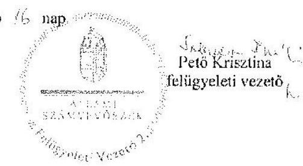

---

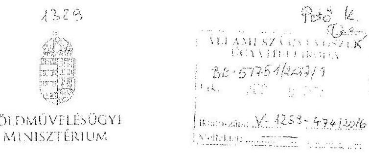

Iktatószám: HPF/ 1019/2/2017.
Ügyintéző: dr. Fertő Annamária
Telefonszám: 795-3933
E-mail: fertni.annamaria@fm.gov.hu
Hivatkozási szám: V-1259-411/2016

# Domokos László úr   elnök részére 

## Állami Számvevőszék

Budapest
Apáczai Csere János u. 10.
1052
Tárgy: Észrevétel az Állami Számvevőszék V-1259-411/2016. iktatószámú számvevőszéki jelentéstervezetére

## Tisztelt Elnök Úr!

Hivatkozással a V-1259-411/2016. iktatószámú a „Köztestületek ellenőrzése - Magyar Állatorvosi Kamara" című számvevőszéki jelentéstervezetre, az Állami Számvevőszékről szóló 2011. évi LXVI. törvény 29. § (2) bekezdése alapján az alábbi észrevételt teszem.

A számvevőszéki jelentéstervezet 5. oldalán a „Főbb megállapítások, következtetések" résznél az Állami Számvevőszék (a továbbiakban: ÁSZ) megállapításai a következők:
„A költségvetési támogatást a Magyar Állatorvosi Kamara a támogatási szerződésekben rögzített közfeladatok ellátására fordította. A támogatások pénzügyi elszámolásánál a bizonylatok záradékolása nem történt meg, így nem biztosították, hogy egy bizonylatot csak egy támogatási szerződés elszámolásához lehessen felhasználni."

A Földművelésügyi Minisztérium Költségvetési Főosztálya áttekintette a Magyar Állatorvosi Kamara (a továbbiakban: MÁOK) 2015. évi feladatok támogatására irányuló elszámolásához kapcsolódó pénzügyi ellenőrzés dokumentumait és megállapította, hogy pénzügyi ellenőrzés keretében a Költségvetési Főosztály KF/1511/1/2015 iktatószámon írt levelében bekérésre került a hiányosságként megjegyzett számlák záradékolása a szakmai főosztálytól, a Parlamenti és Társadalmi Kapcsolatok Főosztályától (a továbbiakban: PTKF) az alábbiak szerint:

---

„A számlák eredeti példányaira fel kell vezetni az elszámolásra vonatkozó, hivatkozott utasítás szerinti elszámolási záradékot, majd ezt követően készítik el az olvasható fénymásolatot és hitelesítik azt."

Fenti hiányosság miatt a PTKF hiánypótlási felszólítást küldött a MÁOK Kedvezményezett részére, amelyet követően a Kedvezményezett - többek között - megküldte a záradékolt számlái másolatát a szakmai főosztálynak. A hiánypótlást a PTKF és a Költségvetési Főosztály is elfogadta, továbbá a Költségvetési Főosztály jelezte a KF/191/2016 iktatószámú ügyiratban, hogy a hiánypótlás keretében kért dokumentumok benyújtására sor került.

Fentiek alapján nem tartom helytállónak azon észrevételt, miszerint nem kerültek záradékolásra, illetve benyújtásra a záradékolt bizonylatok másolatai.

Kérem észrevételem szíves tudomásul vételét.
Budapest, 2017. „augusztus 01.".

Tisztelettel:
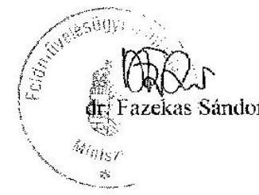

---

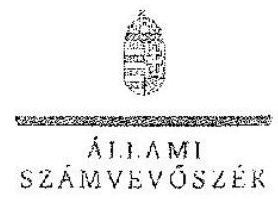

ELKÖK

# Dr. Fazekas Sándor úr 

miniszter
Földművelésügyi Minisztérium

## Budapest

## Tisztelt Miniszter Úr!

A „Köztestületek ellenőrzése - Magyar Állatorvosi Kamara" címmel készített számvevőszéki jelentéstervezetre tett észrevételét köszönettel megkaptam.
Az Állami Számvevőszék észrevételre vonatkozó álláspontjáról a felügyeleti vezető által készített részletes tájékoztatást csatoltan megküldöm.
Tájékoztatom Miniszter urat, hogy a számvevőszéki jelentésben - az Állami Számvevőszékről szóló 2011. évi LXVI. törvény 29. § (3) bekezdése alapján - a figyelembe nem vett észrevételt szerepeltetjük az el nem fogadás indokának feltüntetésével.

Budapest, 2017. 06 hó 23 nap

Tisztelettel:
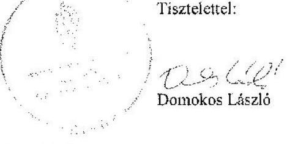

Melléklet: Tájékoztatás az el nem fogadott észrevételről

---

# Tájékoztatás az el nem fogadott észrevételről 

A ,,Köztestületek ellenőrzése - Magyar Állatorvosi Kamara" című jelentéstervezetre 2017. augusztus 1-jén kelt IPF/1019/2/2017. iktatószámú levélben tett, a jelentéstervezet 5. oldalán, a „Főbb megállapítások, következtetések" részben szereplő ,, A költségvetési támogatást a Magyar Állatorvosi Kamara a támogatási szerződésekben rögzített közfeladatok ellátására fordította. A támogatások pénzügyi elszámolásánál a bizonylatok záradékolása nem történt meg, így nem biztosították, hogy egy bizonylatot csak egy támogatási szerződés elszámolásához lehessen felhasználni." megállapításra tett észrevételét áttekintettem, annak kezeléséről az alábbi tájékoztatást adom.

A 2015. évi költségvetési támogatás elszámolására vonatkozó észrevételét nem fogadjuk el. Észrevételében Miniszter úr arra tekintettel vitatja a záradékolás hiányára vonatkozó megállapítás helytállóságát, hogy a Földművelésügyi Minisztérium Költségvetési Főosztálya áttekintette a Magyar Állatorvosi Kamara 2015. évi feladatok támogatására irányuló elszámolásához kapcsolódó pénzügyi ellenőrzés dokumentumait. Ellenőrzésük megállapította, hogy a pénzügyi ellenőrzés keretében kibocsátott hiánypótlási felszólítást követően a kedvezményezett Magyar Állatorvosi Kamara részéről a záradékolt számlák másolatainak benyújtása megtörtént. A megállapítás 2013. és 2014. évekre vonatkozó helytállóságát az észrevételében nem vitatta.

A költségvetési támogatások elszámolásának szabályszerűségét az Állami Számvevőszék a Magyar Állatorvosi Kamara országos és területi szervezetei által az Állami Számvevőszékről szóló 2011. évi LXVI. törvény 28. § előírásain alapuló közreműködési kötelezettség teljesítése során rendelkezésre bocsátott dokumentumok, adatok alapján ellenőrizte. A kifogással érintett PTKF/821-1/2015. számú Támogatási szerződés elszámolásához kapcsolódó bizonylatok ismételt felülvizsgálata alapján továbbra is fenntartjuk, hogy a bizonylatok záradékolása nem történt meg, tekintettel arra, hogy több esetben a 2015. évi támogatások felhasználásáról készített összesítő elszámolásokat alátámasztó bizonylatokon a záradékolásra vonatkozó információ nem szerepelt, illetve a vonatkozó bizonylatot az ellenőrzött szervezetek nem bocsátották az ellenőrzés rendelkezésére. A számvevőszéki ellenőrzés a 2013-2015. években kötött valamennyi támogatási szerződéshez kapcsolódó elszámolás tekintetében hiányosságokat tárt fel, ezért a költségvetési támogatások elszámolásának szabályszerűségére vonatkozó, összevont értékelést tartalmazó megállapításunkat fenntartjuk. Észrevétele ezért a megállapítást nem módosítja.

Budapest, 2017.
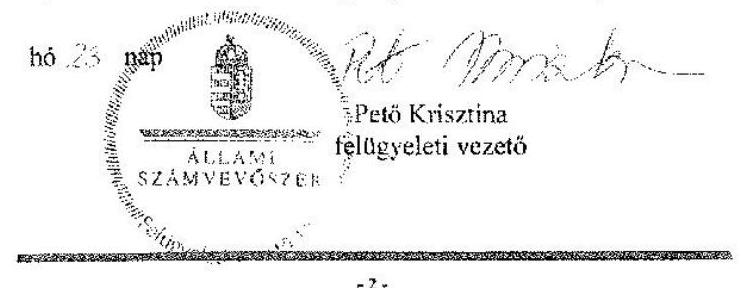

---

# RÖVIDÍTÉSEK JEGYZÉKE 

${ }^{1}$ MÁOK
${ }^{2}$ Ptk. 1
${ }^{3}$ Áhtm.
${ }^{4}$ 2012. évi CXXVII. törvény
${ }^{5}$ Országos Szervezet
${ }^{6}$ MÁOK Kft.
${ }^{7}$ támogatási szerződés
támogatási szerződés
támogatási szerződés
${ }^{8}$ ÁSZ tv.
${ }^{9}$ ÁSZ
${ }^{10}$ Számv. tv.
${ }^{11}$ Alapszabály
Alapszabály ${ }_{2}$
Alapszabály ${ }_{3}$
Alapszabály ${ }_{4}$
${ }^{12}$ országos küldöttközgyűlés
${ }^{13}$ Gazdálkodási Szabályzat ${ }_{1}$

Gazdálkodási Szabályzat ${ }_{2}$
${ }^{14}$ országos elnök
${ }^{15}$ területi elnök
${ }^{16}$ főtitkár
${ }^{17}$ titkár
${ }^{18}$ alelnök
${ }^{19}$ Számviteli politika

Magyar Állatorvosi Kamara
Polgári Törvénykönyvről szóló 1959. évi IV. törvény (hatályos: 2014. március 14-ig) az államháztartásról szóló 1992. évi XXXVIII. törvény és egyes kapcsolódó törvények módosításáról szóló 2006. évi LXV. törvény
a Magyar Állatorvosi Kamaráról, valamint az állatorvosi szolgáltatói tevékenység végzéséről szóló 2012. évi CXXVII. törvény
a Magyar Állatorvosi Kamara Budapesten működő, a 2012. évi CXXVII. törvény 1. § (2) bekezdés b) pontja szerinti, önálló jogi személy országos szervezete, amely kizárólagosan jogosult a „Magyar Állatorvosi Kamara" elnevezés használatára
MÁOK Kereskedelmi és Szolgáltató Korlátolt Felelősségű Társaság (alapítás: 1998. június 2., cégjegyzékszám: 01-09-674078)
A MÁOK és a Vidékfejlesztési Minisztérium által megkötött PTKF/1549-1/2013. számú Támogatási szerződés
A MÁOK és a Földművelésügyi Minisztérium által megkötött PTKF/1509-1/2014. számú Támogatási szerződés
A MÁOK és a Földművelésügyi Minisztérium által megkötött PTKF/821-1/2015. számú Támogatási szerződés
Állami Számvevőszékről szóló 2011. évi LXVI. törvény
Állami Számvevőszék
számvitelről szóló 2000. évi C. törvény
Magyar Állatorvosi Kamara országos küldöttközgyűlése által 1996. május 16-án elfogadott Alapszabály (hatályos: 2013. október 14-ig)
Magyar Állatorvosi Kamara országos küldöttközgyűlése által elfogadott Alapszabálya (hatályos: 2013. október 15-étől-2014. március 25-éig)
Magyar Állatorvosi Kamara országos küldöttközgyűlése által elfogadott Alapszabálya (hatályos: 2014. március 26-ától-2014. június 4-éig)
Magyar Állatorvosi Kamara országos küldöttközgyűlése által elfogadott Alapszabálya (hatályos: 2014. június 5-étől)
Magyar Állatorvosi Kamara országos küldöttközgyűlése
Magyar Állatorvosi Kamara országos küldöttközgyűlése által 2009. április 28-án elfogadott Gazdálkodási Szabályzat (hatályos 2009. április 29-étől 2013. október 14-éig)
Magyar Állatorvosi Kamara országos küldöttközgyűlése által 2009. április 28-án elfogadott, az Alapszabály ${ }_{2-4}$ mellékletét képező Gazdálkodási Szabályzat (hatályos 2013. október 15-étől)

Magyar Állatorvosi Kamara Országos Szervezete elnöke
Magyar Állatorvosi Kamara területi szervezetének elnöke
Magyar Állatorvosi Kamara Országos Szervezetének főtitkára
Magyar Állatorvosi Kamara területi szervezete titkára
Magyar Állatorvosi Kamara Országos Szervezete, illetve területi szervezete alelnöke
Magyar Állatorvosi Kamara Országos Szervezet Számviteli Politikája (hatályos: 2012. január 1-jétől 2013. december 31-ig)

---

| Számviteli politika: | Magyar Állatorvosi Kamara Országos Szervezet Számviteli Politikája (hatályos:   2014. január 1-jétől) |
| :--: | :--: |
| ${ }^{20}$ Leltározási Szabályzat | Magyar Állatorvosi Kamara Országos Szervezet Leltározási Szabályzata (hatályos:   2008. május 1-től) |
| ${ }^{21}$ Értékelési Szabályzat | Magyar Állatorvosi Kamara Országos Szervezet Értékelési Szabályzata (hatályos:   2012. január 1-től) |
| ${ }^{22}$ Pénzkezelési Szabályzat | Magyar Állatorvosi Kamara Országos Szervezet Pénzkezelési Szabályzata (hatályos:   2012. január 1-től) |
| ${ }^{23}$ Számlarend | Magyar Állatorvosi Kamara Országos Szervezet Számlarendje (hatályos: 2007.   január 1-jétől) |
| ${ }^{24}$ területi közgyűlés | Magyar Állatorvosi Kamara 17 területi szervezetének közgyűlései |
| ${ }^{25}$ 224/2000. (XII. 19.) Korm. rendelet | a számviteli törvény szerinti egyes egyéb szervezetek beszámolókészítési és   könyvvezetési kötelezettségének sajátosságairól szóló 224/2000. (XII. 19.) Korm.   rendelet (hatályos: 2016. december 31-ig) |
| ${ }^{26}$ Tao tv. | a társasági adóról szóló 1996. évi LXXXI. törvény |
| ${ }^{27}$ VM | Vidékfejlesztési Minisztérium |
| ${ }^{28}$ FM | Földművelésügyi Minisztérium |
| ${ }^{29}$ Info tv. | az információs önrendelkezési jogról és az információszabadságról szóló 2011. évi   CXII. törvény |
| ${ }^{30}$ Nvtv. | a nemzeti vagyonról szóló 2011. évi CXCVI. törvény |

---

ÁLLAMI SZÁMVEVŐSZÉK
1052 Budapest, Apáczai Csere János utca 10.
Levélcím: 1364 Budapest 4. Pf. 54
Telefon: +36 14849100 Telefax: +36 14849200
www.asz.hu