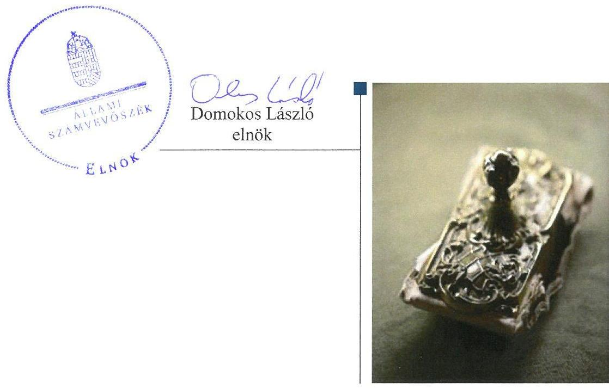
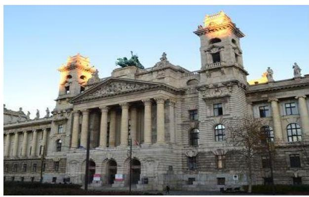
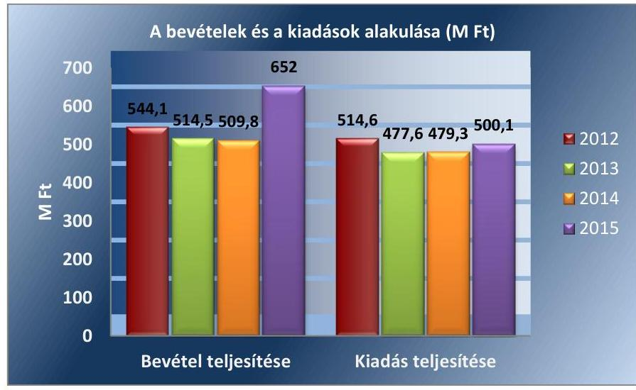
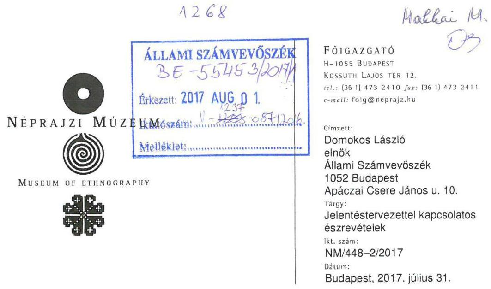
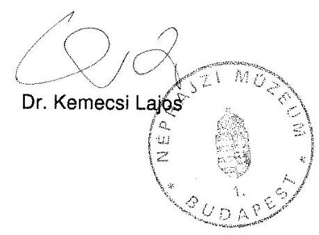
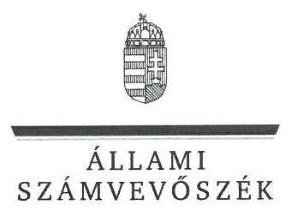
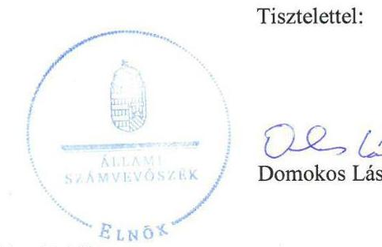
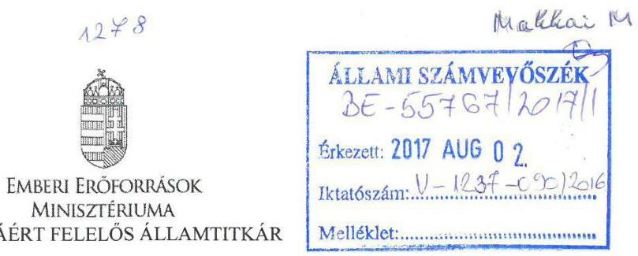
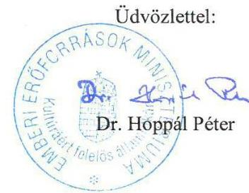

# Jelentés 

## A központi alrendszer intézményei

A központi alrendszer egyes intézményei pénzügyi és vagyongazdálkodásának ellenőrzése - Néprajzi Múzeum 2017.

---

# Jelentés 

## A központi alrendszer intézményei

A központi alrendszer egyes intézményei pénzügyi és vagyongazdálkodásának ellenőrzése - Néprajzi Múzeum
2017. 08 hó 31. nap

---

# AZ ELLENŐRZÉST FELÜGYELTE:

## MAKKAI MÁRIA felügyeleti vezető

## AZ ELLENŐRZÉST VEZETTE ÉS A VÉGREHAJTÁSÁÉRT FELELŐS:

### KAKAS SÁNDOR ellenőrzésvezető

## A PROGRAM ÖSSZEÁLLÍTÁSÁÉRT FELELŐS:

### JANIK JÓZSEF LÁSZLÓ osztályvezető

---

**IKTATÓSZÁM: V-1237-097/2016**

**TÉMASZÁM: 2271**

**ELLENŐRZÉS-AZONOSÍTÓ SZÁM: V076011**

---

Jelentéseink az Országgyűlés számítógépes hálózatán és az Interneta a www.asz.hu címen is olvashatóak.

---

# TARTALOMJEGYZÉK 

■ ÖSSZEGZÉS ..... 5
■ AZ ELLENŐRZÉS CÉLJA ..... 6
■ AZ ELLENŐRZÉS TERÜLETE ..... 7
■ AZ ELLENŐRZÉS HÁTTERE, INDOKOLTSÁGA ..... 8
■ A JELENTÉS LÉNYEGES KÉRDÉSKÖREI ..... 9
■ ELLENŐRZÉS HATÓKÖRE ÉS MÓDSZEREI ..... 10
■ MEGÁLLAPÍTÁSOK ..... 13
■ JAVASLATOK ..... 21
■ MELLÉKLETEK ..... 23
I. sz. melléklet: Értelmező szótár ..... 23
II. sz. melléklet: Az Integritás érvényesítése érdekében kialakított és múködtetett kontrollrendszer ..... 26
■ FÜGGELÉK: ÉSZREVÉTELEK ..... 27
■ RÖVIDÍTÉSEK JEGYZÉKE ..... 35

---

.

---

# ÖSSZEGZÉS 

A Nemzeti Erőforrás Minisztérium és az Emberi Erőforrások Minisztériuma Néprajzi Múzeumra vonatkozó irányító szervi feladatellátása szabályszerű volt. A múzeumigazgató által kialakított belső irányítási rendszer nem biztositotta a szabályszerű, átlátható és elszámoltatható közpénzfelhasználást. A pénzügyi gazdálkodás és a vagyongazdálkodás összességében szabályszerű volt. A Néprajzi Múzeum vezetése nem épített ki megfelelő védelmet a korrupciós veszélyekkel szemben. A közpénzfelhasználás eredményességét a gazdálkodás folyamatában mérhető célok nem támasztották alá.

## Az ellenőrzés társadalmi indokoltsága

A központi alrendszer részét képező múzeumok alapvető rendeltetése a közfeladatok ellátásának biztosítása, ennek keretében a kulturális örökséghez tartozó javak védelme, őrzése és a nyilvánosság számára történő hozzáférhetővé tétele. A közpénzek felhasználásában meghatározó, központi alrendszerbe tartozó intézmények pénzügyi és vagyongazdálkodási tevékenységük és/vagy feladatellátásuk súlya miatt jelentős hatást gyakorolhatnak a költségvetés egyensúlyának fenntartására. Hatással vannak továbbá az állami vagyonnal való gazdálkodás minőségére, a kormányzati (szak)politikák végrehajtására, illetve közfeladat ellátásuk vonatkozásában az állampolgárok életminőségére, jogaik és kötelezettségeik gyakorlására. E szervezetekkel szemben társadalmi igény, hogy tevékenységükről a döntéshozók és a nyilvánosság felé elszámoljanak.

## Főbb megállapítások, következtetések, javaslatok

Az irányító szerv az ellenőrzött időszakban szabályszerűen gyakorolta az alapítói, a munkáltatói, valamint az egyéb felügyeleti, ellenőrzési jogosultságokat.

A belső kontrollrendszer kialakítása és működtetése az ellenőrzött években nem volt szabályszerű. A kockázatkezelési rendszert kialakították, azonban a 2013. év kivételével nem működtették. A kontrolltevékenységek során a gazdálkodási jogköröket nem megfelelően gyakorolták. Az információs és kommunikációs folyamatok kialakítása és működtetése az ellenőrzött időszakban összességében nem felelt meg a jogszabályi előírásoknak. A Néprajzi Múzeum az ellenőrzött időszakban a közzétételi kötelezettségét hiányosan teljesítette, ezáltal nem biztosította a múködés átláthatóságát. A belső ellenőrzés kialakításáról és múködtetéséről a jogszabályi előírásoknak megfelelően gondoskodtak.

A Néprajzi Múzeum pénzügyi gazdálkodása összességében szabályszerű volt. Az elemi költségvetés készítése során betartották a jogszabályi előírásokat és a belső szabályzatokban foglaltakat, a bevételi és kiadási előirányzatok módosítása és az átcsoportosítása megfelelt a jogszabályi előírásoknak. A Néprajzi Múzeum beszámoló készítési kötelezettségének eleget tett.

A Néprajzi Múzeum vagyongazdálkodása összességében szabályszerű volt. A Néprajzi Múzeum az ellenőrzött időszakban rendelkezett vagyonkezelési szerződéssel, azonban az az ingatlanra vonatkozó vagyonkezelői jog tekintetében nem felelt meg a jogszabályi előírásoknak. A mérlegben kimutatott eszközök és források év végi értékelése és a leltározás szabályszerű volt. A Néprajzi Múzeum az állagmegóvási kötelezettségeit a jogszabályok figyelembe vételével teljesítette. A vagyonelemek hasznosítása szabályszerű volt.

A Néprajzi Múzeumnál az integritás kontrollrendszer kiépítettsége nem volt egyensúlyban a korrupciós kockázatok szintjével.

A gazdálkodás folyamatában számszerűsített, mérhető célokat, célértékeket nem határoztak meg.

---

# AZ ELLENŐRZÉS CÉLJA 

AZ ELLENŐRZÉS célja annak megítélése volt, hogy az ellenőrzött Múzeumra ${ }^{1}$ vonatkozó irányító szervi feladatellátás a jogszabályi előírások betartásával történte; a Múzeumnál a belső kontrollrendszer kialakítása és múködtetése szabályszerű volt-e; kialakították-e az erőforrásokkal való szabályszerű, gazdaságos, hatékony és eredményes gazdálkodás követelményeit; szabályszerű volt-e a beszámolási és adatszolgáltatási kötelezettségek teljesítése; a Múzeum pénzügyi és vagyongazdálkodása megfelelt-e a jogszabályi előírásoknak és belső szabályzatainak; a Múzeum átalakításának vagy átszervezésének lebonyolítása szabályszerűen történt-e.

Az ellenőrzés keretében értékeltük a Múzeum korrupciós kockázatainak kezelését szolgáló integritás kontrollok kiépítettségét és az integritás szemlélet érvényesülését.

A KIEGÉSZÍTŐ TELJESÍTMÉNY-ELLENŐRZÉSI MODUL célja annak értékelése volt, hogy a gazdálkodás folyamatában a gazdaságossági, hatékonysági és eredményességi célok kialakítása megtörtént-e, a célok elérése érdekében tettek-e intézkedéseket, a célkitűzéseket elérték-e; a szándékolt eredményeket elérték-e.

---

# AZ ELLENŐRZÉS TERÜLETE

## Néprajzi Múzeum

A Múzeum 1947-ben jött létre a jogelőd Nemzeti Múzeum 1872-től működő Etnográfiai Osztályának önálló intézménnyé válásával. A Múzeum országos hatókörű költségvetési szerv, amelyet főigazgató vezet.

A Múzeum alaptevékenysége keretében végzi a gyűjtőkörébe tartozó kulturális javak (tárgyi, képi, írásos, hang- és egyéb forrásanyag) és az ehhez kapcsolódó kulturális értékkel bíró információk felkutatását, gyűjtését, őrzését, nyilvántartását, kezelését, állagmegóvását és védelmét, valamint tudományos feldolgozását, a tudományos eredmények közzétételét. Fenntartja és fejleszti a néprajztudomány központi archívumát, továbbá gyűjtőköréhez kapcsolódó nyilvános szakkönyvtárat működtet. A Múzeum tevékenységét az Mtv.² és a Kult. tv.³ határozta meg.

A Múzeum irányítószerve 2012. május 13-ig a NEFMI⁴, ezt követően az EMMI⁵ volt.

A Múzeumnál az ellenőrzött időszakban az Áht.⁶ 11. §-ában meghatározott átalakulás nem történt.

A Múzeum jogállása a 2012–2013. években önállóan működő és gazdálkodó költségvetési szerv, a 2014–2015. években gazdasági szervezettel rendelkező költségvetési szerv volt. A Múzeum vállalkozási tevékenységet nem folytatott.

A Múzeum átlagos állományi létszáma a 2012–2013. és a 2015. évben 86 fő, a 2014. évben 83 fő volt. A Múzeum alkalmazottainak foglalkoztatására a Kjt.⁷ alapján került sor. Az ellenőrzött időszakban a főigazgató személye változott, a gazdasági vezető személyében változás nem történt.

A Múzeum teljesített költségvetési bevételeinek és kiadásainak alakulását az 1. ábra mutatja be.

1. ábra

*Forrás: Múzeum 2012-2015. évi beszámolói*

---

# AZ ELLENŐRZÉS HÁTTERE, INDOKOLTSÁGA 

Az államháztartás központi alrendszerének közpénz felhasználása, az intézmények által ellátott közfeladatok sokrétűsége, valamint a feladatellátásához rendelt vagyon nagyságrendje indokolja, hogy az ÁSZ ${ }^{8}$ ellenőrzéseket folytasson a pénzügyi és vagyongazdálkodás területén. Az ÁSZ az ellenőrzései során feltárja a gazdálkodást, a központi alrendszer intézményei átalakulását, átszervezését érintő szabályozások esetleges hiányosságait, a szabályozással nem érintett gazdálkodási területeket, rámutathat a vagyongazdálkodási tevékenység - ezen belül a tulajdonosi joggyakorlás és vagyonkezelés - esetleges szabálytalanságaira, értékeli az állami vagyon nyilvántartására és elszámolására vonatkozó eljárásokat.

AZ ELLENŐRZÉS VÁRHATÓAN HOZZÁJÁRUL a központi intézmények pénzügyi helyzetének pontosabb megítéléséhez és a jó gyakorlat kialakításán és terjesztésén keresztül az ellenőrzések elősegíthetik a gazdálkodás szabályszerűségének javítását.

A Kormány „jó állam" megteremtésével kapcsolatos céljaival összhangban van, hogy olyan teljesítményértékelési rendszer kerüljön kialakításra és működtetésre, amely hozzájárul a szervezeti teljesítmény növeléséhez, a fejlődési lehetőségek kihasználásához. Az ÁSZ a rendszer kiépítésében vállalt aktív ellenőrzési, értékelési tevékenységével kíván hozzájárulni a „jó állam" megteremtéséhez.

---

# A JELENTÉS LÉNYEGES KÉRDÉSKÖREI 

1. Az irányító szerv ellenőrzött Múzeumra vonatkozó feladatellátása szabályszerű volt-e?
2. A belső kontrollrendszer kialakítása és müködtetése biztosítóttta-e a közpénzekkel és a nemzeti vagyonnal történő szabályszerű, gazdaságos, hatékony és eredményes gazdálkodást, illetve a beszámolási és adatszolgáltatási kötelezettségek szabályszerű teljesítését?
3. A Múzeum pénzügyi gazdálkodása szabályszerű volt-e?
4. A Múzeum vagyongazdálkodása szabályszerű volt-e?
5. Érvényesült-e az integritás szemlélet és ennek megfelelően képítették-e az integritás kontrollrendszert a Múzeumnál?
6. Meghatároztak-e célokat a gazdálkodási folyamatok tekintetében és értékelték-e azok teljesülését?

---

# ELLENŐRZÉS HATÓKÖRE ÉS MÓDSZEREI 

## Az ellenőrzés típusa

Megfelelőségi és teljesítmény-ellenőrzés.

## Az ellenőrzött időszak

Az ellenőrzött időszak 2012. január 1-jétől 2015. december 31-ig tartott.

## Az ellenőrzés tárgya

Az ellenőrzött szervezetre vonatkozó irányító szervi feladatok ellátása. Az intézmény belső kontroll rendszerének kialakítása és múködtetése. A pénzügyi és vagyongazdálkodás szabályszerűsége. Az intézmény beszámolási és adatszolgáltatási kötelezettségének teljesítése. Az intézmény átalakításának vagy átszervezésének lebonyolítása szabályszerűsége.

A teljesítmény-ellenőrzési kiegészítő modul esetében az intézmény gazdálkodási folyamatában a gazdaságossági, hatékonysági és eredményességi célok és célértékek kialakítása, a kapcsolódó intézkedések meghatározása, a célkitűzések elérésének értékelése.

Az ellenőrzés kiterjedt minden olyan körülményre és adatra, amely az ÁSZ jogszabályban meghatározott feladatainak teljesítéséhez, valamint a program végrehajtása folyamán felmerült újabb összefüggések feltárásához voltak szükségesek.

## Az ellenőrzött szervezet

A Néprajzi Múzeum és az irányító szervi feladatot 2012. január 1-je és 2012. május 13. között ellátó Nemzeti Erőforrás Minisztérium, továbbá az iránytó szervi feladatot 2012. május 14-től ellátó Emberi Erőforrások Minisztériuma.

## Az ellenőrzés jogalapja

Az ellenőrzés jogszabályi alapját az ÁSZ tv. ${ }^{9}$ 1. § (3) bekezdés, 5. § (2)-(6) bekezdései, valamint Áht. 61. § (2) bekezdésének előírásai képezték.

---

# Az ellenőrzés módszerei 

Az ellenőrzést az ellenőrzési program szempontjai, az ellenőrzött időszakban hatályos jogszabályok, az ellenőrzés szakmai szabályai, a jelen ellenőrzésre irányadó ÁSZ módszertanok figyelembevételével végeztük.

Az ellenőrzési kérdések megválaszolásához szükséges bizonyítékok megszerzése az ellenőrzött által rendelkezésre bocsátott dokumentumokra, adatokra alapozva megfigyelés, szemle (szemrevételezés), kérdésfeltevés (információkérés), mintavételezés, valamint elemző eljárás útján történt. Az ellenőrzési bizonyítékként felhasználható adatforrások közé tartoznak egyrészt az ellenőrzési program részletes szempontjainál felsorolt adatforrások, másrészt minden egyéb - az ellenőrzés folyamán feltárt, az ellenőrzés szempontjából információt tartalmazó - dokumentum.

Az ellenőrzés lefolytatásához az ellenőrzött szervezet a tanúsítványok kitöltésével, valamint az ÁSZ által kért dokumentumok megküldésével szolgáltatott adatokat.

Az integritás szemlélet érvényesülésének értékelése a Múzeum önbevallás útján kitöltött tanúsítványa alapján, valamint az integritási kontrollok kiépítettségére vonatkozó ellenőrzési kérdésekre adott válaszok alapján történt.

Az ellenőrzés lefolytatásához az intézmény a tanúsítványok elektronikus kitöltésével, valamint az ÁSZ által kért dokumentumok elektronikus megküldésével szolgáltatott adatokat. A rendelkezésre bocsátott adatok, információk kontrollja az ellenőrzés keretében történt.

Az ÁSZ a belső kontrollrendszer jogszabályi előírások szerinti kialakításának és működtetésének szabályszerűségét az erre irányuló ellenőrzési kérdésekre adott válaszok összesítése alapján, a lényegességi szempontok figyelembe vételével évente pillérenként (kontrollkörnyezet, kockázatkezelési rendszer, kontrolltevékenységek, információs és kommunikációs rendszer, monitoring rendszer) és összesítetten is minősítette. Az ÁSZ a pénzügyi gazdálkodás és a vagyongazdálkodás kialakításának és működtetésének szabályszerűségét az erre irányuló ellenőrzési kérdésekre adott válaszok összesítése alapján, a lényegességi szempontok figyelembe vételével évenkénti bontásban minősítette. „Szabályszerü"-nek értékelte az ellenőrzött területet, amennyiben a szabályozás, illetve végrehajtás során a jogszabályi követelményeket maradéktalanul, vagy kisebb hiányosságok mellett érvényesítették, „nem szabályszerü"-nek értékelte, amennyiben a szabályozás hiányosságai nem biztosították a szabályszerű működés feltételeit, illetve a gazdálkodás folyamatában jelentkező hibák lényegesek, nagyszámúak, vagy rendszerszerűek voltak.

Mintavételi eljárás alapján ellenőrizte az ÁSZ a Múzeumnál a foglalkoztatottak személyi juttatásai és a külső személyi juttatások, a dologi és felhalmozási kiadások, a bevételek beszedése, a pénzgazdálkodáshoz kapcsolódó kontrolltevékenységek szabályszerűségét. A minta alapján a sokaságban előforduló hibaarányt statisztikai becslés módszerével állapította meg. Az értékelés eredményeként kétféle, "Megfelelő" és "Nem megfelelő" minősítést alkalmazott. „Megfelelő"-nek értékelt egy ellenőrzött területet, amennyiben a hibaarány a teljes sokaságban 95\%-os bizonyossággal legfeljebb 10\% arányt képviselt. Abban az esetben, ha adott sokaság tekinte-

---

tében a 10\%-os hibaarány küszöbérték átlépése megítélésének megbízhatósága nem érte el a 95\%-ot, annak elérése érdekében az értékelést lényegességi alapon további szempontokkal egészítette ki, és figyelembe vette a feltárt hibák értékét.

A teljesítmény-ellenőrzés során a számvevőszéki ellenőrzés szakmai szabályai szerint, a megfelelőségi ellenőrzést kiegészítve, a teljesítményellenőrzés módszerével, a vonatkozó nemzetközi standardok figyelembe vételével értékelte az ÁSZ, hogy a gazdálkodás folyamatában a gazdaságossági, hatékonysági és eredményességi célok kialakítása megtörtént-e, a célok elérése érdekében tettek-e intézkedéseket, a célkitűzéseket elérték-e; a szándékolt eredményeket elérték-e. Az ellenőrzés a gazdálkodási feladatokra terjedt ki, a szakmai feladatellátást nem értékelte.

A teljesítmény-ellenőrzési kiegészítő programmodulban megfogalmazott ellenőrzési cél megválaszolásához az alapprogram végrehajtása során megfogalmazott megállapításokat is figyelembe vette.

---

# 1. Az irányító szerv ellenőrzött Múzeumra vonatkozó feladatellátása szabályszerű volt-e? 

Összegző megállapítás Az irányító szerv ${ }^{10}$ Múzeumra vonatkozó feladatellátása szabályszerű volt.

AZ ALAPÍTÓ OKIRATOT1.5 ${ }^{11}$ a 2012-2015. években az irányító szerv az Áht. előírásainak megfelelően kiadta, a módosításokat elvégezte. Az alapító okirat ${ }_{1-5}$ megfelelit a jogszabályi előírásoknak.

A MUNKÁLTATÓI JOGOKAT az irányító szerv szabályszerűen gyakorolta, a Múzeum főigazgatói és gazdasági vezetői munkakörének betöltésére vonatkozóan az Áht. rendelkezésével összhangban adott megbízást.

AZ EGYÉB IRÁNYÍTÁSI, FELÜGYELETI ÉS ELLENÖRZÉSI JOGOSULTSÁGOKAT az irányító szerv szabályszerűen gyakorolta. Jóváhagyta a Múzeum elemi költségvetését, éves költségvetési beszámolóját, SZMSZ ${ }_{1,2}$-ét ${ }^{12}$, az Áht.-ban előírt beszámoltatási és ellenőrzési kötelezettségét teljesítette, a Múzeum gazdálkodását az Áht. előírása szerint nyomon követte.
2. A belső kontrollrendszer kialakítása és múködtetése biztosí-totta-e a közpénzekkel és a nemzeti vagyonnal történő szabályszerű, gazdaságos, hatékony és eredményes gazdálkodást, illetve a beszámolási és adatszolgáltatási kötelezettségek szabályszerű teljesítését?

Összegző megállapítás
2.1. számú megállapítás

A belső kontrollrendszer kialakítása és múködtetése az ellenőrzött időszakban összességében nem volt szabályszerű.

A kontrollkörnyezet kialakítása az ellenőrzött időszakban nem volt szabályszerű.

A MÚZEUM MŰKÖDÉSÉNEK SZERVEZETI KERETEIT az ellenőrzött időszakban hiányosan alakították ki. A kontrollkörnyezet kialakításában az alábbi hiányosságok fordultak elő:
$\longrightarrow$ a Számviteli Politika ${ }_{2}$-ben ${ }^{13}$ az Áhsz. ${ }^{14}$ 50. § (7) bekezdésének előírása ellenére nem rögzítették az általános költségek szakfeladatokra és az általános kiadások tevékenységekre történő felosztásának módját, a felosztáshoz alkalmazott mutatókat, vetítési alapokat.

---

- a Számlarend ${ }^{15}$ nem felelt meg az Áhsz. ${ }^{16}$ 49. § (5) bekezdésének, mert nem tartalmazta az analitikus nyilvántartások adataiból készült összesítő bizonylatok (feladások) elkészítésének határidejét, valamint a 2014-2015. években nem felelt meg az Áhsz. ${ }_{2} 51 . \S$ (3) bekezdésében foglalt előírásoknak, mert nem tartalmazta a részletező nyilvántartások vezetésének módját, azoknak a kapcsolódó könyvviteli és nyilvántartási számlákkal való egyeztetését, annak dokumentálását, valamint a részletező nyilvántartások és az egységes rovatrend rovataihoz kapcsolódóan vezetett nyilvántartási számlák adataiból a pénzügyi könyvvezetéshez készült összesítő bizonylatok (feladások) elkészítésének rendjét, az összesítő bizonylat tartalmi és formai követelményeit;
— az ellenőrzött időszakban az etikai elvárásokat a Bkr. ${ }^{17}$ 6. § (1) bekezdés c) pontjában foglalt előírás ellenére nem határozták meg;
— az ellenőrzött időszakban a Múzeum belső szabályzatban nem rendezte az Ávr. 13. § (2) bekezdés b), c) pontjaiban foglaltak ellenére a beszerzések lebonyolításával kapcsolatos eljárásrendet, a belföldi és külföldi kiküldetések elrendelésével, illetve lebonyolításával, elszámolásával kapcsolatos kérdéseket, valamint a 2012. január 1.-2014. július 17. közötti időszakban az Ávr. 13. § (2) bekezdés e) pontjában foglalt előírás ellenére a reprezentációs kiadások felosztását, azok teljesítésének és elszámolásának szabályait;
— a kötelezettség-vállalási szabályzat ${ }_{1,2}{ }^{18}$ nem felelt meg az Ávr. 58. § (4) bekezdésében foglalt előírásnak, mert az Ávr. 55. § (2) bekezdésének a) pontja ellenére az érvényesítésre jogosult személy kijelölését a gazdasági vezető helyett a főigazgató jogkörébe utalta.
2.2. számú megállapítás

# A kockázatkezelési rendszert az ellenőrzött időszakban szabályszerűen kialakították, azonban azt a 2013. év kivételével nem müködtették. 

A Múzeum az ellenőrzött időszakban a Bkr. alapján a belső kontrollrendszer szabályzat ${ }_{1-3}$-ban ${ }^{19}$, valamint a kockázatkezelési szabályzatban ${ }^{20}$ gondoskodott a kockázatkezelési rendszer kialakításáról, azonban - a 2013. év kivételével - a Bkr. 7. § (1)-(2) bekezdésében foglaltak ellenére azt - a kockázatok felmérésén kívül - nem működtette.

## A kontrolltevékenység kialakítása és működtetése nem volt szabályszerű.

A gazdálkodási jogkörök gyakorlására jogosultak kijelölése az ellenőrzött időszakban - az érvényesítés kivételével - az Ávr. előírásai alapján, szabályszerűen történt. Az érvényesítésre jogosult személyt az ellenőrzött időszakban az Ávr. 58. § (4) bekezdésében foglaltak ellenére a gazdasági vezető helyett a főigazgató jelölte ki. Az Ávr. 60. § (3) bekezdésének előírása ellenére a kötelezettségvállalásra, pénzügyi ellenjegyzésre, teljesítés igazolására, érvényesítésre, utalványozásra jogosult személyekről és aláírásmintájukról a belső szabályzatban foglaltak szerint a 2012. január 1.-2013. április 1. közötti időszakban a Múzeum nem vezetett naprakész nyilvántartást.

---

# 2.4. számú megállapítás 

A kontrolltevékenység múködtetése a 2012-2015. években nem volt szabályszerű, a pénzügyi ellenjegyzés, teljesítésigazolás, az érvényesítés és az utalványozás szabálytalanságai következtében. A kontrolltevékenység 2012-2015. évi múködtetése során feltárt hiányosságokat részletesen a 3.3. pont tartalmazza.

Az információs és kommunikációs folyamatok kialakítása és múködtetése összességében nem felelt meg a jogszabályi előírásoknak.

A Múzeum az ellenőrzött időszakban az Info tv. ${ }^{21}$ előírásának megfelelően rendelkezett közérdekú adatok megismerésére irányuló igények teljesítésének rendjét rögzítő szabályzattal ${ }^{22}$. A Múzeum adatvédelmi és adatbiztonsági szabályzatát az Info tv. 24. § (3) bekezdésében foglaltak ellenére a 2012. január 1.-2013. október 16. közötti időszakban nem készítette el. A Múzeum iratkezelési szabályzata ${ }^{23}$ nem felelt meg az Ltv. ${ }^{24}$ 10. § (1) bekezdés a) pontjában előírtaknak, mert azt az illetékes közlevéltár egyetértése nélkül adták ki.

KÖZZÉTÉTELI KÖTELEZETTSÉGÉT a Múzeum az ellenőrzött időszakban az Info tv. 37. § (1) bekezdésében foglaltak ellenére hiányosan teljesítette, mert az adatvédelmi és adatbiztonsági szabályzat, illetve az SZMSZ2 hatályos és teljes szövegét (Info tv. 1. melléklet II. 1. pontja) nem tette közzé.

A Múzeumnál a jogszabályi előírásoknak megfelelően kialakították a belső ellenőrzés rendszerét, annak múködése összességében szabályszerű volt.

A BELSŐ ELLENŐRZÉS kialakításáról a főigazgató az Áht. és a Bkr. előírásának megfelelően gondoskodott. A Múzeum rendelkezett a belső ellenőrzés múködéséhez a főigazgató által jóváhagyott belső ellenőrzési kézikönyvvel ${ }_{1-3}{ }^{25}$. A belső ellenőrzési vezető a Bkr. előírásainak megfelelően évente elkészítette az ellenőrzési tervet, a tervben rögzített ellenőrzéseket végrehajtották. Az ellenőrzött időszakban a belső ellenőrzési vezető nem vezette a Bkr. 50. § (1) bekezdésében előírt nyilvántartást az elvégzett belső ellenőrzésekről.

A KÜLSŐ ELLENŐRZÉSEK javaslatai alapján készült intézkedési tervek végrehajtásáról éves bontásban a Bkr. 14. § (1) bekezdésének előírása ellenére a 2012. évben nem vezettek nyilvántartást, a 2014. évben a nyilvántartást vezették. A Múzeumnál a 2012. évben a KEHI ${ }^{26}$, a 2014. évben az ÁSZ végzett ellenőrzést, a 2013. és 2015. években külső ellenőrzés nem volt.
2.6. számú megállapítás

A célok elérését szolgáló követelményeket nem alakították ki.
A célok elérését szolgáló, a rendelkezésre álló források gazdaságos, hatékony és eredményes felhasználásának követelményeit nem alakították ki.

---

# 3. A Múzeum pénzügyi gazdálkodása szabályszerű volt-e? 

## Összegző megállapítás

3.1. számú megállapítás
3.2. számú megállapítás

A Múzeum pénzügyi gazdálkodása összességében szabályszerű volt.

A Múzeum az elemi költségvetés és az előirányzatok megállapítása során betartotta a jogszabályban és a belső szabályzatokban foglalt előírásokat.

A KÖLTSÉGVETÉS TERVEZÉSSEL kapcsolatos feladatokat az Ávr. előírásaival összhangban, az SZMSZ ${ }_{1,2}$-ben, az ügyrendben ${ }^{27}$ és költségvetés tervezéssel foglalkozó dolgozók munkaköri leírásában rögzítették. Az elemi költségvetés, az előirányzatok megállapítása megfelelt a jogszabályi előírásoknak és a belső szabályzásban foglaltaknak, az előirányzatok összegét számításokkal alátámasztották. A Múzeum a 2012-2015. közötti időszakban az államháztartás információs rendszerébe az Áht. előírásának megfelelően teljesítette az elemi költségvetéséről az adatszolgáltatási kötelezettségét.

## A bevételi és kiadási előirányzatok módosítása, átcsoportosítása

megfelelt a jogszabályi előírásoknak.

| 1. táblázat |  |  |  |  |
| :--: | :--: | :--: | :--: | :--: |
| ELŐIRÁNYZAT MÓDOSÍTÁSOK ALAKULÁSA (M FT) |  |  |  |  |
| Evek | Országgyűlési | Kormányzati | Irányi-toszervi | Saját hatásköri |
| 2012. | - | 13,2 | 127,4 | 37,2 |
| 2013. | - | 9,1 | 109,7 | 161,4 |
| 2014. | - | 9,9 | 19,0 | 142 |
| 2015. | 4,0 | - | 247,7 | 159,3 |

A Múzeum az Áhsz. ${ }_{1,2}$ előírásának megfelelően rendelkezett az előirányzatok módosításához, átcsoportosításához analitikus nyilvántartással. Az előirányzat-módosítások főkönyvi könyvelésbe feladása és egyeztetése megtörtént, az előirányzat módosítások az analitikus nyilvántartással és a főkönyvi könyvelés adataival megegyeztek. Az előirányzat-módosítások dokumentumait a Számv. tv. ${ }^{28}$ előírása szerint megőrizték.

## A bevételek beszedése és elszámolása, a kiadási előirányzatok felhasználása az ellenőrzött időszakban nem felelt meg a jogszabályi előírásoknak.

A Múzeum az Ávr. 57. § (2) bekezdésben foglaltaknál szigorúbb módon de a jogszabálynak megfelelően - a kötelezettségvállalási szabályzat ${ }_{1,2}$-ben minden bevétel vonatkozásában előírta a teljesítésigazolási kötelezettséget, azonban a bevételek teljesítés igazolása nem történt meg az ellenőrzött időszakban. A bevételek utalványozása nem felelt meg az Ávr. 59. § (1) bekezdésében előírtaknak, mert az utalványozásra a teljesítés igazolását követően kerülhetett volna sor. A bevételek főkönyvi elszámolása szabályszerű volt.

A KIADÁSI ELŐIRÁNYZATOK teljesítése során a gazdálkodási jogkörök gyakorolása nem felelt meg a jogszabályi és a belső előírásoknak. A jogkörök gyakorlása során az alábbi hiányosságok fordultak elő:

---

- a 2012-2013. években a kötelezettségvállalások nem voltak szabályszerűek, mert kötelezettséget nem az arra jogosult személy vállalt az Ávr. 52. § (1) bekezdésének a) pontjának előírása ellenére;
- a 2012-2015. években a kötelezettségvállalások nem feleltek meg az Áht. 37. § (1) bekezdésében foglaltaknak, mert azok pénzügyi ellenjegyzés hiányában történtek, mivel az Ávr. 55. § (1) bekezdésének előírása ellenére a kötelezettség vállalás dokumentumán nem rögzítették a pénzügyi ellenjegyzés tényére történő utalást és a pénzügyi ellenjegyzés dátumát, valamint a 2012. évben a pénzügyi ellenjegyzés nem történt meg, mivel azt nem az arra jogosult végezte, valamint a kötelezettség vállalás dokumentumán a pénzügyi ellenjegyzésre jogosult aláírása nem szerepelt;
- a 2012-2015. években az utalványozás nem volt szabályszerű, mert az Ávr. 59. § (1) bekezdésében foglaltak ellenére nem szabályszerűen érvényesített okmány alapján történt, mivel azt megelőzően az Ávr. 57. § (1) bekezdése előírása ellenére a teljesítés igazolására és az Ávr. 58. § (1) bekezdése előírása ellenére érvényesítésre nem került sor.
A Múzeum a 2012-2013. években nem gondoskodott az Ávr. 56. § (1) bekezdésének előírása ellenére a kötelezettségvállalás nyilvántartásba vételéről.

Az Ávr. 50. § (1) bekezdés a) pontjában foglaltak ellenére a kötelezettségvállalás alapját képező visszterhes szerződés, illetve megrendelés a 2012-2013., 2015. években nem tartalmazta a szakmai, műszaki teljesítés mennyiségi és minőségi jellemzőinek meghatározását, határidejét, valamint a 2012-2013. években az Ávr. 50. § (1) bekezdés b) pontjában foglaltak ellenére a kifizetendő összeget vagy számlázás alapjául szolgáló egységárat és devizanemét, a pénzügyi teljesítés módját és feltételeit. A szerződések a 2015. évben az Ávr. 50. § (1a) bekezdésében foglaltak ellenére nem tartalmazták a szervezet képviselőjének nyilatkozatát arra vonatkozóan, hogy átlátható szervezetnek minősül.

# 3.4. számú megállapítás 

Az éves költségvetési beszámolók elkészítése és a beszámolási kötelezettség teljesítése összességében megfelelt a jogszabályi előírásoknak.

A Múzeum az ellenőrzött időszakban az éves költségvetési beszámolóját az Áhsz. ${ }_{1,2}$ szerinti formában, tartalommal és bontásban készítette el. Az éves költségvetési beszámolók aláírása az Áhsz. ${ }_{1,2}$ előírásának megfelelően, szabályszerűen történt. Az éves költségvetési beszámolókat az irányító szerv minden évben felülvizsgálta és elfogadta. Az ellenőrzött időszakban a főkönyvi könyvelés és az analitikus nyilvántartás adatai közötti egyezőség a Számv. tv.-nek megfelelően biztosított volt.

A Múzeum az Áht. szerint teljesítette az adatszolgáltatási kötelezettségét a költségvetési beszámolóról az államháztartás információs rendszerébe. A Múzeum a 2012. évi éves költségvetési beszámolóját az Áhsz. 10. § (1) bekezdésében rögzített határidőn túl, a 2013. évi éves beszámolóját az Áhsz. 1 szerinti határidőben, a 2014-2015. évi éves költségvetési beszámolóját az Áhsz. 2 32. § (1) bekezdésben rögzített határidőn túl küldte meg az irányítószerv részére. A Múzeum a Kincstár ${ }^{29}$ felé teljesítette az időközi mérlegjelentés készítési kötelezettségét.

---

# 3.5. számú megállapítás 

Az előirányzat-maradvány megállapítása az ellenőrzött időszakban szabályszerűen történt.

LIKVIDITÁSI TERVET a 2012-2014. években a Múzeum az Áht. 78. § (2) bekezdésében előírtak ellenére nem készített. A 2015. évben a likviditási tervet az Áht. szerint elkészítették.

A MARADVÁNY megállapítása során a Múzeum betartotta a jogszabályi előírásokat. A kötelezettséggel terhelt maradvány megállapítása a 2012-2015. években megfelelt az Ávr. előírásainak. A tárgyévi maradványok irányító szerv általi jóváhagyása megtörtént. Az Áhsz.1,2 rendelkezéseinek megfelelően az éves beszámolóban, a maradvány kimutatásban, valamint a kapcsolódó főkönyvi számlákon kimutatott előirányzat-maradvány megegyezett.

## 4. A Múzeum vagyongazdálkodása szabályszerű volt-e?

## Összegző megállapítás

### 4.1. számú megállapítás

A Múzeum vagyongazdálkodása összességében szabályszerű volt.

A vagyon értékének megőrzését, gyarapítását szolgáló vagyongazdálkodás feltételeinek kialakítása nem volt szabályszerű.

VAGYONKEZELÉSI SZERZŐDÉS ${ }^{30}$-BEN - amelynek megkötésére 1998-ban, módosítására 2002-ben került sor - rögzítették a Múzeum vagyonkezelői jogát. A vagyonkezelési szerződés tartalmát a Vtvr. ${ }^{31}$ 3. § (1) bekezdésének előírása ellenére úgy határozták meg, hogy nem biztosította a tulajdonosi joggyakorlás és vagyongazdálkodási feladatok szabályozott és átlátható módon történő végrehajtását. A vagyonkezelési szerződés az ellenőrzött időszakban nem felelt meg a Vtvr. 8. § (1) bekezdésének, mert a vagyonkezelési szerződés szerint a Múzeum a 24898 helyrajzi számon nyilvántartott ingatlan - a Múzeum épülete - teljes egészére vonatkozóan rendelkezett vagyonkezelői joggal, azonban a tulajdoni lap szerint a vagyonkezelői jogot - meghatározott eszmei hányadok szerint - megosztották. A vagyonkezelői jog a Múzeumot az ingatlanra vonatkozóan 5066/7049 hányadban, az MNV Zrt. ${ }^{32}$-t 1983/7049 hányadban illette meg. Az ellenőrzött időszakban nem történt intézkedés, amely biztosította volna vagyonkezelési szerződés és az ingatlan-nyilvántartás összhangjának megteremtését.

A vagyon nyilvántartása a Vtvr. előírásainak megfelelően, szabályszerűen történt. A Múzeum a Vtvr. 9. § (3) bekezdésében foglalt, az állami vagyonra vonatkozó adatszolgáltatási kötelezettségének az ellenőrzött időszakban nem tett eleget.

## 4.2. számú megállapítás

A mérlegben kimutatott eszközök és források értékelése, leltározása szabályszerűen történt.

A mérlegben kimutatott eszközök és források év végi értékelését az Áhsz.1,2 előírásainak megfelelően elvégezték, azok valódiságát leltárral alátámasz-

---

tották. A mérlegben kimutatott eszközök bekerülési értékének megállapítása, állományba vétele, és az értékcsökkenés elszámolása az Áhsz.1,2 előírásainak megfelelően történt.

A Múzeum a Számv. tv. előírásával összhangban a Leltározási szabály-zat ${ }_{1,2}{ }^{33}$-ben meghatározott módon, szabályszerűen hajtotta végre a leltározást. A leltározást megelőzően a selejtezést a Selejtezési szabályzat ${ }^{34}$ ban rögzítettek szerint elvégezték.

A Múzeum az eredményszemléletű számvitelre történő áttérés feladatait a 36/2013. (IX. 13.) NGM rendelet ${ }^{35}$ előírásai szerint végrehajtotta.
4.3. számú megállapítás

A Múzeum az állagmegóvási kötelezettségeit a jogszabályokban és a vagyonkezelési szerződésben előírtak szerint teljesítette, a vagyonelemek hasznosítása szabályszerűen történt.

A Múzeum a rendelkezésére álló forrásokból (pályázatok, átvett felhalmozási pénzeszköz és saját forrás) a vagyontárgyak állag megóvásának, karbantartásának, működtetésének a Vtv. ${ }^{36}$ 27. § (2) bekezdésében előírtak szerint eleget tett, illetve a vagyontárgyakat a vagyonkezelési szerződésben meghatározott célnak megfelelően használta.

A vagyonelemek hasznosítása, bérbeadása megfelelt az Nvtv. ${ }^{37}$, a Vtvr. és a vagyonkezelési szerződés rendelkezéseinek. Az ellenőrzött időszakban vagyonkezelői jog és kötelezettség átruházása harmadik félre nem történt.

# 5. Érvényesült-e az integritás szemlélet és ennek megfelelően ki-építették-e az integritás kontrollrendszert a Múzeumnál? 

## Összegző megállapítás

A Múzeum erőfeszítéseket tett az integritás szemlélet érvényesítésére, azonban az integritás kontrollrendszer kiépítettsége nem volt egyensúlyban a korrupciós kockázatok szintjével.

A Múzeum 2015. évben részt vett az ÁSZ Integritás Projektjében ${ }^{38}$. A Múzeum a jogszabályok által előírt szabályossági kontrollokat összességében kiépítette, azonban a korrupciós kockázatokkal szembeni védettséget növelő integritás kontrollok kiépítettsége alacsony volt. Az ellenőrzés részletes megállapításait a jelentéstervezet II. számú - „Az Integritás érvényesítése érdekében kialakított és múködtetett kontrollrendszer" című - melléklete tartalmazza.

## 6. Meghatároztak-e célokat a gazdálkodási folyamatok tekintetében és értékelték-e azok teljesülését?

Összegző megállapítás A gazdálkodás folyamatában számszerűsített, mérhető célokat, célértékeket nem határoztak meg, emiatt azok teljesítése nem volt értékelhető.

A Múzeum, illetve az irányító szerv nem határozott meg a gazdálkodási folyamatok tekintetében elérendő számszerűsíthető célokat, célértékeket és

---

azokhoz kapcsolódó intézkedéseket. A célkitúzés hiányában azok teljesítése nem volt értékelhető.

---

# JAVASLATOK 

Az ÁSZ tv. 33. § (1) bekezdésében foglaltak értelmében az ellenőrzött szervezet vezetője köteles a jelentésben foglalt megállapításokhoz kapcsolódó intézkedési tervet összeállítani és azt a jelentés kézhezvételétől számított 30 napon belül az ÁSZ részére megküldeni. Amennyiben az ellenőrzött szervezet vezetője nem küldi meg határidőben az intézkedési tervet, vagy továbbra sem elfogadható intézkedési tervet küld, az Állami Számvevőszék elnöke az ÁSZ tv. 33. § (3) bekezdése a) és b) pontjaiban foglaltakat érvényesítheti.

## a Néprajzi Múzeum föigazgatójának

1. Intézkedjen a kontrollkörnyezet jogszabályoknak megfelelő kialakításáról.
(2.1. sz. megállapítás 1-5. franciabekezdése)
2. Intézkedjen a kockázatkezelési rendszer Bkr. előírásainak megfelelő müködtetéséről.
(2.2. sz. megállapítás 1. bekezdése)
3. Intézkedjen az iratkezelési szabályzat Ltv. előírásainak megfelelő kiadásáról.
(2.4. sz. megállapítás 1. bekezdés 3. mondata)
4. Intézkedjen a közzétételi kötelezettség Info tv. előírásának megfelelő, teljes körü teljesítéséről.
(2.4. sz. megállapítás 2. bekezdése)
5. Intézkedjen a Bkr. 50. § (1) bekezdésében előírt nyilvántartás - belső ellenőrzési vezető általi - vezetése érdekében.
(2.5. sz. megállapítás 1. bekezdés 4. mondata)
6. Intézkedjen a bevételek és kiadások vonatkozásában a gazdálkodási jogkörök szabályszerű gyakorlása érdekében.
(3.3. sz. megállapítás 1. bekezdés 1-2. mondata, 2. bekezdés 2-3.
franciabekezdése)

---

7. Intézkedjen, hogy a visszterhes szerzödésekben rögzitésre kerüljenek az Ávr-ben elöirt tartalmi elemek.
(3.3. sz. megállapítás 4. bekezdése)
8. Intézkedjen arról, hogy a vagyonkezelési szerződés megfeleljen a Vtvr. elöirásainak.
(4.1. sz. megállapítás 1. bekezdése)

---

# MELLÉKLETEK 

- I. SZ. MELLÉKLET: ÉRTELMEZŐ SZÓTÁR
átalakítás
állami vagyon értékesítése
állami vagyon használója
állami vagyon hasznosítása
állami vagyon hasznosítása a kö-
tött szerződés
állami vagyon kezelője /vagyonkezelő

ÁSZ Integritás Projekt

A költségvetési szerv általános jogutódlással történő megszüntetése átalakítással történhet. Átalakítás az egyesítés, a szétválás, vagy ha az alapító szerv a költségvetési szervet megszünteti, és az átalakítás során a megszüntetett költségvetési szerv jogutódjaként új költségvetési szervet alapít. (Áht. 11. § (2) bekezdés)
Állami vagyon tulajdonjogának bármely jogcímen történő, visszterhes átruházása. (Forrás: Vtvr. 1. § (7) bekezdés d) pontja)
Az a természetes vagy jogi személy, jogi személyiséggel nem rendelkező szervezet, aki, vagy amely törvény vagy szerződés alapján, bármely jogcímen (bérlet, haszonbérlet, használat stb.) állami vagyont birtokol, használ, szedi annak hasznait, hasznosít, ide nem értve a haszonélvezőt, a vagyonkezelőt és a tulajdonosi jogok gyakorlóját". (Forrás: Vtvr. 1. § (7) bekezdés a) pontja)
Az állami vagyont az MNV Zrt. maga kezeli, vagy szerződés - így különösen bérlet, haszonbérlet, megbízás - alapján központi költségvetési szervnek, természetes vagy jogi személynek, vagy jogi személyiséggel nem rendelkező gazdálkodó szervezetnek hasznosításra átengedi.
(Forrás: Vtv. 23. § (1) bekezdése, hatályos 2012. január 1-jétől)
Az állami vagyonnal a tulajdonosi joggyakorló maga gazdálkodik, vagy szerződés - így különösen bérlet, haszonbérlet, megbízás - alapján hasznosításra átengedi, illetőleg vagyonkezelésbe, haszonélvezetbe adja. (Forrás: Vtv. 23. § (1) bekezdése, hatályos 2013. június 28-ától)
Az állami vagyon hasznosítására kötött szerződések elsődleges célja az állami vagyon hatékony működtetése, állagának védelme, értékének megőrzése, illetve gyarapítása, az állami és közfeladatok ellátásának elősegítése. (Forrás: Vtv. 23. § (2) bekezdése)
Az állami vagyont az MNV Zrt. maga kezeli, vagy szerződés - így különösen bérlet, haszonbérlet, megbízás - alapján központi költségvetési szervnek, természetes vagy jogi személynek, vagy jogi személyiséggel nem rendelkező gazdálkodó szervezetnek hasznosításra átengedi." Az állami vagyonra vonatkozóan az MNV Zrt. kizárólag az Nvtv.-ben meghatározott személyekkel köthet vagyonkezelési szerződést. (Forrás: Vtv. 27. § (1) bekezdése, hatályos 2012. január 1-jétől)
Az Állami Számvevőszék 2009-ben indította el a „Korrupciós kockázatok feltérképezése - Integritás alapú közigazgatási kultúra terjesztése" című, európai uniós forrásból megvalósított kiemelt projektjét (Integritás Projekt). Az Integritás Projekt célja, hogy felmérje a közszféra intézményei korrupciós kockázatoknak való kitettségét, illetőleg az azok mérséklésére hivatott kontrollok szintjét. Az Állami Számvevőszék a projekt révén az integritás szemlélet minél szélesebb körrel történő megismertetését, gyakorlatba ültetését kívánja elérni. Az integritás követelményeinek megfelelő szervezeti múködést előnyben részesítő közigazgatási kultúra elterjesztését és a korrupció elleni fellépést az ÁSZ önmagára nézve is stratégiai jelentőségű célként fogalmazta meg. A projekt a felmérésben résztvevő intézmények számára helyzetükről egyfajta „tükörképet" mutat be, ami alapot teremt a jövőbeni pozitív irányú elmozduláshoz. (Forrás: a http://integritas.asz.hu honlapon közzétett, a 2013. évi Integritás felmérés eredményeiről készült összefoglaló tanulmány)

---

elemi költségvetés
felújítás
hasznosítás
integritás
irányító szerv/felügyeleti szerv
kockázat
kockázatkezelési rendszer
kontrollkörnyezet
kontrolltevékenységek
kötelezettségvállalás
közfeladat
vagyongazdálkodás

Az elemi költségvetés az államháztartási számviteli kormányrendelet 6. § (2) bekezdés a) pont aa) alpontja szerinti költségvetési jelentésben szereplő eredeti előirányzatokat - költségvetési szerv év közben történő alapítása, társulás, nemzetiségi önkormányzat év közben történő megalakulása, új központi kezelésű előirányzat, fejezeti kezelésű előirányzat, elkülönített állami pénzalap, társadalombiztosítás pénzügyi alapja előirányzata év közben történő létrehozása esetén a módosított előirányzatokat -, valamint ac) és ad) alpontja szerinti adatszolgáltatások tervértékeit tartalmazza. (Forrás: Áht. 31/A)
Az elhasználódott tárgyi eszköz eredeti állaga (kapacitása, pontossága) helyreállítását szolgáló időszakonként visszatérő olyan tevékenység, melynek során az eszköz élettartama megnövekszik, minősége, használata jelentősen javul, így a pótlólagos ráfordításból a jövőben gazdasági előnyök származnak. (Forrás: Számv. tv. 3. § (4) bekezdés 8. pontja)
A nemzeti vagyon birtoklásának, használatának, hasznok szedése jogának bármely - a tulajdonjog átruházását nem eredményező - jogcímen történő átengedése, ide nem értve a vagyonkezelésbe adást, valamint a haszonélvezeti jog alapítását. (Forrás: Nvtv. 3. § (1) bekezdés 4. pontja)
Az integritás az elvek, értékek, cselekvések, módszerek, intézkedések konzisztenciáját jelenti, vagyis olyan magatartásmódot, amely meghatározott értékeknek megfelel. (Forrás: Nemzetgazdasági Minisztérium: Magyarországi államháztartási belső kontroll standardok Útmutató 1.6.1. pontja, 2012. december)
A költségvetési szerv tekintetében az e törvényben meghatározott irányítási hatáskört gyakorló szerv. (Forrás: Áht. 1. § 9. pontja)
A kockázat annak a valószínűségét jelenti, hogy egy vagy több esemény vagy intézkedés nem kívánt módon befolyásolja a rendszer működését, céljainak megvalósulását. (Forrás: Javaslatok a korrupciós kockázatok kezelésére - Kockázatkezelési és ellenőrzési módszertan 35. oldal, ÁSZ)
Olyan irányítási eszközök és módszerek összessége, melynek elemei a szervezeti célok elérését veszélyeztető tényezők (kockázatok) azonosítása, elemzése, csoportosítása, nyomon követése, valamint szükség esetén a kockázati kitettség mérséklése. (Forrás: Bkr. 2. § m) pontja)
A költségvetési szerv vezetője által kialakított olyan elvek, eljárások, belső szabályzatok összessége, amelyben világos a szervezeti struktúra, egyértelműek a felelősségi, hatásköri viszonyok és feladatok, meghatározottak az etikai elvárások a szervezet minden szintjén, átlátható a humánerőforrás-kezelés. (Forrás: Bkr. 6. § (1) bekezdés)
A költségvetési szerv vezetője által a szervezeten belül kialakított (kontroll) tevékenységek, melyek biztosítják a kockázatok kezelését, hozzájárulnak a szervezet céljainak eléréséhez. (Forrás: Bkr. 8. § (1) bekezdés)
A kiadási előirányzatok, és - ha jogszabály azt lehetővé teszi - a 49. § szerinti lebonyolító szerv számára a Kormány rendeletében meghatározottak szerinti rendelkezésre bocsátott összeg terhére fizetési kötelezettség vállalásáról szóló - így különösen a foglalkoztatásra irányuló jogviszony létesítésére, szerződés megkötésére, költségvetési támogatás biztosítására irányuló - szabályszerűen megtett jognyilatkozat (Áht. 1. § 15. pont)
Közfeladat a jogszabályban meghatározott állami vagy önkormányzati feladat. (Forrás: Áht. 3/A. § (1) bekezdés, hatályos 2015. január 1-től).
A nemzeti vagyongazdálkodás feladata a nemzeti vagyon rendeltetésének megfelelő, az állam, az önkormányzat mindenkori teherbíró képességéhez igazodó, elsődlegesen a közfeladatok ellátásához és a mindenkori társadalmi

---

szükségletek kielégítéséhez szükséges, egységes elveken alapuló, átlátható, hatékony és költségtakarékos működtetése, értékének megőrzése, állagának védelme, értéknövelő használata, hasznosítása, gyarapítása, továbbá az állam vagy a helyi önkormányzat feladatának ellátása szempontjából feleslegessé váló vagyontárgyak elidegenítése. (Forrás: Nvtv. 7. § (2) bekezdése)

---

# II. SZ. MELLÉKLET: AZ INTEGRITÁS ÉRVÉNYESÍTÉSE ÉRDEKÉBEN KIALAKÍTOTT ÉS MŰKÖDTETETT KONTROLLRENDSZER 

A Múzeum intézkedett az integritás szemlélet érvényesítése érdekében, mivel - az ellenőrzést megelőzően - az integritás kérdőív kitöltésével részt vett a 2015. évre vonatkozó ÁSZ Integritás Projekt adatszolgáltatásában. A Múzeum saját helyzetértékelése alapján kitöltött és kiértékelt kérdőív alapján öt kockázati területen a kialakított kontrollokat értékeltük. A Múzeumnál az integritás kontrollrendszer kiépítettsége összességében alacsony szintű volt.

Az összeférhetetlenség és etikai elvárások kontrollszintjének kiépítettségi szintje alacsony volt, mivel a Múzeum munkatársainak kötelezően nem kellett nyilatkozniuk gazdasági érdekeltségeikről, vagy egyéb, a szervezet tevékenysége szempontjából releváns összeférhetetlenségről, illetve nem kerültek szabályozásra a különféle ajándékok, meghívások, utaztatás elfogadásának feltételei, valamint a Múzeum nem rendelkezett etikai szabályzattal.

A humánerőforrás-gazdálkodás területhez kapcsolódó integritási kontrollok szintje magas volt.
A Múzeum vagyonának megvédésére tett intézkedések kontrolljának kiépítettségi szintje alacsony volt, mert nem szabályozták a külső személyekkel való kapcsolattartást és nem alkalmazták a „négy szem elvét".

A nemkívánatos dolgozói magatartással szembeni intézkedések és azok érvényesülésére tett intézkedések kontrollszintjének kiépítettsége alacsony volt, mert nem szabályozták a közérdekű bejelentők védelmét, nem működtettek közérdekű bejelentéseket kezelő rendszert, egyéni teljesítményértékelési rendszert.

Az integritás erősítése, annak tudatosítása, valamint a kockázatelemzések alkalmazása területén a kontrollok kiépítettsége alacsony szintű volt, mert a Múzeum nem rendelkezett stratégiával, nem alkalmazott rendszerszerű kockázatelemzést, nem szervezett korrupcióellenes képzést az elmúlt három évben, nem végezett korrupciós kockázatkezelést és nem alkalmazta a munkahelyi rotációt.

Az ellenőrzés megállapításai összhangban voltak a Múzeum által kitöltött kérdőívben foglaltakkal.

---

# FÜGGELÉK: ÉSZREVÉTELEK 

A jelentéstervezetet a Számvevőszék 15 napos észrevételezésre megküldte az ellenőrzött szervezetek vezetőinek az ÁSZ tv. 29. §* (1) bekezdése előírásának megfelelően.

Az ÁSZ a jelentéstervezetet észrevételezésre megküldte a Néprajzi Múzeum föigazgatójának, valamint az Emberi Eröforrások miniszterének.
A Néprajzi Múzeum föigazgatójának észrevételét és az arra adott választ, valamint az Emberi Eröforrások Minisztériumának nemleges észrevételét a függelék alább tartalmazza.

[^0]
[^0]:    * 29. § (1) Az Állami Számvevőszék az ellenőrzési megállapításait megküldi az ellenőrzött szervezet vezetőjének vagy az általa megbízott személynek, és annak, akinek személyes felelősségét állapította meg.
    (2) Az ellenőrzött szervezet vezetője és a felelősként megjelölt személy az ellenőrzés megállapításaira tizenöt napon belül írásban észrevételt tehet.
    (3) Az Állami Számvevőszék az észrevételre a beérkezésétől számított harminc napon belül írásban válaszol. A figyelembe nem vett észrevételeket köteles a jelentésben feltüntetni, és megindokolni, hogy azokat miért nem fogadta el.

---

Tisztelt Elnök Úr!
Köszönettel megkaptuk a V-1237-083/2016 iktatószámú számvevőszéki jelentéstervezetet, mely a Néprajzi Múzeum 2012-2015 évekre vonatkozó pénzügyi és vagyongazdálkodási rendszerének ellenőrzéséről szól. A jelentéstervezethez az alábbi észrevételeket kívánom füzni:

# 2. sz. kérdéskör 

2.1. sz. megállapítás - A kontrollkörnyezet kialakításának hiányosságai között szerepel, hogy a Múzeum SZMSZ-e nem tartalmazza a nevesített munkakörökhöz tartozó hatáskörök gyakorlásához kapcsolódó felelősségi szabályokat.

1. bekezdés:

Véleményünk szerint az SZMSZ III. pontja részletesen tárgyalja mind a magasabb vezetők, vezetők, mind a beosztott dolgozók hatásköreit, a rájuk vonatkozó felelősségi szabályokat, beleértve a helyettesítés rendjét is, eleget téve az Ávr. 13.§ (1) bekezdés g) pontjában meghatározottaknak.
A 2.1. sz. megállapítás többi bekezdésével egyetértünk.
2.2. sz. megállapítás - A kockázatkezelési rendszert az ellenőrzött időszakban szabályszerűen kialakították, azonban azt a 2013.év kivételével nem müködtették.

A kockázatok felmérése minden évben megtörtént, évente a Minisztérium Belső Ellenőrzési Főosztályának ellenőrzési tervét megalapozó kockázatelemzéshez is beküldésre került az EMMI illetékes főosztályára. Az ellenőrzés során 2016. 08. 20-án az elektronikus adatszolgáltatási rendszer felületen, a 34. pont alatt a kockázati szintfelmérés adatlapjai feltöltésre kerültek.
2.4. sz. megállapítás - Az információs és kommunikációs folyamatok kialakítása és müködtetése összességében nem felelt meg a jogszabályi elöírásoknak.

A közzétételi kötelezettségre vonatkozó bekezdésben szerepel az SZMSZ közzétételének hiánya, holott az folyamatosan elérhető az intézmény honlapján.

---

2.5. sz. megállapítás - A Múzeumnál a jogszabályi elöírásoknak megfelelöen kialakították a belsö ellenörzés rendszerét, annak müködése összességében szabályszerű volt.

A megállapításban tévesen szerepel, hogy a belső ellenőrzési vezető nem vezette az előírt nyilvántartást az elvégzett belső ellenőrzésekről. A nyilvántartás szerves része Minisztériumi adatszolgáltatásnak is, amely nélkül be sem fogadta volna a Múzeum beszámolóját.

A Néprajzi Múzeum szabályszerű működését vizsgáló ellenőrzés tapasztalatait messzemenően érvényesíteni kívánjuk az Intézmény további tevékenysége során. Kérem, hogy a fentiekben röviden jelzett észrevételeket a végleges jelentés megfogalmazásakor vegyék figyelembe.

Tisztelettel üdvözli,

---

ELNOK

Ikt.szám: V-1237-088/2016.

Dr. Kemecsi Lajos úr
főigazgató

Néprajzi Múzeum

Budapest

Tisztelt Főigazgató Úr!
„A központi alrendszer intézményei - A központi alrendszer egyes intézményei pénzügyi és vagyongazdálkodásának ellenörzése - Néprajzi Múzeum" címmel készített számvevőszéki jelentéstervezetre tett észrevételét köszönettel megkaptam.

Az Állami Számvevőszék észrevételre vonatkozó álláspontjáról a felügyeleti vezető által készített részletes tájékoztatást csatoltan megküldöm.

Tájékoztatom Főigazgató urat, hogy a számvevőszéki jelentésben - az Állami Számvevőszékről szóló 2011. évi LXVI. törvény 29. § (3) bekezdése alapján - a figyelembe nem vett észrevételeket szerepeltetjük, annak indoklásával, hogy azokat az Állami Számvevőszék miért nem fogadta el.

Budapest, 2017. 04. hó 15 nap

Tisztelettel:

Domokos László

Melléklet: Tájékoztatás az észrevétel kezeléséről

---

# Tájékoztatás   az észrevétel kezeléséről 

„A központi alrendszer intézményei - A központi alrendszer egyes intézményei pénzügyi és vagyongazdálkodásának ellenörzése - Néprajzi Múzeum" címủ jelentéstervezetre 2017. augusztus 1-jén érkezett észrevételét áttekintettük, annak kezelésével kapcsolatban a következő tájékoztatást adom.

1. A jelentéstervezet 2.1. számú megállapítás 1. francia bekezdésére vonatkozó, a nevesített munkakörökhöz tartozó hatáskörök gyakorlásához kapcsolódó felelősségi szabályoknak a Múzeum SZMSZ-éből való hiányára tett észrevételre adott válasz
A dokumentumok ismételt áttekintését követően a 2.1. számú megállapítás 1. francia bekezdését töröljük.
2. A jelentéstervezet 2.2. számú megállapítására vonatkozó, a kockázatkezelési rendszer müködtetésével összefüggő észrevételre adott válasz
A kockázatok felmérésének elvégzésére vonatkozó tájékoztatását köszönjük, a kockázati szintfelmérés adatlapjai az ellenőrzés rendelkezésére álltak. A költségvetési szervek belső kontrollrendszeréről és belső ellenőrzéséről szóló 370/2011. Korm. rendelet (Bkr.) az ellenőrzött időszakban hatályos 7. § (2) bekezdése meghatározza, hogy a kockázatkezelési rendszer működtetése során milyen tevékenységeket kell elvégezni, azaz a kockázatok felmérésén túl meg kell határozni az egyes kockázatokkal kapcsolatban szükséges intézkedéseket, valamint azok teljesítésének folyamatos nyomon követésének módját. Az egyértelműség érdekében a jelentéstervezetet az alábbiak szerint pontosítjuk:
3. A jelentéstervezet 2.4. számú megállapítása 2. bekezdésére vonatkozó, a Szervezeti és Müködési Szabályzat közzétételével összefüggő észrevételre adott válasz
A Néprajzi Múzeum az ellenőrzött időszakban egymást követően két Szervezeti és Müködési Szabályzattal (SZMSZ) rendelkezett. A Néprajzi Múzeum 2011. április 21-étől hatályos SZMSZ-ét a honlapján közzétette, jelenleg is az található meg a honlapon. A 2014. március 19étől hatályos SZMSZ közzététele nem történt meg. Ezért a jelentéstervezetnek a 2014. március 19-étől hatályos SZMSZ közzétételének elmaradására vonatkozó megállapítása helytálló, annak módosítása nem indokolt.

---

# 4. A jelentéstervezet 2.5. számú megállapítása 1. bekezdés utolsó mondatára, az elvégzett belső ellenőrzések nyilvántartására vonatkozó észrevételre adott válasz 

A Néprajzi Múzeum a Bkr. 47. § (1) bekezdésének előirása szerinti, a belső ellenőrzési jelentésekben tett megállapításokat, javaslatokat, a vonatkozó intézkedési terveket és azok végrehajtásának nyomon követését tartalmazó nyilvántartást az ellenőrzésnek átadta. A Bkr. 50. § (1) bekezdésében előírt, az elvégzett belső ellenőrzésekről vezetett nyilvántartást azonban nem bocsátotta az ellenőrzés rendelkezésére. A két nyilvántartás adattartalma nem azonos, mivel az elvégzett belső ellenőrzésekről vezetett nyilvántartásnak valamennyi belső ellenőrzést kell tartalmaznia, azokat is, amelyek során intézkedési kötelezettség nem volt. Ezért a jelentéstervezet megállapításának módosítása nem indokolt.

Budapest, 2017. 08 hó 15 nap

Makkai Mária
felügyeleti vezető

---

Iktatószám: 40817-2/2017/KOZGYUJT
Ügyintéző: Borbély Judit
Tel: + 36 (1) 7954825

# Domokos László részére 

elnök

Állami Számvevőszék
Budapest
Apáczai Csere János u. 10.
1052

Tárgy: „A központi alrendszer egyes intézményei pénzügyi és vagyongazdálkodási ellenőrzése - Néprajzi Múzeum" címmel készített számvevőszéki jelentéstervezet észrevételezése

Tisztelt Elnök Úr!
Köszönöm „A központi alrendszer egyes intézményei pénzügyi és vagyongazdálkodási ellenőrzése - Néprajzi Múzeum" címmel készített számvevőszéki jelentéstervezet megküldését.

A jelentéstervezetben foglaltakkal kapcsolatban észrevételt nem fogalmazok meg.
Ezúton is köszönöm Elnök úr és munkatársai együttműködését, mellyel megkönnyítették az Emberi Erőforrások Minisztériuma vizsgálatban való részvételét.

Budapest, 2017. július „ 26 „,

Cím: 1055 Budapest, Szalay u. 10-14.; Tel: +36-1-795-4754; Fax: +36-1-795-0222
e-mail: peter.hoppal@emmi.gov.hu

---

.

---

# RÖVIDÍTÉSEK JEGYZÉKE 

${ }^{1}$ Múzeum
${ }^{2}$ Mtv.
${ }^{3}$ Kult. tv.
${ }^{4}$ NEFMI
${ }^{5}$ EMMI
${ }^{6}$ Áht.
${ }^{7}$ Kjt.
${ }^{8}$ ÁSZ
${ }^{9}$ ÁSZ tv.
${ }^{10}$ irányító szerv
${ }^{11}$ alapító okirat 1
alapító okirat 2
alapító okirat 3
alapító okirat 4
alapító okirat ${ }_{5}$
${ }^{12}$ SZMSZ 1
SZMSZ 2
${ }^{13}$ Számviteli Politika 1
Számviteli Politika 2
${ }^{14}$ Áhsz. 2
${ }^{15}$ Számlarend
${ }^{16}$ Áhsz. 1
${ }^{17}$ Bkr.
${ }^{18}$ kötelezettségvállalási szabályzat ${ }_{1}$
kötelezettségvállalási szabályzat 2

Néprajzi Múzeum
1997. évi CXL. törvény a muzeális intézményekről, a nyilvános könyvtári ellátásról és a közművelődésről (hatályos 1998. január 1-jétől)
2001. évi LXIV. törvény a kulturális örökség védelméről (hatályos 2001. október 10-től)
Nemzeti Erőforrás Minisztérium
Emberi Erőforrások Minisztériuma
2011. évi CXCV. törvény az államháztartásról (hatályos 2012. január 1-jétől)
1992. évi XXXIII. törvény a közalkalmazottak jogállásáról (hatályos 1992. július 1-jétől)
Állami Számvevőszék
2011. évi LXVI. törvény az Állami Számvevőszékről (hatályos 2011. július 1-jétől)

Nemzeti Erőforrás Minisztérium 2012. május 13-ig, Emberi Erőforrások Minisztériuma, 2012. május 14-től
Néprajzi Múzeum alapító okirata (hatályos 2013. augusztus 13-áig)
Néprajzi Múzeum alapító okirata (hatályos 2013. augusztus 14-étől 2013. december 31-éig)
Néprajzi Múzeum kiegészített alapító okirata (hatályos 2014. január 1-jétől 2015. március 31-éig)
Néprajzi Múzeum alapító okirata (hatályos 2015. április 1-jétől 2015. szeptember 27-éig)
Néprajzi Múzeum alapító okirata (hatályos 2015. szeptember 28-ától)
Néprajzi Múzeum Szervezeti és Működési Szabályzata (hatályos 2011. április 21-étől 2014. március 18-áig)
Néprajzi Múzeum Szervezeti és Működési Szabályzata (hatályos 2014. március 19-től)
1/2009. számú Főigazgatói Utasítás a Néprajzi Múzeum Számviteli Politika Szabályzata (hatályos 2014. március 27-ig)
2/2014. számú Főigazgatói Utasítás a Néprajzi Múzeum Számviteli Politikája (hatályos 2014. március 28 -tól)
4/2013. (I. 11.) Korm. rendelet az államháztartás számviteléről (hatályos 2014. január 11-től)
16/2009. sz. Főigazgatói Utasítás a Néprajzi Múzeum Szálarendje (hatályos 2009. augusztus 26 -tól)
249/2000. (XII. 24.) Korm. rendelet az államháztartás szervezetei beszámolási és könyvvezetési kötelezettségének sajátosságairól (hatályos 2013. december 31-ig) 370/2011. (XII. 31.) Korm. rendelet a költségvetési szervek belső kontrollrendszeréről és belső ellenőrzéséről (hatályos 2012. január 1-jétől) 7/2009. sz. Főigazgatói Utasítás A Néprajzi Múzeum Kötelezettségvállalási, Utalványozási, Érvényesítési és Ellenjegyzési Rendjének Szabályozásáról (hatályos 2013. április 1-ig)

4/2013. sz. Főigazgatói Utasítás A Néprajzi Múzeum Kötelezettségvállalási, Utalványozási, Érvényesítési és Ellenjegyzési Rendjének Szabályozásáról (hatályos 2013. április 2-től)

---

${ }^{19}$ belső kontrollrendszer szabályzata ${ }_{1}$
belső kontrollrendszer szabályzata ${ }_{2}$
belső kontrollrendszer szabályzata ${ }_{3}$
${ }^{20}$ kockázatkezelési szabályzat
${ }^{21}$ Info tv.
${ }^{22}$ közérdekú adatok megismerésére irányuló igények teljesítésének szabályzata ${ }^{23}$ iratkezelési szabályzat
${ }^{24}$ Ltv.
${ }^{25}$ belső ellenőrzési kézikönyv ${ }_{1}$ belső ellenőrzési kézikönyv ${ }_{2}$
belső ellenőrzési kézikönyv ${ }_{3}$
${ }^{26} \mathrm{KEHI}$
${ }^{27}$ ügyrend
${ }^{28}$ Számv. tv.
${ }^{29}$ Kincstár
${ }^{30}$ vagyonkezelési szerződés
${ }^{31}$ Vtvr.
${ }^{32}$ MNV Zrt.
${ }^{33}$ Leltározási Szabályzat ${ }_{1}$

Leltározási Szabályzat ${ }_{2}$
${ }^{34}$ Selejtezési szabályzat
${ }^{35}$ 36/2013. (IX. 13.) NGM rendelet
${ }^{36} \mathrm{Vtv}$.
${ }^{37} \mathrm{Nvtv}$.
${ }^{38}$ ÁSZ Integritás Projekt
17/2009. sz. Főigazgatói Utasítás A Néprajzi Múzeum Belső Kontrollrendszeréről (hatályos 2009. augusztus 26-tól 2013. november 3-ig)
12/2013. sz. Főigazgatói Utasítás Néprajzi Múzeum Belső Kontrollrendszer (hatályos 2013. november 4-től 2014. december 31-ig)
9/2015. sz. Főigazgatói Utasítás Néprajzi Múzeum Belső Kontrollrendszer (hatályos 2015. január 1-től)
7/2015. sz. Főigazgatói Utasítás A Néprajzi Múzeum Kockázatkezelési Szabályzata (hatályos 2015. január 1-től)
2011. évi CXII. törvény az információs önrendelkezési jogról és az információszabadságról (hatályos 2011. július 27-től)
1/2012. sz. Főigazgatói Utasítás A Néprajzi Múzeum Működésével Kapcsolatos Közérdekú Adatok Megismerésére Irányuló Igények teljesítésének Rendjéről (hatályos 2012. január 3-tól)
18/2009. sz. Főigazgatói Utasítás A Néprajzi Múzeum Iratkezelési Szabályzata (hatályos 2009. augusztus 26-tól)
1995. évi LXVI. törvény a köziratokról, a közlevéltárakról és a magánlevéltári anyag védelméről (hatályos 1995. június 30-tól)
Néprajzi Múzeum Belső Ellenőrzési Kézikönyv (hatályos 2013. szeptember 30-ig)
Néprajzi Múzeum Belső Ellenőrzési Kézikönyv (hatályos 2013. október 1-től 2015. március 31-ig)
Néprajzi Múzeum Belső Ellenőrzési Kézikönyv (hatályos 2015. április 1-től)
Kormányzati Ellenőrzési Hivatal
8/2009. sz. Főigazgatói Utasítás a Néprajzi Múzeum Gazdasági Szervezetének Úgyrendjéről (hatályos 2009. január 26-tól)
2000. évi C. törvény a számvitelről (hatályos 2001. január 1-jétől)

Magyar Államkincstár
Kincstári Vagyoni Igazgatósággal kötött vagyonkezelési szerződés (hatályos 1998. november 10-től); módosítva 2002. október 31-én
254/2007. (X. 4.) Korm. rendelet az állami vagyonnal való gazdálkodásról (hatályos 2007. október 4-től)
Magyar Nemzeti Vagyonkezelő Zrt.
4/2009. sz. Főigazgatói Utasítás a Néprajzi Múzeum Leltározási és Leltárkészítési Szabályzatáról (hatályos 2015. június 14-ig)
10/2015. sz. Főigazgatói Utasítás a Néprajzi Múzeum Leltározási és Leltárkészítési Szabályzatáról (hatályos 2015. június 15-től)
A Néprajzi Múzeum selejtezési szabályzata (hatályos 2009. január 26-tól)
36/2013. (IX. 13.) NGM rendelet az államháztartás számvitelének 2014. évi megváltozásával kapcsolatos feladatokról (hatályos 2013. szeptember 14-től 2014. december 31-ig)
2007. évi CVI. törvény az állami vagyonról (hatályos 2007. január 1-jétől)
2011. évi CXCVI. törvény a nemzeti vagyonról (hatályos 2011. december 31-től)

Az ÁSZ 2009-ben indított „Korrupciós kockázatok feltérképezése - Integritás alapú közigazgatási kultúra terjesztése" című kiemelt projektje (http://integritas.asz.hu/)

---

# ÁLLAMI SZÁMVEVŐSZÉK 

1052 Budapest, Apáczai Csere János utca 10.
Levélcím: 1364 Budapest 4. Pf. 54
Telefon: +36 14849100 Telefax: +36 14849200
www.asz.hu