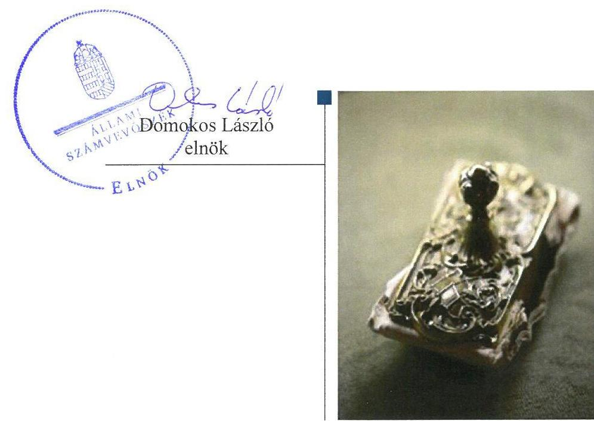
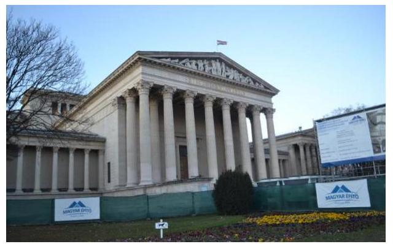
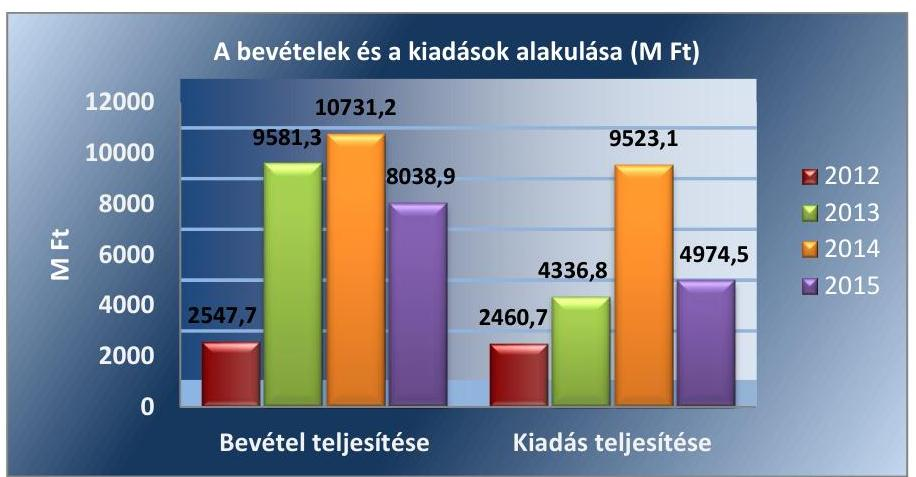

# Jelentés 

## A központi alrendszer intézményei

A központi alrendszer egyes intézményei pénzügyi és vagyongazdálkodásának ellenőrzése - Szépművészeti Múzeum 2017.

---

# Jelentés 

## A központi alrendszer intézményei

A központi alrendszer egyes
intézményei pénzügyi és
vagyongazdálkodásának ellenőrzése -
Szépművészeti Múzeum
2017. 08. hó 34. nap

---

# AZ ELLENŐRZÉST FELÜGYELTE:

## MAKKAI MÁRIA felügyeleti vezető

## AZ ELLENŐRZÉST VEZETTE ÉS A VÉGREHAJTÁSÁÉRT FELELŐS:

### KAKAS SÁNDOR ellenőrzésvezető

### A PROGRAM ÖSSZEÁLLÍTÁSÁÉRT FELELŐS:

### JANIK JÓZSEF LÁSZLÓ osztályvezető

---

**IKTATÓSZÁM:** V-1236-116/2016

**TÉMASZÁM:** 2270

**ELLENŐRZÉS-AZONOSÍTÓ SZÁM:** V076012

---

Jelentéseink az Országgyűlés számítógépes hálózatán és az Interneten a www.asz.hu címen is olvashatóak.

---

# TARTALOMJEGYZÉK 

■ ÖSSZEGZÉS ..... 5
■ AZ ELLENŐRZÉS CÉLJA ..... 6
■ AZ ELLENŐRZÉS TERÜLETE ..... 7
■ AZ ELLENŐRZÉS HÁTTERE, INDOKOLTSÁGA ..... 9
■ A JELENTÉS LÉNYEGES KÉRDÉSKÖREI ..... 10
■ ELLENŐRZÉS HATÓKÖRE ÉS MÓDSZEREI ..... 11
■ MEGÁLLAPÍTÁSOK ..... 14
■ JAVASLATOK ..... 21
■ MELLÉKLETEK ..... 23
I. sz. melléklet: Értelmező szótár ..... 23
II. sz. melléklet: Az Integritás érvényesítése érdekében kialakított és működtetett kontrollrendszer ..... 26
■ FÜGGELÉK: ÉSZREVÉTELEK ..... 27
■ RÖVIDÍTÉSEK JEGYZÉKE ..... 31

---

.

---

# ÖSSZEGZÉS 

A Nemzeti Erőforrás Minisztérium és az Emberi Erőforrások Minisztérium Szépművészeti Múzeumra vonatkozó irányító szervi feladatellátása szabályszerű volt. A múzeumigazgató által kialakított belső irányítási rendszer biztosította a szabályszerű, átlátható és elszámoltatható közpénzfelhasználást. A pénzügyi gazdálkodás összességében szabályszerű volt. A vagyongazdálkodás nem volt szabályszerű, mert a mérlegek nem a valós helyzetet tükrözték. A Szépművészeti Múzeum vezetése nem épített ki megfelelő védelmet a korrupciós veszélyekkel szemben, de 2015-re megerősítette a kontrollokat. A közpénzfelhasználás eredményességét a gazdálkodás folyamatában mérhető célok nem támasztották alá.

## Az ellenőrzés társadalmi indokoltsága

A központi alrendszer részét képező múzeum alapvető rendeltetése a közfeladatok ellátásának biztosítása, ennek keretében a kulturális örökséghez tartozó javak védelme, őrzése és a nyilvánosság számára történő hozzáférhetővé tétele. A közpénzek felhasználásában meghatározó, központi alrendszerbe tartozó intézmények pénzügyi és vagyongazdálkodási tevékenységük és/vagy feladatellátásuk súlya miatt jelentős hatást gyakorolhatnak a költségvetés egyensúlyának fenntartására. Hatással vannak továbbá az állami vagyonnal való gazdálkodás minőségére, a kormányzati (szak)politikák végrehajtására, illetve közfeladat ellátásuk vonatkozásában az állampolgárok életminőségére, jogaik és kötelezettségeik gyakorlására. E szervezetekkel szemben társadalmi igény, hogy tevékenységükről a döntéshozók és a nyilvánosság felé elszámoljanak.

## Főbb megállapítások, következtetések, javaslatok

Az irányító szerv az ellenőrzött időszakban szabályszerűen gyakorolta az alapítói, a munkáltatói, valamint az egyéb felügyeleti, ellenőrzési jogosultságokat.

A belső kontrollrendszer kialakítása és működtetése az ellenőrzött években összességében szabályszerű volt. A kontrollkörnyezet kialakítása összességében szabályszerű volt. A kockázatkezelési rendszert - a 2012-2013. évek kivételével - kialakították, azonban a működtetése csak a 2015. évben valósult meg. A kontrolltevékenység működtetése a - a 2012-2014. évek kivételével - szabályszerű volt. Az információs és kommunikációs folyamatok kialakítása az ellenőrzött időszakban összességében megfelelt a jogszabályi előírásoknak. A Szépművészeti Múzeum az ellenőrzött időszakban a közzétételi kötelezettségét hiányosan teljesítette, ezáltal nem biztosította a működés és a gazdálkodás átláthatóságát. A belső ellenőrzés kialakításáról és működtetéséről gondoskodtak.

A Szépművészeti Múzeum pénzügyi gazdálkodása összességében szabályszerű volt. Az elemi költségvetés készítése során betartották a jogszabályi előírásokat és a belső szabályzatokban foglaltakat, a bevételi és kiadási előirányzatok módosítása és átcsoportosítása megfelelt a jogszabályi előírásoknak.

A Szépművészeti Múzeum beszámoló készítési kötelezettségének eleget tett, azonban a 2012-2015. évi beszámolók nem feleltek meg a jogszabályi előírásoknak, mert azok mérlegei nem a valós képet tükrözték, mivel a beszámolókban olyan állami tulajdonban lévő vagyonelemeket mutatott ki vagyonkezelt eszközként, amelyekre vonatkozóan vagyonkezelési szerződéssel nem rendelkezett. A Szépművészeti Múzeum az állagmegóvási kötelezettségeit a jogszabályok figyelembe vételével teljesítette.

A Szépművészeti Múzeumnál az integritás kontrollrendszer kiépítettsége nem volt egyensúlyban a korrupciós kockázatok szintjével.

A gazdálkodás folyamatában számszerűsített, mérhető célokat, célértékeket nem határoztak meg.

---

# AZ ELLENŐRZÉS CÉLJA 

AZ ELLENŐRZÉS célja annak megítélése volt, hogy az ellenőrzött Múzeumra ${ }^{1}$ vonatkozó irányító szervi feladatellátás a jogszabályi előírások betartásával történt-e; a Múzeumnál a belső kontrollrendszer kialakítása és működtetése szabályszerű volt-e; kialakították-e az erőforrásokkal való szabályszerű, gazdaságos, hatékony és eredményes gazdálkodás követelményeit; szabályszerű volt-e a beszámolási és adatszolgáltatási kötelezettségek teljesítése; a Múzeum pénzügyi és vagyongazdálkodása megfelelt-e a jogszabályi előírásoknak és belső szabályzatainak; a Múzeum átalakításának vagy átszervezésének lebonyolítása szabályszerűen történt-e.

Az ellenőrzés keretében értékeltük a Múzeum korrupciós kockázatainak kezelését szolgáló integritás kontrollok kiépítettségét és az integritás szemlélet érvényesülését.

A KIEGÉSZÍTŐ TELJESÍTMÉNY-ELLENŐRZÉSI MODUL célja annak értékelése volt, hogy a gazdálkodás folyamatában a gazdaságossági, hatékonysági és eredményességi célok kialakítása megtörtént-e, a célok elérése érdekében tettek-e intézkedéseket, a célkitűzéseket elérték-e; a szándékolt eredményeket elérték-e.

---

# AZ ELLENŐRZÉS TERÜLETE 

## Szépművészeti Múzeum

A Múzeumot 1896. május 12-én alapították, alapításáról az 1896. évi VIII. törvénycikk rendelkezett. A Múzeum országos hatókörű költségvetési szerv, amelyet főigazgató vezet.

A Múzeum alaptevékenysége keretében végzi a gyűjtőkörébe tartozó kulturális javak (tárgyi, képi, írásos, hang- és egyéb forrásanyag) és az ehhez kapcsolódó kulturális értékkel bíró információk felkutatását, gyűjtését, őrzését, nyilvántartását, kezelését, állagmegóvását és védelmét, valamint tudományos feldolgozását, a tudományos eredmények közzétételét. A Múzeum tevékenységét az Mtv. ${ }^{2}$ és a Kult. tv. ${ }^{3}$ határozta meg.

A Múzeum irányítószerve 2012. május 13-ig a NEFMI ${ }^{4}$, ezt követően az EMMI${ }^{5}$ volt.

A Magyar Nemzeti Galéria 2012. augusztus 31-i Múzeumba történő beolvadása Áht. ${ }^{6}$ szerinti jogutódlást eredményező átalakításnak minősült.

Az állami tulajdonban lévő Zichy Mihály Emlékház fenntartói joga a 1543/2012. (XII.4.) Korm. határozat alapján 2012. december 30-án megkötött megállapodás eredményeképpen a Somogy Megyei Intézményfenntartó Központtól a személyi, tárgyi, vagyoni és pénzügyi feltételek egyidejű átadásával került a Múzeumhoz. A megállapodás értelmében a vagyonra vonatkozó kérdéseket a feleknek az MNV Zrt. ${ }^{7}$-vel megkötött külön megállapodásban kellett rendezniük, továbbá az átvett, illetve a használt vagyon tekintetében kötendő megállapodás érdekében a Múzeumnak kellett tárgyalást kezdeményeznie az MNV Zrt.-vel. A vagyonkezelési szerződés 2015. január 27-én jött létre.

A korábban az Iparművészeti Múzeum főosztály szintű szervezeti egységeként működő Hopp Ferenc Kelet-ázsiai Művészeti Múzeum irányító szervi döntés alapján, átadás-átvételi megállapodás megkötését követően 2014. március 1-i hatállyal került a Múzeumhoz a feladatellátáshoz rendelkezésre álló személyi, tárgyi és pénzügyi erőforrásokkal. Az átvett, illetve a használt vagyon tekintetében kötendő megállapodás érdekében a Múzeumnak kellett tárgyalást kezdeményeznie az MNV Zrt.-vel. Megállapodás az ellenőrzött időszakban nem jött létre.

A Múzeum jogállása a 2012-2013. években önállóan működő és gazdálkodó költségvetési szerv, a 2014-2015. években gazdasági szervezettel rendelkező költségvetési szerv volt. A Múzeum vállalkozási tevékenységet nem folytatott.

A Múzeum alkalmazottainak foglalkoztatására a Kjt. ${ }^{8}$ alapján került sor. Az ellenőrzött időszakban a főigazgató és a gazdasági vezető személyében változás nem történt.

---

A Múzeum teljesített költségvetési bevételeinek és kiadásainak alakulását az 1. ábra mutatja be.

1. ábra

*Forrás: Múzeum 2012-2015. évi beszámolói*

---

# AZ ELLENŐRZÉS HÁTTERE, INDOKOLTSÁGA 

Az államháztartás központi alrendszerének közpénz felhasználása, az intézmények által ellátott közfeladatok sokrétűsége, valamint a feladatellátásához rendelt vagyon nagyságrendje indokolja, hogy az ÁSZ ${ }^{9}$ ellenőrzéseket folytasson a pénzügyi és vagyongazdálkodás területén. Az ÁSZ az ellenőrzései során feltárja a gazdálkodást, a központi alrendszer intézményei átalakulását, átszervezését érintő szabályozások esetleges hiányosságait, a szabályozással nem érintett gazdálkodási területeket, rámutathat a vagyongazdálkodási tevékenység - ezen belül a tulajdonosi joggyakorlás és vagyonkezelés - esetleges szabálytalanságaira, értékeli az állami vagyon nyilvántartására és elszámolására vonatkozó eljárásokat.

AZ ELLENŐRZÉS VÁRHATÓAN HOZZÁJÁRUL a központi intézmények pénzügyi helyzetének pontosabb megítéléséhez és a jó gyakorlat kialakításán és terjesztésén keresztül az ellenőrzések elősegíthetik a gazdálkodás szabályszerűségének javítását.

A Kormány „jó állam" megteremtésével kapcsolatos céljaival összhangban van, hogy olyan teljesítményértékelési rendszer kerüljön kialakításra és működtetésre, amely hozzájárul a szervezeti teljesítmény növeléséhez, a fejlődési lehetőségek kihasználásához. Az ÁSZ a rendszer kiépítésében vállalt aktív ellenőrzési, értékelési tevékenységével kíván hozzájárulni a „jó állam" megteremtéséhez.

---

# A JELENTÉS LÉNYEGES KÉRDÉSKÖREI 

1.     - Az irányító szerv ellenőrzött Múzeumra vonatkozó feladatellátása szabályszerű volt-e?
2.     - A belső kontrollrendszer kialakítása és működtetése biztosította-e a közpénzekkel és a nemzeti vagyonnal történő szabályszerű, gazdaságos, hatékony és eredményes gazdálkodást, illetve a beszámolási és adatszolgáltatási kötelezettségek szabályszerű teljesítését?
3.     - A Múzeum pénzügyi gazdálkodása szabályszerű volt-e?
4. A Múzeum vagyongazdálkodása szabályszerű volt-e?
5.     - Szabályszerűen történt-e az ellenőrzött időszakban a Múzeumot érintő szervezeti, szerkezeti átalakítások lebonyolítása?
6.     - Érvényesült-e az integritás szemlélet és ennek megfelelően kiépítették-e az integritás kontrollrendszert a Múzeumnál?
7. Meghatároztak-e célokat a gazdálkodási folyamatok tekintetében és értékelték-e azok teljesülését?

---

# ELLENŐRZÉS HATÓKÖRE ÉS MÓDSZEREI 

## Az ellenőrzés típusa

Megfelelőségi és teljesítmény-ellenőrzés.

## Az ellenőrzött időszak

Az ellenőrzött időszak 2012. január 1-jétől 2015. december 31-ig tartott.

## Az ellenőrzés tárgya

Az ellenőrzött szervezetre vonatkozó irányító szervi feladatok ellátása. Az intézmény belső kontroll rendszerének kialakítása és működtetése. A pénzügyi és vagyongazdálkodás szabályszerűsége. Az intézmény beszámolási és adatszolgáltatási kötelezettségének teljesítése. Az intézmény átalakításának vagy átszervezésének lebonyolítása szabályszerűsége.

A teljesítmény-ellenőrzési kiegészítő modul esetében az intézmény gazdálkodási folyamatában a gazdaságossági, hatékonysági és eredményességi célok és célértékek kialakítása, a kapcsolódó intézkedések meghatározása, a célkitűzések elérésének értékelése.

Az ellenőrzés kiterjedt minden olyan körülményre és adatra, amely az ÁSZ jogszabályban meghatározott feladatainak teljesítéséhez, valamint a program végrehajtása folyamán felmerült újabb összefüggések feltárásához voltak szükségesek.

## Az ellenőrzött szervezet

A Szépművészeti Múzeum és az irányító szervi feladatot 2012. január 1-je és 2012. május 13. között ellátó Nemzeti Erőforrás Minisztérium, továbbá az irányító szervi feladatot 2012. május 14-től ellátó Emberi Erőforrások Minisztériuma.

## Az ellenőrzés jogalapja

Az ellenőrzés jogszabályi alapját az ÁSZ tv. ${ }^{10} 1. § (3) bekezdés, 5. § (2)-(6) bekezdései, valamint Áht. 61. § (2) bekezdésének előírásai képezték.

---

# Az ellenőrzés módszerei 

Az ellenőrzést az ellenőrzési program szempontjai, az ellenőrzött időszakban hatályos jogszabályok, az ellenőrzés szakmai szabályai, a jelen ellenőrzésre irányadó ÁSZ módszertanok figyelembevételével végeztük.

Az ellenőrzési kérdések megválaszolásához szükséges bizonyítékok megszerzése az ellenőrzött által rendelkezésre bocsátott dokumentumokra, adatokra alapozva megfigyelés, szemle (szemrevételezés), kérdésfeltevés (információkérés), mintavételezés, valamint elemző eljárás útján történt. Az ellenőrzési bizonyítékként felhasználható adatforrások közé tartoznak egyrészt az ellenőrzési program részletes szempontjainál felsorolt adatforrások, másrészt minden egyéb - az ellenőrzés folyamán feltárt, az ellenőrzés szempontjából információt tartalmazó - dokumentum.

Az ellenőrzés lefolytatásához az ellenőrzött szervezet a tanúsítványok kitöltésével, valamint az ÁSZ által kért dokumentumok megküldésével szolgáltatott adatokat.

Az integritás szemlélet érvényesülésének értékelése a Múzeum önbevallás útján kitöltött tanúsítványa alapján, valamint az integritási kontrollok kiépítettségére vonatkozó ellenőrzési kérdésekre adott válaszok alapján történt.

Az ellenőrzés lefolytatásához az intézmény a tanúsítványok elektronikus kitöltésével, valamint az ÁSZ által kért dokumentumok elektronikus megküldésével szolgáltatott adatokat. A rendelkezésre bocsátott adatok, információk kontrollja az ellenőrzés keretében történt.

Az ÁSZ a belső kontrollrendszer jogszabályi előírások szerinti kialakításának és működtetésének szabályszerűségét az erre irányuló ellenőrzési kérdésekre adott válaszok összesítése alapján, a lényegességi szempontok figyelembe vételével évente pillérenként (kontrollkörnyezet, kockázatkezelési rendszer, kontrolltevékenységek, információs és kommunikációs
 rendszer, monitoring rendszer) és összesítetten is minősítette. Az ÁSZ a pénzügyi gazdálkodás és a vagyongazdálkodás kialakításának és működtetésének szabályszerűségét az erre irányuló ellenőrzési kérdésekre adott válaszok összesítése alapján, a lényegességi szempontok figyelembe vételével évenkénti bontásban minősítette. „Szabályszerű”-nek értékelte az ellenőrzött területet, amennyiben a szabályozás, illetve végrehajtás során a jogszabályi követelményeket maradéktalanul, vagy kisebb hiányosságok mellett érvényesítették, „nem szabályszerű”-nek értékelte, amennyiben a szabályozás hiányosságai nem biztosították a szabályszerű működés feltételeit, illetve a gazdálkodás folyamatában jelentkező hibák lényegesek, nagyszámúak, vagy rendszerszerűek voltak.

Mintavételi eljárás alapján ellenőrizte az ÁSZ a Múzeumnál a foglalkoztatottak személyi juttatásai és a külső személyi juttatások, a dologi és felhalmozási kiadások, a bevételek beszedése, a pénzgazdálkodáshoz kapcsolódó kontrolltevékenységek szabályszerűségét. A minta alapján a sokaságban előforduló hibaarányt statisztikai becslés módszerével állapította meg. Az értékelés eredményeként kétféle, "Megfelelő" és "Nem megfelelő" minősítést alkalmazott. „Megfelelő”-nek értékelt egy ellenőrzött területet, amennyiben a hibaarány a teljes sokaságban 95%-os bizonyossággal legfeljebb 10% arányt képviselt. Abban az esetben, ha adott sokaság tekinte-

---

tében a 10%-os hibaarány küszöbérték átlépése megítélésének megbízhatósága nem érte el a 95%-ot, annak elérése érdekében az értékelést lényegességi alapon további szempontokkal egészítette ki, és figyelembe vette a feltárt hibák értékét.

A teljesítmény-ellenőrzés során a számvevőszéki ellenőrzés szakmai szabályai szerint, a megfelelőségi ellenőrzést kiegészítve, a teljesítményellenőrzés módszerével, a vonatkozó nemzetközi standardok figyelembe vételével értékelte az ÁSZ, hogy a gazdálkodás folyamatában a gazdaságossági, hatékonysági és eredményességi célok kialakítása megtörtént-e, a célok elérése érdekében tettek-e intézkedéseket, a célkitűzéseket elérték-e; a szándékolt eredményeket elérték-e. Az ellenőrzés a gazdálkodási feladatokra terjedt ki, a szakmai feladatellátást nem értékelte.

A teljesítmény-ellenőrzési kiegészítő programmodulban megfogalmazott ellenőrzési cél megválaszolásához az alapprogram végrehajtása során megfogalmazott megállapításokat is figyelembe vette.

---

# 1. Az irányító szerv ellenőrzött Múzeumra vonatkozó feladatellátása szabályszerű volt-e? 

Összegző megállapítás Az irányító szerv ${ }^{11}$ Múzeumra vonatkozó feladatellátása szabályszerű volt.

AZ ALAPÍTÓI JOGOSULTSÁGOT az irányító szerv szabályszerűen gyakorolta. Az alapító okiratot ${ }_{1-7}{ }^{12}$ a 2012-2015. években az irányító szerv az Áht. előírásainak megfelelően kiadta, a módosításokat elvégezte. Az alapító okirat ${ }_{1-7}$ megfelelt a jogszabályi előírásoknak. Az alapító okiratok kiadásához és módosításához az államháztartásért felelős miniszter előzetes egyetértését beszerezték.

A MUNKÁLTATÓI JOGOKAT az irányító szerv szabályszerűen gyakorolta, a Múzeum főigazgatói munkakörének betöltésére vonatkozóan az Áht. rendelkezésével összhangban adott megbízást.

AZ EGYÉB IRÁNYÍTÁSI, FELÜGYELETI ÉS ELLENŐRZÉSI JOGOSULTSÁGOKAT az irányító szerv szabályszerűen gyakorolta. Jóváhagyta a Múzeum elemi költségvetését, éves költségvetési beszámolóját, SZMSZ ${ }_{1-7}$-ét ${ }^{13}$, az Áht.-ban előírt beszámoltatási és ellenőrzési kötelezettségét teljesítette. Az irányító szerv a Múzeum gazdálkodását az Áht. előírása szerint nyomon követte.
2. A belső kontrollrendszer kialakítása és működtetése biztosította-e a közpénzekkel és a nemzeti vagyonnal történő szabályszerű, gazdaságos, hatékony és eredményes gazdálkodást, illetve a beszámolási és adatszolgáltatási kötelezettségek szabályszerű teljesítését?

Összegző megállapítás
2.1. számú megállapítás

A belső kontrollrendszer kialakítása és működtetése az ellenőrzött időszakban összességében szabályszerű volt.

A kontrollkörnyezet kialakítása összességében szabályszerű volt.
A MÚZEUM MŰKÖDÉSÉNEK SZERVEZETI KERETEIT az ellenőrzött időszakban kialakították. A Múzeum rendelkezett a Számv. tv. ${ }^{14}$, az Áht., az Áhsz. ${ }^{15}$ és Áhsz. ${ }^{16}$, valamint az Ávr. és a Bkr. által előírt, a gazdálkodás és működés rendjét meghatározó belső szabályzatokkal.

---

A kontrollkörnyezet kialakításában az alábbi hiányosságok fordultak elő:
$\longrightarrow$ a Számlarend ${ }_{3}{ }^{17}$-ban az Áhsz. ${ }_{2}$ 51. § (3) bekezdésében előírtak ellenére nem szabályozták a részletező nyilvántartások vezetésének módját, azoknak a kapcsolódó könyvviteli és nyilvántartási számlákkal való egyeztetését, annak dokumentálását, valamint a részletező nyilvántartások és a feladások elkészítésének rendjét, az összesítő bizonylat tartalmi és formai követelményeit;
belső szabályzatban nem rendezték az Ávr. ${ }^{18}$ 13. § (2) bekezdés c) pontjában foglaltak ellenére a belföldi kiküldetések elrendelésével és lebonyolításával, elszámolásával kapcsolatos kérdéseket.
2.2. számú megállapítás

# A kockázatkezelési rendszert csak 2013. október 15-től alakították ki és a 2015. évtől működtették. 

A Múzeum a kockázatkezelési rendszer kialakításáról 2012. január 1-je és 2013. október 14. között a Bkr 3. § b) pontjában foglaltak ellenére nem gondoskodott, a 2013. október 15. és 2015. december 31. közötti időszakban a szabályszerű kialakítás megtörtént, a Kockázatkezelési Szabályzat ${ }^{19}$ hatályba léptetésre került. A kockázatkezelési rendszert a 2012-2014. években a Bkr. 7. § (1)-(2) bekezdésében foglaltak ellenére nem működtették, mert a Múzeum tevékenységében, gazdálkodásában rejlő kockázatokat nem mérték fel. A működtetés a 2015. évben megvalósult, a Múzeum tevékenységében, gazdálkodásában rejlő kockázatokat felmérték.
2.3. számú megállapítás

A kontrolltevékenység kialakítása a Múzeumnál a 2012-2013. években nem volt megfelelő, a 2014-2015. években megfelelt a jogszabályokban és a belső szabályzatokban foglaltaknak, a működtetése csak a 2015. évben volt szabályszerű.

A KONTROLLTEVÉKENYSÉG kialakítása keretében a Múzeum az SZMSZ ${ }_{1-7}$-ben és az Ügyrend ${ }_{12}{ }^{20}$-ben, továbbá Gazdálkodási Szabályzat ${ }_{3.4}{ }^{21}$-ben biztosította a Bkr. 8. § (2) bekezdés a), c), d) pontjaiban meghatározott tevékenységek feladatköri elkülönítését. A gazdálkodási jogkörök gyakorlására jogosultak kijelölése az ellenőrzött időszakban az Ávr. előírásai alapján, szabályszerűen történt. Az Ávr. 60. § (3) bekezdésének előírása ellenére a teljesítés igazolására jogosult személyekről és aláírás-mintájukról a 2012. január 1. és 2013. július 31. közötti időszakban a Múzeum nem vezetett nyilvántartást.

A KONTROLLTEVÉKENYSÉG MŰKÖDTETÉSE a 2012-2014. években nem volt szabályszerű, a 2015. évben szabályszerű volt. A kontrolltevékenység működtetése során feltárt hiányosságokat részletesen a 3.3. pont tartalmazza.
2.4. számú megállapítás

Az információs és kommunikációs folyamatok kialakítása és működtetése összességében megfelelt a jogszabályi előírásoknak.

A MÚZEUM INFORMÁCIÓS RENDSZERÉT a 2012-2015. években a főigazgató a Bkr. 3. § d) pontja alapján kialakította. A Múzeum iratkezelési szabályzata ${ }_{1.2}{ }^{22}$ az Ltv. ${ }^{23}$ előírásainak megfelelően, az Ikr. ${ }^{24}$ előírásaival összhangban került kiadásra.

---

A Múzeum adatvédelmi és adatbiztonsági szabályzatát az Info tv. ${ }^{25} 24$. § (3) bekezdésének előírásai ellenére az ellenőrzött időszakban nem készítették el.

A KÖZZÉTÉTELI KÖTELEZETTSÉGÉT a Múzeum az ellenőrzött időszakban az Info tv. 37. § (1) bekezdésében foglaltak ellenére hiányosan teljesítette, mert az éves költségvetését és költségvetési beszámolóját (Info tv. 1. melléklet III.1. pontja) nem tette közzé.
2.5. számú megállapítás

A Múzeumnál a jogszabályi előírásoknak megfelelően kialakították a belső ellenőrzés rendszerét, amelynek működése szabályszerű volt.

A BELSŐ ELLENŐRZÉS kialakításáról az Áht. és a Bkr. előírásának megfelelően a főigazgató gondoskodott az ellenőrzött időszakban. A Múzeum rendelkezett a belső ellenőrzés működéséhez a főigazgató által jóváhagyott Belső ellenőrzési kézikönyvvel ${ }_{1,2}{ }^{26}$. A Bkr. előírásainak megfelelően elkészítették az éves ellenőrzési terveket. A belső ellenőrzési vezető vezette a Bkr. 50. § (1) bekezdésében előírt nyilvántartást az elvégzett belső ellenőrzésekről.

A KÜLSŐ ELLENŐRZÉSEK javaslatai alapján készült intézkedési tervek végrehajtásáról éves bontásban a Bkr. 14. § (1) bekezdésének megfelelően vezettek nyilvántartást. A Múzeumnál az ellenőrzött időszakban a KEHI ${ }^{27}$, a Kincstár és az EMMI végzett ellenőrzést.
2.6. számú megállapítás

A célok elérését szolgáló követelményeket kialakították.
A rendelkezésre álló források gazdaságos, hatékony és eredményes felhasználásának követelményeit meghatározó belső szabályzatokkal (Számviteli politika és kapcsolódó szabályzatok, éves munkatervek) a Múzeum az ellenőrzött időszakban rendelkezett. A Múzeum a célok elérését a számviteli és szakmai beszámolókban értékelte.

# 3. A Múzeum pénzügyi gazdálkodása szabályszerű volt-e? 

Összegző megállapítás

A Múzeum pénzügyi gazdálkodása összességében szabályszerű volt.
3.1. számú megállapítás

A Múzeum az elemi költségvetés és az előirányzatok megállapítása során betartotta a jogszabályban és a belső szabályzatokban foglalt előírásokat.

A KÖLTSÉGVETÉS TERVEZÉSSEL kapcsolatos feladatokat az Ávr. előírásaival összhangban az Ügyrend ${ }_{1,2}$-ben rögzítették.

A Múzeum a költségvetési javaslat elkészítése során az előirányzatok megállapításakor az Ávr.-ben foglaltak szerint figyelembe vette az ellenőrzött időszakban bekövetkezett szervezeti változásokat. Az elemi költségvetés, az előirányzatok megállapítása megfelelt a jogszabályi előírásoknak és a belső szabályzásban foglaltaknak, az előirányzatok összegét számítások-

---

### 3.2. számú megállapítás

1. táblázat

|  | ELŐIRÁNYZAT MÓDOSÍTÁSOK |  |  |  |
| :-- | :--: | :--: | :--: | :--: |
|  | ALAKULÁSA (M FT) |  |  |  |
|  |  |  |  |  |
|  | Országgyűj- | Kormány- | Kérel- |  |
|  | tö |  |  |  |
| 2012. | - | 366,0 | 88,8 | 281,6 |
| 2013. | - | 5629,7 | 249,6 | 854,1 |
| 2014. | - | 963,7 | 51,3 | 6271,5 |
| 2015. | 1278,3 | 1530,8 | 520,1 | 1485,3 |

3.3. számú megállapítás
kal alátámasztották. A Múzeum a 2012-2015. közötti időszakban az államháztartás információs rendszerébe az Áht. előírásának megfelelően teljesítette az elemi költségvetéséről az adatszolgáltatási kötelezettségét.

## A bevételi és kiadási előirányzatok módosítása, átcsoportosítása

megfelelt a jogszabályi előírásoknak.

A Múzeum költségvetési előirányzatainak módosítására az ellenőrzött időszakban Országgyűlési, Kormány, irányítószervi és intézményi hatáskörben, szabályszerűen került sor. A Múzeum az Áhsz. 1,2 előírásának megfelelően rendelkezett az előirányzatok módosításához, átcsoportosításához analitikus nyilvántartással. Az előirányzat-módosítások főkönyvi könyvelésbe feladása és egyeztetése megtörtént, az előirányzat módosítások az analitikus nyilvántartással és a főkönyvi könyvelés adataival megegyeztek. Az előirányzat-módosítások dokumentumait a Számv. tv. előírása szerint megőrizték. Az előirányzat módosítások adatait az 1. táblázat tartalmazza.

## A bevételek elszámolása az ellenőrzött időszakban nem felelt meg, a kiadási előirányzatok felhasználása a 2012-2014. években nem felelt meg, a 2015. évben megfelelt a jogszabályi előírásoknak.

A BEVÉTELEK elszámolása nem volt szabályszerű, mert a bérleti szerződések vonatkozásában nem állt rendelkezésre a szerződő fél Nvtv. ${ }^{28} 3 . \S$ (2) bekezdésében foglalt nyilatkozata arról, hogy átlátható szervezetnek minősül-e.

A KIADÁSI ELŐIRÁNYZATOK teljesítése során a gazdálkodási jogkörök gyakorlása a személyi juttatások, a dologi és dologi jellegű, a felhalmozási kiadások esetében a 2012-2014. években nem felelt meg, a 2015. évben összességében megfelelt a jogszabályi és a belső előírásoknak. A jogkörök gyakorlása során az alábbi hiányosságok fordultak elő:
$\longrightarrow$ a 2012-2014. években a pénzügyi ellenjegyzés nem volt szabályszerű, mert a működési kiadások esetében az Ávr. 55. § (1) bekezdésének előírása ellenére a kötelezettség vállalás dokumentumán nem rögzítették a pénzügyi ellenjegyzés tényére történő utalást, a 2012. és 2015. években a pénzügyi ellenjegyzés dátumát;
$\longrightarrow$ a 2012-2013. években a teljesítésigazolások nem voltak szabályszerűek, mert nem feleltek meg az Ávr. 57. § (3) bekezdésének, mivel nem volt beazonosítható a teljesítés igazolásra jogosult személye;
$\longrightarrow$ az érvényesítés nem volt szabályszerű a 2013-2014. években, mert azt az Ávr. 58. § (4) bekezdése ellenére nem az arra jogosult személy végezte el;
$\longrightarrow$ a 2012-2014. években a kifizetésekre az Áht. 38. § (1) bekezdésében foglaltak ellenére utalványozás nélkül került sor, ezen kifizetések esetében az Ávr. 58. § (1) bekezdésében előírt érvényesítés is elmaradt. Jogosulatlan kifizetést az ellenőrzés nem tárt fel.
A Múzeum a 2012-2014. években nem gondoskodott az Ávr.
 56. § (1) bekezdésének előírásai ellenére a személyi jellegű kifizetésekre vonatkozó kötelezettségvállalások nyilvántartásba vételéről.

Az Ávr. 50. § (1) bekezdés a) pontjában foglaltak ellenére a kötelezettségvállalás alapját képező szerződés, illetve megrendelés a 2012., 2014-

---

# 3.4. számú megállapítás 

2015. években nem tartalmazta a szakmai, műszaki teljesítés határidejét, valamint a 2014. évben az Ávr. 50. § (1) bekezdés b) pontjában foglaltak ellenére a pénzügyi teljesítés módját. A Múzeum a 2015. évben egy esetben nem teljesítette a Kbt. ${ }^{29}$ 5. § és 119. §-ban előírt közbeszerzési kötelezettségét.

## A Múzeum a beszámolási kötelezettségét teljesítette. A beszámolók - a vagyongazdálkodás hiányosságai miatt - nem feleltek meg a jogszabályi előírásoknak.

A Múzeum az ellenőrzött időszakban az éves költségvetési beszámolóját az Áhsz. ${ }_{1,2}$ alapján elkészítette. Az éves költségvetési beszámolókat az irányító szerv minden évben felülvizsgálta és elfogadta. A 2012-2015. évi beszámolók nem feleltek meg a Számv. tv. előírásainak, a hiányosságokat részletesen a 4.1. pont tartalmazza.

A Múzeum a költségvetési beszámolót a 2012-2013. és a 2015. évben az Áhsz. ${ }_{1,2}$-ben rögzített határidőben benyújtotta a fejezetet irányító szerv részére. A 2014. évi költségvetési beszámolót az Áhsz. ${ }_{2}$ 32. § (1) bekezdése szerinti határidőn túl nyújtották be. A Múzeum az Ávr. előírásai szerint teljesítette az időközi mérlegjelentés készítési és a tartozásállományára vonatkozó adatszolgáltatási kötelezettségét. Az ellenőrzött időszakban a főkönyvi könyvelés és az analitikus nyilvántartás adatai közötti egyezőség a Számv. tv.-nek megfelelően biztosított volt.

## 3.5. számú megállapítás

Az előirányzat-maradvány megállapítása az ellenőrzött időszakban szabályszerűen történt.

Likviditási tervet a 2012-2014. években a Múzeum az Áht. 78. § (2) bekezdésében előírtak ellenére nem készített. A 2015. évben a likviditási tervet az Áht. szerint elkészítették.

A maradvány megállapítása során a Múzeum betartotta a jogszabályi előírásokat. A kötelezettséggel terhelt maradvány megállapítása a 2012-2015. években megfelelt az Ávr. előírásainak. A tárgyévi maradványok irányító szerv általi jóváhagyása megtörtént. A Múzeumnak előirányzat-maradványából az Ávr. 151. § (1) bekezdése szerinti maradványok esetében a jóváhagyott összegek terhére a 2012. év esetében $0,2 \mathrm{M} \mathrm{Ft}$, a 2014. év esetében 10,0 M Ft befizetési kötelezettséget írtak elő, amely befizetési kötelezettségének a Múzeum eleget tett.

## 4. A Múzeum vagyongazdálkodása szabályszerű volt-e?

## Összegző megállapítás

### 4.1. számú megállapítás

## A Múzeum vagyongazdálkodása nem volt szabályszerű.

A vagyon értékének megőrzését, gyarapítását szolgáló vagyongazdálkodás feltételeinek kialakítása nem volt szabályszerű. A Múzeum mérlegei nem a valós képet tükrözték.

Vagyonkezelési szerződés ${ }_{1-3}{ }^{30}$-ben rögzítették a Múzeum vagyonkezelői jogát. A vagyonkezelési szerződés ${ }_{1-3}$ - a szerződés-

---

ben foglalt vagyon tekintetében - az ellenőrzött időszakban a Vtvr. ${ }^{31}$ előírásainak megfelelően biztosította a tulajdonosi joggyakorlás és a vagyonkezelői feladatok szabályozott, átlátható végrehajtását és a vagyon használatának ellenőrzését.

A Múzeum a Zichy Mihály Emlékházat a 2012-2014. évi, a Hopp Ferenc Kelet-ázsiai Művészeti Gyűjteményt a 2014-2015. évi beszámolóiban vagyonkezelt eszközként szabálytalanul mutatta ki, mert ezen vagyonelemekre vonatkozóan nem rendelkezett az Nvtv. 11. § (1) bekezdésében foglalt vagyonkezelési szerződéssel. Ez ellentétes volt a Számv. tv. 23. § (2) bekezdésében foglaltakkal, ennek következtében a Múzeum mérlegei nem a valós képet tükrözték.

A vagyon nyilvántartása a fenti hiányosságok miatt nem volt szabályszerű. A Múzeum a Vtvr. 9. § (3) bekezdésében foglalt, az állami vagyonra vonatkozó adatszolgáltatási kötelezettségét az ellenőrzött időszakban nem teljesítette.
4.2. számú megállapítás

# A mérlegben kimutatott eszközöket és forrásokat leltárral alátámasztották. 

A mérlegben kimutatott eszközök és források év végi értékelését az Áhsz.1,2 előírásainak megfelelően elvégezték, azok meglétét leltárral alátámasztották.

A Múzeum az eredményszemléletű számvitelre történő áttérés feladatait a 36/2013. (IX. 13.) NGM rendelet ${ }^{32}$ előírásai szerint végrehajtotta.
4.3. számú megállapítás

A Múzeum az értékmegőrzési és állagmegóvási kötelezettségeit a jogszabályokban előírtak szerint teljesítette, a vagyonelemek hasznosítása szabályszerűen történt.

A Múzeum a rendelkezésére álló forrásokból a vagyontárgyak állagmegóvásának, karbantartásának, működtetésének a Vtv. ${ }^{33}$ 27. § (2) bekezdésében előírtak szerint eleget tett, illetve a vagyontárgyakat a vagyonkezelési szerződésben meghatározott célnak megfelelően használta.

A vagyonelemek hasznosítása, bérbeadása megfelelt az Nvtv., a Vtvr. és a vagyonkezelési szerződés rendelkezéseinek. Az ellenőrzött időszakban vagyonkezelői jog és kötelezettség átruházása harmadik félre nem történt.

## 5. Szabályszerűen történt-e az ellenőrzött időszakban a Múzeumot érintő szervezeti, szerkezeti átalakítások lebonyolítása?

Összegző megállapítás

### 5.1. számú megállapítás

A Múzeumot érintő szervezeti változások lebonyolítása összeségében szabályszerű volt.

Az irányító szerv átalakításhoz kapcsolódó alapítói, irányítói döntései szabályszerűek voltak.

Az Áht. szerinti átalakításra az ellenőrzött időszakban egy esetben került sor. Az 1353/2011. (X. 20.) Korm. határozat alapján az MNG ${ }^{34}$ 2012. augusztus 31-ével a Múzeumba való beolvadással megszűnt. A szervezeti változás az alapító okiratban átvezetésre került, tartalmazta, hogy a Múzeum az általános jogutód.

---

Az ellenőrzött időszakban a szervezeti változásokkal összhangban az alapító okiratokat elkészítették.
5.2. számú megállapítás

A Múzeum az átalakításhoz, átszervezéshez kapcsolódó feladatait szabályszerűen látta el.

A Zichy Mihály Emlékház vonatkozásában a 1543/2012. (XII. 4.) Korm. határozatban előírt határidőhöz (2012. december 15.) képest az átadás-átvételi megállapodás aláírására 2012. december 27-én, határidőn túl került sor. A megállapodás IV/3.11. pontjában rendelkeztek a külön nyilvántartásban nyilvántartott kulturális javak átadásáról, azonban a kulturális javak felsorolása nem képezte az átadás-átvételi megállapodás részét.

Az MNG átadás-átvételi eljárásáról szóló jegyzőkönyvet 2012. szeptember 4-én írták alá. Az MNG vagyona az Áhsz.; 13/A (5) bekezdés alapján elkészített beszámoló mérlegében szereplő adatok, valamint az azt alátámasztó leltár alapján átadásra került.

A Hopp Ferenc Kelet-ázsiai Művészeti Gyűjtemény átadás-átvételére az átadás-átvételi megállapodást a Múzeum és az Iparművészeti Múzeum az irányító szerv jóváhagyásával 2014. március 4-én megkötötte.

# 6. Érvényesült-e az integritás szemlélet és ennek megfelelően kiépítették-e az integritás kontrollrendszert a Múzeumnál? 

Összegző megállapítás

A Múzeum erőfeszítéseket tett az integritás szemlélet érvényesítésére, azonban az integritás kontrollrendszer kiépítettsége nem volt egyensúlyban a korrupciós kockázatok szintjével.

A Múzeum 2015. évben részt vett az ÁSZ Integritás Projektjében ${ }^{35}$. A Múzeum a jogszabályok által előírt szabályossági kontrollokat összességében kiépítette, azonban a korrupciós kockázatokkal szembeni védettséget növelő integritás kontrollok kiépítettsége közepes volt. Az ellenőrzés részletes megállapításait a jelentéstervezet II. számú - „Az Integritás érvényesítése érdekében kialakított és működtetett kontrollrendszer" című - melléklete tartalmazza.

## 7. Meghatároztak-e célokat a gazdálkodási folyamatok tekintetében és értékelték-e azok teljesülését?

Összegző megállapítás

A gazdálkodás folyamatában számszerűsített, mérhető célokat, célértékeket nem határoztak meg, emiatt azok teljesítése nem volt értékelhető.

A Múzeum, illetve az irányító szerv nem határozott meg a gazdálkodási folyamatok tekintetében elérendő számszerűsíthető célokat, célértékeket és azokhoz kapcsolódó intézkedéseket. A célkitűzés hiányában azok teljesítése nem volt értékelhető.

---

# JAVASLATOK 

Az ÁSZ tv. 33. § (1) bekezdésében foglaltak értelmében az ellenőrzött szervezet vezetője köteles a jelentésben foglalt megállapításokhoz kapcsolódó intézkedési tervet összeállítani és azt a jelentés kézhezvételétől számított 30 napon belül az ÁSZ részére megküldeni. Amennyiben az ellenőrzött szervezet vezetője nem küldi meg határidőben az intézkedési tervet, vagy továbbra sem elfogadható intézkedési tervet küld, az Állami Számvevőszék elnöke az ÁSZ tv. 33. § (3) bekezdése a) és b) pontjaiban foglaltakat érvényesítheti.

## a Szépművészeti Múzeum főigazgatójának

1. Intézkedjen a számlarend módosításáról annak érdekében, hogy az teljes körűen megfeleljen az Áhsz. 2 előírásainak. Intézkedjen továbbá a belföldi kiküldetések elrendelésével és lebonyolításával, elszámolásával kapcsolatos kérdések belső szabályzatban történő rendezéséről.
(2.1. sz. megállapítás 1-2. franciabekezdése)
2. Intézkedjen az adatvédelmi és adatbiztonsági szabályzat Info tv. szerinti elkészítéséről.
(2.4. sz. megállapítás 2. bekezdése)
3. Intézkedjen a közzétételi kötelezettség Info tv. előírásainak megfelelő teljes körű teljesítéséről.
(2.4. sz. megállapítás 3. bekezdése)
4. Intézkedjen a bérbeadási folyamat során, hogy a szerződő fél az Nvtv.-ben előírtak szerint nyilatkozzon arról, hogy átlátható szervezetnek minősül.
(3.3. sz. megállapítás 1. bekezdése)
5. Intézkedjen a kiadások vonatkozásában a gazdálkodási jogkörök szabályszerű gyakorlása érdekében.
(3.3. sz. megállapítás 2. bekezdés 1. franciabekezdése)
6. Intézkedjen, hogy a szerződésekben rögzítésre kerüljenek az Ávr-ben előírt tartalmi elemek.
(3.3. sz. megállapítás 4. bekezdés 1. mondata)

---

7. Kezdeményezze az MNV Zrt.-nél a Múzeumnál lévő vagyonelemek használata jogcímének szerződésben történő rendezését, továbbá intézkedjen az éves beszámoló mérlegének szabályszerű elkészítéséről.
(4.1. sz. megállapítás 2. bekezdése)
8. Intézkedjen az állami vagyonra vonatkozó, Vtvr. szerinti adatszolgáltatási kötelezettség teljesítéséről.
(4.1. sz. megállapítás 3. bekezdés 2. mondat)

---

# MELLÉKLETEK 

- I. SZ. MELLÉKLET: ÉRTELMEZŐ SZÓTÁR
átalakítás
állami vagyon értékesítése
állami vagyon használója
állami vagyon hasznosítása
állami vagyon hasznosítása
kötött szerződés
állami vagyon kezelője /vagyonkezelő

ÁSZ Integritás Projekt
elemi költségvetés

A költségvetési szerv általános jogutódlással történő megszüntetése átalakítással történhet. Átalakítás az egyesítés, a szétválás, vagy ha az alapító szerv a költségvetési szervet megszünteti, és az átalakítás során a megszüntetett költségvetési szerv jogutódjaként új költségvetési szervet alapít. (Áht. 11. § (2) bekezdés)
Állami vagyon tulajdonjogának bármely jogcímen történő, visszterhes átruházása. (Forrás: Vtvr. 1. § (7) bekezdés d) pontja)
Az a természetes vagy jogi személy, jogi személyiséggel nem rendelkező szervezet, aki, vagy amely törvény vagy szerződés alapján, bármely jogcímen (bérlet, haszonbérlet, használat stb.) állami vagyont birtokol, használ, szedi annak hasznait, hasznosít, ide nem értve a haszonélvezőt, a vagyonkezelőt és a tulajdonosi jogok gyakorlóját". (Forrás: Vtvr. 1. § (7) bekezdés a) pontja)
Az állami vagyont az MNV Zrt. maga kezeli, vagy szerződés - így különösen bérlet, haszonbérlet, megbízás - alapján központi költségvetési szervnek, természetes vagy jogi személynek, vagy jogi személyiséggel nem rendelkező gazdálkodó szervezetnek hasznosításra átengedi.
(Forrás: Vtv. 23. § (1) bekezdése, hatályos 2012. január 1-jétől)
Az állami vagyonnal a tulajdonosi joggyakorló maga gazdálkodik, vagy szerződés - így különösen bérlet, haszonbérlet, megbízás - alapján hasznosításra átengedi, illetőleg vagyonkezelésbe, haszonélvezetbe adja. (Forrás: Vtv. 23. § (1) bekezdése, hatályos 2013. június 28-ától)
Az állami vagyon hasznosítására kötött szerződések elsődleges célja az állami vagyon hatékony működtetése, állagának védelme, értékének megőrzése, illetve gyarapítása, az állami és közfeladatok ellátásának elősegítése. (Forrás: Vtv. 23. § (2) bekezdése)

Az állami vagyont az MNV Zrt. maga kezeli, vagy szerződés - így különösen bérlet, haszonbérlet, megbízás - alapján központi költségvetési szervnek, természetes vagy jogi személynek, vagy jogi személyiséggel nem rendelkező gazdálkodó szervezetnek hasznosításra átengedi." Az állami vagyonra vonatkozóan az MNV Zrt. kizárólag az Nvtv.-ben meghatározott személyekkel köthet vagyonkezelési szerződést. (Forrás: Vtv. 27. § (1) bekezdése, hatályos 2012. január 1-jétől)
Az Állami Számvevőszék 2009-ben indította el a „Korrupciós kockázatok feltérképezése - Integritás alapú közigazgatási kultúra terjesztése" című, európai uniós forrásból megvalósított kiemelt projektjét (Integritás Projekt). Az Integritás Projekt célja, hogy felmérje a közszféra intézményei korrupciós kockázatoknak való kitettségét, illetőleg az azok mérséklésére hivatott kontrollok szintjét. Az Állami Számvevőszék a projekt révén az integritás szemlélet minél szélesebb körrel történő megismertetését, gyakorlatba ültetését kívánja elérni. Az integritás követelményeinek megfelelő szervezeti működést előnyben részesítő közigazgatási kultúra elterjesztését és a korrupció elleni fellépést az ÁSZ önmagára nézve is stratégiai jelentőségű célként fogalmazta meg. A projekt a felmérésben résztvevő intézmények számára helyzetükről egyfajta „tükörképet" mutat be, ami alapot teremt a
 jövőbeni pozitív irányú elmozduláshoz. (Forrás: a http://integritas.asz.hu honlapon közzétett, a 2013. évi Integritás felmérés eredményeiről készült összefoglaló tanulmány)
Az elemi költségvetés az államháztartási számviteli kormányrendelet 6. § (2) bekezdés a) pont aa) alpontja szerinti költségvetési jelentésben szereplő eredeti

---

felújítás
hasznosítás
integritás
irányító szerv/felügyeleti szerv
kockázat
kockázatkezelési rendszer
kontrollkörnyezet
kontrolltevékenységek
kötelezettségvállalás
közfeladat
tulajdonosi joggyakorló
vagyongazdálkodás
előirányzatokat – költségvetési szerv év közben történő alapítása, társulás, nemzetiségi önkormányzat év közben történő megalakulása, új központi kezelésű előirányzat, fejezeti kezelésű előirányzat, elkülönített állami pénzalap, társadalombiztosítás pénzügyi alapja előirányzata év közben történő létrehozása esetén a módosított előirányzatokat –, valamint ac) és ad) alpontja szerinti adatszolgáltatások tervértékeit tartalmazza. (Forrás: Áht. 31/A)
Az elhasználódott tárgyi eszköz eredeti állaga (kapacitása, pontossága) helyreállítását szolgáló időszakonként visszatérő olyan tevékenység, melynek során az eszköz élettartama megnövekszik, minősége, használata jelentősen javul, így a pótlólagos ráfordításból a jövőben gazdasági előnyök származnak. (Forrás: Számv. tv. 3. § (4) bekezdés 8. pontja)
A nemzeti vagyon birtoklásának, használatának, hasznok szedése jogának bármely – a tulajdonjog átruházását nem eredményező – jogcímen történő átengedése, ide nem értve a vagyonkezelésbe adást, valamint a haszonélvezeti jog alapítását. (Forrás: Nvtv. 3. § (1) bekezdés 4. pontja)
Az integritás az elvek, értékek, cselekvések, módszerek, intézkedések konzisztenciáját jelenti, vagyis olyan magatartásmódot, amely meghatározott értékeknek megfelel. (Forrás: Nemzetgazdasági Minisztérium: Magyarországi államháztartási belső kontroll standardok Útmutató 1.6.1. pontja, 2012. december)
A költségvetési szerv tekintetében az e törvényben meghatározott irányítási hatáskört gyakorló szerv. (Forrás: Áht. 1. § 9. pontja)
A kockázat annak a valószínűségét jelenti, hogy egy vagy több esemény vagy intézkedés nem kívánt módon befolyásolja a rendszer működését, céljainak megvalósulását. (Forrás: Javaslatok a korrupciós kockázatok kezelésére – Kockázatkezelési és ellenőrzési módszertan 35. oldal, ÁSZ)
Olyan irányítási eszközök és módszerek összessége, melynek elemei a szervezeti célok elérését veszélyeztető tényezők (kockázatok) azonosítása, elemzése, csoportosítása, nyomon követése, valamint szükség esetén a kockázati kitettség mérséklése. (Forrás: Bkr. 2. § m) pontja)
A költségvetési szerv vezetője által kialakított olyan elvek, eljárások, belső szabályzatok összessége, amelyben világos a szervezeti struktúra, egyértelműek a felelősségi, hatásköri viszonyok és feladatok, meghatározottak az etikai elvárások a szervezet minden szintjén, átlátható a humánerőforrás-kezelés. (Forrás: Bkr. 6. § (1) bekezdés)
A költségvetési szerv vezetője által a szervezeten belül kialakított (kontroll) tevékenységek, melyek biztosítják a kockázatok kezelését, hozzájárulnak a szervezet céljainak eléréséhez. (Forrás: Bkr. 8. § (1) bekezdés)
A kiadási előirányzatok, és – ha jogszabály azt lehetővé teszi – a 49. § szerinti lebonyolító szerv számára a Kormány rendeletében meghatározottak szerinti rendelkezésre bocsátott összeg terhére fizetési kötelezettség vállalásáról szóló – így különösen a foglalkoztatásra irányuló jogviszony létesítésére, szerződés megkötésére, költségvetési támogatás biztosítására irányuló – szabályszerűen megtett jognyilatkozat (Áht. 1. § 15. pont)
Közfeladat a jogszabályban meghatározott állami vagy önkormányzati feladat. (Forrás: Áht. 3/A. § (1) bekezdés, hatályos 2015. január 1-től).
Aki a nemzeti vagyon felett az államot vagy a helyi önkormányzatot megillető tulajdonosi jogok és kötelezettségek összességének gyakorlására jogosult. (Forrás: Nvtv. 3. § (1) bekezdés 17. pontja)
A nemzeti vagyongazdálkodás feladata a nemzeti vagyon rendeltetésének megfelelő, az állam, az önkormányzat mindenkori teherbíró képességéhez igazodó, elsődlegesen a közfeladatok ellátásához és a mindenkori társadalmi szükségletek

---

kielégítéséhez szükséges, egységes elveken alapuló, átlátható, hatékony és költségtakarékos működtetése, értékének megőrzése, állagának védelme, értéknövelő használata, hasznosítása, gyarapítása, továbbá az állam vagy a helyi önkormányzat feladatának ellátása szempontjából feleslegessé váló vagyontárgyak elidegenítése. (Forrás: Nvtv. 7. § (2) bekezdése)

---

# - II. SZ. MELLÉKLET: AZ INTEGRITÁS ÉRVÉNYESÍTÉSE ÉRDEKÉBEN KIALAKÍTOTT ÉS MŰKÖDTETETT KONTROLLRENDSZER 

A Múzeum intézkedett az integritás szemlélet érvényesítése érdekében, mivel – az ellenőrzést megelőzően – az integritás kérdőív kitöltésével részt vett a 2015. évre vonatkozó ÁSZ Integritás Projekt adatszolgáltatásában. A Múzeum saját helyzetértékelése alapján kitöltött és kiértékelt kérdőív alapján öt kockázati területen a kialakított kontrollokat értékeltük. A Múzeumnál az integritás kontrollrendszer kiépítettsége összességében közepes szintű volt.

Az összeférhetetlenség és etikai elvárások területéhez kapcsolódó integritás kontrollok szintje magas volt.
A humánerőforrás-gazdálkodás értékelése, a Múzeum vagyonának megvédésére tett intézkedések, valamint a nemkívánatos dolgozói magatartással szembeni intézkedések és azok érvényesülése közepes szintű volt, mert az új munkatársak kiválasztása nem minden esetben álláspályázat útján történt, az adatkezelés és titokvédelem szabályozása nem történt meg, illetve a közérdekű bejelentők védelmét belső szabályozás nem biztosította.

Az integritás erősítése, annak tudatosítása, valamint a kockázatelemzések alkalmazása alacsony szintű volt, mert a szervezeti kultúra javítása, integritás erősítése és korrupció elleni fellépés nem jelent meg a Múzeum stratégiájában, korrupcióellenes képzést nem szerveztek a 2013. január 1. és 2015. december 31. közötti időszakban és korrupciós kockázatelemzésre sem került sor.

A Múzeumnál kialakított és működtetett belső kontrollrendszer támogatta az integritás szemlélet érvényesülését, azonban a feltárt hiányosságok okán további erőfeszítések szükségesek.

---

# FÜGGELÉK: ÉSZREVÉTELEK 

A jelentéstervezetet a Számvevőszék 15 napos észrevételezésre megküldte az ellenőrzött szervezetek vezetőinek az ÁSZ tv. 29. § (1) bekezdése előírásának megfelelően.

Az ÁSZ a jelentéstervezetet észrevételezésre megküldte a Szépművészeti Múzeum főigazgatójának, valamint az Emberi Erőforrások miniszterének.

Az Emberi Erőforrások Minisztériuma a jelentéstervezetben foglaltakkal kapcsolatban észrevételt nem fogalmazott meg.

A Szépművészeti Múzeum főigazgatójának ÁSZ által el nem fogadott észrevételei a következők voltak:

## 1. A jelentéstervezet 2.4. számú megállapítás 2. bekezdésére tett észrevétel:

A Szépművészeti Múzeum nem tartozik az Info tv. 24. § (1) bekezdésében felsorolt szervezetek közé, így ezen a jogszabályi alapon adatvédelmi és adatbiztonsági szabályzatot nem kell készítenie. A Múzeum kéri a vonatkozó megállapítás és javaslat törlését, illetve annak rögzítését, hogy a szabályzat hiánya az Info tv. bármely rendelkezésének érvényesülését nem akadályozta.

## Az észrevétel el nem fogadásának indoklása:

Az információs önrendelkezési jogról és az információszabadságról szóló 2011. évi CXII. törvény (Info tv.) 2. § (1) bekezdése szerint az Info tv. hatálya a Magyarország területén folytatott minden olyan adatkezelésre és adatfeldolgozásra kiterjed, amely természetes személy adataira, valamint közérdekű adatra vagy közérdekből nyilvános adatra vonatkozik. A Szépművészeti Múzeum tevékenysége során természetes személyek adatait kezeli, továbbá közérdekű adatot, illetve közérdekből nyilvános adatot kezel. Azaz olyan tevékenységet folytat, amelyre az Info tv. hatálya kiterjed. A törvény végrehajtására az Info tv. 24. § (3) bekezdése szerint adatvédelmi és adatbiztonsági szabályzatot kell készíteniük az egyéb állami adatkezelőknek, így a Múzeumnak is. Ezért a jelentéstervezet módosítása nem indokolt.

## 2. A jelentéstervezet 3.3. számú megállapítás 1. bekezdésére tett észrevétel:

A bevételi előirányzattal érintett szerződésekre jelenleg nincs átláthatósági előírás, ezért a bevételekhez kapcsolódó eljárások nem voltak szabályszerűtlenek. A Múzeum kéri a megállapítás és a vonatkozó javaslat törlését.

## Az észrevétel el nem fogadásának indoklása:

A nemzeti vagyonról szóló 2011. évi CXCVI. törvény (Nvtv.) 11. § (10) bekezdése szerint a nemzeti vagyon hasznosítására vonatkozó szerződés csak természetes személlyel vagy átlátható szervezettel köthető. Az Nvtv. 3. § (2) bekezdése szerint az átlátható szervezet feltételeinek való megfelelésről a szerződő félnek cégszerűen aláírt módon kell nyilatkoznia. Mivel a bérbe adás a nemzeti vagyon hasznosításának egyik formája, a bérleti szerződés megkötésének feltétele a nyilatkozat megléte. A jelentéstervezet megállapításának módosítása a fentiek alapján nem indokolt.

[^0]
[^0]:    * 29. § (1) Az Állami Számvevőszék az ellenőrzési megállapításait megküldi az ellenőrzött szervezet vezetőjének vagy az általa megbízott személynek, és annak, akinek személyes felelősségét állapította meg.
    (2) Az ellenőrzött szervezet vezetője és a felelősként megjelölt személy az ellenőrzés megállapításaira tizenöt napon belül írásban észrevételt tehet.
    (3) Az Állami Számvevőszék az észrevételre a beérkezésétől számított harminc napon belül írásban válaszol. A figyelembe nem vett észrevételeket köteles a jelentésben feltüntetni, és megindokolni, hogy azokat miért nem fogadta el.

---

3. A jelentéstervezet 3.3 számú megállapítás 2. bekezdés 1. és 3. francia bekezdéseire tett észrevétel:

A helyszíni ellenőrzés időszakában nem történt egyeztetés arról, hogy mely bizonylatoknál maradt el a pénzügyi ellenjegyzés, illetve érvényesítés, valamint a pénzügyi ellenjegyzés dátumának feltüntetése.

A jelentéstervezetben nem került feltüntetésre, hogy a mintatételek közül hány esetben, illetve milyen arányban fordult elő hiányosság. Mindezek okán úgy tűnik, mintha általános jelleggel egyáltalán nem történtek volna meg a vonatkozó intézkedések a vizsgált időszakban.

A Múzeum kéri a leírtak pontosítását a jelentéstervezetben a Múzeum valósághű megítélése érdekében. A pontosítás függvényében van módja az intézménynek érdemi álláspontot kialakítani.

# Az észrevétel el nem fogadásának indoklása: 

A személyi jellegű, a dologi, a dologi jellegű és a felhalmozási kiadási előirányzatok teljesítéséhez kapcsolódó gazdálkodási jogkörök gyakorlása szabályszerűségének ellenőrzése mintavételi eljárással történt. A mintatételek ellenőrzése alapján az ÁSZ a sokaságban előforduló hibaarányt statisztikai becslés módszerével állapította meg, az értékelés eredményeként a gazdálkodási jogkörök gyakorlását megfelelőnek, vagy nem megfelelőnek minősítette. A mintatételek listája az ellenőrzött szervezet rendelkezésére áll, az azokhoz kapcsolódó, a Múzeum által az ellenőrzés számára is átadott dokumentumokból azonosítható, hogy mely mintatételeknél merültek fel a jelzett hiányosságok. Az észrevétel nem cáfolja a jelentéstervezet megállapításait, azok módosítása nem indokolt.
4. A jelentéstervezet 3.3. számú megállapítás 2. bekezdés 4. franciabekezdésére tett észrevétel:

A MÁK KIRA rendszerben előállított rendszeres személyi juttatások utalványrendeletét a 2014. évben bevezetett EOS pénzügyi-számviteli rendszer nem tudja előállítani, emiatt az utalványozás és érvényesítés egy erre a célra rendszeresített pecsét felhasználásával és azon belül történő aláírásával történt.

A Múzeum kéri feltüntetni a jelentésben, hogy az aláírás megtörtént és az ÁSZ formai hiba miatt nem fogadta el ezeknél a tételeknél az utalványozó és érvényesítő aláírását.

## Az észrevétel el nem fogadásának indoklása:

Az Ávr. 59. § (2)-(3) bekezdéseinek és a Múzeum gazdálkodási szabályzatainak előírása szerint az érvényesítés és az utalványozás utalványrendeleten történik. A személyi kifizetésekhez kapcsolódóan a Múzeum a 2012. évben nem minden esetben, a 2013-2015. években egyáltalán nem készített utalványrendeletet. „A lakossági folyószámla utalások" nevű bizonylatok „érvényesítve" és „utalványozva" bélyegző lenyomat alkalmazásával, illetve anélkül tartalmaztak aláírásokat, ezek azonban nem feleltek meg sem a jogszabályi előírásoknak, sem a belső szabályozásoknak, így érvényesítésnek, illetve utalványozásnak nem fogadhatók el. Ezért a jelentéstervezet módosítása nem indokolt.

## 5. A jelentéstervezet 3.3. számú megállapítás 4. bekezdésére tett észrevétel:

A Múzeumnak nincs tudomása arról, hogy mely esetekben nem került meghatározásra a szakmai, műszaki teljesítés határideje, illetve a pénzügyi teljesítés módja. Mindezek miatt úgy tűnik, mintha általánosságban nem kerülnének meghatározásra ezek a kritériumok az intézmény szerződéses megállapodásaiban. Általánosságban ennek ellenkezője igaz, a szerződéses kapcsolataiban ezekre a lényegi elemekre kiemelt figyelmet fordít a Múzeum. Természetesen nem kizárt, hogy merülhettek fel olyan hiányosságok, amelyeket a jövőre nézve korrigálni kell, ezeket azonban a részletek ismeretében lehet megítélni. A Múzeum a megállapítás pontosítását kéri.

## Az észrevétel el nem fogadásának indoklása:

A szerződések szabályszerűségének ellenőrzésére a mintatételek ellenőrzése során került sor, ezért az indoklás megegyezik a 3. pontban adott indoklással.

## 6. A jelentéstervezet 3.4. számú megállapítás 2. bekezdésére tett észrevétel:

A
 Magyar Államkincstár és a Szépművészeti Múzeum a 2014. évi beszámolóban és a kincstárban meglévő pénzügyi teljesítés adatait eltérően kerekítette, amely a KGR rendszerbe történő feladás során hibát eredményezett. A Nemzetgazdasági Minisztérium az államháztartás számviteli rendjéről szóló 4/2013. (I. 11.) Korm. rendelet 54/A. § (5) bekezdésében foglaltak alapján engedélyezte a Magyar Államkincstár számára a teljesítési adatok kerekítésének javítását, emiatt következett be a 2014. évi beszámoló határidőn túli feladása. Az intézmény tehát a nemzetgazdasági miniszter engedélyének birtokában teljesített késedelmesen. A Múzeum a megállapítás pontosítását kéri.

---

# Az észrevétel el nem fogadásának indoklása: 

Az észrevételben a Múzeum nem vitatja azt, hogy a 2014. évi költségvetési beszámolót késedelmesen nyújtotta be az irányító szerv részére. A Nemzetgazdasági Minisztérium erre vonatkozó engedélyét a Múzeum nem bocsátotta az ellenőrzés rendelkezésére. Ezért a jelentéstervezet megállapításának módosítása nem indokolt.

## 7. A jelentéstervezet 4.1. számú megállapítására tett észrevétel:

A Szépművészeti Múzeum vitatja a jelentéstervezetben a Múzeum vagyongazdálkodásának szabályszerűtlenségére vonatkozó állítást. A Múzeum álláspontja szerint a konkrét (speciális) problémakör kapcsán felmerülő véleménykülönbség egyfelől nem indokolta volna az intézmény vagyongazdálkodására vonatkozó általánosan negatív megállapítás megtételét, másfelől a problémakör egésze jóval árnyaltabb és összetettebb megközelítést tett volna szükségessé.

A 2011. évi CLIV. törvény keretei között megvalósuló fenntartói jogutódlási folyamat, és a további fenntartóváltások átfogóbb elemzést indokolnak. Nem lehet pusztán számviteli kérdésként tekinteni a problémára. Általánosságban azt lehet rögzíteni, hogy hiába kezdeményezi az átvevő muzeális intézmény a vagyonkezelési helyzet rendezését, a vagyonkezelési viszonyok létrejöttére az átadás-átvételtől számítottan évekkel később kerül csak sor. A Zichy Emlékház vagyonkezelési jogviszonyának rendezésére két és fél év elteltével került sor, a Hopp Ferenc Ázsiai Művészeti Múzeum esetében még nem került sor vagyonkezelési jogviszony létrehozására.

Az átadással érintett, de vagyonkezelésbe nem vett vagyonelemeknek a költségvetési szervek számviteli nyilvántartásaiból való kivezetése kockázatot jelent a nyilvántartatlanság és a jövőbeli működés szempontjából.

Az átvevő muzeális intézmények a lehető legnagyobb gondosság mellett sem tudnak jogszerűen eljárni, rajtuk kívül álló okokból nem kerül sor vagyonkezelési megállapodás megkötésére.

A 4.1. számú megállapítás 3. bekezdésében leírtakkal ellentétben a Múzeum eleget tett adatszolgáltatási kötelezettségeinek.

A 4.1. számú megállapítás 2. és 3. bekezdése, valamint a 7. és 8. javaslatok törlését kezdeményezi a Múzeum.

## Az észrevétel el nem fogadásának indoklása:

Az Állami Számvevőszék kiemelten fontosnak tartja a vagyonnal való szabályszerű gazdálkodást, a vagyon teljes körű, a jogszabályi előírásokkal összhangban történő számbavételét. A Múzeumnak a feladatai ellátásához használt vagyont a jogszabályi előírásoknak megfelelően, a használat jogcíme alapján kell nyilvántartania és ezzel összhangban kell teljesítenie adatszolgáltatási és beszámolási kötelezettségeit is.

A Múzeum nem vitatja, hogy a beszámolóiban úgy mutatott ki vagyonkezelt eszközöket, hogy azokra vonatkozóan vagyonkezelési szerződéssel nem rendelkezett.

Vagyonkezelői jog az Nvtv. 11. § (1) bekezdése szerint vagyonkezelési szerződéssel jön létre. A számvitelről szóló 2000. évi C. törvény 23. § (2) bekezdése alapján a vagyonkezelőnél kell a mérlegben eszközként kimutatni a kezelésbe vett, az állami vagy önkormányzati vagyon részét képező eszközöket. Mivel a Múzeum úgy mutatott ki vagyonkezelt eszközöket a mérlegében, hogy azok tekintetében vagyonkezelőnek - vagyonkezelési szerződés hiányában - nem minősült, megsértette a Számv. tv. fenti előírását, illetve ennek következtében az éves beszámolók mérlegei a Múzeum vagyonáról nem a valós képet mutatták.

A vagyonkezelt vagyon mérlegben történő helytelen kimutatása miatt a Múzeum vagyongazdálkodása nem volt megfelelő, ezért a jelentéstervezet megállapítása helytálló. Ugyanakkor az ok-okozati összefüggések egyértelművé tétele érdekében jelentéstervezet vonatkozó részeit pontosítjuk.

A Múzeum a vagyonkezelési szerződésben előírt adatszolgáltatási kötelezettségeinek teljesítését igazoló dokumentumokat nem bocsátotta az ellenőrzés rendelkezésére, ezért a megállapítás módosítása nem indokolt.

## 8. A jelentéstervezet 6. számú megállapítására tett észrevétel:

A Szépművészeti Múzeum közgyűjteményi-muzeális intézményi jellegéből adódóan és az 1997. évi CXL. törvényben meghatározott feladatok „közérdekű karakteréből" következően a korrupciós kockázati szintje rendkívül alacsony. Az intézmény nem rendelkezik hatósági vagy más jogvitákat elbíráló hatáskörrel, nem diszponál jelentős források felett.

Akkor lehetne érdemi álláspontot kialakítani a jelentéstervezet megállapításával kapcsolatban, ha a Múzeum ismerné azokat a valós korrupciós kockázati elemeket, amelyeket a vizsgálat beazonosított.

---

Annak a rögzítését kezdeményezi a Múzeum, hogy az integritás szemlélet érvényesítésére tett kezdeményezéseket, az intézmény által ellátott feladat jellegére figyelemmel azonban a korrupciós kockázati szint a tett erőfeszítésektől függetlenül is rendkívül alacsony.

# Az észrevétel el nem fogadásának indoklása: 

A közszféra valamennyi területén előfordulnak korrupciós kockázatok, amelyek kezelésére, a korrupció megelőzésére a megfelelő kontrollok kiépítése a szabályszerű, gazdaságos, eredményes és hatékony gazdálkodásnak alapeleme. Az ÁSZ Integritás Projektjében kérdőív segítségével méri fel, hogy a költségvetési szervek az integritás szemlélet érvényesülése érdekében alakítottak-e ki kontrollokat, és a kialakítás milyen szintű volt. A kérdőív egyben támogatja a költségvetési szerveket a leglényegesebb kockázati területek beazonosításában. Minél magasabb színvonalú az integritása egy szervezetnek, annál ellenállóbb a korrupcióval és más helytelen magatartásokkal (pl. csalás, önkényeskedés) szemben.

A Múzeum 2015. évben részt vett az ÁSZ Integritás Projektjében. A kitöltött kérdőív alapján az integritás kontrollrendszer kiépítettsége a Múzeumnál összességében közepes volt, ezért a kontrollokat javasolt tovább erősíteni, fejleszteni. Az egyértelműség érdekében a jelentéstervezet „Összegzés" fejezetét pontosítottuk.

## 9. A jelentéstervezet 7. számú megállapítására tett észrevétel:

Nem egyértelmű, hogy a gazdálkodás folyamatában milyen számszerűsíthető célokat vagy célértékeket tart kívánatosnak a jelentéstervezet meghatározni, és az sem, hogy ez a metódus mennyiben befolyásolná érdemben a gazdálkodási folyamatokat. Nem tisztázott a célértékek jogszabályi alapja, háttere sem.

A Múzeum a megállapítás kiegészítését kéri azzal, hogy nem állítható, hogy a célértékek meghatározásának hiánya rosszabb hatásfokú gazdálkodási tevékenységet eredményezett volna.

## Az észrevétel el nem fogadásának indoklása:

Az Alaptörvény 38. cikk (5) bekezdése szerint az állam és a helyi önkormányzatok tulajdonában álló gazdálkodó szervezetek törvényben meghatározott módon, önállóan és felelősen gazdálkodnak a törvényesség, a célszerűség és az eredményesség követelményei szerint. Az államháztartásról szóló törvény 69. § (1) bekezdése szerint a belső kontrollrendszer kialakításának egyik célja, hogy a működés, a gazdálkodás során a tevékenységeket szabályszerűen, gazdaságosan, hatékonyan, eredményesen hajtsák végre. A belső kontrollrendszer követelményeknek megfelelő működéséről a költségvetési szerv vezetője a költségvetési szervek belső kontrollrendszeréről és belső ellenőrzéséről szóló 370/2011. (XII. 31.) Korm. rendelet 1. mellékletében nyilatkozik.

A működés, a gazdálkodás gazdaságossága, hatékonysága és eredményessége mérésének, értékelésének feltétele célkitűzések, követelmények meghatározása. A gazdálkodás folyamatában ilyenek lehet például egy beruházás már elért eredményének fenntartása. A követelmények meghatározása és azok teljesítésének folyamatos ellenőrzése a teljesítményt növelheti. Ezért a megállapítás kiegészítése nem indokolt.

---

# RÖVIDÍTÉSEK JEGYZÉKE 

${ }^{1}$ Múzeum
${ }^{2}$ Mtv.
${ }^{3}$ Kult. tv.
${ }^{4}$ NEFMI
${ }^{5}$ EMMI
${ }^{6}$ Áht.
${ }^{7}$ MNV Zrt.
${ }^{8}$ Kjt.
${ }^{9}$ ÁSZ
${ }^{10}$ ÁSZ tv.
${ }^{11}$ irányító szerv
${ }^{12}$ alapító okirat 1
alapító okirat 2
alapító okirat 3
alapító okirat 4
alapító okirat 5
alapító okirat 6
alapító okirat 7
${ }^{13}$ SZMSZ 1
SZMSZ 2
SZMSZ 3
SZMSZ 4
SZMSZ 5

SZMSZ 6

Szépművészeti Múzeum
1997. évi CXL. törvény a muzeális intézményekről, a nyilvános könyvtári ellátásról és a közművelődésről (hatályos 1998. január 1-jétől)
2001. évi LXIV. törvény a kulturális örökség védelméről (hatályos 2001. október 10-től)
Nemzeti Erőforrás Minisztérium
Emberi Erőforrások Minisztériuma
2011. évi CXCV. törvény az államháztartásról (hatályos 2011. december 31-től)

Magyar Nemzeti Vagyonkezelő Zártkörű Részvénytársaság
1992. évi XXXIII. törvény a közalkalmazottak jogállásáról (hatályos 1992. július 1-jétől)
Állami Számvevőszék
2011. évi LXVI. törvény az Állami Számvevőszékről (hatályos 2011. július 1-jétől)

Nemzeti Erőforrás Minisztérium 2012. május 13-ig, Emberi Erőforrások Minisztériuma, 2012. május 14-től
A Szépművészeti Múzeum OK-6853-51/2010. számú Alapító okirata (hatályos 2012. augusztus 31-ig)

A Szépművészeti Múzeum 31840/2012. számú Alapító okirata (hatályos 2012. szeptember 1-től 2012. december 29-ig)
A Szépművészeti Múzeum 57020/2012. számú Alapító okirata (hatályos 2012. december 30-tól 2013. július 1-ig)
A Szépművészeti Múzeum 25640/2013. számú Alapító okirata (hatályos 2013. július 2-től 2013. december 31-ig)
A Szépművészeti Múzeum 13430/2014. számú Alapító okirat kiegészítés (hatályos 2014. január 1-től 2014. február 28-ig)

A Szépművészeti Múzeum 12896/2014. számú Alapító okirata (hatályos 2014. március 1-től 2015. február 26-ig)
A Szépművészeti Múzeum 10944/2015. számú Alapító okirata (hatályos 2015. február 27-től)
A Szépművészeti Múzeum 34-7/2011/18. iktatószámú Szervezeti és Működési Szabályzata (hatályos 2011. március 29-től 2013. január 12-ig)
A Szépművészeti Múzeum Szervezeti és Működési Szabályzata (hatályos 2013. január 13-tól 2013. április 24-ig)
A Szépművészeti Múzeum Szervezeti és Működési Szabályzata (hatályos 2013. április 25-től 2013. augusztus 6-ig)
A Szépművészeti Múzeum SZM/92-3/2013/18 iktatószámú Szervezeti és
Működési Szabályzata (hatályos 2013. augusztus 7-től 2014. március 6-ig)
A Szépművészeti Múzeum főigazgatójának 3/2014. (III.17.) főigazgatói utasítása a Szépművészeti Múzeum Szervezeti és Működési Szabályzatáról (hatályos 2014. március 17-től 2014. június 14-ig)
A Szépművészeti Múzeum főigazgatójának 15/2014. (VI.12.) főigazgatói utasítása a Szépművészeti Múzeum Szervezeti és Működési Szabályzatáról (hatályos 2014. június 15-től 2015. augusztus 14-ig)

---

| SZMSZ: | A Szépművészeti Múzeum főigazgatójának 3/2015. (VIII.25.) főigazgatói utasítása a Szépművészeti Múzeum Szervezeti és Működési Szabályzatáról (hatályos 2015. augusztus 25-től) |
| :--: | :--: |
| ${ }^{14}$ Számv. tv. | 2000. évi C. törvény a számvitelről (hatályos 2001. január 1-jétől) |
| ${ }^{15}$ Áhsz. 1 | 249/2000. (XII. 24.) Korm. rendelet az államháztartás szervezetei beszámolási és könyvvezetési kötelezettségének sajátosságairól (hatályos 2001. január 1-jétől 2013. december 31-ig) |
| ${ }^{16}$ Áhsz. 2 | 4/2013. (I. 11.) Korm. rendelet az államháztartás számviteléről (hatályos 2014. január 1-jétől) |
| ${ }^{17}$ Számlarend: | Számlarend 2007 (hatályos 2013. június 6-ig) |
| Számlarend: | A Szépművészeti Múzeum főigazgatójának 14/2013. (VI.7.) főigazgatói utasítása a Szépművészeti Múzeum Számlarendjéről (hatályos 2013. június 7-től 2014. március 30-ig) |
| Számlarend: | A Szépművészeti Múzeum főigazgatójának 11/2014. (III.31.) főigazgatói utasítása a Szépművészeti Múzeum Számlarendjéről (hatályos 2014. március 31-től) |
| ${ }^{18}$ Ávr. | 368/2011. (XII. 31.) Korm. rendelet az államháztartásról szóló törvény végrehajtásáról (hatályos 2012. január 1-jétől) |
| ${ }^{19}$ Kockázatkezelési Szabályzat | A Szépművészeti Múzeum főigazgatójának 22/2013.(X.3.) főigazgatói utasítása a kockázatkezelés rendjéről (hatályos 2013. október 15-től) |
| ${ }^{20}$ ügyrend: | Gazdasági Igazgatóság ügyrendje (hatályos 2013. április 1-jéig) |
| ügyrend: | SZM/460-1/2013/18. számú Gazdasági Igazgatóság ügyrendje (hatályos 2013. április 2-től) |
| ${ }^{21}$ Gazdálkodási Szabályzat: | 2/2012. (III.30.) számú főigazgatói utasítás a Szépművészeti Múzeum Gazdálkodási Szabályzatáról (hatályos 2012. március 30-tól 2013. április 1-jéig) |
| Gazdálkodási Szabályzat: | A Szépművészeti Múzeum főigazgatójának 6/2013. (III.29.) főigazgatói utasítása a Szépművészeti Múzeum Gazdálkodási Szabályzatáról (hatályos 2013. április 2-től 2014. március 30-ig) |
| Gazdálkodási Szabályzat: | A Szépművészeti Múzeum főigazgatójának 13/2014.(III.31.) főigazgatói utasítása a Szépművészeti Múzeum Gazdálkodási Szabályzatáról (hatályos 2014. március 31-től 2015. március 30-ig) |
| ${ }^{22}$ iratkezelési szabályzat: | A Szépművészeti Múzeum főigazgatójának 1/2015. (III.30.) főigazgatói utasítása a Szépművészeti Múzeum Gazdálkodási Szabályzatáról (hatályos 2015. március 31-től) |
| ${ }^{23}$ Ltv. | 779-3/2009/18. iktatószámú Iratkezelési és ügyirat-kezelési szabályzat (hatályos 2012. december 31-ig) |
| ${ }^{24}$ lkr. | 2/2013. (II.8.) számú főigazgatói utasítás a Szépművészeti Múzeum iratkezelési szabályzatáról (hatályos 2013. január 1-jétől) |
| ${ }^{25}$ Info tv. |

 1995. évi LXVI. törvény a köziratokról, a közlevéltárakról és a magánlevéltári anyag védelméről (hatályos 1995. június 30-tól) |
| ${ }^{26}$ Belső ellenőrzési kézikönyv: | a közfeladatot ellátó szervek iratkezelésének általános követelményeiről szóló 335/2005. (XII. 29.) Korm. rendelet (hatályos 2006. január 1-jétől) |
| Belső ellenőrzési kézikönyv: | 2011. évi CXII. törvény az információs önrendelkezési jogról és az információszabadságról (hatályos 2011. július 27-től) |
| ${ }^{27}$ KEHI | Szépművészeti Múzeum Belső Ellenőrzési Kézikönyv (hatályos 2013. július 9-ig) |
| ${ }^{28} \mathrm{Nvtv}$. | A Szépművészeti Múzeum főigazgatójának 18/2013.(VII.8.) főigazgatói utasítása a Szépművészeti Múzeum Belső Ellenőrzési Kézikönyvéről (hatályos 2013. július 10-től) |
| ${ }^{29} \mathrm{Nvtv}$. | Kormányzati Ellenőrzési Hivatal   2011. évi CXCVI. törvény a nemzeti vagyonról (hatályos 2011. december 31-től) |

---

${ }^{29}$ Kbt.
${ }^{30}$ vagyonkezelési szerződés ${ }_{1}$
vagyonkezelési szerződés ${ }_{2}$
vagyonkezelési szerződés ${ }_{3}$
${ }^{31}$ Vtvr.
${ }^{32}$ 36/2013. (IX. 13.) NGM rendelet
${ }^{33} \mathrm{Vtv}$.
${ }^{34}$ MNG
${ }^{35}$ ÁSZ Integritás Projekt
2011. évi CVIII. törvény a közbeszerzésekről (hatályos 2011. május 21-től 2015. október 31-ig)
Kincstári Vagyoni Igazgatósággal kötött vagyonkezelési szerződés (hatályos 1997. december 15-től); módosítva 2003. július 14-én
Magyar Nemzeti Vagyonkezelő Zrt.-vel kötött vagyonkezelési szerződés (hatályos 2015. január 27-től)

Magyar Nemzeti Vagyonkezelő Zrt.-vel kötött vagyonkezelési szerződés (hatályos 2015. október 30-tól)
254/2007. (X. 4.) Korm. rendelet az állami vagyonnal való gazdálkodásról (hatályos 2007. október 4-től)
36/2013. (IX. 13.) NGM rendelet az államháztartás számvitelének 2014. évi megváltozásával kapcsolatos feladatokról (hatályos 2013. szeptember 14-től 2014. december 31-ig)
2007. évi CVI. törvény az állami vagyonról (hatályos 2007. január 1-jétől)

Magyar Nemzeti Galéria
Az ÁSZ 2009-ben indított „Korrupciós kockázatok feltérképezése - Integritás alapú közigazgatási kultúra terjesztése" című kiemelt projektje (http://integritas.asz.hu/)

---

# ÁLLAMI SZÁMVEVŐSZÉK 

1052 Budapest, Apáczai Csere János utca 10.
Levélcím: 1364 Budapest 4. Pf. 54
Telefon: +36 14849100 Telefax: +36 14849200
www.asz.hu
