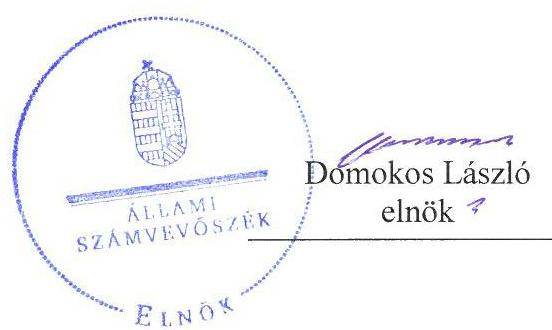
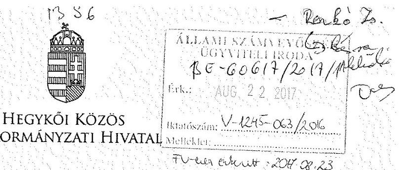
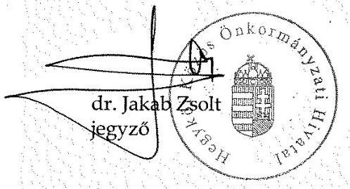
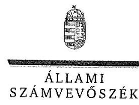
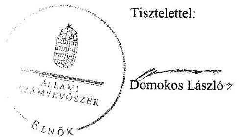
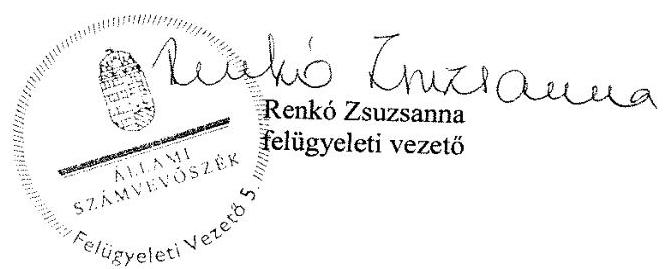

# Jelenetés 

## Önkormányzatok belsó kontrollrendszere

Az önkormányzatok belső kontrollrendszere kialakításának és múködtetésének ellenőrzése - Hidegség
2017.

---

# Jelentés 

## Önkormányzatok belsó kontrollrendszere

Az önkormányzatok belső kontrollrendszere kialakításának és múködtetésének ellenőrzése - Hidegség
2017. 03 hó 13 nap

---

# AZ ELLENŐRZÉST FELÜGYELTE:

- RENKŐ ZSUZSANNA felügyeleti vezető
- AZ ELLENŐRZÉST VEZETTE ÉS A VÉGREHAJTÁSÁÉRT FELELŐS:
  - DÉR LÍVIA ellenőrzésvezető
  - A PROGRAM ÖSSZEÁLLÍTÁSÁÉRT FELELŐS:
    - JANIK JÓZSEF osztályvezető

- IKTATÓSZÁM: V-1245-070/2016.
- TÉMASZÁM: 2279
- ELLENŐRZÉS-AZONOSÍTÓ SZÁM: V-076410

Jelentéseink az Országgyűlés számítógépes hálózatán és az Interneta a www.asz.hu címen is olvashatóak.

---

# TARTALOMJEGYZÉK 

■ ÖSSZEGZÉS ..... 5
■ AZ ELLENŐRZÉS CÉLJA ..... 6
■ AZ ELLENŐRZÉS TERÜLETE ..... 7
■ AZ ELLENŐRZÉS HÁTTERE, INDOKOLTSÁGA ..... 8
■ A JELENTÉS LÉNYEGES KÉRDÉSKÖREI ..... 10
■ ELLENŐRZÉS HATÓKÖRE ÉS MÓDSZEREI ..... 11
■ MEGÁLLAPÍTÁSOK ..... 13
■ JAVASLATOK ..... 19
■ MELLÉKLETEK ..... 21
I. sz. melléklet: Értelmező szótár ..... 21
II. sz. melléklet: Az integritás szemlélet érvényesítésével és az integritás kontrollrendszer kiépítettségével kapcsolatos megállapítások ..... 23
■ FÜGGELÉK: ÉSZREVÉTELEK ..... 25
■ RÖVIDÍTÉSEK JEGYZÉKE ..... 43

---

.

---

# ÖSSZEGZÉS 

Hidegség Község Önkormányzata belső kontrollrendszere kialakításának és müködtetésének hiányosságai miatt a közpénzfelhasználás szabályossága nem volt biztositott. A befektetési döntések meghozatala a tárgyévi költségvetési rendeletek hatásköri szabályozásának összességében megfelelt. Az Önkormányzat beszámolója nem a valóságnak megfelelően mutatta be a befektetett közvagyon nagyságát. Az Önkormányzatnál nem építették ki a megfelelő védelmet a korrupciós veszélyekkel szemben.

## Az ellenőrzés társadalmi indokoltsága

Magyarország Alaptörvénye az önkormányzatoktól is elvárja a kiegyensúlyozott, átlátható és fenntartható költségvetési gazdálkodás elvének érvényesítését. Az önkormányzatok által betöltött társadalmi szerep, az általuk kezelt közpénz nagysága, a nemzeti vagyon átruházására vagy hasznosítására vonatkozó döntéseik sokrétüsége egyaránt indokolttá tették a számvevőszéki ellenőrzések folytatását. A korábbi évek ellenőrzési tapasztalatai igazolták azt, hogy a belső kontrollrendszer kialakítása és müködtetése nélkül nem valósítható meg a közpénzek, a közvagyon szabályos, gazdaságos, hatékony és eredményes felhasználása. A kockázatok alapján fennállt a lehetősége annak, hogy az önkormányzatok befektetési döntései, továbbá a döntések végrehajtása és számviteli elszámolása nem voltak teljes mértékben szabályszerűek, és a kapcsolódó belső kontrollrendszerek sem múködtek minden esetben megfelelően.

Hidegség Község Önkormányzata a 2015. évi beszámolójában 5,6 millió Ft tőkegarantált befektetési jegyet mutatott ki.

## Főbb megállapítások, következtetések

Az egyes befektetések vonatkozásában 2011-2015. között, a gazdálkodás egészét érintően a 2015. évben a belső kontrollrendszer kialakítása és múködtetése nem volt szabályszerű, így az nem segítette elő a szabálykövető múködést és gazdálkodást, a szervezeti célok elérését. A kontrolltevékenységek nem megfelelő múködtetése akadályozta a hibák megelőzését, feltárását. A kockázatkezelési rendszert nem múködtették, nem mérték fel a kockázatokat, nem határozták meg a kockázatokkal kapcsolatban szükséges intézkedéseket, valamint azok teljesítése folyamatos nyomon követésének módját.

Az értékpapírok beszerzése és visszaváltása a 2008-2009. évi költségvetési rendeletekben foglaltaknak megfelelően történt, de a 2014. évi befektetési jegy értékesítéséről a Képviselő-testület utólag döntött. A számviteli nyilvántartásban feltárt hibák miatt nem volt biztosított, hogy megbízható információk álljanak rendelkezésre az Önkormányzat befektetéseiről. A befektetési jegyekről nem vezettek a jogszabályban meghatározott tartalmi követelményeknek megfelelő részletező nyilvántartást.

Az Önkormányzatnál nem tettek erőfeszítéseket az integritás szemlélet érvényesítése érdekében. Az integritás kontrollok kiépítettsége nem volt egyensúlyban a korrupciós kockázatok szintjével.

---

# AZ ELLENŐRZÉS CÉLJA 

Az ellenőrzés célja annak megállapítása volt, hogy szabályszerűen történt-e az Önkormányzat belső kontrollrendszerének kialakítása és múködtetése, az biztosította-e az önkormányzatnál a közpénzfelhasználás szabályosságát, a közpénzekkel és a nemzeti vagyonnal történő szabályszerű és felelős gazdálkodást, a beszámolási és adatszolgáltatási kötelezettségek szabályszerű teljesítését. Az ellenőrzés keretében értékeltük az Önkormányzat korrupciós kockázatainak kezelését szolgáló integritás kontrollok kiépítettségét és az integritás szemlélet érvényesülését.

Az Önkormányzat egyes befektetési tevékenységeinek ellenőrzése során az ellenőrzés célja az volt, hogy a kialakított kontrollkörnyezet biztosította-e a befektetési tevékenységek szabályszerű végzését. Megítéltük, hogy az egyes befektetési tevékenységekkel kapcsolatos döntéshozatal és a döntések végrehajtása, valamint az egyes befektetések számviteli elszámolása, nyilvántartása szabályszerű volt-e, és a belső és külső ellenőrzések hozzájárultak-e az egyes befektetési tevékenységek szabályszerűségéhez.

---

# AZ ELLENŐRZÉS TERÜLETE 

## Hidegség Község Önkormányzata

A Győr-Moson-Sopron megyében fekvő Hidegség község állandó lakosainak száma 2015. január 1-jén 410 fő volt. Az Önkormányzat ${ }^{1}$ öttagú Képviselő-testületének ${ }^{2}$ munkáját az ellenőrzött időszakban ügyrendi bizottság támogatta.

A 2011-2012. években az önkormányzati feladatok ellátását Körjegyzőség ${ }^{3}$ segítette. Az Önkormányzat 2013. január 1jével Hegykő és Fertőhomok község önkormányzataival, Hegykő székhellyel Hivatal ${ }^{4}$-t hozott létre. Megállapodás alapján Hidegség településen állandó jelleggel múködik a Hivatal telephelye. A Körjegyzőség, valamint a Hivatal szervezeti egységekre nem tagolódott, elkülönült gazdasági szervezettel nem rendelkezett. 2015. december 31-én a Hivatalban foglalkoztatott köztisztviselők létszáma kilenc fő volt. A polgármester ${ }^{5}$ a 2002. évi önkormányzati választások óta tölti be tisztségét. A jegyző ${ }^{6}$ - 2013-tól vezeti a Hivatalt. A településen Nemzetiségi Önkormányzat ${ }^{7}$ múködik.

Az Önkormányzat a 2015. évi éves költségvetési beszámolója szerint 48,7 millió Ft költségvetési bevételt ért el, valamint 39,8 millió Ft költségvetési kiadást teljesített. Az eszközvagyon értéke 2015. december 31-én 423,7 millió Ft volt. A forrásokon belül 2015. december 31-én a költségvetési évet követően esedékes kötelezettség állomány 21,6 millió Ft-ot tett ki, pénzintézettel szembeni kötelezettség nem volt. Az Önkormányzat a 2012. évben 8,1 millió Ft adósságkonszolidációs támogatásban részesült.

---

# AZ ELLENŐRZÉS HÁTTERE, INDOKOLTSÁGA 

A demokratikus társadalmakban alapvető igény, hogy a közpénzeket, a közvagyont használók tevékenységükről elszámoljanak, ahhoz egyértelmű és érvényesíthető felelősségi szabályok társuljanak. Ennek a jogos igénynek az érvényesítéséhez meg kell teremteni azokat a folyamatokat, rendszereket, amelyek nélkülözhetetlenek az elszámoltatáshoz. Az elszámoltatás eredményes működtetéséhez szükség van a megfelelő információs, kontroll-, értékelési - és beszámolási rendszerek kialakítására. A belső kontrollok kiépítettsége hozzájárul az integritási szemlélet kialakításához és érvényesüléséhez. A belső kontrollrendszer kialakítása és működtetése nélkül nem valósítható meg a közpénzek, a közvagyon szabályos, gazdaságos, hatékony és eredményes felhasználása.

A BELSŐ KONTROLLRENDSZER azt a célt szolgálja, hogy az államháztartás szervei működésük és gazdálkodásuk során a tevékenységeket szabályszerűen, gazdaságosan, hatékonyan, eredményesen hajtsák végre, teljesítsék elszámolási kötelezettségeiket és megvédjék az erőforrásokat a veszteségektől, a károktól, a nem rendeltetésszerű használattól. A belső kontrollrendszer magában foglalja mindazon szabályokat, eljárásokat, gyakorlati módszereket és szervezeti struktúrákat, kockázatkezelési technikákat, kontrolltevékenységeket, amelyek segítséget nyújtanak a szervezetnek céljai eléréséhez. A belső kontrollrendszer szabályozása háromszintű, a törvényi előírásokat az Áht ${ }^{8}$. és a Mötv ${ }^{9}$. a rendeleti szintű szabályozást az Ávr. ${ }^{10}$ és a Bkr. ${ }^{11}$ tartalmazza, amelyeket útmutatói szinten az $\mathrm{NGM}^{12}$ által kiadott standardok és kézikönyvek támogatnak.

A megfelelő belső kontrollrendszer jelentősen csökkenti a hibák és szabálytalanságok kockázatát. Az ÁSZ ${ }^{13}$ célja, hogy javuljon az ellenőrzött önkormányzatok belső kontrollrendszerének szabályozottsága, működésének megfelelősége, szabályszerűsége, hozzájárulva ezzel az egyensúlyi helyzet fenntarthatóságához, biztosítva az önkormányzatnál a közpénzfelhasználás szabályosságát, a közpénzekkel és a nemzeti vagyonnal történő szabályszerű, gazdaságos, hatékony és eredményes gazdálkodást. Az ÁSZ ellenőrzés tapasztalatai nem csupán a közvetlenül ellenőrzött önkormányzatokat támogathatják, hanem a ,jó gyakorlat" elterjesztésével azok az önkormányzatok is átvehetik a pozitív példákat, ahol eddig nem végzett ellenőrzést az ÁSZ.

A közszféra integritás alapú kultúrájának kialakítása, megerősítése és működése szorosan összefügg a belső kontrollrendszer működésével, ezért az ellenőrzés kiterjed annak értékelésére is, hogy a belső kontrollrendszer kialakítása és működtetése hogyan hatott az integritás szemlélet érvényesülésére.

## AZ ÖNKORMÁNYZATOK ÁTMENETILEG SZABAD

PÉNZESZKÖZEINEK BEFEKTETÉSÉT jogszabály nem tiltja, a befektetések jellege nem korlátozott, a pénzpiaci szolgáltatók közül az önkormányzatok a kínált szolgáltatás és annak költségei alapján, szabadon választhatnak, azonban a veszteséges gazdálkodás kockázatai és kö-

---

vetkezményei az önkormányzatokat terhelik. A szabad pénzeszközök felhasználása során kiemelten fontos a felelős gazdálkodás érvényesülése, amely összhangban kell, hogy legyen, az önkormányzati gazdálkodás alapelveivel.
2015. első felében az MNB három befektetési szolgáltató tevékenységi engedélyét vonta vissza és kezdeményezte a vállalkozások felszámolását a múködéssel kapcsolatos szabálytalanságok, hiányosságok miatt. A befektetési vállalkozások problémás helyzetbe kerülése jelentős veszteségekhez vezetett számos önkormányzat esetében. A korábbi évek ellenőrzési tapasztalatai alapján fennállt a lehetősége annak, hogy az önkormányzatok befektetési döntései, továbbá a döntések végrehajtása és számviteli elszámolása nem voltak teljes mértékben szabályszerűek, és a kapcsolódó külső és belső kontroll rendszerek sem múködtek minden esetben megfelelően.

Az ellenőrzéssel feltárásra kerülhetnek azok a kockázatok, amelyek az önkormányzatok gazdálkodásával, ezen belül befektetési tevékenységeivel, kontrollkörnyezetével kapcsolatosak és a befektetési tevékenységek szabályszerű végrehajtását befolyásolják. Az ellenőrzéssel az önkormányzatok befektetési/vagyongazdálkodási döntéseinek összessége értékelhetővé válik, és megalapozott megállapítás tehető arra vonatkozóan, hogy azok milyen hatást gyakoroltak az önkormányzat vagyonára.

# AZ ELLENŐRZÉS VÁRHATÓ HASZNOSULÁSA 

NÉGY SZINTEN valósul meg. A törvényalkotás számára összegzett tapasztalatok állnak rendelkezésre a belső kontrollrendszer önkormányzati területen való kialakításáról, múködtetéséről és hatásairól. Az ellenőrzés az ellenőrzött számára visszajelzést ad a belső kontrollrendszer kialakításában és múködésében lévő hiányosságokról, javaslataival hozzájárul azok kiküszöböléséhez. Az ellenőrzés megállapításait és javaslatait más szervezetek is hasznosíthatják a rendezett gazdálkodási keretek kialakításához. A társadalom számára jelzi, hogy közpénz nem maradhat ellenőrizetlenül, az ÁSZ értékteremtő rend kialakításához és megőrzéséhez hozzájáruló tevékenysége pozitív hatással lesz a szervezetről kialakított összkép formálásában.

---

# A JELENTÉS LÉNYEGES KÉRDÉSKÖREI 

1.     - A belső kontrollrendszer egyes pillérei biztositották-e a befektetési tevékenységek szabályszerű végzését a 2011 - 2015. években?
2.     - Az Önkormányzat belső kontrollrendszerének kialakítása és müködtetése a 2015. évben szabályszerű volt-e, az biztositotta-e a közpénzfelhasználás szabályosságát, a nemzeti vagyonnal történő felelős gazdálkodást?
3.     - Az egyes befektetésekkel kapcsolatos döntéshozatal és a döntések végrehajtása szabályszerű volt-e?
4.     - Az egyes befektetések számviteli elszámolása, nyilvántartása szabályszerű volt-e?
5. Érvényesült-e az integritás szemlélet és ennek megfelelően ki-építették-e az integritás kontrollrendszert az Önkormányzatnál?

---

# ELLENŐRZÉS HATÓKÖRE ÉS MÓDSZEREI 

## Az ellenőrzés típusa

A belső kontrollrendszer ellenőrzése esetében megfelelőségi ellenőrzés, a befektetési tevékenységnél szabályszerűségi ellenőrzés.

## Az ellenőrzött időszak

A belső kontrollrendszer kialakításának és működtetésének ellenőrzése a 2015. január 1. és december 31. közötti időszakra terjedt ki. Az önkormányzatok egyes befektetési tevékenységeinek ellenőrzése tekintetében az ellenőrzött időszak a 2011. január 1. - 2015. december 31. közötti időszak. Ezen felül az önkormányzat befektetésekkel kapcsolatos döntés-előkészítésének és döntéshozatalának szabályszerűségét a 2011. január 1. előtti időszakra visszanyúlóan is ellenőriztük, amennyiben a 2015. december 31-én meglévő befektetéseire 2011. január 1-je előtt került sor. Az integritás szemlélet érvényesülését a 2015. évre vonatkozó adatszolgáltatás alapján értékeltük.

## Az ellenőrzés tárgya

A helyi önkormányzatnak, mint éves költségvetési beszámoló készítésére kötelezett szervezetnek és polgármesteri hivatalának belső kontrollrendszere. Az integritás szemlélet érvényesülése.

Az önkormányzat 2015. december 31-én meglévő, értékpapírokban megtestesülő befektetései, lekötött betétei, valamint a szabad pénzeszközei terhére, adásvételi szerződés keretében megszerzett, a kötelező feladatok ellátását nem szolgáló az önkormányzat üzleti vagyonába tartozó, az ellenőrzött időszakban (2011-2015.) megszerzett ingatlanok, továbbá időkorlátozás nélkül megszerzett -kulturális javak (műtárgyak, műalkotások, stb.), illetve a feladatellátást nem szolgáló egyéb értéktárgyak (pl. ékszerek, befektetési nemesfém).

Az ellenőrzés kiterjedt minden olyan körülményre és adatra, amely az ÁSZ jogszabályban meghatározott feladatainak teljesítéséhez, valamint a program végrehajtása folyamán felmerült újabb összefüggések feltárásához szükséges volt.

## Az ellenőrzött szervezet

Hidegség Község Önkormányzata és az önkormányzati múködéshez kapcsolódó feladatokat ellátó Hivatal.

---

# Az ellenőrzés jogalapja 

Az ÁSZ tv. ${ }^{14}$ 1. § (3) bekezdésében foglaltak alapján az ÁSZ általános hatáskörrel végzi a közpénzekkel és az állami és önkormányzati vagyonnal való felelős gazdálkodás ellenőrzését. Az ÁSZ tv. 5. § (2) bekezdése alapján az államháztartás gazdálkodásának ellenőrzése keretében az ÁSZ ellenőrzi a helyi önkormányzatok gazdálkodását, valamint az ÁSZ tv. 5. § (6) bekezdése alapján ellenőrzése során értékeli az államháztartás számviteli rendjének betartását és a belső kontrollrendszer múködését.

## Az ellenőrzés módszerei

Az ellenőrzést a nemzetközi standardokat irányadónak tekintve az ellenőrzési program szempontjai, kérdései, az ellenőrzött időszakban hatályos jogszabályok, az ellenőrzés szakmai szabályok és módszertanok figyelembe vételével végeztük.

Az ellenőrzés ideje alatt az ellenőrzött szervezettel történő kapcsolattartást az ÁSZ SZMSZ-ének ${ }^{15}$ vonatkozó előírásai alapján biztosítottuk.

Az ellenőrzési kérdések megválaszolásához szükséges bizonyítékok megszerzése az ellenőrzöttek által rendelkezésre bocsátott dokumentumokra, adatokra alapozva megfigyelés, szemle (szemrevételezés), kérdésfeltevés (információkérés), valamint elemző eljárással történt. A minták kiválasztása rétegzett, véletlen mintavételi eljárással történt.

Az ellenőrzési bizonyítékként felhasználható adatforrások közé tartoznak egyrészt az ellenőrzési program részletes szempontjainál felsorolt adatforrások, másrészt minden - az ellenőrzés folyamán feltárt, az ellenőrzés szempontjából információt tartalmazó - dokumentum.

Az ellenőrzés lefolytatásához az önkormányzat a tanúsítványok elektronikus kitöltésével, valamint az ÁSZ által kért dokumentumok elektronikus megküldésével szolgáltat adatokat. A rendelkezésre bocsátott adatok, információk kontrollja az ellenőrzés keretében történt.

A jelentésben használt fogalmak magyarázatát az I. számú melléklet, továbbá a rövidítések jegyzéke tartalmazza.

Az integritás szemlélet érvényesülésének értékelése az önkormányzat által kitöltött tanúsítvány alapján történt a 2015. évre vonatkozóan.

---

# 1. A belső kontrollrendszer egyes pillérei biztosították-e a befektetési tevékenységek szabályszerű végzését a 2011 - 2015. években? 

Összegző megállapítás

Az egyes befektetési tevékenységeket érintően 2011-2015. között a belső kontrollrendszer egyes pillérei kialakításának és múködtetésének hiányosságai következtében azok nem biztosították a közvagyon biztonságos és körültekintő befektetését.

A KONTROLLKÖRNYEZET nem biztosította az értékpapírokkal kapcsolatos tevékenység szabályozott végzését. A 2011. és a 2013. években a Számv. tv. ${ }^{16}$ 161. (1)-(4) bekezdésében foglaltak ellenére számlarenddel nem rendelkeztek. A 2014. január 1-jétől hatályos számlarend ${ }^{17}$ az Áhsz. ${ }^{18}$ 51. § (3) bekezdés előírásai ellenére nem tartalmazta a részletező nyilvántartások vezetésének módját, azoknak a kapcsolódó könyvviteli és nyilvántartási számlákkal való egyeztetés dokumentálását. A 2011-2012. években a pénzkezelési szabályzat ${ }_{1}{ }^{19}$. 2013. január 1-től 2014. augusztus 31-ig a pénzkezelési szabályzat ${ }_{2}{ }^{20}$, 2014. szeptember 1-jétől a pénzkezelési szabályzat ${ }_{2}{ }^{21}$ nem terjedt ki valamennyi bankszámlára, mert az értékpapír számlához kapcsolódó ügyfélszámlára vonatkozóan a nyilvántartás szabályait a Számv. tv. 14. § (8) bekezdésének előírása ellenére nem rögzítették.

A Képviselő-testület a vagyongazdálkodási rendelet ${ }_{2}{ }^{22}$-ben a polgármester számára a rövid lejáratú - hat hónapot meg nem haladó időtartamra szóló - értékpapírba fektetésről, illetve betétként történő elhelyezésről és visszaváltásról adott át hatáskört. A vagyongazdálkodási rendelet ${ }_{2}{ }^{23}$ befektetési tevékenységgel összefüggő szabályozást nem tartalmazott. A 2011. évi költségvetési rendelet ${ }^{24}$ a polgármestert értékpapír vásárlással és az azzal kapcsolatos szerződések, pénzügyi műveletek lebonyolításával hatalmazta fel. A 2013-2015. évi költségvetési rendeletekben ${ }^{25}$ a Képviselő testület a finanszírozási célú pénzügyi műveletekkel (köztük az értékpapír adás-vételekkel) kapcsolatos hatáskört fenntartotta saját magának.

KOCKÁZATKEZELÉSI RENDSZERT az Ámr. ${ }^{26}$ 157. § (1)-(3) bekezdéseiben és a Bkr. 7. § (1)-(2) bekezdéseiben foglaltak ellenére nem működtettek, a befektetési tevékenységgel kapcsolatban nem mérték fel a kockázatokat, nem határozták meg az egyes kockázatokkal kapcsolatban szükséges intézkedéseket, valamint 2012-2015. között azok teljesítésének folyamatos nyomon követésének módját.

A KONTROLLTEVÉKENYSÉGEK részeként a befektetések vonatkozásában az érvényesítést nem a jogszabályi előírásoknak megfelel-

---

Iően végezték. Az érvényesítés során az Ávr. 58. § (1) bekezdésében előírtak ellenére nem ellenőrizték, hogy a megelőző ügymenetben a belső szabályozásban foglaltakat betartották-e, mert nem kifogásolták, hogy az értékpapír visszaváltás nem felelt meg a 2014. évi költségvetési rendelet 7. $\S$-ában foglaltaknak.

# AZ INFORMÁCIÓS ÉS KOMMUNIKÁCIÓS RENDSZER nem biztosította, hogy megfelelő, pontos és naprakész információk álljanak rendelkezésre az Önkormányzat múködésével kapcsolatosan, mivel nem határozták meg az egyes befektetésekkel kapcsolatos információk esetében a beszámolási szinteket, határidőket, módokat az Ámr. 159. § (1)-2) bekezdése, a Bkr. 9. § (1)-(2) bekezdései előírásai ellenére. 

A MONITORING RENDSZER keretén belül múködő belső ellenőrzés az Önkormányzat irányítási, belső kontroll és ellenőrzési eljárásainak fejlesztését a befektetési tevékenység vonatkozásában nem támogatta, mivel nem végeztek a befektetésekkel kapcsolatos belső ellenőrzést. A külső ellenőrzések a befektetési tevékenységre nem terjedtek ki.

## 2. Az Önkormányzat belső kontrollrendszerének kialakítása és múködtetése a 2015. évben szabályszerű volt-e, az biztosította-e a közpénzfelhasználás szabályosságát, a nemzeti vagyonnal történő felelős gazdálkodást?

Összegző megállapítás

A gazdálkodás egészét érintően a 2015. évben a belső kontrollrendszer nem biztosította a szabályszerű múködést, a gazdaságosság, hatékonyság és eredményesség követelményének érvényesülését.

A KONTROLLKÖRNYEZET kialakítása nem volt szabályszerű. A hivatali SZMSZ ${ }^{27}$-ben az Ávr. 13. § (1) bekezdés g) pontja ellenére nem határozták meg a nevesített munkakörökhöz tatozó hatáskörök gyakorlásának módját, és a felelősségi szabályokat. A munkaköri leírások a munkakörök betöltésével kapcsolatos követelményeket a Kttv. ${ }^{28} 75 . \S$ (1) bekezdés d) pontjában foglaltak ellenére nem rögzítették.

A számviteli politika nem tartalmazta a Számv. tv. 14. § (4) bekezdésében előírtak ellenére azokat a szabályokat, amelyekkel meghatározzák, hogy mit tekintenek a számviteli elszámolás, az értékelés szempontjából lényegesnek, jelentősnek, nem lényegesnek, nem jelentősnek, kivételes nagyságú vagy előfordulású bevételnek, költségnek, ráfordításnak. Nem határozták meg, hogy a törvényben biztosított választási, minősítési lehetőségek közül melyeket, milyen feltételek fennállása esetén alkalmaznak, az alkalmazott gyakorlatot milyen okok miatt kell megváltoztatni.

Az Ávr. 13. § (2) bekezdés c) és e) pontjában előírtak ellenére belső szabályzatban nem rendezték a belföldi és külföldi kiküldetések elrendelésével és lebonyolításával, elszámolásával kapcsolatos kérdéseket, valamint a reprezentációs kiadások felosztását, azok teljesítésének és elszámolásának szabályait.

---

A gazdálkodási szabályzat ${ }^{29}$ előírta, hogy a 100 ezer Ft-ot el nem érő kiadások esetében nem szükséges az előzetes írásbeli kötelezettségvállalás, azonban az Ávr. 53. § (2) bekezdésében foglaltak ellenére a 100 ezer Ft-ot el nem érő kiadások rendjét belső szabályzatban nem rögzítették.

A KOCKÁZATKEZELÉSI RENDSZER működtetése nem volt szabályszerű. A Bkr. 7. § (1) és (2) bekezdésének előírásai ellenére nem mérték fel és nem állapították meg a tevékenységben, gazdálkodásban rejlő kockázatokat, nem határozták meg az egyes kockázatokkal kapcsolatban szükséges intézkedéseket, a kockázatok kezelése érdekében szükséges intézkedések teljesítésének folyamatos nyomon követési módját.

A KONTROLLTEVÉKENYSÉGEK működtetése nem volt szabályszerű, és nem biztosította a kiadásokkal kapcsolatban a hibák megelőzését és feltárását, a közpénzfelhasználás szabályosságát.

Az Önkormányzat kiadásai terhére vállalt kötelezettségvállalások esetében az Ávr. 55. § (1) bekezdésében foglaltak ellenére a pénzügyi ellenjegyzés a kötelezettségvállalás dokumentumán nem történt meg. Ezáltal az Áht. 37. § (1) bekezdésében foglaltak ellenére nem győződtek meg arról, hogy a szabad előirányzat rendelkezésre áll-e, a tervezett kifizetési időpontokban a pénzügyi fedezet biztosított volt-e, és a kötelezettségvállalás nem sérti-e a gazdálkodásra vonatkozó szabályokat.

A teljesítés igazolás során az Ávr. 57. § (1) bekezdésében foglaltak ellenére okmányok hiányában igazolták a kiadások teljesítésének jogosságát, összegszerűségét, az ellenszolgáltatást is magában foglaló kötelezettségvállalás teljesítésének igazolását. A teljesítésigazolás során az összeférhetetlenséggel kapcsolatos szabályokat nem tartották be az Ávr. 60. § (1) bekezdésében foglaltak ellenére, mivel a teljesítésigazolást az érintett saját maga javára végezte.

Az érvényesítés során az Ávr. 58. § (1) bekezdésében foglaltak ellenére nem ellenőrizték, hogy a megelőző ügymenetben a jogszabályokban és a belső szabályzatokban foglaltakat betartották-e, mert az Ávr. 58. § (2) bekezdés előírása ellenére nem jelezték az utalványozónak, hogy a kötelezettségvállalások pénzügyi ellenjegyzés hiányában történtek, a teljesítésigazolást megalapozó dokumentumok nem álltak rendelkezésre, a teljesítésigazolásra jogosult személy a feladatát a maga javára látta el.

# AZ INFORMÁCIÓS ÉS KOMMUNIKÁCIÓS RENDSZER működtetése nem volt szabályszerű, mert: 

nem tették közzé az Info tv. 37. § (1) bekezdésében és az 1. melléklet II/1. továbbá a II/12. pontjaiban előírtak ellenére az adatvédelmi és adatbiztonsági szabályzat hatályos és teljes szövegét, a közfeladatot ellátó szervnél végzett alaptevékenységgel kapcsolatos vizsgálatok, ellenőrzések nyilvános megállapításait;
az Áht. 24. § (4) bekezdés b) pontjában foglaltak ellenére a 2015. évi költségvetési rendelet előterjesztése nem tartalmazta a többéves kihatással járó döntések számszerűsítését évenkénti bontásban és összesítve;
az Áht. 91. § (2) bekezdés a) és c) pontjaiban foglaltak ellenére 2015. évi zárszámadási rendelettervezet nem tartalmazta a pénzeszközök változásának bemutatását és a vagyonkimutatást;

---

$\longrightarrow$ az időközi mérlegjelentéseket az Ávr. 170. § (2) bekezdésében előírt határidőn túl töltötték fel a Kincstár ${ }^{30}$ által működtetett elektronikus adatszolgáltató rendszerbe.

A MONITORING RENDSZER kialakítása és működtetése nem volt szabályszerű. Az operatív tevékenységek során megvalósuló folyamatos és eseti nyomon követést a Bkr. 10. §-ában foglaltak ellenére nem alakították ki és nem működtették.

A belső ellenőrzés kialakítása és működtetése megfelelt a jogszabályi előírásoknak. A Bkr. 14. § (1) bekezdésében előírtak ellenére nem gondoskodtak az elvégzett külső ellenőrzések javaslatai alapján készült intézkedési tervek végrehajtásának nyilvántartásáról.

A jegyző nyilatkozatban értékelte a költségvetési szerv belső kontrollrendszerének minőségét. A jelen ellenőrzés a jegyző nyilatkozatában foglaltakat megerősítette, mely szerint a belső kontrollrendszer működtetése fejlesztést igényel.

A HELYI NEMZETISÉGI ÖNKORMÁNYZATTAL kapcsolatos feladatok keretében az együttműködésre vonatkozó megállapodást megkötötték.

# 3. Az egyes befektetésekkel kapcsolatos döntéshozatal és a döntések végrehajtása szabályszerű volt-e? 

Összegző megállapítás

A befektetési jegyek 2008. évi vételével és a 2009. évi értékesítésével kapcsolatos döntések megfeleltek a tárgyévi költségvetési rendeletekben foglaltaknak, de a 2014. évi értékesítés nem volt szabályszerű.

Az Önkormányzat a 2015. évi beszámolójában 5,6 millió Ft összegű tőkegarantált befektetési jegyet mutatott ki, amely három 2008. évi vételre és kettő - 2009. évben és 2014. évben végrehajtott - visszaváltásra vonatkozó szerződésből származott. Befektetési célú ingatlannal, lekötött betéttel, kulturális javakkal, egyéb értéktárgyakkal az Önkormányzat nem rendelkezett.

A befektetési jegyek 2008. évi vételére és 2009. évi eladására vonatkozó döntések megfeleltek a tárgyévi költségvetési rendeletek hatásköri előírásainak. A 2014. december 17-ei befektetési jegy értékesítés nem volt szabályszerű, mert arról a Képviselő-testület utólag, a 4/2015. (IV. 30.) számú rendeletével döntött.

---

# 4. Az egyes befektetések számviteli elszámolása, nyilvántartása szabályszerű volt-e? 

## Összegző megállapítás

1. táblázat

## BEKERÜLÉSI ÉRTÉK (MILLIÓ FT)

| Év | Tényle-   ges | Beszámol-   lóban ki-   mutatott | Elte-   rés |
| :--: | :--: | :--: | :--: |
| 2011. | 15,1 | 15,1 | 0 |
| 2012. | 7,9 | 6,5 | 1,4 |
| 2013. | 7,9 | 6,5 | 1,4 |
| 2014. | 6,8 | 5,6 | 1,2 |
| 2015. | 6,8 | 5,6 | 1,2 |

Forrás: ÁSZ kigyújtése az Önkormányzat adatszolgáltatásából

A befektetési jegyek 2012. és 2015. közötti bekerülési értékének helytelen meghatározása, továbbá a hiányosan vezetett analitikus nyilvántartás következtében a befektetések mérlegben szereplő adatainak megbízhatósága nem volt biztosított.

A BEFEKTETÉSEK NYILVÁNTARTÁSA során a Hivatal a 2012-2013. években az Áhsz ${ }_{1}{ }^{31}$. 29. § (1) bekezdésének a 2014-2015. években az Áhsz ${ }_{2}$. 21. § (3) bekezdésének előírása ellenére - az 1. táblázatban bemutatottak szerint - a befektetési jegyek állományát a bekerülési érték helyett névértéken értékelte. Az értékpapírok visszaváltásából keletkezett hozamot - az értékpapírok bekerülési értékének nem megfelelő meghatározásából következően - nem a Számv. tv. 84. § (3) b) pontja és (5) b) pontjában előírtaknak megfelelő összegben számolták el. A hozamként könyvelt bevétel és a tényleges hozam közötti különbség (előjelek figyelmen kívül hagyásával) a 2012. évben 1378 ezer Ft, a 2014. évben 139,9 ezer Ft volt. A hiba az Önkormányzat vagyonához képest egyik évben sem minősült jelentősnek.

A befektetési jegyeket a 2011-2013. évi mérlegek nem a Számv. tv. 3. § (6) bekezdés 3. pontjának megfelelően tartalmazták, azokat a befektetett pénzügyi eszközök között, részesedésként kellett volna szerepeltetni, ennek ellenére forgatási célú hitelviszonyt megtestesítő értékpapírként mutatták ki. A befektetési jegyek 2014-2015. évi forgatási célú hitelviszonyt megtestesítő értékpapírként történő besorolása sem felelt meg az Áhsz ${ }_{2}$ 12. § (12) bekezdése előírásának, mert a befektetési jegyeket az Önkormányzat a mérleg fordulónapját követő évben nem értékesítette, ezért azokat a 2014-2015. évi mérlegben az Áhsz 11. § (10) bekezdésében foglaltaknak megfelelően tartós hitelviszonyt megtestesítő értékpapírként kellett volna kimutatni.

A befektetési jegyekről nem vezettek a 2011-2013. években az Áhsz. 1 9. számú melléklet 2. d) pontjában, a 2014-2015. években az Áhsz. 2 14. számú melléklet VIII. 1. pont a) - i) alpontjában meghatározott tartalmi elemeknek megfelelő analitikus nyilvántartást.

AZ ÉV VÉGI SZÁMVITELI FELADATOK során a Hivatal a 2012. évben az Áhsz. 1 37.§ (1)-(3) bekezdésében foglaltak ellenére a befektetési jegyek leltározását nem végezte el. A 2011. és a 2013-2015. években az értékpapírokat a jogszabályi előírásoknak megfelelően egyeztetéssel leltározták.

---

# 5. Érvényesült-e az integritás szemlélet és ennek megfelelően ki- 

építették-e az integritás kontrollrendszert az Önkormányzatnál?

Összegző megállapítás

Az Önkormányzat nem tett erőfeszítéseket az integritás szemlélet érvényesítése érdekében. Az integritás kontrollok kiépítettsége nem volt egyensúlyban a korrupciós kockázatok szintjével.

Az Önkormányzat az ellenőrzést megelőzően nem vett részt az ÁSZ Integritás Projektjében. Az Önkormányzat a jogszabályok által is előírt szabályossági kontrollokat összességében kiépítette, azonban a korrupciós kockázatokkal szembeni védettséget növelő integritás kontrollok kiépítettsége alacsony volt. Az integritás kontrollrendszer kiépítettségével kapcsolatos megállapításokat a II. sz. melléklet tartalmazza.

---

# JAVASLATOK 

Az ÁSZ tv. 33. § (1) bekezdésében foglaltak értelmében az ellenőrzött szervezet vezetője köteles a jelentésben foglalt megállapításokhoz kapcsolódó intézkedési tervet összeállítani és azt a jelentés kézhezvételétől számított 30 napon belül az ÁSZ részére megküldeni. Amennyiben az ellenőrzött szervezet vezetője nem küldi meg határidőben az intézkedési tervet, vagy továbbra sem elfogadható intézkedési tervet küld, az Állami Számvevőszék elnöke az ÁSZ tv. 33. § (3) bekezdése a) és b) pontjaiban foglaltakat érvényesítheti.

## a Hegykői Közös Önkormányzati Hivatal jegyzőjének:

1. Intézkedjen a belső kontrollrendszer egyes elemei jogszabályi előírásoknak megfelelő kialakítására és müködtetésére, valamint a gazdálkodási jogkörök gyakorlása és a befektetési döntések végrehajtása során a jogszabályi előírások betartására.
(1. számú megállapítás 1. bekezdés 3. mondata és 4. mondatának 3-4. részmondatai, 3-5. bekezdései, 2. számú megállapítás 1. bekezdés 3. mondata, 2-5., 7-11 bekezdései és a 12. bekezdés 2. mondata alapján)
2. Intézkedjen a jogszabályi előírásoknak megfelelő tartalmú hivatali szervezeti és müködési szabályzat-tervezet elkészítéséről és kezdeményezze a jóváhagyást.
(2. számú megállapítás 1. bekezdés 2. mondata alapján)
3. Intézkedjen, hogy az éves költségvetési beszámoló mérlegében kimutatott befektetési jegyek bekerülési értékének és számviteli besorolásának meghatározása a jogszabályi előírásoknak megfelelően történjen.
(4. számú megállapítás 1-2. bekezdései alapján)
4. Intézkedjen a befektetési jegyek adatainak a jogszabályi előírásoknak megfelelő tartalmi elemekkel történő rögzítéséről a részletező nyilvántartásokban.
(4. számú megállapítás 3. bekezdése alapján)
5. Intézkedjen az Állami Számvevőszék ellenőrzése során feltárt hiányosságok és/vagy szabálytalanságok tekintetében a munkajogi felelősség tisztázására irányuló eljárás megindításáról, és ennek eredménye ismeretében tegye meg a szükséges intézkedéseket.
(2. számú megállapítás 7-9. bekezdései és a 10. bekezdés 1. pontja és a 4. számú megállapítás 1-3. bekezdései alapján)

---

.

---

# MELLÉKLETEK 

- I. SZ. MELLÉKLET: ÉRTELMEZŐ SZÓTÁR
belső ellenőrzés
belső kontrollrendszer
belső kontrollrendszer pillérei, kontrollterületei
betét
dematerializált értékpapír
értékpapírszámla
forgatási célú értékpapír
helyi önkormányzat

Független, tárgyilagos bizonyosságot adó és tanácsadó tevékenység, amelynek célja, hogy az ellenőrzött szervezet működését fejlessze és eredményességét növelje, az ellenőrzött szervezet céljai elérése érdekében rendszerszemléletű megközelítéssel és módszeresen értékeli, illetve fejleszti az ellenőrzött szervezet irányítási és belső kontrollrendszerének hatékonyságát. (Forrás: Bkr. 2. § b) pontja)
A belső kontrollrendszer a kockázatok kezelése és tárgyilagos bizonyosság megszerzése érdekében kialakított folyamatrendszer, amely azt a célt szolgálja, hogy a működés és gazdálkodás során a tevékenységeket szabályszerűen, gazdaságosan, hatékonyan, eredményesen hajtsák végre, az elszámolási kötelezettségeket teljesítsék, megvédjék az erőforrásokat a veszteségektől, károktól és nem rendeltetésszerű használattól. (Forrás: Áht. 69. § (1) bekezdése)
A kontrollkörnyezet, a kockázatkezelési rendszer, a kontrolltevékenységek, az információs és kommunikációs rendszer, valamint a nyomon követési (monitoring) rendszer. (Forrás: Bkr. 3. §-a)
a Ptk. szerinti betétszerződés vagy a takarékbetétről szóló 1989. évi 2. törvényerejű rendelet szerinti takarékbetét-szerződés alapján fennálló tartozás, ideértve a hitelintézetnél a fizetésiszámla-szerződés alapján fennálló pozitív számlaegyenleget is (Hpt. 6. § (1) bekezdés 8. pont).
a Tpt.-ben és külön jogszabályban meghatározott módon, elektronikus úton létrehozott, rögzített, továbbított és nyilvántartott, az értékpapír tartalmi kellékeit azonosítható módon tartalmazó adatösszesség (Tpt. 5. § (1) bekezdés 29. pont)
a dematerializált értékpapírról és a hozzá kapcsolódó jogokról az értékpapír-tulajdonos javára vezetett nyilvántartás (Tpt. 5. § (1) bekezdés 46. pont)
azok az értékpapírok, amelyeket forgatási célból, kamatbevétel, illetve árfolyamnyereség elérése érdekében szereztek be, továbbá azokat, amelyek a tárgyévet követő üzleti évben lejárnak (Számv. tv. 30. § (5) bekezdés)
A helyi önkormányzat jogi személy. Az önkormányzati feladatok ellátását a képvi-selő-testület és szervei biztosítják. A képviselőtestület szervei: a polgármester, a főpolgármester, a megyei közgyűlés elnöke, a képviselő-testület bizottságai, a részönkormányzat testülete, a polgármesteri hivatal, a megyei önkormányzati hivatal, a közös önkormányzati hivatal, a jegyző, továbbá a társulás. A képviselő-testület a feladatkörébe tartozó közszolgáltatások ellátására - jogszabályban meghatározottak szerint - költségvetési szervet, a Polgári perrendtartásról szóló 1952. évi III. törvény szerinti gazdálkodó szervezetet (a továbbiakban: gazdálkodó szervezet), nonprofit szervezetet és egyéb szervezetet (a továbbiakban együtt: intézmény) alapíthat, továbbá szerződést köthet természetes és jogi személlyel vagy jogi személyiséggel nem rendelkező szervezettel. A helyi önkormányzat éves költségvetési beszámolója magába foglalja a helyi önkormányzat - nem költségvetési szerveihez tartozó - feladataihoz kapcsolódó bevételeket és kiadásokat. A helyi önkormányzat összevont (konszolidált) költségvetési beszámolóját a helyi önkormányzatra és költségvetési szerveire vonatkozóan külön-külön beérkezett éves költségvetési beszámolók alapján a Kincstár készíti el és küldi meg az önkormányzatnak. (Forrás: Mötv. 41. § (1), (2), (6) bekezdései; Áhsz. 2. § (1) bekezdése, 6. § (1) bekezdés a) és f) pontja, 30. §-a, 37. § (1) és (6) bekezdése)

---

hitelviszonyt megtestesítő értékpapír
információs és kommunikációs rendszer
integritás
irányító szerv és annak vezetője
kockázatkezelési rendszer
kontrollkörnyezet
kulturális javak
üzleti vagyon
minden olyan értékpapír, illetve törvény által értékpapírnak minősített, jogot megtestesítő okirat, amelyben a kibocsátó (adós) meghatározott pénzösszeg rendelkezésére bocsátását elismerve arra kötelezi magát, hogy a pénz (kölcsön) összegét, valamint annak meghatározott módon számított kamatát vagy egyéb hozamát, és az általa esetleg vállalt egyéb szolgáltatásokat az értékpapír birtokosának (a hitelezőnek) a megjelölt időben és módon megfizeti, illetve teljesíti. Ide tartozik különösen: a kötvény, a kincstárjegy, a letéti jegy, a pénztárjegy, a célrészjegy, a takaréklevél, a jelzáloglevél, a hajóraklevél, a közraktárjegy, az árujegy, a zálogjegy, a kárpótlási jegy, a határozott idejű befektetési alap által kibocsátott befektetési jegy (Számv. tv. (6) bekezdés 2. pont)
A költségvetési szerv vezetője által kialakított és múködtetett olyan rendszer, mely biztosítja, hogy a megfelelő információk a megfelelő időben eljutnak az illetékes szervezethez, szervezeti egységhez, illetve személyhez. (Forrás: Bkr. 9. § (1) bekezdés)
Az integritás elvek, értékek, cselekvések, módszerek, intézkedések konzisztenciáját jelenti: olyan magatartásmódot, amely meghatározott értékeknek felel meg. Az integritás a közszféra esetében a társadalom által elvárt nyilvánossági, átláthatósági, illetve jogi/etikai normáknak történő megfelelést jelenti.
(Forrás: a http://integritas.asz.hu honlapon közzétett „A 2012. évi integritás felmérés eredményeinek összefoglalója" című dokumentum 3. oldal 1. bekezdése)
A közös önkormányzati hivatal kivételével a helyi önkormányzat által irányított költségvetési szerv esetén a képviselő-testület, közgyűlés és a polgármester, főpolgármester, megyei közgyűlés elnöke. A közös önkormányzati hivatal esetén a közös önkormányzati hivatal székhelye szerinti helyi önkormányzat képviselő-testülete és annak polgármestere. (Forrás: Áht. 2. § (1) bekezdés i), ia) és ib) pontja)
Olyan irányítási eszközök és módszerek összessége, melynek elemei a szervezeti célok elérését veszélyeztető tényezők (kockázatok) azonosítása, elemzése, csoportosítása, nyomon követése, valamint szükség esetén a kockázati kitettség mérséklése. (Forrás: Bkr. 2. § m) pontja)
A költségvetési szerv vezetője által kialakított olyan elvek, eljárások, belső szabályzatok összessége, amelyben világos a szervezeti struktúra, egyértelműek a felelősségi, hatásköri viszonyok és feladatok, meghatározottak az etikai elvárások a szervezet minden szintjén, átlátható a humánerőforrás-kezelés. (Forrás: Bkr. 6. § (1) bekezdés)
A költségvetési szerv vezetője által a szervezeten belül kialakított (kontroll) tevékenységek, melyek biztosítják a kockázatok kezelését, hozzájárulnak a szervezet céljainak eléréséhez. (Forrás: Bkr. 8. § (1) bekezdés)
az élettelen és élő természet keletkezésének, fejlődésének, az emberiség, a magyar nemzet, Magyarország történelmének kiemelkedő és jellemző tárgyi, képi, hangrögzített, írásos emlékei és egyéb bizonyítékai - az ingatlanok kivételével -, valamint a művészeti alkotások (a kulturális örökség védelméről szóló 2001. évi LXIV. törvény)
a nemzeti vagyon azon része, amely nem tartozik az önkormányzati vagyon esetén a törzsvagyonba (Nvtv. 3. § (1) bekezdés 18. pontja)

---

# II. SZ. MELLÉKLET: AZ INTEGRITÁS SZEMLÉLET ÉRVÉNYESÍTÉSÉVEL ÉS AZ INTEGRITÁS KONTROLLRENDSZER KIÉPÍTETTSÉGÉVEL KAPCSOLATOS MEGÁLLAPÍTÁSOK 

Az Önkormányzat által a 2015. évre kitöltött integritás tanúsítvány alapján - öt kockázati területen - a kialakított kontrollokat értékeltük. Az Önkormányzatnál az integritás kontrollrendszer kialakítása összességében alacsony volt.

| AZ INTEGRITÁS KONTROLLOK ÉRTÉKELÉSE |  |  |  |  |
| :--: | :--: | :--: | :--: | :--: |
| Sorszám | Megnevezés | Maximum elér-   hetó pontszámek | Elért   pontszámek | Értékelés |
| 1. | Összeférhetetlenség és etikai elvárások | 5 | 4 | közepes |
| 2. | Humánerőforrás-gazdálkodás | 5 | 5 | magas |
| 3. | A szervezet vagyonának megvédésére tett intézkedések | 5 | 3 | alacsony |
| 4. | A nemkívánatos dolgozói magatartással szembeni intézkedések és azok érvényesülése | 5 | 2 | alacsony |
| 5. | Az integritás erősítése, annak tudatosítása, valamint a kockázatelemzések alkalmazása | 5 | 1 | alacsony |
|  | Összesítő értékelés | 25 | 15 | alacsony |

A kontrollok kialakításának főbb hiányosságai az alábbiak voltak:

1. a speciális korrupcióellenes rendszerek és eljárások tekintetében az Önkormányzatnál:

- nem rendelkeztek belső szabályzattal a szervezeten belüli közérdekű bejelentők védelmére vonatkozóan;
- nem működtettek közérdekű bejelentéseket kezelő, valamint a szervezeten kívülről érkező panaszokat és közérdekű bejelentéseket kezelő rendszert;
- a szervezet nem rendelkezett nyilvánosan közzétett stratégiával;
- a szervezet stratégiájában nem szerepelt a szervezeti kultúra javítása, az integritás erősítése, a korrupció elleni fellépés;
- nem végeztek kockázatelemzést a belső ellenőrzési tervek megalapozásához;
- nem határozták meg a szervezet tulajdonában álló egyes eszközök használatára vonatkozó szabályokat;

2. a „lágy" kontrollok (a szervezet által önként bevezetett, kialakított szabályok, követelmények) kialakítását érintően az Önkormányzatnál:

- nem szabályozták az ajándékok, meghívások, utaztatás elfogadásának feltételeit;
- nem szabályozták a külső személyekkel való kapcsolattartást;
- nem végeztek rendszeres korrupciós kockázatelemzést.

---

.

---

# FÜGGELÉK: ÉSZREVÉTELEK 

A jelentéstervezetet a Számvevőszék 15 napos észrevételezésre megküldte az ellenőrzött szervezet vezetőjének az ÁSZ tv. 29. §* (1) bekezdése előírásának megfelelően.
Az elfogadott észrevételek alapján a Számvevőszék módosította a jelentést.

A függelék tartalmazza az ellenőrzött észrevételeit, illetve az el nem fogadott észrevételek elutasításának indoklását.

[^0]
[^0]:    * 29. § (1) Az Állami Számvevőszék az ellenőrzési megállapításait megküldi az ellenőrzött szervezet vezetőjének vagy az általa megbízott személynek, és annak, akinek személyes felelősségét állapította meg.
    (2) Az ellenőrzött szervezet vezetője és a felelősként megjelölt személy az ellenőrzés megállapításaira tizenöt napon belül írásban észrevételt tehet.
    (3) Az Állami Számvevőszék az észrevételre a beérkezésétől számított harminc napon belül írásban válaszol. A figyelembe nem vett észrevételeket köteles a jelentésben feltüntetni, és megindokolni, hogy azokat miért nem fogadta el.

---

Iktatószám: 82-11/2017
Ügyintézés helye: 9437 Hegykő, Iskola u. 1.
Ügyintéző: dr. Jakab Zsolt
Telefonszám: 99/540-005

Tárgy: Hidegség Község Önkormányzata ellenőrzése
Hiv.sz: V-1245-047/2016.

# Állami Számvevőszék 

Budapest 4
1364 Pf. 54.

## Tisztelt Cím!

Fenti hivatkozási számú levelükhöz mellékelt „Az önkormányzatok belső kontrollrendszere kialakításának és mikódtetésének ellenörzése - Hidegség" címú jelentéstervezetükre - az ÁSZ. tv. 29. § (2) bekezdése alapján az alábbi észrevételeket tesszük.

Az 1. megállapítás 1. bekezdés 2. mondatához:
2010-2011. évre a 2010. január 9-én jóváhagyott körjegyzőségi számlarend rendelkezésre állt, amely az Önkormányzat által használt valamennyi számlára kiterjedt. Ezt a V-1245-026/2016. számú helyszíni jegyzőkönyv 13. pontja is rögzíti.

## Az 1. megállapítás 3-5. bekezdéséhez:

2012. után az Önkormányzat befektetési tevékenységet egyetlen kivétellel nem végzett. Az egyetlen kivétel, amikor 2014. decemberében az Önkormányzat az Európai Unió támogatásával megvalósított pályázati projekt támogatási részének előfinanszírozásához, fizetési kötelezettségének teljesítéséhez, likviditásának megőrzése érdekében értékesített - kizárólag a szükséges mértékben - tőkegarantált pénzpiaci értékpapírjából 1,5 millió Ft névértékủ befektetési jegyet, az OTP Bank által biztosított aktuális árfolyamon. Az értékesítés a Képviselő-testület előzetes tájékoztatásával és - miként az ellenőrzési jelentéstervezet is megállapítja - utólagos jóváhagyásával történt. Előzetes képviselő-testületi jóváhagyásra azért nem került sor, mert bíztunk benne, hogy értékpapír értékesítés nélkül is sikerül a projektet finanszírozni. Amennyiben Önkormányzatunk aktívabb befektetési tevékenységet

---

folytatott volna, ennek nyilvánvalóan megteremtettük volna részletes szabályozottságát, és megtettük volna a kockázatokkal kapcsolatban szükséges intézkedéseket. Megjegyezzük: 2015. évben részletesen és körültekintően vizsgáltuk meg annak indokoltságát, hogy az értékpapír értékesítéséből származó 1,5 millió Ftot újra, hasonló értékpapírba fektessük. A döntést megelőző helyzetértékelés azonban abba az irányba mutatott, hogy a minimális hozam érdekében nem érdemes újabb, tőkegarantált befektetést létrehozni.

# Az 1. megállapítás 6. bekezdéséhez: 

Önkormányzatunk belső ellenőrzését a Sopron és Térsége Önkormányzati Társulás keretében Sopron Megyei Jogú Város Polgármesteri Hivatal Jegyzői Iroda Belső Ellenőrzési Csoportja látja el, a tárgy évre vonatkozóan megállapított belső ellenőrzési terv alapján. A belső ellenőrzéssel érintett tevékenységekre évente a Belső Ellenőrzési Csoport vezetője tesz javaslatot. Az elmúlt években egyéb, gazdálkodással kapcsolatos tevékenységek kerültek a belső ellenőrzés fókuszába.

## A 2. megállapítás 2. bekezdéséhez:

A 2013. január 1. napjától hatályos számviteli politikában a 2. és 12. pontok tartalmazzák, hogy az intézménynél mi minősül jelentősnek, illetve nem jelentősnek. Az eszközök és források értékelésére, az értékvesztés elszámolására és visszaírására (jelentős eltérés meghatározására is) vonatkozó részletszabályokat a 2013. január 1től, illetve a 2014. január 1-től hatályos „Eszközök és források értékelési szabályzata" tartalmazta. A 2014. január 1-től hatályos számviteli politika nem ismétli meg külön a jogszabályokban rögzített előírásokat (pl. az államháztartási számvitelről szóló 4/2013. (I. 11.) Korm. rendeletben rögzített „jelentős összegű hiba" definícióját), illetve a kapcsolódó szabályzatokban foglaltakat.

## A 2. megállapítás 4. bekezdéséhez:

A kötelezettségvállalás, utalványozás, ellenjegyzés, érvényesítés rendjének szabályzata (gazdálkodási szabályzat) valamennyi előírása vonatkozik a 100 ezer Ftot el nem érő kiadásokra is, azzal az eltéréssel, hogy nincs szükség előzetes írásbeli kötelezettségvállalásra ezen kiadások tekintetében.

## A 2. megállapítás 7. bekezdéséhez:

Segítséget jelentene számunkra, ha tudnánk, mely konkrét esetekben nem történt pénzügyi ellenjegyzés a kötelezettségvállalás dokumentumán.

---

A 2. megállapítás 8. bekezdéséhez:
Segítséget jelentene számunkra, ha tudnánk, mely konkrét esetekben került sor a kiadások teljesítésének okmányok hiányában történő igazolására.

A 2. megállapítás 10. bekezdésének első francia bekezdéséhez:
Az adatvédelmi szabályzat hatályos és teljes szövege a közadattárban közzé lett téve: http://kozzetetel.dokumentumtar.hu/hegykoonkorm/dokumentumok/hegykoonk orm

A 2. megállapítás 10. bekezdésének második francia bekezdéséhez:
A 2015. évi költségvetési rendelet előterjesztése tartalmazta a többéves kihatással járó döntéseket tartalmazó táblázatot (azzal, hogy ilyen tétel nem lévén, a táblázat üresen maradt). A képviselő-testületi ülés www.njt.hu felületére feltöltött jegyzőkönyvét és vonatkozó mellékleteit csatoljuk (1. melléklet).

A 2. megállapítás 10. bekezdésének harmadik francia bekezdéséhez:
A Képviselő-testület által jóváhagyott 2015. évi zárszámadási rendelet tartalmazza a pénzeszközök változását és a vagyonkimutatást:
http://njt.hu/njtonkorm.php?njtcp=eh9eg4ed3dr0eo7dt8ee1em2cj1bx2cd3bw0ce5cc 6bx9e

A 2. megállapítás 10. bekezdésének negyedik francia bekezdéséhez:
Az időközi mérlegjelentéseket minden esetben határidőben töltöttük fel a Kincstár által működtetett elektronikus adatszolgáltató rendszerbe - amikor erre lehetőségünk volt. Rendelkezésre bocsátjuk a Magyar Államkincstár igazolását az adatszolgáltatások határidőben történő feltöltéséről, illetve a szakrendszer hibáiból adódó késedelemről (2. melléklet). A 2015. éves beszámoló 2016. március 21-én, hétfői napon (tehát szintén határidőben) került benyújtásra.

# A 2. megállapítás 12. bekezdéséhez: 

A külső ellenőrzések nem tártak fel hiányosságot, csak javaslatokat fogalmaztak meg, ezért nem kellett külön intézkedési terveket készíteni, amelyek végrehajtásáról nyilvántartást kellett volna vezetni.

---

# 4. megállapítás 1-3. bekezdéseihez: 

A feltárt hiányosság és/vagy hiba csekély mértékủ, az önkormányzat vagyonához képest nem minősül jelentősnek, ezért nem történt felelősségre vonás. A befektetési tevékenység sikeres és eredményes volt.

## A 4. megállapítás 4. bekezdéséhez:

A 2012. évi leltár és a leltár ellenőrzése is feltöltésre került az elektronikus rendszerbe, valamint a helyszíni ellenőrzéskor is bemutattuk. A V-1245-026/2016. számú helyszíni jegyzőkönyv 22 . pontja rögzíti is ezt.

## Az 5. megállapításhoz:

Az Önkormányzat igenis tett erőfeszítéseket az integritás szemlélet érvényesítése érdekében. Ugyanis az ÁSZ Integritás Projektjében 2011-2012. évekre HidegségFertőboz Körjegyzőség; 2013-2014. évekre a Hidegség Község Önkormányzata működéséhez kapcsolódó feladatokat ellátó Hegyköi Közös Önkormányzati Hivatal; 2015. évre közvetlenül Hidegség Község Önkormányzata vett részt és teljesítette önkéntesen az adatszolgáltatást, amelyet nyilvántartásukban ellenőrizhetnek. Levelünkhöz a 2015. évi adatszolgáltatást elfogadó nyugtáját csatoljuk (3. melléklet). Erre tekintettel megállapításukat, miszerint az integritás kontrollok kiépítettsége nem volt egyensúlyban a korrupciós kockázatok szintjével, túlzónak tekintjük, arra is figyelemmel, hogy az ellenőrzés konkrét korrupciós kockázatot - véleményünk szerint - nem tárt fel.

## A II. számú melléklethez:

Az ÁSZ törvény (helyesen: 2011. évi LXVI. törvény és nem LXV. törvény, miként a rövidítések jegyzékében szerepel) 24. § (1) bekezdésében (1) bekezdés d) pontjában az ellenőrzésekkel szemben támasztott követelményként fogalmazza meg, hogy az ellenőrzések eredményeinek, a megállapításoknak alátámasztottnak, a következtetéseknek okszerünek és megalapozottnak kell lenniük. Az integritás kontrollok értékelése során elért pontszámok alátámasztását ugyanakkor a jelentéstervezetben nem találjuk, abból levezetni nem tudjuk, a pontozást szubjektívnek és Önkormányzatunk szempontjából túlzottan kedvezőtlennek értékeljük a 3., 4. ẹs 5. pontokat illetően, az alábbiak miatt:

- „a szervezet vagyonának megvédésére tett intézkedések" - a jelentésben nem találtunk arra vonatkozó észrevételt, hogy nem tettünk volna meg mindent a gazdálkodás ésszerűsége, az önkormányzati vagyon megvédése érdekében;
- „a nem kivánatos dolgozói magatartással szembeni intézkedések és azok érvényesülése" - az ellenőrzött időszakban nem kívánatos dolgozói magatartásról nincs információnk, így azokkal szemben intézkedéseket sem

---

tehettünk, vagyis számunkra értelmezhetetlen az ilyen intézkedések érvényesülésére a lehetséges 5-ből adott 2 pont;

- „az integritás erősítése, annak tudatositása" - az értékelés nyilvánvalóan azon a téves megállapításon alapul, hogy szervezetünk nem vett részt az ÁSZ Integritás Projektjében (ennek cáfolatát az 5. megállapításhoz tett észrevételnél megtettük).

A jelentéstervezet 24. oldalát nem kaptuk meg, nem tudjuk, ezen az oldalon fogalmaztak-e meg további olyan megállapításokat, amelyekre észrevételt szükséges tennünk.

A jelentéstervezetből összességében megállapítható, hogy az ellenőrzés az értékelés során nem vette figyelembe az ellenőrzött szervezet (a Hidegség Község Önkormányzata feladatait ellátó Hegykői Közös Önkormányzati Hivatal) méretét, a szervezetnél foglalkoztatotti létszámot ( 8 fő státusz), a rendelkezésre álló humán erőforrást, a szervezet által ellátandó sokrétű, szakmai tevékenységeket, amelyeknek a gazdálkodási-pénzügyi feladatok csak kisebb hányadát teszik ki. A megállapítások részben olyan elvárásokat támasztanak (panaszokat és közérdekủ bejelentéseket kezelő rendszer működtetése; szervezeti stratégia kialakítása és közzététele; a befektetésekkel kapcsolatos információk esetében a beszámolási szintek, határidők, módok meghatározása), amelyeknek a megfelelés csak jelentős, főként többlet pénzügyi forrást igénylő külső erőforrások igénybevételével sikerülhetne, jóllehet az így szabályozott területen - szervezetünk esetében - valójában minimális számú feladat jelentkezik. Miként ajándékok, utaztatások elfogadására sem kerül(t) sor, tehát ennek szabályozása is értelmetlen.

A felsorolt észrevételekkel nem érintett megállapításokkal egyetértünk, illetőleg azokat tudomásul vesszük. Ugyanakkor kérjük, hogy az észrevételeinkkel érintett, a jelentéstervezetben megfogalmazott megállapításaikat vizsgálják felül és korrigálják.

Hegykő, 2017. augusztus 17.

Tisztelettel:

Hegykői Közös Önkormányzati Hivatal
9437 Hegykő, Iskola u. 1., Telefon: +36 (99) 540-005 Fax: +36 (99) 540-006
E-mail: hivatal@hegyko.hu - Honlap: www.hegyko.hu

---

Mellékletek:

1. melléklet: az Önkormányzat 2015. évi költségvetéséről szóló önkormányzati rendelet előterjesztése és ennek mellékletei;
2. melléklet: a Magyar Államkincstár igazolása az idöközi mérlegjelentések adatszolgáltatási kötelezettségének határidőben történő teljesitéséről;
3. melléklet: ÁSZ Integritás Projektben történő részvétel igazolása.

---

ELNÖK

Ikt. szám: V-1245-064/2016.

Dr. Jakab Zsolt úr
jegyzó

Hegyköi Közös Önkormányzati Hivatal

Hegykö

# Tisztelt Jegyző Úr! 

Köszönettel megkaptam „Az önkormányzatok belső kontrollrendszere kialakításának és müködtetésének ellenörzése - Hidegség" címủ jelentéstervezet megállapításaira elkészített észrevételét.

Az ellenőrzési megállapításokra vonatkozó észrevételét az Állami Számvevőszékről szóló 2011. évi LXVI. törvény (a továbbiakban: ÁSZ tv.) 29. § (2) bekezdésében meghatározott tizenöt napos határidőn belül küldte meg. Az Állami Számvevőszék észrevétellel kapcsolatos álláspontját a mellékletként csatolt, a felügyeleti vezető által készített indokolás tartalmazza. Tájékoztatom, hogy az ÁSZ tv. 29. § (3) bekezdése szerint a figyelembe nem vett észrevételeket az ÁSZ a jelentésben feltünteti az észrevétel elutasításának indokolásával együtt.

Budapest, 2017. 65 hó 27 nap

Tisztelettel:

Melléklet: Észrevételre adott válasz

---

„Az önkormányzatok belsö kontrollrendszere kialakításának és müködtetésének ellenörzése - Hidegség" című jelentéstervezetre tett észrevételekre adott válasz

| Észrevétel: | 1. számú összegző megállapítást követő 1. bekezdés 2. mondata   Megállapítás: A 2011. és a 2013. években a Számv. tv. 161. (1)-(4) bekezdésében foglaltak ellenére számlarenddel nem rendelkeztek.   Észrevétel: 2010-2011. évre a 2010. január 9-én jóváhagyott körjegyzőségi számlarend rendelkezésre állt, amely az Önkormányzat által használt valamennyi számlára kiterjedt. Ezt a V-1245-026/2016. számú helyszíni jegyzőkönyv 13. pontja is rögzíti. |
| :--: | :--: |
| Válasz: | Az Állami Számvevőszék az észrevételt nem fogadja el. |
| Indoklás: | Az észrevétel nem megalapozott. Az észrevételben hivatkozott körjegyzőségi számlarend a Hivatalra vonatkozott, annak hatályát az Önkormányzatra is kiterjesztő dokumentumot nem adott át az Önkormányzat az ellenőrzés részére. A fentiek figyelembevételével a számlarendre tett megállapítását az ÁSZ továbbra is fenntartja. |
|  | 1. számú összegző megállapítást követő 3-5. bekezdések   Megállapítás: Kockázatkezelési rendszert az Ámr. 157. § (1)-(3) bekezdéseiben és a Bkr. 7. § (1)-(2) bekezdéseiben foglaltak ellenére nem müködtettek, a befektetési tevékenységgel kapcsolatban nem mérték fel a kockázatokat, nem határozták meg az egyes kockázatokkal kapcsolatban szükséges intézkedéseket, valamint 20122015. között azok teljesítésének folyamatos nyomon követésének módját.   A kontrolltevékenységek részeként a befektetések vonatkozásában az érvényesítést nem a jogszabályi előírásoknak megfelelően végezték. Az érvényesítés során az Ávr. 58. § (1) bekezdésében előírtak ellenére nem ellenőrizték, hogy a megelőző ügymenetben a belső szabályozásban foglaltakat betartották-e, mert nem kifogásolták, hogy az értékpapír visszaváltás nem felelt meg a 2014. évi költségvetési rendelet 7. §-ában foglaltaknak. |
| Észrevétel: | Az információs és kommunikációs rendszer nem biztosította, hogy megfelelő, pontos és naprakész információk álljanak rendelkezésre az Önkormányzat müködésével kapcsolatosan, mivel nem határozták meg az egyes befektetésekkel kapcsolatos információk esetében a beszámolási szinteket, határidőket, módokat az Ámr. 159. § (1)-2) bekezdése, a Bkr. 9. § (1)-(2) bekezdései előírásai ellenére.   Észrevétel: 2012. után az Önkormányzat befektetési tevékenységet egyetlen kivétellel nem végzett. Az egyetlen kivétel, amikor 2014 decemberében az Önkormányzat az Európai Unió támogatásával megvalósított pályázati projekt támogatási részének előfinaszirozásához, fizetési kötelezettségének teljesítéséhez, likviditásának megőrzése érdekében értékesített - kizárólag a szükséges mértékben - tőkegarantált pénzpiaci értékpapírjából 1,5 millió Ft névértékủ befektetési jegyet, az OTP Bank által biztosított aktuális árfolyamon. Az értékesítés a Képviselő-testület előzetes tájékoztatásával és - miként az ellenőrzési jelentéstervezet is megállapítja - utólagos jóváhagyásával történt. Előzetes képviselő-testületi jóváhagyásra azért nem került sor, mert biztunk benne, hogy értékpapír értékesítés nélkül is sikerül a projektet finan- |

---

|  | szírozni. Amennyiben Önkormányzatunk aktívabb befektetési tevékenységet folytatott volna, ennek nyilvánvalóan megteremtettük volna részletes szabályozottságát, és megtettük volna a kockázatokkal kapcsolatban szükséges intézkedéseket. Megjegyezzük: 2015. évben részletesen és körültekintően vizsgáltuk meg annak indokoltságát, hogy az értékpapír értékesítéséből származó 1,5 millió Ft-ot újra, hasonló értékpapírba fektessük. A döntést megelőző helyzetértékelés azonban abba az irányba mutatott, hogy a minimális hozam érdekében nem érdemes újabb, tőkegarantált befektetést létrehozni. |
| :--: | :--: |
| Válasz: | Az Állami Számvevőszék az észrevételt nem fogadja el. |
| Indoklás: | Az észrevétel nem megalapozott, nem vitatja a befektetési tevékenységgel kapcsolatos kockázatkezelési illetve információs rendszerre, valamint az érvényesités hiányosságára vonatkozó megállapításokat. A fentiek figyelembevételével az ÁSZ a megállapításait továbbra is fenntartja. |
| Észrevétel: | 1. számú összegző megállapítást követő 6. bekezdés   Megállapítás: A monitoring rendszer keretén belül müködő belső ellenőrzés az Önkormányzat irányítási, belső kontroll és ellenőrzési eljárásainak fejlesztését a befektetési tevékenység vonatkozásában nem támogatta, mivel nem végeztek a befektetésekkel kapcsolatos belső ellenőrzést. A külső ellenőrzések a befektetési tevékenységre nem terjedtek ki.   Észrevétel: Önkormányzatunk belső ellenőrzését a Sopron és Térsége Önkormányzati Társulás keretében Sopron Megyei Jogú Város Polgármesteri Hivatal Jegyzői Iroda Belső Ellenőrzési Csoportja látja el, a tárgyévre vonatkozóan megállapított belső ellenőrzési terv alapján. A belső ellenőrzéssel érintett tevékenységekre évente a Belső Ellenőrzési Csoport vezetője tesz javaslatot. Az elmúlt években egyéb, gazdálkodással kapcsolatos tevékenységek kerültek a belső ellenőrzés fókuszába. |
| Válasz: | Az Állami Számvevőszék az észrevételt nem fogadja el. |
| Indoklás: | Az észrevétel nem megalapozott. Az abban leírtak szerint sem történt a befektetési tevékenységet érintően belső ellenőrzés. A fentiek figyelembevételével az ÁSZ a belső ellenőrzés tárgyában tett megállapítását továbbra is fenntartja. |
| Észrevétel: | 2. számú összegző megállapítást követő 2. bekezdés   Megállapítás: A számviteli politika nem tartalmazta a Számv. tv. 14. § (4) bekezdésében előirtak ellenére azokat a szabályokat, amelyekkel meghatározzák, hogy mit tekintenek a számviteli elszámolás, az értékelés szempontjából lényegesnek, jelentősnek, nem lényegesnek, nem jelentősnek, kivételes nagyságú vagy előfordulású bevételnek, költségnek, ráfordításnak. Nem határozták meg, hogy a törvényben biztosított választási, minősitési lehetőségek közül melyeket, milyen feltételek fennállása esetén alkalmaznak, az alkalmazott gyakorlatot milyen okok miatt kell megváltoztatni.   Észrevétel: A 2013. január 1. napjától hatályos számviteli politikában a 2. és 12. pontok tartalmazzák, hogy az intézménynél mi minősül jelentősnek, illetve nem jelentősnek. Az eszközök és források értékelésére, az értékvesztés elszámolására és visszaírására (jelentős eltérés meghatározására is) vonatkozó részletszabályokat a 2013. január 1-től, illetve a 2014. január 1-től hatályos „Észközök és források értékelési szabályzata" tartalmazta. A 2014. január 1-től hatályos számviteli politika |

---

|  | nem ismétli meg külön a jogszabályokban rögzített előírásokat (pl. az államháztartási számvitelről szóló 4/2013. (I. 11.) Korm. rendeletben rögzített „jelentős összegű hiba" definícióját), illetve a kapcsolódó szabályzatokban foglaltakat. |
| :--: | :--: |
| Válasz: | Az Állami Számvevőszék az észrevételt nem fogadja el. |
| Indoklás: | Az észrevétel nem megalapozott. A jelentéstervezet megállapítása a 2015. évre vonatkozik. Az észrevételben hivatkozott 2014. január 1-től hatályos „Eszközök és források értékelési szabályzata" nem tartalmazott a Számv. tv. 14. § (4) bekezdésében meghatározott értékelési elveknek megfelelő előírást. A számviteli politikára vonatkozó megállapítás a Számv. tv. 14. § (4) bekezdésében előírt, annak keretében írásban rögzítendő értékelési elvek, módszerek hiányát rögzíti, amely nincs összefüggésben az észrevételben hivatkozott 4/2013. (I. 11.) Korm. rendeletben meghatározott definíciókkal. A fentiek figyelembevételével az ÁSZ a számviteli politika tárgyában tett megállapítását továbbra is fenntartja. |
| Észrevétel: | 2. számú összegző megállapítást követő 4. bekezdés   Megállapítás: A gazdálkodási szabályzat előírta, hogy a 100 ezer Ft-ot el nem érő kiadások esetében nem szükséges az előzetes írásbeli kötelezettségvállalás, azonban az Ávr. 53. § (2) bekezdésében foglaltak ellenére a 100 ezer Ft-ot el nem érő kiadások rendjét belső szabályzatban nem rögzítették.   Észrevétel: A kötelezettségvállalás, utalványozás, ellenjegyzés, érvényesítés rendjének szabályzata (gazdálkodási szabályzat) valamennyi előírása vonatkozik a 100 ezer Ft-ot el nem érő kiadásokra is, azzal az eltéréssel, hogy nincs szükség előzetes írásbeli kötelezettségvállalásra ezen kiadások tekintetében. |
| Válasz: | Az Állami Számvevőszék az észrevételt nem fogadja el. |
| Indoklás: | Az észrevétel nem megalapozott. Az abban hivatkozott gazdálkodási szabályzat nem tartalmazza a 100 ezer Ft-ot el nem érő kiadásokra vonatkozóan, hogy azokat mikor, milyen bizonylat alapján kell a kötelezettség-vállalási nyilvántartásban rögzíteni. A fentiek figyelembevételével az ÁSZ a 100 ezer Ft-ot el nem érő kiadások rendje szabályozásának tárgyában tett megállapítását továbbra is fenntartja. |
| Észrevétel: | 2. számú összegző megállapítást követő 7. bekezdés   Megállapítás: Az Önkormányzat kiadásai terhére vállalt kötelezettségvállalások esetében az Ávr. 55. § (1) bekezdésében foglaltak ellenére a pénzügyi ellenjegyzés a kötelezettségvállalás dokumentumán nem történt meg. Ezáltal az Áht. 37. § (1) bekezdésében foglaltak ellenére nem győződtek meg arról, hogy a szabad előirányzat rendelkezésre áll-e, a tervezett kifizetési időpontokban a pénzügyi fedezet biztosított volt-e, és a kötelezettségvállalás nem sérti-e a gazdálkodásra vonatkozó szabályokat.   Észrevétel: Segítséget jelentene számunkra, ha tudnánk, mely konkrét esetekben nem történt pénzügyi ellenjegyzés a kötelezettségvállalás dokumentumán. |
| Válasz: | Az Állami Számvevőszék az észrevételt nem fogadja el. |
| Indoklás: | Az észrevétel nem megalapozott, abban a megállapítást nem vitatták. Az ÁSZ a jelentéstervezetben rögzített megállapításait az Önkormányzat adatbázisából leválo- |

---

|  | gatott mintatételekhez az ellenőrzés rendelkezésére bocsátott dokumentumok alapján tette meg. A fentiek figyelembevételével az ÁSZ a pénzügyi ellenjegyzés tárgyában tett megállapításait továbbra is fenntartja. |
| :--: | :--: |
| Észrevétel: | 2. számú összegző megállapítást követő 8. bekezdés   Megállapítás: A teljesítés igazolás során az Ávr. 57. § (1) bekezdésében foglaltak ellenére okmányok hiányában igazolták a kiadások teljesitésének jogosságát, öszszegszerüségét, az ellenszolgáltatást is magában foglaló kötelezettségvállalás teljesítésének igazolását. A teljesítésigazolás során az összeférhetetlenséggel kapcsolatos szabályokat nem tartották be az Ávr. 60. § (1) bekezdésében foglaltak ellenére, mivel a teljesítésigazolást az érintett saját maga javára végezte.   Észrevétel: Segítséget jelentene számunkra, ha tudnánk, mely konkrét esetekben került sor a kiadások teljesítésének okmányok hiányában történő igazolására. |
| Válasz: | Az Állami Számvevőszék az észrevételt nem fogadja el. |
| Indoklás: | Az észrevétel nem megalapozott, abban megállapítást nem vitatták. Az ÁSZ a jelentéstervezetben rögzített megállapításait az Önkormányzat adatbázisából leválogatott mintatételekhez az ellenőrzés rendelkezésére bocsátott dokumentumok alapján tette meg. A fentiek figyelembevételével az ÁSZ a teljesítésigazolás tárgyában tett megállapításait továbbra is fenntartja. |
| Észrevétel: | 2. számú összegző megállapítást követő 10. bekezdés 1. francia bekezdése   Megállapítás: Az információs és kommunikációs rendszer müködtetése nem volt szabályszerű, mert nem tették közzé az Info tv. 37. § (1) bekezdésében és az 1. melléklet II/1. továbbá a II/12. pontjaiban előírtak ellenére az adatvédelmi és adatbiztonsági szabályzat hatályos és teljes szövegét, a közfeladatot ellátó szervnél végzett alaptevékenységgel kapcsolatos vizsgálatok, ellenőrzések nyilvános megállapításait.   Észrevétel: Az adatvédelmi_szabályzat hatályos és teljes szövege a közadattárba közzé lett téve: http://kozzetetel.dokumentumtar.hu/hegykoonkorm/dokumentumok/hegykoonkorm |
| Válasz: | Az Állami Számvevőszék az észrevételt nem fogadja el. |
| Indoklás: | Az észrevétel nem megalapozott. Az Önkormányzat az ellenőrzés során az adatszolgáltatásra rendelkezésére álló időben az adatvédelmi és adatbiztonsági szabályzat közzétételét igazoló dokumentumot nem adott át, az elektronikus felületre feltöltött „Kozzeteteli_lista_aktualis_allapot_KOZADATfelulet_printscreen.pdf" a szabályzatot nem tartalmazta. A fentiek figyelembevételével az ÁSZ az adatvédelmi és adatbiztonsági szabályzat közzététele tárgyában tett megállapításait továbbra is fenntartja. |
| Észrevétel: | 2. számú összegző megállapítást követő 10. bekezdés 2. francia bekezdése   Megállapítás: Az információs és kommunikációs rendszer müködtetése nem volt szabályszerű, mert az Áht. 24. § (4) bekezdés b) pontjában foglaltak ellenére a 2015. |

---

|  | évi költségvetési rendelet előterjesztése nem tartalmazta a többéves kihatással járó döntések számszerüsitését évenkénti bontásban és összesítve.   Észrevétel: A 2015. évi költségvetési rendelet előterjesztése tartalmazta a többéves kihatással járó döntéseket tartalmazó táblázatot (azzal, hogy ilyen tétel nem lévén, a táblázat üresen maradt). A képviselő-testületi ülés www.njt.hu felületére feltöltött jegyzökönyvét és vonatkozó mellékleteit csatoljuk (1. melléklet). |
| :--: | :--: |
| Válasz: | Az Állami Számvevőszék az észrevételt nem fogadja el. |
| Indoklás: | Az észrevétel nem megalapozott. Az ellenőrzést az ellenőrzési program alapján végeztük, amelynek lefolytatásához az Önkormányzat az ellenőrzés módszerében meghatározottak szerint a tanúsítványok elektronikus kitöltésével, valamint az ÁSZ által kért dokumentumok elektronikus megküldésével szolgáltatott adatokat. A rendelkezésre bocsátott adatok, információk kontrollja az ellenőrzés keretében történt. Az Önkormányzat az ellenőrzés során az adatszolgáltatásra rendelkezésére álló időben a 2015. évi költségvetési rendelettervezetet és rendeletet, valamint azok 1-7. számú mellékleteit adta át, amelyek nem tartalmazták a többéves kihatással járó döntések számszerüsitését évenkénti bontásban és összesítve. A fentiek figyelembevételével az ÁSZ a 2015. évi költségvetési rendelet előterjesztése tárgyában tett megállapításait továbbra is fenntartja. |
| Észrevétel: | 2. számú összegző megállapítást követő 10. bekezdés 3. francia bekezdése   Megállapítás: Az információs és kommunikációs rendszer müködtetése nem volt szabályszerű, mert az Áht. 91. § (2) bekezdés a) és c) pontjaiban foglaltak ellenére 2015. évi zárszámadási rendelettervezet nem tartalmazta a pénzeszközök változásának bemutatását és a vagyonkimutatást.   Észrevétel: A Képviselő-testület által jóváhagyott 2015. évi zárszámadási rendelet tartalmazza a pénzeszközök változását és a vagyonkimutatást: http://njt.hu/ njtonkorm.php?njtcp=eh9eg4ed3dr0eo7dt8ee1em2cj1bs2cd3bw1ce5cc6bx9e |
| Válasz: | Az Állami Számvevőszék az észrevételt nem fogadja el. |
| Indoklás: | Az észrevétel nem megalapozott. Az ellenőrzést az ellenőrzési program alapján végeztük, amelynek lefolytatásához az Önkormányzat az ellenőrzés módszerében meghatározottak szerint a tanúsítványok elektronikus kitöltésével, valamint az ÁSZ által kért dokumentumok elektronikus megküldésével szolgáltatott adatokat. A rendelkezésre bocsátott adatok, információk kontrollja az ellenőrzés keretében történt. Az ellenőrzés során az adatszolgáltatásra rendelkezésére álló időben az Önkormányzat a 2015. évi zárszámadási rendelettervezetet és rendeletet, valamint azok 1-7. számú mellékleteit adta át, amelyek nem tartalmazták a pénzeszközök változásának bemutatását és a vagyonkimutatást. A fentiek figyelembevételével az ÁSZ a 2015. évi zárszámadási rendelettervezet tárgyában tett megállapításait továbbra is fenntartja. |
| Észrevétel: | 2. számú összegző megállapítást követő 10. bekezdés 4. francia bekezdése   Megállapítás: Az információs és kommunikációs rendszer müködtetése nem volt szabályszerű, mert az időközi mérlegjelentéseket az Ávr. 170. § (2) bekezdésében előírt határidőn túl töltötték fel a Kincstár által müködtetett elektronikus adatszolgáltató rendszerbe. |

---

|  | Észrevétel: Az időközi mérlegjelentéseket minden esetben határidőben töltöttük fel a Kincstár által müködtetett elektronikus adatszolgáltató rendszerbe - amikor erre lehetőségünk volt. Rendelkezésre bocsátjuk a Magyar Államkincstár igazolását az adatszolgáltatások határidőben történő feltöltéséről, illetve a szakrendszer hibáiból adódó késedelemről (2. melléklet). A 2015. éves beszámoló 2016. március 21-én, hétfői napon (tehát szintén határidőben) került benyújtásra. |
| :--: | :--: |
| Válasz: | Az Állami Számvevőszék az észrevételt nem fogadja el. |
| Indoklás: | Az észrevétel nem megalapozott. Az ellenőrzéshez az adatszolgáltatás során benyújtott dokumentumok alapján a megtett, a 2015. évi időközi mérlegjelentésekre tett megállapítás módosítása nem indokolt, mivel az észrevételhez csatolt Magyar Államkincstár által kiállított igazolás csak az I. negyedévi mérlegjelentés határidőben történő benyújtását támasztja alá. A fentiek figyelembevételével az ÁSZ az időközi mérlegjelentések feltöltése tárgyában tett megállapításait továbbra is fenntartja. |
| Észrevétel: | 2. számú összegző megállapítást követő 12. bekezdés   Megállapítás: A belső ellenőrzés kialakítása és müködtetése megfelelt a jogszabályi előírásoknak. A Bkr. 14. § (1) bekezdésében előírtak ellenére nem gondoskodtak az elvégzett külső ellenőrzések javaslatai alapján készült intézkedési tervek végrehajtásának nyilvántartásáról.   Észrevétel: A külső ellenőrzések nem tártak fel hiányosságot, csak javaslatokat fogalmaztak meg, ezért nem kellett külön intézkedési terveket készíteni, amelyek végrehajtásáról nyilvántartást kellett volna vezetni. |
| Válasz: | Az Állami Számvevőszék az észrevételt nem fogadja el. |
| Indoklás: | Az észrevétel nem megalapozott. A megállapításban hivatkozott Bkr. 14. § (1) bekezdése szerint a külső ellenőrzések javaslatai alapján készült intézkedési tervek végrehajtásáról kell nyilvántartást vezetni. Az észrevétel szerint a külső ellenőrzések tettek javaslatokat, azonban azokra az Önkormányzat intézkedési terveket nem készített, így azok végrehajtásáról nyilvántartást nem vezetett. A fentiek figyelembevételével az ÁSZ a belső ellenőrzés kialakítása és müködtetése tárgyában tett megállapításait továbbra is fenntartja. |
| Észrevétel: | 4. számú összegző megállapítást követő 1-3. bekezdések   Megállapítás: A befektetések nyilvántartása során a Hivatal a 2012-2013. években az Áhsz.1 29. § (1) bekezdésének a 2014-2015. években az Áhsz. 2 21. § (3) bekezdésének előírása ellenére - az 1. táblázatban bemutatottak szerint - a befektetési jegyek állományát a bekerülési érték helyett névértéken értékelte. Az értékpapírok visszaváltásából keletkezett hozamot - az értékpapírok bekerülési értékének nem megfelelő meghatározásából következően - nem a Számv. tv. 84. § (3) b) pontja és (5) b) pontjában előírtaknak megfelelő összegben számolták el. A hozamként könyvelt bevétel és a tényleges hozam közötti különbség (előjelek figyelmen kívül hagyásával) a 2012. évben 1378 ezer Ft, a 2014. évben 139,9 ezer Ft volt. A hiba az Önkormányzat vagyonához képest egyik évben sem minősült jelentősnek.   A befektetési jegyeket a 2011-2013. évi mérlegek nem a Számv. tv. 3. § (6) bekezdés 3. pontjának megfelelően tartalmazták, azokat a befektetett pénzügyi eszközök kö- |

---

|  | zött, részesedésként kellett volna szerepeltetni, ennek ellenére forgatási célú hitelviszonyt megtestesítő értékpapírként mutatták ki. A befektetési jegyek 2014-2015. évi forgatási célú hitelviszonyt megtestesítő értékpapírként történő besorolása sem felelt meg az Áhsz 12. § (12) bekezdése előírásának, mert a befektetési jegyeket az Önkormányzat a mérleg fordulónapját követő évben nem értékesítette, ezért azokat a 2014-2015. évi mérlegben az Áhsz 11. § (10) bekezdésében foglaltaknak megfelelően tartós hitelviszonyt megtestesítő értékpapírként kellett volna kimutatni.   A befektetési jegyekről nem vezettek a 2011-2013. években az Áhsz. 1 9. számú melléklet 2. d) pontjában, a 2014-2015. években az Áhsz. 14. számú melléklet VIII. 1. pont a) - i) alpontjában meghatározott tartalmi elemeknek megfelelő analitikus nyilvántartást.   Észrevétel: A feltárt hiányosság és/vagy hiba csekély mértékủ, az önkormányzat vagyonához képest nem minősül jelentősnek, ezért nem történt felelősségre vonás. A befektetési tevékenység sikeres és eredményes volt. |
| :--: | :--: |
| Válasz: | Az Állami Számvevőszék az észrevételt nem fogadja el. |
| Indoklás: | Az észrevétel nem megalapozott. Az észrevétel a megállapítást nem vitatja, a fentiek figyelembevételével az ÁSZ a befektetések nyilvántartása tárgyában tett megállapításait továbbra is fenntartja. |
| Észrevétel: | 4. számú összegző megállapítást követő 4. bekezdés   Megállapítás: Az év végi számviteli feladatok során a Hivatal a 2012. évben az Áhsz. 1 37.§ (1)-(3) bekezdésében foglaltak ellenére a befektetési jegyek leltározását nem végezte el. A 2011. és a 2013-2015. években az értékpapírokat a jogszabályi előírásoknak megfelelően egyeztetéssel leltározták.   Észrevétel: A 2012. évi leltár és a leltár ellenőrzése is feltöltésre került az elektronikus rendszerbe, valamint a helyszíni ellenőrzéskor is bemutattuk. A V-1245026/2016. számú helyszíni jegyzőkönyv 22 . pontja rögzíti is ezt. |
| Válasz: | Az Állami Számvevőszék az észrevételt nem fogadja el. |
| Indoklás: | Az észrevétel nem megalapozott. Az ellenőrzésnek az adatszolgáltatás során átadott 2012. évi leltározási dokumentumok között a befektetési jegyek leltározását alátámasztó bizonylat, dokumentum nem volt. A fentiek figyelembevételével az ÁSZ a befektetési jegyek 2012. évi leltározása tárgyában tett megállapítását továbbra is fenntartja. |
| Észrevétel: | 5. számú összegző megállapítás   Megállapítás: Az Önkormányzat nem tett erőfeszítéseket az integritás szemlélet érvényesítése érdekében. Az integritás kontrollok kiépítettsége nem volt egyensúlyban a korrupciós kockázatok szintjével.   Észrevétel: Az Önkormányzat igenis tett erőfeszítéseket az integritás szemlélet érvényesítése érdekében. Ugyanis az ÁSZ Integritás Projektjében 2011-2012. évekre Hidegség-Fertőboz Körjegyzőség; 2103-2014. évekre a Hidegség Község Önkormányzata müködéséhez kapcsolódó feladatokat ellátó Hegyköi Közös Önkormányzati Hivatal; 2015. évre közvetlenül Hidegség Község Önkormányzata vett részt és teljesítette önkéntesen az adatszolgáltatást, amelyet nyilvántartásukban ellenőrizhet- |

---

|  | nek. Levelünkhöz a 2015. évi adatszolgáltatást elfogadó nyugtáját csatoljuk (3. melléklet). Erre tekintettel megállapításukat, miszerint az integritás kontrollok kiépítettsége nem volt egyensúlyban a korrupciós kockázatok szintével, túlzónak tekintjük, arra is figyelemmel, hogy az ellenőrzés konkrét korrupciós kockázatot - véleményünk szerint - nem tárt fel. |
| :--: | :--: |
| Válasz: | Az Állami Számvevőszék az észrevételt nem fogadja el. |
| Indoklás: | Az észrevétel nem megalapozott. Az ellenőrzés a 2015. évre vonatkozóan tekintette át az integritás kontrollrendszer kiépítettségét. Az Önkormányzat az adatszolgáltatás során az integritás kontrollrendszerének értékeléséhez az ellenőrzési program 6. számú tanúsítványát töltötte ki, amelyet a kitöltési útmutató szerint annak a költségvetési szervnek kell kitöltenie, amely a 2015. évben nem vett részt az ÁSZ Integritás Projektben. Az észrevételhez csatolt nyugta a 2016-os évre vonatkozó adatszolgáltatást igazolja. A fentiek figyelembevételével az ÁSZ az integritás szemlélet érvényesítése tárgyában tett megállapításait továbbra is fenntartja. |
| Észrevétel: | II. számú melléklet   Megállapítás: Az Önkormányzat által a 2015. évre kitöltött integritás tanúsítvány alapján - öt kockázati területen - a kialakított kontrollokat értékeltük. Az Önkormányzatnál az integritás kontrollrendszer kialakítása összességében alacsony volt.   Észrevétel: Az ÁSZ törvény (helyesen: 2011. évi LXVI. törvény és nem LXV. törvény, miként a rövidítések jegyzékében szerepel) 24. § (1) bekezdés d) pontjában az ellenőrzésekkel szemben támasztott követelményként fogalmazza meg, hogy az ellenőrzések eredményeinek, a megállapításoknak alátámasztottnak, a következtetéseknek okszerünek és megalapozottnak kell lenniük. Az integritás kontrollok értékelése során elért pontszámok alátámasztását ugyanakkor a jelentéstervezetben nem találjuk, abból levezetni nem tudjuk, a pontozást szubjektívnek és Önkormányzatunk szempontjából túlzottan kedvezőtlennek értékeljük a 3., 4. és 5. pontokat illetően, az alábbiak miatt:   - „a szervezet vagyonának megvédésére tett intézkedések" - a jelentésben nem találtunk arra vonatkozó észrevételt, hogy nem tettünk volna meg mindent a gazdálkodás ésszerüsége, az önkormányzati vagyon megvédése érdekében;   - „a nem kívánatos dolgozói magatartással szembeni intézkedések és azok érvényesülése" - az ellenőrzött időszakban nem kívánatos dolgozói magatartásról nincs információnk, így azokkal szemben intézkedéseket sem tehettünk, vagyis számunkra értelmezhetetlen az ilyen intézkedések érvényesülésére a lehetséges 5 -ből adott 2 pont;   - „az integritás erősítése, annak tudatosítása" - az értékelés nyilvánvalóan azon a téves megállapításon alapul, hogy szervezetünk nem vett részt az ÁSZ Integritás Projektjében (ennek cáfolatát az 5. megállapításhoz tett észrevételnél megtettük). |
| Válasz: | Az Állami Számvevőszék az észrevételt nem fogadja el. |
| Indoklás: | Az észrevétel nem megalapozott. Az integritás szemlélet érvényesítésével és az integritás kontrollrendszer kiépítettségével kapcsolatos megállapítások az Önkormányzat által 2016. szeptember 13-ai keltezéssel kitöltött, az ellenőrzési program 6. számú tanúsítványán szolgáltatott adatok alapján történt. Az ÁSZ a tanúsítványok |

---

|  | értékelését egységes elvek, szempontok, a kiértékelő rendszer által automatikusan   számított pontok alapján kezeli, szubjektív pontozás nem fordulhat elő. A fentiek   figyelembevételével az ÁSZ az integritás kontrollok értékelése tárgyában tett megállapításait továbbra is fenntartja. |
| :-- | :-- |
| Észrevétel: | A jelentéstervezet 24. oldalát nem kaptuk meg, nem tudjuk, ezen az oldalon fogal-   maztak-e meg további olyan megállapításokat, amelyekre észrevételt szükséges tennünk. |
| Válasz: | A jelentéstervezet 24. oldala sorszámozás nélküli üres lap, megállapítást nem tartalmaz. |

Tájékoztatom Jegyző Urat, hogy az Állami Számvevőszékről szóló 2011. évi LXVI. törvény 29. § (3) bekezdése alapján az Állami Számvevőszék a figyelembe nem vett észrevételeket köteles a jelentésben feltüntetni, és megindokolni, hogy azokat miért nem fogadta el.

Budapest, 2017. CA hónap 0 nap

---

.

---

# RÖVIDÍTÉSEK JEGYZÉKE 

${ }^{1}$ Önkormányzat
${ }^{2}$ Képviselő-testület
${ }^{3}$ Körjegyzőség
${ }^{4}$ Hivatal
${ }^{5}$ polgármester
${ }^{6}$ jegyző
${ }^{7}$ Nemzetiségi Önkormányzat
${ }^{8}$ Áht.
${ }^{9}$ Mötv.
${ }^{10}$ Ávr.
${ }^{11}$ Bkr.
${ }^{12}$ NGM
${ }^{13}$ ÁSZ
${ }^{14}$ ÁSZ tv
${ }^{15}$ ÁSZ SZMSZ
${ }^{16}$ Számv.tv.
${ }^{17}$ számlarend
${ }^{18}$ Áhsz. 2
${ }^{19}$ pénzkezelési szabályzat ${ }_{1}$
${ }^{20}$ pénzkezelési szabályzat ${ }_{2}$
${ }^{21}$ pénzkezelési szabályzat ${ }_{3}$
${ }^{22}$ vagyongazdálkodási rendelet ${ }_{1}$
${ }^{23}$ vagyongazdálkodási rendelet ${ }_{2}$
${ }^{24}$ 2011. évi költségvetési rendelet
${ }^{25}$ 2013. évi költségvetési rendelet
2014. évi költségvetési rendelet

Hidegség Község Önkormányzata
Hidegség Község Önkormányzatának Képviselő-testülete
Hidegség-Fertőboz Körjegyzősége (2007. augusztus. 30-ától - 2012. december 31-éig)
Hegykői Közös Önkormányzati Hivatal (2013. január 1-jétől)
Hidegség Község Önkormányzat polgármestere
Hegykői Közös Önkormányzati Hivatal jegyzője
Horvát Nemzetiségi Önkormányzat Hidegség
2011. évi CXCV. törvény az államháztartásról (hatályos: 2012. január 1-jétől)
2011. évi CLXXXIX. törvény Magyarország helyi önkormányzatairól (hatályos: 2013. január 1-jétől)

368/2011. ((XII. 31.) Korm. rendelet az államháztartásról szóló törvény végrehajtásáról (hatályos: 2012. január 1-jétől)
370/2011. (XII. 31.) Korm. rendelet a költségvetési szervek belső kontrollrendszeréről és belső ellenőrzéséről (hatályos: 2012. január 1-jétől)
Nemzetgazdasági Minisztérium
Állami Számvevőszék
2011. évi LXV. törvény az Állami Számvevőszékről (hatályos: 2011. július 1-jétől)

Az Állami Számvevőszék elnökének 3/2016. (XII. 30.) ÁSZ utasítása az Állami Számvevőszék Szervezeti és Múködési Szabályzatáról (hatályos: 2017. január 1-jétől)
2000. évi C. törvény a számvitelről (hatályos: 2001. január 1-jétől)

Hegykői Közös Önkormányzati Hivatal számlarend (hatályos 2014. január. 1-jétől)
4/2013. (I. 11.) Korm. rendelet az államháztartás számviteléről szóló (hatályos 2014. január. 1-jétől)

Hidegség Község Önkormányzat pénzkezelési szabályzat (hatályos 2009. január 1-jétől - 2012. december 31-éig)
Hegykői Közös Önkormányzati Hivatal pénzkezelési szabályzat (hatályos 2013. január. 1-jétől - 2014. augusztus 31-éig)
Hegykői Közös Önkormányzati Hivatal pénzkezelési szabályzat (hatályos 2014. szeptember. 1-jétől)
Hidegség Község Önkormányzata Képviselő-testületének 8/2006. (III. 22.) rendelete az önkormányzati vagyonnal történő rendelkezés szabályairól (hatályos: 2013. április 7-éig)
Hidegség Község Önkormányzata Képviselő-testületének 5/2013. (IV. 8.) önkormányzati rendelete az önkormányzati vagyonról (hatályos: 2013. április 8 -ától)
Hidegség Község Önkormányzata Képviselő-testületének 1/2011. (II.16.) számú rendelete az Önkormányzat 2011. évi költségvetéséről
Hidegség Község Önkormányzata Képviselő-testületének 2/2013. (II.25.) számú rendelete az Önkormányzat 2013. évi költségvetéséről
Hidegség Község Önkormányzata Képviselő-testületének 2/2014. (II.24.) számú rendelete az Önkormányzat 2014. évi költségvetéséről

---

2015. évi költségvetési rendelet
${ }^{26}$ Ámr.
${ }^{27}$ Hivatali SZMSZ
${ }^{28} \mathrm{Kttv}$.
${ }^{29}$ gazdálkodási szabályzat
${ }^{30}$ Kincstár
${ }^{31}$ Áhsz. 1

Hidegség Község Önkormányzata Képviselő-testületének 2/2015. (II.26.) számú rendelete az Önkormányzat 2015. évi költségvetéséről
292/2009. ((XII. 19.) Korm. rendelet az államháztartás múködési rendjéről (hatályos: 2011. december 31-éig)
Hegykői Közös Önkormányzati Hivatal szervezeti és múködési szabályzata (ügyrend) (hatályos 2014. szeptember. 11-étől)
2011. évi CXCIX. törvény a közszolgálati tisztviselőkről (hatályos 2011. december 30-ától)
Hegykői Közös Önkormányzati Hivatal kötelezettségvállalás, utalványozás, ellenjegyzés, érvényesítés rendjének szabályzata (hatályos 2014. október. 15-étől)
Magyar Államkincstár
249/2000. (XII. 24.) Korm. rendelet az államháztartás szervezetei beszámolási és könyvvezetési kötelezettségének sajátosságairól (hatálytalan: 2014. január 1-jétől)

---

# ÁLLAMI SZÁMVEVŐSZÉK 

1052 Budapest, Apáczai Csere János utca 10.
Levélcím: 1364 Budapest 4. Pf. 54
Telefon: +36 14849100 Telefax: +36 14849200
www.asz.hu