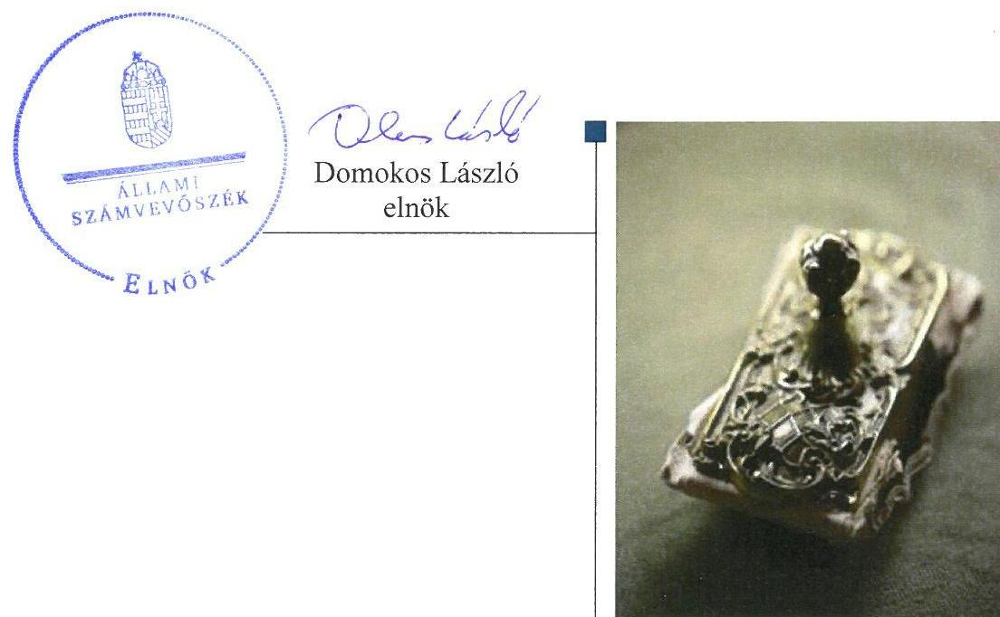
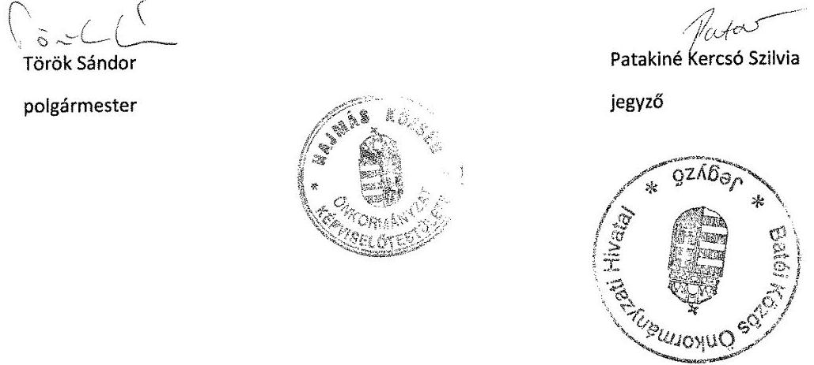
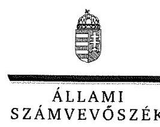
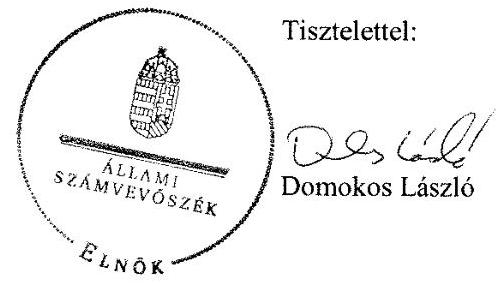
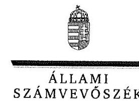
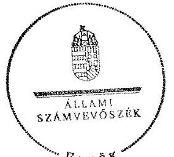
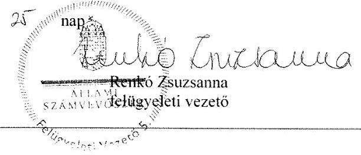

# Jelentés 

## Önkormányzatok belső kontrollrendszere

Az önkormányzatok belső kontrollrendszere kialakításának és működtetésének ellenőrzése - Hajmás 2017.

---

# Jelentés 

## Önkormányzatok belsó kontrollrendszere

Az önkormányzatok belső
kontrollrendszere kialakításának és múködtetésének ellenőrzése - Hajmás 2017. 10 hó ๑๖ nap

---

# AZ ELLENŐRZÉST FELÜGYELTE:

- RENKŐ ZSUZSANNA felügyeleti vezető
- AZ ELLENŐRZÉST VEZETTE ÉS A VÉGREHAJTÁSÁÉRT FELELŐS:
  - DÉR LÍVIA ellenőrzésvezető
  - A PROGRAM ÖSSZEÁLLÍTÁSÁÉRT FELELŐS:
    - JANIK JÓZSEF osztályvezető

- IKTATÓSZÁM: V-1246-064/2016.
- TÉMASZÁM: 2280
- ELLENŐRZÉS-AZONOSÍTÓ SZÁM: V-076411

Jelentéseink az Országgyűlés számítógépes hálózatán és az Interneta a www.asz.hu címen is olvashatóak.

---

# TARTALOMJEGYZÉK 

■ ÖSSZEGZÉS ..... 5
■ AZ ELLENŐRZÉS CÉLJA ..... 6
■ AZ ELLENŐRZÉS TERÜLETE ..... 7
■ AZ ELLENŐRZÉS HÁTTERE, INDOKOLTSÁGA ..... 8
■ A JELENTÉS LÉNYEGES KÉRDÉSKÖREI ..... 10
■ ELLENŐRZÉS HATÓKÖRE ÉS MÓDSZEREI ..... 11
■ MEGÁLLAPÍTÁSOK ..... 13
■ JAVASLATOK ..... 18
■ MELLÉKLETEK ..... 19
I. sz. melléklet: Értelmező szótár ..... 19
II. sz. melléklet: Az integritás szemlélet érvényesítésével és az integritás kontrollrendszer kiépítettségével kapcsolatos megállapítások ..... 21
■ FÜGGELÉK: ÉSZREVÉTELEK ..... 23
■ RÖVIDÍTÉSEK JEGYZÉKE ..... 41

---

.

---

# ÖSSZEGZÉS 

Hajmás Község Önkormányzata belső kontrollrendszere kialakításának és müködtetésének hiányosságai miatt az nem biztositotta a közpénzfelhasználás szabályosságának, a közvagyon biztonságos és körültekintő befektetésének feltételeit. A pénzügyi befektetéssel kapcsolatos döntéshozatal szabályszerü volt. Az önkormányzati befektetésre vonatkozó adatok nem voltak megbizhatóak. Az Önkormányzatnál nem épitették ki a megfelelő védelmet a korrupciós veszélyekkel szemben.

## Az ellenőrzés társadalmi indokoltsága

Magyarország Alaptörvénye az önkormányzatoktól is elvárja a kiegyensúlyozott, átlátható és fenntartható költségvetési gazdálkodás elvének érvényesitését. Az önkormányzatok által betöltött társadalmi szerep, az általuk kezelt közpénz nagysága, a nemzeti vagyon átruházására vagy hasznosítására vonatkozó döntéseik sokrétüsége egyaránt indokolttá tették a számvevőszéki ellenőrzések folytatását. A korábbi évek ellenőrzési tapasztalatai igazolták azt, hogy a belső kontrollrendszer kialakítása és müködtetése nélkül nem valósítható meg a közpénzek, a közvagyon szabályos, gazdaságos, hatékony és eredményes felhasználása. A kockázatok alapján fennállt a lehetősége annak, hogy az önkormányzatok befektetési döntései, továbbá a döntések végrehajtása és számviteli elszámolása nem voltak teljes mértékben szabályszerűek, és a kapcsolódó belső kontrollrendszerek sem müködtek minden esetben megfelelően.

Hajmás Község Önkormányzata 2015. december 31-én 4,4 millió Ft vételi áron vásárolt törzsrészvénnyel rendelkezett a KÖZVIL Zrt-ben.

## Főbb megállapítások, következtetések

Az egyes befektetések vonatkozásában 2011-2015. között, a gazdálkodás egészét érintően a 2015. évben a belső kontrollrendszer kialakítása és müködtetése a pillérek összesített értékelése alapján nem volt szabályszerű, ezért az nem biztosította a közpénzfelhasználás szabályosságát. A kontrolltevékenységek nem járultak hozzá a hibák megelőzéséhez, feltárásához. A kockázatkezelési rendszert 2011-2015 között nem müködtették, nem mérték fel a kockázatokat, nem határozták meg ezen kockázatokkal kapcsolatban szükséges intézkedéseket, valamint azok teljesítése folyamatos nyomon követésének módját. Az önkormányzati gazdálkodás során a közérdekú adatok nyilvánosságát nem biztosították, mivel a közzétételi kötelezettséget hiányosan teljesítették.

A részvényvásárlásra vonatkozó döntés megfelelt a jogszabályi előírásoknak. A számviteli nyilvántartásban feltárt hibák miatt nem álltak rendelkezésre megbízható adatok az Önkormányzat befektetéseiről.

Az Önkormányzatnál nem tettek erőfeszítéseket az integritás szemlélet érvényesítése érdekében. Az integritás kontrollok kiépítettsége nem volt egyensúlyban a korrupciós kockázatok szintjével.

---

# AZ ELLENŐRZÉS CÉLJA 

Az ellenőrzés célja annak megállapítása volt, hogy szabályszerűen történt-e az Önkormányzat belső kontrollrendszerének kialakítása és működtetése, az biztosítottae az önkormányzatnál a közpénzfelhasználás szabályosságát, a közpénzekkel és a nemzeti vagyonnal történő szabályszerű és felelős gazdálkodást, a beszámolási és adatszolgáltatási kötelezettségek szabályszerű teljesítését. Az ellenőrzés keretében értékeltük az Önkormányzat korrupciós kockázatainak kezelését szolgáló integritás kontrollok kiépítettségét és az integritás szemlélet érvényesülését.

Az Önkormányzat egyes befektetési tevékenységeinek ellenőrzése során az ellenőrzés célja annak megállapítása volt, hogy a kialakított kontrollkörnyezet biztosította-e a befektetési tevékenységek szabályszerű végzését. Megítéltük, hogy az egyes befektetési tevékenységekkel kapcsolatos döntéshozatal és a döntések végrehajtása, valamint az egyes befektetések számviteli elszámolása, nyilvántartása szabályszerű volt-e, és a belső és külső ellenőrzések hozzájárultak-e az egyes befektetési tevékenységek szabályszerűségéhez.

---

# **AZ ELLENŐRZÉS TERÜLETE**

## **Hajmás Község Önkormányzata**

A Somogy megyében fekvő Hajmás község állandó lakosainak száma 2015. január 1-jén 253 fő volt. Az Önkormányzat1 öttagú Képviselő-testületének2 munkáját háromfős ügyrendi bizottság segítette.

A polgármester3 a 1998. évi önkormányzati választások óta tölti be tisztségét. A jegyző4 2007. április elsejétől, a jegyző5 2015. január elsejétől látta el feladatait. Az Önkormányzat működésével kapcsolatos feladatokat 2011-2012. között Körjegyzőség, 2013-2014. években a Szentbalázsi, 2015-től a Batéi Közös Önkormányzati Hivatal látta el, amely gazdasági szervezettel nem rendelkezett.

Az Önkormányzat a Hivatalon kívül társulások útján látta el feladatait; intézménnyel nem rendelkezett. A településen nem működött helyi nemzetiségi önkormányzat.

Az Önkormányzat a 2015. évi éves költségvetési beszámoló szerint 70,0 millió Ft költségvetési bevételt ért el, valamint 59,9 millió Ft költségvetési kiadást teljesített. Az Önkormányzat által kimutatott eszközvagyon értéke 2015. december 31-én 125,5 millió Ft volt. A forrásokon belül a költségvetési évet követően esedékes kötelezettség állomány 0,6 millió Ft-ot tett ki, pénzintézettel szembeni kötelezettségük nem volt. Az Önkormányzat adósságkonszolidációs támogatásban nem részesült.

---

# AZ ELLENŐRZÉS HÁTTERE, INDOKOLTSÁGA 

A demokratikus társadalmakban alapvető igény, hogy a közpénzeket, a közvagyont használók tevékenységükről elszámoljanak, ahhoz egyértelmű és érvényesíthető felelősségi szabályok társuljanak. Ennek a jogos igénynek az érvényesítéséhez meg kell teremteni azokat a folyamatokat, rendszereket, amelyek nélkülözhetetlenek az elszámoltatáshoz. Az elszámoltatás eredményes működtetéséhez szükség van a megfelelő információs, kontroll-, értékelési és beszámolási rendszerek kialakítására. A belső kontrollok kiépítettsége hozzájárul az integritási szemlélet kialakításához és érvényesüléséhez. A belső kontrollrendszer kialakítása és működtetése nélkül nem valósítható meg a közpénzek, a közvagyon szabályos, gazdaságos, hatékony és eredményes felhasználása.

A BELSŐ KONTROLLRENDSZER azt a célt szolgálja, hogy az államháztartás szervei működésük és gazdálkodásuk során a tevékenységeket szabályszerűen, gazdaságosan, hatékonyan, eredményesen hajtsák végre, teljesítsék elszámolási kötelezettségeiket és megvédjék az erőforrásokat a veszteségektől, a károktól, a nem rendeltetésszerű használattól. A belső kontrollrendszer magába foglalja mindazon szabályokat, eljárásokat, gyakorlati módszereket és szervezeti struktúrákat, kockázatkezelési technikákat, kontrolltevékenységeket, amelyek segítséget nyújtanak a szervezetnek céljai eléréséhez. A belső kontrollrendszer szabályozása háromszintű, a törvényi előírásokat az Áht. ${ }^{6}$. és a Mötv. ${ }^{7}$, a rendeleti szintű szabályozást az Ávr. ${ }^{8}$ és a Bkr. ${ }^{9}$ tartalmazza, amelyeket útmutatói szinten az $\mathrm{NGM}^{10}$ által kiadott standardok és kézikönyvek támogatnak.

A megfelelő belső kontrollrendszer jelentősen csökkenti a hibák és szabálytalanságok kockázatát. Az ÁSZ ${ }^{11}$ célja, hogy javuljon az ellenőrzött önkormányzatok belső kontrollrendszerének szabályozottsága, működésének megfelelősége, szabályszerűsége, hozzájárulva ezzel az egyensúlyi helyzet fenntarthatóságához, biztosítva az önkormányzatnál a közpénzfelhasználás szabályosságát, a közpénzekkel és a nemzeti vagyonnal történő szabályszerű, gazdaságos, hatékony és eredményes gazdálkodást. Az ÁSZ ellenőrzés tapasztalatai nem csupán a közvetlenül ellenőrzött önkormányzatokat támogathatják, hanem a „jó gyakorlat" elterjesztésével azok az önkormányzatok is átvehetik a pozitív példákat, ahol eddig még nem végzett ellenőrzést az ÁSZ.

A közszféra integritás alapú kultúrájának kialakítása, megerősítése és működése szorosan összefügg a belső kontrollrendszer működésével, ezért az ellenőrzés kiterjed annak értékelésére is, hogy a belső kontrollrendszer kialakítása és működtetése hogyan hatott az integritás szemlélet érvényesülésére.

## AZ ÖNKORMÁNYZATOK ÁTMENETILEG SZABAD

PÉNZESZKÖZEINEK BEFEKTETÉSÉT jogszabály nem tiltja, a befektetések jellege nem korlátozott, a pénzpiaci szolgáltatók közül az önkormányzatok a kínált szolgáltatás és annak költségei alapján, szabadon választhatnak, azonban a veszteséges gazdálkodás kockázatai és kö-

---

vetkezményei az önkormányzatokat terhelik. A szabad pénzeszközök felhasználása során kiemelten fontos a felelős gazdálkodás érvényesülése, amely összhangban kell, hogy legyen, az önkormányzati gazdálkodás alapelveivel.
2015. első felében az MNB három befektetési szolgáltató tevékenységi engedélyét vonta vissza és kezdeményezte a vállalkozások felszámolását a múködéssel kapcsolatos szabálytalanságok, hiányosságok miatt. A befektetési vállalkozások problémás helyzetbe kerülése jelentős veszteségekhez vezetett számos önkormányzat esetében. A korábbi évek ellenőrzési tapasztalatai alapján fennállt a lehetősége annak, hogy az önkormányzatok befektetési döntései, továbbá a döntések végrehajtása és számviteli elszámolása nem voltak teljes mértékben szabályszerűek, és a kapcsolódó külső és belső kontroll rendszerek sem múködtek minden esetben megfelelően.

Az ellenőrzéssel feltárásra kerülhetnek azok a kockázatok, amelyek az önkormányzatok gazdálkodásával, ezen belül befektetési tevékenységeivel, kontrollkörnyezetével kapcsolatosak és a befektetési tevékenységek szabályszerű végrehajtását befolyásolják. Az ellenőrzéssel az önkormányzatok befektetési/vagyongazdálkodási döntéseinek összessége értékelhetővé válik, és megalapozott megállapítás tehető arra vonatkozóan, hogy azok milyen hatást gyakoroltak az önkormányzat vagyonára.

# AZ ELLENŐRZÉS VÁRHATÓ HASZNOSULÁSA 

NÉGY SZINTEN valósul meg. A törvényalkotás számára összegzett tapasztalatok állnak rendelkezésre a belső kontrollrendszer önkormányzati területen való kialakításáról, múködtetéséről és hatásairól. Az ellenőrzés az ellenőrzött számára visszajelzést ad a belső kontrollrendszer kialakításában és múködésében lévő hiányosságokról, javaslataival hozzájárul azok kiküszöböléséhez. Az ellenőrzés megállapításait és javaslatait más szervezetek is hasznosíthatják a rendezett gazdálkodási keretek kialakításához. A társadalom számára jelzi, hogy közpénz nem maradhat ellenőrizetlenül, az ÁSZ értékteremtő rend kialakításához és megőrzéséhez hozzájáruló tevékenysége pozitív hatással lesz a szervezetről kialakított összkép formálásában.

---

# A JELENTÉS LÉNYEGES KÉRDÉSKÖREI 

1.     - A belső kontrollrendszer egyes pillérei biztositották-e a befektetési tevékenységek szabályszerü végzését a 2011-2015. években?
2.     - Az Önkormányzat belső kontrollrendszerének kialakítása és müködtetése a 2015. évben szabályszerü volt-e, az biztositotta-e a közpénzfelhasználás szabályosságát, a nemzeti vagyonnal történő felelős gazdálkodást?
3.     - Az egyes befektetésekkel kapcsolatos döntéshozatal és a döntések végrehajtása szabályszerü volt-e?
4.     - Az egyes befektetések számviteli elszámolása, nyilvántartása szabályszerü volt-e?
5.     - Érvényesült-e az integritás szemlélet és ennek megfelelően kiépítették-e az integritás kontrollrendszert az Önkormányzatnál?

---

# ELLENŐRZÉS HATÓKÖRE ÉS MÓDSZEREI 

## Az ellenőrzés típusa

A belső kontrollrendszer ellenőrzése esetében megfelelőségi ellenőrzés, a befektetési tevékenységnél szabályszerűségi ellenőrzés.

## Az ellenőrzött időszak

A belső kontrollrendszer kialakításának és működtetésének ellenőrzése a 2015. január 1. és december 31. közötti időszakra terjedt ki. Az önkormányzatok egyes befektetési tevékenységeinek ellenőrzése tekintetében az ellenőrzött időszak a 2011. január 1. - 2015. december 31. közötti időszak. Ezen felül az önkormányzat befektetésekkel kapcsolatos döntés-előkészítésének és döntéshozatalának szabályszerűségét a 2011. január 1. előtti időszakra visszanyúlóan is ellenőriztük, amennyiben a 2015. december 31-én meglévő befektetéseire 2011. január 1-je előtt került sor. Az integritás szemlélet érvényesülését a 2015. évre vonatkozó adatszolgáltatás alapján értékeltük.

## Az ellenőrzés tárgya

A helyi önkormányzatnak, mint éves költségvetési beszámoló készítésére kötelezett szervezetnek és polgármesteri hivatalának belső kontrollrendszere. Az integritás szemlélet érvényesülése.

Az önkormányzat 2015. december 31-én meglévő, értékpapírokban megtestesülő befektetései, lekötött betétei, valamint a szabad pénzeszközei terhére, adásvételi szerződés keretében megszerzett, a kötelező feladatok ellátását nem szolgáló az önkormányzat üzleti vagyonába tartozó, az ellenőrzött időszakban (2011-2015.) megszerzett ingatlanok, továbbá időkorlátozás nélkül megszerzett -kulturális javak (műtárgyak, műalkotások, stb.), illetve a feladatellátást nem szolgáló egyéb értéktárgyak (pl. ékszerek, befektetési nemesfém).

Az ellenőrzés kiterjedt minden olyan körülményre és adatra, amely az ÁSZ jogszabályban meghatározott feladatainak teljesítéséhez, valamint a program végrehajtása folyamán felmerült újabb összefüggések feltárásához szükséges volt.

## Az ellenőrzött szervezet

Hajmás Község Önkormányzata és az önkormányzati múködéshez kapcsolódó feladatokat ellátó Hivatal ${ }^{12}$.

---

# Az ellenőrzés jogalapja 

Az ÁSZ tv. ${ }^{13}$ 1. § (3) bekezdésében foglaltak alapján az ÁSZ általános hatáskörrel végzi a közpénzekkel és az állami és önkormányzati vagyonnal való felelős gazdálkodás ellenőrzését. Az ÁSZ tv. 5. § (2) bekezdése alapján az államháztartás gazdálkodásának ellenőrzése keretében az ÁSZ ellenőrzi a helyi önkormányzatok gazdálkodását, valamint az ÁSZ tv. 5. § (6) bekezdése alapján ellenőrzése során értékeli az államháztartás számviteli rendjének betartását és a belső kontrollrendszer múködését.

## Az ellenőrzés módszerei

Az ellenőrzést a nemzetközi standardokat irányadónak tekintve az ellenőrzési program szempontjai, kérdései, az ellenőrzött időszakban hatályos jogszabályok, az ellenőrzés szakmai szabályok és módszertanok figyelembe vételével végeztük.

Az ellenőrzés ideje alatt az ellenőrzött szervezettel történő kapcsolattartást az ÁSZ SZMSZ-ének ${ }^{14}$ vonatkozó előírásai alapján biztosítottuk.

Az ellenőrzési kérdések megválaszolásához szükséges bizonyítékok megszerzése az ellenőrzöttek által rendelkezésre bocsátott dokumentumokra, adatokra alapozva megfigyelés, szemle (szemrevételezés), kérdésfeltevés (információkérés), valamint elemző eljárással történt. A minták kiválasztása rétegzett, véletlen mintavételi eljárással történt.

Az ellenőrzési bizonyítékként felhasználható adatforrások közé tartoznak egyrészt az ellenőrzési program részletes szempontjainál felsorolt adatforrások, másrészt minden - az ellenőrzés folyamán feltárt, az ellenőrzés szempontjából információt tartalmazó - dokumentum.

Az ellenőrzés lefolytatásához az Önkormányzat a tanúsítványok elektronikus kitöltésével, valamint az ÁSZ által kért dokumentumok elektronikus megküldésével szolgáltat adatokat. A rendelkezésre bocsátott adatok, információk kontrollja az ellenőrzés keretében történt.

A jelentésben használt fogalmak magyarázatát az I. számú melléklet, a jelentésben használt rövidítéseket a rövidítések jegyzéke tartalmazza.

Az integritás szemlélet érvényesülésének értékelése az önkormányzat által kitöltött tanúsítvány alapján történt a 2015. évre vonatkozóan.

---

# 1. A belső kontrollrendszer egyes pillérei biztosították-e a befektetési tevékenységek szabályszerű végzését a 2011-2015. években? 

Összegző megállapítás

Az egyes befektetési tevékenységeket érintően 2011-2015 között a belső kontrollrendszer egyes pillérei kialakításának és múködtetésének hiányosságai következtében azok nem biztosították az önkormányzati vagyon körültekintő és szabályszerű befektetésének feltételeit.

A KONTROLLKÖRNYEZET a 2013-2014. években a Bkr. 6. §. (2) bekezdésében foglaltak ellenére nem biztosította a befektetésekkel kapcsolatos tevékenység szabályozott végzését, mert a számviteli szabályokat a 2014. évben az Áhsz. ${ }^{15}$ 51. § (2) bekezdésének előírásai ellenére a befektetések elszámolásával, nyilvántartásával, a 2013-2014. években a Számv. tv. ${ }^{16}$ 14. § (5) bekezdés b) pontjának előírásai ellenére a befektetések értékelésével kapcsolatban nem határozták meg.

A Képviselő-testület az önkormányzati SZMSZ1-2-ben ${ }^{17}$ a polgármesterre ruházott át hatásköröket. Ezek között a befektetési döntésekre vonatkozóan szerepelt, hogy a polgármester dönthet a szabad pénzeszközök betétként való elhelyezéséről. Az értékpapírok adásvételével kapcsolatos hatáskört a Képviselő-testület fenntartotta saját magának.

KOCKÁZATKEZELÉSI RENDSZERT az Ámr. ${ }^{18}$. 157. § (1)-(3) bekezdéseiben és a Bkr. 7. § (1)-(2) bekezdéseiben foglaltak ellenére nem múködtettek, a befektetési tevékenységgel kapcsolatban nem mérték fel a kockázatokat, nem határozták meg az egyes kockázatokkal kapcsolatban szükséges intézkedéseket, valamint a 2012-2015. közötti időszakban azok teljesítésének folyamatos nyomon követésének módját.

A KONTROLLTEVÉKENYSÉGEK részeként a befektetések vonatkozásában nem biztosították az előzetes pénzügyi ellenőrzést. A részvény átruházási szerződés ellenjegyzése - az Áht. ${ }^{19}$ 98. § (2) bekezdése ellenére - nem történt meg. Ezáltal az Ámr. ${ }^{20}$ 134. § (7) bekezdésében foglaltak ellenére nem győződtek meg arról, hogy a jóváhagyott költségvetés fel nem használt, illetve le nem kötött, a kötelezettségvállalás tárgyával összefüggő kiadási előirányzata biztosítja-e a fedezetet, és a kötelezettségvállalás nem sérti-e a gazdálkodásra vonatkozó szabályokat, továbbá a kötelezettségvállalás célszerűségét megalapozó eljárás megtörtént-e.

AZ INFORMÁCIÓS ÉS KOMMUNIKÁCIÓS RENDSZER nem biztosította a befektetési tevékenység során a közérdekú adatok nyilvánosságát, mivel az Önkormányzat honlapján nem tette közzé a kisebbségi tulajdoni részesedésú gazdasági társasága nevét, székhelyét, elérhetőségét, tevékenységi körét, képviselőjének nevét, a részesedés

---

mértékét az Info. tv. ${ }^{21}$ 37. § (1) bekezdése, továbbá az 1. melléklete I/7. pontjának előírása ellenére.

A MONITORING RENDSZER keretén belül működő belső ellenőrzés az Önkormányzat irányítási, belső kontroll és ellenőrzési eljárásainak fejlesztését a befektetési tevékenység vonatkozásában támogatta, mivel feltárták az analitikus és főkönyvi nyilvántartások közötti eltérést. A külső ellenőrzések a befektetési tevékenységre nem terjedtek ki.

# 2. Az Önkormányzat belső kontrollrendszerének kialakítása és múködtetése a 2015. évben szabályszerű volt-e, az biztosította-e a közpénzfelhasználás szabályosságát, a nemzeti vagyonnal történő felelős gazdálkodást? 

## Összegző megállapítás

A gazdálkodás egészét tekintve a 2015. évben a belső kontrollrendszer nem volt szabályszerű, nem biztosította a közpénzfelhasználás szabályosságának, és az önkormányzati vagyonnal való felelős gazdálkodásnak a feltételeit.

A KONTROLLKÖRNYEZET kialakítása összességében szabályszerű volt, mert a jogszabályokban előírt megfelelő tartalmú szabályzatokat - az alábbi hiányosságok mellett - elkészítették:

- a számviteli politikában a Számv. tv. 14. § (4) bekezdése előírása ellenére nem rögzítették, hogy a számviteli elszámolás és értékelés szempontjából mit tekintenek kivételes nagyságú vagy előfordulású bevételnek, költségnek, ráfordításnak;
- a számlarendben az Áhsz. 2 51. § (3) bekezdésében foglaltak ellenére nem határozták meg a részletező nyilvántartások és az egységes rovatrend rovataihoz kapcsolódóan vezetett nyilvántartási számlák adataiból a pénzügyi könyvvezetéshez készült összesítő bizonylatok (feladások) elkészítésének rendjét, az összesítő bizonylatok tartalmi és formai követelményeit;
elöírták, hogy a 100 ezer Ft-ot el nem érő kifizetések esetében nem szükséges az előzetes írásbeli kötelezettségvállalás, azonban az Ávr. 53. § (2) bekezdése előírása ellenére a 100 ezer Ft alatti előzetes írásbeli kötelezettségvállalást nem igénylő kifizetések rendjére vonatkozó szabályokat nem rögzítették.

A KOCKÁZATKEZELÉSI RENDSZERT nem működtették, mivel a Bkr. 7. § (1)-(2) bekezdése előírása ellenére nem mérték fel és állapították meg a Hivatal tevékenységében rejlő kockázatokat, nem határozták meg az egyes kockázatokkal kapcsolatban szükséges intézkedéseket, valamint azok folyamatos nyomon követésének módját.

---

A KONTROLLTEVÉKENYSÉGEK működtetése nem volt szabályszerű, és nem biztosította a kiadásokkal kapcsolatban a hibák megelőzését és feltárását, a közpénzfelhasználás szabályosságát mert:
— az Ávr. 55. § (1) bekezdésében foglaltak ellenére a 100 ezer forintot meghaladó kötelezettségvállalások esetén a pénzügyi ellenjegyzésre a kötelezettségvállalás dokumentumán, a pénzügyi ellenjegyzés dátumának és a pénzügyi ellenjegyzés tényére történő utalás megjelölésével nem került sor. Ezáltal az Áht. 37. § (1) bekezdésében foglaltak ellenére nem győződtek meg arról, hogy a szabad előirányzat rendelkezésre áll-e, a tervezett kifizetési időpontokban a pénzügyi fedezet biztosított volt-e, és a kötelezettségvállalás nem sérti-e a gazdálkodásra vonatkozó szabályokat;
— az érvényesítést az Ávr. 58. § (1) bekezdésében foglaltak ellenére nem szabályszerűen végezték el. Az érvényesítő aláírása nem volt beazonosítható - az Ávr. 60. § (3) bekezdésében foglaltaknak megfelelően vezetett - az érvényesítésre kijelölt személyek aláírás mintájával. Az érvényesítés során nem ellenőrizték, hogy a megelőző ügymenetben a jogszabályokban és a belső szabályzatokban foglaltakat megtartották-e, mert az Ávr. 58. § (2) bekezdés előírása ellenére nem jelezték az utalványozónak, hogy a kötelezettségvállalások pénzügyi ellenjegyzés hiányában történtek;
— a kötelezettségvállalások szabályszerű nyilvántartásáról az Ávr. 56. § (1) bekezdésében foglaltak ellenére nem gondoskodtak.

# AZ INFORMÁCIÓS ÉS KOMMUNIKÁCIÓS RENDSZER kialakítása és múködtetése nem volt szabályszerű, mert: 

— az iratkezelés szabályzatot az Ltv. ${ }^{22}$ 10. § (1) bekezdés c) pontjában foglaltak ellenére nem a Magyar Nemzeti Levéltár egyetértésével adták ki;
— az Info. tv. 37. § (1) bekezdése szerinti közzétételi kötelezettségének teljes körűen nem tettek eleget, mert az Önkormányzat honlapján nem tették közzé az adatvédelmi és adatbiztonsági szabályzatot az Info tv. 1. melléklete II/1. pontjának előírásai ellenére; továbbá az éves költségvetési beszámolókat, az Info tv. 1. melléklete III/1. pontjának előírásai ellenére.

A MONITORING RENDSZER kialakítása és múködtetése nem volt szabályszerű. Az operatív tevékenységek során megvalósuló folyamatos és eseti nyomon követést a Bkr. 10. §-ában előírtak ellenére nem alakították ki és nem múködtették.

A belső kontrollrendszer 2015. évi minősítéséről kiadott vezetői nyilatkozat nem volt helytálló. A Bkr. 11. § (1) bekezdése szerinti nyilatkozatban annak ellenére nyilatkoztak a gazdaságosság, eredményesség és hatékonyság követelményeinek érvényesítéséről, hogy - a Bkr. 6. § (2) bekezdését figyelmen kívül hagyva - nem alakítottak ki és nem működtettek olyan folyamatokat, amelyek a rendelkezésre álló források szabályszerű, gazdaságos, hatékony és eredményes felhasználását biztosították volna.

---

# 3. Az egyes befektetésekkel kapcsolatos döntéshozatal és a döntések végrehajtása szabályszerű volt-e? 

## Összegző megállapítás

## A befektetési célú részvényvásárlással kapcsolatos döntéshozatal szabályszerű volt.

Az Önkormányzatnak 2015. december 31-én 2,3 millió Ft névértékű, 4,4 millió Ft vételi áron vásárolt KÖZVIL Zrt. ${ }^{23}$ részvénye volt. A beszerzésekre 2004-2014. évek között került sor. Befektetési célú ingatlannal, lekötött betéttel, kulturális javakkal, egyéb értéktárgyakkal nem rendelkeztek.

A részvényvásárlással kapcsolatos döntéshozatal megfelelt az Ötv. ${ }^{24}$ előírásainak, arról a Képviselő-testület határozattal ${ }^{25}$ döntött. Az Önkormányzat a KÖZVIL Zrt. részvényeket havi részletfizetések ellenében szerezte meg, de fizetési kötelezettségét nem tudta az előírt határidőben teljesíteni, ezért a részvények átadása a futamidőn belül időlegesen eltért a szerződés szerinti ütemezéstől.

## 4. Az egyes befektetések számviteli elszámolása, nyilvántartása szabályszerű volt-e?

## Összegző megállapítás

1. táblázat

## BEKERÜLÉSI ÉRTÉK (MILLÓ FT)

|  Év | Tény-
leges | Beszámolában
kimutatott | Eltérés  |
| --- | --- | --- | --- |
|  2011. | 3,2 | 1,4 | 1,8  |
|  2012. | 3,7 | 1,7 | 2,0  |
|  2013. | 4,2 | 2,1 | 2,1  |
|  2014. | 4,4 | 2,3 | 2,1  |
|  2015. | 4,4 | 2,3 | 2,1  |
|  Forrás: ÁSZ kigyújtés az Önkormányzat adatszolgáltatáridő́ |  |  |   |

A részvények számviteli elszámolásának hibái miatt a költségvetési beszámoló befektetésekre vonatkozó adatainak megbízhatósága 2011-2015 között nem volt biztosított.

A BEFEKTETÉSEK NYILVÁNTARTÁSA során a Hivatal a 2011-2013. években az Áhsz. ${ }^{26}$ 29. § (1) bekezdésének a 2014-2015. években az Áhsz.2. 16. § (5) bekezdésének előírása ellenére - az 1. táblázatban bemutatottak szerint - nem a bekerülési értéken mutatta ki a részvények állományát.

A KÖZVIL részvényeket a számvitelben a befektetett pénzügyi eszközök között, tartós részesedés helyett tartós hitelviszonyt megtestesítő értékpapírként szerepeltették, amely nem felelt meg a 2011-2013. években az Áhsz. 1 19. § (2) bekezdésében, a 2014-2015. években az Áhsz.2. 11. § (9) bekezdésében foglaltaknak.

A részvényekről vezetett részletező nyilvántartás szabálytalan volt, mert nem tartalmazta a 2014-2015. éveket érintően az Áhsz. 2 14. melléklet VIII. 2. a)-i) pontjaiban meghatározott tartalmi elemeket.

AZ ÉV VÉGI SZÁMVITELI FELADATOK során a 20112014. évek között az Áhsz. 1 37.§ (1)-(2) bekezdése, az Áhsz. 2 22. § (1)-(2) bekezdése ellenére a részvényeket nem leltározták. A 2015. évi leltár nem felelt meg a Számv. tv. 69. § (1) bekezdésében foglaltaknak, mert nem tartalmazta tételesen és ellenőrizhető módon a részvényeket menynyiségben.

Az Önkormányzatnál a KÖZVIL Zrt-ben lévő részesedéseket a Számv. tv. 46. § (3) bekezdésben, az Áhsz. 1 32. § (1) bekezdésében, az Áhsz. 2 20. § (1) bekezdésében és a 21. § (3) bekezdésében foglaltak ellenére 2011-2015 között évente nem értékelték.

---

# 5. Érvényesült-e az integritás szemlélet és ennek megfelelően ki- 

építették-e az integritás kontrollrendszert az Önkormányzatnál?

Összegző megállapítás

Az Önkormányzat nem tett erőfeszítéseket az integritás szemlélet érvényesítése érdekében. Az integritás kontrollok kiépítettsége nem volt egyensúlyban a korrupciós kockázatok szintjével.

Az Önkormányzat az ellenőrzést megelőzően nem vett részt az ÁSZ Integritás Projektjében. Az ÁSZ Integritás Projekt az ÁSZ 2009-ben indított „Korrupciós kockázatok feltérképezése - Integritás alapú közigazgatási kultúra terjesztése" címú kiemelt projektje (http://integritas.asz.hu/). Az Önkormányzat a jogszabályok által is előírt szabályossági kontrollokat összességében kiépítette, azonban a korrupciós kockázatokkal szembeni védettséget növelő integritás kontrollok kiépítettsége alacsony volt. Az integritás kontrollrendszer kiépítettségével kapcsolatos megállapításokat a II. sz. melléklet tartalmazza.

---

# JAVASLATOK 

Az ÁSZ tv. 33. § (1) bekezdésében foglaltak értelmében az ellenőrzött szervezet vezetője köteles a jelentésben foglalt megállapításokhoz kapcsolódó intézkedési tervet összeállítani és azt a jelentés kézhezvételétől számított 30 napon belül az ÁSZ részére megküldeni. Amennyiben az ellenőrzött szervezet vezetője nem küldi meg határidőben az intézkedési tervet, vagy továbbra sem elfogadható intézkedési tervet küld, az Állami Számvevőszék elnöke az ÁSZ tv. 33. § (3) bekezdése a) és b) pontjaiban foglaltakat érvényesítheti.

## a jegyzőnek:

1. Intézkedjen a belső kontrollrendszer egyes elemei jogszabályi előírásnak megfelelő kialakításáról és müködtetéséről, valamint a gazdálkodási jogkörök gyakorlása során a jogszabályi előírások betartásáról.
(1. számú megállapítás 3. és 5. bekezdései,
2. számú megállapítás 1-5. bekezdései alapján)
3. Intézkedjen a befektetésekkel kapcsolatos gazdasági események jogszabályi előírásoknak megfelelő rögzítéséről a számviteli nyilvántartásokban.
(4. számú megállapítás 1-2. bekezdései alapján)
4. Intézkedjen a részvényekhez kapcsolódó részletező nyilvántartások jogszabályi előírásoknak megfelelő vezetéséről.
(4. számú megállapítás 3. bekezdése alapján)
5. Intézkedjen az éves költségvetési beszámoló mérlegében kimutatott részvények jogszabályi előírásoknak megfelelő leltárral történő alátámasztásáról.
(4. számú megállapítás 4. bekezdése alapján)
6. Intézkedjen az éves költségvetési beszámoló mérlegében kimutatott részesedések jogszabályi előírásoknak megfelelő értékeléséről.
(4. számú megállapítás 5. bekezdése alapján)
7. Intézkedjen az Állami Számvevőszék ellenőrzése során feltárt hiányosságok és/vagy szabálytalanságok tekintetében a munkajogi felelősség tisztázására irányuló eljárás megindításáról és ennek eredménye ismeretében tegye meg a szükséges intézkedéseket.
(1. számú megállapítás 5. bekezdése,
8. számú megállapítás 3. bekezdése, 4. bekezdés 2. pontja,
9. számú megállapítás 1-5. bekezdései alapján)

---

# MELLÉKLETEK 

- I. SZ. MELLÉKLET: ÉRTELMEZŐ SZÓTÁR

ÁSZ Integritás Projekt
belső ellenőrzés
belső kontrollrendszer
belső kontrollrendszer pillérei, kontrollterületei
betét
helyi önkormányzat

Az Állami Számvevőszék 2009-ben indította el a „Korrupciós kockázatok feltérké-pezése-Integritás alapú közigazgatási kultúra terjesztése" című, európai uniós forrásból megvalósított kiemelt projektjét (Integritás Projekt). Az Integritás Projekt célja, hogy felmérje a közszféra intézményei korrupciós kockázatoknak való kitettségét, illetőleg az azok mérséklésére hivatott kontrollok szintjét. Az Állami Számvevőszék a projekt révén az integritás szemlélet minél szélesebb körrel történő megismertetését, gyakorlatba ültetését kívánja elérni. Az integritás követelményeinek megfelelő szervezeti működést előnyben részesítő közigazgatási kultúra elterjesztését és a korrupció elleni fellépést az ÁSZ önmagára nézve is stratégiai jelentőségű célként fogalmazta meg. A projekt a felmérésben résztvevő intézmények számára helyzetükről egyfajta „tükörképet" mutat be, ami alapot teremt a jövőbeni pozitív irányú elmozduláshoz.
(Forrás: a http://integritas.asz.hu honlapon közzétett, a 2013. évi Integritás felmérés eredményeiről készült összefoglaló tanulmány)
Független, tárgyilagos bizonyosságot adó és tanácsadó tevékenység, amelynek célja, hogy az ellenőrzött szervezet működését fejlessze és eredményességét növelje, az ellenőrzött szervezet céljai elérése érdekében rendszerszemléletű megközelítéssel és módszeresen értékeli, illetve fejleszti az ellenőrzött szervezet irányítási és belső kontrollrendszerének hatékonyságát. (Bkr. 2. § b) pontja)
A belső kontrollrendszer a kockázatok kezelése és tárgyilagos bizonyosság megszerzése érdekében kialakított folyamatrendszer, amely azt a célt szolgálja, hogy a múködés és gazdálkodás során a tevékenységeket szabályszerűen, gazdaságosan, hatékonyan, eredményesen hajtsák végre, az elszámolási kötelezettségeket teljesítsék, megvédjék az erőforrásokat a veszteségektől, károktól és nem rendeltetésszerű használattól. (Áht. 2 69. § (1) bekezdése)
A kontrollkörnyezet, a kockázatkezelési rendszer, a kontrolltevékenységek, az információs és kommunikációs rendszer, valamint a nyomon követési (monitoring) rendszer. (Bkr. 3. §-a)
a Ptk. ${ }^{27}$ szerinti betétszerződés vagy a takarékbetétről szóló 1989. évi 2. törvényerejű rendelet szerinti takarékbetét-szerződés alapján fennálló tartozás, ideértve a hitelintézetnél a fizetésiszámla-szerződés alapján fennálló pozitív számlaegyenleget is (Hpt. ${ }^{28}$ 6. § (1) bekezdés 8. pont).
A helyi önkormányzat jogi személy. Az önkormányzati feladatok ellátását a képvi-selő-testület és szervei biztosítják. A képviselőtestület szervei: a polgármester, a főpolgármester, a megyei közgyűlés elnöke, a képviselő-testület bizottságai, a részönkormányzat testülete, a polgármesteri hivatal, a megyei önkormányzati hivatal, a közös önkormányzati hivatal, a jegyző, továbbá a társulás. A képviselő-testület a feladatkörébe tartozó közszolgáltatások ellátására - jogszabályban meghatározottak szerint - költségvetési szervet, a Polgári perrendtartásról szóló 1952. évi III. törvény szerinti gazdálkodó szervezetet (a továbbiakban: gazdálkodó szervezet), nonprofit szervezetet és egyéb szervezetet (a továbbiakban együtt: intézmény) alapíthat, továbbá szerződést köthet természetes és jogi személlyel vagy jogi személyiséggel nem rendelkező szervezettel. A helyi önkormányzat éves költségvetési beszámolója magába foglalja a helyi önkormányzat - nem költségvetési szerveihez tartozó - feladataihoz kapcsolódó bevételeket és kiadásokat. A helyi önkormányzat összevont (konszolidált) költségvetési beszámolóját a helyi önkormányzatra és

---

hitelviszonyt megtestesítő értékpapír
információs és kommunikációs rendszer
integritás
kockázatkezelési rendszer
kontrollkörnyezet
kontrolltevékenységek
részvény
kulturális javak
tartós hitelviszonyt megtestesítö értékpapír
költségvetési szerveire vonatkozóan külön-külön beérkezett éves költségvetési beszámolók alapján a Kincstár készíti el és küldi meg az önkormányzatnak. (Forrás: Mötv. 41. § (1), (2), (6) bekezdései; Áhsz. 2. § (1) bekezdése, 6. § (1) bekezdés a) és f) pontja, 30. §-a, 37. § (1) és (6) bekezdése)
minden olyan értékpapír, illetve törvény által értékpapírnak minősített, jogot megtestesítő okirat, amelyben a kibocsátó (adós) meghatározott pénzösszeg rendelkezésére bocsátását elismerve arra kötelezi magát, hogy a pénz (kölcsön) összegét, valamint annak meghatározott módon számított kamatát vagy egyéb hozamát, és az általa esetleg vállalt egyéb szolgáltatásokat az értékpapír birtokosának (a hitelezőnek) a megjelölt időben és módon megfizeti, illetve teljesíti. Ide tartozik különösen: a kötvény, a kincstárjegy, a letéti jegy, a pénztárjegy, a célrészjegy, a takaréklevél, a jelzáloglevél, a hajóraklevél, a közraktárjegy, az árujegy, a zálogjegy, a kárpótlási jegy, a határozott idejű befektetési alap által kibocsátott befektetési jegy (Számv. tv. 3. § (6) bekezdés 2. pont)
A költségvetési szerv vezetője által kialakított és múködtetett olyan rendszer, mely biztosítja, hogy a megfelelő információk a megfelelő időben eljutnak az illetékes szervezethez, szervezeti egységhez, illetve személyhez. (Bkr. 9. § (1) bekezdés)
Az integritás elvek, értékek, cselekvések, módszerek, intézkedések konzisztenciáját jelenti: olyan magatartásmódot, amely meghatározott értékeknek felel meg. Az integritás a közszféra esetében a társadalom által elvárt nyilvánossági, átláthatósági, illetve jogi/etikai normáknak történő megfelelést jelenti.
(Forrás: a http://integritas.asz.hu honlapon közzétett „A 2012. évi integritás felmérés eredményeinek összefoglalója" című dokumentum 3. oldal 1. bekezdése)
Olyan irányítási eszközök és módszerek összessége, melynek elemei a szervezeti célok elérését veszélyeztető tényezők (kockázatok) azonosítása, elemzése, csoportosítása, nyomon követése, valamint szükség esetén a kockázati kitettség mérséklése. (Forrás: Bkr. 2. § m) pontja)
A költségvetési szerv vezetője által kialakított olyan elvek, eljárások, belső szabályzatok összessége, amelyben világos a szervezeti struktúra, egyértelműek a felelősségi, hatásköri viszonyok és feladatok, meghatározottak az etikai elvárások a szervezet minden szintjén, átlátható a humánerőforrás-kezelés. (Forrás: Bkr. 6. § (1) bekezdés)

A költségvetési szerv vezetője által a szervezeten belül kialakított (kontroll) tevékenységek, melyek biztosítják a kockázatok kezelését, hozzájárulnak a szervezet céljainak eléréséhez. (Forrás: Bkr. 8. § (1) bekezdés)
a kibocsátó részvénytársaságban gyakorolható tagsági jogokat megtestesítő, névre szóló, névértékkel rendelkező, forgalomképes értékpapír (Ptk. 3:213. § (1) bekezdés)
az élettelen és élő természet keletkezésének, fejlődésének, az emberiség, a magyar nemzet, Magyarország történelmének kiemelkedő és jellemző tárgyi, képi, hangrögzített, írásos emlékei és egyéb bizonyítékai - az ingatlanok kivételével -, valamint a művészeti alkotások (a kulturális örökség védelméről szóló 2001. évi LXIV. törvény)
tartós hitelviszonyt megtestesítő értékpapírként azokat a befektetési céllal beszerzett értékpapírokat kell kimutatni, amelyek lejárata, beváltása a tárgyévet követő üzleti évben még nem esedékes, és a vállalkozó azokat a tárgyévet követő üzleti évben nem szándékozik értékesíteni (Számv. tv. 27. § (7) bekezdés)

---

# II. SZ. MELLÉKLET: AZ INTEGRITÁS SZEMLÉLET ÉRVÉNYESÍTÉSÉVEL ÉS AZ INTEGRITÁS KONTROLLRENDSZER KIÉPÍTETTSÉGÉVEL KAPCSOLATOS MEGÁLLAPÍTÁSOK 

Az Önkormányzat által 2015. évre kitöltött integritás tanúsítvány alapján - öt kockázati területen - a kialakított kontrollokat értékeltük. Az Önkormányzatnál az integritás kontrollrendszer kialakítása összességében alacsony volt.

| AZ INTEGRITÁS KONTROLLOK ÉRTÉKELÉSE |  |  |  |  |
| :--: | :--: | :--: | :--: | :--: |
| Sorszám | Megnevezés | Maximum elérhető   pontszámok | Elért   pontszámok | Értékelés |
| 1. | Összeférhetetlenség és etikai elvárások | 5 | 4 | közepes |
| 2. | Humánerőforrás-gazdálkodás | 5 | 5 | magas |
| 3. | A szervezet vagyonának megvédésére tett intézkedések | 5 | 3 | alacsony |
| 4. | A nemkívánatos dolgozói magatartással szembeni intézkedések és azok érvényesülése | 5 | 0 | alacsony |
| 5. | Az integritás erősítése, annak tudatosítása, valamint a kockázatelemzések alkalmazása | 5 | 1 | alacsony |
|  | Összesítő értékelés | 25 | 13 | alacsony |

A kontrollok kiépítettségének főbb hiányosságai az alábbiak voltak:

1. a speciális korrupcióellenes rendszerek és eljárások tekintetében az Önkormányzatnál:

- nem rendelkeztek a vonatkozó jogszabályokkal összhangban álló iratkezelési szabályzattal;
- nem szabályozták a külső személyekkel való kapcsolattartást;
- nem rendelkeztek belső szabályzattal a szervezeten belüli közérdekű bejelentők védelmére vonatkozóan;
- nem működtettek a szervezeten kívülről érkező panaszokat és közérdekű bejelentéseket kezelő rendszert;
- nem rendelkeztek nyilvánosan közzétett stratégiával;
- nem végeztek rendszeres korrupciós kockázatelemzéseket;
- nem volt korrupcióellenes képzés az elmúlt 3 évben.

2. a „lágy" kontrollok (a szervezet által önként bevezetett, kialakított szabályok, követelmények) kialakítását érintően az Önkormányzatnál:

- nem szabályozták az ajándékok, meghívások, utaztatás elfogadásának feltételeit;
- nem működtettek egyéni teljesítményértékelési rendszert.

---

.

---

# FÜGGELÉK: ÉSZREVÉTELEK 

A jelentéstervezetet a Számvevőszék 15 napos észrevételezésre megküldte az ellenőrzött szervezetek vezetőinek az ÁSZ tv. 29. §* (1) bekezdése előírásának megfelelően.
Az elfogadott észrevételek alapján a Számvevőszék módosította a jelentést.

A függelék tartalmazza az ellenőrzött észrevételeit, illetve az el nem fogadott észrevételek elutasításának indoklását.

[^0]
[^0]:    * 29. § (1) Az Állami Számvevőszék az ellenőrzési megállapításait megküldi az ellenőrzött szervezet vezetőjének vagy az általa megbízott személynek, és annak, akinek személyes felelősségét állapította meg.
    (2) Az ellenőrzött szervezet vezetője és a felelősként megjelölt személy az ellenőrzés megállapításaira tizenöt napon belül írásban észrevételt tehet.
    (3) Az Állami Számvevőszék az észrevételre a beérkezésétől számított harminc napon belül írásban válaszol. A figyelembe nem vett észrevételeket köteles a jelentésben feltüntetni, és megindokolni, hogy azokat miért nem fogadta el.

---

Hajmás Község önkormányzata
7473 Hajmás, Templom tér 1.

Ügyisz: B- 1341-2 /2017. , H-131-10/2017.
Hiv.sz: V-1246-049/2016.
Témaszám. 2280
Tárgy: Észrevétel Számvevőszéki jelentéstervezetre

Állami Számvevőszék

# Budapest 4. 

## Pf.54.

1364

Tisztelt Állami Számvevőszék!

Az „Önkormányzatok belső kontrollrendszere kialakításának és müködtetésének ellenőrzése - Hajmás községben" című 2017. augusztus 8-án kézhez vett jelentéstervezetükben foglaltakhoz az alábbi észrevételt tesszük:

A: ÁSZ.2. Megállapításhoz: „Az Önkormányzat belső kontrollrendszerének kialakítása és müködtetése a 2015. évben szabályszerű volt-e, az biztosította-e a közpénzfelhasználás szabályosságát, a nemzeti vagyonnal történő felelős gazdálkodást?

- ÁSZ megállapítás: Kontrolltevékenységek működtetésének első pontjához: „az Ávr. 55. §. (1)bekezdésében foglaltak ellenére a pénzügyi ellenjegyzésre a kötelezettségvállalás dokumentumán, a pénzügyi ellenjegyzés dátumának és a pénzügyi ellenjegyzés tényére történő utalás megjelölésével nem került sor. „

I. Észrevétel: Az Önkormányzat és a Hivatal a beküldött mintatételeket ellátta pénzügyi ellenjegyzéssel és a pénzügyi ellenjegyzés dátumával a mintatételekhez beküldött számla mellé csatolt „Utalvány 2015. évre" című dokumentumon, továbbá amennyiben pénztári kifizetés volt, akkor a pénztárbizonylaton. Az egyszeri személyi juttatások kifizetésénél a kifizetési jegyzéken szerepel az ellenjegyző aláírása és dátum. Az 1-el és P.1-el kezdődő személyi mintatételek, továbbá 4.3, 4.22, 5.4, 6.5, 6.7 mintatételeken kívül mindegyik mintatételen szereplő összeg 100.000 Ft alatti tétel, amelyhez az Ávr. 53. §. (1) bekezdés a) pontja és a Gazdálkodási Szabályzatunk 1.2.1 pontjában foglaltak szerint nem szükséges előzetes írásbeli kötelezettségvállalás. Ezen esetekben is az „Utalvány 2015. évre" című dokumentumon szerepel az ellenjegyző aláírása és dátuma. A dokumentum mintát az

---

EPER pénzügyi program állította elő. Az említett mintatételek mellett is szerepel vagy megrendelés $-6.5,4.22$ - , vagy szerződés $-4.3,6.4,6.7$. Kérjük a fentiek szerint pontosítani, módosítani a megállapítást.

- ÁSZ megállapítás: Kontrolltevékenységek müködtetésének második pontjához: „ a teljesítést megalapozó dokumentumok nem álltak rendelkezésre az Ávr. 57. §. (1) bekezdésének előirása ellenére:"
II. Észrevétel: Az Önkormányzat és a Hivatal által beküldött mintatételeken a számlán, vagy/és az „Utalvány 2015. évre „ című dokumentumon, továbbá amennyiben pénztári kifizetés volt, akkor pénztárbizonylatot minden esetben teljesítés igazolással és dátummal ellátta. A személyi juttatások 1- számú és P.1. számú mintatételek és a 4.3, 4.22, 5.4, 6.5, 6.7 mintatételeken kívül mindegyik tétel 100.000 Ft alatti tétel. Ezen esetekben is az „Utalvány 2015. évre" című dokumentumon szerepel a I. sorban a teljesítés igazolása, a számlákra pedig rányomtatva a „teljesítést igazolom" és a teljesítést igazoló aláírása, dátum szerepel. Kérjük a fentiek szerint pontosítani, módosítani a megállapítást.
- ÁSZ megállapítás: Kontrolltevékenységen működtetésének harmadik pontjához: „az érvényesítést az Ávr. 58. §. (1) bekezdésben foglaltak ellenére nem szabályszerűen végezték el." ... „Az érvényesítés során nem ellenőrizték, hogy a megelőző ügymenetben a jogszabályokban és a belső szabályzatokban foglaltakat megtartották-e, mert az Árv. 58. §. (2) bekezdés előírása ellenére nem jelezték az utalványozónak, hogy a kötelezettségvállalások pénzügyi ellenjegyzés hiánvában történtek, a teljesítésigazolást megalapozó dokumentumok nem álltak rendelkezésre."
III. Észrevétel: Az Önkormányzat és a Hivatal csatolt mintatételein is minden számlához kapcsolódó „Utalvány 2015. évre„ című dokumentumot az érvényesítő ellátta „rövidített" aláírásával. Az érvényesítő nem jelzett, mivel nem észlelte a jogszabályok megsértését, mivel a kötelezettségvállalásokat a megadott mintatételeken pénzügyileg ellenjegyezték, a teljesítéseket a számlákon, vagy az „Utalvány 2015. évre" című dokumentumon ellenjegyezték. Továbbá az önkormányzat és a Hivatal éves költségvetésében a kifizetések, vállalt kötelezettségek tervezésre kerültek (költségvetések csatolásra kerültek.) Kérjük a fentiek szerint pontosítani, módosítani a megállapítást.
- ÁSZ megállapítás: Kontrolltevékenységek működtetésének negyedik pontjához. „a kötelezettségvállalások szabályszerű nyilvántartásáról az Ávr. 56. §. (1) bekezdésének foglaltak ellenére nem gondoskodtak, ezért az Áht. 37. §. (1) bekezdésén foglaltak ellenére a pénzügyi ellenőrzés során nem tudtak meggyőződni arról, hogy a szabad előirányzat rendelkezésre áll-
IV. Észrevétel: A kötelezettségvállalásról szóló nyilvántartást a Hivatal és Önkormányzat részéről feltöltöttük (kötválnyt-15 és Kötváll_nyilv_Hiv2015). Az pénzügyi ügyintézők a Kincstár KGR felületén havonta PM _Infon keresztül adatot szolgáltatnak a Kincstár részére az aktuális éves költségvetés havi teljesítésről, ahol a könyvelésben szintén meggyőződnek arról, hogy a szabad előirányzat rendelkezésre áll-e a következő kötelezettségvállalás esetén az éves költségvetési rendelet és a hivatal költségvetési határozat alapján.
Kérjük a fentiek szerint pontosítani, módosítani a megállapítást.

---

- ÁSZ megállapítás „ Az információs és kommunikációs rendszer kialakítása és müködtetése nem volt szabályszerű, mert: a Bkr. 9. §. (2) bekezdéseiben foglaltak ellenére nem határozták meg a beszámolási szinteket, határidőket és módokat. „
V. Észrevétel : A Batéi Közös Önkormányzati Hivatal SZMSZ-nek (KÖH_ SZMSZ) III. fejezet B: pontja szabályozza az utasítást, ellenőrzési jogok gyakorlását, beszámoltatást, továbbá minden köztisztviselő munkaköri leírásában (ezek közül csatolásra került: jegyző, aljegyző, gazdasági vezető, pénzügyesek) szerepelnek a beszámoltatásra és felelősségre vonatkozó előírások. A „FEUVE" néven csatolt dokumentáció 1. sz. melléklete a müködési folyamatok ellenőrzési nyomvonalát tartalmazza határidőkkel, felelőssel, jogszabályi hivatkozásokkal. Kérjük a fentiek alapján a megállapítást pontosítani, módosítani.
- ÁSZ megállapítás: A monitoring rendszer kialakítása és müködtetése nem volt szabályszerű. Az operatív tevékenységet során megvalósuló folyamatos és eseti nyomon követést a Bkr. 10. §-ában előírtak ellenére nem alakították ki és nem müködtették. „
VI. Észrevétel: Az önkormányzat és a Hivatal belső ellenőrzését a Somogyjádi székhelyű Kaposvár és Környéke Belső Ellenőrzési Társulás látja el, amelyről csatolásra került a társulási megállapodás (belsotarsmeg), továbbá a Batéi Közös Önkormányzati Hivatal Szervezeti és Müködési Szabályzat feltöltött „KÖH-szmsz" VII. fejezet 22. pontja is tartalmazza és a Hajmás Önkormányzat Szervezeti és Müködési Szabályzatáról szóló 11/2015. (XI.17.) önkormányzati rendelet 45. §. (1) bekezdése is tartalmazza, feltöltve „szmsz-2015.". A monitoringot, az észrevételek nyomon követését igazolja továbbá a feltöltött „monitoring" dokumentum. Kérjük a fentiek alapján a megállapítást pontosítani, módosítani.
- ÁSZ megállapítás : „A Belső ellenőrzés kialakítása és müködtetése megfelelt a jogszabályi követelményeknek, annak ellenére, hogy a Bkr. 47. §. (1) bekezdésében előírtak ellenére nem gondoskodtak a belső ellenőrzési jelentésekben tett megállapítások, javaslatok és vonatkozó intézkedési tervek végrehajtásának nyomon követését biztosító nyilvántartás vezetéséről. „
VII. Észrevétel: A belső ellenőrzési vezető (társulási megállapodás alapján) éves bontásban nyilvántartást vezet a jelentésekben tett megállapításokról, javaslatokról és ezáltal a vonatkozó intézkedési tervek és azok végrehajtásának nyomon követéséről intézkedett, amit igazol a feltöltött dokumentumok közül az : „intezkedes_nyt" : 31-32-33 pontjai, továbbá „ny-15" dokumentum 21. pontja. Kérjük a megállapítást a fentiek alapján pontosítani, módosítani.
- ÁSZ megállapítás: Monitoring rendszer 3. bekezdéséhez: ..." nem alakítottak ki és nem müködtettek olyan folyamatokat, amelyek a rendelkezésre álló források szabályszerű, gazdaságos, hatékony és eredményes felhasználását biztosították volna."
VIII. Észrevétel: A csatolt „FEUVE" szabályzat, Gazdálkodási Szabályzat, a Hivatal és az önkormányzat SZMSZ-e, a belső ellenőrzési társulás keretében csatolt dokumentumok, társulási megállapodás, intézkedések és Belső ellenőrzési kézikönyv (Ber1, BEr2, BEr3) igazolják a megfelelő szabályzatok kialakítását, amely alapján a rendelkezésre álló források felhasználásra Bkr. 6. §. (2) bekezdése szerint igazolható. Kérjük a megállapítást a fentiek alapján pontosítani, módosítani.

---

# B: ÁSZ megállapítás: Főbb megállapításokhoz, következtetésekhez: (5. oldal): 

IX. Észrevétel: A fenti észrevételekből az a megállapítás, hogy a kockázatkezelési rendszert 2011 - 2015. között nem müködtették, ez a 2015. évre nem vonatkozik, amit a számos feltöltött szabályzat és belső ellenőrzés és jelentés is igazol. Kérjük az észrevétel alapján a megállapítások közül a 3. mondatot pontosítani, módosítani.

## C: ÁSZ megállapítás: II. mellékletéhez az kontrollrendszer kialakítása alacsony volt.

X. Észrevétel: 4. pontban „a nemkívánatos dolgozói magatartással szembeni intézkedések és azok érvényesülése, megnevezésnél elért pontszám „0 „, amivel nem értünk egyet, mivel ilyet nem tapasztaltunk sem a hivatalban, sem az önkormányzatnál. A hiányosságoknál felsorolt lágy kontrollok közül a „nem működtettek egyéni teljesítményértékelési rendszert" nem valós, hiszen az önkormányzatnál egy polgármester és 1 fő közalkalmazott szerepel a létszámban a 2015. évi beszámolóban, azonban a falugondnok közalkalmazott munkáját az önkormányzat képviselő-testülete minden évben egyszer értékeli, ezt a felügyeleti szervek kétévente ellenőrzik is, továbbá a polgármester munkáját is értékeli a testület évvégén, amikor jutalmat állapít vagy nem állapít meg részére. A Hivatalnál a teljesítményértékelési rendszer müködik a közszolgálati tisztviselőkről szóló törvényben foglaltak szerint, amit a Közös Hivatal SZMSZ-e is tartalmaz III. fejezet C) pontja. A fentiek alapján kérjük az integritás kontrollok értékelését közepesre módosítani a fenti észrevételeink alapján.

Tisztelt Számvevőszék!
A fenti észrevételeinek kérjük szíveskedjenek megvizsgálni és értékelni.
Továbbá kérjük, hogy az ellenőrzési jelentésük 8. oldalán is említett „ló gyakorlatokat" megismerhessük és olyan mintákat, szabályzókat tudjunk kialakítani, hogy az a jövőben megfeleljen minden jogszabályi követelményeknek és az intézkedési tervünket már ezek alapján tudjuk majd végrehajtani és a hiányosságokat pótolni.

Sajnos a mai változó pénzügyi szabályozókban és folyamosan változó pénzügyi könyvelési rendszer alkalmazásával (DOKK, EPER, ASP) nem egyszerű ilyen kis önkormányzatoknál önállóan a legjobb helyes megoldásokat kidolgozni, mivel ilyen kis önkormányzatoknál a pénzügyi ügyintézők nem csak egy pénzügyi folyamatot végeznek, mint egy nagyobb városban, hanem a gazdálkodás teljes folyamatát a nyilvántartástól, könyvelésig, beszámolóig mindent át kell látniuk és a jogszabályokat helyesen kell alkalmazniuk.

A pénzügyi ösztönző rendszer sem segíti azt, hogy a hivatalnál a megfelelő végzettséggel rendelkező pénzügyeseket meg tudjuk tartani, hiszen nálunk ezen a területen a legnagyobb az elvándorlás.

---

Ebben is kérjük a segítségüket, hogy jelezzék ezen problémákat az illetékesek felé, mert a jó szakemberekkel és a jól megfizetett szakemberekkel tudnánk a megfelelő színvonalat a gazdálkodásban is biztosítani, hogy az ellenőrző szerveknek is egyre több jó gyakorlatokkal lehessen szolgálniuk.

Hajmás 2017. augusztus 22.

---

ELNÖK

Ikt. szám: V-1246-055/2016.

# Török Sándor úr 

polgármester

Hajmás Község Önkormányzata

## Hajmás

## Tisztelt Polgármester Úr!

Köszönettel megkaptam az ,,Önkormányzatok belső kontrollrendszere - Az önkormányzatok belső kontrollrendszere kialakításának és müködtetésének ellenörzése - Hajmás" címü jelentéstervezet megállapításaira tett észrevételét.

Az ellenőrzési megállapításokra vonatkozó észrevételét az Állami Számvevőszékről szóló 2011. évi LXVI. törvény 29. § (2) bekezdésében meghatározott tizenöt napos határidőn belül küldte meg. Az Állami Számvevőszék észrevétellel kapcsolatos álláspontját a mellékletként csatolt, a felügyeleti vezető által készített indokolás tartalmazza. Tájékoztatom, hogy az ÁSZ tv. 29. § (3) bekezdése szerint az ÁSZ a figyelembe nem vett észrevételeket feltüntetni az észrevétel elutasításának indoklásával együtt.

Budapest, 2017. O 9 hónap 21 nap

Melléklet: Észrevételre adott válasz

---

„Önkormányzatok belsö kontrollrendszere - Az önkormányzatok belsö kontrollrendszere kialakításának és müködtetésének ellenörzése - Hajmás" című jelentéstervezetre tett észrevételekre adott válasz

| 1. észrevétel : | 2. számú megállapítás 3. bekezdés 1. pontja   Megállapítás: az államháztartásról szóló törvény végrehajtásáról szóló 368/2011. (XII. 31.) Korm. rendelet (a továbbiakban: Ávr.) 55. § (1) bekezdésében foglaltak ellenére a pénzügyi ellenjegyzésre a kötelezettségvállalás dokumentumán, a pénzügyi ellenjegyzés dátumának és a pénzügyi ellenjegyzés tényére történő utalás megjelölésével nem került sor. Ezáltal az államháztartásról szóló 2011. évi CXCV. törvény (a továbbiakban: Áht.2) 37. § (1) bekezdésében foglaltak ellenére nem győződtek meg arról, hogy a szabad előirányzat rendelkezésre áll-e, a tervezett kifizetési időpontokban a pénzügyi fedezet biztositott volt-e, és a kötelezettségvállalás nem sérti-e a gazdálkodásra vonatkozó szabályokat.   Észrevétel: Az Önkormányzat és a Hivatal a beküldött mintatételeket ellátta pénzügyi ellenjegyzéssel és a pénzügyi ellenjegyzés dátumával a mintatételekhez beküldött számla mellé csatolt „Utalvány 2015. évre" címü dokumentumon, továbbá amennyiben pénztári kifizetés volt, akkor a pénztárbizonylaton. Az egyszeri személyi juttatások kifizetésénél a kifizetési jegyzéken szerepel az ellenjegyző aláírása és a dátum. A 100000 Ft alatti tételeknél nem szükséges előzetes írásbeli kötelezettségvállalás, ezekben az esetekben is az „Utalvány 2015. évre" címü dokumentumon szerepel az ellenjegyzó aláírása és dátuma. |
| :--: | :--: |
| Válasz: | Az Állami Számvevőszék az észrevételt részben elfogadja. |
| Indoklás: | Az ellenőrzés rendelkezésére bocsátott és az észrevételben hivatkozott utalványok felülvizsgálata alapján az előzetes írásbeli kötelezettségvállalást nem igénylő kifizetések vonatkozásában az Állami Számvevőszék az észrevételt elfogadja. A 100 ezer forintot meghaladó tételekkel kapcsolatos megállapítását az Állami Számvevőszék továbbra is fenntartja, tekintettel arra, hogy az Ávr. 55. § (1) bekezdése, valamint a Gazdálkodási szabályzat 1.2 .2 pontja egyértelműen rögzíti, hogy a pénzügyi ellenjegyzést a kötelezettségvállalás dokumentumán kell elvégezni. |
| II. észrevétel : | 2. számú megállapítás 3. bekezdés 2. pontja   Megállapítás: a teljesítésigazolást megalapozó dokumentumok nem álltak rendelkezésre az Ávr. 57. § (1) bekezdésének előirása ellenére.   Észrevétel: Az Önkormányzat és a Hivatal által beküldött mintatételeken a számlán, vagy/és az „Utalvány 2015. évre" címü dokumentumon, továbbá amennyiben pénztári kifizetés volt, akkor pénztárbizonylatot minden esetben teljesítés igazolással ellátta. |
| Válasz: | Az Állami Számvevőszék az észrevételt elfogadja. |
| Indoklás: | Észrevételét a dokumentumok ismételt áttekintését és felülvizsgálatát követően elfogadtuk, és azt a számvevőszéki jelentés összeállításánál figyelembe vesszük. |

---

| III. Észrevétel: | 2. számú megállapítás 3. bekezdés 3. pont 1. és 3. mondatai   Megállapítás: az érvényesítést az Ávr. 58. § (1) bekezdésében foglaltak ellenére nem   szabályszerűen végezték el. ... Az érvényesítés során nem ellenőrizték, hogy a meg-   előző ügymenetben a jogszabályokban és a belső szabályzatokban foglaltakat meg-   tartották-e, mert az Ávr. 58. § (2) bekezdés előirása ellenére nem jelezték az utalvá-   nyozónak, hogy a kötelezettségvállalások pénzügyi ellenjegyzés hiányában történ-   tek, a teljesítésigazolást megalapozó dokumentumok nem álltak rendelkezésre. |
| :--: | :--: |
|  | Észrevétel: Az Önkormányzat és a Hivatal csatolt mintatételein is minden számlához   kapcsolódó „Utalvány 2015. évre" című dokumentumot az érvényesítő ellátta „rövi-   dített" aláírásával. Az érvényesítő nem jelzett, mivel nem észlelte a jogszabályok   megsértését, mivel a kötelezettségvállalásokat a megadott mintatételeken pénzügy-   leg ellenjegyezték, a teljesítéseket a számlákon, vagy az „Utalvány 2015. évre" című   dokumentumon ellenjegyezték. Továbbá az Önkormányzat és a Hivatal éves költs   égvetésében a kifizetések, vállalt kötelezettségek tervezésre kerültek (költségveté-   sek csatolásra kerültek). |
| Válasz: | Az Állami Számvevőszék az észrevételt részben elfogadja. |
| Indoklás: | Az I. és II. számú észrevételek indoklásában leírtak alapján az előzetes írásbeli kö-   telezettségvállalást nem igénylő kifizetések érvényesítésére vonatkozóan az Állami   Számvevőszék az észrevételt elfogadja. A 100 ezer forintot meghaladó tételekkel   kapcsolatos azon megállapítást, miszerint az érvényesités során nem ellenőrizték,   hogy a megelőző ügymenetben a jogszabályokban és a belső szabályzatokban fog-   laltakat megtartották-e, mert az Avr. 58. § (2) bekezdés elöírása ellenére nem jelez-   ték az utalványozónak, hogy a kötelezettségvállalások pénzügyi ellenjegyzés hiányá-   ban történtek az Állami Számvevőszék továbbra is fenntartja. |
| IV. észrevétel: | 2. számú megállapítás 3. bekezdés 4. pontja   Megállapítás: a kötelezettségvállalások szabályszerű nyilvántartásáról az Ávr. 56. §   (1) bekezdésében foglaltak ellenére nem gondoskodtak, ezért az Áht.z 37. § (1) be-   kezdésében foglaltak ellenére a pénzügyi ellenjegyzés során nem tudtak meggyö-   zödni arról, hogy a szabad előirányzat rendelkezésre áll-e |
|  | Észrevétel: A kötelezettségvállalásról szóló nyilvántartást a Hivatal és az Önko-   mányzat részéről feltöltötték (kötválnyt-15 és Kötváll_nyilv_Hiv2015). A pénzügyi   ügyintézők a Kincstár KGR felületén havonta PM_Infón keresztül adatot szolgáltat-   nak a Kincstár részére az aktuális éves költségvetés havi teljesítéséről, ahol a köny-   velésben szintén meggyőződnek arról, hogy a szabad előirányzat rendelkezésre áll-   e a következő kötelezettségvállalás esetén az éves költségvetési rendelet és a hivatal   költségvetési határozat alapján. |
| Válasz: | Az Állami Számvevőszék az észrevételt részben elfogadja. |
| Indoklás: | Az észrevétel első mondatában leírtakkal - miszerint az Önkormányzat kötelezetts-   égvállalásról vezetett nyilvántartással rendelkezett, és azt megküldte az Állami   Számvevőszéknek - ellentétes megállapítás nem szerepel a jelentéstervezetben. A   nyilvántartás szabályszerűségére vonatkozó megállapítást az észrevételben nem ki-   fogásolták. Az ellenőrzés rendelkezésére bocsátott és az észrevételben hivatkozott |

---

|  | dokumentumok felülvizsgálata alapján a szabad előirányzatok rendelkezésre állásáról szóló észrevételt az Állami Számvevőszék elfogadja, a megállapítás törlésre került. |
| :--: | :--: |
| V. észrevétel: | 2. számú megállapítás 4. bekezdés 1. pontja   Megállapítás: a költségvetési szervek belső kontrollrendszeréről és belső ellenőrzéséről szóló 370/2011. (XII. 31.) Korm. rendelet (a továbbiakban: Bkr.) 9. § (2) bekezdéseiben foglaltak ellenére nem határozták meg a beszámolási szinteket, határidőket és módokat   Észrevétel: A Batéi Közös Önkormányzati Hivatal SZMSZ-nek (KÖH_SZMSZ) III. fejezet B: pontja szabályozza az utasítást, ellenőrzési jogok gyakorlását, beszámoltatást, továbbá minden köztisztviselő munkaköri leírásában (ezek közül csatolásra került: jegyző, aljegyző, gazdasági vezető, pénzügyesek) szerepelnek a beszámoltatásra és felelősségre vonatkozó előírások. A „FEUVE" néven csatolt dokumentáció 1. sz. melléklete a müködési folyamatok ellenőrzési nyomvonalát tartalmazza határidőkkel, felelőssel, jogszabályi hivatkozásokkal. |
| Válasz: | Az Állami Számvevőszék az észrevételt elfogadja. |
| Indoklás: | Az ellenőrzés rendelkezésére bocsátott és az észrevételben hivatkozott dokumentumok felülvizsgálata alapján megállapításra került, hogy a Hivatalnál meghatározták a beszámolási szinteket, határidőket és módokat, ezért a megállapítás törlésre került. |
| VI. észrevétel: | 2. számú megállapítás 5. bekezdése   Megállapítás: A monitoring rendszer kialakítása és múködtetése nem volt szabályszerű. Az operatív tevékenységek során megvalósuló folyamatos és eseti nyomon követést a Bkr. 10. §-ában előirtak ellenére nem alakították ki és nem múködtették.   Észrevétel: Az Önkormányzat és a Hivatal belső ellenőrzését a Somogyjádi székhelyű Kaposvár és Környéke Belső Ellenőrzési Társulás látja el. A monitoringot, az észrevételek nyomon követését igazolja továbbá a feltöltött „monitoring" dokumentum. |
| Válasz: | Az Állami Számvevőszék az észrevételt nem fogadja el. |
| Indoklás: | Az észrevétel nem megalapozott, mivel az észrevételben hivatkozott és az ellenőrzés részére megküldött „monitoring" nevű dokumentum a belső ellenőrzés javaslatainak teljesülését tartalmazza. A költségvetési szervek belső kontrollrendszeréről és belső ellenőrzéséről szóló 370/2011. (XII. 31.) Korm. rendelet 10. §-a rögzíti, hogy a költségvetési szerv vezetője köteles kialakítani a szervezet tevékenységének, a célok megvalósításának nyomon követését biztosító rendszert, mely az operatív tevékenységek keretében megvalósuló folyamatos és eseti nyomon követésből, valamint az operatív tevékenységektől függetlenül müködő belső ellenőrzésből áll. A jogszabályi előírás alapján az operatív tevékenységek keretében megvalósuló folyamatos és eseti nyomon követés és a belső ellenőrzés nem azonos, két külön része a szervezet tevékenységének, a célok megvalósításának nyomon követését biztosító rendszernek. Fentiek figyelembevételével az operatív tevékenységek során megvalósuló folyamatos és eseti nyomon követés tárgyban az ÁSZ a megállapításait továbbra is fenntartja. |

---

| VII. észrevétel: | 2. számú megállapítás 6. bekezdése   Megállapítás: A belső ellenőrzés kialakítása és müködtetése megfelelt a jogszabályi elöírásoknak, annak ellenére, hogy a Bkr. 47. § (1) bekezdésében előírtak ellenére nem gondoskodtak a belső ellenőrzési jelentésekben tett megállapítások, javaslatok és a vonatkozó intézkedési tervek végrehajtásának nyomon követését biztosító nyilvántartás vezetéséről.   Észrevétel: A belső ellenőrzési vezető éves bontásban nyilvántartást vezet a jelentésekben tett megállapításokról, javaslatok és ezáltal a vonatkozó intézkedési tervek és azok végrehajtásának nyomon követéséről intézkedett, amit igazol a feltöltött dokumentumok közül az „intezkedes_nyt", továbbá „ny-15" dokumentum. |
| :--: | :--: |
| Válasz: | Az Állami Számvevőszék az észrevételt elfogadja. |
| Indoklás: | Az ellenőrzés rendelkezésére bocsátott és az észrevételben hivatkozott dokumentumok felülvizsgálata alapján a megállapítás törlésre került. |
| VIII. észrevétel: | 2. számú megállapítás 7. bekezdés 2. mondatrésze   Megállapítás: A Bkr. 11. § (1) bekezdése szerinti nyilatkozatban annak ellenére nyilatkoztak a gazdaságosság, eredményesség és hatékonyság követelményeinek érvényesítéséről, hogy - a Bkr. 6. § (2) bekezdését figyelmen kívül hagyva - nem alakítottak ki és nem müködtettek olyan folyamatokat, amelyek a rendelkezésre álló források szabályszerű, gazdaságos, hatékony és eredményes felhasználását biztosították volna.   Észrevétel: A csatolt „FEUVE" szabályzat, Gazdálkodási Szabályzat, a Hivatal és az Önkormányzat SZMSZ-e, a belső ellenőrzési társulás keretében csatolt dokumentumok, társulási megállapodás, intézkedések és Belső ellenőrzési kézikönyv igazolják a megfelelő szabályzatok kialakítását, amely alapján a rendelkezésre álló források felhasználása a Bkr. 6. § (2) bekezdése szerint igazolható. |
| Válasz: | Az Állami Számvevőszék az észrevételt nem fogadja el. |
| Indoklás: | Az észrevétel nem megalapozott, mivel az ellenőrzés rendelkezésére bocsátott dokumentumok alapján a jelentéstervezet 2. számú megállapítás 1-5. bekezdéseiben megfogalmazott hiányosságok, szabálytalanságok miatt a rendelkezésre álló források szabályszerű, gazdaságos, hatékony és eredményes felhasználását nem biztosították. Fentiek figyelembevételével a rendelkezésre álló források szabályszerű, gazdaságos, hatékony és eredményes felhasználásának biztosítása tárgyban az ÁSZ a megállapításait továbbra is fenntartja. |
| IX. észrevétel: | Főbb megállapítások, következtetések rész 1. bekezdés 3. mondata   Megállapítás: A kockázatkezelési rendszert 2011-2015 között nem müködtették, nem mérték fel a kockázatokat, nem határozták meg ezen kockázatokkal kapcsolatban szükséges intézkedéseket, valamint azok teljesítése folyamatos nyomon követésének módját.   Észrevétel: A fenti észrevételek alapján a megállapítás a 2015. évre nem vonatkozik, amit a számos feltöltött szabályzat és belső ellenőrzés és jelentés is igazol. |
| Válasz: | Az Állami Számvevőszék az észrevételt nem fogadja el. |

---

| Indoklás: | Az észrevétel nem megalapozott, mivel az I-VIII. számú észrevételek a kockázatkezelési rendszer müködtetésével kapcsolatos észrevételt nem tartalmaznak, ezt alátámasztó dokumentumra nem hivatkoznak, ezért a Föbb megállapítások, következtetések rész 1. bekezdés 3. mondatának módosítása nem indokolt. Fentiek figyelembevételével a kockázatkezelési rendszer 2015. évi müködtetése tárgyban az ÁSZ a megállapításait továbbra is fenntartja. |
| :--: | :--: |
| X. észrevétel: | II. sz. melléklet   Megállapítás:   - A nemkívánatos dolgozói magatartással szembeni intézkedések és azok érvényesülése 0 pont   - nem müködtettek egyéni teljesítményértékelési rendszert   Észrevétel: A nemkívánatos dolgozó magatartással szembeni intézkedések és azok érvényesülése megnevezésnél elért pontszám 0 , amivel nem értenek eget, mivel ilyet nem tapasztaltunk sem a Hivatalban, sem az Önkormányzatnál. A hiányosságoknál felsorolt lágy kontrollok közül a „nem müködtettek egyéni teljesítményértékelés rendszert" nem valós, hiszem az önkormányzatnál egy polgármester és 1 fő közalkalmazott szerepel a létszámban a 2015. évi beszámolóban, azonban a falugondnok közalkalmazott munkáját az önkormányzat képviselő-testület minden évben egyszer értékeli, ezt a felügyeleti szervek kétévente ellenőrzik is, továbbá a polgármester munkáját is értékeli a testület év végén, amikor jutalmat állapít, vagy nem állapít meg részére. A Hivatalnál a teljesítményértékelési rendszer müködik a közszolgálati tisztviselókról szóló törvényben foglaltak szerint, amit a Közös Hivatal SZMSZ III. fejezet C) pontja is tartalmaz. |
| Válasz: | Az Állami Számvevőszék az észrevételt nem fogadja el. |
| Indoklás: | Az észrevétel nem megalapozott, mivel az Állami Számvevőszék az ellenőrzést a nemzetközi standardokat irányadónak tekintve az ellenőrzési program szempontjai, kérdései, az ellenőrzött időszakban hatályos jogszabályok, az ellenőrzés szakmai szabályok és módszertanok figyelembe vételével végezte. A ellenőrzési program előírásainak megfelelően, ahogy azt a jelentéstervezet Az ellenőrzés módszerei rész utolsó bekezdése is tartalmazza, az integritás szemlélet érvényesülésének értékelése az önkormányzat által kitöltött tanúsítvány alapján történt a 2015. évre vonatkozóan. Fentiek figyelembevételével a nemkívánatos dolgozói magatartással szembeni intézkedések és a teljesítményértékelési rendszer müködtetése tárgyban az ÁSZ a megállapításait továbbra is fenntartja. |

Tájékoztatom Polgármester Urat, hogy az Állami Számvevőszékről szóló 2011. évi LXVI. törvény 29. § (3) bekezdése alapján az Állami Számvevőszék a figyelembe nem vett észrevételeket köteles a jelentésben feltüntetni, és megindokolni, hogy azokat miért nem fogadta el.

Budapest, 2017. hónap nap
nap
Renkó Zsuzsanna
felügyeleti vezető

---

ELNÖK

Ikt. szám: V-1246-056/2016.

# Patakiné Kercsó Szilvia úrhölgy 

jegyzö

Batéi Közös Önkormányzati Hivatal

## Baté

## Tisztelt Jegyző Úrhölgy!

Köszönettel megkaptam az ,,Önkormányzatok belső kontrollrendszere - Az önkormányzatok belső kontrollrendszere kialakításának és müködtetésének ellenörzése - Hajmás" címü jelentéstervezet megállapításaira tett észrevételét.

Az ellenőrzési megállapításokra vonatkozó észrevételét az Állami Számvevőszékről szóló 2011. évi LXVI. törvény 29. § (2) bekezdésében meghatározott tizenöt napos határidőn belül küldte meg. Az Állami Számvevőszék észrevétellel kapcsolatos álláspontját a mellékletként csatolt, a felügyeleti vezető által készített indokolás tartalmazza. Tájékoztatom, hogy az ÁSZ tv. 29. § (3) bekezdése szerint az ÁSZ a figyelembe nem vett észrevételeket feltüntetni az észrevétel elutasításának indoklásával együtt.

Budapest, 2017. 05 hónap 25 nap

Tisztelettel:

## Domokos László

Melléklet: Észrevételre adott válasz

---

# „Önkormányzatok belsö kontrollrendszere - Az önkormányzatok belsö kontrollrendszere kialakításának és müködtetésének ellenörzése - Hajmás" címü jelentéstervezetre tett észrevételekre adott válasz 

| I. észrevétel : | 2. számú megállapítás 3. bekezdés 1. pontja   Megállapítás: az államháztartásról szóló törvény végrehajtásáról szóló 368/2011. (XII. 31.) Korm. rendelet (a továbbiakban: Ávr.) 55. § (1) bekezdésében foglaltak ellenére a pénzügyi ellenjegyzésre a kötelezettségvállalás dokumentumán, a pénzügyi ellenjegyzés dátumának és a pénzügyi ellenjegyzés tényére történő utalás megjelölésével nem került sor. Ezáltal az államháztartásról szóló 2011. évi CXCV. törvény (a továbbiakban: Ált.2) 37. § (1) bekezdésében foglaltak ellenére nem győződtek meg arról, hogy a szabad előirányzat rendelkezésre áll-e, a tervezett kifizetési időpontokban a pénzügyi fedezet biztosított volt-e, és a kötelezettségvállalás nem sérti-e a gazdálkodásra vonatkozó szabályokat.   Észrevétel: Az Önkormányzat és a Hivatal a beküldött mintatételeket ellátta pénzügyi ellenjegyzéssel és a pénzügyi ellenjegyzés dátumával a mintatételekhez beküldött számla mellé csatolt „Utalvány 2015. évre" címủ dokumentumon, továbbá amennyiben pénztári kifizetés volt, akkor a pénztárbizonylaton. Az egyszeri személyi juttatások kifizetésénél a kifizetési jegyzéken szerepel az ellenjegyző aláírása és a dátum. A 100000 Ft alatti tételeknél nem szükséges előzetes írásbeli kötelezettségvállalás, ezekben az esetekben is az „Utalvány 2015. évre" címủ dokumentumon szerepel az ellenjegyzó aláírása és dátuma. |
| :--: | :--: |
| Válasz: | Az Állami Számvevőszék az észrevételt részben elfogadja. |
| Indoklás: | Az ellenőrzés rendelkezésére bocsátott és az észrevételben hivatkozott utalványok felülvizsgálata alapján az előzetes írásbeli kötelezettségvállalást nem igénylő kifizetések vonatkozásában az Állami Számvevőszék az észrevételt elfogadja. A 100 ezer forintot meghaladó tételekkel kapcsolatos megállapítását az Állami Számvevőszék továbbra is fenntartja, tekintettel arra, hogy az Ávr. 55. § (1) bekezdése, valamint a Gazdálkodási szabályzat 1.2 .2 pontja egyértelműen rögzíti, hogy a pénzügyi ellenjegyzést a kötelezettségvállalás dokumentumán kell elvégezni. |
| II. észrevétel : | 2. számú megállapítás 3. bekezdés 2. pontja   Megállapítás: a teljesítésigazolást megalapozó dokumentumok nem álltak rendelkezésre az Ávr. 57. § (1) bekezdésének előírása ellenére.   Észrevétel: Az Önkormányzat és a Hivatal által beküldött mintatételeken a számlán, vagy/és az „Utalvány 2015. évre" címủ dokumentumon, továbbá amennyiben pénztári kifizetés volt, akkor pénztárbizonylatot minden esetben teljesítés igazolással ellátta. |
| Válasz: | Az Állami Számvevőszék az észrevételt elfogadja. |
| Indoklás: | Észrevételét a dokumentumok ismételt áttekintését és felülvizsgálatát követően elfogadtuk, és azt a számvevőszéki jelentés összeállításánál figyelembe vesszük. |

---

| III. Észrevétel: | 2. számú megállapítás 3. bekezdés 3. pont 1. és 3. mondatai   Megállapítás: az érvényesítést az Ávr. 58. § (1) bekezdésében foglaltak ellenére nem szabályszerűen végezték el. ... Az érvényesítés során nem ellenőrizték, hogy a megelőző ügymenetben a jogszabályokban és a belső szabályzatokban foglaltakat meg-tartották-e, mert az Ávr. 58. § (2) bekezdés előirása ellenére nem jelezték az utalványozónak, hogy a kötelezettségvállalások pénzügyi ellenjegyzés hiányában történtek, a teljesítésigazolást megalapozó dokumentumok nem álltak rendelkezésre.   Észrevétel: Az Önkormányzat és a Hivatal csatolt mintatételein is minden számlához kapcsolódó „Utalvány 2015. évre" című dokumentumot az érvényesítő ellátta „rövidített" aláírásával. Az érvényesítő nem jelzett, mivel nem észlelte a jogszabályok megsértését, mivel a kötelezettségvállalásokat a megadott mintatételeken pénzügyileg ellenjegyezték, a teljesítéseket a számlákon, vagy az „Utalvány 2015. évre" című dokumentumon ellenjegyezték. Továbbá az Önkormányzat és a Hivatal éves költségvetésében a kifizetések, vállalt kötelezettségek tervezésre kerültek (költségvetések csatolásra kerültek). |
| :--: | :--: |
| Válasz: | Az Állami Számvevőszék az észrevételt részben elfogadja. |
| Indoklás: | Az I. és II. számú észrevételek indoklásában leírtak alapján az előzetes írásbeli kötelezettségvállalást nem igénylő kifizetések érvényesítésére vonatkozóan az Állami Számvevőszék az észrevételt elfogadja. A 100 ezer forintot meghaladó tételekkel kapcsolatos azon megállapítást, miszerint az érvényesités során nem ellenőrizték, hogy a megelöző ügymenetben a jogszabályokban és a belső szabályzatokban foglaltakat megtartották-e, mert az Avr. 58. § (2) bekezdés elöirása ellenére nem jelezték az utalványozónak, hogy a kötelezettségvállalások pénzügyi ellenjegyzés hiányában történtek az Állami Számvevőszék továbbra is fenntartja. |
| IV. észrevétel: | 2. számú megállapítás 3. bekezdés 4. pontja   Megállapítás: a kötelezettségvállalások szabályszerű nyilvántartásáról az Ávr. 56. § (1) bekezdésében foglaltak ellenére nem gondoskodtak, ezért az Áht. 2 37. § (1) bekezdésében foglaltak ellenére a pénzügyi ellenjegyzés során nem tudtak meggyőződni arról, hogy a szabad előirányzat rendelkezésre áll-e   Észrevétel: A kötelezettségvállalásról szóló nyilvántartást a Hivatal és az Önkormányzat részéről feltöltötték (kötválnyt-15 és Kötváll_nyilv_Hiv2015). A pénzügyi ügyintézők a Kincstár KGR felületén havonta PM_Infón keresztül adatot szolgáltatnak a Kincstár részére az aktuális éves költségvetés havi teljesítéséről, ahol a könyvelésben szintén meggyőződnek arról, hogy a szabad előirányzat rendelkezésre áll-e a következő kötelezettségvállalás esetén az éves költségvetési rendelet és a hivatal költségvetési határozat alapján. |
| Válasz: | Az Állami Számvevőszék az észrevételt részben elfogadja. |
| Indoklás: | Az észrevétel első mondatában leírtakkal - miszerint az Önkormányzat kötelezettségvállalásról vezetett nyilvántartással rendelkezett, és azt megküldte az Állami Számvevőszéknek - ellentétes megállapítás nem szerepel a jelentéstervezetben. A nyilvántartás szabályszerűségére vonatkozó megállapítást az észrevételben nem kifogásolták. Az ellenőrzés rendelkezésére bocsátott és az észrevételben hivatkozott |

---

|  | dokumentumok felülvizsgálata alapján a szabad előirányzatok rendelkezésre állásáról szóló észrevételt az Állami Számvevőszék elfogadja, a megállapítás törlésre került. |
| :--: | :--: |
| V. észrevétel: | 2. számú megállapítás 4. bekezdés 1. pontja   Megállapítás: a költségvetési szervek belső kontrollrendszeréről és belső ellenőrzéséről szóló 370/2011. (XII. 31.) Korm. rendelet (a továbbiakban: Bkr.) 9. § (2) bekezdéseiben foglaltak ellenére nem határozták meg a beszámolási szinteket, határidőket és módokat   Észrevétel: A Batéi Közös Önkormányzati Hivatal SZMSZ-nek (KÖH_SZMSZ) III. fejezet B: pontja szabályozza az utasítást, ellenőrzési jogok gyakorlását, beszámoltatást, továbbá minden köztisztviselő munkaköri leírásában (ezek közül csatolásra került: jegyző, aljegyző, gazdasági vezető, pénzügyesek) szerepelnek a beszámoltatásra és felelősségre vonatkozó előírások. A „FEUVE" néven csatolt dokumentáció 1. sz. melléklete a müködési folyamatok ellenőrzési nyomvonalát tartalmazza határidőkkel, felelőssel, jogszabályi hivatkozásokkal. |
| Válasz: | Az Állami Számvevőszék az észrevételt elfogadja. |
| Indoklás: | Az ellenőrzés rendelkezésére bocsátott és az észrevételben hivatkozott dokumentumok felülvizsgálata alapján megállapításra került, hogy a Hivatalnál meghatározták a beszámolási szinteket, határidőket és módokat, ezért a megállapítás törlésre került. |
| VI. észrevétel: | 2. számú megállapítás 5. bekezdése   Megállapítás: A monitoring rendszer kialakítása és müködtetése nem volt szabályszerű. Az operatív tevékenységek során megvalósuló folyamatos és eseti nyomon követést a Bkr. 10. §-ában előirtak ellenére nem alakították ki és nem müködtették.   Észrevétel: Az Önkormányzat és a Hivatal belső ellenőrzését a Somogyádi székhelyű Kaposvár és Környéke Belső Ellenőrzési Társulás látja el. A monitoringot, az észrevételek nyomon követését igazolja továbbá a feltöltött „monitoring" dokumentum. |
| Válasz: | Az Állami Számvevőszék az észrevételt nem fogadja el. |
| Indoklás: | Az észrevétel nem megalapozott, mivel az észrevételben hivatkozott és az ellenőrzés részére megküldött „monitoring" nevű dokumentum a belső ellenőrzés javaslatainak teljesülését tartalmazza. A költségvetési szervek belső kontrollrendszeréről és belső ellenőrzéséről szóló 370/2011. (XII. 31.) Korm. rendelet 10. §-a rögzíti, hogy a költségvetési szerv vezetője köteles kialakítani a szervezet tevékenységének, a célok megvalósításának nyomon követését biztosító rendszert, mely az operatív tevékenységek keretében megvalósuló folyamatos és eseti nyomon követésből, valamint az operatív tevékenységektől függetlenül működő belső ellenőrzésből áll. A jogszabályi előírás alapján az operatív tevékenységek keretében megvalósuló folyamatos és eseti nyomon követés és a belső ellenőrzés nem azonos, két külön része a szervezet tevékenységének, a célok megvalósításának nyomon követését biztosító rendszernek. Fentiek figyelembevételével az operatív tevékenységek során megvalósuló folyamatos és eseti nyomon követés tárgyban az ÁSZ a megállapításait továbbra is fenntartja. |

---

| VII. észrevétel: | 2. számú megállapítás 6. bekezdése   Megállapítás: A belső ellenőrzés kialakítása és müködtetése megfelelt a jogszabályi elöírásoknak, annak ellenére, hogy a Bkr. 47. § (1) bekezdésében előírtak ellenére nem gondoskodtak a belső ellenőrzési jelentésekben tett megállapítások, javaslatok és a vonatkozó intézkedési tervek végrehajtásának nyomon követését biztosító nyilvántartás vezetéséről.   Észrevétel: A belső ellenőrzési vezető éves bontásban nyilvántartást vezet a jelentésekben tett megállapításokról, javaslatok és ezáltal a vonatkozó intézkedési tervek és azok végrehajtásának nyomon követéséről intézkedett, amit igazol a feltöltött dokumentumok közül az „intezkedes_nyt", továbbá „ny-15" dokumentum. |
| :--: | :--: |
| Válasz: | Az Állami Számvevőszék az észrevételt elfogadja. |
| Indoklás: | Az ellenőrzés rendelkezésére bocsátott és az észrevételben hivatkozott dokumentumok felülvizsgálata alapján a megállapítás törlésre került. |
| VIII. észrevétel: | 2. számú megállapítás 7. bekezdés 2. mondatrésze   Megállapítás: A Bkr. 11. § (1) bekezdése szerinti nyilatkozatban annak ellenére nyilatkoztak a gazdaságosság, eredményesség és hatékonyság követelményeinek érvényesítéséről, hogy - a Bkr. 6. § (2) bekezdését figyelmen kívül hagyva - nem alakítottak ki és nem müködtettek olyan folyamatokat, amelyek a rendelkezésre álló források szabályszerű, gazdaságos, hatékony és eredményes felhasználását biztosították volna.   Észrevétel: A csatolt „FEUVE" szabályzat, Gazdálkodási Szabályzat, a Hivatal és az Önkormányzat SZMSZ-e, a belső ellenőrzési társulás keretében csatolt dokumentumok, társulási megállapodás, intézkedések és Belső ellenőrzési kézikönyv igazolják a megfelelő szabályzatok kialakítását, amely alapján a rendelkezésre álló források felhasználása a Bkr. 6. § (2) bekezdése szerint igazolható. |
| Válasz: | Az Állami Számvevőszék az észrevételt nem fogadja el. |
| Indoklás: | Az észrevétel nem megalapozott, mivel az ellenőrzés rendelkezésére bocsátott dokumentumok alapján a jelentéstervezet 2. számú megállapítás 1-5. bekezdéseiben megfogalmazott hiányosságok, szabálytalanságok miatt a rendelkezésre álló források szabályszerű, gazdaságos, hatékony és eredményes felhasználását nem biztosították. Fentiek figyelembevételével a rendelkezésre álló források szabályszerű, gazdaságos, hatékony és eredményes felhasználásának biztosítása tárgyban az ÁSZ a megállapításait továbbra is fenntartja. |
| IX. észrevétel: | Főbb megállapítások, következtetések rész 1. bekezdés 3. mondata   Megállapítás: A kockázatkezelési rendszert 2011-2015 között nem müködtették, nem mérték fel a kockázatokat, nem határozták meg ezen kockázatokkal kapcsolatban szükséges intézkedéseket, valamint azok teljesítése folyamatos nyomon követésének módját.   Észrevétel: A fenti észrevételek alapján a megállapítás a 2015. évre nem vonatkozik, amit a számos feltöltött szabályzat és belső ellenőrzés és jelentés is igazol. |
| Válasz: | Az Állami Számvevőszék az észrevételt nem fogadja el. |

---

| Indoklás: | Az észrevétel nem megalapozott, mivel az I-VIII. számú észrevételek a kockázatkezelési rendszer müködtetésével kapcsolatos észrevételt nem tartalmaznak, ezt alátámasztó dokumentumra nem hivatkoznak, ezért a Föbb megállapítások, következtetések rész 1. bekezdés 3. mondatának módosítása nem indokolt. Fentiek figyelembevételével a kockázatkezelési rendszer 2015. évi müködtetése tárgyban az ÁSZ a megállapításait továbbra is fenntartja. |
| :--: | :--: |
| X. észrevétel: | II. sz. melléklet   Megállapítás:   - A nemkívánatos dolgozói magatartással szembeni intézkedések és azok érvényesülése 0 pont   - nem müködtettek egyéni teljesítményértékelési rendszert   Észrevétel: A nemkívánatos dolgozó magatartással szembeni intézkedések és azok érvényesülése megnevezésnél elért pontszám 0 , amivel nem értenek eget, mivel ilyet nem tapasztaltunk sem a Hivatalban, sem az Önkormányzatnál. A hiányosságoknál felsorolt lágy kontrollok közül a „nem müködtettek egyéni teljesítményértékelés rendszert" nem valós, hiszem az önkormányzatnál egy polgármester és 1 fö közalkalmazott szerepel a létszámban a 2015. évi beszámolóban, azonban a falugondnok közalkalmazott munkáját az önkormányzat képviselő-testület minden évben egyszer értékeli, ezt a felügyeleti szervek kétévente ellenőrzik is, továbbá a polgármester munkáját is értékeli a testület év végén, amikor jutalmat állapít, vagy nem állapít meg részére. A Hivatalnál a teljesítményértékelési rendszer müködik a közszolgálati tisztviselökről szóló törvényben foglaltak szerint, amit a Közös Hivatal SZMSZ III. fejezet C) pontja is tartalmaz. |
| Válasz: | Az Állami Számvevőszék az észrevételt nem fogadja el. |
| Indoklás: | Az észrevétel nem megalapozott, mivel az Állami Számvevőszék az ellenőrzést a nemzetközi standardokat irányadónak tekintve az ellenőrzési program szempontjai, kérdései, az ellenőrzött időszakban hatályos jogszabályok, az ellenőrzés szakmai szabályok és módszertanok figyelembe vételével végezte. A ellenőrzési program előírásainak megfelelően, ahogy azt a jelentéstervezet Az ellenőrzés módszerei rész utolsó bekezdése is tartalmazza, az integritás szemlélet érvényesülésének értékelése az önkormányzat által kitöltött tanúsítvány alapján történt a 2015. évre vonatkozóan. Fentiek figyelembevételével a nemkívánatos dolgozói magatartással szembeni intézkedések és a teljesítményértékelési rendszer müködtetése tárgyban az ÁSZ a megállapításait továbbra is fenntartja. |

Tájékoztatom Jegyző Úrhölgyet, hogy az Állami Számvevőszékről szóló 2011. évi LXVI. törvény 29. § (3) bekezdése alapján az Állami Számvevőszék a figyelembe nem vett észrevételeket köteles a jelentésben feltüntetni, és megindokolni, hogy azokat miért nem fogadta el.

Budapest, 2017.

---

# RÖVIDÍTÉSEK JEGYZÉKE 

${ }^{1}$ Önkormányzat
${ }^{2}$ Képviselő-testület
${ }^{3}$ polgármester
${ }^{4}$ jegyző ${ }_{1}$
${ }^{5}$ jegyző ${ }_{2}$
${ }^{6}$ Áht. ${ }_{2}$
${ }^{7}$ Mótv.
${ }^{8}$ Ávr.
${ }^{9}$ Bkr.
${ }^{10}$ NGM
${ }^{11}$ ÁSZ
${ }^{12}$ Hivatal
${ }^{13}$ ÁSZ tv
${ }^{14}$ ÁSZ SZMSZ
${ }^{15}$ Áhsz. ${ }_{2}$
${ }^{16}$ Számv.tv.
${ }^{17}$ önkormányzati SZMSZ ${ }_{1}$
önkormányzati SZMSZ ${ }_{2}$
${ }^{18}$ Ámr. ${ }_{2}$
${ }^{19}$ Áht. ${ }_{1}$
${ }^{20}$ Ámr. ${ }_{1}$
${ }^{21}$ Info. tv

Hajmás Község Önkormányzata
Hajmás Község Önkormányzatának Képviselő-testülete
Hajmás Község Önkormányzatának polgármestere
Szentbalázs, Cserénfa, Kaposgyarmat, Hajmás, Gálosfa Községek Körjegyzőségének és a Szentbalázsi Közös Önkormányzati Hivatal kinevezett jegyzője 2007.04.01-től 2014.12.31-ig
Batéi Közös Önkormányzati Hivatal kinevezett jegyzője 2015.01.01-től
2011. évi CXCV. törvény az államháztartásról (hatályos: 2012.január 1-jétől)
2011. évi CXCV. törvény az államháztartásról (hatályos: 2012. január 1-jétől)
2011. évi CLXXXIX. törvény Magyarország helyi önkormányzatairól (hatályos: 2013. január 1-jétől)

368/2011. ((XII. 31.) Korm. rendelet az államháztartásról szóló törvény végrehajtásáról (hatályos: 2012. január 1-jétől)
370/2011. (XII. 31.) Korm. rendelet a költségvetési szervek belső kontrollrendszeréről és belső ellenőrzéséről (hatályos: 2012. január 1-jétől)
Nemzetgazdasági Minisztérium
Állami Számvevőszék
Szentbalázs, Cserénfa, Kaposgyarmat, Hajmás, Gálosfa Községek Körjegyzősége 2012. december 31-éig

Szentbalázsi Közös Önkormányzati Hivatal 2014. december 31-éig
Batéi Közös Önkormányzati Hivatal 2015. január 1-jétől
2011. évi LXV. törvény az Állami Számvevőszékről
Az Állami Számvevőszék elnökének 3/2015. (XII. 30.) ÁSZ utasítása az Állami Számvevőszék Szervezeti és Müködési Szabályzatáról (hatályos: 2016. január 1-jétől)
Az Állami Számvevőszék elnökének 3/2016. (XII. 29.) ÁSZ utasítása az Állami Számvevőszék Szervezeti és Müködési Szabályzatáról (hatályos: 2017. január 1-jétől)
4/2013. (I. 11.) Korm. rendelet az államháztartás számviteléről (hatályos:2014. január 1-jétől)
2000. évi C. törvény a számvitelről (hatályos 2001. január 1-jétől)

Hajmás Község Önkormányzat Képviselőtestületének 4/2007. (V.24.) sz. rendelete az önkormányzat szervezeti és müködési szabályzatáról (hatálytalan:2011. május 10-étől)
Hajmás Község Képviselőtestületének 10/2011. (XI.10.) sz. rendelete az önkormányzat szervezeti és müködési szabályzatáról (hatálytalan: 2015.november 17-étől)
292/2009. (XII. 19.) Korm. rendelet az államháztartás müködési rendjéről (hatálytalan: 2012. január 1-jétől)
1992. évi XXXVIII. törvény az államháztartásról (Hatálytalan: 2012. január 1-jétől) 217/1998. (XII. 30) Korm. rendelet az államháztartás müködési rendjéről (hatálytalan: 2010. január 1-jétől)
Az információs önrendelkezési jogról és az információszabadságról szóló 2011. év CXII. törvény (hatályos: 2012. január 1-jétől)

---

${ }^{22}$ Ltv.
${ }^{23}$ KÖZVIL Zrt.
${ }^{24}$ Ötv.
${ }^{25}$ határozat
${ }^{26}$ Áhsz. 1
${ }^{27}$ Ptk.
${ }^{28} \mathrm{Hpt}$.
1995. évi LXVI. törvény a közokiratokról, a közlevéltárakról és a magánlevéltári anyag védelméről (hatályos: 1996. január 1-jétől)
KÖZVIL Első Magyar Közvilágítási Zrt.
a helyi önkormányzatokról szóló 1990. évi LXV. törvény (hatálytalan 2014. október 12-étől)
Hajmás Község Önkormányzata Képviselő-testületének 56/2003. (XI. 28.) számú határozata
249/2000. (XII. 24.) Korm. rendelet az államháztartás szervezetei beszámolási és könyvvezetési kötelezettségének sajátosságairól szóló (hatálytalan: 2014. január 1-től)
2013. évi V. törvény a Polgári Törvénykönyvről (hatályos 2014. március 15-étől)
2013. évi CCXXXVII. törvény a hitelintézetekről és a pénzügyi vállalkozásokról (hatályos 2014. január 1-jétől)

---

# ÁLLAMI SZÁMVEVŐSZÉK 

1052 Budapest, Apáczai Csere János utca 10.
Levélcím: 1364 Budapest 4. Pf. 54
Telefon: +36 14849100 Telefax: +36 14849200
www.asz.hu