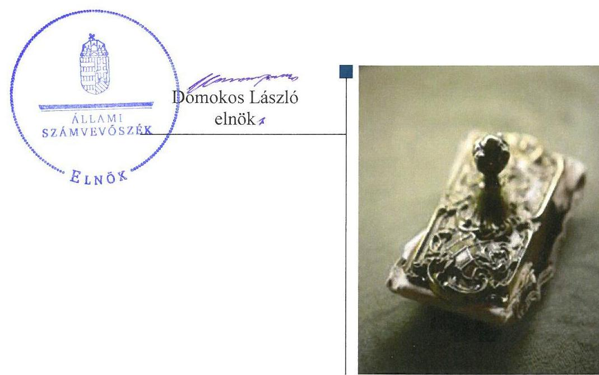
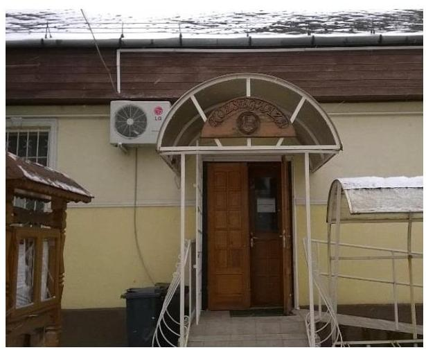

# Jelenetés 

## Önkormányzatok belsö kontrollrendszere

Az önkormányzatok belső kontrollrendszere kialakításának és múködtetésének ellenőrzése - Tiszaszentmárton 2017.

---

# Jelentés 

## Önkormányzatok belsó kontrollrendszere

Az önkormányzatok belső kontrollrendszere kialakításának és múködtetésének ellenőrzése - Tiszaszentmárton
2017. 09 hó 13 nap

---

# AZ ELLENŐRZÉST FELÜGYELTE:

- RENKŐ ZSUZSANNA felügyeleti vezető
- AZ ELLENŐRZÉST VEZETTE ÉS A VÉGREHAJTÁSÁÉRT FELELŐS:
  - DÉR LÍVIA ellenőrzésvezető
  - A PROGRAM ÖSSZEÁLLÍTÁSÁÉRT FELELŐS:
    - JANIK JÓZSEF osztályvezető

- IKTATÓSZÁM: V-1247-047/2016.
- TÉMASZÁM: 2281
- ELLENŐRZÉS-AZONOSÍTÓ SZÁM: V-076412

Jelentéseink az Országgyűlés számítógépes hálózatán és az Interneta a www.asz.hu címen is olvashatóak.

---

# TARTALOMJEGYZÉK 

■ ÖSSZEGZÉS ..... 5
■ AZ ELLENŐRZÉS CÉLJA ..... 6
■ AZ ELLENŐRZÉS TERÜLETE ..... 7
■ AZ ELLENŐRZÉS HÁTTERE, INDOKOLTSÁGA ..... 8
■ A JELENTÉS LÉNYEGES KÉRDÉSKÖREI ..... 10
■ ELLENŐRZÉS HATÓKÖRE ÉS MÓDSZEREI ..... 11
■ MEGÁLLAPÍTÁSOK ..... 13
■ JAVASLATOK ..... 19
■ MELLÉKLETEK ..... 21
I. sz. melléklet: Értelmező szótár ..... 21
II. sz. melléklet: Az integritás szemlélet érvényesítésével és az integritás kontrollrendszer kiépítettségével kapcsolatos megállapítások ..... 24
■ FÜGGELÉK: ÉSZREVÉTELEK ..... 25
■ RÖVIDÍTÉSEK JEGYZÉKE ..... 27

---

.

---

# ÖSSZEGZÉS 

Tiszaszentmárton Község Önkormányzata belső kontrollrendszere kialakításának és müködtetésének hiányosságai miatt a közpénzfelhasználás szabályossága nem volt biztositott. Az értékpapírok vásárlásával kapcsolatos döntés szabálytalan volt, ezáltal sérült a Képviselőtestület önkormányzati vagyonnal való rendelkezési joga. A számviteli nyilvántartásban feltárt hiba miatt nem álltak rendelkezésre megbizható információk az Önkormányzat befektetéseiről. Az Önkormányzatnál nem építették ki a megfelelő védelmet a korrupciós veszélyekkel szemben.

## Az ellenőrzés társadalmi indokoltsága

Magyarország Alaptörvénye az önkormányzatoktól is elvárja a kiegyensúlyozott, átlátható és fenntartható költségvetési gazdálkodás elvének érvényesítését. Az önkormányzatok által betöltött társadalmi szerep, az általuk kezelt közpénz nagysága, a nemzeti vagyon átruházására vagy hasznosítására vonatkozó döntéseik sokrétüsége egyaránt indokolttá tették a számvevőszéki ellenőrzések folytatását. A korábbi évek ellenőrzési tapasztalatai igazolták azt, hogy a belső kontrollrendszer kialakítása és müködtetése nélkül nem valósítható meg a közpénzek, a közvagyon szabályos, gazdaságos, hatékony és eredményes felhasználása. A kockázatok alapján fennállt a lehetősége annak, hogy az önkormányzatok befektetési döntései, továbbá a döntések végrehajtása és számviteli elszámolása nem voltak teljes mértékben szabályszerűek, és a kapcsolódó belső kontrollrendszerek sem müködtek minden esetben megfelelően.

Tiszaszentmárton Község Önkormányzata 2015. december 31-én 10,0 millió Ft vételi áron vásárolt tőkevédett befektetési jeggyel rendelkezett.

## Főbb megállapítások, következtetések

Az egyes befektetések vonatkozásában 2011-2015. között, a gazdálkodás egészét érintően a 2015. évben a belső kontrollrendszer kialakítása és müködtetése a pillérek összesített értékelése alapján nem volt szabályszerű, ezért az nem biztosította a közpénzfelhasználás szabályosságát. A kontrolltevékenységek nem járultak hozzá a hibák megelőzéséhez, feltárásához. 2011-2015 között a kockázatkezelési rendszert nem müködtették, nem mérték fel a kockázatokat, nem határozták meg ezen kockázatokkal kapcsolatban szükséges intézkedéseket, valamint azok teljesítése folyamatos nyomon követésének módját. Az önkormányzati gazdálkodás átláthatóságát nem biztosították, mivel a közzétételi kötelezettséget hiányosan teljesítették.

Az értékpapírok 2014. évi vételére irányuló döntést nem az arra jogosult hozta meg. A befektetési tevékenységgel kapcsolatosan feltárt számviteli hiba miatt az éves költségvetési beszámoló a vagyoni és pénzügyi helyzetet nem a valóságnak megfelelően mutatta be.

Az Önkormányzatnál nem tettek erőfeszítéseket az integritás szemlélet érvényesítése érdekében. Az integritás kontrollok kiépítettsége nem volt egyensúlyban a korrupciós kockázatok szintjével.

---

# AZ ELLENŐRZÉS CÉLJA 

Az ellenőrzés célja annak megállapítása volt, hogy szabályszerűen történt-e az Önkormányzat belső kontrollrendszerének kialakítása és működtetése, az biztosítottae az önkormányzatnál a közpénzfelhasználás szabályosságát, a közpénzekkel és a nemzeti vagyonnal történő szabályszerű és felelős gazdálkodást, a beszámolási és adatszolgáltatási kötelezettségek szabályszerű teljesítését. Az ellenőrzés keretében értékeltük az Önkormányzat korrupciós kockázatainak kezelését szolgáló integritás kontrollok kiépítettségét és az integritás szemlélet érvényesülését.

Az Önkormányzat egyes befektetési tevékenységeinek ellenőrzése során az ellenőrzés célja annak megállapítása volt, hogy a kialakított kontrollkörnyezet biztosította-e a befektetési tevékenységek szabályszerű végzését. Megítéltük, hogy az egyes befektetési tevékenységekkel kapcsolatos döntéshozatal és a döntések végrehajtása, valamint az egyes befektetések számviteli elszámolása, nyilvántartása szabályszerű volt-e, és a belső és külső ellenőrzések hozzájárultak-e az egyes befektetési tevékenységek szabályszerűségéhez.

---

# **AZ ELLENŐRZÉS TERÜLETE**

## **Tiszaszentmárton Község Önkormányzata**

A Szabolcs-Szatmár-Bereg megyében fekvő Tiszaszentmárton község állandó lakosainak száma 2015. január 1-jén 1225 fő volt. Az Önkormányzat1 7 tagú Képviselő testületének2 munkáját három állandó bizottság segítette.

A polgármester3 a 2002. évi önkormányzati választások óta tölti be tisztségét. A jegyző4 2013 óta látja el feladatait. Az önkormányzat működésével, valamint az államigazgatási ügyek döntésre való előkészítésével végrehajtásával kapcsolatos feladatokat 2011-2012. között a Polgármesteri Hivatal, 2013. óta a Tiszabezdédi Közös Önkormányzati Hivatal látta el. A Hivatal szervezeti egységekre nem tagolódott, önálló gazdasági szervezettel nem rendelkezett. A Hivatalban foglalkoztatott köztisztviselők száma 2015. év végén 9 fő volt. Az Önkormányzat intézménnyel nem rendelkezett, többségi tulajdoni részesedése egy gazdasági társaságban volt. A településen Nemzetiségi Önkormányzat5 működött.

Az Önkormányzat a 2015. évi éves költségvetési beszámolója szerint 248,4 millió Ft költségvetési bevételt ért el, valamint 242,9 millió Ft költségvetési kiadást teljesített. Az eszközvagyon értéke 2015. december 31-én 897,5 millió Ft volt. A forrásokon belül a költségvetési évben esedékes kötelezettség állomány 1,0 millió Ft volt, a költségvetési évet követően esedékes kötelezettség állomány 1,7 millió Ft-ot tett ki, melyből a pénzintézettel szembeni kötelezett 0,7 millió Ft volt. Az Önkormányzat adósságkonszolidációs támogatásban nem részesült.

---

# AZ ELLENŐRZÉS HÁTTERE, INDOKOLTSÁGA 

A demokratikus társadalmakban alapvető igény, hogy a közpénzeket, a közvagyont használók tevékenységükről elszámoljanak, ahhoz egyértelmű és érvényesíthető felelősségi szabályok társuljanak. Ennek a jogos igénynek az érvényesítéséhez meg kell teremteni azokat a folyamatokat, rendszereket, amelyek nélkülözhetetlenek az elszámoltatáshoz. Az elszámoltatás eredményes működtetéséhez szükség van a megfelelő információs, kontroll-, értékelési és beszámolási rendszerek kialakítására. A belső kontrollok kiépítettsége hozzájárul az integritási szemlélet kialakításához és érvényesüléséhez. A belső kontrollrendszer kialakítása és működtetése nélkül nem valósítható meg a közpénzek, a közvagyon szabályos, gazdaságos, hatékony és eredményes felhasználása.

A BELSŐ KONTROLLRENDSZER azt a célt szolgálja, hogy az államháztartás szervei működésük és gazdálkodásuk során a tevékenységeket szabályszerűen, gazdaságosan, hatékonyan, eredményesen hajtsák végre, teljesítsék elszámolási kötelezettségeiket és megvédjék az erőforrásokat a veszteségektől, a károktól, a nem rendeltetésszerű használattól. A belső kontrollrendszer magába foglalja mindazon szabályokat, eljárásokat, gyakorlati módszereket és szervezeti struktúrákat, kockázatkezelési technikákat, kontrolltevékenységeket, amelyek segítséget nyújtanak a szervezetnek céljai eléréséhez. A belső kontrollrendszer szabályozása háromszintű, a törvényi előírásokat az Áht. ${ }^{6}$ és a Mötv. ${ }^{7}$, a rendeleti szintű szabályozást az Ávr. ${ }^{8}$ és a Bkr. ${ }^{9}$ tartalmazza, amelyeket útmutatói szinten az NGM által kiadott standardok és kézikönyvek támogatnak.

A megfelelő belső kontrollrendszer jelentősen csökkenti a hibák és szabálytalanságok kockázatát. Az ÁSZ ${ }^{10}$ célja, hogy javuljon az ellenőrzött önkormányzatok belső kontrollrendszerének szabályozottsága, működésének megfelelősége, szabályszerűsége, hozzájárulva ezzel az egyensúlyi helyzet fenntarthatóságához, biztosítva az önkormányzatnál a közpénzfelhasználás szabályosságát, a közpénzekkel és a nemzeti vagyonnal történő szabályszerű, gazdaságos, hatékony és eredményes gazdálkodást. Az ÁSZ ellenőrzés tapasztalatai nem csupán a közvetlenül ellenőrzött önkormányzatokat támogathatják, hanem a „jó gyakorlat" elterjesztésével azok az önkormányzatok is átvehetik a pozitív példákat, ahol eddig még nem végzett ellenőrzést az ÁSZ.

A közszféra integritás alapú kultúrájának kialakítása, megerősítése és működése szorosan összefügg a belső kontrollrendszer működésével, ezért az ellenőrzés kiterjed annak értékelésére is, hogy a belső kontrollrendszer kialakítása és működtetése hogyan hatott az integritás szemlélet érvényesülésére.

## AZ ÖNKORMÁNYZATOK ÁTMENETILEG SZABAD

PÉNZESZKÖZEINEK BEFEKTETÉSÉT jogszabály nem tiltja, a befektetések jellege nem korlátozott, a pénzpiaci szolgáltatók közül az önkormányzatok a kínált szolgáltatás és annak költségei alapján, szabadon választhatnak, azonban a veszteséges gazdálkodás kockázatai és kö-

---

vetkezményei az önkormányzatokat terhelik. A szabad pénzeszközök felhasználása során kiemelten fontos a felelős gazdálkodás érvényesülése, amely összhangban kell, hogy legyen, az önkormányzati gazdálkodás alapelveivel.
2015. első felében az MNB három befektetési szolgáltató tevékenységi engedélyét vonta vissza és kezdeményezte a vállalkozások felszámolását a múködéssel kapcsolatos szabálytalanságok, hiányosságok miatt. A befektetési vállalkozások problémás helyzetbe kerülése jelentős veszteségekhez vezetett számos önkormányzat esetében. A korábbi évek ellenőrzési tapasztalatai alapján fennállt a lehetősége annak, hogy az önkormányzatok befektetési döntései, továbbá a döntések végrehajtása és számviteli elszámolása nem voltak teljes mértékben szabályszerűek, és a kapcsolódó külső és belső kontroll rendszerek sem múködtek minden esetben megfelelően.

Az ellenőrzéssel feltárásra kerülhetnek azok a kockázatok, amelyek az önkormányzatok gazdálkodásával, ezen belül befektetési tevékenységeivel, kontrollkörnyezetével kapcsolatosak és a befektetési tevékenységek szabályszerű végrehajtását befolyásolják. Az ellenőrzéssel az önkormányzatok befektetési/vagyongazdálkodási döntéseinek összessége értékelhetővé válik, és megalapozott megállapítás tehető arra vonatkozóan, hogy azok milyen hatást gyakoroltak az önkormányzat vagyonára.

# AZ ELLENŐRZÉS VÁRHATÓ HASZNOSULÁSA 

NÉGY SZINTEN valósul meg. A törvényalkotás számára összegzett tapasztalatok állnak rendelkezésre a belső kontrollrendszer önkormányzati területen való kialakításáról, múködtetéséről és hatásairól. Az ellenőrzés az ellenőrzött számára visszajelzést ad a belső kontrollrendszer kialakításában és múködésében lévő hiányosságokról, javaslataival hozzájárul azok kiküszöböléséhez. Az ellenőrzés megállapításait és javaslatait más szervezetek is hasznosíthatják a rendezett gazdálkodási keretek kialakításához. A társadalom számára jelzi, hogy közpénz nem maradhat ellenőrizetlenül, az ÁSZ értékteremtő rend kialakításához és megőrzéséhez hozzájáruló tevékenysége pozitív hatással lesz a szervezetről kialakított összkép formálásában.

---

# A JELENTÉS LÉNYEGES KÉRDÉSKÖREI 

1.     - A belső kontrollrendszer egyes pillérei biztositották-e a befektetési tevékenységek szabályszerü végzését a 2011-2015. években?
2.     - Az Önkormányzat belső kontrollrendszerének kialakítása és müködtetése a 2015. évben szabályszerü volt-e, az biztositotta-e a közpénzfelhasználás szabályosságát, a nemzeti vagyonnal történő felelős gazdálkodást?
3.     - Az egyes befektetésekkel kapcsolatos döntéshozatal és a döntések végrehajtása szabályszerü volt-e?
4.     - Az egyes befektetések számviteli elszámolása, nyilvántartása szabályszerü volt-e?
5.     - Érvényesült-e az integritás szemlélet és ennek megfelelően kiépítették-e az integritás kontrollrendszert az Önkormányzatnál?

---

# ELLENŐRZÉS HATÓKÖRE ÉS MÓDSZEREI 

## Az ellenőrzés típusa

A belső kontrollrendszer ellenőrzése esetében megfelelőségi ellenőrzés, a befektetési tevékenységnél szabályszerűségi ellenőrzés.

## Az ellenőrzött időszak

A belső kontrollrendszer kialakításának és működtetésének ellenőrzése a 2015. január 1. és december 31. közötti időszakra terjedt ki. Az önkormányzatok egyes befektetési tevékenységeinek ellenőrzése tekintetében az ellenőrzött időszak a 2011. január 1. - 2015. december 31. közötti időszak. Ezen felül az önkormányzat befektetésekkel kapcsolatos döntés-előkészítésének és döntéshozatalának szabályszerűségét a 2011. január 1. előtti időszakra visszanyúlóan is ellenőriztük, amennyiben a 2015. december 31-én meglévő befektetéseire 2011. január 1-je előtt került sor. Az integritás szemlélet érvényesülését a 2015. évre vonatkozó adatszolgáltatás alapján értékeltük.

## Az ellenőrzés tárgya

A helyi önkormányzatnak, mint éves költségvetési beszámoló készítésére kötelezett szervezetnek és polgármesteri hivatalának belső kontrollrendszere. Az integritás szemlélet érvényesülése.

Az önkormányzat 2015. december 31-én meglévő, értékpapírokban megtestesülő befektetései, lekötött betétei, valamint a szabad pénzeszközei terhére, adásvételi szerződés keretében megszerzett, a kötelező feladatok ellátását nem szolgáló, az önkormányzat üzleti vagyonába tartozó, az ellenőrzött időszakban (2011-2015.) megszerzett ingatlanok, továbbá időkorlátozás nélkül megszerzett -kulturális javak (műtárgyak, műalkotások, stb.), illetve a feladatellátást nem szolgáló egyéb értéktárgyak (pl. ékszerek, befektetési nemesfém).

Az ellenőrzés kiterjedt minden olyan körülményre és adatra, amely az ÁSZ jogszabályban meghatározott feladatainak teljesítéséhez, valamint a program végrehajtása folyamán felmerült újabb összefüggések feltárásához szükséges volt.

## Az ellenőrzött szervezet

Tiszaszentmárton Község Önkormányzata és az önkormányzati múködéshez kapcsolódó feladatokat ellátó Hivatal ${ }^{11}$.

---

# Az ellenőrzés jogalapja 

Az ÁSZ tv. ${ }^{12}$ 1. § (3) bekezdésében foglaltak alapján az ÁSZ általános hatáskörrel végzi a közpénzekkel és az állami és önkormányzati vagyonnal való felelős gazdálkodás ellenőrzését. Az ÁSZ tv. 5. § (2) bekezdése alapján az államháztartás gazdálkodásának ellenőrzése keretében az ÁSZ ellenőrzi a helyi önkormányzatok gazdálkodását, valamint az ÁSZ tv. 5. § (6) bekezdése alapján ellenőrzése során értékeli az államháztartás számviteli rendjének betartását és a belső kontrollrendszer múködését.

## Az ellenőrzés módszerei

Az ellenőrzést a nemzetközi standardokat irányadónak tekintve az ellenőrzési program szempontjai, kérdései, az ellenőrzött időszakban hatályos jogszabályok, az ellenőrzés szakmai szabályok és módszertanok figyelembe vételével végeztük.

Az ellenőrzés ideje alatt az ellenőrzött szervezettel történő kapcsolattartást az ÁSZ SZMSZ-ének ${ }^{13}$ vonatkozó előírásai alapján biztosítottuk.

Az ellenőrzési kérdések megválaszolásához szükséges bizonyítékok megszerzése az ellenőrzöttek által rendelkezésre bocsátott dokumentumokra, adatokra alapozva megfigyelés, szemle (szemrevételezés), kérdésfeltevés (információkérés), valamint elemző eljárással történt. A minták kiválasztása rétegzett, véletlen mintavételi eljárással történt.

Az ellenőrzési bizonyítékként felhasználható adatforrások közé tartoznak egyrészt az ellenőrzési program részletes szempontjainál felsorolt adatforrások, másrészt minden - az ellenőrzés folyamán feltárt, az ellenőrzés szempontjából információt tartalmazó - dokumentum.

Az ellenőrzés lefolytatásához az Önkormányzat a tanúsítványok elektronikus kitöltésével, valamint az ÁSZ által kért dokumentumok elektronikus megküldésével szolgáltatott adatokat. A rendelkezésre bocsátott adatok, információk kontrollja az ellenőrzés keretében történt.

A jelentésben használt fogalmak magyarázatát az I. számú melléklet, a jelentésben használt rövidítéseket a rövidítések jegyzéke tartalmazza.

Az integritás szemlélet érvényesülésének értékelése az önkormányzat által kitöltött tanúsítvány alapján történt a 2015. évre vonatkozóan.

---

# 1. A belső kontrollrendszer egyes pillérei biztosították-e a befektetési tevékenységek szabályszerű végzését a 2011-2015. években? 

Összegző megállapítás

Az egyes befektetési tevékenységeket érintően 2011-2015 között a belső kontrollrendszer egyes pillérei kialakításának és múködtetésének hiányosságai következtében azok nem biztosították az önkormányzati vagyon körültekintő és szabályszerű befektetését.

A KONTROLLKÖRNYEZET az Ámr. ${ }^{14}$ 155. § (2) bekezdésében és a Bkr. 4. § a) pontjában foglaltak ellenére nem biztosította az értékpapírokkal kapcsolatos tevékenység szabályozott végzését, mert a döntés előkészítési szabályokat nem, a számviteli szabályokat nem teljes körűen határozták meg. A számlarend3-4-ben ${ }^{15}$ foglaltakat alátámasztó, a Számv. tv. ${ }^{16}$ 161. § (2) bekezdés d) pontja szerinti bizonylati renddel nem rendelkeztek. A leltározási szabályzat ${ }^{17}$ az értékpapírok esetében kétévenkénti mennyiségi felvétellel történő leltározást írt elő, de nem tért ki a dematerializált értékpapírok leltározására, amit a Számv. tv. 69. § (3) bekezdésében foglaltak szerint minden üzleti év fordulónapjára vonatkozóan egyeztetéssel kell elvégezni.

A 2012-2015. évi költségvetési rendeletek ${ }^{18}$ rögzítették, hogy a finanszírozási bevételekkel, kiadásokkal kapcsolatos hatásköröket a Képviselőtestület gyakorolja.

KOCKÁZATKEZELÉSI RENDSZERT az Ámr. 157.§ (1)-(3) bekezdéseiben és a Bkr. 7. § (1)-(2) bekezdéseiben foglaltak ellenére nem működtettek, a befektetési tevékenységgel kapcsolatban nem mérték fel a kockázatokat, nem határozták meg az egyes kockázatokkal kapcsolatban szükséges intézkedéseket, valamint a 2012-2015. közötti időszakban azok teljesítésének folyamatos nyomon követésének módját.

A KONTROLLTEVÉKENYSÉGEK részeként a befektetések vonatkozásában nem biztosították a költségvetési gazdálkodás során a kötelezettségvállalások dokumentumainak elkészítése, továbbá a pénzügyi döntések szabályszerűségi szempontból történő ellenjegyzése kontrollját a Bkr. 8. § (2) bekezdés a) és c) pontjainak előírásai ellenére. A befektetési jegyek 2014. évi vásárlására vonatkozó kötelezettségvállalás pénzügyi ellenjegyzése az Ávr. 55. § (1) bekezdése, valamint a gazdálkodási jogkörök szabályzata ${ }^{19}$ előírásai ellenére nem történt meg. Ezáltal az Áht. 37. § (1) bekezdésében foglaltak ellenére nem győződtek meg arról, hogy a szabad előirányzat rendelkezésre áll-e, a tervezett kifizetési időpontokban a pénzügyi fedezet biztosított-e, és a kötelezettségvállalás nem sérti-e a gazdálkodásra vonatkozó szabályokat. A befektetési jegy vásárlás kifizetésének elrendelését megelőzően teljesítésigazolásra az Ávr. 57. (1) bekezdése

---

előírása ellenére nem került sor. A teljesítésigazolás hiányában elmaradt a kiadások teljesítése jogosságának, összegszerűségének, ellenszolgáltatást is magában foglaló kötelezettségvállalás esetében - ha a kifizetés vagy annak egy része az ellenszolgáltatás teljesítését követően esedékes - annak teljesítésének ellenőrzése. Az érvényesítésre az Ávr. 58. § (1) bekezdésében foglaltak ellenére nem került sor, ezáltal nem történt meg az összegszerűségnek, a fedezet meglétének és a megelőző ügymenetben az Áht., az Áhsz. ${ }^{20}$. és az Ávr., továbbá a belső szabályzatok előírásai betartásának az ellenőrzése.

# AZ INFORMÁCIÓS ÉS KOMMUNIKÁCIÓS RENDSZER nem biztosította az Önkormányzat gazdálkodásában a befektetési tevékenység átláthatóságát, mivel az Önkormányzat honlapján nem tette közzé a befektetési jegyek vásárlására vonatkozó szerződés megnevezését (típusát), tárgyát, a szerződő fél (megbízott) nevét, a szerződés (megbízás) értékét - az Info. tv. ${ }^{21}$ 37. § (1) bekezdésének, továbbá az Info. tv. 1. melléklete III/4. pontjának előírása ellenére.

A MONITORING RENDSZER keretén belül múködő belső ellenőrzés az Önkormányzat irányítási, belső kontroll és ellenőrzési eljárásainak fejlesztését a befektetési tevékenység vonatkozásában nem támogatta, mivel nem végeztek a befektetésekkel kapcsolatos belső ellenőrzést. A külső ellenőrzések a befektetési tevékenységre nem terjedtek ki.

## 2. Az Önkormányzat belső kontrollrendszerének kialakítása és múködtetése a 2015. évben szabályszerű volt-e, az biztosította-e a közpénzfelhasználás szabályosságát, a nemzeti vagyonnal történő felelős gazdálkodást?

Összegző megállapítás

A gazdálkodás egészét érintően a 2015. évben a belső kontrollrendszer kialakítása és múködtetése nem biztosította a szabályszerű múködést, ezáltal a gazdaságosság, hatékonyság és eredményesség követelményének érvényesülését.

A KONTROLLKÖRNYEZET kialakítása nem volt szabályszerű, mert:
$\longrightarrow$ a gazdasági program ${ }^{22}$ Képviselő testület által történő elfogadása során nem tartották be a Mötv. 116. § (5) bekezdésében meghatározott határidőt;
$\longrightarrow$ a hivatali SZMSZ ${ }^{23}$ nem tartalmazta az Ávr. 13. § (1) bekezdése c) pontjának 2014. január 1-jétől hatályos módosítása ellenére az ellátandó, és a kormányzati funkciók szerint besorolt alaptevékenységek megjelölését;
$\longrightarrow$ a munkaköri leírások nem tartalmazták a munkakörök betöltésével kapcsolatos követelményeket a Kttv. ${ }^{24}$ 75. § (1) bekezdés d) pontjának előírása ellenére;
$\longrightarrow$ a számviteli politika ${ }^{25}$ a Számv. tv 14. § (4) bekezdése előírása ellenére nem határozta meg, hogy a számviteli elszámolás, értékelés

---

szempontjából mit tekintenek lényegesnek, nem lényegesnek, és nem tartalmazta, hogy az alkalmazott gyakorlatot milyen okok miatt kell megváltoztatni;
elöírták, hogy a 100 ezer Ft-ot el nem érő kifizetések esetében nem szükséges az előzetes írásbeli kötelezettségvállalás, azonban az Ávr. 53. § (2) bekezdése előírása ellenére a 100 ezer Ft alatti előzetes írásbeli kötelezettségvállalást nem igénylő kifizetések rendjére vonatkozó szabályokat nem rögzítették;
nem szabályozták a Kbt. ${ }_{1-2}{ }^{26}$ hatálya alá nem tartozó beszerzések lebonyolításával kapcsolatos eljárás rendet az Ávr. 13. (2) bekezdés b) pontja előírása ellenére.

A KOCKÁZATKEZELÉSI RENDSZERT nem múködtették. A Bkr. 7. § (1)-(2) bekezdése előírása ellenére nem mérték fel és állapították meg a Hivatal tevékenységében rejlő kockázatokat, nem határozták meg az egyes kockázatokkal kapcsolatban szükséges intézkedéseket, valamint azok folyamatos nyomon követésének módját.

A KONTROLLTEVÉKENYSÉGEK működtetése nem volt szabályszerű, és nem biztosította a kockázatok kezelését, mert
—az Önkormányzat kiadási előirányzatai terhére vállalt kötelezettségvállalások esetében a pénzügyi ellenjegyző és az érvényesítő kijelölése nem felelt meg az Ávr.55. § (2) bekezdés f) pontja és az Ávr. 58. § (4) bekezdése előírásának, mert a jegyző helyett a polgármester jelölte ki, ezért a pénzügyi ellenjegyzést és az érvényesítést szabályszerű kijelölés hiányában jogosulatlanul végezték;
a teljesítésigazolást megalapozó dokumentumok nem álltak rendelkezésre az Ávr. 57. § (1) bekezdésének előírása ellenére;
a kötelezettségvállalások szabályszerű nyilvántartásáról az Ávr. 56. § (1) bekezdésében foglaltak ellenére nem gondoskodtak, ezért az Áht. 37. § (1) bekezdésében foglaltak ellenére a pénzügyi ellenjegyzés során nem tudtak meggyőződni arról, hogy a szabad előirányzat rendelkezésre áll-e.

# AZ INFORMÁCIÓS ÉS KOMMUNIKÁCIÓS RENDSZER kialakítása és múködtetése nem volt szabályszerű. A Bkr. 9. § 

(2) bekezdéseiben foglaltak ellenére nem határozták meg a beszámolási szinteket, határidőket és módokat. A közérdekú adatok megismerésére irányuló igények teljesítésének rendjét nem szabályozták az Info. tv. 30. § (6) bekezdése előírása ellenére. A Hivatal az Ltv. ${ }^{27}$ 9. § (4) bekezdésében foglaltak ellenére iratkezelési szabályzattal nem rendelkezett.

Az Info. tv. 37. § (1) bekezdése szerinti közzétételi kötelezettségének teljes körűen nem tettek eleget, mert az Önkormányzat honlapján nem tették közzé:
az Önkormányzat szervezeti és múködési szabályzatának teljes szövegét, csak az azt érintő módosítást az Info tv. 1. melléklete II/1. pontjában foglaltak ellenére;
az adatvédelmi és adatbiztonsági szabályzatot, az Info tv. 1. melléklete II/1. pontjának előírásai ellenére;

---

$\longrightarrow$ a Önkormányzat ötmillió Ft-ot elérő, vagy azt meghaladó értékű árubeszerzésre, építési beruházásra, szolgáltatás megrendelésre, vagyonértékesítésre, vagy vagyonhasznosításra kötött szerződések megnevezését, tárgyát, a szerződő feleket, a szerződés értékét, annak időtartamát az Info tv. 1. melléklete III/4. pontjának előírásai ellenére;
$\longrightarrow$ az éves költségvetési beszámolókat az Info tv. 1. melléklete III/1. pontjában foglaltak ellenére.
Az Önkormányzat éves elemi beszámolóját az Áhsz. 2 32. § (4) bekezdésében előírt határidőn túl töltötték fel a Kincstár ${ }^{28}$ által működtetett elektronikus adatszolgáltató rendszerbe.

A MONITORING RENDSZER kialakítása és működtetése nem volt szabályszerű. Az operatív tevékenységek során megvalósuló folyamatos és eseti nyomon követést a Bkr. 10. §-ában előírtak ellenére nem alakították ki és nem működtették.

A belső ellenőrzés szervezeti kereteit kialakították. A belső ellenőrzést a tervnek megfelelően hajtották végre.

A belső kontrollrendszer 2015. évi minősítéséről kiadott vezetői nyilatkozat nem volt helytálló. A jegyző a Bkr. 11. § (1) bekezdése szerinti nyilatkozatában annak ellenére nyilatkozott a gazdaságosság, eredményesség és hatékonyság követelményeinek érvényesítéséről, hogy - a Bkr. 6. § (2) bekezdését figyelmen kívül hagyva - nem alakított ki és nem működtetett olyan folyamatokat, amelyek a rendelkezésre álló források szabályszerű, gazdaságos, hatékony és eredményes felhasználását biztosították volna.

A HELYI NEMZETISÉGI ÖNKORMÁNYZAT és az Önkormányzat a Nek. tv. ${ }^{29}$-ben előírtaknak megfelelően rendelkezett hatályos, aláírt megállapodással az együttműködésre, a felülvizsgálati kötelezettségnek eleget tettek.

A Nemzetiségi Önkormányzat kiadásainak érvényesítési feladataival megbízott aljegyző kijelölése nem felelt meg az Ávr. 58. § (4) bekezdése és az Ávr 55. § (2) bekezdés g) pontja előírásának, mert nem a jegyző, hanem a Nemzetiségi Önkormányzat elnöke jelölte ki a feladatra, valamint nem rendelkezett az érvényesítéshez szükséges az Ávr. 55. § (3) bekezdésében előírt felsőoktatásban szerzett gazdasági szakképzettséggel, vagy pénzügyi számviteli képesítéssel.

# 3. Az egyes befektetésekkel kapcsolatos döntéshozatal és a döntések végrehajtása szabályszerű volt-e? 

Összegző megállapítás

A befektetési jegyek vásárlásával kapcsolatos döntéshozatal nem felelt meg a 2014. évi költségvetési rendelet előírásainak, emiatt a közpénzfelhasználás szabályossága nem volt biztosított.

Az Önkormányzat a 2015. évi beszámolójában 10,0 millió Ft összegű értékpapírt mutatott ki, amely a 2014. évben egy szerződéssel vásárolt tőkevé-

---

dett kamatoptimum befektetési jegyekből származott. Befektetési célú ingatlannal, lekötött betéttel, kulturális javakkal, egyéb értéktárgyakkal az Önkormányzat nem rendelkezett.

A befektetésekre vonatkozó döntések előkészítését nem szabályozták, ezáltal a Bkr. 4. § a) pontjában foglaltak ellenére nem biztosították, hogy a befektetési tevékenység összhangban legyen a szabályszerűséggel, szabályozottsággal, valamint a gazdaságosság, hatékonyság és eredményesség követelményeivel.

A befektetési jegyek 2014. évi vételével kapcsolatos döntéshozatal nem volt szabályszerű. A Képviselő-testület nem döntött arról, hogy a tőkevédett pénzpiaci alap befektetési jegyek értékesítéséből megmaradó 10,0 millió Ft összegből tőkevédett kamatoptimum befektetési jegy vásárlására kerüljön sor. A befektetési jegyek 2014. évi vásárlására vonatkozó döntés nem felelt meg a 2014. évi költségvetési rendelet 4. § (6) bekezdésében foglaltaknak.

# 4. Az egyes befektetések számviteli elszámolása, nyilvántartása szabályszerű volt-e? 

Összegző megállapítás

A befektetési jegyek számviteli elszámolásának hibái miatt a költségvetési beszámoló adatainak megbízhatósága a 2014. évben nem volt biztosított.

A BEFEKTETÉSEK NYILVÁNTARTÁSA során a befektetési jegyek besorolása megfelelt a jogszabályi előírásoknak. Azokat a 2014. évi mérlegben befektetett pénzügyi eszközként, tartós hitelviszonyt megtestesítő értékpapírként, a 2015. évi mérlegben forgatási célú hitelviszonyt megtestesítő értékpapírként mutatták ki. A befektetési jegyek bekerülési értékének meghatározása megfelelő volt.

A befektetési jegyek vételét a Hivatal nem mutatta ki a finanszírozási kiadások között az Áhsz. 2 40. § (1) bekezdés és az Áhsz. 2 15. mellékletének K9123. rovathoz tartozó előírásai ellenére, ezáltal a 2014. évi beszámolóban 10,0 millió Ft összegű hiba keletkezett.

A befektetési jegyekről vezetett részletező nyilvántartás szabálytalan volt, mert nem tartalmazta a 2011-2013. években az Áhsz. ${ }^{30} 9$. számú melléklet 2. d) pontjában, míg a 2014-2015. éveket érintően az az Áhsz. 2 14. melléklet VIII. 1. pont c) - e) és h)-i) alpontjaiban meghatározott tartalmi elemeket.

AZ ÉV VÉGI SZÁMVITELI FELADATOK végzése során a befektetési jegyek leltározása a jogszabályi előírásoknak megfelelően történt.

---

# 5. Érvényesült-e az integritás szemlélet és ennek megfelelően ki- 

építették-e az integritás kontrollrendszert az Önkormányzatnál?

Összegző megállapítás

Az Önkormányzat nem tett erőfeszítéseket az integritás szemlélet érvényesítése érdekében. Az integritás kontrollok kiépítettsége nem volt egyensúlyban a korrupciós kockázatok szintjével.

Az Önkormányzat az ellenőrzést megelőzően nem vett részt az ÁSZ Integritás Projektjében. Az ÁSZ Integritás Projekt az ÁSZ 2009-ben indított „Korrupciós kockázatok feltérképezése - Integritás alapú közigazgatási kultúra terjesztése" címú kiemelt projektje (http://integritas.asz.hu/). Az Önkormányzat a jogszabályok által is előírt szabályossági kontrollokat összességében kiépítette, azonban a korrupciós kockázatokkal szembeni védettséget növelő integritás kontrollok kiépítettsége alacsony volt. Az integritás kontrollrendszer kiépítettségével kapcsolatos megállapításokat a II. sz. melléklet tartalmazza.

---

# JAVASLATOK 

Az ÁSZ tv. 33. § (1) bekezdésében foglaltak értelmében az ellenőrzött szervezet vezetője köteles a jelentésben foglalt megállapításokhoz kapcsolódó intézkedési tervet összeállítani és azt a jelentés kézhezvételétől számított 30 napon belül az ÁSZ részére megküldeni. Amennyiben az ellenőrzött szervezet vezetője nem küldi meg határidőben az intézkedési tervet, vagy továbbra sem elfogadható intézkedési tervet küld, az Állami Számvevőszék elnöke az ÁSZ tv. 33. § (3) bekezdése a) és b) pontjaiban foglaltakat érvényesítheti.

## a polgármesternek:

1. Intézkedjen a jogszabályi előirásoknak megfelelően kiegészített hivatali SZMSZ jóváhagyásáról.
(2. számú megállapítás 1. bekezdés 2. pontja alapján)

## a jegyzőnek:

1. Intézkedjen a belső kontrollrendszer egyes elemei jogszabályi előírásnak megfelelő kialakításáról és müködtetéséről, valamint a gazdálkodási jogkörök gyakorlása során a jogszabályi előírások betartásáról.
(1. számú megállapítás 1. és 3-5. bekezdései,
2. számú megállapítás 1. bekezdés 3-6. pontjai, 2-6. bekezdései,
3. bekezdés 2. mondata és 11. bekezdése alapján)
4. Intézkedjen a jogszabályi előírásoknak megfelelően kiegészített hivatali SZMSZ elkészítéséről és jóváhagyás céljából a polgármester elé terjesztéséről.
(2. számú megállapítás 1. bekezdés 2. pontja alapján)
5. Intézkedjen a befektetésekkel kapcsolatos gazdasági események jogszabályi előírásoknak megfelelő rögzítéséről a számviteli nyilvántartásokban.
(4. számú megállapítás 2. bekezdése alapján)
6. Intézkedjen a befektetési jegyekhez kapcsolódó részletező nyilvántartások jogszabályi előírásoknak megfelelő vezetéséről.
(4. számú megállapítás 3. bekezdése alapján)

---

5. Intézkedjen az Állami Számvevőszék ellenőrzése során feltárt hiányosságok és/vagy szabálytalanságok tekintetében a munkajogi felelősség tisztázására irányuló eljárás megindításáról és ennek eredménye ismeretében tegye meg a szükséges intézkedéseket.
(1. számú megállapítás 4. bekezdés 2. és 6. mondatai,
6. számú megállapítás 3. bekezdés 3. pontja, 5-6. bekezdései,
7. számú megállapítás 2-3. bekezdései alapján)

---

# MELLÉKLETEK 

- I. SZ. MELLÉKLET: ÉRTELMEZŐ SZÓTÁR

ÁSZ Integritás Projekt
belső ellenőrzés
belső kontrollrendszer
belső kontrollrendszer pillérei, kontrollterületei
betét
dematerializált értékpapír
értékpapírszámla
helyi önkormányzat

Az Állami Számvevőszék 2009-ben indította el a „Korrupciós kockázatok feltérké-pezése-Integritás alapú közigazgatási kultúra terjesztése" című, európai uniós forrásból megvalósított kiemelt projektjét (Integritás Projekt). Az Integritás Projekt célja, hogy felmérje a közszféra intézményei korrupciós kockázatoknak való kitettségét, illetőleg az azok mérséklésére hivatott kontrollok szintjét. Az Állami Számvevőszék a projekt révén az integritás szemlélet minél szélesebb körrel történő megismertetését, gyakorlatba ültetését kívánja elérni. Az integritás követelményeinek megfelelő szervezeti működést előnyben részesítő közigazgatási kultúra elterjesztését és a korrupció elleni fellépést az ÁSZ önmagára nézve is stratégiai jelentőségű célként fogalmazta meg. A projekt a felmérésben résztvevő intézmények számára helyzetükről egyfajta „tükörképet" mutat be, ami alapot teremt a jövőbeni pozitív irányú elmozduláshoz.
(Forrás: a http://integritas.asz.hu honlapon közzétett, a 2013. évi Integritás felmérés eredményeiről készült összefoglaló tanulmány)
Független, tárgyilagos bizonyosságot adó és tanácsadó tevékenység, amelynek célja, hogy az ellenőrzött szervezet működését fejlessze és eredményességét növelje, az ellenőrzött szervezet céljai elérése érdekében rendszerszemléletű megközelítéssel és módszeresen értékeli, illetve fejleszti az ellenőrzött szervezet irányítási és belső kontrollrendszerének hatékonyságát. (Bkr. 2. § b) pontja)
A belső kontrollrendszer a kockázatok kezelése és tárgyilagos bizonyosság megszerzése érdekében kialakított folyamatrendszer, amely azt a célt szolgálja, hogy a múködés és gazdálkodás során a tevékenységeket szabályszerűen, gazdaságosan, hatékonyan, eredményesen hajtsák végre, az elszámolási kötelezettségeket teljesítsék, megvédjék az erőforrásokat a veszteségektől, károktól és nem rendeltetésszerű használattól. (Áht. 69. § (1) bekezdése)
A kontrollkörnyezet, a kockázatkezelési rendszer, a kontrolltevékenységek, az információs és kommunikációs rendszer, valamint a nyomon követési (monitoring) rendszer. (Bkr. 3. §-a)
a Ptk. ${ }^{31}$ szerinti betétszerződés vagy a takarékbetétről szóló 1989. évi 2. törvényerejű rendelet szerinti takarékbetét-szerződés alapján fennálló tartozás, ideértve a hitelintézetnél a fizetésiszámla-szerződés alapján fennálló pozitív számlaegyenleget is (Hpt. ${ }^{32}$ 6. § (1) bekezdés 8. pont).
a Tpt.-ben és külön jogszabályban meghatározott módon, elektronikus úton létrehozott, rögzített, továbbított és nyilvántartott, az értékpapír tartalmi kellékeit azonosítható módon tartalmazó adatösszesség (Tpt. ${ }^{33}$ 5. § (1) bekezdés 29. pont)
a dematerializált értékpapírról és a hozzá kapcsolódó jogokról az értékpapír-tulajdonos javára vezetett nyilvántartás (Tpt. 5. § (1) bekezdés 46. pont)
A helyi önkormányzat jogi személy. Az önkormányzati feladatok ellátását a képviselő-testület és szervei biztosítják. A képviselőtestület szervei: a polgármester, a főpolgármester, a megyei közgyűlés elnöke, a képviselő-testület bizottságai, a részönkormányzat testülete, a polgármesteri hivatal, a megyei önkormányzati hivatal, a közös önkormányzati hivatal, a jegyző, továbbá a társulás. A képviselő-testület a feladatkörébe tartozó közszolgáltatások ellátására - jogszabályban meghatározottak szerint - költségvetési szervet, a Polgári perrendtartásról szóló 1952. évi III. törvény szerinti gazdálkodó szervezetet (a továbbiakban: gazdálkodó szervezet), non-

---

finanszírozási kiadások és bevételek
forgatási célú értékpapír
hitelviszonyt megtestesítő értékpapír
információs és kommunikációs rendszer
integritás
irányító szerv és annak vezetője
kockázatkezelési rendszer
profit szervezetet és egyéb szervezetet (a továbbiakban együtt: intézmény) alapithat, továbbá szerződést köthet természetes és jogi személlyel vagy jogi személyiséggel nem rendelkező szervezettel. A helyi önkormányzat éves költségvetési beszámolója magába foglalja a helyi önkormányzat - nem költségvetési szerveihez tartozó - feladataihoz kapcsolódó bevételeket és kiadásokat. A helyi önkormányzat összevont (konszolidált) költségvetési beszámolóját a helyi önkormányzatra és költségvetési szerveire vonatkozóan külön-külön beérkezett éves költségvetési beszámolók alapján a Kincstár készíti el és küldi meg az önkormányzatnak. (Forrás: Mötv. 41. § (1), (2), (6) bekezdései; Áhsz. 2. § (1) bekezdése, 6. § (1) bekezdés a) és f) pontja, 30. §-a, 37. § (1) és (6) bekezdése)
a Magyarország gazdasági stabilitásáról szóló 2011. évi CXCIV. törvény 3. § (1) bekezdés a)-e) pontja szerinti ügyletből származó bevételek és kiadások, továbbá a hitelviszonyt megtestesítő értékpapírok vásárlásából, értékesítéséből, beváltásából származó bevételek és kiadások, a szabad pénzeszközök betétként való elhelyezése és visszavonása, az államháztartás önkormányzati alrendszerében irányító szervi támogatásként folyósított támogatás kiutalása és fizetési számlán történő jóváírása, finanszírozási bevétel a költségvetési maradvány, vállalkozási maradvány. (Áht. 6. § (7) bekezdés a) pont)
azok az értékpapírok, amelyeket forgatási célból, kamatbevétel, illetve árfolyamnyereség elérése érdekében szereztek be, továbbá azokat, amelyek a tárgyévet követő üzleti évben lejárnak (Számv. tv. 30. § (5) bekezdés)
minden olyan értékpapír, illetve törvény által értékpapírnak minősített, jogot megtestesítő okirat, amelyben a kibocsátó (adós) meghatározott pénzösszeg rendelkezésére bocsátását elismerve arra kötelezi magát, hogy a pénz (kölcsön) összegét, valamint annak meghatározott módon számított kamatát vagy egyéb hozamát, és az általa esetleg vállalt egyéb szolgáltatásokat az értékpapír birtokosának (a hitelezőnek) a megjelölt időben és módon megfizeti, illetve teljesíti. Ide tartozik különösen: a kötvény, a kincstárjegy, a letéti jegy, a pénztárjegy, a célrészjegy, a takaréklevél, a jelzáloglevél, a hajóraklevél, a közraktárjegy, az árujegy, a zálogjegy, a kárpótlási jegy, a határozott idejű befektetési alap által kibocsátott befektetési jegy (Számv. tv. 3. § (6) bekezdés 2. pont)
A költségvetési szerv vezetője által kialakított és múködtetett olyan rendszer, mely biztosítja, hogy a megfelelő információk a megfelelő időben eljutnak az illetékes szervezethez, szervezeti egységhez, illetve személyhez. (Bkr. 9. § (1) bekezdés)
Az integritás elvek, értékek, cselekvések, módszerek, intézkedések konzisztenciáját jelenti: olyan magatartásmódot, amely meghatározott értékeknek felel meg. Az integritás a közszféra esetében a társadalom által elvárt nyilvánossági, átláthatósági, illetve jogi/etikai normáknak történő megfelelést jelenti.
(Forrás: a http://integritas.asz.hu honlapon közzétett „A 2012. évi integritás felmérés eredményeinek összefoglalója" címú dokumentum 3. oldal 1. bekezdése)
A közös önkormányzati hivatal kivételével a helyi önkormányzat által irányított költségvetési szerv esetén a képviselő-testület, közgyűlés és a polgármester, főpolgármester, megyei közgyűlés elnöke. A közös önkormányzati hivatal esetén a közös önkormányzati hivatal székhelye szerinti helyi önkormányzat képviselő-testülete és annak polgármestere. (Forrás: Áht. 2. § (1) bekezdés i), ia) és ib) pontja)
Olyan irányítási eszközök és módszerek összessége, melynek elemei a szervezeti célok elérését veszélyeztető tényezők (kockázatok) azonosítása, elemzése, csoportosítása, nyomon követése, valamint szükség esetén a kockázati kitettség mérséklése. (Forrás: Bkr. 2. § m) pontja)

---

kontrollkörnyezet

A költségvetési szerv vezetője által kialakított olyan elvek, eljárások, belső szabályzatok összessége, amelyben világos a szervezeti struktúra, egyértelműek a felelősségi, hatásköri viszonyok és feladatok, meghatározottak az etikai elvárások a szervezet minden szintjén, átlátható a humánerőforrás-kezelés. (Forrás: Bkr. 6. § (1) bekezdés)
kontrolltevékenységek
A költségvetési szerv vezetője által a szervezeten belül kialakított (kontroll) tevékenységek, melyek biztosítják a kockázatok kezelését, hozzájárulnak a szervezet céljainak eléréséhez. (Forrás: Bkr. 8. § (1) bekezdés)
kulturális javak
az élettelen és élő természet keletkezésének, fejlődésének, az emberiség, a magyar nemzet, Magyarország történelmének kiemelkedő és jellemző tárgyi, képi, hangrögzített, írásos emlékei és egyéb bizonyítékai - az ingatlanok kivételével -, valamint a művészeti alkotások (a kulturális örökség védelméről szóló 2001. évi LXIV. törvény)
üzleti vagyon
a nemzeti vagyon azon része, amely nem tartozik az önkormányzati vagyon esetén a törzsvagyonba (Nvtv. ${ }^{54}$ 3. § (1) bekezdés 18. pontja)

---

# II. SZ. MELLÉKLET: AZ INTEGRITÁS SZEMLÉLET ÉRVÉNYESÍTÉSÉVEL ÉS AZ INTEGRITÁS KONTROLLRENDSZER KIÉPÍTETTSÉGÉVEL KAPCSOLATOS MEGÁLLAPÍTÁSOK

Az Önkormányzat által a 2015. évre kitöltött integritás tanúsítvány alapján - öt kockázati területen - a kialakított kontrollokat értékeltük. Az Önkormányzatnál az integritás kontrollrendszer kialakítása alacsony volt.

|  AZ INTEGRITÁS KONTROLLOK ÉRTÉKELÉSE |  |  |  |   |
| --- | --- | --- | --- | --- |
|  Sorszám | Megnevezés | Maximum elérhető pontszámok | Elért
pontszámok | Értékelés  |
|  1. | Összeférhetetlenség és etikai elvárások | 5 | 3 | alacsony  |
|  2. | Humánerőforrás-gazdálkodás | 5 | 3 | alacsony  |
|  3. | A szervezet vagyonának megvédésére tett intézkedések | 5 | 3 | alacsony  |
|  4. | A nemkívánatos dolgozói magatartással szembeni intézkedések és azok érvényesülése | 5 | 3 | alacsony  |
|  5. | Az integritás erősítése, annak tudatosítása, valamint a kockázatelemzések alkalmazása | 5 | 1 | alacsony  |
|   | Összesítő értékelés | 25 | 13 | alacsony  |

A kontrollok kiépítettségének főbb hiányosságai az alábbiak voltak:

1. a speciális korrupcióellenes rendszerek és eljárások tekintetében az Önkormányzatnál:
2. nem rendelkeztek a vonatkozó jogszabályokkal összhangban álló iratkezelési szabályzattal;
3. nem szabályozták a külső személyekkel való kapcsolattartást;
4. nem rendelkeztek belső szabályzattal a szervezeten belüli közérdekű bejelentők védelmére vonatkozóan;
5. nem rendelkeztek nyilvánosan közzétett stratégiával;
6. nem végeztek rendszeres korrupciós kockázatelemzéseket;
7. nem volt korrupcióellenes képzés az elmúlt 3 évben.
8. a „lágy" kontrollok (a szervezeti által önként bevezetett, kialakított szabályok, követelmények) kialakítását érintően az Önkormányzatnál:
9. nem szabályozták az ajándékok, meghívások, utaztatás elfogadásának feltételeit;
10. nem alkalmaznak valamilyen objektív megítélést lehetővé tevő, általánosan elfogadott módszert a megfelelő felkészültségű szakemberek kiválasztásához;
11. a teljesítményértékelések nem befolyásolták az alkalmazottak éves jövedelmének alakulását.

---

# FÜGGELÉK: ÉSZREVÉTELEK 

A jelentéstervezetet a Számvevőszék 15 napos észrevételezésre megküldte az ellenőrzött szervezetek vezetőinek az ÁSZ tv. 29. §* (1) bekezdése előírásának megfelelően.

Az ellenőrzött szervezetek vezetői az ÁSZ tv. 29. § (2) bekezdésében foglalt észrevételezési jogukkal nem éltek, a jelentéstervezetre észrevételt nem tettek.

[^0]
[^0]:    * 29. § (1) Az Állami Számvevőszék az ellenőrzési megállapításait megküldi az ellenőrzött szervezet vezetőjének vagy az általa megbízott személynek, és annak, akinek személyes felelősségét állapította meg.
    (2) Az ellenőrzött szervezet vezetője és a felelősként megjelölt személy az ellenőrzés megállapításaira tizenöt napon belül írásban észrevételt tehet.
    (3) Az Állami Számvevőszék az észrevételre a beérkezésétől számított harminc napon belül írásban válaszol. A figyelembe nem vett észrevételeket köteles a jelentésben feltüntetni, és megindokolni, hogy azokat miért nem fogadta el.

---

.

---

# RÖVIDÍTÉSEK JEGYZÉKE 

${ }^{1}$ Önkormányzat
${ }^{2}$ Képviselő-testület
${ }^{3}$ polgármester
${ }^{4}$ jegyző
${ }^{5}$ Nemzetiségi Önkormányzat
${ }^{6}$ Áht.
${ }^{7}$ Mötv.
${ }^{8}$ Ávr.
${ }^{9}$ Bkr.
${ }^{10}$ ÁSZ
${ }^{11}$ Hivatal
${ }^{12}$ ÁSZ tv
${ }^{13}$ ÁSZ SZMSZ
${ }^{14}$ Ámr.
${ }^{15}$ számlarend
számlarend
számlarend3
számlarend4
${ }^{16}$ Számv.tv.
${ }^{17}$ leltározási szabályzat
${ }^{18}$ 2012. évi költségvetési rendelet

Tiszaszentmárton Község Önkormányzata
Tiszaszentmárton Önkormányzatának Képviselő-testülete
Tiszaszentmárton Község polgármestere
Tiszabezdédi Közös Önkormányzati Hivatal jegyzője
Tiszaszentmárton Roma Nemzetiségi Önkormányzat
1992. évi XXXVIII. törvény az államháztartásról (hatálytalan: 2012.január 1-jétől)
2011. évi CXCV. törvény az államháztartásról (hatályos: 2012. január 1-jétől)
2011. évi CLXXXIX. törvény Magyarország helyi önkormányzatairól (hatályos: 2013. január 1-jétől)

368/2011. ((XII. 31.) Korm. rendelet az államháztartásról szóló törvény végrehajtásáról (hatályos: 2012. január 1-jétől)
370/2011. (XII. 31.) Korm. rendelet a költségvetési szervek belső kontrollrendszeréről és belső ellenőrzéséről (hatályos: 2012. január 1-jétől)
Állami Számvevőszék
Tiszaszentmárton Község Polgármesteri Hivatala (2013. február 28-áig)
Tiszabezdédi Közös Önkormányzati Hivatal (2013. március 1-jétől)
2011. évi LXV. törvény az Állami Számvevőszékről

Az Állami Számvevőszék elnökének 3/2015. (XII. 30.) ÁSZ utasítása az Állami Számvevőszék Szervezeti és Múködési Szabályzatáról (hatályos: 2016. január 1-jétől)
Az Állami Számvevőszék elnökének 3/2016. (XII. 29.) ÁSZ utasítása az Állami Számvevőszék Szervezeti és Múködési Szabályzatáról (hatályos: 2017. január 1-jétől)
292/2009. (XII. 19.) Korm. rendelet az államháztartás múködési rendjéről (hatálytalan: 2012. január 1-jétől)
Tiszaszentmárton Önkormányzati Hivatal számlarendje (hatályos 2004. január 1-jétől- 2012. január 1-jéig)
Tiszaszentmárton Önkormányzati Hivatal számlarendje (hatályos 2012. január 1-jétől- 2013. március 1-jéig)
Tiszaszentmárton Község Önkormányzat, Tiszabezdéd Község Önkormányzat, Tiszabezdédi Közös Önkormányzati Hivatal, Roma Nemzetiségi Önkormányzat Tiszaszentmárton, Roma Nemzetiségi Önkormányzat Tiszabezdédi valamint Tiszaszentmárton-Zsurk Vizi közmű Beruházási Társulás számlarendje (hatályos 2013. március 01-jétől- 2014. január 1-jéig)
Tiszaszentmárton Község Önkormányzat, Tiszabezdéd Község Önkormányzat, Tiszabezdédi Óvoda és Bölcsőde, Tiszabezdédi Közös Önkormányzati Hivatal, Roma Nemzetiségi Önkormányzat Tiszaszentmárton, Roma Nemzetiségi Önkormányzat Tiszabezdédi valamint Tiszaszentmárton-Zsurk Vizi közmű Beruházási Társulás számlarendje (hatályos 2014. január 01-jétől)
2000. évi C. törvény a számvitelről (hatályos 2001. január 1-jétől)

Tiszabezdédi Közös Önkormányzati Hivatal leltározási és leltárkészítési szabályzata (hatályos:2013. március 1-jétől)
Tiszaszentmárton Község Önkormányzata Képviselő-testületének 1/2012. (II. 27.) számú rendelete az Önkormányzat 2012. évi költségvetéséről

---

2013. évi költségvetési rendelet
2014. évi költségvetési rendelet
2015. évi költségvetési rendelet
${ }^{19}$ gazdálkodási jogkörök szabályzata
${ }^{20}$ Áhsz
${ }^{21}$ Info. tv
${ }^{22}$ gazdasági program
${ }^{23}$ hivatali SZMSZ
${ }^{24} \mathrm{Kttv}$.
${ }^{25}$ számviteli politika
${ }^{26} \mathrm{Kbt}_{1}$
$\mathrm{Kbt}_{2}$
${ }^{27}$ Ltv.
${ }^{28}$ Kincstár
${ }^{29}$ Nek.tv.
${ }^{30}$ Áhsz
${ }^{31}$ Ptk.
${ }^{32} \mathrm{Hpt}$.
${ }^{33} \mathrm{Tpt}$.
${ }^{34} \mathrm{Nvtv}$.

Tiszaszentmárton Község Önkormányzata Képviselő-testületének 2/2013. (II. 14.) számú rendelete az Önkormányzat 2013. évi költségvetéséről
Tiszaszentmárton Község Önkormányzata Képviselő-testületének 1/2014. (III. 4.) számú rendelete az Önkormányzat 2014. évi költségvetéséről
Tiszaszentmárton Község Önkormányzata Képviselő-testületének 2/2015. (II. 22.) számú rendelete az Önkormányzat 2015. évi költségvetéséről
Tiszaszentmárton Község Önkormányzat, Tiszabezdéd Község Önkormányzat, Tiszabezdédi Közös Önkormányzati Hivatal, Roma Nemzetiségi Önkormányzat Tiszaszentmárton, Roma Nemzetiségi Önkormányzat Tiszabezdédi valamint Tiszaszentmárton-Zsurk Vizi közmű Beruházási Társulás Gazdálkodási Szabályzata (hatályos: 2013. március 1-jétől)
4/2013. (I. 11.) Korm. rendelet az államháztartás számviteléről (hatályos: 2014. január 1-jétől)

Az információs önrendelkezési jogról és az információszabadságról szóló 2011. év CXII. törvény (hatályos: 2012. január 1-jétől)
Tiszaszentmárton Község Önkormányzata Képviselő-testületének 18/2015 (V. 04.) számú határozattal elfogadott 2015-2019. időszakra vonatkozó gazdasági programja
Tiszaszentmárton Községi Önkormányzat 30/2013 (V. 06.) önkormányzati határozatával elfogadott Tiszabezdédi Közös Önkormányzati Hivatal Szervezeti és működési Szabályzata (hatályos 2013.április 06-átől)
2011. évi CXCIX. törvény a közszolgálati tisztviselőkről (hatályos: 2011. december 30-ától)
Tiszaszentmárton Község Önkormányzat, Tiszabezdéd Község Önkormányzat, Tiszabezdédi Óvoda és Bölcsőde, Tiszabezdédi Közös Önkormányzati Hivatal, Roma Nemzetiségi Önkormányzat Tiszaszentmárton, Roma Nemzetiségi Önkormányzat Tiszabezdédi valamint Tiszaszentmárton-Zsurk Vizi közmű Beruházási Társulás Számviteli politikája (hatályos 2014. január 1-jétől)
2011. évi CVIII. törvény a közbeszerzésekről (hatályos: 2015. október 31-éig)
2015. évi CXLIII. törvény a közbeszerzésekről (hatályos:2015. november 1-jétől)
1995. évi LXVI. törvény a közokiratokról, a közlevéltárakról és a magánlevéltári anyag védelméről (hatályos 1996. január 1-jétől)
Magyar Államkincstár
2011. évi CLXXIX. törvény a nemzetiségek jogairól (hatályos: 2011. december 19-étől)
249/2000. (XII. 24.) Korm. rendelet az államháztartás szervezetei beszámolási és könyvvezetési kötelezettségének sajátosságairól szóló (hatálytalan: 2014. január 1-től)
2013. évi V. törvény a Polgári Törvénykönyvről (hatályos 2014. március 15-étől)
2013. évi CCXXXVII. törvény a hitelintézetekről és a pénzügyi vállalkozásokról (hatályos 2014. január 1-jétől)
2001. évi CXX. törvény a tőkepiacról
2011. évi CXCVI. törvény a nemzeti vagyonról

---

# ÁLLAMI SZÁMVEVŐSZÉK 

1052 Budapest, Apáczai Csere János utca 10.
Levélcím: 1364 Budapest 4. Pf. 54
Telefon: +36 14849100 Telefax: +36 14849200
www.asz.hu