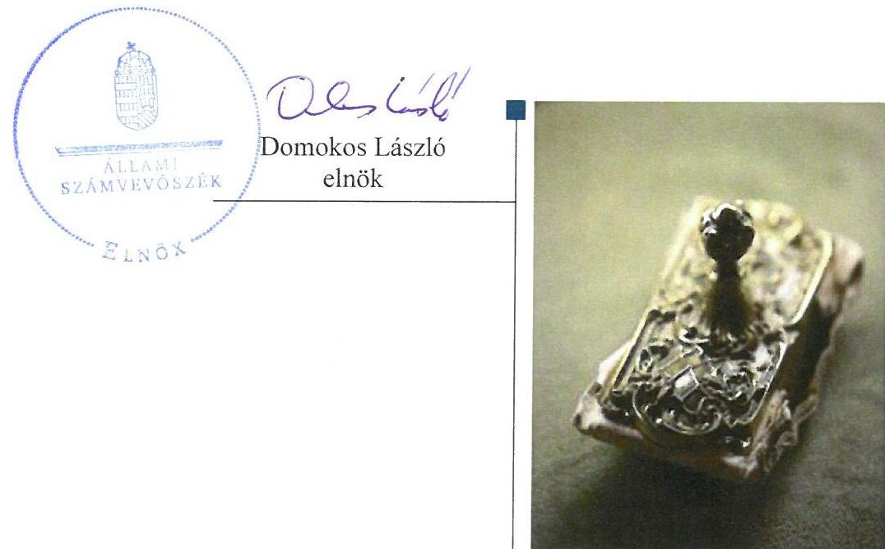
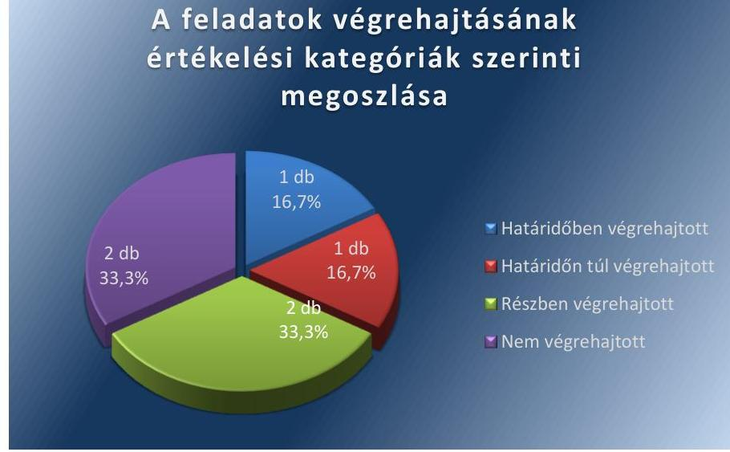
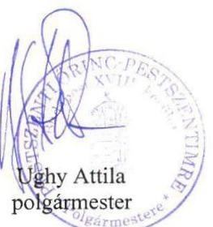
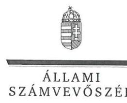
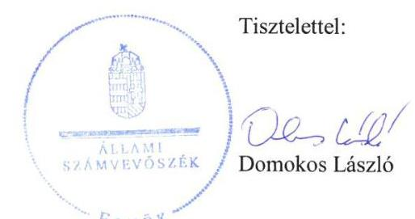
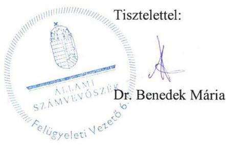

# Jelentés 

## Utóellenőrzések

Budapest Főváros XVIII. kerület Pestszentlőrinc-Pestszentimre Önkormányzata vagyongazdálkodása szabályszerűségének utóellenőrzése 2017.

---

# J elentés 

## Utóellenőrzések

Budapest Főváros XVIII. kerület Pestszentlőrinc-Pestszentimre Önkormányzata vagyongazdálkodása szabályszerűségének utóellenőrzése 2017. 09. hó 10. nap

---

# AZ ELLENŐRZÉST FELÜGYELTE: 

DR. BENEDEK MÁRIA felügyeleti vezető

## AZ ELLENŐRZÉST VEZETTE ÉS A VÉGREHAJTÁSÁÉRT FELELŐS:

KLINGA LÁSZLÓ ellenőrzésvezető

## A PROGRAM ÖSSZEÁLLÍTÁSÁÉRT FELELŐS:

JANIK JÓZSEF LÁSZLÓ osztályvezető

## A TÉMÁHOZ KAPCSOLÓDÓ KORÁBBI SZÁMVEVŐSZÉKI JELENTÉSEK:

- címe: Jelentés az önkormányzati vagyongazdálkodás szabályszerűségi ellenőrzéséről - Budapest Főváros XVIII. kerület Pestszentlőrinc-Pestszentimre
- sorszáma: 14174

IKTATÓSZÁM: V-1313-036/2016.
TÉMASZÁM: 2347
ELLENŐRZÉS-AZONOSÍTÓ SZÁM: V075572

---

# TARTALOMJEGYZÉK 

■ ÖSSZEGZÉS ..... 5
■ AZ ELLENŐRZÉS CÉLJA ..... 6
■ AZ ELLENŐRZÉS TERÜLETE ..... 7
■ AZ ELLENŐRZÉS HÁTTERE, INDOKOLTSÁGA ..... 8
■ A JELENTÉS LÉNYEGES KÉRDÉSKÖRE ..... 9
■ ELLENŐRZÉS HATÓKÖRE ÉS MÓDSZEREI ..... 10
■ MEGÁLLAPÍTÁSOK ..... 12
■ MELLÉKLETEK ..... 15
I. Sz. melléklet: Az ÁSZ 14174 számú jelentéséhez kapcsolódó intézkedési terv végrehajtása ..... 15
■ FÜGGELÉK: ÉSZREVÉTELEK ..... 17
■ RÖVIDÍTÉSEK JEGYZÉKE ..... 33

---

.

---

# ÖSSZEGZÉS 

Az Állami Számvevőszék Budapest Főváros XVIII. kerület Pestszentlőrinc-Pestszentimre Önkormányzata vagyongazdálkodása szabályszerűségének utóellenőrzése során megállapította, hogy az intézkedési tervben meghatározott feladatok közül az ingatlanvagyon-kataszter adatainak egyeztetése, a 2014. évi mérlegben a koncesszióba adott eszközöknek a müködtető által készített és hitelesített leltárral való alátámasztása, a külső ellenőrzések nyilvántartásának folyamatos vezetése, továbbá a kötelezettségvállalás nyilvántartás vezetése nem történt meg. Ezáltal a vagyongazdálkodás müködtetésének szabályszerűsége és elszámoltathatósága, továbbá a vagyonnyilvántartás átláthatósága és a közpénzekkel való felelős gazdálkodás nem volt biztositott.

## Az ellenőrzés társadalmi indokoltsága

Az Állami Számvevőszék stratégiájában célul tűzte ki a számvevőszéki munka hasznosulásának javítását. Ezzel összhangban ellenőrzi, hogy az ellenőrzött szervezetek megvalósították-e a korábbi ellenőrzései által feltárt hibák, hiányosságok és szabálytalanságok megszüntetése céljából kialakított intézkedési tervben foglaltakat. A rendszeres utóellenőrzések hozzájárulnak a szükséges intézkedések tényleges végrehajtásához, ezáltal a közpénzügyek rendezettségének javulásához, igazolják, hogy lezárult a következmények nélküli ellenőrzések időszaka.

## Főbb megállapítások, következtetések

Budapest Főváros XVIII. kerület Pestszentlőrinc-Pestszentimre Önkormányzata az intézkedést igénylő megállapításokhoz és javaslatokhoz kapcsolódóan összeállított intézkedési tervben meghatározott hat feladatból egyet határidőben, egyet határidőn túl, kettőt részben, kettőt nem hajtott végre.

A jegyző az intézkedési tervben meghatározott határidőben gondoskodott a leltárhiány leírását engedélyező jogkör meghatározásáról, ezzel a vagyongazdálkodás működésében rejlő kockázatok csökkentek. A 2015-2018. évekre szóló stratégiai Ellenőrzési tervet a jegyző az intézkedési tervben meghatározott határidőn túl terjesztette elő a Kép-viselő-testületnek.

A jegyző nem gondoskodott a koncesszióba adott eszközök 2014. évi mérlegtételének a működtető által készített és hitelesített leltárral történő alátámasztásáról, így a vagyongazdálkodás szabályszerűségét nem biztosította. A koncesszióba adott eszközök mérlegtételeinek a jogszabályi előírások alapján, a működtető által készített és hitelesített leltárral történő alátámasztásáról a 2015. évi beszámoló vonatkozásában gondoskodott. A jegyző a külső ellenőrzések nyilvántartását a 2016. évre nem vezette.

A jegyző a 2014-2015. években nem tett intézkedéseket az ingatlanvagyon kataszter adatainak és a földhivatal ingatlan-nyilvántartás azonos tartalmú adatainak, továbbá az ingatlan vagyon kataszter értékadatai és az ingatlanok számviteli nyilvántartása szerinti bruttó érték adatainak egyezősége megteremtése érdekében. Az Önkormányzat a jogszabályban előírt kötelezettségvállalások nyilvántartását nem vezette.

A jegyző az intézkedési tervben meghatározott feladatok végrehajtásáról a jogszabály szerinti nyilvántartást vezette, de annak tartalma nem felelt meg a jogszabályban előírtaknak.

---

# AZ ELLENŐRZÉS CÉLJA 

Az ellenőrzés célja annak értékelése volt, hogy a számvevőszéki jelentésben foglalt intézkedést igénylő megállapításokkal és javaslatokkal összhangban készített intézkedési tervben meghatározott feladatokat az ellenőrzött szervezet végrehajtotta-e.

---

# **A Z ELLENŐRZÉS TERÜLETE**

## **Budapest Főváros XVIII. kerület Pestszentlőrinc-Pestszentimre Önkormányzata**

Budapest Főváros XVIII. kerület Pestszentlőrinc-Pestszentimre állandó lakosainak száma 2016. január 1-jén a Központi Statisztikai Hivatal Magyarország közigazgatási helynévkönyv alapján 101 738 fő volt.

A polgármester¹ a 2010. évi önkormányzati választások óta tölti be hivatalát, a jegyző² személye az ellenőrzött időszakban egy alkalommal változott, a jelenlegi jegyző 2015. január 1-jétől látja el feladatát.

Budapest Főváros XVIII. kerület Pestszentlőrinc-Pestszentimre Önkormányzata a 2015. évi költségvetési beszámolója szerint 21 317 millió Ft költségvetési bevételt ért el, valamint 18 035 millió Ft költségvetési kiadást teljesített. 2015. december 31-én a könyvviteli mérleg szerinti követelések állományának értéke 2237,9 millió Ft, a kötelezettségek állományának értéke 1303,7 millió Ft, mérlegfőösszege 111 463,1 millió Ft volt.

Az Állami Számvevőszék 2013. évben ellenőrizte Budapest Főváros XVIII. kerület Pestszentlőrinc-Pestszentimre Önkormányzatánál az önkormányzati vagyongazdálkodás szabályszerűségét a 2009. január 1. és 2012. december 31. közötti időszak vonatkozásában. Az erről szóló 14174. számú jelentését³ az ÁSZ⁴ 2014. október 22-én tette közzé. Az ellenőrzés célja annak megállapítása volt, hogy az önkormányzat vagyongazdálkodási tevékenységének szabályozottsága és tevékenysége a jogszabályi előírásokkal összhangban volt-e, átlátható, a jogszabályi előírásoknak megfelelő volt-e a vagyon nyilvántartása, a külső és belső ellenőrzések megállapításai hozzájárultak-e az önkormányzati vagyongazdálkodási tevékenység szabályszerűségéhez. Az ÁSZ jelentésben foglalt javaslatok végrehajtása érdekében az Önkormányzat intézkedési tervet készített.

Az utóellenőrzés – a 2014. október 22. és 2017. április 3. között végrehajtott feladatokat figyelembe véve – az ÁSZ jelentésben a jegyző részére megfogalmazott intézkedést igénylő megállapításokra és javaslatokra készített, az ÁSZ részére megküldött intézkedési tervben foglalt feladatok megvalósításának ellenőrzésére, illetve értékelésére fókuszált.

---

# AZ ELLENŐRZÉS HÁTTERE, INDOKOLTSÁGA 

Az ÁSZ tv. ${ }^{5}$ 33. § (1) bekezdése értelmében a számvevőszéki jelentések intézkedést igénylő megállapításaihoz kapcsolódóan az ellenőrzött szervezet vezetője intézkedési tervet köteles összeállítani, és az ÁSZ részére megküldeni. Az intézkedési tervben foglaltak megvalósítását - az ÁSZ tv. 33. § (7) bekezdésében foglaltak alapján - az ÁSZ utóellenőrzés keretében ellenőrizheti. Az intézkedések megvalósulásának értékelése során az ÁSZ figyelembe veszi az ellenőrzött szervezetek működési feltételeiben, valamint a jogszabályi előírásokban bekövetkezett változásokat.

Az intézkedési tervben foglalt feladatok hiányos, illetve késedelmes végrehajtása, valamint megvalósításának elmaradása azt mutatja, hogy az ellenőrzések során feltárt hibák, hiányosságok és szabálytalanságok megszüntetése nem kapott kellő hangsúlyt. Ez a szabályszerű működés és a felelős vezetői magatartás vonatkozásában kockázatot hordoz. E kockázatok feltárásával az ÁSZ utóellenőrzési rendszere fokozza a fegyelmet, és igazolja, hogy a közpénzzel való szabályos gazdálkodás felelőssége elől nem lehet kitérni.

Az utóellenőrzés négy szinten hasznosulhat:
$\longrightarrow$ A társadalom szintjén az utóellenőrzés jelzi, hogy a számvevőszéki ellenőrzés megállapításainak van következménye: a hiányosságok megszüntetésére az ellenőrzött szervezet által meghatározott intézkedések végrehajtását is számon kéri az ÁSZ.
$\longrightarrow$ Az ellenőrzött terület szintjén az utóellenőrzés tájékoztatást nyújt a terület döntéshozóinak a hiányosságok kiküszöbölésének jó gyakorlatairól, ezzel lehetőséget biztosítva arra, hogy az ÁSZ ellenőrzési megállapításai, javaslatai a terület nem ellenőrzött szervezeteinek a működése során is hasznosuljanak.
$\longrightarrow$ Az ellenőrzött szervezet szintjén az utóellenőrzés feltárja, hogy a szervezet az intézkedések végrehajtásával hasznosította-e a korábbi ellenőrzési jelentésben a hiányosságok megszüntetése, illetve a kockázatok kezelése érdekében megfogalmazott javaslatokat.
$\longrightarrow$ Az ÁSZ szintjén az utóellenőrzés visszacsatolást ad az ellenőrzési jelentések hasznosulásáról, az intézkedések elmaradása vagy részleges megvalósulása a további ellenőrzésekhez kockázati jelzésként szolgál.

---

# A JELENTÉS LÉNYEGES KÉRDÉSKÖRE 

Az Önkormányzat az intézkedési tervben foglaltakat az elöirt határidőben végrehajtotta-e?

---

# ELLENŐRZÉS HATÓKÖRE ÉS MÓDSZEREI 

## Az ellenőrzés típusa

Megfelelőségi ellenőrzés.

## Az ellenőrzött időszak

Az utóellenőrzés alapját képező ÁSZ jelentés közzétételének napjától (2014. október 22.) az ellenőrzésről szóló kiértesítő levél keltének napjáig (2017. április 3.) tartó időszak.

## Az ellenőrzés tárgya

Az ÁSZ tv. 2011. július 1-jei hatálybalépését követően a számvevőszéki jelentésben foglalt intézkedést igénylő megállapításokkal és javaslatokkal összhangban - Budapest Főváros XVIII. kerület Pestszentlőrinc-Pestszentimre Önkormányzata által - készített intézkedési tervben foglaltak végrehajtásának ellenőrzése volt.

Az ellenőrzés kiterjedt minden olyan körülményre és adatra, amely az ÁSZ jogszabályban meghatározott feladatainak teljesítéséhez, valamint a program végrehajtása folyamán felmerült újabb összefüggések feltárásához szükséges volt.

## Az ellenőrzött szervezet

Budapest Főváros XVIII. kerület Pestszentlőrinc-Pestszentimre Önkormányzata

## Az ellenőrzés jogalapja

Az ÁSZ az ÁSZ törvényben meghatározott feladatkörében ellenőrzi a központi költségvetés végrehajtását, az államháztartás gazdálkodását, az államháztartásból származó források felhasználását és a nemzeti vagyon kezelését.

Az ÁSZ tv. 1. § (3) bekezdése szerint az ÁSZ általános hatáskörrel végzi a közpénzekkel és az állami és önkormányzati vagyonnal való felelős gazdálkodás ellenőrzését.

Az ÁSZ tv. 33. § (7) bekezdése alapján a 33. § (1)-(2) bekezdése szerinti intézkedési tervben foglaltak megvalósítását az ÁSZ utóellenőrzés keretében ellenőrizheti.

---

# Az ellenőrzés módszerei 

Az ÁSZ az ellenőrzést a nemzetközi standardokat irányadónak tekintve az ellenőrzési program ellenőrzési kérdései, az ellenőrzött időszakban hatályos jogszabályok, az ellenőrzés szakmai szabályok és módszertanok figyelembevételével, önálló ellenőrzés keretében végezte.

Az ÁSZ az ellenőrzés ideje alatt az Önkormányzattal történő kapcsolattartást az ÁSZ SZMSZ ${ }^{6}$-ének vonatkozó előírásai alapján biztosította.

Az utóellenőrzés megállapításait elsősorban az ÁSZ rendelkezésére álló, valamint az ellenőrzött szervezettől elektronikusan bekért dokumentumok alapozták meg.

Az ellenőrzési bizonyítékként felhasználható adatforrások közé tartoztak egyrészt a szakmai programban felsorolt adatforrások, másrészt minden - az ellenőrzés folyamán feltárt, az ellenőrzés szempontjából információt tartalmazó - dokumentum.

Az intézkedési tervben előírt feladatokat, azok végrehajthatósága, illetve végrehajtása szempontjából az alábbiak szerint értékelte az ÁSZ:
"határidőben végrehajtott" a feladat, ha a teljesítés dokumentáltan, az intézkedési tervben előírt határidőben és tartalommal megtörtént;
"határidőn túl végrehajtott" a feladat, ha annak teljesítése az intézkedési tervben meghatározott módon, de az előírt határidőn túl történt meg;
"részben végrehajtott" a feladat, ha végrehajtása teljes körűen az intézkedési tervben előírt módon nem történt meg;
"nem végrehajtott" a feladat, ha a végrehajtás nem történt meg, vagy amennyiben a teljesítést nem dokumentálták;
"okafogyottá vált" a feladat, ha végrehajtására - meghatározott esemény bekövetkezése, továbbá külső körülmény, a működést érintő feltétel változása miatt - már nincs szükség, illetve lehetőség, és egyértelműen megállapítható, hogy az intézkedést szükségessé tevő körülmény a jövőben nem fordulhat elő;
"nem időszerű" az a feladat, amelynek ellenőrzési időszakon belüli végrehajtására azért nem került (kerülhetett) sor, mert az intézkedés alapjául szolgáló esemény nem következett be, de annak jövőbeni előfordulása lehetséges, a végrehajtása nem volt esedékes, vagy a végrehajtás határideje még nem járt le.
Az ellenőrzés lefolytatásához az ellenőrzött szervezet a tanúsítványok elektronikus kitöltésével, valamint az ÁSZ által kért dokumentumok elektronikus megküldésével szolgáltatott adatokat, amelyek valódiságát és teljes körűségét az ellenőrzött szervezet vezetője által tett teljességi és hitelességi nyilatkozat igazolta. Az így rendelkezésre bocsátott adatok, információk kontrollja az ellenőrzés keretében történt.

---

# MEGÁLLAPÍTÁSOK 

## Az Önkormányzat az intézkedési tervben foglaltakat az előírt határidőben végrehajtotta-e?

Összegző megállapítás

Az Önkormányzat az intézkedési tervben meghatározott hat feladatból egyet határidőben, egyet határidőn túl, kettőt részben, kettőt nem hajtott végre. Az intézkedési tervben meghatározott feladatok végrehajtásáról az Önkormányzat a jogszabály szerinti nyilvántartást vezette, de annak tartalma nem felelt meg a jogszabályban előírtaknak.

Az ÁSZ a jelentésben a jegyző részére hat intézkedést igénylő megállapítást és javaslatot fogalmazott meg. Az ÁSZ részére a polgármester által megküldött intézkedési tervben a hiányosságok, szabálytalanságok megszüntetésére a polgármester részére kettő, a jegyző részére négy intézkedési feladat került meghatározásra.

Az intézkedési tervben meghatározott feladatokat, határidőket, felelősöket és a feladatok végrehajtását az I. számú melléklet mutatja be.

Az ÁSZ javaslatai alapján készített intézkedési tervben meghatározott feladatok végrehajtásáról a jegyző vezette a Bkr. ${ }^{7}$ elöírása szerinti nyilvántartást, de annak tartalma nem felelt meg teljes körűen a Bkr. 47. § (2) bekezdésében előírtaknak, mivel nem tartalmazta az elfogadott intézkedési tervet, az intézkedési terv alapján végrehajtott intézkedések rövid leírását és az esetlegesen végre nem hajtott intézkedések okát.

Az Önkormányzat ${ }^{8}$ intézkedési tervében meghatározott feladatok végrehajtásának értékelési kategóriák szerinti megoszlását az 1. ábra szemlélteti.

1. ábra

## A feladatok végrehajtásának értékelési kategóriák szerinti megoszlása

---

HATÁRIDŐBEN VÉGREHAJTOTT feladat:

1. Az Önkormányzat a Leltározási szabályzatában ${ }^{9}$ a leltárhiány leírásának engedélyezését a jegyző jogköreként meghatározta.

# HATÁRIDŐN TÚL VÉGREHAJTOTT feladat: 

2. A jegyző az Önkormányzat 2015-2018. évekre szóló Stratégiai Ellenőrzési Tervét az intézkedési tervben meghatározott 2014. december 31-ei határidő helyett, 2015. február 4-én terjesztette a Képviselő-testület ${ }^{10}$ elé jóváhagyásra.

## RÉSZBEN VÉGREHAJTOTT feladatok:

3. Az Önkormányzat a koncesszióba adott eszközök 2015. évi mérlegtételét az Áhsz. ${ }^{11}$-ben előírtaknak megfelelő, a működtető által készített és hitelesített leltárral alá támasztotta, azonban a 2014. évi beszámoló koncesszióba adott eszközök mérlegtételének a jogszabályi előírásoknak megfelelő leltárral való alátámasztása nem történt meg.
4. A jegyző az intézkedési tervben megjelölt határidőn belül intézkedett a Bkr. előírásainak megfelelő külső ellenőrzések nyilvántartásának vezetéséről, azonban annak tartalma a 2014. és 2015. évek vonatkozásában nem felelt meg teljes körűen a Bkr.-ben előírtaknak, a 2016. évre a nyilvántartást nem vezette.

## NEM VÉGREHAJTOTT feladatok:

5. Az Önkormányzat a Kormányrendeletben ${ }^{12}$ előírtaknak alapján, az ingatlan vagyon kataszter adatai és a földhivatal ingatlan-nyilvántartása azonos tartalmú adatai közötti, valamint az ingatlan vagyon kataszter értékadatai és az ingatlanok számviteli nyilvántartása szerinti bruttó érték adatainak egyezősége megteremtése érdekében nem tett intézkedéseket.
6. Az Önkormányzat dokumentumokkal nem igazolta, hogy az általa alkalmazott pénzügyi-számviteli szoftver alkalmas a kötelezettségvállalások nyilvántartásának vezetésére.

---

.

---

# MELLÉKLETEK

- I. SZ. MELLÉKLET: AZ ÁSZ 14174 SZÁMÚ JELENTÉSÉHEZ KAPCSOLÓDÓ INTÉZKEDÉSI TERV VÉGREHAJTÁSA

|  1. | Intézkedési tervben meghatározott feladat | Az intézkedési tervben meghatározott határidő | Az intézkedési tervben meghatározott feladat felelőse | A feladat végrehajtása  |
| --- | --- | --- | --- | --- |
|   | 1. | 2. | 3.
Határidőben végrehajtott feladat | 4.  |
|  1. | Az "Eszközök és források leltározási és leltárkészítési szabályzata" 2014. szeptember 29.-ei módosításakor a leltárhiány leírását engedélyező jogkör kialakításra került. |  |  | Az Önkormányzat a 25/2014. (IX. 29.) Polgármesteri-jegyzői együttes utasítással kiadott Eszközök és források leltározási és leltárkészítési szabályzat III. fejezet 1.7. pontjában a leltárhiány leírásának engedélyezését a jegyző jogköreként meghatározta.  |
|   |  |  | Határidőn túl végrehajtott feladat |   |
|  2. | A stratégiai ellenőrzési tervet a Képviselőtestület következő ülésén jóváhagyásra előterjesztjük. | 2014. december 31. | jegyző | A belső ellenőrzési vezető az Önkormányzat 2015-2018. évekre szóló Stratégiai Ellenőrzési Tervét a Bkr. 22. § (1) bekezdés b) pontjában előírt tartalommal elkészítette, azonban a jegyző a 2014. december 31-ei határidő helyett, 2015. február 4-én tartott Képviselő-testületi ülésre terjesztette elő, melyet a Képviselő-testület a 9/2015. (II. 04.) számú határozatával jóváhagyott.  |
|   |  |  | Részben végrehajtott feladat |   |
|  3. | A jövőben kiemelt figyelmet fordítunk arra, hogy a koncesszióba adott eszközök mérlegtételeit az Áhsz. 22. § (2) bekezdés a) pontjában előírtaknak megfelelően a múködtető által készített és hitelesített leltárral kell alátámasztani. | 2015. április 30., folyamatos | jegyző | Az Önkormányzat a koncesszióba adott eszközök 2015. évi mérlegtételét az Áhsz. 22. § (2) bekezdés a) pontja előírásának megfelelő, a működtető által készített és hitelesített leltárral alátámasztotta. A 2014. évi beszámoló koncesszióba adott eszközök mérlegtételének a jogszabályi és a belső előírásoknak megfelelő leltárral való alátámasztása nem történt meg, mivel a működtető leltárfelvételi jegyet nem készített, így nem igazolta az eszköz meglétét.  |
|  4. | Az ellenőrzés ideje alatt a vizsgált időszakra vonatkozó nyilvántartást elkészítettük, valamint 2013-ban ezt a hiányosságot már pótoltuk és ettől kezdve a nyilvántartást minden évre vonatkozóan elkészítjük. | 2014. december 31., folyamatos | jegyző | A jegyző határidőn belül intézkedett a Bkr. 14. § (1) bekezdésében foglalt előírásnak megfelelő külső ellenőrzések 2014. és 2015. évi nyilvántartásának vezetéséről, azonban a nyilvántartások a Bkr. 47. § (2) bekezdésben előírt tartalmi követelmények közül nem tartalmazták az elfogadott intézkedési terveket, az intézkedési terv alapján végrehajtott intézkedések rövid leírását, és az esetlegesen végre nem hajtott intézkedések okát. A külső ellenőrzések nyilvántartását a 2016. évre nem vezette.  |

---

|  4 | Intézkedési
tervben
meghatározott feladat | Az intézkedési
tervben
meghatározott
határidő | Az intézkedési
tervben
meghatározott
feladat felelőse | A feladat végrehajtása  |
| --- | --- | --- | --- | --- |
|  1. |  | 2. | 3.
Nem végrehajtott feladat | 4.  |
|  5. | A 147/1992. (XI. 6.) Korm. rendelet 1. § (2)
(3) bekezdéseiben előírtaknak megfelelően az ingatlanvagyon kataszter adatainak és a földhivatal ingatlan-nyilvántartás azonos tartalmú adatainak, továbbá az ingatlanvagyon kataszter és az ingatlanok számviteli nyilvántartása szerinti bruttó érték adatok közötti egyezőség megteremtése érdekében az adatok egyeztetése megtörtént. Az ingatlanvagyon-kataszter értékadatai az ingatlanvagyon számviteli nyilvántartásának bruttó értékadataival már megegyeznek. A földhivatal ingatlan-nyilvántartás adatai és az önkormányzat adatai közötti eltérés megszüntetése érdekében - a valós helyzetnek megfelelően - a rendezést a földhivatal felé kezdeményeztük. A jövőben kiemelt figyelmet kell fordítani az ingatlanvagyon kataszter és az ingatlanok számviteli nyilvántartás adatai, valamint az ingatlanvagyon kataszter földhivatal ingatlan-nyilvántartás adatai közötti egyezőség biztosítására és fenntartására | 2015. április 30., folyamatos | jegyző | Az Önkormányzat a 2014-2015. években nem tett intézkedéseket a Kormányrendelet 1. § (2)-(3) bekezdéseiben előírtak alapján, az ingatlanvagyon kataszter adatainak és a földhivatal ingatlan-nyilvántartás azonos tartalmú adatainak egyezősége megteremtése érdekében. Az Önkormányzat az ingatlanvagyon kataszter értékadatai és az ingatlanok számviteli nyilvántartása szerinti bruttó érték adatai egyeztetésének elvégzése ellenére az egyezőséget nem teremtette meg.  |
|  6. | A 2014-es, önkormányzatokat érintő számviteli változások kötelezővé teszik a kötelezettségvállalások számviteli nyilvántartását, tehát nem csak az előirányzatokat és teljesítéseket, hanem a kötelezettségvállalásokat is könyvelni szükséges a megfelelő adattartalommal. Az önkormányzat által használt pénzügyi-számviteli szoftver előzőeknek megfelelő átállítása megvalósult. |  |  | Az Önkormányzat az intézkedési tervben végrehajtott intézkedésként rögzítette a feladatot, azonban dokumentumokkal nem igazolta, hogy az általa alkalmazott pénzügyi-számviteli szoftver nem csak az előirányzatok és teljesítések, hanem a kötelezettségvállalások nyilvántartásának az Áhsz. 14. számú mellékletének II. 4. pontjában előírt tartalomnak megfelelő vezetését is lehetővé teszi.  |

*Forrás: ÁSZ által készített táblázat*

---

# FÜGGELÉK: ÉSZREVÉTELEK 

A jelentéstervezetet a Számvevőszék 15 napos észrevételezésre megküldte az ellenőrzött szervezet vezetőjének az ÁSZ tv. 29. §* (1) bekezdése előírásának megfelelően.
Az elfogadott észrevételek alapján a Számvevőszék módosította a jelentést.

A függelék tartalmazza az ellenőrzött észrevételeit, illetve az el nem fogadott észrevételek elutasításának indoklását.

[^0]
[^0]:    * 29. § (1) Az Állami Számvevőszék az ellenőrzési megállapításait megküldi az ellenőrzött szervezet vezetőjének vagy az általa megbízott személynek, és annak, akinek személyes felelősségét állapította meg.
    (2) Az ellenőrzött szervezet vezetője és a felelősként megjelölt személy az ellenőrzés megállapításaira tizenöt napon belül írásban észrevételt tehet.
    (3) Az Állami Számvevőszék az észrevételre a beérkezésétől számított harminc napon belül írásban válaszol. A figyelembe nem vett észrevételeket köteles a jelentésben feltüntetni, és megindokolni, hogy azokat miért nem fogadta el.

---

# 1257 

BUDAPEST FÖVÁROS XVIII. KERÜLET PESTSZENTLÖRINC-PESTSZENTIMRE ÖNKORMÁNYZATIC-55/131/2017
POLGÁRMESTERE
Állami Számvevőszék
1364 Budapest 4. Pf. 54.
Domokos László
elnök úr részére

Tárgy: Észrevételek jelentéstervezetre

## Tisztelt Elnök Úr!

Köszönettel kézhez vettük 2017. július 14-én kelt levelüket, melynek mellékletében megküldték részünkre a „Budapest Föváros XVIII. kerület Pestszentlőrinc-Pestszentimre Önkormányzata vagyongazdálkodása szabályszerűségének utóellenőrzése 2017. " című jelentéstervezetet.

A jelentéstervezetben foglaltakhoz a vonatkozó jogszabályban meghatározott határidőben az alábbi észrevételeket kívánjuk tenni:

Dr. Molnár Ildikó címzetes főjegyző a 2015. szeptember 23-án kelt 8/43315/2015. ikt. számú Megbízólevelében elrendelte a Budapest Főváros XVIII. kerület Pestszentlőrinc-Pestszentimrei Polgármesteri Hivatalában „Az Állami Számvevőszék vizsgálatára készített intézkedési terv végrehajtásának ellenőrzése " tárgyú szabályszerűségi vizsgálatot (a továbbiakban: belső ellenőrzési jelentés). A 21/2015/BECS számú végleges belső ellenőrzési jelentés 2015. november 19-én került lezárásra. A belső ellenőrzési jelentésben megállapításra került, hogy az Állami Számvevőszék ellenőrzéseire elkészített intézkedési tervekben foglaltak minden esetben végrehajtásra kerültek. A belső ellenőrzési jelentést 2016. október 24-én az ÁSZ intézkedési tervével kapcsolatos feladatok végrehajtásáról szóló 1. számú tanúsítvány szerint bescannelve az ÁSZ rendelkezésére bocsátottuk.

- A Megállapítások 1. és 2. pontjában foglaltakkal egyetértünk.
- Az Állami Számvevőszék által részben végrehajtott feladatként értékelt feladatok közül a 3. pont szerint „Az Önkormányzat a koncesszióba adott eszközök 2015. évi mérlegtételét az Áhsz.-ben elöirtaknak megfelelő, a müködtető által készített és hitelesített leltárral alátámasztotta, azonban a 2014. évi beszámoló koncesszióba adott eszközök mérlegtételének a jogszabályt elöírásoknak megfelelő leltárral való alátámasztása nem történt meg. "

A 2014. évi beszámoló során a koncesszióba adott eszközök leltározása tényszerűen megtörtént, az adott leltárkörzeten szereplő eszköz egyedi nyilvántartó lapja aláírás céljából megküldésre került a működtető részére, melyet aláírva vissza is kapott az Önkormányzat. Az aláírt dokumentum a mérleget alátámasztó számviteli bizonylatok között fellelhető. Az aláírt dokumentumot és a kapcsolódó kísérőlevelet bescannelve 2016. október 24-én az ÁSZ intézkedési tervével kapcsolatos feladatok végrehajtásáról szóló 1. számú tanúsítvány szerint az ÁSZ rendelkezésére bocsátottuk.

---

A kapcsolódó belső ellenőrzési jelentésben az összegzések között szerepel, hogy az Állami Számvevőszék ellenőrzési javaslataira készített intézkedési tervben foglalt valamennyi feladat végrehajtásra került, ugyanakkor két kiegészítő/pontosító, adminisztrációs szempontú javaslat született. Az egyik az volt, hogy kiemelt figyelmet kell fordítani a működtetői leltározási dokumentumok megfelelőségére. A belső ellenőri javaslatra a 2015. évi leltározás során a leltározás dokumentumai kiegészültek a leltárfelvételi jeggyel is.

Álláspontunk szerint a feladat végrehajtásra került, melyet a bescannelt dokumentumok, és a vonatkozó belső ellenőri jelentés is alátámaszt.

- Az Állami Számvevőszék által részben végrehajtott feladatként értékelt feladatok közül a 4. pont szerint „A jegyző az intézkedési tervben megjelölt határidőn belül intézkedett a Bkr. elöirásainak megfelelő külső ellenőrzések nyilvántartásának vezetéséről, azonban annak tartalma a 2014. és 2015. évek vonatkozásában nem felelt meg teljes körüen a Bkr.-ben elöirtaknak, a 2016. évre a nyilvántartást nem vezette."

A 2014. évtől kialakítottuk a külső ellenőrzések nyilvántartását a jogszabályok és a Nemzetgazdasági Minisztérium honlapján közzétett útmutató által meghatározott adattartalommal. A jegyző utasításában felhívta az irodavezetők és a belső ellenőrzési csoport figyelmét a külső és belső ellenőrzések nyilvántartásának vezetésére, valamint az ahhoz kapcsolódó adatszolgáltatásról is rendelkezett. (1. sz. melléklet). A 2014. - 2015. években a nyilvántartásban az Önkormányzat és a Polgármesteri Hivatal vonatkozásában a megvalósult vagy intézkedéssel érintett külső ellenőrzéseket rögzítettük.

2016 januárjától az intézmények belső ellenőrzését is a Polgármesteri Hivatal belső ellenőrzési csoportja látta el. A külső ellenőrzések rájuk vonatkozó nyilvántartásának elkészítése érdekében a jegyző a belső ellenőrzési csoport útján 2017 januárjában részben visszamenőleg, másrészt pedig a jövőre vonatkozóan levélben kért az intézményektől tájékoztatást az ott lefolytatott külső ellenőrzésekről (2. sz. melléklet). Ezt a táblázatos nyilvántartást azóta is folyamatosan vezetjük, és a 2014-2017 évek vonatkozásában a még hiányzó - az intézkedési tervre és végrehajtására vonatkozó - adattartalom is feltöltésre került (3. sz. melléklet).

Álláspontunk szerint a feladat végrehajtásra került, melyet a csatolt dokumentumok - a mellékelt levelek és tábláztok - is alátámasztanak.

- Az Állami Számvevőszék által nem végrehajtott feladatként értékelt feladatok közül az 5. pont szerint „Az Önkormányzat a Kormányrendeletben elöirtak alapján, az ingatlan vagyonkataszter értékadatai és a földhivatal ingatlan-nyilvántartása azonos tartalmú adatai között, valamint az ingatlan-vagyon kataszter értékadatai és az ingatlanok számviteli nyilvántartása szerinti bruttó érték adatainak egyezősége megteremtése érdekében nem tett intézkedéseket."

A vonatkozó belső ellenőri jelentés megállapításai szerint a földhivatali nyilvántartással való adategyeztetés céljából a Polgármesteri Hivatal még 2013. októberében felvette a kapcsolatot a Budapesti 1. számú Földhivatallal. Ennek folyományaként 2014. május 23 -i keltezéssel egyedi megállapodás került megkötésre Budapest Főváros Kormányhivatalával a szükséges adatszolgáltatásról. Az egyedi megállapodás másolatát jelen levelünkhöz mellékletként csatoljuk (4. sz. melléklet). A vonatkozó adatokat a megállapodás alapján az Önkormányzat számára biztosították, melyeket korábban már az Állami Számvevőszék rendelkezésére tudtunk bocsátani. Ezen túlmenően 2016. május 13 -án az Önkormányzat Budapest Főváros Kormányhivatalával határozatlan idejű szerződést kötött az ingatlan-nyilvántartásban bekövetkező változások folyamatos évenkénti adatszolgáltatásról. (5. sz. melléklet)

---

A 2015. április 20-i keltezésű, a kataszteri és számviteli nyilvántartás egyezőségét alátámasztó kimutatásban sajnálatos módon nem szerepeltettük a Polgármesteri Hivatal adatát (6.137.548,- Ftot), az erre vonatkozó javított táblázatot és az eredeti alap táblázatot az összehasonlíthatóság érdekében jelen levelünk mellékleteként csatoljuk (6. sz. és 7. sz. mellékletek). A korrekció részben a millió forintra kerekítésből adódik, részben pedig abból, hogy a táblázat korrigált vagyonkimutatás oszlopának korlátozottan forgalomképes sorában szereplő 30.665 M Ft nem tartalmazta a Polgármesteri Hivatal adatát, 6 M Ft-ot. Ennek bizonyítékaként jelen levelünkhöz csatoljuk a 2014. forgalom szerinti összesítés megnevezésủ dokumentum másolatát, amelyet korábban szintén az ÁSZ rendelkezésére bocsátottunk (8. sz. melléklet). A dokumentum alapján láthatóak a Polgármesteri Hivatal korlátozottan forgalomképes ingatlanjainak adatai. E szerint megállapítható, hogy az egyezőség 2014. évben is biztosított volt.

A 2015. évben a vagyonkataszter és a vagyonkimutatás között bruttó 195.800,- Ft eltérés mutatkozott, mely összeg a Polgármesteri Hivatal 1211491 számú Különféle egyéb építmény forgalomképtelen összege megnevezésủ fökönyvön nyilvántartott Üllői út 400 . parkolója világításának megvalósítási diját tartalmazta. A vagyonkataszteri nyilvántartás módosítása 2016. I. félévében megtörtént. Úgy ítéljük meg, hogy a 109 Mrd Ft értékủ föösszeg mellett egy darab (már korrigálásra is került) kisösszegủ eltérés az elfogadhatóság határán belül van. Jelen levelünkhöz csatoljuk a C.C. Audit Könyvvizsgáló Kft. 2014. évi éves költségvetési beszámolóról készül jelentését, az EFENDER Számviteli, Tanácsadó és Könyvvizsgáló Bt. 2015. évi költségvetés végrehajtásáról szóló rendelettervezet vizsgálatáról, valamint az East-Audit Zrt. 2016. évi záiszámadási rendelettervezetről alkotott független könyvvizsgálói jelentéseit (9-11. sz. mellékletek). A jelentések szerint az önkormányzati ingatlankataszter nyilvántartásban, valamint a záiszámadáshoz készített vagyonkimutatásban szereplő értékadatok az összevont éves költségvetési beszámoló adataival összhangban vannak.

Előbbiek alapján álláspontunk szerint a feladat végrehajtásra került, kérjük indokunk szíves elfogadását.

- Az Állami Számvevőszék által nem végrehajtott feladatként értékelt feladatok közül a 6. pont szerint „Az Önkormányzat dokumentumokkal nem igazolta, hogy az általa alkalmazott pénzügyi-számviteli szoftver alkalmas a kötelezettség-vállalás számviteli nyilvántartásának könyvelésére."

Az ÁSZ intézkedési tervével kapcsolatos feladatok végrehajtásáról szóló 1. számú tanúsítvány tanúsága szerint az Állami Számvevőszék részére bescannelve megküldtük a kapcsolódó belső ellenőrzési jelentést, melyben foglaltak szerint az Önkormányzat belső ellenőre megállapította, hogy a Gordius pénzügyi integrált rendszerben történik meg az előzetes és végleges kötelezettségvállalások rögzítése. A belső ellenőrzés során az alkalmazott ellenőrzési módszerek és eljárások közé tartozott a közvetlen megfigyelésen alapuló ellenőrzés, szemle is. Az ellenőrzés a pénzügyi rendszer megtekintésével, az adattartalom és a jogszabályi előírások ütköztetésével valósult meg, és teljes körű megfelelőséget állapított meg. A belső ellenőr megállapította, hogy az adatok köre az Áhsz. 14. számú mellékletének II./4. pontjában foglaltaknak teljes körűen megfelel. A kötelezettségvállalás számviteli nyilvántartásának könyvelésére minden tekintetben alkalmas az Önkormányzat által alkalmazott Gordius pénzügyi rendszer.

A költségvetési jelentések 2. és 4. űrlapjain a kötelezettségvállaláshoz kapcsolódó adatokat maradéktalanul és megbízhatóan szolgáltatjuk. Ezt az is bizonyítja, hogy a Magyar Államkincstár részére történő időkőzi költségvetési jelentések, mérlegjelentések, valamint beszámolók a jogszabályi előírásoknak megfeleltek, és befogadásra kerültek. Miután a kötelezettségvállalások kimutatása az adatszolgáltatások kötelező tartalmi eleme, azok hiányában a Magyar Államkincstár nem fogadta volna be a beszámolóinkat.

---

A Magyar Államkincstár és az NGM visszaigazolásaként jelen levelünkhöz csatoljuk a 2014., 2015. és 2016. évi, KGR K11 Adatszolgáltató modulból kinyert Státusztörténetek bizonylatait (12-14. sz. mellékletek).

Annak érdekében, hogy be tudjuk mutatni azt, hogy a Gordius pénzügyi rendszer az előirányzatok és teljesítések mellett az Áhsz. 14. számú mellékletének II. 4. pontjában előírt tartalomnak megfelelő kötelezettségvállalások nyilvántartását is lehetővé teszi, excel táblázatokat generáltunk a pénzügyi rendszerből, amelyeken keresztül be tudjuk mutatni a nyilvántartásunk adattartalmát (1517. sz. mellékletek). Az excel táblázatok mintákat tartalmaznak, 2014-2016. évekre vonatkozóan. Az utóellenőrzés során az ÁSZ rendelkezésére a vonatkozó ellenőrzési jelentést csatoltuk be, mivel úgy vélelmeztük, hogy ez kellő bizonyítékként szolgál.

Álláspontunk szerint a feladat végrehajtásra került, kérjük indokunk és a csatolt bizonyítékok alapján a feladat elvégzésének a határidőben végrehajtott feladatok közötti szerepeltetését.

- A jelentéstervezet 5. oldalán a főbb megállapítások, következtetések között szerepel, hogy „A jegyző az intézkedési tervben rögzített feladatok végrehajtásáról nem vezette a jogszabályi előirásnak megfelelő nyilvántartást."

A Polgármesteri Hivatal Belső ellenőrzési csoportja a külső ellenőrzések nyilvántartásába felvezette az Állami Számvevőszék ellenőrzését. Az intézkedési terv végrehajtását 2015. évben belső ellenőri vizsgálat keretében ellenőriztük. Így véleményünk szerint a megállapítás nem teljes mértékben helytálló - hiszen nem teljes adattartalommal - de a nyilvántartás elkészült és kiemelt figyelmet fordítottunk az intézkedések végrehajtására, illetve annak ellenőrzésére.

Kérjük Tisztelt Elnök Urat, hogy észrevételeinket a végleges számvevőszéki jelentésben szíveskedjék figyelembe venni.

Budapest, 2017. JGL 26.

Tisztelettel:

Véghe Attila polgármester

Jár Molnár Ildikó címzetes főjegyző

# Mellékletek: 

1. sz. mell.: Jegyzői utasítás/Külső ellenőrzések nyilvántartása és intézkedési tervek pontosítása
2. sz. mell.: Jegyzői levél/Beszámoló intézkedések végrehajtásáról
3. sz. mell.: Külső ellenőrzésekhez kapcsolódó intézkedések nyilvántartásai
4. sz. mell.: Egyedi megállapodás ingatlan-nyilvántartási adatbázisból leválogatás útján történő adatszolgáltatásról 2014.
5.sz. mell.: Egyedi megállapodás ingatlan-nyilvántartási adatbázisból leválogatás útján történő adatszolgáltatásról 2016.

---

6.sz. mell.: Kimutatás a Vagyonkataszter és a vagyonkimutatás között 2014. JAVÍTOTT TÁBLÁZAT eredeti példány
7. sz. mell.: Kimutatás a Vagyonkataszter és a vagyonkimutatás között 2014. (Korábban az ÁSZ rendelkezésére bocsátott táblázat másolata)
8. sz. mell.: 2014. forgalom szerinti összesítés (Korábban az ÁSZ rendelkezésére bocsátott dokumentum másolata)
9. sz. mell.: C.C. Audit Könyvvizsgáló Kft. A 2014. évi évi éves költségvetési beszámolóról készült független könyvvizsgáló jelentés másolata
10. sz. mell.: EFENDER Számviteli, Tanácsadó és Könyvvizsgáló Bt. 2015. évi költségvetés végrehajtásáról szóló rendelettervezet vizsgálatáról szóló független könyvvizsgálói jelentés másolata
11. sz. mell.: East-Audit Zrt. 2016. évi zárszámadási rendelettervezetről szóló független könyvvizsgálói jelentés másolata
12. sz. mell.: 2014. évi Státusztörténet bizonylata (MÁK által jóváhagyott, NGM által lezárt)
13. sz. mell.: 2015. évi Státusztörténet bizonylata (MÁK által jóváhagyott, NGM által lezárt)
14. sz. mell.: 2016. évi Státusztörténet bizonylata (MÁK által lezárt, NGM lezárás folyamatban)
15. sz. mell.: MINTA dokumentum a 2014. évi kötelezettségvállalás nyilvántartásához
16. sz. mell.: MINTA dokumentum a 2015. évi kötelezettségvállalás nyilvántartásához
17. sz. mell.: MINTA dokumentum a 2016. évi kötelezettségvállalás nyilvántartásához

---

ELNÖK

Ikt.szám: V-1313-034/2016.

# Ughy Attila Gábor úr 

Polgármester
Budapest Főváros XVIII. kerület Pestszentlőrinc-Pestszentimre Önkormányzata

## Budapest

## Tisztelt Polgármester Úr!

Köszönettel megkaptam az Állami Számvevőszékhez 2017. július 31. napján érkezett "Utóellenörzések - Budapest Föváros XVIII. kerület Pestszentlörinc-Pestszentimre Önkormányzata vagyongazdálkodása szabályszerüségének utóellenörzése" címủ számvevőszéki jelentéstervezetben foglalt megállapításokra tett észrevételét.

Tájékoztatom Polgármester urat, hogy az elfogadott és el nem fogadott észrevételeket - az Állami Számvevőszékről szóló 2011. évi LXVI. törvény 29. § (3) bekezdése alapján - a jelentésben szerepeltetjük az elutasítás indokainak feltüntetésével együtt.

Az Állami Számvevőszék észrevételekre vonatkozó álláspontjáról a felügyeleti vezető által készített részletes tájékoztatást csatoltan megküldöm.

Budapest, 2017. 08 . hó 48 . nap

Melléklet: Tájékoztatás az elfogadott és el nem fogadott észrevételekről, azok indokairól

---

# Tájékoztatás 

az elfogadott és el nem fogadott észrevételekről, azok indokairól

| 1. | Észrevétel: | Az észrevétel 1. oldalán az ÁSZ jelentéstervezet Megállapításokra tett észrevétel szerint:   A jelentéstervezetben foglaltakhoz a vonatkozó jogszabályban meghatározott határidőben az alábbi észrevételeket kivánjuk tenni:   Dr. Molnár Ildikó címzetes föjegyzö a 2015. szeptember 23-án kelt 8/43315/2015. ikt. számú Megbízólevelében elrendelte a Budapest Föváros XVIII. kerület Pestszentlőrinc-Pestszentimrei Polgármesteri Hivatalában „Az Állami Számvevőszék vizsgálatára készített intézkedési terv végrehajtásának ellenörzése" tárgyú szabályszerűségi vizsgálatot (a továbbiakban: belső ellenőrzési jelentés). A 21/2015/BECS számú végleges belső ellenőrzési jelentés 2015. november 19-én került lezárásra. A belső ellenőrzési jelentésben megállapításra került, hogy az Állami Számvevőszék ellenőrzéseire elkészített intézkedési tervekben foglaltak minden esetben végrehajtásra kerültek. A belső ellenőrzési jelentést 2016. október 24-én az ÁSZ intézkedési tervével kapcsolatos feladatok végrehajtásáról szóló 1. számú tanúsítvány szerint bescannelve az ÁSZ rendelkezésére bocsátottuk. |
| :--: | :--: | :--: |
|  | Válasz: | Az ÁSZ az észrevételt nem fogadja el. |
|  | Indokolás: | Az észrevétel nem megalapozott. Az Állami Számvevőszékről szóló 2011. évi LXVI. törvény (ÁSZ tv.) 1. § (2) és (3) bekezdésében foglaltak szerint az ÁSZ ellenőrzési tevékenységét minden más szervezettől függetlenül, általános hatáskörrel végzi a közpénzek és az állami és önkormányzati vagyonnal való felelős gazdálkodás ellenőrzésének vonatkozásában, továbbá az ÁSZ tv. 24. § (1) bekezdés b) pontjában foglaltak szerint az ellenőrzés végrehajtása során |

---

|  |  | a jogszabályok, az ellenőrzési program, és az ellenőrzési szakmai szabályok, módszerek és az etikai normák szerint jár el. Fentiek alapján a belső ellenőrzési jelentést az intézkedési tervben meghatározott feladatok végrehajtását igazoló önálló, bizonyító erejü dokumentumként az ÁSZ nem fogadja el. |
| :--: | :--: | :--: |
|  | Észrevétel: | Az észrevétel 1. oldalán az ÁSZ jelentéstervezet Megállapítások 3. pontjára tett észrevétel szerint:   Az Állami Számvevőszék által részben végrehajtott feladatként értékelt feladatok közül a 3. pont szerint „Az Önkormányzat a koncesszióba adott eszközök 2015. évi mérlegtételét az Ahsz.-ben elöirtaknak megfelelö, a müködtető által készitett és hitelesitett leltárral alátámasztotta, azonban a 2014. évi beszámoló koncesszióba adott eszközök mérlegtételének a jogszabályi elöírásoknak megfelelő leltárral való alátámasztása nem történi meg."   A 2014. évi beszámoló során a koncesszióba adott eszközök leltározása tényszerüen megtörtént, az adott leltárkörzeten szereplő eszköz egyedi nyilvántartó lapja aláirás céljából megküldésre került a müködtető részére, melyet aláirva vissza is kapott az Önkormányzat. Az aláirt dokumentum a mérleget alátámasztó számviteli bizonylatok között fellelhető. Az aláirt dokumentumot és a kapcsolódó kisérőlevelet bescannelve 2016. október 24 -én az ASZ intézkedési tervével kapcsolatos feladatok végrehajtásáról szóló 1. számú tanúsitvány szerint az ASZ rendelkezésére bocsátottuk.   A kapcsolódó belső ellenőrzési jelentésben az összegzések között szerepel, hogy az Állami Számvevőszék ellenőrzési javaslataira készitett intézkedési tervben foglalt valamennyi feladat végrehajtásra került, ugyanakkor két kiegészitő/pontositó, adminisztrációs szempontú javaslat született. Az egyik az volt, hogy kiemelt figyelmet kell fordítani a müködtetői leltározási dokumentumok megfelelöségére. A belső ellenőri javaslatra a 2015. évi leltározás során a leltározás dokumentumai kiegészültek a leltárfelvételi jeggyel is.   Álláspontunk szerint a feladat végrehajtásra került, melyet a bescannelt dokumentumok, és a vonatkozó belső ellenöri jelentés is alátámaszt. |
|  | Válasz: | Az ÁSZ az észrevételt nem fogadja el. |

---

|  | Indokolás: | Az észrevétel nem megalapozott. Az ÁSZ ellenőrzés részére az Önkormányzat által megküldött dokumentum (file neve: 2_1_Koncesszió_leltár_2014.pdf) felülvizsgálata alapján az ÁSZ megállapította, hogy a koncesszióba adott eszközök 2014. évi beszámolóban szereplő tételeit a müködtető által aláirt, az eszköz egyedi nyilvántartó lapjával támasztotta alá, nem az államháztartás számviteléről szóló 4/2013. (I. 11.) Korm. rendelet (Áhsz.) 22. § (2) bekezdés a) pontjában foglaltak szerinti hitelesített leltárral. Fentiek figyelembevételével az ÁSZ fenntartja a jelentéstervezetben a koncesszióba adott eszközök 2014. évi leltározására vonatkozó megállapítását. |
| :--: | :--: | :--: |
| 3. | Észrevétel: | Az észrevétel 2. oldalán az ÁSZ jelentéstervezet Megállapítások 4. pontjára tett észrevétel szerint:   Az Állami Számvevőszék által részben végrehajtott feladatként értékelt feladatok közül a 4. pont szerint „A jegyző az intézkedési tervben megjelölt határidőn belül intézkedett a Bkr. előírásainak megfelelő külső ellenőrzések nyilvántartásának vezetéséről, azonban annak tartalma a 2014. és 2015. évek vonatkozásában nem felelt meg teljes körüen a Bkr.-ben elöirtaknak a 2016. évre a nyilvántartást nem vezette."   A 2014. évtől kialakítottuk a külső ellenőrzések nyilvántartását a jogszabályok és a Nemzetgazdasági Minisztérium honlapján közzétett útmutató által meghatározott adattartalommal. A jegyző utasításában felhívta az irodavezetők és a belső ellenőrzési csoport figyelmét a külső és belső ellenőrzések nyilvántartásának vezetésére, valamint az ahhoz kapcsolódó adatszolgáltatásról is rendelkezett. (1. sz. melléklet). A 2014. - 2015. években a nyilvántartásban az Önkormányzat és a Polgármesteri Hivatal vonatkozásában a megvalósult vagy intézkedéssel érintett külső ellenőrzéseket rögzitettük.   2016 januárjától az intézmények belső ellenőrzését is a Polgármesteri Hivatal belső ellenőrzési csoportja látta el. A külső ellenőrzések rájuk vonatkozó nyilvántartásának elkészitése érdekében a jegyző a belső ellenőrzési csoport útján 2017 januárjában részben visszamenőleg, másrészt pedig a jövőre vonatkozóan levélben kért az intézményektől tájékoztatást az ott lefolytatott külső ellenőrzésekről (2. sz. melléklet). Ezt a táblázatos nyilvántartást azóta is folyamatosan vezetjük, és a |

---

|  |  | 2014-2017 évek vonatkozásában a még hiányzó - az intézkedési tervre és végrehajtására vonatkozó - adattartalom is feltöltésre került (3. sz. melléklet).   Álláspontunk szerint a feladat végrehajtásra került, melyet a csatolt dokumentumok - a mellékelt levelek és tábláztok - is alátámasztanak. |
| :--: | :--: | :--: |
|  | Válasz: | Az ÁSZ az észrevételt nem fogadja el. |
|  | Indokolás: | Az észrevétel nem megalapozott. Az ÁSZ ellenőrzés részére az Önkormányzat által megküldött dokumentumok felülvizsgálata alapján az ÁSZ megállapította, hogy a 2014. évre vezetett „Külső ellenörzésekhez kapcsolódó intézkedések nyilvántartása 2014. " és a 2015. évre vezetett „Külső ellenörzésekhez kapcsolódó intézkedések nyilvántartása 2015. " dokumentumok nem tartalmazták a költségvetési szervek belső kontrollrendszeréről és belső ellenőrzéséről szóló 370/2011. (XII. 31.) Korm. rendelet (Bkr.) 47. § (2) bekezdésében előirt tartalmi követelmények közül az elfogadott intézkedési terveket, az intézkedési terv alapján végrehajtott intézkedések rövid leírását és az esetlegesen végre nem hajtott intézkedések okát. Továbbá az Önkormányzat 2016. évre vonatkozó külső ellenőrzésekhez kapcsolódó intézkedésekről nyilvántartás vezetését igazoló dokumentumot nem adott át. Fentiek figyelembevételével az ÁSZ fenntartja a jelentéstervezetben a külső ellenőrzések nyilvántartásának vezetésére tett megállapítását. |
| 4. | Észrevétel: | Az észrevétel 2. oldalán az ÁSZ jelentéstervezet Megállapítások 5. pontjára tett észrevétel szerint:   Az Állami Számvevőszék által nem végrehajtott feladatként értékelt feladatok közül az 5. pont szerint „Az Önkormányzat a Kormányrendeletben elöirtak alapján, az ingatlan vagyonkataszter értékadatai és a földhivatal ingatlan-nyilvántartása azonos tartalmú adatai között, valamint az ingatlan-vagyon kataszter értékadatai és az ingatlanok számviteli nyilvántartása szerinti bruttó érték adatainak egyezősége megteremtése érdekében nem tett intézkedéseket."   A vonatkozó belső ellenőri jelentés megállapításai szerint a földhivatali nyilvántartással való adategyeztetés céljából a Polgármesteri Hivatal még 2013. októberében felvette a kapcsolatot a Budapesti 1. számú Földhivatallal. Ennek folyományaként 2014. május 23-i keltezéssel egyedi megállapodás került megkötésre Buda- |

---

pest Föváros Kormányhivatalával a szükséges adatszolgáltatásról. Az egyedi megállapodás másolatát jelen levelünkhöz mellékletként csatoljuk (4. sz. melléklet). A vonatkozó adatokat a megállapodás alapján az Önkormányzat számára biztosították, melyeket korábban már az Állami Számvevőszék rendelkezésére tudtunk bocsátani. Ezen túlmenően 2016. május 13-án az Önkormányzat Budapest Föváros Kormányhivatalával határozatlan idejü szerződést kötött az ingatlan-nyilvántartásban bekövetkező változások folyamatos évenkénti adatszolgáltatásról. (5. sz. melléklet)
A 2015. április 20-i keltezésü, a kataszteri és számviteli nyilvántartás egyezőségét alátámasztó kimutatásban sajnálatos módon nem szerepeltettük a Polgármesteri Hivatal adatát (6.137.548,- Ft-ot), az erre vonatkozó javított táblázatot és az eredeti alap táblázatot az öszszehasonlíthatóság érdekében jelen levelünk mellékleteként csatoljuk (6. sz. és 7. sz. mellékletek). A korrekció részben a millió forintra kerekítésből adódik, részben pedig abból, hogy a táblázat korrigált vagyonkimutatás oszlopának korlátozottan forgalomképes sorában szereplő 30.665 M Ft nem tartalmazta a Polgármesteri Hivatal adatát, 6 M Ft-ot. Ennek bizonyítékaként jelen levelünkhöz csatoljuk a 2014. forgalom szerinti összesités megnevezésü dokumentum másolatát, amelyet korábban szintén az ÁSZ rendelkezésére bocsátottunk (8. sz. melléklet). A dokumentum alapján láthatóak a Polgármesteri Hivatal korlátozottan forgalomképes ingatlanjainak adatai. E szerint megállapítható, hogy az egyezőség 2014. évben is biztosított volt.
A 2015. évben a vagyonkataszter és a vagyonkimutatás között bruttó 195.800,- Ft eltérés mutatkozott, mely összeg a Polgármesteri Hivatal 1211491 számú Különféle egyéb épitmény forgalomképtelen összege megnevezésü fökönyvön nyilvántartott Üllöi út 400. parkolója világításának megvalósitási diját tartalmazta. A vagyonkataszteri nyilvántartás módosítása 2016. 1. félévében megtörtént. Úgy ítéljük meg, hogy a 109 Mrd Ft értékü föösszeg mellett egy darab (már korrigálásra is került) kisösszegü eltérés az elfogadhatóság határán belül van. Jelen levelünkhöz csatoljuk a C.C. Audit Könyvvizsgáló Kft. 2014. évi éves költségvetési beszámolóról készül jelentését, az EFENDER Számviteli, Tanácsadó és Könyvvizsgáló Bt. 2015. évi költségvetés

---

|  |  | végrehajtásáról szóló rendelettervezet vizsgálatáról, valamint az East-Audit Zrt. 2016. évi zárszámadási rendelettervezetről alkotott független könyvvizsgálói jelentéseit (9-11. sz. mellékletek). A jelentések szerint az önkormányzati ingatlankataszter nyilvántartásban, valamint a zárszámadáshoz készített vagyonkimutatásban szereplő értékadatok az összevont éves költségvetési beszámoló adataival összhangban vannak.   Elöbbiek alapján álláspontunk szerint a feladat végrehajtásra került, kérjük indokunk szives elfogadását. |
| :--: | :--: | :--: |
|  | Válasz: | Az ÁSZ az észrevételt nem fogadja el. |
|  | Indokolás: | Az észrevétel nem megalapozott. Az ÁSZ ellenőrzés részére az Önkormányzat által megküldött dokumentumok felülvizsgálata alapján az ÁSZ megállapította, hogy az Önkormányzat az önkormányzatok tulajdonában lévő ingatlanvagyon nyilvántartási és adatszolgáltatási rendjéről szóló 147/1992. (XI. 6.) Korm. rendelet 1. § (2)-(3) bekezdéseiben előirtaknak megfelelően az ingatlanvagyon kataszter adatainak és a földhivatal ingatlan-nyilvántartás azonos tartalmú adatainak egyezősége érdekében tett intézkedésekre vonatkozó dokumentumokat nem adott át. A 2014. és 2015. évre elvégzett egyeztetések eredményeképpen kimutatott eltérések nyilvántartásokon történő átvezetését, helyesbítését dokumentumokkal nem támasztotta alá, így az ingatlanvagyon kataszter és az ingatlanok számviteli nyilvántartása szerinti bruttó érték adatok egyezőségét az Önkormányzat nem igazolta. Fentiek figyelembevételével az ÁSZ fenntartja a jelentéstervezetben tett megállapítását. |
| 5. | Észrevétel: | Az észrevétel 3. oldalán az ÁSZ jelentéstervezet Megállapítások 6. pontjára tett észrevétel szerint:   Az Állami Számvevőszék által nem végrehajtott feladatként értékelt feladatok közül a 6. pont szerint „Az Onkormányzat dokumentumokkal nem igazolta, hogy az általa alkalmazott pénzügyi-számviteli szoftver alkalmas a kötelezettség-vállalás számviteli nyilvántartásának könyvelésére."   Az ÁSZ intézkedési tervével kapcsolatos feladatok végrehajtásáról szóló 1. számú tanúsitvány tanúsága szerint az Állami Számvevőszék részére bescannelve megküldtük a kapcsolódó belső ellenőrzési jelentést, melyben foglaltak szerint az Önkormányzat belső ellenőre megállapította, hogy |

---

a Gordius pénzügyi integrált rendszerben történik meg az elözetes és végleges kötelezettségvállalások rögzitése. A belsö ellenörzés során az alkalmazott ellenörzési módszerek és eljárások közé tartozott a közvetlen megfigyelésen alapuló ellenörzés, szemle is. Az ellenörzés a pénzügyi rendszer megtekintésével, az adattartalom és a jogszabályi elöírások ütköztetésével valósult meg, és teljes körü megfelelöséget állapitott meg. A belső ellenör megállapította, hogy az adatok köre az Áhsz. 14. számú mellékletének II./14. pontjában foglaltaknak teljes körüen megfelel. A kötelezettségvállalás számviteli nyilvántartásának könyvelésére minden tekintetben alkalmas az Önkormányzat által alkalmazott Gordius pénzügyi rendszer.
A költségvetési jelentések 2. és 4. ürlapjain a kötelezettségvállaláshoz kapcsolódó adatokat maradéktalanul és megbizhatóan szolgáltatjuk. Ezt az is bizonyitja, hogy a Magyar Államkincstár részére történő idöközi költségvetési jelentések, mérlegjelentések, valamint beszámolók a jogszabályi elöírásoknak megfeleltek, és befogadásra kerültek. Miután a kötelezettségvállalások kimutatása az adatszolgáltatások kötelező tartalmi eleme, azok hiányában a Magyar Államkincstár nem fogadta volna be a beszámolóinkat.
A Magyar Államkincstár és az NGM visszaigazolásaként jelen levelünkhöz csatoljuk a 2014., 2015. és 2016. évi, KGR K11 Adatszolgáltató modulból kinyert Státusztörténetek bizonylatait (12-14. sz. mellékletek).
Annak érdekében, hogy be tudjuk mutatni azt, hogy a Gordius pénzügyi rendszer az elöirányzatok és teljesitések mellett az Ahsz. 14. számú mellékletének II. 4. pontjában elöirt tartalomnak megfelelő kötelezettségvállalások nyilvántartását is lehetővé teszi, excel táblázatokat generáltunk a pénzügyi rendszerböl, amelyeken keresztül be tudjuk mutatni a nyilvántartásunk adattartalmát (15-17. sz. mellékletek). Az excel táblázatok mintákat tartalmaznak, 2014-2016. évekre vonatkozóan. Az utóellenörzés során az ÁSZ rendelkezésére a vonatkozó ellenörzési jelentést csatoltuk be, mivel úgy vélelmeztük, hogy ez kellő bizonyitékként szolgál.

---

|  |  | Álláspontunk szerint a feladat végrehajtásra került, kérjük indokunk és a csatolt bizonyitékok alapján a feladat elvégzésének a határidőben végrehajtott feladatok közötti szerepeltetését. |
| :--: | :--: | :--: |
|  | Válasz: | Az ÁSZ az észrevételt nem fogadja el. |
|  | Indokolás: | Az észrevétel nem megalapozott. Az ÁSZ ellenőrzés részére az Önkormányzat által megküldött dokumentum felülvizsgálata alapján az ÁSZ megállapította, hogy az Önkormányzat a kötelezettségvállalásokról az Ähsz. 14. számú melléklet II./4. pontjában előírt tartalomnak megfelelő nyilvántartást nem vezette, mivel ilyen tartalmú, a pénzügyi-számviteli nyilvántartásból nyert kimutatást nem bocsátott az ÁSZ ellenőrzés rendelkezésére. Fentiek figyelembevételével az ÁSZ fenntartja a jelentéstervezetben a kötelezettségvállalás számviteli nyilvántartásának könyvelésére tett megállapítását. |
| 6. | Észrevétel: | Az észrevétel 4. oldalán az ÁSZ jelentéstervezet 5. oldalán a Megállapítások között szereplő megállapításra tett észrevétel szerint:   A jelentéstervezet 5. oldalán a föbb megállapítások, következtetések között szerepel, hogy ,, A jegyző az intézkedési tervben rögzitett feladatok végrehajtásáról nem vezette a jogszabályi előirásnak megfelelő nyilvántartást."   A Polgármesteri Hivatal Belső ellenőrzési csoportja a külső ellenőrzések nyilvántartásába felvezette az Állami Számvevőszék ellenőrzését. Az intézkedési terv végrehajtását 2015. évben belső ellenőri vizsgálat keretében ellenőriztük. Így véleményünk szerint a megállapítás nem teljes mértékben helytálló - hiszen nem teljes adattartalommal - de a nyilvántartás elkészült és kiemelt figyelmet forditottunk az intézkedések végrehajtására, illetve annak ellenőrzésére. |
|  | Válasz: | Az ÁSZ az észrevételt elfogadja. |
|  | Indokolás: | Az észrevétel megalapozott. Az ÁSZ ellenőrzés részére az Önkormányzat által megküldött dokumentum (file neve: 6_2_Külső_ell_2014.pdf) felülvizsgálata alapján az ÁSZ elfogadja az észrevételt azzal, hogy az ÁSZ ellenőrzés javaslatait, az intézkedési tervben rögzített feladatokat tartalmazó nyilvántartást vezette, azonban annak tartalma nem felelt meg a Bkr. 47. § (2) bekezdésében elöírtaknak, mert nem tartalmazta az elfogadott intézkedési tervet, az intézkedési |

---

|  |  | terv alapján végrehajtott intézkedések rövid leírását és az   esetlegesen végre nem hajtott intézkedések okát. Ennek fi-   gyelembe vételével az ÁSZ a jelentéstervezet erre vonat-   kozó megállapításait módosítja. |
| :-- | :-- | :-- |

Budapest, 2017. 06. hó 21. nap

---

# RÖVIDÍTÉSEK JEGYZÉKE 

${ }^{1}$ polgármester
${ }^{2}$ jegyző
${ }^{3}$ számvevőszéki jelentés
${ }^{4}$ ÁSZ
${ }^{5}$ ÁSZ tv.
${ }^{6}$ SZMSZ
${ }^{7}$ Bkr.
${ }^{8}$ Önkormányzat
${ }^{9}$ Leltározási szabályzat
${ }^{10}$ Képviselő-testület
${ }^{11}$ Áhsz.
${ }^{12}$ Kormányrendelet

Budapest Főváros XVIII. kerület Pestszentlőrinc-Pestszentimre Önkormányzatának polgármestere

Budapest Főváros XVIII. kerület Pestszentlőrinc-Pestszentimre Önkormányzatának jegyzője
az ÁSZ 14174 számú jelentése - Jelentés az önkormányzati vagyongazdálkodás szabályszerűségi ellenőrzéséről - Budapest Főváros XVIII. kerület PestszentlőrincPestszentimre
Állami Számvevőszék
az Állami Számvevőszékről szóló 2011. évi LXVI. törvény (hatályos: 2011. július 1-jétől)
az Állami Számvevőszék elnökének 3/2016. (XII. 29.) ÁSZ utasítása az Állami Számvevőszék Szervezeti és Működési Szabályzatáról (hatályos: 2017. január 1-jétől) a költségvetési szervek belső kontrollrendszeréről és belső ellenőrzéséről szóló 370/2011. (XII. 31.) Korm. rendelet (hatályos: 2012. január 1-jétől)
Budapest Főváros XVIII. kerület Pestszentlőrinc-Pestszentimre Önkormányzata a 25/2014. (IX. 29.) Polgármesteri-jegyzői együttes utasítással kiadott Eszközök és források leltározási és leltárkészítési szabályzata (hatályos: 2014. szeptember 30ától)

Budapest Főváros XVIII. kerület Pestszentlőrinc-Pestszentimre Önkormányzatának Képviselő-testülete
az államháztartás számviteléről szóló 4/2013. (I. 11.) Korm. rendelet (hatályos: 2014. január 1-jétől)
az önkormányzatok tulajdonában lévő ingatlanvagyon nyilvántartási és adatszolgáltatási rendjéről szóló 147/1992. (XI. 6.) Korm. rendelet (hatályos: 1993. január 1-jétől)

---

# ÁLLAMI SZÁMVEVŐSZÉK 

1052 Budapest, Apáczai Csere János utca 10.
Levélcím: 1364 Budapest 4. Pf. 54
Telefon: +36 14849100 Telefax: +36 14849200
www.asz.hu