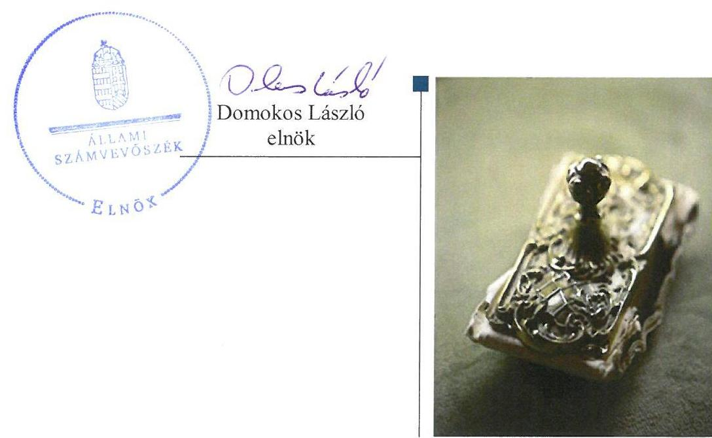
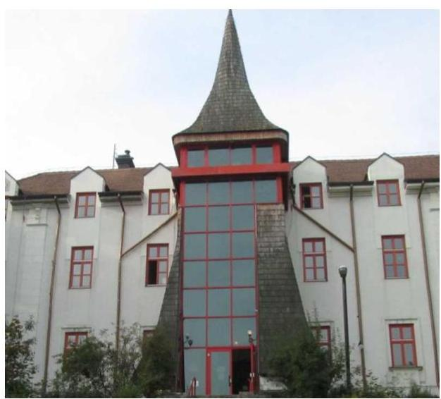

# Jelentés 

## Állami tulajdonú gazdasági társaságok

Az állami tulajdonban (résztulajdonban) lévő gazdálkodó szervezetek vagyonmegőrzési és gazdálkodási tevékenységének ellenőrzése TLA Vagyonkezelő és -hasznosító Kft. 2017.

---

# Jelentés 

## Állami tulajdonú gazdasági társaságok

Az állami tulajdonban (résztulajdonban) lévő gazdálkodó szervezetek vagyonmegőrzési és gazdálkodási tevékenységének ellenőrzése TLA Vagyonkezelő és -hasznosító Kft.
2017. 03. hó 27. nap

---

# AZ ELLENŐRZÉST FELÜGYELTE:

DR. NÉMETH ERZSÉBET felügyeleti vezető

## AZ ELLENŐRZÉST VEZETTE ÉS A VÉGREHAJTÁSÁÉRT FELELŐS:

BAJNAI ZSUZSANNA ellenőrzésvezető

## A PROGRAM ÖSSZEÁLLÍTÁSÁÉRT FELELŐS:

JANIK JÓZSEF LÁSZLÓ osztályvezető

IKTATÓSZÁM: V-1382-092/2016

TÉMASZÁM: 2416

ELLENŐRZÉS-AZONOSÍTÓ SZÁM: V075952

Jelentéseink az Országgyűlés számítógépes hálózatán és az Interneta a www.asz.hu címen is olvashatóak.

---

# TARTALOMJEGYZÉK 

■ ÖSSZEGZÉS ..... 5
■ AZ ELLENŐRZÉS CÉLJA ..... 6
■ AZ ELLENŐRZÉS TERÜLETE ..... 7
■ AZ ELLENŐRZÉS HÁTTERE, INDOKOLTSÁGA ..... 8
■ A JELENTÉS LÉNYEGES KÉRDÉSKÖREI ..... 9
■ ELLENŐRZÉS HATÓKÖRE ÉS MÓDSZEREI ..... 10
■ MEGÁLLAPÍTÁSOK ..... 12
■ JAVASLATOK ..... 16
■ MELLÉKLETEK ..... 17
I. sz. melléklet: Értelmező szótár ..... 17
■ FÜGGELÉK: ÉSZREVÉTELEK ..... 21
■ RÖVIDÍTÉSEK JEGYZÉKE ..... 23

---

.

---

# ÖSSZEGZÉS 

A TLA Vagyonkezelő és -hasznosító Kft. felett a Magyar Nemzeti Vagyonkezelő Zrt. szabályszerűen gyakorolta a tulajdonosi jogokat. A TLA Vagyonkezelő és -hasznosító Kft. belső szabályozottsága összességében megfelelő volt. A bevételek és ráfordítások elszámolása előírások szerint történt. A vagyongazdálkodás szabályszerű volt, a vagyon értékének, állagának megőrzéséről gondoskodtak.

## Az ellenőrzés társadalmi indokoltsága

Az állami tulajdonú gazdálkodó szervezetek a nemzeti vagyon részét képezik. Az állami vagyonnal való gazdálkodást illetően a tulajdonosi joggyakorlás és vagyongazdálkodás feladata az állami vagyon átlátható, rendeltetésszerű és felelős felhasználásának biztosítása. Minden közpénzt, közvagyont használó szervezettel szemben társadalmi igény, hogy tevékenységéről elszámoljon. Ezt figyelembe véve és az Állami Számvevőszék Stratégiájával összhangban került sor a TLA Vagyonkezelő és -hasznosító Kft. ellenőrzésére a 2012-2015. évek vonatkozásában.

## Főbb megállapítások, következtetések

A TLA Vagyonkezelő és -hasznosító Kft. Magyar Állam tulajdonában lévő részesedése felett a Magyar Nemzeti Vagyonkezelő Zrt. az előírásoknak megfelelően gyakorolta a tulajdonosi jogokat.

A TLA Vagyonkezelő és -hasznosító Kft. a bizonylati rend kivételével rendelkezett a törvény által előírt szabályzatokkal, a belső szabályzatok előírásai alapvetően megfeleltek a szabályszerű vagyongazdálkodás követelményeinek.

Az értékesítés nettó árbevételét, az egyéb- és pénzügyi műveletek bevételeit, az anyagjellegű-, személyi jellegűés egyéb ráfordításokat, az értékcsökkenést a jogszabályi és belső előírások szerint számolták el. Az éves-, évközi beszámolási, adatszolgáltatási, tájékoztatási, valamint közzétételi kötelezettséget teljesítették.

A vagyonnyilvántartás megfelelő volt. A vagyonváltozást eredményező döntések szabályszerűek voltak, a vagyon értékének és állagának megőrzése biztosított volt.

---

# AZ ELLENŐRZÉS CÉLJA 

Az ellenőrzés célja annak értékelése volt, hogy a tulajdonosi jogok gyakorlása szabályszerű volt-e; a gazdálkodó szervezet szabályozottsága, gazdálkodása és vagyongazdálkodási tevékenysége megfelelt-e a jogszabályi és a tulajdonosi előírásoknak; a vagyonváltozást eredményező döntések esetében a tulajdonosi jogok gyakorlója és a gazdálkodó szervezet szabályszerűen jártak-e el.

---

# AZ ELLENŐRZÉS TERÜLETE

## TLA Vagyonkezelő és –hasznosító Kft.

A Társaság¹ az ellenőrzött időszakot megelőzően jött létre az akkori tulajdonos, a Teleki László Alapítvány feladat ellátásának támogatására. Az alapítvány megszűnésével tulajdonosa 100%-ban a Magyar Állam lett. A társasági részesedés feletti tulajdonosi jogokat és kötelezettségeket az állami vagyon felügyeletért felelős miniszter az MNV Zrt.² útján gyakorolta. A Társaságnál egyszemélyes jellegéből adódóan közgyűlés nem működött, a legfőbb szerv hatáskörébe tartozó kérdésekben a tulajdonosi joggyakorló döntött.

A Társaság fő tevékenységi köre a saját tulajdonú és bérelt ingatlanok hasznosítása, üzemeltetése volt. Az irodaházak Budán helyezkedtek el, gazdasági, oktatási és egészségügyi vállalkozások részére biztosítottak helyet. A Társaság nem látott el közfeladatot, nem végzett közszolgáltatást.

Az éves beszámolók kiemelt adatait az 1. táblázat ismerteti.

1. táblázat

|  BESZÁMOLÓK KIEMELT ADATAI (M FT) |  |  |  |  |   |
| --- | --- | --- | --- | --- | --- |
|  Megnevezés | 2012. | 2012. | 2013. | 2014. | 2015.  |
|   | F. 1. | XII. 31. | XII. 31. | XII. 31. | XII. 31.  |
|  Mérlegfőösszeg | 301,2 | 315,8 | 328,0 | 349,9 | 396,0  |
|  Befektetett eszközök | 263,9 | 278,3 | 308,2 | 328,8 | 350,8  |
|  - ebből ingatlanok | 262,1 | 274,0 | 298,8 | 302,2 | 296,8  |
|  Mérleg szerinti eredmény | 11,1 | 14,8 | 10,3 | 16,4 | 2,9  |
|  Saját tőke | 119,3 | 134,1 | 144,4 | 160,8 | 163,7  |
|  Jegyzett tőke | 98,2 | 98,2 | 98,2 | 98,2 | 98,2  |
|  Kötelezettségek | 172,7 | 174,3 | 174,8 | 180,6 | 229,8  |
|  Követelések | 2,5 | 2,6 | 6,2 | 5,5 | 29,8  |

*Forrás: a Társaság 2012-2015. évi éves beszámolói*

Az ellenőrzött időszak alatt az ügyvezető személye kétszer, a könyvvizsgáló társaság és a kijelölt könyvvizsgáló személye egyszer változott. Az átlagos statisztikai létszám 2015-ben 5 fő volt.

A Társaság vagyonkezelésbe vett állami vagyonnal, más társaságban részesedéssel nem rendelkezett.

---

# AZ ELLENŐRZÉS HÁTTERE, INDOKOLTSÁGA 

Az állami tulajdonú gazdálkodó szervezetek ellenőrzése kiemelten fontos a nemzeti vagyon megőrzése, megóvása érdekében. Gazdálkodásuk jellemzően a közérdeklődés és a média figyelmének középpontjában áll, amihez hozzájárul a gazdálkodásuk körébe tartozó - közvetlen vagy közvetett állami tulajdonú - vagyon nagysága.

Az ÁSZ ${ }^{3}$ középtávra szóló stratégiájában megfogalmazta, hogy az államháztartáson kívülre nyújtott költségvetési támogatások és ingyenes vagyonjuttatások, valamint az államháztartáson kívül működő közfeladat-ellátó rendszerek ellenőrzéseivel hozzájárul ahhoz, hogy a közpénzeket az államháztartáson kívül működő szervezetek is átlátható, rendezett módon használják fel.

Az ellenőrzés megállapításai és javaslatai hozzájárulhatnak a nemzeti vagyonnal való gazdálkodás átláthatóságának, elszámoltathatóságának javításához. Az ellenőrzési tapasztalatok segítik és erősítik az ÁSZ hozzáadott értéket teremtő tevékenységét és tanácsadó szerepét is, mivel az ellenőrzés rámutathat az állami tulajdonú gazdálkodó szervezetek gazdálkodási tevékenységével kapcsolatos jó gyakorlatokra és szabálytalanságokra, felhívhatja a figyelmet a jogszabályi követelmények teljesítéséhez szükséges feltételek hiányosságaira.

---

# A JELENTÉS LÉNYEGES KÉRDÉSKÖREI 

1. A tulajdonosi jogok gyakorlása szabályszerű volt-e?
2. A társaság müködésének szabályozottsága megfelelt-e az előírásoknak?
3. A társaságnál a pénzügyi-számviteli, adatszolgáltatási és ellenőrzési feladatok ellátása szabályszerű volt-e?
4. A társaság vagyongazdálkodása szabályszerű volt-e?

---

# ELLENŐRZÉS HATÓKÖRE ÉS MÓDSZEREI 

## Az ellenőrzés típusa

Megfelelőségi ellenőrzés.

## Az ellenőrzött időszak

A 2012. január 1-jétől 2015. december 31-ig tartó időszak.

## Az ellenőrzés tárgya

Az állami tulajdonban (résztulajdonban) lévő gazdasági társaság gazdálkodása, kiemelten vagyongazdálkodási tevékenysége, a tulajdonosi jogok gyakorlása.

## Az ellenőrzött szervezet

TLA Vagyonkezelő és -hasznosító Korlátolt Felelősségű Társaság Magyar Nemzeti Vagyonkezelő Zártkörűen Működő Részvénytársaság

## Az ellenőrzés jogalapja

Az ellenőrzés jogalapját az ÁSZ tv. ${ }^{4}$ 5. § (3)-(5) bekezdései képezik.

## Az ellenőrzés módszerei

Az ellenőrzést a nemzetközi standardokat irányadónak tekintve az ellenőrzési program ellenőrzési kérdései, az ellenőrzött időszakban hatályos jogszabályok, az ellenőrzés szakmai szabályok és módszertanok figyelembe vételével végeztük el.

Az ellenőrzési kérdések megválaszolásához szükséges bizonyítékok megszerzése az ellenőrzött szervezetek által rendelkezésre bocsátott, továbbá az ellenőrzés által feltárt releváns információkat tartalmazó dokumentumokra és adatokra alapozott megfigyelés, kérdésfelvetés, összehasonlítás, elemzés, továbbá mintavételezés ellenőrzési eljárások útján történt.

Az ellenőrzött szervezetek az ellenőrzés lefolytatásához tanúsítványok kitöltésével, valamint az ÁSZ által kért dokumentumok megküldésével szolgáltattak adatokat.

---

A bevételek és ráfordítások elszámolása, valamint a vagyonnyilvántartás terén a szabályszerű múködést véletlen mintavétellel és irányított kiválasztással ellenőriztük. A jogszabályoknak és a belső előírásoknak megfelelőnek, azaz szabályszerűnek tekintettük az adott területet, amennyiben a minta ellenőrzésének eredménye alapján 95\%-os bizonyossággal a teljes sokaságban a hibaarány kisebb volt, mint 10\%, nem megfelelőnek értékeltük, ha a hibaarány a 10\%-ot meghaladta.

---

# 1. A tulajdonosi jogok gyakorlása szabályszerű volt-e? 

Összegző megállapítás

Az MNV Zrt. szabályszerűen gyakorolta a tulajdonosi jogokat.

A TULAJDONOSI JOGGYAKORLÁSRA vonatkozó előírásokat az MNV Zrt. az SZMSZ ${ }^{5}$-ében és a belső szabályzataiban, a Társaság alapító okiratában ${ }^{6}$ rögzítette. Az alapító okiratban meghatározta az alapító kizárólagos hatáskörébe tartozó döntések körét, rendelkezett a tulajdonosi joggyakorló képviseletéről az $\mathrm{FB}^{7}$-ben, továbbá a könyvvizsgálóról. Az FB a Gt. ${ }^{8}$-nek és a Ptk. ${ }^{9}$-nak megfelelő ügyrendje szerint múködött, tagjainak száma három fő volt, összhangban a Taktv. ${ }^{10}$ és Ptk. ${ }_{12}$ előírásaival.

AZ ÜZLETI TERVEK elkészítéséhez az MNV Zrt. tervezési irányelveket adott ki. A Társaság minden évben az irányelvekben foglaltaknak megfelelően készítette el az üzleti terveket, melyeket az FB megtárgyalt és elfogadásra javasolt, az MNV Zrt. jóváhagyott.

A SZÁMVITELI BESZÁMOLÓKAT - az FB előzetes írásbeli véleményezését követően - a tulajdonosi joggyakorló a Gt.-ben, illetve a Ptk. ${ }_{2}$-ben előírtaknak megfelelően a könyvvizsgálói jelentések birtokában fogadta el.

## 2. A társaság múködésének szabályozottsága megfelelt-e az előírásoknak?

## Összegző megállapítás

A Társaság múködésének szabályozottsága összességében megfelelt az előírásoknak.

A TÁRSASÁGI SZMSZ ${ }^{11}$ - melynek elkészítésére nem voltak kö-telesek- meghatározta a múködés, a gazdálkodás rendjét, azonban az ügyvezető az I.1.6. pont előírása ellenére a tulajdonos változását és a székhely módosítását nem vezette át.

A SZÁMVITELI POLITIKÁBAN ${ }^{12}$ a Számv. tv. ${ }^{13}$ előírásaival összhangban meghatározták a számviteli beszámoló elkészítése során alkalmazandó elveket, eljárásokat, határidőket. A Számv. tv. 14. § (11) bekezdése ellenére a 2013. január 1-jével hatályba lépett - a jelentős öszszegú, a megbízható és valós képet befolyásoló hiba fogalmát érintő - változásokat nem az előírt 90 napon belül vezették át, arra a 2014. november 5 -ei módosításkor került sor.

Az értékelésre vonatkozó rendelkezéseket a számviteli politikában határozták meg. Elkészítették a pénzkezelési szabályzatot, ${ }^{14}$ a leltározási és selejtezési szabályzatot, ${ }^{15}$ amely tartalmazta a vagyon megőrzését, védelmét biztosító előírásokat.

---

A SZÁMLAREND ${ }^{16}$ tartalmazta minden alkalmazásra kijelölt számla számjelét, megnevezését, növekedésének, csökkenésének jogcímeit, a számlát érintő gazdasági eseményeket, azok más számlákkal és az analitikus nyilvántartással való kapcsolatát. A Számv. tv. 161. § (2) bekezdés d) pontja ellenére nem készítették el a számlarendben foglaltakat alátámasztó bizonylati rendet.

A JAVADALMAZÁSI SZABÁLYZATOT ${ }^{17}$ megalkották. A szabályzat a Taktv. előírásainak megfelelően rendelkezett a vezető tisztségviselők, FB tagok, valamint a vezető állású munkavállalók javadalmazása, a jogviszony megszűnése esetére biztosított juttatások módjának, mértékének elveiről, annak rendszeréről.

# 3. A társaságnál a pénzügyi-számviteli, adatszolgáltatási és ellenőrzési feladatok ellátása szabályszerű volt-e? 

Összegző megállapítás

### 3.1. számú megállapítás

A bevételeket és ráfordításokat szabályszerűen számolták el. Az adatszolgáltatási és beszámolási feladatokat az előírásoknak megfelelően végezték.

A bevételek, ráfordítások és az értékcsökkenési leírás elszámolása az előírások szerint történt.

A BEVÉTELEK - az értékesítés nettó árbevétele, az egyéb- és a pénzügyi műveletek bevételeinek - számviteli elszámolása a Számv. tv. illetve a belső szabályzatokban foglaltak betartásával történt. A számlák kiállítása a szerződéseknek megfelelt.

A lejárt követelések állományát az analitikus nyilvántartások a valóságnak megfelelően tartalmazták. A 2012. és a 2015. évi beszámolók kiegészítő mellékletében a vevői követelések határidőn belüli és határidőn túli állományát bemutatták, azonban a részösszegek nem egyeztek meg az analitikus nyilvántartásokban szereplő összegekkel a Számv. tv. 88. § (1) bekezdésének a megbízható, valós pénzügyi helyzet bemutatására vonatkozó előírása ellenére. A hátralékos követelésállomány csökkentése érdekében fizetési felszólítást küldtek, jogi képviselőt bíztak meg, amelynek eredményeképpen a határidőre ki nem egyenlített követelések állománya 2015. év végére 0,1 millió Ft-ra csökkent.

AZ ANYAGJELLEGŰ RÁFORDÍTÁSOK, az egyéb ráfordítások elszámolása megfelelt a jogszabályi és belső szabályozásban foglalt előírásoknak, az elszámolásokat megalapozó dokumentumok rendelkezésre álltak. A ráfordítások elszámolása számviteli bizonylatok alapján, helyes főkönyvi számlákra, szerződés alapján történt.

A SZEMÉLYI JELLEGŰ RÁFORDÍTÁSOK elszámolása az előírásokkal összhangban a munkaszerződéseknek, jelenléti íveknek, bérszámfejtésnek megfelelően történt. A személyi jellegű egyéb kifizetésekre a jogszabályi előírások figyelembe vételével került sor.

---

AZ ÉRTÉKCSÖKKENÉSI LEÍRÁS elszámolása szabályszerű volt, az éves beszámolók kiegészítő mellékletében az elszámolt értékcsökkenést bemutatták.

# 3.2. számú megállapítás 

Az adatszolgáltatási és beszámolási kötelezettségeket teljesítették.
MONITORING RENDSZERE keretében az MNV Zrt. negyedévente adatszolgáltatási kötelezettséget írt elő a mérleg, az eredmény-kimutatás terv és tényadatairól, kiegészítve egyéb gazdasági információkkal, melynek a Társaság eleget tett.

A közérdekű adatok közzétételére az előírásoknak megfelelően került sor.

AZ ÉVES BESZÁMOLÓK letétbe helyezéséről és közzétételéről határidőben gondoskodtak a Számv. tv.-ben foglaltaknak megfelelően.

BELSŐ ELLENŐRZÉS rendszerét a Társaság nem alakított ki, erre vonatkozó jogszabályi kötelezettsége nem volt.

Az FB félévente ellenőrizte az alapítói határozatokban foglaltak végrehajtását, az ügyvezetést negyedévente beszámoltatta a Társaság gazdálkodásáról, javaslatok fogalmazására nem került sor.

A külső ellenőrzést a NAV végzett, jelentése intézkedést igénylő megállapítást nem tartalmazott.

## 4. A társaság vagyongazdálkodása szabályszerű volt-e?

Összegző megállapítás

A vagyongazdálkodás feltételeinek kialakítása, a vagyonváltozást eredményező döntések szabályszerűek voltak. A vagyon nyilvántartása megfelelt az előírásoknak. A vagyon értékét, állagát megőrizték.

A VAGYONGAZDÁLKODÁS FELTÉTELEIT kialakították. A kapcsolódó követelményeket, feladat-, hatásköröket, felelősségi viszonyokat az alapító okirat, továbbá belső szabályzatok rögzítették. Az üzleti tervek tartalmazták a beruházási-, karbantartási tervet, valamint további három évre való kitekintést a várható múködési, piaci folyamatokról és azoknak a Társaság gazdálkodására gyakorolt hatásáról.

## A VAGYONVÁLTOZÁST EREDMÉNYEZŐ DÖNTÉ-

SEK szabályszerűek voltak. A tervezett beruházásokról, felújításokról, selejtezésről - a hatáskörében eljárva - az ügyvezető döntött.

A VAGYON NYILVÁNTARTÁSA megfelelt az előírásoknak, azonban hiányosság, hogy a Társaság tulajdonában lévő épületen elvégzett 17,5 millió Ft összegű 2013-2014. évi felújításokat a Számv. tv. 48. § (1) bekezdése ellenére nem érték növelő tételként vették figyelembe, hanem önálló eszközként aktiválták. Az önállóan aktivált eszközök nem szerepeltek a 2013-2015. évi leltárban, így a leltár tételesen nem tartalmazta a mérleg fordulónapi ingatlanértéket, ezért nem felelt meg a Számv. tv. 69. §

---

(1) bekezdésének. A 2013-2015. évi leltárak nem támasztották alá az ingatlanok értékét, ennek ellenére a könyvvizsgáló egyszerűsített éves beszámolóról készült jelentését korlátozás nélküli hitelesítő záradékkal látta el.

# A VAGYON ÉRTÉKÉNEK, ÁLLAGÁNAK MEGŐRZÉ- 

SÉRŐL gondoskodtak, a Társaság vagyona a nyereséges gazdálkodás eredményeként mintegy harmadával nőtt az ellenőrzött időszakban. A saját forrásból megvalósított beruházások, felújítások együttes értéke 142,2 millió Ft - jelentősen meghaladta az elszámolt - 53,9 millió Ft amortizációt, állagmegóvásra 18,7 millió Ft-ot fordítottak.

---

# JAVASLATOK 

Az ÁSZ tv. 33. § (1) bekezdésében foglaltak értelmében az ellenőrzött szervezet vezetője köteles a jelentésben foglalt megállapításokhoz kapcsolódó intézkedési tervet összeállítani és azt a jelentés kézhezvételétől számított 30 napon belül az ÁSZ részére megküldeni. Amennyiben az ellenőrzött szervezet vezetője nem küldi meg határidőben az intézkedési tervet, vagy továbbra sem elfogadható intézkedési tervet küld, az Állami Számvevőszék elnöke az ÁSZ tv. 33. § (3) bekezdése a) és b) pontjaiban foglaltakat érvényesítheti.

## TLA Vagyonkezelő és - hasznosító Kft. ügyvezetőjének

1. A Szám. tv. módosítása esetén intézkedjen a változások hatályba lépését követő 90 napon belüli számviteli politikán történő keresztül vezetéséről.
(2. sz. megállapítás 2. bekezdés 2. mondata alapján)
2. Intézkedjen a Számlarend részét képező bizonylati rend elkészítéséről.
(2. sz. megállapítás 3. bekezdés 2. mondata alapján)
3. Intézkedjen a Számv. tv.-ben elöirtak szerint, hogy az éves beszámolók kiegészitő mellékletében a vevői követelések határidőn belüli és határidőn túli állományának összege egyezzen meg az analitikus nyilvántartásokban szereplő összeggel.
(3.1. sz. megállapítás 2. bekezdés 2. mondata alapján)
4. Intézkedjen a Számv. tv. előírásainak megfelelően, hogy meglévő tárgyi eszköz helyreállítását szolgáló felújítási munka ellenértékét a tárgyi eszköznél értéket növelő bekerülési értékként vegyék figyelembe és az aktivált eszközök tételesen szerepeljenek a mérleg fordulónapi leltárban.
(4. sz. megállapítás 3. bekezdése alapján)
5. Intézkedjen az éves beszámolók kiegészitő melléklete szabályszerűségével kapcsolatban feltárt hiányosságok tekintetében a felelősség tisztázásáról, és ennek eredménye ismeretében a szükséges intézkedések megtételéről.
(3.1. sz. megállapítás 2. bekezdés 2. mondata alapján)

---

# MELLÉKLETEK 

- I. SZ. MELLÉKLET: ÉRTELMEZŐ SZÓTÁR
állami vagyon

2012. november 9-ig:
a) Az állam tulajdonában lévő dolog, valamint a dolog módjára hasznosítható természeti erő,
b) Az a) pont hatálya alá nem tartozó mindazon vagyon, amely vonatkozásában törvény az állam kizárólagos tulajdonjogát nevesíti,
c) az állam tulajdonában lévő tagsági jogviszonyt megtestesítő értékpapír, illetve az államot megillető egyéb társasági részesedés,
d) az államot megillető olyan immateriális, vagyoni értékkel rendelkező jogosultság, amelyet jogszabály vagyoni értékű jogként nevesít.
Forrás: Vtv. 1. § (2) bekezdése
2012. november 10-től az állami vagyon fogalma kiegészül a következő ponttal:
a) az állam tulajdonában lévő pénzügyi eszközök

Forrás: Vtv. 1. § (2) bekezdése
2013. június 30-ig gazdálkodó szervezet:
Az állami vállalat, az egyéb állami gazdálkodó szerv, a szövetkezet, a la-kás-szövetkezet, az európai szövetkezet, a gazdasági társaság, az európai rész-vénytársaság, az egyesülés, az európai gazdasági egyesülés, az európai területi együttműködési csoportosulás, az egyes jogi személyek vállalata, a leányvállalat, a vízgazdálkodási társulat, az erdőbirtokossági társulat, a végrehajtói iroda, az egyéni cég, továbbá az egyéni vállalkozó.
Forrás: Ptk. ${ }^{18}$ 685. § c) pontja
2013. július 1-jétől gazdálkodó szervezet:
Az állami vállalat, az egyéb állami gazdálkodó szerv, a szövetkezet, a la-kás-szövetkezet, az európai szövetkezet, a gazdasági társaság, az európai rész-vénytársaság, az egyesülés, az európai gazdasági egyesülés, az európai területi együttműködési csoportosulás, az egyes jogi személyek vállalata, a leányvállalat, a vízgazdálkodási társulat, az erdőbirtokossági társulat, a végrehajtói iroda, az egyéni cég, továbbá az egyéni vállalkozó. Az állam, a helyi önkormányzat, a költségvetési szerv, az egyesület, a köztestület, valamint az alapítvány gazdálkodó tevékenységével összefüggő polgári jogi kapcsolataira is a gazdálkodó szervezetre vonatkozó rendelkezéseket kell alkalmazni, kivéve, ha a törvény e jogi személyekre eltérő rendelkezést tartalmaz; a 292/A-292/B. §, 301/A-301/B. §, 405. § (1) bekezdés, valamint a 407/A. § (1) bekezdés tekintetében nem minősül gazdálkodó szervezetnek az, aki a közbeszerzésekről szóló törvény értelmében ajánlatkérő (szerződő hatóság).
Forrás: Ptk. 1 685. § c) pontja
2014. március 15-től gazdálkodó szervezet:

A gazdasági társaság, az európai részvénytársaság, az egyesülés, az európai gazdasági egyesülés, az európai területi együttműködési csoportosulás, a szövetkezet, a lakásszövetkezet, az európai szövetkezet, a vízgazdálkodási társulat, az erdőbirtokossági társulat, az állami vállalat, az

---

egyéb állami gazdálkodó szerv, az egyes jogi személyek vállalata, a közös vállalat, a végrehajtói iroda, a közjegyzői iroda, az ügyvédi iroda, a szabadalmi ügyvivői iroda, az önkéntes kölcsönös biztosító pénztár, a magánnyugdíjpénztár, az egyéni cég, továbbá az egyéni vállalkozó. Az állam, a helyi önkormányzat, a költségvetési szerv, az egyesület, a köztestület, valamint az alapítvány gazdálkodó tevékenységével összefüggő polgári jogi kapcsolataira is a gazdálkodó szervezetre vonatkozó rendelkezéseket kell alkalmazni.
Forrás: Ppt. ${ }^{19}$ 396. §
gazdasági társaság
tulajdonosi ellenőrzés
tulajdonosi jogok gyakorlója
egyéb állami gazdálkodó szerv, az egyes jogi személyek vállalata, a közös vállalat, a végrehajtói iroda, a közjegyzői iroda, az ügyvédi iroda, a szabadalmi ügyvivői iroda, az önkéntes kölcsönös biztosító pénztár, a magánnyugdíjpénztár, az egyéni cég, továbbá az egyéni vállalkozó. Az állam, a helyi önkormányzat, a költségvetési szerv, az egyesület, a köztestület, valamint az alapítvány gazdálkodó tevékenységével összefüggő polgári jogi kapcsolataira is a gazdálkodó szervezetre vonatkozó rendelkezéseket kell alkalmazni.
Forrás: Ppt. ${ }^{19}$ 396. §
A Ptk2. 3:88. § (1) bekezdése szerint „a gazdasági társaságok üzletszerű közös gazdasági tevékenység folytatására, a tagok vagyoni hozzájárulásával létrehozott, jogi személyiséggel rendelkező vállalkozások, amelyekben a tagok a nyereségből közösen részesednek, és a veszteséget közösen viselik".
2014. március 14-ig:

Az állami vagyon kezelőjét, haszonélvezőjét, használóját megillető jogok gyakorlását, annak szabályszerűségét, célszerűségét az MNV Zrt. szükség szerint területi szervei útján - ellenőrzi.
2014. március 15-től:

Az állami vagyon használóját, vagyonkezelőjét és haszonélvezőjét megillető jogok gyakorlását, annak szabályszerűségét, a kötelezettségek teljesítését, valamint a vagyon rendeltetése szerinti célszerűségét a tulajdonosi joggyakorló rendszeresen ellenőrzi.
Forrás: Vhr. 20. §.(1)
1.
2013. június 27-ig:

Az állami vagyon felett a Magyar Államot megillető tulajdonosi jogok és kötelezettségek összességét - ha törvény eltérően nem rendelkezik - az állami vagyon felügyeletéért felelős miniszter (a továbbiakban: miniszter) gyakorolja, aki e feladatát a Magyar Nemzeti Vagyonkezelő Zártkörűen Működő Részvénytársaság (a továbbiakban: MNV Zrt.), a Magyar Fejlesztési Bank, illetve a tulajdonosi joggyakorló szervezet útján látja el. A miniszter miniszteri rendeletben, a törvényben meghatározott állami vagyoni kör tekintetében, meghatározott időtartamra, a joggyakorlás egyes szabályainak meghatározásával - az őt megillető tulajdonosi jogok és kötelezettségek összességének, illetve azok meghatározott részének gyakorlóját az Áht. szerinti központi költségvetési szervek, ezek intézménye, továbbá a 100\%-ban állami tulajdonban álló gazdasági társaságok közül kijelölheti.
Forrás: Vtv. 3. § (1) és (2)
2013. június 28-ától:

A rábízott állami vagyon felett az államot megillető tulajdonosi jogok és kötelezettségek összességét tulajdonosi joggyakorlóként:
ha törvény vagy miniszteri rendelet eltérően nem rendelkezik, a Magyar Nemzeti Vagyonkezelő Zártkörűen Müködő Részvénytársaság (a továbbiakban: MNV Zrt.),
törvényben kijelölt személy vagy
az állami vagyon felügyeletéért felelős miniszter (a továbbiakban: miniszter) által rendeletben kijelölt személy gyakorolja.

---

[...] A miniszter e törvény felhatalmazása alapján - a meghatározott célok hatékonyabb elérése érdekében, miniszteri rendeletben, az ott meghatározott állami vagyoni kör tekintetében, meghatározott időtartamra - e törvény keretei között, a joggyakorlás egyes szabályainak meghatározásával - az államot megillető tulajdonosi jogok és kötelezettségek összességének, illetve azok meghatározott részének gyakorlóját az Áht. szerinti központi költségvetési szervek, ezek intézménye, továbbá a 100\%-ban állami tulajdonban álló gazdasági társaságok közül kijelölheti.
Forrás: Vtv. 3. § (1) és (2)
2.

Aki a nemzeti vagyon felett az államot vagy a helyi önkormányzatot megillető tulajdonosi jogok és kötelezettségek összességének gyakorlására jogosult.
Forrás: Nvtv. 3. § (1) 17. pontja

---

.

---

# FÜGGELÉK: ÉSZREVÉTELEK 

A jelentéstervezetet a Számvevőszék 15 napos észrevételezésre megküldte az ellenőrzött szervezetek vezetőinek az ÁSZ tv. 29. §* (1) bekezdése előírásának megfelelően.

Az ellenőrzött szervezetek vezetői az ÁSZ tv. 29. § (2) bekezdésében foglalt észrevételezési jogukkal nem éltek, a jelentéstervezetre észrevételt nem tettek.

[^0]
[^0]:    * 29. § (1) Az Állami Számvevőszék az ellenőrzési megállapításait megküldi az ellenőrzött szervezet vezetőjének vagy az általa megbízott személynek, és annak, akinek személyes felelősségét állapította meg.
    (2) Az ellenőrzött szervezet vezetője és a felelősként megjelölt személy az ellenőrzés megállapításaira tizenöt napon belül írásban észrevételt tehet.
    (3) Az Állami Számvevőszék az észrevételre a beérkezésétől számított harminc napon belül írásban válaszol. A figyelembe nem vett észrevételeket köteles a jelentésben feltüntetni, és megindokolni, hogy azokat miért nem fogadta el.

---

.

---

# RÖVIDÍTÉSEK JEGYZÉKE 

${ }^{1}$ Társaság
${ }^{2}$ MNV Zrt.
${ }^{3}$ ÁSZ
${ }^{4}$ ÁSZ tv.
${ }^{5}$ MNV Zrt. SZMSZ-e
${ }^{6}$ alapító okirat
${ }^{7}$ FB
${ }^{8} \mathrm{Gt}$.
${ }^{9} \mathrm{Ptk}_{2}$
${ }^{10}$ Taktv.
${ }^{11}$ Társasági SZMSZ
${ }^{12}$ számviteli politika
${ }^{13}$ Számv. tv.
${ }^{14}$ pénzkezelési szabályzat
${ }^{15}$ leltározási és selejtezési szabályzat
${ }^{16}$ számlarend
${ }^{17}$ javadalmazási szabályzat
${ }^{18} \mathrm{Ptk}_{1}$
${ }^{19} \mathrm{Ppt}$.

TLA Vagyonkezelő és - hasznosító Korlátolt Felelősségű Társaság Magyar Nemzeti Vagyonkezelő Zártkörűen Működő Részvénytársaság Állami Számvevőszék
2011. évi LXVI. törvény az Állami Számvevőszékről (hatályos 2011. július 1-jétől) Magyar Nemzeti Vagyonkezelő Zrt. 301/2011.(V.30.) IG Határozattal kiadott Szervezeti és Működési Szabályzata és annak módosításai (hatályos 2012. január 1-jétől)
TLA Vagyonkezelő és - hasznosító Korlátolt Felelősségű Társaság alapító okirata és annak módosításai (hatályos 2011. május 30-től)
felügyelőbizottság
2006. évi IV. törvény a gazdasági társaságokról (hatálytalan 2014. március 15-től) 2013. évi törvény a Polgári Törvénykönyvről (hatályos 2014. március 15-től) 2009. évi CXXII. törvény a köztulajdonban álló gazdasági társaságok takarékosabb müködéséről szóló (hatályos: 2009. december 4-től)
TLA Vagyonkezelő és - hasznosító Kft. Szervezeti és Működési Szabályzata (hatályos 2001. február 21-től)
TLA Kft. Számviteli politika és annak módosításai (hatályos 2006. január 1-jétől) 2000. évi C. törvény a számvitelről (hatályos 2001. január 1-jétől) TLA Kft. Számviteli politika 3. sz. melléklet Pénzkezelési szabályzat (hatályos 2006. január 1-jétől 2012. augusztus 31-ig) Pénzkezelési szabályzat (hatályos 2012. szeptember 1-jétől) TLA Kft. Számviteli politika 2. sz. melléklet Leltározási és selejtezési szabályzat (hatályos 2006. január 1-jétől 2012. augusztus 31-ig) Leltárkészítési és leltározási szabályzat (hatályos 2012. szeptember 1-jétől) Selejtezési szabályzat (hatályos 2012. szeptember 1-jétől) TLA Kft. Számlarend (hatályos 2006. január 1-jétől 2015. február 9-ig) Számlarend frissítve 2015. évre (hatályos 2015. február 10-től) Javadalmazási szabályzat és annak módosításai (hatályos 2011.05.31-től) 1959. évi IV. törvény a Polgári Törvénykönyvről (hatálytalan 2014. március 15től)
1952. évi III. törvény a polgári perrendtartásról

---

ÁLLAMI SZÁMVEVŐSZÉK
1052 Budapest, Apáczai Csere János utca 10.
Levélcím: 1364 Budapest 4. Pf. 54
Telefon: +36 14849100 Telefax: +36 14849200
www.asz.hu