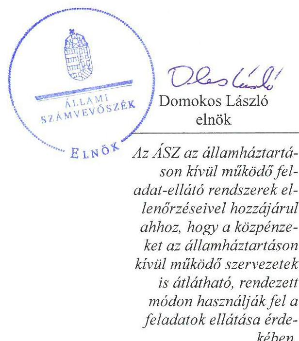
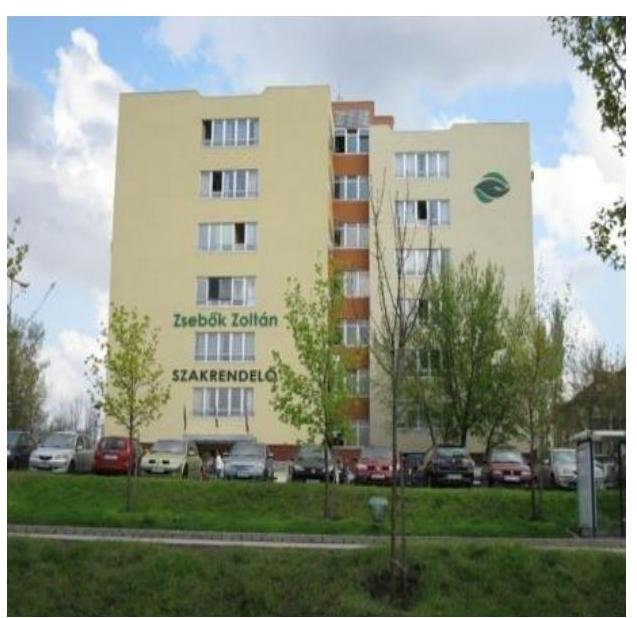
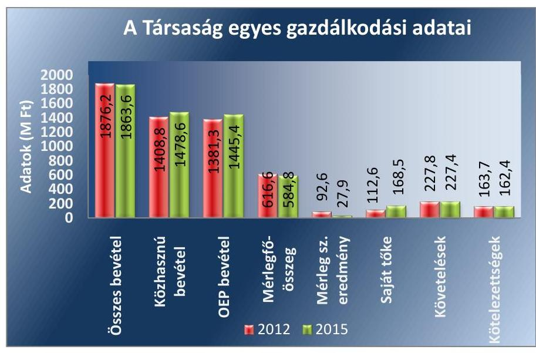
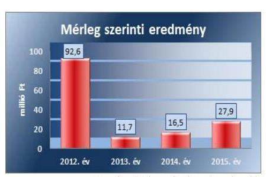

# Jelentés 

## Az önkormányzatok gazdasági társaságai

Az önkormányzatok többségi tulajdonában lévő gazdasági társaságok gazdálkodásának ellenőrzése - Pestszentlőrinc-Pestszentimre Egészségügyi Szolgáltató Nonprofit Közhasznú Kft.

2017

Az ÁSZ az államháztartáson kívül müködő fel-adat-ellátó rendszerek ellenőrzéseivel hozzájárul ahhoz, hogy a közpénzeket az államháztartáson kívül müködő szervezetek is átlátható, rendezett módon használják fel a feladatok ellátása érde-
kében.

---

# Jelentés 

## Az önkormányzatok gazdasági társaságai

Az önkormányzatok többségi tulajdonában lévő gazdasági társaságok gazdálkodásának ellenőrzése - Pestszentlőrinc-Pestszentimre Egészségügyi Szolgáltató Nonprofit Közhasznú Kft.
2017. Jaspetelver hó 18. nap

---

# AZ ELLENŐRZÉST FELÜGYELTE:

DR. HORVÁTH MARGIT felügyeleti vezető

## AZ ELLENŐRZÉST VEZETTE ÉS A VÉGREHAJTÁSÁÉRT FELELŐS:

- KLINGA LÁSZLÓ ellenőrzésvezető
- A PROGRAM ÖSSZEÁLLÍTÁSÁÉRT FELELŐS:
- JANIK JÓZSEF osztályvezető

|  IKTATÓSZÁM: V-1294-132/2016 | |
| --- | --- |
|  TÉMASZÁM: 2328 | |
|  ELLENŐRZÉS-AZONOSÍTÓ SZÁM: V075819 | |

Jelentéseink az Országgyűlés számítógépes hálózatán és az Interneta a www.asz.hu címen is olvashatóak.

---

# TARTALOMJEGYZÉK 

■ ÖSSZEGZÉS ..... 5
■ AZ ELLENŐRZÉS CÉLJA ..... 6
■ AZ ELLENŐRZÉS TERÜLETE ..... 7
■ AZ ELLENŐRZÉS HÁTTERE, INDOKOLTSÁGA ..... 9
■ A JELENTÉS LÉNYEGES KÉRDÉSKÖREI ..... 10
■ ELLENŐRZÉS HATÓKÖRE ÉS MÓDSZEREI ..... 11
■ MEGÁLLAPÍTÁSOK ..... 13
■ JAVASLATOK ..... 21
■ MELLÉKLETEK ..... 23
I. sz. melléklet: Értelmező szótár ..... 23
II. sz. melléklet: A Társaság mérlegadatainak alakulása 2012-2015 között ..... 24
III. sz. melléklet: A Társaság eredményének alakulása 2012-2015 között ..... 25
■ FÜGGELÉK: ÉSZREVÉTELEK ..... 27
■ RÖVIDÍTÉSEK JEGYZÉKE ..... 29

---

.

---

# ÖSSZEGZÉS 

Budapest Főváros XVIII. kerület Pestszentlőrinc-Pestszentimre Önkormányzata a tulajdonosi jogait a 2012-2015. években összességében szabályszerűen gyakorolta. A Pestszentlő-rinc-Pestszentimre Egészségügyi Szolgáltató Nonprofit Közhasznú Kft. vagyongazdálkodása összességében szabályszerű, fizetőképessége biztositott volt. A Társaság belső szabályozása összességében megfelelt az előírásoknak. A bevételek és ráfordítások elszámolása összességében szabályszerű volt.

## Az ellenőrzés társadalmi indokoltsága

Az Állami Számvevőszék kiemelt célja, hogy a helyi önkormányzatok gazdálkodásában rejlő pénzügyi kockázatok feltárásával, az államháztartáson kívülre nyújtott költségvetési támogatások és ingyenes vagyonjuttatások, valamint az államháztartáson kívül múködő feladat-ellátó rendszerek ellenőrzéseivel hozzájáruljon ahhoz, hogy a közpénzeket az államháztartáson kívül múködő szervezetek is átlátható, rendezett módon használják fel. Az egészségügyi ellátás a lakosság széles körét érinti, kihat az állampolgárok életminőségére.

Az Állami Számvevőszék céljaival és a társadalmi igénnyel összhangban, a gazdasági társaságok kiemelt fontosságú szerepe miatt került sor a Pestszentlőrinc-Pestszentimre Egészségügyi Szolgáltató Nonprofit Közhasznú Kft. ellenőrzésére.

## Főbb megállapítások, következtetések, javaslatok

Az Önkormányzat a tulajdonosi jogok gyakorlásának kereteit a Vagyonrendeletben és az SZMSZ-ben szabályszerűen meghatározta. A Társasági Szerződésben az előírásoknak megfelelően rögzítették a taggyűlés kizárólagos hatáskörébe tartozó ügyeket. A tulajdonosi jogokat a taggyűlés szabályszerűen gyakorolta, a döntéshozatalhoz a Képviselőtestület határozatai rendelkezésre álltak. A taggyűlés üzleti terv készítési kötelezettséget nem írt elő a Társaság részére. Az előírás hiánya ellenére a Társaság minden évben elkészítette üzleti tervét, amit a taggyűlés jóváhagyott. A beszámoló elfogadásáról az FB és a könyvvizsgáló írásbeli jelentésének birtokában döntöttek. A taggyűlés a javadalmazással összefüggő szabályzatot nem alkotott. Az Önkormányzat belső ellenőrzése a Társaságnál a 2013. és a 2015. években ellenőrzött, ezzel támogatta a szabályszerű múködés kontrollját.

A saját vagyon nyilvántartása és leltározása a jogszabályi és a belső előírásoknak megfelelt. Az ellenőrzött időszakban a Társaság fizetőképessége biztosított volt, a rövid lejáratú kötelezettségeinek döntően határidőben eleget tudott tenni. A Társaság a beszámolási, adatszolgáltatási és közzétételi kötelezettségének határidőben eleget tett. Az ügyvezető a jogszabályi előírások ellenére a közérdekú adatok megismerésére irányuló igények teljesítésének rendjét nem szabályozta, továbbá adatvédelmi felelőst nem jelölt ki.

A bevételek, a ráfordítások, továbbá a beruházások, felújítások elszámolása összességében szabályszerű volt. A Társaság az önköltségszámítás rendjét nem szabályozta, a szabályozás hiányában nem biztosította a vállalkozási tevékenység elszámoltathatóságát.

---

# AZ ELLENŐRZÉS CÉLJA 

AZ ELLENŐRZÉS CÉLJA annak értékelése volt, hogy az önkormányzat vagyongazdálkodási tevékenysége során szabályszerűen gyakorolta-e a tulajdonosi jogait.

Ellenőriztük, hogy a gazdasági társaság szabályozottsága, gazdálkodása és vagyongazdálkodási tevékenysége, bevételeinek és ráfordításainak elszámolása megfelelt-e a jogszabályi és tulajdonosi előírásoknak.

Értékeltük, hogy a gazdasági társaság kötelezettségállománya jelentett-e kockázatot a múködésre, valamint a gazdálkodás átláthatósága és elszámoltathatósága érdekében biztosítva volt-e a szolgáltatás dijának megalapozottsága szabályszerű önköltségszámítással.

Az ellenőrzés célja továbbá annak megítélése volt, hogy az önkormányzatok többségi tulajdonában lévő gazdasági társaságok gazdálkodásának a kormányzati szektor hiányára és az államadósságra befolyással bíró elemei a jogszabályi előírásoknak megfeleltek-e.

---

# **A Z ELLENŐRZÉS TERÜLETE**

## **Budapest Főváros XVIII. kerület Pestszentlőrinc-Pestszentimre Önkormányzata és a többségi tulajdonában lévő Pestszentlőrinc-Pestszentimre Egészségügyi Szolgáltató Nonprofit Közhasznú Kft.**

### **BUDAPEST FŐVÁROS XVIII. KERÜLET PESTSZENTLŐRINC – PESTSZENTIMRE ÖNKORMÁNYZATA**

a Pestszentlőrinc-Pestszentimre Egészségügyi Szolgáltató Nonprofit Közhasznú Korlátolt Felelősségű Társaságot a 2007. évben hozta létre 6,0 millió Ft törzstőkével, melynek kizárólagos tulajdonosa volt. A 2008. évben a Társaság1 tulajdonosi szerkezete megváltozott, az Önkormányzat tulajdonosi részesedése a Társasági szerződés alapján 87,5%-ra – többségi részesedés – csökkent, a fennmaradó 12,5% tulajdoni hányad magánszemélyek kezébe került. Az Önkormányzat Gazdasági Programjában az egészségügyi alapellátással és szakellátással kapcsolatban fogalmazott meg fejlesztési célokat.

A Társaság közhasznú jogállású. Közfeladata a kerület lakosságának egészségügyi alapellátási kötelezettségi körébe tartozó háziorvosi, házi gyermekorvosi-, szakorvosi és fogorvosi járóbeteg ellátása, valamint egyéb humán-egészségügyi ellátás volt. A Társasági Szerződésben foglaltak alapján vállalkozási, üzletszerű gazdasági tevékenységet közhasznú céljainak megvalósítása érdekében, azokat nem veszélyeztetve végezhetett. A feladatellátást szolgáló vagyont az Önkormányzat alapításkor a Társaság térítésmentes használatába adta. A Társaság közhasznú tevékenysége mellett vállalkozási tevékenységet is folytatott, melynek bevétele az összes bevétel 3-4%-a között volt. A vállalkozási tevékenység bevételei jellemzően bérbeadásból és a kapcsolódó továbbszámlázott szolgáltatásokból származtak. A Társaság ügyvezetője ellátta az egészségügyi intézmény vezetői feladatokat is.

A XVIII. kerület lakosainak száma 2015. január 1-jén 101 613 fő volt. A Társaság a 2015. évben az egészségügyi alapellátási kötelezettségi körbe tartozó járóbeteg szakellátás keretében összesen 434 413 esetet látott el, melyekhez kapcsolódóan 143 632 laborvizsgálatot végzett. Az egészségügyi beavatkozások száma 2 305 310 eset volt, melyekhez 1 729 712 laborvizsgálatot teljesített. Az egynapos sebészet keretében 327 műtétet hajtottak végre.

---

A Társaság egyes gazdálkodási adatait a 2012-2015. évek tekintetében az 1. ábra szemlélteti:

1. ábra

Forrás: A Társaság 2012 és 2015. évi beszámolói
A mérlegfőösszeg a 2012. év végéről 2015. év végére 616,6 millió Ft-ról 584,8 millió Ft-ra csökkent. A változást eszközoldalon jellemzően a befektetett eszközök 19,5 millió Ft-os, míg forrás oldalon a passzív időbeli elhatárolások 89,2millió Ft-os csökkenése okozta annak ellenére, hogy az ellenőrzött időszakban elért mérleg szerinti eredmény a saját tőke összegét öszszesen 148,6 millió Ft-tal növelte. A bevételek összege a közhasznú bevételek - és azon belül az OEP² finanszírozás - növekedése ellenére kis mértékben (12,6 millió Ft-tal) csökkent.

A Társaság az Önkormányzattól az ellenőrzött időszakban összesen 697,9 millió Ft működési és 101,4 millió Ft felhalmozási célú támogatásban részesült.

A foglalkoztatottak átlagos statisztikai állományi létszáma 2012-ben 271 fő, 2015-ben 290 fő volt. A feladatellátást szolgáló hét ingatlant az Önkormányzat a Társaság ingyenes használatába adta.

A Társaság a 2012. évtől a kormányzati szektorba besorolt társaságnak minősült.

A polgármester ${ }^{3}$ és az ügyvezető ${ }^{4}$ személyében az ellenőrzött időszakban változás nem történt, a jegyző ${ }^{5}$ személye 2015. január 1-jével változott.

---

# AZ ELLENŐRZÉS HÁTTERE, INDOKOLTSÁGA 

AZ ÖNKORMÁNYZATOK TÖBBSÉGI TULAJDONÁBAN ÁLLÓ GAZDASÁGI TÁRSASÁGOK ellenőrzése kiemelten fontos a vagyon megőrzése, megóvása érdekében, valamint a kormányzati szektor elszámolásaiban megjelenő önkormányzati tulajdonú gazdálkodó szervezetek esetében, amelyekkel szemben alapvető követelmény, hogy gazdálkodásuk, működésük szabályszerű, az általuk szolgáltatott adatok minél megbízhatóbbak legyenek. A feladatellátás költségeinek, ráfordításainak alakulása a lakosság széles rétegét érinti.

Ellenőrzéseink feltárhatják, hogy az önkormányzat a feladatellátásához rendelt vagyon működtetését a tulajdonostól elvárható gondossággal vé-geztette-e, a feladatot ellátó gazdasági társaság a létesítő okiratban, szolgáltatási szerződésben foglaltak betartásával biztosította-e a feladat ellátását. Az ellenőrzés eredményeképp meghatározhatóvá válnak a költségvetési hiányt befolyásoló szervezetek kockázatai, lehetővé válik ezen kockázatok csökkentése. Az ellenőrzés rávilágíthat arra, hogy a gazdasági társaság a vagyon használatával biztosította-e a szolgáltatás folytatásának feltételeit, az önkormányzat tulajdonosi felügyelete hozzájárult-e a szabályszerű gazdálkodáshoz és feladatellátáshoz. A megállapítások alapján megfogalmazott számvevőszéki javaslatok hasznosítása elősegítheti a meglévő hibák megszüntetését. A jó gyakorlatok bemutatásával az ÁSZ ${ }^{6}$ hozzájárulhat a követendő megoldások megismertetéséhez, terjesztéséhez.

---

# A JELENTÉS LÉNYEGES KÉRDÉSKÖREI 

1.     - Az önkormányzat tulajdonosi joggyakorlása szabályszerű volt-e?
2.     - A gazdasági társaság vagyongazdálkodása szabályszerű volt-e, fizetőképessége biztositott volt-e a gazdálkodás során?
3.     - A gazdasági társaság bevételeinek és ráfordításainak elszámolása, valamint az önköltségszámitás és árképzés szabályszerű volt-e?
4.     - A kormányzati szektorba sorolt, többségi önkormányzati tulajdonban lévő gazdasági társaságok gazdálkodásának a kormányzati szektor hiányára és az államadósságra befolyással biró gazdasági eseményei megfeleltek-e a jogszabályi elöirásoknak?

---

# ELLENŐRZÉS HATÓKÖRE ÉS MÓDSZEREI 

## Az ellenőrzés típusa

Megfelelőségi ellenőrzés.

## Az ellenőrzött időszak

Az ellenőrzött időszak 2012. január 1-jétől 2015. december 31-ig tartott.

## Az ellenőrzés tárgya

Az önkormányzatok - többségi tulajdonában lévő gazdasági társaságok feletti - tulajdonosi joggyakorlása, valamint a gazdasági társaságok gazdálkodásának szabályozottsága és szabályszerűsége volt.

Az ellenőrzés kiterjedt minden olyan körülményre és adatra, amely az ÁSZ jogszabályban meghatározott feladatainak teljesítéséhez, valamint a program végrehajtása folyamán felmerült újabb összefüggések feltárásához szükséges volt.

## Az ellenőrzött szervezet

Budapest Főváros XVIII. kerület Pestszentlőrinc-Pestszentimre Önkormányzata és a többségi tulajdonában lévő Pestszentlőrinc-Pestszentimre Egészségügyi Szolgáltató Nonprofit Közhasznú Korlátolt Felelősségű Társaság.

## Az ellenőrzés jogalapja

Az ellenőrzés jogszabályi alapját az ÁSZ tv. 1. § (3) bekezdése és 5. § (3)-(4)-(5) bekezdései képezték.

## Az ellenőrzés módszerei

Az ellenőrzést a nemzetközi standardokat irányadónak tekintve az ellenőrzési program ellenőrzési kérdései, az ellenőrzött időszakban hatályos jogszabályok, az ellenőrzés szakmai szabályok és módszertanok figyelembe vételével végeztük.

Az ellenőrzés ideje alatt az ellenőrzött szervezettel történő kapcsolattartást az ÁSZ Szervezeti és Múködési Szabályzatának vonatkozó előírásai alapján biztosítottuk.

---

Az ellenőrzés a kiválasztott, többségi tulajdonosi jogokat gyakorló önkormányzatra, illetve az ellenőrzött gazdasági társaságra terjedt ki.

Az ellenőrzési kérdések megválaszolásához szükséges bizonyítékok megszerzése a következő ellenőrzési eljárások alkalmazásával történt: megfigyelés, kérdésfeltevés (információkérés), összehasonlítás, valamint elemző eljárás. Az ellenőrzési bizonyítékként felhasználható adatforrások közé tartoztak egyrészt az ellenőrzési programban felsorolt adatforrások, másrészt adatforrás lehetett még minden - az ellenőrzés folyamán - feltárt, az ellenőrzés szempontjából információkat tartalmazó dokumentum.

Az ellenőrzést a kérdésekre adott válaszok kiértékelésével, valamint a megjelölt adatforrások, a csatolt tanúsítványok felhasználásával, továbbá az adott időszakban hatályos jogszabályok figyelembe vételével folytattuk le.

A bevételek és ráfordítások elszámolása, valamint a vagyonnyilvántartás terén a szabályszerű működést véletlen mintavétellel ellenőriztük. A mintavétellel ellenőrzött területek esetében minden egyes tétel vonatkozásában a szabályszerűségre vonatkozó kérdéseket tettünk fel, amelyek eredménye összesítésre került. Megfelelőnek értékeltünk egy ellenőrzött területet, amennyiben 95\%-os bizonyossággal a teljes sokaságban a hibaarány legfeljebb 10\%, nem megfelelőnek, amennyiben 10\%-nál magasabb arányt képviselt. Abban az esetben, ha a teljes sokaság tekintetében a 10\%os hibaarányhoz való viszony megítélésnek megbízhatósága nem érte el a 95\%-ot, annak elérése érdekében értékelésünket további szempontokkal egészítettük ki, és figyelembe vettük a feltárt hibák típusát és súlyát. A ráfordítások elszámolására és a vagyonnyilvántartásra vonatkozó véletlen mintavételt kockázati alapú kiválasztással egészítettük ki, amelynek során évente a három legnagyobb összegű tételt választottuk ki.

---

# 1. Az önkormányzat tulajdonosi joggyakorlása szabályszerű volt-e? 

Összegző megállapítás

### 1.1. számú megállapítás

Az Önkormányzat tulajdonosi joggyakorlása összességében szabályszerű volt.

A tulajdonosi joggyakorlás kereteit szabályszerűen alakították ki.
Az Önkormányzat az Mötv. ${ }^{7}$ 13. § (1) bekezdés 4. pontja szerinti kötelezettségének - egészségügyi alapellátás és egészséges életmód segítését célzó szolgáltatások biztosítása - a többségi tulajdonában lévő Társasága útján tett eleget. A Képviselő-testület ${ }^{8}$ által elfogadott gazdasági program ${ }_{1,2}{ }^{9}$ tartalmazta az Önkormányzat által ellátandó egészségügyi feladatokat, fő stratégiai célkitűzéseket. A közép- és hosszú távú vagyongazdálkodási terv ${ }^{10}$ a Társasággal kapcsolatban stratégiai célokat, feladatokat nem fogalmazott meg.

## A TULAJDONOSI JOGOK GYAKORLÁSÁNAK

RENDJÉT a Gt. ${ }^{11}$ és a Ptk. ${ }^{12}$ előírásaival összhangban a Képviselő-testület a Vagyonrendelet ${ }_{1,2}{ }^{13}$-ben, illetve az SZMSZ-ben ${ }^{14}$ határozta meg. A Vagyonrendelet ${ }_{1,2}$ előírása alapján a Társaság taggyűlésének hatáskörébe tartozó ügyekben az Önkormányzatot a Képviselő-testület által felhatalmazott polgármester képviselte. A taggyűlés kizárólagos hatáskörébe tartozó ügyeket a Társasági szerződésben a Gt. 19. § (5) bekezdés, illetve a Ptk. ${ }_{2}$ 3:109. § előírásainak megfelelően rögzítették.

A Társasági Szerződés ${ }_{1-7}{ }^{15}$ a Gt., a Ptk. ${ }_{2}$ és a Civil tv. ${ }^{16}$ által meghatározott tartalmi előírásoknak megfelelt.

Az ágazati jogszabályok előírásainak megfelelően az Önkormányzat az egészségügyi alapellátás körzeteit és a háziorvosi körzeteket kialakította.

A FELADAT-ELLÁTÁST SZOLGÁLÓ VAGYONT -ingyenesen hét ingatlant és tárgyi eszközöket - az Önkormányzat a Társaság részére Közszolgáltatási szerződés ${ }^{17}$ és Használati megállapodás ${ }^{18}$ útján biztosította. A Közszolgáltatási szerződés meghatározta a Társaság szakmai feladatait, a feladatellátás tárgyi és pénzügyi feltételeit, a Társaság jogait és kötelezettségeit, a használatba kapott vagyonnal kapcsolatos feladatokat, elvárásokat, továbbá a szerződés teljesítésének ellenőrzési jogát. A Használati megállapodás rögzítette a Társaság jogait és kötelezettségeit a térítésmentesen használatba kapott ingatlannal kapcsolatban.
1.2. számú megállapítás

A tulajdonosi jogok gyakorlása összességében szabályszerű volt.
A TULAJDONOSI JOGOKAT a könyvvizsgáló, az $\mathrm{FB}^{19}$ tagjainak megválasztása, az ügyvezető kinevezése, illetve javadalmazásuk megállapl

---

Forrás: A Társaság éves beszámolói
pítása vonatkozásában a taggyűlés gyakorolta, döntéshozatalához a Képvi-selő-testület határozata rendelkezésre állt. A taggyűlés döntéshozatala során az Önkormányzatot a Képviselő-testület által felhatalmazott polgármester képviselte.

ÜZLETI TERVÉT a Társaság az ellenőrzött időszak minden évében elkészítette, amit a taggyűlés - a Képviselő-testület jóváhagyásával - minden esetben elfogadott. A taggyűlés üzleti terv készítési kötelezettséget nem írt elő.

AZ FB a Gt. és a Ptk. 2 előírásának megfelelően három tagból állt. Az FB az éves beszámolókról, a közhasznúsági jelentésekről, az üzleti jelentésekről írásbeli jelentést készített. Az FB a 2012-2015. években a Gt. 35. § (3) bekezdésében, illetve a Ptk. 2 3:120 § (2) bekezdésének megfelelően minden évben írásbeli jelentést készített a Társaság számviteli beszámolójáról.

AZ ÉVES BESZÁMOLÓ elfogadásáról a taggyűlés az FB írásbeli jelentésének és a független könyvvizsgálói vélemény birtokában döntött. A Társaság az ellenőrzött időszak minden évében eredményesen gazdálkodott, mérleg szerinti eredményét a taggyűlés az éves beszámoló elfogadásával együtt jóváhagyta, melyet a Társaság eredménytartalékba helyezett. A Társaság mérleg szerinti eredményének alakulását az ellenőrzött időszakban a 2. ábra szemlélteti.

A JAVADALMAZÁSI SZABÁLYZAT ${ }^{20}$-OT a Képviselő-testület a 2008. évben, mint akkor még kizárólagos tag elfogadta, amelynek hatálya kiterjedt a Társaság FB tagjaira, ügyvezetőjére, helyettesére és más vezető állású munkavállalóira.

A taggyűlés - a tulajdonosi összetétel változását követően - a Taktv. ${ }^{21}$ 5. § (3) bekezdésében foglaltak ellenére, mint a Társaság legfőbb szerve a vezető tisztségviselők, felügyelőbizottsági tagok, valamint az $\mathrm{Mt}^{22}$. 208. §ának hatálya alá eső munkavállalók javadalmazása, valamint a jogviszony megszűnése esetére biztosított juttatások módjának, mértékének elveiről, annak rendszeréről szabályzatot nem alkotott.

A TÁRSASÁG ELLENŐRZÉSÉT az Önkormányzat az Ötv. ${ }^{23}$ 92. § (11) bekezdés b), illetve az Áht. ${ }^{24} 70$. § (1) bekezdés d) pontjában foglaltak alapján belső ellenőrzése keretében végezte. A 2013. és a 2015. évi ellenőrzések a 2010-2012, illetve a 2013-2014. évek átfogó ellenőrzésére irányultak. A belső ellenőrzés a 2013. évben a Számv. tv. ${ }^{25}$ alapján készítendő szabályzatok, a vagyongazdálkodás területén a beszerzések, közbeszerzések szabályozásának hiányosságait, illetve a közbeszerzési értékhatárt el nem érő beszerzések esetén a piackutatás tényét igazoló több árajánlat kérésének hiányát állapította meg. A Társaság a belső ellenőrzés megállapításai, javaslatai alapján intézkedési tervet készített. Az Önkormányzat belső ellenőrzése az intézkedési tervben foglaltak végrehajtását a 2015. évben végrehajtott utóellenőrzés keretében ellenőrizte és a javaslatok maradéktalan hasznosulása érdekében felhívta az ügyvezető figyelmét a még fennálló hiányosságok megszüntetésére.

---

# 2. A gazdasági társaság vagyongazdálkodása szabályszerű volt-e, fizetőképessége biztosított volt-e a gazdálkodás során? 

Összegző megállapítás

2.1. számú megállapítás

A Társaság vagyongazdálkodása összességében szabályszerű volt. A múködés során a fizetőképessége biztosított volt.

A Társaság vagyongazdálkodásának szabályozottsága összességében megfelelt a jogszabályi előírásoknak. A Számv. tv. előírása ellenére a Társaság az önköltségszámítás rendjére vonatkozó szabályzattal nem rendelkezett.

A Társaság az ellenőrzött időszakban rendelkezett a Számv. tv. 14. § (3) bekezdésében előírt Számviteli Politika Számlarenddel ${ }_{1.2}{ }^{26}$, mely tartalmazta a Számv. tv. 161. § (1) bekezdésében előírt a Számlarendet is, továbbá a Számv. tv. 14. § (5) bekezdés a), b) és d) pontjaiban foglaltaknak megfelelően Leltározási szabályzattal ${ }_{1,2}{ }^{27}$, Eszközök és források értékelési szabályzatával ${ }_{1,2}{ }^{28}$, Pénzkezelési szabályzattal ${ }_{1,2}{ }^{29}$. A Társaság a Számv. tv. 14. § (5) bekezdés c) pontjában foglalt önköltségszámítás rendjére vonatkozó szabályzatkészítési kötelezettségének a 2012-2015. években nem tett eleget annak ellenére, hogy a szabályzatkészítési kötelezettség alól nem mentesült.

A könyvvizsgáló az önköltségszámítás rendjére vonatkozó szabályzat hiányára nem hívta fel a figyelmet annak ellenére, hogy a könyvvizsgálói jelentések kitértek a számviteli politika megfelelősségére.

A SZÁMVITELI POLITIKA SZÁMLAREND ${ }_{1,2}$ a Számv. tv. 14. § (4) bekezdésében előírtaknak megfelelően tartalmazta a Társaságra jellemző szabályokat, előírásokat, módszereket. Meghatározta, hogy a Társaságnál mit tekintenek a számviteli elszámolás és értékelés szempontjából lényegesnek, jelentősnek, nem lényegesnek, nem jelentősnek, továbbá azt, hogy a törvényben biztosított választási, minősítési lehetőségek közül melyeket alkalmazza.

A Számviteli Politika Számlarend ${ }_{1,2}$ tartalmazta a Számv. tv. 161. § (1) bekezdésében előírt Számlarendet is, azonban annak tartalma nem felelt meg a Számv. tv. 161. § (2) bekezdés b) pontja előírásának, mert nem tartalmazta a számla értéke növekedésének, csökkenésének jogcímeit, és azok más számlákkal való kapcsolatát.

A LELTÁROZÁSI SZABÁLYZAT a mérlegtételek leltárral való alátámasztását előírta, a mennyiségben is nyilvántartott eszközök esetében a mennyiségi leltározás szabályait a Számv. tv. 69. § (3) bekezdésében foglalt legalább háromévenkénti mennyiségi leltározástól szigorúbban határozta meg, mert évenkénti mennyiségi leltározást írt elő.

## AZ ESZKÖZÖK ÉS FORRÁSOK ÉRTÉKELÉSI SZABÁLYZATA a Számv. tv. 47-59. §-aiban foglaltaknak megfelelően meghatározta az eszközök és források bekerülési értéke, az eszközök értékcsökkenése és értékvesztése, valamint a mérlegben szereplő eszközök és források értékelése szabályait.

---

# 2.2. számú megállapítás 

2.3. számú megállapítás

A PÉNZKEZELÉSI SZABÁLYZAT a Számv. tv. 14. § (8) bekezdésében előírt tartalmi követelményeknek megfelelt.

## A Társaság vagyongazdálkodása összességében megfelelt a jogszabályi és a belső szabályzatokban foglalt előírásoknak.

A SAJÁT VAGYON nyilvántartása a jogszabályi és belső szabályzatokban foglalt előírásoknak összességében megfelelt.

A Társaság a Számv. tv. 69. § (1)-(3) bekezdései előírásának megfelelően a mérlegében - saját vagyonként - kimutatott eszközöket és forrásokat leltárral alátámasztotta, a folyamatosan vezetett, mennyiségi nyilvántartásaiban szereplő eszközei mennyiségi leltárfelvételét az előírásoknak megfelelően évente elvégezte és kiértékelte, a mérlegében szereplő adatokat leltárral alátámasztotta.

A Társaság mérleg föösszege 2012. január 1-jéről 2015.december 31-re 4,2\%-kal (25,3millió Ft-tal) csökkent, amelyet jellemzően a befektetett eszközök és azon belül is a tárgyi eszközök 10,8\%-os (30,9 millió Ft-os) csökkenése okozott. Forrásoldalon a mérlegfőösszeg változását jellemzően a passzív időbeli elhatárolások 38,6\%-os (157,7 millió Ft) és a kötelezettségek 10,4\%-os (18,9 millió Ft) csökkenése okozta. Ugyanakkor a Társaság az ellenőrzött időszakban összesen 148,6 millió Ft mérleg szerinti eredményt ért el, amely a saját tőkét és azon belül az eredménytartalékot növelte.

Az ellenőrzött időszakban a Társaság rendelkezett a társasági formájára kötelezően előírt jegyzett tőkének megfelelő összegű saját tőkével, így az Önkormányzatnak a Gt. 51. § (1) bekezdés és a Ptk.; 3:133. § (2) bekezdés szerinti intézkedési kötelezettsége nem keletkezett.

A Társaság mérlegadatainak alakulását a II. számú, az eredmény alakulását a 2012-2015. évek között a III. számú melléklet szemlélteti.

A Társaság, mint kormányzati szektorba sorolt egyéb szervezet a Bkr. ${ }^{30}$ 10. § előírásának nem tett eleget, nem alakított ki a Társaság tevékenységének, a célok megvalósításának nyomon követését biztosító rendszert, mely az operatív tevékenységek keretében megvalósuló folyamatos és eseti nyomon követéséből, valamint az operatív tevékenységtől függetlenül múködő belső ellenőrzésből áll. Így nem biztosította a gazdasági folyamatok átláthatóságát, a Társaság céljai megvalósításának nyomon követhetőségét.

## A Társaság fizetőképessége a gazdálkodás során biztosított volt. A kötelezettségállománya a múködésre nem jelentett veszélyt.

A FIZETŐKÉPESSÉG az ellenőrzött időszakban biztosított volt. A Társaság kötelezettségei a 2012. évről a 2015. évre 0,8\%-kal (0,7 millió Ft), ezen belül a szállítói kötelezettségek 28,2\%-kal (24,4 millió Ft) csökkentek. A lejárt határidejű szállítói kötelezettségek a 2012. évről kevesebb, mint tizedükre csökkentek a 2015. év végére. A 2012. évi lejárt határidejű szállítói kötelezettségek összegének ( 12,8 millió Ft) 91,4\%-a 30 napon belüli lejárt határidejű szállítói kötelezettség volt, míg a 2015. évben 30 napon túli lejárt határidejű szállítói kötelezettséggel a Társaság nem rendelkezett.

Egyéb rövid lejáratú kötelezettségek jellemzően a december havi munkabérek tekintetében a munkavállalókkal, illetve a levont adók és járulékok tekintetében a NAV ${ }^{31}$-val szemben fennálló kötelezettségek voltak.

---

A Társaság kötelezettségeinek 2012. és 2015. évi alakulását az 1. táblázat tartalmazza.

# 2.4. számú megállapítás 

A Társaság beszámolási, adatszolgáltatási és közzétételi kötelezettségét az előírásoknak megfelelően teljesítette. A jogszabályi előírások ellenére a közérdekú adatok megismerésére irányuló igények teljesítésének rendjét nem szabályozta, továbbá az ügyvezető adatvédelmi felelőst nem jelölt ki.

AZ ÉVES BESZÁMOLÓKAT, üzleti jelentéseket és közhasznúsági mellékleteket a Társaság a Számv. tv., a Civil tv., és az Alapító Okirat előírásának megfelelően elkészítette. Az éves beszámolókat a taggyűlés elfogadta, amelyhez a Gt. 35. § (3) bekezdése, valamint a Ptk. 3 :120. §. (2) bekezdése szerinti FB jelentések és a Gt. 40. § (1) bekezdésének, illetve a Ptk. 3 :129. § (1) bekezdésének megfelelő könyvvizsgálói jelentések rendelkezésre álltak.

A Társaság honlapján az Info tv. ${ }^{32}$ 33. § (3) bekezdésében és az 1. mellékletének II/1. pontjában meghatározott, a szervezetre vonatkozó adatok - szervezetre, személyzeti adatokra, tevékenységre, múködésre és gazdálkodásra vonatkozó adatok - közzététele megtörtént, a közérdekú adatainak megismerhetőségét biztosította.

Az egészségügyi és a hozzájuk kapcsolódó személyes adatok kezeléséről és védelméről szóló 1997. évi XLVII. tv. 32. § (2) bekezdés h) pontjában előírt adatvédelmi szabályzattal a Társaság rendelkezett, azonban az ügyvezető - mint az egészségügyi intézmény intézményvezetőjével azonos jogállású személy - a hivatkozott jogszabály 32. § (2) bekezdés f) pontjában foglaltak ellenére adatvédelmi felelőst nem jelölt ki.

A Társaság az Info tv. 30. § (6) bekezdése előírása ellenére a közérdekú adatok megismerésére irányuló igények teljesítésének rendjét nem szabályozta.

---

# 3. A gazdasági társaság bevételeinek és ráfordításainak elszámolása, valamint az önköltségszámítás és árképzés szabályszerű volt-e? 

Összegző megállapítás

A bevételek, ráfordítások, beruházások, felújítások kiadásai, és az értékcsökkenés elszámolása megfelelt az előírásoknak. A Számv. tv. előírása ellenére a Társaság az önköltségszámítás rendjét nem szabályozta, önköltségszámítást nem végzett. A térítési díj ellenében igénybe vehető egészségügyi szolgáltatások díjait a Társaság a jogszabályi előírások alapján szabályzatban rögzítette.

## 3.1. számú megállapítás

2. táblázat

A TÁRSASÁG BEVÉTELEI ÉS RÁFORDÍTÁSAI (MFT)

| Megnevezés | 2012 | 2015 |
| :--: | :--: | :--: |
| Összes bevétel | 1876,2 | 1863,6 |
| Értékesítés nettó árbevétele | 1476,4 | 1527,0 |
| ebből: közhasznú bevétel | 1408,8 | 1478,6 |
| ebből OEP finanszírozás bevétele | 1381,3 | 1445,4 |
| Egyéb bevételek | 394,5 | 336,5 |
| Egyéb bevételek-   ből önkormányzati támogatás | 222,6 | 154,9 |
| Egyéb bevételekből központi költségvetési támogatás | 140,9 | 169,6 |
| Egyéb bevételekből egyéb pályázat, támogatás | 11,2 | 1,4 |
| Ráfordítások | 1782,7 | 1835,8 |

A bevételek, ráfordítások és a beruházások, felújítások kiadásai, az értékcsökkenés elszámolása szabályszerű volt.

A közhasznú és a vállalkozási tevékenység bevételei, kiadásai, ráfordításai elszámolása során biztosította azok elkülönített nyilvántartását. Az értékesítés nettó árbevételén belül a vállalkozási tevékenységből származó nettó árbevétel 2012-ben 67,6 millió Ft, 2015-ben 48,4 millió Ft volt.

A Társaság bevételei a 2012. évről számottevően nem változtak, míg a bevételeken belül az értékesítés nettó árbevétele 3,4\%-kal emelkedett. Az értékesítés nettó árbevételeként kimutatott közhasznú bevételek 5,0\%kal, azon belül az OEP finanszírozásból származó bevételek 4,6\%-kal emelkedtek. Az egyéb bevételek összege 14,3\%-kal, az egyéb bevételeken belül - a feladatellátáshoz kapcsolódó - önkormányzati, a központi költségvetési és az egyéb támogatások összege 13,0\%-kal csökkent. Az összes ráfordítás 3,0\%-kal növekedett az ellenőrzött időszakban. A bevételek és ráfordítások alakulását a 2. táblázat tartalmazza.

A BEVÉTELEK elszámolása szabályszerű volt, azokat a Számv. tv. 7277. §-ai előírásának megfelelően számolták el. A bevételeknél a szolgáltatások végzésére irányuló szerződésekben - bérleti szerződés, egészségügyi szolgáltatások végzésére irányuló szerződések - a térítési dí ellenében végzett egészségügyi szolgáltatások esetében az Eüt. ${ }^{33}$-ben meghatározott díjakat, egyéb esetekben a Térítési díj szabályzat ${ }_{1,2}{ }^{34}$-ben meghatározott díjakat érvényesítették.

AZ ANYAGJELLEGŰ-, EGYÉB-, PÉNZÜGYI- ÉS RENDKIVÜLI RÁFORDÍTÁSOK elszámolása szabályszerű volt. Az anyagjellegú ráfordítások és egyéb ráfordítások elszámolása a Számv. tv. 78. § és 81. §-ának megfelelően történt.

A SZEMÉLYI JELLEGŰ RÁFORDÍTÁSOK és az azokat terhelő adók és járulékok elszámolása a jogszabályi előírásoknak megfelelően történt. A személyi jellegú ráfordítások és bérjárulékok elszámolása a Számv. tv. 79. § előírásának megfelelt. A Társaság által 2014. július 1-jével bevezetett béren kívüli juttatások esetében a munkavállalói nyilatkozatok rendelkezésre álltak, a béren kívüli juttatások elemei munkavállalók részére történő folyósításakor az előírásokat betartották.

---

3. táblázat

## AZ ÉRTÉKCSÖKKENÉS ÉS A BERUHÁZÁSOK (MFT)

|  Évek | Elszámolt ér-
tékcsökkenés | Beruházások,
felújítások  |
| --- | --- | --- |
|  2012. | 46,2 | 48,4  |
|  2013. | 54,1 | 36,1  |
|  2014. | 53,5 | 53,4  |
|  2015. | 56,3 | 51,3  |

Forrás: A Társaság beszámolói 4. táblázat

## A KÖVETELÉSÁLLOMÁNY 2012.12.31.-2015.12.31. KÖZÖTT (MFT)

|  Megnevezés | 2012. | 2015.  |
| --- | --- | --- |
|  Vevők | 211,4 | 214,6  |
|  ebből lejárt | 9,8 | 8,0  |
|  Egyéb követelések | 16,4 | 12,8  |
|  Összes követelés | 227,8 | 227,4  |

Forrás: a Társaság beszámolói

### 3.2. számú megállapítás

A BERUHÁZÁSOK, FELÚJÍTÁSOK ÉS AZ ÉRTÉKCSÖKKENÉSI LEÍRÁS ELSZÁMOLÁSA szabályszerű volt. Az eszközök bekerülési értékének megállapítása a Számv. tv. 47-51. §-ok előírásainak megfelelt, az üzembe helyezést a Számv. tv. 52. § (2) bekezdésében foglaltaknak megfelelően hitelt érdemlően dokumentálták. Az értékcsökkenés elszámolása a Számv. tv. 52-53. §-ai előírásának megfelelően történt.

A Társaság az ellenőrzött időszakban összességében nem hajtott végre olyan összegű beruházást, felújítást (189,2 millió Ft), amely meghaladta az elszámolt értékcsökkenés összegét (210,1 millió Ft). Így nem biztosította az eszközök elhasználódási ütemét elérő mértékű eszközpótlást. Az elszámolt értékcsökkenésre és beruházások értékére vonatkozó adatokat a 3. táblázat tartalmazza.

A KÖVETELÉSÁLLOMÁNY a 2012. évről mindössze 0,2\%-kal ( 0,4 millió Ft) csökkent, míg a vevőkkel szembeni követelések 1,5\%-kal ( 3,2 millió Ft) növekedtek a 2015. év végére. A vevőkkel szembeni követelések növekedését a feladatellátással kapcsolatos elszámolások alapján, az OEP-el szembeni követelések állományának emelkedése okozta. A lejárt határidejű vevőkövetelések 18,4\%-kal (1,8 millió Ft) csökkentek a 2012. évről a 2015. évre. A lejárt határidejű vevőkövetelések állományának csökkentése érdekében a Társaság fizetési felszólítás keretében hívta fel az érintett vevők figyelmét tartozásaik kiegyenlítése érdekében.

A követelésállományra vonatkozó adatokat az 4. táblázat tartalmazza. A Társaság a Számv. tv. előírása ellenére az önköltségszámítás rendjét nem szabályozta, önköltségszámítást nem végzett. A térítési díj ellenében igénybe vehető egészségügyi szolgáltatások térítési dijait a Társaság a jogszabályi előírások alapján szabályzatban rögzítette.

ÖNKÖLTSÉGSZÁMÍTÁS RENDJÉRE vonatkozó szabályzat készítési kötelezettségének a Társaság a 2012-2015. években nem tett eleget, annak ellenére, hogy a Számv. tv. 14. § (6)-(7) bekezdéseiben foglaltak alapján az önköltségszámítás rendjére vonatkozó szabályzatkészítési kötelezettség alól nem mentesült.

A Társaság az önköltségszámítás rendje szabályozásának hiányában önköltségszámítást nem végzett, ezáltal nem biztosította a vállalkozási tevékenységből származó bevételek megalapozottságát.

## AZ EGYES EGÉSZSÉGÜGYI SZOLGÁLTATÁSOK

DÍJÁT a Társaság az Eüt. alapján a térítési díjakról szóló szabályzataiban ${ }_{1,2}$ rögzítette. A térítési díj szabályzat ${ }_{1}$-on az Eüt. - térítési díjakra vonatkozó változásait nem vezette át, így nem biztosította az összhangot a térítési díj szabályzat ${ }_{1}$ és az Eüt. által meghatározott díjtételek között.

A térítési díj szabályzat ${ }_{2}$ az Eüt. előírásainak megfelelően tartalmazta a térítési díj ellenében igénybe vehető egészségügyi szolgáltatások térítési dijait.

---

# 4. A kormányzati szektorba sorolt, többségi önkormányzati tulajdonban lévő gazdasági társaságok gazdálkodásának a kormányzati szektor hiányára és az államadósságra befolyással bíró gazdasági eseményei megfeleltek-e a jogszabályi előírásoknak? 

Összegző megállapítás
A Társaságnak a kormányzati szektor hiányára és az államadósságra befolyással bíró gazdasági eseménye nem volt.
4.1. számú megállapítás

A Társaságnak adósságot keletkeztető ügylete nem volt.
A Társaság az ellenőrzött időszakban kormányzati alszektorba besorolt társaságnak minősült, az ellenőrzött időszakban adósságot keletkeztető ügylete nem volt, a kormányzati szektor hiányára befolyást gyakorló bevételt és ráfordítást nem számolt el, osztalékot nem fizetett.

---

# JAVASLATOK 

Az ÁSZ tv. 33. § (1) bekezdésében foglaltak értelmében az ellenőrzött szervezet vezetője köteles a jelentésben foglalt megállapításokhoz kapcsolódó intézkedési tervet összeállítani és azt a jelentés kézhezvételétől számított 30 napon belül az ÁSZ részére megküldeni. Amennyiben az ellenőrzött szervezet vezetője nem küldi meg határidőben az intézkedési tervet, vagy továbbra sem elfogadható intézkedési tervet küld, az Állami Számvevőszék elnöke az ÁSZ tv. 33. § (3) bekezdése a) és b) pontjaiban foglaltakat érvényesítheti.
Javaslataink célja a Pestszentlőrinc-Pestszentimre Egészségügyi Szolgáltató Nonprofit Közhasznú Kft. gazdálkodása szabályszerűségének és gyakorlatának javítása annak érdekében, hogy a szabályozási környezet és az alkalmazott gyakorlat megfelelően tudja támogatni az átlátható müködést.

## A Pestszentlőrinc-Pestszentimre Egészségügyi Szolgáltató Nonprofit Közhasznú Kft. ügyvezetőjének

1. Intézkedjen a Számviteli Politika Számlarend módosításáról, hogy az a Számv. tv.-nek megfelelően tartalmazza a számla értéke növekedésének, csökkenésének jogcímeit és azok más számlákkal való kapcsolatát.
(2.1. megállapítás 3. bekezdése alapján)
2. Intézkedjen a Társaság önköltségszámitás rendjére vonatkozó szabályzatának elkészitéséről a Számv. tv. előirásának megfelelően.
(2.1. megállapítás 7. bekezdése alapján)
3. Intézkedjen a Társaság tevékenységének, a célok megvalósitásának nyomon követését biztositó rendszer kialakításáról a Bkr. előirásának megfelelően.
(2.2. megállapítás 6. bekezdése alapján)
4. Intézményvezetői jogkörében jelöljön ki adatvédelmi felelőst az egészségügyi és a hozzájuk kapcsolódó személyes adatok kezelésére és védelmére a vonatkozó törvény elöirásának megfelelően.
(2.4. megállapítás 3. bekezdése alapján)
5. Intézkedjen az Info tv. szerinti, a közérdekü adatok megismerésére irányuló igények teljesitésének rendjére vonatkozó szabályzat elkészitéséről.
(2.4. megállapítás 4. bekezdése alapján)

---

Javaslataink célja az Önkormányzat szabályszerű működésének elősegítése, továbbá az önkormányzati tulajdonosi joggyakorlás kontrolljainak erősítése.

# Budapest Főváros XVIII. kerület PestszentlőrincPestszentimre Önkormányzata polgármesterének 

1. Kezdeményezze a Taggyülésnél, mint a Társaság legfőbb szervénél, hogy a Taktv. előirása alapján a vezető tisztségviselők, felügyelőbizottsági tagok, valamint az Mt. 208. §-ának hatálya alá eső munkavállalók javadalmazása, valamint a jogviszony megszünése esetére biztosított juttatások módjának, mértékének elveiről, annak rendszeréről szóló szabályzat megalkotását.
(1.2. megállapítás 6. bekezdése alapján)

---

# MELLÉKLETEK 

- I. SZ. MELLÉKLET: ÉRTELMEZŐ SZÓTÁR
gazdasági társaság
gazdálkodó szervezet
nemzeti vagyon
nonprofit gazdasági társaság vagyonkezelő
Ptk. 3.88. § (1) bekezdése szerint „a gazdasági társaságok üzletszerű közös gazdasági tevékenység folytatására, a tagok vagyoni hozzájárulásával létrehozott, jogi személyiséggel rendelkező vállalkozások, amelyekben a tagok a nyereségből közösen részesednek, és a veszteséget közösen viselik".
A Ptk. ${ }^{35} 685 . \S$ c) pontja szerint gazdálkodó szervezet: „az állami vállalat, az egyéb állami gazdálkodó szerv, a szövetkezet, a lakásszövetkezet, az európai szövetkezet, a gazdasági társaság, az európai részvénytársaság, az egyesülés, az európai gazdasági egyesülés, az európai területi együttműködési csoportosulás, az egyes jogi személyek vállalata, a leányvállalat, a vízgazdálkodási társulat, az erdő birtokossági társulat, a végrehajtói iroda, az egyéni cég, továbbá az egyéni vállalkozó." (2014. 03.15-ig hatályos)
Nvtv. ${ }^{36}$ 1. § (2) bekezdése szerint többek között:
„az állam vagy a helyi önkormányzat kizárólagos tulajdonában álló dolgok,
az a) pont hatálya alá nem tartozó, állam vagy a helyi önkormányzat tulajdonában lévő dolog,
az állam vagy a helyi önkormányzat tulajdonában lévő pénzügyi eszközök, továbbá az államot vagy a helyi önkormányzatot megillető társasági részesedések,
az államot vagy a helyi önkormányzatot megillető bármely vagyoni értékkel rendelkező jogosultság, amelyet jogszabály vagyoni értékű jogként nevesít."
Civil tv. 9/F. § (2) bekezdése szerint „az a gazdasági társaság minősül nonprofit gazdasági társaságnak és cégnevében az a gazdasági társaság tüntetheti fel a nonprofit jelleget, amelynek létesítő okirata tartalmazza, hogy a gazdasági társaság tevékenységéből származó nyereség a tagok között nem osztható fel, hanem az a gazdasági társaság vagyonát gyarapítja." (hatályos 2014. március 15-től)
vagyonkezelő:
a) az állam tulajdonában álló nemzeti vagyon tekintetében:
aa) költségvetési szerv,
ab) helyi önkormányzat, önkormányzati társulás,
ac) önkormányzati intézmény,
ad) köztestület,
ae) az állam, az aa)-ac) alpontban meghatározott személyek együtt vagy különkülön 100\%-os tulajdonában álló gazdálkodó szervezet,
af) az ae) alpont szerinti gazdálkodó szervezet 100\%-os tulajdonában álló gazdálkodó szervezet,
ag) a törvény által kijelölt egyedileg meghatározott jogi személy.
b) a helyi önkormányzat tulajdonában álló nemzeti vagyon tekintetében:
ba) önkormányzati társulás,
bb) költségvetési szerv vagy önkormányzati intézmény,
bc) köztestület,
bd) az állam, a helyi önkormányzat, a ba)-bb) alpontban meghatározott személyek együtt vagy külön-külön 100\%-os tulajdonában álló gazdálkodó szervezet,
be) a bd) alpont szerinti gazdálkodó szervezet 100\%-os tulajdonában álló gazdálkodó szervezet.
c) * az egyházi jogi személy a tevékenysége ellátásához szükséges nemzeti vagyon tekintetében. (Forrás: Nvtv. 3. § (1) bekezdés 19. pontja)

---

|  Mégnevezés | 2012.01.01 | 2012.12.31 | 2013.12.31 | 2014.12.31 | 2015.12.31 | Változás
(2012.01.01 +
100\%)  |
| --- | --- | --- | --- | --- | --- | --- |
|  1 | 2 | 3 | 4 | 5 | 6 | 7  |
|  A. Befektetett eszközök | 285836 | 273488 | 264999 | 259468 | 254015 | $-11,1 \%$  |
|  I. Immateriális javak | 1116 | 403 | 647 | 419 | 174 | $-84,4 \%$  |
|  II. TÁRGYI ESZKÖZÖK | 284720 | 273085 | 264326 | 259049 | 253841 | $-10,8 \%$  |
|  B. Forgóeszközök | 301153 | 340083 | 304039 | 243637 | 328249 | 9,0\%  |
|  I. KÉSZLETEK | 4093 | 9850 | 11435 | 14284 | 16495 | 303,0\%  |
|  II. KÖVETELÉSEK | 242276 | 227777 | 204450 | 211119 | 227387 | $-6,1 \%$  |
|  IV. PÉNZESZKÖZÖK | 54784 | 102456 | 88154 | 18234 | 84367 | 54,0\%  |
|  C. Aktív időbeli elhatárolások | 23139 | 3037 | 3352 | 62548 | 2528 | $-89,1 \%$  |
|  ESZKÖZÖK (AKTÍVÁK) ÖSSZESEN | 610128 | 616608 | 572390 | 565653 | 584792 | $-4,2 \%$  |
|  D. SAJÁT TÖKE | 19973 | 112547 | 124224 | 140681 | 168535 | 743,8\%  |
|  I. JEGYZETT TÖKE | 6000 | 6000 | 6000 | 6000 | 6000 | -  |
|  IV. EREDMÉNYTARTALÉK | $-22716$ | 13973 | 100747 | 118224 | 134681 | 692,9\%  |
|  VII. MÉRLEG SZERINTI EREDMÉNY | 36689 | 92574 | 11677 | 16457 | 27854 | $-24,1 \%$  |
|  F. Kötelezettségek | 181302 | 163700 | 154065 | 171791 | 162442 | $-10,4 \%$  |
|  III. RÖVID LEJÁRATÚ KÖTELEZETTSÉGEK | 181302 | 163700 | 154065 | 171791 | 162442 | $-10,4 \%$  |
|  G. Passzív időbeli elhatárolások | 408853 | 340361 | 288601 | 251181 | 251153 | $-38,6 \%$  |
|  FORRÁSOK (PASSZÍVÁK) ÖSSZESEN | 610128 | 616608 | 572390 | 565653 | 584792 | $-4,2 \%$  |

Fonrás: A Társaság 2012-2015. évi beszámolói

---

| Megnevezés | 2012. év | 2013. év | 2014. év | 2015. év | Változás (2012. év = 100\%) |
| :--: | :--: | :--: | :--: | :--: | :--: |
| 1 | 3 | 4 | 5 | 6 | 7 |
| I. Értékesítés nettó árbevétele | 1476437 | 1476062 | 1540863 | 1527035 | $3,4 \%$ |
| III. Egyéb bevételek | 394504 | 363051 | 323144 | 336512 | $-14,7 \%$ |
| IV. Anyagjellegú ráfordítások | 726378 | 690096 | 627806 | 659709 | $-9,2 \%$ |
| V. Személyi jellegú ráfordítások | 991125 | 1071142 | 1140637 | 1110262 | $12,0 \%$ |
| VI. Értékcsökkenési leírás | 46198 | 54066 | 53458 | 56344 | $22,0 \%$ |
| VII. Egyéb ráfordítások | 9036 | 15028 | 24356 | 9449 | 4,6\% |
| Üzemi (üzleti) tevékenység eredménye | 98204 | 8781 | 17750 | 27783 | $-31,7 \%$ |
| VIII. Pénzügyi múveletek bevételei | 3618 | 2647 | 442 | 79 | $-93,3 \%$ |
| IX. Pénzügyi múveletek ráfordításai | 5683 | 0 | 0 | 0 | - |
| Pénzügyi múveletek eredménye | $-2065$ | 2647 | 442 | 79 | - |
| Szokásos vállalkozási eredmény | 96139 | 11428 | 18192 | 27862 | $-71,0 \%$ |
| X. Rendkívüli bevételek | 1592 | 253 | 0 | 0 | - |
| XI. Rendkívüli ráfordítások | 4234 | 4 | 1735 | 8 | $-99,8 \%$ |
| Rendkívüli eredmény | $-2642$ | 249 | $-1735$ | $-8$ | $-99,7 \%$ |
| Adózás előtti eredmény | 93497 | 11677 | 16457 | 27854 | $-70,2 \%$ |
| XII. Adófizetési kötelezettség | 923 | 0 | 0 | 0 | - |
| Adózott eredmény | 92574 | 11677 | 16457 | 27854 | $-69,9 \%$ |
| Mérleg szerinti eredmény | 92574 | 11667 | 16457 | 27854 | $-69,9 \%$ |

---

.

---

# FÜGGELÉK: ÉSZREVÉTELEK 

A jelentéstervezetet a Számvevőszék 15 napos észrevételezésre megküldte az ellenőrzött szervezetek vezetőinek az ÁSZ tv. 29. §* (1) bekezdése előírásának megfelelően.

Budapest Főváros XVIII. kerület Pestszentlőrinc-Pestszentimre Önkormányzat polgármestere, valamint a Pestszentlőrinc-Pestszentimre Egészségügyi Szolgáltató Nonprofit Közhasznú Kft. ügyvezetője az észrevételezési lehetőségével nem élt.

[^0]
[^0]:    * 29. § (1) Az Állami Számvevőszék az ellenőrzési megállapításait megküldi az ellenőrzött szervezet vezetőjének vagy az általa megbízott személynek, és annak, akinek személyes felelősségét állapította meg.
    (2) Az ellenőrzött szervezet vezetője és a felelősként megjelölt személy az ellenőrzés megállapításaira tizenöt napon belül írásban észrevételt tehet.
    (3) Az Állami Számvevőszék az észrevételre a beérkezésétől számított harminc napon belül írásban válaszol. A figyelembe nem vett észrevételeket köteles a jelentésben feltüntetni, és megindokolni, hogy azokat miért nem fogadta el.

---

.

---

# RÖVIDÍTÉSEK JEGYZÉKE 

${ }^{1}$ Társaság
${ }^{2}$ OEP
${ }^{3}$ Polgármester
${ }^{4}$ ügyvezető
${ }^{5}$ jegyző
${ }^{6}$ ÁSZ
${ }^{7}$ Mótv.
${ }^{8}$ Képviselő-testület
${ }^{9}$ gazdasági program ${ }_{1}$
gazdasági program ${ }_{2}$
${ }^{10}$ vagyongazdálkodási terv
${ }^{11}$ Gt.
${ }^{12}$ Ptk. ${ }_{2}$
${ }^{13}$ Vagyonrendelet ${ }_{1}$

Vagyonrendelet ${ }_{2}$
${ }^{14}$ SZMSZ
${ }^{15}$ Társasági Szerződés ${ }_{1}$
Társasági Szerződés ${ }_{2}$
Társasági Szerződés ${ }_{3}$
Társasági Szerződés ${ }_{4}$
Társasági Szerződés ${ }_{5}$
Társasági Szerződés ${ }_{6}$
Társasági Szerződés ${ }_{7}$
${ }^{16}$ Civil tv.

Pestszentlőrinc-Pestszentimre Egészségügyi Szolgáltató Nonprofit Közhasznú Korlátolt Felelősségű Társaság
Országos Egészségbiztosítási Pénztár
Budapest Főváros XVIII. kerület Pestszentlőrinc-Pestszentimre Önkormányzat Polgármestere
a Társaság ügyvezetője
Budapest Főváros XVIII. kerület Pestszentlőrinc-Pestszentimre Önkormányzat jegyzője
Állami Számvevőszék
Magyarország helyi önkormányzatairól szóló 2011. évi CLXXXIX. törvény)
Budapest Főváros XVIII. kerület Pestszentlőrinc-Pestszentimre Önkormányzat Képviselő-testülete
Budapest Főváros XVIII. kerület Pestszentlőrinc-Pestszentimre Önkormányzatának Gazdasági Programja 2011-2014.
Budapest Főváros XVIII. kerület Pestszentlőrinc-Pestszentimre Önkormányzatának Gazdasági Programja 2015-2019.
Budapest Főváros XVIII. kerület Pestszentlőrinc-Pestszentimre Önkormányzatának Képviselő-testülete által 2013. május 23-án elfogadott Vagyongazdálkodás terv
a gazdasági társaságokról szóló 2006. évi IV. törvény
a Polgári Törvénykönyvről szóló 2013. évi V. törvény
29/1997. (X. 21.) Budapest XVIII. kerület Pestszentlőrinc-Pestszentimre Önkormányzati rendelet az Önkormányzat vagyonáról, a vagyontárgyak feletti tulajdonosi jogok gyakorlásáról
15/2013. (V. 31.) Budapest XVIII. kerület Pestszentlőrinc-Pestszentimre Önkormányzati rendelet az Önkormányzat vagyonáról, a vagyontárgyak feletti tulajdonosi jogok gyakorlásáról
42/2011. (XII. 20.) Önkormányzati rendelettel kiadott Szervezeti és müködési szabályzat
Pestszentlőrinc-Pestszentimre Egészségügyi Szolgáltató Nonprofit Közhasznú Kft. Társasági Szerződése (hatályos 2011. április 4-től 2012. december 16-ig)
Pestszentlőrinc-Pestszentimre Egészségügyi Szolgáltató Nonprofit Közhasznú Kft. Társasági Szerződése (hatályos 2012. december 17-től 2013. december 16.)
Pestszentlőrinc-Pestszentimre Egészségügyi Szolgáltató Nonprofit Közhasznú Kft. Társasági Szerződése (hatályos 2013. december 17-től 2014. március 25-ig)
Pestszentlőrinc-Pestszentimre Egészségügyi Szolgáltató Nonprofit Közhasznú Kft. Társasági Szerződése (hatályos 2014. március 26-tól 2014. május 18-ig)
Pestszentlőrinc-Pestszentimre Egészségügyi Szolgáltató Nonprofit Közhasznú Kft. Társasági Szerződése (hatályos 2014. május 19-től 2014. december 10-ig)
Pestszentlőrinc-Pestszentimre Egészségügyi Szolgáltató Nonprofit Közhasznú Kft. Társasági Szerződése (hatályos 2014. december 11-től 2015. december 15-ig)
Pestszentlőrinc-Pestszentimre Egészségügyi Szolgáltató Nonprofit Közhasznú Kft. Társasági Szerződése (hatályos 2015. december 16-tól)
az egyesülési jogról, a közhasznú jogállásról, valamint a civil szervezetek müködéséről és támogatásáról szóló 2011. évi CLXXV. törvény

---

${ }^{17}$ Közszolgáltatási szerződés
${ }^{18}$ Használati megállapodás
${ }^{19} \mathrm{FB}$
${ }^{20}$ Javadalmazási Szabályzat
${ }^{21}$ Taktv.
${ }^{22} \mathrm{Mt}$.
${ }^{23}$ Ötv.
${ }^{24}$ Áht.
${ }^{25}$ Számv. tv.
${ }^{26}$ Számviteli politika számlarend:
Számviteli politika számlarend:
${ }^{27}$ Leltározási szabályzat:
Leltározási szabályzat ${ }_{2}$
${ }^{28}$ Eszközök és források értékelési szabályzata:
Eszközök és források értékelési szabályzata ${ }_{2}$
${ }^{29}$ Pénzkezelési szabályzat ${ }_{3}$
Pénzkezelési szabályzat ${ }_{2}$
${ }^{30} \mathrm{Bkr}$.
${ }^{31}$ NAV
${ }^{32}$ Info tv.
${ }^{33}$ Eüt.
${ }^{34}$ Térítési díj szabályzat ${ }_{1}$
Térítési díj szabályzat ${ }_{2}$
${ }^{35}$ Ptk. 1
${ }^{36}$ Nvtv.
a Társaság és az Önkormányzat által 2007 május 17-én kötött Közszolgáltatási szerződés
a Társaság és az Önkormányzat által 2014. március 14-én kötött Használati megállapodás
a Társaság Felügyelő Bizottsága
Pestszentlőrinc-Pestszentimre Egészségügyi Szolgáltató Nonprofit Közhasznú Kft. Javadalmazási Szabályzata (hatályos 2008. május 20-tól)
a köztulajdonban álló gazdasági társaságok takarékosabb múködéséről szóló 2009. évi CXXII. törvény
a munka törvénykönyvéről szóló 2011. évi I. törvény
a helyi önkormányzatokról szóló 1990. évi LXV. törvény
az államháztartásról szóló 2011. évi CXCV. törvény (hatályos: 2012. január 01-től)
a számvitelről szóló 2000. évi C. törvény
a Társaság Számviteli politika és számlarendje (hatályos 2009. december 1-től 2014. december 31-ig)
a Társaság Számviteli politika és számlarendje (hatályos 2015. január 1-től)
a Társaság Leltározási szabályzata (hatályos 2009. december 1-től 2014. december 31-ig)
a Társaság Leltározási szabályzata (hatályos 2015. január 1-től)
a Társaság Eszközök és források értékelési szabályzata (hatályos 2009. december 1-től 2014. december 31-ig)
a Társaság Eszközök és források értékelési szabályzata (hatályos 2015. január 1-től)
a Társaság Pénzkezelési szabályzata (hatályos 2009. december 1-től 2014. december 31-ig)
a Társaság Pénz kezelési szabályzata (hatályos 2015. január 1-től)
a költségvetési szervek belső kontrollrendszeréről és belső ellenőrzéséről szóló 370/2011. (XII. 31.) Korm. rendelet
Nemzeti Adó- és Vámhivatal
az információs önrendelkezési jogról és az információszabadságról szóló 2011. évi CXII. törvény
a térítési díj ellenében igénybe vehető egészségügyi szolgáltatások térítési dijáról szóló 284/1997. (VII. 14.) Korm. rendelet
a Társaság Térítési díjakról szóló szabályzata (hatályos 2010. június 1-től 2014. május 31-ig)
a Társaság Térítési díjakról szóló szabályzata (hatályos 2014. június 1-től)
a Polgári Törvénykönyvről szóló 1959. évi IV. törvény
a nemzeti vagyonról szóló 2011. évi CXCVI. törvény (hatályos: 2011. december 31-től)

---

ÁLLAMI SZÁMVEVŐSZÉK
1052 Budapest, Apáczai Csere János utca 10.
Levélcím: 1364 Budapest 4. Pf. 54
Telefon: +36 14849100 Telefax: +36 14849200
www.asz.hu