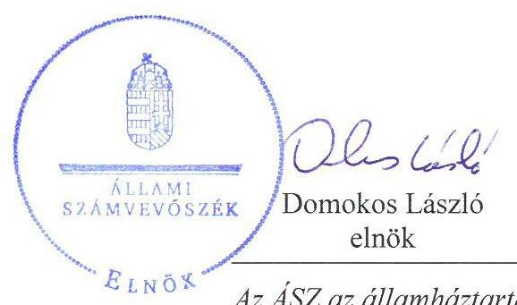
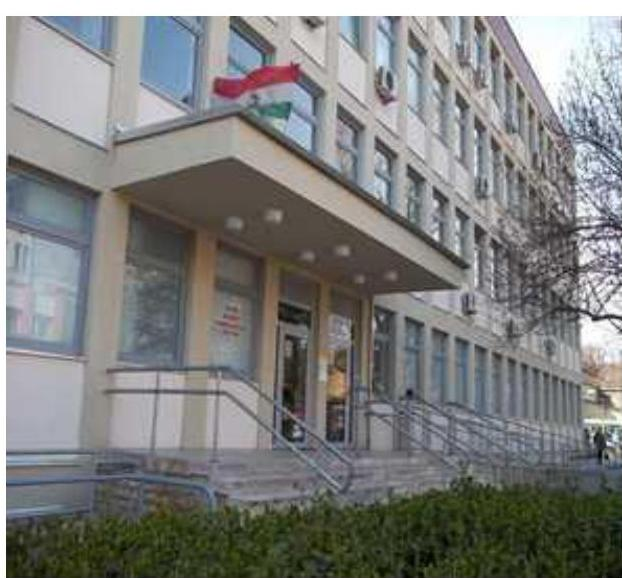
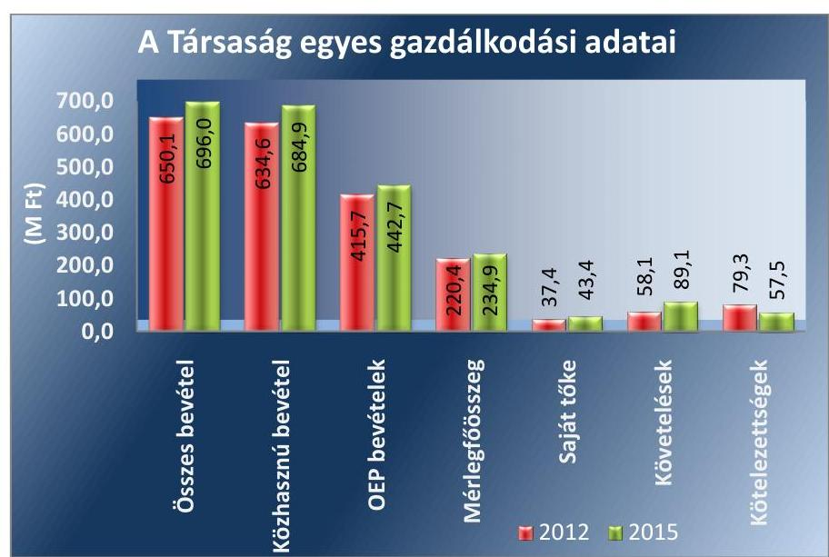
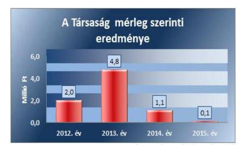
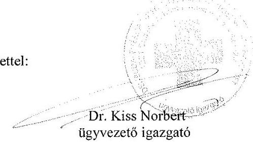
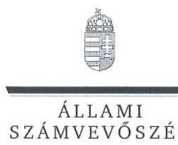
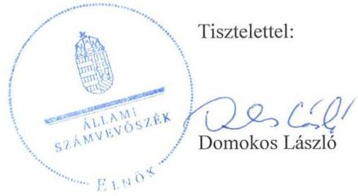

# Jelentés 

## Az önkormányzatok gazdasági társaságai

Az önkormányzatok többségi tulajdonában lévő gazdasági társaságok gazdálkodásának ellenőrzése - Dél-budai Egészségügyi Szolgálat Közhasznú Nonprofit Kft.
2017.

Az ÁSZ az államháztartáson kívül müködő fel-adat-ellátó rendszerek ellenőrzéseivel hozzájárul ahhoz, hogy a közpénzeket az államháztartáson kívül müködő szervezetek is átlátható, rendezett módon használják fel a feladatok ellátása érde-
kében.

---

# J elentés 

## Az önkormányzatok gazdasági társaságai

Az önkormányzatok többségi tulajdonában lévő gazdasági társaságok gazdálkodásának ellenőrzése - Dél-budai Egészségügyi Szolgálat Közhasznú Nonprofit Kft.
2017. 23001241241 hó 18. nap

17187
www.asz.hu

---

# AZ ELLENŐRZÉST FELÜGYELTE:

DR. HORVÁTH MARGIT felügyeleti vezető

# AZ ELLENŐRZÉST VEZETTE ÉS A VÉGREHAJTÁSÁÉRT FELELŐS:

KLINGA LÁSZLÓ ellenőrzésvezető

# A PROGRAM ÖSSZEÁLLÍTÁSÁÉRT FELELŐS:

JANIK JÓZSEF osztályvezető

---

**IKTATÓSZÁM:** V-1296-163/2016

**TÉMASZÁM:** 2330

**ELLENŐRZÉS-AZONOSÍTÓ SZÁM:** V075821

---

Jelentéseink az Országgyűlés számítógépes hálózatán és az Interneta a www.asz.hu címen is olvashatóak.

---

# TARTALOMJEGYZÉK 

■ ÖSSZEGZÉS ..... 5
■ AZ ELLENŐRZÉS CÉLJA ..... 6
■ AZ ELLENŐRZÉS TERÜLETE ..... 7
■ AZ ELLENŐRZÉS HÁTTERE, INDOKOLTSÁGA ..... 9
■ A JELENTÉS LÉNYEGES KÉRDÉSKÖREI ..... 10
■ ELLENŐRZÉS HATÓKÖRE ÉS MÓDSZEREI ..... 11
■ MEGÁLLAPÍTÁSOK ..... 13
■ JAVASLATOK ..... 21
■ MELLÉKLETEK ..... 25
I. sz. melléklet: Értelmező szótár ..... 25
II. sz. melléklet: A Társaság mérlegadatainak alakulása 2012-2015 között ..... 26
III. sz. melléklet: A Társaság eredményének alakulása 2012-2015 között ..... 27
■ FÜGGELÉK: ÉSZREVÉTELEK ..... 29
■ RÖVIDÍTÉSEK JEGYZÉKE ..... 41

---

.

---

# ÖSSZEGZÉS 

Budapest Főváros XXII. kerület Budafok-Tétény Önkormányzata a tulajdonosi jogait a 2012-2015. években szabályszerűen gyakorolta. A Dél-budai Egészségügyi Szolgálat Közhasznú Nonprofit Kft. vagyongazdálkodása összességében nem volt szabályszerű, az éves beszámolók a Társaság vagyoni és pénzügyi helyzetéről nem mutattak valós és megbizható képet. A Társaság belső szabályozása összességében megfelelt az előírásoknak, fizetőképessége biztositott volt. A Társaság a bevételeket és a ráfordításokat összességében szabályszerűen számolta el.

## Az ellenőrzés társadalmi indokoltsága

Az Állami Számvevőszék kiemelt célja, hogy a helyi önkormányzatok gazdálkodásában rejlő pénzügyi kockázatok feltárásával, az államháztartáson kívülre nyújtott költségvetési támogatások és ingyenes vagyonjuttatások, valamint az államháztartáson kívül múködő feladat-ellátó rendszerek ellenőrzéseivel hozzájáruljon ahhoz, hogy a közpénzeket az államháztartáson kívül múködő szervezetek is átlátható, rendezett módon használják fel. Az egészségügyi ellátás a lakosság széles körét érinti, kihat az állampolgárok életminőségére.

Az Állami Számvevőszék céljaival és a társadalmi igénnyel összhangban, a gazdasági társaságok kiemelt fontosságú szerepe miatt került sor a Dél-budai Egészségügyi Szolgálat Közhasznú Nonprofit Kft. ellenőrzésére.

## Főbb megállapítások, következtetések, javaslatok

Az Önkormányzat a tulajdonosi jogok gyakorlásának kereteit szabályszerűen meghatározta. A tulajdonosi jogokat a Képviselő-testület szabályszerűen gyakorolta. A Képviselő-testület a beszámoló elfogadásáról az FB írásbeli jelentésének és a könyvvizsgálói vélemény birtokában döntött. Az Önkormányzat belső ellenőrzése a Társaságnál a 2012. és a 2015. években végzett ellenőrzést.

A Társaság az előírásoknak megfelelő számviteli szabályzatokkal rendelkezett, azonban a Számviteli Politika és a Számlarend tartalma nem felelt meg az előírtaknak. A Társaság vagyongazdálkodási tevékenysége a mérlegtételek ellenőrizhető módon történő leltárral való alátámasztásának és a legalább három évente történő mennyiségi leltár elmaradásának, a vevő követelések egyedi értékelésének és az értékvesztés elszámolási kötelezettség vizsgálatának elmulasztása miatt összességében nem volt szabályszerű. Ennek ellenére a könyvvizsgáló az éves beszámolókat hitelesítő záradékkal látta el.

A Társaság fizetőképessége biztosított volt. A rövid lejáratú kötelezettségeinek az ellenőrzött időszakban döntően határidőben eleget tudott tenni. A Társaság a beszámolási, adatszolgáltatási kötelezettségének határidőben eleget tett. A Társaság a közzétételi kötelezettségét teljes körűen nem teljesítette. Adatvédelmi szabályzatot nem készített, valamint a közérdekú adatok megismerésére irányuló igények teljesítésének rendjét nem szabályozta, adatvédelmi felelőst nem jelölt ki.

A bevételeket a ráfordításokat összességében szabályszerűen számolták el. A Társaság önköltségszámítási szabályzat készítésére nem volt kötelezett, önköltségszámítást nem végzett. A térítésköteles egészségügyi szolgáltatások díjait 2012. júliustól a jogszabályi előírásoknak megfelelően meghatározta.

---

# AZ ELLENŐRZÉS CÉLJA 

AZ ELLENŐRZÉS CÉLJA annak értékelése volt, hogy az önkormányzat vagyongazdálkodási tevékenysége során szabályszerűen gyakorolta-e a tulajdonosi jogait.

Ellenőriztük, hogy a gazdasági társaság szabályozottsága, gazdálkodása és vagyongazdálkodási tevékenysége, bevételeinek és ráfordításainak elszámolása megfelelt-e a jogszabályi és tulajdonosi előírásoknak.

Értékeltük, hogy a gazdasági társaság kötelezettségállománya jelentett-e kockázatot a múködésre, valamint a gazdálkodás átláthatósága és elszámoltathatósága érdekében biztosítva volt-e a szolgáltatás dijának megalapozottsága szabályszerű önköltségszámítással.

Az ellenőrzés célja továbbá annak megítélése volt, hogy az önkormányzatok többségi tulajdonában lévő gazdasági társaságok gazdálkodásának a kormányzati szektor hiányára és az államadósságra befolyással bíró elemei a jogszabályi előírásoknak megfeleltek-e.

---

# **A Z ELLENŐRZÉS TERÜLETE**

## **Budapest Főváros XXII. Kerület Budafok-Tétény Önkormányzata és a kizárólagos tulajdonában lévő Délbudai Egészségügyi Szolgálat Közhasznú Nonprofit Kft.**

### **Budapest Főváros XXII. Kerület Budafok-Tétény Önkormányzata**

A 100%os tulajdonában lévő Dél-budai Egészségügyi Szolgálat Közhasznú Nonprofit Kft.-t 1996-ban alapította 10 millió Ft törzstőkével Dél-budai Egészségügyi Szolgálat Közhasznú Társaság néven. A Társaság törzstőkéje 2012. január 1-jén 13 millió Ft volt, ami az ellenőrzött időszakban nem változott.

A feladatellátást szolgáló ingatlant az Önkormányzat1 alapításkor a Társaság2 ingyenes használatába adta.

A Társaság a XXII. kerület 2015. január 1-jén 54 504 fős lakossága részére biztosította az egészségügyi alapellátást és szakellátást.

A Társaság közhasznú jogállású és közfeladatot látott el. A Társaság által ellátott esetek száma 2015-ben 257 383, az elvégzett beavatkozások száma 1 409 281 volt. Tevékenységét elsősorban az OEP3 finanszírozással és az Önkormányzat működési és felhalmozási célú támogatásával látta el. A vállalkozási tevékenység bevétele jellemzően ingatlan bérbeadásból származott. A vállalkozási tevékenységből származó árbevétel aránya az összes bevételen belül 2015-ben 1,6% volt. A Társaság ügyvezetője ellátta az egészségügyi intézmény vezetői feladatokat is.

A Társaság egyes gazdálkodási adatait a 2012-2015. évek vonatkozásában az 1. ábra szemlélteti.

1. ábra

---

A mérlegfőösszeg 2012. év végéről 2015. december 31-re 220,4 millió Ft-ról 234,9 millió Ft-ra, az összes bevétel a 2012-ről 2015-re 650,1 millió Ft-ról 696,0 millió Ft-ra emelkedett, míg a saját tőke összege 37,4 millió Ft-ról 43,4 millió Ft-ra növekedett. Az összes bevételen belül a közhasznú bevételek aránya a 2012. évben 97,6\%, a 2015. évben 98,4\% volt. Az OEPtől származó bevételek összege 27,0 millió Ft-tal (6,5\%-kal) emelkedett 2015-re a 2012. évhez viszonyítva. A mérleg szerinti eredmény minden évben pozitív volt. A követelések 53,4\%-kal növekedtek, a kötelezettségek állománya 27,5\%-kal csökkent. Az Önkormányzat a Társaság részére a 20122015. évekre összesen 618,7 millió Ft múködési és 47,6 millió Ft fejlesztési támogatást nyújtott.

A Társaság 2012-ben 102 fő, 2015-ben 97 fő alkalmazottat foglalkozatott.

A Társaság a 2012. évtől a kormányzati szektorba besorolt társaságnak minősült.

A polgármester ${ }^{4}$ személye a 2014. évben változott, a jegyző ${ }^{5}$ és az ügyvezető ${ }^{6}$ személye az ellenőrzött időszakban nem változott.

---

# AZ ELLENŐRZÉS HÁTTERE, INDOKOLTSÁGA 

AZ ÖNKORMÁNYZATOK TÖBBSÉGI TULAJDONÁBAN ÁLLÓ GAZDASÁGI TÁRSASÁGOK ellenőrzése kiemelten fontos a vagyon megőrzése, megóvása érdekében, valamint a kormányzati szektor elszámolásaiban megjelenő önkormányzati tulajdonú gazdálkodó szervezetek esetében, amelyekkel szemben alapvető követelmény, hogy gazdálkodásuk, működésük szabályszerű, az általuk szolgáltatott adatok minél megbízhatóbbak legyenek. A feladatellátás költségeinek, ráfordításainak alakulása a lakosság széles rétegét érinti.

Ellenőrzéseink feltárhatják, hogy az önkormányzat a feladatellátásához rendelt vagyon működtetését a tulajdonostól elvárható gondossággal vé-geztette-e, a feladatot ellátó gazdasági társaság a létesítő okiratban, szolgáltatási szerződésben foglaltak betartásával biztosította-e a feladat ellátását. Az ellenőrzés eredményeképp meghatározhatóvá válnak a költségvetési hiányt befolyásoló szervezetek kockázatai, lehetővé válik ezen kockázatok csökkentése. Az ellenőrzés rávilágíthat arra, hogy a gazdasági társaság a vagyon használatával biztosította-e a szolgáltatás folytatásának feltételeit, az önkormányzat tulajdonosi felügyelete hozzájárult-e a szabályszerű gazdálkodáshoz és feladatellátáshoz. A megállapítások alapján megfogalmazott számvevőszéki javaslatok hasznosítása elősegítheti a meglévő hibák megszüntetését. A jó gyakorlatok bemutatásával az ÁSZ ${ }^{7}$ hozzájárulhat a követendő megoldások megismertetéséhez, terjesztéséhez.

---

# A JELENTÉS LÉNYEGES KÉRDÉSKÖREI 

1.     - Az önkormányzat tulajdonosi joggyakorlása szabályszerű volt-e?
2.     - A gazdasági társaság vagyongazdálkodása szabályszerű volt-e, fizetőképessége biztositott volt-e a gazdálkodás során?
3.     - A gazdasági társaság bevételeinek és ráfordításainak elszámolása, valamint az önköltségszámitás és árképzés szabályszerű volt-e?
4.     - A kormányzati szektorba sorolt, többségi önkormányzati tulajdonban lévő gazdasági társaságok gazdálkodásának a kormányzati szektor hiányára és az államadósságra befolyással biró gazdasági eseményei megfeleltek-e a jogszabályi elöirásoknak?

---

# ELLENŐRZÉS HATÓKÖRE ÉS MÓDSZEREI 

## Az ellenőrzés típusa

Megfelelőségi ellenőrzés.

## Az ellenőrzött időszak

Az ellenőrzött időszak 2012. január 1-jétől 2015. december 31-ig tartott.

## Az ellenőrzés tárgya

Az önkormányzatok - többségi tulajdonában lévő gazdasági társaságok feletti - tulajdonosi joggyakorlása, valamint a gazdasági társaságok gazdálkodásának szabályozottsága és szabályszerűsége volt.

Az ellenőrzés kiterjedt minden olyan körülményre és adatra, amely az ÁSZ jogszabályban meghatározott feladatainak teljesítéséhez, valamint a program végrehajtása folyamán felmerült újabb összefüggések feltárásához szükséges volt.

## Az ellenőrzött szervezet

Budapest Főváros XXII. kerület Budafok-Tétény Önkormányzata és a Délbudai Egészségügyi Szolgálat Közhasznú Nonprofit Korlátolt Felelősségű Társaság.

## Az ellenőrzés jogalapja

Az ellenőrzés jogszabályi alapját az ÁSZ tv. 1. § (3) bekezdése és 5. § (3)-(4)-(5) bekezdései képezték.

## Az ellenőrzés módszerei

Az ellenőrzést a nemzetközi standardokat irányadónak tekintve az ellenőrzési program ellenőrzési kérdései, az ellenőrzött időszakban hatályos jogszabályok, az ellenőrzés szakmai szabályok és módszertanok figyelembe vételével végeztük.

Az ellenőrzés ideje alatt az ellenőrzött szervezettel történő kapcsolattartást az ÁSZ Szervezeti és Múködési Szabályzatának vonatkozó előírásai alapján biztosítottuk.

---

Az ellenőrzés a kiválasztott, többségi tulajdonosi jogokat gyakorló önkormányzatra, illetve az ellenőrzött gazdasági társaságra terjedt ki.

Az ellenőrzési kérdések megválaszolásához szükséges bizonyítékok megszerzése a következő ellenőrzési eljárások alkalmazásával történt: megfigyelés, kérdésfeltevés (információkérés), összehasonlítás, valamint elemző eljárás. Az ellenőrzési bizonyítékként felhasználható adatforrások közé tartoztak egyrészt az ellenőrzési programban felsorolt adatforrások, másrészt adatforrás lehetett még minden - az ellenőrzés folyamán - feltárt, az ellenőrzés szempontjából információkat tartalmazó dokumentum.

Az ellenőrzést a kérdésekre adott válaszok kiértékelésével, valamint a megjelölt adatforrások, a csatolt tanúsítványok felhasználásával, továbbá az adott időszakban hatályos jogszabályok figyelembe vételével folytattuk le.

A bevételek és ráfordítások elszámolása, valamint a vagyonnyilvántartás terén a szabályszerű múködést véletlen mintavétellel ellenőriztük. A mintavétellel ellenőrzött területek esetében minden egyes tétel vonatkozásában a szabályszerűségre vonatkozó kérdéseket tettünk fel, amelyek eredménye összesítésre került. Megfelelőnek értékeltünk egy ellenőrzött területet, amennyiben 95\%-os bizonyossággal a teljes sokaságban a hibaarány legfeljebb 10\%, nem megfelelőnek, amennyiben 10\%-nál magasabb arányt képviselt. Abban az esetben, ha a teljes sokaság tekintetében a 10\%os hibaarányhoz való viszony megítélésnek megbízhatósága nem érte el a 95\%-ot, annak elérése érdekében értékelésünket további szempontokkal egészítettük ki, és figyelembe vettük a feltárt hibák típusát és súlyát. A ráfordítások elszámolására és a vagyonnyilvántartásra vonatkozó véletlen mintavételt kockázati alapú kiválasztással egészítettük ki, amelynek során évente a három legnagyobb összegű tételt választottuk ki.

---

# 1. Az önkormányzat tulajdonosi joggyakorlása szabályszerű volt-e? 

Összegző megállapítás

### 1.1. számú megállapítás

Az Önkormányzat tulajdonosi joggyakorlása szabályszerű volt.

A Képviselő-testület a tulajdonosi joggyakorlás kereteit szabályszerűen alakította ki.

Az Önkormányzat az Mötv. ${ }^{8}$ 13. § (1) bekezdés 4. pontja szerinti kötelezettségének - egészségügyi alapellátás és egészséges életmód segítését célzó szolgáltatások biztosítása - a Társasága útján tett eleget. Az Önkormányzat egészségügyi célkitűzéseit a Gazdasági program ${ }_{1,2}{ }^{9}$-jában rögzítette és a Társasággal kapcsolatban célként fogalmazta meg a szolgáltatások színvonalának emelését. Vagyongazdálkodási tervvel az Nvtv. ${ }^{10}$ 9. § (1) bekezdés előírása alapján rendelkezett.

## A TULAJDONOSI JOGOK GYAKORLÁSÁNAK KE-

RETEIT a Képviselő-testület ${ }^{11}$ a Vagyongazdálkodási rendelet ${ }_{1,2}{ }^{12}$-ben és az önkormányzati SZMSZ ${ }_{2.3}{ }^{13}$-ben határozta meg, amelyet a Gt. ${ }^{14}$, a Ptk. ${ }^{15}$ előírásaival összhangban alakított ki.

A Társaság Alapító Okirat ${ }_{1-8}{ }^{16}$-ai a Gt., a Ptk. ${ }_{2}$ és a Civil tv. ${ }^{17}$ által meghatározott tartalmi előírásoknak megfeleltek. Az Alapító Okirat ${ }_{1-8}$-ban - a Gt. és a Ptk. ${ }_{2}$ előírásának megfelelően - rögzítették a Képviselő-testület kizárólagos hatáskörébe tartozó ügyeket.

Az ágazati jogszabályok előírásainak megfelelően az Önkormányzat az egészségügyi alapellátás körzeteit és a háziorvosi körzeteket kialakította.

A MŰKÖDÉST BIZTOSÍTÓ INGATLANT - egy ingatlan és a hozzá tartozó berendezési és felszerelési tárgyak, eszközök - az Önkormányzat a Társaság részére Feladat-ellátási szerződés ${ }_{1-4}{ }^{18}$ alapján térítésmentesen biztosította. A szerződések tartalmazták a Társaság jogait és kötelezettségeit a használatba kapott vagyon tekintetében, meghatározták a nyújtandó szolgáltatási kapacitásokat - ellátandó feladatok, szakorvosi órák száma - és a finanszírozási feltételeket.

### 1.2. számú megállapítás

A tulajdonosi jogok gyakorlása szabályszerű volt.
A TULAJDONOSI JOGOKAT a Képviselő-testület a Gt. és a Ptk. ${ }_{2}$, valamint az Alapító Okirat ${ }_{1-8}$-ban foglaltaknak megfelelően gyakorolta. Döntött a kizárólagos hatáskörébe tartozó ügyekben, így többek között az üzleti terv és az egyszerűsített éves beszámoló elfogadásáról, az ügyvezető, az $\mathrm{FB}^{19}$ tagok és a könyvvizsgáló megválasztásáról, visszahívásáról és díjazásának megállapításáról.

---

2. ábra

A BESZÁMOLTATÁSI RENDSZER keretében az Önkormányzat az Alapító Okirat ${ }_{1-8}$-ban, a Feladat-ellátási szerződés ${ }_{1-4}$-ben és a Képviselő-testület munkaterveiben meghatározott követelmények betartását számon kérte, a gazdálkodásról és a szerződéses feladatellátásról szöveges szakmai értékeléssel alátámasztott egyszerúsített éves beszámolója keretében - beszámoltatta a Társaságot.

ÜZLETI TERVÉT a Társaság az ellenőrzött időszak minden évére vonatkozóan a Társaság SZMSZ ${ }_{1,2}{ }^{20}$-ében foglaltaknak megfelelően elkészítette, amit a Képviselő-testületnek az előírt határidőben benyújtott. Az üzleti terveket a Képviselő-testület minden esetben jóváhagyta.

AZ FB a Gt. és a $\mathrm{Ptk}_{2}$ előírásainak megfelelően három tagból állt. Az ellenőrzött években megtárgyalta és véleményezte a Társaság üzleti tervét, egyszerúsített éves beszámolóját és közhasznúsági mellékletét. Az FB a 2012-2015. években a Gt. 35. § (3) bekezdésének, illetve a Ptk. 2 3:120 § (2) bekezdésének megfelelően minden évben írásbeli jelentést készített a Társaság számviteli beszámolójáról.

AZ ÉVES BESZÁMOLÓ elfogadásáról a Képviselő-testület az FB írásbeli jelentésének és a független könyvvizsgálói vélemény birtokában döntött. A mérleg szerinti eredményt a Képviselő-testület az éves beszámoló elfogadásával együtt jóváhagyta, amit a Társaság eredménytartalékba helyezett. A Társaság az ellenőrzött időszak minden évében eredményesen gazdálkodott, amelynek összegeit a 2. ábra szemlélteti.

JAVADALMAZÁSI SZABÁLYZAT ${ }_{1,2}{ }^{21}$-tal az ellenőrzött időszakban a Társaság rendelkezett, amely megfelelt a Taktv. ${ }^{22}$ 5. § (3) bekezdésében foglalt tartalmi előírásoknak. A Képviselő-testület által jóváhagyott Javadalmazási szabályzat ${ }_{1,2}$ hatálya kiterjedt a Társaság FB tagjaira, ügyvezetőjére, helyettesére és más vezető állású munkavállalóira.

A TÁRSASÁG ELLENŐRZÉSÉT az Önkormányzat az Ötv. ${ }^{23}$ 92. § (11) bekezdés b) pontjában, illetve az Áht. ${ }^{24}$ 70. § (1) bekezdés d) pontjában foglaltak alapján, belső ellenőrzése útján a 2012. és a 2015. évben látta el. A 2012. évben az Önkormányzat belső ellenőrzése az előző évi célvizsgálat megállapításai alapján készített intézkedési terv végrehajtását ellenőrizte és annak teljesülését állapította meg. A 2015. évben az Önkormányzat belső ellenőrzése a 2013-2014. évek vonatkozásában átfogó ellenőrzést végzett, megállapításaival összefüggésben a Társaság intézkedési tervet készített.

---

# 2. A gazdasági társaság vagyongazdálkodása szabályszerű volt-e, fizetőképessége biztosított volt-e a gazdálkodás során? 

Összegző megállapítás

2.1. számú megállapítás

A Társaság saját vagyonnal való gazdálkodása összességében nem volt szabályszerű. Múködése során a fizetőképessége biztosított volt.

A Társaság az előírt szabályzatokkal rendelkezett, azok összességében megfeleltek a jogszabályi előírásoknak.

A Társaság az ellenőrzött időszakban rendelkezett a Számv. tv. ${ }^{25}$ 14. § (3) bekezdésében előírt Számviteli Politikával ${ }^{26}$, valamint a Számv. tv. 14. § (5) bekezdés a)-b) és d) pontjaiban foglaltaknak megfelelően Leltározási szabályzattal ${ }^{27}$, Eszközök és források értékelési szabályzatával ${ }^{28}$, Pénzkezelési szabályzattal ${ }^{29}$ és a Számv. tv. 161. § (1) bekezdésében előírt Számlarenddel ${ }^{30}$. A Számv. tv. 14. § (5) bekezdés c) pontjában meghatározott, önköltségszámítás rendjére vonatkozó szabályzat készítési kötelezettség alól a Társaság a Számv. tv. 14. § (6) bekezdése alapján - mint a Számv. tv. 9. § (2) bekezdésében foglaltak szerint egyszerűsített éves beszámolót készítő gazdálkodó - mentesült.

A SZÁMVITELI POLITIKA a Számv. tv. 14. § (4) bekezdésében előírtaknak megfelelően meghatározta a Társaságra jellemző szabályokat, előírásokat, módszereket. Meghatározta, hogy a Társaságnál mit tekintenek a számviteli elszámolás és értékelés szempontjából lényegesnek, jelentősnek, nem lényegesnek, nem jelentősnek.

A Társaság a Számv. tv. 14. § (11) bekezdésében előírtak ellenére nem vezette át a Számviteli Politika 3.-6. fejezetét érintően:
$\longrightarrow$ a Számv. tv. 46. § (3) bekezdése, és a 69. § 2012. január 1-jei, az eszközök és kötelezettségek egyedenkénti értékelése, a leltározási kötelezettségre vonatkozó előírások;
$\longrightarrow$ a Számv. tv. 3. § (3) bekezdés 3. pontja, 2013. január 1-jei, a jelentős összegű hiba meghatározása;
$\longrightarrow$ a Számv. tv. 77. § (2) bekezdés b) pontja és 81. § (2) bekezdés b) pontja 2014. január 1-jei, továbbá a Számv. tv. 77. § (7) bekezdése 2015. január 1-jei az egyéb bevételek és ráfordítások;
$\longrightarrow$ a Számv. tv. 23. § (5) bekezdése 2015. január 1-jei, az eszközök besorolására vonatkozó változásait.
A Társaság a Számviteli Politikájában - 2. Beszámolás és könyvvezetés részben - a beszámoló készítésére vonatkozó kötelezettsége teljesítését beszámolás módja, formája - a 224/2000. (XII. 19.) Korm. rendelet ${ }^{31}$ 6. § (6) bekezdése szerinti egyszerűsített éves beszámolóra vonatkozó előírások alapján határozta meg annak ellenére, hogy a Számv. tv. 3. § 2. pontja szerinti vállalkozónak minősült és nem tartozott az 224/2000. (XII. 19.) Korm. rendelet hatálya alá tartozó egyéb szervezetek közé. A Társaság a Számv. tv. 9. § (2) bekezdésében foglaltak alapján a Számv. tv. szerinti egyszerűsített éves beszámolót készíthetett volna az ellenőrzött időszakban.

---

A LELTÁROZÁSI SZABÁLYZATBAN a mérlegtételek leltárral való alátámasztását előírták. A mennyiségben is nyilvántartott eszközök esetében nem határozták meg, hogy a leltározást milyen időszakonként kötelesek a mennyiségi felvétellel végrehajtani. Így nem volt biztosított a Számv. tv. 69. § (3) bekezdésben foglaltaknak megfelelő mennyiségi felvétel végrehajtása.

# AZ ESZKÖZÖK ÉS FORRÁSOK ÉRTÉKELÉSI SZABÁLYZATÁBAN a Számv. tv. 47-59. §-aiban foglaltaknak megfelelően meghatározta az eszközök és források bekerülési értéke, az eszközök értékcsökkenése és értékvesztése, valamint a mérlegben szereplő eszközök és források értékelése szabályait. 

A PÉNZKEZELÉSI SZABÁLYZAT a Számv. tv. 14. § (8) bekezdésében előírt tartalmi követelményeknek megfelelt.

A SZÁMLAREND tartalma teljes körűen nem felelt meg a jogszabályi előírásának, mert a Számv. tv. 161. § (2) bekezdés a) pontjában foglaltak ellenére nem tartalmazta minden alkalmazásra kijelölt számla számjelét és megnevezését.

## A Társaság vagyongazdálkodási tevékenysége nem volt szabályszerű, mivel a mérlegtételek leltárral való alátámasztása nem felelt meg a Számv. tv. előírásainak. Belső ellenőrzési tevékenységét a Bkr. előírása ellenére nem alakította ki.

A Társaság az ellenőrzött időszakban a Számv. tv. 69. § (1) bekezdésében foglalt kötelezettségét, valamint a Leltározási szabályzat 1. A leltározásra vonatkozó általános szabályok, számviteli előírások részben foglalt előírásokat nem teljesítette, mert a beszámoló készítéséhez, a mérleg tételeinek alátámasztásához nem állított össze leltárt.

A Társaság a 2012-2014. években a mennyiségben is nyilvántartott eszközei esetében a leltárba bekerülő adatok valódiságáról - a leltár összeállítását megelőzően - mennyiségi leltárfelvétellel nem győződött meg, nem tartotta be a Számv. tv. 69. § (3) bekezdésében előírt, legalább háromévente történő mennyiségi leltárfelvételi kötelezettségét, így a vagyongazdálkodás szabályszerűségét nem biztosította.

A 2012-2015. években a mérlegtételek ellenőrizhető módon történő leltárral való alátámasztása, valamint a 2012-2014. években a legalább három évente történő mennyiségi leltározás elmaradása miatt, a Társaság egyszerűsített éves beszámolói a Számv. tv. 18. §-ában foglaltakkal ellentétben a Társaság vagyoni, pénzügyi és jövedelmi helyzetéről, valamint azok változásáról nem mutattak valós és megbízható képet.

A könyvvizsgáló független könyvvizsgálói jelentésében szabálytalanul a Társaság beszámolóját hitelesítő záradékkal látta el, abban nem kifogásolta a mérlegtételek leltárral való alátámasztásának elmulasztását.

A 2015. évben a mennyiségben is nyilvántartott eszközök esetében a leltárba bekerülő adatok valódiságáról a Társaság a Számv. tv. 69. § (3) bekezdésében foglaltaknak megfelelően mennyiségi leltár felvétellel meggyőződött.

---

### 2.3. számú megállapítás

1. táblázat

A TÁRSASÁG KÖTELEZETTSÉGEI 2012.12.31.-2015.12.31. KÖZÖTT (MFT)

|  Megnevezés | 2012. | 2015.  |
| --- | --- | --- |
|  Szállítók | 65,4 | 23,0  |
|  Egyéb rövid lejáratú |  |   |
|  kötelezettségek | 13,9 | 34,5  |
|  Rövid lejáratú kötele- |  |   |
|  zettségek | 79,3 | 57,5  |
|  Hosszú lejáratú köte- |  |   |
|  lezettségek | 0,0 | 0,0  |
|  Összes kötelezettség | 79,3 | 57,5  |

Forrás: a Társaság beszámolói

### 2.4. számú megállapítás

A mérleg főösszeg 2012. január 1-jéről 2015. december 31-re 7,6\%-kal (16,6 millió Ft-tal) növekedett, amelyet jellemzően a tárgyi eszközök 16,2\%-os (8,3 millió Ft-os) és a követelések 13,3\%-os (10,4 millió Ft-os) emelkedése okozott. Forrásoldalon a mérlegfőösszeg változását a rövidlejáratú kötelezettségek 43,9\%-os (17,5 millió Ft-os) növekedése okozta.

A Társaság mérlegadatainak alakulását a II., az eredményének alakulását a III. számú melléklet szemlélteti a 2012-2015. évek között.

A Társaság, mint kormányzati szektorba sorolt egyéb szervezet a Bkr. ${ }^{32}$ 10. § előírása ellenére nem alakított ki a Társaság tevékenységének, a célok megvalósításának nyomon követését biztosító rendszert, mely az operatív tevékenységek keretében megvalósuló folyamatos és eseti nyomon követéséből, valamint az operatív tevékenységtől függetlenül működő belső ellenőrzésből áll. Így nem biztosította a szakmai-pénzügyi folyamatok nyomon követését.

## A Társaság fizetőképessége a gazdálkodás során biztosított volt.

A FIZETŐKÉPESSÉG az ellenőrzött időszakban biztosított volt. A Társaság kötelezettségei a 2012. évről a 2015. év végére 27,5\%-kal, míg ezen belül a szállító kötelezettségek 64,8\%-kal csökkentek. A szállítókkal szembeni kötelezettségei tekintetében a 2012. év végi 32,7 millió Ft lejárt határidejű tartozás a 2015. év végére 6,4 millió Ft-ra csökkent. A lejárt határidejű kötelezettségekből 9,5 millió Ft, illetve 5,5 millió Ft éven túli tartozás volt.

Egyéb rövid lejáratú kötelezettségek jellemzően a december havi munkabérek tekintetében a munkavállalókkal, illetve a levont adók és járulékok tekintetében a NAV-val szemben fennálló kötelezettségek voltak.

A Társaság kötelezettségeinek 2012. és 2015. évi alakulását az 1. táblázat tartalmazza.

A Társaság az előírt beszámolási kötelezettségét teljesítette. Közzétételi kötelezettségének teljes körűen nem tett eleget, a jogszabályi előírások ellenére adatvédelmi-, valamint a közérdekú adatok megismerésére irányuló igények teljesítésének rendjére vonatkozó szabályzattal nem rendelkezett.

AZ EGYSZERÚSÍTETT ÉVES BESZÁMOLÓKAT és közhasznúsági mellékleteket a Társaság a Számv. tv., a Civil tv., és az Alapító Okirat ${ }_{1-8}$ előírásának megfelelően elkészítette. Az egyszerűsített éves beszámolókat a Képviselő-testület elfogadta, amelyhez a Gt. 35. § (3) bekezdése, valamint a Ptk. 3.120. §. (2) bekezdése szerinti FB jelentések és a Gt. 40. § (1) bekezdésének, illetve a Ptk. 3 : 129. § (1) bekezdésének megfelelő könyvvizsgálói jelentések rendelkezésre álltak.

A Társaság az egyszerűsített éves beszámolóját a 224/2000. (XII. 19.) Korm. rendelet 6. § (6) bekezdése, továbbá a 4. és 5. számú mellékletei alapján készítette el annak ellenére, hogy a Számv. tv. 3. § 2. pontja szerinti vállalkozónak minősült és nem tartozott a 224/2000. (XII. 19.) Korm. rendelet hatálya alá tartozó egyéb szervezetek közé. A Társaság a Számv. tv. 9. § (2) bekezdésében foglaltak alapján a Számv. tv. szerinti egyszerűsített éves beszámolót készíthetett az ellenőrzött időszakban. A 224/2000. (XII.

---

19.) Korm. rendelet szerint elkészített beszámolók a Számv. tv. szerinti beszámolóhoz viszonyítva többletinformációkat - kapott támogatások, közhasznú tevékenység bevételei és ráfordításai, vezető tisztségviselők juttatásai - tartalmaztak.

A Társaság a 2012-2015. években az Info tv. ${ }^{33}$ 37. § (1) bekezdésében foglalt, az 1. mellékletben meghatározott tartalmú közzétételi kötelezettségének teljes körűen nem tett eleget. Nem tette közzé az általános közzétételi lista, III. Gazdálkodási adatok rész 1. és 2. pontjaiban meghatározott - beszámoló, a foglalkoztatottak létszámára és személyi juttatásaira vonatkozó összesített adatok, illetve összesítve a vezetők és vezető tisztségviselők illetménye, munkabére, rendszeres juttatásai, költségtérítése és az egyéb alkalmazottaknak nyújtott juttatások fajtája és mértéke összesítve - adatokat.

Az egészségügyi és a hozzájuk kapcsolódó személyes adatok kezeléséről és védelméről szóló 1997. évi XLVII. tv. 32. § (2) bekezdés h) és f) pontjában foglaltak ellenére a Társaság adatvédelmi szabályzattal nem rendelkezett, az ügyvezető - mint az egészségügyi intézmény intézményvezetőjével azonos jogállású személy - adatvédelmi felelőst nem jelölt ki.

A Társaság az Info tv. 30. § (6) bekezdése előírása ellenére a közérdekű adatok megismerésére irányuló igények teljesítésének rendjét nem szabályozta.

# 3. A gazdasági társaság bevételeinek és ráfordításainak elszámolása, valamint az önköltségszámítás és árképzés szabályszerű volt-e? 

Összegző megállapítás
3.1. számú megállapítás
2. táblázat

A TÁRSASÁG BEVÉTELEI ÉS RÁFORDÍTÁSAI (MFT)

Megnevezés 2012. 2015.
Összes bevétel 650,1 696,0
Közhasznú bevétel 634,6 684,9
ebből: OEP finanszírozás bevételei 415,7 442,7
Összes ráfordítás 648,1 695,8
Forrás: A Társaság beszámolói és fókönyvi kivonatai

A bevételek, ráfordítások elszámolása szabályszerű volt. A beruházásokkal, felújításokkal kapcsolatos vagyongazdálkodási tevékenység nem felelt meg a jogszabályi előírásoknak. A Társaság önköltségszámításra nem volt kötelezett, önköltségszámítást nem végzett. A Társaság a térítésköteles egészségügyi szolgáltatások térítési díját 2012. július 1-jétől a jogszabályi előírásoknak megfelelően meghatározta.

A bevételek, ráfordítások elszámolása szabályszerű volt. A beruházásokkal, felújításokkal kapcsolatos vagyongazdálkodási tevékenység nem felelt meg a jogszabályi előírásoknak.

A Társaság közhasznú tevékenysége mellett vállalkozási tevékenységet jellemzően bérbeadás - is folytatott, melyek bevételeit, kiadásait, költségeit és ráfordításait számviteli nyilvántartásaiban elkülönítetten tartotta nyilván.

A Társaság bevételei a 2012. évről 7,1\%-kal (45,9 millió Ft-tal), míg az OEP finanszírozásból származó bevételei 6,5\%-kal (27,0 millió Ft-tal) emelkedtek. Az összes ráfordítás összege 7,4\%-kal (47,7 millió Ft-tal) növekedett. A bevételek és ráfordítások alakulását a 2. táblázat tartalmazza.

---

3. táblázat

## AZ ÉRTÉKCSÖKKENÉS ÉS A BERUHÁZÁSOK (MFT)

|  Évek | Elszámolt ér-
tékcsökkenés | Beruházások
felújítások  |
| --- | --- | --- |
|  2012. | 15,5 | 30,4  |
|  2013. | 17,2 | 11,1  |
|  2014. | 20,8 | 15,4  |
|  2015. | 20,0 | 25,5  |

Forrás: A Társaság beszámolói, főkönyvi kivonatai 4. táblázat

## A KÖVETELÉSÁLLOMÁNY (MFT)

|  Mégnevezés | 2012. | 2015.  |
| --- | --- | --- |
|  Vevők | 56,9 | 88,9  |
|  Egyéb követelések | 1,2 | 0,2  |
|  Összes követelés | 58,1 | 89,1  |

Forrás: a Társaság beszámolói

A BEVÉTELEK elszámolása szabályszerű volt, azokat a Számv. tv. 7277. §-ai előírásának megfelelően számolták el. A bevételeknél a szolgáltatások végzésére irányuló szerződésekben - helyiség- és reklámfelület biztosítására vonatkozó bérleti szerződés, egészségügyi szolgáltatások végzésére irányuló szerződések - a térítési dí ellenében végzett egészségügyi szolgáltatások esetében az Eüt. ${ }^{34}$-ben meghatározott díjakat, egyéb esetekben az Igazgatói utasításokban ${ }_{1,2}{ }^{35}$ - meghatározott díjakat érvényesítették.

## AZ ANYAGJELLEGŰ-, EGYÉB-, PÉNZÜGYI- ÉS RENDKÍVÜLI RÁFORDÍTÁSOK elszámolása szabályszerű volt. Az anyagjellegú ráfordítások és egyéb ráfordítások elszámolása a Számv. tv. 78. § és 81. §-ának megfelelően történt.

A SZEMÉLYI JELLEGŰ RÁFORDÍTÁSOK és az azokat terhelő adók és járulékok elszámolása a jogszabályi előírásoknak megfelelően történt. A személyi jellegú ráfordítások és bérjárulékok elszámolása a Számv. tv. 79. §-ának megfelelően történt. A Társaság által nyújtott cafetéria elemek esetében a munkavállalói cafetéria-nyilatkozatok rendelkezésre álltak, a cafetéria elemek munkavállalók részére történő folyósításakor az előírásokat betartották.

A BERUHÁZÁSOKKAL, FELÚJÍTÁSOKKAL kapcsolatos vagyongazdálkodási tevékenység nem felelt meg az előírásoknak, mivel e mérlegtétek leltára a Számv. tv. 69. § (1)-(3) bekezdése előírásai ellenére nem volt dokumentumokkal alátámasztott.

## AZ ÉRTÉKCSÖKKENÉSI LEÍRÁS ELSZÁMOLÁSA

megfelelt a Számv. tv. 52-53. §-ai előírásának.

A Társaság az ellenőrzött időszakban összességében az elszámolt értékcsökkenést ( 73,5 millió Ft) meghaladó összegű beruházást és felújítást ( 82,4 millió Ft) hajtott végre, biztosítva az eszközök elhasználódási mértékét meghaladó mértékű eszközpótlást. Az elszámolt értékcsökkenésre és beruházások értékére vonatkozó adatokat a 3. táblázat tartalmazza.

A KÖVETELÉSÁLLOMÁNY - ezen belül a vevőkkel szembeni követelések - a 2012. évről a 2015. év végére másfélszeresükre növekedtek. A Társaság követeléseit egyedileg nem értékelte, mellyel megsértette a Számv. tv. 16. § (1) bekezdésében rögzítetteket. A Társaság megsértette a Számv. tv. 55. § (1) bekezdésében előírtakat, mert nem számolt el értékvesztést a mérleg fordulónapján fennálló és a mérlegkészítés időpontjáig pénzügyileg nem rendezett követeléseire. A hiányosságok következtében dokumentumokkal nem volt megalapozott, hogy a Társaság egyszerűsített éves beszámolója a Számv. tv. 18. § előírásának megfelelően a megbízható és valós képet mutatja a Társaság pénzügyi és jövedelmi helyzetéről és azok változásáról. A határidőn túli követelések behajtására nem intézkedett.

A könyvvizsgáló független könyvvizsgálói jelentésében szabálytalanul a Társaság beszámolóját hitelesítő záradékkal látta el, nem kifogásolta az értékvesztés elszámolási kötelezettség teljesítését lehetővé tevő, határidőn túli vevőkövetelések állománya nyilvántartásának hiányát.

A követelésállományra vonatkozó adatokat az 4. táblázat tartalmaz.

---

3.2. számú megállapítás

A Társaság önköltségszámítás rendjére vonatkozó szabályzat készítésére nem volt kötelezett. A Társaság a térítésköteles egészségügyi szolgáltatások térítési díját 2012. július 1-jétől a jogszabályi előírásoknak megfelelően meghatározta.

ÖNKÖLTSÉGSZÁMÍTÁS RENDJÉRE VONATKOZÓ
SZABÁLYZAT készítési kötelezettség alól a Társaság - mint a Számv. tv. 9. § (2) bekezdésében foglaltak szerint egyszerűsített éves beszámolót készítő gazdálkodó - a Számv. tv. 14. § (6) bekezdésében foglaltak alapján mentesült. A Társaság az ellenőrzött időszakban önköltségszámítás rendjére vonatkozó szabályzatot nem készített és önköltségszámítást nem végzett.

AZ EGYES EGÉSZSÉGÚGYI SZOLGÁLTATÁSOK
DÍJÁT a Társaság az Eüt. előírása alapján Igazgatói utasításokban ${ }_{1,2}$-ban rögzítette. Az Igazgatói utasítás ${ }_{1}$-ben rögzített díjak nem feleltek meg az Eüt. 2. mellékletében foglaltaknak, mert a hatályba lépése óta nem történt meg a felülvizsgálata a jogszabályi változásokat követően. Az Igazgatói utasítás ${ }_{2}$ az Eüt. előírásainak megfelelően meghatározta a kötelező egészségbiztosítás ellátásai keretébe nem tartozó egészségügyi szolgáltatások térítési díjait.

# 4. A kormányzati szektorba sorolt, többségi önkormányzati tulajdonban lévő gazdasági társaságok gazdálkodásának a kormányzati szektor hiányára és az államadósságra befolyással bíró gazdasági eseményei megfeleltek-e a jogszabályi előírásoknak? 

Összegző megállapítás

A Társaságnak a kormányzati szektor hiányára és az államadósságra befolyással bíró gazdasági eseménye nem volt.
4.1. számú megállapítás

A Társaságnak adósságot keletkeztető ügylete nem volt.
Társaság az ellenőrzött időszakban a kormányzati alszektorba sorolt társaságnak minősült. A Társaságnak az ellenőrzött időszakban adósságot keletkeztető ügylete nem volt, a kormányzati szektor hiányára befolyást gyakorló bevételt és ráfordítást nem számolt el, osztalékot nem fizetett.

---

# JAVASLATOK 

Az ÁSZ tv. 33. § (1) bekezdésében foglaltak értelmében az ellenőrzött szervezet vezetője köteles a jelentésben foglalt megállapításokhoz kapcsolódó intézkedési tervet összeállítani és azt a jelentés kézhezvételétől számított 30 napon belül az ÁSZ részére megküldeni. Amennyiben az ellenőrzött szervezet vezetője nem küldi meg határidőben az intézkedési tervet, vagy továbbra sem elfogadható intézkedési tervet küld, az Állami Számvevőszék elnöke az ÁSZ tv. 33. § (3) bekezdése a) és b) pontjaiban foglaltakat érvényesitheti.
Javaslataink célja a Dél-budai Egészségügyi Szolgálat Közhasznú Nonprofit Kft. gazdálkodása szabályszerűségének és gyakorlatának javítása annak érdekében, hogy a szabályozási környezet és az alkalmazott gyakorlat megfelelően tudja támogatni az átlátható múködést.

## A Dél-budai Egészségügyi Szolgálat Közhasznú Nonprofit Kft. ügyvezetőjének

1. Intézkedjen annak érdekében, hogy a hatályos Számv. tv. előírásainak feleljen meg a Társaság Számviteli Politikája.
(2.1. megállapítás 3. és 4. bekezdései alapján)
2. Intézkedjen a Leltározási szabályzat módosításáról a mennyiségben is nyilvántartott eszközök leltározásának a Számv. tv.-ben meghatározott gyakorisága meghatározásával.
(2.1. megállapítás 5. bekezdése alapján)
3. Intézkedjen a Számlarend módosításáról, hogy az a Számv. tv. előírásának megfelelően tartalmazza valamennyi alkalmazásra kijelölt számla számjelét és megnevezését
(2.1. megállapítás 8. bekezdése alapján)
4. Intézkedjen a Társaság egyszerüsített éves beszámolói szabályszerűsége érdekében a mérlegtételek leltárral való alátámasztásáról a Számv. tv. előírásainak megfelelően.
(2.2. megállapítás 1. bekezdése alapján)
5. Intézkedjen a Társaság tevékenységének, a célok megvalósításának nyomon követését biztosító rendszer kialakításáról a Bkr. előírásának megfelelően.
(2.2. megállapítás 8. bekezdése alapján)

---

6. Intézkedjen az egyszerüsített éves beszámoló Számv. tv. szerinti tartalommal való elkészitéséről.
(2.4. megállapítás 2. bekezdése alapján)
7. Intézkedjen az Info tv. szerinti közzétételi kötelezettség teljes körü teljesitéséről.
(2.4. megállapítás 3. bekezdése alapján)
8. Intézményvezetői jogkörében intézkedjen a Társaság adatvédelmi szabályzatának elkészitése és adatvédelmi felelős kijelölése érdekében a vonatkozó törvény előirásának megfelelően.
(2.4. megállapítás 4. bekezdése alapján)
9. Intézkedjen a közérdekü adatok megismerésére irányuló igények teljesitésének rendjére vonatkozó szabályzat elkészitéséről az Info tv. előírásának megfelelően.
(2.4. megállapítás 5. bekezdése alapján)
10. Intézkedjen a beruházások, felújitások mérlegtételének a Számv. tv. előírásainak megfelelő leltárral történő alátámasztásáról.
(3.1. megállapítás 6. bekezdése alapján)
11. Intézkedjen a követelések egyedi értékelése és az értékvesztés elszámolása érdekében a Számv. tv. előírásainak megfelelően.
(3.1. megállapítás 9. bekezdés 2-3. mondatai alapján)

---

Javaslataink célja az Önkormányzat szabályszerű működésének elősegítése, továbbá az önkormányzati tulajdonosi joggyakorlás kontrolljainak erősítése.

# Budapest Főváros XXII. Kerület Budafok-Tétény Önkormányzata polgármesterének 

1. Intézkedjen
a) a leltár hiánya,
b) a követelések értékelésének és értékvesztése elszámolásának hiányosságai
miatti felelősség tisztázása érdekében és szükség szerint intézkedjen a felelősség érvényesítéséről.
(2.2. megállapítás 1. bekezdése alapján, 3.1. megállapítás 9. bekezdés 2-3. mondatai alapján)

---

.

---

# MELLÉKLETEK 

- I. SZ. MELLÉKLET: ÉRTELMEZŐ SZÓTÁR
gazdasági társaság
gazdálkodó szervezet
nemzeti vagyon
nonprofit gazdasági társaság
vagyonkezelő

Ptk2. 3.88. § (1) bekezdése szerint „a gazdasági társaságok üzletszerű közös gazdasági tevékenység folytatására, a tagok vagyoni hozzájárulásával létrehozott, jogi személyiséggel rendelkező vállalkozások, amelyekben a tagok a nyereségből közösen részesednek, és a veszteséget közösen viselik".
A Ptk. ${ }^{36}$ 685. § c) pontja szerint gazdálkodó szervezet: „az állami vállalat, az egyéb állami gazdálkodó szerv, a szövetkezet, a lakásszövetkezet, az európai szövetkezet, a gazdasági társaság, az európai részvénytársaság, az egyesülés, az európai gazdasági egyesülés, az európai területi együttmúködési csoportosulás, az egyes jogi személyek vállalata, a leányvállalat, a vízgazdálkodási társulat, az erdő birtokossági társulat, a végrehajtói iroda, az egyéni cég, továbbá az egyéni vállalkozó." (2014. 03.15-ig hatályos)
Nvtv. ${ }^{37}$ 1. § (2) bekezdése szerint többek között:
„az állam vagy a helyi önkormányzat kizárólagos tulajdonában álló dolgok, az a) pont hatálya alá nem tartozó, állam vagy a helyi önkormányzat tulajdonában lévő dolog,
az állam vagy a helyi önkormányzat tulajdonában lévő pénzügyi eszközök, továbbá az államot vagy a helyi önkormányzatot megillető társasági részesedések, az államot vagy a helyi önkormányzatot megillető bármely vagyoni értékkel rendelkező jogosultság, amelyet jogszabály vagyoni értékű jogként nevesít."
Civil tv. 9/F. § (2) bekezdése szerint „az a gazdasági társaság minősül nonprofit gazdasági társaságnak és cégnevében az a gazdasági társaság tüntetheti fel a nonprofit jelleget, amelynek létesítő okirata tartalmazza, hogy a gazdasági társaság tevékenységéből származó nyereség a tagok között nem osztható fel, hanem az a gazdasági társaság vagyonát gyarapítja." (hatályos 2014. március 15-től)
vagyonkezelő:
a) az állam tulajdonában álló nemzeti vagyon tekintetében:
aa) költségvetési szerv,
ab) helyi önkormányzat, önkormányzati társulás,
ac) önkormányzati intézmény,
ad) köztestület,
ae) az állam, az aa)-ac) alpontban meghatározott személyek együtt vagy külön-külön 100\%-os tulajdonában álló gazdálkodó szervezet,
af) az ae) alpont szerinti gazdálkodó szervezet 100\%-os tulajdonában álló gazdálkodó szervezet,
ag) a törvény által kijelölt egyedileg meghatározott jogi személy.
b) a helyi önkormányzat tulajdonában álló nemzeti vagyon tekintetében:
ba) önkormányzati társulás,
bb) költségvetési szerv vagy önkormányzati intézmény,
bc) köztestület,
bd) az állam, a helyi önkormányzat, a ba)-bb) alpontban meghatározott személyek együtt vagy külön-külön 100\%-os tulajdonában álló gazdálkodó szervezet,
be) a bd) alpont szerinti gazdálkodó szervezet 100\%-os tulajdonában álló gazdálkodó szervezet.
c) * az egyházi jogi személy a tevékenysége ellátásához szükséges nemzeti vagyon tekintetében. (Forrás: Nvtv. 3. § (1) bekezdés 19. pontja)

---

|  Megnevezés | 2012.01.01 | 2012.12.31 | 2013.12.31 | 2014.12.31 | 2015.12.31 | Változás
(2012.01.01 -
100\%)  |
| --- | --- | --- | --- | --- | --- | --- |
|  1 | 2 | 3 | 4 | 5 | 6 | 7  |
|  A. Befektetett eszközök | 51860 | 66660 | 60696 | 55297 | 59442 | $14,6 \%$  |
|  I. Immateriális javak | 780 | 84 | 0 | 134 | 80 | $-89,7 \%$  |
|  II. TÁRGYI ESZKÖZÖK | 51080 | 66576 | 60696 | 55163 | 59362 | $16,2 \%$  |
|  B. Forgóeszközök | 165103 | 152065 | 155063 | 149064 | 174638 | $5,8 \%$  |
|  II. KÖVETELÉSEK | 78671 | 58066 | 85981 | 91274 | 89120 | $13,3 \%$  |
|  IV. PÉNZESZKÖZÖK | 86432 | 93999 | 69082 | 57790 | 85518 | $-1,1 \%$  |
|  C. Aktív időbeli elhatárolások | 1280 | 1685 | 1389 | 2140 | 810 | $-36,7 \%$  |
|  ESZKÖZÖK (AKTÍVÁK) ÖSSZESEN | 218243 | 220410 | 217148 | 206501 | 234890 | 7,6\%  |
|  D. SAJÁT TÖKE | 46401 | 37387 | 42192 | 43294 | 43443 | $-6,4 \%$  |
|  I. JEGYZETT TÖKE | 13000 | 13000 | 13000 | 13000 | 13000 | -  |
|  VII. MÉRLEG SZERINTI EREDMÉNY | 1920 | 1956 | 4805 | 1102 | 149 | $-92,2 \%$  |
|  F. Kötelezettségek | 39930 | 79278 | 56954 | 48979 | 57463 | 43,9\%  |
|  III. RÖVID LEJÁRATÚ KÖTELEZETTSÉGEK | 39930 | 79278 | 56954 | 48979 | 57463 | 43,9\%  |
|  G. Passzív időbeli elhatárolások | 131912 | 103745 | 118002 | 114228 | 133984 | 1,6\%  |
|  FORRÁSOK (PASSZÍVÁK) ÖSSZESEN | 218243 | 220410 | 217148 | 206501 | 234890 | 7,6\%  |

Fonrás: A Társaság 2012-2015. évi beszámolói

---

| Megnevezés | 2012. év | 2013. év | 2014. év | 2015. év | Változás (2012. év $=100 \%$ ) |
| :--: | :--: | :--: | :--: | :--: | :--: |
| 1 | 3 | 4 | 5 | 6 | 7 |
| I. Értékesítés nettó árbevétele | 449973 | 474134 | 473475 | 466441 | $3,7 \%$ |
| III. Egyéb bevételek | 199997 | 204084 | 212018 | 229508 | $14,8 \%$ |
| IV. Anyagjellegú ráfordítások | 287273 | 293867 | 292144 | 317878 | $10,7 \%$ |
| V. Személyi jellegú ráfordítások | 341981 | 360878 | 370161 | 355424 | $3,9 \%$ |
| VI. Értékcsökkenési leírás | 15533 | 17179 | 20783 | 19958 | $28,5 \%$ |
| VII. Egyéb ráfordítások | 3305 | 1526 | 1578 | 2547 | $-22,9 \%$ |
| VIII. Pénzügyi műveletek bevételei | 83 | 68 | 9 | 9 | $-89,2 \%$ |
| IX. Pénzügyi műveletek ráfordításai | 0 | 0 | 2 | 2 | - |
| Pénzügyi műveletek eredménye | 83 | 68 | 7 | 7 | $-91,6 \%$ |
| X. Rendkívüli bevételek | 0 | 0 | 0 | 0 | - |
| XI. Rendkívüli ráfordítások | 0 | 0 | 0 | 0 | - |
| Rendkívüli eredmény | 0 | 0 | 0 | 0 | - |
| Adózás előtti eredmény | 1961 | 4836 | 1104 | 149 | $-92,4 \%$ |
| XII. Adófizetési kötelezettség | 5 | 31 | 2 | 0 | $-100,0 \%$ |
| Adózott eredmény | 1956 | 4805 | 1102 | 149 | $-92,4 \%$ |
| Mérleg szerinti eredmény | 1956 | 4805 | 1102 | 149 | $-92,4 \%$ |

---

.

---

# FÜGGELÉK: ÉSZREVÉTELEK 

A jelentéstervezetet a Számvevőszék 15 napos észrevételezésre megküldte az ellenőrzött szervezetek vezetőinek az ÁSZ tv. 29. §* (1) bekezdése előírásának megfelelően.

Budapest Főváros XXII. kerület Budafok-Tétény Önkormányzat polgármestere az észrevételezési lehetőségével nem élt. A Dél-budai Egészségügyi Szolgálat Közhasznú Nonprofit Kft. ügyvezetőjétől érkezett észrevételeket és azok kezeléséről szóló válaszlevelet a jelentés függeléke tartalmazza.

[^0]
[^0]:    * 29. § (1) Az Állami Számvevőszék az ellenőrzési megállapításait megküldi az ellenőrzött szervezet vezetőjének vagy az általa megbízott személynek, és annak, akinek személyes felelősségét állapította meg.
    (2) Az ellenőrzött szervezet vezetője és a felelősként megjelölt személy az ellenőrzés megállapításaira tizenöt napon belül írásban észrevételt tehet.
    (3) Az Állami Számvevőszék az észrevételre a beérkezésétől számított harminc napon belül írásban válaszol. A figyelembe nem vett észrevételeket köteles a jelentésben feltüntetni, és megindokolni, hogy azokat miért nem fogadta el.

---

# 1255 

## DÉL-BUDAI EGÉSZSÉGÜGYI SZOLGÁLAT KÖZHASZNÚ NONPROFIT KFT. 1221.Budapest, Káldor Adolf u. 5-9.

## Állami Számvevőszék

## Domokos László Úr

## Elnök részére

## Tisztelt Elnök Úr!

ÁLLAMISZÁMVEVÓSZÉK
$B E-S 405 / 2017$
Érkezein: 2017 AUG 14
Iktatószám: 1 - 436 - 434
Melléklet: $\qquad$

Iktatószám: 1065/2017.

Hivatkozva a V-1296-148/2016. iktatószámú jelentéstervezetükre, megköszönjük az abban foglalt észrevételeket, melyek segíthetik Társaságunk gazdálkodási gyakorlatának javítását és a szabályszerű működéshez szükséges feltételek maradéktalan megteremtését.

Az alábbiakban megtesszük észrevételeinket, amelyeket a jelentéstervezettel kapcsolatban fontosnak tartunk.

## Vagyongazdálkodással összefüggő szabályzatok, szabályozottság

## Észrevételek a jelentéstervezet 2.1, 2.4-es megállapításaira:

Az ellenőrzés főbb megállapítása, hogy a Társaság rendelkezett az előírt szabályzatokkal és azok összességében megfeleltek a jogszabályi előírásoknak.

Az Állami Számvevőszék által a Számviteli politikában, Leltározási szabályzatban, és a Számlarendben megállapított hiányosságokat az önkormányzat belső ellenőrzése 2015. évben feltárta, a társaság ennek alapján 2016-ban elkészítette a szabályzatok módosítását.

A jelentéstervezet kifogásolta a számviteli beszámoló alkalmazott formáját. Amellett, hogy azon értelemszerűen változtatunk, szükségesnek tartjuk megindokolni az eddigi gyakorlatot. Ahogyan azt a tervezet is megállapítja, hogy az eddig alkalmazott eredménykimutatás az egyszerűsített éves beszámoló eredménykimutatásához képest többletinformációt tartalmaz. Történt mindez azért, mert társaságunk egy közhasznú nonprofit gazdasági társaság, amelynél az általunk feltüntetett többletinformációkat is meg kell jeleníteni. Itt a számviteli törvény egy fontos alapelvét - a tartalom elsődlegessége a formával szemben - alkalmaztuk. Társaságunk részére törvényi előírás a Közhasznúsági melléklet elkészítése, aminek mintáját a 350/2011. (XII. 30.) Korm. rendelet melléklete tartalmazza. Az eddigi gyakorlatunkat támasztja alá e Korm. rendelet 12. § (3) bekezdésének előírása, miszerint: „a közhasznúsági mellékletnek összhangban kell állnia a számviteli beszámoló adataival."

Mivel a közhasznúsági melléklet alapadatai a fentebb idézett kormányrendelet szerinti eredménykimutatásból származnak, azzal összhangban kell állnia, ezért készítettük az eredménykimutatást e szerint.

A jövőben ezeket az adatokat a kiegészítő mellékletben fogjuk feltüntetni.

---

# A számviteli beszámoló leltári alátámasztása 

## Észrevételek a jelentéstervezet 2.2. pont 3. bekezdésének megállapításaira:

A mérlegtételek leltári alátámasztásáról a számvitelről szóló 2000 . évi C. törvény (a továbbiakban: számviteli törvény) 69. §-a rendelkezik. A (2) bekezdés szerint ,... a vállalkozónak a fökönyvi könyvelés és az analitikus nyilvántartások közötti egyeztetést az üzleti év mérleg fordulónapjára vonatkozóan el kell végeznie. ". A társaság ezt minden évben elvégezte, a könyvvizsgáló leellenőrizte. Az erről készült dokumentumokat 2016.12.20-án, 47-50 tételszámok alatt feltöltöttük az ellenőrzéskor kijelölt web-es felületre.

A (3) bekezdés kimondja: „Ha a vállalkozó ... mennyiségi nyilvántartást vezet ... az adatok valódiságáról ... a leltárt ... legalább háromévente mennyiségi felvétellel ... kell elvégeznie." A társaság a tárgyi eszközökről mennyiségi nyilvántartást vezet, így azokról háromévente kell mennyiségi felvétellel (tehát nem a nyilvántartások egyeztetésével) leltárt készíteni. A többi vagyonelem tekintetében a vizsgált időszak egészében elegendő volt a nyilvántartások egyeztetésével készült leltár. A vizsgált időszakban a mennyiségi felvétellel elkészített leltár elmaradt. Erről a társaság vezetése az ellenőrzés megkezdésekor tájékoztatta az ellenőrzést végzőket, elmondva azt is, hogy a mulasztást az önkormányzat belső ellenőre feltárta, a társaság a 2015. évi beszámoló leltári alátámasztásának érdekében a tárgyi eszközök mennyiségi felvétellel történő leltárát is elkészítette. A mennyiségi leltárfelvétel nem mutatott ki olyan eltérést, mely a társaság vagyoni helyzetét befolyásolta volna.

Mindezek tükrében kérjük, hogy az intézkedési javaslat mérlegsoronkénti leltárakra vonatkozó részét vizsgálják felül.

## Az információs önrendelkezési jogról és az információszabadságról szóló 2011. évi CXII. törvényre (továbbiakban: infotörvény) és az adatvédelemre vonatkozó megállapítások

## Észrevételek a jelentéstervezet 2.4 megállapításaira:

Tájékoztatjuk a tisztelt Számvevőszéket, hogy a 3. és 4. bekezdésében foglalt megállapításokat figyelembe véve elkészítettük:

- A közérdekủ adatok megismerésére irányuló kérelmek kezelésének, továbbá a kötelezően közzéteendő adatok nyilvánosságra hozatalának rendjéről; továbbá
- Az egészségügyi és a hozzájuk kapcsolódó személyes adatok kezeléséről és védelméről szóló
szabályzatokat. E szabályzatokat mellékeljük az észrevételhez.
Az infotörvény 37. § (1) bekezdésébe foglalt, az 1. mellékletben meghatározott tartalmú közzétételi kötelezettség alapján a jelentéstervezetben foglalt hiányosságok megszüntetéséről intézkedtünk, adatvédelmi felelőst kijelöltem.

---

# DÉL-BUDAI EGÉSZSÉGÜGYI SZOLGÁLAT KÖZHASZNÚ NONPROFIT KFT. 1221.Budapest, Káldor Adolf u. 5-9. 

## Követelések minősítése, értékvesztés elszámolása

## Észrevételek a jelentéstervezet 3.1 megállapításaira:

A társaság által alkalmazott ügyviteli rendszer folyamatosan készíti a vevő és szállítói követelésekről a korosított listát. A vevő-szállító korosított listákat fel is töltöttük az ellenőrzéskor kijelölt web-es felületre (lásd 2., 3. számú Tanúsítvány és átadott dokumentumok listája a 263-312. számú tételszámok alatt; feltöltés dátuma 2017. 01.13-16). A korosított listát a beszámoló készítésekor minden esetben elkészítettük és a követelések minősítése megtörtént. A vevőkövetelések többségében 100 eFt alatti tételekből álltak, így a társaság vezetése a számviteli törvény 55 . $\S$-át figyelembe véve a tételek értékelése során úgy határozott, hogy a határidőn túli vevőkövetelések nem veszélyeztetik a társaság vagyonipénzügyi és jövedelmi helyzetét és nincs szükség értékvesztés elszámolására.
A számviteli törvény 55. §-a rendelkezik a követelés minősítéséről és az értékvesztés elszámolásáról: „.... értékvesztést kell elszámolni ... a követelés könyv szerinti értéke és a követelés várhatóan megtérülő összege közötti - veszteségjellegü - különbözet összegében, ha ez a különbözet tartósnak mutatkozik és jelentős összegü. ". A számviteli törvény a minősítést írja elő, mint minden évben kötelezően elvégzendő feladatot, az értékvesztés elszámolását nem. A vevő követelések minősítését minden évben elvégeztük, ezért álláspontunk szerint a társaság számviteli beszámolója tükrözi a társaság valós vagyoni helyzetét.
A 2016. december 19-i nyilatkozatunk 15. és 17. pontokban foglalt dokumentumaival rendelkeztünk és azokat fel is töltöttük a web-es felületre. Erről tanúskodnak az átadott dokumentumok listájának 263-312 sorszámú tételei. A vevőköveteléseket rendszeresen figyeltük, a követelések minősítésének feltételei társaságunknál adottak, a hátralékos vevőknek felszólító leveleket küldtünk, szükség esetén, telefonon egyeztettünk velük. Az ezekről készült dokumentumok a helyszíni vizsgálat során bemutatásra kerültek.

## A költségvetési szervek belső kontrollrendszeréről és belső ellenőrzéséről szóló 370/2011. (XII.31.) Korm. rendelet (továbbiakban: Bkr.) előírásainak való megfelelés

## Észrevételek a jelentéstervezet 2.2 utolsó bekezdésének megállapításaira:

A folyamatok a Szervezeti és Müködési Szabályzatban rögzítve vannak. Minden héten vezetői értekezletet tartunk, melyen ellenőrizzük az elmúlt hét feladatainak végrehajtását és kijelöljük a következő hét feladatait. Társaságunk a célok megvalósításának nyomon követését biztosítja, az operatív tevékenységek keretében megvalósuló folyamatos, és eseti nyomon követést elvégzi az alábbiak szerint.

Kontrolling tevékenység keretében értékeljük az orvos szakmai teljesítmény adatokat:

- Minden finanszírozási év kezdetekor szakmákra lebontott teljesítmény elvárásokat készítünk, melyeket a szakrendelések megkapnak.
- Az elvárt teljesítményeket összevetjük a tényleges teljesítményekkel.
- A teljesítmény elvárásokat és a tényleges teljesítményeket a félévi és év végi beszámoló keretében megtárgyalja a Felügyelő Bizottság.

---

# DÉL-BUDAI EGÉSZSÉGÜGYI SZOLGÁLAT KÖZHASZNÚ NONPROFIT KFT. 

1221.Budapest, Káldor Adolf u. 5-9.

- A Nemzeti Egészségbiztosítási Alapkezelő (volt OEP) részére havonta benyújtott teljesítmény jelentésünket (orvos szakmai tevékenység intézeti összesitése) a jelentő rendszerbe való feltöltés előtt a hibás tételek kiszűrésére ellenőrző programon futtatjuk át.

Kontrolling tevékenység keretében:

- havi rendszerességgel értékeljük a gazdálkodási adatokat.
- 2011 óta az Önkormányzat javaslatára utókalkulációra alkalmas formában standard riport készül, mely tartalmazza a közvetlen és közvetett költségeket, valamint a bevételeket jogcím szerinti bontásban.
- A Felügyelő Bizottság a féléves és éves beszámoló keretében megtárgyalja a társaság gazdálkodásáról szóló jelentést.
A tulajdonosi ellenőrzés a könyvvizsgálón, a felügyelő bizottságon, a képviselő testületen, az önkormányzati bizottságokon és az önkormányzati belső ellenőrön keresztül valósul meg. Társaságunk pénzügyi, számviteli, munkaügyi és bérszámfejtési feladatait kiszervezte. Ezen feladatokat közbeszerzési eljárás keretében kiválasztott külső szakcég végzi. A közbeszerzési kiírás feltételei között szerepelt a nemzetközi minőségbiztosítási rendszerrel való rendelkezés. A feladatokat végző társaság ISO9001:2008 minősítéssel rendelkezik, mely tanúsítványt a TÜV Hungária Kft. adta ki. Ezen tanúsítvány biztosítja, hogy a szóban forgó szolgáltatást végző cég munkatársai zárt rendszerben látják el feladataikat és munkafolyamatba épített ellenőrzési pontokkal rendelkeznek.

Kérjük tisztelt Elnök urat, hogy a végleges jelentés elkészitésekor az észrevételeinket szíveskedjenek figyelembe venni.

Budapest, 2017. augusztus 9.

Tisztelettel:

Mellékletek:

1. sz. melléklet: Szabályzat az egészségügyi és a hozzájuk kapcsolódó személyes adatok kezeléséről és védelméről
2. sz. melléklet: Szabályzat a közérdekủ adatok megismerésére irányuló kérelmek kezelésének, továbbá a kötelezően közzéteendő adatok nyilvánosságra hozatala rendjéről

---

ELNÖK

Ikt.szám: V-1296-155/2016

# Dr. Kiss Norbert úr 

ügyvezető
Dél-budai Egészségügyi Szolgálat Közhasznú Nonprofit Kft.

## Budapest

## Tisztelt Ügyvezető Úr!

Köszönettel vettem a Dél-budai Egészségügyi Szolgálat Közhasznú Nonprofit Kft. ellenőrzéséről készített számvevőszéki jelentéstervezetre megküldött észrevételeit.
Az Állami Számvevőszék észrevételekre vonatkozó álláspontját a felügyeleti vezető által készített részletes tájékoztatás tartalmazza, amelyet levelemhez mellékeltem.
Tájékoztatom ügyvezető urat, hogy az Állami Számvevőszék a figyelembe nem vett észrevételeket az Állami Számvevőszékről szóló 2011. évi LXVI. törvény 29. § (3) bekezdésében előírtak szerint köteles a jelentésében feltüntetni és megindokolni, hogy azokat miért nem fogadta el.

Budapest, 2017. 08 . hó 29 . nap

Melléklet: Tájékoztatás az észrevételek kezeléséről

---

# Tájékoztatás az észrevételek kezeléséről 

Megköszönöm Ügyvezető úrnak „Az önkormányzatok többségi tulajdonában lévő gazdasági társaságok gazdálkodásának ellenörzése - Dél-budai Egészségügyi Szolgálat Közhasznú Nonprofit Kft." címmel készített jelentéstervezetre tett észrevételeit. Az észrevételek kezeléséről az alábbi tájékoztatást adom.
I. Észrevétel első oldal, „Észrevételek a jelentéstervezet 2.1, 2.4-es megállapításaira" rész második bekezdése - A jelentéstervezet 2.1. pontjában a Számviteli politika, a Leltározási szabályzat és a Számlarend vonatkozásában megállapított szabálytalanságokra (jelentéstervezet 1-3. számú javaslata) tett észrevétel:

Az észrevétel szerint az Állami Számvevőszék által a Számviteli politikában, Leltározási szabályzatban és a Számlarendben megállapított hiányosságokat az önkormányzat belső ellenőrzése 2015. évben feltárta, a társaság ennek alapján 2016-ban elkészítette a szabályzatok módosítását.

Észrevételét tudomásul veszem, azonban az észrevételében leírtak szerint is az ellenőrzött időszakban (2012-2015. évek) fennálltak a Számviteli politika, a Leltározási szabályzat és a Számlarend vonatkozásában megállapított szabálytalanságok. A megállapítások az ellenőrzött időszakra vonatkozóan helytállóak, így a jelentéstervezet megállapításait és kapcsolódó javaslatait nem módosítom. A megállapításokhoz a jelentéstervezet 1-3. számú javaslata kapcsolódik, amelyekhez - a végleges jelentés kiadmányozását követően - intézkedési kötelezettség társul.
II. Észrevétel első oldal, „Észrevételek a jelentéstervezet 2.1, 2.4-es megállapításaira" rész 3-5. bekezdései -Jelentéstervezet 2.4. számú - éves beszámoló Számv. tv. szerinti tartalommal való elkészítését előíró - megállapításához (jelentéstervezet 6. számú javaslata) kapcsolódó észrevétel:

Az észrevétel rögzíti, hogy a jelentéstervezet kifogásolta a számviteli beszámoló alkalmazott formáját. Ugyanakkor a megállapításban foglaltakat az észrevétel nem vitatja, rögzíti, hogy a beszámoló formáján értelem szerint változtatnak. Az észrevétel további részében - a jelentéstervezet megállapítását nem vitatva - az eddig alkalmazott gyakorlat indokait rögzítették.

Az észrevételében leírtak a jelentéstervezet számviteli beszámoló elkészítésével összefüggő megállapítását nem vitatják. A megállapítás továbbra is helytálló, így a jelentéstervezet megállapítását és kapcsolódó javaslatát nem módosítom. A megállapításhoz a jelentéstervezet 6. számú javaslata kapcsolódik, amelyhez - a végleges jelentés kiadmányozását követően - intézkedési kötelezettség társul.

---

III. Észrevétel második oldal, „Észrevételek a jelentéstervezet 2.2. pont 3. bekezdésének megállapításaira" rész - Jelentéstervezet 2.2. számú - mérlegtételek leltárral való alátámasztására vonatkozó - megállapításához (jelentéstervezet 4. számú javaslata) kapcsolódó észrevétel:

Az észrevétel rögzíti, hogy a mérlegtételek leltári alátámasztásáról a számvitelről szóló 2000. évi C. törvény (Számv. tv.) 69. §-a rendelkezik. Az észrevétel szerint a Társaság Számv. tv. 69. § (2) bekezdése szerinti főkönyvi könyvelés és az analitikus nyilvántartások adatai közötti egyeztetést a mérlegtételek leltári alátámasztásaként minden évben elvégezte, azt a könyvvizsgáló ellenőrizte. Az erről készült dokumentumokat 2016.11.20-án 47-50 tételszámok alatt feltöltötték az ellenőrzés webes felületére.

Az észrevétel a továbbiakban rögzíti, hogy a társaság a tárgyi eszközökről mennyiségi nyilvántartást vezet, így azokról háromévente kell mennyiségi felvétellel leltárt készítenie. Az észrevétel szerint az ellenőrzött időszakban a mennyiségi felvétellel elkészített leltár elmaradt. A mulasztást az önkormányzat belső ellenőre feltárta és a Társaság a 2015. évi beszámoló leltári alátámasztásának érdekében a tárgyi eszközök mennyiségi felvétellel történő leltárát is elkészítette. A mennyiségi leltárfelvétel nem mutatott ki olyan eltérést, mely a Társaság vagyoni helyzetét befolyásolta volna.

Végezetül az észrevételben leírtak tükrében kérik az intézkedési javaslat mérlegsoronkénti leltárakra vonatkozó részének felülvizsgálatát.

Az észrevételben is hivatkozottak szerint a Számv. tv. 69. §-a tartalmazza a mérlegtételek leltárral való alátámasztásának előírásait, annak (1) bekezdése rögzíti, hogy a mérleg tételeit alátámasztó leltárt milyen követelményeknek megfelelve kell összeállítani, annak (2) bekezdése pedig azt, hogy (1) bekezdés szerinti kötelezettség teljesítése keretében a vállalkozónak a főkönyvi könyvelés és az analitikus nyilvántartások adatai közötti egyeztetést el kell végeznie. A Számv tv. 69. § (1) bekezdése szerint a mérleg tételeinek alátámasztásához olyan leltárt kell összeállítani és e törvény előírásai szerint megőrizni, amely tételesen, ellenőrizhető módon tartalmazza - az (5) bekezdés figyelembevételével - a vállalkozónak a mérleg fordulónapján meglévő eszközeit és forrásait mennyiségben és értékben. A Társaság által mérlegtételek leltári alátámasztásaként - az észrevételben is hivatkozottak szerint - benyújtott dokumentumok a Számv. tv. 69. § (1) bekezdésében előírtaknak nem feleltek meg, mivel azok nem tételes, hanem összevont és csak értékbeli adatokat - mennyiségit nem - tartalmaztak és nem volt biztosított az ellenőrizhetőségük.

Az ellenőrzés során csak az összevont értékadatokat tartalmazó 2012-2015. évi mérlegsoros leltár dokumentumok álltak rendelkezésre, az azt alátámasztó egyeztetések elvégzését, a leltározás szabályszerű végrehajtását azonban nem igazolták. Továbbá az ellenőrzés rendelkezésére bocsátott dokumentumok - alaki és tartalmi szempontból - sem feleltek meg a Leltározási szabályzatban előírt követelményeknek. Az előbbiek alapján a mérlegtételek Számv. tv. előírásai szerinti leltárral való alátámasztása nem valósult meg a leltári bizonylatok hiánya, illetve a dokumentumok tartalmi és formai hiányosságai miatt.

---

Az észrevételben foglaltak szerint is az ellenőrzött időszakban - a 2012-2014. évek vonatkozásában - mennyiségi felvétellel leltározás nem történt, az ellenőrzés ezen megállapításával kapcsolatban az észrevétel új tényt, körülményt nem tartalmazott.

Észrevételét tudomásul veszem, azonban a leírtak alapján a jelentéstervezet leltározással, leltárral kapcsolatos megállapításait és javaslatát nem módosítom. A megállapításhoz a jelentéstervezet 4. számú javaslata kapcsolódik, amelyhez - a végleges jelentés kiadmányozását követően - intézkedési kötelezettség társul. A jelentéstervezet 4. számú javaslatához kapcsolódó „2.2. megállapítás 1. bekezdése alapján" hivatkozás helyesen „2.2. megállapítás 2-3. bekezdései".

# IV. Észrevétel második oldal, „Észrevételek a jelentéstervezet 2.4. megállapításaira" rész - 

Jelentéstervezet 2.4. számú az információs önrendelkezési jogról és az információszabadságról szóló 2011. évi CXII. törvény (Info tv.) szerinti előírásokkal és az adatvédelemmel összefüggő megállapításaihoz (jelentéstervezet 7-9. számú javaslata) kapcsolódó észrevétel:

A jelentéstervezet 2.4. megállapításában foglaltakat az észrevétel nem vitatta. Az Ügyvezető úr az észrevétel jelen pontjában tájékoztatást nyújtott arról, hogy a jelentéstervezet 2.4. pont 3. és 4. bekezdéseiben foglalt megállapításokat figyelembe véve elkészítették a közérdekủ adatok megismerésére irányuló kérelmek kezelésének, továbbá a kötelezően közzéteendő adatok nyilvánosságra hozatalának rendjéről, valamint az egészségügyi és a hozzájuk kapcsolódó személyes adatok kezeléséről és védelméről szóló szabályzatokat. Az elkészített szabályzatokat az észrevételhez mellékelték. Az Ügyvezető úr az észrevételben tájékoztatott továbbá arról, hogy az Info tv. 37. § (1) bekezdésébe foglalt, annak 1. mellékletében meghatározott tartalmú közzétételi kötelezettség alapján a jelentéstervezetben foglalt hiányosságok megszüntetéséről intézkedtek, az adatvédelmi felelőst kijelölte.

Az Ügyvezető úr észrevételben adott tájékoztatását tudomásul veszem, azonban az abban leírtak szerint is az ellenőrzött időszakban (2012-2015. évek) fennálltak az Info tv. szerinti előírásokkal és az adatvédelemmel összefüggésben megállapított szabálytalanságok. A megállapítások továbbra is helytállóak, így a jelentéstervezet megállapításait és kapcsolódó javaslatait nem módosítom. A megállapításokhoz a jelentéstervezet 7-9. számú javaslata kapcsolódik, amelyekhez - a végleges jelentés kiadmányozását követően - intézkedési kötelezettség társul.
V. Észrevétel harmadik oldal, „Észrevételek a jelentéstervezet 3.1. megállapításaira" rész -

Jelentéstervezet 3.1. számú követelések minősítésével, értékvesztés elszámolásával összefüggő megállapításához (jelentéstervezet 11. számú javaslata) kapcsolódó észrevétel:

Az észrevételben foglaltak szerint a társaság által alkalmazott ügyviteli rendszer folyamatosan készíti a vevő és szállítói követelésekről a korosított listát. A vevő-szállító korosított listákat fel is töltötték az ellenőrzéskor kijelölt web-es felületre (2., 3. számú Tanúsítvány, átadott dokumentumok listája 263-312. tételszámok). Az észrevétel szerint a korosított listát a beszámoló készítésekor minden esetben elkészítették és a követelések minősítése megtörtént. A vevőkövetelések többségében 100 E Ft alatti tételekből álltak, így a társaság vezetése a Számv. tv. 55. §-át figyelembe véve a

---

tételek értékelése során úgy határozott, hogy a határidőn túli vevőkövetelések nem veszélyeztetik a társaság vagyoni-pénzügyi és jövedelmi helyzetét és nincs szükség értékvesztés elszámolására.

Az észrevétel a továbbiakban idézi a Számv. tv. követelés minősítéséről és az értékvesztés elszámolásáról szóló 55 . §-át, majd rögzíti, hogy a Számv. tv. a minősítést írja elő, mint minden évben kötelezően elvégzendő feladatot, az értékvesztés elszámolást nem. Az Ügyvezető úr közlése szerint a vevő követelések minősítését minden évben elvégezték, ezért álláspontjuk szerint a társaság számviteli beszámolója tükrözi a társaság valós vagyoni helyzetét.

Az észrevétel szerint az Ügyvezető úr 2016. december 19-én nyilatkozott, hogy a 15. és 17. pontokban foglalt dokumentumokkal rendelkeztek és azokat fel is töltötték a web-es felületre. Erről tanúskodnak az átadott dokumentumok listájának 263-312 sorszámú tételei. A továbbiakban közli, hogy a vevőköveteléseket rendszeresen figyelték, a követelések minősítésének feltételei a társaságnál adottak voltak, a hátralékos vevőknek felszólító leveleket küldtek, szükség esetén, telefonon egyeztettek velük. Az ezekről készült dokumentumok pedig a helyszíni ellenőrzés során bemutatásra kerültek.

Az észrevétel jelen pontjához az ellenőrzésnek átadott dokumentumok listáján kívül más alátámasztó dokumentumot nem csatoltak.

Az észrevételben foglaltak az ellenőrzés megállapításainak módosítására nem adnak okot a következők miatt.

Az észrevételben foglaltaknak megfelelően a társaságnál valóban készültek korosított vevő listák és azok az ellenőrzés részére átadásra kerültek, azonban a 2012-2015. év végi vevő állományok értékelésének megtörténtét nem dokumentálták.

Az észrevételben foglaltakkal ellentétben a Számv. tv. 55. § (1) bekezdése nem csak a vevő, adós minősítését írja elő, hanem az értékvesztés elszámolását is a nem rendezett követelések vonatkozásában - a törvényben előírt feltételek teljesülése esetén - kötelezettségként fogalmazza meg, nem az észrevételben leírt társasági gyakorlat szerinti lehetőségként. A Társaság ellenőrzött időszakban hatályos Értékelési szabályzata szintén a Számv. tv.-ben foglaltakkal összhangban rögzíti - annak 2.5.2. pontjában - a követelések értékelési szabályait, így a Társaság gyakorlata az abban foglaltaknak sem felelt meg. Mivel a vevő követelések minősítését nem igazolták, továbbá mivel a Számv. tv. 55. §-ában előírtak szerinti értékvesztés elszámolás elmaradt az ellenőrzött időszakban, ezért az ellenőrzés megállapításai helytállóak, azaz a társaság 2012-2015. évi számviteli beszámolói - az előbbiekben rögzítettekkel összefüggésben -nem a társaság valós vagyoni helyzetét tükrözték.

Észrevételét tudomásul veszem, azonban az előbbiekben leírtak miatt a jelentéstervezet követelésekkel összefüggésben tett megállapításait és kapcsolódó javaslatát nem módosítom. A megállapításhoz a jelentéstervezet 11. számú javaslata kapcsolódik, amelyhez - a végleges jelentés kiadmányozását követően - intézkedési kötelezettség társul.

---

VI. Észrevétel harmadik-negyedik oldal, „Észrevételek a jelentéstervezet 2.2. utolsó bekezdésének megállapításaira" rész - Jelentéstervezet 2.2. számú, a költségvetési szervek belső kontrollrendszeréről és belső ellenőrzéséről szóló 370/2011. (XII.31.) Korm. rendelet (Bkr.) előírásainak való megfeleléssel összefüggő megállapításához (jelentéstervezet 5. számú javaslata) kapcsolódó észrevétel:

Az észrevételben foglaltak szerint a folyamatok a társaság Szervezeti és Müködési Szabályzatában (SZMSZ) rögzítve vannak. Az Ügyvezető úr által közöltek szerint minden héten vezetői értekezletet tartanak, melyen ellenőrzik az elmúlt hét feladatainak végrehajtását és kijelölik a következő hét feladatait. A Társaság a célok nyomon követését biztosítja, az operatív tevékenységek keretében megvalósuló folyamatos és eseti nyomon követést elvégzi, oly módon, hogy az orvos szakmai teljesítmény adatokat értékelik a kontrolling tevékenység keretében (szakmákra lebontott teljesítmény elvárásokat készítenek, az elvárt teljesítményeket összevetik a ténylegessel, azok alakulását a Felügyelő Bizottság a félévi és év végi beszámoló keretében megtárgyalja, havi teljesítmény jelentésüket ellenőrző programon futtatják át). Továbbá a kontrolling tevékenység keretében havi rendszerességgel értékelik a gazdálkodási adatokat, az Önkormányzat részére standard riportot készítenek, amely tartalmazza a közvetlen és közvetett költségeket, valamint a bevételeket jogcímenként. Az Ügyvezető úr az előbbieken kívül észrevételében még megemlítette a tulajdonosi ellenőrzés különböző formáit, valamint közölte, hogy a pénzügyi, számviteli, munkaügyi és bérszámfejtési feladatokat kiszervezett formában ellátó társaság ISO90001:2008 minősítéssel rendelkezik. Az előbbiekben leírtakat igazoló dokumentumokat az észrevételhez nem csatoltak.

A szervezet tevékenységének, a célok megvalósításának nyomon követésével, az operatív tevékenységek keretében megvalósuló folyamatos és eseti nyomon követéssel kapcsolatos előírást az észrevételben is hivatkozott, az ellenőrzés rendelkezésére bocsátott, 2015. november 16-ig hatályos - társasági SZMSZ ${ }_{1}$ IV./4. pontja tartalmazott. A társasági SZMSZ ${ }_{1}$ IV./4. pontja munka/üzleti terv készítési kötelezettséget írt elő az ügyvezető részére. A Társaság 2012-2015. évekre vonatkozó üzleti tervei az SZMSZ ${ }_{1}$ alapján készültek, azok azonban az annak IV./4. pontjában előírtakat nem tartalmazták, a feladatokat csak részben és felsorolásszerűen, a végrehajtásért felelősök megnevezése, a végrehajtás határideje és az arra vonatkozó tájékoztatási kötelezettség rögzítése nélkül határozták meg. Így a Társaság ügyvezetője által kialakított rendszer nem felelt meg a Bkr. 10. §-ában foglaltaknak, mivel az nem biztosította a szervezet tevékenységének, a célok megvalósításának nyomon követését, az operatív tevékenységek keretében megvalósuló folyamatos és eseti nyomon követést, továbbá nem támasztották alá az észrevételben leírtakat. Az ellenőrzött időszak végétől, 2015. november 17 -étől hatályos társasági $\mathrm{SZMSZ}_{2}$ III./8/b.1.3.) pontja, már előírta a - célok megvalósításának Bkr. szerinti nyomon követését biztosító - kontrolling tevékenység végzését, azonban ennek ellenőrzött időszaki müködését a Társaság nem igazolta.

Az észrevétel a jelentéstervezet belső ellenőrzés Bkr. 10. §-ában előírtak szerinti kialakításának elmaradását rögzítő megállapítását nem vitatta.

Az Ügyvezető úr észrevételben adott tájékoztatását tudomásul veszem, azonban a jelentéstervezet operatív tevékenységek keretében megvalósuló folyamatos és eseti nyomon követés rendszerének, valamint az operatív tevékenységektől függetlenül müködő belső ellenőrzésnek a kialakítására

---

vonatkozó - megállapításait az előbbiekben leírtak alapján fenntartom, a jelentéstervezet megállapításait és kapcsolódó javaslatát nem módosítom. A megállapításokhoz a jelentéstervezet 5. számú javaslata kapcsolódik, amelyhez - a végleges jelentés kiadmányozását követően - intézkedési kötelezettség társul.

Budapest, 2017. 08. hó 29. nap

Dr. Horváth Margit
felügyeleti vezető

---

# RÖVIDÍTÉSEK JEGYZÉKE 

${ }^{1}$ Önkormányzat
${ }^{2}$ Társaság
${ }^{3}$ OEP
${ }^{4}$ polgármester
${ }^{5}$ jegyző
${ }^{6}$ ügyvezető
${ }^{7}$ ÁSZ
${ }^{8}$ Mótv.
${ }^{9}$ Gazdasági program ${ }_{1}$

Gazdasági program ${ }_{2}$
${ }^{10}$ Nvtv.
${ }^{11}$ Képviselő-testület
${ }^{12}$ Vagyongazdálkodási rendelet ${ }_{1}$

Vagyongazdálkodási rendelet ${ }_{2}$
${ }^{13}$ Önkormányzati SZMSZ ${ }_{1-3}$
${ }^{14}$ Gt.
${ }^{15}$ Ptk. 2
${ }^{16}$ Alapító okirat ${ }_{1}$

Alapító okirat ${ }_{2}$

Alapító okirat ${ }_{3}$

Alapító okirat ${ }_{4}$

Alapító okirat ${ }_{5}$

Alapító okirat ${ }_{6}$

Alapító okirat ${ }_{7}$

Budapest Főváros XXII. Kerület Budafok-Tétény Önkormányzata
Dél-budai Egészségügyi Szolgálat Közhasznú Nonprofit Kft.
Országos Egészségbiztosítási Pénztár
Budapest Főváros XXII. Kerület Budafok-Tétény Önkormányzatának polgármestere
Budapest Főváros XXII. Kerület Budafok-Tétény Önkormányzatának jegyzője
Dél-budai Egészségügyi Szolgálat Közhasznú Nonprofit Kft. ügyvezetője
Állami Számvevőszék
Magyarország helyi önkormányzatairól szóló 2011. évi CLXXXIX. törvény
Budapest Főváros XXII. Kerület Budafok-Tétény Önkormányzata 52/2011.
(III. 03.) határozata az Önkormányzat 2011-2014. évre szóló gazdasági programjáról
Budapest Főváros XXII. Kerület Budafok-Tétény Önkormányzatának 42/2015. (III. 05.) határozata az Önkormányzat 2015-2020. közötti időszakra szóló gazdasági programjáról
a nemzeti vagyonról szóló 2011. évi CXCVI. törvény (hatályos: 2011. december 31-től)
Budapest Főváros XXII. Kerület Budafok-Tétény Önkormányzatának Képviselőtestülete
Budapest Főváros XXII. Kerület Budafok-Tétény Önkormányzata 18/2004.
(V. 28.) számú rendelete az Önkormányzat vagyonáról, a vagyontárgyak feletti tulajdonosi jogok gyakorlásáról
Budapest Főváros XXII. Kerület Budafok-Tétény Önkormányzata 7/2012.
(III. 05.) számú rendelete az Önkormányzat vagyonáról, a vagyontárgyak feletti tulajdonosi jogok gyakorlásáról
a Képviselő-testület 10/2011. (IV. 27.), 31/2012. (XII. 15.) és 10/2015. (IV. 20.) önkormányzati rendeletekkel kiadott Szervezeti és müködési szabályzata
a gazdasági társaságokról szóló 2006. évi IV. törvény (hatályos: 2014. március 14-ig)
a Polgári Törvénykönyvről szóló 2013. évi V. törvény (hatályos: 2014. március 15-től)
a Dél-budai Egészségügyi Szolgálat Közhasznú Nonprofit Kft. Alapító Okirata (hatályos: 2011. május 19-től 2012. február 9-ig)
a Dél-budai Egészségügyi Szolgálat Közhasznú Nonprofit Kft. Alapító Okirata (hatályos: 2012. február 9-től 2012. június 20-ig)
a Dél-budai Egészségügyi Szolgálat Közhasznú Nonprofit Kft. Alapító Okirata (hatályos: 2012. június 21-től 2013. szeptember 11-ig)
a Dél-budai Egészségügyi Szolgálat Közhasznú Nonprofit Kft. Alapító Okirata (hatályos: 2013. szeptember 12-től 2013 október 30-ig)
a Dél-budai Egészségügyi Szolgálat Közhasznú Nonprofit Kft. Alapító Okirata (hatályos: 2013. október 31-től 2014. június 11-ig)
a Dél-budai Egészségügyi Szolgálat Közhasznú Nonprofit Kft. Alapító Okirata (hatályos: 2014. június 12-től 2014. november 12-ig)
a Dél-budai Egészségügyi Szolgálat Közhasznú Nonprofit Kft. Alapító Okirata (hatályos: 2014. november 13-tól 2015. május 27-ig)

---

| Alapító okirat8 | a Dél-budai Egészségügyi Szolgálat Közhasznú Nonprofit Kft. Alapító Okirata (hatályos: 2015. május 28-tól) |
| :--: | :--: |
| ${ }^{17}$ Civil tv. | az egyesülési jogról, a közhasznú jogállásról, valamint a civil szervezetek múködéséről és támogatásáról szóló 2011. évi CLXXV. törvény |
| ${ }^{18}$ Feladat-ellátási szerződés ${ }_{1}$ | Szerződés közhasznú feladatok ellátására és támogatására, amely 2012. április 26-án jött létre az Önkormányzat és a Társaság között |
| Feladat-ellátási szerződés2 | Szerződés közhasznú feladatok ellátására és támogatására, amely 2013. április 25-én jött létre az Önkormányzat és a Társaság között |
| Feladat-ellátási szerződés3 | Szerződés közhasznú feladatok ellátására és támogatására, amely 2014. április 29-én jött létre az Önkormányzat és a Társaság között |
| Feladat-ellátási szerződés4 | Szerződés közhasznú feladatok ellátására és támogatására, amely 2015. április 23-án jött létre az Önkormányzat és a Társaság között |
| ${ }^{19} \mathrm{FB}$ | a Dél-budai Egészségügyi Szolgálat Közhasznú Nonprofit Kft. Felügyelő Bizottsága |
| ${ }^{20}$ Társaság SZMSZ1-e | a Dél-budai Egészségügyi Szolgálat Közhasznú Nonprofit Kft. Szervezeti és Múködési Szabályzata (hatályos 2011. március 4-től 2015. november 16-ig) |
| Társaság SZMSZ2-e | a Dél-budai Egészségügyi Szolgálat Közhasznú Nonprofit Kft. Szervezeti és Múködési Szabályzata (hatályos 2015. november 17-től) |
| ${ }^{21}$ Javadalmazási szabályzat ${ }_{1,2}$ | Budapest Főváros XXII. Kerület Budafok-Tétény Önkormányzata 98/2010. (IV. 22.) önk. számú és 10/2014. (II. 06.) önk. számú határozattal elfogadott Javadalmazási szabályzata |
| ${ }^{22}$ Taktv. | a köztulajdonban álló gazdasági társaságok takarékosabb múködéséről szóló 2009. évi CXXII. törvény (hatályos: 2009. december 4-től) |
| ${ }^{23}$ Ötv. | a helyi önkormányzatokról szóló 1990. évi LXV. törvény |
| ${ }^{24}$ Áht. | az államháztartásról szóló 2011. évi CXCV. törvény (hatályos: 2012. január 1jétől) |
| ${ }^{25}$ Számv. tv. | a számvitelről szóló 2000. évi C. törvény |
| ${ }^{26}$ Számviteli politika | a Dél-budai Egészségügyi Szolgálat Közhasznú Nonprofit Kft. Számviteli politikája és értékelési szabályzata (hatályos 2010. január 1-től) |
| ${ }^{27}$ Leltározási szabályzat | a Dél-budai Egészségügyi Szolgálat Közhasznú Nonprofit Kft. Leltározási és leltárkészítési szabályzata (hatályos 2010. január 1-től) |
| ${ }^{28}$ Eszközök és források értékelési szabályzata | a Dél-budai Egészségügyi Szolgálat Közhasznú Nonprofit Kft. Eszközök és források értékelési szabályzata (hatályos 2010. január 1-től) |
| ${ }^{29}$ Pénzkezelési szabályzat | a Dél-budai Egészségügyi Szolgálat Közhasznú Nonprofit Kft. Pénzkezelési szabályzata (hatályos 2010. január 4-től) |
| ${ }^{30}$ Számlarend | a Dél-budai Egészségügyi Szolgálat Közhasznú Nonprofit Kft. Számlarendje (hatályos 2010. január 1-től) |
| ${ }^{31}$ 224/2000. (XII. 19.) Korm. rendelet | a számviteli törvény szerinti egyes egyéb szervezetek beszámoló készítési és könyvvezetési kötelezettségének sajátosságairól szóló 224/2000. (XII. 19.) Korm. rendelet |
| ${ }^{32}$ Bkr. | a költségvetési szervek belső kontrollrendszeréről és belső ellenőrzéséről szóló 370/2011. (XII. 31.) Korm. rendelet |
| ${ }^{33}$ Info tv. | az információs önrendelkezési jogról és az információszabadságról szóló 2011. évi CXII. törvény |
| ${ }^{34}$ Eüt. | a térítési díj ellenében igénybe vehető egészségügyi szolgáltatások térítési dijáról szóló 284/1997. (VII. 14.) Korm. rendelet |
| ${ }^{35}$ Igazgatói utasítás ${ }_{1}$ | Igazgatói utasítás a társadalombiztosítás által nem finanszírozott laboratóriumi és szakorvosi ellátások térítési díjairól (hatályos: 1998. szeptember 8tól 2012. június 30 -ig) |

---

Igazgatói utasítás2
${ }^{36}$ Ptk. 1
${ }^{37}$ Nvtv.

Igazgatói utasítás a társadalombiztosítás által nem finanszírozott laboratóriumi és szakorvosi ellátások térítési díjairól (hatályos: 2012. július 1-től)
a Polgári Törvénykönyvről szóló 1959. évi IV. törvény
a nemzeti vagyonról szóló 2011. évi CXCVI. törvény (hatályos: 2011. december 31-től)

---

# ÁLLAMI SZÁMVEVŐSZÉK 

1052 Budapest, Apáczai Csere János utca 10.
Levélcím: 1364 Budapest 4. Pf. 54
Telefon: +36 14849100 Telefax: +36 14849200
www.asz.hu