# Jelentés 

## Az önkormányzatok gazdasági társaságai

Az önkormányzatok többségi tulajdonában lévő gazdasági társaságok gazdálkodásának ellenőrzése - TERIBER Terézvárosi Ingatlanfejlesztő és Beruházó Kft. 2017.

---

# Jelentés 

## Az önkormányzatok gazdasági társaságai

Az önkormányzatok többségi tulajdonában lévő gazdasági társaságok gazdálkodásának ellenőrzése - TERIBER Terézvárosi Ingatlanfejlesztő és Beruházó Kft.
2017. szeptember 19. nap
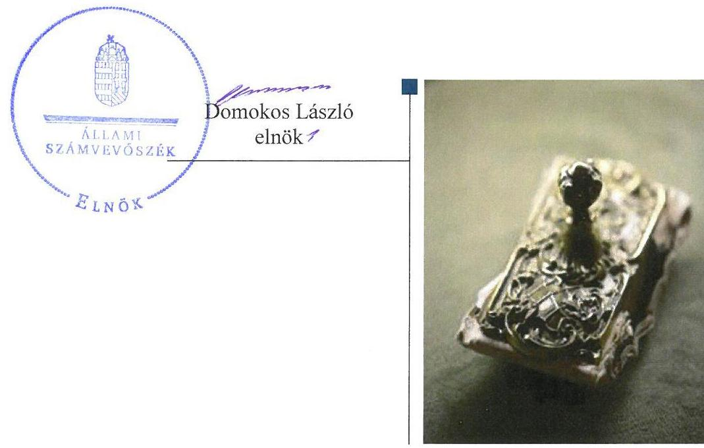

---

# AZ ELLENŐRZÉST FELÜGYELTE:

DR. NAGY IMRE felügyeleti vezető

# AZ ELLENŐRZÉST VEZETTE ÉS A VÉGREHAJTÁSÁÉRT FELELŐS:

DR. NAGY JUDIT ellenőrzésvezető

# A PROGRAM ÖSSZEÁLLÍTÁSÁÉRT FELELŐS:

JANIK JÓZSEF LÁSZLÓ osztályvezető

---

**IKTATÓSZÁM:** V-1287-136/2016

**TÉMASZÁM:** 2321

**ELLENŐRZÉS-AZONOSÍTÓ SZÁM:** V-075812

---

Jelentéseink az Országgyűlés számítógépes hálózatán és az Interneten a www.asz.hu címen is olvashatóak.

---

# TARTALOMJEGYZÉK 

■ ÖSSZEGZÉS ..... 5
■ AZ ELLENŐRZÉS CÉLJA ..... 6
■ AZ ELLENŐRZÉS TERÜLETE ..... 7
■ AZ ELLENŐRZÉS HÁTTERE, INDOKOLTSÁGA ..... 9
■ A JELENTÉS LÉNYEGES KÉRDÉSKÖREI ..... 10
■ ELLENŐRZÉS HATÓKÖRE ÉS MÓDSZEREI ..... 11
■ MEGÁLLAPÍTÁSOK ..... 13
■ JAVASLATOK ..... 17
■ MELLÉKLETEK ..... 19
I. Sz. melléklet: Értelmező szótár ..... 19
■ FÜGGELÉK: ÉSZREVÉTELEK ..... 21
■ RÖVIDÍTÉSEK JEGYZÉKE ..... 35

---

.

---

# ÖSSZEGZÉS 

Budapest Főváros VI. Kerület Terézváros Önkormányzata a tulajdonosi jogok gyakorlásának kereteit összességében a jogszabályi előírásoknak megfelelően alakította ki és összességében szabályszerűen gyakorolta. A TERIBER Terézvárosi Ingatlanfejlesztő és Beruházó Korlátolt Felelősségű Társaság a jogszabályokban előírt szabályozását alapvetően nem alakította ki, ezáltal az átláthatóság és felelős gazdálkodás feltételeit nem biztosította. A Társaság vagyongazdálkodása nem felelt meg a jogszabályi előírásoknak. A bevételek, ráfordítások elszámolása nem volt megfelelő.

## Az ellenőrzés társadalmi indokoltsága

Magyarországon az intézmény-centrikus közfeladat-ellátás jellemző, de egyre jelentősebb a költségvetésen kívüli feladatellátás térnyerése. Helyi szinten ennek legfontosabb szereplői az önkormányzati tulajdonú gazdasági társaságok, amelyeknek ellenőrzése kiemelten fontos a közfeladat ellátása, és a közvagyon megőrzése, megóvása érdekében. Ezért alapvető követelmény, hogy gazdálkodásuk, működésük szabályszerű és átlátható legyen.

A jelentésben foglalt megállapítások és a megfogalmazott számvevőszéki javaslatok hozzájárulnak a felelős tulajdonosi joggyakorláshoz és a szabályos gazdálkodáshoz.

## Főbb megállapítások, következtetések, javaslatok

Budapest Főváros VI. Kerület Terézváros Önkormányzata a tulajdonosi joggyakorlás kereteit összességében kialakította, de a közép- és hosszú távú vagyongazdálkodási tervkészítési kötelezettségének nem tett eleget. A tulajdonosi joggyakorlás összességében szabályszerű volt. A Felügyelőbizottság ${ }^{1}$ a tevékenységének kereteit biztosító, jogszabályban előírt ügyrenddel nem rendelkezett. Javadalmazási szabályzatot a Társaság legfőbb szerve jogszabályi előírás ellenére nem alkotott.

A Társaság² belső szabályzatokkal nem rendelkezett, szabályozottsága és vagyongazdálkodási tevékenysége, annak dokumentáltsága nem felelt meg a jogszabályi előírásoknak. A Társaság fizetőképessége nem volt biztosított, mert 360 napon túli tartozásai folyamatosan fennálltak.

A jogszabályokban foglalt beszámolási kötelezettségeit teljesítette, az egyszerűsített éves beszámolóját elkészítette és közzétette.

A Társaságnál a bevételek és ráfordítások elszámolása nem volt szabályszerű, mivel az elszámolásokra vonatkozó szabályokat belső szabályzatban nem rögzítette és az elszámolások a számviteli jogszabályok előírásainak sem feleltek meg.

---

# AZ ELLENŐRZÉS CÉLJA 

Az ellenőrzés célja annak értékelése, hogy az önkormányzat vagyongazdálkodási tevékenysége során szabályszerűen gyakorolta-e tulajdonosi jogait. A gazdasági társaság szabályozottsága, gazdálkodása és vagyongazdálkodási tevékenysége, bevételeinek és ráfordításainak elszámolása megfelel-e a jogszabályi és tulajdonosi előírásoknak. A gazdasági társaság kötelezettségállománya jelent-e kockázatot a működésre valamint a gazdálkodás átláthatósága és elszámoltathatósága biztosítva volt-e.

---

# AZ ELLENŐRZÉS TERÜLETE 

## TERIBER Terézvárosi Ingatlanfejlesztő és Beruházó Kft. és a többségi tulajdonosi joggyakorló Budapest Főváros VI. Kerület Terézváros Önkormányzata

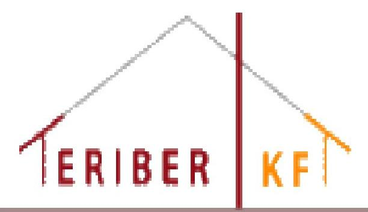

Budapest Főváros VI. Kerület Terézváros alapterületét tekintve a második legkisebb fővárosi kerület. Területe 238 hektár és ennek is mintegy ötödét a Nyugati pályaudvar és kapcsolódó területei teszik ki. A Főváros összlakosságának 2014-ben 2,3%-a élt a kerületben. A fővárosi lakásállománynak 2013-ban 3%-a Terézvárosban volt, aminek mintegy 20%-át nem lakásként, hanem irodai és turisztikai célra használják. A Társaságot 2009. szeptember 15-én alapította 50-50%-os tulajdonosi aránnyal, 1,0 M Ft törzstőkével, a TITTE ${ }^{3}$ és a Budapest Főváros VI. Kerület Terézváros Önkormányzata 100 %-os tulajdonában lévő Terézvárosi Vagyonkezelő Nonprofit Zrt. A Társaságot azzal a közös elhatározással hozták létre, hogy a Budapest VI. kerületben található leromlott állagú, de gazdaságosan felújitható társasházak közösségével megállapodva, a házak felújításáért cserébe a Társaság megszerzi a társasházak tetőterének tulajdonjogát, azt beépíti, ott további társasházi lakásokat hoz létre és értékesíti azokat. Így a Társaság főtevékenysége létrehozásakor „saját tulajdonú ingatlan adásvétele" volt. Erről a Társaság tagjai Szindikátusi Szerződésben ${ }^{4}$ rendelkeztek.

A lakások kialakítását - a Szindikátusi Szerződés értelmében - tagi kölcsönként a Vagyonkezelő Zrt. ${ }^{5}$ finanszírozta.

Az Önkormányzat ${ }^{6}$ a Képviselő-testület ${ }^{7}$ határozatai ${ }^{8}$ alapján 2012. július 4-én a TITTE 0,5 M Ft névértékű üzletrészét megvásárolta, valamint 150,0 M Ft pénzbeli hozzájárulást teljesített „törzstőke emelés" címén. A Társaság törzstőkéje ez által 151,0 M Ft lett, amelyben az Önkormányzat részesedése 99,67% volt. Az Önkormányzat 2013. május 31-én a Képviselőtestület határozata ${ }^{9}$ alapján újabb 150,0 M Ft összegű pénzbeli hozzájárulást teljesített törzstőke emelés címén, így a Társaság törzstőkéje 301,0 M Ft-ra, abban az Önkormányzat részesedése pedig 99,83%-ra változott.

Az Önkormányzat és a Vagyonkezelő Zrt. - mint a Társaság tagjai - által 2012. július 11-én megkötött, majd 2013. április 26-án módosított Szindikátusi Szerződés ${ }^{10}$-ben rögzítették, hogy a Társaság működéséhez szükséges költségek fedezetét továbbra is a Vagyonkezelő Zrt. biztosítja.

A Társaság főtevékenysége - a társasági szerződés módosítása által 2015. június 23-tól „saját tulajdonú, bérelt ingatlan bérbeadása, üzemeltetése".

A Társaság munkaviszonyt nem létesített, más gazdasági társaságban nem rendelkezett tulajdonrésszel. A Társaság számviteli nyilvántartásait a 2009. október 1-jén kelt vállalkozói szerződés alapján a Vagyonkezelő Zrt. vezette.

---

A Társaság nem rendelkezett vagyonkezelésbe vett vagyonnal és nem végzett vagyonkezelői tevékenységet. A bérlőkkel megkötött szerződéseket minden esetben közokiratba foglalták, így elérve nem fizetés esetén a bérleti díjak könnyebb és gyorsabb behajtását.

A Társaság feladat-ellátásával összefüggő fejlesztésekkel kapcsolatos garanciára, vagy kezességvállalásra az Önkormányzat részéről nem került sor. A Társaság működésével, tevékenységével kapcsolatban az Önkormányzatnak nem volt rendeletalkotási kötelezettsége.

A Taggyűlés ${ }^{11}$ 2014., illetve 2015. években képződött eredmény eredménytartalékba való helyezéséről döntött.

A Társaság gazdálkodásának főbb adatait az 1. táblázat mutatja be:

1. táblázat

A TÁRSASÁG GAZDÁLKODÁSI MUTATÓINAK ALAKULÁSA (M FT)

|   | 2011. | 2012. | 2013. | 2014. | 2015.  |
| --- | --- | --- | --- | --- | --- |
|  Értékesítés nettó árbevétele | 81,4 | 0,0 | 6,2 | 20,5 | 20,8  |
|  Mérlegfőösszeg | 553,5 | 481,6 | 490,9 | 503,0 | 515,1  |
|  Követelések | 0 | 1,7 | 2,7 | 4,7 | 5,8  |
|  Saját tőke összege | $-0,4$ | 50,1 | 194,3 | 207,0 | 221,1  |
|  Mérleg szerinti eredmény | $-0,5$ | $-99,5$ | $-5,8$ | 12,7 | 14,0  |
|  Kötelezettségek összesen | 553,5 | 430,7 | 294,9 | 294,0 | 292,0  |
|  ebből rövidejáratú kötelezettségek | 553,5 | 195,7 | 53,2 | 52,3 | 50,3  |
|  ebből hosszúlejáratú kötelezettségek | 0 | 235,0 | 241,7 | 241,7 | 241,7  |

Forrás: A TERIBER Terézvárosi Ingatlanfejlesztő és Beruházó Kft. egyszerűsített éves beszámolói Az Önkormányzat tekintetében a polgármester és a jegyző személye nem változott, a Társaság ügyvezetőjének személye kétszer változott. A jelenlegi ügyvezető 2016. október 27-étől látja el feladatát megbízási jogviszony keretében.

---

# AZ ELLENŐRZÉS HÁTTERE, INDOKOLTSÁGA 

Az önkormányzati tulajdonú gazdasági társaságok teljes körű ellenőrzésének lehetőségét az Állami Számvevőszékről szóló 1989. évi XXXVIII. törvény 2011. január 1-jétől hatályos módosítása teremtette meg és az Állami Számvevőszékről szóló 2011. évi LXVI. törvény is tartalmazza. A gazdasági társaságok gazdálkodási tevékenysége szabályszerűségének ellenőrzését 2011. évtől végezzük. Az önkormányzatok többségi tulajdonában álló gazdasági társaságok ellenőrzése kiemelten fontos a vagyon megőrzése, megóvása érdekében.

A feladatellátás költségeinek, ráfordításainak alakulása a lakosság széles rétegét érinti. Az ellenőrzés várható hasznosulásaként ellenőrzéseink feltárhatják, hogy az önkormányzat a feladatellátásához rendelt vagyon működtetését a tulajdonostól elvárható gondossággal végezte-e, a feladatot ellátó gazdasági társaság a létesítő okiratban, szolgáltatási szerződésben foglaltak betartásával biztosította-e a feladat ellátását. Az ellenőrzés rávilágíthat arra, hogy a gazdasági társaság a vagyon használatával biztosította-e a szolgáltatás folytatásának feltételeit, az önkormányzat tulajdonosi felügyelete hozzájárult-e a szabályszerű gazdálkodáshoz és feladatellátáshoz.

A megállapítások alapján megfogalmazott számvevőszéki javaslatok hasznosítása elősegítheti a meglévő hibák megszüntetését. A jó gyakorlatok bemutatásával az Állami Számvevőszék hozzájárul a követendő megoldások megismertetéséhez, terjesztéséhez.

---

# A JELENTÉS LÉNYEGES KÉRDÉSKÖREI 

1.- Az önkormányzat tulajdonosi joggyakorlása szabályszerű volt-e?
2.- A gazdasági társaság vagyongazdálkodása szabályszerű volt-e, fizetőképessége biztosított volt-e a gazdálkodása során?
3.- A gazdasági társaság bevételeinek és ráfordításainak elszámolása szabályszerű volt-e?

---

# ELLENŐRZÉS HATÓKÖRE ÉS MÓDSZEREI 

## Az ellenőrzés típusa

Megfelelőségi ellenőrzés.

## Az ellenőrzött időszak

2012. július 4-től 2015. december 31-ig.

## Az ellenőrzés tárgya

Budapest Főváros VI. Kerület Terézváros Önkormányzata tulajdonosi joggyakorlása és a többségi tulajdonában lévő TERIBER Terézvárosi Ingatlanfejlesztő és Beruházó Kft. gazdálkodásának szabályozottsága és szabályszerűsége.

Az ellenőrzés kiterjed minden olyan körülményre és adatra, amely az ÁSZ ${ }^{12}$ jogszabályban meghatározott feladatainak teljesítéséhez, valamint a program végrehajtása folyamán felmerült újabb összefüggések feltárásához szükséges.

## Az ellenőrzött szervezet

Budapest Főváros VI. Kerület Terézváros Önkormányzata mint többségi tulajdonosi joggyakorló és a TERIBER Terézvárosi Ingatlanfejlesztő és Beruházó Kft.

## Az ellenőrzés jogalapja

Az ellenőrzés jogszabályi alapját az ÁSZ tv. ${ }^{13} 1. §$ (3) bekezdése és 5. § (3)-(4)-(5) bekezdései képezték.

## Az ellenőrzés módszerei

Az ellenőrzést a nemzetközi standardokat irányadónak tekintve az ellenőrzési program ellenőrzési kérdései, az ellenőrzött időszakban hatályos jogszabályok, az ellenőrzés szakmai szabályok és módszertanok figyelembe vételével végeztük.

Az ellenőrzés ideje alatt az ellenőrzött szervezettel történő kapcsolattartást az ÁSZ Szervezeti és Működési Szabályzatának vonatkozó előírásai alapján biztosítottuk.

---

Az ellenőrzés a kiválasztott, többségi tulajdonosi jogokat gyakorló önkormányzatra és az ellenőrzött gazdasági társaságra terjedt ki.

Az ellenőrzési kérdések megválaszolásához szükséges bizonyítékok megszerzése a következő ellenőrzési eljárások alkalmazásával történt: megfigyelés, kérdésfeltevés (információkérés), összehasonlítás, valamint elemző eljárás. Az ellenőrzési bizonyítékként felhasználható adatforrások közé tartoztak egyrészt az ellenőrzési programban felsorolt adatforrások, másrészt adatforrás lehet még minden - az ellenőrzés folyamán - feltárt, az ellenőrzés szempontjából információkat tartalmazó dokumentum.

Az ellenőrzést a kérdésekre adott válaszok kiértékelésével, valamint a megjelölt adatforrások, a csatolt tanúsítványok felhasználásával, továbbá az adott időszakban hatályos jogszabályok figyelembe vételével folytattuk le.

A bevételek és ráfordítások elszámolása, valamint a vagyonnyilvántartás terén a szabályszerű működést véletlen mintavétellel ellenőriztük. A mintavétellel ellenőrzött területek esetében minden egyes tétel vonatkozásában a szabályszerűségre vonatkozó kérdéseket tettünk fel, amelyek eredménye összesítésre került. Megfelelőnek értékeltünk egy ellenőrzött területet, amennyiben 95%-os bizonyossággal a teljes sokaságban az átlagos hibaarány legfeljebb 10%, nem megfelelőnek, amennyiben 10%-nál magasabb arányt képviselt. A ráfordítások elszámolására és a vagyonnyilvántartásra vonatkozó véletlen mintavételt kockázati alapú kiválasztással egészítettük ki, amelynek során évente a három legnagyobb összegű tételt választottuk ki.

---

# 1. Az önkormányzat
 tulajdonosi joggyakorlása szabályszerű volt-e? 

## Összegző megállapítás

### 1.1. számú megállapítás

Az Önkormányzatnak a Társasággal kapcsolatos tulajdonosi joggyakorlása összességében szabályszerű volt.

A Társasággal kapcsolatos tulajdonosi joggyakorlásának kereteit az Önkormányzat összességében szabályszerűen alakította ki, de a közép- és hosszú távú vagyongazdálkodási tervkészítési kötelezettségének nem tett eleget.

Az Önkormányzat az Ötv. ${ }^{14}$ 91. § (1) bekezdése, 2013. január 1-jétől az Mötv. ${ }^{15} 116 . \S$ (1) és (5) bekezdése előírásainak megfelelően rendelkezett Gazdasági program${ }_{1,2}{ }^{16}$-vel. A Gazdasági program ${ }_{1} 13$. pontja tartalmazta a városfejlesztési, városrehabilitációs feladatokat és abban meghatározta a Társaság szerepét. A Gazdasági program ${ }_{2} 3.6$ pontjában rögzítették a vagyon- és ingatlangazdálkodás feladatait, amelyben szerepelt a Társaság által létrehozott lakásállomány hasznosítása is. A Képviselő-testület 2015. évben elfogadta Terézváros Integrált Településfejlesztési Stratégiáját ${ }^{17}$, amelyben kiemelt célként szerepelt az önkormányzati, a társasházi és világörökségi épületállomány megújítása.

A tulajdonosi jogok gyakorlására vonatkozó szabályokat az Önkormányzat a Vagyongazdálkodási rendelet ${ }^{18}{ }_{1,2}$-ben, illetve az SZMSZ ${ }^{19}$-ben határozta meg. A tulajdonosi jogokat a Képviselő-testület gyakorolta.

Az Nvtv. ${ }^{20}$ 9. § (1) bekezdése - továbbá a Vagyongazdálkodási rendelet ${ }_{2} 13. \S$-a - közép- és hosszú távú vagyongazdálkodási terv készítését írta elő, amely kötelezettségnek az Önkormányzat nem tett eleget.

A Taggyűlés a Taktv. ${ }^{21}$ 5. § (3) bekezdés előírásai ellenére nem alkotott szabályzatot a vezető tisztségviselők, felügyelőbizottsági tagok, valamint az Mt. 208. §-ának hatálya alá eső munkavállalók javadalmazására, valamint a jogviszony megszűnése esetére biztosított juttatások módjának, mértékének elveire, annak rendszerére vonatkozóan.

### 1.2. számú megállapítás

A tulajdonosi jogok gyakorlása összességében szabályszerű volt.
Az Önkormányzat tulajdonosi joggyakorlásra vonatkozó rendeletei alapján, az arra jogosult Képviselő-testület gyakorolta a Felügyelő bizottság és a könyvvizsgáló tevékenységéhez kapcsolódóan a tulajdonosi jogokat.

A Társasági szerződés és módosításai rendelkezései értelmében a tulajdonosok három tagú Felügyelő bizottság létrehozását határozták el. A Gt. ${ }^{22}$ 41. § (1) bekezdésében illetve Ptk. ${ }^{23} 3:130$. §-ban foglaltaknak megfelelően megválasztották, a társasági szerződésében rögzítették a könyvvizsgáló személyét.

---

A Felügyelő bizottság a Gt. 34. § (4) bekezdés, illetve a Ptk. 3:122. § (3) bekezdés előírásait figyelmen kívül hagyva nem készítette el ügyrendjét.

A Képviselő-testület megtárgyalta, határozataival ${ }^{24}$ elfogadásra javasolta a Taggyúlés részére a Társaság egyszerűsített éves beszámolóit és pozitív mérleg szerinti eredmény esetén az éves eredményfelosztásra vonatkozó javaslatait. Felhatalmazta a polgármestert, hogy képviselje az Önkormányzat álláspontját a Társaság taggyúlésén.
2012. évben a Társaság saját tőkéje a jegyzett tőkéjének 50%-a alá csökkent, erre vonatkozóan a könyvvizsgáló - a Gt. 44. § (2) bekezdése, illetve a Számv. tv. 157.§ (2) bekezdésében foglaltak ellenére -, jelentésében jelzéssel nem élt. A saját tőke csökkenés miatt a Gt. 143. § (2) bekezdés a) pontja ellenére az ügyvezető rendkívüli taggyűlést nem hívott össze. A Társaság 2012. évi egyszerűsített éves beszámolóját elfogadó ülésén a Taggyúlés a 2/2013. (05. 30.) számú határozatával a törzstőke 150,0 M Ft-tal történő megemeléséről döntött és ezt követően a 4/2013. (05. 30.) számú határozatával fogadta el Társaság 2012. évi egyszerűsített éves beszámolóját.

Az Önkormányzat függetlenített belső ellenőrzésének 2014. évben lefolytatott ellenőrzése a Társaság működésének és gazdálkodásának általános vizsgálatára terjedt ki. A belső ellenőrzés intézkedést igénylő észrevételeket nem tett, intézkedési terv készítését nem írta elő.

# 2. A gazdasági társaság vagyongazdálkodása szabályszerű volt-e, fizetőképessége biztosított volt-e a gazdálkodása során? 

## Összegző megállapítás

2.1. számú megállapítás
2.2. számú megállapítás

A Társaság vagyongazdálkodása nem felelt meg a jogszabályi előírásoknak, fizetőképessége nem volt biztosított.

A Társaság a gazdálkodására vonatkozó belső szabályzatokat a jogszabályi előírások ellenére nem készítette el.

A Társaság a Számv. tv. ${ }^{25} 14$. § (3) bekezdése, valamint (5) bekezdés a), b), d) pontjainak előírásai ellenére nem rendelkezett Számviteli Politikával, és az annak keretében elkészítendő Leltárkészítési és leltározási Szabályzattal, Eszközök és források értékelési Szabályzatával, Pénzkezelési Szabályzattal, valamint a Számv. tv. 161. § (1) bekezdés előírásai ellenére nem rendelkezett Számlarenddel.

Az említett belső szabályzatok hiányára vonatkozó jelzéssel, ellentétben a Számv. tv. 156. § (1) bekezdésében foglaltakkal, a könyvvizsgáló jelentésében nem élt.

Az Infotv. ${ }^{26}$ 24. § (3) bekezdés előírása ellenére a Társaság nem készítette el az Adatvédelmi és adatbiztonsági Szabályzatát.

A Társaság vagyongazdálkodása nem felelt meg a jogszabályi előírásoknak.

A Társaság vagyona a Társaság tulajdonában lévő kialakított lakásokból és azok kiegészítő felszereléseiből állt. A befektetett eszközök között 2012. év végén 14 db elkészült lakás szerepelt (használatbavételi engedéllyel rendelkező) egyéb építményként, 11 db lakás bekerülési értékét a beruházások és felújítások összege tartalmazta. 2013. április 4-én - a használatbavételi engedélyt követően - ezek a lakások is, az előírásoknak megfelelően, egyedileg átsorolásra kerültek az egyéb építmények közé.

Az üzembe helyezéseket nem dokumentálták, a Társaság ezzel megsértette a Számv. tv. 52. § (2) bekezdésében foglalt előírásokat.

Társaság vagyongazdálkodása során, a mérlegtételek értékelése tekintetében nem tartotta be a Számv. tv. 46. § (4) bekezdésében foglaltakat, tekintettel az értékcsökkenés szabálytalan elszámolására.
2.3. számú megállapítás

# A Társaság fizetőképessége nem volt biztosított a gazdálkodás során, de a kötelezettségállományának meghatározó része az egyik tulajdonossal szemben állt fenn, így nem jelentett veszélyt a működésre. 

A Társaság kötelezettségeinek állománya - a 2013. évi tőkerendezést követően - nem változott jelentős mértékben.

A Szindikátusi Szerződés ${ }_{1}$ alapján a Társaság működéséhez szükséges költségek fedezetét a Vagyonkezelő Zrt. biztosította. A rövid lejáratú kötelezettségek határidőben történő teljesítése nem volt biztosított. A rövid lejáratú kötelezettségek mintegy 90%-át a szállítókkal szemben fennálló kötelezettségek, ennek 99%-át a Vagyonkezelő Zrt.-vel (egyik tulajdonosával) szemben fennálló kötelezettség alkotta, mely 360 napon túli tartozás volt. A kötelezettség rendezéséről nem született megállapodás. A fennálló kötelezettségállomány kockázatot nem jelentett, tekintettel arra, hogy a Társaság működéséhez szükséges költségek fedezetét a Szindikátusi Szerződés${ }_{2}$-ben foglaltak szerint továbbra is a Vagyonkezelő Zrt. biztosította.

A Társaság kötelezettségállományának több mint 80%-át azok a hosszú lejáratú kötelezettségek alkották, amelyek a „tagi kölcsön szerződésen"${ }^{27}$ alapultak. A kölcsön lejárata 2011. december 11. volt, de ténylegesen kizárólag az Önkormányzat által befizetett törzstőke mértékében történt törlesztés a 2012. és a 2013. évben 150,0-150,0 M Ft összegben. A Vagyonkezelő Zrt.-vel fennálló tagi kölcsön szerződés módosítására nem került sor. A kölcsönt nyújtó tag a követelések behajtása érdekében nem intézkedett. A lejárt törlesztő részletek határidőben történő megfizetése nem volt biztosított.

## 2.4. számú megállapítás

A Társaság a beszámolási és közzétételi kötelezettségének eleget tett.

A Társaság a leltárral alátámasztott egyszerűsített éves beszámolókat elkészítette és a Felügyelő bizottság, valamint a Taggyűlés elé terjesztette. A könyvvizsgáló az egyszerűsített éves beszámolókat korlátozás nélküli hitelesítő záradékkal látta el.

A Felügyelő bizottság - Gt. 35. § (3) bekezdése, illetve a Ptk. 3:120. § (2) bekezdése előírásai alapján -, az egyszerűsített éves beszámolókat megtárgyalta, határozataival ${ }^{28}$ elfogadta és jóváhagyásra javasolta a Taggyűlés számára.

A Taggyűlés a Társaság egyszerűsített éves beszámolóját és a pozitív eredmény felosztására készített javaslatokat határozataival ${ }^{29}$ jóváhagyta, osztalékfizetésre nem került sor. Az egyszerűsített éves beszámolókat határidőben letétbe helyezték, illetve közzétették.

---

A Társaság a szervezetének, vezető tisztségviselőinek és a Felügyelő bizottságának adatait a jogszabályokban - a Taktv. 2. § (1) bekezdés a), b), d) pontjaiban, valamint (3)-(4) bekezdéseiben - foglalt előírásoknak eleget téve honlapján közzétette.

# 3. A gazdasági társaság bevételeinek és ráfordításainak elszámolása szabályszerű volt-e? 

## Összegző megállapítás

A Társaság bevételeinek és ráfordításainak elszámolása nem megfelelően történt.

A Társaság bevételei a lakások bérleti díjaiból és a közmű szolgáltatások közvetített szolgáltatásokként történő továbbhárításából származtak. Bevételeinek és ráfordításainak valamint az értékcsökkenésnek az elszámolása - a Számv. tv. ${ }^{30} 14. \S$ (3)-(5) bekezdésében előírt számviteli politika és a Számv. tv. 161. § (1) bekezdésében előírt számlarend hiánya miatt - nem felelt meg a jogszabályi előírásoknak.

A Társaság költségeinek és ráfordításainak elszámolása nem volt megfelelő. Az elszámolást alátámasztó bizonylatok jelentős része nem felelt meg a Számv. tv. 167. § (1) bekezdés c) pontja előírásainak, mivel nem tartalmazták a gazdasági műveletet elrendelő személy megjelölését, az utalványozó és a rendelkezés végrehajtását igazoló személy aláírását.

A Társaság terv szerinti értékcsökkenést az ingatlanokra (lakásokra) nem számolt el, ezzel eljárása ellentétes volt a Számv. tv. 52. § (7) bekezdésében foglalt előírásokkal.
2012. évben a lakások piaci értékelése alapján „terven felüli értékcsökkenést” számoltak el.

A Társaság tulajdonában lévő ingatlanok (lakások) használhatósági foka (84,1%), illetve elhasználódási szintje (15,9%) - az el nem számolt terv szerinti értékcsökkenés miatt - 2013. évtől nem változott. A gépek, berendezések használhatósági foka a 2013. évi beszerzésüktől - az évente elszámolt terv szerinti értékcsökkenés következtében - 2015. év végére 80,9%-ra csökkent.

A Társaság a lakásingatlanok bérbeadásból származó követeléseit megalapozó bérleti szerződéseket közokiratba foglaltatta, valamint óvadékfizetést kötöttek ki, amivel biztosították a hátralékos követelések behajthatóságát. A vevőkkel szembeni követelésállományát a lakásbérlőkkel szemben fennálló követelések alkották, amelyek összege az időszak végére 5,6 M Ft-ra nőtt. Az analitikus nyilvántartások alapján megállapítható volt a hátralékos állomány és a korosított állomány. A hátralékos követeléseket elsősorban fizetési felszólítások küldésével, részletfizetési megállapodások megkötésével és óvadék beszámításával hajtották be, de végrehajtási eljárást is kezdeményeztek.

---

# JAVASLATOK 

Az ÁSZ tv. 33. § (1) bekezdésében foglaltak értelmében az ellenőrzött szervezet vezetője köteles a jelentésben foglalt megállapításokhoz kapcsolódó intézkedési tervet összeállítani és azt a jelentés kézhezvételétől számított 30 napon belül az ÁSZ részére megküldeni. Amennyiben az ellenőrzött szervezet vezetője nem küldi meg határidőben az intézkedési tervet, vagy továbbra sem elfogadható intézkedési tervet küld, az Állami Számvevőszék elnöke az ÁSZ tv. 33. § (3) bekezdés a) és b) pontjaiban foglaltakat érvényesítheti.

## A TERIBER Terézvárosi Ingatlanfejlesztő és Beruházó Kft. Ügyvezetőjének

1. Intézkedjen a jogszabályi előírásoknak megfelelően a számviteli politika és az annak keretében elkészítendő szabályzatok, továbbá a számlarend elkészítéséről.
(2.1 sz. megállapítás 1. bekezdése alapján)
2. Intézkedjen a jogszabályi előírásnak megfelelő adatvédelmi és adatbiztonsági szabályzat elkészítéséről.
(2.1 sz. megállapítás 3. bekezdése alapján)
3. Intézkedjen az üzembehelyezés jogszabálynak megfelelő dokumentálásáról.
(2.2 sz. megállapítás 2. bekezdése alapján)
4. Intézkedjen annak érdekében, hogy a bevételek, a ráfordítások, és a terv szerinti értékcsökkenés elszámolása megfeleljen a jogszabály előírásainak.
(3. sz. megállapítás 1-3. bekezdése alapján)

## Budapest Főváros VI. Kerület Terézváros Önkormányzata Polgármesterének

1. Intézkedjen az Önkormányzat közép- és hosszú távú vagyongazdálkodási tervének elkészítéséről az Nvtv. és a Vagyongazdálkodási rendelet előírásainak megfelelően.
(1.1 sz. megállapítás 3. bekezdése alapján)

---

2. Kezdeményezze a Taggyűlésnél a jogszabályban előírt, a vezető tisztségviselők, felügyelőbizottsági tagok, valamint az Mt. 208. §-ának hatálya alá eső munkavállalók javadalmazására, valamint a jogviszony megszűnése esetére biztosított juttatások módjának, mértékének elveiről, annak rendszeréről szóló szabályzat megalkotását.
(1.1 sz. megállapítás 4. bekezdése alapján)
3. Kezdeményezze a felügyelőbizottságnál az ügyrend elkészítését.
(1.2
 sz. megállapítás 3. bekezdése alapján)
4. Intézkedjen a Társaságnál a feltárt szabálytalanságok tekintetében a felelősség tisztázása érdekében, és szükség szerint intézkedjen a felelősség érvényesítéséről.
(2.1 sz. megállapítás 1. bekezdése alapján)

---

# MELLÉKLETEK 

- I. SZ. MELLÉKLET: ÉRTELMEZŐ SZÓTÁR
garanciaszerződés
gazdasági társaság
gazdálkodó szervezet
kezesség
közép- és hosszú távú vagyongazdálkodási terv
közszolgáltatás
meghatározó befolyás

A garanciaszerződés, illetve a garanciavállaló nyilatkozat a garantőr olyan kötelezettségvállalása, amely alapján a nyilatkozatban meghatározott feltételek esetén köteles a jogosultnak fizetést teljesíteni. (Ptk. 2 6:431. § (1) bekezdése)
Ptk. 2. 3.88. § (1) bekezdése szerint „a gazdasági társaságok üzletszerű közös gazdasági tevékenység folytatására, a tagok vagyoni hozzájárulásával létrehozott, jogi személyiséggel rendelkező vállalkozások, amelyekben a tagok a nyereségből közösen részesednek, és a veszteséget közösen viselik".
A Ptk. ${ }^{31}$ 685. § c) pontja szerint gazdálkodó szervezet: „az állami vállalat, az egyéb állami gazdálkodó szerv, a szövetkezet, a lakásszövetkezet, az európai szövetkezet, a gazdasági társaság, az európai részvénytársaság, az egyesülés, az európai gazdasági egyesülés, az európai területi együttműködési csoportosulás, az egyes jogi személyek vállalata, a leányvállalat, a vízgazdálkodási társulat, az erdőbirtokossági társulat, a végrehajtói iroda, az egyéni cég, továbbá az egyéni vállalkozó." (2014. 03. 15-ig hatályos)
A kezességre vonatkozó előírásokat a Ptk. 2 6:416-430. §-ai tartalmazzák. Kezességi szerződéssel a kezes kötelezettséget vállal a jogosulttal szemben, hogyha a kötelezett nem teljesít, maga fog helyette a jogosultnak teljesíteni. Kezesség egy vagy több, fennálló vagy jövőbeli, feltétlen vagy feltételes, meghatározott vagy meghatározható összegű pénzkövetelés vagy pénzben kifejezhető értékkel rendelkező egyéb kötelezettség biztosítására vállalható.
A Ptk. 2 szerint kezességet csak írásban lehet vállalni. A kezes kötelezettsége ahhoz a kötelezettséghez igazodik, amelyért kezességet vállalt. A kezes kötelezettsége nem válhat terhesebbé, mint amilyen elvállalásakor volt, kiterjed azonban a kötelezett szerződésszegésének jogkövetkezményeire és a kezesség elvállalása után esedékessé váló mellékkövetelésekre is.
Az Nvtv. 7.§ (2) bekezdése szerint „a nemzeti vagyongazdálkodás feladata a nemzeti vagyon rendeltetésének megfelelő, az állam, az önkormányzat mindenkori teherbíró képességéhez igazodó, elsődlegesen a közfeladatok ellátásához és a mindenkori társadalmi szükségletek kielégítéséhez szükséges, egységes elveken alapuló, átlátható, hatékony és költségtakarékos működtetése, értékének megőrzése, állagának védelme, értéknövelő használata, hasznosítása, gyarapítása, továbbá az állam vagy a helyi önkormányzat feladatának ellátása szempontjából feleslegessé váló vagyontárgyak elidegenítése." Az Nvtv. 9.§ (1) bekezdése szerint az önkormányzat ennek biztosítása céljából közép- és hosszú távú vagyongazdálkodási tervet köteles készíteni. (hatályos 2012. január 1-jétől)
Az Ebktv. ${ }^{32}$ 3. § d) pontja a következőképpen határozza meg a közszolgáltatást: „szerződéskötési kötelezettség alapján a lakosság alapvető szükségleteinek ellátására irányuló szolgáltatás, így különösen a villamos energia-, gáz-, hő-, víz-, szennyvíz- és hulladékkezelési, köztisztasági, postai és távközlési szolgáltatás, továbbá a menetrend alapján közlekedő járművekkel végzett közforgalmú személyszállítás". A Ptk. 2 8:2. § (2) bekezdése szerint „A befolyással rendelkező akkor rendelkezik egy jogi személyben meghatározó befolyással, ha annak tagja vagy részvényese, és
a) jogosult e jogi személy vezető tisztségviselői vagy felügyelőbizottsága tagjainak többségének megválasztására, illetve visszahívására; vagy
b) a jogi személy más tagjai, illetve részvényesei a befolyással rendelkezővel kötött megállapodás alapján a befolyással rendelkezővel azonos tartalommal szavaznak,

---

többségi befolyást biztosító részesedés
vagyonkezelő
vagy a befolyással rendelkezőn keresztül gyakorolják szavazati jogukat, feltéve, hogy együtt a szavazatok több mint felével rendelkeznek."
A Ptk. 2 8:2. § (1) bekezdése szerint „többségi befolyás az olyan kapcsolat, amelynek révén természetes személy vagy jogi személy (befolyással rendelkező) egy jogi személyben a szavazatok több mint felével vagy meghatározó befolyással rendelkezik."
vagyonkezelő:
a) az állam tulajdonában álló nemzeti vagyon tekintetében:
aa) költségvetési szerv,
ab) helyi önkormányzat, önkormányzati társulás,
ac) önkormányzati intézmény,
ad) köztestület,
ae) az állam, az aa)-ac) alpontban meghatározott személyek együtt vagy külön-külön 100%-os tulajdonában álló gazdálkodó szervezet,
af) az ae) alpont szerinti gazdálkodó szervezet 100%-os tulajdonában álló gazdálkodó szervezet,
ag) a törvény által kijelölt egyedileg meghatározott jogi személy.
b) a helyi önkormányzat tulajdonában álló nemzeti vagyon tekintetében:
ba) önkormányzati társulás,
bb) költségvetési szerv vagy önkormányzati intézmény,
bc) köztestület,
bd) az állam, a helyi önkormányzat, a ba)-bb) alpontban meghatározott személyek együtt vagy külön-külön 100%-os tulajdonában álló gazdálkodó szervezet,
be) a bd) alpont szerinti gazdálkodó szervezet 100%-os tulajdonában álló gazdálkodó szervezet.
c) az egyházi jogi személy a tevékenysége ellátásához szükséges nemzeti vagyon tekintetében. (Forrás: Nvtv. 3. § (1) bekezdés 19. pontja)

---

# FÜGGELÉK: ÉSZREVÉTELEK 

A jelentéstervezetet a Számvevőszék 15 napos észrevételezésre megküldte az ellenőrzött szervezetek vezetőinek az ÁSZ tv. 29. § (1) bekezdése előírásának megfelelően.

Észrevételezési jogukkal éltek az ellenőrzött szervezetek vezetői, a TERIBER Terézvárosi Ingatlanfejlesztő és Beruházó Kft. ügyvezetője és Budapest Főváros VI. Kerület Terézváros Önkormányzatának polgármestere is.
A függelék tartalmazza az ellenőrzöttek észrevételeit, illetve az el nem fogadott észrevételek elutasításának indoklását.

[^0]
[^0]: * 29. § (1) Az Állami Számvevőszék az ellenőrzési megállapításait megküldi az ellenőrzött szervezet vezetőjének vagy az általa megbízott személynek, és annak, akinek személyes felelősségét állapította meg.
    (2) Az ellenőrzött szervezet vezetője és a felelősként megjelölt személy az ellenőrzés megállapításaira tizenöt napon belül írásban észrevételt tehet.
    (3) Az Állami Számvevőszék az észrevételre a beérkezésétől számított harminc napon belül írásban válaszol. A figyelembe nem vett észrevételeket köteles a jelentésben feltüntetni, és megindokolni, hogy azokat miért nem fogadta el.

---

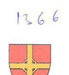

BUDAPEST FŐVÁROS VI. KERÜLET TERÉZVÁROS ÖNKORMÁNYZAT POLGÁRMESTERE

Ügyiratszám: XVII/27435/2017.

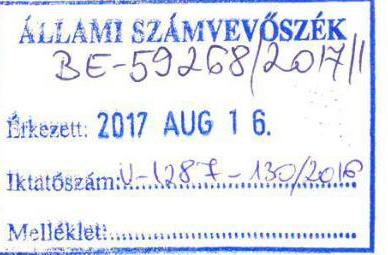

Domokos László úr
elnök
Állami Számvevőszék
1364. Budapest
Pf. 54.

# Tisztelt Elnök Úr! 

A V-1287-1220/2016. iktatószámon megküldött „Az önkormányzatok gazdasági társaságai - Az önkormányzatok többségi tulajdonában lévő gazdasági társaságok gazdálkodásának ellenőrzése - TERIBER Terézvárosi Ingatlanfejlesztő és Beruházó Kft." című számvevőszéki jelentéstervezet megállapításaira és javaslataira az alábbi észrevételeket teszem:

- 1.1. számú megállapítás: „A Társasággal kapcsolatos tulajdonosi joggyakorlás kereteit az Önkormányzat összességében szabályszerűen alakította ki, de a közép- és hosszú távú vagyongazdálkodási tervkészítési kötelezettségének nem tett eleget".
- Budapest Főváros VI. kerület Terézváros Önkormányzata Polgármesterének címzett 1. számú javaslat: „Intézkedjen az Önkormányzat közép- és hosszú távú vagyongazdálkodási tervének elkészítéséről az Nvtv. és a Vagyongazdálkodási rendelet előírásának megfelelően."

Észrevétel: A V-1133-007/2016. iktatószámú ellenőrzési program 1. fókuszkérdés 1.1. alkérdés adatforrásai nem tartalmazzák a közép- és hosszú távú vagyongazdálkodási tervet, mint ellenőrzési adatforrást, illetve a V-1287-002/2016. iktatószámú adatbekérő 3. számú mellékletének „1. Az önkormányzat ellenőrzéséhez elektronikusan beküldendő, illetve papír alapon előkészítendő dokumentumok" között sem lelhető fel a közép- és hosszú távú vagyongazdálkodási terv. Tekintettel arra, hogy az ellenőrzési program nem tartalmazza és a beküldendő dokumentumok között sem szerepel, kérem a közép- és hosszú távú vagyongazdálkodási tervvel kapcsolatos megállapítás és intézkedési javaslat mellőzését.

Egyúttal megjegyzem, hogy a nemzeti vagyonról szóló 2011. évi CXCVI. törvény 18. §-a rendelkezik a törvény hatálybalépését követően az önkormányzatok teendőinek határidejéről, azonban a közép- és hosszú távú vagyongazdálkodási terv készítés határidejére vonatkozóan nem tartalmaz rendelkezést.

---

- Budapest Főváros VI. kerület Terézváros Önkormányzata Polgármesterének címzett 2. számú javaslat: „Kezdeményezze a Taggyülésnél a jogszabályban előírt, a vezető tisztségviselők, felügyelőbizottsági tagok, valamint az Mt. 208. §-ának hatálya alá eső munkavállalók javadalmazására, valamint a jogviszony megszünése esetére biztosított juttatások módjának, mértékének elveiről, annak rendszeréről szóló szabályzat megalkotását."

A számvevőszéki jelentéstervezet Polgármesternek címzett 2. számú javaslatára észrevételt nem teszek.

- Budapest Főváros VI. kerület Terézváros Önkormányzata Polgármesterének címzett 3. számú javaslat: „Kezdeményezze a Taggyülésnél a felügyelőbizottságnál az ügyrend elkészítését."

A számvevőszéki jelentéstervezet Polgármesternek címzett 3. számú javaslatára észrevételt nem teszek.

- Budapest Főváros VI. kerület Terézváros Önkormányzata Polgármesterének címzett 4. számú javaslat: „Intézkedjen a Társaságnál a feltárt szabálytalanságok tekintetében a felelősség tisztázása érdekében, és szükség szerint intézkedjen a felelősség érvényesítéséről."

A számvevőszéki jelentéstervezet Polgármesternek címzett 4. számú javaslatára észrevételt nem teszek.

Budapest, 2017. augusztus 14.

Tisztelettel:
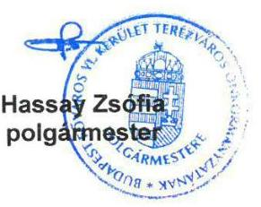

---

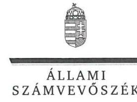

ELNÖK

Ikt.szám: V-1287-135/2016.

# Hassay Zsófia úrhölgy 

polgármester
Budapest Főváros VI. Kerület Terézváros Önkormányzata

## Budapest

## Tisztelt Polgármester Úrhölgy!

„Az önkormányzatok gazdasági társaságai - Az önkormányzatok többségi tulajdonában lévő gazdasági társaságok gazdálkodásának ellenőrzése - TERIBER Terézvárosi Ingatlanfejlesztő és Beruházó Kft." címmel készített számvevőszéki jelentéstervezetre tett észrevételét köszönettel megkaptam.
Az Állami Számvevőszék észrevételre vonatkozó álláspontjáról a felügyeleti vezető által készített részletes tájékoztatást csatoltan megküldöm.
Tájékoztatom Polgármester Úrhölgyet, hogy a számvevőszéki jelentésben - az Állami Számvevőszékről szóló 2011. évi LXVI. törvény 29. § (3) bekezdése alapján - a figyelembe nem vett észrevételt szerepeltetjük annak megindokolásával, hogy azt miért nem fogadtuk el.
Budapest, 2017. 15. hó 31. nap
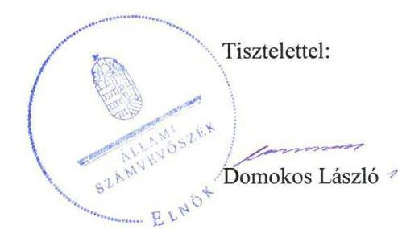

Melléklet: Tájékoztatás az észrevétel kezeléséről

---

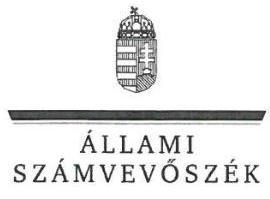

FELÜGYELETI VEZETŐ

Melléklet
Ikt.szám: V-1287-135/2016.

# Tájékoztatás   az észrevétel kezeléséről 

„Az önkormányzatok gazdasági társaságai - Az önkormányzatok többségi tulajdonában lévő gazdasági társaságok gazdálkodásának ellenőrzése - TERIBER Terézvárosi Ingatlanfejlesztő és Beruházó Kft." című jelentéstervezetre 2017. augusztus 14-én tett (az Állami Számvevőszékhez papír alapon 2017. augusztus 16-án érkezett) észrevételét áttekintettük, annak kezelésével kapcsolatban a következő tájékoztatást adom.
A jelentéstervezet 1.1. számú megállapításra és Budapest Főváros VI. Kerület Terézváros Önkormányzata Polgármesterének címzett 1. javaslatra („1.1. számú megállapítás: A Társasággal kapcsolatos tulajdonosi joggyakorlás kereteit az Önkormányzat összességében szabályszerűen alakította ki, de a közép- és hosszú távú vagyongazdálkodási tervkészítési kötelezettségének nem tett eleget." és „1. javaslat: Intézkedjen az Önkormányzat közép- és hosszú távú vagyongazdálkodási tervének elkészítéséről az Nvtv. és a Vagyongazdálkodási rendelet előírásának megfelelően.") vonatkozó észrevétel
Az észrevételben jelezte, hogy a V-1133-007/2016. iktatószámú ellenőrzési program nem tartalmazta a közép- és hosszú távú vagyongazdálkodási tervet mint ellenőrzési adatforrást, és az az adatbekérő levél 3. számú mellékletében sem volt fellelhető. Továbbá jelezte, hogy a 2011. évi CXCVI. törvény 18. §-a a közép- és hosszú távú vagyongazdálkodási terv készítésének határidejéről nem rendelkezik. Ezek alapján kérte a megállapítás és a javaslat törlését.
Az Állami Számvevőszék az ellenőrzését a megküldött ellenőrzési programnak megfelelően, a rendelkezésére bocsátott adatok és dokumentumok alapján végzi. Az Állami Számvevőszékről szóló 2011. évi LXVI. törvény 28. § (2) bekezdése alapján a közreműködésre felhívott szervezet az Állami Számvevőszék részére - annak kérésére soron kívül, de legkésőbb öt munkanapon belül - az ellenőrzés lefolytatása érdekében szükséges adatokat és dokumentumokat rendelkezésre bocsátja. A 2016. október 15-ei adatszolgáltatásra felkészítő, majd a 2016. október 27-ei adatbekérő levelünk melléklete tartalmazta az Önkormányzat által elektronikusan feltöltendő dokumentumok körét, az 1.1. pontban nevesítve a vagyongazdálkodási tervet is. A bekért dokumentumok közül a közép- és hosszú távú vagyongazdálkodási terv nem került feltöltésre vagy átadásra az ellenőrzést végzők részére.
Észrevétele alapján az intézkedést igénylő megállapítás és a javaslat módosítása, illetve törlése nem indokolt.

Budapest, 2017. 08. hó 31. nap

Dr. Nagy Imre
felügyeleti vezető

---

# TERÉZVÁROSI INGATLANFEJLESZTŐ- ÉS BERUHÁZÓ KFT.

Állami Számvevőszék
1364. Budapest 4.

Iktatószám: TI/7/9/2017
Iktatószám: U. 1284 - 123/2016
M. 1284

Domokos László
Elnök Úr részére

Tárgy: Állami Számvevőszék jelentéstervezetének észrevételezése [ellenőrzött időszak 2012. július 4. - 2015. december 31.]

## Tisztelt Elnök Úr!

Társaságunk 2017. július 31. napján kapta kézhez „Az önkormányzatok gazdasági társaságai - Az önkormányzatok többségi tulajdonában lévő gazdasági társaságok gazdálkodásának ellenőrzése- Teriber Terézvárosi Ingatlanfejlesztő és Beruházó Kft." címmel készült, V-1287-121/2016. sz. iktatott számvevőszéki jelentéstervezetét.
Hivatkozással az Állami Számvevőszékről
 szóló 2011. évi LXVI. törvény 29.§ (2) bekezdésében foglaltakra, Társaságunk a részletes intézkedési terv összeállítása előtt, az alábbi észrevételeket teszi a jelentéstervezetben foglaltakkal kapcsolatban:

## 1. Az önkormányzat tulajdonosi joggyakorlása szabályszerű volt-e?

Az 1.1 számú megállapítással kapcsolatban az önkormányzat, mint tulajdonos tett megállapítást, amellyel minden tekintetben egyetértünk.
2. A gazdasági társaság vagyongazdálkodása szabályszerű volt-e, fizetőképessége biztosított volt-e a gazdálkodás során?

## Összegzö megállapítás:

A Társaság vagyongazdálkodása nem felelt meg a jogszabályi előírásoknak, fizetőképessége nem volt biztosított.

### 2.1. számú megállapítás:

A Társaság a gazdálkodására vonatkozó belső szabályzatokat a jogszabályi előírások ellenére nem készítette el.

---

# Észrevétel: 

A könyvelési szolgáltatással megbízott Terézvárosi Vagyonkezelő ZRt. - úgyis, mint a Társaság egyik tulajdonosa -, a Számviteli törvény előírásai szerint, azok betartása mellett, teljes felelősséggel végzi munkáját. A megállapításban jelzett hiányosságot pótoltuk, és 2016. október 1-i dátummal elkészítettük a Társaságra vonatkozó összes - a Számviteli törvény által előírt - szabályzatot. Ugyanakkor elismerjük, hogy jelen ellenőrzés keretében ezeket nem lehetett figyelembe venni, tekintettel arra, hogy az ellenőrzött időszak 2012. július 4-től 2015. december 31.-ig tartó intervallumot ölelt fel. 2017. augusztus 1. napjától már pótoltuk az Infotv. 24.§ (3) bekezdésében előírt Adatvédelmi és Adatbiztonsági Szabályzatot is.

### 2.2. számú megállapítás:

A Társaság vagyongazdálkodása nem felelt meg a jogszabályi előírásoknak.

## Észrevétel:

A 2012. év végén használatba vett 14 db elkészült lakás, illetve 2013. április 4-én használatba vett további 11 db lakás üzembe helyezési dokumentumait, illetve annak Számviteli törvény 52. § (2) bekezdése szerinti meglétét felülvizsgáljuk. Ellenőrizzük - és ezt az intézkedési tervben is szerepeltetni fogjuk - az értékbecslő által készített dokumentációt, a lakásokkal kapcsolatban keletkezett valamennyi iratanyagot, és amennyiben erre vonatkozóan módosításra illetve hiánypótlásra lesz szükség, azt a legrövidebb időn belül végrehajtjuk.
A Társaság vagyongazdálkodására során, a mérlegtételek értékelése tekintetében, az ide vonatkozó elmarasztaló megállapítás szerint - a Számviteli törvény 46. § (4) bekezdésében foglaltak alapján - szabálytalan volt az értékcsökkenés elszámolása. Visszautalunk ugyanezen törvény 52. § (6). bekezdésére, mely szerint a Társaságnak módjában lehet eltekinteni a terv szerinti értékcsökkenés elszámolásától, amennyiben a jelzett tárgyi eszköz a „különleges helyzetéből adódóan" az értékéből bizonyítottan nem veszít. Társaságunk ezzel a jogával élt akkor, amikor nem számolta el a terv szerinti értékcsökkenést. Társaságunk a továbbiakban a 2017-es évben tervezi - a folyamatosan növekvő ingatlanpiaci árak miatt -, és indokoltnak tartja a 2012. évben elszámolt terven felüli értékcsökkenés visszaírását is, tekintettel arra, hogy ez időre már tartósnak tekinthető a 2015. évtől folyamatos ingatlanpiaci áremelkedés.
Hivatkozás: ... 52. § (6) ${ }^{202}$ Nem szabad terv szerinti értékcsökkenést elszámolni az olyan eszköznél, amely értékéből a használat során sem veszít, vagy amelynek értéke - különleges helyzetéből, egyedi mivoltából adódóan - évtől évre nő.

---

# 2.3. számú megállapítás: 

A Társaság fizetőképessége nem volt biztosított a gazdálkodás során, de a kötelezettségállományának meghatározó része az egyik tulajdonossal szemben állt fenn, így nem jelentett veszélyt a működésre.

## Észrevétel:

Társaságunk szállítókkal szemben fennálló kötelezettségének ( $90 \%$-át az egyik tulajdonossal szembeni kötelezettség alkotja) rendezéséről a felek már megállapodást kötöttek, annak ellenére, hogy ez a jelentéstervezet szerint sem jelentett - és értelemszerűen ma sem jelent - a működésre vonatkozó kockázatot. A Vagyonkezelő ZRt-vel fennálló tagi kölcsönre vonatkozó kölcsönszerződés módosítása tekintetében már folynak a tárgyalások a felek között.

### 2.4. számú megállapítás:

A Társaság a beszámolási és közzétételi kötelezettségének eleget tett.

## Észrevétel:

A megállapítással kapcsolatban nem kívánunk észrevételt tenni.
3. A gazdasági társaság bevételeinek és ráfordításainak elszámolása szabályszerű volt-e?

## Összegzö megállapítás:

A Társaság bevételeinek és ráfordításainak elszámolása nem megfelelően történt.
Ebben a pontban összefoglalt megállapításokra az észrevételeinket a fentebbiekben már megtettük.
A bevételek és ráfordítások valamint az értékcsökkenés elszámolásával kapcsolatosan válaszainkat a 2.2. számú megállapításra tett észrevételeinknél, a Számviteli törvény által előírt kötelező szabályzatokra vonatkozóan a 2.1. számú megállapításra tett észrevételeinknél tettük meg.
,,A Számviteli törvény 167. § (1) bekezdés c) pontja előírásai szerint, a költségek és ráfordítások elszámolását alátámasztó bizonylatoknak tartalmaznia kellett volna az elrendelő személy megjelölését, az utalványozó és a rendelkezés végrehajtását igazoló személy aláírását" megállapításra vonatkozóan észrevételezni kívánjuk, hogy a Társaság sajátos szervezeti felépítéséből fakadóan - mivel abban egy fő ügyvezető és egy fő megbízásos jogviszonyban foglalkoztatott, adminisztrációs feladatokat ellátó munkatárs dolgozott, - a

---

törvény maradéktalan betartása nehézségbe ütközött és ütközik ma is. Hiszen a bizonylatokon szereplő tétel elrendelője, utalványozója egy és ugyanazon személy. Az előbbiek alapján - tekintettel a Kft. foglalkoztatotti létszámára -, a gazdasági műveletek elrendeléséért, az utalványozásért és a rendelkezések végrehajtásának igazolásáért az ügyvezető volt felelős egy személyben. Mindemellett az ügyvezető a számviteli bizonylatokat ellátta kézjegyével, mellyel igazolta azok kifizethetőségét. Ezt az egy személyi aláírást (pl. közüzemi vagy javítási számla) minden esetben minden bizonylat tartalmazta, és amennyiben az adott munka azt indokolta (pl. karbantartási munkák esetében), a végrehajtást igazoló munkalap, illetve teljesítésigazolás is csatolva volt a számlákhoz.

Tisztelettel kérjük a fentiek szíves elfogadását!

Budapest, 2017. augusztus 15.

Tisztelettel:
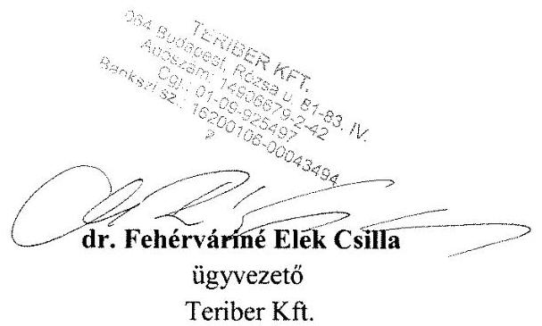

---

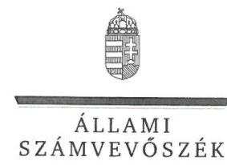

ELNÖK

Ikt.szám: V-1287-134/2016.

# dr. Fehérváriné Elek Csilla úrhölgy 

ügyvezető
TERIBER Terézvárosi Ingatlanfejlesztő és Beruházó Kft.

## Budapest

## Tisztelt Ügyvezető Úrhölgy!

„Az önkormányzatok gazdasági társaságai - Az önkormányzatok többségi tulajdonában lévő gazdasági társaságok gazdálkodásának ellenőrzése - TERIBER Terézvárosi Ingatlanfejlesztő és Beruházó Kft. " címmel készített számvevőszéki jelentéstervezetre tett észrevételeit köszönettel megkaptam.
Az Állami Számvevőszék észrevételekre vonatkozó álláspontjáról a felügyeleti vezető által készített részletes tájékoztatást csatoltan megküldöm.
Tájékoztatom az Ügyvezető úrhölgyet, hogy a számvevőszéki jelentésben - az Állami Számvevőszékről szóló 2011. évi LXVI. törvény 29. § (3) bekezdése alapján - a figyelembe nem vett észrevételeket szerepeltetjük annak megindokolásával, hogy azt miért nem fogadtuk el.

Budapest, 2017. 06 hó 31 nap
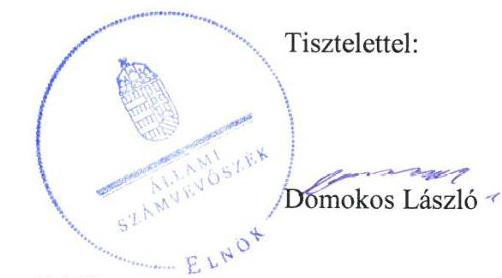

Melléklet: Tájékoztatás az észrevételek kezeléséről

---

# Tájékoztatás 

az észrevételek kezeléséről
„Az önkormányzatok gazdasági társaságai - Az önkormányzatok többségi tulajdonában lévő gazdasági társaságok gazdálkodásának ellenőrzése - TERIBER Terézvárosi Ingatlanfejlesztő és Beruházó Kft." című jelentéstervezetre 2017. augusztus 15-én tett (az Állami Számvevőszékhez 2017. augusztus 16-án érkezett) észrevételét áttekintettük, annak kezelésével kapcsolatban a következő tájékoztatást adom.

1. A jelentéstervezet 1.1. számú megállapításra és Budapest Főváros VI. Kerület Terézváros Önkormányzata Polgármesterének címzett 1. javaslatra (,1.1. számú megállapítás: A Társasággal kapcsolatos tulajdonosi joggyakorlásának kereteit az Önkormányzat összességében szabályszerűen alakította ki, de a közép és hosszú távú vagyongazdálkodási tervkészítési kötelezettségének nem tett eleget." és „1. javaslat: Intézkedjen az Önkormányzat közép- és hosszú távú vagyongazdálkodási tervének elkészítéséről az Nvtv. és a Vagyongazdálkodási rendelet; előírásának megfelelően.") vonatkozó észrevétel:

Az észrevételben leírtak szerint a Társaság az önkormányzat által tett észrevétellel kapcsolatban minden tekintetben egyetért. Az 1.1. számú megállapítás az önkormányzat tulajdonosi joggyakorlását érinti, a Társaságra vonatkozóan megállapítást nem tartalmaz.
2. A jelentéstervezet 2.1. számú összegző megállapítására („A Társaság a gazdálkodására vonatkozó belső szabályzatokat a jogszabályi előírások ellenére nem készítette el.") vonatkozó észrevétel:

Az észrevételében a Társaság tájékoztatásul közölte, hogy az előírt szabályzatokat az ellenőrzött időszakot követően elkészítette, egyben elismerte, hogy ezek figyelembe vétele nem lehetséges. Ez alapján a megállapítás módosítása nem indokolt.
3. A 2.2. számú összegző megállapításra („A Társaság vagyongazdálkodása nem felelt meg a jogszabályi előírásoknak.") vonatkozó észrevétel:

Az észrevétel a megállapítás alapján tervezett intézkedéseket mutatja be, ezért a jelentéstervezet 2.2. számú megállapítás 1. és 2. bekezdésére tett észrevétel tekintetében módosítás nem indokolt.

---

4. A jelentéstervezet 2.2. számú megállapítás 3. bekezdésére („A Társaság vagyongazdálkodása során, a mérlegtételek értékelése tekintetében nem tartotta be a Számv. tv. 46. § (4) bekezdésében foglaltakat, tekintettel az értékcsökkenés szabálytalan elszámolására.") vonatkozó észrevétel:

Az észrevételben leírtak szerint „Visszautalunk ugyanezen törvény 52. § (6) bekezdésére, mely szerint a Társaságnak módjában lehet eltekinteni a terv szerinti értékcsökkenés elszámolásától, amennyiben a jelzett tárgyi eszköz a „különleges helyzetéből adódóan" értékéből bizonyítottan nem veszít. Társaságunk ezzel a jogával élt akkor, amikor nem számolta el a terv szerinti értékcsökkenést."

A Számv. tv. 52. § (1)-(2) bekezdése szerint „az immateriális javaknak, a tárgyi eszközöknek a hasznos élettartam végén várható maradványértékkel csökkentett bekerülési értékét azokra az évekre kell felosztani, amelyekben ezeket az eszközöket előreláthatóan használni fogják. "Ez az előírás az ingatlanok (az épületek) terv szerinti értékcsökkenésének meghatározására is vonatkozik. Az ingatlanok (az épületek) automatikusan nem tartoznak a számviteli törvény 52. §ának (6) bekezdése alá tartozó eszközök közé, az egyes ingatlan (az épület) értéke általában nem különleges helyzetéből, egyedi mivoltából adódóan nő évről évre, hanem jellemzően az infláció és a kereslet-kinálat viszonyának hatására, és ezen hatásra sem nő a műszaki élettartam végéig. Így a bekerülési érték, valamint a (hasznos élettartam és a műszaki élettartam függvényében, az üzembe helyezéskor rendelkezésre álló információk alapján meghatározott) maradványérték különbözetét kell a hasznos élettartam alatt - a számviteli törvény 52. § (2) bekezdésének megfelelően - terv szerinti értékcsökkenésként elszámolni.

Észrevétele alapján a 2.2. számú megállapítás 3. bekezdésére tett megállapítás módosítása, illetve törlése nem indokolt.
5. A 2.3. számú összegző megállapítás („A Társaság fizetőképessége nem volt biztosított a gazdálkodás során, de a kötelezettségállományának meghatározó része az egyik tulajdonossal szemben állt fenn, így nem jelentett veszélyt a működésre") vonatkozó észrevétel:

A Társaság a 2.3. számú megállapításban foglaltakkal egyetértett és tájékoztatásul közölte, hogy a tagi kölcsön szerződés módosítására tárgyalások folynak. Az észrevétel a megállapítás módosítását nem indokolja.
6. A 2.4. számú összegző megállapítás („A Társaság a beszámolási és közzétételi kötelezettségének eleget tett.") tartalmával a Társaság egyetértett, észrevételt nem tett.
7. A jelentéstervezet 3. számú megállapítás 2. bekezdésére („A Társaság költségeinek és ráfordításainak elszámolása nem volt megfelelő. Az elszámolást alátámasztó bizonylatok jelentős része nem felelt meg a Számv. tv. 167 § (1) bekezdés c) pontja előírásainak, mivel nem tartalmazták a gazdasági műveletet elrendelő személy megjelölését, az utalványozó és a rendelkezés végrehajtását igazoló személy aláírását.") vonatkozó észrevétel:

---

Az észrevételben leírtak szerint „A Társaság sajátos szervezeti felépítéséből fakadóan - mivel abban egy fő ügyvezető és egy fő megbízásos jogviszonyban foglalkoztatott, adminisztrációs feladatokat ellátó munkatárs dolgozott, - a törvény maradéktalan betartása nehézségekbe ütközött."

A vállalkozás belső szervezeti rendjének sajátosságaira a bizonylatok alaki és tartalmi követelményeire vonatkozó előírásoknak az adott vállalkozás körülményeit figyelembe véve kell megfelelni, melyeket a vállalkozásnak belső szabályzataiban kell szabályozni. Azonban belső szabályzatokkal a Társaság a 2012. január 1. - 2015. december 31. közötti ellenőrzött időszak alatt, valamint a számlarendben foglaltakat alátámasztó bizonylati renddel sem rendelkezett a Számv. tv. 14. § (3) bekezdése, valamint (5) bekezdés a), b) d) pontjainak, továbbá a Számv. tv. 161 § (1) bekezdés és (2) bekezdés d) pontja előírásai ellenére. A Társaság nem tartotta be a Számv. tv. 167 § (1) bekezdés c) pontja előírását, az elszámolást alátámasztó bizonylatok jelentős része nem tartalmazta a gazdasági műveletet elrendelő személy megjelölését, az
 utalványozó és a rendelkezés végrehajtását igazoló személy aláírása.

Erre tekintettel a 3. számú megállapítás 2. bekezdésének módosítása, illetve törlése nem indokolt.

Budapest, 2017. 08. hó 31. nap
$\qquad$
$\qquad$
Dr. Nagy Imre
felügyeleti vezető

---

.

---

# RÖVIDÍTÉSEK JEGYZÉKE 

${ }^{1}$ Felügyelő bizottság
${ }^{2}$ Társaság
${ }^{3}$ TITTE
${ }^{4}$ Szindikátusi Szerződés ${ }_{1}$
${ }^{5}$ Vagyonkezelő Zrt.
${ }^{6}$ Önkormányzat
${ }^{7}$ Képviselő-testület
${ }^{8}$ Képviselő-testületi határozatai ${ }_{1,2}$ A Képviselő-testület 131/2012. (VI. 28.) és 133/2012. (VI. 28.) számú határozatai
${ }^{9}$ Képviselő-testületi határozat ${ }_{3}$ A Képviselő-testület 112/2013. (V. 30.) számú határozata
${ }^{10}$ Szindikátusi Szerződés ${ }_{2}$ Önkormányzat és a Vagyonkezelő Zrt. - mint a Társaság tagjai - által 2012. július 11-én megkötött, majd 2013. április 26-án módosított Szindikátusi Szerződés
${ }^{11}$ Taggyűlés
${ }^{12}$ ÁSZ
${ }^{13}$ ÁSZ tv.
${ }^{14}$ Ötv.
${ }^{15}$ Mötv.
${ }^{16}$ Gazdasági program ${ }_{1,2}$

## ${ }^{17}$ Integrált Településfejlesztési Stratégia

${ }^{18}$ Vagyongazdálkodási rendeletek:
Vagyongazdálkodási rendelet ${ }_{1}$ Budapest Főváros VI. kerület Terézváros Önkormányzat Képviselő-testületének 46/2011. (XI. 28.) számú rendelete az Önkormányzat tulajdonában lévő vagyonnal való gazdálkodás és rendelkezés szabályairól
Vagyongazdálkodási rendelet ${ }_{2}$ Budapest Főváros VI. kerület Terézváros Önkormányzat Képviselő-testületének 24/2013. (VI. 27.) számú rendelete az Önkormányzat tulajdonában lévő vagyonnal való gazdálkodás és rendelkezés szabályairól (hatályos 2013. augusztus 1-jétől)
Budapest Főváros VI. kerület Terézváros Önkormányzat Képviselő-testületének 20/2011. (IV. 28.) számú rendelete a Képviselő-testület és szervei Szervezeti és Működési Szabályzatáról (hatályos 2011. május 1-jétől)
módosítva: Budapest Főváros VI. kerület Terézváros Önkormányzat Képviselő-testületének 35/2011. (IX. 9.) számú rendeletével (hatályos 2011. szeptember 9-étől)

Budapest Főváros VI. kerület Terézváros Önkormányzat Képviselő-testületének 48/2012. (XII. 20.) számú rendeletével (hatályos 2013. január 1-jétől)

Budapest Főváros VI. kerület Terézváros Önkormányzat Képviselő-testületének 8/2013. (II. 28.) számú rendeletével (hatályos 2013. március 1-jétől)

Budapest Főváros VI. kerület Terézváros Önkormányzat Képviselő-testületének 26/2013. (VI. 27.) számú rendeletével (hatályos 2013. június 27-étől)

Budapest Főváros VI. kerület Terézváros Önkormányzat Képviselő-testületének 47/2013. (XII. 19.) számú rendeletével (hatályos 2014. január 1-jétől)

---

Budapest Főváros VI. kerület Terézváros Önkormányzat Képviselő-testületének 27/2014. (XI. 3.) számú rendeletével (hatályos 2014. november 3-ától)

Budapest Főváros VI. kerület Terézváros Önkormányzat Képviselő-testületének 32/2014. (XI. 27.) számú rendeletével (hatályos 2014. december 1-jétől)

Budapest Főváros VI. kerület Terézváros Önkormányzat Képviselő-testületének 17/2015. (VI. 11.) számú rendeletével (hatályos 2015. július 1-jétől)
Budapest Főváros VI. kerület Terézváros Önkormányzat Képviselő-testületének 23/2015. (XI. 19.) számú rendeletével (hatályos 2015. december 1-jétől)
2011. évi CXCVI. törvény a nemzeti vagyonról
a köztulajdonban álló gazdasági társaságok takarékosabb működésről szóló 2009. évi CXXII. törvény
2006. évi IV. törvény a gazdasági társaságokról
2013. évi V. törvény a Polgári törvénykönyvről (hatályos: 2014. március 15-étől)

A Képviselő-testület 75/2013. (V. 30.) sz., a 116/2014. (V. 12.) sz., a 125/2015. (IV. 30.) sz. és a 110/2016. (IV. 21.) sz. határozatai
2000. évi C. törvény a számvitelről
2011. évi CXII. törvény az információs önrendelkezési jogról és az információszabadságról
2010. június 16-án kelt szerződés, amelynek keretében a Vagyonkezelő Zrt. a Szindikátusi Szerződés szerinti forrásokat biztosította.
A Felügyelő Bizottság 8/2013 (05.23.), a 4/2014 (05.09.), a 2/2015 (04.15.), és a 2/2016 (04.14.). számú határozatai
A Taggyűlés 4/2015. (05.28.) sz. és a 2/2016. (05.09.) sz. határozatai
2000. évi C. törvény a számvitelről
1959. évi IV. törvény a Polgári törvénykönyvről (hatályos: 2014. március 14-éig)
2003. évi CXXV. törvény az egyenlő bánásmódról és az esélyegyenlőség előmozdításáról

---

# ÁLLAMI SZÁMVEVŐSZÉK 

1052 Budapest, Apáczai Csere János utca 10.
Levélcím: 1364 Budapest 4. Pf. 54
Telefon: +36 14849100 Telefax: +36 14849200
www.asz.hu
