# Jelentés 

## A gyermekvédelem intézményrendszerének ellenőrzése

A személyes gondoskodást nyújtó központi és önkormányzati fenntartók feladatellátásának ellenőrzése 2017.

---

# Jelentés 

## A gyermekvédelem intézményrendszerének ellenőrzése

A személyes gondoskodást nyújtó központi és önkormányzati fenntartók feladatellátásának ellenőrzése
2017. 09 hó 21 nap
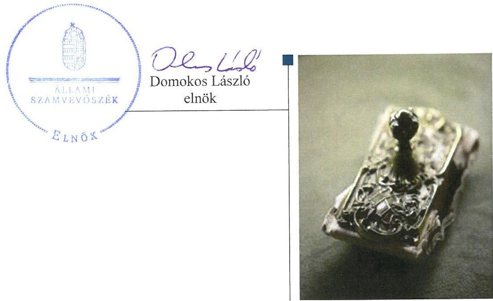

---

# AZ ELLENŐRZÉST FELÜGYELTE:

DR. BENEDEK MÁRIA felügyeleti vezető

## AZ ELLENŐRZÉST VEZETTE ÉS A VÉGREHAJTÁSÁÉRT FELELŐS:

- JANIK JÓZSEF ellenőrzésvezető
- A PROGRAM ÖSSZEÁLLÍTÁSÁÉRT FELELŐS:
- JANIK JÓZSEF osztályvezető

**IKTATÓSZÁM:** V-1039-747/2016.

**TÉMASZÁM:** 2073

**ELLENŐRZÉS-AZONOSÍTÓ SZÁM:** V0756

Jelentéseink az Országgyűlés számítógépes hálózatán és az Interneta a www.asz.hu címen is olvashatóak.

---

# TARTALOMJEGYZÉK 

■ ÖSSZEGZÉS ..... 5
■ AZ ELLENŐRZÉS CÉLJA ..... 7
■ AZ ELLENŐRZÉS TERÜLETE ..... 8
■ AZ ELLENŐRZÉS HÁTTERE, INDOKOLTSÁGA ..... 10
■ A JELENTÉS LÉNYEGES KÉRDÉSKÖREI ..... 11
■ ELLENŐRZÉS HATÓKÖRE ÉS MÓDSZEREI ..... 12
■ MEGÁLLAPÍTÁSOK ..... 15
■ MELLÉKLETEK ..... 35
I. Sz. melléklet: Értelmező szótár. ..... 35
II. Sz. melléklet: Az ellenőrzésre kiválasztott önkormányzatok ..... 39
■ FÜGGELÉK: ÉSZREVÉTELEK ..... 41
I. Sz. függelék: Az ellenőrzött szervezetek ÁSZ által el nem fogadott észrevételei ..... 42
■ RÖVIDÍTÉSEK JEGYZÉKE ..... 75

---

.

---

# ÖSSZEGZÉS 

Javult a gyermekvédelmi rendszer eredményessége a gyermekek családban történő nevelkedését elősegítő kiemelt területeken. A gyermekvédelmi intézményrendszer müködésének eredményessége ugyanakkor összességében nem javult 2011 és 2015 között. Az átlátható és elszámoltatható közpénzfelhasználás, valamint a vagyonnal való felelős gazdálkodás követelményei nem érvényesültek a gyermekvédelmi ágazatban. Mind a központi, mind az önkormányzati fenntartók tevékenységében, és a rendszer müködésében számos szabálytalanságot tárt fel az ellenőrzés.

## Az ellenőrzés társadalmi indokoltsága

A gyermekek védelme Alaptörvényben biztosított jog. Minden gyermeknek joga van a megfelelő testi, szellemi és erkölcsi fejlődéséhez szükséges védelemhez és gondoskodáshoz.

A gyermekek védelmének általános szabályait, rendszerét 1997-től törvény határozza meg az ENSZ 1989-ben aláírt Gyermekjogi Egyezményével összhangban.

Hazánk jelentős költségvetési forrást fordít a gyermeket tervező és vállaló szülők, illetve gyermekeik egészségügyi ellátására, szociális védelmére (gyermekvédelemre és jólétre), valamint a gyermekeket érintő köznevelésre (nevelésre és oktatásra).

A gyermek sorsának alakításában részt vevő szervezetekre és személyekre nagy felelősség hárul abban, hogy a gyermekek segítséget kapjanak a fejlődésüket veszélyeztető helyzet elhárításához, a társadalomba való beilleszkedéshez, az önálló életvitel megteremtéséhez. A társadalom egésze számára is kiemelt fontosságú, hogy kialakuljon és működjön egy hosszú távon fenntartható, családi típusú nevelésre orientált, minden rászoruló gyermek esélyegyenlőségét növelő rendszer, amely épít a veszélyeztetettséggel kapcsolatos prevencióra, támogatja a családba való visszahelyezést.

A humán erőforrások megóvása, fejlesztése a nemzetgazdasági fejlődés jövőjének és a társadalmi értékek megőrzésének zálogát jelenti. Ennek szem előtt tartásával az Állami Számvevőszék ellenőrizte a gyermekvédelem intézményrendszerének egyes kiemelt területeit, és értékelte a szabályszerű és a célokat megfelelően szolgáló működést.

## Főbb megállapítások, következtetések

A központi fenntartók esetében mind a gyermekvédelmi intézményrendszer szabályozott és szabályszerű működtetése, mind pedig átalakítása kapcsán jelentős szabálytalanságokat tárt fel az ellenőrzés. A központi gyermekvédelmi intézmények fenntartói feladatait ellátó Szociális és Gyermekvédelmi Főigazgatóság 2012. év végi megalakulásától kezdve mintegy két és fél éven keresztül szervezeti és működési szabályzat hiányában a feladatok, felelősségek és hatáskörök szabályozása nélkül működött. A központi fenntartású intézmények gazdálkodási rendje csaknem három éven keresztül, 2015. II. félévéig szabályozatlan volt, belső szabályzataik összességében hiányosak voltak. Mindez azt eredményezte, hogy nem volt biztosított a közpénzekkel való felelős gazdálkodás, valamint a szabályszerű működés átláthatósága és elszámoltathatósága. Az intézményrendszer átalakítása során mind 2012-ben, mind 2013-ban elmaradt az alapító okiratok módosítása, így azok nem az aktuális állapotot tükrözték. A Nemzeti Földalapba tartozó vagyonelemekre vonatkozó vagyonkezelési szerződések jogszerű megkötésének hiányában a központi intézményrendszer által ténylegesen használt vagyonelemek jogi státusza az átalakítást követően rendezetlen maradt. A központi fenntartású körben az intézmények működésének fenntartói nyomon követése javuló tendenciát mutatott, ami elengedhetetlen a felelős gazdálkodás és a magas szakmai színvonalú feladatellátás követelményének érvényesüléséhez.

---

Az önkormányzatok a fenntartásukban működő gyermekvédelmi intézményrendszer szabályozottságát összességében nem megfelelően alakították ki és a szabályszerű működést sem biztosították. Hiányosságokat tárt fel az ellenőrzés a személyes gondoskodást nyújtó ellátások formáinak, valamint azok igénybevételének szabályozása terén egyaránt. Az önkormányzatok a gyermekvédelmi tevékenység alapját képező gyermekvédelmi jelzőrendszert összességében megfelelően működtették, ugyanakkor a törvényi előírások ellenére a jelzőrendszer jogszabályban meghatározott tagjai közül nem mindegyikkel alakítottak ki együttműködést. Az adott településtípusra a törvényben előírt, gyermekjóléti alapellátást biztosító intézményeket egyes esetekben az önkormányzatok nem működtették, ugyanakkor más önkormányzatok saját intézménnyel biztosították ezeket az ellátásokat akkor is, ha számukra ezt a törvény kötelezően nem írta elő. Az intézmények tevékenységét, feladatellátását - különösen a gyermekvédelmi feladatokat társulásos formában ellátó, kisebb lakosságszámú települések esetében - az önkormányzati fenntartók összességében nem ellenőrizték, hiányosan értékelték, nem megfelelően követték nyomon. Az önkormányzati rendszerben a fenntartók összességében nem biztosították a gyermekvédelmi feladatok megfelelő szakmai színvonalú, gazdaságos, átlátható módon történő ellátását.

A központi és önkormányzati fenntartók nem alakítottak ki teljesítményértékelésre alkalmas célokat, célértékeket, mutatókat és határidőket az illetékességi körükbe tartozó gyermekvédelmi, gyermekjóléti ellátásokkal kapcsolatosan, illetve az esetenként rögzített célok, feladatok teljesítését nem követték nyomon. A személyes gondoskodást nyújtó gyermekvédelmi tevékenységgel összefüggő stratégiai szintű feladatok teljesítésének nyomon követése indikátorok meghatározásának és rendszeres értékelésének hiányában nem volt biztosított.

Az Állami Számvevőszék által a személyes gondoskodást nyújtó gyermekvédelmi feladatellátásra vonatkozóan meghatározott eredményességi mutatók alapján az ellenőrzött időszakban
$\longrightarrow$ a központi fenntartású intézményrendszer feladatellátásának eredménye javult a gyermekvédelemmel kapcsolatos egyik legfontosabb jogalkotói célt, a gyermekek családi környezetben való nevelését szolgáló olyan kiemelt területeken, mint a 12 éven aluli gyermekek nevelőszülőknél való elhelyezése, továbbá a 10 év alatti korcsoportú gyermekek örökbeadása, ugyanakkor más területeken összességében az eredmény romlása volt megállapítható;
$\longrightarrow$ az önkormányzati rendszer gyermekjóléti alapellátásokkal kapcsolatos feladatellátása a gyermekjóléti szolgáltatások és a gyermekek napközbeni ellátása terén stabilan eredményes volt, míg az átmeneti gondozásból hazagondozás miatt véglegesen kikerült gyermekek aránya összességében nem mutatott javulást.

---

# AZ ELLENŐRZÉS CÉLJA 

AZ ELLENŐRZÉS CÉLJA annak értékelése volt, hogy a gyermekek védelmét biztosító, személyes gondoskodást nyújtó intézmények központi és önkormányzati fenntartói kialakították-e az intézményrendszer országos és helyi szintű jogi szabályozását, a fenntartók az illetékességi körükbe tartozó gyermekvédelmi ellátások kapcsán jogkörüket szabályszerűen gyakorolták-e, az ágazati irányítást ellátó miniszter és a fenntartók a gyermekvédelmi intézményrendszer átalakításával kapcsolatos feladataiknak, kötelezettségeiknek eleget tettek-e. Ezen túlmenően az ellenőrzés célja volt annak értékelése is, hogy a személyes gondoskodást nyújtó gyermekvédelmi intézményrendszer eredményesen múködött-e.

---

# AZ ELLENŐRZÉS TERÜLETE 

## A gyermekvédelem intézményrendszere

A gyermekvédelmi rendszer működtetése állami és önkormányzati feladat.
A gyermekek védelmének rendszerét
$\longrightarrow$ a gyermekjóléti alapellátások (pénzbeli, természetbeni és személyes gondoskodást nyújtó ellátás),
$\longrightarrow$ a gyermekvédelmi szakellátások (otthont nyújtó, illetve utógondozói ellátás, területi gyermekvédelmi szakellátás) és
$\longrightarrow$ az önkormányzat jegyzője, illetve a gyámhatóság által foganatosított hatósági intézkedések alkotják.
2011 végéig a gyermekvédelemmel összefüggő feladatokat a helyi és megyei önkormányzatok, az önkormányzatok társulásai, alapítványai és gazdasági társaságai végezték.

A 2012. évtől a megyei önkormányzatok által fenntartott gyermekvédelmi intézmények, 2013-ban az önkormányzati rendszer fenntartásában működő, gyermekvédelmi szakellátást biztosító intézmények, majd 2014ben az integrált formában működő, szociális feladatokat is ellátó intézmények központi fenntartásba kerültek. A megyei önkormányzatok a továbbiakban gyermekvédelmi feladatokat nem láttak el.

A központi irányítói feladatokat 2012-ben a Közigazgatási és Igazságügyi Minisztérium végezte, majd 2013. január 1-jétől az Emberi Erőforrások Minisztériuma látta el. A központi intézményrendszer fenntartói feladatait 2012-től ellátó Megyei Intézményfenntartó Központok 2013. március 31én beolvadtak a 2012 végén alakult Szociális és Gyermekvédelmi Főigazgatóságba, amely ezzel átvette a fenntartói funkciókat. A családból kiemelt gyermekek gondozását szolgáló gyermekvédelmi szakellátást a központi fenntartásba került Területi Gyermekvédelmi Szakszolgálatok biztosították, amelyek a Szociális és Gyermekvédelmi Főigazgatóság fenntartásában, annak megyei, fővárosi kirendeltségei illetékességi területein múködtek.

A központi fenntartású intézmények gazdálkodással összefüggő feladatait egységesen a Megyei Intézményfenntartói Központok, majd 2013-tól a Szociális és Gyermekvédelmi Főigazgatóság látta el.

Az ellenőrzött időszakban végig az önkormányzati rendszer biztosította a gyermekjóléti alapellátásokat, amelyek körébe a gyermekjóléti szolgáltatás (gyermekjóléti szolgálat, gyermekjóléti központ), a gyermekek napközbeni ellátása (bölcsőde, családi napközi, családi gyermekfelügyelet, házi gyermekfelügyelet, alternatív napközbeni ellátás) és a gyermekek átmeneti gondozása (befogadó szülő, helyettes szülő, gyermekek átmeneti otthona, családok átmeneti otthona) tartozott.

A Gyermekvédelmi törvény ${ }^{1}$ meghatározta azoknak az intézményeknek a körét (bölcsőde, gyermekek átmeneti otthona, családok átmeneti otthona, gyermekjóléti központ), amelyeket az önkormányzatoknak bizonyos állandó lakosságszám fölött múködtetniük kellett. Ugyanakkor lehetőséget

---

biztosított arra is, hogy az önkormányzatok a személyes gondoskodás keretébe tartozó gyermekjóléti alapellátásokat - különösen a bölcsődét, a gyermekek és a családok átmeneti otthonát - társulás, vagy más szervvel, személlyel kötött ellátási szerződés útján biztosítsák. Ha a Gyermekvédelmi törvény alapján az adott helyi önkormányzat nem volt köteles intézmény múködtetésére, szerveznie és közvetítenie kellett a máshol igénybe vehető ellátásokhoz való hozzájutást.

A gyermekjóléti alapellátásokat biztosító intézmények működtetésük és fenntartásuk formája szerint változatos képet mutattak. Az önkormányzatok mintegy tizede (jellemzően a legnagyobb lakosságszámmal rendelkezők) biztosította a gyermekjóléti alapellátásokat kizárólag saját fenntartású intézménnyel, és valamivel több, mint a negyede (általában a kis lakosságszámú települések) kizárólag társulásos formában. Az önkormányzatok gyermekjóléti alapellátásokat biztosító intézmények fenntartási formái szerinti megoszlását az 1. ábra szemlélteti.

# 1. ábra 

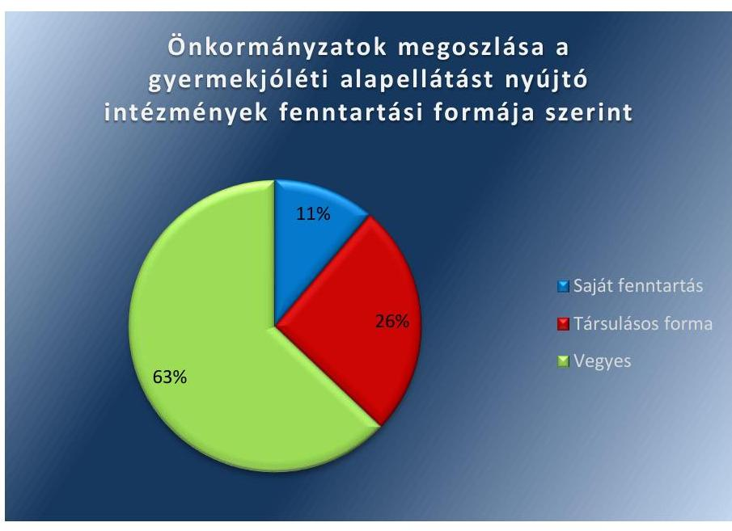

Forrás: önkormányzati adatszolgáltatás

---

# AZ ELLENŐRZÉS HÁTTERE, INDOKOLTSÁGA 

A gyermek- és ifjúságvédelem célja a gyermekek családban történő nevelkedésének támogatása, veszélyeztetettségük megelőzése és megszüntetése, valamint azoknak a gyermekeknek a helyettesítő védelme és a neve-lésükről-gondozásukról történő gondoskodás, akik hatósági intézkedés következtében kikerülnek vér szerinti családjukból. A rászoruló családok, gyermekek által igénybe vehető gyermekvédelmi szolgáltatásokon belül a gyermekjóléti alapellátások minden család számára rendelkezésre állnak, míg a gyermekvédelmi szakellátások a családból kiemelt gyermekek gondozását biztosítják.

A Kormány által 2011-ben elfogadott Nemzeti Társadalmi Felzárkózási Stratégia² célokat, feladatokat határozott meg a gyermekjóléti alapellátások terén, amelyek részben már 2007-ben, a „Legyen jobb a Gyermekeknek!" Nemzeti Stratégiában ${ }^{3}$ is megfogalmazásra kerültek. A gyermekvédelmi szakellátások terén az Országgyűlés által 2009-ben elfogadott Nemzeti Ifjúsági Stratégia ${ }^{4}$ tartalmazott célkitűzéseket.

Az ellenőrzés várható eredménye, hogy átfogó értékelést ad az Országgyűlés és az állampolgárok számára a gyermekvédelmi intézményrendszer átalakításának és működtetésének, az ágazati irányítási és fenntartói feladatok ellátásának szabályszerűségéről. Mindezek mellett rámutat azokra a szabályozási, szervezeti pontokra, ahol az intézményrendszer részére előírt feladatok ellátása nem volt teljes körű, illetve amely területeket érintően a gyermekvédelemre előírt célok további intézkedést igényelnek.

Az ÁSZ ${ }^{5}$ az ellenőrzéssel felhívja a figyelmet arra, hogy a gyermekek részére nyújtott gyermekvédelmi-, gyermekjóléti szolgáltatásokkal kapcsolatos fenntartói feladatok szabályszerű ellátása hozzájárul az ellátott gyermekek kedvezőbb életfeltételei megteremtéséhez, a veszélyeztetettség megszűntetéséhez, valamint a nevelésbe vett gyermekek részére otthont nyújtó ellátás biztosításához. Az ellenőrzés egyúttal az összehasonlítási, összemérési lehetőségek kihasználásával objektív visszajelzést ad a döntéshozók, az ellenőrzöttek, az irányító szervek és a társadalom számára a személyes gondoskodást nyújtó gyermekvédelem intézményrendszerében a mérhető szakmai teljesítménykövetelmények kialakításáról, azok alkalmazásáról, a gyermekvédelemmel kapcsolatos jogalkotói célok teljesüléséről.

---

# A JELENTÉS LÉNYEGES KÉRDÉSKÖREI 

1.     - A gyermekek védelmét biztosító intézmények központi, valamint önkormányzati fenntartói a jogszabályoknak megfelelően alakí-tották-e ki a gyermekek védelmét biztosító intézményrendszer belső szabályozását?
2.     - A gyermekek védelmét biztosító intézmények központi és önkormányzati fenntartói jogkörüket szabályszerűen gyakorolták-e?
3.     - Az ágazati irányítást ellátó miniszter, valamint a központi és önkormányzati intézmények fenntartói a gyermekvédelmi intézményrendszer átalakításával, átszervezésével kapcsolatos feladataikat szabályszerűen látták-e el?
4.     - A gyermekvédelmi feladatokat ellátó intézményrendszer szereplői a személyes gondoskodást nyújtó gyermekvédelmi tevékenységükkel összefüggésben a nemzeti stratégiákban meghatározott feladatokat, illetve saját maguk által kitüzött célokat, célértékeket teljesítették-e?
5. A személyes gondoskodást nyújtó gyermekvédelmi feladatellátás eredménye a gyermekvédelmi feladatokat ellátó intézményrendszer szereplőinél az ÁSZ által meghatározott eredményességi mutatók alapján javult-e az ellenőrzött időszakban?

---

# ELLENŐRZÉS HATÓKÖRE ÉS MÓDSZEREI 

## Az ellenőrzés típusa

Megfelelőségi és teljesítmény-ellenőrzés.

## Az ellenőrzött időszak

A 2011. január 1-jétől 2015. december 31-éig, a teljesítmény-ellenőrzés vonatkozásában a központi irányító és fenntartó szervek esetében a 2012. január 1-jétől 2015. december 31-éig terjedő időszak.

## Az ellenőrzés tárgya

A megfelelőségi ellenőrzés során az ÁSZ értékelte a gyermekjóléti és gyermekvédelmi feladatokat ellátó intézményrendszeren belül fenntartói feladatokat ellátó központi szervek és kiválasztott önkormányzatok gyermekvédelemmel összefüggő szabályozási feladatainak ellátását, a fenntartói jogkörök szabályszerű gyakorlását, a fenntartók részére előírt - ezen belül a 2012-2014. években több szakaszban lefolytatott intézményrendszeri átalakítással kapcsolatos - kötelezettségek végrehajtását. Az ellenőrzés kiterjedt az egyes gyermekjóléti és gyermekvédelmi ellátások engedélyezésének, megszűntetésének, átalakításának jogszabályokkal összhangban történő végrehajtására, az ágazati miniszter gyermekvédelmi feladatellátást koordináló tevékenységére, az előírt kötelezettségek teljesítésére.

A teljesítmény-ellenőrzés során az ÁSZ értékelte a gyermekvédelem intézményrendszerének kiválasztott önkormányzatai, valamint központi irányító és fenntartó szervezetei vonatkozásában a személyes gondoskodást nyújtó gyermekvédelmi feladatellátás folyamatában a célok, célértékek kialakítását, valamint a célkitűzések teljesítését, továbbá az ÁSZ által meghatározott eredményességi mutatók alakulását.

Az ellenőrzés kiterjedt minden olyan körülményre és adatra, amely az ÁSZ jogszabályban meghatározott feladatainak teljesítéséhez, valamint a program végrehajtása folyamán felmerült újabb összefüggések feltárásához szükséges volt.

## Az ellenőrzött szervezet

Az Emberi Erőforrások Minisztériuma (központi irányító), valamint a Szociális és Gyermekvédelmi Főigazgatóság (központi fenntartó), továbbá a II. számú melléklet szerinti, mintavétellel kiválasztott önkormányzatok.

---

# Az ellenőrzés jogalapja 

Az ÁSZ tv. ${ }^{6}$ 1. § (3)-(4) és az 5. § (2)-(5) bekezdéseiben foglaltak.

## Az ellenőrzés módszerei

Az ellenőrzést az ÁSZ a nemzetközi standardokat irányadónak tekintve, az ellenőrzési program szempontjai, az ellenőrzött időszakban hatályos jogszabályok, az ellenőrzés szakmai szabályai és az egyes ellenőrzési típusokhoz kapcsolódó ÁSZ módszertanok alapján végezte. Az ellenőrzés ideje alatt az ellenőrzött szervezetekkel történő kapcsolattartás az ÁSZ SZMSZ ${ }^{7}$ ének vonatkozó előírásai alapján történt.

Az ellenőrzési kérdések megválaszolásához szükséges bizonyítékok megszerzése a következő ellenőrzési eljárások alkalmazásával történt: megfigyelés, szemle (szemrevételezés), kérdésfeltevés (információkérés), tételes dokumentumellenőrzés, mintavételezés, valamint elemző eljárás. Az ellenőrzés a kérdésekre adott válaszok kiértékelésével, a tanúsítványok felhasználásával, továbbá az adott időszakban hatályos jogszabályok figyelembe vételével került lefolytatásra.

Az ellenőrzési bizonyítékként felhasználható adatforrások közé tartoztak egyrészt az ellenőrzési program részletes szempontjainál felsorolt adatforrások, másrészt adatforrás volt minden egyéb - az ellenőrzés folyamán feltárt, az ellenőrzés szempontjából információt tartalmazó - dokumentum. Az ellenőrzés lefolytatásához az ellenőrzött szervezetek a tanúsítványok kitöltésével, valamint az ÁSZ által kért dokumentumok elektronikus megküldésével szolgáltattak adatokat, információkat. A rendelkezésre bocsátott adatok, információk kontrollja az ellenőrzés keretében történt.

A gyermekjóléti alapellátások az ellenőrzésre reprezentatív mintavétellel kiválasztott önkormányzatoknál, az önkormányzati rendszer egészére vonatkozóan országos szinten, a gyermekvédelmi szakellátások a Szociális és Gyermekvédelmi Főigazgatóság ellenőrzése alapján szintén országos szinten kerültek értékelésre. Az ÁSZ a központi fenntartású intézmények nagy számosságára tekintettel a fenntartói jogkörök szabályszerű gyakorlását a reprezentatív módon kiválasztott intézmények tekintetében értékelte.

A feladatellátás eredményességének egységes értékelése érdekében az ÁSZ a Gyermekvédelmi törvény céljaiként meghatározott alapvető területeken - azaz a gyermekek jogainak és érdekeinek érvényesítése, veszélyeztetettségének megelőzése, a gyermekek családban történő nevelkedésének elősegítése, a szülői kötelességek teljesítéséhez történő segítségnyújtás, valamint a fiatal felnőttek társadalmi beilleszkedésének elősegítése terén - az alábbi mutatókat alkalmazta a teljesítmény-ellenőrzés során:

A központi fenntartású intézményrendszer által biztosított, személyes gondoskodást nyújtó gyermekvédelmi szakellátások esetében

1. a nevelőszülőknél elhelyezett gyermekek számának az összes ideiglenesen elhelyezett, illetve nevelésbe vett gyermek számához viszonyított aránya, külön-külön a 12 év alatti, valamint a 12 éves és afeletti korcsoportokra;

---

2. a véglegesen családhoz került gyermekek aránya az összes otthonban és nevelőszülőnél elhelyezett gyermekek között;
3. az örökbeadott gyermekek összes örökbe adható gyermek számához viszonyított aránya, külön-külön a 3 év alatti, a 3-10 éves és 10 év feletti korcsoportokban;
4. a képzésben résztvevők aránya az utógondozásba vett, 18 éven felüli ellátotti korcsoportban.
A helyi önkormányzatok által biztosított, személyes gondoskodást nyújtó gyermekjóléti alapellátások esetében
5. a teljesített gyermekjóléti szolgáltatások éves számának a jogosultak által igényelt, illetve részükre jogszabály alapján kötelezően előírt gyermekjóléti szolgáltatások számához viszonyított aránya;
6. a gyermekek napközbeni ellátására felvettek aránya az ellátásokat igénylő, jogosult gyermekekhez képest;
7. az átmeneti gondozásból hazagondozásnak köszönhetően véglegesen kikerült gyermekeknek az átmeneti gondozásba vett összes gyermekhez viszonyított aránya.

---

# MEGÁLLAPÍTÁSOK 

## 1. A gyermekek védelmét biztosító intézmények központi, valamint önkormányzati fenntartói a jogszabályoknak megfelelően alakították-e ki a gyermekek védelmét biztosító intézményrendszer belső szabályozását?

Összegző megállapítás

A gyermekek védelmét biztosító intézményrendszer szabályozását a központi és önkormányzati fenntartók nem megfelelően alakították ki.

### 1.1. számú megállapítás

A gyermekek védelmét biztosító intézmények központi fenntartói nem a jogszabályoknak megfelelően alakították ki a gyermekek védelmét biztosító intézményrendszer belső szabályozását.

A SZERVEZETI MŰKÖDÉS terén az SZGYF ${ }^{8}$ 2012. év végi megalakulásától kezdve mintegy két és fél éven keresztül az Áht. ${ }^{9}$ előírásai ellenére nem rendelkezett SZMSZ ${ }^{10}$-el, mivel az EMMI ${ }^{11}$ minisztere az SZGYF SZMSZ ${ }^{12}$-ét 2015. június 20-i hatállyal adta ki. A feladatok, felelősségek, hatáskörök szabályozásának hiányában az SZMSZ kiadásáig nem voltak biztosítottak az SZGYF átlátható és elszámoltatható működésének alapvető feltételei.

A fenntartott intézmények belső szakmai szabályzatainak elveit és főbb tartalmi követelményeit az SZGYF főigazgatója annak ellenére nem határozta meg, hogy ezt a kötelezettséget számára az SZGYF SZMSZ-e előírta. Így nem gondoskodott a gyermekvédelmi ellátások egységes, átlátható szabályozásáról.

## AZ INTÉZMÉNYEK GAZDÁLKODÁSI RENDJÉNEK

meghatározása során a fenntartók nem tartották be a jogszabályi előírásokat.

Az SZGYF által rendelkezésre bocsátott dokumentumok alapján az ÁSZ megállapította, hogy a megyei önkormányzatoktól 2012. január 1-jével átvett gyermekvédelmi intézményekkel a MIK ${ }^{13}$-ek az Ávr. ${ }^{14}$ előírásai ellenére vagy nem kötöttek munkamegosztási megállapodást, vagy több hónappal az átvételt követően, esetenként visszamenőleges hatállyal kötötték meg azt. Így a gazdálkodás rendje a munkamegosztási megállapodással rendelkező intézmények esetében is hosszú ideig szabályozatlan volt.

A 2013-ban az SZGYF fenntartásába került gyermekvédelmi intézményrendszer összességében egészen 2015-ig úgy múködött, hogy az intézmények és a gazdasági feladatokat ellátó fenntartók között a gazdálkodással kapcsolatos munkamegosztás és felelősségvállalás rendjét az Ávr. rendelkezései ellenére nem szabályozták.

---

A munkamegosztási megállapodásokat összességében 2015. II. félévében kötötték meg. Ezek tartalma, struktúrája nem volt egységes, ugyanakkor többségük olyan előírást tartalmazott, amely szerint az Áhsz. ${ }^{15}$-ben meghatározott, a gazdálkodás keretrendszerét alkotó szabályzatokat az intézmények készítik el, és azokat az SZGYF megyei gazdasági osztályai hagyják jóvá. Az intézmények szabályzatainak jóváhagyása - a Bács-Kiskun Megyei Gyermekvédelmi Központ és Területi Gyermekvédelmi Szakszolgálat kivételével - ennek ellenére nem történt meg, így az intézményi szabályzatok egységes elvek szerinti szakmai kontrollja, a gazdálkodási feladatok szabályozási keretrendszerének homogenitása nem volt biztosított.

A 2013-2015. években az intézmények gazdálkodási feladatait ellátó SZGYF gazdasági szervezete az Ávr.-ben előírtak ellenére nem rendelkezett ügyrenddel. A gazdasági feladatok munkafolyamatainak szabályozatlansága következtében nem volt biztosított a feladatellátás átláthatósága és számon kérhetősége.
1.2. számú megállapítás

Az önkormányzatok a gyermekek védelmét biztosító intézményrendszer belső, illetve helyi szintű szabályozását összességében nem a jogszabályi előírásoknak megfelelően alakították ki, így nem volt biztosított a gyermekvédelmi feladatok átlátható és elszámoltatható módon történő ellátása.

# A GYERMEKEK VÉDELMÉT BIZTOSÍTÓ INTÉZ- 

MÉNYRENDSZER SZABÁLYOZÁSA terén az önkormányzatok az általuk biztosított személyes gondoskodás keretébe tartozó gyermekjóléti alapellátások vonatkozásában a Gyvt. ${ }^{16}$ előírásai ellenére nem, vagy nem a teljes ellenőrzött időszakban szabályozták
$\longrightarrow$ az önkormányzat által biztosított személyes gondoskodás formáit (Bezi, Börcs, Budakalász, Dunakeszi, Dunaújváros, Fábiánsebestyén, Győrújbarát, Inárcs, Katafa, Kárász, Kokad, Makó, Mezőcsát, Mórahalom, Nagybajom, Örvényes, Pécsudvard, Piliscsaba, Siófok, Solymár, Szarvas, Szeged, Szentendre, Szentlőrinc, Vásárosbéc),
$\longrightarrow$ a személyes gondoskodást nyújtó ellátások térítési díjait (Barcs, Dunakeszi, Mád, Makó, Mátészalka, Mezőcsát, Mórahalom, Nagybajom, Paks, Piliscsaba, Püspökladány, Siófok, Szeged, Szentgotthárd),
$\longrightarrow$ az ellátás igénybevételére irányuló kérelem benyújtásának módját és a kérelem elbírálásának szempontjait (Alsózsolca, Barcs, Budakalász, Budapest III. Kerület, Budapest V. Kerület, Budapest VIII. Kerület, Dombóvár, Dunakeszi, Dunaújváros, Fábiánsebestyén, Győrújbarát, Hajdúböszörmény, Kalocsa, Kesznyéten, Lajosmizse, Makó, Mád, Mátészalka, Mezőcsát, Mórahalom, Nagybajom, Orgovány, Paks, Pécs, Piliscsaba, Pirtó, Püspökladány, Ráckeve, Siófok, Sopron, Szarvas, Szeged, Szentgotthárd, Szentlőrinc, Sződliget, Tápiószecső, Újklgyós), továbbá
$\longrightarrow$ az ellátás megszűnésének eseteit és módjait (Alsózsolca, Budapest III. Kerület, Budapest VIII. Kerület, Budapest XIX. Kerület, Dombóvár, Dunakeszi, Dunaújváros, Fábiánsebestyén, Győrújbarát, Hajdúböszörmény, Kalocsa, Kesznyéten, Lajosmizse, Mád, Makó, Mátészalka, Mezőcsát, Mórahalom, Nagybajom, Orgovány, Paks, Pécs, Piliscsaba, Pirtó, Püspökladány, Ráckeve, Siófok, Szarvas, Szeged, Szentendre, Szentgotthárd, Szentlőrinc, Sződliget, Újkígyós).

---

AZ ELLÁTÁSRA VALÓ JOGOSULTSÁGGAL KAPCSOLATOS DÖNTÉSHOZATAL rendszerét az önkormányzatok összességében - a hatáskörükbe tartozó ellátások tekintetében - nem a jogszabályban előírtak szerint szabályozták, mivel a gyermekjóléti és gyermekvédelmi szolgáltató tevékenységet ellátó intézmények fenntartói a Gyvt. rendelkezései ellenére
$\longrightarrow$ nem minden esetben döntöttek az intézmények alapító okiratainak elfogadásáról (Dunakeszi, Fábiánsebestyén, Győrújbarát, Makó, Mezőcsát, Mórahalom, Nagybajom, Siófok, Tápiószecső, Törökbálint),
$\longrightarrow$ nem minden esetben hagyták jóvá az intézmények SZMSZ-ét (Balmazújváros, Barcs, Budakalász, Dombóvár, Győrújbarát, Mád, Mezőcsát, Nagybajom, Orgovány, Piliscsaba, Püspökladány, Ráckeve, Sződliget, Tápiószecső, Törökbálint, Újkígyós), valamint
$\longrightarrow$ nem minden esetben hagyták jóvá az intézmények szakmai programját (Budapest XIX. Kerület, Dombóvár, Fábiánsebestyén, Győrújbarát, Mád, Makó, Mezőcsát, Nagybajom, Orgovány, Paks, Pécs, Püspökladány, Ráckeve, Siófok, Szarvas, Szeged, Szentendre, Szentgotthárd, Szentlőrinc, Sződliget, Tápiószecső, Törökbálint, Újkígyós).

# 2. A gyermekek védelmét biztosító intézmények központi és önkormányzati fenntartói jogkörüket szabályszerűen gyakorol-ták-e? 

Összegző megállapítás

A gyermekek védelmét biztosító intézmények tekintetében a fenntartók nem szabályszerűen gyakorolták fenntartói jogkörüket.
2.1. számú megállapítás

A gyermekek védelmét biztosító központi intézményrendszer tekintetében a fenntartók nem a jogszabályi előírásoknak megfelelően gyakorolták a fenntartói feladat- és jogköröket, nem volt biztosított az intézmények szabályozott és szabályszerű müködése, nem érvényesültek az átláthatóság és elszámoltathatóság követelményei. A fenntartói jogok gyakorlásának szabályszerűsége ugyanakkor az ellenőrzött időszakban javuló tendenciát mutatott.

AZ ÚJ ALAPÍTÓ OKIRATOKAT a 2012. január 1-jén a megyei önkormányzatoktól átvett gyermekvédelmi intézmények részére a KIM ${ }^{17}$, az SZGYF által az ellenőrzés rendelkezésére bocsátott dokumentumok alapján 2012 szeptemberében, az átvétel napjára visszamenőleges hatálylyal adta ki, így azok 2012. első három negyedévében hatályos alapító okirat nélkül múködtek.

Az SZGYF nem gondoskodott arról, hogy a fenntartásában múködő intézmények teljes körűen, az ellenőrzött időszakon belül folyamatosan rendelkezzenek érvényes alapító okirattal.

A központi fenntartású intézmények alapító okiratainak kiadásához és módosításához a fenntartók az államháztartásért felelős miniszter előzetes egyetértését az Áht.-ben előírtak ellenére nem kérték meg.

---

AZ INTÉZMÉNYEK SZMSZ-ei az ellenőrzött időszakban többször módosításra kerültek. Az SZMSZ-ek Gyvt.-ben előírt fenntartói jóváhagyása nem mindegyik központi fenntartású intézménynél történt meg minden esetben, a Szabolcs-Szatmár-Bereg Megyei Kirendeltség intézményeinél a teljes ellenőrzött időszakra vonatkozóan elmaradt.

Az SZGYF által rendelkezésre bocsátott dokumentumok alapján a MIKek a Gyvt. rendelkezései ellenére 2012 folyamán nem gondoskodtak az érdekképviseleti fórum megalakításának feltételeiről. Ezeket az SZGYF a MIKek beolvadását követően, 2013 júniusában szabályozta.

A MIK-ek az általuk fenntartott intézmények esetében a térítési díjakat az SZGYF által rendelkezésre bocsátott dokumentumok alapján 2012-ben a Gyvt. előírásai ellenére összességében nem határozták meg. A 2015. évben ez a hiányosság az SZGYF Csongrád, Győr-Moson-Sopron, Pest és Somogy Megyei Kirendeltségei, valamint az SZGYF központi szerve közvetlen fenntartásában álló intézmények esetében fordult elő.

A FENNTARTÓI ELLENŐRZÉSEK éves szinten folyamatosan növekvő mértékben fedték le a központi fenntartású intézményrendszert, függetlenül attól, hogy a törvény az ellenőrzések gyakoriságát nem határozta meg. Míg a Gyvt. előírásainak megfelelően végzett gazdasági vagy szakmai jellegű fenntartói ellenőrzések 2012-ben a központi fenntartású intézmények negyedét, 2015-ben már túlnyomó többségét érintették. Ezt szemlélteti a 2. ábra.
2. ábra
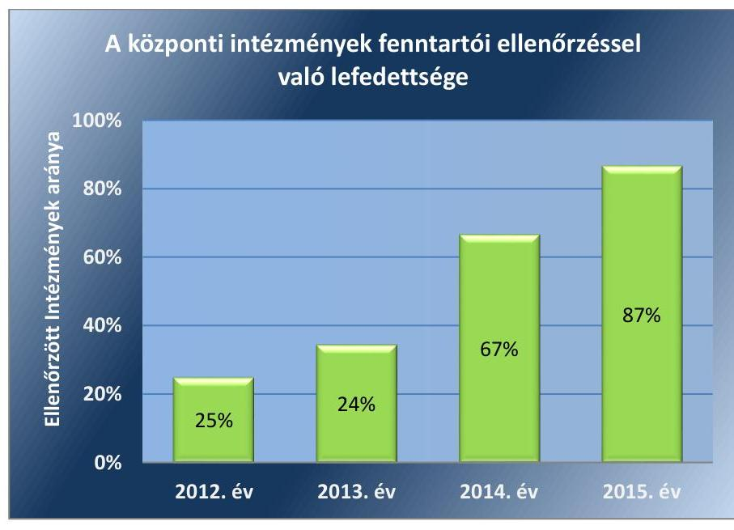

A központi fenntartók a Gyvt. előírásai ellenére nem gondoskodtak a szakemberek képzéséről, továbbképzéséről, azt az intézmények saját hatáskörébe utalták. Ezzel nem biztosították a gyermekvédelmi feladatok egységes szakmai színvonalát az intézményrendszer szintjén.

A SZAKMAI MUNKA ÉS A GAZDÁLKODÁS ÉRTÉKELÉSE Gyvt.-ben előírt kötelezettségének a fenntartók nem teljes kö-

---

rűen tettek eleget a központi fenntartású intézmények tekintetében. Ennek aránya az ellenőrzött időszak egészét tekintve javuló tendenciát mutatott. A fenntartói értékeléssel érintett intézmények arányának évenkénti alakulását a 3. ábra mutatja be.
3. ábra
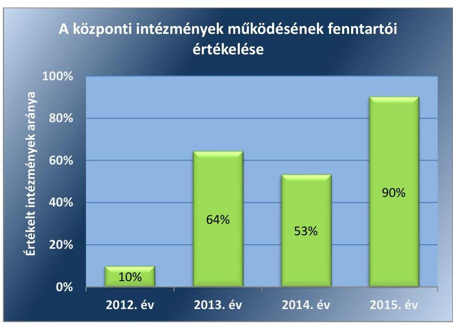

Forrás: SZGYF adatszolgáltatás
A gyermekjóléti és gyermekvédelmi feladatok ellátásának Gyvt. szerint előírt évenkénti átfogó értékelését a Csongrád, Nógrád, Pest, Szabolcs-Szatmár-Bereg és Vas Megyei Kirendeltségek, valamint az SZGYF központi szerve, mint fenntartók a teljes ellenőrzött időszakban, továbbá a Bács-Kiskun, Hajdú-Bihar, Komárom-Esztergom, Somogy, Tolna és Veszprém Megyei Kirendeltségek egyes években nem készítették el. Az átfogó értékelések készítésének évenkénti alakulását a 4. ábra szemlélteti.
4. ábra
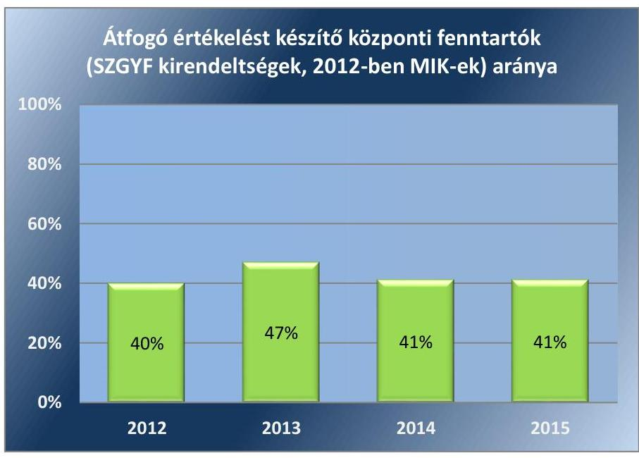

Forrás: SZGYF adatszolgáltatás

---

### 2.2. számú megállapítás

Az önkormányzatok a gyermekvédelem helyi ellátó rendszerét öszszességében nem szabályszerűen építették ki és nem szabályszerűen múködtették, így a jogszabályokban előírt ellátások nem voltak megfelelően biztosítottak.

A GYERMEKJÓLÉTI SZOLGÁLTATÁST az önkormányzatok a Gyvt.-ben meghatározott formában összességében megfelelően megszervezték. Azonban egyes önkormányzatok nem minden évben biztosították a Gyvt. előírásai szerint a gyermekjóléti szolgáltatás körébe tartozó összes feladat ellátását.

Gyermekjóléti központ múködtetésére kötelezett ellenőrzött önkormányzatok közül a Gyvt. előírásai ellenére
$\longrightarrow$ Budapest Főváros VIII. Kerület Józsefvárosi Önkormányzat 2011. január 1. és 2011. április 30. között,
$\longrightarrow$ Dunakeszi Város Önkormányzata 2012. január 1. és 2013. október 31. között,
$\longrightarrow$ Dunaújváros Megyei Jogú Város Önkormányzata a teljes ellenőrzött időszakban, továbbá
$\longrightarrow$ Pécs Megyei Jogú Város Önkormányzata 2011. január 1. és 2012. június 30. között
gyermekjóléti központot nem múködtetett.

## A VESZÉLYEZTETETTSÉGET ÉSZLELŐ ÉS JELZŐ-

RENDSZERT a gyermekek veszélyeztetettségének megelőzése érdekében az önkormányzatok múködtették, azonban ennek keretében a Gyvt. előírásai ellenére nem került sor együttműködés kialakítására valamennyi, a Gyvt.-ben meghatározott személlyel és intézménnyel.

Az egyes jelzőrendszeri tagokkal az önkormányzati rendszeren belül - a veszélyeztetettséget észlelő és jelzőrendszer keretében - kialakított együttműködés intenzitását az 5. ábra mutatja be.

---

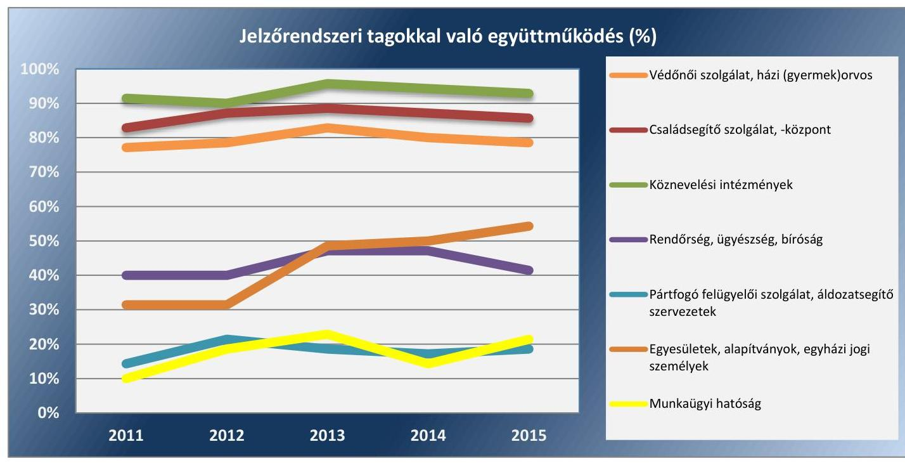

Forrás: 2011-15. évi átfogó értékelések, intézményi beszámolók, jelzőrendszeri jegyzőkönyvek, KSH adatszolgáltatás

A veszélyeztetettséget észlelő és jelzőrendszer tagjai közül:
$\longrightarrow$ a védőnői szolgálat, a családsegítő szolgálat és központ, valamint a köznevelési intézmények képviselői a jelzőrendszeri megbeszéléseken rendszeresen részt vettek, jelzéseket nagy számban tettek;
$\longrightarrow$ a házi orvosok és gyermekorvosok, valamint a rendőrség a jelzőrendszeri megbeszéléseken ritkán vettek részt, jelzéseket ugyanakkor rendszeresen tettek.
A veszélyeztetettséget észlelő és jelzőrendszer további, Gyvt.-ben meghatározott tagjai a jelzőrendszeri találkozókon néhány kivételtől eltekintve nem vettek részt, jelzés pedig jellemzően nem érkezett tőlük.

A GYERMEKEK NAPKÖZBENI ELLÁTÁSÁT az önkormányzatok többségükben bölcsőde működtetésével biztosították.

A település lakosságszáma alapján bölcsőde működtetésére kötelezett ellenőrzött önkormányzatok közül a Gyvt. előírásai ellenére
$\longrightarrow$ Maglód Város Önkormányzata a teljes ellenőrzött időszakban, továbbá
$\longrightarrow$ Solymár Nagyközség Önkormányzata 2011. január 1. és 2013. szeptember 04. között
bölcsődét nem működtetett.
A település lakosságszáma alapján bölcsőde működtetésére nem kötelezett önkormányzatok közel fele bölcsődét valamilyen formában működtetett. Ugyanakkor a bölcsődét nem működtető önkormányzatok összességében a Gyvt. előírásai ellenére nem szervezték és nem közvetítették a máshol igénybe vehető bölcsődei ellátáshoz való hozzájutást. A bölcsődei ellátás biztosításáról a 6. ábra ad áttekintést.

---

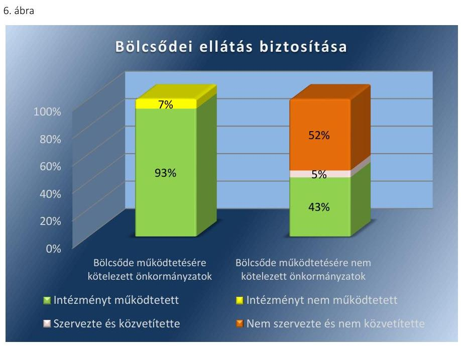

Forrás: önkormányzati adatszolgáltatás
Az önkormányzati rendszerben csekély mértékben, elsősorban a nagyobb lakosságszámú önkormányzatoknál jelentek meg a Gyvt. által szabályozott, a gyermekek napközbeni ellátásának biztosítására választható egyéb ellátási formák. Ezek közül az alternatív napközbeni ellátás és a családi napközi az önkormányzatok mintegy tizedénél, a Biztos Kezdet Gyerekház és házi gyermekfelügyelet ennél is ritkábban fordult elő.

A GYERMEKEK ÁTMENETI GONDOZÁSA keretében gyermekek és/vagy családok átmeneti otthona működtetésére a település lakosságszáma alapján kötelezett önkormányzatok közül a Gyvt. előírásai ellenére
$\longrightarrow$ Budapest Főváros VIII. Kerület Józsefvárosi Önkormányzat 2011. január 1. és 2011. december 31. között családok átmeneti otthonát,
$\longrightarrow$ Dunakeszi Város Önkormányzata a teljes ellenőrzött időszakban gyermekek átmeneti otthonát, 2011. január 1. és 2013. október 30. között családok átmeneti otthonát,
$\longrightarrow$ Hajdúböszörmény Város Önkormányzata a teljes ellenőrzött időszakban gyermekek és családok átmeneti otthonát, továbbá
$\longrightarrow$ Makó Város Önkormányzata és Siófok Város Önkormányzata a teljes ellenőrzött időszakban gyermekek átmeneti otthonát
nem múködtetett.
A település lakosságszáma alapján gyermekek és családok átmeneti otthona működtetésére nem kötelezett és ilyen intézményt önkéntesen nem működtető önkormányzatok összességében a Gyvt.-ben előírtak ellenére nem szervezték és nem közvetítették a gyermekek és családok átmeneti otthona ellátáshoz máshol igénybe vehető hozzájutást. A gyermekek, illetve családok átmeneti otthona ellátás biztosításáról a 7. ábra ad áttekintést.

---

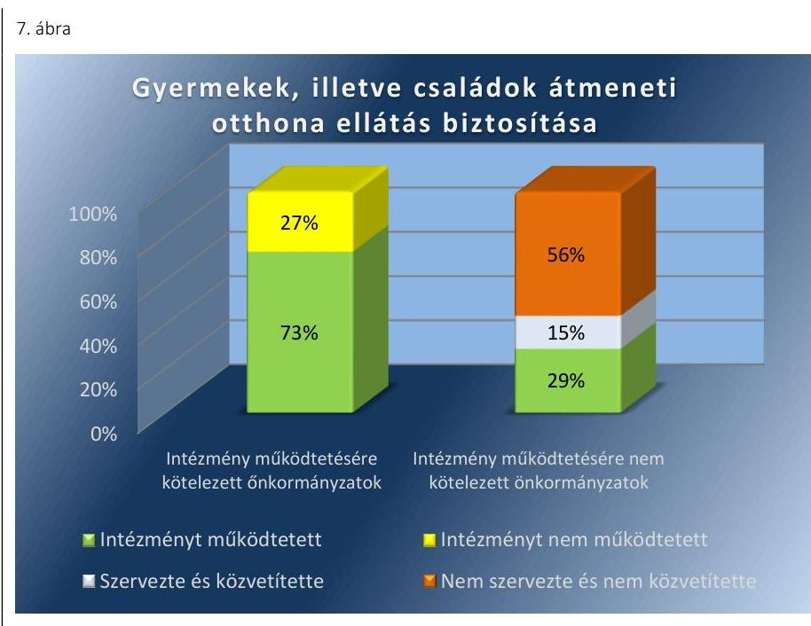

Fornás: önkormányzati adatszolgáltatás:
ELLÁTÁSI SZERZŐDÉST a személyes gondoskodás keretébe tartozó gyermekjóléti alapellátásokra az önkormányzatok mintegy ötöde, elsősorban a nagyobb lakosságszámú települések kötöttek állami, vagy nem állami intézményfenntartókkal. A megkötött ellátási szerződések nem tartalmaztak rendelkezést a Gyvt.-ben és az Szt. ${ }^{18}$-ben meghatározott minden kötelező tartalmi elemre vonatkozóan. Hiányzott többek között a személyi térítési díj csökkentése, illetve elengedése eseteinek és módjainak, szerződésszegés esetén a szolgáltatás folyamatos biztosításának, valamint a kártérítés mértékének, a panaszkezelés rendjének, az önkormányzat részére történő beszámolás, tájékoztatás módjának, formájának, gyakoriságának szabályozása (Budakalász, Budapest V. Kerület, Budapest XV. Kerület, Dunakeszi, Dunaújváros, Maglód, Pécs, Szarvas, Törökbálint).
2.3. számú megállapítás

Az önkormányzatok a gyermekvédelmi alapellátásokat összességében nem megfelelően ellenőrizték és értékelték, így nem érvényesítették a nyomon követhetőség és elszámoltathatóság követelményeit.

Az intézményfenntartó önkormányzatok a Gyvt.-ben előírtak ellenére nem ellenőrizték a gyermekjóléti és gyermekvédelmi feladatokat ellátó intézményeiknél a gazdálkodás és múködés törvényességét, a szakmai munka eredményességét, a szakmai program végrehajtását, valamint a gazdálkodás szabályszerűségét és hatékonyságát (Budakalász, Budapest X. Kerület, Dombóvár, Fábiánsebestyén, Győrújbarát, Hajdúböszörmény, Inárcs, Lajosmizse, Mád, Makó, Mezőcsát, Mórahalom, Nagybajom, Orgovány, Paks, Pirtó, Püspökladány, Ráckeve, Siófok, Szarvas, Szentlőrinc, Tápiószecső, Törökbálint, Újkígyós).
Az önkormányzatok a gyermekvédelmi feladatok átfogó értékelése kapcsán nem szabályszerűen jártak el, mert
$\longrightarrow$ a Gyvt. előírásai ellenére átfogó értékelést egyáltalán nem vagy nem minden évben készítettek (Aldebrő, Börcs, Detek, Fábiánsebestyén, Kalocsa, Kárász, Kesznyéten, Kisoroszi, Mád, Makó, Mórahalom,

---

# 2.4. számú megállapítás 

Nagybajom, Nyírcsászári, Pécsudvard, Siófok, Sződliget, Tápiószecső, Tök, Vásárosbéc, Zebegény),
az elkészített átfogó értékeléseknek a képviselő-testület részére megtárgyalás céljából történő előterjesztésére a Gyvt. előírásai ellenére esetenként nem került sor (Budapest XV. Kerület, Győrújbarát, Inárcs, Katafa, Nagykapornak, Örvényes, Piliscsaba, Pirtó, Solymár).
A Gyvt. lehetőséget biztosított arra, hogy a fenntartók az intézményeket évente átfogó, szakmai és pénzügyi beszámoló készítésére kötelezzék. Ezzel a lehetőséggel az önkormányzati fenntartók a gyermekjóléti szolgáltatást nyújtó intézményeknél esetenként, míg a gyermekek napközbeni ellátását és gyermekek átmeneti gondozását nyújtó intézményeknél jellemzően nem éltek.

A gyermekjóléti alapellátás biztosítására ellátási szerződést kötött önkormányzatok felé az intézményfenntartók nem teljesítették az Szt.-ben előírt évenkénti beszámolási kötelezettséget (Budakalász, Budapest X. Kerület, Budapest XV. Kerület, Detek, Dunakeszi, Makó, Mórahalom, Szarvas, Törökbálint).

A gyermekjóléti alapellátások biztosításának nyomon követése a gyermekjóléti feladatokat társulásos formában biztosító, kisebb lakosságszámú önkormányzatok körében összességében elmaradt.

Az önkormányzatok a gyámhatósági ellenőrzések alapján előírt intézkedéseket jelentős hiányosságokkal hajtották végre.

Az önkormányzati fenntartású gyermekvédelmi feladatokat ellátó szolgáltatók az önkormányzatok közel felénél a gyámhatósági ellenőrzések alapján az előírt intézkedéseket nem hajtották végre teljes körűen (Budapest V. Kerület, Budapest XIX. Kerület, Dombóvár, Győrújbarát, Nagybajom, Paks, Pécs, Púspökladány, Ráckeve, Solymár, Sopron, Szarvas, Szeged, Szentgotthárd, Szentlőrinc, Sződliget, Tápiószecső, Újki̇gyós).

---

# 3. Az ágazati irányítást ellátó miniszter, valamint a központi és önkormányzati intézmények fenntartói a gyermekvédelmi intézményrendszer átalakításával, átszervezésével kapcsolatos feladataikat szabályszerűen látták-e el? 

Összegző megállapítás

A gyermekvédelmi intézményrendszer átalakításával kapcsolatos feladataikat a miniszter és a központi intézmények fenntartói nem szabályszerűen, míg a helyi szintű átszervezéssel kapcsolatos feladatokat az önkormányzatok összességében szabályszerűen látták el.
3.1. számú megállapítás

A gyermekvédelmi intézményrendszer 2012-2013. évi átalakításával kapcsolatos feladataikat az ágazati irányítást ellátó miniszter és a központi intézmények fenntartói nem szabályszerűen látták el, sérültek a szabályozott és szabályszerű múködés, valamint a felelős, elszámoltatható vagyongazdálkodás követelményei.

A MEGYEI ÖNKORMÁNYZATI GYERMEKVÉDELMI INTÉZMÉNYRENDSZER 2012. ÉVI ÁTVÉTELE során az SZGYF által az ellenőrzés rendelkezésére bocsátott dokumentumok alapján a KIM a MIK kormányrendelet ${ }^{19}$ előírásai ellenére nem gondoskodott az átvétellel érintett intézmények alapító okiratainak módosításáról és azoknak 2012. január 30-i határidővel törzskönyvi nyilvántartásba vétel céljából a MÁK ${ }^{20}$-hoz történő benyújtásáról.

Az ellenőrzés során az ÁSZ az SZGYF által rendelkezésre bocsátott dokumentumok alapján megállapította, hogy a MIK-ek az állam tulajdonosi jogait gyakorló MNV Zrt. ${ }^{21}$-vel a vagyonkezelési szerződéseket - a MIK kormányrendelet mellékletében meghatározott, az átadás-átvételi megállapodás megkötésétől számított 30 napon belüli határidőhöz képest - több hónapos késedelemmel kötötték meg. Ennek következtében vagyonkezelői jogukat a vagyonkezelési szerződéssel le nem fedett időszakban jogszerűen nem gyakorolhatták az MNV Zrt. tulajdonosi joggyakorlása alá tartozó vagyonelemek tekintetében.

Az NFA ${ }^{22}$-ba tartozó vagyonelemek tekintetében az Nfatv. ${ }^{23}$ és a MIK kormányrendelet melléklete szerinti minta megállapodás rendelkezéseiben előírtak ellenére a MIK-ek az SZGYF által rendelkezésre bocsátott dokumentumok alapján az NFA-val sem vagyonkezelési, sem a földrészletek hasznosítására vonatkozó egyéb szerződést nem kötöttek. Ennek következtében ezekre a vagyonelemekre vonatkozóan a MIK-ek vagyonkezelői joga nem jött létre.

A MIK kormányrendelet előírásai ellenére az átadás-átvételi eljárások során a vagyon átadásáról jegyzőkönyv nem, vagy az átadás-átvételi megállapodás megkötésétől számított egy héten belüli jogszabályi határidőhöz képest késedelmesen készült. Így a vagyon tényleges átadás-átvétele, a vagyonelemek számbavétele késedelmesen, vagy nem történt meg.

---

# A TELEPÜLÉSI ÖNKORMÁNYZATI GYERMEKVÉDELMI INTÉZMÉNYRENDSZER 2013. ÉVI ÁTVÉ- 

TELE kapcsán az SZGYF és az ágazat felügyeletét ellátó EMMI miniszter nem gondoskodott az alapító okiratok Áátv. ${ }^{24}$ által előírt törvényi határidőben történő módosításáról és a MÁK-hoz való benyújtásáról.

Az SZGYF kormányrendelet ${ }^{25}$ előírásainak megfelelő átadás-átvételi Megállapodás ${ }^{26}$-okat az SZGYF és az átadó önkormányzatok az átadás-átvétel 2013. január 1-i fordulónapjához képest jóval később, 2013. októberében kötötték meg.

Az SZGYF a MIK-ektől átvett, az MNV Zrt. tulajdonosi joggyakorlása alá tartozó vagyonelemek tekintetében a jogutódlás következtében rendelkezett vagyonkezelési szerződéssel.

Az NFA-ba tartozó, átvett vagyonelemek tekintetében az SZGYF az Nfatv., valamint a Megállapodás rendelkezései ellenére sem vagyonkezelési szerződést, sem az Nfatv. előírásai szerinti, vagyonkezelési jogviszony tartalmáról szóló szerződést nem kötött az NFA-val. Ennek következtében ezekre a vagyonelemekre vonatkozóan az SZGYF vagyonkezelői joga nem jött létre.
3.2. számú megállapítás

A gyermekvédelmi intézményrendszer helyi szintű átszervezésével kapcsolatos feladataikat az önkormányzati intézmények fenntartói összességében szabályszerűen látták el.

INTÉZMÉNY ÁTSZERVEZÉSÉRE, MEGSZÜNTETÉSÉRE, TEVÉKENYSÉGI KÖRÖK MÓDOSÍTÁSÁRA az ellenőrzött önkormányzatok közül 25 esetében került sor az ellenőrzött időszakban, amelyek összességében a Gyvt. és az Áht. előírásainak megfelelően kerültek végrehajtásra.

A Gyvt. és az Szt. 2015. augusztustól hatályos, a gyermekjóléti szolgáltatásokat érintő rendelkezései előírták a gyermekjóléti szolgáltatás ellátási módjának és szervezeti kereteinek 2015. október 15-i határidővel való felülvizsgálatát abból a szempontból, hogy azok a Gyvt. 2016. január 1-jétől hatályos rendelkezéseinek mindenben megfeleltek-e. A törvényi előírás ellenére egyes, a szolgáltatást társulásos formában biztosító önkormányzatok a felülvizsgálatot nem végezték el (Aldebrő, Budakalász, Detek, Dunakeszi, Inárcs, Katafa, Kesznyéten, Mád, Monorierdő, Örvényes, Pécsudvard, Piliscsaba, Rétság, Tök, Vásárosbéc).

---

# 4. A gyermekvédelmi feladatokat ellátó intézményrendszer szereplői a személyes gondoskodást nyújtó gyermekvédelmi tevékenységükkel összefüggésben a nemzeti stratégiákban meghatározott feladatokat, illetve saját maguk által kitűzött célokat, célértékeket teljesítették-e? 

Összegző megállapítás

A gyermekvédelmi feladatokat ellátó intézményrendszer szereplői a személyes gondoskodást nyújtó gyermekvédelmi feladataikkal összefüggésben ellenőrizhető, számon kérhető célokat, célértékeket, továbbá a nemzeti stratégiákban meghatározott feladatok kapcsán mutatókat, célértékeket nem alakítottak ki, így a feladatok teljesülése nem volt nyomon követhető, értékelhető.
4.1. számú megállapítás

A központi irányító szerv a személyes gondoskodást nyújtó gyermekvédelmi ellátások terén a nemzeti stratégiákban rögzített feladatok teljesítésének nyomon követését lehetővé tevő mutatókat és célértékeket nem határozott meg, így a teljesítés nem volt értékelhető.

A bölcsődei és az egyéb napközbeni kisgyermek ellátást szolgáló férőhelyek szolgáltatás-, illetve férőhelyhiányos településeken való bővítését célzó, a Nemzeti Társadalmi Felzárkózási Stratégiában rögzített feladat kapcsán az EMMI, mint központi irányító szerv nem alakított ki konkrét célértékeket és mutatókat. A bölcsődei férőhelyek országos szintű bővítésén túlmenően a feladat végrehajtását szolgálták a Biztos Kezdet Gyerekházak, amelyeket EU forrásokból hozhattak létre a gyermekek helyzete szempontjából leghátrányosabb helyzetű kistérségek. Ugyanakkor a megvalósulás nyomon követésének, eredményessége értékelésének alapvető feltételei hiányoztak, mivel a Stratégiában meghatározott jellemzőkkel rendelkező településekre vonatkozóan elkülönített adatok nem álltak rendelkezésre.

Az önálló életkezdés elősegítése érdekében a szülői szerepre felkészítő módszertanok és képzési tematikák kidolgozásának, illetve modell értékű gyakorlatok és képzések megvalósításának támogatására vonatkozóan - a Nemzeti Ifjúsági Stratégiában rögzített feladat kapcsán - szintén nem került sor célértékek, mutatók, nyomon követési és értékelési módszerek kialakítására. Ezek hiányában a dokumentáltan megtett intézkedések (az érintettek számára megtartott képzések) eredményessége nem volt értékelhető.
4.2. számú megállapítás

A központi irányító szerv a gyermekvédelemmel kapcsolatos feladatai ellátása érdekében meghatározott célokat, azonban azokhoz célértékeket, mutatókat összességében nem rendelt és megvalósulásukat nem követte nyomon.

Az EMMI központi irányító szervként a gyermekvédelem feladatainak ellátása során általános szakmai fejlesztési célokat, ezekhez kapcsolódóan

---

egyes esetekben célértékeket is meghatározott, azonban a célértékek eléréséhez ellenőrizhető és számon kérhető határidőket nem rendelt.

Konkrét szakmai fejlesztési célként került meghatározásra a gyermekvédelmi gyámság jogintézményének 2014. január 1-jétől folyamatosan történő bevezetése, ami a Gyvt. 2014. január 1-jétől hatályos módosításával megvalósult.

A célértékek teljesítése érdekében a központi irányító szerv intézkedést dokumentáltan nem tett, a teljesítés dokumentáltságának hiányában a célok teljesítése a fenti konkrét szakmai cél kivételével nem volt értékelhető.
4.3. számú megállapítás

Az SZGYF országos szinten nem határozott meg célokat a gyermekvédelmi szakellátásokkal összefüggésben. A területi kirendeltségek saját illetékességi területükön esetenként kialakítottak célokat, azonban azok teljesülése nem volt nyomon követhető, értékelhető.

Az SZGYF országos szinten nem határozott meg a gyermekvédelmi szakellátásokkal összefüggésben teljesítményértékelésre alkalmas, mérhető, nyomon követhető és számon kérhető célokat, célértékeket, illetve mutatókat.

Az SZGYF megyei/fővárosi kirendeltségei szintjén a szakmai feladatellátással összefüggésben mérhető, teljesítményértékelésre alkalmas célok dokumentumokkal alátámasztott módon való meghatározása három megyei fenntartó - a Bács-Kiskun, a Heves és a Zala Megyei Kirendeltség esetében történt. A célok teljesülése mutatók, határidők, valamint a megvalósításra vonatkozó dokumentumok hiányában nem volt nyomon követhető, értékelhető.
4.4. számú megállapítás

Az önkormányzati rendszerben nem alakítottak ki teljesítményértékelésre alkalmas célokat, célértékeket és mutatókat a személyes gondoskodást nyújtó gyermekvédelmi alapellátásokkal kapcsolatosan.

Az önkormányzatok a feladatkörükbe tartozó, személyes gondoskodást nyújtó gyermekvédelmi alapellátásokra vonatkozóan teljesítményértékelésre alkalmas, mérhető, nyomon követhető és számon kérhető célokat, célértékeket, mutatókat nem alakítottak ki.

---

# 5. A személyes gondoskodást nyújtó gyermekvédelmi feladatellátás eredménye a gyermekvédelmi feladatokat ellátó intézményrendszer szereplőinél az ÁSZ által meghatározott eredményességi mutatók alapján javult-e az ellenőrzött időszakban? 

Összegző megállapítás

A központi fenntartású intézmények feladatellátásának eredménye egyes kiemelt területeken javult, az önkormányzati fenntartású intézményrendszer az alapellátások egyes területein megőrizte eredményességét, ugyanakkor a gyermekvédelmi feladatellátás eredménye az ÁSZ által meghatározott eredményességi mutatók alapján összességében nem javult.
5.1. számú megállapítás

A központi fenntartású intézményrendszer gyermekvédelmi szakellátásokkal kapcsolatos feladatellátásának eredménye összességében javult a fiatalabb korosztályba tartozó gyermekek nevelőszülőknél való elhelyezése és örökbeadása, továbbá az utógondozás tekintetében. Ugyanakkor egyéb területeken a feladatellátás eredménye összességében romlott.

A családi környezet biztosítását a Gyvt. kiemelt jelentőségű célként kezeli a veszélyeztetett gyermekek személyiségfejlődése szempontjából. Ennek egyik indikátora a nevelőszülőknél elhelyezett gyermekek számának az öszszes ideiglenesen elhelyezett, illetve nevelésbe vett gyermek számához viszonyított aránya. Ez a mutató az ellenőrzött időszakban a 12 év alatti korcsoportban összességében javuló tendenciát mutatott, ami összhangban volt a Gyvt. szabályrendszerében is megjelenő jogalkotói szándékkal (ebben a korosztályban a törvény által konkrétan nevesített kivételektől eltekintve minden esetben nevelőszülőt kell a gyermek ideiglenes gondozási helyéül kijelölni). Ugyanakkor a mutató folyamatos javulása 2015-ben megtört, értéke visszaesett. A 12 év feletti korcsoport esetében a nevelőszülőknél elhelyezett gyermekek aránya alacsony, 20\% alatti értéket és romló tendenciát mutatott. A mutató alakulását korcsoportonként a 8. ábra szemlélteti.
8. ábra
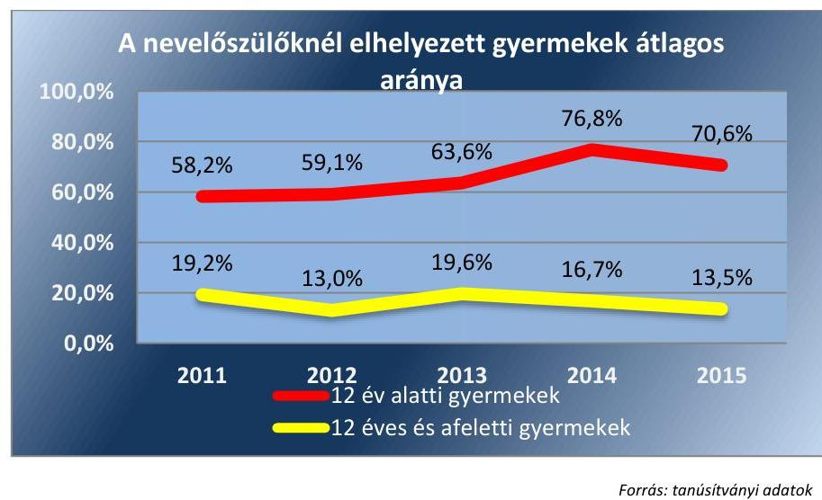

---

A véglegesen családhoz került (hazagondozott és örökbeadott) gyermekek összes otthonban és nevelőszülőnél elhelyezett gyermekhez viszonyított arányának éves átlagos értéke a 2011-2015. közötti időszakban 10\% körüli alacsony értékeket és romló tendenciát mutatott. A mutató alakulását a 9. ábra szemlélteti.
9. ábra
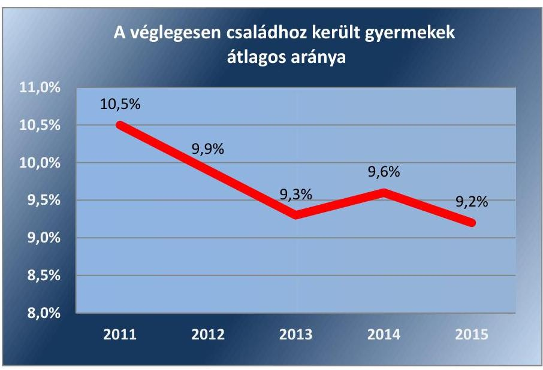

Forrás: tanúsítványi adatok
Az örökbeadott gyermekeknek az örökbe adható gyermekek számához viszonyított aránya a 3 év alatti korcsoportban összességében javuló tendenciát, míg a 3-10 éves korcsoportban jelentős javulást mutatott, átlagos értéke 2011 és 2015 között 82,4\%-ról 86,2\%-ra, illetve 34,7\%-ról 56,4\%-ra javult. A 3 év alatti korcsoportban a Csongrád, Fejér, Komárom-Esztergom, Pest, Szabolcs-Szatmár-Bereg és Tolna megyei TEGYESZ ${ }^{27}$-ek esetében a mutató 100\%-os értékét is megállapította az ellenőrzés. A 10 év feletti korcsoportban ugyanakkor kedvezőtlenül alakult a mutató értéke, a teljes időszakban folyamatosan alacsony szinten, 3\% alatt mozgott. A mutató alakulását korcsoportonként a 10. ábra szemlélteti.
10. ábra
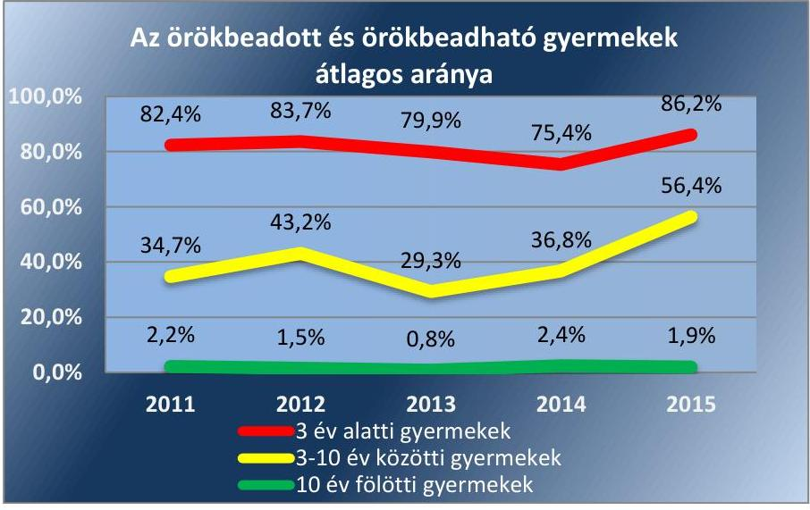

Forrás: tanúsítványi adatok

---

A nevelésbe vételből kikerült fiatal felnőttek társadalmi beilleszkedését támogatják az utógondozás keretében biztosított képzések. Az ilyen képzésben részt vevők átlagos aránya az utógondozásba vett, 18 éven felüli ellátotti korcsoportban az ellenőrzött időszak egészében folyamatosan viszonylag magas, 90\% körüli értékeket mutatott. A Csongrád, Fejér, Győr-Moson-Sopron, Komárom-Esztergom, és Vas megyei TEGYESZ-ek esetében a mutató 100\%-os értéket is elért az ellenőrzött időszak egyes éveiben. Ugyanakkor az átlagos érték 2013-ig tartó markáns javulása az ellenőrzött időszak második felében megtört, a javuló tendenciát nem sikerült fenntartani. A mutató értékének alakulását a 11. ábra szemlélteti.
11. ábra
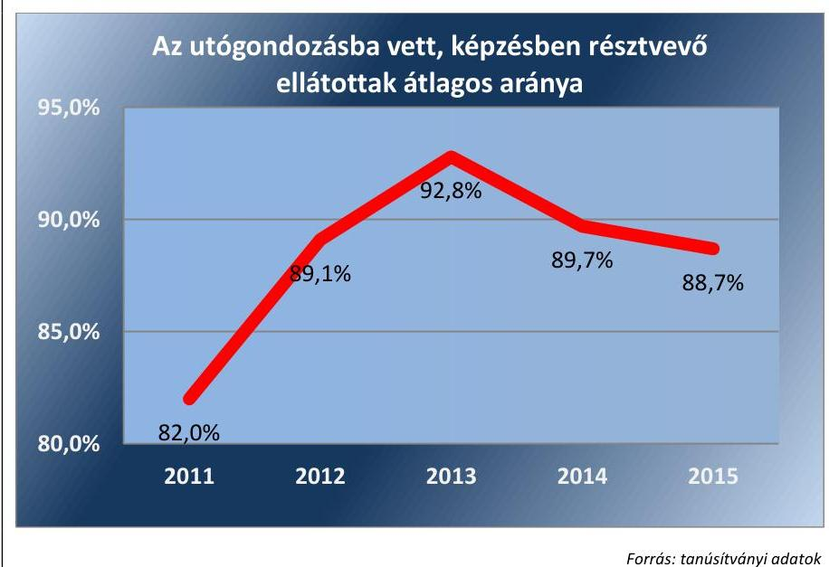

# 5.2. számú megállapítás 

Az önkormányzati rendszer a gyermekjóléti alapellátások közül a gyermekjóléti szolgáltatások és a gyermekek napközbeni ellátása terén fenntartotta a feladatellátás eredményességét, míg az átmeneti gondozás eredménye összességében nem javult.

Az önkormányzati rendszer által teljesített gyermekjóléti szolgáltatások éves számának a jogosultak által igényelt, illetve részükre jogszabály alapján kötelezően előírt gyermekjóléti szolgáltatások számához viszonyított aránya tekintetében az önkormányzati rendszer feladatellátása összességében a teljes ellenőrzött időszakban eredményes volt. Az önkormányzati rendszer a 2011-2015. években a jogosultak által igényelt, illetve részükre jogszabály alapján kötelezően előírt gyermekjóléti szolgáltatásokat csaknem teljes körűen teljesítette. A kisebb, 5 ezer fő állandó lakosságszámot el nem érő települések körében fordult elő esetenként, hogy nem minden arra jogosult, illetve azt igénylő részére biztosították egy adott évben a gyermekjóléti szolgáltatást. A mutató átlagos értéke a teljes ellenőrzött időszakban 99\% fölött volt, alakulását a 12. ábra szemlélteti.

---

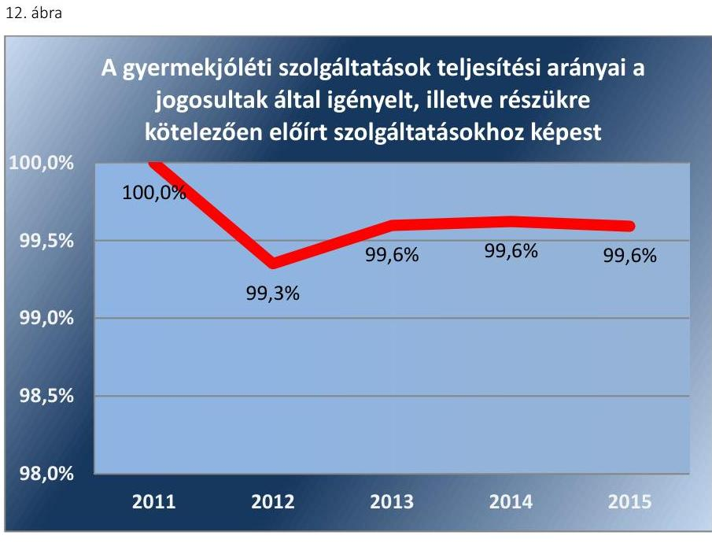

Forrás: tanúsitványi adatok
A gyermekek napközbeni ellátására felvettek aránya az ellátásokat igénylő, arra jogosult gyermekekhez képest stabilan magas értéket mutatott, ami alapján az önkormányzati rendszer feladatellátása összességében eredményes volt. A gyermekek napközbeni ellátásának eredményessége tekintetében a lakosságszám alapján nem tapasztalhatók jelentős eltérések az önkormányzati rendszeren belül. A mutató évenkénti átlagos értéke folyamatosan 97\% fölött volt 2011 és 2015 között, amit a 13. ábra szemléltet.
13. ábra
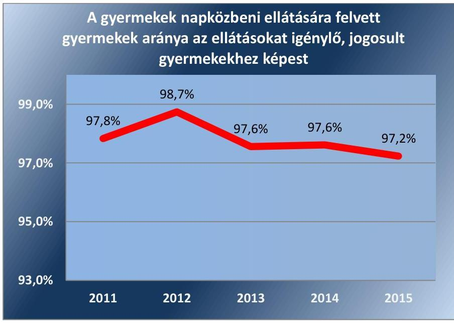

Forrás: tanúsitványi adatok
Az átmeneti gondozás eredményességét az ilyen ellátást nyújtó önkormányzatok körében értékelte az ellenőrzés. Ezt a feladatot jellemzően a 20

---

ezer fő feletti lakosságszámú települések önkormányzatai látták el. Az átmeneti gondozásból hazagondozás miatt véglegesen kikerült gyermekek átlagos aránya folyamatosan 40\% körül volt. Ugyanakkor esetenként a megyei jogú városok és a fővárosi kerületek körében egyes években az átlagosnál jelentősen nagyobb eredményességet tükröző, 70-80\% körüli egyedi arányokat jelző értékek is megállapíthatóak voltak. A mutató alakulását a 14. ábra szemlélteti.
14. ábra
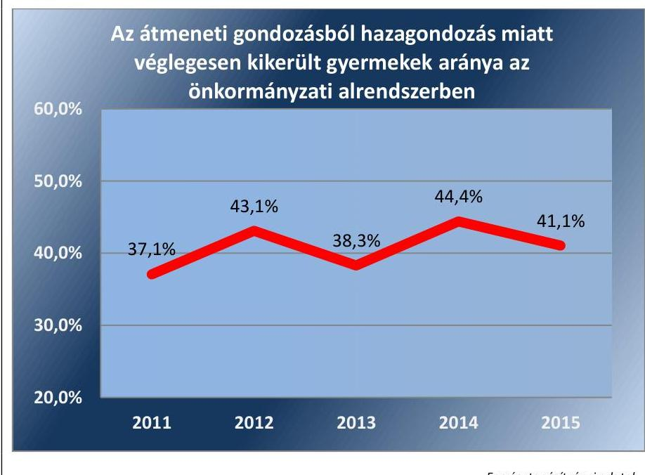

---

.

---

# MELLÉKLETEK 

I. SZ. MELLÉKLET: ÉRTELMEZŐ SZÓTÁR
alternatív napközbeni el-
látás
átfogó értékelés
befogadó szülő
Biztos Kezdet Gyerekház
bölcsőde
családi napközi
családi gyermekfelügyelet
ellátás
fenntartó
gyámhatóság
gyermek
gyermekek átmeneti gondozása
gyermekjólét
gyermekjóléti és gyermekvédelmi szolgáltató tevékenység
játszótéri program, játszóház, klubfoglalkozás keretében nyújtott, szülő és gyermek kapcsolatát erősítő, a gyermek szocializációját támogató, valamint egyéb szabadidős és prevenciós szolgáltatás, a csellengő vagy egyéb okból veszélyeztetett iskoláskorú gyermekek számára nappali felügyelet, sport-, és egyéb foglalkozás, étkeztetés (Gyvt.)
a települési önkormányzat és az állam fenntartói feladatainak ellátására a Kormány rendeletében kijelölt szerv által a gyermekjóléti és gyermekvédelmi feladatainak ellátásáról minden év május 31-éig külön jogszabályban meghatározott tartalommal elkészítendő értékelés (Gyvt.)
befogadott gyermeknek, vagy fiatal felnőttnek átmeneti vagy tartós jelleggel saját háztartásában teljes körű ellátást nyújtó személy, aki lehet helyettes szülő, nevelőszülő, speciális nevelőszülő és különleges nevelőszülő (Gyvt.)
hátrányos helyzetű, vagy halmozottan hátrányos helyzetű, óvodáskort még el ne ért gyermekek egészséges fejlődésének biztosítását támogató, fejlődési megtorpanásokat észlelő, a szülői kompetenciákat erősítő, társadalmi felzárkóztatást segítő prevenciós szolgáltatás (Gyvt.)
a családban nevelkedő 3 éven aluli gyermekek napközbeni ellátását, szakszerű gondozását és nevelését biztosító intézmény (Gyvt.)
a családban nevelkedő húszhetes és tizennégy éves kor között lévő, legfeljebb öt gyermek számára életkoruknak megfelelő nappali felügyelet, gondozás, nevelés, étkeztetés és foglalkozás biztosítása az ellátást nyújtó saját otthonában, vagy más e célra kialakított helyiségben (Gyvt.)
a családban nevelkedő kétéves és négyéves kor között lévő, legfeljebb három gyermek számára életkoruknak megfelelő nappali felügyelet, gondozás, nevelés, étkeztetés biztosítása az ellátást nyújtó saját otthonában (Gyvt.)
a jogszabályban meghatározott pénzbeli, természetbeni, valamint személyes gondoskodást nyújtó alapellátás és szakellátás, továbbá a javítóintézeti ellátás
azok a természetes és jogi személyek, amelyek múködési engedély alapján gondoskodnak a gyermekjóléti és gyermekvédelmi szolgáltató tevékenység biztosításához szükséges feltételekről; költségvetési szerv szolgáltató esetén az alapító okiratban felügyeleti szervként megjelölt állami szerv, helyi önkormányzat vagy önkormányzati társulás
a fővárosi és megyei kormányhivatal, a fővárosi és megyei kormányhivatal járási (fővárosi kerületi) hivatala, a települési önkormányzat jegyzője, valamint a fővárosi önkormányzat által közvetlenül igazgatott terület tekintetében a fővárosi főjegyző (2015.)
a Polgári Törvénykönyv szerinti kiskorú (Gyvt.)
a személyes gondoskodás keretébe tartozó gyermekjóléti alapellátások egyik típusa, amelynek keretében a gyermek saját családjában történő nevelése biztosítottságának hiányában legfeljebb 12 hónap időtartamra befogadó szülőnél, vagy intézményben történő elhelyezéssel kell biztosítani a gyermek életkorának, egészségi állapotának és egyéb szükségleteinek megfelelő teljes körű ellátását (Gyvt.)
a gyermek testi, értelmi, érzelmi és erkölcsi fejlődésének, személyi, vagyoni és egyéb jogainak biztosítása (Gyvt.)
a gyermekjóléti alapellátás, illetve a gyermekvédelmi szakellátás keretében végzett tevékenység, függetlenül a feladatellátás törvényben nevesített formájától és módjától; a szolgáltató tevékenység célja a gyermekjólétnek, azaz a gyermek testi, értelmi, érzelmi és erkölcsi fejlődésének, személyi, vagyoni és egyéb jogainak biztosítása (Gyvt.)

---

gyermekjóléti központ
gyermekjóléti szolgálat
gyermekjóléti szolgáltatás
hazagondozás
házi gyermekfelügyelet
helyettes szülő
intézmény
képzésben résztvevő utógondozottak
követelményrendszer
kritérium
működtető
napközbeni ellátás
nem állami intézményfenntartó
olyan önálló intézményként, illetve szervezeti és szakmai szempontból önálló intézményegységként működő gyermekjóléti szolgálat, amely az általános szolgáltatási feladatain túl a gyermek családban nevelésének elősegítése, a gyermek veszélyeztetettségének megelőzése érdekében a gyermek igényeinek és szükségleteinek megfelelő önálló egyéni és csoportos speciális szolgáltatásokat, programokat nyújt (Gyvt.)
a települési önkormányzat gyermekjóléti szolgáltatás feladatait ellátó önálló intézmény, illetve családsegítő szolgálat, egészségügyi intézmény vagy nevelési-oktatási intézmény szervezeti és szakmai tekintetben önálló intézményegysége, illetve a külön jogszabályban meghatározott képesítési előírásoknak megfelelő személy foglalkoztatása (Gyvt.) olyan a gyermek érdekeit védő speciális személyes szociális szolgáltatás, amely a szociális munka módszereinek és eszközeinek felhasználásával szolgálja a gyermek testi és lelki egészségének, családban történő nevelkedésének elősegítését, a gyermek veszélyeztetettségének megelőzését, a kialakult veszélyeztetettség megszüntetését, illetve a családjából kiemelt gyermek visszahelyezését (Gyvt.)
az átmeneti gondozásban részesített gyermek saját családjához, vagy közeli rokonához történő végleges vissza- vagy elhelyezése
a gyermek életkorához, egészségi állapotához igazodó - a szülő vagy más törvényes képviselő otthonában gondozó által biztosított - gondozás, felügyelet, ha a gyermek állandó vagy időszakos napközbeni ellátása nappali intézményben nem biztosítható és a szülő a gyermek napközbeni ellátását nem vagy csak részben tudja megoldani (Gyvt.) a családban élő gyermek átmeneti gondozását saját háztartásában, egyéni gondozásinevelési terv alapján biztosító huszonnegyedik évet betöltött, büntetlen előéletű, gondnokság alatt nem álló személy (Gyvt.)
a Gyvt.-ben meghatározott gyermekjóléti és gyermekvédelmi szolgáltató tevékenységet végző szervezet vagy annak szakmailag önálló szervezeti egysége, amely a rá vonatkozó külön jogszabályban foglaltak alapján jön létre, legalább három főt foglalkoztat teljes munkaidőben, és tevékenysége múködési engedélyköteles. Ha a törvény másképp nem rendelkezik, az intézmény fogalmát kell megfelelően alkalmazni a helyettes szülői, illetve nevelőszülői hálózatra is (Gyvt.)
azok az utógondozott fiatal felnőttek, akik a társadalmi beilleszkedés, munkába állás, önálló élet megkezdésének elősegítése érdekében szervezett oktatásban, képzésben részesülnek
a kialakított célértékek és/vagy mennyiségi, minőségi célok elérését támogató, belső szabályozási eszközökben rögzített rendelkezés, utasítás, szabályozás, előírás, döntés
az ÁSZ kritériumokban (feltételekben) határozza meg az adatok, információk (indikátorok) értékelésének szempontjait, a teljesítmény kritériumok a kitűzött, elvárt eredmény valamilyen mennyiségi vagy minőségi jellemzőit határozzák meg
az természetes személy, jogi személy, illetve ezek jogi személyiség nélküli szervezete, aki, illetve amely a fenntartó által biztosított múködési feltételek között a gyermekjóléti és gyermekvédelmi szolgáltató tevékenységet szervezi (Gyvt.)
a személyes gondoskodás keretébe tartozó gyermekjóléti alapellátások egyik típusa, amely azon gyermekek részére biztosít életkoruknak megfelelő nappali felügyeletet, gondozást, nevelést, foglalkoztatást és étkeztetést, akiknek szülei, törvényes képviselői munkavégzésük, szervezett képzésben, iskolai rendszerú oktatásban való részvételük, betegségük vagy egyéb ok miatt a gyermek napközbeni ellátásáról nem tudnak gondoskodni (Gyvt.)
humánszolgáltatásokat ellátó intézményt fenntartó egyházi jogi személy, társadalmi szervezet, alapítvány, közalapítvány, országos kisebbségi önkormányzat, nonprofit gazdasági társaság, gazdasági társaság és a humánszolgáltatást alaptevékenységként végző, Szja tv. hatálya alá tartozó egyéni vállalkozó. (központi költségvetési törvény)

---

nevelőszülő
önkormányzati rendszer
örökbe adható gyermek
személyes gondoskodást nyújtó gyermekvédelmi feladatokkal összefüggésben a nemzeti stratégiákban meghatározott célok

Szociális és Gyermekvédelmi Főigazgatóság (SZGYF)
szolgáltató
természetbeni ellátás
területi gyermekvédelmi szakszolgáltatás

Területi Gyermekvédelmi Szakszolgálat (TEGYESZ) utógondozás
veszélyeztetettség
a Polgári Törvénykönyv 4:122. § (2) bekezdése szerinti gyermekvédelmi nevelőszülő a községi, városi, kerületi, valamint a fővárosi önkormányzatok összessége az a kiskorú gyermek, akinek a szülei nem élnek, vagy akit a szülei megfelelően nevelni nem képesek, és az örökbefogadás Polgári Törvénykönyvben meghatározott feltételeinek megfelel
a Nemzeti Ifjúsági Stratégia 2010-2011. évekre vonatkozó cselekvési terve szerinti 2.1. feladat: „Támogatni kell nyilt pályázati felhívás keretében a gyermekvédelmi szakellátás területén működő szolgáltatók esetében az önálló életkezdést támogató szolgáltatások körében a szülői szerepre felkészítő módszertanok és képzési tematikák kidolgozását, modell értékű gyakorlatok és képzések megvalósítását."
a Nemzeti Társadalmi Felzárkóztatási Stratégia szerinti 3. feladat: „A hátrányos, halmozottan hátrányos helyzetű kisgyermekek jó minőségű kora gyermekkori szolgáltatásokhoz való hozzáférésének növelése és szocializációjuk érdekében feladattervet kell készíteni, annak megfelelően bővíteni kell a bölcsődei és az egyéb napközbeni kisgyermek ellátást szolgáló férőhelyeket a szolgáltatás-, illetve a férőhelyhiányos településeken."
a szociál- és nyugdíjpolitikáért felelős miniszter irányítása alá tartozó központi költségvetési szerv, amely ellátja a 2011. évi CLIV. törvény alapján a megyei önkormányzatoktól átvett gyermekvédelmi intézményekkel, valamint a gyermekvédelmi tevékenységet végző alapítványokkal, közalapítványokkal, gazdasági társaságokkal kapcsolatos, illetve az egyes szakosított gyermekvédelmi szakellátási intézmények állami átvételéről és egyes törvények módosításáról szóló 2012. évi CXCII. törvény szerinti feladatokat (a jogállását, feladatait meghatározó 316/2012. (XI. 13.) Korm. rendelet szerint központi szervből, valamint területi szervként működő megyei és fővárosi kirendeltségekből áll, amelyek között megoszlanak az intézmények fenntartásával kapcsolatos feladatok) gyermekjóléti, illetve gyermekvédelmi szolgáltató tevékenységet végző személy vagy szervezet, amely nem minősül intézménynek vagy helyettes szülői, nevelőszülői hálózatnak (Gyvt.)
olyan támogatás, amellyel a gyermeket alapvető szükségleteinek kielégítésében az állam (önkormányzat) anyagi javak biztosításával, szolgáltatások kifizetésével és nyújtásával segíti (Gyvt.)
javaslatot tesz az ideiglenes hatályú elhelyezést követően, valamint a nevelésbe vételi eljárás során, illetve a nevelésbe vételt követően a gyermek ideiglenes gondozási helyére és a gyermek sorsának rendeződéséig a számára otthont nyújtó ellátást biztosító gondozási helyére;
az ideiglenes gondozási hely meghatározása érdekében kijelöli az ideiglenes hatállyal elhelyezett vagy nevelésbe vett gyermeket ideiglenesen befogadó nevelőszülőt vagy gyermekotthont;
a gondozási hely meghatározása érdekében a gyámhatóság megkeresésére elvégzi a gyermek személyiségvizsgálatát, elkészíti a gyermekre vonatkozó szakmai véleményt, előkészíti az elhelyezési javaslatot és a gyermek egyéni elhelyezési tervét; ideiglenesen befogadó nevelőszülői feladatokat ellátó nevelőszülői hálózatot és gyermekotthont működtethet (Gyvt.)
az SZGYF fenntartásában működő intézmény, amely a Gyvt.-ben meghatározott területi gyermekvédelmi szakszolgáltatási feladatokat látja el
nevelésbe vétel megszüntetését, megszűnését követően a gyermek családjába való visszailleszkedését elősegítő utógondozó szociális munka, továbbá a fiatal felnőttnek az önálló élet megkezdéséhez szükséges személyre szóló tanácsadás és a társadalomba való beilleszkedéshez történő segítségnyújtás (Gyvt.)
olyan - a gyermek vagy más személy által tanúsított - magatartás, mulasztás vagy körülmény következtében kialakult állapot, amely a gyermek testi, értelmi, érzelmi vagy erkölcsi fejlődését gátolja vagy akadályozza (Gyvt.)

---

véglegesen családhoz került gyermek
veszélyeztetettséget észlelő és jelzőrendszer
az a gyermek, akit haza tudtak gondozni, vagy örökbe tudtak adni.
a gyermek veszélyeztetettségének megelőzése érdekében a gyermekjóléti szolgáltatás által működtetett rendszer, amelynek keretében a gyermekek veszélyeztetettsége esetén jelzéssel élő meghatározott személyekkel, állami és nem állami intézményekkel való együttműködés kialakítása és összehangolása történik (Gyvt.)

---

# AZ ELLENŐRZÉSRE KIVÁLASZTOTT ÖNKORMÁNYZATOK FELSOROLÁSA 

| 1. | Abony Város Önkormányzata |
| :-- | :-- |
| 2. | Aldebrő Községi Önkormányzat |
| 3. | Alsózsolca Város Önkormányzata |
| 4. | Arnót Község Önkormányzata |
| 5. | Balmazújváros Város Önkormányzata |
| 6. | Barcs Város Önkormányzata |
| 7. | Belváros-Lipótváros Budapest Főváros V. Kerület Önkormányzata |
| 8. | Bezi Község Önkormányzata |
| 9. | Börcs Község Önkormányzata |
| 10. | Búcsúszentlászló Község Önkormányzata |
| 11. | Budakalász Város Önkormányzata |
| 12. | Budapest Főváros III. Kerület, Óbuda-Békásmegyer Önkormányzat |
| 13. | Budapest Főváros VIII. Kerület Józsefvárosi Önkormányzat |
| 14. | Budapest Főváros X. Kerület Kőbányai Önkormányzat |
| 15. | Budapest Főváros XIX. Kerület Kispest Önkormányzata |
| 16. | Budapest Főváros XV. Kerület Rákospalota, Pestújhely, Újpalota Önkormányzata |
| 17. | Detek Község Önkormányzata |
| 18. | Dombóvár Város Önkormányzata |
| 19. | Dunakeszi Város Önkormányzata |
| 20. | Dunaújváros Megyei Jogú Város Önkormányzata |
| 21. | Fábiánsebestyén Községi Önkormányzat |
| 22. | Győrújbarát Község Önkormányzata |
| 23. | Hajdúböszörmény Város Önkormányzata |
| 24. | Inárcs Nagyközség Önkormányzata |
| 25. | Kalocsa Város Önkormányzata |
| 26. | Kárász Községi Önkormányzat |
| 27. | Katafa Községi Önkormányzat |
| 28. | Kesznyéten Község Önkormányzata |
| 29. | Kisoroszi Község Önkormányzata |
| 30. | Kokad Községi Önkormányzat |
| 31. | Ládbesenyő Község Önkormányzata |
| 32. | Lajosmizse Város Önkormányzata |
| 33. | Mád Község Önkormányzata |
| 34. | Maglód Város Önkormányzata |
| 35. | Makó Város Önkormányzata |
| 36. | Marcali Város Önkormányzata |
| 37. | Márokpapi Község Önkormányzata |
| 38. | Mátészalka Város Önkormányzata |
| 39. | Mezőcsát Város Önkormányzata |

---

| 40. | Monorierdő Község Önkormányzata |
| :-- | :-- |
| 41. | Mórahalom Városi Önkormányzat |
| 42. | Nagybajom Város Önkormányzat |
| 43. | Nagykapornak Község Önkormányzata |
| 44. | Nyírcsászári Község Önkormányzata |
| 45. | Orgovány Nagyközség Önkormányzata |
| 46. | Örvényes Község Önkormányzata |
| 47. | Paks Város Önkormányzata |
| 48. | Pécs Megyei Jogú Város Önkormányzata |
| 49. | Pécsudvardi Önkormányzat |
| 50. | Piliscsaba Város Önkormányzata |
| 51. | Pirtó Község Önkormányzata |
| 52. | Püspökladány Város Önkormányzata |
| 53. | Ráckeve Város Önkormányzata |
| 54. | Rétság Város Önkormányzata |
| 55. | Siófok Város Önkormányzata |
| 56. | Sokorópátka Község Önkormányzata |
| 57. | Solymár Nagyközség Önkormányzata |
| 58. | Sopron Megyei Jogú Város Önkormányzata |
| 59. | Szarvas Város Önkormányzata |
| 60. | Szeged Megyei Jogú Város Önkormányzata |
| 61. | Szentendre Város Önkormányzat |
| 62. | Szentgotthárd Város Önkormányzata |
| 63. | Szentlőrinc Város Önkormányzat |
| 64. | Sződliget Nagyközség Önkormányzata |
| 65. | Tápiószecső Nagyközség Önkormányzata |
| 66. | Tök Község Önkormányzata |
| 67. | Törökbálint Város Önkormányzata |
| 68. | Újkígyós Város Önkormányzata |
| 69. | Vásárosbéc Község Önkormányzata |
| 70. | Zebegény Község Önkormányzata |

---

# FÜGGELÉK: ÉSZREVÉTELEK 

A jelentéstervezetet a Számvevőszék 15 napos észrevételezésre megküldte az ellenőrzött szervezet vezetőjének az ÁSZ tv. 29. §* (1) bekezdése előírásának megfelelően.
Az elfogadott észrevételek alapján a Számvevőszék módosította a jelentést.

A függelék tartalmazza az ellenőrzött észrevételeit, illetve az el nem fogadott észrevételek elutasításának indoklását.

[^0]
[^0]:    * 29. § (1) Az Állami Számvevőszék az ellenőrzési megállapításait megküldi az ellenőrzött szervezet vezetőjének vagy az általa megbízott személynek, és annak, akinek személyes felelősségét állapította meg.
    (2) Az ellenőrzött szervezet vezetője és a felelősként megjelölt személy az ellenőrzés megállapításaira tizenöt napon belül írásban észrevételt tehet.
    (3) Az Állami Számvevőszék az észrevételre a beérkezésétől számított harminc napon belül írásban válaszol. A figyelembe nem vett észrevételeket köteles a jelentésben feltüntetni, és megindokolni, hogy azokat miért nem fogadta el.

---

# 1. ALDEBRŐ KÖZSÉGI ÖNKORMÁNYZAT 

## Észrevétel

Az észrevétel 1. oldal második bekezdésében kezdődő, az ÁSZ jelentéstervezet 26. oldal 3.2. számú megállapításra: „A Gyvt. és az SZT. 2015. augusztustól hatályos, a gyermekjóléti szolgáltatásokat érintő rendelkezései előirták a gyermekjóléti szolgáltatás ellátási módjának és szervezeti kereteinek 2015. október 15-i határidővel való felülvizsgálatát abból a szempontból, hogy azok a Gyvt. 2016. január 1-étől hatályos rendelkezéseinek mindenben megfeleltek-e. A törvényi előírás ellenére egyes, a szolgáltatást társulásos formában biztosító önkormányzatok a felülvizsgálatot nem végezték el (Aldebrő..." Sajnálatos módon kimaradt az általunk megküldött dokumentumok sorából önkormányzatunk 2015. október 28-án tartott rendkívüli képviselő-testületi ülésének jegyzőkönyve. Ezen ülésen megtörtént a felülvizsgálat, 72/2015. (X. 28.) határozattal. A határozat az alábbi megállapításokat tartalmazza: „Aldebrő Község Önkormányzat Képviselő-testületének 72/2015.(X.28.) határozata Aldebrő Község Önkormányzati Képviselőtestülete a 2015. évi CXXXIII törvény felhatalmazása alapján a családsegítés illetve a gyermekjóléti szolgáltatási feladatok ellátásának módját, szervezeti kereteit felülvizsgálta és a 2016. január 1-től hatályba lépő törvénymódosításnak megfelelve az alábbi határozatot hozta. Az Önkormányzat 2016. január 1-től a feladatellátást a Tarna-menti Szociális Intézményfenntartó Mikrotársulás útján, a Tarna-menti Szociális Központ keretében, integrált formában, különálló szakmai egységként kívánja teljesíteni. A képviselőtestület felhatalmazza a polgármestert, hogy a Társulási Tanácsban a fenti döntést képviselje, ennek értelmében járjon el az ellátás további biztosítása érdekében. Felelős: Wingendorf János polgármester. Határidő:azonnal. Mindezek alapján tisztelettel kérjük Aldebrő községek a felsorolásból törölni szíveskedjenek."

## El nem fogadott észrevétel indoklása

Az észrevétel nem megalapozott. Az ÁSZ a dokumentumok felülvizsgálata alapján megállapította, hogy az ellenőrzés részére megküldött 2017. január 23-i keltezésű Teljességi és hitelességi nyilatkozatban az Önkormányzat polgármestere kijelentette, hogy „az Állami Számvevőszék részére átadott, a jelen Teljességi és hitelességi nyilatkozatban részletezett dokumentumok, adatok megbízhatóak és a bekért adatokra, dokumentumokra vonatkozóan teljes körü információt tartalmaznak. Nyilatkozom, hogy az átadott dokumentumok, adatok, hitelességéért, valódiságáért, hiánytalanságáért és hatályosságáért teljes felelősséget vállalok, a dokumentumok, az adatok az eredetivel mindenben megegyeznek." Az Önkormányzat az ÁSZ részére a gyermekjóléti szolgáltatás ellátási módjának és szervezeti kereteinek 2015. október 15-i határidővel való felülvizsgálatát igazoló dokumentumot nem adott át, amit az alábbiak szerint megerősített az észrevételt tartalmazó levélben: „Sajnálatos módon kimaradt az általunk megküldött dokumentumok sorából önkormányzatunk 2015. október 28-án tartott rendkívüli képviselő-testületi ülésének jegyzőkönyve. Ezen ülésen megtörtént a felülvizsgálat, 72/2015. (X. 28.) határozattal." Fentiek figyelembevételével az ÁSZ fenntartja a jelentéstervezetben a gyermekjóléti szolgáltatás ellátási módjának és szervezeti kereteinek 2015. október 15-i határidővel való felülvizsgálata vonatkozásában tett megállapítását.

## 2. SIÓFOK VÁROS ÖNKORMÁNYZATA

## Észrevétel

Az észrevétel 1. oldal 2. bekezdésében kezdődő, az ÁSZ jelentéstervezet 22. oldal második bekezdéshez kapcsolódó negyedik francia bekezdésben foglalt megállapításra: „Az ellenőrzés megállapította, hogy a gyermekek védelméről és a gyámügyi igazgatásról szóló 1997. évi XXXI. törvény (a továbbiakban: Gyvt.) 94. § (3) bekezdés b) pontja alapján Siófok Város Önkormányzata 2011-2015. közötti időszakban nem biztosította a gyermekek átmeneti otthona ellátást. Tájékoztatni kívánom, hogy a rászoruló gyermekek számára a szükséges elhelyezést Siófok Város Gondozási Központja által szervezett helyettes szülői ellátás keretében biztosítjuk a mai napig 2005 óta nem történt helyettes szülönél elhelyezés, mivel nem volt olyan gyermek, akinek az elhelyezését meg kellett volna oldanunk. A Gyvt. 49. § (1) bekezdése szerint helyettes szülő a családban élő gyermek átmeneti gondozását saját háztartásában biztosítja. A

---

Gyvt. 50. § (1) bekezdése értelmében a gyermekek átmeneti otthonába az a családban élő, nem helyettes szülőnél elhelyezett gyermek helyezhető el, aki átmenetileg felügyelet nélkül maradna. Álláspontunk szerint a jogszabályhelyek összevetése alapján megállapítható, hogy a két ellátási forma, a gyermekek átmeneti otthona és a helyettes szülőnél történő elhelyezés, ugyanazon ellátotti kör részére biztosít szolgáltatást. Tehát szükséges-e olyan szolgáltatás megszervezése, melyre a település lakossága részéről hosszú ideje nem volt igény, de a szolgáltatás tárgyi és személyi feltételeinek folyamatos fenntartása jelentős önkormányzati kiadással járna amellett, hogy a gyermekek átmeneti gondozását igény esetén a helyettes szülői elhelyezéssel biztosítani tudjuk? A Somogy Megyei Kormányhivatal az Emberi Eröforrások Minisztériumától kapott állásfoglalásra alapozva azt a tájékoztatást adta, hogy a gyermekek átmeneti otthona feladatellátás kiváltható helyettes szülő müködtetésével, aki a rászoruló gyermekek átmeneti gondozását biztosítani tudja."

# El nem fogadott észrevétel indoklása 

Az észrevétel nem megalapozott. A V-1039-048/2016. iktatószámú ellenőrzési program alapján lefolytatott ellenőrzés során az ÁSZ megállapította, hogy az Önkormányzat az ellenőrzött időszak alatt gyermekek átmeneti otthonát nem múködtetett. Az Önkormányzat az adatszolgáltatása során az ellenőrzés rendelkezésére bocsátott „Kimutatás az Önkormányzat által biztosított személyes gondoskodás keretébe tartozó ellátásokról 2011-2015. években" című dokumentumban foglaltakkal megerősítette, hogy gyermekek átmeneti otthonát az Önkormányzat 2011.01.01. és 2015.12.31. között nem működtetett. A Központi Statisztikai Hivatal Magyarország közigazgatási helynévkönyve szerint 2015. január 1-jén Siófok város lakónépesség száma 25386 fő volt, és azt megelőzően, a teljes ellenőrzött időszak folyamán meghaladta a 20000 főt. A Gyvt. 94. § (3) bekezdés b) pontjában foglaltak alapján az a települési önkormányzat, amelynek területén húszezernél több állandó lakos él, az a) pontban meghatározottak mellett gyermekek átmeneti otthonát köteles működtetni. Fentiek figyelembevételével az ÁSZ fenntartja a jelentéstervezetben a gyermekek átmeneti otthonának működtetésére vonatkozóan tett megállapítását.

## 3. SOLYMÁR NAGYKÖZSÉG ÖNKORMÁNYZAT

## Észrevétel

Az észrevétel 1. oldal (i) pontban az ÁSZ jelentés-tervezet 16. oldal 1.2. számú megállapítás első bekezdésében és ahhoz kapcsolódó első francia bekezdésben foglalt megállapításra: „Nem értek egyet a jelentéstervezet 1.2. sz. megállapításában a 16. oldalon leírtakkal, miszerint Solymár Nagyközség Önkormányzata a személyes gondoskodás formáit nem, vagy nem a teljes ellenőrzött időszakban szabályozta. Solymár Nagyközség Önkormányzatának Képviselőtestülete az ellenőrzött időszakban folyamatosan szabályozta és a sokszor igen gyorsan változó jogszabály környezettel együtt módosította a gyermekvédelemmel összefüggő rendeletét, ennek megfelelően az érintett ellenőrzött időszakban 12 alkalommal módosítottuk, vagy alkottunk új rendeletet ezzel összefüggésben."

## El nem fogadott észrevétel indoklása

Az észrevétel nem megalapozott. Solymár nagyközség lakónépesség száma 2011. január 1-jén a Belügyminisztérium Nyilvántartások Vezetéséért Felelős Helyettes Államtitkárság Lakossági számadatok nyilvántartása szerint 10231 fő, 2012. január 1-jén a Központi Statisztikai Hivatal Magyarország közigazgatási helynévkönyve szerint 10282 fő volt, így a Gyvt. 94. § (3) bekezdés a) pontjában foglaltak alapján, mint az a települési önkormányzat, amelynek területén tízezernél több állandó lakos él, bölcsődét volt köteles működtetni, és a Gyvt. 29. § (2) bekezdés a) pontjában foglaltak alapján az önkormányzat által biztosított személyes gondoskodás formáit szabályozni. A V-1039-048/2016. iktatószámú ellenőrzési program alapján a 2011. január 1. - 2015. december 31. közötti időszakra lefolytatott ellenőrzés során az ÁSZ rendelkezésére bocsátott dokumentumok felülvizsgálata alapján megállapította, hogy a lakosság szám alapján a Gyvt. szerint fennálló kötelezettsége ellenére az Önkormányzat a Gyvt. 29. § (2) bekezdés a) pontjában előírt személyes gondoskodás formáit 2011. január 1. és 2013. június 26. közötti időszakban nem szabályozta. Az Önkormányzat a 16/2013. (VI.27.) rendeletében gondoskodott a személyes gondoskodás keretébe tartozó gyermekjóléti alapellátások vonatkozásában a Gyvt. előírásai alapján az általa biztosított személyes gondoskodás formáinak a

---

gyermekek napközbeni ellátása, bölcsőde működtetése tárgyában történő szabályozásáról. Fentiek figyelembevételével az ÁSZ fenntartja a jelentéstervezetben a gyermekjóléti alapellátások vonatkozásában az önkormányzat által biztosított személyes gondoskodás formáinak szabályozására vonatkozóan tett megállapítását.

# Észrevétel 

Az észrevétel 2. oldal (iii) pontban az ÁSZ jelentéstervezet 21. oldal harmadik és negyedik bekezdésében és ahhoz kapcsolódó második francia bekezdésben foglalt megállapításra: „Az ellenőrzési jelentés 2.2. sz. megállapításában a 21. oldalon, a gyermekek napközbeni ellátása pontban megállapítják, hogy Solymár Nagyközség Önkormányzata 2011. január 1. napja és 2013. szeptember 4. napja között bölcsődét nem müködtetett. Ehhez meg kívánom jegyezni, hogy Solymár a 1990-es évektől nem múködtetett bölcsődét, ugyanakkor, ahogy elérte a 10000 fös lakosságszámot, mindent megtett annak érdekében, hogy a kötelező feladatát ellássa. Ennek keretében rendeletet alkotott a solymári családi napközik támogatására, amely országosan is elismert megoldása lett a bölcsőde hiány enyhítésének. Ezt követően mintegy 160 millió forint összegből egy 4 csoportos bölcsődét hozott létre, amellyel törvényi kötelezettségét teljesítette."

## El nem fogadott észrevétel indoklása

Az észrevétel nem megalapozott. A V-1039-048/2016. iktatószámú ellenőrzési program alapján lefolytatott ellenőrzés során az ÁSZ megállapította, hogy az Önkormányzat az ellenőrzött időszak alatt 2011. január 1. és 2013. szeptember 04. között bölcsődét nem múködtetett. Solymár nagyközség lakónépesség száma 2011. január 1-jén a Belügyminisztérium Nyilvántartások Vezetéséért Felelős Helyettes Államtitkárság Lakossági számadatok nyilvántartása szerint 10231 fő, 2012. január 1-jén a Központi Statisztikai Hivatal Magyarország közigazgatási helynévkönyve szerint 10282 fő volt, így mindkét évben meghaladta a 10000 főt. A Gyvt. 94. § (3) bekezdés a) pontjában foglaltak alapján az a települési önkormányzat, amelynek területén tízezernél több állandó lakos él, bölcsődét köteles múködtetni. Az Önkormányzat által az adatszolgáltatása során az ellenőrzés rendelkezésére bocsátott PEC/001/2476-18/2013. ügyiratszámú, a Pest Megyei Kormányhivatal által kiadott határozat - melynek tárgya a Solymár Nagyközség Önkormányzata által fenntartott Óvoda-Solymár „Liget Bölcsőde" Tagintézmény múködési engedélye - alátámasztja, hogy az Önkormányzat 2013.09.05-étől működtetett bölcsődét. Fentiek figyelembevételével az ÁSZ fenntartja a jelentéstervezetben a bölcsőde múködtetésére vonatkozóan tett megállapítását.

## Észrevétel

Az észrevétel 2. oldal (iv) pontban az ÁSZ jelentés-tervezet 24. oldal 2.4. számú megállapítás első be-kezdésében foglalt megállapításra: „Végezetül pedig az ellenőrzési jelentés 24. oldalán található 2.4. sz. megállapításban leírják, hogy nem, vagy nem teljes körűen hajtottuk végre a gyámhatósági ellenőrzések során előírt intézkedéseket. Ilyen megállapítást soha egyetlen ellenőrzést követően tartott utóellenőrzés, vagy egyéb gyámhivatali ellenőrzés során nem tettek, e megállapítással nem értünk tehát egyet."

## El nem fogadott észrevétel indoklása

Az észrevétel nem megalapozott. A V-1039-048/2016. iktatószámú ellenőrzési program alapján lefolytatott ellenőrzés során, az Önkormányzat által az adatszolgáltatása folyamán az ellenőrzés rendelkezésére bocsátott dokumentumoknak az észrevétel alapján végrehajtott felülvizsgálata alapján az ÁSZ megállapította, hogy a Pest Megyei Kormányhivatal PEC/001/1023-5/2014. ügyiratszámú 2014. évi hatósági ellenőrzésről szóló jegyzőkönyve szerint a Pest Megyei Kormányhivatal Szociális és Gyámhivatal Gyermekvédelmi és Gyermekjóléti Engedélyezési és Ellenőrzési Osztályának vezetője megteendő intézkedéseket határozott meg az Önkormányzat részére. Ezen meghatározott intézkedések nem értékelhetők végrehajtottként, mert az Önkormányzat által az ellenőrzés rendelkezésére átadott dokumentumok nem tartalmaztak az előírt intézkedések végrehajtását igazoló dokumentumot. Fentiek figyelembevételével az ÁSZ fenntartja a jelentéstervezetben a gyámhatósági ellenőrzések alapján az előírt intézkedések végrehajtására vonatkozóan tett megállapítását.

---

# 4. EMBERI ERŐFORRÁSOK MINISZTÉRIUMA 

## Észrevétel

Az észrevétel 2. oldal Főbb megállapítások, következtetések fejezetre vonatkozó, az ÁSZ jelentéstervezet 6. oldal utolsó francia bekezdésében foglalt megállapításra: „Az ellenőrzés célrendszerében önmagában hibás felvetés az átmeneti gondozás esetében a hazagondozás. Az átmeneti gondozásban részesülő gyermekek esetében a tartós elhelyezés a következő növekvő javulást mutatta."

| Év | átmeneti gondozásban részesülö gyermekek* | Elővöl: |  |  |
| :--: | :--: | :--: | :--: | :--: |
|  |  | helyettes   szülönél   elhelyezett | gyermekek átmeneti otthonában elhelyezett | családdé átmeneti otthonában elhelyezett |
| 2011 | 7306 | 119 | 1225 | 5962 |
| 2012 | 7313 | 88 | 1185 | 6240 |
| 2013 | 7320 | 69 | 988 | 6263 |
| 2014 | 7305 | 69 | 954 | 6482 |
| 2015 | 7980 | 54 | 988 | 6918 |

## El nem fogadott észrevétel indoklása

Az észrevétel nem megalapozott. A Gyvt. 48. § (1) bekezdésében foglaltak szerint a gyermek átmeneti gondozása megszervezhető a működtető által kijelölt helyettes szülőnél, gyermekek átmeneti otthonában vagy családok átmeneti otthonában. A „hazagondozás" alatt egy tervezett folyamatot értünk, melynek során a gyermekjóléti szolgálat, valamint a szakszolgálat munkatársai más érintett szakemberekkel együttműködve azonos szemlélettel segítik a gyermek vér szerinti családjába való visszakerülését, hazajutását. Az észrevételben szerepeltetett táblázat a gyermekek átmeneti gondozása ellátás formái tekintetében készült kimutatás, abban a hazagondozás miatt az átmeneti gondozásból kikerült gyermekek száma nem szerepel. A V-1039-048/2016. és V-1212-003/2016. iktatószámú ellenőrzési programok alapján lefolytatott ellenőrzés során az ÁSZ értékelte az átmeneti gondozás eredményességét abból a szempontból, hogy átmeneti gondozásból hazagondozás miatt véglegesen kikerült gyermekek átlagos arányát megállapította az ellenőrzési dokumentumokban szereplő adatok alapján. A jelentéstervezet 5.2. számú megállapításában a 14. ábra szemlélteti, hogy az önkormányzati alrendszerben az átmeneti gondozásból hazagondozás miatt véglegesen kikerült gyermekek aránya folyamatosan 40\% körül volt a 2011. január 1. - 2015. december 31. közötti, ellenőrzött időszakban. Fentiek figyelembevételével az ÁSZ fenntartja a jelentéstervezet főbb megállapításai fejezetben - az átmeneti gondozásból hazagondozás miatt véglegesen kikerült gyermekek arányára vonatkozóan - tett megállapítását.

## Észrevétel

Az észrevétel 2. oldal 2.2. számú megállapításra vonatkozó első, az ÁSZ jelentéstervezet 20. oldal első bekezdésében foglalt megállapításra: „A Gyvt. és a Magyarország helyi önkormányzatairól szóló 2011. évi CLXXXIX. törvény rendelkezései alapján a gyermekjóléti alapellátás biztosítása a települési önkormányzat kötelező feladata. Ennek megfelelően a települések 99\%-án elérhető a gyermekjóléti szolgáltatás, figyelemmel arra is, hogy az országban számos olyan elöregedő lakosságú település található, ahol egyetlen kiskorú gyermek sem él, így e településeken valóban nem indokolt a gyermekjóléti szolgálat müködtetése."

## El nem fogadott észrevétel indoklása

Az észrevétel nem megalapozott. A V-1039-048/2016. iktatószámú ellenőrzési program alapján lefolytatott ellenőrzés során az ÁSZ az Önkormányzatok által az adatszolgáltatásuk folyamán az ellenőrzés rendelkezésére bocsátott 1. számú - Kimutatás az Önkormányzat által biztosított személyes gondoskodás keretébe tartozó ellátásokról 20112015. években címú - mellékletekben szereplő adatok alapján tette meg a gyermekjóléti központok müködtetésére

---

vonatkozó megállapítását. Az Önkormányzatok által kitöltött 4. számú mellékletben tett teljességi és hitelességi nyilatkozatokon a kitöltésért felelős személyek nyilatkoztak arról, hogy a nyilatkozatban részletezett dokumentumok, adatok megbízhatóak és a bekért adatokra, dokumentumokra vonatkozóan teljes körű információt tartalmaznak. Az ellenőrzés rendelkezésére bocsátott dokumentumok alapján az ÁSZ megállapította, hogy gyermekjóléti központ működtetésére kötelezett ellenőrzött önkormányzatok közül egyes önkormányzatok - Budapest Főváros VIII. Kerület Józsefvárosi Önkormányzat 2011. január 1. és 2011. április 30. között, Dunakeszi Város Önkormányzata 2012. január 1. és 2013. október 31. között, Dunaújváros Megyei Jogú Város Önkormányzata a teljes ellenőrzött időszakban, továbbá Pécs Megyei Jogú Város Önkormányzata 2011. január 1. és 2012. június 30. között - a Gyvt. előírása ellenére nem működtettek gyermekjóléti központot. Ezáltal ezek a megyei jogú városi, fővárosi kerületi és járásszékhelyi önkormányzatok nem minden évben biztosították a gyermekjóléti szolgáltatás körébe tartozó összes feladat ellátását, annak ellenére, hogy a Gyvt. 94. § (4) bekezdésében foglaltak szerint a járásszékhely település, a fővárosban a fővárosi kerületi önkormányzat és a megyei jogú város lakosságszámtól függetlenül köteles gyermekjóléti központot működtetni. Fentiek figyelembevételével az ÁSZ fenntartja a jelentéstervezetben a gyermekjóléti szolgáltatás körébe tartozó összes feladat ellátására vonatkozóan tett megállapítását.

# Észrevétel 

Az észrevétel 2. oldal 2.2. számú megállapításra vonatkozó második, az ÁSZ jelentéstervezet 21. oldal második bekezdésében foglalt megállapításra: „A szakmai protokollok bevezetése tekintetében kiemelendő, hogy a Gyvt. 2014. március 15-e óta kimondja, hogy „a gyermeknek joga van ahhoz, hogy a védelme érdekében eljáró szakemberek különösen a gyermek bántalmazásának felismerése és megszüntetése érdekében - egységes elvek és módszertan alkalmazásával járjanak el". Ezáltal az ellátórendszerben kötelező jelleggel alkalmazzák az Emberi Eröforrások Minisztere által jóváhagyott „A gyermekvédelmi észlelö- és jelzőrendszer müködtetése kapcsán a gyermek bántalmazásának felismerésére és megszüntetésére irányuló szektorsemleges egységes elvek és módszertan" címü módszertani útmutatót. A módszertani útmutató a tárca honlapján elérhető, és megismertetése és gyakorlati alkalmazásának elősegítése érdekében a szaktárca felhívására a szociális és gyámhivatalok 2014-ben valamennyi megyében és a fővárosban szakmai konzultációkat tartottak az adott megye és a főváros területén müködő gyámhivatalok, gyermekjóléti alapellátási és gyermekvédelmi szakellátási szolgáltatást végző intézmények szakemberei számára. A módszertani útmutató 2016 tavaszán újabb változatban került kiadásra, tekintettel a szervezeti változásokra. A jelzőrendszer tagjai által a gyermekjóléti szolgálatok részére küldött jelzések száma 2011-2015: (Forrás: KSH Statisztikai Évkönyv 2010-2014.)"

| 21. | Összesen | Egészségügyi szolgáltatás | Hővét, váskóval | vonatkozó problémáján, részségi/ vonatkozó szolgáltatási | megfelelő/non váskóval, bármelyi szolgáltatási | élesesett problémán, bármelyi szolgáltatási | kreativitás, a partizánk | mindösség | Egészségségi, bármely | Várvaléden vonvissza, egészségi, alagrivány | Szakfizyó, féligészített szolgáltatási | Alanyozásjai | jogszab | Hővestergeti, szervesen | vonatkozóan befejezés, elmélet | Vissztségi, a bármely  |
| --- | --- | --- | --- | --- | --- | --- | --- | --- | --- | --- | --- | --- | --- | --- | --- | --- |
|  2011 | 206201 | 14899 | 11382 | 8961 | 2987 | 4271 | 99992 | 10669 | 1271 | 706 | 4699 | 6289 | 60521 | 101 | 16 | 171  |
|  2012 | 198101 | 13811 | 10736 | 8991 | 3667 | 4782 | 95281 | 10068 | 1287 | 837 | 4229 | 6465 | 54554 | 165 |  | 97  |
|  2013 | 182301 | 15446 | 12103 | 7922 | 3801 | 4349 | 79946 | 11161 | 1229 | 399 | 5724 | 6966 | 48983 | 289 | 2 | 376  |
|  2014 | 177878 | 17137 | 13399 | 8938 | 3563 | 4313 | 79669 | 12223 | 1223 | 377 | 5294 | 7443 | 39152 | 286 | 33 | 72  |
|  2015 | 168771 | 16891 | 12211 | 8326 | 3781 | 4099 | 84821 | 11517 | 1105 | 587 | 2653 | 8766 | 47065 | 199 | 14 | 438  |

## El nem fogadott észrevétel indoklása

Az észrevétel nem megalapozott. A V-1039-048/2016. iktatószámú ellenőrzési program alapján lefolytatott ellenőrzés során az ÁSZ a gyermekjóléti alapellátásokat az ellenőrzésre reprezentatív mintavétellel kiválasztott önkormányzatoknál, az önkormányzati rendszer egészére vonatkozóan országos szinten, a gyermekvédelmi szakellátásokat a Szociális és Gyermekvédelmi Főigazgatóság ellenőrzése alapján szintén országos szinten értékelte, mint az a jelentéstervezetben az ellenőrzés módszereinél ismertetésre került. A jelentéstervezet II. sz. melléklet szerinti, az ellenőrzésre mintavétellel kiválasztott önkormányzatok által az ÁSZ rendelkezésére bocsátott dokumentumok adatai alapján állapította meg az ÁSZ az Önkormányzatok esetében a veszélyeztetettséget észlelő és jelzőrendszerben kapott értesítések számát, melyre megállapítását alapozta. Az észrevétel alapján az ellenőrzött önkormányzatok által beküldött dokumentumok adattartalmának felülvizsgálata során az ÁSZ megállapította, hogy a Gyvt. 17. § (1) bekezdése

---

szerinti jelzőrendszeri tagok között aktív jelzőrendszeri tag volt (jelzést tevő) a védőnő, a köznevelési intézmény (bölcsőde, óvoda, iskola), a személyes gondoskodást nyújtó szolgáltató. Rendszeresen érkezett jelzés a rendőrségtől, házi orvosoktól, és gyermekorvosoktól. A Gyvt. 17. § (1) bekezdése szerinti további jelzőrendszeri tagoktól - gyámhivataltól, bíróságtól, ügyészségtől, pártfogó felügyelői szolgálattól, társadalmi szervezettől, gyermekjogi képviselőtől, magánszemélytől - esetenként fordult csak elő jelzés egyes önkormányzatoknál. Fentiek figyelembevételével az ÁSZ fenntartja a jelentéstervezetben a Gyvt.-ben meghatározott jelzőrendszeri tagok jelzései vonatkozásában tett megállapítását.

# Észrevétel 

Az észrevétel 3. oldal 3.2. számú megállapításra vonatkozó az ÁSZ jelentéstervezet 26. oldal 3.2. számú megállapításra: „A megállapításokban csak hiányosság kerül megállapításra. Ennél a megállapításnál fontos lenne kiemelni, hogy a családsegittés és a gyermekjóléti szolgáltatás 2016. január 1-jétől történő átalakítása során a szolgáltatások erőforrásainak hatékonyabb felhasználásával, a feladatok, szolgáltatások átgondolt szétosztásával kerültek kialakításra települési szinten a család- és gyermekjóléti szolgálatok, valamint járási szinten a család- és gyermekjóléti központok. A gyermekjóléti központok száma 48-ról 197-ra emelkedett, vagyis közel megnégyszereződött."

## El nem fogadott észrevétel indoklása

Az észrevétel nem megalapozott. Az ÁSZ az ellenőrzést a V-1039-048/2016. iktatószámú ellenőrzési program alapján folytatta le a programban meghatározott ellenőrzött szervezeteknél, és ellenőrzött időszakra vonatkozóan, amely a jelentéstervezet 12. oldalán ismertetésre került. Az ellenőrzött időszak a 2011. január 1-jétől 2015. december 31-éig terjedő időszak volt. Az észrevételben foglaltak az ellenőrzött időszakon kívül eső időtartamra vonatkoznak, amelyre az ellenőrzés már nem terjedt ki. Fentiek figyelembevételével az ÁSZ fenntartja a jelentéstervezetben a 2011. január 1-jétől 2015. december 31-éig tartó időszak vonatkozásában tett megállapítását.

## Észrevétel

Az észrevétel 3. oldal 4.2. számú megállapításra vonatkozó az ÁSZ jelentéstervezet 27. oldal 4.2. számú megállapításra: „2015-ben az EMMI Szociálpolitikáért Felelős Helyettes Államtitkára felkérte a Szociális és Gyermekvédelmi Főigazgatóság (a továbbiakban: SZGYF) Szakmai Irányitási Főosztályát arra, hogy hozza létre és müködtesse a gyermekvédelmi gyámság jogintézményének monitorozását elvégző, megerősitését szolgáló munkacsoportot. A munkacsoport kidolgozta a gyermekvédelmi gyámság monitorozásának módszerét, amelynek keretében az SZGYF három hónapon keresztül (2015. április 30-i, május 31-i, június 30-i állapotra, továbbá 2015. január 1.-június 30. közötti időszakra vonatkozóan) részletes adatokat kért a kirendeltségek közremüködésével a gyámokra, a gyámolt gyermekekre, és a munkavégzéshez szükséges tárgyi feltételekre vonatkozóan. Kérdölves felméréssel információkat gyüjtött a gyermekvédelmi gyámok, és a gondozási helyek munkatársainak az új jogintézménnyel kapcsolatos tapasztalatairól. Az SZGYF „A gyermekvédelmi gyámság monitorozása" címü jelentését elektronikus úton 2016. január 5-én az SZGYF-IKT-9611-8/2015. iktatószámú levelében küldte meg az EMMI Szociálpolitikáért Felelős Helyettes Államtitkára részére. A gyermekvédelmi gyámság vonatkozásában tehát a jogintézmény bevezetésének nyomon követése az EMMI részéről megvalósult. A nyomonkövetés eredményeként 2017. január 1-jével bevezetésre került a helyettes gyermekvédelmi gyám jogintézménye. Az EMMI emellett vizsgálja a gyermekek védelméről és a gyámügyi igazgatásról szóló 1997. évi XXXI. törvény (a továbbiakban: Gyvt.) módosításának lehetőségét a gyermekvédelmi gyám által egy időben képviselhető kiskorúak számának csökkentése érdekében olyan módon, hogy a gyermekvédelmi gyám Gyvt.-ben meghatározott esetszámának számítása során a speciális és a kettős ellátási szükségletü gyermek 2 főnek számítson (figyelemmel az e kiskorúak ellátási szükséglete miatti többlet gyámi feladatokra, illetve a számukra kijelölt gondozási helyek közötti nagyobb fizikai távolságból adódó munkaidő-igényre)."

## El nem fogadott észrevétel indoklása

Az észrevétel nem megalapozott. Az ÁSZ az ellenőrzést a V-1212-003/2016. iktatószámú ellenőrzési program alapján folytatta le a programban meghatározott ellenőrzött szervezeteknél, és ellenőrzött időszakra vonatkozóan, amely a jelentéstervezet 12. oldalán ismertetésre került. Az ellenőrzött időszak a 2011. január 1-jétől 2015. december 31-éig, a teljesítmény-ellenőrzés vonatkozásában a központi irányító és fenntartó szervek esetében a 2012. január 1-jétől

---

2015. december 31-éig terjedő időszak volt. Az észrevétel alapján az ellenőrzött szervezetek által beküldött dokumentumok felülvizsgálata során az ÁSZ megállapította, hogy az észrevételben megjelölt dokumentumot - SZGYF „A gyermekvédelmi gyámság monitorozása" című jelentését - nem bocsátották az ellenőrzés folyamán az ÁSZ rendelkezésére. Fentiek figyelembevételével az ÁSZ fenntartja a jelentéstervezetben a 2011. január 1-jétől 2015. december 31-éig tartó időszak vonatkozásában tett megállapítását.

# Észrevétel 

Az észrevétel 4. oldal 5.1. számú megállapításra vonatkozó az ÁSZ jelentéstervezet 29. oldal 5.1. számú megállapításra: „Az EMMI által ismert és használt, a KSH OSAP adatgyűjtésein és az SZGYF-nek a területi gyermekvédelmi szakszolgálatok által gyüjtött adatain alapuló statisztikák ellentmondanak annak az állításnak, mely szerint a gyermekvédelmi szakellátásban részesülő gyermekek esetében a 12 éven aluli korcsoportban a nevelőszülőnél történő elhelyezés „folyamatos javulása 2015-ben megtört, értéke visszaesett", illetve a 12 éven felüli korcsoportban a nevelőszülőnél történő elhelyezés „romló tendenciát mutat". A Gyvt. módosítás bevezetését szolgáló, három évre szóló átmeneti rendelkezések tervezhetővé és megvalósíthatóvá tették e folyamatot, amelyet az alábbi adatok igazolnak. A KSH OSAP 1208. sz. adatgyűjtésének tárgyév december 31-ére vonatkozó adatai szerint a jelentés által vizsgált, 2011-2015. közötti időszakban:

| $\begin{aligned} & \text { Es } \\ & \text { Es } \end{aligned}$ | Összes   szakellátásban   élő kiskorú   gyomak   száma (fő) | Ebbeli   nevelőszülőnél   elhelyezett (fő) | Összes   szakellátásban   élő 12 éven   aluli gyomak   száma (fő) | Ebbeli   nevelőszülőnél   elhelyezett (fő) | Összes   szakellátásban   élő 12 éven   felüli gyomak   száma (fő) | Ebbeli   nevelőszülőnél   elhelyezett (fő) |
| :--: | :--: | :--: | :--: | :--: | :--: | :--: |
| 2011 | 17.897 | 11.029   $(61,62 \%)$ | 8.774 | 6.839   $(77,95 \%)$ | 9.123 | 4.190   $(45,93 \%)$ |
| 2012 | 18.090 | 11.277   $(62,34 \%)$ | 10.127 | 7.778   $(78,80 \%)$ | 7.963 | 3.499   $(43,94 \%)$ |
| 2013 | 18.273 | 11.873   $(64,98 \%)$ | 9.276 | 7.623   $(70,71 \%)$ | 8.997 | 4.250   $(47,24 \%)$ |
| 2014 | 19.566 | 12.644   $(64,62 \%)$ | 9.827 | 8.135   $(81,89 \%)$ | 9.739 | 4.309   $(44,24 \%)$ |
| 2015* | 19.494 | 12.946   $(66,41 \%)$ | 10.376 | 8.725   $(84,09 \%)$ | 9.118 | 4.221   $(46,29 \%)$ |

*Az SZGYF adatai szerint, a kizárólag gyermekotthonban elhelyezett kísérő nélküli kiskorúak figyelmen kívül hagyásával. 2011-től kezdődően, majd 2015-ben megnövekedett létszámú kísérő nélküli kiskorúak a statisztikát erőteljesen torzítják. Figyelmen kívül hagyásuk esetén a szakellátásban élő kiskorúak száma 20.274 fő, ezzel a nevelőszülői ellátásban elhelyezett gyermekek aránya 63,86\%-ra romlana. Szükséges megjegyezni, hogy a Gyvt. 2014. január 1-jei módosítása a 12 éven aluli gyermekek esetében teszi még hangsúlyosabbá a nevelőszülőnél történő elhelyezés elsődlegességét, a 12-17 éves korcsoportban e mutató folyamatos és jelentős javulása - a gyermekvédelmi szakellátásba kerülő gyermekek személyiségállapota, összetett problémái és a korosztályi jellegzetességek miatt - nem várható és nem volt kitüzött cél."

## El nem fogadott észrevétel indoklása

Az észrevétel nem megalapozott. Az észrevétel alapján az ellenőrzött SZGYF által beküldött dokumentumok adattartalmát az ÁSZ felülvizsgálta, és megállapította, hogy a V-1212-003/2016. iktatószámú ellenőrzési program alapján lefolytatott ellenőrzés során az SZGYF által az adatszolgáltatása folyamán az ellenőrzés rendelkezésére bocsátott 5. számú - Gyermekvédelmi szakellátások egyes adatairól a 2011. január 1. - 2015. december 31. közötti időszakban a Területi Gyermekvédelmi Szakszolgálatoknál címú - tanúsítványokban szereplő adatok alapján került sor a nevelőszülőknél való elhelyezés eredményességére vonatkozó ellenőrzési megállapítások megfogalmazására. Ezeken az SZGYF egyes kirendeltségei által kitöltött 5. számú tanúsítványokon a kitöltésért felelős személyek tanúsították, hogy a tanúsítványban szereplő adatok valódiak, nyilvántartásaikkal megegyeznek. Fentiek figyelembevételével az ÁSZ fenntartja a jelentéstervezetben a gyermekek nevelőszülőknél való elhelyezése feladatellátás eredményességére vonatkozóan tett megállapítását.

---

# Észrevétel 

Az észrevétel 5. oldal 5.2. számú megállapításra vonatkozó az ÁSZ jelentéstervezet 32. oldal 12. ábrára és az azt felvezető szövegre: „A gyermekjóléti szolgáltatások teljesítési arányai ábra statisztikai hibával 100\%-ot ír le, ami szakmailag elképzelhetetlen. Az ábra és a felvezető szövege értelmezése szerint az a jó, ha minél többen veszik igénybe a gyermekjóléti szolgáltatást, ami ellent mond az ellátás célzottságának."

## El nem fogadott észrevétel indoklása

Az észrevétel nem megalapozott. A V-1212-003/2016. iktatószámú ellenőrzési program alapján lefolytatott ellenőrzés során az ellenőrzésre reprezentatív mintavétellel kiválasztott önkormányzatoknál a feladatellátás eredményességének egységes értékelése érdekében az ÁSZ a Gyvt. céljaiként meghatározott alapvető területeken mutatókat alkalmazott a teljesítmény-ellenőrzés során, amely az a jelentéstervezetben az ellenőrzés módszereinél ismertetésre került. Az egyik ilyen mutató volt a helyi önkormányzatok által biztosított, személyes gondoskodást nyújtó gyermekjóléti alapellátások esetében a teljesített gyermekjóléti szolgáltatások éves számának a jogosultak által igényelt, illetve részükre jogszabály alapján kötelezően előírt gyermekjóléti szolgáltatások számához viszonyított aránya. Az Önkormányzatok által az adatszolgáltatásuk folyamán az ellenőrzés rendelkezésére bocsátott dokumentumok alapján az ÁSZ megállapította, hogy a 2011-2015. években személyes gondoskodást nyújtó gyermekjóléti feladatellátás keretében a gyermekjóléti szolgáltatás iránti igényeket és előírt feladatokat az önkormányzatok szinte maradéktalanul teljesítették. A feladatellátás teljesítésének értékelésére az ÁSZ által meghatározott - „jogosultak részére nyújtott szakmai szolgáltatások éves számának aránya" - eredményességi mutató három önkormányzat kivételével valamenynyi önkormányzatnál az ellenőrzött időszak minden évében 100\% volt. Az önkormányzatok gyermekjóléti szakszolgálat ellátása során teljesítették az ÁSZ által meghatározott, elvárt célértéket, az önkormányzatoknál a szakmai szolgáltatások nyújtása feladatellátása eredményes volt. A feladatellátás eredményessége az ellenőrzött időszakban nem változott, a 100\%-os ellátási színvonalat a három kivételtől eltekintve megtartották. Ezt az eredményes feladatellátást hangsúlyozza a 12. ábra felvezető szövege és az azt megelőzően tett megállapítások. A 2011. évben egy település önkormányzata esetében a „jogosultak részére nyújtott szakmai szolgáltatások éves számának aránya" mutató kismértékben, mindössze 0,02 százalékponttal tért el, ez a minimális eltérés az oka annak, hogy a 2011. évben a mutató átlagos értéke $100 \%$. Fentiek figyelembevételével az ÁSZ fenntartja a jelentéstervezetben a gyermekjóléti szolgáltatások eredményességi mutatójának alakulására vonatkozóan tett megállapítását és a szemléltető ábrában szerepeltetett adatokat.

## Észrevétel

Az észrevétel 5. oldal 5.2. számú megállapításra vonatkozó az ÁSZ jelentéstervezet 33. oldal 14. ábrára: „Az átmeneti gondozás ábra diszfunkciós, tekintettel arra, hogy a „hazagondozást" tekinti egyetlen eredményességi mutatónak, holott az átmeneti gondozási formák közül a családok átmeneti otthona esetében ez önmagában nem tekinthető eredményességi mutatónak."

## El nem fogadott észrevétel indoklása

Az észrevétel nem megalapozott. A V-1212-003/2016. iktatószámú ellenőrzési program alapján lefolytatott ellenőrzés során az ellenőrzésre reprezentatív mintavétellel kiválasztott önkormányzatoknál a feladatellátás eredményességének egységes értékelése érdekében az ÁSZ a Gyvt. céljaiként meghatározott alapvető területeken mutatókat alkalmazott a teljesítmény-ellenőrzés során, amely a jelentéstervezetben az ellenőrzés módszereinél ismertetésre került. Az egyik ilyen mutató volt a helyi önkormányzatok által biztosított, személyes gondoskodást nyújtó gyermekjóléti alapellátások esetében az átmeneti gondozásból hazagondozásnak köszönhetően véglegesen kikerült gyermekeknek az átmeneti gondozásba vett összes gyermekhez viszonyított aránya. A Gyvt. 48. § (1) bekezdésében foglaltak szerint a gyermek átmeneti gondozása megszervezhető a működtető által kijelölt helyettes szülőnél, gyermekek átmeneti otthonában vagy családok átmeneti otthonában. A „hazagondozás" alatt egy tervezett folyamatot értünk, melynek során a gyermekjóléti szolgálat, valamint a szakszolgálat munkatársai más érintett szakemberekkel együttműködve azonos szemlélettel segítik a gyermek vér szerinti családjába való visszakerülését, hazajutását. A V-1212003/2016. iktatószámú ellenőrzési program alapján lefolytatott ellenőrzés során az ÁSZ nem a gyermekek átmeneti gondozása ellátás formáinak eredményességét, hanem az ellenőrzés módszereiben foglaltak alapján az átmeneti

---

gondozás eredményességét értékelte abból a szempontból, hogy az átmeneti gondozásból hazagondozás miatt véglegesen kikerült gyermekek átlagos arányát állapította meg az ellenőrzési dokumentumok adatai alapján. Fentiek figyelembevételével az ÁSZ fenntartja a jelentéstervezet átmeneti gondozás eredményességére vonatkozóan tett megállapítását és a szemléltető ábrában szerepeltetett adatokat.

# 5. SZOCIÁLIS ÉS GYERMEKVÉDELMI FŐIGAZGATÓSÁG 

## Észrevétel

Az észrevétel 4. oldal negyedik és ötödik bekezdésében, az ÁSZ jelentéstervezet 5. oldal Főbb megállapítások, következtetések fejezet második mondatában foglalt, továbbá a 15. oldal 1.1. számú megállapítást alátámasztó első bekezdésben foglalt megállapításra: „A Szociális és Gyermekvédelmi Föigazgatóság (továbbiakban: Föigazgatóság) Szervezeti és Müködési Szabályzatának (továbbiakban: SZMSZ) tervezetét 2013. szeptember 30-án megküldte az Emberi Eröforrások Minisztériuma (a továbbiakban: EMMI) részére véleményezésre és javaslattételre annak érdekében, hogy egyetértés esetén a Szociális és Családügyért Felelős Államtitkár terjessze fel a miniszternek aláírásra. Az SZMSZ 2013 decemberében jóváhagyás céljából ismételten benyújtásra került, jóváhagyására azonban nem került sor. A Föigazgatóság 2015. március 6. napján újabb SZMSZ tervezetet nyújtott be EMMI részére. Az államháztartásról szóló 2011. évi CXCV. törvény (továbbiakban: Áht.) 10. § (5) bekezdése szerint a költségvetési szerv feladatai ellátásának részletes belső rendjét és módját szervezeti és müködési szabályzat állapítja meg. A szervezeti egységekre vonatkozó szabályokat a költségvetési szerv szervezeti és müködési szabályzatában vagy a szervezeti egységek ügyrendjében, a gazdálkodás részletes rendjét belső szabályzatban kell meghatározni. Az Áht. 9. § (1) bekezdésének b) pontja alapján az irányító szerv hatáskörébe tartozik a költségvetési szerv SZMSZ-ének jóváhagyása. Sem az Áht., sem más jogszabályi rendelkezés nem határoz meg határidőt sem az SZMSZ kiadására, sem pedig annak az irányító szerv általi jóváhagyására. Ugyancsak nem határozza meg az Áht., sem pedig más jogszabályi rendelkezés a költségvetési szerv müködési módját az SZMSZ elkészítéséig, illetve annak jóváhagyásáig. A Szociális és Gyermekvédelmi Föigazgatóságról szóló 316/2012. (XI.13.) Korm. rendelet rögzíti a szervezet vezetőjének, helyettesének és a területi szervek vezetőinek jogállását, a központi szerv és a területi szervek (megyei és fővárosi kirendeltségek) jogállását és feladatait. A Föigazgatóság 2012. év végi megalakulásától az SZMSZ 2015. június 20-i hatállyal történő jóváhagyásáig az akkori főigazgató által elkészített és az EMMI felé jóváhagyásra benyújtott SZMSZ alapján müködött.
A főigazgató az 1/2015. (III. 20.) számú Körlevelében tájékoztatta a vezetőket az SZMSZ tervezet alapján végrehajtandó szervezeti változások előkészítési feladatairól. A tervezet felterjesztése 2015. március 06-án történt meg, melyre válaszként az EMMI szakterületi észrevételeket tett 2015. március 26-án érkezett válaszlevelében. A válaszlevél alapján ismételten elküldték jóváhagyásra az SZMSZ tervezetét 2015. április 03-án. A végleges változat az emberi erőforrások miniszterének 26/2015. (VI. 19.) EMMI utasításával került jóváhagyásra."

## El nem fogadott észrevétel indoklása

Az észrevétel nem megalapozott. A V-1039-048/2016. iktatószámú ellenőrzési program alapján lefolytatott ellenőrzés során az ÁSZ megállapította, hogy az SZGYF 2012. december 10. és 2015. június 19-e között nem rendelkezett SZMSZ-szel, mivel az EMMI minisztere az SZGYF SZMSZ-ét a Szociális és Gyermekvédelmi Főigazgatóság Szervezeti és Müködési Szabályzatáról szóló 26/2015. (VI. 19.) EMMI utasítással, 2015. június 20-i hatállyal adta ki. Az Alaptörvény 39. cikk (2) bekezdése kimondja, hogy „A közpénzekkel gazdálkodó minden szervezet köteles a nyilvánosság előtt elszámolni a közpénzekre vonatkozó gazdálkodásával. A közpénzeket és a nemzeti vagyont az átláthatóság és a közélet tisztaságának elve szerint kell kezelni." A költségvetési szervek belső kontrollrendszeréről és belső ellenőrzéséről szóló 370/2011. (XII. 31.) Korm. rendelet 6. § (2) bekezdése előírja, hogy „A költségvetési szerv vezetője köteles olyan szabályzatokat kiadni, folyamatokat kialakítani és müködtetni a szervezeten belül, amelyek biztosítják a rendelkezésre álló források szabályszerű, szabályozott, gazdaságos, hatékony és eredményes felhasználását." Az államháztartásról szóló 2011. évi CXCV. törvény 10. § (5) bekezdése előírja, hogy a költségvetési szerv feladatai ellátásának részletes belső rendjét és módját szervezeti és működési szabályzat állapítja meg. A szervezeti egységekre vonatkozó szabályokat a költségvetési szerv szervezeti és működési szabályzatában vagy a szervezeti egységek ügyrendjében, a gazdálkodás részletes rendjét belső szabályzatban kell meghatározni. Az államháztartásról szóló törvény végrehajtásáról szóló 368/2011. (XII. 31.) Korm. rendelet 13. § (1) bekezdése tartalmazza a költségvetési szerv szervezeti és

---

működési szabályzatának kötelező tartalmi elemeit, amelyek többek között a szervezeti felépítés és a működés rendje, a szervezeti egységek - ezen belül a gazdasági szervezet - megnevezése, feladatai, a szervezeti és működési szabályzatban nevesített munkakörökhöz tartozó feladat- és hatáskörök, a hatáskörök gyakorlásának módja, a helyettesítés rendje, az ezekhez kapcsolódó felelősségi szabályok, valamint a munkáltatói jogok gyakorlásának rendje. Az Áht. 9. § (1) bekezdés a) pontja, 2015. január 1-jét követően az Áht. 9. § b) pontja rendelkezik arról, hogy az irányítószerv feladata a költségvetési szerv szervezeti és működési szabályzatának jóváhagyása. Az EMMI minisztere a 26/2015. (VI. 19.) EMMI utasítással adta ki az SZGYF SZMSZ-ét, ezért az SZGYF ezt megelőzőleg nem rendelkezett a költségvetési szerv szervezeti felépítését, feladatai ellátásának részletes belső rendjét és módját, felelősségeket, hatásköröket tartalmazó szabályozással, melynek hiányában nem voltak meg az átlátható és elszámoltatható működésnek az alapvető feltételei, illetve a rendelkezésre álló forrásoknak nem volt biztosított a szabályszerű és szabályozott felhasználása. Fentiek figyelembevételével az ÁSZ fenntartja a jelentéstervezetben az SZGYF SZMSZ-ére vonatkozóan és azzal kapcsolatosan tett megállapításait.

# Észrevétel 

Az észrevétel 6. oldal első-második bekezdésében, az ÁSZ jelentéstervezet 5. oldal Főbb megállapítások, következtetések fejezet első bekezdés ötödik mondatában foglalt, valamint a jelentéstervezet 17. oldal 2.1. számú megállapítást alátámasztó második bekezdésben foglalt megállapításra, továbbá a jelentéstervezet 17. oldal 2. lényeges kérdésköréhez: „Az ÁSZ jelentéstervezet 5. oldal Összegzés -Főbb megállapítások, következtetések cím alatt tett megállapításokhoz, miszerint „Az intézményrendszer álalakítása során mind 2012-ben, mind 2013-ban elmaradt az alapító okiratok módosítása, így azok nem az aktuális állapotot tükrözték"
„Az ÁSZ jelentéstervezet 17.oldal 2.pont „A gyermekek védelmét biztosító intézmények központi és önkormányzati fenntartói jogkörüket szabályszerűen gyakorolták" . 2.1 pont Az új alapító okirat bekezdésben 2 bekezdés, miszerint „Az SZGYF nem gondoskodott arról, hogy a fenntartásában működő intézmények teljes körűen, az ellenőrzött időszakon belül folyamatosan rendelkezzenek érvényes alapító okirattal."
A Főigazgatóság 50427-1/2012. okiratszámú alapító okirata 802101 törzskönyvi nyilvántartási számon a Magyar Államkincstár (a továbbiakban: Kincstár) által vezetett közhiteles törzskönyvi nyilvántartásba 2012. 12. 10. alapítási és 2012. 12. 10. bejegyzési dátummal került bejegyzésre. A Szociális és Gyermekvédelmi Főigazgatóságról szóló 316/2012. (XI. 13.) Korm. rendelet 6. § (1) bekezdésében foglaltak értelmében a Főigazgatóság az átvett intézményekkel kapcsolatos fenntartói feladatokat 2013. január 1-jétől látja el. Az egyes szakosított szociális és gyermekvédelmi szakellátási intézmények állami átvételéről és egyes törvények módosításáról szóló 2012. évi CXCII. törvény 5. § (1) bekezdése szerint az ellátás folyamatos biztosítása érdekében a költségvetési szervként működő átvett intézmény alapító okiratának módosítását az alapítói jogokat gyakorló szerv az átvételt követő 45 napon belül készíti el és nyújtja be a kincstár által vezetett törzskönyvi nyilvántartáshoz. Az archív dokumentumokat áttekintve megállapítható, hogy a Főigazgatóság az alapító okiratok előkészítését és Kincstárral történő előzetes egyeztetését 2013. január hónapban megkezdte. A 2012. évi CXCII. törvény szerint átvett, 2012. december 31-én a települési önkormányzat által fenntartott intézmények (48 intézmény) alapító okiratainak módosításához szükséges egyeztetéseket a Főigazgatóság a véleményező szervekkel (Kincstár, NGM, EMMI) 2013. 03. 20-án megkezdte. Az egyeztetett alapító okiratok miniszteri aláírás céljából történő felterjesztését a Főigazgatóság 2013. 05. 09-én továbbította az EMMI részére. Az EMMI 2013. 06. 17-én, elektronikus úton továbbított tájékoztatása szerint az önkormányzatoktól átvett intézmények miniszter által jóváhagyott alapító okiratait június 13-án az NGM egyetértésével továbbították a Kincstár felé." A megyei önkormányzatok konszolidációjáról, a megyei önkormányzati intézmények és a Fővárosi Önkormányzat egyes egészségügyi intézményeinek átvételéről szóló 2011. évi CLIV. törvény alapján állami tulajdonba került, 2012. december 31-én a megyei intézmény-fenntartó központok által fenntartott szociális és gyermekvédelmi intézmények (110 intézmény) alapító ok-irat módosításának - a 3888/2013/KTF számú körlevélben kiadottak, valamint a 7322/2013/SZCSIAT számú intézkedésében foglaltaknak megfelelően - előkészítését a Megyei Intézményfenntartó Központok (a továbbiakban: MIK) feladatává tette. A MIK-ek által továbbított alapító okiratok Kincstárral és NGM-el történő előzetes egyeztetését 2013. 03. 12-én a Főigazgatóság megkezdte. A MIK-es intézmények alapító okiratainak módosítását a Kincstár 2013. 04. 29-én, az NGM 2013. 04. 26-án előzetesen jóváhagyta, az okiratok az EMMI részére 2013. 05. 07-én szintén miniszteri aláírás céljából a Főigazgatóság részéről továbbításra kerültek.

---

# El nem fogadott észrevétel indoklása 

Az észrevétel nem megalapozott. A V-1039-048/2016. iktatószámú ellenőrzési program alapján lefolytatott ellenőrzés során az ellenőrzött szervezetek által rendelkezésre bocsátott dokumentumok alapján állapította meg az ÁSZ, hogy az SZGYF fenntartásában működő intézmények teljes körűen, az ellenőrzött időszakon belül folyamatosan nem rendelkeztek érvényes alapító okirattal. Az egyes szakosított szociális és gyermekvédelmi szakellátási intézmények állami átvételéről és egyes törvények módosításáról szóló 2012. évi CXCII. törvény 5 § (1) bekezdése előírta, hogy az ellátás folyamatos biztosítása érdekében a költségvetési szervként működő átvett intézmény alapító okiratának módosítását az alapítói jogokat gyakorló szerv az átvételt követő 45 napon belül készíti el és nyújtja be a kincstár által vezetett törzskönyvi nyilvántartáshoz. Az észrevétel alapján az ellenőrzöttek által beküldött dokumentumok adattartalmának felül-vizsgálata során az ÁSZ megállapította, hogy az intézményi alapító okiratok fenti jogszabályi határidőt követően kerültek elkészítésre, valamint az intézmények nem rendelkeztek folyamatosan érvényes alapító okirattal az ellenőrzött időszakon belül. Fentiek figyelembevételével az ÁSZ fenntartja a jelentéstervezetben az intézményi alapító okiratok vonatkozásában tett megállapításait.

## Észrevétel

Az észrevétel 7. oldal ötödik bekezdésében, az ÁSZ jelentéstervezet 17. oldal utolsó bekezdésében foglalt megállapításra: „A jogelőd fenntartók alapító okiratainak kiadásához és módosításához kapcsolódó eljárás rendje és gyakorlata a Főigazgatóság számára nem ismert. A Főigazgatóság megalakulását követően kiadott és módosított alapító okiratok tekintetében az államháztartásról szóló 2011. évi CXCV. törvény 8/A. § (3) bekezdése által előírt az államháztartásért felelős miniszter előzetes egyetértését az EMMI minden alapító okirat módosítása esetében megkérte. Az Emberi Eröforrások Minisztériuma Szervezeti és Müködési Szabályzatáról szóló 33/2014. (IX. 16.) EMMI utasításában rögzítettek alapján a Jogi Főosztály funkcionális feladatai körében ellátja az alapító okiratok elkészítésével, módosításával kapcsolatos egyeztetési feladatokat, továbbá előkészíti az alapító okiratokat miniszteri jóváhagyásra. Tevékenységébe tartozóan figyelemmel a Nemzetgazdasági Minisztérium Szervezeti és Müködési Szabályzatáról szóló 1/2015. (I. 21.) utasításra, mint irányító szerv a Főigazgatóság által fenntartott költségvetési szervek alapító okiratainak kiadásához és módosításához az Áht.-ben előírtak szerint megkéri az államháztartásért felelős miniszter előzetes egyetértését."

## El nem fogadott észrevétel indoklása

Az észrevétel nem megalapozott. Az ÁSZ a megállapításait a V-1039-048/2016. iktatószámú ellenőrzési program alapján lefolytatott ellenőrzés során az ellenőrzött szervezet által rendelkezésre bocsátott dokumentumok alapján tette meg. Az ÁSZ ellenőrzés folyamán helyszíni adategyeztetésre került sor 2017. január 10-én, melynek során adatbekérést lezáró jegyzőkönyv került felvételre az SZGYF, mint ellenőrzött által meg nem küldött, hiányzó dokumentumokról. A V-1039-399/2016. iktatószámú jegyzőkönyv 5. számú - A gyermekvédelem intézményrendszerének ellenőrzéséhez az adategyeztetést követően is hiányzó dokumentumok - című melléklete tartalmazza azokat a dokumentumokat, melyeket az ellenőrzött a helyszíni adategyeztetés során sem tudott bemutatni. Ezen hiányzó dokumentumok között szerepel a központi fenntartású intézmények vonatkozásában számos alapító okirat, SZMSZ, szakmai program, és kapcsolódó fenntartói jóváhagyások. A jegyzőkönyvben az SZGYF képviselője nyilatkozott arról, hogy tudomásul veszi azon tájékoztatást, hogy a V-1039-032/2016. számú és a V-1039-364/2016. számú adatszolgáltatásra felhívó levélben kért és a helyszíni egyeztetés során be nem mutatott dokumentumok tekintetében további pótlásra/megküldésre a jegyzőkönyvben rögzített időpontot követően nincs további lehetőség, valamint az egyeztetés eredményeképpen továbbra is hiányzó dokumentumok jegyzékét az 5. sz. melléklet tartalmazza. Tehát az észrevétel alapján végrehajtott felülvizsgálat során megállapításra került, hogy az ellenőrzés folyamán az ellenőrzött nem bocsátott az ellenőrzés rendelkezésére számos alapító okiratot, így a központi fenntartású intézmények alapító okiratainak kiadásához és módosításához az államháztartásért felelős miniszter előzetes egyetértését igazoló dokumentumot sem. Fentiek figyelembevételével az ÁSZ fenntartja a jelentéstervezetben a központi fenntartású intézmények alapító okiratai kiadása és módosítása vonatkozásában tett megállapításait.

---

# Észrevétel 

Az észrevétel 7. oldal utolsó bekezdésében, a jelentéstervezet 18. oldal utolsó előtti bekezdésében foglalt megállapításra: „Gyvt. 104. § (1) f) pontja - a fenntartó feladata a képzések, továbbképzések megszervezése, vagy más módon történő biztosítása. Az SZGYF, mint fenntartó, a költségvetési forrás biztosításával gondoskodik az intézményben foglalkoztatott szakemberek képzéséről, továbbképzéséről. A szakmai munkakörben foglalkoztatottak képzési tervét az intézményvezető állítja össze. A képzés az SZGYF, mint központi közigazgatási szerv alapfeladatai között 2015-ben még nem szerepelt (lásd.: SZGYF alapító okirata). A képzések, továbbképzések megszervezése, vagy más módon történő biztosítása kiemelten fontos feladat. Ennek érdekében időről-időre biztosítunk célzott, kifejezetten a gyermekvédelmi szakellátásban dolgozók számára kidolgozott továbbképzési programokat. llyen volt 2015-ben a gyermekbántalmazás megelőzése, kezelése területén a gyermekotthoni nevelők, pszichológusok és gyermekotthon vezetők teljes körének, továbbá a pszichológusok számára egy, a bántalmazás területén nagyon eredményes terápiás módszer megismerésére az EMMI támogatásával szervezett továbbképzés. Az SZGYF által szervezett továbbképzést két lépésben bonyolítottuk le. Az első körben a „képzők képzésére" került sor, melynek során a képzési anyag kidolgozásában részt vevő külső szakértők készítették fel az ország valamennyi megyéjéből, pályázat útján kiválasztott pszichológus és nevelő szakember-párokat. Az így kiképzett szakember-párok vezették a megyei továbbképzéseket, melyeken az SZGYF fenntartású gyermekvédelmi szakellátás területén dolgozó nevelők és pszichológusok teljes köre, mintegy 1100 fő részt vett. A területi gyermekvédelmi szakszolgálatok gyermekvédelmi szakértői bizottságai, az SZGYF fenntartású gyermekotthonok és nevelőszülői hálózatok pszichológusai közül több mint 60 fő számára lehetőséget biztosítottunk egy további terápiás módszer megismerésére a bántalmazott gyermekek ellátása területén. A minél pontosabb diagnosztizálás és a szükségletorientált terápia biztosítása érdekében pszichológiai diagnosztikai, illetve terápiás eszközök, valamint szakkönyvek beszerzésére került sor 10 millió Ft értékben."

## El nem fogadott észrevétel indoklása

Az észrevétel nem megalapozott. Az ÁSZ a megállapításait a V-1039-048/2016. iktatószámú ellenőrzési program alapján lefolytatott ellenőrzés során az ellenőrzött szervezet által rendelkezésre bocsátott dokumentumok alapján tette meg. Az ÁSZ ellenőrzés folyamán helyszíni adategyeztetésre került sor 2017. január 10-én, melynek során adatbekérést lezáró jegyzőkönyv került felvételre az SZGYF, mint ellenőrzött által meg nem küldött, hiányzó dokumentumokról. A V-1039-399/2016. iktatószámú jegyzőkönyv 5. számú - A gyermekvédelem intézményrendszerének ellenőrzéséhez az adategyeztetést követően is hiányzó dokumentumok - című melléklete tartalmazza azokat a dokumentumokat, melyeket az ellenőrzött a helyszíni adategyeztetés során sem tudott bemutatni. A fenntartó intézkedése a szakemberek képzéséről, továbbképzéséről dokumentum ezen hiányzó dokumentumok között szerepel. A jegyzőkönyvben az SZGYF képviselője nyilatkozott arról, hogy tudomásul veszi azon tájékoztatást, hogy a V-1039-032/2016. számú és a V-1039-364/2016. számú adatszolgáltatásra felhívó levélben kért és a helyszíni egyeztetés során be nem mutatott dokumentumok tekintetében további pótlásra/megküldésre a jegyzőkönyvben rögzített időpontot követően nincs további lehetőség, valamint az egyeztetés eredményeképpen továbbra is hiányzó dokumentumok jegyzékét az 5. sz. melléklet tartalmazza. Tehát az észrevétel alapján végrehajtott felülvizsgálat során megállapításra került, hogy az ellenőrzés folyamán az ellenőrzött nem bocsátott az ÁSZ rendelkezésére - a Gyvt. 104. § (1) bekezdés f) pontjában előírtaknak megfelelő - a központi fenntartók gondoskodását alátámasztó, igazoló dokumentumot a szakemberek képzése, továbbképzése vonatkozásában. Fentiek figyelembevételével az ÁSZ fenntartja a jelentéstervezetben erre vonatkozóan tett megállapításait.

## Észrevétel

Az észrevétel 8. oldal utolsó előtti bekezdésében az ÁSZ jelentéstervezet 18. oldal utolsó bekezdésében kezdődő megállapításokra: „A gyermekvédelmi intézmények esetében ez két különböző, egymástól eltérő szakmai tartalmú és irányultságú eljárás.
A fenntartói értékelés: A gyermekek védelméről és a gyámügyi igazgatásról szóló 1997. évi XXXI tv. 104. § (1) bekezdés e) pontja szerint a gyermekvédelmi szolgáltató tevékenységet ellátó állami intézmény fenntartója ellenőrzi és évente egy alkalommal értékeli a szakmai munka eredményességét, a szakmai program végrehajtását, valamint a gazdálkodás szabályszerűségét és hatékonyságát.

---

(5) Az állami intézmény évenként egy alkalommal kötelezhető arra, hogy tevékenységéről átfogó, szakmai és pénzügyi beszámolót adjon.
Az átfogó értékelés: A Gyvt. 96. § (6) bekezdése szerinti átfogó értékelést a Kormányhivatal Gyámügyi és Igazságügyi Főosztályának kell megküldeni. (A jogszabály 2012. január 1-jétől hatályos módosítása pontosította ezt a bekezdést a megyei fenntartó nevesítésével, majd 2013. január 1-jétől hatályos szöveg szerint az állam fenntartói feladatainak ellátására a Kormány rendeletében kijelölt szerv a feladat címzettje.) A megküldés előtt a Föigazgatóság észrevételezi az átfogó értékelés tervezetét, ez a jelenlegi fenntartói gyakorlat.
A jelentés szerint az átfogó értékelést a fenntartók csak 40\% körüli arányban készítették el, és e tekintetben nincs jelentős változás (szemben a fenntartói értékelések javuló tendenciájával). Ez a megállapítás álláspontunk szerint pontosítást igényel, mivel a Kormányhivatalok jelzik, ha nem kapják meg a jogszabályban előírt átfogó értékelést."

# El nem fogadott észrevétel indoklása 

Az észrevétel nem megalapozott. Az ÁSZ a megállapításait a V-1039-048/2016. iktatószámú ellenőrzési program alapján lefolytatott ellenőrzés során az ellenőrzött szervezet által rendelkezésre bocsátott dokumentumok alapján tette meg. Az ÁSZ ellenőrzés folyamán helyszíni adategyeztetésre került sor 2017. január 10-én, melynek során adatbekérést lezáró jegyzőkönyv került felvételre az SZGYF, mint ellenőrzött által meg nem küldött, hiányzó dokumentumokról. A V-1039-399/2016. iktatószámú jegyzőkönyv 5. számú - A gyermekvédelem intézményrendszerének ellenőrzéséhez az adategyeztetést követően is hiányzó dokumentumok - című melléklete tartalmazza azokat a dokumentumokat, melyeket az ellenőrzött a helyszíni adategyeztetés során sem tudott bemutatni. Ezen hiányzó dokumentumok többek között az éves beszámolók a miniszter részére a szervezet gyerekvédelemmel kapcsolatos tevékenységéről, az éves beszámolók a miniszter részére az átvett gyermekvédelmi intézmények tevékenységéről, a megyei kirendeltségek vonatkozásában átfogó értékelések, fenntartói értékelések, éves gazdálkodásról készült jóváhagyott beszámolók, éves szakmai feladatellátásról készült beszámolók. A jegyzőkönyvben az SZGYF képviselője nyilatkozott arról, hogy tudomásul veszi azon tájékoztatást, hogy a V-1039-032/2016. számú és a V-1039-364/2016. számú adatszolgáltatásra felhívó levélben kért és a helyszíni egyeztetés során be nem mutatott dokumentumok tekintetében további pótlásra/megküldésre a jegyzőkönyvben rögzített időpontot követően nincs további lehetőség, valamint az egyeztetés eredményeképpen továbbra is hiányzó dokumentumok jegyzékét az 5. sz. melléklet tartalmazza. Tehát az észrevétel alapján végrehajtott felülvizsgálat során megállapításra került, hogy az ellenőrzés folyamán az ellenőrzött nem bocsátott az ÁSZ rendelkezésére azt igazoló dokumentumokat, hogy a szakmai munka és a gazdálkodás értékelése Gyvt.-ben előírt kötelezettségének a fenntartók teljes körűen eleget tettek a központi fenntartású intézmények tekintetében. Fentiek figyelembevételével az ÁSZ fenntartja a jelentéstervezetben a szakmai munka és a gazdálkodás értékelése, illetve az átfogó értékelések elkészítése vonatkozásában tett megállapításait.

## Észrevétel

Az észrevétel 9. oldal harmadik bekezdésében, az ÁSZ jelentéstervezet 28. oldal 4.3. számú megállapítására: „Az SZGYF országos szinten nem határozott meg célokat a gyermekvédelmi szakellátásokkal összefüggésben. Tudomásunk szerint nincs jogszabályi kötelezettség a mutatók és a célértékek meghatározására.A gyermekvédelmi szakellátás vonatkozásában a Gyvt. 2014. január 1. napjával hatályba lépő módosításai határozzák meg azokat a feladatokat, amelyek egyben mutatóként is funkcionálnak a gyermekvédelmi gyámság, a bekerülő 12 év alatti gyermekek nevelőszülői elhelyezése, illetve ütemezetten a 3 év alatti, a 6 év alatti és a 12 év alatti gyermekek intézményből nevelőszülői családba történő elhelyezése és a nevelőszülői foglalkoztatási jogviszony tekintetében (lásd a vizsgálathoz becsatolt 4. számú tanúsítvány). Ezeknek a feladatoknak a teljesülését az SZGYF folyamatosan monitorozta és monitorozza. A gyermekvédelmi gyámság tekintetében „A gyermekvédelmi gyámság monitorozása" címü jelentést elektronikus úton 2016. január 5-én az SZGYF-IKT-9611-8/2015. iktatószámú levelében küldte meg az SZGYF a Szociálpolitikáért Felelős Helyettes Államtitkárságra. A nevelőszülői elhelyezések vonatkozásában 2015-ben elkészítettük az Elemzés a 3 év alatti gyermekvédelmi szakellátásban élő gyermekekről szóló jelentésünket, majd a 2014. és 2015. évről szóló szakmai beszámolókban részletesen kitértünk a fent jelzett jogszabályi kötelezettségek megvalósításának eredményességére mind a gyámság, mind a nevelőszülői elhelyezések vonatkozásában. Az SZGYF a nevelőszülői jogviszony foglalkoztatási jogviszonnyá történő átalakításához és a gyermekvédelmi gyámság bevezetéséhez körlevelekben folyamatos szakmai iránymutatást adott. Ezen kívül az SZGYF fenntartói célvizsgálatokat végzett az EMMI felkérésére a nevelőszülői elhelyezések, a gyermekotthoni, lakásotthoni férőhelyek megszüntetésének témájában."

---

# El nem fogadott észrevétel indoklása 

Az észrevétel nem megalapozott. Az ÁSZ az ellenőrzést a V-1212-003/2016. iktatószámú ellenőrzési program alapján folytatta le a programban meghatározott ellenőrzött szervezeteknél, és ellenőrzött időszakra vonatkozóan, amely a jelentéstervezet 12. oldalán ismertetésre került. Az ellenőrzött időszak a 2011. január 1-jétől 2015. december 31-éig, a teljesítmény-ellenőrzés vonatkozásában a központi irányító és fenntartó szervek esetében a 2012. január 1-jétől 2015. december 31-éig terjedő időszak volt. Az észrevétel alapján az ellenőrzött szervezetek által beküldött dokumentumok felülvizsgálata során az ÁSZ megállapította, hogy az észrevételben megjelölt dokumentumot - SZGYF „A gyermekvédelmi gyámság monitorozása" című jelentését - nem bocsátották az ellenőrzés folyamán az ÁSZ rendelkezésére. Fentiek figyelembevételével az ÁSZ fenntartja a jelentéstervezetben a 2011. január 1-jétől 2015. december 31-éig tartó időszak vonatkozásában tett megállapítását.

## 6. BARCS VÁROS ÖNKORMÁNYZATA

## Észrevétel

Az észrevétel első oldal második-harmadik bekezdése az ÁSZ jelentéstervezet 16. oldal 1.2. megállapítás 2. francia bekezdésében foglalt megállapításra: „I. Számvevőszéki jelentéstervezet 16. oldal 1.2. megállapítás 2. francia bekezdése alapján:Barcs Város Önkormányzata az általa biztosított személyes gondoskodás keretébe tartozó gyermekjóléti alapellátások vonatkozásában a Gyvt. előírásai ellenére nem, vagy nem a teljes ellenőrzött időszakban szabályozták a személyes gondoskodást nyújtó ellátások térítési dijait. Véleményünk szerint Barcs Város Önkormányzatának „A személyes gondoskodást nyújtó szociális és gyermekjóléti alapellátások térítési dijainak megállapításáról" szóló 8/1997. (IV. 25.) sz. rendelete a kezdetektől, így a vizsgált időszakban is tartalmazta és jelenleg is tartalmazza a gyermekvédelmi alapellátások térítési diját."

## El nem fogadott észrevétel indoklása

Az észrevétel nem megalapozott. Az észrevételben hivatkozott Barcs Város Önkormányzatának „A személyes gondoskodást nyújtó szociális és gyermekjóléti alapellátások térítési dijainak megállapításáról szóló 8/1997. (IV. 25.) sz. rendelete" felülvizsgálata alapján az ÁSZ megállapította, hogy tartalmilag nem teljes körűen szabályozta a gyermekvédelmi alapellátások térítési diját, mert nem rendelkezett a helyettes szülői szolgáltatás térítési dijáról. Fentiek figyelembevételével az ÁSZ fenntartja a jelentéstervezetben az önkormányzatok által biztosított személyes gondoskodás keretébe tartozó gyermekjóléti alapellátások vonatkozásában a személyes gondoskodást nyújtó ellátások térítési díjai megállapítása vonatkozásában az Önkormányzat szerepeltetését.

## Észrevétel

Az észrevétel első oldal harmadik-negyedik bekezdé-se az ÁSZ jelentéstervezet 16. oldal 1.2. megállapítás 3. francia bekezdésében foglalt megállapításra: „II. Számvevőszéki jelentéstervezet 16. oldal 1.2. megállapítás 3. francia bekezdése szerint:Barcs Város Önkormányzata az általa biztosított személyes gondoskodás keretébe tartozó gyermekjóléti alapellátások vonatkozásában a Gyvt. előírásai ellenére nem, vagy nem a teljes ellenőrzött időszakban szabályozta az ellátás igénybevételére irányuló kérelem benyújtásának módját és a kérelem elbírálásának szempontjait.Barcs Város Önkormányzatának „A szociális rászorultságtól függő pénzbeli és természetbeni ellátásokról, valamint a személyes gondoskodást nyújtó ellátásokról" szóló 8/2011. (III. 25.) önkormányzati rendelete 25. §, 42. § és 43. §-ai tartalmazzák az ellátás igénybevételének módját. A gyermekjóléti alapellátásokról rendelkező 42. § (3) bekezdése szerint:„(3) Az alapellátások igénybevételére, az ellátás megszüntetésének módjaira, a térítési díjakra és a normatív kedvezményekre vonatkozóan e rendeletben nem szabályozott kérdések tekintetében a Gyvt-ben foglalt szabályok az irányadóak."Ugyanakkor a IV. fejezet Záró rendelkezések 43. § (4) bekezdés rendelkezése kimondja:„(4) Az e rendeletben nem szabályozott kérdésekben a szociális igazgatásról és a szociális ellátásokról szóló 1993. évi III. törvény, a gyermekek védelméről és a gyámügyi igazgatásról szóló 1997. évi XXXI. törvény és e törvények végrehajtására hozott magasabb szintü jogszabályok rendelkezéseit kell alkalmazni."Ezen rendelkezésekből megállapítható, hogy a fenntartó nem kívánt eltérni a törvény és végrehajtási rendelete, valamint az ágazati jogszabályoknak a kérelem benyúj-

---

tásának módja és a kérelem elbírálása szempontja rendelkezései tekintetében. A jogszabályi rendelkezés önkormányzati rendeletben történő megismétlésére nincs lehetőség az alábbiak okán:A jogalkotásról szóló 2010. évi CXXX. törvény 3. § utolsó mondata alapján: „A jogszabályban nem ismételhető meg az Alaptörvény vagy olyan jogszabály rendelkezése, amellyel a jogszabály az Alaptörvény alapján nem lehet ellentétes."Az Alaptörvény 32. cikk (3) bekezdése szerint az önkormányzati rendelet más jogszabállyal nem lehet ellentétes.

# El nem fogadott észrevétel indoklása 

Az észrevétel nem megalapozott. Az észrevételben hivatkozott Barcs Város Önkormányzatának „A szociális rászorultságtól függő pénzbeli és természetbeni ellátásokról, valamint a személyes gondoskodást nyújtó ellátásokról szóló 8/2011. (III. 25.) önkormányzati rendelete" felülvizsgálata alapján az ÁSZ megállapította, hogy az nem tartalmazza az Önkormányzat által biztosított személyes gondoskodás keretébe tartozó gyermekjóléti alapellátások vonatkozásában a Gyvt.29. § (2) bekezdés b) pontja előírása ellenére a gyermekek napközbeni ellátása és átmeneti gondozása ellátások igénybevételére irányuló kérelmek elbírálásának szempontjait. Fentiek figyelembevételével az ÁSZ fenntartja a jelentéstervezetben az Önkormányzat által biztosított ellátás igénybevételére irányuló kérelem elbírálásának szempontjai szabályozásának hiányára vonatkozó megállapítását.

## 7. PAKS VÁROS ÖNKORMÁNYZATA

## Észrevétel

Az észrevétel 1. oldal 1.2. számú megállapítás fejezetre vonatkozó első, az ÁSZ jelentéstervezet 16. ol-dal 1.2. számú megállapításon belül az első bekezdésben és a második francia bekezdésben foglalt megállapításra: „A Számvevőszéki jelentéstervezet 1. 2. számú megállapításának a gyermekek védelmét biztosító intézményrendszer szabályozása al-cím:- második bekezdéséhez, mely szerint nem a teljes ellenőrzött időszakra szabályozta az önkormányzat a személyes gondoskodást nyújtó ellátások térítési dijait. Az ellenőrzés első szakaszában az összes térítési dijról szóló rendeletünket csatoltuk, melyből a 2011. január, február és március valóban hiányzott, de a hiánypótlás során csatoltuk a 6/2010 (111. 17.) Kt. rendeletet, mely már ezt az időszakot is lefedte."

## El nem fogadott észrevétel indoklása

Az észrevétel nem megalapozott. A V-1039-048/2016. iktatószámú ellenőrzési program alapján lefolytatott ellenőrzés során az ÁSZ az Önkormányzat által az adatszolgáltatása folyamán az ellenőrzés rendelkezésére bocsátott rendeletekben szereplő adatok alapján tette meg a személyes gondoskodás keretébe tartozó gyermekjóléti alapellátásokra vonatkozó megállapítását. A Gyvt. 15. § (2) bekezdésében foglaltak szerint a személyes gondoskodás keretébe tartozó gyermekjóléti alapellátások: a) a gyermekjóléti szolgáltatás, b) a gyermekek napközbeni ellátása, c) a gyermekek átmeneti gondozása, d) Biztos Kezdet Gyerekház. A Gyvt. 48. § (1) bekezdésében foglaltak szerint a gyermek átmeneti gondozása megszervezhető a működtető által kijelölt helyettes szülőnél, gyermekek átmeneti otthonában vagy családok átmeneti otthonában. A térítési díjak kizárólag a gyermekek napközbeni ellátására vonatkozóan a gyermekétkeztetést illetően kerültek meghatározásra az Önkormányzat Képviselő-testületének a személyes gondoskodást nyújtó szociális és gyermekjóléti intézmények intézményi térítési dijáról szóló 6/2011. (III.11.), a 11/2012. (III.13.), a 7/2013. (III.19.), az 5/2014. (III.15.) és a 12/2015. (IV.24.) Önkormányzati rendeletekben. A 2/2012. (V.29.) és a 21/2012. (V.29.) Önkormányzati rendeletekben foglaltak alapján a helyettes szülői ellátás igénybevétele térítésmentes volt 2012. június 1-től 2015. április 30-ig. A gyermekek átmeneti gondozása esetében a térítési díjakról az Önkormányzat Képviselő-testülete a Gyvt. 29.§ (1) bekezdésében, a (2) bekezdés e) pontjában és a (3) bekezdésében foglaltak ellenére nem alkotott rendeletet a 2011. január 1.-2012. május 31.,valamint 2015. május 1.-2015. december 31. közötti időszakokra vonatkozóan. Fentiek figyelembevételével az ÁSZ fenntartja a jelentéstervezetben a személyes gondoskodást nyújtó ellátások térítési díjainak szabályozására vonatkozóan tett megállapítását.

---

# Észrevétel 

Az észrevétel 1. oldal 1.2. számú megállapítás fejezetre vonatkozó második, az ÁSZ jelentéstervezet 16. oldal 1.2. számú megállapításon belül a első bekezdésben és a harmadik, illetve negyedik francia bekezdésben foglalt megállapításra: „A Számvevőszéki jelentéstervezet 1. 2. számú megállapításának a gyermekek védelmét biztosító intézményrendszer szabályozása alcím:- harmadik és negyedik bekezdéseihez, melyek szerint az ellátás igénybevételére irányuló kérelem benyújtásának módját és a kérelem elbírálásának szempontjait valamint az ellátás megszűnésének eseteit és módját nem szabályoztuk. Az önkormányzat nem kívánt eltérni a gyermekvédelmi törvényben meghatározott eljárásrendtől, így azt külön nem szabályozta. A törvényi kötelezettségének a fenntartó azzal tett eleget, hogy a helyi rendeletben (csatoltuk) hivatkozott a törvényre. A helyi szabályozás törvény, kormány- és miniszteri rendelet szövegét nem ismételheti."

## El nem fogadott észrevétel indoklása

Az észrevétel nem megalapozott. A V-1039-048/2016. iktatószámú ellenőrzési program alapján lefolytatott ellenőrzés során az ÁSZ az Önkormányzat által az adat-szolgáltatása folyamán az ellenőrzés rendelkezésére bocsátott rendeletek, dokumentumok alapján tette meg a személyes gondoskodás keretébe tartozó gyer-mekjóléti alapellátások szabályozására vonatkozó megállapítását. Az észrevétel alapján végrehajtott fe-lülvizsgálat során megállapításra került, hogy az Ön-kormányzat Képviselő-testülete a Gyvt. 29.§ (1) be-kezdésében, a (2) bekezdés b) és d) pontjaiban, illetve a (3) bekezdésében foglaltak ellenére nem alkotott rendeletet a gyermekjóléti szolgáltatást, a gyermekek napközbeni ellátását és a gyermekek átmeneti ellátását illetően az ellátások igénybevételére irányuló kérelem benyújtásának módjáról és elbírálása szempontjairól, valamint az ellátások megszűnésének eseteiről és mód-jairól a 2011. január 1.-2015. december 31. közötti időszakra vonatkozóan. A Gyvt. nem rendeletben tör-ténő törvényi hivatkozást ír elő, mint az az észrevétel-ben szerepel, hanem a 29. § (1) bekezdésében foglal-tak szerint a fenntartó önkormányzat a személyes gondoskodást nyújtó ellátások (a továbbiakban: sze-mélyes gondoskodás) formáiról, azok igénybe-vételé-ről, valamint a fizetendő térítési díjról rendeletet alkot, továbbá a (2) bekezdés szerint a fenntartó önkormányzat rendeletben szabályozza az önkormányzat által biz-tosított ellátás igénybevételére irányuló kérelem be-nyújtásának módját és a kérelem elbírálásának szem-pontjait, illetve az ellátás megszűnésének eseteit és módjait. Fentiek figyelembevételével az ÁSZ fenntart-ja a jelentéstervezetben a gyermekjóléti szolgáltatás körébe tartozó összes feladat ellátására vonatkozóan tett megállapítását.

## Észrevétel

Az észrevétel 1. oldal ellátásba való jogosultsággal kapcsolatos döntéshozatal megállapításra vonatkozó, az ÁSZ jelentéstervezet 17. oldal harmadik francia bekezdésében foglalt megállapításra: „Az ellátásba való jogosultsággal kapcsolatos döntéshozatal alcím - utolsó bekezdéséhez, mely szerint nem minden esetben hagyta jóvá az önkormányzat az intézmények szakmai programját. A szakmai programokat a felügyeleti szervek rendszeresen ellenőrzik. Azok jóváhagyása az önkormányzat részéről bizottsági hatáskörben történik, míg a társulás esetén a Társulási Tanács határozatban fogadta el. Minden dokumentumot feltöltöttünk. Van ahol a határozatot és van ahol a bizottsági elnök által aláirt záradékolt szakmai programot csatoltuk. Áttekintettük és véleményünk szerint a teljes ellenőrzött időszakot lefedi, természetesen figyelemmel a hiánypótlásra is."

## El nem fogadott észrevétel indoklása

Az észrevétel nem megalapozott. A V-1039-048/2016. iktatószámú ellenőrzési program alapján lefolytatott ellenőrzés, valamint az észrevétel alapján végrehajtott felülvizsgálat során az ÁSZ az ellenőrzött önkormányzat által beküldött dokumentumok alapján állapította meg, hogy a Bóbita Bölcsőde Szakmai programját Paks Város Önkormányzata Egészségügyi és Szociális Bizottsága hagyta jóvá. A Gyvt. XVI., a fenntartó feladat- és jogköre című fejezete, azon belül a 104. § (1) bekezdése d) pontja szerint a gyermekjóléti és gyermekvédelmi szolgáltató tevékenységet ellátó állami és nem állami intézmény, valamint a javítóintézeti ellátást nyújtó állami intézmény fenntartója hagyja jóvá az intézmény szervezeti és működési szabályzatát, szakmai programját. A Gyvt. 5. §-ában foglalt értelmező rendelkezések s), és sa) pontja szerint a fenntartó az állam fenntartói feladatainak ellátására a Kormány rendeletében kijelölt szerv, a helyi önkormányzat, a helyi önkormányzatok társulása (a továbbiakban együtt: állami fenntartó). Így a Gyvt.-ben

---

meghatározott fenntartó, a helyi önkormányzat által jóváhagyott szakmai programmal az Önkormányzat nem rendelkezett. Fentiek figyelembevételével az ÁSZ fenntartja a jelentéstervezetben az intézmények szakmai programjának jóváhagyása vonatkozásában tett megállapítását.

# Észrevétel 

Az észrevétel 2. oldal 2.3. számú megállapításra vonatkozó az ÁSZ jelentéstervezet 23. oldal 2.3. számú megállapításra: „A Számvevőszéki jelentéstervezet 2.3. számú megállapításának bevezető részéhez: - intézményeink mindegyike gazdasági szervezettel nem rendelkező költségvetési szerv. A gazdálkodás Paks Város Polgármesteri Hivatalában történik, így arra közvetlen rálátással rendelkezünk. Az éves gyermekjóléti beszámolók az intézmények szakmai tevékenységének leírását, - statisztikai adatokkal alátámasztva - tartalmazzák, mely alapján a szakmai programok megvalósulása is nyomon követhető. A beszámolókat csatoltuk."

## El nem fogadott észrevétel indoklása

Az észrevétel nem megalapozott. A V-1039-048/2016. iktatószámú ellenőrzési program alapján lefolytatott ellenőrzés során az ÁSZ az ellenőrzött önkormányzat által beküldött dokumentumok alapján megállapította, hogy az Önkormányzat és a társulás, mint fenntartók az átfogó értékeléseken túl nem ellenőrizték a gyermekjóléti intézményeinek a tevékenységét a 2011-2015. közötti években. A Gyvt. 96. § (6) bekezdése írja elő, hogy a települési önkormányzat és az állam fenntartói feladatainak ellátására a Kormány rendeletében kijelölt szerv a gyermekjóléti és gyermekvédelmi feladatainak ellátásáról minden év május 31-éig - a külön jogszabályban meghatározott tartalommal - átfogó értékelést készít. Az értékelést - települési önkormányzat esetén a képviselő-testület általi megtárgyalást követően meg kell küldeni a gyámhatóságnak. Ezen felül a Gyvt. 104. § (1) bekezdés c) pontjában foglaltak szerint a fenntartó ellenőrzi az intézmény gazdálkodását és működésének törvényességét, továbbá e) pontjában foglaltak szerint ellenőrzi és évente egy alkalommal értékeli a szakmai munka eredményességét, a szakmai program végrehajtását, valamint a gazdálkodás szabályszerűségét és hatékonyságát. Az észrevétel alapján végrehajtott felülvizsgálat során megállapításra került, hogy az ellenőrzés folyamán az ellenőrzött nem bocsátott az ellenőrzés rendelkezésére a gyermekjóléti és gyermekvédelmi feladatokat ellátó intézményei vonatkozásában végzett ellenőrzéseket igazoló dokumentumot. Fentiek figyelembevételével az ÁSZ fenntartja a jelentéstervezetben a gyermekvédelmi alapellátásoknak az önkormányzatok általi ellenőrzése és értékelése vonatkozásában tett megállapítását.

## Észrevétel

Az észrevétel 2. oldal 2.4. számú megállapításra vo-natkozó az ÁSZ jelentéstervezet 24. oldal 2.4. szá-mú megállapításra: „A Számvevőszéki jelentéstervezet 2. 4. számú megállapításához, mely szerint az önkormányzati fenntartású gyermekvédelmi feladatokat ellátó szolgáltatók a gyámhatósági ellenőrzések alapján előírt intézkedéseket nem hajtották végre. A hiánypótlás során azokat az intézkedési terveket is csatoltuk, amiket aztán a felügyeleti szervek határozattal nem fogadtak el. Érdeklődésünkre elmondták, hogy nem azért nem fogadták el, mert nem volt megfelelő, hanem azért mert szerintük akkor ezt még nem kellett. Az ellenőrzések során feltárt minimális hiányosságot mindenkor megszüntettük."

## El nem fogadott észrevétel indoklása

Az észrevétel nem megalapozott. A V-1039-048/2016. iktatószámú ellenőrzési program alapján lefolytatott ellenőrzés, valamint az észrevétel alapján végrehajtott felülvizsgálat során az ÁSZ az ellenőrzött önkormányzat által a rendelkezésére bocsátott dokumentumok alapján megállapította, hogy a Tolna Megyei Kormányhivatal Szociális és Gyámhivatala három alkalommal végzett ellenőrzést a Paksi Kistérségi Alapszolgáltatási Központ Gyermekjóléti Szolgálatánál, és két alkalommal Paksi Kistérségi Alapszolgáltatási Központ keretein belül működő helyettes-szülői hálózatnál. Egy ellenőrzés tekintetében a 2015. március 5-én a Tolna Megyei Kormányhivatal Szociális és Gyámhivatala által hozott végzés értelmében a fenntartó által a hiányosságok megszüntetésre kerültek. Egy hatósági szakmai ellenőrzés esetében az ÁSZ ellenőrzés rendelkezésére bocsátott jegyzőkönyv nem tartalmaz hiányosságokat, megállapításokat. Az ÁSZ a jelentéstervezetben szerepeltetett 2.4. számú megállapítását a következő, az ÁSZ ellenőrzés rendelkezésére bocsátott dokumentumok alapján tette meg. 2011. május 12-én a Tolna Megyei Kormányhivatal Szociális és Gyámhivatala ellenőrzést végzett a Paksi Kistérségi Alapszolgáltatási Központ Gyermekjóléti Szolgálatánál a 2010.

---

évre vonatkozóan, mellyel kapcsolatban egy feljegyzés állt rendelkezésre, amely indítványokat tartalmaz. Az ÁSZ megállapította, hogy az intézmény az intézkedést igénylő megállapításokkal kapcsolatban készített intézkedési tervet, ellenben az Önkormányzat nem bocsátott az ÁSZ ellenőrzés rendelkezésére az előírt intézkedések végrehajtását igazoló dokumentumokat. 2012. október 15-én a Tolna Megyei Kormányhivatal Szociális és Gyámhivatala hatósági ellenőrzést végzett a Paksi Kistérségi Alapszolgáltatási Központ Gyermekjóléti Szolgálatánál a 2011-2012. évekre vonatkozóan, mellyel kapcsolatban egy jegyzőkönyv állt rendelkezésre, amely indítványokat tartalmazott. Az ellenőrzéssel kapcsolatban hozott határozat, végzés nem állt rendelkezésre. Az ÁSZ rendelkezésre bocsátott dokumentumok alapján nem volt megállapítható, hogy az intézmény készített-e intézkedési tervet, illetve, hogy a szükséges intézkedéseket megtette-e. 2012. október 15-én a Tolna Megyei Kormányhivatal Szociális és Gyámhivatala szakmai ellenőrzést végzett a Paksi Kistérségi Alapszolgáltatási Központ keretein belül működő helyettes-szülői hálózatnál a 20112012. évekre vonatkozóan, mellyel kapcsolatban egy jegyzőkönyv állt rendelkezésre, amely tartalmazott hiányosságokat, megállapításokat. Az ellenőrzéssel kapcsolatban hozott határozat, végzés nem állt rendelkezésre. Az ÁSZ megállapította, hogy az intézmény az intézkedést igénylő megállapításokkal kapcsolatban készített intézkedési tervet, ellenben az Önkormányzat dokumentumokkal nem igazolta az előírt intézkedések végrehajtását. Fentiek figyelembevételével az ÁSZ fenntartja a jelentéstervezetben a gyámhatósági ellenőrzések tekintetében az előírt intézkedések végrehajtására vonatkozó megállapítását.

# 8. BUDAPEST FŐVÁROS III. KERÜLET, ÓBUDA-BÉKÁSMEGYER ÖNKORMÁNYZAT 

## Észrevétel

Az észrevétel 1. oldal 2-4. bekezdéseiben, az ÁSZ je-lentéstervezet 16. oldal 1.2. számú megállapítást alá-támasztó első bekezdéshez kapcsolódó harmadik-negyedik francia bekezdésére: A jelentéstervezet 1.2. számú megállapítása Budapest III. Kerület vonatkozásában: „A gyermekek védelmét biztosító intézményrendszer szabályozása terén az önkormányzatok az általuk biztosított személyes gondoskodás keretébe tartozó gyermekjóléti alapellátások vonatkozásában a Gyvt. előírásai ellenére nem, vagy nem a teljes ellenőrzött időszakban szabályozták az ellátás igénybevételére irányuló kérelem benyújtásának módját és a kérelem elbírálásának szempontjait és az ellátás megszünésének eseteit és módjait."Budapest Főváros III. Kerület, Óbuda-Békásmegyer Képviselő-testülete a rendszeres és rendkívüli gyermekvédelmi támogatásban való részesítés feltételeiről, valamint a személyes gondoskodást nyújtó gyermekjóléti alapellátásról, azok igénybevételéről és a fizetendő térítési diirról szóló 2/1999. (I. 29.) önkormányzati rendeletének 4. §-a, 9. § (3) és (5) bekezdései, 11. § (3) és (5) bekezdései szabályozzák a fent megjelölteket. A 2011-2015. években összesen 21 alkalommal módosult a helyi rendelet. A módosítással egységes szerkezetbe foglalt rendeletek hitelesített másolatai 2016. augusztus 12. napján benyújtásra kerültek.A gyermekjóléti intézmények szakmai dokumentumai (SZMSZ, Szakmai Program) a magasabb szintü jogszabályok (Gyvt. és helyi rendelet) rendelkezéseivel összhangban tartalmazzák ezeket az előírásokat, erre vonatkozóan egyéb helyi szabályzat, utasítás megalkotása - véleményünk szerint - nem indokolt.

## El nem fogadott észrevétel indoklása

Az észrevétel nem megalapozott. Az ÁSZ részére rendelkezésre bocsátott dokumentumok felülvizsgálata alapján megállapításra került, hogy az Önkormányzat a gyermekjóléti alapellátások vonatkozásában az ellátások igénybevételére irányuló kérelem elbírálásának, továbbá a napközbeni ellátás és a gyermekjóléti szolgáltatás vonatkozásában az ellátás megszűnésének eseteit és módjait a Képviselő-testület által elfogadott szakmai programokban rögzítette. A Gyvt. 29. (2) bekezdés b) és d) pontjaiban előírtak ellenére a Budapest Főváros III. Kerület, Óbuda-Békásmegyer Képviselő-testülete nem rendeletben szabályozta. Fentiek figyelembevételével az ÁSZ fenntartja a jelentéstervezetben a gyermekjóléti alapellátások vonatkozásában az ellátás igénybevételére irányuló kérelem benyújtásának módja és a kérelem elbírálásának szempontjai, továbbá az ellátás megszűnésének esetei és módjai szabályozási hiányosságára tett megállapítását.

---

# Észrevétel 

Az észrevétel 1. oldal ötödik bekezdésében kezdődő, a jelentéstervezet 28. oldalán a 4.4. számú megállapí-tást alátámasztó bekezdésre: A jelentéstervezet 4.4. számú megállapítása - az összes vizsgált önkormányzat - így Budapest III. Kerület vonatkozásában is: „az önkormányzatok a feladatkörükbe tartozó, személyes gondoskodást nyújtó gyermekvédelmi alapellátásokra vonatkozóan teljesítményértékelésre alkalmas, mérhető, nyomon követhető és számon kérhető célokat, célértékeket, mutatókat nem alakítottak ki." A V-1212-003/2016. iktatószámú 2016. november 3-án kelt Ellenőrzési program 2.1. számú fókuszkérdése: „A községi (kerületi) városi (fővárosi) önkormányzat a kitűzött célokat, célértékeket maradéktalanul és határidőben teljesítette-e az illetékességi területén a gyermekjóléti alapellátásokkal kapcsolatban? A kérdéshez kapcsolódóan az alábbi adatforrások kerültek megjelölésre: A feladatellátásról, a teljesítménycélok teljesítéséről szóló éves szakmai szöveges beszámolók és értékelések. A személyes gondoskodást nyújtó gyermekjóléti ellátásokkal kapcsolatosan lefolytatott eljárások nyilvántartásai, a feladatok határidőben történő végrehajtását alátámasztó dokumentumok, igazolások, elemzések, magyarázatok, statisztikák stb. A fenntartott gyermekvédelmi intézmények adatszolgáltatásai. I. számú tanúsítvány 2016. november 23-án a rendelkezésre álló határidőn belül az adatszolgáltatás megtörtént, az I. számú tanúsítvány 28 dokumentummal került feltöltésre a fókuszkérdéshez kapcsolódóan, azzal a kiegészítéssel, hogy a 2016. augusztus 12-i alapellenőrzés során 52 dokumentum már megküldésre került. A 2017. január 12-i V-1039-398/2016. iktatószámú levelükkel újabb adatbekérés történt, azonban teljesítményértékelést tartalmazó dokumentumok pótlását nem igényelték. A gyermekek védelméről és a gyámügyi igazgatásról szóló 1997. évi XXXI. törvény 96. § (6) bekezdése alapján a helyi önkormányzat gyermekjóléti és gyermekvédelmi feladatainak értékelést készít, amelyet a képviselő-testület minden év május 31-ig megtárgyal. Az átfogó értékelés tartalmi követelményeit a gyámhatóságokról, valamint a gyermekvédelmi és gyámügyi eljárásról szóló 149/1997. (IX. 10.) Korm. rendelet 10. melléklete tartalmazza. A jogszabályi előírásnak megfelelően elkészített valamennyi 2011-2015. év közötti értékelés - melyek kötelező elemként tartalmazzák a jövőre vonatkozó javaslatokat, célokat - benyújtásra kerültek. Ezen felül Budapest Főváros III. Kerület, Óbuda-Békásmegyer Önkormányzata több más szakterület cselekvési programját tartalmazó koncepciót, stratégiát alkotott. melyek nem a gyermekvédelmi alapellátások vizsgálatára készültek, de érintőlegesen tartalmaznak arra vonatkozó célokat:Óbuda-Békásmegyer Helyi Esélyegyenlőségi Program, Települési Stratégiai Dokumentumok Gyermekjogi Stratégia. A jelentéstervezet két normatív határozatot - Nemzeti Társadalmi Felzárkózási Stratégia és a Nemzeti Ifjúsági Stratégia - jelölt meg forrásként, ami központi irányító szervnek írt elő intézkedési feladatokat, azonban az önkormányzatok tekintetében jogszabályi vagy más közjogi szervezetszabályozó eszköz, ami meghatározza egzakt módon a teljesítményértékelésre alkalmas célokat, célértékek és mutatók kialakítására vonatkozó kötelezettséget, nem került megnevezésre. A fentiekre tekintettel - annak érdekében, hogy az Önkormányzat a jövőben az illetékességi körébe tartozó gyermekvédelmi ellátások kapcsán a jogkörét szabályszerűen gyakorolj és a kötelezettségeinek maradéktalanul eleget tegyen - a végleges jelentésben kérem szíves iránymutatásukat arra vonatkozóan, hogy a feladatot mely norma jelöli meg.

## El nem fogadott észrevétel indoklása

Az észrevétel nem megalapozott. Az ÁSZ a vonatkozó ellenőrzését a V-1039-048/2016. iktatószámú 2016. július 29én kelt Ellenőrzési program, továbbá az észrevételben is hivatkozott V-1212-003/2016. iktatószámú 2016. november 3-án kelt Ellenőrzési program alapján lefolytatott ellenőrzés során a gyermekjóléti alapellátásokat az ellenőrzésre reprezentatív mintavétellel kiválasztott önkormányzatoknál, az önkormányzati rendszer egészére vonatkozóan országos szinten, a gyermekvédelmi szakellátásokat a Szociális és Gyermekvédelmi Főigazgatóság ellenőrzése alapján szintén országos szinten értékelte, mint az a jelentéstervezetben az ellenőrzés módszereinél ismertetésre került. Így a jelentéstervezet II. sz. melléklet szerinti, az ellenőrzésre mintavétellel kiválasztott önkormányzatok által az ÁSZ rendelkezésére bocsátott dokumentumok adataira alapozva tette meg az ÁSZ az Önkormányzatok esetében a személyes gondoskodást nyújtó gyermekvédelmi alapellátásokra vonatkozó teljesítményértékelésről szóló ellenőrzési megállapítását. Fentiek figyelembevételével az ÁSZ fenntartja a jelentéstervezetben a személyes gondoskodást nyújtó gyermekvédelmi alapellátások teljesítményértékelése vonatkozásában tett megállapítását.

---

# 9. GYŐRÚJBARÁT KÖZSÉG ÖNKORMÁNYZATA 

## Észrevétel

Az észrevétel 1. oldal 1. pontja, az ÁSZ jelentéstervezet 17. oldal 1.2. megállapítás 1. francia bekezdésében foglalt megállapításra: Jelentéstervezet 17. oldalán található 1.2. számú megállapítás szerint Győrújbarát nem minden esetben döntött az intézmények alapító okiratainak elfogadásáról. Indoklás: Az alapító okiratok, illetve módosításinak elfogadásáról minden esetben döntött a döntéshozó szerv, hiszen enélkül a Magyar Államkincstár Törzskönyvi nyilvántartásában sem jelenne meg, illetve a módosításokat nem vezetné át.

## El nem fogadott észrevétel indoklása

Az észrevétel nem megalapozott. Az Önkormányzat által az ÁSZ ellenőrzés részére megküldött dokumentumok felülvizsgálata alapján az ÁSZ megállapította, hogy az Önkormányzat dokumentumokkal nem igazolta, hogy a Győri Többcélú Kistérségi Társulás által működtetett Győrújbarát Mikrotérség Ellátó Intézmény 2011-2012. évekre fenntartó által jóváhagyott alapító okirattal rendelkezett. Fentiek figyelembevételével az ÁSZ fenntartja a jelentéstervezetben az ellátásra való jogosultág szabályozására vonatkozó megállapítását.

## Észrevétel

Az észrevétel 2. oldal 2. pontja, az ÁSZ jelentéstervezet 24. oldal 2.4. megállapításra: Jelentéstervezet 24. oldalán található 2.4. számú megállapítás szerint a gyámhatósági ellenőrzések alapján az előírt intézkedéseket Győrújbarát Község Önkormányzata nem hajtotta teljes körűen végre. Indoklás: Nemzeti Rehabilitációs es Szociális Hivatal Szociális Hatósági Főosztályától Győrújbarát Község Önkormányzatához 2016. november 18. napján érkezett Kötelezettséget előíró végzés Győrújbarát Község Önkormányzata fenntartásában müködő Baráti Bölcsőde hatósági ellenőrzése kapcsán tárgyú végzése, melyben előírta, hogy az ellenőrzés során megállapított hiányosságokat, jogszabálysértések megszüntetését es a jogszerú állapot helyreállítását az Önkormányzatnak igazolni kell. Győrújbarát Község Önkormányzata ezen kötelezettségének - az előírt 60 napos határidőn belül - 2017. január 16. napján eleget tett.

## El nem fogadott észrevétel indoklása

Az észrevétel nem megalapozott. Az Önkormányzat által az ÁSZ ellenőrzés részére megküldött dokumentumok felülvizsgálata alapján az ÁSZ megállapította, hogy 2015. évben a Nemzeti Rehabilitációs és Szociális Hivatal a Baráti Bölcsődét, a Győr-Moson-Sopron Megyei Kormányhivatal a Győrújbarát-Nyúl Gyermekjóléti Szolgáltatást Ellátó Társulást ellenőrizte. A Győr-Moson-Sopron Megyei Kormányhivatal a 2015. augusztus 11-i keltezésú jegyzőkönyvében öt megteendő intézkedést fogalmazott meg, amelyek végrehajtását az Önkormányzat dokumentumokkal nem igazolta. Fentiek figyelembevételével az ÁSZ fenntartja a jelentéstervezetben a gyámhatósági ellenőrzések alapján előírt intézkedések végrehajtására vonatkozó megállapítását.

## 10. RÁCKEVE VÁROS ÖNKORMÁNYZATA

## Észrevétel

Az észrevétel 1. oldal 2.4. számú megállapítás fejezetre vonatkozó, az ÁSZ jelentéstervezet 24. oldal 1.2. számú megállapításon belüli bekezdésben foglalt megállapításra: „A jelentéstervezet 2.4 számú megállapítása szerint Ráckeve Város Önkormányzata, mint fenntartó a gyámhatósági ellenőrzések alapján az előírt intézkedéseket nem hajtotta végre teljes körűen. Megvizsgáltuk az általunk ellenőrzésre feltöltött dokumentumokat és megállapítottuk, hogy sajnálatos módon nem került feltöltésre, ezért nincs közöttük a - feltehetőleg Önök által is hiányolt - 2015-ös gyámhivatali ellenőrzés kapcsán, az előírt hiányosságok teljesítésére vonatkozó iratanyag. Ezt jelen levelemmel pótlom, és kérem, hogy a jelentéstervezetet ennek megfelelően módosítani szíveskedjenek."

---

# El nem fogadott észrevétel indoklása 

Az észrevétel nem megalapozott. A V-1039-048/2016. iktatószámú ellenőrzési program alapján lefolytatott ellenőrzés, valamint az észrevétel alapján végrehajtott felülvizsgálat során az ÁSZ az ellenőrzött önkormányzat által a rendelkezésére bocsátott dokumentumok alapján állapította meg, hogy a Pest Megyei Kormányhivatal Szociális és Gyámhivatala két alkalommal végzett ellenőrzést a Gyermekjóléti és Családsegítő Intézményi Társulásnál, és egy alkalommal a Ráckeve és Környéke Gyermekjóléti és Családsegítő Szolgálatnál keretein belül működő Családi Napközinél. A 2015. évben a Ráckeve és Környéke Gyermekjóléti és Családsegítő Szolgálatot érintő hatósági ellenőrzés során - a PMK SZGY GYEO PEC/001/2105-7/2015. sz. végzésében - a Családi napközi esetében megállapított hiányosságok vonatkozásában az intézkedés végrehajtására 2015. december 15-ei határidőt írt elő. A hatósági ellenőrzéssel kapcsolatban hozott végzés alapján intézkedési terv elkészítését, illetve a hiányosságok megszüntetését, a hiányosságokkal kapcsolatos intézkedések végrehajtását az Önkormányzat az ÁSZ ellenőrzés során dokumentumokkal nem igazolta. Fentiek figyelembevételével az ÁSZ fenntartja a jelentéstervezetben a gyámhatósági ellenőrzések alapján az előírt intézkedések végrehajtására vonatkozóan tett megállapítását.

## 11. SZENTENDRE VÁROS ÖNKORMÁNYZAT

## Észrevétel

Az észrevétel 1. oldal 1.2. számú megállapításra vonatkozó első, az ÁSZ jelentéstervezet 16. oldal 1.2. megállapítás 1. francia bekezdésében foglalt megállapításra: Az önkormányzatok a gyermekek védelmét biztosító intézményrendszer belső, illetve helyi szintü szabályozását összességében nem a jogszabályi elöírásoknak megfelelően alakították ki, így nem volt biztosított a gyermekvédelmi feladatok átlátható és elszámoltatható módon történő ellátása. A gyermekek védelmét biztosító intézményrendszer szabályozása terén az önkormányzatok az általuk biztosított személyes gondoskodás keretébe tartozó gyermekjóléti alapellátások vonatkozásában a Gyvt. előírásai ellenére nem, vagy nem a teljes ellenőrzött időszakban szabályozták: az önkormányzat által biztosított személyes gondoskodás formáit (Bezi, Boros, Budakalász, Dunakeszi, Dunaújváros, Fábiánsebestyén, Győrújbarát, Inárcs, Katafa, Kárász, Kokad, Makó, Mezőcsát, Mórahalom, Nagybajom, Örvényes, Pécsudvar, Piliscsaba, Siófok, Solymár, Szarvas, Szeged, Szentendre, Szentlőrinc, Vásárosbéc). Észrevétel: Nem derül ki egyértelmüen a jelentésből, hogy melyik gyermekjóléti alapellátás, milyen formában nem került szabályozásra. Véleményünk szerint Szentendre Város Önkormányzata valamennyi esetben gondoskodott a szabályozásról és az ahhoz kapcsolódó dokumentumok ÁSZ részére történő megküldéséről.

## El nem fogadott észrevétel indoklása

Az észrevétel nem megalapozott. Az Önkormányzat által az ÁSZ ellenőrzés részére megküldött dokumentumok felülvizsgálata alapján az ÁSZ megállapította, hogy az önkormányzat a Gyvt. 29. § (2) bekezdés a) pontjában foglaltaktól eltérően 2011. január 1. és 2013. április 22. közötti időszakban a gyermekek átmeneti gondozása vonatkozásában nem szabályozta az egyes gyermekjóléti alapellátások formáját annak ellenére, hogy ellátási szerződés keretében biztosította azt. A szabályozási hiányosság a 24/2003. (V.19.) számú képviselő-testületi rendelet 2013. április 23-i módosításával szűnt meg. Fentiek figyelembevételével az ÁSZ fenntartja a jelentéstervezetben a személyes gondoskodás keretébe tartozó gyermekjóléti alapellátások szabályozására vonatkozó megállapítását.

## Észrevétel

Az észrevétel 1. oldal 1.2. számú megállapításra vonatkozó második, az ÁSZ jelentéstervezet 16. oldal 1.2. megállapítás 4. francia bekezdésében foglalt megállapításra: az ellátás megszünésének eseteit és módját (Alsózsolca, Budapest III. kerület, Budapest VIII. kerület, Budapest XIX. kerület, Dombóvár, Dunakeszi, Dunaújváros, Fábiánsebestyén, Győrújbarát, Hajdúböszörmény, Kalocsa, Kesznyéten, Lajosmizse, Mád, Makó, Mátészalka, Mezőcsát, Mórahalom, Nagybajom, Orgovány, Paks, Pécs, Piliscsaba, Pirtó. Püspökladány, Ráckeve, Siófok, Szarvas, Szeged, Szentendre, Szentgotthárd, Szentlőrinc, Sződliget, Újkígyós). Észrevétel: Szintén nem derült ki a jelentésből, hogy melyik gyermekjóléti alapellátás megszünésének esetei és módjai nem kerültek szabályozásra. Véleményünk szerint Szentendre Város Önkormányzata valamennyi esetben gondoskodott a szabályozásról és az ahhoz kapcsolódó dokumentumok ÁSZ részére történő megküldéséről.

---

# El nem fogadott észrevétel indoklása 

Az észrevétel nem megalapozott. Az Önkormányzat által az ÁSZ ellenőrzés részére megküldött dokumentumok felülvizsgálata alapján az ÁSZ megállapította, hogy az önkormányzat a Gyvt. 29. § (2) bekezdés d) pontjában foglaltaktól eltérően nem szabályozta a gyermekjóléti szolgáltatás és a gyermekek napközbeni ellátása vonatkozásában az ellátás megszűnésének eseteit és módjait. Fentiek figyelembevételével az ÁSZ fenntartja a jelentéstervezetben a személyes gondoskodás keretébe tartozó gyermekjóléti alapellátások szabályozására vonatkozó megállapítását.

## Észrevétel

Az észrevétel 1. oldal 1.2. számú megállapításra vonatkozó harmadik, az ÁSZ jelentéstervezet 17. ol-dal 1.2. megállapítás 3. francia bekezdésében foglalt megállapításra: Az ellátásra való jogosultsággal kapcsolatos döntéshozatal rendszerét az önkormányzatok összességében - a hatáskörükbe tartozó ellátások tekintetében - nem a jogszabályban előírtak szerint szabályozták, mivel a gyermekjóléti és gyermekvédelmi szolgáltató tevékenységet ellátó intézmények fenntartói a Gyvt. rendelkezései ellenére nem minden esetben hagyták jóvá az intézmények szakmai programját (Budapest XIX. kerület, Dombóvár, Fábiánsebestyén, Győrújbarát, Mád, Makó, Mezőcsát, Nagybajom. Orgovány, Paks, Pécs, Püspökladány, Ráckeve, Siófok, Szarvas, Szeged, Szentendre, Szentgotthárd, Szentlőrinc, Sződliget, Tápiószecső, Törökbálint, Újkígyós). Észrevétel: Nem egyértelmü, hogy mely intézményre vonatkozik az észrevétel illetve a hiányosság rendszeresen vagy mely esetekben fordult elő. Véleményünk szerint Szentendre Város Önkormányzata valamennyi esetben gondoskodott a szakmai programok elfogadásáról és azok ÁSZ részére történő megküldéséről.

## El nem fogadott észrevétel indoklása

Az észrevétel nem megalapozott. Az Önkormányzat által az ÁSZ ellenőrzés részére megküldött dokumentumok felülvizsgálata alapján az ÁSZ megállapította, hogy az Önkormányzat, mint intézményi fenntartó a gyermekjóléti és gyermekvédelmi szolgáltató tevékenységet ellátó Dunakanyari Családsegítő és Gyermekjóléti Szolgálat, mint intézmény 2013. évi szakmai programjának fenntartó általi jóváhagyását dokumentumokkal nem igazolta. Fentiek figyelembevételével az ÁSZ fenntartja a jelentéstervezetben a gyermekjóléti és gyermekvédelmi szolgáltató tevékenységet ellátó intézmények fenntartóira vonatkozó megállapítását.

## Észrevétel

Az észrevétel 2. oldal 2.2. számú megállapításra vonatkozó, az ÁSZ jelentéstervezet 20. oldal 2.2. megállapítás 3. bekezdésében foglalt megállapításra: A veszélyeztetettséget észlelő és jelzőrendszert a gyermekek veszélyeztetettségének megelőzése érdekében az önkormányzatok müködtették, azonban ennek keretében a Gyvt. előírásai ellenére nem került sor együttmüködés kialakítására valamennyi, a Gyvt-ben meghatározott személlyel és intézménnyel. Észrevétel: A veszélyeztetettséget észlelő és jelzőrendszer tagja a bölcsőde is, az együttmüködés kialakítására 2003. évben került sor. A bölcsőde évente négy alkalommal vesz részt szakmaközi megbeszéléseken, évente egy alkalommal tanácskozás keretében értékelik a jelzőrendszer éves müködését, javaslatot tesznek az együttmüködés javítására.

## El nem fogadott észrevétel indoklása

Az észrevétel nem megalapozott. Az Önkormányzat által az ÁSZ ellenőrzés részére megküldött dokumentumok felülvizsgálata alapján az ÁSZ megállapította, hogy az Önkormányzat dokumentumokkal nem igazolta, hogy a Gyvt. 17. § (1) bekezdésében meghatározott valamennyi személlyel és intézménnyel a veszélyeztetettséget észlelő és jelzőrendszer müködtetése érdekében együttműködést alakított ki. Fentiek figyelembevételével az ÁSZ fenntartja a jelentéstervezetben a gyermekek veszélyeztetettségének megelőzésére vonatkozó megállapítását.

---

# 12. PÉCS MEGYEI JOGÚ VÁROS ÖNKORMÁNYZATA 

## Észrevétel

Az észrevétel 1. oldal 2. bekezdése, az ÁSZ jelentéstervezet 16. oldal 1.2. megállapítás 3. és 4. francia bekezdésében foglalt megállapításra: A jelentéstervezet 1.2. pont 3. és 4. alpontjában írt igénybevételi kérelem és ellátás megszüntetés esetei az önkormányzatunk által fenntartott valamennyi intézmény szakmai programjaiban/SZMSZ-eiben (és mellékleteiben) megtalálhatóak, azonban azok nem teljes körűen (nem szó szerint, nem az összes szolgáltatásra vonatkoztathatóan) hanem tartalmilag fedik le a Gyvt. előírásait. A szakmai programokat a - a müködési engedélyek módosításai kapcsán - a Baranya Megyei Kormányhivatal rendszeresen vizsgáltatta módszertani szervezetekkel, szakértőkkel; a szakértők jóváhagyták azokat, s nem támasztottak olyan követelményt, hogy a Gyvt. szövegezésének teljes körűen meg kell jelennie a dokumentációkban.

## El nem fogadott észrevétel indoklása

Az észrevétel nem megalapozott. Az Önkormányzat által az ÁSZ ellenőrzés részére megküldött dokumen-tumok felülvizsgálata alapján az ÁSZ megállapította, hogy az Önkormányzat a Gyvt. 29. § (2) bekezdés b) és d) pontjaiban foglaltakat figyelmen kívül hagyva nem rendeletben szabályozta az ellátások iránti kérel-mek elbírálásának szempontjait a gyermekek napköz-beni ellátása és átmeneti gondozása esetében, továbbá az ellátások megszűnésének eseteit és módjait. Fentiek figyelembevételével az ÁSZ fenntartja a jelentésterve-zetben a személyes gondoskodás keretébe tartozó gyermekjóléti alapellátások szabályozására vonatkozó megállapítását.

## Észrevétel

Az észrevétel 2. oldal 1-3 bekezdése, az ÁSZ jelentéstervezet 17. oldal 1.2. megállapítás 3. francia bekezdésében foglalt megállapításra: 1.2. pont 2. főcím alatti 3. alpont vonatkozásában jelzem, hogy az önkormányzati fenntartású intézményeinknél minden egyes szakmai program elfogadásra került a fenntartó által. (Átruházott hatáskörben szakbizottság által.) Amennyiben lehetőségünk lenne rá, ismételten megküldenénk ezen dokumentumokat, most oly módon, hogy a döntéseket összepárosítanánk a szakmai programokkal. Ellentmondást/átláthatósági problémát az okozhatott, hogy a vizsgálat folyamán a hivatal és az intézmények helyszíneiről egyidejűleg történt a dokumentumoknak az ÁSZ elektronikus rendszerébe történő felcsatolása, melyek nem minden esetben fedték le egymást. Előfordult, hogy téves fedlap állt a szakmai program elején, nem az az ellenjegyzett fedlap, mely az adott szakmai programhoz szervesen kapcsolódik. Ugyancsak elfogadásra kerültek a vizsgált években a Pécs és Környéke Szociális és Gyermekjóléti Társulás által fenntartott - gyermekjóléti szolgáltatást nyújtó - intézményünk szakmai programjai is, tekintettel arra is, hogy 2015. évig önkormányzatunk a Társulásnak az alapítói jogokat gyakorló irányító szerve volt. A családi napközik fenntartója 2011-2013 között a Pécsi Többcélú Kistérségi Társulás volt, mely ezen időszakban önálló költségvetési szervként müködött, önálló munkaszervezettel. Erről az időszakból nálunk rendelkezésre álló dokumentációból valóban nem azonosítható szakmai programot elfogadó döntés. Természetesen 2013. júliusától ez már mind rendelkezésre állt, tekintettel arra, hogy a Társulás munkaszervezete ezen időponttól Pécs Megyei Jogú Város Polgármesteri Hivatala munkaszervezetébe integrálódott. Az elektronikus felületükre feltöltött dokumentumok (3 időpontban) száma összességében 850 db volt, mely a nagy számok törvényszerűsége alapján természetesen hibákat rejthet magában. Azonban az esetleges téves/hiányos feltöltés - az anyagok összegyüjtése/szkennelése folyamán előfordult cserék/téves elnevezések - nem jelentik azt, hogy valamely dokumentációval nem rendelkeznek intézményeink, vagy önkormányzatunk.

## El nem fogadott észrevétel indoklása

Az észrevétel nem megalapozott. Az Önkormányzat által az ÁSZ ellenőrzés részére megküldött dokumentumok felülvizsgálata alapján az ÁSZ megállapította, hogy az Önkormányzat az Esztergár Lajos Családsegítő Szolgálat és Gyermekjóléti Központ és Kisgyermek Szociális Intézmények Igazgatósága a 2011. évre vonatkozó szakmai programjainak fenntartók általi a Gyvt. 104. § (1) bekezdés d) pontjában foglaltaknak megfelelő jóváhagyását dokumentumokkal nem igazolta. Fentiek figyelembevételével az ÁSZ fenntartja a jelentéstervezetben az ellátásra való jogosultság szabályozására vonatkozó megállapítását.

---

# 13. SZENTGOTTHÁRD VÁROS ÖNKORMÁNYZATA 

## Észrevétel

Az észrevétel 1. oldal 1.2. számú megállapítás fejezetre vonatkozó, az ÁSZ jelentéstervezet 17. ol-dal 1.2. számú megállapításon belüli francia bekezdésben foglalt megállapításra: „1.2 számú megállapítás, AZ ELLÁTÁSRA VALÓ JOGOSULTSAGGAL KAPCSOLATOS DÖNTÉSHOZATAL (17. oldal), 3. felsoroló bekezdés: "nem minden esetben hagyták jóvá az intézmények szakmai programját (a települések felsorolása közt Szentgotthárd is szerepel): ezen megállítással nem értünk egyet. Az alapító Szentgotthárd Város Önkormányzatának Képviselő-testülete, illetve a fenntartó Szentgotthárd és Térsége Önkormányzati Társulás Társulási Tanácsa minden esetben megtárgyalta és elfogadta az intézményvezetők által előzetesen előkészített szakmai programokat és éves beszámolókat. A fenntartó a társulási határozatot minden alkalommal megküldte az intézmények részére, akik gondoskodtak az adott dokumentumok (Szakmai Program, Beszámolók, SZMSZ) záró-rendelkezéseiről, és záradékkal való ellátásáról. Ezen teendőket az intézmények csak abban az esetben tudják elvégezni, ha a nevezett határozatokat megküldjük számukra, mely dokumentumok a testület döntésére vonatkozó adekvát információkat tartalmazzák."

## El nem fogadott észrevétel indoklása

Az észrevétel nem megalapozott. A V-1039-048/2016. iktatószámú ellenőrzési program alapján lefolytatott ellenőrzés, valamint az észrevétel alapján végrehajtott felülvizsgálat során az ÁSZ az ellenőrzött önkormányzat által a rendelkezésére bocsátott dokumentumok alapján megállapította, hogy a 2017. január 20-án keltezett, az Önkormányzat által kiállított teljességi és hitelességi nyilatkozat szerint az Önkormányzat az ÁSZ ellenőrzés rendelkezésére bocsátotta a Tótágas Bölcsőde 2013. évi szakmai programját, azonban a szakmai programot jóváhagyó határozatot nem. Ezen felül a szakmai programon nem szerepel aláírás és keltezés. Huszár Gábor polgármester a teljességi és hitelességi nyilatkozatban jogi felelőssége tudatában kijelentette, hogy a nyilatkozatban szereplő dokumentumok, adatok megbízhatóak és a bekért adatokra, dokumentumokra vonatkozóan teljes körű információt tartalmaznak. Az Önkormányzat az ÁSZ ellenőrzés során dokumentumokkal nem igazolta, hogy a Szentgotthárd és Térsége Önkormányzati Társulás Társulási Tanácsa a Gyvt. 104. § (1) bekezdés d) pontjában foglaltaknak megfelelően elfogadta a társulás által fenntartott, a gyermekek napközbeni ellátását biztosító Szentgotthárd és Kistérsége Egyesített Övodák és Bölcsőde „Bölcsődei Nevelésünk-Gondozásunk Programja" című 2013. évi szakmai programját. Fentiek figyelembevételével az ÁSZ fenntartja a jelentéstervezetben a szakmai program jóváhagyására vonatkozóan tett megállapítását.

## 14. BUDAPEST FŐVÁROS X. KERÜLET KÖBÁNYAI ÖNKORMÁNYZAT

## Észrevétel

Az észrevétel 1. oldal 2-3. bekezdése, az ÁSZ jelentéstervezet 23. oldal 2.3. számú megállapításra: A jelentéstervezet 2.3. pontja szerint az önkormányzatok a gyermekvédelmi alapellátásokat összességében nem megfelelően ellenőrizték és értékelték, így nem érvényesítették a nyomon követhetőség és elszámoltathatóság követelményeit. A gyermekek védelméről és a gyámügyi igazgatásról szóló 1997. évi XXXI. törvény 104. § (1) bekezdés e) pontja értelmében a gyermekjóléti és gyermekvédelmi szolgáltató tevékenységet ellátó fenntartó ellenőrzi, és évente egy alkalommal értékeli a szakmai munka eredményességét, a szakmai program végrehajtását, valamint a gazdálkodás szabályszerűségét és hatékonyságát. A Kőbányai Önkormányzat fenntartásában müködő gyermekvédelmi intézmények minden évben részletes beszámolót nyújtanak be a Képviselő-testület részére. Az intézményvezetők a beszámolóban részletes tájékoztatást nyújtanak az intézmény müködéséről, gazdálkodásáról, a személyi és tárgyi feltételekről, illetve az intézmény szakmai egységeinek a múlt évi tevékenységéről. A gyermekjóléti és gyermekvédelmi feladatok ellátásáról szóló átfogó értékelés minden évben adatokkal szolgál a képviselő-testület részére az Önkormányzat gyermekjóléti és gyermekvédelmi feladatainak ellátásáról, amelyek - az értékelésben megfogalmazott javaslatokkal együtt felhasználhatók a szolgáltatások fejlesztése érdekében. A szakmai munka és a gazdálkodás szabályszerűségének ellenőrzése a fenntartó Önkormányzat jogszabályban meghatározott feladata, a beszámolók elfogadása az ellenőrzés egyik eszköze. A fentiek alapján tehát önkormányzatunk eleget tett jogszabályi kötelezettségének, az intézmények beszámolói,

---

valamint a beszámolók elfogadásáról szóló döntések az Állami Számvevőszék elektronikus rendszerébe határidőre feltöltésre kerültek.

# El nem fogadott észrevétel indoklása 

Az észrevétel nem megalapozott. Az Önkormányzat ál-tal az ÁSZ ellenőrzés részére megküldött dokumentu-mok felülvizsgálata alapján az ÁSZ megállapította, hogy az Önkormányzat, mint fenntartó a Gyvt. 104. § (1) bekezdés e) pontjának előírásától eltérően, a gyer-mekvédelmi alapellátások, mint szakmai munka ered-ményességét, a szakmai program végrehajtását, vala-mint a gazdálkodás szabályszerűségét és hatékonyságát nem ellenőrizte a Bárka Központ és az Egyesített Böl-csődék vonatkozásában. Fentiek figyelembevételével az ÁSZ fenntartja a jelentéstervezetben a gyermekvé-delmi alapellátásoknak az önkormányzatok általi ellen-őrzése és értékelése vonatkozásában tett megállapítását.

## Észrevétel

Az észrevétel 2. oldal 1-2. bekezdése, az ÁSZ jelentéstervezet 24. oldal 2.3. számú megállapítás 2. bekezdésében foglalt megállapításra: A jelentéstervezet ugyanezen pontja tartalmazza azt a megállapítást is, miszerint önkormányzatunk felé nem teljesítették a gyermekjóléti alapellátás biztosítására ellátási szerződést kötött intézményfenntartók a jogszabályban elöírt évenkénti beszámolási kötelezettséget. Önkormányzatunk a vizsgált 2011-2015. közötti időszakban több fenntartóval kötött ellátási szerződés útján biztosított gyermekjóléti alapellátást, a fenntartók minden évben eleget tettek a beszámolási kötelezettségüknek. A Kis Cimborák Nonprofit Kft. és a BEGOHOME Családi Napköziket Üzemeltető Kft. 2012. évről szóló beszámolója azért maradt el, mert a Képviselő-testület a családi napközikkel kötött ellátási szerződések felülvizsgálatáról szóló 411/2012. (X. 18.) KÖKT határozatával az ellátási szerződéseket három hónapos felmondási idővel felmondta.

## El nem fogadott észrevétel indoklása

Az észrevétel nem megalapozott. Az Önkormányzat által az ÁSZ ellenőrzés részére megküldött dokumentumok felülvizsgálata alapján az ÁSZ megállapította, hogy a családi napköziket működtető nem állami szervezetek, mint intézményfenntartók a 2011-2014. években ellátott feladataikról a megkötött ellátási szerződésekben foglaltaknak megfelelően az Önkormányzatnak beszámoltak, azonban az Szt. 121. § (2) bekezdés i) pontjában előírtak ellenére a 2015. évben ellátott feladataikról a Kis Cimborák Nonprofit Kft. és a Fehér Kereszt Baráti Kör Egyesület az ellátási szerződésekben előírt beszámolási kötelezettségeik teljesítését az Önkormányzat dokumentumokkal nem igazolta. Fentiek figyelembevételével az ÁSZ fenntartja a jelentéstervezetben a gyermekvédelmi alapellátásoknak az önkormányzatok általi ellenőrzése és értékelése vonatkozásában tett megállapítását.

## 15. MÓRAHALOM VÁROSI ÖNKORMÁNYZAT

## Észrevétel

Az észrevétel 1. oldal 1.2. számú megállapítással öszszefüggésben az első francia bekezdés, az ÁSZ jelentéstervezet 16. oldal 1.2. megállapítás 1. francia bekezdésében foglalt megállapításra: A jelentéstervezet 1.2. számú megállapításával össze-függésben: „...az önkormányzatok az általuk biztosított személyes gondoskodás keretébe tartozó gyermekjóléti alapellátások vonatkozásában a Gyvt. előírásai ellené-re nem, vagy nem a teljes ellenőrzött időszakban szabá-lyozták az önkormányzat által biztosított személyes gondoskodás formáit" - Mórahalom kiemelve A 2017. január 24. napi adatszolgáltatásunk alkalmá-val felcsatoltuk Mórahalom Város Képviselő-testületének a gyermekvédelmi ellátásokról szóló 18/1997. (X1.12.) Ör. rendeletét, mely jogszabály 6. §-a tartalmazza a gyermekjóléti alapellátások formáit. Fentiekre tekintettel jelen megállapítás esetén nem értünk egyet Mórahalom példakénti felsorolásával.

---

# El nem fogadott észrevétel indoklása 

Az észrevétel nem megalapozott. Az Önkormányzat által az ÁSZ ellenőrzés részére megküldött dokumentumok felülvizsgálata alapján az ÁSZ megállapította, hogy az Önkormányzat dokumentumokkal nem igazolta a 2011-2014. évekre a Gyvt. 29. § (2) bekezdés a) pontjában előírt, az önkormányzat által biztosított személyes gondoskodás formáinak szabályozását. Fentiek figyelembevételével az ÁSZ fenntartja a jelentéstervezetben a személyes gondoskodás keretébe tartozó gyermekjóléti alapellátások szabályozására vonatkozó megállapítását.

## Észrevétel

Az észrevétel 2. oldal 1.2. számú megállapítással összefüggésben az első francia bekezdés, az ÁSZ jelentéstervezet 16. oldal 1.2. megállapítás 2. francia bekezdésében foglalt megállapításra: „a személyes gondoskodást nyújtó ellátások térítési dijait" - Mórahalom kiemelve. A gyermekek védelméről és gyámügyi igazgatásról szóló 1997. évi XXXI. törvény (továbbiakban: Gyvt.) 149. §-a értelmében Térítésmentesen kell biztosítani a Biztos Kezdet Gyerekház, a gyermekjóléti szolgálat és a gyermekjóléti központ e törvényben meghatározott szolgáltatásait, amely esetekben intézményi térítési dijait sem kell megállapítani. Fenti rendelkezés értelmében a gyermekvédelmi alapszolgáltatások térítésmentes szolgáltatások. A gyermekek napközbeni ellátásával kapcsolatos térítési dijakat Mórahalom Város Képvi-selő-testületének a gyermekvédelmi ellátásokról szóló 18/1997. (X1.12.) rendeletének 6/B § (6) bekezdése tartalmazza, melyet a 2017. január 24. napi adatszolgáltatásunk alkalmával feltöltöttünk az elektronikus rendszerbe. A bölcsödével kapcsolatos, a teljes vizsgált időszak (2011-2015 év) alatti térítési dij vonatkozásában a 1203-as statisztikai adatlapokat a 2016. november 22. napi adatszolgáltatás alkalmával szintúgy feltöltöttük:

- ksh 12032011 bolcsi
- ksh 12032012 bolcsi
- ksh 12032013 bolcsi
- ksh 12032014 bolcsi
- ksh 12032015 bolcsi állományi néven.

Továbbá az intézmény által a bölcsődét múködtető Móra-Partner Kft. ügyvezetője részére készített éves beszámolói is tartalmazzák a bölcsődei térítési dijakat, melyeket 2016. november 22-i adatszolgáltatással töltöttük fel az elektronikus felületre

- Besz plak bolcsi 2011
- Besz plak bolcsi 2012
- Besz plak bolcsi 2013
- Besz plak bolcsi 2014
- Besz plak bolcsi 2015 állományi néven.

Továbbá a térítési dijakkal kapcsolatos külön nyilatkozatok a 2017. január 24-i adatszolgáltatásunkkal az elektronikus felületre szintúgy feltöltésre kerültek. Fentiekre tekintettel jelen megállapítás esetén nem értünk egyet Mórahalom példakénti felsorolásával.

## El nem fogadott észrevétel indoklása

Az észrevétel nem megalapozott. Az Önkormányzat által az ÁSZ ellenőrzés részére megküldött dokumentumok felülvizsgálata alapján az ÁSZ megállapította, hogy az Önkormányzat a személyes gondoskodás keretébe tartozó gyermekek napközbeni ellátásának térítési dijait a 2011-2015. évekre a Gyvt. 29. § (2) bekezdés e) pontjában foglaltak ellenére nem rendeletben szabályozta. Fentiek figyelembevételével az ÁSZ fenntartja a jelentéstervezetben a személyes gondoskodás keretébe tartozó gyermekjóléti alapellátások szabályozására vonatkozó megállapítását.

## Észrevétel

Az észrevétel 2. oldal 1.2. számú megállapítással ösz-szefüggésben a második francia bekezdés, az ÁSZ jelentéstervezet 16. oldal 1.2. megállapítás 3. francia bekezdésében foglalt megállapításra: „az ellátás igénybevételére irányuló kérelem benyújtásának módját és a kérelem elbírálásának szempontjait" - Mórahalom kiemelve A gyermekek napközbeni ellátásainak igénybevételére irányuló kérelem benyújtásának módját és a kérelem elbírálásának szempontjait Mórahalom Város Képviselő-testületének a gyermekvédelmi ellátásokról szóló 18/1997.(X1.12.) rendeletének 6/B §-a tartalmazza, melyet a 2017. január 24. napi adatszolgáltatásunk alkalmával feltöltöttünk az

---

elektronikus rendszerbe. A Homokháti Kistérség Többcélú Társulása Integrált Szociális és Gyermekjóléti Központ intézmény keretében ellátott gyermekjóléti szolgáltatás igénybevételének módját a 2016. augusztus 18. napján felcsatolt Szervezeti és Müködési Szabályzatok, valamint Szakmai programok tartalmazzák. A bölcsőde vonatkozásában a házirend (melyet a 2016. augusztus 18. napján töltöttünk fel az elektronikus rendszerbe „8" elnevezésű tömörített állomány „Bölcsöde és Csana" elnevezésű könyvtárába) és a bölcsődei szakmai program - melyet 2017. január 24. napján bolcsi_csank_szakmai pr állománynéven töltöttünk fel az elektronikus felületre - tartalmazza a bölcsőde vonatkozásában a kérelem benyújtásának módját és a kérelem elbírálásának szempontjait. A Gyvt. 32. §-a értelmében nem kell megállapodást kötni
a) gyermekjóléti szolgáltatás,
b) - ha a fenntartó döntése alapján a szolgáltatás jellegére tekintettel az nem indokolt alternatív napközbeni ellátás, valamint
e) Biztos Kezdet Gyerekház esetén.

Fentiekre tekintettel jelen megállapítás esetén nem értünk egyet Mórahalom példakénti felsorolásával.

# El nem fogadott észrevétel indoklása 

Az észrevétel nem megalapozott. Az Önkormányzat által az ÁSZ ellenőrzés részére megküldött dokumentumok felülvizsgálata alapján az ÁSZ megállapította, hogy az Önkormányzat dokumentumokkal nem igazolta a 2011-2014. évekre a Gyvt. 29. § (2) bekezdés b) pontjában előírtak szerinti, az önkormányzat által biztosított személyes gondoskodás keretébe tartozó ellátás igénybevételére irányuló kérelem benyújtása módjának és a kérelem elbírálása szempontjainak szabályozását. Az észrevételben hivatkozott a gyermekvédelmi ellátásokról szóló 18/1997.(X1.12.) Ör rendelet 6/B § (3) bekezdésében szabályozza 2015. január 1-jétől a kérelem benyújtásának módját, de a kérelem elbírálásának szempontjait nem. Fentiek figyelembevételével az ÁSZ fenntartja a jelentéstervezetben a személyes gondoskodás keretébe tartozó gyermekjóléti alapellátások szabályozására vonatkozó megállapítását.

## Észrevétel

Az észrevétel 3. oldal 1.2. számú megállapítással összefüggésben az első francia bekezdés, az ÁSZ jelentéstervezet 16. oldal 1.2. megállapítás 4. francia bekezdésében foglalt megállapításra: „az ellátás megszünésének eseteit és módját " - Mórahalom kiemelve. A Homokháti Kistérség Többcélú Társulása Integrált Szociális és Gyermekjóléti Központ intézmény keretében ellátott gyermekjóléti szolgáltatás megszünésének eseteit és módjait a 2016. augusztus 18. napján felcsatolt Szervezeti és Müködési Szabályzatok, valamint Szakmai Programok tartalmazzák. Az ellátás megszünésének eseteit és módjait tartalmazza továbbá, az igénybe vevővel, vagy a törvényes képviselőjével kötött együttmüködési megállapodás is. A bölcsődei ellátás megszűnésének eseteit és módját a házirend szabályozza, melyet 2016. augusztus 18. napján „8" elnevezésű tömörített állomány „Bölcsőde és Csana" elnevezésű könyvtára tartalmazza, az elektronikus felületre feltöltött módon. A Gyvt. 32. §-a értelmében nem kell megállapodást kötni a) gyermekjóléti szolgáltatás, b) - ha a fenntartó döntése alapján a szolgáltatás jellegére tekintettel az nem indokolt - alternatív napközbeni ellátás, c) Biztos Kezdet Gyerekház esetén. Fentiekre tekintettel jelen megállapítás esetén nem értünk egyet Mórahalom példakénti felsorolásával.

## El nem fogadott észrevétel indoklása

Az észrevétel nem megalapozott. Az Önkormányzat által az ÁSZ ellenőrzés részére megküldött dokumentumok felülvizsgálata alapján az ÁSZ megállapította, hogy az Önkormányzat a személyes gondoskodás keretébe tartozó ellátások megszűnésének eseteit és módját a 2011-2015. évekre a Gyvt. 29. § (2) bekezdés d) pontjában foglaltak ellenére nem rendeletben szabályozta. Fentiek figyelembevételével az ÁSZ fenntartja a jelentéstervezetben a személyes gondoskodás keretébe tartozó gyermekjóléti alapellátások szabályozására vonatkozó megállapítását.

## Észrevétel

Az észrevétel 3. oldal 1.2. számú megállapítással összefüggésben a második francia bekezdés, az ÁSZ jelentéstervezet 17. oldal 1.2. megállapítás 1. francia bekezdésében foglalt megállapításra: „nem minden esetben döntöttek az intézmények alapító okiratainak elfogadásáról" - Mórahalom kiemelve. A Homokháti Kistérség Többcélú Társulása Integ-

---

rált Szociális és Gyermekjóléti Központ keretében múködtetett Család-és Gyermekjóléti Szolgálat tekintetében az alapító okiratok, valamint azok elfogadó határozatai a 2016. augusztus 18-i adatszolgáltatásunk során töltöttünk fel az elektronikus rendszerbe. A Móra-Partner Kft. társasági szerződésének/ alapító okiratának módosításáról minden esetben dönt és döntött a Képviselő-testület, és a vizsgált időszakban a módosítások elfogadásáról szóló előterjesztéseket és döntéseket a 2016. augusztus. 18-i adatszolgáltatásunk részeként felcsatoltuk az elektronikus felületre „12 és 19" elnevezésú tömörített fájl, „Önkormányzat" elnevezésú mappájába megtalálható módon. Fentiekre tekintettel jelen megállapítás esetén nem értünk egyet Mórahalom példakénti felsorolásával.

# El nem fogadott észrevétel indoklása 

Az észrevétel nem megalapozott. Az Önkormányzat által az ÁSZ ellenőrzés részére megküldött dokumentumok felülvizsgálata alapján az ÁSZ megállapította, hogy az Önkormányzat dokumentumokkal nem igazolta, hogy a Gondozási Központ Családsegítő és Gyermekjóléti Szolgálat 2011. január 1. és 2011. május 10. közötti időszakra fenntartó által jóváhagyott alapító okirattal rendelkezett. Fentiek figyelembevételével az ÁSZ fenntartja a jelentéstervezetben az ellátásra való jogosultág szabályozására vonatkozó megállapítását.

## Észrevétel

Az észrevétel 4. oldal 2.3. számú megállapítással összefüggésben az első francia bekezdés, az ÁSZ jelentéstervezet 23. oldal 2.3. megállapítás 1. francia bekezdésében foglalt megállapításra: A jelentéstervezet 2.3 számú megállapításával összefüggésben: „Az önkormányzatok a gyermekvédelmi feladatok átfogó értékelése kapcsán nem szabályszerűen jártak el, mert a Gyvt. előírásai ellenére átfogó értékelést egyáltalán nem, vagy nem minden évben készítettek" - Mórahalom kiemelve. A Gyvt. előírásainak és követelményeinek megfelelő átfogó értékelés a vizsgált időszakban minden évben készült Mórahalmon, és azt a Képviselő-testület minden évben megtárgyalta. Az évenkénti átfogó értékeléseket, és azok Képviselő-testületi elfogadását a 2016. augusztus 18. napján készített első adatszolgáltatás alkalmával töltöttük fel az elektronikus felületre a „20 Az önkormányzat/társulás által a fenntartott gyermekjóléti intézményeknél végzett ellenőrzései, éves értékelései, az intézmények éves beszámolói, az önkormányzat által (2011-2015 évekre) készített értékelések a gyermekjóléti szolgáltatásokról" ponthoz az alábbi megnevezésekkel: Fenntartó éves beszámoló 2011 - a Képviselő-Testület a 146/2012.(V.31.) sz. határozatával hagyta jóvá Fenntartó éves beszámoló 2012 - a Képviselő-Testület a 189/2013.(V.30.) sz. határozatával hagyta jóvá Fenntartó éves beszámoló 2013 - a határozatával hagyta jóvá a 179/2014. (V.29.) sz. határozatával hagyta jóvá Fenntartó éves beszámoló 2014 - a határozatával hagyta jóvá 199/2015. (V.28.) sz. határozatával hagyta jóvá Fenntartó éves beszámoló 2015 - a határozatával hagyta jóvá a 180/2016. (V.26.) sz. sz. határozatával hagyta jóvá. Az átfogó értékelések gyámhatóság részére történő megküldésének igazolását a 2017. január 23-i adatszolgáltatás alkalmával küldtük meg az ASZ részére. Fentiekre tekintettel jelen megállapítás esetén nem értünk egyet Mórahalom példakénti felsorolásával.

## El nem fogadott észrevétel indoklása

Az észrevétel nem megalapozott. A V-1039-048/2016. iktatószámú ellenőrzési program alapján lefolytatott ellenőrzés során az ÁSZ az ellenőrzött önkormányzat ál-tal beküldött dokumentumok alapján megállapította, hogy az Önkormányzat és a társulás, mint fenntartók az átfogó értékeléseken túl nem ellenőrizték a gyermekjó-léti intézményeinek a tevékenységét a 2011-2015. kö-zötti években. A Gyvt. 96. § (6) bekezdése előírja, hogy a települési önkormányzat és az állam fenntartói feladatainak ellátására a Kormány rendeletében kijelölt szerv a gyermekjóléti és gyermekvédelmi feladatainak ellátásáról minden év május 31-éig - a külön jogsza-bályban meghatározott tartalommal átfogó értékelést készít. Az értékelést - települési önkormányzat esetén a képviselő-testület általi megtárgyalást követően - meg kell küldeni a gyámhatóságnak. Ezen felül a Gyvt. 104. § (1) bekezdés c) pontjában foglaltak szerint a fenntartó ellenőrzi az intézmény gazdálkodását és múködésének törvényességét, továbbá e) pontjában foglaltak szerint ellenőrzi és évente egy alkalommal értékeli a szakmai munka eredményességét, a szakmai program végrehajtását, valamint a gazdálkodás szabályszerűségét és ha-tékonyságát. Az észrevétel alapján végrehajtott felül-vizsgálat során az ÁSZ megállapította, hogy az ellenőr-zés folyamán az Önkormányzat nem bocsátott az ellen-őrzés rendelkezésére a gyermekjóléti és gyermekvé-delmi feladatokat ellátó intézményei vonatkozásában végzett ellenőrzéseket

---

igazoló dokumentumot. Fentiek figyelembevételével az ÁSZ fenntartja a jelentésterve-zetben a gyermekvédelmi alapellátásoknak az önkormányzatok általi ellenőrzése és értékelése vonatkozásában tett megállapítását.el.

# Észrevétel 

Az észrevétel 4. oldal 2.3. számú megállapítással összefüggésben a második francia bekezdés, az ÁSZ jelentéstervezet 24. oldal 2.3. megállapítás 2. bekezdésében foglalt megállapításra: „A gyermekjóléti alapellátás biztosítására ellátási szerződést kötött önkormányzatok felé az intézményfenntartók nem teljesítették az Szt-ben előirt évenkénti beszámolási kötelezettséget " - Mórahalom kiemelve. A Móra-Partner Kft. fenntartásában lévő bölcsőde, családi napközi (és Napsugár Fejlesztő ház) müködéséről szóló beszámolót az éves átfogó értékelések tartalmazzák, melyet a vizsgált időszak vonatkozásában feltöltöttünk az elektronikus felületre a 2016. augusztus 18-i adatszolgáltatásunk alkalmával, az előző pontban részletezett módon. Ezen felül, mint a Huncutka Bölcsőde és Családi Napközi, a fenntartó felé, azaz a Móra-Partner Kft-nek teljesítette a beszámolási kötelezettséget minden évben, melyet 2016. november 22-i adatszolgáltatás részeként csatoltunk fel az elektronikus rendszerbe.

## El nem fogadott észrevétel indoklása

Az észrevétel nem megalapozott. Az Önkormányzat által az ÁSZ ellenőrzés részére megküldött dokumentumok felülvizsgálata alapján az ÁSZ megállapította, hogy az Önkormányzat által a személyes gondoskodást nyújtó gyermekek napközbeni ellátására megkötött ellátási szerződés megfelelt a Gyvt. 97. § (3) bekezdés a) pontjában, valamint az Szt. 121. § (2) bekezdésében foglaltaknak, azonban a Móra-Partner Kft. az Szt. 121. § (2) bekezdés i) pontjában előírt az Önkormányzat felé az ellátást biztosító szervezetet terhelő legalább évente egyszeri beszámolási kötelezettségének teljesítését dokumentumokkal nem igazolta. Fentiek figyelembevételével az ÁSZ fenntartja a jelentéstervezetben a gyermekvédelmi feladatok átfogó értékelésére vonatkozó megállapítását.

## 16. BUDAPEST FŐVÁROS XIX. KERÜLET KISPEST ÖNKORMÁNYZATA

## Észrevétel

Az észrevétel 1. oldal 2. bekezdése, az ÁSZ jelentéstervezet 16. oldal 1.2. megállapítás 4. francia bekezdésében foglalt megállapításra: A gyermekek védelmét biztosító intézményrendszer szabályozása - az ellenőrzött időszakban - nem tartalmazta az ellátás megszünésének eseteit. Indoklás/ megtett intézkedés: Igen, a vizsgált időszakban valóban így volt, mivel a gyermekek védelméről és a gyámügyi igazgatásról szóló 1997. évi XXXI. törvény egyértelmüen szabályozza, hogy mely esetekben kell az ellátást megszüntetni. Ezért nem éreztük szükségét, hogy ezt külön, a helyi rendelet is tartalmazza. Azóta, 2017. évben már módosítottuk a Budapest Főváros XIX. kerület Kispest Önkormányzat Képviselő- testületének a személyes gondoskodást nyújtó szociális és gyermekjóléti szolgáltatásokról, azok igénybevételéről és a fizetendő térítési díjakról szóló 24/2017. (V.29.), 19/2017. (IV.28.), 81/2017. (11.28.), 5/2016. (11.25.), 2/2016. (1,26.) önkormányzati rendeletével módosított 8/2015. (III. 27.) önkormányzati rendeletét, nevesítve benne az ellátás megszünésének eseteit és módjait.

## El nem fogadott észrevétel indoklása

Az észrevétel nem megalapozott. Az Önkormányzat által az ÁSZ ellenőrzés részére megküldött dokumentumok felülvizsgálata alapján az ÁSZ megállapította, hogy az Önkormányzat a személyes gondoskodás keretébe tartozó gyermekjóléti alapellátások közül a gyermekjóléti szolgáltatás megszűnésének eseteit és módjait 2015. április 1-jétől a Gyvt. 29. § (2) bekezdés d) pontjában foglaltak ellenére nem szabályozta. Fentiek figyelembevételével az ÁSZ fenntartja a jelentéstervezetben a személyes gondoskodás keretébe tartozó gyermekjóléti alapellátások szabályozására vonatkozó megállapítását.

## Észrevétel

Az észrevétel 1. oldal 3. bekezdése, az ÁSZ jelentéstervezet 17. oldal 1.2. megállapítás 3. francia bekezdésében foglalt megállapításra: A Kispesti Családsegitő Szolgálat és Gyermekjóléti Központ vonatkozásában az Intézmény szakmai

---

programja az Önkormányzat képviselő-testülete által nem került jóváhagyásra. Indoklás/megtett intézkedés: Az ellenőrzést megelőző időszakban a jogszabály úgy rendelkezett, hogy a Szervezeti és Müködési Szabályzat melléklete a Szakmai program. Az intézmény Szakmai programjában tartalmi változás 2015. június 18 -ával történt, melyet a Kispest Önkormányzat képviselő-testülete a 429/2015. (VI. 18.) számú Ökt. határozattal fogadott el.

# El nem fogadott észrevétel indoklása 

Az észrevétel nem megalapozott. Az Önkormányzat által az ÁSZ ellenőrzés részére megküldött dokumentumok felülvizsgálata alapján az ÁSZ megállapította, hogy az Önkormányzat dokumentumokkal nem igazolta, hogy a Kispesti Családsegítő Szolgálat és Gyermekjóléti Központ 2011-2014. évekre fenntartó által jóváhagyott szakmai programmal rendelkezett. Fentiek figyelembevételével az ÁSZ fenntartja a jelentéstervezetben az ellátásra való jogosultág szabályozására vonatkozó megállapítását.

## Észrevétel

Az észrevétel 1. oldal 4. bekezdése és 2. oldal 1-4. bekezdése, az ÁSZ jelentéstervezet 24. oldal 2.4. megállapításra: A Kispesti Családsegítő Szolgálat és Gyermekjóléti Központ vonatkozásában:

- az önkormányzat a gyámhatósági ellenőrzések során előírt intézkedéseket hiányosan hajtotta végre.
Előírt intézkedések: A 90-BP-1131/3/2010. számú hatósági ellenőrzési jegyzőkönyv alapján felszólítom a fenntartót, hogy az alábbi hiányosságok megszüntetése ügyében intézkedjen, és arról tájékoztassa Hivatalomat 2011. július 7-ig. 1. 15/1998. NM. rendelet 70. § (4) bek. d) pontja alapján a családok átmeneti otthonában biztosítani kell a közösségi együttlétre szolgáló helyiséget.

2. A konyhai eszközök cserére szorulnak. 3. Megállapodást át kell dolgozni az ellátásra vonatkozóan a 15/1998 NM. rendelet 70. § (1) bek. megfelelően és az előtakarékosság ügyében.
Úgyiratszám: BPC/020/1826/2/2013 Kispesti Családsegítő Szolgálat és Gyermekjóléti Központ 2013. évi ellenőrzése A családgondozók száma megfelel a jogszabály előírásainak, de a központhoz tartozó létszámnál az utcai és lakótelepi szociális munkás számát 1 fővel növelni szükséges.
Úgyiratszám: V-C-020/3858-3/2012 Kispesti Családsegítő Szolgálat és Gyermekjóléti Központ
Az ellátásban részesülő személyekkel közvetlenül foglalkozó személyes gondoskodást végző személyek legalább 50 \%a szakképzett, viszont a szakmai létszám nem biztosított.
Az 1/2000. (I.7.) SzCsM rendeletben elöírtak szerint, lakosságszámhoz viszonyítva 12 fő családgondozó alkalmazására lenne szükség, ezzel szemben jelenleg 8 főt alkalmaznak. A szolgálat ezért rendelkezik 2012.december 31-ig szóló, ideiglenes müködési engedéllyel. A Fenntartó nem kérte még az engedély meghosszabbítását.
Úgyiratszám: BPC-020/67-4/2013. A megküldött iratok alapján megállapítom, hogy a fenntartó 2 fő szakirányú végzettségü családgondozót vett fel az intézménybe 2012. december 03-tól. A 2 fő szakirányú végzettségü dolgozóval jelentősen javultak a személyi feltételek, s csökkent a gondozók leterheltsége. Jelenleg 10 családgondozói státuszon 8 családgondozó, és 2 fő adósságkezelési tanácsadó dolgozik. A lakosságszámhoz viszonyítva már csak 1 fő státusz hiányzik.
Indoklás/megtett intézkedés: A konyhai eszközök cseréje megtörtént.
A Megállapodás átdolgozása az ellátásra vonatkozóan a 15/1998 NM. rendelet 70. § (1) bekezdésének megfelelően és az előtakarékosság ügyében megtörtént.
A Családok Átmeneti Otthona közösségi helység létesítése több évig elhúzódott, tekintettel arra, hogy építéshatósági szabályok nem tették lehetővé a CSÁO épületének bővítését, így új telephelyen került kialakításra a közösségi helység. Ez hosszabb időt vett igénybe, 2015. decemberében került átadásra.
A szakmai létszám hiányt, részben munkaerő átcsoportosítással, részben új státusz létesítésével, fokozatosan számoltuk fel.
A Bölcsődék vonatkozásában:

- az önkormányzat a gyámhatósági ellenőrzések során előírt intézkedéseket hiányosan hajtotta végre.

A gyámhatósági ellenőrzés során a felújításokra volt utasítás. Úgyiratszám: BPC- 020/900/2/2013.
Indoklás/megtett intézkedés: A Harangvirág Bölcsőde és a Bokréta Bölcsőde fürdőszobáinak/vizesblokkok felújítását 2014.-ben valósítottuk meg, a hiányosságokat megszüntettük.

---

# El nem fogadott észrevétel indoklása 

Az észrevétel nem megalapozott. Az Önkormányzat által az ÁSZ ellenőrzés részére megküldött dokumentumok felülvizsgálata alapján az ÁSZ megállapította, hogy 2013. évben Budapest Főváros Kormányhivatal Szociális és Gyámhivatala a Kispesti Családsegítő Szolgálat és Gyermekjóléti Központ, Gyermekek Átmeneti Otthona, Családok Átmeneti Otthona intézményegységeket ellenőrizte. Az Önkormányzat dokumentumokkal nem igazolta, hogy a Budapest Főváros Kormányhivatal Szociális és Gyámhivatala által megfogalmazott javaslatok vonatkozásában - Gyermekjóléti Központ Intézményegységnél egy fő szociális munkás alkalmazására, Családok Átmeneti Otthona Intézményegységnél a közösségi együttlétre szolgáló helyiség kialakítására - intézkedéseket tett. Fentiek figyelembevételével az ÁSZ fenntartja a jelentéstervezetben a gyámhatósági ellenőrzések alapján előírt intézkedések végrehajtására vonatkozó megállapítását.

## 17. DUNAKESZI VÁROS ÖNKORMÁNYZATA

## Észrevétel

Az észrevétel 1. oldal 4-5. bekezdése, az ÁSZ jelentéstervezet 26. oldal 3.2. megállapítás 2. bekezdésében foglalt megállapításra: A jelentéstervezet 26. oldalán 3.2. szám alatt az alábbi megállapításra került sor: "A Gyvt. és az Szt. 2015. augusztusától hatályos, a gyermekjóléti szolgáltatásokat érintő rendelkezései előírták a gyermekjóléti szolgáltatás ellátási módjának és szervezeti kereteinek 2015. október 15-i határidővel való felülvizsgálatát abból a szempontból, hogy azok a Gyvt. 2016. január 1- jétől hatályos rendelkezéseinek mindenben megfeleltek-e. A törvényi előírás ellenére egyes, a szolgáltatást társulásos formában biztosító önkormányzatok a felülvizsgálatot nem végezték el." A fenti megállapításra az alábbi észrevételt-javaslatot tesszük: Dunakeszin a családsegittés és a gyermekjóléti ellátás biztosítása nem társulási formában történt 2015-ben, valamint az ezt megelőző időszakban sem. Az ellátó intézmény (Humán Szolgáltató Központ) fenntartó általi felülvizsgálata megtörtént, Dunakeszi Város Önkormányzata Képviselő-testülete 220/2015.(X.29.) sz. határozatában döntött az intézmény jogszabályban rögzített feladatellátáshoz illeszkedő szervezeti átalakításáról, és 257/2015. (XII. 16.) számú határozatával elfogadta az intézmény 2016. január 1-jétől hatályos SZMSZ-ét. A HSZK ettől az időponttól két külön szakmai egységben látta el a család- és gyermekjóléti feladatok járási és települési szintü feladatait.

## El nem fogadott észrevétel indoklása

Az észrevétel nem megalapozott. Az Önkormányzat által az ÁSZ ellenőrzés részére megküldött dokumentumok felülvizsgálata alapján az ÁSZ megállapította, hogy az Önkormányzat az észrevételben is hivatkozott 220/2015.(X.29.) sz. Képviselő-testületi határozatot, ami igazolja, hogy az Önkormányzat a Gyvt. 174. § (5) bekezdésében előírtak szerint 2015. október 31-ig felülvizsgálta a családsegítés, illetve a gyermekjóléti szolgáltatási feladatok ellátásának módját, szervezeti kereteit és az e feladatok biztosítására kötött ellátási szerződéseket, nem adta át az ÁSZ ellenőrzés során, így a feladat végrehajtását dokumentummal nem igazolta. Fentiek figyelembevételével az ÁSZ fenntartja a jelentéstervezetben a gyermekvédelmi intézményrendszer helyi szintű átszervezésére vonatkozó megállapítását.

## 18. SZEGED MEGYEI JOGÚ VÁROS ÖNKORMÁNYZATA

## Észrevétel

Az észrevétel 1. oldala, az ÁSZ jelentéstervezet 16. oldal 1.2. megállapítás 1-2. francia bekezdésében foglalt megállapításra: A tervezet 1.2. számú megállapítása, azaz a gyermekek védelmét biztosító intézményrendszer szabályozását értékelő pontok esetén - különös tekintettel a személyes gondoskodás formáira és a térítési díjak szabályozására - nem egyértelmü, hogy Szeged MJV. Önkormányzatára vonatkozóan miért, ill. mely időszakra nézve állapítottak meg hiányosságot. Az ellátásokat és azok térítési díjait a Szegedi Kistérség Többcélú Társulása által ellátott szolgáltatások esetén a társulás székhelye szerinti önkormányzat, Deszk Község Önkormányzata szabályozta rendeleteiben. A társulás által rendelkezésünkre bocsátott iratokat feltöltöttük a rendszerbe, az esetleges hiányosságokért Szeged MJV. Önkormányzatát felelősség nem terheli.

---

# El nem fogadott észrevétel indoklása 

Az észrevétel nem megalapozott. Az Önkormányzat által az ÁSZ ellenőrzés részére megküldött dokumentumok felülvizsgálata alapján az ÁSZ megállapította, hogy az Önkormányzat dokumentumokkal nem igazolta a 2011. január 1. és 2013. március 28. közötti időszakra a Gyvt. 29. § (2) bekezdés a) és e) pontjaiban előírt, az önkormányzat által biztosított gyermekek napközbeni ellátása formájának és annak térítési dijának szabályozását. Fentiek figyelembevételével az ÁSZ fenntartja a jelentéstervezetben a személyes gondoskodás keretébe tartozó gyermekjóléti alapellátások szabályozására vonatkozó megállapítását.

---

.

---

# RÖVIDÍTÉSEK JEGYZÉKE 

${ }^{1}$ Gyermekvédelmi törvény
${ }^{2}$ Nemzeti Társadalmi Felzárkózási Stratégia
${ }^{3}$ „Legyen jobb a Gyermekeknek!" Nemzeti Stratégia
${ }^{4}$ Nemzeti Ifjúsági Stratégia
${ }^{5}$ ÁSZ
${ }^{6}$ ÁSZ tv.
${ }^{7}$ ÁSZ SZMSZ
${ }^{8}$ SZGYF
${ }^{9}$ Áht.
${ }^{10}$ SZMSZ
${ }^{11}$ EMMI
${ }^{12}$ SZGYF SZMSZ
${ }^{13}$ MIK
${ }^{14}$ Ávr.
${ }^{15}$ Áhsz.
${ }^{16}$ Gyvt.
${ }^{17}$ KIM
${ }^{18}$ Szt.
${ }^{19}$ MIK kormányrendelet
${ }^{20}$ MÁK
${ }^{21}$ MNV Zrt.
${ }^{22}$ NFA
${ }^{23}$ Nfatv.
${ }^{24}$ Áátv.
${ }^{25}$ SZGYF kormányrendelet
${ }^{26}$ Megállapodás
${ }^{27}$ TEGYESZ
a gyermekek védelméről és a gyámügyi igazgatásról szóló 1997. évi XXXI. törvény a Nemzeti Társadalmi Felzárkózási Stratégiáról, valamint végrehajtásának a 20122014. évekre szóló kormányzati intézkedési tervéről szóló 1430/2011. (XII. 13.) Korm. határozat (2011. december 14-től 2015. szeptember 22-éig volt hatályos) a „Legyen jobb a gyermekeknek!" Nemzeti Stratégiáról, 2007-2032 szóló 47/2007. (V. 31.) OGY határozat
a Nemzeti Ifjúsági Stratégiáról szóló 88/2009. (X. 29.) OGY határozat
Állami Számvevőszék
az Állami Számvevőszékről szóló 2011. évi LXVI. törvény (hatályos 2011. július 1-jétől)
Állami Számvevőszék Szervezeti és Működési Szabályzata
Szociális és Gyermekvédelmi Főigazgatóság
az államháztartásról szóló 2011. évi CXCV. törvény
Szervezeti és Múködési Szabályzat
Emberi Erőforrások Minisztériuma
a Szociális és Gyermekvédelmi Főigazgatóság Szervezeti és Múködési Szabályzatáról szóló 26/2015. (VI. 19.) EMMI utasítás
Megyei Intézményfenntartó Központ
az államháztartásról szóló törvény végrehajtásáról szóló 368/2011. (XII. 31.) Korm. rendelet
az államháztartás számviteléről szóló 4/2013. (I.11.) Korm. rendelet
Gyermekvédelmi törvény
Közigazgatási és Igazságügyi Minisztérium
a szociális igazgatásról és szociális ellátásokról szóló 1993. évi III. törvény
a megyei intézményfenntartó központokról, valamint a megyei önkormányzatok konszolidációjával, a megyei önkormányzati intézmények és a Fővárosi Önkormányzat egészségügyi intézményeinek átvételével összefüggő egyes kormányrendeletek módosításáról szóló 258/2011. (XII. 7.) Korm. rendelet
Magyar Államkincstár
Magyar Nemzeti Vagyonkezelő Zártkörűen Müködő Részvénytársaság
Nemzeti Földalap
a Nemzeti Földalapról szóló 2010. évi LXXXVII. törvény
egyes szakosított szociális és gyermekvédelmi szakellátási intézmények állami átvételéről és egyes törvények módosításáról szóló 2012. évi CXCII. törvény egyes szakosított szociális és gyermekvédelmi szakellátási intézmények állami átvételének részletes szabályairól és egyes kormányrendeletek módosításáról szóló 349/2012. (XII. 12.) Korm. rendelet
az SZGYF kormányrendelet 1. mellékletében meghatározott átadás-átvételi megállapodás minta
Területi Gyermekvédelmi Szakszolgálat

---

# ÁLLAMI SZÁMVEVŐSZÉK 

1052 Budapest, Apáczai Csere János utca 10.
Levélcím: 1364 Budapest 4. Pf. 54
Telefon: +36 14849100 Telefax: +36 14849200
www.asz.hu