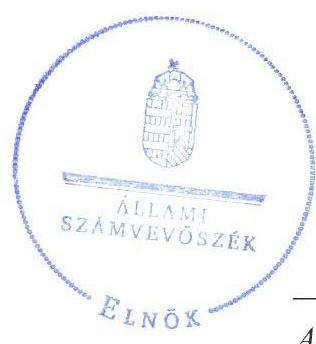
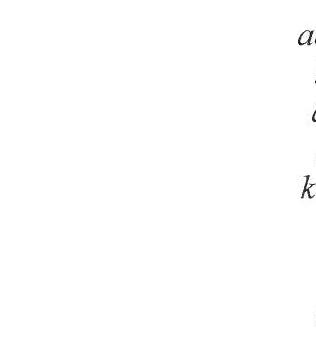
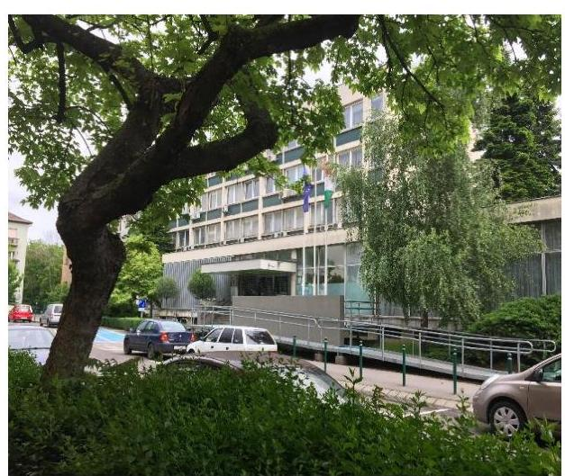
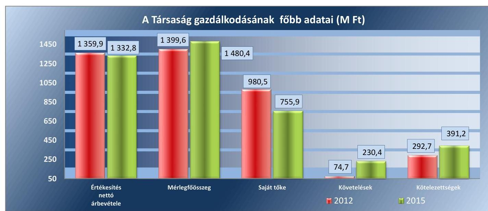
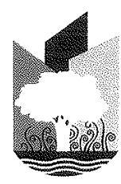
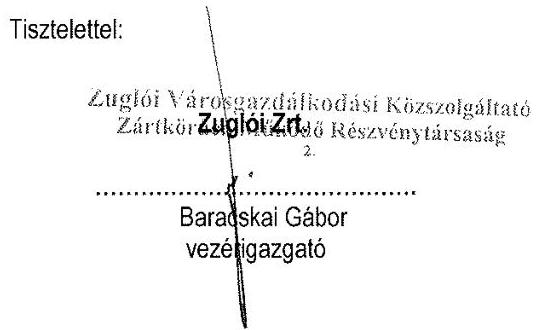
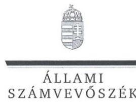
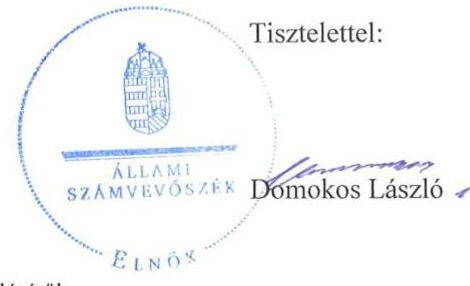

# Jelentés 

## Az önkormányzatok gazdasági társaságai

Az önkormányzatok többségi tulajdonában lévő gazdasági társaságok gazdálkodásának ellenőrzése - Zuglói Városgazdálkodási Közszolgáltató Zrt.
2017.

Az ÁSZ az államháztartáson kívül müködő fel-adat-ellátó rendszerek ellenőrzéseivel hozzájárul ahhoz, hogy a közpénzeket az államháztartáson kívül müködő szervezetek is átlátható, rendezett módon használják fel a feladatok ellátása érde-
kében.

---

# Jelentés 

## Az önkormányzatok gazdasági társaságai

Az önkormányzatok többségi tulajdonában lévő gazdasági társaságok gazdálkodásának ellenőrzése - Zuglói Városgazdálkodási Közszolgáltató Zrt.
2017. 09 hó 25 nap

17190
www.asz.hu

Domokos László elnök

Az ÁSZ az államháztartáson kivül müködő fel-adat-ellátó rendszerek ellenőrzéseivel hozzájárul ahhoz, hogy a közpénzeket az államháztartáson kivül müködő szervezetek is átlátható, rendezett módon használják fel a feladatok ellátása érde-
kében.

---

# AZ ELLENŐRZÉST FELÜGYELTE:

DR. HORVÁTH MARGIT felügyeleti vezető

## AZ ELLENŐRZÉST VEZETTE ÉS A VÉGREHAJTÁSÁÉRT FELELŐS:

DR. PELLEI TAMÁS ellenőrzésvezető

## A PROGRAM ÖSSZEÁLLÍTÁSÁÉRT FELELŐS:

JANIK JÓZSEF osztályvezető

IKTATÓSZÁM: V-1292-197/2016.

TÉMASZÁM: 2326

ELLENŐRZÉS-AZONOSÍTÓ SZÁM: V075817

Jelentéseink az Országgyűlés számítógépes hálózatán és az Interneta a www.asz.hu címen is olvashatóak.

---

# TARTALOMJEGYZÉK 

■ ÖSSZEGZÉS ..... 5
■ AZ ELLENŐRZÉS CÉLJA ..... 6
■ AZ ELLENŐRZÉS TERÜLETE ..... 7
■ AZ ELLENŐRZÉS HÁTTERE, INDOKOLTSÁGA ..... 9
■ A JELENTÉS LÉNYEGES KÉRDÉSKÖREI ..... 10
■ ELLENŐRZÉS HATÓKÖRE ÉS MÓDSZEREI ..... 11
■ MEGÁLLAPÍTÁSOK ..... 13
■ JAVASLATOK ..... 21
■ MELLÉKLETEK ..... 25
I. Sz. melléklet: Értelmező szótár. ..... 25
II. Sz. melléklet: a Társaság mérlegadatainak alakulása 2012-2015. években (M Ft) ..... 26
III. Sz. melléklet: a Társaság eredménykimutatásának alakulása 2012-2015. években (M Ft) ..... 27
■ FÜGGELÉK: ÉSZREVÉTELEK ..... 29
■ RÖVIDÍTÉSEK JEGYZÉKE ..... 39

---

.

---

# ÖSSZEGZÉS 

Budapest Főváros XIV. kerület Zugló Önkormányzata a tulajdonosi joggyakorlás kereteit összességében szabályszerűen kialakította, tulajdonosi jogait szabályszerűen gyakorolta. A Zuglói Városgazdálkodási Közszolgáltató Zrt. vagyongazdálkodása nem volt szabályszerű, nem biztosította az elszámoltathatóságot. Fizetőképessége az ellenőrzött időszakban folyamatosan romlott. A bevételek és ráfordítások elszámolása, valamint a végzett szolgáltatások dijainak meghatározása sem volt megfelelő.

## Az ellenőrzés társadalmi indokoltsága

Az Állami Számvevőszék kiemelt célja, hogy a helyi önkormányzatok gazdálkodásában rejlő pénzügyi kockázatok feltárásával, az államháztartáson kívülre nyújtott költségvetési támogatások és ingyenes vagyonjuttatások, valamint az államháztartáson kívül múködő feladatellátó rendszerek ellenőrzéseivel hozzájáruljon ahhoz, hogy a közpénzeket az államháztartáson kívül múködő szervezetek is átlátható, rendezett módon használják fel.

Az Állami Számvevőszék céljaival és a társadalmi igénnyel összhangban, valamint a gazdasági társaságok kiemelt fontosságú szerepe miatt került sor a Zuglói Városgazdálkodási Közszolgáltató Zrt. ellenőrzésére.

## Főbb megállapítások, következtetések

Budapest Főváros XIV. kerület Zugló Önkormányzata a Zuglói Városgazdálkodási Közszolgáltató Zrt. között a megkötött megbízási és közszolgáltatási szerződések támogatták a feladatellátást. Közép- és hosszú távú vagyongazdálkodási tervet Budapest Főváros XIV. kerület Zugló Önkormányzata nem készített. A feladatellátás feltételeit biztosította, a tulajdonos a beszámoltatásra monitoring rendszert vezetett be. Rendeletalkotási kötelezettségét teljesítette, a Zuglói Városgazdálkodási Közszolgáltató Zrt. beszámolóit, üzleti terveit jóváhagyta. Belső ellenőrzése hozzájárult a feladatellátás szabályszerű teljesítéséhez.

A Zuglói Városgazdálkodási Közszolgáltató Zrt. az előírt szabályzatokkal rendelkezett, azonban a Számviteli politika tartalma maradéktalanul nem felelt meg a jogszabályi előírásoknak. A szabályzataiban nem rögzítette Budapest Főváros XIV. kerület Zugló Önkormányzatával történő elszámolási kötelezettség változását követően - valamennyi közfeladat tekintetében - a bevételek és a ráfordítások elkülönített nyilvántartását. Vagyongazdálkodása az ellenőrzött időszakban nem volt szabályszerű, mivel a Zuglói Városgazdálkodási Közszolgáltató Zrt.-nél az éves beszámolók mérlegadatait a 2012. és a 2014. évben leltárral teljes körűen nem támasztották alá, az ellenőrzött időszakban mennyiségi leltárfelvételt nem végeztek. Fizetőképessége az ellenőrzött időszakban folyamatosan romlott a lejárt határidejű szállítói kötelezettségek növekedése miatt.

A Zuglói Városgazdálkodási Közszolgáltató Zrt. az éves beszámolóit határidőre elkészítette, azonban a beszámolók tartalma nem felelt meg maradéktalanul a jogszabály előírásainak, az előírt egyéb beszámolási, adatszolgáltatási kötelezettségeit hiányosan teljesítette. A beszámolóval és a leltárral kapcsolatos szabálytalanságokat a könyvvizsgáló nem kifogásolta. A közérdekú adatok nyilvánosságra hozatala és az adatok védelme nem volt megfelelő, mert a jogszabályi előírások ellenére adatvédelmi szabályzatot nem készített, továbbá a közzétételi kötelezettségének nem teljes körűen tett eleget.

A bevételek és a ráfordítások, valamint az értékcsökkenés elszámolása nem volt megfelelő, a személyi jellegú ráfordításokat összességében szabályszerűen számolták el. Önköltségszámítási szabályzatot készítettek, azonban önköltségszámítást nem végeztek, a lakások bérleti dijainak meghatározása nem volt összhangban a jogszabályi előírásokkal.

---

# AZ ELLENŐRZÉS CÉLJA 

Az ellenőrzés célja annak értékelése volt, hogy az önkormányzat vagyongazdálkodási tevékenysége során szabályszerűen gyakorolta-e tulajdonosi jogait; a gazdasági társaság szabályozottsága, gazdálkodása és vagyongazdálkodási tevékenysége, bevételeinek és ráfordításainak elszámolása megfelelt-e a jogszabályi és tulajdonosi előírásoknak; a gazdasági társaság kötelezettségállománya jelent-e kockázatot a múködésre, valamint a gazdálkodás átláthatósága és elszámoltathatósága érdekében biztosítva volt-e a szolgáltatás dijának megalapozottsága szabályszerű önköltségszámítással.

---

# **A ZELLENŐRZÉS TERÜLETE**

## **Budapest Főváros XIV. kerület Zugló Önkormányzat és a kizárólagos tulajdonában lévő Zuglói Városgazdálkodási Közszolgáltató Zrt.**

**A ZUGLÓI VÁROSGAZDÁLKODÁSI KÖZSZOLGÁLTATÓ ZRT.** Budapest Főváros XIV. kerület Zugló Önkormányzatának 100%-os tulajdonában lévő gazdasági társasága. Jogelődje a Budapest, Fővárosi XIV. ker. ingatlankezelő vállalat volt, amelyből 1996. január 1-én átalakulással létrejött a Zuglói Vagyonkezelő Rt. 2012. évben a Társaság1 Zuglói Vagyonkezelő Zrt. néven, a 2013. évtől kezdődően Zuglói Városgazdálkodási Közszolgáltató Zrt. elnevezéssel látta el feladatait.

Az Alapító Okirat1-22 szerint a Társaság fő tevékenysége az ingatlankezelés, ami az Önkormányzat2-tal kötött Megbízási szerződésben3, illetve Közszolgáltatási szerződések1-54-ben rögzítettek szerint kiterjedt az Önkormányzat tulajdonában álló lakások, nem lakáscélú helyiségek kezelésére, üzemeltetésére, a közparkok, játszószerek, egyéb zöldfelületek és utcai fasorok karbantartására, ápolására, a teljes közterületi faállomány növényi és állati károsítók elleni védelmére, valamint a hétvégi önkormányzati termelői piac működésével, és egyéb városüzemeltetéssel kapcsolatos feladatokra. A Társaság végezte az Önkormányzat tulajdonában lévő, forgalomképtelen vagyontárgyak részét képező közutak, járdák fenntartásával kapcsolatos feladatokat, a közlekedési forgalomtechnikai feladatokat. A Társaság saját tulajdonú ingatlanai vonatkozásában bérbeadási tevékenységet végzett.

A Társaság gazdálkodásának főbb adatait az 1. ábra tartalmazza.

*Forrás: A Társaság 2012. és 2015. évi éves beszámolói, főkönyvi kivonatai*

---

1. táblázat

| A TÁRSASÁG LÉTSZÁMADATAI - |  |  |  |
| :--: | :--: | :--: | :--: |
| FOGLALKOZTATOTTAK |  |  |  |
| STATISZTIKAI ÁLLOMÁNYI |  |  |  |
| LÉTSZÁMA (FŐ) |  |  |  |
| 2012 | 2013 | 2014 | 2015 |
| 71,9 | 108,1 | 196,1 | 163,0 |

Forrás: A Társaság 2012-2015. évi éves beszámolói

A Társaság jegyzett tőkéje 2012. március 26-ig 660,8 M Ft volt, ezt követően 860,8 M Ft-ra emelkedett, majd cégbírósági végzés szerint 2013. január 8-tól ismét 660,8 M Ft-ra csökkent, az Önkormányzat által végrehajtott alaptőke emelés, illetve alaptőke leszállítás következtében.

Az értékesítés nettó árbevétele a 2012-2015. években 2\%-kal, 27,1 M Ft-tal és a saját tőke pedig 2012. december 31-ei 980,5 M Ft-ról 755,9 M Ft-ra, 23\%-kal csökkent. A mérleg főösszeg 2012. év eleje és 2015. év vége között 11,5\%-kal - 1 327,6 M Ft-ról 1 480,4 M Ft-ra - emelkedett.

A mérlegadatok alakulását a II. számú melléklet és az eredménykimutatás alakulását a III. számú melléklet tartalmazza.

A 2012-2015. években Társaság kizárólagos tulajdonában állt a Társaság által alapított Zuglói Társasház-kezelő és Közterület-fenntartó Kft., valamint a Zuglói Médiaszolgáltató Kft. 5,0 M Ft-5,0 M Ft jegyzett tőkével, valamint 2012. március 26. és 2013. január 8. között az Eszközkezelő Kft.

A Társaság statisztikai állományi létszáma a 2013-2014. években - a feladatellátás igényének tükrében - 108,1 fơről 196,1 főre nőtt, majd 2015. évben 163 főre csökkent. A Társaság létszámadatait a 1. táblázat tartalmazza.

A Társaságot a vezérigazgató 2014. december 5-től irányítja, a könyvvizsgáló személyében az ellenőrzött időszak alatt változás nem történt.

A Társaságnak nem volt vagyonkezelésbe vett vagyona, és nem minősült kormányzati szektorba sorolt szervezetnek.

A polgármester ${ }^{5}$ és a jegyző ${ }^{6}$ személye a 2014. évi önkormányzati választást követően változott.

---

# AZ ELLENŐRZÉS HÁTTERE, INDOKOLTSÁGA 

Az önkormányzatok többségi tulajdonában álló gazdasági társaságok ellenőrzése kiemelten fontos a vagyon megőrzése, megóvása érdekében, amelyekkel szemben alapvető követelmény, hogy gazdálkodásuk, múködésük szabályszerű, az általuk szolgáltatott adatok minél megbízhatóbbak legyenek. A feladatellátás költségeinek, ráfordításainak alakulása a lakosság széles rétegét érinti.

Ellenőrzéseink feltárhatják, hogy az önkormányzat a feladatellátásához rendelt vagyon múködtetését a tulajdonostól elvárható gondossággal vé-gezte-e, a feladatot ellátó gazdasági társaság a létesítő okiratban, szolgáltatási szerződésben foglaltak betartásával biztosította-e a feladat ellátását. Az ellenőrzés eredményeképp meghatározhatóvá válnak a költségvetési hiányt befolyásoló szervezetek kockázatai, lehetővé válik ezen kockázatok csökkentése. Az ellenőrzés rávilágíthat arra, hogy a gazdasági társaság a vagyon használatával biztosította-e a szolgáltatás folytatásának feltételeit, az önkormányzat tulajdonosi felügyelete hozzájárult-e a szabályszerű gazdálkodáshoz és feladatellátáshoz. A megállapítások alapján megfogalmazott számvevőszéki javaslatok hasznosítása elősegítheti a meglévő hibák megszüntetését. A jó gyakorlatok bemutatásával az ÁSZ ${ }^{7}$ hozzájárulhat a követendő megoldások megismertetéséhez, terjesztéséhez.

---

# A JELENTÉS LÉNYEGES KÉRDÉSKÖREI 

1.- Az önkormányzat tulajdonosi joggyakorlása szabályszerű volt-e?
2.- A gazdasági társaság vagyongazdálkodása szabályszerű volt-e, fizetőképessége biztositott volt-e a gazdálkodás során?
3.- A gazdasági társaság bevételeinek és ráfordításainak elszámolása, valamint az önköltségszámitás és árképzés szabályszerű volt-e?

---

# ELLENŐRZÉS HATÓKÖRE ÉS MÓDSZEREI 

## Az ellenőrzés típusa

Megfelelőségi ellenőrzés.

## Az ellenőrzött időszak

Az ellenőrzött időszak 2012. január 1-jétől 2015. december 31-ig tart.

## Az ellenőrzés tárgya

Az önkormányzatok - többségi tulajdonában lévő gazdasági társaságok feletti - tulajdonosi joggyakorlása, valamint a gazdasági társaságok gazdálkodásának szabályozottsága és szabályszerűsége, továbbá az önkormányzati alszektorba sorolt gazdasági társaság gazdálkodásának a kormányzati szektor hiányára és az államadósságra befolyással bíró elemei.

Az ellenőrzés kiterjedt minden olyan körülményre és adatra, amely az ÁSZ jogszabályban meghatározott feladatainak teljesítéséhez, valamint a program végrehajtása folyamán felmerült újabb összefüggések feltárásához szükséges volt.

## Az ellenőrzött szervezet

- Budapest Főváros XIV. kerület Zugló Önkormányzata
- Zuglói Városgazdálkodási Közszolgáltató Zrt.

## Az ellenőrzés jogalapja

Az ellenőrzés jogszabályi alapját az ÁSZ tv. ${ }^{8}$ 1. § (3) bekezdése és 5. § (3)(5) bekezdései képezték.

## Az ellenőrzés módszerei

Az ellenőrzést a nemzetközi standardokat irányadónak tekintve az ellenőrzési program ellenőrzési kérdései, az ellenőrzött időszakban hatályos jogszabályok, az ellenőrzés szakmai szabályok és módszertanok figyelembe vételével végeztük.

Az ellenőrzés ideje alatt az ellenőrzött szervezettel történő kapcsolattartást az ÁSZ Szervezeti és Müködési Szabályzatának vonatkozó előírásai alapján biztosítottuk.

---

Az ellenőrzés a kiválasztott, többségi tulajdonosi jogokat gyakorló önkormányzatra, illetve az ellenőrzött gazdasági társaságra terjedt ki.

Az ellenőrzési kérdések megválaszolásához szükséges bizonyítékok megszerzése a következő ellenőrzési eljárások alkalmazásával történt: megfigyelés, kérdésfeltevés (információkérés), összehasonlítás, valamint elemző eljárás. Az ellenőrzési bizonyítékként felhasználható adatforrások közé tartoztak egyrészt az ellenőrzési programban felsorolt adatforrások, másrészt adatforrás lehetett még minden - az ellenőrzés folyamán - feltárt, az ellenőrzés szempontjából információkat tartalmazó dokumentum.

Az ellenőrzést a kérdésekre adott válaszok kiértékelésével, valamint a megjelölt adatforrások, a csatolt tanúsítványok felhasználásával, továbbá az adott időszakban hatályos jogszabályok figyelembe vételével folytattuk le.

A bevételek és ráfordítások elszámolása, valamint a vagyonnyilvántartás terén a szabályszerű múködést véletlen mintavétellel ellenőriztük. A mintavétellel ellenőrzött területek esetében minden egyes tétel vonatkozásában a szabályszerűségre vonatkozó kérdéseket tettünk fel, amelyek eredménye összesítésre került. Megfelelőnek értékeltünk egy ellenőrzött területet, amennyiben 95\%-os bizonyossággal a teljes sokaságban a hibaarány legfeljebb 10\%, nem megfelelőnek, amennyiben 10\%-nál magasabb arányt képviselt. Abban az esetben, ha a teljes sokaság tekintetében a 10\%os hibaarányhoz való viszony megítélésnek megbízhatósága nem érte el a 95\%-ot, annak elérése érdekében értékelésünket további szempontokkal egészítettük ki, és figyelembe vettük a feltárt hibák típusát és súlyát. A ráfordítások elszámolására és a vagyonnyilvántartásra vonatkozó véletlen mintavételt kockázati alapú kiválasztással egészítettük ki, amelynek során évente a három legnagyobb összegű tételt választottuk ki.

---

# 1. Az önkormányzat tulajdonosi joggyakorlása szabályszerű volt-e? 

Összegző megállapítás

Az Önkormányzat a tulajdonosi joggyakorlás kereteit összességében szabályszerűen alakította ki. A tulajdonosi jogok gyakorlása szabályszerű volt.
1.1. számú megállapítás

Az Önkormányzat tulajdonosi joggyakorlásának kereteit összességében szabályszerűen alakította ki, ugyanakkor az előírások ellenére közép- és hosszú távú vagyongazdálkodási tervet nem készített.

A GAZDASÁGI PROGRAM ${ }_{1-2}{ }^{9}$-ban az Önkormányzat az Ötv. ${ }^{10}$ 91. § (1) és (6) bekezdéseiben és az Mötv. ${ }^{11}$ 116. § (1)-(4) bekezdéseiben foglaltakkal összhangban rögzítette a hosszú távú fejlesztési elképzeléseit, amelyekben szerepeltek a Társaság által ellátott feladatokkal kapcsolatos elképzelések. Az Önkormányzat az Nvtv. ${ }^{12}$ 9. § (1) bekezdés előírásai ellenére nem készített közép- és hosszú távú vagyongazdálkodási tervet.

RENDELETALKOTÁSI KÖTELEZETTSÉGÉNEK az Önkormányzat eleget tett, amellyel megteremtette a szabályszerű feladatellátás feltételeit. Megalkotta a tulajdonában és üzemeltetésében lévő helyi közutak kezeléséről szóló rendeletet ${ }^{13}$, valamint a tulajdonában álló lakások, helyiségek bérbeadására vonatkozó lakásrendeletet ${ }^{14}$, a lakbérrendeletet ${ }^{15}$, a piaci és költség alapú lakbérrendeleteit ${ }^{16}$, a helyiségbérleti rendeletet ${ }^{17}$, valamint a tulajdonában álló lakások és helyiségek elidegenítésére vonatkozó elidegenítési rendeletet ${ }^{18}$.

A TULAJDONOSI JOGOSÍTVÁNYOKAT az önkormányzati SZMSZ ${ }_{1-2}{ }^{19}$ és a Vagyonrendelet ${ }^{20}$ alapján az Alapító Okirat ${ }_{1-2}$-ban és a Gt. ${ }^{21}$ 141. § (2) és a 231. § (2) és a Ptk. ${ }_{2}{ }^{22}$ 3:372 (1) bekezdéseiben meghatározott jogok tekintetében a Képviselő-testület ${ }^{23}$ gyakorolta. A tulajdonosi jogosítványok átadására nem került sor.

A FELADATELLÁTÁSHOZ KAPCSOLÓDÓ KÖVETELMÉNYEKET a Megbízási szerződés és Közszolgáltatási szerződések ${ }_{1-3}$ tartalmazták, amelyekben az Önkormányzat meghatározta a szerződés időtartamát, a teljesítendő szolgáltatási kötelezettséget, valamint az ellátási területet és a szerződés felmondásának, módosításának szabályait, a Társaság jogait, kötelezettségeit, és az Önkormányzatnak fenntartott jogokat és kötelezettségeket. A feladatellátás tárgyát képező vagyon körét

---

az Önkormányzat a Megbízási szerződés, illetve a Közszolgáltatási szerző-dések1-3 keretében meghatározta és már az ellenőrzött időszakot megelőzően a Társaság rendelkezésére bocsátotta.

# A FELADATELLÁTÁSHOZ KAPCSOLÓDÓ BESZÁ- 

MOLTATÁS KERETÉBEN az Önkormányzat az Alapító Okirat1-2ban előírta a vezérigazgató részére a Társaság ügyvezetéséről, vagyoni helyzetéről és üzletpolitikájáról való negyedéves jelentéskészítési kötelezettséget. Az Önkormányzat a 2013. január 31-ig hatályos Megbízási szerződésben a Társaság számára adatszolgáltatási kötelezettséget írt elő az Önkormányzat lakás- és helyiségvagyonára vonatkozóan, a 2013. január 31-ét követően hatályba lépő Közszolgáltatási szerződésekben ${ }_{1-3}$ rögzítette a közszolgáltatási kötelezettség teljesítéséről szóló beszámolási és a tárgyévre kapott kompenzációval való elszámolási kötelezettséget. Az Önkormányzat és a Társaság között létrejött Támogatási szerződésekben ${ }_{1-}$ 3 rögzítették továbbá a Társaság számára a támogatások felhasználására vonatkozó elszámolási kötelezettséget.

### 1.2. számú megállapítás

A tulajdonosi jogok gyakorlása szabályszerű volt.
AZ ÜZLETI TERVEKET a Társaság az ellenőrzött időszakban elkészítette, amelyeket a Képviselő-testület - a felügyelőbizottság előzetes véleményének megismerését követően - határozataival elfogadott.

A FELÜGYELŐBIZOTTSÁG a Gt. és a Ptk. 2 előírásának megfelelően múködött és az alapító által jóváhagyott ügyrenddel rendelkezett. Megtárgyalta és véleményezte a Társaság üzleti tervét, a 2012-2015. években a Gt. 35. § (3) bekezdésében, illetve a Ptk. 2 3:120 § (2) bekezdésének megfelelően minden évben írásbeli jelentést készített a Társaság számviteli beszámolójáról.

AZ ÉVES BESZÁMOLÓKAT a Képviselő-testület elfogadta, amelyhez a Gt. 35. § (3) bekezdése és a Ptk. 2 3:120. § (2) bekezdése szerinti felügyelőbizottsági jelentések és a Gt. 40. § (1) bekezdésének és a Ptk. 2 3:129. § (1) bekezdésének megfelelő könyvvizsgálói jelentések rendelkezésre álltak. A Képviselő-testület a Gt. és a Ptk. 2 előírásainak megfelelően döntött a Társaság éves eredményének felhasználásáról a 2013. és 2014. évek, valamint a veszteség elfogadásáról a 2012. és a 2015. évek vonatkozásában. A Képviselő-testület a felügyelőbizottság javaslatával egyezően a Társaság adózott eredményét az eredménytartalék javára, illetve veszteségét annak terhére rendelte elszámolni.

## A JAVADALMAZÁSI SZABÁLYZATOT24 a

Taktv. ${ }^{25}$ 5. § (3) bekezdésében előírtaknak megfelelően a Képviselő-testület megalkotta.

AZ ÖNKORMÁNYZAT belső ellenőrzése az Áht. ${ }^{26}$ 70. § (1) bekezdés d) pontjában foglalt lehetőséggel élve a Társaságnál az ellenőrzött időszakban a Társaság vagyongazdálkodását érintően két ellenőrzést végzett. A pénzügyi szabályszerűségi ellenőrzés keretében megfogalmazott javaslatokra a vezérigazgató intézkedési tervet készített. A bérleménygazdálkodási feladatok esetében megfogalmazott megállapításokkal kapcsolatban

---

nem került sor a vezérigazgató részére intézkedési kötelezettség meghatározására.

# 2. A gazdasági társaság vagyongazdálkodása szabályszerű volt-e, fizetőképessége biztosított volt-e a gazdálkodás során? 

Összegző megállapítás

2.1. számú megállapítás

A Társaság vagyongazdálkodása nem volt szabályszerű, fizetőképessége folyamatosan romlott. Beszámolási és közzétételi kötelezettségségnek nem teljes körűen tett eleget.

A Társaság pénzkezelési szabályzattal 2013. október 10-éig nem rendelkezett. A 2013. évtől a kiegészítő melléklet adatait valamennyi közfeladat tekintetében nem alapozta meg azok elkülönített nyilvántartására vonatkozó szabályozás.

A SZÁMVITELI POLITIKÁT27 a Társaság a Számv. tv. ${ }^{28}$ 14. § (3) bekezdés előírásának megfelelően elkészítette, amely 2012. január 1-jén lépett hatályba. A Számv. tv. 14. § (11) bekezdésben foglalt kötelezettségnek a Társaság nem tett eleget, mert az ellenőrzött időszak alatti Számv. tv. változásait nem vezették át a Számviteli politikán.

A SZÁMLAREND ${ }^{29}$ kialakítása a Számv. tv. 161. § (1) bekezdésében meghatározattak alapján megtörtént.

Az Önkormányzat és a Társaság közötti elszámolási kötelezettség 2013. évi változását követően a Társaság szabályozása valamennyi közfeladat tekintetében nem biztosította az Önkormányzattal megkötött Közzzolgáltatási szerződések ${ }_{1-3}$ által előírt bevételek és a ráfordítások elkülönített nyilvántartását. Így a Társaság a Számv. tv. 161/A. § (1) bekezdés előírása ellenére nem tudta biztosítani a beszámolók kiegészítő melléklete adatainak közvetlen alátámasztását.

## AZ ESZKÖZÖK ÉS FORRÁSOK ÉRTÉKELÉSI SZABÁLYAIT a Társaság a Számv. tv. 14. § (5) bekezdés b) pontjának előírása alapján a Számviteli politikában rögzítette. Ennek keretében meghatározta a Számv. tv. 46-51. § előírásai szerint a mérlegtételek értékelésének és az eszközök bekerülési értékének szabályait. Az értékcsökkenés elszámolásánál alkalmazott lineáris módszert az éves beszámolók kiegészítő mellékleteiben rögzítette.

A LELTÁROZÁSI SZABÁLYZAT ${ }^{30}$ a saját vagyon ellenőrzésére alkalmas volt, a Számv. tv. 46. § (3) bekezdésben előírt leltározási kötelezettséget megfelelően rögzítették. A Számv. tv. 69. § (3) bekezdés alapján a csak értékben kimutatott eszközöknél és kötelezettségeknél évenkénti egyeztetéssel, valamint a tárgyi eszközöknél három évenkénti és a készleteknél évenkénti mennyiségi leltárfelvétellel történő leltározást határoztak meg.

PÉNZKEZELÉSI SZABÁLYZATOT ${ }^{31}$ a Társaság 2013. október 10-éig a Számv. tv. 14. § (5) bekezdés d) pontjának előírása ellenére

---

nem készített. A 2013. október 10-én hatályba lépett Pénzkezelési szabályzat megfelelt az Számv. tv. 14. § (8) bekezdés előírásainak.
2.2. számú megállapítás

A Társaság vagyongazdálkodása nem felelt meg a jogszabályi rendelkezéseknek és a belső előírásoknak, mert a 2012. és a 2014. években nem minden mérlegtételre készítettek leltárt, illetve mennyiségi leltárfelvételt az ellenőrzött időszakban nem végeztek.

A SAJÁT VAGYON NYILVÁNTARTÁSÁNÁL a Társaság rendelkezett naprakész, átlátható, egyedi vagyonelemre bontott analitikus nyilvántartással és főkönyvi könyveléssel, amely biztosította az eszközök és források Számv. tv. 16 § (1) bekezdésben meghatározott egyedi értékelését. Az eszközcsoportok besorolása, elkülönítése az analitikus nyilvántartásban és a főkönyvi kivonatban a Számv. tv. 23. § előírásának megfelelően történt. A Társaság a számlarend „0. számlaosztály - Nyilvántartási számlák" keretében tartotta nyilván az önkormányzati vagyont, ezáltal biztosította az önkormányzati vagyon elkülönített nyilvántartását.

A MÉRLEG TÉTELEK ALÁTÁMASZTÁSÁHOZ a Társaság mérleg fordulónapján meglévő eszközeit és forrásait mennyiségben és értékben - tételesen és ellenőrizhető módon - tartalmazó leltárt nem teljes körűen állította össze a 2012. és a 2014. években, ezáltal megsértette a Számv. tv. 69. § (1) bekezdésében meghatározott előírásokat.

A Számv. tv. 69. § (3) bekezdésében és a leltározási szabályzatban meghatározottak ellenére az ellenőrzött időszakban a tárgyi eszközök három évenkénti, a készletek évenkénti mennyiségi leltározását nem végezték el, ennek következtében a mérleget mennyiségi leltárfelvétellel megalapozott leltár nem támasztotta alá. A leltározás hiányosságai miatt a Társaság megsértette a Számv. tv. 15. § (2)-(3) bekezdéseiben rögzített teljesség és valódiság alapelvét is.

A Társaság a 2012. és 2014. évek vonatkozásában a Számv. tv. 69. § (2) bekezdésben előírt főkönyvi könyvelés és analitikus nyilvántartások közötti egyeztetést minden mérlegtételre vonatkozóan nem végezte el, a 2013. és a 2015. években az egyeztetéseket elvégezte.

A Társaság saját tőkéje az ellenőrzött időszakban meghaladta a Társaság jegyzett tőkéjét, és rendelkezett a társasági formára kötelezően előírt jegyzett tőkével.

BELSŐ ELLENŐRZÉST A TÁRSASÁG MŰKÖDTETETT. A 2015. évben a belső ellenőrzés a Társaság pénztárkezelésének vizsgálata keretében szabályszerűségi ellenőrzést végzett és a szabályozás javítása és a készpénzvagyon védelme érdekében fogalmazott meg javaslatokat.
2.3. számú megállapítás

A fizetőképesség folyamatosan romlott, mert a szerződésen alapuló lejárt határidejű kötelezettségek folyamatosan növekedtek.

A FIZETŐKÉPESSÉG FOLYAMATOSAN ROMLOTT, mert az ellenőrzött időszakban a lejárt határidejű szállítói tartozások állománya folyamatosan növekedett. A Társaságnál nem volt biztosított a szerződésen és jogszabályon alapuló rövid lejáratú kötelezettségek határidőben történő teljesítése, de azáltal, hogy az Önkormányzat teljesítette a

---

# 2.4. számú megállapítás 

közszolgáltatások finanszírozásával összefüggő kötelezettségeit, fenntartotta a fizetőképességet. A Társaság a lejárt szállítói kötelezettségen kívül nem rendelkezett egyéb lejárt határidejű kötelezettséggel.

A Társaság a 2012. évi éves beszámolójában szereplő 0,5 M Ft összegű hosszú lejáratú kötelezettségét a 2013. évben határidőben teljesítette, és ezt követően nem volt hosszú lejáratú kötelezettsége.

## A Társaság beszámolási kötelezettségének nem teljes körűen tett eleget. Az adatok védelme nem volt megfelelő, a közzétételi kötelezettséget hiányosan teljesítették.

AZ ÉVES BESZÁMOLÓKAT a Társaság minden évben elkészítette, letétbe helyezte és közzétette, az Önkormányzat Képviselő-testülete megismerte, azokat határozataival elfogadta.

A Társaság a 2013-2015. évek éves beszámolói kiegészítő mellékleteiben a tartozásátvállalásról szóló megállapodás jellegét és pénzügyi kihatásait a Számv. tv. 90. § (3) bekezdésének c) pontjában meghatározott előírása ellenére nem mutatta be.

A könyvvizsgáló minden évben hitelesítő záradékkal készítette el a független könyvvizsgálói jelentését. A könyvvizsgáló a leltár hiányosságait nem kifogásolta, a 2013-2015. évekre vonatkozó éves beszámolók a Számv. tv. előírásainak nem megfelelő összeállítására vonatkozóan észrevételt nem tett.

Az Alapító Okirat ${ }_{1-2}$-ban előírt negyedéves - az ügyvezetéséről és vagyoni helyzetéről szóló - jelentéstételi kötelezettségének a 2012. évben a második és harmadik negyedévben, valamint a 2013. és 2014. évek első negyedévben a Társaság nem tett eleget. A Társaság Közszolgáltatási szer-ződés-3-ben foglalt - közszolgáltatási kötelezettség teljesítéséről és a kapott kompenzációval kapcsolatos - adatszolgáltatási, beszámolási kötelezettségét a 2012-2014. években nem, a 2015. évben teljesítette. A Támogatási szerződés ${ }_{1-3}$-ben rögzített - a támogatások felhasználására vonatkozó - elszámolási kötelezettségnek a 2013-2015. évi éves beszámoló keretében eleget tettek.

A Társaság az Info tv. ${ }^{32}$ 24. § (3) bekezdés előírása ellenére adatvédelmi és adatbiztonsági szabályzatot nem készített.

A KÖZZÉTÉTELI KÖTELEZETTSÉG teljesítésének szabályait a 2012. május 2-ától hatályos közzétételi szabályzat ${ }^{33}$-ban állapították meg. A Társaság az Info. tv. 37. § (1) bekezdésében előírt közzétételi kötelezettségének nem teljes körűen tett eleget, mert nem tette közzé az Info. tv. 1. melléklet szerinti általános közzétételi lista I. Szervezeti, személyzeti adatok 2. pont alapján a szervezeti felépítését a szervezeti egységek megjelölésével, a II. Tevékenységre, múködésre vonatkozó adatok 1. pont alapján feladatát, hatáskörét és alaptevékenységét meghatározó alapvető jogszabályok hatályos és teljes szövegét, III. Gazdálkodási adatok 1. pontja alapján az éves számviteli törvény szerint beszámolóját.

A Társaság a Tak. tv. 2. § (1) bekezdés c) pontja szerint a munkaviszonyban álló személyekre vonatkozó közzétételi kötelezettségét nem teljesítette.

---

# 3. A gazdasági társaság bevételeinek és ráfordításainak elszámolása, valamint az önköltségszámítás és árképzés szabályszerű volt-e? 

Összegző megállapítás

A bevételek és a ráfordítások, valamint az értékcsökkenés elszámolása nem volt megfelelő. A személyi jellegú ráfordítások elszámolása összességében szabályszerű volt. Önköltségszámítási szabályzattal rendelkeztek, azonban önköltségszámítást nem végeztek, a lakások bérleti dijainak meghatározása nem volt összhangban a jogszabályi előírásokkal.

A bevételek és a ráfordítások, valamint az értékcsökkenés elszámolása nem volt megfelelő. A személyi jellegú ráfordítások elszámolása összességében szabályszerű volt.

A RÁFORDÍTÁSOK elszámolása nem volt szabályszerű. A Társaság több esetben a vásárolt anyagok bekerülési értékét a Számv. tv. 78. § (2) bekezdésének előírása ellenére nem anyagköltségként, továbbá egy hatósági díjat a Számv. tv. 78. § (4) bekezdésében előírtak ellenére nem egyéb szolgáltatások értékeként mutatott ki. Továbbá a Társaság könyvelésében egy bérlettérítés a Számv. tv. 79. § (3) bekezdésének előírásai ellenére nem a személyi jellegú egyéb kifizetések közé tartozott. A tárgyi eszközök bruttó értéke kivezetésénél a Számv. tv. 165. § (1) bekezdésében foglaltakat megsértve nem minden esetben állítottak ki bizonylatot. Az aláírási szabályzat ${ }_{2-6}{ }^{34} \mathrm{~V}$. fejezet, illetve az aláírási szabályzat ${ }_{7-12}$ II. és V. fejezet előírásainak ellenére az elszámolásokat nem minden esetben támasztotta alá a kötelezettségvállalást megalapozó szerződés vagy megrendelés.

A SZEMÉLYI JELLEGÚ RÁFORDÍTÁSOK elszámolása szabályszerű volt. A munkavállalókat terhelő levonások és járulékok elszámolása megfelelt az Szja tv. ${ }^{35}$ és a Tbj. ${ }^{36}$ előírásainak.

AZ ÉRTÉKESÍTÉS NETTÓ ÁRBEVÉTELÉNEK és az egyéb, rendkívüli és pénzügyi múveletek bevételének elszámolása az ellenőrzött időszakban nem volt szabályszerű, az alábbi hiányosságok miatt:
— egy késedelmi kamatbevételt a Számv. tv. 77. § (2) bekezdés b) pontjának előírása ellenére nem egyéb bevételként számolták el, nem a megfelelő főkönyvi számlára könyvelték,
— a hirdetési díjak esetében a számlázási szabályzat ${ }^{37}$ 2.2. pontjában előírtak ellenére a számlázás nem a szabályzatban meghatározott megrendelő lap alapján történt, továbbá nem a megrendelő lap szerinti árat alkalmazták,
— a továbbszámlázott költségek árbevételei esetében a Számv. tv. 167. § (1) bekezdés h) pontjában előírtak ellenére az érintett könyvviteli számlára való hivatkozást nem rögzítették, to-

---

vábbá a számviteli nyilvántartásba a Számv. tv. 165. § (2) bekezdésében foglaltak ellenére nem szabályszerűen kiállított bizonylat alapján jegyeztek be adatokat.

AZ ÉRTÉKCSÖKKENÉS elszámolása az ellenőrzött időszakban nem volt megfelelő, a következő hiányosságok miatt:

- az eszközök bekerülési értékének megállapítása nem felelt meg a Számv. tv. 47. § (1) bekezdésben foglalt rendelkezésnek, mert annak megállapításánál a Társaság figyelembe vette a bekerülési érték részét nem képező költségelemeket is, úgymint oktatási költség, kötbér,
- az üzembe helyezést nem minden esetben dokumentálták hitelt érdemlően, mert a Számv. tv. 52. § (2) bekezdés és a bizonylati szabályzat ${ }^{38} 1.1$., valamint 1.2.1. pontjainak előírásai ellenére állományba vételi bizonylatot nem készítettek,
- az értékcsökkenés elszámolás esetében előfordult, hogy az elszámolás nem a Számviteli politikában meghatározott leírási kulcs szerint történt.

A SAJÁT VAGYON tekintetében az ellenőrzött időszakban a Társaságnál a tárgyi eszközök és immateriális javak bruttó értékének növekedése minden évben meghaladta az elszámolt értékcsökkenés összegét, mindösszesen 142,2 M Ft-tal. A 2012-2015. években elszámolt értékcsökkenés 123,5 M Ft, az immateriális javak és tárgyi eszközök bruttó értékének növekedése 265,7 M Ft volt. A 2014. évi nagy összegű - a Társaság tulajdonában lévő - irodaépület felújítást önkormányzati támogatásból finanszírozták. A 2012-2013. és a 2015. években a vállalati információs rendszereket fejlesztették.

A HÁTRALÉKOS KÖVETELÉSÁLLOMÁNY csökkentésére irányuló intézkedéseket a Társaság szabályzatban nem rögzítette, ugyanakkor a vevőkövetelések behajtása érdekében fizetési felszólítást küldött ki. A követelések alakulását a 2. táblázat tartalmazza.
2. táblázat

KÖVETELÉSEK ALAKULÁSA (M FT)

| Ev | Vevőkövetelés | Egyéb követelés | Összes követelés |
| :-- | :--: | :--: | :--: |
| 2012. | 35,9 | 38,8 | 74,7 |
| 2013. | 224,6 | 100,6 | 325,2 |
| 2014. | 222,6 | 106,1 | 328,7 |
| 2015. | 31,8 | 198,6 | 230,4 |

A vevőkövetelések nagymértékű növekedését a 2013-2014. években az Önkormányzattal szemben - a Közszolgáltatási szerződések ${ }_{1-3}$ alapján elvégzett szolgáltatásokkal kapcsolatosan - fennálló követelések okozták. Az egyéb követelések emelkedését az adóhatósággal szemben fennálló követelések (adótúlfizetések) növekedése és az Önkormányzattal szembeni egyéb követelések eredményezték. A Társaságnak az ellenőrzött időszakban a mérlegfordulónapján meglévő vevőkövetelései fizetési határidőn túli követelések voltak. A vevőkövetelések jelentősen - 31,8 M Ft-ra - csökkentek 2015. év végére.

---

### 3.2. számú megállapítás

Önköltségszámítási szabályzattal rendelkeztek. Önköltségszámítást nem végeztek, illetve a lakások bérleti díjainak meghatározása nem volt összhangban a jogszabályi előírásokkal.

ÖNKÖLTSÉGSZÁMÍTÁSI SZABÁLYZATTAL ${ }^{39}$ a Társaság a Számv. tv. 14. § (5) bekezdés c) pontja alapján az ellenőrzött időszakban rendelkezett. Az önköltségszámítási szabályzat valamennyi végzett szolgáltatás - Számv tv. 51. § (2) bekezdés szerinti - önköltségének a Számv. tv. 14.§ (7) bekezdésében foglaltaknak megfelelő utókalkuláció keretében történő meghatározására nem volt alkalmas, mivel abban nem rögzítették a Társaság által végzett városüzemeltetési feladatok tekintetében az utókalkuláció elkészítésének kötelezettségét.

A DÍJMEGÁLLAPÍTÁS SZABÁLYAIT az Önkormányzat a lakbérrendeletében, valamint piaci és költség alapú lakbérrendeleteiben és helyiségbérleti rendeletében határozta meg.

A DÍJAK MEGHATÁROZÁSA a Társaság által nyújtott szolgáltatások esetében összhangban volt az Önkormányzat rendeleteivel, azonban a Társaság a Számv. tv. 14. § (7) bekezdésének előírásai ellenére minden végzett szolgáltatás önköltségét utókalkuláció módszerével nem állapította meg.

Az ingatlanok bérbeadásával kapcsolatos feladatok ellátását a Társaság 2014. január 1-jéig látta el. A 2012-2013. évekre vonatkozóan az önköltségszámítás elmaradásának következtében az Ltv. ${ }^{40}$ 34. § (4)-(5) bekezdéseiben előírtaknak nem tettek eleget. A Társaság a költségelven bérbe adott lakások lakbérének mértékét önköltségszámítás hiányában nem úgy állapította meg, hogy a bérbeadónak az épülettel, az épület központi berendezéseivel és a lakással, a lakberendezéssel kapcsolatos ráfordításai megtérüljenek, továbbá önköltségszámítás hiányában nem volt megállapítható, hogy a piaci alapon bérbe adott lakások lakbérének mértékét úgy állapította-e meg, hogy az Önkormányzat ebből származó bevételei nyereséget is tartalmazzanak.

A nem lakáscélú helyiségek bérleti díjának meghatározása összhangban volt az előírásokkal. A Társaság egyéb szolgáltatásai esetében az árképzés piaci alapon történt.

---

# JAVASLATOK 

Az ÁSZ tv. 33. § (1) bekezdésében foglaltak értelmében az ellenőrzött szervezet vezetője köteles a jelentésben foglalt megállapításokhoz kapcsolódó intézkedési tervet összeállítani és azt a jelentés kézhezvételétől számított 30 napon belül az ÁSZ részére megküldeni. Amennyiben az ellenőrzött szervezet vezetője nem küldi meg határidőben az intézkedési tervet, vagy továbbra sem elfogadható intézkedési tervet küld, az Állami Számvevőszék elnöke az ÁSZ tv. 33. § (3) bekezdése a) és b) pontjaiban foglaltakat érvényesitheti.
Javaslataink célja a Zuglói Városgazdálkodási Közszolgáltató Zrt. gazdálkodása szabályszerűségének helyreállítása annak érdekében, hogy a szabályozási környezet és az alkalmazott gyakorlat megfelelően tudja támogatni az átlátható múködést.

## Zuglói Városgazdálkodási Közszolgáltató Zrt. vezérigazgatójának

1. Intézkedjen a Társaság számviteli politikájának Számv. tv.-nek megfelelő tartalommal történő aktualizálásáról.
(2.1. sz. megállapítás 1. bekezdése alapján)
2. Intézkedjen, hogy az a közszolgáltatási szerződésekben elöírtaknak megfelelően a számviteli szabályozásában a Társaság biztosítsa a bevételek és a ráfordítások elkülönített nyilvántartását valamennyi közfeladat tekintetében.
(2.1. sz. megállapítás 3. bekezdése alapján)
3. Intézkedjen a Számv. tv.-nek megfelelően az éves beszámoló mérlegének teljes körű leltárral való alátámasztásáról, amely tételesen és ellenőrizhető módon tartalmazza a Társaságnak a mérlegfordulónapon meglévő eszközeit és forrásait mennyiségben és értékben.
(2.2. sz. megállapítás 2. bekezdése alapján)
4. Intézkedjen a Számv. tv.-nek és a leltározási szabályzatban foglaltaknak megfelelően a mennyiségi leltározás végrehajtásáról.
(2.2. sz. megállapítás 3. bekezdése alapján)
5. Intézkedjen az éves beszámoló kiegészítő mellékletének a Számv. tv. szerinti tartalommal való elkészítéséről.
(2.4. sz. megállapítás 2. bekezdése alapján)

---

6. Intézkedjen az adatvédelmi és adatbiztonsági szabályzat elkészitéséről az Info tv. előírásának megfelelően.
(2.4. sz. megállapítás 5. bekezdése alapján)
7. Intézkedjen a Taktv. és az Info tv. szerinti közzétételi kötelezettség teljes körü teljesítéséről.
(2.4. sz. megállapítás 6. és 7. bekezdései alapján)
8. Intézkedjen a bevételek és ráfordítások elszámolásának a Számv. tv. előírásainak megfelelő számviteli bizonylatokkal történő alátámasztásáról és a megfelelő fökönyvi számlákra könyveléséről.
(3.1. sz. megállapítás 1. és 3. bekezdései alapján)
9. Intézkedjen a Számv. tv. előírásainak megfelelően az eszközök üzembe helyezésének dokumentálásáról és bekerülési értékének meghatározásáról.
(3.1. sz. megállapítás 4. bekezdése alapján)
10. Intézkedjen az értékcsökkenési leírás számviteli politikában meghatározott leírási kulcsok alkalmazásával történő elszámolásáról.
(3.1. sz. megállapítás 4. bekezdése alapján)
11. Intézkedjen Számv. tv-nek megfelelően az önköltségszámítási szabályzat kiegészítéséről, valamint a végzett szolgáltatások tekintetében az önköltség meghatározásáról.
(3.2. sz. megállapítás 1. bekezdése alapján)

---

Javaslataink célja az Önkormányzat szabályszerű működésének elősegítése, továbbá az önkormányzati tulajdonosi joggyakorlás kontrolljainak erősítése.

# Budapest Főváros XIV. kerület Zugló Önkormányzata polgármesterének 

1. Intézkedjen az Önkormányzat közép- és hosszú távú vagyongazdálkodási tervének elkészitéséről az Nvtv. előírásainak megfelelően.
(1.1. sz. megállapítás 1. bekezdés 2. mondat alapján)
2. Intézkedjen
a) a leltározás hiányosságai,
b) az éves beszámoló kiegészítő mellékletének tartalmi hiányosságai,
c) az értékcsökkenés elszámolásának hiányosságai
miatti felelősség tisztázása érdekében, és szükség szerint intézkedjen a felelősség érvényesitéséről.
(2.2. sz. megállapítás 3. bekezdése,
2.4. sz. megállapítás 2. bekezdése,
3.1. sz. megállapítás 4. bekezdése alapján)

---

.

---

# MELLÉKLETEK 

- I. SZ. MELLÉKLET: ÉRTELMEZŐ SZÓTÁR
belső ellenőrzés
gazdasági társaság
gazdálkodó szervezet
tulajdonosi joggyakorló
vagyongazdálkodás
kompenzáció

Független, tárgyilagos bizonyosságot adó és tanácsadó tevékenység, amelynek célja, hogy az ellenőrzött szervezet múködését fejlessze és eredményességét növelje, az ellenőrzött szervezet céljai elérése érdekében rendszerszemléletű megközelítéssel és módszeresen értékeli, illetve fejleszti az ellenőrzött szervezet irányítási és belső kontrollrendszerének hatékonyságát. (Forrás: Bkr. 2. § b) pontja) Ptk. 3 3:88. § (1) bekezdése szerint „a gazdasági társaságok üzletszerű közös gazdasági tevékenység folytatására, a tagok vagyoni hozzájárulásával létrehozott, jogi személyiséggel rendelkező vállalkozások, amelyekben a tagok a nyereségből közösen részesednek, és a veszteséget közösen viselik".
A Ptk.: ${ }^{41} 685$. § c) pontja szerint gazdálkodó szervezet: „az állami vállalat, az egyéb állami gazdálkodó szerv, a szövetkezet, a lakásszövetkezet, az európai szövetkezet, a gazdasági társaság, az európai részvénytársaság, az egyesülés, az európai gazdasági egyesülés, az európai területi együttműködési csoportosulás, az egyes jogi személyek vállalata, a leányvállalat, a vízgazdálkodási társulat, az erdő birtokossági társulat, a végrehajtói iroda, az egyéni cég, továbbá az egyéni vállalkozó." (2014.03.15-ig hatályos)
Aki a nemzeti vagyon felett az államot vagy a helyi önkormányzatot megillető tulajdonosi jogok és kötelezettségek összességének gyakorlására jogosult. (Forrás: Nvtv. 3. § (1) bekezdés 17. pontja)
A nemzeti vagyongazdálkodás feladata a nemzeti vagyon rendeltetésének megfelelő, az állam, az önkormányzat mindenkori teherbíró képességéhez igazodó, elsődlegesen a közfeladatok ellátásához és a mindenkori társadalmi szükségletek kielégítéséhez szükséges, egységes elveken alapuló, átlátható, hatékony és költségtakarékos múködtetése, értékének megőrzése, állagának védelme, értéknövelő használata, hasznosítása, gyarapítása, továbbá az állam vagy a helyi önkormányzat feladatának ellátása szempontjából feleslegessé váló vagyontárgyak elidegenítése. (Forrás: Nvtv. 7. § (2) bekezdése)
A közszolgáltatási kötelezettség ellátása ellentételezéseként a Közszolgáltató részére az Önkormányzat költségvetése terhére teljesítendő kifizetés. (Forrás: Közszolgáltatási szerződés)

---

II. SZ. MELLÉKLET: A TÁRSASÁG MÉRLEGADATAINAK ALAKULÁSA 2012-2015. ÉVEKBEN (M FT)

|  Megnevezés
1. | $\begin{gathered} 2012.01 .01 . \ 2 . \end{gathered}$ | $\begin{gathered} 2012.12 .31 . \ 3 . \end{gathered}$ | $\begin{gathered} 2013.12 .31 . \ 4 . \end{gathered}$ | $\begin{gathered} 2014.12 .31 . \ 5 . \end{gathered}$ | $\begin{gathered} 2015.12 .31 . \ 6 . \end{gathered}$  |
| --- | --- | --- | --- | --- | --- |
|  A. Befektetett eszközök | 477,1 | 714,3 | 439,8 | 495,6 | 474,6  |
|  II. TÁRGYI ESZKÖZÖK | 452,2 | 472,2 | 409,9 | 445,9 | 438,6  |
|  B. Forgóeszközök | 808,8 | 525,9 | 890,9 | 1065,0 | 753,4  |
|  I. KÉSZLETEK | 463,5 | 303,8 | 280,4 | 338,1 | 331,3  |
|  II. KÖVETELÉSEK | 166,4 | 74,7 | 325,2 | 328,7 | 230,4  |
|  IV. PÉNZESZKÖZÖK | 178,9 | 147,4 | 285,3 | 398,2 | 191,8  |
|  C. Aktív időbeli elhatárolások | 41,7 | 159,3 | 136,6 | 208,4 | 252,4  |
|  ESZKÖZÖK (AKTÍVÁK) ÖSSZESEN | 1327,6 | 1399,6 | 1467,3 | 1769,0 | 1480,4  |
|  D. SAJÁT TÖKE | 840,2 | 980,5 | 776,0 | 826,1 | 755,9  |
|  I. JEGYZETT TÖKE | 660,8 | 860,8 | 660,8 | 660,8 | 660,8  |
|  IV. EREDMÉNYTARTALÉK | $-14,8$ | 7,8 | $-62,4$ | $-56,4$ | $-6,2$  |
|  F. Kötelezettségek | 274,3 | 292,7 | 532,4 | 601,2 | 391,2  |
|  III. RÖVID LEJÁRATÚ KÖTELEZETTSÉGEK | 273,3 | 292,3 | 532,4 | 601,2 | 391,2  |
|  G. Passzív időbeli elhatárolások | 12,5 | 43,6 | 110,4 | 256,8 | 242,2  |
|  FORRÁSOK (PASSZÍVÁK) ÖSSZESEN | 1327,6 | 1399,6 | 1467,3 | 1769,0 | 1480,4  |

---

| Megnevezés   1. | $\mathbf{2 0 1 2 . 1 2 . 3 1 .}$   3. | $\mathbf{2 0 1 3 . 1 2 . 3 1 .}$   4. | $\mathbf{2 0 1 4 . 1 2 . 3 1 .}$   5. | $\mathbf{2 0 1 5 . 1 2 . 3 1 .}$   6. |
| :-- | :--: | :--: | :--: | :--: |
| I. Értékesítés nettó árbevétele | 1359,9 | 1650,8 | 1789,2 | 1332,8 |
| III. Egyéb bevételek | 220,2 | 1063,3 | 903,5 | 879,8 |
| IV. Anyagjellegú ráfordítások | 925,8 | 1715,6 | 1902,0 | 1623,4 |
| V. Személyi jellegú ráfordítások | 475,9 | 529,6 | 629,5 | 599,1 |
| VI. Értékcsökkenési leírás | 26,8 | 31,0 | 33,8 | 31,9 |
| VII. Egyéb ráfordítások | 249,0 | 417,3 | 76,7 | 40,6 |
| Üzemi (üzleti) tevékenység eredménye | $-73,8$ | $-3,6$ | 50,7 | $-83,5$ |
| VIII. Pénzügyi műveletek bevételei | 3,8 | 2,5 | 2,7 | 25,0 |
| Pénzügyi műveletek eredménye | 3,2 | 2,2 | 2,7 | 15,6 |
| Szokásos vállalkozási eredmény | $-70,6$ | $-1,4$ | 53,4 | $-67,9$ |
| Adózás előtti eredmény | $-70,2$ | 6,0 | 54,3 | $-65,8$ |
| XII. Adófizetési kötelezettség | 0 | 0 | 4,1 | 4,4 |
| Adózott eredmény | $-70,2$ | 6,0 | 50,2 | $-70,2$ |
| Mérleg szerinti eredmény | $-70,2$ | 6,0 | 50,2 | $-70,2$ |

---

.

---

# FÜGGELÉK: ÉSZREVÉTELEK 

A jelentéstervezetet a Számvevőszék 15 napos észrevételezésre megküldte az ellenőrzött szervezet vezetőjének az ÁSZ tv. 29. §* (1) bekezdése előírásának megfelelően.

Budapest Főváros XIV. kerület Zugló Önkormányzat polgármestere az észrevételezési lehetőségével nem élt. A Zuglói Városgazdálkodási Közszolgáltató Zrt. vezérigazgatójától érkezett észrevételeket és azok kezeléséről szóló válaszlevelet a jelentés tartalmazza.

[^0]
[^0]:    * 29. § (1) Az Állami Számvevőszék az ellenőrzési megállapításait megküldi az ellenőrzött szervezet vezetőjének vagy az általa megbízott személynek, és annak, akinek személyes felelősségét állapította meg.
    (2) Az ellenőrzött szervezet vezetője és a felelősként megjelölt személy az ellenőrzés megállapításaira tizenöt napon belül írásban észrevételt tehet.
    (3) Az Állami Számvevőszék az észrevételre a beérkezésétől számított harminc napon belül írásban válaszol. A figyelembe nem vett észrevételeket köteles a jelentésben feltüntetni, és megindokolni, hogy azokat miért nem fogadta el.

---

Állami Számvevőszék

Dr. Horváth Margit
felügyeleti vezető részére
részére

Budapest
Apáczai Csere János u. 10.
1052

Zuglói Városgazdálkodási Közszolgáltató Zrt.
Megújuló Zugló
Zuglói Városgazda

Ikt. sz.: VEZIG168- L/2016
Ügyintéző: Novák Róbert
Telefonszám: +361/4698133

ÁLLAMI SZÁMVEVÓSZÉK
ÜGYVÍTELI HÓDA
BE-50283/2017/1
Érk.: AUG 16 2017

Bekedésén: 12.04.2017 - 08:47
Methéklet: 2017.07.31

Tárgy: ÁSZ jelentés (2012-2015) - A Zuglói Városgazdálkodási Zrt. gazdálkodásának és az Önkormányzat
tulajdonosi jogjoggyakorlásának szabályszerűségére irányuló nem hivatalos jelentéstervezetére - Zuglói Zrt.
észrevételei

Tisztelt Dr. Horváth Margit!

A Zuglói Zrt., a 2017.07.31-én kézhez vett, az Állami Számvevőszék V-1292-173/2016 ikt. számú levelével
megküldött — a Zuglói Városgazdálkodási Zrt. gazdálkodásának és az Önkormányzat tulajdonosi
joggyakorlásának szabályszerűségére irányuló — nem hivatalos jelentéstervezetének megállapításaira az alábbi
észrevételeket teszi:

2.1. Megállapítás (A Társaság pénzkezelési szabályzattal 2013. október 10-ig nem rendelkezett. A
2013. évtől a kiegészítő melléklet adatait valamennyi közfeladat tekintetében nem alapozta meg
elkülönített nyilvántartás.)

ÉSZREVÉTEL:

A Társaság másodlagos 6-os, 7-es számlaosztály vezetésével biztosította az elkülönített
nyilvántartást.

- 2013. évben az éves beszámoló kiegészítő mellékletének 4-6. mellékletében mutatta ki a
szerződésenként elszámolást
- 2014. évben az éves beszámoló kiegészítő mellékletének 4-7. mellékletében mutatta ki a
szerződésenként elszámolást
- 2015. évben pedig részletes analitikus nyilvántartással, és az Önkormányzat részére tételesen,
számlamásolatokkal támasztotta alá a szerződésenként elszámolást.

2.2. Megállapítás (A Társaság vagyongazdálkodása nem felelt meg a jogszabályi rendelkezéseknek és
a belső előírásoknak, mert a 2012. és a 2014. években nem minden mérleglételre készítettek
leltárt, illetve mennyiségi leltárfelvételt az ellenőrzött időszakban nem végeztek.)

ÉSZREVÉTEL:

1145 Budapest, Pétervárad utca 11-17. • Postacím: 1590 Budapest Pf. 184.
Telefon: + 36 1 469 8100 • Web: www.zugloizrt.hu

3

---

- Az ellenőrzött időszakban a készletek évenkénti mennyiségi leltározása megtörtént, a dokumentumok az ellenőrzés során DVD-n átadásra kerültek.
2.3. Megállapítás (A fizetőképesség folyamatosan romlott, mert a szerződésen alapuló lejárt határidejű kötelezettségek folyamatosan növekedtek.)

# ÉSZREVÉTEL: 

- a Társaság likviditása teljes mértékben az Önkormányzattal történő elszámolások függvénye
2015. évtől egy fajlagos költségelszámolás alapú közszolgáltatási szerződés volt hatályban, ami a korábbi gyakorlattal szemben nem biztosított előleget, így fedezetet sem a határidőben történő szállítói kötelezettségek teljesítésére.
A likviditási problémák folyamatos jelzését követően 2017. július 01-től egy új közszolgáltatási és támogatási szerződéses konstrukció került kialakításra, melyben ismét lehetőség van előleg igénybe vételére.
2.4. Megállapítás (A Társaság beszámolási kötelezettségének nem teljes körűen tett eleget. Az adatok védelme nem volt megfelelő, a közzétételi kötelezettséget hiányosan teljesítették. A Társaság a 2013-2015. évek éves beszámolói kiegészítő mellékleteiben a tartozásátvállalásról szóló megállapodás jellegét és pénzügyi kihatásait a Számviteli tv. 90.§ (3) bek. c) pontjában meghatározott előírása ellenére nem mutatta be.)

## ÉSZREVÉTEL:

- Az Állami Számvevőszék észrevétele egyetlen, olyan szerződés bemutatására vonatkozik, melyben az Önkormányzat készfizetői kezességet vállalt egy korábbi szerződött partnerével kötött háromoldalú szerződésben. A Zuglói Zrt. megítélése és a későbbi gyakorlat szerint, a szerződés semmiképpen sem mentesíti a Társaságot a fizetési kötelezettségek teljesítése alól, ezért az említett szerződésnek a Zuglói Zrt-re nincs negatív pénzügyi kihatása. Az Önkormányzat kezeskénti helytállására a Zuglói Zrt. általános müködése mellett nem kerülhetett sor, így a szerződés bemutatása, az óvatosság elvét figyelembe véve nem történt meg.
- A 2015. évi beszámoló kiegészítő mellékletének 1.3. pontjában ismertetésre került a fizetési kötelezettség teljesítéséből származó, az Önkormányzat felé továbbszámlázott, vitatott vevői követelés.
Fentiek figyelembevételével a Zuglói Zrt éves beszámolójának kiegészítő mellékletét a Számviteli tv. előírásainak megfelelően, hiánytalanul közzétette.
- A Társaság közszolgáltatási beszámolási kötelezettségeit 2015-töl folyamatosan, rendben teljesíti a tulajdonos Önkormányzat felé.
- A Társaság 2012.05.02-től rendelkezett Adatvédelmi szabályzattal (Vezérigazgatói utasítás, a Zuglói Zrt. közérdekü adatainak szolgáltatásáról, és a közzététel rendjéről.), ami az ellenőrzés során átadásra került.

2015. évtől a szerződések az Önkormányzat weboldalán közzétételre kerültek.

1145 Budapest, Pétervárad utca 11-17. $\cdot$ Postacim: 1590 Budapest Pf. 184.
Telefon: + 3614698100 ・ Web: www.zugloizrl.hu

---

- A Tak.tv. 2.§ (1) bekezdés c) pontja szerinti munkaviszonyban álló személyekre vonatkozó közzétételi kötelezettségnek megfelelően 2014. évtől nyilvánosak a Zuglói Zrt. honlapján a vezető tisztségviselő és az FB tagok nevei, illetve a részükre kifizetett bér, tiszteletdij.
3.1. Megállapítás (A bevételek és ráfordítások, valamint az értékcsökkenés elszámolása nem volt megfelelő. A személyi jellegű ráfordítások összességében szabályszerű volt.)

ÉSZREVÉTEL:

- 2015. évtől a Társaság folyamatosan új eljárási rendet dolgozott ki és új szabályzatokat vezetett be annak érdekében, hogy az elszámolásokat, illetve kötelezettségvállalásokat pontosan leszabályozza, annak számon kérhetőséget is megfelelően biztosítsa, és minden esetben rendelkezzen a megalapozó szerződésekkel és megrendelésekkel.
- A következetesség elvének megfelelően az átfogó módosítások bevezetése a következő üzleti év első napján, 2016.01.01-én történt meg.
- A hibák kiszűrését követően a Társaság továbbszámlázott költségek tekintetében 2015. évtől fokozott figyelmet fordít a Számviteli tv. 167.§ és 165.§ bekezdésben rögzítettek betartására, az eszközök állományba vételének dokumentálására, valamint az értékcsökkenések Számviteli Politikában meghatározott kulccsal történő elszámolására.
3.2. Megállapítás (Önköltségszámítási szabályzattal rendelkeztek. Önköltségszámítást nem végeztek, illetve a lakások bérleti dijának meghatározása nem volt összhangban a jogszabályi előírásokkal.)

# ÉSZREVÉTEL: 

- a Társaság 2015. évtől fajlagos költségek (egységárak alkalmazásával) alapján, a szállítói számlák változatlan áron történő továbbszámlázásával számolt el a tulajdonos Önkormányzat felé.

Budapest, 2017.08.14.

1145 Budapest, Pétervárad utca 11-17. $\cdot$ Postacim: 1590 Budapest Pf. 184.
Telefon: + 3614698100 ・Web: www.cugloizrt.hu

---

ELNÖK

Ikt.szám: V-1292-183/2016

# Baracskai Gábor úr 

vezérigazgató
Zuglói Városgazdálkodási Közszolgáltató Zrt.

## Budapest

## Tisztelt Vezérigazgató Úr!

Köszönettel vettem a Zuglói Városgazdálkodási Közszolgáltató Zrt. ellenőrzéséről készített számvevőszéki jelentéstervezetre megküldött észrevételeit.
Az Állami Számvevőszék észrevételekre vonatkozó álláspontjáról a felügyeleti vezető által készített részletes tájékoztatásból kap választ, amelyet levelemhez mellékeltem.
Tájékoztatom Vezérigazgató urat, hogy az Állami Számvevőszék a figyelembe nem vett észrevételeket az Állami Számvevőszékről szóló 2011. évi LXVI. törvény 29. § (3) bekezdésében előírtak szerint köteles a jelentésében feltüntetni és megindokolni, hogy azokat miért nem fogadta el.

Budapest, 2017. 06 hó 37 nap

Melléklet: Tájékoztatás az észrevételek kezeléséről

---

# Tájékoztatás az észrevételek kezeléséről 

Megköszönöm Vezérigazgató úrnak „Az önkormányzatok gazdasági társaságai - Az önkormányzatok többségi tulajdonában lévő gazdasági társaságok gazdálkodásának ellenőrzése Zuglói Városgazdálkodási Köszzolgáltató Zrt." címmel készített jelentéstervezetre tett észrevételeit. Az észrevételek kezeléséről az alábbi tájékoztatást adom.

## I. A 2.1. számú megállapításra tett észrevétel:

Az észrevételben hivatkozott megállapítás: A Társaság pénzkezelési szabályzattal 2013. október 10éig nem rendelkezett. A 2013. évtől a kiegészítő melléklet adatait valamennyi közfeladat tekintetében nem alapozta meg elkülönített nyilvántartás.

Az észrevétel szerint: „A Társaság másodlagos 6-os, 7-es számlaosztály vezetésével biztositotta az elkülönitett nyilvántartást.

- 2013. évben az éves beszámoló kiegészitő mellékletének 4-6. mellékletében mutatta ki a szerzödésenkénti elszámolást,
- 2014. évben az éves beszámoló kiegészitő mellékletének 4-7. mellékletében mutatta ki a szerződésenként elszámolást,
- 2015. évben pedig részletes analitikus nyilvántartással, és az Önkormányzat részére tételesen, számlamásolatokkal támasztotta alá a szerződésenkénti elszámolást."
Az észrevétel tartalmában az ellátott közfeladatoknak az éves beszámolók kiegészítő mellékletében való szerződésenkénti elszámolásának végrehajtását rögzítette. A jelentéstervezet 2.1. megállapítás harmadik bekezdése azonban nem az elszámolás végrehajtásának hiányát állapította meg, hanem azt, hogy a Társaság a belső szabályzatait nem alakította ki oly módon, hogy azok a kiegészítő melléklet közvetlen alátámasztására is alkalmasak legyenek, mert azok, a Társaság által ellátott valamennyi közfeladat tekintetében nem biztosították a 2013. február 1. és 2015. december 31. közötti időszakban hatályos, az Önkormányzat és a Társaság között megkötött közszolgáltatási szerződések által előírt bevételek és ráfordítások elkülönített nyilvántartását.

Mindezek alapján a jelentéstervezet 2.1. megállapítást alátámasztó harmadik bekezdésében foglaltak továbbra is helytállók, e tekintetben a jelentéstervezetben tett megállapítást nem módosítom.
A 2.1 megállapítást pontosítom a következők szerint:
„A 2013. évtől a kiegészitő melléklet adatait valamennyi közfeladat tekintetében nem alapozta meg azok elkülönitett nyilvántartására vonatkozó szabályozás."
A megállapítás módosítása a vezérigazgatónak címzett 2. számú javaslat szövegét nem befolyásolja, ezért a javaslatot nem módosítom.

## II. 2.2. számú megállapításra tett észrevétel:

Az észrevételben hivatkozott megállapítás: A Társaság vagyongazdálkodása nem felelt meg a jogszabályi rendelkezéseknek és a belső előírásoknak, mert a 2012. és a 2014. években nem minden

---

mérlegtételre készítettek leltárt, illetve mennyiségi leltárfelvételt az ellenőrzött időszakban nem végeztek.

Az észrevétel szerint: „Az ellenőrzött időszakban a készletek évenkénti mennyiségi leltározása megtörtént, a dokumentumok az ellenőrzés során DVD-n átadásra kerültek."

Az ellenőrzés számára átadott DVD a 2014. és 2015. évekre vonatkozóan a 2. számlaosztályban megtalálható készletekkel, illetve annak mennyiségi leltározásával kapcsolatban adatot nem tartalmazott, a jelezet időszak készletleltár adatai a helyszínen sem álltak rendelkezésre. A 2012. és 2013. évek vonatkozásában az ellenőrzés számára átadott készletekre vonatkozó dokumentumok - a leltárfelvételek és kiértékelések - nem hitelesek, aláírás nélküliek voltak. Továbbá nem voltak teljes körűek, mivel az átadott adatokkal ellentétben - amelyek egyes készletszámlánkénti leltározásra vonatkoztak - a főkönyvi kivonat több készletszámlát tartalmazott.
Mindezek alapján a jelentéstervezet 2.2. számú megállapítása, valamint e megállapítás harmadik bekezdésében rögzített megállapítás helytálló, így a jelentéstervezet megállapítását és a vezérigazgatónak címzett 4. számú javaslatot nem módosítom.

# III. 2.3. számú megállapításra tett észrevétel: 

Az észrevételben hivatkozott megállapítás: A fizetőképesség folyamatosan romlott, mert a szerződésen alapuló lejárt határidejű kötelezettségek folyamatosan növekedtek.

Az észrevétel szerint:

- „a Társaság likviditása teljes mértékben az Önkormányzattal történő elszámolások függvénye
- 2015. évtől egy fajlagos költségelszámolás alapú közszolgáltatási szerződés volt hatályban, ami a korábbi gyakorlattal szemben nem biztositott elöleget, igy fedezetet sem a határidőben történő szállitó kötelezettségek teljesitésére. A likviditási problémák folyamatos jelzését követően 2017. július 01-től egy új közszolgáltatási és támogatási szerződéses konstrukció került kialakításra, melyben ismét lehetőség van előleg igénybe vételére."

A Társaság likviditási helyzete változásának okával kapcsolatos tájékoztatását tudomásul veszem. Az észrevétel alapján a jelentéstervezet megállapítása továbbra is helytálló, így a jelentéstervezetet nem módosítom. A megállapítás alapján a jelentéstervezet javaslatot nem tartalmaz.

## IV. 2.4. számú megállapításra tett észrevétel:

Az észrevételben hivatkozott megállapítás: A Társaság beszámolási kötelezettségének nem teljes körűen tett eleget. Az adatok védelme nem volt megfelelő, a közzétételi kötelezettséget hiányosan teljesítették. A Társaság a 2013-2015. évek éves beszámolói kiegészítő mellékleteiben a tartozásátvállalásról szóló megállapodás jellegét és pénzügyi kihatásait a Számv. tv. 90. § (3) bekezdésének c) pontjában meghatározott előírása ellenére nem mutatta be.

Az észrevétel szerint:

---

1. „Az Állami Számvevőszék észrevétele egyetlen, olyan szerződés bemutatására vonatkozik, melyben az Önkormányzat készfizetői kezességet vállalt egy korábbi szerződött partnerével kötött háromoldalú szerződésben. A Zuglói Zrt. megítélése és a későbbi gyakorlat szerint, a szerződés semmiképpen sem mentesíti a Társaságot a fizetési kötelezettségek teljesitése alól, ezért az emlitett szerződésnek a Zuglói Zrt.-re nincs negatív pénzügyi kihatása. Az Önkormányzat kezeskénti helytállására a Zuglói Zrt. általános müködése mellett nem kerülhetett sor, így a szerződés bemutatása, az óvatosság elvét figyelembe véve nem történt meg.
2. A 2015. évi beszámoló kiegészítő mellékletének 1.3. pontjában ismertetésre került a fizetési kötelezettség teljesitéséből származó, az Önkormányzat felé továbbszámlázott, vitatott vevői követelés.
Fentiek figyelembevételével a Zugló Zrt. éves beszámolóinak kiegészítő mellékletét a Számviteli tv. előirásainak megfelelően, hiánytalanul közzétette.
3. A Társaság közszolgáltatási beszámolási kötelezettségeit 2015-től folyamatosan, rendben teljesíti a Tulajdonos Önkormányzat felé.
4. A Társaság 2012. 05. 02-től rendelkezett Adatvédelmi szabályzattal (Vezérigazgatói utasítás, a Zuglói Zrt. közérdekü adatainak szolgáltatásáról és a közzététel rendjéről.), ami az ellenőrzés során átadásra került.
5. 2015. évtől a szerződések az Önkormányzat weboldalán közzétételre kerültek.
6. A Tak.tv. 2. § (1) bekezdés c) pontja szerinti munkaviszonyban álló személyekre vonatkozó közzétételi kötelezettségnek megfelelően 2014. évtől nyilvánosak a Zuglói Zrt. honlapján a vezető tisztségviselő és az FB tagok nevei, illetve a részükre fizetett bér, tiszteletdij."

Az észrevétel első részéhez: A Társaság az ellenőrzés számára átadott számviteli szabályzatokban, az éves beszámolók kiegészítő mellékletében nem határozta meg, hogy az éves beszámoló kiegészítő mellékletében bemutatandó kötelezettségek vonatkozásában mit tekint lényeges kockázatúnak, vagy lényegesen előnyösnek, és ennek következtében - a kötelezettségek jellege, üzleti célja és pénzügyi kihatása tekintetében - bemutatásuk szükséges, vagy szükségtelen a vállalkozó pénzügyi helyzetének megítéléséhez. A Számv. tv. 90. § (3) bekezdésének c) pontjában meghatározott előírás szerint: „A kiegészítő mellékletben be kell mutatni: azon mérlegen kívüli tételek és mérlegben nem szereplő megállapodások jellegét, üzleti célját és pénzügyi kihatásait, amelyek bemutatásáról e törvény külön nem rendelkezik, ha e tételekből és megállapodásokból származó kockázatok vagy előnyök lényegesek, és bemutatásuk szükséges a vállalkozó pénzügyi helyzetének megítéléséhez;" Erre tekintettel az Önkormányzat készfizető kezességvállalásával, a Társaság tartozásátvállalásával kapcsolatos háromoldalú szerződéssel összefüggő, a jelentéstervezet 2.4. számú megállapítás második bekezdésében rögzített hiányosság megállapítása helytálló, így a jelentéstervezet megállapítását és a vezérigazgatónak címzett 5. számú javaslatot nem módosítom.

Az észrevétel második rész első mondatához: Az Önkormányzat felé továbbszámlázott, vitatott vevői követeléssel összefüggően tett észrevételhez kapcsolódóan a jelentéstervezet 2.4. számú megállapítása megállapítást nem tett, így e tekintetben a jelentéstervezetet nem módosítom.

Az észrevétel második része második mondathoz: Az éves beszámoló kiegészítő melléklete tartalmával kapcsolatban a 2.4. számú megállapításhoz tett észrevétel első részében adott válasz

---

szerint a jelentéstervezet tartalmát nem módosítom, a beszámoló kiegészítő mellékletének közzétételére vonatkozóan a jelentéstervezet 2.4. számú megállapítása nem tartalmaz megállapítást.

Az észrevétel harmadik részéhez: A közszolgáltatási beszámolási kötelezettség teljesítésével kapcsolatos tájékoztatást tudomásul vettem. A jelentéstervezet 2.4. számú megállapítás negyedik bekezdés második mondat, második mondatrésze a tájékoztatás tartalmával azonos, így a jelentéstervezet megállapítását nem módosítom.

Az észrevétel negyedik részéhez: Az észrevételben hivatkozott, az ellenőrzés számára átadott, 2012. május 2-től hatályos Vezérigazgatói utasítás a Zuglói Zrt. közérdekủ adatínak szolgáltatásáról és közzétételének rendjéről szól, tartalmában nem terjed ki az Info tv. adatok védelmével kapcsolatos előírásaira. Mindezek alapján a jelentéstervezet 2.4. számú megállapítás ötödik bekezdését és a vezérigazgatónak címzett 6. számú javaslatot nem módosítom.

Az észrevétel ötödik részéhez: A szerződések önkormányzati honlapon történő 2015. évtől kezdődő közzétételével kapcsolatos tájékoztatást tudomásul veszem. A jelentéstervezet 2.4. számú megállapítása az általános értelemben vett szerződések közzétételével kapcsolatosan megállapítást nem tett, így a jelentéstervezetet nem módosítom.

Az észrevétel hatodik részéhez: Az ellenőrzés rendelkezésre álló dokumentumok szerint a vezérigazgató, mint vezető állású munkavállaló adataira vonatkozóan a köztulajdonban álló gazdasági társaságok takarékosabb müködéséről szóló 2009. évi CXXII. törvény (Tak. tv.) 2. § (1) bekezdésében foglalt közzétételi kötelezettségének csak részlegesen tett eleget a Társaság. Nyilvánosságra hozta a vezérigazgató nevét és alapbérét, de a Tak. tv. 2. § (1) bekezdés c) pontja, ca)-cc) alpontjai szerinti további adatokat nem közölt (pl. végkielégítés, felmondási idő). Erre tekintettel a jelentéstervezet 2.4. számú megállapítás hetedik bekezdésében tett megállapítást és a vezérigazgatónak címzett 7. számú javaslatot nem módosítom.

Az észrevételben hivatkozott felügyelőbizottsági tagok adatínak közzétételével kapcsolatban tett tájékoztatást tudomásul veszem. A jelentéstervezet 2.4. számú megállapítása a felügyelőbizottsági tagok adatainak közzétételével kapcsolatban megállapítást nem tett, így a jelentéstervezetet e vonatkozásban nem módosítom.

# V. 3.1. számú megállapításra tett észrevétel: 

Az észrevételben hivatkozott megállapítás: A bevételek és a ráfordítások, valamint az értékcsökkenés elszámolása nem volt megfelelő. A személyi jellegű ráfordítások elszámolása összességében szabályszerű volt.

Az észrevétel szerint:

- „2015. évtől a Társaság folyamatosan új eljárási rendet dolgozott ki és új szabályzatokat vezetett be annak érdekében, hogy az elszámolásokat, illetve a kötelezettségvállalásokat

---

pontosan leszabályozza, annak számon kérhetőségét is megfelelően biztosítsa, és minden esetben rendelkezzen a megalapozó szerződésekkel és megrendelésekkel.

- A következetesség elvének megfelelően az átfogó módosítások bevezetése a következő üzleti év első napján, 2016. 01. 01-én történt meg.
- A hibák kiszürését követően a Társaság továbbszámlázott költségek tekintetében 2015. évtől fokozott figyelmet fordít a Számviteli tv. 167. § és 165. § bekezdéseiben rögzítettek betartására, az eszközök állományba vételének dokumentálására, valamint az értékcsökkenések Számviteli Politikában meghatározott kulccsal történő elszámolására."
A Társaság elszámolásaival, kötelezettségvállalásaival, a továbbszámlázott költségek elszámolásával, az eszközök állományba vételének dokumentálásával, az értékcsökkenés szabályszerű elszámolásával kapcsolatos átfogó módosítások bevezetésével összefüggő tájékoztatását tudomásul veszem. A tájékoztatás alapján a jelentéstervezet 3.1. számú megállapítása továbbra is helytálló, így a jelentéstervezet megállapításait és a vezérigazgatónak címzett 8-10. számú javaslatokat nem módosítom.

# VI. 3.2. számú megállapításra tett észrevétel: 

Az észrevételben hivatkozott megállapítás: Önköltségszámítási szabályzattal rendelkeztek. Önköltségszámítást nem végeztek, illetve a lakások bérleti dijainak meghatározása nem volt összhangban a jogszabályi előírásokkal.

Az észrevétel szerint: „a Társaság 2015. évtől fajlagos költségek (egységárak alkalmazásával) alapján, a szállitói számlák változatlan áron történő továbbszámlázásával számolt el a tulajdonos Önkormányzat felé."

A Társaság fajlagos költségek Önkormányzatnak történő továbbszámlázásával kapcsolatos tájékoztatását tudomásul veszem. A tájékoztatás alapján a jelentéstervezet 3.2. számú megállapítása továbbra is helytálló, így a jelentéstervezet megállapításait és a vezérigazgatónak címzett 11. számú javaslatot nem módosítom.

A Társaság észrevételében rögzített, a jelentéstervezet javaslataihoz kapcsolódóan már végrehajtott, illetve tervezett intézkedéseket javaslom megismételni az intézkedési terv készítése során, határidők és felelősök megjelölésével.

Budapest, 2017. 06. hó 2. nap
Dr. Horváth Margit
felügyeleti vezető

---

# RÖVIDÍTÉSEK JEGYZÉKE 

${ }^{1}$ Társaság
${ }^{2}$ Alapító Okirat1-2
${ }^{2}$ Önkormányzat
${ }^{3}$ Megbízási szerződés
${ }^{4}$ Közszolgáltatási szerződések1-3
${ }^{5}$ polgármester
${ }^{6}$ jegyző
${ }^{7}$ ÁSZ
${ }^{8}$ ÁSZ tv.
${ }^{9}$ Gazdasági Program ${ }_{1-2}$
${ }^{10}$ Ötv.
${ }^{11}$ Mötv.
${ }^{12}$ Nvtv.
${ }^{13}$ helyi közutak kezelésről szóló rendelet
${ }^{14}$ lakásrendelet
${ }^{15}$ lakbérrendelet
${ }^{16}$ piaci és költség alapú lakbérrendelet
${ }^{17}$ helységbérleti rendelet

Zuglói Városgazdálkodási Közszolgáltató Zrt.
Alapító Okirat1: Zuglói Városgazdálkodási Közszolgáltató Zrt. Alapító okirata (2012.január 1. - 2014. december 16. közötti időszak vonatkozásában); Alapító Okirat2: Zuglói Városgazdálkodási Közszolgáltató Zrt. Alapszabálya (2014. december 17. - 2015. december 31. közötti időszak vonatkozásában)
Budapest Főváros XIV. kerület Zugló Önkormányzata
Az Önkormányzat és a Társaság között az ellenőrzött időszakot megelőzően létrejött közfeladatok ellátására kötött szerződések, módosításokkal egységes szerkezetbe foglalásával létrejött megbízási szerződés (hatályos: 2012. január 1-jétől - 2013. január 31-éig)

Az Önkormányzat és a Társaság között létrejött közfeladatok ellátására, évente újrakötött közszolgáltatási szerződések (hatályosak: 2013. február 1jétől - 2015.december 31-éig)
Budapest Főváros XIV. kerület Zugló Önkormányzatának polgármestere
Budapest Főváros XIV. kerület Zugló Önkormányzatának jegyzője
Állami Számvevőszék
Az Állami Számvevőszékről szóló 2011. évi LXVI. törvény (hatályos: 2011. július 1-jétől)
Gazdasági Program1: Budapest Főváros XIV. kerület Zugló
Önkormányzatának a 2011-től 2014-ig terjedő időszakra szóló Gazdasági Programja; Gazdasági Program2: Budapest Főváros XIV. kerület Zugló Önkormányzatának 2015-2019 évig terjedő időszakra szóló Gazdasági Programja
A helyi önkormányzatokról szóló 1990. évi LXV. törvény (hatálytalan: 2014. október 12-étől)
Magyarország helyi önkormányzatairól szóló 2011. évi CLXXXIX. törvény
A nemzeti vagyonról szóló 2011. évi CXCVI. törvény (hatályos: 2011. december 31-étől)
Budapest Főváros XIV. kerület Zugló Önkormányzata Képviselő-testületének 44/2013. (XI. 27.) önkormányzati rendelete az Önkormányzat tulajdonában és kezelésében lévő helyi közutak kezelésének szabályairól (hatályos: 2014. január 1-jétől 2015. december 31-éig)
Budapest Főváros XIV. kerület Zugló Önkormányzata Képviselő-testületének 22/2010. (VI. 18.) önkormányzati rendelete a Budapest Főváros XIV. kerület Zugló Önkormányzat tulajdonában álló lakások bérletének szabályozásáról
Budapest Főváros XIV. kerület Zugló Önkormányzat Képviselő-testületének 10/2010. (IV. 23.) önkormányzati rendelete az önkormányzati tulajdonban álló lakások lakbérének megállapításáról
piaci alapú lakbérrendelet: Budapest Főváros XIV. kerület Zugló Önkormányzata Képviselő-testületének 23/2010. (VI. 18.) önkormányzati rendelete a piaci alapon meghatározott lakbérú bérlakások lakbérének megállapításáról és mértékéről;
költség alapú lakbérrendelet: Budapest Főváros XIV. kerület Zugló Önkormányzat Képviselő-testületének 8/2010. (III. 31.) önkormányzati rendelete a költségalapon meghatározott lakbérú bérlakások lakbérének megállapításáról és mértékéről
Budapest-Zugló Önkormányzata Képviselő-testületének
18/2005. (V. 2.) rendelete a Budapest-Zugló Önkormányzat tulajdonában

---

${ }^{18}$ elidegenítési rendelet
${ }^{19}$ önkormányzati SZMSZ ${ }_{1-2}$
${ }^{20}$ Vagyonrendelet
${ }^{21} \mathrm{Gt}$.
${ }^{22}$ Ptk. 2
${ }^{23}$ Képviselő-testület
${ }^{24}$ javadalmazási szabályzat
${ }^{25}$ Taktv.
${ }^{26}$ Áht.
${ }^{27}$ Számviteli politika
${ }^{28}$ Számv. tv.
${ }^{29}$ számlarend
${ }^{30}$ leltározási szabályzat
${ }^{31}$ pénzkezelési szabályzat
${ }^{32}$ Info tv.
${ }^{33}$ közzétételi szabályzat
${ }^{34}$ aláírási szabályzat ${ }_{1-12}$
álló nem lakás céljára szolgáló helyiségek bérletének szabályozásáról és bérleti dijának megállapításáról
Budapest-Zugló Önkormányzata Képviselő-testületének 37/2004. (VI. 23.) rendelete a Budapest-Zugló Önkormányzat tulajdonában álló lakások és nem lakás céljára szolgáló helyiségek elidegenítésének egyes feltételeiről
önkormányzati SZMSZ1: Budapest főváros XIV. kerület Zugló Önkormányzata Képviselő-testületének 13/2010. (IV.23.) önkormányzati rendelete a Képviselő-testület szervezeti és működési szabályzatáról; önkormányzati SZMSZ2: Budapest Főváros XIV. Kerület Zugló Önkormányzata Képviselőtestületének 27/2014. (XI. 14.) önkormányzati rendelete a Képviselőtestület szervezeti és működési szabályzatáról
Budapest-Zugló Önkormányzata Képviselő-testületének 14/2004. (III. 29.) önkormányzati rendelete az Önkormányzat vagyonáról, a vagyontárgyak feletti tulajdonosi jogok gyakorlásáról
A gazdasági társaságokról szóló 2006. évi IV. törvény (hatályos: 2014. március 14-éig)
A Polgári Törvénykönyvről szóló 2013. évi V. törvény (hatályos: 2014. március 15-étől)
Budapest Főváros XIV. kerület Zugló Önkormányzatának Képviselő testülete
Zuglói Vagyonkezelő Zártkörűen Működő Részvénytársaság Javadalmazási Szabályzata (hatályos: 2012. november 29-étől)
A köztulajdonban álló gazdasági társaságok takarékosabb müködéséről szóló 2009. évi CXXII. törvény

Az államháztartásról 2011. évi CXCV. törvény (hatályos: 2011. december 31-étől)
Zuglói Vagyonkezelő Zártkörűen Müködő Részvénytársaság Számviteli politika és értékelési szabályzat (hatályos: 2012. január 1-jétől)
A számvitelről szóló 2000. évi C. törvény (hatályos: 2001. január 1-jétől)
Zuglói Vagyonkezelő Zrt. - Számlarend (hatályos: 2012. január 1-jétől)
Zuglói Vagyonkezelő Zártkörűen Müködő Részvénytársaság Eszközök és források leltárkészítési, leltározási szabályzata (hatályos: 2012. január 30ától)
Zuglói Városgazdálkodási és Közszolgáltató Zártkörűen Müködő
Részvénytársaság Pénzkezelési Szabályzat (hatályos: 2012. október 10-étől)
Az információs önrendelkezési jogról és az információszabadságról szóló 2011. évi CXII. törvény (hatályos: 2012. január 1-jétől)
Vezérigazgatói utasítás a Zuglói Zrt. közérdekú adatainak szolgáltatásáról és közzététel rendjéről (hatályos: 2012. május 2-ától)
Aláírási és Utalványozási szabályzat1: Zuglói Városgazdálkodási Közszolgáltató Zrt. 14/2013. számú Vezérigazgatói utasítás Az Aláírási és Utalványozási szabályzatról (hatályos: 2013. december 12-étől 2014. január 14-éig); Aláírási és Utalványozási szabályzat2: Zuglói Városgazdálkodási Közszolgáltató Zrt. 2/2014. számú Vezérigazgatói utasítás Az Aláírási és Utalványozási szabályzatról (hatályos: 2014. január 15-étől 2014. április 13-áig); Aláírási és Utalványozási szabályzat3: Zuglói Városgazdálkodási Közszolgáltató Zrt. 5/2014. számú Vezérigazgatói utasítás Az Aláírási és Utalványozási szabályzatról (hatályos: 2014. április 14-étől 2014. május 6-áig); Aláírási és Utalványozási szabályzat4: Zuglói Városgazdálkodási Közszolgáltató Zrt. 6/2014. számú Vezérigazgatói utasítás Az Aláírási és Utalványozási szabályzatról (hatályos: 2014. május 7-étől 2014. június 30-áig); Aláírási és Utalványozási szabályzat5: Zuglói Városgazdálkodási Közszolgáltató Zrt. 7/2014. számú Vezérigazgatói utasítás Az Aláírási és

---

Utalványozási szabályzatról (hatályos: 2014. július 1-jétől 2014. szeptember 2-áig);
Aláirási és Utalványozási szabályzat8: Zuglói Városgazdálkodási Közszolgáltató Zrt. 8/2014. számú Vezérigazgatói utasítás Az Aláirási és Utalványozási szabályzatról (hatályos: 2014. szeptember 3-ától 2015. január 27-éig); Aláirási és Utalványozási szabályzat:: Zuglói Városgazdálkodási Közszolgáltató Zrt. 3/2015. számú Vezérigazgatói utasítás SZABÁLYZAT Az Aláirás és Utalványozás rendjéről (hatályos: 2015. január 28-ától 2015. február 2-áig); Aláirási és Utalványozási szabályzat8: Zuglói Városgazdálkodási Közszolgáltató Zrt. 5/2015. számú Vezérigazgatói utasítás SZABÁLYZAT Az Aláirás és Utalványozás rendjéről (hatályos: 2015. február 3-ától 2015. február 24-éig); Aláirási és Utalványozási szabályzat8: Zuglói Városgazdálkodási Közszolgáltató Zrt. 9/2015. számú vezérigazgatói utasítás SZABÁLYZAT az aláírás és utalványozás rendjéről (hatályos: 2015. február 25-étől 2015. március 16-áig); Aláirási és Utalványozási szabályzat10: Zuglói Városgazdálkodási Közszolgáltató Zrt. 11/2015. számú vezérigazgatói utasítás SZABÁLYZAT az aláírás és utalványozás rendjéről (hatályos: 2015. március 17-étől 2015. április 19-éig); Aláirási és Utalványozási szabályzat11: Zuglói Városgazdálkodási Közszolgáltató Zrt. 12/2015. számú vezérigazgatói utasítás SZABÁLYZAT az aláírás és utalványozás rendjéről (hatályos: 2015. április 20-ától 2015. július 29-éig); Aláirási és Utalványozási szabályzat12: Zuglói Városgazdálkodási Közszolgáltató Zrt. 24/2015 Vezérigazgatói Utasítás Beruházási, Fejlesztési és Stratégiai Osztály aláírási rendjéről (hatályos: 2015. július 29-étől)
${ }^{35}$ Szja tv.
${ }^{36} \mathrm{Tbj}$.
${ }^{37}$ számlázási szabályzat
${ }^{38}$ bizonylati szabályzat
${ }^{39}$ önköltségszámítási szabályzat
${ }^{40}$ Ltv.
${ }^{41}$ Ptk. 1

A személyi jövedelemadóról szóló 1995. évi CXVII. törvény (hatályos: 1996. január 1-jétől)
A társadalombiztosítás ellátásaira és a magánnyugdíra jogosultakról, valamint e szolgáltatások fedezetéről szóló 1997. évi LXXX. törvény (hatályos: 1998. január 1-jétől)
Zuglói Vagyonkezelő Zártkörűen Működő Részvénytársaság Számlázási Szabályzat (hatályos: 2012. november 6-ától)
Zuglói Vagyonkezelő Zártkörűen Működő Részvénytársaság Bizonylati Szabályzat (hatályos: 2012. július 23-ától)
Zuglói Vagyonkezelő Rt. Önköltségszámítási szabályzat (hatályos: 2005. január 31-étől)
A lakások és helyiségek bérletére, valamint az elidegenítésükre vonatkozó egyes szabályokról szóló 1993. évi LXXVIII. törvény (hatályos: 1994. január 1-jétől)
A Polgári törvénykönyvről szóló 1959. évi IV. törvény (hatályos: 2014. március 14-ig)

---

# ÁLLAMI SZÁMVEVŐSZÉK 

1052 Budapest, Apáczai Csere János utca 10.
Levélcím: 1364 Budapest 4. Pf. 54
Telefon: +36 14849100 Telefax: +36 14849200
www.asz.hu